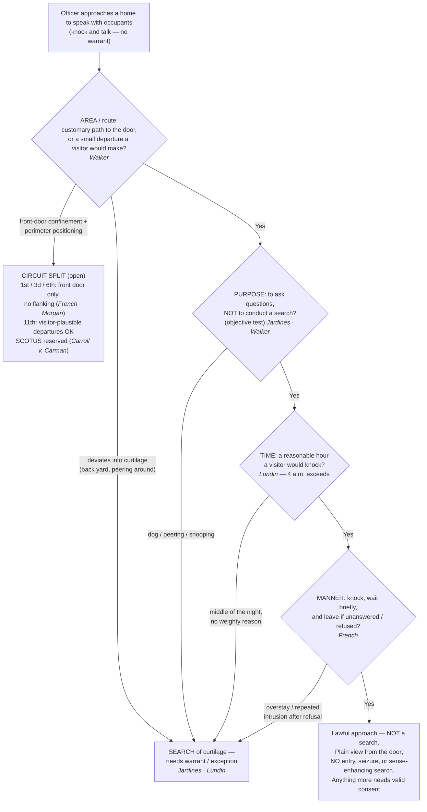

# S9 R1 panel-review — Opus model-diversity lane (prompt pack)

You are the **Claude/Opus** leg of the S9 three-lane adversarial panel (1 Claude + 2 Codex, R1). The two Codex lanes carry the A (support/quote-fidelity) and B (currency/treatment) attack lenses; **you carry model diversity and MUST vote on every paneled assertion across BOTH lenses' concerns.** You are refute-framed: try hard to break each assertion; **default to REFUTED on uncertainty**; never fabricate a cite, quote, or holding; use ONLY the evidence inlined below (no search, no outside knowledge). You are a SIGHTED reviewer — the FULL lake record (judgment fields included) is inlined.

You are a WRITER lane, not an adjudicator: you FIND and VOTE. You do not tally, adjudicate, or close any row — the orchestrator does.

For EACH group below, return one JSON object with the exact `reviewed[]` shape from the output contract (identical framing to the Codex lenses). Emit a finding object ONLY for a real defect (verdict refuted / stands-modified); a group you find wholly clean returns all-`stands` verdicts (the harness records a clean attestation). Concatenate the per-group JSON objects into a top-level `{"packs": [ ... ]}` array, one entry per group, each carrying its `group_id`.


OUTPUT CONTRACT — return ONE JSON object, nothing else:
{
  "lens": "A" | "B",
  "group_id": "<echo the group id>",
  "reviewed": [
    {
      "assertion_id": "<from group_inventory.jsonl>",
      "dimension": "existence|support|quote_fidelity|pincite|treatment|black_letter",
      "verdict": "stands" | "refuted" | "stands-modified",
      "verifiable_from_disclosed": true | false,
      "defect": null,   // null when verdict=="stands"; else an object:
      //  {"problem": "...", "severity": "high|medium|low", "proposed_fix": "...", "evidence_quote": "verbatim from disclosed evidence or null", "needs_cl": true|false, "locator_note": "..."}
      "reasons": ["short evidence-grounded reason", "..."],
      "breaks_true_positives": true | false,
      "residual_risks": ["..."],
      "suggested_tightening": "... or null"
    }
  ],
  "notes": ""
}
Rules: verdict=='stands' <=> defect==null (assertion survives your attack). verdict=='refuted' <=> a real defect (the assertion as framed is wrong). verdict=='stands-modified' <=> survives but needs a stated modification (a minor defect). Review EVERY assertion_id in group_inventory.jsonl exactly once. Output ONLY the JSON object.
---

## GROUP: content/warrant-exceptions/Knock and Talk.md  (`doctrine`, 8 assertions)

### content_page

```
---
weight: 70
aliases:
  - "Knock and Talk"
  - "7-exceptions-warrant/7b-pc-not-needed/Knock-and-Talk"
title: "Knock and Talk"
topic: Knock and Talk
type: doctrine
jurisdiction: Federal (U.S. Const. amend. IV); SCOTUS baseline
status: draft
related: ["[[Consent Searches]]", "[[Curtilage]]", "[[Plain View Doctrine]]", "[[Arrest in the Home]]", "[[Emergency Aid]]", "[[Exigent Circumstances and Hot Pursuit]]", "[[Seizure of the Person]]", "[[Two Definitions of Search]]"]
---

# Knock and Talk

*Am I within the implied license a private visitor would have — in area, purpose, time, and manner?*

> [!rule] Black-letter rule
> A "knock and talk" is not a warrant exception; it is lawful only inside the **implied license** any private visitor has: "approach the home by the front path, knock promptly, wait briefly to be received, and then (absent invitation to linger longer) leave." *[[Florida v. Jardines|Jardines]]*, 569 U.S. 1, [8](https://www.courtlistener.com/opinion/856347/florida-v-jardines/#:~:text=approach%20the%20home%20by%20the%20front%20path) (2013). That license is "limited not only to a particular area but also to a specific purpose," *[[Florida v. Jardines#^pin-9|id.]]* at [9–10](https://www.courtlistener.com/opinion/856347/florida-v-jardines/#:~:text=limited%20not%20only%20to%20a%20particular%20area%20but%20also%20to%20a%20specific%20purpose), so an approach that exceeds it in **area, purpose, time, or manner** is a warrantless **search** of the home's [[Curtilage]]. And the license obligates the occupant to nothing: "the occupant has no obligation to open the door or to speak." *[[Kentucky v. King|King]]*, 563 U.S. 452, [469–70](https://www.courtlistener.com/opinion/216733/kentucky-v-king/#:~:text=the%20occupant%20has%20no%20obligation%20to%20open%20the%20door) (2011).
> ^rule-knock-and-talk

## The Brief

**What the doctrine is, and is not.** The knock-and-talk lets officers do what "the Nation's Girl Scouts and trick-or-treaters" do: walk up, knock, and ask. *[[Florida v. Jardines|Jardines]]*, 569 U.S. at [8](https://www.courtlistener.com/opinion/856347/florida-v-jardines/). It authorizes an **approach**, never a search or an entry. Whatever officers want beyond conversation still requires valid **consent** ([[Consent Searches]]) or an independent exception. Because a physical intrusion onto [[Curtilage]] to gather evidence is itself a search, an approach that leaves the license behind needs a warrant or an exception from the moment it strays. *[[Florida v. Jardines#^pin-6|Jardines]]*, 569 U.S. at [6](https://www.courtlistener.com/opinion/856347/florida-v-jardines/).

**Four dimensions bound the license.** The courts test a knock-and-talk on (1) **area** (the route a visitor would take), (2) **purpose** (a talk, not a search), (3) **time** (hours a visitor would knock), and (4) **manner** (knock, wait briefly, leave). Every limit below is an application of one of the four; the test throughout is **objective** — whether the officer's behavior "objectively reveals a purpose to conduct a search." *[[United States v. Walker#^pin-1363|Walker]]*, 799 F.3d 1361, 1363 (11th Cir. 2015) (quoting *[[Florida v. Jardines|Jardines]]*).

**Area: the customary path, and a "small departure."** The license follows the route a visitor would use: front walk, driveway, porch, the customary point of entry. A **small departure** stays inside it. Approaching the occupant's car in an open carport when seeking to contact him "did not exceed the geographic limit on the knock and talk exception." *[[United States v. Walker#^pin-1364|Walker]]*, 799 F.3d at 1364. Cutting into the back yard, peering around the side, or exploring the [[Curtilage|curtilage]] exceeds it. *[[Florida v. Jardines#^pin-9|Jardines]]*, 569 U.S. at [9](https://www.courtlistener.com/opinion/856347/florida-v-jardines/); *[[United States v. Lundin|Lundin]]*, 817 F.3d 1151, 1159–60 (9th Cir. 2016). Whether officers must **begin at the front door** divides the circuits, and the Supreme Court has expressly declined to decide it. *[[Carroll v. Carman]]*, 574 U.S. 13 (2014) (per curiam) (reversing on qualified-immunity grounds only); see Lower-court developments.

**Purpose: a talk, not a search or a warrantless arrest.** The customary license "is generally limited to the 'purpose of asking questions of the occupants.'" *[[United States v. Lundin#^pin-1159a|Lundin]]*, 817 F.3d at 1159. Bringing a drug dog to the porch to gather evidence breaks it: "There is no customary invitation to do that." *[[Florida v. Jardines#^pin-9|Jardines]]*, 569 U.S. at [9](https://www.courtlistener.com/opinion/856347/florida-v-jardines/). But a lawful knock is conduct "any private citizen might do," and reasonableness is judged objectively, so a bare subjective wish to arrest does not, by itself, void an ordinary knock. *[[Kentucky v. King|King]]*, 563 U.S. at [469](https://www.courtlistener.com/opinion/216733/kentucky-v-king/). The Ninth Circuit reads the license to exclude approaches made with the **objective purpose to arrest** the occupant, *[[United States v. Lundin|Lundin]]*, 817 F.3d at 1160, while the Tenth and Eleventh treat ordinary investigative knock-and-talks as undisturbed by *[[Florida v. Jardines|Jardines]]*; treat purpose-to-arrest as **unsettled** beyond the dog-and-snooping core.

**Time: the hours a visitor would knock.** "[U]nexpected visitors are customarily expected to knock on the front door of a home only during normal waking hours," so a **4 a.m.** knock with no weighty reason exceeded the license. *[[United States v. Lundin#^pin-1159|Lundin]]*, 817 F.3d at 1159. The clock is weighed with everything else: the Eleventh Circuit upheld a **5 a.m.** approach where earlier visits and lights on inside made it reasonable. *[[United States v. Walker#^pin-1364a|Walker]]*, 799 F.3d at 1364. Precision matters when teaching the night-time point: the "middle of the night" passage everyone quotes is from the *[[Florida v. Jardines|Jardines]]* **[[Common Legal Terms#dissenting-opinion|dissent]]**, endorsed in part by the majority's footnote 3 — a default lower courts have built on, not a SCOTUS holding.

**Manner: knock, wait briefly, and leave.** Leaving is part of the license. The First Circuit held that repeated returns to the [[Curtilage|curtilage]] after the occupant refused to answer, capped by a pre-dawn visit with knocking on the bedroom window and a flashlight through the covering, exceeded the license and violated law clearly established by *[[Florida v. Jardines|Jardines]]* itself. *[[French v. Merrill|French]]*, 15 F.4th 116 (1st Cir. 2021), reh'g [[Reading and Citing Cases#en-banc|en banc]] denied, 24 F.4th 93 (2022). "No Trespassing" signs generally do **not** revoke the license on the Tenth Circuit's view: such signs lack any "talismanic" revoking power, judged by what an objective officer would perceive. *[[United States v. Carloss|Carloss]]*, 818 F.3d 988, 995 (10th Cir. 2016) (then-Judge Gorsuch dissenting).

**What a lawful approach yields.** From the lawful vantage, officers may use what they see under the [[Plain View Doctrine]] — including what a flashlight reveals of the *already exposed*, since illumination alone is not a search, *[[Texas v. Brown#^pin-739|Brown]]*, 460 U.S. 730, [739–40](https://www.courtlistener.com/opinion/110901/texas-v-brown/) (1983) (plurality); *[[United States v. Dunn|Dunn]]*, 480 U.S. 294 (1987), though probing the *concealed* is (see the exposure line on [[Plain View Doctrine]]) — and may ask for consent; the encounter stays consensual so long as "a reasonable person would feel free to decline the officers' requests or otherwise terminate the encounter." *[[Florida v. Bostick#^pin-436|Bostick]]*, 501 U.S. 429, [436](https://www.courtlistener.com/opinion/112631/florida-v-bostick/) (1991). Officers need not advise the resident of the right to refuse. *[[United States v. Drayton#^pin-206|Drayton]]*, 536 U.S. 194, [206](https://www.courtlistener.com/opinion/121153/united-states-v-drayton/#:~:text=The%20Court%20has%20rejected%20in) (2002). The approach yields **no entry, no seizure, and no sense-enhancing search**: the automobile exception, for one, does not permit a warrantless entry of the home or its [[Curtilage|curtilage]] to search a vehicle there. *[[Collins v. Virginia|Collins]]*, 584 U.S. 586 (2018).

**The threshold backstops.** The license ends at the door. A warrantless, nonconsensual crossing of the threshold to arrest is presumptively unreasonable, *[[Payton v. New York|Payton]]*, 445 U.S. 573 (1980); see [[Arrest in the Home]], and there is no freestanding community-caretaking power to enter a home, *[[Caniglia v. Strom|Caniglia]]*, 593 U.S. 194 (2021); see [[Emergency Aid]]. A show of authority demanding that occupants open up converts the "talk" into a **seizure**, and any consent it produces is invalid. *[[United States v. Conner|Conner]]*, 127 F.3d 663 (8th Cir. 1997).

**The [[Exigent Circumstances and Hot Pursuit|exigency]] interface.** A lawful knock does not "create" an [[Exigent Circumstances and Hot Pursuit|exigency]], even when it prompts occupants to start destroying evidence; what forfeits the exception is gaining entry "by means of an actual or threatened violation of the Fourth Amendment." *[[Kentucky v. King|King]]*, 563 U.S. at [469](https://www.courtlistener.com/opinion/216733/kentucky-v-king/). The manufactured-[[Exigent Circumstances and Hot Pursuit|exigency]] limit is developed on [[Exigent Circumstances and Hot Pursuit]]. Do not confuse the knock-and-talk with **[[Knock-and-Announce|knock-and-announce]]**, which governs how officers execute a warrant. *[[United States v. Banks|Banks]]*, 540 U.S. 31 (2003); see [[Knock-and-Announce]].

**Burden and remedy.** When the government relies on consent obtained at the door, it must prove the consent was freely and voluntarily given on the [[Common Legal Terms#totality-of-the-circumstances|totality of the circumstances]]; acquiescence to a claim of lawful authority is not enough. *[[Bumper v. North Carolina|Bumper]]*, 391 U.S. 543, [548–49](https://www.courtlistener.com/opinion/107716/bumper-v-north-carolina/) (1968); *[[Schneckloth v. Bustamonte|Schneckloth]]*, 412 U.S. 218 (1973). If the defendant contends the approach itself exceeded the license, the government must show the officers stayed within it. Historical facts are reviewed for [[Common Legal Terms#clear-error|clear error]], the ultimate scope question [[Common Legal Terms#de-novo|de novo]]; the remedy for exceeding the license, or for involuntary consent, is suppression under [[The Exclusionary Rule]].

**Apply it.**
1. **Route** — take the path a visitor would take: front walk to the customary door; a small departure only to contact an occupant you can see (*[[United States v. Walker|Walker]]*).
2. **Hour** — knock during normal waking hours unless specific facts show the resident receives visitors at that hour or the reason is weighty (*[[United States v. Lundin|Lundin]]*; *[[United States v. Walker|Walker]]*).
3. **Conduct** — knock, announce, wait briefly. No dog, and no peering through windows or coverings, with or without a light (*[[Florida v. Jardines|Jardines]]*; *[[French v. Merrill|French]]*).
4. **Purpose** — come to ask questions and seek consent. If your conduct would objectively reveal a search (or the approach exists to effect a warrantless arrest), stop: that is not a knock-and-talk (*[[Florida v. Jardines|Jardines]]*; *[[United States v. Lundin|Lundin]]*).
5. **Exit** — no answer or a refusal means leave. Returning again on the same information invites [[The Exclusionary Rule|suppression]] and civil liability (*[[French v. Merrill|French]]*).
6. **Fruits** — use [[Plain View Doctrine|plain view]] from the lawful vantage; anything more (entry, seizure, enhancement) needs consent or a recognized exception (*[[Collins v. Virginia|Collins]]*; *[[Payton v. New York|Payton]]*).

**Common pitfalls.**
- **Treating "knock and talk" as its own warrant exception.** It is not; without consent or another exception, nothing inside the home is fair game.
- **Straying off the customary route.** Cutting to the back yard, lingering in the [[Curtilage|curtilage]], or bringing a dog to the porch to gather evidence breaks the license (*[[Florida v. Jardines|Jardines]]*; [[Curtilage]]). A flashlight by itself does not: illuminating the exposed is no search (*[[Texas v. Brown|Brown]]*), but flashlight-assisted peering through coverings is strong evidence the license was exceeded (*[[French v. Merrill|French]]*).
- **Knocking in the dead of night.** A middle-of-the-night approach without a weighty, resident-accepted reason exceeds the license in the Ninth Circuit (*[[United States v. Lundin|Lundin]]*), and hour-by-totality circuits still weigh it against you (*[[United States v. Walker|Walker]]*).
- **Overstaying or returning after a refusal.** Repeated intrusion converts the approach into a search (*[[French v. Merrill|French]]*).
- **Reading silence as suspicion or [[Exigent Circumstances and Hot Pursuit|exigency]].** The occupant may refuse to answer, and that refusal supplies neither (*[[Kentucky v. King|King]]*, 563 U.S. at [469–70](https://www.courtlistener.com/opinion/216733/kentucky-v-king/)).
- **Stating a back-door or perimeter rule as settled national law.** Where the approach may begin, and whether flanking officers may hold the perimeter, is a live circuit split the Supreme Court has expressly reserved (*[[Carroll v. Carman]]*; see below).

## Lower-court developments

- ***[[United States v. Lundin|Lundin]]* (9th Cir. 2016)** — *narrows: time + purpose.* A 4 a.m. knock, made with the objective purpose to arrest rather than to ask questions, exceeded the license; the officers' own unlawful knock produced the noises they then cited as [[Exigent Circumstances and Hot Pursuit|exigency]], so *[[Kentucky v. King|King]]* barred reliance on it. 817 F.3d 1151, 1158–60. **Binding in-circuit — 9th Cir.** [opinion](https://www.courtlistener.com/opinion/3187682/united-states-v-eric-lundin/)
- ***[[French v. Merrill|French]]* (1st Cir. 2021)** — *narrows: manner / repeated intrusion.* Repeated returns to the [[Curtilage|curtilage]] after refusal, ending in pre-dawn knocks on a bedroom window with a flashlight, exceeded the license; the violation was clearly established by *[[Florida v. Jardines|Jardines]]* itself, so [[Section 1983 Liability and Qualified Immunity|qualified immunity]] was denied. 15 F.4th 116, reh'g [[Reading and Citing Cases#en-banc|en banc]] denied, 24 F.4th 93 (2022). **Binding in-circuit — 1st Cir.** [opinion](https://www.courtlistener.com/opinion/5273192/french-v-merrill/)
- **Morgan v. Fairfield County (6th Cir. 2018)** — *narrows: perimeter positioning is itself a search.* Five officers ringing the house five to seven feet off its walls during a knock-and-talk invaded the [[Curtilage|curtilage]] beyond any implied license; officers received [[Section 1983 Liability and Qualified Immunity|qualified immunity]], but the county's surround-the-house policy exposed it to municipal liability. 903 F.3d 553. **Binding in-circuit — 6th Cir.** [opinion](https://www.courtlistener.com/opinion/4532978/neil-morgan-v-fairfield-cty-ohio/)
- ***[[United States v. Walker|Walker]]* (11th Cir. 2015)** — *permissive pole: small departures and hour-by-totality.* Approaching the occupant's car in an open carport was a permissible "small departure," and a 5 a.m. knock was reasonable where two earlier visits and interior lights made it so. 799 F.3d at 1363–64. **Binding in-circuit — 11th Cir.** [opinion](https://www.courtlistener.com/opinion/2844024/united-states-v-wayne-walker/)
- ***[[United States v. Carloss|Carloss]]* (10th Cir. 2016)** — *permissive pole: signage.* Posted "No Trespassing" signs, including one on the front door, did not by themselves revoke the license; signs lack "talismanic" revoking power, measured by what an objective officer would perceive. 818 F.3d 988, 995. Then-Judge Gorsuch dissented. The Tennessee Supreme Court reached the same totality-based result in **[[State v. Christensen]]** (Tenn. 2017). **Binding in-circuit — 10th Cir.**; *[[State v. Christensen|Christensen]]*: **Persuasive — state, illustrative.** [opinion](https://www.courtlistener.com/opinion/3184928/united-states-v-carloss/)
- **[[People v. Frederick]] (Mich. 2017)** — *narrows: pre-dawn default.* The implied license is "time-sensitive" and "generally does not extend to predawn approaches"; 4:00 and 5:30 a.m. knock-and-talks were searches. 895 N.W.2d 541. **Persuasive — state, illustrative.** [opinion](https://www.courtlistener.com/opinion/4396951/people-of-michigan-v-michael-christopher-frederick/)

The genuine split is **where the approach may begin and who may stand where**: the First, Third, and Sixth Circuits confine officers to the front-door approach a visitor would make (*[[French v. Merrill|French]]*; *Carman v. Carroll*, 749 F.3d 192 (3d Cir. 2014), rev'd on qualified-immunity grounds sub nom. *[[Carroll v. Carman]]*, 574 U.S. 13 (2014) (per curiam); *Morgan*), while the Eleventh tolerates visitor-plausible departures (*[[United States v. Walker|Walker]]*). The Supreme Court reversed *Carman* without deciding "whether a police officer may conduct a 'knock and talk' at any entrance that is open to visitors rather than only the front door" — the question remains open.

## Key cases

| Case | Holding | Opinion |
|---|---|---|
| *[[Florida v. Jardines]]*, 569 U.S. 1 (2013) | The implied license bounds the approach in **area and purpose**, judged objectively: bringing a drug dog onto the porch to gather evidence was a trespassory search of [[Curtilage\|curtilage]]. | [opinion](https://www.courtlistener.com/opinion/856347/florida-v-jardines/) |
| *[[Kentucky v. King]]*, 563 U.S. 452 (2011) | A lawful knock is conduct "any private citizen might do": it neither obligates the occupant to answer nor manufactures an [[Exigent Circumstances and Hot Pursuit\|exigency]]; entry is forfeited only by an actual or threatened Fourth Amendment violation. | [opinion](https://www.courtlistener.com/opinion/216733/kentucky-v-king/) |

## Related cases across doctrines

| Case | Relevance here | Primary home | Opinion |
|---|---|---|---|
| *[[Florida v. Bostick]]*, 501 U.S. 429 (1991) | ***Boundary.*** The stays-consensual test: the encounter is a seizure only if a reasonable person would not feel free to decline or terminate it. | [[Seizure of the Person]] | [opinion](https://www.courtlistener.com/opinion/112631/florida-v-bostick/) |
| *[[United States v. Drayton]]*, 536 U.S. 194 (2002) | ***Extends.*** Door-step consent can be voluntary though officers never advise of the right to refuse. | [[Seizure of the Person]] | [opinion](https://www.courtlistener.com/opinion/121153/united-states-v-drayton/) |
| *[[Collins v. Virginia]]*, 584 U.S. 586 (2018) | ***Limits.*** No warrant exception licenses the trespass: officers may not enter home or [[Curtilage\|curtilage]] to search a vehicle there. | [[Automobile Exception]] | [opinion](https://www.courtlistener.com/opinion/4501697/collins-v-virginia/) |
| *[[Payton v. New York]]*, 445 U.S. 573 (1980) | ***Boundary.*** The license ends at the threshold: warrantless, nonconsensual in-home arrest is presumptively unreasonable. | [[Arrest in the Home]] | [opinion](https://www.courtlistener.com/opinion/110235/payton-v-new-york/) |
| *[[Caniglia v. Strom]]*, 593 U.S. 194 (2021) | ***Boundary.*** No standalone community-caretaking power supports a warrantless home entry after the knock. | [[Emergency Aid]] | [opinion](https://www.courtlistener.com/opinion/4883694/caniglia-v-strom/) |

## Visual



## Sources

- [*Florida v. Jardines*, 569 U.S. 1 (2013)](https://www.courtlistener.com/opinion/856347/florida-v-jardines/) (pinpoints: 6, 8, 9–10; majority n.3 and the dissent's night-visit passage)
- [*Kentucky v. King*, 563 U.S. 452 (2011)](https://www.courtlistener.com/opinion/216733/kentucky-v-king/) (pinpoints: 462, 469–70)
- [*United States v. Lundin*, 817 F.3d 1151 (9th Cir. 2016)](https://www.courtlistener.com/opinion/3187682/united-states-v-eric-lundin/) (pinpoints: 1158–60)
- [*United States v. Walker*, 799 F.3d 1361 (11th Cir. 2015)](https://www.courtlistener.com/opinion/2844024/united-states-v-wayne-walker/) (pinpoints: 1363–64)
- [*United States v. Carloss*, 818 F.3d 988 (10th Cir. 2016)](https://www.courtlistener.com/opinion/3184928/united-states-v-carloss/) (pinpoint: 995 (Gorsuch, J., dissenting from 1004))
- [*French v. Merrill*, 15 F.4th 116 (1st Cir. 2021)](https://www.courtlistener.com/opinion/5273192/french-v-merrill/) (reh'g en banc denied, 24 F.4th 93 (2022); cert. denied sub nom. *Morse v. French* (2022))
- [*Carroll v. Carman*, 574 U.S. 13 (2014) (per curiam)](https://www.courtlistener.com/opinion/2750102/carroll-v-carman/) (reversing *Carman v. Carroll*, 749 F.3d 192 (3d Cir. 2014), on qualified-immunity grounds and reserving the front-door question)
- [*Morgan v. Fairfield County*, 903 F.3d 553 (6th Cir. 2018)](https://www.courtlistener.com/opinion/4532978/neil-morgan-v-fairfield-cty-ohio/)
- [*People v. Frederick*, 895 N.W.2d 541 (Mich. 2017)](https://www.courtlistener.com/opinion/4396951/people-of-michigan-v-michael-christopher-frederick/)
- [*State v. Christensen*, 517 S.W.3d 60 (Tenn. 2017)](https://www.courtlistener.com/opinion/4381703/state-of-tennessee-v-james-robert-christensen-jr/)
- [*Florida v. Bostick*, 501 U.S. 429 (1991)](https://www.courtlistener.com/opinion/112631/florida-v-bostick/) (pinpoint: 436)
- [*United States v. Drayton*, 536 U.S. 194 (2002)](https://www.courtlistener.com/opinion/121153/united-states-v-drayton/) (pinpoint: 206)
- [*Collins v. Virginia*, 584 U.S. 586 (2018)](https://www.courtlistener.com/opinion/4501697/collins-v-virginia/)
- [*Payton v. New York*, 445 U.S. 573 (1980)](https://www.courtlistener.com/opinion/110235/payton-v-new-york/)
- [*Caniglia v. Strom*, 593 U.S. 194 (2021)](https://www.courtlistener.com/opinion/4883694/caniglia-v-strom/)
- [*Bumper v. North Carolina*, 391 U.S. 543 (1968)](https://www.courtlistener.com/opinion/107716/bumper-v-north-carolina/) (pinpoint: 548–49)
- [*Schneckloth v. Bustamonte*, 412 U.S. 218 (1973)](https://www.courtlistener.com/opinion/108800/schneckloth-v-bustamonte/)
- [*United States v. Conner*, 127 F.3d 663 (8th Cir. 1997)](https://www.courtlistener.com/opinion/747208/united-states-v-larry-duane-conner-united-states-of-america-v-john/)
- [*United States v. Banks*, 540 U.S. 31 (2003)](https://www.courtlistener.com/opinion/131146/united-states-v-banks/)
- [*United States v. Meyer* (8th Cir. 2021)](https://www.courtlistener.com/opinion/5302394/united-states-v-william-meyer/) (the manufactured-exigency application, developed on [[Exigent Circumstances and Hot Pursuit]])

```

### group_inventory (assertions under review)

```jsonl
{"assertion_id": "168bbf3adc64940f", "dimension": "existence", "kind": "case_cite", "locator": {"case": "Kentucky v. King", "table_line": 64}, "payload": {"case": "Kentucky v. King", "cells": ["*[[Kentucky v. King]]*, 563 U.S. 452 (2011)", "A lawful knock is conduct \"any private citizen might do\": it neither obligates the occupant to answer nor manufactures an [[Exigent Circumstances and Hot Pursuit\\|exigency]]; entry is forfeited only by an actual or threatened Fourth Amendment violation.", "[opinion](https://www.courtlistener.com/opinion/216733/kentucky-v-king/)"], "header": ["Case", "Holding", "Opinion"]}}
{"assertion_id": "22e02699f03ce2cd", "dimension": "existence", "kind": "case_cite", "locator": {"case": "United States v. Drayton", "table_line": 71}, "payload": {"case": "United States v. Drayton", "cells": ["*[[United States v. Drayton]]*, 536 U.S. 194 (2002)", "***Extends.*** Door-step consent can be voluntary though officers never advise of the right to refuse.", "[[Seizure of the Person]]", "[opinion](https://www.courtlistener.com/opinion/121153/united-states-v-drayton/)"], "header": ["Case", "Relevance here", "Primary home", "Opinion"]}}
{"assertion_id": "775c06df7ff0f52a", "dimension": "existence", "kind": "case_cite", "locator": {"case": "Florida v. Jardines", "table_line": 63}, "payload": {"case": "Florida v. Jardines", "cells": ["*[[Florida v. Jardines]]*, 569 U.S. 1 (2013)", "The implied license bounds the approach in **area and purpose**, judged objectively: bringing a drug dog onto the porch to gather evidence was a trespassory search of [[Curtilage\\|curtilage]].", "[opinion](https://www.courtlistener.com/opinion/856347/florida-v-jardines/)"], "header": ["Case", "Holding", "Opinion"]}}
{"assertion_id": "8ad9b31a94f33321", "dimension": "existence", "kind": "case_cite", "locator": {"case": "Florida v. Bostick", "table_line": 70}, "payload": {"case": "Florida v. Bostick", "cells": ["*[[Florida v. Bostick]]*, 501 U.S. 429 (1991)", "***Boundary.*** The stays-consensual test: the encounter is a seizure only if a reasonable person would not feel free to decline or terminate it.", "[[Seizure of the Person]]", "[opinion](https://www.courtlistener.com/opinion/112631/florida-v-bostick/)"], "header": ["Case", "Relevance here", "Primary home", "Opinion"]}}
{"assertion_id": "8ca55b30c3ae7b93", "dimension": "existence", "kind": "case_cite", "locator": {"case": "Caniglia v. Strom", "table_line": 74}, "payload": {"case": "Caniglia v. Strom", "cells": ["*[[Caniglia v. Strom]]*, 593 U.S. 194 (2021)", "***Boundary.*** No standalone community-caretaking power supports a warrantless home entry after the knock.", "[[Emergency Aid]]", "[opinion](https://www.courtlistener.com/opinion/4883694/caniglia-v-strom/)"], "header": ["Case", "Relevance here", "Primary home", "Opinion"]}}
{"assertion_id": "8fe828eb686fe139", "dimension": "existence", "kind": "case_cite", "locator": {"case": "Collins v. Virginia", "table_line": 72}, "payload": {"case": "Collins v. Virginia", "cells": ["*[[Collins v. Virginia]]*, 584 U.S. 586 (2018)", "***Limits.*** No warrant exception licenses the trespass: officers may not enter home or [[Curtilage\\|curtilage]] to search a vehicle there.", "[[Automobile Exception]]", "[opinion](https://www.courtlistener.com/opinion/4501697/collins-v-virginia/)"], "header": ["Case", "Relevance here", "Primary home", "Opinion"]}}
{"assertion_id": "fb8612d34eca4b4d", "dimension": "existence", "kind": "case_cite", "locator": {"case": "Payton v. New York", "table_line": 73}, "payload": {"case": "Payton v. New York", "cells": ["*[[Payton v. New York]]*, 445 U.S. 573 (1980)", "***Boundary.*** The license ends at the threshold: warrantless, nonconsensual in-home arrest is presumptively unreasonable.", "[[Arrest in the Home]]", "[opinion](https://www.courtlistener.com/opinion/110235/payton-v-new-york/)"], "header": ["Case", "Relevance here", "Primary home", "Opinion"]}}
{"assertion_id": "bafe38a536ac0a9c", "dimension": "support", "kind": "proposition", "locator": {"callout": "^rule-knock-and-talk"}, "payload": {"anchor": "^rule-knock-and-talk", "statement": "[!rule] Black-letter rule\nA \"knock and talk\" is not a warrant exception; it is lawful only inside the **implied license** any private visitor has: \"approach the home by the front path, knock promptly, wait briefly to be received, and then (absent invitation to linger longer) leave.\" *[[Florida v. Jardines|Jardines]]*, 569 U.S. 1, [8](https://www.courtlistener.com/opinion/856347/florida-v-jardines/#:~:text=approach%20the%20home%20by%20the%20front%20path) (2013). That license is \"limited not only to a particular area but also to a specific purpose,\" *[[Florida v. Jardines#^pin-9|id.]]* at [9–10](https://www.courtlistener.com/opinion/856347/florida-v-jardines/#:~:text=limited%20not%20only%20to%20a%20particular%20area%20but%20also%20to%20a%20specific%20purpose), so an approach that exceeds it in **area, purpose, time, or manner** is a warrantless **search** of the home's [[Curtilage]]. And the license obligates the occupant to nothing: \"the occupant has no obligation to open the door or to speak.\" *[[Kentucky v. King|King]]*, 563 U.S. 452, [469–70](https://www.courtlistener.com/opinion/216733/kentucky-v-king/#:~:text=the%20occupant%20has%20no%20obligation%20to%20open%20the%20door) (2011)."}}
```

### lake record — Caniglia v. Strom

```json
{
  "schema_version": "s2.v1",
  "record_id": "Caniglia v. Strom",
  "stub": false,
  "status": "verified",
  "identity": {
    "case_name": "Caniglia v. Strom",
    "case_name_short": "Caniglia",
    "case_name_full": "",
    "input_case_name": "Caniglia v. Strom",
    "court": "U.S. Supreme Court",
    "court_id": "scotus",
    "court_level": "scotus",
    "circuit": null,
    "state": null,
    "date_decided": "2021-05-17",
    "year": 2021,
    "docket": "20-157",
    "cluster_id": 4883694,
    "lead_opinion_id": 4687473,
    "sibling_ids": [
      4687473
    ],
    "absolute_url": "/opinion/4883694/caniglia-v-strom/",
    "identity_method": "citation+party-text",
    "expected_citation_found": true,
    "party_name_in_text": true,
    "canonical_name_match": true,
    "alternates": [],
    "reason_code": null
  },
  "citations": {
    "official": {
      "cite": "593 U.S. 194",
      "volume": "593",
      "reporter": "U.S.",
      "page": "194",
      "type": 1,
      "selected_official": true,
      "source": "cluster.citations[]"
    },
    "parallel": [
      {
        "cite": "209 L. Ed. 2d 604",
        "volume": "209",
        "reporter": "L. Ed. 2d",
        "page": "604",
        "type": 1,
        "selected_official": false,
        "source": "cluster.citations[]"
      },
      {
        "cite": "141 S. Ct. 1596",
        "volume": "141",
        "reporter": "S. Ct.",
        "page": "1596",
        "type": 1,
        "selected_official": false,
        "source": "cluster.citations[]"
      }
    ],
    "vendor_neutral": [],
    "all": [
      {
        "cite": "593 U.S. 194",
        "volume": "593",
        "reporter": "U.S.",
        "page": "194",
        "type": 1,
        "selected_official": false,
        "source": "cluster.citations[]"
      },
      {
        "cite": "209 L. Ed. 2d 604",
        "volume": "209",
        "reporter": "L. Ed. 2d",
        "page": "604",
        "type": 1,
        "selected_official": false,
        "source": "cluster.citations[]"
      },
      {
        "cite": "141 S. Ct. 1596",
        "volume": "141",
        "reporter": "S. Ct.",
        "page": "1596",
        "type": 1,
        "selected_official": false,
        "source": "cluster.citations[]"
      }
    ],
    "display": "593 U.S. 194",
    "official_selection": {
      "court_class": "scotus",
      "selected": "593 U.S. 194",
      "reason": "selected_rank_1"
    }
  },
  "pinpoints": [
    {
      "id": "pin-op3",
      "page": null,
      "quote": "exception drawn from *Cady v. Dombrowski*. ## Issue Whether the community-caretaking rationale of *Cady v. Dombrowski* creates a standalone exception authorizing warrantless entry into and seizures within the home. ## Rule There is no such freestanding exception:",
      "star_marker": null,
      "quote_fidelity": "mismatch",
      "pinpoint_status": "slip-only",
      "position": null
    },
    {
      "id": "pin-op4",
      "page": null,
      "quote": "Neither the holding nor logic of *Cady* justified that approach. True, *Cady* also involved a warrantless search for a firearm. But the location of that search was an impounded vehicle \u2014 not a home \u2014 'a constitutional difference' that the opinion repeatedly stressed.",
      "star_marker": null,
      "quote_fidelity": "mismatch",
      "pinpoint_status": "slip-only",
      "position": null
    }
  ],
  "treatment": {
    "field_i_validity": "good_law",
    "as_of_content": "2021-05-17",
    "as_of_treatment": "2026-06-30",
    "composite_basis": "migration-seed",
    "composite_basis_ref": "Caniglia v. Strom",
    "varies_by_point": false,
    "scope_note": "Old as_of seeds as_of_treatment; S2 derivation re-derives and may downgrade.",
    "point_overrides": [],
    "edges": [
      {
        "citing_case": {
          "name": "Torcivia v. Suffolk County, New York",
          "cluster_id": 5295971,
          "cite": [
            "17 F.4th 342"
          ],
          "field_ii": "criticized"
        },
        "field_ii": "criticized",
        "field_iii": "mentioned",
        "point": null,
        "proposed": true,
        "journal_ref": "Caniglia v. Strom:lane2_top_cited"
      },
      {
        "citing_case": {
          "name": "James Williams v. Brian Maurer",
          "cluster_id": 4958226,
          "cite": [
            "9 F.4th 416"
          ],
          "field_ii": "questioned"
        },
        "field_ii": "questioned",
        "field_iii": "mentioned",
        "point": null,
        "proposed": true,
        "journal_ref": "Caniglia v. Strom:lane2_top_cited"
      },
      {
        "citing_case": {
          "name": "Teresa Graham v. Shannon Barnette",
          "cluster_id": 4900401,
          "cite": [
            "5 F.4th 872"
          ],
          "field_ii": "overruled"
        },
        "field_ii": "overruled",
        "field_iii": "mentioned",
        "point": null,
        "proposed": true,
        "journal_ref": "Caniglia v. Strom:lane2_top_cited"
      },
      {
        "citing_case": {
          "name": "People v. Aljohani",
          "cluster_id": 6478244,
          "cite": [
            "463 Ill. Dec. 764",
            "211 N.E.3d 325",
            "2022 IL 127037"
          ],
          "field_ii": "abrogated"
        },
        "field_ii": "abrogated",
        "field_iii": "mentioned",
        "point": null,
        "proposed": true,
        "journal_ref": "Caniglia v. Strom:lane2_top_cited"
      },
      {
        "citing_case": {
          "name": "Brittany J. Buckley v. Hennepin County",
          "cluster_id": 4957820,
          "cite": [
            "9 F.4th 757"
          ],
          "field_ii": "questioned"
        },
        "field_ii": "questioned",
        "field_iii": "mentioned",
        "point": null,
        "proposed": true,
        "journal_ref": "Caniglia v. Strom:lane2_top_cited"
      },
      {
        "citing_case": {
          "name": "United States v. Gregory Rogers",
          "cluster_id": 9492473,
          "cite": [
            "97 F.4th 1038"
          ],
          "field_ii": "abrogated"
        },
        "field_ii": "abrogated",
        "field_iii": "mentioned",
        "point": null,
        "proposed": true,
        "journal_ref": "Caniglia v. Strom:lane2_top_cited"
      },
      {
        "citing_case": {
          "name": "State of Maine v. Bruce Akers",
          "cluster_id": 5093384,
          "cite": [
            "259 A.3d 127",
            "2021 ME 43"
          ],
          "field_ii": "questioned"
        },
        "field_ii": "questioned",
        "field_iii": "mentioned",
        "point": null,
        "proposed": true,
        "journal_ref": "Caniglia v. Strom:lane2_top_cited"
      },
      {
        "citing_case": {
          "name": "United States v. Russell Taylor",
          "cluster_id": 9386597,
          "cite": [
            "63 F.4th 637"
          ],
          "field_ii": "questioned"
        },
        "field_ii": "questioned",
        "field_iii": "mentioned",
        "point": null,
        "proposed": true,
        "journal_ref": "Caniglia v. Strom:lane2_top_cited"
      },
      {
        "citing_case": {
          "name": "United States v. Kenneth Sanders",
          "cluster_id": 4900399,
          "cite": [
            "4 F.4th 672"
          ],
          "field_ii": "abrogated"
        },
        "field_ii": "abrogated",
        "field_iii": "mentioned",
        "point": null,
        "proposed": true,
        "journal_ref": "Caniglia v. Strom:lane2_top_cited"
      },
      {
        "citing_case": {
          "name": "People v. Hagestedt",
          "cluster_id": 10328364,
          "cite": [
            "2025 IL 130286"
          ],
          "field_ii": "overruled"
        },
        "field_ii": "overruled",
        "field_iii": "mentioned",
        "point": null,
        "proposed": true,
        "journal_ref": "Caniglia v. Strom:lane2_top_cited"
      },
      {
        "citing_case": {
          "name": "United States v. Guerrero",
          "cluster_id": 5303613,
          "cite": [
            "19 F.4th 547"
          ],
          "field_ii": "overruled"
        },
        "field_ii": "overruled",
        "field_iii": "mentioned",
        "point": null,
        "proposed": true,
        "journal_ref": "Caniglia v. Strom:lane2_top_cited"
      },
      {
        "citing_case": {
          "name": "United States v. Jaron Howard Morgan",
          "cluster_id": 9409483,
          "cite": [
            "71 F.4th 540"
          ],
          "field_ii": "questioned"
        },
        "field_ii": "questioned",
        "field_iii": "mentioned",
        "point": null,
        "proposed": true,
        "journal_ref": "Caniglia v. Strom:lane2_top_cited"
      },
      {
        "citing_case": {
          "name": "Richard Clemons v. John Couch",
          "cluster_id": 4898166,
          "cite": [
            "3 F.4th 897"
          ],
          "field_ii": "questioned"
        },
        "field_ii": "questioned",
        "field_iii": "mentioned",
        "point": null,
        "proposed": true,
        "journal_ref": "Caniglia v. Strom:lane2_top_cited"
      },
      {
        "citing_case": {
          "name": "Bakutis v. Dean",
          "cluster_id": 10339329,
          "cite": [
            "129 F.4th 299"
          ],
          "field_ii": "questioned"
        },
        "field_ii": "questioned",
        "field_iii": "mentioned",
        "point": null,
        "proposed": true,
        "journal_ref": "Caniglia v. Strom:lane2_top_cited"
      },
      {
        "citing_case": {
          "name": "State v. W. Case",
          "cluster_id": 10032858,
          "cite": [
            "553 P.3d 985",
            "417 Mont. 354",
            "2024 MT 165"
          ],
          "field_ii": "questioned"
        },
        "field_ii": "questioned",
        "field_iii": "mentioned",
        "point": null,
        "proposed": true,
        "journal_ref": "Caniglia v. Strom:lane2_top_cited"
      },
      {
        "citing_case": {
          "name": "Com. v. Edgin, M.",
          "cluster_id": 10316123,
          "cite": [
            "273 A.3d 573",
            "2022 Pa. Super. 49"
          ],
          "field_ii": "questioned"
        },
        "field_ii": "questioned",
        "field_iii": "mentioned",
        "point": null,
        "proposed": true,
        "journal_ref": "Caniglia v. Strom:lane2_top_cited"
      },
      {
        "citing_case": {
          "name": "United States v. Giambro",
          "cluster_id": 10314463,
          "cite": [
            "126 F.4th 46"
          ],
          "field_ii": "overruled"
        },
        "field_ii": "overruled",
        "field_iii": "mentioned",
        "point": null,
        "proposed": true,
        "journal_ref": "Caniglia v. Strom:lane2_top_cited"
      },
      {
        "citing_case": {
          "name": "State v. Grassrope",
          "cluster_id": 9508066,
          "cite": [
            "970 N.W.2d 558",
            "2022 S.D. 10"
          ],
          "field_ii": "questioned"
        },
        "field_ii": "questioned",
        "field_iii": "mentioned",
        "point": null,
        "proposed": true,
        "journal_ref": "Caniglia v. Strom:lane2_top_cited"
      },
      {
        "citing_case": {
          "name": "Tidwell v. State",
          "cluster_id": 10367697,
          "cite": [
            "863 S.E.2d 127",
            "312 Ga. 459"
          ],
          "field_ii": "questioned"
        },
        "field_ii": "questioned",
        "field_iii": "mentioned",
        "point": null,
        "proposed": true,
        "journal_ref": "Caniglia v. Strom:lane2_top_cited"
      },
      {
        "citing_case": {
          "name": "State v. Tran",
          "cluster_id": 9479664,
          "cite": [
            "545 P.3d 248",
            "2024 UT 7"
          ],
          "field_ii": "abrogated"
        },
        "field_ii": "abrogated",
        "field_iii": "mentioned",
        "point": null,
        "proposed": true,
        "journal_ref": "Caniglia v. Strom:lane2_top_cited"
      },
      {
        "citing_case": {
          "name": "United States v. Antoine Maxwell",
          "cluster_id": 9455466,
          "cite": [
            "89 F.4th 671"
          ],
          "field_ii": "questioned"
        },
        "field_ii": "questioned",
        "field_iii": "mentioned",
        "point": null,
        "proposed": true,
        "journal_ref": "Caniglia v. Strom:lane2_top_cited"
      },
      {
        "citing_case": {
          "name": "United States v. Alexander Treisman",
          "cluster_id": 9409277,
          "cite": [
            "71 F.4th 225"
          ],
          "field_ii": "criticized"
        },
        "field_ii": "criticized",
        "field_iii": "mentioned",
        "point": null,
        "proposed": true,
        "journal_ref": "Caniglia v. Strom:lane2_top_cited"
      },
      {
        "citing_case": {
          "name": "State of Delaware v. McKenzie S. Beasley",
          "cluster_id": 10876355,
          "cite": null,
          "field_ii": "questioned"
        },
        "field_ii": "questioned",
        "field_iii": "mentioned",
        "point": null,
        "proposed": true,
        "journal_ref": "Caniglia v. Strom:lane2_top_cited"
      }
    ],
    "derivation": {
      "lane1_negative": {
        "query": "cites:(4687473) AND (overrul* OR abrogat* OR supersed* OR \"recede from\" OR \"no longer good law\" OR vacat* OR reversed) ",
        "reviewed": 52,
        "cap": 200,
        "cap_hit": false,
        "final_cursor": null,
        "audit_needed": false,
        "proposed_negative_events": 0,
        "audit_marker": null,
        "triage_mode": "snippet-first",
        "snippet_field": "results[].opinions[].snippet",
        "triage_journaled": 52,
        "triage_read": 0,
        "triage_snippet_classified": 52
      },
      "lane2_top_cited": {
        "query": "cites:(4687473)",
        "reviewed": 25,
        "cap": 25,
        "cap_hit": true,
        "final_cursor": "https://www.courtlistener.com/api/rest/v4/search/?cursor=cz0wJnM9MTAwODg2MzYmdD1vJmQ9MjAyNi0wNy0wNCZwPTM%3D&order_by=citeCount+desc&page_size=25&q=cites%3A%284687473%29&type=o",
        "audit_needed": true,
        "proposed_negative_events": 23,
        "audit_marker": "R15 treatment audit required"
      },
      "lane3_recency": {
        "query": "cites:(4687473)",
        "reviewed": 27,
        "cap": 200,
        "cap_hit": false,
        "final_cursor": null,
        "audit_needed": false,
        "proposed_negative_events": 0,
        "audit_marker": null,
        "triage_mode": "snippet-first",
        "snippet_field": "results[].opinions[].snippet",
        "triage_journaled": 27,
        "triage_read": 0,
        "triage_snippet_classified": 27
      }
    }
  },
  "progeny": {
    "complete_query": "cites:(4687473)",
    "indexed_citing_opinions": 62,
    "count_source": "search",
    "per_sibling": [
      {
        "opinion_id": 4687473,
        "count": 62,
        "count_source": "search"
      }
    ],
    "citation_count": 154,
    "cache_path": "/Users/johngalt/cssi-lake/cache/progeny/caniglia-v-strom.jsonl",
    "enumeration": "bounded",
    "cursor": "https://www.courtlistener.com/api/rest/v4/search/?cursor=cz0xLjgzNjU3NSZzPTk0MTUwODUmdD1vJmQ9MjAyNi0wNy0wNCZwPTI%3D&order_by=score+desc&page_size=100&q=cites%3A%284687473%29&type=o",
    "rows_cached": 20,
    "outbound_opinion_edges": [
      {
        "source_opinion_id": 4687473,
        "cited_id": 96405,
        "source": "search.opinions[].cites[]"
      },
      {
        "source_opinion_id": 4687473,
        "cited_id": 110067,
        "source": "search.opinions[].cites[]"
      },
      {
        "source_opinion_id": 4687473,
        "cited_id": 856347,
        "source": "search.opinions[].cites[]"
      },
      {
        "source_opinion_id": 4687473,
        "cited_id": 858288,
        "source": "search.opinions[].cites[]"
      },
      {
        "source_opinion_id": 4687473,
        "cited_id": 2801435,
        "source": "search.opinions[].cites[]"
      },
      {
        "source_opinion_id": 4687473,
        "cited_id": 4516423,
        "source": "search.opinions[].cites[]"
      },
      {
        "source_opinion_id": 4687473,
        "cited_id": 9413217,
        "source": "search.opinions[].cites[]"
      },
      {
        "source_opinion_id": 4687473,
        "cited_id": 9422640,
        "source": "search.opinions[].cites[]"
      },
      {
        "source_opinion_id": 4687473,
        "cited_id": 9423434,
        "source": "search.opinions[].cites[]"
      },
      {
        "source_opinion_id": 4687473,
        "cited_id": 9424643,
        "source": "search.opinions[].cites[]"
      },
      {
        "source_opinion_id": 4687473,
        "cited_id": 9425411,
        "source": "search.opinions[].cites[]"
      },
      {
        "source_opinion_id": 4687473,
        "cited_id": 9426490,
        "source": "search.opinions[].cites[]"
      },
      {
        "source_opinion_id": 4687473,
        "cited_id": 9427218,
        "source": "search.opinions[].cites[]"
      },
      {
        "source_opinion_id": 4687473,
        "cited_id": 9427279,
        "source": "search.opinions[].cites[]"
      },
      {
        "source_opinion_id": 4687473,
        "cited_id": 9427853,
        "source": "search.opinions[].cites[]"
      },
      {
        "source_opinion_id": 4687473,
        "cited_id": 9429413,
        "source": "search.opinions[].cites[]"
      },
      {
        "source_opinion_id": 4687473,
        "cited_id": 9431979,
        "source": "search.opinions[].cites[]"
      },
      {
        "source_opinion_id": 4687473,
        "cited_id": 9432531,
        "source": "search.opinions[].cites[]"
      },
      {
        "source_opinion_id": 4687473,
        "cited_id": 9434949,
        "source": "search.opinions[].cites[]"
      },
      {
        "source_opinion_id": 4687473,
        "cited_id": 9441559,
        "source": "search.opinions[].cites[]"
      },
      {
        "source_opinion_id": 4687473,
        "cited_id": 9842006,
        "source": "search.opinions[].cites[]"
      }
    ]
  },
  "off_cl_links": [],
  "provenance": {
    "cl_source": "C",
    "cl_api": "https://www.courtlistener.com/api/rest/v4",
    "built_by": "S2-BUILDER-AUTHORING",
    "build_run": "s2-build-96d841cbb12e",
    "date_created": "2026-07-04T23:28:44Z",
    "date_modified": "2026-07-06T10:25:11Z",
    "warnings": [
      "legacy treatment migrated: good -> good_law"
    ],
    "field_provenance": {
      "identity": {
        "src": "CourtListener search + clusters + lead opinion text",
        "at": "2026-07-04T23:29:01Z",
        "verifier": "S2-BUILDER-AUTHORING"
      },
      "treatment.field_i_validity": {
        "src": "_treatment-migration.json + page frontmatter",
        "at": "2026-07-04T23:29:01Z",
        "verifier": "S2-BUILDER-AUTHORING"
      },
      "point_overrides": {
        "src": "S2 treatment derivation proposed only",
        "at": "2026-07-04T23:32:02Z",
        "verifier": "S2-BUILDER-AUTHORING"
      },
      "pinpoints": {
        "src": "content page quote harvest + lead opinion text",
        "at": "2026-07-04T23:29:01Z",
        "verifier": "S2-BUILDER-AUTHORING"
      }
    }
  }
}

```

### lake record — Collins v. Virginia

```json
{
  "schema_version": "s2.v1",
  "record_id": "Collins v. Virginia",
  "stub": false,
  "status": "verified",
  "identity": {
    "case_name": "Collins v. Virginia",
    "case_name_short": "Collins",
    "case_name_full": "",
    "input_case_name": "Collins v. Virginia",
    "court": "U.S. Supreme Court",
    "court_id": "scotus",
    "court_level": "scotus",
    "circuit": null,
    "state": null,
    "date_decided": "2018-05-29",
    "year": 2018,
    "docket": "16-1027",
    "cluster_id": 4501697,
    "lead_opinion_id": 4278950,
    "sibling_ids": [
      4278950
    ],
    "absolute_url": "/opinion/4501697/collins-v-virginia/",
    "identity_method": "citation+party-text",
    "expected_citation_found": true,
    "party_name_in_text": true,
    "canonical_name_match": true,
    "alternates": [],
    "reason_code": null
  },
  "citations": {
    "official": {
      "cite": "584 U.S. 586",
      "volume": "584",
      "reporter": "U.S.",
      "page": "586",
      "type": 1,
      "selected_official": true,
      "source": "cluster.citations[]"
    },
    "parallel": [
      {
        "cite": "138 S. Ct. 1663",
        "volume": "138",
        "reporter": "S. Ct.",
        "page": "1663",
        "type": 1,
        "selected_official": false,
        "source": "cluster.citations[]"
      },
      {
        "cite": "201 L. Ed. 2d 9",
        "volume": "201",
        "reporter": "L. Ed. 2d",
        "page": "9",
        "type": 1,
        "selected_official": false,
        "source": "cluster.citations[]"
      }
    ],
    "vendor_neutral": [
      {
        "cite": "2018 U.S. LEXIS 3210",
        "volume": "2018",
        "reporter": "U.S. LEXIS",
        "page": "3210",
        "type": 6,
        "selected_official": false,
        "source": "cluster.citations[]"
      }
    ],
    "all": [
      {
        "cite": "584 U.S. 586",
        "volume": "584",
        "reporter": "U.S.",
        "page": "586",
        "type": 1,
        "selected_official": false,
        "source": "cluster.citations[]"
      },
      {
        "cite": "138 S. Ct. 1663",
        "volume": "138",
        "reporter": "S. Ct.",
        "page": "1663",
        "type": 1,
        "selected_official": false,
        "source": "cluster.citations[]"
      },
      {
        "cite": "201 L. Ed. 2d 9",
        "volume": "201",
        "reporter": "L. Ed. 2d",
        "page": "9",
        "type": 1,
        "selected_official": false,
        "source": "cluster.citations[]"
      },
      {
        "cite": "2018 U.S. LEXIS 3210",
        "volume": "2018",
        "reporter": "U.S. LEXIS",
        "page": "3210",
        "type": 6,
        "selected_official": false,
        "source": "cluster.citations[]"
      }
    ],
    "display": "584 U.S. 586",
    "official_selection": {
      "court_class": "scotus",
      "selected": "584 U.S. 586",
      "reason": "selected_rank_1"
    }
  },
  "pinpoints": [
    {
      "id": "pin-op14",
      "page": null,
      "quote": "--- # Collins v. Virginia *584 U.S. 586 (2018)* \u00b7 U.S. Supreme Court \u00b7 **Binding \u2014 SCOTUS** \u00b7 Treatment: **good** *(as of 2026-06-30)* <!-- header line; TreatmentBadge + weight render here, degrading to the text above --> ## Background An officer investigating a distinctive orange-and-black motorcycle suspected of eluding police walked up the driveway of Collins's house to a parking patio partly enclosed by the home, pulled back a tarp covering the motorcycle, ran the plates, and confirmed it was stolen \u2014 all without a warrant. Collins moved to suppress, and the Virginia Supreme Court upheld the search under the automobile exception. ## Issue Whether the automobile exception permits an officer, without a warrant, to enter the curtilage of a home to search a vehicle parked there. ## Rule No.",
      "star_marker": null,
      "quote_fidelity": "mismatch",
      "pinpoint_status": "slip-only",
      "position": null
    }
  ],
  "treatment": {
    "field_i_validity": "good_law",
    "as_of_content": "2018-05-29",
    "as_of_treatment": "2026-06-30",
    "composite_basis": "migration-seed",
    "composite_basis_ref": "Collins v. Virginia",
    "varies_by_point": false,
    "scope_note": "Old as_of seeds as_of_treatment; S2 derivation re-derives and may downgrade.",
    "point_overrides": [],
    "edges": [
      {
        "citing_case": {
          "name": "LaCour v. Marshalls of California",
          "cluster_id": 10765564,
          "cite": null,
          "field_ii": "overruled"
        },
        "field_ii": "overruled",
        "field_iii": "mentioned",
        "point": null,
        "proposed": true,
        "journal_ref": "Collins v. Virginia:lane1_negative"
      },
      {
        "citing_case": {
          "name": "Commonwealth v. Wittey",
          "cluster_id": 9404034,
          "cite": null,
          "field_ii": "superseded_by_statute"
        },
        "field_ii": "superseded_by_statute",
        "field_iii": "mentioned",
        "point": null,
        "proposed": true,
        "journal_ref": "Collins v. Virginia:lane1_negative"
      },
      {
        "citing_case": {
          "name": "Commonwealth v. Chesney",
          "cluster_id": 4536724,
          "cite": [
            "196 A.3d 253"
          ],
          "field_ii": "overruled"
        },
        "field_ii": "overruled",
        "field_iii": "mentioned",
        "point": null,
        "proposed": true,
        "journal_ref": "Collins v. Virginia:lane1_negative"
      },
      {
        "citing_case": {
          "name": "Garza v. Idaho",
          "cluster_id": 4594419,
          "cite": [
            "586 U.S. 232",
            "139 S. Ct. 738",
            "203 L. Ed. 2d 77",
            "2019 U.S. LEXIS 1596"
          ],
          "field_ii": "overruled"
        },
        "field_ii": "overruled",
        "field_iii": "mentioned",
        "point": null,
        "proposed": true,
        "journal_ref": "Collins v. Virginia:lane2_top_cited"
      },
      {
        "citing_case": {
          "name": "United States v. Anthony Caldwell",
          "cluster_id": 4904976,
          "cite": [
            "7 F.4th 191"
          ],
          "field_ii": "overruled"
        },
        "field_ii": "overruled",
        "field_iii": "mentioned",
        "point": null,
        "proposed": true,
        "journal_ref": "Collins v. Virginia:lane2_top_cited"
      },
      {
        "citing_case": {
          "name": "Pacheco v. State",
          "cluster_id": 10048657,
          "cite": [
            "465 Md. 311"
          ],
          "field_ii": "questioned"
        },
        "field_ii": "questioned",
        "field_iii": "mentioned",
        "point": null,
        "proposed": true,
        "journal_ref": "Collins v. Virginia:lane2_top_cited"
      },
      {
        "citing_case": {
          "name": "Commonwealth v. Alexis",
          "cluster_id": 4573870,
          "cite": [
            "112 N.E.3d 796",
            "481 Mass. 91"
          ],
          "field_ii": "abrogated"
        },
        "field_ii": "abrogated",
        "field_iii": "mentioned",
        "point": null,
        "proposed": true,
        "journal_ref": "Collins v. Virginia:lane2_top_cited"
      },
      {
        "citing_case": {
          "name": "Soukaneh v. Andrzejewski",
          "cluster_id": 10038252,
          "cite": [
            "112 F.4th 107"
          ],
          "field_ii": "questioned"
        },
        "field_ii": "questioned",
        "field_iii": "mentioned",
        "point": null,
        "proposed": true,
        "journal_ref": "Collins v. Virginia:lane2_top_cited"
      },
      {
        "citing_case": {
          "name": "United States v. Lewis",
          "cluster_id": 9385343,
          "cite": [
            "62 F.4th 733"
          ],
          "field_ii": "questioned"
        },
        "field_ii": "questioned",
        "field_iii": "mentioned",
        "point": null,
        "proposed": true,
        "journal_ref": "Collins v. Virginia:lane2_top_cited"
      },
      {
        "citing_case": {
          "name": "United States v. Raheim Trice",
          "cluster_id": 4769607,
          "cite": [
            "966 F.3d 506"
          ],
          "field_ii": "questioned"
        },
        "field_ii": "questioned",
        "field_iii": "mentioned",
        "point": null,
        "proposed": true,
        "journal_ref": "Collins v. Virginia:lane2_top_cited"
      },
      {
        "citing_case": {
          "name": "Alexander v. City of Syracuse",
          "cluster_id": 10356512,
          "cite": [
            "132 F.4th 129"
          ],
          "field_ii": "questioned"
        },
        "field_ii": "questioned",
        "field_iii": "mentioned",
        "point": null,
        "proposed": true,
        "journal_ref": "Collins v. Virginia:lane2_top_cited"
      },
      {
        "citing_case": {
          "name": "United States v. Suggs",
          "cluster_id": 4888422,
          "cite": [
            "998 F.3d 1125"
          ],
          "field_ii": "questioned"
        },
        "field_ii": "questioned",
        "field_iii": "mentioned",
        "point": null,
        "proposed": true,
        "journal_ref": "Collins v. Virginia:lane2_top_cited"
      },
      {
        "citing_case": {
          "name": "Lewis v. State",
          "cluster_id": 10020965,
          "cite": [
            "233 A.3d 86",
            "470 Md. 1"
          ],
          "field_ii": "questioned"
        },
        "field_ii": "questioned",
        "field_iii": "mentioned",
        "point": null,
        "proposed": true,
        "journal_ref": "Collins v. Virginia:lane2_top_cited"
      },
      {
        "citing_case": {
          "name": "State v. Long",
          "cluster_id": 4775413,
          "cite": [
            "157 N.E.3d 362",
            "2020 Ohio 4090"
          ],
          "field_ii": "questioned"
        },
        "field_ii": "questioned",
        "field_iii": "mentioned",
        "point": null,
        "proposed": true,
        "journal_ref": "Collins v. Virginia:lane2_top_cited"
      },
      {
        "citing_case": {
          "name": "State v. Maxim",
          "cluster_id": 4683972,
          "cite": [
            "454 P.3d 543",
            "165 Idaho 901"
          ],
          "field_ii": "questioned"
        },
        "field_ii": "questioned",
        "field_iii": "mentioned",
        "point": null,
        "proposed": true,
        "journal_ref": "Collins v. Virginia:lane2_top_cited"
      },
      {
        "citing_case": {
          "name": "State v. Noli",
          "cluster_id": 9399584,
          "cite": [
            "412 Mont. 170",
            "529 P.3d 813",
            "2023 MT 84"
          ],
          "field_ii": "questioned"
        },
        "field_ii": "questioned",
        "field_iii": "mentioned",
        "point": null,
        "proposed": true,
        "journal_ref": "Collins v. Virginia:lane2_top_cited"
      },
      {
        "citing_case": {
          "name": "United States v. Jones",
          "cluster_id": 7852694,
          "cite": [
            "43 F.4th 94"
          ],
          "field_ii": "questioned"
        },
        "field_ii": "questioned",
        "field_iii": "mentioned",
        "point": null,
        "proposed": true,
        "journal_ref": "Collins v. Virginia:lane2_top_cited"
      },
      {
        "citing_case": {
          "name": "People v. James",
          "cluster_id": 4869243,
          "cite": [
            "2021 IL App (1st) 180509"
          ],
          "field_ii": "questioned"
        },
        "field_ii": "questioned",
        "field_iii": "mentioned",
        "point": null,
        "proposed": true,
        "journal_ref": "Collins v. Virginia:lane2_top_cited"
      },
      {
        "citing_case": {
          "name": "United States v. Lamar Clancy",
          "cluster_id": 4805551,
          "cite": [
            "979 F.3d 1135"
          ],
          "field_ii": "questioned"
        },
        "field_ii": "questioned",
        "field_iii": "mentioned",
        "point": null,
        "proposed": true,
        "journal_ref": "Collins v. Virginia:lane2_top_cited"
      },
      {
        "citing_case": {
          "name": "State of Maine v. Bruce Akers",
          "cluster_id": 5093384,
          "cite": [
            "259 A.3d 127",
            "2021 ME 43"
          ],
          "field_ii": "questioned"
        },
        "field_ii": "questioned",
        "field_iii": "mentioned",
        "point": null,
        "proposed": true,
        "journal_ref": "Collins v. Virginia:lane2_top_cited"
      },
      {
        "citing_case": {
          "name": "United States v. Toddrey Willie Bruce",
          "cluster_id": 4794438,
          "cite": [
            "977 F.3d 1112"
          ],
          "field_ii": "questioned"
        },
        "field_ii": "questioned",
        "field_iii": "mentioned",
        "point": null,
        "proposed": true,
        "journal_ref": "Collins v. Virginia:lane2_top_cited"
      },
      {
        "citing_case": {
          "name": "United States v. Hernandez-Mieses",
          "cluster_id": 4644586,
          "cite": [
            "931 F.3d 134"
          ],
          "field_ii": "questioned"
        },
        "field_ii": "questioned",
        "field_iii": "mentioned",
        "point": null,
        "proposed": true,
        "journal_ref": "Collins v. Virginia:lane2_top_cited"
      },
      {
        "citing_case": {
          "name": "United States v. Dylan Ostrum",
          "cluster_id": 9496998,
          "cite": [
            "99 F.4th 999"
          ],
          "field_ii": "questioned"
        },
        "field_ii": "questioned",
        "field_iii": "mentioned",
        "point": null,
        "proposed": true,
        "journal_ref": "Collins v. Virginia:lane2_top_cited"
      },
      {
        "citing_case": {
          "name": "United States v. Jones",
          "cluster_id": 8439952,
          "cite": [
            "893 F.3d 66"
          ],
          "field_ii": "questioned"
        },
        "field_ii": "questioned",
        "field_iii": "mentioned",
        "point": null,
        "proposed": true,
        "journal_ref": "Collins v. Virginia:lane2_top_cited"
      },
      {
        "citing_case": {
          "name": "United States v. Prentiss Jackson",
          "cluster_id": 9510705,
          "cite": [
            "103 F.4th 483"
          ],
          "field_ii": "questioned"
        },
        "field_ii": "questioned",
        "field_iii": "mentioned",
        "point": null,
        "proposed": true,
        "journal_ref": "Collins v. Virginia:lane2_top_cited"
      },
      {
        "citing_case": {
          "name": "State v. Wright",
          "cluster_id": 9500300,
          "cite": [
            "243 N.E.3d 782",
            "2024 Ohio 1763"
          ],
          "field_ii": "overruled"
        },
        "field_ii": "overruled",
        "field_iii": "mentioned",
        "point": null,
        "proposed": true,
        "journal_ref": "Collins v. Virginia:lane2_top_cited"
      },
      {
        "citing_case": {
          "name": "United States v. Simpkins",
          "cluster_id": 4796830,
          "cite": [
            "978 F.3d 1"
          ],
          "field_ii": "superseded_by_statute"
        },
        "field_ii": "superseded_by_statute",
        "field_iii": "mentioned",
        "point": null,
        "proposed": true,
        "journal_ref": "Collins v. Virginia:lane2_top_cited"
      }
    ],
    "derivation": {
      "lane1_negative": {
        "query": "cites:(4278950) AND (overrul* OR abrogat* OR supersed* OR \"recede from\" OR \"no longer good law\" OR vacat* OR reversed) ",
        "reviewed": 111,
        "cap": 200,
        "cap_hit": false,
        "final_cursor": null,
        "audit_needed": false,
        "proposed_negative_events": 3,
        "audit_marker": null,
        "triage_mode": "snippet-first",
        "snippet_field": "results[].opinions[].snippet",
        "triage_journaled": 111,
        "triage_read": 3,
        "triage_snippet_classified": 108
      },
      "lane2_top_cited": {
        "query": "cites:(4278950)",
        "reviewed": 25,
        "cap": 25,
        "cap_hit": true,
        "final_cursor": "https://www.courtlistener.com/api/rest/v4/search/?cursor=cz00JnM9Nzg2MjEzMiZ0PW8mZD0yMDI2LTA3LTA0JnA9Mw%3D%3D&order_by=citeCount+desc&page_size=25&q=cites%3A%284278950%29&type=o",
        "audit_needed": true,
        "proposed_negative_events": 25,
        "audit_marker": "R15 treatment audit required"
      },
      "lane3_recency": {
        "query": "cites:(4278950)",
        "reviewed": 48,
        "cap": 200,
        "cap_hit": false,
        "final_cursor": null,
        "audit_needed": false,
        "proposed_negative_events": 1,
        "audit_marker": null,
        "triage_mode": "snippet-first",
        "snippet_field": "results[].opinions[].snippet",
        "triage_journaled": 48,
        "triage_read": 1,
        "triage_snippet_classified": 47
      }
    }
  },
  "progeny": {
    "complete_query": "cites:(4278950)",
    "indexed_citing_opinions": 142,
    "count_source": "search",
    "per_sibling": [
      {
        "opinion_id": 4278950,
        "count": 142,
        "count_source": "search"
      }
    ],
    "citation_count": 349,
    "cache_path": "/Users/johngalt/cssi-lake/cache/progeny/collins-v-virginia.jsonl",
    "enumeration": "bounded",
    "cursor": "https://www.courtlistener.com/api/rest/v4/search/?cursor=cz0xLjg5MzU0MyZzPTEwMDM4MjUyJnQ9byZkPTIwMjYtMDctMDQmcD0y&order_by=score+desc&page_size=100&q=cites%3A%284278950%29&type=o",
    "rows_cached": 20,
    "outbound_opinion_edges": [
      {
        "source_opinion_id": 4278950,
        "cited_id": 85412,
        "source": "search.opinions[].cites[]"
      },
      {
        "source_opinion_id": 4278950,
        "cited_id": 87010,
        "source": "search.opinions[].cites[]"
      },
      {
        "source_opinion_id": 4278950,
        "cited_id": 96405,
        "source": "search.opinions[].cites[]"
      },
      {
        "source_opinion_id": 4278950,
        "cited_id": 98094,
        "source": "search.opinions[].cites[]"
      },
      {
        "source_opinion_id": 4278950,
        "cited_id": 100567,
        "source": "search.opinions[].cites[]"
      },
      {
        "source_opinion_id": 4278950,
        "cited_id": 100711,
        "source": "search.opinions[].cites[]"
      },
      {
        "source_opinion_id": 4278950,
        "cited_id": 103012,
        "source": "search.opinions[].cites[]"
      },
      {
        "source_opinion_id": 4278950,
        "cited_id": 103013,
        "source": "search.opinions[].cites[]"
      },
      {
        "source_opinion_id": 4278950,
        "cited_id": 103100,
        "source": "search.opinions[].cites[]"
      },
      {
        "source_opinion_id": 4278950,
        "cited_id": 103794,
        "source": "search.opinions[].cites[]"
      },
      {
        "source_opinion_id": 4278950,
        "cited_id": 104709,
        "source": "search.opinions[].cites[]"
      },
      {
        "source_opinion_id": 4278950,
        "cited_id": 105511,
        "source": "search.opinions[].cites[]"
      },
      {
        "source_opinion_id": 4278950,
        "cited_id": 106187,
        "source": "search.opinions[].cites[]"
      },
      {
        "source_opinion_id": 4278950,
        "cited_id": 106285,
        "source": "search.opinions[].cites[]"
      },
      {
        "source_opinion_id": 4278950,
        "cited_id": 106628,
        "source": "search.opinions[].cites[]"
      },
      {
        "source_opinion_id": 4278950,
        "cited_id": 106775,
        "source": "search.opinions[].cites[]"
      },
      {
        "source_opinion_id": 4278950,
        "cited_id": 107252,
        "source": "search.opinions[].cites[]"
      },
      {
        "source_opinion_id": 4278950,
        "cited_id": 107360,
        "source": "search.opinions[].cites[]"
      },
      {
        "source_opinion_id": 4278950,
        "cited_id": 107875,
        "source": "search.opinions[].cites[]"
      },
      {
        "source_opinion_id": 4278950,
        "cited_id": 108184,
        "source": "search.opinions[].cites[]"
      },
      {
        "source_opinion_id": 4278950,
        "cited_id": 108377,
        "source": "search.opinions[].cites[]"
      },
      {
        "source_opinion_id": 4278950,
        "cited_id": 108850,
        "source": "search.opinions[].cites[]"
      },
      {
        "source_opinion_id": 4278950,
        "cited_id": 108898,
        "source": "search.opinions[].cites[]"
      },
      {
        "source_opinion_id": 4278950,
        "cited_id": 109537,
        "source": "search.opinions[].cites[]"
      },
      {
        "source_opinion_id": 4278950,
        "cited_id": 109539,
        "source": "search.opinions[].cites[]"
      },
      {
        "source_opinion_id": 4278950,
        "cited_id": 109540,
        "source": "search.opinions[].cites[]"
      },
      {
        "source_opinion_id": 4278950,
        "cited_id": 109579,
        "source": "search.opinions[].cites[]"
      },
      {
        "source_opinion_id": 4278950,
        "cited_id": 109675,
        "source": "search.opinions[].cites[]"
      },
      {
        "source_opinion_id": 4278950,
        "cited_id": 109905,
        "source": "search.opinions[].cites[]"
      },
      {
        "source_opinion_id": 4278950,
        "cited_id": 110235,
        "source": "search.opinions[].cites[]"
      },
      {
        "source_opinion_id": 4278950,
        "cited_id": 110484,
        "source": "search.opinions[].cites[]"
      },
      {
        "source_opinion_id": 4278950,
        "cited_id": 110645,
        "source": "search.opinions[].cites[]"
      },
      {
        "source_opinion_id": 4278950,
        "cited_id": 110719,
        "source": "search.opinions[].cites[]"
      },
      {
        "source_opinion_id": 4278950,
        "cited_id": 110973,
        "source": "search.opinions[].cites[]"
      },
      {
        "source_opinion_id": 4278950,
        "cited_id": 111146,
        "source": "search.opinions[].cites[]"
      },
      {
        "source_opinion_id": 4278950,
        "cited_id": 111262,
        "source": "search.opinions[].cites[]"
      },
      {
        "source_opinion_id": 4278950,
        "cited_id": 111263,
        "source": "search.opinions[].cites[]"
      },
      {
        "source_opinion_id": 4278950,
        "cited_id": 111423,
        "source": "search.opinions[].cites[]"
      },
      {
        "source_opinion_id": 4278950,
        "cited_id": 111666,
        "source": "search.opinions[].cites[]"
      },
      {
        "source_opinion_id": 4278950,
        "cited_id": 111833,
        "source": "search.opinions[].cites[]"
      },
      {
        "source_opinion_id": 4278950,
        "cited_id": 112416,
        "source": "search.opinions[].cites[]"
      },
      {
        "source_opinion_id": 4278950,
        "cited_id": 112448,
        "source": "search.opinions[].cites[]"
      },
      {
        "source_opinion_id": 4278950,
        "cited_id": 112795,
        "source": "search.opinions[].cites[]"
      },
      {
        "source_opinion_id": 4278950,
        "cited_id": 117905,
        "source": "search.opinions[].cites[]"
      },
      {
        "source_opinion_id": 4278950,
        "cited_id": 118063,
        "source": "search.opinions[].cites[]"
      },
      {
        "source_opinion_id": 4278950,
        "cited_id": 118235,
        "source": "search.opinions[].cites[]"
      },
      {
        "source_opinion_id": 4278950,
        "cited_id": 118277,
        "source": "search.opinions[].cites[]"
      },
      {
        "source_opinion_id": 4278950,
        "cited_id": 118363,
        "source": "search.opinions[].cites[]"
      },
      {
        "source_opinion_id": 4278950,
        "cited_id": 118380,
        "source": "search.opinions[].cites[]"
      },
      {
        "source_opinion_id": 4278950,
        "cited_id": 145646,
        "source": "search.opinions[].cites[]"
      },
      {
        "source_opinion_id": 4278950,
        "cited_id": 145654,
        "source": "search.opinions[].cites[]"
      },
      {
        "source_opinion_id": 4278950,
        "cited_id": 145887,
        "source": "search.opinions[].cites[]"
      },
      {
        "source_opinion_id": 4278950,
        "cited_id": 145902,
        "source": "search.opinions[].cites[]"
      },
      {
        "source_opinion_id": 4278950,
        "cited_id": 145922,
        "source": "search.opinions[].cites[]"
      },
      {
        "source_opinion_id": 4278950,
        "cited_id": 216733,
        "source": "search.opinions[].cites[]"
      },
      {
        "source_opinion_id": 4278950,
        "cited_id": 218926,
        "source": "search.opinions[].cites[]"
      },
      {
        "source_opinion_id": 4278950,
        "cited_id": 354014,
        "source": "search.opinions[].cites[]"
      },
      {
        "source_opinion_id": 4278950,
        "cited_id": 622304,
        "source": "search.opinions[].cites[]"
      },
      {
        "source_opinion_id": 4278950,
        "cited_id": 1501475,
        "source": "search.opinions[].cites[]"
      },
      {
        "source_opinion_id": 4278950,
        "cited_id": 2089408,
        "source": "search.opinions[].cites[]"
      },
      {
        "source_opinion_id": 4278950,
        "cited_id": 2621047,
        "source": "search.opinions[].cites[]"
      },
      {
        "source_opinion_id": 4278950,
        "cited_id": 3580565,
        "source": "search.opinions[].cites[]"
      }
    ]
  },
  "off_cl_links": [],
  "provenance": {
    "cl_source": "C",
    "cl_api": "https://www.courtlistener.com/api/rest/v4",
    "built_by": "S2-BUILDER-AUTHORING",
    "build_run": "s2-build-96d841cbb12e",
    "date_created": "2026-07-05T00:30:26Z",
    "date_modified": "2026-07-06T10:25:11Z",
    "warnings": [
      "legacy treatment migrated: good -> good_law"
    ],
    "field_provenance": {
      "identity": {
        "src": "CourtListener search + clusters + lead opinion text",
        "at": "2026-07-05T00:30:36Z",
        "verifier": "S2-BUILDER-AUTHORING"
      },
      "treatment.field_i_validity": {
        "src": "_treatment-migration.json + page frontmatter",
        "at": "2026-07-05T00:30:36Z",
        "verifier": "S2-BUILDER-AUTHORING"
      },
      "point_overrides": {
        "src": "S2 treatment derivation proposed only",
        "at": "2026-07-05T00:34:24Z",
        "verifier": "S2-BUILDER-AUTHORING"
      },
      "pinpoints": {
        "src": "content page quote harvest + lead opinion text",
        "at": "2026-07-05T00:30:36Z",
        "verifier": "S2-BUILDER-AUTHORING"
      }
    }
  }
}

```

### lake record — Florida v. Bostick

```json
{
  "schema_version": "s2.v1",
  "record_id": "Florida v. Bostick",
  "stub": false,
  "status": "verified",
  "identity": {
    "case_name": "Florida v. Bostick",
    "case_name_short": "Bostick",
    "case_name_full": "Florida v. Bostick",
    "input_case_name": "Florida v. Bostick",
    "court": "U.S. Supreme Court",
    "court_id": "scotus",
    "court_level": "scotus",
    "circuit": null,
    "state": null,
    "date_decided": "1991-06-20",
    "year": 1991,
    "docket": null,
    "cluster_id": 112631,
    "lead_opinion_id": 112631,
    "sibling_ids": [
      112631,
      9842116,
      9842117
    ],
    "absolute_url": "/opinion/112631/florida-v-bostick/",
    "identity_method": "citation+party-text",
    "expected_citation_found": true,
    "party_name_in_text": true,
    "canonical_name_match": true,
    "alternates": [
      {
        "cluster_id": 9104125,
        "score": 20,
        "case_name": "Florida v. Bostick"
      },
      {
        "cluster_id": 9104124,
        "score": 20,
        "case_name": "Florida v. Bostick"
      }
    ],
    "reason_code": null
  },
  "citations": {
    "official": {
      "cite": "501 U.S. 429",
      "volume": "501",
      "reporter": "U.S.",
      "page": "429",
      "type": 1,
      "selected_official": true,
      "source": "cluster.citations[]"
    },
    "parallel": [
      {
        "cite": "111 S. Ct. 2382",
        "volume": "111",
        "reporter": "S. Ct.",
        "page": "2382",
        "type": 1,
        "selected_official": false,
        "source": "cluster.citations[]"
      },
      {
        "cite": "115 L. Ed. 2d 389",
        "volume": "115",
        "reporter": "L. Ed. 2d",
        "page": "389",
        "type": 1,
        "selected_official": false,
        "source": "cluster.citations[]"
      },
      {
        "cite": "59 U.S.L.W. 4708",
        "volume": "59",
        "reporter": "U.S.L.W.",
        "page": "4708",
        "type": 4,
        "selected_official": false,
        "source": "cluster.citations[]"
      },
      {
        "cite": "91 Daily Journal DAR 7328",
        "volume": "91",
        "reporter": "Daily Journal DAR",
        "page": "7328",
        "type": 2,
        "selected_official": false,
        "source": "cluster.citations[]"
      }
    ],
    "vendor_neutral": [
      {
        "cite": "1991 U.S. LEXIS 3625",
        "volume": "1991",
        "reporter": "U.S. LEXIS",
        "page": "3625",
        "type": 6,
        "selected_official": false,
        "source": "cluster.citations[]"
      },
      {
        "cite": "91 Cal. Daily Op. Serv. 4671",
        "volume": "91",
        "reporter": "Cal. Daily Op. Serv.",
        "page": "4671",
        "type": 6,
        "selected_official": false,
        "source": "cluster.citations[]"
      },
      {
        "cite": "1991 WL 105224",
        "volume": "1991",
        "reporter": "WL",
        "page": "105224",
        "type": 7,
        "selected_official": false,
        "source": "cluster.citations[]"
      }
    ],
    "all": [
      {
        "cite": "501 U.S. 429",
        "volume": "501",
        "reporter": "U.S.",
        "page": "429",
        "type": 1,
        "selected_official": false,
        "source": "cluster.citations[]"
      },
      {
        "cite": "111 S. Ct. 2382",
        "volume": "111",
        "reporter": "S. Ct.",
        "page": "2382",
        "type": 1,
        "selected_official": false,
        "source": "cluster.citations[]"
      },
      {
        "cite": "115 L. Ed. 2d 389",
        "volume": "115",
        "reporter": "L. Ed. 2d",
        "page": "389",
        "type": 1,
        "selected_official": false,
        "source": "cluster.citations[]"
      },
      {
        "cite": "1991 U.S. LEXIS 3625",
        "volume": "1991",
        "reporter": "U.S. LEXIS",
        "page": "3625",
        "type": 6,
        "selected_official": false,
        "source": "cluster.citations[]"
      },
      {
        "cite": "59 U.S.L.W. 4708",
        "volume": "59",
        "reporter": "U.S.L.W.",
        "page": "4708",
        "type": 4,
        "selected_official": false,
        "source": "cluster.citations[]"
      },
      {
        "cite": "91 Daily Journal DAR 7328",
        "volume": "91",
        "reporter": "Daily Journal DAR",
        "page": "7328",
        "type": 2,
        "selected_official": false,
        "source": "cluster.citations[]"
      },
      {
        "cite": "91 Cal. Daily Op. Serv. 4671",
        "volume": "91",
        "reporter": "Cal. Daily Op. Serv.",
        "page": "4671",
        "type": 6,
        "selected_official": false,
        "source": "cluster.citations[]"
      },
      {
        "cite": "1991 WL 105224",
        "volume": "1991",
        "reporter": "WL",
        "page": "105224",
        "type": 7,
        "selected_official": false,
        "source": "cluster.citations[]"
      }
    ],
    "display": "501 U.S. 429",
    "official_selection": {
      "court_class": "scotus",
      "selected": "501 U.S. 429",
      "reason": "selected_rank_1"
    }
  },
  "pinpoints": [
    {
      "id": "pin-436",
      "page": null,
      "quote": "test does not fit. ## Rule When a person's movement is constrained by something other than the police, the seizure question is not whether he was free to leave but whether he was free to end the encounter:",
      "star_marker": null,
      "quote_fidelity": "mismatch",
      "pinpoint_status": "slip-only",
      "position": null
    },
    {
      "id": "pin-439",
      "page": null,
      "quote": "in order to determine whether a particular encounter constitutes a seizure, a court must consider all the circumstances surrounding the encounter to determine whether the police conduct would have communicated to a reasonable person that the person was not free to decline the officers' requests or otherwise terminate the encounter.",
      "star_marker": "439",
      "quote_fidelity": "matched",
      "pinpoint_status": "star-verified",
      "position": 24942,
      "fragment": "#:~:text=in%20order%20to%20determine%20whether",
      "fragment_validated_at": "2026-07-09T15:40:45Z"
    }
  ],
  "treatment": {
    "field_i_validity": "good_law",
    "as_of_content": "1991-06-20",
    "as_of_treatment": "2026-06-30",
    "composite_basis": "migration-seed",
    "composite_basis_ref": "Florida v. Bostick",
    "varies_by_point": false,
    "scope_note": "Old as_of seeds as_of_treatment; S2 derivation re-derives and may downgrade.",
    "point_overrides": [],
    "edges": [
      {
        "citing_case": {
          "name": "State of Louisiana v. K.B.",
          "cluster_id": 10581696,
          "cite": null,
          "field_ii": "questioned"
        },
        "field_ii": "questioned",
        "field_iii": "mentioned",
        "point": null,
        "proposed": true,
        "journal_ref": "Florida v. Bostick:lane1_negative"
      },
      {
        "citing_case": {
          "name": "Poulson v. Commonwealth",
          "cluster_id": 10375911,
          "cite": null,
          "field_ii": "questioned"
        },
        "field_ii": "questioned",
        "field_iii": "mentioned",
        "point": null,
        "proposed": true,
        "journal_ref": "Florida v. Bostick:lane1_negative"
      },
      {
        "citing_case": {
          "name": "Illinois v. Wardlow",
          "cluster_id": 118326,
          "cite": [
            "145 L. Ed. 2d 570",
            "120 S. Ct. 673",
            "528 U.S. 119",
            "2000 U.S. LEXIS 504"
          ],
          "field_ii": "questioned"
        },
        "field_ii": "questioned",
        "field_iii": "mentioned",
        "point": null,
        "proposed": true,
        "journal_ref": "Florida v. Bostick:lane2_top_cited"
      },
      {
        "citing_case": {
          "name": "Ohio v. Robinette",
          "cluster_id": 118066,
          "cite": [
            "136 L. Ed. 2d 347",
            "117 S. Ct. 417",
            "519 U.S. 33",
            "1996 U.S. LEXIS 6971"
          ],
          "field_ii": "criticized"
        },
        "field_ii": "criticized",
        "field_iii": "mentioned",
        "point": null,
        "proposed": true,
        "journal_ref": "Florida v. Bostick:lane2_top_cited"
      },
      {
        "citing_case": {
          "name": "Illinois v. Caballes",
          "cluster_id": 137742,
          "cite": [
            "160 L. Ed. 2d 842",
            "125 S. Ct. 834",
            "543 U.S. 405",
            "2005 U.S. LEXIS 769"
          ],
          "field_ii": "questioned"
        },
        "field_ii": "questioned",
        "field_iii": "mentioned",
        "point": null,
        "proposed": true,
        "journal_ref": "Florida v. Bostick:lane2_top_cited"
      },
      {
        "citing_case": {
          "name": "Adrian King, Jr. v. Jim Rubenstein",
          "cluster_id": 3210222,
          "cite": [
            "825 F.3d 206",
            "2016 U.S. App. LEXIS 10276",
            "2016 WL 3165598"
          ],
          "field_ii": "abrogated"
        },
        "field_ii": "abrogated",
        "field_iii": "mentioned",
        "point": null,
        "proposed": true,
        "journal_ref": "Florida v. Bostick:lane2_top_cited"
      },
      {
        "citing_case": {
          "name": "Arizona v. Johnson",
          "cluster_id": 145912,
          "cite": [
            "172 L. Ed. 2d 694",
            "129 S. Ct. 781",
            "555 U.S. 323",
            "2009 U.S. LEXIS 868"
          ],
          "field_ii": "questioned"
        },
        "field_ii": "questioned",
        "field_iii": "mentioned",
        "point": null,
        "proposed": true,
        "journal_ref": "Florida v. Bostick:lane2_top_cited"
      },
      {
        "citing_case": {
          "name": "Brendlin v. California",
          "cluster_id": 145712,
          "cite": [
            "168 L. Ed. 2d 132",
            "127 S. Ct. 2400",
            "551 U.S. 249",
            "2007 U.S. LEXIS 7897"
          ],
          "field_ii": "questioned"
        },
        "field_ii": "questioned",
        "field_iii": "mentioned",
        "point": null,
        "proposed": true,
        "journal_ref": "Florida v. Bostick:lane2_top_cited"
      },
      {
        "citing_case": {
          "name": "Dowthitt v. State",
          "cluster_id": 1777832,
          "cite": [
            "931 S.W.2d 244",
            "1996 Tex. Crim. App. LEXIS 93",
            "1996 WL 347772"
          ],
          "field_ii": "overruled"
        },
        "field_ii": "overruled",
        "field_iii": "mentioned",
        "point": null,
        "proposed": true,
        "journal_ref": "Florida v. Bostick:lane2_top_cited"
      },
      {
        "citing_case": {
          "name": "People v. Zamudio",
          "cluster_id": 2634388,
          "cite": [
            "181 P.3d 105",
            "75 Cal. Rptr. 3d 289",
            "43 Cal. 4th 327",
            "2008 Cal. LEXIS 4431"
          ],
          "field_ii": "overruled"
        },
        "field_ii": "overruled",
        "field_iii": "mentioned",
        "point": null,
        "proposed": true,
        "journal_ref": "Florida v. Bostick:lane2_top_cited"
      },
      {
        "citing_case": {
          "name": "Georgia v. Randolph",
          "cluster_id": 145669,
          "cite": [
            "164 L. Ed. 2d 208",
            "126 S. Ct. 1515",
            "547 U.S. 103",
            "2006 U.S. LEXIS 2498"
          ],
          "field_ii": "questioned"
        },
        "field_ii": "questioned",
        "field_iii": "mentioned",
        "point": null,
        "proposed": true,
        "journal_ref": "Florida v. Bostick:lane2_top_cited"
      },
      {
        "citing_case": {
          "name": "United States v. Drayton",
          "cluster_id": 121153,
          "cite": [
            "153 L. Ed. 2d 242",
            "122 S. Ct. 2105",
            "536 U.S. 194",
            "2002 U.S. LEXIS 4420"
          ],
          "field_ii": "superseded_by_statute"
        },
        "field_ii": "superseded_by_statute",
        "field_iii": "mentioned",
        "point": null,
        "proposed": true,
        "journal_ref": "Florida v. Bostick:lane2_top_cited"
      },
      {
        "citing_case": {
          "name": "Muehler v. Mena",
          "cluster_id": 142878,
          "cite": [
            "161 L. Ed. 2d 299",
            "125 S. Ct. 1465",
            "544 U.S. 93",
            "2005 U.S. LEXIS 2755"
          ],
          "field_ii": "questioned"
        },
        "field_ii": "questioned",
        "field_iii": "mentioned",
        "point": null,
        "proposed": true,
        "journal_ref": "Florida v. Bostick:lane2_top_cited"
      },
      {
        "citing_case": {
          "name": "McGee v. Commonwealth",
          "cluster_id": 1067400,
          "cite": [
            "487 S.E.2d 259",
            "25 Va. App. 193",
            "1997 Va. App. LEXIS 444"
          ],
          "field_ii": "questioned"
        },
        "field_ii": "questioned",
        "field_iii": "mentioned",
        "point": null,
        "proposed": true,
        "journal_ref": "Florida v. Bostick:lane2_top_cited"
      },
      {
        "citing_case": {
          "name": "State v. Garcia-Cantu",
          "cluster_id": 1769810,
          "cite": [
            "253 S.W.3d 236",
            "2008 Tex. Crim. App. LEXIS 581",
            "2008 WL 1958956"
          ],
          "field_ii": "questioned"
        },
        "field_ii": "questioned",
        "field_iii": "mentioned",
        "point": null,
        "proposed": true,
        "journal_ref": "Florida v. Bostick:lane2_top_cited"
      },
      {
        "citing_case": {
          "name": "United States v. David Lee Rusher, United States of America v. Sarah Jean Shoemaker Rusher, A/K/A Sarah Anne Rusher, United States of America v. James Joseph Flannery, A/K/A James Joseph Fleming, A/K/A Richard J. Mutschler",
          "cluster_id": 584528,
          "cite": [
            "966 F.2d 868",
            "1992 U.S. App. LEXIS 12338"
          ],
          "field_ii": "questioned"
        },
        "field_ii": "questioned",
        "field_iii": "mentioned",
        "point": null,
        "proposed": true,
        "journal_ref": "Florida v. Bostick:lane2_top_cited"
      },
      {
        "citing_case": {
          "name": "People v. Hollman",
          "cluster_id": 5690698,
          "cite": [
            "79 N.Y.2d 181"
          ],
          "field_ii": "overruled"
        },
        "field_ii": "overruled",
        "field_iii": "mentioned",
        "point": null,
        "proposed": true,
        "journal_ref": "Florida v. Bostick:lane2_top_cited"
      },
      {
        "citing_case": {
          "name": "Crain v. State",
          "cluster_id": 2353970,
          "cite": [
            "315 S.W.3d 43",
            "2010 Tex. Crim. App. LEXIS 794",
            "2010 WL 2595077"
          ],
          "field_ii": "overruled"
        },
        "field_ii": "overruled",
        "field_iii": "mentioned",
        "point": null,
        "proposed": true,
        "journal_ref": "Florida v. Bostick:lane2_top_cited"
      },
      {
        "citing_case": {
          "name": "State v. Ehly",
          "cluster_id": 1448102,
          "cite": [
            "854 P.2d 421",
            "317 Or. 66",
            "1993 Ore. LEXIS 91"
          ],
          "field_ii": "questioned"
        },
        "field_ii": "questioned",
        "field_iii": "mentioned",
        "point": null,
        "proposed": true,
        "journal_ref": "Florida v. Bostick:lane2_top_cited"
      },
      {
        "citing_case": {
          "name": "State v. Retherford",
          "cluster_id": 4001886,
          "cite": [
            "639 N.E.2d 498",
            "93 Ohio App. 3d 586",
            "1994 Ohio App. LEXIS 1066"
          ],
          "field_ii": "overruled"
        },
        "field_ii": "overruled",
        "field_iii": "mentioned",
        "point": null,
        "proposed": true,
        "journal_ref": "Florida v. Bostick:lane2_top_cited"
      },
      {
        "citing_case": {
          "name": "Cheryl James v. Wilkes Barre City",
          "cluster_id": 812864,
          "cite": [
            "700 F.3d 675",
            "2012 U.S. App. LEXIS 24592",
            "2012 WL 5954632"
          ],
          "field_ii": "questioned"
        },
        "field_ii": "questioned",
        "field_iii": "mentioned",
        "point": null,
        "proposed": true,
        "journal_ref": "Florida v. Bostick:lane2_top_cited"
      },
      {
        "citing_case": {
          "name": "Cindy Abbott v. Sangamon County",
          "cluster_id": 816250,
          "cite": [
            "705 F.3d 706",
            "2013 WL 322920",
            "2013 U.S. App. LEXIS 1963"
          ],
          "field_ii": "abrogated"
        },
        "field_ii": "abrogated",
        "field_iii": "mentioned",
        "point": null,
        "proposed": true,
        "journal_ref": "Florida v. Bostick:lane2_top_cited"
      },
      {
        "citing_case": {
          "name": "People v. Luedemann",
          "cluster_id": 2008176,
          "cite": [
            "857 N.E.2d 187",
            "222 Ill. 2d 530",
            "306 Ill. Dec. 94",
            "2006 Ill. LEXIS 1641"
          ],
          "field_ii": "overruled"
        },
        "field_ii": "overruled",
        "field_iii": "mentioned",
        "point": null,
        "proposed": true,
        "journal_ref": "Florida v. Bostick:lane2_top_cited"
      },
      {
        "citing_case": {
          "name": "Johnson v. State",
          "cluster_id": 1676406,
          "cite": [
            "912 S.W.2d 227",
            "1995 Tex. Crim. App. LEXIS 115",
            "1995 WL 675559"
          ],
          "field_ii": "overruled"
        },
        "field_ii": "overruled",
        "field_iii": "mentioned",
        "point": null,
        "proposed": true,
        "journal_ref": "Florida v. Bostick:lane2_top_cited"
      },
      {
        "citing_case": {
          "name": "St. George v. State",
          "cluster_id": 1450469,
          "cite": [
            "237 S.W.3d 720",
            "2007 Tex. Crim. App. LEXIS 1476",
            "2007 WL 3171746"
          ],
          "field_ii": "overruled"
        },
        "field_ii": "overruled",
        "field_iii": "mentioned",
        "point": null,
        "proposed": true,
        "journal_ref": "Florida v. Bostick:lane2_top_cited"
      },
      {
        "citing_case": {
          "name": "United States v. Mateen Yusuf Shabazz, A/K/A Edward L. Eberhart, A/K/A Edward Wallace, and Keith Lamar Parker",
          "cluster_id": 606689,
          "cite": [
            "993 F.2d 431",
            "1993 U.S. App. LEXIS 13132",
            "1993 WL 187994"
          ],
          "field_ii": "questioned"
        },
        "field_ii": "questioned",
        "field_iii": "mentioned",
        "point": null,
        "proposed": true,
        "journal_ref": "Florida v. Bostick:lane2_top_cited"
      },
      {
        "citing_case": {
          "name": "Nenno v. State",
          "cluster_id": 1491957,
          "cite": [
            "970 S.W.2d 549",
            "1998 Tex. Crim. App. LEXIS 81",
            "1998 WL 331283"
          ],
          "field_ii": "overruled"
        },
        "field_ii": "overruled",
        "field_iii": "mentioned",
        "point": null,
        "proposed": true,
        "journal_ref": "Florida v. Bostick:lane2_top_cited"
      }
    ],
    "derivation": {
      "lane1_negative": {
        "query": "cites:(112631 OR 9842116 OR 9842117) AND (overrul* OR abrogat* OR supersed* OR \"recede from\" OR \"no longer good law\" OR vacat* OR reversed) ",
        "reviewed": 200,
        "cap": 200,
        "cap_hit": true,
        "final_cursor": "https://www.courtlistener.com/api/rest/v4/search/?cursor=cz0xNTc5NTY0ODAwMDAwJnM9NDcxMzkxNSZ0PW8mZD0yMDI2LTA3LTA0JnA9MTE%3D&fields=absolute_url%2CcaseName%2CcaseNameFull%2Ccitation%2CciteCount%2Ccluster_id%2Ccourt%2Ccourt_citation_string%2Ccourt_id%2CdateFiled%2Copinions%2Csibling_ids%2Cstatus%2Csyllabus&order_by=dateFiled+desc&page_size=100&q=cites%3A%28112631+OR+9842116+OR+9842117%29+AND+%28overrul%2A+OR+abrogat%2A+OR+supersed%2A+OR+%22recede+from%22+OR+%22no+longer+good+law%22+OR+vacat%2A+OR+reversed%29+&stat_Published=on&type=o",
        "audit_needed": true,
        "proposed_negative_events": 2,
        "audit_marker": "R15 treatment audit required",
        "triage_mode": "snippet-first",
        "snippet_field": "results[].opinions[].snippet",
        "triage_journaled": 200,
        "triage_read": 2,
        "triage_snippet_classified": 198
      },
      "lane2_top_cited": {
        "query": "cites:(112631 OR 9842116 OR 9842117)",
        "reviewed": 25,
        "cap": 25,
        "cap_hit": true,
        "final_cursor": "https://www.courtlistener.com/api/rest/v4/search/?cursor=cz0yOTAmcz02MDI4MjQmdD1vJmQ9MjAyNi0wNy0wNCZwPTM%3D&order_by=citeCount+desc&page_size=25&q=cites%3A%28112631+OR+9842116+OR+9842117%29&type=o",
        "audit_needed": true,
        "proposed_negative_events": 25,
        "audit_marker": "R15 treatment audit required"
      },
      "lane3_recency": {
        "query": "cites:(112631 OR 9842116 OR 9842117)",
        "reviewed": 90,
        "cap": 200,
        "cap_hit": false,
        "final_cursor": null,
        "audit_needed": false,
        "proposed_negative_events": 2,
        "audit_marker": null,
        "triage_mode": "snippet-first",
        "snippet_field": "results[].opinions[].snippet",
        "triage_journaled": 90,
        "triage_read": 2,
        "triage_snippet_classified": 88
      }
    }
  },
  "progeny": {
    "complete_query": "cites:(112631 OR 9842116 OR 9842117)",
    "indexed_citing_opinions": 2663,
    "count_source": "search",
    "per_sibling": [
      {
        "opinion_id": 112631,
        "count": 2402,
        "count_source": "search"
      },
      {
        "opinion_id": 9842116,
        "count": 299,
        "count_source": "search"
      },
      {
        "opinion_id": 9842117,
        "count": 0,
        "count_source": "search"
      }
    ],
    "citation_count": 4438,
    "cache_path": "/Users/johngalt/cssi-lake/cache/progeny/florida-v-bostick.jsonl",
    "enumeration": "bounded",
    "cursor": "https://www.courtlistener.com/api/rest/v4/search/?cursor=cz0xLjkzNjM0MSZzPTEwNTg5MjIzJnQ9byZkPTIwMjYtMDctMDQmcD0y&order_by=score+desc&page_size=100&q=cites%3A%28112631+OR+9842116+OR+9842117%29&type=o",
    "rows_cached": 20,
    "outbound_opinion_edges": [
      {
        "source_opinion_id": 112631,
        "cited_id": 91573,
        "source": "search.opinions[].cites[]"
      },
      {
        "source_opinion_id": 112631,
        "cited_id": 104422,
        "source": "search.opinions[].cites[]"
      },
      {
        "source_opinion_id": 112631,
        "cited_id": 106515,
        "source": "search.opinions[].cites[]"
      },
      {
        "source_opinion_id": 112631,
        "cited_id": 107729,
        "source": "search.opinions[].cites[]"
      },
      {
        "source_opinion_id": 112631,
        "cited_id": 108800,
        "source": "search.opinions[].cites[]"
      },
      {
        "source_opinion_id": 112631,
        "cited_id": 110128,
        "source": "search.opinions[].cites[]"
      },
      {
        "source_opinion_id": 112631,
        "cited_id": 110264,
        "source": "search.opinions[].cites[]"
      },
      {
        "source_opinion_id": 112631,
        "cited_id": 110890,
        "source": "search.opinions[].cites[]"
      },
      {
        "source_opinion_id": 112631,
        "cited_id": 111148,
        "source": "search.opinions[].cites[]"
      },
      {
        "source_opinion_id": 112631,
        "cited_id": 111280,
        "source": "search.opinions[].cites[]"
      },
      {
        "source_opinion_id": 112631,
        "cited_id": 112095,
        "source": "search.opinions[].cites[]"
      },
      {
        "source_opinion_id": 112631,
        "cited_id": 112579,
        "source": "search.opinions[].cites[]"
      },
      {
        "source_opinion_id": 112631,
        "cited_id": 535568,
        "source": "search.opinions[].cites[]"
      },
      {
        "source_opinion_id": 112631,
        "cited_id": 545303,
        "source": "search.opinions[].cites[]"
      },
      {
        "source_opinion_id": 112631,
        "cited_id": 547221,
        "source": "search.opinions[].cites[]"
      },
      {
        "source_opinion_id": 112631,
        "cited_id": 553310,
        "source": "search.opinions[].cites[]"
      },
      {
        "source_opinion_id": 112631,
        "cited_id": 563232,
        "source": "search.opinions[].cites[]"
      },
      {
        "source_opinion_id": 112631,
        "cited_id": 1111734,
        "source": "search.opinions[].cites[]"
      },
      {
        "source_opinion_id": 112631,
        "cited_id": 1427842,
        "source": "search.opinions[].cites[]"
      },
      {
        "source_opinion_id": 112631,
        "cited_id": 1492587,
        "source": "search.opinions[].cites[]"
      },
      {
        "source_opinion_id": 112631,
        "cited_id": 1689153,
        "source": "search.opinions[].cites[]"
      },
      {
        "source_opinion_id": 112631,
        "cited_id": 1689253,
        "source": "search.opinions[].cites[]"
      },
      {
        "source_opinion_id": 112631,
        "cited_id": 1721587,
        "source": "search.opinions[].cites[]"
      },
      {
        "source_opinion_id": 112631,
        "cited_id": 1721782,
        "source": "search.opinions[].cites[]"
      },
      {
        "source_opinion_id": 112631,
        "cited_id": 1721924,
        "source": "search.opinions[].cites[]"
      },
      {
        "source_opinion_id": 112631,
        "cited_id": 1797492,
        "source": "search.opinions[].cites[]"
      },
      {
        "source_opinion_id": 112631,
        "cited_id": 1797787,
        "source": "search.opinions[].cites[]"
      },
      {
        "source_opinion_id": 112631,
        "cited_id": 1816927,
        "source": "search.opinions[].cites[]"
      },
      {
        "source_opinion_id": 112631,
        "cited_id": 1817273,
        "source": "search.opinions[].cites[]"
      },
      {
        "source_opinion_id": 112631,
        "cited_id": 1817337,
        "source": "search.opinions[].cites[]"
      },
      {
        "source_opinion_id": 112631,
        "cited_id": 1874170,
        "source": "search.opinions[].cites[]"
      },
      {
        "source_opinion_id": 112631,
        "cited_id": 1905980,
        "source": "search.opinions[].cites[]"
      },
      {
        "source_opinion_id": 112631,
        "cited_id": 1915148,
        "source": "search.opinions[].cites[]"
      },
      {
        "source_opinion_id": 112631,
        "cited_id": 2253144,
        "source": "search.opinions[].cites[]"
      },
      {
        "source_opinion_id": 112631,
        "cited_id": 2596785,
        "source": "search.opinions[].cites[]"
      },
      {
        "source_opinion_id": 112631,
        "cited_id": 2618916,
        "source": "search.opinions[].cites[]"
      }
    ]
  },
  "off_cl_links": [],
  "provenance": {
    "cl_source": "LRU",
    "cl_api": "https://www.courtlistener.com/api/rest/v4",
    "built_by": "S2-BUILDER-AUTHORING",
    "build_run": "s2-build-96d841cbb12e",
    "date_created": "2026-07-05T03:45:45Z",
    "date_modified": "2026-07-09T15:47:29Z",
    "warnings": [
      "legacy treatment migrated: good -> good_law"
    ],
    "field_provenance": {
      "identity": {
        "src": "CourtListener search + clusters + lead opinion text",
        "at": "2026-07-05T03:46:05Z",
        "verifier": "S2-BUILDER-AUTHORING"
      },
      "treatment.field_i_validity": {
        "src": "_treatment-migration.json + page frontmatter",
        "at": "2026-07-05T03:46:05Z",
        "verifier": "S2-BUILDER-AUTHORING"
      },
      "point_overrides": {
        "src": "S2 treatment derivation proposed only",
        "at": "2026-07-05T03:48:49Z",
        "verifier": "S2-BUILDER-AUTHORING"
      },
      "pinpoints": {
        "src": "content page quote harvest + lead opinion text",
        "at": "2026-07-05T03:46:05Z",
        "verifier": "S2-BUILDER-AUTHORING"
      }
    }
  }
}

```

### lake record — Florida v. Jardines

```json
{
  "schema_version": "s2.v1",
  "record_id": "Florida v. Jardines",
  "stub": false,
  "status": "verified",
  "identity": {
    "case_name": "Florida v. Jardines",
    "case_name_short": "Jardines",
    "case_name_full": "FLORIDA, Petitioner v. Joelis JARDINES.",
    "input_case_name": "Florida v. Jardines",
    "court": "U.S. Supreme Court",
    "court_id": "scotus",
    "court_level": "scotus",
    "circuit": null,
    "state": null,
    "date_decided": "2013-03-26",
    "year": 2013,
    "docket": null,
    "cluster_id": 856347,
    "lead_opinion_id": 856347,
    "sibling_ids": [
      856347
    ],
    "absolute_url": "/opinion/856347/florida-v-jardines/",
    "identity_method": "citation+party-text",
    "expected_citation_found": true,
    "party_name_in_text": true,
    "canonical_name_match": true,
    "alternates": [],
    "reason_code": null
  },
  "citations": {
    "official": null,
    "parallel": [
      {
        "cite": "133 S. Ct. 1409",
        "volume": "133",
        "reporter": "S. Ct.",
        "page": "1409",
        "type": 1,
        "selected_official": false,
        "source": "cluster.citations[]"
      },
      {
        "cite": "185 L. Ed. 2d 495",
        "volume": "185",
        "reporter": "L. Ed. 2d",
        "page": "495",
        "type": 1,
        "selected_official": false,
        "source": "cluster.citations[]"
      },
      {
        "cite": "569 U.S. 1",
        "volume": "569",
        "reporter": "U.S.",
        "page": "1",
        "type": 1,
        "selected_official": false,
        "source": "cluster.citations[]"
      },
      {
        "cite": "24 Fla. L. Weekly Fed. S 117",
        "volume": "24",
        "reporter": "Fla. L. Weekly Fed. S",
        "page": "117",
        "type": 1,
        "selected_official": false,
        "source": "cluster.citations[]"
      },
      {
        "cite": "81 U.S.L.W. 4209",
        "volume": "81",
        "reporter": "U.S.L.W.",
        "page": "4209",
        "type": 4,
        "selected_official": false,
        "source": "cluster.citations[]"
      }
    ],
    "vendor_neutral": [
      {
        "cite": "2013 U.S. LEXIS 2542",
        "volume": "2013",
        "reporter": "U.S. LEXIS",
        "page": "2542",
        "type": 6,
        "selected_official": false,
        "source": "cluster.citations[]"
      },
      {
        "cite": "2013 WL 1196577",
        "volume": "2013",
        "reporter": "WL",
        "page": "1196577",
        "type": 7,
        "selected_official": false,
        "source": "cluster.citations[]"
      }
    ],
    "all": [
      {
        "cite": "133 S. Ct. 1409",
        "volume": "133",
        "reporter": "S. Ct.",
        "page": "1409",
        "type": 1,
        "selected_official": false,
        "source": "cluster.citations[]"
      },
      {
        "cite": "185 L. Ed. 2d 495",
        "volume": "185",
        "reporter": "L. Ed. 2d",
        "page": "495",
        "type": 1,
        "selected_official": false,
        "source": "cluster.citations[]"
      },
      {
        "cite": "2013 U.S. LEXIS 2542",
        "volume": "2013",
        "reporter": "U.S. LEXIS",
        "page": "2542",
        "type": 6,
        "selected_official": false,
        "source": "cluster.citations[]"
      },
      {
        "cite": "569 U.S. 1",
        "volume": "569",
        "reporter": "U.S.",
        "page": "1",
        "type": 1,
        "selected_official": false,
        "source": "cluster.citations[]"
      },
      {
        "cite": "24 Fla. L. Weekly Fed. S 117",
        "volume": "24",
        "reporter": "Fla. L. Weekly Fed. S",
        "page": "117",
        "type": 1,
        "selected_official": false,
        "source": "cluster.citations[]"
      },
      {
        "cite": "81 U.S.L.W. 4209",
        "volume": "81",
        "reporter": "U.S.L.W.",
        "page": "4209",
        "type": 4,
        "selected_official": false,
        "source": "cluster.citations[]"
      },
      {
        "cite": "2013 WL 1196577",
        "volume": "2013",
        "reporter": "WL",
        "page": "1196577",
        "type": 7,
        "selected_official": false,
        "source": "cluster.citations[]"
      }
    ],
    "display": null,
    "official_selection": {
      "court_class": "scotus",
      "selected": null,
      "reason": "unlisted_reporter:Fla. L. Weekly Fed. S"
    }
  },
  "pinpoints": [
    {
      "id": "pin-6",
      "page": null,
      "quote": "within the meaning of the Fourth Amendment. ## Rule Yes. Bringing a drug dog onto the curtilage to gather evidence is a physical intrusion on a constitutionally protected area that exceeds any implied license, and so is a search.",
      "star_marker": null,
      "quote_fidelity": "mismatch",
      "pinpoint_status": "slip-only",
      "position": null
    },
    {
      "id": "pin-9",
      "page": null,
      "quote": "But introducing a trained police dog to explore the area around the home in hopes of discovering incriminating evidence is something else. There is no customary invitation to do that.",
      "star_marker": null,
      "quote_fidelity": "mismatch",
      "pinpoint_status": "slip-only",
      "position": null
    }
  ],
  "treatment": {
    "field_i_validity": "good_law",
    "as_of_content": "2013-03-26",
    "as_of_treatment": "2026-06-30",
    "composite_basis": "migration-seed",
    "composite_basis_ref": "Florida v. Jardines",
    "varies_by_point": false,
    "scope_note": "Old as_of seeds as_of_treatment; S2 derivation re-derives and may downgrade.",
    "point_overrides": [],
    "edges": [
      {
        "citing_case": {
          "name": "Poulson v. Commonwealth",
          "cluster_id": 10375911,
          "cite": null,
          "field_ii": "questioned"
        },
        "field_ii": "questioned",
        "field_iii": "mentioned",
        "point": null,
        "proposed": true,
        "journal_ref": "Florida v. Jardines:lane1_negative"
      },
      {
        "citing_case": {
          "name": "State v. Phillips",
          "cluster_id": 10125493,
          "cite": null,
          "field_ii": "abrogated"
        },
        "field_ii": "abrogated",
        "field_iii": "mentioned",
        "point": null,
        "proposed": true,
        "journal_ref": "Florida v. Jardines:lane1_negative"
      },
      {
        "citing_case": {
          "name": "State v. Phillips",
          "cluster_id": 10055410,
          "cite": null,
          "field_ii": "abrogated"
        },
        "field_ii": "abrogated",
        "field_iii": "mentioned",
        "point": null,
        "proposed": true,
        "journal_ref": "Florida v. Jardines:lane1_negative"
      },
      {
        "citing_case": {
          "name": "Birchfield v. N. Dakota. William Robert Bernard",
          "cluster_id": 3216497,
          "cite": [
            "579 U.S. 438",
            "195 L. Ed. 2d 560",
            "2016 U.S. LEXIS 4058",
            "136 S. Ct. 2160"
          ],
          "field_ii": "abrogated"
        },
        "field_ii": "abrogated",
        "field_iii": "mentioned",
        "point": null,
        "proposed": true,
        "journal_ref": "Florida v. Jardines:lane2_top_cited"
      },
      {
        "citing_case": {
          "name": "Maryland v. King",
          "cluster_id": 873669,
          "cite": [
            "186 L. Ed. 2d 1",
            "133 S. Ct. 1958",
            "2013 U.S. LEXIS 4165",
            "569 U.S. 435",
            "24 Fla. L. Weekly Fed. S 234",
            "81 U.S.L.W. 4343",
            "2013 WL 2371466"
          ],
          "field_ii": "questioned"
        },
        "field_ii": "questioned",
        "field_iii": "mentioned",
        "point": null,
        "proposed": true,
        "journal_ref": "Florida v. Jardines:lane2_top_cited"
      },
      {
        "citing_case": {
          "name": "Gonzalez v. City of Schenectady",
          "cluster_id": 1038554,
          "cite": [
            "728 F.3d 149",
            "2013 U.S. App. LEXIS 17943",
            "2013 WL 4528864"
          ],
          "field_ii": "questioned"
        },
        "field_ii": "questioned",
        "field_iii": "mentioned",
        "point": null,
        "proposed": true,
        "journal_ref": "Florida v. Jardines:lane2_top_cited"
      },
      {
        "citing_case": {
          "name": "Turrubiate v. State",
          "cluster_id": 2948365,
          "cite": [
            "399 S.W.3d 147",
            "2013 WL 1438172",
            "2013 Tex. Crim. App. LEXIS 635"
          ],
          "field_ii": "overruled"
        },
        "field_ii": "overruled",
        "field_iii": "mentioned",
        "point": null,
        "proposed": true,
        "journal_ref": "Florida v. Jardines:lane2_top_cited"
      },
      {
        "citing_case": {
          "name": "State v. Villarreal, David",
          "cluster_id": 2948963,
          "cite": [
            "475 S.W.3d 784",
            "2014 Tex. Crim. App. LEXIS 1898",
            "2014 WL 6734178"
          ],
          "field_ii": "overruled"
        },
        "field_ii": "overruled",
        "field_iii": "mentioned",
        "point": null,
        "proposed": true,
        "journal_ref": "Florida v. Jardines:lane2_top_cited"
      },
      {
        "citing_case": {
          "name": "Fernandez v. California",
          "cluster_id": 2654534,
          "cite": [
            "188 L. Ed. 2d 25",
            "134 S. Ct. 1126",
            "2014 U.S. LEXIS 1636",
            "82 U.S.L.W. 4102",
            "571 U.S. 292",
            "24 Fla. L. Weekly Fed. S 553",
            "2014 WL 700100"
          ],
          "field_ii": "questioned"
        },
        "field_ii": "questioned",
        "field_iii": "mentioned",
        "point": null,
        "proposed": true,
        "journal_ref": "Florida v. Jardines:lane2_top_cited"
      },
      {
        "citing_case": {
          "name": "Angelo Dahlia v. Omar Rodriguez",
          "cluster_id": 1038229,
          "cite": [
            "735 F.3d 1060",
            "36 I.E.R. Cas. (BNA) 613",
            "2013 WL 4437594",
            "2013 U.S. App. LEXIS 17489",
            "97 Empl. Prac. Dec. (CCH) 44,900"
          ],
          "field_ii": "overruled"
        },
        "field_ii": "overruled",
        "field_iii": "mentioned",
        "point": null,
        "proposed": true,
        "journal_ref": "Florida v. Jardines:lane2_top_cited"
      },
      {
        "citing_case": {
          "name": "Caniglia v. Strom",
          "cluster_id": 4883694,
          "cite": [
            "593 U.S. 194",
            "209 L. Ed. 2d 604",
            "141 S. Ct. 1596"
          ],
          "field_ii": "questioned"
        },
        "field_ii": "questioned",
        "field_iii": "mentioned",
        "point": null,
        "proposed": true,
        "journal_ref": "Florida v. Jardines:lane2_top_cited"
      },
      {
        "citing_case": {
          "name": "People v. Cregan",
          "cluster_id": 2681818,
          "cite": [
            "2014 IL 113600"
          ],
          "field_ii": "overruled"
        },
        "field_ii": "overruled",
        "field_iii": "mentioned",
        "point": null,
        "proposed": true,
        "journal_ref": "Florida v. Jardines:lane2_top_cited"
      },
      {
        "citing_case": {
          "name": "Sidney Arnold v. Steven Williams",
          "cluster_id": 4799821,
          "cite": [
            "979 F.3d 262"
          ],
          "field_ii": "questioned"
        },
        "field_ii": "questioned",
        "field_iii": "mentioned",
        "point": null,
        "proposed": true,
        "journal_ref": "Florida v. Jardines:lane2_top_cited"
      },
      {
        "citing_case": {
          "name": "State of Texas v. Granville, Anthony",
          "cluster_id": 2950015,
          "cite": [
            "423 S.W.3d 399",
            "2014 WL 714730",
            "2014 Tex. Crim. App. LEXIS 237"
          ],
          "field_ii": "overruled"
        },
        "field_ii": "overruled",
        "field_iii": "mentioned",
        "point": null,
        "proposed": true,
        "journal_ref": "Florida v. Jardines:lane2_top_cited"
      },
      {
        "citing_case": {
          "name": "State v. Talkington",
          "cluster_id": 2784485,
          "cite": [
            "301 Kan. 453",
            "345 P.3d 258",
            "2015 Kan. LEXIS 167",
            "2015 WL 968451"
          ],
          "field_ii": "questioned"
        },
        "field_ii": "questioned",
        "field_iii": "mentioned",
        "point": null,
        "proposed": true,
        "journal_ref": "Florida v. Jardines:lane2_top_cited"
      },
      {
        "citing_case": {
          "name": "Christopher Covey v. Assessor of Ohio County",
          "cluster_id": 2773276,
          "cite": [
            "777 F.3d 186",
            "2015 WL 309598",
            "2015 U.S. App. LEXIS 1113"
          ],
          "field_ii": "abrogated"
        },
        "field_ii": "abrogated",
        "field_iii": "mentioned",
        "point": null,
        "proposed": true,
        "journal_ref": "Florida v. Jardines:lane2_top_cited"
      },
      {
        "citing_case": {
          "name": "State of Texas v. Betts, Tony",
          "cluster_id": 2948317,
          "cite": [
            "397 S.W.3d 198",
            "2013 WL 1628963",
            "2013 Tex. Crim. App. LEXIS 705"
          ],
          "field_ii": "questioned"
        },
        "field_ii": "questioned",
        "field_iii": "mentioned",
        "point": null,
        "proposed": true,
        "journal_ref": "Florida v. Jardines:lane2_top_cited"
      },
      {
        "citing_case": {
          "name": "James Williams v. Brian Maurer",
          "cluster_id": 4958226,
          "cite": [
            "9 F.4th 416"
          ],
          "field_ii": "questioned"
        },
        "field_ii": "questioned",
        "field_iii": "mentioned",
        "point": null,
        "proposed": true,
        "journal_ref": "Florida v. Jardines:lane2_top_cited"
      },
      {
        "citing_case": {
          "name": "North American Butterfly Association v. Chad F. Wolf",
          "cluster_id": 4795622,
          "cite": [
            "977 F.3d 1244"
          ],
          "field_ii": "abrogated"
        },
        "field_ii": "abrogated",
        "field_iii": "mentioned",
        "point": null,
        "proposed": true,
        "journal_ref": "Florida v. Jardines:lane2_top_cited"
      },
      {
        "citing_case": {
          "name": "State v. Cuong Phu Le",
          "cluster_id": 2950561,
          "cite": [
            "463 S.W.3d 872",
            "2015 Tex. Crim. App. LEXIS 516",
            "2015 WL 1933960"
          ],
          "field_ii": "overruled"
        },
        "field_ii": "overruled",
        "field_iii": "mentioned",
        "point": null,
        "proposed": true,
        "journal_ref": "Florida v. Jardines:lane2_top_cited"
      },
      {
        "citing_case": {
          "name": "State v. Wiedeman",
          "cluster_id": 1033708,
          "cite": [
            "286 Neb. 193",
            "835 N.W.2d 698"
          ],
          "field_ii": "overruled"
        },
        "field_ii": "overruled",
        "field_iii": "mentioned",
        "point": null,
        "proposed": true,
        "journal_ref": "Florida v. Jardines:lane2_top_cited"
      },
      {
        "citing_case": {
          "name": "State v. Patterson",
          "cluster_id": 3196972,
          "cite": [
            "304 Kan. 272",
            "371 P.3d 893",
            "2016 WL 1612915",
            "2016 Kan. LEXIS 240"
          ],
          "field_ii": "questioned"
        },
        "field_ii": "questioned",
        "field_iii": "mentioned",
        "point": null,
        "proposed": true,
        "journal_ref": "Florida v. Jardines:lane2_top_cited"
      },
      {
        "citing_case": {
          "name": "Cary King v. Louisiana Tax Commission",
          "cluster_id": 3201479,
          "cite": [
            "821 F.3d 650",
            "2016 U.S. App. LEXIS 8462",
            "2016 WL 2621454"
          ],
          "field_ii": "questioned"
        },
        "field_ii": "questioned",
        "field_iii": "mentioned",
        "point": null,
        "proposed": true,
        "journal_ref": "Florida v. Jardines:lane2_top_cited"
      },
      {
        "citing_case": {
          "name": "Com. v. Prater, W.",
          "cluster_id": 10279435,
          "cite": [
            "2021 Pa. Super. 141",
            "256 A.3d 1274"
          ],
          "field_ii": "criticized"
        },
        "field_ii": "criticized",
        "field_iii": "mentioned",
        "point": null,
        "proposed": true,
        "journal_ref": "Florida v. Jardines:lane2_top_cited"
      },
      {
        "citing_case": {
          "name": "Morse v. Cloutier",
          "cluster_id": 4421636,
          "cite": [
            "869 F.3d 16"
          ],
          "field_ii": "questioned"
        },
        "field_ii": "questioned",
        "field_iii": "mentioned",
        "point": null,
        "proposed": true,
        "journal_ref": "Florida v. Jardines:lane2_top_cited"
      },
      {
        "citing_case": {
          "name": "Elvan Moore v. Kevin Pederson",
          "cluster_id": 3066706,
          "cite": [
            "806 F.3d 1036",
            "2015 U.S. App. LEXIS 17894",
            "2015 WL 5973304"
          ],
          "field_ii": "overruled"
        },
        "field_ii": "overruled",
        "field_iii": "mentioned",
        "point": null,
        "proposed": true,
        "journal_ref": "Florida v. Jardines:lane2_top_cited"
      },
      {
        "citing_case": {
          "name": "Baird v. State",
          "cluster_id": 2948278,
          "cite": [
            "398 S.W.3d 220",
            "2013 WL 1890722",
            "2013 Tex. Crim. App. LEXIS 736"
          ],
          "field_ii": "questioned"
        },
        "field_ii": "questioned",
        "field_iii": "mentioned",
        "point": null,
        "proposed": true,
        "journal_ref": "Florida v. Jardines:lane2_top_cited"
      }
    ],
    "derivation": {
      "lane1_negative": {
        "query": "cites:(856347) AND (overrul* OR abrogat* OR supersed* OR \"recede from\" OR \"no longer good law\" OR vacat* OR reversed) ",
        "reviewed": 200,
        "cap": 200,
        "cap_hit": true,
        "final_cursor": "https://www.courtlistener.com/api/rest/v4/search/?cursor=cz0xNjIxMjA5NjAwMDAwJnM9NDg4MzY5NCZ0PW8mZD0yMDI2LTA3LTA0JnA9MTE%3D&fields=absolute_url%2CcaseName%2CcaseNameFull%2Ccitation%2CciteCount%2Ccluster_id%2Ccourt%2Ccourt_citation_string%2Ccourt_id%2CdateFiled%2Copinions%2Csibling_ids%2Cstatus%2Csyllabus&order_by=dateFiled+desc&page_size=100&q=cites%3A%28856347%29+AND+%28overrul%2A+OR+abrogat%2A+OR+supersed%2A+OR+%22recede+from%22+OR+%22no+longer+good+law%22+OR+vacat%2A+OR+reversed%29+&stat_Published=on&type=o",
        "audit_needed": true,
        "proposed_negative_events": 3,
        "audit_marker": "R15 treatment audit required",
        "triage_mode": "snippet-first",
        "snippet_field": "results[].opinions[].snippet",
        "triage_journaled": 200,
        "triage_read": 3,
        "triage_snippet_classified": 197
      },
      "lane2_top_cited": {
        "query": "cites:(856347)",
        "reviewed": 25,
        "cap": 25,
        "cap_hit": true,
        "final_cursor": "https://www.courtlistener.com/api/rest/v4/search/?cursor=cz01OCZzPTI3NzI3MzAmdD1vJmQ9MjAyNi0wNy0wNCZwPTM%3D&order_by=citeCount+desc&page_size=25&q=cites%3A%28856347%29&type=o",
        "audit_needed": true,
        "proposed_negative_events": 24,
        "audit_marker": "R15 treatment audit required"
      },
      "lane3_recency": {
        "query": "cites:(856347)",
        "reviewed": 143,
        "cap": 200,
        "cap_hit": false,
        "final_cursor": null,
        "audit_needed": false,
        "proposed_negative_events": 3,
        "audit_marker": null,
        "triage_mode": "snippet-first",
        "snippet_field": "results[].opinions[].snippet",
        "triage_journaled": 143,
        "triage_read": 3,
        "triage_snippet_classified": 140
      }
    }
  },
  "progeny": {
    "complete_query": "cites:(856347)",
    "indexed_citing_opinions": 750,
    "count_source": "search",
    "per_sibling": [
      {
        "opinion_id": 856347,
        "count": 750,
        "count_source": "search"
      }
    ],
    "citation_count": 1623,
    "cache_path": "/Users/johngalt/cssi-lake/cache/progeny/florida-v-jardines.jsonl",
    "enumeration": "bounded",
    "cursor": "https://www.courtlistener.com/api/rest/v4/search/?cursor=cz0xLjk0ODc4ODYmcz0xMDY1MjM2OCZ0PW8mZD0yMDI2LTA3LTA0JnA9Mg%3D%3D&order_by=score+desc&page_size=100&q=cites%3A%28856347%29&type=o",
    "rows_cached": 20,
    "outbound_opinion_edges": [
      {
        "source_opinion_id": 856347,
        "cited_id": 91573,
        "source": "search.opinions[].cites[]"
      },
      {
        "source_opinion_id": 856347,
        "cited_id": 96405,
        "source": "search.opinions[].cites[]"
      },
      {
        "source_opinion_id": 856347,
        "cited_id": 100047,
        "source": "search.opinions[].cites[]"
      },
      {
        "source_opinion_id": 856347,
        "cited_id": 100413,
        "source": "search.opinions[].cites[]"
      },
      {
        "source_opinion_id": 856347,
        "cited_id": 104917,
        "source": "search.opinions[].cites[]"
      },
      {
        "source_opinion_id": 856347,
        "cited_id": 106187,
        "source": "search.opinions[].cites[]"
      },
      {
        "source_opinion_id": 856347,
        "cited_id": 106990,
        "source": "search.opinions[].cites[]"
      },
      {
        "source_opinion_id": 856347,
        "cited_id": 107564,
        "source": "search.opinions[].cites[]"
      },
      {
        "source_opinion_id": 856347,
        "cited_id": 109069,
        "source": "search.opinions[].cites[]"
      },
      {
        "source_opinion_id": 856347,
        "cited_id": 110882,
        "source": "search.opinions[].cites[]"
      },
      {
        "source_opinion_id": 856347,
        "cited_id": 110979,
        "source": "search.opinions[].cites[]"
      },
      {
        "source_opinion_id": 856347,
        "cited_id": 111143,
        "source": "search.opinions[].cites[]"
      },
      {
        "source_opinion_id": 856347,
        "cited_id": 111146,
        "source": "search.opinions[].cites[]"
      },
      {
        "source_opinion_id": 856347,
        "cited_id": 111305,
        "source": "search.opinions[].cites[]"
      },
      {
        "source_opinion_id": 856347,
        "cited_id": 111600,
        "source": "search.opinions[].cites[]"
      },
      {
        "source_opinion_id": 856347,
        "cited_id": 111666,
        "source": "search.opinions[].cites[]"
      },
      {
        "source_opinion_id": 856347,
        "cited_id": 112795,
        "source": "search.opinions[].cites[]"
      },
      {
        "source_opinion_id": 856347,
        "cited_id": 118036,
        "source": "search.opinions[].cites[]"
      },
      {
        "source_opinion_id": 856347,
        "cited_id": 118277,
        "source": "search.opinions[].cites[]"
      },
      {
        "source_opinion_id": 856347,
        "cited_id": 118443,
        "source": "search.opinions[].cites[]"
      },
      {
        "source_opinion_id": 856347,
        "cited_id": 137742,
        "source": "search.opinions[].cites[]"
      },
      {
        "source_opinion_id": 856347,
        "cited_id": 145654,
        "source": "search.opinions[].cites[]"
      },
      {
        "source_opinion_id": 856347,
        "cited_id": 145669,
        "source": "search.opinions[].cites[]"
      },
      {
        "source_opinion_id": 856347,
        "cited_id": 145887,
        "source": "search.opinions[].cites[]"
      },
      {
        "source_opinion_id": 856347,
        "cited_id": 222692,
        "source": "search.opinions[].cites[]"
      },
      {
        "source_opinion_id": 856347,
        "cited_id": 319379,
        "source": "search.opinions[].cites[]"
      },
      {
        "source_opinion_id": 856347,
        "cited_id": 686744,
        "source": "search.opinions[].cites[]"
      },
      {
        "source_opinion_id": 856347,
        "cited_id": 1443807,
        "source": "search.opinions[].cites[]"
      },
      {
        "source_opinion_id": 856347,
        "cited_id": 1647372,
        "source": "search.opinions[].cites[]"
      },
      {
        "source_opinion_id": 856347,
        "cited_id": 2134398,
        "source": "search.opinions[].cites[]"
      },
      {
        "source_opinion_id": 856347,
        "cited_id": 2459843,
        "source": "search.opinions[].cites[]"
      },
      {
        "source_opinion_id": 856347,
        "cited_id": 2484673,
        "source": "search.opinions[].cites[]"
      }
    ]
  },
  "off_cl_links": [],
  "provenance": {
    "cl_source": "CU",
    "cl_api": "https://www.courtlistener.com/api/rest/v4",
    "built_by": "S2-BUILDER-AUTHORING",
    "build_run": "s2-build-96d841cbb12e",
    "date_created": "2026-07-05T03:59:43Z",
    "date_modified": "2026-07-06T10:25:11Z",
    "warnings": [
      "official cite selection failed closed: unlisted_reporter:Fla. L. Weekly Fed. S",
      "legacy treatment migrated: good -> good_law"
    ],
    "field_provenance": {
      "identity": {
        "src": "CourtListener search + clusters + lead opinion text",
        "at": "2026-07-05T03:59:56Z",
        "verifier": "S2-BUILDER-AUTHORING"
      },
      "treatment.field_i_validity": {
        "src": "_treatment-migration.json + page frontmatter",
        "at": "2026-07-05T03:59:56Z",
        "verifier": "S2-BUILDER-AUTHORING"
      },
      "point_overrides": {
        "src": "S2 treatment derivation proposed only",
        "at": "2026-07-05T04:05:42Z",
        "verifier": "S2-BUILDER-AUTHORING"
      },
      "pinpoints": {
        "src": "content page quote harvest + lead opinion text",
        "at": "2026-07-05T03:59:56Z",
        "verifier": "S2-BUILDER-AUTHORING"
      }
    }
  }
}

```

### lake record — Kentucky v. King

```json
{
  "schema_version": "s2.v1",
  "record_id": "Kentucky v. King",
  "stub": false,
  "status": "verified",
  "identity": {
    "case_name": "Kentucky v. King",
    "case_name_short": "King",
    "case_name_full": "Kentucky v. King",
    "input_case_name": "Kentucky v. King",
    "court": "U.S. Supreme Court",
    "court_id": "scotus",
    "court_level": "scotus",
    "circuit": null,
    "state": null,
    "date_decided": "2011-05-16",
    "year": 2011,
    "docket": "09-1272",
    "cluster_id": 216733,
    "lead_opinion_id": 9441559,
    "sibling_ids": [
      216733,
      9441559,
      9441560
    ],
    "absolute_url": "/opinion/216733/kentucky-v-king/",
    "identity_method": "citation+party-text",
    "expected_citation_found": true,
    "party_name_in_text": true,
    "canonical_name_match": true,
    "alternates": [
      {
        "cluster_id": 7341385,
        "score": 20,
        "case_name": "Kentucky v. King"
      }
    ],
    "reason_code": null
  },
  "citations": {
    "official": {
      "cite": "563 U.S. 452",
      "volume": "563",
      "reporter": "U.S.",
      "page": "452",
      "type": 1,
      "selected_official": true,
      "source": "cluster.citations[]"
    },
    "parallel": [
      {
        "cite": "131 S. Ct. 1849",
        "volume": "131",
        "reporter": "S. Ct.",
        "page": "1849",
        "type": 1,
        "selected_official": false,
        "source": "cluster.citations[]"
      },
      {
        "cite": "179 L. Ed. 2d 865",
        "volume": "179",
        "reporter": "L. Ed. 2d",
        "page": "865",
        "type": 1,
        "selected_official": false,
        "source": "cluster.citations[]"
      }
    ],
    "vendor_neutral": [
      {
        "cite": "2011 U.S. LEXIS 3541",
        "volume": "2011",
        "reporter": "U.S. LEXIS",
        "page": "3541",
        "type": 6,
        "selected_official": false,
        "source": "cluster.citations[]"
      }
    ],
    "all": [
      {
        "cite": "131 S. Ct. 1849",
        "volume": "131",
        "reporter": "S. Ct.",
        "page": "1849",
        "type": 1,
        "selected_official": false,
        "source": "cluster.citations[]"
      },
      {
        "cite": "179 L. Ed. 2d 865",
        "volume": "179",
        "reporter": "L. Ed. 2d",
        "page": "865",
        "type": 1,
        "selected_official": false,
        "source": "cluster.citations[]"
      },
      {
        "cite": "563 U.S. 452",
        "volume": "563",
        "reporter": "U.S.",
        "page": "452",
        "type": 1,
        "selected_official": false,
        "source": "cluster.citations[]"
      },
      {
        "cite": "2011 U.S. LEXIS 3541",
        "volume": "2011",
        "reporter": "U.S. LEXIS",
        "page": "3541",
        "type": 6,
        "selected_official": false,
        "source": "cluster.citations[]"
      }
    ],
    "display": "563 U.S. 452",
    "official_selection": {
      "court_class": "scotus",
      "selected": "563 U.S. 452",
      "reason": "selected_rank_1"
    }
  },
  "pinpoints": [
    {
      "id": "pin-op8",
      "page": null,
      "quote": "doctrine when it is the officers' own knock-and-announce that prompts the occupants to begin destroying evidence. ## Rule The test keys on whether the police acted lawfully before the exigency arose:",
      "star_marker": null,
      "quote_fidelity": "mismatch",
      "pinpoint_status": "slip-only",
      "position": null
    }
  ],
  "treatment": {
    "field_i_validity": "good_law",
    "as_of_content": "2011-05-16",
    "as_of_treatment": "2026-06-30",
    "composite_basis": "migration-seed",
    "composite_basis_ref": "Kentucky v. King",
    "varies_by_point": false,
    "scope_note": "Old as_of seeds as_of_treatment; S2 derivation re-derives and may downgrade.",
    "point_overrides": [],
    "edges": [
      {
        "citing_case": {
          "name": "Martin v. State",
          "cluster_id": 10740496,
          "cite": null,
          "field_ii": "questioned"
        },
        "field_ii": "questioned",
        "field_iii": "mentioned",
        "point": null,
        "proposed": true,
        "journal_ref": "Kentucky v. King:lane1_negative"
      },
      {
        "citing_case": {
          "name": "State of Minnesota v. Raenard Romalle Douglas",
          "cluster_id": 10129058,
          "cite": null,
          "field_ii": "overruled"
        },
        "field_ii": "overruled",
        "field_iii": "mentioned",
        "point": null,
        "proposed": true,
        "journal_ref": "Kentucky v. King:lane1_negative"
      },
      {
        "citing_case": {
          "name": "Commonwealth v. Privette",
          "cluster_id": 9387170,
          "cite": null,
          "field_ii": "overruled"
        },
        "field_ii": "overruled",
        "field_iii": "mentioned",
        "point": null,
        "proposed": true,
        "journal_ref": "Kentucky v. King:lane1_negative"
      },
      {
        "citing_case": {
          "name": "State v. Portulano",
          "cluster_id": 10135231,
          "cite": [
            "320 Or. App. 335",
            "514 P.3d 93"
          ],
          "field_ii": "questioned"
        },
        "field_ii": "questioned",
        "field_iii": "mentioned",
        "point": null,
        "proposed": true,
        "journal_ref": "Kentucky v. King:lane1_negative"
      },
      {
        "citing_case": {
          "name": "Jerel Chinedu Igboji v. State",
          "cluster_id": 4789821,
          "cite": null,
          "field_ii": "questioned"
        },
        "field_ii": "questioned",
        "field_iii": "mentioned",
        "point": null,
        "proposed": true,
        "journal_ref": "Kentucky v. King:lane1_negative"
      },
      {
        "citing_case": {
          "name": "Jerel Chinedu Igboji v. State",
          "cluster_id": 4789820,
          "cite": null,
          "field_ii": "questioned"
        },
        "field_ii": "questioned",
        "field_iii": "mentioned",
        "point": null,
        "proposed": true,
        "journal_ref": "Kentucky v. King:lane1_negative"
      },
      {
        "citing_case": {
          "name": "Missouri v. McNeely",
          "cluster_id": 858288,
          "cite": [
            "185 L. Ed. 2d 696",
            "133 S. Ct. 1552",
            "569 U.S. 141",
            "2013 U.S. LEXIS 3160",
            "81 U.S.L.W. 4250",
            "24 Fla. L. Weekly Fed. S 150",
            "2013 WL 1628934"
          ],
          "field_ii": "questioned"
        },
        "field_ii": "questioned",
        "field_iii": "mentioned",
        "point": null,
        "proposed": true,
        "journal_ref": "Kentucky v. King:lane2_top_cited"
      },
      {
        "citing_case": {
          "name": "Birchfield v. N. Dakota. William Robert Bernard",
          "cluster_id": 3216497,
          "cite": [
            "579 U.S. 438",
            "195 L. Ed. 2d 560",
            "2016 U.S. LEXIS 4058",
            "136 S. Ct. 2160"
          ],
          "field_ii": "abrogated"
        },
        "field_ii": "abrogated",
        "field_iii": "mentioned",
        "point": null,
        "proposed": true,
        "journal_ref": "Kentucky v. King:lane2_top_cited"
      },
      {
        "citing_case": {
          "name": "Carpenter v. United States",
          "cluster_id": 4510032,
          "cite": [
            "585 U.S. 296",
            "138 S. Ct. 2206",
            "201 L. Ed. 2d 507",
            "2018 U.S. LEXIS 3844"
          ],
          "field_ii": "overruled"
        },
        "field_ii": "overruled",
        "field_iii": "mentioned",
        "point": null,
        "proposed": true,
        "journal_ref": "Kentucky v. King:lane2_top_cited"
      },
      {
        "citing_case": {
          "name": "Henry v. Purnell",
          "cluster_id": 220962,
          "cite": [
            "652 F.3d 524",
            "2011 U.S. App. LEXIS 14391",
            "2011 WL 2725816"
          ],
          "field_ii": "overruled"
        },
        "field_ii": "overruled",
        "field_iii": "mentioned",
        "point": null,
        "proposed": true,
        "journal_ref": "Kentucky v. King:lane2_top_cited"
      },
      {
        "citing_case": {
          "name": "v. Allen",
          "cluster_id": 4673511,
          "cite": [
            "2019 CO 88"
          ],
          "field_ii": "abrogated"
        },
        "field_ii": "abrogated",
        "field_iii": "mentioned",
        "point": null,
        "proposed": true,
        "journal_ref": "Kentucky v. King:lane2_top_cited"
      },
      {
        "citing_case": {
          "name": "Collins v. Virginia",
          "cluster_id": 4501697,
          "cite": [
            "584 U.S. 586",
            "138 S. Ct. 1663",
            "201 L. Ed. 2d 9",
            "2018 U.S. LEXIS 3210"
          ],
          "field_ii": "overruled"
        },
        "field_ii": "overruled",
        "field_iii": "mentioned",
        "point": null,
        "proposed": true,
        "journal_ref": "Kentucky v. King:lane2_top_cited"
      },
      {
        "citing_case": {
          "name": "Turrubiate v. State",
          "cluster_id": 2948365,
          "cite": [
            "399 S.W.3d 147",
            "2013 WL 1438172",
            "2013 Tex. Crim. App. LEXIS 635"
          ],
          "field_ii": "overruled"
        },
        "field_ii": "overruled",
        "field_iii": "mentioned",
        "point": null,
        "proposed": true,
        "journal_ref": "Kentucky v. King:lane2_top_cited"
      },
      {
        "citing_case": {
          "name": "Constance Westfall v. Jose Luna",
          "cluster_id": 4534975,
          "cite": [
            "903 F.3d 534"
          ],
          "field_ii": "overruled"
        },
        "field_ii": "overruled",
        "field_iii": "mentioned",
        "point": null,
        "proposed": true,
        "journal_ref": "Kentucky v. King:lane2_top_cited"
      },
      {
        "citing_case": {
          "name": "State v. Villarreal, David",
          "cluster_id": 2948963,
          "cite": [
            "475 S.W.3d 784",
            "2014 Tex. Crim. App. LEXIS 1898",
            "2014 WL 6734178"
          ],
          "field_ii": "overruled"
        },
        "field_ii": "overruled",
        "field_iii": "mentioned",
        "point": null,
        "proposed": true,
        "journal_ref": "Kentucky v. King:lane2_top_cited"
      },
      {
        "citing_case": {
          "name": "People v. McKnight",
          "cluster_id": 4621444,
          "cite": [
            "2019 CO 36",
            "446 P.3d 397"
          ],
          "field_ii": "overruled"
        },
        "field_ii": "overruled",
        "field_iii": "mentioned",
        "point": null,
        "proposed": true,
        "journal_ref": "Kentucky v. King:lane2_top_cited"
      },
      {
        "citing_case": {
          "name": "William Hawkins v. Rodney Mitchell",
          "cluster_id": 2708520,
          "cite": [
            "756 F.3d 983",
            "2014 WL 2808981",
            "2014 U.S. App. LEXIS 11906"
          ],
          "field_ii": "questioned"
        },
        "field_ii": "questioned",
        "field_iii": "mentioned",
        "point": null,
        "proposed": true,
        "journal_ref": "Kentucky v. King:lane2_top_cited"
      },
      {
        "citing_case": {
          "name": "People v. Swietlicki",
          "cluster_id": 3157591,
          "cite": [
            "2015 CO 67",
            "361 P.3d 411",
            "2015 WL 7423463"
          ],
          "field_ii": "questioned"
        },
        "field_ii": "questioned",
        "field_iii": "mentioned",
        "point": null,
        "proposed": true,
        "journal_ref": "Kentucky v. King:lane2_top_cited"
      },
      {
        "citing_case": {
          "name": "Tiffanie Hupp v. State Trooper Seth Cook",
          "cluster_id": 4642928,
          "cite": [
            "931 F.3d 307"
          ],
          "field_ii": "questioned"
        },
        "field_ii": "questioned",
        "field_iii": "mentioned",
        "point": null,
        "proposed": true,
        "journal_ref": "Kentucky v. King:lane2_top_cited"
      },
      {
        "citing_case": {
          "name": "Americans for Prosperity Foundation v. Bonta",
          "cluster_id": 4896549,
          "cite": [
            "594 U.S. 595",
            "210 L. Ed. 2d 716",
            "141 S. Ct. 2373"
          ],
          "field_ii": "criticized"
        },
        "field_ii": "criticized",
        "field_iii": "mentioned",
        "point": null,
        "proposed": true,
        "journal_ref": "Kentucky v. King:lane2_top_cited"
      },
      {
        "citing_case": {
          "name": "Caniglia v. Strom",
          "cluster_id": 4883694,
          "cite": [
            "593 U.S. 194",
            "209 L. Ed. 2d 604",
            "141 S. Ct. 1596"
          ],
          "field_ii": "questioned"
        },
        "field_ii": "questioned",
        "field_iii": "mentioned",
        "point": null,
        "proposed": true,
        "journal_ref": "Kentucky v. King:lane2_top_cited"
      },
      {
        "citing_case": {
          "name": "State v. Talkington",
          "cluster_id": 2784485,
          "cite": [
            "301 Kan. 453",
            "345 P.3d 258",
            "2015 Kan. LEXIS 167",
            "2015 WL 968451"
          ],
          "field_ii": "questioned"
        },
        "field_ii": "questioned",
        "field_iii": "mentioned",
        "point": null,
        "proposed": true,
        "journal_ref": "Kentucky v. King:lane2_top_cited"
      },
      {
        "citing_case": {
          "name": "United States v. Perea-Rey",
          "cluster_id": 801335,
          "cite": [
            "680 F.3d 1179",
            "2012 U.S. App. LEXIS 10941",
            "2012 WL 1948973"
          ],
          "field_ii": "overruled"
        },
        "field_ii": "overruled",
        "field_iii": "mentioned",
        "point": null,
        "proposed": true,
        "journal_ref": "Kentucky v. King:lane2_top_cited"
      },
      {
        "citing_case": {
          "name": "Norman Carpenter v. Deputy Harold Gage",
          "cluster_id": 805384,
          "cite": [
            "686 F.3d 644",
            "2012 WL 3052832",
            "2012 U.S. App. LEXIS 15534"
          ],
          "field_ii": "questioned"
        },
        "field_ii": "questioned",
        "field_iii": "mentioned",
        "point": null,
        "proposed": true,
        "journal_ref": "Kentucky v. King:lane2_top_cited"
      },
      {
        "citing_case": {
          "name": "Julie Peffer v. Mike Stephens",
          "cluster_id": 4459807,
          "cite": [
            "880 F.3d 256"
          ],
          "field_ii": "questioned"
        },
        "field_ii": "questioned",
        "field_iii": "mentioned",
        "point": null,
        "proposed": true,
        "journal_ref": "Kentucky v. King:lane2_top_cited"
      },
      {
        "citing_case": {
          "name": "United States v. Ulbricht",
          "cluster_id": 4395694,
          "cite": [
            "858 F.3d 71",
            "2017 WL 2346566"
          ],
          "field_ii": "overruled"
        },
        "field_ii": "overruled",
        "field_iii": "mentioned",
        "point": null,
        "proposed": true,
        "journal_ref": "Kentucky v. King:lane2_top_cited"
      },
      {
        "citing_case": {
          "name": "Christopher Covey v. Assessor of Ohio County",
          "cluster_id": 2773276,
          "cite": [
            "777 F.3d 186",
            "2015 WL 309598",
            "2015 U.S. App. LEXIS 1113"
          ],
          "field_ii": "abrogated"
        },
        "field_ii": "abrogated",
        "field_iii": "mentioned",
        "point": null,
        "proposed": true,
        "journal_ref": "Kentucky v. King:lane2_top_cited"
      },
      {
        "citing_case": {
          "name": "State of Tennessee v. Lemaricus Devall Davidson",
          "cluster_id": 4331383,
          "cite": [
            "509 S.W.3d 156",
            "2016 Tenn. LEXIS 913"
          ],
          "field_ii": "overruled"
        },
        "field_ii": "overruled",
        "field_iii": "mentioned",
        "point": null,
        "proposed": true,
        "journal_ref": "Kentucky v. King:lane2_top_cited"
      },
      {
        "citing_case": {
          "name": "Neil Morgan v. Fairfield Cty., Ohio",
          "cluster_id": 4532978,
          "cite": [
            "903 F.3d 553"
          ],
          "field_ii": "questioned"
        },
        "field_ii": "questioned",
        "field_iii": "mentioned",
        "point": null,
        "proposed": true,
        "journal_ref": "Kentucky v. King:lane2_top_cited"
      },
      {
        "citing_case": {
          "name": "Krysta Sutterfield v. City of Milwaukee",
          "cluster_id": 2708650,
          "cite": [
            "751 F.3d 542",
            "2014 WL 1853080",
            "2014 U.S. App. LEXIS 8774"
          ],
          "field_ii": "overruled"
        },
        "field_ii": "overruled",
        "field_iii": "mentioned",
        "point": null,
        "proposed": true,
        "journal_ref": "Kentucky v. King:lane2_top_cited"
      },
      {
        "citing_case": {
          "name": "United States v. Bershchansky",
          "cluster_id": 8442239,
          "cite": [
            "788 F.3d 102",
            "2015 U.S. App. LEXIS 9383",
            "2015 WL 3513759"
          ],
          "field_ii": "questioned"
        },
        "field_ii": "questioned",
        "field_iii": "mentioned",
        "point": null,
        "proposed": true,
        "journal_ref": "Kentucky v. King:lane2_top_cited"
      }
    ],
    "derivation": {
      "lane1_negative": {
        "query": "cites:(216733 OR 9441559 OR 9441560) AND (overrul* OR abrogat* OR supersed* OR \"recede from\" OR \"no longer good law\" OR vacat* OR reversed) ",
        "reviewed": 200,
        "cap": 200,
        "cap_hit": true,
        "final_cursor": "https://www.courtlistener.com/api/rest/v4/search/?cursor=cz0xNTcxOTYxNjAwMDAwJnM9NDY3MzA5NiZ0PW8mZD0yMDI2LTA3LTA1JnA9MTE%3D&fields=absolute_url%2CcaseName%2CcaseNameFull%2Ccitation%2CciteCount%2Ccluster_id%2Ccourt%2Ccourt_citation_string%2Ccourt_id%2CdateFiled%2Copinions%2Csibling_ids%2Cstatus%2Csyllabus&order_by=dateFiled+desc&page_size=100&q=cites%3A%28216733+OR+9441559+OR+9441560%29+AND+%28overrul%2A+OR+abrogat%2A+OR+supersed%2A+OR+%22recede+from%22+OR+%22no+longer+good+law%22+OR+vacat%2A+OR+reversed%29+&stat_Published=on&type=o",
        "audit_needed": true,
        "proposed_negative_events": 6,
        "audit_marker": "R15 treatment audit required",
        "triage_mode": "snippet-first",
        "snippet_field": "results[].opinions[].snippet",
        "triage_journaled": 200,
        "triage_read": 6,
        "triage_snippet_classified": 194
      },
      "lane2_top_cited": {
        "query": "cites:(216733 OR 9441559 OR 9441560)",
        "reviewed": 25,
        "cap": 25,
        "cap_hit": true,
        "final_cursor": "https://www.courtlistener.com/api/rest/v4/search/?cursor=cz04NiZzPTQ0NzEwMTcmdD1vJmQ9MjAyNi0wNy0wNSZwPTM%3D&order_by=citeCount+desc&page_size=25&q=cites%3A%28216733+OR+9441559+OR+9441560%29&type=o",
        "audit_needed": true,
        "proposed_negative_events": 25,
        "audit_marker": "R15 treatment audit required"
      },
      "lane3_recency": {
        "query": "cites:(216733 OR 9441559 OR 9441560)",
        "reviewed": 89,
        "cap": 200,
        "cap_hit": false,
        "final_cursor": null,
        "audit_needed": false,
        "proposed_negative_events": 2,
        "audit_marker": null,
        "triage_mode": "snippet-first",
        "snippet_field": "results[].opinions[].snippet",
        "triage_journaled": 89,
        "triage_read": 2,
        "triage_snippet_classified": 87
      }
    }
  },
  "progeny": {
    "complete_query": "cites:(216733 OR 9441559 OR 9441560)",
    "indexed_citing_opinions": 758,
    "count_source": "search",
    "per_sibling": [
      {
        "opinion_id": 216733,
        "count": 565,
        "count_source": "search"
      },
      {
        "opinion_id": 9441559,
        "count": 209,
        "count_source": "search"
      },
      {
        "opinion_id": 9441560,
        "count": 0,
        "count_source": "search"
      }
    ],
    "citation_count": 1458,
    "cache_path": "/Users/johngalt/cssi-lake/cache/progeny/kentucky-v-king.jsonl",
    "enumeration": "bounded",
    "cursor": "https://www.courtlistener.com/api/rest/v4/search/?cursor=cz0xLjkyOTc2OTImcz0xMDM3NTkyMCZ0PW8mZD0yMDI2LTA3LTA1JnA9Mg%3D%3D&order_by=score+desc&page_size=100&q=cites%3A%28216733+OR+9441559+OR+9441560%29&type=o",
    "rows_cached": 20,
    "outbound_opinion_edges": [
      {
        "source_opinion_id": 216733,
        "cited_id": 96405,
        "source": "search.opinions[].cites[]"
      },
      {
        "source_opinion_id": 216733,
        "cited_id": 104504,
        "source": "search.opinions[].cites[]"
      },
      {
        "source_opinion_id": 216733,
        "cited_id": 106187,
        "source": "search.opinions[].cites[]"
      },
      {
        "source_opinion_id": 216733,
        "cited_id": 106771,
        "source": "search.opinions[].cites[]"
      },
      {
        "source_opinion_id": 216733,
        "cited_id": 107262,
        "source": "search.opinions[].cites[]"
      },
      {
        "source_opinion_id": 216733,
        "cited_id": 107729,
        "source": "search.opinions[].cites[]"
      },
      {
        "source_opinion_id": 216733,
        "cited_id": 108581,
        "source": "search.opinions[].cites[]"
      },
      {
        "source_opinion_id": 216733,
        "cited_id": 108800,
        "source": "search.opinions[].cites[]"
      },
      {
        "source_opinion_id": 216733,
        "cited_id": 108854,
        "source": "search.opinions[].cites[]"
      },
      {
        "source_opinion_id": 216733,
        "cited_id": 109504,
        "source": "search.opinions[].cites[]"
      },
      {
        "source_opinion_id": 216733,
        "cited_id": 109905,
        "source": "search.opinions[].cites[]"
      },
      {
        "source_opinion_id": 216733,
        "cited_id": 110235,
        "source": "search.opinions[].cites[]"
      },
      {
        "source_opinion_id": 216733,
        "cited_id": 110890,
        "source": "search.opinions[].cites[]"
      },
      {
        "source_opinion_id": 216733,
        "cited_id": 111148,
        "source": "search.opinions[].cites[]"
      },
      {
        "source_opinion_id": 216733,
        "cited_id": 111173,
        "source": "search.opinions[].cites[]"
      },
      {
        "source_opinion_id": 216733,
        "cited_id": 112257,
        "source": "search.opinions[].cites[]"
      },
      {
        "source_opinion_id": 216733,
        "cited_id": 112416,
        "source": "search.opinions[].cites[]"
      },
      {
        "source_opinion_id": 216733,
        "cited_id": 112448,
        "source": "search.opinions[].cites[]"
      },
      {
        "source_opinion_id": 216733,
        "cited_id": 118036,
        "source": "search.opinions[].cites[]"
      },
      {
        "source_opinion_id": 216733,
        "cited_id": 118103,
        "source": "search.opinions[].cites[]"
      },
      {
        "source_opinion_id": 216733,
        "cited_id": 118443,
        "source": "search.opinions[].cites[]"
      },
      {
        "source_opinion_id": 216733,
        "cited_id": 121153,
        "source": "search.opinions[].cites[]"
      },
      {
        "source_opinion_id": 216733,
        "cited_id": 121167,
        "source": "search.opinions[].cites[]"
      },
      {
        "source_opinion_id": 216733,
        "cited_id": 131146,
        "source": "search.opinions[].cites[]"
      },
      {
        "source_opinion_id": 216733,
        "cited_id": 131161,
        "source": "search.opinions[].cites[]"
      },
      {
        "source_opinion_id": 216733,
        "cited_id": 145654,
        "source": "search.opinions[].cites[]"
      },
      {
        "source_opinion_id": 216733,
        "cited_id": 145669,
        "source": "search.opinions[].cites[]"
      },
      {
        "source_opinion_id": 216733,
        "cited_id": 506171,
        "source": "search.opinions[].cites[]"
      },
      {
        "source_opinion_id": 216733,
        "cited_id": 512577,
        "source": "search.opinions[].cites[]"
      },
      {
        "source_opinion_id": 216733,
        "cited_id": 543784,
        "source": "search.opinions[].cites[]"
      },
      {
        "source_opinion_id": 216733,
        "cited_id": 550088,
        "source": "search.opinions[].cites[]"
      },
      {
        "source_opinion_id": 216733,
        "cited_id": 785789,
        "source": "search.opinions[].cites[]"
      },
      {
        "source_opinion_id": 216733,
        "cited_id": 788970,
        "source": "search.opinions[].cites[]"
      },
      {
        "source_opinion_id": 216733,
        "cited_id": 793261,
        "source": "search.opinions[].cites[]"
      },
      {
        "source_opinion_id": 216733,
        "cited_id": 1024793,
        "source": "search.opinions[].cites[]"
      },
      {
        "source_opinion_id": 216733,
        "cited_id": 1603113,
        "source": "search.opinions[].cites[]"
      },
      {
        "source_opinion_id": 216733,
        "cited_id": 2342951,
        "source": "search.opinions[].cites[]"
      }
    ]
  },
  "off_cl_links": [],
  "provenance": {
    "cl_source": "CU",
    "cl_api": "https://www.courtlistener.com/api/rest/v4",
    "built_by": "S2-BUILDER-AUTHORING",
    "build_run": "s2-build-96d841cbb12e",
    "date_created": "2026-07-05T09:15:59Z",
    "date_modified": "2026-07-09T05:52:34Z",
    "warnings": [
      "legacy treatment migrated: good -> good_law"
    ],
    "field_provenance": {
      "identity": {
        "src": "CourtListener search + clusters + lead opinion text",
        "at": "2026-07-05T09:16:15Z",
        "verifier": "S2-BUILDER-AUTHORING"
      },
      "treatment.field_i_validity": {
        "src": "_treatment-migration.json + page frontmatter",
        "at": "2026-07-05T09:16:15Z",
        "verifier": "S2-BUILDER-AUTHORING"
      },
      "point_overrides": {
        "src": "S2 treatment derivation proposed only",
        "at": "2026-07-05T09:19:12Z",
        "verifier": "S2-BUILDER-AUTHORING"
      },
      "pinpoints": {
        "src": "content page quote harvest + lead opinion text",
        "at": "2026-07-05T09:16:15Z",
        "verifier": "S2-BUILDER-AUTHORING"
      }
    }
  }
}

```

### lake record — Payton v. New York

```json
{
  "schema_version": "s2.v1",
  "record_id": "Payton v. New York",
  "stub": false,
  "status": "verified",
  "identity": {
    "case_name": "Payton v. New York",
    "case_name_short": "Payton",
    "case_name_full": "Payton v. New York",
    "input_case_name": "Payton v. New York",
    "court": "U.S. Supreme Court",
    "court_id": "scotus",
    "court_level": "scotus",
    "circuit": null,
    "state": null,
    "date_decided": "1980-04-15",
    "year": 1980,
    "docket": "78-5420",
    "cluster_id": 110235,
    "lead_opinion_id": 110235,
    "sibling_ids": [
      110235,
      9427853,
      9427854,
      9427855,
      9427856,
      9427857
    ],
    "absolute_url": "/opinion/110235/payton-v-new-york/",
    "identity_method": "citation+party-text",
    "expected_citation_found": true,
    "party_name_in_text": true,
    "canonical_name_match": true,
    "alternates": [],
    "reason_code": null
  },
  "citations": {
    "official": {
      "cite": "445 U.S. 573",
      "volume": "445",
      "reporter": "U.S.",
      "page": "573",
      "type": 1,
      "selected_official": true,
      "source": "cluster.citations[]"
    },
    "parallel": [
      {
        "cite": "100 S. Ct. 1371",
        "volume": "100",
        "reporter": "S. Ct.",
        "page": "1371",
        "type": 1,
        "selected_official": false,
        "source": "cluster.citations[]"
      },
      {
        "cite": "63 L. Ed. 2d 639",
        "volume": "63",
        "reporter": "L. Ed. 2d",
        "page": "639",
        "type": 1,
        "selected_official": false,
        "source": "cluster.citations[]"
      }
    ],
    "vendor_neutral": [
      {
        "cite": "1980 U.S. LEXIS 13",
        "volume": "1980",
        "reporter": "U.S. LEXIS",
        "page": "13",
        "type": 6,
        "selected_official": false,
        "source": "cluster.citations[]"
      }
    ],
    "all": [
      {
        "cite": "445 U.S. 573",
        "volume": "445",
        "reporter": "U.S.",
        "page": "573",
        "type": 1,
        "selected_official": false,
        "source": "cluster.citations[]"
      },
      {
        "cite": "100 S. Ct. 1371",
        "volume": "100",
        "reporter": "S. Ct.",
        "page": "1371",
        "type": 1,
        "selected_official": false,
        "source": "cluster.citations[]"
      },
      {
        "cite": "63 L. Ed. 2d 639",
        "volume": "63",
        "reporter": "L. Ed. 2d",
        "page": "639",
        "type": 1,
        "selected_official": false,
        "source": "cluster.citations[]"
      },
      {
        "cite": "1980 U.S. LEXIS 13",
        "volume": "1980",
        "reporter": "U.S. LEXIS",
        "page": "13",
        "type": 6,
        "selected_official": false,
        "source": "cluster.citations[]"
      }
    ],
    "display": "445 U.S. 573",
    "official_selection": {
      "court_class": "scotus",
      "selected": "445 U.S. 573",
      "reason": "selected_rank_1"
    }
  },
  "pinpoints": [
    {
      "id": "pin-576",
      "page": null,
      "quote": "--- # Payton v. New York *445 U.S. 573 (1980)* \u00b7 U.S. Supreme Court \u00b7 **Binding \u2014 SCOTUS** \u00b7 Treatment: **good** *(as of 2026-06-30)* <!-- header line; TreatmentBadge + weight render here, degrading to the text above --> ## Background New York statutes authorized police to enter a private residence without a warrant, by force if necessary, to make a routine felony arrest. In Payton's case, detectives had probable cause that Theodore Payton murdered a gas-station manager; at 7:30 a.m. six officers went to his Bronx apartment without a warrant, got no answer, broke open the door, and seized a shell casing in plain view. (The consolidated *Riddick* case involved a similar warrantless home arrest.) ## Issue Whether the Fourth Amendment permits police to make a warrantless and nonconsensual entry into a suspect's own home in order to make a routine felony arrest. ## Rule No. The Fourth Amendment",
      "star_marker": null,
      "quote_fidelity": "mismatch",
      "pinpoint_status": "slip-only",
      "position": null
    },
    {
      "id": "pin-590",
      "page": null,
      "quote": "In terms that apply equally to seizures of property and to seizures of persons, the Fourth Amendment has drawn a firm line at the entrance to the house. Absent exigent circumstances, that threshold may not reasonably be crossed without a warrant.",
      "star_marker": "590",
      "quote_fidelity": "matched",
      "pinpoint_status": "star-verified",
      "position": 22362,
      "fragment": "#:~:text=In%20terms%20that%20apply%20equally",
      "fragment_validated_at": "2026-07-09T15:40:45Z"
    }
  ],
  "treatment": {
    "field_i_validity": "good_law",
    "as_of_content": "1980-04-15",
    "as_of_treatment": "2026-06-30",
    "composite_basis": "migration-seed",
    "composite_basis_ref": "Payton v. New York",
    "varies_by_point": false,
    "scope_note": "Old as_of seeds as_of_treatment; S2 derivation re-derives and may downgrade.",
    "point_overrides": [],
    "edges": [
      {
        "citing_case": {
          "name": "Poulson v. Commonwealth",
          "cluster_id": 10375911,
          "cite": null,
          "field_ii": "questioned"
        },
        "field_ii": "questioned",
        "field_iii": "mentioned",
        "point": null,
        "proposed": true,
        "journal_ref": "Payton v. New York:lane1_negative"
      },
      {
        "citing_case": {
          "name": "Jamin Kidron Stocker v. the State of Texas",
          "cluster_id": 9329108,
          "cite": null,
          "field_ii": "overruled"
        },
        "field_ii": "overruled",
        "field_iii": "mentioned",
        "point": null,
        "proposed": true,
        "journal_ref": "Payton v. New York:lane1_negative"
      },
      {
        "citing_case": {
          "name": "Illinois v. Gates",
          "cluster_id": 110959,
          "cite": [
            "76 L. Ed. 2d 527",
            "103 S. Ct. 2317",
            "462 U.S. 213",
            "1983 U.S. LEXIS 54",
            "51 U.S.L.W. 4709"
          ],
          "field_ii": "overruled"
        },
        "field_ii": "overruled",
        "field_iii": "mentioned",
        "point": null,
        "proposed": true,
        "journal_ref": "Payton v. New York:lane2_top_cited"
      },
      {
        "citing_case": {
          "name": "Anderson v. Creighton",
          "cluster_id": 111953,
          "cite": [
            "97 L. Ed. 2d 523",
            "107 S. Ct. 3034",
            "483 U.S. 635",
            "1987 U.S. LEXIS 2894",
            "55 U.S.L.W. 5092"
          ],
          "field_ii": "overruled"
        },
        "field_ii": "overruled",
        "field_iii": "mentioned",
        "point": null,
        "proposed": true,
        "journal_ref": "Payton v. New York:lane2_top_cited"
      },
      {
        "citing_case": {
          "name": "United States v. Leon",
          "cluster_id": 111262,
          "cite": [
            "82 L. Ed. 2d 677",
            "104 S. Ct. 3405",
            "468 U.S. 897",
            "1984 U.S. LEXIS 153"
          ],
          "field_ii": "overruled"
        },
        "field_ii": "overruled",
        "field_iii": "mentioned",
        "point": null,
        "proposed": true,
        "journal_ref": "Payton v. New York:lane2_top_cited"
      },
      {
        "citing_case": {
          "name": "Pembaur v. City of Cincinnati",
          "cluster_id": 111615,
          "cite": [
            "89 L. Ed. 2d 452",
            "106 S. Ct. 1292",
            "475 U.S. 469",
            "1986 U.S. LEXIS 33",
            "54 U.S.L.W. 4289"
          ],
          "field_ii": "overruled"
        },
        "field_ii": "overruled",
        "field_iii": "mentioned",
        "point": null,
        "proposed": true,
        "journal_ref": "Payton v. New York:lane2_top_cited"
      },
      {
        "citing_case": {
          "name": "Tennessee v. Garner",
          "cluster_id": 111397,
          "cite": [
            "85 L. Ed. 2d 1",
            "105 S. Ct. 1694",
            "471 U.S. 1",
            "1985 U.S. LEXIS 195",
            "53 U.S.L.W. 4410"
          ],
          "field_ii": "questioned"
        },
        "field_ii": "questioned",
        "field_iii": "mentioned",
        "point": null,
        "proposed": true,
        "journal_ref": "Payton v. New York:lane2_top_cited"
      },
      {
        "citing_case": {
          "name": "United States v. Ross",
          "cluster_id": 110719,
          "cite": [
            "72 L. Ed. 2d 572",
            "102 S. Ct. 2157",
            "456 U.S. 798",
            "1982 U.S. LEXIS 18",
            "50 U.S.L.W. 4580"
          ],
          "field_ii": "overruled"
        },
        "field_ii": "overruled",
        "field_iii": "mentioned",
        "point": null,
        "proposed": true,
        "journal_ref": "Payton v. New York:lane2_top_cited"
      },
      {
        "citing_case": {
          "name": "Griffith v. Kentucky",
          "cluster_id": 111785,
          "cite": [
            "93 L. Ed. 2d 649",
            "107 S. Ct. 708",
            "479 U.S. 314",
            "1987 U.S. LEXIS 283",
            "55 U.S.L.W. 4089"
          ],
          "field_ii": "overruled"
        },
        "field_ii": "overruled",
        "field_iii": "mentioned",
        "point": null,
        "proposed": true,
        "journal_ref": "Payton v. New York:lane2_top_cited"
      },
      {
        "citing_case": {
          "name": "United States v. Place",
          "cluster_id": 110979,
          "cite": [
            "77 L. Ed. 2d 110",
            "103 S. Ct. 2637",
            "462 U.S. 696",
            "1983 U.S. LEXIS 74",
            "51 U.S.L.W. 4844"
          ],
          "field_ii": "questioned"
        },
        "field_ii": "questioned",
        "field_iii": "mentioned",
        "point": null,
        "proposed": true,
        "journal_ref": "Payton v. New York:lane2_top_cited"
      },
      {
        "citing_case": {
          "name": "United States v. Jacobsen",
          "cluster_id": 111143,
          "cite": [
            "80 L. Ed. 2d 85",
            "104 S. Ct. 1652",
            "466 U.S. 109",
            "1984 U.S. LEXIS 53",
            "52 U.S.L.W. 4414"
          ],
          "field_ii": "overruled"
        },
        "field_ii": "overruled",
        "field_iii": "mentioned",
        "point": null,
        "proposed": true,
        "journal_ref": "Payton v. New York:lane2_top_cited"
      },
      {
        "citing_case": {
          "name": "Texas v. Brown",
          "cluster_id": 110901,
          "cite": [
            "75 L. Ed. 2d 502",
            "103 S. Ct. 1535",
            "460 U.S. 730",
            "1983 U.S. LEXIS 143",
            "51 U.S.L.W. 4361"
          ],
          "field_ii": "criticized"
        },
        "field_ii": "criticized",
        "field_iii": "mentioned",
        "point": null,
        "proposed": true,
        "journal_ref": "Payton v. New York:lane2_top_cited"
      },
      {
        "citing_case": {
          "name": "Horton v. California",
          "cluster_id": 112448,
          "cite": [
            "110 L. Ed. 2d 112",
            "110 S. Ct. 2301",
            "496 U.S. 128",
            "1990 U.S. LEXIS 2937"
          ],
          "field_ii": "questioned"
        },
        "field_ii": "questioned",
        "field_iii": "mentioned",
        "point": null,
        "proposed": true,
        "journal_ref": "Payton v. New York:lane2_top_cited"
      },
      {
        "citing_case": {
          "name": "Wilson v. Layne",
          "cluster_id": 118289,
          "cite": [
            "143 L. Ed. 2d 818",
            "119 S. Ct. 1692",
            "526 U.S. 603",
            "1999 U.S. LEXIS 3633"
          ],
          "field_ii": "superseded_by_statute"
        },
        "field_ii": "superseded_by_statute",
        "field_iii": "mentioned",
        "point": null,
        "proposed": true,
        "journal_ref": "Payton v. New York:lane2_top_cited"
      },
      {
        "citing_case": {
          "name": "Illinois v. Rodriguez",
          "cluster_id": 112475,
          "cite": [
            "111 L. Ed. 2d 148",
            "110 S. Ct. 2793",
            "497 U.S. 177",
            "1990 U.S. LEXIS 3295",
            "58 U.S.L.W. 4892"
          ],
          "field_ii": "questioned"
        },
        "field_ii": "questioned",
        "field_iii": "mentioned",
        "point": null,
        "proposed": true,
        "journal_ref": "Payton v. New York:lane2_top_cited"
      },
      {
        "citing_case": {
          "name": "Skinner v. Railway Labor Executives' Assn.",
          "cluster_id": 112219,
          "cite": [
            "103 L. Ed. 2d 639",
            "109 S. Ct. 1402",
            "489 U.S. 602",
            "1989 U.S. LEXIS 1568",
            "4 I.E.R. Cas. (BNA) 224",
            "1989 CCH OSHD 28,476",
            "57 U.S.L.W. 4324",
            "13 OSHC (BNA) 2065",
            "130 L.R.R.M. (BNA) 2857",
            "49 Empl. Prac. Dec. (CCH) 38,791"
          ],
          "field_ii": "abrogated"
        },
        "field_ii": "abrogated",
        "field_iii": "mentioned",
        "point": null,
        "proposed": true,
        "journal_ref": "Payton v. New York:lane2_top_cited"
      },
      {
        "citing_case": {
          "name": "District of Columbia v. Wesby",
          "cluster_id": 4460854,
          "cite": [
            "583 U.S. 48",
            "138 S. Ct. 577",
            "199 L. Ed. 2d 453",
            "2018 U.S. LEXIS 760"
          ],
          "field_ii": "criticized"
        },
        "field_ii": "criticized",
        "field_iii": "mentioned",
        "point": null,
        "proposed": true,
        "journal_ref": "Payton v. New York:lane2_top_cited"
      },
      {
        "citing_case": {
          "name": "New Jersey v. T. L. O.",
          "cluster_id": 111301,
          "cite": [
            "83 L. Ed. 2d 720",
            "105 S. Ct. 733",
            "469 U.S. 325",
            "1985 U.S. LEXIS 41",
            "53 U.S.L.W. 4083"
          ],
          "field_ii": "questioned"
        },
        "field_ii": "questioned",
        "field_iii": "mentioned",
        "point": null,
        "proposed": true,
        "journal_ref": "Payton v. New York:lane2_top_cited"
      },
      {
        "citing_case": {
          "name": "Brigham City v. Stuart",
          "cluster_id": 145654,
          "cite": [
            "164 L. Ed. 2d 650",
            "126 S. Ct. 1943",
            "547 U.S. 398",
            "2006 U.S. LEXIS 4155"
          ],
          "field_ii": "questioned"
        },
        "field_ii": "questioned",
        "field_iii": "mentioned",
        "point": null,
        "proposed": true,
        "journal_ref": "Payton v. New York:lane2_top_cited"
      },
      {
        "citing_case": {
          "name": "Griffin v. Wisconsin",
          "cluster_id": 111959,
          "cite": [
            "97 L. Ed. 2d 709",
            "107 S. Ct. 3164",
            "483 U.S. 868",
            "1987 U.S. LEXIS 2897",
            "55 U.S.L.W. 5156"
          ],
          "field_ii": "questioned"
        },
        "field_ii": "questioned",
        "field_iii": "mentioned",
        "point": null,
        "proposed": true,
        "journal_ref": "Payton v. New York:lane2_top_cited"
      },
      {
        "citing_case": {
          "name": "Maryland v. Buie",
          "cluster_id": 112384,
          "cite": [
            "108 L. Ed. 2d 276",
            "110 S. Ct. 1093",
            "494 U.S. 325",
            "1990 U.S. LEXIS 1176"
          ],
          "field_ii": "questioned"
        },
        "field_ii": "questioned",
        "field_iii": "mentioned",
        "point": null,
        "proposed": true,
        "journal_ref": "Payton v. New York:lane2_top_cited"
      },
      {
        "citing_case": {
          "name": "Michigan v. Summers",
          "cluster_id": 110534,
          "cite": [
            "69 L. Ed. 2d 340",
            "101 S. Ct. 2587",
            "452 U.S. 692",
            "1981 U.S. LEXIS 118",
            "49 U.S.L.W. 4776"
          ],
          "field_ii": "questioned"
        },
        "field_ii": "questioned",
        "field_iii": "mentioned",
        "point": null,
        "proposed": true,
        "journal_ref": "Payton v. New York:lane2_top_cited"
      },
      {
        "citing_case": {
          "name": "McDonald v. City of Chicago",
          "cluster_id": 149702,
          "cite": [
            "177 L. Ed. 2d 894",
            "130 S. Ct. 3020",
            "561 U.S. 742",
            "2010 U.S. LEXIS 5523",
            "22 Fla. L. Weekly Fed. S 619",
            "78 U.S.L.W. 4844"
          ],
          "field_ii": "overruled"
        },
        "field_ii": "overruled",
        "field_iii": "mentioned",
        "point": null,
        "proposed": true,
        "journal_ref": "Payton v. New York:lane2_top_cited"
      },
      {
        "citing_case": {
          "name": "Oliver v. United States",
          "cluster_id": 111146,
          "cite": [
            "80 L. Ed. 2d 214",
            "104 S. Ct. 1735",
            "466 U.S. 170",
            "1984 U.S. LEXIS 55",
            "52 U.S.L.W. 4425"
          ],
          "field_ii": "overruled"
        },
        "field_ii": "overruled",
        "field_iii": "mentioned",
        "point": null,
        "proposed": true,
        "journal_ref": "Payton v. New York:lane2_top_cited"
      },
      {
        "citing_case": {
          "name": "Welsh v. Wisconsin",
          "cluster_id": 111173,
          "cite": [
            "80 L. Ed. 2d 732",
            "104 S. Ct. 2091",
            "466 U.S. 740",
            "1984 U.S. LEXIS 82",
            "52 U.S.L.W. 4581"
          ],
          "field_ii": "questioned"
        },
        "field_ii": "questioned",
        "field_iii": "mentioned",
        "point": null,
        "proposed": true,
        "journal_ref": "Payton v. New York:lane2_top_cited"
      },
      {
        "citing_case": {
          "name": "Kyllo v. United States",
          "cluster_id": 118443,
          "cite": [
            "150 L. Ed. 2d 94",
            "121 S. Ct. 2038",
            "533 U.S. 27",
            "2001 U.S. LEXIS 4487"
          ],
          "field_ii": "criticized"
        },
        "field_ii": "criticized",
        "field_iii": "mentioned",
        "point": null,
        "proposed": true,
        "journal_ref": "Payton v. New York:lane2_top_cited"
      },
      {
        "citing_case": {
          "name": "Minnesota v. Olson",
          "cluster_id": 112416,
          "cite": [
            "109 L. Ed. 2d 85",
            "110 S. Ct. 1684",
            "495 U.S. 91",
            "1990 U.S. LEXIS 2038",
            "58 U.S.L.W. 4464"
          ],
          "field_ii": "questioned"
        },
        "field_ii": "questioned",
        "field_iii": "mentioned",
        "point": null,
        "proposed": true,
        "journal_ref": "Payton v. New York:lane2_top_cited"
      }
    ],
    "derivation": {
      "lane1_negative": {
        "query": "cites:(110235 OR 9427853 OR 9427854 OR 9427855 OR 9427856 OR 9427857) AND (overrul* OR abrogat* OR supersed* OR \"recede from\" OR \"no longer good law\" OR vacat* OR reversed) ",
        "reviewed": 200,
        "cap": 200,
        "cap_hit": true,
        "final_cursor": "https://www.courtlistener.com/api/rest/v4/search/?cursor=cz0xNTk5Njk2MDAwMDAwJnM9NDc4NDA1OCZ0PW8mZD0yMDI2LTA3LTA1JnA9MTE%3D&fields=absolute_url%2CcaseName%2CcaseNameFull%2Ccitation%2CciteCount%2Ccluster_id%2Ccourt%2Ccourt_citation_string%2Ccourt_id%2CdateFiled%2Copinions%2Csibling_ids%2Cstatus%2Csyllabus&order_by=dateFiled+desc&page_size=100&q=cites%3A%28110235+OR+9427853+OR+9427854+OR+9427855+OR+9427856+OR+9427857%29+AND+%28overrul%2A+OR+abrogat%2A+OR+supersed%2A+OR+%22recede+from%22+OR+%22no+longer+good+law%22+OR+vacat%2A+OR+reversed%29+&stat_Published=on&type=o",
        "audit_needed": true,
        "proposed_negative_events": 2,
        "audit_marker": "R15 treatment audit required",
        "triage_mode": "snippet-first",
        "snippet_field": "results[].opinions[].snippet",
        "triage_journaled": 200,
        "triage_read": 2,
        "triage_snippet_classified": 198
      },
      "lane2_top_cited": {
        "query": "cites:(110235 OR 9427853 OR 9427854 OR 9427855 OR 9427856 OR 9427857)",
        "reviewed": 25,
        "cap": 25,
        "cap_hit": true,
        "final_cursor": "https://www.courtlistener.com/api/rest/v4/search/?cursor=cz0xMTU4JnM9MTEyNzk1JnQ9byZkPTIwMjYtMDctMDUmcD0z&order_by=citeCount+desc&page_size=25&q=cites%3A%28110235+OR+9427853+OR+9427854+OR+9427855+OR+9427856+OR+9427857%29&type=o",
        "audit_needed": true,
        "proposed_negative_events": 25,
        "audit_marker": "R15 treatment audit required"
      },
      "lane3_recency": {
        "query": "cites:(110235 OR 9427853 OR 9427854 OR 9427855 OR 9427856 OR 9427857)",
        "reviewed": 117,
        "cap": 200,
        "cap_hit": false,
        "final_cursor": null,
        "audit_needed": false,
        "proposed_negative_events": 1,
        "audit_marker": null,
        "triage_mode": "snippet-first",
        "snippet_field": "results[].opinions[].snippet",
        "triage_journaled": 117,
        "triage_read": 1,
        "triage_snippet_classified": 116
      }
    }
  },
  "progeny": {
    "complete_query": "cites:(110235 OR 9427853 OR 9427854 OR 9427855 OR 9427856 OR 9427857)",
    "indexed_citing_opinions": 4710,
    "count_source": "search",
    "per_sibling": [
      {
        "opinion_id": 110235,
        "count": 4214,
        "count_source": "search"
      },
      {
        "opinion_id": 9427853,
        "count": 568,
        "count_source": "search"
      },
      {
        "opinion_id": 9427854,
        "count": 0,
        "count_source": "search"
      },
      {
        "opinion_id": 9427855,
        "count": 0,
        "count_source": "search"
      },
      {
        "opinion_id": 9427856,
        "count": 0,
        "count_source": "search"
      },
      {
        "opinion_id": 9427857,
        "count": 0,
        "count_source": "search"
      }
    ],
    "citation_count": 7628,
    "cache_path": "/Users/johngalt/cssi-lake/cache/progeny/payton-v-new-york.jsonl",
    "enumeration": "bounded",
    "cursor": "https://www.courtlistener.com/api/rest/v4/search/?cursor=cz0xLjk1NDM0OTUmcz0xMDY3MzE4MiZ0PW8mZD0yMDI2LTA3LTA1JnA9Mg%3D%3D&order_by=score+desc&page_size=100&q=cites%3A%28110235+OR+9427853+OR+9427854+OR+9427855+OR+9427856+OR+9427857%29&type=o",
    "rows_cached": 20,
    "outbound_opinion_edges": [
      {
        "source_opinion_id": 110235,
        "cited_id": 91470,
        "source": "search.opinions[].cites[]"
      },
      {
        "source_opinion_id": 110235,
        "cited_id": 91573,
        "source": "search.opinions[].cites[]"
      },
      {
        "source_opinion_id": 110235,
        "cited_id": 93880,
        "source": "search.opinions[].cites[]"
      },
      {
        "source_opinion_id": 110235,
        "cited_id": 95265,
        "source": "search.opinions[].cites[]"
      },
      {
        "source_opinion_id": 110235,
        "cited_id": 98094,
        "source": "search.opinions[].cites[]"
      },
      {
        "source_opinion_id": 110235,
        "cited_id": 99745,
        "source": "search.opinions[].cites[]"
      },
      {
        "source_opinion_id": 110235,
        "cited_id": 100567,
        "source": "search.opinions[].cites[]"
      },
      {
        "source_opinion_id": 110235,
        "cited_id": 100711,
        "source": "search.opinions[].cites[]"
      },
      {
        "source_opinion_id": 110235,
        "cited_id": 101905,
        "source": "search.opinions[].cites[]"
      },
      {
        "source_opinion_id": 110235,
        "cited_id": 104504,
        "source": "search.opinions[].cites[]"
      },
      {
        "source_opinion_id": 110235,
        "cited_id": 104605,
        "source": "search.opinions[].cites[]"
      },
      {
        "source_opinion_id": 110235,
        "cited_id": 104709,
        "source": "search.opinions[].cites[]"
      },
      {
        "source_opinion_id": 110235,
        "cited_id": 105731,
        "source": "search.opinions[].cites[]"
      },
      {
        "source_opinion_id": 110235,
        "cited_id": 105748,
        "source": "search.opinions[].cites[]"
      },
      {
        "source_opinion_id": 110235,
        "cited_id": 105749,
        "source": "search.opinions[].cites[]"
      },
      {
        "source_opinion_id": 110235,
        "cited_id": 105925,
        "source": "search.opinions[].cites[]"
      },
      {
        "source_opinion_id": 110235,
        "cited_id": 106187,
        "source": "search.opinions[].cites[]"
      },
      {
        "source_opinion_id": 110235,
        "cited_id": 106285,
        "source": "search.opinions[].cites[]"
      },
      {
        "source_opinion_id": 110235,
        "cited_id": 106641,
        "source": "search.opinions[].cites[]"
      },
      {
        "source_opinion_id": 110235,
        "cited_id": 106936,
        "source": "search.opinions[].cites[]"
      },
      {
        "source_opinion_id": 110235,
        "cited_id": 107465,
        "source": "search.opinions[].cites[]"
      },
      {
        "source_opinion_id": 110235,
        "cited_id": 107473,
        "source": "search.opinions[].cites[]"
      },
      {
        "source_opinion_id": 110235,
        "cited_id": 107564,
        "source": "search.opinions[].cites[]"
      },
      {
        "source_opinion_id": 110235,
        "cited_id": 107718,
        "source": "search.opinions[].cites[]"
      },
      {
        "source_opinion_id": 110235,
        "cited_id": 107979,
        "source": "search.opinions[].cites[]"
      },
      {
        "source_opinion_id": 110235,
        "cited_id": 108377,
        "source": "search.opinions[].cites[]"
      },
      {
        "source_opinion_id": 110235,
        "cited_id": 108581,
        "source": "search.opinions[].cites[]"
      },
      {
        "source_opinion_id": 110235,
        "cited_id": 109186,
        "source": "search.opinions[].cites[]"
      },
      {
        "source_opinion_id": 110235,
        "cited_id": 109352,
        "source": "search.opinions[].cites[]"
      },
      {
        "source_opinion_id": 110235,
        "cited_id": 109579,
        "source": "search.opinions[].cites[]"
      },
      {
        "source_opinion_id": 110235,
        "cited_id": 109714,
        "source": "search.opinions[].cites[]"
      },
      {
        "source_opinion_id": 110235,
        "cited_id": 109866,
        "source": "search.opinions[].cites[]"
      },
      {
        "source_opinion_id": 110235,
        "cited_id": 110045,
        "source": "search.opinions[].cites[]"
      },
      {
        "source_opinion_id": 110235,
        "cited_id": 224194,
        "source": "search.opinions[].cites[]"
      },
      {
        "source_opinion_id": 110235,
        "cited_id": 292572,
        "source": "search.opinions[].cites[]"
      },
      {
        "source_opinion_id": 110235,
        "cited_id": 292629,
        "source": "search.opinions[].cites[]"
      },
      {
        "source_opinion_id": 110235,
        "cited_id": 293653,
        "source": "search.opinions[].cites[]"
      },
      {
        "source_opinion_id": 110235,
        "cited_id": 301708,
        "source": "search.opinions[].cites[]"
      },
      {
        "source_opinion_id": 110235,
        "cited_id": 303979,
        "source": "search.opinions[].cites[]"
      },
      {
        "source_opinion_id": 110235,
        "cited_id": 317251,
        "source": "search.opinions[].cites[]"
      },
      {
        "source_opinion_id": 110235,
        "cited_id": 348416,
        "source": "search.opinions[].cites[]"
      },
      {
        "source_opinion_id": 110235,
        "cited_id": 354014,
        "source": "search.opinions[].cites[]"
      },
      {
        "source_opinion_id": 110235,
        "cited_id": 354259,
        "source": "search.opinions[].cites[]"
      },
      {
        "source_opinion_id": 110235,
        "cited_id": 358848,
        "source": "search.opinions[].cites[]"
      },
      {
        "source_opinion_id": 110235,
        "cited_id": 369038,
        "source": "search.opinions[].cites[]"
      },
      {
        "source_opinion_id": 110235,
        "cited_id": 1185860,
        "source": "search.opinions[].cites[]"
      },
      {
        "source_opinion_id": 110235,
        "cited_id": 1218237,
        "source": "search.opinions[].cites[]"
      },
      {
        "source_opinion_id": 110235,
        "cited_id": 1369726,
        "source": "search.opinions[].cites[]"
      },
      {
        "source_opinion_id": 110235,
        "cited_id": 1396585,
        "source": "search.opinions[].cites[]"
      },
      {
        "source_opinion_id": 110235,
        "cited_id": 1435637,
        "source": "search.opinions[].cites[]"
      },
      {
        "source_opinion_id": 110235,
        "cited_id": 1442643,
        "source": "search.opinions[].cites[]"
      },
      {
        "source_opinion_id": 110235,
        "cited_id": 1527202,
        "source": "search.opinions[].cites[]"
      },
      {
        "source_opinion_id": 110235,
        "cited_id": 1723936,
        "source": "search.opinions[].cites[]"
      },
      {
        "source_opinion_id": 110235,
        "cited_id": 1775149,
        "source": "search.opinions[].cites[]"
      },
      {
        "source_opinion_id": 110235,
        "cited_id": 1806892,
        "source": "search.opinions[].cites[]"
      },
      {
        "source_opinion_id": 110235,
        "cited_id": 1836490,
        "source": "search.opinions[].cites[]"
      },
      {
        "source_opinion_id": 110235,
        "cited_id": 1860990,
        "source": "search.opinions[].cites[]"
      },
      {
        "source_opinion_id": 110235,
        "cited_id": 1927633,
        "source": "search.opinions[].cites[]"
      },
      {
        "source_opinion_id": 110235,
        "cited_id": 1948493,
        "source": "search.opinions[].cites[]"
      },
      {
        "source_opinion_id": 110235,
        "cited_id": 2017555,
        "source": "search.opinions[].cites[]"
      },
      {
        "source_opinion_id": 110235,
        "cited_id": 2064787,
        "source": "search.opinions[].cites[]"
      },
      {
        "source_opinion_id": 110235,
        "cited_id": 2106646,
        "source": "search.opinions[].cites[]"
      },
      {
        "source_opinion_id": 110235,
        "cited_id": 2226234,
        "source": "search.opinions[].cites[]"
      },
      {
        "source_opinion_id": 110235,
        "cited_id": 2233048,
        "source": "search.opinions[].cites[]"
      },
      {
        "source_opinion_id": 110235,
        "cited_id": 2295125,
        "source": "search.opinions[].cites[]"
      },
      {
        "source_opinion_id": 110235,
        "cited_id": 2583592,
        "source": "search.opinions[].cites[]"
      },
      {
        "source_opinion_id": 110235,
        "cited_id": 2616403,
        "source": "search.opinions[].cites[]"
      },
      {
        "source_opinion_id": 110235,
        "cited_id": 3953469,
        "source": "search.opinions[].cites[]"
      }
    ]
  },
  "off_cl_links": [],
  "provenance": {
    "cl_source": "LRU",
    "cl_api": "https://www.courtlistener.com/api/rest/v4",
    "built_by": "S2-BUILDER-AUTHORING",
    "build_run": "s2-build-96d841cbb12e",
    "date_created": "2026-07-05T16:36:39Z",
    "date_modified": "2026-07-09T15:47:29Z",
    "warnings": [
      "legacy treatment migrated: good -> good_law"
    ],
    "field_provenance": {
      "identity": {
        "src": "CourtListener search + clusters + lead opinion text",
        "at": "2026-07-05T16:36:50Z",
        "verifier": "S2-BUILDER-AUTHORING"
      },
      "treatment.field_i_validity": {
        "src": "_treatment-migration.json + page frontmatter",
        "at": "2026-07-05T16:36:50Z",
        "verifier": "S2-BUILDER-AUTHORING"
      },
      "point_overrides": {
        "src": "S2 treatment derivation proposed only",
        "at": "2026-07-05T16:40:00Z",
        "verifier": "S2-BUILDER-AUTHORING"
      },
      "pinpoints": {
        "src": "content page quote harvest + lead opinion text",
        "at": "2026-07-05T16:36:50Z",
        "verifier": "S2-BUILDER-AUTHORING"
      }
    }
  }
}

```

### lake record — United States v. Drayton

```json
{
  "schema_version": "s2.v1",
  "record_id": "United States v. Drayton",
  "stub": false,
  "status": "verified",
  "identity": {
    "case_name": "United States v. Drayton",
    "case_name_short": "Drayton",
    "case_name_full": "UNITED STATES v. DRAYTON Et Al.",
    "input_case_name": "United States v. Drayton",
    "court": "U.S. Supreme Court",
    "court_id": "scotus",
    "court_level": "scotus",
    "circuit": null,
    "state": null,
    "date_decided": "2002-06-17",
    "year": 2002,
    "docket": null,
    "cluster_id": 121153,
    "lead_opinion_id": 121153,
    "sibling_ids": [
      121153,
      9434276,
      9434277
    ],
    "absolute_url": "/opinion/121153/united-states-v-drayton/",
    "identity_method": "citation+party-text",
    "expected_citation_found": true,
    "party_name_in_text": true,
    "canonical_name_match": true,
    "alternates": [],
    "reason_code": null
  },
  "citations": {
    "official": {
      "cite": "536 U.S. 194",
      "volume": "536",
      "reporter": "U.S.",
      "page": "194",
      "type": 1,
      "selected_official": true,
      "source": "cluster.citations[]"
    },
    "parallel": [
      {
        "cite": "122 S. Ct. 2105",
        "volume": "122",
        "reporter": "S. Ct.",
        "page": "2105",
        "type": 1,
        "selected_official": false,
        "source": "cluster.citations[]"
      },
      {
        "cite": "153 L. Ed. 2d 242",
        "volume": "153",
        "reporter": "L. Ed. 2d",
        "page": "242",
        "type": 1,
        "selected_official": false,
        "source": "cluster.citations[]"
      }
    ],
    "vendor_neutral": [
      {
        "cite": "2002 U.S. LEXIS 4420",
        "volume": "2002",
        "reporter": "U.S. LEXIS",
        "page": "4420",
        "type": 6,
        "selected_official": false,
        "source": "cluster.citations[]"
      }
    ],
    "all": [
      {
        "cite": "536 U.S. 194",
        "volume": "536",
        "reporter": "U.S.",
        "page": "194",
        "type": 1,
        "selected_official": false,
        "source": "cluster.citations[]"
      },
      {
        "cite": "122 S. Ct. 2105",
        "volume": "122",
        "reporter": "S. Ct.",
        "page": "2105",
        "type": 1,
        "selected_official": false,
        "source": "cluster.citations[]"
      },
      {
        "cite": "153 L. Ed. 2d 242",
        "volume": "153",
        "reporter": "L. Ed. 2d",
        "page": "242",
        "type": 1,
        "selected_official": false,
        "source": "cluster.citations[]"
      },
      {
        "cite": "2002 U.S. LEXIS 4420",
        "volume": "2002",
        "reporter": "U.S. LEXIS",
        "page": "4420",
        "type": 6,
        "selected_official": false,
        "source": "cluster.citations[]"
      }
    ],
    "display": "536 U.S. 194",
    "official_selection": {
      "court_class": "scotus",
      "selected": "536 U.S. 194",
      "reason": "selected_rank_1"
    }
  },
  "pinpoints": [
    {
      "id": "pin-203",
      "page": null,
      "quote": "--- # United States v. Drayton *536 U.S. 194 (2002)* \u00b7 U.S. Supreme Court \u00b7 **Binding \u2014 SCOTUS** \u00b7 Treatment: **good** *(as of 2026-06-30)* <!-- header line; TreatmentBadge + weight render here, degrading to the text above --> ## Background Three officers boarded a stopped interstate bus as part of a drug interdiction sweep. One stationed himself at the front, another at the rear, and a third worked his way down the aisle, leaning toward passengers and asking about their travel and luggage. He asked Drayton and Brown for permission to search their persons; both consented, and officers found drugs taped to their legs. The officer did not tell passengers they were free to refuse to cooperate. ## Issue Whether the bus passengers were seized when officers questioned them and requested consent to search, and whether their consent was involuntary because officers did not advise them of their right to refuse. ## Rule Bus-sweep questioning is not a per se seizure; the test is objective:",
      "star_marker": null,
      "quote_fidelity": "mismatch",
      "pinpoint_status": "slip-only",
      "position": null
    },
    {
      "id": "pin-202",
      "page": null,
      "quote": "whether a reasonable person would feel free to decline the officers' requests or otherwise terminate the encounter.",
      "star_marker": "202",
      "quote_fidelity": "matched",
      "pinpoint_status": "star-verified",
      "position": 13873,
      "fragment": "#:~:text=whether%20a%20reasonable%20person%20would",
      "fragment_validated_at": "2026-07-09T15:40:45Z"
    },
    {
      "id": "pin-206",
      "page": null,
      "quote": "The Court has rejected in specific terms the suggestion that police officers must always inform citizens of their right to refuse when seeking permission to conduct a warrantless consent search.",
      "star_marker": "206",
      "quote_fidelity": "matched",
      "pinpoint_status": "star-verified",
      "position": 28368,
      "fragment": "#:~:text=The%20Court%20has%20rejected%20in",
      "fragment_validated_at": "2026-07-09T15:40:45Z"
    }
  ],
  "treatment": {
    "field_i_validity": "good_law",
    "as_of_content": "2002-06-17",
    "as_of_treatment": "2026-06-30",
    "composite_basis": "migration-seed",
    "composite_basis_ref": "United States v. Drayton",
    "varies_by_point": false,
    "scope_note": "Good law; bus-sweep questioning and consent requests are not a per se seizure, and officers need not advise of the right to refuse.",
    "point_overrides": [],
    "edges": [
      {
        "citing_case": {
          "name": "People v. Gutierrez",
          "cluster_id": 6240355,
          "cite": [
            "245 Cal. Rptr. 3d 143",
            "33 Cal. App. Supp. 5th 11"
          ],
          "field_ii": "questioned"
        },
        "field_ii": "questioned",
        "field_iii": "mentioned",
        "point": null,
        "proposed": true,
        "journal_ref": "United States v. Drayton:lane1_negative"
      },
      {
        "citing_case": {
          "name": "United States v. Morris Wise",
          "cluster_id": 4448990,
          "cite": [
            "877 F.3d 209"
          ],
          "field_ii": "questioned"
        },
        "field_ii": "questioned",
        "field_iii": "mentioned",
        "point": null,
        "proposed": true,
        "journal_ref": "United States v. Drayton:lane1_negative"
      },
      {
        "citing_case": {
          "name": "State v. Parker",
          "cluster_id": 4440893,
          "cite": [
            "807 S.E.2d 617",
            "256 N.C. App. 319"
          ],
          "field_ii": "questioned"
        },
        "field_ii": "questioned",
        "field_iii": "mentioned",
        "point": null,
        "proposed": true,
        "journal_ref": "United States v. Drayton:lane1_negative"
      },
      {
        "citing_case": {
          "name": "State of Iowa v. Patrick Daniel White",
          "cluster_id": 4322612,
          "cite": [
            "887 N.W.2d 172",
            "2016 Iowa Sup. LEXIS 105"
          ],
          "field_ii": "questioned"
        },
        "field_ii": "questioned",
        "field_iii": "mentioned",
        "point": null,
        "proposed": true,
        "journal_ref": "United States v. Drayton:lane1_negative"
      },
      {
        "citing_case": {
          "name": "United States v. Fields",
          "cluster_id": 3203547,
          "cite": [
            "823 F.3d 20",
            "2016 U.S. App. LEXIS 8834",
            "2016 WL 2821485"
          ],
          "field_ii": "questioned"
        },
        "field_ii": "questioned",
        "field_iii": "mentioned",
        "point": null,
        "proposed": true,
        "journal_ref": "United States v. Drayton:lane1_negative"
      },
      {
        "citing_case": {
          "name": "Moises Donjuan v. State",
          "cluster_id": 2980860,
          "cite": [
            "461 S.W.3d 611",
            "2015 Tex. App. LEXIS 1618",
            "2015 WL 732640"
          ],
          "field_ii": "overruled"
        },
        "field_ii": "overruled",
        "field_iii": "mentioned",
        "point": null,
        "proposed": true,
        "journal_ref": "United States v. Drayton:lane1_negative"
      },
      {
        "citing_case": {
          "name": "State v. Camp",
          "cluster_id": 2774669,
          "cite": [
            "2015 Ohio 329"
          ],
          "field_ii": "abrogated"
        },
        "field_ii": "abrogated",
        "field_iii": "mentioned",
        "point": null,
        "proposed": true,
        "journal_ref": "United States v. Drayton:lane1_negative"
      },
      {
        "citing_case": {
          "name": "Branham v. Commonwealth",
          "cluster_id": 1057965,
          "cite": null,
          "field_ii": "questioned"
        },
        "field_ii": "questioned",
        "field_iii": "mentioned",
        "point": null,
        "proposed": true,
        "journal_ref": "United States v. Drayton:lane1_negative"
      },
      {
        "citing_case": {
          "name": "Brendlin v. California",
          "cluster_id": 145712,
          "cite": [
            "168 L. Ed. 2d 132",
            "127 S. Ct. 2400",
            "551 U.S. 249",
            "2007 U.S. LEXIS 7897"
          ],
          "field_ii": "questioned"
        },
        "field_ii": "questioned",
        "field_iii": "mentioned",
        "point": null,
        "proposed": true,
        "journal_ref": "United States v. Drayton:lane2_top_cited"
      },
      {
        "citing_case": {
          "name": "Kentucky v. King",
          "cluster_id": 216733,
          "cite": [
            "179 L. Ed. 2d 865",
            "131 S. Ct. 1849",
            "563 U.S. 452",
            "2011 U.S. LEXIS 3541"
          ],
          "field_ii": "questioned"
        },
        "field_ii": "questioned",
        "field_iii": "mentioned",
        "point": null,
        "proposed": true,
        "journal_ref": "United States v. Drayton:lane2_top_cited"
      },
      {
        "citing_case": {
          "name": "People v. Zamudio",
          "cluster_id": 2634388,
          "cite": [
            "181 P.3d 105",
            "75 Cal. Rptr. 3d 289",
            "43 Cal. 4th 327",
            "2008 Cal. LEXIS 4431"
          ],
          "field_ii": "overruled"
        },
        "field_ii": "overruled",
        "field_iii": "mentioned",
        "point": null,
        "proposed": true,
        "journal_ref": "United States v. Drayton:lane2_top_cited"
      },
      {
        "citing_case": {
          "name": "Crain v. State",
          "cluster_id": 2353970,
          "cite": [
            "315 S.W.3d 43",
            "2010 Tex. Crim. App. LEXIS 794",
            "2010 WL 2595077"
          ],
          "field_ii": "overruled"
        },
        "field_ii": "overruled",
        "field_iii": "mentioned",
        "point": null,
        "proposed": true,
        "journal_ref": "United States v. Drayton:lane2_top_cited"
      },
      {
        "citing_case": {
          "name": "Cheryl James v. Wilkes Barre City",
          "cluster_id": 812864,
          "cite": [
            "700 F.3d 675",
            "2012 U.S. App. LEXIS 24592",
            "2012 WL 5954632"
          ],
          "field_ii": "questioned"
        },
        "field_ii": "questioned",
        "field_iii": "mentioned",
        "point": null,
        "proposed": true,
        "journal_ref": "United States v. Drayton:lane2_top_cited"
      },
      {
        "citing_case": {
          "name": "People v. Tully",
          "cluster_id": 844166,
          "cite": [
            "54 Cal. 4th 952",
            "282 P.3d 173",
            "145 Cal. Rptr. 3d 146",
            "2012 WL 3064338",
            "2012 Cal. LEXIS 7247"
          ],
          "field_ii": "overruled"
        },
        "field_ii": "overruled",
        "field_iii": "mentioned",
        "point": null,
        "proposed": true,
        "journal_ref": "United States v. Drayton:lane2_top_cited"
      },
      {
        "citing_case": {
          "name": "Cindy Abbott v. Sangamon County",
          "cluster_id": 816250,
          "cite": [
            "705 F.3d 706",
            "2013 WL 322920",
            "2013 U.S. App. LEXIS 1963"
          ],
          "field_ii": "abrogated"
        },
        "field_ii": "abrogated",
        "field_iii": "mentioned",
        "point": null,
        "proposed": true,
        "journal_ref": "United States v. Drayton:lane2_top_cited"
      },
      {
        "citing_case": {
          "name": "People v. Luedemann",
          "cluster_id": 2008176,
          "cite": [
            "857 N.E.2d 187",
            "222 Ill. 2d 530",
            "306 Ill. Dec. 94",
            "2006 Ill. LEXIS 1641"
          ],
          "field_ii": "overruled"
        },
        "field_ii": "overruled",
        "field_iii": "mentioned",
        "point": null,
        "proposed": true,
        "journal_ref": "United States v. Drayton:lane2_top_cited"
      },
      {
        "citing_case": {
          "name": "People v. Gherna",
          "cluster_id": 2252587,
          "cite": [
            "784 N.E.2d 799",
            "203 Ill. 2d 165",
            "271 Ill. Dec. 245",
            "2003 Ill. LEXIS 2"
          ],
          "field_ii": "questioned"
        },
        "field_ii": "questioned",
        "field_iii": "mentioned",
        "point": null,
        "proposed": true,
        "journal_ref": "United States v. Drayton:lane2_top_cited"
      },
      {
        "citing_case": {
          "name": "A.M. Ex Rel. F.M. v. Holmes",
          "cluster_id": 4241340,
          "cite": [
            "830 F.3d 1123"
          ],
          "field_ii": "overruled"
        },
        "field_ii": "overruled",
        "field_iii": "mentioned",
        "point": null,
        "proposed": true,
        "journal_ref": "United States v. Drayton:lane2_top_cited"
      },
      {
        "citing_case": {
          "name": "State v. Villarreal, David",
          "cluster_id": 2948963,
          "cite": [
            "475 S.W.3d 784",
            "2014 Tex. Crim. App. LEXIS 1898",
            "2014 WL 6734178"
          ],
          "field_ii": "overruled"
        },
        "field_ii": "overruled",
        "field_iii": "mentioned",
        "point": null,
        "proposed": true,
        "journal_ref": "United States v. Drayton:lane2_top_cited"
      },
      {
        "citing_case": {
          "name": "State of Iowa v. Randall Lee Pals",
          "cluster_id": 4472392,
          "cite": [
            "805 N.W.2d 767",
            "2011 Iowa Sup. LEXIS 87"
          ],
          "field_ii": "overruled"
        },
        "field_ii": "overruled",
        "field_iii": "mentioned",
        "point": null,
        "proposed": true,
        "journal_ref": "United States v. Drayton:lane2_top_cited"
      },
      {
        "citing_case": {
          "name": "E.W. v. Rosemary Dolgos",
          "cluster_id": 4467174,
          "cite": [
            "884 F.3d 172"
          ],
          "field_ii": "criticized"
        },
        "field_ii": "criticized",
        "field_iii": "mentioned",
        "point": null,
        "proposed": true,
        "journal_ref": "United States v. Drayton:lane2_top_cited"
      },
      {
        "citing_case": {
          "name": "State v. Castleberry",
          "cluster_id": 2282066,
          "cite": [
            "332 S.W.3d 460",
            "2011 Tex. Crim. App. LEXIS 283",
            "2011 WL 709697"
          ],
          "field_ii": "questioned"
        },
        "field_ii": "questioned",
        "field_iii": "mentioned",
        "point": null,
        "proposed": true,
        "journal_ref": "United States v. Drayton:lane2_top_cited"
      },
      {
        "citing_case": {
          "name": "United States v. Caraballo",
          "cluster_id": 78534,
          "cite": [
            "595 F.3d 1214",
            "2010 WL 297146"
          ],
          "field_ii": "abrogated"
        },
        "field_ii": "abrogated",
        "field_iii": "mentioned",
        "point": null,
        "proposed": true,
        "journal_ref": "United States v. Drayton:lane2_top_cited"
      },
      {
        "citing_case": {
          "name": "State v. Thompson",
          "cluster_id": 2623710,
          "cite": [
            "166 P.3d 1015",
            "284 Kan. 763",
            "2007 Kan. LEXIS 487"
          ],
          "field_ii": "criticized"
        },
        "field_ii": "criticized",
        "field_iii": "mentioned",
        "point": null,
        "proposed": true,
        "journal_ref": "United States v. Drayton:lane2_top_cited"
      },
      {
        "citing_case": {
          "name": "People v. Monterroso",
          "cluster_id": 2507854,
          "cite": [
            "101 P.3d 956",
            "22 Cal. Rptr. 3d 1",
            "34 Cal. 4th 743",
            "2004 Daily Journal DAR 14707",
            "2004 Cal. Daily Op. Serv. 10899",
            "2004 Cal. LEXIS 11763"
          ],
          "field_ii": "overruled"
        },
        "field_ii": "overruled",
        "field_iii": "mentioned",
        "point": null,
        "proposed": true,
        "journal_ref": "United States v. Drayton:lane2_top_cited"
      },
      {
        "citing_case": {
          "name": "Commonwealth v. Hicks, M., Aplt.",
          "cluster_id": 4625130,
          "cite": [
            "208 A.3d 916"
          ],
          "field_ii": "overruled"
        },
        "field_ii": "overruled",
        "field_iii": "mentioned",
        "point": null,
        "proposed": true,
        "journal_ref": "United States v. Drayton:lane2_top_cited"
      },
      {
        "citing_case": {
          "name": "Brittany Harris v. Kimberly Klare",
          "cluster_id": 4532638,
          "cite": [
            "902 F.3d 630"
          ],
          "field_ii": "questioned"
        },
        "field_ii": "questioned",
        "field_iii": "mentioned",
        "point": null,
        "proposed": true,
        "journal_ref": "United States v. Drayton:lane2_top_cited"
      },
      {
        "citing_case": {
          "name": "Jennings v. Jones",
          "cluster_id": 8440132,
          "cite": [
            "499 F.3d 2",
            "2007 U.S. App. LEXIS 19583",
            "2007 WL 2339195"
          ],
          "field_ii": "overruled"
        },
        "field_ii": "overruled",
        "field_iii": "mentioned",
        "point": null,
        "proposed": true,
        "journal_ref": "United States v. Drayton:lane2_top_cited"
      },
      {
        "citing_case": {
          "name": "United States v. Jordan",
          "cluster_id": 212479,
          "cite": [
            "635 F.3d 1181",
            "2011 U.S. App. LEXIS 5235",
            "2011 WL 891075"
          ],
          "field_ii": "overruled"
        },
        "field_ii": "overruled",
        "field_iii": "mentioned",
        "point": null,
        "proposed": true,
        "journal_ref": "United States v. Drayton:lane2_top_cited"
      },
      {
        "citing_case": {
          "name": "Trafton v. City of Woodbury",
          "cluster_id": 2150404,
          "cite": [
            "799 F. Supp. 2d 417",
            "2011 U.S. Dist. LEXIS 70682",
            "2011 WL 2610747"
          ],
          "field_ii": "questioned"
        },
        "field_ii": "questioned",
        "field_iii": "mentioned",
        "point": null,
        "proposed": true,
        "journal_ref": "United States v. Drayton:lane2_top_cited"
      },
      {
        "citing_case": {
          "name": "State v. Cox",
          "cluster_id": 1058221,
          "cite": [
            "171 S.W.3d 174",
            "2005 Tenn. LEXIS 683",
            "2005 WL 2051278"
          ],
          "field_ii": "overruled"
        },
        "field_ii": "overruled",
        "field_iii": "mentioned",
        "point": null,
        "proposed": true,
        "journal_ref": "United States v. Drayton:lane2_top_cited"
      },
      {
        "citing_case": {
          "name": "People v. Gonzalez",
          "cluster_id": 2200827,
          "cite": [
            "789 N.E.2d 260",
            "204 Ill. 2d 220",
            "273 Ill. Dec. 360",
            "2003 Ill. LEXIS 765"
          ],
          "field_ii": "questioned"
        },
        "field_ii": "questioned",
        "field_iii": "mentioned",
        "point": null,
        "proposed": true,
        "journal_ref": "United States v. Drayton:lane2_top_cited"
      },
      {
        "citing_case": {
          "name": "United States v. Romain",
          "cluster_id": 201394,
          "cite": [
            "393 F.3d 63",
            "2004 WL 2997954"
          ],
          "field_ii": "questioned"
        },
        "field_ii": "questioned",
        "field_iii": "mentioned",
        "point": null,
        "proposed": true,
        "journal_ref": "United States v. Drayton:lane2_top_cited"
      }
    ],
    "derivation": {
      "lane1_negative": {
        "query": "cites:(121153 OR 9434276 OR 9434277) AND (overrul* OR abrogat* OR supersed* OR \"recede from\" OR \"no longer good law\" OR vacat* OR reversed) ",
        "reviewed": 200,
        "cap": 200,
        "cap_hit": true,
        "final_cursor": "https://www.courtlistener.com/api/rest/v4/search/?cursor=cz0xMzEyNDE2MDAwMDAwJnM9MzEyMjU1NyZ0PW8mZD0yMDI2LTA3LTA1JnA9MTE%3D&fields=absolute_url%2CcaseName%2CcaseNameFull%2Ccitation%2CciteCount%2Ccluster_id%2Ccourt%2Ccourt_citation_string%2Ccourt_id%2CdateFiled%2Copinions%2Csibling_ids%2Cstatus%2Csyllabus&order_by=dateFiled+desc&page_size=100&q=cites%3A%28121153+OR+9434276+OR+9434277%29+AND+%28overrul%2A+OR+abrogat%2A+OR+supersed%2A+OR+%22recede+from%22+OR+%22no+longer+good+law%22+OR+vacat%2A+OR+reversed%29+&stat_Published=on&type=o",
        "audit_needed": true,
        "proposed_negative_events": 8,
        "audit_marker": "R15 treatment audit required",
        "triage_mode": "snippet-first",
        "snippet_field": "results[].opinions[].snippet",
        "triage_journaled": 200,
        "triage_read": 8,
        "triage_snippet_classified": 192
      },
      "lane2_top_cited": {
        "query": "cites:(121153 OR 9434276 OR 9434277)",
        "reviewed": 25,
        "cap": 25,
        "cap_hit": true,
        "final_cursor": "https://www.courtlistener.com/api/rest/v4/search/?cursor=cz05OSZzPTc3OTI3MSZ0PW8mZD0yMDI2LTA3LTA1JnA9Mw%3D%3D&order_by=citeCount+desc&page_size=25&q=cites%3A%28121153+OR+9434276+OR+9434277%29&type=o",
        "audit_needed": true,
        "proposed_negative_events": 25,
        "audit_marker": "R15 treatment audit required"
      },
      "lane3_recency": {
        "query": "cites:(121153 OR 9434276 OR 9434277)",
        "reviewed": 25,
        "cap": 200,
        "cap_hit": false,
        "final_cursor": null,
        "audit_needed": false,
        "proposed_negative_events": 0,
        "audit_marker": null,
        "triage_mode": "snippet-first",
        "snippet_field": "results[].opinions[].snippet",
        "triage_journaled": 25,
        "triage_read": 0,
        "triage_snippet_classified": 25
      }
    }
  },
  "progeny": {
    "complete_query": "cites:(121153 OR 9434276 OR 9434277)",
    "indexed_citing_opinions": 594,
    "count_source": "search",
    "per_sibling": [
      {
        "opinion_id": 121153,
        "count": 502,
        "count_source": "search"
      },
      {
        "opinion_id": 9434276,
        "count": 101,
        "count_source": "search"
      },
      {
        "opinion_id": 9434277,
        "count": 0,
        "count_source": "search"
      }
    ],
    "citation_count": 1085,
    "cache_path": "/Users/johngalt/cssi-lake/cache/progeny/united-states-v-drayton.jsonl",
    "enumeration": "bounded",
    "cursor": "https://www.courtlistener.com/api/rest/v4/search/?cursor=cz0xLjg0NDA5NzMmcz05NDI1NzQ5JnQ9byZkPTIwMjYtMDctMDUmcD0y&order_by=score+desc&page_size=100&q=cites%3A%28121153+OR+9434276+OR+9434277%29&type=o",
    "rows_cached": 20,
    "outbound_opinion_edges": [
      {
        "source_opinion_id": 121153,
        "cited_id": 72919,
        "source": "search.opinions[].cites[]"
      },
      {
        "source_opinion_id": 121153,
        "cited_id": 73082,
        "source": "search.opinions[].cites[]"
      },
      {
        "source_opinion_id": 121153,
        "cited_id": 107729,
        "source": "search.opinions[].cites[]"
      },
      {
        "source_opinion_id": 121153,
        "cited_id": 108800,
        "source": "search.opinions[].cites[]"
      },
      {
        "source_opinion_id": 121153,
        "cited_id": 110264,
        "source": "search.opinions[].cites[]"
      },
      {
        "source_opinion_id": 121153,
        "cited_id": 110890,
        "source": "search.opinions[].cites[]"
      },
      {
        "source_opinion_id": 121153,
        "cited_id": 111148,
        "source": "search.opinions[].cites[]"
      },
      {
        "source_opinion_id": 121153,
        "cited_id": 111280,
        "source": "search.opinions[].cites[]"
      },
      {
        "source_opinion_id": 121153,
        "cited_id": 112095,
        "source": "search.opinions[].cites[]"
      },
      {
        "source_opinion_id": 121153,
        "cited_id": 112579,
        "source": "search.opinions[].cites[]"
      },
      {
        "source_opinion_id": 121153,
        "cited_id": 112631,
        "source": "search.opinions[].cites[]"
      },
      {
        "source_opinion_id": 121153,
        "cited_id": 118066,
        "source": "search.opinions[].cites[]"
      },
      {
        "source_opinion_id": 121153,
        "cited_id": 771014,
        "source": "search.opinions[].cites[]"
      }
    ]
  },
  "off_cl_links": [],
  "provenance": {
    "cl_source": "LRU",
    "cl_api": "https://www.courtlistener.com/api/rest/v4",
    "built_by": "S2-BUILDER-AUTHORING",
    "build_run": "s2-build-96d841cbb12e",
    "date_created": "2026-07-05T23:36:24Z",
    "date_modified": "2026-07-09T15:47:29Z",
    "warnings": [
      "legacy treatment migrated: good -> good_law"
    ],
    "field_provenance": {
      "identity": {
        "src": "CourtListener search + clusters + lead opinion text",
        "at": "2026-07-05T23:36:37Z",
        "verifier": "S2-BUILDER-AUTHORING"
      },
      "treatment.field_i_validity": {
        "src": "_treatment-migration.json + page frontmatter",
        "at": "2026-07-05T23:36:37Z",
        "verifier": "S2-BUILDER-AUTHORING"
      },
      "point_overrides": {
        "src": "S2 treatment derivation proposed only",
        "at": "2026-07-05T23:42:59Z",
        "verifier": "S2-BUILDER-AUTHORING"
      },
      "pinpoints": {
        "src": "content page quote harvest + lead opinion text",
        "at": "2026-07-05T23:36:37Z",
        "verifier": "S2-BUILDER-AUTHORING"
      }
    }
  }
}

```

---
