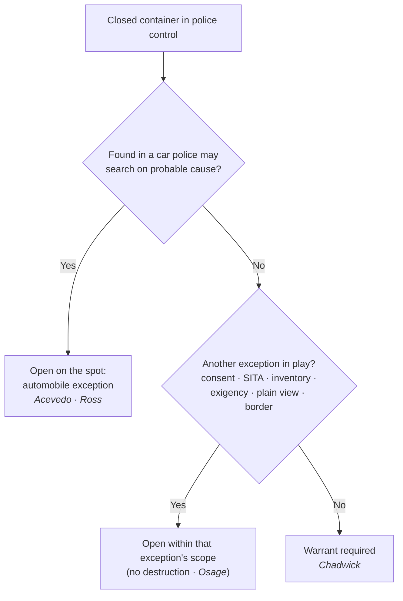
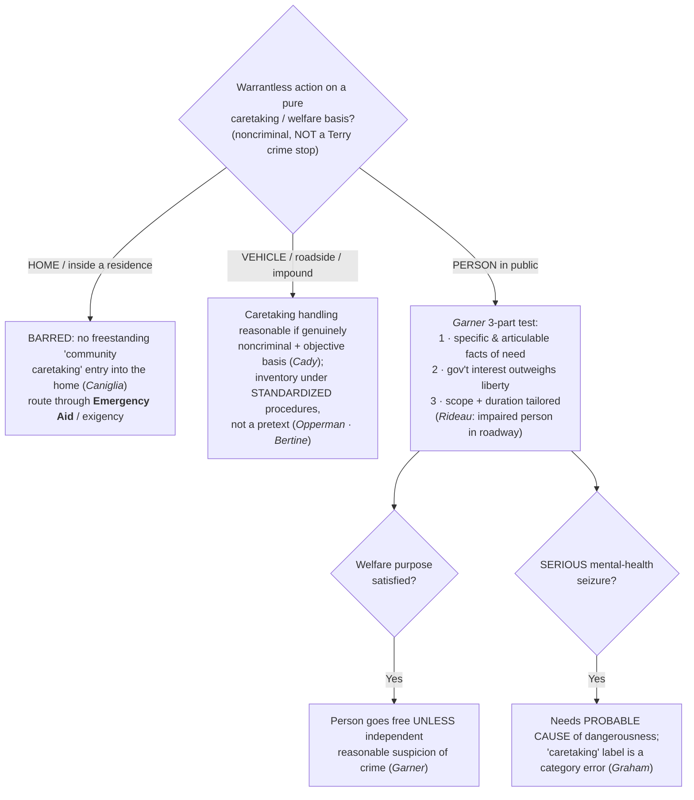

# S9 R1 panel-review — Opus model-diversity lane (prompt pack)

You are the **Claude/Opus** leg of the S9 three-lane adversarial panel (1 Claude + 2 Codex, R1). The two Codex lanes carry the A (support/quote-fidelity) and B (currency/treatment) attack lenses; **you carry model diversity and MUST vote on every paneled assertion across BOTH lenses' concerns.** You are refute-framed: try hard to break each assertion; **default to REFUTED on uncertainty**; never fabricate a cite, quote, or holding; use ONLY the evidence inlined below (no search, no outside knowledge). You are a SIGHTED reviewer — the FULL lake record (judgment fields included) is inlined.

You are a WRITER lane, not an adjudicator: you FIND and VOTE. You do not tally, adjudicate, or close any row — the orchestrator does.

For EACH group below, return one JSON object with the exact `reviewed[]` shape from the output contract (identical framing to the Codex lenses). Emit a finding object ONLY for a real defect (verdict refuted / stands-modified); a group you find wholly clean returns all-`stands` verdicts (the harness records a clean attestation). Concatenate the per-group JSON objects into a top-level `{"packs": [ ... ]}` array, one entry per group, each carrying its `group_id`.


OUTPUT CONTRACT — return ONE JSON object, nothing else:
{
  "lens": "A" | "B",
  "group_id": "<echo the group id>",
  "reviewed": [
    {
      "assertion_id": "<from group_inventory.jsonl>",
      "dimension": "existence|support|quote_fidelity|pincite|treatment|black_letter",
      "verdict": "stands" | "refuted" | "stands-modified",
      "verifiable_from_disclosed": true | false,
      "defect": null,   // null when verdict=="stands"; else an object:
      //  {"problem": "...", "severity": "high|medium|low", "proposed_fix": "...", "evidence_quote": "verbatim from disclosed evidence or null", "needs_cl": true|false, "locator_note": "..."}
      "reasons": ["short evidence-grounded reason", "..."],
      "breaks_true_positives": true | false,
      "residual_risks": ["..."],
      "suggested_tightening": "... or null"
    }
  ],
  "notes": ""
}
Rules: verdict=='stands' <=> defect==null (assertion survives your attack). verdict=='refuted' <=> a real defect (the assertion as framed is wrong). verdict=='stands-modified' <=> survives but needs a stated modification (a minor defect). Review EVERY assertion_id in group_inventory.jsonl exactly once. Output ONLY the JSON object.
---

## GROUP: content/warrant-exceptions/Searching Effects and Containers.md  (`doctrine`, 9 assertions)

### content_page

```
---
weight: 40
aliases:
  - "Searching Effects and Containers"
  - "Effects and Containers"
title: "Searching Effects & Containers"
topic: Searching Effects and Containers
type: doctrine
jurisdiction: Federal (U.S. Const. amend. IV); SCOTUS baseline
status: draft
related: ["[[Automobile Exception]]", "[[SIA Persons]]", "[[Reasonable Expectation of Privacy]]", "[[Private and Foreign Searches]]", "[[Inventory Searches]]"]
---

# Searching Effects & Containers

*This closed container or piece of luggage is in my control. May I open it without a warrant, and does it change anything that I found it in a car?*

> [!rule] Black-letter rule
> A closed container or piece of luggage carries a full Fourth Amendment expectation of privacy, so once it is in police control, opening it requires a **warrant** unless a recognized exception applies (consent, [[Search Incident to Arrest|search incident to arrest]], inventory, [[Exigent Circumstances and Hot Pursuit|exigency]], plain view, or the border). The high-privacy footlocker rule of *[[United States v. Chadwick|Chadwick]]* remains good law for a container searched on its own, but *[[California v. Acevedo|Acevedo]]* collapsed the old container/vehicle distinction for a container found **in a car**: there, probable cause supports an on-the-spot search under the [[Automobile Exception|automobile exception]]. *[[United States v. Chadwick|Chadwick]]*, 433 U.S. 1, [13](https://www.courtlistener.com/opinion/109714/united-states-v-chadwick/) (1977); *[[California v. Acevedo|Acevedo]]*, 500 U.S. 565, [580](https://www.courtlistener.com/opinion/112608/california-v-acevedo/) (1991).
> ^rule-containers

## The Brief

**What it is, and is not.** "Effects" is the Fourth Amendment's own word for a person's belongings, and a closed container is the paradigm: a suitcase, a footlocker, a backpack, a sealed package. The rule for opening one is a default plus a list of exits. The default is a warrant, because a container is a place where a person keeps things private. The exits are the recognized warrant exceptions, and the one that changes the analysis most is the [[Automobile Exception|automobile exception]]. This page owns the story of how the container rule and the vehicle rule were reconciled; the vehicle-scope rule itself lives on [[Automobile Exception]], and a person's own effects on their body belong to the search-incident and stop-and-frisk pages.

**The question up front.** For any closed container in police hands, work the sequence:
1. **Is the container in police control with no exception in play?** Then a warrant is required before opening it (*[[United States v. Chadwick|Chadwick]]*).
2. **Was the container found in a car police may search on probable cause?** Then it may be opened on the spot under the automobile exception (*[[California v. Acevedo|Acevedo]]*; *[[United States v. Ross|Ross]]*).
3. **Does another exception reach it?** Consent, a [[Search Incident to Arrest|search incident to arrest]], a standardized inventory, [[Exigent Circumstances and Hot Pursuit|exigency]], plain view, or the border can each independently authorize opening a container on their own terms.

**Chadwick: a container is not a vehicle.** Federal agents had probable cause that a double-locked footlocker held marijuana. They arrested its owners as it was loaded into a car's trunk, seized it, and searched it later at their offices without a warrant. The Court suppressed the contents: "a person's expectations of privacy in personal luggage are substantially greater than in an automobile." *[[United States v. Chadwick|Chadwick]]*, 433 U.S. 1, [13](https://www.courtlistener.com/opinion/109714/united-states-v-chadwick/) (1977). Once the footlocker was in exclusive police control with no [[Exigent Circumstances and Hot Pursuit|exigency]], neither the arrest nor the car nearby justified a warrantless search. The lesson is that luggage carries its own high privacy interest that does not evaporate merely because it was near a vehicle.

**The unification story: Sanders and Robbins fall, Ross and Acevedo settle it.** *[[United States v. Chadwick|Chadwick]]* produced a decade of line-drawing. *[[Arkansas v. Sanders|Sanders]]* extended *[[United States v. Chadwick|Chadwick]]* to luggage taken from a car, requiring a warrant to open a suitcase seized from a taxi, and *[[Robbins v. California|Robbins]]* said the same of a closed opaque package found during a car search. Then the Court changed course. *[[United States v. Ross|Ross]]* held that when probable cause justifies searching the *vehicle*, it justifies searching "every part of the vehicle and its contents that may conceal the object of the search," 456 U.S. 798, 825 (1982), overruling *[[Robbins v. California|Robbins]]*. *[[California v. Acevedo|Acevedo]]* finished the job for containers, adopting one rule to govern all automobile searches: police may search a container in a car where they have probable cause to believe it holds contraband, whether the probable cause runs to the whole car or to the container alone. 500 U.S. 565, 580 (1991). *[[California v. Acevedo|Acevedo]]* overruled *[[Arkansas v. Sanders|Sanders]]*.

**Keep Chadwick's two points apart (its treatment varies by point).** After *[[California v. Acevedo|Acevedo]]*, *[[United States v. Chadwick|Chadwick]]* still says two things, and only one was cut. As to a container searched **on its own**, away from the vehicle context, its high-privacy rule is **good law**: a warrant is the default. As to a container found **in a car**, *[[United States v. Chadwick|Chadwick]]*'s warrant rule is **limited by *[[California v. Acevedo|Acevedo]]***, which supplies the probable-cause, on-the-spot rule. The practical dividing line is not the container's type but its setting: the same locked briefcase that needs a warrant on an airport bench may be opened on probable cause when it is riding in a car police may lawfully search.

**Other exits that reach a container.** The warrant default yields to several exceptions besides the automobile rule. **Consent** reaches a container within the object and scope a reasonable person would understand, though it never licenses destroying the container (*[[United States v. Osage|Osage]]*; see [[Consent Searches]]). A **[[Search Incident to Arrest|search incident to arrest]]** reaches containers immediately associated with the person, and a standardized **inventory** may open containers under a policy that cabins discretion (*[[Colorado v. Bertine|Bertine]]*; see [[Inventory Searches]]). **[[Exigent Circumstances and Hot Pursuit|Exigency]]**, **plain view**, and the sovereign's **border** authority each supply their own basis. Name the exception you are relying on; "it was a container" is not itself a justification.

**Manipulating and reopening a container.** Two edges bound the analysis. Physically **manipulating** a closed bag can itself be a search: an officer's exploratory squeezing of a bus passenger's soft luggage invaded a [[Reasonable Expectation of Privacy|reasonable expectation of privacy]] (*[[Bond v. United States|Bond]]*; the tactile-privacy point lives on [[Reasonable Expectation of Privacy]]). And **reopening** a container a private party already opened is measured by how far the government exceeds the private search, not by the container's status (*[[United States v. Jacobsen|Jacobsen]]*; the private-search doctrine lives on [[Private and Foreign Searches]]). A prolonged **detention** of luggage to investigate is a distinct seizure question, judged by *[[Terry v. Ohio|Terry]]* limits (*[[United States v. Place|Place]]*; see [[Reasonable Expectation of Privacy]] and [[Terry Stops and Reasonable Suspicion]]).

**Burden, standard of review, remedy.** Because opening a container without a warrant is a warrantless search, the **government** bears the burden of placing it within an exception. Historical facts are reviewed for [[Common Legal Terms#clear-error|clear error]] and the ultimate reasonableness [[Common Legal Terms#de-novo|de novo]]; the **remedy** for opening a container outside any exception is suppression of the contents and their fruits under [[The Exclusionary Rule]].

**Apply it.**
1. **Start from the warrant default.** A closed container in your control is presumptively warrant-protected (*[[United States v. Chadwick|Chadwick]]*).
2. **Ask where you found it.** If it is in a car you may search on probable cause, open it on the spot under the automobile exception (*[[California v. Acevedo|Acevedo]]* / *[[United States v. Ross|Ross]]*).
3. **Otherwise, name your exception.** Consent, a [[Search Incident to Arrest|search incident to arrest]], a policy-driven inventory, [[Exigent Circumstances and Hot Pursuit|exigency]], plain view, or the border each has its own trigger and scope.
4. **Do not destroy to search.** Even a valid consent or search does not authorize ruining the container without explicit authorization or an independent basis (*[[United States v. Osage|Osage]]*).

**Common pitfalls.**
- **Treating "it was a container" as a justification.** The container's status is the question, not the answer; you still need a warrant or a specific exception.
- **Reading *[[United States v. Chadwick|Chadwick]]* as dead.** It is limited only for containers in a car; a container searched on its own still starts from the warrant default (*[[California v. Acevedo|Acevedo]]*).
- **Assuming the car cures everything.** The automobile exception reaches a container in the car only to the extent probable cause reaches the object; probable cause as to one bag is not license to dismantle the vehicle.
- **Squeezing or manipulating a bag as if it were free.** Exploratory tactile inspection can itself be a search (*[[Bond v. United States|Bond]]*).

## Lower-court developments

The Supreme Court framework (*[[United States v. Chadwick|Chadwick]]* to *[[United States v. Ross|Ross]]* to *[[California v. Acevedo|Acevedo]]*) is settled, so the live circuit questions are not about physical containers but about their modern analogues and the edges of the exceptions. Two edges recur: whether a **digital container** (a phone or laptop) can be opened on the theories that reach a physical one, a question *[[Riley v. California|Riley]]* answers with a warrant requirement for device data (see [[SIA Cell Phones]]); and how far a **consent** to search a container goes before it becomes destruction, the line drawn in *[[United States v. Osage|Osage]]* (see [[Consent Searches]]). Both edges apply the settled container rule rather than unsettle it.

## Key cases

| Case | Holding | Opinion |
|---|---|---|
| *[[United States v. Chadwick]]*, 433 U.S. 1 (1977) | **Anchor.** Personal luggage carries a high expectation of privacy; a footlocker reduced to exclusive police control with no [[Exigent Circumstances and Hot Pursuit\|exigency]] may not be searched without a warrant, and its nearness to a car does not change that. | [opinion](https://www.courtlistener.com/opinion/109714/united-states-v-chadwick/) |
| *[[United States v. Ross]]*, 456 U.S. 798 (1982) | **Bridge.** Probable cause to search a vehicle justifies searching every part of it and every container within that may conceal the object; overruled *[[Robbins v. California\|Robbins]]*'s closed-container rule. | [opinion](https://www.courtlistener.com/opinion/110719/united-states-v-ross/) |
| *[[California v. Acevedo]]*, 500 U.S. 565 (1991) | **Unification.** One rule governs all automobile searches: a container found in a car may be searched on probable cause it holds contraband, whether the probable cause runs to the car or the container; overruled *[[Arkansas v. Sanders\|Sanders]]*. | [opinion](https://www.courtlistener.com/opinion/112608/california-v-acevedo/) |

## Related cases across doctrines

These are treated in full elsewhere but bear on searching effects and containers, framed here.

| Case | Relevance here | Primary home | Opinion |
|---|---|---|---|
| *[[Colorado v. Bertine]]*, 479 U.S. 367 (1987) | ***Inventory route.*** A standardized inventory of an impounded vehicle may open closed containers under criteria that cabin discretion, a no-probable-cause path to a container. | [[Inventory Searches]] | [opinion](https://www.courtlistener.com/opinion/111788/colorado-v-bertine/) |
| *[[Bond v. United States]]*, 529 U.S. 334 (2000) | ***Tactile search.*** An officer's exploratory physical manipulation of a bus passenger's soft luggage is itself a Fourth Amendment search, more intrusive than mere visual observation. | [[Reasonable Expectation of Privacy]] | [opinion](https://www.courtlistener.com/opinion/118354/bond-v-united-states/) |
| *[[United States v. Place]]*, 462 U.S. 696 (1983) | ***Luggage detention.*** A dog sniff of luggage in public is not a search, but a 90-minute investigative seizure of the luggage exceeded *[[Terry v. Ohio\|Terry]]* limits, the detention question distinct from opening the bag. | [[Reasonable Expectation of Privacy]] | [opinion](https://www.courtlistener.com/opinion/110979/united-states-v-place/) |
| *[[United States v. Jacobsen]]*, 466 U.S. 109 (1984) | ***Reopening.*** After a private party opens a package and exposes its contents, a government re-inspection is measured by how far it exceeds the private search, not by the container's status. | [[Private and Foreign Searches]] | [opinion](https://www.courtlistener.com/opinion/111143/united-states-v-jacobsen/) |
| *[[Riley v. California]]*, 573 U.S. 373 (2014) | ***Digital container.*** A cell phone is not an ordinary container; its data implicates privacy far beyond physical effects, so a warrant is required to search it even incident to arrest. | [[SIA Cell Phones]] | [opinion](https://www.courtlistener.com/opinion/2680439/riley-v-cal-united-states/) |

## Visual



## Sources
- [*United States v. Chadwick*, 433 U.S. 1 (1977)](https://www.courtlistener.com/opinion/109714/united-states-v-chadwick/) (pinpoints: 11, 13) (treatment: limited by *California v. Acevedo* for containers in a car)
- [*United States v. Ross*, 456 U.S. 798 (1982)](https://www.courtlistener.com/opinion/110719/united-states-v-ross/) (pinpoint: 825; vehicle-scope home = [[Automobile Exception]])
- [*California v. Acevedo*, 500 U.S. 565 (1991)](https://www.courtlistener.com/opinion/112608/california-v-acevedo/) (pinpoint: 580)
- [*Arkansas v. Sanders*, 442 U.S. 753 (1979)](https://www.courtlistener.com/opinion/110119/arkansas-v-sanders/) (overruled by *California v. Acevedo*; home = [[Automobile Exception]])
- [*Robbins v. California*, 453 U.S. 420 (1981)](https://www.courtlistener.com/opinion/110558/robbins-v-california/) (overruled by *United States v. Ross*; home = [[Automobile Exception]])
- [*Colorado v. Bertine*, 479 U.S. 367 (1987)](https://www.courtlistener.com/opinion/111788/colorado-v-bertine/) (home = [[Inventory Searches]])
- [*Bond v. United States*, 529 U.S. 334 (2000)](https://www.courtlistener.com/opinion/118354/bond-v-united-states/) (pinpoint: 338; home = [[Reasonable Expectation of Privacy]])
- [*United States v. Place*, 462 U.S. 696 (1983)](https://www.courtlistener.com/opinion/110979/united-states-v-place/) (pinpoint: 709; home = [[Reasonable Expectation of Privacy]])
- [*United States v. Jacobsen*, 466 U.S. 109 (1984)](https://www.courtlistener.com/opinion/111143/united-states-v-jacobsen/) (pinpoint: 115; home = [[Private and Foreign Searches]])
- [*Riley v. California*, 573 U.S. 373 (2014)](https://www.courtlistener.com/opinion/2680439/riley-v-cal-united-states/) (home = [[SIA Cell Phones]])
- [*United States v. Osage*, 235 F.3d 518 (10th Cir. 2000)](https://www.courtlistener.com/opinion/160502/united-states-v-osage/) (container-destruction limit; home = [[Consent Searches]])

```

### group_inventory (assertions under review)

```jsonl
{"assertion_id": "16d2cc0fdb815e2d", "dimension": "existence", "kind": "case_cite", "locator": {"case": "United States v. Ross", "table_line": 52}, "payload": {"case": "United States v. Ross", "cells": ["*[[United States v. Ross]]*, 456 U.S. 798 (1982)", "**Bridge.** Probable cause to search a vehicle justifies searching every part of it and every container within that may conceal the object; overruled *[[Robbins v. California\\|Robbins]]*'s closed-container rule.", "[opinion](https://www.courtlistener.com/opinion/110719/united-states-v-ross/)"], "header": ["Case", "Holding", "Opinion"]}}
{"assertion_id": "1f20cf692cf056b0", "dimension": "existence", "kind": "case_cite", "locator": {"case": "Bond v. United States", "table_line": 62}, "payload": {"case": "Bond v. United States", "cells": ["*[[Bond v. United States]]*, 529 U.S. 334 (2000)", "***Tactile search.*** An officer's exploratory physical manipulation of a bus passenger's soft luggage is itself a Fourth Amendment search, more intrusive than mere visual observation.", "[[Reasonable Expectation of Privacy]]", "[opinion](https://www.courtlistener.com/opinion/118354/bond-v-united-states/)"], "header": ["Case", "Relevance here", "Primary home", "Opinion"]}}
{"assertion_id": "7bf375659e5ca430", "dimension": "existence", "kind": "case_cite", "locator": {"case": "California v. Acevedo", "table_line": 53}, "payload": {"case": "California v. Acevedo", "cells": ["*[[California v. Acevedo]]*, 500 U.S. 565 (1991)", "**Unification.** One rule governs all automobile searches: a container found in a car may be searched on probable cause it holds contraband, whether the probable cause runs to the car or the container; overruled *[[Arkansas v. Sanders\\|Sanders]]*.", "[opinion](https://www.courtlistener.com/opinion/112608/california-v-acevedo/)"], "header": ["Case", "Holding", "Opinion"]}}
{"assertion_id": "9991ddb22c730062", "dimension": "existence", "kind": "case_cite", "locator": {"case": "United States v. Jacobsen", "table_line": 64}, "payload": {"case": "United States v. Jacobsen", "cells": ["*[[United States v. Jacobsen]]*, 466 U.S. 109 (1984)", "***Reopening.*** After a private party opens a package and exposes its contents, a government re-inspection is measured by how far it exceeds the private search, not by the container's status.", "[[Private and Foreign Searches]]", "[opinion](https://www.courtlistener.com/opinion/111143/united-states-v-jacobsen/)"], "header": ["Case", "Relevance here", "Primary home", "Opinion"]}}
{"assertion_id": "d8bb15e0d15fde69", "dimension": "existence", "kind": "case_cite", "locator": {"case": "Colorado v. Bertine", "table_line": 61}, "payload": {"case": "Colorado v. Bertine", "cells": ["*[[Colorado v. Bertine]]*, 479 U.S. 367 (1987)", "***Inventory route.*** A standardized inventory of an impounded vehicle may open closed containers under criteria that cabin discretion, a no-probable-cause path to a container.", "[[Inventory Searches]]", "[opinion](https://www.courtlistener.com/opinion/111788/colorado-v-bertine/)"], "header": ["Case", "Relevance here", "Primary home", "Opinion"]}}
{"assertion_id": "eac2938d416667c8", "dimension": "existence", "kind": "case_cite", "locator": {"case": "United States v. Place", "table_line": 63}, "payload": {"case": "United States v. Place", "cells": ["*[[United States v. Place]]*, 462 U.S. 696 (1983)", "***Luggage detention.*** A dog sniff of luggage in public is not a search, but a 90-minute investigative seizure of the luggage exceeded *[[Terry v. Ohio\\|Terry]]* limits, the detention question distinct from opening the bag.", "[[Reasonable Expectation of Privacy]]", "[opinion](https://www.courtlistener.com/opinion/110979/united-states-v-place/)"], "header": ["Case", "Relevance here", "Primary home", "Opinion"]}}
{"assertion_id": "fa0af0b80655473d", "dimension": "existence", "kind": "case_cite", "locator": {"case": "Riley v. California", "table_line": 65}, "payload": {"case": "Riley v. California", "cells": ["*[[Riley v. California]]*, 573 U.S. 373 (2014)", "***Digital container.*** A cell phone is not an ordinary container; its data implicates privacy far beyond physical effects, so a warrant is required to search it even incident to arrest.", "[[SIA Cell Phones]]", "[opinion](https://www.courtlistener.com/opinion/2680439/riley-v-cal-united-states/)"], "header": ["Case", "Relevance here", "Primary home", "Opinion"]}}
{"assertion_id": "ff43cafd077f0197", "dimension": "existence", "kind": "case_cite", "locator": {"case": "United States v. Chadwick", "table_line": 51}, "payload": {"case": "United States v. Chadwick", "cells": ["*[[United States v. Chadwick]]*, 433 U.S. 1 (1977)", "**Anchor.** Personal luggage carries a high expectation of privacy; a footlocker reduced to exclusive police control with no [[Exigent Circumstances and Hot Pursuit\\|exigency]] may not be searched without a warrant, and its nearness to a car does not change that.", "[opinion](https://www.courtlistener.com/opinion/109714/united-states-v-chadwick/)"], "header": ["Case", "Holding", "Opinion"]}}
{"assertion_id": "d9de4bcefc979c61", "dimension": "support", "kind": "proposition", "locator": {"callout": "^rule-containers"}, "payload": {"anchor": "^rule-containers", "statement": "[!rule] Black-letter rule\nA closed container or piece of luggage carries a full Fourth Amendment expectation of privacy, so once it is in police control, opening it requires a **warrant** unless a recognized exception applies (consent, [[Search Incident to Arrest|search incident to arrest]], inventory, [[Exigent Circumstances and Hot Pursuit|exigency]], plain view, or the border). The high-privacy footlocker rule of *[[United States v. Chadwick|Chadwick]]* remains good law for a container searched on its own, but *[[California v. Acevedo|Acevedo]]* collapsed the old container/vehicle distinction for a container found **in a car**: there, probable cause supports an on-the-spot search under the [[Automobile Exception|automobile exception]]. *[[United States v. Chadwick|Chadwick]]*, 433 U.S. 1, [13](https://www.courtlistener.com/opinion/109714/united-states-v-chadwick/) (1977); *[[California v. Acevedo|Acevedo]]*, 500 U.S. 565, [580](https://www.courtlistener.com/opinion/112608/california-v-acevedo/) (1991)."}}
```

### lake record — Bond v. United States

```json
{
  "schema_version": "s2.v1",
  "record_id": "Bond v. United States",
  "stub": false,
  "status": "verified",
  "identity": {
    "case_name": "Bond v. United States",
    "case_name_short": "Bond",
    "case_name_full": "Bond v. United States",
    "input_case_name": "Bond v. United States",
    "court": "U.S. Supreme Court",
    "court_id": "scotus",
    "court_level": "scotus",
    "circuit": null,
    "state": null,
    "date_decided": "2000-04-17",
    "year": 2000,
    "docket": "98-9349",
    "cluster_id": 118354,
    "lead_opinion_id": 9433930,
    "sibling_ids": [
      118354,
      9433930,
      9433931
    ],
    "absolute_url": "/opinion/118354/bond-v-united-states/",
    "identity_method": "citation+party-text",
    "expected_citation_found": true,
    "party_name_in_text": true,
    "canonical_name_match": true,
    "alternates": [],
    "reason_code": null
  },
  "citations": {
    "official": {
      "cite": "529 U.S. 334",
      "volume": "529",
      "reporter": "U.S.",
      "page": "334",
      "type": 1,
      "selected_official": true,
      "source": "cluster.citations[]"
    },
    "parallel": [
      {
        "cite": "120 S. Ct. 1462",
        "volume": "120",
        "reporter": "S. Ct.",
        "page": "1462",
        "type": 1,
        "selected_official": false,
        "source": "cluster.citations[]"
      },
      {
        "cite": "146 L. Ed. 2d 365",
        "volume": "146",
        "reporter": "L. Ed. 2d",
        "page": "365",
        "type": 1,
        "selected_official": false,
        "source": "cluster.citations[]"
      }
    ],
    "vendor_neutral": [
      {
        "cite": "2000 U.S. LEXIS 2520",
        "volume": "2000",
        "reporter": "U.S. LEXIS",
        "page": "2520",
        "type": 6,
        "selected_official": false,
        "source": "cluster.citations[]"
      }
    ],
    "all": [
      {
        "cite": "529 U.S. 334",
        "volume": "529",
        "reporter": "U.S.",
        "page": "334",
        "type": 1,
        "selected_official": false,
        "source": "cluster.citations[]"
      },
      {
        "cite": "120 S. Ct. 1462",
        "volume": "120",
        "reporter": "S. Ct.",
        "page": "1462",
        "type": 1,
        "selected_official": false,
        "source": "cluster.citations[]"
      },
      {
        "cite": "146 L. Ed. 2d 365",
        "volume": "146",
        "reporter": "L. Ed. 2d",
        "page": "365",
        "type": 1,
        "selected_official": false,
        "source": "cluster.citations[]"
      },
      {
        "cite": "2000 U.S. LEXIS 2520",
        "volume": "2000",
        "reporter": "U.S. LEXIS",
        "page": "2520",
        "type": 6,
        "selected_official": false,
        "source": "cluster.citations[]"
      }
    ],
    "display": "529 U.S. 334",
    "official_selection": {
      "court_class": "scotus",
      "selected": "529 U.S. 334",
      "reason": "selected_rank_1"
    }
  },
  "pinpoints": [
    {
      "id": "pin-337",
      "page": null,
      "quote": "within the meaning of the Fourth Amendment. ## Rule Yes. Tactile examination is more invasive than visual observation: distinguishing the aerial-observation cases, the Court explained that",
      "star_marker": null,
      "quote_fidelity": "mismatch",
      "pinpoint_status": "slip-only",
      "position": null
    },
    {
      "id": "pin-338",
      "page": null,
      "quote": "a bus passenger clearly expects that his bag may be handled. He does not expect that other passengers or bus employees will, as a matter of course, feel the bag in an exploratory manner. But this is exactly what the agent did here. We therefore hold that the agent's physical manipulation of petitioner's bag violated the Fourth Amendment.",
      "star_marker": null,
      "quote_fidelity": "mismatch",
      "pinpoint_status": "slip-only",
      "position": null
    }
  ],
  "treatment": {
    "field_i_validity": "good_law",
    "as_of_content": "2000-04-17",
    "as_of_treatment": "2026-06-30",
    "composite_basis": "migration-seed",
    "composite_basis_ref": "Bond v. United States",
    "varies_by_point": false,
    "scope_note": "Good law; the rule that exploratory tactile manipulation of a traveler's bag is a search remains controlling.",
    "point_overrides": [],
    "edges": [
      {
        "citing_case": {
          "name": "Commonwealth v. Privette",
          "cluster_id": 9387170,
          "cite": null,
          "field_ii": "overruled"
        },
        "field_ii": "overruled",
        "field_iii": "mentioned",
        "point": null,
        "proposed": true,
        "journal_ref": "Bond v. United States:lane1_negative"
      },
      {
        "citing_case": {
          "name": "United States v. Morris Wise",
          "cluster_id": 4448990,
          "cite": [
            "877 F.3d 209"
          ],
          "field_ii": "questioned"
        },
        "field_ii": "questioned",
        "field_iii": "mentioned",
        "point": null,
        "proposed": true,
        "journal_ref": "Bond v. United States:lane1_negative"
      },
      {
        "citing_case": {
          "name": "United States v. Rickey Beene",
          "cluster_id": 3183556,
          "cite": [
            "818 F.3d 157",
            "2016 U.S. App. LEXIS 4331",
            "2016 WL 890127"
          ],
          "field_ii": "abrogated"
        },
        "field_ii": "abrogated",
        "field_iii": "mentioned",
        "point": null,
        "proposed": true,
        "journal_ref": "Bond v. United States:lane1_negative"
      },
      {
        "citing_case": {
          "name": "State v. Peterson",
          "cluster_id": 3961890,
          "cite": [
            "879 N.E.2d 806",
            "173 Ohio App. 3d 575",
            "2007 Ohio 5667"
          ],
          "field_ii": "overruled"
        },
        "field_ii": "overruled",
        "field_iii": "mentioned",
        "point": null,
        "proposed": true,
        "journal_ref": "Bond v. United States:lane1_negative"
      },
      {
        "citing_case": {
          "name": "Poteet v. Sullivan",
          "cluster_id": 2332316,
          "cite": [
            "218 S.W.3d 780",
            "2007 WL 289871"
          ],
          "field_ii": "overruled"
        },
        "field_ii": "overruled",
        "field_iii": "mentioned",
        "point": null,
        "proposed": true,
        "journal_ref": "Bond v. United States:lane1_negative"
      },
      {
        "citing_case": {
          "name": "People v. Camacho",
          "cluster_id": 2546036,
          "cite": [
            "3 P.3d 878",
            "98 Cal. Rptr. 2d 232",
            "23 Cal. 4th 824",
            "2000 Cal. Daily Op. Serv. 6235",
            "2000 Daily Journal DAR 8273",
            "2000 Cal. LEXIS 5605"
          ],
          "field_ii": "abrogated"
        },
        "field_ii": "abrogated",
        "field_iii": "mentioned",
        "point": null,
        "proposed": true,
        "journal_ref": "Bond v. United States:lane1_negative"
      },
      {
        "citing_case": {
          "name": "Ashcroft v. al-Kidd",
          "cluster_id": 217703,
          "cite": [
            "179 L. Ed. 2d 1149",
            "131 S. Ct. 2074",
            "563 U.S. 731",
            "2011 U.S. LEXIS 4021"
          ],
          "field_ii": "questioned"
        },
        "field_ii": "questioned",
        "field_iii": "mentioned",
        "point": null,
        "proposed": true,
        "journal_ref": "Bond v. United States:lane2_top_cited"
      },
      {
        "citing_case": {
          "name": "Brigham City v. Stuart",
          "cluster_id": 145654,
          "cite": [
            "164 L. Ed. 2d 650",
            "126 S. Ct. 1943",
            "547 U.S. 398",
            "2006 U.S. LEXIS 4155"
          ],
          "field_ii": "questioned"
        },
        "field_ii": "questioned",
        "field_iii": "mentioned",
        "point": null,
        "proposed": true,
        "journal_ref": "Bond v. United States:lane2_top_cited"
      },
      {
        "citing_case": {
          "name": "Illinois v. Caballes",
          "cluster_id": 137742,
          "cite": [
            "160 L. Ed. 2d 842",
            "125 S. Ct. 834",
            "543 U.S. 405",
            "2005 U.S. LEXIS 769"
          ],
          "field_ii": "questioned"
        },
        "field_ii": "questioned",
        "field_iii": "mentioned",
        "point": null,
        "proposed": true,
        "journal_ref": "Bond v. United States:lane2_top_cited"
      },
      {
        "citing_case": {
          "name": "City of Indianapolis v. Edmond",
          "cluster_id": 118391,
          "cite": [
            "148 L. Ed. 2d 333",
            "121 S. Ct. 447",
            "531 U.S. 32",
            "2000 U.S. LEXIS 8084",
            "69 U.S.L.W. 4009",
            "14 Fla. L. Weekly Fed. S 9",
            "2000 Colo. J. C.A.R. 6401",
            "2000 Cal. Daily Op. Serv. 9549"
          ],
          "field_ii": "overruled"
        },
        "field_ii": "overruled",
        "field_iii": "mentioned",
        "point": null,
        "proposed": true,
        "journal_ref": "Bond v. United States:lane2_top_cited"
      },
      {
        "citing_case": {
          "name": "United States v. Jones",
          "cluster_id": 622304,
          "cite": [
            "181 L. Ed. 2d 911",
            "132 S. Ct. 945",
            "565 U.S. 400",
            "2012 U.S. LEXIS 1063"
          ],
          "field_ii": "overruled"
        },
        "field_ii": "overruled",
        "field_iii": "mentioned",
        "point": null,
        "proposed": true,
        "journal_ref": "Bond v. United States:lane2_top_cited"
      },
      {
        "citing_case": {
          "name": "People v. Robinson",
          "cluster_id": 2140668,
          "cite": [
            "767 N.E.2d 638",
            "97 N.Y.2d 341",
            "741 N.Y.S.2d 147"
          ],
          "field_ii": "overruled"
        },
        "field_ii": "overruled",
        "field_iii": "mentioned",
        "point": null,
        "proposed": true,
        "journal_ref": "Bond v. United States:lane2_top_cited"
      },
      {
        "citing_case": {
          "name": "State v. Ross",
          "cluster_id": 1060457,
          "cite": [
            "49 S.W.3d 833",
            "2001 Tenn. LEXIS 563",
            "2001 WL 760100"
          ],
          "field_ii": "questioned"
        },
        "field_ii": "questioned",
        "field_iii": "mentioned",
        "point": null,
        "proposed": true,
        "journal_ref": "Bond v. United States:lane2_top_cited"
      },
      {
        "citing_case": {
          "name": "Club Retro, L.L.C. v. Hilton",
          "cluster_id": 1459439,
          "cite": [
            "568 F.3d 181",
            "2009 U.S. App. LEXIS 9864",
            "2006 WL 6245546"
          ],
          "field_ii": "questioned"
        },
        "field_ii": "questioned",
        "field_iii": "mentioned",
        "point": null,
        "proposed": true,
        "journal_ref": "Bond v. United States:lane2_top_cited"
      },
      {
        "citing_case": {
          "name": "Turrubiate v. State",
          "cluster_id": 2948365,
          "cite": [
            "399 S.W.3d 147",
            "2013 WL 1438172",
            "2013 Tex. Crim. App. LEXIS 635"
          ],
          "field_ii": "overruled"
        },
        "field_ii": "overruled",
        "field_iii": "mentioned",
        "point": null,
        "proposed": true,
        "journal_ref": "Bond v. United States:lane2_top_cited"
      },
      {
        "citing_case": {
          "name": "United States of America, State of California, Intervenor v. Raphyal Crawford, AKA Aarmyl Crawford",
          "cluster_id": 786677,
          "cite": [
            "372 F.3d 1048",
            "2004 U.S. App. LEXIS 12116",
            "2004 WL 1375521"
          ],
          "field_ii": "overruled"
        },
        "field_ii": "overruled",
        "field_iii": "mentioned",
        "point": null,
        "proposed": true,
        "journal_ref": "Bond v. United States:lane2_top_cited"
      },
      {
        "citing_case": {
          "name": "United States v. Maynard",
          "cluster_id": 152441,
          "cite": [
            "615 F.3d 544",
            "392 U.S. App. D.C. 291",
            "2010 U.S. App. LEXIS 16417",
            "2010 WL 3063788"
          ],
          "field_ii": "superseded_by_statute"
        },
        "field_ii": "superseded_by_statute",
        "field_iii": "mentioned",
        "point": null,
        "proposed": true,
        "journal_ref": "Bond v. United States:lane2_top_cited"
      },
      {
        "citing_case": {
          "name": "People v. Robles",
          "cluster_id": 5607956,
          "cite": [
            "23 Cal. 4th 789",
            "3 P.3d 311",
            "2000 Daily Journal DAR 7789",
            "97 Cal. Rptr. 2d 914",
            "2000 Cal. Daily Op. Serv. 5894",
            "2000 Cal. LEXIS 5217"
          ],
          "field_ii": "questioned"
        },
        "field_ii": "questioned",
        "field_iii": "mentioned",
        "point": null,
        "proposed": true,
        "journal_ref": "Bond v. United States:lane2_top_cited"
      },
      {
        "citing_case": {
          "name": "Lisa Amaechi v. Matthew West, and Bernard R. Pfluger Town of Dumfries",
          "cluster_id": 771726,
          "cite": [
            "237 F.3d 356",
            "2001 U.S. App. LEXIS 267",
            "2001 WL 20530"
          ],
          "field_ii": "questioned"
        },
        "field_ii": "questioned",
        "field_iii": "mentioned",
        "point": null,
        "proposed": true,
        "journal_ref": "Bond v. United States:lane2_top_cited"
      },
      {
        "citing_case": {
          "name": "People v. Robles",
          "cluster_id": 2545158,
          "cite": [
            "3 P.3d 311",
            "97 Cal. Rptr. 2d 914",
            "23 Cal. 4th 789"
          ],
          "field_ii": "questioned"
        },
        "field_ii": "questioned",
        "field_iii": "mentioned",
        "point": null,
        "proposed": true,
        "journal_ref": "Bond v. United States:lane2_top_cited"
      },
      {
        "citing_case": {
          "name": "Darlie Kee Darin Routier v. City of Rowlett Texas Jimmy Ray Patterson Chris Frosch Greg Davis, Assistant District Attorney for Dallas County",
          "cluster_id": 772922,
          "cite": [
            "247 F.3d 206"
          ],
          "field_ii": "questioned"
        },
        "field_ii": "questioned",
        "field_iii": "mentioned",
        "point": null,
        "proposed": true,
        "journal_ref": "Bond v. United States:lane2_top_cited"
      },
      {
        "citing_case": {
          "name": "People v. Cregan",
          "cluster_id": 2681818,
          "cite": [
            "2014 IL 113600"
          ],
          "field_ii": "overruled"
        },
        "field_ii": "overruled",
        "field_iii": "mentioned",
        "point": null,
        "proposed": true,
        "journal_ref": "Bond v. United States:lane2_top_cited"
      },
      {
        "citing_case": {
          "name": "United States v. Reyes Fabian Olivera-Mendez",
          "cluster_id": 797553,
          "cite": [
            "484 F.3d 505",
            "2007 U.S. App. LEXIS 10492",
            "2007 WL 1296781"
          ],
          "field_ii": "questioned"
        },
        "field_ii": "questioned",
        "field_iii": "mentioned",
        "point": null,
        "proposed": true,
        "journal_ref": "Bond v. United States:lane2_top_cited"
      },
      {
        "citing_case": {
          "name": "State of Texas v. Granville, Anthony",
          "cluster_id": 2950015,
          "cite": [
            "423 S.W.3d 399",
            "2014 WL 714730",
            "2014 Tex. Crim. App. LEXIS 237"
          ],
          "field_ii": "overruled"
        },
        "field_ii": "overruled",
        "field_iii": "mentioned",
        "point": null,
        "proposed": true,
        "journal_ref": "Bond v. United States:lane2_top_cited"
      },
      {
        "citing_case": {
          "name": "United States v. Perea-Rey",
          "cluster_id": 801335,
          "cite": [
            "680 F.3d 1179",
            "2012 U.S. App. LEXIS 10941",
            "2012 WL 1948973"
          ],
          "field_ii": "overruled"
        },
        "field_ii": "overruled",
        "field_iii": "mentioned",
        "point": null,
        "proposed": true,
        "journal_ref": "Bond v. United States:lane2_top_cited"
      },
      {
        "citing_case": {
          "name": "United States v. Quartavious Davis",
          "cluster_id": 2798570,
          "cite": [
            "785 F.3d 498",
            "2015 WL 2058977"
          ],
          "field_ii": "overruled"
        },
        "field_ii": "overruled",
        "field_iii": "mentioned",
        "point": null,
        "proposed": true,
        "journal_ref": "Bond v. United States:lane2_top_cited"
      },
      {
        "citing_case": {
          "name": "People v. Weaver",
          "cluster_id": 5639938,
          "cite": [
            "12 N.Y.3d 433",
            "909 N.E.2d 1195"
          ],
          "field_ii": "overruled"
        },
        "field_ii": "overruled",
        "field_iii": "mentioned",
        "point": null,
        "proposed": true,
        "journal_ref": "Bond v. United States:lane2_top_cited"
      },
      {
        "citing_case": {
          "name": "Krise v. State",
          "cluster_id": 853398,
          "cite": [
            "746 N.E.2d 957",
            "2001 Ind. LEXIS 394",
            "2001 WL 493444"
          ],
          "field_ii": "questioned"
        },
        "field_ii": "questioned",
        "field_iii": "mentioned",
        "point": null,
        "proposed": true,
        "journal_ref": "Bond v. United States:lane2_top_cited"
      },
      {
        "citing_case": {
          "name": "United States v. Frederick Alonzo Waller",
          "cluster_id": 792220,
          "cite": [
            "426 F.3d 838",
            "2005 U.S. App. LEXIS 22941",
            "2005 WL 2708784"
          ],
          "field_ii": "questioned"
        },
        "field_ii": "questioned",
        "field_iii": "mentioned",
        "point": null,
        "proposed": true,
        "journal_ref": "Bond v. United States:lane2_top_cited"
      },
      {
        "citing_case": {
          "name": "United States v. Kenneth King",
          "cluster_id": 770537,
          "cite": [
            "227 F.3d 732",
            "2000 WL 1209277"
          ],
          "field_ii": "questioned"
        },
        "field_ii": "questioned",
        "field_iii": "mentioned",
        "point": null,
        "proposed": true,
        "journal_ref": "Bond v. United States:lane2_top_cited"
      }
    ],
    "derivation": {
      "lane1_negative": {
        "query": "cites:(118354 OR 9433930 OR 9433931) AND (overrul* OR abrogat* OR supersed* OR \"recede from\" OR \"no longer good law\" OR vacat* OR reversed) ",
        "reviewed": 177,
        "cap": 200,
        "cap_hit": false,
        "final_cursor": null,
        "audit_needed": false,
        "proposed_negative_events": 6,
        "audit_marker": null,
        "triage_mode": "snippet-first",
        "snippet_field": "results[].opinions[].snippet",
        "triage_journaled": 177,
        "triage_read": 6,
        "triage_snippet_classified": 171
      },
      "lane2_top_cited": {
        "query": "cites:(118354 OR 9433930 OR 9433931)",
        "reviewed": 25,
        "cap": 25,
        "cap_hit": true,
        "final_cursor": "https://www.courtlistener.com/api/rest/v4/search/?cursor=cz02OCZzPTEyNDg0NTkmdD1vJmQ9MjAyNi0wNy0wNCZwPTM%3D&order_by=citeCount+desc&page_size=25&q=cites%3A%28118354+OR+9433930+OR+9433931%29&type=o",
        "audit_needed": true,
        "proposed_negative_events": 25,
        "audit_marker": "R15 treatment audit required"
      },
      "lane3_recency": {
        "query": "cites:(118354 OR 9433930 OR 9433931)",
        "reviewed": 13,
        "cap": 200,
        "cap_hit": false,
        "final_cursor": null,
        "audit_needed": false,
        "proposed_negative_events": 0,
        "audit_marker": null,
        "triage_mode": "snippet-first",
        "snippet_field": "results[].opinions[].snippet",
        "triage_journaled": 13,
        "triage_read": 0,
        "triage_snippet_classified": 13
      }
    }
  },
  "progeny": {
    "complete_query": "cites:(118354 OR 9433930 OR 9433931)",
    "indexed_citing_opinions": 238,
    "count_source": "search",
    "per_sibling": [
      {
        "opinion_id": 118354,
        "count": 202,
        "count_source": "search"
      },
      {
        "opinion_id": 9433930,
        "count": 41,
        "count_source": "search"
      },
      {
        "opinion_id": 9433931,
        "count": 0,
        "count_source": "search"
      }
    ],
    "citation_count": 413,
    "cache_path": "/Users/johngalt/cssi-lake/cache/progeny/bond-v-united-states.jsonl",
    "enumeration": "bounded",
    "cursor": "https://www.courtlistener.com/api/rest/v4/search/?cursor=cz0xLjc3NjY0OTUmcz02NDcxNTEyJnQ9byZkPTIwMjYtMDctMDQmcD0y&order_by=score+desc&page_size=100&q=cites%3A%28118354+OR+9433930+OR+9433931%29&type=o",
    "rows_cached": 20,
    "outbound_opinion_edges": [
      {
        "source_opinion_id": 118354,
        "cited_id": 107564,
        "source": "search.opinions[].cites[]"
      },
      {
        "source_opinion_id": 118354,
        "cited_id": 107729,
        "source": "search.opinions[].cites[]"
      },
      {
        "source_opinion_id": 118354,
        "cited_id": 110118,
        "source": "search.opinions[].cites[]"
      },
      {
        "source_opinion_id": 118354,
        "cited_id": 110901,
        "source": "search.opinions[].cites[]"
      },
      {
        "source_opinion_id": 118354,
        "cited_id": 110979,
        "source": "search.opinions[].cites[]"
      },
      {
        "source_opinion_id": 118354,
        "cited_id": 111666,
        "source": "search.opinions[].cites[]"
      },
      {
        "source_opinion_id": 118354,
        "cited_id": 111833,
        "source": "search.opinions[].cites[]"
      },
      {
        "source_opinion_id": 118354,
        "cited_id": 112067,
        "source": "search.opinions[].cites[]"
      },
      {
        "source_opinion_id": 118354,
        "cited_id": 112175,
        "source": "search.opinions[].cites[]"
      },
      {
        "source_opinion_id": 118354,
        "cited_id": 118036,
        "source": "search.opinions[].cites[]"
      },
      {
        "source_opinion_id": 118354,
        "cited_id": 729772,
        "source": "search.opinions[].cites[]"
      }
    ]
  },
  "off_cl_links": [],
  "provenance": {
    "cl_source": "LRU",
    "cl_api": "https://www.courtlistener.com/api/rest/v4",
    "built_by": "S2-BUILDER-AUTHORING",
    "build_run": "s2-build-96d841cbb12e",
    "date_created": "2026-07-04T20:07:56Z",
    "date_modified": "2026-07-06T10:25:11Z",
    "warnings": [
      "legacy treatment migrated: good -> good_law"
    ],
    "field_provenance": {
      "identity": {
        "src": "CourtListener search + clusters + lead opinion text",
        "at": "2026-07-04T20:08:18Z",
        "verifier": "S2-BUILDER-AUTHORING"
      },
      "treatment.field_i_validity": {
        "src": "_treatment-migration.json + page frontmatter",
        "at": "2026-07-04T20:08:18Z",
        "verifier": "S2-BUILDER-AUTHORING"
      },
      "point_overrides": {
        "src": "S2 treatment derivation proposed only",
        "at": "2026-07-04T20:12:41Z",
        "verifier": "S2-BUILDER-AUTHORING"
      },
      "pinpoints": {
        "src": "content page quote harvest + lead opinion text",
        "at": "2026-07-04T20:08:18Z",
        "verifier": "S2-BUILDER-AUTHORING"
      }
    }
  }
}

```

### lake record — California v. Acevedo

```json
{
  "schema_version": "s2.v1",
  "record_id": "California v. Acevedo",
  "stub": false,
  "status": "verified",
  "identity": {
    "case_name": "California v. Acevedo",
    "case_name_short": "Acevedo",
    "case_name_full": "California v. Acevedo",
    "input_case_name": "California v. Acevedo",
    "court": "U.S. Supreme Court",
    "court_id": "scotus",
    "court_level": "scotus",
    "circuit": null,
    "state": null,
    "date_decided": "1991-06-03",
    "year": 1991,
    "docket": "89-1690",
    "cluster_id": 112608,
    "lead_opinion_id": 112608,
    "sibling_ids": [
      112608,
      9432308,
      9432309,
      9432310,
      9432311
    ],
    "absolute_url": "/opinion/112608/california-v-acevedo/",
    "identity_method": "citation+party-text",
    "expected_citation_found": true,
    "party_name_in_text": true,
    "canonical_name_match": true,
    "alternates": [],
    "reason_code": null
  },
  "citations": {
    "official": {
      "cite": "500 U.S. 565",
      "volume": "500",
      "reporter": "U.S.",
      "page": "565",
      "type": 1,
      "selected_official": true,
      "source": "cluster.citations[]"
    },
    "parallel": [
      {
        "cite": "111 S. Ct. 1982",
        "volume": "111",
        "reporter": "S. Ct.",
        "page": "1982",
        "type": 1,
        "selected_official": false,
        "source": "cluster.citations[]"
      },
      {
        "cite": "114 L. Ed. 2d 619",
        "volume": "114",
        "reporter": "L. Ed. 2d",
        "page": "619",
        "type": 1,
        "selected_official": false,
        "source": "cluster.citations[]"
      }
    ],
    "vendor_neutral": [
      {
        "cite": "1991 U.S. LEXIS 3016",
        "volume": "1991",
        "reporter": "U.S. LEXIS",
        "page": "3016",
        "type": 6,
        "selected_official": false,
        "source": "cluster.citations[]"
      }
    ],
    "all": [
      {
        "cite": "500 U.S. 565",
        "volume": "500",
        "reporter": "U.S.",
        "page": "565",
        "type": 1,
        "selected_official": false,
        "source": "cluster.citations[]"
      },
      {
        "cite": "111 S. Ct. 1982",
        "volume": "111",
        "reporter": "S. Ct.",
        "page": "1982",
        "type": 1,
        "selected_official": false,
        "source": "cluster.citations[]"
      },
      {
        "cite": "114 L. Ed. 2d 619",
        "volume": "114",
        "reporter": "L. Ed. 2d",
        "page": "619",
        "type": 1,
        "selected_official": false,
        "source": "cluster.citations[]"
      },
      {
        "cite": "1991 U.S. LEXIS 3016",
        "volume": "1991",
        "reporter": "U.S. LEXIS",
        "page": "3016",
        "type": 6,
        "selected_official": false,
        "source": "cluster.citations[]"
      }
    ],
    "display": "500 U.S. 565",
    "official_selection": {
      "court_class": "scotus",
      "selected": "500 U.S. 565",
      "reason": "selected_rank_1"
    }
  },
  "pinpoints": [
    {
      "id": "pin-580",
      "page": null,
      "quote": "--- # California v. Acevedo *500 U.S. 565 (1991)* \u00b7 U.S. Supreme Court \u00b7 **Binding \u2014 SCOTUS** \u00b7 Treatment: **good** *(as of 2026-06-30)* <!-- header line; TreatmentBadge + weight render here, degrading to the text above --> ## Background Police watched Acevedo leave an apartment they knew contained marijuana, carrying a brown paper bag the size of the marijuana packages. He put the bag in his car's trunk and drove off. Officers stopped the car, opened the trunk and the bag, and found marijuana. They had probable cause as to the bag but not necessarily as to the rest of the car. ## Issue Whether police may search a container located in a vehicle without a warrant when they have probable cause to believe the container holds contraband, even if they lack probable cause to search the entire vehicle. ## Rule",
      "star_marker": null,
      "quote_fidelity": "mismatch",
      "pinpoint_status": "slip-only",
      "position": null
    }
  ],
  "treatment": {
    "field_i_validity": "good_law",
    "as_of_content": "1991-05-30",
    "as_of_treatment": "2026-06-30",
    "composite_basis": "migration-seed",
    "composite_basis_ref": "California v. Acevedo",
    "varies_by_point": false,
    "scope_note": "Adopted a unified container rule, overruling Arkansas v. Sanders; Acevedo itself is good law.",
    "point_overrides": [],
    "edges": [
      {
        "citing_case": {
          "name": "Andrew Lennette, Individually and on behalf of C.L., O.L. and S.L., Minor Children v. State of Iowa, Melody Siver, Amy Howell, and Valerie Lovaglia",
          "cluster_id": 6476611,
          "cite": null,
          "field_ii": "overruled"
        },
        "field_ii": "overruled",
        "field_iii": "mentioned",
        "point": null,
        "proposed": true,
        "journal_ref": "California v. Acevedo:lane1_negative"
      },
      {
        "citing_case": {
          "name": "State of Indiana v. Justin Crager",
          "cluster_id": 4547157,
          "cite": [
            "113 N.E.3d 657"
          ],
          "field_ii": "abrogated"
        },
        "field_ii": "abrogated",
        "field_iii": "mentioned",
        "point": null,
        "proposed": true,
        "journal_ref": "California v. Acevedo:lane1_negative"
      },
      {
        "citing_case": {
          "name": "State v. Knight",
          "cluster_id": 4499332,
          "cite": [
            "419 P.3d 637",
            "55 Kan. App. 2d 642"
          ],
          "field_ii": "overruled"
        },
        "field_ii": "overruled",
        "field_iii": "mentioned",
        "point": null,
        "proposed": true,
        "journal_ref": "California v. Acevedo:lane1_negative"
      },
      {
        "citing_case": {
          "name": "United States v. Chad Camou",
          "cluster_id": 2759861,
          "cite": [
            "773 F.3d 932",
            "2014 U.S. App. LEXIS 23347",
            "2014 WL 6980135"
          ],
          "field_ii": "overruled"
        },
        "field_ii": "overruled",
        "field_iii": "mentioned",
        "point": null,
        "proposed": true,
        "journal_ref": "California v. Acevedo:lane1_negative"
      },
      {
        "citing_case": {
          "name": "Riley v. Cal. United States",
          "cluster_id": 2680439,
          "cite": [
            "189 L. Ed. 2d 430",
            "134 S. Ct. 2473",
            "2014 U.S. LEXIS 4497",
            "82 U.S.L.W. 4558"
          ],
          "field_ii": "overruled"
        },
        "field_ii": "overruled",
        "field_iii": "mentioned",
        "point": null,
        "proposed": true,
        "journal_ref": "California v. Acevedo:lane1_negative"
      },
      {
        "citing_case": {
          "name": "Ornelas v. United States",
          "cluster_id": 118030,
          "cite": [
            "134 L. Ed. 2d 911",
            "116 S. Ct. 1657",
            "517 U.S. 690",
            "1996 U.S. LEXIS 3391"
          ],
          "field_ii": "questioned"
        },
        "field_ii": "questioned",
        "field_iii": "mentioned",
        "point": null,
        "proposed": true,
        "journal_ref": "California v. Acevedo:lane2_top_cited"
      },
      {
        "citing_case": {
          "name": "Payne v. Tennessee",
          "cluster_id": 112643,
          "cite": [
            "115 L. Ed. 2d 720",
            "111 S. Ct. 2597",
            "501 U.S. 808",
            "1991 U.S. LEXIS 3821"
          ],
          "field_ii": "overruled"
        },
        "field_ii": "overruled",
        "field_iii": "mentioned",
        "point": null,
        "proposed": true,
        "journal_ref": "California v. Acevedo:lane2_top_cited"
      },
      {
        "citing_case": {
          "name": "Minnesota v. Dickerson",
          "cluster_id": 112873,
          "cite": [
            "124 L. Ed. 2d 334",
            "113 S. Ct. 2130",
            "508 U.S. 366",
            "1993 U.S. LEXIS 4018"
          ],
          "field_ii": "questioned"
        },
        "field_ii": "questioned",
        "field_iii": "mentioned",
        "point": null,
        "proposed": true,
        "journal_ref": "California v. Acevedo:lane2_top_cited"
      },
      {
        "citing_case": {
          "name": "Missouri v. McNeely",
          "cluster_id": 858288,
          "cite": [
            "185 L. Ed. 2d 696",
            "133 S. Ct. 1552",
            "569 U.S. 141",
            "2013 U.S. LEXIS 3160",
            "81 U.S.L.W. 4250",
            "24 Fla. L. Weekly Fed. S 150",
            "2013 WL 1628934"
          ],
          "field_ii": "questioned"
        },
        "field_ii": "questioned",
        "field_iii": "mentioned",
        "point": null,
        "proposed": true,
        "journal_ref": "California v. Acevedo:lane2_top_cited"
      },
      {
        "citing_case": {
          "name": "Birchfield v. N. Dakota. William Robert Bernard",
          "cluster_id": 3216497,
          "cite": [
            "579 U.S. 438",
            "195 L. Ed. 2d 560",
            "2016 U.S. LEXIS 4058",
            "136 S. Ct. 2160"
          ],
          "field_ii": "abrogated"
        },
        "field_ii": "abrogated",
        "field_iii": "mentioned",
        "point": null,
        "proposed": true,
        "journal_ref": "California v. Acevedo:lane2_top_cited"
      },
      {
        "citing_case": {
          "name": "California v. Acevedo",
          "cluster_id": 112608,
          "cite": [
            "114 L. Ed. 2d 619",
            "111 S. Ct. 1982",
            "500 U.S. 565",
            "1991 U.S. LEXIS 3016"
          ],
          "field_ii": "overruled"
        },
        "field_ii": "overruled",
        "field_iii": "mentioned",
        "point": null,
        "proposed": true,
        "journal_ref": "California v. Acevedo:lane2_top_cited"
      },
      {
        "citing_case": {
          "name": "Groh v. Ramirez",
          "cluster_id": 131161,
          "cite": [
            "157 L. Ed. 2d 1068",
            "124 S. Ct. 1284",
            "540 U.S. 551",
            "2004 U.S. LEXIS 1624",
            "2004 WL 330057"
          ],
          "field_ii": "abrogated"
        },
        "field_ii": "abrogated",
        "field_iii": "mentioned",
        "point": null,
        "proposed": true,
        "journal_ref": "California v. Acevedo:lane2_top_cited"
      },
      {
        "citing_case": {
          "name": "Carpenter v. United States",
          "cluster_id": 4510032,
          "cite": [
            "585 U.S. 296",
            "138 S. Ct. 2206",
            "201 L. Ed. 2d 507",
            "2018 U.S. LEXIS 3844"
          ],
          "field_ii": "overruled"
        },
        "field_ii": "overruled",
        "field_iii": "mentioned",
        "point": null,
        "proposed": true,
        "journal_ref": "California v. Acevedo:lane2_top_cited"
      },
      {
        "citing_case": {
          "name": "Georgia v. Randolph",
          "cluster_id": 145669,
          "cite": [
            "164 L. Ed. 2d 208",
            "126 S. Ct. 1515",
            "547 U.S. 103",
            "2006 U.S. LEXIS 2498"
          ],
          "field_ii": "questioned"
        },
        "field_ii": "questioned",
        "field_iii": "mentioned",
        "point": null,
        "proposed": true,
        "journal_ref": "California v. Acevedo:lane2_top_cited"
      },
      {
        "citing_case": {
          "name": "Lampf, Pleva, Lipkind, Prupis & Petigrow v. Gilbertson",
          "cluster_id": 112628,
          "cite": [
            "115 L. Ed. 2d 321",
            "111 S. Ct. 2773",
            "501 U.S. 350",
            "1991 U.S. LEXIS 3629"
          ],
          "field_ii": "overruled"
        },
        "field_ii": "overruled",
        "field_iii": "mentioned",
        "point": null,
        "proposed": true,
        "journal_ref": "California v. Acevedo:lane2_top_cited"
      },
      {
        "citing_case": {
          "name": "Wyoming v. Houghton",
          "cluster_id": 118277,
          "cite": [
            "143 L. Ed. 2d 408",
            "119 S. Ct. 1297",
            "526 U.S. 295",
            "1999 U.S. LEXIS 2347"
          ],
          "field_ii": "questioned"
        },
        "field_ii": "questioned",
        "field_iii": "mentioned",
        "point": null,
        "proposed": true,
        "journal_ref": "California v. Acevedo:lane2_top_cited"
      },
      {
        "citing_case": {
          "name": "Muscarello v. United States",
          "cluster_id": 118224,
          "cite": [
            "141 L. Ed. 2d 111",
            "118 S. Ct. 1911",
            "524 U.S. 125",
            "1998 U.S. LEXIS 3879"
          ],
          "field_ii": "overruled"
        },
        "field_ii": "overruled",
        "field_iii": "mentioned",
        "point": null,
        "proposed": true,
        "journal_ref": "California v. Acevedo:lane2_top_cited"
      },
      {
        "citing_case": {
          "name": "Dubbs Ex Rel. Dubbs v. Head Start, Inc.",
          "cluster_id": 163684,
          "cite": [
            "336 F.3d 1194",
            "2003 U.S. App. LEXIS 14578",
            "2003 WL 21690533"
          ],
          "field_ii": "questioned"
        },
        "field_ii": "questioned",
        "field_iii": "mentioned",
        "point": null,
        "proposed": true,
        "journal_ref": "California v. Acevedo:lane2_top_cited"
      },
      {
        "citing_case": {
          "name": "United States v. Wayne Gaskin, AKA \"Atiba,\" and Al Castle",
          "cluster_id": 785776,
          "cite": [
            "364 F.3d 438",
            "2004 U.S. App. LEXIS 7440",
            "2004 WL 818734"
          ],
          "field_ii": "questioned"
        },
        "field_ii": "questioned",
        "field_iii": "mentioned",
        "point": null,
        "proposed": true,
        "journal_ref": "California v. Acevedo:lane2_top_cited"
      },
      {
        "citing_case": {
          "name": "State v. Gomez",
          "cluster_id": 2613548,
          "cite": [
            "932 P.2d 1",
            "122 N.M. 777",
            "1997 NMSC 006"
          ],
          "field_ii": "overruled"
        },
        "field_ii": "overruled",
        "field_iii": "mentioned",
        "point": null,
        "proposed": true,
        "journal_ref": "California v. Acevedo:lane2_top_cited"
      },
      {
        "citing_case": {
          "name": "People v. Thompson",
          "cluster_id": 2630185,
          "cite": [
            "231 P.3d 289",
            "49 Cal. 4th 79",
            "109 Cal. Rptr. 3d 549",
            "2010 Cal. LEXIS 4884"
          ],
          "field_ii": "questioned"
        },
        "field_ii": "questioned",
        "field_iii": "mentioned",
        "point": null,
        "proposed": true,
        "journal_ref": "California v. Acevedo:lane2_top_cited"
      },
      {
        "citing_case": {
          "name": "Nevada v. Hicks",
          "cluster_id": 118454,
          "cite": [
            "150 L. Ed. 2d 398",
            "121 S. Ct. 2304",
            "533 U.S. 353",
            "2001 U.S. LEXIS 4669",
            "2001 Daily Journal DAR 6461",
            "14 Fla. L. Weekly Fed. S 430",
            "69 U.S.L.W. 4528",
            "2001 Cal. Daily Op. Serv. 5248",
            "2001 Colo. J. C.A.R. 3522"
          ],
          "field_ii": "questioned"
        },
        "field_ii": "questioned",
        "field_iii": "mentioned",
        "point": null,
        "proposed": true,
        "journal_ref": "California v. Acevedo:lane2_top_cited"
      },
      {
        "citing_case": {
          "name": "State v. Ladson",
          "cluster_id": 1191947,
          "cite": [
            "979 P.2d 833"
          ],
          "field_ii": "abrogated"
        },
        "field_ii": "abrogated",
        "field_iii": "mentioned",
        "point": null,
        "proposed": true,
        "journal_ref": "California v. Acevedo:lane2_top_cited"
      },
      {
        "citing_case": {
          "name": "People v. Reyes",
          "cluster_id": 1444172,
          "cite": [
            "968 P.2d 445",
            "80 Cal. Rptr. 2d 734",
            "19 Cal. 4th 743"
          ],
          "field_ii": "overruled"
        },
        "field_ii": "overruled",
        "field_iii": "mentioned",
        "point": null,
        "proposed": true,
        "journal_ref": "California v. Acevedo:lane2_top_cited"
      },
      {
        "citing_case": {
          "name": "Byrd v. United States",
          "cluster_id": 4497658,
          "cite": [
            "584 U.S. 395",
            "138 S. Ct. 1518",
            "200 L. Ed. 2d 805",
            "2018 U.S. LEXIS 2803"
          ],
          "field_ii": "questioned"
        },
        "field_ii": "questioned",
        "field_iii": "mentioned",
        "point": null,
        "proposed": true,
        "journal_ref": "California v. Acevedo:lane2_top_cited"
      },
      {
        "citing_case": {
          "name": "State v. Villarreal, David",
          "cluster_id": 2948963,
          "cite": [
            "475 S.W.3d 784",
            "2014 Tex. Crim. App. LEXIS 1898",
            "2014 WL 6734178"
          ],
          "field_ii": "overruled"
        },
        "field_ii": "overruled",
        "field_iii": "mentioned",
        "point": null,
        "proposed": true,
        "journal_ref": "California v. Acevedo:lane2_top_cited"
      },
      {
        "citing_case": {
          "name": "United States v. Bruce Carneil Webster, A/K/A B-Love",
          "cluster_id": 759707,
          "cite": [
            "162 F.3d 308"
          ],
          "field_ii": "overruled"
        },
        "field_ii": "overruled",
        "field_iii": "mentioned",
        "point": null,
        "proposed": true,
        "journal_ref": "California v. Acevedo:lane2_top_cited"
      },
      {
        "citing_case": {
          "name": "People v. Bullock",
          "cluster_id": 1599814,
          "cite": [
            "485 N.W.2d 866",
            "440 Mich. 15"
          ],
          "field_ii": "overruled"
        },
        "field_ii": "overruled",
        "field_iii": "mentioned",
        "point": null,
        "proposed": true,
        "journal_ref": "California v. Acevedo:lane2_top_cited"
      },
      {
        "citing_case": {
          "name": "People v. McKnight",
          "cluster_id": 4621444,
          "cite": [
            "2019 CO 36",
            "446 P.3d 397"
          ],
          "field_ii": "overruled"
        },
        "field_ii": "overruled",
        "field_iii": "mentioned",
        "point": null,
        "proposed": true,
        "journal_ref": "California v. Acevedo:lane2_top_cited"
      }
    ],
    "derivation": {
      "lane1_negative": {
        "query": "cites:(112608 OR 9432308 OR 9432309 OR 9432310 OR 9432311) AND (overrul* OR abrogat* OR supersed* OR \"recede from\" OR \"no longer good law\" OR vacat* OR reversed) ",
        "reviewed": 200,
        "cap": 200,
        "cap_hit": true,
        "final_cursor": "https://www.courtlistener.com/api/rest/v4/search/?cursor=cz0xMzY2ODQ4MDAwMDAwJnM9MjcwMjY2MCZ0PW8mZD0yMDI2LTA3LTA0JnA9MTE%3D&fields=absolute_url%2CcaseName%2CcaseNameFull%2Ccitation%2CciteCount%2Ccluster_id%2Ccourt%2Ccourt_citation_string%2Ccourt_id%2CdateFiled%2Copinions%2Csibling_ids%2Cstatus%2Csyllabus&order_by=dateFiled+desc&page_size=100&q=cites%3A%28112608+OR+9432308+OR+9432309+OR+9432310+OR+9432311%29+AND+%28overrul%2A+OR+abrogat%2A+OR+supersed%2A+OR+%22recede+from%22+OR+%22no+longer+good+law%22+OR+vacat%2A+OR+reversed%29+&stat_Published=on&type=o",
        "audit_needed": true,
        "proposed_negative_events": 5,
        "audit_marker": "R15 treatment audit required",
        "triage_mode": "snippet-first",
        "snippet_field": "results[].opinions[].snippet",
        "triage_journaled": 200,
        "triage_read": 5,
        "triage_snippet_classified": 195
      },
      "lane2_top_cited": {
        "query": "cites:(112608 OR 9432308 OR 9432309 OR 9432310 OR 9432311)",
        "reviewed": 25,
        "cap": 25,
        "cap_hit": true,
        "final_cursor": "https://www.courtlistener.com/api/rest/v4/search/?cursor=cz0xNTYmcz01ODgxMzAmdD1vJmQ9MjAyNi0wNy0wNCZwPTM%3D&order_by=citeCount+desc&page_size=25&q=cites%3A%28112608+OR+9432308+OR+9432309+OR+9432310+OR+9432311%29&type=o",
        "audit_needed": true,
        "proposed_negative_events": 25,
        "audit_marker": "R15 treatment audit required"
      },
      "lane3_recency": {
        "query": "cites:(112608 OR 9432308 OR 9432309 OR 9432310 OR 9432311)",
        "reviewed": 38,
        "cap": 200,
        "cap_hit": false,
        "final_cursor": null,
        "audit_needed": false,
        "proposed_negative_events": 0,
        "audit_marker": null,
        "triage_mode": "snippet-first",
        "snippet_field": "results[].opinions[].snippet",
        "triage_journaled": 38,
        "triage_read": 0,
        "triage_snippet_classified": 38
      }
    }
  },
  "progeny": {
    "complete_query": "cites:(112608 OR 9432308 OR 9432309 OR 9432310 OR 9432311)",
    "indexed_citing_opinions": 854,
    "count_source": "search",
    "per_sibling": [
      {
        "opinion_id": 112608,
        "count": 726,
        "count_source": "search"
      },
      {
        "opinion_id": 9432308,
        "count": 142,
        "count_source": "search"
      },
      {
        "opinion_id": 9432309,
        "count": 0,
        "count_source": "search"
      },
      {
        "opinion_id": 9432310,
        "count": 0,
        "count_source": "search"
      },
      {
        "opinion_id": 9432311,
        "count": 0,
        "count_source": "search"
      }
    ],
    "citation_count": 1409,
    "cache_path": "/Users/johngalt/cssi-lake/cache/progeny/california-v-acevedo.jsonl",
    "enumeration": "bounded",
    "cursor": "https://www.courtlistener.com/api/rest/v4/search/?cursor=cz0xLjg4Nzg3NzEmcz05OTk3OTMzJnQ9byZkPTIwMjYtMDctMDQmcD0y&order_by=score+desc&page_size=100&q=cites%3A%28112608+OR+9432308+OR+9432309+OR+9432310+OR+9432311%29&type=o",
    "rows_cached": 20,
    "outbound_opinion_edges": [
      {
        "source_opinion_id": 9432311,
        "cited_id": 89759,
        "source": "search.opinions[].cites[]"
      },
      {
        "source_opinion_id": 9432311,
        "cited_id": 91573,
        "source": "search.opinions[].cites[]"
      },
      {
        "source_opinion_id": 9432311,
        "cited_id": 98094,
        "source": "search.opinions[].cites[]"
      },
      {
        "source_opinion_id": 9432311,
        "cited_id": 100567,
        "source": "search.opinions[].cites[]"
      },
      {
        "source_opinion_id": 9432311,
        "cited_id": 100980,
        "source": "search.opinions[].cites[]"
      },
      {
        "source_opinion_id": 9432311,
        "cited_id": 104490,
        "source": "search.opinions[].cites[]"
      },
      {
        "source_opinion_id": 9432311,
        "cited_id": 104504,
        "source": "search.opinions[].cites[]"
      },
      {
        "source_opinion_id": 9432311,
        "cited_id": 104932,
        "source": "search.opinions[].cites[]"
      },
      {
        "source_opinion_id": 9432311,
        "cited_id": 107564,
        "source": "search.opinions[].cites[]"
      },
      {
        "source_opinion_id": 9432311,
        "cited_id": 108099,
        "source": "search.opinions[].cites[]"
      },
      {
        "source_opinion_id": 9432311,
        "cited_id": 108184,
        "source": "search.opinions[].cites[]"
      },
      {
        "source_opinion_id": 9432311,
        "cited_id": 108377,
        "source": "search.opinions[].cites[]"
      },
      {
        "source_opinion_id": 9432311,
        "cited_id": 109714,
        "source": "search.opinions[].cites[]"
      },
      {
        "source_opinion_id": 9432311,
        "cited_id": 109905,
        "source": "search.opinions[].cites[]"
      },
      {
        "source_opinion_id": 9432311,
        "cited_id": 110119,
        "source": "search.opinions[].cites[]"
      },
      {
        "source_opinion_id": 9432311,
        "cited_id": 110558,
        "source": "search.opinions[].cites[]"
      },
      {
        "source_opinion_id": 9432311,
        "cited_id": 110559,
        "source": "search.opinions[].cites[]"
      },
      {
        "source_opinion_id": 9432311,
        "cited_id": 110719,
        "source": "search.opinions[].cites[]"
      },
      {
        "source_opinion_id": 9432311,
        "cited_id": 110882,
        "source": "search.opinions[].cites[]"
      },
      {
        "source_opinion_id": 9432311,
        "cited_id": 110890,
        "source": "search.opinions[].cites[]"
      },
      {
        "source_opinion_id": 9432311,
        "cited_id": 110901,
        "source": "search.opinions[].cites[]"
      },
      {
        "source_opinion_id": 9432311,
        "cited_id": 110959,
        "source": "search.opinions[].cites[]"
      },
      {
        "source_opinion_id": 9432311,
        "cited_id": 110973,
        "source": "search.opinions[].cites[]"
      },
      {
        "source_opinion_id": 9432311,
        "cited_id": 110976,
        "source": "search.opinions[].cites[]"
      },
      {
        "source_opinion_id": 9432311,
        "cited_id": 110979,
        "source": "search.opinions[].cites[]"
      },
      {
        "source_opinion_id": 9432311,
        "cited_id": 111013,
        "source": "search.opinions[].cites[]"
      },
      {
        "source_opinion_id": 9432311,
        "cited_id": 111020,
        "source": "search.opinions[].cites[]"
      },
      {
        "source_opinion_id": 9432311,
        "cited_id": 111143,
        "source": "search.opinions[].cites[]"
      },
      {
        "source_opinion_id": 9432311,
        "cited_id": 111146,
        "source": "search.opinions[].cites[]"
      },
      {
        "source_opinion_id": 9432311,
        "cited_id": 111257,
        "source": "search.opinions[].cites[]"
      },
      {
        "source_opinion_id": 9432311,
        "cited_id": 111262,
        "source": "search.opinions[].cites[]"
      },
      {
        "source_opinion_id": 9432311,
        "cited_id": 111301,
        "source": "search.opinions[].cites[]"
      },
      {
        "source_opinion_id": 9432311,
        "cited_id": 111305,
        "source": "search.opinions[].cites[]"
      },
      {
        "source_opinion_id": 9432311,
        "cited_id": 111378,
        "source": "search.opinions[].cites[]"
      },
      {
        "source_opinion_id": 9432311,
        "cited_id": 111405,
        "source": "search.opinions[].cites[]"
      },
      {
        "source_opinion_id": 9432311,
        "cited_id": 111423,
        "source": "search.opinions[].cites[]"
      },
      {
        "source_opinion_id": 9432311,
        "cited_id": 111509,
        "source": "search.opinions[].cites[]"
      },
      {
        "source_opinion_id": 9432311,
        "cited_id": 111666,
        "source": "search.opinions[].cites[]"
      },
      {
        "source_opinion_id": 9432311,
        "cited_id": 111788,
        "source": "search.opinions[].cites[]"
      },
      {
        "source_opinion_id": 9432311,
        "cited_id": 111823,
        "source": "search.opinions[].cites[]"
      },
      {
        "source_opinion_id": 9432311,
        "cited_id": 111833,
        "source": "search.opinions[].cites[]"
      },
      {
        "source_opinion_id": 9432311,
        "cited_id": 112067,
        "source": "search.opinions[].cites[]"
      },
      {
        "source_opinion_id": 9432311,
        "cited_id": 112095,
        "source": "search.opinions[].cites[]"
      },
      {
        "source_opinion_id": 9432311,
        "cited_id": 112175,
        "source": "search.opinions[].cites[]"
      },
      {
        "source_opinion_id": 9432311,
        "cited_id": 112219,
        "source": "search.opinions[].cites[]"
      },
      {
        "source_opinion_id": 9432311,
        "cited_id": 112220,
        "source": "search.opinions[].cites[]"
      },
      {
        "source_opinion_id": 9432311,
        "cited_id": 112382,
        "source": "search.opinions[].cites[]"
      },
      {
        "source_opinion_id": 9432311,
        "cited_id": 112412,
        "source": "search.opinions[].cites[]"
      },
      {
        "source_opinion_id": 9432311,
        "cited_id": 112475,
        "source": "search.opinions[].cites[]"
      },
      {
        "source_opinion_id": 9432311,
        "cited_id": 1666834,
        "source": "search.opinions[].cites[]"
      },
      {
        "source_opinion_id": 9432311,
        "cited_id": 9565373,
        "source": "search.opinions[].cites[]"
      },
      {
        "source_opinion_id": 9432311,
        "cited_id": 9731130,
        "source": "search.opinions[].cites[]"
      },
      {
        "source_opinion_id": 9432309,
        "cited_id": 84781,
        "source": "search.opinions[].cites[]"
      },
      {
        "source_opinion_id": 9432309,
        "cited_id": 98094,
        "source": "search.opinions[].cites[]"
      },
      {
        "source_opinion_id": 9432309,
        "cited_id": 100567,
        "source": "search.opinions[].cites[]"
      },
      {
        "source_opinion_id": 9432309,
        "cited_id": 104504,
        "source": "search.opinions[].cites[]"
      },
      {
        "source_opinion_id": 9432309,
        "cited_id": 104576,
        "source": "search.opinions[].cites[]"
      },
      {
        "source_opinion_id": 9432309,
        "cited_id": 104769,
        "source": "search.opinions[].cites[]"
      },
      {
        "source_opinion_id": 9432309,
        "cited_id": 107979,
        "source": "search.opinions[].cites[]"
      },
      {
        "source_opinion_id": 9432309,
        "cited_id": 108377,
        "source": "search.opinions[].cites[]"
      },
      {
        "source_opinion_id": 9432309,
        "cited_id": 109714,
        "source": "search.opinions[].cites[]"
      },
      {
        "source_opinion_id": 9432309,
        "cited_id": 110119,
        "source": "search.opinions[].cites[]"
      },
      {
        "source_opinion_id": 9432309,
        "cited_id": 110719,
        "source": "search.opinions[].cites[]"
      },
      {
        "source_opinion_id": 9432309,
        "cited_id": 110976,
        "source": "search.opinions[].cites[]"
      },
      {
        "source_opinion_id": 9432309,
        "cited_id": 111423,
        "source": "search.opinions[].cites[]"
      },
      {
        "source_opinion_id": 9432309,
        "cited_id": 111851,
        "source": "search.opinions[].cites[]"
      },
      {
        "source_opinion_id": 9432309,
        "cited_id": 112579,
        "source": "search.opinions[].cites[]"
      },
      {
        "source_opinion_id": 9432309,
        "cited_id": 3579530,
        "source": "search.opinions[].cites[]"
      },
      {
        "source_opinion_id": 9432309,
        "cited_id": 5473240,
        "source": "search.opinions[].cites[]"
      },
      {
        "source_opinion_id": 9432309,
        "cited_id": 8373743,
        "source": "search.opinions[].cites[]"
      },
      {
        "source_opinion_id": 9432309,
        "cited_id": 9419996,
        "source": "search.opinions[].cites[]"
      },
      {
        "source_opinion_id": 9432309,
        "cited_id": 9426247,
        "source": "search.opinions[].cites[]"
      },
      {
        "source_opinion_id": 112608,
        "cited_id": 84781,
        "source": "search.opinions[].cites[]"
      },
      {
        "source_opinion_id": 112608,
        "cited_id": 89759,
        "source": "search.opinions[].cites[]"
      },
      {
        "source_opinion_id": 112608,
        "cited_id": 91573,
        "source": "search.opinions[].cites[]"
      },
      {
        "source_opinion_id": 112608,
        "cited_id": 98094,
        "source": "search.opinions[].cites[]"
      },
      {
        "source_opinion_id": 112608,
        "cited_id": 100567,
        "source": "search.opinions[].cites[]"
      },
      {
        "source_opinion_id": 112608,
        "cited_id": 100980,
        "source": "search.opinions[].cites[]"
      },
      {
        "source_opinion_id": 112608,
        "cited_id": 104422,
        "source": "search.opinions[].cites[]"
      },
      {
        "source_opinion_id": 112608,
        "cited_id": 104490,
        "source": "search.opinions[].cites[]"
      },
      {
        "source_opinion_id": 112608,
        "cited_id": 104504,
        "source": "search.opinions[].cites[]"
      },
      {
        "source_opinion_id": 112608,
        "cited_id": 104576,
        "source": "search.opinions[].cites[]"
      },
      {
        "source_opinion_id": 112608,
        "cited_id": 104769,
        "source": "search.opinions[].cites[]"
      },
      {
        "source_opinion_id": 112608,
        "cited_id": 104932,
        "source": "search.opinions[].cites[]"
      },
      {
        "source_opinion_id": 112608,
        "cited_id": 107564,
        "source": "search.opinions[].cites[]"
      },
      {
        "source_opinion_id": 112608,
        "cited_id": 107979,
        "source": "search.opinions[].cites[]"
      },
      {
        "source_opinion_id": 112608,
        "cited_id": 108099,
        "source": "search.opinions[].cites[]"
      },
      {
        "source_opinion_id": 112608,
        "cited_id": 108184,
        "source": "search.opinions[].cites[]"
      },
      {
        "source_opinion_id": 112608,
        "cited_id": 108377,
        "source": "search.opinions[].cites[]"
      },
      {
        "source_opinion_id": 112608,
        "cited_id": 109615,
        "source": "search.opinions[].cites[]"
      },
      {
        "source_opinion_id": 112608,
        "cited_id": 109714,
        "source": "search.opinions[].cites[]"
      },
      {
        "source_opinion_id": 112608,
        "cited_id": 109905,
        "source": "search.opinions[].cites[]"
      },
      {
        "source_opinion_id": 112608,
        "cited_id": 110119,
        "source": "search.opinions[].cites[]"
      },
      {
        "source_opinion_id": 112608,
        "cited_id": 110558,
        "source": "search.opinions[].cites[]"
      },
      {
        "source_opinion_id": 112608,
        "cited_id": 110559,
        "source": "search.opinions[].cites[]"
      },
      {
        "source_opinion_id": 112608,
        "cited_id": 110719,
        "source": "search.opinions[].cites[]"
      },
      {
        "source_opinion_id": 112608,
        "cited_id": 110882,
        "source": "search.opinions[].cites[]"
      },
      {
        "source_opinion_id": 112608,
        "cited_id": 110890,
        "source": "search.opinions[].cites[]"
      },
      {
        "source_opinion_id": 112608,
        "cited_id": 110901,
        "source": "search.opinions[].cites[]"
      },
      {
        "source_opinion_id": 112608,
        "cited_id": 110930,
        "source": "search.opinions[].cites[]"
      },
      {
        "source_opinion_id": 112608,
        "cited_id": 110959,
        "source": "search.opinions[].cites[]"
      },
      {
        "source_opinion_id": 112608,
        "cited_id": 110973,
        "source": "search.opinions[].cites[]"
      },
      {
        "source_opinion_id": 112608,
        "cited_id": 110976,
        "source": "search.opinions[].cites[]"
      },
      {
        "source_opinion_id": 112608,
        "cited_id": 110979,
        "source": "search.opinions[].cites[]"
      },
      {
        "source_opinion_id": 112608,
        "cited_id": 111013,
        "source": "search.opinions[].cites[]"
      },
      {
        "source_opinion_id": 112608,
        "cited_id": 111020,
        "source": "search.opinions[].cites[]"
      },
      {
        "source_opinion_id": 112608,
        "cited_id": 111143,
        "source": "search.opinions[].cites[]"
      },
      {
        "source_opinion_id": 112608,
        "cited_id": 111146,
        "source": "search.opinions[].cites[]"
      },
      {
        "source_opinion_id": 112608,
        "cited_id": 111257,
        "source": "search.opinions[].cites[]"
      },
      {
        "source_opinion_id": 112608,
        "cited_id": 111262,
        "source": "search.opinions[].cites[]"
      },
      {
        "source_opinion_id": 112608,
        "cited_id": 111301,
        "source": "search.opinions[].cites[]"
      },
      {
        "source_opinion_id": 112608,
        "cited_id": 111305,
        "source": "search.opinions[].cites[]"
      },
      {
        "source_opinion_id": 112608,
        "cited_id": 111378,
        "source": "search.opinions[].cites[]"
      },
      {
        "source_opinion_id": 112608,
        "cited_id": 111405,
        "source": "search.opinions[].cites[]"
      },
      {
        "source_opinion_id": 112608,
        "cited_id": 111423,
        "source": "search.opinions[].cites[]"
      },
      {
        "source_opinion_id": 112608,
        "cited_id": 111509,
        "source": "search.opinions[].cites[]"
      },
      {
        "source_opinion_id": 112608,
        "cited_id": 111666,
        "source": "search.opinions[].cites[]"
      },
      {
        "source_opinion_id": 112608,
        "cited_id": 111788,
        "source": "search.opinions[].cites[]"
      },
      {
        "source_opinion_id": 112608,
        "cited_id": 111823,
        "source": "search.opinions[].cites[]"
      },
      {
        "source_opinion_id": 112608,
        "cited_id": 111833,
        "source": "search.opinions[].cites[]"
      },
      {
        "source_opinion_id": 112608,
        "cited_id": 111851,
        "source": "search.opinions[].cites[]"
      },
      {
        "source_opinion_id": 112608,
        "cited_id": 112067,
        "source": "search.opinions[].cites[]"
      },
      {
        "source_opinion_id": 112608,
        "cited_id": 112095,
        "source": "search.opinions[].cites[]"
      },
      {
        "source_opinion_id": 112608,
        "cited_id": 112100,
        "source": "search.opinions[].cites[]"
      },
      {
        "source_opinion_id": 112608,
        "cited_id": 112175,
        "source": "search.opinions[].cites[]"
      },
      {
        "source_opinion_id": 112608,
        "cited_id": 112219,
        "source": "search.opinions[].cites[]"
      },
      {
        "source_opinion_id": 112608,
        "cited_id": 112220,
        "source": "search.opinions[].cites[]"
      },
      {
        "source_opinion_id": 112608,
        "cited_id": 112382,
        "source": "search.opinions[].cites[]"
      },
      {
        "source_opinion_id": 112608,
        "cited_id": 112393,
        "source": "search.opinions[].cites[]"
      },
      {
        "source_opinion_id": 112608,
        "cited_id": 112412,
        "source": "search.opinions[].cites[]"
      },
      {
        "source_opinion_id": 112608,
        "cited_id": 112475,
        "source": "search.opinions[].cites[]"
      },
      {
        "source_opinion_id": 112608,
        "cited_id": 112513,
        "source": "search.opinions[].cites[]"
      },
      {
        "source_opinion_id": 112608,
        "cited_id": 112579,
        "source": "search.opinions[].cites[]"
      },
      {
        "source_opinion_id": 112608,
        "cited_id": 1666834,
        "source": "search.opinions[].cites[]"
      },
      {
        "source_opinion_id": 112608,
        "cited_id": 3579530,
        "source": "search.opinions[].cites[]"
      },
      {
        "source_opinion_id": 112608,
        "cited_id": 5473240,
        "source": "search.opinions[].cites[]"
      },
      {
        "source_opinion_id": 112608,
        "cited_id": 8373743,
        "source": "search.opinions[].cites[]"
      },
      {
        "source_opinion_id": 112608,
        "cited_id": 9426247,
        "source": "search.opinions[].cites[]"
      },
      {
        "source_opinion_id": 112608,
        "cited_id": 9432308,
        "source": "search.opinions[].cites[]"
      },
      {
        "source_opinion_id": 112608,
        "cited_id": 9565373,
        "source": "search.opinions[].cites[]"
      },
      {
        "source_opinion_id": 112608,
        "cited_id": 9731130,
        "source": "search.opinions[].cites[]"
      },
      {
        "source_opinion_id": 9432308,
        "cited_id": 91573,
        "source": "search.opinions[].cites[]"
      },
      {
        "source_opinion_id": 9432308,
        "cited_id": 100567,
        "source": "search.opinions[].cites[]"
      },
      {
        "source_opinion_id": 9432308,
        "cited_id": 107564,
        "source": "search.opinions[].cites[]"
      },
      {
        "source_opinion_id": 9432308,
        "cited_id": 108184,
        "source": "search.opinions[].cites[]"
      },
      {
        "source_opinion_id": 9432308,
        "cited_id": 109615,
        "source": "search.opinions[].cites[]"
      },
      {
        "source_opinion_id": 9432308,
        "cited_id": 109714,
        "source": "search.opinions[].cites[]"
      },
      {
        "source_opinion_id": 9432308,
        "cited_id": 109905,
        "source": "search.opinions[].cites[]"
      },
      {
        "source_opinion_id": 9432308,
        "cited_id": 110119,
        "source": "search.opinions[].cites[]"
      },
      {
        "source_opinion_id": 9432308,
        "cited_id": 110558,
        "source": "search.opinions[].cites[]"
      },
      {
        "source_opinion_id": 9432308,
        "cited_id": 110559,
        "source": "search.opinions[].cites[]"
      },
      {
        "source_opinion_id": 9432308,
        "cited_id": 110719,
        "source": "search.opinions[].cites[]"
      },
      {
        "source_opinion_id": 9432308,
        "cited_id": 110901,
        "source": "search.opinions[].cites[]"
      },
      {
        "source_opinion_id": 9432308,
        "cited_id": 110930,
        "source": "search.opinions[].cites[]"
      },
      {
        "source_opinion_id": 9432308,
        "cited_id": 110979,
        "source": "search.opinions[].cites[]"
      },
      {
        "source_opinion_id": 9432308,
        "cited_id": 111305,
        "source": "search.opinions[].cites[]"
      },
      {
        "source_opinion_id": 9432308,
        "cited_id": 111405,
        "source": "search.opinions[].cites[]"
      },
      {
        "source_opinion_id": 9432308,
        "cited_id": 111423,
        "source": "search.opinions[].cites[]"
      },
      {
        "source_opinion_id": 9432308,
        "cited_id": 112393,
        "source": "search.opinions[].cites[]"
      },
      {
        "source_opinion_id": 9432308,
        "cited_id": 112513,
        "source": "search.opinions[].cites[]"
      },
      {
        "source_opinion_id": 9432308,
        "cited_id": 9431349,
        "source": "search.opinions[].cites[]"
      },
      {
        "source_opinion_id": 9432308,
        "cited_id": 9731130,
        "source": "search.opinions[].cites[]"
      }
    ]
  },
  "off_cl_links": [],
  "provenance": {
    "cl_source": "LRU",
    "cl_api": "https://www.courtlistener.com/api/rest/v4",
    "built_by": "S2-BUILDER-AUTHORING",
    "build_run": "s2-build-96d841cbb12e",
    "date_created": "2026-07-04T21:15:35Z",
    "date_modified": "2026-07-06T10:25:11Z",
    "warnings": [
      "legacy treatment migrated: good -> good_law"
    ],
    "field_provenance": {
      "identity": {
        "src": "CourtListener search + clusters + lead opinion text",
        "at": "2026-07-04T21:15:45Z",
        "verifier": "S2-BUILDER-AUTHORING"
      },
      "treatment.field_i_validity": {
        "src": "_treatment-migration.json + page frontmatter",
        "at": "2026-07-04T21:15:45Z",
        "verifier": "S2-BUILDER-AUTHORING"
      },
      "point_overrides": {
        "src": "S2 treatment derivation proposed only",
        "at": "2026-07-04T21:19:23Z",
        "verifier": "S2-BUILDER-AUTHORING"
      },
      "pinpoints": {
        "src": "content page quote harvest + lead opinion text",
        "at": "2026-07-04T21:15:45Z",
        "verifier": "S2-BUILDER-AUTHORING"
      }
    }
  }
}

```

### lake record — Colorado v. Bertine

```json
{
  "schema_version": "s2.v1",
  "record_id": "Colorado v. Bertine",
  "stub": false,
  "status": "verified",
  "identity": {
    "case_name": "Colorado v. Bertine",
    "case_name_short": "Bertine",
    "case_name_full": "Colorado v. Bertine",
    "input_case_name": "Colorado v. Bertine",
    "court": "U.S. Supreme Court",
    "court_id": "scotus",
    "court_level": "scotus",
    "circuit": null,
    "state": null,
    "date_decided": "1987-01-14",
    "year": 1987,
    "docket": null,
    "cluster_id": 111788,
    "lead_opinion_id": 9430773,
    "sibling_ids": [
      111788,
      9430773,
      9430774,
      9430775
    ],
    "absolute_url": "/opinion/111788/colorado-v-bertine/",
    "identity_method": "citation+party-text",
    "expected_citation_found": true,
    "party_name_in_text": true,
    "canonical_name_match": true,
    "alternates": [],
    "reason_code": null
  },
  "citations": {
    "official": {
      "cite": "479 U.S. 367",
      "volume": "479",
      "reporter": "U.S.",
      "page": "367",
      "type": 1,
      "selected_official": true,
      "source": "cluster.citations[]"
    },
    "parallel": [
      {
        "cite": "107 S. Ct. 738",
        "volume": "107",
        "reporter": "S. Ct.",
        "page": "738",
        "type": 1,
        "selected_official": false,
        "source": "cluster.citations[]"
      },
      {
        "cite": "93 L. Ed. 2d 739",
        "volume": "93",
        "reporter": "L. Ed. 2d",
        "page": "739",
        "type": 1,
        "selected_official": false,
        "source": "cluster.citations[]"
      },
      {
        "cite": "55 U.S.L.W. 4105",
        "volume": "55",
        "reporter": "U.S.L.W.",
        "page": "4105",
        "type": 4,
        "selected_official": false,
        "source": "cluster.citations[]"
      }
    ],
    "vendor_neutral": [
      {
        "cite": "1987 U.S. LEXIS 286",
        "volume": "1987",
        "reporter": "U.S. LEXIS",
        "page": "286",
        "type": 6,
        "selected_official": false,
        "source": "cluster.citations[]"
      }
    ],
    "all": [
      {
        "cite": "479 U.S. 367",
        "volume": "479",
        "reporter": "U.S.",
        "page": "367",
        "type": 1,
        "selected_official": false,
        "source": "cluster.citations[]"
      },
      {
        "cite": "107 S. Ct. 738",
        "volume": "107",
        "reporter": "S. Ct.",
        "page": "738",
        "type": 1,
        "selected_official": false,
        "source": "cluster.citations[]"
      },
      {
        "cite": "93 L. Ed. 2d 739",
        "volume": "93",
        "reporter": "L. Ed. 2d",
        "page": "739",
        "type": 1,
        "selected_official": false,
        "source": "cluster.citations[]"
      },
      {
        "cite": "1987 U.S. LEXIS 286",
        "volume": "1987",
        "reporter": "U.S. LEXIS",
        "page": "286",
        "type": 6,
        "selected_official": false,
        "source": "cluster.citations[]"
      },
      {
        "cite": "55 U.S.L.W. 4105",
        "volume": "55",
        "reporter": "U.S.L.W.",
        "page": "4105",
        "type": 4,
        "selected_official": false,
        "source": "cluster.citations[]"
      }
    ],
    "display": "479 U.S. 367",
    "official_selection": {
      "court_class": "scotus",
      "selected": "479 U.S. 367",
      "reason": "selected_rank_1"
    }
  },
  "pinpoints": [
    {
      "id": "pin-374",
      "page": null,
      "quote": "--- # Colorado v. Bertine *479 U.S. 367 (1987)* \u00b7 U.S. Supreme Court \u00b7 **Binding \u2014 SCOTUS** \u00b7 Treatment: **good** *(as of 2026-06-30)* <!-- header line; TreatmentBadge + weight render here, degrading to the text above --> ## Background After arresting Bertine for driving under the influence, and before a tow truck arrived, a Boulder officer inventoried his van pursuant to police procedures, opening a closed backpack and the containers inside it and finding drugs, cash, and paraphernalia. Bertine moved to suppress, arguing the warrantless inventory of closed containers was unconstitutional. ## Issue Whether police may, as part of a routine inventory of an impounded vehicle conducted under standardized procedures, open closed containers without a warrant or probable cause. ## Rule Yes, where standardized procedures govern and the inventory is not a pretext for investigation.",
      "star_marker": null,
      "quote_fidelity": "mismatch",
      "pinpoint_status": "slip-only",
      "position": null
    },
    {
      "id": "pin-375",
      "page": null,
      "quote": "Nothing in *Opperman* or *Lafayette* prohibits the exercise of police discretion so long as that discretion is exercised according to standard criteria and on the basis of something other than suspicion of evidence of criminal activity.",
      "star_marker": null,
      "quote_fidelity": "mismatch",
      "pinpoint_status": "slip-only",
      "position": null
    }
  ],
  "treatment": {
    "field_i_validity": "good_law",
    "as_of_content": "1987-01-13",
    "as_of_treatment": "2026-06-30",
    "composite_basis": "migration-seed",
    "composite_basis_ref": "Colorado v. Bertine",
    "varies_by_point": false,
    "scope_note": "Old as_of seeds as_of_treatment; S2 derivation re-derives and may downgrade.",
    "point_overrides": [],
    "edges": [
      {
        "citing_case": {
          "name": "Charles E. Blake v. State of Mississippi",
          "cluster_id": 4541114,
          "cite": [
            "256 So. 3d 1161"
          ],
          "field_ii": "questioned"
        },
        "field_ii": "questioned",
        "field_iii": "mentioned",
        "point": null,
        "proposed": true,
        "journal_ref": "Colorado v. Bertine:lane1_negative"
      },
      {
        "citing_case": {
          "name": "Kennebrew v. State",
          "cluster_id": 10366687,
          "cite": [
            "304 Ga. 406"
          ],
          "field_ii": "overruled"
        },
        "field_ii": "overruled",
        "field_iii": "mentioned",
        "point": null,
        "proposed": true,
        "journal_ref": "Colorado v. Bertine:lane1_negative"
      },
      {
        "citing_case": {
          "name": "People v. Brown",
          "cluster_id": 4486934,
          "cite": [
            "2018 CO 27",
            "415 P.3d 815"
          ],
          "field_ii": "questioned"
        },
        "field_ii": "questioned",
        "field_iii": "mentioned",
        "point": null,
        "proposed": true,
        "journal_ref": "Colorado v. Bertine:lane1_negative"
      },
      {
        "citing_case": {
          "name": "People v. Wallace",
          "cluster_id": 6239020,
          "cite": [
            "222 Cal. Rptr. 3d 795",
            "15 Cal. App. 5th 82",
            "2017 Cal. App. LEXIS 775"
          ],
          "field_ii": "questioned"
        },
        "field_ii": "questioned",
        "field_iii": "mentioned",
        "point": null,
        "proposed": true,
        "journal_ref": "Colorado v. Bertine:lane1_negative"
      },
      {
        "citing_case": {
          "name": "Otis Sams, Jr. v. State of Indiana",
          "cluster_id": 4369368,
          "cite": [
            "71 N.E.3d 372",
            "2017 WL 677723",
            "2017 Ind. App. LEXIS 70"
          ],
          "field_ii": "questioned"
        },
        "field_ii": "questioned",
        "field_iii": "mentioned",
        "point": null,
        "proposed": true,
        "journal_ref": "Colorado v. Bertine:lane1_negative"
      },
      {
        "citing_case": {
          "name": "Andre Anderson v. State of Indiana",
          "cluster_id": 4327181,
          "cite": [
            "64 N.E.3d 903",
            "2016 Ind. App. LEXIS 432",
            "2016 WL 7078344"
          ],
          "field_ii": "overruled"
        },
        "field_ii": "overruled",
        "field_iii": "mentioned",
        "point": null,
        "proposed": true,
        "journal_ref": "Colorado v. Bertine:lane1_negative"
      },
      {
        "citing_case": {
          "name": "People v. Brown",
          "cluster_id": 4316369,
          "cite": [
            "2016 COA 150",
            "417 P.3d 868"
          ],
          "field_ii": "overruled"
        },
        "field_ii": "overruled",
        "field_iii": "mentioned",
        "point": null,
        "proposed": true,
        "journal_ref": "Colorado v. Bertine:lane1_negative"
      },
      {
        "citing_case": {
          "name": "Robert Weathers v. State of Indiana",
          "cluster_id": 4248521,
          "cite": [
            "61 N.E.3d 279",
            "2016 Ind. App. LEXIS 297",
            "2016 WL 4379346"
          ],
          "field_ii": "questioned"
        },
        "field_ii": "questioned",
        "field_iii": "mentioned",
        "point": null,
        "proposed": true,
        "journal_ref": "Colorado v. Bertine:lane1_negative"
      },
      {
        "citing_case": {
          "name": "People v. Parks",
          "cluster_id": 4247757,
          "cite": [
            "2015 COA 158"
          ],
          "field_ii": "questioned"
        },
        "field_ii": "questioned",
        "field_iii": "mentioned",
        "point": null,
        "proposed": true,
        "journal_ref": "Colorado v. Bertine:lane1_negative"
      },
      {
        "citing_case": {
          "name": "Cruz, Adelfo Ramirez",
          "cluster_id": 2950538,
          "cite": [
            "461 S.W.3d 531",
            "2015 Tex. Crim. App. LEXIS 561",
            "2015 WL 2236982"
          ],
          "field_ii": "questioned"
        },
        "field_ii": "questioned",
        "field_iii": "mentioned",
        "point": null,
        "proposed": true,
        "journal_ref": "Colorado v. Bertine:lane1_negative"
      },
      {
        "citing_case": {
          "name": "Jeffrey Ray Cox v. State",
          "cluster_id": 4288224,
          "cite": null,
          "field_ii": "overruled"
        },
        "field_ii": "overruled",
        "field_iii": "mentioned",
        "point": null,
        "proposed": true,
        "journal_ref": "Colorado v. Bertine:lane1_negative"
      },
      {
        "citing_case": {
          "name": "Whren v. United States",
          "cluster_id": 118036,
          "cite": [
            "135 L. Ed. 2d 89",
            "116 S. Ct. 1769",
            "517 U.S. 806",
            "1996 U.S. LEXIS 3720"
          ],
          "field_ii": "questioned"
        },
        "field_ii": "questioned",
        "field_iii": "mentioned",
        "point": null,
        "proposed": true,
        "journal_ref": "Colorado v. Bertine:lane2_top_cited"
      },
      {
        "citing_case": {
          "name": "Horton v. California",
          "cluster_id": 112448,
          "cite": [
            "110 L. Ed. 2d 112",
            "110 S. Ct. 2301",
            "496 U.S. 128",
            "1990 U.S. LEXIS 2937"
          ],
          "field_ii": "questioned"
        },
        "field_ii": "questioned",
        "field_iii": "mentioned",
        "point": null,
        "proposed": true,
        "journal_ref": "Colorado v. Bertine:lane2_top_cited"
      },
      {
        "citing_case": {
          "name": "Skinner v. Railway Labor Executives' Assn.",
          "cluster_id": 112219,
          "cite": [
            "103 L. Ed. 2d 639",
            "109 S. Ct. 1402",
            "489 U.S. 602",
            "1989 U.S. LEXIS 1568",
            "4 I.E.R. Cas. (BNA) 224",
            "1989 CCH OSHD 28,476",
            "57 U.S.L.W. 4324",
            "13 OSHC (BNA) 2065",
            "130 L.R.R.M. (BNA) 2857",
            "49 Empl. Prac. Dec. (CCH) 38,791"
          ],
          "field_ii": "abrogated"
        },
        "field_ii": "abrogated",
        "field_iii": "mentioned",
        "point": null,
        "proposed": true,
        "journal_ref": "Colorado v. Bertine:lane2_top_cited"
      },
      {
        "citing_case": {
          "name": "Birchfield v. N. Dakota. William Robert Bernard",
          "cluster_id": 3216497,
          "cite": [
            "579 U.S. 438",
            "195 L. Ed. 2d 560",
            "2016 U.S. LEXIS 4058",
            "136 S. Ct. 2160"
          ],
          "field_ii": "abrogated"
        },
        "field_ii": "abrogated",
        "field_iii": "mentioned",
        "point": null,
        "proposed": true,
        "journal_ref": "Colorado v. Bertine:lane2_top_cited"
      },
      {
        "citing_case": {
          "name": "California v. Acevedo",
          "cluster_id": 112608,
          "cite": [
            "114 L. Ed. 2d 619",
            "111 S. Ct. 1982",
            "500 U.S. 565",
            "1991 U.S. LEXIS 3016"
          ],
          "field_ii": "overruled"
        },
        "field_ii": "overruled",
        "field_iii": "mentioned",
        "point": null,
        "proposed": true,
        "journal_ref": "Colorado v. Bertine:lane2_top_cited"
      },
      {
        "citing_case": {
          "name": "Atwater v. City of Lago Vista",
          "cluster_id": 2620702,
          "cite": [
            "149 L. Ed. 2d 549",
            "121 S. Ct. 1536",
            "532 U.S. 318",
            "2001 U.S. LEXIS 3366",
            "2001 Daily Journal DAR 3953",
            "2001 Colo. J. C.A.R. 2069",
            "14 Fla. L. Weekly Fed. S 193",
            "69 U.S.L.W. 4262",
            "2001 Cal. Daily Op. Serv. 3203"
          ],
          "field_ii": "overruled"
        },
        "field_ii": "overruled",
        "field_iii": "mentioned",
        "point": null,
        "proposed": true,
        "journal_ref": "Colorado v. Bertine:lane2_top_cited"
      },
      {
        "citing_case": {
          "name": "City of Indianapolis v. Edmond",
          "cluster_id": 118391,
          "cite": [
            "148 L. Ed. 2d 333",
            "121 S. Ct. 447",
            "531 U.S. 32",
            "2000 U.S. LEXIS 8084",
            "69 U.S.L.W. 4009",
            "14 Fla. L. Weekly Fed. S 9",
            "2000 Colo. J. C.A.R. 6401",
            "2000 Cal. Daily Op. Serv. 9549"
          ],
          "field_ii": "overruled"
        },
        "field_ii": "overruled",
        "field_iii": "mentioned",
        "point": null,
        "proposed": true,
        "journal_ref": "Colorado v. Bertine:lane2_top_cited"
      },
      {
        "citing_case": {
          "name": "National Treasury Employees Union v. Von Raab",
          "cluster_id": 112220,
          "cite": [
            "103 L. Ed. 2d 685",
            "109 S. Ct. 1384",
            "489 U.S. 656",
            "1989 U.S. LEXIS 6033",
            "1989 CCH OSHD 28,589",
            "4 I.E.R. Cas. (BNA) 246",
            "57 U.S.L.W. 4338",
            "49 Empl. Prac. Dec. (CCH) 38,792"
          ],
          "field_ii": "questioned"
        },
        "field_ii": "questioned",
        "field_iii": "mentioned",
        "point": null,
        "proposed": true,
        "journal_ref": "Colorado v. Bertine:lane2_top_cited"
      },
      {
        "citing_case": {
          "name": "O'CONNOR v. Ortega",
          "cluster_id": 111851,
          "cite": [
            "94 L. Ed. 2d 714",
            "107 S. Ct. 1492",
            "480 U.S. 709",
            "1987 U.S. LEXIS 1507",
            "1 I.E.R. Cas. (BNA) 1617",
            "55 U.S.L.W. 4405",
            "42 Empl. Prac. Dec. (CCH) 36,891"
          ],
          "field_ii": "abrogated"
        },
        "field_ii": "abrogated",
        "field_iii": "mentioned",
        "point": null,
        "proposed": true,
        "journal_ref": "Colorado v. Bertine:lane2_top_cited"
      },
      {
        "citing_case": {
          "name": "Florida v. Wells",
          "cluster_id": 112412,
          "cite": [
            "109 L. Ed. 2d 1",
            "110 S. Ct. 1632",
            "495 U.S. 1",
            "1990 U.S. LEXIS 2035",
            "58 U.S.L.W. 4454"
          ],
          "field_ii": "questioned"
        },
        "field_ii": "questioned",
        "field_iii": "mentioned",
        "point": null,
        "proposed": true,
        "journal_ref": "Colorado v. Bertine:lane2_top_cited"
      },
      {
        "citing_case": {
          "name": "People v. Robinson",
          "cluster_id": 2140668,
          "cite": [
            "767 N.E.2d 638",
            "97 N.Y.2d 341",
            "741 N.Y.S.2d 147"
          ],
          "field_ii": "overruled"
        },
        "field_ii": "overruled",
        "field_iii": "mentioned",
        "point": null,
        "proposed": true,
        "journal_ref": "Colorado v. Bertine:lane2_top_cited"
      },
      {
        "citing_case": {
          "name": "State v. Hendrickson",
          "cluster_id": 1135960,
          "cite": [
            "917 P.2d 563"
          ],
          "field_ii": "overruled"
        },
        "field_ii": "overruled",
        "field_iii": "mentioned",
        "point": null,
        "proposed": true,
        "journal_ref": "Colorado v. Bertine:lane2_top_cited"
      },
      {
        "citing_case": {
          "name": "Garcia v. State",
          "cluster_id": 2428168,
          "cite": [
            "827 S.W.2d 937",
            "1992 Tex. Crim. App. LEXIS 83",
            "1992 WL 61756"
          ],
          "field_ii": "overruled"
        },
        "field_ii": "overruled",
        "field_iii": "mentioned",
        "point": null,
        "proposed": true,
        "journal_ref": "Colorado v. Bertine:lane2_top_cited"
      },
      {
        "citing_case": {
          "name": "v. Allen",
          "cluster_id": 4673511,
          "cite": [
            "2019 CO 88"
          ],
          "field_ii": "abrogated"
        },
        "field_ii": "abrogated",
        "field_iii": "mentioned",
        "point": null,
        "proposed": true,
        "journal_ref": "Colorado v. Bertine:lane2_top_cited"
      },
      {
        "citing_case": {
          "name": "United States v. Jose Luis Guzman and Sonia Cruz-Lazo",
          "cluster_id": 516479,
          "cite": [
            "864 F.2d 1512",
            "1988 U.S. App. LEXIS 17681",
            "1988 WL 138644"
          ],
          "field_ii": "questioned"
        },
        "field_ii": "questioned",
        "field_iii": "mentioned",
        "point": null,
        "proposed": true,
        "journal_ref": "Colorado v. Bertine:lane2_top_cited"
      },
      {
        "citing_case": {
          "name": "People v. Redd",
          "cluster_id": 2387024,
          "cite": [
            "48 Cal. 4th 691",
            "229 P.3d 101",
            "108 Cal. Rptr. 3d 192",
            "2010 Cal. LEXIS 3749"
          ],
          "field_ii": "overruled"
        },
        "field_ii": "overruled",
        "field_iii": "mentioned",
        "point": null,
        "proposed": true,
        "journal_ref": "Colorado v. Bertine:lane2_top_cited"
      },
      {
        "citing_case": {
          "name": "United States v. Scottie Ray Hurst",
          "cluster_id": 770650,
          "cite": [
            "228 F.3d 751",
            "2000 U.S. App. LEXIS 23606",
            "2000 WL 1363206"
          ],
          "field_ii": "questioned"
        },
        "field_ii": "questioned",
        "field_iii": "mentioned",
        "point": null,
        "proposed": true,
        "journal_ref": "Colorado v. Bertine:lane2_top_cited"
      },
      {
        "citing_case": {
          "name": "United States v. Gregory Lynn Cummins, United States of America v. Timothy Akins, A/K/A Michael Mayfield",
          "cluster_id": 552404,
          "cite": [
            "920 F.2d 498"
          ],
          "field_ii": "questioned"
        },
        "field_ii": "questioned",
        "field_iii": "mentioned",
        "point": null,
        "proposed": true,
        "journal_ref": "Colorado v. Bertine:lane2_top_cited"
      },
      {
        "citing_case": {
          "name": "People v. Williams",
          "cluster_id": 1302221,
          "cite": [
            "973 P.2d 52",
            "83 Cal. Rptr. 2d 275",
            "20 Cal. 4th 119"
          ],
          "field_ii": "criticized"
        },
        "field_ii": "criticized",
        "field_iii": "mentioned",
        "point": null,
        "proposed": true,
        "journal_ref": "Colorado v. Bertine:lane2_top_cited"
      },
      {
        "citing_case": {
          "name": "People v. Woods",
          "cluster_id": 5607944,
          "cite": [
            "21 Cal. 4th 668",
            "99 Cal. Daily Op. Serv. 6990",
            "99 Daily Journal DAR 8867",
            "981 P.2d 1019",
            "88 Cal. Rptr. 2d 88",
            "1999 Cal. LEXIS 5534"
          ],
          "field_ii": "overruled"
        },
        "field_ii": "overruled",
        "field_iii": "mentioned",
        "point": null,
        "proposed": true,
        "journal_ref": "Colorado v. Bertine:lane2_top_cited"
      },
      {
        "citing_case": {
          "name": "United States v. Rahman",
          "cluster_id": 7078717,
          "cite": [
            "189 F.3d 88"
          ],
          "field_ii": "overruled"
        },
        "field_ii": "overruled",
        "field_iii": "mentioned",
        "point": null,
        "proposed": true,
        "journal_ref": "Colorado v. Bertine:lane2_top_cited"
      },
      {
        "citing_case": {
          "name": "United States v. Reginald James Causey",
          "cluster_id": 498394,
          "cite": [
            "834 F.2d 1179",
            "1987 U.S. App. LEXIS 17041",
            "1987 WL 23392"
          ],
          "field_ii": "overruled"
        },
        "field_ii": "overruled",
        "field_iii": "mentioned",
        "point": null,
        "proposed": true,
        "journal_ref": "Colorado v. Bertine:lane2_top_cited"
      },
      {
        "citing_case": {
          "name": "United States v. Brenton-Farley",
          "cluster_id": 147727,
          "cite": [
            "607 F.3d 1294",
            "2010 U.S. App. LEXIS 11125",
            "2010 WL 2179617"
          ],
          "field_ii": "criticized"
        },
        "field_ii": "criticized",
        "field_iii": "mentioned",
        "point": null,
        "proposed": true,
        "journal_ref": "Colorado v. Bertine:lane2_top_cited"
      },
      {
        "citing_case": {
          "name": "United States v. George M. Khoury, Howard Kluver, David W. West, Louis H. Chippas",
          "cluster_id": 540141,
          "cite": [
            "901 F.2d 948"
          ],
          "field_ii": "overruled"
        },
        "field_ii": "overruled",
        "field_iii": "mentioned",
        "point": null,
        "proposed": true,
        "journal_ref": "Colorado v. Bertine:lane2_top_cited"
      },
      {
        "citing_case": {
          "name": "United States v. Zapata",
          "cluster_id": 195255,
          "cite": [
            "18 F.3d 971",
            "1994 WL 86216"
          ],
          "field_ii": "questioned"
        },
        "field_ii": "questioned",
        "field_iii": "mentioned",
        "point": null,
        "proposed": true,
        "journal_ref": "Colorado v. Bertine:lane2_top_cited"
      }
    ],
    "derivation": {
      "lane1_negative": {
        "query": "cites:(111788 OR 9430773 OR 9430774 OR 9430775) AND (overrul* OR abrogat* OR supersed* OR \"recede from\" OR \"no longer good law\" OR vacat* OR reversed) ",
        "reviewed": 200,
        "cap": 200,
        "cap_hit": true,
        "final_cursor": "https://www.courtlistener.com/api/rest/v4/search/?cursor=cz0xMzg3MzI0ODAwMDAwJnM9MjY0NjU3NCZ0PW8mZD0yMDI2LTA3LTA0JnA9MTE%3D&fields=absolute_url%2CcaseName%2CcaseNameFull%2Ccitation%2CciteCount%2Ccluster_id%2Ccourt%2Ccourt_citation_string%2Ccourt_id%2CdateFiled%2Copinions%2Csibling_ids%2Cstatus%2Csyllabus&order_by=dateFiled+desc&page_size=100&q=cites%3A%28111788+OR+9430773+OR+9430774+OR+9430775%29+AND+%28overrul%2A+OR+abrogat%2A+OR+supersed%2A+OR+%22recede+from%22+OR+%22no+longer+good+law%22+OR+vacat%2A+OR+reversed%29+&stat_Published=on&type=o",
        "audit_needed": true,
        "proposed_negative_events": 11,
        "audit_marker": "R15 treatment audit required",
        "triage_mode": "snippet-first",
        "snippet_field": "results[].opinions[].snippet",
        "triage_journaled": 200,
        "triage_read": 11,
        "triage_snippet_classified": 189
      },
      "lane2_top_cited": {
        "query": "cites:(111788 OR 9430773 OR 9430774 OR 9430775)",
        "reviewed": 25,
        "cap": 25,
        "cap_hit": true,
        "final_cursor": "https://www.courtlistener.com/api/rest/v4/search/?cursor=cz0xNTUmcz02MDA3NDEmdD1vJmQ9MjAyNi0wNy0wNCZwPTM%3D&order_by=citeCount+desc&page_size=25&q=cites%3A%28111788+OR+9430773+OR+9430774+OR+9430775%29&type=o",
        "audit_needed": true,
        "proposed_negative_events": 25,
        "audit_marker": "R15 treatment audit required"
      },
      "lane3_recency": {
        "query": "cites:(111788 OR 9430773 OR 9430774 OR 9430775)",
        "reviewed": 49,
        "cap": 200,
        "cap_hit": false,
        "final_cursor": null,
        "audit_needed": false,
        "proposed_negative_events": 0,
        "audit_marker": null,
        "triage_mode": "snippet-first",
        "snippet_field": "results[].opinions[].snippet",
        "triage_journaled": 49,
        "triage_read": 0,
        "triage_snippet_classified": 49
      }
    }
  },
  "progeny": {
    "complete_query": "cites:(111788 OR 9430773 OR 9430774 OR 9430775)",
    "indexed_citing_opinions": 993,
    "count_source": "search",
    "per_sibling": [
      {
        "opinion_id": 111788,
        "count": 827,
        "count_source": "search"
      },
      {
        "opinion_id": 9430773,
        "count": 186,
        "count_source": "search"
      },
      {
        "opinion_id": 9430774,
        "count": 0,
        "count_source": "search"
      },
      {
        "opinion_id": 9430775,
        "count": 0,
        "count_source": "search"
      }
    ],
    "citation_count": 1722,
    "cache_path": "/Users/johngalt/cssi-lake/cache/progeny/colorado-v-bertine.jsonl",
    "enumeration": "bounded",
    "cursor": "https://www.courtlistener.com/api/rest/v4/search/?cursor=cz0xLjg4NTM0ODYmcz05NTc2MDY2JnQ9byZkPTIwMjYtMDctMDQmcD0y&order_by=score+desc&page_size=100&q=cites%3A%28111788+OR+9430773+OR+9430774+OR+9430775%29&type=o",
    "rows_cached": 20,
    "outbound_opinion_edges": [
      {
        "source_opinion_id": 111788,
        "cited_id": 107360,
        "source": "search.opinions[].cites[]"
      },
      {
        "source_opinion_id": 111788,
        "cited_id": 107473,
        "source": "search.opinions[].cites[]"
      },
      {
        "source_opinion_id": 111788,
        "cited_id": 107625,
        "source": "search.opinions[].cites[]"
      },
      {
        "source_opinion_id": 111788,
        "cited_id": 108377,
        "source": "search.opinions[].cites[]"
      },
      {
        "source_opinion_id": 111788,
        "cited_id": 108845,
        "source": "search.opinions[].cites[]"
      },
      {
        "source_opinion_id": 111788,
        "cited_id": 108850,
        "source": "search.opinions[].cites[]"
      },
      {
        "source_opinion_id": 111788,
        "cited_id": 108893,
        "source": "search.opinions[].cites[]"
      },
      {
        "source_opinion_id": 111788,
        "cited_id": 109005,
        "source": "search.opinions[].cites[]"
      },
      {
        "source_opinion_id": 111788,
        "cited_id": 109537,
        "source": "search.opinions[].cites[]"
      },
      {
        "source_opinion_id": 111788,
        "cited_id": 109541,
        "source": "search.opinions[].cites[]"
      },
      {
        "source_opinion_id": 111788,
        "cited_id": 109714,
        "source": "search.opinions[].cites[]"
      },
      {
        "source_opinion_id": 111788,
        "cited_id": 110045,
        "source": "search.opinions[].cites[]"
      },
      {
        "source_opinion_id": 111788,
        "cited_id": 110119,
        "source": "search.opinions[].cites[]"
      },
      {
        "source_opinion_id": 111788,
        "cited_id": 110559,
        "source": "search.opinions[].cites[]"
      },
      {
        "source_opinion_id": 111788,
        "cited_id": 110719,
        "source": "search.opinions[].cites[]"
      },
      {
        "source_opinion_id": 111788,
        "cited_id": 110976,
        "source": "search.opinions[].cites[]"
      },
      {
        "source_opinion_id": 111788,
        "cited_id": 364699,
        "source": "search.opinions[].cites[]"
      },
      {
        "source_opinion_id": 111788,
        "cited_id": 432054,
        "source": "search.opinions[].cites[]"
      },
      {
        "source_opinion_id": 111788,
        "cited_id": 1211186,
        "source": "search.opinions[].cites[]"
      },
      {
        "source_opinion_id": 111788,
        "cited_id": 1284293,
        "source": "search.opinions[].cites[]"
      },
      {
        "source_opinion_id": 111788,
        "cited_id": 1792609,
        "source": "search.opinions[].cites[]"
      },
      {
        "source_opinion_id": 111788,
        "cited_id": 2051832,
        "source": "search.opinions[].cites[]"
      }
    ]
  },
  "off_cl_links": [],
  "provenance": {
    "cl_source": "LRU",
    "cl_api": "https://www.courtlistener.com/api/rest/v4",
    "built_by": "S2-BUILDER-AUTHORING",
    "build_run": "s2-build-96d841cbb12e",
    "date_created": "2026-07-05T00:34:24Z",
    "date_modified": "2026-07-06T10:25:11Z",
    "warnings": [
      "legacy treatment migrated: good -> good_law"
    ],
    "field_provenance": {
      "identity": {
        "src": "CourtListener search + clusters + lead opinion text",
        "at": "2026-07-05T00:34:40Z",
        "verifier": "S2-BUILDER-AUTHORING"
      },
      "treatment.field_i_validity": {
        "src": "_treatment-migration.json + page frontmatter",
        "at": "2026-07-05T00:34:40Z",
        "verifier": "S2-BUILDER-AUTHORING"
      },
      "point_overrides": {
        "src": "S2 treatment derivation proposed only",
        "at": "2026-07-05T00:39:02Z",
        "verifier": "S2-BUILDER-AUTHORING"
      },
      "pinpoints": {
        "src": "content page quote harvest + lead opinion text",
        "at": "2026-07-05T00:34:40Z",
        "verifier": "S2-BUILDER-AUTHORING"
      }
    }
  }
}

```

### lake record — Riley v. California

```json
{
  "schema_version": "s2.v1",
  "record_id": "Riley v. California",
  "stub": false,
  "status": "under_review",
  "identity": {
    "case_name": "Riley v. California",
    "case_name_short": "Riley",
    "case_name_full": "David Leon RILEY v. CALIFORNIA.",
    "input_case_name": "Riley v. California",
    "court": "U.S. Supreme Court",
    "court_id": "scotus",
    "court_level": "scotus",
    "circuit": null,
    "state": null,
    "date_decided": "2014-06-25",
    "year": 2014,
    "docket": "13-132",
    "cluster_id": 2680439,
    "lead_opinion_id": 2680439,
    "sibling_ids": [
      2680439
    ],
    "absolute_url": "/opinion/2680439/riley-v-cal-united-states/",
    "identity_method": "panel-cluster-rekey",
    "expected_citation_found": true,
    "party_name_in_text": false,
    "canonical_name_match": true,
    "alternates": [
      {
        "cluster_id": 8414700,
        "score": 20,
        "case_name": "Riley v. California"
      }
    ],
    "reason_code": "recent_or_no_official_cite"
  },
  "citations": {
    "official": {
      "cite": "134 S. Ct. 2473",
      "volume": "134",
      "reporter": "S. Ct.",
      "page": "2473",
      "type": 1,
      "selected_official": true,
      "source": "cluster.citations[]"
    },
    "parallel": [
      {
        "cite": "189 L. Ed. 2d 430",
        "volume": "189",
        "reporter": "L. Ed. 2d",
        "page": "430",
        "type": 1,
        "selected_official": false,
        "source": "cluster.citations[]"
      },
      {
        "cite": "82 U.S.L.W. 4558",
        "volume": "82",
        "reporter": "U.S.L.W.",
        "page": "4558",
        "type": 4,
        "selected_official": false,
        "source": "cluster.citations[]"
      }
    ],
    "vendor_neutral": [
      {
        "cite": "2014 U.S. LEXIS 4497",
        "volume": "2014",
        "reporter": "U.S. LEXIS",
        "page": "4497",
        "type": 6,
        "selected_official": false,
        "source": "cluster.citations[]"
      }
    ],
    "all": [
      {
        "cite": "134 S. Ct. 2473",
        "volume": "134",
        "reporter": "S. Ct.",
        "page": "2473",
        "type": 1,
        "selected_official": false,
        "source": "cluster.citations[]"
      },
      {
        "cite": "189 L. Ed. 2d 430",
        "volume": "189",
        "reporter": "L. Ed. 2d",
        "page": "430",
        "type": 1,
        "selected_official": false,
        "source": "cluster.citations[]"
      },
      {
        "cite": "2014 U.S. LEXIS 4497",
        "volume": "2014",
        "reporter": "U.S. LEXIS",
        "page": "4497",
        "type": 6,
        "selected_official": false,
        "source": "cluster.citations[]"
      },
      {
        "cite": "82 U.S.L.W. 4558",
        "volume": "82",
        "reporter": "U.S.L.W.",
        "page": "4558",
        "type": 4,
        "selected_official": false,
        "source": "cluster.citations[]"
      }
    ],
    "display": "134 S. Ct. 2473",
    "official_selection": {
      "court_class": "scotus",
      "selected": "134 S. Ct. 2473",
      "reason": "selected_rank_2"
    }
  },
  "pinpoints": [
    {
      "id": "pin-403",
      "page": null,
      "quote": "--- # Riley v. California *573 U.S. 373 (2014)* \u00b7 U.S. Supreme Court \u00b7 **Binding \u2014 SCOTUS** \u00b7 Treatment: **good** *(as of 2026-06-30)* <!-- header line; TreatmentBadge + weight render here, degrading to the text above --> ## Background In two consolidated cases, police searched the digital contents of arrestees' cell phones without a warrant, as searches incident to arrest. After arresting Riley on weapons charges, an officer searched his smart phone and found photos, videos, and contacts linking him to a gang shooting. In the companion *Wurie* case, officers searched a flip phone's call log. ## Issue Whether police may, without a warrant, search the digital contents of a cell phone seized from an individual incident to arrest. ## Rule A warrant is generally required.",
      "star_marker": null,
      "quote_fidelity": "mismatch",
      "pinpoint_status": "slip-only",
      "position": null
    }
  ],
  "treatment": {
    "field_i_validity": "good_law",
    "as_of_content": "2014-06-25",
    "as_of_treatment": "2026-06-30",
    "composite_basis": "migration-seed",
    "composite_basis_ref": "Riley v. California",
    "varies_by_point": false,
    "scope_note": "Old as_of seeds as_of_treatment; S2 derivation re-derives and may downgrade.",
    "point_overrides": [],
    "edges": [],
    "derivation": {
      "lane1_negative": {
        "query": "cites:(8386852) AND (overrul* OR abrogat* OR supersed* OR \"recede from\" OR \"no longer good law\" OR vacat* OR reversed) ",
        "reviewed": 0,
        "cap": 200,
        "cap_hit": false,
        "final_cursor": null,
        "audit_needed": false,
        "proposed_negative_events": 0,
        "audit_marker": null,
        "triage_mode": "snippet-first",
        "snippet_field": "results[].opinions[].snippet",
        "triage_journaled": 0,
        "triage_read": 0,
        "triage_snippet_classified": 0
      },
      "lane2_top_cited": {
        "query": "cites:(8386852)",
        "reviewed": 0,
        "cap": 25,
        "cap_hit": false,
        "final_cursor": null,
        "audit_needed": false,
        "proposed_negative_events": 0,
        "audit_marker": null
      },
      "lane3_recency": {
        "query": "cites:(8386852)",
        "reviewed": 0,
        "cap": 200,
        "cap_hit": false,
        "final_cursor": null,
        "audit_needed": false,
        "proposed_negative_events": 0,
        "audit_marker": null,
        "triage_mode": "snippet-first",
        "snippet_field": "results[].opinions[].snippet",
        "triage_journaled": 0,
        "triage_read": 0,
        "triage_snippet_classified": 0
      }
    }
  },
  "progeny": {
    "complete_query": "cites:(8386852)",
    "indexed_citing_opinions": 0,
    "count_source": "search",
    "per_sibling": [
      {
        "opinion_id": 8386852,
        "count": 0,
        "count_source": "search"
      }
    ],
    "citation_count": 0,
    "cache_path": "/Users/johngalt/cssi-lake/cache/progeny/riley-v-california.jsonl",
    "enumeration": "bounded",
    "cursor": null,
    "rows_cached": 0,
    "outbound_opinion_edges": []
  },
  "off_cl_links": [],
  "provenance": {
    "cl_source": "U",
    "cl_api": "https://www.courtlistener.com/api/rest/v4",
    "built_by": "S2-BUILDER-AUTHORING",
    "build_run": "s2-build-96d841cbb12e",
    "date_created": "2026-07-05T17:33:55Z",
    "date_modified": "2026-07-09T05:52:51Z",
    "warnings": [
      "legacy treatment migrated: good -> good_law",
      "panel cluster re-key -> cluster 2680439 (evidence: batch-11 catch #5; phase-a cache verification (merits cluster 2680439 vs SG-order 8416508))"
    ],
    "field_provenance": {
      "identity": {
        "src": "CourtListener search + clusters + lead opinion text",
        "at": "2026-07-05T17:35:05Z",
        "verifier": "S2-BUILDER-AUTHORING"
      },
      "treatment.field_i_validity": {
        "src": "_treatment-migration.json + page frontmatter",
        "at": "2026-07-05T17:35:05Z",
        "verifier": "S2-BUILDER-AUTHORING"
      },
      "point_overrides": {
        "src": "S2 treatment derivation proposed only",
        "at": "2026-07-05T17:35:44Z",
        "verifier": "S2-BUILDER-AUTHORING"
      },
      "pinpoints": {
        "src": "content page quote harvest + lead opinion text",
        "at": "2026-07-05T17:35:05Z",
        "verifier": "S2-BUILDER-AUTHORING"
      }
    }
  }
}

```

### lake record — United States v. Chadwick

```json
{
  "schema_version": "s2.v1",
  "record_id": "United States v. Chadwick",
  "stub": false,
  "status": "verified",
  "identity": {
    "case_name": "United States v. Chadwick",
    "case_name_short": "Chadwick",
    "case_name_full": "UNITED STATES v. CHADWICK Et Al.",
    "input_case_name": "United States v. Chadwick",
    "court": "U.S. Supreme Court",
    "court_id": "scotus",
    "court_level": "scotus",
    "circuit": null,
    "state": null,
    "date_decided": "1977-06-21",
    "year": 1977,
    "docket": "75-1721",
    "cluster_id": 109714,
    "lead_opinion_id": 9426913,
    "sibling_ids": [
      109714,
      9426913,
      9426914,
      9426915
    ],
    "absolute_url": "/opinion/109714/united-states-v-chadwick/",
    "identity_method": "citation+party-text",
    "expected_citation_found": true,
    "party_name_in_text": true,
    "canonical_name_match": true,
    "alternates": [],
    "reason_code": null
  },
  "citations": {
    "official": {
      "cite": "433 U.S. 1",
      "volume": "433",
      "reporter": "U.S.",
      "page": "1",
      "type": 1,
      "selected_official": true,
      "source": "cluster.citations[]"
    },
    "parallel": [
      {
        "cite": "97 S. Ct. 2476",
        "volume": "97",
        "reporter": "S. Ct.",
        "page": "2476",
        "type": 1,
        "selected_official": false,
        "source": "cluster.citations[]"
      },
      {
        "cite": "53 L. Ed. 2d 538",
        "volume": "53",
        "reporter": "L. Ed. 2d",
        "page": "538",
        "type": 1,
        "selected_official": false,
        "source": "cluster.citations[]"
      }
    ],
    "vendor_neutral": [
      {
        "cite": "1977 U.S. LEXIS 133",
        "volume": "1977",
        "reporter": "U.S. LEXIS",
        "page": "133",
        "type": 6,
        "selected_official": false,
        "source": "cluster.citations[]"
      }
    ],
    "all": [
      {
        "cite": "433 U.S. 1",
        "volume": "433",
        "reporter": "U.S.",
        "page": "1",
        "type": 1,
        "selected_official": false,
        "source": "cluster.citations[]"
      },
      {
        "cite": "97 S. Ct. 2476",
        "volume": "97",
        "reporter": "S. Ct.",
        "page": "2476",
        "type": 1,
        "selected_official": false,
        "source": "cluster.citations[]"
      },
      {
        "cite": "53 L. Ed. 2d 538",
        "volume": "53",
        "reporter": "L. Ed. 2d",
        "page": "538",
        "type": 1,
        "selected_official": false,
        "source": "cluster.citations[]"
      },
      {
        "cite": "1977 U.S. LEXIS 133",
        "volume": "1977",
        "reporter": "U.S. LEXIS",
        "page": "133",
        "type": 6,
        "selected_official": false,
        "source": "cluster.citations[]"
      }
    ],
    "display": "433 U.S. 1",
    "official_selection": {
      "court_class": "scotus",
      "selected": "433 U.S. 1",
      "reason": "selected_rank_1"
    }
  },
  "pinpoints": [
    {
      "id": "pin-11",
      "page": null,
      "quote": "--- # United States v. Chadwick *433 U.S. 1 (1977)* \u00b7 U.S. Supreme Court \u00b7 **Binding \u2014 SCOTUS** \u00b7 Treatment: **limited** *(as of 2026-06-30)* <!-- header line; TreatmentBadge + weight render here, degrading to the text above --> ## Background Federal agents had probable cause to believe a 200-pound double-locked footlocker shipped by train contained marijuana. After Chadwick and his confederates picked it up and loaded it into the trunk of a waiting car, agents arrested them and seized the footlocker. More than an hour later, at the federal building and with the footlocker under the agents' exclusive control, they opened and searched it without a warrant and found the marijuana. ## Issue Whether federal agents who have lawfully seized a footlocker incident to arrest, and reduced it to their exclusive control, may search it without a warrant when no exigency exists. ## Rule No. Personal luggage carries a high expectation of privacy that the warrant requirement protects:",
      "star_marker": null,
      "quote_fidelity": "mismatch",
      "pinpoint_status": "slip-only",
      "position": null
    },
    {
      "id": "pin-13",
      "page": null,
      "quote": "a person's expectations of privacy in personal luggage are substantially greater than in an automobile.",
      "star_marker": null,
      "quote_fidelity": "mismatch",
      "pinpoint_status": "slip-only",
      "position": null
    },
    {
      "id": "pin-15",
      "page": null,
      "quote": "Once law enforcement officers have reduced luggage or other personal property not immediately associated with the person of the arrestee to their exclusive control, and there is no longer any danger that the arrestee might gain access to the property to seize a weapon or destroy evidence, a search of that property is no longer an incident of the arrest.",
      "star_marker": "15",
      "quote_fidelity": "matched",
      "pinpoint_status": "star-verified",
      "position": 28915,
      "fragment": "#:~:text=Once%20law%20enforcement%20officers%20have",
      "fragment_validated_at": "2026-07-09T15:40:45Z"
    }
  ],
  "treatment": {
    "field_i_validity": "caution",
    "as_of_content": "1977-06-21",
    "as_of_treatment": "2026-06-30",
    "composite_basis": "migration-seed",
    "composite_basis_ref": "United States v. Chadwick",
    "varies_by_point": true,
    "scope_note": "The Chadwick-Sanders distinction \u2014 that luggage/containers carry a high REP demanding a warrant even when connected to a car \u2014 was collapsed in the automobile context by California v. Acevedo, which lets police search a container in a vehicle on PC alone. Chadwick's core (property reduced to exclusive police control, no exigency, needs a warrant) survives outside the auto-container setting.",
    "point_overrides": [
      {
        "point": "legacy-limited-united-states-v-chadwick",
        "point_label": "Legacy limited treatment point",
        "field_i_validity": "caution",
        "as_of_treatment": "2026-06-30",
        "s3_binding_status": "provisional",
        "by": [
          {
            "name": "California v. Acevedo",
            "cluster_id": 112608,
            "cite": "500 U.S. 565",
            "field_ii": "limited"
          }
        ],
        "scope_note": "The Chadwick-Sanders distinction \u2014 that luggage/containers carry a high REP demanding a warrant even when connected to a car \u2014 was collapsed in the automobile context by California v. Acevedo, which lets police search a container in a vehicle on PC alone. Chadwick's core (property reduced to exclusive police control, no exigency, needs a warrant) survives outside the auto-container setting."
      }
    ],
    "edges": [
      {
        "citing_case": {
          "name": "California v. Acevedo",
          "cluster_id": 112608,
          "cite": "500 U.S. 565",
          "field_ii": "limited"
        },
        "field_ii": "limited",
        "field_iii": "mentioned",
        "point": null,
        "proposed": true,
        "journal_ref": "migration:limited"
      },
      {
        "citing_case": {
          "name": "State of Indiana v. Justin Crager",
          "cluster_id": 4547157,
          "cite": [
            "113 N.E.3d 657"
          ],
          "field_ii": "abrogated"
        },
        "field_ii": "abrogated",
        "field_iii": "mentioned",
        "point": null,
        "proposed": true,
        "journal_ref": "United States v. Chadwick:lane1_negative"
      },
      {
        "citing_case": {
          "name": "United States v. Chad Camou",
          "cluster_id": 2759861,
          "cite": [
            "773 F.3d 932",
            "2014 U.S. App. LEXIS 23347",
            "2014 WL 6980135"
          ],
          "field_ii": "overruled"
        },
        "field_ii": "overruled",
        "field_iii": "mentioned",
        "point": null,
        "proposed": true,
        "journal_ref": "United States v. Chadwick:lane1_negative"
      },
      {
        "citing_case": {
          "name": "Riley v. Cal. United States",
          "cluster_id": 2680439,
          "cite": [
            "189 L. Ed. 2d 430",
            "134 S. Ct. 2473",
            "2014 U.S. LEXIS 4497",
            "82 U.S.L.W. 4558"
          ],
          "field_ii": "overruled"
        },
        "field_ii": "overruled",
        "field_iii": "mentioned",
        "point": null,
        "proposed": true,
        "journal_ref": "United States v. Chadwick:lane1_negative"
      },
      {
        "citing_case": {
          "name": "United States v. Jonathan Thomas",
          "cluster_id": 1036878,
          "cite": [
            "726 F.3d 1086",
            "2013 U.S. App. LEXIS 16413",
            "2013 WL 4017239"
          ],
          "field_ii": "overruled"
        },
        "field_ii": "overruled",
        "field_iii": "mentioned",
        "point": null,
        "proposed": true,
        "journal_ref": "United States v. Chadwick:lane1_negative"
      },
      {
        "citing_case": {
          "name": "Illinois v. Gates",
          "cluster_id": 110959,
          "cite": [
            "76 L. Ed. 2d 527",
            "103 S. Ct. 2317",
            "462 U.S. 213",
            "1983 U.S. LEXIS 54",
            "51 U.S.L.W. 4709"
          ],
          "field_ii": "overruled"
        },
        "field_ii": "overruled",
        "field_iii": "mentioned",
        "point": null,
        "proposed": true,
        "journal_ref": "United States v. Chadwick:lane2_top_cited"
      },
      {
        "citing_case": {
          "name": "United States v. Leon",
          "cluster_id": 111262,
          "cite": [
            "82 L. Ed. 2d 677",
            "104 S. Ct. 3405",
            "468 U.S. 897",
            "1984 U.S. LEXIS 153"
          ],
          "field_ii": "overruled"
        },
        "field_ii": "overruled",
        "field_iii": "mentioned",
        "point": null,
        "proposed": true,
        "journal_ref": "United States v. Chadwick:lane2_top_cited"
      },
      {
        "citing_case": {
          "name": "Payton v. New York",
          "cluster_id": 110235,
          "cite": [
            "63 L. Ed. 2d 639",
            "100 S. Ct. 1371",
            "445 U.S. 573",
            "1980 U.S. LEXIS 13"
          ],
          "field_ii": "questioned"
        },
        "field_ii": "questioned",
        "field_iii": "mentioned",
        "point": null,
        "proposed": true,
        "journal_ref": "United States v. Chadwick:lane2_top_cited"
      },
      {
        "citing_case": {
          "name": "Rakas v. Illinois",
          "cluster_id": 109953,
          "cite": [
            "58 L. Ed. 2d 387",
            "99 S. Ct. 421",
            "439 U.S. 128",
            "1978 U.S. LEXIS 2452"
          ],
          "field_ii": "overruled"
        },
        "field_ii": "overruled",
        "field_iii": "mentioned",
        "point": null,
        "proposed": true,
        "journal_ref": "United States v. Chadwick:lane2_top_cited"
      },
      {
        "citing_case": {
          "name": "United States v. Ross",
          "cluster_id": 110719,
          "cite": [
            "72 L. Ed. 2d 572",
            "102 S. Ct. 2157",
            "456 U.S. 798",
            "1982 U.S. LEXIS 18",
            "50 U.S.L.W. 4580"
          ],
          "field_ii": "overruled"
        },
        "field_ii": "overruled",
        "field_iii": "mentioned",
        "point": null,
        "proposed": true,
        "journal_ref": "United States v. Chadwick:lane2_top_cited"
      },
      {
        "citing_case": {
          "name": "Mincey v. Arizona",
          "cluster_id": 109905,
          "cite": [
            "57 L. Ed. 2d 290",
            "98 S. Ct. 2408",
            "437 U.S. 385",
            "1978 U.S. LEXIS 115"
          ],
          "field_ii": "overruled"
        },
        "field_ii": "overruled",
        "field_iii": "mentioned",
        "point": null,
        "proposed": true,
        "journal_ref": "United States v. Chadwick:lane2_top_cited"
      },
      {
        "citing_case": {
          "name": "California v. Hodari D.",
          "cluster_id": 112579,
          "cite": [
            "113 L. Ed. 2d 690",
            "111 S. Ct. 1547",
            "499 U.S. 621",
            "1991 U.S. LEXIS 2397",
            "91 Cal. Daily Op. Serv. 2893",
            "59 U.S.L.W. 4335",
            "91 Daily Journal DAR 4665"
          ],
          "field_ii": "criticized"
        },
        "field_ii": "criticized",
        "field_iii": "mentioned",
        "point": null,
        "proposed": true,
        "journal_ref": "United States v. Chadwick:lane2_top_cited"
      },
      {
        "citing_case": {
          "name": "New York v. Belton",
          "cluster_id": 110559,
          "cite": [
            "69 L. Ed. 2d 768",
            "101 S. Ct. 2860",
            "453 U.S. 454",
            "1981 U.S. LEXIS 13"
          ],
          "field_ii": "overruled"
        },
        "field_ii": "overruled",
        "field_iii": "mentioned",
        "point": null,
        "proposed": true,
        "journal_ref": "United States v. Chadwick:lane2_top_cited"
      },
      {
        "citing_case": {
          "name": "United States v. Place",
          "cluster_id": 110979,
          "cite": [
            "77 L. Ed. 2d 110",
            "103 S. Ct. 2637",
            "462 U.S. 696",
            "1983 U.S. LEXIS 74",
            "51 U.S.L.W. 4844"
          ],
          "field_ii": "questioned"
        },
        "field_ii": "questioned",
        "field_iii": "mentioned",
        "point": null,
        "proposed": true,
        "journal_ref": "United States v. Chadwick:lane2_top_cited"
      },
      {
        "citing_case": {
          "name": "United States v. Jacobsen",
          "cluster_id": 111143,
          "cite": [
            "80 L. Ed. 2d 85",
            "104 S. Ct. 1652",
            "466 U.S. 109",
            "1984 U.S. LEXIS 53",
            "52 U.S.L.W. 4414"
          ],
          "field_ii": "overruled"
        },
        "field_ii": "overruled",
        "field_iii": "mentioned",
        "point": null,
        "proposed": true,
        "journal_ref": "United States v. Chadwick:lane2_top_cited"
      },
      {
        "citing_case": {
          "name": "Texas v. Brown",
          "cluster_id": 110901,
          "cite": [
            "75 L. Ed. 2d 502",
            "103 S. Ct. 1535",
            "460 U.S. 730",
            "1983 U.S. LEXIS 143",
            "51 U.S.L.W. 4361"
          ],
          "field_ii": "criticized"
        },
        "field_ii": "criticized",
        "field_iii": "mentioned",
        "point": null,
        "proposed": true,
        "journal_ref": "United States v. Chadwick:lane2_top_cited"
      },
      {
        "citing_case": {
          "name": "Horton v. California",
          "cluster_id": 112448,
          "cite": [
            "110 L. Ed. 2d 112",
            "110 S. Ct. 2301",
            "496 U.S. 128",
            "1990 U.S. LEXIS 2937"
          ],
          "field_ii": "questioned"
        },
        "field_ii": "questioned",
        "field_iii": "mentioned",
        "point": null,
        "proposed": true,
        "journal_ref": "United States v. Chadwick:lane2_top_cited"
      },
      {
        "citing_case": {
          "name": "Illinois v. Rodriguez",
          "cluster_id": 112475,
          "cite": [
            "111 L. Ed. 2d 148",
            "110 S. Ct. 2793",
            "497 U.S. 177",
            "1990 U.S. LEXIS 3295",
            "58 U.S.L.W. 4892"
          ],
          "field_ii": "questioned"
        },
        "field_ii": "questioned",
        "field_iii": "mentioned",
        "point": null,
        "proposed": true,
        "journal_ref": "United States v. Chadwick:lane2_top_cited"
      },
      {
        "citing_case": {
          "name": "Skinner v. Railway Labor Executives' Assn.",
          "cluster_id": 112219,
          "cite": [
            "103 L. Ed. 2d 639",
            "109 S. Ct. 1402",
            "489 U.S. 602",
            "1989 U.S. LEXIS 1568",
            "4 I.E.R. Cas. (BNA) 224",
            "1989 CCH OSHD 28,476",
            "57 U.S.L.W. 4324",
            "13 OSHC (BNA) 2065",
            "130 L.R.R.M. (BNA) 2857",
            "49 Empl. Prac. Dec. (CCH) 38,791"
          ],
          "field_ii": "abrogated"
        },
        "field_ii": "abrogated",
        "field_iii": "mentioned",
        "point": null,
        "proposed": true,
        "journal_ref": "United States v. Chadwick:lane2_top_cited"
      },
      {
        "citing_case": {
          "name": "Rawlings v. Kentucky",
          "cluster_id": 110326,
          "cite": [
            "65 L. Ed. 2d 633",
            "100 S. Ct. 2556",
            "448 U.S. 98",
            "1980 U.S. LEXIS 142"
          ],
          "field_ii": "overruled"
        },
        "field_ii": "overruled",
        "field_iii": "mentioned",
        "point": null,
        "proposed": true,
        "journal_ref": "United States v. Chadwick:lane2_top_cited"
      },
      {
        "citing_case": {
          "name": "New Jersey v. T. L. O.",
          "cluster_id": 111301,
          "cite": [
            "83 L. Ed. 2d 720",
            "105 S. Ct. 733",
            "469 U.S. 325",
            "1985 U.S. LEXIS 41",
            "53 U.S.L.W. 4083"
          ],
          "field_ii": "questioned"
        },
        "field_ii": "questioned",
        "field_iii": "mentioned",
        "point": null,
        "proposed": true,
        "journal_ref": "United States v. Chadwick:lane2_top_cited"
      },
      {
        "citing_case": {
          "name": "Smith v. Maryland",
          "cluster_id": 110118,
          "cite": [
            "61 L. Ed. 2d 220",
            "99 S. Ct. 2577",
            "442 U.S. 735",
            "1979 U.S. LEXIS 134"
          ],
          "field_ii": "abrogated"
        },
        "field_ii": "abrogated",
        "field_iii": "mentioned",
        "point": null,
        "proposed": true,
        "journal_ref": "United States v. Chadwick:lane2_top_cited"
      },
      {
        "citing_case": {
          "name": "Florida v. Jimeno",
          "cluster_id": 112595,
          "cite": [
            "114 L. Ed. 2d 297",
            "111 S. Ct. 1801",
            "500 U.S. 248",
            "1991 U.S. LEXIS 2910"
          ],
          "field_ii": "questioned"
        },
        "field_ii": "questioned",
        "field_iii": "mentioned",
        "point": null,
        "proposed": true,
        "journal_ref": "United States v. Chadwick:lane2_top_cited"
      },
      {
        "citing_case": {
          "name": "Ybarra v. Illinois",
          "cluster_id": 110158,
          "cite": [
            "62 L. Ed. 2d 238",
            "100 S. Ct. 338",
            "444 U.S. 85",
            "1979 U.S. LEXIS 151"
          ],
          "field_ii": "questioned"
        },
        "field_ii": "questioned",
        "field_iii": "mentioned",
        "point": null,
        "proposed": true,
        "journal_ref": "United States v. Chadwick:lane2_top_cited"
      },
      {
        "citing_case": {
          "name": "Oliver v. United States",
          "cluster_id": 111146,
          "cite": [
            "80 L. Ed. 2d 214",
            "104 S. Ct. 1735",
            "466 U.S. 170",
            "1984 U.S. LEXIS 55",
            "52 U.S.L.W. 4425"
          ],
          "field_ii": "overruled"
        },
        "field_ii": "overruled",
        "field_iii": "mentioned",
        "point": null,
        "proposed": true,
        "journal_ref": "United States v. Chadwick:lane2_top_cited"
      },
      {
        "citing_case": {
          "name": "Colorado v. Bertine",
          "cluster_id": 111788,
          "cite": [
            "93 L. Ed. 2d 739",
            "107 S. Ct. 738",
            "479 U.S. 367",
            "1987 U.S. LEXIS 286",
            "55 U.S.L.W. 4105"
          ],
          "field_ii": "questioned"
        },
        "field_ii": "questioned",
        "field_iii": "mentioned",
        "point": null,
        "proposed": true,
        "journal_ref": "United States v. Chadwick:lane2_top_cited"
      },
      {
        "citing_case": {
          "name": "Segura v. United States",
          "cluster_id": 111259,
          "cite": [
            "82 L. Ed. 2d 599",
            "104 S. Ct. 3380",
            "468 U.S. 796",
            "1984 U.S. LEXIS 150",
            "52 U.S.L.W. 5128"
          ],
          "field_ii": "superseded_by_statute"
        },
        "field_ii": "superseded_by_statute",
        "field_iii": "mentioned",
        "point": null,
        "proposed": true,
        "journal_ref": "United States v. Chadwick:lane2_top_cited"
      },
      {
        "citing_case": {
          "name": "Arkansas v. Sanders",
          "cluster_id": 110119,
          "cite": [
            "61 L. Ed. 2d 235",
            "99 S. Ct. 2586",
            "442 U.S. 753",
            "1979 U.S. LEXIS 6"
          ],
          "field_ii": "questioned"
        },
        "field_ii": "questioned",
        "field_iii": "mentioned",
        "point": null,
        "proposed": true,
        "journal_ref": "United States v. Chadwick:lane2_top_cited"
      },
      {
        "citing_case": {
          "name": "Birchfield v. N. Dakota. William Robert Bernard",
          "cluster_id": 3216497,
          "cite": [
            "579 U.S. 438",
            "195 L. Ed. 2d 560",
            "2016 U.S. LEXIS 4058",
            "136 S. Ct. 2160"
          ],
          "field_ii": "abrogated"
        },
        "field_ii": "abrogated",
        "field_iii": "mentioned",
        "point": null,
        "proposed": true,
        "journal_ref": "United States v. Chadwick:lane2_top_cited"
      },
      {
        "citing_case": {
          "name": "Marshall v. Barlow's, Inc.",
          "cluster_id": 109866,
          "cite": [
            "56 L. Ed. 2d 305",
            "98 S. Ct. 1816",
            "436 U.S. 307",
            "1978 U.S. LEXIS 26",
            "8 Envtl. L. Rep. (Envtl. Law Inst.) 20434",
            "6 OSHC (BNA) 1571"
          ],
          "field_ii": "questioned"
        },
        "field_ii": "questioned",
        "field_iii": "mentioned",
        "point": null,
        "proposed": true,
        "journal_ref": "United States v. Chadwick:lane2_top_cited"
      }
    ],
    "derivation": {
      "lane1_negative": {
        "query": "cites:(109714 OR 9426913 OR 9426914 OR 9426915) AND (overrul* OR abrogat* OR supersed* OR \"recede from\" OR \"no longer good law\" OR vacat* OR reversed) ",
        "reviewed": 200,
        "cap": 200,
        "cap_hit": true,
        "final_cursor": "https://www.courtlistener.com/api/rest/v4/search/?cursor=cz0xMTk5ODM2ODAwMDAwJnM9MTM4NTc2NiZ0PW8mZD0yMDI2LTA3LTA1JnA9MTE%3D&fields=absolute_url%2CcaseName%2CcaseNameFull%2Ccitation%2CciteCount%2Ccluster_id%2Ccourt%2Ccourt_citation_string%2Ccourt_id%2CdateFiled%2Copinions%2Csibling_ids%2Cstatus%2Csyllabus&order_by=dateFiled+desc&page_size=100&q=cites%3A%28109714+OR+9426913+OR+9426914+OR+9426915%29+AND+%28overrul%2A+OR+abrogat%2A+OR+supersed%2A+OR+%22recede+from%22+OR+%22no+longer+good+law%22+OR+vacat%2A+OR+reversed%29+&stat_Published=on&type=o",
        "audit_needed": true,
        "proposed_negative_events": 4,
        "audit_marker": "R15 treatment audit required",
        "triage_mode": "snippet-first",
        "snippet_field": "results[].opinions[].snippet",
        "triage_journaled": 200,
        "triage_read": 4,
        "triage_snippet_classified": 196
      },
      "lane2_top_cited": {
        "query": "cites:(109714 OR 9426913 OR 9426914 OR 9426915)",
        "reviewed": 25,
        "cap": 25,
        "cap_hit": true,
        "final_cursor": "https://www.courtlistener.com/api/rest/v4/search/?cursor=cz02NDImcz0xMTAxMDAmdD1vJmQ9MjAyNi0wNy0wNSZwPTM%3D&order_by=citeCount+desc&page_size=25&q=cites%3A%28109714+OR+9426913+OR+9426914+OR+9426915%29&type=o",
        "audit_needed": true,
        "proposed_negative_events": 25,
        "audit_marker": "R15 treatment audit required"
      },
      "lane3_recency": {
        "query": "cites:(109714 OR 9426913 OR 9426914 OR 9426915)",
        "reviewed": 19,
        "cap": 200,
        "cap_hit": false,
        "final_cursor": null,
        "audit_needed": false,
        "proposed_negative_events": 0,
        "audit_marker": null,
        "triage_mode": "snippet-first",
        "snippet_field": "results[].opinions[].snippet",
        "triage_journaled": 19,
        "triage_read": 0,
        "triage_snippet_classified": 19
      }
    }
  },
  "progeny": {
    "complete_query": "cites:(109714 OR 9426913 OR 9426914 OR 9426915)",
    "indexed_citing_opinions": 1642,
    "count_source": "search",
    "per_sibling": [
      {
        "opinion_id": 109714,
        "count": 1488,
        "count_source": "search"
      },
      {
        "opinion_id": 9426913,
        "count": 202,
        "count_source": "search"
      },
      {
        "opinion_id": 9426914,
        "count": 0,
        "count_source": "search"
      },
      {
        "opinion_id": 9426915,
        "count": 0,
        "count_source": "search"
      }
    ],
    "citation_count": 2561,
    "cache_path": "/Users/johngalt/cssi-lake/cache/progeny/united-states-v-chadwick.jsonl",
    "enumeration": "bounded",
    "cursor": "https://www.courtlistener.com/api/rest/v4/search/?cursor=cz0xLjgyNTc4NjImcz05Mzk3NDYwJnQ9byZkPTIwMjYtMDctMDUmcD0y&order_by=score+desc&page_size=100&q=cites%3A%28109714+OR+9426913+OR+9426914+OR+9426915%29&type=o",
    "rows_cached": 20,
    "outbound_opinion_edges": [
      {
        "source_opinion_id": 109714,
        "cited_id": 89759,
        "source": "search.opinions[].cites[]"
      },
      {
        "source_opinion_id": 109714,
        "cited_id": 91573,
        "source": "search.opinions[].cites[]"
      },
      {
        "source_opinion_id": 109714,
        "cited_id": 100567,
        "source": "search.opinions[].cites[]"
      },
      {
        "source_opinion_id": 109714,
        "cited_id": 104504,
        "source": "search.opinions[].cites[]"
      },
      {
        "source_opinion_id": 109714,
        "cited_id": 104709,
        "source": "search.opinions[].cites[]"
      },
      {
        "source_opinion_id": 109714,
        "cited_id": 104769,
        "source": "search.opinions[].cites[]"
      },
      {
        "source_opinion_id": 109714,
        "cited_id": 104932,
        "source": "search.opinions[].cites[]"
      },
      {
        "source_opinion_id": 109714,
        "cited_id": 105820,
        "source": "search.opinions[].cites[]"
      },
      {
        "source_opinion_id": 109714,
        "cited_id": 105880,
        "source": "search.opinions[].cites[]"
      },
      {
        "source_opinion_id": 109714,
        "cited_id": 106287,
        "source": "search.opinions[].cites[]"
      },
      {
        "source_opinion_id": 109714,
        "cited_id": 106771,
        "source": "search.opinions[].cites[]"
      },
      {
        "source_opinion_id": 109714,
        "cited_id": 106964,
        "source": "search.opinions[].cites[]"
      },
      {
        "source_opinion_id": 109714,
        "cited_id": 107360,
        "source": "search.opinions[].cites[]"
      },
      {
        "source_opinion_id": 109714,
        "cited_id": 107465,
        "source": "search.opinions[].cites[]"
      },
      {
        "source_opinion_id": 109714,
        "cited_id": 107473,
        "source": "search.opinions[].cites[]"
      },
      {
        "source_opinion_id": 109714,
        "cited_id": 107564,
        "source": "search.opinions[].cites[]"
      },
      {
        "source_opinion_id": 109714,
        "cited_id": 107729,
        "source": "search.opinions[].cites[]"
      },
      {
        "source_opinion_id": 109714,
        "cited_id": 107745,
        "source": "search.opinions[].cites[]"
      },
      {
        "source_opinion_id": 109714,
        "cited_id": 107979,
        "source": "search.opinions[].cites[]"
      },
      {
        "source_opinion_id": 109714,
        "cited_id": 108099,
        "source": "search.opinions[].cites[]"
      },
      {
        "source_opinion_id": 109714,
        "cited_id": 108184,
        "source": "search.opinions[].cites[]"
      },
      {
        "source_opinion_id": 109714,
        "cited_id": 108377,
        "source": "search.opinions[].cites[]"
      },
      {
        "source_opinion_id": 109714,
        "cited_id": 108850,
        "source": "search.opinions[].cites[]"
      },
      {
        "source_opinion_id": 109714,
        "cited_id": 108893,
        "source": "search.opinions[].cites[]"
      },
      {
        "source_opinion_id": 109714,
        "cited_id": 108894,
        "source": "search.opinions[].cites[]"
      },
      {
        "source_opinion_id": 109714,
        "cited_id": 108995,
        "source": "search.opinions[].cites[]"
      },
      {
        "source_opinion_id": 109714,
        "cited_id": 109069,
        "source": "search.opinions[].cites[]"
      },
      {
        "source_opinion_id": 109714,
        "cited_id": 109332,
        "source": "search.opinions[].cites[]"
      },
      {
        "source_opinion_id": 109714,
        "cited_id": 109537,
        "source": "search.opinions[].cites[]"
      },
      {
        "source_opinion_id": 109714,
        "cited_id": 109579,
        "source": "search.opinions[].cites[]"
      },
      {
        "source_opinion_id": 109714,
        "cited_id": 292608,
        "source": "search.opinions[].cites[]"
      },
      {
        "source_opinion_id": 109714,
        "cited_id": 294420,
        "source": "search.opinions[].cites[]"
      },
      {
        "source_opinion_id": 109714,
        "cited_id": 305845,
        "source": "search.opinions[].cites[]"
      },
      {
        "source_opinion_id": 109714,
        "cited_id": 312363,
        "source": "search.opinions[].cites[]"
      },
      {
        "source_opinion_id": 109714,
        "cited_id": 317229,
        "source": "search.opinions[].cites[]"
      },
      {
        "source_opinion_id": 109714,
        "cited_id": 319326,
        "source": "search.opinions[].cites[]"
      },
      {
        "source_opinion_id": 109714,
        "cited_id": 325005,
        "source": "search.opinions[].cites[]"
      },
      {
        "source_opinion_id": 109714,
        "cited_id": 326798,
        "source": "search.opinions[].cites[]"
      },
      {
        "source_opinion_id": 109714,
        "cited_id": 328838,
        "source": "search.opinions[].cites[]"
      },
      {
        "source_opinion_id": 109714,
        "cited_id": 334451,
        "source": "search.opinions[].cites[]"
      },
      {
        "source_opinion_id": 109714,
        "cited_id": 335388,
        "source": "search.opinions[].cites[]"
      },
      {
        "source_opinion_id": 109714,
        "cited_id": 339773,
        "source": "search.opinions[].cites[]"
      },
      {
        "source_opinion_id": 109714,
        "cited_id": 340781,
        "source": "search.opinions[].cites[]"
      }
    ]
  },
  "off_cl_links": [],
  "provenance": {
    "cl_source": "LRU",
    "cl_api": "https://www.courtlistener.com/api/rest/v4",
    "built_by": "S2-BUILDER-AUTHORING",
    "build_run": "s2-build-96d841cbb12e",
    "date_created": "2026-07-05T23:06:52Z",
    "date_modified": "2026-07-09T15:47:29Z",
    "warnings": [
      "legacy treatment migrated: limited -> caution",
      "F-S2-29 migration reference repair"
    ],
    "field_provenance": {
      "identity": {
        "src": "CourtListener search + clusters + lead opinion text",
        "at": "2026-07-05T23:07:12Z",
        "verifier": "S2-BUILDER-AUTHORING"
      },
      "treatment.field_i_validity": {
        "src": "_treatment-migration.json + page frontmatter",
        "at": "2026-07-05T23:07:12Z",
        "verifier": "S2-BUILDER-AUTHORING"
      },
      "point_overrides": {
        "src": "F-S2-29 migration reference repair",
        "at": "2026-07-06T07:11:32Z",
        "verifier": "orchestrator claude-fable-5"
      },
      "pinpoints": {
        "src": "content page quote harvest + lead opinion text",
        "at": "2026-07-05T23:07:12Z",
        "verifier": "S2-BUILDER-AUTHORING"
      }
    }
  }
}

```

### lake record — United States v. Jacobsen

```json
{
  "schema_version": "s2.v1",
  "record_id": "United States v. Jacobsen",
  "stub": false,
  "status": "verified",
  "identity": {
    "case_name": "United States v. Jacobsen",
    "case_name_short": "Jacobsen",
    "case_name_full": "UNITED STATES v. JACOBSEN Et Al.",
    "input_case_name": "United States v. Jacobsen",
    "court": "U.S. Supreme Court",
    "court_id": "scotus",
    "court_level": "scotus",
    "circuit": null,
    "state": null,
    "date_decided": "1984-04-02",
    "year": 1984,
    "docket": "82-1167",
    "cluster_id": 111143,
    "lead_opinion_id": 111143,
    "sibling_ids": [
      111143,
      9429558,
      9429559,
      9429560
    ],
    "absolute_url": "/opinion/111143/united-states-v-jacobsen/",
    "identity_method": "citation+party-text",
    "expected_citation_found": true,
    "party_name_in_text": true,
    "canonical_name_match": true,
    "alternates": [],
    "reason_code": null
  },
  "citations": {
    "official": {
      "cite": "466 U.S. 109",
      "volume": "466",
      "reporter": "U.S.",
      "page": "109",
      "type": 1,
      "selected_official": true,
      "source": "cluster.citations[]"
    },
    "parallel": [
      {
        "cite": "104 S. Ct. 1652",
        "volume": "104",
        "reporter": "S. Ct.",
        "page": "1652",
        "type": 1,
        "selected_official": false,
        "source": "cluster.citations[]"
      },
      {
        "cite": "80 L. Ed. 2d 85",
        "volume": "80",
        "reporter": "L. Ed. 2d",
        "page": "85",
        "type": 1,
        "selected_official": false,
        "source": "cluster.citations[]"
      },
      {
        "cite": "52 U.S.L.W. 4414",
        "volume": "52",
        "reporter": "U.S.L.W.",
        "page": "4414",
        "type": 4,
        "selected_official": false,
        "source": "cluster.citations[]"
      }
    ],
    "vendor_neutral": [
      {
        "cite": "1984 U.S. LEXIS 53",
        "volume": "1984",
        "reporter": "U.S. LEXIS",
        "page": "53",
        "type": 6,
        "selected_official": false,
        "source": "cluster.citations[]"
      }
    ],
    "all": [
      {
        "cite": "466 U.S. 109",
        "volume": "466",
        "reporter": "U.S.",
        "page": "109",
        "type": 1,
        "selected_official": false,
        "source": "cluster.citations[]"
      },
      {
        "cite": "104 S. Ct. 1652",
        "volume": "104",
        "reporter": "S. Ct.",
        "page": "1652",
        "type": 1,
        "selected_official": false,
        "source": "cluster.citations[]"
      },
      {
        "cite": "80 L. Ed. 2d 85",
        "volume": "80",
        "reporter": "L. Ed. 2d",
        "page": "85",
        "type": 1,
        "selected_official": false,
        "source": "cluster.citations[]"
      },
      {
        "cite": "1984 U.S. LEXIS 53",
        "volume": "1984",
        "reporter": "U.S. LEXIS",
        "page": "53",
        "type": 6,
        "selected_official": false,
        "source": "cluster.citations[]"
      },
      {
        "cite": "52 U.S.L.W. 4414",
        "volume": "52",
        "reporter": "U.S.L.W.",
        "page": "4414",
        "type": 4,
        "selected_official": false,
        "source": "cluster.citations[]"
      }
    ],
    "display": "466 U.S. 109",
    "official_selection": {
      "court_class": "scotus",
      "selected": "466 U.S. 109",
      "reason": "selected_rank_1"
    }
  },
  "pinpoints": [
    {
      "id": "pin-113",
      "page": null,
      "quote": "within the meaning of the Fourth Amendment. ## Rule The Fourth Amendment",
      "star_marker": null,
      "quote_fidelity": "mismatch",
      "pinpoint_status": "slip-only",
      "position": null
    },
    {
      "id": "pin-113a",
      "page": null,
      "quote": "wholly inapplicable 'to a search or seizure, even an unreasonable one, effected by a private individual not acting as an agent of the Government.'",
      "star_marker": null,
      "quote_fidelity": "mismatch",
      "pinpoint_status": "slip-only",
      "position": null
    },
    {
      "id": "pin-115",
      "page": null,
      "quote": "The additional invasions of respondents' privacy by the Government agent must be tested by the degree to which they exceeded the scope of the private search.",
      "star_marker": "115",
      "quote_fidelity": "matched",
      "pinpoint_status": "star-verified",
      "position": 8004,
      "fragment": "#:~:text=The%20additional%20invasions%20of%20respondents%27",
      "fragment_validated_at": "2026-07-09T15:40:45Z"
    },
    {
      "id": "pin-123",
      "page": null,
      "quote": "A chemical test that merely discloses whether or not a particular substance is cocaine does not compromise any legitimate interest in privacy.",
      "star_marker": "123",
      "quote_fidelity": "matched",
      "pinpoint_status": "star-verified",
      "position": 19669,
      "fragment": "#:~:text=A%20chemical%20test%20that%20merely",
      "fragment_validated_at": "2026-07-09T15:40:45Z"
    }
  ],
  "treatment": {
    "field_i_validity": "good_law",
    "as_of_content": "1984-04-02",
    "as_of_treatment": "2026-06-30",
    "composite_basis": "migration-seed",
    "composite_basis_ref": "United States v. Jacobsen",
    "varies_by_point": false,
    "scope_note": "Old as_of seeds as_of_treatment; S2 derivation re-derives and may downgrade.",
    "point_overrides": [],
    "edges": [
      {
        "citing_case": {
          "name": "Martin v. State",
          "cluster_id": 10740496,
          "cite": null,
          "field_ii": "questioned"
        },
        "field_ii": "questioned",
        "field_iii": "mentioned",
        "point": null,
        "proposed": true,
        "journal_ref": "United States v. Jacobsen:lane1_negative"
      },
      {
        "citing_case": {
          "name": "Marlon Juan Lall v. the State of Texas",
          "cluster_id": 10046849,
          "cite": null,
          "field_ii": "overruled"
        },
        "field_ii": "overruled",
        "field_iii": "mentioned",
        "point": null,
        "proposed": true,
        "journal_ref": "United States v. Jacobsen:lane1_negative"
      },
      {
        "citing_case": {
          "name": "Hudson v. Palmer",
          "cluster_id": 111252,
          "cite": [
            "82 L. Ed. 2d 393",
            "104 S. Ct. 3194",
            "468 U.S. 517",
            "1984 U.S. LEXIS 143",
            "52 U.S.L.W. 5052"
          ],
          "field_ii": "questioned"
        },
        "field_ii": "questioned",
        "field_iii": "mentioned",
        "point": null,
        "proposed": true,
        "journal_ref": "United States v. Jacobsen:lane2_top_cited"
      },
      {
        "citing_case": {
          "name": "California v. Hodari D.",
          "cluster_id": 112579,
          "cite": [
            "113 L. Ed. 2d 690",
            "111 S. Ct. 1547",
            "499 U.S. 621",
            "1991 U.S. LEXIS 2397",
            "91 Cal. Daily Op. Serv. 2893",
            "59 U.S.L.W. 4335",
            "91 Daily Journal DAR 4665"
          ],
          "field_ii": "criticized"
        },
        "field_ii": "criticized",
        "field_iii": "mentioned",
        "point": null,
        "proposed": true,
        "journal_ref": "United States v. Jacobsen:lane2_top_cited"
      },
      {
        "citing_case": {
          "name": "Horton v. California",
          "cluster_id": 112448,
          "cite": [
            "110 L. Ed. 2d 112",
            "110 S. Ct. 2301",
            "496 U.S. 128",
            "1990 U.S. LEXIS 2937"
          ],
          "field_ii": "questioned"
        },
        "field_ii": "questioned",
        "field_iii": "mentioned",
        "point": null,
        "proposed": true,
        "journal_ref": "United States v. Jacobsen:lane2_top_cited"
      },
      {
        "citing_case": {
          "name": "Minnesota v. Dickerson",
          "cluster_id": 112873,
          "cite": [
            "124 L. Ed. 2d 334",
            "113 S. Ct. 2130",
            "508 U.S. 366",
            "1993 U.S. LEXIS 4018"
          ],
          "field_ii": "questioned"
        },
        "field_ii": "questioned",
        "field_iii": "mentioned",
        "point": null,
        "proposed": true,
        "journal_ref": "United States v. Jacobsen:lane2_top_cited"
      },
      {
        "citing_case": {
          "name": "Skinner v. Railway Labor Executives' Assn.",
          "cluster_id": 112219,
          "cite": [
            "103 L. Ed. 2d 639",
            "109 S. Ct. 1402",
            "489 U.S. 602",
            "1989 U.S. LEXIS 1568",
            "4 I.E.R. Cas. (BNA) 224",
            "1989 CCH OSHD 28,476",
            "57 U.S.L.W. 4324",
            "13 OSHC (BNA) 2065",
            "130 L.R.R.M. (BNA) 2857",
            "49 Empl. Prac. Dec. (CCH) 38,791"
          ],
          "field_ii": "abrogated"
        },
        "field_ii": "abrogated",
        "field_iii": "mentioned",
        "point": null,
        "proposed": true,
        "journal_ref": "United States v. Jacobsen:lane2_top_cited"
      },
      {
        "citing_case": {
          "name": "New Jersey v. T. L. O.",
          "cluster_id": 111301,
          "cite": [
            "83 L. Ed. 2d 720",
            "105 S. Ct. 733",
            "469 U.S. 325",
            "1985 U.S. LEXIS 41",
            "53 U.S.L.W. 4083"
          ],
          "field_ii": "questioned"
        },
        "field_ii": "questioned",
        "field_iii": "mentioned",
        "point": null,
        "proposed": true,
        "journal_ref": "United States v. Jacobsen:lane2_top_cited"
      },
      {
        "citing_case": {
          "name": "Illinois v. Caballes",
          "cluster_id": 137742,
          "cite": [
            "160 L. Ed. 2d 842",
            "125 S. Ct. 834",
            "543 U.S. 405",
            "2005 U.S. LEXIS 769"
          ],
          "field_ii": "questioned"
        },
        "field_ii": "questioned",
        "field_iii": "mentioned",
        "point": null,
        "proposed": true,
        "journal_ref": "United States v. Jacobsen:lane2_top_cited"
      },
      {
        "citing_case": {
          "name": "Kyllo v. United States",
          "cluster_id": 118443,
          "cite": [
            "150 L. Ed. 2d 94",
            "121 S. Ct. 2038",
            "533 U.S. 27",
            "2001 U.S. LEXIS 4487"
          ],
          "field_ii": "criticized"
        },
        "field_ii": "criticized",
        "field_iii": "mentioned",
        "point": null,
        "proposed": true,
        "journal_ref": "United States v. Jacobsen:lane2_top_cited"
      },
      {
        "citing_case": {
          "name": "Florida v. Jardines",
          "cluster_id": 856347,
          "cite": [
            "185 L. Ed. 2d 495",
            "133 S. Ct. 1409",
            "569 U.S. 1",
            "2013 U.S. LEXIS 2542",
            "24 Fla. L. Weekly Fed. S 117",
            "81 U.S.L.W. 4209",
            "2013 WL 1196577"
          ],
          "field_ii": "questioned"
        },
        "field_ii": "questioned",
        "field_iii": "mentioned",
        "point": null,
        "proposed": true,
        "journal_ref": "United States v. Jacobsen:lane2_top_cited"
      },
      {
        "citing_case": {
          "name": "Segura v. United States",
          "cluster_id": 111259,
          "cite": [
            "82 L. Ed. 2d 599",
            "104 S. Ct. 3380",
            "468 U.S. 796",
            "1984 U.S. LEXIS 150",
            "52 U.S.L.W. 5128"
          ],
          "field_ii": "superseded_by_statute"
        },
        "field_ii": "superseded_by_statute",
        "field_iii": "mentioned",
        "point": null,
        "proposed": true,
        "journal_ref": "United States v. Jacobsen:lane2_top_cited"
      },
      {
        "citing_case": {
          "name": "California v. Acevedo",
          "cluster_id": 112608,
          "cite": [
            "114 L. Ed. 2d 619",
            "111 S. Ct. 1982",
            "500 U.S. 565",
            "1991 U.S. LEXIS 3016"
          ],
          "field_ii": "overruled"
        },
        "field_ii": "overruled",
        "field_iii": "mentioned",
        "point": null,
        "proposed": true,
        "journal_ref": "United States v. Jacobsen:lane2_top_cited"
      },
      {
        "citing_case": {
          "name": "Georgia v. Randolph",
          "cluster_id": 145669,
          "cite": [
            "164 L. Ed. 2d 208",
            "126 S. Ct. 1515",
            "547 U.S. 103",
            "2006 U.S. LEXIS 2498"
          ],
          "field_ii": "questioned"
        },
        "field_ii": "questioned",
        "field_iii": "mentioned",
        "point": null,
        "proposed": true,
        "journal_ref": "United States v. Jacobsen:lane2_top_cited"
      },
      {
        "citing_case": {
          "name": "Soldal v. Cook County",
          "cluster_id": 112795,
          "cite": [
            "121 L. Ed. 2d 450",
            "113 S. Ct. 538",
            "506 U.S. 56",
            "1992 U.S. LEXIS 7835",
            "92 Daily Journal DAR 16378",
            "61 U.S.L.W. 4019",
            "6 Fla. L. Weekly Fed. S 769",
            "92 Cal. Daily Op. Serv. 9794"
          ],
          "field_ii": "questioned"
        },
        "field_ii": "questioned",
        "field_iii": "mentioned",
        "point": null,
        "proposed": true,
        "journal_ref": "United States v. Jacobsen:lane2_top_cited"
      },
      {
        "citing_case": {
          "name": "United States v. Jones",
          "cluster_id": 622304,
          "cite": [
            "181 L. Ed. 2d 911",
            "132 S. Ct. 945",
            "565 U.S. 400",
            "2012 U.S. LEXIS 1063"
          ],
          "field_ii": "overruled"
        },
        "field_ii": "overruled",
        "field_iii": "mentioned",
        "point": null,
        "proposed": true,
        "journal_ref": "United States v. Jacobsen:lane2_top_cited"
      },
      {
        "citing_case": {
          "name": "Maryland v. Garrison",
          "cluster_id": 111823,
          "cite": [
            "94 L. Ed. 2d 72",
            "107 S. Ct. 1013",
            "480 U.S. 79",
            "1987 U.S. LEXIS 559",
            "55 U.S.L.W. 4190"
          ],
          "field_ii": "questioned"
        },
        "field_ii": "questioned",
        "field_iii": "mentioned",
        "point": null,
        "proposed": true,
        "journal_ref": "United States v. Jacobsen:lane2_top_cited"
      },
      {
        "citing_case": {
          "name": "O'CONNOR v. Ortega",
          "cluster_id": 111851,
          "cite": [
            "94 L. Ed. 2d 714",
            "107 S. Ct. 1492",
            "480 U.S. 709",
            "1987 U.S. LEXIS 1507",
            "1 I.E.R. Cas. (BNA) 1617",
            "55 U.S.L.W. 4405",
            "42 Empl. Prac. Dec. (CCH) 36,891"
          ],
          "field_ii": "abrogated"
        },
        "field_ii": "abrogated",
        "field_iii": "mentioned",
        "point": null,
        "proposed": true,
        "journal_ref": "United States v. Jacobsen:lane2_top_cited"
      },
      {
        "citing_case": {
          "name": "California v. Greenwood",
          "cluster_id": 112067,
          "cite": [
            "100 L. Ed. 2d 30",
            "108 S. Ct. 1625",
            "486 U.S. 35",
            "1988 U.S. LEXIS 2279",
            "56 U.S.L.W. 4409"
          ],
          "field_ii": "overruled"
        },
        "field_ii": "overruled",
        "field_iii": "mentioned",
        "point": null,
        "proposed": true,
        "journal_ref": "United States v. Jacobsen:lane2_top_cited"
      },
      {
        "citing_case": {
          "name": "Shirley Presley v. City of Charlottesville Rivanna Trails Foundation",
          "cluster_id": 795822,
          "cite": [
            "464 F.3d 480",
            "2006 U.S. App. LEXIS 24048",
            "2006 WL 2709208"
          ],
          "field_ii": "questioned"
        },
        "field_ii": "questioned",
        "field_iii": "mentioned",
        "point": null,
        "proposed": true,
        "journal_ref": "United States v. Jacobsen:lane2_top_cited"
      },
      {
        "citing_case": {
          "name": "United States v. Karo",
          "cluster_id": 111257,
          "cite": [
            "82 L. Ed. 2d 530",
            "104 S. Ct. 3296",
            "468 U.S. 705",
            "1984 U.S. LEXIS 148"
          ],
          "field_ii": "questioned"
        },
        "field_ii": "questioned",
        "field_iii": "mentioned",
        "point": null,
        "proposed": true,
        "journal_ref": "United States v. Jacobsen:lane2_top_cited"
      },
      {
        "citing_case": {
          "name": "Messerschmidt v. Millender",
          "cluster_id": 623242,
          "cite": [
            "182 L. Ed. 2d 47",
            "132 S. Ct. 1235",
            "565 U.S. 535",
            "2012 U.S. LEXIS 1687"
          ],
          "field_ii": "questioned"
        },
        "field_ii": "questioned",
        "field_iii": "mentioned",
        "point": null,
        "proposed": true,
        "journal_ref": "United States v. Jacobsen:lane2_top_cited"
      },
      {
        "citing_case": {
          "name": "Oles v. State",
          "cluster_id": 1762668,
          "cite": [
            "993 S.W.2d 103",
            "1999 Tex. Crim. App. LEXIS 53",
            "1999 WL 330266"
          ],
          "field_ii": "questioned"
        },
        "field_ii": "questioned",
        "field_iii": "mentioned",
        "point": null,
        "proposed": true,
        "journal_ref": "United States v. Jacobsen:lane2_top_cited"
      },
      {
        "citing_case": {
          "name": "Maryland v. MacOn",
          "cluster_id": 111477,
          "cite": [
            "86 L. Ed. 2d 370",
            "105 S. Ct. 2778",
            "472 U.S. 463",
            "1985 U.S. LEXIS 110",
            "53 U.S.L.W. 4783"
          ],
          "field_ii": "questioned"
        },
        "field_ii": "questioned",
        "field_iii": "mentioned",
        "point": null,
        "proposed": true,
        "journal_ref": "United States v. Jacobsen:lane2_top_cited"
      },
      {
        "citing_case": {
          "name": "Amores v. State",
          "cluster_id": 1670855,
          "cite": [
            "816 S.W.2d 407",
            "1991 Tex. Crim. App. LEXIS 183",
            "1991 WL 183121"
          ],
          "field_ii": "overruled"
        },
        "field_ii": "overruled",
        "field_iii": "mentioned",
        "point": null,
        "proposed": true,
        "journal_ref": "United States v. Jacobsen:lane2_top_cited"
      },
      {
        "citing_case": {
          "name": "Chandler v. Miller",
          "cluster_id": 118100,
          "cite": [
            "137 L. Ed. 2d 513",
            "117 S. Ct. 1295",
            "520 U.S. 305",
            "1997 U.S. LEXIS 2505"
          ],
          "field_ii": "questioned"
        },
        "field_ii": "questioned",
        "field_iii": "mentioned",
        "point": null,
        "proposed": true,
        "journal_ref": "United States v. Jacobsen:lane2_top_cited"
      }
    ],
    "derivation": {
      "lane1_negative": {
        "query": "cites:(111143 OR 9429558 OR 9429559 OR 9429560) AND (overrul* OR abrogat* OR supersed* OR \"recede from\" OR \"no longer good law\" OR vacat* OR reversed) ",
        "reviewed": 200,
        "cap": 200,
        "cap_hit": true,
        "final_cursor": "https://www.courtlistener.com/api/rest/v4/search/?cursor=cz0xNTI5MDIwODAwMDAwJnM9NDUwNzU5MyZ0PW8mZD0yMDI2LTA3LTA1JnA9MTE%3D&fields=absolute_url%2CcaseName%2CcaseNameFull%2Ccitation%2CciteCount%2Ccluster_id%2Ccourt%2Ccourt_citation_string%2Ccourt_id%2CdateFiled%2Copinions%2Csibling_ids%2Cstatus%2Csyllabus&order_by=dateFiled+desc&page_size=100&q=cites%3A%28111143+OR+9429558+OR+9429559+OR+9429560%29+AND+%28overrul%2A+OR+abrogat%2A+OR+supersed%2A+OR+%22recede+from%22+OR+%22no+longer+good+law%22+OR+vacat%2A+OR+reversed%29+&stat_Published=on&type=o",
        "audit_needed": true,
        "proposed_negative_events": 2,
        "audit_marker": "R15 treatment audit required",
        "triage_mode": "snippet-first",
        "snippet_field": "results[].opinions[].snippet",
        "triage_journaled": 200,
        "triage_read": 3,
        "triage_snippet_classified": 197
      },
      "lane2_top_cited": {
        "query": "cites:(111143 OR 9429558 OR 9429559 OR 9429560)",
        "reviewed": 25,
        "cap": 25,
        "cap_hit": true,
        "final_cursor": "https://www.courtlistener.com/api/rest/v4/search/?cursor=cz0yOTkmcz0xMDYwNTkzJnQ9byZkPTIwMjYtMDctMDUmcD0z&order_by=citeCount+desc&page_size=25&q=cites%3A%28111143+OR+9429558+OR+9429559+OR+9429560%29&type=o",
        "audit_needed": true,
        "proposed_negative_events": 24,
        "audit_marker": "R15 treatment audit required"
      },
      "lane3_recency": {
        "query": "cites:(111143 OR 9429558 OR 9429559 OR 9429560)",
        "reviewed": 80,
        "cap": 200,
        "cap_hit": false,
        "final_cursor": null,
        "audit_needed": false,
        "proposed_negative_events": 2,
        "audit_marker": null,
        "triage_mode": "snippet-first",
        "snippet_field": "results[].opinions[].snippet",
        "triage_journaled": 80,
        "triage_read": 2,
        "triage_snippet_classified": 78
      }
    }
  },
  "progeny": {
    "complete_query": "cites:(111143 OR 9429558 OR 9429559 OR 9429560)",
    "indexed_citing_opinions": 1716,
    "count_source": "search",
    "per_sibling": [
      {
        "opinion_id": 111143,
        "count": 1456,
        "count_source": "search"
      },
      {
        "opinion_id": 9429558,
        "count": 288,
        "count_source": "search"
      },
      {
        "opinion_id": 9429559,
        "count": 0,
        "count_source": "search"
      },
      {
        "opinion_id": 9429560,
        "count": 0,
        "count_source": "search"
      }
    ],
    "citation_count": 3226,
    "cache_path": "/Users/johngalt/cssi-lake/cache/progeny/united-states-v-jacobsen.jsonl",
    "enumeration": "bounded",
    "cursor": "https://www.courtlistener.com/api/rest/v4/search/?cursor=cz0xLjkzODAyNjMmcz0xMDU5NzM3MSZ0PW8mZD0yMDI2LTA3LTA1JnA9Mg%3D%3D&order_by=score+desc&page_size=100&q=cites%3A%28111143+OR+9429558+OR+9429559+OR+9429560%29&type=o",
    "rows_cached": 20,
    "outbound_opinion_edges": [
      {
        "source_opinion_id": 111143,
        "cited_id": 89759,
        "source": "search.opinions[].cites[]"
      },
      {
        "source_opinion_id": 111143,
        "cited_id": 96424,
        "source": "search.opinions[].cites[]"
      },
      {
        "source_opinion_id": 111143,
        "cited_id": 99820,
        "source": "search.opinions[].cites[]"
      },
      {
        "source_opinion_id": 111143,
        "cited_id": 100980,
        "source": "search.opinions[].cites[]"
      },
      {
        "source_opinion_id": 111143,
        "cited_id": 104490,
        "source": "search.opinions[].cites[]"
      },
      {
        "source_opinion_id": 111143,
        "cited_id": 105021,
        "source": "search.opinions[].cites[]"
      },
      {
        "source_opinion_id": 111143,
        "cited_id": 105731,
        "source": "search.opinions[].cites[]"
      },
      {
        "source_opinion_id": 111143,
        "cited_id": 105963,
        "source": "search.opinions[].cites[]"
      },
      {
        "source_opinion_id": 111143,
        "cited_id": 106022,
        "source": "search.opinions[].cites[]"
      },
      {
        "source_opinion_id": 111143,
        "cited_id": 106108,
        "source": "search.opinions[].cites[]"
      },
      {
        "source_opinion_id": 111143,
        "cited_id": 106187,
        "source": "search.opinions[].cites[]"
      },
      {
        "source_opinion_id": 111143,
        "cited_id": 106515,
        "source": "search.opinions[].cites[]"
      },
      {
        "source_opinion_id": 111143,
        "cited_id": 106622,
        "source": "search.opinions[].cites[]"
      },
      {
        "source_opinion_id": 111143,
        "cited_id": 106865,
        "source": "search.opinions[].cites[]"
      },
      {
        "source_opinion_id": 111143,
        "cited_id": 107318,
        "source": "search.opinions[].cites[]"
      },
      {
        "source_opinion_id": 111143,
        "cited_id": 107473,
        "source": "search.opinions[].cites[]"
      },
      {
        "source_opinion_id": 111143,
        "cited_id": 107483,
        "source": "search.opinions[].cites[]"
      },
      {
        "source_opinion_id": 111143,
        "cited_id": 107564,
        "source": "search.opinions[].cites[]"
      },
      {
        "source_opinion_id": 111143,
        "cited_id": 107625,
        "source": "search.opinions[].cites[]"
      },
      {
        "source_opinion_id": 111143,
        "cited_id": 107729,
        "source": "search.opinions[].cites[]"
      },
      {
        "source_opinion_id": 111143,
        "cited_id": 107831,
        "source": "search.opinions[].cites[]"
      },
      {
        "source_opinion_id": 111143,
        "cited_id": 107898,
        "source": "search.opinions[].cites[]"
      },
      {
        "source_opinion_id": 111143,
        "cited_id": 107912,
        "source": "search.opinions[].cites[]"
      },
      {
        "source_opinion_id": 111143,
        "cited_id": 108099,
        "source": "search.opinions[].cites[]"
      },
      {
        "source_opinion_id": 111143,
        "cited_id": 108297,
        "source": "search.opinions[].cites[]"
      },
      {
        "source_opinion_id": 111143,
        "cited_id": 108304,
        "source": "search.opinions[].cites[]"
      },
      {
        "source_opinion_id": 111143,
        "cited_id": 108377,
        "source": "search.opinions[].cites[]"
      },
      {
        "source_opinion_id": 111143,
        "cited_id": 108801,
        "source": "search.opinions[].cites[]"
      },
      {
        "source_opinion_id": 111143,
        "cited_id": 109069,
        "source": "search.opinions[].cites[]"
      },
      {
        "source_opinion_id": 111143,
        "cited_id": 109311,
        "source": "search.opinions[].cites[]"
      },
      {
        "source_opinion_id": 111143,
        "cited_id": 109433,
        "source": "search.opinions[].cites[]"
      },
      {
        "source_opinion_id": 111143,
        "cited_id": 109539,
        "source": "search.opinions[].cites[]"
      },
      {
        "source_opinion_id": 111143,
        "cited_id": 109579,
        "source": "search.opinions[].cites[]"
      },
      {
        "source_opinion_id": 111143,
        "cited_id": 109714,
        "source": "search.opinions[].cites[]"
      },
      {
        "source_opinion_id": 111143,
        "cited_id": 110045,
        "source": "search.opinions[].cites[]"
      },
      {
        "source_opinion_id": 111143,
        "cited_id": 110049,
        "source": "search.opinions[].cites[]"
      },
      {
        "source_opinion_id": 111143,
        "cited_id": 110096,
        "source": "search.opinions[].cites[]"
      },
      {
        "source_opinion_id": 111143,
        "cited_id": 110118,
        "source": "search.opinions[].cites[]"
      },
      {
        "source_opinion_id": 111143,
        "cited_id": 110119,
        "source": "search.opinions[].cites[]"
      },
      {
        "source_opinion_id": 111143,
        "cited_id": 110128,
        "source": "search.opinions[].cites[]"
      },
      {
        "source_opinion_id": 111143,
        "cited_id": 110235,
        "source": "search.opinions[].cites[]"
      },
      {
        "source_opinion_id": 111143,
        "cited_id": 110264,
        "source": "search.opinions[].cites[]"
      },
      {
        "source_opinion_id": 111143,
        "cited_id": 110300,
        "source": "search.opinions[].cites[]"
      },
      {
        "source_opinion_id": 111143,
        "cited_id": 110314,
        "source": "search.opinions[].cites[]"
      },
      {
        "source_opinion_id": 111143,
        "cited_id": 110336,
        "source": "search.opinions[].cites[]"
      },
      {
        "source_opinion_id": 111143,
        "cited_id": 110464,
        "source": "search.opinions[].cites[]"
      },
      {
        "source_opinion_id": 111143,
        "cited_id": 110534,
        "source": "search.opinions[].cites[]"
      },
      {
        "source_opinion_id": 111143,
        "cited_id": 110558,
        "source": "search.opinions[].cites[]"
      },
      {
        "source_opinion_id": 111143,
        "cited_id": 110719,
        "source": "search.opinions[].cites[]"
      },
      {
        "source_opinion_id": 111143,
        "cited_id": 110882,
        "source": "search.opinions[].cites[]"
      },
      {
        "source_opinion_id": 111143,
        "cited_id": 110901,
        "source": "search.opinions[].cites[]"
      },
      {
        "source_opinion_id": 111143,
        "cited_id": 110959,
        "source": "search.opinions[].cites[]"
      },
      {
        "source_opinion_id": 111143,
        "cited_id": 110979,
        "source": "search.opinions[].cites[]"
      },
      {
        "source_opinion_id": 111143,
        "cited_id": 111013,
        "source": "search.opinions[].cites[]"
      },
      {
        "source_opinion_id": 111143,
        "cited_id": 111020,
        "source": "search.opinions[].cites[]"
      },
      {
        "source_opinion_id": 111143,
        "cited_id": 376747,
        "source": "search.opinions[].cites[]"
      },
      {
        "source_opinion_id": 111143,
        "cited_id": 401057,
        "source": "search.opinions[].cites[]"
      },
      {
        "source_opinion_id": 111143,
        "cited_id": 406270,
        "source": "search.opinions[].cites[]"
      },
      {
        "source_opinion_id": 111143,
        "cited_id": 2114544,
        "source": "search.opinions[].cites[]"
      },
      {
        "source_opinion_id": 111143,
        "cited_id": 2443377,
        "source": "search.opinions[].cites[]"
      }
    ]
  },
  "off_cl_links": [],
  "provenance": {
    "cl_source": "LRU",
    "cl_api": "https://www.courtlistener.com/api/rest/v4",
    "built_by": "S2-BUILDER-AUTHORING",
    "build_run": "s2-build-96d841cbb12e",
    "date_created": "2026-07-06T00:44:30Z",
    "date_modified": "2026-07-09T15:47:29Z",
    "warnings": [
      "legacy treatment migrated: good -> good_law"
    ],
    "field_provenance": {
      "identity": {
        "src": "CourtListener search + clusters + lead opinion text",
        "at": "2026-07-06T00:44:48Z",
        "verifier": "S2-BUILDER-AUTHORING"
      },
      "treatment.field_i_validity": {
        "src": "_treatment-migration.json + page frontmatter",
        "at": "2026-07-06T00:44:48Z",
        "verifier": "S2-BUILDER-AUTHORING"
      },
      "point_overrides": {
        "src": "S2 treatment derivation proposed only",
        "at": "2026-07-06T00:47:24Z",
        "verifier": "S2-BUILDER-AUTHORING"
      },
      "pinpoints": {
        "src": "content page quote harvest + lead opinion text",
        "at": "2026-07-06T00:44:48Z",
        "verifier": "S2-BUILDER-AUTHORING"
      }
    }
  }
}

```

### lake record — United States v. Place

```json
{
  "schema_version": "s2.v1",
  "record_id": "United States v. Place",
  "stub": false,
  "status": "verified",
  "identity": {
    "case_name": "United States v. Place",
    "case_name_short": "Place",
    "case_name_full": "United States v. Place",
    "input_case_name": "United States v. Place",
    "court": "U.S. Supreme Court",
    "court_id": "scotus",
    "court_level": "scotus",
    "circuit": null,
    "state": null,
    "date_decided": "1983-06-20",
    "year": 1983,
    "docket": null,
    "cluster_id": 110979,
    "lead_opinion_id": 9429264,
    "sibling_ids": [
      110979,
      9429264,
      9429265,
      9429266
    ],
    "absolute_url": "/opinion/110979/united-states-v-place/",
    "identity_method": "citation+party-text",
    "expected_citation_found": true,
    "party_name_in_text": true,
    "canonical_name_match": true,
    "alternates": [],
    "reason_code": null
  },
  "citations": {
    "official": {
      "cite": "462 U.S. 696",
      "volume": "462",
      "reporter": "U.S.",
      "page": "696",
      "type": 1,
      "selected_official": true,
      "source": "cluster.citations[]"
    },
    "parallel": [
      {
        "cite": "103 S. Ct. 2637",
        "volume": "103",
        "reporter": "S. Ct.",
        "page": "2637",
        "type": 1,
        "selected_official": false,
        "source": "cluster.citations[]"
      },
      {
        "cite": "77 L. Ed. 2d 110",
        "volume": "77",
        "reporter": "L. Ed. 2d",
        "page": "110",
        "type": 1,
        "selected_official": false,
        "source": "cluster.citations[]"
      },
      {
        "cite": "51 U.S.L.W. 4844",
        "volume": "51",
        "reporter": "U.S.L.W.",
        "page": "4844",
        "type": 4,
        "selected_official": false,
        "source": "cluster.citations[]"
      }
    ],
    "vendor_neutral": [
      {
        "cite": "1983 U.S. LEXIS 74",
        "volume": "1983",
        "reporter": "U.S. LEXIS",
        "page": "74",
        "type": 6,
        "selected_official": false,
        "source": "cluster.citations[]"
      }
    ],
    "all": [
      {
        "cite": "462 U.S. 696",
        "volume": "462",
        "reporter": "U.S.",
        "page": "696",
        "type": 1,
        "selected_official": false,
        "source": "cluster.citations[]"
      },
      {
        "cite": "103 S. Ct. 2637",
        "volume": "103",
        "reporter": "S. Ct.",
        "page": "2637",
        "type": 1,
        "selected_official": false,
        "source": "cluster.citations[]"
      },
      {
        "cite": "77 L. Ed. 2d 110",
        "volume": "77",
        "reporter": "L. Ed. 2d",
        "page": "110",
        "type": 1,
        "selected_official": false,
        "source": "cluster.citations[]"
      },
      {
        "cite": "1983 U.S. LEXIS 74",
        "volume": "1983",
        "reporter": "U.S. LEXIS",
        "page": "74",
        "type": 6,
        "selected_official": false,
        "source": "cluster.citations[]"
      },
      {
        "cite": "51 U.S.L.W. 4844",
        "volume": "51",
        "reporter": "U.S.L.W.",
        "page": "4844",
        "type": 4,
        "selected_official": false,
        "source": "cluster.citations[]"
      }
    ],
    "display": "462 U.S. 696",
    "official_selection": {
      "court_class": "scotus",
      "selected": "462 U.S. 696",
      "reason": "selected_rank_1"
    }
  },
  "pinpoints": [
    {
      "id": "pin-707",
      "page": null,
      "quote": "(2) Whether the 90-minute seizure of the luggage on reasonable suspicion was a permissible *Terry*-type investigative detention. ## Rule **Dog sniff.** A canine sniff of luggage is unique and not a search:",
      "star_marker": null,
      "quote_fidelity": "mismatch",
      "pinpoint_status": "slip-only",
      "position": null
    },
    {
      "id": "pin-709",
      "page": null,
      "quote": "Under this standard, it is clear that the police conduct here exceeded the permissible limits of a *Terry*-type investigative stop. The length of the detention of respondent's luggage alone precludes the conclusion that the seizure was reasonable in the absence of probable cause.",
      "star_marker": null,
      "quote_fidelity": "mismatch",
      "pinpoint_status": "slip-only",
      "position": null
    }
  ],
  "treatment": {
    "field_i_validity": "good_law",
    "as_of_content": "1983-06-20",
    "as_of_treatment": "2026-06-30",
    "composite_basis": "migration-seed",
    "composite_basis_ref": "United States v. Place",
    "varies_by_point": false,
    "scope_note": "Good law. The luggage dog-sniff-is-not-a-search holding was applied in Illinois v. Caballes (2005); Florida v. Jardines (2013) held a dog sniff at a home's curtilage IS a search (trespass), a boundary on context, not an overruling. The duration holding is developed by United States v. Sharpe (no rigid time limit) and Rodriguez v. United States (no prolongation).",
    "point_overrides": [],
    "edges": [
      {
        "citing_case": {
          "name": "Marlon Juan Lall v. the State of Texas",
          "cluster_id": 10046849,
          "cite": null,
          "field_ii": "overruled"
        },
        "field_ii": "overruled",
        "field_iii": "mentioned",
        "point": null,
        "proposed": true,
        "journal_ref": "United States v. Place:lane1_negative"
      },
      {
        "citing_case": {
          "name": "Jerel Chinedu Igboji v. State",
          "cluster_id": 4789820,
          "cite": null,
          "field_ii": "questioned"
        },
        "field_ii": "questioned",
        "field_iii": "mentioned",
        "point": null,
        "proposed": true,
        "journal_ref": "United States v. Place:lane1_negative"
      },
      {
        "citing_case": {
          "name": "State v. Grady",
          "cluster_id": 4649078,
          "cite": [
            "831 S.E.2d 542",
            "372 N.C. 509"
          ],
          "field_ii": "questioned"
        },
        "field_ii": "questioned",
        "field_iii": "mentioned",
        "point": null,
        "proposed": true,
        "journal_ref": "United States v. Place:lane1_negative"
      },
      {
        "citing_case": {
          "name": "United States v. Darrell Mark Babcock",
          "cluster_id": 4623035,
          "cite": [
            "924 F.3d 1180"
          ],
          "field_ii": "questioned"
        },
        "field_ii": "questioned",
        "field_iii": "mentioned",
        "point": null,
        "proposed": true,
        "journal_ref": "United States v. Place:lane1_negative"
      },
      {
        "citing_case": {
          "name": "Graham v. Connor",
          "cluster_id": 112257,
          "cite": [
            "104 L. Ed. 2d 443",
            "109 S. Ct. 1865",
            "490 U.S. 386",
            "1989 U.S. LEXIS 2467",
            "57 U.S.L.W. 4513"
          ],
          "field_ii": "questioned"
        },
        "field_ii": "questioned",
        "field_iii": "mentioned",
        "point": null,
        "proposed": true,
        "journal_ref": "United States v. Place:lane2_top_cited"
      },
      {
        "citing_case": {
          "name": "Scott v. Harris",
          "cluster_id": 145738,
          "cite": [
            "167 L. Ed. 2d 686",
            "127 S. Ct. 1769",
            "550 U.S. 372",
            "2007 U.S. LEXIS 4748"
          ],
          "field_ii": "overruled"
        },
        "field_ii": "overruled",
        "field_iii": "mentioned",
        "point": null,
        "proposed": true,
        "journal_ref": "United States v. Place:lane2_top_cited"
      },
      {
        "citing_case": {
          "name": "Hudson v. Palmer",
          "cluster_id": 111252,
          "cite": [
            "82 L. Ed. 2d 393",
            "104 S. Ct. 3194",
            "468 U.S. 517",
            "1984 U.S. LEXIS 143",
            "52 U.S.L.W. 5052"
          ],
          "field_ii": "questioned"
        },
        "field_ii": "questioned",
        "field_iii": "mentioned",
        "point": null,
        "proposed": true,
        "journal_ref": "United States v. Place:lane2_top_cited"
      },
      {
        "citing_case": {
          "name": "Tennessee v. Garner",
          "cluster_id": 111397,
          "cite": [
            "85 L. Ed. 2d 1",
            "105 S. Ct. 1694",
            "471 U.S. 1",
            "1985 U.S. LEXIS 195",
            "53 U.S.L.W. 4410"
          ],
          "field_ii": "questioned"
        },
        "field_ii": "questioned",
        "field_iii": "mentioned",
        "point": null,
        "proposed": true,
        "journal_ref": "United States v. Place:lane2_top_cited"
      },
      {
        "citing_case": {
          "name": "Michigan v. Long",
          "cluster_id": 111020,
          "cite": [
            "77 L. Ed. 2d 1201",
            "103 S. Ct. 3469",
            "463 U.S. 1032",
            "1983 U.S. LEXIS 7",
            "51 U.S.L.W. 5231"
          ],
          "field_ii": "questioned"
        },
        "field_ii": "questioned",
        "field_iii": "mentioned",
        "point": null,
        "proposed": true,
        "journal_ref": "United States v. Place:lane2_top_cited"
      },
      {
        "citing_case": {
          "name": "California v. Hodari D.",
          "cluster_id": 112579,
          "cite": [
            "113 L. Ed. 2d 690",
            "111 S. Ct. 1547",
            "499 U.S. 621",
            "1991 U.S. LEXIS 2397",
            "91 Cal. Daily Op. Serv. 2893",
            "59 U.S.L.W. 4335",
            "91 Daily Journal DAR 4665"
          ],
          "field_ii": "criticized"
        },
        "field_ii": "criticized",
        "field_iii": "mentioned",
        "point": null,
        "proposed": true,
        "journal_ref": "United States v. Place:lane2_top_cited"
      },
      {
        "citing_case": {
          "name": "Mullenix v. Luna",
          "cluster_id": 3153112,
          "cite": [
            "577 U.S. 7",
            "136 S. Ct. 305",
            "193 L. Ed. 2d 255",
            "2015 U.S. LEXIS 7160",
            "84 U.S.L.W. 4003",
            "25 Fla. L. Weekly Fed. S 555"
          ],
          "field_ii": "questioned"
        },
        "field_ii": "questioned",
        "field_iii": "mentioned",
        "point": null,
        "proposed": true,
        "journal_ref": "United States v. Place:lane2_top_cited"
      },
      {
        "citing_case": {
          "name": "United States v. Jacobsen",
          "cluster_id": 111143,
          "cite": [
            "80 L. Ed. 2d 85",
            "104 S. Ct. 1652",
            "466 U.S. 109",
            "1984 U.S. LEXIS 53",
            "52 U.S.L.W. 4414"
          ],
          "field_ii": "overruled"
        },
        "field_ii": "overruled",
        "field_iii": "mentioned",
        "point": null,
        "proposed": true,
        "journal_ref": "United States v. Place:lane2_top_cited"
      },
      {
        "citing_case": {
          "name": "United States v. Sharpe",
          "cluster_id": 111378,
          "cite": [
            "84 L. Ed. 2d 605",
            "105 S. Ct. 1568",
            "470 U.S. 675",
            "1985 U.S. LEXIS 74",
            "53 U.S.L.W. 4346"
          ],
          "field_ii": "overruled"
        },
        "field_ii": "overruled",
        "field_iii": "mentioned",
        "point": null,
        "proposed": true,
        "journal_ref": "United States v. Place:lane2_top_cited"
      },
      {
        "citing_case": {
          "name": "Horton v. California",
          "cluster_id": 112448,
          "cite": [
            "110 L. Ed. 2d 112",
            "110 S. Ct. 2301",
            "496 U.S. 128",
            "1990 U.S. LEXIS 2937"
          ],
          "field_ii": "questioned"
        },
        "field_ii": "questioned",
        "field_iii": "mentioned",
        "point": null,
        "proposed": true,
        "journal_ref": "United States v. Place:lane2_top_cited"
      },
      {
        "citing_case": {
          "name": "Minnesota v. Dickerson",
          "cluster_id": 112873,
          "cite": [
            "124 L. Ed. 2d 334",
            "113 S. Ct. 2130",
            "508 U.S. 366",
            "1993 U.S. LEXIS 4018"
          ],
          "field_ii": "questioned"
        },
        "field_ii": "questioned",
        "field_iii": "mentioned",
        "point": null,
        "proposed": true,
        "journal_ref": "United States v. Place:lane2_top_cited"
      },
      {
        "citing_case": {
          "name": "Skinner v. Railway Labor Executives' Assn.",
          "cluster_id": 112219,
          "cite": [
            "103 L. Ed. 2d 639",
            "109 S. Ct. 1402",
            "489 U.S. 602",
            "1989 U.S. LEXIS 1568",
            "4 I.E.R. Cas. (BNA) 224",
            "1989 CCH OSHD 28,476",
            "57 U.S.L.W. 4324",
            "13 OSHC (BNA) 2065",
            "130 L.R.R.M. (BNA) 2857",
            "49 Empl. Prac. Dec. (CCH) 38,791"
          ],
          "field_ii": "abrogated"
        },
        "field_ii": "abrogated",
        "field_iii": "mentioned",
        "point": null,
        "proposed": true,
        "journal_ref": "United States v. Place:lane2_top_cited"
      },
      {
        "citing_case": {
          "name": "New Jersey v. T. L. O.",
          "cluster_id": 111301,
          "cite": [
            "83 L. Ed. 2d 720",
            "105 S. Ct. 733",
            "469 U.S. 325",
            "1985 U.S. LEXIS 41",
            "53 U.S.L.W. 4083"
          ],
          "field_ii": "questioned"
        },
        "field_ii": "questioned",
        "field_iii": "mentioned",
        "point": null,
        "proposed": true,
        "journal_ref": "United States v. Place:lane2_top_cited"
      },
      {
        "citing_case": {
          "name": "United States v. Hensley",
          "cluster_id": 111294,
          "cite": [
            "83 L. Ed. 2d 604",
            "105 S. Ct. 675",
            "469 U.S. 221",
            "1985 U.S. LEXIS 34",
            "53 U.S.L.W. 4053"
          ],
          "field_ii": "questioned"
        },
        "field_ii": "questioned",
        "field_iii": "mentioned",
        "point": null,
        "proposed": true,
        "journal_ref": "United States v. Place:lane2_top_cited"
      },
      {
        "citing_case": {
          "name": "Maryland v. Buie",
          "cluster_id": 112384,
          "cite": [
            "108 L. Ed. 2d 276",
            "110 S. Ct. 1093",
            "494 U.S. 325",
            "1990 U.S. LEXIS 1176"
          ],
          "field_ii": "questioned"
        },
        "field_ii": "questioned",
        "field_iii": "mentioned",
        "point": null,
        "proposed": true,
        "journal_ref": "United States v. Place:lane2_top_cited"
      },
      {
        "citing_case": {
          "name": "Illinois v. Caballes",
          "cluster_id": 137742,
          "cite": [
            "160 L. Ed. 2d 842",
            "125 S. Ct. 834",
            "543 U.S. 405",
            "2005 U.S. LEXIS 769"
          ],
          "field_ii": "questioned"
        },
        "field_ii": "questioned",
        "field_iii": "mentioned",
        "point": null,
        "proposed": true,
        "journal_ref": "United States v. Place:lane2_top_cited"
      },
      {
        "citing_case": {
          "name": "Oliver v. United States",
          "cluster_id": 111146,
          "cite": [
            "80 L. Ed. 2d 214",
            "104 S. Ct. 1735",
            "466 U.S. 170",
            "1984 U.S. LEXIS 55",
            "52 U.S.L.W. 4425"
          ],
          "field_ii": "overruled"
        },
        "field_ii": "overruled",
        "field_iii": "mentioned",
        "point": null,
        "proposed": true,
        "journal_ref": "United States v. Place:lane2_top_cited"
      },
      {
        "citing_case": {
          "name": "Kyllo v. United States",
          "cluster_id": 118443,
          "cite": [
            "150 L. Ed. 2d 94",
            "121 S. Ct. 2038",
            "533 U.S. 27",
            "2001 U.S. LEXIS 4487"
          ],
          "field_ii": "criticized"
        },
        "field_ii": "criticized",
        "field_iii": "mentioned",
        "point": null,
        "proposed": true,
        "journal_ref": "United States v. Place:lane2_top_cited"
      },
      {
        "citing_case": {
          "name": "Florida v. Jardines",
          "cluster_id": 856347,
          "cite": [
            "185 L. Ed. 2d 495",
            "133 S. Ct. 1409",
            "569 U.S. 1",
            "2013 U.S. LEXIS 2542",
            "24 Fla. L. Weekly Fed. S 117",
            "81 U.S.L.W. 4209",
            "2013 WL 1196577"
          ],
          "field_ii": "questioned"
        },
        "field_ii": "questioned",
        "field_iii": "mentioned",
        "point": null,
        "proposed": true,
        "journal_ref": "United States v. Place:lane2_top_cited"
      },
      {
        "citing_case": {
          "name": "Segura v. United States",
          "cluster_id": 111259,
          "cite": [
            "82 L. Ed. 2d 599",
            "104 S. Ct. 3380",
            "468 U.S. 796",
            "1984 U.S. LEXIS 150",
            "52 U.S.L.W. 5128"
          ],
          "field_ii": "superseded_by_statute"
        },
        "field_ii": "superseded_by_statute",
        "field_iii": "mentioned",
        "point": null,
        "proposed": true,
        "journal_ref": "United States v. Place:lane2_top_cited"
      },
      {
        "citing_case": {
          "name": "Arizona v. Hicks",
          "cluster_id": 111834,
          "cite": [
            "94 L. Ed. 2d 347",
            "107 S. Ct. 1149",
            "480 U.S. 321",
            "1987 U.S. LEXIS 1056",
            "55 U.S.L.W. 4258"
          ],
          "field_ii": "overruled"
        },
        "field_ii": "overruled",
        "field_iii": "mentioned",
        "point": null,
        "proposed": true,
        "journal_ref": "United States v. Place:lane2_top_cited"
      },
      {
        "citing_case": {
          "name": "California v. Acevedo",
          "cluster_id": 112608,
          "cite": [
            "114 L. Ed. 2d 619",
            "111 S. Ct. 1982",
            "500 U.S. 565",
            "1991 U.S. LEXIS 3016"
          ],
          "field_ii": "overruled"
        },
        "field_ii": "overruled",
        "field_iii": "mentioned",
        "point": null,
        "proposed": true,
        "journal_ref": "United States v. Place:lane2_top_cited"
      },
      {
        "citing_case": {
          "name": "Davis v. State",
          "cluster_id": 2419717,
          "cite": [
            "947 S.W.2d 240",
            "1997 Tex. Crim. App. LEXIS 43",
            "1997 WL 292676"
          ],
          "field_ii": "overruled"
        },
        "field_ii": "overruled",
        "field_iii": "mentioned",
        "point": null,
        "proposed": true,
        "journal_ref": "United States v. Place:lane2_top_cited"
      },
      {
        "citing_case": {
          "name": "City of Indianapolis v. Edmond",
          "cluster_id": 118391,
          "cite": [
            "148 L. Ed. 2d 333",
            "121 S. Ct. 447",
            "531 U.S. 32",
            "2000 U.S. LEXIS 8084",
            "69 U.S.L.W. 4009",
            "14 Fla. L. Weekly Fed. S 9",
            "2000 Colo. J. C.A.R. 6401",
            "2000 Cal. Daily Op. Serv. 9549"
          ],
          "field_ii": "overruled"
        },
        "field_ii": "overruled",
        "field_iii": "mentioned",
        "point": null,
        "proposed": true,
        "journal_ref": "United States v. Place:lane2_top_cited"
      },
      {
        "citing_case": {
          "name": "Soldal v. Cook County",
          "cluster_id": 112795,
          "cite": [
            "121 L. Ed. 2d 450",
            "113 S. Ct. 538",
            "506 U.S. 56",
            "1992 U.S. LEXIS 7835",
            "92 Daily Journal DAR 16378",
            "61 U.S.L.W. 4019",
            "6 Fla. L. Weekly Fed. S 769",
            "92 Cal. Daily Op. Serv. 9794"
          ],
          "field_ii": "questioned"
        },
        "field_ii": "questioned",
        "field_iii": "mentioned",
        "point": null,
        "proposed": true,
        "journal_ref": "United States v. Place:lane2_top_cited"
      }
    ],
    "derivation": {
      "lane1_negative": {
        "query": "cites:(110979 OR 9429264 OR 9429265 OR 9429266) AND (overrul* OR abrogat* OR supersed* OR \"recede from\" OR \"no longer good law\" OR vacat* OR reversed) ",
        "reviewed": 200,
        "cap": 200,
        "cap_hit": true,
        "final_cursor": "https://www.courtlistener.com/api/rest/v4/search/?cursor=cz0xNTI2NTE1MjAwMDAwJnM9NDQ5OTAxOSZ0PW8mZD0yMDI2LTA3LTA1JnA9MTE%3D&fields=absolute_url%2CcaseName%2CcaseNameFull%2Ccitation%2CciteCount%2Ccluster_id%2Ccourt%2Ccourt_citation_string%2Ccourt_id%2CdateFiled%2Copinions%2Csibling_ids%2Cstatus%2Csyllabus&order_by=dateFiled+desc&page_size=100&q=cites%3A%28110979+OR+9429264+OR+9429265+OR+9429266%29+AND+%28overrul%2A+OR+abrogat%2A+OR+supersed%2A+OR+%22recede+from%22+OR+%22no+longer+good+law%22+OR+vacat%2A+OR+reversed%29+&stat_Published=on&type=o",
        "audit_needed": true,
        "proposed_negative_events": 4,
        "audit_marker": "R15 treatment audit required",
        "triage_mode": "snippet-first",
        "snippet_field": "results[].opinions[].snippet",
        "triage_journaled": 200,
        "triage_read": 4,
        "triage_snippet_classified": 196
      },
      "lane2_top_cited": {
        "query": "cites:(110979 OR 9429264 OR 9429265 OR 9429266)",
        "reviewed": 25,
        "cap": 25,
        "cap_hit": true,
        "final_cursor": "https://www.courtlistener.com/api/rest/v4/search/?cursor=cz00NDUmcz0yMzE2NjU4JnQ9byZkPTIwMjYtMDctMDUmcD0z&order_by=citeCount+desc&page_size=25&q=cites%3A%28110979+OR+9429264+OR+9429265+OR+9429266%29&type=o",
        "audit_needed": true,
        "proposed_negative_events": 25,
        "audit_marker": "R15 treatment audit required"
      },
      "lane3_recency": {
        "query": "cites:(110979 OR 9429264 OR 9429265 OR 9429266)",
        "reviewed": 74,
        "cap": 200,
        "cap_hit": false,
        "final_cursor": null,
        "audit_needed": false,
        "proposed_negative_events": 1,
        "audit_marker": null,
        "triage_mode": "snippet-first",
        "snippet_field": "results[].opinions[].snippet",
        "triage_journaled": 74,
        "triage_read": 1,
        "triage_snippet_classified": 73
      }
    }
  },
  "progeny": {
    "complete_query": "cites:(110979 OR 9429264 OR 9429265 OR 9429266)",
    "indexed_citing_opinions": 2066,
    "count_source": "search",
    "per_sibling": [
      {
        "opinion_id": 110979,
        "count": 1822,
        "count_source": "search"
      },
      {
        "opinion_id": 9429264,
        "count": 275,
        "count_source": "search"
      },
      {
        "opinion_id": 9429265,
        "count": 0,
        "count_source": "search"
      },
      {
        "opinion_id": 9429266,
        "count": 0,
        "count_source": "search"
      }
    ],
    "citation_count": 3379,
    "cache_path": "/Users/johngalt/cssi-lake/cache/progeny/united-states-v-place.jsonl",
    "enumeration": "bounded",
    "cursor": "https://www.courtlistener.com/api/rest/v4/search/?cursor=cz0xLjkyNDI4NjImcz0xMDM1MDM5NyZ0PW8mZD0yMDI2LTA3LTA1JnA9Mg%3D%3D&order_by=score+desc&page_size=100&q=cites%3A%28110979+OR+9429264+OR+9429265+OR+9429266%29&type=o",
    "rows_cached": 20,
    "outbound_opinion_edges": [
      {
        "source_opinion_id": 110979,
        "cited_id": 101164,
        "source": "search.opinions[].cites[]"
      },
      {
        "source_opinion_id": 110979,
        "cited_id": 104504,
        "source": "search.opinions[].cites[]"
      },
      {
        "source_opinion_id": 110979,
        "cited_id": 104769,
        "source": "search.opinions[].cites[]"
      },
      {
        "source_opinion_id": 110979,
        "cited_id": 107465,
        "source": "search.opinions[].cites[]"
      },
      {
        "source_opinion_id": 110979,
        "cited_id": 107473,
        "source": "search.opinions[].cites[]"
      },
      {
        "source_opinion_id": 110979,
        "cited_id": 107564,
        "source": "search.opinions[].cites[]"
      },
      {
        "source_opinion_id": 110979,
        "cited_id": 107729,
        "source": "search.opinions[].cites[]"
      },
      {
        "source_opinion_id": 110979,
        "cited_id": 107900,
        "source": "search.opinions[].cites[]"
      },
      {
        "source_opinion_id": 110979,
        "cited_id": 108099,
        "source": "search.opinions[].cites[]"
      },
      {
        "source_opinion_id": 110979,
        "cited_id": 108184,
        "source": "search.opinions[].cites[]"
      },
      {
        "source_opinion_id": 110979,
        "cited_id": 108377,
        "source": "search.opinions[].cites[]"
      },
      {
        "source_opinion_id": 110979,
        "cited_id": 108571,
        "source": "search.opinions[].cites[]"
      },
      {
        "source_opinion_id": 110979,
        "cited_id": 109311,
        "source": "search.opinions[].cites[]"
      },
      {
        "source_opinion_id": 110979,
        "cited_id": 109579,
        "source": "search.opinions[].cites[]"
      },
      {
        "source_opinion_id": 110979,
        "cited_id": 109714,
        "source": "search.opinions[].cites[]"
      },
      {
        "source_opinion_id": 110979,
        "cited_id": 109751,
        "source": "search.opinions[].cites[]"
      },
      {
        "source_opinion_id": 110979,
        "cited_id": 110096,
        "source": "search.opinions[].cites[]"
      },
      {
        "source_opinion_id": 110979,
        "cited_id": 110119,
        "source": "search.opinions[].cites[]"
      },
      {
        "source_opinion_id": 110979,
        "cited_id": 110235,
        "source": "search.opinions[].cites[]"
      },
      {
        "source_opinion_id": 110979,
        "cited_id": 110264,
        "source": "search.opinions[].cites[]"
      },
      {
        "source_opinion_id": 110979,
        "cited_id": 110351,
        "source": "search.opinions[].cites[]"
      },
      {
        "source_opinion_id": 110979,
        "cited_id": 110377,
        "source": "search.opinions[].cites[]"
      },
      {
        "source_opinion_id": 110979,
        "cited_id": 110501,
        "source": "search.opinions[].cites[]"
      },
      {
        "source_opinion_id": 110979,
        "cited_id": 110534,
        "source": "search.opinions[].cites[]"
      },
      {
        "source_opinion_id": 110979,
        "cited_id": 110719,
        "source": "search.opinions[].cites[]"
      },
      {
        "source_opinion_id": 110979,
        "cited_id": 110882,
        "source": "search.opinions[].cites[]"
      },
      {
        "source_opinion_id": 110979,
        "cited_id": 110890,
        "source": "search.opinions[].cites[]"
      },
      {
        "source_opinion_id": 110979,
        "cited_id": 110901,
        "source": "search.opinions[].cites[]"
      },
      {
        "source_opinion_id": 110979,
        "cited_id": 110926,
        "source": "search.opinions[].cites[]"
      },
      {
        "source_opinion_id": 110979,
        "cited_id": 394856,
        "source": "search.opinions[].cites[]"
      },
      {
        "source_opinion_id": 110979,
        "cited_id": 1652001,
        "source": "search.opinions[].cites[]"
      }
    ]
  },
  "off_cl_links": [],
  "provenance": {
    "cl_source": "LRU",
    "cl_api": "https://www.courtlistener.com/api/rest/v4",
    "built_by": "S2-BUILDER-AUTHORING",
    "build_run": "s2-build-96d841cbb12e",
    "date_created": "2026-07-06T02:17:45Z",
    "date_modified": "2026-07-06T10:25:12Z",
    "warnings": [
      "legacy treatment migrated: good -> good_law"
    ],
    "field_provenance": {
      "identity": {
        "src": "CourtListener search + clusters + lead opinion text",
        "at": "2026-07-06T02:18:00Z",
        "verifier": "S2-BUILDER-AUTHORING"
      },
      "treatment.field_i_validity": {
        "src": "_treatment-migration.json + page frontmatter",
        "at": "2026-07-06T02:18:00Z",
        "verifier": "S2-BUILDER-AUTHORING"
      },
      "point_overrides": {
        "src": "S2 treatment derivation proposed only",
        "at": "2026-07-06T02:21:26Z",
        "verifier": "S2-BUILDER-AUTHORING"
      },
      "pinpoints": {
        "src": "content page quote harvest + lead opinion text",
        "at": "2026-07-06T02:18:00Z",
        "verifier": "S2-BUILDER-AUTHORING"
      }
    }
  }
}

```

### lake record — United States v. Ross

```json
{
  "schema_version": "s2.v1",
  "record_id": "United States v. Ross",
  "stub": false,
  "status": "verified",
  "identity": {
    "case_name": "United States v. Ross",
    "case_name_short": "Ross",
    "case_name_full": "United States v. Ross",
    "input_case_name": "United States v. Ross",
    "court": "U.S. Supreme Court",
    "court_id": "scotus",
    "court_level": "scotus",
    "circuit": null,
    "state": null,
    "date_decided": "1982-06-01",
    "year": 1982,
    "docket": null,
    "cluster_id": 110719,
    "lead_opinion_id": 110719,
    "sibling_ids": [
      110719,
      9428782,
      9428783,
      9428784,
      9428785,
      9428786
    ],
    "absolute_url": "/opinion/110719/united-states-v-ross/",
    "identity_method": "citation+party-text",
    "expected_citation_found": true,
    "party_name_in_text": true,
    "canonical_name_match": true,
    "alternates": [],
    "reason_code": null
  },
  "citations": {
    "official": {
      "cite": "456 U.S. 798",
      "volume": "456",
      "reporter": "U.S.",
      "page": "798",
      "type": 1,
      "selected_official": true,
      "source": "cluster.citations[]"
    },
    "parallel": [
      {
        "cite": "102 S. Ct. 2157",
        "volume": "102",
        "reporter": "S. Ct.",
        "page": "2157",
        "type": 1,
        "selected_official": false,
        "source": "cluster.citations[]"
      },
      {
        "cite": "72 L. Ed. 2d 572",
        "volume": "72",
        "reporter": "L. Ed. 2d",
        "page": "572",
        "type": 1,
        "selected_official": false,
        "source": "cluster.citations[]"
      },
      {
        "cite": "50 U.S.L.W. 4580",
        "volume": "50",
        "reporter": "U.S.L.W.",
        "page": "4580",
        "type": 4,
        "selected_official": false,
        "source": "cluster.citations[]"
      }
    ],
    "vendor_neutral": [
      {
        "cite": "1982 U.S. LEXIS 18",
        "volume": "1982",
        "reporter": "U.S. LEXIS",
        "page": "18",
        "type": 6,
        "selected_official": false,
        "source": "cluster.citations[]"
      }
    ],
    "all": [
      {
        "cite": "456 U.S. 798",
        "volume": "456",
        "reporter": "U.S.",
        "page": "798",
        "type": 1,
        "selected_official": false,
        "source": "cluster.citations[]"
      },
      {
        "cite": "102 S. Ct. 2157",
        "volume": "102",
        "reporter": "S. Ct.",
        "page": "2157",
        "type": 1,
        "selected_official": false,
        "source": "cluster.citations[]"
      },
      {
        "cite": "72 L. Ed. 2d 572",
        "volume": "72",
        "reporter": "L. Ed. 2d",
        "page": "572",
        "type": 1,
        "selected_official": false,
        "source": "cluster.citations[]"
      },
      {
        "cite": "1982 U.S. LEXIS 18",
        "volume": "1982",
        "reporter": "U.S. LEXIS",
        "page": "18",
        "type": 6,
        "selected_official": false,
        "source": "cluster.citations[]"
      },
      {
        "cite": "50 U.S.L.W. 4580",
        "volume": "50",
        "reporter": "U.S.L.W.",
        "page": "4580",
        "type": 4,
        "selected_official": false,
        "source": "cluster.citations[]"
      }
    ],
    "display": "456 U.S. 798",
    "official_selection": {
      "court_class": "scotus",
      "selected": "456 U.S. 798",
      "reason": "selected_rank_1"
    }
  },
  "pinpoints": [
    {
      "id": "pin-825",
      "page": null,
      "quote": "--- # United States v. Ross *456 U.S. 798 (1982)* \u00b7 U.S. Supreme Court \u00b7 **Binding \u2014 SCOTUS** \u00b7 Treatment: **good** *(as of 2026-06-30)* <!-- header line; TreatmentBadge + weight render here, degrading to the text above --> ## Background Acting on a tip from a reliable informant that Ross was selling narcotics kept in the trunk of his car, detectives stopped the car with probable cause to believe it contained contraband. They searched the trunk and opened a closed brown paper bag, finding heroin; in a later search they opened a zippered leather pouch and found cash. Ross moved to suppress the contents of the containers, arguing that opening closed containers required a warrant. ## Issue Whether, when officers have probable cause to search a lawfully stopped vehicle, the automobile exception permits a warrantless search of closed containers found inside that may conceal the object of the search. ## Rule Yes. The scope of a warrantless automobile search is as broad as a magistrate could have authorized by warrant.",
      "star_marker": null,
      "quote_fidelity": "mismatch",
      "pinpoint_status": "slip-only",
      "position": null
    },
    {
      "id": "pin-824",
      "page": null,
      "quote": "The scope of a warrantless search of an automobile thus is not defined by the nature of the container in which the contraband is secreted. Rather, it is defined by the object of the search and the places in which there is probable cause to believe that it may be found.",
      "star_marker": "824",
      "quote_fidelity": "matched",
      "pinpoint_status": "star-verified",
      "position": 50488,
      "fragment": "#:~:text=The%20scope%20of%20a%20warrantless%20search%20of",
      "fragment_validated_at": "2026-07-09T15:40:45Z"
    }
  ],
  "treatment": {
    "field_i_validity": "good_law",
    "as_of_content": "1982-06-01",
    "as_of_treatment": "2026-06-30",
    "composite_basis": "migration-seed",
    "composite_basis_ref": "United States v. Ross",
    "varies_by_point": false,
    "scope_note": "Old as_of seeds as_of_treatment; S2 derivation re-derives and may downgrade.",
    "point_overrides": [],
    "edges": [
      {
        "citing_case": {
          "name": "State v. Rogers",
          "cluster_id": 10705828,
          "cite": null,
          "field_ii": "overruled"
        },
        "field_ii": "overruled",
        "field_iii": "mentioned",
        "point": null,
        "proposed": true,
        "journal_ref": "United States v. Ross:lane1_negative"
      },
      {
        "citing_case": {
          "name": "Commonwealth v. Guardado",
          "cluster_id": 9391153,
          "cite": null,
          "field_ii": "overruled"
        },
        "field_ii": "overruled",
        "field_iii": "mentioned",
        "point": null,
        "proposed": true,
        "journal_ref": "United States v. Ross:lane1_negative"
      },
      {
        "citing_case": {
          "name": "Commonwealth v. Privette",
          "cluster_id": 9387170,
          "cite": null,
          "field_ii": "overruled"
        },
        "field_ii": "overruled",
        "field_iii": "mentioned",
        "point": null,
        "proposed": true,
        "journal_ref": "United States v. Ross:lane1_negative"
      },
      {
        "citing_case": {
          "name": "State v. McCarthy",
          "cluster_id": 10160868,
          "cite": [
            "369 Or. 129",
            "501 P.3d 478"
          ],
          "field_ii": "overruled"
        },
        "field_ii": "overruled",
        "field_iii": "mentioned",
        "point": null,
        "proposed": true,
        "journal_ref": "United States v. Ross:lane1_negative"
      },
      {
        "citing_case": {
          "name": "Illinois v. Gates",
          "cluster_id": 110959,
          "cite": [
            "76 L. Ed. 2d 527",
            "103 S. Ct. 2317",
            "462 U.S. 213",
            "1983 U.S. LEXIS 54",
            "51 U.S.L.W. 4709"
          ],
          "field_ii": "overruled"
        },
        "field_ii": "overruled",
        "field_iii": "mentioned",
        "point": null,
        "proposed": true,
        "journal_ref": "United States v. Ross:lane2_top_cited"
      },
      {
        "citing_case": {
          "name": "United States v. Leon",
          "cluster_id": 111262,
          "cite": [
            "82 L. Ed. 2d 677",
            "104 S. Ct. 3405",
            "468 U.S. 897",
            "1984 U.S. LEXIS 153"
          ],
          "field_ii": "overruled"
        },
        "field_ii": "overruled",
        "field_iii": "mentioned",
        "point": null,
        "proposed": true,
        "journal_ref": "United States v. Ross:lane2_top_cited"
      },
      {
        "citing_case": {
          "name": "Ornelas v. United States",
          "cluster_id": 118030,
          "cite": [
            "134 L. Ed. 2d 911",
            "116 S. Ct. 1657",
            "517 U.S. 690",
            "1996 U.S. LEXIS 3391"
          ],
          "field_ii": "questioned"
        },
        "field_ii": "questioned",
        "field_iii": "mentioned",
        "point": null,
        "proposed": true,
        "journal_ref": "United States v. Ross:lane2_top_cited"
      },
      {
        "citing_case": {
          "name": "United States v. Ross",
          "cluster_id": 110719,
          "cite": [
            "72 L. Ed. 2d 572",
            "102 S. Ct. 2157",
            "456 U.S. 798",
            "1982 U.S. LEXIS 18",
            "50 U.S.L.W. 4580"
          ],
          "field_ii": "overruled"
        },
        "field_ii": "overruled",
        "field_iii": "mentioned",
        "point": null,
        "proposed": true,
        "journal_ref": "United States v. Ross:lane2_top_cited"
      },
      {
        "citing_case": {
          "name": "Michigan v. Long",
          "cluster_id": 111020,
          "cite": [
            "77 L. Ed. 2d 1201",
            "103 S. Ct. 3469",
            "463 U.S. 1032",
            "1983 U.S. LEXIS 7",
            "51 U.S.L.W. 5231"
          ],
          "field_ii": "questioned"
        },
        "field_ii": "questioned",
        "field_iii": "mentioned",
        "point": null,
        "proposed": true,
        "journal_ref": "United States v. Ross:lane2_top_cited"
      },
      {
        "citing_case": {
          "name": "United States v. Place",
          "cluster_id": 110979,
          "cite": [
            "77 L. Ed. 2d 110",
            "103 S. Ct. 2637",
            "462 U.S. 696",
            "1983 U.S. LEXIS 74",
            "51 U.S.L.W. 4844"
          ],
          "field_ii": "questioned"
        },
        "field_ii": "questioned",
        "field_iii": "mentioned",
        "point": null,
        "proposed": true,
        "journal_ref": "United States v. Ross:lane2_top_cited"
      },
      {
        "citing_case": {
          "name": "United States v. Jacobsen",
          "cluster_id": 111143,
          "cite": [
            "80 L. Ed. 2d 85",
            "104 S. Ct. 1652",
            "466 U.S. 109",
            "1984 U.S. LEXIS 53",
            "52 U.S.L.W. 4414"
          ],
          "field_ii": "overruled"
        },
        "field_ii": "overruled",
        "field_iii": "mentioned",
        "point": null,
        "proposed": true,
        "journal_ref": "United States v. Ross:lane2_top_cited"
      },
      {
        "citing_case": {
          "name": "Texas v. Brown",
          "cluster_id": 110901,
          "cite": [
            "75 L. Ed. 2d 502",
            "103 S. Ct. 1535",
            "460 U.S. 730",
            "1983 U.S. LEXIS 143",
            "51 U.S.L.W. 4361"
          ],
          "field_ii": "criticized"
        },
        "field_ii": "criticized",
        "field_iii": "mentioned",
        "point": null,
        "proposed": true,
        "journal_ref": "United States v. Ross:lane2_top_cited"
      },
      {
        "citing_case": {
          "name": "United States v. Sharpe",
          "cluster_id": 111378,
          "cite": [
            "84 L. Ed. 2d 605",
            "105 S. Ct. 1568",
            "470 U.S. 675",
            "1985 U.S. LEXIS 74",
            "53 U.S.L.W. 4346"
          ],
          "field_ii": "overruled"
        },
        "field_ii": "overruled",
        "field_iii": "mentioned",
        "point": null,
        "proposed": true,
        "journal_ref": "United States v. Ross:lane2_top_cited"
      },
      {
        "citing_case": {
          "name": "Horton v. California",
          "cluster_id": 112448,
          "cite": [
            "110 L. Ed. 2d 112",
            "110 S. Ct. 2301",
            "496 U.S. 128",
            "1990 U.S. LEXIS 2937"
          ],
          "field_ii": "questioned"
        },
        "field_ii": "questioned",
        "field_iii": "mentioned",
        "point": null,
        "proposed": true,
        "journal_ref": "United States v. Ross:lane2_top_cited"
      },
      {
        "citing_case": {
          "name": "Arizona v. Gant",
          "cluster_id": 145887,
          "cite": [
            "173 L. Ed. 2d 485",
            "129 S. Ct. 1710",
            "556 U.S. 332",
            "2009 U.S. LEXIS 3120"
          ],
          "field_ii": "overruled"
        },
        "field_ii": "overruled",
        "field_iii": "mentioned",
        "point": null,
        "proposed": true,
        "journal_ref": "United States v. Ross:lane2_top_cited"
      },
      {
        "citing_case": {
          "name": "New Jersey v. T. L. O.",
          "cluster_id": 111301,
          "cite": [
            "83 L. Ed. 2d 720",
            "105 S. Ct. 733",
            "469 U.S. 325",
            "1985 U.S. LEXIS 41",
            "53 U.S.L.W. 4083"
          ],
          "field_ii": "questioned"
        },
        "field_ii": "questioned",
        "field_iii": "mentioned",
        "point": null,
        "proposed": true,
        "journal_ref": "United States v. Ross:lane2_top_cited"
      },
      {
        "citing_case": {
          "name": "Florida v. Jimeno",
          "cluster_id": 112595,
          "cite": [
            "114 L. Ed. 2d 297",
            "111 S. Ct. 1801",
            "500 U.S. 248",
            "1991 U.S. LEXIS 2910"
          ],
          "field_ii": "questioned"
        },
        "field_ii": "questioned",
        "field_iii": "mentioned",
        "point": null,
        "proposed": true,
        "journal_ref": "United States v. Ross:lane2_top_cited"
      },
      {
        "citing_case": {
          "name": "Colorado v. Bertine",
          "cluster_id": 111788,
          "cite": [
            "93 L. Ed. 2d 739",
            "107 S. Ct. 738",
            "479 U.S. 367",
            "1987 U.S. LEXIS 286",
            "55 U.S.L.W. 4105"
          ],
          "field_ii": "questioned"
        },
        "field_ii": "questioned",
        "field_iii": "mentioned",
        "point": null,
        "proposed": true,
        "journal_ref": "United States v. Ross:lane2_top_cited"
      },
      {
        "citing_case": {
          "name": "California v. Acevedo",
          "cluster_id": 112608,
          "cite": [
            "114 L. Ed. 2d 619",
            "111 S. Ct. 1982",
            "500 U.S. 565",
            "1991 U.S. LEXIS 3016"
          ],
          "field_ii": "overruled"
        },
        "field_ii": "overruled",
        "field_iii": "mentioned",
        "point": null,
        "proposed": true,
        "journal_ref": "United States v. Ross:lane2_top_cited"
      },
      {
        "citing_case": {
          "name": "Oregon v. Bradshaw",
          "cluster_id": 110987,
          "cite": [
            "77 L. Ed. 2d 405",
            "103 S. Ct. 2830",
            "462 U.S. 1039",
            "1983 U.S. LEXIS 82",
            "51 U.S.L.W. 4940"
          ],
          "field_ii": "questioned"
        },
        "field_ii": "questioned",
        "field_iii": "mentioned",
        "point": null,
        "proposed": true,
        "journal_ref": "United States v. Ross:lane2_top_cited"
      },
      {
        "citing_case": {
          "name": "Groh v. Ramirez",
          "cluster_id": 131161,
          "cite": [
            "157 L. Ed. 2d 1068",
            "124 S. Ct. 1284",
            "540 U.S. 551",
            "2004 U.S. LEXIS 1624",
            "2004 WL 330057"
          ],
          "field_ii": "abrogated"
        },
        "field_ii": "abrogated",
        "field_iii": "mentioned",
        "point": null,
        "proposed": true,
        "journal_ref": "United States v. Ross:lane2_top_cited"
      },
      {
        "citing_case": {
          "name": "California v. Carney",
          "cluster_id": 111423,
          "cite": [
            "85 L. Ed. 2d 406",
            "105 S. Ct. 2066",
            "471 U.S. 386",
            "1985 U.S. LEXIS 8",
            "53 U.S.L.W. 4521"
          ],
          "field_ii": "questioned"
        },
        "field_ii": "questioned",
        "field_iii": "mentioned",
        "point": null,
        "proposed": true,
        "journal_ref": "United States v. Ross:lane2_top_cited"
      },
      {
        "citing_case": {
          "name": "Illinois v. Lafayette",
          "cluster_id": 110976,
          "cite": [
            "77 L. Ed. 2d 65",
            "103 S. Ct. 2605",
            "462 U.S. 640",
            "1983 U.S. LEXIS 71"
          ],
          "field_ii": "questioned"
        },
        "field_ii": "questioned",
        "field_iii": "mentioned",
        "point": null,
        "proposed": true,
        "journal_ref": "United States v. Ross:lane2_top_cited"
      },
      {
        "citing_case": {
          "name": "Carpenter v. United States",
          "cluster_id": 4510032,
          "cite": [
            "585 U.S. 296",
            "138 S. Ct. 2206",
            "201 L. Ed. 2d 507",
            "2018 U.S. LEXIS 3844"
          ],
          "field_ii": "overruled"
        },
        "field_ii": "overruled",
        "field_iii": "mentioned",
        "point": null,
        "proposed": true,
        "journal_ref": "United States v. Ross:lane2_top_cited"
      },
      {
        "citing_case": {
          "name": "Maryland v. Garrison",
          "cluster_id": 111823,
          "cite": [
            "94 L. Ed. 2d 72",
            "107 S. Ct. 1013",
            "480 U.S. 79",
            "1987 U.S. LEXIS 559",
            "55 U.S.L.W. 4190"
          ],
          "field_ii": "questioned"
        },
        "field_ii": "questioned",
        "field_iii": "mentioned",
        "point": null,
        "proposed": true,
        "journal_ref": "United States v. Ross:lane2_top_cited"
      },
      {
        "citing_case": {
          "name": "California v. Greenwood",
          "cluster_id": 112067,
          "cite": [
            "100 L. Ed. 2d 30",
            "108 S. Ct. 1625",
            "486 U.S. 35",
            "1988 U.S. LEXIS 2279",
            "56 U.S.L.W. 4409"
          ],
          "field_ii": "overruled"
        },
        "field_ii": "overruled",
        "field_iii": "mentioned",
        "point": null,
        "proposed": true,
        "journal_ref": "United States v. Ross:lane2_top_cited"
      },
      {
        "citing_case": {
          "name": "Wyoming v. Houghton",
          "cluster_id": 118277,
          "cite": [
            "143 L. Ed. 2d 408",
            "119 S. Ct. 1297",
            "526 U.S. 295",
            "1999 U.S. LEXIS 2347"
          ],
          "field_ii": "questioned"
        },
        "field_ii": "questioned",
        "field_iii": "mentioned",
        "point": null,
        "proposed": true,
        "journal_ref": "United States v. Ross:lane2_top_cited"
      },
      {
        "citing_case": {
          "name": "Neal v. State",
          "cluster_id": 2347917,
          "cite": [
            "256 S.W.3d 264",
            "2008 Tex. Crim. App. LEXIS 754",
            "2008 WL 2437667"
          ],
          "field_ii": "overruled"
        },
        "field_ii": "overruled",
        "field_iii": "mentioned",
        "point": null,
        "proposed": true,
        "journal_ref": "United States v. Ross:lane2_top_cited"
      },
      {
        "citing_case": {
          "name": "United States v. Karo",
          "cluster_id": 111257,
          "cite": [
            "82 L. Ed. 2d 530",
            "104 S. Ct. 3296",
            "468 U.S. 705",
            "1984 U.S. LEXIS 148"
          ],
          "field_ii": "questioned"
        },
        "field_ii": "questioned",
        "field_iii": "mentioned",
        "point": null,
        "proposed": true,
        "journal_ref": "United States v. Ross:lane2_top_cited"
      }
    ],
    "derivation": {
      "lane1_negative": {
        "query": "cites:(110719 OR 9428782 OR 9428783 OR 9428784 OR 9428785 OR 9428786) AND (overrul* OR abrogat* OR supersed* OR \"recede from\" OR \"no longer good law\" OR vacat* OR reversed) ",
        "reviewed": 200,
        "cap": 200,
        "cap_hit": true,
        "final_cursor": "https://www.courtlistener.com/api/rest/v4/search/?cursor=cz0xNTcwMDYwODAwMDAwJnM9NDY2NjgwNyZ0PW8mZD0yMDI2LTA3LTA1JnA9MTE%3D&fields=absolute_url%2CcaseName%2CcaseNameFull%2Ccitation%2CciteCount%2Ccluster_id%2Ccourt%2Ccourt_citation_string%2Ccourt_id%2CdateFiled%2Copinions%2Csibling_ids%2Cstatus%2Csyllabus&order_by=dateFiled+desc&page_size=100&q=cites%3A%28110719+OR+9428782+OR+9428783+OR+9428784+OR+9428785+OR+9428786%29+AND+%28overrul%2A+OR+abrogat%2A+OR+supersed%2A+OR+%22recede+from%22+OR+%22no+longer+good+law%22+OR+vacat%2A+OR+reversed%29+&stat_Published=on&type=o",
        "audit_needed": true,
        "proposed_negative_events": 4,
        "audit_marker": "R15 treatment audit required",
        "triage_mode": "snippet-first",
        "snippet_field": "results[].opinions[].snippet",
        "triage_journaled": 200,
        "triage_read": 4,
        "triage_snippet_classified": 196
      },
      "lane2_top_cited": {
        "query": "cites:(110719 OR 9428782 OR 9428783 OR 9428784 OR 9428785 OR 9428786)",
        "reviewed": 25,
        "cap": 25,
        "cap_hit": true,
        "final_cursor": "https://www.courtlistener.com/api/rest/v4/search/?cursor=cz0zNjcmcz0xNDU4NTImdD1vJmQ9MjAyNi0wNy0wNSZwPTM%3D&order_by=citeCount+desc&page_size=25&q=cites%3A%28110719+OR+9428782+OR+9428783+OR+9428784+OR+9428785+OR+9428786%29&type=o",
        "audit_needed": true,
        "proposed_negative_events": 25,
        "audit_marker": "R15 treatment audit required"
      },
      "lane3_recency": {
        "query": "cites:(110719 OR 9428782 OR 9428783 OR 9428784 OR 9428785 OR 9428786)",
        "reviewed": 94,
        "cap": 200,
        "cap_hit": false,
        "final_cursor": null,
        "audit_needed": false,
        "proposed_negative_events": 1,
        "audit_marker": null,
        "triage_mode": "snippet-first",
        "snippet_field": "results[].opinions[].snippet",
        "triage_journaled": 94,
        "triage_read": 1,
        "triage_snippet_classified": 93
      }
    }
  },
  "progeny": {
    "complete_query": "cites:(110719 OR 9428782 OR 9428783 OR 9428784 OR 9428785 OR 9428786)",
    "indexed_citing_opinions": 2496,
    "count_source": "search",
    "per_sibling": [
      {
        "opinion_id": 110719,
        "count": 2156,
        "count_source": "search"
      },
      {
        "opinion_id": 9428782,
        "count": 381,
        "count_source": "search"
      },
      {
        "opinion_id": 9428783,
        "count": 0,
        "count_source": "search"
      },
      {
        "opinion_id": 9428784,
        "count": 0,
        "count_source": "search"
      },
      {
        "opinion_id": 9428785,
        "count": 0,
        "count_source": "search"
      },
      {
        "opinion_id": 9428786,
        "count": 0,
        "count_source": "search"
      }
    ],
    "citation_count": 3987,
    "cache_path": "/Users/johngalt/cssi-lake/cache/progeny/united-states-v-ross.jsonl",
    "enumeration": "bounded",
    "cursor": "https://www.courtlistener.com/api/rest/v4/search/?cursor=cz0xLjkzNzEwNjgmcz0xMDU5Mzc0NCZ0PW8mZD0yMDI2LTA3LTA1JnA9Mg%3D%3D&order_by=score+desc&page_size=100&q=cites%3A%28110719+OR+9428782+OR+9428783+OR+9428784+OR+9428785+OR+9428786%29&type=o",
    "rows_cached": 20,
    "outbound_opinion_edges": [
      {
        "source_opinion_id": 9428783,
        "cited_id": 109714,
        "source": "search.opinions[].cites[]"
      },
      {
        "source_opinion_id": 9428783,
        "cited_id": 110119,
        "source": "search.opinions[].cites[]"
      },
      {
        "source_opinion_id": 9428783,
        "cited_id": 110558,
        "source": "search.opinions[].cites[]"
      },
      {
        "source_opinion_id": 9428784,
        "cited_id": 100567,
        "source": "search.opinions[].cites[]"
      },
      {
        "source_opinion_id": 9428784,
        "cited_id": 108184,
        "source": "search.opinions[].cites[]"
      },
      {
        "source_opinion_id": 9428784,
        "cited_id": 108845,
        "source": "search.opinions[].cites[]"
      },
      {
        "source_opinion_id": 9428784,
        "cited_id": 110119,
        "source": "search.opinions[].cites[]"
      },
      {
        "source_opinion_id": 9428784,
        "cited_id": 110558,
        "source": "search.opinions[].cites[]"
      },
      {
        "source_opinion_id": 9428784,
        "cited_id": 110559,
        "source": "search.opinions[].cites[]"
      },
      {
        "source_opinion_id": 9428785,
        "cited_id": 110558,
        "source": "search.opinions[].cites[]"
      },
      {
        "source_opinion_id": 110719,
        "cited_id": 84894,
        "source": "search.opinions[].cites[]"
      },
      {
        "source_opinion_id": 110719,
        "cited_id": 89759,
        "source": "search.opinions[].cites[]"
      },
      {
        "source_opinion_id": 110719,
        "cited_id": 94508,
        "source": "search.opinions[].cites[]"
      },
      {
        "source_opinion_id": 110719,
        "cited_id": 98094,
        "source": "search.opinions[].cites[]"
      },
      {
        "source_opinion_id": 110719,
        "cited_id": 99746,
        "source": "search.opinions[].cites[]"
      },
      {
        "source_opinion_id": 110719,
        "cited_id": 100265,
        "source": "search.opinions[].cites[]"
      },
      {
        "source_opinion_id": 110719,
        "cited_id": 100567,
        "source": "search.opinions[].cites[]"
      },
      {
        "source_opinion_id": 110719,
        "cited_id": 101682,
        "source": "search.opinions[].cites[]"
      },
      {
        "source_opinion_id": 110719,
        "cited_id": 103100,
        "source": "search.opinions[].cites[]"
      },
      {
        "source_opinion_id": 110719,
        "cited_id": 104504,
        "source": "search.opinions[].cites[]"
      },
      {
        "source_opinion_id": 110719,
        "cited_id": 104716,
        "source": "search.opinions[].cites[]"
      },
      {
        "source_opinion_id": 110719,
        "cited_id": 105221,
        "source": "search.opinions[].cites[]"
      },
      {
        "source_opinion_id": 110719,
        "cited_id": 105731,
        "source": "search.opinions[].cites[]"
      },
      {
        "source_opinion_id": 110719,
        "cited_id": 105963,
        "source": "search.opinions[].cites[]"
      },
      {
        "source_opinion_id": 110719,
        "cited_id": 106021,
        "source": "search.opinions[].cites[]"
      },
      {
        "source_opinion_id": 110719,
        "cited_id": 106170,
        "source": "search.opinions[].cites[]"
      },
      {
        "source_opinion_id": 110719,
        "cited_id": 106936,
        "source": "search.opinions[].cites[]"
      },
      {
        "source_opinion_id": 110719,
        "cited_id": 107360,
        "source": "search.opinions[].cites[]"
      },
      {
        "source_opinion_id": 110719,
        "cited_id": 107564,
        "source": "search.opinions[].cites[]"
      },
      {
        "source_opinion_id": 110719,
        "cited_id": 107687,
        "source": "search.opinions[].cites[]"
      },
      {
        "source_opinion_id": 110719,
        "cited_id": 107979,
        "source": "search.opinions[].cites[]"
      },
      {
        "source_opinion_id": 110719,
        "cited_id": 108099,
        "source": "search.opinions[].cites[]"
      },
      {
        "source_opinion_id": 110719,
        "cited_id": 108184,
        "source": "search.opinions[].cites[]"
      },
      {
        "source_opinion_id": 110719,
        "cited_id": 108377,
        "source": "search.opinions[].cites[]"
      },
      {
        "source_opinion_id": 110719,
        "cited_id": 108581,
        "source": "search.opinions[].cites[]"
      },
      {
        "source_opinion_id": 110719,
        "cited_id": 108582,
        "source": "search.opinions[].cites[]"
      },
      {
        "source_opinion_id": 110719,
        "cited_id": 108845,
        "source": "search.opinions[].cites[]"
      },
      {
        "source_opinion_id": 110719,
        "cited_id": 108850,
        "source": "search.opinions[].cites[]"
      },
      {
        "source_opinion_id": 110719,
        "cited_id": 109332,
        "source": "search.opinions[].cites[]"
      },
      {
        "source_opinion_id": 110719,
        "cited_id": 109537,
        "source": "search.opinions[].cites[]"
      },
      {
        "source_opinion_id": 110719,
        "cited_id": 109541,
        "source": "search.opinions[].cites[]"
      },
      {
        "source_opinion_id": 110719,
        "cited_id": 109714,
        "source": "search.opinions[].cites[]"
      },
      {
        "source_opinion_id": 110719,
        "cited_id": 109866,
        "source": "search.opinions[].cites[]"
      },
      {
        "source_opinion_id": 110719,
        "cited_id": 109905,
        "source": "search.opinions[].cites[]"
      },
      {
        "source_opinion_id": 110719,
        "cited_id": 110119,
        "source": "search.opinions[].cites[]"
      },
      {
        "source_opinion_id": 110719,
        "cited_id": 110235,
        "source": "search.opinions[].cites[]"
      },
      {
        "source_opinion_id": 110719,
        "cited_id": 110351,
        "source": "search.opinions[].cites[]"
      },
      {
        "source_opinion_id": 110719,
        "cited_id": 110558,
        "source": "search.opinions[].cites[]"
      },
      {
        "source_opinion_id": 110719,
        "cited_id": 110559,
        "source": "search.opinions[].cites[]"
      },
      {
        "source_opinion_id": 110719,
        "cited_id": 312363,
        "source": "search.opinions[].cites[]"
      },
      {
        "source_opinion_id": 110719,
        "cited_id": 315004,
        "source": "search.opinions[].cites[]"
      },
      {
        "source_opinion_id": 110719,
        "cited_id": 324408,
        "source": "search.opinions[].cites[]"
      },
      {
        "source_opinion_id": 110719,
        "cited_id": 326798,
        "source": "search.opinions[].cites[]"
      },
      {
        "source_opinion_id": 110719,
        "cited_id": 351991,
        "source": "search.opinions[].cites[]"
      },
      {
        "source_opinion_id": 110719,
        "cited_id": 358808,
        "source": "search.opinions[].cites[]"
      },
      {
        "source_opinion_id": 110719,
        "cited_id": 366539,
        "source": "search.opinions[].cites[]"
      },
      {
        "source_opinion_id": 110719,
        "cited_id": 380373,
        "source": "search.opinions[].cites[]"
      },
      {
        "source_opinion_id": 110719,
        "cited_id": 384730,
        "source": "search.opinions[].cites[]"
      },
      {
        "source_opinion_id": 110719,
        "cited_id": 392944,
        "source": "search.opinions[].cites[]"
      },
      {
        "source_opinion_id": 110719,
        "cited_id": 1452588,
        "source": "search.opinions[].cites[]"
      },
      {
        "source_opinion_id": 110719,
        "cited_id": 1666834,
        "source": "search.opinions[].cites[]"
      },
      {
        "source_opinion_id": 110719,
        "cited_id": 1693668,
        "source": "search.opinions[].cites[]"
      },
      {
        "source_opinion_id": 110719,
        "cited_id": 1738098,
        "source": "search.opinions[].cites[]"
      },
      {
        "source_opinion_id": 110719,
        "cited_id": 1842632,
        "source": "search.opinions[].cites[]"
      },
      {
        "source_opinion_id": 110719,
        "cited_id": 2121440,
        "source": "search.opinions[].cites[]"
      },
      {
        "source_opinion_id": 110719,
        "cited_id": 8893666,
        "source": "search.opinions[].cites[]"
      },
      {
        "source_opinion_id": 110719,
        "cited_id": 8898917,
        "source": "search.opinions[].cites[]"
      },
      {
        "source_opinion_id": 110719,
        "cited_id": 9428782,
        "source": "search.opinions[].cites[]"
      },
      {
        "source_opinion_id": 9428782,
        "cited_id": 84894,
        "source": "search.opinions[].cites[]"
      },
      {
        "source_opinion_id": 9428782,
        "cited_id": 89759,
        "source": "search.opinions[].cites[]"
      },
      {
        "source_opinion_id": 9428782,
        "cited_id": 98094,
        "source": "search.opinions[].cites[]"
      },
      {
        "source_opinion_id": 9428782,
        "cited_id": 99746,
        "source": "search.opinions[].cites[]"
      },
      {
        "source_opinion_id": 9428782,
        "cited_id": 100265,
        "source": "search.opinions[].cites[]"
      },
      {
        "source_opinion_id": 9428782,
        "cited_id": 100567,
        "source": "search.opinions[].cites[]"
      },
      {
        "source_opinion_id": 9428782,
        "cited_id": 101682,
        "source": "search.opinions[].cites[]"
      },
      {
        "source_opinion_id": 9428782,
        "cited_id": 103100,
        "source": "search.opinions[].cites[]"
      },
      {
        "source_opinion_id": 9428782,
        "cited_id": 104716,
        "source": "search.opinions[].cites[]"
      },
      {
        "source_opinion_id": 9428782,
        "cited_id": 105731,
        "source": "search.opinions[].cites[]"
      },
      {
        "source_opinion_id": 9428782,
        "cited_id": 105963,
        "source": "search.opinions[].cites[]"
      },
      {
        "source_opinion_id": 9428782,
        "cited_id": 106170,
        "source": "search.opinions[].cites[]"
      },
      {
        "source_opinion_id": 9428782,
        "cited_id": 107360,
        "source": "search.opinions[].cites[]"
      },
      {
        "source_opinion_id": 9428782,
        "cited_id": 107564,
        "source": "search.opinions[].cites[]"
      },
      {
        "source_opinion_id": 9428782,
        "cited_id": 107687,
        "source": "search.opinions[].cites[]"
      },
      {
        "source_opinion_id": 9428782,
        "cited_id": 108099,
        "source": "search.opinions[].cites[]"
      },
      {
        "source_opinion_id": 9428782,
        "cited_id": 108184,
        "source": "search.opinions[].cites[]"
      },
      {
        "source_opinion_id": 9428782,
        "cited_id": 108850,
        "source": "search.opinions[].cites[]"
      },
      {
        "source_opinion_id": 9428782,
        "cited_id": 109332,
        "source": "search.opinions[].cites[]"
      },
      {
        "source_opinion_id": 9428782,
        "cited_id": 109537,
        "source": "search.opinions[].cites[]"
      },
      {
        "source_opinion_id": 9428782,
        "cited_id": 109714,
        "source": "search.opinions[].cites[]"
      },
      {
        "source_opinion_id": 9428782,
        "cited_id": 109905,
        "source": "search.opinions[].cites[]"
      },
      {
        "source_opinion_id": 9428782,
        "cited_id": 110119,
        "source": "search.opinions[].cites[]"
      },
      {
        "source_opinion_id": 9428782,
        "cited_id": 110235,
        "source": "search.opinions[].cites[]"
      },
      {
        "source_opinion_id": 9428782,
        "cited_id": 110351,
        "source": "search.opinions[].cites[]"
      },
      {
        "source_opinion_id": 9428782,
        "cited_id": 110558,
        "source": "search.opinions[].cites[]"
      },
      {
        "source_opinion_id": 9428782,
        "cited_id": 312363,
        "source": "search.opinions[].cites[]"
      },
      {
        "source_opinion_id": 9428782,
        "cited_id": 315004,
        "source": "search.opinions[].cites[]"
      },
      {
        "source_opinion_id": 9428782,
        "cited_id": 324408,
        "source": "search.opinions[].cites[]"
      },
      {
        "source_opinion_id": 9428782,
        "cited_id": 326798,
        "source": "search.opinions[].cites[]"
      },
      {
        "source_opinion_id": 9428782,
        "cited_id": 351991,
        "source": "search.opinions[].cites[]"
      },
      {
        "source_opinion_id": 9428782,
        "cited_id": 358808,
        "source": "search.opinions[].cites[]"
      },
      {
        "source_opinion_id": 9428782,
        "cited_id": 366539,
        "source": "search.opinions[].cites[]"
      },
      {
        "source_opinion_id": 9428782,
        "cited_id": 380373,
        "source": "search.opinions[].cites[]"
      },
      {
        "source_opinion_id": 9428782,
        "cited_id": 384730,
        "source": "search.opinions[].cites[]"
      },
      {
        "source_opinion_id": 9428782,
        "cited_id": 392944,
        "source": "search.opinions[].cites[]"
      },
      {
        "source_opinion_id": 9428782,
        "cited_id": 1452588,
        "source": "search.opinions[].cites[]"
      },
      {
        "source_opinion_id": 9428782,
        "cited_id": 1666834,
        "source": "search.opinions[].cites[]"
      },
      {
        "source_opinion_id": 9428782,
        "cited_id": 1693668,
        "source": "search.opinions[].cites[]"
      },
      {
        "source_opinion_id": 9428782,
        "cited_id": 1738098,
        "source": "search.opinions[].cites[]"
      },
      {
        "source_opinion_id": 9428782,
        "cited_id": 1842632,
        "source": "search.opinions[].cites[]"
      },
      {
        "source_opinion_id": 9428782,
        "cited_id": 2121440,
        "source": "search.opinions[].cites[]"
      },
      {
        "source_opinion_id": 9428782,
        "cited_id": 8893666,
        "source": "search.opinions[].cites[]"
      },
      {
        "source_opinion_id": 9428782,
        "cited_id": 8898917,
        "source": "search.opinions[].cites[]"
      },
      {
        "source_opinion_id": 9428786,
        "cited_id": 94508,
        "source": "search.opinions[].cites[]"
      },
      {
        "source_opinion_id": 9428786,
        "cited_id": 100567,
        "source": "search.opinions[].cites[]"
      },
      {
        "source_opinion_id": 9428786,
        "cited_id": 100568,
        "source": "search.opinions[].cites[]"
      },
      {
        "source_opinion_id": 9428786,
        "cited_id": 104504,
        "source": "search.opinions[].cites[]"
      },
      {
        "source_opinion_id": 9428786,
        "cited_id": 105221,
        "source": "search.opinions[].cites[]"
      },
      {
        "source_opinion_id": 9428786,
        "cited_id": 106021,
        "source": "search.opinions[].cites[]"
      },
      {
        "source_opinion_id": 9428786,
        "cited_id": 106936,
        "source": "search.opinions[].cites[]"
      },
      {
        "source_opinion_id": 9428786,
        "cited_id": 107564,
        "source": "search.opinions[].cites[]"
      },
      {
        "source_opinion_id": 9428786,
        "cited_id": 107979,
        "source": "search.opinions[].cites[]"
      },
      {
        "source_opinion_id": 9428786,
        "cited_id": 108184,
        "source": "search.opinions[].cites[]"
      },
      {
        "source_opinion_id": 9428786,
        "cited_id": 108377,
        "source": "search.opinions[].cites[]"
      },
      {
        "source_opinion_id": 9428786,
        "cited_id": 108581,
        "source": "search.opinions[].cites[]"
      },
      {
        "source_opinion_id": 9428786,
        "cited_id": 108582,
        "source": "search.opinions[].cites[]"
      },
      {
        "source_opinion_id": 9428786,
        "cited_id": 108850,
        "source": "search.opinions[].cites[]"
      },
      {
        "source_opinion_id": 9428786,
        "cited_id": 109537,
        "source": "search.opinions[].cites[]"
      },
      {
        "source_opinion_id": 9428786,
        "cited_id": 109541,
        "source": "search.opinions[].cites[]"
      },
      {
        "source_opinion_id": 9428786,
        "cited_id": 109714,
        "source": "search.opinions[].cites[]"
      },
      {
        "source_opinion_id": 9428786,
        "cited_id": 109866,
        "source": "search.opinions[].cites[]"
      },
      {
        "source_opinion_id": 9428786,
        "cited_id": 109905,
        "source": "search.opinions[].cites[]"
      },
      {
        "source_opinion_id": 9428786,
        "cited_id": 110119,
        "source": "search.opinions[].cites[]"
      },
      {
        "source_opinion_id": 9428786,
        "cited_id": 110558,
        "source": "search.opinions[].cites[]"
      },
      {
        "source_opinion_id": 9428786,
        "cited_id": 392944,
        "source": "search.opinions[].cites[]"
      }
    ]
  },
  "off_cl_links": [],
  "provenance": {
    "cl_source": "LRU",
    "cl_api": "https://www.courtlistener.com/api/rest/v4",
    "built_by": "S2-BUILDER-AUTHORING",
    "build_run": "s2-build-96d841cbb12e",
    "date_created": "2026-07-06T02:35:17Z",
    "date_modified": "2026-07-09T15:47:29Z",
    "warnings": [
      "legacy treatment migrated: good -> good_law"
    ],
    "field_provenance": {
      "identity": {
        "src": "CourtListener search + clusters + lead opinion text",
        "at": "2026-07-06T02:35:33Z",
        "verifier": "S2-BUILDER-AUTHORING"
      },
      "treatment.field_i_validity": {
        "src": "_treatment-migration.json + page frontmatter",
        "at": "2026-07-06T02:35:33Z",
        "verifier": "S2-BUILDER-AUTHORING"
      },
      "point_overrides": {
        "src": "S2 treatment derivation proposed only",
        "at": "2026-07-06T02:38:48Z",
        "verifier": "S2-BUILDER-AUTHORING"
      },
      "pinpoints": {
        "src": "content page quote harvest + lead opinion text",
        "at": "2026-07-06T02:35:33Z",
        "verifier": "S2-BUILDER-AUTHORING"
      }
    }
  }
}

```

---

## GROUP: content/warrant-exceptions/home-entry-and-search/Community Caretaking.md  (`doctrine`, 9 assertions)

### content_page

```
---
weight: 60
title: "Community Caretaking"
aliases:
  - "Community Caretaking"
  - "Community Caretaking and Emergency Aid"
  - "Welfare Check"
  - "Wellness Check"
  - "7-exceptions-warrant/7a-pc-needed/Community-Caretaking"
  - "community-caretaking-emergency-aid"
topic: Community Caretaking
type: doctrine
amendment: "U.S. Const. amend. IV"
jurisdiction: Federal (U.S. Const. amend. IV); SCOTUS baseline (vehicles) + circuit law (persons in public)
status: draft
related:
  - "[[Emergency Aid]]"
  - "[[Seizure of the Person]]"
  - "[[Special Needs and Administrative Searches]]"
  - "[[Search Incident to Arrest]]"
  - "[[Automobile Exception]]"
---

# Community Caretaking

*This is not a crime stop and I am not entering a home. May I act on a pure safety or welfare basis: handle this disabled or impounded vehicle, or briefly stop and check on this person in public?*

> [!rule] Black-letter rule
> **Community caretaking is a NON-HOME doctrine.** It describes the noncriminal, public-safety functions police perform "totally divorced from the detection, investigation, or acquisition of evidence relating to the violation of a criminal statute." *[[Cady v. Dombrowski#^pin-441|Cady v. Dombrowski]]*, 413 U.S. 433, [441](https://www.courtlistener.com/opinion/108850/cady-v-dombrowski/) (1973). It reaches two things and stops there: **(a)** vehicles at the roadside or in impound (*[[Cady v. Dombrowski|Cady]]*), and **(b)** in the circuits, brief welfare seizures of **persons in public** (*[[United States v. Garner|Garner]]* / *[[United States v. Rideau|Rideau]]*). It supplies **no** freestanding authority to enter a **home** — a welfare or safety entry of a residence is not a caretaking question at all and routes through [[Emergency Aid]] or a genuine [[Exigent Circumstances and Hot Pursuit|exigency]]. *[[Caniglia v. Strom#^pin-op3|Caniglia v. Strom]]*, 593 U.S. 194 (2021).
> ^rule-community-caretaking

## The Brief

**What it is, and what it is not.** Community caretaking is the cluster of noncriminal, public-safety functions police perform apart from investigating crime. These are caretaking-justified actions **placed by holding**; they are **not** crime-suspicion *[[Terry v. Ohio|Terry]]* stops. The justification is safety or welfare, not articulable suspicion of crime, and the two are kept distinct on [[Seizure of the Person]], where caretaking seizures sit beside (and apart from) the *[[Terry v. Ohio|Terry]]*/probable-cause continuum. The doctrine has a hard outer wall: it never crosses a home's threshold. Read the page as a triage in three directions: **vehicle**, **person in public**, and **home** (barred).

### Vehicles, roadside, and impound

Community caretaking was **born in the vehicle**. Local police "frequently investigate vehicle accidents in which there is no claim of criminal liability and engage in what, for want of a better term, may be described as **community caretaking functions**, totally divorced from the detection, investigation, or acquisition of evidence relating to the violation of a criminal statute." *[[Cady v. Dombrowski#^pin-441|Cady]]*, 413 U.S. at [441](https://www.courtlistener.com/opinion/108850/cady-v-dombrowski/). On the facts, a warrantless caretaking search of a disabled, towed car's trunk for the off-duty officer's service revolver (undertaken to keep the gun from the wrong hands, not to investigate crime) was reasonable where "the trunk of an automobile, which the officer reasonably believed to contain a gun, was vulnerable to intrusion by vandals." *[[Cady v. Dombrowski#^pin-448|Id.]]* at 448. The doctrine grew out of the **ambulatory character of vehicles** and their lesser expectation of privacy, the very "constitutional difference" between a car and a home that later kept caretaking out of the house.

The downstream of *[[Cady v. Dombrowski|Cady]]*'s vehicle rationale is the **inventory** line: caretaking handling of a lawfully impounded car under **standardized procedures**, not as an investigatory pretext. A routine inventory is reasonable where there is "no suggestion whatever that this standard procedure . . . was a pretext concealing an investigatory police motive." *[[South Dakota v. Opperman|South Dakota v. Opperman]]*, 428 U.S. 364, [376](https://www.courtlistener.com/opinion/109537/south-dakota-v-opperman/) (1976). Police may even open closed containers, but only where discretion is cabined: "reasonable police regulations relating to inventory procedures administered in good faith satisfy the Fourth Amendment," and discretion is allowed "so long as that discretion is exercised according to standard criteria and on the basis of something other than suspicion of evidence of criminal activity." *[[Colorado v. Bertine#^pin-374|Colorado v. Bertine]]*, 479 U.S. 367, [374–75](https://www.courtlistener.com/opinion/111788/colorado-v-bertine/) (1987). The inventory doctrine is treated in full as an administrative/booking search (cross-link [[Special Needs and Administrative Searches]] and [[Search Incident to Arrest]]).

### Seizing people for non-investigative purposes (public)

**State the scope honestly: this strand is circuit law.** There is **no Supreme Court holding** squarely governing a caretaking **seizure of a person** in public. The doctrine is developed by the circuits, binding in their own and persuasive elsewhere, and the circuits are named below.

**The controlling test up front is the *[[United States v. Garner|Garner]]* (10th Cir.) three-part caretaking-detention test.** An officer exercising community-caretaking functions "may . . . properly detain a person," subject to three requirements:

1. **Articulable need.** The detention "must be based upon 'specific and articulable facts which . . . reasonably warrant [an] intrusion' into the individual's liberty." *[[United States v. Garner|United States v. Garner]]*, 416 F.3d 1208, 1213 (10th Cir. 2005).
2. **Interest-balancing.** "[T]he government's interest must outweigh the individual's interest in being free from arbitrary governmental interference." *[[United States v. Garner|Id.]]*
3. **Tailoring (scope and duration).** "[T]he detention must last no longer than is necessary to effectuate its purpose, and its scope must be carefully tailored to its underlying justification." *[[United States v. Garner|Id.]]*

The **independent-justification backstop** closes the test: once the caretaking purpose is satisfied, the welfare concern can no longer hold the person. "[O]nce the officer has completed the inquiry necessary to satisfy the purpose of the initial detention, he or she must allow the person to proceed **unless the officer has a reasonable suspicion of criminal conduct**." *[[United States v. Garner|Id.]]* (Applied: officers could direct a man reported unconscious in a field for hours to return for a fire-department check; when that exam ended, his continuing evasive, nervous conduct supplied independent reasonable suspicion to extend the stop.)

***[[United States v. Rideau|Rideau]]* (5th Cir., [[Reading and Citing Cases#en-banc|en banc]]) supplies the paradigm: the impaired person in the roadway.** Caring for an apparently impaired person on the public streets is a recognized public-welfare function. "Police have long served the public welfare by removing intoxicated people from the public streets, where they pose a hazard to themselves and others," so an officer "was warranted in stopping to investigate the situation and check on the man's condition." *[[United States v. Rideau|United States v. Rideau]]*, 969 F.2d 1572, 1574 (5th Cir. 1992) (en banc). A lawful caretaking detention is **not** a license to frisk; a protective patdown still needs "specific and articulable facts indicating that their safety is in danger," *[[United States v. Rideau#^pin-1576|id.]]* at 1576, though on these facts (a man stumbling in a roadway at night who backed away when asked his name) the single, tailored touch of the front pocket was reasonable.

**A serious mental-health seizure ratchets up to probable cause of dangerousness (*[[Graham v. Barnette|Graham]]*, 8th Cir.), and the label is contested.** Decided [[Reading and Citing Cases#on-remand|on remand]] in light of *[[Caniglia v. Strom|Caniglia]]*, the Eighth Circuit treated the "community caretaking" **label** as a poor fit for a psychiatric seizure, reasoning that after *[[Caniglia v. Strom|Caniglia]]* made clear there is no overarching community-caretaking doctrine, using that label for such a seizure "seems to be a category error." *[[Graham v. Barnette|Graham v. Barnette]]*, 5 F.4th 872 (8th Cir. 2021). The governing measure is higher than a brief caretaking detention: the court held that "**probable cause of dangerousness** is the standard that must be met for a warrantless mental-health seizure to be reasonable under the Fourth Amendment," *[[Graham v. Barnette|id.]]*, and reported that a broad set of its sister circuits require probable cause that a person is mentally ill and dangerous for an emergency mental-health seizure. So a *brief* welfare detention of an impaired person (*[[United States v. Garner|Garner]]* / *[[United States v. Rideau|Rideau]]*) and a *serious psychiatric seizure* (*[[Graham v. Barnette|Graham]]*) are different objects: the former rides the *[[United States v. Garner|Garner]]* test; the latter climbs to **PC of dangerousness**.

***[[Caniglia v. Strom|Caniglia]]* polices the label, not the underlying power, and Alito flagged what is left open.** *[[Caniglia v. Strom|Caniglia]]* held there is no *freestanding* community-caretaking exception for the **home** and expressly declined to address the standards for emergency psychiatric seizures, so its holding is **home-limited** and does **not** disturb *[[United States v. Garner|Garner]]*'s or *[[United States v. Rideau|Rideau]]*'s rule for caretaking detentions of persons **in public**. Justice Alito, concurring, wrote separately to highlight several important questions the Court did not decide, identifying at least three categories: short-term seizures to prevent a suicide or for psychiatric evaluation, where the Court's precedents do not supply the governing Fourth Amendment standard; "red flag" firearm-seizure laws, which he noted may be challenged under the Fourth Amendment in cases yet to come; and warrantless entries to check on an incapacitated resident who cannot summon help, which current precedents do not address. *[[Caniglia v. Strom|Caniglia v. Strom]]*, 593 U.S. 194 (2021) (Alito, J., concurring). The takeaway: caretaking of persons in public survives *[[Caniglia v. Strom|Caniglia]]* as a bounded, circuit-developed power; the **label** is contested; and for serious mental-health seizures the operative standard is probable cause of dangerousness.

### The home is barred (tombstone)

There is **no freestanding "community caretaking" exception** authorizing a warrantless entry into the **home**. *[[Caniglia v. Strom#^pin-op3|Caniglia]]* rejected exactly that, holding that the lower court's caretaking rule went beyond anything the Court had previously recognized because *[[Cady v. Dombrowski|Cady]]*'s rationale was vehicle-specific. A welfare or safety **entry of a residence** is not a caretaking question at all: to cross a threshold you need consent, a warrant, or a genuine emergency, and the emergency analysis lives on **[[Emergency Aid]]** (the *[[Brigham City v. Stuart|Brigham City]]* objective-reasonableness standard, now confirmed by *[[Case v. Montana]]* to apply "without further gloss"). The caretaking label is for the **car at the roadside** and the **person in public**, never the front door.

**Burden · standard of review · remedy.** A warrantless caretaking action is justified only if the **government** carries it: for a **vehicle**, that the handling was genuinely noncriminal and reasonable on objective facts (*[[Cady v. Dombrowski|Cady]]*), and for an inventory that it followed **standardized criteria** and was not an investigatory pretext (*[[South Dakota v. Opperman|Opperman]]*; *[[Colorado v. Bertine|Bertine]]*); for a **person**, that the *[[United States v. Garner|Garner]]* three-part test is met and, once the welfare purpose is spent, that **independent reasonable suspicion** supports any further detention; for a **serious mental-health seizure**, **probable cause of dangerousness** (*[[Graham v. Barnette|Graham]]*). Historical facts are reviewed for [[Common Legal Terms#clear-error|clear error]] and the ultimate reasonableness [[Common Legal Terms#de-novo|de novo]]. The **remedy** for an action that flunks the applicable measure, or a "caretaking" entry of a **home**, is **suppression** under [[The Exclusionary Rule]].

**Apply it.**
1. Ask first: is this a **crime** stop? If you have suspicion of crime, you are in *[[Terry v. Ohio|Terry]]*/PC territory, not caretaking.
2. **Vehicle?** Handle it on an objective, noncriminal basis (*[[Cady v. Dombrowski|Cady]]*); an impound inventory must follow a **standardized policy** and never be a rummage (*[[South Dakota v. Opperman|Opperman]]* · *[[Colorado v. Bertine|Bertine]]*).
3. **Person in public?** Run the *[[United States v. Garner|Garner]]* three parts: articulable need, interest-balance, tailored scope and duration. When the welfare purpose is met, let the person go **unless** independent reasonable suspicion has arisen.
4. **Serious mental-health seizure?** The measure is **probable cause of dangerousness** (*[[Graham v. Barnette|Graham]]*), not "caretaking."
5. **Home?** Stop. There is no caretaking entry. Get consent or a warrant, or articulate a *[[Brigham City v. Stuart|Brigham City]]* emergency and route through [[Emergency Aid]].

**Common pitfalls.**
- **Using "community caretaking" to enter a home.** Barred; caretaking justifies handling a car at the roadside or a person in public, not walking into a house (*[[Caniglia v. Strom]]*; [[Emergency Aid]]).
- **Labeling a serious psychiatric seizure "community caretaking."** Post-*[[Caniglia v. Strom|Caniglia]]* the label is contested; a serious mental-health seizure needs **probable cause of dangerousness** (*[[Graham v. Barnette]]*).
- **Treating a caretaking stop as a license to investigate crime.** Once the welfare concern is resolved, the person goes free unless you have independent reasonable suspicion (*[[United States v. Garner]]*).
- **Confusing a caretaking seizure with a *[[Terry v. Ohio|Terry]]* stop.** Different justification (safety/welfare, not crime suspicion); placed by holding on [[Seizure of the Person]].
- **Treating a caretaking detention as an automatic frisk.** A patdown still needs specific, articulable safety facts (*[[United States v. Rideau]]*).
- **Letting a vehicle inventory become a rummage.** It must follow standardized criteria and rest on something other than suspicion of evidence (*[[South Dakota v. Opperman]]*; *[[Colorado v. Bertine]]*).

## Lower-court developments

Role-based circuit/state developments only (**no SCOTUS**; any Supreme Court holding, including *[[Caniglia v. Strom]]*, homes to Key cases regardless of date). The persons-in-public strand **is** circuit law, so the live movement is at that level.

- **Post-*[[Caniglia v. Strom|Caniglia]]* re-labeling (8th Cir.).** *[[Graham v. Barnette|Graham v. Barnette]]* (8th Cir. 2021), [[Reading and Citing Cases#on-remand|on remand]] from the Supreme Court, recast warrantless **psychiatric seizures** away from the "community caretaking" label and onto **probable cause of dangerousness**. *Role: narrows / re-frames.* It reports a broad circuit agreement requiring probable cause that a person is mentally ill and dangerous for an emergency mental-health seizure, a still-circuit-level convergence with **no Supreme Court holding** squarely adopting it. ⚖ Caretaking *label* contested; PC-of-dangerousness standard converging.
- **Function-cabining even where caretaking applies (6th Cir. 2023).** In *United States v. Morgan*, 71 F.4th 540 (6th Cir. 2023), an officer responding to a welfare dispatch opened the car door of a sleeping driver without first trying lights, a knock, or a call-out; the Sixth Circuit suppressed, holding that community-caretaking actions "are permitted when reasonable but only when reasonable" and that "the intrusion must reasonably match the problem at hand." *Role: narrows / cabins the function.* The doctrine's scope is set by its caretaking purpose, not by the label, so the least-intrusive-fit question does real work even in the vehicle setting where caretaking survives.
- **The persons-in-public caretaking detention remains circuit-developed.** *[[United States v. Garner|Garner]]* (10th Cir.) and *[[United States v. Rideau|Rideau]]* (5th Cir., [[Reading and Citing Cases#en-banc|en banc]]) are the in-circuit-controlling anchors for a brief caretaking detention of a person. The Supreme Court has not decided the question, so outside those circuits the test is persuasive, and the precise contours (when a welfare check ripens into a seizure; how far the *[[United States v. Garner|Garner]]* tailoring prong reaches) are worked out fact-by-fact.

## Key cases

| Case | Holding | Opinion |
|---|---|---|
| *[[Cady v. Dombrowski]]*, 413 U.S. 433 (1973) | **Anchor (vehicles).** Coins "community caretaking functions" in the vehicle context; a warrantless caretaking search of an impounded car for a firearm, divorced from criminal investigation, was reasonable (the car/home distinction). | [opinion](https://www.courtlistener.com/opinion/108850/cady-v-dombrowski/) |
| *[[United States v. Garner]]*, 416 F.3d 1208 (10th Cir. 2005) | **Anchor (persons).** A community-caretaking detention of a person is valid under a three-part test (articulable facts; interest-balance; scope/duration tailored); once the caretaking purpose is met, further detention needs independent reasonable suspicion. | [opinion](https://www.courtlistener.com/opinion/166206/united-states-v-garner/) |
| *[[United States v. Rideau]]*, 969 F.2d 1572 (5th Cir. 1992) (en banc) | Removing an apparently intoxicated person from the public streets is a public-welfare function warranting a stop to check on him; a protective patdown still needs specific, articulable safety facts. | [opinion](https://www.courtlistener.com/opinion/587275/united-states-v-izeal-rideau-jr/) |
| *[[Graham v. Barnette]]*, 5 F.4th 872 (8th Cir. 2021) | **Progeny / Limit.** Post-*[[Caniglia v. Strom\|Caniglia]]* the "community caretaking" label for psychiatric seizures is a category error; a warrantless serious mental-health seizure is reasonable only on probable cause of dangerousness. | [opinion](https://www.courtlistener.com/opinion/4900401/teresa-graham-v-shannon-barnette/) |
| *[[Caniglia v. Strom]]*, 593 U.S. 194 (2021) | **Limit.** There is no freestanding "community caretaking" exception for the home; *[[Cady v. Dombrowski\|Cady]]*'s rationale was vehicle-specific. Home-limited; does not disturb caretaking of persons in public (Alito, J., concurring, flags psychiatric-seizure, red-flag, and elder-welfare questions as open). | [opinion](https://www.courtlistener.com/opinion/4883694/caniglia-v-strom/) |

## Related cases across doctrines

These are treated in full elsewhere but bear on the vehicle-caretaking / inventory strand, framed for it here.

| Case | Relevance here | Primary home | Opinion |
|---|---|---|---|
| *[[South Dakota v. Opperman]]*, 428 U.S. 364 (1976) | ***Inventory.*** The vehicle-inventory case downstream of *[[Cady v. Dombrowski\|Cady]]*'s caretaking rationale: a standardized inventory of a lawfully impounded car, not as an investigatory pretext, is reasonable. | [[Special Needs and Administrative Searches]] | [opinion](https://www.courtlistener.com/opinion/109537/south-dakota-v-opperman/) |
| *[[Colorado v. Bertine]]*, 479 U.S. 367 (1987) | ***Containers on inventory.*** Extends the *[[Cady v. Dombrowski\|Cady]]*/*[[South Dakota v. Opperman\|Opperman]]* line: police may open closed containers during an impound inventory when discretion is cabined by standardized criteria. | [[Special Needs and Administrative Searches]] | [opinion](https://www.courtlistener.com/opinion/111788/colorado-v-bertine/) |
| *[[Brigham City v. Stuart]]*, 547 U.S. 398 (2006) | ***Where the home goes.*** A warrantless welfare or safety entry of a residence is not a caretaking question; it must satisfy the emergency-aid standard or a genuine [[Exigent Circumstances and Hot Pursuit\|exigency]] (the tombstone route off this page). | [[Emergency Aid]] | [opinion](https://www.courtlistener.com/opinion/145654/brigham-city-v-stuart/) |

## Visual



## Sources

- [*Cady v. Dombrowski*, 413 U.S. 433 (1973)](https://www.courtlistener.com/opinion/108850/cady-v-dombrowski/) (pinpoints: 441, 448)
- [*United States v. Garner*, 416 F.3d 1208 (10th Cir. 2005)](https://www.courtlistener.com/opinion/166206/united-states-v-garner/) (pinpoint: 1213)
- [*United States v. Rideau*, 969 F.2d 1572 (5th Cir. 1992) (en banc)](https://www.courtlistener.com/opinion/587275/united-states-v-izeal-rideau-jr/) (pinpoints: 1574, 1576)
- *United States v. Morgan*, 71 F.4th 540 (6th Cir. 2023) — https://www.courtlistener.com/opinion/9409483/united-states-v-jaron-howard-morgan/ (function-cabining quotes verified against opinion 9404959 at the S7 repair lane; brief-mention coverage terminal, S7-RL-DISPOSITIONS)
- [*Graham v. Barnette*, 5 F.4th 872 (8th Cir. 2021)](https://www.courtlistener.com/opinion/4900401/teresa-graham-v-shannon-barnette/) (probable-cause-of-dangerousness holding paraphrased; F.4th reporter cite, post-2020 slip pins downgraded per S7 R5)
- [*Caniglia v. Strom*, 593 U.S. 194 (2021)](https://www.courtlistener.com/opinion/4883694/caniglia-v-strom/) (home-bar holding + Alito, J., concurring, open-questions flag; 2021 slip pins downgraded to case cite per S7 R5)
- [*South Dakota v. Opperman*, 428 U.S. 364 (1976)](https://www.courtlistener.com/opinion/109537/south-dakota-v-opperman/) (pinpoint: 376)
- [*Colorado v. Bertine*, 479 U.S. 367 (1987)](https://www.courtlistener.com/opinion/111788/colorado-v-bertine/) (pinpoints: 374, 375)
</content>
</invoke>

```

### group_inventory (assertions under review)

```jsonl
{"assertion_id": "11c8b87fc8358186", "dimension": "existence", "kind": "case_cite", "locator": {"case": "South Dakota v. Opperman", "table_line": 83}, "payload": {"case": "South Dakota v. Opperman", "cells": ["*[[South Dakota v. Opperman]]*, 428 U.S. 364 (1976)", "***Inventory.*** The vehicle-inventory case downstream of *[[Cady v. Dombrowski\\|Cady]]*'s caretaking rationale: a standardized inventory of a lawfully impounded car, not as an investigatory pretext, is reasonable.", "[[Special Needs and Administrative Searches]]", "[opinion](https://www.courtlistener.com/opinion/109537/south-dakota-v-opperman/)"], "header": ["Case", "Relevance here", "Primary home", "Opinion"]}}
{"assertion_id": "25fbb2996ff7fb56", "dimension": "existence", "kind": "case_cite", "locator": {"case": "United States v. Garner", "table_line": 72}, "payload": {"case": "United States v. Garner", "cells": ["*[[United States v. Garner]]*, 416 F.3d 1208 (10th Cir. 2005)", "**Anchor (persons).** A community-caretaking detention of a person is valid under a three-part test (articulable facts; interest-balance; scope/duration tailored); once the caretaking purpose is met, further detention needs independent reasonable suspicion.", "[opinion](https://www.courtlistener.com/opinion/166206/united-states-v-garner/)"], "header": ["Case", "Holding", "Opinion"]}}
{"assertion_id": "2b1978764b742c21", "dimension": "existence", "kind": "case_cite", "locator": {"case": "Cady v. Dombrowski", "table_line": 71}, "payload": {"case": "Cady v. Dombrowski", "cells": ["*[[Cady v. Dombrowski]]*, 413 U.S. 433 (1973)", "**Anchor (vehicles).** Coins \"community caretaking functions\" in the vehicle context; a warrantless caretaking search of an impounded car for a firearm, divorced from criminal investigation, was reasonable (the car/home distinction).", "[opinion](https://www.courtlistener.com/opinion/108850/cady-v-dombrowski/)"], "header": ["Case", "Holding", "Opinion"]}}
{"assertion_id": "62fe680f6149138f", "dimension": "existence", "kind": "case_cite", "locator": {"case": "Graham v. Barnette", "table_line": 74}, "payload": {"case": "Graham v. Barnette", "cells": ["*[[Graham v. Barnette]]*, 5 F.4th 872 (8th Cir. 2021)", "**Progeny / Limit.** Post-*[[Caniglia v. Strom\\|Caniglia]]* the \"community caretaking\" label for psychiatric seizures is a category error; a warrantless serious mental-health seizure is reasonable only on probable cause of dangerousness.", "[opinion](https://www.courtlistener.com/opinion/4900401/teresa-graham-v-shannon-barnette/)"], "header": ["Case", "Holding", "Opinion"]}}
{"assertion_id": "630ff27add62cb07", "dimension": "existence", "kind": "case_cite", "locator": {"case": "United States v. Rideau", "table_line": 73}, "payload": {"case": "United States v. Rideau", "cells": ["*[[United States v. Rideau]]*, 969 F.2d 1572 (5th Cir. 1992) (en banc)", "Removing an apparently intoxicated person from the public streets is a public-welfare function warranting a stop to check on him; a protective patdown still needs specific, articulable safety facts.", "[opinion](https://www.courtlistener.com/opinion/587275/united-states-v-izeal-rideau-jr/)"], "header": ["Case", "Holding", "Opinion"]}}
{"assertion_id": "8f0a8b04072b4a00", "dimension": "existence", "kind": "case_cite", "locator": {"case": "Brigham City v. Stuart", "table_line": 85}, "payload": {"case": "Brigham City v. Stuart", "cells": ["*[[Brigham City v. Stuart]]*, 547 U.S. 398 (2006)", "***Where the home goes.*** A warrantless welfare or safety entry of a residence is not a caretaking question; it must satisfy the emergency-aid standard or a genuine [[Exigent Circumstances and Hot Pursuit\\|exigency]] (the tombstone route off this page).", "[[Emergency Aid]]", "[opinion](https://www.courtlistener.com/opinion/145654/brigham-city-v-stuart/)"], "header": ["Case", "Relevance here", "Primary home", "Opinion"]}}
{"assertion_id": "c5360fdd7658c77f", "dimension": "existence", "kind": "case_cite", "locator": {"case": "Colorado v. Bertine", "table_line": 84}, "payload": {"case": "Colorado v. Bertine", "cells": ["*[[Colorado v. Bertine]]*, 479 U.S. 367 (1987)", "***Containers on inventory.*** Extends the *[[Cady v. Dombrowski\\|Cady]]*/*[[South Dakota v. Opperman\\|Opperman]]* line: police may open closed containers during an impound inventory when discretion is cabined by standardized criteria.", "[[Special Needs and Administrative Searches]]", "[opinion](https://www.courtlistener.com/opinion/111788/colorado-v-bertine/)"], "header": ["Case", "Relevance here", "Primary home", "Opinion"]}}
{"assertion_id": "cf35b318f3ffe915", "dimension": "existence", "kind": "case_cite", "locator": {"case": "Caniglia v. Strom", "table_line": 75}, "payload": {"case": "Caniglia v. Strom", "cells": ["*[[Caniglia v. Strom]]*, 593 U.S. 194 (2021)", "**Limit.** There is no freestanding \"community caretaking\" exception for the home; *[[Cady v. Dombrowski\\|Cady]]*'s rationale was vehicle-specific. Home-limited; does not disturb caretaking of persons in public (Alito, J., concurring, flags psychiatric-seizure, red-flag, and elder-welfare questions as open).", "[opinion](https://www.courtlistener.com/opinion/4883694/caniglia-v-strom/)"], "header": ["Case", "Holding", "Opinion"]}}
{"assertion_id": "7a6c8bb89c0f056b", "dimension": "support", "kind": "proposition", "locator": {"callout": "^rule-community-caretaking"}, "payload": {"anchor": "^rule-community-caretaking", "statement": "[!rule] Black-letter rule\n**Community caretaking is a NON-HOME doctrine.** It describes the noncriminal, public-safety functions police perform \"totally divorced from the detection, investigation, or acquisition of evidence relating to the violation of a criminal statute.\" *[[Cady v. Dombrowski#^pin-441|Cady v. Dombrowski]]*, 413 U.S. 433, [441](https://www.courtlistener.com/opinion/108850/cady-v-dombrowski/) (1973). It reaches two things and stops there: **(a)** vehicles at the roadside or in impound (*[[Cady v. Dombrowski|Cady]]*), and **(b)** in the circuits, brief welfare seizures of **persons in public** (*[[United States v. Garner|Garner]]* / *[[United States v. Rideau|Rideau]]*). It supplies **no** freestanding authority to enter a **home** — a welfare or safety entry of a residence is not a caretaking question at all and routes through [[Emergency Aid]] or a genuine [[Exigent Circumstances and Hot Pursuit|exigency]]. *[[Caniglia v. Strom#^pin-op3|Caniglia v. Strom]]*, 593 U.S. 194 (2021)."}}
```

### lake record — Brigham City v. Stuart

```json
{
  "schema_version": "s2.v1",
  "record_id": "Brigham City v. Stuart",
  "stub": false,
  "status": "verified",
  "identity": {
    "case_name": "Brigham City v. Stuart",
    "case_name_short": "Stuart",
    "case_name_full": "BRIGHAM CITY, UTAH v. STUART Et Al.",
    "input_case_name": "Brigham City v. Stuart",
    "court": "U.S. Supreme Court",
    "court_id": "scotus",
    "court_level": "scotus",
    "circuit": null,
    "state": null,
    "date_decided": "2006-05-22",
    "year": 2006,
    "docket": "05-502",
    "cluster_id": 145654,
    "lead_opinion_id": 145654,
    "sibling_ids": [
      145654,
      9434949,
      9434950
    ],
    "absolute_url": "/opinion/145654/brigham-city-v-stuart/",
    "identity_method": "citation+party-text",
    "expected_citation_found": true,
    "party_name_in_text": true,
    "canonical_name_match": true,
    "alternates": [
      {
        "cluster_id": 9256378,
        "score": 10,
        "case_name": "Brigham City v. Stuart"
      }
    ],
    "reason_code": null
  },
  "citations": {
    "official": {
      "cite": "547 U.S. 398",
      "volume": "547",
      "reporter": "U.S.",
      "page": "398",
      "type": 1,
      "selected_official": true,
      "source": "cluster.citations[]"
    },
    "parallel": [
      {
        "cite": "126 S. Ct. 1943",
        "volume": "126",
        "reporter": "S. Ct.",
        "page": "1943",
        "type": 1,
        "selected_official": false,
        "source": "cluster.citations[]"
      },
      {
        "cite": "164 L. Ed. 2d 650",
        "volume": "164",
        "reporter": "L. Ed. 2d",
        "page": "650",
        "type": 1,
        "selected_official": false,
        "source": "cluster.citations[]"
      }
    ],
    "vendor_neutral": [
      {
        "cite": "2006 U.S. LEXIS 4155",
        "volume": "2006",
        "reporter": "U.S. LEXIS",
        "page": "4155",
        "type": 6,
        "selected_official": false,
        "source": "cluster.citations[]"
      }
    ],
    "all": [
      {
        "cite": "547 U.S. 398",
        "volume": "547",
        "reporter": "U.S.",
        "page": "398",
        "type": 1,
        "selected_official": false,
        "source": "cluster.citations[]"
      },
      {
        "cite": "126 S. Ct. 1943",
        "volume": "126",
        "reporter": "S. Ct.",
        "page": "1943",
        "type": 1,
        "selected_official": false,
        "source": "cluster.citations[]"
      },
      {
        "cite": "164 L. Ed. 2d 650",
        "volume": "164",
        "reporter": "L. Ed. 2d",
        "page": "650",
        "type": 1,
        "selected_official": false,
        "source": "cluster.citations[]"
      },
      {
        "cite": "2006 U.S. LEXIS 4155",
        "volume": "2006",
        "reporter": "U.S. LEXIS",
        "page": "4155",
        "type": 6,
        "selected_official": false,
        "source": "cluster.citations[]"
      }
    ],
    "display": "547 U.S. 398",
    "official_selection": {
      "court_class": "scotus",
      "selected": "547 U.S. 398",
      "reason": "selected_rank_1"
    }
  },
  "pinpoints": [
    {
      "id": "pin-400",
      "page": null,
      "quote": "--- # Brigham City v. Stuart *547 U.S. 398 (2006)* \u00b7 U.S. Supreme Court \u00b7 **Binding \u2014 SCOTUS** \u00b7 Treatment: **good** *(as of 2026-06-30)* <!-- header line; TreatmentBadge + weight render here, degrading to the text above --> ## Background At about 3 a.m. officers responded to a loud-party call. From the yard they saw, through a screen door and windows, an altercation in the kitchen in which a juvenile broke free and punched an adult hard enough to draw blood. An officer announced his presence and entered to stop the fight; the occupants were charged with offenses including disorderly conduct and intoxication. ## Issue Whether police may make a warrantless entry into a home under the emergency-aid exception even if their subjective motivation may have been to make arrests. ## Rule Police",
      "star_marker": null,
      "quote_fidelity": "mismatch",
      "pinpoint_status": "slip-only",
      "position": null
    },
    {
      "id": "pin-404",
      "page": null,
      "quote": "An action is 'reasonable' under the Fourth Amendment, regardless of the individual officer's state of mind, 'as long as the circumstances, viewed objectively, justify [the] action.' . . . The officer's subjective motivation is irrelevant.",
      "star_marker": null,
      "quote_fidelity": "mismatch",
      "pinpoint_status": "slip-only",
      "position": null
    }
  ],
  "treatment": {
    "field_i_validity": "good_law",
    "as_of_content": "2006-05-22",
    "as_of_treatment": "2026-06-30",
    "composite_basis": "migration-seed",
    "composite_basis_ref": "Brigham City v. Stuart",
    "varies_by_point": false,
    "scope_note": "Old as_of seeds as_of_treatment; S2 derivation re-derives and may downgrade.",
    "point_overrides": [],
    "edges": [
      {
        "citing_case": {
          "name": "State v. Mickel",
          "cluster_id": 10680424,
          "cite": [
            "321 Ga. 751"
          ],
          "field_ii": "questioned"
        },
        "field_ii": "questioned",
        "field_iii": "mentioned",
        "point": null,
        "proposed": true,
        "journal_ref": "Brigham City v. Stuart:lane1_negative"
      },
      {
        "citing_case": {
          "name": "State of Minnesota v. Raenard Romalle Douglas",
          "cluster_id": 10129058,
          "cite": null,
          "field_ii": "overruled"
        },
        "field_ii": "overruled",
        "field_iii": "mentioned",
        "point": null,
        "proposed": true,
        "journal_ref": "Brigham City v. Stuart:lane1_negative"
      },
      {
        "citing_case": {
          "name": "Commonwealth v. Privette",
          "cluster_id": 9387170,
          "cite": null,
          "field_ii": "overruled"
        },
        "field_ii": "overruled",
        "field_iii": "mentioned",
        "point": null,
        "proposed": true,
        "journal_ref": "Brigham City v. Stuart:lane1_negative"
      },
      {
        "citing_case": {
          "name": "State v. Portulano",
          "cluster_id": 10135231,
          "cite": [
            "320 Or. App. 335",
            "514 P.3d 93"
          ],
          "field_ii": "questioned"
        },
        "field_ii": "questioned",
        "field_iii": "mentioned",
        "point": null,
        "proposed": true,
        "journal_ref": "Brigham City v. Stuart:lane1_negative"
      },
      {
        "citing_case": {
          "name": "Michael Lacey v. Joseph Arpaio",
          "cluster_id": 807646,
          "cite": [
            "693 F.3d 896"
          ],
          "field_ii": "overruled"
        },
        "field_ii": "overruled",
        "field_iii": "mentioned",
        "point": null,
        "proposed": true,
        "journal_ref": "Brigham City v. Stuart:lane2_top_cited"
      },
      {
        "citing_case": {
          "name": "District of Columbia v. Heller",
          "cluster_id": 145777,
          "cite": [
            "171 L. Ed. 2d 637",
            "128 S. Ct. 2783",
            "554 U.S. 570",
            "2008 U.S. LEXIS 5268"
          ],
          "field_ii": "overruled"
        },
        "field_ii": "overruled",
        "field_iii": "mentioned",
        "point": null,
        "proposed": true,
        "journal_ref": "Brigham City v. Stuart:lane2_top_cited"
      },
      {
        "citing_case": {
          "name": "Ziglar v. Abbasi",
          "cluster_id": 4403804,
          "cite": [
            "582 U.S. 120",
            "2017 U.S. LEXIS 3874",
            "137 S. Ct. 1843",
            "198 L. Ed. 2d 290",
            "26 Fla. L. Weekly Fed. S 655",
            "85 U.S.L.W. 4360",
            "2017 WL 2621317"
          ],
          "field_ii": "questioned"
        },
        "field_ii": "questioned",
        "field_iii": "mentioned",
        "point": null,
        "proposed": true,
        "journal_ref": "Brigham City v. Stuart:lane2_top_cited"
      },
      {
        "citing_case": {
          "name": "Ashcroft v. al-Kidd",
          "cluster_id": 217703,
          "cite": [
            "179 L. Ed. 2d 1149",
            "131 S. Ct. 2074",
            "563 U.S. 731",
            "2011 U.S. LEXIS 4021"
          ],
          "field_ii": "questioned"
        },
        "field_ii": "questioned",
        "field_iii": "mentioned",
        "point": null,
        "proposed": true,
        "journal_ref": "Brigham City v. Stuart:lane2_top_cited"
      },
      {
        "citing_case": {
          "name": "Rodriguez v. United States",
          "cluster_id": 2795278,
          "cite": [
            "575 U.S. 348",
            "135 S. Ct. 1609",
            "191 L. Ed. 2d 492",
            "2015 U.S. LEXIS 2807",
            "83 U.S.L.W. 4241",
            "25 Fla. L. Weekly Fed. S 191"
          ],
          "field_ii": "abrogated"
        },
        "field_ii": "abrogated",
        "field_iii": "mentioned",
        "point": null,
        "proposed": true,
        "journal_ref": "Brigham City v. Stuart:lane2_top_cited"
      },
      {
        "citing_case": {
          "name": "McDonald v. City of Chicago",
          "cluster_id": 149702,
          "cite": [
            "177 L. Ed. 2d 894",
            "130 S. Ct. 3020",
            "561 U.S. 742",
            "2010 U.S. LEXIS 5523",
            "22 Fla. L. Weekly Fed. S 619",
            "78 U.S.L.W. 4844"
          ],
          "field_ii": "overruled"
        },
        "field_ii": "overruled",
        "field_iii": "mentioned",
        "point": null,
        "proposed": true,
        "journal_ref": "Brigham City v. Stuart:lane2_top_cited"
      },
      {
        "citing_case": {
          "name": "Florida v. Jardines",
          "cluster_id": 856347,
          "cite": [
            "185 L. Ed. 2d 495",
            "133 S. Ct. 1409",
            "569 U.S. 1",
            "2013 U.S. LEXIS 2542",
            "24 Fla. L. Weekly Fed. S 117",
            "81 U.S.L.W. 4209",
            "2013 WL 1196577"
          ],
          "field_ii": "questioned"
        },
        "field_ii": "questioned",
        "field_iii": "mentioned",
        "point": null,
        "proposed": true,
        "journal_ref": "Brigham City v. Stuart:lane2_top_cited"
      },
      {
        "citing_case": {
          "name": "Missouri v. McNeely",
          "cluster_id": 858288,
          "cite": [
            "185 L. Ed. 2d 696",
            "133 S. Ct. 1552",
            "569 U.S. 141",
            "2013 U.S. LEXIS 3160",
            "81 U.S.L.W. 4250",
            "24 Fla. L. Weekly Fed. S 150",
            "2013 WL 1628934"
          ],
          "field_ii": "questioned"
        },
        "field_ii": "questioned",
        "field_iii": "mentioned",
        "point": null,
        "proposed": true,
        "journal_ref": "Brigham City v. Stuart:lane2_top_cited"
      },
      {
        "citing_case": {
          "name": "Kentucky v. King",
          "cluster_id": 216733,
          "cite": [
            "179 L. Ed. 2d 865",
            "131 S. Ct. 1849",
            "563 U.S. 452",
            "2011 U.S. LEXIS 3541"
          ],
          "field_ii": "questioned"
        },
        "field_ii": "questioned",
        "field_iii": "mentioned",
        "point": null,
        "proposed": true,
        "journal_ref": "Brigham City v. Stuart:lane2_top_cited"
      },
      {
        "citing_case": {
          "name": "Birchfield v. N. Dakota. William Robert Bernard",
          "cluster_id": 3216497,
          "cite": [
            "579 U.S. 438",
            "195 L. Ed. 2d 560",
            "2016 U.S. LEXIS 4058",
            "136 S. Ct. 2160"
          ],
          "field_ii": "abrogated"
        },
        "field_ii": "abrogated",
        "field_iii": "mentioned",
        "point": null,
        "proposed": true,
        "journal_ref": "Brigham City v. Stuart:lane2_top_cited"
      },
      {
        "citing_case": {
          "name": "Riley v. Cal. United States",
          "cluster_id": 2680439,
          "cite": [
            "189 L. Ed. 2d 430",
            "134 S. Ct. 2473",
            "2014 U.S. LEXIS 4497",
            "82 U.S.L.W. 4558"
          ],
          "field_ii": "overruled"
        },
        "field_ii": "overruled",
        "field_iii": "mentioned",
        "point": null,
        "proposed": true,
        "journal_ref": "Brigham City v. Stuart:lane2_top_cited"
      },
      {
        "citing_case": {
          "name": "City and County of San Francisco v. Sheehan",
          "cluster_id": 2801435,
          "cite": [
            "575 U.S. 600",
            "135 S. Ct. 1765",
            "191 L. Ed. 2d 856",
            "2015 U.S. LEXIS 3200",
            "83 U.S.L.W. 4303",
            "25 Fla. L. Weekly Fed. S 254"
          ],
          "field_ii": "questioned"
        },
        "field_ii": "questioned",
        "field_iii": "mentioned",
        "point": null,
        "proposed": true,
        "journal_ref": "Brigham City v. Stuart:lane2_top_cited"
      },
      {
        "citing_case": {
          "name": "Cortez v. McCauley",
          "cluster_id": 167088,
          "cite": [
            "478 F.3d 1108",
            "2007 WL 503819"
          ],
          "field_ii": "abrogated"
        },
        "field_ii": "abrogated",
        "field_iii": "mentioned",
        "point": null,
        "proposed": true,
        "journal_ref": "Brigham City v. Stuart:lane2_top_cited"
      },
      {
        "citing_case": {
          "name": "United States v. Scroggins",
          "cluster_id": 71470,
          "cite": [
            "599 F.3d 433",
            "2010 U.S. App. LEXIS 4551",
            "2010 WL 724688"
          ],
          "field_ii": "questioned"
        },
        "field_ii": "questioned",
        "field_iii": "mentioned",
        "point": null,
        "proposed": true,
        "journal_ref": "Brigham City v. Stuart:lane2_top_cited"
      },
      {
        "citing_case": {
          "name": "People v. Letner and Tobin",
          "cluster_id": 2630926,
          "cite": [
            "235 P.3d 62",
            "50 Cal. 4th 99",
            "112 Cal. Rptr. 3d 746",
            "2010 Cal. LEXIS 7290"
          ],
          "field_ii": "overruled"
        },
        "field_ii": "overruled",
        "field_iii": "mentioned",
        "point": null,
        "proposed": true,
        "journal_ref": "Brigham City v. Stuart:lane2_top_cited"
      },
      {
        "citing_case": {
          "name": "Jose Chavez v. James Ziglar",
          "cluster_id": 802689,
          "cite": [
            "683 F.3d 1102",
            "2012 WL 2334124",
            "2012 U.S. App. LEXIS 12555"
          ],
          "field_ii": "overruled"
        },
        "field_ii": "overruled",
        "field_iii": "mentioned",
        "point": null,
        "proposed": true,
        "journal_ref": "Brigham City v. Stuart:lane2_top_cited"
      },
      {
        "citing_case": {
          "name": "v. Allen",
          "cluster_id": 4673511,
          "cite": [
            "2019 CO 88"
          ],
          "field_ii": "abrogated"
        },
        "field_ii": "abrogated",
        "field_iii": "mentioned",
        "point": null,
        "proposed": true,
        "journal_ref": "Brigham City v. Stuart:lane2_top_cited"
      },
      {
        "citing_case": {
          "name": "Michigan v. Fisher",
          "cluster_id": 1755,
          "cite": [
            "175 L. Ed. 2d 410",
            "130 S. Ct. 546",
            "558 U.S. 45",
            "2009 U.S. LEXIS 8773"
          ],
          "field_ii": "questioned"
        },
        "field_ii": "questioned",
        "field_iii": "mentioned",
        "point": null,
        "proposed": true,
        "journal_ref": "Brigham City v. Stuart:lane2_top_cited"
      },
      {
        "citing_case": {
          "name": "Gates v. Texas Deparment of Protective & Regulatory Services",
          "cluster_id": 62905,
          "cite": [
            "537 F.3d 404",
            "2008 WL 2875378"
          ],
          "field_ii": "questioned"
        },
        "field_ii": "questioned",
        "field_iii": "mentioned",
        "point": null,
        "proposed": true,
        "journal_ref": "Brigham City v. Stuart:lane2_top_cited"
      },
      {
        "citing_case": {
          "name": "Collins v. Virginia",
          "cluster_id": 4501697,
          "cite": [
            "584 U.S. 586",
            "138 S. Ct. 1663",
            "201 L. Ed. 2d 9",
            "2018 U.S. LEXIS 3210"
          ],
          "field_ii": "overruled"
        },
        "field_ii": "overruled",
        "field_iii": "mentioned",
        "point": null,
        "proposed": true,
        "journal_ref": "Brigham City v. Stuart:lane2_top_cited"
      },
      {
        "citing_case": {
          "name": "Nunez v. Duncan",
          "cluster_id": 1463726,
          "cite": [
            "591 F.3d 1217",
            "2010 U.S. App. LEXIS 517",
            "2010 WL 60089"
          ],
          "field_ii": "questioned"
        },
        "field_ii": "questioned",
        "field_iii": "mentioned",
        "point": null,
        "proposed": true,
        "journal_ref": "Brigham City v. Stuart:lane2_top_cited"
      },
      {
        "citing_case": {
          "name": "v. Thompson",
          "cluster_id": 4858089,
          "cite": [
            "2021 CO 15"
          ],
          "field_ii": "superseded_by_statute"
        },
        "field_ii": "superseded_by_statute",
        "field_iii": "mentioned",
        "point": null,
        "proposed": true,
        "journal_ref": "Brigham City v. Stuart:lane2_top_cited"
      },
      {
        "citing_case": {
          "name": "State v. Villarreal, David",
          "cluster_id": 2948963,
          "cite": [
            "475 S.W.3d 784",
            "2014 Tex. Crim. App. LEXIS 1898",
            "2014 WL 6734178"
          ],
          "field_ii": "overruled"
        },
        "field_ii": "overruled",
        "field_iii": "mentioned",
        "point": null,
        "proposed": true,
        "journal_ref": "Brigham City v. Stuart:lane2_top_cited"
      },
      {
        "citing_case": {
          "name": "United States v. Jasper Black",
          "cluster_id": 797418,
          "cite": [
            "482 F.3d 1035",
            "2007 U.S. App. LEXIS 8182"
          ],
          "field_ii": "criticized"
        },
        "field_ii": "criticized",
        "field_iii": "mentioned",
        "point": null,
        "proposed": true,
        "journal_ref": "Brigham City v. Stuart:lane2_top_cited"
      },
      {
        "citing_case": {
          "name": "City of L. A. v. Patel",
          "cluster_id": 2811846,
          "cite": [
            "576 U.S. 409",
            "135 S. Ct. 2443",
            "192 L. Ed. 2d 435",
            "2015 U.S. LEXIS 4065",
            "83 U.S.L.W. 4520",
            "25 Fla. L. Weekly Fed. S 412"
          ],
          "field_ii": "overruled"
        },
        "field_ii": "overruled",
        "field_iii": "mentioned",
        "point": null,
        "proposed": true,
        "journal_ref": "Brigham City v. Stuart:lane2_top_cited"
      }
    ],
    "derivation": {
      "lane1_negative": {
        "query": "cites:(145654 OR 9434949 OR 9434950) AND (overrul* OR abrogat* OR supersed* OR \"recede from\" OR \"no longer good law\" OR vacat* OR reversed) ",
        "reviewed": 200,
        "cap": 200,
        "cap_hit": true,
        "final_cursor": "https://www.courtlistener.com/api/rest/v4/search/?cursor=cz0xNjEzNDMzNjAwMDAwJnM9NDg1NjYzMCZ0PW8mZD0yMDI2LTA3LTA0JnA9MTE%3D&fields=absolute_url%2CcaseName%2CcaseNameFull%2Ccitation%2CciteCount%2Ccluster_id%2Ccourt%2Ccourt_citation_string%2Ccourt_id%2CdateFiled%2Copinions%2Csibling_ids%2Cstatus%2Csyllabus&order_by=dateFiled+desc&page_size=100&q=cites%3A%28145654+OR+9434949+OR+9434950%29+AND+%28overrul%2A+OR+abrogat%2A+OR+supersed%2A+OR+%22recede+from%22+OR+%22no+longer+good+law%22+OR+vacat%2A+OR+reversed%29+&stat_Published=on&type=o",
        "audit_needed": true,
        "proposed_negative_events": 4,
        "audit_marker": "R15 treatment audit required",
        "triage_mode": "snippet-first",
        "snippet_field": "results[].opinions[].snippet",
        "triage_journaled": 200,
        "triage_read": 4,
        "triage_snippet_classified": 196
      },
      "lane2_top_cited": {
        "query": "cites:(145654 OR 9434949 OR 9434950)",
        "reviewed": 25,
        "cap": 25,
        "cap_hit": true,
        "final_cursor": "https://www.courtlistener.com/api/rest/v4/search/?cursor=cz0xNjcmcz01NjQyMjg3JnQ9byZkPTIwMjYtMDctMDQmcD0z&order_by=citeCount+desc&page_size=25&q=cites%3A%28145654+OR+9434949+OR+9434950%29&type=o",
        "audit_needed": true,
        "proposed_negative_events": 25,
        "audit_marker": "R15 treatment audit required"
      },
      "lane3_recency": {
        "query": "cites:(145654 OR 9434949 OR 9434950)",
        "reviewed": 134,
        "cap": 200,
        "cap_hit": false,
        "final_cursor": null,
        "audit_needed": false,
        "proposed_negative_events": 2,
        "audit_marker": null,
        "triage_mode": "snippet-first",
        "snippet_field": "results[].opinions[].snippet",
        "triage_journaled": 134,
        "triage_read": 2,
        "triage_snippet_classified": 132
      }
    }
  },
  "progeny": {
    "complete_query": "cites:(145654 OR 9434949 OR 9434950)",
    "indexed_citing_opinions": 1122,
    "count_source": "search",
    "per_sibling": [
      {
        "opinion_id": 145654,
        "count": 857,
        "count_source": "search"
      },
      {
        "opinion_id": 9434949,
        "count": 290,
        "count_source": "search"
      },
      {
        "opinion_id": 9434950,
        "count": 0,
        "count_source": "search"
      }
    ],
    "citation_count": 2239,
    "cache_path": "/Users/johngalt/cssi-lake/cache/progeny/brigham-city-v-stuart.jsonl",
    "enumeration": "bounded",
    "cursor": "https://www.courtlistener.com/api/rest/v4/search/?cursor=cz0xLjk1MTU2Njgmcz0xMDY2MzEyOCZ0PW8mZD0yMDI2LTA3LTA0JnA9Mg%3D%3D&order_by=score+desc&page_size=100&q=cites%3A%28145654+OR+9434949+OR+9434950%29&type=o",
    "rows_cached": 20,
    "outbound_opinion_edges": [
      {
        "source_opinion_id": 145654,
        "cited_id": 106641,
        "source": "search.opinions[].cites[]"
      },
      {
        "source_opinion_id": 145654,
        "cited_id": 107564,
        "source": "search.opinions[].cites[]"
      },
      {
        "source_opinion_id": 145654,
        "cited_id": 109504,
        "source": "search.opinions[].cites[]"
      },
      {
        "source_opinion_id": 145654,
        "cited_id": 109860,
        "source": "search.opinions[].cites[]"
      },
      {
        "source_opinion_id": 145654,
        "cited_id": 109874,
        "source": "search.opinions[].cites[]"
      },
      {
        "source_opinion_id": 145654,
        "cited_id": 109905,
        "source": "search.opinions[].cites[]"
      },
      {
        "source_opinion_id": 145654,
        "cited_id": 110235,
        "source": "search.opinions[].cites[]"
      },
      {
        "source_opinion_id": 145654,
        "cited_id": 111020,
        "source": "search.opinions[].cites[]"
      },
      {
        "source_opinion_id": 145654,
        "cited_id": 111173,
        "source": "search.opinions[].cites[]"
      },
      {
        "source_opinion_id": 145654,
        "cited_id": 112257,
        "source": "search.opinions[].cites[]"
      },
      {
        "source_opinion_id": 145654,
        "cited_id": 112412,
        "source": "search.opinions[].cites[]"
      },
      {
        "source_opinion_id": 145654,
        "cited_id": 118036,
        "source": "search.opinions[].cites[]"
      },
      {
        "source_opinion_id": 145654,
        "cited_id": 118354,
        "source": "search.opinions[].cites[]"
      },
      {
        "source_opinion_id": 145654,
        "cited_id": 118391,
        "source": "search.opinions[].cites[]"
      },
      {
        "source_opinion_id": 145654,
        "cited_id": 131161,
        "source": "search.opinions[].cites[]"
      },
      {
        "source_opinion_id": 145654,
        "cited_id": 184651,
        "source": "search.opinions[].cites[]"
      },
      {
        "source_opinion_id": 145654,
        "cited_id": 260805,
        "source": "search.opinions[].cites[]"
      },
      {
        "source_opinion_id": 145654,
        "cited_id": 769576,
        "source": "search.opinions[].cites[]"
      },
      {
        "source_opinion_id": 145654,
        "cited_id": 1316088,
        "source": "search.opinions[].cites[]"
      },
      {
        "source_opinion_id": 145654,
        "cited_id": 1854815,
        "source": "search.opinions[].cites[]"
      },
      {
        "source_opinion_id": 145654,
        "cited_id": 2310659,
        "source": "search.opinions[].cites[]"
      },
      {
        "source_opinion_id": 145654,
        "cited_id": 2576420,
        "source": "search.opinions[].cites[]"
      },
      {
        "source_opinion_id": 145654,
        "cited_id": 2602480,
        "source": "search.opinions[].cites[]"
      }
    ]
  },
  "off_cl_links": [],
  "provenance": {
    "cl_source": "LCU",
    "cl_api": "https://www.courtlistener.com/api/rest/v4",
    "built_by": "S2-BUILDER-AUTHORING",
    "build_run": "s2-build-96d841cbb12e",
    "date_created": "2026-07-04T20:31:27Z",
    "date_modified": "2026-07-06T10:25:11Z",
    "warnings": [
      "legacy treatment migrated: good -> good_law"
    ],
    "field_provenance": {
      "identity": {
        "src": "CourtListener search + clusters + lead opinion text",
        "at": "2026-07-04T20:31:54Z",
        "verifier": "S2-BUILDER-AUTHORING"
      },
      "treatment.field_i_validity": {
        "src": "_treatment-migration.json + page frontmatter",
        "at": "2026-07-04T20:31:54Z",
        "verifier": "S2-BUILDER-AUTHORING"
      },
      "point_overrides": {
        "src": "S2 treatment derivation proposed only",
        "at": "2026-07-04T20:35:07Z",
        "verifier": "S2-BUILDER-AUTHORING"
      },
      "pinpoints": {
        "src": "content page quote harvest + lead opinion text",
        "at": "2026-07-04T20:31:54Z",
        "verifier": "S2-BUILDER-AUTHORING"
      }
    }
  }
}

```

### lake record — Cady v. Dombrowski

```json
{
  "schema_version": "s2.v1",
  "record_id": "Cady v. Dombrowski",
  "stub": false,
  "status": "verified",
  "identity": {
    "case_name": "Cady v. Dombrowski",
    "case_name_short": "Cady",
    "case_name_full": "Cady, Warden v. Dombrowski",
    "input_case_name": "Cady v. Dombrowski",
    "court": "U.S. Supreme Court",
    "court_id": "scotus",
    "court_level": "scotus",
    "circuit": null,
    "state": null,
    "date_decided": "1973-06-21",
    "year": 1973,
    "docket": "72-586",
    "cluster_id": 108850,
    "lead_opinion_id": 108850,
    "sibling_ids": [
      108850,
      9425411,
      9425412
    ],
    "absolute_url": "/opinion/108850/cady-v-dombrowski/",
    "identity_method": "citation+party-text",
    "expected_citation_found": true,
    "party_name_in_text": true,
    "canonical_name_match": true,
    "alternates": [
      {
        "cluster_id": 8993374,
        "score": 10,
        "case_name": "Cady v. Dombrowski"
      },
      {
        "cluster_id": 8992197,
        "score": 10,
        "case_name": "Cady v. Dombrowski"
      }
    ],
    "reason_code": null
  },
  "citations": {
    "official": {
      "cite": "413 U.S. 433",
      "volume": "413",
      "reporter": "U.S.",
      "page": "433",
      "type": 1,
      "selected_official": true,
      "source": "cluster.citations[]"
    },
    "parallel": [
      {
        "cite": "93 S. Ct. 2523",
        "volume": "93",
        "reporter": "S. Ct.",
        "page": "2523",
        "type": 1,
        "selected_official": false,
        "source": "cluster.citations[]"
      },
      {
        "cite": "37 L. Ed. 2d 706",
        "volume": "37",
        "reporter": "L. Ed. 2d",
        "page": "706",
        "type": 1,
        "selected_official": false,
        "source": "cluster.citations[]"
      }
    ],
    "vendor_neutral": [
      {
        "cite": "1973 U.S. LEXIS 48",
        "volume": "1973",
        "reporter": "U.S. LEXIS",
        "page": "48",
        "type": 6,
        "selected_official": false,
        "source": "cluster.citations[]"
      }
    ],
    "all": [
      {
        "cite": "413 U.S. 433",
        "volume": "413",
        "reporter": "U.S.",
        "page": "433",
        "type": 1,
        "selected_official": false,
        "source": "cluster.citations[]"
      },
      {
        "cite": "93 S. Ct. 2523",
        "volume": "93",
        "reporter": "S. Ct.",
        "page": "2523",
        "type": 1,
        "selected_official": false,
        "source": "cluster.citations[]"
      },
      {
        "cite": "37 L. Ed. 2d 706",
        "volume": "37",
        "reporter": "L. Ed. 2d",
        "page": "706",
        "type": 1,
        "selected_official": false,
        "source": "cluster.citations[]"
      },
      {
        "cite": "1973 U.S. LEXIS 48",
        "volume": "1973",
        "reporter": "U.S. LEXIS",
        "page": "48",
        "type": 6,
        "selected_official": false,
        "source": "cluster.citations[]"
      }
    ],
    "display": "413 U.S. 433",
    "official_selection": {
      "court_class": "scotus",
      "selected": "413 U.S. 433",
      "reason": "selected_rank_1"
    }
  },
  "pinpoints": [
    {
      "id": "pin-441",
      "page": null,
      "quote": "--- # Cady v. Dombrowski *413 U.S. 433 (1973)* \u00b7 U.S. Supreme Court \u00b7 **Binding \u2014 SCOTUS** \u00b7 Treatment: **good** *(as of 2026-06-30)* <!-- header line; TreatmentBadge + weight render here, degrading to the text above --> ## Background Dombrowski, an off-duty Chicago police officer, wrecked his car in rural Wisconsin. Local police, who believed department policy required off-duty officers to carry their service revolver and did not find it on him, had the disabled car towed and searched its trunk for the gun \u2014 to keep it out of the wrong hands. Instead they found evidence linking Dombrowski to a murder. ## Issue Whether a warrantless search of an impounded, disabled vehicle for a firearm, undertaken to protect the public rather than to investigate crime, is reasonable under the Fourth Amendment. ## Rule Police perform many noncriminal functions with vehicles:",
      "star_marker": null,
      "quote_fidelity": "mismatch",
      "pinpoint_status": "slip-only",
      "position": null
    },
    {
      "id": "pin-448",
      "page": null,
      "quote": "Where, as here, the trunk of an automobile, which the officer reasonably believed to contain a gun, was vulnerable to intrusion by vandals, we hold that the search was not 'unreasonable' within the meaning of the Fourth and Fourteenth Amendments.",
      "star_marker": null,
      "quote_fidelity": "mismatch",
      "pinpoint_status": "slip-only",
      "position": null
    }
  ],
  "treatment": {
    "field_i_validity": "good_law",
    "as_of_content": "1973-06-21",
    "as_of_treatment": "2026-06-30",
    "composite_basis": "migration-seed",
    "composite_basis_ref": "Cady v. Dombrowski",
    "varies_by_point": false,
    "scope_note": "Vehicle caretaking holding intact; Caniglia v. Strom (2021) declined to extend Cady's caretaking rationale to the home.",
    "point_overrides": [],
    "edges": [
      {
        "citing_case": {
          "name": "Commonwealth v. Armstrong",
          "cluster_id": 9410756,
          "cite": null,
          "field_ii": "abrogated"
        },
        "field_ii": "abrogated",
        "field_iii": "mentioned",
        "point": null,
        "proposed": true,
        "journal_ref": "Cady v. Dombrowski:lane1_negative"
      },
      {
        "citing_case": {
          "name": "People v. Brown",
          "cluster_id": 4486934,
          "cite": [
            "2018 CO 27",
            "415 P.3d 815"
          ],
          "field_ii": "questioned"
        },
        "field_ii": "questioned",
        "field_iii": "mentioned",
        "point": null,
        "proposed": true,
        "journal_ref": "Cady v. Dombrowski:lane1_negative"
      },
      {
        "citing_case": {
          "name": "Otis Sams, Jr. v. State of Indiana",
          "cluster_id": 4369368,
          "cite": [
            "71 N.E.3d 372",
            "2017 WL 677723",
            "2017 Ind. App. LEXIS 70"
          ],
          "field_ii": "questioned"
        },
        "field_ii": "questioned",
        "field_iii": "mentioned",
        "point": null,
        "proposed": true,
        "journal_ref": "Cady v. Dombrowski:lane1_negative"
      },
      {
        "citing_case": {
          "name": "State of Florida v. Clarence E. Johnson",
          "cluster_id": 4343883,
          "cite": [
            "208 So. 3d 843",
            "2017 Fla. App. LEXIS 995"
          ],
          "field_ii": "questioned"
        },
        "field_ii": "questioned",
        "field_iii": "mentioned",
        "point": null,
        "proposed": true,
        "journal_ref": "Cady v. Dombrowski:lane1_negative"
      },
      {
        "citing_case": {
          "name": "Tonja Ames v. King County",
          "cluster_id": 4338436,
          "cite": [
            "846 F.3d 340",
            "2017 WL 127563"
          ],
          "field_ii": "questioned"
        },
        "field_ii": "questioned",
        "field_iii": "mentioned",
        "point": null,
        "proposed": true,
        "journal_ref": "Cady v. Dombrowski:lane1_negative"
      },
      {
        "citing_case": {
          "name": "United States v. Tosh Toussaint",
          "cluster_id": 4259133,
          "cite": [
            "838 F.3d 503",
            "2016 U.S. App. LEXIS 17357",
            "2016 WL 5314862"
          ],
          "field_ii": "questioned"
        },
        "field_ii": "questioned",
        "field_iii": "mentioned",
        "point": null,
        "proposed": true,
        "journal_ref": "Cady v. Dombrowski:lane1_negative"
      },
      {
        "citing_case": {
          "name": "Mary Osborne v. State of Indiana",
          "cluster_id": 3203044,
          "cite": [
            "54 N.E.3d 428",
            "2016 WL 2756467"
          ],
          "field_ii": "questioned"
        },
        "field_ii": "questioned",
        "field_iii": "mentioned",
        "point": null,
        "proposed": true,
        "journal_ref": "Cady v. Dombrowski:lane1_negative"
      },
      {
        "citing_case": {
          "name": "People v. Parks",
          "cluster_id": 4247757,
          "cite": [
            "2015 COA 158"
          ],
          "field_ii": "questioned"
        },
        "field_ii": "questioned",
        "field_iii": "mentioned",
        "point": null,
        "proposed": true,
        "journal_ref": "Cady v. Dombrowski:lane1_negative"
      },
      {
        "citing_case": {
          "name": "Delaware v. Prouse",
          "cluster_id": 110045,
          "cite": [
            "59 L. Ed. 2d 660",
            "99 S. Ct. 1391",
            "440 U.S. 648",
            "1979 U.S. LEXIS 80"
          ],
          "field_ii": "questioned"
        },
        "field_ii": "questioned",
        "field_iii": "mentioned",
        "point": null,
        "proposed": true,
        "journal_ref": "Cady v. Dombrowski:lane2_top_cited"
      },
      {
        "citing_case": {
          "name": "Stone v. Powell",
          "cluster_id": 109540,
          "cite": [
            "49 L. Ed. 2d 1067",
            "96 S. Ct. 3037",
            "428 U.S. 465",
            "1976 U.S. LEXIS 86"
          ],
          "field_ii": "overruled"
        },
        "field_ii": "overruled",
        "field_iii": "mentioned",
        "point": null,
        "proposed": true,
        "journal_ref": "Cady v. Dombrowski:lane2_top_cited"
      },
      {
        "citing_case": {
          "name": "United States v. Ross",
          "cluster_id": 110719,
          "cite": [
            "72 L. Ed. 2d 572",
            "102 S. Ct. 2157",
            "456 U.S. 798",
            "1982 U.S. LEXIS 18",
            "50 U.S.L.W. 4580"
          ],
          "field_ii": "overruled"
        },
        "field_ii": "overruled",
        "field_iii": "mentioned",
        "point": null,
        "proposed": true,
        "journal_ref": "Cady v. Dombrowski:lane2_top_cited"
      },
      {
        "citing_case": {
          "name": "United States v. Brignoni-Ponce",
          "cluster_id": 109311,
          "cite": [
            "45 L. Ed. 2d 607",
            "95 S. Ct. 2574",
            "422 U.S. 873",
            "1975 U.S. LEXIS 10"
          ],
          "field_ii": "questioned"
        },
        "field_ii": "questioned",
        "field_iii": "mentioned",
        "point": null,
        "proposed": true,
        "journal_ref": "Cady v. Dombrowski:lane2_top_cited"
      },
      {
        "citing_case": {
          "name": "South Dakota v. Opperman",
          "cluster_id": 109537,
          "cite": [
            "49 L. Ed. 2d 1000",
            "96 S. Ct. 3092",
            "428 U.S. 364",
            "1976 U.S. LEXIS 15"
          ],
          "field_ii": "questioned"
        },
        "field_ii": "questioned",
        "field_iii": "mentioned",
        "point": null,
        "proposed": true,
        "journal_ref": "Cady v. Dombrowski:lane2_top_cited"
      },
      {
        "citing_case": {
          "name": "United States v. Sharpe",
          "cluster_id": 111378,
          "cite": [
            "84 L. Ed. 2d 605",
            "105 S. Ct. 1568",
            "470 U.S. 675",
            "1985 U.S. LEXIS 74",
            "53 U.S.L.W. 4346"
          ],
          "field_ii": "overruled"
        },
        "field_ii": "overruled",
        "field_iii": "mentioned",
        "point": null,
        "proposed": true,
        "journal_ref": "Cady v. Dombrowski:lane2_top_cited"
      },
      {
        "citing_case": {
          "name": "United States v. Chadwick",
          "cluster_id": 109714,
          "cite": [
            "53 L. Ed. 2d 538",
            "97 S. Ct. 2476",
            "433 U.S. 1",
            "1977 U.S. LEXIS 133"
          ],
          "field_ii": "questioned"
        },
        "field_ii": "questioned",
        "field_iii": "mentioned",
        "point": null,
        "proposed": true,
        "journal_ref": "Cady v. Dombrowski:lane2_top_cited"
      },
      {
        "citing_case": {
          "name": "United States v. Watson",
          "cluster_id": 109352,
          "cite": [
            "46 L. Ed. 2d 598",
            "96 S. Ct. 820",
            "423 U.S. 411",
            "1976 U.S. LEXIS 121"
          ],
          "field_ii": "overruled"
        },
        "field_ii": "overruled",
        "field_iii": "mentioned",
        "point": null,
        "proposed": true,
        "journal_ref": "Cady v. Dombrowski:lane2_top_cited"
      },
      {
        "citing_case": {
          "name": "Colorado v. Bertine",
          "cluster_id": 111788,
          "cite": [
            "93 L. Ed. 2d 739",
            "107 S. Ct. 738",
            "479 U.S. 367",
            "1987 U.S. LEXIS 286",
            "55 U.S.L.W. 4105"
          ],
          "field_ii": "questioned"
        },
        "field_ii": "questioned",
        "field_iii": "mentioned",
        "point": null,
        "proposed": true,
        "journal_ref": "Cady v. Dombrowski:lane2_top_cited"
      },
      {
        "citing_case": {
          "name": "Maryland v. Wilson",
          "cluster_id": 118086,
          "cite": [
            "137 L. Ed. 2d 41",
            "117 S. Ct. 882",
            "519 U.S. 408",
            "1997 U.S. LEXIS 1271"
          ],
          "field_ii": "criticized"
        },
        "field_ii": "criticized",
        "field_iii": "mentioned",
        "point": null,
        "proposed": true,
        "journal_ref": "Cady v. Dombrowski:lane2_top_cited"
      },
      {
        "citing_case": {
          "name": "Arkansas v. Sanders",
          "cluster_id": 110119,
          "cite": [
            "61 L. Ed. 2d 235",
            "99 S. Ct. 2586",
            "442 U.S. 753",
            "1979 U.S. LEXIS 6"
          ],
          "field_ii": "questioned"
        },
        "field_ii": "questioned",
        "field_iii": "mentioned",
        "point": null,
        "proposed": true,
        "journal_ref": "Cady v. Dombrowski:lane2_top_cited"
      },
      {
        "citing_case": {
          "name": "Marshall v. Barlow's, Inc.",
          "cluster_id": 109866,
          "cite": [
            "56 L. Ed. 2d 305",
            "98 S. Ct. 1816",
            "436 U.S. 307",
            "1978 U.S. LEXIS 26",
            "8 Envtl. L. Rep. (Envtl. Law Inst.) 20434",
            "6 OSHC (BNA) 1571"
          ],
          "field_ii": "questioned"
        },
        "field_ii": "questioned",
        "field_iii": "mentioned",
        "point": null,
        "proposed": true,
        "journal_ref": "Cady v. Dombrowski:lane2_top_cited"
      },
      {
        "citing_case": {
          "name": "Wiede v. State",
          "cluster_id": 1404049,
          "cite": [
            "214 S.W.3d 17",
            "2007 Tex. Crim. App. LEXIS 100",
            "2007 WL 257624"
          ],
          "field_ii": "questioned"
        },
        "field_ii": "questioned",
        "field_iii": "mentioned",
        "point": null,
        "proposed": true,
        "journal_ref": "Cady v. Dombrowski:lane2_top_cited"
      },
      {
        "citing_case": {
          "name": "California v. Carney",
          "cluster_id": 111423,
          "cite": [
            "85 L. Ed. 2d 406",
            "105 S. Ct. 2066",
            "471 U.S. 386",
            "1985 U.S. LEXIS 8",
            "53 U.S.L.W. 4521"
          ],
          "field_ii": "questioned"
        },
        "field_ii": "questioned",
        "field_iii": "mentioned",
        "point": null,
        "proposed": true,
        "journal_ref": "Cady v. Dombrowski:lane2_top_cited"
      },
      {
        "citing_case": {
          "name": "Illinois v. Lafayette",
          "cluster_id": 110976,
          "cite": [
            "77 L. Ed. 2d 65",
            "103 S. Ct. 2605",
            "462 U.S. 640",
            "1983 U.S. LEXIS 71"
          ],
          "field_ii": "questioned"
        },
        "field_ii": "questioned",
        "field_iii": "mentioned",
        "point": null,
        "proposed": true,
        "journal_ref": "Cady v. Dombrowski:lane2_top_cited"
      },
      {
        "citing_case": {
          "name": "Cardwell v. Lewis",
          "cluster_id": 109069,
          "cite": [
            "41 L. Ed. 2d 325",
            "94 S. Ct. 2464",
            "417 U.S. 583",
            "1974 U.S. LEXIS 75",
            "69 Ohio Op. 2d 69"
          ],
          "field_ii": "questioned"
        },
        "field_ii": "questioned",
        "field_iii": "mentioned",
        "point": null,
        "proposed": true,
        "journal_ref": "Cady v. Dombrowski:lane2_top_cited"
      },
      {
        "citing_case": {
          "name": "United States v. Montoya De Hernandez",
          "cluster_id": 111509,
          "cite": [
            "87 L. Ed. 2d 381",
            "105 S. Ct. 3304",
            "473 U.S. 531",
            "1985 U.S. LEXIS 120",
            "53 U.S.L.W. 5048"
          ],
          "field_ii": "questioned"
        },
        "field_ii": "questioned",
        "field_iii": "mentioned",
        "point": null,
        "proposed": true,
        "journal_ref": "Cady v. Dombrowski:lane2_top_cited"
      },
      {
        "citing_case": {
          "name": "State v. Elders",
          "cluster_id": 2353203,
          "cite": [
            "927 A.2d 1250",
            "192 N.J. 224",
            "2007 N.J. LEXIS 925"
          ],
          "field_ii": "questioned"
        },
        "field_ii": "questioned",
        "field_iii": "mentioned",
        "point": null,
        "proposed": true,
        "journal_ref": "Cady v. Dombrowski:lane2_top_cited"
      },
      {
        "citing_case": {
          "name": "New York v. Class",
          "cluster_id": 111600,
          "cite": [
            "89 L. Ed. 2d 81",
            "106 S. Ct. 960",
            "475 U.S. 106",
            "1986 U.S. LEXIS 5",
            "54 U.S.L.W. 4178"
          ],
          "field_ii": "questioned"
        },
        "field_ii": "questioned",
        "field_iii": "mentioned",
        "point": null,
        "proposed": true,
        "journal_ref": "Cady v. Dombrowski:lane2_top_cited"
      },
      {
        "citing_case": {
          "name": "Scott v. Henrich",
          "cluster_id": 7030666,
          "cite": [
            "39 F.3d 912",
            "1994 WL 596643"
          ],
          "field_ii": "questioned"
        },
        "field_ii": "questioned",
        "field_iii": "mentioned",
        "point": null,
        "proposed": true,
        "journal_ref": "Cady v. Dombrowski:lane2_top_cited"
      },
      {
        "citing_case": {
          "name": "People v. Luedemann",
          "cluster_id": 2008176,
          "cite": [
            "857 N.E.2d 187",
            "222 Ill. 2d 530",
            "306 Ill. Dec. 94",
            "2006 Ill. LEXIS 1641"
          ],
          "field_ii": "overruled"
        },
        "field_ii": "overruled",
        "field_iii": "mentioned",
        "point": null,
        "proposed": true,
        "journal_ref": "Cady v. Dombrowski:lane2_top_cited"
      },
      {
        "citing_case": {
          "name": "Robbins v. California",
          "cluster_id": 110558,
          "cite": [
            "69 L. Ed. 2d 744",
            "101 S. Ct. 2841",
            "453 U.S. 420",
            "1981 U.S. LEXIS 132"
          ],
          "field_ii": "overruled"
        },
        "field_ii": "overruled",
        "field_iii": "mentioned",
        "point": null,
        "proposed": true,
        "journal_ref": "Cady v. Dombrowski:lane2_top_cited"
      },
      {
        "citing_case": {
          "name": "United States v. Tyronski Johnson",
          "cluster_id": 790485,
          "cite": [
            "410 F.3d 137",
            "2005 U.S. App. LEXIS 10600",
            "2005 WL 1345622"
          ],
          "field_ii": "questioned"
        },
        "field_ii": "questioned",
        "field_iii": "mentioned",
        "point": null,
        "proposed": true,
        "journal_ref": "Cady v. Dombrowski:lane2_top_cited"
      },
      {
        "citing_case": {
          "name": "United States v. Villamonte-Marquez",
          "cluster_id": 110973,
          "cite": [
            "77 L. Ed. 2d 22",
            "103 S. Ct. 2573",
            "462 U.S. 579",
            "1983 U.S. LEXIS 68",
            "51 U.S.L.W. 4812"
          ],
          "field_ii": "criticized"
        },
        "field_ii": "criticized",
        "field_iii": "mentioned",
        "point": null,
        "proposed": true,
        "journal_ref": "Cady v. Dombrowski:lane2_top_cited"
      },
      {
        "citing_case": {
          "name": "Laney v. State",
          "cluster_id": 1427607,
          "cite": [
            "117 S.W.3d 854",
            "2003 Tex. Crim. App. LEXIS 533",
            "2003 WL 22300456"
          ],
          "field_ii": "overruled"
        },
        "field_ii": "overruled",
        "field_iii": "mentioned",
        "point": null,
        "proposed": true,
        "journal_ref": "Cady v. Dombrowski:lane2_top_cited"
      }
    ],
    "derivation": {
      "lane1_negative": {
        "query": "cites:(108850 OR 9425411 OR 9425412) AND (overrul* OR abrogat* OR supersed* OR \"recede from\" OR \"no longer good law\" OR vacat* OR reversed) ",
        "reviewed": 200,
        "cap": 200,
        "cap_hit": true,
        "final_cursor": "https://www.courtlistener.com/api/rest/v4/search/?cursor=cz0xNDQ2NjgxNjAwMDAwJnM9MzE1MjQwMyZ0PW8mZD0yMDI2LTA3LTA0JnA9MTE%3D&fields=absolute_url%2CcaseName%2CcaseNameFull%2Ccitation%2CciteCount%2Ccluster_id%2Ccourt%2Ccourt_citation_string%2Ccourt_id%2CdateFiled%2Copinions%2Csibling_ids%2Cstatus%2Csyllabus&order_by=dateFiled+desc&page_size=100&q=cites%3A%28108850+OR+9425411+OR+9425412%29+AND+%28overrul%2A+OR+abrogat%2A+OR+supersed%2A+OR+%22recede+from%22+OR+%22no+longer+good+law%22+OR+vacat%2A+OR+reversed%29+&stat_Published=on&type=o",
        "audit_needed": true,
        "proposed_negative_events": 8,
        "audit_marker": "R15 treatment audit required",
        "triage_mode": "snippet-first",
        "snippet_field": "results[].opinions[].snippet",
        "triage_journaled": 200,
        "triage_read": 8,
        "triage_snippet_classified": 192
      },
      "lane2_top_cited": {
        "query": "cites:(108850 OR 9425411 OR 9425412)",
        "reviewed": 25,
        "cap": 25,
        "cap_hit": true,
        "final_cursor": "https://www.courtlistener.com/api/rest/v4/search/?cursor=cz0yMzQmcz0yNzg3NTAwJnQ9byZkPTIwMjYtMDctMDQmcD0z&order_by=citeCount+desc&page_size=25&q=cites%3A%28108850+OR+9425411+OR+9425412%29&type=o",
        "audit_needed": true,
        "proposed_negative_events": 25,
        "audit_marker": "R15 treatment audit required"
      },
      "lane3_recency": {
        "query": "cites:(108850 OR 9425411 OR 9425412)",
        "reviewed": 42,
        "cap": 200,
        "cap_hit": false,
        "final_cursor": null,
        "audit_needed": false,
        "proposed_negative_events": 0,
        "audit_marker": null,
        "triage_mode": "snippet-first",
        "snippet_field": "results[].opinions[].snippet",
        "triage_journaled": 42,
        "triage_read": 0,
        "triage_snippet_classified": 42
      }
    }
  },
  "progeny": {
    "complete_query": "cites:(108850 OR 9425411 OR 9425412)",
    "indexed_citing_opinions": 1591,
    "count_source": "search",
    "per_sibling": [
      {
        "opinion_id": 108850,
        "count": 1398,
        "count_source": "search"
      },
      {
        "opinion_id": 9425411,
        "count": 237,
        "count_source": "search"
      },
      {
        "opinion_id": 9425412,
        "count": 0,
        "count_source": "search"
      }
    ],
    "citation_count": 2466,
    "cache_path": "/Users/johngalt/cssi-lake/cache/progeny/cady-v-dombrowski.jsonl",
    "enumeration": "bounded",
    "cursor": "https://www.courtlistener.com/api/rest/v4/search/?cursor=cz0xLjg4NTM0ODYmcz05NTc2MDY2JnQ9byZkPTIwMjYtMDctMDQmcD0y&order_by=score+desc&page_size=100&q=cites%3A%28108850+OR+9425411+OR+9425412%29&type=o",
    "rows_cached": 20,
    "outbound_opinion_edges": [
      {
        "source_opinion_id": 108850,
        "cited_id": 100413,
        "source": "search.opinions[].cites[]"
      },
      {
        "source_opinion_id": 108850,
        "cited_id": 100567,
        "source": "search.opinions[].cites[]"
      },
      {
        "source_opinion_id": 108850,
        "cited_id": 104709,
        "source": "search.opinions[].cites[]"
      },
      {
        "source_opinion_id": 108850,
        "cited_id": 104716,
        "source": "search.opinions[].cites[]"
      },
      {
        "source_opinion_id": 108850,
        "cited_id": 104766,
        "source": "search.opinions[].cites[]"
      },
      {
        "source_opinion_id": 108850,
        "cited_id": 106285,
        "source": "search.opinions[].cites[]"
      },
      {
        "source_opinion_id": 108850,
        "cited_id": 106515,
        "source": "search.opinions[].cites[]"
      },
      {
        "source_opinion_id": 108850,
        "cited_id": 106771,
        "source": "search.opinions[].cites[]"
      },
      {
        "source_opinion_id": 108850,
        "cited_id": 107360,
        "source": "search.opinions[].cites[]"
      },
      {
        "source_opinion_id": 108850,
        "cited_id": 107473,
        "source": "search.opinions[].cites[]"
      },
      {
        "source_opinion_id": 108850,
        "cited_id": 107474,
        "source": "search.opinions[].cites[]"
      },
      {
        "source_opinion_id": 108850,
        "cited_id": 107564,
        "source": "search.opinions[].cites[]"
      },
      {
        "source_opinion_id": 108850,
        "cited_id": 107625,
        "source": "search.opinions[].cites[]"
      },
      {
        "source_opinion_id": 108850,
        "cited_id": 107687,
        "source": "search.opinions[].cites[]"
      },
      {
        "source_opinion_id": 108850,
        "cited_id": 107872,
        "source": "search.opinions[].cites[]"
      },
      {
        "source_opinion_id": 108850,
        "cited_id": 107979,
        "source": "search.opinions[].cites[]"
      },
      {
        "source_opinion_id": 108850,
        "cited_id": 108184,
        "source": "search.opinions[].cites[]"
      },
      {
        "source_opinion_id": 108850,
        "cited_id": 108377,
        "source": "search.opinions[].cites[]"
      },
      {
        "source_opinion_id": 108850,
        "cited_id": 108533,
        "source": "search.opinions[].cites[]"
      },
      {
        "source_opinion_id": 108850,
        "cited_id": 241230,
        "source": "search.opinions[].cites[]"
      },
      {
        "source_opinion_id": 108850,
        "cited_id": 307314,
        "source": "search.opinions[].cites[]"
      },
      {
        "source_opinion_id": 108850,
        "cited_id": 1848277,
        "source": "search.opinions[].cites[]"
      }
    ]
  },
  "off_cl_links": [],
  "provenance": {
    "cl_source": "LRU",
    "cl_api": "https://www.courtlistener.com/api/rest/v4",
    "built_by": "S2-BUILDER-AUTHORING",
    "build_run": "s2-build-96d841cbb12e",
    "date_created": "2026-07-04T21:10:52Z",
    "date_modified": "2026-07-06T10:25:11Z",
    "warnings": [
      "legacy treatment migrated: good -> good_law"
    ],
    "field_provenance": {
      "identity": {
        "src": "CourtListener search + clusters + lead opinion text",
        "at": "2026-07-04T21:11:11Z",
        "verifier": "S2-BUILDER-AUTHORING"
      },
      "treatment.field_i_validity": {
        "src": "_treatment-migration.json + page frontmatter",
        "at": "2026-07-04T21:11:11Z",
        "verifier": "S2-BUILDER-AUTHORING"
      },
      "point_overrides": {
        "src": "S2 treatment derivation proposed only",
        "at": "2026-07-04T21:15:35Z",
        "verifier": "S2-BUILDER-AUTHORING"
      },
      "pinpoints": {
        "src": "content page quote harvest + lead opinion text",
        "at": "2026-07-04T21:11:11Z",
        "verifier": "S2-BUILDER-AUTHORING"
      }
    }
  }
}

```

### lake record — Caniglia v. Strom

```json
{
  "schema_version": "s2.v1",
  "record_id": "Caniglia v. Strom",
  "stub": false,
  "status": "verified",
  "identity": {
    "case_name": "Caniglia v. Strom",
    "case_name_short": "Caniglia",
    "case_name_full": "",
    "input_case_name": "Caniglia v. Strom",
    "court": "U.S. Supreme Court",
    "court_id": "scotus",
    "court_level": "scotus",
    "circuit": null,
    "state": null,
    "date_decided": "2021-05-17",
    "year": 2021,
    "docket": "20-157",
    "cluster_id": 4883694,
    "lead_opinion_id": 4687473,
    "sibling_ids": [
      4687473
    ],
    "absolute_url": "/opinion/4883694/caniglia-v-strom/",
    "identity_method": "citation+party-text",
    "expected_citation_found": true,
    "party_name_in_text": true,
    "canonical_name_match": true,
    "alternates": [],
    "reason_code": null
  },
  "citations": {
    "official": {
      "cite": "593 U.S. 194",
      "volume": "593",
      "reporter": "U.S.",
      "page": "194",
      "type": 1,
      "selected_official": true,
      "source": "cluster.citations[]"
    },
    "parallel": [
      {
        "cite": "209 L. Ed. 2d 604",
        "volume": "209",
        "reporter": "L. Ed. 2d",
        "page": "604",
        "type": 1,
        "selected_official": false,
        "source": "cluster.citations[]"
      },
      {
        "cite": "141 S. Ct. 1596",
        "volume": "141",
        "reporter": "S. Ct.",
        "page": "1596",
        "type": 1,
        "selected_official": false,
        "source": "cluster.citations[]"
      }
    ],
    "vendor_neutral": [],
    "all": [
      {
        "cite": "593 U.S. 194",
        "volume": "593",
        "reporter": "U.S.",
        "page": "194",
        "type": 1,
        "selected_official": false,
        "source": "cluster.citations[]"
      },
      {
        "cite": "209 L. Ed. 2d 604",
        "volume": "209",
        "reporter": "L. Ed. 2d",
        "page": "604",
        "type": 1,
        "selected_official": false,
        "source": "cluster.citations[]"
      },
      {
        "cite": "141 S. Ct. 1596",
        "volume": "141",
        "reporter": "S. Ct.",
        "page": "1596",
        "type": 1,
        "selected_official": false,
        "source": "cluster.citations[]"
      }
    ],
    "display": "593 U.S. 194",
    "official_selection": {
      "court_class": "scotus",
      "selected": "593 U.S. 194",
      "reason": "selected_rank_1"
    }
  },
  "pinpoints": [
    {
      "id": "pin-op3",
      "page": null,
      "quote": "exception drawn from *Cady v. Dombrowski*. ## Issue Whether the community-caretaking rationale of *Cady v. Dombrowski* creates a standalone exception authorizing warrantless entry into and seizures within the home. ## Rule There is no such freestanding exception:",
      "star_marker": null,
      "quote_fidelity": "mismatch",
      "pinpoint_status": "slip-only",
      "position": null
    },
    {
      "id": "pin-op4",
      "page": null,
      "quote": "Neither the holding nor logic of *Cady* justified that approach. True, *Cady* also involved a warrantless search for a firearm. But the location of that search was an impounded vehicle \u2014 not a home \u2014 'a constitutional difference' that the opinion repeatedly stressed.",
      "star_marker": null,
      "quote_fidelity": "mismatch",
      "pinpoint_status": "slip-only",
      "position": null
    }
  ],
  "treatment": {
    "field_i_validity": "good_law",
    "as_of_content": "2021-05-17",
    "as_of_treatment": "2026-06-30",
    "composite_basis": "migration-seed",
    "composite_basis_ref": "Caniglia v. Strom",
    "varies_by_point": false,
    "scope_note": "Old as_of seeds as_of_treatment; S2 derivation re-derives and may downgrade.",
    "point_overrides": [],
    "edges": [
      {
        "citing_case": {
          "name": "Torcivia v. Suffolk County, New York",
          "cluster_id": 5295971,
          "cite": [
            "17 F.4th 342"
          ],
          "field_ii": "criticized"
        },
        "field_ii": "criticized",
        "field_iii": "mentioned",
        "point": null,
        "proposed": true,
        "journal_ref": "Caniglia v. Strom:lane2_top_cited"
      },
      {
        "citing_case": {
          "name": "James Williams v. Brian Maurer",
          "cluster_id": 4958226,
          "cite": [
            "9 F.4th 416"
          ],
          "field_ii": "questioned"
        },
        "field_ii": "questioned",
        "field_iii": "mentioned",
        "point": null,
        "proposed": true,
        "journal_ref": "Caniglia v. Strom:lane2_top_cited"
      },
      {
        "citing_case": {
          "name": "Teresa Graham v. Shannon Barnette",
          "cluster_id": 4900401,
          "cite": [
            "5 F.4th 872"
          ],
          "field_ii": "overruled"
        },
        "field_ii": "overruled",
        "field_iii": "mentioned",
        "point": null,
        "proposed": true,
        "journal_ref": "Caniglia v. Strom:lane2_top_cited"
      },
      {
        "citing_case": {
          "name": "People v. Aljohani",
          "cluster_id": 6478244,
          "cite": [
            "463 Ill. Dec. 764",
            "211 N.E.3d 325",
            "2022 IL 127037"
          ],
          "field_ii": "abrogated"
        },
        "field_ii": "abrogated",
        "field_iii": "mentioned",
        "point": null,
        "proposed": true,
        "journal_ref": "Caniglia v. Strom:lane2_top_cited"
      },
      {
        "citing_case": {
          "name": "Brittany J. Buckley v. Hennepin County",
          "cluster_id": 4957820,
          "cite": [
            "9 F.4th 757"
          ],
          "field_ii": "questioned"
        },
        "field_ii": "questioned",
        "field_iii": "mentioned",
        "point": null,
        "proposed": true,
        "journal_ref": "Caniglia v. Strom:lane2_top_cited"
      },
      {
        "citing_case": {
          "name": "United States v. Gregory Rogers",
          "cluster_id": 9492473,
          "cite": [
            "97 F.4th 1038"
          ],
          "field_ii": "abrogated"
        },
        "field_ii": "abrogated",
        "field_iii": "mentioned",
        "point": null,
        "proposed": true,
        "journal_ref": "Caniglia v. Strom:lane2_top_cited"
      },
      {
        "citing_case": {
          "name": "State of Maine v. Bruce Akers",
          "cluster_id": 5093384,
          "cite": [
            "259 A.3d 127",
            "2021 ME 43"
          ],
          "field_ii": "questioned"
        },
        "field_ii": "questioned",
        "field_iii": "mentioned",
        "point": null,
        "proposed": true,
        "journal_ref": "Caniglia v. Strom:lane2_top_cited"
      },
      {
        "citing_case": {
          "name": "United States v. Russell Taylor",
          "cluster_id": 9386597,
          "cite": [
            "63 F.4th 637"
          ],
          "field_ii": "questioned"
        },
        "field_ii": "questioned",
        "field_iii": "mentioned",
        "point": null,
        "proposed": true,
        "journal_ref": "Caniglia v. Strom:lane2_top_cited"
      },
      {
        "citing_case": {
          "name": "United States v. Kenneth Sanders",
          "cluster_id": 4900399,
          "cite": [
            "4 F.4th 672"
          ],
          "field_ii": "abrogated"
        },
        "field_ii": "abrogated",
        "field_iii": "mentioned",
        "point": null,
        "proposed": true,
        "journal_ref": "Caniglia v. Strom:lane2_top_cited"
      },
      {
        "citing_case": {
          "name": "People v. Hagestedt",
          "cluster_id": 10328364,
          "cite": [
            "2025 IL 130286"
          ],
          "field_ii": "overruled"
        },
        "field_ii": "overruled",
        "field_iii": "mentioned",
        "point": null,
        "proposed": true,
        "journal_ref": "Caniglia v. Strom:lane2_top_cited"
      },
      {
        "citing_case": {
          "name": "United States v. Guerrero",
          "cluster_id": 5303613,
          "cite": [
            "19 F.4th 547"
          ],
          "field_ii": "overruled"
        },
        "field_ii": "overruled",
        "field_iii": "mentioned",
        "point": null,
        "proposed": true,
        "journal_ref": "Caniglia v. Strom:lane2_top_cited"
      },
      {
        "citing_case": {
          "name": "United States v. Jaron Howard Morgan",
          "cluster_id": 9409483,
          "cite": [
            "71 F.4th 540"
          ],
          "field_ii": "questioned"
        },
        "field_ii": "questioned",
        "field_iii": "mentioned",
        "point": null,
        "proposed": true,
        "journal_ref": "Caniglia v. Strom:lane2_top_cited"
      },
      {
        "citing_case": {
          "name": "Richard Clemons v. John Couch",
          "cluster_id": 4898166,
          "cite": [
            "3 F.4th 897"
          ],
          "field_ii": "questioned"
        },
        "field_ii": "questioned",
        "field_iii": "mentioned",
        "point": null,
        "proposed": true,
        "journal_ref": "Caniglia v. Strom:lane2_top_cited"
      },
      {
        "citing_case": {
          "name": "Bakutis v. Dean",
          "cluster_id": 10339329,
          "cite": [
            "129 F.4th 299"
          ],
          "field_ii": "questioned"
        },
        "field_ii": "questioned",
        "field_iii": "mentioned",
        "point": null,
        "proposed": true,
        "journal_ref": "Caniglia v. Strom:lane2_top_cited"
      },
      {
        "citing_case": {
          "name": "State v. W. Case",
          "cluster_id": 10032858,
          "cite": [
            "553 P.3d 985",
            "417 Mont. 354",
            "2024 MT 165"
          ],
          "field_ii": "questioned"
        },
        "field_ii": "questioned",
        "field_iii": "mentioned",
        "point": null,
        "proposed": true,
        "journal_ref": "Caniglia v. Strom:lane2_top_cited"
      },
      {
        "citing_case": {
          "name": "Com. v. Edgin, M.",
          "cluster_id": 10316123,
          "cite": [
            "273 A.3d 573",
            "2022 Pa. Super. 49"
          ],
          "field_ii": "questioned"
        },
        "field_ii": "questioned",
        "field_iii": "mentioned",
        "point": null,
        "proposed": true,
        "journal_ref": "Caniglia v. Strom:lane2_top_cited"
      },
      {
        "citing_case": {
          "name": "United States v. Giambro",
          "cluster_id": 10314463,
          "cite": [
            "126 F.4th 46"
          ],
          "field_ii": "overruled"
        },
        "field_ii": "overruled",
        "field_iii": "mentioned",
        "point": null,
        "proposed": true,
        "journal_ref": "Caniglia v. Strom:lane2_top_cited"
      },
      {
        "citing_case": {
          "name": "State v. Grassrope",
          "cluster_id": 9508066,
          "cite": [
            "970 N.W.2d 558",
            "2022 S.D. 10"
          ],
          "field_ii": "questioned"
        },
        "field_ii": "questioned",
        "field_iii": "mentioned",
        "point": null,
        "proposed": true,
        "journal_ref": "Caniglia v. Strom:lane2_top_cited"
      },
      {
        "citing_case": {
          "name": "Tidwell v. State",
          "cluster_id": 10367697,
          "cite": [
            "863 S.E.2d 127",
            "312 Ga. 459"
          ],
          "field_ii": "questioned"
        },
        "field_ii": "questioned",
        "field_iii": "mentioned",
        "point": null,
        "proposed": true,
        "journal_ref": "Caniglia v. Strom:lane2_top_cited"
      },
      {
        "citing_case": {
          "name": "State v. Tran",
          "cluster_id": 9479664,
          "cite": [
            "545 P.3d 248",
            "2024 UT 7"
          ],
          "field_ii": "abrogated"
        },
        "field_ii": "abrogated",
        "field_iii": "mentioned",
        "point": null,
        "proposed": true,
        "journal_ref": "Caniglia v. Strom:lane2_top_cited"
      },
      {
        "citing_case": {
          "name": "United States v. Antoine Maxwell",
          "cluster_id": 9455466,
          "cite": [
            "89 F.4th 671"
          ],
          "field_ii": "questioned"
        },
        "field_ii": "questioned",
        "field_iii": "mentioned",
        "point": null,
        "proposed": true,
        "journal_ref": "Caniglia v. Strom:lane2_top_cited"
      },
      {
        "citing_case": {
          "name": "United States v. Alexander Treisman",
          "cluster_id": 9409277,
          "cite": [
            "71 F.4th 225"
          ],
          "field_ii": "criticized"
        },
        "field_ii": "criticized",
        "field_iii": "mentioned",
        "point": null,
        "proposed": true,
        "journal_ref": "Caniglia v. Strom:lane2_top_cited"
      },
      {
        "citing_case": {
          "name": "State of Delaware v. McKenzie S. Beasley",
          "cluster_id": 10876355,
          "cite": null,
          "field_ii": "questioned"
        },
        "field_ii": "questioned",
        "field_iii": "mentioned",
        "point": null,
        "proposed": true,
        "journal_ref": "Caniglia v. Strom:lane2_top_cited"
      }
    ],
    "derivation": {
      "lane1_negative": {
        "query": "cites:(4687473) AND (overrul* OR abrogat* OR supersed* OR \"recede from\" OR \"no longer good law\" OR vacat* OR reversed) ",
        "reviewed": 52,
        "cap": 200,
        "cap_hit": false,
        "final_cursor": null,
        "audit_needed": false,
        "proposed_negative_events": 0,
        "audit_marker": null,
        "triage_mode": "snippet-first",
        "snippet_field": "results[].opinions[].snippet",
        "triage_journaled": 52,
        "triage_read": 0,
        "triage_snippet_classified": 52
      },
      "lane2_top_cited": {
        "query": "cites:(4687473)",
        "reviewed": 25,
        "cap": 25,
        "cap_hit": true,
        "final_cursor": "https://www.courtlistener.com/api/rest/v4/search/?cursor=cz0wJnM9MTAwODg2MzYmdD1vJmQ9MjAyNi0wNy0wNCZwPTM%3D&order_by=citeCount+desc&page_size=25&q=cites%3A%284687473%29&type=o",
        "audit_needed": true,
        "proposed_negative_events": 23,
        "audit_marker": "R15 treatment audit required"
      },
      "lane3_recency": {
        "query": "cites:(4687473)",
        "reviewed": 27,
        "cap": 200,
        "cap_hit": false,
        "final_cursor": null,
        "audit_needed": false,
        "proposed_negative_events": 0,
        "audit_marker": null,
        "triage_mode": "snippet-first",
        "snippet_field": "results[].opinions[].snippet",
        "triage_journaled": 27,
        "triage_read": 0,
        "triage_snippet_classified": 27
      }
    }
  },
  "progeny": {
    "complete_query": "cites:(4687473)",
    "indexed_citing_opinions": 62,
    "count_source": "search",
    "per_sibling": [
      {
        "opinion_id": 4687473,
        "count": 62,
        "count_source": "search"
      }
    ],
    "citation_count": 154,
    "cache_path": "/Users/johngalt/cssi-lake/cache/progeny/caniglia-v-strom.jsonl",
    "enumeration": "bounded",
    "cursor": "https://www.courtlistener.com/api/rest/v4/search/?cursor=cz0xLjgzNjU3NSZzPTk0MTUwODUmdD1vJmQ9MjAyNi0wNy0wNCZwPTI%3D&order_by=score+desc&page_size=100&q=cites%3A%284687473%29&type=o",
    "rows_cached": 20,
    "outbound_opinion_edges": [
      {
        "source_opinion_id": 4687473,
        "cited_id": 96405,
        "source": "search.opinions[].cites[]"
      },
      {
        "source_opinion_id": 4687473,
        "cited_id": 110067,
        "source": "search.opinions[].cites[]"
      },
      {
        "source_opinion_id": 4687473,
        "cited_id": 856347,
        "source": "search.opinions[].cites[]"
      },
      {
        "source_opinion_id": 4687473,
        "cited_id": 858288,
        "source": "search.opinions[].cites[]"
      },
      {
        "source_opinion_id": 4687473,
        "cited_id": 2801435,
        "source": "search.opinions[].cites[]"
      },
      {
        "source_opinion_id": 4687473,
        "cited_id": 4516423,
        "source": "search.opinions[].cites[]"
      },
      {
        "source_opinion_id": 4687473,
        "cited_id": 9413217,
        "source": "search.opinions[].cites[]"
      },
      {
        "source_opinion_id": 4687473,
        "cited_id": 9422640,
        "source": "search.opinions[].cites[]"
      },
      {
        "source_opinion_id": 4687473,
        "cited_id": 9423434,
        "source": "search.opinions[].cites[]"
      },
      {
        "source_opinion_id": 4687473,
        "cited_id": 9424643,
        "source": "search.opinions[].cites[]"
      },
      {
        "source_opinion_id": 4687473,
        "cited_id": 9425411,
        "source": "search.opinions[].cites[]"
      },
      {
        "source_opinion_id": 4687473,
        "cited_id": 9426490,
        "source": "search.opinions[].cites[]"
      },
      {
        "source_opinion_id": 4687473,
        "cited_id": 9427218,
        "source": "search.opinions[].cites[]"
      },
      {
        "source_opinion_id": 4687473,
        "cited_id": 9427279,
        "source": "search.opinions[].cites[]"
      },
      {
        "source_opinion_id": 4687473,
        "cited_id": 9427853,
        "source": "search.opinions[].cites[]"
      },
      {
        "source_opinion_id": 4687473,
        "cited_id": 9429413,
        "source": "search.opinions[].cites[]"
      },
      {
        "source_opinion_id": 4687473,
        "cited_id": 9431979,
        "source": "search.opinions[].cites[]"
      },
      {
        "source_opinion_id": 4687473,
        "cited_id": 9432531,
        "source": "search.opinions[].cites[]"
      },
      {
        "source_opinion_id": 4687473,
        "cited_id": 9434949,
        "source": "search.opinions[].cites[]"
      },
      {
        "source_opinion_id": 4687473,
        "cited_id": 9441559,
        "source": "search.opinions[].cites[]"
      },
      {
        "source_opinion_id": 4687473,
        "cited_id": 9842006,
        "source": "search.opinions[].cites[]"
      }
    ]
  },
  "off_cl_links": [],
  "provenance": {
    "cl_source": "C",
    "cl_api": "https://www.courtlistener.com/api/rest/v4",
    "built_by": "S2-BUILDER-AUTHORING",
    "build_run": "s2-build-96d841cbb12e",
    "date_created": "2026-07-04T23:28:44Z",
    "date_modified": "2026-07-06T10:25:11Z",
    "warnings": [
      "legacy treatment migrated: good -> good_law"
    ],
    "field_provenance": {
      "identity": {
        "src": "CourtListener search + clusters + lead opinion text",
        "at": "2026-07-04T23:29:01Z",
        "verifier": "S2-BUILDER-AUTHORING"
      },
      "treatment.field_i_validity": {
        "src": "_treatment-migration.json + page frontmatter",
        "at": "2026-07-04T23:29:01Z",
        "verifier": "S2-BUILDER-AUTHORING"
      },
      "point_overrides": {
        "src": "S2 treatment derivation proposed only",
        "at": "2026-07-04T23:32:02Z",
        "verifier": "S2-BUILDER-AUTHORING"
      },
      "pinpoints": {
        "src": "content page quote harvest + lead opinion text",
        "at": "2026-07-04T23:29:01Z",
        "verifier": "S2-BUILDER-AUTHORING"
      }
    }
  }
}

```

### lake record — Colorado v. Bertine

```json
{
  "schema_version": "s2.v1",
  "record_id": "Colorado v. Bertine",
  "stub": false,
  "status": "verified",
  "identity": {
    "case_name": "Colorado v. Bertine",
    "case_name_short": "Bertine",
    "case_name_full": "Colorado v. Bertine",
    "input_case_name": "Colorado v. Bertine",
    "court": "U.S. Supreme Court",
    "court_id": "scotus",
    "court_level": "scotus",
    "circuit": null,
    "state": null,
    "date_decided": "1987-01-14",
    "year": 1987,
    "docket": null,
    "cluster_id": 111788,
    "lead_opinion_id": 9430773,
    "sibling_ids": [
      111788,
      9430773,
      9430774,
      9430775
    ],
    "absolute_url": "/opinion/111788/colorado-v-bertine/",
    "identity_method": "citation+party-text",
    "expected_citation_found": true,
    "party_name_in_text": true,
    "canonical_name_match": true,
    "alternates": [],
    "reason_code": null
  },
  "citations": {
    "official": {
      "cite": "479 U.S. 367",
      "volume": "479",
      "reporter": "U.S.",
      "page": "367",
      "type": 1,
      "selected_official": true,
      "source": "cluster.citations[]"
    },
    "parallel": [
      {
        "cite": "107 S. Ct. 738",
        "volume": "107",
        "reporter": "S. Ct.",
        "page": "738",
        "type": 1,
        "selected_official": false,
        "source": "cluster.citations[]"
      },
      {
        "cite": "93 L. Ed. 2d 739",
        "volume": "93",
        "reporter": "L. Ed. 2d",
        "page": "739",
        "type": 1,
        "selected_official": false,
        "source": "cluster.citations[]"
      },
      {
        "cite": "55 U.S.L.W. 4105",
        "volume": "55",
        "reporter": "U.S.L.W.",
        "page": "4105",
        "type": 4,
        "selected_official": false,
        "source": "cluster.citations[]"
      }
    ],
    "vendor_neutral": [
      {
        "cite": "1987 U.S. LEXIS 286",
        "volume": "1987",
        "reporter": "U.S. LEXIS",
        "page": "286",
        "type": 6,
        "selected_official": false,
        "source": "cluster.citations[]"
      }
    ],
    "all": [
      {
        "cite": "479 U.S. 367",
        "volume": "479",
        "reporter": "U.S.",
        "page": "367",
        "type": 1,
        "selected_official": false,
        "source": "cluster.citations[]"
      },
      {
        "cite": "107 S. Ct. 738",
        "volume": "107",
        "reporter": "S. Ct.",
        "page": "738",
        "type": 1,
        "selected_official": false,
        "source": "cluster.citations[]"
      },
      {
        "cite": "93 L. Ed. 2d 739",
        "volume": "93",
        "reporter": "L. Ed. 2d",
        "page": "739",
        "type": 1,
        "selected_official": false,
        "source": "cluster.citations[]"
      },
      {
        "cite": "1987 U.S. LEXIS 286",
        "volume": "1987",
        "reporter": "U.S. LEXIS",
        "page": "286",
        "type": 6,
        "selected_official": false,
        "source": "cluster.citations[]"
      },
      {
        "cite": "55 U.S.L.W. 4105",
        "volume": "55",
        "reporter": "U.S.L.W.",
        "page": "4105",
        "type": 4,
        "selected_official": false,
        "source": "cluster.citations[]"
      }
    ],
    "display": "479 U.S. 367",
    "official_selection": {
      "court_class": "scotus",
      "selected": "479 U.S. 367",
      "reason": "selected_rank_1"
    }
  },
  "pinpoints": [
    {
      "id": "pin-374",
      "page": null,
      "quote": "--- # Colorado v. Bertine *479 U.S. 367 (1987)* \u00b7 U.S. Supreme Court \u00b7 **Binding \u2014 SCOTUS** \u00b7 Treatment: **good** *(as of 2026-06-30)* <!-- header line; TreatmentBadge + weight render here, degrading to the text above --> ## Background After arresting Bertine for driving under the influence, and before a tow truck arrived, a Boulder officer inventoried his van pursuant to police procedures, opening a closed backpack and the containers inside it and finding drugs, cash, and paraphernalia. Bertine moved to suppress, arguing the warrantless inventory of closed containers was unconstitutional. ## Issue Whether police may, as part of a routine inventory of an impounded vehicle conducted under standardized procedures, open closed containers without a warrant or probable cause. ## Rule Yes, where standardized procedures govern and the inventory is not a pretext for investigation.",
      "star_marker": null,
      "quote_fidelity": "mismatch",
      "pinpoint_status": "slip-only",
      "position": null
    },
    {
      "id": "pin-375",
      "page": null,
      "quote": "Nothing in *Opperman* or *Lafayette* prohibits the exercise of police discretion so long as that discretion is exercised according to standard criteria and on the basis of something other than suspicion of evidence of criminal activity.",
      "star_marker": null,
      "quote_fidelity": "mismatch",
      "pinpoint_status": "slip-only",
      "position": null
    }
  ],
  "treatment": {
    "field_i_validity": "good_law",
    "as_of_content": "1987-01-13",
    "as_of_treatment": "2026-06-30",
    "composite_basis": "migration-seed",
    "composite_basis_ref": "Colorado v. Bertine",
    "varies_by_point": false,
    "scope_note": "Old as_of seeds as_of_treatment; S2 derivation re-derives and may downgrade.",
    "point_overrides": [],
    "edges": [
      {
        "citing_case": {
          "name": "Charles E. Blake v. State of Mississippi",
          "cluster_id": 4541114,
          "cite": [
            "256 So. 3d 1161"
          ],
          "field_ii": "questioned"
        },
        "field_ii": "questioned",
        "field_iii": "mentioned",
        "point": null,
        "proposed": true,
        "journal_ref": "Colorado v. Bertine:lane1_negative"
      },
      {
        "citing_case": {
          "name": "Kennebrew v. State",
          "cluster_id": 10366687,
          "cite": [
            "304 Ga. 406"
          ],
          "field_ii": "overruled"
        },
        "field_ii": "overruled",
        "field_iii": "mentioned",
        "point": null,
        "proposed": true,
        "journal_ref": "Colorado v. Bertine:lane1_negative"
      },
      {
        "citing_case": {
          "name": "People v. Brown",
          "cluster_id": 4486934,
          "cite": [
            "2018 CO 27",
            "415 P.3d 815"
          ],
          "field_ii": "questioned"
        },
        "field_ii": "questioned",
        "field_iii": "mentioned",
        "point": null,
        "proposed": true,
        "journal_ref": "Colorado v. Bertine:lane1_negative"
      },
      {
        "citing_case": {
          "name": "People v. Wallace",
          "cluster_id": 6239020,
          "cite": [
            "222 Cal. Rptr. 3d 795",
            "15 Cal. App. 5th 82",
            "2017 Cal. App. LEXIS 775"
          ],
          "field_ii": "questioned"
        },
        "field_ii": "questioned",
        "field_iii": "mentioned",
        "point": null,
        "proposed": true,
        "journal_ref": "Colorado v. Bertine:lane1_negative"
      },
      {
        "citing_case": {
          "name": "Otis Sams, Jr. v. State of Indiana",
          "cluster_id": 4369368,
          "cite": [
            "71 N.E.3d 372",
            "2017 WL 677723",
            "2017 Ind. App. LEXIS 70"
          ],
          "field_ii": "questioned"
        },
        "field_ii": "questioned",
        "field_iii": "mentioned",
        "point": null,
        "proposed": true,
        "journal_ref": "Colorado v. Bertine:lane1_negative"
      },
      {
        "citing_case": {
          "name": "Andre Anderson v. State of Indiana",
          "cluster_id": 4327181,
          "cite": [
            "64 N.E.3d 903",
            "2016 Ind. App. LEXIS 432",
            "2016 WL 7078344"
          ],
          "field_ii": "overruled"
        },
        "field_ii": "overruled",
        "field_iii": "mentioned",
        "point": null,
        "proposed": true,
        "journal_ref": "Colorado v. Bertine:lane1_negative"
      },
      {
        "citing_case": {
          "name": "People v. Brown",
          "cluster_id": 4316369,
          "cite": [
            "2016 COA 150",
            "417 P.3d 868"
          ],
          "field_ii": "overruled"
        },
        "field_ii": "overruled",
        "field_iii": "mentioned",
        "point": null,
        "proposed": true,
        "journal_ref": "Colorado v. Bertine:lane1_negative"
      },
      {
        "citing_case": {
          "name": "Robert Weathers v. State of Indiana",
          "cluster_id": 4248521,
          "cite": [
            "61 N.E.3d 279",
            "2016 Ind. App. LEXIS 297",
            "2016 WL 4379346"
          ],
          "field_ii": "questioned"
        },
        "field_ii": "questioned",
        "field_iii": "mentioned",
        "point": null,
        "proposed": true,
        "journal_ref": "Colorado v. Bertine:lane1_negative"
      },
      {
        "citing_case": {
          "name": "People v. Parks",
          "cluster_id": 4247757,
          "cite": [
            "2015 COA 158"
          ],
          "field_ii": "questioned"
        },
        "field_ii": "questioned",
        "field_iii": "mentioned",
        "point": null,
        "proposed": true,
        "journal_ref": "Colorado v. Bertine:lane1_negative"
      },
      {
        "citing_case": {
          "name": "Cruz, Adelfo Ramirez",
          "cluster_id": 2950538,
          "cite": [
            "461 S.W.3d 531",
            "2015 Tex. Crim. App. LEXIS 561",
            "2015 WL 2236982"
          ],
          "field_ii": "questioned"
        },
        "field_ii": "questioned",
        "field_iii": "mentioned",
        "point": null,
        "proposed": true,
        "journal_ref": "Colorado v. Bertine:lane1_negative"
      },
      {
        "citing_case": {
          "name": "Jeffrey Ray Cox v. State",
          "cluster_id": 4288224,
          "cite": null,
          "field_ii": "overruled"
        },
        "field_ii": "overruled",
        "field_iii": "mentioned",
        "point": null,
        "proposed": true,
        "journal_ref": "Colorado v. Bertine:lane1_negative"
      },
      {
        "citing_case": {
          "name": "Whren v. United States",
          "cluster_id": 118036,
          "cite": [
            "135 L. Ed. 2d 89",
            "116 S. Ct. 1769",
            "517 U.S. 806",
            "1996 U.S. LEXIS 3720"
          ],
          "field_ii": "questioned"
        },
        "field_ii": "questioned",
        "field_iii": "mentioned",
        "point": null,
        "proposed": true,
        "journal_ref": "Colorado v. Bertine:lane2_top_cited"
      },
      {
        "citing_case": {
          "name": "Horton v. California",
          "cluster_id": 112448,
          "cite": [
            "110 L. Ed. 2d 112",
            "110 S. Ct. 2301",
            "496 U.S. 128",
            "1990 U.S. LEXIS 2937"
          ],
          "field_ii": "questioned"
        },
        "field_ii": "questioned",
        "field_iii": "mentioned",
        "point": null,
        "proposed": true,
        "journal_ref": "Colorado v. Bertine:lane2_top_cited"
      },
      {
        "citing_case": {
          "name": "Skinner v. Railway Labor Executives' Assn.",
          "cluster_id": 112219,
          "cite": [
            "103 L. Ed. 2d 639",
            "109 S. Ct. 1402",
            "489 U.S. 602",
            "1989 U.S. LEXIS 1568",
            "4 I.E.R. Cas. (BNA) 224",
            "1989 CCH OSHD 28,476",
            "57 U.S.L.W. 4324",
            "13 OSHC (BNA) 2065",
            "130 L.R.R.M. (BNA) 2857",
            "49 Empl. Prac. Dec. (CCH) 38,791"
          ],
          "field_ii": "abrogated"
        },
        "field_ii": "abrogated",
        "field_iii": "mentioned",
        "point": null,
        "proposed": true,
        "journal_ref": "Colorado v. Bertine:lane2_top_cited"
      },
      {
        "citing_case": {
          "name": "Birchfield v. N. Dakota. William Robert Bernard",
          "cluster_id": 3216497,
          "cite": [
            "579 U.S. 438",
            "195 L. Ed. 2d 560",
            "2016 U.S. LEXIS 4058",
            "136 S. Ct. 2160"
          ],
          "field_ii": "abrogated"
        },
        "field_ii": "abrogated",
        "field_iii": "mentioned",
        "point": null,
        "proposed": true,
        "journal_ref": "Colorado v. Bertine:lane2_top_cited"
      },
      {
        "citing_case": {
          "name": "California v. Acevedo",
          "cluster_id": 112608,
          "cite": [
            "114 L. Ed. 2d 619",
            "111 S. Ct. 1982",
            "500 U.S. 565",
            "1991 U.S. LEXIS 3016"
          ],
          "field_ii": "overruled"
        },
        "field_ii": "overruled",
        "field_iii": "mentioned",
        "point": null,
        "proposed": true,
        "journal_ref": "Colorado v. Bertine:lane2_top_cited"
      },
      {
        "citing_case": {
          "name": "Atwater v. City of Lago Vista",
          "cluster_id": 2620702,
          "cite": [
            "149 L. Ed. 2d 549",
            "121 S. Ct. 1536",
            "532 U.S. 318",
            "2001 U.S. LEXIS 3366",
            "2001 Daily Journal DAR 3953",
            "2001 Colo. J. C.A.R. 2069",
            "14 Fla. L. Weekly Fed. S 193",
            "69 U.S.L.W. 4262",
            "2001 Cal. Daily Op. Serv. 3203"
          ],
          "field_ii": "overruled"
        },
        "field_ii": "overruled",
        "field_iii": "mentioned",
        "point": null,
        "proposed": true,
        "journal_ref": "Colorado v. Bertine:lane2_top_cited"
      },
      {
        "citing_case": {
          "name": "City of Indianapolis v. Edmond",
          "cluster_id": 118391,
          "cite": [
            "148 L. Ed. 2d 333",
            "121 S. Ct. 447",
            "531 U.S. 32",
            "2000 U.S. LEXIS 8084",
            "69 U.S.L.W. 4009",
            "14 Fla. L. Weekly Fed. S 9",
            "2000 Colo. J. C.A.R. 6401",
            "2000 Cal. Daily Op. Serv. 9549"
          ],
          "field_ii": "overruled"
        },
        "field_ii": "overruled",
        "field_iii": "mentioned",
        "point": null,
        "proposed": true,
        "journal_ref": "Colorado v. Bertine:lane2_top_cited"
      },
      {
        "citing_case": {
          "name": "National Treasury Employees Union v. Von Raab",
          "cluster_id": 112220,
          "cite": [
            "103 L. Ed. 2d 685",
            "109 S. Ct. 1384",
            "489 U.S. 656",
            "1989 U.S. LEXIS 6033",
            "1989 CCH OSHD 28,589",
            "4 I.E.R. Cas. (BNA) 246",
            "57 U.S.L.W. 4338",
            "49 Empl. Prac. Dec. (CCH) 38,792"
          ],
          "field_ii": "questioned"
        },
        "field_ii": "questioned",
        "field_iii": "mentioned",
        "point": null,
        "proposed": true,
        "journal_ref": "Colorado v. Bertine:lane2_top_cited"
      },
      {
        "citing_case": {
          "name": "O'CONNOR v. Ortega",
          "cluster_id": 111851,
          "cite": [
            "94 L. Ed. 2d 714",
            "107 S. Ct. 1492",
            "480 U.S. 709",
            "1987 U.S. LEXIS 1507",
            "1 I.E.R. Cas. (BNA) 1617",
            "55 U.S.L.W. 4405",
            "42 Empl. Prac. Dec. (CCH) 36,891"
          ],
          "field_ii": "abrogated"
        },
        "field_ii": "abrogated",
        "field_iii": "mentioned",
        "point": null,
        "proposed": true,
        "journal_ref": "Colorado v. Bertine:lane2_top_cited"
      },
      {
        "citing_case": {
          "name": "Florida v. Wells",
          "cluster_id": 112412,
          "cite": [
            "109 L. Ed. 2d 1",
            "110 S. Ct. 1632",
            "495 U.S. 1",
            "1990 U.S. LEXIS 2035",
            "58 U.S.L.W. 4454"
          ],
          "field_ii": "questioned"
        },
        "field_ii": "questioned",
        "field_iii": "mentioned",
        "point": null,
        "proposed": true,
        "journal_ref": "Colorado v. Bertine:lane2_top_cited"
      },
      {
        "citing_case": {
          "name": "People v. Robinson",
          "cluster_id": 2140668,
          "cite": [
            "767 N.E.2d 638",
            "97 N.Y.2d 341",
            "741 N.Y.S.2d 147"
          ],
          "field_ii": "overruled"
        },
        "field_ii": "overruled",
        "field_iii": "mentioned",
        "point": null,
        "proposed": true,
        "journal_ref": "Colorado v. Bertine:lane2_top_cited"
      },
      {
        "citing_case": {
          "name": "State v. Hendrickson",
          "cluster_id": 1135960,
          "cite": [
            "917 P.2d 563"
          ],
          "field_ii": "overruled"
        },
        "field_ii": "overruled",
        "field_iii": "mentioned",
        "point": null,
        "proposed": true,
        "journal_ref": "Colorado v. Bertine:lane2_top_cited"
      },
      {
        "citing_case": {
          "name": "Garcia v. State",
          "cluster_id": 2428168,
          "cite": [
            "827 S.W.2d 937",
            "1992 Tex. Crim. App. LEXIS 83",
            "1992 WL 61756"
          ],
          "field_ii": "overruled"
        },
        "field_ii": "overruled",
        "field_iii": "mentioned",
        "point": null,
        "proposed": true,
        "journal_ref": "Colorado v. Bertine:lane2_top_cited"
      },
      {
        "citing_case": {
          "name": "v. Allen",
          "cluster_id": 4673511,
          "cite": [
            "2019 CO 88"
          ],
          "field_ii": "abrogated"
        },
        "field_ii": "abrogated",
        "field_iii": "mentioned",
        "point": null,
        "proposed": true,
        "journal_ref": "Colorado v. Bertine:lane2_top_cited"
      },
      {
        "citing_case": {
          "name": "United States v. Jose Luis Guzman and Sonia Cruz-Lazo",
          "cluster_id": 516479,
          "cite": [
            "864 F.2d 1512",
            "1988 U.S. App. LEXIS 17681",
            "1988 WL 138644"
          ],
          "field_ii": "questioned"
        },
        "field_ii": "questioned",
        "field_iii": "mentioned",
        "point": null,
        "proposed": true,
        "journal_ref": "Colorado v. Bertine:lane2_top_cited"
      },
      {
        "citing_case": {
          "name": "People v. Redd",
          "cluster_id": 2387024,
          "cite": [
            "48 Cal. 4th 691",
            "229 P.3d 101",
            "108 Cal. Rptr. 3d 192",
            "2010 Cal. LEXIS 3749"
          ],
          "field_ii": "overruled"
        },
        "field_ii": "overruled",
        "field_iii": "mentioned",
        "point": null,
        "proposed": true,
        "journal_ref": "Colorado v. Bertine:lane2_top_cited"
      },
      {
        "citing_case": {
          "name": "United States v. Scottie Ray Hurst",
          "cluster_id": 770650,
          "cite": [
            "228 F.3d 751",
            "2000 U.S. App. LEXIS 23606",
            "2000 WL 1363206"
          ],
          "field_ii": "questioned"
        },
        "field_ii": "questioned",
        "field_iii": "mentioned",
        "point": null,
        "proposed": true,
        "journal_ref": "Colorado v. Bertine:lane2_top_cited"
      },
      {
        "citing_case": {
          "name": "United States v. Gregory Lynn Cummins, United States of America v. Timothy Akins, A/K/A Michael Mayfield",
          "cluster_id": 552404,
          "cite": [
            "920 F.2d 498"
          ],
          "field_ii": "questioned"
        },
        "field_ii": "questioned",
        "field_iii": "mentioned",
        "point": null,
        "proposed": true,
        "journal_ref": "Colorado v. Bertine:lane2_top_cited"
      },
      {
        "citing_case": {
          "name": "People v. Williams",
          "cluster_id": 1302221,
          "cite": [
            "973 P.2d 52",
            "83 Cal. Rptr. 2d 275",
            "20 Cal. 4th 119"
          ],
          "field_ii": "criticized"
        },
        "field_ii": "criticized",
        "field_iii": "mentioned",
        "point": null,
        "proposed": true,
        "journal_ref": "Colorado v. Bertine:lane2_top_cited"
      },
      {
        "citing_case": {
          "name": "People v. Woods",
          "cluster_id": 5607944,
          "cite": [
            "21 Cal. 4th 668",
            "99 Cal. Daily Op. Serv. 6990",
            "99 Daily Journal DAR 8867",
            "981 P.2d 1019",
            "88 Cal. Rptr. 2d 88",
            "1999 Cal. LEXIS 5534"
          ],
          "field_ii": "overruled"
        },
        "field_ii": "overruled",
        "field_iii": "mentioned",
        "point": null,
        "proposed": true,
        "journal_ref": "Colorado v. Bertine:lane2_top_cited"
      },
      {
        "citing_case": {
          "name": "United States v. Rahman",
          "cluster_id": 7078717,
          "cite": [
            "189 F.3d 88"
          ],
          "field_ii": "overruled"
        },
        "field_ii": "overruled",
        "field_iii": "mentioned",
        "point": null,
        "proposed": true,
        "journal_ref": "Colorado v. Bertine:lane2_top_cited"
      },
      {
        "citing_case": {
          "name": "United States v. Reginald James Causey",
          "cluster_id": 498394,
          "cite": [
            "834 F.2d 1179",
            "1987 U.S. App. LEXIS 17041",
            "1987 WL 23392"
          ],
          "field_ii": "overruled"
        },
        "field_ii": "overruled",
        "field_iii": "mentioned",
        "point": null,
        "proposed": true,
        "journal_ref": "Colorado v. Bertine:lane2_top_cited"
      },
      {
        "citing_case": {
          "name": "United States v. Brenton-Farley",
          "cluster_id": 147727,
          "cite": [
            "607 F.3d 1294",
            "2010 U.S. App. LEXIS 11125",
            "2010 WL 2179617"
          ],
          "field_ii": "criticized"
        },
        "field_ii": "criticized",
        "field_iii": "mentioned",
        "point": null,
        "proposed": true,
        "journal_ref": "Colorado v. Bertine:lane2_top_cited"
      },
      {
        "citing_case": {
          "name": "United States v. George M. Khoury, Howard Kluver, David W. West, Louis H. Chippas",
          "cluster_id": 540141,
          "cite": [
            "901 F.2d 948"
          ],
          "field_ii": "overruled"
        },
        "field_ii": "overruled",
        "field_iii": "mentioned",
        "point": null,
        "proposed": true,
        "journal_ref": "Colorado v. Bertine:lane2_top_cited"
      },
      {
        "citing_case": {
          "name": "United States v. Zapata",
          "cluster_id": 195255,
          "cite": [
            "18 F.3d 971",
            "1994 WL 86216"
          ],
          "field_ii": "questioned"
        },
        "field_ii": "questioned",
        "field_iii": "mentioned",
        "point": null,
        "proposed": true,
        "journal_ref": "Colorado v. Bertine:lane2_top_cited"
      }
    ],
    "derivation": {
      "lane1_negative": {
        "query": "cites:(111788 OR 9430773 OR 9430774 OR 9430775) AND (overrul* OR abrogat* OR supersed* OR \"recede from\" OR \"no longer good law\" OR vacat* OR reversed) ",
        "reviewed": 200,
        "cap": 200,
        "cap_hit": true,
        "final_cursor": "https://www.courtlistener.com/api/rest/v4/search/?cursor=cz0xMzg3MzI0ODAwMDAwJnM9MjY0NjU3NCZ0PW8mZD0yMDI2LTA3LTA0JnA9MTE%3D&fields=absolute_url%2CcaseName%2CcaseNameFull%2Ccitation%2CciteCount%2Ccluster_id%2Ccourt%2Ccourt_citation_string%2Ccourt_id%2CdateFiled%2Copinions%2Csibling_ids%2Cstatus%2Csyllabus&order_by=dateFiled+desc&page_size=100&q=cites%3A%28111788+OR+9430773+OR+9430774+OR+9430775%29+AND+%28overrul%2A+OR+abrogat%2A+OR+supersed%2A+OR+%22recede+from%22+OR+%22no+longer+good+law%22+OR+vacat%2A+OR+reversed%29+&stat_Published=on&type=o",
        "audit_needed": true,
        "proposed_negative_events": 11,
        "audit_marker": "R15 treatment audit required",
        "triage_mode": "snippet-first",
        "snippet_field": "results[].opinions[].snippet",
        "triage_journaled": 200,
        "triage_read": 11,
        "triage_snippet_classified": 189
      },
      "lane2_top_cited": {
        "query": "cites:(111788 OR 9430773 OR 9430774 OR 9430775)",
        "reviewed": 25,
        "cap": 25,
        "cap_hit": true,
        "final_cursor": "https://www.courtlistener.com/api/rest/v4/search/?cursor=cz0xNTUmcz02MDA3NDEmdD1vJmQ9MjAyNi0wNy0wNCZwPTM%3D&order_by=citeCount+desc&page_size=25&q=cites%3A%28111788+OR+9430773+OR+9430774+OR+9430775%29&type=o",
        "audit_needed": true,
        "proposed_negative_events": 25,
        "audit_marker": "R15 treatment audit required"
      },
      "lane3_recency": {
        "query": "cites:(111788 OR 9430773 OR 9430774 OR 9430775)",
        "reviewed": 49,
        "cap": 200,
        "cap_hit": false,
        "final_cursor": null,
        "audit_needed": false,
        "proposed_negative_events": 0,
        "audit_marker": null,
        "triage_mode": "snippet-first",
        "snippet_field": "results[].opinions[].snippet",
        "triage_journaled": 49,
        "triage_read": 0,
        "triage_snippet_classified": 49
      }
    }
  },
  "progeny": {
    "complete_query": "cites:(111788 OR 9430773 OR 9430774 OR 9430775)",
    "indexed_citing_opinions": 993,
    "count_source": "search",
    "per_sibling": [
      {
        "opinion_id": 111788,
        "count": 827,
        "count_source": "search"
      },
      {
        "opinion_id": 9430773,
        "count": 186,
        "count_source": "search"
      },
      {
        "opinion_id": 9430774,
        "count": 0,
        "count_source": "search"
      },
      {
        "opinion_id": 9430775,
        "count": 0,
        "count_source": "search"
      }
    ],
    "citation_count": 1722,
    "cache_path": "/Users/johngalt/cssi-lake/cache/progeny/colorado-v-bertine.jsonl",
    "enumeration": "bounded",
    "cursor": "https://www.courtlistener.com/api/rest/v4/search/?cursor=cz0xLjg4NTM0ODYmcz05NTc2MDY2JnQ9byZkPTIwMjYtMDctMDQmcD0y&order_by=score+desc&page_size=100&q=cites%3A%28111788+OR+9430773+OR+9430774+OR+9430775%29&type=o",
    "rows_cached": 20,
    "outbound_opinion_edges": [
      {
        "source_opinion_id": 111788,
        "cited_id": 107360,
        "source": "search.opinions[].cites[]"
      },
      {
        "source_opinion_id": 111788,
        "cited_id": 107473,
        "source": "search.opinions[].cites[]"
      },
      {
        "source_opinion_id": 111788,
        "cited_id": 107625,
        "source": "search.opinions[].cites[]"
      },
      {
        "source_opinion_id": 111788,
        "cited_id": 108377,
        "source": "search.opinions[].cites[]"
      },
      {
        "source_opinion_id": 111788,
        "cited_id": 108845,
        "source": "search.opinions[].cites[]"
      },
      {
        "source_opinion_id": 111788,
        "cited_id": 108850,
        "source": "search.opinions[].cites[]"
      },
      {
        "source_opinion_id": 111788,
        "cited_id": 108893,
        "source": "search.opinions[].cites[]"
      },
      {
        "source_opinion_id": 111788,
        "cited_id": 109005,
        "source": "search.opinions[].cites[]"
      },
      {
        "source_opinion_id": 111788,
        "cited_id": 109537,
        "source": "search.opinions[].cites[]"
      },
      {
        "source_opinion_id": 111788,
        "cited_id": 109541,
        "source": "search.opinions[].cites[]"
      },
      {
        "source_opinion_id": 111788,
        "cited_id": 109714,
        "source": "search.opinions[].cites[]"
      },
      {
        "source_opinion_id": 111788,
        "cited_id": 110045,
        "source": "search.opinions[].cites[]"
      },
      {
        "source_opinion_id": 111788,
        "cited_id": 110119,
        "source": "search.opinions[].cites[]"
      },
      {
        "source_opinion_id": 111788,
        "cited_id": 110559,
        "source": "search.opinions[].cites[]"
      },
      {
        "source_opinion_id": 111788,
        "cited_id": 110719,
        "source": "search.opinions[].cites[]"
      },
      {
        "source_opinion_id": 111788,
        "cited_id": 110976,
        "source": "search.opinions[].cites[]"
      },
      {
        "source_opinion_id": 111788,
        "cited_id": 364699,
        "source": "search.opinions[].cites[]"
      },
      {
        "source_opinion_id": 111788,
        "cited_id": 432054,
        "source": "search.opinions[].cites[]"
      },
      {
        "source_opinion_id": 111788,
        "cited_id": 1211186,
        "source": "search.opinions[].cites[]"
      },
      {
        "source_opinion_id": 111788,
        "cited_id": 1284293,
        "source": "search.opinions[].cites[]"
      },
      {
        "source_opinion_id": 111788,
        "cited_id": 1792609,
        "source": "search.opinions[].cites[]"
      },
      {
        "source_opinion_id": 111788,
        "cited_id": 2051832,
        "source": "search.opinions[].cites[]"
      }
    ]
  },
  "off_cl_links": [],
  "provenance": {
    "cl_source": "LRU",
    "cl_api": "https://www.courtlistener.com/api/rest/v4",
    "built_by": "S2-BUILDER-AUTHORING",
    "build_run": "s2-build-96d841cbb12e",
    "date_created": "2026-07-05T00:34:24Z",
    "date_modified": "2026-07-06T10:25:11Z",
    "warnings": [
      "legacy treatment migrated: good -> good_law"
    ],
    "field_provenance": {
      "identity": {
        "src": "CourtListener search + clusters + lead opinion text",
        "at": "2026-07-05T00:34:40Z",
        "verifier": "S2-BUILDER-AUTHORING"
      },
      "treatment.field_i_validity": {
        "src": "_treatment-migration.json + page frontmatter",
        "at": "2026-07-05T00:34:40Z",
        "verifier": "S2-BUILDER-AUTHORING"
      },
      "point_overrides": {
        "src": "S2 treatment derivation proposed only",
        "at": "2026-07-05T00:39:02Z",
        "verifier": "S2-BUILDER-AUTHORING"
      },
      "pinpoints": {
        "src": "content page quote harvest + lead opinion text",
        "at": "2026-07-05T00:34:40Z",
        "verifier": "S2-BUILDER-AUTHORING"
      }
    }
  }
}

```

### lake record — Graham v. Barnette

```json
{
  "schema_version": "s2.v1",
  "record_id": "Graham v. Barnette",
  "stub": false,
  "status": "verified",
  "identity": {
    "case_name": "Teresa Graham v. Shannon Barnette",
    "case_name_short": "",
    "case_name_full": "",
    "input_case_name": "Graham v. Barnette",
    "court": "U.S. Court of Appeals, 8th Circuit",
    "court_id": "ca8",
    "court_level": "coa",
    "circuit": "8th",
    "state": null,
    "date_decided": "2021-07-16",
    "year": 2021,
    "docket": "19-2512",
    "cluster_id": 4900401,
    "lead_opinion_id": 4704180,
    "sibling_ids": [
      4704180
    ],
    "absolute_url": "/opinion/4900401/teresa-graham-v-shannon-barnette/",
    "identity_method": "citation+party-text",
    "expected_citation_found": true,
    "party_name_in_text": true,
    "canonical_name_match": true,
    "alternates": [],
    "reason_code": null
  },
  "citations": {
    "official": {
      "cite": "5 F.4th 872",
      "volume": "5",
      "reporter": "F.4th",
      "page": "872",
      "type": 1,
      "selected_official": true,
      "source": "cluster.citations[]"
    },
    "parallel": [],
    "vendor_neutral": [],
    "all": [
      {
        "cite": "5 F.4th 872",
        "volume": "5",
        "reporter": "F.4th",
        "page": "872",
        "type": 1,
        "selected_official": false,
        "source": "cluster.citations[]"
      }
    ],
    "display": "5 F.4th 872",
    "official_selection": {
      "court_class": "coa",
      "selected": "5 F.4th 872",
      "reason": "selected_rank_1"
    }
  },
  "pinpoints": [
    {
      "id": "pin-op10",
      "page": null,
      "quote": "framing supports a warrantless seizure of a person for a mental-health evaluation, and what Fourth Amendment standard governs such a seizure. ## Rule After *Caniglia*, the",
      "star_marker": null,
      "quote_fidelity": "mismatch",
      "pinpoint_status": "slip-only",
      "position": null
    },
    {
      "id": "pin-op10a",
      "page": null,
      "quote": "we again conclude that probable cause of dangerousness is the standard that must be met for a warrantless mental-health seizure to be reasonable under the Fourth Amendment.",
      "star_marker": "1",
      "quote_fidelity": "matched",
      "pinpoint_status": "star-verified",
      "position": 21278,
      "fragment": "#:~:text=we%20again%20conclude%20that%20probable",
      "fragment_validated_at": "2026-07-09T15:40:45Z"
    },
    {
      "id": "pin-op10b",
      "page": null,
      "quote": "[a]t least nine of our sister circuits have held that the Fourth Amendment requires probable cause that a person is mentally ill and dangerous to herself or others for a seizure for an emergency mental-health evaluation to be reasonable.",
      "star_marker": null,
      "quote_fidelity": "mismatch",
      "pinpoint_status": "slip-only",
      "position": null
    }
  ],
  "treatment": {
    "field_i_validity": "good_law",
    "as_of_content": "2021-07-16",
    "as_of_treatment": "2026-06-30",
    "composite_basis": "migration-seed",
    "composite_basis_ref": "Graham v. Barnette",
    "varies_by_point": false,
    "scope_note": "Good law; decided on remand from the Supreme Court in light of Caniglia v. Strom. Holds that post-Caniglia the 'community caretaking' label for psychiatric seizures is a category error and that probable cause of dangerousness governs.",
    "point_overrides": [],
    "edges": [
      {
        "citing_case": {
          "name": "Marcus Mitchell v. Kyle Kirchmeier",
          "cluster_id": 6450805,
          "cite": [
            "28 F.4th 888"
          ],
          "field_ii": "questioned"
        },
        "field_ii": "questioned",
        "field_iii": "mentioned",
        "point": null,
        "proposed": true,
        "journal_ref": "Graham v. Barnette:lane2_top_cited"
      },
      {
        "citing_case": {
          "name": "Christopher De Rossitte v. Correct Care Solutions, Inc.",
          "cluster_id": 5668863,
          "cite": [
            "22 F.4th 796"
          ],
          "field_ii": "questioned"
        },
        "field_ii": "questioned",
        "field_iii": "mentioned",
        "point": null,
        "proposed": true,
        "journal_ref": "Graham v. Barnette:lane2_top_cited"
      },
      {
        "citing_case": {
          "name": "Courtney Saunders v. Kyle Thies",
          "cluster_id": 6619908,
          "cite": [
            "38 F.4th 701"
          ],
          "field_ii": "questioned"
        },
        "field_ii": "questioned",
        "field_iii": "mentioned",
        "point": null,
        "proposed": true,
        "journal_ref": "Graham v. Barnette:lane2_top_cited"
      },
      {
        "citing_case": {
          "name": "Eric Poemoceah v. Morton County",
          "cluster_id": 10124806,
          "cite": [
            "117 F. 4th 1049"
          ],
          "field_ii": "questioned"
        },
        "field_ii": "questioned",
        "field_iii": "mentioned",
        "point": null,
        "proposed": true,
        "journal_ref": "Graham v. Barnette:lane2_top_cited"
      },
      {
        "citing_case": {
          "name": "Kelly Martin v. Jordan Turner",
          "cluster_id": 9415009,
          "cite": [
            "73 F.4th 1007"
          ],
          "field_ii": "questioned"
        },
        "field_ii": "questioned",
        "field_iii": "mentioned",
        "point": null,
        "proposed": true,
        "journal_ref": "Graham v. Barnette:lane2_top_cited"
      },
      {
        "citing_case": {
          "name": "Devin Ledbetter v. B. Helmers",
          "cluster_id": 10372074,
          "cite": [
            "133 F.4th 788"
          ],
          "field_ii": "overruled"
        },
        "field_ii": "overruled",
        "field_iii": "mentioned",
        "point": null,
        "proposed": true,
        "journal_ref": "Graham v. Barnette:lane2_top_cited"
      },
      {
        "citing_case": {
          "name": "Cory Sessler v. City of Davenport, Iowa",
          "cluster_id": 9506531,
          "cite": [
            "102 F.4th 876"
          ],
          "field_ii": "questioned"
        },
        "field_ii": "questioned",
        "field_iii": "mentioned",
        "point": null,
        "proposed": true,
        "journal_ref": "Graham v. Barnette:lane2_top_cited"
      },
      {
        "citing_case": {
          "name": "Monica Perkins v. City of Des Moines",
          "cluster_id": 10804290,
          "cite": null,
          "field_ii": "questioned"
        },
        "field_ii": "questioned",
        "field_iii": "mentioned",
        "point": null,
        "proposed": true,
        "journal_ref": "Graham v. Barnette:lane2_top_cited"
      },
      {
        "citing_case": {
          "name": "Tyrone Cameron v. City of Des Moines",
          "cluster_id": 10800891,
          "cite": null,
          "field_ii": "abrogated"
        },
        "field_ii": "abrogated",
        "field_iii": "mentioned",
        "point": null,
        "proposed": true,
        "journal_ref": "Graham v. Barnette:lane2_top_cited"
      },
      {
        "citing_case": {
          "name": "State v. Teulilo",
          "cluster_id": 10798023,
          "cite": null,
          "field_ii": "overruled"
        },
        "field_ii": "overruled",
        "field_iii": "mentioned",
        "point": null,
        "proposed": true,
        "journal_ref": "Graham v. Barnette:lane2_top_cited"
      },
      {
        "citing_case": {
          "name": "Tara McNeally v. HomeTown Bank",
          "cluster_id": 10706938,
          "cite": null,
          "field_ii": "criticized"
        },
        "field_ii": "criticized",
        "field_iii": "mentioned",
        "point": null,
        "proposed": true,
        "journal_ref": "Graham v. Barnette:lane2_top_cited"
      },
      {
        "citing_case": {
          "name": "Jennifer Harmon v. Second Judicial Circuit of the State of Missouri",
          "cluster_id": 10312599,
          "cite": null,
          "field_ii": "questioned"
        },
        "field_ii": "questioned",
        "field_iii": "mentioned",
        "point": null,
        "proposed": true,
        "journal_ref": "Graham v. Barnette:lane2_top_cited"
      },
      {
        "citing_case": {
          "name": "United States v. Dywan Conley",
          "cluster_id": 9404331,
          "cite": [
            "69 F.4th 519"
          ],
          "field_ii": "questioned"
        },
        "field_ii": "questioned",
        "field_iii": "mentioned",
        "point": null,
        "proposed": true,
        "journal_ref": "Graham v. Barnette:lane2_top_cited"
      }
    ],
    "derivation": {
      "lane1_negative": {
        "query": "cites:(4704180) AND (overrul* OR abrogat* OR supersed* OR \"recede from\" OR \"no longer good law\" OR vacat* OR reversed) AND court_id:(scotus OR ca8)",
        "reviewed": 10,
        "cap": 200,
        "cap_hit": false,
        "final_cursor": null,
        "audit_needed": false,
        "proposed_negative_events": 0,
        "audit_marker": null,
        "triage_mode": "snippet-first",
        "snippet_field": "results[].opinions[].snippet",
        "triage_journaled": 10,
        "triage_read": 0,
        "triage_snippet_classified": 10
      },
      "lane2_top_cited": {
        "query": "cites:(4704180)",
        "reviewed": 13,
        "cap": 25,
        "cap_hit": false,
        "final_cursor": null,
        "audit_needed": false,
        "proposed_negative_events": 13,
        "audit_marker": null
      },
      "lane3_recency": {
        "query": "cites:(4704180)",
        "reviewed": 8,
        "cap": 200,
        "cap_hit": false,
        "final_cursor": null,
        "audit_needed": false,
        "proposed_negative_events": 0,
        "audit_marker": null,
        "triage_mode": "snippet-first",
        "snippet_field": "results[].opinions[].snippet",
        "triage_journaled": 8,
        "triage_read": 0,
        "triage_snippet_classified": 8
      }
    }
  },
  "progeny": {
    "complete_query": "cites:(4704180)",
    "indexed_citing_opinions": 13,
    "count_source": "search",
    "per_sibling": [
      {
        "opinion_id": 4704180,
        "count": 13,
        "count_source": "search"
      }
    ],
    "citation_count": 50,
    "cache_path": "/Users/johngalt/cssi-lake/cache/progeny/graham-v-barnette.jsonl",
    "enumeration": "bounded",
    "cursor": null,
    "rows_cached": 13,
    "outbound_opinion_edges": [
      {
        "source_opinion_id": 4704180,
        "cited_id": 89833,
        "source": "search.opinions[].cites[]"
      },
      {
        "source_opinion_id": 4704180,
        "cited_id": 169087,
        "source": "search.opinions[].cites[]"
      },
      {
        "source_opinion_id": 4704180,
        "cited_id": 178217,
        "source": "search.opinions[].cites[]"
      },
      {
        "source_opinion_id": 4704180,
        "cited_id": 197278,
        "source": "search.opinions[].cites[]"
      },
      {
        "source_opinion_id": 4704180,
        "cited_id": 218764,
        "source": "search.opinions[].cites[]"
      },
      {
        "source_opinion_id": 4704180,
        "cited_id": 288616,
        "source": "search.opinions[].cites[]"
      },
      {
        "source_opinion_id": 4704180,
        "cited_id": 301743,
        "source": "search.opinions[].cites[]"
      },
      {
        "source_opinion_id": 4704180,
        "cited_id": 403636,
        "source": "search.opinions[].cites[]"
      },
      {
        "source_opinion_id": 4704180,
        "cited_id": 580786,
        "source": "search.opinions[].cites[]"
      },
      {
        "source_opinion_id": 4704180,
        "cited_id": 601532,
        "source": "search.opinions[].cites[]"
      },
      {
        "source_opinion_id": 4704180,
        "cited_id": 617079,
        "source": "search.opinions[].cites[]"
      },
      {
        "source_opinion_id": 4704180,
        "cited_id": 620238,
        "source": "search.opinions[].cites[]"
      },
      {
        "source_opinion_id": 4704180,
        "cited_id": 622303,
        "source": "search.opinions[].cites[]"
      },
      {
        "source_opinion_id": 4704180,
        "cited_id": 712235,
        "source": "search.opinions[].cites[]"
      },
      {
        "source_opinion_id": 4704180,
        "cited_id": 738277,
        "source": "search.opinions[].cites[]"
      },
      {
        "source_opinion_id": 4704180,
        "cited_id": 743603,
        "source": "search.opinions[].cites[]"
      },
      {
        "source_opinion_id": 4704180,
        "cited_id": 786941,
        "source": "search.opinions[].cites[]"
      },
      {
        "source_opinion_id": 4704180,
        "cited_id": 787644,
        "source": "search.opinions[].cites[]"
      },
      {
        "source_opinion_id": 4704180,
        "cited_id": 793704,
        "source": "search.opinions[].cites[]"
      },
      {
        "source_opinion_id": 4704180,
        "cited_id": 794431,
        "source": "search.opinions[].cites[]"
      },
      {
        "source_opinion_id": 4704180,
        "cited_id": 795126,
        "source": "search.opinions[].cites[]"
      },
      {
        "source_opinion_id": 4704180,
        "cited_id": 797197,
        "source": "search.opinions[].cites[]"
      },
      {
        "source_opinion_id": 4704180,
        "cited_id": 797743,
        "source": "search.opinions[].cites[]"
      },
      {
        "source_opinion_id": 4704180,
        "cited_id": 798058,
        "source": "search.opinions[].cites[]"
      },
      {
        "source_opinion_id": 4704180,
        "cited_id": 799248,
        "source": "search.opinions[].cites[]"
      },
      {
        "source_opinion_id": 4704180,
        "cited_id": 1027858,
        "source": "search.opinions[].cites[]"
      },
      {
        "source_opinion_id": 4704180,
        "cited_id": 1274696,
        "source": "search.opinions[].cites[]"
      },
      {
        "source_opinion_id": 4704180,
        "cited_id": 1348291,
        "source": "search.opinions[].cites[]"
      },
      {
        "source_opinion_id": 4704180,
        "cited_id": 1378661,
        "source": "search.opinions[].cites[]"
      },
      {
        "source_opinion_id": 4704180,
        "cited_id": 1808076,
        "source": "search.opinions[].cites[]"
      },
      {
        "source_opinion_id": 4704180,
        "cited_id": 1836506,
        "source": "search.opinions[].cites[]"
      },
      {
        "source_opinion_id": 4704180,
        "cited_id": 2668794,
        "source": "search.opinions[].cites[]"
      },
      {
        "source_opinion_id": 4704180,
        "cited_id": 2670795,
        "source": "search.opinions[].cites[]"
      },
      {
        "source_opinion_id": 4704180,
        "cited_id": 2677985,
        "source": "search.opinions[].cites[]"
      },
      {
        "source_opinion_id": 4704180,
        "cited_id": 2718042,
        "source": "search.opinions[].cites[]"
      },
      {
        "source_opinion_id": 4704180,
        "cited_id": 2801435,
        "source": "search.opinions[].cites[]"
      },
      {
        "source_opinion_id": 4704180,
        "cited_id": 2804087,
        "source": "search.opinions[].cites[]"
      },
      {
        "source_opinion_id": 4704180,
        "cited_id": 2973307,
        "source": "search.opinions[].cites[]"
      },
      {
        "source_opinion_id": 4704180,
        "cited_id": 3194110,
        "source": "search.opinions[].cites[]"
      },
      {
        "source_opinion_id": 4704180,
        "cited_id": 4148210,
        "source": "search.opinions[].cites[]"
      },
      {
        "source_opinion_id": 4704180,
        "cited_id": 4155743,
        "source": "search.opinions[].cites[]"
      },
      {
        "source_opinion_id": 4704180,
        "cited_id": 4238107,
        "source": "search.opinions[].cites[]"
      },
      {
        "source_opinion_id": 4704180,
        "cited_id": 4307201,
        "source": "search.opinions[].cites[]"
      },
      {
        "source_opinion_id": 4704180,
        "cited_id": 4307919,
        "source": "search.opinions[].cites[]"
      },
      {
        "source_opinion_id": 4704180,
        "cited_id": 4386310,
        "source": "search.opinions[].cites[]"
      },
      {
        "source_opinion_id": 4704180,
        "cited_id": 4525061,
        "source": "search.opinions[].cites[]"
      },
      {
        "source_opinion_id": 4704180,
        "cited_id": 4543039,
        "source": "search.opinions[].cites[]"
      },
      {
        "source_opinion_id": 4704180,
        "cited_id": 4556124,
        "source": "search.opinions[].cites[]"
      },
      {
        "source_opinion_id": 4704180,
        "cited_id": 4669130,
        "source": "search.opinions[].cites[]"
      },
      {
        "source_opinion_id": 4704180,
        "cited_id": 4687473,
        "source": "search.opinions[].cites[]"
      },
      {
        "source_opinion_id": 4704180,
        "cited_id": 7261027,
        "source": "search.opinions[].cites[]"
      },
      {
        "source_opinion_id": 4704180,
        "cited_id": 8413948,
        "source": "search.opinions[].cites[]"
      },
      {
        "source_opinion_id": 4704180,
        "cited_id": 8415460,
        "source": "search.opinions[].cites[]"
      },
      {
        "source_opinion_id": 4704180,
        "cited_id": 9226038,
        "source": "search.opinions[].cites[]"
      },
      {
        "source_opinion_id": 4704180,
        "cited_id": 9420390,
        "source": "search.opinions[].cites[]"
      },
      {
        "source_opinion_id": 4704180,
        "cited_id": 9423752,
        "source": "search.opinions[].cites[]"
      },
      {
        "source_opinion_id": 4704180,
        "cited_id": 9427218,
        "source": "search.opinions[].cites[]"
      },
      {
        "source_opinion_id": 4704180,
        "cited_id": 9427232,
        "source": "search.opinions[].cites[]"
      },
      {
        "source_opinion_id": 4704180,
        "cited_id": 9427599,
        "source": "search.opinions[].cites[]"
      },
      {
        "source_opinion_id": 4704180,
        "cited_id": 9427853,
        "source": "search.opinions[].cites[]"
      },
      {
        "source_opinion_id": 4704180,
        "cited_id": 9430599,
        "source": "search.opinions[].cites[]"
      },
      {
        "source_opinion_id": 4704180,
        "cited_id": 9431119,
        "source": "search.opinions[].cites[]"
      },
      {
        "source_opinion_id": 4704180,
        "cited_id": 9431589,
        "source": "search.opinions[].cites[]"
      },
      {
        "source_opinion_id": 4704180,
        "cited_id": 9434540,
        "source": "search.opinions[].cites[]"
      },
      {
        "source_opinion_id": 4704180,
        "cited_id": 9494088,
        "source": "search.opinions[].cites[]"
      },
      {
        "source_opinion_id": 4704180,
        "cited_id": 9497489,
        "source": "search.opinions[].cites[]"
      },
      {
        "source_opinion_id": 4704180,
        "cited_id": 9500600,
        "source": "search.opinions[].cites[]"
      },
      {
        "source_opinion_id": 4704180,
        "cited_id": 9569092,
        "source": "search.opinions[].cites[]"
      },
      {
        "source_opinion_id": 4704180,
        "cited_id": 9799674,
        "source": "search.opinions[].cites[]"
      },
      {
        "source_opinion_id": 4704180,
        "cited_id": 9805636,
        "source": "search.opinions[].cites[]"
      },
      {
        "source_opinion_id": 4704180,
        "cited_id": 9811318,
        "source": "search.opinions[].cites[]"
      },
      {
        "source_opinion_id": 4704180,
        "cited_id": 9820073,
        "source": "search.opinions[].cites[]"
      },
      {
        "source_opinion_id": 4704180,
        "cited_id": 9821360,
        "source": "search.opinions[].cites[]"
      },
      {
        "source_opinion_id": 4704180,
        "cited_id": 9842136,
        "source": "search.opinions[].cites[]"
      },
      {
        "source_opinion_id": 4704180,
        "cited_id": 9873109,
        "source": "search.opinions[].cites[]"
      },
      {
        "source_opinion_id": 4704180,
        "cited_id": 9878125,
        "source": "search.opinions[].cites[]"
      }
    ]
  },
  "off_cl_links": [],
  "provenance": {
    "cl_source": "C",
    "cl_api": "https://www.courtlistener.com/api/rest/v4",
    "built_by": "S2-BUILDER-AUTHORING",
    "build_run": "s2-build-96d841cbb12e",
    "date_created": "2026-07-05T05:49:51Z",
    "date_modified": "2026-07-09T15:47:29Z",
    "warnings": [
      "legacy treatment migrated: good -> good_law"
    ],
    "field_provenance": {
      "identity": {
        "src": "CourtListener search + clusters + lead opinion text",
        "at": "2026-07-05T05:50:02Z",
        "verifier": "S2-BUILDER-AUTHORING"
      },
      "treatment.field_i_validity": {
        "src": "_treatment-migration.json + page frontmatter",
        "at": "2026-07-05T05:50:02Z",
        "verifier": "S2-BUILDER-AUTHORING"
      },
      "point_overrides": {
        "src": "S2 treatment derivation proposed only",
        "at": "2026-07-05T05:51:56Z",
        "verifier": "S2-BUILDER-AUTHORING"
      },
      "pinpoints": {
        "src": "content page quote harvest + lead opinion text",
        "at": "2026-07-05T05:50:02Z",
        "verifier": "S2-BUILDER-AUTHORING"
      }
    }
  }
}

```

### lake record — South Dakota v. Opperman

```json
{
  "schema_version": "s2.v1",
  "record_id": "South Dakota v. Opperman",
  "stub": false,
  "status": "verified",
  "identity": {
    "case_name": "South Dakota v. Opperman",
    "case_name_short": "Opperman",
    "case_name_full": "South Dakota v. Opperman",
    "input_case_name": "South Dakota v. Opperman",
    "court": "U.S. Supreme Court",
    "court_id": "scotus",
    "court_level": "scotus",
    "circuit": null,
    "state": null,
    "date_decided": "1976-07-06",
    "year": 1976,
    "docket": "75-76",
    "cluster_id": 109537,
    "lead_opinion_id": 109537,
    "sibling_ids": [
      109537,
      9426579,
      9426580,
      9426581
    ],
    "absolute_url": "/opinion/109537/south-dakota-v-opperman/",
    "identity_method": "citation+party-text",
    "expected_citation_found": true,
    "party_name_in_text": true,
    "canonical_name_match": true,
    "alternates": [],
    "reason_code": null
  },
  "citations": {
    "official": {
      "cite": "428 U.S. 364",
      "volume": "428",
      "reporter": "U.S.",
      "page": "364",
      "type": 1,
      "selected_official": true,
      "source": "cluster.citations[]"
    },
    "parallel": [
      {
        "cite": "96 S. Ct. 3092",
        "volume": "96",
        "reporter": "S. Ct.",
        "page": "3092",
        "type": 1,
        "selected_official": false,
        "source": "cluster.citations[]"
      },
      {
        "cite": "49 L. Ed. 2d 1000",
        "volume": "49",
        "reporter": "L. Ed. 2d",
        "page": "1000",
        "type": 1,
        "selected_official": false,
        "source": "cluster.citations[]"
      }
    ],
    "vendor_neutral": [
      {
        "cite": "1976 U.S. LEXIS 15",
        "volume": "1976",
        "reporter": "U.S. LEXIS",
        "page": "15",
        "type": 6,
        "selected_official": false,
        "source": "cluster.citations[]"
      }
    ],
    "all": [
      {
        "cite": "428 U.S. 364",
        "volume": "428",
        "reporter": "U.S.",
        "page": "364",
        "type": 1,
        "selected_official": false,
        "source": "cluster.citations[]"
      },
      {
        "cite": "96 S. Ct. 3092",
        "volume": "96",
        "reporter": "S. Ct.",
        "page": "3092",
        "type": 1,
        "selected_official": false,
        "source": "cluster.citations[]"
      },
      {
        "cite": "49 L. Ed. 2d 1000",
        "volume": "49",
        "reporter": "L. Ed. 2d",
        "page": "1000",
        "type": 1,
        "selected_official": false,
        "source": "cluster.citations[]"
      },
      {
        "cite": "1976 U.S. LEXIS 15",
        "volume": "1976",
        "reporter": "U.S. LEXIS",
        "page": "15",
        "type": 6,
        "selected_official": false,
        "source": "cluster.citations[]"
      }
    ],
    "display": "428 U.S. 364",
    "official_selection": {
      "court_class": "scotus",
      "selected": "428 U.S. 364",
      "reason": "selected_rank_1"
    }
  },
  "pinpoints": [
    {
      "id": "pin-376",
      "page": null,
      "quote": "--- # South Dakota v. Opperman *428 U.S. 364 (1976)* \u00b7 U.S. Supreme Court \u00b7 **Binding \u2014 SCOTUS** \u00b7 Treatment: **good** *(as of 2026-06-30)* <!-- header line; TreatmentBadge + weight render here, degrading to the text above --> ## Background Opperman's car was impounded for repeated overnight parking violations. Following standard department procedure, an officer inventoried the car using a standard form, opened the unlocked glove compartment, and found marijuana. Opperman was convicted and moved to suppress the marijuana as the product of a warrantless search. ## Issue Whether a routine inventory search of a lawfully impounded vehicle, conducted under standard police procedures, is reasonable under the Fourth Amendment. ## Rule Routine inventories under standardized procedures are reasonable. The Court emphasized that",
      "star_marker": null,
      "quote_fidelity": "mismatch",
      "pinpoint_status": "slip-only",
      "position": null
    },
    {
      "id": "pin-376a",
      "page": null,
      "quote": "On this record we conclude that in following standard police procedures, prevailing throughout the country and approved by the overwhelming majority of courts, the conduct of the police was not 'unreasonable' under the Fourth Amendment.",
      "star_marker": null,
      "quote_fidelity": "mismatch",
      "pinpoint_status": "slip-only",
      "position": null
    }
  ],
  "treatment": {
    "field_i_validity": "good_law",
    "as_of_content": "1976-07-06",
    "as_of_treatment": "2026-06-30",
    "composite_basis": "migration-seed",
    "composite_basis_ref": "South Dakota v. Opperman",
    "varies_by_point": false,
    "scope_note": "Old as_of seeds as_of_treatment; S2 derivation re-derives and may downgrade.",
    "point_overrides": [],
    "edges": [
      {
        "citing_case": {
          "name": "Commonwealth v. Rosario-Santiago",
          "cluster_id": 4666565,
          "cite": null,
          "field_ii": "superseded_by_statute"
        },
        "field_ii": "superseded_by_statute",
        "field_iii": "mentioned",
        "point": null,
        "proposed": true,
        "journal_ref": "South Dakota v. Opperman:lane1_negative"
      },
      {
        "citing_case": {
          "name": "Charles E. Blake v. State of Mississippi",
          "cluster_id": 4541114,
          "cite": [
            "256 So. 3d 1161"
          ],
          "field_ii": "questioned"
        },
        "field_ii": "questioned",
        "field_iii": "mentioned",
        "point": null,
        "proposed": true,
        "journal_ref": "South Dakota v. Opperman:lane1_negative"
      },
      {
        "citing_case": {
          "name": "Kennebrew v. State",
          "cluster_id": 10366687,
          "cite": [
            "304 Ga. 406"
          ],
          "field_ii": "overruled"
        },
        "field_ii": "overruled",
        "field_iii": "mentioned",
        "point": null,
        "proposed": true,
        "journal_ref": "South Dakota v. Opperman:lane1_negative"
      },
      {
        "citing_case": {
          "name": "People v. Brown",
          "cluster_id": 4486934,
          "cite": [
            "2018 CO 27",
            "415 P.3d 815"
          ],
          "field_ii": "questioned"
        },
        "field_ii": "questioned",
        "field_iii": "mentioned",
        "point": null,
        "proposed": true,
        "journal_ref": "South Dakota v. Opperman:lane1_negative"
      },
      {
        "citing_case": {
          "name": "Commonwealth v. Ehiabhi",
          "cluster_id": 4434347,
          "cite": null,
          "field_ii": "superseded_by_statute"
        },
        "field_ii": "superseded_by_statute",
        "field_iii": "mentioned",
        "point": null,
        "proposed": true,
        "journal_ref": "South Dakota v. Opperman:lane1_negative"
      },
      {
        "citing_case": {
          "name": "People v. Wallace",
          "cluster_id": 6239020,
          "cite": [
            "222 Cal. Rptr. 3d 795",
            "15 Cal. App. 5th 82",
            "2017 Cal. App. LEXIS 775"
          ],
          "field_ii": "questioned"
        },
        "field_ii": "questioned",
        "field_iii": "mentioned",
        "point": null,
        "proposed": true,
        "journal_ref": "South Dakota v. Opperman:lane1_negative"
      },
      {
        "citing_case": {
          "name": "Whren v. United States",
          "cluster_id": 118036,
          "cite": [
            "135 L. Ed. 2d 89",
            "116 S. Ct. 1769",
            "517 U.S. 806",
            "1996 U.S. LEXIS 3720"
          ],
          "field_ii": "questioned"
        },
        "field_ii": "questioned",
        "field_iii": "mentioned",
        "point": null,
        "proposed": true,
        "journal_ref": "South Dakota v. Opperman:lane2_top_cited"
      },
      {
        "citing_case": {
          "name": "Rakas v. Illinois",
          "cluster_id": 109953,
          "cite": [
            "58 L. Ed. 2d 387",
            "99 S. Ct. 421",
            "439 U.S. 128",
            "1978 U.S. LEXIS 2452"
          ],
          "field_ii": "overruled"
        },
        "field_ii": "overruled",
        "field_iii": "mentioned",
        "point": null,
        "proposed": true,
        "journal_ref": "South Dakota v. Opperman:lane2_top_cited"
      },
      {
        "citing_case": {
          "name": "Colorado v. Connelly",
          "cluster_id": 111779,
          "cite": [
            "93 L. Ed. 2d 473",
            "107 S. Ct. 515",
            "479 U.S. 157",
            "1986 U.S. LEXIS 23",
            "55 U.S.L.W. 4043"
          ],
          "field_ii": "criticized"
        },
        "field_ii": "criticized",
        "field_iii": "mentioned",
        "point": null,
        "proposed": true,
        "journal_ref": "South Dakota v. Opperman:lane2_top_cited"
      },
      {
        "citing_case": {
          "name": "United States v. Ross",
          "cluster_id": 110719,
          "cite": [
            "72 L. Ed. 2d 572",
            "102 S. Ct. 2157",
            "456 U.S. 798",
            "1982 U.S. LEXIS 18",
            "50 U.S.L.W. 4580"
          ],
          "field_ii": "overruled"
        },
        "field_ii": "overruled",
        "field_iii": "mentioned",
        "point": null,
        "proposed": true,
        "journal_ref": "South Dakota v. Opperman:lane2_top_cited"
      },
      {
        "citing_case": {
          "name": "Mincey v. Arizona",
          "cluster_id": 109905,
          "cite": [
            "57 L. Ed. 2d 290",
            "98 S. Ct. 2408",
            "437 U.S. 385",
            "1978 U.S. LEXIS 115"
          ],
          "field_ii": "overruled"
        },
        "field_ii": "overruled",
        "field_iii": "mentioned",
        "point": null,
        "proposed": true,
        "journal_ref": "South Dakota v. Opperman:lane2_top_cited"
      },
      {
        "citing_case": {
          "name": "Pennsylvania v. Finley",
          "cluster_id": 111880,
          "cite": [
            "95 L. Ed. 2d 539",
            "107 S. Ct. 1990",
            "481 U.S. 551",
            "1987 U.S. LEXIS 2058",
            "55 U.S.L.W. 4612"
          ],
          "field_ii": "questioned"
        },
        "field_ii": "questioned",
        "field_iii": "mentioned",
        "point": null,
        "proposed": true,
        "journal_ref": "South Dakota v. Opperman:lane2_top_cited"
      },
      {
        "citing_case": {
          "name": "Michigan v. Long",
          "cluster_id": 111020,
          "cite": [
            "77 L. Ed. 2d 1201",
            "103 S. Ct. 3469",
            "463 U.S. 1032",
            "1983 U.S. LEXIS 7",
            "51 U.S.L.W. 5231"
          ],
          "field_ii": "questioned"
        },
        "field_ii": "questioned",
        "field_iii": "mentioned",
        "point": null,
        "proposed": true,
        "journal_ref": "South Dakota v. Opperman:lane2_top_cited"
      },
      {
        "citing_case": {
          "name": "Pennsylvania v. Mimms",
          "cluster_id": 109751,
          "cite": [
            "54 L. Ed. 2d 331",
            "98 S. Ct. 330",
            "434 U.S. 106",
            "1977 U.S. LEXIS 157"
          ],
          "field_ii": "questioned"
        },
        "field_ii": "questioned",
        "field_iii": "mentioned",
        "point": null,
        "proposed": true,
        "journal_ref": "South Dakota v. Opperman:lane2_top_cited"
      },
      {
        "citing_case": {
          "name": "Oregon v. Mathiason",
          "cluster_id": 109587,
          "cite": [
            "50 L. Ed. 2d 714",
            "97 S. Ct. 711",
            "429 U.S. 492",
            "1977 U.S. LEXIS 38"
          ],
          "field_ii": "questioned"
        },
        "field_ii": "questioned",
        "field_iii": "mentioned",
        "point": null,
        "proposed": true,
        "journal_ref": "South Dakota v. Opperman:lane2_top_cited"
      },
      {
        "citing_case": {
          "name": "United States v. Chadwick",
          "cluster_id": 109714,
          "cite": [
            "53 L. Ed. 2d 538",
            "97 S. Ct. 2476",
            "433 U.S. 1",
            "1977 U.S. LEXIS 133"
          ],
          "field_ii": "questioned"
        },
        "field_ii": "questioned",
        "field_iii": "mentioned",
        "point": null,
        "proposed": true,
        "journal_ref": "South Dakota v. Opperman:lane2_top_cited"
      },
      {
        "citing_case": {
          "name": "New Jersey v. T. L. O.",
          "cluster_id": 111301,
          "cite": [
            "83 L. Ed. 2d 720",
            "105 S. Ct. 733",
            "469 U.S. 325",
            "1985 U.S. LEXIS 41",
            "53 U.S.L.W. 4083"
          ],
          "field_ii": "questioned"
        },
        "field_ii": "questioned",
        "field_iii": "mentioned",
        "point": null,
        "proposed": true,
        "journal_ref": "South Dakota v. Opperman:lane2_top_cited"
      },
      {
        "citing_case": {
          "name": "Florida v. Jimeno",
          "cluster_id": 112595,
          "cite": [
            "114 L. Ed. 2d 297",
            "111 S. Ct. 1801",
            "500 U.S. 248",
            "1991 U.S. LEXIS 2910"
          ],
          "field_ii": "questioned"
        },
        "field_ii": "questioned",
        "field_iii": "mentioned",
        "point": null,
        "proposed": true,
        "journal_ref": "South Dakota v. Opperman:lane2_top_cited"
      },
      {
        "citing_case": {
          "name": "Oregon v. Kennedy",
          "cluster_id": 110714,
          "cite": [
            "72 L. Ed. 2d 416",
            "102 S. Ct. 2083",
            "456 U.S. 667",
            "1982 U.S. LEXIS 111",
            "50 U.S.L.W. 4544"
          ],
          "field_ii": "overruled"
        },
        "field_ii": "overruled",
        "field_iii": "mentioned",
        "point": null,
        "proposed": true,
        "journal_ref": "South Dakota v. Opperman:lane2_top_cited"
      },
      {
        "citing_case": {
          "name": "Ybarra v. Illinois",
          "cluster_id": 110158,
          "cite": [
            "62 L. Ed. 2d 238",
            "100 S. Ct. 338",
            "444 U.S. 85",
            "1979 U.S. LEXIS 151"
          ],
          "field_ii": "questioned"
        },
        "field_ii": "questioned",
        "field_iii": "mentioned",
        "point": null,
        "proposed": true,
        "journal_ref": "South Dakota v. Opperman:lane2_top_cited"
      },
      {
        "citing_case": {
          "name": "Colorado v. Bertine",
          "cluster_id": 111788,
          "cite": [
            "93 L. Ed. 2d 739",
            "107 S. Ct. 738",
            "479 U.S. 367",
            "1987 U.S. LEXIS 286",
            "55 U.S.L.W. 4105"
          ],
          "field_ii": "questioned"
        },
        "field_ii": "questioned",
        "field_iii": "mentioned",
        "point": null,
        "proposed": true,
        "journal_ref": "South Dakota v. Opperman:lane2_top_cited"
      },
      {
        "citing_case": {
          "name": "Segura v. United States",
          "cluster_id": 111259,
          "cite": [
            "82 L. Ed. 2d 599",
            "104 S. Ct. 3380",
            "468 U.S. 796",
            "1984 U.S. LEXIS 150",
            "52 U.S.L.W. 5128"
          ],
          "field_ii": "superseded_by_statute"
        },
        "field_ii": "superseded_by_statute",
        "field_iii": "mentioned",
        "point": null,
        "proposed": true,
        "journal_ref": "South Dakota v. Opperman:lane2_top_cited"
      },
      {
        "citing_case": {
          "name": "Maryland v. Wilson",
          "cluster_id": 118086,
          "cite": [
            "137 L. Ed. 2d 41",
            "117 S. Ct. 882",
            "519 U.S. 408",
            "1997 U.S. LEXIS 1271"
          ],
          "field_ii": "criticized"
        },
        "field_ii": "criticized",
        "field_iii": "mentioned",
        "point": null,
        "proposed": true,
        "journal_ref": "South Dakota v. Opperman:lane2_top_cited"
      },
      {
        "citing_case": {
          "name": "Vernonia School District 47J v. Acton",
          "cluster_id": 117964,
          "cite": [
            "132 L. Ed. 2d 564",
            "115 S. Ct. 2386",
            "515 U.S. 646",
            "1995 U.S. LEXIS 4275"
          ],
          "field_ii": "questioned"
        },
        "field_ii": "questioned",
        "field_iii": "mentioned",
        "point": null,
        "proposed": true,
        "journal_ref": "South Dakota v. Opperman:lane2_top_cited"
      },
      {
        "citing_case": {
          "name": "Marshall v. Barlow's, Inc.",
          "cluster_id": 109866,
          "cite": [
            "56 L. Ed. 2d 305",
            "98 S. Ct. 1816",
            "436 U.S. 307",
            "1978 U.S. LEXIS 26",
            "8 Envtl. L. Rep. (Envtl. Law Inst.) 20434",
            "6 OSHC (BNA) 1571"
          ],
          "field_ii": "questioned"
        },
        "field_ii": "questioned",
        "field_iii": "mentioned",
        "point": null,
        "proposed": true,
        "journal_ref": "South Dakota v. Opperman:lane2_top_cited"
      },
      {
        "citing_case": {
          "name": "Wiede v. State",
          "cluster_id": 1404049,
          "cite": [
            "214 S.W.3d 17",
            "2007 Tex. Crim. App. LEXIS 100",
            "2007 WL 257624"
          ],
          "field_ii": "questioned"
        },
        "field_ii": "questioned",
        "field_iii": "mentioned",
        "point": null,
        "proposed": true,
        "journal_ref": "South Dakota v. Opperman:lane2_top_cited"
      },
      {
        "citing_case": {
          "name": "Nixon v. Administrator of General Services",
          "cluster_id": 109729,
          "cite": [
            "53 L. Ed. 2d 867",
            "97 S. Ct. 2777",
            "433 U.S. 425",
            "1977 U.S. LEXIS 24",
            "2 Media L. Rep. (BNA) 2025"
          ],
          "field_ii": "overruled"
        },
        "field_ii": "overruled",
        "field_iii": "mentioned",
        "point": null,
        "proposed": true,
        "journal_ref": "South Dakota v. Opperman:lane2_top_cited"
      },
      {
        "citing_case": {
          "name": "California v. Carney",
          "cluster_id": 111423,
          "cite": [
            "85 L. Ed. 2d 406",
            "105 S. Ct. 2066",
            "471 U.S. 386",
            "1985 U.S. LEXIS 8",
            "53 U.S.L.W. 4521"
          ],
          "field_ii": "questioned"
        },
        "field_ii": "questioned",
        "field_iii": "mentioned",
        "point": null,
        "proposed": true,
        "journal_ref": "South Dakota v. Opperman:lane2_top_cited"
      },
      {
        "citing_case": {
          "name": "South Dakota v. Neville",
          "cluster_id": 110832,
          "cite": [
            "74 L. Ed. 2d 748",
            "103 S. Ct. 916",
            "459 U.S. 553",
            "1983 U.S. LEXIS 129",
            "51 U.S.L.W. 4148"
          ],
          "field_ii": "questioned"
        },
        "field_ii": "questioned",
        "field_iii": "mentioned",
        "point": null,
        "proposed": true,
        "journal_ref": "South Dakota v. Opperman:lane2_top_cited"
      },
      {
        "citing_case": {
          "name": "Illinois v. Lafayette",
          "cluster_id": 110976,
          "cite": [
            "77 L. Ed. 2d 65",
            "103 S. Ct. 2605",
            "462 U.S. 640",
            "1983 U.S. LEXIS 71"
          ],
          "field_ii": "questioned"
        },
        "field_ii": "questioned",
        "field_iii": "mentioned",
        "point": null,
        "proposed": true,
        "journal_ref": "South Dakota v. Opperman:lane2_top_cited"
      },
      {
        "citing_case": {
          "name": "City of Indianapolis v. Edmond",
          "cluster_id": 118391,
          "cite": [
            "148 L. Ed. 2d 333",
            "121 S. Ct. 447",
            "531 U.S. 32",
            "2000 U.S. LEXIS 8084",
            "69 U.S.L.W. 4009",
            "14 Fla. L. Weekly Fed. S 9",
            "2000 Colo. J. C.A.R. 6401",
            "2000 Cal. Daily Op. Serv. 9549"
          ],
          "field_ii": "overruled"
        },
        "field_ii": "overruled",
        "field_iii": "mentioned",
        "point": null,
        "proposed": true,
        "journal_ref": "South Dakota v. Opperman:lane2_top_cited"
      }
    ],
    "derivation": {
      "lane1_negative": {
        "query": "cites:(109537 OR 9426579 OR 9426580 OR 9426581) AND (overrul* OR abrogat* OR supersed* OR \"recede from\" OR \"no longer good law\" OR vacat* OR reversed) ",
        "reviewed": 200,
        "cap": 200,
        "cap_hit": true,
        "final_cursor": "https://www.courtlistener.com/api/rest/v4/search/?cursor=cz0xNDk4NzgwODAwMDAwJnM9NDQwNTI4MiZ0PW8mZD0yMDI2LTA3LTA1JnA9MTE%3D&fields=absolute_url%2CcaseName%2CcaseNameFull%2Ccitation%2CciteCount%2Ccluster_id%2Ccourt%2Ccourt_citation_string%2Ccourt_id%2CdateFiled%2Copinions%2Csibling_ids%2Cstatus%2Csyllabus&order_by=dateFiled+desc&page_size=100&q=cites%3A%28109537+OR+9426579+OR+9426580+OR+9426581%29+AND+%28overrul%2A+OR+abrogat%2A+OR+supersed%2A+OR+%22recede+from%22+OR+%22no+longer+good+law%22+OR+vacat%2A+OR+reversed%29+&stat_Published=on&type=o",
        "audit_needed": true,
        "proposed_negative_events": 6,
        "audit_marker": "R15 treatment audit required",
        "triage_mode": "snippet-first",
        "snippet_field": "results[].opinions[].snippet",
        "triage_journaled": 200,
        "triage_read": 6,
        "triage_snippet_classified": 194
      },
      "lane2_top_cited": {
        "query": "cites:(109537 OR 9426579 OR 9426580 OR 9426581)",
        "reviewed": 25,
        "cap": 25,
        "cap_hit": true,
        "final_cursor": "https://www.courtlistener.com/api/rest/v4/search/?cursor=cz01MTkmcz0xMTQyODQxJnQ9byZkPTIwMjYtMDctMDUmcD0z&order_by=citeCount+desc&page_size=25&q=cites%3A%28109537+OR+9426579+OR+9426580+OR+9426581%29&type=o",
        "audit_needed": true,
        "proposed_negative_events": 25,
        "audit_marker": "R15 treatment audit required"
      },
      "lane3_recency": {
        "query": "cites:(109537 OR 9426579 OR 9426580 OR 9426581)",
        "reviewed": 70,
        "cap": 200,
        "cap_hit": false,
        "final_cursor": null,
        "audit_needed": false,
        "proposed_negative_events": 0,
        "audit_marker": null,
        "triage_mode": "snippet-first",
        "snippet_field": "results[].opinions[].snippet",
        "triage_journaled": 70,
        "triage_read": 0,
        "triage_snippet_classified": 70
      }
    }
  },
  "progeny": {
    "complete_query": "cites:(109537 OR 9426579 OR 9426580 OR 9426581)",
    "indexed_citing_opinions": 2070,
    "count_source": "search",
    "per_sibling": [
      {
        "opinion_id": 109537,
        "count": 1793,
        "count_source": "search"
      },
      {
        "opinion_id": 9426579,
        "count": 336,
        "count_source": "search"
      },
      {
        "opinion_id": 9426580,
        "count": 1,
        "count_source": "search"
      },
      {
        "opinion_id": 9426581,
        "count": 0,
        "count_source": "search"
      }
    ],
    "citation_count": 3446,
    "cache_path": "/Users/johngalt/cssi-lake/cache/progeny/south-dakota-v-opperman.jsonl",
    "enumeration": "bounded",
    "cursor": "https://www.courtlistener.com/api/rest/v4/search/?cursor=cz0xLjkxOTEyMzkmcz0xMDMyODM2MiZ0PW8mZD0yMDI2LTA3LTA1JnA9Mg%3D%3D&order_by=score+desc&page_size=100&q=cites%3A%28109537+OR+9426579+OR+9426580+OR+9426581%29&type=o",
    "rows_cached": 20,
    "outbound_opinion_edges": [
      {
        "source_opinion_id": 109537,
        "cited_id": 100567,
        "source": "search.opinions[].cites[]"
      },
      {
        "source_opinion_id": 109537,
        "cited_id": 100711,
        "source": "search.opinions[].cites[]"
      },
      {
        "source_opinion_id": 109537,
        "cited_id": 104504,
        "source": "search.opinions[].cites[]"
      },
      {
        "source_opinion_id": 109537,
        "cited_id": 104605,
        "source": "search.opinions[].cites[]"
      },
      {
        "source_opinion_id": 109537,
        "cited_id": 104716,
        "source": "search.opinions[].cites[]"
      },
      {
        "source_opinion_id": 109537,
        "cited_id": 104769,
        "source": "search.opinions[].cites[]"
      },
      {
        "source_opinion_id": 109537,
        "cited_id": 104932,
        "source": "search.opinions[].cites[]"
      },
      {
        "source_opinion_id": 109537,
        "cited_id": 106515,
        "source": "search.opinions[].cites[]"
      },
      {
        "source_opinion_id": 109537,
        "cited_id": 106771,
        "source": "search.opinions[].cites[]"
      },
      {
        "source_opinion_id": 109537,
        "cited_id": 106777,
        "source": "search.opinions[].cites[]"
      },
      {
        "source_opinion_id": 109537,
        "cited_id": 107360,
        "source": "search.opinions[].cites[]"
      },
      {
        "source_opinion_id": 109537,
        "cited_id": 107465,
        "source": "search.opinions[].cites[]"
      },
      {
        "source_opinion_id": 109537,
        "cited_id": 107473,
        "source": "search.opinions[].cites[]"
      },
      {
        "source_opinion_id": 109537,
        "cited_id": 107474,
        "source": "search.opinions[].cites[]"
      },
      {
        "source_opinion_id": 109537,
        "cited_id": 107564,
        "source": "search.opinions[].cites[]"
      },
      {
        "source_opinion_id": 109537,
        "cited_id": 107625,
        "source": "search.opinions[].cites[]"
      },
      {
        "source_opinion_id": 109537,
        "cited_id": 107687,
        "source": "search.opinions[].cites[]"
      },
      {
        "source_opinion_id": 109537,
        "cited_id": 107716,
        "source": "search.opinions[].cites[]"
      },
      {
        "source_opinion_id": 109537,
        "cited_id": 107729,
        "source": "search.opinions[].cites[]"
      },
      {
        "source_opinion_id": 109537,
        "cited_id": 107979,
        "source": "search.opinions[].cites[]"
      },
      {
        "source_opinion_id": 109537,
        "cited_id": 108184,
        "source": "search.opinions[].cites[]"
      },
      {
        "source_opinion_id": 109537,
        "cited_id": 108223,
        "source": "search.opinions[].cites[]"
      },
      {
        "source_opinion_id": 109537,
        "cited_id": 108377,
        "source": "search.opinions[].cites[]"
      },
      {
        "source_opinion_id": 109537,
        "cited_id": 108581,
        "source": "search.opinions[].cites[]"
      },
      {
        "source_opinion_id": 109537,
        "cited_id": 108845,
        "source": "search.opinions[].cites[]"
      },
      {
        "source_opinion_id": 109537,
        "cited_id": 108850,
        "source": "search.opinions[].cites[]"
      },
      {
        "source_opinion_id": 109537,
        "cited_id": 108967,
        "source": "search.opinions[].cites[]"
      },
      {
        "source_opinion_id": 109537,
        "cited_id": 109005,
        "source": "search.opinions[].cites[]"
      },
      {
        "source_opinion_id": 109537,
        "cited_id": 109069,
        "source": "search.opinions[].cites[]"
      },
      {
        "source_opinion_id": 109537,
        "cited_id": 109221,
        "source": "search.opinions[].cites[]"
      },
      {
        "source_opinion_id": 109537,
        "cited_id": 109311,
        "source": "search.opinions[].cites[]"
      },
      {
        "source_opinion_id": 109537,
        "cited_id": 109312,
        "source": "search.opinions[].cites[]"
      },
      {
        "source_opinion_id": 109537,
        "cited_id": 109432,
        "source": "search.opinions[].cites[]"
      },
      {
        "source_opinion_id": 109537,
        "cited_id": 274387,
        "source": "search.opinions[].cites[]"
      },
      {
        "source_opinion_id": 109537,
        "cited_id": 292850,
        "source": "search.opinions[].cites[]"
      },
      {
        "source_opinion_id": 109537,
        "cited_id": 296084,
        "source": "search.opinions[].cites[]"
      },
      {
        "source_opinion_id": 109537,
        "cited_id": 302928,
        "source": "search.opinions[].cites[]"
      },
      {
        "source_opinion_id": 109537,
        "cited_id": 307000,
        "source": "search.opinions[].cites[]"
      },
      {
        "source_opinion_id": 109537,
        "cited_id": 310049,
        "source": "search.opinions[].cites[]"
      },
      {
        "source_opinion_id": 109537,
        "cited_id": 313477,
        "source": "search.opinions[].cites[]"
      },
      {
        "source_opinion_id": 109537,
        "cited_id": 314840,
        "source": "search.opinions[].cites[]"
      },
      {
        "source_opinion_id": 109537,
        "cited_id": 332335,
        "source": "search.opinions[].cites[]"
      },
      {
        "source_opinion_id": 109537,
        "cited_id": 1141627,
        "source": "search.opinions[].cites[]"
      },
      {
        "source_opinion_id": 109537,
        "cited_id": 1153594,
        "source": "search.opinions[].cites[]"
      },
      {
        "source_opinion_id": 109537,
        "cited_id": 1185375,
        "source": "search.opinions[].cites[]"
      },
      {
        "source_opinion_id": 109537,
        "cited_id": 1207398,
        "source": "search.opinions[].cites[]"
      },
      {
        "source_opinion_id": 109537,
        "cited_id": 1239412,
        "source": "search.opinions[].cites[]"
      },
      {
        "source_opinion_id": 109537,
        "cited_id": 1256845,
        "source": "search.opinions[].cites[]"
      },
      {
        "source_opinion_id": 109537,
        "cited_id": 1271156,
        "source": "search.opinions[].cites[]"
      },
      {
        "source_opinion_id": 109537,
        "cited_id": 1273048,
        "source": "search.opinions[].cites[]"
      },
      {
        "source_opinion_id": 109537,
        "cited_id": 1311789,
        "source": "search.opinions[].cites[]"
      },
      {
        "source_opinion_id": 109537,
        "cited_id": 1312019,
        "source": "search.opinions[].cites[]"
      },
      {
        "source_opinion_id": 109537,
        "cited_id": 1367368,
        "source": "search.opinions[].cites[]"
      },
      {
        "source_opinion_id": 109537,
        "cited_id": 1494540,
        "source": "search.opinions[].cites[]"
      },
      {
        "source_opinion_id": 109537,
        "cited_id": 1600787,
        "source": "search.opinions[].cites[]"
      },
      {
        "source_opinion_id": 109537,
        "cited_id": 1659036,
        "source": "search.opinions[].cites[]"
      },
      {
        "source_opinion_id": 109537,
        "cited_id": 1762007,
        "source": "search.opinions[].cites[]"
      },
      {
        "source_opinion_id": 109537,
        "cited_id": 1770477,
        "source": "search.opinions[].cites[]"
      },
      {
        "source_opinion_id": 109537,
        "cited_id": 1868897,
        "source": "search.opinions[].cites[]"
      },
      {
        "source_opinion_id": 109537,
        "cited_id": 2060145,
        "source": "search.opinions[].cites[]"
      },
      {
        "source_opinion_id": 109537,
        "cited_id": 2350702,
        "source": "search.opinions[].cites[]"
      },
      {
        "source_opinion_id": 109537,
        "cited_id": 2353003,
        "source": "search.opinions[].cites[]"
      }
    ]
  },
  "off_cl_links": [],
  "provenance": {
    "cl_source": "LRU",
    "cl_api": "https://www.courtlistener.com/api/rest/v4",
    "built_by": "S2-BUILDER-AUTHORING",
    "build_run": "s2-build-96d841cbb12e",
    "date_created": "2026-07-05T20:10:19Z",
    "date_modified": "2026-07-06T10:25:12Z",
    "warnings": [
      "legacy treatment migrated: good -> good_law"
    ],
    "field_provenance": {
      "identity": {
        "src": "CourtListener search + clusters + lead opinion text",
        "at": "2026-07-05T20:10:29Z",
        "verifier": "S2-BUILDER-AUTHORING"
      },
      "treatment.field_i_validity": {
        "src": "_treatment-migration.json + page frontmatter",
        "at": "2026-07-05T20:10:30Z",
        "verifier": "S2-BUILDER-AUTHORING"
      },
      "point_overrides": {
        "src": "S2 treatment derivation proposed only",
        "at": "2026-07-05T20:13:20Z",
        "verifier": "S2-BUILDER-AUTHORING"
      },
      "pinpoints": {
        "src": "content page quote harvest + lead opinion text",
        "at": "2026-07-05T20:10:30Z",
        "verifier": "S2-BUILDER-AUTHORING"
      }
    }
  }
}

```

### lake record — United States v. Garner

```json
{
  "schema_version": "s2.v1",
  "record_id": "United States v. Garner",
  "stub": false,
  "status": "verified",
  "identity": {
    "case_name": "United States v. Garner",
    "case_name_short": "Garner",
    "case_name_full": "UNITED STATES of America, Plaintiff-Appellee, v. Mark James GARNER, Defendant-Appellant",
    "input_case_name": "United States v. Garner",
    "court": "U.S. Court of Appeals, 10th Circuit",
    "court_id": "ca10",
    "court_level": "coa",
    "circuit": "10th",
    "state": null,
    "date_decided": "2005-07-27",
    "year": 2005,
    "docket": null,
    "cluster_id": 166206,
    "lead_opinion_id": 166206,
    "sibling_ids": [
      166206
    ],
    "absolute_url": "/opinion/166206/united-states-v-garner/",
    "identity_method": "citation+party-text",
    "expected_citation_found": true,
    "party_name_in_text": true,
    "canonical_name_match": true,
    "alternates": [],
    "reason_code": null
  },
  "citations": {
    "official": {
      "cite": "416 F.3d 1208",
      "volume": "416",
      "reporter": "F.3d",
      "page": "1208",
      "type": 1,
      "selected_official": true,
      "source": "cluster.citations[]"
    },
    "parallel": [],
    "vendor_neutral": [
      {
        "cite": "2005 U.S. App. LEXIS 15369",
        "volume": "2005",
        "reporter": "U.S. App. LEXIS",
        "page": "15369",
        "type": 6,
        "selected_official": false,
        "source": "cluster.citations[]"
      },
      {
        "cite": "2005 WL 1766377",
        "volume": "2005",
        "reporter": "WL",
        "page": "1766377",
        "type": 7,
        "selected_official": false,
        "source": "cluster.citations[]"
      }
    ],
    "all": [
      {
        "cite": "416 F.3d 1208",
        "volume": "416",
        "reporter": "F.3d",
        "page": "1208",
        "type": 1,
        "selected_official": false,
        "source": "cluster.citations[]"
      },
      {
        "cite": "2005 U.S. App. LEXIS 15369",
        "volume": "2005",
        "reporter": "U.S. App. LEXIS",
        "page": "15369",
        "type": 6,
        "selected_official": false,
        "source": "cluster.citations[]"
      },
      {
        "cite": "2005 WL 1766377",
        "volume": "2005",
        "reporter": "WL",
        "page": "1766377",
        "type": 7,
        "selected_official": false,
        "source": "cluster.citations[]"
      }
    ],
    "display": "416 F.3d 1208",
    "official_selection": {
      "court_class": "coa",
      "selected": "416 F.3d 1208",
      "reason": "selected_rank_1"
    }
  },
  "pinpoints": [
    {
      "id": "pin-1213",
      "page": null,
      "quote": "--- # United States v. Garner *416 F.3d 1208 (10th Cir. 2005)* \u00b7 U.S. Court of Appeals, 10th Circuit \u00b7 **Binding in-circuit \u2014 10th Cir.** \u00b7 Treatment: **good** *(as of 2026-06-30)* <!-- header line; TreatmentBadge + weight render here, degrading to the text above --> ## Background Around 5:00 p.m., South Salt Lake City police received a report that a man had been seen in a field near an apartment complex for several hours, unconscious in a half-sitting, half-slumped-over position. Officer Boyd and the municipal fire department responded and found Garner lying in the field. As Officer Boyd approached, Garner walked away but was stopped by a stone wall; Boyd told him to come back and sit so the fire department could examine him. Garner appeared nervous and repeatedly moved his hands in and out of his pockets. After the fire department's examination, the officers continued the encounter, ran a warrant check, and Garner admitted recent drug use and outstanding warrants; he then fled, was tackled, and a search of his pockets revealed a handgun and burglary tools. He was charged as a felon in possession (18 U.S.C. \u00a7 922(g)(1)) and moved to suppress. ## Issue Whether an officer exercising a community-caretaking function may detain a person without reasonable suspicion of a crime, and what standards govern such a caretaking detention of a person. ## Rule A police officer exercising community-caretaking functions",
      "star_marker": null,
      "quote_fidelity": "mismatch",
      "pinpoint_status": "slip-only",
      "position": null
    },
    {
      "id": "pin-1213a",
      "page": null,
      "quote": "the government's interest must outweigh the individual's interest in being free from arbitrary governmental interference.",
      "star_marker": null,
      "quote_fidelity": "mismatch",
      "pinpoint_status": "slip-only",
      "position": null
    },
    {
      "id": "pin-1213b",
      "page": null,
      "quote": "the detention must last no longer than is necessary to effectuate its purpose, and its scope must be carefully tailored to its underlying justification.",
      "star_marker": null,
      "quote_fidelity": "matched",
      "pinpoint_status": "slip-only",
      "position": 8961,
      "fragment": "#:~:text=the%20detention%20must%20last%20no",
      "fragment_validated_at": "2026-07-09T15:40:45Z"
    },
    {
      "id": "pin-1213c",
      "page": null,
      "quote": "Once the officer has completed the inquiry necessary to satisfy the purpose of the initial detention, he or she must allow the person to proceed unless the officer has a reasonable suspicion of criminal conduct.",
      "star_marker": null,
      "quote_fidelity": "mismatch",
      "pinpoint_status": "slip-only",
      "position": null
    }
  ],
  "treatment": {
    "field_i_validity": "good_law",
    "as_of_content": "2005-07-27",
    "as_of_treatment": "2026-06-30",
    "composite_basis": "migration-seed",
    "composite_basis_ref": "United States v. Garner",
    "varies_by_point": false,
    "scope_note": "Good law; anchor for the persons-in-public caretaking strand. Caniglia v. Strom (2021) confined its no-freestanding-caretaking holding to the home and does not disturb a community-caretaking detention of a person in public.",
    "point_overrides": [],
    "edges": [
      {
        "citing_case": {
          "name": "Storey v. Garcia",
          "cluster_id": 3062104,
          "cite": [
            "696 F.3d 987",
            "2012 WL 4478784",
            "2012 U.S. App. LEXIS 20471"
          ],
          "field_ii": "questioned"
        },
        "field_ii": "questioned",
        "field_iii": "mentioned",
        "point": null,
        "proposed": true,
        "journal_ref": "United States v. Garner:lane1_negative"
      },
      {
        "citing_case": {
          "name": "Lundstrom v. Romero",
          "cluster_id": 173471,
          "cite": [
            "616 F.3d 1108",
            "2010 U.S. App. LEXIS 17136",
            "2010 WL 3222048"
          ],
          "field_ii": "questioned"
        },
        "field_ii": "questioned",
        "field_iii": "mentioned",
        "point": null,
        "proposed": true,
        "journal_ref": "United States v. Garner:lane2_top_cited"
      },
      {
        "citing_case": {
          "name": "Novitsky v. City of Aurora",
          "cluster_id": 169434,
          "cite": [
            "491 F.3d 1244",
            "2007 U.S. App. LEXIS 15959",
            "2007 WL 1935142"
          ],
          "field_ii": "questioned"
        },
        "field_ii": "questioned",
        "field_iii": "mentioned",
        "point": null,
        "proposed": true,
        "journal_ref": "United States v. Garner:lane2_top_cited"
      },
      {
        "citing_case": {
          "name": "State of Tennessee v. Kenneth McCormick",
          "cluster_id": 3202373,
          "cite": [
            "494 S.W.3d 673",
            "2016 WL 2742841",
            "2016 Tenn. LEXIS 318"
          ],
          "field_ii": "overruled"
        },
        "field_ii": "overruled",
        "field_iii": "mentioned",
        "point": null,
        "proposed": true,
        "journal_ref": "United States v. Garner:lane2_top_cited"
      },
      {
        "citing_case": {
          "name": "State of Iowa v. Terry Lee Coffman",
          "cluster_id": 4509998,
          "cite": [
            "914 N.W.2d 240"
          ],
          "field_ii": "overruled"
        },
        "field_ii": "overruled",
        "field_iii": "mentioned",
        "point": null,
        "proposed": true,
        "journal_ref": "United States v. Garner:lane2_top_cited"
      },
      {
        "citing_case": {
          "name": "Donahue v. Wihongi",
          "cluster_id": 4707601,
          "cite": [
            "948 F.3d 1177"
          ],
          "field_ii": "questioned"
        },
        "field_ii": "questioned",
        "field_iii": "mentioned",
        "point": null,
        "proposed": true,
        "journal_ref": "United States v. Garner:lane2_top_cited"
      },
      {
        "citing_case": {
          "name": "STATE of Tennessee v. James David MOATS",
          "cluster_id": 1043895,
          "cite": [
            "403 S.W.3d 170",
            "2013 WL 1181967",
            "2013 Tenn. LEXIS 311"
          ],
          "field_ii": "overruled"
        },
        "field_ii": "overruled",
        "field_iii": "mentioned",
        "point": null,
        "proposed": true,
        "journal_ref": "United States v. Garner:lane2_top_cited"
      },
      {
        "citing_case": {
          "name": "Wilson v. State",
          "cluster_id": 1886723,
          "cite": [
            "975 A.2d 877",
            "409 Md. 415",
            "2009 Md. LEXIS 277"
          ],
          "field_ii": "overruled"
        },
        "field_ii": "overruled",
        "field_iii": "mentioned",
        "point": null,
        "proposed": true,
        "journal_ref": "United States v. Garner:lane2_top_cited"
      },
      {
        "citing_case": {
          "name": "United States v. Samuels",
          "cluster_id": 169448,
          "cite": [
            "493 F.3d 1187",
            "2007 U.S. App. LEXIS 16194",
            "2007 WL 1969675"
          ],
          "field_ii": "overruled"
        },
        "field_ii": "overruled",
        "field_iii": "mentioned",
        "point": null,
        "proposed": true,
        "journal_ref": "United States v. Garner:lane2_top_cited"
      },
      {
        "citing_case": {
          "name": "United States v. Maurice Trotter, A.K.A. Mo Mardell Trotter, A.K.A. Juice, A.K.A. Del",
          "cluster_id": 797493,
          "cite": [
            "483 F.3d 694",
            "2007 WL 1128851"
          ],
          "field_ii": "questioned"
        },
        "field_ii": "questioned",
        "field_iii": "mentioned",
        "point": null,
        "proposed": true,
        "journal_ref": "United States v. Garner:lane2_top_cited"
      },
      {
        "citing_case": {
          "name": "United States v. Mitchell",
          "cluster_id": 166672,
          "cite": [
            "429 F.3d 952",
            "2005 U.S. App. LEXIS 25106",
            "2005 WL 3105700"
          ],
          "field_ii": "questioned"
        },
        "field_ii": "questioned",
        "field_iii": "mentioned",
        "point": null,
        "proposed": true,
        "journal_ref": "United States v. Garner:lane2_top_cited"
      },
      {
        "citing_case": {
          "name": "United States v. Chavez",
          "cluster_id": 4848966,
          "cite": [
            "985 F.3d 1234"
          ],
          "field_ii": "questioned"
        },
        "field_ii": "questioned",
        "field_iii": "mentioned",
        "point": null,
        "proposed": true,
        "journal_ref": "United States v. Garner:lane2_top_cited"
      },
      {
        "citing_case": {
          "name": "United States v. Neugin",
          "cluster_id": 4750564,
          "cite": [
            "958 F.3d 924"
          ],
          "field_ii": "questioned"
        },
        "field_ii": "questioned",
        "field_iii": "mentioned",
        "point": null,
        "proposed": true,
        "journal_ref": "United States v. Garner:lane2_top_cited"
      },
      {
        "citing_case": {
          "name": "Ozga v. Elliot",
          "cluster_id": 7317315,
          "cite": [
            "150 F. Supp. 3d 178",
            "2015 U.S. Dist. LEXIS 169812",
            "2015 WL 9286767"
          ],
          "field_ii": "questioned"
        },
        "field_ii": "questioned",
        "field_iii": "mentioned",
        "point": null,
        "proposed": true,
        "journal_ref": "United States v. Garner:lane2_top_cited"
      },
      {
        "citing_case": {
          "name": "Schreiber v. Moe",
          "cluster_id": 2500057,
          "cite": [
            "445 F. Supp. 2d 799",
            "2006 U.S. Dist. LEXIS 55900",
            "2006 WL 2331175"
          ],
          "field_ii": "questioned"
        },
        "field_ii": "questioned",
        "field_iii": "mentioned",
        "point": null,
        "proposed": true,
        "journal_ref": "United States v. Garner:lane2_top_cited"
      },
      {
        "citing_case": {
          "name": "Wilson v. State",
          "cluster_id": 1477450,
          "cite": [
            "932 A.2d 739",
            "176 Md. App. 7",
            "2007 Md. App. LEXIS 122"
          ],
          "field_ii": "questioned"
        },
        "field_ii": "questioned",
        "field_iii": "mentioned",
        "point": null,
        "proposed": true,
        "journal_ref": "United States v. Garner:lane2_top_cited"
      },
      {
        "citing_case": {
          "name": "United States v. Gilmore",
          "cluster_id": 2770554,
          "cite": [
            "776 F.3d 765",
            "2015 WL 221619",
            "2015 U.S. App. LEXIS 696"
          ],
          "field_ii": "questioned"
        },
        "field_ii": "questioned",
        "field_iii": "mentioned",
        "point": null,
        "proposed": true,
        "journal_ref": "United States v. Garner:lane2_top_cited"
      },
      {
        "citing_case": {
          "name": "United States of America v. Philip Wetmore",
          "cluster_id": 10697026,
          "cite": [
            "560 F. Supp. 3d 591",
            "2021 DNH 091P"
          ],
          "field_ii": "questioned"
        },
        "field_ii": "questioned",
        "field_iii": "mentioned",
        "point": null,
        "proposed": true,
        "journal_ref": "United States v. Garner:lane2_top_cited"
      },
      {
        "citing_case": {
          "name": "United States v. Johnson",
          "cluster_id": 4587106,
          "cite": null,
          "field_ii": "questioned"
        },
        "field_ii": "questioned",
        "field_iii": "mentioned",
        "point": null,
        "proposed": true,
        "journal_ref": "United States v. Garner:lane2_top_cited"
      },
      {
        "citing_case": {
          "name": "Nicole Duffin Windham v. State",
          "cluster_id": 3109009,
          "cite": null,
          "field_ii": "questioned"
        },
        "field_ii": "questioned",
        "field_iii": "mentioned",
        "point": null,
        "proposed": true,
        "journal_ref": "United States v. Garner:lane2_top_cited"
      },
      {
        "citing_case": {
          "name": "United States v. Villagrana-Flores",
          "cluster_id": 168356,
          "cite": null,
          "field_ii": "questioned"
        },
        "field_ii": "questioned",
        "field_iii": "mentioned",
        "point": null,
        "proposed": true,
        "journal_ref": "United States v. Garner:lane2_top_cited"
      }
    ],
    "derivation": {
      "lane1_negative": {
        "query": "cites:(166206) AND (overrul* OR abrogat* OR supersed* OR \"recede from\" OR \"no longer good law\" OR vacat* OR reversed) AND court_id:(scotus OR ca10)",
        "reviewed": 7,
        "cap": 200,
        "cap_hit": false,
        "final_cursor": null,
        "audit_needed": false,
        "proposed_negative_events": 1,
        "audit_marker": null,
        "triage_mode": "snippet-first",
        "snippet_field": "results[].opinions[].snippet",
        "triage_journaled": 7,
        "triage_read": 1,
        "triage_snippet_classified": 6
      },
      "lane2_top_cited": {
        "query": "cites:(166206)",
        "reviewed": 22,
        "cap": 25,
        "cap_hit": false,
        "final_cursor": null,
        "audit_needed": false,
        "proposed_negative_events": 21,
        "audit_marker": null
      },
      "lane3_recency": {
        "query": "cites:(166206)",
        "reviewed": 0,
        "cap": 200,
        "cap_hit": false,
        "final_cursor": null,
        "audit_needed": false,
        "proposed_negative_events": 0,
        "audit_marker": null,
        "triage_mode": "snippet-first",
        "snippet_field": "results[].opinions[].snippet",
        "triage_journaled": 0,
        "triage_read": 0,
        "triage_snippet_classified": 0
      }
    }
  },
  "progeny": {
    "complete_query": "cites:(166206)",
    "indexed_citing_opinions": 22,
    "count_source": "search",
    "per_sibling": [
      {
        "opinion_id": 166206,
        "count": 22,
        "count_source": "search"
      }
    ],
    "citation_count": 40,
    "cache_path": "/Users/johngalt/cssi-lake/cache/progeny/united-states-v-garner.jsonl",
    "enumeration": "bounded",
    "cursor": "https://www.courtlistener.com/api/rest/v4/search/?cursor=cz0xLjE0ODExNDEmcz0yNTAwMDU3JnQ9byZkPTIwMjYtMDctMDUmcD0y&order_by=score+desc&page_size=100&q=cites%3A%28166206%29&type=o",
    "rows_cached": 20,
    "outbound_opinion_edges": [
      {
        "source_opinion_id": 166206,
        "cited_id": 107729,
        "source": "search.opinions[].cites[]"
      },
      {
        "source_opinion_id": 166206,
        "cited_id": 108850,
        "source": "search.opinions[].cites[]"
      },
      {
        "source_opinion_id": 166206,
        "cited_id": 110890,
        "source": "search.opinions[].cites[]"
      },
      {
        "source_opinion_id": 166206,
        "cited_id": 112454,
        "source": "search.opinions[].cites[]"
      },
      {
        "source_opinion_id": 166206,
        "cited_id": 118326,
        "source": "search.opinions[].cites[]"
      },
      {
        "source_opinion_id": 166206,
        "cited_id": 118352,
        "source": "search.opinions[].cites[]"
      },
      {
        "source_opinion_id": 166206,
        "cited_id": 136990,
        "source": "search.opinions[].cites[]"
      },
      {
        "source_opinion_id": 166206,
        "cited_id": 160815,
        "source": "search.opinions[].cites[]"
      },
      {
        "source_opinion_id": 166206,
        "cited_id": 162075,
        "source": "search.opinions[].cites[]"
      },
      {
        "source_opinion_id": 166206,
        "cited_id": 162579,
        "source": "search.opinions[].cites[]"
      },
      {
        "source_opinion_id": 166206,
        "cited_id": 164194,
        "source": "search.opinions[].cites[]"
      },
      {
        "source_opinion_id": 166206,
        "cited_id": 165035,
        "source": "search.opinions[].cites[]"
      },
      {
        "source_opinion_id": 166206,
        "cited_id": 165216,
        "source": "search.opinions[].cites[]"
      },
      {
        "source_opinion_id": 166206,
        "cited_id": 604813,
        "source": "search.opinions[].cites[]"
      },
      {
        "source_opinion_id": 166206,
        "cited_id": 661539,
        "source": "search.opinions[].cites[]"
      },
      {
        "source_opinion_id": 166206,
        "cited_id": 685190,
        "source": "search.opinions[].cites[]"
      },
      {
        "source_opinion_id": 166206,
        "cited_id": 741171,
        "source": "search.opinions[].cites[]"
      }
    ]
  },
  "off_cl_links": [],
  "provenance": {
    "cl_source": "CRU",
    "cl_api": "https://www.courtlistener.com/api/rest/v4",
    "built_by": "S2-BUILDER-AUTHORING",
    "build_run": "s2-build-96d841cbb12e",
    "date_created": "2026-07-06T00:00:03Z",
    "date_modified": "2026-07-09T15:47:29Z",
    "warnings": [
      "legacy treatment migrated: good -> good_law"
    ],
    "field_provenance": {
      "identity": {
        "src": "CourtListener search + clusters + lead opinion text",
        "at": "2026-07-06T00:01:31Z",
        "verifier": "S2-BUILDER-AUTHORING"
      },
      "treatment.field_i_validity": {
        "src": "_treatment-migration.json + page frontmatter",
        "at": "2026-07-06T00:01:31Z",
        "verifier": "S2-BUILDER-AUTHORING"
      },
      "point_overrides": {
        "src": "S2 treatment derivation proposed only",
        "at": "2026-07-06T00:05:58Z",
        "verifier": "S2-BUILDER-AUTHORING"
      },
      "pinpoints": {
        "src": "content page quote harvest + lead opinion text",
        "at": "2026-07-06T00:01:31Z",
        "verifier": "S2-BUILDER-AUTHORING"
      }
    }
  }
}

```

### lake record — United States v. Rideau

```json
{
  "schema_version": "s2.v1",
  "record_id": "United States v. Rideau",
  "stub": false,
  "status": "under_review",
  "identity": {
    "case_name": "United States v. Izeal Rideau, Jr.",
    "case_name_short": "",
    "case_name_full": "UNITED STATES of America, Plaintiff-Appellee, v. Izeal RIDEAU, Jr., Defendant-Appellant",
    "input_case_name": "United States v. Rideau",
    "court": "U.S. Court of Appeals, 5th Circuit",
    "court_id": "ca5",
    "court_level": "coa",
    "circuit": "5th",
    "state": null,
    "date_decided": "1992-08-14",
    "year": 1992,
    "docket": null,
    "cluster_id": 587275,
    "lead_opinion_id": 587275,
    "sibling_ids": [
      587275,
      9483168,
      9483169
    ],
    "absolute_url": "/opinion/587275/united-states-v-izeal-rideau-jr/",
    "identity_method": "pending",
    "expected_citation_found": false,
    "party_name_in_text": true,
    "canonical_name_match": true,
    "alternates": [
      {
        "cluster_id": 572438,
        "score": 20,
        "case_name": "United States v. Izeal Rideau, Jr."
      }
    ],
    "reason_code": "two_key_not_satisfied"
  },
  "citations": {
    "official": {
      "cite": "969 F.2d 1572",
      "volume": "969",
      "reporter": "F.2d",
      "page": "1572",
      "type": 1,
      "selected_official": true,
      "source": "cluster.citations[]"
    },
    "parallel": [],
    "vendor_neutral": [
      {
        "cite": "1992 U.S. App. LEXIS 18693",
        "volume": "1992",
        "reporter": "U.S. App. LEXIS",
        "page": "18693",
        "type": 6,
        "selected_official": false,
        "source": "cluster.citations[]"
      },
      {
        "cite": "1992 WL 195842",
        "volume": "1992",
        "reporter": "WL",
        "page": "195842",
        "type": 7,
        "selected_official": false,
        "source": "cluster.citations[]"
      }
    ],
    "all": [
      {
        "cite": "969 F.2d 1572",
        "volume": "969",
        "reporter": "F.2d",
        "page": "1572",
        "type": 1,
        "selected_official": false,
        "source": "cluster.citations[]"
      },
      {
        "cite": "1992 U.S. App. LEXIS 18693",
        "volume": "1992",
        "reporter": "U.S. App. LEXIS",
        "page": "18693",
        "type": 6,
        "selected_official": false,
        "source": "cluster.citations[]"
      },
      {
        "cite": "1992 WL 195842",
        "volume": "1992",
        "reporter": "WL",
        "page": "195842",
        "type": 7,
        "selected_official": false,
        "source": "cluster.citations[]"
      }
    ],
    "display": "969 F.2d 1572",
    "official_selection": {
      "court_class": "coa",
      "selected": "969 F.2d 1572",
      "reason": "selected_rank_1"
    }
  },
  "pinpoints": [
    {
      "id": "pin-1574",
      "page": null,
      "quote": "--- # United States v. Rideau *969 F.2d 1572 (5th Cir. 1992) (en banc)* \u00b7 U.S. Court of Appeals, 5th Circuit \u00b7 **Binding in-circuit \u2014 5th Cir.** \u00b7 Treatment: **good** *(as of 2026-06-30)* <!-- header line; TreatmentBadge + weight render here, degrading to the text above --> ## Background Around 10:30 p.m. in a high-crime area of Beaumont, Texas, Officer Ellison saw a man wearing dark clothing standing in the road. Ellison flashed his bright lights to encourage the man to leave the street; the man turned, stepped toward the shoulder, and stumbled, leading Ellison to suspect he was drunk. Ellison pulled over and approached to investigate and check on him. When Ellison asked the man's name, he appeared nervous, did not answer, and began to back away; Ellison closed the gap and patted the man's outer pants pocket, where he felt a firearm. The man \u2014 Izeal Rideau, a convicted felon \u2014 was arrested and charged with being a felon in possession (18 U.S.C. \u00a7 922(g)(1)). A panel had reversed his conviction, and the Fifth Circuit reheard the case en banc. ## Issue Whether an officer acted reasonably under the Fourth Amendment in stopping an apparently intoxicated man standing in a roadway at night to check on his condition, and then conducting a limited protective patdown when the man backed away. ## Rule Police actions in caring for an impaired person on the public streets serve a recognized public-welfare/community-caretaking function.",
      "star_marker": null,
      "quote_fidelity": "mismatch",
      "pinpoint_status": "slip-only",
      "position": null
    },
    {
      "id": "pin-1574a",
      "page": null,
      "quote": "Officer Ellison was warranted in stopping to investigate the situation and check on the man's condition.",
      "star_marker": null,
      "quote_fidelity": "matched",
      "pinpoint_status": "slip-only",
      "position": 13804,
      "fragment": "#:~:text=Officer%20Ellison%20was%20warranted%20in",
      "fragment_validated_at": "2026-07-09T15:40:45Z"
    },
    {
      "id": "pin-1574b",
      "page": null,
      "quote": "A reasonably prudent man in Ellison's situation could have believed that his safety and that of his partner was in danger.",
      "star_marker": null,
      "quote_fidelity": "matched",
      "pinpoint_status": "slip-only",
      "position": 14107,
      "fragment": "#:~:text=A%20reasonably%20prudent%20man%20in%20Ellison%27s",
      "fragment_validated_at": "2026-07-09T15:40:45Z"
    },
    {
      "id": "pin-1576",
      "page": null,
      "quote": "police officers must have specific and articulable facts indicating that their safety is in danger to justify a patdown.",
      "star_marker": null,
      "quote_fidelity": "matched",
      "pinpoint_status": "slip-only",
      "position": 23241
    }
  ],
  "treatment": {
    "field_i_validity": "good_law",
    "as_of_content": "1992-08-14",
    "as_of_treatment": "2026-06-30",
    "composite_basis": "migration-seed",
    "composite_basis_ref": "United States v. Rideau",
    "varies_by_point": false,
    "scope_note": "Good law; en banc. Public-welfare/community-caretaking function applied to an impaired person in the roadway.",
    "point_overrides": [],
    "edges": [
      {
        "citing_case": {
          "name": "Lionel Alexander v. City of Round Rock",
          "cluster_id": 4384027,
          "cite": [
            "854 F.3d 298",
            "2017 U.S. App. LEXIS 6692",
            "2017 WL 1393702"
          ],
          "field_ii": "questioned"
        },
        "field_ii": "questioned",
        "field_iii": "mentioned",
        "point": null,
        "proposed": true,
        "journal_ref": "United States v. Rideau:lane1_negative"
      },
      {
        "citing_case": {
          "name": "United States v. Tosh Toussaint",
          "cluster_id": 4259133,
          "cite": [
            "838 F.3d 503",
            "2016 U.S. App. LEXIS 17357",
            "2016 WL 5314862"
          ],
          "field_ii": "questioned"
        },
        "field_ii": "questioned",
        "field_iii": "mentioned",
        "point": null,
        "proposed": true,
        "journal_ref": "United States v. Rideau:lane1_negative"
      },
      {
        "citing_case": {
          "name": "United States v. Marcus Wadley",
          "cluster_id": 717593,
          "cite": [
            "83 F.3d 108",
            "1996 WL 226785"
          ],
          "field_ii": "overruled"
        },
        "field_ii": "overruled",
        "field_iii": "mentioned",
        "point": null,
        "proposed": true,
        "journal_ref": "United States v. Rideau:lane1_negative"
      },
      {
        "citing_case": {
          "name": "United States v. Michael Rene Ponce",
          "cluster_id": 656578,
          "cite": [
            "8 F.3d 989"
          ],
          "field_ii": "overruled"
        },
        "field_ii": "overruled",
        "field_iii": "mentioned",
        "point": null,
        "proposed": true,
        "journal_ref": "United States v. Rideau:lane1_negative"
      },
      {
        "citing_case": {
          "name": "United States v. Robert Earl Sanders",
          "cluster_id": 607884,
          "cite": [
            "994 F.2d 200",
            "1993 U.S. App. LEXIS 14818",
            "1993 WL 211684"
          ],
          "field_ii": "questioned"
        },
        "field_ii": "questioned",
        "field_iii": "mentioned",
        "point": null,
        "proposed": true,
        "journal_ref": "United States v. Rideau:lane1_negative"
      },
      {
        "citing_case": {
          "name": "Peterson v. City of Fort Worth, Tex.",
          "cluster_id": 69197,
          "cite": [
            "588 F.3d 838",
            "2009 U.S. App. LEXIS 25183",
            "2009 WL 3818826"
          ],
          "field_ii": "questioned"
        },
        "field_ii": "questioned",
        "field_iii": "mentioned",
        "point": null,
        "proposed": true,
        "journal_ref": "United States v. Rideau:lane2_top_cited"
      },
      {
        "citing_case": {
          "name": "Wright v. State",
          "cluster_id": 1870455,
          "cite": [
            "7 S.W.3d 148",
            "1999 Tex. Crim. App. LEXIS 146",
            "1999 WL 1178566"
          ],
          "field_ii": "overruled"
        },
        "field_ii": "overruled",
        "field_iii": "mentioned",
        "point": null,
        "proposed": true,
        "journal_ref": "United States v. Rideau:lane2_top_cited"
      },
      {
        "citing_case": {
          "name": "Jones v. State",
          "cluster_id": 2087727,
          "cite": [
            "745 A.2d 856",
            "1999 Del. LEXIS 445",
            "1999 WL 1259008"
          ],
          "field_ii": "questioned"
        },
        "field_ii": "questioned",
        "field_iii": "mentioned",
        "point": null,
        "proposed": true,
        "journal_ref": "United States v. Rideau:lane2_top_cited"
      },
      {
        "citing_case": {
          "name": "United States v. Michelletti",
          "cluster_id": 6205,
          "cite": [
            "13 F.3d 838",
            "1994 U.S. App. LEXIS 1229",
            "1994 WL 19106"
          ],
          "field_ii": "questioned"
        },
        "field_ii": "questioned",
        "field_iii": "mentioned",
        "point": null,
        "proposed": true,
        "journal_ref": "United States v. Rideau:lane2_top_cited"
      },
      {
        "citing_case": {
          "name": "State v. Shiffermiller",
          "cluster_id": 4592777,
          "cite": [
            "302 Neb. 245",
            "922 N.W.2d 763"
          ],
          "field_ii": "overruled"
        },
        "field_ii": "overruled",
        "field_iii": "mentioned",
        "point": null,
        "proposed": true,
        "journal_ref": "United States v. Rideau:lane2_top_cited"
      },
      {
        "citing_case": {
          "name": "Bradley Lee Winters v. Robert Adams and Craig Prahm",
          "cluster_id": 773752,
          "cite": [
            "254 F.3d 758",
            "2001 U.S. App. LEXIS 14157",
            "2001 WL 704426"
          ],
          "field_ii": "questioned"
        },
        "field_ii": "questioned",
        "field_iii": "mentioned",
        "point": null,
        "proposed": true,
        "journal_ref": "United States v. Rideau:lane2_top_cited"
      },
      {
        "citing_case": {
          "name": "Lizette Vargas v. City of Philadelphia",
          "cluster_id": 2794598,
          "cite": [
            "783 F.3d 962",
            "2015 U.S. App. LEXIS 6331",
            "2015 WL 1741504"
          ],
          "field_ii": "questioned"
        },
        "field_ii": "questioned",
        "field_iii": "mentioned",
        "point": null,
        "proposed": true,
        "journal_ref": "United States v. Rideau:lane2_top_cited"
      },
      {
        "citing_case": {
          "name": "Macias v. Raul A. (Unknown), Badge No. 153",
          "cluster_id": 6480,
          "cite": [
            "23 F.3d 94",
            "1994 U.S. App. LEXIS 14792",
            "1994 WL 232885"
          ],
          "field_ii": "questioned"
        },
        "field_ii": "questioned",
        "field_iii": "mentioned",
        "point": null,
        "proposed": true,
        "journal_ref": "United States v. Rideau:lane2_top_cited"
      },
      {
        "citing_case": {
          "name": "Klare v. State",
          "cluster_id": 2335254,
          "cite": [
            "76 S.W.3d 68",
            "2002 WL 369940"
          ],
          "field_ii": "questioned"
        },
        "field_ii": "questioned",
        "field_iii": "mentioned",
        "point": null,
        "proposed": true,
        "journal_ref": "United States v. Rideau:lane2_top_cited"
      },
      {
        "citing_case": {
          "name": "United States v. Roch",
          "cluster_id": 5959,
          "cite": [
            "5 F.3d 894",
            "1993 U.S. App. LEXIS 27282",
            "1993 WL 413854"
          ],
          "field_ii": "questioned"
        },
        "field_ii": "questioned",
        "field_iii": "mentioned",
        "point": null,
        "proposed": true,
        "journal_ref": "United States v. Rideau:lane2_top_cited"
      },
      {
        "citing_case": {
          "name": "State v. Guy",
          "cluster_id": 1251064,
          "cite": [
            "492 N.W.2d 311",
            "172 Wis. 2d 86",
            "1992 Wisc. LEXIS 763"
          ],
          "field_ii": "questioned"
        },
        "field_ii": "questioned",
        "field_iii": "mentioned",
        "point": null,
        "proposed": true,
        "journal_ref": "United States v. Rideau:lane2_top_cited"
      },
      {
        "citing_case": {
          "name": "State of Iowa v. Jeffrey Dana Kurth",
          "cluster_id": 4472335,
          "cite": [
            "813 N.W.2d 270",
            "2012 WL 1648253",
            "2012 Iowa Sup. LEXIS 47"
          ],
          "field_ii": "overruled"
        },
        "field_ii": "overruled",
        "field_iii": "mentioned",
        "point": null,
        "proposed": true,
        "journal_ref": "United States v. Rideau:lane2_top_cited"
      },
      {
        "citing_case": {
          "name": "United States v. Regon Hill",
          "cluster_id": 2676368,
          "cite": [
            "752 F.3d 1029",
            "2014 WL 2219064",
            "2014 U.S. App. LEXIS 9960"
          ],
          "field_ii": "questioned"
        },
        "field_ii": "questioned",
        "field_iii": "mentioned",
        "point": null,
        "proposed": true,
        "journal_ref": "United States v. Rideau:lane2_top_cited"
      },
      {
        "citing_case": {
          "name": "State of Iowa v. Terry Lee Coffman",
          "cluster_id": 4509998,
          "cite": [
            "914 N.W.2d 240"
          ],
          "field_ii": "overruled"
        },
        "field_ii": "overruled",
        "field_iii": "mentioned",
        "point": null,
        "proposed": true,
        "journal_ref": "United States v. Rideau:lane2_top_cited"
      },
      {
        "citing_case": {
          "name": "United States v. Kenneth D. Evans",
          "cluster_id": 607901,
          "cite": [
            "994 F.2d 317",
            "1993 WL 143866"
          ],
          "field_ii": "questioned"
        },
        "field_ii": "questioned",
        "field_iii": "mentioned",
        "point": null,
        "proposed": true,
        "journal_ref": "United States v. Rideau:lane2_top_cited"
      },
      {
        "citing_case": {
          "name": "Fontenot v. Cormier",
          "cluster_id": 7279,
          "cite": [
            "56 F.3d 669",
            "1995 U.S. App. LEXIS 15158",
            "1995 WL 366232"
          ],
          "field_ii": "overruled"
        },
        "field_ii": "overruled",
        "field_iii": "mentioned",
        "point": null,
        "proposed": true,
        "journal_ref": "United States v. Rideau:lane2_top_cited"
      },
      {
        "citing_case": {
          "name": "Eleanor Keller v. Attala County",
          "cluster_id": 4728903,
          "cite": [
            "952 F.3d 216"
          ],
          "field_ii": "questioned"
        },
        "field_ii": "questioned",
        "field_iii": "mentioned",
        "point": null,
        "proposed": true,
        "journal_ref": "United States v. Rideau:lane2_top_cited"
      },
      {
        "citing_case": {
          "name": "United States v. Alvarez",
          "cluster_id": 6043,
          "cite": [
            "6 F.3d 287",
            "1993 WL 426048"
          ],
          "field_ii": "questioned"
        },
        "field_ii": "questioned",
        "field_iii": "mentioned",
        "point": null,
        "proposed": true,
        "journal_ref": "United States v. Rideau:lane2_top_cited"
      },
      {
        "citing_case": {
          "name": "Collins v. State",
          "cluster_id": 1448073,
          "cite": [
            "854 P.2d 688",
            "1993 Wyo. LEXIS 105",
            "1993 WL 195796"
          ],
          "field_ii": "questioned"
        },
        "field_ii": "questioned",
        "field_iii": "mentioned",
        "point": null,
        "proposed": true,
        "journal_ref": "United States v. Rideau:lane2_top_cited"
      },
      {
        "citing_case": {
          "name": "United States v. Alvarez",
          "cluster_id": 6623468,
          "cite": [
            "40 F.4th 339"
          ],
          "field_ii": "overruled"
        },
        "field_ii": "overruled",
        "field_iii": "mentioned",
        "point": null,
        "proposed": true,
        "journal_ref": "United States v. Rideau:lane2_top_cited"
      },
      {
        "citing_case": {
          "name": "Salazar v. State",
          "cluster_id": 1528589,
          "cite": [
            "893 S.W.2d 138",
            "1995 Tex. App. LEXIS 65",
            "1995 WL 19359"
          ],
          "field_ii": "overruled"
        },
        "field_ii": "overruled",
        "field_iii": "mentioned",
        "point": null,
        "proposed": true,
        "journal_ref": "United States v. Rideau:lane2_top_cited"
      },
      {
        "citing_case": {
          "name": "United States v. Thomas",
          "cluster_id": 4883758,
          "cite": [
            "997 F.3d 603"
          ],
          "field_ii": "questioned"
        },
        "field_ii": "questioned",
        "field_iii": "mentioned",
        "point": null,
        "proposed": true,
        "journal_ref": "United States v. Rideau:lane2_top_cited"
      }
    ],
    "derivation": {
      "lane1_negative": {
        "query": "cites:(587275 OR 9483168 OR 9483169) AND (overrul* OR abrogat* OR supersed* OR \"recede from\" OR \"no longer good law\" OR vacat* OR reversed) AND court_id:(scotus OR ca5)",
        "reviewed": 21,
        "cap": 200,
        "cap_hit": false,
        "final_cursor": null,
        "audit_needed": false,
        "proposed_negative_events": 5,
        "audit_marker": null,
        "triage_mode": "snippet-first",
        "snippet_field": "results[].opinions[].snippet",
        "triage_journaled": 21,
        "triage_read": 5,
        "triage_snippet_classified": 16
      },
      "lane2_top_cited": {
        "query": "cites:(587275 OR 9483168 OR 9483169)",
        "reviewed": 25,
        "cap": 25,
        "cap_hit": true,
        "final_cursor": "https://www.courtlistener.com/api/rest/v4/search/?cursor=cz00JnM9NDYxNjUxNyZ0PW8mZD0yMDI2LTA3LTA1JnA9Mw%3D%3D&order_by=citeCount+desc&page_size=25&q=cites%3A%28587275+OR+9483168+OR+9483169%29&type=o",
        "audit_needed": true,
        "proposed_negative_events": 25,
        "audit_marker": "R15 treatment audit required"
      },
      "lane3_recency": {
        "query": "cites:(587275 OR 9483168 OR 9483169)",
        "reviewed": 2,
        "cap": 200,
        "cap_hit": false,
        "final_cursor": null,
        "audit_needed": false,
        "proposed_negative_events": 0,
        "audit_marker": null,
        "triage_mode": "snippet-first",
        "snippet_field": "results[].opinions[].snippet",
        "triage_journaled": 2,
        "triage_read": 0,
        "triage_snippet_classified": 2
      }
    }
  },
  "progeny": {
    "complete_query": "cites:(587275 OR 9483168 OR 9483169)",
    "indexed_citing_opinions": 69,
    "count_source": "search",
    "per_sibling": [
      {
        "opinion_id": 587275,
        "count": 47,
        "count_source": "search"
      },
      {
        "opinion_id": 9483168,
        "count": 26,
        "count_source": "search"
      },
      {
        "opinion_id": 9483169,
        "count": 0,
        "count_source": "search"
      }
    ],
    "citation_count": 157,
    "cache_path": "/Users/johngalt/cssi-lake/cache/progeny/united-states-v-rideau.jsonl",
    "enumeration": "bounded",
    "cursor": "https://www.courtlistener.com/api/rest/v4/search/?cursor=cz0xLjU4OTQ3Nzkmcz00NTA5OTk4JnQ9byZkPTIwMjYtMDctMDUmcD0y&order_by=score+desc&page_size=100&q=cites%3A%28587275+OR+9483168+OR+9483169%29&type=o",
    "rows_cached": 20,
    "outbound_opinion_edges": [
      {
        "source_opinion_id": 587275,
        "cited_id": 107252,
        "source": "search.opinions[].cites[]"
      },
      {
        "source_opinion_id": 587275,
        "cited_id": 107729,
        "source": "search.opinions[].cites[]"
      },
      {
        "source_opinion_id": 587275,
        "cited_id": 107750,
        "source": "search.opinions[].cites[]"
      },
      {
        "source_opinion_id": 587275,
        "cited_id": 108571,
        "source": "search.opinions[].cites[]"
      },
      {
        "source_opinion_id": 587275,
        "cited_id": 108850,
        "source": "search.opinions[].cites[]"
      },
      {
        "source_opinion_id": 587275,
        "cited_id": 109751,
        "source": "search.opinions[].cites[]"
      },
      {
        "source_opinion_id": 587275,
        "cited_id": 109860,
        "source": "search.opinions[].cites[]"
      },
      {
        "source_opinion_id": 587275,
        "cited_id": 110128,
        "source": "search.opinions[].cites[]"
      },
      {
        "source_opinion_id": 587275,
        "cited_id": 110235,
        "source": "search.opinions[].cites[]"
      },
      {
        "source_opinion_id": 587275,
        "cited_id": 111020,
        "source": "search.opinions[].cites[]"
      },
      {
        "source_opinion_id": 587275,
        "cited_id": 111477,
        "source": "search.opinions[].cites[]"
      },
      {
        "source_opinion_id": 587275,
        "cited_id": 112239,
        "source": "search.opinions[].cites[]"
      },
      {
        "source_opinion_id": 587275,
        "cited_id": 112384,
        "source": "search.opinions[].cites[]"
      },
      {
        "source_opinion_id": 587275,
        "cited_id": 1122661,
        "source": "search.opinions[].cites[]"
      },
      {
        "source_opinion_id": 587275,
        "cited_id": 1187451,
        "source": "search.opinions[].cites[]"
      },
      {
        "source_opinion_id": 9483169,
        "cited_id": 110128,
        "source": "search.opinions[].cites[]"
      },
      {
        "source_opinion_id": 9483169,
        "cited_id": 532013,
        "source": "search.opinions[].cites[]"
      },
      {
        "source_opinion_id": 9483169,
        "cited_id": 545167,
        "source": "search.opinions[].cites[]"
      },
      {
        "source_opinion_id": 9483169,
        "cited_id": 1141153,
        "source": "search.opinions[].cites[]"
      },
      {
        "source_opinion_id": 9483169,
        "cited_id": 2290134,
        "source": "search.opinions[].cites[]"
      },
      {
        "source_opinion_id": 9483169,
        "cited_id": 8994043,
        "source": "search.opinions[].cites[]"
      },
      {
        "source_opinion_id": 9483169,
        "cited_id": 9090740,
        "source": "search.opinions[].cites[]"
      },
      {
        "source_opinion_id": 9483169,
        "cited_id": 9423233,
        "source": "search.opinions[].cites[]"
      },
      {
        "source_opinion_id": 9483169,
        "cited_id": 9423752,
        "source": "search.opinions[].cites[]"
      },
      {
        "source_opinion_id": 9483169,
        "cited_id": 9424935,
        "source": "search.opinions[].cites[]"
      },
      {
        "source_opinion_id": 9483169,
        "cited_id": 9427853,
        "source": "search.opinions[].cites[]"
      },
      {
        "source_opinion_id": 9483169,
        "cited_id": 9431933,
        "source": "search.opinions[].cites[]"
      },
      {
        "source_opinion_id": 9483169,
        "cited_id": 9475728,
        "source": "search.opinions[].cites[]"
      },
      {
        "source_opinion_id": 9483169,
        "cited_id": 9531694,
        "source": "search.opinions[].cites[]"
      },
      {
        "source_opinion_id": 9483169,
        "cited_id": 9552492,
        "source": "search.opinions[].cites[]"
      },
      {
        "source_opinion_id": 9483168,
        "cited_id": 110128,
        "source": "search.opinions[].cites[]"
      },
      {
        "source_opinion_id": 9483168,
        "cited_id": 532013,
        "source": "search.opinions[].cites[]"
      },
      {
        "source_opinion_id": 9483168,
        "cited_id": 551302,
        "source": "search.opinions[].cites[]"
      },
      {
        "source_opinion_id": 9483168,
        "cited_id": 557811,
        "source": "search.opinions[].cites[]"
      },
      {
        "source_opinion_id": 9483168,
        "cited_id": 572438,
        "source": "search.opinions[].cites[]"
      },
      {
        "source_opinion_id": 9483168,
        "cited_id": 9423752,
        "source": "search.opinions[].cites[]"
      },
      {
        "source_opinion_id": 9483168,
        "cited_id": 9424935,
        "source": "search.opinions[].cites[]"
      },
      {
        "source_opinion_id": 9483168,
        "cited_id": 9425411,
        "source": "search.opinions[].cites[]"
      },
      {
        "source_opinion_id": 9483168,
        "cited_id": 9427002,
        "source": "search.opinions[].cites[]"
      },
      {
        "source_opinion_id": 9483168,
        "cited_id": 9427183,
        "source": "search.opinions[].cites[]"
      },
      {
        "source_opinion_id": 9483168,
        "cited_id": 9430099,
        "source": "search.opinions[].cites[]"
      },
      {
        "source_opinion_id": 9483168,
        "cited_id": 9431641,
        "source": "search.opinions[].cites[]"
      },
      {
        "source_opinion_id": 9483168,
        "cited_id": 9431933,
        "source": "search.opinions[].cites[]"
      },
      {
        "source_opinion_id": 9483168,
        "cited_id": 9475728,
        "source": "search.opinions[].cites[]"
      },
      {
        "source_opinion_id": 9483168,
        "cited_id": 9842054,
        "source": "search.opinions[].cites[]"
      },
      {
        "source_opinion_id": 9483168,
        "cited_id": 9883102,
        "source": "search.opinions[].cites[]"
      }
    ]
  },
  "off_cl_links": [],
  "provenance": {
    "cl_source": "RU",
    "cl_api": "https://www.courtlistener.com/api/rest/v4",
    "built_by": "S2-BUILDER-AUTHORING",
    "build_run": "s2-build-96d841cbb12e",
    "date_created": "2026-07-06T02:28:43Z",
    "date_modified": "2026-07-09T15:47:29Z",
    "warnings": [
      "two-key identity check did not fully satisfy citation plus party text",
      "legacy treatment migrated: good -> good_law"
    ],
    "field_provenance": {
      "identity": {
        "src": "CourtListener search + clusters + lead opinion text",
        "at": "2026-07-06T02:29:33Z",
        "verifier": "S2-BUILDER-AUTHORING"
      },
      "treatment.field_i_validity": {
        "src": "_treatment-migration.json + page frontmatter",
        "at": "2026-07-06T02:29:33Z",
        "verifier": "S2-BUILDER-AUTHORING"
      },
      "point_overrides": {
        "src": "S2 treatment derivation proposed only",
        "at": "2026-07-06T02:32:42Z",
        "verifier": "S2-BUILDER-AUTHORING"
      },
      "pinpoints": {
        "src": "content page quote harvest + lead opinion text",
        "at": "2026-07-06T02:29:33Z",
        "verifier": "S2-BUILDER-AUTHORING"
      }
    }
  }
}

```

---
