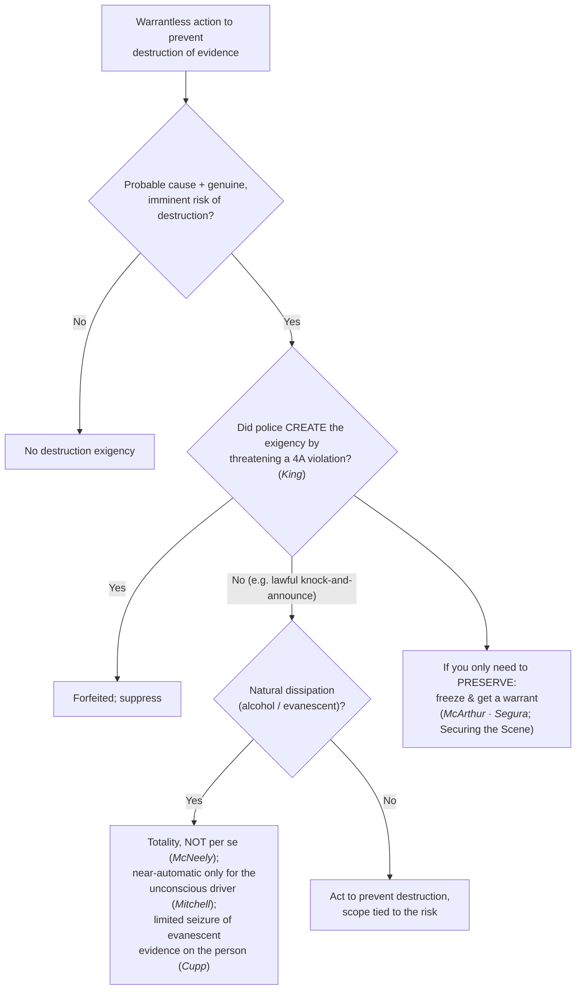
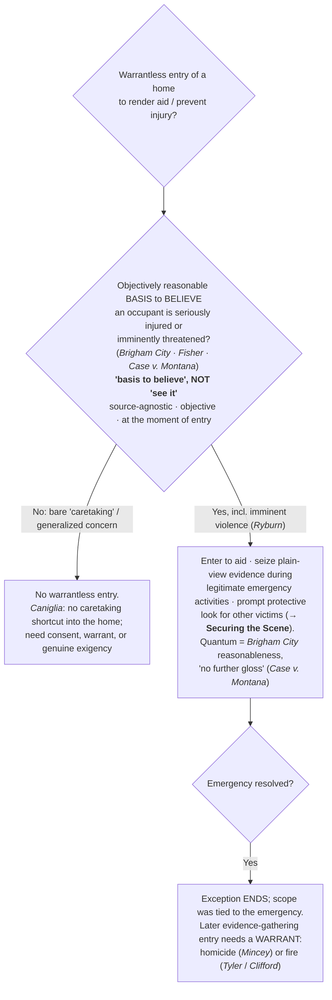

# S9 R1 panel-review — Opus model-diversity lane (prompt pack)

You are the **Claude/Opus** leg of the S9 three-lane adversarial panel (1 Claude + 2 Codex, R1). The two Codex lanes carry the A (support/quote-fidelity) and B (currency/treatment) attack lenses; **you carry model diversity and MUST vote on every paneled assertion across BOTH lenses' concerns.** You are refute-framed: try hard to break each assertion; **default to REFUTED on uncertainty**; never fabricate a cite, quote, or holding; use ONLY the evidence inlined below (no search, no outside knowledge). You are a SIGHTED reviewer — the FULL lake record (judgment fields included) is inlined.

You are a WRITER lane, not an adjudicator: you FIND and VOTE. You do not tally, adjudicate, or close any row — the orchestrator does.

For EACH group below, return one JSON object with the exact `reviewed[]` shape from the output contract (identical framing to the Codex lenses). Emit a finding object ONLY for a real defect (verdict refuted / stands-modified); a group you find wholly clean returns all-`stands` verdicts (the harness records a clean attestation). Concatenate the per-group JSON objects into a top-level `{"packs": [ ... ]}` array, one entry per group, each carrying its `group_id`.


OUTPUT CONTRACT — return ONE JSON object, nothing else:
{
  "lens": "A" | "B",
  "group_id": "<echo the group id>",
  "reviewed": [
    {
      "assertion_id": "<from group_inventory.jsonl>",
      "dimension": "existence|support|quote_fidelity|pincite|treatment|black_letter",
      "verdict": "stands" | "refuted" | "stands-modified",
      "verifiable_from_disclosed": true | false,
      "defect": null,   // null when verdict=="stands"; else an object:
      //  {"problem": "...", "severity": "high|medium|low", "proposed_fix": "...", "evidence_quote": "verbatim from disclosed evidence or null", "needs_cl": true|false, "locator_note": "..."}
      "reasons": ["short evidence-grounded reason", "..."],
      "breaks_true_positives": true | false,
      "residual_risks": ["..."],
      "suggested_tightening": "... or null"
    }
  ],
  "notes": ""
}
Rules: verdict=='stands' <=> defect==null (assertion survives your attack). verdict=='refuted' <=> a real defect (the assertion as framed is wrong). verdict=='stands-modified' <=> survives but needs a stated modification (a minor defect). Review EVERY assertion_id in group_inventory.jsonl exactly once. Output ONLY the JSON object.
---

## GROUP: content/warrant-exceptions/home-entry-and-search/Destruction of Evidence.md  (`doctrine`, 10 assertions)

### content_page

```
---
weight: 40
title: "Exigent Circumstances — Destruction of Evidence"
aliases:
  - "Destruction of Evidence"
  - "Exigent Circumstances — Destruction of Evidence"
  - "Imminent Destruction of Evidence"
topic: "Exigent Circumstances: Imminent Destruction of Evidence"
type: doctrine
amendment: "U.S. Const. amend. IV"
jurisdiction: "Federal (U.S. Const. amend. IV); SCOTUS baseline"
status: draft
related:
  - "[[Exigent Circumstances and Hot Pursuit]]"
  - "[[Emergency Aid]]"
  - "[[Securing the Scene]]"
  - "[[SIA Alcohol Tests]]"
  - "[[Knock and Talk]]"
---

# Exigent Circumstances — Destruction of Evidence

*Evidence is about to be destroyed. May I act now without a warrant, and did my own conduct forfeit the [[Exigent Circumstances and Hot Pursuit|exigency]]?*

> [!rule] Black-letter rule
> The **imminent destruction of evidence** is a recognized [[Exigent Circumstances and Hot Pursuit|exigency]]: with **probable cause**, officers may enter and act without a warrant to prevent evidence from being destroyed. But the [[Exigent Circumstances and Hot Pursuit|exigency]] is **not automatic** (natural dissipation alone is judged on the totality, not [[Common Legal Terms#per-se|per se]] — *[[Missouri v. McNeely|McNeely]]*), and it is **forfeited** where the police created it "by engaging or threatening to engage in conduct that violates the Fourth Amendment." *[[Kentucky v. King|Kentucky v. King]]*, 563 U.S. 452, [462](https://www.courtlistener.com/opinion/216733/kentucky-v-king/) (2011). Where the need is only to **preserve**, the measured response is to **freeze** the scene and get a warrant (*[[Illinois v. McArthur|McArthur]]*), not to search now.
> ^rule-destruction

## The Brief

**What it is.** This page is the **evidence-destruction** branch of the exigent-circumstances family (framework and the pursuit branch on [[Exigent Circumstances and Hot Pursuit]]; the life-safety branch on [[Emergency Aid]]). The [[Exigent Circumstances and Hot Pursuit|exigency]] lets officers with probable cause act without a warrant when there is a genuine risk that evidence will be destroyed or lost before a warrant can be obtained. It carries the family's two outer limits, and it has its own recurring proving ground in the dissipating-alcohol DUI cases.

**The anchor: no police-created [[Exigent Circumstances and Hot Pursuit|exigency]] (*[[Kentucky v. King|King]]*).** The evidence-destruction [[Exigent Circumstances and Hot Pursuit|exigency]] is real, but officers cannot manufacture it. "Where . . . the police did not create the exigency by engaging or threatening to engage in conduct that violates the Fourth Amendment, warrantless entry to prevent the destruction of evidence is reasonable and thus allowed." *[[Kentucky v. King|Kentucky v. King]]*, 563 U.S. 452, [462](https://www.courtlistener.com/opinion/216733/kentucky-v-king/) (2011). So when officers smell marijuana at an apartment door, knock and announce their presence, and then hear sounds suggesting evidence is being destroyed, the ensuing warrantless entry is lawful: a lawful [[Knock-and-Announce|knock-and-announce]] is conduct any private citizen may do, so it does **not** forfeit the exception even though it prompted the destruction. What forfeits the exception is creating the emergency through an actual or threatened **constitutional violation** (for example, announcing an imminent unlawful entry to provoke destruction). The lawful knock at the door is the [[Knock and Talk]] approach.

**The dissipating-evidence line: *[[Schmerber v. California|Schmerber]]* and its limits.** The classic destruction case is the metabolizing intoxicant. A warrantless blood draw on probable cause is reasonable where dissipating alcohol and time already lost leave "no time to seek out a magistrate and secure a warrant." *[[Schmerber v. California#^pin-770|Schmerber v. California]]*, 384 U.S. 757, [770–71](https://www.courtlistener.com/opinion/107262/schmerber-v-california/#:~:text=there%20was%20no%20time%20to) (1966). But dissipation is **not automatic**. *[[Missouri v. McNeely|McNeely]]* rejects a per-se rule: "the natural dissipation of alcohol in the bloodstream does not constitute an exigency in every case sufficient to justify . . . a blood test without a warrant"; the totality controls. *[[Missouri v. McNeely|Missouri v. McNeely]]*, 569 U.S. 141, [156](https://www.courtlistener.com/opinion/858288/missouri-v-mcneely/) (2013). *[[Mitchell v. Wisconsin|Mitchell]]* (a **plurality**) carves out the unconscious-driver scenario: when an unconscious or stuporous DUI suspect must be hospitalized before a breath test, officers "may almost always order a warrantless blood test . . . without offending the Fourth Amendment," subject to the defendant's chance to show his was the unusual case. *[[Mitchell v. Wisconsin|Mitchell v. Wisconsin]]*, 588 U.S. 840 (2019) (plurality), 139 S. Ct. 2525, 2539.

**The dissipation branch reaches the person, not just the home.** It is not limited to blood in the veins. *[[Cupp v. Murphy|Cupp v. Murphy]]* upheld the "very limited search necessary to preserve . . . highly evanescent evidence" (fingernail scrapings taken over the suspect's objection) on probable cause even without a formal arrest, on a narrowed *[[Chimel v. California|Chimel]]* rationale, while expressly declining to authorize a full search. *[[Cupp v. Murphy#^pin-296|Cupp v. Murphy]]*, 412 U.S. 291, [296](https://www.courtlistener.com/opinion/108801/cupp-v-murphy/) (1973). The point is transferable: where evidence on or about the person is genuinely about to vanish, a **narrow** preservation seizure on probable cause can be reasonable, but the scope stays tied to the evanescent thing.

**Cross-doctrine wrinkle: after *[[Birchfield v. North Dakota|Birchfield]]*, a warrantless blood draw must rest on [[Exigent Circumstances and Hot Pursuit|exigency]] or a warrant.** A warrantless **blood** draw can no longer be justified as a search incident to a DUI arrest; only a **breath** test can. *[[Birchfield v. North Dakota|Birchfield v. North Dakota]]*, 579 U.S. 438 (2016). So post-*[[Birchfield v. North Dakota|Birchfield]]*, a warrantless blood draw must rest on this **destruction/dissipation [[Exigent Circumstances and Hot Pursuit|exigency]]** (the *[[Schmerber v. California|Schmerber]]* / *[[Missouri v. McNeely|McNeely]]* / *[[Mitchell v. Wisconsin|Mitchell]]* line) or a warrant. The search-incident theory is developed on [[SIA Alcohol Tests]].

**The measured alternative: freeze and get a warrant.** Where the need is only to **preserve** evidence rather than search now, the reasonable response is the **less-intrusive freeze**. With probable cause a home holds contraband and a genuine risk of destruction, officers may temporarily restrain a resident from re-entering, or secure the premises from within, while they diligently obtain a warrant. *[[Illinois v. McArthur|Illinois v. McArthur]]*, 531 U.S. 326 (2001); *[[Segura v. United States|Segura v. United States]]*, 468 U.S. 796 (1984). This is a temporary seizure, not a search, and it is developed on [[Securing the Scene]].

**Burden · standard of review · remedy.** Because a warrantless home entry is presumptively unreasonable, the **government bears the burden** of proving a genuine destruction [[Exigent Circumstances and Hot Pursuit|exigency]] and that the police did not create it by threatening a Fourth Amendment violation. Historical facts are reviewed for [[Common Legal Terms#clear-error|clear error]] and the ultimate reasonableness [[Common Legal Terms#de-novo|de novo]]. The **remedy** for an unjustified entry, or one resting on a police-created [[Exigent Circumstances and Hot Pursuit|exigency]], is **suppression** of the evidence and its fruits under [[The Exclusionary Rule]].

**Apply it.**
1. Confirm **probable cause** and a **genuine, imminent** risk of destruction; do not treat mere possibility as [[Exigent Circumstances and Hot Pursuit|exigency]].
2. For dissipating-substance cases, build the **totality** (*[[Missouri v. McNeely|McNeely]]*); confine the near-automatic rule to *[[Mitchell v. Wisconsin|Mitchell]]*'s unconscious-driver facts.
3. Ask whether your own conduct **created** the [[Exigent Circumstances and Hot Pursuit|exigency]] by threatening a Fourth Amendment violation; a lawful [[Knock-and-Announce|knock-and-announce]] does not forfeit the exception (*[[Kentucky v. King|King]]*).
4. Keep the **scope** tied to the evanescent evidence (*[[Cupp v. Murphy|Cupp]]*); do not convert a preservation seizure into a general search.
5. If you only need to **preserve**, prefer the **freeze**: restrain re-entry and get a warrant (*[[Illinois v. McArthur|McArthur]]* · *[[Segura v. United States|Segura]]*; [[Securing the Scene]]).

**Common pitfalls.**
- **Assuming dissipation alone is exigent.** *[[Missouri v. McNeely|McNeely]]* forecloses a reflexive assumption that dissipating alcohol alone always justifies a warrantless draw.
- **Manufacturing the [[Exigent Circumstances and Hot Pursuit|exigency]].** An [[Exigent Circumstances and Hot Pursuit|exigency]] created by threatening to breach the Fourth Amendment cannot justify the entry; lawful [[Knock-and-Announce|knock-and-announce]] can (*[[Kentucky v. King|King]]*).
- **Justifying a warrantless blood draw as a [[Search Incident to Arrest|search incident to arrest]].** Post-*[[Birchfield v. North Dakota|Birchfield]]* that theory reaches breath, not blood; a blood draw needs a warrant or a real [[Exigent Circumstances and Hot Pursuit|exigency]] (*[[Birchfield v. North Dakota|Birchfield]]*; [[SIA Alcohol Tests]]).
- **Searching when you only needed to preserve.** The proportionate move is the *[[Illinois v. McArthur|McArthur]]* freeze plus a warrant, not a full warrantless search.

## Lower-court developments

Role-based, circuit/state only (**no SCOTUS**; a Supreme Court holding belongs in Key cases regardless of date). The cases below are **Binding in-circuit** within their own circuit and **Persuasive (outside circuit)** elsewhere. Recent circuit law applies *[[Kentucky v. King|King]]*'s no-manufactured-[[Exigent Circumstances and Hot Pursuit|exigency]] rule on a fact-specific basis.

- ***[[United States v. Meyer|United States v. Meyer]]* (8th Cir. 2021)** — *applies *King* (no police-created [[Exigent Circumstances and Hot Pursuit|exigency]]) in the [[Knock and Talk|knock-and-talk]] setting.* When a suspect's evasive conduct during a consensual [[Knock and Talk|knock-and-talk]] (a stated "need to clean up" and to "check my email") created a risk of evidence destruction, officers did **not** impermissibly manufacture the [[Exigent Circumstances and Hot Pursuit|exigency]]: asking tough questions and closely scrutinizing the answers, even where that prompts a suspect to begin destroying evidence, is not conduct that "creates" the [[Exigent Circumstances and Hot Pursuit|exigency]] for *[[Kentucky v. King|King]]* purposes. Warrantless entry and seizure of devices upheld. **Binding in-circuit — 8th Cir.**; **Persuasive (outside circuit)** · good. [opinion](https://www.courtlistener.com/opinion/5302394/united-states-v-william-meyer/)

## Key cases

| Case | Holding | Opinion |
|---|---|---|
| *[[Kentucky v. King]]*, 563 U.S. 452 (2011) | **Anchor.** Police may rely on a self-created [[Exigent Circumstances and Hot Pursuit\|exigency]] (evidence destruction after a lawful [[Knock-and-Announce\|knock-and-announce]]) unless they created it by engaging or threatening conduct that itself violates the Fourth Amendment. | [opinion](https://www.courtlistener.com/opinion/216733/kentucky-v-king/) |
| *[[Schmerber v. California]]*, 384 U.S. 757 (1966) | **Dissipation anchor.** A warrantless blood draw on probable cause is reasonable where dissipating alcohol plus time lost left no time to get a warrant. | [opinion](https://www.courtlistener.com/opinion/107262/schmerber-v-california/) |
| *[[Missouri v. McNeely]]*, 569 U.S. 141 (2013) | **No per-se rule.** Natural metabolization of alcohol is not a per-se [[Exigent Circumstances and Hot Pursuit\|exigency]] for a warrantless DUI blood draw; decide case-by-case on the totality. | [opinion](https://www.courtlistener.com/opinion/858288/missouri-v-mcneely/) |
| *[[Mitchell v. Wisconsin]]*, 588 U.S. 840 (2019) (plurality) | **Unconscious driver.** Where a DUI driver's unconsciousness forces hospitalization, police may almost always order a warrantless blood draw under [[Exigent Circumstances and Hot Pursuit\|exigency]] (defendant may rebut). | [opinion](https://www.courtlistener.com/opinion/9231242/mitchell-v-wisconsin/) |
| *[[Cupp v. Murphy]]*, 412 U.S. 291 (1973) | **Evanescent evidence on the person.** A limited warrantless seizure of highly destructible evidence (fingernail scrapings) on probable cause is reasonable even without a formal arrest; not a full search. | [opinion](https://www.courtlistener.com/opinion/108801/cupp-v-murphy/) |

## Related cases across doctrines

These cases are treated in full elsewhere but bear on the destruction-of-evidence [[Exigent Circumstances and Hot Pursuit|exigency]], framed here for it.

| Case | Relevance here | Primary home | Opinion |
|---|---|---|---|
| *[[Birchfield v. North Dakota]]*, 579 U.S. 438 (2016) | ***Blood needs [[Exigent Circumstances and Hot Pursuit\|exigency]] or a warrant.*** After *[[Birchfield v. North Dakota\|Birchfield]]* a warrantless blood draw is not a search incident to a DUI arrest (a breath test is), so it must rest on this dissipation [[Exigent Circumstances and Hot Pursuit\|exigency]] or a warrant. | [[SIA Alcohol Tests]] | [opinion](https://www.courtlistener.com/opinion/3216497/birchfield-v-north-dakota/) |
| *[[Illinois v. McArthur]]*, 531 U.S. 326 (2001) | ***Freeze, not search.*** With probable cause and a risk of destruction, officers may temporarily restrain a resident from re-entering while they obtain a warrant, the proportionate response to the destruction [[Exigent Circumstances and Hot Pursuit\|exigency]]. | [[Securing the Scene]] | [opinion](https://www.courtlistener.com/opinion/118405/illinois-v-mcarthur/) |
| *[[Segura v. United States]]*, 468 U.S. 796 (1984) | ***Secure premises pending a warrant.*** Officers may secure premises from within where evidence may be destroyed or removed, justifying a temporary freeze rather than an immediate full search. | [[Securing the Scene]] | [opinion](https://www.courtlistener.com/opinion/111259/segura-v-united-states/) |
| *[[Mincey v. Arizona]]*, 437 U.S. 385 (1978) | ***Scope stays tied to the emergency.*** No "seriousness" exception: warrantless activity is strictly circumscribed by the emergency, and a general evidentiary search needs a warrant. | [[Emergency Aid]] | [opinion](https://www.courtlistener.com/opinion/109905/mincey-v-arizona/) |

## Visual



## Sources

- [*Kentucky v. King*, 563 U.S. 452 (2011)](https://www.courtlistener.com/opinion/216733/kentucky-v-king/) (pinpoint: 462 — CAP star page verified, S7 R5 T1)
- [*Schmerber v. California*, 384 U.S. 757 (1966)](https://www.courtlistener.com/opinion/107262/schmerber-v-california/) (pinpoints: 770–71)
- [*Missouri v. McNeely*, 569 U.S. 141 (2013)](https://www.courtlistener.com/opinion/858288/missouri-v-mcneely/) (pinpoint: 156)
- [*Mitchell v. Wisconsin*, 588 U.S. 840 (2019) (plurality)](https://www.courtlistener.com/opinion/9231242/mitchell-v-wisconsin/) (pinpoint: 139 S. Ct. 2539)
- [*Cupp v. Murphy*, 412 U.S. 291 (1973)](https://www.courtlistener.com/opinion/108801/cupp-v-murphy/) (pinpoint: 296)
- [*Birchfield v. North Dakota*, 579 U.S. 438 (2016)](https://www.courtlistener.com/opinion/3216497/birchfield-v-north-dakota/)
- [*Illinois v. McArthur*, 531 U.S. 326 (2001)](https://www.courtlistener.com/opinion/118405/illinois-v-mcarthur/)
- [*Segura v. United States*, 468 U.S. 796 (1984)](https://www.courtlistener.com/opinion/111259/segura-v-united-states/)
- [*Mincey v. Arizona*, 437 U.S. 385 (1978)](https://www.courtlistener.com/opinion/109905/mincey-v-arizona/)
- [*United States v. Meyer*, 8th Cir. 2021](https://www.courtlistener.com/opinion/5302394/united-states-v-william-meyer/)
</content>

```

### group_inventory (assertions under review)

```jsonl
{"assertion_id": "34d59cf01b6daee2", "dimension": "existence", "kind": "case_cite", "locator": {"case": "Schmerber v. California", "table_line": 50}, "payload": {"case": "Schmerber v. California", "cells": ["*[[Schmerber v. California]]*, 384 U.S. 757 (1966)", "**Dissipation anchor.** A warrantless blood draw on probable cause is reasonable where dissipating alcohol plus time lost left no time to get a warrant.", "[opinion](https://www.courtlistener.com/opinion/107262/schmerber-v-california/)"], "header": ["Case", "Holding", "Opinion"]}}
{"assertion_id": "424d61dc549aa43d", "dimension": "existence", "kind": "case_cite", "locator": {"case": "Missouri v. McNeely", "table_line": 51}, "payload": {"case": "Missouri v. McNeely", "cells": ["*[[Missouri v. McNeely]]*, 569 U.S. 141 (2013)", "**No per-se rule.** Natural metabolization of alcohol is not a per-se [[Exigent Circumstances and Hot Pursuit\\|exigency]] for a warrantless DUI blood draw; decide case-by-case on the totality.", "[opinion](https://www.courtlistener.com/opinion/858288/missouri-v-mcneely/)"], "header": ["Case", "Holding", "Opinion"]}}
{"assertion_id": "44e2572e20af5252", "dimension": "existence", "kind": "case_cite", "locator": {"case": "Kentucky v. King", "table_line": 49}, "payload": {"case": "Kentucky v. King", "cells": ["*[[Kentucky v. King]]*, 563 U.S. 452 (2011)", "**Anchor.** Police may rely on a self-created [[Exigent Circumstances and Hot Pursuit\\|exigency]] (evidence destruction after a lawful [[Knock-and-Announce\\|knock-and-announce]]) unless they created it by engaging or threatening conduct that itself violates the Fourth Amendment.", "[opinion](https://www.courtlistener.com/opinion/216733/kentucky-v-king/)"], "header": ["Case", "Holding", "Opinion"]}}
{"assertion_id": "4b4116188c122da2", "dimension": "existence", "kind": "case_cite", "locator": {"case": "Segura v. United States", "table_line": 63}, "payload": {"case": "Segura v. United States", "cells": ["*[[Segura v. United States]]*, 468 U.S. 796 (1984)", "***Secure premises pending a warrant.*** Officers may secure premises from within where evidence may be destroyed or removed, justifying a temporary freeze rather than an immediate full search.", "[[Securing the Scene]]", "[opinion](https://www.courtlistener.com/opinion/111259/segura-v-united-states/)"], "header": ["Case", "Relevance here", "Primary home", "Opinion"]}}
{"assertion_id": "959300ff8ffabacf", "dimension": "existence", "kind": "case_cite", "locator": {"case": "Illinois v. McArthur", "table_line": 62}, "payload": {"case": "Illinois v. McArthur", "cells": ["*[[Illinois v. McArthur]]*, 531 U.S. 326 (2001)", "***Freeze, not search.*** With probable cause and a risk of destruction, officers may temporarily restrain a resident from re-entering while they obtain a warrant, the proportionate response to the destruction [[Exigent Circumstances and Hot Pursuit\\|exigency]].", "[[Securing the Scene]]", "[opinion](https://www.courtlistener.com/opinion/118405/illinois-v-mcarthur/)"], "header": ["Case", "Relevance here", "Primary home", "Opinion"]}}
{"assertion_id": "9fe18ed01ed2ca92", "dimension": "existence", "kind": "case_cite", "locator": {"case": "Cupp v. Murphy", "table_line": 53}, "payload": {"case": "Cupp v. Murphy", "cells": ["*[[Cupp v. Murphy]]*, 412 U.S. 291 (1973)", "**Evanescent evidence on the person.** A limited warrantless seizure of highly destructible evidence (fingernail scrapings) on probable cause is reasonable even without a formal arrest; not a full search.", "[opinion](https://www.courtlistener.com/opinion/108801/cupp-v-murphy/)"], "header": ["Case", "Holding", "Opinion"]}}
{"assertion_id": "a2baebdad774923f", "dimension": "existence", "kind": "case_cite", "locator": {"case": "Mincey v. Arizona", "table_line": 64}, "payload": {"case": "Mincey v. Arizona", "cells": ["*[[Mincey v. Arizona]]*, 437 U.S. 385 (1978)", "***Scope stays tied to the emergency.*** No \"seriousness\" exception: warrantless activity is strictly circumscribed by the emergency, and a general evidentiary search needs a warrant.", "[[Emergency Aid]]", "[opinion](https://www.courtlistener.com/opinion/109905/mincey-v-arizona/)"], "header": ["Case", "Relevance here", "Primary home", "Opinion"]}}
{"assertion_id": "abe5d9cf3145bf55", "dimension": "existence", "kind": "case_cite", "locator": {"case": "Birchfield v. North Dakota", "table_line": 61}, "payload": {"case": "Birchfield v. North Dakota", "cells": ["*[[Birchfield v. North Dakota]]*, 579 U.S. 438 (2016)", "***Blood needs [[Exigent Circumstances and Hot Pursuit\\|exigency]] or a warrant.*** After *[[Birchfield v. North Dakota\\|Birchfield]]* a warrantless blood draw is not a search incident to a DUI arrest (a breath test is), so it must rest on this dissipation [[Exigent Circumstances and Hot Pursuit\\|exigency]] or a warrant.", "[[SIA Alcohol Tests]]", "[opinion](https://www.courtlistener.com/opinion/3216497/birchfield-v-north-dakota/)"], "header": ["Case", "Relevance here", "Primary home", "Opinion"]}}
{"assertion_id": "d7eb2b041b241f20", "dimension": "existence", "kind": "case_cite", "locator": {"case": "Mitchell v. Wisconsin", "table_line": 52}, "payload": {"case": "Mitchell v. Wisconsin", "cells": ["*[[Mitchell v. Wisconsin]]*, 588 U.S. 840 (2019) (plurality)", "**Unconscious driver.** Where a DUI driver's unconsciousness forces hospitalization, police may almost always order a warrantless blood draw under [[Exigent Circumstances and Hot Pursuit\\|exigency]] (defendant may rebut).", "[opinion](https://www.courtlistener.com/opinion/9231242/mitchell-v-wisconsin/)"], "header": ["Case", "Holding", "Opinion"]}}
{"assertion_id": "1d6dc7f469984d58", "dimension": "support", "kind": "proposition", "locator": {"callout": "^rule-destruction"}, "payload": {"anchor": "^rule-destruction", "statement": "[!rule] Black-letter rule\nThe **imminent destruction of evidence** is a recognized [[Exigent Circumstances and Hot Pursuit|exigency]]: with **probable cause**, officers may enter and act without a warrant to prevent evidence from being destroyed. But the [[Exigent Circumstances and Hot Pursuit|exigency]] is **not automatic** (natural dissipation alone is judged on the totality, not [[Common Legal Terms#per-se|per se]] — *[[Missouri v. McNeely|McNeely]]*), and it is **forfeited** where the police created it \"by engaging or threatening to engage in conduct that violates the Fourth Amendment.\" *[[Kentucky v. King|Kentucky v. King]]*, 563 U.S. 452, [462](https://www.courtlistener.com/opinion/216733/kentucky-v-king/) (2011). Where the need is only to **preserve**, the measured response is to **freeze** the scene and get a warrant (*[[Illinois v. McArthur|McArthur]]*), not to search now."}}
```

### lake record — Birchfield v. North Dakota

```json
{
  "schema_version": "s2.v1",
  "record_id": "Birchfield v. North Dakota",
  "stub": false,
  "status": "verified",
  "identity": {
    "case_name": "Birchfield v. N. Dakota. William Robert Bernard",
    "case_name_short": "Birchfield",
    "case_name_full": "Danny BIRCHFIELD, Petitioner v. NORTH DAKOTA. William Robert Bernard, Jr., Petitioner v. Minnesota. and Steve Michael Beylund, Petitioner v. Grant Levi, Director, North Dakota Department of Transportation.",
    "input_case_name": "Birchfield v. North Dakota",
    "court": "U.S. Supreme Court",
    "court_id": "scotus",
    "court_level": "scotus",
    "circuit": null,
    "state": null,
    "date_decided": "2016-06-23",
    "year": 2016,
    "docket": "14-1468",
    "cluster_id": 3216497,
    "lead_opinion_id": 3216391,
    "sibling_ids": [
      3216391
    ],
    "absolute_url": "/opinion/3216497/birchfield-v-n-dakota-william-robert-bernard/",
    "identity_method": "citation+party-text",
    "expected_citation_found": true,
    "party_name_in_text": true,
    "canonical_name_match": true,
    "alternates": [
      {
        "cluster_id": 8424452,
        "score": 20,
        "case_name": "Birchfield v. Dakota"
      },
      {
        "cluster_id": 8423610,
        "score": 20,
        "case_name": "Birchfield v. Dakota"
      }
    ],
    "reason_code": null
  },
  "citations": {
    "official": {
      "cite": "579 U.S. 438",
      "volume": "579",
      "reporter": "U.S.",
      "page": "438",
      "type": 1,
      "selected_official": true,
      "source": "cluster.citations[]"
    },
    "parallel": [
      {
        "cite": "195 L. Ed. 2d 560",
        "volume": "195",
        "reporter": "L. Ed. 2d",
        "page": "560",
        "type": 1,
        "selected_official": false,
        "source": "cluster.citations[]"
      },
      {
        "cite": "136 S. Ct. 2160",
        "volume": "136",
        "reporter": "S. Ct.",
        "page": "2160",
        "type": 1,
        "selected_official": false,
        "source": "cluster.citations[]"
      }
    ],
    "vendor_neutral": [
      {
        "cite": "2016 U.S. LEXIS 4058",
        "volume": "2016",
        "reporter": "U.S. LEXIS",
        "page": "4058",
        "type": 6,
        "selected_official": false,
        "source": "cluster.citations[]"
      }
    ],
    "all": [
      {
        "cite": "579 U.S. 438",
        "volume": "579",
        "reporter": "U.S.",
        "page": "438",
        "type": 1,
        "selected_official": false,
        "source": "cluster.citations[]"
      },
      {
        "cite": "195 L. Ed. 2d 560",
        "volume": "195",
        "reporter": "L. Ed. 2d",
        "page": "560",
        "type": 1,
        "selected_official": false,
        "source": "cluster.citations[]"
      },
      {
        "cite": "2016 U.S. LEXIS 4058",
        "volume": "2016",
        "reporter": "U.S. LEXIS",
        "page": "4058",
        "type": 6,
        "selected_official": false,
        "source": "cluster.citations[]"
      },
      {
        "cite": "136 S. Ct. 2160",
        "volume": "136",
        "reporter": "S. Ct.",
        "page": "2160",
        "type": 1,
        "selected_official": false,
        "source": "cluster.citations[]"
      }
    ],
    "display": "579 U.S. 438",
    "official_selection": {
      "court_class": "scotus",
      "selected": "579 U.S. 438",
      "reason": "selected_rank_1"
    }
  },
  "pinpoints": [
    {
      "id": "pin-2185",
      "page": null,
      "quote": "--- # Birchfield v. North Dakota *579 U.S. 438 (2016)* \u00b7 U.S. Supreme Court \u00b7 **Binding \u2014 SCOTUS** \u00b7 Treatment: **good** *(as of 2026-06-30)* <!-- header line; TreatmentBadge + weight render here, degrading to the text above --> ## Background Three consolidated DUI cases tested States' implied-consent laws that attach consequences to refusing a chemical test. Danny Birchfield was criminally prosecuted under North Dakota law for refusing a warrantless **blood** test after a drunk-driving arrest. William Bernard was prosecuted for refusing a warrantless **breath** test in Minnesota. Steve Beylund submitted to a **blood** test after being told that refusal was a crime. Each argued that criminalizing or coercing submission to a warrantless test violated the Fourth Amendment. ## Issue Whether the Fourth Amendment permits warrantless breath and blood tests incident to an arrest for drunk driving, and whether a State may impose criminal penalties on a motorist's refusal to submit to such a warrantless test. ## Rule The intrusiveness of the test controls.",
      "star_marker": null,
      "quote_fidelity": "mismatch",
      "pinpoint_status": "slip-only",
      "position": null
    },
    {
      "id": "pin-2185a",
      "page": null,
      "quote": "It is another matter, however, for a State not only to insist upon an intrusive blood test, but also to impose criminal penalties on the refusal to submit to such a test. There must be a limit to the consequences to which motorists may be deemed to have consented by virtue of a decision to drive on public roads.",
      "star_marker": null,
      "quote_fidelity": "mismatch",
      "pinpoint_status": "slip-only",
      "position": null
    }
  ],
  "treatment": {
    "field_i_validity": "good_law",
    "as_of_content": "2016-06-23",
    "as_of_treatment": "2026-06-30",
    "composite_basis": "migration-seed",
    "composite_basis_ref": "Birchfield v. North Dakota",
    "varies_by_point": false,
    "scope_note": "Good law. Refines the Schmerber/McNeely DUI-testing line: breath tests are valid as a search incident to arrest, blood tests are not; States may not criminalize refusal of a warrantless blood test.",
    "point_overrides": [],
    "edges": [
      {
        "citing_case": {
          "name": "State v. Bell",
          "cluster_id": 10747468,
          "cite": [
            "2025 ND 201"
          ],
          "field_ii": "abrogated"
        },
        "field_ii": "abrogated",
        "field_iii": "mentioned",
        "point": null,
        "proposed": true,
        "journal_ref": "Birchfield v. North Dakota:lane1_negative"
      },
      {
        "citing_case": {
          "name": "State of Iowa v. Colby Davis Laub",
          "cluster_id": 9493043,
          "cite": null,
          "field_ii": "overruled"
        },
        "field_ii": "overruled",
        "field_iii": "mentioned",
        "point": null,
        "proposed": true,
        "journal_ref": "Birchfield v. North Dakota:lane1_negative"
      },
      {
        "citing_case": {
          "name": "State of Iowa v. Colby Davis Laub",
          "cluster_id": 9473742,
          "cite": null,
          "field_ii": "overruled"
        },
        "field_ii": "overruled",
        "field_iii": "mentioned",
        "point": null,
        "proposed": true,
        "journal_ref": "Birchfield v. North Dakota:lane1_negative"
      },
      {
        "citing_case": {
          "name": "State v. Phipps",
          "cluster_id": 9440775,
          "cite": null,
          "field_ii": "overruled"
        },
        "field_ii": "overruled",
        "field_iii": "mentioned",
        "point": null,
        "proposed": true,
        "journal_ref": "Birchfield v. North Dakota:lane1_negative"
      },
      {
        "citing_case": {
          "name": "State v. Portulano",
          "cluster_id": 10135231,
          "cite": [
            "320 Or. App. 335",
            "514 P.3d 93"
          ],
          "field_ii": "questioned"
        },
        "field_ii": "questioned",
        "field_iii": "mentioned",
        "point": null,
        "proposed": true,
        "journal_ref": "Birchfield v. North Dakota:lane1_negative"
      },
      {
        "citing_case": {
          "name": "State v. Kruse",
          "cluster_id": 4643214,
          "cite": [
            "303 Neb. 799",
            "931 N.W.2d 148"
          ],
          "field_ii": "overruled"
        },
        "field_ii": "overruled",
        "field_iii": "mentioned",
        "point": null,
        "proposed": true,
        "journal_ref": "Birchfield v. North Dakota:lane1_negative"
      },
      {
        "citing_case": {
          "name": "State v. Banks",
          "cluster_id": 6658146,
          "cite": [
            "434 P.3d 361",
            "364 Or. 332"
          ],
          "field_ii": "questioned"
        },
        "field_ii": "questioned",
        "field_iii": "mentioned",
        "point": null,
        "proposed": true,
        "journal_ref": "Birchfield v. North Dakota:lane1_negative"
      },
      {
        "citing_case": {
          "name": "State v. Hatfield",
          "cluster_id": 4505365,
          "cite": [
            "300 Neb. 152",
            "912 N.W.2d 731"
          ],
          "field_ii": "questioned"
        },
        "field_ii": "questioned",
        "field_iii": "mentioned",
        "point": null,
        "proposed": true,
        "journal_ref": "Birchfield v. North Dakota:lane1_negative"
      },
      {
        "citing_case": {
          "name": "Cosino v. State",
          "cluster_id": 5447462,
          "cite": [
            "503 S.W.3d 592",
            "2016 Tex. App. LEXIS 11431",
            "2016 WL 6134461"
          ],
          "field_ii": "overruled"
        },
        "field_ii": "overruled",
        "field_iii": "mentioned",
        "point": null,
        "proposed": true,
        "journal_ref": "Birchfield v. North Dakota:lane1_negative"
      },
      {
        "citing_case": {
          "name": "State v. Rocha",
          "cluster_id": 4345763,
          "cite": [
            "295 Neb. 716",
            "890 N.W.2d 178"
          ],
          "field_ii": "overruled"
        },
        "field_ii": "overruled",
        "field_iii": "mentioned",
        "point": null,
        "proposed": true,
        "journal_ref": "Birchfield v. North Dakota:lane2_top_cited"
      },
      {
        "citing_case": {
          "name": "The Matter of Kevin B. Acevedo v. New York State Department of Motor Vehicles , The Matter of Michael W. Carney v. New York State Department of Motor Vehicles , The Matter of Caralyn A. Matsen v. New York State Department of Motor Vehicles",
          "cluster_id": 4390108,
          "cite": [
            "29 N.Y.3d 202",
            "77 N.E.3d 331"
          ],
          "field_ii": "questioned"
        },
        "field_ii": "questioned",
        "field_iii": "mentioned",
        "point": null,
        "proposed": true,
        "journal_ref": "Birchfield v. North Dakota:lane2_top_cited"
      },
      {
        "citing_case": {
          "name": "State v. Hood",
          "cluster_id": 4541268,
          "cite": [
            "301 Neb. 207",
            "917 N.W.2d 880"
          ],
          "field_ii": "overruled"
        },
        "field_ii": "overruled",
        "field_iii": "mentioned",
        "point": null,
        "proposed": true,
        "journal_ref": "Birchfield v. North Dakota:lane2_top_cited"
      },
      {
        "citing_case": {
          "name": "State v. McCumber",
          "cluster_id": 4370918,
          "cite": [
            "295 Neb. 941",
            "893 N.W.2d 411"
          ],
          "field_ii": "questioned"
        },
        "field_ii": "questioned",
        "field_iii": "mentioned",
        "point": null,
        "proposed": true,
        "journal_ref": "Birchfield v. North Dakota:lane2_top_cited"
      },
      {
        "citing_case": {
          "name": "Sloley v. VanBramer",
          "cluster_id": 4686314,
          "cite": [
            "945 F.3d 30"
          ],
          "field_ii": "abrogated"
        },
        "field_ii": "abrogated",
        "field_iii": "mentioned",
        "point": null,
        "proposed": true,
        "journal_ref": "Birchfield v. North Dakota:lane2_top_cited"
      },
      {
        "citing_case": {
          "name": "Commonwealth, Aplt. v. Myers, D.",
          "cluster_id": 4410366,
          "cite": [
            "164 A.3d 1162",
            "2017 WL 3045867",
            "2017 Pa. LEXIS 1689"
          ],
          "field_ii": "questioned"
        },
        "field_ii": "questioned",
        "field_iii": "mentioned",
        "point": null,
        "proposed": true,
        "journal_ref": "Birchfield v. North Dakota:lane2_top_cited"
      },
      {
        "citing_case": {
          "name": "State of Tennessee v. Corrin Kathleen Reynolds",
          "cluster_id": 4318256,
          "cite": [
            "504 S.W.3d 283",
            "2016 Tenn. LEXIS 821"
          ],
          "field_ii": "overruled"
        },
        "field_ii": "overruled",
        "field_iii": "mentioned",
        "point": null,
        "proposed": true,
        "journal_ref": "Birchfield v. North Dakota:lane2_top_cited"
      },
      {
        "citing_case": {
          "name": "State v. Martinez",
          "cluster_id": 6243814,
          "cite": [
            "570 S.W.3d 278"
          ],
          "field_ii": "questioned"
        },
        "field_ii": "questioned",
        "field_iii": "mentioned",
        "point": null,
        "proposed": true,
        "journal_ref": "Birchfield v. North Dakota:lane2_top_cited"
      },
      {
        "citing_case": {
          "name": "State v. Schmidt",
          "cluster_id": 4330697,
          "cite": [
            "53 Kan. App. 2d 225",
            "385 P.3d 936",
            "2016 Kan. App. LEXIS 70"
          ],
          "field_ii": "questioned"
        },
        "field_ii": "questioned",
        "field_iii": "mentioned",
        "point": null,
        "proposed": true,
        "journal_ref": "Birchfield v. North Dakota:lane2_top_cited"
      },
      {
        "citing_case": {
          "name": "State v. Pester",
          "cluster_id": 4312370,
          "cite": [
            "294 Neb. 995",
            "885 N.W.2d 713"
          ],
          "field_ii": "overruled"
        },
        "field_ii": "overruled",
        "field_iii": "mentioned",
        "point": null,
        "proposed": true,
        "journal_ref": "Birchfield v. North Dakota:lane2_top_cited"
      },
      {
        "citing_case": {
          "name": "Lange v. California",
          "cluster_id": 4894054,
          "cite": [
            "594 U.S. 295"
          ],
          "field_ii": "questioned"
        },
        "field_ii": "questioned",
        "field_iii": "mentioned",
        "point": null,
        "proposed": true,
        "journal_ref": "Birchfield v. North Dakota:lane2_top_cited"
      },
      {
        "citing_case": {
          "name": "State v. McGinn",
          "cluster_id": 4623043,
          "cite": [
            "303 Neb. 224",
            "928 N.W.2d 391"
          ],
          "field_ii": "overruled"
        },
        "field_ii": "overruled",
        "field_iii": "mentioned",
        "point": null,
        "proposed": true,
        "journal_ref": "Birchfield v. North Dakota:lane2_top_cited"
      },
      {
        "citing_case": {
          "name": "State v. Rothenberger",
          "cluster_id": 4259293,
          "cite": [
            "294 Neb. 810",
            "885 N.W.2d 23"
          ],
          "field_ii": "overruled"
        },
        "field_ii": "overruled",
        "field_iii": "mentioned",
        "point": null,
        "proposed": true,
        "journal_ref": "Birchfield v. North Dakota:lane2_top_cited"
      },
      {
        "citing_case": {
          "name": "People of Michigan v. Glorianna Woodard",
          "cluster_id": 4428527,
          "cite": [
            "909 N.W.2d 299",
            "321 Mich. App. 377"
          ],
          "field_ii": "questioned"
        },
        "field_ii": "questioned",
        "field_iii": "mentioned",
        "point": null,
        "proposed": true,
        "journal_ref": "Birchfield v. North Dakota:lane2_top_cited"
      },
      {
        "citing_case": {
          "name": "United States v. Delva",
          "cluster_id": 4396270,
          "cite": [
            "858 F.3d 135",
            "2017 WL 2366489",
            "2017 U.S. App. LEXIS 9645"
          ],
          "field_ii": "questioned"
        },
        "field_ii": "questioned",
        "field_iii": "mentioned",
        "point": null,
        "proposed": true,
        "journal_ref": "Birchfield v. North Dakota:lane2_top_cited"
      },
      {
        "citing_case": {
          "name": "State v. Nielsen",
          "cluster_id": 4535193,
          "cite": [
            "301 Neb. 88",
            "917 N.W.2d 159"
          ],
          "field_ii": "questioned"
        },
        "field_ii": "questioned",
        "field_iii": "mentioned",
        "point": null,
        "proposed": true,
        "journal_ref": "Birchfield v. North Dakota:lane2_top_cited"
      },
      {
        "citing_case": {
          "name": "Com. v. Hand, T.",
          "cluster_id": 10279074,
          "cite": [
            "2021 Pa. Super. 113",
            "252 A.3d 1159"
          ],
          "field_ii": "questioned"
        },
        "field_ii": "questioned",
        "field_iii": "mentioned",
        "point": null,
        "proposed": true,
        "journal_ref": "Birchfield v. North Dakota:lane2_top_cited"
      },
      {
        "citing_case": {
          "name": "Pacheco v. State",
          "cluster_id": 10048657,
          "cite": [
            "465 Md. 311"
          ],
          "field_ii": "questioned"
        },
        "field_ii": "questioned",
        "field_iii": "mentioned",
        "point": null,
        "proposed": true,
        "journal_ref": "Birchfield v. North Dakota:lane2_top_cited"
      },
      {
        "citing_case": {
          "name": "State v. Dawn M. Prado",
          "cluster_id": 4893130,
          "cite": [
            "960 N.W.2d 869",
            "2021 WI 64"
          ],
          "field_ii": "overruled"
        },
        "field_ii": "overruled",
        "field_iii": "mentioned",
        "point": null,
        "proposed": true,
        "journal_ref": "Birchfield v. North Dakota:lane2_top_cited"
      },
      {
        "citing_case": {
          "name": "Wade Robertson v. Rise Pichon",
          "cluster_id": 4372525,
          "cite": [
            "849 F.3d 1173",
            "2017 WL 816886",
            "2017 U.S. App. LEXIS 3770"
          ],
          "field_ii": "criticized"
        },
        "field_ii": "criticized",
        "field_iii": "mentioned",
        "point": null,
        "proposed": true,
        "journal_ref": "Birchfield v. North Dakota:lane2_top_cited"
      },
      {
        "citing_case": {
          "name": "United States v. Roberto Pabon",
          "cluster_id": 4425184,
          "cite": [
            "871 F.3d 164",
            "2017 U.S. App. LEXIS 17471"
          ],
          "field_ii": "questioned"
        },
        "field_ii": "questioned",
        "field_iii": "mentioned",
        "point": null,
        "proposed": true,
        "journal_ref": "Birchfield v. North Dakota:lane2_top_cited"
      },
      {
        "citing_case": {
          "name": "State v. Cornwell",
          "cluster_id": 4257159,
          "cite": [
            "294 Neb. 799",
            "884 N.W.2d 722"
          ],
          "field_ii": "questioned"
        },
        "field_ii": "questioned",
        "field_iii": "mentioned",
        "point": null,
        "proposed": true,
        "journal_ref": "Birchfield v. North Dakota:lane2_top_cited"
      }
    ],
    "derivation": {
      "lane1_negative": {
        "query": "cites:(3216391) AND (overrul* OR abrogat* OR supersed* OR \"recede from\" OR \"no longer good law\" OR vacat* OR reversed) ",
        "reviewed": 177,
        "cap": 200,
        "cap_hit": false,
        "final_cursor": null,
        "audit_needed": false,
        "proposed_negative_events": 9,
        "audit_marker": null,
        "triage_mode": "snippet-first",
        "snippet_field": "results[].opinions[].snippet",
        "triage_journaled": 177,
        "triage_read": 10,
        "triage_snippet_classified": 167
      },
      "lane2_top_cited": {
        "query": "cites:(3216391)",
        "reviewed": 25,
        "cap": 25,
        "cap_hit": true,
        "final_cursor": "https://www.courtlistener.com/api/rest/v4/search/?cursor=cz0xMSZzPTQ2ODkxNTUmdD1vJmQ9MjAyNi0wNy0wNCZwPTM%3D&order_by=citeCount+desc&page_size=25&q=cites%3A%283216391%29&type=o",
        "audit_needed": true,
        "proposed_negative_events": 25,
        "audit_marker": "R15 treatment audit required"
      },
      "lane3_recency": {
        "query": "cites:(3216391)",
        "reviewed": 58,
        "cap": 200,
        "cap_hit": false,
        "final_cursor": null,
        "audit_needed": false,
        "proposed_negative_events": 4,
        "audit_marker": null,
        "triage_mode": "snippet-first",
        "snippet_field": "results[].opinions[].snippet",
        "triage_journaled": 58,
        "triage_read": 4,
        "triage_snippet_classified": 54
      }
    }
  },
  "progeny": {
    "complete_query": "cites:(3216391)",
    "indexed_citing_opinions": 231,
    "count_source": "search",
    "per_sibling": [
      {
        "opinion_id": 3216391,
        "count": 231,
        "count_source": "search"
      }
    ],
    "citation_count": 1444,
    "cache_path": "/Users/johngalt/cssi-lake/cache/progeny/birchfield-v-north-dakota.jsonl",
    "enumeration": "bounded",
    "cursor": "https://www.courtlistener.com/api/rest/v4/search/?cursor=cz0xLjg5MDcwNzcmcz0xMDAxMzA0OCZ0PW8mZD0yMDI2LTA3LTA0JnA9Mg%3D%3D&order_by=score+desc&page_size=100&q=cites%3A%283216391%29&type=o",
    "rows_cached": 20,
    "outbound_opinion_edges": [
      {
        "source_opinion_id": 3216391,
        "cited_id": 96405,
        "source": "search.opinions[].cites[]"
      },
      {
        "source_opinion_id": 3216391,
        "cited_id": 98094,
        "source": "search.opinions[].cites[]"
      },
      {
        "source_opinion_id": 3216391,
        "cited_id": 101899,
        "source": "search.opinions[].cites[]"
      },
      {
        "source_opinion_id": 3216391,
        "cited_id": 104422,
        "source": "search.opinions[].cites[]"
      },
      {
        "source_opinion_id": 3216391,
        "cited_id": 104769,
        "source": "search.opinions[].cites[]"
      },
      {
        "source_opinion_id": 3216391,
        "cited_id": 105456,
        "source": "search.opinions[].cites[]"
      },
      {
        "source_opinion_id": 3216391,
        "cited_id": 107262,
        "source": "search.opinions[].cites[]"
      },
      {
        "source_opinion_id": 3216391,
        "cited_id": 107473,
        "source": "search.opinions[].cites[]"
      },
      {
        "source_opinion_id": 3216391,
        "cited_id": 107564,
        "source": "search.opinions[].cites[]"
      },
      {
        "source_opinion_id": 3216391,
        "cited_id": 107716,
        "source": "search.opinions[].cites[]"
      },
      {
        "source_opinion_id": 3216391,
        "cited_id": 107979,
        "source": "search.opinions[].cites[]"
      },
      {
        "source_opinion_id": 3216391,
        "cited_id": 108581,
        "source": "search.opinions[].cites[]"
      },
      {
        "source_opinion_id": 3216391,
        "cited_id": 108800,
        "source": "search.opinions[].cites[]"
      },
      {
        "source_opinion_id": 3216391,
        "cited_id": 108801,
        "source": "search.opinions[].cites[]"
      },
      {
        "source_opinion_id": 3216391,
        "cited_id": 108845,
        "source": "search.opinions[].cites[]"
      },
      {
        "source_opinion_id": 3216391,
        "cited_id": 108893,
        "source": "search.opinions[].cites[]"
      },
      {
        "source_opinion_id": 3216391,
        "cited_id": 109714,
        "source": "search.opinions[].cites[]"
      },
      {
        "source_opinion_id": 3216391,
        "cited_id": 109866,
        "source": "search.opinions[].cites[]"
      },
      {
        "source_opinion_id": 3216391,
        "cited_id": 109874,
        "source": "search.opinions[].cites[]"
      },
      {
        "source_opinion_id": 3216391,
        "cited_id": 110126,
        "source": "search.opinions[].cites[]"
      },
      {
        "source_opinion_id": 3216391,
        "cited_id": 110464,
        "source": "search.opinions[].cites[]"
      },
      {
        "source_opinion_id": 3216391,
        "cited_id": 110832,
        "source": "search.opinions[].cites[]"
      },
      {
        "source_opinion_id": 3216391,
        "cited_id": 111206,
        "source": "search.opinions[].cites[]"
      },
      {
        "source_opinion_id": 3216391,
        "cited_id": 111788,
        "source": "search.opinions[].cites[]"
      },
      {
        "source_opinion_id": 3216391,
        "cited_id": 112219,
        "source": "search.opinions[].cites[]"
      },
      {
        "source_opinion_id": 3216391,
        "cited_id": 112412,
        "source": "search.opinions[].cites[]"
      },
      {
        "source_opinion_id": 3216391,
        "cited_id": 112608,
        "source": "search.opinions[].cites[]"
      },
      {
        "source_opinion_id": 3216391,
        "cited_id": 117964,
        "source": "search.opinions[].cites[]"
      },
      {
        "source_opinion_id": 3216391,
        "cited_id": 118235,
        "source": "search.opinions[].cites[]"
      },
      {
        "source_opinion_id": 3216391,
        "cited_id": 118250,
        "source": "search.opinions[].cites[]"
      },
      {
        "source_opinion_id": 3216391,
        "cited_id": 134724,
        "source": "search.opinions[].cites[]"
      },
      {
        "source_opinion_id": 3216391,
        "cited_id": 145654,
        "source": "search.opinions[].cites[]"
      },
      {
        "source_opinion_id": 3216391,
        "cited_id": 145814,
        "source": "search.opinions[].cites[]"
      },
      {
        "source_opinion_id": 3216391,
        "cited_id": 145887,
        "source": "search.opinions[].cites[]"
      },
      {
        "source_opinion_id": 3216391,
        "cited_id": 216733,
        "source": "search.opinions[].cites[]"
      },
      {
        "source_opinion_id": 3216391,
        "cited_id": 856347,
        "source": "search.opinions[].cites[]"
      },
      {
        "source_opinion_id": 3216391,
        "cited_id": 1180238,
        "source": "search.opinions[].cites[]"
      },
      {
        "source_opinion_id": 3216391,
        "cited_id": 1593988,
        "source": "search.opinions[].cites[]"
      },
      {
        "source_opinion_id": 3216391,
        "cited_id": 1613688,
        "source": "search.opinions[].cites[]"
      },
      {
        "source_opinion_id": 3216391,
        "cited_id": 1845122,
        "source": "search.opinions[].cites[]"
      },
      {
        "source_opinion_id": 3216391,
        "cited_id": 1865553,
        "source": "search.opinions[].cites[]"
      },
      {
        "source_opinion_id": 3216391,
        "cited_id": 2770344,
        "source": "search.opinions[].cites[]"
      },
      {
        "source_opinion_id": 3216391,
        "cited_id": 2779207,
        "source": "search.opinions[].cites[]"
      },
      {
        "source_opinion_id": 3216391,
        "cited_id": 3836945,
        "source": "search.opinions[].cites[]"
      },
      {
        "source_opinion_id": 3216391,
        "cited_id": 4934771,
        "source": "search.opinions[].cites[]"
      }
    ]
  },
  "off_cl_links": [],
  "provenance": {
    "cl_source": "CU",
    "cl_api": "https://www.courtlistener.com/api/rest/v4",
    "built_by": "S2-BUILDER-AUTHORING",
    "build_run": "s2-build-96d841cbb12e",
    "date_created": "2026-07-04T22:57:48Z",
    "date_modified": "2026-07-06T10:25:11Z",
    "warnings": [
      "legacy treatment migrated: good -> good_law"
    ],
    "field_provenance": {
      "identity": {
        "src": "CourtListener search + clusters + lead opinion text",
        "at": "2026-07-04T23:01:02Z",
        "verifier": "S2-BUILDER-AUTHORING"
      },
      "treatment.field_i_validity": {
        "src": "_treatment-migration.json + page frontmatter",
        "at": "2026-07-04T23:01:02Z",
        "verifier": "S2-BUILDER-AUTHORING"
      },
      "point_overrides": {
        "src": "S2 treatment derivation proposed only",
        "at": "2026-07-04T23:05:55Z",
        "verifier": "S2-BUILDER-AUTHORING"
      },
      "pinpoints": {
        "src": "content page quote harvest + lead opinion text",
        "at": "2026-07-04T23:01:02Z",
        "verifier": "S2-BUILDER-AUTHORING"
      }
    }
  }
}

```

### lake record — Cupp v. Murphy

```json
{
  "schema_version": "s2.v1",
  "record_id": "Cupp v. Murphy",
  "stub": false,
  "status": "verified",
  "identity": {
    "case_name": "Cupp v. Murphy",
    "case_name_short": "Cupp",
    "case_name_full": "Cupp, Penitentiary Superintendent v. Murphy",
    "input_case_name": "Cupp v. Murphy",
    "court": "U.S. Supreme Court",
    "court_id": "scotus",
    "court_level": "scotus",
    "circuit": null,
    "state": null,
    "date_decided": "1973-05-29",
    "year": 1973,
    "docket": "72-212",
    "cluster_id": 108801,
    "lead_opinion_id": 108801,
    "sibling_ids": [
      108801,
      9425320,
      9425321,
      9425322,
      9425323,
      9425324,
      9425325
    ],
    "absolute_url": "/opinion/108801/cupp-v-murphy/",
    "identity_method": "citation+party-text",
    "expected_citation_found": true,
    "party_name_in_text": true,
    "canonical_name_match": true,
    "alternates": [
      {
        "cluster_id": 8991915,
        "score": 20,
        "case_name": "Cupp v. Murphy"
      }
    ],
    "reason_code": null
  },
  "citations": {
    "official": {
      "cite": "412 U.S. 291",
      "volume": "412",
      "reporter": "U.S.",
      "page": "291",
      "type": 1,
      "selected_official": true,
      "source": "cluster.citations[]"
    },
    "parallel": [
      {
        "cite": "93 S. Ct. 2000",
        "volume": "93",
        "reporter": "S. Ct.",
        "page": "2000",
        "type": 1,
        "selected_official": false,
        "source": "cluster.citations[]"
      },
      {
        "cite": "36 L. Ed. 2d 900",
        "volume": "36",
        "reporter": "L. Ed. 2d",
        "page": "900",
        "type": 1,
        "selected_official": false,
        "source": "cluster.citations[]"
      }
    ],
    "vendor_neutral": [
      {
        "cite": "1973 U.S. LEXIS 63",
        "volume": "1973",
        "reporter": "U.S. LEXIS",
        "page": "63",
        "type": 6,
        "selected_official": false,
        "source": "cluster.citations[]"
      }
    ],
    "all": [
      {
        "cite": "412 U.S. 291",
        "volume": "412",
        "reporter": "U.S.",
        "page": "291",
        "type": 1,
        "selected_official": false,
        "source": "cluster.citations[]"
      },
      {
        "cite": "93 S. Ct. 2000",
        "volume": "93",
        "reporter": "S. Ct.",
        "page": "2000",
        "type": 1,
        "selected_official": false,
        "source": "cluster.citations[]"
      },
      {
        "cite": "36 L. Ed. 2d 900",
        "volume": "36",
        "reporter": "L. Ed. 2d",
        "page": "900",
        "type": 1,
        "selected_official": false,
        "source": "cluster.citations[]"
      },
      {
        "cite": "1973 U.S. LEXIS 63",
        "volume": "1973",
        "reporter": "U.S. LEXIS",
        "page": "63",
        "type": 6,
        "selected_official": false,
        "source": "cluster.citations[]"
      }
    ],
    "display": "412 U.S. 291",
    "official_selection": {
      "court_class": "scotus",
      "selected": "412 U.S. 291",
      "reason": "selected_rank_1"
    }
  },
  "pinpoints": [
    {
      "id": "pin-296",
      "page": null,
      "quote": "--- # Cupp v. Murphy *412 U.S. 291 (1973)* \u00b7 U.S. Supreme Court \u00b7 **Binding \u2014 SCOTUS** \u00b7 Treatment: **good** *(as of 2026-06-30)* <!-- header line; TreatmentBadge + weight render here, degrading to the text above --> ## Background Murphy voluntarily came to the police station after his estranged wife was found strangled. Police, who had probable cause to believe he committed the murder, noticed a dark spot on his finger and asked to take fingernail scrapings. He refused, then put his hands behind his back, appeared to rub them together, and slipped them into his pockets (a metallic rattling was heard). Without arresting him or obtaining a warrant, officers took the scrapings, which contained the victim's skin and blood. ## Issue Whether police with probable cause, but who have not made a formal arrest, may take a very limited, warrantless sample of readily destructible evidence (fingernail scrapings) from a suspect. ## Rule Yes, on a narrowed *Chimel* rationale. The taking of the scrapings",
      "star_marker": null,
      "quote_fidelity": "mismatch",
      "pinpoint_status": "slip-only",
      "position": null
    },
    {
      "id": "pin-296b",
      "page": null,
      "quote": "we do not hold that a full *Chimel* search would have been justified in this case without a formal arrest and without a warrant.",
      "star_marker": null,
      "quote_fidelity": "mismatch",
      "pinpoint_status": "slip-only",
      "position": null
    },
    {
      "id": "pin-296a",
      "page": null,
      "quote": "On the facts of this case, considering the existence of probable cause, the very limited intrusion undertaken incident to the station house detention, and the ready destructibility of the evidence, we cannot say that this search violated the Fourth and Fourteenth Amendments.",
      "star_marker": "296",
      "quote_fidelity": "matched",
      "pinpoint_status": "star-verified",
      "position": 14318,
      "fragment": "#:~:text=On%20the%20facts%20of%20this",
      "fragment_validated_at": "2026-07-09T15:40:45Z"
    }
  ],
  "treatment": {
    "field_i_validity": "good_law",
    "as_of_content": "1973-05-29",
    "as_of_treatment": "2026-06-30",
    "composite_basis": "migration-seed",
    "composite_basis_ref": "Cupp v. Murphy",
    "varies_by_point": false,
    "scope_note": "Good law; a narrow holding confined to a very limited intrusion on probable cause where the evidence is readily destructible and no formal arrest was made.",
    "point_overrides": [],
    "edges": [
      {
        "citing_case": {
          "name": "Cole v. State",
          "cluster_id": 5446855,
          "cite": [
            "490 S.W.3d 918",
            "2016 Tex. Crim. App. LEXIS 84",
            "2016 WL 3018203"
          ],
          "field_ii": "overruled"
        },
        "field_ii": "overruled",
        "field_iii": "mentioned",
        "point": null,
        "proposed": true,
        "journal_ref": "Cupp v. Murphy:lane1_negative"
      },
      {
        "citing_case": {
          "name": "Friedman v. Boucher",
          "cluster_id": 3064806,
          "cite": [
            "580 F.3d 847",
            "2009 WL 2857199"
          ],
          "field_ii": "overruled"
        },
        "field_ii": "overruled",
        "field_iii": "mentioned",
        "point": null,
        "proposed": true,
        "journal_ref": "Cupp v. Murphy:lane1_negative"
      },
      {
        "citing_case": {
          "name": "United States v. Kareem Jamal Currence",
          "cluster_id": 794165,
          "cite": [
            "446 F.3d 554",
            "2006 U.S. App. LEXIS 11090",
            "2006 WL 1172337"
          ],
          "field_ii": "questioned"
        },
        "field_ii": "questioned",
        "field_iii": "mentioned",
        "point": null,
        "proposed": true,
        "journal_ref": "Cupp v. Murphy:lane1_negative"
      },
      {
        "citing_case": {
          "name": "Commonwealth v. Blais",
          "cluster_id": 6577730,
          "cite": [
            "428 Mass. 294",
            "701 N.E.2d 314",
            "1998 Mass. LEXIS 547"
          ],
          "field_ii": "questioned"
        },
        "field_ii": "questioned",
        "field_iii": "mentioned",
        "point": null,
        "proposed": true,
        "journal_ref": "Cupp v. Murphy:lane1_negative"
      },
      {
        "citing_case": {
          "name": "Vester v. State",
          "cluster_id": 2449964,
          "cite": [
            "916 S.W.2d 708",
            "1996 WL 70218"
          ],
          "field_ii": "overruled"
        },
        "field_ii": "overruled",
        "field_iii": "mentioned",
        "point": null,
        "proposed": true,
        "journal_ref": "Cupp v. Murphy:lane1_negative"
      },
      {
        "citing_case": {
          "name": "State v. Joyce",
          "cluster_id": 7906322,
          "cite": [
            "30 Conn. App. 164",
            "619 A.2d 872",
            "1993 Conn. App. LEXIS 43"
          ],
          "field_ii": "questioned"
        },
        "field_ii": "questioned",
        "field_iii": "mentioned",
        "point": null,
        "proposed": true,
        "journal_ref": "Cupp v. Murphy:lane1_negative"
      },
      {
        "citing_case": {
          "name": "Gerstein v. Pugh",
          "cluster_id": 109186,
          "cite": [
            "43 L. Ed. 2d 54",
            "95 S. Ct. 854",
            "420 U.S. 103",
            "1975 U.S. LEXIS 29",
            "19 Fed. R. Serv. 2d 1499"
          ],
          "field_ii": "overruled"
        },
        "field_ii": "overruled",
        "field_iii": "mentioned",
        "point": null,
        "proposed": true,
        "journal_ref": "Cupp v. Murphy:lane2_top_cited"
      },
      {
        "citing_case": {
          "name": "Tennessee v. Garner",
          "cluster_id": 111397,
          "cite": [
            "85 L. Ed. 2d 1",
            "105 S. Ct. 1694",
            "471 U.S. 1",
            "1985 U.S. LEXIS 195",
            "53 U.S.L.W. 4410"
          ],
          "field_ii": "questioned"
        },
        "field_ii": "questioned",
        "field_iii": "mentioned",
        "point": null,
        "proposed": true,
        "journal_ref": "Cupp v. Murphy:lane2_top_cited"
      },
      {
        "citing_case": {
          "name": "California v. Hodari D.",
          "cluster_id": 112579,
          "cite": [
            "113 L. Ed. 2d 690",
            "111 S. Ct. 1547",
            "499 U.S. 621",
            "1991 U.S. LEXIS 2397",
            "91 Cal. Daily Op. Serv. 2893",
            "59 U.S.L.W. 4335",
            "91 Daily Journal DAR 4665"
          ],
          "field_ii": "criticized"
        },
        "field_ii": "criticized",
        "field_iii": "mentioned",
        "point": null,
        "proposed": true,
        "journal_ref": "Cupp v. Murphy:lane2_top_cited"
      },
      {
        "citing_case": {
          "name": "Dunaway v. New York",
          "cluster_id": 110096,
          "cite": [
            "60 L. Ed. 2d 824",
            "99 S. Ct. 2248",
            "442 U.S. 200",
            "1979 U.S. LEXIS 126"
          ],
          "field_ii": "questioned"
        },
        "field_ii": "questioned",
        "field_iii": "mentioned",
        "point": null,
        "proposed": true,
        "journal_ref": "Cupp v. Murphy:lane2_top_cited"
      },
      {
        "citing_case": {
          "name": "United States v. Robinson",
          "cluster_id": 108893,
          "cite": [
            "38 L. Ed. 2d 427",
            "94 S. Ct. 467",
            "414 U.S. 218",
            "1973 U.S. LEXIS 21",
            "66 Ohio Op. 2d 202"
          ],
          "field_ii": "overruled"
        },
        "field_ii": "overruled",
        "field_iii": "mentioned",
        "point": null,
        "proposed": true,
        "journal_ref": "Cupp v. Murphy:lane2_top_cited"
      },
      {
        "citing_case": {
          "name": "New York v. Belton",
          "cluster_id": 110559,
          "cite": [
            "69 L. Ed. 2d 768",
            "101 S. Ct. 2860",
            "453 U.S. 454",
            "1981 U.S. LEXIS 13"
          ],
          "field_ii": "overruled"
        },
        "field_ii": "overruled",
        "field_iii": "mentioned",
        "point": null,
        "proposed": true,
        "journal_ref": "Cupp v. Murphy:lane2_top_cited"
      },
      {
        "citing_case": {
          "name": "United States v. Jacobsen",
          "cluster_id": 111143,
          "cite": [
            "80 L. Ed. 2d 85",
            "104 S. Ct. 1652",
            "466 U.S. 109",
            "1984 U.S. LEXIS 53",
            "52 U.S.L.W. 4414"
          ],
          "field_ii": "overruled"
        },
        "field_ii": "overruled",
        "field_iii": "mentioned",
        "point": null,
        "proposed": true,
        "journal_ref": "Cupp v. Murphy:lane2_top_cited"
      },
      {
        "citing_case": {
          "name": "Skinner v. Railway Labor Executives' Assn.",
          "cluster_id": 112219,
          "cite": [
            "103 L. Ed. 2d 639",
            "109 S. Ct. 1402",
            "489 U.S. 602",
            "1989 U.S. LEXIS 1568",
            "4 I.E.R. Cas. (BNA) 224",
            "1989 CCH OSHD 28,476",
            "57 U.S.L.W. 4324",
            "13 OSHC (BNA) 2065",
            "130 L.R.R.M. (BNA) 2857",
            "49 Empl. Prac. Dec. (CCH) 38,791"
          ],
          "field_ii": "abrogated"
        },
        "field_ii": "abrogated",
        "field_iii": "mentioned",
        "point": null,
        "proposed": true,
        "journal_ref": "Cupp v. Murphy:lane2_top_cited"
      },
      {
        "citing_case": {
          "name": "Rawlings v. Kentucky",
          "cluster_id": 110326,
          "cite": [
            "65 L. Ed. 2d 633",
            "100 S. Ct. 2556",
            "448 U.S. 98",
            "1980 U.S. LEXIS 142"
          ],
          "field_ii": "overruled"
        },
        "field_ii": "overruled",
        "field_iii": "mentioned",
        "point": null,
        "proposed": true,
        "journal_ref": "Cupp v. Murphy:lane2_top_cited"
      },
      {
        "citing_case": {
          "name": "Missouri v. McNeely",
          "cluster_id": 858288,
          "cite": [
            "185 L. Ed. 2d 696",
            "133 S. Ct. 1552",
            "569 U.S. 141",
            "2013 U.S. LEXIS 3160",
            "81 U.S.L.W. 4250",
            "24 Fla. L. Weekly Fed. S 150",
            "2013 WL 1628934"
          ],
          "field_ii": "questioned"
        },
        "field_ii": "questioned",
        "field_iii": "mentioned",
        "point": null,
        "proposed": true,
        "journal_ref": "Cupp v. Murphy:lane2_top_cited"
      },
      {
        "citing_case": {
          "name": "Vernonia School District 47J v. Acton",
          "cluster_id": 117964,
          "cite": [
            "132 L. Ed. 2d 564",
            "115 S. Ct. 2386",
            "515 U.S. 646",
            "1995 U.S. LEXIS 4275"
          ],
          "field_ii": "questioned"
        },
        "field_ii": "questioned",
        "field_iii": "mentioned",
        "point": null,
        "proposed": true,
        "journal_ref": "Cupp v. Murphy:lane2_top_cited"
      },
      {
        "citing_case": {
          "name": "Birchfield v. N. Dakota. William Robert Bernard",
          "cluster_id": 3216497,
          "cite": [
            "579 U.S. 438",
            "195 L. Ed. 2d 560",
            "2016 U.S. LEXIS 4058",
            "136 S. Ct. 2160"
          ],
          "field_ii": "abrogated"
        },
        "field_ii": "abrogated",
        "field_iii": "mentioned",
        "point": null,
        "proposed": true,
        "journal_ref": "Cupp v. Murphy:lane2_top_cited"
      },
      {
        "citing_case": {
          "name": "People v. Cantor",
          "cluster_id": 5681132,
          "cite": [
            "36 N.Y.2d 106",
            "324 N.E.2d 872",
            "365 N.Y.S.2d 509",
            "1975 N.Y. LEXIS 3100"
          ],
          "field_ii": "questioned"
        },
        "field_ii": "questioned",
        "field_iii": "mentioned",
        "point": null,
        "proposed": true,
        "journal_ref": "Cupp v. Murphy:lane2_top_cited"
      },
      {
        "citing_case": {
          "name": "Knowles v. Iowa",
          "cluster_id": 118250,
          "cite": [
            "142 L. Ed. 2d 492",
            "119 S. Ct. 484",
            "525 U.S. 113",
            "1998 U.S. LEXIS 8068"
          ],
          "field_ii": "questioned"
        },
        "field_ii": "questioned",
        "field_iii": "mentioned",
        "point": null,
        "proposed": true,
        "journal_ref": "Cupp v. Murphy:lane2_top_cited"
      },
      {
        "citing_case": {
          "name": "Doe v. Poritz",
          "cluster_id": 1473573,
          "cite": [
            "662 A.2d 367",
            "142 N.J. 1",
            "36 A.L.R. 5th 711",
            "1995 N.J. LEXIS 519"
          ],
          "field_ii": "overruled"
        },
        "field_ii": "overruled",
        "field_iii": "mentioned",
        "point": null,
        "proposed": true,
        "journal_ref": "Cupp v. Murphy:lane2_top_cited"
      },
      {
        "citing_case": {
          "name": "Maryland v. King",
          "cluster_id": 873669,
          "cite": [
            "186 L. Ed. 2d 1",
            "133 S. Ct. 1958",
            "2013 U.S. LEXIS 4165",
            "569 U.S. 435",
            "24 Fla. L. Weekly Fed. S 234",
            "81 U.S.L.W. 4343",
            "2013 WL 2371466"
          ],
          "field_ii": "questioned"
        },
        "field_ii": "questioned",
        "field_iii": "mentioned",
        "point": null,
        "proposed": true,
        "journal_ref": "Cupp v. Murphy:lane2_top_cited"
      },
      {
        "citing_case": {
          "name": "State v. Crutcher",
          "cluster_id": 2454155,
          "cite": [
            "989 S.W.2d 295",
            "1999 Tenn. LEXIS 228"
          ],
          "field_ii": "overruled"
        },
        "field_ii": "overruled",
        "field_iii": "mentioned",
        "point": null,
        "proposed": true,
        "journal_ref": "Cupp v. Murphy:lane2_top_cited"
      },
      {
        "citing_case": {
          "name": "Simmons v. State",
          "cluster_id": 1652484,
          "cite": [
            "805 So. 2d 452",
            "2001 WL 1587933"
          ],
          "field_ii": "overruled"
        },
        "field_ii": "overruled",
        "field_iii": "mentioned",
        "point": null,
        "proposed": true,
        "journal_ref": "Cupp v. Murphy:lane2_top_cited"
      },
      {
        "citing_case": {
          "name": "Aliff v. State",
          "cluster_id": 1669433,
          "cite": [
            "627 S.W.2d 166",
            "1982 Tex. Crim. App. LEXIS 824"
          ],
          "field_ii": "overruled"
        },
        "field_ii": "overruled",
        "field_iii": "mentioned",
        "point": null,
        "proposed": true,
        "journal_ref": "Cupp v. Murphy:lane2_top_cited"
      },
      {
        "citing_case": {
          "name": "State v. Amaya-Ruiz",
          "cluster_id": 2612518,
          "cite": [
            "800 P.2d 1260",
            "166 Ariz. 152"
          ],
          "field_ii": "criticized"
        },
        "field_ii": "criticized",
        "field_iii": "mentioned",
        "point": null,
        "proposed": true,
        "journal_ref": "Cupp v. Murphy:lane2_top_cited"
      },
      {
        "citing_case": {
          "name": "Brown v. State",
          "cluster_id": 1136943,
          "cite": [
            "690 So. 2d 276",
            "1996 WL 711294"
          ],
          "field_ii": "overruled"
        },
        "field_ii": "overruled",
        "field_iii": "mentioned",
        "point": null,
        "proposed": true,
        "journal_ref": "Cupp v. Murphy:lane2_top_cited"
      },
      {
        "citing_case": {
          "name": "State v. Asherman",
          "cluster_id": 7891879,
          "cite": [
            "193 Conn. 695",
            "478 A.2d 227",
            "1984 Conn. LEXIS 629"
          ],
          "field_ii": "questioned"
        },
        "field_ii": "questioned",
        "field_iii": "mentioned",
        "point": null,
        "proposed": true,
        "journal_ref": "Cupp v. Murphy:lane2_top_cited"
      },
      {
        "citing_case": {
          "name": "State v. Villarreal, David",
          "cluster_id": 2948963,
          "cite": [
            "475 S.W.3d 784",
            "2014 Tex. Crim. App. LEXIS 1898",
            "2014 WL 6734178"
          ],
          "field_ii": "overruled"
        },
        "field_ii": "overruled",
        "field_iii": "mentioned",
        "point": null,
        "proposed": true,
        "journal_ref": "Cupp v. Murphy:lane2_top_cited"
      },
      {
        "citing_case": {
          "name": "In re of an Investigation into the Death of Jon L.",
          "cluster_id": 5685680,
          "cite": [
            "56 N.Y.2d 288",
            "437 N.E.2d 265",
            "452 N.Y.S.2d 6",
            "1982 N.Y. LEXIS 3395"
          ],
          "field_ii": "questioned"
        },
        "field_ii": "questioned",
        "field_iii": "mentioned",
        "point": null,
        "proposed": true,
        "journal_ref": "Cupp v. Murphy:lane2_top_cited"
      },
      {
        "citing_case": {
          "name": "Jones v. State",
          "cluster_id": 2369299,
          "cite": [
            "795 S.W.2d 171",
            "1990 Tex. Crim. App. LEXIS 67",
            "1990 WL 55049"
          ],
          "field_ii": "questioned"
        },
        "field_ii": "questioned",
        "field_iii": "mentioned",
        "point": null,
        "proposed": true,
        "journal_ref": "Cupp v. Murphy:lane2_top_cited"
      }
    ],
    "derivation": {
      "lane1_negative": {
        "query": "cites:(108801 OR 9425320 OR 9425321 OR 9425322 OR 9425323 OR 9425324 OR 9425325) AND (overrul* OR abrogat* OR supersed* OR \"recede from\" OR \"no longer good law\" OR vacat* OR reversed) ",
        "reviewed": 200,
        "cap": 200,
        "cap_hit": true,
        "final_cursor": "https://www.courtlistener.com/api/rest/v4/search/?cursor=cz02MzAxMTUyMDAwMDAmcz01MzQ1NTEmdD1vJmQ9MjAyNi0wNy0wNCZwPTEx&fields=absolute_url%2CcaseName%2CcaseNameFull%2Ccitation%2CciteCount%2Ccluster_id%2Ccourt%2Ccourt_citation_string%2Ccourt_id%2CdateFiled%2Copinions%2Csibling_ids%2Cstatus%2Csyllabus&order_by=dateFiled+desc&page_size=100&q=cites%3A%28108801+OR+9425320+OR+9425321+OR+9425322+OR+9425323+OR+9425324+OR+9425325%29+AND+%28overrul%2A+OR+abrogat%2A+OR+supersed%2A+OR+%22recede+from%22+OR+%22no+longer+good+law%22+OR+vacat%2A+OR+reversed%29+&stat_Published=on&type=o",
        "audit_needed": true,
        "proposed_negative_events": 6,
        "audit_marker": "R15 treatment audit required",
        "triage_mode": "snippet-first",
        "snippet_field": "results[].opinions[].snippet",
        "triage_journaled": 200,
        "triage_read": 6,
        "triage_snippet_classified": 194
      },
      "lane2_top_cited": {
        "query": "cites:(108801 OR 9425320 OR 9425321 OR 9425322 OR 9425323 OR 9425324 OR 9425325)",
        "reviewed": 25,
        "cap": 25,
        "cap_hit": true,
        "final_cursor": "https://www.courtlistener.com/api/rest/v4/search/?cursor=cz0xMTMmcz01Njg0MDMxJnQ9byZkPTIwMjYtMDctMDQmcD0z&order_by=citeCount+desc&page_size=25&q=cites%3A%28108801+OR+9425320+OR+9425321+OR+9425322+OR+9425323+OR+9425324+OR+9425325%29&type=o",
        "audit_needed": true,
        "proposed_negative_events": 25,
        "audit_marker": "R15 treatment audit required"
      },
      "lane3_recency": {
        "query": "cites:(108801 OR 9425320 OR 9425321 OR 9425322 OR 9425323 OR 9425324 OR 9425325)",
        "reviewed": 9,
        "cap": 200,
        "cap_hit": false,
        "final_cursor": null,
        "audit_needed": false,
        "proposed_negative_events": 0,
        "audit_marker": null,
        "triage_mode": "snippet-first",
        "snippet_field": "results[].opinions[].snippet",
        "triage_journaled": 9,
        "triage_read": 0,
        "triage_snippet_classified": 9
      }
    }
  },
  "progeny": {
    "complete_query": "cites:(108801 OR 9425320 OR 9425321 OR 9425322 OR 9425323 OR 9425324 OR 9425325)",
    "indexed_citing_opinions": 484,
    "count_source": "search",
    "per_sibling": [
      {
        "opinion_id": 108801,
        "count": 440,
        "count_source": "search"
      },
      {
        "opinion_id": 9425320,
        "count": 57,
        "count_source": "search"
      },
      {
        "opinion_id": 9425321,
        "count": 0,
        "count_source": "search"
      },
      {
        "opinion_id": 9425322,
        "count": 0,
        "count_source": "search"
      },
      {
        "opinion_id": 9425323,
        "count": 0,
        "count_source": "search"
      },
      {
        "opinion_id": 9425324,
        "count": 0,
        "count_source": "search"
      },
      {
        "opinion_id": 9425325,
        "count": 0,
        "count_source": "search"
      }
    ],
    "citation_count": 739,
    "cache_path": "/Users/johngalt/cssi-lake/cache/progeny/cupp-v-murphy.jsonl",
    "enumeration": "bounded",
    "cursor": "https://www.courtlistener.com/api/rest/v4/search/?cursor=cz0xLjYzOTM2NyZzPTEwNjEwMTE3JnQ9byZkPTIwMjYtMDctMDQmcD0y&order_by=score+desc&page_size=100&q=cites%3A%28108801+OR+9425320+OR+9425321+OR+9425322+OR+9425323+OR+9425324+OR+9425325%29&type=o",
    "rows_cached": 20,
    "outbound_opinion_edges": [
      {
        "source_opinion_id": 108801,
        "cited_id": 91573,
        "source": "search.opinions[].cites[]"
      },
      {
        "source_opinion_id": 108801,
        "cited_id": 99506,
        "source": "search.opinions[].cites[]"
      },
      {
        "source_opinion_id": 108801,
        "cited_id": 104504,
        "source": "search.opinions[].cites[]"
      },
      {
        "source_opinion_id": 108801,
        "cited_id": 104943,
        "source": "search.opinions[].cites[]"
      },
      {
        "source_opinion_id": 108801,
        "cited_id": 105749,
        "source": "search.opinions[].cites[]"
      },
      {
        "source_opinion_id": 108801,
        "cited_id": 106285,
        "source": "search.opinions[].cites[]"
      },
      {
        "source_opinion_id": 108801,
        "cited_id": 107262,
        "source": "search.opinions[].cites[]"
      },
      {
        "source_opinion_id": 108801,
        "cited_id": 107729,
        "source": "search.opinions[].cites[]"
      },
      {
        "source_opinion_id": 108801,
        "cited_id": 107730,
        "source": "search.opinions[].cites[]"
      },
      {
        "source_opinion_id": 108801,
        "cited_id": 107745,
        "source": "search.opinions[].cites[]"
      },
      {
        "source_opinion_id": 108801,
        "cited_id": 107912,
        "source": "search.opinions[].cites[]"
      },
      {
        "source_opinion_id": 108801,
        "cited_id": 107979,
        "source": "search.opinions[].cites[]"
      },
      {
        "source_opinion_id": 108801,
        "cited_id": 108377,
        "source": "search.opinions[].cites[]"
      },
      {
        "source_opinion_id": 108801,
        "cited_id": 108571,
        "source": "search.opinions[].cites[]"
      },
      {
        "source_opinion_id": 108801,
        "cited_id": 108709,
        "source": "search.opinions[].cites[]"
      },
      {
        "source_opinion_id": 108801,
        "cited_id": 108710,
        "source": "search.opinions[].cites[]"
      },
      {
        "source_opinion_id": 108801,
        "cited_id": 303975,
        "source": "search.opinions[].cites[]"
      },
      {
        "source_opinion_id": 108801,
        "cited_id": 1176185,
        "source": "search.opinions[].cites[]"
      }
    ]
  },
  "off_cl_links": [],
  "provenance": {
    "cl_source": "LRU",
    "cl_api": "https://www.courtlistener.com/api/rest/v4",
    "built_by": "S2-BUILDER-AUTHORING",
    "build_run": "s2-build-96d841cbb12e",
    "date_created": "2026-07-05T01:51:50Z",
    "date_modified": "2026-07-09T15:47:29Z",
    "warnings": [
      "legacy treatment migrated: good -> good_law"
    ],
    "field_provenance": {
      "identity": {
        "src": "CourtListener search + clusters + lead opinion text",
        "at": "2026-07-05T01:52:14Z",
        "verifier": "S2-BUILDER-AUTHORING"
      },
      "treatment.field_i_validity": {
        "src": "_treatment-migration.json + page frontmatter",
        "at": "2026-07-05T01:52:14Z",
        "verifier": "S2-BUILDER-AUTHORING"
      },
      "point_overrides": {
        "src": "S2 treatment derivation proposed only",
        "at": "2026-07-05T01:55:39Z",
        "verifier": "S2-BUILDER-AUTHORING"
      },
      "pinpoints": {
        "src": "content page quote harvest + lead opinion text",
        "at": "2026-07-05T01:52:14Z",
        "verifier": "S2-BUILDER-AUTHORING"
      }
    }
  }
}

```

### lake record — Illinois v. McArthur

```json
{
  "schema_version": "s2.v1",
  "record_id": "Illinois v. McArthur",
  "stub": false,
  "status": "verified",
  "identity": {
    "case_name": "Illinois v. McArthur",
    "case_name_short": "McArthur",
    "case_name_full": "ILLINOIS v. McARTHUR",
    "input_case_name": "Illinois v. McArthur",
    "court": "U.S. Supreme Court",
    "court_id": "scotus",
    "court_level": "scotus",
    "circuit": null,
    "state": null,
    "date_decided": "2001-02-20",
    "year": 2001,
    "docket": null,
    "cluster_id": 118405,
    "lead_opinion_id": 118405,
    "sibling_ids": [
      118405,
      9434039,
      9434040,
      9434041
    ],
    "absolute_url": "/opinion/118405/illinois-v-mcarthur/",
    "identity_method": "citation+party-text",
    "expected_citation_found": true,
    "party_name_in_text": true,
    "canonical_name_match": true,
    "alternates": [],
    "reason_code": null
  },
  "citations": {
    "official": {
      "cite": "531 U.S. 326",
      "volume": "531",
      "reporter": "U.S.",
      "page": "326",
      "type": 1,
      "selected_official": true,
      "source": "cluster.citations[]"
    },
    "parallel": [
      {
        "cite": "121 S. Ct. 946",
        "volume": "121",
        "reporter": "S. Ct.",
        "page": "946",
        "type": 1,
        "selected_official": false,
        "source": "cluster.citations[]"
      },
      {
        "cite": "148 L. Ed. 2d 838",
        "volume": "148",
        "reporter": "L. Ed. 2d",
        "page": "838",
        "type": 1,
        "selected_official": false,
        "source": "cluster.citations[]"
      }
    ],
    "vendor_neutral": [
      {
        "cite": "2001 U.S. LEXIS 962",
        "volume": "2001",
        "reporter": "U.S. LEXIS",
        "page": "962",
        "type": 6,
        "selected_official": false,
        "source": "cluster.citations[]"
      },
      {
        "cite": "1 Cal. Daily Op. Serv. 1442",
        "volume": "1",
        "reporter": "Cal. Daily Op. Serv.",
        "page": "1442",
        "type": 6,
        "selected_official": false,
        "source": "cluster.citations[]"
      }
    ],
    "all": [
      {
        "cite": "531 U.S. 326",
        "volume": "531",
        "reporter": "U.S.",
        "page": "326",
        "type": 1,
        "selected_official": false,
        "source": "cluster.citations[]"
      },
      {
        "cite": "121 S. Ct. 946",
        "volume": "121",
        "reporter": "S. Ct.",
        "page": "946",
        "type": 1,
        "selected_official": false,
        "source": "cluster.citations[]"
      },
      {
        "cite": "148 L. Ed. 2d 838",
        "volume": "148",
        "reporter": "L. Ed. 2d",
        "page": "838",
        "type": 1,
        "selected_official": false,
        "source": "cluster.citations[]"
      },
      {
        "cite": "2001 U.S. LEXIS 962",
        "volume": "2001",
        "reporter": "U.S. LEXIS",
        "page": "962",
        "type": 6,
        "selected_official": false,
        "source": "cluster.citations[]"
      },
      {
        "cite": "1 Cal. Daily Op. Serv. 1442",
        "volume": "1",
        "reporter": "Cal. Daily Op. Serv.",
        "page": "1442",
        "type": 6,
        "selected_official": false,
        "source": "cluster.citations[]"
      }
    ],
    "display": "531 U.S. 326",
    "official_selection": {
      "court_class": "scotus",
      "selected": "531 U.S. 326",
      "reason": "selected_rank_1"
    }
  },
  "pinpoints": [
    {
      "id": "pin-331",
      "page": null,
      "quote": "--- # Illinois v. McArthur *531 U.S. 326 (2001)* \u00b7 U.S. Supreme Court \u00b7 **Binding \u2014 SCOTUS** \u00b7 Treatment: **good** *(as of 2026-06-30)* <!-- header line; TreatmentBadge + weight render here, degrading to the text above --> ## Background While police helped Tera McArthur remove her belongings from the trailer she shared with her husband, she told officers he had marijuana inside. When Charles McArthur refused consent to a search, an officer prevented him from re-entering the trailer unaccompanied while another officer left to obtain a warrant; for about two hours McArthur was allowed inside only with an officer observing. A warrant issued, the search found marijuana and a pipe, and McArthur moved to suppress the temporary restraint as unreasonable. ## Issue Whether police with probable cause may temporarily prevent a resident from entering his home unaccompanied, to avoid the destruction of evidence, while they diligently obtain a search warrant. ## Rule Yes, on these combined circumstances.",
      "star_marker": null,
      "quote_fidelity": "mismatch",
      "pinpoint_status": "slip-only",
      "position": null
    },
    {
      "id": "pin-334",
      "page": null,
      "quote": "We have found no case in which this Court has held unlawful a temporary seizure that was supported by probable cause and was designed to prevent the loss of evidence while the police diligently obtained a warrant in a reasonable period of time.",
      "star_marker": "334",
      "quote_fidelity": "matched",
      "pinpoint_status": "star-verified",
      "position": 19295,
      "fragment": "#:~:text=We%20have%20found%20no%20case",
      "fragment_validated_at": "2026-07-09T15:40:45Z"
    }
  ],
  "treatment": {
    "field_i_validity": "good_law",
    "as_of_content": "2001-02-20",
    "as_of_treatment": "2026-06-30",
    "composite_basis": "migration-seed",
    "composite_basis_ref": "Illinois v. McArthur",
    "varies_by_point": false,
    "scope_note": "Old as_of seeds as_of_treatment; S2 derivation re-derives and may downgrade.",
    "point_overrides": [],
    "edges": [
      {
        "citing_case": {
          "name": "Jerel Chinedu Igboji v. State",
          "cluster_id": 4789821,
          "cite": null,
          "field_ii": "questioned"
        },
        "field_ii": "questioned",
        "field_iii": "mentioned",
        "point": null,
        "proposed": true,
        "journal_ref": "Illinois v. McArthur:lane1_negative"
      },
      {
        "citing_case": {
          "name": "State v. Grady",
          "cluster_id": 4649078,
          "cite": [
            "831 S.E.2d 542",
            "372 N.C. 509"
          ],
          "field_ii": "questioned"
        },
        "field_ii": "questioned",
        "field_iii": "mentioned",
        "point": null,
        "proposed": true,
        "journal_ref": "Illinois v. McArthur:lane1_negative"
      },
      {
        "citing_case": {
          "name": "Commonwealth v. Tremblay",
          "cluster_id": 4428704,
          "cite": null,
          "field_ii": "superseded_by_statute"
        },
        "field_ii": "superseded_by_statute",
        "field_iii": "mentioned",
        "point": null,
        "proposed": true,
        "journal_ref": "Illinois v. McArthur:lane1_negative"
      },
      {
        "citing_case": {
          "name": "State of Minnesota v. Matthew Vaughn Diamond",
          "cluster_id": 4338873,
          "cite": [
            "890 N.W.2d 143",
            "2017 Minn. App. LEXIS 9",
            "2017 WL 163710"
          ],
          "field_ii": "questioned"
        },
        "field_ii": "questioned",
        "field_iii": "mentioned",
        "point": null,
        "proposed": true,
        "journal_ref": "Illinois v. McArthur:lane1_negative"
      },
      {
        "citing_case": {
          "name": "State of Florida v. Stacey Renee McRae",
          "cluster_id": 3218840,
          "cite": [
            "194 So. 3d 524",
            "2016 Fla. App. LEXIS 9500",
            "2016 WL 3402450"
          ],
          "field_ii": "abrogated"
        },
        "field_ii": "abrogated",
        "field_iii": "mentioned",
        "point": null,
        "proposed": true,
        "journal_ref": "Illinois v. McArthur:lane1_negative"
      },
      {
        "citing_case": {
          "name": "Olushola Akinmboni v. United States",
          "cluster_id": 3155941,
          "cite": [
            "126 A.3d 694",
            "2015 D.C. App. LEXIS 530",
            "2015 WL 7289524"
          ],
          "field_ii": "questioned"
        },
        "field_ii": "questioned",
        "field_iii": "mentioned",
        "point": null,
        "proposed": true,
        "journal_ref": "Illinois v. McArthur:lane1_negative"
      },
      {
        "citing_case": {
          "name": "State v. Yee",
          "cluster_id": 3062319,
          "cite": [
            "177 So. 3d 72",
            "2015 Fla. App. LEXIS 15198",
            "2015 WL 5965213"
          ],
          "field_ii": "criticized"
        },
        "field_ii": "criticized",
        "field_iii": "mentioned",
        "point": null,
        "proposed": true,
        "journal_ref": "Illinois v. McArthur:lane1_negative"
      },
      {
        "citing_case": {
          "name": "State v. Grice",
          "cluster_id": 2792904,
          "cite": null,
          "field_ii": "overruled"
        },
        "field_ii": "overruled",
        "field_iii": "mentioned",
        "point": null,
        "proposed": true,
        "journal_ref": "Illinois v. McArthur:lane1_negative"
      },
      {
        "citing_case": {
          "name": "State v. Grice",
          "cluster_id": 2772730,
          "cite": [
            "367 N.C. 753",
            "767 S.E.2d 312",
            "2015 N.C. LEXIS 69"
          ],
          "field_ii": "overruled"
        },
        "field_ii": "overruled",
        "field_iii": "mentioned",
        "point": null,
        "proposed": true,
        "journal_ref": "Illinois v. McArthur:lane1_negative"
      },
      {
        "citing_case": {
          "name": "Dave McNeil v. State",
          "cluster_id": 3094175,
          "cite": [
            "443 S.W.3d 295",
            "2014 WL 3843757",
            "2014 Tex. App. LEXIS 8519"
          ],
          "field_ii": "questioned"
        },
        "field_ii": "questioned",
        "field_iii": "mentioned",
        "point": null,
        "proposed": true,
        "journal_ref": "Illinois v. McArthur:lane1_negative"
      },
      {
        "citing_case": {
          "name": "Riley v. Cal. United States",
          "cluster_id": 2680439,
          "cite": [
            "189 L. Ed. 2d 430",
            "134 S. Ct. 2473",
            "2014 U.S. LEXIS 4497",
            "82 U.S.L.W. 4558"
          ],
          "field_ii": "overruled"
        },
        "field_ii": "overruled",
        "field_iii": "mentioned",
        "point": null,
        "proposed": true,
        "journal_ref": "Illinois v. McArthur:lane1_negative"
      },
      {
        "citing_case": {
          "name": "State of Iowa v. Christine Ann Kern",
          "cluster_id": 4472227,
          "cite": [
            "831 N.W.2d 149",
            "2013 WL 2278018",
            "2013 Iowa Sup. LEXIS 61"
          ],
          "field_ii": "overruled"
        },
        "field_ii": "overruled",
        "field_iii": "mentioned",
        "point": null,
        "proposed": true,
        "journal_ref": "Illinois v. McArthur:lane1_negative"
      },
      {
        "citing_case": {
          "name": "Missouri v. McNeely",
          "cluster_id": 858288,
          "cite": [
            "185 L. Ed. 2d 696",
            "133 S. Ct. 1552",
            "569 U.S. 141",
            "2013 U.S. LEXIS 3160",
            "81 U.S.L.W. 4250",
            "24 Fla. L. Weekly Fed. S 150",
            "2013 WL 1628934"
          ],
          "field_ii": "questioned"
        },
        "field_ii": "questioned",
        "field_iii": "mentioned",
        "point": null,
        "proposed": true,
        "journal_ref": "Illinois v. McArthur:lane2_top_cited"
      },
      {
        "citing_case": {
          "name": "United States v. Knights",
          "cluster_id": 118468,
          "cite": [
            "151 L. Ed. 2d 497",
            "122 S. Ct. 587",
            "534 U.S. 112",
            "2001 U.S. LEXIS 10950"
          ],
          "field_ii": "questioned"
        },
        "field_ii": "questioned",
        "field_iii": "mentioned",
        "point": null,
        "proposed": true,
        "journal_ref": "Illinois v. McArthur:lane2_top_cited"
      },
      {
        "citing_case": {
          "name": "Georgia v. Randolph",
          "cluster_id": 145669,
          "cite": [
            "164 L. Ed. 2d 208",
            "126 S. Ct. 1515",
            "547 U.S. 103",
            "2006 U.S. LEXIS 2498"
          ],
          "field_ii": "questioned"
        },
        "field_ii": "questioned",
        "field_iii": "mentioned",
        "point": null,
        "proposed": true,
        "journal_ref": "Illinois v. McArthur:lane2_top_cited"
      },
      {
        "citing_case": {
          "name": "Maryland v. King",
          "cluster_id": 873669,
          "cite": [
            "186 L. Ed. 2d 1",
            "133 S. Ct. 1958",
            "2013 U.S. LEXIS 4165",
            "569 U.S. 435",
            "24 Fla. L. Weekly Fed. S 234",
            "81 U.S.L.W. 4343",
            "2013 WL 2371466"
          ],
          "field_ii": "questioned"
        },
        "field_ii": "questioned",
        "field_iii": "mentioned",
        "point": null,
        "proposed": true,
        "journal_ref": "Illinois v. McArthur:lane2_top_cited"
      },
      {
        "citing_case": {
          "name": "Cortez v. McCauley",
          "cluster_id": 167088,
          "cite": [
            "478 F.3d 1108",
            "2007 WL 503819"
          ],
          "field_ii": "abrogated"
        },
        "field_ii": "abrogated",
        "field_iii": "mentioned",
        "point": null,
        "proposed": true,
        "journal_ref": "Illinois v. McArthur:lane2_top_cited"
      },
      {
        "citing_case": {
          "name": "Gutierrez v. State",
          "cluster_id": 1508583,
          "cite": [
            "221 S.W.3d 680",
            "2007 Tex. Crim. App. LEXIS 500",
            "2007 WL 1217343"
          ],
          "field_ii": "questioned"
        },
        "field_ii": "questioned",
        "field_iii": "mentioned",
        "point": null,
        "proposed": true,
        "journal_ref": "Illinois v. McArthur:lane2_top_cited"
      },
      {
        "citing_case": {
          "name": "Menotti v. City of Seattle",
          "cluster_id": 3032002,
          "cite": [
            "409 F.3d 1113",
            "2005 WL 1300994"
          ],
          "field_ii": "overruled"
        },
        "field_ii": "overruled",
        "field_iii": "mentioned",
        "point": null,
        "proposed": true,
        "journal_ref": "Illinois v. McArthur:lane2_top_cited"
      },
      {
        "citing_case": {
          "name": "United States v. Dennis Dayton Holt",
          "cluster_id": 774866,
          "cite": [
            "264 F.3d 1215",
            "2001 Colo. J. C.A.R. 4452",
            "2001 U.S. App. LEXIS 19759",
            "2001 WL 1013251"
          ],
          "field_ii": "overruled"
        },
        "field_ii": "overruled",
        "field_iii": "mentioned",
        "point": null,
        "proposed": true,
        "journal_ref": "Illinois v. McArthur:lane2_top_cited"
      },
      {
        "citing_case": {
          "name": "People v. Jones",
          "cluster_id": 2058953,
          "cite": [
            "830 N.E.2d 541",
            "215 Ill. 2d 261",
            "294 Ill. Dec. 129",
            "2005 Ill. LEXIS 632"
          ],
          "field_ii": "overruled"
        },
        "field_ii": "overruled",
        "field_iii": "mentioned",
        "point": null,
        "proposed": true,
        "journal_ref": "Illinois v. McArthur:lane2_top_cited"
      },
      {
        "citing_case": {
          "name": "State v. Villarreal, David",
          "cluster_id": 2948963,
          "cite": [
            "475 S.W.3d 784",
            "2014 Tex. Crim. App. LEXIS 1898",
            "2014 WL 6734178"
          ],
          "field_ii": "overruled"
        },
        "field_ii": "overruled",
        "field_iii": "mentioned",
        "point": null,
        "proposed": true,
        "journal_ref": "Illinois v. McArthur:lane2_top_cited"
      },
      {
        "citing_case": {
          "name": "City of L. A. v. Patel",
          "cluster_id": 2811846,
          "cite": [
            "576 U.S. 409",
            "135 S. Ct. 2443",
            "192 L. Ed. 2d 435",
            "2015 U.S. LEXIS 4065",
            "83 U.S.L.W. 4520",
            "25 Fla. L. Weekly Fed. S 412"
          ],
          "field_ii": "overruled"
        },
        "field_ii": "overruled",
        "field_iii": "mentioned",
        "point": null,
        "proposed": true,
        "journal_ref": "Illinois v. McArthur:lane2_top_cited"
      },
      {
        "citing_case": {
          "name": "State v. Schriner",
          "cluster_id": 4635000,
          "cite": [
            "303 Neb. 476",
            "929 N.W.2d 514"
          ],
          "field_ii": "overruled"
        },
        "field_ii": "overruled",
        "field_iii": "mentioned",
        "point": null,
        "proposed": true,
        "journal_ref": "Illinois v. McArthur:lane2_top_cited"
      },
      {
        "citing_case": {
          "name": "Douglas McClish v. Richard B. Nugent",
          "cluster_id": 77659,
          "cite": [
            "483 F.3d 1231",
            "2007 U.S. App. LEXIS 8294",
            "2007 WL 1063337"
          ],
          "field_ii": "overruled"
        },
        "field_ii": "overruled",
        "field_iii": "mentioned",
        "point": null,
        "proposed": true,
        "journal_ref": "Illinois v. McArthur:lane2_top_cited"
      },
      {
        "citing_case": {
          "name": "People v. Swietlicki",
          "cluster_id": 3157591,
          "cite": [
            "2015 CO 67",
            "361 P.3d 411",
            "2015 WL 7423463"
          ],
          "field_ii": "questioned"
        },
        "field_ii": "questioned",
        "field_iii": "mentioned",
        "point": null,
        "proposed": true,
        "journal_ref": "Illinois v. McArthur:lane2_top_cited"
      },
      {
        "citing_case": {
          "name": "Loria v. Gorman",
          "cluster_id": 7108550,
          "cite": [
            "306 F.3d 1271"
          ],
          "field_ii": "questioned"
        },
        "field_ii": "questioned",
        "field_iii": "mentioned",
        "point": null,
        "proposed": true,
        "journal_ref": "Illinois v. McArthur:lane2_top_cited"
      },
      {
        "citing_case": {
          "name": "United States v. Marco Burton",
          "cluster_id": 777431,
          "cite": [
            "288 F.3d 91",
            "2002 U.S. App. LEXIS 7851",
            "2002 WL 753492"
          ],
          "field_ii": "questioned"
        },
        "field_ii": "questioned",
        "field_iii": "mentioned",
        "point": null,
        "proposed": true,
        "journal_ref": "Illinois v. McArthur:lane2_top_cited"
      },
      {
        "citing_case": {
          "name": "People v. Tierney",
          "cluster_id": 1972558,
          "cite": [
            "703 N.W.2d 204",
            "266 Mich. App. 687"
          ],
          "field_ii": "overruled"
        },
        "field_ii": "overruled",
        "field_iii": "mentioned",
        "point": null,
        "proposed": true,
        "journal_ref": "Illinois v. McArthur:lane2_top_cited"
      },
      {
        "citing_case": {
          "name": "People v. Gonzalez",
          "cluster_id": 2200827,
          "cite": [
            "789 N.E.2d 260",
            "204 Ill. 2d 220",
            "273 Ill. Dec. 360",
            "2003 Ill. LEXIS 765"
          ],
          "field_ii": "questioned"
        },
        "field_ii": "questioned",
        "field_iii": "mentioned",
        "point": null,
        "proposed": true,
        "journal_ref": "Illinois v. McArthur:lane2_top_cited"
      },
      {
        "citing_case": {
          "name": "Fredrick K. Koch v. Town of Brattleboro, Vermont, Sherwood D. Lake, Jr., and John Doe, Unidentified Brattleboro Police Officer",
          "cluster_id": 777318,
          "cite": [
            "287 F.3d 162",
            "2002 U.S. App. LEXIS 5301"
          ],
          "field_ii": "questioned"
        },
        "field_ii": "questioned",
        "field_iii": "mentioned",
        "point": null,
        "proposed": true,
        "journal_ref": "Illinois v. McArthur:lane2_top_cited"
      },
      {
        "citing_case": {
          "name": "Estate of Bennett v. Wainwright",
          "cluster_id": 203573,
          "cite": [
            "548 F.3d 155",
            "2008 U.S. App. LEXIS 24217",
            "2008 WL 5005534"
          ],
          "field_ii": "criticized"
        },
        "field_ii": "criticized",
        "field_iii": "mentioned",
        "point": null,
        "proposed": true,
        "journal_ref": "Illinois v. McArthur:lane2_top_cited"
      },
      {
        "citing_case": {
          "name": "People v. McDonough",
          "cluster_id": 2483242,
          "cite": [
            "940 N.E.2d 1100",
            "239 Ill. 2d 260",
            "346 Ill. Dec. 496",
            "2010 Ill. LEXIS 1557"
          ],
          "field_ii": "questioned"
        },
        "field_ii": "questioned",
        "field_iii": "mentioned",
        "point": null,
        "proposed": true,
        "journal_ref": "Illinois v. McArthur:lane2_top_cited"
      },
      {
        "citing_case": {
          "name": "United States v. William Colon",
          "cluster_id": 773257,
          "cite": [
            "250 F.3d 130",
            "2001 U.S. App. LEXIS 9205"
          ],
          "field_ii": "questioned"
        },
        "field_ii": "questioned",
        "field_iii": "mentioned",
        "point": null,
        "proposed": true,
        "journal_ref": "Illinois v. McArthur:lane2_top_cited"
      },
      {
        "citing_case": {
          "name": "Williams v. Commonwealth",
          "cluster_id": 1063086,
          "cite": [
            "642 S.E.2d 295",
            "49 Va. App. 439",
            "2007 Va. App. LEXIS 113"
          ],
          "field_ii": "overruled"
        },
        "field_ii": "overruled",
        "field_iii": "mentioned",
        "point": null,
        "proposed": true,
        "journal_ref": "Illinois v. McArthur:lane2_top_cited"
      },
      {
        "citing_case": {
          "name": "People v. Lampitok",
          "cluster_id": 2148470,
          "cite": [
            "798 N.E.2d 91",
            "207 Ill. 2d 231",
            "278 Ill. Dec. 244"
          ],
          "field_ii": "questioned"
        },
        "field_ii": "questioned",
        "field_iii": "mentioned",
        "point": null,
        "proposed": true,
        "journal_ref": "Illinois v. McArthur:lane2_top_cited"
      }
    ],
    "derivation": {
      "lane1_negative": {
        "query": "cites:(118405 OR 9434039 OR 9434040 OR 9434041) AND (overrul* OR abrogat* OR supersed* OR \"recede from\" OR \"no longer good law\" OR vacat* OR reversed) ",
        "reviewed": 200,
        "cap": 200,
        "cap_hit": true,
        "final_cursor": "https://www.courtlistener.com/api/rest/v4/search/?cursor=cz0xMjI3NjU3NjAwMDAwJnM9MjAzNTczJnQ9byZkPTIwMjYtMDctMDUmcD0xMQ%3D%3D&fields=absolute_url%2CcaseName%2CcaseNameFull%2Ccitation%2CciteCount%2Ccluster_id%2Ccourt%2Ccourt_citation_string%2Ccourt_id%2CdateFiled%2Copinions%2Csibling_ids%2Cstatus%2Csyllabus&order_by=dateFiled+desc&page_size=100&q=cites%3A%28118405+OR+9434039+OR+9434040+OR+9434041%29+AND+%28overrul%2A+OR+abrogat%2A+OR+supersed%2A+OR+%22recede+from%22+OR+%22no+longer+good+law%22+OR+vacat%2A+OR+reversed%29+&stat_Published=on&type=o",
        "audit_needed": true,
        "proposed_negative_events": 12,
        "audit_marker": "R15 treatment audit required",
        "triage_mode": "snippet-first",
        "snippet_field": "results[].opinions[].snippet",
        "triage_journaled": 200,
        "triage_read": 12,
        "triage_snippet_classified": 188
      },
      "lane2_top_cited": {
        "query": "cites:(118405 OR 9434039 OR 9434040 OR 9434041)",
        "reviewed": 25,
        "cap": 25,
        "cap_hit": true,
        "final_cursor": "https://www.courtlistener.com/api/rest/v4/search/?cursor=cz05OSZzPTgxMjk1MCZ0PW8mZD0yMDI2LTA3LTA1JnA9Mw%3D%3D&order_by=citeCount+desc&page_size=25&q=cites%3A%28118405+OR+9434039+OR+9434040+OR+9434041%29&type=o",
        "audit_needed": true,
        "proposed_negative_events": 25,
        "audit_marker": "R15 treatment audit required"
      },
      "lane3_recency": {
        "query": "cites:(118405 OR 9434039 OR 9434040 OR 9434041)",
        "reviewed": 25,
        "cap": 200,
        "cap_hit": false,
        "final_cursor": null,
        "audit_needed": false,
        "proposed_negative_events": 0,
        "audit_marker": null,
        "triage_mode": "snippet-first",
        "snippet_field": "results[].opinions[].snippet",
        "triage_journaled": 25,
        "triage_read": 0,
        "triage_snippet_classified": 25
      }
    }
  },
  "progeny": {
    "complete_query": "cites:(118405 OR 9434039 OR 9434040 OR 9434041)",
    "indexed_citing_opinions": 421,
    "count_source": "search",
    "per_sibling": [
      {
        "opinion_id": 118405,
        "count": 350,
        "count_source": "search"
      },
      {
        "opinion_id": 9434039,
        "count": 73,
        "count_source": "search"
      },
      {
        "opinion_id": 9434040,
        "count": 0,
        "count_source": "search"
      },
      {
        "opinion_id": 9434041,
        "count": 0,
        "count_source": "search"
      }
    ],
    "citation_count": 737,
    "cache_path": "/Users/johngalt/cssi-lake/cache/progeny/illinois-v-mcarthur.jsonl",
    "enumeration": "bounded",
    "cursor": "https://www.courtlistener.com/api/rest/v4/search/?cursor=cz0xLjgzNDQxMTYmcz05NDEyMTYxJnQ9byZkPTIwMjYtMDctMDUmcD0y&order_by=score+desc&page_size=100&q=cites%3A%28118405+OR+9434039+OR+9434040+OR+9434041%29&type=o",
    "rows_cached": 20,
    "outbound_opinion_edges": [
      {
        "source_opinion_id": 118405,
        "cited_id": 99506,
        "source": "search.opinions[].cites[]"
      },
      {
        "source_opinion_id": 118405,
        "cited_id": 100567,
        "source": "search.opinions[].cites[]"
      },
      {
        "source_opinion_id": 118405,
        "cited_id": 104932,
        "source": "search.opinions[].cites[]"
      },
      {
        "source_opinion_id": 118405,
        "cited_id": 106990,
        "source": "search.opinions[].cites[]"
      },
      {
        "source_opinion_id": 118405,
        "cited_id": 107262,
        "source": "search.opinions[].cites[]"
      },
      {
        "source_opinion_id": 118405,
        "cited_id": 107465,
        "source": "search.opinions[].cites[]"
      },
      {
        "source_opinion_id": 118405,
        "cited_id": 107729,
        "source": "search.opinions[].cites[]"
      },
      {
        "source_opinion_id": 118405,
        "cited_id": 108099,
        "source": "search.opinions[].cites[]"
      },
      {
        "source_opinion_id": 118405,
        "cited_id": 108581,
        "source": "search.opinions[].cites[]"
      },
      {
        "source_opinion_id": 118405,
        "cited_id": 109311,
        "source": "search.opinions[].cites[]"
      },
      {
        "source_opinion_id": 118405,
        "cited_id": 109504,
        "source": "search.opinions[].cites[]"
      },
      {
        "source_opinion_id": 118405,
        "cited_id": 109905,
        "source": "search.opinions[].cites[]"
      },
      {
        "source_opinion_id": 118405,
        "cited_id": 110045,
        "source": "search.opinions[].cites[]"
      },
      {
        "source_opinion_id": 118405,
        "cited_id": 110235,
        "source": "search.opinions[].cites[]"
      },
      {
        "source_opinion_id": 118405,
        "cited_id": 110534,
        "source": "search.opinions[].cites[]"
      },
      {
        "source_opinion_id": 118405,
        "cited_id": 110901,
        "source": "search.opinions[].cites[]"
      },
      {
        "source_opinion_id": 118405,
        "cited_id": 110979,
        "source": "search.opinions[].cites[]"
      },
      {
        "source_opinion_id": 118405,
        "cited_id": 111172,
        "source": "search.opinions[].cites[]"
      },
      {
        "source_opinion_id": 118405,
        "cited_id": 111173,
        "source": "search.opinions[].cites[]"
      },
      {
        "source_opinion_id": 118405,
        "cited_id": 111259,
        "source": "search.opinions[].cites[]"
      },
      {
        "source_opinion_id": 118405,
        "cited_id": 112459,
        "source": "search.opinions[].cites[]"
      },
      {
        "source_opinion_id": 118405,
        "cited_id": 118063,
        "source": "search.opinions[].cites[]"
      },
      {
        "source_opinion_id": 118405,
        "cited_id": 118103,
        "source": "search.opinions[].cites[]"
      },
      {
        "source_opinion_id": 118405,
        "cited_id": 118289,
        "source": "search.opinions[].cites[]"
      },
      {
        "source_opinion_id": 118405,
        "cited_id": 2106379,
        "source": "search.opinions[].cites[]"
      }
    ]
  },
  "off_cl_links": [],
  "provenance": {
    "cl_source": "LRU",
    "cl_api": "https://www.courtlistener.com/api/rest/v4",
    "built_by": "S2-BUILDER-AUTHORING",
    "build_run": "s2-build-96d841cbb12e",
    "date_created": "2026-07-05T08:14:17Z",
    "date_modified": "2026-07-09T15:47:29Z",
    "warnings": [
      "legacy treatment migrated: good -> good_law"
    ],
    "field_provenance": {
      "identity": {
        "src": "CourtListener search + clusters + lead opinion text",
        "at": "2026-07-05T08:14:38Z",
        "verifier": "S2-BUILDER-AUTHORING"
      },
      "treatment.field_i_validity": {
        "src": "_treatment-migration.json + page frontmatter",
        "at": "2026-07-05T08:14:38Z",
        "verifier": "S2-BUILDER-AUTHORING"
      },
      "point_overrides": {
        "src": "S2 treatment derivation proposed only",
        "at": "2026-07-05T08:20:08Z",
        "verifier": "S2-BUILDER-AUTHORING"
      },
      "pinpoints": {
        "src": "content page quote harvest + lead opinion text",
        "at": "2026-07-05T08:14:38Z",
        "verifier": "S2-BUILDER-AUTHORING"
      }
    }
  }
}

```

### lake record — Kentucky v. King

```json
{
  "schema_version": "s2.v1",
  "record_id": "Kentucky v. King",
  "stub": false,
  "status": "verified",
  "identity": {
    "case_name": "Kentucky v. King",
    "case_name_short": "King",
    "case_name_full": "Kentucky v. King",
    "input_case_name": "Kentucky v. King",
    "court": "U.S. Supreme Court",
    "court_id": "scotus",
    "court_level": "scotus",
    "circuit": null,
    "state": null,
    "date_decided": "2011-05-16",
    "year": 2011,
    "docket": "09-1272",
    "cluster_id": 216733,
    "lead_opinion_id": 9441559,
    "sibling_ids": [
      216733,
      9441559,
      9441560
    ],
    "absolute_url": "/opinion/216733/kentucky-v-king/",
    "identity_method": "citation+party-text",
    "expected_citation_found": true,
    "party_name_in_text": true,
    "canonical_name_match": true,
    "alternates": [
      {
        "cluster_id": 7341385,
        "score": 20,
        "case_name": "Kentucky v. King"
      }
    ],
    "reason_code": null
  },
  "citations": {
    "official": {
      "cite": "563 U.S. 452",
      "volume": "563",
      "reporter": "U.S.",
      "page": "452",
      "type": 1,
      "selected_official": true,
      "source": "cluster.citations[]"
    },
    "parallel": [
      {
        "cite": "131 S. Ct. 1849",
        "volume": "131",
        "reporter": "S. Ct.",
        "page": "1849",
        "type": 1,
        "selected_official": false,
        "source": "cluster.citations[]"
      },
      {
        "cite": "179 L. Ed. 2d 865",
        "volume": "179",
        "reporter": "L. Ed. 2d",
        "page": "865",
        "type": 1,
        "selected_official": false,
        "source": "cluster.citations[]"
      }
    ],
    "vendor_neutral": [
      {
        "cite": "2011 U.S. LEXIS 3541",
        "volume": "2011",
        "reporter": "U.S. LEXIS",
        "page": "3541",
        "type": 6,
        "selected_official": false,
        "source": "cluster.citations[]"
      }
    ],
    "all": [
      {
        "cite": "131 S. Ct. 1849",
        "volume": "131",
        "reporter": "S. Ct.",
        "page": "1849",
        "type": 1,
        "selected_official": false,
        "source": "cluster.citations[]"
      },
      {
        "cite": "179 L. Ed. 2d 865",
        "volume": "179",
        "reporter": "L. Ed. 2d",
        "page": "865",
        "type": 1,
        "selected_official": false,
        "source": "cluster.citations[]"
      },
      {
        "cite": "563 U.S. 452",
        "volume": "563",
        "reporter": "U.S.",
        "page": "452",
        "type": 1,
        "selected_official": false,
        "source": "cluster.citations[]"
      },
      {
        "cite": "2011 U.S. LEXIS 3541",
        "volume": "2011",
        "reporter": "U.S. LEXIS",
        "page": "3541",
        "type": 6,
        "selected_official": false,
        "source": "cluster.citations[]"
      }
    ],
    "display": "563 U.S. 452",
    "official_selection": {
      "court_class": "scotus",
      "selected": "563 U.S. 452",
      "reason": "selected_rank_1"
    }
  },
  "pinpoints": [
    {
      "id": "pin-op8",
      "page": null,
      "quote": "doctrine when it is the officers' own knock-and-announce that prompts the occupants to begin destroying evidence. ## Rule The test keys on whether the police acted lawfully before the exigency arose:",
      "star_marker": null,
      "quote_fidelity": "mismatch",
      "pinpoint_status": "slip-only",
      "position": null
    }
  ],
  "treatment": {
    "field_i_validity": "good_law",
    "as_of_content": "2011-05-16",
    "as_of_treatment": "2026-06-30",
    "composite_basis": "migration-seed",
    "composite_basis_ref": "Kentucky v. King",
    "varies_by_point": false,
    "scope_note": "Old as_of seeds as_of_treatment; S2 derivation re-derives and may downgrade.",
    "point_overrides": [],
    "edges": [
      {
        "citing_case": {
          "name": "Martin v. State",
          "cluster_id": 10740496,
          "cite": null,
          "field_ii": "questioned"
        },
        "field_ii": "questioned",
        "field_iii": "mentioned",
        "point": null,
        "proposed": true,
        "journal_ref": "Kentucky v. King:lane1_negative"
      },
      {
        "citing_case": {
          "name": "State of Minnesota v. Raenard Romalle Douglas",
          "cluster_id": 10129058,
          "cite": null,
          "field_ii": "overruled"
        },
        "field_ii": "overruled",
        "field_iii": "mentioned",
        "point": null,
        "proposed": true,
        "journal_ref": "Kentucky v. King:lane1_negative"
      },
      {
        "citing_case": {
          "name": "Commonwealth v. Privette",
          "cluster_id": 9387170,
          "cite": null,
          "field_ii": "overruled"
        },
        "field_ii": "overruled",
        "field_iii": "mentioned",
        "point": null,
        "proposed": true,
        "journal_ref": "Kentucky v. King:lane1_negative"
      },
      {
        "citing_case": {
          "name": "State v. Portulano",
          "cluster_id": 10135231,
          "cite": [
            "320 Or. App. 335",
            "514 P.3d 93"
          ],
          "field_ii": "questioned"
        },
        "field_ii": "questioned",
        "field_iii": "mentioned",
        "point": null,
        "proposed": true,
        "journal_ref": "Kentucky v. King:lane1_negative"
      },
      {
        "citing_case": {
          "name": "Jerel Chinedu Igboji v. State",
          "cluster_id": 4789821,
          "cite": null,
          "field_ii": "questioned"
        },
        "field_ii": "questioned",
        "field_iii": "mentioned",
        "point": null,
        "proposed": true,
        "journal_ref": "Kentucky v. King:lane1_negative"
      },
      {
        "citing_case": {
          "name": "Jerel Chinedu Igboji v. State",
          "cluster_id": 4789820,
          "cite": null,
          "field_ii": "questioned"
        },
        "field_ii": "questioned",
        "field_iii": "mentioned",
        "point": null,
        "proposed": true,
        "journal_ref": "Kentucky v. King:lane1_negative"
      },
      {
        "citing_case": {
          "name": "Missouri v. McNeely",
          "cluster_id": 858288,
          "cite": [
            "185 L. Ed. 2d 696",
            "133 S. Ct. 1552",
            "569 U.S. 141",
            "2013 U.S. LEXIS 3160",
            "81 U.S.L.W. 4250",
            "24 Fla. L. Weekly Fed. S 150",
            "2013 WL 1628934"
          ],
          "field_ii": "questioned"
        },
        "field_ii": "questioned",
        "field_iii": "mentioned",
        "point": null,
        "proposed": true,
        "journal_ref": "Kentucky v. King:lane2_top_cited"
      },
      {
        "citing_case": {
          "name": "Birchfield v. N. Dakota. William Robert Bernard",
          "cluster_id": 3216497,
          "cite": [
            "579 U.S. 438",
            "195 L. Ed. 2d 560",
            "2016 U.S. LEXIS 4058",
            "136 S. Ct. 2160"
          ],
          "field_ii": "abrogated"
        },
        "field_ii": "abrogated",
        "field_iii": "mentioned",
        "point": null,
        "proposed": true,
        "journal_ref": "Kentucky v. King:lane2_top_cited"
      },
      {
        "citing_case": {
          "name": "Carpenter v. United States",
          "cluster_id": 4510032,
          "cite": [
            "585 U.S. 296",
            "138 S. Ct. 2206",
            "201 L. Ed. 2d 507",
            "2018 U.S. LEXIS 3844"
          ],
          "field_ii": "overruled"
        },
        "field_ii": "overruled",
        "field_iii": "mentioned",
        "point": null,
        "proposed": true,
        "journal_ref": "Kentucky v. King:lane2_top_cited"
      },
      {
        "citing_case": {
          "name": "Henry v. Purnell",
          "cluster_id": 220962,
          "cite": [
            "652 F.3d 524",
            "2011 U.S. App. LEXIS 14391",
            "2011 WL 2725816"
          ],
          "field_ii": "overruled"
        },
        "field_ii": "overruled",
        "field_iii": "mentioned",
        "point": null,
        "proposed": true,
        "journal_ref": "Kentucky v. King:lane2_top_cited"
      },
      {
        "citing_case": {
          "name": "v. Allen",
          "cluster_id": 4673511,
          "cite": [
            "2019 CO 88"
          ],
          "field_ii": "abrogated"
        },
        "field_ii": "abrogated",
        "field_iii": "mentioned",
        "point": null,
        "proposed": true,
        "journal_ref": "Kentucky v. King:lane2_top_cited"
      },
      {
        "citing_case": {
          "name": "Collins v. Virginia",
          "cluster_id": 4501697,
          "cite": [
            "584 U.S. 586",
            "138 S. Ct. 1663",
            "201 L. Ed. 2d 9",
            "2018 U.S. LEXIS 3210"
          ],
          "field_ii": "overruled"
        },
        "field_ii": "overruled",
        "field_iii": "mentioned",
        "point": null,
        "proposed": true,
        "journal_ref": "Kentucky v. King:lane2_top_cited"
      },
      {
        "citing_case": {
          "name": "Turrubiate v. State",
          "cluster_id": 2948365,
          "cite": [
            "399 S.W.3d 147",
            "2013 WL 1438172",
            "2013 Tex. Crim. App. LEXIS 635"
          ],
          "field_ii": "overruled"
        },
        "field_ii": "overruled",
        "field_iii": "mentioned",
        "point": null,
        "proposed": true,
        "journal_ref": "Kentucky v. King:lane2_top_cited"
      },
      {
        "citing_case": {
          "name": "Constance Westfall v. Jose Luna",
          "cluster_id": 4534975,
          "cite": [
            "903 F.3d 534"
          ],
          "field_ii": "overruled"
        },
        "field_ii": "overruled",
        "field_iii": "mentioned",
        "point": null,
        "proposed": true,
        "journal_ref": "Kentucky v. King:lane2_top_cited"
      },
      {
        "citing_case": {
          "name": "State v. Villarreal, David",
          "cluster_id": 2948963,
          "cite": [
            "475 S.W.3d 784",
            "2014 Tex. Crim. App. LEXIS 1898",
            "2014 WL 6734178"
          ],
          "field_ii": "overruled"
        },
        "field_ii": "overruled",
        "field_iii": "mentioned",
        "point": null,
        "proposed": true,
        "journal_ref": "Kentucky v. King:lane2_top_cited"
      },
      {
        "citing_case": {
          "name": "People v. McKnight",
          "cluster_id": 4621444,
          "cite": [
            "2019 CO 36",
            "446 P.3d 397"
          ],
          "field_ii": "overruled"
        },
        "field_ii": "overruled",
        "field_iii": "mentioned",
        "point": null,
        "proposed": true,
        "journal_ref": "Kentucky v. King:lane2_top_cited"
      },
      {
        "citing_case": {
          "name": "William Hawkins v. Rodney Mitchell",
          "cluster_id": 2708520,
          "cite": [
            "756 F.3d 983",
            "2014 WL 2808981",
            "2014 U.S. App. LEXIS 11906"
          ],
          "field_ii": "questioned"
        },
        "field_ii": "questioned",
        "field_iii": "mentioned",
        "point": null,
        "proposed": true,
        "journal_ref": "Kentucky v. King:lane2_top_cited"
      },
      {
        "citing_case": {
          "name": "People v. Swietlicki",
          "cluster_id": 3157591,
          "cite": [
            "2015 CO 67",
            "361 P.3d 411",
            "2015 WL 7423463"
          ],
          "field_ii": "questioned"
        },
        "field_ii": "questioned",
        "field_iii": "mentioned",
        "point": null,
        "proposed": true,
        "journal_ref": "Kentucky v. King:lane2_top_cited"
      },
      {
        "citing_case": {
          "name": "Tiffanie Hupp v. State Trooper Seth Cook",
          "cluster_id": 4642928,
          "cite": [
            "931 F.3d 307"
          ],
          "field_ii": "questioned"
        },
        "field_ii": "questioned",
        "field_iii": "mentioned",
        "point": null,
        "proposed": true,
        "journal_ref": "Kentucky v. King:lane2_top_cited"
      },
      {
        "citing_case": {
          "name": "Americans for Prosperity Foundation v. Bonta",
          "cluster_id": 4896549,
          "cite": [
            "594 U.S. 595",
            "210 L. Ed. 2d 716",
            "141 S. Ct. 2373"
          ],
          "field_ii": "criticized"
        },
        "field_ii": "criticized",
        "field_iii": "mentioned",
        "point": null,
        "proposed": true,
        "journal_ref": "Kentucky v. King:lane2_top_cited"
      },
      {
        "citing_case": {
          "name": "Caniglia v. Strom",
          "cluster_id": 4883694,
          "cite": [
            "593 U.S. 194",
            "209 L. Ed. 2d 604",
            "141 S. Ct. 1596"
          ],
          "field_ii": "questioned"
        },
        "field_ii": "questioned",
        "field_iii": "mentioned",
        "point": null,
        "proposed": true,
        "journal_ref": "Kentucky v. King:lane2_top_cited"
      },
      {
        "citing_case": {
          "name": "State v. Talkington",
          "cluster_id": 2784485,
          "cite": [
            "301 Kan. 453",
            "345 P.3d 258",
            "2015 Kan. LEXIS 167",
            "2015 WL 968451"
          ],
          "field_ii": "questioned"
        },
        "field_ii": "questioned",
        "field_iii": "mentioned",
        "point": null,
        "proposed": true,
        "journal_ref": "Kentucky v. King:lane2_top_cited"
      },
      {
        "citing_case": {
          "name": "United States v. Perea-Rey",
          "cluster_id": 801335,
          "cite": [
            "680 F.3d 1179",
            "2012 U.S. App. LEXIS 10941",
            "2012 WL 1948973"
          ],
          "field_ii": "overruled"
        },
        "field_ii": "overruled",
        "field_iii": "mentioned",
        "point": null,
        "proposed": true,
        "journal_ref": "Kentucky v. King:lane2_top_cited"
      },
      {
        "citing_case": {
          "name": "Norman Carpenter v. Deputy Harold Gage",
          "cluster_id": 805384,
          "cite": [
            "686 F.3d 644",
            "2012 WL 3052832",
            "2012 U.S. App. LEXIS 15534"
          ],
          "field_ii": "questioned"
        },
        "field_ii": "questioned",
        "field_iii": "mentioned",
        "point": null,
        "proposed": true,
        "journal_ref": "Kentucky v. King:lane2_top_cited"
      },
      {
        "citing_case": {
          "name": "Julie Peffer v. Mike Stephens",
          "cluster_id": 4459807,
          "cite": [
            "880 F.3d 256"
          ],
          "field_ii": "questioned"
        },
        "field_ii": "questioned",
        "field_iii": "mentioned",
        "point": null,
        "proposed": true,
        "journal_ref": "Kentucky v. King:lane2_top_cited"
      },
      {
        "citing_case": {
          "name": "United States v. Ulbricht",
          "cluster_id": 4395694,
          "cite": [
            "858 F.3d 71",
            "2017 WL 2346566"
          ],
          "field_ii": "overruled"
        },
        "field_ii": "overruled",
        "field_iii": "mentioned",
        "point": null,
        "proposed": true,
        "journal_ref": "Kentucky v. King:lane2_top_cited"
      },
      {
        "citing_case": {
          "name": "Christopher Covey v. Assessor of Ohio County",
          "cluster_id": 2773276,
          "cite": [
            "777 F.3d 186",
            "2015 WL 309598",
            "2015 U.S. App. LEXIS 1113"
          ],
          "field_ii": "abrogated"
        },
        "field_ii": "abrogated",
        "field_iii": "mentioned",
        "point": null,
        "proposed": true,
        "journal_ref": "Kentucky v. King:lane2_top_cited"
      },
      {
        "citing_case": {
          "name": "State of Tennessee v. Lemaricus Devall Davidson",
          "cluster_id": 4331383,
          "cite": [
            "509 S.W.3d 156",
            "2016 Tenn. LEXIS 913"
          ],
          "field_ii": "overruled"
        },
        "field_ii": "overruled",
        "field_iii": "mentioned",
        "point": null,
        "proposed": true,
        "journal_ref": "Kentucky v. King:lane2_top_cited"
      },
      {
        "citing_case": {
          "name": "Neil Morgan v. Fairfield Cty., Ohio",
          "cluster_id": 4532978,
          "cite": [
            "903 F.3d 553"
          ],
          "field_ii": "questioned"
        },
        "field_ii": "questioned",
        "field_iii": "mentioned",
        "point": null,
        "proposed": true,
        "journal_ref": "Kentucky v. King:lane2_top_cited"
      },
      {
        "citing_case": {
          "name": "Krysta Sutterfield v. City of Milwaukee",
          "cluster_id": 2708650,
          "cite": [
            "751 F.3d 542",
            "2014 WL 1853080",
            "2014 U.S. App. LEXIS 8774"
          ],
          "field_ii": "overruled"
        },
        "field_ii": "overruled",
        "field_iii": "mentioned",
        "point": null,
        "proposed": true,
        "journal_ref": "Kentucky v. King:lane2_top_cited"
      },
      {
        "citing_case": {
          "name": "United States v. Bershchansky",
          "cluster_id": 8442239,
          "cite": [
            "788 F.3d 102",
            "2015 U.S. App. LEXIS 9383",
            "2015 WL 3513759"
          ],
          "field_ii": "questioned"
        },
        "field_ii": "questioned",
        "field_iii": "mentioned",
        "point": null,
        "proposed": true,
        "journal_ref": "Kentucky v. King:lane2_top_cited"
      }
    ],
    "derivation": {
      "lane1_negative": {
        "query": "cites:(216733 OR 9441559 OR 9441560) AND (overrul* OR abrogat* OR supersed* OR \"recede from\" OR \"no longer good law\" OR vacat* OR reversed) ",
        "reviewed": 200,
        "cap": 200,
        "cap_hit": true,
        "final_cursor": "https://www.courtlistener.com/api/rest/v4/search/?cursor=cz0xNTcxOTYxNjAwMDAwJnM9NDY3MzA5NiZ0PW8mZD0yMDI2LTA3LTA1JnA9MTE%3D&fields=absolute_url%2CcaseName%2CcaseNameFull%2Ccitation%2CciteCount%2Ccluster_id%2Ccourt%2Ccourt_citation_string%2Ccourt_id%2CdateFiled%2Copinions%2Csibling_ids%2Cstatus%2Csyllabus&order_by=dateFiled+desc&page_size=100&q=cites%3A%28216733+OR+9441559+OR+9441560%29+AND+%28overrul%2A+OR+abrogat%2A+OR+supersed%2A+OR+%22recede+from%22+OR+%22no+longer+good+law%22+OR+vacat%2A+OR+reversed%29+&stat_Published=on&type=o",
        "audit_needed": true,
        "proposed_negative_events": 6,
        "audit_marker": "R15 treatment audit required",
        "triage_mode": "snippet-first",
        "snippet_field": "results[].opinions[].snippet",
        "triage_journaled": 200,
        "triage_read": 6,
        "triage_snippet_classified": 194
      },
      "lane2_top_cited": {
        "query": "cites:(216733 OR 9441559 OR 9441560)",
        "reviewed": 25,
        "cap": 25,
        "cap_hit": true,
        "final_cursor": "https://www.courtlistener.com/api/rest/v4/search/?cursor=cz04NiZzPTQ0NzEwMTcmdD1vJmQ9MjAyNi0wNy0wNSZwPTM%3D&order_by=citeCount+desc&page_size=25&q=cites%3A%28216733+OR+9441559+OR+9441560%29&type=o",
        "audit_needed": true,
        "proposed_negative_events": 25,
        "audit_marker": "R15 treatment audit required"
      },
      "lane3_recency": {
        "query": "cites:(216733 OR 9441559 OR 9441560)",
        "reviewed": 89,
        "cap": 200,
        "cap_hit": false,
        "final_cursor": null,
        "audit_needed": false,
        "proposed_negative_events": 2,
        "audit_marker": null,
        "triage_mode": "snippet-first",
        "snippet_field": "results[].opinions[].snippet",
        "triage_journaled": 89,
        "triage_read": 2,
        "triage_snippet_classified": 87
      }
    }
  },
  "progeny": {
    "complete_query": "cites:(216733 OR 9441559 OR 9441560)",
    "indexed_citing_opinions": 758,
    "count_source": "search",
    "per_sibling": [
      {
        "opinion_id": 216733,
        "count": 565,
        "count_source": "search"
      },
      {
        "opinion_id": 9441559,
        "count": 209,
        "count_source": "search"
      },
      {
        "opinion_id": 9441560,
        "count": 0,
        "count_source": "search"
      }
    ],
    "citation_count": 1458,
    "cache_path": "/Users/johngalt/cssi-lake/cache/progeny/kentucky-v-king.jsonl",
    "enumeration": "bounded",
    "cursor": "https://www.courtlistener.com/api/rest/v4/search/?cursor=cz0xLjkyOTc2OTImcz0xMDM3NTkyMCZ0PW8mZD0yMDI2LTA3LTA1JnA9Mg%3D%3D&order_by=score+desc&page_size=100&q=cites%3A%28216733+OR+9441559+OR+9441560%29&type=o",
    "rows_cached": 20,
    "outbound_opinion_edges": [
      {
        "source_opinion_id": 216733,
        "cited_id": 96405,
        "source": "search.opinions[].cites[]"
      },
      {
        "source_opinion_id": 216733,
        "cited_id": 104504,
        "source": "search.opinions[].cites[]"
      },
      {
        "source_opinion_id": 216733,
        "cited_id": 106187,
        "source": "search.opinions[].cites[]"
      },
      {
        "source_opinion_id": 216733,
        "cited_id": 106771,
        "source": "search.opinions[].cites[]"
      },
      {
        "source_opinion_id": 216733,
        "cited_id": 107262,
        "source": "search.opinions[].cites[]"
      },
      {
        "source_opinion_id": 216733,
        "cited_id": 107729,
        "source": "search.opinions[].cites[]"
      },
      {
        "source_opinion_id": 216733,
        "cited_id": 108581,
        "source": "search.opinions[].cites[]"
      },
      {
        "source_opinion_id": 216733,
        "cited_id": 108800,
        "source": "search.opinions[].cites[]"
      },
      {
        "source_opinion_id": 216733,
        "cited_id": 108854,
        "source": "search.opinions[].cites[]"
      },
      {
        "source_opinion_id": 216733,
        "cited_id": 109504,
        "source": "search.opinions[].cites[]"
      },
      {
        "source_opinion_id": 216733,
        "cited_id": 109905,
        "source": "search.opinions[].cites[]"
      },
      {
        "source_opinion_id": 216733,
        "cited_id": 110235,
        "source": "search.opinions[].cites[]"
      },
      {
        "source_opinion_id": 216733,
        "cited_id": 110890,
        "source": "search.opinions[].cites[]"
      },
      {
        "source_opinion_id": 216733,
        "cited_id": 111148,
        "source": "search.opinions[].cites[]"
      },
      {
        "source_opinion_id": 216733,
        "cited_id": 111173,
        "source": "search.opinions[].cites[]"
      },
      {
        "source_opinion_id": 216733,
        "cited_id": 112257,
        "source": "search.opinions[].cites[]"
      },
      {
        "source_opinion_id": 216733,
        "cited_id": 112416,
        "source": "search.opinions[].cites[]"
      },
      {
        "source_opinion_id": 216733,
        "cited_id": 112448,
        "source": "search.opinions[].cites[]"
      },
      {
        "source_opinion_id": 216733,
        "cited_id": 118036,
        "source": "search.opinions[].cites[]"
      },
      {
        "source_opinion_id": 216733,
        "cited_id": 118103,
        "source": "search.opinions[].cites[]"
      },
      {
        "source_opinion_id": 216733,
        "cited_id": 118443,
        "source": "search.opinions[].cites[]"
      },
      {
        "source_opinion_id": 216733,
        "cited_id": 121153,
        "source": "search.opinions[].cites[]"
      },
      {
        "source_opinion_id": 216733,
        "cited_id": 121167,
        "source": "search.opinions[].cites[]"
      },
      {
        "source_opinion_id": 216733,
        "cited_id": 131146,
        "source": "search.opinions[].cites[]"
      },
      {
        "source_opinion_id": 216733,
        "cited_id": 131161,
        "source": "search.opinions[].cites[]"
      },
      {
        "source_opinion_id": 216733,
        "cited_id": 145654,
        "source": "search.opinions[].cites[]"
      },
      {
        "source_opinion_id": 216733,
        "cited_id": 145669,
        "source": "search.opinions[].cites[]"
      },
      {
        "source_opinion_id": 216733,
        "cited_id": 506171,
        "source": "search.opinions[].cites[]"
      },
      {
        "source_opinion_id": 216733,
        "cited_id": 512577,
        "source": "search.opinions[].cites[]"
      },
      {
        "source_opinion_id": 216733,
        "cited_id": 543784,
        "source": "search.opinions[].cites[]"
      },
      {
        "source_opinion_id": 216733,
        "cited_id": 550088,
        "source": "search.opinions[].cites[]"
      },
      {
        "source_opinion_id": 216733,
        "cited_id": 785789,
        "source": "search.opinions[].cites[]"
      },
      {
        "source_opinion_id": 216733,
        "cited_id": 788970,
        "source": "search.opinions[].cites[]"
      },
      {
        "source_opinion_id": 216733,
        "cited_id": 793261,
        "source": "search.opinions[].cites[]"
      },
      {
        "source_opinion_id": 216733,
        "cited_id": 1024793,
        "source": "search.opinions[].cites[]"
      },
      {
        "source_opinion_id": 216733,
        "cited_id": 1603113,
        "source": "search.opinions[].cites[]"
      },
      {
        "source_opinion_id": 216733,
        "cited_id": 2342951,
        "source": "search.opinions[].cites[]"
      }
    ]
  },
  "off_cl_links": [],
  "provenance": {
    "cl_source": "CU",
    "cl_api": "https://www.courtlistener.com/api/rest/v4",
    "built_by": "S2-BUILDER-AUTHORING",
    "build_run": "s2-build-96d841cbb12e",
    "date_created": "2026-07-05T09:15:59Z",
    "date_modified": "2026-07-09T05:52:34Z",
    "warnings": [
      "legacy treatment migrated: good -> good_law"
    ],
    "field_provenance": {
      "identity": {
        "src": "CourtListener search + clusters + lead opinion text",
        "at": "2026-07-05T09:16:15Z",
        "verifier": "S2-BUILDER-AUTHORING"
      },
      "treatment.field_i_validity": {
        "src": "_treatment-migration.json + page frontmatter",
        "at": "2026-07-05T09:16:15Z",
        "verifier": "S2-BUILDER-AUTHORING"
      },
      "point_overrides": {
        "src": "S2 treatment derivation proposed only",
        "at": "2026-07-05T09:19:12Z",
        "verifier": "S2-BUILDER-AUTHORING"
      },
      "pinpoints": {
        "src": "content page quote harvest + lead opinion text",
        "at": "2026-07-05T09:16:15Z",
        "verifier": "S2-BUILDER-AUTHORING"
      }
    }
  }
}

```

### lake record — Mincey v. Arizona

```json
{
  "schema_version": "s2.v1",
  "record_id": "Mincey v. Arizona",
  "stub": false,
  "status": "verified",
  "identity": {
    "case_name": "Mincey v. Arizona",
    "case_name_short": "Mincey",
    "case_name_full": "Mincey v. Arizona",
    "input_case_name": "Mincey v. Arizona",
    "court": "U.S. Supreme Court",
    "court_id": "scotus",
    "court_level": "scotus",
    "circuit": null,
    "state": null,
    "date_decided": "1978-06-21",
    "year": 1978,
    "docket": null,
    "cluster_id": 109905,
    "lead_opinion_id": 109905,
    "sibling_ids": [
      109905,
      9427279,
      9427280,
      9427281
    ],
    "absolute_url": "/opinion/109905/mincey-v-arizona/",
    "identity_method": "citation+party-text",
    "expected_citation_found": true,
    "party_name_in_text": true,
    "canonical_name_match": true,
    "alternates": [],
    "reason_code": null
  },
  "citations": {
    "official": {
      "cite": "437 U.S. 385",
      "volume": "437",
      "reporter": "U.S.",
      "page": "385",
      "type": 1,
      "selected_official": true,
      "source": "cluster.citations[]"
    },
    "parallel": [
      {
        "cite": "98 S. Ct. 2408",
        "volume": "98",
        "reporter": "S. Ct.",
        "page": "2408",
        "type": 1,
        "selected_official": false,
        "source": "cluster.citations[]"
      },
      {
        "cite": "57 L. Ed. 2d 290",
        "volume": "57",
        "reporter": "L. Ed. 2d",
        "page": "290",
        "type": 1,
        "selected_official": false,
        "source": "cluster.citations[]"
      }
    ],
    "vendor_neutral": [
      {
        "cite": "1978 U.S. LEXIS 115",
        "volume": "1978",
        "reporter": "U.S. LEXIS",
        "page": "115",
        "type": 6,
        "selected_official": false,
        "source": "cluster.citations[]"
      }
    ],
    "all": [
      {
        "cite": "437 U.S. 385",
        "volume": "437",
        "reporter": "U.S.",
        "page": "385",
        "type": 1,
        "selected_official": false,
        "source": "cluster.citations[]"
      },
      {
        "cite": "98 S. Ct. 2408",
        "volume": "98",
        "reporter": "S. Ct.",
        "page": "2408",
        "type": 1,
        "selected_official": false,
        "source": "cluster.citations[]"
      },
      {
        "cite": "57 L. Ed. 2d 290",
        "volume": "57",
        "reporter": "L. Ed. 2d",
        "page": "290",
        "type": 1,
        "selected_official": false,
        "source": "cluster.citations[]"
      },
      {
        "cite": "1978 U.S. LEXIS 115",
        "volume": "1978",
        "reporter": "U.S. LEXIS",
        "page": "115",
        "type": 6,
        "selected_official": false,
        "source": "cluster.citations[]"
      }
    ],
    "display": "437 U.S. 385",
    "official_selection": {
      "court_class": "scotus",
      "selected": "437 U.S. 385",
      "reason": "selected_rank_1"
    }
  },
  "pinpoints": [
    {
      "id": "pin-392",
      "page": null,
      "quote": "exception permitting a warrantless search of the scene of a homicide, and what warrantless activity the Fourth Amendment does permit in emergencies. ## Rule There is no murder-scene exception, and the seriousness of the offense does not by itself create exigent circumstances. The Fourth Amendment does, however, permit warrantless action to render aid:",
      "star_marker": null,
      "quote_fidelity": "mismatch",
      "pinpoint_status": "slip-only",
      "position": null
    },
    {
      "id": "pin-393",
      "page": null,
      "quote": "the police may seize any evidence that is in plain view during the course of their legitimate emergency activities.",
      "star_marker": "393",
      "quote_fidelity": "matched",
      "pinpoint_status": "star-verified",
      "position": 14053,
      "fragment": "#:~:text=the%20police%20may%20seize%20any",
      "fragment_validated_at": "2026-07-09T15:40:45Z"
    }
  ],
  "treatment": {
    "field_i_validity": "good_law",
    "as_of_content": "1978-06-21",
    "as_of_treatment": "2026-06-30",
    "composite_basis": "migration-seed",
    "composite_basis_ref": "Mincey v. Arizona",
    "varies_by_point": false,
    "scope_note": "Old as_of seeds as_of_treatment; S2 derivation re-derives and may downgrade.",
    "point_overrides": [],
    "edges": [
      {
        "citing_case": {
          "name": "State v. Wright",
          "cluster_id": 10658752,
          "cite": null,
          "field_ii": "questioned"
        },
        "field_ii": "questioned",
        "field_iii": "mentioned",
        "point": null,
        "proposed": true,
        "journal_ref": "Mincey v. Arizona:lane1_negative"
      },
      {
        "citing_case": {
          "name": "Commonwealth v. Privette",
          "cluster_id": 9387170,
          "cite": null,
          "field_ii": "overruled"
        },
        "field_ii": "overruled",
        "field_iii": "mentioned",
        "point": null,
        "proposed": true,
        "journal_ref": "Mincey v. Arizona:lane1_negative"
      },
      {
        "citing_case": {
          "name": "State v. Gideon",
          "cluster_id": 4632199,
          "cite": [
            "2019 Ohio 2482",
            "130 N.E.3d 357"
          ],
          "field_ii": "questioned"
        },
        "field_ii": "questioned",
        "field_iii": "mentioned",
        "point": null,
        "proposed": true,
        "journal_ref": "Mincey v. Arizona:lane1_negative"
      },
      {
        "citing_case": {
          "name": "Commonwealth v. Arias",
          "cluster_id": 4600764,
          "cite": [
            "119 N.E.3d 257",
            "481 Mass. 604"
          ],
          "field_ii": "superseded_by_statute"
        },
        "field_ii": "superseded_by_statute",
        "field_iii": "mentioned",
        "point": null,
        "proposed": true,
        "journal_ref": "Mincey v. Arizona:lane1_negative"
      },
      {
        "citing_case": {
          "name": "Arizona v. Fulminante",
          "cluster_id": 112566,
          "cite": [
            "113 L. Ed. 2d 302",
            "111 S. Ct. 1246",
            "499 U.S. 279",
            "1991 U.S. LEXIS 1854"
          ],
          "field_ii": "overruled"
        },
        "field_ii": "overruled",
        "field_iii": "mentioned",
        "point": null,
        "proposed": true,
        "journal_ref": "Mincey v. Arizona:lane2_top_cited"
      },
      {
        "citing_case": {
          "name": "Delaware v. Prouse",
          "cluster_id": 110045,
          "cite": [
            "59 L. Ed. 2d 660",
            "99 S. Ct. 1391",
            "440 U.S. 648",
            "1979 U.S. LEXIS 80"
          ],
          "field_ii": "questioned"
        },
        "field_ii": "questioned",
        "field_iii": "mentioned",
        "point": null,
        "proposed": true,
        "journal_ref": "Mincey v. Arizona:lane2_top_cited"
      },
      {
        "citing_case": {
          "name": "Colorado v. Connelly",
          "cluster_id": 111779,
          "cite": [
            "93 L. Ed. 2d 473",
            "107 S. Ct. 515",
            "479 U.S. 157",
            "1986 U.S. LEXIS 23",
            "55 U.S.L.W. 4043"
          ],
          "field_ii": "criticized"
        },
        "field_ii": "criticized",
        "field_iii": "mentioned",
        "point": null,
        "proposed": true,
        "journal_ref": "Mincey v. Arizona:lane2_top_cited"
      },
      {
        "citing_case": {
          "name": "United States v. Ross",
          "cluster_id": 110719,
          "cite": [
            "72 L. Ed. 2d 572",
            "102 S. Ct. 2157",
            "456 U.S. 798",
            "1982 U.S. LEXIS 18",
            "50 U.S.L.W. 4580"
          ],
          "field_ii": "overruled"
        },
        "field_ii": "overruled",
        "field_iii": "mentioned",
        "point": null,
        "proposed": true,
        "journal_ref": "Mincey v. Arizona:lane2_top_cited"
      },
      {
        "citing_case": {
          "name": "Dunaway v. New York",
          "cluster_id": 110096,
          "cite": [
            "60 L. Ed. 2d 824",
            "99 S. Ct. 2248",
            "442 U.S. 200",
            "1979 U.S. LEXIS 126"
          ],
          "field_ii": "questioned"
        },
        "field_ii": "questioned",
        "field_iii": "mentioned",
        "point": null,
        "proposed": true,
        "journal_ref": "Mincey v. Arizona:lane2_top_cited"
      },
      {
        "citing_case": {
          "name": "New York v. Belton",
          "cluster_id": 110559,
          "cite": [
            "69 L. Ed. 2d 768",
            "101 S. Ct. 2860",
            "453 U.S. 454",
            "1981 U.S. LEXIS 13"
          ],
          "field_ii": "overruled"
        },
        "field_ii": "overruled",
        "field_iii": "mentioned",
        "point": null,
        "proposed": true,
        "journal_ref": "Mincey v. Arizona:lane2_top_cited"
      },
      {
        "citing_case": {
          "name": "Texas v. Brown",
          "cluster_id": 110901,
          "cite": [
            "75 L. Ed. 2d 502",
            "103 S. Ct. 1535",
            "460 U.S. 730",
            "1983 U.S. LEXIS 143",
            "51 U.S.L.W. 4361"
          ],
          "field_ii": "criticized"
        },
        "field_ii": "criticized",
        "field_iii": "mentioned",
        "point": null,
        "proposed": true,
        "journal_ref": "Mincey v. Arizona:lane2_top_cited"
      },
      {
        "citing_case": {
          "name": "Horton v. California",
          "cluster_id": 112448,
          "cite": [
            "110 L. Ed. 2d 112",
            "110 S. Ct. 2301",
            "496 U.S. 128",
            "1990 U.S. LEXIS 2937"
          ],
          "field_ii": "questioned"
        },
        "field_ii": "questioned",
        "field_iii": "mentioned",
        "point": null,
        "proposed": true,
        "journal_ref": "Mincey v. Arizona:lane2_top_cited"
      },
      {
        "citing_case": {
          "name": "Arizona v. Gant",
          "cluster_id": 145887,
          "cite": [
            "173 L. Ed. 2d 485",
            "129 S. Ct. 1710",
            "556 U.S. 332",
            "2009 U.S. LEXIS 3120"
          ],
          "field_ii": "overruled"
        },
        "field_ii": "overruled",
        "field_iii": "mentioned",
        "point": null,
        "proposed": true,
        "journal_ref": "Mincey v. Arizona:lane2_top_cited"
      },
      {
        "citing_case": {
          "name": "Minnesota v. Dickerson",
          "cluster_id": 112873,
          "cite": [
            "124 L. Ed. 2d 334",
            "113 S. Ct. 2130",
            "508 U.S. 366",
            "1993 U.S. LEXIS 4018"
          ],
          "field_ii": "questioned"
        },
        "field_ii": "questioned",
        "field_iii": "mentioned",
        "point": null,
        "proposed": true,
        "journal_ref": "Mincey v. Arizona:lane2_top_cited"
      },
      {
        "citing_case": {
          "name": "Illinois v. Rodriguez",
          "cluster_id": 112475,
          "cite": [
            "111 L. Ed. 2d 148",
            "110 S. Ct. 2793",
            "497 U.S. 177",
            "1990 U.S. LEXIS 3295",
            "58 U.S.L.W. 4892"
          ],
          "field_ii": "questioned"
        },
        "field_ii": "questioned",
        "field_iii": "mentioned",
        "point": null,
        "proposed": true,
        "journal_ref": "Mincey v. Arizona:lane2_top_cited"
      },
      {
        "citing_case": {
          "name": "Skinner v. Railway Labor Executives' Assn.",
          "cluster_id": 112219,
          "cite": [
            "103 L. Ed. 2d 639",
            "109 S. Ct. 1402",
            "489 U.S. 602",
            "1989 U.S. LEXIS 1568",
            "4 I.E.R. Cas. (BNA) 224",
            "1989 CCH OSHD 28,476",
            "57 U.S.L.W. 4324",
            "13 OSHC (BNA) 2065",
            "130 L.R.R.M. (BNA) 2857",
            "49 Empl. Prac. Dec. (CCH) 38,791"
          ],
          "field_ii": "abrogated"
        },
        "field_ii": "abrogated",
        "field_iii": "mentioned",
        "point": null,
        "proposed": true,
        "journal_ref": "Mincey v. Arizona:lane2_top_cited"
      },
      {
        "citing_case": {
          "name": "New Jersey v. T. L. O.",
          "cluster_id": 111301,
          "cite": [
            "83 L. Ed. 2d 720",
            "105 S. Ct. 733",
            "469 U.S. 325",
            "1985 U.S. LEXIS 41",
            "53 U.S.L.W. 4083"
          ],
          "field_ii": "questioned"
        },
        "field_ii": "questioned",
        "field_iii": "mentioned",
        "point": null,
        "proposed": true,
        "journal_ref": "Mincey v. Arizona:lane2_top_cited"
      },
      {
        "citing_case": {
          "name": "Brigham City v. Stuart",
          "cluster_id": 145654,
          "cite": [
            "164 L. Ed. 2d 650",
            "126 S. Ct. 1943",
            "547 U.S. 398",
            "2006 U.S. LEXIS 4155"
          ],
          "field_ii": "questioned"
        },
        "field_ii": "questioned",
        "field_iii": "mentioned",
        "point": null,
        "proposed": true,
        "journal_ref": "Mincey v. Arizona:lane2_top_cited"
      },
      {
        "citing_case": {
          "name": "Dickerson v. United States",
          "cluster_id": 118380,
          "cite": [
            "147 L. Ed. 2d 405",
            "120 S. Ct. 2326",
            "530 U.S. 428",
            "2000 U.S. LEXIS 4305"
          ],
          "field_ii": "overruled"
        },
        "field_ii": "overruled",
        "field_iii": "mentioned",
        "point": null,
        "proposed": true,
        "journal_ref": "Mincey v. Arizona:lane2_top_cited"
      },
      {
        "citing_case": {
          "name": "Miller v. Fenton",
          "cluster_id": 111542,
          "cite": [
            "88 L. Ed. 2d 405",
            "106 S. Ct. 445",
            "474 U.S. 104",
            "1985 U.S. LEXIS 144",
            "54 U.S.L.W. 4022"
          ],
          "field_ii": "overruled"
        },
        "field_ii": "overruled",
        "field_iii": "mentioned",
        "point": null,
        "proposed": true,
        "journal_ref": "Mincey v. Arizona:lane2_top_cited"
      },
      {
        "citing_case": {
          "name": "Segura v. United States",
          "cluster_id": 111259,
          "cite": [
            "82 L. Ed. 2d 599",
            "104 S. Ct. 3380",
            "468 U.S. 796",
            "1984 U.S. LEXIS 150",
            "52 U.S.L.W. 5128"
          ],
          "field_ii": "superseded_by_statute"
        },
        "field_ii": "superseded_by_statute",
        "field_iii": "mentioned",
        "point": null,
        "proposed": true,
        "journal_ref": "Mincey v. Arizona:lane2_top_cited"
      },
      {
        "citing_case": {
          "name": "Missouri v. McNeely",
          "cluster_id": 858288,
          "cite": [
            "185 L. Ed. 2d 696",
            "133 S. Ct. 1552",
            "569 U.S. 141",
            "2013 U.S. LEXIS 3160",
            "81 U.S.L.W. 4250",
            "24 Fla. L. Weekly Fed. S 150",
            "2013 WL 1628934"
          ],
          "field_ii": "questioned"
        },
        "field_ii": "questioned",
        "field_iii": "mentioned",
        "point": null,
        "proposed": true,
        "journal_ref": "Mincey v. Arizona:lane2_top_cited"
      },
      {
        "citing_case": {
          "name": "Arizona v. Hicks",
          "cluster_id": 111834,
          "cite": [
            "94 L. Ed. 2d 347",
            "107 S. Ct. 1149",
            "480 U.S. 321",
            "1987 U.S. LEXIS 1056",
            "55 U.S.L.W. 4258"
          ],
          "field_ii": "overruled"
        },
        "field_ii": "overruled",
        "field_iii": "mentioned",
        "point": null,
        "proposed": true,
        "journal_ref": "Mincey v. Arizona:lane2_top_cited"
      },
      {
        "citing_case": {
          "name": "Arkansas v. Sanders",
          "cluster_id": 110119,
          "cite": [
            "61 L. Ed. 2d 235",
            "99 S. Ct. 2586",
            "442 U.S. 753",
            "1979 U.S. LEXIS 6"
          ],
          "field_ii": "questioned"
        },
        "field_ii": "questioned",
        "field_iii": "mentioned",
        "point": null,
        "proposed": true,
        "journal_ref": "Mincey v. Arizona:lane2_top_cited"
      },
      {
        "citing_case": {
          "name": "New York v. Quarles",
          "cluster_id": 111214,
          "cite": [
            "81 L. Ed. 2d 550",
            "104 S. Ct. 2626",
            "467 U.S. 649",
            "1984 U.S. LEXIS 111",
            "52 U.S.L.W. 4790"
          ],
          "field_ii": "questioned"
        },
        "field_ii": "questioned",
        "field_iii": "mentioned",
        "point": null,
        "proposed": true,
        "journal_ref": "Mincey v. Arizona:lane2_top_cited"
      },
      {
        "citing_case": {
          "name": "Kentucky v. King",
          "cluster_id": 216733,
          "cite": [
            "179 L. Ed. 2d 865",
            "131 S. Ct. 1849",
            "563 U.S. 452",
            "2011 U.S. LEXIS 3541"
          ],
          "field_ii": "questioned"
        },
        "field_ii": "questioned",
        "field_iii": "mentioned",
        "point": null,
        "proposed": true,
        "journal_ref": "Mincey v. Arizona:lane2_top_cited"
      },
      {
        "citing_case": {
          "name": "California v. Acevedo",
          "cluster_id": 112608,
          "cite": [
            "114 L. Ed. 2d 619",
            "111 S. Ct. 1982",
            "500 U.S. 565",
            "1991 U.S. LEXIS 3016"
          ],
          "field_ii": "overruled"
        },
        "field_ii": "overruled",
        "field_iii": "mentioned",
        "point": null,
        "proposed": true,
        "journal_ref": "Mincey v. Arizona:lane2_top_cited"
      },
      {
        "citing_case": {
          "name": "Riley v. Cal. United States",
          "cluster_id": 2680439,
          "cite": [
            "189 L. Ed. 2d 430",
            "134 S. Ct. 2473",
            "2014 U.S. LEXIS 4497",
            "82 U.S.L.W. 4558"
          ],
          "field_ii": "overruled"
        },
        "field_ii": "overruled",
        "field_iii": "mentioned",
        "point": null,
        "proposed": true,
        "journal_ref": "Mincey v. Arizona:lane2_top_cited"
      },
      {
        "citing_case": {
          "name": "Hudson v. Michigan",
          "cluster_id": 145646,
          "cite": [
            "165 L. Ed. 2d 56",
            "126 S. Ct. 2159",
            "547 U.S. 586",
            "2006 U.S. LEXIS 4677"
          ],
          "field_ii": "overruled"
        },
        "field_ii": "overruled",
        "field_iii": "mentioned",
        "point": null,
        "proposed": true,
        "journal_ref": "Mincey v. Arizona:lane2_top_cited"
      }
    ],
    "derivation": {
      "lane1_negative": {
        "query": "cites:(109905 OR 9427279 OR 9427280 OR 9427281) AND (overrul* OR abrogat* OR supersed* OR \"recede from\" OR \"no longer good law\" OR vacat* OR reversed) ",
        "reviewed": 200,
        "cap": 200,
        "cap_hit": true,
        "final_cursor": "https://www.courtlistener.com/api/rest/v4/search/?cursor=cz0xNTMyNDc2ODAwMDAwJnM9NDUyMTQ5NSZ0PW8mZD0yMDI2LTA3LTA1JnA9MTE%3D&fields=absolute_url%2CcaseName%2CcaseNameFull%2Ccitation%2CciteCount%2Ccluster_id%2Ccourt%2Ccourt_citation_string%2Ccourt_id%2CdateFiled%2Copinions%2Csibling_ids%2Cstatus%2Csyllabus&order_by=dateFiled+desc&page_size=100&q=cites%3A%28109905+OR+9427279+OR+9427280+OR+9427281%29+AND+%28overrul%2A+OR+abrogat%2A+OR+supersed%2A+OR+%22recede+from%22+OR+%22no+longer+good+law%22+OR+vacat%2A+OR+reversed%29+&stat_Published=on&type=o",
        "audit_needed": true,
        "proposed_negative_events": 4,
        "audit_marker": "R15 treatment audit required",
        "triage_mode": "snippet-first",
        "snippet_field": "results[].opinions[].snippet",
        "triage_journaled": 200,
        "triage_read": 4,
        "triage_snippet_classified": 196
      },
      "lane2_top_cited": {
        "query": "cites:(109905 OR 9427279 OR 9427280 OR 9427281)",
        "reviewed": 25,
        "cap": 25,
        "cap_hit": true,
        "final_cursor": "https://www.courtlistener.com/api/rest/v4/search/?cursor=cz02NTYmcz0xMTI4NDcmdD1vJmQ9MjAyNi0wNy0wNSZwPTM%3D&order_by=citeCount+desc&page_size=25&q=cites%3A%28109905+OR+9427279+OR+9427280+OR+9427281%29&type=o",
        "audit_needed": true,
        "proposed_negative_events": 25,
        "audit_marker": "R15 treatment audit required"
      },
      "lane3_recency": {
        "query": "cites:(109905 OR 9427279 OR 9427280 OR 9427281)",
        "reviewed": 68,
        "cap": 200,
        "cap_hit": false,
        "final_cursor": null,
        "audit_needed": false,
        "proposed_negative_events": 1,
        "audit_marker": null,
        "triage_mode": "snippet-first",
        "snippet_field": "results[].opinions[].snippet",
        "triage_journaled": 68,
        "triage_read": 1,
        "triage_snippet_classified": 67
      }
    }
  },
  "progeny": {
    "complete_query": "cites:(109905 OR 9427279 OR 9427280 OR 9427281)",
    "indexed_citing_opinions": 2353,
    "count_source": "search",
    "per_sibling": [
      {
        "opinion_id": 109905,
        "count": 2048,
        "count_source": "search"
      },
      {
        "opinion_id": 9427279,
        "count": 356,
        "count_source": "search"
      },
      {
        "opinion_id": 9427280,
        "count": 0,
        "count_source": "search"
      },
      {
        "opinion_id": 9427281,
        "count": 0,
        "count_source": "search"
      }
    ],
    "citation_count": 3851,
    "cache_path": "/Users/johngalt/cssi-lake/cache/progeny/mincey-v-arizona.jsonl",
    "enumeration": "bounded",
    "cursor": "https://www.courtlistener.com/api/rest/v4/search/?cursor=cz0xLjkwOTQ0ODQmcz0xMDI5MDE3OCZ0PW8mZD0yMDI2LTA3LTA1JnA9Mg%3D%3D&order_by=score+desc&page_size=100&q=cites%3A%28109905+OR+9427279+OR+9427280+OR+9427281%29&type=o",
    "rows_cached": 20,
    "outbound_opinion_edges": [
      {
        "source_opinion_id": 109905,
        "cited_id": 102604,
        "source": "search.opinions[].cites[]"
      },
      {
        "source_opinion_id": 109905,
        "cited_id": 104108,
        "source": "search.opinions[].cites[]"
      },
      {
        "source_opinion_id": 109905,
        "cited_id": 104504,
        "source": "search.opinions[].cites[]"
      },
      {
        "source_opinion_id": 109905,
        "cited_id": 104576,
        "source": "search.opinions[].cites[]"
      },
      {
        "source_opinion_id": 109905,
        "cited_id": 104605,
        "source": "search.opinions[].cites[]"
      },
      {
        "source_opinion_id": 109905,
        "cited_id": 104932,
        "source": "search.opinions[].cites[]"
      },
      {
        "source_opinion_id": 109905,
        "cited_id": 104997,
        "source": "search.opinions[].cites[]"
      },
      {
        "source_opinion_id": 109905,
        "cited_id": 105977,
        "source": "search.opinions[].cites[]"
      },
      {
        "source_opinion_id": 109905,
        "cited_id": 106278,
        "source": "search.opinions[].cites[]"
      },
      {
        "source_opinion_id": 109905,
        "cited_id": 106515,
        "source": "search.opinions[].cites[]"
      },
      {
        "source_opinion_id": 109905,
        "cited_id": 106544,
        "source": "search.opinions[].cites[]"
      },
      {
        "source_opinion_id": 109905,
        "cited_id": 106558,
        "source": "search.opinions[].cites[]"
      },
      {
        "source_opinion_id": 109905,
        "cited_id": 106625,
        "source": "search.opinions[].cites[]"
      },
      {
        "source_opinion_id": 109905,
        "cited_id": 106881,
        "source": "search.opinions[].cites[]"
      },
      {
        "source_opinion_id": 109905,
        "cited_id": 107252,
        "source": "search.opinions[].cites[]"
      },
      {
        "source_opinion_id": 109905,
        "cited_id": 107261,
        "source": "search.opinions[].cites[]"
      },
      {
        "source_opinion_id": 109905,
        "cited_id": 107262,
        "source": "search.opinions[].cites[]"
      },
      {
        "source_opinion_id": 109905,
        "cited_id": 107340,
        "source": "search.opinions[].cites[]"
      },
      {
        "source_opinion_id": 109905,
        "cited_id": 107359,
        "source": "search.opinions[].cites[]"
      },
      {
        "source_opinion_id": 109905,
        "cited_id": 107419,
        "source": "search.opinions[].cites[]"
      },
      {
        "source_opinion_id": 109905,
        "cited_id": 107465,
        "source": "search.opinions[].cites[]"
      },
      {
        "source_opinion_id": 109905,
        "cited_id": 107526,
        "source": "search.opinions[].cites[]"
      },
      {
        "source_opinion_id": 109905,
        "cited_id": 107564,
        "source": "search.opinions[].cites[]"
      },
      {
        "source_opinion_id": 109905,
        "cited_id": 107650,
        "source": "search.opinions[].cites[]"
      },
      {
        "source_opinion_id": 109905,
        "cited_id": 107729,
        "source": "search.opinions[].cites[]"
      },
      {
        "source_opinion_id": 109905,
        "cited_id": 107745,
        "source": "search.opinions[].cites[]"
      },
      {
        "source_opinion_id": 109905,
        "cited_id": 107893,
        "source": "search.opinions[].cites[]"
      },
      {
        "source_opinion_id": 109905,
        "cited_id": 107979,
        "source": "search.opinions[].cites[]"
      },
      {
        "source_opinion_id": 109905,
        "cited_id": 108183,
        "source": "search.opinions[].cites[]"
      },
      {
        "source_opinion_id": 109905,
        "cited_id": 108272,
        "source": "search.opinions[].cites[]"
      },
      {
        "source_opinion_id": 109905,
        "cited_id": 108377,
        "source": "search.opinions[].cites[]"
      },
      {
        "source_opinion_id": 109905,
        "cited_id": 108581,
        "source": "search.opinions[].cites[]"
      },
      {
        "source_opinion_id": 109905,
        "cited_id": 108893,
        "source": "search.opinions[].cites[]"
      },
      {
        "source_opinion_id": 109905,
        "cited_id": 108995,
        "source": "search.opinions[].cites[]"
      },
      {
        "source_opinion_id": 109905,
        "cited_id": 109221,
        "source": "search.opinions[].cites[]"
      },
      {
        "source_opinion_id": 109905,
        "cited_id": 109311,
        "source": "search.opinions[].cites[]"
      },
      {
        "source_opinion_id": 109905,
        "cited_id": 109537,
        "source": "search.opinions[].cites[]"
      },
      {
        "source_opinion_id": 109905,
        "cited_id": 109540,
        "source": "search.opinions[].cites[]"
      },
      {
        "source_opinion_id": 109905,
        "cited_id": 109714,
        "source": "search.opinions[].cites[]"
      },
      {
        "source_opinion_id": 109905,
        "cited_id": 109751,
        "source": "search.opinions[].cites[]"
      },
      {
        "source_opinion_id": 109905,
        "cited_id": 109874,
        "source": "search.opinions[].cites[]"
      },
      {
        "source_opinion_id": 109905,
        "cited_id": 260805,
        "source": "search.opinions[].cites[]"
      },
      {
        "source_opinion_id": 109905,
        "cited_id": 263973,
        "source": "search.opinions[].cites[]"
      },
      {
        "source_opinion_id": 109905,
        "cited_id": 294877,
        "source": "search.opinions[].cites[]"
      },
      {
        "source_opinion_id": 109905,
        "cited_id": 306714,
        "source": "search.opinions[].cites[]"
      },
      {
        "source_opinion_id": 109905,
        "cited_id": 312200,
        "source": "search.opinions[].cites[]"
      },
      {
        "source_opinion_id": 109905,
        "cited_id": 341541,
        "source": "search.opinions[].cites[]"
      },
      {
        "source_opinion_id": 109905,
        "cited_id": 349349,
        "source": "search.opinions[].cites[]"
      },
      {
        "source_opinion_id": 109905,
        "cited_id": 1128787,
        "source": "search.opinions[].cites[]"
      },
      {
        "source_opinion_id": 109905,
        "cited_id": 1129017,
        "source": "search.opinions[].cites[]"
      },
      {
        "source_opinion_id": 109905,
        "cited_id": 1182305,
        "source": "search.opinions[].cites[]"
      },
      {
        "source_opinion_id": 109905,
        "cited_id": 1185352,
        "source": "search.opinions[].cites[]"
      },
      {
        "source_opinion_id": 109905,
        "cited_id": 1186434,
        "source": "search.opinions[].cites[]"
      },
      {
        "source_opinion_id": 109905,
        "cited_id": 1504707,
        "source": "search.opinions[].cites[]"
      },
      {
        "source_opinion_id": 109905,
        "cited_id": 1827954,
        "source": "search.opinions[].cites[]"
      },
      {
        "source_opinion_id": 109905,
        "cited_id": 1874080,
        "source": "search.opinions[].cites[]"
      },
      {
        "source_opinion_id": 109905,
        "cited_id": 1996376,
        "source": "search.opinions[].cites[]"
      },
      {
        "source_opinion_id": 109905,
        "cited_id": 2050147,
        "source": "search.opinions[].cites[]"
      },
      {
        "source_opinion_id": 109905,
        "cited_id": 2269993,
        "source": "search.opinions[].cites[]"
      },
      {
        "source_opinion_id": 109905,
        "cited_id": 2387463,
        "source": "search.opinions[].cites[]"
      }
    ]
  },
  "off_cl_links": [],
  "provenance": {
    "cl_source": "LRU",
    "cl_api": "https://www.courtlistener.com/api/rest/v4",
    "built_by": "S2-BUILDER-AUTHORING",
    "build_run": "s2-build-96d841cbb12e",
    "date_created": "2026-07-05T13:51:31Z",
    "date_modified": "2026-07-09T15:47:29Z",
    "warnings": [
      "legacy treatment migrated: good -> good_law"
    ],
    "field_provenance": {
      "identity": {
        "src": "CourtListener search + clusters + lead opinion text",
        "at": "2026-07-05T13:51:40Z",
        "verifier": "S2-BUILDER-AUTHORING"
      },
      "treatment.field_i_validity": {
        "src": "_treatment-migration.json + page frontmatter",
        "at": "2026-07-05T13:51:40Z",
        "verifier": "S2-BUILDER-AUTHORING"
      },
      "point_overrides": {
        "src": "S2 treatment derivation proposed only",
        "at": "2026-07-05T13:53:43Z",
        "verifier": "S2-BUILDER-AUTHORING"
      },
      "pinpoints": {
        "src": "content page quote harvest + lead opinion text",
        "at": "2026-07-05T13:51:40Z",
        "verifier": "S2-BUILDER-AUTHORING"
      }
    }
  }
}

```

### lake record — Missouri v. McNeely

```json
{
  "schema_version": "s2.v1",
  "record_id": "Missouri v. McNeely",
  "stub": false,
  "status": "verified",
  "identity": {
    "case_name": "Missouri v. McNeely",
    "case_name_short": "McNeely",
    "case_name_full": "MISSOURI, Petitioner v. Tyler G. McNEELY.",
    "input_case_name": "Missouri v. McNeely",
    "court": "U.S. Supreme Court",
    "court_id": "scotus",
    "court_level": "scotus",
    "circuit": null,
    "state": null,
    "date_decided": "2013-04-17",
    "year": 2013,
    "docket": null,
    "cluster_id": 858288,
    "lead_opinion_id": 858288,
    "sibling_ids": [
      858288
    ],
    "absolute_url": "/opinion/858288/missouri-v-mcneely/",
    "identity_method": "citation+party-text",
    "expected_citation_found": true,
    "party_name_in_text": true,
    "canonical_name_match": true,
    "alternates": [
      {
        "cluster_id": 9239980,
        "score": 20,
        "case_name": "Missouri v. McNeely"
      }
    ],
    "reason_code": null
  },
  "citations": {
    "official": null,
    "parallel": [
      {
        "cite": "133 S. Ct. 1552",
        "volume": "133",
        "reporter": "S. Ct.",
        "page": "1552",
        "type": 1,
        "selected_official": false,
        "source": "cluster.citations[]"
      },
      {
        "cite": "185 L. Ed. 2d 696",
        "volume": "185",
        "reporter": "L. Ed. 2d",
        "page": "696",
        "type": 1,
        "selected_official": false,
        "source": "cluster.citations[]"
      },
      {
        "cite": "569 U.S. 141",
        "volume": "569",
        "reporter": "U.S.",
        "page": "141",
        "type": 1,
        "selected_official": false,
        "source": "cluster.citations[]"
      },
      {
        "cite": "81 U.S.L.W. 4250",
        "volume": "81",
        "reporter": "U.S.L.W.",
        "page": "4250",
        "type": 4,
        "selected_official": false,
        "source": "cluster.citations[]"
      },
      {
        "cite": "24 Fla. L. Weekly Fed. S 150",
        "volume": "24",
        "reporter": "Fla. L. Weekly Fed. S",
        "page": "150",
        "type": 1,
        "selected_official": false,
        "source": "cluster.citations[]"
      }
    ],
    "vendor_neutral": [
      {
        "cite": "2013 U.S. LEXIS 3160",
        "volume": "2013",
        "reporter": "U.S. LEXIS",
        "page": "3160",
        "type": 6,
        "selected_official": false,
        "source": "cluster.citations[]"
      },
      {
        "cite": "2013 WL 1628934",
        "volume": "2013",
        "reporter": "WL",
        "page": "1628934",
        "type": 7,
        "selected_official": false,
        "source": "cluster.citations[]"
      }
    ],
    "all": [
      {
        "cite": "133 S. Ct. 1552",
        "volume": "133",
        "reporter": "S. Ct.",
        "page": "1552",
        "type": 1,
        "selected_official": false,
        "source": "cluster.citations[]"
      },
      {
        "cite": "185 L. Ed. 2d 696",
        "volume": "185",
        "reporter": "L. Ed. 2d",
        "page": "696",
        "type": 1,
        "selected_official": false,
        "source": "cluster.citations[]"
      },
      {
        "cite": "2013 U.S. LEXIS 3160",
        "volume": "2013",
        "reporter": "U.S. LEXIS",
        "page": "3160",
        "type": 6,
        "selected_official": false,
        "source": "cluster.citations[]"
      },
      {
        "cite": "569 U.S. 141",
        "volume": "569",
        "reporter": "U.S.",
        "page": "141",
        "type": 1,
        "selected_official": false,
        "source": "cluster.citations[]"
      },
      {
        "cite": "81 U.S.L.W. 4250",
        "volume": "81",
        "reporter": "U.S.L.W.",
        "page": "4250",
        "type": 4,
        "selected_official": false,
        "source": "cluster.citations[]"
      },
      {
        "cite": "24 Fla. L. Weekly Fed. S 150",
        "volume": "24",
        "reporter": "Fla. L. Weekly Fed. S",
        "page": "150",
        "type": 1,
        "selected_official": false,
        "source": "cluster.citations[]"
      },
      {
        "cite": "2013 WL 1628934",
        "volume": "2013",
        "reporter": "WL",
        "page": "1628934",
        "type": 7,
        "selected_official": false,
        "source": "cluster.citations[]"
      }
    ],
    "display": null,
    "official_selection": {
      "court_class": "scotus",
      "selected": null,
      "reason": "unlisted_reporter:Fla. L. Weekly Fed. S"
    }
  },
  "pinpoints": [
    {
      "id": "pin-156",
      "page": null,
      "quote": "--- # Missouri v. McNeely *569 U.S. 141 (2013)* \u00b7 U.S. Supreme Court \u00b7 **Binding \u2014 SCOTUS** \u00b7 Treatment: **good** *(as of 2026-06-30)* <!-- header line; TreatmentBadge + weight render here, degrading to the text above --> ## Background McNeely was stopped for speeding, showed signs of intoxication, and refused a breath test. Without seeking a warrant, the officer took him to a hospital and directed a blood draw over his objection. Missouri defended the warrantless draw on the theory that the body's natural elimination of alcohol always creates an exigency. ## Issue Whether the natural metabolization of alcohol in the bloodstream categorically creates an exigency that justifies a warrantless blood draw in every drunk-driving case. ## Rule No.",
      "star_marker": null,
      "quote_fidelity": "mismatch",
      "pinpoint_status": "slip-only",
      "position": null
    }
  ],
  "treatment": {
    "field_i_validity": "good_law",
    "as_of_content": "2013-04-17",
    "as_of_treatment": "2026-06-30",
    "composite_basis": "migration-seed",
    "composite_basis_ref": "Missouri v. McNeely",
    "varies_by_point": false,
    "scope_note": "Old as_of seeds as_of_treatment; S2 derivation re-derives and may downgrade.",
    "point_overrides": [],
    "edges": [
      {
        "citing_case": {
          "name": "State of Minnesota v. Raenard Romalle Douglas",
          "cluster_id": 10129058,
          "cite": null,
          "field_ii": "overruled"
        },
        "field_ii": "overruled",
        "field_iii": "mentioned",
        "point": null,
        "proposed": true,
        "journal_ref": "Missouri v. McNeely:lane1_negative"
      },
      {
        "citing_case": {
          "name": "State of Minnesota v. Seneca Warrior Steeprock",
          "cluster_id": 10102625,
          "cite": null,
          "field_ii": "overruled"
        },
        "field_ii": "overruled",
        "field_iii": "mentioned",
        "point": null,
        "proposed": true,
        "journal_ref": "Missouri v. McNeely:lane1_negative"
      },
      {
        "citing_case": {
          "name": "State of Iowa v. Colby Davis Laub",
          "cluster_id": 9493043,
          "cite": null,
          "field_ii": "overruled"
        },
        "field_ii": "overruled",
        "field_iii": "mentioned",
        "point": null,
        "proposed": true,
        "journal_ref": "Missouri v. McNeely:lane1_negative"
      },
      {
        "citing_case": {
          "name": "State of Iowa v. Colby Davis Laub",
          "cluster_id": 9473742,
          "cite": null,
          "field_ii": "overruled"
        },
        "field_ii": "overruled",
        "field_iii": "mentioned",
        "point": null,
        "proposed": true,
        "journal_ref": "Missouri v. McNeely:lane1_negative"
      },
      {
        "citing_case": {
          "name": "State v. Portulano",
          "cluster_id": 10135231,
          "cite": [
            "320 Or. App. 335",
            "514 P.3d 93"
          ],
          "field_ii": "questioned"
        },
        "field_ii": "questioned",
        "field_iii": "mentioned",
        "point": null,
        "proposed": true,
        "journal_ref": "Missouri v. McNeely:lane1_negative"
      },
      {
        "citing_case": {
          "name": "State v. McCarthy",
          "cluster_id": 10160868,
          "cite": [
            "369 Or. 129",
            "501 P.3d 478"
          ],
          "field_ii": "overruled"
        },
        "field_ii": "overruled",
        "field_iii": "mentioned",
        "point": null,
        "proposed": true,
        "journal_ref": "Missouri v. McNeely:lane1_negative"
      },
      {
        "citing_case": {
          "name": "Commonwealth v. Bohigian",
          "cluster_id": 4806187,
          "cite": null,
          "field_ii": "superseded_by_statute"
        },
        "field_ii": "superseded_by_statute",
        "field_iii": "mentioned",
        "point": null,
        "proposed": true,
        "journal_ref": "Missouri v. McNeely:lane1_negative"
      },
      {
        "citing_case": {
          "name": "Jerel Chinedu Igboji v. State",
          "cluster_id": 4789820,
          "cite": null,
          "field_ii": "questioned"
        },
        "field_ii": "questioned",
        "field_iii": "mentioned",
        "point": null,
        "proposed": true,
        "journal_ref": "Missouri v. McNeely:lane1_negative"
      },
      {
        "citing_case": {
          "name": "State v. Hedgpeth",
          "cluster_id": 10160693,
          "cite": [
            "365 Or. 724",
            "452 P.3d 948"
          ],
          "field_ii": "abrogated"
        },
        "field_ii": "abrogated",
        "field_iii": "mentioned",
        "point": null,
        "proposed": true,
        "journal_ref": "Missouri v. McNeely:lane1_negative"
      },
      {
        "citing_case": {
          "name": "In re B.B.",
          "cluster_id": 6243638,
          "cite": [
            "567 S.W.3d 786"
          ],
          "field_ii": "overruled"
        },
        "field_ii": "overruled",
        "field_iii": "mentioned",
        "point": null,
        "proposed": true,
        "journal_ref": "Missouri v. McNeely:lane1_negative"
      },
      {
        "citing_case": {
          "name": "Gonzalez v. City of Schenectady",
          "cluster_id": 1038554,
          "cite": [
            "728 F.3d 149",
            "2013 U.S. App. LEXIS 17943",
            "2013 WL 4528864"
          ],
          "field_ii": "questioned"
        },
        "field_ii": "questioned",
        "field_iii": "mentioned",
        "point": null,
        "proposed": true,
        "journal_ref": "Missouri v. McNeely:lane2_top_cited"
      },
      {
        "citing_case": {
          "name": "State v. William L. Witt(074468)",
          "cluster_id": 2993869,
          "cite": [
            "223 N.J. 409",
            "126 A.3d 850",
            "2015 N.J. LEXIS 890"
          ],
          "field_ii": "overruled"
        },
        "field_ii": "overruled",
        "field_iii": "mentioned",
        "point": null,
        "proposed": true,
        "journal_ref": "Missouri v. McNeely:lane2_top_cited"
      },
      {
        "citing_case": {
          "name": "State v. Villarreal, David",
          "cluster_id": 2948963,
          "cite": [
            "475 S.W.3d 784",
            "2014 Tex. Crim. App. LEXIS 1898",
            "2014 WL 6734178"
          ],
          "field_ii": "overruled"
        },
        "field_ii": "overruled",
        "field_iii": "mentioned",
        "point": null,
        "proposed": true,
        "journal_ref": "Missouri v. McNeely:lane2_top_cited"
      },
      {
        "citing_case": {
          "name": "Brokers' Choice of America, Inc. v. NBC Universal, Inc.",
          "cluster_id": 2682361,
          "cite": [
            "757 F.3d 1125",
            "2014 WL 3307834"
          ],
          "field_ii": "questioned"
        },
        "field_ii": "questioned",
        "field_iii": "mentioned",
        "point": null,
        "proposed": true,
        "journal_ref": "Missouri v. McNeely:lane2_top_cited"
      },
      {
        "citing_case": {
          "name": "Fitzgerald v. People",
          "cluster_id": 4385083,
          "cite": [
            "2017 CO 26",
            "394 P.3d 671",
            "2017 WL 1377349"
          ],
          "field_ii": "questioned"
        },
        "field_ii": "questioned",
        "field_iii": "mentioned",
        "point": null,
        "proposed": true,
        "journal_ref": "Missouri v. McNeely:lane2_top_cited"
      },
      {
        "citing_case": {
          "name": "Thompson, Ex Parte Ronald",
          "cluster_id": 2949202,
          "cite": [
            "442 S.W.3d 325",
            "2014 Tex. Crim. App. LEXIS 969",
            "2014 WL 4627231"
          ],
          "field_ii": "questioned"
        },
        "field_ii": "questioned",
        "field_iii": "mentioned",
        "point": null,
        "proposed": true,
        "journal_ref": "Missouri v. McNeely:lane2_top_cited"
      },
      {
        "citing_case": {
          "name": "Commonwealth v. Evans",
          "cluster_id": 4331789,
          "cite": [
            "153 A.3d 323",
            "2016 Pa. Super. 293",
            "2016 Pa. Super. LEXIS 778"
          ],
          "field_ii": "questioned"
        },
        "field_ii": "questioned",
        "field_iii": "mentioned",
        "point": null,
        "proposed": true,
        "journal_ref": "Missouri v. McNeely:lane2_top_cited"
      },
      {
        "citing_case": {
          "name": "State v. McCumber",
          "cluster_id": 4370918,
          "cite": [
            "295 Neb. 941",
            "893 N.W.2d 411"
          ],
          "field_ii": "questioned"
        },
        "field_ii": "questioned",
        "field_iii": "mentioned",
        "point": null,
        "proposed": true,
        "journal_ref": "Missouri v. McNeely:lane2_top_cited"
      },
      {
        "citing_case": {
          "name": "Caniglia v. Strom",
          "cluster_id": 4883694,
          "cite": [
            "593 U.S. 194",
            "209 L. Ed. 2d 604",
            "141 S. Ct. 1596"
          ],
          "field_ii": "questioned"
        },
        "field_ii": "questioned",
        "field_iii": "mentioned",
        "point": null,
        "proposed": true,
        "journal_ref": "Missouri v. McNeely:lane2_top_cited"
      },
      {
        "citing_case": {
          "name": "State of Tennessee v. Lemaricus Devall Davidson",
          "cluster_id": 4331383,
          "cite": [
            "509 S.W.3d 156",
            "2016 Tenn. LEXIS 913"
          ],
          "field_ii": "overruled"
        },
        "field_ii": "overruled",
        "field_iii": "mentioned",
        "point": null,
        "proposed": true,
        "journal_ref": "Missouri v. McNeely:lane2_top_cited"
      },
      {
        "citing_case": {
          "name": "James Williams v. Brian Maurer",
          "cluster_id": 4958226,
          "cite": [
            "9 F.4th 416"
          ],
          "field_ii": "questioned"
        },
        "field_ii": "questioned",
        "field_iii": "mentioned",
        "point": null,
        "proposed": true,
        "journal_ref": "Missouri v. McNeely:lane2_top_cited"
      },
      {
        "citing_case": {
          "name": "State of Minnesota v. William Robert Bernard, Jr.",
          "cluster_id": 2778772,
          "cite": [
            "859 N.W.2d 762",
            "2015 Minn. LEXIS 46",
            "2015 WL 543160"
          ],
          "field_ii": "overruled"
        },
        "field_ii": "overruled",
        "field_iii": "mentioned",
        "point": null,
        "proposed": true,
        "journal_ref": "Missouri v. McNeely:lane2_top_cited"
      },
      {
        "citing_case": {
          "name": "State v. Michael R. Tullberg",
          "cluster_id": 2764887,
          "cite": [
            "359 Wis. 2d 421",
            "2014 WI 134",
            "857 N.W.2d 120",
            "2014 Wisc. LEXIS 951"
          ],
          "field_ii": "abrogated"
        },
        "field_ii": "abrogated",
        "field_iii": "mentioned",
        "point": null,
        "proposed": true,
        "journal_ref": "Missouri v. McNeely:lane2_top_cited"
      },
      {
        "citing_case": {
          "name": "Commonwealth, Aplt. v. Myers, D.",
          "cluster_id": 4410366,
          "cite": [
            "164 A.3d 1162",
            "2017 WL 3045867",
            "2017 Pa. LEXIS 1689"
          ],
          "field_ii": "questioned"
        },
        "field_ii": "questioned",
        "field_iii": "mentioned",
        "point": null,
        "proposed": true,
        "journal_ref": "Missouri v. McNeely:lane2_top_cited"
      },
      {
        "citing_case": {
          "name": "United States v. Wurie",
          "cluster_id": 870435,
          "cite": [
            "728 F.3d 1",
            "2013 U.S. App. LEXIS 9937",
            "2013 WL 2129119"
          ],
          "field_ii": "overruled"
        },
        "field_ii": "overruled",
        "field_iii": "mentioned",
        "point": null,
        "proposed": true,
        "journal_ref": "Missouri v. McNeely:lane2_top_cited"
      },
      {
        "citing_case": {
          "name": "State of Tennessee v. Corrin Kathleen Reynolds",
          "cluster_id": 4318256,
          "cite": [
            "504 S.W.3d 283",
            "2016 Tenn. LEXIS 821"
          ],
          "field_ii": "overruled"
        },
        "field_ii": "overruled",
        "field_iii": "mentioned",
        "point": null,
        "proposed": true,
        "journal_ref": "Missouri v. McNeely:lane2_top_cited"
      },
      {
        "citing_case": {
          "name": "State v. Martinez",
          "cluster_id": 6243814,
          "cite": [
            "570 S.W.3d 278"
          ],
          "field_ii": "questioned"
        },
        "field_ii": "questioned",
        "field_iii": "mentioned",
        "point": null,
        "proposed": true,
        "journal_ref": "Missouri v. McNeely:lane2_top_cited"
      },
      {
        "citing_case": {
          "name": "State v. Dean M. Blatterman",
          "cluster_id": 2798569,
          "cite": [
            "362 Wis. 2d 138",
            "2015 WI 46",
            "864 N.W.2d 26",
            "2015 Wisc. LEXIS 175"
          ],
          "field_ii": "abrogated"
        },
        "field_ii": "abrogated",
        "field_iii": "mentioned",
        "point": null,
        "proposed": true,
        "journal_ref": "Missouri v. McNeely:lane2_top_cited"
      },
      {
        "citing_case": {
          "name": "State v. Micah Abraham Wulff",
          "cluster_id": 3133317,
          "cite": [
            "157 Idaho 416",
            "337 P.3d 575",
            "2014 Ida. LEXIS 286"
          ],
          "field_ii": "overruled"
        },
        "field_ii": "overruled",
        "field_iii": "mentioned",
        "point": null,
        "proposed": true,
        "journal_ref": "Missouri v. McNeely:lane2_top_cited"
      },
      {
        "citing_case": {
          "name": "Mitchell v. Wisconsin",
          "cluster_id": 4633470,
          "cite": [
            "588 U.S. 840",
            "139 S. Ct. 2525",
            "2019 U.S. LEXIS 4400"
          ],
          "field_ii": "criticized"
        },
        "field_ii": "criticized",
        "field_iii": "mentioned",
        "point": null,
        "proposed": true,
        "journal_ref": "Missouri v. McNeely:lane2_top_cited"
      },
      {
        "citing_case": {
          "name": "State of Iowa v. Christopher George Storm",
          "cluster_id": 4405282,
          "cite": [
            "898 N.W.2d 140",
            "2017 WL 2822483",
            "2017 Iowa Sup. LEXIS 81"
          ],
          "field_ii": "overruled"
        },
        "field_ii": "overruled",
        "field_iii": "mentioned",
        "point": null,
        "proposed": true,
        "journal_ref": "Missouri v. McNeely:lane2_top_cited"
      },
      {
        "citing_case": {
          "name": "Anne Marie Gennusa v. Brian Canova",
          "cluster_id": 2669144,
          "cite": [
            "748 F.3d 1103",
            "2014 WL 1363541"
          ],
          "field_ii": "questioned"
        },
        "field_ii": "questioned",
        "field_iii": "mentioned",
        "point": null,
        "proposed": true,
        "journal_ref": "Missouri v. McNeely:lane2_top_cited"
      },
      {
        "citing_case": {
          "name": "State of Iowa v. Kenneth Ray Washington III",
          "cluster_id": 4472220,
          "cite": [
            "832 N.W.2d 650",
            "2013 WL 2450146",
            "2013 Iowa Sup. LEXIS 69"
          ],
          "field_ii": "questioned"
        },
        "field_ii": "questioned",
        "field_iii": "mentioned",
        "point": null,
        "proposed": true,
        "journal_ref": "Missouri v. McNeely:lane2_top_cited"
      }
    ],
    "derivation": {
      "lane1_negative": {
        "query": "cites:(858288) AND (overrul* OR abrogat* OR supersed* OR \"recede from\" OR \"no longer good law\" OR vacat* OR reversed) ",
        "reviewed": 200,
        "cap": 200,
        "cap_hit": true,
        "final_cursor": "https://www.courtlistener.com/api/rest/v4/search/?cursor=cz0xNTI2NDI4ODAwMDAwJnM9NjIzOTYzMyZ0PW8mZD0yMDI2LTA3LTA1JnA9MTE%3D&fields=absolute_url%2CcaseName%2CcaseNameFull%2Ccitation%2CciteCount%2Ccluster_id%2Ccourt%2Ccourt_citation_string%2Ccourt_id%2CdateFiled%2Copinions%2Csibling_ids%2Cstatus%2Csyllabus&order_by=dateFiled+desc&page_size=100&q=cites%3A%28858288%29+AND+%28overrul%2A+OR+abrogat%2A+OR+supersed%2A+OR+%22recede+from%22+OR+%22no+longer+good+law%22+OR+vacat%2A+OR+reversed%29+&stat_Published=on&type=o",
        "audit_needed": true,
        "proposed_negative_events": 10,
        "audit_marker": "R15 treatment audit required",
        "triage_mode": "snippet-first",
        "snippet_field": "results[].opinions[].snippet",
        "triage_journaled": 200,
        "triage_read": 10,
        "triage_snippet_classified": 190
      },
      "lane2_top_cited": {
        "query": "cites:(858288)",
        "reviewed": 25,
        "cap": 25,
        "cap_hit": true,
        "final_cursor": "https://www.courtlistener.com/api/rest/v4/search/?cursor=cz01NCZzPTkwMzQ4OSZ0PW8mZD0yMDI2LTA3LTA1JnA9Mw%3D%3D&order_by=citeCount+desc&page_size=25&q=cites%3A%28858288%29&type=o",
        "audit_needed": true,
        "proposed_negative_events": 24,
        "audit_marker": "R15 treatment audit required"
      },
      "lane3_recency": {
        "query": "cites:(858288)",
        "reviewed": 77,
        "cap": 200,
        "cap_hit": false,
        "final_cursor": null,
        "audit_needed": false,
        "proposed_negative_events": 4,
        "audit_marker": null,
        "triage_mode": "snippet-first",
        "snippet_field": "results[].opinions[].snippet",
        "triage_journaled": 77,
        "triage_read": 4,
        "triage_snippet_classified": 73
      }
    }
  },
  "progeny": {
    "complete_query": "cites:(858288)",
    "indexed_citing_opinions": 808,
    "count_source": "search",
    "per_sibling": [
      {
        "opinion_id": 858288,
        "count": 808,
        "count_source": "search"
      }
    ],
    "citation_count": 1552,
    "cache_path": "/Users/johngalt/cssi-lake/cache/progeny/missouri-v-mcneely.jsonl",
    "enumeration": "bounded",
    "cursor": "https://www.courtlistener.com/api/rest/v4/search/?cursor=cz0xLjkwODM5MzUmcz0xMDI3ODMzNCZ0PW8mZD0yMDI2LTA3LTA1JnA9Mg%3D%3D&order_by=score+desc&page_size=100&q=cites%3A%28858288%29&type=o",
    "rows_cached": 20,
    "outbound_opinion_edges": [
      {
        "source_opinion_id": 858288,
        "cited_id": 1755,
        "source": "search.opinions[].cites[]"
      },
      {
        "source_opinion_id": 858288,
        "cited_id": 96405,
        "source": "search.opinions[].cites[]"
      },
      {
        "source_opinion_id": 858288,
        "cited_id": 104504,
        "source": "search.opinions[].cites[]"
      },
      {
        "source_opinion_id": 858288,
        "cited_id": 104605,
        "source": "search.opinions[].cites[]"
      },
      {
        "source_opinion_id": 858288,
        "cited_id": 104943,
        "source": "search.opinions[].cites[]"
      },
      {
        "source_opinion_id": 858288,
        "cited_id": 106641,
        "source": "search.opinions[].cites[]"
      },
      {
        "source_opinion_id": 858288,
        "cited_id": 106771,
        "source": "search.opinions[].cites[]"
      },
      {
        "source_opinion_id": 858288,
        "cited_id": 107262,
        "source": "search.opinions[].cites[]"
      },
      {
        "source_opinion_id": 858288,
        "cited_id": 107465,
        "source": "search.opinions[].cites[]"
      },
      {
        "source_opinion_id": 858288,
        "cited_id": 107729,
        "source": "search.opinions[].cites[]"
      },
      {
        "source_opinion_id": 858288,
        "cited_id": 108801,
        "source": "search.opinions[].cites[]"
      },
      {
        "source_opinion_id": 858288,
        "cited_id": 108854,
        "source": "search.opinions[].cites[]"
      },
      {
        "source_opinion_id": 858288,
        "cited_id": 108893,
        "source": "search.opinions[].cites[]"
      },
      {
        "source_opinion_id": 858288,
        "cited_id": 109504,
        "source": "search.opinions[].cites[]"
      },
      {
        "source_opinion_id": 858288,
        "cited_id": 109874,
        "source": "search.opinions[].cites[]"
      },
      {
        "source_opinion_id": 858288,
        "cited_id": 109905,
        "source": "search.opinions[].cites[]"
      },
      {
        "source_opinion_id": 858288,
        "cited_id": 110832,
        "source": "search.opinions[].cites[]"
      },
      {
        "source_opinion_id": 858288,
        "cited_id": 111380,
        "source": "search.opinions[].cites[]"
      },
      {
        "source_opinion_id": 858288,
        "cited_id": 111397,
        "source": "search.opinions[].cites[]"
      },
      {
        "source_opinion_id": 858288,
        "cited_id": 111423,
        "source": "search.opinions[].cites[]"
      },
      {
        "source_opinion_id": 858288,
        "cited_id": 112219,
        "source": "search.opinions[].cites[]"
      },
      {
        "source_opinion_id": 858288,
        "cited_id": 112459,
        "source": "search.opinions[].cites[]"
      },
      {
        "source_opinion_id": 858288,
        "cited_id": 112475,
        "source": "search.opinions[].cites[]"
      },
      {
        "source_opinion_id": 858288,
        "cited_id": 112608,
        "source": "search.opinions[].cites[]"
      },
      {
        "source_opinion_id": 858288,
        "cited_id": 118066,
        "source": "search.opinions[].cites[]"
      },
      {
        "source_opinion_id": 858288,
        "cited_id": 118103,
        "source": "search.opinions[].cites[]"
      },
      {
        "source_opinion_id": 858288,
        "cited_id": 118326,
        "source": "search.opinions[].cites[]"
      },
      {
        "source_opinion_id": 858288,
        "cited_id": 118405,
        "source": "search.opinions[].cites[]"
      },
      {
        "source_opinion_id": 858288,
        "cited_id": 145654,
        "source": "search.opinions[].cites[]"
      },
      {
        "source_opinion_id": 858288,
        "cited_id": 145669,
        "source": "search.opinions[].cites[]"
      },
      {
        "source_opinion_id": 858288,
        "cited_id": 145814,
        "source": "search.opinions[].cites[]"
      },
      {
        "source_opinion_id": 858288,
        "cited_id": 216733,
        "source": "search.opinions[].cites[]"
      },
      {
        "source_opinion_id": 858288,
        "cited_id": 622303,
        "source": "search.opinions[].cites[]"
      },
      {
        "source_opinion_id": 858288,
        "cited_id": 1257859,
        "source": "search.opinions[].cites[]"
      },
      {
        "source_opinion_id": 858288,
        "cited_id": 1869975,
        "source": "search.opinions[].cites[]"
      },
      {
        "source_opinion_id": 858288,
        "cited_id": 2009694,
        "source": "search.opinions[].cites[]"
      },
      {
        "source_opinion_id": 858288,
        "cited_id": 2035860,
        "source": "search.opinions[].cites[]"
      },
      {
        "source_opinion_id": 858288,
        "cited_id": 2219022,
        "source": "search.opinions[].cites[]"
      },
      {
        "source_opinion_id": 858288,
        "cited_id": 2586146,
        "source": "search.opinions[].cites[]"
      },
      {
        "source_opinion_id": 858288,
        "cited_id": 2620702,
        "source": "search.opinions[].cites[]"
      }
    ]
  },
  "off_cl_links": [],
  "provenance": {
    "cl_source": "CU",
    "cl_api": "https://www.courtlistener.com/api/rest/v4",
    "built_by": "S2-BUILDER-AUTHORING",
    "build_run": "s2-build-96d841cbb12e",
    "date_created": "2026-07-05T14:13:34Z",
    "date_modified": "2026-07-06T10:25:12Z",
    "warnings": [
      "official cite selection failed closed: unlisted_reporter:Fla. L. Weekly Fed. S",
      "legacy treatment migrated: good -> good_law"
    ],
    "field_provenance": {
      "identity": {
        "src": "CourtListener search + clusters + lead opinion text",
        "at": "2026-07-05T14:13:49Z",
        "verifier": "S2-BUILDER-AUTHORING"
      },
      "treatment.field_i_validity": {
        "src": "_treatment-migration.json + page frontmatter",
        "at": "2026-07-05T14:13:49Z",
        "verifier": "S2-BUILDER-AUTHORING"
      },
      "point_overrides": {
        "src": "S2 treatment derivation proposed only",
        "at": "2026-07-05T14:17:00Z",
        "verifier": "S2-BUILDER-AUTHORING"
      },
      "pinpoints": {
        "src": "content page quote harvest + lead opinion text",
        "at": "2026-07-05T14:13:49Z",
        "verifier": "S2-BUILDER-AUTHORING"
      }
    }
  }
}

```

### lake record — Mitchell v. Wisconsin

```json
{
  "schema_version": "s2.v1",
  "record_id": "Mitchell v. Wisconsin",
  "stub": false,
  "status": "verified",
  "identity": {
    "case_name": "Mitchell v. Wisconsin",
    "case_name_short": "",
    "case_name_full": "Gerald P. MITCHELL v. WISCONSIN",
    "input_case_name": "Mitchell v. Wisconsin",
    "court": "U.S. Supreme Court",
    "court_id": "scotus",
    "court_level": "scotus",
    "circuit": null,
    "state": null,
    "date_decided": "2019-06-27",
    "year": 2019,
    "docket": null,
    "cluster_id": 9231242,
    "lead_opinion_id": 9226047,
    "sibling_ids": [
      9226047,
      9226048
    ],
    "absolute_url": "/opinion/9231242/mitchell-v-wisconsin/",
    "identity_method": "citation+party-text",
    "expected_citation_found": true,
    "party_name_in_text": true,
    "canonical_name_match": true,
    "alternates": [
      {
        "cluster_id": 4633470,
        "score": 120,
        "case_name": "Mitchell v. Wisconsin"
      },
      {
        "cluster_id": 9339798,
        "score": 20,
        "case_name": "Mitchell v. Wisconsin"
      }
    ],
    "reason_code": null
  },
  "citations": {
    "official": {
      "cite": "588 U.S. 840",
      "volume": "588",
      "reporter": "U.S.",
      "page": "840",
      "type": 1,
      "selected_official": true,
      "source": "cluster.citations[]"
    },
    "parallel": [
      {
        "cite": "139 S. Ct. 2525",
        "volume": "139",
        "reporter": "S. Ct.",
        "page": "2525",
        "type": 1,
        "selected_official": false,
        "source": "cluster.citations[]"
      },
      {
        "cite": "204 L. Ed. 2d 1040",
        "volume": "204",
        "reporter": "L. Ed. 2d",
        "page": "1040",
        "type": 1,
        "selected_official": false,
        "source": "cluster.citations[]"
      }
    ],
    "vendor_neutral": [],
    "all": [
      {
        "cite": "588 U.S. 840",
        "volume": "588",
        "reporter": "U.S.",
        "page": "840",
        "type": 1,
        "selected_official": false,
        "source": "cluster.citations[]"
      },
      {
        "cite": "139 S. Ct. 2525",
        "volume": "139",
        "reporter": "S. Ct.",
        "page": "2525",
        "type": 1,
        "selected_official": false,
        "source": "cluster.citations[]"
      },
      {
        "cite": "204 L. Ed. 2d 1040",
        "volume": "204",
        "reporter": "L. Ed. 2d",
        "page": "1040",
        "type": 1,
        "selected_official": false,
        "source": "cluster.citations[]"
      }
    ],
    "display": "588 U.S. 840",
    "official_selection": {
      "court_class": "scotus",
      "selected": "588 U.S. 840",
      "reason": "selected_rank_1"
    }
  },
  "pinpoints": [
    {
      "id": "pin-2539",
      "page": null,
      "quote": "--- # Mitchell v. Wisconsin *588 U.S. 840 (2019)* \u00b7 U.S. Supreme Court \u00b7 **Binding \u2014 SCOTUS** \u00b7 Treatment: **good** *(as of 2026-06-30)* <!-- header line; TreatmentBadge + weight render here, degrading to the text above --> ## Background Mitchell was arrested for drunk driving and grew too lethargic for a breath test, so officers took him to a hospital, where he became unconscious. Without a warrant, the officers directed a blood draw, which showed a blood-alcohol concentration well above the legal limit. ## Issue Whether police may conduct a warrantless blood draw on an unconscious drunk-driving suspect who cannot be given a breath test. ## Rule Generally yes (plurality).",
      "star_marker": null,
      "quote_fidelity": "mismatch",
      "pinpoint_status": "slip-only",
      "position": null
    }
  ],
  "treatment": {
    "field_i_validity": "good_law",
    "as_of_content": "2019-06-27",
    "as_of_treatment": "2026-06-30",
    "composite_basis": "migration-seed",
    "composite_basis_ref": "Mitchell v. Wisconsin",
    "varies_by_point": false,
    "scope_note": "Plurality opinion (Alito, J.); judgment supported by Thomas, J., concurring in the judgment.",
    "point_overrides": [],
    "edges": [
      {
        "citing_case": {
          "name": "State v. Portulano",
          "cluster_id": 10135231,
          "cite": [
            "320 Or. App. 335",
            "514 P.3d 93"
          ],
          "field_ii": "questioned"
        },
        "field_ii": "questioned",
        "field_iii": "mentioned",
        "point": null,
        "proposed": true,
        "journal_ref": "Mitchell v. Wisconsin:lane1_negative"
      },
      {
        "citing_case": {
          "name": "State v. Dawn M. Prado",
          "cluster_id": 4893130,
          "cite": [
            "960 N.W.2d 869",
            "2021 WI 64"
          ],
          "field_ii": "overruled"
        },
        "field_ii": "overruled",
        "field_iii": "mentioned",
        "point": null,
        "proposed": true,
        "journal_ref": "Mitchell v. Wisconsin:lane2_top_cited"
      },
      {
        "citing_case": {
          "name": "State v. Miller",
          "cluster_id": 8248921,
          "cite": [
            "978 N.W.2d 19",
            "312 Neb. 17"
          ],
          "field_ii": "overruled"
        },
        "field_ii": "overruled",
        "field_iii": "mentioned",
        "point": null,
        "proposed": true,
        "journal_ref": "Mitchell v. Wisconsin:lane2_top_cited"
      },
      {
        "citing_case": {
          "name": "Fuld v. Palestine Liberation Organization",
          "cluster_id": 9425200,
          "cite": [
            "82 F.4th 74"
          ],
          "field_ii": "overruled"
        },
        "field_ii": "overruled",
        "field_iii": "mentioned",
        "point": null,
        "proposed": true,
        "journal_ref": "Mitchell v. Wisconsin:lane2_top_cited"
      },
      {
        "citing_case": {
          "name": "State v. Nelson",
          "cluster_id": 9508065,
          "cite": [
            "970 N.W.2d 814",
            "2022 S.D. 12"
          ],
          "field_ii": "questioned"
        },
        "field_ii": "questioned",
        "field_iii": "mentioned",
        "point": null,
        "proposed": true,
        "journal_ref": "Mitchell v. Wisconsin:lane2_top_cited"
      },
      {
        "citing_case": {
          "name": "L.B. v. United States",
          "cluster_id": 7857259,
          "cite": [
            "515 P.3d 818",
            "409 Mont. 505",
            "2022 MT 166"
          ],
          "field_ii": "overruled"
        },
        "field_ii": "overruled",
        "field_iii": "mentioned",
        "point": null,
        "proposed": true,
        "journal_ref": "Mitchell v. Wisconsin:lane2_top_cited"
      },
      {
        "citing_case": {
          "name": "State of Maine v. Randall J. Weddle",
          "cluster_id": 4721814,
          "cite": [
            "224 A.3d 1035",
            "2020 ME 12"
          ],
          "field_ii": "overruled"
        },
        "field_ii": "overruled",
        "field_iii": "mentioned",
        "point": null,
        "proposed": true,
        "journal_ref": "Mitchell v. Wisconsin:lane2_top_cited"
      },
      {
        "citing_case": {
          "name": "United States v. Jonathan Anderson",
          "cluster_id": 9498858,
          "cite": [
            "101 F.4th 586"
          ],
          "field_ii": "overruled"
        },
        "field_ii": "overruled",
        "field_iii": "mentioned",
        "point": null,
        "proposed": true,
        "journal_ref": "Mitchell v. Wisconsin:lane2_top_cited"
      },
      {
        "citing_case": {
          "name": "State v. Yancy Kevin Dieter",
          "cluster_id": 10109472,
          "cite": [
            "948 N.W.2d 431",
            "393 Wis. 2d 796",
            "2020 WI App 49"
          ],
          "field_ii": "questioned"
        },
        "field_ii": "questioned",
        "field_iii": "mentioned",
        "point": null,
        "proposed": true,
        "journal_ref": "Mitchell v. Wisconsin:lane2_top_cited"
      },
      {
        "citing_case": {
          "name": "United States v. Manubolu",
          "cluster_id": 5093549,
          "cite": [
            "13 F.4th 57"
          ],
          "field_ii": "overruled"
        },
        "field_ii": "overruled",
        "field_iii": "mentioned",
        "point": null,
        "proposed": true,
        "journal_ref": "Mitchell v. Wisconsin:lane2_top_cited"
      },
      {
        "citing_case": {
          "name": "Joshua Parks v. State of Arkansas",
          "cluster_id": 10607297,
          "cite": [
            "599 S.W.3d 382",
            "2020 Ark. App. 267"
          ],
          "field_ii": "questioned"
        },
        "field_ii": "questioned",
        "field_iii": "mentioned",
        "point": null,
        "proposed": true,
        "journal_ref": "Mitchell v. Wisconsin:lane2_top_cited"
      },
      {
        "citing_case": {
          "name": "State v. Gerald P. Mitchell",
          "cluster_id": 10110635,
          "cite": [
            "978 N.W.2d 231",
            "404 Wis. 2d 103",
            "2022 WI App 31"
          ],
          "field_ii": "questioned"
        },
        "field_ii": "questioned",
        "field_iii": "mentioned",
        "point": null,
        "proposed": true,
        "journal_ref": "Mitchell v. Wisconsin:lane2_top_cited"
      },
      {
        "citing_case": {
          "name": "The PEOPLE of the State of Colorado v. Glen Gary MONTOYA",
          "cluster_id": 10613799,
          "cite": [
            "546 P.3d 605"
          ],
          "field_ii": "overruled"
        },
        "field_ii": "overruled",
        "field_iii": "mentioned",
        "point": null,
        "proposed": true,
        "journal_ref": "Mitchell v. Wisconsin:lane2_top_cited"
      },
      {
        "citing_case": {
          "name": "State v. Donnie Gene Richards",
          "cluster_id": 10109475,
          "cite": [
            "948 N.W.2d 359",
            "393 Wis. 2d 772",
            "2020 WI App 48"
          ],
          "field_ii": "questioned"
        },
        "field_ii": "questioned",
        "field_iii": "mentioned",
        "point": null,
        "proposed": true,
        "journal_ref": "Mitchell v. Wisconsin:lane2_top_cited"
      },
      {
        "citing_case": {
          "name": "People v. Castro",
          "cluster_id": 10883712,
          "cite": null,
          "field_ii": "questioned"
        },
        "field_ii": "questioned",
        "field_iii": "mentioned",
        "point": null,
        "proposed": true,
        "journal_ref": "Mitchell v. Wisconsin:lane2_top_cited"
      },
      {
        "citing_case": {
          "name": "People v. Valencia",
          "cluster_id": 10806666,
          "cite": null,
          "field_ii": "questioned"
        },
        "field_ii": "questioned",
        "field_iii": "mentioned",
        "point": null,
        "proposed": true,
        "journal_ref": "Mitchell v. Wisconsin:lane2_top_cited"
      },
      {
        "citing_case": {
          "name": "State v. Denham",
          "cluster_id": 10797878,
          "cite": [
            "197 Wash. 2d 759",
            "489 P.3d 1138"
          ],
          "field_ii": "overruled"
        },
        "field_ii": "overruled",
        "field_iii": "mentioned",
        "point": null,
        "proposed": true,
        "journal_ref": "Mitchell v. Wisconsin:lane2_top_cited"
      },
      {
        "citing_case": {
          "name": "State of Indiana v. Dennis R Poland, Jr.",
          "cluster_id": 10681794,
          "cite": null,
          "field_ii": "questioned"
        },
        "field_ii": "questioned",
        "field_iii": "mentioned",
        "point": null,
        "proposed": true,
        "journal_ref": "Mitchell v. Wisconsin:lane2_top_cited"
      },
      {
        "citing_case": {
          "name": "Forrest R. Stewart v. State of Arkansas",
          "cluster_id": 10607993,
          "cite": [
            "611 S.W.3d 720",
            "2020 Ark. App. 515"
          ],
          "field_ii": "overruled"
        },
        "field_ii": "overruled",
        "field_iii": "mentioned",
        "point": null,
        "proposed": true,
        "journal_ref": "Mitchell v. Wisconsin:lane2_top_cited"
      },
      {
        "citing_case": {
          "name": "State of Louisiana v. Joseph W. Miller",
          "cluster_id": 10580798,
          "cite": null,
          "field_ii": "questioned"
        },
        "field_ii": "questioned",
        "field_iii": "mentioned",
        "point": null,
        "proposed": true,
        "journal_ref": "Mitchell v. Wisconsin:lane2_top_cited"
      }
    ],
    "derivation": {
      "lane1_negative": {
        "query": "cites:(9226047 OR 9226048) AND (overrul* OR abrogat* OR supersed* OR \"recede from\" OR \"no longer good law\" OR vacat* OR reversed) ",
        "reviewed": 36,
        "cap": 200,
        "cap_hit": false,
        "final_cursor": null,
        "audit_needed": false,
        "proposed_negative_events": 1,
        "audit_marker": null,
        "triage_mode": "snippet-first",
        "snippet_field": "results[].opinions[].snippet",
        "triage_journaled": 36,
        "triage_read": 1,
        "triage_snippet_classified": 35
      },
      "lane2_top_cited": {
        "query": "cites:(9226047 OR 9226048)",
        "reviewed": 25,
        "cap": 25,
        "cap_hit": true,
        "final_cursor": "https://www.courtlistener.com/api/rest/v4/search/?cursor=cz0wJnM9NjQ0OTA2OSZ0PW8mZD0yMDI2LTA3LTA1JnA9Mw%3D%3D&order_by=citeCount+desc&page_size=25&q=cites%3A%289226047+OR+9226048%29&type=o",
        "audit_needed": true,
        "proposed_negative_events": 20,
        "audit_marker": "R15 treatment audit required"
      },
      "lane3_recency": {
        "query": "cites:(9226047 OR 9226048)",
        "reviewed": 14,
        "cap": 200,
        "cap_hit": false,
        "final_cursor": null,
        "audit_needed": false,
        "proposed_negative_events": 0,
        "audit_marker": null,
        "triage_mode": "snippet-first",
        "snippet_field": "results[].opinions[].snippet",
        "triage_journaled": 14,
        "triage_read": 0,
        "triage_snippet_classified": 14
      }
    }
  },
  "progeny": {
    "complete_query": "cites:(9226047 OR 9226048)",
    "indexed_citing_opinions": 46,
    "count_source": "search",
    "per_sibling": [
      {
        "opinion_id": 9226047,
        "count": 46,
        "count_source": "search"
      },
      {
        "opinion_id": 9226048,
        "count": 0,
        "count_source": "search"
      }
    ],
    "citation_count": 153,
    "cache_path": "/Users/johngalt/cssi-lake/cache/progeny/mitchell-v-wisconsin.jsonl",
    "enumeration": "bounded",
    "cursor": "https://www.courtlistener.com/api/rest/v4/search/?cursor=cz0xLjc2NTg0MTQmcz02NDQ5MDY5JnQ9byZkPTIwMjYtMDctMDUmcD0y&order_by=score+desc&page_size=100&q=cites%3A%289226047+OR+9226048%29&type=o",
    "rows_cached": 20,
    "outbound_opinion_edges": []
  },
  "off_cl_links": [],
  "provenance": {
    "cl_source": "U",
    "cl_api": "https://www.courtlistener.com/api/rest/v4",
    "built_by": "S2-BUILDER-AUTHORING",
    "build_run": "s2-build-96d841cbb12e",
    "date_created": "2026-07-05T14:21:08Z",
    "date_modified": "2026-07-06T10:25:12Z",
    "warnings": [
      "legacy treatment migrated: good -> good_law"
    ],
    "field_provenance": {
      "identity": {
        "src": "CourtListener search + clusters + lead opinion text",
        "at": "2026-07-05T14:21:33Z",
        "verifier": "S2-BUILDER-AUTHORING"
      },
      "treatment.field_i_validity": {
        "src": "_treatment-migration.json + page frontmatter",
        "at": "2026-07-05T14:21:33Z",
        "verifier": "S2-BUILDER-AUTHORING"
      },
      "point_overrides": {
        "src": "S2 treatment derivation proposed only",
        "at": "2026-07-05T14:24:17Z",
        "verifier": "S2-BUILDER-AUTHORING"
      },
      "pinpoints": {
        "src": "content page quote harvest + lead opinion text",
        "at": "2026-07-05T14:21:33Z",
        "verifier": "S2-BUILDER-AUTHORING"
      }
    }
  }
}

```

### lake record — Schmerber v. California

```json
{
  "schema_version": "s2.v1",
  "record_id": "Schmerber v. California",
  "stub": false,
  "status": "verified",
  "identity": {
    "case_name": "Schmerber v. California",
    "case_name_short": "Schmerber",
    "case_name_full": "Schmerber v. California",
    "input_case_name": "Schmerber v. California",
    "court": "U.S. Supreme Court",
    "court_id": "scotus",
    "court_level": "scotus",
    "circuit": null,
    "state": null,
    "date_decided": "1966-06-20",
    "year": 1966,
    "docket": "658",
    "cluster_id": 107262,
    "lead_opinion_id": 107262,
    "sibling_ids": [
      107262,
      9423255,
      9423256,
      9423257,
      9423258,
      9423259,
      9423260
    ],
    "absolute_url": "/opinion/107262/schmerber-v-california/",
    "identity_method": "citation+party-text",
    "expected_citation_found": true,
    "party_name_in_text": true,
    "canonical_name_match": true,
    "alternates": [],
    "reason_code": null
  },
  "citations": {
    "official": {
      "cite": "384 U.S. 757",
      "volume": "384",
      "reporter": "U.S.",
      "page": "757",
      "type": 1,
      "selected_official": true,
      "source": "cluster.citations[]"
    },
    "parallel": [
      {
        "cite": "86 S. Ct. 1826",
        "volume": "86",
        "reporter": "S. Ct.",
        "page": "1826",
        "type": 1,
        "selected_official": false,
        "source": "cluster.citations[]"
      },
      {
        "cite": "16 L. Ed. 2d 908",
        "volume": "16",
        "reporter": "L. Ed. 2d",
        "page": "908",
        "type": 1,
        "selected_official": false,
        "source": "cluster.citations[]"
      }
    ],
    "vendor_neutral": [
      {
        "cite": "1966 U.S. LEXIS 1129",
        "volume": "1966",
        "reporter": "U.S. LEXIS",
        "page": "1129",
        "type": 6,
        "selected_official": false,
        "source": "cluster.citations[]"
      }
    ],
    "all": [
      {
        "cite": "384 U.S. 757",
        "volume": "384",
        "reporter": "U.S.",
        "page": "757",
        "type": 1,
        "selected_official": false,
        "source": "cluster.citations[]"
      },
      {
        "cite": "86 S. Ct. 1826",
        "volume": "86",
        "reporter": "S. Ct.",
        "page": "1826",
        "type": 1,
        "selected_official": false,
        "source": "cluster.citations[]"
      },
      {
        "cite": "16 L. Ed. 2d 908",
        "volume": "16",
        "reporter": "L. Ed. 2d",
        "page": "908",
        "type": 1,
        "selected_official": false,
        "source": "cluster.citations[]"
      },
      {
        "cite": "1966 U.S. LEXIS 1129",
        "volume": "1966",
        "reporter": "U.S. LEXIS",
        "page": "1129",
        "type": 6,
        "selected_official": false,
        "source": "cluster.citations[]"
      }
    ],
    "display": "384 U.S. 757",
    "official_selection": {
      "court_class": "scotus",
      "selected": "384 U.S. 757",
      "reason": "selected_rank_1"
    }
  },
  "pinpoints": [
    {
      "id": "pin-761",
      "page": null,
      "quote": "--- # Schmerber v. California *384 U.S. 757 (1966)* \u00b7 U.S. Supreme Court \u00b7 **Binding \u2014 SCOTUS** \u00b7 Treatment: **good** *(as of 2026-06-30)* <!-- header line; TreatmentBadge + weight render here, degrading to the text above --> ## Background Schmerber was arrested for driving under the influence at a hospital where he was being treated for injuries from a car accident he had apparently caused. At the direction of the arresting officer and over Schmerber's refusal, a physician drew a blood sample, and its analysis (showing intoxication) was admitted at his trial. He argued the compelled blood draw violated, among other things, his Fifth Amendment privilege against self-incrimination and his Fourth Amendment right against unreasonable searches. ## Issue Whether the compelled, warrantless withdrawal and chemical analysis of a DUI arrestee's blood violates (1) the Fifth Amendment privilege against self-incrimination, and (2) the Fourth Amendment. ## Rule **Fifth Amendment** \u2014 blood-alcohol evidence is physical, not testimonial:",
      "star_marker": null,
      "quote_fidelity": "mismatch",
      "pinpoint_status": "slip-only",
      "position": null
    },
    {
      "id": "pin-770",
      "page": null,
      "quote": "there was no time to seek out a magistrate and secure a warrant. Given these special facts, we conclude that the attempt to secure evidence of blood-alcohol content in this case was an appropriate incident to petitioner's arrest.",
      "star_marker": "771",
      "quote_fidelity": "matched",
      "pinpoint_status": "star-verified",
      "position": 24817,
      "fragment": "#:~:text=there%20was%20no%20time%20to",
      "fragment_validated_at": "2026-07-09T15:40:45Z"
    }
  ],
  "treatment": {
    "field_i_validity": "good_law",
    "as_of_content": "1966-06-20",
    "as_of_treatment": "2026-06-30",
    "composite_basis": "migration-seed",
    "composite_basis_ref": "Schmerber v. California",
    "varies_by_point": false,
    "scope_note": "Foundational warrantless-blood-draw / bodily-intrusion case; good law. Missouri v. McNeely (2013) clarified that the natural dissipation of alcohol is not a per se exigency (exigency is case-by-case), and Birchfield v. North Dakota (2016) held blood tests are not justified as a search incident to arrest (breath tests are). Schmerber's own fact-bound holding stands.",
    "point_overrides": [],
    "edges": [
      {
        "citing_case": {
          "name": "State v. Bell",
          "cluster_id": 10747468,
          "cite": [
            "2025 ND 201"
          ],
          "field_ii": "abrogated"
        },
        "field_ii": "abrogated",
        "field_iii": "mentioned",
        "point": null,
        "proposed": true,
        "journal_ref": "Schmerber v. California:lane1_negative"
      },
      {
        "citing_case": {
          "name": "State of Iowa v. Colby Davis Laub",
          "cluster_id": 9493043,
          "cite": null,
          "field_ii": "overruled"
        },
        "field_ii": "overruled",
        "field_iii": "mentioned",
        "point": null,
        "proposed": true,
        "journal_ref": "Schmerber v. California:lane1_negative"
      },
      {
        "citing_case": {
          "name": "State of Iowa v. Colby Davis Laub",
          "cluster_id": 9473742,
          "cite": null,
          "field_ii": "overruled"
        },
        "field_ii": "overruled",
        "field_iii": "mentioned",
        "point": null,
        "proposed": true,
        "journal_ref": "Schmerber v. California:lane1_negative"
      },
      {
        "citing_case": {
          "name": "State v. Portulano",
          "cluster_id": 10135231,
          "cite": [
            "320 Or. App. 335",
            "514 P.3d 93"
          ],
          "field_ii": "questioned"
        },
        "field_ii": "questioned",
        "field_iii": "mentioned",
        "point": null,
        "proposed": true,
        "journal_ref": "Schmerber v. California:lane1_negative"
      },
      {
        "citing_case": {
          "name": "Commonwealth v. Bohigian",
          "cluster_id": 4806187,
          "cite": null,
          "field_ii": "superseded_by_statute"
        },
        "field_ii": "superseded_by_statute",
        "field_iii": "mentioned",
        "point": null,
        "proposed": true,
        "journal_ref": "Schmerber v. California:lane1_negative"
      },
      {
        "citing_case": {
          "name": "Commonwealth v. Dennis",
          "cluster_id": 4679939,
          "cite": null,
          "field_ii": "superseded_by_statute"
        },
        "field_ii": "superseded_by_statute",
        "field_iii": "mentioned",
        "point": null,
        "proposed": true,
        "journal_ref": "Schmerber v. California:lane1_negative"
      },
      {
        "citing_case": {
          "name": "State v. Grady",
          "cluster_id": 4649078,
          "cite": [
            "831 S.E.2d 542",
            "372 N.C. 509"
          ],
          "field_ii": "questioned"
        },
        "field_ii": "questioned",
        "field_iii": "mentioned",
        "point": null,
        "proposed": true,
        "journal_ref": "Schmerber v. California:lane1_negative"
      },
      {
        "citing_case": {
          "name": "People v. Gutierrez",
          "cluster_id": 6240355,
          "cite": [
            "245 Cal. Rptr. 3d 143",
            "33 Cal. App. Supp. 5th 11"
          ],
          "field_ii": "questioned"
        },
        "field_ii": "questioned",
        "field_iii": "mentioned",
        "point": null,
        "proposed": true,
        "journal_ref": "Schmerber v. California:lane1_negative"
      },
      {
        "citing_case": {
          "name": "Bivens v. Six Unknown Named Agents of Federal Bureau of Narcotics",
          "cluster_id": 108375,
          "cite": [
            "29 L. Ed. 2d 619",
            "91 S. Ct. 1999",
            "403 U.S. 388",
            "1971 U.S. LEXIS 23"
          ],
          "field_ii": "overruled"
        },
        "field_ii": "overruled",
        "field_iii": "mentioned",
        "point": null,
        "proposed": true,
        "journal_ref": "Schmerber v. California:lane2_top_cited"
      },
      {
        "citing_case": {
          "name": "Bell v. Wolfish",
          "cluster_id": 110075,
          "cite": [
            "60 L. Ed. 2d 447",
            "99 S. Ct. 1861",
            "441 U.S. 520",
            "1979 U.S. LEXIS 100"
          ],
          "field_ii": "questioned"
        },
        "field_ii": "questioned",
        "field_iii": "mentioned",
        "point": null,
        "proposed": true,
        "journal_ref": "Schmerber v. California:lane2_top_cited"
      },
      {
        "citing_case": {
          "name": "Coolidge v. New Hampshire",
          "cluster_id": 108377,
          "cite": [
            "29 L. Ed. 2d 564",
            "91 S. Ct. 2022",
            "403 U.S. 443",
            "1971 U.S. LEXIS 25"
          ],
          "field_ii": "overruled"
        },
        "field_ii": "overruled",
        "field_iii": "mentioned",
        "point": null,
        "proposed": true,
        "journal_ref": "Schmerber v. California:lane2_top_cited"
      },
      {
        "citing_case": {
          "name": "United States v. Wade",
          "cluster_id": 107486,
          "cite": [
            "18 L. Ed. 2d 1149",
            "87 S. Ct. 1926",
            "388 U.S. 218",
            "1967 U.S. LEXIS 1085"
          ],
          "field_ii": "overruled"
        },
        "field_ii": "overruled",
        "field_iii": "mentioned",
        "point": null,
        "proposed": true,
        "journal_ref": "Schmerber v. California:lane2_top_cited"
      },
      {
        "citing_case": {
          "name": "Tennessee v. Garner",
          "cluster_id": 111397,
          "cite": [
            "85 L. Ed. 2d 1",
            "105 S. Ct. 1694",
            "471 U.S. 1",
            "1985 U.S. LEXIS 195",
            "53 U.S.L.W. 4410"
          ],
          "field_ii": "questioned"
        },
        "field_ii": "questioned",
        "field_iii": "mentioned",
        "point": null,
        "proposed": true,
        "journal_ref": "Schmerber v. California:lane2_top_cited"
      },
      {
        "citing_case": {
          "name": "Mincey v. Arizona",
          "cluster_id": 109905,
          "cite": [
            "57 L. Ed. 2d 290",
            "98 S. Ct. 2408",
            "437 U.S. 385",
            "1978 U.S. LEXIS 115"
          ],
          "field_ii": "overruled"
        },
        "field_ii": "overruled",
        "field_iii": "mentioned",
        "point": null,
        "proposed": true,
        "journal_ref": "Schmerber v. California:lane2_top_cited"
      },
      {
        "citing_case": {
          "name": "Gilbert v. California",
          "cluster_id": 107487,
          "cite": [
            "18 L. Ed. 2d 1178",
            "87 S. Ct. 1951",
            "388 U.S. 263",
            "1967 U.S. LEXIS 1086"
          ],
          "field_ii": "questioned"
        },
        "field_ii": "questioned",
        "field_iii": "mentioned",
        "point": null,
        "proposed": true,
        "journal_ref": "Schmerber v. California:lane2_top_cited"
      },
      {
        "citing_case": {
          "name": "Camara v. Municipal Court of City and County of San Francisco",
          "cluster_id": 107473,
          "cite": [
            "18 L. Ed. 2d 930",
            "87 S. Ct. 1727",
            "387 U.S. 523",
            "1967 U.S. LEXIS 1254"
          ],
          "field_ii": "overruled"
        },
        "field_ii": "overruled",
        "field_iii": "mentioned",
        "point": null,
        "proposed": true,
        "journal_ref": "Schmerber v. California:lane2_top_cited"
      },
      {
        "citing_case": {
          "name": "Warden, Maryland Penitentiary v. Hayden",
          "cluster_id": 107465,
          "cite": [
            "18 L. Ed. 2d 782",
            "87 S. Ct. 1642",
            "387 U.S. 294",
            "1967 U.S. LEXIS 2753"
          ],
          "field_ii": "criticized"
        },
        "field_ii": "criticized",
        "field_iii": "mentioned",
        "point": null,
        "proposed": true,
        "journal_ref": "Schmerber v. California:lane2_top_cited"
      },
      {
        "citing_case": {
          "name": "Kirby v. Illinois",
          "cluster_id": 108554,
          "cite": [
            "32 L. Ed. 2d 411",
            "92 S. Ct. 1877",
            "406 U.S. 682",
            "1972 U.S. LEXIS 49"
          ],
          "field_ii": "questioned"
        },
        "field_ii": "questioned",
        "field_iii": "mentioned",
        "point": null,
        "proposed": true,
        "journal_ref": "Schmerber v. California:lane2_top_cited"
      },
      {
        "citing_case": {
          "name": "Ingraham v. Wright",
          "cluster_id": 109635,
          "cite": [
            "51 L. Ed. 2d 711",
            "97 S. Ct. 1401",
            "430 U.S. 651",
            "1977 U.S. LEXIS 74"
          ],
          "field_ii": "criticized"
        },
        "field_ii": "criticized",
        "field_iii": "mentioned",
        "point": null,
        "proposed": true,
        "journal_ref": "Schmerber v. California:lane2_top_cited"
      },
      {
        "citing_case": {
          "name": "Oregon v. Elstad",
          "cluster_id": 111364,
          "cite": [
            "84 L. Ed. 2d 222",
            "105 S. Ct. 1285",
            "470 U.S. 298",
            "1985 U.S. LEXIS 60",
            "53 U.S.L.W. 4244"
          ],
          "field_ii": "criticized"
        },
        "field_ii": "criticized",
        "field_iii": "mentioned",
        "point": null,
        "proposed": true,
        "journal_ref": "Schmerber v. California:lane2_top_cited"
      },
      {
        "citing_case": {
          "name": "Skinner v. Railway Labor Executives' Assn.",
          "cluster_id": 112219,
          "cite": [
            "103 L. Ed. 2d 639",
            "109 S. Ct. 1402",
            "489 U.S. 602",
            "1989 U.S. LEXIS 1568",
            "4 I.E.R. Cas. (BNA) 224",
            "1989 CCH OSHD 28,476",
            "57 U.S.L.W. 4324",
            "13 OSHC (BNA) 2065",
            "130 L.R.R.M. (BNA) 2857",
            "49 Empl. Prac. Dec. (CCH) 38,791"
          ],
          "field_ii": "abrogated"
        },
        "field_ii": "abrogated",
        "field_iii": "mentioned",
        "point": null,
        "proposed": true,
        "journal_ref": "Schmerber v. California:lane2_top_cited"
      },
      {
        "citing_case": {
          "name": "Estelle v. Smith",
          "cluster_id": 110474,
          "cite": [
            "68 L. Ed. 2d 359",
            "101 S. Ct. 1866",
            "451 U.S. 454",
            "1981 U.S. LEXIS 95",
            "49 U.S.L.W. 4490"
          ],
          "field_ii": "questioned"
        },
        "field_ii": "questioned",
        "field_iii": "mentioned",
        "point": null,
        "proposed": true,
        "journal_ref": "Schmerber v. California:lane2_top_cited"
      },
      {
        "citing_case": {
          "name": "Fisher v. United States",
          "cluster_id": 109432,
          "cite": [
            "48 L. Ed. 2d 39",
            "96 S. Ct. 1569",
            "425 U.S. 391",
            "1976 U.S. LEXIS 98",
            "37 A.F.T.R.2d (RIA) 1244"
          ],
          "field_ii": "questioned"
        },
        "field_ii": "questioned",
        "field_iii": "mentioned",
        "point": null,
        "proposed": true,
        "journal_ref": "Schmerber v. California:lane2_top_cited"
      },
      {
        "citing_case": {
          "name": "Welsh v. Wisconsin",
          "cluster_id": 111173,
          "cite": [
            "80 L. Ed. 2d 732",
            "104 S. Ct. 2091",
            "466 U.S. 740",
            "1984 U.S. LEXIS 82",
            "52 U.S.L.W. 4581"
          ],
          "field_ii": "questioned"
        },
        "field_ii": "questioned",
        "field_iii": "mentioned",
        "point": null,
        "proposed": true,
        "journal_ref": "Schmerber v. California:lane2_top_cited"
      },
      {
        "citing_case": {
          "name": "Adrian King, Jr. v. Jim Rubenstein",
          "cluster_id": 3210222,
          "cite": [
            "825 F.3d 206",
            "2016 U.S. App. LEXIS 10276",
            "2016 WL 3165598"
          ],
          "field_ii": "abrogated"
        },
        "field_ii": "abrogated",
        "field_iii": "mentioned",
        "point": null,
        "proposed": true,
        "journal_ref": "Schmerber v. California:lane2_top_cited"
      },
      {
        "citing_case": {
          "name": "Williams v. Florida",
          "cluster_id": 108186,
          "cite": [
            "26 L. Ed. 2d 446",
            "90 S. Ct. 1893",
            "399 U.S. 78",
            "1970 U.S. LEXIS 98",
            "53 Ohio Op. 2d 55"
          ],
          "field_ii": "overruled"
        },
        "field_ii": "overruled",
        "field_iii": "mentioned",
        "point": null,
        "proposed": true,
        "journal_ref": "Schmerber v. California:lane2_top_cited"
      },
      {
        "citing_case": {
          "name": "United States v. Nobles",
          "cluster_id": 109292,
          "cite": [
            "45 L. Ed. 2d 141",
            "95 S. Ct. 2160",
            "422 U.S. 225",
            "1975 U.S. LEXIS 80"
          ],
          "field_ii": "questioned"
        },
        "field_ii": "questioned",
        "field_iii": "mentioned",
        "point": null,
        "proposed": true,
        "journal_ref": "Schmerber v. California:lane2_top_cited"
      },
      {
        "citing_case": {
          "name": "Missouri v. McNeely",
          "cluster_id": 858288,
          "cite": [
            "185 L. Ed. 2d 696",
            "133 S. Ct. 1552",
            "569 U.S. 141",
            "2013 U.S. LEXIS 3160",
            "81 U.S.L.W. 4250",
            "24 Fla. L. Weekly Fed. S 150",
            "2013 WL 1628934"
          ],
          "field_ii": "questioned"
        },
        "field_ii": "questioned",
        "field_iii": "mentioned",
        "point": null,
        "proposed": true,
        "journal_ref": "Schmerber v. California:lane2_top_cited"
      },
      {
        "citing_case": {
          "name": "Washington v. Harper",
          "cluster_id": 112381,
          "cite": [
            "108 L. Ed. 2d 178",
            "110 S. Ct. 1028",
            "494 U.S. 210",
            "1990 U.S. LEXIS 1174"
          ],
          "field_ii": "overruled"
        },
        "field_ii": "overruled",
        "field_iii": "mentioned",
        "point": null,
        "proposed": true,
        "journal_ref": "Schmerber v. California:lane2_top_cited"
      },
      {
        "citing_case": {
          "name": "New York v. Quarles",
          "cluster_id": 111214,
          "cite": [
            "81 L. Ed. 2d 550",
            "104 S. Ct. 2626",
            "467 U.S. 649",
            "1984 U.S. LEXIS 111",
            "52 U.S.L.W. 4790"
          ],
          "field_ii": "questioned"
        },
        "field_ii": "questioned",
        "field_iii": "mentioned",
        "point": null,
        "proposed": true,
        "journal_ref": "Schmerber v. California:lane2_top_cited"
      },
      {
        "citing_case": {
          "name": "Kentucky v. King",
          "cluster_id": 216733,
          "cite": [
            "179 L. Ed. 2d 865",
            "131 S. Ct. 1849",
            "563 U.S. 452",
            "2011 U.S. LEXIS 3541"
          ],
          "field_ii": "questioned"
        },
        "field_ii": "questioned",
        "field_iii": "mentioned",
        "point": null,
        "proposed": true,
        "journal_ref": "Schmerber v. California:lane2_top_cited"
      },
      {
        "citing_case": {
          "name": "Birchfield v. N. Dakota. William Robert Bernard",
          "cluster_id": 3216497,
          "cite": [
            "579 U.S. 438",
            "195 L. Ed. 2d 560",
            "2016 U.S. LEXIS 4058",
            "136 S. Ct. 2160"
          ],
          "field_ii": "abrogated"
        },
        "field_ii": "abrogated",
        "field_iii": "mentioned",
        "point": null,
        "proposed": true,
        "journal_ref": "Schmerber v. California:lane2_top_cited"
      },
      {
        "citing_case": {
          "name": "Michigan v. Tucker",
          "cluster_id": 109063,
          "cite": [
            "41 L. Ed. 2d 182",
            "94 S. Ct. 2357",
            "417 U.S. 433",
            "1974 U.S. LEXIS 71"
          ],
          "field_ii": "overruled"
        },
        "field_ii": "overruled",
        "field_iii": "mentioned",
        "point": null,
        "proposed": true,
        "journal_ref": "Schmerber v. California:lane2_top_cited"
      }
    ],
    "derivation": {
      "lane1_negative": {
        "query": "cites:(107262 OR 9423255 OR 9423256 OR 9423257 OR 9423258 OR 9423259 OR 9423260) AND (overrul* OR abrogat* OR supersed* OR \"recede from\" OR \"no longer good law\" OR vacat* OR reversed) ",
        "reviewed": 200,
        "cap": 200,
        "cap_hit": true,
        "final_cursor": "https://www.courtlistener.com/api/rest/v4/search/?cursor=cz0xNTI4MjQzMjAwMDAwJnM9NDUwNTAzMyZ0PW8mZD0yMDI2LTA3LTA1JnA9MTE%3D&fields=absolute_url%2CcaseName%2CcaseNameFull%2Ccitation%2CciteCount%2Ccluster_id%2Ccourt%2Ccourt_citation_string%2Ccourt_id%2CdateFiled%2Copinions%2Csibling_ids%2Cstatus%2Csyllabus&order_by=dateFiled+desc&page_size=100&q=cites%3A%28107262+OR+9423255+OR+9423256+OR+9423257+OR+9423258+OR+9423259+OR+9423260%29+AND+%28overrul%2A+OR+abrogat%2A+OR+supersed%2A+OR+%22recede+from%22+OR+%22no+longer+good+law%22+OR+vacat%2A+OR+reversed%29+&stat_Published=on&type=o",
        "audit_needed": true,
        "proposed_negative_events": 8,
        "audit_marker": "R15 treatment audit required",
        "triage_mode": "snippet-first",
        "snippet_field": "results[].opinions[].snippet",
        "triage_journaled": 200,
        "triage_read": 8,
        "triage_snippet_classified": 192
      },
      "lane2_top_cited": {
        "query": "cites:(107262 OR 9423255 OR 9423256 OR 9423257 OR 9423258 OR 9423259 OR 9423260)",
        "reviewed": 25,
        "cap": 25,
        "cap_hit": true,
        "final_cursor": "https://www.courtlistener.com/api/rest/v4/search/?cursor=cz03OTcmcz0xMDg2NTAmdD1vJmQ9MjAyNi0wNy0wNSZwPTM%3D&order_by=citeCount+desc&page_size=25&q=cites%3A%28107262+OR+9423255+OR+9423256+OR+9423257+OR+9423258+OR+9423259+OR+9423260%29&type=o",
        "audit_needed": true,
        "proposed_negative_events": 25,
        "audit_marker": "R15 treatment audit required"
      },
      "lane3_recency": {
        "query": "cites:(107262 OR 9423255 OR 9423256 OR 9423257 OR 9423258 OR 9423259 OR 9423260)",
        "reviewed": 51,
        "cap": 200,
        "cap_hit": false,
        "final_cursor": null,
        "audit_needed": false,
        "proposed_negative_events": 3,
        "audit_marker": null,
        "triage_mode": "snippet-first",
        "snippet_field": "results[].opinions[].snippet",
        "triage_journaled": 51,
        "triage_read": 3,
        "triage_snippet_classified": 48
      }
    }
  },
  "progeny": {
    "complete_query": "cites:(107262 OR 9423255 OR 9423256 OR 9423257 OR 9423258 OR 9423259 OR 9423260)",
    "indexed_citing_opinions": 4034,
    "count_source": "search",
    "per_sibling": [
      {
        "opinion_id": 107262,
        "count": 3693,
        "count_source": "search"
      },
      {
        "opinion_id": 9423255,
        "count": 457,
        "count_source": "search"
      },
      {
        "opinion_id": 9423256,
        "count": 0,
        "count_source": "search"
      },
      {
        "opinion_id": 9423257,
        "count": 0,
        "count_source": "search"
      },
      {
        "opinion_id": 9423258,
        "count": 0,
        "count_source": "search"
      },
      {
        "opinion_id": 9423259,
        "count": 0,
        "count_source": "search"
      },
      {
        "opinion_id": 9423260,
        "count": 0,
        "count_source": "search"
      }
    ],
    "citation_count": 6073,
    "cache_path": "/Users/johngalt/cssi-lake/cache/progeny/schmerber-v-california.jsonl",
    "enumeration": "bounded",
    "cursor": "https://www.courtlistener.com/api/rest/v4/search/?cursor=cz0xLjkyNjcyMSZzPTEwMzYwOTgxJnQ9byZkPTIwMjYtMDctMDUmcD0y&order_by=score+desc&page_size=100&q=cites%3A%28107262+OR+9423255+OR+9423256+OR+9423257+OR+9423258+OR+9423259+OR+9423260%29&type=o",
    "rows_cached": 20,
    "outbound_opinion_edges": [
      {
        "source_opinion_id": 107262,
        "cited_id": 91573,
        "source": "search.opinions[].cites[]"
      },
      {
        "source_opinion_id": 107262,
        "cited_id": 93234,
        "source": "search.opinions[].cites[]"
      },
      {
        "source_opinion_id": 107262,
        "cited_id": 96885,
        "source": "search.opinions[].cites[]"
      },
      {
        "source_opinion_id": 107262,
        "cited_id": 97290,
        "source": "search.opinions[].cites[]"
      },
      {
        "source_opinion_id": 107262,
        "cited_id": 98094,
        "source": "search.opinions[].cites[]"
      },
      {
        "source_opinion_id": 107262,
        "cited_id": 103557,
        "source": "search.opinions[].cites[]"
      },
      {
        "source_opinion_id": 107262,
        "cited_id": 104504,
        "source": "search.opinions[].cites[]"
      },
      {
        "source_opinion_id": 107262,
        "cited_id": 104709,
        "source": "search.opinions[].cites[]"
      },
      {
        "source_opinion_id": 107262,
        "cited_id": 104769,
        "source": "search.opinions[].cites[]"
      },
      {
        "source_opinion_id": 107262,
        "cited_id": 104943,
        "source": "search.opinions[].cites[]"
      },
      {
        "source_opinion_id": 107262,
        "cited_id": 105456,
        "source": "search.opinions[].cites[]"
      },
      {
        "source_opinion_id": 107262,
        "cited_id": 106021,
        "source": "search.opinions[].cites[]"
      },
      {
        "source_opinion_id": 107262,
        "cited_id": 106187,
        "source": "search.opinions[].cites[]"
      },
      {
        "source_opinion_id": 107262,
        "cited_id": 106285,
        "source": "search.opinions[].cites[]"
      },
      {
        "source_opinion_id": 107262,
        "cited_id": 106771,
        "source": "search.opinions[].cites[]"
      },
      {
        "source_opinion_id": 107262,
        "cited_id": 106862,
        "source": "search.opinions[].cites[]"
      },
      {
        "source_opinion_id": 107262,
        "cited_id": 106865,
        "source": "search.opinions[].cites[]"
      },
      {
        "source_opinion_id": 107262,
        "cited_id": 106883,
        "source": "search.opinions[].cites[]"
      },
      {
        "source_opinion_id": 107262,
        "cited_id": 107038,
        "source": "search.opinions[].cites[]"
      },
      {
        "source_opinion_id": 107262,
        "cited_id": 107082,
        "source": "search.opinions[].cites[]"
      },
      {
        "source_opinion_id": 107262,
        "cited_id": 271964,
        "source": "search.opinions[].cites[]"
      },
      {
        "source_opinion_id": 107262,
        "cited_id": 1212162,
        "source": "search.opinions[].cites[]"
      },
      {
        "source_opinion_id": 107262,
        "cited_id": 1347242,
        "source": "search.opinions[].cites[]"
      },
      {
        "source_opinion_id": 107262,
        "cited_id": 1421285,
        "source": "search.opinions[].cites[]"
      },
      {
        "source_opinion_id": 107262,
        "cited_id": 1421344,
        "source": "search.opinions[].cites[]"
      },
      {
        "source_opinion_id": 107262,
        "cited_id": 1440868,
        "source": "search.opinions[].cites[]"
      },
      {
        "source_opinion_id": 107262,
        "cited_id": 1447648,
        "source": "search.opinions[].cites[]"
      },
      {
        "source_opinion_id": 107262,
        "cited_id": 1923442,
        "source": "search.opinions[].cites[]"
      },
      {
        "source_opinion_id": 107262,
        "cited_id": 3579530,
        "source": "search.opinions[].cites[]"
      }
    ]
  },
  "off_cl_links": [],
  "provenance": {
    "cl_source": "LRU",
    "cl_api": "https://www.courtlistener.com/api/rest/v4",
    "built_by": "S2-BUILDER-AUTHORING",
    "build_run": "s2-build-96d841cbb12e",
    "date_created": "2026-07-05T18:39:29Z",
    "date_modified": "2026-07-09T15:47:29Z",
    "warnings": [
      "legacy treatment migrated: good -> good_law"
    ],
    "field_provenance": {
      "identity": {
        "src": "CourtListener search + clusters + lead opinion text",
        "at": "2026-07-05T18:39:39Z",
        "verifier": "S2-BUILDER-AUTHORING"
      },
      "treatment.field_i_validity": {
        "src": "_treatment-migration.json + page frontmatter",
        "at": "2026-07-05T18:39:39Z",
        "verifier": "S2-BUILDER-AUTHORING"
      },
      "point_overrides": {
        "src": "S2 treatment derivation proposed only",
        "at": "2026-07-05T18:41:44Z",
        "verifier": "S2-BUILDER-AUTHORING"
      },
      "pinpoints": {
        "src": "content page quote harvest + lead opinion text",
        "at": "2026-07-05T18:39:39Z",
        "verifier": "S2-BUILDER-AUTHORING"
      }
    }
  }
}

```

### lake record — Segura v. United States

```json
{
  "schema_version": "s2.v1",
  "record_id": "Segura v. United States",
  "stub": false,
  "status": "verified",
  "identity": {
    "case_name": "Segura v. United States",
    "case_name_short": "Segura",
    "case_name_full": "SEGURA Et Al. v. UNITED STATES",
    "input_case_name": "Segura v. United States",
    "court": "U.S. Supreme Court",
    "court_id": "scotus",
    "court_level": "scotus",
    "circuit": null,
    "state": null,
    "date_decided": "1984-07-05",
    "year": 1984,
    "docket": "82-5298",
    "cluster_id": 111259,
    "lead_opinion_id": 9429757,
    "sibling_ids": [
      111259,
      9429757,
      9429758
    ],
    "absolute_url": "/opinion/111259/segura-v-united-states/",
    "identity_method": "citation+party-text",
    "expected_citation_found": true,
    "party_name_in_text": true,
    "canonical_name_match": true,
    "alternates": [],
    "reason_code": null
  },
  "citations": {
    "official": {
      "cite": "468 U.S. 796",
      "volume": "468",
      "reporter": "U.S.",
      "page": "796",
      "type": 1,
      "selected_official": true,
      "source": "cluster.citations[]"
    },
    "parallel": [
      {
        "cite": "104 S. Ct. 3380",
        "volume": "104",
        "reporter": "S. Ct.",
        "page": "3380",
        "type": 1,
        "selected_official": false,
        "source": "cluster.citations[]"
      },
      {
        "cite": "82 L. Ed. 2d 599",
        "volume": "82",
        "reporter": "L. Ed. 2d",
        "page": "599",
        "type": 1,
        "selected_official": false,
        "source": "cluster.citations[]"
      },
      {
        "cite": "52 U.S.L.W. 5128",
        "volume": "52",
        "reporter": "U.S.L.W.",
        "page": "5128",
        "type": 4,
        "selected_official": false,
        "source": "cluster.citations[]"
      }
    ],
    "vendor_neutral": [
      {
        "cite": "1984 U.S. LEXIS 150",
        "volume": "1984",
        "reporter": "U.S. LEXIS",
        "page": "150",
        "type": 6,
        "selected_official": false,
        "source": "cluster.citations[]"
      }
    ],
    "all": [
      {
        "cite": "468 U.S. 796",
        "volume": "468",
        "reporter": "U.S.",
        "page": "796",
        "type": 1,
        "selected_official": false,
        "source": "cluster.citations[]"
      },
      {
        "cite": "104 S. Ct. 3380",
        "volume": "104",
        "reporter": "S. Ct.",
        "page": "3380",
        "type": 1,
        "selected_official": false,
        "source": "cluster.citations[]"
      },
      {
        "cite": "82 L. Ed. 2d 599",
        "volume": "82",
        "reporter": "L. Ed. 2d",
        "page": "599",
        "type": 1,
        "selected_official": false,
        "source": "cluster.citations[]"
      },
      {
        "cite": "1984 U.S. LEXIS 150",
        "volume": "1984",
        "reporter": "U.S. LEXIS",
        "page": "150",
        "type": 6,
        "selected_official": false,
        "source": "cluster.citations[]"
      },
      {
        "cite": "52 U.S.L.W. 5128",
        "volume": "52",
        "reporter": "U.S.L.W.",
        "page": "5128",
        "type": 4,
        "selected_official": false,
        "source": "cluster.citations[]"
      }
    ],
    "display": "468 U.S. 796",
    "official_selection": {
      "court_class": "scotus",
      "selected": "468 U.S. 796",
      "reason": "selected_rank_1"
    }
  },
  "pinpoints": [
    {
      "id": "pin-814",
      "page": null,
      "quote": "--- # Segura v. United States *468 U.S. 796 (1984)* \u00b7 U.S. Supreme Court \u00b7 **Binding \u2014 SCOTUS** \u00b7 Treatment: **good** *(as of 2026-06-30)* <!-- header line; TreatmentBadge + weight render here, degrading to the text above --> ## Background DEA agents, suspecting Segura and Colon of cocaine trafficking, arrested Segura in his apartment building, entered the apartment without a warrant, and secured it from within for roughly 19 hours until a search warrant arrived. The warrant rested entirely on information the agents knew before the entry. Evidence found during the later warranted search was challenged as fruit of the illegal entry. ## Issue Whether evidence discovered during a later search under a valid warrant\u2014issued on information wholly independent of an earlier illegal entry\u2014must be suppressed as fruit of that entry. ## Rule Evidence obtained under a genuinely independent warrant is not tainted by a prior illegal entry.",
      "star_marker": null,
      "quote_fidelity": "mismatch",
      "pinpoint_status": "slip-only",
      "position": null
    }
  ],
  "treatment": {
    "field_i_validity": "good_law",
    "as_of_content": "1984-07-05",
    "as_of_treatment": "2026-06-30",
    "composite_basis": "migration-seed",
    "composite_basis_ref": "Segura v. United States",
    "varies_by_point": false,
    "scope_note": "Old as_of seeds as_of_treatment; S2 derivation re-derives and may downgrade.",
    "point_overrides": [],
    "edges": [
      {
        "citing_case": {
          "name": "State v. Strudwick",
          "cluster_id": 10018712,
          "cite": null,
          "field_ii": "superseded_by_statute"
        },
        "field_ii": "superseded_by_statute",
        "field_iii": "mentioned",
        "point": null,
        "proposed": true,
        "journal_ref": "Segura v. United States:lane1_negative"
      },
      {
        "citing_case": {
          "name": "State v. Strudwick",
          "cluster_id": 5293509,
          "cite": null,
          "field_ii": "superseded_by_statute"
        },
        "field_ii": "superseded_by_statute",
        "field_iii": "mentioned",
        "point": null,
        "proposed": true,
        "journal_ref": "Segura v. United States:lane1_negative"
      },
      {
        "citing_case": {
          "name": "Jerel Chinedu Igboji v. State",
          "cluster_id": 4789821,
          "cite": null,
          "field_ii": "questioned"
        },
        "field_ii": "questioned",
        "field_iii": "mentioned",
        "point": null,
        "proposed": true,
        "journal_ref": "Segura v. United States:lane1_negative"
      },
      {
        "citing_case": {
          "name": "State v. Christian",
          "cluster_id": 4643309,
          "cite": [
            "445 P.3d 183"
          ],
          "field_ii": "questioned"
        },
        "field_ii": "questioned",
        "field_iii": "mentioned",
        "point": null,
        "proposed": true,
        "journal_ref": "Segura v. United States:lane1_negative"
      },
      {
        "citing_case": {
          "name": "State v. Matthew Elliot Cohagan",
          "cluster_id": 4421478,
          "cite": [
            "162 Idaho 717",
            "404 P.3d 659"
          ],
          "field_ii": "questioned"
        },
        "field_ii": "questioned",
        "field_iii": "mentioned",
        "point": null,
        "proposed": true,
        "journal_ref": "Segura v. United States:lane1_negative"
      },
      {
        "citing_case": {
          "name": "United States v. Chandler",
          "cluster_id": 7318545,
          "cite": [
            "164 F. Supp. 3d 368",
            "2016 U.S. Dist. LEXIS 17682",
            "2016 WL 614679"
          ],
          "field_ii": "superseded_by_statute"
        },
        "field_ii": "superseded_by_statute",
        "field_iii": "mentioned",
        "point": null,
        "proposed": true,
        "journal_ref": "Segura v. United States:lane1_negative"
      },
      {
        "citing_case": {
          "name": "Rivas, Gerardo Tomas",
          "cluster_id": 4288590,
          "cite": null,
          "field_ii": "overruled"
        },
        "field_ii": "overruled",
        "field_iii": "mentioned",
        "point": null,
        "proposed": true,
        "journal_ref": "Segura v. United States:lane1_negative"
      },
      {
        "citing_case": {
          "name": "Rivas, Gerardo Tomas",
          "cluster_id": 4287047,
          "cite": null,
          "field_ii": "overruled"
        },
        "field_ii": "overruled",
        "field_iii": "mentioned",
        "point": null,
        "proposed": true,
        "journal_ref": "Segura v. United States:lane1_negative"
      },
      {
        "citing_case": {
          "name": "United States v. Edward Sullivan",
          "cluster_id": 2821420,
          "cite": [
            "797 F.3d 623",
            "2015 U.S. App. LEXIS 13702",
            "2015 WL 4547498"
          ],
          "field_ii": "overruled"
        },
        "field_ii": "overruled",
        "field_iii": "mentioned",
        "point": null,
        "proposed": true,
        "journal_ref": "Segura v. United States:lane1_negative"
      },
      {
        "citing_case": {
          "name": "Rivas, Gerardo Tomas",
          "cluster_id": 4286131,
          "cite": null,
          "field_ii": "overruled"
        },
        "field_ii": "overruled",
        "field_iii": "mentioned",
        "point": null,
        "proposed": true,
        "journal_ref": "Segura v. United States:lane1_negative"
      },
      {
        "citing_case": {
          "name": "New Jersey v. T. L. O.",
          "cluster_id": 111301,
          "cite": [
            "83 L. Ed. 2d 720",
            "105 S. Ct. 733",
            "469 U.S. 325",
            "1985 U.S. LEXIS 41",
            "53 U.S.L.W. 4083"
          ],
          "field_ii": "questioned"
        },
        "field_ii": "questioned",
        "field_iii": "mentioned",
        "point": null,
        "proposed": true,
        "journal_ref": "Segura v. United States:lane2_top_cited"
      },
      {
        "citing_case": {
          "name": "Murray v. United States",
          "cluster_id": 112136,
          "cite": [
            "101 L. Ed. 2d 472",
            "108 S. Ct. 2529",
            "487 U.S. 533",
            "1988 U.S. LEXIS 2881",
            "56 U.S.L.W. 4801"
          ],
          "field_ii": "questioned"
        },
        "field_ii": "questioned",
        "field_iii": "mentioned",
        "point": null,
        "proposed": true,
        "journal_ref": "Segura v. United States:lane2_top_cited"
      },
      {
        "citing_case": {
          "name": "Hudson v. Michigan",
          "cluster_id": 145646,
          "cite": [
            "165 L. Ed. 2d 56",
            "126 S. Ct. 2159",
            "547 U.S. 586",
            "2006 U.S. LEXIS 4677"
          ],
          "field_ii": "overruled"
        },
        "field_ii": "overruled",
        "field_iii": "mentioned",
        "point": null,
        "proposed": true,
        "journal_ref": "Segura v. United States:lane2_top_cited"
      },
      {
        "citing_case": {
          "name": "Maryland v. Garrison",
          "cluster_id": 111823,
          "cite": [
            "94 L. Ed. 2d 72",
            "107 S. Ct. 1013",
            "480 U.S. 79",
            "1987 U.S. LEXIS 559",
            "55 U.S.L.W. 4190"
          ],
          "field_ii": "questioned"
        },
        "field_ii": "questioned",
        "field_iii": "mentioned",
        "point": null,
        "proposed": true,
        "journal_ref": "Segura v. United States:lane2_top_cited"
      },
      {
        "citing_case": {
          "name": "Wilson v. Arkansas",
          "cluster_id": 117936,
          "cite": [
            "131 L. Ed. 2d 976",
            "115 S. Ct. 1914",
            "514 U.S. 927",
            "1995 U.S. LEXIS 3464"
          ],
          "field_ii": "questioned"
        },
        "field_ii": "questioned",
        "field_iii": "mentioned",
        "point": null,
        "proposed": true,
        "journal_ref": "Segura v. United States:lane2_top_cited"
      },
      {
        "citing_case": {
          "name": "Pennsylvania Bd. of Probation and Parole v. Scott",
          "cluster_id": 118235,
          "cite": [
            "141 L. Ed. 2d 344",
            "118 S. Ct. 2014",
            "524 U.S. 357",
            "1998 U.S. LEXIS 4037"
          ],
          "field_ii": "overruled"
        },
        "field_ii": "overruled",
        "field_iii": "mentioned",
        "point": null,
        "proposed": true,
        "journal_ref": "Segura v. United States:lane2_top_cited"
      },
      {
        "citing_case": {
          "name": "United States v. Scroggins",
          "cluster_id": 71470,
          "cite": [
            "599 F.3d 433",
            "2010 U.S. App. LEXIS 4551",
            "2010 WL 724688"
          ],
          "field_ii": "questioned"
        },
        "field_ii": "questioned",
        "field_iii": "mentioned",
        "point": null,
        "proposed": true,
        "journal_ref": "Segura v. United States:lane2_top_cited"
      },
      {
        "citing_case": {
          "name": "United States v. Linette Perez, United States of America v. Juancho Alcantera, United States of America v. Edmundo Batoon",
          "cluster_id": 776532,
          "cite": [
            "280 F.3d 318",
            "2002 WL 171241"
          ],
          "field_ii": "overruled"
        },
        "field_ii": "overruled",
        "field_iii": "mentioned",
        "point": null,
        "proposed": true,
        "journal_ref": "Segura v. United States:lane2_top_cited"
      },
      {
        "citing_case": {
          "name": "State v. Geisler",
          "cluster_id": 7894925,
          "cite": [
            "222 Conn. 672",
            "610 A.2d 1225",
            "61 U.S.L.W. 2093",
            "1992 Conn. LEXIS 214"
          ],
          "field_ii": "superseded_by_statute"
        },
        "field_ii": "superseded_by_statute",
        "field_iii": "mentioned",
        "point": null,
        "proposed": true,
        "journal_ref": "Segura v. United States:lane2_top_cited"
      },
      {
        "citing_case": {
          "name": "Utah v. Strieff",
          "cluster_id": 3214882,
          "cite": [
            "579 U.S. 232",
            "195 L. Ed. 2d 400",
            "2016 U.S. LEXIS 3926"
          ],
          "field_ii": "questioned"
        },
        "field_ii": "questioned",
        "field_iii": "mentioned",
        "point": null,
        "proposed": true,
        "journal_ref": "Segura v. United States:lane2_top_cited"
      },
      {
        "citing_case": {
          "name": "McQuarters v. State",
          "cluster_id": 1772991,
          "cite": [
            "58 S.W.3d 250",
            "2001 Tex. App. LEXIS 6457",
            "2001 WL 1098006"
          ],
          "field_ii": "overruled"
        },
        "field_ii": "overruled",
        "field_iii": "mentioned",
        "point": null,
        "proposed": true,
        "journal_ref": "Segura v. United States:lane2_top_cited"
      },
      {
        "citing_case": {
          "name": "United States v. Carlo Scott Bagley",
          "cluster_id": 457913,
          "cite": [
            "772 F.2d 482",
            "19 Fed. R. Serv. 222",
            "1985 U.S. App. LEXIS 23309"
          ],
          "field_ii": "questioned"
        },
        "field_ii": "questioned",
        "field_iii": "mentioned",
        "point": null,
        "proposed": true,
        "journal_ref": "Segura v. United States:lane2_top_cited"
      },
      {
        "citing_case": {
          "name": "United States v. Ronald Tobin, Clifford Roger Ackerson, United States of America v. Ronald Tobin",
          "cluster_id": 554960,
          "cite": [
            "923 F.2d 1506",
            "1991 U.S. App. LEXIS 2683"
          ],
          "field_ii": "questioned"
        },
        "field_ii": "questioned",
        "field_iii": "mentioned",
        "point": null,
        "proposed": true,
        "journal_ref": "Segura v. United States:lane2_top_cited"
      },
      {
        "citing_case": {
          "name": "United States v. John Henry Morgan",
          "cluster_id": 441786,
          "cite": [
            "743 F.2d 1158",
            "1984 U.S. App. LEXIS 18632"
          ],
          "field_ii": "questioned"
        },
        "field_ii": "questioned",
        "field_iii": "mentioned",
        "point": null,
        "proposed": true,
        "journal_ref": "Segura v. United States:lane2_top_cited"
      },
      {
        "citing_case": {
          "name": "Olivarez v. State",
          "cluster_id": 1560637,
          "cite": [
            "171 S.W.3d 283",
            "2005 WL 1385355"
          ],
          "field_ii": "overruled"
        },
        "field_ii": "overruled",
        "field_iii": "mentioned",
        "point": null,
        "proposed": true,
        "journal_ref": "Segura v. United States:lane2_top_cited"
      },
      {
        "citing_case": {
          "name": "In Re United States",
          "cluster_id": 441742,
          "cite": [
            "743 F.2d 827",
            "1984 U.S. App. LEXIS 18020"
          ],
          "field_ii": "overruled"
        },
        "field_ii": "overruled",
        "field_iii": "mentioned",
        "point": null,
        "proposed": true,
        "journal_ref": "Segura v. United States:lane2_top_cited"
      },
      {
        "citing_case": {
          "name": "Commonwealth v. Woodard, A., Aplt.",
          "cluster_id": 3159995,
          "cite": [
            "129 A.3d 480",
            "634 Pa. 162",
            "2015 Pa. LEXIS 2786",
            "2015 WL 7767271"
          ],
          "field_ii": "questioned"
        },
        "field_ii": "questioned",
        "field_iii": "mentioned",
        "point": null,
        "proposed": true,
        "journal_ref": "Segura v. United States:lane2_top_cited"
      },
      {
        "citing_case": {
          "name": "Jones v. State",
          "cluster_id": 2087727,
          "cite": [
            "745 A.2d 856",
            "1999 Del. LEXIS 445",
            "1999 WL 1259008"
          ],
          "field_ii": "questioned"
        },
        "field_ii": "questioned",
        "field_iii": "mentioned",
        "point": null,
        "proposed": true,
        "journal_ref": "Segura v. United States:lane2_top_cited"
      },
      {
        "citing_case": {
          "name": "State v. Brown",
          "cluster_id": 1216654,
          "cite": [
            "358 S.E.2d 1",
            "320 N.C. 179",
            "1987 N.C. LEXIS 2180"
          ],
          "field_ii": "overruled"
        },
        "field_ii": "overruled",
        "field_iii": "mentioned",
        "point": null,
        "proposed": true,
        "journal_ref": "Segura v. United States:lane2_top_cited"
      },
      {
        "citing_case": {
          "name": "United States v. Dortch",
          "cluster_id": 7079686,
          "cite": [
            "199 F.3d 193",
            "1999 WL 1251873"
          ],
          "field_ii": "questioned"
        },
        "field_ii": "questioned",
        "field_iii": "mentioned",
        "point": null,
        "proposed": true,
        "journal_ref": "Segura v. United States:lane2_top_cited"
      },
      {
        "citing_case": {
          "name": "State v. Daugherty",
          "cluster_id": 1777786,
          "cite": [
            "931 S.W.2d 268",
            "1996 Tex. Crim. App. LEXIS 88",
            "1996 WL 350804"
          ],
          "field_ii": "criticized"
        },
        "field_ii": "criticized",
        "field_iii": "mentioned",
        "point": null,
        "proposed": true,
        "journal_ref": "Segura v. United States:lane2_top_cited"
      },
      {
        "citing_case": {
          "name": "United States v. George Terzado-Madruga",
          "cluster_id": 537704,
          "cite": [
            "897 F.2d 1099",
            "1990 WL 27249"
          ],
          "field_ii": "superseded_by_statute"
        },
        "field_ii": "superseded_by_statute",
        "field_iii": "mentioned",
        "point": null,
        "proposed": true,
        "journal_ref": "Segura v. United States:lane2_top_cited"
      },
      {
        "citing_case": {
          "name": "State v. Gulbrandson",
          "cluster_id": 1127545,
          "cite": [
            "906 P.2d 579",
            "184 Ariz. 46",
            "202 Ariz. Adv. Rep. 46",
            "1995 Ariz. LEXIS 105"
          ],
          "field_ii": "overruled"
        },
        "field_ii": "overruled",
        "field_iii": "mentioned",
        "point": null,
        "proposed": true,
        "journal_ref": "Segura v. United States:lane2_top_cited"
      },
      {
        "citing_case": {
          "name": "Powell v. Nevada",
          "cluster_id": 117833,
          "cite": [
            "128 L. Ed. 2d 1",
            "114 S. Ct. 1280",
            "511 U.S. 79",
            "1994 U.S. LEXIS 2655"
          ],
          "field_ii": "questioned"
        },
        "field_ii": "questioned",
        "field_iii": "mentioned",
        "point": null,
        "proposed": true,
        "journal_ref": "Segura v. United States:lane2_top_cited"
      },
      {
        "citing_case": {
          "name": "110OAG40",
          "cluster_id": 10638768,
          "cite": null,
          "field_ii": "abrogated"
        },
        "field_ii": "abrogated",
        "field_iii": "mentioned",
        "point": null,
        "proposed": true,
        "journal_ref": "Segura v. United States:lane3_recency"
      },
      {
        "citing_case": {
          "name": "Maryland Attorney General Opinion 110OAG40",
          "cluster_id": 10848272,
          "cite": null,
          "field_ii": "abrogated"
        },
        "field_ii": "abrogated",
        "field_iii": "mentioned",
        "point": null,
        "proposed": true,
        "journal_ref": "Segura v. United States:lane3_recency"
      }
    ],
    "derivation": {
      "lane1_negative": {
        "query": "cites:(111259 OR 9429757 OR 9429758) AND (overrul* OR abrogat* OR supersed* OR \"recede from\" OR \"no longer good law\" OR vacat* OR reversed) ",
        "reviewed": 200,
        "cap": 200,
        "cap_hit": true,
        "final_cursor": "https://www.courtlistener.com/api/rest/v4/search/?cursor=cz0xNDEwMjIwODAwMDAwJnM9MjczMTIyMCZ0PW8mZD0yMDI2LTA3LTA1JnA9MTE%3D&fields=absolute_url%2CcaseName%2CcaseNameFull%2Ccitation%2CciteCount%2Ccluster_id%2Ccourt%2Ccourt_citation_string%2Ccourt_id%2CdateFiled%2Copinions%2Csibling_ids%2Cstatus%2Csyllabus&order_by=dateFiled+desc&page_size=100&q=cites%3A%28111259+OR+9429757+OR+9429758%29+AND+%28overrul%2A+OR+abrogat%2A+OR+supersed%2A+OR+%22recede+from%22+OR+%22no+longer+good+law%22+OR+vacat%2A+OR+reversed%29+&stat_Published=on&type=o",
        "audit_needed": true,
        "proposed_negative_events": 10,
        "audit_marker": "R15 treatment audit required",
        "triage_mode": "snippet-first",
        "snippet_field": "results[].opinions[].snippet",
        "triage_journaled": 200,
        "triage_read": 10,
        "triage_snippet_classified": 190
      },
      "lane2_top_cited": {
        "query": "cites:(111259 OR 9429757 OR 9429758)",
        "reviewed": 25,
        "cap": 25,
        "cap_hit": true,
        "final_cursor": "https://www.courtlistener.com/api/rest/v4/search/?cursor=cz0xNTMmcz03OTc1NTMmdD1vJmQ9MjAyNi0wNy0wNSZwPTM%3D&order_by=citeCount+desc&page_size=25&q=cites%3A%28111259+OR+9429757+OR+9429758%29&type=o",
        "audit_needed": true,
        "proposed_negative_events": 24,
        "audit_marker": "R15 treatment audit required"
      },
      "lane3_recency": {
        "query": "cites:(111259 OR 9429757 OR 9429758)",
        "reviewed": 49,
        "cap": 200,
        "cap_hit": false,
        "final_cursor": null,
        "audit_needed": false,
        "proposed_negative_events": 2,
        "audit_marker": null,
        "triage_mode": "snippet-first",
        "snippet_field": "results[].opinions[].snippet",
        "triage_journaled": 49,
        "triage_read": 2,
        "triage_snippet_classified": 47
      }
    }
  },
  "progeny": {
    "complete_query": "cites:(111259 OR 9429757 OR 9429758)",
    "indexed_citing_opinions": 1022,
    "count_source": "search",
    "per_sibling": [
      {
        "opinion_id": 111259,
        "count": 854,
        "count_source": "search"
      },
      {
        "opinion_id": 9429757,
        "count": 188,
        "count_source": "search"
      },
      {
        "opinion_id": 9429758,
        "count": 0,
        "count_source": "search"
      }
    ],
    "citation_count": 1571,
    "cache_path": "/Users/johngalt/cssi-lake/cache/progeny/segura-v-united-states.jsonl",
    "enumeration": "bounded",
    "cursor": "https://www.courtlistener.com/api/rest/v4/search/?cursor=cz0xLjkxMDIwMjQmcz0xMDI4NjMwNiZ0PW8mZD0yMDI2LTA3LTA1JnA9Mg%3D%3D&order_by=score+desc&page_size=100&q=cites%3A%28111259+OR+9429757+OR+9429758%29&type=o",
    "rows_cached": 20,
    "outbound_opinion_edges": [
      {
        "source_opinion_id": 111259,
        "cited_id": 98094,
        "source": "search.opinions[].cites[]"
      },
      {
        "source_opinion_id": 111259,
        "cited_id": 99506,
        "source": "search.opinions[].cites[]"
      },
      {
        "source_opinion_id": 111259,
        "cited_id": 100711,
        "source": "search.opinions[].cites[]"
      },
      {
        "source_opinion_id": 111259,
        "cited_id": 103259,
        "source": "search.opinions[].cites[]"
      },
      {
        "source_opinion_id": 111259,
        "cited_id": 104422,
        "source": "search.opinions[].cites[]"
      },
      {
        "source_opinion_id": 111259,
        "cited_id": 104504,
        "source": "search.opinions[].cites[]"
      },
      {
        "source_opinion_id": 111259,
        "cited_id": 104576,
        "source": "search.opinions[].cites[]"
      },
      {
        "source_opinion_id": 111259,
        "cited_id": 104605,
        "source": "search.opinions[].cites[]"
      },
      {
        "source_opinion_id": 111259,
        "cited_id": 104716,
        "source": "search.opinions[].cites[]"
      },
      {
        "source_opinion_id": 111259,
        "cited_id": 104769,
        "source": "search.opinions[].cites[]"
      },
      {
        "source_opinion_id": 111259,
        "cited_id": 104932,
        "source": "search.opinions[].cites[]"
      },
      {
        "source_opinion_id": 111259,
        "cited_id": 105963,
        "source": "search.opinions[].cites[]"
      },
      {
        "source_opinion_id": 111259,
        "cited_id": 106107,
        "source": "search.opinions[].cites[]"
      },
      {
        "source_opinion_id": 111259,
        "cited_id": 106172,
        "source": "search.opinions[].cites[]"
      },
      {
        "source_opinion_id": 111259,
        "cited_id": 106285,
        "source": "search.opinions[].cites[]"
      },
      {
        "source_opinion_id": 111259,
        "cited_id": 106515,
        "source": "search.opinions[].cites[]"
      },
      {
        "source_opinion_id": 111259,
        "cited_id": 106936,
        "source": "search.opinions[].cites[]"
      },
      {
        "source_opinion_id": 111259,
        "cited_id": 107252,
        "source": "search.opinions[].cites[]"
      },
      {
        "source_opinion_id": 111259,
        "cited_id": 107486,
        "source": "search.opinions[].cites[]"
      },
      {
        "source_opinion_id": 111259,
        "cited_id": 107564,
        "source": "search.opinions[].cites[]"
      },
      {
        "source_opinion_id": 111259,
        "cited_id": 107729,
        "source": "search.opinions[].cites[]"
      },
      {
        "source_opinion_id": 111259,
        "cited_id": 107979,
        "source": "search.opinions[].cites[]"
      },
      {
        "source_opinion_id": 111259,
        "cited_id": 108099,
        "source": "search.opinions[].cites[]"
      },
      {
        "source_opinion_id": 111259,
        "cited_id": 108183,
        "source": "search.opinions[].cites[]"
      },
      {
        "source_opinion_id": 111259,
        "cited_id": 108184,
        "source": "search.opinions[].cites[]"
      },
      {
        "source_opinion_id": 111259,
        "cited_id": 108375,
        "source": "search.opinions[].cites[]"
      },
      {
        "source_opinion_id": 111259,
        "cited_id": 108377,
        "source": "search.opinions[].cites[]"
      },
      {
        "source_opinion_id": 111259,
        "cited_id": 108581,
        "source": "search.opinions[].cites[]"
      },
      {
        "source_opinion_id": 111259,
        "cited_id": 108893,
        "source": "search.opinions[].cites[]"
      },
      {
        "source_opinion_id": 111259,
        "cited_id": 108898,
        "source": "search.opinions[].cites[]"
      },
      {
        "source_opinion_id": 111259,
        "cited_id": 108995,
        "source": "search.opinions[].cites[]"
      },
      {
        "source_opinion_id": 111259,
        "cited_id": 109302,
        "source": "search.opinions[].cites[]"
      },
      {
        "source_opinion_id": 111259,
        "cited_id": 109304,
        "source": "search.opinions[].cites[]"
      },
      {
        "source_opinion_id": 111259,
        "cited_id": 109504,
        "source": "search.opinions[].cites[]"
      },
      {
        "source_opinion_id": 111259,
        "cited_id": 109537,
        "source": "search.opinions[].cites[]"
      },
      {
        "source_opinion_id": 111259,
        "cited_id": 109539,
        "source": "search.opinions[].cites[]"
      },
      {
        "source_opinion_id": 111259,
        "cited_id": 109540,
        "source": "search.opinions[].cites[]"
      },
      {
        "source_opinion_id": 111259,
        "cited_id": 109579,
        "source": "search.opinions[].cites[]"
      },
      {
        "source_opinion_id": 111259,
        "cited_id": 109714,
        "source": "search.opinions[].cites[]"
      },
      {
        "source_opinion_id": 111259,
        "cited_id": 109905,
        "source": "search.opinions[].cites[]"
      },
      {
        "source_opinion_id": 111259,
        "cited_id": 110096,
        "source": "search.opinions[].cites[]"
      },
      {
        "source_opinion_id": 111259,
        "cited_id": 110118,
        "source": "search.opinions[].cites[]"
      },
      {
        "source_opinion_id": 111259,
        "cited_id": 110119,
        "source": "search.opinions[].cites[]"
      },
      {
        "source_opinion_id": 111259,
        "cited_id": 110230,
        "source": "search.opinions[].cites[]"
      },
      {
        "source_opinion_id": 111259,
        "cited_id": 110235,
        "source": "search.opinions[].cites[]"
      },
      {
        "source_opinion_id": 111259,
        "cited_id": 110326,
        "source": "search.opinions[].cites[]"
      },
      {
        "source_opinion_id": 111259,
        "cited_id": 110464,
        "source": "search.opinions[].cites[]"
      },
      {
        "source_opinion_id": 111259,
        "cited_id": 110760,
        "source": "search.opinions[].cites[]"
      },
      {
        "source_opinion_id": 111259,
        "cited_id": 110882,
        "source": "search.opinions[].cites[]"
      },
      {
        "source_opinion_id": 111259,
        "cited_id": 110901,
        "source": "search.opinions[].cites[]"
      },
      {
        "source_opinion_id": 111259,
        "cited_id": 110976,
        "source": "search.opinions[].cites[]"
      },
      {
        "source_opinion_id": 111259,
        "cited_id": 110979,
        "source": "search.opinions[].cites[]"
      },
      {
        "source_opinion_id": 111259,
        "cited_id": 111013,
        "source": "search.opinions[].cites[]"
      },
      {
        "source_opinion_id": 111259,
        "cited_id": 111057,
        "source": "search.opinions[].cites[]"
      },
      {
        "source_opinion_id": 111259,
        "cited_id": 111143,
        "source": "search.opinions[].cites[]"
      },
      {
        "source_opinion_id": 111259,
        "cited_id": 111146,
        "source": "search.opinions[].cites[]"
      },
      {
        "source_opinion_id": 111259,
        "cited_id": 111173,
        "source": "search.opinions[].cites[]"
      },
      {
        "source_opinion_id": 111259,
        "cited_id": 321384,
        "source": "search.opinions[].cites[]"
      },
      {
        "source_opinion_id": 111259,
        "cited_id": 377806,
        "source": "search.opinions[].cites[]"
      },
      {
        "source_opinion_id": 111259,
        "cited_id": 383555,
        "source": "search.opinions[].cites[]"
      },
      {
        "source_opinion_id": 111259,
        "cited_id": 384447,
        "source": "search.opinions[].cites[]"
      },
      {
        "source_opinion_id": 111259,
        "cited_id": 386073,
        "source": "search.opinions[].cites[]"
      },
      {
        "source_opinion_id": 111259,
        "cited_id": 396523,
        "source": "search.opinions[].cites[]"
      },
      {
        "source_opinion_id": 111259,
        "cited_id": 402452,
        "source": "search.opinions[].cites[]"
      },
      {
        "source_opinion_id": 111259,
        "cited_id": 414500,
        "source": "search.opinions[].cites[]"
      },
      {
        "source_opinion_id": 111259,
        "cited_id": 418054,
        "source": "search.opinions[].cites[]"
      }
    ]
  },
  "off_cl_links": [],
  "provenance": {
    "cl_source": "LRU",
    "cl_api": "https://www.courtlistener.com/api/rest/v4",
    "built_by": "S2-BUILDER-AUTHORING",
    "build_run": "s2-build-96d841cbb12e",
    "date_created": "2026-07-05T19:12:03Z",
    "date_modified": "2026-07-06T10:25:12Z",
    "warnings": [
      "legacy treatment migrated: good -> good_law"
    ],
    "field_provenance": {
      "identity": {
        "src": "CourtListener search + clusters + lead opinion text",
        "at": "2026-07-05T19:12:24Z",
        "verifier": "S2-BUILDER-AUTHORING"
      },
      "treatment.field_i_validity": {
        "src": "_treatment-migration.json + page frontmatter",
        "at": "2026-07-05T19:12:24Z",
        "verifier": "S2-BUILDER-AUTHORING"
      },
      "point_overrides": {
        "src": "S2 treatment derivation proposed only",
        "at": "2026-07-05T19:17:37Z",
        "verifier": "S2-BUILDER-AUTHORING"
      },
      "pinpoints": {
        "src": "content page quote harvest + lead opinion text",
        "at": "2026-07-05T19:12:24Z",
        "verifier": "S2-BUILDER-AUTHORING"
      }
    }
  }
}

```

---

## GROUP: content/warrant-exceptions/home-entry-and-search/Emergency Aid.md  (`doctrine`, 10 assertions)

### content_page

```
---
weight: 20
title: "Exigent Circumstances — Emergency Aid"
aliases:
  - "Emergency Aid"
  - "Exigent Circumstances — Emergency Aid"
  - "7-exceptions-warrant/7a-pc-needed/Emergency-Aid"
topic: Emergency Aid
type: doctrine
amendment: "U.S. Const. amend. IV"
jurisdiction: Federal (U.S. Const. amend. IV); SCOTUS baseline
status: draft
related:
  - "[[Exigent Circumstances and Hot Pursuit]]"
  - "[[Community Caretaking]]"
  - "[[Arrest in the Home]]"
  - "[[Securing the Scene]]"
  - "[[Special Needs and Administrative Searches]]"
---

# Exigent Circumstances — Emergency Aid

*Someone inside may be hurt. May I enter?*

> [!rule] Black-letter rule
> Police "may enter a home without a warrant when they have an **objectively reasonable basis** for believing that an occupant is seriously injured or imminently threatened with such injury." *[[Brigham City v. Stuart#^pin-400|Brigham City v. Stuart]]*, 547 U.S. 398, [400](https://www.courtlistener.com/opinion/145654/brigham-city-v-stuart/) (2006). The standard is **purely objective** — the officer's subjective motive is irrelevant — judged at the **moment of entry**, and it applies "with no further gloss": it is **not** lowered to reasonable suspicion and **not** raised to probable cause. *[[Case v. Montana#^pin-slip7|Case v. Montana]]*, 607 U.S. ___ (2026) (slip op., at 7–8). The entry is **scope-limited** to the emergency; there is no "community caretaking" shortcut into the home and no "murder-scene" exception.
> ^rule-emergency-aid

## The Brief

**What it is.** This page governs the warrantless **entry of a home** (or other protected premises) to render **emergency aid** or head off imminent injury. It does not ask whether a crime is afoot; the entry is a noncriminal, life-safety justification judged by its own objective-reasonableness measure. It is one branch of the broader exigent-circumstances family ([[Exigent Circumstances and Hot Pursuit]]), pulled out here because it has its own quantum and its own scope rule.

**The test up front: an objectively reasonable basis to believe.** The trigger is an objectively reasonable **basis to believe** an occupant is seriously injured or imminently threatened, and the officer's purpose is beside the point: "An action is 'reasonable' under the Fourth Amendment, regardless of the individual officer's state of mind . . . . The officer's subjective motivation is irrelevant." *[[Brigham City v. Stuart#^pin-404|Brigham City]]*, 547 U.S. at [404](https://www.courtlistener.com/opinion/145654/brigham-city-v-stuart/). A bad or mixed motive does not defeat an objectively reasonable entry, and a pure good-faith hunch with no objective basis does not create one.

**Read the standard exactly: "basis to believe," not "see it."** The trigger is source-agnostic. A 911 hang-up, a credible report of a suicide in progress, the sounds of a violent struggle, or blood glimpsed through a window can each supply the objective basis. The rule is **not** narrowed to "the officer must *see* the injury"; the Court imposed no visual-observation requirement, and shrinking "basis to believe" into "see it" would rewrite a source-agnostic standard into one the Court never wrote.

**No ironclad proof; judged at the moment of entry.** Officers "do not need ironclad proof of 'a likely serious, life-threatening' injury to invoke the emergency aid exception." *[[Michigan v. Fisher|Michigan v. Fisher]]*, 558 U.S. 45, [48](https://www.courtlistener.com/opinion/1755/michigan-v-fisher/) (2009) ([[Common Legal Terms#per-curiam|per curiam]]). The inquiry is the objective reasonableness of the belief at the moment of entry, not the officer's certainty about what is happening inside and not a hindsight test of whether the officer turned out to be right. A residence in chaos (a wrecked truck, broken windows, fresh blood, a man screaming and hurling objects) gave an objectively reasonable basis even though the blood was "mere drops" and the occupant seemed able to tend to himself.

**Imminent violence is an emergency too, judged from the on-scene perspective.** The exception is not limited to a victim already bleeding; an objectively reasonable basis to fear imminent violence supports entry. "[T]he Fourth Amendment permits an officer to enter a residence if the officer has a reasonable basis for concluding that there is an imminent threat of violence." *[[Ryburn v. Huff#^pin-476|Ryburn v. Huff]]*, 565 U.S. 469, [476](https://www.courtlistener.com/opinion/622303/ryburn-v-huff/) (2012) (per curiam). Reasonableness is judged from a reasonable officer's on-scene perspective, not with hindsight, and "a combination of events each of which is mundane when viewed in isolation may paint an alarming picture": where a mother fled back into the house after refusing to say whether there were guns inside, entry on an "objectively reasonable basis for fearing that violence was imminent" was reasonable. *[[Ryburn v. Huff#^pin-477|Id.]]* at 477.

**The quantum is *[[Brigham City v. Stuart|Brigham City]]* reasonableness, confirmed "without further gloss."** The Supreme Court has now held that the emergency-aid standard applies "with no further gloss." It is **not lowered** to *[[Terry v. Ohio|Terry]]* reasonable suspicion: "*Brigham City* did not adopt *Terry*'s reasonable-suspicion standard for home entries. . . . Rather, *Brigham City* formulated its own standard for dealing with household emergencies." *[[Case v. Montana#^pin-slip7|Case v. Montana]]*, 607 U.S. ___ (2026) (slip op., at 7). And it is **not raised** to probable cause: "We decline Case's invitation to put a new probable-cause spin onto *Brigham City*. . . . [W]e asked simply whether an officer had 'an objectively reasonable basis for believing' that his entry was direly needed to prevent or deal with serious harm." *[[Case v. Montana#^pin-slip8|Id.]]* (slip op., at 8). Probable cause "is rooted in, and derives its meaning from, the criminal context, and we decline to transplant it to this different one." The entry is also **scope-limited**: "an emergency-aid entry provides no basis to search the premises beyond what is reasonably needed to deal with the emergency while maintaining the officers' safety," assessed "on its own terms." *[[Case v. Montana#^pin-slip9|Id.]]* (slip op., at 9).

**No "murder-scene exception"; the scope is tied to the emergency.** The seriousness of a suspected crime does not by itself create [[Exigent Circumstances and Hot Pursuit|exigency]]: "the Fourth Amendment does not bar police officers from making warrantless entries and searches when they reasonably believe that a person within is in need of immediate aid," *[[Mincey v. Arizona|Mincey v. Arizona]]*, 437 U.S. 385, [392](https://www.courtlistener.com/opinion/109905/mincey-v-arizona/) (1978), and "the police may seize any evidence that is in plain view during the course of their legitimate emergency activities," *[[Mincey v. Arizona|id.]]* at 393. But the warrantless activity must be **strictly circumscribed by the emergency that justifies it**. *[[Mincey v. Arizona|Mincey]]* rejected a four-day warrantless search of a homicide scene on exactly that ground: once the injured are aided and the danger resolved, continued searching needs its own justification. The affirmative side of the same limit is the **prompt protective look for other victims or a perpetrator still on scene**; the scope limit forbids a general crime-scene search, not the immediate rescue or [[Securing the Scene|protective sweep]] itself (the sweep mechanics live on [[Securing the Scene]]).

**No caretaking shortcut into the home (and where caretaking of persons does live).** A welfare-check or safety entry must route through emergency aid or a genuine [[Exigent Circumstances and Hot Pursuit|exigency]]; it may not rest on a freestanding "community caretaking" theory. The lower court's caretaking rule "goes beyond anything this Court has recognized" because *[[Cady v. Dombrowski|Cady]]*'s rationale was vehicle-specific, a "constitutional difference" the opinion repeatedly stressed. *[[Caniglia v. Strom#^pin-op3|Caniglia v. Strom]]*, 593 U.S. 194 (2021). *[[Caniglia v. Strom|Caniglia]]* **cabins** caretaking to the vehicle and **leaves the emergency-aid and [[Exigent Circumstances and Hot Pursuit|exigency]] home-entry exceptions intact**: it polices the *label*, not the underlying emergency power. Operationally, the move *[[Caniglia v. Strom|Caniglia]]* forecloses is invoking "caretaking" at the front door; the move it preserves is articulating a *[[Brigham City v. Stuart|Brigham City]]* emergency. The non-home caretaking doctrine (vehicles, and welfare seizures of **persons in public**) lives on [[Community Caretaking]] under its *Seizing people for non-investigative purposes (public)* section.

**The dissipation rule is general; fire scenes show it too.** The principle that "the emergency-entry justification ends when the emergency ends" is not homicide-only. "A burning building clearly presents an exigency of sufficient proportions to render a warrantless entry 'reasonable,'" and officials may "remain in a building for a reasonable time to investigate the cause of a blaze after it has been extinguished," but "[t]hereafter, additional entries to investigate the cause of the fire must be made pursuant to the warrant procedures governing administrative searches." *[[Michigan v. Tyler#^pin-509|Michigan v. Tyler]]*, 436 U.S. 499, [509–11](https://www.courtlistener.com/opinion/109874/michigan-v-tyler/) (1978). Where reasonable privacy interests remain, the later search needs a warrant: administrative to determine cause and origin, **criminal on probable cause** where "the primary object of the search is to gather evidence of criminal activity." *[[Michigan v. Clifford#^pin-294|Michigan v. Clifford]]*, 464 U.S. 287, [294](https://www.courtlistener.com/opinion/111057/michigan-v-clifford/) (1984) (plurality). Whether the scene is a homicide (*[[Mincey v. Arizona|Mincey]]*) or a fire (*[[Michigan v. Tyler|Tyler]]* / *[[Michigan v. Clifford|Clifford]]*), a lawful initial emergency entry does not bless a later evidence-gathering one. (The fire authorities are developed on [[Fire-Scene Entries]].)

**Burden · standard of review · remedy.** A warrantless entry of a home is presumptively unreasonable, so the **government** bears the burden of establishing that the emergency-aid exception justified it. The substantive inquiry is objective and totality-based, fixed at the moment of entry; the reasonableness of the limited entry is assessed "on its own terms," not through the investigative-probable-cause lens. *[[Case v. Montana#^pin-slip9|Case v. Montana]]* (slip op., at 9). Historical facts are reviewed for [[Common Legal Terms#clear-error|clear error]] and the ultimate reasonableness [[Common Legal Terms#de-novo|de novo]]. The **remedy** for an entry (or a search exceeding the emergency's scope) that flunks the test is **suppression** of the evidence and its fruits under [[The Exclusionary Rule]].

**Apply it.**
1. Name the **objective basis**: what report, call, sound, or observation makes it reasonable to believe someone inside is seriously hurt or in imminent danger? You need a basis to *believe*, not to *see*.
2. Do not grade your motive. A mixed motive does not defeat an objectively reasonable entry, and good intentions do not supply one.
3. Enter only to the **scope of the emergency**: aid the occupant, do a prompt protective look for other victims, and seize plain-view evidence found during those legitimate activities.
4. When the emergency ends, **stop**. Further evidence-gathering needs a warrant (homicide scene, *[[Mincey v. Arizona|Mincey]]*; fire scene, *[[Michigan v. Tyler|Tyler]]* / *[[Michigan v. Clifford|Clifford]]*).
5. Do not label a bare wellness concern "community caretaking" at the door. Articulate a *Brigham City* emergency, or get consent or a warrant.

**Common pitfalls.**
- **Narrowing "basis to believe" into "see it."** The standard is source-agnostic; do not tell the field they must visually confirm an injury (*[[Brigham City v. Stuart]]*).
- **Invoking "community caretaking" at the front door.** Post-*[[Caniglia v. Strom|Caniglia]]* this is the headline error; articulate a *Brigham City* emergency (*[[Caniglia v. Strom]]*).
- **Reading *[[Caniglia v. Strom|Caniglia]]* as abolishing emergency-aid entries.** It rejects only a *freestanding* caretaking exception for the home.
- **Treating a serious crime as automatic [[Exigent Circumstances and Hot Pursuit|exigency]].** No murder-scene exception (*[[Mincey v. Arizona]]*).
- **Overstaying the emergency.** The exception ends when the emergency ends; later evidence-gathering needs a warrant, and that dissipation rule reaches fire scenes too (*[[Mincey v. Arizona]]*; *[[Michigan v. Tyler]]* / *[[Michigan v. Clifford]]*).
- **Relying on good intentions or grading in hindsight.** The test is objective and judged at the moment of entry (*[[Brigham City v. Stuart]]*; *[[Michigan v. Fisher]]*).

## Lower-court developments

Role-based circuit/state developments only (**no SCOTUS**; the controlling Supreme Court cases, including the 2026 decision in *[[Case v. Montana]]*, home to Key cases regardless of date). The principal recent movement was a **circuit split over whether courts could graft a probable-cause gloss onto emergency-aid entries**: the Second, Eleventh, and D.C. Circuits had read in a probable-cause requirement, while the First and Eighth Circuits had not. ⚖ **Circuit split (now resolved).** *[[Case v. Montana]]* (2026) settled it **against** the probable-cause gloss, holding *[[Brigham City v. Stuart|Brigham City]]*'s reasonableness standard applies "with no further gloss." With the quantum question settled, the open line-drawing concerns the **articulable, objective basis** a welfare-check entry must show and the **scope** of the post-entry protective look once aid is rendered.

- **Applying the emergency-aid standard to a welfare check (7th Cir.): *[[Gaetjens v. Winnebago County|Gaetjens v. Winnebago County]]* (2021).** *Applies / illustrates.* Officers who had an objectively reasonable basis to believe a missing woman was suffering a medical emergency could enter her home without a warrant under the emergency-aid exception, an entry analyzed under the objective-reasonableness standard rather than any freestanding caretaking theory. **Binding in-circuit — 7th Cir.** · good. [opinion](https://www.courtlistener.com/opinion/4899427/sally-gaetjens-v-winnebago-county-illinois/)

## Key cases

| Case | Holding | Opinion |
|---|---|---|
| *[[Brigham City v. Stuart]]*, 547 U.S. 398 (2006) | **Anchor.** Emergency-aid entry of a home is lawful on an objectively reasonable basis to believe an occupant is seriously injured or imminently threatened; the officer's subjective motivation is irrelevant. | [opinion](https://www.courtlistener.com/opinion/145654/brigham-city-v-stuart/) |
| *[[Case v. Montana]]*, 607 U.S. ___ (2026) | **Quantum, settled.** *[[Brigham City v. Stuart\|Brigham City]]*'s objective-reasonableness standard governs "with no further gloss": neither lowered to reasonable suspicion nor raised to probable cause, and the entry is scope-limited to the emergency. | [opinion](https://www.courtlistener.com/opinion/10774335/case-v-montana/) |
| *[[Michigan v. Fisher]]*, 558 U.S. 45 (2009) (per curiam) | Applies *[[Brigham City v. Stuart\|Brigham City]]*: officers need no ironclad proof of serious injury and need not be right in hindsight; the test is objective reasonableness at the moment of entry. | [opinion](https://www.courtlistener.com/opinion/1755/michigan-v-fisher/) |
| *[[Ryburn v. Huff]]*, 565 U.S. 469 (2012) (per curiam) | An objectively reasonable basis to fear imminent violence supports a warrantless home entry, judged from the reasonable officer's on-scene perspective, where individually mundane events can paint an alarming picture. | [opinion](https://www.courtlistener.com/opinion/622303/ryburn-v-huff/) |
| *[[Mincey v. Arizona]]*, 437 U.S. 385 (1978) | **No "murder-scene" exception.** Seriousness alone is not [[Exigent Circumstances and Hot Pursuit\|exigency]]; warrantless entry to render immediate aid (and seize plain-view evidence during legitimate emergency activities) is allowed, but is strictly circumscribed by the emergency. | [opinion](https://www.courtlistener.com/opinion/109905/mincey-v-arizona/) |
| *[[Caniglia v. Strom]]*, 593 U.S. 194 (2021) | **Limit.** No freestanding "community caretaking" exception authorizing warrantless entry into the home; welfare/safety entries must route through emergency aid or a genuine [[Exigent Circumstances and Hot Pursuit\|exigency]]. Cabins *[[Cady v. Dombrowski\|Cady]]* to vehicles; leaves emergency aid intact. | [opinion](https://www.courtlistener.com/opinion/4883694/caniglia-v-strom/) |

## Related cases across doctrines

These are treated in full elsewhere but bear on the emergency-aid scope/dissipation line, framed for it here.

| Case | Relevance here | Primary home | Opinion |
|---|---|---|---|
| *[[Michigan v. Tyler]]*, 436 U.S. 499 (1978) | ***Dissipation outside homicide.*** A burning building is an [[Exigent Circumstances and Hot Pursuit\|exigency]] needing no warrant, and officials may remain a reasonable time to investigate cause; later investigative entries, once the [[Exigent Circumstances and Hot Pursuit\|exigency]] has ended, need a warrant. | [[Fire-Scene Entries]] | [opinion](https://www.courtlistener.com/opinion/109874/michigan-v-tyler/) |
| *[[Michigan v. Clifford]]*, 464 U.S. 287 (1984) (plurality) | ***Fire scene, refined.*** Where reasonable privacy interests remain in fire-damaged property, a post-fire search needs a warrant: administrative for cause/origin, criminal on probable cause if the object is evidence of crime. | [[Fire-Scene Entries]] | [opinion](https://www.courtlistener.com/opinion/111057/michigan-v-clifford/) |
| *[[Cady v. Dombrowski]]*, 413 U.S. 433 (1973) | ***Where caretaking of persons lives.*** The vehicle-and-persons-in-public caretaking power (kept out of the home by *[[Caniglia v. Strom\|Caniglia]]*) is developed on the caretaking page's non-investigative-persons section, not here. | [[Community Caretaking]] | [opinion](https://www.courtlistener.com/opinion/108850/cady-v-dombrowski/) |

## Visual



## Sources

- [*Brigham City v. Stuart*, 547 U.S. 398 (2006)](https://www.courtlistener.com/opinion/145654/brigham-city-v-stuart/) (pinpoints: 400, 404)
- [*Case v. Montana*, 607 U.S. ___ (2026) (No. 24-624)](https://www.courtlistener.com/opinion/10774335/case-v-montana/) (pinpoints: slip op. at 7, 8, 9 — current-Term slip pins stand, S1 R14 / S7 R5 T4)
- [*Michigan v. Fisher*, 558 U.S. 45 (2009) (per curiam)](https://www.courtlistener.com/opinion/1755/michigan-v-fisher/) (pinpoint: 48)
- [*Ryburn v. Huff*, 565 U.S. 469 (2012) (per curiam)](https://www.courtlistener.com/opinion/622303/ryburn-v-huff/) (pinpoints: 476, 477)
- [*Mincey v. Arizona*, 437 U.S. 385 (1978)](https://www.courtlistener.com/opinion/109905/mincey-v-arizona/) (pinpoints: 392, 393)
- [*Caniglia v. Strom*, 593 U.S. 194 (2021)](https://www.courtlistener.com/opinion/4883694/caniglia-v-strom/) (home-bar holding paraphrased; 2021 slip pins downgraded to case cite per S7 R5)
- [*Michigan v. Tyler*, 436 U.S. 499 (1978)](https://www.courtlistener.com/opinion/109874/michigan-v-tyler/) (pinpoints: 509, 510, 511)
- [*Michigan v. Clifford*, 464 U.S. 287 (1984) (plurality)](https://www.courtlistener.com/opinion/111057/michigan-v-clifford/) (pinpoint: 294)
- [*Gaetjens v. Winnebago County*, 4 F.4th 487 (7th Cir. 2021)](https://www.courtlistener.com/opinion/4899427/sally-gaetjens-v-winnebago-county-illinois/) (owed S6 home_row discharged; F.4th reporter cite, post-2020 slip pins paraphrased per S7 R5 T3)
</content>

```

### group_inventory (assertions under review)

```jsonl
{"assertion_id": "0a615ec6f1490812", "dimension": "existence", "kind": "case_cite", "locator": {"case": "Caniglia v. Strom", "table_line": 62}, "payload": {"case": "Caniglia v. Strom", "cells": ["*[[Caniglia v. Strom]]*, 593 U.S. 194 (2021)", "**Limit.** No freestanding \"community caretaking\" exception authorizing warrantless entry into the home; welfare/safety entries must route through emergency aid or a genuine [[Exigent Circumstances and Hot Pursuit\\|exigency]]. Cabins *[[Cady v. Dombrowski\\|Cady]]* to vehicles; leaves emergency aid intact.", "[opinion](https://www.courtlistener.com/opinion/4883694/caniglia-v-strom/)"], "header": ["Case", "Holding", "Opinion"]}}
{"assertion_id": "23f0781d9b299bc4", "dimension": "existence", "kind": "case_cite", "locator": {"case": "Cady v. Dombrowski", "table_line": 72}, "payload": {"case": "Cady v. Dombrowski", "cells": ["*[[Cady v. Dombrowski]]*, 413 U.S. 433 (1973)", "***Where caretaking of persons lives.*** The vehicle-and-persons-in-public caretaking power (kept out of the home by *[[Caniglia v. Strom\\|Caniglia]]*) is developed on the caretaking page's non-investigative-persons section, not here.", "[[Community Caretaking]]", "[opinion](https://www.courtlistener.com/opinion/108850/cady-v-dombrowski/)"], "header": ["Case", "Relevance here", "Primary home", "Opinion"]}}
{"assertion_id": "4fa94fb74554dbc2", "dimension": "existence", "kind": "case_cite", "locator": {"case": "Case v. Montana", "table_line": 58}, "payload": {"case": "Case v. Montana", "cells": ["*[[Case v. Montana]]*, 607 U.S. ___ (2026)", "**Quantum, settled.** *[[Brigham City v. Stuart\\|Brigham City]]*'s objective-reasonableness standard governs \"with no further gloss\": neither lowered to reasonable suspicion nor raised to probable cause, and the entry is scope-limited to the emergency.", "[opinion](https://www.courtlistener.com/opinion/10774335/case-v-montana/)"], "header": ["Case", "Holding", "Opinion"]}}
{"assertion_id": "5db7e4879cc35e2c", "dimension": "existence", "kind": "case_cite", "locator": {"case": "Michigan v. Tyler", "table_line": 70}, "payload": {"case": "Michigan v. Tyler", "cells": ["*[[Michigan v. Tyler]]*, 436 U.S. 499 (1978)", "***Dissipation outside homicide.*** A burning building is an [[Exigent Circumstances and Hot Pursuit\\|exigency]] needing no warrant, and officials may remain a reasonable time to investigate cause; later investigative entries, once the [[Exigent Circumstances and Hot Pursuit\\|exigency]] has ended, need a warrant.", "[[Fire-Scene Entries]]", "[opinion](https://www.courtlistener.com/opinion/109874/michigan-v-tyler/)"], "header": ["Case", "Relevance here", "Primary home", "Opinion"]}}
{"assertion_id": "8bac0c57bd2faa3c", "dimension": "existence", "kind": "case_cite", "locator": {"case": "Brigham City v. Stuart", "table_line": 57}, "payload": {"case": "Brigham City v. Stuart", "cells": ["*[[Brigham City v. Stuart]]*, 547 U.S. 398 (2006)", "**Anchor.** Emergency-aid entry of a home is lawful on an objectively reasonable basis to believe an occupant is seriously injured or imminently threatened; the officer's subjective motivation is irrelevant.", "[opinion](https://www.courtlistener.com/opinion/145654/brigham-city-v-stuart/)"], "header": ["Case", "Holding", "Opinion"]}}
{"assertion_id": "9f205b07f8231d94", "dimension": "existence", "kind": "case_cite", "locator": {"case": "Michigan v. Clifford", "table_line": 71}, "payload": {"case": "Michigan v. Clifford", "cells": ["*[[Michigan v. Clifford]]*, 464 U.S. 287 (1984) (plurality)", "***Fire scene, refined.*** Where reasonable privacy interests remain in fire-damaged property, a post-fire search needs a warrant: administrative for cause/origin, criminal on probable cause if the object is evidence of crime.", "[[Fire-Scene Entries]]", "[opinion](https://www.courtlistener.com/opinion/111057/michigan-v-clifford/)"], "header": ["Case", "Relevance here", "Primary home", "Opinion"]}}
{"assertion_id": "b5435174f7530597", "dimension": "existence", "kind": "case_cite", "locator": {"case": "Mincey v. Arizona", "table_line": 61}, "payload": {"case": "Mincey v. Arizona", "cells": ["*[[Mincey v. Arizona]]*, 437 U.S. 385 (1978)", "**No \"murder-scene\" exception.** Seriousness alone is not [[Exigent Circumstances and Hot Pursuit\\|exigency]]; warrantless entry to render immediate aid (and seize plain-view evidence during legitimate emergency activities) is allowed, but is strictly circumscribed by the emergency.", "[opinion](https://www.courtlistener.com/opinion/109905/mincey-v-arizona/)"], "header": ["Case", "Holding", "Opinion"]}}
{"assertion_id": "ca9fa1fbc695c35c", "dimension": "existence", "kind": "case_cite", "locator": {"case": "Michigan v. Fisher", "table_line": 59}, "payload": {"case": "Michigan v. Fisher", "cells": ["*[[Michigan v. Fisher]]*, 558 U.S. 45 (2009) (per curiam)", "Applies *[[Brigham City v. Stuart\\|Brigham City]]*: officers need no ironclad proof of serious injury and need not be right in hindsight; the test is objective reasonableness at the moment of entry.", "[opinion](https://www.courtlistener.com/opinion/1755/michigan-v-fisher/)"], "header": ["Case", "Holding", "Opinion"]}}
{"assertion_id": "cb67b2e8d08e7079", "dimension": "existence", "kind": "case_cite", "locator": {"case": "Ryburn v. Huff", "table_line": 60}, "payload": {"case": "Ryburn v. Huff", "cells": ["*[[Ryburn v. Huff]]*, 565 U.S. 469 (2012) (per curiam)", "An objectively reasonable basis to fear imminent violence supports a warrantless home entry, judged from the reasonable officer's on-scene perspective, where individually mundane events can paint an alarming picture.", "[opinion](https://www.courtlistener.com/opinion/622303/ryburn-v-huff/)"], "header": ["Case", "Holding", "Opinion"]}}
{"assertion_id": "76e79413c65545b6", "dimension": "support", "kind": "proposition", "locator": {"callout": "^rule-emergency-aid"}, "payload": {"anchor": "^rule-emergency-aid", "statement": "[!rule] Black-letter rule\nPolice \"may enter a home without a warrant when they have an **objectively reasonable basis** for believing that an occupant is seriously injured or imminently threatened with such injury.\" *[[Brigham City v. Stuart#^pin-400|Brigham City v. Stuart]]*, 547 U.S. 398, [400](https://www.courtlistener.com/opinion/145654/brigham-city-v-stuart/) (2006). The standard is **purely objective** — the officer's subjective motive is irrelevant — judged at the **moment of entry**, and it applies \"with no further gloss\": it is **not** lowered to reasonable suspicion and **not** raised to probable cause. *[[Case v. Montana#^pin-slip7|Case v. Montana]]*, 607 U.S. ___ (2026) (slip op., at 7–8). The entry is **scope-limited** to the emergency; there is no \"community caretaking\" shortcut into the home and no \"murder-scene\" exception."}}
```

### lake record — Brigham City v. Stuart

```json
{
  "schema_version": "s2.v1",
  "record_id": "Brigham City v. Stuart",
  "stub": false,
  "status": "verified",
  "identity": {
    "case_name": "Brigham City v. Stuart",
    "case_name_short": "Stuart",
    "case_name_full": "BRIGHAM CITY, UTAH v. STUART Et Al.",
    "input_case_name": "Brigham City v. Stuart",
    "court": "U.S. Supreme Court",
    "court_id": "scotus",
    "court_level": "scotus",
    "circuit": null,
    "state": null,
    "date_decided": "2006-05-22",
    "year": 2006,
    "docket": "05-502",
    "cluster_id": 145654,
    "lead_opinion_id": 145654,
    "sibling_ids": [
      145654,
      9434949,
      9434950
    ],
    "absolute_url": "/opinion/145654/brigham-city-v-stuart/",
    "identity_method": "citation+party-text",
    "expected_citation_found": true,
    "party_name_in_text": true,
    "canonical_name_match": true,
    "alternates": [
      {
        "cluster_id": 9256378,
        "score": 10,
        "case_name": "Brigham City v. Stuart"
      }
    ],
    "reason_code": null
  },
  "citations": {
    "official": {
      "cite": "547 U.S. 398",
      "volume": "547",
      "reporter": "U.S.",
      "page": "398",
      "type": 1,
      "selected_official": true,
      "source": "cluster.citations[]"
    },
    "parallel": [
      {
        "cite": "126 S. Ct. 1943",
        "volume": "126",
        "reporter": "S. Ct.",
        "page": "1943",
        "type": 1,
        "selected_official": false,
        "source": "cluster.citations[]"
      },
      {
        "cite": "164 L. Ed. 2d 650",
        "volume": "164",
        "reporter": "L. Ed. 2d",
        "page": "650",
        "type": 1,
        "selected_official": false,
        "source": "cluster.citations[]"
      }
    ],
    "vendor_neutral": [
      {
        "cite": "2006 U.S. LEXIS 4155",
        "volume": "2006",
        "reporter": "U.S. LEXIS",
        "page": "4155",
        "type": 6,
        "selected_official": false,
        "source": "cluster.citations[]"
      }
    ],
    "all": [
      {
        "cite": "547 U.S. 398",
        "volume": "547",
        "reporter": "U.S.",
        "page": "398",
        "type": 1,
        "selected_official": false,
        "source": "cluster.citations[]"
      },
      {
        "cite": "126 S. Ct. 1943",
        "volume": "126",
        "reporter": "S. Ct.",
        "page": "1943",
        "type": 1,
        "selected_official": false,
        "source": "cluster.citations[]"
      },
      {
        "cite": "164 L. Ed. 2d 650",
        "volume": "164",
        "reporter": "L. Ed. 2d",
        "page": "650",
        "type": 1,
        "selected_official": false,
        "source": "cluster.citations[]"
      },
      {
        "cite": "2006 U.S. LEXIS 4155",
        "volume": "2006",
        "reporter": "U.S. LEXIS",
        "page": "4155",
        "type": 6,
        "selected_official": false,
        "source": "cluster.citations[]"
      }
    ],
    "display": "547 U.S. 398",
    "official_selection": {
      "court_class": "scotus",
      "selected": "547 U.S. 398",
      "reason": "selected_rank_1"
    }
  },
  "pinpoints": [
    {
      "id": "pin-400",
      "page": null,
      "quote": "--- # Brigham City v. Stuart *547 U.S. 398 (2006)* \u00b7 U.S. Supreme Court \u00b7 **Binding \u2014 SCOTUS** \u00b7 Treatment: **good** *(as of 2026-06-30)* <!-- header line; TreatmentBadge + weight render here, degrading to the text above --> ## Background At about 3 a.m. officers responded to a loud-party call. From the yard they saw, through a screen door and windows, an altercation in the kitchen in which a juvenile broke free and punched an adult hard enough to draw blood. An officer announced his presence and entered to stop the fight; the occupants were charged with offenses including disorderly conduct and intoxication. ## Issue Whether police may make a warrantless entry into a home under the emergency-aid exception even if their subjective motivation may have been to make arrests. ## Rule Police",
      "star_marker": null,
      "quote_fidelity": "mismatch",
      "pinpoint_status": "slip-only",
      "position": null
    },
    {
      "id": "pin-404",
      "page": null,
      "quote": "An action is 'reasonable' under the Fourth Amendment, regardless of the individual officer's state of mind, 'as long as the circumstances, viewed objectively, justify [the] action.' . . . The officer's subjective motivation is irrelevant.",
      "star_marker": null,
      "quote_fidelity": "mismatch",
      "pinpoint_status": "slip-only",
      "position": null
    }
  ],
  "treatment": {
    "field_i_validity": "good_law",
    "as_of_content": "2006-05-22",
    "as_of_treatment": "2026-06-30",
    "composite_basis": "migration-seed",
    "composite_basis_ref": "Brigham City v. Stuart",
    "varies_by_point": false,
    "scope_note": "Old as_of seeds as_of_treatment; S2 derivation re-derives and may downgrade.",
    "point_overrides": [],
    "edges": [
      {
        "citing_case": {
          "name": "State v. Mickel",
          "cluster_id": 10680424,
          "cite": [
            "321 Ga. 751"
          ],
          "field_ii": "questioned"
        },
        "field_ii": "questioned",
        "field_iii": "mentioned",
        "point": null,
        "proposed": true,
        "journal_ref": "Brigham City v. Stuart:lane1_negative"
      },
      {
        "citing_case": {
          "name": "State of Minnesota v. Raenard Romalle Douglas",
          "cluster_id": 10129058,
          "cite": null,
          "field_ii": "overruled"
        },
        "field_ii": "overruled",
        "field_iii": "mentioned",
        "point": null,
        "proposed": true,
        "journal_ref": "Brigham City v. Stuart:lane1_negative"
      },
      {
        "citing_case": {
          "name": "Commonwealth v. Privette",
          "cluster_id": 9387170,
          "cite": null,
          "field_ii": "overruled"
        },
        "field_ii": "overruled",
        "field_iii": "mentioned",
        "point": null,
        "proposed": true,
        "journal_ref": "Brigham City v. Stuart:lane1_negative"
      },
      {
        "citing_case": {
          "name": "State v. Portulano",
          "cluster_id": 10135231,
          "cite": [
            "320 Or. App. 335",
            "514 P.3d 93"
          ],
          "field_ii": "questioned"
        },
        "field_ii": "questioned",
        "field_iii": "mentioned",
        "point": null,
        "proposed": true,
        "journal_ref": "Brigham City v. Stuart:lane1_negative"
      },
      {
        "citing_case": {
          "name": "Michael Lacey v. Joseph Arpaio",
          "cluster_id": 807646,
          "cite": [
            "693 F.3d 896"
          ],
          "field_ii": "overruled"
        },
        "field_ii": "overruled",
        "field_iii": "mentioned",
        "point": null,
        "proposed": true,
        "journal_ref": "Brigham City v. Stuart:lane2_top_cited"
      },
      {
        "citing_case": {
          "name": "District of Columbia v. Heller",
          "cluster_id": 145777,
          "cite": [
            "171 L. Ed. 2d 637",
            "128 S. Ct. 2783",
            "554 U.S. 570",
            "2008 U.S. LEXIS 5268"
          ],
          "field_ii": "overruled"
        },
        "field_ii": "overruled",
        "field_iii": "mentioned",
        "point": null,
        "proposed": true,
        "journal_ref": "Brigham City v. Stuart:lane2_top_cited"
      },
      {
        "citing_case": {
          "name": "Ziglar v. Abbasi",
          "cluster_id": 4403804,
          "cite": [
            "582 U.S. 120",
            "2017 U.S. LEXIS 3874",
            "137 S. Ct. 1843",
            "198 L. Ed. 2d 290",
            "26 Fla. L. Weekly Fed. S 655",
            "85 U.S.L.W. 4360",
            "2017 WL 2621317"
          ],
          "field_ii": "questioned"
        },
        "field_ii": "questioned",
        "field_iii": "mentioned",
        "point": null,
        "proposed": true,
        "journal_ref": "Brigham City v. Stuart:lane2_top_cited"
      },
      {
        "citing_case": {
          "name": "Ashcroft v. al-Kidd",
          "cluster_id": 217703,
          "cite": [
            "179 L. Ed. 2d 1149",
            "131 S. Ct. 2074",
            "563 U.S. 731",
            "2011 U.S. LEXIS 4021"
          ],
          "field_ii": "questioned"
        },
        "field_ii": "questioned",
        "field_iii": "mentioned",
        "point": null,
        "proposed": true,
        "journal_ref": "Brigham City v. Stuart:lane2_top_cited"
      },
      {
        "citing_case": {
          "name": "Rodriguez v. United States",
          "cluster_id": 2795278,
          "cite": [
            "575 U.S. 348",
            "135 S. Ct. 1609",
            "191 L. Ed. 2d 492",
            "2015 U.S. LEXIS 2807",
            "83 U.S.L.W. 4241",
            "25 Fla. L. Weekly Fed. S 191"
          ],
          "field_ii": "abrogated"
        },
        "field_ii": "abrogated",
        "field_iii": "mentioned",
        "point": null,
        "proposed": true,
        "journal_ref": "Brigham City v. Stuart:lane2_top_cited"
      },
      {
        "citing_case": {
          "name": "McDonald v. City of Chicago",
          "cluster_id": 149702,
          "cite": [
            "177 L. Ed. 2d 894",
            "130 S. Ct. 3020",
            "561 U.S. 742",
            "2010 U.S. LEXIS 5523",
            "22 Fla. L. Weekly Fed. S 619",
            "78 U.S.L.W. 4844"
          ],
          "field_ii": "overruled"
        },
        "field_ii": "overruled",
        "field_iii": "mentioned",
        "point": null,
        "proposed": true,
        "journal_ref": "Brigham City v. Stuart:lane2_top_cited"
      },
      {
        "citing_case": {
          "name": "Florida v. Jardines",
          "cluster_id": 856347,
          "cite": [
            "185 L. Ed. 2d 495",
            "133 S. Ct. 1409",
            "569 U.S. 1",
            "2013 U.S. LEXIS 2542",
            "24 Fla. L. Weekly Fed. S 117",
            "81 U.S.L.W. 4209",
            "2013 WL 1196577"
          ],
          "field_ii": "questioned"
        },
        "field_ii": "questioned",
        "field_iii": "mentioned",
        "point": null,
        "proposed": true,
        "journal_ref": "Brigham City v. Stuart:lane2_top_cited"
      },
      {
        "citing_case": {
          "name": "Missouri v. McNeely",
          "cluster_id": 858288,
          "cite": [
            "185 L. Ed. 2d 696",
            "133 S. Ct. 1552",
            "569 U.S. 141",
            "2013 U.S. LEXIS 3160",
            "81 U.S.L.W. 4250",
            "24 Fla. L. Weekly Fed. S 150",
            "2013 WL 1628934"
          ],
          "field_ii": "questioned"
        },
        "field_ii": "questioned",
        "field_iii": "mentioned",
        "point": null,
        "proposed": true,
        "journal_ref": "Brigham City v. Stuart:lane2_top_cited"
      },
      {
        "citing_case": {
          "name": "Kentucky v. King",
          "cluster_id": 216733,
          "cite": [
            "179 L. Ed. 2d 865",
            "131 S. Ct. 1849",
            "563 U.S. 452",
            "2011 U.S. LEXIS 3541"
          ],
          "field_ii": "questioned"
        },
        "field_ii": "questioned",
        "field_iii": "mentioned",
        "point": null,
        "proposed": true,
        "journal_ref": "Brigham City v. Stuart:lane2_top_cited"
      },
      {
        "citing_case": {
          "name": "Birchfield v. N. Dakota. William Robert Bernard",
          "cluster_id": 3216497,
          "cite": [
            "579 U.S. 438",
            "195 L. Ed. 2d 560",
            "2016 U.S. LEXIS 4058",
            "136 S. Ct. 2160"
          ],
          "field_ii": "abrogated"
        },
        "field_ii": "abrogated",
        "field_iii": "mentioned",
        "point": null,
        "proposed": true,
        "journal_ref": "Brigham City v. Stuart:lane2_top_cited"
      },
      {
        "citing_case": {
          "name": "Riley v. Cal. United States",
          "cluster_id": 2680439,
          "cite": [
            "189 L. Ed. 2d 430",
            "134 S. Ct. 2473",
            "2014 U.S. LEXIS 4497",
            "82 U.S.L.W. 4558"
          ],
          "field_ii": "overruled"
        },
        "field_ii": "overruled",
        "field_iii": "mentioned",
        "point": null,
        "proposed": true,
        "journal_ref": "Brigham City v. Stuart:lane2_top_cited"
      },
      {
        "citing_case": {
          "name": "City and County of San Francisco v. Sheehan",
          "cluster_id": 2801435,
          "cite": [
            "575 U.S. 600",
            "135 S. Ct. 1765",
            "191 L. Ed. 2d 856",
            "2015 U.S. LEXIS 3200",
            "83 U.S.L.W. 4303",
            "25 Fla. L. Weekly Fed. S 254"
          ],
          "field_ii": "questioned"
        },
        "field_ii": "questioned",
        "field_iii": "mentioned",
        "point": null,
        "proposed": true,
        "journal_ref": "Brigham City v. Stuart:lane2_top_cited"
      },
      {
        "citing_case": {
          "name": "Cortez v. McCauley",
          "cluster_id": 167088,
          "cite": [
            "478 F.3d 1108",
            "2007 WL 503819"
          ],
          "field_ii": "abrogated"
        },
        "field_ii": "abrogated",
        "field_iii": "mentioned",
        "point": null,
        "proposed": true,
        "journal_ref": "Brigham City v. Stuart:lane2_top_cited"
      },
      {
        "citing_case": {
          "name": "United States v. Scroggins",
          "cluster_id": 71470,
          "cite": [
            "599 F.3d 433",
            "2010 U.S. App. LEXIS 4551",
            "2010 WL 724688"
          ],
          "field_ii": "questioned"
        },
        "field_ii": "questioned",
        "field_iii": "mentioned",
        "point": null,
        "proposed": true,
        "journal_ref": "Brigham City v. Stuart:lane2_top_cited"
      },
      {
        "citing_case": {
          "name": "People v. Letner and Tobin",
          "cluster_id": 2630926,
          "cite": [
            "235 P.3d 62",
            "50 Cal. 4th 99",
            "112 Cal. Rptr. 3d 746",
            "2010 Cal. LEXIS 7290"
          ],
          "field_ii": "overruled"
        },
        "field_ii": "overruled",
        "field_iii": "mentioned",
        "point": null,
        "proposed": true,
        "journal_ref": "Brigham City v. Stuart:lane2_top_cited"
      },
      {
        "citing_case": {
          "name": "Jose Chavez v. James Ziglar",
          "cluster_id": 802689,
          "cite": [
            "683 F.3d 1102",
            "2012 WL 2334124",
            "2012 U.S. App. LEXIS 12555"
          ],
          "field_ii": "overruled"
        },
        "field_ii": "overruled",
        "field_iii": "mentioned",
        "point": null,
        "proposed": true,
        "journal_ref": "Brigham City v. Stuart:lane2_top_cited"
      },
      {
        "citing_case": {
          "name": "v. Allen",
          "cluster_id": 4673511,
          "cite": [
            "2019 CO 88"
          ],
          "field_ii": "abrogated"
        },
        "field_ii": "abrogated",
        "field_iii": "mentioned",
        "point": null,
        "proposed": true,
        "journal_ref": "Brigham City v. Stuart:lane2_top_cited"
      },
      {
        "citing_case": {
          "name": "Michigan v. Fisher",
          "cluster_id": 1755,
          "cite": [
            "175 L. Ed. 2d 410",
            "130 S. Ct. 546",
            "558 U.S. 45",
            "2009 U.S. LEXIS 8773"
          ],
          "field_ii": "questioned"
        },
        "field_ii": "questioned",
        "field_iii": "mentioned",
        "point": null,
        "proposed": true,
        "journal_ref": "Brigham City v. Stuart:lane2_top_cited"
      },
      {
        "citing_case": {
          "name": "Gates v. Texas Deparment of Protective & Regulatory Services",
          "cluster_id": 62905,
          "cite": [
            "537 F.3d 404",
            "2008 WL 2875378"
          ],
          "field_ii": "questioned"
        },
        "field_ii": "questioned",
        "field_iii": "mentioned",
        "point": null,
        "proposed": true,
        "journal_ref": "Brigham City v. Stuart:lane2_top_cited"
      },
      {
        "citing_case": {
          "name": "Collins v. Virginia",
          "cluster_id": 4501697,
          "cite": [
            "584 U.S. 586",
            "138 S. Ct. 1663",
            "201 L. Ed. 2d 9",
            "2018 U.S. LEXIS 3210"
          ],
          "field_ii": "overruled"
        },
        "field_ii": "overruled",
        "field_iii": "mentioned",
        "point": null,
        "proposed": true,
        "journal_ref": "Brigham City v. Stuart:lane2_top_cited"
      },
      {
        "citing_case": {
          "name": "Nunez v. Duncan",
          "cluster_id": 1463726,
          "cite": [
            "591 F.3d 1217",
            "2010 U.S. App. LEXIS 517",
            "2010 WL 60089"
          ],
          "field_ii": "questioned"
        },
        "field_ii": "questioned",
        "field_iii": "mentioned",
        "point": null,
        "proposed": true,
        "journal_ref": "Brigham City v. Stuart:lane2_top_cited"
      },
      {
        "citing_case": {
          "name": "v. Thompson",
          "cluster_id": 4858089,
          "cite": [
            "2021 CO 15"
          ],
          "field_ii": "superseded_by_statute"
        },
        "field_ii": "superseded_by_statute",
        "field_iii": "mentioned",
        "point": null,
        "proposed": true,
        "journal_ref": "Brigham City v. Stuart:lane2_top_cited"
      },
      {
        "citing_case": {
          "name": "State v. Villarreal, David",
          "cluster_id": 2948963,
          "cite": [
            "475 S.W.3d 784",
            "2014 Tex. Crim. App. LEXIS 1898",
            "2014 WL 6734178"
          ],
          "field_ii": "overruled"
        },
        "field_ii": "overruled",
        "field_iii": "mentioned",
        "point": null,
        "proposed": true,
        "journal_ref": "Brigham City v. Stuart:lane2_top_cited"
      },
      {
        "citing_case": {
          "name": "United States v. Jasper Black",
          "cluster_id": 797418,
          "cite": [
            "482 F.3d 1035",
            "2007 U.S. App. LEXIS 8182"
          ],
          "field_ii": "criticized"
        },
        "field_ii": "criticized",
        "field_iii": "mentioned",
        "point": null,
        "proposed": true,
        "journal_ref": "Brigham City v. Stuart:lane2_top_cited"
      },
      {
        "citing_case": {
          "name": "City of L. A. v. Patel",
          "cluster_id": 2811846,
          "cite": [
            "576 U.S. 409",
            "135 S. Ct. 2443",
            "192 L. Ed. 2d 435",
            "2015 U.S. LEXIS 4065",
            "83 U.S.L.W. 4520",
            "25 Fla. L. Weekly Fed. S 412"
          ],
          "field_ii": "overruled"
        },
        "field_ii": "overruled",
        "field_iii": "mentioned",
        "point": null,
        "proposed": true,
        "journal_ref": "Brigham City v. Stuart:lane2_top_cited"
      }
    ],
    "derivation": {
      "lane1_negative": {
        "query": "cites:(145654 OR 9434949 OR 9434950) AND (overrul* OR abrogat* OR supersed* OR \"recede from\" OR \"no longer good law\" OR vacat* OR reversed) ",
        "reviewed": 200,
        "cap": 200,
        "cap_hit": true,
        "final_cursor": "https://www.courtlistener.com/api/rest/v4/search/?cursor=cz0xNjEzNDMzNjAwMDAwJnM9NDg1NjYzMCZ0PW8mZD0yMDI2LTA3LTA0JnA9MTE%3D&fields=absolute_url%2CcaseName%2CcaseNameFull%2Ccitation%2CciteCount%2Ccluster_id%2Ccourt%2Ccourt_citation_string%2Ccourt_id%2CdateFiled%2Copinions%2Csibling_ids%2Cstatus%2Csyllabus&order_by=dateFiled+desc&page_size=100&q=cites%3A%28145654+OR+9434949+OR+9434950%29+AND+%28overrul%2A+OR+abrogat%2A+OR+supersed%2A+OR+%22recede+from%22+OR+%22no+longer+good+law%22+OR+vacat%2A+OR+reversed%29+&stat_Published=on&type=o",
        "audit_needed": true,
        "proposed_negative_events": 4,
        "audit_marker": "R15 treatment audit required",
        "triage_mode": "snippet-first",
        "snippet_field": "results[].opinions[].snippet",
        "triage_journaled": 200,
        "triage_read": 4,
        "triage_snippet_classified": 196
      },
      "lane2_top_cited": {
        "query": "cites:(145654 OR 9434949 OR 9434950)",
        "reviewed": 25,
        "cap": 25,
        "cap_hit": true,
        "final_cursor": "https://www.courtlistener.com/api/rest/v4/search/?cursor=cz0xNjcmcz01NjQyMjg3JnQ9byZkPTIwMjYtMDctMDQmcD0z&order_by=citeCount+desc&page_size=25&q=cites%3A%28145654+OR+9434949+OR+9434950%29&type=o",
        "audit_needed": true,
        "proposed_negative_events": 25,
        "audit_marker": "R15 treatment audit required"
      },
      "lane3_recency": {
        "query": "cites:(145654 OR 9434949 OR 9434950)",
        "reviewed": 134,
        "cap": 200,
        "cap_hit": false,
        "final_cursor": null,
        "audit_needed": false,
        "proposed_negative_events": 2,
        "audit_marker": null,
        "triage_mode": "snippet-first",
        "snippet_field": "results[].opinions[].snippet",
        "triage_journaled": 134,
        "triage_read": 2,
        "triage_snippet_classified": 132
      }
    }
  },
  "progeny": {
    "complete_query": "cites:(145654 OR 9434949 OR 9434950)",
    "indexed_citing_opinions": 1122,
    "count_source": "search",
    "per_sibling": [
      {
        "opinion_id": 145654,
        "count": 857,
        "count_source": "search"
      },
      {
        "opinion_id": 9434949,
        "count": 290,
        "count_source": "search"
      },
      {
        "opinion_id": 9434950,
        "count": 0,
        "count_source": "search"
      }
    ],
    "citation_count": 2239,
    "cache_path": "/Users/johngalt/cssi-lake/cache/progeny/brigham-city-v-stuart.jsonl",
    "enumeration": "bounded",
    "cursor": "https://www.courtlistener.com/api/rest/v4/search/?cursor=cz0xLjk1MTU2Njgmcz0xMDY2MzEyOCZ0PW8mZD0yMDI2LTA3LTA0JnA9Mg%3D%3D&order_by=score+desc&page_size=100&q=cites%3A%28145654+OR+9434949+OR+9434950%29&type=o",
    "rows_cached": 20,
    "outbound_opinion_edges": [
      {
        "source_opinion_id": 145654,
        "cited_id": 106641,
        "source": "search.opinions[].cites[]"
      },
      {
        "source_opinion_id": 145654,
        "cited_id": 107564,
        "source": "search.opinions[].cites[]"
      },
      {
        "source_opinion_id": 145654,
        "cited_id": 109504,
        "source": "search.opinions[].cites[]"
      },
      {
        "source_opinion_id": 145654,
        "cited_id": 109860,
        "source": "search.opinions[].cites[]"
      },
      {
        "source_opinion_id": 145654,
        "cited_id": 109874,
        "source": "search.opinions[].cites[]"
      },
      {
        "source_opinion_id": 145654,
        "cited_id": 109905,
        "source": "search.opinions[].cites[]"
      },
      {
        "source_opinion_id": 145654,
        "cited_id": 110235,
        "source": "search.opinions[].cites[]"
      },
      {
        "source_opinion_id": 145654,
        "cited_id": 111020,
        "source": "search.opinions[].cites[]"
      },
      {
        "source_opinion_id": 145654,
        "cited_id": 111173,
        "source": "search.opinions[].cites[]"
      },
      {
        "source_opinion_id": 145654,
        "cited_id": 112257,
        "source": "search.opinions[].cites[]"
      },
      {
        "source_opinion_id": 145654,
        "cited_id": 112412,
        "source": "search.opinions[].cites[]"
      },
      {
        "source_opinion_id": 145654,
        "cited_id": 118036,
        "source": "search.opinions[].cites[]"
      },
      {
        "source_opinion_id": 145654,
        "cited_id": 118354,
        "source": "search.opinions[].cites[]"
      },
      {
        "source_opinion_id": 145654,
        "cited_id": 118391,
        "source": "search.opinions[].cites[]"
      },
      {
        "source_opinion_id": 145654,
        "cited_id": 131161,
        "source": "search.opinions[].cites[]"
      },
      {
        "source_opinion_id": 145654,
        "cited_id": 184651,
        "source": "search.opinions[].cites[]"
      },
      {
        "source_opinion_id": 145654,
        "cited_id": 260805,
        "source": "search.opinions[].cites[]"
      },
      {
        "source_opinion_id": 145654,
        "cited_id": 769576,
        "source": "search.opinions[].cites[]"
      },
      {
        "source_opinion_id": 145654,
        "cited_id": 1316088,
        "source": "search.opinions[].cites[]"
      },
      {
        "source_opinion_id": 145654,
        "cited_id": 1854815,
        "source": "search.opinions[].cites[]"
      },
      {
        "source_opinion_id": 145654,
        "cited_id": 2310659,
        "source": "search.opinions[].cites[]"
      },
      {
        "source_opinion_id": 145654,
        "cited_id": 2576420,
        "source": "search.opinions[].cites[]"
      },
      {
        "source_opinion_id": 145654,
        "cited_id": 2602480,
        "source": "search.opinions[].cites[]"
      }
    ]
  },
  "off_cl_links": [],
  "provenance": {
    "cl_source": "LCU",
    "cl_api": "https://www.courtlistener.com/api/rest/v4",
    "built_by": "S2-BUILDER-AUTHORING",
    "build_run": "s2-build-96d841cbb12e",
    "date_created": "2026-07-04T20:31:27Z",
    "date_modified": "2026-07-06T10:25:11Z",
    "warnings": [
      "legacy treatment migrated: good -> good_law"
    ],
    "field_provenance": {
      "identity": {
        "src": "CourtListener search + clusters + lead opinion text",
        "at": "2026-07-04T20:31:54Z",
        "verifier": "S2-BUILDER-AUTHORING"
      },
      "treatment.field_i_validity": {
        "src": "_treatment-migration.json + page frontmatter",
        "at": "2026-07-04T20:31:54Z",
        "verifier": "S2-BUILDER-AUTHORING"
      },
      "point_overrides": {
        "src": "S2 treatment derivation proposed only",
        "at": "2026-07-04T20:35:07Z",
        "verifier": "S2-BUILDER-AUTHORING"
      },
      "pinpoints": {
        "src": "content page quote harvest + lead opinion text",
        "at": "2026-07-04T20:31:54Z",
        "verifier": "S2-BUILDER-AUTHORING"
      }
    }
  }
}

```

### lake record — Cady v. Dombrowski

```json
{
  "schema_version": "s2.v1",
  "record_id": "Cady v. Dombrowski",
  "stub": false,
  "status": "verified",
  "identity": {
    "case_name": "Cady v. Dombrowski",
    "case_name_short": "Cady",
    "case_name_full": "Cady, Warden v. Dombrowski",
    "input_case_name": "Cady v. Dombrowski",
    "court": "U.S. Supreme Court",
    "court_id": "scotus",
    "court_level": "scotus",
    "circuit": null,
    "state": null,
    "date_decided": "1973-06-21",
    "year": 1973,
    "docket": "72-586",
    "cluster_id": 108850,
    "lead_opinion_id": 108850,
    "sibling_ids": [
      108850,
      9425411,
      9425412
    ],
    "absolute_url": "/opinion/108850/cady-v-dombrowski/",
    "identity_method": "citation+party-text",
    "expected_citation_found": true,
    "party_name_in_text": true,
    "canonical_name_match": true,
    "alternates": [
      {
        "cluster_id": 8993374,
        "score": 10,
        "case_name": "Cady v. Dombrowski"
      },
      {
        "cluster_id": 8992197,
        "score": 10,
        "case_name": "Cady v. Dombrowski"
      }
    ],
    "reason_code": null
  },
  "citations": {
    "official": {
      "cite": "413 U.S. 433",
      "volume": "413",
      "reporter": "U.S.",
      "page": "433",
      "type": 1,
      "selected_official": true,
      "source": "cluster.citations[]"
    },
    "parallel": [
      {
        "cite": "93 S. Ct. 2523",
        "volume": "93",
        "reporter": "S. Ct.",
        "page": "2523",
        "type": 1,
        "selected_official": false,
        "source": "cluster.citations[]"
      },
      {
        "cite": "37 L. Ed. 2d 706",
        "volume": "37",
        "reporter": "L. Ed. 2d",
        "page": "706",
        "type": 1,
        "selected_official": false,
        "source": "cluster.citations[]"
      }
    ],
    "vendor_neutral": [
      {
        "cite": "1973 U.S. LEXIS 48",
        "volume": "1973",
        "reporter": "U.S. LEXIS",
        "page": "48",
        "type": 6,
        "selected_official": false,
        "source": "cluster.citations[]"
      }
    ],
    "all": [
      {
        "cite": "413 U.S. 433",
        "volume": "413",
        "reporter": "U.S.",
        "page": "433",
        "type": 1,
        "selected_official": false,
        "source": "cluster.citations[]"
      },
      {
        "cite": "93 S. Ct. 2523",
        "volume": "93",
        "reporter": "S. Ct.",
        "page": "2523",
        "type": 1,
        "selected_official": false,
        "source": "cluster.citations[]"
      },
      {
        "cite": "37 L. Ed. 2d 706",
        "volume": "37",
        "reporter": "L. Ed. 2d",
        "page": "706",
        "type": 1,
        "selected_official": false,
        "source": "cluster.citations[]"
      },
      {
        "cite": "1973 U.S. LEXIS 48",
        "volume": "1973",
        "reporter": "U.S. LEXIS",
        "page": "48",
        "type": 6,
        "selected_official": false,
        "source": "cluster.citations[]"
      }
    ],
    "display": "413 U.S. 433",
    "official_selection": {
      "court_class": "scotus",
      "selected": "413 U.S. 433",
      "reason": "selected_rank_1"
    }
  },
  "pinpoints": [
    {
      "id": "pin-441",
      "page": null,
      "quote": "--- # Cady v. Dombrowski *413 U.S. 433 (1973)* \u00b7 U.S. Supreme Court \u00b7 **Binding \u2014 SCOTUS** \u00b7 Treatment: **good** *(as of 2026-06-30)* <!-- header line; TreatmentBadge + weight render here, degrading to the text above --> ## Background Dombrowski, an off-duty Chicago police officer, wrecked his car in rural Wisconsin. Local police, who believed department policy required off-duty officers to carry their service revolver and did not find it on him, had the disabled car towed and searched its trunk for the gun \u2014 to keep it out of the wrong hands. Instead they found evidence linking Dombrowski to a murder. ## Issue Whether a warrantless search of an impounded, disabled vehicle for a firearm, undertaken to protect the public rather than to investigate crime, is reasonable under the Fourth Amendment. ## Rule Police perform many noncriminal functions with vehicles:",
      "star_marker": null,
      "quote_fidelity": "mismatch",
      "pinpoint_status": "slip-only",
      "position": null
    },
    {
      "id": "pin-448",
      "page": null,
      "quote": "Where, as here, the trunk of an automobile, which the officer reasonably believed to contain a gun, was vulnerable to intrusion by vandals, we hold that the search was not 'unreasonable' within the meaning of the Fourth and Fourteenth Amendments.",
      "star_marker": null,
      "quote_fidelity": "mismatch",
      "pinpoint_status": "slip-only",
      "position": null
    }
  ],
  "treatment": {
    "field_i_validity": "good_law",
    "as_of_content": "1973-06-21",
    "as_of_treatment": "2026-06-30",
    "composite_basis": "migration-seed",
    "composite_basis_ref": "Cady v. Dombrowski",
    "varies_by_point": false,
    "scope_note": "Vehicle caretaking holding intact; Caniglia v. Strom (2021) declined to extend Cady's caretaking rationale to the home.",
    "point_overrides": [],
    "edges": [
      {
        "citing_case": {
          "name": "Commonwealth v. Armstrong",
          "cluster_id": 9410756,
          "cite": null,
          "field_ii": "abrogated"
        },
        "field_ii": "abrogated",
        "field_iii": "mentioned",
        "point": null,
        "proposed": true,
        "journal_ref": "Cady v. Dombrowski:lane1_negative"
      },
      {
        "citing_case": {
          "name": "People v. Brown",
          "cluster_id": 4486934,
          "cite": [
            "2018 CO 27",
            "415 P.3d 815"
          ],
          "field_ii": "questioned"
        },
        "field_ii": "questioned",
        "field_iii": "mentioned",
        "point": null,
        "proposed": true,
        "journal_ref": "Cady v. Dombrowski:lane1_negative"
      },
      {
        "citing_case": {
          "name": "Otis Sams, Jr. v. State of Indiana",
          "cluster_id": 4369368,
          "cite": [
            "71 N.E.3d 372",
            "2017 WL 677723",
            "2017 Ind. App. LEXIS 70"
          ],
          "field_ii": "questioned"
        },
        "field_ii": "questioned",
        "field_iii": "mentioned",
        "point": null,
        "proposed": true,
        "journal_ref": "Cady v. Dombrowski:lane1_negative"
      },
      {
        "citing_case": {
          "name": "State of Florida v. Clarence E. Johnson",
          "cluster_id": 4343883,
          "cite": [
            "208 So. 3d 843",
            "2017 Fla. App. LEXIS 995"
          ],
          "field_ii": "questioned"
        },
        "field_ii": "questioned",
        "field_iii": "mentioned",
        "point": null,
        "proposed": true,
        "journal_ref": "Cady v. Dombrowski:lane1_negative"
      },
      {
        "citing_case": {
          "name": "Tonja Ames v. King County",
          "cluster_id": 4338436,
          "cite": [
            "846 F.3d 340",
            "2017 WL 127563"
          ],
          "field_ii": "questioned"
        },
        "field_ii": "questioned",
        "field_iii": "mentioned",
        "point": null,
        "proposed": true,
        "journal_ref": "Cady v. Dombrowski:lane1_negative"
      },
      {
        "citing_case": {
          "name": "United States v. Tosh Toussaint",
          "cluster_id": 4259133,
          "cite": [
            "838 F.3d 503",
            "2016 U.S. App. LEXIS 17357",
            "2016 WL 5314862"
          ],
          "field_ii": "questioned"
        },
        "field_ii": "questioned",
        "field_iii": "mentioned",
        "point": null,
        "proposed": true,
        "journal_ref": "Cady v. Dombrowski:lane1_negative"
      },
      {
        "citing_case": {
          "name": "Mary Osborne v. State of Indiana",
          "cluster_id": 3203044,
          "cite": [
            "54 N.E.3d 428",
            "2016 WL 2756467"
          ],
          "field_ii": "questioned"
        },
        "field_ii": "questioned",
        "field_iii": "mentioned",
        "point": null,
        "proposed": true,
        "journal_ref": "Cady v. Dombrowski:lane1_negative"
      },
      {
        "citing_case": {
          "name": "People v. Parks",
          "cluster_id": 4247757,
          "cite": [
            "2015 COA 158"
          ],
          "field_ii": "questioned"
        },
        "field_ii": "questioned",
        "field_iii": "mentioned",
        "point": null,
        "proposed": true,
        "journal_ref": "Cady v. Dombrowski:lane1_negative"
      },
      {
        "citing_case": {
          "name": "Delaware v. Prouse",
          "cluster_id": 110045,
          "cite": [
            "59 L. Ed. 2d 660",
            "99 S. Ct. 1391",
            "440 U.S. 648",
            "1979 U.S. LEXIS 80"
          ],
          "field_ii": "questioned"
        },
        "field_ii": "questioned",
        "field_iii": "mentioned",
        "point": null,
        "proposed": true,
        "journal_ref": "Cady v. Dombrowski:lane2_top_cited"
      },
      {
        "citing_case": {
          "name": "Stone v. Powell",
          "cluster_id": 109540,
          "cite": [
            "49 L. Ed. 2d 1067",
            "96 S. Ct. 3037",
            "428 U.S. 465",
            "1976 U.S. LEXIS 86"
          ],
          "field_ii": "overruled"
        },
        "field_ii": "overruled",
        "field_iii": "mentioned",
        "point": null,
        "proposed": true,
        "journal_ref": "Cady v. Dombrowski:lane2_top_cited"
      },
      {
        "citing_case": {
          "name": "United States v. Ross",
          "cluster_id": 110719,
          "cite": [
            "72 L. Ed. 2d 572",
            "102 S. Ct. 2157",
            "456 U.S. 798",
            "1982 U.S. LEXIS 18",
            "50 U.S.L.W. 4580"
          ],
          "field_ii": "overruled"
        },
        "field_ii": "overruled",
        "field_iii": "mentioned",
        "point": null,
        "proposed": true,
        "journal_ref": "Cady v. Dombrowski:lane2_top_cited"
      },
      {
        "citing_case": {
          "name": "United States v. Brignoni-Ponce",
          "cluster_id": 109311,
          "cite": [
            "45 L. Ed. 2d 607",
            "95 S. Ct. 2574",
            "422 U.S. 873",
            "1975 U.S. LEXIS 10"
          ],
          "field_ii": "questioned"
        },
        "field_ii": "questioned",
        "field_iii": "mentioned",
        "point": null,
        "proposed": true,
        "journal_ref": "Cady v. Dombrowski:lane2_top_cited"
      },
      {
        "citing_case": {
          "name": "South Dakota v. Opperman",
          "cluster_id": 109537,
          "cite": [
            "49 L. Ed. 2d 1000",
            "96 S. Ct. 3092",
            "428 U.S. 364",
            "1976 U.S. LEXIS 15"
          ],
          "field_ii": "questioned"
        },
        "field_ii": "questioned",
        "field_iii": "mentioned",
        "point": null,
        "proposed": true,
        "journal_ref": "Cady v. Dombrowski:lane2_top_cited"
      },
      {
        "citing_case": {
          "name": "United States v. Sharpe",
          "cluster_id": 111378,
          "cite": [
            "84 L. Ed. 2d 605",
            "105 S. Ct. 1568",
            "470 U.S. 675",
            "1985 U.S. LEXIS 74",
            "53 U.S.L.W. 4346"
          ],
          "field_ii": "overruled"
        },
        "field_ii": "overruled",
        "field_iii": "mentioned",
        "point": null,
        "proposed": true,
        "journal_ref": "Cady v. Dombrowski:lane2_top_cited"
      },
      {
        "citing_case": {
          "name": "United States v. Chadwick",
          "cluster_id": 109714,
          "cite": [
            "53 L. Ed. 2d 538",
            "97 S. Ct. 2476",
            "433 U.S. 1",
            "1977 U.S. LEXIS 133"
          ],
          "field_ii": "questioned"
        },
        "field_ii": "questioned",
        "field_iii": "mentioned",
        "point": null,
        "proposed": true,
        "journal_ref": "Cady v. Dombrowski:lane2_top_cited"
      },
      {
        "citing_case": {
          "name": "United States v. Watson",
          "cluster_id": 109352,
          "cite": [
            "46 L. Ed. 2d 598",
            "96 S. Ct. 820",
            "423 U.S. 411",
            "1976 U.S. LEXIS 121"
          ],
          "field_ii": "overruled"
        },
        "field_ii": "overruled",
        "field_iii": "mentioned",
        "point": null,
        "proposed": true,
        "journal_ref": "Cady v. Dombrowski:lane2_top_cited"
      },
      {
        "citing_case": {
          "name": "Colorado v. Bertine",
          "cluster_id": 111788,
          "cite": [
            "93 L. Ed. 2d 739",
            "107 S. Ct. 738",
            "479 U.S. 367",
            "1987 U.S. LEXIS 286",
            "55 U.S.L.W. 4105"
          ],
          "field_ii": "questioned"
        },
        "field_ii": "questioned",
        "field_iii": "mentioned",
        "point": null,
        "proposed": true,
        "journal_ref": "Cady v. Dombrowski:lane2_top_cited"
      },
      {
        "citing_case": {
          "name": "Maryland v. Wilson",
          "cluster_id": 118086,
          "cite": [
            "137 L. Ed. 2d 41",
            "117 S. Ct. 882",
            "519 U.S. 408",
            "1997 U.S. LEXIS 1271"
          ],
          "field_ii": "criticized"
        },
        "field_ii": "criticized",
        "field_iii": "mentioned",
        "point": null,
        "proposed": true,
        "journal_ref": "Cady v. Dombrowski:lane2_top_cited"
      },
      {
        "citing_case": {
          "name": "Arkansas v. Sanders",
          "cluster_id": 110119,
          "cite": [
            "61 L. Ed. 2d 235",
            "99 S. Ct. 2586",
            "442 U.S. 753",
            "1979 U.S. LEXIS 6"
          ],
          "field_ii": "questioned"
        },
        "field_ii": "questioned",
        "field_iii": "mentioned",
        "point": null,
        "proposed": true,
        "journal_ref": "Cady v. Dombrowski:lane2_top_cited"
      },
      {
        "citing_case": {
          "name": "Marshall v. Barlow's, Inc.",
          "cluster_id": 109866,
          "cite": [
            "56 L. Ed. 2d 305",
            "98 S. Ct. 1816",
            "436 U.S. 307",
            "1978 U.S. LEXIS 26",
            "8 Envtl. L. Rep. (Envtl. Law Inst.) 20434",
            "6 OSHC (BNA) 1571"
          ],
          "field_ii": "questioned"
        },
        "field_ii": "questioned",
        "field_iii": "mentioned",
        "point": null,
        "proposed": true,
        "journal_ref": "Cady v. Dombrowski:lane2_top_cited"
      },
      {
        "citing_case": {
          "name": "Wiede v. State",
          "cluster_id": 1404049,
          "cite": [
            "214 S.W.3d 17",
            "2007 Tex. Crim. App. LEXIS 100",
            "2007 WL 257624"
          ],
          "field_ii": "questioned"
        },
        "field_ii": "questioned",
        "field_iii": "mentioned",
        "point": null,
        "proposed": true,
        "journal_ref": "Cady v. Dombrowski:lane2_top_cited"
      },
      {
        "citing_case": {
          "name": "California v. Carney",
          "cluster_id": 111423,
          "cite": [
            "85 L. Ed. 2d 406",
            "105 S. Ct. 2066",
            "471 U.S. 386",
            "1985 U.S. LEXIS 8",
            "53 U.S.L.W. 4521"
          ],
          "field_ii": "questioned"
        },
        "field_ii": "questioned",
        "field_iii": "mentioned",
        "point": null,
        "proposed": true,
        "journal_ref": "Cady v. Dombrowski:lane2_top_cited"
      },
      {
        "citing_case": {
          "name": "Illinois v. Lafayette",
          "cluster_id": 110976,
          "cite": [
            "77 L. Ed. 2d 65",
            "103 S. Ct. 2605",
            "462 U.S. 640",
            "1983 U.S. LEXIS 71"
          ],
          "field_ii": "questioned"
        },
        "field_ii": "questioned",
        "field_iii": "mentioned",
        "point": null,
        "proposed": true,
        "journal_ref": "Cady v. Dombrowski:lane2_top_cited"
      },
      {
        "citing_case": {
          "name": "Cardwell v. Lewis",
          "cluster_id": 109069,
          "cite": [
            "41 L. Ed. 2d 325",
            "94 S. Ct. 2464",
            "417 U.S. 583",
            "1974 U.S. LEXIS 75",
            "69 Ohio Op. 2d 69"
          ],
          "field_ii": "questioned"
        },
        "field_ii": "questioned",
        "field_iii": "mentioned",
        "point": null,
        "proposed": true,
        "journal_ref": "Cady v. Dombrowski:lane2_top_cited"
      },
      {
        "citing_case": {
          "name": "United States v. Montoya De Hernandez",
          "cluster_id": 111509,
          "cite": [
            "87 L. Ed. 2d 381",
            "105 S. Ct. 3304",
            "473 U.S. 531",
            "1985 U.S. LEXIS 120",
            "53 U.S.L.W. 5048"
          ],
          "field_ii": "questioned"
        },
        "field_ii": "questioned",
        "field_iii": "mentioned",
        "point": null,
        "proposed": true,
        "journal_ref": "Cady v. Dombrowski:lane2_top_cited"
      },
      {
        "citing_case": {
          "name": "State v. Elders",
          "cluster_id": 2353203,
          "cite": [
            "927 A.2d 1250",
            "192 N.J. 224",
            "2007 N.J. LEXIS 925"
          ],
          "field_ii": "questioned"
        },
        "field_ii": "questioned",
        "field_iii": "mentioned",
        "point": null,
        "proposed": true,
        "journal_ref": "Cady v. Dombrowski:lane2_top_cited"
      },
      {
        "citing_case": {
          "name": "New York v. Class",
          "cluster_id": 111600,
          "cite": [
            "89 L. Ed. 2d 81",
            "106 S. Ct. 960",
            "475 U.S. 106",
            "1986 U.S. LEXIS 5",
            "54 U.S.L.W. 4178"
          ],
          "field_ii": "questioned"
        },
        "field_ii": "questioned",
        "field_iii": "mentioned",
        "point": null,
        "proposed": true,
        "journal_ref": "Cady v. Dombrowski:lane2_top_cited"
      },
      {
        "citing_case": {
          "name": "Scott v. Henrich",
          "cluster_id": 7030666,
          "cite": [
            "39 F.3d 912",
            "1994 WL 596643"
          ],
          "field_ii": "questioned"
        },
        "field_ii": "questioned",
        "field_iii": "mentioned",
        "point": null,
        "proposed": true,
        "journal_ref": "Cady v. Dombrowski:lane2_top_cited"
      },
      {
        "citing_case": {
          "name": "People v. Luedemann",
          "cluster_id": 2008176,
          "cite": [
            "857 N.E.2d 187",
            "222 Ill. 2d 530",
            "306 Ill. Dec. 94",
            "2006 Ill. LEXIS 1641"
          ],
          "field_ii": "overruled"
        },
        "field_ii": "overruled",
        "field_iii": "mentioned",
        "point": null,
        "proposed": true,
        "journal_ref": "Cady v. Dombrowski:lane2_top_cited"
      },
      {
        "citing_case": {
          "name": "Robbins v. California",
          "cluster_id": 110558,
          "cite": [
            "69 L. Ed. 2d 744",
            "101 S. Ct. 2841",
            "453 U.S. 420",
            "1981 U.S. LEXIS 132"
          ],
          "field_ii": "overruled"
        },
        "field_ii": "overruled",
        "field_iii": "mentioned",
        "point": null,
        "proposed": true,
        "journal_ref": "Cady v. Dombrowski:lane2_top_cited"
      },
      {
        "citing_case": {
          "name": "United States v. Tyronski Johnson",
          "cluster_id": 790485,
          "cite": [
            "410 F.3d 137",
            "2005 U.S. App. LEXIS 10600",
            "2005 WL 1345622"
          ],
          "field_ii": "questioned"
        },
        "field_ii": "questioned",
        "field_iii": "mentioned",
        "point": null,
        "proposed": true,
        "journal_ref": "Cady v. Dombrowski:lane2_top_cited"
      },
      {
        "citing_case": {
          "name": "United States v. Villamonte-Marquez",
          "cluster_id": 110973,
          "cite": [
            "77 L. Ed. 2d 22",
            "103 S. Ct. 2573",
            "462 U.S. 579",
            "1983 U.S. LEXIS 68",
            "51 U.S.L.W. 4812"
          ],
          "field_ii": "criticized"
        },
        "field_ii": "criticized",
        "field_iii": "mentioned",
        "point": null,
        "proposed": true,
        "journal_ref": "Cady v. Dombrowski:lane2_top_cited"
      },
      {
        "citing_case": {
          "name": "Laney v. State",
          "cluster_id": 1427607,
          "cite": [
            "117 S.W.3d 854",
            "2003 Tex. Crim. App. LEXIS 533",
            "2003 WL 22300456"
          ],
          "field_ii": "overruled"
        },
        "field_ii": "overruled",
        "field_iii": "mentioned",
        "point": null,
        "proposed": true,
        "journal_ref": "Cady v. Dombrowski:lane2_top_cited"
      }
    ],
    "derivation": {
      "lane1_negative": {
        "query": "cites:(108850 OR 9425411 OR 9425412) AND (overrul* OR abrogat* OR supersed* OR \"recede from\" OR \"no longer good law\" OR vacat* OR reversed) ",
        "reviewed": 200,
        "cap": 200,
        "cap_hit": true,
        "final_cursor": "https://www.courtlistener.com/api/rest/v4/search/?cursor=cz0xNDQ2NjgxNjAwMDAwJnM9MzE1MjQwMyZ0PW8mZD0yMDI2LTA3LTA0JnA9MTE%3D&fields=absolute_url%2CcaseName%2CcaseNameFull%2Ccitation%2CciteCount%2Ccluster_id%2Ccourt%2Ccourt_citation_string%2Ccourt_id%2CdateFiled%2Copinions%2Csibling_ids%2Cstatus%2Csyllabus&order_by=dateFiled+desc&page_size=100&q=cites%3A%28108850+OR+9425411+OR+9425412%29+AND+%28overrul%2A+OR+abrogat%2A+OR+supersed%2A+OR+%22recede+from%22+OR+%22no+longer+good+law%22+OR+vacat%2A+OR+reversed%29+&stat_Published=on&type=o",
        "audit_needed": true,
        "proposed_negative_events": 8,
        "audit_marker": "R15 treatment audit required",
        "triage_mode": "snippet-first",
        "snippet_field": "results[].opinions[].snippet",
        "triage_journaled": 200,
        "triage_read": 8,
        "triage_snippet_classified": 192
      },
      "lane2_top_cited": {
        "query": "cites:(108850 OR 9425411 OR 9425412)",
        "reviewed": 25,
        "cap": 25,
        "cap_hit": true,
        "final_cursor": "https://www.courtlistener.com/api/rest/v4/search/?cursor=cz0yMzQmcz0yNzg3NTAwJnQ9byZkPTIwMjYtMDctMDQmcD0z&order_by=citeCount+desc&page_size=25&q=cites%3A%28108850+OR+9425411+OR+9425412%29&type=o",
        "audit_needed": true,
        "proposed_negative_events": 25,
        "audit_marker": "R15 treatment audit required"
      },
      "lane3_recency": {
        "query": "cites:(108850 OR 9425411 OR 9425412)",
        "reviewed": 42,
        "cap": 200,
        "cap_hit": false,
        "final_cursor": null,
        "audit_needed": false,
        "proposed_negative_events": 0,
        "audit_marker": null,
        "triage_mode": "snippet-first",
        "snippet_field": "results[].opinions[].snippet",
        "triage_journaled": 42,
        "triage_read": 0,
        "triage_snippet_classified": 42
      }
    }
  },
  "progeny": {
    "complete_query": "cites:(108850 OR 9425411 OR 9425412)",
    "indexed_citing_opinions": 1591,
    "count_source": "search",
    "per_sibling": [
      {
        "opinion_id": 108850,
        "count": 1398,
        "count_source": "search"
      },
      {
        "opinion_id": 9425411,
        "count": 237,
        "count_source": "search"
      },
      {
        "opinion_id": 9425412,
        "count": 0,
        "count_source": "search"
      }
    ],
    "citation_count": 2466,
    "cache_path": "/Users/johngalt/cssi-lake/cache/progeny/cady-v-dombrowski.jsonl",
    "enumeration": "bounded",
    "cursor": "https://www.courtlistener.com/api/rest/v4/search/?cursor=cz0xLjg4NTM0ODYmcz05NTc2MDY2JnQ9byZkPTIwMjYtMDctMDQmcD0y&order_by=score+desc&page_size=100&q=cites%3A%28108850+OR+9425411+OR+9425412%29&type=o",
    "rows_cached": 20,
    "outbound_opinion_edges": [
      {
        "source_opinion_id": 108850,
        "cited_id": 100413,
        "source": "search.opinions[].cites[]"
      },
      {
        "source_opinion_id": 108850,
        "cited_id": 100567,
        "source": "search.opinions[].cites[]"
      },
      {
        "source_opinion_id": 108850,
        "cited_id": 104709,
        "source": "search.opinions[].cites[]"
      },
      {
        "source_opinion_id": 108850,
        "cited_id": 104716,
        "source": "search.opinions[].cites[]"
      },
      {
        "source_opinion_id": 108850,
        "cited_id": 104766,
        "source": "search.opinions[].cites[]"
      },
      {
        "source_opinion_id": 108850,
        "cited_id": 106285,
        "source": "search.opinions[].cites[]"
      },
      {
        "source_opinion_id": 108850,
        "cited_id": 106515,
        "source": "search.opinions[].cites[]"
      },
      {
        "source_opinion_id": 108850,
        "cited_id": 106771,
        "source": "search.opinions[].cites[]"
      },
      {
        "source_opinion_id": 108850,
        "cited_id": 107360,
        "source": "search.opinions[].cites[]"
      },
      {
        "source_opinion_id": 108850,
        "cited_id": 107473,
        "source": "search.opinions[].cites[]"
      },
      {
        "source_opinion_id": 108850,
        "cited_id": 107474,
        "source": "search.opinions[].cites[]"
      },
      {
        "source_opinion_id": 108850,
        "cited_id": 107564,
        "source": "search.opinions[].cites[]"
      },
      {
        "source_opinion_id": 108850,
        "cited_id": 107625,
        "source": "search.opinions[].cites[]"
      },
      {
        "source_opinion_id": 108850,
        "cited_id": 107687,
        "source": "search.opinions[].cites[]"
      },
      {
        "source_opinion_id": 108850,
        "cited_id": 107872,
        "source": "search.opinions[].cites[]"
      },
      {
        "source_opinion_id": 108850,
        "cited_id": 107979,
        "source": "search.opinions[].cites[]"
      },
      {
        "source_opinion_id": 108850,
        "cited_id": 108184,
        "source": "search.opinions[].cites[]"
      },
      {
        "source_opinion_id": 108850,
        "cited_id": 108377,
        "source": "search.opinions[].cites[]"
      },
      {
        "source_opinion_id": 108850,
        "cited_id": 108533,
        "source": "search.opinions[].cites[]"
      },
      {
        "source_opinion_id": 108850,
        "cited_id": 241230,
        "source": "search.opinions[].cites[]"
      },
      {
        "source_opinion_id": 108850,
        "cited_id": 307314,
        "source": "search.opinions[].cites[]"
      },
      {
        "source_opinion_id": 108850,
        "cited_id": 1848277,
        "source": "search.opinions[].cites[]"
      }
    ]
  },
  "off_cl_links": [],
  "provenance": {
    "cl_source": "LRU",
    "cl_api": "https://www.courtlistener.com/api/rest/v4",
    "built_by": "S2-BUILDER-AUTHORING",
    "build_run": "s2-build-96d841cbb12e",
    "date_created": "2026-07-04T21:10:52Z",
    "date_modified": "2026-07-06T10:25:11Z",
    "warnings": [
      "legacy treatment migrated: good -> good_law"
    ],
    "field_provenance": {
      "identity": {
        "src": "CourtListener search + clusters + lead opinion text",
        "at": "2026-07-04T21:11:11Z",
        "verifier": "S2-BUILDER-AUTHORING"
      },
      "treatment.field_i_validity": {
        "src": "_treatment-migration.json + page frontmatter",
        "at": "2026-07-04T21:11:11Z",
        "verifier": "S2-BUILDER-AUTHORING"
      },
      "point_overrides": {
        "src": "S2 treatment derivation proposed only",
        "at": "2026-07-04T21:15:35Z",
        "verifier": "S2-BUILDER-AUTHORING"
      },
      "pinpoints": {
        "src": "content page quote harvest + lead opinion text",
        "at": "2026-07-04T21:11:11Z",
        "verifier": "S2-BUILDER-AUTHORING"
      }
    }
  }
}

```

### lake record — Caniglia v. Strom

```json
{
  "schema_version": "s2.v1",
  "record_id": "Caniglia v. Strom",
  "stub": false,
  "status": "verified",
  "identity": {
    "case_name": "Caniglia v. Strom",
    "case_name_short": "Caniglia",
    "case_name_full": "",
    "input_case_name": "Caniglia v. Strom",
    "court": "U.S. Supreme Court",
    "court_id": "scotus",
    "court_level": "scotus",
    "circuit": null,
    "state": null,
    "date_decided": "2021-05-17",
    "year": 2021,
    "docket": "20-157",
    "cluster_id": 4883694,
    "lead_opinion_id": 4687473,
    "sibling_ids": [
      4687473
    ],
    "absolute_url": "/opinion/4883694/caniglia-v-strom/",
    "identity_method": "citation+party-text",
    "expected_citation_found": true,
    "party_name_in_text": true,
    "canonical_name_match": true,
    "alternates": [],
    "reason_code": null
  },
  "citations": {
    "official": {
      "cite": "593 U.S. 194",
      "volume": "593",
      "reporter": "U.S.",
      "page": "194",
      "type": 1,
      "selected_official": true,
      "source": "cluster.citations[]"
    },
    "parallel": [
      {
        "cite": "209 L. Ed. 2d 604",
        "volume": "209",
        "reporter": "L. Ed. 2d",
        "page": "604",
        "type": 1,
        "selected_official": false,
        "source": "cluster.citations[]"
      },
      {
        "cite": "141 S. Ct. 1596",
        "volume": "141",
        "reporter": "S. Ct.",
        "page": "1596",
        "type": 1,
        "selected_official": false,
        "source": "cluster.citations[]"
      }
    ],
    "vendor_neutral": [],
    "all": [
      {
        "cite": "593 U.S. 194",
        "volume": "593",
        "reporter": "U.S.",
        "page": "194",
        "type": 1,
        "selected_official": false,
        "source": "cluster.citations[]"
      },
      {
        "cite": "209 L. Ed. 2d 604",
        "volume": "209",
        "reporter": "L. Ed. 2d",
        "page": "604",
        "type": 1,
        "selected_official": false,
        "source": "cluster.citations[]"
      },
      {
        "cite": "141 S. Ct. 1596",
        "volume": "141",
        "reporter": "S. Ct.",
        "page": "1596",
        "type": 1,
        "selected_official": false,
        "source": "cluster.citations[]"
      }
    ],
    "display": "593 U.S. 194",
    "official_selection": {
      "court_class": "scotus",
      "selected": "593 U.S. 194",
      "reason": "selected_rank_1"
    }
  },
  "pinpoints": [
    {
      "id": "pin-op3",
      "page": null,
      "quote": "exception drawn from *Cady v. Dombrowski*. ## Issue Whether the community-caretaking rationale of *Cady v. Dombrowski* creates a standalone exception authorizing warrantless entry into and seizures within the home. ## Rule There is no such freestanding exception:",
      "star_marker": null,
      "quote_fidelity": "mismatch",
      "pinpoint_status": "slip-only",
      "position": null
    },
    {
      "id": "pin-op4",
      "page": null,
      "quote": "Neither the holding nor logic of *Cady* justified that approach. True, *Cady* also involved a warrantless search for a firearm. But the location of that search was an impounded vehicle \u2014 not a home \u2014 'a constitutional difference' that the opinion repeatedly stressed.",
      "star_marker": null,
      "quote_fidelity": "mismatch",
      "pinpoint_status": "slip-only",
      "position": null
    }
  ],
  "treatment": {
    "field_i_validity": "good_law",
    "as_of_content": "2021-05-17",
    "as_of_treatment": "2026-06-30",
    "composite_basis": "migration-seed",
    "composite_basis_ref": "Caniglia v. Strom",
    "varies_by_point": false,
    "scope_note": "Old as_of seeds as_of_treatment; S2 derivation re-derives and may downgrade.",
    "point_overrides": [],
    "edges": [
      {
        "citing_case": {
          "name": "Torcivia v. Suffolk County, New York",
          "cluster_id": 5295971,
          "cite": [
            "17 F.4th 342"
          ],
          "field_ii": "criticized"
        },
        "field_ii": "criticized",
        "field_iii": "mentioned",
        "point": null,
        "proposed": true,
        "journal_ref": "Caniglia v. Strom:lane2_top_cited"
      },
      {
        "citing_case": {
          "name": "James Williams v. Brian Maurer",
          "cluster_id": 4958226,
          "cite": [
            "9 F.4th 416"
          ],
          "field_ii": "questioned"
        },
        "field_ii": "questioned",
        "field_iii": "mentioned",
        "point": null,
        "proposed": true,
        "journal_ref": "Caniglia v. Strom:lane2_top_cited"
      },
      {
        "citing_case": {
          "name": "Teresa Graham v. Shannon Barnette",
          "cluster_id": 4900401,
          "cite": [
            "5 F.4th 872"
          ],
          "field_ii": "overruled"
        },
        "field_ii": "overruled",
        "field_iii": "mentioned",
        "point": null,
        "proposed": true,
        "journal_ref": "Caniglia v. Strom:lane2_top_cited"
      },
      {
        "citing_case": {
          "name": "People v. Aljohani",
          "cluster_id": 6478244,
          "cite": [
            "463 Ill. Dec. 764",
            "211 N.E.3d 325",
            "2022 IL 127037"
          ],
          "field_ii": "abrogated"
        },
        "field_ii": "abrogated",
        "field_iii": "mentioned",
        "point": null,
        "proposed": true,
        "journal_ref": "Caniglia v. Strom:lane2_top_cited"
      },
      {
        "citing_case": {
          "name": "Brittany J. Buckley v. Hennepin County",
          "cluster_id": 4957820,
          "cite": [
            "9 F.4th 757"
          ],
          "field_ii": "questioned"
        },
        "field_ii": "questioned",
        "field_iii": "mentioned",
        "point": null,
        "proposed": true,
        "journal_ref": "Caniglia v. Strom:lane2_top_cited"
      },
      {
        "citing_case": {
          "name": "United States v. Gregory Rogers",
          "cluster_id": 9492473,
          "cite": [
            "97 F.4th 1038"
          ],
          "field_ii": "abrogated"
        },
        "field_ii": "abrogated",
        "field_iii": "mentioned",
        "point": null,
        "proposed": true,
        "journal_ref": "Caniglia v. Strom:lane2_top_cited"
      },
      {
        "citing_case": {
          "name": "State of Maine v. Bruce Akers",
          "cluster_id": 5093384,
          "cite": [
            "259 A.3d 127",
            "2021 ME 43"
          ],
          "field_ii": "questioned"
        },
        "field_ii": "questioned",
        "field_iii": "mentioned",
        "point": null,
        "proposed": true,
        "journal_ref": "Caniglia v. Strom:lane2_top_cited"
      },
      {
        "citing_case": {
          "name": "United States v. Russell Taylor",
          "cluster_id": 9386597,
          "cite": [
            "63 F.4th 637"
          ],
          "field_ii": "questioned"
        },
        "field_ii": "questioned",
        "field_iii": "mentioned",
        "point": null,
        "proposed": true,
        "journal_ref": "Caniglia v. Strom:lane2_top_cited"
      },
      {
        "citing_case": {
          "name": "United States v. Kenneth Sanders",
          "cluster_id": 4900399,
          "cite": [
            "4 F.4th 672"
          ],
          "field_ii": "abrogated"
        },
        "field_ii": "abrogated",
        "field_iii": "mentioned",
        "point": null,
        "proposed": true,
        "journal_ref": "Caniglia v. Strom:lane2_top_cited"
      },
      {
        "citing_case": {
          "name": "People v. Hagestedt",
          "cluster_id": 10328364,
          "cite": [
            "2025 IL 130286"
          ],
          "field_ii": "overruled"
        },
        "field_ii": "overruled",
        "field_iii": "mentioned",
        "point": null,
        "proposed": true,
        "journal_ref": "Caniglia v. Strom:lane2_top_cited"
      },
      {
        "citing_case": {
          "name": "United States v. Guerrero",
          "cluster_id": 5303613,
          "cite": [
            "19 F.4th 547"
          ],
          "field_ii": "overruled"
        },
        "field_ii": "overruled",
        "field_iii": "mentioned",
        "point": null,
        "proposed": true,
        "journal_ref": "Caniglia v. Strom:lane2_top_cited"
      },
      {
        "citing_case": {
          "name": "United States v. Jaron Howard Morgan",
          "cluster_id": 9409483,
          "cite": [
            "71 F.4th 540"
          ],
          "field_ii": "questioned"
        },
        "field_ii": "questioned",
        "field_iii": "mentioned",
        "point": null,
        "proposed": true,
        "journal_ref": "Caniglia v. Strom:lane2_top_cited"
      },
      {
        "citing_case": {
          "name": "Richard Clemons v. John Couch",
          "cluster_id": 4898166,
          "cite": [
            "3 F.4th 897"
          ],
          "field_ii": "questioned"
        },
        "field_ii": "questioned",
        "field_iii": "mentioned",
        "point": null,
        "proposed": true,
        "journal_ref": "Caniglia v. Strom:lane2_top_cited"
      },
      {
        "citing_case": {
          "name": "Bakutis v. Dean",
          "cluster_id": 10339329,
          "cite": [
            "129 F.4th 299"
          ],
          "field_ii": "questioned"
        },
        "field_ii": "questioned",
        "field_iii": "mentioned",
        "point": null,
        "proposed": true,
        "journal_ref": "Caniglia v. Strom:lane2_top_cited"
      },
      {
        "citing_case": {
          "name": "State v. W. Case",
          "cluster_id": 10032858,
          "cite": [
            "553 P.3d 985",
            "417 Mont. 354",
            "2024 MT 165"
          ],
          "field_ii": "questioned"
        },
        "field_ii": "questioned",
        "field_iii": "mentioned",
        "point": null,
        "proposed": true,
        "journal_ref": "Caniglia v. Strom:lane2_top_cited"
      },
      {
        "citing_case": {
          "name": "Com. v. Edgin, M.",
          "cluster_id": 10316123,
          "cite": [
            "273 A.3d 573",
            "2022 Pa. Super. 49"
          ],
          "field_ii": "questioned"
        },
        "field_ii": "questioned",
        "field_iii": "mentioned",
        "point": null,
        "proposed": true,
        "journal_ref": "Caniglia v. Strom:lane2_top_cited"
      },
      {
        "citing_case": {
          "name": "United States v. Giambro",
          "cluster_id": 10314463,
          "cite": [
            "126 F.4th 46"
          ],
          "field_ii": "overruled"
        },
        "field_ii": "overruled",
        "field_iii": "mentioned",
        "point": null,
        "proposed": true,
        "journal_ref": "Caniglia v. Strom:lane2_top_cited"
      },
      {
        "citing_case": {
          "name": "State v. Grassrope",
          "cluster_id": 9508066,
          "cite": [
            "970 N.W.2d 558",
            "2022 S.D. 10"
          ],
          "field_ii": "questioned"
        },
        "field_ii": "questioned",
        "field_iii": "mentioned",
        "point": null,
        "proposed": true,
        "journal_ref": "Caniglia v. Strom:lane2_top_cited"
      },
      {
        "citing_case": {
          "name": "Tidwell v. State",
          "cluster_id": 10367697,
          "cite": [
            "863 S.E.2d 127",
            "312 Ga. 459"
          ],
          "field_ii": "questioned"
        },
        "field_ii": "questioned",
        "field_iii": "mentioned",
        "point": null,
        "proposed": true,
        "journal_ref": "Caniglia v. Strom:lane2_top_cited"
      },
      {
        "citing_case": {
          "name": "State v. Tran",
          "cluster_id": 9479664,
          "cite": [
            "545 P.3d 248",
            "2024 UT 7"
          ],
          "field_ii": "abrogated"
        },
        "field_ii": "abrogated",
        "field_iii": "mentioned",
        "point": null,
        "proposed": true,
        "journal_ref": "Caniglia v. Strom:lane2_top_cited"
      },
      {
        "citing_case": {
          "name": "United States v. Antoine Maxwell",
          "cluster_id": 9455466,
          "cite": [
            "89 F.4th 671"
          ],
          "field_ii": "questioned"
        },
        "field_ii": "questioned",
        "field_iii": "mentioned",
        "point": null,
        "proposed": true,
        "journal_ref": "Caniglia v. Strom:lane2_top_cited"
      },
      {
        "citing_case": {
          "name": "United States v. Alexander Treisman",
          "cluster_id": 9409277,
          "cite": [
            "71 F.4th 225"
          ],
          "field_ii": "criticized"
        },
        "field_ii": "criticized",
        "field_iii": "mentioned",
        "point": null,
        "proposed": true,
        "journal_ref": "Caniglia v. Strom:lane2_top_cited"
      },
      {
        "citing_case": {
          "name": "State of Delaware v. McKenzie S. Beasley",
          "cluster_id": 10876355,
          "cite": null,
          "field_ii": "questioned"
        },
        "field_ii": "questioned",
        "field_iii": "mentioned",
        "point": null,
        "proposed": true,
        "journal_ref": "Caniglia v. Strom:lane2_top_cited"
      }
    ],
    "derivation": {
      "lane1_negative": {
        "query": "cites:(4687473) AND (overrul* OR abrogat* OR supersed* OR \"recede from\" OR \"no longer good law\" OR vacat* OR reversed) ",
        "reviewed": 52,
        "cap": 200,
        "cap_hit": false,
        "final_cursor": null,
        "audit_needed": false,
        "proposed_negative_events": 0,
        "audit_marker": null,
        "triage_mode": "snippet-first",
        "snippet_field": "results[].opinions[].snippet",
        "triage_journaled": 52,
        "triage_read": 0,
        "triage_snippet_classified": 52
      },
      "lane2_top_cited": {
        "query": "cites:(4687473)",
        "reviewed": 25,
        "cap": 25,
        "cap_hit": true,
        "final_cursor": "https://www.courtlistener.com/api/rest/v4/search/?cursor=cz0wJnM9MTAwODg2MzYmdD1vJmQ9MjAyNi0wNy0wNCZwPTM%3D&order_by=citeCount+desc&page_size=25&q=cites%3A%284687473%29&type=o",
        "audit_needed": true,
        "proposed_negative_events": 23,
        "audit_marker": "R15 treatment audit required"
      },
      "lane3_recency": {
        "query": "cites:(4687473)",
        "reviewed": 27,
        "cap": 200,
        "cap_hit": false,
        "final_cursor": null,
        "audit_needed": false,
        "proposed_negative_events": 0,
        "audit_marker": null,
        "triage_mode": "snippet-first",
        "snippet_field": "results[].opinions[].snippet",
        "triage_journaled": 27,
        "triage_read": 0,
        "triage_snippet_classified": 27
      }
    }
  },
  "progeny": {
    "complete_query": "cites:(4687473)",
    "indexed_citing_opinions": 62,
    "count_source": "search",
    "per_sibling": [
      {
        "opinion_id": 4687473,
        "count": 62,
        "count_source": "search"
      }
    ],
    "citation_count": 154,
    "cache_path": "/Users/johngalt/cssi-lake/cache/progeny/caniglia-v-strom.jsonl",
    "enumeration": "bounded",
    "cursor": "https://www.courtlistener.com/api/rest/v4/search/?cursor=cz0xLjgzNjU3NSZzPTk0MTUwODUmdD1vJmQ9MjAyNi0wNy0wNCZwPTI%3D&order_by=score+desc&page_size=100&q=cites%3A%284687473%29&type=o",
    "rows_cached": 20,
    "outbound_opinion_edges": [
      {
        "source_opinion_id": 4687473,
        "cited_id": 96405,
        "source": "search.opinions[].cites[]"
      },
      {
        "source_opinion_id": 4687473,
        "cited_id": 110067,
        "source": "search.opinions[].cites[]"
      },
      {
        "source_opinion_id": 4687473,
        "cited_id": 856347,
        "source": "search.opinions[].cites[]"
      },
      {
        "source_opinion_id": 4687473,
        "cited_id": 858288,
        "source": "search.opinions[].cites[]"
      },
      {
        "source_opinion_id": 4687473,
        "cited_id": 2801435,
        "source": "search.opinions[].cites[]"
      },
      {
        "source_opinion_id": 4687473,
        "cited_id": 4516423,
        "source": "search.opinions[].cites[]"
      },
      {
        "source_opinion_id": 4687473,
        "cited_id": 9413217,
        "source": "search.opinions[].cites[]"
      },
      {
        "source_opinion_id": 4687473,
        "cited_id": 9422640,
        "source": "search.opinions[].cites[]"
      },
      {
        "source_opinion_id": 4687473,
        "cited_id": 9423434,
        "source": "search.opinions[].cites[]"
      },
      {
        "source_opinion_id": 4687473,
        "cited_id": 9424643,
        "source": "search.opinions[].cites[]"
      },
      {
        "source_opinion_id": 4687473,
        "cited_id": 9425411,
        "source": "search.opinions[].cites[]"
      },
      {
        "source_opinion_id": 4687473,
        "cited_id": 9426490,
        "source": "search.opinions[].cites[]"
      },
      {
        "source_opinion_id": 4687473,
        "cited_id": 9427218,
        "source": "search.opinions[].cites[]"
      },
      {
        "source_opinion_id": 4687473,
        "cited_id": 9427279,
        "source": "search.opinions[].cites[]"
      },
      {
        "source_opinion_id": 4687473,
        "cited_id": 9427853,
        "source": "search.opinions[].cites[]"
      },
      {
        "source_opinion_id": 4687473,
        "cited_id": 9429413,
        "source": "search.opinions[].cites[]"
      },
      {
        "source_opinion_id": 4687473,
        "cited_id": 9431979,
        "source": "search.opinions[].cites[]"
      },
      {
        "source_opinion_id": 4687473,
        "cited_id": 9432531,
        "source": "search.opinions[].cites[]"
      },
      {
        "source_opinion_id": 4687473,
        "cited_id": 9434949,
        "source": "search.opinions[].cites[]"
      },
      {
        "source_opinion_id": 4687473,
        "cited_id": 9441559,
        "source": "search.opinions[].cites[]"
      },
      {
        "source_opinion_id": 4687473,
        "cited_id": 9842006,
        "source": "search.opinions[].cites[]"
      }
    ]
  },
  "off_cl_links": [],
  "provenance": {
    "cl_source": "C",
    "cl_api": "https://www.courtlistener.com/api/rest/v4",
    "built_by": "S2-BUILDER-AUTHORING",
    "build_run": "s2-build-96d841cbb12e",
    "date_created": "2026-07-04T23:28:44Z",
    "date_modified": "2026-07-06T10:25:11Z",
    "warnings": [
      "legacy treatment migrated: good -> good_law"
    ],
    "field_provenance": {
      "identity": {
        "src": "CourtListener search + clusters + lead opinion text",
        "at": "2026-07-04T23:29:01Z",
        "verifier": "S2-BUILDER-AUTHORING"
      },
      "treatment.field_i_validity": {
        "src": "_treatment-migration.json + page frontmatter",
        "at": "2026-07-04T23:29:01Z",
        "verifier": "S2-BUILDER-AUTHORING"
      },
      "point_overrides": {
        "src": "S2 treatment derivation proposed only",
        "at": "2026-07-04T23:32:02Z",
        "verifier": "S2-BUILDER-AUTHORING"
      },
      "pinpoints": {
        "src": "content page quote harvest + lead opinion text",
        "at": "2026-07-04T23:29:01Z",
        "verifier": "S2-BUILDER-AUTHORING"
      }
    }
  }
}

```

### lake record — Case v. Montana

```json
{
  "schema_version": "s2.v1",
  "record_id": "Case v. Montana",
  "stub": false,
  "status": "under_review",
  "identity": {
    "case_name": "Case v. Montana",
    "case_name_short": "Case",
    "case_name_full": "",
    "input_case_name": "Case v. Montana",
    "court": "U.S. Supreme Court",
    "court_id": "scotus",
    "court_level": "scotus",
    "circuit": null,
    "state": null,
    "date_decided": "2026-01-14",
    "year": 2026,
    "docket": "24-624",
    "cluster_id": 10774335,
    "lead_opinion_id": 11240920,
    "sibling_ids": [
      11240920
    ],
    "absolute_url": "/opinion/10774335/case-v-montana/",
    "identity_method": "name+docket",
    "expected_citation_found": false,
    "party_name_in_text": true,
    "canonical_name_match": true,
    "alternates": [],
    "reason_code": "recent_or_no_official_cite"
  },
  "citations": {
    "official": null,
    "parallel": [],
    "vendor_neutral": [],
    "all": [],
    "display": null,
    "official_selection": {
      "court_class": "scotus",
      "selected": null,
      "reason": "no_official_class_citation"
    }
  },
  "pinpoints": [
    {
      "id": "pin-slip7",
      "page": null,
      "quote": "doctrine. ## Issue Whether the warrantless home entry to render emergency aid satisfied the Fourth Amendment, and what standard governs such an entry \u2014 Brigham City's objective reasonableness, a lower reasonable-suspicion test, or a higher probable-cause test. ## Rule Brigham City's standard governs, and it applies without further gloss. The Court declined to lower it to reasonable suspicion:",
      "star_marker": null,
      "quote_fidelity": "mismatch",
      "pinpoint_status": "slip-only",
      "position": null
    },
    {
      "id": "pin-slip8",
      "page": null,
      "quote": "We decline Case's invitation to put a new probable-cause spin onto Brigham City. . . . So Brigham City adopted a different approach. Rather than strain to relate probable-cause decisions to emergency-aid situations, we asked simply whether an officer had 'an objectively reasonable basis for believing' that his entry was direly needed to prevent or deal with serious harm.",
      "star_marker": null,
      "quote_fidelity": "mismatch",
      "pinpoint_status": "slip-only",
      "position": null
    },
    {
      "id": "pin-slip9",
      "page": null,
      "quote": "an emergency-aid entry provides no basis to search the premises beyond what is reasonably needed to deal with the emergency while maintaining the officers' safety. But we assess the reasonableness of that limited entry on its own terms, rather than through the lens generally used to consider investigative activity.",
      "star_marker": null,
      "quote_fidelity": "mismatch",
      "pinpoint_status": "slip-only",
      "position": null
    },
    {
      "id": "pin-slip10",
      "page": null,
      "quote": "We repeat today what we have held before: An officer may enter a home without a warrant if he has 'an objectively reasonable basis for believing that an occupant is seriously injured or imminently threatened with such injury.' . . . The officers' entry satisfied that test.",
      "star_marker": null,
      "quote_fidelity": "mismatch",
      "pinpoint_status": "slip-only",
      "position": null
    }
  ],
  "treatment": {
    "field_i_validity": "good_law",
    "as_of_content": "2026-01-14",
    "as_of_treatment": "2026-06-30",
    "composite_basis": "migration-seed",
    "composite_basis_ref": "Case v. Montana",
    "varies_by_point": false,
    "scope_note": "Decided January 14, 2026 (slip opinion; final U.S. Reports pagination pending). Kagan, J., for a unanimous Court; Sotomayor, J., and Gorsuch, J., concurring. Current good law.",
    "point_overrides": [],
    "edges": [],
    "derivation": {
      "lane1_negative": {
        "query": "cites:(11240920) AND (overrul* OR abrogat* OR supersed* OR \"recede from\" OR \"no longer good law\" OR vacat* OR reversed) ",
        "reviewed": 0,
        "cap": 200,
        "cap_hit": false,
        "final_cursor": null,
        "audit_needed": false,
        "proposed_negative_events": 0,
        "audit_marker": null,
        "triage_mode": "snippet-first",
        "snippet_field": "results[].opinions[].snippet",
        "triage_journaled": 0,
        "triage_read": 0,
        "triage_snippet_classified": 0
      },
      "lane2_top_cited": {
        "query": "cites:(11240920)",
        "reviewed": 0,
        "cap": 25,
        "cap_hit": false,
        "final_cursor": null,
        "audit_needed": false,
        "proposed_negative_events": 0,
        "audit_marker": null
      },
      "lane3_recency": {
        "query": "cites:(11240920)",
        "reviewed": 0,
        "cap": 200,
        "cap_hit": false,
        "final_cursor": null,
        "audit_needed": false,
        "proposed_negative_events": 0,
        "audit_marker": null,
        "triage_mode": "snippet-first",
        "snippet_field": "results[].opinions[].snippet",
        "triage_journaled": 0,
        "triage_read": 0,
        "triage_snippet_classified": 0
      }
    }
  },
  "progeny": {
    "complete_query": "cites:(11240920)",
    "indexed_citing_opinions": 0,
    "count_source": "search",
    "per_sibling": [
      {
        "opinion_id": 11240920,
        "count": 0,
        "count_source": "search"
      }
    ],
    "citation_count": 0,
    "cache_path": "/Users/johngalt/cssi-lake/cache/progeny/case-v-montana.jsonl",
    "enumeration": "bounded",
    "cursor": null,
    "rows_cached": 0,
    "outbound_opinion_edges": [
      {
        "source_opinion_id": 11240920,
        "cited_id": 96405,
        "source": "search.opinions[].cites[]"
      },
      {
        "source_opinion_id": 11240920,
        "cited_id": 171142,
        "source": "search.opinions[].cites[]"
      },
      {
        "source_opinion_id": 11240920,
        "cited_id": 856347,
        "source": "search.opinions[].cites[]"
      },
      {
        "source_opinion_id": 11240920,
        "cited_id": 1184823,
        "source": "search.opinions[].cites[]"
      },
      {
        "source_opinion_id": 11240920,
        "cited_id": 2381644,
        "source": "search.opinions[].cites[]"
      },
      {
        "source_opinion_id": 11240920,
        "cited_id": 2764455,
        "source": "search.opinions[].cites[]"
      },
      {
        "source_opinion_id": 11240920,
        "cited_id": 4227836,
        "source": "search.opinions[].cites[]"
      },
      {
        "source_opinion_id": 11240920,
        "cited_id": 4248565,
        "source": "search.opinions[].cites[]"
      },
      {
        "source_opinion_id": 11240920,
        "cited_id": 4287285,
        "source": "search.opinions[].cites[]"
      },
      {
        "source_opinion_id": 11240920,
        "cited_id": 4677033,
        "source": "search.opinions[].cites[]"
      },
      {
        "source_opinion_id": 11240920,
        "cited_id": 4687473,
        "source": "search.opinions[].cites[]"
      },
      {
        "source_opinion_id": 11240920,
        "cited_id": 4697833,
        "source": "search.opinions[].cites[]"
      },
      {
        "source_opinion_id": 11240920,
        "cited_id": 5432529,
        "source": "search.opinions[].cites[]"
      },
      {
        "source_opinion_id": 11240920,
        "cited_id": 6585877,
        "source": "search.opinions[].cites[]"
      },
      {
        "source_opinion_id": 11240920,
        "cited_id": 9413217,
        "source": "search.opinions[].cites[]"
      },
      {
        "source_opinion_id": 11240920,
        "cited_id": 9416513,
        "source": "search.opinions[].cites[]"
      },
      {
        "source_opinion_id": 11240920,
        "cited_id": 9421885,
        "source": "search.opinions[].cites[]"
      },
      {
        "source_opinion_id": 11240920,
        "cited_id": 9423752,
        "source": "search.opinions[].cites[]"
      },
      {
        "source_opinion_id": 11240920,
        "cited_id": 9427279,
        "source": "search.opinions[].cites[]"
      },
      {
        "source_opinion_id": 11240920,
        "cited_id": 9429232,
        "source": "search.opinions[].cites[]"
      },
      {
        "source_opinion_id": 11240920,
        "cited_id": 9430773,
        "source": "search.opinions[].cites[]"
      },
      {
        "source_opinion_id": 11240920,
        "cited_id": 9430897,
        "source": "search.opinions[].cites[]"
      },
      {
        "source_opinion_id": 11240920,
        "cited_id": 9431609,
        "source": "search.opinions[].cites[]"
      },
      {
        "source_opinion_id": 11240920,
        "cited_id": 9431641,
        "source": "search.opinions[].cites[]"
      },
      {
        "source_opinion_id": 11240920,
        "cited_id": 9433390,
        "source": "search.opinions[].cites[]"
      },
      {
        "source_opinion_id": 11240920,
        "cited_id": 9434949,
        "source": "search.opinions[].cites[]"
      },
      {
        "source_opinion_id": 11240920,
        "cited_id": 9441559,
        "source": "search.opinions[].cites[]"
      },
      {
        "source_opinion_id": 11240920,
        "cited_id": 9837829,
        "source": "search.opinions[].cites[]"
      },
      {
        "source_opinion_id": 11240920,
        "cited_id": 9888304,
        "source": "search.opinions[].cites[]"
      },
      {
        "source_opinion_id": 11240920,
        "cited_id": 10499459,
        "source": "search.opinions[].cites[]"
      },
      {
        "source_opinion_id": 11240920,
        "cited_id": 11051434,
        "source": "search.opinions[].cites[]"
      }
    ]
  },
  "off_cl_links": [],
  "provenance": {
    "cl_source": "C",
    "cl_api": "https://www.courtlistener.com/api/rest/v4",
    "built_by": "S2-BUILDER-AUTHORING",
    "build_run": "s2-build-96d841cbb12e",
    "date_created": "2026-07-04T23:43:23Z",
    "date_modified": "2026-07-06T13:36:09Z",
    "warnings": [
      "official cite selection failed closed: no_official_class_citation",
      "legacy treatment migrated: good -> good_law",
      "official cite selection failed closed: no_official_class_citation",
      "official cite selection failed closed: no_official_class_citation",
      "official cite selection failed closed: no_official_class_citation",
      "official cite selection failed closed: no_official_class_citation",
      "official cite selection failed closed: no_official_class_citation",
      "official cite selection failed closed: no_official_class_citation",
      "official cite selection failed closed: no_official_class_citation",
      "official cite selection failed closed: no_official_class_citation",
      "official cite selection failed closed: no_official_class_citation",
      "official cite selection failed closed: no_official_class_citation",
      "official cite selection failed closed: no_official_class_citation"
    ],
    "field_provenance": {
      "identity": {
        "src": "CourtListener search + clusters + lead opinion text",
        "at": "2026-07-04T23:43:39Z",
        "verifier": "S2-BUILDER-AUTHORING"
      },
      "treatment.field_i_validity": {
        "src": "_treatment-migration.json + page frontmatter",
        "at": "2026-07-04T23:43:39Z",
        "verifier": "S2-BUILDER-AUTHORING"
      },
      "point_overrides": {
        "src": "S2 treatment derivation proposed only",
        "at": "2026-07-06T13:36:09Z",
        "verifier": "S2-BUILDER-AUTHORING"
      },
      "pinpoints": {
        "src": "content page quote harvest + lead opinion text",
        "at": "2026-07-04T23:43:39Z",
        "verifier": "S2-BUILDER-AUTHORING"
      }
    }
  }
}

```

### lake record — Michigan v. Clifford

```json
{
  "schema_version": "s2.v1",
  "record_id": "Michigan v. Clifford",
  "stub": false,
  "status": "verified",
  "identity": {
    "case_name": "Michigan v. Clifford",
    "case_name_short": "",
    "case_name_full": "MICHIGAN v. CLIFFORD Et Al.",
    "input_case_name": "Michigan v. Clifford",
    "court": "U.S. Supreme Court",
    "court_id": "scotus",
    "court_level": "scotus",
    "circuit": null,
    "state": null,
    "date_decided": "1984-01-11",
    "year": 1984,
    "docket": "82-357",
    "cluster_id": 111057,
    "lead_opinion_id": 9429413,
    "sibling_ids": [
      111057,
      9429413,
      9429414,
      9429415
    ],
    "absolute_url": "/opinion/111057/michigan-v-clifford/",
    "identity_method": "citation+party-text",
    "expected_citation_found": true,
    "party_name_in_text": true,
    "canonical_name_match": true,
    "alternates": [
      {
        "cluster_id": 9350257,
        "score": 20,
        "case_name": "Michigan v. Clifford"
      }
    ],
    "reason_code": null
  },
  "citations": {
    "official": {
      "cite": "464 U.S. 287",
      "volume": "464",
      "reporter": "U.S.",
      "page": "287",
      "type": 1,
      "selected_official": true,
      "source": "cluster.citations[]"
    },
    "parallel": [
      {
        "cite": "104 S. Ct. 641",
        "volume": "104",
        "reporter": "S. Ct.",
        "page": "641",
        "type": 1,
        "selected_official": false,
        "source": "cluster.citations[]"
      },
      {
        "cite": "78 L. Ed. 2d 477",
        "volume": "78",
        "reporter": "L. Ed. 2d",
        "page": "477",
        "type": 1,
        "selected_official": false,
        "source": "cluster.citations[]"
      },
      {
        "cite": "52 U.S.L.W. 4056",
        "volume": "52",
        "reporter": "U.S.L.W.",
        "page": "4056",
        "type": 4,
        "selected_official": false,
        "source": "cluster.citations[]"
      }
    ],
    "vendor_neutral": [
      {
        "cite": "1984 U.S. LEXIS 14",
        "volume": "1984",
        "reporter": "U.S. LEXIS",
        "page": "14",
        "type": 6,
        "selected_official": false,
        "source": "cluster.citations[]"
      }
    ],
    "all": [
      {
        "cite": "464 U.S. 287",
        "volume": "464",
        "reporter": "U.S.",
        "page": "287",
        "type": 1,
        "selected_official": false,
        "source": "cluster.citations[]"
      },
      {
        "cite": "104 S. Ct. 641",
        "volume": "104",
        "reporter": "S. Ct.",
        "page": "641",
        "type": 1,
        "selected_official": false,
        "source": "cluster.citations[]"
      },
      {
        "cite": "78 L. Ed. 2d 477",
        "volume": "78",
        "reporter": "L. Ed. 2d",
        "page": "477",
        "type": 1,
        "selected_official": false,
        "source": "cluster.citations[]"
      },
      {
        "cite": "1984 U.S. LEXIS 14",
        "volume": "1984",
        "reporter": "U.S. LEXIS",
        "page": "14",
        "type": 6,
        "selected_official": false,
        "source": "cluster.citations[]"
      },
      {
        "cite": "52 U.S.L.W. 4056",
        "volume": "52",
        "reporter": "U.S.L.W.",
        "page": "4056",
        "type": 4,
        "selected_official": false,
        "source": "cluster.citations[]"
      }
    ],
    "display": "464 U.S. 287",
    "official_selection": {
      "court_class": "scotus",
      "selected": "464 U.S. 287",
      "reason": "selected_rank_1"
    }
  },
  "pinpoints": [
    {
      "id": "pin-293",
      "page": null,
      "quote": "--- # Michigan v. Clifford *464 U.S. 287 (1984)* \u00b7 U.S. Supreme Court \u00b7 **Binding \u2014 SCOTUS** \u00b7 Treatment: **good** *(as of 2026-06-30)* <!-- header line; TreatmentBadge + weight render here, degrading to the text above --> ## Background A fire damaged the Cliffords' home in the early morning while they were away. Hours after the blaze was out and firefighters had left, an arson investigator and his partner arrived, entered the secured, uninhabitable house without a warrant or consent, and searched the basement (finding evidence of arson) and then the upstairs living areas. The Cliffords had arranged to have the house boarded up, and personal belongings remained inside. ## Issue Whether a warrantless, nonconsensual post-fire investigative search of a private home \u2014 conducted after the fire is extinguished and officials have left the scene \u2014 violates the Fourth Amendment, and what kind of warrant such a search requires. ## Rule If reasonable privacy interests remain, a warrant is required:",
      "star_marker": null,
      "quote_fidelity": "mismatch",
      "pinpoint_status": "slip-only",
      "position": null
    },
    {
      "id": "pin-294",
      "page": null,
      "quote": "If the primary object is to determine the cause and origin of a recent fire, an administrative warrant will suffice. . . . If the primary object of the search is to gather evidence of criminal activity, a criminal search warrant may be obtained only on a showing of probable cause.",
      "star_marker": null,
      "quote_fidelity": "mismatch",
      "pinpoint_status": "slip-only",
      "position": null
    },
    {
      "id": "pin-295",
      "page": null,
      "quote": "we hold that the Cliffords retained reasonable privacy interests in their fire-damaged residence and that the postfire investigations were subject to the warrant requirement.",
      "star_marker": "295",
      "quote_fidelity": "matched",
      "pinpoint_status": "star-verified",
      "position": 14913,
      "fragment": "#:~:text=we%20hold%20that%20the%20Cliffords",
      "fragment_validated_at": "2026-07-09T15:40:45Z"
    }
  ],
  "treatment": {
    "field_i_validity": "good_law",
    "as_of_content": "1984-01-11",
    "as_of_treatment": "2026-06-30",
    "composite_basis": "migration-seed",
    "composite_basis_ref": "Michigan v. Clifford",
    "varies_by_point": false,
    "scope_note": "Plurality opinion (Powell, J., joined by Brennan, White, Marshall; Stevens, J., concurring in the judgment supplied the fifth vote on the result). The administrative-warrant / criminal-warrant framework for post-fire searches is the controlling teaching and is good law.",
    "point_overrides": [],
    "edges": [
      {
        "citing_case": {
          "name": "Commonwealth v. O'Donnell",
          "cluster_id": 4427767,
          "cite": null,
          "field_ii": "superseded_by_statute"
        },
        "field_ii": "superseded_by_statute",
        "field_iii": "mentioned",
        "point": null,
        "proposed": true,
        "journal_ref": "Michigan v. Clifford:lane1_negative"
      },
      {
        "citing_case": {
          "name": "United States v. Bodie Witzlib",
          "cluster_id": 2825238,
          "cite": [
            "796 F.3d 799",
            "2015 U.S. App. LEXIS 13811",
            "2015 WL 4664340"
          ],
          "field_ii": "questioned"
        },
        "field_ii": "questioned",
        "field_iii": "mentioned",
        "point": null,
        "proposed": true,
        "journal_ref": "Michigan v. Clifford:lane1_negative"
      },
      {
        "citing_case": {
          "name": "United States v. Leland Earl Dart",
          "cluster_id": 443977,
          "cite": [
            "747 F.2d 263",
            "1984 U.S. App. LEXIS 17111"
          ],
          "field_ii": "questioned"
        },
        "field_ii": "questioned",
        "field_iii": "mentioned",
        "point": null,
        "proposed": true,
        "journal_ref": "Michigan v. Clifford:lane1_negative"
      },
      {
        "citing_case": {
          "name": "United States v. Leon",
          "cluster_id": 111262,
          "cite": [
            "82 L. Ed. 2d 677",
            "104 S. Ct. 3405",
            "468 U.S. 897",
            "1984 U.S. LEXIS 153"
          ],
          "field_ii": "overruled"
        },
        "field_ii": "overruled",
        "field_iii": "mentioned",
        "point": null,
        "proposed": true,
        "journal_ref": "Michigan v. Clifford:lane2_top_cited"
      },
      {
        "citing_case": {
          "name": "California v. Trombetta",
          "cluster_id": 111206,
          "cite": [
            "81 L. Ed. 2d 413",
            "104 S. Ct. 2528",
            "467 U.S. 479",
            "1984 U.S. LEXIS 103",
            "52 U.S.L.W. 4744"
          ],
          "field_ii": "questioned"
        },
        "field_ii": "questioned",
        "field_iii": "mentioned",
        "point": null,
        "proposed": true,
        "journal_ref": "Michigan v. Clifford:lane2_top_cited"
      },
      {
        "citing_case": {
          "name": "Ashcroft v. al-Kidd",
          "cluster_id": 217703,
          "cite": [
            "179 L. Ed. 2d 1149",
            "131 S. Ct. 2074",
            "563 U.S. 731",
            "2011 U.S. LEXIS 4021"
          ],
          "field_ii": "questioned"
        },
        "field_ii": "questioned",
        "field_iii": "mentioned",
        "point": null,
        "proposed": true,
        "journal_ref": "Michigan v. Clifford:lane2_top_cited"
      },
      {
        "citing_case": {
          "name": "Skinner v. Railway Labor Executives' Assn.",
          "cluster_id": 112219,
          "cite": [
            "103 L. Ed. 2d 639",
            "109 S. Ct. 1402",
            "489 U.S. 602",
            "1989 U.S. LEXIS 1568",
            "4 I.E.R. Cas. (BNA) 224",
            "1989 CCH OSHD 28,476",
            "57 U.S.L.W. 4324",
            "13 OSHC (BNA) 2065",
            "130 L.R.R.M. (BNA) 2857",
            "49 Empl. Prac. Dec. (CCH) 38,791"
          ],
          "field_ii": "abrogated"
        },
        "field_ii": "abrogated",
        "field_iii": "mentioned",
        "point": null,
        "proposed": true,
        "journal_ref": "Michigan v. Clifford:lane2_top_cited"
      },
      {
        "citing_case": {
          "name": "New Jersey v. T. L. O.",
          "cluster_id": 111301,
          "cite": [
            "83 L. Ed. 2d 720",
            "105 S. Ct. 733",
            "469 U.S. 325",
            "1985 U.S. LEXIS 41",
            "53 U.S.L.W. 4083"
          ],
          "field_ii": "questioned"
        },
        "field_ii": "questioned",
        "field_iii": "mentioned",
        "point": null,
        "proposed": true,
        "journal_ref": "Michigan v. Clifford:lane2_top_cited"
      },
      {
        "citing_case": {
          "name": "Oliver v. United States",
          "cluster_id": 111146,
          "cite": [
            "80 L. Ed. 2d 214",
            "104 S. Ct. 1735",
            "466 U.S. 170",
            "1984 U.S. LEXIS 55",
            "52 U.S.L.W. 4425"
          ],
          "field_ii": "overruled"
        },
        "field_ii": "overruled",
        "field_iii": "mentioned",
        "point": null,
        "proposed": true,
        "journal_ref": "Michigan v. Clifford:lane2_top_cited"
      },
      {
        "citing_case": {
          "name": "Welsh v. Wisconsin",
          "cluster_id": 111173,
          "cite": [
            "80 L. Ed. 2d 732",
            "104 S. Ct. 2091",
            "466 U.S. 740",
            "1984 U.S. LEXIS 82",
            "52 U.S.L.W. 4581"
          ],
          "field_ii": "questioned"
        },
        "field_ii": "questioned",
        "field_iii": "mentioned",
        "point": null,
        "proposed": true,
        "journal_ref": "Michigan v. Clifford:lane2_top_cited"
      },
      {
        "citing_case": {
          "name": "Segura v. United States",
          "cluster_id": 111259,
          "cite": [
            "82 L. Ed. 2d 599",
            "104 S. Ct. 3380",
            "468 U.S. 796",
            "1984 U.S. LEXIS 150",
            "52 U.S.L.W. 5128"
          ],
          "field_ii": "superseded_by_statute"
        },
        "field_ii": "superseded_by_statute",
        "field_iii": "mentioned",
        "point": null,
        "proposed": true,
        "journal_ref": "Michigan v. Clifford:lane2_top_cited"
      },
      {
        "citing_case": {
          "name": "New York v. Quarles",
          "cluster_id": 111214,
          "cite": [
            "81 L. Ed. 2d 550",
            "104 S. Ct. 2626",
            "467 U.S. 649",
            "1984 U.S. LEXIS 111",
            "52 U.S.L.W. 4790"
          ],
          "field_ii": "questioned"
        },
        "field_ii": "questioned",
        "field_iii": "mentioned",
        "point": null,
        "proposed": true,
        "journal_ref": "Michigan v. Clifford:lane2_top_cited"
      },
      {
        "citing_case": {
          "name": "Villarreal v. State",
          "cluster_id": 2365320,
          "cite": [
            "935 S.W.2d 134",
            "1996 Tex. Crim. App. LEXIS 237",
            "1996 WL 668593"
          ],
          "field_ii": "overruled"
        },
        "field_ii": "overruled",
        "field_iii": "mentioned",
        "point": null,
        "proposed": true,
        "journal_ref": "Michigan v. Clifford:lane2_top_cited"
      },
      {
        "citing_case": {
          "name": "Hudson v. Michigan",
          "cluster_id": 145646,
          "cite": [
            "165 L. Ed. 2d 56",
            "126 S. Ct. 2159",
            "547 U.S. 586",
            "2006 U.S. LEXIS 4677"
          ],
          "field_ii": "overruled"
        },
        "field_ii": "overruled",
        "field_iii": "mentioned",
        "point": null,
        "proposed": true,
        "journal_ref": "Michigan v. Clifford:lane2_top_cited"
      },
      {
        "citing_case": {
          "name": "City of Indianapolis v. Edmond",
          "cluster_id": 118391,
          "cite": [
            "148 L. Ed. 2d 333",
            "121 S. Ct. 447",
            "531 U.S. 32",
            "2000 U.S. LEXIS 8084",
            "69 U.S.L.W. 4009",
            "14 Fla. L. Weekly Fed. S 9",
            "2000 Colo. J. C.A.R. 6401",
            "2000 Cal. Daily Op. Serv. 9549"
          ],
          "field_ii": "overruled"
        },
        "field_ii": "overruled",
        "field_iii": "mentioned",
        "point": null,
        "proposed": true,
        "journal_ref": "Michigan v. Clifford:lane2_top_cited"
      },
      {
        "citing_case": {
          "name": "New York v. Burger",
          "cluster_id": 111927,
          "cite": [
            "96 L. Ed. 2d 601",
            "107 S. Ct. 2636",
            "482 U.S. 691",
            "1987 U.S. LEXIS 2725",
            "55 U.S.L.W. 4890"
          ],
          "field_ii": "overruled"
        },
        "field_ii": "overruled",
        "field_iii": "mentioned",
        "point": null,
        "proposed": true,
        "journal_ref": "Michigan v. Clifford:lane2_top_cited"
      },
      {
        "citing_case": {
          "name": "United States v. Montoya De Hernandez",
          "cluster_id": 111509,
          "cite": [
            "87 L. Ed. 2d 381",
            "105 S. Ct. 3304",
            "473 U.S. 531",
            "1985 U.S. LEXIS 120",
            "53 U.S.L.W. 5048"
          ],
          "field_ii": "questioned"
        },
        "field_ii": "questioned",
        "field_iii": "mentioned",
        "point": null,
        "proposed": true,
        "journal_ref": "Michigan v. Clifford:lane2_top_cited"
      },
      {
        "citing_case": {
          "name": "People v. Wharton",
          "cluster_id": 1196421,
          "cite": [
            "809 P.2d 290",
            "53 Cal. 3d 522",
            "280 Cal. Rptr. 631",
            "91 Daily Journal DAR 4957",
            "91 Cal. Daily Op. Serv. 3426",
            "1991 Cal. LEXIS 1608"
          ],
          "field_ii": "overruled"
        },
        "field_ii": "overruled",
        "field_iii": "mentioned",
        "point": null,
        "proposed": true,
        "journal_ref": "Michigan v. Clifford:lane2_top_cited"
      },
      {
        "citing_case": {
          "name": "State v. Silvers",
          "cluster_id": 2014870,
          "cite": [
            "587 N.W.2d 325",
            "255 Neb. 702",
            "1998 Neb. LEXIS 230"
          ],
          "field_ii": "overruled"
        },
        "field_ii": "overruled",
        "field_iii": "mentioned",
        "point": null,
        "proposed": true,
        "journal_ref": "Michigan v. Clifford:lane2_top_cited"
      },
      {
        "citing_case": {
          "name": "People v. Woods",
          "cluster_id": 5607944,
          "cite": [
            "21 Cal. 4th 668",
            "99 Cal. Daily Op. Serv. 6990",
            "99 Daily Journal DAR 8867",
            "981 P.2d 1019",
            "88 Cal. Rptr. 2d 88",
            "1999 Cal. LEXIS 5534"
          ],
          "field_ii": "overruled"
        },
        "field_ii": "overruled",
        "field_iii": "mentioned",
        "point": null,
        "proposed": true,
        "journal_ref": "Michigan v. Clifford:lane2_top_cited"
      },
      {
        "citing_case": {
          "name": "United States v. Donald P. Rohrig",
          "cluster_id": 728738,
          "cite": [
            "98 F.3d 1506",
            "1996 U.S. App. LEXIS 28274",
            "1996 WL 627521"
          ],
          "field_ii": "abrogated"
        },
        "field_ii": "abrogated",
        "field_iii": "mentioned",
        "point": null,
        "proposed": true,
        "journal_ref": "Michigan v. Clifford:lane2_top_cited"
      },
      {
        "citing_case": {
          "name": "People v. Woods",
          "cluster_id": 1160907,
          "cite": [
            "981 P.2d 1019",
            "88 Cal. Rptr. 2d 88",
            "21 Cal. 4th 668"
          ],
          "field_ii": "overruled"
        },
        "field_ii": "overruled",
        "field_iii": "mentioned",
        "point": null,
        "proposed": true,
        "journal_ref": "Michigan v. Clifford:lane2_top_cited"
      },
      {
        "citing_case": {
          "name": "Caniglia v. Strom",
          "cluster_id": 4883694,
          "cite": [
            "593 U.S. 194",
            "209 L. Ed. 2d 604",
            "141 S. Ct. 1596"
          ],
          "field_ii": "questioned"
        },
        "field_ii": "questioned",
        "field_iii": "mentioned",
        "point": null,
        "proposed": true,
        "journal_ref": "Michigan v. Clifford:lane2_top_cited"
      },
      {
        "citing_case": {
          "name": "People v. Scott",
          "cluster_id": 5690717,
          "cite": [
            "79 N.Y.2d 474"
          ],
          "field_ii": "overruled"
        },
        "field_ii": "overruled",
        "field_iii": "mentioned",
        "point": null,
        "proposed": true,
        "journal_ref": "Michigan v. Clifford:lane2_top_cited"
      },
      {
        "citing_case": {
          "name": "California v. Rooney",
          "cluster_id": 111943,
          "cite": [
            "97 L. Ed. 2d 258",
            "107 S. Ct. 2852",
            "483 U.S. 307",
            "1987 U.S. LEXIS 2870"
          ],
          "field_ii": "overruled"
        },
        "field_ii": "overruled",
        "field_iii": "mentioned",
        "point": null,
        "proposed": true,
        "journal_ref": "Michigan v. Clifford:lane2_top_cited"
      },
      {
        "citing_case": {
          "name": "Paul Palmieri v. Pamela Lynch, AKA Pam Lynch, John Doe 1",
          "cluster_id": 788624,
          "cite": [
            "392 F.3d 73",
            "2004 U.S. App. LEXIS 25468",
            "2004 WL 2827676"
          ],
          "field_ii": "questioned"
        },
        "field_ii": "questioned",
        "field_iii": "mentioned",
        "point": null,
        "proposed": true,
        "journal_ref": "Michigan v. Clifford:lane2_top_cited"
      },
      {
        "citing_case": {
          "name": "Doering v. State",
          "cluster_id": 1525226,
          "cite": [
            "545 A.2d 1281",
            "313 Md. 384",
            "1988 Md. LEXIS 115"
          ],
          "field_ii": "questioned"
        },
        "field_ii": "questioned",
        "field_iii": "mentioned",
        "point": null,
        "proposed": true,
        "journal_ref": "Michigan v. Clifford:lane2_top_cited"
      },
      {
        "citing_case": {
          "name": "Alexander v. City And County Of San Francisco",
          "cluster_id": 674655,
          "cite": [
            "29 F.3d 1355",
            "94 Cal. Daily Op. Serv. 5278",
            "94 Daily Journal DAR 9698",
            "1994 U.S. App. LEXIS 16752"
          ],
          "field_ii": "questioned"
        },
        "field_ii": "questioned",
        "field_iii": "mentioned",
        "point": null,
        "proposed": true,
        "journal_ref": "Michigan v. Clifford:lane2_top_cited"
      }
    ],
    "derivation": {
      "lane1_negative": {
        "query": "cites:(111057 OR 9429413 OR 9429414 OR 9429415) AND (overrul* OR abrogat* OR supersed* OR \"recede from\" OR \"no longer good law\" OR vacat* OR reversed) ",
        "reviewed": 181,
        "cap": 200,
        "cap_hit": false,
        "final_cursor": null,
        "audit_needed": false,
        "proposed_negative_events": 3,
        "audit_marker": null,
        "triage_mode": "snippet-first",
        "snippet_field": "results[].opinions[].snippet",
        "triage_journaled": 181,
        "triage_read": 4,
        "triage_snippet_classified": 177
      },
      "lane2_top_cited": {
        "query": "cites:(111057 OR 9429413 OR 9429414 OR 9429415)",
        "reviewed": 25,
        "cap": 25,
        "cap_hit": true,
        "final_cursor": "https://www.courtlistener.com/api/rest/v4/search/?cursor=cz02NSZzPTEzNTU2NTQmdD1vJmQ9MjAyNi0wNy0wNSZwPTM%3D&order_by=citeCount+desc&page_size=25&q=cites%3A%28111057+OR+9429413+OR+9429414+OR+9429415%29&type=o",
        "audit_needed": true,
        "proposed_negative_events": 25,
        "audit_marker": "R15 treatment audit required"
      },
      "lane3_recency": {
        "query": "cites:(111057 OR 9429413 OR 9429414 OR 9429415)",
        "reviewed": 5,
        "cap": 200,
        "cap_hit": false,
        "final_cursor": null,
        "audit_needed": false,
        "proposed_negative_events": 0,
        "audit_marker": null,
        "triage_mode": "snippet-first",
        "snippet_field": "results[].opinions[].snippet",
        "triage_journaled": 5,
        "triage_read": 0,
        "triage_snippet_classified": 5
      }
    }
  },
  "progeny": {
    "complete_query": "cites:(111057 OR 9429413 OR 9429414 OR 9429415)",
    "indexed_citing_opinions": 233,
    "count_source": "search",
    "per_sibling": [
      {
        "opinion_id": 111057,
        "count": 212,
        "count_source": "search"
      },
      {
        "opinion_id": 9429413,
        "count": 24,
        "count_source": "search"
      },
      {
        "opinion_id": 9429414,
        "count": 0,
        "count_source": "search"
      },
      {
        "opinion_id": 9429415,
        "count": 0,
        "count_source": "search"
      }
    ],
    "citation_count": 346,
    "cache_path": "/Users/johngalt/cssi-lake/cache/progeny/michigan-v-clifford.jsonl",
    "enumeration": "bounded",
    "cursor": "https://www.courtlistener.com/api/rest/v4/search/?cursor=cz0xLjU1Mjk2MDUmcz03MzI3MDE1JnQ9byZkPTIwMjYtMDctMDUmcD0y&order_by=score+desc&page_size=100&q=cites%3A%28111057+OR+9429413+OR+9429414+OR+9429415%29&type=o",
    "rows_cached": 20,
    "outbound_opinion_edges": [
      {
        "source_opinion_id": 111057,
        "cited_id": 107473,
        "source": "search.opinions[].cites[]"
      },
      {
        "source_opinion_id": 111057,
        "cited_id": 107474,
        "source": "search.opinions[].cites[]"
      },
      {
        "source_opinion_id": 111057,
        "cited_id": 107564,
        "source": "search.opinions[].cites[]"
      },
      {
        "source_opinion_id": 111057,
        "cited_id": 108077,
        "source": "search.opinions[].cites[]"
      },
      {
        "source_opinion_id": 111057,
        "cited_id": 108377,
        "source": "search.opinions[].cites[]"
      },
      {
        "source_opinion_id": 111057,
        "cited_id": 108533,
        "source": "search.opinions[].cites[]"
      },
      {
        "source_opinion_id": 111057,
        "cited_id": 108581,
        "source": "search.opinions[].cites[]"
      },
      {
        "source_opinion_id": 111057,
        "cited_id": 109866,
        "source": "search.opinions[].cites[]"
      },
      {
        "source_opinion_id": 111057,
        "cited_id": 109874,
        "source": "search.opinions[].cites[]"
      },
      {
        "source_opinion_id": 111057,
        "cited_id": 109876,
        "source": "search.opinions[].cites[]"
      },
      {
        "source_opinion_id": 111057,
        "cited_id": 110118,
        "source": "search.opinions[].cites[]"
      },
      {
        "source_opinion_id": 111057,
        "cited_id": 110235,
        "source": "search.opinions[].cites[]"
      },
      {
        "source_opinion_id": 111057,
        "cited_id": 110530,
        "source": "search.opinions[].cites[]"
      }
    ]
  },
  "off_cl_links": [],
  "provenance": {
    "cl_source": "LRU",
    "cl_api": "https://www.courtlistener.com/api/rest/v4",
    "built_by": "S2-BUILDER-AUTHORING",
    "build_run": "s2-build-96d841cbb12e",
    "date_created": "2026-07-05T13:17:01Z",
    "date_modified": "2026-07-09T15:47:29Z",
    "warnings": [
      "legacy treatment migrated: good -> good_law"
    ],
    "field_provenance": {
      "identity": {
        "src": "CourtListener search + clusters + lead opinion text",
        "at": "2026-07-05T13:17:30Z",
        "verifier": "S2-BUILDER-AUTHORING"
      },
      "treatment.field_i_validity": {
        "src": "_treatment-migration.json + page frontmatter",
        "at": "2026-07-05T13:17:30Z",
        "verifier": "S2-BUILDER-AUTHORING"
      },
      "point_overrides": {
        "src": "S2 treatment derivation proposed only",
        "at": "2026-07-05T13:21:37Z",
        "verifier": "S2-BUILDER-AUTHORING"
      },
      "pinpoints": {
        "src": "content page quote harvest + lead opinion text",
        "at": "2026-07-05T13:17:30Z",
        "verifier": "S2-BUILDER-AUTHORING"
      }
    }
  }
}

```

### lake record — Michigan v. Fisher

```json
{
  "schema_version": "s2.v1",
  "record_id": "Michigan v. Fisher",
  "stub": false,
  "status": "verified",
  "identity": {
    "case_name": "Michigan v. Fisher",
    "case_name_short": "Fisher",
    "case_name_full": "Michigan v. Fisher",
    "input_case_name": "Michigan v. Fisher",
    "court": "U.S. Supreme Court",
    "court_id": "scotus",
    "court_level": "scotus",
    "circuit": null,
    "state": null,
    "date_decided": "2009-12-07",
    "year": 2009,
    "docket": null,
    "cluster_id": 1755,
    "lead_opinion_id": 9413217,
    "sibling_ids": [
      1755,
      9413217,
      9413218
    ],
    "absolute_url": "/opinion/1755/michigan-v-fisher/",
    "identity_method": "citation+party-text",
    "expected_citation_found": true,
    "party_name_in_text": true,
    "canonical_name_match": true,
    "alternates": [],
    "reason_code": null
  },
  "citations": {
    "official": {
      "cite": "558 U.S. 45",
      "volume": "558",
      "reporter": "U.S.",
      "page": "45",
      "type": 1,
      "selected_official": true,
      "source": "cluster.citations[]"
    },
    "parallel": [
      {
        "cite": "130 S. Ct. 546",
        "volume": "130",
        "reporter": "S. Ct.",
        "page": "546",
        "type": 1,
        "selected_official": false,
        "source": "cluster.citations[]"
      },
      {
        "cite": "175 L. Ed. 2d 410",
        "volume": "175",
        "reporter": "L. Ed. 2d",
        "page": "410",
        "type": 1,
        "selected_official": false,
        "source": "cluster.citations[]"
      }
    ],
    "vendor_neutral": [
      {
        "cite": "2009 U.S. LEXIS 8773",
        "volume": "2009",
        "reporter": "U.S. LEXIS",
        "page": "8773",
        "type": 6,
        "selected_official": false,
        "source": "cluster.citations[]"
      }
    ],
    "all": [
      {
        "cite": "558 U.S. 45",
        "volume": "558",
        "reporter": "U.S.",
        "page": "45",
        "type": 1,
        "selected_official": false,
        "source": "cluster.citations[]"
      },
      {
        "cite": "130 S. Ct. 546",
        "volume": "130",
        "reporter": "S. Ct.",
        "page": "546",
        "type": 1,
        "selected_official": false,
        "source": "cluster.citations[]"
      },
      {
        "cite": "175 L. Ed. 2d 410",
        "volume": "175",
        "reporter": "L. Ed. 2d",
        "page": "410",
        "type": 1,
        "selected_official": false,
        "source": "cluster.citations[]"
      },
      {
        "cite": "2009 U.S. LEXIS 8773",
        "volume": "2009",
        "reporter": "U.S. LEXIS",
        "page": "8773",
        "type": 6,
        "selected_official": false,
        "source": "cluster.citations[]"
      }
    ],
    "display": "558 U.S. 45",
    "official_selection": {
      "court_class": "scotus",
      "selected": "558 U.S. 45",
      "reason": "selected_rank_1"
    }
  },
  "pinpoints": [
    {
      "id": "pin-48",
      "page": null,
      "quote": "--- # Michigan v. Fisher *558 U.S. 45 (2009)* \u00b7 U.S. Supreme Court \u00b7 **Binding \u2014 SCOTUS** \u00b7 Treatment: **good** *(as of 2026-06-30)* <!-- header line; TreatmentBadge + weight render here, degrading to the text above --> ## Background Officers responding to a disturbance found a household in chaos: a smashed pickup, broken windows, blood on the truck and a door, and Fisher inside screaming and throwing things, with a cut on his hand. He refused medical attention and told the officers to get a warrant. An officer pushed the door partway open, saw Fisher point a long gun, and withdrew. The state courts suppressed the resulting evidence, finding no emergency. ## Issue Whether the emergency-aid exception justified the warrantless entry where officers had an objectively reasonable basis to believe a violent situation requiring aid was underway. ## Rule Yes. Applying [[Brigham City v. Stuart]]:",
      "star_marker": null,
      "quote_fidelity": "mismatch",
      "pinpoint_status": "slip-only",
      "position": null
    }
  ],
  "treatment": {
    "field_i_validity": "good_law",
    "as_of_content": "2009-12-07",
    "as_of_treatment": "2026-06-30",
    "composite_basis": "migration-seed",
    "composite_basis_ref": "Michigan v. Fisher",
    "varies_by_point": false,
    "scope_note": "Per curiam; applies Brigham City v. Stuart.",
    "point_overrides": [],
    "edges": [
      {
        "citing_case": {
          "name": "Commonwealth v. Arias",
          "cluster_id": 4600764,
          "cite": [
            "119 N.E.3d 257",
            "481 Mass. 604"
          ],
          "field_ii": "superseded_by_statute"
        },
        "field_ii": "superseded_by_statute",
        "field_iii": "mentioned",
        "point": null,
        "proposed": true,
        "journal_ref": "Michigan v. Fisher:lane1_negative"
      },
      {
        "citing_case": {
          "name": "Gregory Mahrt v. Jeffrey Beard",
          "cluster_id": 4372117,
          "cite": [
            "849 F.3d 1164",
            "2017 WL 782447",
            "2017 U.S. App. LEXIS 3696"
          ],
          "field_ii": "criticized"
        },
        "field_ii": "criticized",
        "field_iii": "mentioned",
        "point": null,
        "proposed": true,
        "journal_ref": "Michigan v. Fisher:lane1_negative"
      },
      {
        "citing_case": {
          "name": "United States v. Tosh Toussaint",
          "cluster_id": 4259133,
          "cite": [
            "838 F.3d 503",
            "2016 U.S. App. LEXIS 17357",
            "2016 WL 5314862"
          ],
          "field_ii": "questioned"
        },
        "field_ii": "questioned",
        "field_iii": "mentioned",
        "point": null,
        "proposed": true,
        "journal_ref": "Michigan v. Fisher:lane1_negative"
      },
      {
        "citing_case": {
          "name": "Commonwealth v. Kaeppeler",
          "cluster_id": 3166351,
          "cite": [
            "473 Mass. 396",
            "42 N.E.3d 1090"
          ],
          "field_ii": "superseded_by_statute"
        },
        "field_ii": "superseded_by_statute",
        "field_iii": "mentioned",
        "point": null,
        "proposed": true,
        "journal_ref": "Michigan v. Fisher:lane1_negative"
      },
      {
        "citing_case": {
          "name": "Olushola Akinmboni v. United States",
          "cluster_id": 3155941,
          "cite": [
            "126 A.3d 694",
            "2015 D.C. App. LEXIS 530",
            "2015 WL 7289524"
          ],
          "field_ii": "questioned"
        },
        "field_ii": "questioned",
        "field_iii": "mentioned",
        "point": null,
        "proposed": true,
        "journal_ref": "Michigan v. Fisher:lane1_negative"
      },
      {
        "citing_case": {
          "name": "Commonwealth v. Caple",
          "cluster_id": 2820305,
          "cite": [
            "121 A.3d 511",
            "2015 WL 4497915"
          ],
          "field_ii": "questioned"
        },
        "field_ii": "questioned",
        "field_iii": "mentioned",
        "point": null,
        "proposed": true,
        "journal_ref": "Michigan v. Fisher:lane1_negative"
      },
      {
        "citing_case": {
          "name": "Missouri v. McNeely",
          "cluster_id": 858288,
          "cite": [
            "185 L. Ed. 2d 696",
            "133 S. Ct. 1552",
            "569 U.S. 141",
            "2013 U.S. LEXIS 3160",
            "81 U.S.L.W. 4250",
            "24 Fla. L. Weekly Fed. S 150",
            "2013 WL 1628934"
          ],
          "field_ii": "questioned"
        },
        "field_ii": "questioned",
        "field_iii": "mentioned",
        "point": null,
        "proposed": true,
        "journal_ref": "Michigan v. Fisher:lane2_top_cited"
      },
      {
        "citing_case": {
          "name": "Kiobel v. Royal Dutch Petroleum Co.",
          "cluster_id": 175476,
          "cite": [
            "621 F.3d 111",
            "2010 U.S. App. LEXIS 19382"
          ],
          "field_ii": "abrogated"
        },
        "field_ii": "abrogated",
        "field_iii": "mentioned",
        "point": null,
        "proposed": true,
        "journal_ref": "Michigan v. Fisher:lane2_top_cited"
      },
      {
        "citing_case": {
          "name": "Goodwin Ex Rel. Nall v. City of Painesville",
          "cluster_id": 2787500,
          "cite": [
            "781 F.3d 314",
            "2015 FED App. 0048P",
            "2015 U.S. App. LEXIS 4417",
            "2015 WL 1245400"
          ],
          "field_ii": "questioned"
        },
        "field_ii": "questioned",
        "field_iii": "mentioned",
        "point": null,
        "proposed": true,
        "journal_ref": "Michigan v. Fisher:lane2_top_cited"
      },
      {
        "citing_case": {
          "name": "Fernandez v. California",
          "cluster_id": 2654534,
          "cite": [
            "188 L. Ed. 2d 25",
            "134 S. Ct. 1126",
            "2014 U.S. LEXIS 1636",
            "82 U.S.L.W. 4102",
            "571 U.S. 292",
            "24 Fla. L. Weekly Fed. S 553",
            "2014 WL 700100"
          ],
          "field_ii": "questioned"
        },
        "field_ii": "questioned",
        "field_iii": "mentioned",
        "point": null,
        "proposed": true,
        "journal_ref": "Michigan v. Fisher:lane2_top_cited"
      },
      {
        "citing_case": {
          "name": "People v. Chavez",
          "cluster_id": 2380403,
          "cite": [
            "240 P.3d 448",
            "2010 Colo. App. LEXIS 213",
            "2010 WL 547625"
          ],
          "field_ii": "questioned"
        },
        "field_ii": "questioned",
        "field_iii": "mentioned",
        "point": null,
        "proposed": true,
        "journal_ref": "Michigan v. Fisher:lane2_top_cited"
      },
      {
        "citing_case": {
          "name": "Teresa Sheehan v. City and County of San Francis",
          "cluster_id": 3066152,
          "cite": [
            "743 F.3d 1211",
            "2014 WL 667082",
            "2014 U.S. App. LEXIS 3321"
          ],
          "field_ii": "overruled"
        },
        "field_ii": "overruled",
        "field_iii": "mentioned",
        "point": null,
        "proposed": true,
        "journal_ref": "Michigan v. Fisher:lane2_top_cited"
      },
      {
        "citing_case": {
          "name": "Schreiber v. Moe",
          "cluster_id": 1304750,
          "cite": [
            "596 F.3d 323",
            "2010 U.S. App. LEXIS 4537",
            "2010 WL 724021"
          ],
          "field_ii": "overruled"
        },
        "field_ii": "overruled",
        "field_iii": "mentioned",
        "point": null,
        "proposed": true,
        "journal_ref": "Michigan v. Fisher:lane2_top_cited"
      },
      {
        "citing_case": {
          "name": "People v. Doll",
          "cluster_id": 5642287,
          "cite": [
            "21 N.Y.3d 665",
            "998 N.E.2d 384"
          ],
          "field_ii": "questioned"
        },
        "field_ii": "questioned",
        "field_iii": "mentioned",
        "point": null,
        "proposed": true,
        "journal_ref": "Michigan v. Fisher:lane2_top_cited"
      },
      {
        "citing_case": {
          "name": "Caniglia v. Strom",
          "cluster_id": 4883694,
          "cite": [
            "593 U.S. 194",
            "209 L. Ed. 2d 604",
            "141 S. Ct. 1596"
          ],
          "field_ii": "questioned"
        },
        "field_ii": "questioned",
        "field_iii": "mentioned",
        "point": null,
        "proposed": true,
        "journal_ref": "Michigan v. Fisher:lane2_top_cited"
      },
      {
        "citing_case": {
          "name": "Krysta Sutterfield v. City of Milwaukee",
          "cluster_id": 2708650,
          "cite": [
            "751 F.3d 542",
            "2014 WL 1853080",
            "2014 U.S. App. LEXIS 8774"
          ],
          "field_ii": "overruled"
        },
        "field_ii": "overruled",
        "field_iii": "mentioned",
        "point": null,
        "proposed": true,
        "journal_ref": "Michigan v. Fisher:lane2_top_cited"
      },
      {
        "citing_case": {
          "name": "James Williams v. Brian Maurer",
          "cluster_id": 4958226,
          "cite": [
            "9 F.4th 416"
          ],
          "field_ii": "questioned"
        },
        "field_ii": "questioned",
        "field_iii": "mentioned",
        "point": null,
        "proposed": true,
        "journal_ref": "Michigan v. Fisher:lane2_top_cited"
      },
      {
        "citing_case": {
          "name": "Johnson v. City of Memphis",
          "cluster_id": 173982,
          "cite": [
            "617 F.3d 864",
            "2010 U.S. App. LEXIS 17658",
            "2010 WL 3305264"
          ],
          "field_ii": "questioned"
        },
        "field_ii": "questioned",
        "field_iii": "mentioned",
        "point": null,
        "proposed": true,
        "journal_ref": "Michigan v. Fisher:lane2_top_cited"
      },
      {
        "citing_case": {
          "name": "People v. Slaughter",
          "cluster_id": 827985,
          "cite": [
            "489 Mich. 302",
            "803 N.W.2d 171",
            "2011 Mich. LEXIS 1175"
          ],
          "field_ii": "criticized"
        },
        "field_ii": "criticized",
        "field_iii": "mentioned",
        "point": null,
        "proposed": true,
        "journal_ref": "Michigan v. Fisher:lane2_top_cited"
      },
      {
        "citing_case": {
          "name": "United States v. Everett",
          "cluster_id": 1292,
          "cite": [
            "601 F.3d 484",
            "2010 U.S. App. LEXIS 7107",
            "2010 WL 1286770"
          ],
          "field_ii": "overruled"
        },
        "field_ii": "overruled",
        "field_iii": "mentioned",
        "point": null,
        "proposed": true,
        "journal_ref": "Michigan v. Fisher:lane2_top_cited"
      },
      {
        "citing_case": {
          "name": "State v. Dunn",
          "cluster_id": 2690881,
          "cite": [
            "2012 Ohio 1008",
            "131 Ohio St. 3d 325"
          ],
          "field_ii": "overruled"
        },
        "field_ii": "overruled",
        "field_iii": "mentioned",
        "point": null,
        "proposed": true,
        "journal_ref": "Michigan v. Fisher:lane2_top_cited"
      },
      {
        "citing_case": {
          "name": "United States v. McHugh",
          "cluster_id": 213881,
          "cite": [
            "639 F.3d 1250",
            "2011 U.S. App. LEXIS 6791",
            "2011 WL 1226486"
          ],
          "field_ii": "questioned"
        },
        "field_ii": "questioned",
        "field_iii": "mentioned",
        "point": null,
        "proposed": true,
        "journal_ref": "Michigan v. Fisher:lane2_top_cited"
      },
      {
        "citing_case": {
          "name": "Sandoval v. Las Vegas Metropolitan Police Department",
          "cluster_id": 2681571,
          "cite": [
            "756 F.3d 1154",
            "2014 WL 2936254",
            "2014 U.S. App. LEXIS 12395"
          ],
          "field_ii": "abrogated"
        },
        "field_ii": "abrogated",
        "field_iii": "mentioned",
        "point": null,
        "proposed": true,
        "journal_ref": "Michigan v. Fisher:lane2_top_cited"
      },
      {
        "citing_case": {
          "name": "People v. Troyer",
          "cluster_id": 5608112,
          "cite": [
            "51 Cal. 4th 599",
            "246 P.3d 901",
            "120 Cal. Rptr. 3d 770",
            "2011 Cal. LEXIS 1827"
          ],
          "field_ii": "overruled"
        },
        "field_ii": "overruled",
        "field_iii": "mentioned",
        "point": null,
        "proposed": true,
        "journal_ref": "Michigan v. Fisher:lane2_top_cited"
      },
      {
        "citing_case": {
          "name": "Heather Baker v. City of Trenton",
          "cluster_id": 4657308,
          "cite": [
            "936 F.3d 523"
          ],
          "field_ii": "questioned"
        },
        "field_ii": "questioned",
        "field_iii": "mentioned",
        "point": null,
        "proposed": true,
        "journal_ref": "Michigan v. Fisher:lane2_top_cited"
      },
      {
        "citing_case": {
          "name": "Susan Stricker v. Twp. Of Cambridge",
          "cluster_id": 815266,
          "cite": [
            "710 F.3d 350",
            "2013 WL 141695"
          ],
          "field_ii": "abrogated"
        },
        "field_ii": "abrogated",
        "field_iii": "mentioned",
        "point": null,
        "proposed": true,
        "journal_ref": "Michigan v. Fisher:lane2_top_cited"
      },
      {
        "citing_case": {
          "name": "United States v. Pirouz Sedaghaty",
          "cluster_id": 1038319,
          "cite": [
            "728 F.3d 885",
            "112 A.F.T.R.2d (RIA) 5864",
            "2013 U.S. App. LEXIS 22234",
            "2013 WL 4490922"
          ],
          "field_ii": "overruled"
        },
        "field_ii": "overruled",
        "field_iii": "mentioned",
        "point": null,
        "proposed": true,
        "journal_ref": "Michigan v. Fisher:lane2_top_cited"
      },
      {
        "citing_case": {
          "name": "Lange v. California",
          "cluster_id": 4894054,
          "cite": [
            "594 U.S. 295"
          ],
          "field_ii": "questioned"
        },
        "field_ii": "questioned",
        "field_iii": "mentioned",
        "point": null,
        "proposed": true,
        "journal_ref": "Michigan v. Fisher:lane2_top_cited"
      },
      {
        "citing_case": {
          "name": "State of Tennessee v. Thomas Lee Hutchison",
          "cluster_id": 3169888,
          "cite": [
            "482 S.W.3d 893"
          ],
          "field_ii": "overruled"
        },
        "field_ii": "overruled",
        "field_iii": "mentioned",
        "point": null,
        "proposed": true,
        "journal_ref": "Michigan v. Fisher:lane2_top_cited"
      }
    ],
    "derivation": {
      "lane1_negative": {
        "query": "cites:(1755 OR 9413217 OR 9413218) AND (overrul* OR abrogat* OR supersed* OR \"recede from\" OR \"no longer good law\" OR vacat* OR reversed) ",
        "reviewed": 155,
        "cap": 200,
        "cap_hit": false,
        "final_cursor": null,
        "audit_needed": false,
        "proposed_negative_events": 6,
        "audit_marker": null,
        "triage_mode": "snippet-first",
        "snippet_field": "results[].opinions[].snippet",
        "triage_journaled": 155,
        "triage_read": 6,
        "triage_snippet_classified": 149
      },
      "lane2_top_cited": {
        "query": "cites:(1755 OR 9413217 OR 9413218)",
        "reviewed": 25,
        "cap": 25,
        "cap_hit": true,
        "final_cursor": "https://www.courtlistener.com/api/rest/v4/search/?cursor=cz00MSZzPTY1ODA1MTQmdD1vJmQ9MjAyNi0wNy0wNSZwPTM%3D&order_by=citeCount+desc&page_size=25&q=cites%3A%281755+OR+9413217+OR+9413218%29&type=o",
        "audit_needed": true,
        "proposed_negative_events": 24,
        "audit_marker": "R15 treatment audit required"
      },
      "lane3_recency": {
        "query": "cites:(1755 OR 9413217 OR 9413218)",
        "reviewed": 24,
        "cap": 200,
        "cap_hit": false,
        "final_cursor": null,
        "audit_needed": false,
        "proposed_negative_events": 0,
        "audit_marker": null,
        "triage_mode": "snippet-first",
        "snippet_field": "results[].opinions[].snippet",
        "triage_journaled": 24,
        "triage_read": 0,
        "triage_snippet_classified": 24
      }
    }
  },
  "progeny": {
    "complete_query": "cites:(1755 OR 9413217 OR 9413218)",
    "indexed_citing_opinions": 190,
    "count_source": "search",
    "per_sibling": [
      {
        "opinion_id": 1755,
        "count": 132,
        "count_source": "search"
      },
      {
        "opinion_id": 9413217,
        "count": 65,
        "count_source": "search"
      },
      {
        "opinion_id": 9413218,
        "count": 0,
        "count_source": "search"
      }
    ],
    "citation_count": 389,
    "cache_path": "/Users/johngalt/cssi-lake/cache/progeny/michigan-v-fisher.jsonl",
    "enumeration": "bounded",
    "cursor": "https://www.courtlistener.com/api/rest/v4/search/?cursor=cz0xLjc5MzE0MjEmcz05MzUzMTE4JnQ9byZkPTIwMjYtMDctMDUmcD0y&order_by=score+desc&page_size=100&q=cites%3A%281755+OR+9413217+OR+9413218%29&type=o",
    "rows_cached": 20,
    "outbound_opinion_edges": [
      {
        "source_opinion_id": 1755,
        "cited_id": 109905,
        "source": "search.opinions[].cites[]"
      },
      {
        "source_opinion_id": 1755,
        "cited_id": 131161,
        "source": "search.opinions[].cites[]"
      },
      {
        "source_opinion_id": 1755,
        "cited_id": 145654,
        "source": "search.opinions[].cites[]"
      },
      {
        "source_opinion_id": 1755,
        "cited_id": 837001,
        "source": "search.opinions[].cites[]"
      },
      {
        "source_opinion_id": 1755,
        "cited_id": 1914600,
        "source": "search.opinions[].cites[]"
      }
    ]
  },
  "off_cl_links": [],
  "provenance": {
    "cl_source": "CU",
    "cl_api": "https://www.courtlistener.com/api/rest/v4",
    "built_by": "S2-BUILDER-AUTHORING",
    "build_run": "s2-build-96d841cbb12e",
    "date_created": "2026-07-05T13:24:37Z",
    "date_modified": "2026-07-06T10:25:12Z",
    "warnings": [
      "legacy treatment migrated: good -> good_law"
    ],
    "field_provenance": {
      "identity": {
        "src": "CourtListener search + clusters + lead opinion text",
        "at": "2026-07-05T13:25:00Z",
        "verifier": "S2-BUILDER-AUTHORING"
      },
      "treatment.field_i_validity": {
        "src": "_treatment-migration.json + page frontmatter",
        "at": "2026-07-05T13:25:00Z",
        "verifier": "S2-BUILDER-AUTHORING"
      },
      "point_overrides": {
        "src": "S2 treatment derivation proposed only",
        "at": "2026-07-05T13:27:48Z",
        "verifier": "S2-BUILDER-AUTHORING"
      },
      "pinpoints": {
        "src": "content page quote harvest + lead opinion text",
        "at": "2026-07-05T13:25:00Z",
        "verifier": "S2-BUILDER-AUTHORING"
      }
    }
  }
}

```

### lake record — Michigan v. Tyler

```json
{
  "schema_version": "s2.v1",
  "record_id": "Michigan v. Tyler",
  "stub": false,
  "status": "verified",
  "identity": {
    "case_name": "Michigan v. Tyler",
    "case_name_short": "Tyler",
    "case_name_full": "MICHIGAN v. TYLER Et Al.",
    "input_case_name": "Michigan v. Tyler",
    "court": "U.S. Supreme Court",
    "court_id": "scotus",
    "court_level": "scotus",
    "circuit": null,
    "state": null,
    "date_decided": "1978-05-31",
    "year": 1978,
    "docket": "76-1608",
    "cluster_id": 109874,
    "lead_opinion_id": 109874,
    "sibling_ids": [
      109874,
      9427218,
      9427219,
      9427220,
      9427221
    ],
    "absolute_url": "/opinion/109874/michigan-v-tyler/",
    "identity_method": "citation+party-text",
    "expected_citation_found": true,
    "party_name_in_text": true,
    "canonical_name_match": true,
    "alternates": [],
    "reason_code": null
  },
  "citations": {
    "official": {
      "cite": "436 U.S. 499",
      "volume": "436",
      "reporter": "U.S.",
      "page": "499",
      "type": 1,
      "selected_official": true,
      "source": "cluster.citations[]"
    },
    "parallel": [
      {
        "cite": "98 S. Ct. 1942",
        "volume": "98",
        "reporter": "S. Ct.",
        "page": "1942",
        "type": 1,
        "selected_official": false,
        "source": "cluster.citations[]"
      },
      {
        "cite": "56 L. Ed. 2d 486",
        "volume": "56",
        "reporter": "L. Ed. 2d",
        "page": "486",
        "type": 1,
        "selected_official": false,
        "source": "cluster.citations[]"
      }
    ],
    "vendor_neutral": [
      {
        "cite": "1978 U.S. LEXIS 97",
        "volume": "1978",
        "reporter": "U.S. LEXIS",
        "page": "97",
        "type": 6,
        "selected_official": false,
        "source": "cluster.citations[]"
      }
    ],
    "all": [
      {
        "cite": "436 U.S. 499",
        "volume": "436",
        "reporter": "U.S.",
        "page": "499",
        "type": 1,
        "selected_official": false,
        "source": "cluster.citations[]"
      },
      {
        "cite": "98 S. Ct. 1942",
        "volume": "98",
        "reporter": "S. Ct.",
        "page": "1942",
        "type": 1,
        "selected_official": false,
        "source": "cluster.citations[]"
      },
      {
        "cite": "56 L. Ed. 2d 486",
        "volume": "56",
        "reporter": "L. Ed. 2d",
        "page": "486",
        "type": 1,
        "selected_official": false,
        "source": "cluster.citations[]"
      },
      {
        "cite": "1978 U.S. LEXIS 97",
        "volume": "1978",
        "reporter": "U.S. LEXIS",
        "page": "97",
        "type": 6,
        "selected_official": false,
        "source": "cluster.citations[]"
      }
    ],
    "display": "436 U.S. 499",
    "official_selection": {
      "court_class": "scotus",
      "selected": "436 U.S. 499",
      "reason": "selected_rank_1"
    }
  },
  "pinpoints": [
    {
      "id": "pin-509",
      "page": null,
      "quote": "--- # Michigan v. Tyler *436 U.S. 499 (1978)* \u00b7 U.S. Supreme Court \u00b7 **Binding \u2014 SCOTUS** \u00b7 Treatment: **good** *(as of 2026-06-30)* <!-- header line; TreatmentBadge + weight render here, degrading to the text above --> ## Background A furniture store caught fire near midnight. As firefighters fought the blaze, the fire chief arrived, found plastic containers of flammable liquid, and (with a police detective) took some evidence; visibility was poor from smoke and steam, so officials left around 4 a.m. and returned shortly after daylight to continue. Over the following weeks, fire and police officials made several further entries, without warrants or consent, gathering more arson evidence. The Michigan Supreme Court ordered a new trial, holding much of the evidence the product of unlawful warrantless searches. ## Issue Whether, and for how long, officials may make warrantless entries into fire-damaged premises to fight the fire and investigate its cause, and when later investigative entries require a warrant. ## Rule A burning building is an exigency:",
      "star_marker": null,
      "quote_fidelity": "mismatch",
      "pinpoint_status": "slip-only",
      "position": null
    },
    {
      "id": "pin-510",
      "page": null,
      "quote": "officials need no warrant to remain in a building for a reasonable time to investigate the cause of a blaze after it has been extinguished.",
      "star_marker": "510",
      "quote_fidelity": "matched",
      "pinpoint_status": "star-verified",
      "position": 23984,
      "fragment": "#:~:text=officials%20need%20no%20warrant%20to",
      "fragment_validated_at": "2026-07-09T15:40:45Z"
    },
    {
      "id": "pin-511",
      "page": null,
      "quote": "we hold that an entry to fight a fire requires no warrant, and that once in the building, officials may remain there for a reasonable time to investigate the cause of the blaze. Thereafter, additional entries to investigate the cause of the fire must be made pursuant to the warrant procedures governing administrative searches.",
      "star_marker": "511",
      "quote_fidelity": "matched",
      "pinpoint_status": "star-verified",
      "position": 26093,
      "fragment": "#:~:text=we%20hold%20that%20an%20entry",
      "fragment_validated_at": "2026-07-09T15:40:45Z"
    }
  ],
  "treatment": {
    "field_i_validity": "good_law",
    "as_of_content": "1978-05-31",
    "as_of_treatment": "2026-06-30",
    "composite_basis": "migration-seed",
    "composite_basis_ref": "Michigan v. Tyler",
    "varies_by_point": false,
    "scope_note": "Good law; refined by Michigan v. Clifford (after the fire is out and the scene secured, further investigative entry needs an administrative or criminal warrant).",
    "point_overrides": [],
    "edges": [
      {
        "citing_case": {
          "name": "Jerel Chinedu Igboji v. State",
          "cluster_id": 4789820,
          "cite": null,
          "field_ii": "questioned"
        },
        "field_ii": "questioned",
        "field_iii": "mentioned",
        "point": null,
        "proposed": true,
        "journal_ref": "Michigan v. Tyler:lane1_negative"
      },
      {
        "citing_case": {
          "name": "Commonwealth v. Arias",
          "cluster_id": 4600764,
          "cite": [
            "119 N.E.3d 257",
            "481 Mass. 604"
          ],
          "field_ii": "superseded_by_statute"
        },
        "field_ii": "superseded_by_statute",
        "field_iii": "mentioned",
        "point": null,
        "proposed": true,
        "journal_ref": "Michigan v. Tyler:lane1_negative"
      },
      {
        "citing_case": {
          "name": "State v. Sarah Beth Keller",
          "cluster_id": 4247956,
          "cite": null,
          "field_ii": "questioned"
        },
        "field_ii": "questioned",
        "field_iii": "mentioned",
        "point": null,
        "proposed": true,
        "journal_ref": "Michigan v. Tyler:lane1_negative"
      },
      {
        "citing_case": {
          "name": "Cole v. State",
          "cluster_id": 5446855,
          "cite": [
            "490 S.W.3d 918",
            "2016 Tex. Crim. App. LEXIS 84",
            "2016 WL 3018203"
          ],
          "field_ii": "overruled"
        },
        "field_ii": "overruled",
        "field_iii": "mentioned",
        "point": null,
        "proposed": true,
        "journal_ref": "Michigan v. Tyler:lane1_negative"
      },
      {
        "citing_case": {
          "name": "State v. Yee",
          "cluster_id": 3062319,
          "cite": [
            "177 So. 3d 72",
            "2015 Fla. App. LEXIS 15198",
            "2015 WL 5965213"
          ],
          "field_ii": "criticized"
        },
        "field_ii": "criticized",
        "field_iii": "mentioned",
        "point": null,
        "proposed": true,
        "journal_ref": "Michigan v. Tyler:lane1_negative"
      },
      {
        "citing_case": {
          "name": "United States v. Bodie Witzlib",
          "cluster_id": 2825238,
          "cite": [
            "796 F.3d 799",
            "2015 U.S. App. LEXIS 13811",
            "2015 WL 4664340"
          ],
          "field_ii": "questioned"
        },
        "field_ii": "questioned",
        "field_iii": "mentioned",
        "point": null,
        "proposed": true,
        "journal_ref": "Michigan v. Tyler:lane1_negative"
      },
      {
        "citing_case": {
          "name": "City and County of San Francisco v. Sheehan",
          "cluster_id": 2801435,
          "cite": [
            "575 U.S. 600",
            "135 S. Ct. 1765",
            "191 L. Ed. 2d 856",
            "2015 U.S. LEXIS 3200",
            "83 U.S.L.W. 4303",
            "25 Fla. L. Weekly Fed. S 254"
          ],
          "field_ii": "questioned"
        },
        "field_ii": "questioned",
        "field_iii": "mentioned",
        "point": null,
        "proposed": true,
        "journal_ref": "Michigan v. Tyler:lane1_negative"
      },
      {
        "citing_case": {
          "name": "United States v. Fadul",
          "cluster_id": 7306139,
          "cite": [
            "16 F. Supp. 3d 270",
            "2014 WL 1584044"
          ],
          "field_ii": "superseded_by_statute"
        },
        "field_ii": "superseded_by_statute",
        "field_iii": "mentioned",
        "point": null,
        "proposed": true,
        "journal_ref": "Michigan v. Tyler:lane1_negative"
      },
      {
        "citing_case": {
          "name": "State of Tennessee v. Pamela A. Inghram",
          "cluster_id": 1053363,
          "cite": null,
          "field_ii": "questioned"
        },
        "field_ii": "questioned",
        "field_iii": "mentioned",
        "point": null,
        "proposed": true,
        "journal_ref": "Michigan v. Tyler:lane1_negative"
      },
      {
        "citing_case": {
          "name": "State v. Conley, 88495 (6-14-2007)",
          "cluster_id": 3971919,
          "cite": [
            "2007 Ohio 2920"
          ],
          "field_ii": "overruled"
        },
        "field_ii": "overruled",
        "field_iii": "mentioned",
        "point": null,
        "proposed": true,
        "journal_ref": "Michigan v. Tyler:lane1_negative"
      },
      {
        "citing_case": {
          "name": "United States v. Leon",
          "cluster_id": 111262,
          "cite": [
            "82 L. Ed. 2d 677",
            "104 S. Ct. 3405",
            "468 U.S. 897",
            "1984 U.S. LEXIS 153"
          ],
          "field_ii": "overruled"
        },
        "field_ii": "overruled",
        "field_iii": "mentioned",
        "point": null,
        "proposed": true,
        "journal_ref": "Michigan v. Tyler:lane2_top_cited"
      },
      {
        "citing_case": {
          "name": "Mincey v. Arizona",
          "cluster_id": 109905,
          "cite": [
            "57 L. Ed. 2d 290",
            "98 S. Ct. 2408",
            "437 U.S. 385",
            "1978 U.S. LEXIS 115"
          ],
          "field_ii": "overruled"
        },
        "field_ii": "overruled",
        "field_iii": "mentioned",
        "point": null,
        "proposed": true,
        "journal_ref": "Michigan v. Tyler:lane2_top_cited"
      },
      {
        "citing_case": {
          "name": "Michigan v. Long",
          "cluster_id": 111020,
          "cite": [
            "77 L. Ed. 2d 1201",
            "103 S. Ct. 3469",
            "463 U.S. 1032",
            "1983 U.S. LEXIS 7",
            "51 U.S.L.W. 5231"
          ],
          "field_ii": "questioned"
        },
        "field_ii": "questioned",
        "field_iii": "mentioned",
        "point": null,
        "proposed": true,
        "journal_ref": "Michigan v. Tyler:lane2_top_cited"
      },
      {
        "citing_case": {
          "name": "Dunaway v. New York",
          "cluster_id": 110096,
          "cite": [
            "60 L. Ed. 2d 824",
            "99 S. Ct. 2248",
            "442 U.S. 200",
            "1979 U.S. LEXIS 126"
          ],
          "field_ii": "questioned"
        },
        "field_ii": "questioned",
        "field_iii": "mentioned",
        "point": null,
        "proposed": true,
        "journal_ref": "Michigan v. Tyler:lane2_top_cited"
      },
      {
        "citing_case": {
          "name": "Illinois v. Rodriguez",
          "cluster_id": 112475,
          "cite": [
            "111 L. Ed. 2d 148",
            "110 S. Ct. 2793",
            "497 U.S. 177",
            "1990 U.S. LEXIS 3295",
            "58 U.S.L.W. 4892"
          ],
          "field_ii": "questioned"
        },
        "field_ii": "questioned",
        "field_iii": "mentioned",
        "point": null,
        "proposed": true,
        "journal_ref": "Michigan v. Tyler:lane2_top_cited"
      },
      {
        "citing_case": {
          "name": "Skinner v. Railway Labor Executives' Assn.",
          "cluster_id": 112219,
          "cite": [
            "103 L. Ed. 2d 639",
            "109 S. Ct. 1402",
            "489 U.S. 602",
            "1989 U.S. LEXIS 1568",
            "4 I.E.R. Cas. (BNA) 224",
            "1989 CCH OSHD 28,476",
            "57 U.S.L.W. 4324",
            "13 OSHC (BNA) 2065",
            "130 L.R.R.M. (BNA) 2857",
            "49 Empl. Prac. Dec. (CCH) 38,791"
          ],
          "field_ii": "abrogated"
        },
        "field_ii": "abrogated",
        "field_iii": "mentioned",
        "point": null,
        "proposed": true,
        "journal_ref": "Michigan v. Tyler:lane2_top_cited"
      },
      {
        "citing_case": {
          "name": "New Jersey v. T. L. O.",
          "cluster_id": 111301,
          "cite": [
            "83 L. Ed. 2d 720",
            "105 S. Ct. 733",
            "469 U.S. 325",
            "1985 U.S. LEXIS 41",
            "53 U.S.L.W. 4083"
          ],
          "field_ii": "questioned"
        },
        "field_ii": "questioned",
        "field_iii": "mentioned",
        "point": null,
        "proposed": true,
        "journal_ref": "Michigan v. Tyler:lane2_top_cited"
      },
      {
        "citing_case": {
          "name": "Brigham City v. Stuart",
          "cluster_id": 145654,
          "cite": [
            "164 L. Ed. 2d 650",
            "126 S. Ct. 1943",
            "547 U.S. 398",
            "2006 U.S. LEXIS 4155"
          ],
          "field_ii": "questioned"
        },
        "field_ii": "questioned",
        "field_iii": "mentioned",
        "point": null,
        "proposed": true,
        "journal_ref": "Michigan v. Tyler:lane2_top_cited"
      },
      {
        "citing_case": {
          "name": "Welsh v. Wisconsin",
          "cluster_id": 111173,
          "cite": [
            "80 L. Ed. 2d 732",
            "104 S. Ct. 2091",
            "466 U.S. 740",
            "1984 U.S. LEXIS 82",
            "52 U.S.L.W. 4581"
          ],
          "field_ii": "questioned"
        },
        "field_ii": "questioned",
        "field_iii": "mentioned",
        "point": null,
        "proposed": true,
        "journal_ref": "Michigan v. Tyler:lane2_top_cited"
      },
      {
        "citing_case": {
          "name": "Missouri v. McNeely",
          "cluster_id": 858288,
          "cite": [
            "185 L. Ed. 2d 696",
            "133 S. Ct. 1552",
            "569 U.S. 141",
            "2013 U.S. LEXIS 3160",
            "81 U.S.L.W. 4250",
            "24 Fla. L. Weekly Fed. S 150",
            "2013 WL 1628934"
          ],
          "field_ii": "questioned"
        },
        "field_ii": "questioned",
        "field_iii": "mentioned",
        "point": null,
        "proposed": true,
        "journal_ref": "Michigan v. Tyler:lane2_top_cited"
      },
      {
        "citing_case": {
          "name": "New York v. Quarles",
          "cluster_id": 111214,
          "cite": [
            "81 L. Ed. 2d 550",
            "104 S. Ct. 2626",
            "467 U.S. 649",
            "1984 U.S. LEXIS 111",
            "52 U.S.L.W. 4790"
          ],
          "field_ii": "questioned"
        },
        "field_ii": "questioned",
        "field_iii": "mentioned",
        "point": null,
        "proposed": true,
        "journal_ref": "Michigan v. Tyler:lane2_top_cited"
      },
      {
        "citing_case": {
          "name": "Birchfield v. N. Dakota. William Robert Bernard",
          "cluster_id": 3216497,
          "cite": [
            "579 U.S. 438",
            "195 L. Ed. 2d 560",
            "2016 U.S. LEXIS 4058",
            "136 S. Ct. 2160"
          ],
          "field_ii": "abrogated"
        },
        "field_ii": "abrogated",
        "field_iii": "mentioned",
        "point": null,
        "proposed": true,
        "journal_ref": "Michigan v. Tyler:lane2_top_cited"
      },
      {
        "citing_case": {
          "name": "Michigan Department of State Police v. Sitz",
          "cluster_id": 112459,
          "cite": [
            "110 L. Ed. 2d 412",
            "110 S. Ct. 2481",
            "496 U.S. 444",
            "1990 U.S. LEXIS 3144",
            "58 U.S.L.W. 4781"
          ],
          "field_ii": "questioned"
        },
        "field_ii": "questioned",
        "field_iii": "mentioned",
        "point": null,
        "proposed": true,
        "journal_ref": "Michigan v. Tyler:lane2_top_cited"
      },
      {
        "citing_case": {
          "name": "Hudson v. Michigan",
          "cluster_id": 145646,
          "cite": [
            "165 L. Ed. 2d 56",
            "126 S. Ct. 2159",
            "547 U.S. 586",
            "2006 U.S. LEXIS 4677"
          ],
          "field_ii": "overruled"
        },
        "field_ii": "overruled",
        "field_iii": "mentioned",
        "point": null,
        "proposed": true,
        "journal_ref": "Michigan v. Tyler:lane2_top_cited"
      },
      {
        "citing_case": {
          "name": "City of Indianapolis v. Edmond",
          "cluster_id": 118391,
          "cite": [
            "148 L. Ed. 2d 333",
            "121 S. Ct. 447",
            "531 U.S. 32",
            "2000 U.S. LEXIS 8084",
            "69 U.S.L.W. 4009",
            "14 Fla. L. Weekly Fed. S 9",
            "2000 Colo. J. C.A.R. 6401",
            "2000 Cal. Daily Op. Serv. 9549"
          ],
          "field_ii": "overruled"
        },
        "field_ii": "overruled",
        "field_iii": "mentioned",
        "point": null,
        "proposed": true,
        "journal_ref": "Michigan v. Tyler:lane2_top_cited"
      },
      {
        "citing_case": {
          "name": "Georgia v. Randolph",
          "cluster_id": 145669,
          "cite": [
            "164 L. Ed. 2d 208",
            "126 S. Ct. 1515",
            "547 U.S. 103",
            "2006 U.S. LEXIS 2498"
          ],
          "field_ii": "questioned"
        },
        "field_ii": "questioned",
        "field_iii": "mentioned",
        "point": null,
        "proposed": true,
        "journal_ref": "Michigan v. Tyler:lane2_top_cited"
      },
      {
        "citing_case": {
          "name": "Soldal v. Cook County",
          "cluster_id": 112795,
          "cite": [
            "121 L. Ed. 2d 450",
            "113 S. Ct. 538",
            "506 U.S. 56",
            "1992 U.S. LEXIS 7835",
            "92 Daily Journal DAR 16378",
            "61 U.S.L.W. 4019",
            "6 Fla. L. Weekly Fed. S 769",
            "92 Cal. Daily Op. Serv. 9794"
          ],
          "field_ii": "questioned"
        },
        "field_ii": "questioned",
        "field_iii": "mentioned",
        "point": null,
        "proposed": true,
        "journal_ref": "Michigan v. Tyler:lane2_top_cited"
      },
      {
        "citing_case": {
          "name": "New York v. Burger",
          "cluster_id": 111927,
          "cite": [
            "96 L. Ed. 2d 601",
            "107 S. Ct. 2636",
            "482 U.S. 691",
            "1987 U.S. LEXIS 2725",
            "55 U.S.L.W. 4890"
          ],
          "field_ii": "overruled"
        },
        "field_ii": "overruled",
        "field_iii": "mentioned",
        "point": null,
        "proposed": true,
        "journal_ref": "Michigan v. Tyler:lane2_top_cited"
      },
      {
        "citing_case": {
          "name": "O'CONNOR v. Ortega",
          "cluster_id": 111851,
          "cite": [
            "94 L. Ed. 2d 714",
            "107 S. Ct. 1492",
            "480 U.S. 709",
            "1987 U.S. LEXIS 1507",
            "1 I.E.R. Cas. (BNA) 1617",
            "55 U.S.L.W. 4405",
            "42 Empl. Prac. Dec. (CCH) 36,891"
          ],
          "field_ii": "abrogated"
        },
        "field_ii": "abrogated",
        "field_iii": "mentioned",
        "point": null,
        "proposed": true,
        "journal_ref": "Michigan v. Tyler:lane2_top_cited"
      },
      {
        "citing_case": {
          "name": "United States v. Montoya De Hernandez",
          "cluster_id": 111509,
          "cite": [
            "87 L. Ed. 2d 381",
            "105 S. Ct. 3304",
            "473 U.S. 531",
            "1985 U.S. LEXIS 120",
            "53 U.S.L.W. 5048"
          ],
          "field_ii": "questioned"
        },
        "field_ii": "questioned",
        "field_iii": "mentioned",
        "point": null,
        "proposed": true,
        "journal_ref": "Michigan v. Tyler:lane2_top_cited"
      },
      {
        "citing_case": {
          "name": "Commonwealth v. Albrecht",
          "cluster_id": 2259115,
          "cite": [
            "720 A.2d 693",
            "554 Pa. 31",
            "1998 Pa. LEXIS 2619"
          ],
          "field_ii": "questioned"
        },
        "field_ii": "questioned",
        "field_iii": "mentioned",
        "point": null,
        "proposed": true,
        "journal_ref": "Michigan v. Tyler:lane2_top_cited"
      },
      {
        "citing_case": {
          "name": "Illinois v. Andreas",
          "cluster_id": 111013,
          "cite": [
            "77 L. Ed. 2d 1003",
            "103 S. Ct. 3319",
            "463 U.S. 765",
            "1983 U.S. LEXIS 106",
            "51 U.S.L.W. 5157"
          ],
          "field_ii": "questioned"
        },
        "field_ii": "questioned",
        "field_iii": "mentioned",
        "point": null,
        "proposed": true,
        "journal_ref": "Michigan v. Tyler:lane2_top_cited"
      },
      {
        "citing_case": {
          "name": "Iqbal v. Hasty",
          "cluster_id": 2716,
          "cite": [
            "490 F.3d 143"
          ],
          "field_ii": "abrogated"
        },
        "field_ii": "abrogated",
        "field_iii": "mentioned",
        "point": null,
        "proposed": true,
        "journal_ref": "Michigan v. Tyler:lane2_top_cited"
      },
      {
        "citing_case": {
          "name": "Lee v. Kemna",
          "cluster_id": 118478,
          "cite": [
            "151 L. Ed. 2d 820",
            "122 S. Ct. 877",
            "534 U.S. 362",
            "2002 U.S. LEXIS 494"
          ],
          "field_ii": "overruled"
        },
        "field_ii": "overruled",
        "field_iii": "mentioned",
        "point": null,
        "proposed": true,
        "journal_ref": "Michigan v. Tyler:lane2_top_cited"
      }
    ],
    "derivation": {
      "lane1_negative": {
        "query": "cites:(109874 OR 9427218 OR 9427219 OR 9427220 OR 9427221) AND (overrul* OR abrogat* OR supersed* OR \"recede from\" OR \"no longer good law\" OR vacat* OR reversed) ",
        "reviewed": 200,
        "cap": 200,
        "cap_hit": true,
        "final_cursor": "https://www.courtlistener.com/api/rest/v4/search/?cursor=cz0xMTc3NDU5MjAwMDAwJnM9ODkwNzU1JnQ9byZkPTIwMjYtMDctMDUmcD0xMQ%3D%3D&fields=absolute_url%2CcaseName%2CcaseNameFull%2Ccitation%2CciteCount%2Ccluster_id%2Ccourt%2Ccourt_citation_string%2Ccourt_id%2CdateFiled%2Copinions%2Csibling_ids%2Cstatus%2Csyllabus&order_by=dateFiled+desc&page_size=100&q=cites%3A%28109874+OR+9427218+OR+9427219+OR+9427220+OR+9427221%29+AND+%28overrul%2A+OR+abrogat%2A+OR+supersed%2A+OR+%22recede+from%22+OR+%22no+longer+good+law%22+OR+vacat%2A+OR+reversed%29+&stat_Published=on&type=o",
        "audit_needed": true,
        "proposed_negative_events": 10,
        "audit_marker": "R15 treatment audit required",
        "triage_mode": "snippet-first",
        "snippet_field": "results[].opinions[].snippet",
        "triage_journaled": 200,
        "triage_read": 10,
        "triage_snippet_classified": 190
      },
      "lane2_top_cited": {
        "query": "cites:(109874 OR 9427218 OR 9427219 OR 9427220 OR 9427221)",
        "reviewed": 25,
        "cap": 25,
        "cap_hit": true,
        "final_cursor": "https://www.courtlistener.com/api/rest/v4/search/?cursor=cz0yMjkmcz0xMTIzNTQmdD1vJmQ9MjAyNi0wNy0wNSZwPTM%3D&order_by=citeCount+desc&page_size=25&q=cites%3A%28109874+OR+9427218+OR+9427219+OR+9427220+OR+9427221%29&type=o",
        "audit_needed": true,
        "proposed_negative_events": 25,
        "audit_marker": "R15 treatment audit required"
      },
      "lane3_recency": {
        "query": "cites:(109874 OR 9427218 OR 9427219 OR 9427220 OR 9427221)",
        "reviewed": 17,
        "cap": 200,
        "cap_hit": false,
        "final_cursor": null,
        "audit_needed": false,
        "proposed_negative_events": 0,
        "audit_marker": null,
        "triage_mode": "snippet-first",
        "snippet_field": "results[].opinions[].snippet",
        "triage_journaled": 17,
        "triage_read": 0,
        "triage_snippet_classified": 17
      }
    }
  },
  "progeny": {
    "complete_query": "cites:(109874 OR 9427218 OR 9427219 OR 9427220 OR 9427221)",
    "indexed_citing_opinions": 909,
    "count_source": "search",
    "per_sibling": [
      {
        "opinion_id": 109874,
        "count": 821,
        "count_source": "search"
      },
      {
        "opinion_id": 9427218,
        "count": 112,
        "count_source": "search"
      },
      {
        "opinion_id": 9427219,
        "count": 0,
        "count_source": "search"
      },
      {
        "opinion_id": 9427220,
        "count": 0,
        "count_source": "search"
      },
      {
        "opinion_id": 9427221,
        "count": 0,
        "count_source": "search"
      }
    ],
    "citation_count": 1386,
    "cache_path": "/Users/johngalt/cssi-lake/cache/progeny/michigan-v-tyler.jsonl",
    "enumeration": "bounded",
    "cursor": "https://www.courtlistener.com/api/rest/v4/search/?cursor=cz0xLjgxMzc4NzImcz05Mzc1MDIwJnQ9byZkPTIwMjYtMDctMDUmcD0y&order_by=score+desc&page_size=100&q=cites%3A%28109874+OR+9427218+OR+9427219+OR+9427220+OR+9427221%29&type=o",
    "rows_cached": 20,
    "outbound_opinion_edges": [
      {
        "source_opinion_id": 109874,
        "cited_id": 95698,
        "source": "search.opinions[].cites[]"
      },
      {
        "source_opinion_id": 109874,
        "cited_id": 96230,
        "source": "search.opinions[].cites[]"
      },
      {
        "source_opinion_id": 109874,
        "cited_id": 96902,
        "source": "search.opinions[].cites[]"
      },
      {
        "source_opinion_id": 109874,
        "cited_id": 100413,
        "source": "search.opinions[].cites[]"
      },
      {
        "source_opinion_id": 109874,
        "cited_id": 105731,
        "source": "search.opinions[].cites[]"
      },
      {
        "source_opinion_id": 109874,
        "cited_id": 105880,
        "source": "search.opinions[].cites[]"
      },
      {
        "source_opinion_id": 109874,
        "cited_id": 105919,
        "source": "search.opinions[].cites[]"
      },
      {
        "source_opinion_id": 109874,
        "cited_id": 106021,
        "source": "search.opinions[].cites[]"
      },
      {
        "source_opinion_id": 109874,
        "cited_id": 106641,
        "source": "search.opinions[].cites[]"
      },
      {
        "source_opinion_id": 109874,
        "cited_id": 106962,
        "source": "search.opinions[].cites[]"
      },
      {
        "source_opinion_id": 109874,
        "cited_id": 106990,
        "source": "search.opinions[].cites[]"
      },
      {
        "source_opinion_id": 109874,
        "cited_id": 107465,
        "source": "search.opinions[].cites[]"
      },
      {
        "source_opinion_id": 109874,
        "cited_id": 107473,
        "source": "search.opinions[].cites[]"
      },
      {
        "source_opinion_id": 109874,
        "cited_id": 107474,
        "source": "search.opinions[].cites[]"
      },
      {
        "source_opinion_id": 109874,
        "cited_id": 107889,
        "source": "search.opinions[].cites[]"
      },
      {
        "source_opinion_id": 109874,
        "cited_id": 108223,
        "source": "search.opinions[].cites[]"
      },
      {
        "source_opinion_id": 109874,
        "cited_id": 108377,
        "source": "search.opinions[].cites[]"
      },
      {
        "source_opinion_id": 109874,
        "cited_id": 109579,
        "source": "search.opinions[].cites[]"
      },
      {
        "source_opinion_id": 109874,
        "cited_id": 109714,
        "source": "search.opinions[].cites[]"
      },
      {
        "source_opinion_id": 109874,
        "cited_id": 1273756,
        "source": "search.opinions[].cites[]"
      }
    ]
  },
  "off_cl_links": [],
  "provenance": {
    "cl_source": "LRU",
    "cl_api": "https://www.courtlistener.com/api/rest/v4",
    "built_by": "S2-BUILDER-AUTHORING",
    "build_run": "s2-build-96d841cbb12e",
    "date_created": "2026-07-05T13:48:49Z",
    "date_modified": "2026-07-09T15:47:29Z",
    "warnings": [
      "legacy treatment migrated: good -> good_law"
    ],
    "field_provenance": {
      "identity": {
        "src": "CourtListener search + clusters + lead opinion text",
        "at": "2026-07-05T13:48:59Z",
        "verifier": "S2-BUILDER-AUTHORING"
      },
      "treatment.field_i_validity": {
        "src": "_treatment-migration.json + page frontmatter",
        "at": "2026-07-05T13:48:59Z",
        "verifier": "S2-BUILDER-AUTHORING"
      },
      "point_overrides": {
        "src": "S2 treatment derivation proposed only",
        "at": "2026-07-05T13:51:31Z",
        "verifier": "S2-BUILDER-AUTHORING"
      },
      "pinpoints": {
        "src": "content page quote harvest + lead opinion text",
        "at": "2026-07-05T13:48:59Z",
        "verifier": "S2-BUILDER-AUTHORING"
      }
    }
  }
}

```

### lake record — Mincey v. Arizona

```json
{
  "schema_version": "s2.v1",
  "record_id": "Mincey v. Arizona",
  "stub": false,
  "status": "verified",
  "identity": {
    "case_name": "Mincey v. Arizona",
    "case_name_short": "Mincey",
    "case_name_full": "Mincey v. Arizona",
    "input_case_name": "Mincey v. Arizona",
    "court": "U.S. Supreme Court",
    "court_id": "scotus",
    "court_level": "scotus",
    "circuit": null,
    "state": null,
    "date_decided": "1978-06-21",
    "year": 1978,
    "docket": null,
    "cluster_id": 109905,
    "lead_opinion_id": 109905,
    "sibling_ids": [
      109905,
      9427279,
      9427280,
      9427281
    ],
    "absolute_url": "/opinion/109905/mincey-v-arizona/",
    "identity_method": "citation+party-text",
    "expected_citation_found": true,
    "party_name_in_text": true,
    "canonical_name_match": true,
    "alternates": [],
    "reason_code": null
  },
  "citations": {
    "official": {
      "cite": "437 U.S. 385",
      "volume": "437",
      "reporter": "U.S.",
      "page": "385",
      "type": 1,
      "selected_official": true,
      "source": "cluster.citations[]"
    },
    "parallel": [
      {
        "cite": "98 S. Ct. 2408",
        "volume": "98",
        "reporter": "S. Ct.",
        "page": "2408",
        "type": 1,
        "selected_official": false,
        "source": "cluster.citations[]"
      },
      {
        "cite": "57 L. Ed. 2d 290",
        "volume": "57",
        "reporter": "L. Ed. 2d",
        "page": "290",
        "type": 1,
        "selected_official": false,
        "source": "cluster.citations[]"
      }
    ],
    "vendor_neutral": [
      {
        "cite": "1978 U.S. LEXIS 115",
        "volume": "1978",
        "reporter": "U.S. LEXIS",
        "page": "115",
        "type": 6,
        "selected_official": false,
        "source": "cluster.citations[]"
      }
    ],
    "all": [
      {
        "cite": "437 U.S. 385",
        "volume": "437",
        "reporter": "U.S.",
        "page": "385",
        "type": 1,
        "selected_official": false,
        "source": "cluster.citations[]"
      },
      {
        "cite": "98 S. Ct. 2408",
        "volume": "98",
        "reporter": "S. Ct.",
        "page": "2408",
        "type": 1,
        "selected_official": false,
        "source": "cluster.citations[]"
      },
      {
        "cite": "57 L. Ed. 2d 290",
        "volume": "57",
        "reporter": "L. Ed. 2d",
        "page": "290",
        "type": 1,
        "selected_official": false,
        "source": "cluster.citations[]"
      },
      {
        "cite": "1978 U.S. LEXIS 115",
        "volume": "1978",
        "reporter": "U.S. LEXIS",
        "page": "115",
        "type": 6,
        "selected_official": false,
        "source": "cluster.citations[]"
      }
    ],
    "display": "437 U.S. 385",
    "official_selection": {
      "court_class": "scotus",
      "selected": "437 U.S. 385",
      "reason": "selected_rank_1"
    }
  },
  "pinpoints": [
    {
      "id": "pin-392",
      "page": null,
      "quote": "exception permitting a warrantless search of the scene of a homicide, and what warrantless activity the Fourth Amendment does permit in emergencies. ## Rule There is no murder-scene exception, and the seriousness of the offense does not by itself create exigent circumstances. The Fourth Amendment does, however, permit warrantless action to render aid:",
      "star_marker": null,
      "quote_fidelity": "mismatch",
      "pinpoint_status": "slip-only",
      "position": null
    },
    {
      "id": "pin-393",
      "page": null,
      "quote": "the police may seize any evidence that is in plain view during the course of their legitimate emergency activities.",
      "star_marker": "393",
      "quote_fidelity": "matched",
      "pinpoint_status": "star-verified",
      "position": 14053,
      "fragment": "#:~:text=the%20police%20may%20seize%20any",
      "fragment_validated_at": "2026-07-09T15:40:45Z"
    }
  ],
  "treatment": {
    "field_i_validity": "good_law",
    "as_of_content": "1978-06-21",
    "as_of_treatment": "2026-06-30",
    "composite_basis": "migration-seed",
    "composite_basis_ref": "Mincey v. Arizona",
    "varies_by_point": false,
    "scope_note": "Old as_of seeds as_of_treatment; S2 derivation re-derives and may downgrade.",
    "point_overrides": [],
    "edges": [
      {
        "citing_case": {
          "name": "State v. Wright",
          "cluster_id": 10658752,
          "cite": null,
          "field_ii": "questioned"
        },
        "field_ii": "questioned",
        "field_iii": "mentioned",
        "point": null,
        "proposed": true,
        "journal_ref": "Mincey v. Arizona:lane1_negative"
      },
      {
        "citing_case": {
          "name": "Commonwealth v. Privette",
          "cluster_id": 9387170,
          "cite": null,
          "field_ii": "overruled"
        },
        "field_ii": "overruled",
        "field_iii": "mentioned",
        "point": null,
        "proposed": true,
        "journal_ref": "Mincey v. Arizona:lane1_negative"
      },
      {
        "citing_case": {
          "name": "State v. Gideon",
          "cluster_id": 4632199,
          "cite": [
            "2019 Ohio 2482",
            "130 N.E.3d 357"
          ],
          "field_ii": "questioned"
        },
        "field_ii": "questioned",
        "field_iii": "mentioned",
        "point": null,
        "proposed": true,
        "journal_ref": "Mincey v. Arizona:lane1_negative"
      },
      {
        "citing_case": {
          "name": "Commonwealth v. Arias",
          "cluster_id": 4600764,
          "cite": [
            "119 N.E.3d 257",
            "481 Mass. 604"
          ],
          "field_ii": "superseded_by_statute"
        },
        "field_ii": "superseded_by_statute",
        "field_iii": "mentioned",
        "point": null,
        "proposed": true,
        "journal_ref": "Mincey v. Arizona:lane1_negative"
      },
      {
        "citing_case": {
          "name": "Arizona v. Fulminante",
          "cluster_id": 112566,
          "cite": [
            "113 L. Ed. 2d 302",
            "111 S. Ct. 1246",
            "499 U.S. 279",
            "1991 U.S. LEXIS 1854"
          ],
          "field_ii": "overruled"
        },
        "field_ii": "overruled",
        "field_iii": "mentioned",
        "point": null,
        "proposed": true,
        "journal_ref": "Mincey v. Arizona:lane2_top_cited"
      },
      {
        "citing_case": {
          "name": "Delaware v. Prouse",
          "cluster_id": 110045,
          "cite": [
            "59 L. Ed. 2d 660",
            "99 S. Ct. 1391",
            "440 U.S. 648",
            "1979 U.S. LEXIS 80"
          ],
          "field_ii": "questioned"
        },
        "field_ii": "questioned",
        "field_iii": "mentioned",
        "point": null,
        "proposed": true,
        "journal_ref": "Mincey v. Arizona:lane2_top_cited"
      },
      {
        "citing_case": {
          "name": "Colorado v. Connelly",
          "cluster_id": 111779,
          "cite": [
            "93 L. Ed. 2d 473",
            "107 S. Ct. 515",
            "479 U.S. 157",
            "1986 U.S. LEXIS 23",
            "55 U.S.L.W. 4043"
          ],
          "field_ii": "criticized"
        },
        "field_ii": "criticized",
        "field_iii": "mentioned",
        "point": null,
        "proposed": true,
        "journal_ref": "Mincey v. Arizona:lane2_top_cited"
      },
      {
        "citing_case": {
          "name": "United States v. Ross",
          "cluster_id": 110719,
          "cite": [
            "72 L. Ed. 2d 572",
            "102 S. Ct. 2157",
            "456 U.S. 798",
            "1982 U.S. LEXIS 18",
            "50 U.S.L.W. 4580"
          ],
          "field_ii": "overruled"
        },
        "field_ii": "overruled",
        "field_iii": "mentioned",
        "point": null,
        "proposed": true,
        "journal_ref": "Mincey v. Arizona:lane2_top_cited"
      },
      {
        "citing_case": {
          "name": "Dunaway v. New York",
          "cluster_id": 110096,
          "cite": [
            "60 L. Ed. 2d 824",
            "99 S. Ct. 2248",
            "442 U.S. 200",
            "1979 U.S. LEXIS 126"
          ],
          "field_ii": "questioned"
        },
        "field_ii": "questioned",
        "field_iii": "mentioned",
        "point": null,
        "proposed": true,
        "journal_ref": "Mincey v. Arizona:lane2_top_cited"
      },
      {
        "citing_case": {
          "name": "New York v. Belton",
          "cluster_id": 110559,
          "cite": [
            "69 L. Ed. 2d 768",
            "101 S. Ct. 2860",
            "453 U.S. 454",
            "1981 U.S. LEXIS 13"
          ],
          "field_ii": "overruled"
        },
        "field_ii": "overruled",
        "field_iii": "mentioned",
        "point": null,
        "proposed": true,
        "journal_ref": "Mincey v. Arizona:lane2_top_cited"
      },
      {
        "citing_case": {
          "name": "Texas v. Brown",
          "cluster_id": 110901,
          "cite": [
            "75 L. Ed. 2d 502",
            "103 S. Ct. 1535",
            "460 U.S. 730",
            "1983 U.S. LEXIS 143",
            "51 U.S.L.W. 4361"
          ],
          "field_ii": "criticized"
        },
        "field_ii": "criticized",
        "field_iii": "mentioned",
        "point": null,
        "proposed": true,
        "journal_ref": "Mincey v. Arizona:lane2_top_cited"
      },
      {
        "citing_case": {
          "name": "Horton v. California",
          "cluster_id": 112448,
          "cite": [
            "110 L. Ed. 2d 112",
            "110 S. Ct. 2301",
            "496 U.S. 128",
            "1990 U.S. LEXIS 2937"
          ],
          "field_ii": "questioned"
        },
        "field_ii": "questioned",
        "field_iii": "mentioned",
        "point": null,
        "proposed": true,
        "journal_ref": "Mincey v. Arizona:lane2_top_cited"
      },
      {
        "citing_case": {
          "name": "Arizona v. Gant",
          "cluster_id": 145887,
          "cite": [
            "173 L. Ed. 2d 485",
            "129 S. Ct. 1710",
            "556 U.S. 332",
            "2009 U.S. LEXIS 3120"
          ],
          "field_ii": "overruled"
        },
        "field_ii": "overruled",
        "field_iii": "mentioned",
        "point": null,
        "proposed": true,
        "journal_ref": "Mincey v. Arizona:lane2_top_cited"
      },
      {
        "citing_case": {
          "name": "Minnesota v. Dickerson",
          "cluster_id": 112873,
          "cite": [
            "124 L. Ed. 2d 334",
            "113 S. Ct. 2130",
            "508 U.S. 366",
            "1993 U.S. LEXIS 4018"
          ],
          "field_ii": "questioned"
        },
        "field_ii": "questioned",
        "field_iii": "mentioned",
        "point": null,
        "proposed": true,
        "journal_ref": "Mincey v. Arizona:lane2_top_cited"
      },
      {
        "citing_case": {
          "name": "Illinois v. Rodriguez",
          "cluster_id": 112475,
          "cite": [
            "111 L. Ed. 2d 148",
            "110 S. Ct. 2793",
            "497 U.S. 177",
            "1990 U.S. LEXIS 3295",
            "58 U.S.L.W. 4892"
          ],
          "field_ii": "questioned"
        },
        "field_ii": "questioned",
        "field_iii": "mentioned",
        "point": null,
        "proposed": true,
        "journal_ref": "Mincey v. Arizona:lane2_top_cited"
      },
      {
        "citing_case": {
          "name": "Skinner v. Railway Labor Executives' Assn.",
          "cluster_id": 112219,
          "cite": [
            "103 L. Ed. 2d 639",
            "109 S. Ct. 1402",
            "489 U.S. 602",
            "1989 U.S. LEXIS 1568",
            "4 I.E.R. Cas. (BNA) 224",
            "1989 CCH OSHD 28,476",
            "57 U.S.L.W. 4324",
            "13 OSHC (BNA) 2065",
            "130 L.R.R.M. (BNA) 2857",
            "49 Empl. Prac. Dec. (CCH) 38,791"
          ],
          "field_ii": "abrogated"
        },
        "field_ii": "abrogated",
        "field_iii": "mentioned",
        "point": null,
        "proposed": true,
        "journal_ref": "Mincey v. Arizona:lane2_top_cited"
      },
      {
        "citing_case": {
          "name": "New Jersey v. T. L. O.",
          "cluster_id": 111301,
          "cite": [
            "83 L. Ed. 2d 720",
            "105 S. Ct. 733",
            "469 U.S. 325",
            "1985 U.S. LEXIS 41",
            "53 U.S.L.W. 4083"
          ],
          "field_ii": "questioned"
        },
        "field_ii": "questioned",
        "field_iii": "mentioned",
        "point": null,
        "proposed": true,
        "journal_ref": "Mincey v. Arizona:lane2_top_cited"
      },
      {
        "citing_case": {
          "name": "Brigham City v. Stuart",
          "cluster_id": 145654,
          "cite": [
            "164 L. Ed. 2d 650",
            "126 S. Ct. 1943",
            "547 U.S. 398",
            "2006 U.S. LEXIS 4155"
          ],
          "field_ii": "questioned"
        },
        "field_ii": "questioned",
        "field_iii": "mentioned",
        "point": null,
        "proposed": true,
        "journal_ref": "Mincey v. Arizona:lane2_top_cited"
      },
      {
        "citing_case": {
          "name": "Dickerson v. United States",
          "cluster_id": 118380,
          "cite": [
            "147 L. Ed. 2d 405",
            "120 S. Ct. 2326",
            "530 U.S. 428",
            "2000 U.S. LEXIS 4305"
          ],
          "field_ii": "overruled"
        },
        "field_ii": "overruled",
        "field_iii": "mentioned",
        "point": null,
        "proposed": true,
        "journal_ref": "Mincey v. Arizona:lane2_top_cited"
      },
      {
        "citing_case": {
          "name": "Miller v. Fenton",
          "cluster_id": 111542,
          "cite": [
            "88 L. Ed. 2d 405",
            "106 S. Ct. 445",
            "474 U.S. 104",
            "1985 U.S. LEXIS 144",
            "54 U.S.L.W. 4022"
          ],
          "field_ii": "overruled"
        },
        "field_ii": "overruled",
        "field_iii": "mentioned",
        "point": null,
        "proposed": true,
        "journal_ref": "Mincey v. Arizona:lane2_top_cited"
      },
      {
        "citing_case": {
          "name": "Segura v. United States",
          "cluster_id": 111259,
          "cite": [
            "82 L. Ed. 2d 599",
            "104 S. Ct. 3380",
            "468 U.S. 796",
            "1984 U.S. LEXIS 150",
            "52 U.S.L.W. 5128"
          ],
          "field_ii": "superseded_by_statute"
        },
        "field_ii": "superseded_by_statute",
        "field_iii": "mentioned",
        "point": null,
        "proposed": true,
        "journal_ref": "Mincey v. Arizona:lane2_top_cited"
      },
      {
        "citing_case": {
          "name": "Missouri v. McNeely",
          "cluster_id": 858288,
          "cite": [
            "185 L. Ed. 2d 696",
            "133 S. Ct. 1552",
            "569 U.S. 141",
            "2013 U.S. LEXIS 3160",
            "81 U.S.L.W. 4250",
            "24 Fla. L. Weekly Fed. S 150",
            "2013 WL 1628934"
          ],
          "field_ii": "questioned"
        },
        "field_ii": "questioned",
        "field_iii": "mentioned",
        "point": null,
        "proposed": true,
        "journal_ref": "Mincey v. Arizona:lane2_top_cited"
      },
      {
        "citing_case": {
          "name": "Arizona v. Hicks",
          "cluster_id": 111834,
          "cite": [
            "94 L. Ed. 2d 347",
            "107 S. Ct. 1149",
            "480 U.S. 321",
            "1987 U.S. LEXIS 1056",
            "55 U.S.L.W. 4258"
          ],
          "field_ii": "overruled"
        },
        "field_ii": "overruled",
        "field_iii": "mentioned",
        "point": null,
        "proposed": true,
        "journal_ref": "Mincey v. Arizona:lane2_top_cited"
      },
      {
        "citing_case": {
          "name": "Arkansas v. Sanders",
          "cluster_id": 110119,
          "cite": [
            "61 L. Ed. 2d 235",
            "99 S. Ct. 2586",
            "442 U.S. 753",
            "1979 U.S. LEXIS 6"
          ],
          "field_ii": "questioned"
        },
        "field_ii": "questioned",
        "field_iii": "mentioned",
        "point": null,
        "proposed": true,
        "journal_ref": "Mincey v. Arizona:lane2_top_cited"
      },
      {
        "citing_case": {
          "name": "New York v. Quarles",
          "cluster_id": 111214,
          "cite": [
            "81 L. Ed. 2d 550",
            "104 S. Ct. 2626",
            "467 U.S. 649",
            "1984 U.S. LEXIS 111",
            "52 U.S.L.W. 4790"
          ],
          "field_ii": "questioned"
        },
        "field_ii": "questioned",
        "field_iii": "mentioned",
        "point": null,
        "proposed": true,
        "journal_ref": "Mincey v. Arizona:lane2_top_cited"
      },
      {
        "citing_case": {
          "name": "Kentucky v. King",
          "cluster_id": 216733,
          "cite": [
            "179 L. Ed. 2d 865",
            "131 S. Ct. 1849",
            "563 U.S. 452",
            "2011 U.S. LEXIS 3541"
          ],
          "field_ii": "questioned"
        },
        "field_ii": "questioned",
        "field_iii": "mentioned",
        "point": null,
        "proposed": true,
        "journal_ref": "Mincey v. Arizona:lane2_top_cited"
      },
      {
        "citing_case": {
          "name": "California v. Acevedo",
          "cluster_id": 112608,
          "cite": [
            "114 L. Ed. 2d 619",
            "111 S. Ct. 1982",
            "500 U.S. 565",
            "1991 U.S. LEXIS 3016"
          ],
          "field_ii": "overruled"
        },
        "field_ii": "overruled",
        "field_iii": "mentioned",
        "point": null,
        "proposed": true,
        "journal_ref": "Mincey v. Arizona:lane2_top_cited"
      },
      {
        "citing_case": {
          "name": "Riley v. Cal. United States",
          "cluster_id": 2680439,
          "cite": [
            "189 L. Ed. 2d 430",
            "134 S. Ct. 2473",
            "2014 U.S. LEXIS 4497",
            "82 U.S.L.W. 4558"
          ],
          "field_ii": "overruled"
        },
        "field_ii": "overruled",
        "field_iii": "mentioned",
        "point": null,
        "proposed": true,
        "journal_ref": "Mincey v. Arizona:lane2_top_cited"
      },
      {
        "citing_case": {
          "name": "Hudson v. Michigan",
          "cluster_id": 145646,
          "cite": [
            "165 L. Ed. 2d 56",
            "126 S. Ct. 2159",
            "547 U.S. 586",
            "2006 U.S. LEXIS 4677"
          ],
          "field_ii": "overruled"
        },
        "field_ii": "overruled",
        "field_iii": "mentioned",
        "point": null,
        "proposed": true,
        "journal_ref": "Mincey v. Arizona:lane2_top_cited"
      }
    ],
    "derivation": {
      "lane1_negative": {
        "query": "cites:(109905 OR 9427279 OR 9427280 OR 9427281) AND (overrul* OR abrogat* OR supersed* OR \"recede from\" OR \"no longer good law\" OR vacat* OR reversed) ",
        "reviewed": 200,
        "cap": 200,
        "cap_hit": true,
        "final_cursor": "https://www.courtlistener.com/api/rest/v4/search/?cursor=cz0xNTMyNDc2ODAwMDAwJnM9NDUyMTQ5NSZ0PW8mZD0yMDI2LTA3LTA1JnA9MTE%3D&fields=absolute_url%2CcaseName%2CcaseNameFull%2Ccitation%2CciteCount%2Ccluster_id%2Ccourt%2Ccourt_citation_string%2Ccourt_id%2CdateFiled%2Copinions%2Csibling_ids%2Cstatus%2Csyllabus&order_by=dateFiled+desc&page_size=100&q=cites%3A%28109905+OR+9427279+OR+9427280+OR+9427281%29+AND+%28overrul%2A+OR+abrogat%2A+OR+supersed%2A+OR+%22recede+from%22+OR+%22no+longer+good+law%22+OR+vacat%2A+OR+reversed%29+&stat_Published=on&type=o",
        "audit_needed": true,
        "proposed_negative_events": 4,
        "audit_marker": "R15 treatment audit required",
        "triage_mode": "snippet-first",
        "snippet_field": "results[].opinions[].snippet",
        "triage_journaled": 200,
        "triage_read": 4,
        "triage_snippet_classified": 196
      },
      "lane2_top_cited": {
        "query": "cites:(109905 OR 9427279 OR 9427280 OR 9427281)",
        "reviewed": 25,
        "cap": 25,
        "cap_hit": true,
        "final_cursor": "https://www.courtlistener.com/api/rest/v4/search/?cursor=cz02NTYmcz0xMTI4NDcmdD1vJmQ9MjAyNi0wNy0wNSZwPTM%3D&order_by=citeCount+desc&page_size=25&q=cites%3A%28109905+OR+9427279+OR+9427280+OR+9427281%29&type=o",
        "audit_needed": true,
        "proposed_negative_events": 25,
        "audit_marker": "R15 treatment audit required"
      },
      "lane3_recency": {
        "query": "cites:(109905 OR 9427279 OR 9427280 OR 9427281)",
        "reviewed": 68,
        "cap": 200,
        "cap_hit": false,
        "final_cursor": null,
        "audit_needed": false,
        "proposed_negative_events": 1,
        "audit_marker": null,
        "triage_mode": "snippet-first",
        "snippet_field": "results[].opinions[].snippet",
        "triage_journaled": 68,
        "triage_read": 1,
        "triage_snippet_classified": 67
      }
    }
  },
  "progeny": {
    "complete_query": "cites:(109905 OR 9427279 OR 9427280 OR 9427281)",
    "indexed_citing_opinions": 2353,
    "count_source": "search",
    "per_sibling": [
      {
        "opinion_id": 109905,
        "count": 2048,
        "count_source": "search"
      },
      {
        "opinion_id": 9427279,
        "count": 356,
        "count_source": "search"
      },
      {
        "opinion_id": 9427280,
        "count": 0,
        "count_source": "search"
      },
      {
        "opinion_id": 9427281,
        "count": 0,
        "count_source": "search"
      }
    ],
    "citation_count": 3851,
    "cache_path": "/Users/johngalt/cssi-lake/cache/progeny/mincey-v-arizona.jsonl",
    "enumeration": "bounded",
    "cursor": "https://www.courtlistener.com/api/rest/v4/search/?cursor=cz0xLjkwOTQ0ODQmcz0xMDI5MDE3OCZ0PW8mZD0yMDI2LTA3LTA1JnA9Mg%3D%3D&order_by=score+desc&page_size=100&q=cites%3A%28109905+OR+9427279+OR+9427280+OR+9427281%29&type=o",
    "rows_cached": 20,
    "outbound_opinion_edges": [
      {
        "source_opinion_id": 109905,
        "cited_id": 102604,
        "source": "search.opinions[].cites[]"
      },
      {
        "source_opinion_id": 109905,
        "cited_id": 104108,
        "source": "search.opinions[].cites[]"
      },
      {
        "source_opinion_id": 109905,
        "cited_id": 104504,
        "source": "search.opinions[].cites[]"
      },
      {
        "source_opinion_id": 109905,
        "cited_id": 104576,
        "source": "search.opinions[].cites[]"
      },
      {
        "source_opinion_id": 109905,
        "cited_id": 104605,
        "source": "search.opinions[].cites[]"
      },
      {
        "source_opinion_id": 109905,
        "cited_id": 104932,
        "source": "search.opinions[].cites[]"
      },
      {
        "source_opinion_id": 109905,
        "cited_id": 104997,
        "source": "search.opinions[].cites[]"
      },
      {
        "source_opinion_id": 109905,
        "cited_id": 105977,
        "source": "search.opinions[].cites[]"
      },
      {
        "source_opinion_id": 109905,
        "cited_id": 106278,
        "source": "search.opinions[].cites[]"
      },
      {
        "source_opinion_id": 109905,
        "cited_id": 106515,
        "source": "search.opinions[].cites[]"
      },
      {
        "source_opinion_id": 109905,
        "cited_id": 106544,
        "source": "search.opinions[].cites[]"
      },
      {
        "source_opinion_id": 109905,
        "cited_id": 106558,
        "source": "search.opinions[].cites[]"
      },
      {
        "source_opinion_id": 109905,
        "cited_id": 106625,
        "source": "search.opinions[].cites[]"
      },
      {
        "source_opinion_id": 109905,
        "cited_id": 106881,
        "source": "search.opinions[].cites[]"
      },
      {
        "source_opinion_id": 109905,
        "cited_id": 107252,
        "source": "search.opinions[].cites[]"
      },
      {
        "source_opinion_id": 109905,
        "cited_id": 107261,
        "source": "search.opinions[].cites[]"
      },
      {
        "source_opinion_id": 109905,
        "cited_id": 107262,
        "source": "search.opinions[].cites[]"
      },
      {
        "source_opinion_id": 109905,
        "cited_id": 107340,
        "source": "search.opinions[].cites[]"
      },
      {
        "source_opinion_id": 109905,
        "cited_id": 107359,
        "source": "search.opinions[].cites[]"
      },
      {
        "source_opinion_id": 109905,
        "cited_id": 107419,
        "source": "search.opinions[].cites[]"
      },
      {
        "source_opinion_id": 109905,
        "cited_id": 107465,
        "source": "search.opinions[].cites[]"
      },
      {
        "source_opinion_id": 109905,
        "cited_id": 107526,
        "source": "search.opinions[].cites[]"
      },
      {
        "source_opinion_id": 109905,
        "cited_id": 107564,
        "source": "search.opinions[].cites[]"
      },
      {
        "source_opinion_id": 109905,
        "cited_id": 107650,
        "source": "search.opinions[].cites[]"
      },
      {
        "source_opinion_id": 109905,
        "cited_id": 107729,
        "source": "search.opinions[].cites[]"
      },
      {
        "source_opinion_id": 109905,
        "cited_id": 107745,
        "source": "search.opinions[].cites[]"
      },
      {
        "source_opinion_id": 109905,
        "cited_id": 107893,
        "source": "search.opinions[].cites[]"
      },
      {
        "source_opinion_id": 109905,
        "cited_id": 107979,
        "source": "search.opinions[].cites[]"
      },
      {
        "source_opinion_id": 109905,
        "cited_id": 108183,
        "source": "search.opinions[].cites[]"
      },
      {
        "source_opinion_id": 109905,
        "cited_id": 108272,
        "source": "search.opinions[].cites[]"
      },
      {
        "source_opinion_id": 109905,
        "cited_id": 108377,
        "source": "search.opinions[].cites[]"
      },
      {
        "source_opinion_id": 109905,
        "cited_id": 108581,
        "source": "search.opinions[].cites[]"
      },
      {
        "source_opinion_id": 109905,
        "cited_id": 108893,
        "source": "search.opinions[].cites[]"
      },
      {
        "source_opinion_id": 109905,
        "cited_id": 108995,
        "source": "search.opinions[].cites[]"
      },
      {
        "source_opinion_id": 109905,
        "cited_id": 109221,
        "source": "search.opinions[].cites[]"
      },
      {
        "source_opinion_id": 109905,
        "cited_id": 109311,
        "source": "search.opinions[].cites[]"
      },
      {
        "source_opinion_id": 109905,
        "cited_id": 109537,
        "source": "search.opinions[].cites[]"
      },
      {
        "source_opinion_id": 109905,
        "cited_id": 109540,
        "source": "search.opinions[].cites[]"
      },
      {
        "source_opinion_id": 109905,
        "cited_id": 109714,
        "source": "search.opinions[].cites[]"
      },
      {
        "source_opinion_id": 109905,
        "cited_id": 109751,
        "source": "search.opinions[].cites[]"
      },
      {
        "source_opinion_id": 109905,
        "cited_id": 109874,
        "source": "search.opinions[].cites[]"
      },
      {
        "source_opinion_id": 109905,
        "cited_id": 260805,
        "source": "search.opinions[].cites[]"
      },
      {
        "source_opinion_id": 109905,
        "cited_id": 263973,
        "source": "search.opinions[].cites[]"
      },
      {
        "source_opinion_id": 109905,
        "cited_id": 294877,
        "source": "search.opinions[].cites[]"
      },
      {
        "source_opinion_id": 109905,
        "cited_id": 306714,
        "source": "search.opinions[].cites[]"
      },
      {
        "source_opinion_id": 109905,
        "cited_id": 312200,
        "source": "search.opinions[].cites[]"
      },
      {
        "source_opinion_id": 109905,
        "cited_id": 341541,
        "source": "search.opinions[].cites[]"
      },
      {
        "source_opinion_id": 109905,
        "cited_id": 349349,
        "source": "search.opinions[].cites[]"
      },
      {
        "source_opinion_id": 109905,
        "cited_id": 1128787,
        "source": "search.opinions[].cites[]"
      },
      {
        "source_opinion_id": 109905,
        "cited_id": 1129017,
        "source": "search.opinions[].cites[]"
      },
      {
        "source_opinion_id": 109905,
        "cited_id": 1182305,
        "source": "search.opinions[].cites[]"
      },
      {
        "source_opinion_id": 109905,
        "cited_id": 1185352,
        "source": "search.opinions[].cites[]"
      },
      {
        "source_opinion_id": 109905,
        "cited_id": 1186434,
        "source": "search.opinions[].cites[]"
      },
      {
        "source_opinion_id": 109905,
        "cited_id": 1504707,
        "source": "search.opinions[].cites[]"
      },
      {
        "source_opinion_id": 109905,
        "cited_id": 1827954,
        "source": "search.opinions[].cites[]"
      },
      {
        "source_opinion_id": 109905,
        "cited_id": 1874080,
        "source": "search.opinions[].cites[]"
      },
      {
        "source_opinion_id": 109905,
        "cited_id": 1996376,
        "source": "search.opinions[].cites[]"
      },
      {
        "source_opinion_id": 109905,
        "cited_id": 2050147,
        "source": "search.opinions[].cites[]"
      },
      {
        "source_opinion_id": 109905,
        "cited_id": 2269993,
        "source": "search.opinions[].cites[]"
      },
      {
        "source_opinion_id": 109905,
        "cited_id": 2387463,
        "source": "search.opinions[].cites[]"
      }
    ]
  },
  "off_cl_links": [],
  "provenance": {
    "cl_source": "LRU",
    "cl_api": "https://www.courtlistener.com/api/rest/v4",
    "built_by": "S2-BUILDER-AUTHORING",
    "build_run": "s2-build-96d841cbb12e",
    "date_created": "2026-07-05T13:51:31Z",
    "date_modified": "2026-07-09T15:47:29Z",
    "warnings": [
      "legacy treatment migrated: good -> good_law"
    ],
    "field_provenance": {
      "identity": {
        "src": "CourtListener search + clusters + lead opinion text",
        "at": "2026-07-05T13:51:40Z",
        "verifier": "S2-BUILDER-AUTHORING"
      },
      "treatment.field_i_validity": {
        "src": "_treatment-migration.json + page frontmatter",
        "at": "2026-07-05T13:51:40Z",
        "verifier": "S2-BUILDER-AUTHORING"
      },
      "point_overrides": {
        "src": "S2 treatment derivation proposed only",
        "at": "2026-07-05T13:53:43Z",
        "verifier": "S2-BUILDER-AUTHORING"
      },
      "pinpoints": {
        "src": "content page quote harvest + lead opinion text",
        "at": "2026-07-05T13:51:40Z",
        "verifier": "S2-BUILDER-AUTHORING"
      }
    }
  }
}

```

### lake record — Ryburn v. Huff

```json
{
  "schema_version": "s2.v1",
  "record_id": "Ryburn v. Huff",
  "stub": false,
  "status": "verified",
  "identity": {
    "case_name": "Ryburn v. Huff",
    "case_name_short": "Ryburn",
    "case_name_full": "RYBURN Et Al. v. HUFF Et Al.",
    "input_case_name": "Ryburn v. Huff",
    "court": "U.S. Supreme Court",
    "court_id": "scotus",
    "court_level": "scotus",
    "circuit": null,
    "state": null,
    "date_decided": "2012-01-23",
    "year": 2012,
    "docket": "11-208",
    "cluster_id": 622303,
    "lead_opinion_id": 622303,
    "sibling_ids": [
      622303
    ],
    "absolute_url": "/opinion/622303/ryburn-v-huff/",
    "identity_method": "citation+party-text",
    "expected_citation_found": true,
    "party_name_in_text": true,
    "canonical_name_match": true,
    "alternates": [
      {
        "cluster_id": 621715,
        "score": 20,
        "case_name": "Ryburn v. Huff"
      },
      {
        "cluster_id": 621349,
        "score": 20,
        "case_name": "Ryburn v. Huff"
      },
      {
        "cluster_id": 621292,
        "score": 20,
        "case_name": "Ryburn v. Huff"
      }
    ],
    "reason_code": null
  },
  "citations": {
    "official": {
      "cite": "565 U.S. 469",
      "volume": "565",
      "reporter": "U.S.",
      "page": "469",
      "type": 1,
      "selected_official": true,
      "source": "cluster.citations[]"
    },
    "parallel": [
      {
        "cite": "132 S. Ct. 987",
        "volume": "132",
        "reporter": "S. Ct.",
        "page": "987",
        "type": 1,
        "selected_official": false,
        "source": "cluster.citations[]"
      },
      {
        "cite": "181 L. Ed. 2d 966",
        "volume": "181",
        "reporter": "L. Ed. 2d",
        "page": "966",
        "type": 1,
        "selected_official": false,
        "source": "cluster.citations[]"
      }
    ],
    "vendor_neutral": [
      {
        "cite": "2012 U.S. LEXIS 910",
        "volume": "2012",
        "reporter": "U.S. LEXIS",
        "page": "910",
        "type": 6,
        "selected_official": false,
        "source": "cluster.citations[]"
      }
    ],
    "all": [
      {
        "cite": "132 S. Ct. 987",
        "volume": "132",
        "reporter": "S. Ct.",
        "page": "987",
        "type": 1,
        "selected_official": false,
        "source": "cluster.citations[]"
      },
      {
        "cite": "181 L. Ed. 2d 966",
        "volume": "181",
        "reporter": "L. Ed. 2d",
        "page": "966",
        "type": 1,
        "selected_official": false,
        "source": "cluster.citations[]"
      },
      {
        "cite": "565 U.S. 469",
        "volume": "565",
        "reporter": "U.S.",
        "page": "469",
        "type": 1,
        "selected_official": false,
        "source": "cluster.citations[]"
      },
      {
        "cite": "2012 U.S. LEXIS 910",
        "volume": "2012",
        "reporter": "U.S. LEXIS",
        "page": "910",
        "type": 6,
        "selected_official": false,
        "source": "cluster.citations[]"
      }
    ],
    "display": "565 U.S. 469",
    "official_selection": {
      "court_class": "scotus",
      "selected": "565 U.S. 469",
      "reason": "selected_rank_1"
    }
  },
  "pinpoints": [
    {
      "id": "pin-476",
      "page": null,
      "quote": "his school. At the Huff home, no one answered the door or the family's phones. The mother eventually stepped outside; when an officer asked whether there were any guns in the house, she immediately turned and ran back inside. Concerned for their safety and that of others, officers entered behind her. The Huffs sued under \u00a7 1983 for an unlawful warrantless entry. The District Court found the entry reasonable (and the officers protected by qualified immunity); a divided Ninth Circuit panel reversed, holding the officers were not entitled to qualified immunity. ## Issue Whether officers who reasonably believe, on the scene, that violence is imminent may make a warrantless entry into a home, and whether the officers here were entitled to qualified immunity. ## Rule Yes.",
      "star_marker": null,
      "quote_fidelity": "mismatch",
      "pinpoint_status": "slip-only",
      "position": null
    },
    {
      "id": "pin-477",
      "page": null,
      "quote": "In sum, reasonable police officers in petitioners' position could have come to the conclusion that the Fourth Amendment permitted them to enter the Huff residence if there was an objectively reasonable basis for fearing that violence was imminent. And a reasonable officer could have come to such a conclusion based on the facts as found by the District Court.",
      "star_marker": null,
      "quote_fidelity": "mismatch",
      "pinpoint_status": "slip-only",
      "position": null
    }
  ],
  "treatment": {
    "field_i_validity": "good_law",
    "as_of_content": "2012-01-23",
    "as_of_treatment": "2026-06-30",
    "composite_basis": "migration-seed",
    "composite_basis_ref": "Ryburn v. Huff",
    "varies_by_point": false,
    "scope_note": "Per curiam. Good law; consistent with the emergency-aid line and the qualified-immunity 'reasonable officer on the scene' standard.",
    "point_overrides": [],
    "edges": [
      {
        "citing_case": {
          "name": "Cole v. State",
          "cluster_id": 5446855,
          "cite": [
            "490 S.W.3d 918",
            "2016 Tex. Crim. App. LEXIS 84",
            "2016 WL 3018203"
          ],
          "field_ii": "overruled"
        },
        "field_ii": "overruled",
        "field_iii": "mentioned",
        "point": null,
        "proposed": true,
        "journal_ref": "Ryburn v. Huff:lane1_negative"
      },
      {
        "citing_case": {
          "name": "Commonwealth v. Caple",
          "cluster_id": 2820305,
          "cite": [
            "121 A.3d 511",
            "2015 WL 4497915"
          ],
          "field_ii": "questioned"
        },
        "field_ii": "questioned",
        "field_iii": "mentioned",
        "point": null,
        "proposed": true,
        "journal_ref": "Ryburn v. Huff:lane1_negative"
      },
      {
        "citing_case": {
          "name": "Parker Chad Ross v. Commonwealth of Virginia",
          "cluster_id": 1061425,
          "cite": [
            "61 Va. App. 752",
            "739 S.E.2d 910",
            "2013 WL 1564533",
            "2013 Va. App. LEXIS 115"
          ],
          "field_ii": "superseded_by_statute"
        },
        "field_ii": "superseded_by_statute",
        "field_iii": "mentioned",
        "point": null,
        "proposed": true,
        "journal_ref": "Ryburn v. Huff:lane1_negative"
      },
      {
        "citing_case": {
          "name": "Storey v. Garcia",
          "cluster_id": 3062104,
          "cite": [
            "696 F.3d 987",
            "2012 WL 4478784",
            "2012 U.S. App. LEXIS 20471"
          ],
          "field_ii": "questioned"
        },
        "field_ii": "questioned",
        "field_iii": "mentioned",
        "point": null,
        "proposed": true,
        "journal_ref": "Ryburn v. Huff:lane1_negative"
      },
      {
        "citing_case": {
          "name": "Michael Lacey v. Joseph Arpaio",
          "cluster_id": 807646,
          "cite": [
            "693 F.3d 896"
          ],
          "field_ii": "overruled"
        },
        "field_ii": "overruled",
        "field_iii": "mentioned",
        "point": null,
        "proposed": true,
        "journal_ref": "Ryburn v. Huff:lane2_top_cited"
      },
      {
        "citing_case": {
          "name": "Missouri v. McNeely",
          "cluster_id": 858288,
          "cite": [
            "185 L. Ed. 2d 696",
            "133 S. Ct. 1552",
            "569 U.S. 141",
            "2013 U.S. LEXIS 3160",
            "81 U.S.L.W. 4250",
            "24 Fla. L. Weekly Fed. S 150",
            "2013 WL 1628934"
          ],
          "field_ii": "questioned"
        },
        "field_ii": "questioned",
        "field_iii": "mentioned",
        "point": null,
        "proposed": true,
        "journal_ref": "Ryburn v. Huff:lane2_top_cited"
      },
      {
        "citing_case": {
          "name": "Gonzalez Ex Rel. Gonzalez v. City of Anaheim",
          "cluster_id": 2658912,
          "cite": [
            "747 F.3d 789",
            "2014 WL 1274551",
            "2014 U.S. App. LEXIS 5895"
          ],
          "field_ii": "questioned"
        },
        "field_ii": "questioned",
        "field_iii": "mentioned",
        "point": null,
        "proposed": true,
        "journal_ref": "Ryburn v. Huff:lane2_top_cited"
      },
      {
        "citing_case": {
          "name": "E.W. v. Rosemary Dolgos",
          "cluster_id": 4467174,
          "cite": [
            "884 F.3d 172"
          ],
          "field_ii": "criticized"
        },
        "field_ii": "criticized",
        "field_iii": "mentioned",
        "point": null,
        "proposed": true,
        "journal_ref": "Ryburn v. Huff:lane2_top_cited"
      },
      {
        "citing_case": {
          "name": "Jamie Kirkpatrick v. County of Washoe",
          "cluster_id": 4328788,
          "cite": [
            "843 F.3d 784",
            "2016 U.S. App. LEXIS 21925",
            "2016 WL 7176654"
          ],
          "field_ii": "questioned"
        },
        "field_ii": "questioned",
        "field_iii": "mentioned",
        "point": null,
        "proposed": true,
        "journal_ref": "Ryburn v. Huff:lane2_top_cited"
      },
      {
        "citing_case": {
          "name": "Randy Cole v. Michael Hunter",
          "cluster_id": 4654098,
          "cite": [
            "935 F.3d 444"
          ],
          "field_ii": "overruled"
        },
        "field_ii": "overruled",
        "field_iii": "mentioned",
        "point": null,
        "proposed": true,
        "journal_ref": "Ryburn v. Huff:lane2_top_cited"
      },
      {
        "citing_case": {
          "name": "Martha Romero v. City of Grapevine, Texas",
          "cluster_id": 4488919,
          "cite": [
            "888 F.3d 170"
          ],
          "field_ii": "questioned"
        },
        "field_ii": "questioned",
        "field_iii": "mentioned",
        "point": null,
        "proposed": true,
        "journal_ref": "Ryburn v. Huff:lane2_top_cited"
      },
      {
        "citing_case": {
          "name": "Harmon v. City of Arlington",
          "cluster_id": 5292775,
          "cite": [
            "16 F.4th 1159"
          ],
          "field_ii": "questioned"
        },
        "field_ii": "questioned",
        "field_iii": "mentioned",
        "point": null,
        "proposed": true,
        "journal_ref": "Ryburn v. Huff:lane2_top_cited"
      },
      {
        "citing_case": {
          "name": "Jim Maxwell v. County of San Diego",
          "cluster_id": 820536,
          "cite": [
            "708 F.3d 1075",
            "2013 WL 542756"
          ],
          "field_ii": "overruled"
        },
        "field_ii": "overruled",
        "field_iii": "mentioned",
        "point": null,
        "proposed": true,
        "journal_ref": "Ryburn v. Huff:lane2_top_cited"
      },
      {
        "citing_case": {
          "name": "Salvatore Palma, Jr. v. Matthew Johns",
          "cluster_id": 6445970,
          "cite": [
            "27 F.4th 419"
          ],
          "field_ii": "questioned"
        },
        "field_ii": "questioned",
        "field_iii": "mentioned",
        "point": null,
        "proposed": true,
        "journal_ref": "Ryburn v. Huff:lane2_top_cited"
      },
      {
        "citing_case": {
          "name": "Than Orn v. City of Tacoma",
          "cluster_id": 4723681,
          "cite": [
            "949 F.3d 1167"
          ],
          "field_ii": "questioned"
        },
        "field_ii": "questioned",
        "field_iii": "mentioned",
        "point": null,
        "proposed": true,
        "journal_ref": "Ryburn v. Huff:lane2_top_cited"
      },
      {
        "citing_case": {
          "name": "Batyukova v. Doege",
          "cluster_id": 4875692,
          "cite": [
            "994 F.3d 717"
          ],
          "field_ii": "questioned"
        },
        "field_ii": "questioned",
        "field_iii": "mentioned",
        "point": null,
        "proposed": true,
        "journal_ref": "Ryburn v. Huff:lane2_top_cited"
      },
      {
        "citing_case": {
          "name": "Roque v. Harvel",
          "cluster_id": 4870008,
          "cite": [
            "993 F.3d 325"
          ],
          "field_ii": "questioned"
        },
        "field_ii": "questioned",
        "field_iii": "mentioned",
        "point": null,
        "proposed": true,
        "journal_ref": "Ryburn v. Huff:lane2_top_cited"
      },
      {
        "citing_case": {
          "name": "State v. Dunn",
          "cluster_id": 2690881,
          "cite": [
            "2012 Ohio 1008",
            "131 Ohio St. 3d 325"
          ],
          "field_ii": "overruled"
        },
        "field_ii": "overruled",
        "field_iii": "mentioned",
        "point": null,
        "proposed": true,
        "journal_ref": "Ryburn v. Huff:lane2_top_cited"
      },
      {
        "citing_case": {
          "name": "Ryan Bonivert v. City of Clarkston",
          "cluster_id": 4471017,
          "cite": [
            "883 F.3d 865"
          ],
          "field_ii": "questioned"
        },
        "field_ii": "questioned",
        "field_iii": "mentioned",
        "point": null,
        "proposed": true,
        "journal_ref": "Ryburn v. Huff:lane2_top_cited"
      },
      {
        "citing_case": {
          "name": "Sandoval v. Las Vegas Metropolitan Police Department",
          "cluster_id": 2681571,
          "cite": [
            "756 F.3d 1154",
            "2014 WL 2936254",
            "2014 U.S. App. LEXIS 12395"
          ],
          "field_ii": "abrogated"
        },
        "field_ii": "abrogated",
        "field_iii": "mentioned",
        "point": null,
        "proposed": true,
        "journal_ref": "Ryburn v. Huff:lane2_top_cited"
      },
      {
        "citing_case": {
          "name": "Eric Mueller v. City of Boise",
          "cluster_id": 808184,
          "cite": [
            "700 F.3d 1180"
          ],
          "field_ii": "questioned"
        },
        "field_ii": "questioned",
        "field_iii": "mentioned",
        "point": null,
        "proposed": true,
        "journal_ref": "Ryburn v. Huff:lane2_top_cited"
      },
      {
        "citing_case": {
          "name": "Sonia Garcia v. Wesley Blevins",
          "cluster_id": 4750052,
          "cite": [
            "957 F.3d 596"
          ],
          "field_ii": "questioned"
        },
        "field_ii": "questioned",
        "field_iii": "mentioned",
        "point": null,
        "proposed": true,
        "journal_ref": "Ryburn v. Huff:lane2_top_cited"
      },
      {
        "citing_case": {
          "name": "Ellison Ex Rel. Estate of Ellison v. Lesher",
          "cluster_id": 2824534,
          "cite": [
            "796 F.3d 910",
            "2015 U.S. App. LEXIS 13714",
            "2015 WL 4645667"
          ],
          "field_ii": "questioned"
        },
        "field_ii": "questioned",
        "field_iii": "mentioned",
        "point": null,
        "proposed": true,
        "journal_ref": "Ryburn v. Huff:lane2_top_cited"
      },
      {
        "citing_case": {
          "name": "Weems, Daniel James",
          "cluster_id": 3207097,
          "cite": [
            "493 S.W.3d 574",
            "2016 WL 2997333",
            "2016 Tex. Crim. App. LEXIS 85"
          ],
          "field_ii": "overruled"
        },
        "field_ii": "overruled",
        "field_iii": "mentioned",
        "point": null,
        "proposed": true,
        "journal_ref": "Ryburn v. Huff:lane2_top_cited"
      },
      {
        "citing_case": {
          "name": "Alan Hoover v. Timothy Walsh",
          "cluster_id": 802155,
          "cite": [
            "682 F.3d 481",
            "2012 WL 2122485",
            "2012 U.S. App. LEXIS 11929"
          ],
          "field_ii": "questioned"
        },
        "field_ii": "questioned",
        "field_iii": "mentioned",
        "point": null,
        "proposed": true,
        "journal_ref": "Ryburn v. Huff:lane2_top_cited"
      },
      {
        "citing_case": {
          "name": "Azucena Zamorano Aleman v. City of Charlotte",
          "cluster_id": 9421054,
          "cite": [
            "80 F.4th 264"
          ],
          "field_ii": "criticized"
        },
        "field_ii": "criticized",
        "field_iii": "mentioned",
        "point": null,
        "proposed": true,
        "journal_ref": "Ryburn v. Huff:lane2_top_cited"
      },
      {
        "citing_case": {
          "name": "Ronald Mitchell v. Justin Schlabach",
          "cluster_id": 4409996,
          "cite": [
            "864 F.3d 416"
          ],
          "field_ii": "questioned"
        },
        "field_ii": "questioned",
        "field_iii": "mentioned",
        "point": null,
        "proposed": true,
        "journal_ref": "Ryburn v. Huff:lane2_top_cited"
      }
    ],
    "derivation": {
      "lane1_negative": {
        "query": "cites:(622303) AND (overrul* OR abrogat* OR supersed* OR \"recede from\" OR \"no longer good law\" OR vacat* OR reversed) ",
        "reviewed": 81,
        "cap": 200,
        "cap_hit": false,
        "final_cursor": null,
        "audit_needed": false,
        "proposed_negative_events": 4,
        "audit_marker": null,
        "triage_mode": "snippet-first",
        "snippet_field": "results[].opinions[].snippet",
        "triage_journaled": 81,
        "triage_read": 4,
        "triage_snippet_classified": 77
      },
      "lane2_top_cited": {
        "query": "cites:(622303)",
        "reviewed": 25,
        "cap": 25,
        "cap_hit": true,
        "final_cursor": "https://www.courtlistener.com/api/rest/v4/search/?cursor=cz0yNCZzPTQ4MDA1OTgmdD1vJmQ9MjAyNi0wNy0wNSZwPTM%3D&order_by=citeCount+desc&page_size=25&q=cites%3A%28622303%29&type=o",
        "audit_needed": true,
        "proposed_negative_events": 25,
        "audit_marker": "R15 treatment audit required"
      },
      "lane3_recency": {
        "query": "cites:(622303)",
        "reviewed": 15,
        "cap": 200,
        "cap_hit": false,
        "final_cursor": null,
        "audit_needed": false,
        "proposed_negative_events": 0,
        "audit_marker": null,
        "triage_mode": "snippet-first",
        "snippet_field": "results[].opinions[].snippet",
        "triage_journaled": 15,
        "triage_read": 0,
        "triage_snippet_classified": 15
      }
    }
  },
  "progeny": {
    "complete_query": "cites:(622303)",
    "indexed_citing_opinions": 101,
    "count_source": "search",
    "per_sibling": [
      {
        "opinion_id": 622303,
        "count": 101,
        "count_source": "search"
      }
    ],
    "citation_count": 193,
    "cache_path": "/Users/johngalt/cssi-lake/cache/progeny/ryburn-v-huff.jsonl",
    "enumeration": "bounded",
    "cursor": "https://www.courtlistener.com/api/rest/v4/search/?cursor=cz0xLjcyMjEzNjQmcz00ODc1NjkyJnQ9byZkPTIwMjYtMDctMDUmcD0y&order_by=score+desc&page_size=100&q=cites%3A%28622303%29&type=o",
    "rows_cached": 20,
    "outbound_opinion_edges": [
      {
        "source_opinion_id": 622303,
        "cited_id": 109905,
        "source": "search.opinions[].cites[]"
      },
      {
        "source_opinion_id": 622303,
        "cited_id": 112257,
        "source": "search.opinions[].cites[]"
      },
      {
        "source_opinion_id": 622303,
        "cited_id": 145654,
        "source": "search.opinions[].cites[]"
      },
      {
        "source_opinion_id": 622303,
        "cited_id": 145669,
        "source": "search.opinions[].cites[]"
      }
    ]
  },
  "off_cl_links": [],
  "provenance": {
    "cl_source": "CU",
    "cl_api": "https://www.courtlistener.com/api/rest/v4",
    "built_by": "S2-BUILDER-AUTHORING",
    "build_run": "s2-build-96d841cbb12e",
    "date_created": "2026-07-05T17:52:58Z",
    "date_modified": "2026-07-06T10:25:12Z",
    "warnings": [
      "legacy treatment migrated: good -> good_law"
    ],
    "field_provenance": {
      "identity": {
        "src": "CourtListener search + clusters + lead opinion text",
        "at": "2026-07-05T17:53:23Z",
        "verifier": "S2-BUILDER-AUTHORING"
      },
      "treatment.field_i_validity": {
        "src": "_treatment-migration.json + page frontmatter",
        "at": "2026-07-05T18:19:35Z",
        "verifier": "S2-BUILDER-AUTHORING"
      },
      "point_overrides": {
        "src": "S2 treatment derivation proposed only",
        "at": "2026-07-05T18:21:45Z",
        "verifier": "S2-BUILDER-AUTHORING"
      },
      "pinpoints": {
        "src": "content page quote harvest + lead opinion text",
        "at": "2026-07-05T18:19:35Z",
        "verifier": "S2-BUILDER-AUTHORING"
      }
    }
  }
}

```

---
