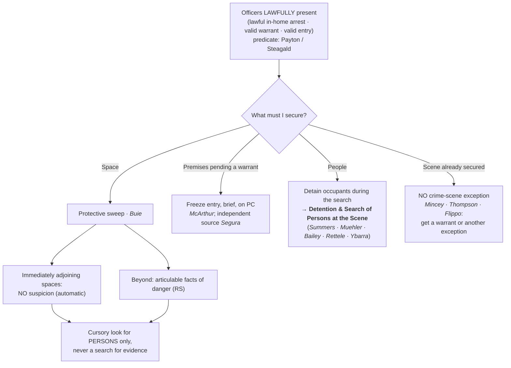

# S9 R1 panel-review — Opus model-diversity lane (prompt pack)

You are the **Claude/Opus** leg of the S9 three-lane adversarial panel (1 Claude + 2 Codex, R1). The two Codex lanes carry the A (support/quote-fidelity) and B (currency/treatment) attack lenses; **you carry model diversity and MUST vote on every paneled assertion across BOTH lenses' concerns.** You are refute-framed: try hard to break each assertion; **default to REFUTED on uncertainty**; never fabricate a cite, quote, or holding; use ONLY the evidence inlined below (no search, no outside knowledge). You are a SIGHTED reviewer — the FULL lake record (judgment fields included) is inlined.

You are a WRITER lane, not an adjudicator: you FIND and VOTE. You do not tally, adjudicate, or close any row — the orchestrator does.

For EACH group below, return one JSON object with the exact `reviewed[]` shape from the output contract (identical framing to the Codex lenses). Emit a finding object ONLY for a real defect (verdict refuted / stands-modified); a group you find wholly clean returns all-`stands` verdicts (the harness records a clean attestation). Concatenate the per-group JSON objects into a top-level `{"packs": [ ... ]}` array, one entry per group, each carrying its `group_id`.


OUTPUT CONTRACT — return ONE JSON object, nothing else:
{
  "lens": "A" | "B",
  "group_id": "<echo the group id>",
  "reviewed": [
    {
      "assertion_id": "<from group_inventory.jsonl>",
      "dimension": "existence|support|quote_fidelity|pincite|treatment|black_letter",
      "verdict": "stands" | "refuted" | "stands-modified",
      "verifiable_from_disclosed": true | false,
      "defect": null,   // null when verdict=="stands"; else an object:
      //  {"problem": "...", "severity": "high|medium|low", "proposed_fix": "...", "evidence_quote": "verbatim from disclosed evidence or null", "needs_cl": true|false, "locator_note": "..."}
      "reasons": ["short evidence-grounded reason", "..."],
      "breaks_true_positives": true | false,
      "residual_risks": ["..."],
      "suggested_tightening": "... or null"
    }
  ],
  "notes": ""
}
Rules: verdict=='stands' <=> defect==null (assertion survives your attack). verdict=='refuted' <=> a real defect (the assertion as framed is wrong). verdict=='stands-modified' <=> survives but needs a stated modification (a minor defect). Review EVERY assertion_id in group_inventory.jsonl exactly once. Output ONLY the JSON object.
---

## GROUP: content/warrant-exceptions/home-entry-and-search/Fire-Scene Entries.md  (`doctrine`, 3 assertions)

### content_page

```
---
weight: 70
title: "Fire-Scene Entries"
aliases:
  - "Fire-Scene Entries"
  - "Fire Scene Entries"
topic: "Fire-scene entries: firefighting exigency and post-fire investigation"
type: doctrine
amendment: "U.S. Const. amend. IV"
jurisdiction: "Federal (U.S. Const. amend. IV); SCOTUS baseline"
status: draft
related:
  - "[[Emergency Aid]]"
  - "[[Exigent Circumstances and Hot Pursuit]]"
  - "[[Special Needs and Administrative Searches]]"
  - "[[The Warrant Requirement]]"
---

# Fire-Scene Entries

*A building has burned. How long may firefighters and investigators stay, and when do they need a warrant to come back?*

> [!rule] Black-letter rule
> A **burning building** is an [[Exigent Circumstances and Hot Pursuit|exigency]] that justifies warrantless entry, and firefighters and officials may **remain a reasonable time** after the blaze is extinguished to investigate its cause. Once that period ends and reasonable privacy interests remain, **later entries need a warrant**: an **administrative** warrant to determine cause and origin, or a **criminal** warrant on probable cause where the primary object is to gather evidence of arson. *[[Michigan v. Tyler#^pin-509|Michigan v. Tyler]]*, 436 U.S. 499, [509–11](https://www.courtlistener.com/opinion/109874/michigan-v-tyler/) (1978); *[[Michigan v. Clifford#^pin-294|Michigan v. Clifford]]*, 464 U.S. 287, [294](https://www.courtlistener.com/opinion/111057/michigan-v-clifford/) (1984) (plurality).
> ^rule-fire-scene

## The Brief

**What it is.** This page states the warrant rules for a **fire scene**: the firefighting [[Exigent Circumstances and Hot Pursuit|exigency]], the reasonable follow-on period to investigate cause, and the warrant that a later investigative entry requires. It is a specialized application of the general dissipation principle that runs through [[Emergency Aid]] and [[Exigent Circumstances and Hot Pursuit]] (a lawful emergency entry does not bless a later evidence-gathering one).

**The firefighting [[Exigent Circumstances and Hot Pursuit|exigency]] and the reasonable follow-on period.** "A burning building clearly presents an exigency of sufficient proportions to render a warrantless entry 'reasonable,'" and "officials need no warrant to remain in a building for a reasonable time to investigate the cause of a blaze after it has been extinguished." *[[Michigan v. Tyler#^pin-509|Michigan v. Tyler]]*, 436 U.S. 499, [509–10](https://www.courtlistener.com/opinion/109874/michigan-v-tyler/) (1978). But the authority is time-bounded: "[t]hereafter, additional entries to investigate the cause of the fire must be made pursuant to the warrant procedures governing administrative searches." *[[Michigan v. Tyler#^pin-509|Id.]]* at 511. A fire does not extinguish the occupant's privacy interest in what survives the flames.

**Which warrant: administrative for cause, criminal for evidence.** *[[Michigan v. Clifford|Clifford]]* refines *[[Michigan v. Tyler|Tyler]]* for the home. Where reasonable privacy interests remain in fire-damaged property, a post-fire investigative search needs a warrant, and **which** warrant turns on the object of the search: an **administrative** warrant suffices to determine the cause and origin of the fire, but if "the primary object of the search is to gather evidence of criminal activity," officers need a **criminal** search warrant on **probable cause**. *[[Michigan v. Clifford#^pin-294|Michigan v. Clifford]]*, 464 U.S. 287, [294](https://www.courtlistener.com/opinion/111057/michigan-v-clifford/) (1984) (plurality). Objects in plain view during the lawful [[Exigent Circumstances and Hot Pursuit|exigency]] period may still be seized; the warrant requirement bites on the **re-entry** to investigate once the [[Exigent Circumstances and Hot Pursuit|exigency]] has passed.

**Burden · standard of review · remedy.** The **government** bears the burden of justifying a warrantless fire-scene entry as within the firefighting [[Exigent Circumstances and Hot Pursuit|exigency]] or the reasonable follow-on period; a later investigative entry must rest on the appropriate (administrative or criminal) warrant. Historical facts are reviewed for [[Common Legal Terms#clear-error|clear error]] and the ultimate reasonableness [[Common Legal Terms#de-novo|de novo]]; the **remedy** for an unjustified re-entry is **suppression** under [[The Exclusionary Rule]].

**Common pitfalls.**
- **Treating the fire as an open-ended license.** The [[Exigent Circumstances and Hot Pursuit|exigency]] covers the fire and a reasonable time to find its cause; investigative re-entries after that need a warrant (*[[Michigan v. Tyler|Tyler]]*).
- **Using an administrative warrant to hunt for arson evidence.** An administrative warrant reaches cause and origin; a search whose primary object is criminal evidence needs a criminal warrant on probable cause (*[[Michigan v. Clifford|Clifford]]*).
- **Assuming a fire strips all privacy.** Reasonable privacy interests can survive the blaze in what remains, and they govern whether a later entry needs a warrant (*[[Michigan v. Clifford|Clifford]]*).

## Lower-court developments

Role-based circuit/state developments only (**no SCOTUS**; the controlling Supreme Court cases home to Key cases regardless of date). No controlling circuit development is mapped in this build; the *[[Michigan v. Tyler|Tyler]]* / *[[Michigan v. Clifford|Clifford]]* framework governs, and the recurring fact question is where the reasonable follow-on period ends and a warranted re-entry begins.

## Key cases

| Case | Holding | Opinion |
|---|---|---|
| *[[Michigan v. Tyler]]*, 436 U.S. 499 (1978) | **Anchor.** A burning building is an [[Exigent Circumstances and Hot Pursuit\|exigency]] needing no warrant; officials may remain a reasonable time to investigate the cause after the blaze is out, but later investigative entries must follow the warrant procedures. | [opinion](https://www.courtlistener.com/opinion/109874/michigan-v-tyler/) |
| *[[Michigan v. Clifford]]*, 464 U.S. 287 (1984) (plurality) | **Refinement.** Where privacy interests remain in fire-damaged property, a post-fire search needs a warrant: administrative for cause and origin, criminal on probable cause where the object is evidence of crime. | [opinion](https://www.courtlistener.com/opinion/111057/michigan-v-clifford/) |

## Sources

- [*Michigan v. Tyler*, 436 U.S. 499 (1978)](https://www.courtlistener.com/opinion/109874/michigan-v-tyler/) (pinpoints: 509, 510, 511)
- [*Michigan v. Clifford*, 464 U.S. 287 (1984) (plurality)](https://www.courtlistener.com/opinion/111057/michigan-v-clifford/) (pinpoint: 294)
</content>

```

### group_inventory (assertions under review)

```jsonl
{"assertion_id": "6e20cc23b5cf66a9", "dimension": "existence", "kind": "case_cite", "locator": {"case": "Michigan v. Tyler", "table_line": 33}, "payload": {"case": "Michigan v. Tyler", "cells": ["*[[Michigan v. Tyler]]*, 436 U.S. 499 (1978)", "**Anchor.** A burning building is an [[Exigent Circumstances and Hot Pursuit\\|exigency]] needing no warrant; officials may remain a reasonable time to investigate the cause after the blaze is out, but later investigative entries must follow the warrant procedures.", "[opinion](https://www.courtlistener.com/opinion/109874/michigan-v-tyler/)"], "header": ["Case", "Holding", "Opinion"]}}
{"assertion_id": "b68e2fafdd1614a6", "dimension": "existence", "kind": "case_cite", "locator": {"case": "Michigan v. Clifford", "table_line": 34}, "payload": {"case": "Michigan v. Clifford", "cells": ["*[[Michigan v. Clifford]]*, 464 U.S. 287 (1984) (plurality)", "**Refinement.** Where privacy interests remain in fire-damaged property, a post-fire search needs a warrant: administrative for cause and origin, criminal on probable cause where the object is evidence of crime.", "[opinion](https://www.courtlistener.com/opinion/111057/michigan-v-clifford/)"], "header": ["Case", "Holding", "Opinion"]}}
{"assertion_id": "1bc0627bd311a674", "dimension": "support", "kind": "proposition", "locator": {"callout": "^rule-fire-scene"}, "payload": {"anchor": "^rule-fire-scene", "statement": "[!rule] Black-letter rule\nA **burning building** is an [[Exigent Circumstances and Hot Pursuit|exigency]] that justifies warrantless entry, and firefighters and officials may **remain a reasonable time** after the blaze is extinguished to investigate its cause. Once that period ends and reasonable privacy interests remain, **later entries need a warrant**: an **administrative** warrant to determine cause and origin, or a **criminal** warrant on probable cause where the primary object is to gather evidence of arson. *[[Michigan v. Tyler#^pin-509|Michigan v. Tyler]]*, 436 U.S. 499, [509–11](https://www.courtlistener.com/opinion/109874/michigan-v-tyler/) (1978); *[[Michigan v. Clifford#^pin-294|Michigan v. Clifford]]*, 464 U.S. 287, [294](https://www.courtlistener.com/opinion/111057/michigan-v-clifford/) (1984) (plurality)."}}
```

### lake record — Michigan v. Clifford

```json
{
  "schema_version": "s2.v1",
  "record_id": "Michigan v. Clifford",
  "stub": false,
  "status": "verified",
  "identity": {
    "case_name": "Michigan v. Clifford",
    "case_name_short": "",
    "case_name_full": "MICHIGAN v. CLIFFORD Et Al.",
    "input_case_name": "Michigan v. Clifford",
    "court": "U.S. Supreme Court",
    "court_id": "scotus",
    "court_level": "scotus",
    "circuit": null,
    "state": null,
    "date_decided": "1984-01-11",
    "year": 1984,
    "docket": "82-357",
    "cluster_id": 111057,
    "lead_opinion_id": 9429413,
    "sibling_ids": [
      111057,
      9429413,
      9429414,
      9429415
    ],
    "absolute_url": "/opinion/111057/michigan-v-clifford/",
    "identity_method": "citation+party-text",
    "expected_citation_found": true,
    "party_name_in_text": true,
    "canonical_name_match": true,
    "alternates": [
      {
        "cluster_id": 9350257,
        "score": 20,
        "case_name": "Michigan v. Clifford"
      }
    ],
    "reason_code": null
  },
  "citations": {
    "official": {
      "cite": "464 U.S. 287",
      "volume": "464",
      "reporter": "U.S.",
      "page": "287",
      "type": 1,
      "selected_official": true,
      "source": "cluster.citations[]"
    },
    "parallel": [
      {
        "cite": "104 S. Ct. 641",
        "volume": "104",
        "reporter": "S. Ct.",
        "page": "641",
        "type": 1,
        "selected_official": false,
        "source": "cluster.citations[]"
      },
      {
        "cite": "78 L. Ed. 2d 477",
        "volume": "78",
        "reporter": "L. Ed. 2d",
        "page": "477",
        "type": 1,
        "selected_official": false,
        "source": "cluster.citations[]"
      },
      {
        "cite": "52 U.S.L.W. 4056",
        "volume": "52",
        "reporter": "U.S.L.W.",
        "page": "4056",
        "type": 4,
        "selected_official": false,
        "source": "cluster.citations[]"
      }
    ],
    "vendor_neutral": [
      {
        "cite": "1984 U.S. LEXIS 14",
        "volume": "1984",
        "reporter": "U.S. LEXIS",
        "page": "14",
        "type": 6,
        "selected_official": false,
        "source": "cluster.citations[]"
      }
    ],
    "all": [
      {
        "cite": "464 U.S. 287",
        "volume": "464",
        "reporter": "U.S.",
        "page": "287",
        "type": 1,
        "selected_official": false,
        "source": "cluster.citations[]"
      },
      {
        "cite": "104 S. Ct. 641",
        "volume": "104",
        "reporter": "S. Ct.",
        "page": "641",
        "type": 1,
        "selected_official": false,
        "source": "cluster.citations[]"
      },
      {
        "cite": "78 L. Ed. 2d 477",
        "volume": "78",
        "reporter": "L. Ed. 2d",
        "page": "477",
        "type": 1,
        "selected_official": false,
        "source": "cluster.citations[]"
      },
      {
        "cite": "1984 U.S. LEXIS 14",
        "volume": "1984",
        "reporter": "U.S. LEXIS",
        "page": "14",
        "type": 6,
        "selected_official": false,
        "source": "cluster.citations[]"
      },
      {
        "cite": "52 U.S.L.W. 4056",
        "volume": "52",
        "reporter": "U.S.L.W.",
        "page": "4056",
        "type": 4,
        "selected_official": false,
        "source": "cluster.citations[]"
      }
    ],
    "display": "464 U.S. 287",
    "official_selection": {
      "court_class": "scotus",
      "selected": "464 U.S. 287",
      "reason": "selected_rank_1"
    }
  },
  "pinpoints": [
    {
      "id": "pin-293",
      "page": null,
      "quote": "--- # Michigan v. Clifford *464 U.S. 287 (1984)* \u00b7 U.S. Supreme Court \u00b7 **Binding \u2014 SCOTUS** \u00b7 Treatment: **good** *(as of 2026-06-30)* <!-- header line; TreatmentBadge + weight render here, degrading to the text above --> ## Background A fire damaged the Cliffords' home in the early morning while they were away. Hours after the blaze was out and firefighters had left, an arson investigator and his partner arrived, entered the secured, uninhabitable house without a warrant or consent, and searched the basement (finding evidence of arson) and then the upstairs living areas. The Cliffords had arranged to have the house boarded up, and personal belongings remained inside. ## Issue Whether a warrantless, nonconsensual post-fire investigative search of a private home \u2014 conducted after the fire is extinguished and officials have left the scene \u2014 violates the Fourth Amendment, and what kind of warrant such a search requires. ## Rule If reasonable privacy interests remain, a warrant is required:",
      "star_marker": null,
      "quote_fidelity": "mismatch",
      "pinpoint_status": "slip-only",
      "position": null
    },
    {
      "id": "pin-294",
      "page": null,
      "quote": "If the primary object is to determine the cause and origin of a recent fire, an administrative warrant will suffice. . . . If the primary object of the search is to gather evidence of criminal activity, a criminal search warrant may be obtained only on a showing of probable cause.",
      "star_marker": null,
      "quote_fidelity": "mismatch",
      "pinpoint_status": "slip-only",
      "position": null
    },
    {
      "id": "pin-295",
      "page": null,
      "quote": "we hold that the Cliffords retained reasonable privacy interests in their fire-damaged residence and that the postfire investigations were subject to the warrant requirement.",
      "star_marker": "295",
      "quote_fidelity": "matched",
      "pinpoint_status": "star-verified",
      "position": 14913,
      "fragment": "#:~:text=we%20hold%20that%20the%20Cliffords",
      "fragment_validated_at": "2026-07-09T15:40:45Z"
    }
  ],
  "treatment": {
    "field_i_validity": "good_law",
    "as_of_content": "1984-01-11",
    "as_of_treatment": "2026-06-30",
    "composite_basis": "migration-seed",
    "composite_basis_ref": "Michigan v. Clifford",
    "varies_by_point": false,
    "scope_note": "Plurality opinion (Powell, J., joined by Brennan, White, Marshall; Stevens, J., concurring in the judgment supplied the fifth vote on the result). The administrative-warrant / criminal-warrant framework for post-fire searches is the controlling teaching and is good law.",
    "point_overrides": [],
    "edges": [
      {
        "citing_case": {
          "name": "Commonwealth v. O'Donnell",
          "cluster_id": 4427767,
          "cite": null,
          "field_ii": "superseded_by_statute"
        },
        "field_ii": "superseded_by_statute",
        "field_iii": "mentioned",
        "point": null,
        "proposed": true,
        "journal_ref": "Michigan v. Clifford:lane1_negative"
      },
      {
        "citing_case": {
          "name": "United States v. Bodie Witzlib",
          "cluster_id": 2825238,
          "cite": [
            "796 F.3d 799",
            "2015 U.S. App. LEXIS 13811",
            "2015 WL 4664340"
          ],
          "field_ii": "questioned"
        },
        "field_ii": "questioned",
        "field_iii": "mentioned",
        "point": null,
        "proposed": true,
        "journal_ref": "Michigan v. Clifford:lane1_negative"
      },
      {
        "citing_case": {
          "name": "United States v. Leland Earl Dart",
          "cluster_id": 443977,
          "cite": [
            "747 F.2d 263",
            "1984 U.S. App. LEXIS 17111"
          ],
          "field_ii": "questioned"
        },
        "field_ii": "questioned",
        "field_iii": "mentioned",
        "point": null,
        "proposed": true,
        "journal_ref": "Michigan v. Clifford:lane1_negative"
      },
      {
        "citing_case": {
          "name": "United States v. Leon",
          "cluster_id": 111262,
          "cite": [
            "82 L. Ed. 2d 677",
            "104 S. Ct. 3405",
            "468 U.S. 897",
            "1984 U.S. LEXIS 153"
          ],
          "field_ii": "overruled"
        },
        "field_ii": "overruled",
        "field_iii": "mentioned",
        "point": null,
        "proposed": true,
        "journal_ref": "Michigan v. Clifford:lane2_top_cited"
      },
      {
        "citing_case": {
          "name": "California v. Trombetta",
          "cluster_id": 111206,
          "cite": [
            "81 L. Ed. 2d 413",
            "104 S. Ct. 2528",
            "467 U.S. 479",
            "1984 U.S. LEXIS 103",
            "52 U.S.L.W. 4744"
          ],
          "field_ii": "questioned"
        },
        "field_ii": "questioned",
        "field_iii": "mentioned",
        "point": null,
        "proposed": true,
        "journal_ref": "Michigan v. Clifford:lane2_top_cited"
      },
      {
        "citing_case": {
          "name": "Ashcroft v. al-Kidd",
          "cluster_id": 217703,
          "cite": [
            "179 L. Ed. 2d 1149",
            "131 S. Ct. 2074",
            "563 U.S. 731",
            "2011 U.S. LEXIS 4021"
          ],
          "field_ii": "questioned"
        },
        "field_ii": "questioned",
        "field_iii": "mentioned",
        "point": null,
        "proposed": true,
        "journal_ref": "Michigan v. Clifford:lane2_top_cited"
      },
      {
        "citing_case": {
          "name": "Skinner v. Railway Labor Executives' Assn.",
          "cluster_id": 112219,
          "cite": [
            "103 L. Ed. 2d 639",
            "109 S. Ct. 1402",
            "489 U.S. 602",
            "1989 U.S. LEXIS 1568",
            "4 I.E.R. Cas. (BNA) 224",
            "1989 CCH OSHD 28,476",
            "57 U.S.L.W. 4324",
            "13 OSHC (BNA) 2065",
            "130 L.R.R.M. (BNA) 2857",
            "49 Empl. Prac. Dec. (CCH) 38,791"
          ],
          "field_ii": "abrogated"
        },
        "field_ii": "abrogated",
        "field_iii": "mentioned",
        "point": null,
        "proposed": true,
        "journal_ref": "Michigan v. Clifford:lane2_top_cited"
      },
      {
        "citing_case": {
          "name": "New Jersey v. T. L. O.",
          "cluster_id": 111301,
          "cite": [
            "83 L. Ed. 2d 720",
            "105 S. Ct. 733",
            "469 U.S. 325",
            "1985 U.S. LEXIS 41",
            "53 U.S.L.W. 4083"
          ],
          "field_ii": "questioned"
        },
        "field_ii": "questioned",
        "field_iii": "mentioned",
        "point": null,
        "proposed": true,
        "journal_ref": "Michigan v. Clifford:lane2_top_cited"
      },
      {
        "citing_case": {
          "name": "Oliver v. United States",
          "cluster_id": 111146,
          "cite": [
            "80 L. Ed. 2d 214",
            "104 S. Ct. 1735",
            "466 U.S. 170",
            "1984 U.S. LEXIS 55",
            "52 U.S.L.W. 4425"
          ],
          "field_ii": "overruled"
        },
        "field_ii": "overruled",
        "field_iii": "mentioned",
        "point": null,
        "proposed": true,
        "journal_ref": "Michigan v. Clifford:lane2_top_cited"
      },
      {
        "citing_case": {
          "name": "Welsh v. Wisconsin",
          "cluster_id": 111173,
          "cite": [
            "80 L. Ed. 2d 732",
            "104 S. Ct. 2091",
            "466 U.S. 740",
            "1984 U.S. LEXIS 82",
            "52 U.S.L.W. 4581"
          ],
          "field_ii": "questioned"
        },
        "field_ii": "questioned",
        "field_iii": "mentioned",
        "point": null,
        "proposed": true,
        "journal_ref": "Michigan v. Clifford:lane2_top_cited"
      },
      {
        "citing_case": {
          "name": "Segura v. United States",
          "cluster_id": 111259,
          "cite": [
            "82 L. Ed. 2d 599",
            "104 S. Ct. 3380",
            "468 U.S. 796",
            "1984 U.S. LEXIS 150",
            "52 U.S.L.W. 5128"
          ],
          "field_ii": "superseded_by_statute"
        },
        "field_ii": "superseded_by_statute",
        "field_iii": "mentioned",
        "point": null,
        "proposed": true,
        "journal_ref": "Michigan v. Clifford:lane2_top_cited"
      },
      {
        "citing_case": {
          "name": "New York v. Quarles",
          "cluster_id": 111214,
          "cite": [
            "81 L. Ed. 2d 550",
            "104 S. Ct. 2626",
            "467 U.S. 649",
            "1984 U.S. LEXIS 111",
            "52 U.S.L.W. 4790"
          ],
          "field_ii": "questioned"
        },
        "field_ii": "questioned",
        "field_iii": "mentioned",
        "point": null,
        "proposed": true,
        "journal_ref": "Michigan v. Clifford:lane2_top_cited"
      },
      {
        "citing_case": {
          "name": "Villarreal v. State",
          "cluster_id": 2365320,
          "cite": [
            "935 S.W.2d 134",
            "1996 Tex. Crim. App. LEXIS 237",
            "1996 WL 668593"
          ],
          "field_ii": "overruled"
        },
        "field_ii": "overruled",
        "field_iii": "mentioned",
        "point": null,
        "proposed": true,
        "journal_ref": "Michigan v. Clifford:lane2_top_cited"
      },
      {
        "citing_case": {
          "name": "Hudson v. Michigan",
          "cluster_id": 145646,
          "cite": [
            "165 L. Ed. 2d 56",
            "126 S. Ct. 2159",
            "547 U.S. 586",
            "2006 U.S. LEXIS 4677"
          ],
          "field_ii": "overruled"
        },
        "field_ii": "overruled",
        "field_iii": "mentioned",
        "point": null,
        "proposed": true,
        "journal_ref": "Michigan v. Clifford:lane2_top_cited"
      },
      {
        "citing_case": {
          "name": "City of Indianapolis v. Edmond",
          "cluster_id": 118391,
          "cite": [
            "148 L. Ed. 2d 333",
            "121 S. Ct. 447",
            "531 U.S. 32",
            "2000 U.S. LEXIS 8084",
            "69 U.S.L.W. 4009",
            "14 Fla. L. Weekly Fed. S 9",
            "2000 Colo. J. C.A.R. 6401",
            "2000 Cal. Daily Op. Serv. 9549"
          ],
          "field_ii": "overruled"
        },
        "field_ii": "overruled",
        "field_iii": "mentioned",
        "point": null,
        "proposed": true,
        "journal_ref": "Michigan v. Clifford:lane2_top_cited"
      },
      {
        "citing_case": {
          "name": "New York v. Burger",
          "cluster_id": 111927,
          "cite": [
            "96 L. Ed. 2d 601",
            "107 S. Ct. 2636",
            "482 U.S. 691",
            "1987 U.S. LEXIS 2725",
            "55 U.S.L.W. 4890"
          ],
          "field_ii": "overruled"
        },
        "field_ii": "overruled",
        "field_iii": "mentioned",
        "point": null,
        "proposed": true,
        "journal_ref": "Michigan v. Clifford:lane2_top_cited"
      },
      {
        "citing_case": {
          "name": "United States v. Montoya De Hernandez",
          "cluster_id": 111509,
          "cite": [
            "87 L. Ed. 2d 381",
            "105 S. Ct. 3304",
            "473 U.S. 531",
            "1985 U.S. LEXIS 120",
            "53 U.S.L.W. 5048"
          ],
          "field_ii": "questioned"
        },
        "field_ii": "questioned",
        "field_iii": "mentioned",
        "point": null,
        "proposed": true,
        "journal_ref": "Michigan v. Clifford:lane2_top_cited"
      },
      {
        "citing_case": {
          "name": "People v. Wharton",
          "cluster_id": 1196421,
          "cite": [
            "809 P.2d 290",
            "53 Cal. 3d 522",
            "280 Cal. Rptr. 631",
            "91 Daily Journal DAR 4957",
            "91 Cal. Daily Op. Serv. 3426",
            "1991 Cal. LEXIS 1608"
          ],
          "field_ii": "overruled"
        },
        "field_ii": "overruled",
        "field_iii": "mentioned",
        "point": null,
        "proposed": true,
        "journal_ref": "Michigan v. Clifford:lane2_top_cited"
      },
      {
        "citing_case": {
          "name": "State v. Silvers",
          "cluster_id": 2014870,
          "cite": [
            "587 N.W.2d 325",
            "255 Neb. 702",
            "1998 Neb. LEXIS 230"
          ],
          "field_ii": "overruled"
        },
        "field_ii": "overruled",
        "field_iii": "mentioned",
        "point": null,
        "proposed": true,
        "journal_ref": "Michigan v. Clifford:lane2_top_cited"
      },
      {
        "citing_case": {
          "name": "People v. Woods",
          "cluster_id": 5607944,
          "cite": [
            "21 Cal. 4th 668",
            "99 Cal. Daily Op. Serv. 6990",
            "99 Daily Journal DAR 8867",
            "981 P.2d 1019",
            "88 Cal. Rptr. 2d 88",
            "1999 Cal. LEXIS 5534"
          ],
          "field_ii": "overruled"
        },
        "field_ii": "overruled",
        "field_iii": "mentioned",
        "point": null,
        "proposed": true,
        "journal_ref": "Michigan v. Clifford:lane2_top_cited"
      },
      {
        "citing_case": {
          "name": "United States v. Donald P. Rohrig",
          "cluster_id": 728738,
          "cite": [
            "98 F.3d 1506",
            "1996 U.S. App. LEXIS 28274",
            "1996 WL 627521"
          ],
          "field_ii": "abrogated"
        },
        "field_ii": "abrogated",
        "field_iii": "mentioned",
        "point": null,
        "proposed": true,
        "journal_ref": "Michigan v. Clifford:lane2_top_cited"
      },
      {
        "citing_case": {
          "name": "People v. Woods",
          "cluster_id": 1160907,
          "cite": [
            "981 P.2d 1019",
            "88 Cal. Rptr. 2d 88",
            "21 Cal. 4th 668"
          ],
          "field_ii": "overruled"
        },
        "field_ii": "overruled",
        "field_iii": "mentioned",
        "point": null,
        "proposed": true,
        "journal_ref": "Michigan v. Clifford:lane2_top_cited"
      },
      {
        "citing_case": {
          "name": "Caniglia v. Strom",
          "cluster_id": 4883694,
          "cite": [
            "593 U.S. 194",
            "209 L. Ed. 2d 604",
            "141 S. Ct. 1596"
          ],
          "field_ii": "questioned"
        },
        "field_ii": "questioned",
        "field_iii": "mentioned",
        "point": null,
        "proposed": true,
        "journal_ref": "Michigan v. Clifford:lane2_top_cited"
      },
      {
        "citing_case": {
          "name": "People v. Scott",
          "cluster_id": 5690717,
          "cite": [
            "79 N.Y.2d 474"
          ],
          "field_ii": "overruled"
        },
        "field_ii": "overruled",
        "field_iii": "mentioned",
        "point": null,
        "proposed": true,
        "journal_ref": "Michigan v. Clifford:lane2_top_cited"
      },
      {
        "citing_case": {
          "name": "California v. Rooney",
          "cluster_id": 111943,
          "cite": [
            "97 L. Ed. 2d 258",
            "107 S. Ct. 2852",
            "483 U.S. 307",
            "1987 U.S. LEXIS 2870"
          ],
          "field_ii": "overruled"
        },
        "field_ii": "overruled",
        "field_iii": "mentioned",
        "point": null,
        "proposed": true,
        "journal_ref": "Michigan v. Clifford:lane2_top_cited"
      },
      {
        "citing_case": {
          "name": "Paul Palmieri v. Pamela Lynch, AKA Pam Lynch, John Doe 1",
          "cluster_id": 788624,
          "cite": [
            "392 F.3d 73",
            "2004 U.S. App. LEXIS 25468",
            "2004 WL 2827676"
          ],
          "field_ii": "questioned"
        },
        "field_ii": "questioned",
        "field_iii": "mentioned",
        "point": null,
        "proposed": true,
        "journal_ref": "Michigan v. Clifford:lane2_top_cited"
      },
      {
        "citing_case": {
          "name": "Doering v. State",
          "cluster_id": 1525226,
          "cite": [
            "545 A.2d 1281",
            "313 Md. 384",
            "1988 Md. LEXIS 115"
          ],
          "field_ii": "questioned"
        },
        "field_ii": "questioned",
        "field_iii": "mentioned",
        "point": null,
        "proposed": true,
        "journal_ref": "Michigan v. Clifford:lane2_top_cited"
      },
      {
        "citing_case": {
          "name": "Alexander v. City And County Of San Francisco",
          "cluster_id": 674655,
          "cite": [
            "29 F.3d 1355",
            "94 Cal. Daily Op. Serv. 5278",
            "94 Daily Journal DAR 9698",
            "1994 U.S. App. LEXIS 16752"
          ],
          "field_ii": "questioned"
        },
        "field_ii": "questioned",
        "field_iii": "mentioned",
        "point": null,
        "proposed": true,
        "journal_ref": "Michigan v. Clifford:lane2_top_cited"
      }
    ],
    "derivation": {
      "lane1_negative": {
        "query": "cites:(111057 OR 9429413 OR 9429414 OR 9429415) AND (overrul* OR abrogat* OR supersed* OR \"recede from\" OR \"no longer good law\" OR vacat* OR reversed) ",
        "reviewed": 181,
        "cap": 200,
        "cap_hit": false,
        "final_cursor": null,
        "audit_needed": false,
        "proposed_negative_events": 3,
        "audit_marker": null,
        "triage_mode": "snippet-first",
        "snippet_field": "results[].opinions[].snippet",
        "triage_journaled": 181,
        "triage_read": 4,
        "triage_snippet_classified": 177
      },
      "lane2_top_cited": {
        "query": "cites:(111057 OR 9429413 OR 9429414 OR 9429415)",
        "reviewed": 25,
        "cap": 25,
        "cap_hit": true,
        "final_cursor": "https://www.courtlistener.com/api/rest/v4/search/?cursor=cz02NSZzPTEzNTU2NTQmdD1vJmQ9MjAyNi0wNy0wNSZwPTM%3D&order_by=citeCount+desc&page_size=25&q=cites%3A%28111057+OR+9429413+OR+9429414+OR+9429415%29&type=o",
        "audit_needed": true,
        "proposed_negative_events": 25,
        "audit_marker": "R15 treatment audit required"
      },
      "lane3_recency": {
        "query": "cites:(111057 OR 9429413 OR 9429414 OR 9429415)",
        "reviewed": 5,
        "cap": 200,
        "cap_hit": false,
        "final_cursor": null,
        "audit_needed": false,
        "proposed_negative_events": 0,
        "audit_marker": null,
        "triage_mode": "snippet-first",
        "snippet_field": "results[].opinions[].snippet",
        "triage_journaled": 5,
        "triage_read": 0,
        "triage_snippet_classified": 5
      }
    }
  },
  "progeny": {
    "complete_query": "cites:(111057 OR 9429413 OR 9429414 OR 9429415)",
    "indexed_citing_opinions": 233,
    "count_source": "search",
    "per_sibling": [
      {
        "opinion_id": 111057,
        "count": 212,
        "count_source": "search"
      },
      {
        "opinion_id": 9429413,
        "count": 24,
        "count_source": "search"
      },
      {
        "opinion_id": 9429414,
        "count": 0,
        "count_source": "search"
      },
      {
        "opinion_id": 9429415,
        "count": 0,
        "count_source": "search"
      }
    ],
    "citation_count": 346,
    "cache_path": "/Users/johngalt/cssi-lake/cache/progeny/michigan-v-clifford.jsonl",
    "enumeration": "bounded",
    "cursor": "https://www.courtlistener.com/api/rest/v4/search/?cursor=cz0xLjU1Mjk2MDUmcz03MzI3MDE1JnQ9byZkPTIwMjYtMDctMDUmcD0y&order_by=score+desc&page_size=100&q=cites%3A%28111057+OR+9429413+OR+9429414+OR+9429415%29&type=o",
    "rows_cached": 20,
    "outbound_opinion_edges": [
      {
        "source_opinion_id": 111057,
        "cited_id": 107473,
        "source": "search.opinions[].cites[]"
      },
      {
        "source_opinion_id": 111057,
        "cited_id": 107474,
        "source": "search.opinions[].cites[]"
      },
      {
        "source_opinion_id": 111057,
        "cited_id": 107564,
        "source": "search.opinions[].cites[]"
      },
      {
        "source_opinion_id": 111057,
        "cited_id": 108077,
        "source": "search.opinions[].cites[]"
      },
      {
        "source_opinion_id": 111057,
        "cited_id": 108377,
        "source": "search.opinions[].cites[]"
      },
      {
        "source_opinion_id": 111057,
        "cited_id": 108533,
        "source": "search.opinions[].cites[]"
      },
      {
        "source_opinion_id": 111057,
        "cited_id": 108581,
        "source": "search.opinions[].cites[]"
      },
      {
        "source_opinion_id": 111057,
        "cited_id": 109866,
        "source": "search.opinions[].cites[]"
      },
      {
        "source_opinion_id": 111057,
        "cited_id": 109874,
        "source": "search.opinions[].cites[]"
      },
      {
        "source_opinion_id": 111057,
        "cited_id": 109876,
        "source": "search.opinions[].cites[]"
      },
      {
        "source_opinion_id": 111057,
        "cited_id": 110118,
        "source": "search.opinions[].cites[]"
      },
      {
        "source_opinion_id": 111057,
        "cited_id": 110235,
        "source": "search.opinions[].cites[]"
      },
      {
        "source_opinion_id": 111057,
        "cited_id": 110530,
        "source": "search.opinions[].cites[]"
      }
    ]
  },
  "off_cl_links": [],
  "provenance": {
    "cl_source": "LRU",
    "cl_api": "https://www.courtlistener.com/api/rest/v4",
    "built_by": "S2-BUILDER-AUTHORING",
    "build_run": "s2-build-96d841cbb12e",
    "date_created": "2026-07-05T13:17:01Z",
    "date_modified": "2026-07-09T15:47:29Z",
    "warnings": [
      "legacy treatment migrated: good -> good_law"
    ],
    "field_provenance": {
      "identity": {
        "src": "CourtListener search + clusters + lead opinion text",
        "at": "2026-07-05T13:17:30Z",
        "verifier": "S2-BUILDER-AUTHORING"
      },
      "treatment.field_i_validity": {
        "src": "_treatment-migration.json + page frontmatter",
        "at": "2026-07-05T13:17:30Z",
        "verifier": "S2-BUILDER-AUTHORING"
      },
      "point_overrides": {
        "src": "S2 treatment derivation proposed only",
        "at": "2026-07-05T13:21:37Z",
        "verifier": "S2-BUILDER-AUTHORING"
      },
      "pinpoints": {
        "src": "content page quote harvest + lead opinion text",
        "at": "2026-07-05T13:17:30Z",
        "verifier": "S2-BUILDER-AUTHORING"
      }
    }
  }
}

```

### lake record — Michigan v. Tyler

```json
{
  "schema_version": "s2.v1",
  "record_id": "Michigan v. Tyler",
  "stub": false,
  "status": "verified",
  "identity": {
    "case_name": "Michigan v. Tyler",
    "case_name_short": "Tyler",
    "case_name_full": "MICHIGAN v. TYLER Et Al.",
    "input_case_name": "Michigan v. Tyler",
    "court": "U.S. Supreme Court",
    "court_id": "scotus",
    "court_level": "scotus",
    "circuit": null,
    "state": null,
    "date_decided": "1978-05-31",
    "year": 1978,
    "docket": "76-1608",
    "cluster_id": 109874,
    "lead_opinion_id": 109874,
    "sibling_ids": [
      109874,
      9427218,
      9427219,
      9427220,
      9427221
    ],
    "absolute_url": "/opinion/109874/michigan-v-tyler/",
    "identity_method": "citation+party-text",
    "expected_citation_found": true,
    "party_name_in_text": true,
    "canonical_name_match": true,
    "alternates": [],
    "reason_code": null
  },
  "citations": {
    "official": {
      "cite": "436 U.S. 499",
      "volume": "436",
      "reporter": "U.S.",
      "page": "499",
      "type": 1,
      "selected_official": true,
      "source": "cluster.citations[]"
    },
    "parallel": [
      {
        "cite": "98 S. Ct. 1942",
        "volume": "98",
        "reporter": "S. Ct.",
        "page": "1942",
        "type": 1,
        "selected_official": false,
        "source": "cluster.citations[]"
      },
      {
        "cite": "56 L. Ed. 2d 486",
        "volume": "56",
        "reporter": "L. Ed. 2d",
        "page": "486",
        "type": 1,
        "selected_official": false,
        "source": "cluster.citations[]"
      }
    ],
    "vendor_neutral": [
      {
        "cite": "1978 U.S. LEXIS 97",
        "volume": "1978",
        "reporter": "U.S. LEXIS",
        "page": "97",
        "type": 6,
        "selected_official": false,
        "source": "cluster.citations[]"
      }
    ],
    "all": [
      {
        "cite": "436 U.S. 499",
        "volume": "436",
        "reporter": "U.S.",
        "page": "499",
        "type": 1,
        "selected_official": false,
        "source": "cluster.citations[]"
      },
      {
        "cite": "98 S. Ct. 1942",
        "volume": "98",
        "reporter": "S. Ct.",
        "page": "1942",
        "type": 1,
        "selected_official": false,
        "source": "cluster.citations[]"
      },
      {
        "cite": "56 L. Ed. 2d 486",
        "volume": "56",
        "reporter": "L. Ed. 2d",
        "page": "486",
        "type": 1,
        "selected_official": false,
        "source": "cluster.citations[]"
      },
      {
        "cite": "1978 U.S. LEXIS 97",
        "volume": "1978",
        "reporter": "U.S. LEXIS",
        "page": "97",
        "type": 6,
        "selected_official": false,
        "source": "cluster.citations[]"
      }
    ],
    "display": "436 U.S. 499",
    "official_selection": {
      "court_class": "scotus",
      "selected": "436 U.S. 499",
      "reason": "selected_rank_1"
    }
  },
  "pinpoints": [
    {
      "id": "pin-509",
      "page": null,
      "quote": "--- # Michigan v. Tyler *436 U.S. 499 (1978)* \u00b7 U.S. Supreme Court \u00b7 **Binding \u2014 SCOTUS** \u00b7 Treatment: **good** *(as of 2026-06-30)* <!-- header line; TreatmentBadge + weight render here, degrading to the text above --> ## Background A furniture store caught fire near midnight. As firefighters fought the blaze, the fire chief arrived, found plastic containers of flammable liquid, and (with a police detective) took some evidence; visibility was poor from smoke and steam, so officials left around 4 a.m. and returned shortly after daylight to continue. Over the following weeks, fire and police officials made several further entries, without warrants or consent, gathering more arson evidence. The Michigan Supreme Court ordered a new trial, holding much of the evidence the product of unlawful warrantless searches. ## Issue Whether, and for how long, officials may make warrantless entries into fire-damaged premises to fight the fire and investigate its cause, and when later investigative entries require a warrant. ## Rule A burning building is an exigency:",
      "star_marker": null,
      "quote_fidelity": "mismatch",
      "pinpoint_status": "slip-only",
      "position": null
    },
    {
      "id": "pin-510",
      "page": null,
      "quote": "officials need no warrant to remain in a building for a reasonable time to investigate the cause of a blaze after it has been extinguished.",
      "star_marker": "510",
      "quote_fidelity": "matched",
      "pinpoint_status": "star-verified",
      "position": 23984,
      "fragment": "#:~:text=officials%20need%20no%20warrant%20to",
      "fragment_validated_at": "2026-07-09T15:40:45Z"
    },
    {
      "id": "pin-511",
      "page": null,
      "quote": "we hold that an entry to fight a fire requires no warrant, and that once in the building, officials may remain there for a reasonable time to investigate the cause of the blaze. Thereafter, additional entries to investigate the cause of the fire must be made pursuant to the warrant procedures governing administrative searches.",
      "star_marker": "511",
      "quote_fidelity": "matched",
      "pinpoint_status": "star-verified",
      "position": 26093,
      "fragment": "#:~:text=we%20hold%20that%20an%20entry",
      "fragment_validated_at": "2026-07-09T15:40:45Z"
    }
  ],
  "treatment": {
    "field_i_validity": "good_law",
    "as_of_content": "1978-05-31",
    "as_of_treatment": "2026-06-30",
    "composite_basis": "migration-seed",
    "composite_basis_ref": "Michigan v. Tyler",
    "varies_by_point": false,
    "scope_note": "Good law; refined by Michigan v. Clifford (after the fire is out and the scene secured, further investigative entry needs an administrative or criminal warrant).",
    "point_overrides": [],
    "edges": [
      {
        "citing_case": {
          "name": "Jerel Chinedu Igboji v. State",
          "cluster_id": 4789820,
          "cite": null,
          "field_ii": "questioned"
        },
        "field_ii": "questioned",
        "field_iii": "mentioned",
        "point": null,
        "proposed": true,
        "journal_ref": "Michigan v. Tyler:lane1_negative"
      },
      {
        "citing_case": {
          "name": "Commonwealth v. Arias",
          "cluster_id": 4600764,
          "cite": [
            "119 N.E.3d 257",
            "481 Mass. 604"
          ],
          "field_ii": "superseded_by_statute"
        },
        "field_ii": "superseded_by_statute",
        "field_iii": "mentioned",
        "point": null,
        "proposed": true,
        "journal_ref": "Michigan v. Tyler:lane1_negative"
      },
      {
        "citing_case": {
          "name": "State v. Sarah Beth Keller",
          "cluster_id": 4247956,
          "cite": null,
          "field_ii": "questioned"
        },
        "field_ii": "questioned",
        "field_iii": "mentioned",
        "point": null,
        "proposed": true,
        "journal_ref": "Michigan v. Tyler:lane1_negative"
      },
      {
        "citing_case": {
          "name": "Cole v. State",
          "cluster_id": 5446855,
          "cite": [
            "490 S.W.3d 918",
            "2016 Tex. Crim. App. LEXIS 84",
            "2016 WL 3018203"
          ],
          "field_ii": "overruled"
        },
        "field_ii": "overruled",
        "field_iii": "mentioned",
        "point": null,
        "proposed": true,
        "journal_ref": "Michigan v. Tyler:lane1_negative"
      },
      {
        "citing_case": {
          "name": "State v. Yee",
          "cluster_id": 3062319,
          "cite": [
            "177 So. 3d 72",
            "2015 Fla. App. LEXIS 15198",
            "2015 WL 5965213"
          ],
          "field_ii": "criticized"
        },
        "field_ii": "criticized",
        "field_iii": "mentioned",
        "point": null,
        "proposed": true,
        "journal_ref": "Michigan v. Tyler:lane1_negative"
      },
      {
        "citing_case": {
          "name": "United States v. Bodie Witzlib",
          "cluster_id": 2825238,
          "cite": [
            "796 F.3d 799",
            "2015 U.S. App. LEXIS 13811",
            "2015 WL 4664340"
          ],
          "field_ii": "questioned"
        },
        "field_ii": "questioned",
        "field_iii": "mentioned",
        "point": null,
        "proposed": true,
        "journal_ref": "Michigan v. Tyler:lane1_negative"
      },
      {
        "citing_case": {
          "name": "City and County of San Francisco v. Sheehan",
          "cluster_id": 2801435,
          "cite": [
            "575 U.S. 600",
            "135 S. Ct. 1765",
            "191 L. Ed. 2d 856",
            "2015 U.S. LEXIS 3200",
            "83 U.S.L.W. 4303",
            "25 Fla. L. Weekly Fed. S 254"
          ],
          "field_ii": "questioned"
        },
        "field_ii": "questioned",
        "field_iii": "mentioned",
        "point": null,
        "proposed": true,
        "journal_ref": "Michigan v. Tyler:lane1_negative"
      },
      {
        "citing_case": {
          "name": "United States v. Fadul",
          "cluster_id": 7306139,
          "cite": [
            "16 F. Supp. 3d 270",
            "2014 WL 1584044"
          ],
          "field_ii": "superseded_by_statute"
        },
        "field_ii": "superseded_by_statute",
        "field_iii": "mentioned",
        "point": null,
        "proposed": true,
        "journal_ref": "Michigan v. Tyler:lane1_negative"
      },
      {
        "citing_case": {
          "name": "State of Tennessee v. Pamela A. Inghram",
          "cluster_id": 1053363,
          "cite": null,
          "field_ii": "questioned"
        },
        "field_ii": "questioned",
        "field_iii": "mentioned",
        "point": null,
        "proposed": true,
        "journal_ref": "Michigan v. Tyler:lane1_negative"
      },
      {
        "citing_case": {
          "name": "State v. Conley, 88495 (6-14-2007)",
          "cluster_id": 3971919,
          "cite": [
            "2007 Ohio 2920"
          ],
          "field_ii": "overruled"
        },
        "field_ii": "overruled",
        "field_iii": "mentioned",
        "point": null,
        "proposed": true,
        "journal_ref": "Michigan v. Tyler:lane1_negative"
      },
      {
        "citing_case": {
          "name": "United States v. Leon",
          "cluster_id": 111262,
          "cite": [
            "82 L. Ed. 2d 677",
            "104 S. Ct. 3405",
            "468 U.S. 897",
            "1984 U.S. LEXIS 153"
          ],
          "field_ii": "overruled"
        },
        "field_ii": "overruled",
        "field_iii": "mentioned",
        "point": null,
        "proposed": true,
        "journal_ref": "Michigan v. Tyler:lane2_top_cited"
      },
      {
        "citing_case": {
          "name": "Mincey v. Arizona",
          "cluster_id": 109905,
          "cite": [
            "57 L. Ed. 2d 290",
            "98 S. Ct. 2408",
            "437 U.S. 385",
            "1978 U.S. LEXIS 115"
          ],
          "field_ii": "overruled"
        },
        "field_ii": "overruled",
        "field_iii": "mentioned",
        "point": null,
        "proposed": true,
        "journal_ref": "Michigan v. Tyler:lane2_top_cited"
      },
      {
        "citing_case": {
          "name": "Michigan v. Long",
          "cluster_id": 111020,
          "cite": [
            "77 L. Ed. 2d 1201",
            "103 S. Ct. 3469",
            "463 U.S. 1032",
            "1983 U.S. LEXIS 7",
            "51 U.S.L.W. 5231"
          ],
          "field_ii": "questioned"
        },
        "field_ii": "questioned",
        "field_iii": "mentioned",
        "point": null,
        "proposed": true,
        "journal_ref": "Michigan v. Tyler:lane2_top_cited"
      },
      {
        "citing_case": {
          "name": "Dunaway v. New York",
          "cluster_id": 110096,
          "cite": [
            "60 L. Ed. 2d 824",
            "99 S. Ct. 2248",
            "442 U.S. 200",
            "1979 U.S. LEXIS 126"
          ],
          "field_ii": "questioned"
        },
        "field_ii": "questioned",
        "field_iii": "mentioned",
        "point": null,
        "proposed": true,
        "journal_ref": "Michigan v. Tyler:lane2_top_cited"
      },
      {
        "citing_case": {
          "name": "Illinois v. Rodriguez",
          "cluster_id": 112475,
          "cite": [
            "111 L. Ed. 2d 148",
            "110 S. Ct. 2793",
            "497 U.S. 177",
            "1990 U.S. LEXIS 3295",
            "58 U.S.L.W. 4892"
          ],
          "field_ii": "questioned"
        },
        "field_ii": "questioned",
        "field_iii": "mentioned",
        "point": null,
        "proposed": true,
        "journal_ref": "Michigan v. Tyler:lane2_top_cited"
      },
      {
        "citing_case": {
          "name": "Skinner v. Railway Labor Executives' Assn.",
          "cluster_id": 112219,
          "cite": [
            "103 L. Ed. 2d 639",
            "109 S. Ct. 1402",
            "489 U.S. 602",
            "1989 U.S. LEXIS 1568",
            "4 I.E.R. Cas. (BNA) 224",
            "1989 CCH OSHD 28,476",
            "57 U.S.L.W. 4324",
            "13 OSHC (BNA) 2065",
            "130 L.R.R.M. (BNA) 2857",
            "49 Empl. Prac. Dec. (CCH) 38,791"
          ],
          "field_ii": "abrogated"
        },
        "field_ii": "abrogated",
        "field_iii": "mentioned",
        "point": null,
        "proposed": true,
        "journal_ref": "Michigan v. Tyler:lane2_top_cited"
      },
      {
        "citing_case": {
          "name": "New Jersey v. T. L. O.",
          "cluster_id": 111301,
          "cite": [
            "83 L. Ed. 2d 720",
            "105 S. Ct. 733",
            "469 U.S. 325",
            "1985 U.S. LEXIS 41",
            "53 U.S.L.W. 4083"
          ],
          "field_ii": "questioned"
        },
        "field_ii": "questioned",
        "field_iii": "mentioned",
        "point": null,
        "proposed": true,
        "journal_ref": "Michigan v. Tyler:lane2_top_cited"
      },
      {
        "citing_case": {
          "name": "Brigham City v. Stuart",
          "cluster_id": 145654,
          "cite": [
            "164 L. Ed. 2d 650",
            "126 S. Ct. 1943",
            "547 U.S. 398",
            "2006 U.S. LEXIS 4155"
          ],
          "field_ii": "questioned"
        },
        "field_ii": "questioned",
        "field_iii": "mentioned",
        "point": null,
        "proposed": true,
        "journal_ref": "Michigan v. Tyler:lane2_top_cited"
      },
      {
        "citing_case": {
          "name": "Welsh v. Wisconsin",
          "cluster_id": 111173,
          "cite": [
            "80 L. Ed. 2d 732",
            "104 S. Ct. 2091",
            "466 U.S. 740",
            "1984 U.S. LEXIS 82",
            "52 U.S.L.W. 4581"
          ],
          "field_ii": "questioned"
        },
        "field_ii": "questioned",
        "field_iii": "mentioned",
        "point": null,
        "proposed": true,
        "journal_ref": "Michigan v. Tyler:lane2_top_cited"
      },
      {
        "citing_case": {
          "name": "Missouri v. McNeely",
          "cluster_id": 858288,
          "cite": [
            "185 L. Ed. 2d 696",
            "133 S. Ct. 1552",
            "569 U.S. 141",
            "2013 U.S. LEXIS 3160",
            "81 U.S.L.W. 4250",
            "24 Fla. L. Weekly Fed. S 150",
            "2013 WL 1628934"
          ],
          "field_ii": "questioned"
        },
        "field_ii": "questioned",
        "field_iii": "mentioned",
        "point": null,
        "proposed": true,
        "journal_ref": "Michigan v. Tyler:lane2_top_cited"
      },
      {
        "citing_case": {
          "name": "New York v. Quarles",
          "cluster_id": 111214,
          "cite": [
            "81 L. Ed. 2d 550",
            "104 S. Ct. 2626",
            "467 U.S. 649",
            "1984 U.S. LEXIS 111",
            "52 U.S.L.W. 4790"
          ],
          "field_ii": "questioned"
        },
        "field_ii": "questioned",
        "field_iii": "mentioned",
        "point": null,
        "proposed": true,
        "journal_ref": "Michigan v. Tyler:lane2_top_cited"
      },
      {
        "citing_case": {
          "name": "Birchfield v. N. Dakota. William Robert Bernard",
          "cluster_id": 3216497,
          "cite": [
            "579 U.S. 438",
            "195 L. Ed. 2d 560",
            "2016 U.S. LEXIS 4058",
            "136 S. Ct. 2160"
          ],
          "field_ii": "abrogated"
        },
        "field_ii": "abrogated",
        "field_iii": "mentioned",
        "point": null,
        "proposed": true,
        "journal_ref": "Michigan v. Tyler:lane2_top_cited"
      },
      {
        "citing_case": {
          "name": "Michigan Department of State Police v. Sitz",
          "cluster_id": 112459,
          "cite": [
            "110 L. Ed. 2d 412",
            "110 S. Ct. 2481",
            "496 U.S. 444",
            "1990 U.S. LEXIS 3144",
            "58 U.S.L.W. 4781"
          ],
          "field_ii": "questioned"
        },
        "field_ii": "questioned",
        "field_iii": "mentioned",
        "point": null,
        "proposed": true,
        "journal_ref": "Michigan v. Tyler:lane2_top_cited"
      },
      {
        "citing_case": {
          "name": "Hudson v. Michigan",
          "cluster_id": 145646,
          "cite": [
            "165 L. Ed. 2d 56",
            "126 S. Ct. 2159",
            "547 U.S. 586",
            "2006 U.S. LEXIS 4677"
          ],
          "field_ii": "overruled"
        },
        "field_ii": "overruled",
        "field_iii": "mentioned",
        "point": null,
        "proposed": true,
        "journal_ref": "Michigan v. Tyler:lane2_top_cited"
      },
      {
        "citing_case": {
          "name": "City of Indianapolis v. Edmond",
          "cluster_id": 118391,
          "cite": [
            "148 L. Ed. 2d 333",
            "121 S. Ct. 447",
            "531 U.S. 32",
            "2000 U.S. LEXIS 8084",
            "69 U.S.L.W. 4009",
            "14 Fla. L. Weekly Fed. S 9",
            "2000 Colo. J. C.A.R. 6401",
            "2000 Cal. Daily Op. Serv. 9549"
          ],
          "field_ii": "overruled"
        },
        "field_ii": "overruled",
        "field_iii": "mentioned",
        "point": null,
        "proposed": true,
        "journal_ref": "Michigan v. Tyler:lane2_top_cited"
      },
      {
        "citing_case": {
          "name": "Georgia v. Randolph",
          "cluster_id": 145669,
          "cite": [
            "164 L. Ed. 2d 208",
            "126 S. Ct. 1515",
            "547 U.S. 103",
            "2006 U.S. LEXIS 2498"
          ],
          "field_ii": "questioned"
        },
        "field_ii": "questioned",
        "field_iii": "mentioned",
        "point": null,
        "proposed": true,
        "journal_ref": "Michigan v. Tyler:lane2_top_cited"
      },
      {
        "citing_case": {
          "name": "Soldal v. Cook County",
          "cluster_id": 112795,
          "cite": [
            "121 L. Ed. 2d 450",
            "113 S. Ct. 538",
            "506 U.S. 56",
            "1992 U.S. LEXIS 7835",
            "92 Daily Journal DAR 16378",
            "61 U.S.L.W. 4019",
            "6 Fla. L. Weekly Fed. S 769",
            "92 Cal. Daily Op. Serv. 9794"
          ],
          "field_ii": "questioned"
        },
        "field_ii": "questioned",
        "field_iii": "mentioned",
        "point": null,
        "proposed": true,
        "journal_ref": "Michigan v. Tyler:lane2_top_cited"
      },
      {
        "citing_case": {
          "name": "New York v. Burger",
          "cluster_id": 111927,
          "cite": [
            "96 L. Ed. 2d 601",
            "107 S. Ct. 2636",
            "482 U.S. 691",
            "1987 U.S. LEXIS 2725",
            "55 U.S.L.W. 4890"
          ],
          "field_ii": "overruled"
        },
        "field_ii": "overruled",
        "field_iii": "mentioned",
        "point": null,
        "proposed": true,
        "journal_ref": "Michigan v. Tyler:lane2_top_cited"
      },
      {
        "citing_case": {
          "name": "O'CONNOR v. Ortega",
          "cluster_id": 111851,
          "cite": [
            "94 L. Ed. 2d 714",
            "107 S. Ct. 1492",
            "480 U.S. 709",
            "1987 U.S. LEXIS 1507",
            "1 I.E.R. Cas. (BNA) 1617",
            "55 U.S.L.W. 4405",
            "42 Empl. Prac. Dec. (CCH) 36,891"
          ],
          "field_ii": "abrogated"
        },
        "field_ii": "abrogated",
        "field_iii": "mentioned",
        "point": null,
        "proposed": true,
        "journal_ref": "Michigan v. Tyler:lane2_top_cited"
      },
      {
        "citing_case": {
          "name": "United States v. Montoya De Hernandez",
          "cluster_id": 111509,
          "cite": [
            "87 L. Ed. 2d 381",
            "105 S. Ct. 3304",
            "473 U.S. 531",
            "1985 U.S. LEXIS 120",
            "53 U.S.L.W. 5048"
          ],
          "field_ii": "questioned"
        },
        "field_ii": "questioned",
        "field_iii": "mentioned",
        "point": null,
        "proposed": true,
        "journal_ref": "Michigan v. Tyler:lane2_top_cited"
      },
      {
        "citing_case": {
          "name": "Commonwealth v. Albrecht",
          "cluster_id": 2259115,
          "cite": [
            "720 A.2d 693",
            "554 Pa. 31",
            "1998 Pa. LEXIS 2619"
          ],
          "field_ii": "questioned"
        },
        "field_ii": "questioned",
        "field_iii": "mentioned",
        "point": null,
        "proposed": true,
        "journal_ref": "Michigan v. Tyler:lane2_top_cited"
      },
      {
        "citing_case": {
          "name": "Illinois v. Andreas",
          "cluster_id": 111013,
          "cite": [
            "77 L. Ed. 2d 1003",
            "103 S. Ct. 3319",
            "463 U.S. 765",
            "1983 U.S. LEXIS 106",
            "51 U.S.L.W. 5157"
          ],
          "field_ii": "questioned"
        },
        "field_ii": "questioned",
        "field_iii": "mentioned",
        "point": null,
        "proposed": true,
        "journal_ref": "Michigan v. Tyler:lane2_top_cited"
      },
      {
        "citing_case": {
          "name": "Iqbal v. Hasty",
          "cluster_id": 2716,
          "cite": [
            "490 F.3d 143"
          ],
          "field_ii": "abrogated"
        },
        "field_ii": "abrogated",
        "field_iii": "mentioned",
        "point": null,
        "proposed": true,
        "journal_ref": "Michigan v. Tyler:lane2_top_cited"
      },
      {
        "citing_case": {
          "name": "Lee v. Kemna",
          "cluster_id": 118478,
          "cite": [
            "151 L. Ed. 2d 820",
            "122 S. Ct. 877",
            "534 U.S. 362",
            "2002 U.S. LEXIS 494"
          ],
          "field_ii": "overruled"
        },
        "field_ii": "overruled",
        "field_iii": "mentioned",
        "point": null,
        "proposed": true,
        "journal_ref": "Michigan v. Tyler:lane2_top_cited"
      }
    ],
    "derivation": {
      "lane1_negative": {
        "query": "cites:(109874 OR 9427218 OR 9427219 OR 9427220 OR 9427221) AND (overrul* OR abrogat* OR supersed* OR \"recede from\" OR \"no longer good law\" OR vacat* OR reversed) ",
        "reviewed": 200,
        "cap": 200,
        "cap_hit": true,
        "final_cursor": "https://www.courtlistener.com/api/rest/v4/search/?cursor=cz0xMTc3NDU5MjAwMDAwJnM9ODkwNzU1JnQ9byZkPTIwMjYtMDctMDUmcD0xMQ%3D%3D&fields=absolute_url%2CcaseName%2CcaseNameFull%2Ccitation%2CciteCount%2Ccluster_id%2Ccourt%2Ccourt_citation_string%2Ccourt_id%2CdateFiled%2Copinions%2Csibling_ids%2Cstatus%2Csyllabus&order_by=dateFiled+desc&page_size=100&q=cites%3A%28109874+OR+9427218+OR+9427219+OR+9427220+OR+9427221%29+AND+%28overrul%2A+OR+abrogat%2A+OR+supersed%2A+OR+%22recede+from%22+OR+%22no+longer+good+law%22+OR+vacat%2A+OR+reversed%29+&stat_Published=on&type=o",
        "audit_needed": true,
        "proposed_negative_events": 10,
        "audit_marker": "R15 treatment audit required",
        "triage_mode": "snippet-first",
        "snippet_field": "results[].opinions[].snippet",
        "triage_journaled": 200,
        "triage_read": 10,
        "triage_snippet_classified": 190
      },
      "lane2_top_cited": {
        "query": "cites:(109874 OR 9427218 OR 9427219 OR 9427220 OR 9427221)",
        "reviewed": 25,
        "cap": 25,
        "cap_hit": true,
        "final_cursor": "https://www.courtlistener.com/api/rest/v4/search/?cursor=cz0yMjkmcz0xMTIzNTQmdD1vJmQ9MjAyNi0wNy0wNSZwPTM%3D&order_by=citeCount+desc&page_size=25&q=cites%3A%28109874+OR+9427218+OR+9427219+OR+9427220+OR+9427221%29&type=o",
        "audit_needed": true,
        "proposed_negative_events": 25,
        "audit_marker": "R15 treatment audit required"
      },
      "lane3_recency": {
        "query": "cites:(109874 OR 9427218 OR 9427219 OR 9427220 OR 9427221)",
        "reviewed": 17,
        "cap": 200,
        "cap_hit": false,
        "final_cursor": null,
        "audit_needed": false,
        "proposed_negative_events": 0,
        "audit_marker": null,
        "triage_mode": "snippet-first",
        "snippet_field": "results[].opinions[].snippet",
        "triage_journaled": 17,
        "triage_read": 0,
        "triage_snippet_classified": 17
      }
    }
  },
  "progeny": {
    "complete_query": "cites:(109874 OR 9427218 OR 9427219 OR 9427220 OR 9427221)",
    "indexed_citing_opinions": 909,
    "count_source": "search",
    "per_sibling": [
      {
        "opinion_id": 109874,
        "count": 821,
        "count_source": "search"
      },
      {
        "opinion_id": 9427218,
        "count": 112,
        "count_source": "search"
      },
      {
        "opinion_id": 9427219,
        "count": 0,
        "count_source": "search"
      },
      {
        "opinion_id": 9427220,
        "count": 0,
        "count_source": "search"
      },
      {
        "opinion_id": 9427221,
        "count": 0,
        "count_source": "search"
      }
    ],
    "citation_count": 1386,
    "cache_path": "/Users/johngalt/cssi-lake/cache/progeny/michigan-v-tyler.jsonl",
    "enumeration": "bounded",
    "cursor": "https://www.courtlistener.com/api/rest/v4/search/?cursor=cz0xLjgxMzc4NzImcz05Mzc1MDIwJnQ9byZkPTIwMjYtMDctMDUmcD0y&order_by=score+desc&page_size=100&q=cites%3A%28109874+OR+9427218+OR+9427219+OR+9427220+OR+9427221%29&type=o",
    "rows_cached": 20,
    "outbound_opinion_edges": [
      {
        "source_opinion_id": 109874,
        "cited_id": 95698,
        "source": "search.opinions[].cites[]"
      },
      {
        "source_opinion_id": 109874,
        "cited_id": 96230,
        "source": "search.opinions[].cites[]"
      },
      {
        "source_opinion_id": 109874,
        "cited_id": 96902,
        "source": "search.opinions[].cites[]"
      },
      {
        "source_opinion_id": 109874,
        "cited_id": 100413,
        "source": "search.opinions[].cites[]"
      },
      {
        "source_opinion_id": 109874,
        "cited_id": 105731,
        "source": "search.opinions[].cites[]"
      },
      {
        "source_opinion_id": 109874,
        "cited_id": 105880,
        "source": "search.opinions[].cites[]"
      },
      {
        "source_opinion_id": 109874,
        "cited_id": 105919,
        "source": "search.opinions[].cites[]"
      },
      {
        "source_opinion_id": 109874,
        "cited_id": 106021,
        "source": "search.opinions[].cites[]"
      },
      {
        "source_opinion_id": 109874,
        "cited_id": 106641,
        "source": "search.opinions[].cites[]"
      },
      {
        "source_opinion_id": 109874,
        "cited_id": 106962,
        "source": "search.opinions[].cites[]"
      },
      {
        "source_opinion_id": 109874,
        "cited_id": 106990,
        "source": "search.opinions[].cites[]"
      },
      {
        "source_opinion_id": 109874,
        "cited_id": 107465,
        "source": "search.opinions[].cites[]"
      },
      {
        "source_opinion_id": 109874,
        "cited_id": 107473,
        "source": "search.opinions[].cites[]"
      },
      {
        "source_opinion_id": 109874,
        "cited_id": 107474,
        "source": "search.opinions[].cites[]"
      },
      {
        "source_opinion_id": 109874,
        "cited_id": 107889,
        "source": "search.opinions[].cites[]"
      },
      {
        "source_opinion_id": 109874,
        "cited_id": 108223,
        "source": "search.opinions[].cites[]"
      },
      {
        "source_opinion_id": 109874,
        "cited_id": 108377,
        "source": "search.opinions[].cites[]"
      },
      {
        "source_opinion_id": 109874,
        "cited_id": 109579,
        "source": "search.opinions[].cites[]"
      },
      {
        "source_opinion_id": 109874,
        "cited_id": 109714,
        "source": "search.opinions[].cites[]"
      },
      {
        "source_opinion_id": 109874,
        "cited_id": 1273756,
        "source": "search.opinions[].cites[]"
      }
    ]
  },
  "off_cl_links": [],
  "provenance": {
    "cl_source": "LRU",
    "cl_api": "https://www.courtlistener.com/api/rest/v4",
    "built_by": "S2-BUILDER-AUTHORING",
    "build_run": "s2-build-96d841cbb12e",
    "date_created": "2026-07-05T13:48:49Z",
    "date_modified": "2026-07-09T15:47:29Z",
    "warnings": [
      "legacy treatment migrated: good -> good_law"
    ],
    "field_provenance": {
      "identity": {
        "src": "CourtListener search + clusters + lead opinion text",
        "at": "2026-07-05T13:48:59Z",
        "verifier": "S2-BUILDER-AUTHORING"
      },
      "treatment.field_i_validity": {
        "src": "_treatment-migration.json + page frontmatter",
        "at": "2026-07-05T13:48:59Z",
        "verifier": "S2-BUILDER-AUTHORING"
      },
      "point_overrides": {
        "src": "S2 treatment derivation proposed only",
        "at": "2026-07-05T13:51:31Z",
        "verifier": "S2-BUILDER-AUTHORING"
      },
      "pinpoints": {
        "src": "content page quote harvest + lead opinion text",
        "at": "2026-07-05T13:48:59Z",
        "verifier": "S2-BUILDER-AUTHORING"
      }
    }
  }
}

```

---

## GROUP: content/warrant-exceptions/home-entry-and-search/Securing the Scene.md  (`doctrine`, 19 assertions)

### content_page

```
---
weight: 50
title: "Protective Sweeps & Securing the Scene"
aliases:
  - "Securing the Scene"
  - "Protective Sweeps & Securing the Scene"
  - "Securing the Scene: Detention, Protective Sweeps and Freezes"
  - "7-exceptions-warrant/7b-pc-not-needed/Securing-the-Scene"
topic: "Securing the Scene: Protective Sweeps and Freezes"
type: doctrine
amendment: "U.S. Const. amend. IV"
jurisdiction: "Federal (U.S. Const. amend. IV); SCOTUS baseline"
status: draft
related:
  - "[[Arrest in the Home]]"
  - "[[Detention and Search of Persons at the Scene]]"
  - "[[Terry Stops and Reasonable Suspicion]]"
  - "[[Search Incident to Arrest]]"
  - "[[The Warrant Requirement]]"
  - "[[Plain View Doctrine]]"
  - "[[Emergency Aid]]"
---

# Protective Sweeps & Securing the Scene

*How may I sweep for a hidden danger and freeze a place once I am lawfully there, without turning it into a search?*

> [!rule] Black-letter rule
> **Incident to a lawful in-home arrest, officers may as a precaution look in spaces immediately adjoining the place of arrest with NO suspicion; a sweep beyond those spaces needs articulable facts that the area harbors an individual posing a danger.** Either way the sweep is only "a cursory inspection of those spaces where a person may be found," never a search for evidence. *[[Maryland v. Buie|Maryland v. Buie]]*, 494 U.S. 325, [334–35](https://www.courtlistener.com/opinion/112384/maryland-v-buie/) (1990). Officers may also **freeze** premises pending a warrant, on probable cause plus a genuine risk of destruction (*[[Illinois v. McArthur|McArthur]]*), and securing premises does not itself taint what is later lawfully seized (*[[Segura v. United States|Segura]]*). Securing a scene is never authority to **search** it.
> ^rule-protective-sweep

## The Brief

**What it is.** This page governs the limited, warrantless authority to **secure a place** once officers are lawfully there: to **sweep** for a hidden danger and to **freeze** premises while a warrant is obtained. Each tool is separately bounded, and **none is a license to search for evidence**. The distinct question of what officers may do with the **people** present when a warrant is executed (whom they may detain, and when they may search or frisk) is developed on [[Detention and Search of Persons at the Scene]]; this page cross-refers to it where the powers overlap.

**Protective sweep: the two tiers of *[[Maryland v. Buie|Buie]]* (stated up front).** Incident to a lawful in-home arrest, officers may, "as a precautionary matter and **without probable cause or reasonable suspicion**, look in closets and other spaces immediately adjoining the place of arrest from which an attack could be immediately launched." *[[Maryland v. Buie#^pin-335|Maryland v. Buie]]*, 494 U.S. 325, [334](https://www.courtlistener.com/opinion/112384/maryland-v-buie/#:~:text=there%20must%20be%20articulable%20facts) (1990). That first-tier look at **immediately adjoining spaces is automatic**. A sweep **beyond** those spaces needs individualized justification: "there must be articulable facts which, taken together with the rational inferences from those facts, would warrant a reasonably prudent officer in believing that the area to be swept harbors an individual posing a danger to those on the arrest scene." *[[Maryland v. Buie|Id.]]* Either way the sweep stays narrow: it "may extend only to a **cursory inspection of those spaces where a person may be found**," not a search for evidence, and it lasts only as long as needed to dispel the danger and no longer than the police are justified in remaining. *[[Maryland v. Buie#^pin-335|Id.]]* at 335.

**Freezing the premises pending a warrant: *[[Illinois v. McArthur|McArthur]]* (and the *[[Segura v. United States|Segura]]* corollary).** With probable cause to believe a home holds contraband, officers may impose a **brief, limited restraint** (barring a resident from entering unaccompanied) while they diligently obtain a warrant. The Court found a two-hour restriction "**reasonable, and hence lawful, in light of** . . . circumstances, which we consider **in combination**": probable cause, a real risk the evidence would be destroyed, a restraint rather than a warrantless search, and a limited duration. *[[Illinois v. McArthur|Illinois v. McArthur]]*, 531 U.S. 326, [331](https://www.courtlistener.com/opinion/118405/illinois-v-mcarthur/) (2001). The freeze is a temporary **seizure, not a search**. And securing premises pending a warrant does not, by itself, taint what is later lawfully seized: where the warrant rests on "**an independent source**," the earlier entry "is **irrelevant to the admissibility** of the challenged evidence." *[[Segura v. United States|Segura v. United States]]*, 468 U.S. 796, [814](https://www.courtlistener.com/opinion/111259/segura-v-united-states/) (1984). (The destruction-[[Exigent Circumstances and Hot Pursuit|exigency]] basis for holding premises is on [[Destruction of Evidence]].)

**Detaining the people present is a separate power, developed elsewhere.**

> [!rule] Black-letter rule — stated on [[Detention and Search of Persons at the Scene]]
> ![[the-warrant/executing-a-warrant/Detention and Search of Persons at the Scene#^rule-detention-scene]]

That detention authority is categorical, enforceable with reasonable force, but spatially confined to the immediate vicinity, and it is **not** authority to search the people present. The full treatment (*[[Michigan v. Summers|Summers]]* / *[[Muehler v. Mena|Muehler]]* / *[[Bailey v. United States|Bailey]]* / *[[Los Angeles County v. Rettele|Rettele]]* / *[[Ybarra v. Illinois|Ybarra]]*) lives on [[Detention and Search of Persons at the Scene]]. The one point to carry here: detaining the people at a scene is **not** searching them, so a protective sweep of the *space* and a detention of the *persons* never collapse into a warrantless search of those persons (*[[Ybarra v. Illinois|Ybarra]]*).

**No crime-scene / murder-scene exception.** Securing a scene never becomes a warrant to search it. Warrantless entry to render "immediate aid," and seizure of evidence in plain view "during the course of their legitimate emergency activities," is allowed, but the activity must be **strictly circumscribed by the emergency**. *[[Mincey v. Arizona|Mincey v. Arizona]]*, 437 U.S. 385, [392–93](https://www.courtlistener.com/opinion/109905/mincey-v-arizona/) (1978). There is **no** "murder scene" or general "crime-scene" exception: a two-hour warrantless general search of a homicide scene "remains a significant intrusion" and is unreasonable, *[[Thompson v. Louisiana#^pin-21|Thompson v. Louisiana]]*, 469 U.S. 17, [21](https://www.courtlistener.com/opinion/111282/thompson-v-louisiana/) (1984), and a search of an already-secured homicide scene "is invalid unless it falls within one of the narrow and well-delineated exceptions to the warrant requirement," because "*[[Mincey v. Arizona|Mincey]]* controls." *[[Flippo v. West Virginia#^pin-13|Flippo v. West Virginia]]*, 528 U.S. 11, [13–14](https://www.courtlistener.com/opinion/1854815/flippo-v-west-virginia/) (1999). The lawful move at a scene is the immediate rescue and the prompt *[[Maryland v. Buie|Buie]]* protective look for other victims or a perpetrator still present, not a general evidentiary search (the entry-to-aid mechanics live on [[Emergency Aid]]).

**The entry predicate: none of this exists until officers are lawfully present.** Every authority above presupposes a **lawful presence**. An arrest warrant plus reason to believe the suspect is home authorizes entry into his **own** dwelling, because the Fourth Amendment "has drawn a firm line at the entrance to the house," *[[Payton v. New York#^pin-590|Payton v. New York]]*, 445 U.S. 573, [590](https://www.courtlistener.com/opinion/110235/payton-v-new-york/#:~:text=In%20terms%20that%20apply%20equally) (1980). Entering a **third party's** home to arrest the warrant's subject requires a **separate search warrant** absent [[Exigent Circumstances and Hot Pursuit|exigency]] or consent, *[[Steagald v. United States#^pin-205|Steagald v. United States]]*, 451 U.S. 204, [205–06](https://www.courtlistener.com/opinion/110464/steagald-v-united-states/) (1981). Where the premises belong to someone other than the arrestee, the search-warrant predicate, not the arrest warrant, governs whether officers may be there at all (see [[Arrest in the Home]]).

**Burden · standard of review · remedy.** Because a protective sweep and a freeze are warrantless intrusions, the **government bears the burden** of justifying them: articulable facts of danger for a beyond-adjoining-spaces *[[Maryland v. Buie|Buie]]* sweep, and probable cause plus reasonable temporariness for a *[[Illinois v. McArthur|McArthur]]* freeze. Historical fact findings are reviewed for [[Common Legal Terms#clear-error|clear error]] and the ultimate reasonableness [[Common Legal Terms#de-novo|de novo]]. The **remedy** for exceeding these bounds is **suppression** of the evidence and its fruits ([[The Exclusionary Rule]]).

**Apply it.**
1. Confirm **lawful presence** first (arrest warrant + reason to believe present for the suspect's own home; a search warrant for a third party's home; or a valid warrantless entry).
2. **Sweep** only for *people*: the immediately adjoining spaces automatically; anything beyond only on articulable facts of danger; a cursory look, never opening drawers for evidence (*[[Maryland v. Buie|Buie]]*).
3. If you need to **preserve** evidence but not search now, **freeze**: restrain re-entry on probable cause and get a warrant (*[[Illinois v. McArthur|McArthur]]* · *[[Segura v. United States|Segura]]*).
4. Detain the people present if a warrant is being executed, but **do not search them** without cause aimed at each person; run that analysis on [[Detention and Search of Persons at the Scene]].
5. Once the danger is dispelled and the scene secured, **stop**: there is no crime-scene exception, so further searching needs a warrant (*[[Mincey v. Arizona|Mincey]]* · *[[Thompson v. Louisiana|Thompson]]* · *[[Flippo v. West Virginia|Flippo]]*).

**Common pitfalls.**
- **Treating a protective sweep as a full search.** A *[[Maryland v. Buie|Buie]]* sweep is a quick look for *people* where a person could hide; opening drawers or "sweeping" for contraband converts it into an unlawful search.
- **Believing a secured scene may be searched.** There is no crime-scene exception; once the injured are aided and the danger resolved, continued searching needs a warrant or another recognized exception (*[[Mincey v. Arizona|Mincey]]* · *[[Thompson v. Louisiana|Thompson]]* · *[[Flippo v. West Virginia|Flippo]]*).
- **Confusing securing the space with searching the people.** Detaining occupants is not searching them; a search or frisk needs cause particularized to the person (*[[Ybarra v. Illinois|Ybarra]]*; [[Detention and Search of Persons at the Scene]]).
- **Mislabeling a forced-door entry as consent.** Commanding occupants to open up under color of authority and treating the opened door as a [[Knock and Talk|knock-and-talk]] consent is a **constructive entry**, not consent (*[[United States v. Conner|Conner]]*, 8th Cir.); its lawfulness turns on the entry rules ([[Arrest in the Home]]), not consent doctrine.
- **Forgetting the entry predicate.** A third party's home needs its own search warrant before officers are lawfully present to detain or sweep at all (*[[Steagald v. United States|Steagald]]*).

## Lower-court developments

Role-based circuit developments only (**no SCOTUS**; the controlling Supreme Court cases home to Key cases regardless of date). Two published circuit decisions stress-test the scene-securing authorities at the margins.

- **Extending the protective sweep beyond the in-home arrest: *[[United States v. August|United States v. August]]* (5th Cir. 2025).** *Doctrinal-extension flag.* The Fifth Circuit articulated a four-part protective-sweep test and, by bracketing "[or curtilage]" into its first prong, applied it to a **non-arrest, investigatory** backyard entry: the sweep is lawful if officers have a legitimate law-enforcement purpose for being in the house or [[Curtilage|curtilage]], reasonable articulable suspicion that the area harbors a dangerous person, a no-more-than-cursory inspection of spaces where a person may be found, and a duration no longer than needed to dispel the danger or to remain lawfully on the premises. *[[United States v. August|August]]*, 136 F.4th 595 (5th Cir. 2025). This pushes *[[Maryland v. Buie|Buie]]*'s officer-safety rationale outward from its in-home-arrest core to [[Curtilage|curtilage]] and investigatory entries. **Binding in-circuit — 5th Cir.** · good. ⚖ Treat as a doctrinal-extension flag (*[[Maryland v. Buie|Buie]]* outside arrest / into [[Curtilage|curtilage]]), not an opinion-recognized circuit split.
- **Constructive entry, a coerced door is not consent: *[[United States v. Conner|United States v. Conner]]* (8th Cir. 1997).** *Applying the entry predicate.* Massing at a door and demanding entry under color of authority is not a consensual encounter: "an unconstitutional search occurs when officers gain visual or physical access to a motel room after an occupant opens the door **not voluntarily, but in response to a demand under color of authority**." *[[United States v. Conner|Conner]]*, 127 F.3d 663, 666 (8th Cir. 1997). The surround-and-call-out maneuver is therefore an **entry** question governed by the warrant rules ([[Arrest in the Home]]), not consent doctrine. **Binding in-circuit — 8th Cir.** · good.

## Key cases

| Case | Holding | Opinion |
|---|---|---|
| *[[Maryland v. Buie]]*, 494 U.S. 325 (1990) | **Anchor: protective sweep.** Incident to an in-home arrest, officers may look in immediately adjoining spaces with no suspicion; a broader sweep needs articulable facts of danger; either way it is only a cursory look for persons, never a search for evidence. | [opinion](https://www.courtlistener.com/opinion/112384/maryland-v-buie/) |
| *[[Illinois v. McArthur]]*, 531 U.S. 326 (2001) | **Anchor: freeze pending a warrant.** With probable cause, officers may impose a brief, limited restraint (barring a resident from entering unaccompanied) to prevent destruction of evidence while they diligently obtain a warrant. | [opinion](https://www.courtlistener.com/opinion/118405/illinois-v-mcarthur/) |
| *[[Segura v. United States]]*, 468 U.S. 796 (1984) | **Anchor: securing premises is not taint.** Securing or occupying premises pending a warrant does not itself require suppression; evidence later seized under a warrant resting on a genuinely [[Inevitable Discovery and Independent Source\|independent source]] is admissible despite a prior illegal entry. | [opinion](https://www.courtlistener.com/opinion/111259/segura-v-united-states/) |

## Related cases across doctrines

These are treated in full on their own pages, but they bear directly on securing the scene and are framed for it here.

| Case | Relevance here | Primary home | Opinion |
|---|---|---|---|
| *[[Michigan v. Summers]]*, 452 U.S. 692 (1981) | ***Detain occupants.*** A premises warrant carries the limited, categorical authority to detain the occupants while the search is conducted; that detention accompanies securing the scene but is a distinct power. | [[Detention and Search of Persons at the Scene]] | [opinion](https://www.courtlistener.com/opinion/110534/michigan-v-summers/) |
| *[[Muehler v. Mena]]*, 544 U.S. 93 (2005) | ***Categorical + force.*** The detention authority is categorical; handcuffs for the search's duration are permissible where justified, and non-prolonging questions are not a separate seizure. | [[Detention and Search of Persons at the Scene]] | [opinion](https://www.courtlistener.com/opinion/142878/muehler-v-mena/) |
| *[[Bailey v. United States]]*, 568 U.S. 186 (2013) | ***Spatial leash.*** The *[[Michigan v. Summers\|Summers]]* detention reaches only the immediate vicinity of the premises; a former occupant stopped a mile away is outside it. | [[Detention and Search of Persons at the Scene]] | [opinion](https://www.courtlistener.com/opinion/820749/bailey-v-united-states/) |
| *[[Los Angeles County v. Rettele]]*, 550 U.S. 609 (2007) | ***Manner.*** Officers may briefly exercise unquestioned command to secure a scene (even ordering unclothed occupants up for a few minutes) so long as the detention is not prolonged. | [[Detention and Search of Persons at the Scene]] | [opinion](https://www.courtlistener.com/opinion/145728/los-angeles-county-california-v-rettele/) |
| *[[Ybarra v. Illinois]]*, 444 U.S. 85 (1979) | ***Detain is not search.*** A premises warrant confers no authority to search or frisk persons merely present; a search needs particularized probable cause, a frisk individualized reasonable suspicion. | [[Detention and Search of Persons at the Scene]] | [opinion](https://www.courtlistener.com/opinion/110158/ybarra-v-illinois/) |
| *[[Payton v. New York]]*, 445 U.S. 573 (1980) | ***Entry predicate.*** An arrest warrant plus reason to believe the suspect is home authorizes entry into his own dwelling, and that lawful in-home arrest is what triggers the *[[Maryland v. Buie\|Buie]]* sweep authority. | [[Arrest in the Home]] | [opinion](https://www.courtlistener.com/opinion/110235/payton-v-new-york/) |
| *[[Steagald v. United States]]*, 451 U.S. 204 (1981) | ***Third-party predicate.*** Where the premises are a third party's home, officers need a search warrant to be lawfully present before they may detain occupants or sweep. | [[Arrest in the Home]] | [opinion](https://www.courtlistener.com/opinion/110464/steagald-v-united-states/) |
| *[[Brigham City v. Stuart]]*, 547 U.S. 398 (2006) | ***Entry predicate (aid).*** A lawful warrantless emergency-aid entry makes officers lawfully present, so they may then secure the scene with a *[[Maryland v. Buie\|Buie]]* sweep; the sweep rides on the lawfulness of the entry, not on an arrest alone. | [[Emergency Aid]] | [opinion](https://www.courtlistener.com/opinion/145654/brigham-city-v-stuart/) |
| *[[Kentucky v. King]]*, 563 U.S. 452 (2011) | ***[[Exigent Circumstances and Hot Pursuit\|Exigency]] to hold premises.*** Police may secure a residence and act on a destruction [[Exigent Circumstances and Hot Pursuit\|exigency]] their own lawful knock precipitated, complementing the *[[Illinois v. McArthur\|McArthur]]* freeze. | [[Destruction of Evidence]] | [opinion](https://www.courtlistener.com/opinion/216733/kentucky-v-king/) |
| *[[Murray v. United States]]*, 487 U.S. 533 (1988) | ***[[Inevitable Discovery and Independent Source\|Independent source]].*** Where officers freeze premises and observe evidence during an unlawful entry, that evidence is still admissible if later seized under a warrant supported by genuinely independent information. | [[The Exclusionary Rule]] | [opinion](https://www.courtlistener.com/opinion/112136/murray-v-united-states/) |
| *[[Michigan v. Long]]*, 463 U.S. 1032 (1983) | ***Vehicular analogue.*** On specific, articulable facts that a suspect is dangerous and may reach weapons, officers may make a limited protective search of the passenger compartment, the *[[Maryland v. Buie\|Buie]]* sweep's car counterpart. | [[Traffic Stops]] | [opinion](https://www.courtlistener.com/opinion/111020/michigan-v-long/) |
| *[[Mincey v. Arizona]]*, 437 U.S. 385 (1978) | ***No murder-scene search.*** Warrantless entry to render immediate aid is allowed but strictly circumscribed by the emergency; no general crime-scene search. | [[Emergency Aid]] | [opinion](https://www.courtlistener.com/opinion/109905/mincey-v-arizona/) |
| *[[Thompson v. Louisiana]]*, 469 U.S. 17 (1984) | ***No crime-scene exception.*** Even a two-hour general search of a homicide scene is unreasonable; brevity does not save it, and a victim's call for help does not diminish the home's privacy. | [[Emergency Aid]] | [opinion](https://www.courtlistener.com/opinion/111282/thompson-v-louisiana/) |
| *[[Flippo v. West Virginia]]*, 528 U.S. 11 (1999) | ***No crime-scene exception.*** A warrantless search of a secured homicide scene is invalid unless a recognized exception applies; "*[[Mincey v. Arizona\|Mincey]]* controls." | [[Emergency Aid]] | [opinion](https://www.courtlistener.com/opinion/1854815/flippo-v-west-virginia/) |

## Visual



## Sources

- [*Maryland v. Buie*, 494 U.S. 325 (1990)](https://www.courtlistener.com/opinion/112384/maryland-v-buie/) (pinpoints: 334, 335)
- [*Illinois v. McArthur*, 531 U.S. 326 (2001)](https://www.courtlistener.com/opinion/118405/illinois-v-mcarthur/) (pinpoints: 331, 334)
- [*Segura v. United States*, 468 U.S. 796 (1984)](https://www.courtlistener.com/opinion/111259/segura-v-united-states/) (pinpoint: 814)
- [*Michigan v. Summers*, 452 U.S. 692 (1981)](https://www.courtlistener.com/opinion/110534/michigan-v-summers/) (full treatment on [[Detention and Search of Persons at the Scene]])
- [*Muehler v. Mena*, 544 U.S. 93 (2005)](https://www.courtlistener.com/opinion/142878/muehler-v-mena/) (full treatment on [[Detention and Search of Persons at the Scene]])
- [*Bailey v. United States*, 568 U.S. 186 (2013)](https://www.courtlistener.com/opinion/820749/bailey-v-united-states/) (full treatment on [[Detention and Search of Persons at the Scene]])
- [*Los Angeles County v. Rettele*, 550 U.S. 609 (2007) (per curiam)](https://www.courtlistener.com/opinion/145728/los-angeles-county-california-v-rettele/) (full treatment on [[Detention and Search of Persons at the Scene]])
- [*Ybarra v. Illinois*, 444 U.S. 85 (1979)](https://www.courtlistener.com/opinion/110158/ybarra-v-illinois/) (full treatment on [[Detention and Search of Persons at the Scene]])
- [*Payton v. New York*, 445 U.S. 573 (1980)](https://www.courtlistener.com/opinion/110235/payton-v-new-york/) (pinpoint: 590; entry predicate, home = [[Arrest in the Home]])
- [*Steagald v. United States*, 451 U.S. 204 (1981)](https://www.courtlistener.com/opinion/110464/steagald-v-united-states/) (pinpoint: 205–206; third-party home = [[Arrest in the Home]])
- [*Brigham City v. Stuart*, 547 U.S. 398 (2006)](https://www.courtlistener.com/opinion/145654/brigham-city-v-stuart/) (lawful-entry predicate; home = [[Emergency Aid]])
- [*Kentucky v. King*, 563 U.S. 452 (2011)](https://www.courtlistener.com/opinion/216733/kentucky-v-king/) (exigency to secure premises; home = [[Destruction of Evidence]])
- [*Murray v. United States*, 487 U.S. 533 (1988)](https://www.courtlistener.com/opinion/112136/murray-v-united-states/) (independent-source companion to *Segura*; home = [[The Exclusionary Rule]])
- [*Michigan v. Long*, 463 U.S. 1032 (1983)](https://www.courtlistener.com/opinion/111020/michigan-v-long/) (vehicular analogue of the *Buie* sweep; home = [[Traffic Stops]])
- [*Mincey v. Arizona*, 437 U.S. 385 (1978)](https://www.courtlistener.com/opinion/109905/mincey-v-arizona/) (pinpoints: 392, 393; no murder-scene exception; home = [[Emergency Aid]])
- [*Thompson v. Louisiana*, 469 U.S. 17 (1984) (per curiam)](https://www.courtlistener.com/opinion/111282/thompson-v-louisiana/) (pinpoint: 21; home = [[Emergency Aid]])
- [*Flippo v. West Virginia*, 528 U.S. 11 (1999) (per curiam)](https://www.courtlistener.com/opinion/1854815/flippo-v-west-virginia/) (pinpoints: 13, 14; home = [[Emergency Aid]])
- [*United States v. August*, 136 F.4th 595 (5th Cir. 2025)](https://www.courtlistener.com/opinion/10574922/united-states-v-august/) (F.4th reporter cite; post-2020 slip pins paraphrased per S7 R5 T3)
- [*United States v. Conner*, 127 F.3d 663 (8th Cir. 1997)](https://www.courtlistener.com/opinion/747208/united-states-v-larry-duane-conner-united-states-of-america-v-john/) (pinpoint: 666)
</content>

```

### group_inventory (assertions under review)

```jsonl
{"assertion_id": "07f08b20cf42c7d1", "dimension": "existence", "kind": "case_cite", "locator": {"case": "Bailey v. United States", "table_line": 68}, "payload": {"case": "Bailey v. United States", "cells": ["*[[Bailey v. United States]]*, 568 U.S. 186 (2013)", "***Spatial leash.*** The *[[Michigan v. Summers\\|Summers]]* detention reaches only the immediate vicinity of the premises; a former occupant stopped a mile away is outside it.", "[[Detention and Search of Persons at the Scene]]", "[opinion](https://www.courtlistener.com/opinion/820749/bailey-v-united-states/)"], "header": ["Case", "Relevance here", "Primary home", "Opinion"]}}
{"assertion_id": "32c828e43446a149", "dimension": "existence", "kind": "case_cite", "locator": {"case": "Muehler v. Mena", "table_line": 67}, "payload": {"case": "Muehler v. Mena", "cells": ["*[[Muehler v. Mena]]*, 544 U.S. 93 (2005)", "***Categorical + force.*** The detention authority is categorical; handcuffs for the search's duration are permissible where justified, and non-prolonging questions are not a separate seizure.", "[[Detention and Search of Persons at the Scene]]", "[opinion](https://www.courtlistener.com/opinion/142878/muehler-v-mena/)"], "header": ["Case", "Relevance here", "Primary home", "Opinion"]}}
{"assertion_id": "36b882e9dc2dfeee", "dimension": "existence", "kind": "case_cite", "locator": {"case": "Murray v. United States", "table_line": 75}, "payload": {"case": "Murray v. United States", "cells": ["*[[Murray v. United States]]*, 487 U.S. 533 (1988)", "***[[Inevitable Discovery and Independent Source\\|Independent source]].*** Where officers freeze premises and observe evidence during an unlawful entry, that evidence is still admissible if later seized under a warrant supported by genuinely independent information.", "[[The Exclusionary Rule]]", "[opinion](https://www.courtlistener.com/opinion/112136/murray-v-united-states/)"], "header": ["Case", "Relevance here", "Primary home", "Opinion"]}}
{"assertion_id": "6b86eb4bff5624f9", "dimension": "existence", "kind": "case_cite", "locator": {"case": "Ybarra v. Illinois", "table_line": 70}, "payload": {"case": "Ybarra v. Illinois", "cells": ["*[[Ybarra v. Illinois]]*, 444 U.S. 85 (1979)", "***Detain is not search.*** A premises warrant confers no authority to search or frisk persons merely present; a search needs particularized probable cause, a frisk individualized reasonable suspicion.", "[[Detention and Search of Persons at the Scene]]", "[opinion](https://www.courtlistener.com/opinion/110158/ybarra-v-illinois/)"], "header": ["Case", "Relevance here", "Primary home", "Opinion"]}}
{"assertion_id": "803e3f1a01160521", "dimension": "existence", "kind": "case_cite", "locator": {"case": "Segura v. United States", "table_line": 58}, "payload": {"case": "Segura v. United States", "cells": ["*[[Segura v. United States]]*, 468 U.S. 796 (1984)", "**Anchor: securing premises is not taint.** Securing or occupying premises pending a warrant does not itself require suppression; evidence later seized under a warrant resting on a genuinely [[Inevitable Discovery and Independent Source\\|independent source]] is admissible despite a prior illegal entry.", "[opinion](https://www.courtlistener.com/opinion/111259/segura-v-united-states/)"], "header": ["Case", "Holding", "Opinion"]}}
{"assertion_id": "82513d403ecd60b8", "dimension": "existence", "kind": "case_cite", "locator": {"case": "Brigham City v. Stuart", "table_line": 73}, "payload": {"case": "Brigham City v. Stuart", "cells": ["*[[Brigham City v. Stuart]]*, 547 U.S. 398 (2006)", "***Entry predicate (aid).*** A lawful warrantless emergency-aid entry makes officers lawfully present, so they may then secure the scene with a *[[Maryland v. Buie\\|Buie]]* sweep; the sweep rides on the lawfulness of the entry, not on an arrest alone.", "[[Emergency Aid]]", "[opinion](https://www.courtlistener.com/opinion/145654/brigham-city-v-stuart/)"], "header": ["Case", "Relevance here", "Primary home", "Opinion"]}}
{"assertion_id": "82b959c9b8bd7d60", "dimension": "existence", "kind": "case_cite", "locator": {"case": "Michigan v. Long", "table_line": 76}, "payload": {"case": "Michigan v. Long", "cells": ["*[[Michigan v. Long]]*, 463 U.S. 1032 (1983)", "***Vehicular analogue.*** On specific, articulable facts that a suspect is dangerous and may reach weapons, officers may make a limited protective search of the passenger compartment, the *[[Maryland v. Buie\\|Buie]]* sweep's car counterpart.", "[[Traffic Stops]]", "[opinion](https://www.courtlistener.com/opinion/111020/michigan-v-long/)"], "header": ["Case", "Relevance here", "Primary home", "Opinion"]}}
{"assertion_id": "957d43bfd6c06ba9", "dimension": "existence", "kind": "case_cite", "locator": {"case": "Payton v. New York", "table_line": 71}, "payload": {"case": "Payton v. New York", "cells": ["*[[Payton v. New York]]*, 445 U.S. 573 (1980)", "***Entry predicate.*** An arrest warrant plus reason to believe the suspect is home authorizes entry into his own dwelling, and that lawful in-home arrest is what triggers the *[[Maryland v. Buie\\|Buie]]* sweep authority.", "[[Arrest in the Home]]", "[opinion](https://www.courtlistener.com/opinion/110235/payton-v-new-york/)"], "header": ["Case", "Relevance here", "Primary home", "Opinion"]}}
{"assertion_id": "9e94d4a5de157d5f", "dimension": "existence", "kind": "case_cite", "locator": {"case": "Thompson v. Louisiana", "table_line": 78}, "payload": {"case": "Thompson v. Louisiana", "cells": ["*[[Thompson v. Louisiana]]*, 469 U.S. 17 (1984)", "***No crime-scene exception.*** Even a two-hour general search of a homicide scene is unreasonable; brevity does not save it, and a victim's call for help does not diminish the home's privacy.", "[[Emergency Aid]]", "[opinion](https://www.courtlistener.com/opinion/111282/thompson-v-louisiana/)"], "header": ["Case", "Relevance here", "Primary home", "Opinion"]}}
{"assertion_id": "b09d262a3f79da87", "dimension": "existence", "kind": "case_cite", "locator": {"case": "Mincey v. Arizona", "table_line": 77}, "payload": {"case": "Mincey v. Arizona", "cells": ["*[[Mincey v. Arizona]]*, 437 U.S. 385 (1978)", "***No murder-scene search.*** Warrantless entry to render immediate aid is allowed but strictly circumscribed by the emergency; no general crime-scene search.", "[[Emergency Aid]]", "[opinion](https://www.courtlistener.com/opinion/109905/mincey-v-arizona/)"], "header": ["Case", "Relevance here", "Primary home", "Opinion"]}}
{"assertion_id": "bd9f76f698155118", "dimension": "existence", "kind": "case_cite", "locator": {"case": "Maryland v. Buie", "table_line": 56}, "payload": {"case": "Maryland v. Buie", "cells": ["*[[Maryland v. Buie]]*, 494 U.S. 325 (1990)", "**Anchor: protective sweep.** Incident to an in-home arrest, officers may look in immediately adjoining spaces with no suspicion; a broader sweep needs articulable facts of danger; either way it is only a cursory look for persons, never a search for evidence.", "[opinion](https://www.courtlistener.com/opinion/112384/maryland-v-buie/)"], "header": ["Case", "Holding", "Opinion"]}}
{"assertion_id": "d5eb94b6e456dd6f", "dimension": "existence", "kind": "case_cite", "locator": {"case": "Flippo v. West Virginia", "table_line": 79}, "payload": {"case": "Flippo v. West Virginia", "cells": ["*[[Flippo v. West Virginia]]*, 528 U.S. 11 (1999)", "***No crime-scene exception.*** A warrantless search of a secured homicide scene is invalid unless a recognized exception applies; \"*[[Mincey v. Arizona\\|Mincey]]* controls.\"", "[[Emergency Aid]]", "[opinion](https://www.courtlistener.com/opinion/1854815/flippo-v-west-virginia/)"], "header": ["Case", "Relevance here", "Primary home", "Opinion"]}}
{"assertion_id": "d9176dbb855a8d03", "dimension": "existence", "kind": "case_cite", "locator": {"case": "Steagald v. United States", "table_line": 72}, "payload": {"case": "Steagald v. United States", "cells": ["*[[Steagald v. United States]]*, 451 U.S. 204 (1981)", "***Third-party predicate.*** Where the premises are a third party's home, officers need a search warrant to be lawfully present before they may detain occupants or sweep.", "[[Arrest in the Home]]", "[opinion](https://www.courtlistener.com/opinion/110464/steagald-v-united-states/)"], "header": ["Case", "Relevance here", "Primary home", "Opinion"]}}
{"assertion_id": "d96cd403d7dba6b6", "dimension": "existence", "kind": "case_cite", "locator": {"case": "Kentucky v. King", "table_line": 74}, "payload": {"case": "Kentucky v. King", "cells": ["*[[Kentucky v. King]]*, 563 U.S. 452 (2011)", "***[[Exigent Circumstances and Hot Pursuit\\|Exigency]] to hold premises.*** Police may secure a residence and act on a destruction [[Exigent Circumstances and Hot Pursuit\\|exigency]] their own lawful knock precipitated, complementing the *[[Illinois v. McArthur\\|McArthur]]* freeze.", "[[Destruction of Evidence]]", "[opinion](https://www.courtlistener.com/opinion/216733/kentucky-v-king/)"], "header": ["Case", "Relevance here", "Primary home", "Opinion"]}}
{"assertion_id": "e33b5a3a860d4bb9", "dimension": "existence", "kind": "case_cite", "locator": {"case": "Michigan v. Summers", "table_line": 66}, "payload": {"case": "Michigan v. Summers", "cells": ["*[[Michigan v. Summers]]*, 452 U.S. 692 (1981)", "***Detain occupants.*** A premises warrant carries the limited, categorical authority to detain the occupants while the search is conducted; that detention accompanies securing the scene but is a distinct power.", "[[Detention and Search of Persons at the Scene]]", "[opinion](https://www.courtlistener.com/opinion/110534/michigan-v-summers/)"], "header": ["Case", "Relevance here", "Primary home", "Opinion"]}}
{"assertion_id": "f66cd5add9c45a85", "dimension": "existence", "kind": "case_cite", "locator": {"case": "Illinois v. McArthur", "table_line": 57}, "payload": {"case": "Illinois v. McArthur", "cells": ["*[[Illinois v. McArthur]]*, 531 U.S. 326 (2001)", "**Anchor: freeze pending a warrant.** With probable cause, officers may impose a brief, limited restraint (barring a resident from entering unaccompanied) to prevent destruction of evidence while they diligently obtain a warrant.", "[opinion](https://www.courtlistener.com/opinion/118405/illinois-v-mcarthur/)"], "header": ["Case", "Holding", "Opinion"]}}
{"assertion_id": "fda9b38aac0f8111", "dimension": "existence", "kind": "case_cite", "locator": {"case": "Los Angeles County v. Rettele", "table_line": 69}, "payload": {"case": "Los Angeles County v. Rettele", "cells": ["*[[Los Angeles County v. Rettele]]*, 550 U.S. 609 (2007)", "***Manner.*** Officers may briefly exercise unquestioned command to secure a scene (even ordering unclothed occupants up for a few minutes) so long as the detention is not prolonged.", "[[Detention and Search of Persons at the Scene]]", "[opinion](https://www.courtlistener.com/opinion/145728/los-angeles-county-california-v-rettele/)"], "header": ["Case", "Relevance here", "Primary home", "Opinion"]}}
{"assertion_id": "ed359d8ab72a68d9", "dimension": "support", "kind": "proposition", "locator": {"callout": "^rule-protective-sweep"}, "payload": {"anchor": "^rule-protective-sweep", "statement": "[!rule] Black-letter rule\n**Incident to a lawful in-home arrest, officers may as a precaution look in spaces immediately adjoining the place of arrest with NO suspicion; a sweep beyond those spaces needs articulable facts that the area harbors an individual posing a danger.** Either way the sweep is only \"a cursory inspection of those spaces where a person may be found,\" never a search for evidence. *[[Maryland v. Buie|Maryland v. Buie]]*, 494 U.S. 325, [334–35](https://www.courtlistener.com/opinion/112384/maryland-v-buie/) (1990). Officers may also **freeze** premises pending a warrant, on probable cause plus a genuine risk of destruction (*[[Illinois v. McArthur|McArthur]]*), and securing premises does not itself taint what is later lawfully seized (*[[Segura v. United States|Segura]]*). Securing a scene is never authority to **search** it."}}
{"assertion_id": "fa9724b1e25ef601", "dimension": "support", "kind": "proposition", "locator": {"callout": "line-20"}, "payload": {"anchor": null, "statement": "[!rule] Black-letter rule — stated on [[Detention and Search of Persons at the Scene]]\n![[the-warrant/executing-a-warrant/Detention and Search of Persons at the Scene#^rule-detention-scene]]"}}
```

### lake record — Bailey v. United States

```json
{
  "schema_version": "s2.v1",
  "record_id": "Bailey v. United States",
  "stub": false,
  "status": "verified",
  "identity": {
    "case_name": "Bailey v. United States",
    "case_name_short": "Bailey",
    "case_name_full": "Bailey v. United States",
    "input_case_name": "Bailey v. United States",
    "court": "U.S. Supreme Court",
    "court_id": "scotus",
    "court_level": "scotus",
    "circuit": null,
    "state": null,
    "date_decided": "2013-02-19",
    "year": 2013,
    "docket": null,
    "cluster_id": 820749,
    "lead_opinion_id": 9502775,
    "sibling_ids": [
      820749,
      9502775,
      9502776,
      9502777
    ],
    "absolute_url": "/opinion/820749/bailey-v-united-states/",
    "identity_method": "citation+party-text",
    "expected_citation_found": true,
    "party_name_in_text": true,
    "canonical_name_match": true,
    "alternates": [
      {
        "cluster_id": 8412656,
        "score": 10,
        "case_name": "Bailey v. United States"
      }
    ],
    "reason_code": null
  },
  "citations": {
    "official": {
      "cite": "568 U.S. 186",
      "volume": "568",
      "reporter": "U.S.",
      "page": "186",
      "type": 1,
      "selected_official": true,
      "source": "cluster.citations[]"
    },
    "parallel": [
      {
        "cite": "133 S. Ct. 1031",
        "volume": "133",
        "reporter": "S. Ct.",
        "page": "1031",
        "type": 1,
        "selected_official": false,
        "source": "cluster.citations[]"
      },
      {
        "cite": "185 L. Ed. 2d 19",
        "volume": "185",
        "reporter": "L. Ed. 2d",
        "page": "19",
        "type": 1,
        "selected_official": false,
        "source": "cluster.citations[]"
      }
    ],
    "vendor_neutral": [
      {
        "cite": "2013 U.S. LEXIS 1075",
        "volume": "2013",
        "reporter": "U.S. LEXIS",
        "page": "1075",
        "type": 6,
        "selected_official": false,
        "source": "cluster.citations[]"
      }
    ],
    "all": [
      {
        "cite": "133 S. Ct. 1031",
        "volume": "133",
        "reporter": "S. Ct.",
        "page": "1031",
        "type": 1,
        "selected_official": false,
        "source": "cluster.citations[]"
      },
      {
        "cite": "185 L. Ed. 2d 19",
        "volume": "185",
        "reporter": "L. Ed. 2d",
        "page": "19",
        "type": 1,
        "selected_official": false,
        "source": "cluster.citations[]"
      },
      {
        "cite": "2013 U.S. LEXIS 1075",
        "volume": "2013",
        "reporter": "U.S. LEXIS",
        "page": "1075",
        "type": 6,
        "selected_official": false,
        "source": "cluster.citations[]"
      },
      {
        "cite": "568 U.S. 186",
        "volume": "568",
        "reporter": "U.S.",
        "page": "186",
        "type": 1,
        "selected_official": false,
        "source": "cluster.citations[]"
      }
    ],
    "display": "568 U.S. 186",
    "official_selection": {
      "court_class": "scotus",
      "selected": "568 U.S. 186",
      "reason": "selected_rank_1"
    }
  },
  "pinpoints": [
    {
      "id": "pin-201",
      "page": null,
      "quote": "--- # Bailey v. United States *568 U.S. 186 (2013)* \u00b7 U.S. Supreme Court \u00b7 **Binding \u2014 SCOTUS** \u00b7 Treatment: **good** *(as of 2026-06-30)* <!-- header line; TreatmentBadge + weight render here, degrading to the text above --> ## Background Officers had a warrant to search a basement apartment for a handgun. Before executing it, surveillance officers saw Bailey and another man leave the apartment by car. Officers followed and stopped them roughly a mile away, detained Bailey, patted him down, and drove him back to the apartment. The search turned up a gun and drugs, and a key in Bailey's possession opened the apartment door. The detention was justified below under [[Michigan v. Summers]], which allows detaining occupants while a search warrant is executed. ## Issue Whether the *Summers* authority to detain occupants incident to the execution of a search warrant extends to a former occupant who has already left and is stopped away from the immediate vicinity of the premises. ## Rule No \u2014 the *Summers* detention authority is spatially limited.",
      "star_marker": null,
      "quote_fidelity": "mismatch",
      "pinpoint_status": "slip-only",
      "position": null
    },
    {
      "id": "pin-199",
      "page": null,
      "quote": "does not independently justify detention of an occupant beyond the immediate vicinity of the premises to be searched.",
      "star_marker": "199",
      "quote_fidelity": "matched",
      "pinpoint_status": "star-verified",
      "position": 29407,
      "fragment": "#:~:text=does%20not%20independently%20justify%20detention",
      "fragment_validated_at": "2026-07-09T15:40:45Z"
    }
  ],
  "treatment": {
    "field_i_validity": "good_law",
    "as_of_content": "2013-02-19",
    "as_of_treatment": "2026-06-30",
    "composite_basis": "migration-seed",
    "composite_basis_ref": "Bailey v. United States",
    "varies_by_point": false,
    "scope_note": "Old as_of seeds as_of_treatment; S2 derivation re-derives and may downgrade.",
    "point_overrides": [],
    "edges": [
      {
        "citing_case": {
          "name": "State v. Tripp",
          "cluster_id": 9352593,
          "cite": null,
          "field_ii": "abrogated"
        },
        "field_ii": "abrogated",
        "field_iii": "mentioned",
        "point": null,
        "proposed": true,
        "journal_ref": "Bailey v. United States:lane1_negative"
      },
      {
        "citing_case": {
          "name": "State v. Tripp",
          "cluster_id": 6620965,
          "cite": null,
          "field_ii": "abrogated"
        },
        "field_ii": "abrogated",
        "field_iii": "mentioned",
        "point": null,
        "proposed": true,
        "journal_ref": "Bailey v. United States:lane1_negative"
      },
      {
        "citing_case": {
          "name": "State v. Tripp",
          "cluster_id": 6478743,
          "cite": null,
          "field_ii": "abrogated"
        },
        "field_ii": "abrogated",
        "field_iii": "mentioned",
        "point": null,
        "proposed": true,
        "journal_ref": "Bailey v. United States:lane1_negative"
      },
      {
        "citing_case": {
          "name": "State v. Muldrow",
          "cluster_id": 4448772,
          "cite": [
            "2017 Ohio 8839",
            "100 N.E.3d 1093"
          ],
          "field_ii": "overruled"
        },
        "field_ii": "overruled",
        "field_iii": "mentioned",
        "point": null,
        "proposed": true,
        "journal_ref": "Bailey v. United States:lane1_negative"
      },
      {
        "citing_case": {
          "name": "State of Iowa v. Connor William Clar Steffens",
          "cluster_id": 4332280,
          "cite": [
            "889 N.W.2d 691",
            "2016 Iowa App. LEXIS 1316",
            "2016 WL 7393893"
          ],
          "field_ii": "questioned"
        },
        "field_ii": "questioned",
        "field_iii": "mentioned",
        "point": null,
        "proposed": true,
        "journal_ref": "Bailey v. United States:lane1_negative"
      },
      {
        "citing_case": {
          "name": "United States v. Faux",
          "cluster_id": 7312636,
          "cite": [
            "94 F. Supp. 3d 258",
            "2015 U.S. Dist. LEXIS 37051",
            "2015 WL 1347041"
          ],
          "field_ii": "superseded_by_statute"
        },
        "field_ii": "superseded_by_statute",
        "field_iii": "mentioned",
        "point": null,
        "proposed": true,
        "journal_ref": "Bailey v. United States:lane1_negative"
      },
      {
        "citing_case": {
          "name": "Jonathan Albert Leal v. State",
          "cluster_id": 2751234,
          "cite": null,
          "field_ii": "overruled"
        },
        "field_ii": "overruled",
        "field_iii": "mentioned",
        "point": null,
        "proposed": true,
        "journal_ref": "Bailey v. United States:lane1_negative"
      },
      {
        "citing_case": {
          "name": "Prall v. City of Boston",
          "cluster_id": 8729956,
          "cite": [
            "985 F. Supp. 2d 115",
            "2013 WL 6076462",
            "2013 U.S. Dist. LEXIS 166128"
          ],
          "field_ii": "overruled"
        },
        "field_ii": "overruled",
        "field_iii": "mentioned",
        "point": null,
        "proposed": true,
        "journal_ref": "Bailey v. United States:lane1_negative"
      },
      {
        "citing_case": {
          "name": "Byron Halsey v. Frank Pfeiffer",
          "cluster_id": 2671183,
          "cite": [
            "750 F.3d 273",
            "2014 WL 1622769",
            "2014 U.S. App. LEXIS 7696"
          ],
          "field_ii": "questioned"
        },
        "field_ii": "questioned",
        "field_iii": "mentioned",
        "point": null,
        "proposed": true,
        "journal_ref": "Bailey v. United States:lane2_top_cited"
      },
      {
        "citing_case": {
          "name": "Maurice Lewis v. City of Chicago",
          "cluster_id": 4583974,
          "cite": [
            "914 F.3d 472"
          ],
          "field_ii": "overruled"
        },
        "field_ii": "overruled",
        "field_iii": "mentioned",
        "point": null,
        "proposed": true,
        "journal_ref": "Bailey v. United States:lane2_top_cited"
      },
      {
        "citing_case": {
          "name": "Shaun J. Matz v. Rodney Klotka",
          "cluster_id": 2739950,
          "cite": [
            "769 F.3d 517",
            "2014 U.S. App. LEXIS 19074",
            "2014 WL 4960311"
          ],
          "field_ii": "questioned"
        },
        "field_ii": "questioned",
        "field_iii": "mentioned",
        "point": null,
        "proposed": true,
        "journal_ref": "Bailey v. United States:lane2_top_cited"
      },
      {
        "citing_case": {
          "name": "Merritt Sharp, III v. County of Orange",
          "cluster_id": 4427211,
          "cite": [
            "871 F.3d 901",
            "2017 WL 4126947",
            "2017 U.S. App. LEXIS 18148"
          ],
          "field_ii": "questioned"
        },
        "field_ii": "questioned",
        "field_iii": "mentioned",
        "point": null,
        "proposed": true,
        "journal_ref": "Bailey v. United States:lane2_top_cited"
      },
      {
        "citing_case": {
          "name": "Americans for Prosperity Foundation v. Bonta",
          "cluster_id": 4896549,
          "cite": [
            "594 U.S. 595",
            "210 L. Ed. 2d 716",
            "141 S. Ct. 2373"
          ],
          "field_ii": "criticized"
        },
        "field_ii": "criticized",
        "field_iii": "mentioned",
        "point": null,
        "proposed": true,
        "journal_ref": "Bailey v. United States:lane2_top_cited"
      },
      {
        "citing_case": {
          "name": "State v. Antoine D. Watts(074556)",
          "cluster_id": 3159265,
          "cite": [
            "223 N.J. 503",
            "126 A.3d 1216",
            "2015 N.J. LEXIS 1239"
          ],
          "field_ii": "questioned"
        },
        "field_ii": "questioned",
        "field_iii": "mentioned",
        "point": null,
        "proposed": true,
        "journal_ref": "Bailey v. United States:lane2_top_cited"
      },
      {
        "citing_case": {
          "name": "C. B. v. City of Sonora",
          "cluster_id": 2743611,
          "cite": [
            "769 F.3d 1005",
            "89 Fed. R. Serv. 3d 1624",
            "2014 U.S. App. LEXIS 19757",
            "2014 WL 5151632"
          ],
          "field_ii": "abrogated"
        },
        "field_ii": "abrogated",
        "field_iii": "mentioned",
        "point": null,
        "proposed": true,
        "journal_ref": "Bailey v. United States:lane2_top_cited"
      },
      {
        "citing_case": {
          "name": "United States v. Bailey",
          "cluster_id": 2654019,
          "cite": [
            "743 F.3d 322",
            "2014 WL 657932"
          ],
          "field_ii": "overruled"
        },
        "field_ii": "overruled",
        "field_iii": "mentioned",
        "point": null,
        "proposed": true,
        "journal_ref": "Bailey v. United States:lane2_top_cited"
      },
      {
        "citing_case": {
          "name": "United States v. Eric Brodie",
          "cluster_id": 2653533,
          "cite": [
            "408 U.S. App. D.C. 326",
            "742 F.3d 1058",
            "2014 WL 593264",
            "2014 U.S. App. LEXIS 2874"
          ],
          "field_ii": "questioned"
        },
        "field_ii": "questioned",
        "field_iii": "mentioned",
        "point": null,
        "proposed": true,
        "journal_ref": "Bailey v. United States:lane2_top_cited"
      },
      {
        "citing_case": {
          "name": "United States v. Dwayne Sheckles",
          "cluster_id": 4879211,
          "cite": [
            "996 F.3d 330"
          ],
          "field_ii": "abrogated"
        },
        "field_ii": "abrogated",
        "field_iii": "mentioned",
        "point": null,
        "proposed": true,
        "journal_ref": "Bailey v. United States:lane2_top_cited"
      },
      {
        "citing_case": {
          "name": "United States v. Davis",
          "cluster_id": 4759018,
          "cite": [
            "961 F.3d 181"
          ],
          "field_ii": "questioned"
        },
        "field_ii": "questioned",
        "field_iii": "mentioned",
        "point": null,
        "proposed": true,
        "journal_ref": "Bailey v. United States:lane2_top_cited"
      },
      {
        "citing_case": {
          "name": "State v. Hackney",
          "cluster_id": 3218181,
          "cite": [
            "2016 Ohio 4609"
          ],
          "field_ii": "overruled"
        },
        "field_ii": "overruled",
        "field_iii": "mentioned",
        "point": null,
        "proposed": true,
        "journal_ref": "Bailey v. United States:lane2_top_cited"
      },
      {
        "citing_case": {
          "name": "Donald Delade v. John Cargan",
          "cluster_id": 4778175,
          "cite": [
            "972 F.3d 207"
          ],
          "field_ii": "questioned"
        },
        "field_ii": "questioned",
        "field_iii": "mentioned",
        "point": null,
        "proposed": true,
        "journal_ref": "Bailey v. United States:lane2_top_cited"
      },
      {
        "citing_case": {
          "name": "United States v. Jack Bruce Folk",
          "cluster_id": 2678192,
          "cite": [
            "754 F.3d 905",
            "2014 WL 2611272",
            "2014 U.S. App. LEXIS 10929"
          ],
          "field_ii": "questioned"
        },
        "field_ii": "questioned",
        "field_iii": "mentioned",
        "point": null,
        "proposed": true,
        "journal_ref": "Bailey v. United States:lane2_top_cited"
      },
      {
        "citing_case": {
          "name": "Gregorio Perez Cruz v. William Barr",
          "cluster_id": 4629270,
          "cite": [
            "926 F.3d 1128"
          ],
          "field_ii": "abrogated"
        },
        "field_ii": "abrogated",
        "field_iii": "mentioned",
        "point": null,
        "proposed": true,
        "journal_ref": "Bailey v. United States:lane2_top_cited"
      },
      {
        "citing_case": {
          "name": "United States v. Joseph Isaiah Woodson, Jr.",
          "cluster_id": 6459262,
          "cite": [
            "30 F.4th 1295"
          ],
          "field_ii": "superseded_by_statute"
        },
        "field_ii": "superseded_by_statute",
        "field_iii": "mentioned",
        "point": null,
        "proposed": true,
        "journal_ref": "Bailey v. United States:lane2_top_cited"
      },
      {
        "citing_case": {
          "name": "Ryan Moderson v. City of Neenah",
          "cluster_id": 10581758,
          "cite": [
            "137 F.4th 611"
          ],
          "field_ii": "questioned"
        },
        "field_ii": "questioned",
        "field_iii": "mentioned",
        "point": null,
        "proposed": true,
        "journal_ref": "Bailey v. United States:lane2_top_cited"
      },
      {
        "citing_case": {
          "name": "Dwayne Furlow v. Jon Belmar",
          "cluster_id": 8436813,
          "cite": [
            "52 F.4th 393"
          ],
          "field_ii": "questioned"
        },
        "field_ii": "questioned",
        "field_iii": "mentioned",
        "point": null,
        "proposed": true,
        "journal_ref": "Bailey v. United States:lane2_top_cited"
      },
      {
        "citing_case": {
          "name": "Karamanoglu v. Town of Yarmouth",
          "cluster_id": 5178962,
          "cite": [
            "15 F.4th 82"
          ],
          "field_ii": "questioned"
        },
        "field_ii": "questioned",
        "field_iii": "mentioned",
        "point": null,
        "proposed": true,
        "journal_ref": "Bailey v. United States:lane2_top_cited"
      },
      {
        "citing_case": {
          "name": "Thomas Moorer v. City of Chicago",
          "cluster_id": 9473951,
          "cite": [
            "92 F.4th 715"
          ],
          "field_ii": "questioned"
        },
        "field_ii": "questioned",
        "field_iii": "mentioned",
        "point": null,
        "proposed": true,
        "journal_ref": "Bailey v. United States:lane2_top_cited"
      },
      {
        "citing_case": {
          "name": "United States v. Joseph Lewis",
          "cluster_id": 4412774,
          "cite": [
            "864 F.3d 937",
            "2017 WL 3186308",
            "2017 U.S. App. LEXIS 13583"
          ],
          "field_ii": "questioned"
        },
        "field_ii": "questioned",
        "field_iii": "mentioned",
        "point": null,
        "proposed": true,
        "journal_ref": "Bailey v. United States:lane2_top_cited"
      },
      {
        "citing_case": {
          "name": "Chacker v. JPMorgan Chase Bank, N.A.",
          "cluster_id": 6239907,
          "cite": [
            "237 Cal. Rptr. 3d 921",
            "27 Cal. App. 5th 351"
          ],
          "field_ii": "questioned"
        },
        "field_ii": "questioned",
        "field_iii": "mentioned",
        "point": null,
        "proposed": true,
        "journal_ref": "Bailey v. United States:lane2_top_cited"
      },
      {
        "citing_case": {
          "name": "State v. Mason",
          "cluster_id": 4299107,
          "cite": [
            "2016 Ohio 7081"
          ],
          "field_ii": "overruled"
        },
        "field_ii": "overruled",
        "field_iii": "mentioned",
        "point": null,
        "proposed": true,
        "journal_ref": "Bailey v. United States:lane2_top_cited"
      },
      {
        "citing_case": {
          "name": "State v. Wilson",
          "cluster_id": 4576198,
          "cite": [
            "821 S.E.2d 811",
            "371 N.C. 920"
          ],
          "field_ii": "abrogated"
        },
        "field_ii": "abrogated",
        "field_iii": "mentioned",
        "point": null,
        "proposed": true,
        "journal_ref": "Bailey v. United States:lane2_top_cited"
      },
      {
        "citing_case": {
          "name": "State v. Kaul",
          "cluster_id": 4374844,
          "cite": [
            "2017 ND 56",
            "891 N.W.2d 352",
            "2017 N.D. LEXIS 56",
            "2017 WL 968845"
          ],
          "field_ii": "questioned"
        },
        "field_ii": "questioned",
        "field_iii": "mentioned",
        "point": null,
        "proposed": true,
        "journal_ref": "Bailey v. United States:lane2_top_cited"
      }
    ],
    "derivation": {
      "lane1_negative": {
        "query": "cites:(820749 OR 9502775 OR 9502776 OR 9502777) AND (overrul* OR abrogat* OR supersed* OR \"recede from\" OR \"no longer good law\" OR vacat* OR reversed) ",
        "reviewed": 95,
        "cap": 200,
        "cap_hit": false,
        "final_cursor": null,
        "audit_needed": false,
        "proposed_negative_events": 8,
        "audit_marker": null,
        "triage_mode": "snippet-first",
        "snippet_field": "results[].opinions[].snippet",
        "triage_journaled": 95,
        "triage_read": 8,
        "triage_snippet_classified": 87
      },
      "lane2_top_cited": {
        "query": "cites:(820749 OR 9502775 OR 9502776 OR 9502777)",
        "reviewed": 25,
        "cap": 25,
        "cap_hit": true,
        "final_cursor": "https://www.courtlistener.com/api/rest/v4/search/?cursor=cz0zJnM9NDMzMjI4MCZ0PW8mZD0yMDI2LTA3LTA0JnA9Mw%3D%3D&order_by=citeCount+desc&page_size=25&q=cites%3A%28820749+OR+9502775+OR+9502776+OR+9502777%29&type=o",
        "audit_needed": true,
        "proposed_negative_events": 25,
        "audit_marker": "R15 treatment audit required"
      },
      "lane3_recency": {
        "query": "cites:(820749 OR 9502775 OR 9502776 OR 9502777)",
        "reviewed": 16,
        "cap": 200,
        "cap_hit": false,
        "final_cursor": null,
        "audit_needed": false,
        "proposed_negative_events": 0,
        "audit_marker": null,
        "triage_mode": "snippet-first",
        "snippet_field": "results[].opinions[].snippet",
        "triage_journaled": 16,
        "triage_read": 0,
        "triage_snippet_classified": 16
      }
    }
  },
  "progeny": {
    "complete_query": "cites:(820749 OR 9502775 OR 9502776 OR 9502777)",
    "indexed_citing_opinions": 122,
    "count_source": "search",
    "per_sibling": [
      {
        "opinion_id": 820749,
        "count": 76,
        "count_source": "search"
      },
      {
        "opinion_id": 9502775,
        "count": 46,
        "count_source": "search"
      },
      {
        "opinion_id": 9502776,
        "count": 0,
        "count_source": "search"
      },
      {
        "opinion_id": 9502777,
        "count": 0,
        "count_source": "search"
      }
    ],
    "citation_count": 392,
    "cache_path": "/Users/johngalt/cssi-lake/cache/progeny/bailey-v-united-states.jsonl",
    "enumeration": "bounded",
    "cursor": "https://www.courtlistener.com/api/rest/v4/search/?cursor=cz0xLjc3MDk1OSZzPTY0NTkyNjImdD1vJmQ9MjAyNi0wNy0wNCZwPTI%3D&order_by=score+desc&page_size=100&q=cites%3A%28820749+OR+9502775+OR+9502776+OR+9502777%29&type=o",
    "rows_cached": 20,
    "outbound_opinion_edges": [
      {
        "source_opinion_id": 820749,
        "cited_id": 27226,
        "source": "search.opinions[].cites[]"
      },
      {
        "source_opinion_id": 820749,
        "cited_id": 96405,
        "source": "search.opinions[].cites[]"
      },
      {
        "source_opinion_id": 820749,
        "cited_id": 105963,
        "source": "search.opinions[].cites[]"
      },
      {
        "source_opinion_id": 820749,
        "cited_id": 107729,
        "source": "search.opinions[].cites[]"
      },
      {
        "source_opinion_id": 820749,
        "cited_id": 109751,
        "source": "search.opinions[].cites[]"
      },
      {
        "source_opinion_id": 820749,
        "cited_id": 109905,
        "source": "search.opinions[].cites[]"
      },
      {
        "source_opinion_id": 820749,
        "cited_id": 110096,
        "source": "search.opinions[].cites[]"
      },
      {
        "source_opinion_id": 820749,
        "cited_id": 110534,
        "source": "search.opinions[].cites[]"
      },
      {
        "source_opinion_id": 820749,
        "cited_id": 110890,
        "source": "search.opinions[].cites[]"
      },
      {
        "source_opinion_id": 820749,
        "cited_id": 111600,
        "source": "search.opinions[].cites[]"
      },
      {
        "source_opinion_id": 820749,
        "cited_id": 112384,
        "source": "search.opinions[].cites[]"
      },
      {
        "source_opinion_id": 820749,
        "cited_id": 134746,
        "source": "search.opinions[].cites[]"
      },
      {
        "source_opinion_id": 820749,
        "cited_id": 142878,
        "source": "search.opinions[].cites[]"
      },
      {
        "source_opinion_id": 820749,
        "cited_id": 145728,
        "source": "search.opinions[].cites[]"
      },
      {
        "source_opinion_id": 820749,
        "cited_id": 145887,
        "source": "search.opinions[].cites[]"
      },
      {
        "source_opinion_id": 820749,
        "cited_id": 183973,
        "source": "search.opinions[].cites[]"
      },
      {
        "source_opinion_id": 820749,
        "cited_id": 220356,
        "source": "search.opinions[].cites[]"
      },
      {
        "source_opinion_id": 820749,
        "cited_id": 565019,
        "source": "search.opinions[].cites[]"
      },
      {
        "source_opinion_id": 820749,
        "cited_id": 618288,
        "source": "search.opinions[].cites[]"
      },
      {
        "source_opinion_id": 820749,
        "cited_id": 2531019,
        "source": "search.opinions[].cites[]"
      }
    ]
  },
  "off_cl_links": [],
  "provenance": {
    "cl_source": "CU",
    "cl_api": "https://www.courtlistener.com/api/rest/v4",
    "built_by": "S2-BUILDER-AUTHORING",
    "build_run": "s2-build-96d841cbb12e",
    "date_created": "2026-07-04T19:16:10Z",
    "date_modified": "2026-07-09T15:47:29Z",
    "warnings": [
      "legacy treatment migrated: good -> good_law"
    ],
    "field_provenance": {
      "identity": {
        "src": "CourtListener search + clusters + lead opinion text",
        "at": "2026-07-04T19:16:25Z",
        "verifier": "S2-BUILDER-AUTHORING"
      },
      "treatment.field_i_validity": {
        "src": "_treatment-migration.json + page frontmatter",
        "at": "2026-07-04T19:16:25Z",
        "verifier": "S2-BUILDER-AUTHORING"
      },
      "point_overrides": {
        "src": "S2 treatment derivation proposed only",
        "at": "2026-07-04T19:20:23Z",
        "verifier": "S2-BUILDER-AUTHORING"
      },
      "pinpoints": {
        "src": "content page quote harvest + lead opinion text",
        "at": "2026-07-04T19:16:25Z",
        "verifier": "S2-BUILDER-AUTHORING"
      }
    }
  }
}

```

### lake record — Brigham City v. Stuart

```json
{
  "schema_version": "s2.v1",
  "record_id": "Brigham City v. Stuart",
  "stub": false,
  "status": "verified",
  "identity": {
    "case_name": "Brigham City v. Stuart",
    "case_name_short": "Stuart",
    "case_name_full": "BRIGHAM CITY, UTAH v. STUART Et Al.",
    "input_case_name": "Brigham City v. Stuart",
    "court": "U.S. Supreme Court",
    "court_id": "scotus",
    "court_level": "scotus",
    "circuit": null,
    "state": null,
    "date_decided": "2006-05-22",
    "year": 2006,
    "docket": "05-502",
    "cluster_id": 145654,
    "lead_opinion_id": 145654,
    "sibling_ids": [
      145654,
      9434949,
      9434950
    ],
    "absolute_url": "/opinion/145654/brigham-city-v-stuart/",
    "identity_method": "citation+party-text",
    "expected_citation_found": true,
    "party_name_in_text": true,
    "canonical_name_match": true,
    "alternates": [
      {
        "cluster_id": 9256378,
        "score": 10,
        "case_name": "Brigham City v. Stuart"
      }
    ],
    "reason_code": null
  },
  "citations": {
    "official": {
      "cite": "547 U.S. 398",
      "volume": "547",
      "reporter": "U.S.",
      "page": "398",
      "type": 1,
      "selected_official": true,
      "source": "cluster.citations[]"
    },
    "parallel": [
      {
        "cite": "126 S. Ct. 1943",
        "volume": "126",
        "reporter": "S. Ct.",
        "page": "1943",
        "type": 1,
        "selected_official": false,
        "source": "cluster.citations[]"
      },
      {
        "cite": "164 L. Ed. 2d 650",
        "volume": "164",
        "reporter": "L. Ed. 2d",
        "page": "650",
        "type": 1,
        "selected_official": false,
        "source": "cluster.citations[]"
      }
    ],
    "vendor_neutral": [
      {
        "cite": "2006 U.S. LEXIS 4155",
        "volume": "2006",
        "reporter": "U.S. LEXIS",
        "page": "4155",
        "type": 6,
        "selected_official": false,
        "source": "cluster.citations[]"
      }
    ],
    "all": [
      {
        "cite": "547 U.S. 398",
        "volume": "547",
        "reporter": "U.S.",
        "page": "398",
        "type": 1,
        "selected_official": false,
        "source": "cluster.citations[]"
      },
      {
        "cite": "126 S. Ct. 1943",
        "volume": "126",
        "reporter": "S. Ct.",
        "page": "1943",
        "type": 1,
        "selected_official": false,
        "source": "cluster.citations[]"
      },
      {
        "cite": "164 L. Ed. 2d 650",
        "volume": "164",
        "reporter": "L. Ed. 2d",
        "page": "650",
        "type": 1,
        "selected_official": false,
        "source": "cluster.citations[]"
      },
      {
        "cite": "2006 U.S. LEXIS 4155",
        "volume": "2006",
        "reporter": "U.S. LEXIS",
        "page": "4155",
        "type": 6,
        "selected_official": false,
        "source": "cluster.citations[]"
      }
    ],
    "display": "547 U.S. 398",
    "official_selection": {
      "court_class": "scotus",
      "selected": "547 U.S. 398",
      "reason": "selected_rank_1"
    }
  },
  "pinpoints": [
    {
      "id": "pin-400",
      "page": null,
      "quote": "--- # Brigham City v. Stuart *547 U.S. 398 (2006)* \u00b7 U.S. Supreme Court \u00b7 **Binding \u2014 SCOTUS** \u00b7 Treatment: **good** *(as of 2026-06-30)* <!-- header line; TreatmentBadge + weight render here, degrading to the text above --> ## Background At about 3 a.m. officers responded to a loud-party call. From the yard they saw, through a screen door and windows, an altercation in the kitchen in which a juvenile broke free and punched an adult hard enough to draw blood. An officer announced his presence and entered to stop the fight; the occupants were charged with offenses including disorderly conduct and intoxication. ## Issue Whether police may make a warrantless entry into a home under the emergency-aid exception even if their subjective motivation may have been to make arrests. ## Rule Police",
      "star_marker": null,
      "quote_fidelity": "mismatch",
      "pinpoint_status": "slip-only",
      "position": null
    },
    {
      "id": "pin-404",
      "page": null,
      "quote": "An action is 'reasonable' under the Fourth Amendment, regardless of the individual officer's state of mind, 'as long as the circumstances, viewed objectively, justify [the] action.' . . . The officer's subjective motivation is irrelevant.",
      "star_marker": null,
      "quote_fidelity": "mismatch",
      "pinpoint_status": "slip-only",
      "position": null
    }
  ],
  "treatment": {
    "field_i_validity": "good_law",
    "as_of_content": "2006-05-22",
    "as_of_treatment": "2026-06-30",
    "composite_basis": "migration-seed",
    "composite_basis_ref": "Brigham City v. Stuart",
    "varies_by_point": false,
    "scope_note": "Old as_of seeds as_of_treatment; S2 derivation re-derives and may downgrade.",
    "point_overrides": [],
    "edges": [
      {
        "citing_case": {
          "name": "State v. Mickel",
          "cluster_id": 10680424,
          "cite": [
            "321 Ga. 751"
          ],
          "field_ii": "questioned"
        },
        "field_ii": "questioned",
        "field_iii": "mentioned",
        "point": null,
        "proposed": true,
        "journal_ref": "Brigham City v. Stuart:lane1_negative"
      },
      {
        "citing_case": {
          "name": "State of Minnesota v. Raenard Romalle Douglas",
          "cluster_id": 10129058,
          "cite": null,
          "field_ii": "overruled"
        },
        "field_ii": "overruled",
        "field_iii": "mentioned",
        "point": null,
        "proposed": true,
        "journal_ref": "Brigham City v. Stuart:lane1_negative"
      },
      {
        "citing_case": {
          "name": "Commonwealth v. Privette",
          "cluster_id": 9387170,
          "cite": null,
          "field_ii": "overruled"
        },
        "field_ii": "overruled",
        "field_iii": "mentioned",
        "point": null,
        "proposed": true,
        "journal_ref": "Brigham City v. Stuart:lane1_negative"
      },
      {
        "citing_case": {
          "name": "State v. Portulano",
          "cluster_id": 10135231,
          "cite": [
            "320 Or. App. 335",
            "514 P.3d 93"
          ],
          "field_ii": "questioned"
        },
        "field_ii": "questioned",
        "field_iii": "mentioned",
        "point": null,
        "proposed": true,
        "journal_ref": "Brigham City v. Stuart:lane1_negative"
      },
      {
        "citing_case": {
          "name": "Michael Lacey v. Joseph Arpaio",
          "cluster_id": 807646,
          "cite": [
            "693 F.3d 896"
          ],
          "field_ii": "overruled"
        },
        "field_ii": "overruled",
        "field_iii": "mentioned",
        "point": null,
        "proposed": true,
        "journal_ref": "Brigham City v. Stuart:lane2_top_cited"
      },
      {
        "citing_case": {
          "name": "District of Columbia v. Heller",
          "cluster_id": 145777,
          "cite": [
            "171 L. Ed. 2d 637",
            "128 S. Ct. 2783",
            "554 U.S. 570",
            "2008 U.S. LEXIS 5268"
          ],
          "field_ii": "overruled"
        },
        "field_ii": "overruled",
        "field_iii": "mentioned",
        "point": null,
        "proposed": true,
        "journal_ref": "Brigham City v. Stuart:lane2_top_cited"
      },
      {
        "citing_case": {
          "name": "Ziglar v. Abbasi",
          "cluster_id": 4403804,
          "cite": [
            "582 U.S. 120",
            "2017 U.S. LEXIS 3874",
            "137 S. Ct. 1843",
            "198 L. Ed. 2d 290",
            "26 Fla. L. Weekly Fed. S 655",
            "85 U.S.L.W. 4360",
            "2017 WL 2621317"
          ],
          "field_ii": "questioned"
        },
        "field_ii": "questioned",
        "field_iii": "mentioned",
        "point": null,
        "proposed": true,
        "journal_ref": "Brigham City v. Stuart:lane2_top_cited"
      },
      {
        "citing_case": {
          "name": "Ashcroft v. al-Kidd",
          "cluster_id": 217703,
          "cite": [
            "179 L. Ed. 2d 1149",
            "131 S. Ct. 2074",
            "563 U.S. 731",
            "2011 U.S. LEXIS 4021"
          ],
          "field_ii": "questioned"
        },
        "field_ii": "questioned",
        "field_iii": "mentioned",
        "point": null,
        "proposed": true,
        "journal_ref": "Brigham City v. Stuart:lane2_top_cited"
      },
      {
        "citing_case": {
          "name": "Rodriguez v. United States",
          "cluster_id": 2795278,
          "cite": [
            "575 U.S. 348",
            "135 S. Ct. 1609",
            "191 L. Ed. 2d 492",
            "2015 U.S. LEXIS 2807",
            "83 U.S.L.W. 4241",
            "25 Fla. L. Weekly Fed. S 191"
          ],
          "field_ii": "abrogated"
        },
        "field_ii": "abrogated",
        "field_iii": "mentioned",
        "point": null,
        "proposed": true,
        "journal_ref": "Brigham City v. Stuart:lane2_top_cited"
      },
      {
        "citing_case": {
          "name": "McDonald v. City of Chicago",
          "cluster_id": 149702,
          "cite": [
            "177 L. Ed. 2d 894",
            "130 S. Ct. 3020",
            "561 U.S. 742",
            "2010 U.S. LEXIS 5523",
            "22 Fla. L. Weekly Fed. S 619",
            "78 U.S.L.W. 4844"
          ],
          "field_ii": "overruled"
        },
        "field_ii": "overruled",
        "field_iii": "mentioned",
        "point": null,
        "proposed": true,
        "journal_ref": "Brigham City v. Stuart:lane2_top_cited"
      },
      {
        "citing_case": {
          "name": "Florida v. Jardines",
          "cluster_id": 856347,
          "cite": [
            "185 L. Ed. 2d 495",
            "133 S. Ct. 1409",
            "569 U.S. 1",
            "2013 U.S. LEXIS 2542",
            "24 Fla. L. Weekly Fed. S 117",
            "81 U.S.L.W. 4209",
            "2013 WL 1196577"
          ],
          "field_ii": "questioned"
        },
        "field_ii": "questioned",
        "field_iii": "mentioned",
        "point": null,
        "proposed": true,
        "journal_ref": "Brigham City v. Stuart:lane2_top_cited"
      },
      {
        "citing_case": {
          "name": "Missouri v. McNeely",
          "cluster_id": 858288,
          "cite": [
            "185 L. Ed. 2d 696",
            "133 S. Ct. 1552",
            "569 U.S. 141",
            "2013 U.S. LEXIS 3160",
            "81 U.S.L.W. 4250",
            "24 Fla. L. Weekly Fed. S 150",
            "2013 WL 1628934"
          ],
          "field_ii": "questioned"
        },
        "field_ii": "questioned",
        "field_iii": "mentioned",
        "point": null,
        "proposed": true,
        "journal_ref": "Brigham City v. Stuart:lane2_top_cited"
      },
      {
        "citing_case": {
          "name": "Kentucky v. King",
          "cluster_id": 216733,
          "cite": [
            "179 L. Ed. 2d 865",
            "131 S. Ct. 1849",
            "563 U.S. 452",
            "2011 U.S. LEXIS 3541"
          ],
          "field_ii": "questioned"
        },
        "field_ii": "questioned",
        "field_iii": "mentioned",
        "point": null,
        "proposed": true,
        "journal_ref": "Brigham City v. Stuart:lane2_top_cited"
      },
      {
        "citing_case": {
          "name": "Birchfield v. N. Dakota. William Robert Bernard",
          "cluster_id": 3216497,
          "cite": [
            "579 U.S. 438",
            "195 L. Ed. 2d 560",
            "2016 U.S. LEXIS 4058",
            "136 S. Ct. 2160"
          ],
          "field_ii": "abrogated"
        },
        "field_ii": "abrogated",
        "field_iii": "mentioned",
        "point": null,
        "proposed": true,
        "journal_ref": "Brigham City v. Stuart:lane2_top_cited"
      },
      {
        "citing_case": {
          "name": "Riley v. Cal. United States",
          "cluster_id": 2680439,
          "cite": [
            "189 L. Ed. 2d 430",
            "134 S. Ct. 2473",
            "2014 U.S. LEXIS 4497",
            "82 U.S.L.W. 4558"
          ],
          "field_ii": "overruled"
        },
        "field_ii": "overruled",
        "field_iii": "mentioned",
        "point": null,
        "proposed": true,
        "journal_ref": "Brigham City v. Stuart:lane2_top_cited"
      },
      {
        "citing_case": {
          "name": "City and County of San Francisco v. Sheehan",
          "cluster_id": 2801435,
          "cite": [
            "575 U.S. 600",
            "135 S. Ct. 1765",
            "191 L. Ed. 2d 856",
            "2015 U.S. LEXIS 3200",
            "83 U.S.L.W. 4303",
            "25 Fla. L. Weekly Fed. S 254"
          ],
          "field_ii": "questioned"
        },
        "field_ii": "questioned",
        "field_iii": "mentioned",
        "point": null,
        "proposed": true,
        "journal_ref": "Brigham City v. Stuart:lane2_top_cited"
      },
      {
        "citing_case": {
          "name": "Cortez v. McCauley",
          "cluster_id": 167088,
          "cite": [
            "478 F.3d 1108",
            "2007 WL 503819"
          ],
          "field_ii": "abrogated"
        },
        "field_ii": "abrogated",
        "field_iii": "mentioned",
        "point": null,
        "proposed": true,
        "journal_ref": "Brigham City v. Stuart:lane2_top_cited"
      },
      {
        "citing_case": {
          "name": "United States v. Scroggins",
          "cluster_id": 71470,
          "cite": [
            "599 F.3d 433",
            "2010 U.S. App. LEXIS 4551",
            "2010 WL 724688"
          ],
          "field_ii": "questioned"
        },
        "field_ii": "questioned",
        "field_iii": "mentioned",
        "point": null,
        "proposed": true,
        "journal_ref": "Brigham City v. Stuart:lane2_top_cited"
      },
      {
        "citing_case": {
          "name": "People v. Letner and Tobin",
          "cluster_id": 2630926,
          "cite": [
            "235 P.3d 62",
            "50 Cal. 4th 99",
            "112 Cal. Rptr. 3d 746",
            "2010 Cal. LEXIS 7290"
          ],
          "field_ii": "overruled"
        },
        "field_ii": "overruled",
        "field_iii": "mentioned",
        "point": null,
        "proposed": true,
        "journal_ref": "Brigham City v. Stuart:lane2_top_cited"
      },
      {
        "citing_case": {
          "name": "Jose Chavez v. James Ziglar",
          "cluster_id": 802689,
          "cite": [
            "683 F.3d 1102",
            "2012 WL 2334124",
            "2012 U.S. App. LEXIS 12555"
          ],
          "field_ii": "overruled"
        },
        "field_ii": "overruled",
        "field_iii": "mentioned",
        "point": null,
        "proposed": true,
        "journal_ref": "Brigham City v. Stuart:lane2_top_cited"
      },
      {
        "citing_case": {
          "name": "v. Allen",
          "cluster_id": 4673511,
          "cite": [
            "2019 CO 88"
          ],
          "field_ii": "abrogated"
        },
        "field_ii": "abrogated",
        "field_iii": "mentioned",
        "point": null,
        "proposed": true,
        "journal_ref": "Brigham City v. Stuart:lane2_top_cited"
      },
      {
        "citing_case": {
          "name": "Michigan v. Fisher",
          "cluster_id": 1755,
          "cite": [
            "175 L. Ed. 2d 410",
            "130 S. Ct. 546",
            "558 U.S. 45",
            "2009 U.S. LEXIS 8773"
          ],
          "field_ii": "questioned"
        },
        "field_ii": "questioned",
        "field_iii": "mentioned",
        "point": null,
        "proposed": true,
        "journal_ref": "Brigham City v. Stuart:lane2_top_cited"
      },
      {
        "citing_case": {
          "name": "Gates v. Texas Deparment of Protective & Regulatory Services",
          "cluster_id": 62905,
          "cite": [
            "537 F.3d 404",
            "2008 WL 2875378"
          ],
          "field_ii": "questioned"
        },
        "field_ii": "questioned",
        "field_iii": "mentioned",
        "point": null,
        "proposed": true,
        "journal_ref": "Brigham City v. Stuart:lane2_top_cited"
      },
      {
        "citing_case": {
          "name": "Collins v. Virginia",
          "cluster_id": 4501697,
          "cite": [
            "584 U.S. 586",
            "138 S. Ct. 1663",
            "201 L. Ed. 2d 9",
            "2018 U.S. LEXIS 3210"
          ],
          "field_ii": "overruled"
        },
        "field_ii": "overruled",
        "field_iii": "mentioned",
        "point": null,
        "proposed": true,
        "journal_ref": "Brigham City v. Stuart:lane2_top_cited"
      },
      {
        "citing_case": {
          "name": "Nunez v. Duncan",
          "cluster_id": 1463726,
          "cite": [
            "591 F.3d 1217",
            "2010 U.S. App. LEXIS 517",
            "2010 WL 60089"
          ],
          "field_ii": "questioned"
        },
        "field_ii": "questioned",
        "field_iii": "mentioned",
        "point": null,
        "proposed": true,
        "journal_ref": "Brigham City v. Stuart:lane2_top_cited"
      },
      {
        "citing_case": {
          "name": "v. Thompson",
          "cluster_id": 4858089,
          "cite": [
            "2021 CO 15"
          ],
          "field_ii": "superseded_by_statute"
        },
        "field_ii": "superseded_by_statute",
        "field_iii": "mentioned",
        "point": null,
        "proposed": true,
        "journal_ref": "Brigham City v. Stuart:lane2_top_cited"
      },
      {
        "citing_case": {
          "name": "State v. Villarreal, David",
          "cluster_id": 2948963,
          "cite": [
            "475 S.W.3d 784",
            "2014 Tex. Crim. App. LEXIS 1898",
            "2014 WL 6734178"
          ],
          "field_ii": "overruled"
        },
        "field_ii": "overruled",
        "field_iii": "mentioned",
        "point": null,
        "proposed": true,
        "journal_ref": "Brigham City v. Stuart:lane2_top_cited"
      },
      {
        "citing_case": {
          "name": "United States v. Jasper Black",
          "cluster_id": 797418,
          "cite": [
            "482 F.3d 1035",
            "2007 U.S. App. LEXIS 8182"
          ],
          "field_ii": "criticized"
        },
        "field_ii": "criticized",
        "field_iii": "mentioned",
        "point": null,
        "proposed": true,
        "journal_ref": "Brigham City v. Stuart:lane2_top_cited"
      },
      {
        "citing_case": {
          "name": "City of L. A. v. Patel",
          "cluster_id": 2811846,
          "cite": [
            "576 U.S. 409",
            "135 S. Ct. 2443",
            "192 L. Ed. 2d 435",
            "2015 U.S. LEXIS 4065",
            "83 U.S.L.W. 4520",
            "25 Fla. L. Weekly Fed. S 412"
          ],
          "field_ii": "overruled"
        },
        "field_ii": "overruled",
        "field_iii": "mentioned",
        "point": null,
        "proposed": true,
        "journal_ref": "Brigham City v. Stuart:lane2_top_cited"
      }
    ],
    "derivation": {
      "lane1_negative": {
        "query": "cites:(145654 OR 9434949 OR 9434950) AND (overrul* OR abrogat* OR supersed* OR \"recede from\" OR \"no longer good law\" OR vacat* OR reversed) ",
        "reviewed": 200,
        "cap": 200,
        "cap_hit": true,
        "final_cursor": "https://www.courtlistener.com/api/rest/v4/search/?cursor=cz0xNjEzNDMzNjAwMDAwJnM9NDg1NjYzMCZ0PW8mZD0yMDI2LTA3LTA0JnA9MTE%3D&fields=absolute_url%2CcaseName%2CcaseNameFull%2Ccitation%2CciteCount%2Ccluster_id%2Ccourt%2Ccourt_citation_string%2Ccourt_id%2CdateFiled%2Copinions%2Csibling_ids%2Cstatus%2Csyllabus&order_by=dateFiled+desc&page_size=100&q=cites%3A%28145654+OR+9434949+OR+9434950%29+AND+%28overrul%2A+OR+abrogat%2A+OR+supersed%2A+OR+%22recede+from%22+OR+%22no+longer+good+law%22+OR+vacat%2A+OR+reversed%29+&stat_Published=on&type=o",
        "audit_needed": true,
        "proposed_negative_events": 4,
        "audit_marker": "R15 treatment audit required",
        "triage_mode": "snippet-first",
        "snippet_field": "results[].opinions[].snippet",
        "triage_journaled": 200,
        "triage_read": 4,
        "triage_snippet_classified": 196
      },
      "lane2_top_cited": {
        "query": "cites:(145654 OR 9434949 OR 9434950)",
        "reviewed": 25,
        "cap": 25,
        "cap_hit": true,
        "final_cursor": "https://www.courtlistener.com/api/rest/v4/search/?cursor=cz0xNjcmcz01NjQyMjg3JnQ9byZkPTIwMjYtMDctMDQmcD0z&order_by=citeCount+desc&page_size=25&q=cites%3A%28145654+OR+9434949+OR+9434950%29&type=o",
        "audit_needed": true,
        "proposed_negative_events": 25,
        "audit_marker": "R15 treatment audit required"
      },
      "lane3_recency": {
        "query": "cites:(145654 OR 9434949 OR 9434950)",
        "reviewed": 134,
        "cap": 200,
        "cap_hit": false,
        "final_cursor": null,
        "audit_needed": false,
        "proposed_negative_events": 2,
        "audit_marker": null,
        "triage_mode": "snippet-first",
        "snippet_field": "results[].opinions[].snippet",
        "triage_journaled": 134,
        "triage_read": 2,
        "triage_snippet_classified": 132
      }
    }
  },
  "progeny": {
    "complete_query": "cites:(145654 OR 9434949 OR 9434950)",
    "indexed_citing_opinions": 1122,
    "count_source": "search",
    "per_sibling": [
      {
        "opinion_id": 145654,
        "count": 857,
        "count_source": "search"
      },
      {
        "opinion_id": 9434949,
        "count": 290,
        "count_source": "search"
      },
      {
        "opinion_id": 9434950,
        "count": 0,
        "count_source": "search"
      }
    ],
    "citation_count": 2239,
    "cache_path": "/Users/johngalt/cssi-lake/cache/progeny/brigham-city-v-stuart.jsonl",
    "enumeration": "bounded",
    "cursor": "https://www.courtlistener.com/api/rest/v4/search/?cursor=cz0xLjk1MTU2Njgmcz0xMDY2MzEyOCZ0PW8mZD0yMDI2LTA3LTA0JnA9Mg%3D%3D&order_by=score+desc&page_size=100&q=cites%3A%28145654+OR+9434949+OR+9434950%29&type=o",
    "rows_cached": 20,
    "outbound_opinion_edges": [
      {
        "source_opinion_id": 145654,
        "cited_id": 106641,
        "source": "search.opinions[].cites[]"
      },
      {
        "source_opinion_id": 145654,
        "cited_id": 107564,
        "source": "search.opinions[].cites[]"
      },
      {
        "source_opinion_id": 145654,
        "cited_id": 109504,
        "source": "search.opinions[].cites[]"
      },
      {
        "source_opinion_id": 145654,
        "cited_id": 109860,
        "source": "search.opinions[].cites[]"
      },
      {
        "source_opinion_id": 145654,
        "cited_id": 109874,
        "source": "search.opinions[].cites[]"
      },
      {
        "source_opinion_id": 145654,
        "cited_id": 109905,
        "source": "search.opinions[].cites[]"
      },
      {
        "source_opinion_id": 145654,
        "cited_id": 110235,
        "source": "search.opinions[].cites[]"
      },
      {
        "source_opinion_id": 145654,
        "cited_id": 111020,
        "source": "search.opinions[].cites[]"
      },
      {
        "source_opinion_id": 145654,
        "cited_id": 111173,
        "source": "search.opinions[].cites[]"
      },
      {
        "source_opinion_id": 145654,
        "cited_id": 112257,
        "source": "search.opinions[].cites[]"
      },
      {
        "source_opinion_id": 145654,
        "cited_id": 112412,
        "source": "search.opinions[].cites[]"
      },
      {
        "source_opinion_id": 145654,
        "cited_id": 118036,
        "source": "search.opinions[].cites[]"
      },
      {
        "source_opinion_id": 145654,
        "cited_id": 118354,
        "source": "search.opinions[].cites[]"
      },
      {
        "source_opinion_id": 145654,
        "cited_id": 118391,
        "source": "search.opinions[].cites[]"
      },
      {
        "source_opinion_id": 145654,
        "cited_id": 131161,
        "source": "search.opinions[].cites[]"
      },
      {
        "source_opinion_id": 145654,
        "cited_id": 184651,
        "source": "search.opinions[].cites[]"
      },
      {
        "source_opinion_id": 145654,
        "cited_id": 260805,
        "source": "search.opinions[].cites[]"
      },
      {
        "source_opinion_id": 145654,
        "cited_id": 769576,
        "source": "search.opinions[].cites[]"
      },
      {
        "source_opinion_id": 145654,
        "cited_id": 1316088,
        "source": "search.opinions[].cites[]"
      },
      {
        "source_opinion_id": 145654,
        "cited_id": 1854815,
        "source": "search.opinions[].cites[]"
      },
      {
        "source_opinion_id": 145654,
        "cited_id": 2310659,
        "source": "search.opinions[].cites[]"
      },
      {
        "source_opinion_id": 145654,
        "cited_id": 2576420,
        "source": "search.opinions[].cites[]"
      },
      {
        "source_opinion_id": 145654,
        "cited_id": 2602480,
        "source": "search.opinions[].cites[]"
      }
    ]
  },
  "off_cl_links": [],
  "provenance": {
    "cl_source": "LCU",
    "cl_api": "https://www.courtlistener.com/api/rest/v4",
    "built_by": "S2-BUILDER-AUTHORING",
    "build_run": "s2-build-96d841cbb12e",
    "date_created": "2026-07-04T20:31:27Z",
    "date_modified": "2026-07-06T10:25:11Z",
    "warnings": [
      "legacy treatment migrated: good -> good_law"
    ],
    "field_provenance": {
      "identity": {
        "src": "CourtListener search + clusters + lead opinion text",
        "at": "2026-07-04T20:31:54Z",
        "verifier": "S2-BUILDER-AUTHORING"
      },
      "treatment.field_i_validity": {
        "src": "_treatment-migration.json + page frontmatter",
        "at": "2026-07-04T20:31:54Z",
        "verifier": "S2-BUILDER-AUTHORING"
      },
      "point_overrides": {
        "src": "S2 treatment derivation proposed only",
        "at": "2026-07-04T20:35:07Z",
        "verifier": "S2-BUILDER-AUTHORING"
      },
      "pinpoints": {
        "src": "content page quote harvest + lead opinion text",
        "at": "2026-07-04T20:31:54Z",
        "verifier": "S2-BUILDER-AUTHORING"
      }
    }
  }
}

```

### lake record — Flippo v. West Virginia

```json
{
  "schema_version": "s2.v1",
  "record_id": "Flippo v. West Virginia",
  "stub": false,
  "status": "under_review",
  "identity": {
    "case_name": "Flippo v. West Virginia",
    "case_name_short": "Flippo",
    "case_name_full": "Flippo v. West Virginia",
    "input_case_name": "Flippo v. West Virginia",
    "court": "U.S. Supreme Court",
    "court_id": "scotus",
    "court_level": "scotus",
    "circuit": null,
    "state": null,
    "date_decided": "1999-10-18",
    "year": 1999,
    "docket": "98-8770",
    "cluster_id": 1854815,
    "lead_opinion_id": 1854815,
    "sibling_ids": [
      1854815
    ],
    "absolute_url": "/opinion/1854815/flippo-v-west-virginia/",
    "identity_method": "name+docket",
    "expected_citation_found": true,
    "party_name_in_text": false,
    "canonical_name_match": true,
    "alternates": [],
    "reason_code": "recent_or_no_official_cite"
  },
  "citations": {
    "official": {
      "cite": "528 U.S. 11",
      "volume": "528",
      "reporter": "U.S.",
      "page": "11",
      "type": 1,
      "selected_official": true,
      "source": "cluster.citations[]"
    },
    "parallel": [
      {
        "cite": "120 S. Ct. 7",
        "volume": "120",
        "reporter": "S. Ct.",
        "page": "7",
        "type": 1,
        "selected_official": false,
        "source": "cluster.citations[]"
      },
      {
        "cite": "145 L. Ed. 2d 16",
        "volume": "145",
        "reporter": "L. Ed. 2d",
        "page": "16",
        "type": 1,
        "selected_official": false,
        "source": "cluster.citations[]"
      }
    ],
    "vendor_neutral": [
      {
        "cite": "1999 U.S. LEXIS 6924",
        "volume": "1999",
        "reporter": "U.S. LEXIS",
        "page": "6924",
        "type": 6,
        "selected_official": false,
        "source": "cluster.citations[]"
      }
    ],
    "all": [
      {
        "cite": "528 U.S. 11",
        "volume": "528",
        "reporter": "U.S.",
        "page": "11",
        "type": 1,
        "selected_official": false,
        "source": "cluster.citations[]"
      },
      {
        "cite": "120 S. Ct. 7",
        "volume": "120",
        "reporter": "S. Ct.",
        "page": "7",
        "type": 1,
        "selected_official": false,
        "source": "cluster.citations[]"
      },
      {
        "cite": "145 L. Ed. 2d 16",
        "volume": "145",
        "reporter": "L. Ed. 2d",
        "page": "16",
        "type": 1,
        "selected_official": false,
        "source": "cluster.citations[]"
      },
      {
        "cite": "1999 U.S. LEXIS 6924",
        "volume": "1999",
        "reporter": "U.S. LEXIS",
        "page": "6924",
        "type": 6,
        "selected_official": false,
        "source": "cluster.citations[]"
      }
    ],
    "display": "528 U.S. 11",
    "official_selection": {
      "court_class": "scotus",
      "selected": "528 U.S. 11",
      "reason": "selected_rank_1"
    }
  },
  "pinpoints": [
    {
      "id": "pin-13",
      "page": null,
      "quote": "to the warrant requirement. ## Rule No.",
      "star_marker": null,
      "quote_fidelity": "mismatch",
      "pinpoint_status": "slip-only",
      "position": null
    },
    {
      "id": "pin-14",
      "page": null,
      "quote": "This position squarely conflicts with *Mincey* v. *Arizona*, . . . where we rejected the contention that there is a 'murder scene exception' to the Warrant Clause of the Fourth Amendment. . . . [W]e rejected any general 'murder scene exception' as 'inconsistent with the Fourth and Fourteenth Amendments.' . . . *Mincey* controls here.",
      "star_marker": null,
      "quote_fidelity": "mismatch",
      "pinpoint_status": "slip-only",
      "position": null
    }
  ],
  "treatment": {
    "field_i_validity": "good_law",
    "as_of_content": "1999-10-18",
    "as_of_treatment": "2026-06-30",
    "composite_basis": "migration-seed",
    "composite_basis_ref": "Flippo v. West Virginia",
    "varies_by_point": false,
    "scope_note": "Per curiam. Reaffirms Mincey v. Arizona and Thompson v. Louisiana; no negative treatment.",
    "point_overrides": [],
    "edges": [
      {
        "citing_case": {
          "name": "Poulson v. Commonwealth",
          "cluster_id": 10375911,
          "cite": null,
          "field_ii": "questioned"
        },
        "field_ii": "questioned",
        "field_iii": "mentioned",
        "point": null,
        "proposed": true,
        "journal_ref": "Flippo v. West Virginia:lane1_negative"
      },
      {
        "citing_case": {
          "name": "United States v. Chandler",
          "cluster_id": 7318545,
          "cite": [
            "164 F. Supp. 3d 368",
            "2016 U.S. Dist. LEXIS 17682",
            "2016 WL 614679"
          ],
          "field_ii": "superseded_by_statute"
        },
        "field_ii": "superseded_by_statute",
        "field_iii": "mentioned",
        "point": null,
        "proposed": true,
        "journal_ref": "Flippo v. West Virginia:lane1_negative"
      },
      {
        "citing_case": {
          "name": "United States v. Kareem Jamal Currence",
          "cluster_id": 794165,
          "cite": [
            "446 F.3d 554",
            "2006 U.S. App. LEXIS 11090",
            "2006 WL 1172337"
          ],
          "field_ii": "questioned"
        },
        "field_ii": "questioned",
        "field_iii": "mentioned",
        "point": null,
        "proposed": true,
        "journal_ref": "Flippo v. West Virginia:lane1_negative"
      },
      {
        "citing_case": {
          "name": "United States v. Kory Ray Smith",
          "cluster_id": 788425,
          "cite": [
            "389 F.3d 944",
            "2004 U.S. App. LEXIS 24343",
            "2004 WL 2660594"
          ],
          "field_ii": "overruled"
        },
        "field_ii": "overruled",
        "field_iii": "mentioned",
        "point": null,
        "proposed": true,
        "journal_ref": "Flippo v. West Virginia:lane1_negative"
      },
      {
        "citing_case": {
          "name": "Torrez v. State",
          "cluster_id": 1450090,
          "cite": [
            "34 S.W.3d 10",
            "2000 WL 1723658"
          ],
          "field_ii": "overruled"
        },
        "field_ii": "overruled",
        "field_iii": "mentioned",
        "point": null,
        "proposed": true,
        "journal_ref": "Flippo v. West Virginia:lane1_negative"
      },
      {
        "citing_case": {
          "name": "Brigham City v. Stuart",
          "cluster_id": 145654,
          "cite": [
            "164 L. Ed. 2d 650",
            "126 S. Ct. 1943",
            "547 U.S. 398",
            "2006 U.S. LEXIS 4155"
          ],
          "field_ii": "questioned"
        },
        "field_ii": "questioned",
        "field_iii": "mentioned",
        "point": null,
        "proposed": true,
        "journal_ref": "Flippo v. West Virginia:lane2_top_cited"
      },
      {
        "citing_case": {
          "name": "Hudson v. Michigan",
          "cluster_id": 145646,
          "cite": [
            "165 L. Ed. 2d 56",
            "126 S. Ct. 2159",
            "547 U.S. 586",
            "2006 U.S. LEXIS 4677"
          ],
          "field_ii": "overruled"
        },
        "field_ii": "overruled",
        "field_iii": "mentioned",
        "point": null,
        "proposed": true,
        "journal_ref": "Flippo v. West Virginia:lane2_top_cited"
      },
      {
        "citing_case": {
          "name": "State v. Tibbetts",
          "cluster_id": 6889013,
          "cite": [
            "92 Ohio St. 3d 146",
            "749 N.E.2d 226"
          ],
          "field_ii": "overruled"
        },
        "field_ii": "overruled",
        "field_iii": "mentioned",
        "point": null,
        "proposed": true,
        "journal_ref": "Flippo v. West Virginia:lane2_top_cited"
      },
      {
        "citing_case": {
          "name": "People v. Wear",
          "cluster_id": 2231471,
          "cite": [
            "893 N.E.2d 631",
            "229 Ill. 2d 545",
            "323 Ill. Dec. 359",
            "2008 Ill. LEXIS 636"
          ],
          "field_ii": "superseded_by_statute"
        },
        "field_ii": "superseded_by_statute",
        "field_iii": "mentioned",
        "point": null,
        "proposed": true,
        "journal_ref": "Flippo v. West Virginia:lane2_top_cited"
      },
      {
        "citing_case": {
          "name": "State v. Coulter",
          "cluster_id": 2335569,
          "cite": [
            "67 S.W.3d 3",
            "2001 Tenn. Crim. App. LEXIS 485"
          ],
          "field_ii": "overruled"
        },
        "field_ii": "overruled",
        "field_iii": "mentioned",
        "point": null,
        "proposed": true,
        "journal_ref": "Flippo v. West Virginia:lane2_top_cited"
      },
      {
        "citing_case": {
          "name": "State v. Ryon",
          "cluster_id": 2626315,
          "cite": [
            "108 P.3d 1032",
            "137 N.M. 174",
            "2005 NMSC 005"
          ],
          "field_ii": "overruled"
        },
        "field_ii": "overruled",
        "field_iii": "mentioned",
        "point": null,
        "proposed": true,
        "journal_ref": "Flippo v. West Virginia:lane2_top_cited"
      },
      {
        "citing_case": {
          "name": "United States v. Earl Davis",
          "cluster_id": 2968788,
          "cite": [
            "690 F.3d 226",
            "2012 WL 3518479",
            "2012 U.S. App. LEXIS 17217"
          ],
          "field_ii": "overruled"
        },
        "field_ii": "overruled",
        "field_iii": "mentioned",
        "point": null,
        "proposed": true,
        "journal_ref": "Flippo v. West Virginia:lane2_top_cited"
      },
      {
        "citing_case": {
          "name": "United States v. Gregory Wayne Banks",
          "cluster_id": 797384,
          "cite": [
            "482 F.3d 733",
            "2007 U.S. App. LEXIS 8525",
            "2007 WL 1097954"
          ],
          "field_ii": "overruled"
        },
        "field_ii": "overruled",
        "field_iii": "mentioned",
        "point": null,
        "proposed": true,
        "journal_ref": "Flippo v. West Virginia:lane2_top_cited"
      },
      {
        "citing_case": {
          "name": "People v. Thompson",
          "cluster_id": 2639507,
          "cite": [
            "135 P.3d 3",
            "43 Cal. Rptr. 3d 750",
            "38 Cal. 4th 811",
            "2006 Cal. Daily Op. Serv. 4587",
            "2006 Daily Journal DAR 6776",
            "2006 Cal. LEXIS 6515"
          ],
          "field_ii": "criticized"
        },
        "field_ii": "criticized",
        "field_iii": "mentioned",
        "point": null,
        "proposed": true,
        "journal_ref": "Flippo v. West Virginia:lane2_top_cited"
      },
      {
        "citing_case": {
          "name": "RDS v. State",
          "cluster_id": 1057801,
          "cite": [
            "245 S.W.3d 356",
            "2008 Tenn. LEXIS 28",
            "2008 WL 315568"
          ],
          "field_ii": "questioned"
        },
        "field_ii": "questioned",
        "field_iii": "mentioned",
        "point": null,
        "proposed": true,
        "journal_ref": "Flippo v. West Virginia:lane2_top_cited"
      },
      {
        "citing_case": {
          "name": "People v. Arturo D.",
          "cluster_id": 2585222,
          "cite": [
            "38 P.3d 433",
            "115 Cal. Rptr. 2d 581",
            "27 Cal. 4th 60",
            "2002 Cal. Daily Op. Serv. 647",
            "2002 Daily Journal DAR 833",
            "2002 Cal. LEXIS 273"
          ],
          "field_ii": "questioned"
        },
        "field_ii": "questioned",
        "field_iii": "mentioned",
        "point": null,
        "proposed": true,
        "journal_ref": "Flippo v. West Virginia:lane2_top_cited"
      },
      {
        "citing_case": {
          "name": "Robey v. Superior Court",
          "cluster_id": 944930,
          "cite": [
            "56 Cal. 4th 1218",
            "302 P.3d 574",
            "158 Cal. Rptr. 3d 261",
            "2013 WL 3214712",
            "2013 Cal. LEXIS 5387"
          ],
          "field_ii": "overruled"
        },
        "field_ii": "overruled",
        "field_iii": "mentioned",
        "point": null,
        "proposed": true,
        "journal_ref": "Flippo v. West Virginia:lane2_top_cited"
      },
      {
        "citing_case": {
          "name": "State v. Tibbetts",
          "cluster_id": 10685818,
          "cite": [
            "2001 Ohio 132",
            "92 Ohio St. 3d 146"
          ],
          "field_ii": "overruled"
        },
        "field_ii": "overruled",
        "field_iii": "mentioned",
        "point": null,
        "proposed": true,
        "journal_ref": "Flippo v. West Virginia:lane2_top_cited"
      },
      {
        "citing_case": {
          "name": "United States v. Warren Green, IV",
          "cluster_id": 4520277,
          "cite": [
            "897 F.3d 173"
          ],
          "field_ii": "criticized"
        },
        "field_ii": "criticized",
        "field_iii": "mentioned",
        "point": null,
        "proposed": true,
        "journal_ref": "Flippo v. West Virginia:lane2_top_cited"
      },
      {
        "citing_case": {
          "name": "Susan Stricker v. Twp. Of Cambridge",
          "cluster_id": 815266,
          "cite": [
            "710 F.3d 350",
            "2013 WL 141695"
          ],
          "field_ii": "abrogated"
        },
        "field_ii": "abrogated",
        "field_iii": "mentioned",
        "point": null,
        "proposed": true,
        "journal_ref": "Flippo v. West Virginia:lane2_top_cited"
      },
      {
        "citing_case": {
          "name": "United States v. William Clarke",
          "cluster_id": 4322781,
          "cite": [
            "842 F.3d 288",
            "2016 WL 6819688"
          ],
          "field_ii": "questioned"
        },
        "field_ii": "questioned",
        "field_iii": "mentioned",
        "point": null,
        "proposed": true,
        "journal_ref": "Flippo v. West Virginia:lane2_top_cited"
      },
      {
        "citing_case": {
          "name": "State v. Brock",
          "cluster_id": 2291360,
          "cite": [
            "327 S.W.3d 645",
            "2009 Tenn. Crim. App. LEXIS 496",
            "2009 WL 1850883"
          ],
          "field_ii": "overruled"
        },
        "field_ii": "overruled",
        "field_iii": "mentioned",
        "point": null,
        "proposed": true,
        "journal_ref": "Flippo v. West Virginia:lane2_top_cited"
      },
      {
        "citing_case": {
          "name": "State of Tennessee v. Thomas Lee Hutchison",
          "cluster_id": 3169888,
          "cite": [
            "482 S.W.3d 893"
          ],
          "field_ii": "overruled"
        },
        "field_ii": "overruled",
        "field_iii": "mentioned",
        "point": null,
        "proposed": true,
        "journal_ref": "Flippo v. West Virginia:lane2_top_cited"
      },
      {
        "citing_case": {
          "name": "McNair v. Commonwealth",
          "cluster_id": 1066057,
          "cite": [
            "521 S.E.2d 303",
            "31 Va. App. 76"
          ],
          "field_ii": "overruled"
        },
        "field_ii": "overruled",
        "field_iii": "mentioned",
        "point": null,
        "proposed": true,
        "journal_ref": "Flippo v. West Virginia:lane2_top_cited"
      },
      {
        "citing_case": {
          "name": "United States v. Matthews",
          "cluster_id": 1031087,
          "cite": [
            "591 F.3d 230",
            "2009 U.S. App. LEXIS 28764",
            "2009 WL 5173719"
          ],
          "field_ii": "questioned"
        },
        "field_ii": "questioned",
        "field_iii": "mentioned",
        "point": null,
        "proposed": true,
        "journal_ref": "Flippo v. West Virginia:lane2_top_cited"
      },
      {
        "citing_case": {
          "name": "United States v. Jones",
          "cluster_id": 620931,
          "cite": [
            "667 F.3d 477",
            "2012 WL 104912"
          ],
          "field_ii": "overruled"
        },
        "field_ii": "overruled",
        "field_iii": "mentioned",
        "point": null,
        "proposed": true,
        "journal_ref": "Flippo v. West Virginia:lane2_top_cited"
      },
      {
        "citing_case": {
          "name": "People v. Ovieda",
          "cluster_id": 4647505,
          "cite": [
            "250 Cal. Rptr. 3d 754",
            "446 P.3d 262",
            "7 Cal. 5th 1034"
          ],
          "field_ii": "questioned"
        },
        "field_ii": "questioned",
        "field_iii": "mentioned",
        "point": null,
        "proposed": true,
        "journal_ref": "Flippo v. West Virginia:lane2_top_cited"
      },
      {
        "citing_case": {
          "name": "Nathan Rice v. Reliastar Life Insurance Co.",
          "cluster_id": 2745906,
          "cite": [
            "770 F.3d 1122",
            "59 Employee Benefits Cas. (BNA) 2369",
            "2014 U.S. App. LEXIS 20581",
            "2014 WL 5431994"
          ],
          "field_ii": "abrogated"
        },
        "field_ii": "abrogated",
        "field_iii": "mentioned",
        "point": null,
        "proposed": true,
        "journal_ref": "Flippo v. West Virginia:lane2_top_cited"
      }
    ],
    "derivation": {
      "lane1_negative": {
        "query": "cites:(1854815) AND (overrul* OR abrogat* OR supersed* OR \"recede from\" OR \"no longer good law\" OR vacat* OR reversed) ",
        "reviewed": 75,
        "cap": 200,
        "cap_hit": false,
        "final_cursor": null,
        "audit_needed": false,
        "proposed_negative_events": 5,
        "audit_marker": null,
        "triage_mode": "snippet-first",
        "snippet_field": "results[].opinions[].snippet",
        "triage_journaled": 75,
        "triage_read": 5,
        "triage_snippet_classified": 70
      },
      "lane2_top_cited": {
        "query": "cites:(1854815)",
        "reviewed": 25,
        "cap": 25,
        "cap_hit": true,
        "final_cursor": "https://www.courtlistener.com/api/rest/v4/search/?cursor=cz0xNSZzPTQzMDExOTUmdD1vJmQ9MjAyNi0wNy0wNCZwPTM%3D&order_by=citeCount+desc&page_size=25&q=cites%3A%281854815%29&type=o",
        "audit_needed": true,
        "proposed_negative_events": 24,
        "audit_marker": "R15 treatment audit required"
      },
      "lane3_recency": {
        "query": "cites:(1854815)",
        "reviewed": 8,
        "cap": 200,
        "cap_hit": false,
        "final_cursor": null,
        "audit_needed": false,
        "proposed_negative_events": 1,
        "audit_marker": null,
        "triage_mode": "snippet-first",
        "snippet_field": "results[].opinions[].snippet",
        "triage_journaled": 8,
        "triage_read": 1,
        "triage_snippet_classified": 7
      }
    }
  },
  "progeny": {
    "complete_query": "cites:(1854815)",
    "indexed_citing_opinions": 94,
    "count_source": "search",
    "per_sibling": [
      {
        "opinion_id": 1854815,
        "count": 94,
        "count_source": "search"
      }
    ],
    "citation_count": 198,
    "cache_path": "/Users/johngalt/cssi-lake/cache/progeny/flippo-v-west-virginia.jsonl",
    "enumeration": "bounded",
    "cursor": "https://www.courtlistener.com/api/rest/v4/search/?cursor=cz0xLjU2Njk5MjYmcz00NDUyNTc3JnQ9byZkPTIwMjYtMDctMDQmcD0y&order_by=score+desc&page_size=100&q=cites%3A%281854815%29&type=o",
    "rows_cached": 20,
    "outbound_opinion_edges": [
      {
        "source_opinion_id": 1854815,
        "cited_id": 107564,
        "source": "search.opinions[].cites[]"
      },
      {
        "source_opinion_id": 1854815,
        "cited_id": 108967,
        "source": "search.opinions[].cites[]"
      },
      {
        "source_opinion_id": 1854815,
        "cited_id": 109874,
        "source": "search.opinions[].cites[]"
      },
      {
        "source_opinion_id": 1854815,
        "cited_id": 109905,
        "source": "search.opinions[].cites[]"
      }
    ]
  },
  "off_cl_links": [],
  "provenance": {
    "cl_source": "LU",
    "cl_api": "https://www.courtlistener.com/api/rest/v4",
    "built_by": "S2-BUILDER-AUTHORING",
    "build_run": "s2-build-96d841cbb12e",
    "date_created": "2026-07-05T03:37:52Z",
    "date_modified": "2026-07-06T07:43:20Z",
    "warnings": [
      "legacy treatment migrated: good -> good_law"
    ],
    "field_provenance": {
      "identity": {
        "src": "CourtListener search + clusters + lead opinion text",
        "at": "2026-07-05T03:38:09Z",
        "verifier": "S2-BUILDER-AUTHORING"
      },
      "treatment.field_i_validity": {
        "src": "_treatment-migration.json + page frontmatter",
        "at": "2026-07-05T03:38:09Z",
        "verifier": "S2-BUILDER-AUTHORING"
      },
      "point_overrides": {
        "src": "S2 treatment derivation proposed only",
        "at": "2026-07-05T03:41:38Z",
        "verifier": "S2-BUILDER-AUTHORING"
      },
      "pinpoints": {
        "src": "content page quote harvest + lead opinion text",
        "at": "2026-07-05T03:38:09Z",
        "verifier": "S2-BUILDER-AUTHORING"
      }
    }
  }
}

```

### lake record — Illinois v. McArthur

```json
{
  "schema_version": "s2.v1",
  "record_id": "Illinois v. McArthur",
  "stub": false,
  "status": "verified",
  "identity": {
    "case_name": "Illinois v. McArthur",
    "case_name_short": "McArthur",
    "case_name_full": "ILLINOIS v. McARTHUR",
    "input_case_name": "Illinois v. McArthur",
    "court": "U.S. Supreme Court",
    "court_id": "scotus",
    "court_level": "scotus",
    "circuit": null,
    "state": null,
    "date_decided": "2001-02-20",
    "year": 2001,
    "docket": null,
    "cluster_id": 118405,
    "lead_opinion_id": 118405,
    "sibling_ids": [
      118405,
      9434039,
      9434040,
      9434041
    ],
    "absolute_url": "/opinion/118405/illinois-v-mcarthur/",
    "identity_method": "citation+party-text",
    "expected_citation_found": true,
    "party_name_in_text": true,
    "canonical_name_match": true,
    "alternates": [],
    "reason_code": null
  },
  "citations": {
    "official": {
      "cite": "531 U.S. 326",
      "volume": "531",
      "reporter": "U.S.",
      "page": "326",
      "type": 1,
      "selected_official": true,
      "source": "cluster.citations[]"
    },
    "parallel": [
      {
        "cite": "121 S. Ct. 946",
        "volume": "121",
        "reporter": "S. Ct.",
        "page": "946",
        "type": 1,
        "selected_official": false,
        "source": "cluster.citations[]"
      },
      {
        "cite": "148 L. Ed. 2d 838",
        "volume": "148",
        "reporter": "L. Ed. 2d",
        "page": "838",
        "type": 1,
        "selected_official": false,
        "source": "cluster.citations[]"
      }
    ],
    "vendor_neutral": [
      {
        "cite": "2001 U.S. LEXIS 962",
        "volume": "2001",
        "reporter": "U.S. LEXIS",
        "page": "962",
        "type": 6,
        "selected_official": false,
        "source": "cluster.citations[]"
      },
      {
        "cite": "1 Cal. Daily Op. Serv. 1442",
        "volume": "1",
        "reporter": "Cal. Daily Op. Serv.",
        "page": "1442",
        "type": 6,
        "selected_official": false,
        "source": "cluster.citations[]"
      }
    ],
    "all": [
      {
        "cite": "531 U.S. 326",
        "volume": "531",
        "reporter": "U.S.",
        "page": "326",
        "type": 1,
        "selected_official": false,
        "source": "cluster.citations[]"
      },
      {
        "cite": "121 S. Ct. 946",
        "volume": "121",
        "reporter": "S. Ct.",
        "page": "946",
        "type": 1,
        "selected_official": false,
        "source": "cluster.citations[]"
      },
      {
        "cite": "148 L. Ed. 2d 838",
        "volume": "148",
        "reporter": "L. Ed. 2d",
        "page": "838",
        "type": 1,
        "selected_official": false,
        "source": "cluster.citations[]"
      },
      {
        "cite": "2001 U.S. LEXIS 962",
        "volume": "2001",
        "reporter": "U.S. LEXIS",
        "page": "962",
        "type": 6,
        "selected_official": false,
        "source": "cluster.citations[]"
      },
      {
        "cite": "1 Cal. Daily Op. Serv. 1442",
        "volume": "1",
        "reporter": "Cal. Daily Op. Serv.",
        "page": "1442",
        "type": 6,
        "selected_official": false,
        "source": "cluster.citations[]"
      }
    ],
    "display": "531 U.S. 326",
    "official_selection": {
      "court_class": "scotus",
      "selected": "531 U.S. 326",
      "reason": "selected_rank_1"
    }
  },
  "pinpoints": [
    {
      "id": "pin-331",
      "page": null,
      "quote": "--- # Illinois v. McArthur *531 U.S. 326 (2001)* \u00b7 U.S. Supreme Court \u00b7 **Binding \u2014 SCOTUS** \u00b7 Treatment: **good** *(as of 2026-06-30)* <!-- header line; TreatmentBadge + weight render here, degrading to the text above --> ## Background While police helped Tera McArthur remove her belongings from the trailer she shared with her husband, she told officers he had marijuana inside. When Charles McArthur refused consent to a search, an officer prevented him from re-entering the trailer unaccompanied while another officer left to obtain a warrant; for about two hours McArthur was allowed inside only with an officer observing. A warrant issued, the search found marijuana and a pipe, and McArthur moved to suppress the temporary restraint as unreasonable. ## Issue Whether police with probable cause may temporarily prevent a resident from entering his home unaccompanied, to avoid the destruction of evidence, while they diligently obtain a search warrant. ## Rule Yes, on these combined circumstances.",
      "star_marker": null,
      "quote_fidelity": "mismatch",
      "pinpoint_status": "slip-only",
      "position": null
    },
    {
      "id": "pin-334",
      "page": null,
      "quote": "We have found no case in which this Court has held unlawful a temporary seizure that was supported by probable cause and was designed to prevent the loss of evidence while the police diligently obtained a warrant in a reasonable period of time.",
      "star_marker": "334",
      "quote_fidelity": "matched",
      "pinpoint_status": "star-verified",
      "position": 19295,
      "fragment": "#:~:text=We%20have%20found%20no%20case",
      "fragment_validated_at": "2026-07-09T15:40:45Z"
    }
  ],
  "treatment": {
    "field_i_validity": "good_law",
    "as_of_content": "2001-02-20",
    "as_of_treatment": "2026-06-30",
    "composite_basis": "migration-seed",
    "composite_basis_ref": "Illinois v. McArthur",
    "varies_by_point": false,
    "scope_note": "Old as_of seeds as_of_treatment; S2 derivation re-derives and may downgrade.",
    "point_overrides": [],
    "edges": [
      {
        "citing_case": {
          "name": "Jerel Chinedu Igboji v. State",
          "cluster_id": 4789821,
          "cite": null,
          "field_ii": "questioned"
        },
        "field_ii": "questioned",
        "field_iii": "mentioned",
        "point": null,
        "proposed": true,
        "journal_ref": "Illinois v. McArthur:lane1_negative"
      },
      {
        "citing_case": {
          "name": "State v. Grady",
          "cluster_id": 4649078,
          "cite": [
            "831 S.E.2d 542",
            "372 N.C. 509"
          ],
          "field_ii": "questioned"
        },
        "field_ii": "questioned",
        "field_iii": "mentioned",
        "point": null,
        "proposed": true,
        "journal_ref": "Illinois v. McArthur:lane1_negative"
      },
      {
        "citing_case": {
          "name": "Commonwealth v. Tremblay",
          "cluster_id": 4428704,
          "cite": null,
          "field_ii": "superseded_by_statute"
        },
        "field_ii": "superseded_by_statute",
        "field_iii": "mentioned",
        "point": null,
        "proposed": true,
        "journal_ref": "Illinois v. McArthur:lane1_negative"
      },
      {
        "citing_case": {
          "name": "State of Minnesota v. Matthew Vaughn Diamond",
          "cluster_id": 4338873,
          "cite": [
            "890 N.W.2d 143",
            "2017 Minn. App. LEXIS 9",
            "2017 WL 163710"
          ],
          "field_ii": "questioned"
        },
        "field_ii": "questioned",
        "field_iii": "mentioned",
        "point": null,
        "proposed": true,
        "journal_ref": "Illinois v. McArthur:lane1_negative"
      },
      {
        "citing_case": {
          "name": "State of Florida v. Stacey Renee McRae",
          "cluster_id": 3218840,
          "cite": [
            "194 So. 3d 524",
            "2016 Fla. App. LEXIS 9500",
            "2016 WL 3402450"
          ],
          "field_ii": "abrogated"
        },
        "field_ii": "abrogated",
        "field_iii": "mentioned",
        "point": null,
        "proposed": true,
        "journal_ref": "Illinois v. McArthur:lane1_negative"
      },
      {
        "citing_case": {
          "name": "Olushola Akinmboni v. United States",
          "cluster_id": 3155941,
          "cite": [
            "126 A.3d 694",
            "2015 D.C. App. LEXIS 530",
            "2015 WL 7289524"
          ],
          "field_ii": "questioned"
        },
        "field_ii": "questioned",
        "field_iii": "mentioned",
        "point": null,
        "proposed": true,
        "journal_ref": "Illinois v. McArthur:lane1_negative"
      },
      {
        "citing_case": {
          "name": "State v. Yee",
          "cluster_id": 3062319,
          "cite": [
            "177 So. 3d 72",
            "2015 Fla. App. LEXIS 15198",
            "2015 WL 5965213"
          ],
          "field_ii": "criticized"
        },
        "field_ii": "criticized",
        "field_iii": "mentioned",
        "point": null,
        "proposed": true,
        "journal_ref": "Illinois v. McArthur:lane1_negative"
      },
      {
        "citing_case": {
          "name": "State v. Grice",
          "cluster_id": 2792904,
          "cite": null,
          "field_ii": "overruled"
        },
        "field_ii": "overruled",
        "field_iii": "mentioned",
        "point": null,
        "proposed": true,
        "journal_ref": "Illinois v. McArthur:lane1_negative"
      },
      {
        "citing_case": {
          "name": "State v. Grice",
          "cluster_id": 2772730,
          "cite": [
            "367 N.C. 753",
            "767 S.E.2d 312",
            "2015 N.C. LEXIS 69"
          ],
          "field_ii": "overruled"
        },
        "field_ii": "overruled",
        "field_iii": "mentioned",
        "point": null,
        "proposed": true,
        "journal_ref": "Illinois v. McArthur:lane1_negative"
      },
      {
        "citing_case": {
          "name": "Dave McNeil v. State",
          "cluster_id": 3094175,
          "cite": [
            "443 S.W.3d 295",
            "2014 WL 3843757",
            "2014 Tex. App. LEXIS 8519"
          ],
          "field_ii": "questioned"
        },
        "field_ii": "questioned",
        "field_iii": "mentioned",
        "point": null,
        "proposed": true,
        "journal_ref": "Illinois v. McArthur:lane1_negative"
      },
      {
        "citing_case": {
          "name": "Riley v. Cal. United States",
          "cluster_id": 2680439,
          "cite": [
            "189 L. Ed. 2d 430",
            "134 S. Ct. 2473",
            "2014 U.S. LEXIS 4497",
            "82 U.S.L.W. 4558"
          ],
          "field_ii": "overruled"
        },
        "field_ii": "overruled",
        "field_iii": "mentioned",
        "point": null,
        "proposed": true,
        "journal_ref": "Illinois v. McArthur:lane1_negative"
      },
      {
        "citing_case": {
          "name": "State of Iowa v. Christine Ann Kern",
          "cluster_id": 4472227,
          "cite": [
            "831 N.W.2d 149",
            "2013 WL 2278018",
            "2013 Iowa Sup. LEXIS 61"
          ],
          "field_ii": "overruled"
        },
        "field_ii": "overruled",
        "field_iii": "mentioned",
        "point": null,
        "proposed": true,
        "journal_ref": "Illinois v. McArthur:lane1_negative"
      },
      {
        "citing_case": {
          "name": "Missouri v. McNeely",
          "cluster_id": 858288,
          "cite": [
            "185 L. Ed. 2d 696",
            "133 S. Ct. 1552",
            "569 U.S. 141",
            "2013 U.S. LEXIS 3160",
            "81 U.S.L.W. 4250",
            "24 Fla. L. Weekly Fed. S 150",
            "2013 WL 1628934"
          ],
          "field_ii": "questioned"
        },
        "field_ii": "questioned",
        "field_iii": "mentioned",
        "point": null,
        "proposed": true,
        "journal_ref": "Illinois v. McArthur:lane2_top_cited"
      },
      {
        "citing_case": {
          "name": "United States v. Knights",
          "cluster_id": 118468,
          "cite": [
            "151 L. Ed. 2d 497",
            "122 S. Ct. 587",
            "534 U.S. 112",
            "2001 U.S. LEXIS 10950"
          ],
          "field_ii": "questioned"
        },
        "field_ii": "questioned",
        "field_iii": "mentioned",
        "point": null,
        "proposed": true,
        "journal_ref": "Illinois v. McArthur:lane2_top_cited"
      },
      {
        "citing_case": {
          "name": "Georgia v. Randolph",
          "cluster_id": 145669,
          "cite": [
            "164 L. Ed. 2d 208",
            "126 S. Ct. 1515",
            "547 U.S. 103",
            "2006 U.S. LEXIS 2498"
          ],
          "field_ii": "questioned"
        },
        "field_ii": "questioned",
        "field_iii": "mentioned",
        "point": null,
        "proposed": true,
        "journal_ref": "Illinois v. McArthur:lane2_top_cited"
      },
      {
        "citing_case": {
          "name": "Maryland v. King",
          "cluster_id": 873669,
          "cite": [
            "186 L. Ed. 2d 1",
            "133 S. Ct. 1958",
            "2013 U.S. LEXIS 4165",
            "569 U.S. 435",
            "24 Fla. L. Weekly Fed. S 234",
            "81 U.S.L.W. 4343",
            "2013 WL 2371466"
          ],
          "field_ii": "questioned"
        },
        "field_ii": "questioned",
        "field_iii": "mentioned",
        "point": null,
        "proposed": true,
        "journal_ref": "Illinois v. McArthur:lane2_top_cited"
      },
      {
        "citing_case": {
          "name": "Cortez v. McCauley",
          "cluster_id": 167088,
          "cite": [
            "478 F.3d 1108",
            "2007 WL 503819"
          ],
          "field_ii": "abrogated"
        },
        "field_ii": "abrogated",
        "field_iii": "mentioned",
        "point": null,
        "proposed": true,
        "journal_ref": "Illinois v. McArthur:lane2_top_cited"
      },
      {
        "citing_case": {
          "name": "Gutierrez v. State",
          "cluster_id": 1508583,
          "cite": [
            "221 S.W.3d 680",
            "2007 Tex. Crim. App. LEXIS 500",
            "2007 WL 1217343"
          ],
          "field_ii": "questioned"
        },
        "field_ii": "questioned",
        "field_iii": "mentioned",
        "point": null,
        "proposed": true,
        "journal_ref": "Illinois v. McArthur:lane2_top_cited"
      },
      {
        "citing_case": {
          "name": "Menotti v. City of Seattle",
          "cluster_id": 3032002,
          "cite": [
            "409 F.3d 1113",
            "2005 WL 1300994"
          ],
          "field_ii": "overruled"
        },
        "field_ii": "overruled",
        "field_iii": "mentioned",
        "point": null,
        "proposed": true,
        "journal_ref": "Illinois v. McArthur:lane2_top_cited"
      },
      {
        "citing_case": {
          "name": "United States v. Dennis Dayton Holt",
          "cluster_id": 774866,
          "cite": [
            "264 F.3d 1215",
            "2001 Colo. J. C.A.R. 4452",
            "2001 U.S. App. LEXIS 19759",
            "2001 WL 1013251"
          ],
          "field_ii": "overruled"
        },
        "field_ii": "overruled",
        "field_iii": "mentioned",
        "point": null,
        "proposed": true,
        "journal_ref": "Illinois v. McArthur:lane2_top_cited"
      },
      {
        "citing_case": {
          "name": "People v. Jones",
          "cluster_id": 2058953,
          "cite": [
            "830 N.E.2d 541",
            "215 Ill. 2d 261",
            "294 Ill. Dec. 129",
            "2005 Ill. LEXIS 632"
          ],
          "field_ii": "overruled"
        },
        "field_ii": "overruled",
        "field_iii": "mentioned",
        "point": null,
        "proposed": true,
        "journal_ref": "Illinois v. McArthur:lane2_top_cited"
      },
      {
        "citing_case": {
          "name": "State v. Villarreal, David",
          "cluster_id": 2948963,
          "cite": [
            "475 S.W.3d 784",
            "2014 Tex. Crim. App. LEXIS 1898",
            "2014 WL 6734178"
          ],
          "field_ii": "overruled"
        },
        "field_ii": "overruled",
        "field_iii": "mentioned",
        "point": null,
        "proposed": true,
        "journal_ref": "Illinois v. McArthur:lane2_top_cited"
      },
      {
        "citing_case": {
          "name": "City of L. A. v. Patel",
          "cluster_id": 2811846,
          "cite": [
            "576 U.S. 409",
            "135 S. Ct. 2443",
            "192 L. Ed. 2d 435",
            "2015 U.S. LEXIS 4065",
            "83 U.S.L.W. 4520",
            "25 Fla. L. Weekly Fed. S 412"
          ],
          "field_ii": "overruled"
        },
        "field_ii": "overruled",
        "field_iii": "mentioned",
        "point": null,
        "proposed": true,
        "journal_ref": "Illinois v. McArthur:lane2_top_cited"
      },
      {
        "citing_case": {
          "name": "State v. Schriner",
          "cluster_id": 4635000,
          "cite": [
            "303 Neb. 476",
            "929 N.W.2d 514"
          ],
          "field_ii": "overruled"
        },
        "field_ii": "overruled",
        "field_iii": "mentioned",
        "point": null,
        "proposed": true,
        "journal_ref": "Illinois v. McArthur:lane2_top_cited"
      },
      {
        "citing_case": {
          "name": "Douglas McClish v. Richard B. Nugent",
          "cluster_id": 77659,
          "cite": [
            "483 F.3d 1231",
            "2007 U.S. App. LEXIS 8294",
            "2007 WL 1063337"
          ],
          "field_ii": "overruled"
        },
        "field_ii": "overruled",
        "field_iii": "mentioned",
        "point": null,
        "proposed": true,
        "journal_ref": "Illinois v. McArthur:lane2_top_cited"
      },
      {
        "citing_case": {
          "name": "People v. Swietlicki",
          "cluster_id": 3157591,
          "cite": [
            "2015 CO 67",
            "361 P.3d 411",
            "2015 WL 7423463"
          ],
          "field_ii": "questioned"
        },
        "field_ii": "questioned",
        "field_iii": "mentioned",
        "point": null,
        "proposed": true,
        "journal_ref": "Illinois v. McArthur:lane2_top_cited"
      },
      {
        "citing_case": {
          "name": "Loria v. Gorman",
          "cluster_id": 7108550,
          "cite": [
            "306 F.3d 1271"
          ],
          "field_ii": "questioned"
        },
        "field_ii": "questioned",
        "field_iii": "mentioned",
        "point": null,
        "proposed": true,
        "journal_ref": "Illinois v. McArthur:lane2_top_cited"
      },
      {
        "citing_case": {
          "name": "United States v. Marco Burton",
          "cluster_id": 777431,
          "cite": [
            "288 F.3d 91",
            "2002 U.S. App. LEXIS 7851",
            "2002 WL 753492"
          ],
          "field_ii": "questioned"
        },
        "field_ii": "questioned",
        "field_iii": "mentioned",
        "point": null,
        "proposed": true,
        "journal_ref": "Illinois v. McArthur:lane2_top_cited"
      },
      {
        "citing_case": {
          "name": "People v. Tierney",
          "cluster_id": 1972558,
          "cite": [
            "703 N.W.2d 204",
            "266 Mich. App. 687"
          ],
          "field_ii": "overruled"
        },
        "field_ii": "overruled",
        "field_iii": "mentioned",
        "point": null,
        "proposed": true,
        "journal_ref": "Illinois v. McArthur:lane2_top_cited"
      },
      {
        "citing_case": {
          "name": "People v. Gonzalez",
          "cluster_id": 2200827,
          "cite": [
            "789 N.E.2d 260",
            "204 Ill. 2d 220",
            "273 Ill. Dec. 360",
            "2003 Ill. LEXIS 765"
          ],
          "field_ii": "questioned"
        },
        "field_ii": "questioned",
        "field_iii": "mentioned",
        "point": null,
        "proposed": true,
        "journal_ref": "Illinois v. McArthur:lane2_top_cited"
      },
      {
        "citing_case": {
          "name": "Fredrick K. Koch v. Town of Brattleboro, Vermont, Sherwood D. Lake, Jr., and John Doe, Unidentified Brattleboro Police Officer",
          "cluster_id": 777318,
          "cite": [
            "287 F.3d 162",
            "2002 U.S. App. LEXIS 5301"
          ],
          "field_ii": "questioned"
        },
        "field_ii": "questioned",
        "field_iii": "mentioned",
        "point": null,
        "proposed": true,
        "journal_ref": "Illinois v. McArthur:lane2_top_cited"
      },
      {
        "citing_case": {
          "name": "Estate of Bennett v. Wainwright",
          "cluster_id": 203573,
          "cite": [
            "548 F.3d 155",
            "2008 U.S. App. LEXIS 24217",
            "2008 WL 5005534"
          ],
          "field_ii": "criticized"
        },
        "field_ii": "criticized",
        "field_iii": "mentioned",
        "point": null,
        "proposed": true,
        "journal_ref": "Illinois v. McArthur:lane2_top_cited"
      },
      {
        "citing_case": {
          "name": "People v. McDonough",
          "cluster_id": 2483242,
          "cite": [
            "940 N.E.2d 1100",
            "239 Ill. 2d 260",
            "346 Ill. Dec. 496",
            "2010 Ill. LEXIS 1557"
          ],
          "field_ii": "questioned"
        },
        "field_ii": "questioned",
        "field_iii": "mentioned",
        "point": null,
        "proposed": true,
        "journal_ref": "Illinois v. McArthur:lane2_top_cited"
      },
      {
        "citing_case": {
          "name": "United States v. William Colon",
          "cluster_id": 773257,
          "cite": [
            "250 F.3d 130",
            "2001 U.S. App. LEXIS 9205"
          ],
          "field_ii": "questioned"
        },
        "field_ii": "questioned",
        "field_iii": "mentioned",
        "point": null,
        "proposed": true,
        "journal_ref": "Illinois v. McArthur:lane2_top_cited"
      },
      {
        "citing_case": {
          "name": "Williams v. Commonwealth",
          "cluster_id": 1063086,
          "cite": [
            "642 S.E.2d 295",
            "49 Va. App. 439",
            "2007 Va. App. LEXIS 113"
          ],
          "field_ii": "overruled"
        },
        "field_ii": "overruled",
        "field_iii": "mentioned",
        "point": null,
        "proposed": true,
        "journal_ref": "Illinois v. McArthur:lane2_top_cited"
      },
      {
        "citing_case": {
          "name": "People v. Lampitok",
          "cluster_id": 2148470,
          "cite": [
            "798 N.E.2d 91",
            "207 Ill. 2d 231",
            "278 Ill. Dec. 244"
          ],
          "field_ii": "questioned"
        },
        "field_ii": "questioned",
        "field_iii": "mentioned",
        "point": null,
        "proposed": true,
        "journal_ref": "Illinois v. McArthur:lane2_top_cited"
      }
    ],
    "derivation": {
      "lane1_negative": {
        "query": "cites:(118405 OR 9434039 OR 9434040 OR 9434041) AND (overrul* OR abrogat* OR supersed* OR \"recede from\" OR \"no longer good law\" OR vacat* OR reversed) ",
        "reviewed": 200,
        "cap": 200,
        "cap_hit": true,
        "final_cursor": "https://www.courtlistener.com/api/rest/v4/search/?cursor=cz0xMjI3NjU3NjAwMDAwJnM9MjAzNTczJnQ9byZkPTIwMjYtMDctMDUmcD0xMQ%3D%3D&fields=absolute_url%2CcaseName%2CcaseNameFull%2Ccitation%2CciteCount%2Ccluster_id%2Ccourt%2Ccourt_citation_string%2Ccourt_id%2CdateFiled%2Copinions%2Csibling_ids%2Cstatus%2Csyllabus&order_by=dateFiled+desc&page_size=100&q=cites%3A%28118405+OR+9434039+OR+9434040+OR+9434041%29+AND+%28overrul%2A+OR+abrogat%2A+OR+supersed%2A+OR+%22recede+from%22+OR+%22no+longer+good+law%22+OR+vacat%2A+OR+reversed%29+&stat_Published=on&type=o",
        "audit_needed": true,
        "proposed_negative_events": 12,
        "audit_marker": "R15 treatment audit required",
        "triage_mode": "snippet-first",
        "snippet_field": "results[].opinions[].snippet",
        "triage_journaled": 200,
        "triage_read": 12,
        "triage_snippet_classified": 188
      },
      "lane2_top_cited": {
        "query": "cites:(118405 OR 9434039 OR 9434040 OR 9434041)",
        "reviewed": 25,
        "cap": 25,
        "cap_hit": true,
        "final_cursor": "https://www.courtlistener.com/api/rest/v4/search/?cursor=cz05OSZzPTgxMjk1MCZ0PW8mZD0yMDI2LTA3LTA1JnA9Mw%3D%3D&order_by=citeCount+desc&page_size=25&q=cites%3A%28118405+OR+9434039+OR+9434040+OR+9434041%29&type=o",
        "audit_needed": true,
        "proposed_negative_events": 25,
        "audit_marker": "R15 treatment audit required"
      },
      "lane3_recency": {
        "query": "cites:(118405 OR 9434039 OR 9434040 OR 9434041)",
        "reviewed": 25,
        "cap": 200,
        "cap_hit": false,
        "final_cursor": null,
        "audit_needed": false,
        "proposed_negative_events": 0,
        "audit_marker": null,
        "triage_mode": "snippet-first",
        "snippet_field": "results[].opinions[].snippet",
        "triage_journaled": 25,
        "triage_read": 0,
        "triage_snippet_classified": 25
      }
    }
  },
  "progeny": {
    "complete_query": "cites:(118405 OR 9434039 OR 9434040 OR 9434041)",
    "indexed_citing_opinions": 421,
    "count_source": "search",
    "per_sibling": [
      {
        "opinion_id": 118405,
        "count": 350,
        "count_source": "search"
      },
      {
        "opinion_id": 9434039,
        "count": 73,
        "count_source": "search"
      },
      {
        "opinion_id": 9434040,
        "count": 0,
        "count_source": "search"
      },
      {
        "opinion_id": 9434041,
        "count": 0,
        "count_source": "search"
      }
    ],
    "citation_count": 737,
    "cache_path": "/Users/johngalt/cssi-lake/cache/progeny/illinois-v-mcarthur.jsonl",
    "enumeration": "bounded",
    "cursor": "https://www.courtlistener.com/api/rest/v4/search/?cursor=cz0xLjgzNDQxMTYmcz05NDEyMTYxJnQ9byZkPTIwMjYtMDctMDUmcD0y&order_by=score+desc&page_size=100&q=cites%3A%28118405+OR+9434039+OR+9434040+OR+9434041%29&type=o",
    "rows_cached": 20,
    "outbound_opinion_edges": [
      {
        "source_opinion_id": 118405,
        "cited_id": 99506,
        "source": "search.opinions[].cites[]"
      },
      {
        "source_opinion_id": 118405,
        "cited_id": 100567,
        "source": "search.opinions[].cites[]"
      },
      {
        "source_opinion_id": 118405,
        "cited_id": 104932,
        "source": "search.opinions[].cites[]"
      },
      {
        "source_opinion_id": 118405,
        "cited_id": 106990,
        "source": "search.opinions[].cites[]"
      },
      {
        "source_opinion_id": 118405,
        "cited_id": 107262,
        "source": "search.opinions[].cites[]"
      },
      {
        "source_opinion_id": 118405,
        "cited_id": 107465,
        "source": "search.opinions[].cites[]"
      },
      {
        "source_opinion_id": 118405,
        "cited_id": 107729,
        "source": "search.opinions[].cites[]"
      },
      {
        "source_opinion_id": 118405,
        "cited_id": 108099,
        "source": "search.opinions[].cites[]"
      },
      {
        "source_opinion_id": 118405,
        "cited_id": 108581,
        "source": "search.opinions[].cites[]"
      },
      {
        "source_opinion_id": 118405,
        "cited_id": 109311,
        "source": "search.opinions[].cites[]"
      },
      {
        "source_opinion_id": 118405,
        "cited_id": 109504,
        "source": "search.opinions[].cites[]"
      },
      {
        "source_opinion_id": 118405,
        "cited_id": 109905,
        "source": "search.opinions[].cites[]"
      },
      {
        "source_opinion_id": 118405,
        "cited_id": 110045,
        "source": "search.opinions[].cites[]"
      },
      {
        "source_opinion_id": 118405,
        "cited_id": 110235,
        "source": "search.opinions[].cites[]"
      },
      {
        "source_opinion_id": 118405,
        "cited_id": 110534,
        "source": "search.opinions[].cites[]"
      },
      {
        "source_opinion_id": 118405,
        "cited_id": 110901,
        "source": "search.opinions[].cites[]"
      },
      {
        "source_opinion_id": 118405,
        "cited_id": 110979,
        "source": "search.opinions[].cites[]"
      },
      {
        "source_opinion_id": 118405,
        "cited_id": 111172,
        "source": "search.opinions[].cites[]"
      },
      {
        "source_opinion_id": 118405,
        "cited_id": 111173,
        "source": "search.opinions[].cites[]"
      },
      {
        "source_opinion_id": 118405,
        "cited_id": 111259,
        "source": "search.opinions[].cites[]"
      },
      {
        "source_opinion_id": 118405,
        "cited_id": 112459,
        "source": "search.opinions[].cites[]"
      },
      {
        "source_opinion_id": 118405,
        "cited_id": 118063,
        "source": "search.opinions[].cites[]"
      },
      {
        "source_opinion_id": 118405,
        "cited_id": 118103,
        "source": "search.opinions[].cites[]"
      },
      {
        "source_opinion_id": 118405,
        "cited_id": 118289,
        "source": "search.opinions[].cites[]"
      },
      {
        "source_opinion_id": 118405,
        "cited_id": 2106379,
        "source": "search.opinions[].cites[]"
      }
    ]
  },
  "off_cl_links": [],
  "provenance": {
    "cl_source": "LRU",
    "cl_api": "https://www.courtlistener.com/api/rest/v4",
    "built_by": "S2-BUILDER-AUTHORING",
    "build_run": "s2-build-96d841cbb12e",
    "date_created": "2026-07-05T08:14:17Z",
    "date_modified": "2026-07-09T15:47:29Z",
    "warnings": [
      "legacy treatment migrated: good -> good_law"
    ],
    "field_provenance": {
      "identity": {
        "src": "CourtListener search + clusters + lead opinion text",
        "at": "2026-07-05T08:14:38Z",
        "verifier": "S2-BUILDER-AUTHORING"
      },
      "treatment.field_i_validity": {
        "src": "_treatment-migration.json + page frontmatter",
        "at": "2026-07-05T08:14:38Z",
        "verifier": "S2-BUILDER-AUTHORING"
      },
      "point_overrides": {
        "src": "S2 treatment derivation proposed only",
        "at": "2026-07-05T08:20:08Z",
        "verifier": "S2-BUILDER-AUTHORING"
      },
      "pinpoints": {
        "src": "content page quote harvest + lead opinion text",
        "at": "2026-07-05T08:14:38Z",
        "verifier": "S2-BUILDER-AUTHORING"
      }
    }
  }
}

```

### lake record — Kentucky v. King

```json
{
  "schema_version": "s2.v1",
  "record_id": "Kentucky v. King",
  "stub": false,
  "status": "verified",
  "identity": {
    "case_name": "Kentucky v. King",
    "case_name_short": "King",
    "case_name_full": "Kentucky v. King",
    "input_case_name": "Kentucky v. King",
    "court": "U.S. Supreme Court",
    "court_id": "scotus",
    "court_level": "scotus",
    "circuit": null,
    "state": null,
    "date_decided": "2011-05-16",
    "year": 2011,
    "docket": "09-1272",
    "cluster_id": 216733,
    "lead_opinion_id": 9441559,
    "sibling_ids": [
      216733,
      9441559,
      9441560
    ],
    "absolute_url": "/opinion/216733/kentucky-v-king/",
    "identity_method": "citation+party-text",
    "expected_citation_found": true,
    "party_name_in_text": true,
    "canonical_name_match": true,
    "alternates": [
      {
        "cluster_id": 7341385,
        "score": 20,
        "case_name": "Kentucky v. King"
      }
    ],
    "reason_code": null
  },
  "citations": {
    "official": {
      "cite": "563 U.S. 452",
      "volume": "563",
      "reporter": "U.S.",
      "page": "452",
      "type": 1,
      "selected_official": true,
      "source": "cluster.citations[]"
    },
    "parallel": [
      {
        "cite": "131 S. Ct. 1849",
        "volume": "131",
        "reporter": "S. Ct.",
        "page": "1849",
        "type": 1,
        "selected_official": false,
        "source": "cluster.citations[]"
      },
      {
        "cite": "179 L. Ed. 2d 865",
        "volume": "179",
        "reporter": "L. Ed. 2d",
        "page": "865",
        "type": 1,
        "selected_official": false,
        "source": "cluster.citations[]"
      }
    ],
    "vendor_neutral": [
      {
        "cite": "2011 U.S. LEXIS 3541",
        "volume": "2011",
        "reporter": "U.S. LEXIS",
        "page": "3541",
        "type": 6,
        "selected_official": false,
        "source": "cluster.citations[]"
      }
    ],
    "all": [
      {
        "cite": "131 S. Ct. 1849",
        "volume": "131",
        "reporter": "S. Ct.",
        "page": "1849",
        "type": 1,
        "selected_official": false,
        "source": "cluster.citations[]"
      },
      {
        "cite": "179 L. Ed. 2d 865",
        "volume": "179",
        "reporter": "L. Ed. 2d",
        "page": "865",
        "type": 1,
        "selected_official": false,
        "source": "cluster.citations[]"
      },
      {
        "cite": "563 U.S. 452",
        "volume": "563",
        "reporter": "U.S.",
        "page": "452",
        "type": 1,
        "selected_official": false,
        "source": "cluster.citations[]"
      },
      {
        "cite": "2011 U.S. LEXIS 3541",
        "volume": "2011",
        "reporter": "U.S. LEXIS",
        "page": "3541",
        "type": 6,
        "selected_official": false,
        "source": "cluster.citations[]"
      }
    ],
    "display": "563 U.S. 452",
    "official_selection": {
      "court_class": "scotus",
      "selected": "563 U.S. 452",
      "reason": "selected_rank_1"
    }
  },
  "pinpoints": [
    {
      "id": "pin-op8",
      "page": null,
      "quote": "doctrine when it is the officers' own knock-and-announce that prompts the occupants to begin destroying evidence. ## Rule The test keys on whether the police acted lawfully before the exigency arose:",
      "star_marker": null,
      "quote_fidelity": "mismatch",
      "pinpoint_status": "slip-only",
      "position": null
    }
  ],
  "treatment": {
    "field_i_validity": "good_law",
    "as_of_content": "2011-05-16",
    "as_of_treatment": "2026-06-30",
    "composite_basis": "migration-seed",
    "composite_basis_ref": "Kentucky v. King",
    "varies_by_point": false,
    "scope_note": "Old as_of seeds as_of_treatment; S2 derivation re-derives and may downgrade.",
    "point_overrides": [],
    "edges": [
      {
        "citing_case": {
          "name": "Martin v. State",
          "cluster_id": 10740496,
          "cite": null,
          "field_ii": "questioned"
        },
        "field_ii": "questioned",
        "field_iii": "mentioned",
        "point": null,
        "proposed": true,
        "journal_ref": "Kentucky v. King:lane1_negative"
      },
      {
        "citing_case": {
          "name": "State of Minnesota v. Raenard Romalle Douglas",
          "cluster_id": 10129058,
          "cite": null,
          "field_ii": "overruled"
        },
        "field_ii": "overruled",
        "field_iii": "mentioned",
        "point": null,
        "proposed": true,
        "journal_ref": "Kentucky v. King:lane1_negative"
      },
      {
        "citing_case": {
          "name": "Commonwealth v. Privette",
          "cluster_id": 9387170,
          "cite": null,
          "field_ii": "overruled"
        },
        "field_ii": "overruled",
        "field_iii": "mentioned",
        "point": null,
        "proposed": true,
        "journal_ref": "Kentucky v. King:lane1_negative"
      },
      {
        "citing_case": {
          "name": "State v. Portulano",
          "cluster_id": 10135231,
          "cite": [
            "320 Or. App. 335",
            "514 P.3d 93"
          ],
          "field_ii": "questioned"
        },
        "field_ii": "questioned",
        "field_iii": "mentioned",
        "point": null,
        "proposed": true,
        "journal_ref": "Kentucky v. King:lane1_negative"
      },
      {
        "citing_case": {
          "name": "Jerel Chinedu Igboji v. State",
          "cluster_id": 4789821,
          "cite": null,
          "field_ii": "questioned"
        },
        "field_ii": "questioned",
        "field_iii": "mentioned",
        "point": null,
        "proposed": true,
        "journal_ref": "Kentucky v. King:lane1_negative"
      },
      {
        "citing_case": {
          "name": "Jerel Chinedu Igboji v. State",
          "cluster_id": 4789820,
          "cite": null,
          "field_ii": "questioned"
        },
        "field_ii": "questioned",
        "field_iii": "mentioned",
        "point": null,
        "proposed": true,
        "journal_ref": "Kentucky v. King:lane1_negative"
      },
      {
        "citing_case": {
          "name": "Missouri v. McNeely",
          "cluster_id": 858288,
          "cite": [
            "185 L. Ed. 2d 696",
            "133 S. Ct. 1552",
            "569 U.S. 141",
            "2013 U.S. LEXIS 3160",
            "81 U.S.L.W. 4250",
            "24 Fla. L. Weekly Fed. S 150",
            "2013 WL 1628934"
          ],
          "field_ii": "questioned"
        },
        "field_ii": "questioned",
        "field_iii": "mentioned",
        "point": null,
        "proposed": true,
        "journal_ref": "Kentucky v. King:lane2_top_cited"
      },
      {
        "citing_case": {
          "name": "Birchfield v. N. Dakota. William Robert Bernard",
          "cluster_id": 3216497,
          "cite": [
            "579 U.S. 438",
            "195 L. Ed. 2d 560",
            "2016 U.S. LEXIS 4058",
            "136 S. Ct. 2160"
          ],
          "field_ii": "abrogated"
        },
        "field_ii": "abrogated",
        "field_iii": "mentioned",
        "point": null,
        "proposed": true,
        "journal_ref": "Kentucky v. King:lane2_top_cited"
      },
      {
        "citing_case": {
          "name": "Carpenter v. United States",
          "cluster_id": 4510032,
          "cite": [
            "585 U.S. 296",
            "138 S. Ct. 2206",
            "201 L. Ed. 2d 507",
            "2018 U.S. LEXIS 3844"
          ],
          "field_ii": "overruled"
        },
        "field_ii": "overruled",
        "field_iii": "mentioned",
        "point": null,
        "proposed": true,
        "journal_ref": "Kentucky v. King:lane2_top_cited"
      },
      {
        "citing_case": {
          "name": "Henry v. Purnell",
          "cluster_id": 220962,
          "cite": [
            "652 F.3d 524",
            "2011 U.S. App. LEXIS 14391",
            "2011 WL 2725816"
          ],
          "field_ii": "overruled"
        },
        "field_ii": "overruled",
        "field_iii": "mentioned",
        "point": null,
        "proposed": true,
        "journal_ref": "Kentucky v. King:lane2_top_cited"
      },
      {
        "citing_case": {
          "name": "v. Allen",
          "cluster_id": 4673511,
          "cite": [
            "2019 CO 88"
          ],
          "field_ii": "abrogated"
        },
        "field_ii": "abrogated",
        "field_iii": "mentioned",
        "point": null,
        "proposed": true,
        "journal_ref": "Kentucky v. King:lane2_top_cited"
      },
      {
        "citing_case": {
          "name": "Collins v. Virginia",
          "cluster_id": 4501697,
          "cite": [
            "584 U.S. 586",
            "138 S. Ct. 1663",
            "201 L. Ed. 2d 9",
            "2018 U.S. LEXIS 3210"
          ],
          "field_ii": "overruled"
        },
        "field_ii": "overruled",
        "field_iii": "mentioned",
        "point": null,
        "proposed": true,
        "journal_ref": "Kentucky v. King:lane2_top_cited"
      },
      {
        "citing_case": {
          "name": "Turrubiate v. State",
          "cluster_id": 2948365,
          "cite": [
            "399 S.W.3d 147",
            "2013 WL 1438172",
            "2013 Tex. Crim. App. LEXIS 635"
          ],
          "field_ii": "overruled"
        },
        "field_ii": "overruled",
        "field_iii": "mentioned",
        "point": null,
        "proposed": true,
        "journal_ref": "Kentucky v. King:lane2_top_cited"
      },
      {
        "citing_case": {
          "name": "Constance Westfall v. Jose Luna",
          "cluster_id": 4534975,
          "cite": [
            "903 F.3d 534"
          ],
          "field_ii": "overruled"
        },
        "field_ii": "overruled",
        "field_iii": "mentioned",
        "point": null,
        "proposed": true,
        "journal_ref": "Kentucky v. King:lane2_top_cited"
      },
      {
        "citing_case": {
          "name": "State v. Villarreal, David",
          "cluster_id": 2948963,
          "cite": [
            "475 S.W.3d 784",
            "2014 Tex. Crim. App. LEXIS 1898",
            "2014 WL 6734178"
          ],
          "field_ii": "overruled"
        },
        "field_ii": "overruled",
        "field_iii": "mentioned",
        "point": null,
        "proposed": true,
        "journal_ref": "Kentucky v. King:lane2_top_cited"
      },
      {
        "citing_case": {
          "name": "People v. McKnight",
          "cluster_id": 4621444,
          "cite": [
            "2019 CO 36",
            "446 P.3d 397"
          ],
          "field_ii": "overruled"
        },
        "field_ii": "overruled",
        "field_iii": "mentioned",
        "point": null,
        "proposed": true,
        "journal_ref": "Kentucky v. King:lane2_top_cited"
      },
      {
        "citing_case": {
          "name": "William Hawkins v. Rodney Mitchell",
          "cluster_id": 2708520,
          "cite": [
            "756 F.3d 983",
            "2014 WL 2808981",
            "2014 U.S. App. LEXIS 11906"
          ],
          "field_ii": "questioned"
        },
        "field_ii": "questioned",
        "field_iii": "mentioned",
        "point": null,
        "proposed": true,
        "journal_ref": "Kentucky v. King:lane2_top_cited"
      },
      {
        "citing_case": {
          "name": "People v. Swietlicki",
          "cluster_id": 3157591,
          "cite": [
            "2015 CO 67",
            "361 P.3d 411",
            "2015 WL 7423463"
          ],
          "field_ii": "questioned"
        },
        "field_ii": "questioned",
        "field_iii": "mentioned",
        "point": null,
        "proposed": true,
        "journal_ref": "Kentucky v. King:lane2_top_cited"
      },
      {
        "citing_case": {
          "name": "Tiffanie Hupp v. State Trooper Seth Cook",
          "cluster_id": 4642928,
          "cite": [
            "931 F.3d 307"
          ],
          "field_ii": "questioned"
        },
        "field_ii": "questioned",
        "field_iii": "mentioned",
        "point": null,
        "proposed": true,
        "journal_ref": "Kentucky v. King:lane2_top_cited"
      },
      {
        "citing_case": {
          "name": "Americans for Prosperity Foundation v. Bonta",
          "cluster_id": 4896549,
          "cite": [
            "594 U.S. 595",
            "210 L. Ed. 2d 716",
            "141 S. Ct. 2373"
          ],
          "field_ii": "criticized"
        },
        "field_ii": "criticized",
        "field_iii": "mentioned",
        "point": null,
        "proposed": true,
        "journal_ref": "Kentucky v. King:lane2_top_cited"
      },
      {
        "citing_case": {
          "name": "Caniglia v. Strom",
          "cluster_id": 4883694,
          "cite": [
            "593 U.S. 194",
            "209 L. Ed. 2d 604",
            "141 S. Ct. 1596"
          ],
          "field_ii": "questioned"
        },
        "field_ii": "questioned",
        "field_iii": "mentioned",
        "point": null,
        "proposed": true,
        "journal_ref": "Kentucky v. King:lane2_top_cited"
      },
      {
        "citing_case": {
          "name": "State v. Talkington",
          "cluster_id": 2784485,
          "cite": [
            "301 Kan. 453",
            "345 P.3d 258",
            "2015 Kan. LEXIS 167",
            "2015 WL 968451"
          ],
          "field_ii": "questioned"
        },
        "field_ii": "questioned",
        "field_iii": "mentioned",
        "point": null,
        "proposed": true,
        "journal_ref": "Kentucky v. King:lane2_top_cited"
      },
      {
        "citing_case": {
          "name": "United States v. Perea-Rey",
          "cluster_id": 801335,
          "cite": [
            "680 F.3d 1179",
            "2012 U.S. App. LEXIS 10941",
            "2012 WL 1948973"
          ],
          "field_ii": "overruled"
        },
        "field_ii": "overruled",
        "field_iii": "mentioned",
        "point": null,
        "proposed": true,
        "journal_ref": "Kentucky v. King:lane2_top_cited"
      },
      {
        "citing_case": {
          "name": "Norman Carpenter v. Deputy Harold Gage",
          "cluster_id": 805384,
          "cite": [
            "686 F.3d 644",
            "2012 WL 3052832",
            "2012 U.S. App. LEXIS 15534"
          ],
          "field_ii": "questioned"
        },
        "field_ii": "questioned",
        "field_iii": "mentioned",
        "point": null,
        "proposed": true,
        "journal_ref": "Kentucky v. King:lane2_top_cited"
      },
      {
        "citing_case": {
          "name": "Julie Peffer v. Mike Stephens",
          "cluster_id": 4459807,
          "cite": [
            "880 F.3d 256"
          ],
          "field_ii": "questioned"
        },
        "field_ii": "questioned",
        "field_iii": "mentioned",
        "point": null,
        "proposed": true,
        "journal_ref": "Kentucky v. King:lane2_top_cited"
      },
      {
        "citing_case": {
          "name": "United States v. Ulbricht",
          "cluster_id": 4395694,
          "cite": [
            "858 F.3d 71",
            "2017 WL 2346566"
          ],
          "field_ii": "overruled"
        },
        "field_ii": "overruled",
        "field_iii": "mentioned",
        "point": null,
        "proposed": true,
        "journal_ref": "Kentucky v. King:lane2_top_cited"
      },
      {
        "citing_case": {
          "name": "Christopher Covey v. Assessor of Ohio County",
          "cluster_id": 2773276,
          "cite": [
            "777 F.3d 186",
            "2015 WL 309598",
            "2015 U.S. App. LEXIS 1113"
          ],
          "field_ii": "abrogated"
        },
        "field_ii": "abrogated",
        "field_iii": "mentioned",
        "point": null,
        "proposed": true,
        "journal_ref": "Kentucky v. King:lane2_top_cited"
      },
      {
        "citing_case": {
          "name": "State of Tennessee v. Lemaricus Devall Davidson",
          "cluster_id": 4331383,
          "cite": [
            "509 S.W.3d 156",
            "2016 Tenn. LEXIS 913"
          ],
          "field_ii": "overruled"
        },
        "field_ii": "overruled",
        "field_iii": "mentioned",
        "point": null,
        "proposed": true,
        "journal_ref": "Kentucky v. King:lane2_top_cited"
      },
      {
        "citing_case": {
          "name": "Neil Morgan v. Fairfield Cty., Ohio",
          "cluster_id": 4532978,
          "cite": [
            "903 F.3d 553"
          ],
          "field_ii": "questioned"
        },
        "field_ii": "questioned",
        "field_iii": "mentioned",
        "point": null,
        "proposed": true,
        "journal_ref": "Kentucky v. King:lane2_top_cited"
      },
      {
        "citing_case": {
          "name": "Krysta Sutterfield v. City of Milwaukee",
          "cluster_id": 2708650,
          "cite": [
            "751 F.3d 542",
            "2014 WL 1853080",
            "2014 U.S. App. LEXIS 8774"
          ],
          "field_ii": "overruled"
        },
        "field_ii": "overruled",
        "field_iii": "mentioned",
        "point": null,
        "proposed": true,
        "journal_ref": "Kentucky v. King:lane2_top_cited"
      },
      {
        "citing_case": {
          "name": "United States v. Bershchansky",
          "cluster_id": 8442239,
          "cite": [
            "788 F.3d 102",
            "2015 U.S. App. LEXIS 9383",
            "2015 WL 3513759"
          ],
          "field_ii": "questioned"
        },
        "field_ii": "questioned",
        "field_iii": "mentioned",
        "point": null,
        "proposed": true,
        "journal_ref": "Kentucky v. King:lane2_top_cited"
      }
    ],
    "derivation": {
      "lane1_negative": {
        "query": "cites:(216733 OR 9441559 OR 9441560) AND (overrul* OR abrogat* OR supersed* OR \"recede from\" OR \"no longer good law\" OR vacat* OR reversed) ",
        "reviewed": 200,
        "cap": 200,
        "cap_hit": true,
        "final_cursor": "https://www.courtlistener.com/api/rest/v4/search/?cursor=cz0xNTcxOTYxNjAwMDAwJnM9NDY3MzA5NiZ0PW8mZD0yMDI2LTA3LTA1JnA9MTE%3D&fields=absolute_url%2CcaseName%2CcaseNameFull%2Ccitation%2CciteCount%2Ccluster_id%2Ccourt%2Ccourt_citation_string%2Ccourt_id%2CdateFiled%2Copinions%2Csibling_ids%2Cstatus%2Csyllabus&order_by=dateFiled+desc&page_size=100&q=cites%3A%28216733+OR+9441559+OR+9441560%29+AND+%28overrul%2A+OR+abrogat%2A+OR+supersed%2A+OR+%22recede+from%22+OR+%22no+longer+good+law%22+OR+vacat%2A+OR+reversed%29+&stat_Published=on&type=o",
        "audit_needed": true,
        "proposed_negative_events": 6,
        "audit_marker": "R15 treatment audit required",
        "triage_mode": "snippet-first",
        "snippet_field": "results[].opinions[].snippet",
        "triage_journaled": 200,
        "triage_read": 6,
        "triage_snippet_classified": 194
      },
      "lane2_top_cited": {
        "query": "cites:(216733 OR 9441559 OR 9441560)",
        "reviewed": 25,
        "cap": 25,
        "cap_hit": true,
        "final_cursor": "https://www.courtlistener.com/api/rest/v4/search/?cursor=cz04NiZzPTQ0NzEwMTcmdD1vJmQ9MjAyNi0wNy0wNSZwPTM%3D&order_by=citeCount+desc&page_size=25&q=cites%3A%28216733+OR+9441559+OR+9441560%29&type=o",
        "audit_needed": true,
        "proposed_negative_events": 25,
        "audit_marker": "R15 treatment audit required"
      },
      "lane3_recency": {
        "query": "cites:(216733 OR 9441559 OR 9441560)",
        "reviewed": 89,
        "cap": 200,
        "cap_hit": false,
        "final_cursor": null,
        "audit_needed": false,
        "proposed_negative_events": 2,
        "audit_marker": null,
        "triage_mode": "snippet-first",
        "snippet_field": "results[].opinions[].snippet",
        "triage_journaled": 89,
        "triage_read": 2,
        "triage_snippet_classified": 87
      }
    }
  },
  "progeny": {
    "complete_query": "cites:(216733 OR 9441559 OR 9441560)",
    "indexed_citing_opinions": 758,
    "count_source": "search",
    "per_sibling": [
      {
        "opinion_id": 216733,
        "count": 565,
        "count_source": "search"
      },
      {
        "opinion_id": 9441559,
        "count": 209,
        "count_source": "search"
      },
      {
        "opinion_id": 9441560,
        "count": 0,
        "count_source": "search"
      }
    ],
    "citation_count": 1458,
    "cache_path": "/Users/johngalt/cssi-lake/cache/progeny/kentucky-v-king.jsonl",
    "enumeration": "bounded",
    "cursor": "https://www.courtlistener.com/api/rest/v4/search/?cursor=cz0xLjkyOTc2OTImcz0xMDM3NTkyMCZ0PW8mZD0yMDI2LTA3LTA1JnA9Mg%3D%3D&order_by=score+desc&page_size=100&q=cites%3A%28216733+OR+9441559+OR+9441560%29&type=o",
    "rows_cached": 20,
    "outbound_opinion_edges": [
      {
        "source_opinion_id": 216733,
        "cited_id": 96405,
        "source": "search.opinions[].cites[]"
      },
      {
        "source_opinion_id": 216733,
        "cited_id": 104504,
        "source": "search.opinions[].cites[]"
      },
      {
        "source_opinion_id": 216733,
        "cited_id": 106187,
        "source": "search.opinions[].cites[]"
      },
      {
        "source_opinion_id": 216733,
        "cited_id": 106771,
        "source": "search.opinions[].cites[]"
      },
      {
        "source_opinion_id": 216733,
        "cited_id": 107262,
        "source": "search.opinions[].cites[]"
      },
      {
        "source_opinion_id": 216733,
        "cited_id": 107729,
        "source": "search.opinions[].cites[]"
      },
      {
        "source_opinion_id": 216733,
        "cited_id": 108581,
        "source": "search.opinions[].cites[]"
      },
      {
        "source_opinion_id": 216733,
        "cited_id": 108800,
        "source": "search.opinions[].cites[]"
      },
      {
        "source_opinion_id": 216733,
        "cited_id": 108854,
        "source": "search.opinions[].cites[]"
      },
      {
        "source_opinion_id": 216733,
        "cited_id": 109504,
        "source": "search.opinions[].cites[]"
      },
      {
        "source_opinion_id": 216733,
        "cited_id": 109905,
        "source": "search.opinions[].cites[]"
      },
      {
        "source_opinion_id": 216733,
        "cited_id": 110235,
        "source": "search.opinions[].cites[]"
      },
      {
        "source_opinion_id": 216733,
        "cited_id": 110890,
        "source": "search.opinions[].cites[]"
      },
      {
        "source_opinion_id": 216733,
        "cited_id": 111148,
        "source": "search.opinions[].cites[]"
      },
      {
        "source_opinion_id": 216733,
        "cited_id": 111173,
        "source": "search.opinions[].cites[]"
      },
      {
        "source_opinion_id": 216733,
        "cited_id": 112257,
        "source": "search.opinions[].cites[]"
      },
      {
        "source_opinion_id": 216733,
        "cited_id": 112416,
        "source": "search.opinions[].cites[]"
      },
      {
        "source_opinion_id": 216733,
        "cited_id": 112448,
        "source": "search.opinions[].cites[]"
      },
      {
        "source_opinion_id": 216733,
        "cited_id": 118036,
        "source": "search.opinions[].cites[]"
      },
      {
        "source_opinion_id": 216733,
        "cited_id": 118103,
        "source": "search.opinions[].cites[]"
      },
      {
        "source_opinion_id": 216733,
        "cited_id": 118443,
        "source": "search.opinions[].cites[]"
      },
      {
        "source_opinion_id": 216733,
        "cited_id": 121153,
        "source": "search.opinions[].cites[]"
      },
      {
        "source_opinion_id": 216733,
        "cited_id": 121167,
        "source": "search.opinions[].cites[]"
      },
      {
        "source_opinion_id": 216733,
        "cited_id": 131146,
        "source": "search.opinions[].cites[]"
      },
      {
        "source_opinion_id": 216733,
        "cited_id": 131161,
        "source": "search.opinions[].cites[]"
      },
      {
        "source_opinion_id": 216733,
        "cited_id": 145654,
        "source": "search.opinions[].cites[]"
      },
      {
        "source_opinion_id": 216733,
        "cited_id": 145669,
        "source": "search.opinions[].cites[]"
      },
      {
        "source_opinion_id": 216733,
        "cited_id": 506171,
        "source": "search.opinions[].cites[]"
      },
      {
        "source_opinion_id": 216733,
        "cited_id": 512577,
        "source": "search.opinions[].cites[]"
      },
      {
        "source_opinion_id": 216733,
        "cited_id": 543784,
        "source": "search.opinions[].cites[]"
      },
      {
        "source_opinion_id": 216733,
        "cited_id": 550088,
        "source": "search.opinions[].cites[]"
      },
      {
        "source_opinion_id": 216733,
        "cited_id": 785789,
        "source": "search.opinions[].cites[]"
      },
      {
        "source_opinion_id": 216733,
        "cited_id": 788970,
        "source": "search.opinions[].cites[]"
      },
      {
        "source_opinion_id": 216733,
        "cited_id": 793261,
        "source": "search.opinions[].cites[]"
      },
      {
        "source_opinion_id": 216733,
        "cited_id": 1024793,
        "source": "search.opinions[].cites[]"
      },
      {
        "source_opinion_id": 216733,
        "cited_id": 1603113,
        "source": "search.opinions[].cites[]"
      },
      {
        "source_opinion_id": 216733,
        "cited_id": 2342951,
        "source": "search.opinions[].cites[]"
      }
    ]
  },
  "off_cl_links": [],
  "provenance": {
    "cl_source": "CU",
    "cl_api": "https://www.courtlistener.com/api/rest/v4",
    "built_by": "S2-BUILDER-AUTHORING",
    "build_run": "s2-build-96d841cbb12e",
    "date_created": "2026-07-05T09:15:59Z",
    "date_modified": "2026-07-09T05:52:34Z",
    "warnings": [
      "legacy treatment migrated: good -> good_law"
    ],
    "field_provenance": {
      "identity": {
        "src": "CourtListener search + clusters + lead opinion text",
        "at": "2026-07-05T09:16:15Z",
        "verifier": "S2-BUILDER-AUTHORING"
      },
      "treatment.field_i_validity": {
        "src": "_treatment-migration.json + page frontmatter",
        "at": "2026-07-05T09:16:15Z",
        "verifier": "S2-BUILDER-AUTHORING"
      },
      "point_overrides": {
        "src": "S2 treatment derivation proposed only",
        "at": "2026-07-05T09:19:12Z",
        "verifier": "S2-BUILDER-AUTHORING"
      },
      "pinpoints": {
        "src": "content page quote harvest + lead opinion text",
        "at": "2026-07-05T09:16:15Z",
        "verifier": "S2-BUILDER-AUTHORING"
      }
    }
  }
}

```

### lake record — Los Angeles County v. Rettele

```json
{
  "schema_version": "s2.v1",
  "record_id": "Los Angeles County v. Rettele",
  "stub": false,
  "status": "verified",
  "identity": {
    "case_name": "Los Angeles County, California v. Rettele",
    "case_name_short": "Rettele",
    "case_name_full": "LOS ANGELES COUNTY, CALIFORNIA, Et Al. v. RETTELE Et Al.",
    "input_case_name": "Los Angeles County v. Rettele",
    "court": "U.S. Supreme Court",
    "court_id": "scotus",
    "court_level": "scotus",
    "circuit": null,
    "state": null,
    "date_decided": "2007-05-21",
    "year": 2007,
    "docket": "06-605",
    "cluster_id": 145728,
    "lead_opinion_id": 145728,
    "sibling_ids": [
      145728,
      9435063,
      9435064
    ],
    "absolute_url": "/opinion/145728/los-angeles-county-california-v-rettele/",
    "identity_method": "citation+party-text",
    "expected_citation_found": true,
    "party_name_in_text": true,
    "canonical_name_match": true,
    "alternates": [],
    "reason_code": null
  },
  "citations": {
    "official": null,
    "parallel": [
      {
        "cite": "550 U.S. 609",
        "volume": "550",
        "reporter": "U.S.",
        "page": "609",
        "type": 1,
        "selected_official": false,
        "source": "cluster.citations[]"
      },
      {
        "cite": "127 S. Ct. 1989",
        "volume": "127",
        "reporter": "S. Ct.",
        "page": "1989",
        "type": 1,
        "selected_official": false,
        "source": "cluster.citations[]"
      },
      {
        "cite": "167 L. Ed. 2d 974",
        "volume": "167",
        "reporter": "L. Ed. 2d",
        "page": "974",
        "type": 1,
        "selected_official": false,
        "source": "cluster.citations[]"
      },
      {
        "cite": "75 U.S.L.W. 3619",
        "volume": "75",
        "reporter": "U.S.L.W.",
        "page": "3619",
        "type": 4,
        "selected_official": false,
        "source": "cluster.citations[]"
      },
      {
        "cite": "20 Fla. L. Weekly Fed. S 281",
        "volume": "20",
        "reporter": "Fla. L. Weekly Fed. S",
        "page": "281",
        "type": 1,
        "selected_official": false,
        "source": "cluster.citations[]"
      }
    ],
    "vendor_neutral": [
      {
        "cite": "2007 U.S. LEXIS 5900",
        "volume": "2007",
        "reporter": "U.S. LEXIS",
        "page": "5900",
        "type": 6,
        "selected_official": false,
        "source": "cluster.citations[]"
      }
    ],
    "all": [
      {
        "cite": "550 U.S. 609",
        "volume": "550",
        "reporter": "U.S.",
        "page": "609",
        "type": 1,
        "selected_official": false,
        "source": "cluster.citations[]"
      },
      {
        "cite": "127 S. Ct. 1989",
        "volume": "127",
        "reporter": "S. Ct.",
        "page": "1989",
        "type": 1,
        "selected_official": false,
        "source": "cluster.citations[]"
      },
      {
        "cite": "167 L. Ed. 2d 974",
        "volume": "167",
        "reporter": "L. Ed. 2d",
        "page": "974",
        "type": 1,
        "selected_official": false,
        "source": "cluster.citations[]"
      },
      {
        "cite": "2007 U.S. LEXIS 5900",
        "volume": "2007",
        "reporter": "U.S. LEXIS",
        "page": "5900",
        "type": 6,
        "selected_official": false,
        "source": "cluster.citations[]"
      },
      {
        "cite": "75 U.S.L.W. 3619",
        "volume": "75",
        "reporter": "U.S.L.W.",
        "page": "3619",
        "type": 4,
        "selected_official": false,
        "source": "cluster.citations[]"
      },
      {
        "cite": "20 Fla. L. Weekly Fed. S 281",
        "volume": "20",
        "reporter": "Fla. L. Weekly Fed. S",
        "page": "281",
        "type": 1,
        "selected_official": false,
        "source": "cluster.citations[]"
      }
    ],
    "display": null,
    "official_selection": {
      "court_class": "scotus",
      "selected": null,
      "reason": "unlisted_reporter:Fla. L. Weekly Fed. S"
    }
  },
  "pinpoints": [
    {
      "id": "pin-1993",
      "page": null,
      "quote": "--- # Los Angeles County v. Rettele *550 U.S. 609 (2007)* \u00b7 U.S. Supreme Court \u00b7 **Binding \u2014 SCOTUS** \u00b7 Treatment: **good** *(as of 2026-06-30)* <!-- header line; TreatmentBadge + weight render here, degrading to the text above --> ## Background Sheriff's deputies obtained a valid warrant to search a house in a fraud/identity-theft investigation; the suspects were African-American and one was believed to own a handgun. Unknown to the deputies, the house had recently been sold to Rettele and Sadler, who were white. Executing the warrant in the early morning, deputies entered the bedroom and ordered Rettele and Sadler \u2014 naked in bed \u2014 to get up and stand, holding them at gunpoint for a couple of minutes while securing the room before letting them dress. Realizing the suspects were not there, the deputies left within 15 minutes. The Retteles sued under \u00a7 1983. ## Issue Do deputies executing a valid search warrant violate the Fourth Amendment by briefly detaining the home's occupants at gunpoint \u2014 including ordering them, unclothed, out of bed \u2014 while securing the residence? ## Rule No.",
      "star_marker": null,
      "quote_fidelity": "mismatch",
      "pinpoint_status": "slip-only",
      "position": null
    },
    {
      "id": "pin-1993b",
      "page": null,
      "quote": "no accusation that the detention . . . was prolonged[;] [t]he deputies left the home less than 15 minutes after arriving.",
      "star_marker": null,
      "quote_fidelity": "mismatch",
      "pinpoint_status": "slip-only",
      "position": null
    },
    {
      "id": "pin-1994",
      "page": null,
      "quote": "When officers execute a valid warrant and act in a reasonable manner to protect themselves from harm . . . , the Fourth Amendment is not violated.",
      "star_marker": null,
      "quote_fidelity": "mismatch",
      "pinpoint_status": "slip-only",
      "position": null
    },
    {
      "id": "pin-1994b",
      "page": null,
      "quote": "respondents' constitutional rights were not violated, 'there is no necessity for further inquiries concerning qualified immunity.'",
      "star_marker": null,
      "quote_fidelity": "mismatch",
      "pinpoint_status": "slip-only",
      "position": null
    }
  ],
  "treatment": {
    "field_i_validity": "good_law",
    "as_of_content": "2007-05-21",
    "as_of_treatment": "2026-06-30",
    "composite_basis": "migration-seed",
    "composite_basis_ref": "Los Angeles County v. Rettele",
    "varies_by_point": false,
    "scope_note": "Controlling: officers executing a valid warrant may briefly detain occupants and exercise unquestioned command \u2014 including ordering them, unclothed, out of bed for a few minutes \u2014 to secure the scene without violating the Fourth Amendment, so long as the detention is not prolonged.",
    "point_overrides": [],
    "edges": [
      {
        "citing_case": {
          "name": "State v. Tripp",
          "cluster_id": 9352593,
          "cite": null,
          "field_ii": "abrogated"
        },
        "field_ii": "abrogated",
        "field_iii": "mentioned",
        "point": null,
        "proposed": true,
        "journal_ref": "Los Angeles County v. Rettele:lane1_negative"
      },
      {
        "citing_case": {
          "name": "State v. Tripp",
          "cluster_id": 6620965,
          "cite": null,
          "field_ii": "abrogated"
        },
        "field_ii": "abrogated",
        "field_iii": "mentioned",
        "point": null,
        "proposed": true,
        "journal_ref": "Los Angeles County v. Rettele:lane1_negative"
      },
      {
        "citing_case": {
          "name": "State v. Tripp",
          "cluster_id": 6478743,
          "cite": null,
          "field_ii": "abrogated"
        },
        "field_ii": "abrogated",
        "field_iii": "mentioned",
        "point": null,
        "proposed": true,
        "journal_ref": "Los Angeles County v. Rettele:lane1_negative"
      },
      {
        "citing_case": {
          "name": "Bailey v. United States",
          "cluster_id": 820749,
          "cite": [
            "185 L. Ed. 2d 19",
            "133 S. Ct. 1031",
            "568 U.S. 186",
            "2013 U.S. LEXIS 1075"
          ],
          "field_ii": "questioned"
        },
        "field_ii": "questioned",
        "field_iii": "mentioned",
        "point": null,
        "proposed": true,
        "journal_ref": "Los Angeles County v. Rettele:lane2_top_cited"
      },
      {
        "citing_case": {
          "name": "Curley v. Klem",
          "cluster_id": 1362944,
          "cite": [
            "499 F.3d 199",
            "2007 U.S. App. LEXIS 20213",
            "2007 WL 2404803"
          ],
          "field_ii": "criticized"
        },
        "field_ii": "criticized",
        "field_iii": "mentioned",
        "point": null,
        "proposed": true,
        "journal_ref": "Los Angeles County v. Rettele:lane2_top_cited"
      },
      {
        "citing_case": {
          "name": "Gonzalez v. City of Elgin",
          "cluster_id": 1456587,
          "cite": [
            "578 F.3d 526",
            "2009 U.S. App. LEXIS 18724",
            "2009 WL 2525565"
          ],
          "field_ii": "criticized"
        },
        "field_ii": "criticized",
        "field_iii": "mentioned",
        "point": null,
        "proposed": true,
        "journal_ref": "Los Angeles County v. Rettele:lane2_top_cited"
      },
      {
        "citing_case": {
          "name": "Terebesi v. Torreso",
          "cluster_id": 8441937,
          "cite": [
            "764 F.3d 217",
            "2014 U.S. App. LEXIS 16133",
            "2014 WL 4099309"
          ],
          "field_ii": "questioned"
        },
        "field_ii": "questioned",
        "field_iii": "mentioned",
        "point": null,
        "proposed": true,
        "journal_ref": "Los Angeles County v. Rettele:lane2_top_cited"
      },
      {
        "citing_case": {
          "name": "Commonwealth v. Thompson",
          "cluster_id": 2056760,
          "cite": [
            "985 A.2d 928",
            "604 Pa. 198",
            "2009 Pa. LEXIS 2793"
          ],
          "field_ii": "overruled"
        },
        "field_ii": "overruled",
        "field_iii": "mentioned",
        "point": null,
        "proposed": true,
        "journal_ref": "Los Angeles County v. Rettele:lane2_top_cited"
      },
      {
        "citing_case": {
          "name": "Weigel v. Broad",
          "cluster_id": 171335,
          "cite": [
            "544 F.3d 1143",
            "2008 U.S. App. LEXIS 21877",
            "2008 WL 4631920"
          ],
          "field_ii": "overruled"
        },
        "field_ii": "overruled",
        "field_iii": "mentioned",
        "point": null,
        "proposed": true,
        "journal_ref": "Los Angeles County v. Rettele:lane2_top_cited"
      },
      {
        "citing_case": {
          "name": "Baird v. Renbarger",
          "cluster_id": 1188789,
          "cite": [
            "576 F.3d 340",
            "2009 U.S. App. LEXIS 17215",
            "2009 WL 2357882"
          ],
          "field_ii": "questioned"
        },
        "field_ii": "questioned",
        "field_iii": "mentioned",
        "point": null,
        "proposed": true,
        "journal_ref": "Los Angeles County v. Rettele:lane2_top_cited"
      },
      {
        "citing_case": {
          "name": "Colbruno v. Kessler",
          "cluster_id": 4636000,
          "cite": [
            "928 F.3d 1155"
          ],
          "field_ii": "abrogated"
        },
        "field_ii": "abrogated",
        "field_iii": "mentioned",
        "point": null,
        "proposed": true,
        "journal_ref": "Los Angeles County v. Rettele:lane2_top_cited"
      },
      {
        "citing_case": {
          "name": "Mlodzinski Ex Rel. J.M. v. Lewis",
          "cluster_id": 2451581,
          "cite": [
            "648 F.3d 24",
            "2011 U.S. App. LEXIS 11117",
            "2011 WL 2150741"
          ],
          "field_ii": "questioned"
        },
        "field_ii": "questioned",
        "field_iii": "mentioned",
        "point": null,
        "proposed": true,
        "journal_ref": "Los Angeles County v. Rettele:lane2_top_cited"
      },
      {
        "citing_case": {
          "name": "United States v. Ganias",
          "cluster_id": 3207604,
          "cite": [
            "824 F.3d 199",
            "117 A.F.T.R.2d (RIA) 1841",
            "2016 U.S. App. LEXIS 9706",
            "2016 WL 3031285"
          ],
          "field_ii": "criticized"
        },
        "field_ii": "criticized",
        "field_iii": "mentioned",
        "point": null,
        "proposed": true,
        "journal_ref": "Los Angeles County v. Rettele:lane2_top_cited"
      },
      {
        "citing_case": {
          "name": "United States v. Jennings",
          "cluster_id": 1313899,
          "cite": [
            "544 F.3d 815",
            "2008 U.S. App. LEXIS 19560",
            "2008 WL 4192887"
          ],
          "field_ii": "questioned"
        },
        "field_ii": "questioned",
        "field_iii": "mentioned",
        "point": null,
        "proposed": true,
        "journal_ref": "Los Angeles County v. Rettele:lane2_top_cited"
      },
      {
        "citing_case": {
          "name": "Jennifer Cox v. Evansville Police Department and The City of Evansville Babi Beyer v. The City of Fort Wayne",
          "cluster_id": 4534961,
          "cite": [
            "107 N.E.3d 453"
          ],
          "field_ii": "questioned"
        },
        "field_ii": "questioned",
        "field_iii": "mentioned",
        "point": null,
        "proposed": true,
        "journal_ref": "Los Angeles County v. Rettele:lane2_top_cited"
      },
      {
        "citing_case": {
          "name": "Kamel Chaney-Snell v. Andrew Young",
          "cluster_id": 9493618,
          "cite": [
            "98 F.4th 699"
          ],
          "field_ii": "overruled"
        },
        "field_ii": "overruled",
        "field_iii": "mentioned",
        "point": null,
        "proposed": true,
        "journal_ref": "Los Angeles County v. Rettele:lane2_top_cited"
      },
      {
        "citing_case": {
          "name": "United States v. Norris",
          "cluster_id": 216168,
          "cite": [
            "640 F.3d 295",
            "2011 U.S. App. LEXIS 9222",
            "2011 WL 1675801"
          ],
          "field_ii": "overruled"
        },
        "field_ii": "overruled",
        "field_iii": "mentioned",
        "point": null,
        "proposed": true,
        "journal_ref": "Los Angeles County v. Rettele:lane2_top_cited"
      },
      {
        "citing_case": {
          "name": "Z. J. v. Kansas City Brd of Police Comm",
          "cluster_id": 4642838,
          "cite": [
            "931 F.3d 672"
          ],
          "field_ii": "questioned"
        },
        "field_ii": "questioned",
        "field_iii": "mentioned",
        "point": null,
        "proposed": true,
        "journal_ref": "Los Angeles County v. Rettele:lane2_top_cited"
      },
      {
        "citing_case": {
          "name": "United States v. Brian Lawrence",
          "cluster_id": 2805131,
          "cite": [
            "788 F.3d 234",
            "2015 U.S. App. LEXIS 9160",
            "2015 WL 3463089"
          ],
          "field_ii": "questioned"
        },
        "field_ii": "questioned",
        "field_iii": "mentioned",
        "point": null,
        "proposed": true,
        "journal_ref": "Los Angeles County v. Rettele:lane2_top_cited"
      },
      {
        "citing_case": {
          "name": "Erin Osmon v. United States",
          "cluster_id": 9392722,
          "cite": [
            "66 F.4th 144"
          ],
          "field_ii": "questioned"
        },
        "field_ii": "questioned",
        "field_iii": "mentioned",
        "point": null,
        "proposed": true,
        "journal_ref": "Los Angeles County v. Rettele:lane2_top_cited"
      },
      {
        "citing_case": {
          "name": "Maria Yanez-Marquez v. Loretta Lynch",
          "cluster_id": 2808824,
          "cite": [
            "789 F.3d 434",
            "2015 U.S. App. LEXIS 10107",
            "2015 WL 3719105"
          ],
          "field_ii": "criticized"
        },
        "field_ii": "criticized",
        "field_iii": "mentioned",
        "point": null,
        "proposed": true,
        "journal_ref": "Los Angeles County v. Rettele:lane2_top_cited"
      },
      {
        "citing_case": {
          "name": "Kennedy v. State",
          "cluster_id": 2546934,
          "cite": [
            "338 S.W.3d 84",
            "2011 Tex. App. LEXIS 1755",
            "2011 WL 832122"
          ],
          "field_ii": "overruled"
        },
        "field_ii": "overruled",
        "field_iii": "mentioned",
        "point": null,
        "proposed": true,
        "journal_ref": "Los Angeles County v. Rettele:lane2_top_cited"
      },
      {
        "citing_case": {
          "name": "United States v. Siciliano",
          "cluster_id": 203974,
          "cite": [
            "578 F.3d 61",
            "2009 U.S. App. LEXIS 19121",
            "2009 WL 2605704"
          ],
          "field_ii": "overruled"
        },
        "field_ii": "overruled",
        "field_iii": "mentioned",
        "point": null,
        "proposed": true,
        "journal_ref": "Los Angeles County v. Rettele:lane2_top_cited"
      },
      {
        "citing_case": {
          "name": "Bancroft v. City of Mount Vernon",
          "cluster_id": 2308267,
          "cite": [
            "672 F. Supp. 2d 391",
            "2009 U.S. Dist. LEXIS 112652",
            "2009 WL 4277268"
          ],
          "field_ii": "questioned"
        },
        "field_ii": "questioned",
        "field_iii": "mentioned",
        "point": null,
        "proposed": true,
        "journal_ref": "Los Angeles County v. Rettele:lane2_top_cited"
      },
      {
        "citing_case": {
          "name": "Sanchez v. Canales",
          "cluster_id": 1359367,
          "cite": [
            "574 F.3d 1169",
            "2009 D.A.R. 11",
            "2009 U.S. App. LEXIS 16897"
          ],
          "field_ii": "criticized"
        },
        "field_ii": "criticized",
        "field_iii": "mentioned",
        "point": null,
        "proposed": true,
        "journal_ref": "Los Angeles County v. Rettele:lane2_top_cited"
      },
      {
        "citing_case": {
          "name": "United States v. Jennen",
          "cluster_id": 1303041,
          "cite": [
            "596 F.3d 594",
            "2010 U.S. App. LEXIS 3784",
            "2010 WL 625041"
          ],
          "field_ii": "questioned"
        },
        "field_ii": "questioned",
        "field_iii": "mentioned",
        "point": null,
        "proposed": true,
        "journal_ref": "Los Angeles County v. Rettele:lane2_top_cited"
      },
      {
        "citing_case": {
          "name": "Rush v. City of Mansfield",
          "cluster_id": 2474513,
          "cite": [
            "771 F. Supp. 2d 827",
            "2011 U.S. Dist. LEXIS 13689",
            "2011 WL 609802"
          ],
          "field_ii": "overruled"
        },
        "field_ii": "overruled",
        "field_iii": "mentioned",
        "point": null,
        "proposed": true,
        "journal_ref": "Los Angeles County v. Rettele:lane2_top_cited"
      },
      {
        "citing_case": {
          "name": "United States v. Martinez-Cortes",
          "cluster_id": 1470540,
          "cite": [
            "566 F.3d 767",
            "2009 U.S. App. LEXIS 11656",
            "2009 WL 1424106"
          ],
          "field_ii": "questioned"
        },
        "field_ii": "questioned",
        "field_iii": "mentioned",
        "point": null,
        "proposed": true,
        "journal_ref": "Los Angeles County v. Rettele:lane2_top_cited"
      }
    ],
    "derivation": {
      "lane1_negative": {
        "query": "cites:(145728 OR 9435063 OR 9435064) AND (overrul* OR abrogat* OR supersed* OR \"recede from\" OR \"no longer good law\" OR vacat* OR reversed) ",
        "reviewed": 59,
        "cap": 200,
        "cap_hit": false,
        "final_cursor": null,
        "audit_needed": false,
        "proposed_negative_events": 3,
        "audit_marker": null,
        "triage_mode": "snippet-first",
        "snippet_field": "results[].opinions[].snippet",
        "triage_journaled": 59,
        "triage_read": 3,
        "triage_snippet_classified": 56
      },
      "lane2_top_cited": {
        "query": "cites:(145728 OR 9435063 OR 9435064)",
        "reviewed": 25,
        "cap": 25,
        "cap_hit": true,
        "final_cursor": "https://www.courtlistener.com/api/rest/v4/search/?cursor=cz01JnM9MTczNDc3JnQ9byZkPTIwMjYtMDctMDUmcD0z&order_by=citeCount+desc&page_size=25&q=cites%3A%28145728+OR+9435063+OR+9435064%29&type=o",
        "audit_needed": true,
        "proposed_negative_events": 25,
        "audit_marker": "R15 treatment audit required"
      },
      "lane3_recency": {
        "query": "cites:(145728 OR 9435063 OR 9435064)",
        "reviewed": 4,
        "cap": 200,
        "cap_hit": false,
        "final_cursor": null,
        "audit_needed": false,
        "proposed_negative_events": 0,
        "audit_marker": null,
        "triage_mode": "snippet-first",
        "snippet_field": "results[].opinions[].snippet",
        "triage_journaled": 4,
        "triage_read": 0,
        "triage_snippet_classified": 4
      }
    }
  },
  "progeny": {
    "complete_query": "cites:(145728 OR 9435063 OR 9435064)",
    "indexed_citing_opinions": 91,
    "count_source": "search",
    "per_sibling": [
      {
        "opinion_id": 145728,
        "count": 69,
        "count_source": "search"
      },
      {
        "opinion_id": 9435063,
        "count": 22,
        "count_source": "search"
      },
      {
        "opinion_id": 9435064,
        "count": 0,
        "count_source": "search"
      }
    ],
    "citation_count": 229,
    "cache_path": "/Users/johngalt/cssi-lake/cache/progeny/los-angeles-county-v-rettele.jsonl",
    "enumeration": "bounded",
    "cursor": "https://www.courtlistener.com/api/rest/v4/search/?cursor=cz0xLjYyNTk3NDUmcz00NjA5ODM5JnQ9byZkPTIwMjYtMDctMDUmcD0y&order_by=score+desc&page_size=100&q=cites%3A%28145728+OR+9435063+OR+9435064%29&type=o",
    "rows_cached": 20,
    "outbound_opinion_edges": [
      {
        "source_opinion_id": 145728,
        "cited_id": 110534,
        "source": "search.opinions[].cites[]"
      },
      {
        "source_opinion_id": 145728,
        "cited_id": 112257,
        "source": "search.opinions[].cites[]"
      },
      {
        "source_opinion_id": 145728,
        "cited_id": 118214,
        "source": "search.opinions[].cites[]"
      },
      {
        "source_opinion_id": 145728,
        "cited_id": 142878,
        "source": "search.opinions[].cites[]"
      },
      {
        "source_opinion_id": 145728,
        "cited_id": 675827,
        "source": "search.opinions[].cites[]"
      },
      {
        "source_opinion_id": 145728,
        "cited_id": 726621,
        "source": "search.opinions[].cites[]"
      },
      {
        "source_opinion_id": 145728,
        "cited_id": 781793,
        "source": "search.opinions[].cites[]"
      },
      {
        "source_opinion_id": 145728,
        "cited_id": 782720,
        "source": "search.opinions[].cites[]"
      },
      {
        "source_opinion_id": 145728,
        "cited_id": 1654997,
        "source": "search.opinions[].cites[]"
      }
    ]
  },
  "off_cl_links": [],
  "provenance": {
    "cl_source": "LCU",
    "cl_api": "https://www.courtlistener.com/api/rest/v4",
    "built_by": "S2-BUILDER-AUTHORING",
    "build_run": "s2-build-96d841cbb12e",
    "date_created": "2026-07-05T11:01:38Z",
    "date_modified": "2026-07-06T10:25:11Z",
    "warnings": [
      "official cite selection failed closed: unlisted_reporter:Fla. L. Weekly Fed. S",
      "legacy treatment migrated: good -> good_law"
    ],
    "field_provenance": {
      "identity": {
        "src": "CourtListener search + clusters + lead opinion text",
        "at": "2026-07-05T11:01:54Z",
        "verifier": "S2-BUILDER-AUTHORING"
      },
      "treatment.field_i_validity": {
        "src": "_treatment-migration.json + page frontmatter",
        "at": "2026-07-05T11:01:54Z",
        "verifier": "S2-BUILDER-AUTHORING"
      },
      "point_overrides": {
        "src": "S2 treatment derivation proposed only",
        "at": "2026-07-05T11:05:34Z",
        "verifier": "S2-BUILDER-AUTHORING"
      },
      "pinpoints": {
        "src": "content page quote harvest + lead opinion text",
        "at": "2026-07-05T11:01:54Z",
        "verifier": "S2-BUILDER-AUTHORING"
      }
    }
  }
}

```

### lake record — Maryland v. Buie

```json
{
  "schema_version": "s2.v1",
  "record_id": "Maryland v. Buie",
  "stub": false,
  "status": "verified",
  "identity": {
    "case_name": "Maryland v. Buie",
    "case_name_short": "Buie",
    "case_name_full": "Maryland v. Buie",
    "input_case_name": "Maryland v. Buie",
    "court": "U.S. Supreme Court",
    "court_id": "scotus",
    "court_level": "scotus",
    "circuit": null,
    "state": null,
    "date_decided": "1990-03-05",
    "year": 1990,
    "docket": null,
    "cluster_id": 112384,
    "lead_opinion_id": 112384,
    "sibling_ids": [
      112384,
      9431933,
      9431934,
      9431935,
      9431936
    ],
    "absolute_url": "/opinion/112384/maryland-v-buie/",
    "identity_method": "citation+party-text",
    "expected_citation_found": true,
    "party_name_in_text": true,
    "canonical_name_match": true,
    "alternates": [],
    "reason_code": null
  },
  "citations": {
    "official": {
      "cite": "494 U.S. 325",
      "volume": "494",
      "reporter": "U.S.",
      "page": "325",
      "type": 1,
      "selected_official": true,
      "source": "cluster.citations[]"
    },
    "parallel": [
      {
        "cite": "110 S. Ct. 1093",
        "volume": "110",
        "reporter": "S. Ct.",
        "page": "1093",
        "type": 1,
        "selected_official": false,
        "source": "cluster.citations[]"
      },
      {
        "cite": "108 L. Ed. 2d 276",
        "volume": "108",
        "reporter": "L. Ed. 2d",
        "page": "276",
        "type": 1,
        "selected_official": false,
        "source": "cluster.citations[]"
      }
    ],
    "vendor_neutral": [
      {
        "cite": "1990 U.S. LEXIS 1176",
        "volume": "1990",
        "reporter": "U.S. LEXIS",
        "page": "1176",
        "type": 6,
        "selected_official": false,
        "source": "cluster.citations[]"
      }
    ],
    "all": [
      {
        "cite": "494 U.S. 325",
        "volume": "494",
        "reporter": "U.S.",
        "page": "325",
        "type": 1,
        "selected_official": false,
        "source": "cluster.citations[]"
      },
      {
        "cite": "110 S. Ct. 1093",
        "volume": "110",
        "reporter": "S. Ct.",
        "page": "1093",
        "type": 1,
        "selected_official": false,
        "source": "cluster.citations[]"
      },
      {
        "cite": "108 L. Ed. 2d 276",
        "volume": "108",
        "reporter": "L. Ed. 2d",
        "page": "276",
        "type": 1,
        "selected_official": false,
        "source": "cluster.citations[]"
      },
      {
        "cite": "1990 U.S. LEXIS 1176",
        "volume": "1990",
        "reporter": "U.S. LEXIS",
        "page": "1176",
        "type": 6,
        "selected_official": false,
        "source": "cluster.citations[]"
      }
    ],
    "display": "494 U.S. 325",
    "official_selection": {
      "court_class": "scotus",
      "selected": "494 U.S. 325",
      "reason": "selected_rank_1"
    }
  },
  "pinpoints": [
    {
      "id": "pin-334",
      "page": null,
      "quote": "\u2014 a quick search of a house for dangerous persons \u2014 conducted incident to an in-home arrest. ## Rule A two-tier rule. As to spaces right next to the arrest, no suspicion is required:",
      "star_marker": null,
      "quote_fidelity": "mismatch",
      "pinpoint_status": "slip-only",
      "position": null
    },
    {
      "id": "pin-335",
      "page": null,
      "quote": "there must be articulable facts which, taken together with the rational inferences from those facts, would warrant a reasonably prudent officer in believing that the area to be swept harbors an individual posing a danger to those on the arrest scene.",
      "star_marker": "334",
      "quote_fidelity": "matched",
      "pinpoint_status": "star-verified",
      "position": 24852,
      "fragment": "#:~:text=there%20must%20be%20articulable%20facts",
      "fragment_validated_at": "2026-07-09T15:40:45Z"
    }
  ],
  "treatment": {
    "field_i_validity": "good_law",
    "as_of_content": "1990-03-05",
    "as_of_treatment": "2026-06-30",
    "composite_basis": "migration-seed",
    "composite_basis_ref": "Maryland v. Buie",
    "varies_by_point": false,
    "scope_note": "Old as_of seeds as_of_treatment; S2 derivation re-derives and may downgrade.",
    "point_overrides": [],
    "edges": [
      {
        "citing_case": {
          "name": "United States v. Serrano-Acevedo",
          "cluster_id": 4506969,
          "cite": [
            "892 F.3d 454"
          ],
          "field_ii": "questioned"
        },
        "field_ii": "questioned",
        "field_iii": "mentioned",
        "point": null,
        "proposed": true,
        "journal_ref": "Maryland v. Buie:lane1_negative"
      },
      {
        "citing_case": {
          "name": "Commonwealth v. Owens",
          "cluster_id": 4425178,
          "cite": null,
          "field_ii": "abrogated"
        },
        "field_ii": "abrogated",
        "field_iii": "mentioned",
        "point": null,
        "proposed": true,
        "journal_ref": "Maryland v. Buie:lane1_negative"
      },
      {
        "citing_case": {
          "name": "Commonwealth v. Saywahn",
          "cluster_id": 4400433,
          "cite": null,
          "field_ii": "superseded_by_statute"
        },
        "field_ii": "superseded_by_statute",
        "field_iii": "mentioned",
        "point": null,
        "proposed": true,
        "journal_ref": "Maryland v. Buie:lane1_negative"
      },
      {
        "citing_case": {
          "name": "Gregory Mahrt v. Jeffrey Beard",
          "cluster_id": 4372117,
          "cite": [
            "849 F.3d 1164",
            "2017 WL 782447",
            "2017 U.S. App. LEXIS 3696"
          ],
          "field_ii": "criticized"
        },
        "field_ii": "criticized",
        "field_iii": "mentioned",
        "point": null,
        "proposed": true,
        "journal_ref": "Maryland v. Buie:lane1_negative"
      },
      {
        "citing_case": {
          "name": "Ricky Johnson v. State of Indiana",
          "cluster_id": 4371565,
          "cite": [
            "70 N.E.3d 890",
            "2017 WL 765897",
            "2017 Ind. App. LEXIS 88"
          ],
          "field_ii": "overruled"
        },
        "field_ii": "overruled",
        "field_iii": "mentioned",
        "point": null,
        "proposed": true,
        "journal_ref": "Maryland v. Buie:lane1_negative"
      },
      {
        "citing_case": {
          "name": "State of Florida v. Stacey Renee McRae",
          "cluster_id": 3218840,
          "cite": [
            "194 So. 3d 524",
            "2016 Fla. App. LEXIS 9500",
            "2016 WL 3402450"
          ],
          "field_ii": "abrogated"
        },
        "field_ii": "abrogated",
        "field_iii": "mentioned",
        "point": null,
        "proposed": true,
        "journal_ref": "Maryland v. Buie:lane1_negative"
      },
      {
        "citing_case": {
          "name": "United States v. Johnny Vasquez-Algarin",
          "cluster_id": 3199633,
          "cite": [
            "821 F.3d 467",
            "2016 U.S. App. LEXIS 7889",
            "2016 WL 1730540"
          ],
          "field_ii": "overruled"
        },
        "field_ii": "overruled",
        "field_iii": "mentioned",
        "point": null,
        "proposed": true,
        "journal_ref": "Maryland v. Buie:lane1_negative"
      },
      {
        "citing_case": {
          "name": "Commonwealth v. Colon",
          "cluster_id": 3149374,
          "cite": [
            "88 Mass. App. Ct. 579"
          ],
          "field_ii": "superseded_by_statute"
        },
        "field_ii": "superseded_by_statute",
        "field_iii": "mentioned",
        "point": null,
        "proposed": true,
        "journal_ref": "Maryland v. Buie:lane1_negative"
      },
      {
        "citing_case": {
          "name": "Causey v. the State",
          "cluster_id": 3148713,
          "cite": [
            "334 Ga. App. 170",
            "778 S.E.2d 800"
          ],
          "field_ii": "questioned"
        },
        "field_ii": "questioned",
        "field_iii": "mentioned",
        "point": null,
        "proposed": true,
        "journal_ref": "Maryland v. Buie:lane1_negative"
      },
      {
        "citing_case": {
          "name": "Timmie Bradley v. State of Indiana",
          "cluster_id": 2950910,
          "cite": [
            "44 N.E.3d 7",
            "2015 Ind. App. LEXIS 631",
            "2015 WL 5438394"
          ],
          "field_ii": "questioned"
        },
        "field_ii": "questioned",
        "field_iii": "mentioned",
        "point": null,
        "proposed": true,
        "journal_ref": "Maryland v. Buie:lane1_negative"
      },
      {
        "citing_case": {
          "name": "Horton v. California",
          "cluster_id": 112448,
          "cite": [
            "110 L. Ed. 2d 112",
            "110 S. Ct. 2301",
            "496 U.S. 128",
            "1990 U.S. LEXIS 2937"
          ],
          "field_ii": "questioned"
        },
        "field_ii": "questioned",
        "field_iii": "mentioned",
        "point": null,
        "proposed": true,
        "journal_ref": "Maryland v. Buie:lane2_top_cited"
      },
      {
        "citing_case": {
          "name": "Arizona v. Gant",
          "cluster_id": 145887,
          "cite": [
            "173 L. Ed. 2d 485",
            "129 S. Ct. 1710",
            "556 U.S. 332",
            "2009 U.S. LEXIS 3120"
          ],
          "field_ii": "overruled"
        },
        "field_ii": "overruled",
        "field_iii": "mentioned",
        "point": null,
        "proposed": true,
        "journal_ref": "Maryland v. Buie:lane2_top_cited"
      },
      {
        "citing_case": {
          "name": "Ashcroft v. al-Kidd",
          "cluster_id": 217703,
          "cite": [
            "179 L. Ed. 2d 1149",
            "131 S. Ct. 2074",
            "563 U.S. 731",
            "2011 U.S. LEXIS 4021"
          ],
          "field_ii": "questioned"
        },
        "field_ii": "questioned",
        "field_iii": "mentioned",
        "point": null,
        "proposed": true,
        "journal_ref": "Maryland v. Buie:lane2_top_cited"
      },
      {
        "citing_case": {
          "name": "United States v. James Daniel Good Real Property",
          "cluster_id": 112914,
          "cite": [
            "126 L. Ed. 2d 490",
            "114 S. Ct. 492",
            "510 U.S. 43",
            "1993 U.S. LEXIS 7941",
            "7 Fla. L. Weekly Fed. S 665",
            "93 Daily Journal DAR 15706",
            "93 Cal. Daily Op. Serv. 9143",
            "62 U.S.L.W. 4013",
            "1993 WL 505539"
          ],
          "field_ii": "superseded_by_statute"
        },
        "field_ii": "superseded_by_statute",
        "field_iii": "mentioned",
        "point": null,
        "proposed": true,
        "journal_ref": "Maryland v. Buie:lane2_top_cited"
      },
      {
        "citing_case": {
          "name": "Richards v. Wisconsin",
          "cluster_id": 118103,
          "cite": [
            "137 L. Ed. 2d 615",
            "117 S. Ct. 1416",
            "520 U.S. 385",
            "1997 U.S. LEXIS 2794"
          ],
          "field_ii": "abrogated"
        },
        "field_ii": "abrogated",
        "field_iii": "mentioned",
        "point": null,
        "proposed": true,
        "journal_ref": "Maryland v. Buie:lane2_top_cited"
      },
      {
        "citing_case": {
          "name": "The PEOPLE of the State of Colorado v. Joshua M. AARNESS",
          "cluster_id": 10014025,
          "cite": [
            "150 P.3d 1271",
            "2006 WL 2998823"
          ],
          "field_ii": "abrogated"
        },
        "field_ii": "abrogated",
        "field_iii": "mentioned",
        "point": null,
        "proposed": true,
        "journal_ref": "Maryland v. Buie:lane2_top_cited"
      },
      {
        "citing_case": {
          "name": "Archer v. Commonwealth",
          "cluster_id": 1067256,
          "cite": [
            "492 S.E.2d 826",
            "26 Va. App. 1",
            "1997 Va. App. LEXIS 683"
          ],
          "field_ii": "overruled"
        },
        "field_ii": "overruled",
        "field_iii": "mentioned",
        "point": null,
        "proposed": true,
        "journal_ref": "Maryland v. Buie:lane2_top_cited"
      },
      {
        "citing_case": {
          "name": "Henry v. Purnell",
          "cluster_id": 220962,
          "cite": [
            "652 F.3d 524",
            "2011 U.S. App. LEXIS 14391",
            "2011 WL 2725816"
          ],
          "field_ii": "overruled"
        },
        "field_ii": "overruled",
        "field_iii": "mentioned",
        "point": null,
        "proposed": true,
        "journal_ref": "Maryland v. Buie:lane2_top_cited"
      },
      {
        "citing_case": {
          "name": "Maryland v. King",
          "cluster_id": 873669,
          "cite": [
            "186 L. Ed. 2d 1",
            "133 S. Ct. 1958",
            "2013 U.S. LEXIS 4165",
            "569 U.S. 435",
            "24 Fla. L. Weekly Fed. S 234",
            "81 U.S.L.W. 4343",
            "2013 WL 2371466"
          ],
          "field_ii": "questioned"
        },
        "field_ii": "questioned",
        "field_iii": "mentioned",
        "point": null,
        "proposed": true,
        "journal_ref": "Maryland v. Buie:lane2_top_cited"
      },
      {
        "citing_case": {
          "name": "State v. Ehly",
          "cluster_id": 1448102,
          "cite": [
            "854 P.2d 421",
            "317 Or. 66",
            "1993 Ore. LEXIS 91"
          ],
          "field_ii": "questioned"
        },
        "field_ii": "questioned",
        "field_iii": "mentioned",
        "point": null,
        "proposed": true,
        "journal_ref": "Maryland v. Buie:lane2_top_cited"
      },
      {
        "citing_case": {
          "name": "Reasor v. State",
          "cluster_id": 1580731,
          "cite": [
            "12 S.W.3d 813",
            "2000 Tex. Crim. App. LEXIS 25",
            "2000 WL 228439"
          ],
          "field_ii": "overruled"
        },
        "field_ii": "overruled",
        "field_iii": "mentioned",
        "point": null,
        "proposed": true,
        "journal_ref": "Maryland v. Buie:lane2_top_cited"
      },
      {
        "citing_case": {
          "name": "Mattos v. Agarano",
          "cluster_id": 615433,
          "cite": [
            "661 F.3d 433",
            "2011 WL 4908374"
          ],
          "field_ii": "questioned"
        },
        "field_ii": "questioned",
        "field_iii": "mentioned",
        "point": null,
        "proposed": true,
        "journal_ref": "Maryland v. Buie:lane2_top_cited"
      },
      {
        "citing_case": {
          "name": "Ortiz-Sandoval v. Gomez",
          "cluster_id": 7036123,
          "cite": [
            "81 F.3d 891",
            "96 Daily Journal DAR 5369",
            "1996 U.S. App. LEXIS 10489",
            "1996 WL 180227"
          ],
          "field_ii": "overruled"
        },
        "field_ii": "overruled",
        "field_iii": "mentioned",
        "point": null,
        "proposed": true,
        "journal_ref": "Maryland v. Buie:lane2_top_cited"
      },
      {
        "citing_case": {
          "name": "State v. Kevin Gamble (071234)",
          "cluster_id": 2686119,
          "cite": [
            "218 N.J. 412",
            "95 A.3d 188",
            "2014 WL 3858497",
            "2014 N.J. LEXIS 801"
          ],
          "field_ii": "questioned"
        },
        "field_ii": "questioned",
        "field_iii": "mentioned",
        "point": null,
        "proposed": true,
        "journal_ref": "Maryland v. Buie:lane2_top_cited"
      },
      {
        "citing_case": {
          "name": "Bailey v. United States",
          "cluster_id": 820749,
          "cite": [
            "185 L. Ed. 2d 19",
            "133 S. Ct. 1031",
            "568 U.S. 186",
            "2013 U.S. LEXIS 1075"
          ],
          "field_ii": "questioned"
        },
        "field_ii": "questioned",
        "field_iii": "mentioned",
        "point": null,
        "proposed": true,
        "journal_ref": "Maryland v. Buie:lane2_top_cited"
      },
      {
        "citing_case": {
          "name": "People v. Glaser",
          "cluster_id": 2607117,
          "cite": [
            "902 P.2d 729",
            "11 Cal. 4th 354",
            "45 Cal. Rptr. 2d 425",
            "95 Daily Journal DAR 13816",
            "95 Cal. Daily Op. Serv. 8067",
            "1995 Cal. LEXIS 5961"
          ],
          "field_ii": "overruled"
        },
        "field_ii": "overruled",
        "field_iii": "mentioned",
        "point": null,
        "proposed": true,
        "journal_ref": "Maryland v. Buie:lane2_top_cited"
      },
      {
        "citing_case": {
          "name": "Sharrar v. Felsing",
          "cluster_id": 747743,
          "cite": [
            "128 F.3d 810",
            "1997 U.S. App. LEXIS 29129"
          ],
          "field_ii": "overruled"
        },
        "field_ii": "overruled",
        "field_iii": "mentioned",
        "point": null,
        "proposed": true,
        "journal_ref": "Maryland v. Buie:lane2_top_cited"
      },
      {
        "citing_case": {
          "name": "United States v. Martin Gonzalez Munoz",
          "cluster_id": 756462,
          "cite": [
            "150 F.3d 401"
          ],
          "field_ii": "overruled"
        },
        "field_ii": "overruled",
        "field_iii": "mentioned",
        "point": null,
        "proposed": true,
        "journal_ref": "Maryland v. Buie:lane2_top_cited"
      },
      {
        "citing_case": {
          "name": "The People v. Stanley R. Kims, II",
          "cluster_id": 2744905,
          "cite": [
            "24 N.Y.3d 422",
            "24 N.E.3d 573"
          ],
          "field_ii": "questioned"
        },
        "field_ii": "questioned",
        "field_iii": "mentioned",
        "point": null,
        "proposed": true,
        "journal_ref": "Maryland v. Buie:lane2_top_cited"
      },
      {
        "citing_case": {
          "name": "State v. Sheppard",
          "cluster_id": 1764910,
          "cite": [
            "271 S.W.3d 281",
            "2008 Tex. Crim. App. LEXIS 1506",
            "2008 WL 5169565"
          ],
          "field_ii": "overruled"
        },
        "field_ii": "overruled",
        "field_iii": "mentioned",
        "point": null,
        "proposed": true,
        "journal_ref": "Maryland v. Buie:lane2_top_cited"
      },
      {
        "citing_case": {
          "name": "El Bey v. Roop",
          "cluster_id": 1189624,
          "cite": [
            "530 F.3d 407",
            "2008 U.S. App. LEXIS 13776",
            "2008 WL 2572935"
          ],
          "field_ii": "questioned"
        },
        "field_ii": "questioned",
        "field_iii": "mentioned",
        "point": null,
        "proposed": true,
        "journal_ref": "Maryland v. Buie:lane2_top_cited"
      },
      {
        "citing_case": {
          "name": "United States v. Ronald Tobin, Clifford Roger Ackerson, United States of America v. Ronald Tobin",
          "cluster_id": 554960,
          "cite": [
            "923 F.2d 1506",
            "1991 U.S. App. LEXIS 2683"
          ],
          "field_ii": "questioned"
        },
        "field_ii": "questioned",
        "field_iii": "mentioned",
        "point": null,
        "proposed": true,
        "journal_ref": "Maryland v. Buie:lane2_top_cited"
      },
      {
        "citing_case": {
          "name": "United States v. Jason R. Bervaldi",
          "cluster_id": 770469,
          "cite": [
            "226 F.3d 1256",
            "2000 WL 1299557"
          ],
          "field_ii": "questioned"
        },
        "field_ii": "questioned",
        "field_iii": "mentioned",
        "point": null,
        "proposed": true,
        "journal_ref": "Maryland v. Buie:lane2_top_cited"
      },
      {
        "citing_case": {
          "name": "Maureen Tierney, for Herself and as Mother of Philip T. Newton, Patrick J. Newton v. Joel R. Davidson Thomas E. Williams, State of Vermont",
          "cluster_id": 750084,
          "cite": [
            "133 F.3d 189",
            "1998 U.S. App. LEXIS 111"
          ],
          "field_ii": "questioned"
        },
        "field_ii": "questioned",
        "field_iii": "mentioned",
        "point": null,
        "proposed": true,
        "journal_ref": "Maryland v. Buie:lane2_top_cited"
      }
    ],
    "derivation": {
      "lane1_negative": {
        "query": "cites:(112384 OR 9431933 OR 9431934 OR 9431935 OR 9431936) AND (overrul* OR abrogat* OR supersed* OR \"recede from\" OR \"no longer good law\" OR vacat* OR reversed) ",
        "reviewed": 200,
        "cap": 200,
        "cap_hit": true,
        "final_cursor": "https://www.courtlistener.com/api/rest/v4/search/?cursor=cz0xNDI0MTMxMjAwMDAwJnM9NzMxNzczMiZ0PW8mZD0yMDI2LTA3LTA1JnA9MTE%3D&fields=absolute_url%2CcaseName%2CcaseNameFull%2Ccitation%2CciteCount%2Ccluster_id%2Ccourt%2Ccourt_citation_string%2Ccourt_id%2CdateFiled%2Copinions%2Csibling_ids%2Cstatus%2Csyllabus&order_by=dateFiled+desc&page_size=100&q=cites%3A%28112384+OR+9431933+OR+9431934+OR+9431935+OR+9431936%29+AND+%28overrul%2A+OR+abrogat%2A+OR+supersed%2A+OR+%22recede+from%22+OR+%22no+longer+good+law%22+OR+vacat%2A+OR+reversed%29+&stat_Published=on&type=o",
        "audit_needed": true,
        "proposed_negative_events": 10,
        "audit_marker": "R15 treatment audit required",
        "triage_mode": "snippet-first",
        "snippet_field": "results[].opinions[].snippet",
        "triage_journaled": 200,
        "triage_read": 10,
        "triage_snippet_classified": 190
      },
      "lane2_top_cited": {
        "query": "cites:(112384 OR 9431933 OR 9431934 OR 9431935 OR 9431936)",
        "reviewed": 25,
        "cap": 25,
        "cap_hit": true,
        "final_cursor": "https://www.courtlistener.com/api/rest/v4/search/?cursor=cz0xNjQmcz0yMDEzOTQmdD1vJmQ9MjAyNi0wNy0wNSZwPTM%3D&order_by=citeCount+desc&page_size=25&q=cites%3A%28112384+OR+9431933+OR+9431934+OR+9431935+OR+9431936%29&type=o",
        "audit_needed": true,
        "proposed_negative_events": 24,
        "audit_marker": "R15 treatment audit required"
      },
      "lane3_recency": {
        "query": "cites:(112384 OR 9431933 OR 9431934 OR 9431935 OR 9431936)",
        "reviewed": 53,
        "cap": 200,
        "cap_hit": false,
        "final_cursor": null,
        "audit_needed": false,
        "proposed_negative_events": 0,
        "audit_marker": null,
        "triage_mode": "snippet-first",
        "snippet_field": "results[].opinions[].snippet",
        "triage_journaled": 53,
        "triage_read": 0,
        "triage_snippet_classified": 53
      }
    }
  },
  "progeny": {
    "complete_query": "cites:(112384 OR 9431933 OR 9431934 OR 9431935 OR 9431936)",
    "indexed_citing_opinions": 1235,
    "count_source": "search",
    "per_sibling": [
      {
        "opinion_id": 112384,
        "count": 1045,
        "count_source": "search"
      },
      {
        "opinion_id": 9431933,
        "count": 209,
        "count_source": "search"
      },
      {
        "opinion_id": 9431934,
        "count": 0,
        "count_source": "search"
      },
      {
        "opinion_id": 9431935,
        "count": 0,
        "count_source": "search"
      },
      {
        "opinion_id": 9431936,
        "count": 0,
        "count_source": "search"
      }
    ],
    "citation_count": 2122,
    "cache_path": "/Users/johngalt/cssi-lake/cache/progeny/maryland-v-buie.jsonl",
    "enumeration": "bounded",
    "cursor": "https://www.courtlistener.com/api/rest/v4/search/?cursor=cz0xLjkxMDUwNCZzPTEwMjg3NjY2JnQ9byZkPTIwMjYtMDctMDUmcD0y&order_by=score+desc&page_size=100&q=cites%3A%28112384+OR+9431933+OR+9431934+OR+9431935+OR+9431936%29&type=o",
    "rows_cached": 20,
    "outbound_opinion_edges": [
      {
        "source_opinion_id": 112384,
        "cited_id": 107473,
        "source": "search.opinions[].cites[]"
      },
      {
        "source_opinion_id": 112384,
        "cited_id": 107729,
        "source": "search.opinions[].cites[]"
      },
      {
        "source_opinion_id": 112384,
        "cited_id": 107979,
        "source": "search.opinions[].cites[]"
      },
      {
        "source_opinion_id": 112384,
        "cited_id": 108581,
        "source": "search.opinions[].cites[]"
      },
      {
        "source_opinion_id": 112384,
        "cited_id": 109751,
        "source": "search.opinions[].cites[]"
      },
      {
        "source_opinion_id": 112384,
        "cited_id": 110045,
        "source": "search.opinions[].cites[]"
      },
      {
        "source_opinion_id": 112384,
        "cited_id": 110235,
        "source": "search.opinions[].cites[]"
      },
      {
        "source_opinion_id": 112384,
        "cited_id": 110534,
        "source": "search.opinions[].cites[]"
      },
      {
        "source_opinion_id": 112384,
        "cited_id": 110933,
        "source": "search.opinions[].cites[]"
      },
      {
        "source_opinion_id": 112384,
        "cited_id": 110973,
        "source": "search.opinions[].cites[]"
      },
      {
        "source_opinion_id": 112384,
        "cited_id": 110979,
        "source": "search.opinions[].cites[]"
      },
      {
        "source_opinion_id": 112384,
        "cited_id": 111020,
        "source": "search.opinions[].cites[]"
      },
      {
        "source_opinion_id": 112384,
        "cited_id": 111301,
        "source": "search.opinions[].cites[]"
      },
      {
        "source_opinion_id": 112384,
        "cited_id": 111600,
        "source": "search.opinions[].cites[]"
      },
      {
        "source_opinion_id": 112384,
        "cited_id": 111834,
        "source": "search.opinions[].cites[]"
      },
      {
        "source_opinion_id": 112384,
        "cited_id": 111959,
        "source": "search.opinions[].cites[]"
      },
      {
        "source_opinion_id": 112384,
        "cited_id": 112219,
        "source": "search.opinions[].cites[]"
      },
      {
        "source_opinion_id": 112384,
        "cited_id": 112239,
        "source": "search.opinions[].cites[]"
      },
      {
        "source_opinion_id": 112384,
        "cited_id": 1540250,
        "source": "search.opinions[].cites[]"
      },
      {
        "source_opinion_id": 112384,
        "cited_id": 1999740,
        "source": "search.opinions[].cites[]"
      }
    ]
  },
  "off_cl_links": [],
  "provenance": {
    "cl_source": "LRU",
    "cl_api": "https://www.courtlistener.com/api/rest/v4",
    "built_by": "S2-BUILDER-AUTHORING",
    "build_run": "s2-build-96d841cbb12e",
    "date_created": "2026-07-05T11:48:44Z",
    "date_modified": "2026-07-09T15:47:29Z",
    "warnings": [
      "legacy treatment migrated: good -> good_law"
    ],
    "field_provenance": {
      "identity": {
        "src": "CourtListener search + clusters + lead opinion text",
        "at": "2026-07-05T11:48:53Z",
        "verifier": "S2-BUILDER-AUTHORING"
      },
      "treatment.field_i_validity": {
        "src": "_treatment-migration.json + page frontmatter",
        "at": "2026-07-05T11:48:53Z",
        "verifier": "S2-BUILDER-AUTHORING"
      },
      "point_overrides": {
        "src": "S2 treatment derivation proposed only",
        "at": "2026-07-05T11:53:09Z",
        "verifier": "S2-BUILDER-AUTHORING"
      },
      "pinpoints": {
        "src": "content page quote harvest + lead opinion text",
        "at": "2026-07-05T11:48:53Z",
        "verifier": "S2-BUILDER-AUTHORING"
      }
    }
  }
}

```

### lake record — Michigan v. Long

```json
{
  "schema_version": "s2.v1",
  "record_id": "Michigan v. Long",
  "stub": false,
  "status": "verified",
  "identity": {
    "case_name": "Michigan v. Long",
    "case_name_short": "Long",
    "case_name_full": "Michigan v. Long",
    "input_case_name": "Michigan v. Long",
    "court": "U.S. Supreme Court",
    "court_id": "scotus",
    "court_level": "scotus",
    "circuit": null,
    "state": null,
    "date_decided": "1983-07-06",
    "year": 1983,
    "docket": null,
    "cluster_id": 111020,
    "lead_opinion_id": 9842054,
    "sibling_ids": [
      111020,
      9842054,
      9842055
    ],
    "absolute_url": "/opinion/111020/michigan-v-long/",
    "identity_method": "citation+party-text",
    "expected_citation_found": true,
    "party_name_in_text": true,
    "canonical_name_match": true,
    "alternates": [
      {
        "cluster_id": 9042910,
        "score": 20,
        "case_name": "Michigan v. Long"
      }
    ],
    "reason_code": null
  },
  "citations": {
    "official": {
      "cite": "463 U.S. 1032",
      "volume": "463",
      "reporter": "U.S.",
      "page": "1032",
      "type": 1,
      "selected_official": true,
      "source": "cluster.citations[]"
    },
    "parallel": [
      {
        "cite": "103 S. Ct. 3469",
        "volume": "103",
        "reporter": "S. Ct.",
        "page": "3469",
        "type": 1,
        "selected_official": false,
        "source": "cluster.citations[]"
      },
      {
        "cite": "77 L. Ed. 2d 1201",
        "volume": "77",
        "reporter": "L. Ed. 2d",
        "page": "1201",
        "type": 1,
        "selected_official": false,
        "source": "cluster.citations[]"
      },
      {
        "cite": "51 U.S.L.W. 5231",
        "volume": "51",
        "reporter": "U.S.L.W.",
        "page": "5231",
        "type": 4,
        "selected_official": false,
        "source": "cluster.citations[]"
      }
    ],
    "vendor_neutral": [
      {
        "cite": "1983 U.S. LEXIS 7",
        "volume": "1983",
        "reporter": "U.S. LEXIS",
        "page": "7",
        "type": 6,
        "selected_official": false,
        "source": "cluster.citations[]"
      }
    ],
    "all": [
      {
        "cite": "463 U.S. 1032",
        "volume": "463",
        "reporter": "U.S.",
        "page": "1032",
        "type": 1,
        "selected_official": false,
        "source": "cluster.citations[]"
      },
      {
        "cite": "103 S. Ct. 3469",
        "volume": "103",
        "reporter": "S. Ct.",
        "page": "3469",
        "type": 1,
        "selected_official": false,
        "source": "cluster.citations[]"
      },
      {
        "cite": "77 L. Ed. 2d 1201",
        "volume": "77",
        "reporter": "L. Ed. 2d",
        "page": "1201",
        "type": 1,
        "selected_official": false,
        "source": "cluster.citations[]"
      },
      {
        "cite": "1983 U.S. LEXIS 7",
        "volume": "1983",
        "reporter": "U.S. LEXIS",
        "page": "7",
        "type": 6,
        "selected_official": false,
        "source": "cluster.citations[]"
      },
      {
        "cite": "51 U.S.L.W. 5231",
        "volume": "51",
        "reporter": "U.S.L.W.",
        "page": "5231",
        "type": 4,
        "selected_official": false,
        "source": "cluster.citations[]"
      }
    ],
    "display": "463 U.S. 1032",
    "official_selection": {
      "court_class": "scotus",
      "selected": "463 U.S. 1032",
      "reason": "selected_rank_1"
    }
  },
  "pinpoints": [
    {
      "id": "pin-1049",
      "page": null,
      "quote": "--- # Michigan v. Long *463 U.S. 1032 (1983)* \u00b7 U.S. Supreme Court \u00b7 **Binding \u2014 SCOTUS** \u00b7 Treatment: **good** *(as of 2026-06-30)* <!-- header line; TreatmentBadge + weight render here, degrading to the text above --> ## Background Late at night in a rural area, officers saw Long's car swerve into a ditch. Long, who appeared intoxicated, met them at the rear of the car and was unresponsive to questions. The officers saw a hunting knife on the floorboard, and when Long began moving toward the car's interior they conducted a protective search of the passenger compartment, finding marijuana. ## Issue Whether *Terry*'s protective-search rationale permits an officer to search the passenger compartment of a vehicle for weapons during an investigative stop. ## Rule Yes.",
      "star_marker": null,
      "quote_fidelity": "mismatch",
      "pinpoint_status": "slip-only",
      "position": null
    }
  ],
  "treatment": {
    "field_i_validity": "good_law",
    "as_of_content": "1983-07-06",
    "as_of_treatment": "2026-06-30",
    "composite_basis": "migration-seed",
    "composite_basis_ref": "Michigan v. Long",
    "varies_by_point": false,
    "scope_note": "Old as_of seeds as_of_treatment; S2 derivation re-derives and may downgrade.",
    "point_overrides": [],
    "edges": [
      {
        "citing_case": {
          "name": "Commonwealth v. Watt",
          "cluster_id": 9459195,
          "cite": null,
          "field_ii": "superseded_by_statute"
        },
        "field_ii": "superseded_by_statute",
        "field_iii": "mentioned",
        "point": null,
        "proposed": true,
        "journal_ref": "Michigan v. Long:lane1_negative"
      },
      {
        "citing_case": {
          "name": "McGirt v. Oklahoma",
          "cluster_id": 4766667,
          "cite": [
            "591 U. S. 894",
            "140 S. Ct. 2452",
            "207 L. Ed. 2d 985"
          ],
          "field_ii": "overruled"
        },
        "field_ii": "overruled",
        "field_iii": "mentioned",
        "point": null,
        "proposed": true,
        "journal_ref": "Michigan v. Long:lane1_negative"
      },
      {
        "citing_case": {
          "name": "Lerma v. State",
          "cluster_id": 6241263,
          "cite": [
            "543 S.W.3d 184"
          ],
          "field_ii": "questioned"
        },
        "field_ii": "questioned",
        "field_iii": "mentioned",
        "point": null,
        "proposed": true,
        "journal_ref": "Michigan v. Long:lane1_negative"
      },
      {
        "citing_case": {
          "name": "Commonwealth v. Owens",
          "cluster_id": 4425178,
          "cite": null,
          "field_ii": "abrogated"
        },
        "field_ii": "abrogated",
        "field_iii": "mentioned",
        "point": null,
        "proposed": true,
        "journal_ref": "Michigan v. Long:lane1_negative"
      },
      {
        "citing_case": {
          "name": "Coleman v. Thompson",
          "cluster_id": 112640,
          "cite": [
            "115 L. Ed. 2d 640",
            "111 S. Ct. 2546",
            "501 U.S. 722",
            "1991 U.S. LEXIS 3640"
          ],
          "field_ii": "overruled"
        },
        "field_ii": "overruled",
        "field_iii": "mentioned",
        "point": null,
        "proposed": true,
        "journal_ref": "Michigan v. Long:lane2_top_cited"
      },
      {
        "citing_case": {
          "name": "Hudson v. Palmer",
          "cluster_id": 111252,
          "cite": [
            "82 L. Ed. 2d 393",
            "104 S. Ct. 3194",
            "468 U.S. 517",
            "1984 U.S. LEXIS 143",
            "52 U.S.L.W. 5052"
          ],
          "field_ii": "questioned"
        },
        "field_ii": "questioned",
        "field_iii": "mentioned",
        "point": null,
        "proposed": true,
        "journal_ref": "Michigan v. Long:lane2_top_cited"
      },
      {
        "citing_case": {
          "name": "Delaware v. Van Arsdall",
          "cluster_id": 111625,
          "cite": [
            "89 L. Ed. 2d 674",
            "106 S. Ct. 1431",
            "475 U.S. 673",
            "1986 U.S. LEXIS 94",
            "20 Fed. R. Serv. 1",
            "54 U.S.L.W. 4347"
          ],
          "field_ii": "superseded_by_statute"
        },
        "field_ii": "superseded_by_statute",
        "field_iii": "mentioned",
        "point": null,
        "proposed": true,
        "journal_ref": "Michigan v. Long:lane2_top_cited"
      },
      {
        "citing_case": {
          "name": "Teague v. Lane",
          "cluster_id": 112206,
          "cite": [
            "103 L. Ed. 2d 334",
            "109 S. Ct. 1060",
            "489 U.S. 288",
            "1989 U.S. LEXIS 1043"
          ],
          "field_ii": "overruled"
        },
        "field_ii": "overruled",
        "field_iii": "mentioned",
        "point": null,
        "proposed": true,
        "journal_ref": "Michigan v. Long:lane2_top_cited"
      },
      {
        "citing_case": {
          "name": "Pennsylvania v. Finley",
          "cluster_id": 111880,
          "cite": [
            "95 L. Ed. 2d 539",
            "107 S. Ct. 1990",
            "481 U.S. 551",
            "1987 U.S. LEXIS 2058",
            "55 U.S.L.W. 4612"
          ],
          "field_ii": "questioned"
        },
        "field_ii": "questioned",
        "field_iii": "mentioned",
        "point": null,
        "proposed": true,
        "journal_ref": "Michigan v. Long:lane2_top_cited"
      },
      {
        "citing_case": {
          "name": "United States v. Jacobsen",
          "cluster_id": 111143,
          "cite": [
            "80 L. Ed. 2d 85",
            "104 S. Ct. 1652",
            "466 U.S. 109",
            "1984 U.S. LEXIS 53",
            "52 U.S.L.W. 4414"
          ],
          "field_ii": "overruled"
        },
        "field_ii": "overruled",
        "field_iii": "mentioned",
        "point": null,
        "proposed": true,
        "journal_ref": "Michigan v. Long:lane2_top_cited"
      },
      {
        "citing_case": {
          "name": "Carmouche v. State",
          "cluster_id": 1463452,
          "cite": [
            "10 S.W.3d 323",
            "2000 Tex. Crim. App. LEXIS 8",
            "2000 WL 60020"
          ],
          "field_ii": "overruled"
        },
        "field_ii": "overruled",
        "field_iii": "mentioned",
        "point": null,
        "proposed": true,
        "journal_ref": "Michigan v. Long:lane2_top_cited"
      },
      {
        "citing_case": {
          "name": "Harris v. Reed",
          "cluster_id": 112205,
          "cite": [
            "103 L. Ed. 2d 308",
            "109 S. Ct. 1038",
            "489 U.S. 255",
            "1989 U.S. LEXIS 1044",
            "57 U.S.L.W. 4224"
          ],
          "field_ii": "overruled"
        },
        "field_ii": "overruled",
        "field_iii": "mentioned",
        "point": null,
        "proposed": true,
        "journal_ref": "Michigan v. Long:lane2_top_cited"
      },
      {
        "citing_case": {
          "name": "United States v. Lopez",
          "cluster_id": 117927,
          "cite": [
            "131 L. Ed. 2d 626",
            "115 S. Ct. 1624",
            "514 U.S. 549",
            "1995 U.S. LEXIS 3039"
          ],
          "field_ii": "overruled"
        },
        "field_ii": "overruled",
        "field_iii": "mentioned",
        "point": null,
        "proposed": true,
        "journal_ref": "Michigan v. Long:lane2_top_cited"
      },
      {
        "citing_case": {
          "name": "Caldwell v. Mississippi",
          "cluster_id": 111471,
          "cite": [
            "86 L. Ed. 2d 231",
            "105 S. Ct. 2633",
            "472 U.S. 320",
            "1985 U.S. LEXIS 96",
            "53 U.S.L.W. 4743"
          ],
          "field_ii": "questioned"
        },
        "field_ii": "questioned",
        "field_iii": "mentioned",
        "point": null,
        "proposed": true,
        "journal_ref": "Michigan v. Long:lane2_top_cited"
      },
      {
        "citing_case": {
          "name": "Arizona v. Gant",
          "cluster_id": 145887,
          "cite": [
            "173 L. Ed. 2d 485",
            "129 S. Ct. 1710",
            "556 U.S. 332",
            "2009 U.S. LEXIS 3120"
          ],
          "field_ii": "overruled"
        },
        "field_ii": "overruled",
        "field_iii": "mentioned",
        "point": null,
        "proposed": true,
        "journal_ref": "Michigan v. Long:lane2_top_cited"
      },
      {
        "citing_case": {
          "name": "Minnesota v. Dickerson",
          "cluster_id": 112873,
          "cite": [
            "124 L. Ed. 2d 334",
            "113 S. Ct. 2130",
            "508 U.S. 366",
            "1993 U.S. LEXIS 4018"
          ],
          "field_ii": "questioned"
        },
        "field_ii": "questioned",
        "field_iii": "mentioned",
        "point": null,
        "proposed": true,
        "journal_ref": "Michigan v. Long:lane2_top_cited"
      },
      {
        "citing_case": {
          "name": "Illinois v. Rodriguez",
          "cluster_id": 112475,
          "cite": [
            "111 L. Ed. 2d 148",
            "110 S. Ct. 2793",
            "497 U.S. 177",
            "1990 U.S. LEXIS 3295",
            "58 U.S.L.W. 4892"
          ],
          "field_ii": "questioned"
        },
        "field_ii": "questioned",
        "field_iii": "mentioned",
        "point": null,
        "proposed": true,
        "journal_ref": "Michigan v. Long:lane2_top_cited"
      },
      {
        "citing_case": {
          "name": "New Jersey v. T. L. O.",
          "cluster_id": 111301,
          "cite": [
            "83 L. Ed. 2d 720",
            "105 S. Ct. 733",
            "469 U.S. 325",
            "1985 U.S. LEXIS 41",
            "53 U.S.L.W. 4083"
          ],
          "field_ii": "questioned"
        },
        "field_ii": "questioned",
        "field_iii": "mentioned",
        "point": null,
        "proposed": true,
        "journal_ref": "Michigan v. Long:lane2_top_cited"
      },
      {
        "citing_case": {
          "name": "United States v. Hensley",
          "cluster_id": 111294,
          "cite": [
            "83 L. Ed. 2d 604",
            "105 S. Ct. 675",
            "469 U.S. 221",
            "1985 U.S. LEXIS 34",
            "53 U.S.L.W. 4053"
          ],
          "field_ii": "questioned"
        },
        "field_ii": "questioned",
        "field_iii": "mentioned",
        "point": null,
        "proposed": true,
        "journal_ref": "Michigan v. Long:lane2_top_cited"
      },
      {
        "citing_case": {
          "name": "Brigham City v. Stuart",
          "cluster_id": 145654,
          "cite": [
            "164 L. Ed. 2d 650",
            "126 S. Ct. 1943",
            "547 U.S. 398",
            "2006 U.S. LEXIS 4155"
          ],
          "field_ii": "questioned"
        },
        "field_ii": "questioned",
        "field_iii": "mentioned",
        "point": null,
        "proposed": true,
        "journal_ref": "Michigan v. Long:lane2_top_cited"
      },
      {
        "citing_case": {
          "name": "Maryland v. Buie",
          "cluster_id": 112384,
          "cite": [
            "108 L. Ed. 2d 276",
            "110 S. Ct. 1093",
            "494 U.S. 325",
            "1990 U.S. LEXIS 1176"
          ],
          "field_ii": "questioned"
        },
        "field_ii": "questioned",
        "field_iii": "mentioned",
        "point": null,
        "proposed": true,
        "journal_ref": "Michigan v. Long:lane2_top_cited"
      },
      {
        "citing_case": {
          "name": "Ohio v. Robinette",
          "cluster_id": 118066,
          "cite": [
            "136 L. Ed. 2d 347",
            "117 S. Ct. 417",
            "519 U.S. 33",
            "1996 U.S. LEXIS 6971"
          ],
          "field_ii": "criticized"
        },
        "field_ii": "criticized",
        "field_iii": "mentioned",
        "point": null,
        "proposed": true,
        "journal_ref": "Michigan v. Long:lane2_top_cited"
      },
      {
        "citing_case": {
          "name": "Oliver v. United States",
          "cluster_id": 111146,
          "cite": [
            "80 L. Ed. 2d 214",
            "104 S. Ct. 1735",
            "466 U.S. 170",
            "1984 U.S. LEXIS 55",
            "52 U.S.L.W. 4425"
          ],
          "field_ii": "overruled"
        },
        "field_ii": "overruled",
        "field_iii": "mentioned",
        "point": null,
        "proposed": true,
        "journal_ref": "Michigan v. Long:lane2_top_cited"
      },
      {
        "citing_case": {
          "name": "Milkovich v. Lorain Journal Co.",
          "cluster_id": 112470,
          "cite": [
            "111 L. Ed. 2d 1",
            "110 S. Ct. 2695",
            "497 U.S. 1",
            "1990 U.S. LEXIS 3296",
            "17 Media L. Rep. (BNA) 2009",
            "58 U.S.L.W. 4846"
          ],
          "field_ii": "overruled"
        },
        "field_ii": "overruled",
        "field_iii": "mentioned",
        "point": null,
        "proposed": true,
        "journal_ref": "Michigan v. Long:lane2_top_cited"
      },
      {
        "citing_case": {
          "name": "Minnesota v. Olson",
          "cluster_id": 112416,
          "cite": [
            "109 L. Ed. 2d 85",
            "110 S. Ct. 1684",
            "495 U.S. 91",
            "1990 U.S. LEXIS 2038",
            "58 U.S.L.W. 4464"
          ],
          "field_ii": "questioned"
        },
        "field_ii": "questioned",
        "field_iii": "mentioned",
        "point": null,
        "proposed": true,
        "journal_ref": "Michigan v. Long:lane2_top_cited"
      },
      {
        "citing_case": {
          "name": "Arizona v. Johnson",
          "cluster_id": 145912,
          "cite": [
            "172 L. Ed. 2d 694",
            "129 S. Ct. 781",
            "555 U.S. 323",
            "2009 U.S. LEXIS 868"
          ],
          "field_ii": "questioned"
        },
        "field_ii": "questioned",
        "field_iii": "mentioned",
        "point": null,
        "proposed": true,
        "journal_ref": "Michigan v. Long:lane2_top_cited"
      },
      {
        "citing_case": {
          "name": "Maryland v. Wilson",
          "cluster_id": 118086,
          "cite": [
            "137 L. Ed. 2d 41",
            "117 S. Ct. 882",
            "519 U.S. 408",
            "1997 U.S. LEXIS 1271"
          ],
          "field_ii": "criticized"
        },
        "field_ii": "criticized",
        "field_iii": "mentioned",
        "point": null,
        "proposed": true,
        "journal_ref": "Michigan v. Long:lane2_top_cited"
      },
      {
        "citing_case": {
          "name": "Michigan v. Chesternut",
          "cluster_id": 112095,
          "cite": [
            "100 L. Ed. 2d 565",
            "108 S. Ct. 1975",
            "486 U.S. 567",
            "1988 U.S. LEXIS 2582",
            "56 U.S.L.W. 4558"
          ],
          "field_ii": "questioned"
        },
        "field_ii": "questioned",
        "field_iii": "mentioned",
        "point": null,
        "proposed": true,
        "journal_ref": "Michigan v. Long:lane2_top_cited"
      },
      {
        "citing_case": {
          "name": "New York v. Quarles",
          "cluster_id": 111214,
          "cite": [
            "81 L. Ed. 2d 550",
            "104 S. Ct. 2626",
            "467 U.S. 649",
            "1984 U.S. LEXIS 111",
            "52 U.S.L.W. 4790"
          ],
          "field_ii": "questioned"
        },
        "field_ii": "questioned",
        "field_iii": "mentioned",
        "point": null,
        "proposed": true,
        "journal_ref": "Michigan v. Long:lane2_top_cited"
      }
    ],
    "derivation": {
      "lane1_negative": {
        "query": "cites:(111020 OR 9842054 OR 9842055) AND (overrul* OR abrogat* OR supersed* OR \"recede from\" OR \"no longer good law\" OR vacat* OR reversed) ",
        "reviewed": 200,
        "cap": 200,
        "cap_hit": true,
        "final_cursor": "https://www.courtlistener.com/api/rest/v4/search/?cursor=cz0xNDY3MjQ0ODAwMDAwJnM9Mzc3NTg2NSZ0PW8mZD0yMDI2LTA3LTA1JnA9MTE%3D&fields=absolute_url%2CcaseName%2CcaseNameFull%2Ccitation%2CciteCount%2Ccluster_id%2Ccourt%2Ccourt_citation_string%2Ccourt_id%2CdateFiled%2Copinions%2Csibling_ids%2Cstatus%2Csyllabus&order_by=dateFiled+desc&page_size=100&q=cites%3A%28111020+OR+9842054+OR+9842055%29+AND+%28overrul%2A+OR+abrogat%2A+OR+supersed%2A+OR+%22recede+from%22+OR+%22no+longer+good+law%22+OR+vacat%2A+OR+reversed%29+&stat_Published=on&type=o",
        "audit_needed": true,
        "proposed_negative_events": 4,
        "audit_marker": "R15 treatment audit required",
        "triage_mode": "snippet-first",
        "snippet_field": "results[].opinions[].snippet",
        "triage_journaled": 200,
        "triage_read": 4,
        "triage_snippet_classified": 196
      },
      "lane2_top_cited": {
        "query": "cites:(111020 OR 9842054 OR 9842055)",
        "reviewed": 25,
        "cap": 25,
        "cap_hit": true,
        "final_cursor": "https://www.courtlistener.com/api/rest/v4/search/?cursor=cz03NzYmcz0yMzE2Njk4JnQ9byZkPTIwMjYtMDctMDUmcD0z&order_by=citeCount+desc&page_size=25&q=cites%3A%28111020+OR+9842054+OR+9842055%29&type=o",
        "audit_needed": true,
        "proposed_negative_events": 25,
        "audit_marker": "R15 treatment audit required"
      },
      "lane3_recency": {
        "query": "cites:(111020 OR 9842054 OR 9842055)",
        "reviewed": 58,
        "cap": 200,
        "cap_hit": false,
        "final_cursor": null,
        "audit_needed": false,
        "proposed_negative_events": 1,
        "audit_marker": null,
        "triage_mode": "snippet-first",
        "snippet_field": "results[].opinions[].snippet",
        "triage_journaled": 58,
        "triage_read": 1,
        "triage_snippet_classified": 57
      }
    }
  },
  "progeny": {
    "complete_query": "cites:(111020 OR 9842054 OR 9842055)",
    "indexed_citing_opinions": 2137,
    "count_source": "search",
    "per_sibling": [
      {
        "opinion_id": 111020,
        "count": 1892,
        "count_source": "search"
      },
      {
        "opinion_id": 9842054,
        "count": 292,
        "count_source": "search"
      },
      {
        "opinion_id": 9842055,
        "count": 0,
        "count_source": "search"
      }
    ],
    "citation_count": 3765,
    "cache_path": "/Users/johngalt/cssi-lake/cache/progeny/michigan-v-long.jsonl",
    "enumeration": "bounded",
    "cursor": "https://www.courtlistener.com/api/rest/v4/search/?cursor=cz0xLjkyMzA3MDImcz0xMDMzOTE5MyZ0PW8mZD0yMDI2LTA3LTA1JnA9Mg%3D%3D&order_by=score+desc&page_size=100&q=cites%3A%28111020+OR+9842054+OR+9842055%29&type=o",
    "rows_cached": 20,
    "outbound_opinion_edges": [
      {
        "source_opinion_id": 111020,
        "cited_id": 92881,
        "source": "search.opinions[].cites[]"
      },
      {
        "source_opinion_id": 111020,
        "cited_id": 93015,
        "source": "search.opinions[].cites[]"
      },
      {
        "source_opinion_id": 111020,
        "cited_id": 96285,
        "source": "search.opinions[].cites[]"
      },
      {
        "source_opinion_id": 111020,
        "cited_id": 97658,
        "source": "search.opinions[].cites[]"
      },
      {
        "source_opinion_id": 111020,
        "cited_id": 97878,
        "source": "search.opinions[].cites[]"
      },
      {
        "source_opinion_id": 111020,
        "cited_id": 98886,
        "source": "search.opinions[].cites[]"
      },
      {
        "source_opinion_id": 111020,
        "cited_id": 98966,
        "source": "search.opinions[].cites[]"
      },
      {
        "source_opinion_id": 111020,
        "cited_id": 99227,
        "source": "search.opinions[].cites[]"
      },
      {
        "source_opinion_id": 111020,
        "cited_id": 100567,
        "source": "search.opinions[].cites[]"
      },
      {
        "source_opinion_id": 111020,
        "cited_id": 101688,
        "source": "search.opinions[].cites[]"
      },
      {
        "source_opinion_id": 111020,
        "cited_id": 102305,
        "source": "search.opinions[].cites[]"
      },
      {
        "source_opinion_id": 111020,
        "cited_id": 102505,
        "source": "search.opinions[].cites[]"
      },
      {
        "source_opinion_id": 111020,
        "cited_id": 102747,
        "source": "search.opinions[].cites[]"
      },
      {
        "source_opinion_id": 111020,
        "cited_id": 103332,
        "source": "search.opinions[].cites[]"
      },
      {
        "source_opinion_id": 111020,
        "cited_id": 104716,
        "source": "search.opinions[].cites[]"
      },
      {
        "source_opinion_id": 111020,
        "cited_id": 104769,
        "source": "search.opinions[].cites[]"
      },
      {
        "source_opinion_id": 111020,
        "cited_id": 105015,
        "source": "search.opinions[].cites[]"
      },
      {
        "source_opinion_id": 111020,
        "cited_id": 105047,
        "source": "search.opinions[].cites[]"
      },
      {
        "source_opinion_id": 111020,
        "cited_id": 105403,
        "source": "search.opinions[].cites[]"
      },
      {
        "source_opinion_id": 111020,
        "cited_id": 107473,
        "source": "search.opinions[].cites[]"
      },
      {
        "source_opinion_id": 111020,
        "cited_id": 107526,
        "source": "search.opinions[].cites[]"
      },
      {
        "source_opinion_id": 111020,
        "cited_id": 107729,
        "source": "search.opinions[].cites[]"
      },
      {
        "source_opinion_id": 111020,
        "cited_id": 107730,
        "source": "search.opinions[].cites[]"
      },
      {
        "source_opinion_id": 111020,
        "cited_id": 107889,
        "source": "search.opinions[].cites[]"
      },
      {
        "source_opinion_id": 111020,
        "cited_id": 107979,
        "source": "search.opinions[].cites[]"
      },
      {
        "source_opinion_id": 111020,
        "cited_id": 108377,
        "source": "search.opinions[].cites[]"
      },
      {
        "source_opinion_id": 111020,
        "cited_id": 108571,
        "source": "search.opinions[].cites[]"
      },
      {
        "source_opinion_id": 111020,
        "cited_id": 108622,
        "source": "search.opinions[].cites[]"
      },
      {
        "source_opinion_id": 111020,
        "cited_id": 108726,
        "source": "search.opinions[].cites[]"
      },
      {
        "source_opinion_id": 111020,
        "cited_id": 108845,
        "source": "search.opinions[].cites[]"
      },
      {
        "source_opinion_id": 111020,
        "cited_id": 108893,
        "source": "search.opinions[].cites[]"
      },
      {
        "source_opinion_id": 111020,
        "cited_id": 108894,
        "source": "search.opinions[].cites[]"
      },
      {
        "source_opinion_id": 111020,
        "cited_id": 109537,
        "source": "search.opinions[].cites[]"
      },
      {
        "source_opinion_id": 111020,
        "cited_id": 109730,
        "source": "search.opinions[].cites[]"
      },
      {
        "source_opinion_id": 111020,
        "cited_id": 109751,
        "source": "search.opinions[].cites[]"
      },
      {
        "source_opinion_id": 111020,
        "cited_id": 109759,
        "source": "search.opinions[].cites[]"
      },
      {
        "source_opinion_id": 111020,
        "cited_id": 109874,
        "source": "search.opinions[].cites[]"
      },
      {
        "source_opinion_id": 111020,
        "cited_id": 110044,
        "source": "search.opinions[].cites[]"
      },
      {
        "source_opinion_id": 111020,
        "cited_id": 110045,
        "source": "search.opinions[].cites[]"
      },
      {
        "source_opinion_id": 111020,
        "cited_id": 110096,
        "source": "search.opinions[].cites[]"
      },
      {
        "source_opinion_id": 111020,
        "cited_id": 110534,
        "source": "search.opinions[].cites[]"
      },
      {
        "source_opinion_id": 111020,
        "cited_id": 110559,
        "source": "search.opinions[].cites[]"
      },
      {
        "source_opinion_id": 111020,
        "cited_id": 110714,
        "source": "search.opinions[].cites[]"
      },
      {
        "source_opinion_id": 111020,
        "cited_id": 110719,
        "source": "search.opinions[].cites[]"
      },
      {
        "source_opinion_id": 111020,
        "cited_id": 110824,
        "source": "search.opinions[].cites[]"
      },
      {
        "source_opinion_id": 111020,
        "cited_id": 110832,
        "source": "search.opinions[].cites[]"
      },
      {
        "source_opinion_id": 111020,
        "cited_id": 110875,
        "source": "search.opinions[].cites[]"
      },
      {
        "source_opinion_id": 111020,
        "cited_id": 110890,
        "source": "search.opinions[].cites[]"
      },
      {
        "source_opinion_id": 111020,
        "cited_id": 110901,
        "source": "search.opinions[].cites[]"
      },
      {
        "source_opinion_id": 111020,
        "cited_id": 110926,
        "source": "search.opinions[].cites[]"
      },
      {
        "source_opinion_id": 111020,
        "cited_id": 110959,
        "source": "search.opinions[].cites[]"
      },
      {
        "source_opinion_id": 111020,
        "cited_id": 110975,
        "source": "search.opinions[].cites[]"
      },
      {
        "source_opinion_id": 111020,
        "cited_id": 110976,
        "source": "search.opinions[].cites[]"
      },
      {
        "source_opinion_id": 111020,
        "cited_id": 110979,
        "source": "search.opinions[].cites[]"
      },
      {
        "source_opinion_id": 111020,
        "cited_id": 110987,
        "source": "search.opinions[].cites[]"
      },
      {
        "source_opinion_id": 111020,
        "cited_id": 341408,
        "source": "search.opinions[].cites[]"
      },
      {
        "source_opinion_id": 111020,
        "cited_id": 360888,
        "source": "search.opinions[].cites[]"
      },
      {
        "source_opinion_id": 111020,
        "cited_id": 1087618,
        "source": "search.opinions[].cites[]"
      },
      {
        "source_opinion_id": 111020,
        "cited_id": 1266827,
        "source": "search.opinions[].cites[]"
      },
      {
        "source_opinion_id": 111020,
        "cited_id": 1270558,
        "source": "search.opinions[].cites[]"
      },
      {
        "source_opinion_id": 111020,
        "cited_id": 1585735,
        "source": "search.opinions[].cites[]"
      },
      {
        "source_opinion_id": 111020,
        "cited_id": 1724817,
        "source": "search.opinions[].cites[]"
      },
      {
        "source_opinion_id": 111020,
        "cited_id": 1752565,
        "source": "search.opinions[].cites[]"
      },
      {
        "source_opinion_id": 111020,
        "cited_id": 1851863,
        "source": "search.opinions[].cites[]"
      },
      {
        "source_opinion_id": 111020,
        "cited_id": 1938258,
        "source": "search.opinions[].cites[]"
      },
      {
        "source_opinion_id": 111020,
        "cited_id": 2041383,
        "source": "search.opinions[].cites[]"
      },
      {
        "source_opinion_id": 111020,
        "cited_id": 2115863,
        "source": "search.opinions[].cites[]"
      },
      {
        "source_opinion_id": 111020,
        "cited_id": 2128917,
        "source": "search.opinions[].cites[]"
      },
      {
        "source_opinion_id": 111020,
        "cited_id": 2354063,
        "source": "search.opinions[].cites[]"
      }
    ]
  },
  "off_cl_links": [],
  "provenance": {
    "cl_source": "LRU",
    "cl_api": "https://www.courtlistener.com/api/rest/v4",
    "built_by": "S2-BUILDER-AUTHORING",
    "build_run": "s2-build-96d841cbb12e",
    "date_created": "2026-07-05T13:30:29Z",
    "date_modified": "2026-07-06T10:25:12Z",
    "warnings": [
      "legacy treatment migrated: good -> good_law"
    ],
    "field_provenance": {
      "identity": {
        "src": "CourtListener search + clusters + lead opinion text",
        "at": "2026-07-05T13:30:44Z",
        "verifier": "S2-BUILDER-AUTHORING"
      },
      "treatment.field_i_validity": {
        "src": "_treatment-migration.json + page frontmatter",
        "at": "2026-07-05T13:30:44Z",
        "verifier": "S2-BUILDER-AUTHORING"
      },
      "point_overrides": {
        "src": "S2 treatment derivation proposed only",
        "at": "2026-07-05T13:34:04Z",
        "verifier": "S2-BUILDER-AUTHORING"
      },
      "pinpoints": {
        "src": "content page quote harvest + lead opinion text",
        "at": "2026-07-05T13:30:44Z",
        "verifier": "S2-BUILDER-AUTHORING"
      }
    }
  }
}

```

### lake record — Michigan v. Summers

```json
{
  "schema_version": "s2.v1",
  "record_id": "Michigan v. Summers",
  "stub": false,
  "status": "verified",
  "identity": {
    "case_name": "Michigan v. Summers",
    "case_name_short": "Summers",
    "case_name_full": "Michigan v. Summers",
    "input_case_name": "Michigan v. Summers",
    "court": "U.S. Supreme Court",
    "court_id": "scotus",
    "court_level": "scotus",
    "circuit": null,
    "state": null,
    "date_decided": "1981-06-22",
    "year": 1981,
    "docket": null,
    "cluster_id": 110534,
    "lead_opinion_id": 9428436,
    "sibling_ids": [
      110534,
      9428436,
      9428437
    ],
    "absolute_url": "/opinion/110534/michigan-v-summers/",
    "identity_method": "citation+party-text",
    "expected_citation_found": true,
    "party_name_in_text": true,
    "canonical_name_match": true,
    "alternates": [
      {
        "cluster_id": 9030936,
        "score": 20,
        "case_name": "Michigan v. Summers"
      },
      {
        "cluster_id": 9030154,
        "score": 20,
        "case_name": "Michigan v. Summers"
      }
    ],
    "reason_code": null
  },
  "citations": {
    "official": {
      "cite": "452 U.S. 692",
      "volume": "452",
      "reporter": "U.S.",
      "page": "692",
      "type": 1,
      "selected_official": true,
      "source": "cluster.citations[]"
    },
    "parallel": [
      {
        "cite": "101 S. Ct. 2587",
        "volume": "101",
        "reporter": "S. Ct.",
        "page": "2587",
        "type": 1,
        "selected_official": false,
        "source": "cluster.citations[]"
      },
      {
        "cite": "69 L. Ed. 2d 340",
        "volume": "69",
        "reporter": "L. Ed. 2d",
        "page": "340",
        "type": 1,
        "selected_official": false,
        "source": "cluster.citations[]"
      },
      {
        "cite": "49 U.S.L.W. 4776",
        "volume": "49",
        "reporter": "U.S.L.W.",
        "page": "4776",
        "type": 4,
        "selected_official": false,
        "source": "cluster.citations[]"
      }
    ],
    "vendor_neutral": [
      {
        "cite": "1981 U.S. LEXIS 118",
        "volume": "1981",
        "reporter": "U.S. LEXIS",
        "page": "118",
        "type": 6,
        "selected_official": false,
        "source": "cluster.citations[]"
      }
    ],
    "all": [
      {
        "cite": "452 U.S. 692",
        "volume": "452",
        "reporter": "U.S.",
        "page": "692",
        "type": 1,
        "selected_official": false,
        "source": "cluster.citations[]"
      },
      {
        "cite": "101 S. Ct. 2587",
        "volume": "101",
        "reporter": "S. Ct.",
        "page": "2587",
        "type": 1,
        "selected_official": false,
        "source": "cluster.citations[]"
      },
      {
        "cite": "69 L. Ed. 2d 340",
        "volume": "69",
        "reporter": "L. Ed. 2d",
        "page": "340",
        "type": 1,
        "selected_official": false,
        "source": "cluster.citations[]"
      },
      {
        "cite": "1981 U.S. LEXIS 118",
        "volume": "1981",
        "reporter": "U.S. LEXIS",
        "page": "118",
        "type": 6,
        "selected_official": false,
        "source": "cluster.citations[]"
      },
      {
        "cite": "49 U.S.L.W. 4776",
        "volume": "49",
        "reporter": "U.S.L.W.",
        "page": "4776",
        "type": 4,
        "selected_official": false,
        "source": "cluster.citations[]"
      }
    ],
    "display": "452 U.S. 692",
    "official_selection": {
      "court_class": "scotus",
      "selected": "452 U.S. 692",
      "reason": "selected_rank_1"
    }
  },
  "pinpoints": [
    {
      "id": "pin-705",
      "page": null,
      "quote": "--- # Michigan v. Summers *452 U.S. 692 (1981)* \u00b7 U.S. Supreme Court \u00b7 **Binding \u2014 SCOTUS** \u00b7 Treatment: **good** *(as of 2026-06-30)* <!-- header line; TreatmentBadge + weight render here, degrading to the text above --> ## Background As officers arrived to execute a warrant to search Summers's house for narcotics, they encountered him descending the front steps. They detained him while they conducted the search, found narcotics in the house, arrested him, and in a search incident to the arrest found drugs on his person. ## Issue Whether officers executing a warrant to search premises for contraband may detain the occupants of the premises during the search. ## Rule Yes.",
      "star_marker": null,
      "quote_fidelity": "mismatch",
      "pinpoint_status": "slip-only",
      "position": null
    }
  ],
  "treatment": {
    "field_i_validity": "good_law",
    "as_of_content": "1981-06-22",
    "as_of_treatment": "2026-06-30",
    "composite_basis": "migration-seed",
    "composite_basis_ref": "Michigan v. Summers",
    "varies_by_point": false,
    "scope_note": "Spatial limit set by Bailey v. United States (immediate vicinity of the premises).",
    "point_overrides": [],
    "edges": [
      {
        "citing_case": {
          "name": "State v. Tripp",
          "cluster_id": 9352593,
          "cite": null,
          "field_ii": "abrogated"
        },
        "field_ii": "abrogated",
        "field_iii": "mentioned",
        "point": null,
        "proposed": true,
        "journal_ref": "Michigan v. Summers:lane1_negative"
      },
      {
        "citing_case": {
          "name": "State v. Tripp",
          "cluster_id": 6620965,
          "cite": null,
          "field_ii": "abrogated"
        },
        "field_ii": "abrogated",
        "field_iii": "mentioned",
        "point": null,
        "proposed": true,
        "journal_ref": "Michigan v. Summers:lane1_negative"
      },
      {
        "citing_case": {
          "name": "State v. Tripp",
          "cluster_id": 6478743,
          "cite": null,
          "field_ii": "abrogated"
        },
        "field_ii": "abrogated",
        "field_iii": "mentioned",
        "point": null,
        "proposed": true,
        "journal_ref": "Michigan v. Summers:lane1_negative"
      },
      {
        "citing_case": {
          "name": "Halley v. Huckaby",
          "cluster_id": 4530346,
          "cite": [
            "902 F.3d 1136"
          ],
          "field_ii": "questioned"
        },
        "field_ii": "questioned",
        "field_iii": "mentioned",
        "point": null,
        "proposed": true,
        "journal_ref": "Michigan v. Summers:lane1_negative"
      },
      {
        "citing_case": {
          "name": "Daniel J. Glasgow v. State of Indiana",
          "cluster_id": 4482193,
          "cite": [
            "99 N.E.3d 251"
          ],
          "field_ii": "questioned"
        },
        "field_ii": "questioned",
        "field_iii": "mentioned",
        "point": null,
        "proposed": true,
        "journal_ref": "Michigan v. Summers:lane1_negative"
      },
      {
        "citing_case": {
          "name": "State v. Muldrow",
          "cluster_id": 4448772,
          "cite": [
            "2017 Ohio 8839",
            "100 N.E.3d 1093"
          ],
          "field_ii": "overruled"
        },
        "field_ii": "overruled",
        "field_iii": "mentioned",
        "point": null,
        "proposed": true,
        "journal_ref": "Michigan v. Summers:lane1_negative"
      },
      {
        "citing_case": {
          "name": "Harte v. Board Comm'rs Cnty of Johnson",
          "cluster_id": 4411980,
          "cite": [
            "864 F.3d 1154",
            "2017 WL 3138494"
          ],
          "field_ii": "overruled"
        },
        "field_ii": "overruled",
        "field_iii": "mentioned",
        "point": null,
        "proposed": true,
        "journal_ref": "Michigan v. Summers:lane1_negative"
      },
      {
        "citing_case": {
          "name": "Paul Stephens v. Nick Degiovanni, individually",
          "cluster_id": 4379656,
          "cite": [
            "852 F.3d 1298",
            "2017 U.S. App. LEXIS 5548",
            "2017 WL 1174381"
          ],
          "field_ii": "questioned"
        },
        "field_ii": "questioned",
        "field_iii": "mentioned",
        "point": null,
        "proposed": true,
        "journal_ref": "Michigan v. Summers:lane1_negative"
      },
      {
        "citing_case": {
          "name": "United States v. Faux",
          "cluster_id": 7312636,
          "cite": [
            "94 F. Supp. 3d 258",
            "2015 U.S. Dist. LEXIS 37051",
            "2015 WL 1347041"
          ],
          "field_ii": "superseded_by_statute"
        },
        "field_ii": "superseded_by_statute",
        "field_iii": "mentioned",
        "point": null,
        "proposed": true,
        "journal_ref": "Michigan v. Summers:lane1_negative"
      },
      {
        "citing_case": {
          "name": "State v. Chase Duncan",
          "cluster_id": 3073098,
          "cite": null,
          "field_ii": "questioned"
        },
        "field_ii": "questioned",
        "field_iii": "mentioned",
        "point": null,
        "proposed": true,
        "journal_ref": "Michigan v. Summers:lane1_negative"
      },
      {
        "citing_case": {
          "name": "Riley v. Cal. United States",
          "cluster_id": 2680439,
          "cite": [
            "189 L. Ed. 2d 430",
            "134 S. Ct. 2473",
            "2014 U.S. LEXIS 4497",
            "82 U.S.L.W. 4558"
          ],
          "field_ii": "overruled"
        },
        "field_ii": "overruled",
        "field_iii": "mentioned",
        "point": null,
        "proposed": true,
        "journal_ref": "Michigan v. Summers:lane1_negative"
      },
      {
        "citing_case": {
          "name": "United States v. Daniel Bohman",
          "cluster_id": 803265,
          "cite": [
            "683 F.3d 861",
            "2012 WL 2432595",
            "2012 U.S. App. LEXIS 13195"
          ],
          "field_ii": "questioned"
        },
        "field_ii": "questioned",
        "field_iii": "mentioned",
        "point": null,
        "proposed": true,
        "journal_ref": "Michigan v. Summers:lane1_negative"
      },
      {
        "citing_case": {
          "name": "United States v. Werra",
          "cluster_id": 212993,
          "cite": [
            "638 F.3d 326",
            "2011 U.S. App. LEXIS 5741",
            "2011 WL 982384"
          ],
          "field_ii": "questioned"
        },
        "field_ii": "questioned",
        "field_iii": "mentioned",
        "point": null,
        "proposed": true,
        "journal_ref": "Michigan v. Summers:lane1_negative"
      },
      {
        "citing_case": {
          "name": "Florida v. Royer",
          "cluster_id": 110890,
          "cite": [
            "75 L. Ed. 2d 229",
            "103 S. Ct. 1319",
            "460 U.S. 491",
            "1983 U.S. LEXIS 151",
            "51 U.S.L.W. 4293"
          ],
          "field_ii": "questioned"
        },
        "field_ii": "questioned",
        "field_iii": "mentioned",
        "point": null,
        "proposed": true,
        "journal_ref": "Michigan v. Summers:lane2_top_cited"
      },
      {
        "citing_case": {
          "name": "Tennessee v. Garner",
          "cluster_id": 111397,
          "cite": [
            "85 L. Ed. 2d 1",
            "105 S. Ct. 1694",
            "471 U.S. 1",
            "1985 U.S. LEXIS 195",
            "53 U.S.L.W. 4410"
          ],
          "field_ii": "questioned"
        },
        "field_ii": "questioned",
        "field_iii": "mentioned",
        "point": null,
        "proposed": true,
        "journal_ref": "Michigan v. Summers:lane2_top_cited"
      },
      {
        "citing_case": {
          "name": "Michigan v. Long",
          "cluster_id": 111020,
          "cite": [
            "77 L. Ed. 2d 1201",
            "103 S. Ct. 3469",
            "463 U.S. 1032",
            "1983 U.S. LEXIS 7",
            "51 U.S.L.W. 5231"
          ],
          "field_ii": "questioned"
        },
        "field_ii": "questioned",
        "field_iii": "mentioned",
        "point": null,
        "proposed": true,
        "journal_ref": "Michigan v. Summers:lane2_top_cited"
      },
      {
        "citing_case": {
          "name": "California v. Hodari D.",
          "cluster_id": 112579,
          "cite": [
            "113 L. Ed. 2d 690",
            "111 S. Ct. 1547",
            "499 U.S. 621",
            "1991 U.S. LEXIS 2397",
            "91 Cal. Daily Op. Serv. 2893",
            "59 U.S.L.W. 4335",
            "91 Daily Journal DAR 4665"
          ],
          "field_ii": "criticized"
        },
        "field_ii": "criticized",
        "field_iii": "mentioned",
        "point": null,
        "proposed": true,
        "journal_ref": "Michigan v. Summers:lane2_top_cited"
      },
      {
        "citing_case": {
          "name": "United States v. Place",
          "cluster_id": 110979,
          "cite": [
            "77 L. Ed. 2d 110",
            "103 S. Ct. 2637",
            "462 U.S. 696",
            "1983 U.S. LEXIS 74",
            "51 U.S.L.W. 4844"
          ],
          "field_ii": "questioned"
        },
        "field_ii": "questioned",
        "field_iii": "mentioned",
        "point": null,
        "proposed": true,
        "journal_ref": "Michigan v. Summers:lane2_top_cited"
      },
      {
        "citing_case": {
          "name": "Kolender v. Lawson",
          "cluster_id": 110926,
          "cite": [
            "75 L. Ed. 2d 903",
            "103 S. Ct. 1855",
            "461 U.S. 352",
            "1983 U.S. LEXIS 159",
            "51 U.S.L.W. 4532"
          ],
          "field_ii": "questioned"
        },
        "field_ii": "questioned",
        "field_iii": "mentioned",
        "point": null,
        "proposed": true,
        "journal_ref": "Michigan v. Summers:lane2_top_cited"
      },
      {
        "citing_case": {
          "name": "United States v. Jacobsen",
          "cluster_id": 111143,
          "cite": [
            "80 L. Ed. 2d 85",
            "104 S. Ct. 1652",
            "466 U.S. 109",
            "1984 U.S. LEXIS 53",
            "52 U.S.L.W. 4414"
          ],
          "field_ii": "overruled"
        },
        "field_ii": "overruled",
        "field_iii": "mentioned",
        "point": null,
        "proposed": true,
        "journal_ref": "Michigan v. Summers:lane2_top_cited"
      },
      {
        "citing_case": {
          "name": "United States v. Sharpe",
          "cluster_id": 111378,
          "cite": [
            "84 L. Ed. 2d 605",
            "105 S. Ct. 1568",
            "470 U.S. 675",
            "1985 U.S. LEXIS 74",
            "53 U.S.L.W. 4346"
          ],
          "field_ii": "overruled"
        },
        "field_ii": "overruled",
        "field_iii": "mentioned",
        "point": null,
        "proposed": true,
        "journal_ref": "Michigan v. Summers:lane2_top_cited"
      },
      {
        "citing_case": {
          "name": "Ashcroft v. al-Kidd",
          "cluster_id": 217703,
          "cite": [
            "179 L. Ed. 2d 1149",
            "131 S. Ct. 2074",
            "563 U.S. 731",
            "2011 U.S. LEXIS 4021"
          ],
          "field_ii": "questioned"
        },
        "field_ii": "questioned",
        "field_iii": "mentioned",
        "point": null,
        "proposed": true,
        "journal_ref": "Michigan v. Summers:lane2_top_cited"
      },
      {
        "citing_case": {
          "name": "Wilson v. Layne",
          "cluster_id": 118289,
          "cite": [
            "143 L. Ed. 2d 818",
            "119 S. Ct. 1692",
            "526 U.S. 603",
            "1999 U.S. LEXIS 3633"
          ],
          "field_ii": "superseded_by_statute"
        },
        "field_ii": "superseded_by_statute",
        "field_iii": "mentioned",
        "point": null,
        "proposed": true,
        "journal_ref": "Michigan v. Summers:lane2_top_cited"
      },
      {
        "citing_case": {
          "name": "United States v. Hensley",
          "cluster_id": 111294,
          "cite": [
            "83 L. Ed. 2d 604",
            "105 S. Ct. 675",
            "469 U.S. 221",
            "1985 U.S. LEXIS 34",
            "53 U.S.L.W. 4053"
          ],
          "field_ii": "questioned"
        },
        "field_ii": "questioned",
        "field_iii": "mentioned",
        "point": null,
        "proposed": true,
        "journal_ref": "Michigan v. Summers:lane2_top_cited"
      },
      {
        "citing_case": {
          "name": "Maryland v. Buie",
          "cluster_id": 112384,
          "cite": [
            "108 L. Ed. 2d 276",
            "110 S. Ct. 1093",
            "494 U.S. 325",
            "1990 U.S. LEXIS 1176"
          ],
          "field_ii": "questioned"
        },
        "field_ii": "questioned",
        "field_iii": "mentioned",
        "point": null,
        "proposed": true,
        "journal_ref": "Michigan v. Summers:lane2_top_cited"
      },
      {
        "citing_case": {
          "name": "Rodriguez v. United States",
          "cluster_id": 2795278,
          "cite": [
            "575 U.S. 348",
            "135 S. Ct. 1609",
            "191 L. Ed. 2d 492",
            "2015 U.S. LEXIS 2807",
            "83 U.S.L.W. 4241",
            "25 Fla. L. Weekly Fed. S 191"
          ],
          "field_ii": "abrogated"
        },
        "field_ii": "abrogated",
        "field_iii": "mentioned",
        "point": null,
        "proposed": true,
        "journal_ref": "Michigan v. Summers:lane2_top_cited"
      },
      {
        "citing_case": {
          "name": "Immigration & Naturalization Service v. Delgado",
          "cluster_id": 111148,
          "cite": [
            "80 L. Ed. 2d 247",
            "104 S. Ct. 1758",
            "466 U.S. 210",
            "1984 U.S. LEXIS 57",
            "52 U.S.L.W. 4436"
          ],
          "field_ii": "questioned"
        },
        "field_ii": "questioned",
        "field_iii": "mentioned",
        "point": null,
        "proposed": true,
        "journal_ref": "Michigan v. Summers:lane2_top_cited"
      },
      {
        "citing_case": {
          "name": "Arizona v. Johnson",
          "cluster_id": 145912,
          "cite": [
            "172 L. Ed. 2d 694",
            "129 S. Ct. 781",
            "555 U.S. 323",
            "2009 U.S. LEXIS 868"
          ],
          "field_ii": "questioned"
        },
        "field_ii": "questioned",
        "field_iii": "mentioned",
        "point": null,
        "proposed": true,
        "journal_ref": "Michigan v. Summers:lane2_top_cited"
      },
      {
        "citing_case": {
          "name": "Maryland v. Wilson",
          "cluster_id": 118086,
          "cite": [
            "137 L. Ed. 2d 41",
            "117 S. Ct. 882",
            "519 U.S. 408",
            "1997 U.S. LEXIS 1271"
          ],
          "field_ii": "criticized"
        },
        "field_ii": "criticized",
        "field_iii": "mentioned",
        "point": null,
        "proposed": true,
        "journal_ref": "Michigan v. Summers:lane2_top_cited"
      },
      {
        "citing_case": {
          "name": "Brendlin v. California",
          "cluster_id": 145712,
          "cite": [
            "168 L. Ed. 2d 132",
            "127 S. Ct. 2400",
            "551 U.S. 249",
            "2007 U.S. LEXIS 7897"
          ],
          "field_ii": "questioned"
        },
        "field_ii": "questioned",
        "field_iii": "mentioned",
        "point": null,
        "proposed": true,
        "journal_ref": "Michigan v. Summers:lane2_top_cited"
      },
      {
        "citing_case": {
          "name": "Maryland v. Garrison",
          "cluster_id": 111823,
          "cite": [
            "94 L. Ed. 2d 72",
            "107 S. Ct. 1013",
            "480 U.S. 79",
            "1987 U.S. LEXIS 559",
            "55 U.S.L.W. 4190"
          ],
          "field_ii": "questioned"
        },
        "field_ii": "questioned",
        "field_iii": "mentioned",
        "point": null,
        "proposed": true,
        "journal_ref": "Michigan v. Summers:lane2_top_cited"
      },
      {
        "citing_case": {
          "name": "Richards v. Wisconsin",
          "cluster_id": 118103,
          "cite": [
            "137 L. Ed. 2d 615",
            "117 S. Ct. 1416",
            "520 U.S. 385",
            "1997 U.S. LEXIS 2794"
          ],
          "field_ii": "abrogated"
        },
        "field_ii": "abrogated",
        "field_iii": "mentioned",
        "point": null,
        "proposed": true,
        "journal_ref": "Michigan v. Summers:lane2_top_cited"
      },
      {
        "citing_case": {
          "name": "Muehler v. Mena",
          "cluster_id": 142878,
          "cite": [
            "161 L. Ed. 2d 299",
            "125 S. Ct. 1465",
            "544 U.S. 93",
            "2005 U.S. LEXIS 2755"
          ],
          "field_ii": "questioned"
        },
        "field_ii": "questioned",
        "field_iii": "mentioned",
        "point": null,
        "proposed": true,
        "journal_ref": "Michigan v. Summers:lane2_top_cited"
      },
      {
        "citing_case": {
          "name": "New York v. Class",
          "cluster_id": 111600,
          "cite": [
            "89 L. Ed. 2d 81",
            "106 S. Ct. 960",
            "475 U.S. 106",
            "1986 U.S. LEXIS 5",
            "54 U.S.L.W. 4178"
          ],
          "field_ii": "questioned"
        },
        "field_ii": "questioned",
        "field_iii": "mentioned",
        "point": null,
        "proposed": true,
        "journal_ref": "Michigan v. Summers:lane2_top_cited"
      },
      {
        "citing_case": {
          "name": "State v. Kennedy",
          "cluster_id": 1142841,
          "cite": [
            "666 P.2d 1316",
            "295 Or. 260",
            "1983 Ore. LEXIS 1311"
          ],
          "field_ii": "questioned"
        },
        "field_ii": "questioned",
        "field_iii": "mentioned",
        "point": null,
        "proposed": true,
        "journal_ref": "Michigan v. Summers:lane2_top_cited"
      },
      {
        "citing_case": {
          "name": "People v. Hicks",
          "cluster_id": 5688381,
          "cite": [
            "68 N.Y.2d 234",
            "508 N.Y.S.2d 163",
            "500 N.E.2d 861",
            "1986 N.Y. LEXIS 21211"
          ],
          "field_ii": "questioned"
        },
        "field_ii": "questioned",
        "field_iii": "mentioned",
        "point": null,
        "proposed": true,
        "journal_ref": "Michigan v. Summers:lane2_top_cited"
      }
    ],
    "derivation": {
      "lane1_negative": {
        "query": "cites:(110534 OR 9428436 OR 9428437) AND (overrul* OR abrogat* OR supersed* OR \"recede from\" OR \"no longer good law\" OR vacat* OR reversed) ",
        "reviewed": 200,
        "cap": 200,
        "cap_hit": true,
        "final_cursor": "https://www.courtlistener.com/api/rest/v4/search/?cursor=cz0xMjY5OTkzNjAwMDAwJnM9MjI5MTM0OSZ0PW8mZD0yMDI2LTA3LTA1JnA9MTE%3D&fields=absolute_url%2CcaseName%2CcaseNameFull%2Ccitation%2CciteCount%2Ccluster_id%2Ccourt%2Ccourt_citation_string%2Ccourt_id%2CdateFiled%2Copinions%2Csibling_ids%2Cstatus%2Csyllabus&order_by=dateFiled+desc&page_size=100&q=cites%3A%28110534+OR+9428436+OR+9428437%29+AND+%28overrul%2A+OR+abrogat%2A+OR+supersed%2A+OR+%22recede+from%22+OR+%22no+longer+good+law%22+OR+vacat%2A+OR+reversed%29+&stat_Published=on&type=o",
        "audit_needed": true,
        "proposed_negative_events": 13,
        "audit_marker": "R15 treatment audit required",
        "triage_mode": "snippet-first",
        "snippet_field": "results[].opinions[].snippet",
        "triage_journaled": 200,
        "triage_read": 13,
        "triage_snippet_classified": 187
      },
      "lane2_top_cited": {
        "query": "cites:(110534 OR 9428436 OR 9428437)",
        "reviewed": 25,
        "cap": 25,
        "cap_hit": true,
        "final_cursor": "https://www.courtlistener.com/api/rest/v4/search/?cursor=cz0yOTEmcz02OTIyODMmdD1vJmQ9MjAyNi0wNy0wNSZwPTM%3D&order_by=citeCount+desc&page_size=25&q=cites%3A%28110534+OR+9428436+OR+9428437%29&type=o",
        "audit_needed": true,
        "proposed_negative_events": 24,
        "audit_marker": "R15 treatment audit required"
      },
      "lane3_recency": {
        "query": "cites:(110534 OR 9428436 OR 9428437)",
        "reviewed": 20,
        "cap": 200,
        "cap_hit": false,
        "final_cursor": null,
        "audit_needed": false,
        "proposed_negative_events": 0,
        "audit_marker": null,
        "triage_mode": "snippet-first",
        "snippet_field": "results[].opinions[].snippet",
        "triage_journaled": 20,
        "triage_read": 0,
        "triage_snippet_classified": 20
      }
    }
  },
  "progeny": {
    "complete_query": "cites:(110534 OR 9428436 OR 9428437)",
    "indexed_citing_opinions": 1173,
    "count_source": "search",
    "per_sibling": [
      {
        "opinion_id": 110534,
        "count": 1053,
        "count_source": "search"
      },
      {
        "opinion_id": 9428436,
        "count": 131,
        "count_source": "search"
      },
      {
        "opinion_id": 9428437,
        "count": 0,
        "count_source": "search"
      }
    ],
    "citation_count": 2038,
    "cache_path": "/Users/johngalt/cssi-lake/cache/progeny/michigan-v-summers.jsonl",
    "enumeration": "bounded",
    "cursor": "https://www.courtlistener.com/api/rest/v4/search/?cursor=cz0xLjg1NDI3OCZzPTk0NDMzMzgmdD1vJmQ9MjAyNi0wNy0wNSZwPTI%3D&order_by=score+desc&page_size=100&q=cites%3A%28110534+OR+9428436+OR+9428437%29&type=o",
    "rows_cached": 20,
    "outbound_opinion_edges": [
      {
        "source_opinion_id": 110534,
        "cited_id": 100567,
        "source": "search.opinions[].cites[]"
      },
      {
        "source_opinion_id": 110534,
        "cited_id": 104422,
        "source": "search.opinions[].cites[]"
      },
      {
        "source_opinion_id": 110534,
        "cited_id": 104504,
        "source": "search.opinions[].cites[]"
      },
      {
        "source_opinion_id": 110534,
        "cited_id": 104716,
        "source": "search.opinions[].cites[]"
      },
      {
        "source_opinion_id": 110534,
        "cited_id": 105963,
        "source": "search.opinions[].cites[]"
      },
      {
        "source_opinion_id": 110534,
        "cited_id": 106865,
        "source": "search.opinions[].cites[]"
      },
      {
        "source_opinion_id": 110534,
        "cited_id": 106936,
        "source": "search.opinions[].cites[]"
      },
      {
        "source_opinion_id": 110534,
        "cited_id": 106964,
        "source": "search.opinions[].cites[]"
      },
      {
        "source_opinion_id": 110534,
        "cited_id": 107729,
        "source": "search.opinions[].cites[]"
      },
      {
        "source_opinion_id": 110534,
        "cited_id": 107831,
        "source": "search.opinions[].cites[]"
      },
      {
        "source_opinion_id": 110534,
        "cited_id": 107912,
        "source": "search.opinions[].cites[]"
      },
      {
        "source_opinion_id": 110534,
        "cited_id": 108571,
        "source": "search.opinions[].cites[]"
      },
      {
        "source_opinion_id": 110534,
        "cited_id": 108581,
        "source": "search.opinions[].cites[]"
      },
      {
        "source_opinion_id": 110534,
        "cited_id": 108845,
        "source": "search.opinions[].cites[]"
      },
      {
        "source_opinion_id": 110534,
        "cited_id": 109311,
        "source": "search.opinions[].cites[]"
      },
      {
        "source_opinion_id": 110534,
        "cited_id": 109541,
        "source": "search.opinions[].cites[]"
      },
      {
        "source_opinion_id": 110534,
        "cited_id": 109751,
        "source": "search.opinions[].cites[]"
      },
      {
        "source_opinion_id": 110534,
        "cited_id": 109876,
        "source": "search.opinions[].cites[]"
      },
      {
        "source_opinion_id": 110534,
        "cited_id": 110045,
        "source": "search.opinions[].cites[]"
      },
      {
        "source_opinion_id": 110534,
        "cited_id": 110096,
        "source": "search.opinions[].cites[]"
      },
      {
        "source_opinion_id": 110534,
        "cited_id": 110128,
        "source": "search.opinions[].cites[]"
      },
      {
        "source_opinion_id": 110534,
        "cited_id": 110158,
        "source": "search.opinions[].cites[]"
      },
      {
        "source_opinion_id": 110534,
        "cited_id": 110235,
        "source": "search.opinions[].cites[]"
      },
      {
        "source_opinion_id": 110534,
        "cited_id": 110377,
        "source": "search.opinions[].cites[]"
      },
      {
        "source_opinion_id": 110534,
        "cited_id": 1311155,
        "source": "search.opinions[].cites[]"
      },
      {
        "source_opinion_id": 110534,
        "cited_id": 1650768,
        "source": "search.opinions[].cites[]"
      },
      {
        "source_opinion_id": 110534,
        "cited_id": 2018459,
        "source": "search.opinions[].cites[]"
      }
    ]
  },
  "off_cl_links": [],
  "provenance": {
    "cl_source": "LRU",
    "cl_api": "https://www.courtlistener.com/api/rest/v4",
    "built_by": "S2-BUILDER-AUTHORING",
    "build_run": "s2-build-96d841cbb12e",
    "date_created": "2026-07-05T13:38:36Z",
    "date_modified": "2026-07-06T10:25:12Z",
    "warnings": [
      "legacy treatment migrated: good -> good_law"
    ],
    "field_provenance": {
      "identity": {
        "src": "CourtListener search + clusters + lead opinion text",
        "at": "2026-07-05T13:39:12Z",
        "verifier": "S2-BUILDER-AUTHORING"
      },
      "treatment.field_i_validity": {
        "src": "_treatment-migration.json + page frontmatter",
        "at": "2026-07-05T13:39:12Z",
        "verifier": "S2-BUILDER-AUTHORING"
      },
      "point_overrides": {
        "src": "S2 treatment derivation proposed only",
        "at": "2026-07-05T13:41:39Z",
        "verifier": "S2-BUILDER-AUTHORING"
      },
      "pinpoints": {
        "src": "content page quote harvest + lead opinion text",
        "at": "2026-07-05T13:39:12Z",
        "verifier": "S2-BUILDER-AUTHORING"
      }
    }
  }
}

```

### lake record — Mincey v. Arizona

```json
{
  "schema_version": "s2.v1",
  "record_id": "Mincey v. Arizona",
  "stub": false,
  "status": "verified",
  "identity": {
    "case_name": "Mincey v. Arizona",
    "case_name_short": "Mincey",
    "case_name_full": "Mincey v. Arizona",
    "input_case_name": "Mincey v. Arizona",
    "court": "U.S. Supreme Court",
    "court_id": "scotus",
    "court_level": "scotus",
    "circuit": null,
    "state": null,
    "date_decided": "1978-06-21",
    "year": 1978,
    "docket": null,
    "cluster_id": 109905,
    "lead_opinion_id": 109905,
    "sibling_ids": [
      109905,
      9427279,
      9427280,
      9427281
    ],
    "absolute_url": "/opinion/109905/mincey-v-arizona/",
    "identity_method": "citation+party-text",
    "expected_citation_found": true,
    "party_name_in_text": true,
    "canonical_name_match": true,
    "alternates": [],
    "reason_code": null
  },
  "citations": {
    "official": {
      "cite": "437 U.S. 385",
      "volume": "437",
      "reporter": "U.S.",
      "page": "385",
      "type": 1,
      "selected_official": true,
      "source": "cluster.citations[]"
    },
    "parallel": [
      {
        "cite": "98 S. Ct. 2408",
        "volume": "98",
        "reporter": "S. Ct.",
        "page": "2408",
        "type": 1,
        "selected_official": false,
        "source": "cluster.citations[]"
      },
      {
        "cite": "57 L. Ed. 2d 290",
        "volume": "57",
        "reporter": "L. Ed. 2d",
        "page": "290",
        "type": 1,
        "selected_official": false,
        "source": "cluster.citations[]"
      }
    ],
    "vendor_neutral": [
      {
        "cite": "1978 U.S. LEXIS 115",
        "volume": "1978",
        "reporter": "U.S. LEXIS",
        "page": "115",
        "type": 6,
        "selected_official": false,
        "source": "cluster.citations[]"
      }
    ],
    "all": [
      {
        "cite": "437 U.S. 385",
        "volume": "437",
        "reporter": "U.S.",
        "page": "385",
        "type": 1,
        "selected_official": false,
        "source": "cluster.citations[]"
      },
      {
        "cite": "98 S. Ct. 2408",
        "volume": "98",
        "reporter": "S. Ct.",
        "page": "2408",
        "type": 1,
        "selected_official": false,
        "source": "cluster.citations[]"
      },
      {
        "cite": "57 L. Ed. 2d 290",
        "volume": "57",
        "reporter": "L. Ed. 2d",
        "page": "290",
        "type": 1,
        "selected_official": false,
        "source": "cluster.citations[]"
      },
      {
        "cite": "1978 U.S. LEXIS 115",
        "volume": "1978",
        "reporter": "U.S. LEXIS",
        "page": "115",
        "type": 6,
        "selected_official": false,
        "source": "cluster.citations[]"
      }
    ],
    "display": "437 U.S. 385",
    "official_selection": {
      "court_class": "scotus",
      "selected": "437 U.S. 385",
      "reason": "selected_rank_1"
    }
  },
  "pinpoints": [
    {
      "id": "pin-392",
      "page": null,
      "quote": "exception permitting a warrantless search of the scene of a homicide, and what warrantless activity the Fourth Amendment does permit in emergencies. ## Rule There is no murder-scene exception, and the seriousness of the offense does not by itself create exigent circumstances. The Fourth Amendment does, however, permit warrantless action to render aid:",
      "star_marker": null,
      "quote_fidelity": "mismatch",
      "pinpoint_status": "slip-only",
      "position": null
    },
    {
      "id": "pin-393",
      "page": null,
      "quote": "the police may seize any evidence that is in plain view during the course of their legitimate emergency activities.",
      "star_marker": "393",
      "quote_fidelity": "matched",
      "pinpoint_status": "star-verified",
      "position": 14053,
      "fragment": "#:~:text=the%20police%20may%20seize%20any",
      "fragment_validated_at": "2026-07-09T15:40:45Z"
    }
  ],
  "treatment": {
    "field_i_validity": "good_law",
    "as_of_content": "1978-06-21",
    "as_of_treatment": "2026-06-30",
    "composite_basis": "migration-seed",
    "composite_basis_ref": "Mincey v. Arizona",
    "varies_by_point": false,
    "scope_note": "Old as_of seeds as_of_treatment; S2 derivation re-derives and may downgrade.",
    "point_overrides": [],
    "edges": [
      {
        "citing_case": {
          "name": "State v. Wright",
          "cluster_id": 10658752,
          "cite": null,
          "field_ii": "questioned"
        },
        "field_ii": "questioned",
        "field_iii": "mentioned",
        "point": null,
        "proposed": true,
        "journal_ref": "Mincey v. Arizona:lane1_negative"
      },
      {
        "citing_case": {
          "name": "Commonwealth v. Privette",
          "cluster_id": 9387170,
          "cite": null,
          "field_ii": "overruled"
        },
        "field_ii": "overruled",
        "field_iii": "mentioned",
        "point": null,
        "proposed": true,
        "journal_ref": "Mincey v. Arizona:lane1_negative"
      },
      {
        "citing_case": {
          "name": "State v. Gideon",
          "cluster_id": 4632199,
          "cite": [
            "2019 Ohio 2482",
            "130 N.E.3d 357"
          ],
          "field_ii": "questioned"
        },
        "field_ii": "questioned",
        "field_iii": "mentioned",
        "point": null,
        "proposed": true,
        "journal_ref": "Mincey v. Arizona:lane1_negative"
      },
      {
        "citing_case": {
          "name": "Commonwealth v. Arias",
          "cluster_id": 4600764,
          "cite": [
            "119 N.E.3d 257",
            "481 Mass. 604"
          ],
          "field_ii": "superseded_by_statute"
        },
        "field_ii": "superseded_by_statute",
        "field_iii": "mentioned",
        "point": null,
        "proposed": true,
        "journal_ref": "Mincey v. Arizona:lane1_negative"
      },
      {
        "citing_case": {
          "name": "Arizona v. Fulminante",
          "cluster_id": 112566,
          "cite": [
            "113 L. Ed. 2d 302",
            "111 S. Ct. 1246",
            "499 U.S. 279",
            "1991 U.S. LEXIS 1854"
          ],
          "field_ii": "overruled"
        },
        "field_ii": "overruled",
        "field_iii": "mentioned",
        "point": null,
        "proposed": true,
        "journal_ref": "Mincey v. Arizona:lane2_top_cited"
      },
      {
        "citing_case": {
          "name": "Delaware v. Prouse",
          "cluster_id": 110045,
          "cite": [
            "59 L. Ed. 2d 660",
            "99 S. Ct. 1391",
            "440 U.S. 648",
            "1979 U.S. LEXIS 80"
          ],
          "field_ii": "questioned"
        },
        "field_ii": "questioned",
        "field_iii": "mentioned",
        "point": null,
        "proposed": true,
        "journal_ref": "Mincey v. Arizona:lane2_top_cited"
      },
      {
        "citing_case": {
          "name": "Colorado v. Connelly",
          "cluster_id": 111779,
          "cite": [
            "93 L. Ed. 2d 473",
            "107 S. Ct. 515",
            "479 U.S. 157",
            "1986 U.S. LEXIS 23",
            "55 U.S.L.W. 4043"
          ],
          "field_ii": "criticized"
        },
        "field_ii": "criticized",
        "field_iii": "mentioned",
        "point": null,
        "proposed": true,
        "journal_ref": "Mincey v. Arizona:lane2_top_cited"
      },
      {
        "citing_case": {
          "name": "United States v. Ross",
          "cluster_id": 110719,
          "cite": [
            "72 L. Ed. 2d 572",
            "102 S. Ct. 2157",
            "456 U.S. 798",
            "1982 U.S. LEXIS 18",
            "50 U.S.L.W. 4580"
          ],
          "field_ii": "overruled"
        },
        "field_ii": "overruled",
        "field_iii": "mentioned",
        "point": null,
        "proposed": true,
        "journal_ref": "Mincey v. Arizona:lane2_top_cited"
      },
      {
        "citing_case": {
          "name": "Dunaway v. New York",
          "cluster_id": 110096,
          "cite": [
            "60 L. Ed. 2d 824",
            "99 S. Ct. 2248",
            "442 U.S. 200",
            "1979 U.S. LEXIS 126"
          ],
          "field_ii": "questioned"
        },
        "field_ii": "questioned",
        "field_iii": "mentioned",
        "point": null,
        "proposed": true,
        "journal_ref": "Mincey v. Arizona:lane2_top_cited"
      },
      {
        "citing_case": {
          "name": "New York v. Belton",
          "cluster_id": 110559,
          "cite": [
            "69 L. Ed. 2d 768",
            "101 S. Ct. 2860",
            "453 U.S. 454",
            "1981 U.S. LEXIS 13"
          ],
          "field_ii": "overruled"
        },
        "field_ii": "overruled",
        "field_iii": "mentioned",
        "point": null,
        "proposed": true,
        "journal_ref": "Mincey v. Arizona:lane2_top_cited"
      },
      {
        "citing_case": {
          "name": "Texas v. Brown",
          "cluster_id": 110901,
          "cite": [
            "75 L. Ed. 2d 502",
            "103 S. Ct. 1535",
            "460 U.S. 730",
            "1983 U.S. LEXIS 143",
            "51 U.S.L.W. 4361"
          ],
          "field_ii": "criticized"
        },
        "field_ii": "criticized",
        "field_iii": "mentioned",
        "point": null,
        "proposed": true,
        "journal_ref": "Mincey v. Arizona:lane2_top_cited"
      },
      {
        "citing_case": {
          "name": "Horton v. California",
          "cluster_id": 112448,
          "cite": [
            "110 L. Ed. 2d 112",
            "110 S. Ct. 2301",
            "496 U.S. 128",
            "1990 U.S. LEXIS 2937"
          ],
          "field_ii": "questioned"
        },
        "field_ii": "questioned",
        "field_iii": "mentioned",
        "point": null,
        "proposed": true,
        "journal_ref": "Mincey v. Arizona:lane2_top_cited"
      },
      {
        "citing_case": {
          "name": "Arizona v. Gant",
          "cluster_id": 145887,
          "cite": [
            "173 L. Ed. 2d 485",
            "129 S. Ct. 1710",
            "556 U.S. 332",
            "2009 U.S. LEXIS 3120"
          ],
          "field_ii": "overruled"
        },
        "field_ii": "overruled",
        "field_iii": "mentioned",
        "point": null,
        "proposed": true,
        "journal_ref": "Mincey v. Arizona:lane2_top_cited"
      },
      {
        "citing_case": {
          "name": "Minnesota v. Dickerson",
          "cluster_id": 112873,
          "cite": [
            "124 L. Ed. 2d 334",
            "113 S. Ct. 2130",
            "508 U.S. 366",
            "1993 U.S. LEXIS 4018"
          ],
          "field_ii": "questioned"
        },
        "field_ii": "questioned",
        "field_iii": "mentioned",
        "point": null,
        "proposed": true,
        "journal_ref": "Mincey v. Arizona:lane2_top_cited"
      },
      {
        "citing_case": {
          "name": "Illinois v. Rodriguez",
          "cluster_id": 112475,
          "cite": [
            "111 L. Ed. 2d 148",
            "110 S. Ct. 2793",
            "497 U.S. 177",
            "1990 U.S. LEXIS 3295",
            "58 U.S.L.W. 4892"
          ],
          "field_ii": "questioned"
        },
        "field_ii": "questioned",
        "field_iii": "mentioned",
        "point": null,
        "proposed": true,
        "journal_ref": "Mincey v. Arizona:lane2_top_cited"
      },
      {
        "citing_case": {
          "name": "Skinner v. Railway Labor Executives' Assn.",
          "cluster_id": 112219,
          "cite": [
            "103 L. Ed. 2d 639",
            "109 S. Ct. 1402",
            "489 U.S. 602",
            "1989 U.S. LEXIS 1568",
            "4 I.E.R. Cas. (BNA) 224",
            "1989 CCH OSHD 28,476",
            "57 U.S.L.W. 4324",
            "13 OSHC (BNA) 2065",
            "130 L.R.R.M. (BNA) 2857",
            "49 Empl. Prac. Dec. (CCH) 38,791"
          ],
          "field_ii": "abrogated"
        },
        "field_ii": "abrogated",
        "field_iii": "mentioned",
        "point": null,
        "proposed": true,
        "journal_ref": "Mincey v. Arizona:lane2_top_cited"
      },
      {
        "citing_case": {
          "name": "New Jersey v. T. L. O.",
          "cluster_id": 111301,
          "cite": [
            "83 L. Ed. 2d 720",
            "105 S. Ct. 733",
            "469 U.S. 325",
            "1985 U.S. LEXIS 41",
            "53 U.S.L.W. 4083"
          ],
          "field_ii": "questioned"
        },
        "field_ii": "questioned",
        "field_iii": "mentioned",
        "point": null,
        "proposed": true,
        "journal_ref": "Mincey v. Arizona:lane2_top_cited"
      },
      {
        "citing_case": {
          "name": "Brigham City v. Stuart",
          "cluster_id": 145654,
          "cite": [
            "164 L. Ed. 2d 650",
            "126 S. Ct. 1943",
            "547 U.S. 398",
            "2006 U.S. LEXIS 4155"
          ],
          "field_ii": "questioned"
        },
        "field_ii": "questioned",
        "field_iii": "mentioned",
        "point": null,
        "proposed": true,
        "journal_ref": "Mincey v. Arizona:lane2_top_cited"
      },
      {
        "citing_case": {
          "name": "Dickerson v. United States",
          "cluster_id": 118380,
          "cite": [
            "147 L. Ed. 2d 405",
            "120 S. Ct. 2326",
            "530 U.S. 428",
            "2000 U.S. LEXIS 4305"
          ],
          "field_ii": "overruled"
        },
        "field_ii": "overruled",
        "field_iii": "mentioned",
        "point": null,
        "proposed": true,
        "journal_ref": "Mincey v. Arizona:lane2_top_cited"
      },
      {
        "citing_case": {
          "name": "Miller v. Fenton",
          "cluster_id": 111542,
          "cite": [
            "88 L. Ed. 2d 405",
            "106 S. Ct. 445",
            "474 U.S. 104",
            "1985 U.S. LEXIS 144",
            "54 U.S.L.W. 4022"
          ],
          "field_ii": "overruled"
        },
        "field_ii": "overruled",
        "field_iii": "mentioned",
        "point": null,
        "proposed": true,
        "journal_ref": "Mincey v. Arizona:lane2_top_cited"
      },
      {
        "citing_case": {
          "name": "Segura v. United States",
          "cluster_id": 111259,
          "cite": [
            "82 L. Ed. 2d 599",
            "104 S. Ct. 3380",
            "468 U.S. 796",
            "1984 U.S. LEXIS 150",
            "52 U.S.L.W. 5128"
          ],
          "field_ii": "superseded_by_statute"
        },
        "field_ii": "superseded_by_statute",
        "field_iii": "mentioned",
        "point": null,
        "proposed": true,
        "journal_ref": "Mincey v. Arizona:lane2_top_cited"
      },
      {
        "citing_case": {
          "name": "Missouri v. McNeely",
          "cluster_id": 858288,
          "cite": [
            "185 L. Ed. 2d 696",
            "133 S. Ct. 1552",
            "569 U.S. 141",
            "2013 U.S. LEXIS 3160",
            "81 U.S.L.W. 4250",
            "24 Fla. L. Weekly Fed. S 150",
            "2013 WL 1628934"
          ],
          "field_ii": "questioned"
        },
        "field_ii": "questioned",
        "field_iii": "mentioned",
        "point": null,
        "proposed": true,
        "journal_ref": "Mincey v. Arizona:lane2_top_cited"
      },
      {
        "citing_case": {
          "name": "Arizona v. Hicks",
          "cluster_id": 111834,
          "cite": [
            "94 L. Ed. 2d 347",
            "107 S. Ct. 1149",
            "480 U.S. 321",
            "1987 U.S. LEXIS 1056",
            "55 U.S.L.W. 4258"
          ],
          "field_ii": "overruled"
        },
        "field_ii": "overruled",
        "field_iii": "mentioned",
        "point": null,
        "proposed": true,
        "journal_ref": "Mincey v. Arizona:lane2_top_cited"
      },
      {
        "citing_case": {
          "name": "Arkansas v. Sanders",
          "cluster_id": 110119,
          "cite": [
            "61 L. Ed. 2d 235",
            "99 S. Ct. 2586",
            "442 U.S. 753",
            "1979 U.S. LEXIS 6"
          ],
          "field_ii": "questioned"
        },
        "field_ii": "questioned",
        "field_iii": "mentioned",
        "point": null,
        "proposed": true,
        "journal_ref": "Mincey v. Arizona:lane2_top_cited"
      },
      {
        "citing_case": {
          "name": "New York v. Quarles",
          "cluster_id": 111214,
          "cite": [
            "81 L. Ed. 2d 550",
            "104 S. Ct. 2626",
            "467 U.S. 649",
            "1984 U.S. LEXIS 111",
            "52 U.S.L.W. 4790"
          ],
          "field_ii": "questioned"
        },
        "field_ii": "questioned",
        "field_iii": "mentioned",
        "point": null,
        "proposed": true,
        "journal_ref": "Mincey v. Arizona:lane2_top_cited"
      },
      {
        "citing_case": {
          "name": "Kentucky v. King",
          "cluster_id": 216733,
          "cite": [
            "179 L. Ed. 2d 865",
            "131 S. Ct. 1849",
            "563 U.S. 452",
            "2011 U.S. LEXIS 3541"
          ],
          "field_ii": "questioned"
        },
        "field_ii": "questioned",
        "field_iii": "mentioned",
        "point": null,
        "proposed": true,
        "journal_ref": "Mincey v. Arizona:lane2_top_cited"
      },
      {
        "citing_case": {
          "name": "California v. Acevedo",
          "cluster_id": 112608,
          "cite": [
            "114 L. Ed. 2d 619",
            "111 S. Ct. 1982",
            "500 U.S. 565",
            "1991 U.S. LEXIS 3016"
          ],
          "field_ii": "overruled"
        },
        "field_ii": "overruled",
        "field_iii": "mentioned",
        "point": null,
        "proposed": true,
        "journal_ref": "Mincey v. Arizona:lane2_top_cited"
      },
      {
        "citing_case": {
          "name": "Riley v. Cal. United States",
          "cluster_id": 2680439,
          "cite": [
            "189 L. Ed. 2d 430",
            "134 S. Ct. 2473",
            "2014 U.S. LEXIS 4497",
            "82 U.S.L.W. 4558"
          ],
          "field_ii": "overruled"
        },
        "field_ii": "overruled",
        "field_iii": "mentioned",
        "point": null,
        "proposed": true,
        "journal_ref": "Mincey v. Arizona:lane2_top_cited"
      },
      {
        "citing_case": {
          "name": "Hudson v. Michigan",
          "cluster_id": 145646,
          "cite": [
            "165 L. Ed. 2d 56",
            "126 S. Ct. 2159",
            "547 U.S. 586",
            "2006 U.S. LEXIS 4677"
          ],
          "field_ii": "overruled"
        },
        "field_ii": "overruled",
        "field_iii": "mentioned",
        "point": null,
        "proposed": true,
        "journal_ref": "Mincey v. Arizona:lane2_top_cited"
      }
    ],
    "derivation": {
      "lane1_negative": {
        "query": "cites:(109905 OR 9427279 OR 9427280 OR 9427281) AND (overrul* OR abrogat* OR supersed* OR \"recede from\" OR \"no longer good law\" OR vacat* OR reversed) ",
        "reviewed": 200,
        "cap": 200,
        "cap_hit": true,
        "final_cursor": "https://www.courtlistener.com/api/rest/v4/search/?cursor=cz0xNTMyNDc2ODAwMDAwJnM9NDUyMTQ5NSZ0PW8mZD0yMDI2LTA3LTA1JnA9MTE%3D&fields=absolute_url%2CcaseName%2CcaseNameFull%2Ccitation%2CciteCount%2Ccluster_id%2Ccourt%2Ccourt_citation_string%2Ccourt_id%2CdateFiled%2Copinions%2Csibling_ids%2Cstatus%2Csyllabus&order_by=dateFiled+desc&page_size=100&q=cites%3A%28109905+OR+9427279+OR+9427280+OR+9427281%29+AND+%28overrul%2A+OR+abrogat%2A+OR+supersed%2A+OR+%22recede+from%22+OR+%22no+longer+good+law%22+OR+vacat%2A+OR+reversed%29+&stat_Published=on&type=o",
        "audit_needed": true,
        "proposed_negative_events": 4,
        "audit_marker": "R15 treatment audit required",
        "triage_mode": "snippet-first",
        "snippet_field": "results[].opinions[].snippet",
        "triage_journaled": 200,
        "triage_read": 4,
        "triage_snippet_classified": 196
      },
      "lane2_top_cited": {
        "query": "cites:(109905 OR 9427279 OR 9427280 OR 9427281)",
        "reviewed": 25,
        "cap": 25,
        "cap_hit": true,
        "final_cursor": "https://www.courtlistener.com/api/rest/v4/search/?cursor=cz02NTYmcz0xMTI4NDcmdD1vJmQ9MjAyNi0wNy0wNSZwPTM%3D&order_by=citeCount+desc&page_size=25&q=cites%3A%28109905+OR+9427279+OR+9427280+OR+9427281%29&type=o",
        "audit_needed": true,
        "proposed_negative_events": 25,
        "audit_marker": "R15 treatment audit required"
      },
      "lane3_recency": {
        "query": "cites:(109905 OR 9427279 OR 9427280 OR 9427281)",
        "reviewed": 68,
        "cap": 200,
        "cap_hit": false,
        "final_cursor": null,
        "audit_needed": false,
        "proposed_negative_events": 1,
        "audit_marker": null,
        "triage_mode": "snippet-first",
        "snippet_field": "results[].opinions[].snippet",
        "triage_journaled": 68,
        "triage_read": 1,
        "triage_snippet_classified": 67
      }
    }
  },
  "progeny": {
    "complete_query": "cites:(109905 OR 9427279 OR 9427280 OR 9427281)",
    "indexed_citing_opinions": 2353,
    "count_source": "search",
    "per_sibling": [
      {
        "opinion_id": 109905,
        "count": 2048,
        "count_source": "search"
      },
      {
        "opinion_id": 9427279,
        "count": 356,
        "count_source": "search"
      },
      {
        "opinion_id": 9427280,
        "count": 0,
        "count_source": "search"
      },
      {
        "opinion_id": 9427281,
        "count": 0,
        "count_source": "search"
      }
    ],
    "citation_count": 3851,
    "cache_path": "/Users/johngalt/cssi-lake/cache/progeny/mincey-v-arizona.jsonl",
    "enumeration": "bounded",
    "cursor": "https://www.courtlistener.com/api/rest/v4/search/?cursor=cz0xLjkwOTQ0ODQmcz0xMDI5MDE3OCZ0PW8mZD0yMDI2LTA3LTA1JnA9Mg%3D%3D&order_by=score+desc&page_size=100&q=cites%3A%28109905+OR+9427279+OR+9427280+OR+9427281%29&type=o",
    "rows_cached": 20,
    "outbound_opinion_edges": [
      {
        "source_opinion_id": 109905,
        "cited_id": 102604,
        "source": "search.opinions[].cites[]"
      },
      {
        "source_opinion_id": 109905,
        "cited_id": 104108,
        "source": "search.opinions[].cites[]"
      },
      {
        "source_opinion_id": 109905,
        "cited_id": 104504,
        "source": "search.opinions[].cites[]"
      },
      {
        "source_opinion_id": 109905,
        "cited_id": 104576,
        "source": "search.opinions[].cites[]"
      },
      {
        "source_opinion_id": 109905,
        "cited_id": 104605,
        "source": "search.opinions[].cites[]"
      },
      {
        "source_opinion_id": 109905,
        "cited_id": 104932,
        "source": "search.opinions[].cites[]"
      },
      {
        "source_opinion_id": 109905,
        "cited_id": 104997,
        "source": "search.opinions[].cites[]"
      },
      {
        "source_opinion_id": 109905,
        "cited_id": 105977,
        "source": "search.opinions[].cites[]"
      },
      {
        "source_opinion_id": 109905,
        "cited_id": 106278,
        "source": "search.opinions[].cites[]"
      },
      {
        "source_opinion_id": 109905,
        "cited_id": 106515,
        "source": "search.opinions[].cites[]"
      },
      {
        "source_opinion_id": 109905,
        "cited_id": 106544,
        "source": "search.opinions[].cites[]"
      },
      {
        "source_opinion_id": 109905,
        "cited_id": 106558,
        "source": "search.opinions[].cites[]"
      },
      {
        "source_opinion_id": 109905,
        "cited_id": 106625,
        "source": "search.opinions[].cites[]"
      },
      {
        "source_opinion_id": 109905,
        "cited_id": 106881,
        "source": "search.opinions[].cites[]"
      },
      {
        "source_opinion_id": 109905,
        "cited_id": 107252,
        "source": "search.opinions[].cites[]"
      },
      {
        "source_opinion_id": 109905,
        "cited_id": 107261,
        "source": "search.opinions[].cites[]"
      },
      {
        "source_opinion_id": 109905,
        "cited_id": 107262,
        "source": "search.opinions[].cites[]"
      },
      {
        "source_opinion_id": 109905,
        "cited_id": 107340,
        "source": "search.opinions[].cites[]"
      },
      {
        "source_opinion_id": 109905,
        "cited_id": 107359,
        "source": "search.opinions[].cites[]"
      },
      {
        "source_opinion_id": 109905,
        "cited_id": 107419,
        "source": "search.opinions[].cites[]"
      },
      {
        "source_opinion_id": 109905,
        "cited_id": 107465,
        "source": "search.opinions[].cites[]"
      },
      {
        "source_opinion_id": 109905,
        "cited_id": 107526,
        "source": "search.opinions[].cites[]"
      },
      {
        "source_opinion_id": 109905,
        "cited_id": 107564,
        "source": "search.opinions[].cites[]"
      },
      {
        "source_opinion_id": 109905,
        "cited_id": 107650,
        "source": "search.opinions[].cites[]"
      },
      {
        "source_opinion_id": 109905,
        "cited_id": 107729,
        "source": "search.opinions[].cites[]"
      },
      {
        "source_opinion_id": 109905,
        "cited_id": 107745,
        "source": "search.opinions[].cites[]"
      },
      {
        "source_opinion_id": 109905,
        "cited_id": 107893,
        "source": "search.opinions[].cites[]"
      },
      {
        "source_opinion_id": 109905,
        "cited_id": 107979,
        "source": "search.opinions[].cites[]"
      },
      {
        "source_opinion_id": 109905,
        "cited_id": 108183,
        "source": "search.opinions[].cites[]"
      },
      {
        "source_opinion_id": 109905,
        "cited_id": 108272,
        "source": "search.opinions[].cites[]"
      },
      {
        "source_opinion_id": 109905,
        "cited_id": 108377,
        "source": "search.opinions[].cites[]"
      },
      {
        "source_opinion_id": 109905,
        "cited_id": 108581,
        "source": "search.opinions[].cites[]"
      },
      {
        "source_opinion_id": 109905,
        "cited_id": 108893,
        "source": "search.opinions[].cites[]"
      },
      {
        "source_opinion_id": 109905,
        "cited_id": 108995,
        "source": "search.opinions[].cites[]"
      },
      {
        "source_opinion_id": 109905,
        "cited_id": 109221,
        "source": "search.opinions[].cites[]"
      },
      {
        "source_opinion_id": 109905,
        "cited_id": 109311,
        "source": "search.opinions[].cites[]"
      },
      {
        "source_opinion_id": 109905,
        "cited_id": 109537,
        "source": "search.opinions[].cites[]"
      },
      {
        "source_opinion_id": 109905,
        "cited_id": 109540,
        "source": "search.opinions[].cites[]"
      },
      {
        "source_opinion_id": 109905,
        "cited_id": 109714,
        "source": "search.opinions[].cites[]"
      },
      {
        "source_opinion_id": 109905,
        "cited_id": 109751,
        "source": "search.opinions[].cites[]"
      },
      {
        "source_opinion_id": 109905,
        "cited_id": 109874,
        "source": "search.opinions[].cites[]"
      },
      {
        "source_opinion_id": 109905,
        "cited_id": 260805,
        "source": "search.opinions[].cites[]"
      },
      {
        "source_opinion_id": 109905,
        "cited_id": 263973,
        "source": "search.opinions[].cites[]"
      },
      {
        "source_opinion_id": 109905,
        "cited_id": 294877,
        "source": "search.opinions[].cites[]"
      },
      {
        "source_opinion_id": 109905,
        "cited_id": 306714,
        "source": "search.opinions[].cites[]"
      },
      {
        "source_opinion_id": 109905,
        "cited_id": 312200,
        "source": "search.opinions[].cites[]"
      },
      {
        "source_opinion_id": 109905,
        "cited_id": 341541,
        "source": "search.opinions[].cites[]"
      },
      {
        "source_opinion_id": 109905,
        "cited_id": 349349,
        "source": "search.opinions[].cites[]"
      },
      {
        "source_opinion_id": 109905,
        "cited_id": 1128787,
        "source": "search.opinions[].cites[]"
      },
      {
        "source_opinion_id": 109905,
        "cited_id": 1129017,
        "source": "search.opinions[].cites[]"
      },
      {
        "source_opinion_id": 109905,
        "cited_id": 1182305,
        "source": "search.opinions[].cites[]"
      },
      {
        "source_opinion_id": 109905,
        "cited_id": 1185352,
        "source": "search.opinions[].cites[]"
      },
      {
        "source_opinion_id": 109905,
        "cited_id": 1186434,
        "source": "search.opinions[].cites[]"
      },
      {
        "source_opinion_id": 109905,
        "cited_id": 1504707,
        "source": "search.opinions[].cites[]"
      },
      {
        "source_opinion_id": 109905,
        "cited_id": 1827954,
        "source": "search.opinions[].cites[]"
      },
      {
        "source_opinion_id": 109905,
        "cited_id": 1874080,
        "source": "search.opinions[].cites[]"
      },
      {
        "source_opinion_id": 109905,
        "cited_id": 1996376,
        "source": "search.opinions[].cites[]"
      },
      {
        "source_opinion_id": 109905,
        "cited_id": 2050147,
        "source": "search.opinions[].cites[]"
      },
      {
        "source_opinion_id": 109905,
        "cited_id": 2269993,
        "source": "search.opinions[].cites[]"
      },
      {
        "source_opinion_id": 109905,
        "cited_id": 2387463,
        "source": "search.opinions[].cites[]"
      }
    ]
  },
  "off_cl_links": [],
  "provenance": {
    "cl_source": "LRU",
    "cl_api": "https://www.courtlistener.com/api/rest/v4",
    "built_by": "S2-BUILDER-AUTHORING",
    "build_run": "s2-build-96d841cbb12e",
    "date_created": "2026-07-05T13:51:31Z",
    "date_modified": "2026-07-09T15:47:29Z",
    "warnings": [
      "legacy treatment migrated: good -> good_law"
    ],
    "field_provenance": {
      "identity": {
        "src": "CourtListener search + clusters + lead opinion text",
        "at": "2026-07-05T13:51:40Z",
        "verifier": "S2-BUILDER-AUTHORING"
      },
      "treatment.field_i_validity": {
        "src": "_treatment-migration.json + page frontmatter",
        "at": "2026-07-05T13:51:40Z",
        "verifier": "S2-BUILDER-AUTHORING"
      },
      "point_overrides": {
        "src": "S2 treatment derivation proposed only",
        "at": "2026-07-05T13:53:43Z",
        "verifier": "S2-BUILDER-AUTHORING"
      },
      "pinpoints": {
        "src": "content page quote harvest + lead opinion text",
        "at": "2026-07-05T13:51:40Z",
        "verifier": "S2-BUILDER-AUTHORING"
      }
    }
  }
}

```

### lake record — Muehler v. Mena

```json
{
  "schema_version": "s2.v1",
  "record_id": "Muehler v. Mena",
  "stub": false,
  "status": "verified",
  "identity": {
    "case_name": "Muehler v. Mena",
    "case_name_short": "Muehler",
    "case_name_full": "MUEHLER Et Al. v. MENA",
    "input_case_name": "Muehler v. Mena",
    "court": "U.S. Supreme Court",
    "court_id": "scotus",
    "court_level": "scotus",
    "circuit": null,
    "state": null,
    "date_decided": "2005-03-22",
    "year": 2005,
    "docket": null,
    "cluster_id": 142878,
    "lead_opinion_id": 142878,
    "sibling_ids": [
      142878,
      9434759,
      9434760,
      9434761
    ],
    "absolute_url": "/opinion/142878/muehler-v-mena/",
    "identity_method": "citation+party-text",
    "expected_citation_found": true,
    "party_name_in_text": true,
    "canonical_name_match": true,
    "alternates": [],
    "reason_code": null
  },
  "citations": {
    "official": {
      "cite": "544 U.S. 93",
      "volume": "544",
      "reporter": "U.S.",
      "page": "93",
      "type": 1,
      "selected_official": true,
      "source": "cluster.citations[]"
    },
    "parallel": [
      {
        "cite": "125 S. Ct. 1465",
        "volume": "125",
        "reporter": "S. Ct.",
        "page": "1465",
        "type": 1,
        "selected_official": false,
        "source": "cluster.citations[]"
      },
      {
        "cite": "161 L. Ed. 2d 299",
        "volume": "161",
        "reporter": "L. Ed. 2d",
        "page": "299",
        "type": 1,
        "selected_official": false,
        "source": "cluster.citations[]"
      }
    ],
    "vendor_neutral": [
      {
        "cite": "2005 U.S. LEXIS 2755",
        "volume": "2005",
        "reporter": "U.S. LEXIS",
        "page": "2755",
        "type": 6,
        "selected_official": false,
        "source": "cluster.citations[]"
      }
    ],
    "all": [
      {
        "cite": "544 U.S. 93",
        "volume": "544",
        "reporter": "U.S.",
        "page": "93",
        "type": 1,
        "selected_official": false,
        "source": "cluster.citations[]"
      },
      {
        "cite": "125 S. Ct. 1465",
        "volume": "125",
        "reporter": "S. Ct.",
        "page": "1465",
        "type": 1,
        "selected_official": false,
        "source": "cluster.citations[]"
      },
      {
        "cite": "161 L. Ed. 2d 299",
        "volume": "161",
        "reporter": "L. Ed. 2d",
        "page": "299",
        "type": 1,
        "selected_official": false,
        "source": "cluster.citations[]"
      },
      {
        "cite": "2005 U.S. LEXIS 2755",
        "volume": "2005",
        "reporter": "U.S. LEXIS",
        "page": "2755",
        "type": 6,
        "selected_official": false,
        "source": "cluster.citations[]"
      }
    ],
    "display": "544 U.S. 93",
    "official_selection": {
      "court_class": "scotus",
      "selected": "544 U.S. 93",
      "reason": "selected_rank_1"
    }
  },
  "pinpoints": [
    {
      "id": "pin-98",
      "page": null,
      "quote": "--- # Muehler v. Mena *544 U.S. 93 (2005)* \u00b7 U.S. Supreme Court \u00b7 **Binding \u2014 SCOTUS** \u00b7 Treatment: **good** *(as of 2026-06-30)* <!-- header line; TreatmentBadge + weight render here, degrading to the text above --> ## Background Officers executing a search warrant for weapons and evidence of gang membership at a suspected gang house detained Mena and other occupants in handcuffs in a garage for the two-to-three-hour duration of the search, guarded by officers. During the detention, and with an INS agent present, officers questioned Mena about her immigration status. She sued the officers under \u00a7 1983. ## Issue Whether handcuffing and detaining an occupant for the entire duration of a search-warrant execution was reasonable, and whether officers needed independent reasonable suspicion to ask the detainee about her immigration status. ## Rule The detention authority is categorical, and incidental questioning needs no separate justification.",
      "star_marker": null,
      "quote_fidelity": "mismatch",
      "pinpoint_status": "slip-only",
      "position": null
    },
    {
      "id": "pin-101",
      "page": null,
      "quote": "the officers did not need reasonable suspicion to ask Mena for her name, date and place of birth, or immigration status.",
      "star_marker": "101",
      "quote_fidelity": "matched",
      "pinpoint_status": "star-verified",
      "position": 17404,
      "fragment": "#:~:text=the%20officers%20did%20not%20need",
      "fragment_validated_at": "2026-07-09T15:40:45Z"
    }
  ],
  "treatment": {
    "field_i_validity": "good_law",
    "as_of_content": "2005-03-22",
    "as_of_treatment": "2026-06-30",
    "composite_basis": "migration-seed",
    "composite_basis_ref": "Muehler v. Mena",
    "varies_by_point": false,
    "scope_note": "Applies Michigan v. Summers detention authority; good law.",
    "point_overrides": [],
    "edges": [
      {
        "citing_case": {
          "name": "State v. Tripp",
          "cluster_id": 9352593,
          "cite": null,
          "field_ii": "abrogated"
        },
        "field_ii": "abrogated",
        "field_iii": "mentioned",
        "point": null,
        "proposed": true,
        "journal_ref": "Muehler v. Mena:lane1_negative"
      },
      {
        "citing_case": {
          "name": "State v. Tripp",
          "cluster_id": 6620965,
          "cite": null,
          "field_ii": "abrogated"
        },
        "field_ii": "abrogated",
        "field_iii": "mentioned",
        "point": null,
        "proposed": true,
        "journal_ref": "Muehler v. Mena:lane1_negative"
      },
      {
        "citing_case": {
          "name": "State v. Tripp",
          "cluster_id": 6478743,
          "cite": null,
          "field_ii": "abrogated"
        },
        "field_ii": "abrogated",
        "field_iii": "mentioned",
        "point": null,
        "proposed": true,
        "journal_ref": "Muehler v. Mena:lane1_negative"
      },
      {
        "citing_case": {
          "name": "Harte v. Board Comm'rs Cnty of Johnson",
          "cluster_id": 4411980,
          "cite": [
            "864 F.3d 1154",
            "2017 WL 3138494"
          ],
          "field_ii": "overruled"
        },
        "field_ii": "overruled",
        "field_iii": "mentioned",
        "point": null,
        "proposed": true,
        "journal_ref": "Muehler v. Mena:lane1_negative"
      },
      {
        "citing_case": {
          "name": "Phyllis J. May v. City of Nahunta, Georgia",
          "cluster_id": 4339893,
          "cite": [
            "846 F.3d 1320",
            "2017 WL 218838",
            "2017 U.S. App. LEXIS 985"
          ],
          "field_ii": "questioned"
        },
        "field_ii": "questioned",
        "field_iii": "mentioned",
        "point": null,
        "proposed": true,
        "journal_ref": "Muehler v. Mena:lane1_negative"
      },
      {
        "citing_case": {
          "name": "Bernard West v. United States",
          "cluster_id": 2735560,
          "cite": [
            "100 A.3d 1076",
            "2014 D.C. App. LEXIS 382",
            "2014 WL 4636023"
          ],
          "field_ii": "overruled"
        },
        "field_ii": "overruled",
        "field_iii": "mentioned",
        "point": null,
        "proposed": true,
        "journal_ref": "Muehler v. Mena:lane1_negative"
      },
      {
        "citing_case": {
          "name": "United States v. Jonathan Thomas",
          "cluster_id": 1036878,
          "cite": [
            "726 F.3d 1086",
            "2013 U.S. App. LEXIS 16413",
            "2013 WL 4017239"
          ],
          "field_ii": "overruled"
        },
        "field_ii": "overruled",
        "field_iii": "mentioned",
        "point": null,
        "proposed": true,
        "journal_ref": "Muehler v. Mena:lane1_negative"
      },
      {
        "citing_case": {
          "name": "United States v. Kareen Rasul Griffin",
          "cluster_id": 809546,
          "cite": [
            "696 F.3d 1354",
            "2012 WL 4496817",
            "2012 U.S. App. LEXIS 20543"
          ],
          "field_ii": "overruled"
        },
        "field_ii": "overruled",
        "field_iii": "mentioned",
        "point": null,
        "proposed": true,
        "journal_ref": "Muehler v. Mena:lane1_negative"
      },
      {
        "citing_case": {
          "name": "State v. Jenkins",
          "cluster_id": 2444991,
          "cite": [
            "3 A.3d 806",
            "298 Conn. 209",
            "2010 Conn. LEXIS 304"
          ],
          "field_ii": "overruled"
        },
        "field_ii": "overruled",
        "field_iii": "mentioned",
        "point": null,
        "proposed": true,
        "journal_ref": "Muehler v. Mena:lane1_negative"
      },
      {
        "citing_case": {
          "name": "Rodriguez v. United States",
          "cluster_id": 2795278,
          "cite": [
            "575 U.S. 348",
            "135 S. Ct. 1609",
            "191 L. Ed. 2d 492",
            "2015 U.S. LEXIS 2807",
            "83 U.S.L.W. 4241",
            "25 Fla. L. Weekly Fed. S 191"
          ],
          "field_ii": "abrogated"
        },
        "field_ii": "abrogated",
        "field_iii": "mentioned",
        "point": null,
        "proposed": true,
        "journal_ref": "Muehler v. Mena:lane2_top_cited"
      },
      {
        "citing_case": {
          "name": "Arizona v. Johnson",
          "cluster_id": 145912,
          "cite": [
            "172 L. Ed. 2d 694",
            "129 S. Ct. 781",
            "555 U.S. 323",
            "2009 U.S. LEXIS 868"
          ],
          "field_ii": "questioned"
        },
        "field_ii": "questioned",
        "field_iii": "mentioned",
        "point": null,
        "proposed": true,
        "journal_ref": "Muehler v. Mena:lane2_top_cited"
      },
      {
        "citing_case": {
          "name": "Arizona v. United States",
          "cluster_id": 803270,
          "cite": [
            "183 L. Ed. 2d 351",
            "132 S. Ct. 2492",
            "567 U.S. 387",
            "2012 U.S. LEXIS 4872",
            "80 U.S.L.W. 4539",
            "23 Fla. L. Weekly Fed. S 437",
            "2012 WL 2368661",
            "95 Empl. Prac. Dec. (CCH) 44,539",
            "115 Fair Empl. Prac. Cas. (BNA) 353"
          ],
          "field_ii": "overruled"
        },
        "field_ii": "overruled",
        "field_iii": "mentioned",
        "point": null,
        "proposed": true,
        "journal_ref": "Muehler v. Mena:lane2_top_cited"
      },
      {
        "citing_case": {
          "name": "Crain v. State",
          "cluster_id": 2353970,
          "cite": [
            "315 S.W.3d 43",
            "2010 Tex. Crim. App. LEXIS 794",
            "2010 WL 2595077"
          ],
          "field_ii": "overruled"
        },
        "field_ii": "overruled",
        "field_iii": "mentioned",
        "point": null,
        "proposed": true,
        "journal_ref": "Muehler v. Mena:lane2_top_cited"
      },
      {
        "citing_case": {
          "name": "Cortez v. McCauley",
          "cluster_id": 167088,
          "cite": [
            "478 F.3d 1108",
            "2007 WL 503819"
          ],
          "field_ii": "abrogated"
        },
        "field_ii": "abrogated",
        "field_iii": "mentioned",
        "point": null,
        "proposed": true,
        "journal_ref": "Muehler v. Mena:lane2_top_cited"
      },
      {
        "citing_case": {
          "name": "People v. Chavez-Barragan",
          "cluster_id": 4260741,
          "cite": [
            "2016 CO 66",
            "379 P.3d 330",
            "2016 WL 5375502"
          ],
          "field_ii": "questioned"
        },
        "field_ii": "questioned",
        "field_iii": "mentioned",
        "point": null,
        "proposed": true,
        "journal_ref": "Muehler v. Mena:lane2_top_cited"
      },
      {
        "citing_case": {
          "name": "United States v. Erickson Meko Campbell",
          "cluster_id": 6357475,
          "cite": [
            "26 F.4th 860"
          ],
          "field_ii": "overruled"
        },
        "field_ii": "overruled",
        "field_iii": "mentioned",
        "point": null,
        "proposed": true,
        "journal_ref": "Muehler v. Mena:lane2_top_cited"
      },
      {
        "citing_case": {
          "name": "Donald Bennett v. City of Eastpointe",
          "cluster_id": 790530,
          "cite": [
            "410 F.3d 810",
            "2005 U.S. App. LEXIS 10587",
            "2005 WL 1384366"
          ],
          "field_ii": "questioned"
        },
        "field_ii": "questioned",
        "field_iii": "mentioned",
        "point": null,
        "proposed": true,
        "journal_ref": "Muehler v. Mena:lane2_top_cited"
      },
      {
        "citing_case": {
          "name": "Bailey v. United States",
          "cluster_id": 820749,
          "cite": [
            "185 L. Ed. 2d 19",
            "133 S. Ct. 1031",
            "568 U.S. 186",
            "2013 U.S. LEXIS 1075"
          ],
          "field_ii": "questioned"
        },
        "field_ii": "questioned",
        "field_iii": "mentioned",
        "point": null,
        "proposed": true,
        "journal_ref": "Muehler v. Mena:lane2_top_cited"
      },
      {
        "citing_case": {
          "name": "Binay v. Bettendorf",
          "cluster_id": 2092,
          "cite": [
            "601 F.3d 640",
            "2010 U.S. App. LEXIS 8084",
            "2010 WL 1541295"
          ],
          "field_ii": "questioned"
        },
        "field_ii": "questioned",
        "field_iii": "mentioned",
        "point": null,
        "proposed": true,
        "journal_ref": "Muehler v. Mena:lane2_top_cited"
      },
      {
        "citing_case": {
          "name": "Amy Corbitt v. Michael Vickers",
          "cluster_id": 4638184,
          "cite": [
            "929 F.3d 1304"
          ],
          "field_ii": "questioned"
        },
        "field_ii": "questioned",
        "field_iii": "mentioned",
        "point": null,
        "proposed": true,
        "journal_ref": "Muehler v. Mena:lane2_top_cited"
      },
      {
        "citing_case": {
          "name": "A.M. Ex Rel. F.M. v. Holmes",
          "cluster_id": 4241340,
          "cite": [
            "830 F.3d 1123"
          ],
          "field_ii": "overruled"
        },
        "field_ii": "overruled",
        "field_iii": "mentioned",
        "point": null,
        "proposed": true,
        "journal_ref": "Muehler v. Mena:lane2_top_cited"
      },
      {
        "citing_case": {
          "name": "Russell Marcilis, II v. Township of Redford",
          "cluster_id": 807964,
          "cite": [
            "693 F.3d 589",
            "2012 WL 3854793",
            "2012 U.S. App. LEXIS 18707"
          ],
          "field_ii": "questioned"
        },
        "field_ii": "questioned",
        "field_iii": "mentioned",
        "point": null,
        "proposed": true,
        "journal_ref": "Muehler v. Mena:lane2_top_cited"
      },
      {
        "citing_case": {
          "name": "State of Iowa v. Randall Lee Pals",
          "cluster_id": 4472392,
          "cite": [
            "805 N.W.2d 767",
            "2011 Iowa Sup. LEXIS 87"
          ],
          "field_ii": "overruled"
        },
        "field_ii": "overruled",
        "field_iii": "mentioned",
        "point": null,
        "proposed": true,
        "journal_ref": "Muehler v. Mena:lane2_top_cited"
      },
      {
        "citing_case": {
          "name": "E.W. v. Rosemary Dolgos",
          "cluster_id": 4467174,
          "cite": [
            "884 F.3d 172"
          ],
          "field_ii": "criticized"
        },
        "field_ii": "criticized",
        "field_iii": "mentioned",
        "point": null,
        "proposed": true,
        "journal_ref": "Muehler v. Mena:lane2_top_cited"
      },
      {
        "citing_case": {
          "name": "Los Angeles County, California v. Rettele",
          "cluster_id": 145728,
          "cite": [
            "167 L. Ed. 2d 974",
            "127 S. Ct. 1989",
            "550 U.S. 609",
            "2007 U.S. LEXIS 5900",
            "75 U.S.L.W. 3619",
            "20 Fla. L. Weekly Fed. S 281"
          ],
          "field_ii": "questioned"
        },
        "field_ii": "questioned",
        "field_iii": "mentioned",
        "point": null,
        "proposed": true,
        "journal_ref": "Muehler v. Mena:lane2_top_cited"
      },
      {
        "citing_case": {
          "name": "People v. Bew",
          "cluster_id": 2231907,
          "cite": [
            "886 N.E.2d 1002",
            "228 Ill. 2d 122",
            "319 Ill. Dec. 878",
            "2008 Ill. LEXIS 291"
          ],
          "field_ii": "overruled"
        },
        "field_ii": "overruled",
        "field_iii": "mentioned",
        "point": null,
        "proposed": true,
        "journal_ref": "Muehler v. Mena:lane2_top_cited"
      },
      {
        "citing_case": {
          "name": "Merritt Sharp, III v. County of Orange",
          "cluster_id": 4427211,
          "cite": [
            "871 F.3d 901",
            "2017 WL 4126947",
            "2017 U.S. App. LEXIS 18148"
          ],
          "field_ii": "questioned"
        },
        "field_ii": "questioned",
        "field_iii": "mentioned",
        "point": null,
        "proposed": true,
        "journal_ref": "Muehler v. Mena:lane2_top_cited"
      },
      {
        "citing_case": {
          "name": "People v. Cosby",
          "cluster_id": 2105166,
          "cite": [
            "898 N.E.2d 603",
            "231 Ill. 2d 262",
            "325 Ill. Dec. 556",
            "2008 Ill. LEXIS 890"
          ],
          "field_ii": "overruled"
        },
        "field_ii": "overruled",
        "field_iii": "mentioned",
        "point": null,
        "proposed": true,
        "journal_ref": "Muehler v. Mena:lane2_top_cited"
      },
      {
        "citing_case": {
          "name": "State v. Leyva",
          "cluster_id": 891705,
          "cite": [
            "2011 NMSC 9",
            "250 P.3d 861",
            "149 N.M. 435",
            "2011 NMSC 009"
          ],
          "field_ii": "overruled"
        },
        "field_ii": "overruled",
        "field_iii": "mentioned",
        "point": null,
        "proposed": true,
        "journal_ref": "Muehler v. Mena:lane2_top_cited"
      },
      {
        "citing_case": {
          "name": "Bletz v. Gribble",
          "cluster_id": 217605,
          "cite": [
            "641 F.3d 743",
            "2011 U.S. App. LEXIS 10683",
            "2011 WL 2080332"
          ],
          "field_ii": "overruled"
        },
        "field_ii": "overruled",
        "field_iii": "mentioned",
        "point": null,
        "proposed": true,
        "journal_ref": "Muehler v. Mena:lane2_top_cited"
      },
      {
        "citing_case": {
          "name": "United States v. Santos",
          "cluster_id": 165698,
          "cite": [
            "403 F.3d 1120",
            "2005 U.S. App. LEXIS 5444",
            "2005 WL 768771"
          ],
          "field_ii": "questioned"
        },
        "field_ii": "questioned",
        "field_iii": "mentioned",
        "point": null,
        "proposed": true,
        "journal_ref": "Muehler v. Mena:lane2_top_cited"
      },
      {
        "citing_case": {
          "name": "United States v. Reyes Fabian Olivera-Mendez",
          "cluster_id": 797553,
          "cite": [
            "484 F.3d 505",
            "2007 U.S. App. LEXIS 10492",
            "2007 WL 1296781"
          ],
          "field_ii": "questioned"
        },
        "field_ii": "questioned",
        "field_iii": "mentioned",
        "point": null,
        "proposed": true,
        "journal_ref": "Muehler v. Mena:lane2_top_cited"
      },
      {
        "citing_case": {
          "name": "United States v. Basher",
          "cluster_id": 183144,
          "cite": [
            "629 F.3d 1161",
            "2011 U.S. App. LEXIS 1064",
            "2011 WL 167045"
          ],
          "field_ii": "questioned"
        },
        "field_ii": "questioned",
        "field_iii": "mentioned",
        "point": null,
        "proposed": true,
        "journal_ref": "Muehler v. Mena:lane2_top_cited"
      },
      {
        "citing_case": {
          "name": "United States v. Alcaraz-Arellano",
          "cluster_id": 167269,
          "cite": [
            "441 F.3d 1252",
            "2006 U.S. App. LEXIS 7797",
            "2006 WL 805323"
          ],
          "field_ii": "questioned"
        },
        "field_ii": "questioned",
        "field_iii": "mentioned",
        "point": null,
        "proposed": true,
        "journal_ref": "Muehler v. Mena:lane2_top_cited"
      }
    ],
    "derivation": {
      "lane1_negative": {
        "query": "cites:(142878 OR 9434759 OR 9434760 OR 9434761) AND (overrul* OR abrogat* OR supersed* OR \"recede from\" OR \"no longer good law\" OR vacat* OR reversed) ",
        "reviewed": 200,
        "cap": 200,
        "cap_hit": true,
        "final_cursor": "https://www.courtlistener.com/api/rest/v4/search/?cursor=cz0xMjgzODE3NjAwMDAwJnM9MjQ0NDk5MSZ0PW8mZD0yMDI2LTA3LTA1JnA9MTE%3D&fields=absolute_url%2CcaseName%2CcaseNameFull%2Ccitation%2CciteCount%2Ccluster_id%2Ccourt%2Ccourt_citation_string%2Ccourt_id%2CdateFiled%2Copinions%2Csibling_ids%2Cstatus%2Csyllabus&order_by=dateFiled+desc&page_size=100&q=cites%3A%28142878+OR+9434759+OR+9434760+OR+9434761%29+AND+%28overrul%2A+OR+abrogat%2A+OR+supersed%2A+OR+%22recede+from%22+OR+%22no+longer+good+law%22+OR+vacat%2A+OR+reversed%29+&stat_Published=on&type=o",
        "audit_needed": true,
        "proposed_negative_events": 9,
        "audit_marker": "R15 treatment audit required",
        "triage_mode": "snippet-first",
        "snippet_field": "results[].opinions[].snippet",
        "triage_journaled": 200,
        "triage_read": 9,
        "triage_snippet_classified": 191
      },
      "lane2_top_cited": {
        "query": "cites:(142878 OR 9434759 OR 9434760 OR 9434761)",
        "reviewed": 25,
        "cap": 25,
        "cap_hit": true,
        "final_cursor": "https://www.courtlistener.com/api/rest/v4/search/?cursor=cz0xMDEmcz0xMzcyNzcxJnQ9byZkPTIwMjYtMDctMDUmcD0z&order_by=citeCount+desc&page_size=25&q=cites%3A%28142878+OR+9434759+OR+9434760+OR+9434761%29&type=o",
        "audit_needed": true,
        "proposed_negative_events": 25,
        "audit_marker": "R15 treatment audit required"
      },
      "lane3_recency": {
        "query": "cites:(142878 OR 9434759 OR 9434760 OR 9434761)",
        "reviewed": 18,
        "cap": 200,
        "cap_hit": false,
        "final_cursor": null,
        "audit_needed": false,
        "proposed_negative_events": 0,
        "audit_marker": null,
        "triage_mode": "snippet-first",
        "snippet_field": "results[].opinions[].snippet",
        "triage_journaled": 18,
        "triage_read": 0,
        "triage_snippet_classified": 18
      }
    }
  },
  "progeny": {
    "complete_query": "cites:(142878 OR 9434759 OR 9434760 OR 9434761)",
    "indexed_citing_opinions": 519,
    "count_source": "search",
    "per_sibling": [
      {
        "opinion_id": 142878,
        "count": 458,
        "count_source": "search"
      },
      {
        "opinion_id": 9434759,
        "count": 69,
        "count_source": "search"
      },
      {
        "opinion_id": 9434760,
        "count": 0,
        "count_source": "search"
      },
      {
        "opinion_id": 9434761,
        "count": 0,
        "count_source": "search"
      }
    ],
    "citation_count": 938,
    "cache_path": "/Users/johngalt/cssi-lake/cache/progeny/muehler-v-mena.jsonl",
    "enumeration": "bounded",
    "cursor": "https://www.courtlistener.com/api/rest/v4/search/?cursor=cz0xLjc5NjM3Njgmcz05MzY3NzA0JnQ9byZkPTIwMjYtMDctMDUmcD0y&order_by=score+desc&page_size=100&q=cites%3A%28142878+OR+9434759+OR+9434760+OR+9434761%29&type=o",
    "rows_cached": 20,
    "outbound_opinion_edges": [
      {
        "source_opinion_id": 142878,
        "cited_id": 109311,
        "source": "search.opinions[].cites[]"
      },
      {
        "source_opinion_id": 142878,
        "cited_id": 109541,
        "source": "search.opinions[].cites[]"
      },
      {
        "source_opinion_id": 142878,
        "cited_id": 110534,
        "source": "search.opinions[].cites[]"
      },
      {
        "source_opinion_id": 142878,
        "cited_id": 111148,
        "source": "search.opinions[].cites[]"
      },
      {
        "source_opinion_id": 142878,
        "cited_id": 112257,
        "source": "search.opinions[].cites[]"
      },
      {
        "source_opinion_id": 142878,
        "cited_id": 112631,
        "source": "search.opinions[].cites[]"
      },
      {
        "source_opinion_id": 142878,
        "cited_id": 112725,
        "source": "search.opinions[].cites[]"
      },
      {
        "source_opinion_id": 142878,
        "cited_id": 118030,
        "source": "search.opinions[].cites[]"
      },
      {
        "source_opinion_id": 142878,
        "cited_id": 118086,
        "source": "search.opinions[].cites[]"
      },
      {
        "source_opinion_id": 142878,
        "cited_id": 118263,
        "source": "search.opinions[].cites[]"
      },
      {
        "source_opinion_id": 142878,
        "cited_id": 122252,
        "source": "search.opinions[].cites[]"
      },
      {
        "source_opinion_id": 142878,
        "cited_id": 137742,
        "source": "search.opinions[].cites[]"
      },
      {
        "source_opinion_id": 142878,
        "cited_id": 770457,
        "source": "search.opinions[].cites[]"
      },
      {
        "source_opinion_id": 142878,
        "cited_id": 782383,
        "source": "search.opinions[].cites[]"
      },
      {
        "source_opinion_id": 142878,
        "cited_id": 2018459,
        "source": "search.opinions[].cites[]"
      }
    ]
  },
  "off_cl_links": [],
  "provenance": {
    "cl_source": "LRU",
    "cl_api": "https://www.courtlistener.com/api/rest/v4",
    "built_by": "S2-BUILDER-AUTHORING",
    "build_run": "s2-build-96d841cbb12e",
    "date_created": "2026-07-05T14:43:30Z",
    "date_modified": "2026-07-09T15:47:29Z",
    "warnings": [
      "legacy treatment migrated: good -> good_law"
    ],
    "field_provenance": {
      "identity": {
        "src": "CourtListener search + clusters + lead opinion text",
        "at": "2026-07-05T14:43:40Z",
        "verifier": "S2-BUILDER-AUTHORING"
      },
      "treatment.field_i_validity": {
        "src": "_treatment-migration.json + page frontmatter",
        "at": "2026-07-05T14:43:40Z",
        "verifier": "S2-BUILDER-AUTHORING"
      },
      "point_overrides": {
        "src": "S2 treatment derivation proposed only",
        "at": "2026-07-05T14:46:44Z",
        "verifier": "S2-BUILDER-AUTHORING"
      },
      "pinpoints": {
        "src": "content page quote harvest + lead opinion text",
        "at": "2026-07-05T14:43:40Z",
        "verifier": "S2-BUILDER-AUTHORING"
      }
    }
  }
}

```

### lake record — Murray v. United States

```json
{
  "schema_version": "s2.v1",
  "record_id": "Murray v. United States",
  "stub": false,
  "status": "verified",
  "identity": {
    "case_name": "Murray v. United States",
    "case_name_short": "Murray",
    "case_name_full": "Murray v. United States",
    "input_case_name": "Murray v. United States",
    "court": "U.S. Supreme Court",
    "court_id": "scotus",
    "court_level": "scotus",
    "circuit": null,
    "state": null,
    "date_decided": "1988-06-27",
    "year": 1988,
    "docket": null,
    "cluster_id": 112136,
    "lead_opinion_id": 9431434,
    "sibling_ids": [
      112136,
      9431434,
      9431435,
      9431436
    ],
    "absolute_url": "/opinion/112136/murray-v-united-states/",
    "identity_method": "citation+party-text",
    "expected_citation_found": true,
    "party_name_in_text": true,
    "canonical_name_match": true,
    "alternates": [
      {
        "cluster_id": 9075667,
        "score": 20,
        "case_name": "Murray v. United States"
      },
      {
        "cluster_id": 9075666,
        "score": 20,
        "case_name": "Murray v. United States"
      }
    ],
    "reason_code": null
  },
  "citations": {
    "official": {
      "cite": "487 U.S. 533",
      "volume": "487",
      "reporter": "U.S.",
      "page": "533",
      "type": 1,
      "selected_official": true,
      "source": "cluster.citations[]"
    },
    "parallel": [
      {
        "cite": "108 S. Ct. 2529",
        "volume": "108",
        "reporter": "S. Ct.",
        "page": "2529",
        "type": 1,
        "selected_official": false,
        "source": "cluster.citations[]"
      },
      {
        "cite": "101 L. Ed. 2d 472",
        "volume": "101",
        "reporter": "L. Ed. 2d",
        "page": "472",
        "type": 1,
        "selected_official": false,
        "source": "cluster.citations[]"
      },
      {
        "cite": "56 U.S.L.W. 4801",
        "volume": "56",
        "reporter": "U.S.L.W.",
        "page": "4801",
        "type": 4,
        "selected_official": false,
        "source": "cluster.citations[]"
      }
    ],
    "vendor_neutral": [
      {
        "cite": "1988 U.S. LEXIS 2881",
        "volume": "1988",
        "reporter": "U.S. LEXIS",
        "page": "2881",
        "type": 6,
        "selected_official": false,
        "source": "cluster.citations[]"
      }
    ],
    "all": [
      {
        "cite": "487 U.S. 533",
        "volume": "487",
        "reporter": "U.S.",
        "page": "533",
        "type": 1,
        "selected_official": false,
        "source": "cluster.citations[]"
      },
      {
        "cite": "108 S. Ct. 2529",
        "volume": "108",
        "reporter": "S. Ct.",
        "page": "2529",
        "type": 1,
        "selected_official": false,
        "source": "cluster.citations[]"
      },
      {
        "cite": "101 L. Ed. 2d 472",
        "volume": "101",
        "reporter": "L. Ed. 2d",
        "page": "472",
        "type": 1,
        "selected_official": false,
        "source": "cluster.citations[]"
      },
      {
        "cite": "1988 U.S. LEXIS 2881",
        "volume": "1988",
        "reporter": "U.S. LEXIS",
        "page": "2881",
        "type": 6,
        "selected_official": false,
        "source": "cluster.citations[]"
      },
      {
        "cite": "56 U.S.L.W. 4801",
        "volume": "56",
        "reporter": "U.S.L.W.",
        "page": "4801",
        "type": 4,
        "selected_official": false,
        "source": "cluster.citations[]"
      }
    ],
    "display": "487 U.S. 533",
    "official_selection": {
      "court_class": "scotus",
      "selected": "487 U.S. 533",
      "reason": "selected_rank_1"
    }
  },
  "pinpoints": [
    {
      "id": "pin-542",
      "page": null,
      "quote": "--- # Murray v. United States *487 U.S. 533 (1988)* \u00b7 U.S. Supreme Court \u00b7 **Binding \u2014 SCOTUS** \u00b7 Treatment: **good** *(as of 2026-06-30)* <!-- header line; TreatmentBadge + weight render here, degrading to the text above --> ## Background Federal agents, suspecting drug trafficking, illegally entered a warehouse without a warrant and saw bales of marijuana. They left without disturbing the bales, then obtained a search warrant based on information they had known before the illegal entry \u2014 without mentioning the entry or what they had seen \u2014 and re-entered to seize the marijuana under the warrant. ## Issue Whether the independent-source doctrine permits admission of evidence that was first observed during an unlawful entry but later seized under a warrant obtained from genuinely independent information. ## Rule Yes \u2014 so long as the later acquisition is genuinely independent of the unlawful entry.",
      "star_marker": null,
      "quote_fidelity": "mismatch",
      "pinpoint_status": "slip-only",
      "position": null
    },
    {
      "id": "pin-542b",
      "page": null,
      "quote": "the agents' decision to seek the warrant was prompted by what they had seen during the initial entry, . . . or if information obtained during that entry was presented to the Magistrate and affected his decision to issue the warrant.",
      "star_marker": null,
      "quote_fidelity": "mismatch",
      "pinpoint_status": "slip-only",
      "position": null
    }
  ],
  "treatment": {
    "field_i_validity": "good_law",
    "as_of_content": "1988-06-27",
    "as_of_treatment": "2026-06-30",
    "composite_basis": "migration-seed",
    "composite_basis_ref": "Murray v. United States",
    "varies_by_point": false,
    "scope_note": "Extends the independent-source doctrine to re-seizure under a later warrant; good law.",
    "point_overrides": [],
    "edges": [
      {
        "citing_case": {
          "name": "State v. Serrano (A173250)",
          "cluster_id": 10135658,
          "cite": [
            "324 Or. App. 453",
            "527 P.3d 54"
          ],
          "field_ii": "abrogated"
        },
        "field_ii": "abrogated",
        "field_iii": "mentioned",
        "point": null,
        "proposed": true,
        "journal_ref": "Murray v. United States:lane1_negative"
      },
      {
        "citing_case": {
          "name": "State v. Tardie",
          "cluster_id": 10135114,
          "cite": [
            "319 Or. App. 229",
            "509 P.3d 705"
          ],
          "field_ii": "questioned"
        },
        "field_ii": "questioned",
        "field_iii": "mentioned",
        "point": null,
        "proposed": true,
        "journal_ref": "Murray v. United States:lane1_negative"
      },
      {
        "citing_case": {
          "name": "Commonwealth v. Wilson",
          "cluster_id": 4834605,
          "cite": null,
          "field_ii": "superseded_by_statute"
        },
        "field_ii": "superseded_by_statute",
        "field_iii": "mentioned",
        "point": null,
        "proposed": true,
        "journal_ref": "Murray v. United States:lane1_negative"
      },
      {
        "citing_case": {
          "name": "Commonwealth v. Pearson",
          "cluster_id": 4673683,
          "cite": null,
          "field_ii": "overruled"
        },
        "field_ii": "overruled",
        "field_iii": "mentioned",
        "point": null,
        "proposed": true,
        "journal_ref": "Murray v. United States:lane1_negative"
      },
      {
        "citing_case": {
          "name": "Pamela Golinveaux v. United States",
          "cluster_id": 4589293,
          "cite": [
            "915 F.3d 564"
          ],
          "field_ii": "questioned"
        },
        "field_ii": "questioned",
        "field_iii": "mentioned",
        "point": null,
        "proposed": true,
        "journal_ref": "Murray v. United States:lane1_negative"
      },
      {
        "citing_case": {
          "name": "Charles E. Blake v. State of Mississippi",
          "cluster_id": 4541114,
          "cite": [
            "256 So. 3d 1161"
          ],
          "field_ii": "questioned"
        },
        "field_ii": "questioned",
        "field_iii": "mentioned",
        "point": null,
        "proposed": true,
        "journal_ref": "Murray v. United States:lane1_negative"
      },
      {
        "citing_case": {
          "name": "State v. Matthew Elliot Cohagan",
          "cluster_id": 4421478,
          "cite": [
            "162 Idaho 717",
            "404 P.3d 659"
          ],
          "field_ii": "questioned"
        },
        "field_ii": "questioned",
        "field_iii": "mentioned",
        "point": null,
        "proposed": true,
        "journal_ref": "Murray v. United States:lane1_negative"
      },
      {
        "citing_case": {
          "name": "United States v. Gigliotti",
          "cluster_id": 7316853,
          "cite": [
            "145 F. Supp. 3d 203",
            "2015 WL 6830675"
          ],
          "field_ii": "superseded_by_statute"
        },
        "field_ii": "superseded_by_statute",
        "field_iii": "mentioned",
        "point": null,
        "proposed": true,
        "journal_ref": "Murray v. United States:lane1_negative"
      },
      {
        "citing_case": {
          "name": "United States v. Rose",
          "cluster_id": 2961060,
          "cite": [
            "802 F.3d 114",
            "2015 U.S. App. LEXIS 16658",
            "2015 WL 5474267"
          ],
          "field_ii": "overruled"
        },
        "field_ii": "overruled",
        "field_iii": "mentioned",
        "point": null,
        "proposed": true,
        "journal_ref": "Murray v. United States:lane1_negative"
      },
      {
        "citing_case": {
          "name": "Rivas, Gerardo Tomas",
          "cluster_id": 4288590,
          "cite": null,
          "field_ii": "overruled"
        },
        "field_ii": "overruled",
        "field_iii": "mentioned",
        "point": null,
        "proposed": true,
        "journal_ref": "Murray v. United States:lane1_negative"
      },
      {
        "citing_case": {
          "name": "Rivas, Gerardo Tomas",
          "cluster_id": 4287047,
          "cite": null,
          "field_ii": "overruled"
        },
        "field_ii": "overruled",
        "field_iii": "mentioned",
        "point": null,
        "proposed": true,
        "journal_ref": "Murray v. United States:lane1_negative"
      },
      {
        "citing_case": {
          "name": "Rivas, Gerardo Tomas",
          "cluster_id": 4286131,
          "cite": null,
          "field_ii": "overruled"
        },
        "field_ii": "overruled",
        "field_iii": "mentioned",
        "point": null,
        "proposed": true,
        "journal_ref": "Murray v. United States:lane1_negative"
      },
      {
        "citing_case": {
          "name": "STATE of Minnesota, Respondent, v. Kyle Dean McCLAIN, Appellant",
          "cluster_id": 2798238,
          "cite": [
            "862 N.W.2d 717"
          ],
          "field_ii": "questioned"
        },
        "field_ii": "questioned",
        "field_iii": "mentioned",
        "point": null,
        "proposed": true,
        "journal_ref": "Murray v. United States:lane1_negative"
      },
      {
        "citing_case": {
          "name": "Commonwealth v. Haynes",
          "cluster_id": 2795871,
          "cite": [
            "116 A.3d 640",
            "2015 Pa. Super. 94",
            "2015 Pa. Super. LEXIS 207",
            "2015 WL 1814017"
          ],
          "field_ii": "overruled"
        },
        "field_ii": "overruled",
        "field_iii": "mentioned",
        "point": null,
        "proposed": true,
        "journal_ref": "Murray v. United States:lane1_negative"
      },
      {
        "citing_case": {
          "name": "United States v. Robert Hill",
          "cluster_id": 2769569,
          "cite": [
            "776 F.3d 243"
          ],
          "field_ii": "overruled"
        },
        "field_ii": "overruled",
        "field_iii": "mentioned",
        "point": null,
        "proposed": true,
        "journal_ref": "Murray v. United States:lane1_negative"
      },
      {
        "citing_case": {
          "name": "United States v. Joseph White",
          "cluster_id": 2669804,
          "cite": [
            "748 F.3d 507",
            "2014 WL 1408748",
            "2014 U.S. App. LEXIS 6849"
          ],
          "field_ii": "overruled"
        },
        "field_ii": "overruled",
        "field_iii": "mentioned",
        "point": null,
        "proposed": true,
        "journal_ref": "Murray v. United States:lane1_negative"
      },
      {
        "citing_case": {
          "name": "Heck v. Humphrey",
          "cluster_id": 117864,
          "cite": [
            "129 L. Ed. 2d 383",
            "114 S. Ct. 2364",
            "512 U.S. 477",
            "1994 U.S. LEXIS 4824"
          ],
          "field_ii": "abrogated"
        },
        "field_ii": "abrogated",
        "field_iii": "mentioned",
        "point": null,
        "proposed": true,
        "journal_ref": "Murray v. United States:lane2_top_cited"
      },
      {
        "citing_case": {
          "name": "v. Dominguez-Castor",
          "cluster_id": 4691722,
          "cite": [
            "2020 COA 1"
          ],
          "field_ii": "overruled"
        },
        "field_ii": "overruled",
        "field_iii": "mentioned",
        "point": null,
        "proposed": true,
        "journal_ref": "Murray v. United States:lane2_top_cited"
      },
      {
        "citing_case": {
          "name": "Hudson v. Michigan",
          "cluster_id": 145646,
          "cite": [
            "165 L. Ed. 2d 56",
            "126 S. Ct. 2159",
            "547 U.S. 586",
            "2006 U.S. LEXIS 4677"
          ],
          "field_ii": "overruled"
        },
        "field_ii": "overruled",
        "field_iii": "mentioned",
        "point": null,
        "proposed": true,
        "journal_ref": "Murray v. United States:lane2_top_cited"
      },
      {
        "citing_case": {
          "name": "New York v. Harris",
          "cluster_id": 112413,
          "cite": [
            "109 L. Ed. 2d 13",
            "110 S. Ct. 1640",
            "495 U.S. 14",
            "1990 U.S. LEXIS 2037",
            "58 U.S.L.W. 4457"
          ],
          "field_ii": "questioned"
        },
        "field_ii": "questioned",
        "field_iii": "mentioned",
        "point": null,
        "proposed": true,
        "journal_ref": "Murray v. United States:lane2_top_cited"
      },
      {
        "citing_case": {
          "name": "Utah v. Strieff",
          "cluster_id": 3214882,
          "cite": [
            "579 U.S. 232",
            "195 L. Ed. 2d 400",
            "2016 U.S. LEXIS 3926"
          ],
          "field_ii": "questioned"
        },
        "field_ii": "questioned",
        "field_iii": "mentioned",
        "point": null,
        "proposed": true,
        "journal_ref": "Murray v. United States:lane2_top_cited"
      },
      {
        "citing_case": {
          "name": "Ove v. Gwinn",
          "cluster_id": 7099348,
          "cite": [
            "264 F.3d 817",
            "2001 WL 1002190"
          ],
          "field_ii": "questioned"
        },
        "field_ii": "questioned",
        "field_iii": "mentioned",
        "point": null,
        "proposed": true,
        "journal_ref": "Murray v. United States:lane2_top_cited"
      },
      {
        "citing_case": {
          "name": "v. Thompson",
          "cluster_id": 4858089,
          "cite": [
            "2021 CO 15"
          ],
          "field_ii": "superseded_by_statute"
        },
        "field_ii": "superseded_by_statute",
        "field_iii": "mentioned",
        "point": null,
        "proposed": true,
        "journal_ref": "Murray v. United States:lane2_top_cited"
      },
      {
        "citing_case": {
          "name": "United States v. Pack",
          "cluster_id": 150729,
          "cite": [
            "612 F.3d 341",
            "2010 U.S. App. LEXIS 14562",
            "2010 WL 2777061"
          ],
          "field_ii": "overruled"
        },
        "field_ii": "overruled",
        "field_iii": "mentioned",
        "point": null,
        "proposed": true,
        "journal_ref": "Murray v. United States:lane2_top_cited"
      },
      {
        "citing_case": {
          "name": "United States v. Kevin Davis (03-1451) and Keith Presley (03-1621)",
          "cluster_id": 792556,
          "cite": [
            "430 F.3d 345",
            "2005 U.S. App. LEXIS 25124",
            "2005 WL 3108503"
          ],
          "field_ii": "questioned"
        },
        "field_ii": "questioned",
        "field_iii": "mentioned",
        "point": null,
        "proposed": true,
        "journal_ref": "Murray v. United States:lane2_top_cited"
      },
      {
        "citing_case": {
          "name": "United States v. Zapata",
          "cluster_id": 195255,
          "cite": [
            "18 F.3d 971",
            "1994 WL 86216"
          ],
          "field_ii": "questioned"
        },
        "field_ii": "questioned",
        "field_iii": "mentioned",
        "point": null,
        "proposed": true,
        "journal_ref": "Murray v. United States:lane2_top_cited"
      },
      {
        "citing_case": {
          "name": "United States v. Stabile",
          "cluster_id": 183984,
          "cite": [
            "633 F.3d 219",
            "2011 U.S. App. LEXIS 1945",
            "2011 WL 294036"
          ],
          "field_ii": "superseded_by_statute"
        },
        "field_ii": "superseded_by_statute",
        "field_iii": "mentioned",
        "point": null,
        "proposed": true,
        "journal_ref": "Murray v. United States:lane2_top_cited"
      },
      {
        "citing_case": {
          "name": "State v. Daugherty",
          "cluster_id": 1777786,
          "cite": [
            "931 S.W.2d 268",
            "1996 Tex. Crim. App. LEXIS 88",
            "1996 WL 350804"
          ],
          "field_ii": "criticized"
        },
        "field_ii": "criticized",
        "field_iii": "mentioned",
        "point": null,
        "proposed": true,
        "journal_ref": "Murray v. United States:lane2_top_cited"
      },
      {
        "citing_case": {
          "name": "United States v. Runyan",
          "cluster_id": 27212,
          "cite": [
            "290 F.3d 223",
            "2002 U.S. App. LEXIS 7193",
            "2002 WL 629825"
          ],
          "field_ii": "overruled"
        },
        "field_ii": "overruled",
        "field_iii": "mentioned",
        "point": null,
        "proposed": true,
        "journal_ref": "Murray v. United States:lane2_top_cited"
      },
      {
        "citing_case": {
          "name": "United States v. Zavala",
          "cluster_id": 63259,
          "cite": [
            "541 F.3d 562",
            "2008 U.S. App. LEXIS 18132",
            "2008 WL 3877232"
          ],
          "field_ii": "questioned"
        },
        "field_ii": "questioned",
        "field_iii": "mentioned",
        "point": null,
        "proposed": true,
        "journal_ref": "Murray v. United States:lane2_top_cited"
      },
      {
        "citing_case": {
          "name": "People v. Robles",
          "cluster_id": 5607956,
          "cite": [
            "23 Cal. 4th 789",
            "3 P.3d 311",
            "2000 Daily Journal DAR 7789",
            "97 Cal. Rptr. 2d 914",
            "2000 Cal. Daily Op. Serv. 5894",
            "2000 Cal. LEXIS 5217"
          ],
          "field_ii": "questioned"
        },
        "field_ii": "questioned",
        "field_iii": "mentioned",
        "point": null,
        "proposed": true,
        "journal_ref": "Murray v. United States:lane2_top_cited"
      },
      {
        "citing_case": {
          "name": "State v. Gulbrandson",
          "cluster_id": 1127545,
          "cite": [
            "906 P.2d 579",
            "184 Ariz. 46",
            "202 Ariz. Adv. Rep. 46",
            "1995 Ariz. LEXIS 105"
          ],
          "field_ii": "overruled"
        },
        "field_ii": "overruled",
        "field_iii": "mentioned",
        "point": null,
        "proposed": true,
        "journal_ref": "Murray v. United States:lane2_top_cited"
      },
      {
        "citing_case": {
          "name": "People v. Fayed",
          "cluster_id": 4741522,
          "cite": [
            "9 Cal. 5th 147",
            "260 Cal. Rptr. 3d 761",
            "460 P.3d 1149"
          ],
          "field_ii": "overruled"
        },
        "field_ii": "overruled",
        "field_iii": "mentioned",
        "point": null,
        "proposed": true,
        "journal_ref": "Murray v. United States:lane2_top_cited"
      },
      {
        "citing_case": {
          "name": "People v. Morehead",
          "cluster_id": 4628457,
          "cite": [
            "2019 CO 48",
            "442 P.3d 413"
          ],
          "field_ii": "questioned"
        },
        "field_ii": "questioned",
        "field_iii": "mentioned",
        "point": null,
        "proposed": true,
        "journal_ref": "Murray v. United States:lane2_top_cited"
      },
      {
        "citing_case": {
          "name": "United States v. Lee Erwin Johnson",
          "cluster_id": 668574,
          "cite": [
            "22 F.3d 674",
            "1994 U.S. App. LEXIS 9337",
            "1994 WL 158484"
          ],
          "field_ii": "criticized"
        },
        "field_ii": "criticized",
        "field_iii": "mentioned",
        "point": null,
        "proposed": true,
        "journal_ref": "Murray v. United States:lane2_top_cited"
      },
      {
        "citing_case": {
          "name": "United States v. Marco Burton",
          "cluster_id": 777431,
          "cite": [
            "288 F.3d 91",
            "2002 U.S. App. LEXIS 7851",
            "2002 WL 753492"
          ],
          "field_ii": "questioned"
        },
        "field_ii": "questioned",
        "field_iii": "mentioned",
        "point": null,
        "proposed": true,
        "journal_ref": "Murray v. United States:lane2_top_cited"
      },
      {
        "citing_case": {
          "name": "State v. Lee",
          "cluster_id": 1685650,
          "cite": [
            "976 So. 2d 109",
            "2008 WL 343031"
          ],
          "field_ii": "questioned"
        },
        "field_ii": "questioned",
        "field_iii": "mentioned",
        "point": null,
        "proposed": true,
        "journal_ref": "Murray v. United States:lane2_top_cited"
      },
      {
        "citing_case": {
          "name": "United States v. Timothy W. Markling",
          "cluster_id": 655530,
          "cite": [
            "7 F.3d 1309",
            "1993 U.S. App. LEXIS 27411",
            "1993 WL 421739"
          ],
          "field_ii": "questioned"
        },
        "field_ii": "questioned",
        "field_iii": "mentioned",
        "point": null,
        "proposed": true,
        "journal_ref": "Murray v. United States:lane2_top_cited"
      },
      {
        "citing_case": {
          "name": "United States v. Christy",
          "cluster_id": 2648104,
          "cite": [
            "739 F.3d 534",
            "2014 WL 26455",
            "2014 U.S. App. LEXIS 84"
          ],
          "field_ii": "superseded_by_statute"
        },
        "field_ii": "superseded_by_statute",
        "field_iii": "mentioned",
        "point": null,
        "proposed": true,
        "journal_ref": "Murray v. United States:lane2_top_cited"
      },
      {
        "citing_case": {
          "name": "State v. Cobb",
          "cluster_id": 7898279,
          "cite": [
            "251 Conn. 285",
            "743 A.2d 1",
            "1999 Conn. LEXIS 407"
          ],
          "field_ii": "overruled"
        },
        "field_ii": "overruled",
        "field_iii": "mentioned",
        "point": null,
        "proposed": true,
        "journal_ref": "Murray v. United States:lane2_top_cited"
      },
      {
        "citing_case": {
          "name": "United States v. Vilar",
          "cluster_id": 1039434,
          "cite": [
            "729 F.3d 62",
            "92 A.L.R. Fed. 2d 661",
            "2013 WL 4608948",
            "2013 U.S. App. LEXIS 18143"
          ],
          "field_ii": "questioned"
        },
        "field_ii": "questioned",
        "field_iii": "mentioned",
        "point": null,
        "proposed": true,
        "journal_ref": "Murray v. United States:lane2_top_cited"
      }
    ],
    "derivation": {
      "lane1_negative": {
        "query": "cites:(112136 OR 9431434 OR 9431435 OR 9431436) AND (overrul* OR abrogat* OR supersed* OR \"recede from\" OR \"no longer good law\" OR vacat* OR reversed) ",
        "reviewed": 200,
        "cap": 200,
        "cap_hit": true,
        "final_cursor": "https://www.courtlistener.com/api/rest/v4/search/?cursor=cz0xMzg2NzIwMDAwMDAwJnM9Mjk0NzMwMCZ0PW8mZD0yMDI2LTA3LTA1JnA9MTE%3D&fields=absolute_url%2CcaseName%2CcaseNameFull%2Ccitation%2CciteCount%2Ccluster_id%2Ccourt%2Ccourt_citation_string%2Ccourt_id%2CdateFiled%2Copinions%2Csibling_ids%2Cstatus%2Csyllabus&order_by=dateFiled+desc&page_size=100&q=cites%3A%28112136+OR+9431434+OR+9431435+OR+9431436%29+AND+%28overrul%2A+OR+abrogat%2A+OR+supersed%2A+OR+%22recede+from%22+OR+%22no+longer+good+law%22+OR+vacat%2A+OR+reversed%29+&stat_Published=on&type=o",
        "audit_needed": true,
        "proposed_negative_events": 16,
        "audit_marker": "R15 treatment audit required",
        "triage_mode": "snippet-first",
        "snippet_field": "results[].opinions[].snippet",
        "triage_journaled": 200,
        "triage_read": 18,
        "triage_snippet_classified": 182
      },
      "lane2_top_cited": {
        "query": "cites:(112136 OR 9431434 OR 9431435 OR 9431436)",
        "reviewed": 25,
        "cap": 25,
        "cap_hit": true,
        "final_cursor": "https://www.courtlistener.com/api/rest/v4/search/?cursor=cz0xMTImcz03NTc3MTMmdD1vJmQ9MjAyNi0wNy0wNSZwPTM%3D&order_by=citeCount+desc&page_size=25&q=cites%3A%28112136+OR+9431434+OR+9431435+OR+9431436%29&type=o",
        "audit_needed": true,
        "proposed_negative_events": 25,
        "audit_marker": "R15 treatment audit required"
      },
      "lane3_recency": {
        "query": "cites:(112136 OR 9431434 OR 9431435 OR 9431436)",
        "reviewed": 44,
        "cap": 200,
        "cap_hit": false,
        "final_cursor": null,
        "audit_needed": false,
        "proposed_negative_events": 0,
        "audit_marker": null,
        "triage_mode": "snippet-first",
        "snippet_field": "results[].opinions[].snippet",
        "triage_journaled": 44,
        "triage_read": 0,
        "triage_snippet_classified": 44
      }
    }
  },
  "progeny": {
    "complete_query": "cites:(112136 OR 9431434 OR 9431435 OR 9431436)",
    "indexed_citing_opinions": 844,
    "count_source": "search",
    "per_sibling": [
      {
        "opinion_id": 112136,
        "count": 716,
        "count_source": "search"
      },
      {
        "opinion_id": 9431434,
        "count": 142,
        "count_source": "search"
      },
      {
        "opinion_id": 9431435,
        "count": 0,
        "count_source": "search"
      },
      {
        "opinion_id": 9431436,
        "count": 0,
        "count_source": "search"
      }
    ],
    "citation_count": 1426,
    "cache_path": "/Users/johngalt/cssi-lake/cache/progeny/murray-v-united-states.jsonl",
    "enumeration": "bounded",
    "cursor": "https://www.courtlistener.com/api/rest/v4/search/?cursor=cz0xLjg3NjE1ODgmcz05NDk0NjA0JnQ9byZkPTIwMjYtMDctMDUmcD0y&order_by=score+desc&page_size=100&q=cites%3A%28112136+OR+9431434+OR+9431435+OR+9431436%29&type=o",
    "rows_cached": 20,
    "outbound_opinion_edges": [
      {
        "source_opinion_id": 112136,
        "cited_id": 98094,
        "source": "search.opinions[].cites[]"
      },
      {
        "source_opinion_id": 112136,
        "cited_id": 99506,
        "source": "search.opinions[].cites[]"
      },
      {
        "source_opinion_id": 112136,
        "cited_id": 103259,
        "source": "search.opinions[].cites[]"
      },
      {
        "source_opinion_id": 112136,
        "cited_id": 106107,
        "source": "search.opinions[].cites[]"
      },
      {
        "source_opinion_id": 112136,
        "cited_id": 106172,
        "source": "search.opinions[].cites[]"
      },
      {
        "source_opinion_id": 112136,
        "cited_id": 106187,
        "source": "search.opinions[].cites[]"
      },
      {
        "source_opinion_id": 112136,
        "cited_id": 106515,
        "source": "search.opinions[].cites[]"
      },
      {
        "source_opinion_id": 112136,
        "cited_id": 107486,
        "source": "search.opinions[].cites[]"
      },
      {
        "source_opinion_id": 112136,
        "cited_id": 111204,
        "source": "search.opinions[].cites[]"
      },
      {
        "source_opinion_id": 112136,
        "cited_id": 111259,
        "source": "search.opinions[].cites[]"
      },
      {
        "source_opinion_id": 112136,
        "cited_id": 111262,
        "source": "search.opinions[].cites[]"
      },
      {
        "source_opinion_id": 112136,
        "cited_id": 111670,
        "source": "search.opinions[].cites[]"
      },
      {
        "source_opinion_id": 112136,
        "cited_id": 457689,
        "source": "search.opinions[].cites[]"
      },
      {
        "source_opinion_id": 112136,
        "cited_id": 468097,
        "source": "search.opinions[].cites[]"
      },
      {
        "source_opinion_id": 112136,
        "cited_id": 477960,
        "source": "search.opinions[].cites[]"
      }
    ]
  },
  "off_cl_links": [],
  "provenance": {
    "cl_source": "LRU",
    "cl_api": "https://www.courtlistener.com/api/rest/v4",
    "built_by": "S2-BUILDER-AUTHORING",
    "build_run": "s2-build-96d841cbb12e",
    "date_created": "2026-07-05T14:49:53Z",
    "date_modified": "2026-07-06T10:25:12Z",
    "warnings": [
      "legacy treatment migrated: good -> good_law"
    ],
    "field_provenance": {
      "identity": {
        "src": "CourtListener search + clusters + lead opinion text",
        "at": "2026-07-05T14:50:20Z",
        "verifier": "S2-BUILDER-AUTHORING"
      },
      "treatment.field_i_validity": {
        "src": "_treatment-migration.json + page frontmatter",
        "at": "2026-07-05T14:50:20Z",
        "verifier": "S2-BUILDER-AUTHORING"
      },
      "point_overrides": {
        "src": "S2 treatment derivation proposed only",
        "at": "2026-07-05T14:54:16Z",
        "verifier": "S2-BUILDER-AUTHORING"
      },
      "pinpoints": {
        "src": "content page quote harvest + lead opinion text",
        "at": "2026-07-05T14:50:20Z",
        "verifier": "S2-BUILDER-AUTHORING"
      }
    }
  }
}

```

### lake record — Payton v. New York

```json
{
  "schema_version": "s2.v1",
  "record_id": "Payton v. New York",
  "stub": false,
  "status": "verified",
  "identity": {
    "case_name": "Payton v. New York",
    "case_name_short": "Payton",
    "case_name_full": "Payton v. New York",
    "input_case_name": "Payton v. New York",
    "court": "U.S. Supreme Court",
    "court_id": "scotus",
    "court_level": "scotus",
    "circuit": null,
    "state": null,
    "date_decided": "1980-04-15",
    "year": 1980,
    "docket": "78-5420",
    "cluster_id": 110235,
    "lead_opinion_id": 110235,
    "sibling_ids": [
      110235,
      9427853,
      9427854,
      9427855,
      9427856,
      9427857
    ],
    "absolute_url": "/opinion/110235/payton-v-new-york/",
    "identity_method": "citation+party-text",
    "expected_citation_found": true,
    "party_name_in_text": true,
    "canonical_name_match": true,
    "alternates": [],
    "reason_code": null
  },
  "citations": {
    "official": {
      "cite": "445 U.S. 573",
      "volume": "445",
      "reporter": "U.S.",
      "page": "573",
      "type": 1,
      "selected_official": true,
      "source": "cluster.citations[]"
    },
    "parallel": [
      {
        "cite": "100 S. Ct. 1371",
        "volume": "100",
        "reporter": "S. Ct.",
        "page": "1371",
        "type": 1,
        "selected_official": false,
        "source": "cluster.citations[]"
      },
      {
        "cite": "63 L. Ed. 2d 639",
        "volume": "63",
        "reporter": "L. Ed. 2d",
        "page": "639",
        "type": 1,
        "selected_official": false,
        "source": "cluster.citations[]"
      }
    ],
    "vendor_neutral": [
      {
        "cite": "1980 U.S. LEXIS 13",
        "volume": "1980",
        "reporter": "U.S. LEXIS",
        "page": "13",
        "type": 6,
        "selected_official": false,
        "source": "cluster.citations[]"
      }
    ],
    "all": [
      {
        "cite": "445 U.S. 573",
        "volume": "445",
        "reporter": "U.S.",
        "page": "573",
        "type": 1,
        "selected_official": false,
        "source": "cluster.citations[]"
      },
      {
        "cite": "100 S. Ct. 1371",
        "volume": "100",
        "reporter": "S. Ct.",
        "page": "1371",
        "type": 1,
        "selected_official": false,
        "source": "cluster.citations[]"
      },
      {
        "cite": "63 L. Ed. 2d 639",
        "volume": "63",
        "reporter": "L. Ed. 2d",
        "page": "639",
        "type": 1,
        "selected_official": false,
        "source": "cluster.citations[]"
      },
      {
        "cite": "1980 U.S. LEXIS 13",
        "volume": "1980",
        "reporter": "U.S. LEXIS",
        "page": "13",
        "type": 6,
        "selected_official": false,
        "source": "cluster.citations[]"
      }
    ],
    "display": "445 U.S. 573",
    "official_selection": {
      "court_class": "scotus",
      "selected": "445 U.S. 573",
      "reason": "selected_rank_1"
    }
  },
  "pinpoints": [
    {
      "id": "pin-576",
      "page": null,
      "quote": "--- # Payton v. New York *445 U.S. 573 (1980)* \u00b7 U.S. Supreme Court \u00b7 **Binding \u2014 SCOTUS** \u00b7 Treatment: **good** *(as of 2026-06-30)* <!-- header line; TreatmentBadge + weight render here, degrading to the text above --> ## Background New York statutes authorized police to enter a private residence without a warrant, by force if necessary, to make a routine felony arrest. In Payton's case, detectives had probable cause that Theodore Payton murdered a gas-station manager; at 7:30 a.m. six officers went to his Bronx apartment without a warrant, got no answer, broke open the door, and seized a shell casing in plain view. (The consolidated *Riddick* case involved a similar warrantless home arrest.) ## Issue Whether the Fourth Amendment permits police to make a warrantless and nonconsensual entry into a suspect's own home in order to make a routine felony arrest. ## Rule No. The Fourth Amendment",
      "star_marker": null,
      "quote_fidelity": "mismatch",
      "pinpoint_status": "slip-only",
      "position": null
    },
    {
      "id": "pin-590",
      "page": null,
      "quote": "In terms that apply equally to seizures of property and to seizures of persons, the Fourth Amendment has drawn a firm line at the entrance to the house. Absent exigent circumstances, that threshold may not reasonably be crossed without a warrant.",
      "star_marker": "590",
      "quote_fidelity": "matched",
      "pinpoint_status": "star-verified",
      "position": 22362,
      "fragment": "#:~:text=In%20terms%20that%20apply%20equally",
      "fragment_validated_at": "2026-07-09T15:40:45Z"
    }
  ],
  "treatment": {
    "field_i_validity": "good_law",
    "as_of_content": "1980-04-15",
    "as_of_treatment": "2026-06-30",
    "composite_basis": "migration-seed",
    "composite_basis_ref": "Payton v. New York",
    "varies_by_point": false,
    "scope_note": "Old as_of seeds as_of_treatment; S2 derivation re-derives and may downgrade.",
    "point_overrides": [],
    "edges": [
      {
        "citing_case": {
          "name": "Poulson v. Commonwealth",
          "cluster_id": 10375911,
          "cite": null,
          "field_ii": "questioned"
        },
        "field_ii": "questioned",
        "field_iii": "mentioned",
        "point": null,
        "proposed": true,
        "journal_ref": "Payton v. New York:lane1_negative"
      },
      {
        "citing_case": {
          "name": "Jamin Kidron Stocker v. the State of Texas",
          "cluster_id": 9329108,
          "cite": null,
          "field_ii": "overruled"
        },
        "field_ii": "overruled",
        "field_iii": "mentioned",
        "point": null,
        "proposed": true,
        "journal_ref": "Payton v. New York:lane1_negative"
      },
      {
        "citing_case": {
          "name": "Illinois v. Gates",
          "cluster_id": 110959,
          "cite": [
            "76 L. Ed. 2d 527",
            "103 S. Ct. 2317",
            "462 U.S. 213",
            "1983 U.S. LEXIS 54",
            "51 U.S.L.W. 4709"
          ],
          "field_ii": "overruled"
        },
        "field_ii": "overruled",
        "field_iii": "mentioned",
        "point": null,
        "proposed": true,
        "journal_ref": "Payton v. New York:lane2_top_cited"
      },
      {
        "citing_case": {
          "name": "Anderson v. Creighton",
          "cluster_id": 111953,
          "cite": [
            "97 L. Ed. 2d 523",
            "107 S. Ct. 3034",
            "483 U.S. 635",
            "1987 U.S. LEXIS 2894",
            "55 U.S.L.W. 5092"
          ],
          "field_ii": "overruled"
        },
        "field_ii": "overruled",
        "field_iii": "mentioned",
        "point": null,
        "proposed": true,
        "journal_ref": "Payton v. New York:lane2_top_cited"
      },
      {
        "citing_case": {
          "name": "United States v. Leon",
          "cluster_id": 111262,
          "cite": [
            "82 L. Ed. 2d 677",
            "104 S. Ct. 3405",
            "468 U.S. 897",
            "1984 U.S. LEXIS 153"
          ],
          "field_ii": "overruled"
        },
        "field_ii": "overruled",
        "field_iii": "mentioned",
        "point": null,
        "proposed": true,
        "journal_ref": "Payton v. New York:lane2_top_cited"
      },
      {
        "citing_case": {
          "name": "Pembaur v. City of Cincinnati",
          "cluster_id": 111615,
          "cite": [
            "89 L. Ed. 2d 452",
            "106 S. Ct. 1292",
            "475 U.S. 469",
            "1986 U.S. LEXIS 33",
            "54 U.S.L.W. 4289"
          ],
          "field_ii": "overruled"
        },
        "field_ii": "overruled",
        "field_iii": "mentioned",
        "point": null,
        "proposed": true,
        "journal_ref": "Payton v. New York:lane2_top_cited"
      },
      {
        "citing_case": {
          "name": "Tennessee v. Garner",
          "cluster_id": 111397,
          "cite": [
            "85 L. Ed. 2d 1",
            "105 S. Ct. 1694",
            "471 U.S. 1",
            "1985 U.S. LEXIS 195",
            "53 U.S.L.W. 4410"
          ],
          "field_ii": "questioned"
        },
        "field_ii": "questioned",
        "field_iii": "mentioned",
        "point": null,
        "proposed": true,
        "journal_ref": "Payton v. New York:lane2_top_cited"
      },
      {
        "citing_case": {
          "name": "United States v. Ross",
          "cluster_id": 110719,
          "cite": [
            "72 L. Ed. 2d 572",
            "102 S. Ct. 2157",
            "456 U.S. 798",
            "1982 U.S. LEXIS 18",
            "50 U.S.L.W. 4580"
          ],
          "field_ii": "overruled"
        },
        "field_ii": "overruled",
        "field_iii": "mentioned",
        "point": null,
        "proposed": true,
        "journal_ref": "Payton v. New York:lane2_top_cited"
      },
      {
        "citing_case": {
          "name": "Griffith v. Kentucky",
          "cluster_id": 111785,
          "cite": [
            "93 L. Ed. 2d 649",
            "107 S. Ct. 708",
            "479 U.S. 314",
            "1987 U.S. LEXIS 283",
            "55 U.S.L.W. 4089"
          ],
          "field_ii": "overruled"
        },
        "field_ii": "overruled",
        "field_iii": "mentioned",
        "point": null,
        "proposed": true,
        "journal_ref": "Payton v. New York:lane2_top_cited"
      },
      {
        "citing_case": {
          "name": "United States v. Place",
          "cluster_id": 110979,
          "cite": [
            "77 L. Ed. 2d 110",
            "103 S. Ct. 2637",
            "462 U.S. 696",
            "1983 U.S. LEXIS 74",
            "51 U.S.L.W. 4844"
          ],
          "field_ii": "questioned"
        },
        "field_ii": "questioned",
        "field_iii": "mentioned",
        "point": null,
        "proposed": true,
        "journal_ref": "Payton v. New York:lane2_top_cited"
      },
      {
        "citing_case": {
          "name": "United States v. Jacobsen",
          "cluster_id": 111143,
          "cite": [
            "80 L. Ed. 2d 85",
            "104 S. Ct. 1652",
            "466 U.S. 109",
            "1984 U.S. LEXIS 53",
            "52 U.S.L.W. 4414"
          ],
          "field_ii": "overruled"
        },
        "field_ii": "overruled",
        "field_iii": "mentioned",
        "point": null,
        "proposed": true,
        "journal_ref": "Payton v. New York:lane2_top_cited"
      },
      {
        "citing_case": {
          "name": "Texas v. Brown",
          "cluster_id": 110901,
          "cite": [
            "75 L. Ed. 2d 502",
            "103 S. Ct. 1535",
            "460 U.S. 730",
            "1983 U.S. LEXIS 143",
            "51 U.S.L.W. 4361"
          ],
          "field_ii": "criticized"
        },
        "field_ii": "criticized",
        "field_iii": "mentioned",
        "point": null,
        "proposed": true,
        "journal_ref": "Payton v. New York:lane2_top_cited"
      },
      {
        "citing_case": {
          "name": "Horton v. California",
          "cluster_id": 112448,
          "cite": [
            "110 L. Ed. 2d 112",
            "110 S. Ct. 2301",
            "496 U.S. 128",
            "1990 U.S. LEXIS 2937"
          ],
          "field_ii": "questioned"
        },
        "field_ii": "questioned",
        "field_iii": "mentioned",
        "point": null,
        "proposed": true,
        "journal_ref": "Payton v. New York:lane2_top_cited"
      },
      {
        "citing_case": {
          "name": "Wilson v. Layne",
          "cluster_id": 118289,
          "cite": [
            "143 L. Ed. 2d 818",
            "119 S. Ct. 1692",
            "526 U.S. 603",
            "1999 U.S. LEXIS 3633"
          ],
          "field_ii": "superseded_by_statute"
        },
        "field_ii": "superseded_by_statute",
        "field_iii": "mentioned",
        "point": null,
        "proposed": true,
        "journal_ref": "Payton v. New York:lane2_top_cited"
      },
      {
        "citing_case": {
          "name": "Illinois v. Rodriguez",
          "cluster_id": 112475,
          "cite": [
            "111 L. Ed. 2d 148",
            "110 S. Ct. 2793",
            "497 U.S. 177",
            "1990 U.S. LEXIS 3295",
            "58 U.S.L.W. 4892"
          ],
          "field_ii": "questioned"
        },
        "field_ii": "questioned",
        "field_iii": "mentioned",
        "point": null,
        "proposed": true,
        "journal_ref": "Payton v. New York:lane2_top_cited"
      },
      {
        "citing_case": {
          "name": "Skinner v. Railway Labor Executives' Assn.",
          "cluster_id": 112219,
          "cite": [
            "103 L. Ed. 2d 639",
            "109 S. Ct. 1402",
            "489 U.S. 602",
            "1989 U.S. LEXIS 1568",
            "4 I.E.R. Cas. (BNA) 224",
            "1989 CCH OSHD 28,476",
            "57 U.S.L.W. 4324",
            "13 OSHC (BNA) 2065",
            "130 L.R.R.M. (BNA) 2857",
            "49 Empl. Prac. Dec. (CCH) 38,791"
          ],
          "field_ii": "abrogated"
        },
        "field_ii": "abrogated",
        "field_iii": "mentioned",
        "point": null,
        "proposed": true,
        "journal_ref": "Payton v. New York:lane2_top_cited"
      },
      {
        "citing_case": {
          "name": "District of Columbia v. Wesby",
          "cluster_id": 4460854,
          "cite": [
            "583 U.S. 48",
            "138 S. Ct. 577",
            "199 L. Ed. 2d 453",
            "2018 U.S. LEXIS 760"
          ],
          "field_ii": "criticized"
        },
        "field_ii": "criticized",
        "field_iii": "mentioned",
        "point": null,
        "proposed": true,
        "journal_ref": "Payton v. New York:lane2_top_cited"
      },
      {
        "citing_case": {
          "name": "New Jersey v. T. L. O.",
          "cluster_id": 111301,
          "cite": [
            "83 L. Ed. 2d 720",
            "105 S. Ct. 733",
            "469 U.S. 325",
            "1985 U.S. LEXIS 41",
            "53 U.S.L.W. 4083"
          ],
          "field_ii": "questioned"
        },
        "field_ii": "questioned",
        "field_iii": "mentioned",
        "point": null,
        "proposed": true,
        "journal_ref": "Payton v. New York:lane2_top_cited"
      },
      {
        "citing_case": {
          "name": "Brigham City v. Stuart",
          "cluster_id": 145654,
          "cite": [
            "164 L. Ed. 2d 650",
            "126 S. Ct. 1943",
            "547 U.S. 398",
            "2006 U.S. LEXIS 4155"
          ],
          "field_ii": "questioned"
        },
        "field_ii": "questioned",
        "field_iii": "mentioned",
        "point": null,
        "proposed": true,
        "journal_ref": "Payton v. New York:lane2_top_cited"
      },
      {
        "citing_case": {
          "name": "Griffin v. Wisconsin",
          "cluster_id": 111959,
          "cite": [
            "97 L. Ed. 2d 709",
            "107 S. Ct. 3164",
            "483 U.S. 868",
            "1987 U.S. LEXIS 2897",
            "55 U.S.L.W. 5156"
          ],
          "field_ii": "questioned"
        },
        "field_ii": "questioned",
        "field_iii": "mentioned",
        "point": null,
        "proposed": true,
        "journal_ref": "Payton v. New York:lane2_top_cited"
      },
      {
        "citing_case": {
          "name": "Maryland v. Buie",
          "cluster_id": 112384,
          "cite": [
            "108 L. Ed. 2d 276",
            "110 S. Ct. 1093",
            "494 U.S. 325",
            "1990 U.S. LEXIS 1176"
          ],
          "field_ii": "questioned"
        },
        "field_ii": "questioned",
        "field_iii": "mentioned",
        "point": null,
        "proposed": true,
        "journal_ref": "Payton v. New York:lane2_top_cited"
      },
      {
        "citing_case": {
          "name": "Michigan v. Summers",
          "cluster_id": 110534,
          "cite": [
            "69 L. Ed. 2d 340",
            "101 S. Ct. 2587",
            "452 U.S. 692",
            "1981 U.S. LEXIS 118",
            "49 U.S.L.W. 4776"
          ],
          "field_ii": "questioned"
        },
        "field_ii": "questioned",
        "field_iii": "mentioned",
        "point": null,
        "proposed": true,
        "journal_ref": "Payton v. New York:lane2_top_cited"
      },
      {
        "citing_case": {
          "name": "McDonald v. City of Chicago",
          "cluster_id": 149702,
          "cite": [
            "177 L. Ed. 2d 894",
            "130 S. Ct. 3020",
            "561 U.S. 742",
            "2010 U.S. LEXIS 5523",
            "22 Fla. L. Weekly Fed. S 619",
            "78 U.S.L.W. 4844"
          ],
          "field_ii": "overruled"
        },
        "field_ii": "overruled",
        "field_iii": "mentioned",
        "point": null,
        "proposed": true,
        "journal_ref": "Payton v. New York:lane2_top_cited"
      },
      {
        "citing_case": {
          "name": "Oliver v. United States",
          "cluster_id": 111146,
          "cite": [
            "80 L. Ed. 2d 214",
            "104 S. Ct. 1735",
            "466 U.S. 170",
            "1984 U.S. LEXIS 55",
            "52 U.S.L.W. 4425"
          ],
          "field_ii": "overruled"
        },
        "field_ii": "overruled",
        "field_iii": "mentioned",
        "point": null,
        "proposed": true,
        "journal_ref": "Payton v. New York:lane2_top_cited"
      },
      {
        "citing_case": {
          "name": "Welsh v. Wisconsin",
          "cluster_id": 111173,
          "cite": [
            "80 L. Ed. 2d 732",
            "104 S. Ct. 2091",
            "466 U.S. 740",
            "1984 U.S. LEXIS 82",
            "52 U.S.L.W. 4581"
          ],
          "field_ii": "questioned"
        },
        "field_ii": "questioned",
        "field_iii": "mentioned",
        "point": null,
        "proposed": true,
        "journal_ref": "Payton v. New York:lane2_top_cited"
      },
      {
        "citing_case": {
          "name": "Kyllo v. United States",
          "cluster_id": 118443,
          "cite": [
            "150 L. Ed. 2d 94",
            "121 S. Ct. 2038",
            "533 U.S. 27",
            "2001 U.S. LEXIS 4487"
          ],
          "field_ii": "criticized"
        },
        "field_ii": "criticized",
        "field_iii": "mentioned",
        "point": null,
        "proposed": true,
        "journal_ref": "Payton v. New York:lane2_top_cited"
      },
      {
        "citing_case": {
          "name": "Minnesota v. Olson",
          "cluster_id": 112416,
          "cite": [
            "109 L. Ed. 2d 85",
            "110 S. Ct. 1684",
            "495 U.S. 91",
            "1990 U.S. LEXIS 2038",
            "58 U.S.L.W. 4464"
          ],
          "field_ii": "questioned"
        },
        "field_ii": "questioned",
        "field_iii": "mentioned",
        "point": null,
        "proposed": true,
        "journal_ref": "Payton v. New York:lane2_top_cited"
      }
    ],
    "derivation": {
      "lane1_negative": {
        "query": "cites:(110235 OR 9427853 OR 9427854 OR 9427855 OR 9427856 OR 9427857) AND (overrul* OR abrogat* OR supersed* OR \"recede from\" OR \"no longer good law\" OR vacat* OR reversed) ",
        "reviewed": 200,
        "cap": 200,
        "cap_hit": true,
        "final_cursor": "https://www.courtlistener.com/api/rest/v4/search/?cursor=cz0xNTk5Njk2MDAwMDAwJnM9NDc4NDA1OCZ0PW8mZD0yMDI2LTA3LTA1JnA9MTE%3D&fields=absolute_url%2CcaseName%2CcaseNameFull%2Ccitation%2CciteCount%2Ccluster_id%2Ccourt%2Ccourt_citation_string%2Ccourt_id%2CdateFiled%2Copinions%2Csibling_ids%2Cstatus%2Csyllabus&order_by=dateFiled+desc&page_size=100&q=cites%3A%28110235+OR+9427853+OR+9427854+OR+9427855+OR+9427856+OR+9427857%29+AND+%28overrul%2A+OR+abrogat%2A+OR+supersed%2A+OR+%22recede+from%22+OR+%22no+longer+good+law%22+OR+vacat%2A+OR+reversed%29+&stat_Published=on&type=o",
        "audit_needed": true,
        "proposed_negative_events": 2,
        "audit_marker": "R15 treatment audit required",
        "triage_mode": "snippet-first",
        "snippet_field": "results[].opinions[].snippet",
        "triage_journaled": 200,
        "triage_read": 2,
        "triage_snippet_classified": 198
      },
      "lane2_top_cited": {
        "query": "cites:(110235 OR 9427853 OR 9427854 OR 9427855 OR 9427856 OR 9427857)",
        "reviewed": 25,
        "cap": 25,
        "cap_hit": true,
        "final_cursor": "https://www.courtlistener.com/api/rest/v4/search/?cursor=cz0xMTU4JnM9MTEyNzk1JnQ9byZkPTIwMjYtMDctMDUmcD0z&order_by=citeCount+desc&page_size=25&q=cites%3A%28110235+OR+9427853+OR+9427854+OR+9427855+OR+9427856+OR+9427857%29&type=o",
        "audit_needed": true,
        "proposed_negative_events": 25,
        "audit_marker": "R15 treatment audit required"
      },
      "lane3_recency": {
        "query": "cites:(110235 OR 9427853 OR 9427854 OR 9427855 OR 9427856 OR 9427857)",
        "reviewed": 117,
        "cap": 200,
        "cap_hit": false,
        "final_cursor": null,
        "audit_needed": false,
        "proposed_negative_events": 1,
        "audit_marker": null,
        "triage_mode": "snippet-first",
        "snippet_field": "results[].opinions[].snippet",
        "triage_journaled": 117,
        "triage_read": 1,
        "triage_snippet_classified": 116
      }
    }
  },
  "progeny": {
    "complete_query": "cites:(110235 OR 9427853 OR 9427854 OR 9427855 OR 9427856 OR 9427857)",
    "indexed_citing_opinions": 4710,
    "count_source": "search",
    "per_sibling": [
      {
        "opinion_id": 110235,
        "count": 4214,
        "count_source": "search"
      },
      {
        "opinion_id": 9427853,
        "count": 568,
        "count_source": "search"
      },
      {
        "opinion_id": 9427854,
        "count": 0,
        "count_source": "search"
      },
      {
        "opinion_id": 9427855,
        "count": 0,
        "count_source": "search"
      },
      {
        "opinion_id": 9427856,
        "count": 0,
        "count_source": "search"
      },
      {
        "opinion_id": 9427857,
        "count": 0,
        "count_source": "search"
      }
    ],
    "citation_count": 7628,
    "cache_path": "/Users/johngalt/cssi-lake/cache/progeny/payton-v-new-york.jsonl",
    "enumeration": "bounded",
    "cursor": "https://www.courtlistener.com/api/rest/v4/search/?cursor=cz0xLjk1NDM0OTUmcz0xMDY3MzE4MiZ0PW8mZD0yMDI2LTA3LTA1JnA9Mg%3D%3D&order_by=score+desc&page_size=100&q=cites%3A%28110235+OR+9427853+OR+9427854+OR+9427855+OR+9427856+OR+9427857%29&type=o",
    "rows_cached": 20,
    "outbound_opinion_edges": [
      {
        "source_opinion_id": 110235,
        "cited_id": 91470,
        "source": "search.opinions[].cites[]"
      },
      {
        "source_opinion_id": 110235,
        "cited_id": 91573,
        "source": "search.opinions[].cites[]"
      },
      {
        "source_opinion_id": 110235,
        "cited_id": 93880,
        "source": "search.opinions[].cites[]"
      },
      {
        "source_opinion_id": 110235,
        "cited_id": 95265,
        "source": "search.opinions[].cites[]"
      },
      {
        "source_opinion_id": 110235,
        "cited_id": 98094,
        "source": "search.opinions[].cites[]"
      },
      {
        "source_opinion_id": 110235,
        "cited_id": 99745,
        "source": "search.opinions[].cites[]"
      },
      {
        "source_opinion_id": 110235,
        "cited_id": 100567,
        "source": "search.opinions[].cites[]"
      },
      {
        "source_opinion_id": 110235,
        "cited_id": 100711,
        "source": "search.opinions[].cites[]"
      },
      {
        "source_opinion_id": 110235,
        "cited_id": 101905,
        "source": "search.opinions[].cites[]"
      },
      {
        "source_opinion_id": 110235,
        "cited_id": 104504,
        "source": "search.opinions[].cites[]"
      },
      {
        "source_opinion_id": 110235,
        "cited_id": 104605,
        "source": "search.opinions[].cites[]"
      },
      {
        "source_opinion_id": 110235,
        "cited_id": 104709,
        "source": "search.opinions[].cites[]"
      },
      {
        "source_opinion_id": 110235,
        "cited_id": 105731,
        "source": "search.opinions[].cites[]"
      },
      {
        "source_opinion_id": 110235,
        "cited_id": 105748,
        "source": "search.opinions[].cites[]"
      },
      {
        "source_opinion_id": 110235,
        "cited_id": 105749,
        "source": "search.opinions[].cites[]"
      },
      {
        "source_opinion_id": 110235,
        "cited_id": 105925,
        "source": "search.opinions[].cites[]"
      },
      {
        "source_opinion_id": 110235,
        "cited_id": 106187,
        "source": "search.opinions[].cites[]"
      },
      {
        "source_opinion_id": 110235,
        "cited_id": 106285,
        "source": "search.opinions[].cites[]"
      },
      {
        "source_opinion_id": 110235,
        "cited_id": 106641,
        "source": "search.opinions[].cites[]"
      },
      {
        "source_opinion_id": 110235,
        "cited_id": 106936,
        "source": "search.opinions[].cites[]"
      },
      {
        "source_opinion_id": 110235,
        "cited_id": 107465,
        "source": "search.opinions[].cites[]"
      },
      {
        "source_opinion_id": 110235,
        "cited_id": 107473,
        "source": "search.opinions[].cites[]"
      },
      {
        "source_opinion_id": 110235,
        "cited_id": 107564,
        "source": "search.opinions[].cites[]"
      },
      {
        "source_opinion_id": 110235,
        "cited_id": 107718,
        "source": "search.opinions[].cites[]"
      },
      {
        "source_opinion_id": 110235,
        "cited_id": 107979,
        "source": "search.opinions[].cites[]"
      },
      {
        "source_opinion_id": 110235,
        "cited_id": 108377,
        "source": "search.opinions[].cites[]"
      },
      {
        "source_opinion_id": 110235,
        "cited_id": 108581,
        "source": "search.opinions[].cites[]"
      },
      {
        "source_opinion_id": 110235,
        "cited_id": 109186,
        "source": "search.opinions[].cites[]"
      },
      {
        "source_opinion_id": 110235,
        "cited_id": 109352,
        "source": "search.opinions[].cites[]"
      },
      {
        "source_opinion_id": 110235,
        "cited_id": 109579,
        "source": "search.opinions[].cites[]"
      },
      {
        "source_opinion_id": 110235,
        "cited_id": 109714,
        "source": "search.opinions[].cites[]"
      },
      {
        "source_opinion_id": 110235,
        "cited_id": 109866,
        "source": "search.opinions[].cites[]"
      },
      {
        "source_opinion_id": 110235,
        "cited_id": 110045,
        "source": "search.opinions[].cites[]"
      },
      {
        "source_opinion_id": 110235,
        "cited_id": 224194,
        "source": "search.opinions[].cites[]"
      },
      {
        "source_opinion_id": 110235,
        "cited_id": 292572,
        "source": "search.opinions[].cites[]"
      },
      {
        "source_opinion_id": 110235,
        "cited_id": 292629,
        "source": "search.opinions[].cites[]"
      },
      {
        "source_opinion_id": 110235,
        "cited_id": 293653,
        "source": "search.opinions[].cites[]"
      },
      {
        "source_opinion_id": 110235,
        "cited_id": 301708,
        "source": "search.opinions[].cites[]"
      },
      {
        "source_opinion_id": 110235,
        "cited_id": 303979,
        "source": "search.opinions[].cites[]"
      },
      {
        "source_opinion_id": 110235,
        "cited_id": 317251,
        "source": "search.opinions[].cites[]"
      },
      {
        "source_opinion_id": 110235,
        "cited_id": 348416,
        "source": "search.opinions[].cites[]"
      },
      {
        "source_opinion_id": 110235,
        "cited_id": 354014,
        "source": "search.opinions[].cites[]"
      },
      {
        "source_opinion_id": 110235,
        "cited_id": 354259,
        "source": "search.opinions[].cites[]"
      },
      {
        "source_opinion_id": 110235,
        "cited_id": 358848,
        "source": "search.opinions[].cites[]"
      },
      {
        "source_opinion_id": 110235,
        "cited_id": 369038,
        "source": "search.opinions[].cites[]"
      },
      {
        "source_opinion_id": 110235,
        "cited_id": 1185860,
        "source": "search.opinions[].cites[]"
      },
      {
        "source_opinion_id": 110235,
        "cited_id": 1218237,
        "source": "search.opinions[].cites[]"
      },
      {
        "source_opinion_id": 110235,
        "cited_id": 1369726,
        "source": "search.opinions[].cites[]"
      },
      {
        "source_opinion_id": 110235,
        "cited_id": 1396585,
        "source": "search.opinions[].cites[]"
      },
      {
        "source_opinion_id": 110235,
        "cited_id": 1435637,
        "source": "search.opinions[].cites[]"
      },
      {
        "source_opinion_id": 110235,
        "cited_id": 1442643,
        "source": "search.opinions[].cites[]"
      },
      {
        "source_opinion_id": 110235,
        "cited_id": 1527202,
        "source": "search.opinions[].cites[]"
      },
      {
        "source_opinion_id": 110235,
        "cited_id": 1723936,
        "source": "search.opinions[].cites[]"
      },
      {
        "source_opinion_id": 110235,
        "cited_id": 1775149,
        "source": "search.opinions[].cites[]"
      },
      {
        "source_opinion_id": 110235,
        "cited_id": 1806892,
        "source": "search.opinions[].cites[]"
      },
      {
        "source_opinion_id": 110235,
        "cited_id": 1836490,
        "source": "search.opinions[].cites[]"
      },
      {
        "source_opinion_id": 110235,
        "cited_id": 1860990,
        "source": "search.opinions[].cites[]"
      },
      {
        "source_opinion_id": 110235,
        "cited_id": 1927633,
        "source": "search.opinions[].cites[]"
      },
      {
        "source_opinion_id": 110235,
        "cited_id": 1948493,
        "source": "search.opinions[].cites[]"
      },
      {
        "source_opinion_id": 110235,
        "cited_id": 2017555,
        "source": "search.opinions[].cites[]"
      },
      {
        "source_opinion_id": 110235,
        "cited_id": 2064787,
        "source": "search.opinions[].cites[]"
      },
      {
        "source_opinion_id": 110235,
        "cited_id": 2106646,
        "source": "search.opinions[].cites[]"
      },
      {
        "source_opinion_id": 110235,
        "cited_id": 2226234,
        "source": "search.opinions[].cites[]"
      },
      {
        "source_opinion_id": 110235,
        "cited_id": 2233048,
        "source": "search.opinions[].cites[]"
      },
      {
        "source_opinion_id": 110235,
        "cited_id": 2295125,
        "source": "search.opinions[].cites[]"
      },
      {
        "source_opinion_id": 110235,
        "cited_id": 2583592,
        "source": "search.opinions[].cites[]"
      },
      {
        "source_opinion_id": 110235,
        "cited_id": 2616403,
        "source": "search.opinions[].cites[]"
      },
      {
        "source_opinion_id": 110235,
        "cited_id": 3953469,
        "source": "search.opinions[].cites[]"
      }
    ]
  },
  "off_cl_links": [],
  "provenance": {
    "cl_source": "LRU",
    "cl_api": "https://www.courtlistener.com/api/rest/v4",
    "built_by": "S2-BUILDER-AUTHORING",
    "build_run": "s2-build-96d841cbb12e",
    "date_created": "2026-07-05T16:36:39Z",
    "date_modified": "2026-07-09T15:47:29Z",
    "warnings": [
      "legacy treatment migrated: good -> good_law"
    ],
    "field_provenance": {
      "identity": {
        "src": "CourtListener search + clusters + lead opinion text",
        "at": "2026-07-05T16:36:50Z",
        "verifier": "S2-BUILDER-AUTHORING"
      },
      "treatment.field_i_validity": {
        "src": "_treatment-migration.json + page frontmatter",
        "at": "2026-07-05T16:36:50Z",
        "verifier": "S2-BUILDER-AUTHORING"
      },
      "point_overrides": {
        "src": "S2 treatment derivation proposed only",
        "at": "2026-07-05T16:40:00Z",
        "verifier": "S2-BUILDER-AUTHORING"
      },
      "pinpoints": {
        "src": "content page quote harvest + lead opinion text",
        "at": "2026-07-05T16:36:50Z",
        "verifier": "S2-BUILDER-AUTHORING"
      }
    }
  }
}

```

### lake record — Segura v. United States

```json
{
  "schema_version": "s2.v1",
  "record_id": "Segura v. United States",
  "stub": false,
  "status": "verified",
  "identity": {
    "case_name": "Segura v. United States",
    "case_name_short": "Segura",
    "case_name_full": "SEGURA Et Al. v. UNITED STATES",
    "input_case_name": "Segura v. United States",
    "court": "U.S. Supreme Court",
    "court_id": "scotus",
    "court_level": "scotus",
    "circuit": null,
    "state": null,
    "date_decided": "1984-07-05",
    "year": 1984,
    "docket": "82-5298",
    "cluster_id": 111259,
    "lead_opinion_id": 9429757,
    "sibling_ids": [
      111259,
      9429757,
      9429758
    ],
    "absolute_url": "/opinion/111259/segura-v-united-states/",
    "identity_method": "citation+party-text",
    "expected_citation_found": true,
    "party_name_in_text": true,
    "canonical_name_match": true,
    "alternates": [],
    "reason_code": null
  },
  "citations": {
    "official": {
      "cite": "468 U.S. 796",
      "volume": "468",
      "reporter": "U.S.",
      "page": "796",
      "type": 1,
      "selected_official": true,
      "source": "cluster.citations[]"
    },
    "parallel": [
      {
        "cite": "104 S. Ct. 3380",
        "volume": "104",
        "reporter": "S. Ct.",
        "page": "3380",
        "type": 1,
        "selected_official": false,
        "source": "cluster.citations[]"
      },
      {
        "cite": "82 L. Ed. 2d 599",
        "volume": "82",
        "reporter": "L. Ed. 2d",
        "page": "599",
        "type": 1,
        "selected_official": false,
        "source": "cluster.citations[]"
      },
      {
        "cite": "52 U.S.L.W. 5128",
        "volume": "52",
        "reporter": "U.S.L.W.",
        "page": "5128",
        "type": 4,
        "selected_official": false,
        "source": "cluster.citations[]"
      }
    ],
    "vendor_neutral": [
      {
        "cite": "1984 U.S. LEXIS 150",
        "volume": "1984",
        "reporter": "U.S. LEXIS",
        "page": "150",
        "type": 6,
        "selected_official": false,
        "source": "cluster.citations[]"
      }
    ],
    "all": [
      {
        "cite": "468 U.S. 796",
        "volume": "468",
        "reporter": "U.S.",
        "page": "796",
        "type": 1,
        "selected_official": false,
        "source": "cluster.citations[]"
      },
      {
        "cite": "104 S. Ct. 3380",
        "volume": "104",
        "reporter": "S. Ct.",
        "page": "3380",
        "type": 1,
        "selected_official": false,
        "source": "cluster.citations[]"
      },
      {
        "cite": "82 L. Ed. 2d 599",
        "volume": "82",
        "reporter": "L. Ed. 2d",
        "page": "599",
        "type": 1,
        "selected_official": false,
        "source": "cluster.citations[]"
      },
      {
        "cite": "1984 U.S. LEXIS 150",
        "volume": "1984",
        "reporter": "U.S. LEXIS",
        "page": "150",
        "type": 6,
        "selected_official": false,
        "source": "cluster.citations[]"
      },
      {
        "cite": "52 U.S.L.W. 5128",
        "volume": "52",
        "reporter": "U.S.L.W.",
        "page": "5128",
        "type": 4,
        "selected_official": false,
        "source": "cluster.citations[]"
      }
    ],
    "display": "468 U.S. 796",
    "official_selection": {
      "court_class": "scotus",
      "selected": "468 U.S. 796",
      "reason": "selected_rank_1"
    }
  },
  "pinpoints": [
    {
      "id": "pin-814",
      "page": null,
      "quote": "--- # Segura v. United States *468 U.S. 796 (1984)* \u00b7 U.S. Supreme Court \u00b7 **Binding \u2014 SCOTUS** \u00b7 Treatment: **good** *(as of 2026-06-30)* <!-- header line; TreatmentBadge + weight render here, degrading to the text above --> ## Background DEA agents, suspecting Segura and Colon of cocaine trafficking, arrested Segura in his apartment building, entered the apartment without a warrant, and secured it from within for roughly 19 hours until a search warrant arrived. The warrant rested entirely on information the agents knew before the entry. Evidence found during the later warranted search was challenged as fruit of the illegal entry. ## Issue Whether evidence discovered during a later search under a valid warrant\u2014issued on information wholly independent of an earlier illegal entry\u2014must be suppressed as fruit of that entry. ## Rule Evidence obtained under a genuinely independent warrant is not tainted by a prior illegal entry.",
      "star_marker": null,
      "quote_fidelity": "mismatch",
      "pinpoint_status": "slip-only",
      "position": null
    }
  ],
  "treatment": {
    "field_i_validity": "good_law",
    "as_of_content": "1984-07-05",
    "as_of_treatment": "2026-06-30",
    "composite_basis": "migration-seed",
    "composite_basis_ref": "Segura v. United States",
    "varies_by_point": false,
    "scope_note": "Old as_of seeds as_of_treatment; S2 derivation re-derives and may downgrade.",
    "point_overrides": [],
    "edges": [
      {
        "citing_case": {
          "name": "State v. Strudwick",
          "cluster_id": 10018712,
          "cite": null,
          "field_ii": "superseded_by_statute"
        },
        "field_ii": "superseded_by_statute",
        "field_iii": "mentioned",
        "point": null,
        "proposed": true,
        "journal_ref": "Segura v. United States:lane1_negative"
      },
      {
        "citing_case": {
          "name": "State v. Strudwick",
          "cluster_id": 5293509,
          "cite": null,
          "field_ii": "superseded_by_statute"
        },
        "field_ii": "superseded_by_statute",
        "field_iii": "mentioned",
        "point": null,
        "proposed": true,
        "journal_ref": "Segura v. United States:lane1_negative"
      },
      {
        "citing_case": {
          "name": "Jerel Chinedu Igboji v. State",
          "cluster_id": 4789821,
          "cite": null,
          "field_ii": "questioned"
        },
        "field_ii": "questioned",
        "field_iii": "mentioned",
        "point": null,
        "proposed": true,
        "journal_ref": "Segura v. United States:lane1_negative"
      },
      {
        "citing_case": {
          "name": "State v. Christian",
          "cluster_id": 4643309,
          "cite": [
            "445 P.3d 183"
          ],
          "field_ii": "questioned"
        },
        "field_ii": "questioned",
        "field_iii": "mentioned",
        "point": null,
        "proposed": true,
        "journal_ref": "Segura v. United States:lane1_negative"
      },
      {
        "citing_case": {
          "name": "State v. Matthew Elliot Cohagan",
          "cluster_id": 4421478,
          "cite": [
            "162 Idaho 717",
            "404 P.3d 659"
          ],
          "field_ii": "questioned"
        },
        "field_ii": "questioned",
        "field_iii": "mentioned",
        "point": null,
        "proposed": true,
        "journal_ref": "Segura v. United States:lane1_negative"
      },
      {
        "citing_case": {
          "name": "United States v. Chandler",
          "cluster_id": 7318545,
          "cite": [
            "164 F. Supp. 3d 368",
            "2016 U.S. Dist. LEXIS 17682",
            "2016 WL 614679"
          ],
          "field_ii": "superseded_by_statute"
        },
        "field_ii": "superseded_by_statute",
        "field_iii": "mentioned",
        "point": null,
        "proposed": true,
        "journal_ref": "Segura v. United States:lane1_negative"
      },
      {
        "citing_case": {
          "name": "Rivas, Gerardo Tomas",
          "cluster_id": 4288590,
          "cite": null,
          "field_ii": "overruled"
        },
        "field_ii": "overruled",
        "field_iii": "mentioned",
        "point": null,
        "proposed": true,
        "journal_ref": "Segura v. United States:lane1_negative"
      },
      {
        "citing_case": {
          "name": "Rivas, Gerardo Tomas",
          "cluster_id": 4287047,
          "cite": null,
          "field_ii": "overruled"
        },
        "field_ii": "overruled",
        "field_iii": "mentioned",
        "point": null,
        "proposed": true,
        "journal_ref": "Segura v. United States:lane1_negative"
      },
      {
        "citing_case": {
          "name": "United States v. Edward Sullivan",
          "cluster_id": 2821420,
          "cite": [
            "797 F.3d 623",
            "2015 U.S. App. LEXIS 13702",
            "2015 WL 4547498"
          ],
          "field_ii": "overruled"
        },
        "field_ii": "overruled",
        "field_iii": "mentioned",
        "point": null,
        "proposed": true,
        "journal_ref": "Segura v. United States:lane1_negative"
      },
      {
        "citing_case": {
          "name": "Rivas, Gerardo Tomas",
          "cluster_id": 4286131,
          "cite": null,
          "field_ii": "overruled"
        },
        "field_ii": "overruled",
        "field_iii": "mentioned",
        "point": null,
        "proposed": true,
        "journal_ref": "Segura v. United States:lane1_negative"
      },
      {
        "citing_case": {
          "name": "New Jersey v. T. L. O.",
          "cluster_id": 111301,
          "cite": [
            "83 L. Ed. 2d 720",
            "105 S. Ct. 733",
            "469 U.S. 325",
            "1985 U.S. LEXIS 41",
            "53 U.S.L.W. 4083"
          ],
          "field_ii": "questioned"
        },
        "field_ii": "questioned",
        "field_iii": "mentioned",
        "point": null,
        "proposed": true,
        "journal_ref": "Segura v. United States:lane2_top_cited"
      },
      {
        "citing_case": {
          "name": "Murray v. United States",
          "cluster_id": 112136,
          "cite": [
            "101 L. Ed. 2d 472",
            "108 S. Ct. 2529",
            "487 U.S. 533",
            "1988 U.S. LEXIS 2881",
            "56 U.S.L.W. 4801"
          ],
          "field_ii": "questioned"
        },
        "field_ii": "questioned",
        "field_iii": "mentioned",
        "point": null,
        "proposed": true,
        "journal_ref": "Segura v. United States:lane2_top_cited"
      },
      {
        "citing_case": {
          "name": "Hudson v. Michigan",
          "cluster_id": 145646,
          "cite": [
            "165 L. Ed. 2d 56",
            "126 S. Ct. 2159",
            "547 U.S. 586",
            "2006 U.S. LEXIS 4677"
          ],
          "field_ii": "overruled"
        },
        "field_ii": "overruled",
        "field_iii": "mentioned",
        "point": null,
        "proposed": true,
        "journal_ref": "Segura v. United States:lane2_top_cited"
      },
      {
        "citing_case": {
          "name": "Maryland v. Garrison",
          "cluster_id": 111823,
          "cite": [
            "94 L. Ed. 2d 72",
            "107 S. Ct. 1013",
            "480 U.S. 79",
            "1987 U.S. LEXIS 559",
            "55 U.S.L.W. 4190"
          ],
          "field_ii": "questioned"
        },
        "field_ii": "questioned",
        "field_iii": "mentioned",
        "point": null,
        "proposed": true,
        "journal_ref": "Segura v. United States:lane2_top_cited"
      },
      {
        "citing_case": {
          "name": "Wilson v. Arkansas",
          "cluster_id": 117936,
          "cite": [
            "131 L. Ed. 2d 976",
            "115 S. Ct. 1914",
            "514 U.S. 927",
            "1995 U.S. LEXIS 3464"
          ],
          "field_ii": "questioned"
        },
        "field_ii": "questioned",
        "field_iii": "mentioned",
        "point": null,
        "proposed": true,
        "journal_ref": "Segura v. United States:lane2_top_cited"
      },
      {
        "citing_case": {
          "name": "Pennsylvania Bd. of Probation and Parole v. Scott",
          "cluster_id": 118235,
          "cite": [
            "141 L. Ed. 2d 344",
            "118 S. Ct. 2014",
            "524 U.S. 357",
            "1998 U.S. LEXIS 4037"
          ],
          "field_ii": "overruled"
        },
        "field_ii": "overruled",
        "field_iii": "mentioned",
        "point": null,
        "proposed": true,
        "journal_ref": "Segura v. United States:lane2_top_cited"
      },
      {
        "citing_case": {
          "name": "United States v. Scroggins",
          "cluster_id": 71470,
          "cite": [
            "599 F.3d 433",
            "2010 U.S. App. LEXIS 4551",
            "2010 WL 724688"
          ],
          "field_ii": "questioned"
        },
        "field_ii": "questioned",
        "field_iii": "mentioned",
        "point": null,
        "proposed": true,
        "journal_ref": "Segura v. United States:lane2_top_cited"
      },
      {
        "citing_case": {
          "name": "United States v. Linette Perez, United States of America v. Juancho Alcantera, United States of America v. Edmundo Batoon",
          "cluster_id": 776532,
          "cite": [
            "280 F.3d 318",
            "2002 WL 171241"
          ],
          "field_ii": "overruled"
        },
        "field_ii": "overruled",
        "field_iii": "mentioned",
        "point": null,
        "proposed": true,
        "journal_ref": "Segura v. United States:lane2_top_cited"
      },
      {
        "citing_case": {
          "name": "State v. Geisler",
          "cluster_id": 7894925,
          "cite": [
            "222 Conn. 672",
            "610 A.2d 1225",
            "61 U.S.L.W. 2093",
            "1992 Conn. LEXIS 214"
          ],
          "field_ii": "superseded_by_statute"
        },
        "field_ii": "superseded_by_statute",
        "field_iii": "mentioned",
        "point": null,
        "proposed": true,
        "journal_ref": "Segura v. United States:lane2_top_cited"
      },
      {
        "citing_case": {
          "name": "Utah v. Strieff",
          "cluster_id": 3214882,
          "cite": [
            "579 U.S. 232",
            "195 L. Ed. 2d 400",
            "2016 U.S. LEXIS 3926"
          ],
          "field_ii": "questioned"
        },
        "field_ii": "questioned",
        "field_iii": "mentioned",
        "point": null,
        "proposed": true,
        "journal_ref": "Segura v. United States:lane2_top_cited"
      },
      {
        "citing_case": {
          "name": "McQuarters v. State",
          "cluster_id": 1772991,
          "cite": [
            "58 S.W.3d 250",
            "2001 Tex. App. LEXIS 6457",
            "2001 WL 1098006"
          ],
          "field_ii": "overruled"
        },
        "field_ii": "overruled",
        "field_iii": "mentioned",
        "point": null,
        "proposed": true,
        "journal_ref": "Segura v. United States:lane2_top_cited"
      },
      {
        "citing_case": {
          "name": "United States v. Carlo Scott Bagley",
          "cluster_id": 457913,
          "cite": [
            "772 F.2d 482",
            "19 Fed. R. Serv. 222",
            "1985 U.S. App. LEXIS 23309"
          ],
          "field_ii": "questioned"
        },
        "field_ii": "questioned",
        "field_iii": "mentioned",
        "point": null,
        "proposed": true,
        "journal_ref": "Segura v. United States:lane2_top_cited"
      },
      {
        "citing_case": {
          "name": "United States v. Ronald Tobin, Clifford Roger Ackerson, United States of America v. Ronald Tobin",
          "cluster_id": 554960,
          "cite": [
            "923 F.2d 1506",
            "1991 U.S. App. LEXIS 2683"
          ],
          "field_ii": "questioned"
        },
        "field_ii": "questioned",
        "field_iii": "mentioned",
        "point": null,
        "proposed": true,
        "journal_ref": "Segura v. United States:lane2_top_cited"
      },
      {
        "citing_case": {
          "name": "United States v. John Henry Morgan",
          "cluster_id": 441786,
          "cite": [
            "743 F.2d 1158",
            "1984 U.S. App. LEXIS 18632"
          ],
          "field_ii": "questioned"
        },
        "field_ii": "questioned",
        "field_iii": "mentioned",
        "point": null,
        "proposed": true,
        "journal_ref": "Segura v. United States:lane2_top_cited"
      },
      {
        "citing_case": {
          "name": "Olivarez v. State",
          "cluster_id": 1560637,
          "cite": [
            "171 S.W.3d 283",
            "2005 WL 1385355"
          ],
          "field_ii": "overruled"
        },
        "field_ii": "overruled",
        "field_iii": "mentioned",
        "point": null,
        "proposed": true,
        "journal_ref": "Segura v. United States:lane2_top_cited"
      },
      {
        "citing_case": {
          "name": "In Re United States",
          "cluster_id": 441742,
          "cite": [
            "743 F.2d 827",
            "1984 U.S. App. LEXIS 18020"
          ],
          "field_ii": "overruled"
        },
        "field_ii": "overruled",
        "field_iii": "mentioned",
        "point": null,
        "proposed": true,
        "journal_ref": "Segura v. United States:lane2_top_cited"
      },
      {
        "citing_case": {
          "name": "Commonwealth v. Woodard, A., Aplt.",
          "cluster_id": 3159995,
          "cite": [
            "129 A.3d 480",
            "634 Pa. 162",
            "2015 Pa. LEXIS 2786",
            "2015 WL 7767271"
          ],
          "field_ii": "questioned"
        },
        "field_ii": "questioned",
        "field_iii": "mentioned",
        "point": null,
        "proposed": true,
        "journal_ref": "Segura v. United States:lane2_top_cited"
      },
      {
        "citing_case": {
          "name": "Jones v. State",
          "cluster_id": 2087727,
          "cite": [
            "745 A.2d 856",
            "1999 Del. LEXIS 445",
            "1999 WL 1259008"
          ],
          "field_ii": "questioned"
        },
        "field_ii": "questioned",
        "field_iii": "mentioned",
        "point": null,
        "proposed": true,
        "journal_ref": "Segura v. United States:lane2_top_cited"
      },
      {
        "citing_case": {
          "name": "State v. Brown",
          "cluster_id": 1216654,
          "cite": [
            "358 S.E.2d 1",
            "320 N.C. 179",
            "1987 N.C. LEXIS 2180"
          ],
          "field_ii": "overruled"
        },
        "field_ii": "overruled",
        "field_iii": "mentioned",
        "point": null,
        "proposed": true,
        "journal_ref": "Segura v. United States:lane2_top_cited"
      },
      {
        "citing_case": {
          "name": "United States v. Dortch",
          "cluster_id": 7079686,
          "cite": [
            "199 F.3d 193",
            "1999 WL 1251873"
          ],
          "field_ii": "questioned"
        },
        "field_ii": "questioned",
        "field_iii": "mentioned",
        "point": null,
        "proposed": true,
        "journal_ref": "Segura v. United States:lane2_top_cited"
      },
      {
        "citing_case": {
          "name": "State v. Daugherty",
          "cluster_id": 1777786,
          "cite": [
            "931 S.W.2d 268",
            "1996 Tex. Crim. App. LEXIS 88",
            "1996 WL 350804"
          ],
          "field_ii": "criticized"
        },
        "field_ii": "criticized",
        "field_iii": "mentioned",
        "point": null,
        "proposed": true,
        "journal_ref": "Segura v. United States:lane2_top_cited"
      },
      {
        "citing_case": {
          "name": "United States v. George Terzado-Madruga",
          "cluster_id": 537704,
          "cite": [
            "897 F.2d 1099",
            "1990 WL 27249"
          ],
          "field_ii": "superseded_by_statute"
        },
        "field_ii": "superseded_by_statute",
        "field_iii": "mentioned",
        "point": null,
        "proposed": true,
        "journal_ref": "Segura v. United States:lane2_top_cited"
      },
      {
        "citing_case": {
          "name": "State v. Gulbrandson",
          "cluster_id": 1127545,
          "cite": [
            "906 P.2d 579",
            "184 Ariz. 46",
            "202 Ariz. Adv. Rep. 46",
            "1995 Ariz. LEXIS 105"
          ],
          "field_ii": "overruled"
        },
        "field_ii": "overruled",
        "field_iii": "mentioned",
        "point": null,
        "proposed": true,
        "journal_ref": "Segura v. United States:lane2_top_cited"
      },
      {
        "citing_case": {
          "name": "Powell v. Nevada",
          "cluster_id": 117833,
          "cite": [
            "128 L. Ed. 2d 1",
            "114 S. Ct. 1280",
            "511 U.S. 79",
            "1994 U.S. LEXIS 2655"
          ],
          "field_ii": "questioned"
        },
        "field_ii": "questioned",
        "field_iii": "mentioned",
        "point": null,
        "proposed": true,
        "journal_ref": "Segura v. United States:lane2_top_cited"
      },
      {
        "citing_case": {
          "name": "110OAG40",
          "cluster_id": 10638768,
          "cite": null,
          "field_ii": "abrogated"
        },
        "field_ii": "abrogated",
        "field_iii": "mentioned",
        "point": null,
        "proposed": true,
        "journal_ref": "Segura v. United States:lane3_recency"
      },
      {
        "citing_case": {
          "name": "Maryland Attorney General Opinion 110OAG40",
          "cluster_id": 10848272,
          "cite": null,
          "field_ii": "abrogated"
        },
        "field_ii": "abrogated",
        "field_iii": "mentioned",
        "point": null,
        "proposed": true,
        "journal_ref": "Segura v. United States:lane3_recency"
      }
    ],
    "derivation": {
      "lane1_negative": {
        "query": "cites:(111259 OR 9429757 OR 9429758) AND (overrul* OR abrogat* OR supersed* OR \"recede from\" OR \"no longer good law\" OR vacat* OR reversed) ",
        "reviewed": 200,
        "cap": 200,
        "cap_hit": true,
        "final_cursor": "https://www.courtlistener.com/api/rest/v4/search/?cursor=cz0xNDEwMjIwODAwMDAwJnM9MjczMTIyMCZ0PW8mZD0yMDI2LTA3LTA1JnA9MTE%3D&fields=absolute_url%2CcaseName%2CcaseNameFull%2Ccitation%2CciteCount%2Ccluster_id%2Ccourt%2Ccourt_citation_string%2Ccourt_id%2CdateFiled%2Copinions%2Csibling_ids%2Cstatus%2Csyllabus&order_by=dateFiled+desc&page_size=100&q=cites%3A%28111259+OR+9429757+OR+9429758%29+AND+%28overrul%2A+OR+abrogat%2A+OR+supersed%2A+OR+%22recede+from%22+OR+%22no+longer+good+law%22+OR+vacat%2A+OR+reversed%29+&stat_Published=on&type=o",
        "audit_needed": true,
        "proposed_negative_events": 10,
        "audit_marker": "R15 treatment audit required",
        "triage_mode": "snippet-first",
        "snippet_field": "results[].opinions[].snippet",
        "triage_journaled": 200,
        "triage_read": 10,
        "triage_snippet_classified": 190
      },
      "lane2_top_cited": {
        "query": "cites:(111259 OR 9429757 OR 9429758)",
        "reviewed": 25,
        "cap": 25,
        "cap_hit": true,
        "final_cursor": "https://www.courtlistener.com/api/rest/v4/search/?cursor=cz0xNTMmcz03OTc1NTMmdD1vJmQ9MjAyNi0wNy0wNSZwPTM%3D&order_by=citeCount+desc&page_size=25&q=cites%3A%28111259+OR+9429757+OR+9429758%29&type=o",
        "audit_needed": true,
        "proposed_negative_events": 24,
        "audit_marker": "R15 treatment audit required"
      },
      "lane3_recency": {
        "query": "cites:(111259 OR 9429757 OR 9429758)",
        "reviewed": 49,
        "cap": 200,
        "cap_hit": false,
        "final_cursor": null,
        "audit_needed": false,
        "proposed_negative_events": 2,
        "audit_marker": null,
        "triage_mode": "snippet-first",
        "snippet_field": "results[].opinions[].snippet",
        "triage_journaled": 49,
        "triage_read": 2,
        "triage_snippet_classified": 47
      }
    }
  },
  "progeny": {
    "complete_query": "cites:(111259 OR 9429757 OR 9429758)",
    "indexed_citing_opinions": 1022,
    "count_source": "search",
    "per_sibling": [
      {
        "opinion_id": 111259,
        "count": 854,
        "count_source": "search"
      },
      {
        "opinion_id": 9429757,
        "count": 188,
        "count_source": "search"
      },
      {
        "opinion_id": 9429758,
        "count": 0,
        "count_source": "search"
      }
    ],
    "citation_count": 1571,
    "cache_path": "/Users/johngalt/cssi-lake/cache/progeny/segura-v-united-states.jsonl",
    "enumeration": "bounded",
    "cursor": "https://www.courtlistener.com/api/rest/v4/search/?cursor=cz0xLjkxMDIwMjQmcz0xMDI4NjMwNiZ0PW8mZD0yMDI2LTA3LTA1JnA9Mg%3D%3D&order_by=score+desc&page_size=100&q=cites%3A%28111259+OR+9429757+OR+9429758%29&type=o",
    "rows_cached": 20,
    "outbound_opinion_edges": [
      {
        "source_opinion_id": 111259,
        "cited_id": 98094,
        "source": "search.opinions[].cites[]"
      },
      {
        "source_opinion_id": 111259,
        "cited_id": 99506,
        "source": "search.opinions[].cites[]"
      },
      {
        "source_opinion_id": 111259,
        "cited_id": 100711,
        "source": "search.opinions[].cites[]"
      },
      {
        "source_opinion_id": 111259,
        "cited_id": 103259,
        "source": "search.opinions[].cites[]"
      },
      {
        "source_opinion_id": 111259,
        "cited_id": 104422,
        "source": "search.opinions[].cites[]"
      },
      {
        "source_opinion_id": 111259,
        "cited_id": 104504,
        "source": "search.opinions[].cites[]"
      },
      {
        "source_opinion_id": 111259,
        "cited_id": 104576,
        "source": "search.opinions[].cites[]"
      },
      {
        "source_opinion_id": 111259,
        "cited_id": 104605,
        "source": "search.opinions[].cites[]"
      },
      {
        "source_opinion_id": 111259,
        "cited_id": 104716,
        "source": "search.opinions[].cites[]"
      },
      {
        "source_opinion_id": 111259,
        "cited_id": 104769,
        "source": "search.opinions[].cites[]"
      },
      {
        "source_opinion_id": 111259,
        "cited_id": 104932,
        "source": "search.opinions[].cites[]"
      },
      {
        "source_opinion_id": 111259,
        "cited_id": 105963,
        "source": "search.opinions[].cites[]"
      },
      {
        "source_opinion_id": 111259,
        "cited_id": 106107,
        "source": "search.opinions[].cites[]"
      },
      {
        "source_opinion_id": 111259,
        "cited_id": 106172,
        "source": "search.opinions[].cites[]"
      },
      {
        "source_opinion_id": 111259,
        "cited_id": 106285,
        "source": "search.opinions[].cites[]"
      },
      {
        "source_opinion_id": 111259,
        "cited_id": 106515,
        "source": "search.opinions[].cites[]"
      },
      {
        "source_opinion_id": 111259,
        "cited_id": 106936,
        "source": "search.opinions[].cites[]"
      },
      {
        "source_opinion_id": 111259,
        "cited_id": 107252,
        "source": "search.opinions[].cites[]"
      },
      {
        "source_opinion_id": 111259,
        "cited_id": 107486,
        "source": "search.opinions[].cites[]"
      },
      {
        "source_opinion_id": 111259,
        "cited_id": 107564,
        "source": "search.opinions[].cites[]"
      },
      {
        "source_opinion_id": 111259,
        "cited_id": 107729,
        "source": "search.opinions[].cites[]"
      },
      {
        "source_opinion_id": 111259,
        "cited_id": 107979,
        "source": "search.opinions[].cites[]"
      },
      {
        "source_opinion_id": 111259,
        "cited_id": 108099,
        "source": "search.opinions[].cites[]"
      },
      {
        "source_opinion_id": 111259,
        "cited_id": 108183,
        "source": "search.opinions[].cites[]"
      },
      {
        "source_opinion_id": 111259,
        "cited_id": 108184,
        "source": "search.opinions[].cites[]"
      },
      {
        "source_opinion_id": 111259,
        "cited_id": 108375,
        "source": "search.opinions[].cites[]"
      },
      {
        "source_opinion_id": 111259,
        "cited_id": 108377,
        "source": "search.opinions[].cites[]"
      },
      {
        "source_opinion_id": 111259,
        "cited_id": 108581,
        "source": "search.opinions[].cites[]"
      },
      {
        "source_opinion_id": 111259,
        "cited_id": 108893,
        "source": "search.opinions[].cites[]"
      },
      {
        "source_opinion_id": 111259,
        "cited_id": 108898,
        "source": "search.opinions[].cites[]"
      },
      {
        "source_opinion_id": 111259,
        "cited_id": 108995,
        "source": "search.opinions[].cites[]"
      },
      {
        "source_opinion_id": 111259,
        "cited_id": 109302,
        "source": "search.opinions[].cites[]"
      },
      {
        "source_opinion_id": 111259,
        "cited_id": 109304,
        "source": "search.opinions[].cites[]"
      },
      {
        "source_opinion_id": 111259,
        "cited_id": 109504,
        "source": "search.opinions[].cites[]"
      },
      {
        "source_opinion_id": 111259,
        "cited_id": 109537,
        "source": "search.opinions[].cites[]"
      },
      {
        "source_opinion_id": 111259,
        "cited_id": 109539,
        "source": "search.opinions[].cites[]"
      },
      {
        "source_opinion_id": 111259,
        "cited_id": 109540,
        "source": "search.opinions[].cites[]"
      },
      {
        "source_opinion_id": 111259,
        "cited_id": 109579,
        "source": "search.opinions[].cites[]"
      },
      {
        "source_opinion_id": 111259,
        "cited_id": 109714,
        "source": "search.opinions[].cites[]"
      },
      {
        "source_opinion_id": 111259,
        "cited_id": 109905,
        "source": "search.opinions[].cites[]"
      },
      {
        "source_opinion_id": 111259,
        "cited_id": 110096,
        "source": "search.opinions[].cites[]"
      },
      {
        "source_opinion_id": 111259,
        "cited_id": 110118,
        "source": "search.opinions[].cites[]"
      },
      {
        "source_opinion_id": 111259,
        "cited_id": 110119,
        "source": "search.opinions[].cites[]"
      },
      {
        "source_opinion_id": 111259,
        "cited_id": 110230,
        "source": "search.opinions[].cites[]"
      },
      {
        "source_opinion_id": 111259,
        "cited_id": 110235,
        "source": "search.opinions[].cites[]"
      },
      {
        "source_opinion_id": 111259,
        "cited_id": 110326,
        "source": "search.opinions[].cites[]"
      },
      {
        "source_opinion_id": 111259,
        "cited_id": 110464,
        "source": "search.opinions[].cites[]"
      },
      {
        "source_opinion_id": 111259,
        "cited_id": 110760,
        "source": "search.opinions[].cites[]"
      },
      {
        "source_opinion_id": 111259,
        "cited_id": 110882,
        "source": "search.opinions[].cites[]"
      },
      {
        "source_opinion_id": 111259,
        "cited_id": 110901,
        "source": "search.opinions[].cites[]"
      },
      {
        "source_opinion_id": 111259,
        "cited_id": 110976,
        "source": "search.opinions[].cites[]"
      },
      {
        "source_opinion_id": 111259,
        "cited_id": 110979,
        "source": "search.opinions[].cites[]"
      },
      {
        "source_opinion_id": 111259,
        "cited_id": 111013,
        "source": "search.opinions[].cites[]"
      },
      {
        "source_opinion_id": 111259,
        "cited_id": 111057,
        "source": "search.opinions[].cites[]"
      },
      {
        "source_opinion_id": 111259,
        "cited_id": 111143,
        "source": "search.opinions[].cites[]"
      },
      {
        "source_opinion_id": 111259,
        "cited_id": 111146,
        "source": "search.opinions[].cites[]"
      },
      {
        "source_opinion_id": 111259,
        "cited_id": 111173,
        "source": "search.opinions[].cites[]"
      },
      {
        "source_opinion_id": 111259,
        "cited_id": 321384,
        "source": "search.opinions[].cites[]"
      },
      {
        "source_opinion_id": 111259,
        "cited_id": 377806,
        "source": "search.opinions[].cites[]"
      },
      {
        "source_opinion_id": 111259,
        "cited_id": 383555,
        "source": "search.opinions[].cites[]"
      },
      {
        "source_opinion_id": 111259,
        "cited_id": 384447,
        "source": "search.opinions[].cites[]"
      },
      {
        "source_opinion_id": 111259,
        "cited_id": 386073,
        "source": "search.opinions[].cites[]"
      },
      {
        "source_opinion_id": 111259,
        "cited_id": 396523,
        "source": "search.opinions[].cites[]"
      },
      {
        "source_opinion_id": 111259,
        "cited_id": 402452,
        "source": "search.opinions[].cites[]"
      },
      {
        "source_opinion_id": 111259,
        "cited_id": 414500,
        "source": "search.opinions[].cites[]"
      },
      {
        "source_opinion_id": 111259,
        "cited_id": 418054,
        "source": "search.opinions[].cites[]"
      }
    ]
  },
  "off_cl_links": [],
  "provenance": {
    "cl_source": "LRU",
    "cl_api": "https://www.courtlistener.com/api/rest/v4",
    "built_by": "S2-BUILDER-AUTHORING",
    "build_run": "s2-build-96d841cbb12e",
    "date_created": "2026-07-05T19:12:03Z",
    "date_modified": "2026-07-06T10:25:12Z",
    "warnings": [
      "legacy treatment migrated: good -> good_law"
    ],
    "field_provenance": {
      "identity": {
        "src": "CourtListener search + clusters + lead opinion text",
        "at": "2026-07-05T19:12:24Z",
        "verifier": "S2-BUILDER-AUTHORING"
      },
      "treatment.field_i_validity": {
        "src": "_treatment-migration.json + page frontmatter",
        "at": "2026-07-05T19:12:24Z",
        "verifier": "S2-BUILDER-AUTHORING"
      },
      "point_overrides": {
        "src": "S2 treatment derivation proposed only",
        "at": "2026-07-05T19:17:37Z",
        "verifier": "S2-BUILDER-AUTHORING"
      },
      "pinpoints": {
        "src": "content page quote harvest + lead opinion text",
        "at": "2026-07-05T19:12:24Z",
        "verifier": "S2-BUILDER-AUTHORING"
      }
    }
  }
}

```

### lake record — Steagald v. United States

```json
{
  "schema_version": "s2.v1",
  "record_id": "Steagald v. United States",
  "stub": false,
  "status": "verified",
  "identity": {
    "case_name": "Steagald v. United States",
    "case_name_short": "Steagald",
    "case_name_full": "Steagald v. United States",
    "input_case_name": "Steagald v. United States",
    "court": "U.S. Supreme Court",
    "court_id": "scotus",
    "court_level": "scotus",
    "circuit": null,
    "state": null,
    "date_decided": "1981-04-21",
    "year": 1981,
    "docket": "79-6777",
    "cluster_id": 110464,
    "lead_opinion_id": 9428299,
    "sibling_ids": [
      110464,
      9428299,
      9428300
    ],
    "absolute_url": "/opinion/110464/steagald-v-united-states/",
    "identity_method": "citation+party-text",
    "expected_citation_found": true,
    "party_name_in_text": true,
    "canonical_name_match": true,
    "alternates": [],
    "reason_code": null
  },
  "citations": {
    "official": {
      "cite": "451 U.S. 204",
      "volume": "451",
      "reporter": "U.S.",
      "page": "204",
      "type": 1,
      "selected_official": true,
      "source": "cluster.citations[]"
    },
    "parallel": [
      {
        "cite": "101 S. Ct. 1642",
        "volume": "101",
        "reporter": "S. Ct.",
        "page": "1642",
        "type": 1,
        "selected_official": false,
        "source": "cluster.citations[]"
      },
      {
        "cite": "68 L. Ed. 2d 38",
        "volume": "68",
        "reporter": "L. Ed. 2d",
        "page": "38",
        "type": 1,
        "selected_official": false,
        "source": "cluster.citations[]"
      },
      {
        "cite": "49 U.S.L.W. 4418",
        "volume": "49",
        "reporter": "U.S.L.W.",
        "page": "4418",
        "type": 4,
        "selected_official": false,
        "source": "cluster.citations[]"
      }
    ],
    "vendor_neutral": [
      {
        "cite": "1981 U.S. LEXIS 89",
        "volume": "1981",
        "reporter": "U.S. LEXIS",
        "page": "89",
        "type": 6,
        "selected_official": false,
        "source": "cluster.citations[]"
      }
    ],
    "all": [
      {
        "cite": "451 U.S. 204",
        "volume": "451",
        "reporter": "U.S.",
        "page": "204",
        "type": 1,
        "selected_official": false,
        "source": "cluster.citations[]"
      },
      {
        "cite": "101 S. Ct. 1642",
        "volume": "101",
        "reporter": "S. Ct.",
        "page": "1642",
        "type": 1,
        "selected_official": false,
        "source": "cluster.citations[]"
      },
      {
        "cite": "68 L. Ed. 2d 38",
        "volume": "68",
        "reporter": "L. Ed. 2d",
        "page": "38",
        "type": 1,
        "selected_official": false,
        "source": "cluster.citations[]"
      },
      {
        "cite": "1981 U.S. LEXIS 89",
        "volume": "1981",
        "reporter": "U.S. LEXIS",
        "page": "89",
        "type": 6,
        "selected_official": false,
        "source": "cluster.citations[]"
      },
      {
        "cite": "49 U.S.L.W. 4418",
        "volume": "49",
        "reporter": "U.S.L.W.",
        "page": "4418",
        "type": 4,
        "selected_official": false,
        "source": "cluster.citations[]"
      }
    ],
    "display": "451 U.S. 204",
    "official_selection": {
      "court_class": "scotus",
      "selected": "451 U.S. 204",
      "reason": "selected_rank_1"
    }
  },
  "pinpoints": [
    {
      "id": "pin-205",
      "page": null,
      "quote": "--- # Steagald v. United States *451 U.S. 204 (1981)* \u00b7 U.S. Supreme Court \u00b7 **Binding \u2014 SCOTUS** \u00b7 Treatment: **good** *(as of 2026-06-30)* <!-- header line; TreatmentBadge + weight render here, degrading to the text above --> ## Background Armed with an arrest warrant for fugitive Ricky Lyons, DEA agents entered and searched Steagald's home\u2014where they believed Lyons might be found\u2014without a search warrant and without Steagald's consent. They did not find Lyons but found cocaine, and Steagald, who was not named in the arrest warrant, was convicted. ## Issue Whether an arrest warrant for one person justifies entering and searching a third party's home, without that person's consent and absent exigent circumstances, to look for the subject of the arrest warrant. ## Rule An arrest warrant does not authorize searching a third party's home.",
      "star_marker": null,
      "quote_fidelity": "mismatch",
      "pinpoint_status": "slip-only",
      "position": null
    }
  ],
  "treatment": {
    "field_i_validity": "good_law",
    "as_of_content": "1981-04-21",
    "as_of_treatment": "2026-06-30",
    "composite_basis": "migration-seed",
    "composite_basis_ref": "Steagald v. United States",
    "varies_by_point": false,
    "scope_note": "Old as_of seeds as_of_treatment; S2 derivation re-derives and may downgrade.",
    "point_overrides": [],
    "edges": [
      {
        "citing_case": {
          "name": "Martin v. State",
          "cluster_id": 10740496,
          "cite": null,
          "field_ii": "questioned"
        },
        "field_ii": "questioned",
        "field_iii": "mentioned",
        "point": null,
        "proposed": true,
        "journal_ref": "Steagald v. United States:lane1_negative"
      },
      {
        "citing_case": {
          "name": "Jerel Chinedu Igboji v. State",
          "cluster_id": 4789820,
          "cite": null,
          "field_ii": "questioned"
        },
        "field_ii": "questioned",
        "field_iii": "mentioned",
        "point": null,
        "proposed": true,
        "journal_ref": "Steagald v. United States:lane1_negative"
      },
      {
        "citing_case": {
          "name": "United States v. Darrell Mark Babcock",
          "cluster_id": 4623035,
          "cite": [
            "924 F.3d 1180"
          ],
          "field_ii": "questioned"
        },
        "field_ii": "questioned",
        "field_iii": "mentioned",
        "point": null,
        "proposed": true,
        "journal_ref": "Steagald v. United States:lane1_negative"
      },
      {
        "citing_case": {
          "name": "Doe v. United States",
          "cluster_id": 4590628,
          "cite": [
            "915 F.3d 905"
          ],
          "field_ii": "abrogated"
        },
        "field_ii": "abrogated",
        "field_iii": "mentioned",
        "point": null,
        "proposed": true,
        "journal_ref": "Steagald v. United States:lane1_negative"
      },
      {
        "citing_case": {
          "name": "State v. Garrett",
          "cluster_id": 4552162,
          "cite": [
            "2018 Ohio 4530",
            "123 N.E.3d 327"
          ],
          "field_ii": "overruled"
        },
        "field_ii": "overruled",
        "field_iii": "mentioned",
        "point": null,
        "proposed": true,
        "journal_ref": "Steagald v. United States:lane1_negative"
      },
      {
        "citing_case": {
          "name": "State v. Hinshaw",
          "cluster_id": 4545610,
          "cite": [
            "2018 Ohio 4226",
            "120 N.E.3d 514"
          ],
          "field_ii": "overruled"
        },
        "field_ii": "overruled",
        "field_iii": "mentioned",
        "point": null,
        "proposed": true,
        "journal_ref": "Steagald v. United States:lane1_negative"
      },
      {
        "citing_case": {
          "name": "Nathan Ray Foreman v. State",
          "cluster_id": 4532256,
          "cite": null,
          "field_ii": "questioned"
        },
        "field_ii": "questioned",
        "field_iii": "mentioned",
        "point": null,
        "proposed": true,
        "journal_ref": "Steagald v. United States:lane1_negative"
      },
      {
        "citing_case": {
          "name": "Nathan Ray Foreman v. State",
          "cluster_id": 4532255,
          "cite": null,
          "field_ii": "questioned"
        },
        "field_ii": "questioned",
        "field_iii": "mentioned",
        "point": null,
        "proposed": true,
        "journal_ref": "Steagald v. United States:lane1_negative"
      },
      {
        "citing_case": {
          "name": "Nathan Ray Foreman v. State",
          "cluster_id": 4532252,
          "cite": null,
          "field_ii": "questioned"
        },
        "field_ii": "questioned",
        "field_iii": "mentioned",
        "point": null,
        "proposed": true,
        "journal_ref": "Steagald v. United States:lane1_negative"
      },
      {
        "citing_case": {
          "name": "Nathan Ray Foreman v. State",
          "cluster_id": 4532251,
          "cite": null,
          "field_ii": "questioned"
        },
        "field_ii": "questioned",
        "field_iii": "mentioned",
        "point": null,
        "proposed": true,
        "journal_ref": "Steagald v. United States:lane1_negative"
      },
      {
        "citing_case": {
          "name": "United States v. Johnny Vasquez-Algarin",
          "cluster_id": 3199633,
          "cite": [
            "821 F.3d 467",
            "2016 U.S. App. LEXIS 7889",
            "2016 WL 1730540"
          ],
          "field_ii": "overruled"
        },
        "field_ii": "overruled",
        "field_iii": "mentioned",
        "point": null,
        "proposed": true,
        "journal_ref": "Steagald v. United States:lane1_negative"
      },
      {
        "citing_case": {
          "name": "Causey v. the State",
          "cluster_id": 3148713,
          "cite": [
            "334 Ga. App. 170",
            "778 S.E.2d 800"
          ],
          "field_ii": "questioned"
        },
        "field_ii": "questioned",
        "field_iii": "mentioned",
        "point": null,
        "proposed": true,
        "journal_ref": "Steagald v. United States:lane1_negative"
      },
      {
        "citing_case": {
          "name": "Kenneth Lee Douds v. State",
          "cluster_id": 2983813,
          "cite": null,
          "field_ii": "overruled"
        },
        "field_ii": "overruled",
        "field_iii": "mentioned",
        "point": null,
        "proposed": true,
        "journal_ref": "Steagald v. United States:lane1_negative"
      },
      {
        "citing_case": {
          "name": "Commonwealth v. McCollum",
          "cluster_id": 6589541,
          "cite": [
            "79 Mass. App. Ct. 239",
            "945 N.E.2d 937",
            "2011 Mass. App. LEXIS 546"
          ],
          "field_ii": "questioned"
        },
        "field_ii": "questioned",
        "field_iii": "mentioned",
        "point": null,
        "proposed": true,
        "journal_ref": "Steagald v. United States:lane1_negative"
      },
      {
        "citing_case": {
          "name": "Al-Kidd v. Ashcroft",
          "cluster_id": 1204118,
          "cite": [
            "580 F.3d 949",
            "2009 U.S. App. LEXIS 20000",
            "2009 WL 2836448"
          ],
          "field_ii": "overruled"
        },
        "field_ii": "overruled",
        "field_iii": "mentioned",
        "point": null,
        "proposed": true,
        "journal_ref": "Steagald v. United States:lane1_negative"
      },
      {
        "citing_case": {
          "name": "Ricky Dale Williams v. State",
          "cluster_id": 2857082,
          "cite": null,
          "field_ii": "overruled"
        },
        "field_ii": "overruled",
        "field_iii": "mentioned",
        "point": null,
        "proposed": true,
        "journal_ref": "Steagald v. United States:lane1_negative"
      },
      {
        "citing_case": {
          "name": "Anderson v. Creighton",
          "cluster_id": 111953,
          "cite": [
            "97 L. Ed. 2d 523",
            "107 S. Ct. 3034",
            "483 U.S. 635",
            "1987 U.S. LEXIS 2894",
            "55 U.S.L.W. 5092"
          ],
          "field_ii": "overruled"
        },
        "field_ii": "overruled",
        "field_iii": "mentioned",
        "point": null,
        "proposed": true,
        "journal_ref": "Steagald v. United States:lane2_top_cited"
      },
      {
        "citing_case": {
          "name": "United States v. Leon",
          "cluster_id": 111262,
          "cite": [
            "82 L. Ed. 2d 677",
            "104 S. Ct. 3405",
            "468 U.S. 897",
            "1984 U.S. LEXIS 153"
          ],
          "field_ii": "overruled"
        },
        "field_ii": "overruled",
        "field_iii": "mentioned",
        "point": null,
        "proposed": true,
        "journal_ref": "Steagald v. United States:lane2_top_cited"
      },
      {
        "citing_case": {
          "name": "Malley v. Briggs",
          "cluster_id": 111611,
          "cite": [
            "89 L. Ed. 2d 271",
            "106 S. Ct. 1092",
            "475 U.S. 335",
            "1986 U.S. LEXIS 29",
            "54 U.S.L.W. 4243"
          ],
          "field_ii": "questioned"
        },
        "field_ii": "questioned",
        "field_iii": "mentioned",
        "point": null,
        "proposed": true,
        "journal_ref": "Steagald v. United States:lane2_top_cited"
      },
      {
        "citing_case": {
          "name": "Pembaur v. City of Cincinnati",
          "cluster_id": 111615,
          "cite": [
            "89 L. Ed. 2d 452",
            "106 S. Ct. 1292",
            "475 U.S. 469",
            "1986 U.S. LEXIS 33",
            "54 U.S.L.W. 4289"
          ],
          "field_ii": "overruled"
        },
        "field_ii": "overruled",
        "field_iii": "mentioned",
        "point": null,
        "proposed": true,
        "journal_ref": "Steagald v. United States:lane2_top_cited"
      },
      {
        "citing_case": {
          "name": "City of St. Louis v. Praprotnik",
          "cluster_id": 112017,
          "cite": [
            "99 L. Ed. 2d 107",
            "108 S. Ct. 915",
            "485 U.S. 112",
            "1988 U.S. LEXIS 1069"
          ],
          "field_ii": "overruled"
        },
        "field_ii": "overruled",
        "field_iii": "mentioned",
        "point": null,
        "proposed": true,
        "journal_ref": "Steagald v. United States:lane2_top_cited"
      },
      {
        "citing_case": {
          "name": "United States v. Jacobsen",
          "cluster_id": 111143,
          "cite": [
            "80 L. Ed. 2d 85",
            "104 S. Ct. 1652",
            "466 U.S. 109",
            "1984 U.S. LEXIS 53",
            "52 U.S.L.W. 4414"
          ],
          "field_ii": "overruled"
        },
        "field_ii": "overruled",
        "field_iii": "mentioned",
        "point": null,
        "proposed": true,
        "journal_ref": "Steagald v. United States:lane2_top_cited"
      },
      {
        "citing_case": {
          "name": "New Jersey v. T. L. O.",
          "cluster_id": 111301,
          "cite": [
            "83 L. Ed. 2d 720",
            "105 S. Ct. 733",
            "469 U.S. 325",
            "1985 U.S. LEXIS 41",
            "53 U.S.L.W. 4083"
          ],
          "field_ii": "questioned"
        },
        "field_ii": "questioned",
        "field_iii": "mentioned",
        "point": null,
        "proposed": true,
        "journal_ref": "Steagald v. United States:lane2_top_cited"
      },
      {
        "citing_case": {
          "name": "Griffin v. Wisconsin",
          "cluster_id": 111959,
          "cite": [
            "97 L. Ed. 2d 709",
            "107 S. Ct. 3164",
            "483 U.S. 868",
            "1987 U.S. LEXIS 2897",
            "55 U.S.L.W. 5156"
          ],
          "field_ii": "questioned"
        },
        "field_ii": "questioned",
        "field_iii": "mentioned",
        "point": null,
        "proposed": true,
        "journal_ref": "Steagald v. United States:lane2_top_cited"
      },
      {
        "citing_case": {
          "name": "Welsh v. Wisconsin",
          "cluster_id": 111173,
          "cite": [
            "80 L. Ed. 2d 732",
            "104 S. Ct. 2091",
            "466 U.S. 740",
            "1984 U.S. LEXIS 82",
            "52 U.S.L.W. 4581"
          ],
          "field_ii": "questioned"
        },
        "field_ii": "questioned",
        "field_iii": "mentioned",
        "point": null,
        "proposed": true,
        "journal_ref": "Steagald v. United States:lane2_top_cited"
      },
      {
        "citing_case": {
          "name": "Segura v. United States",
          "cluster_id": 111259,
          "cite": [
            "82 L. Ed. 2d 599",
            "104 S. Ct. 3380",
            "468 U.S. 796",
            "1984 U.S. LEXIS 150",
            "52 U.S.L.W. 5128"
          ],
          "field_ii": "superseded_by_statute"
        },
        "field_ii": "superseded_by_statute",
        "field_iii": "mentioned",
        "point": null,
        "proposed": true,
        "journal_ref": "Steagald v. United States:lane2_top_cited"
      },
      {
        "citing_case": {
          "name": "Birchfield v. N. Dakota. William Robert Bernard",
          "cluster_id": 3216497,
          "cite": [
            "579 U.S. 438",
            "195 L. Ed. 2d 560",
            "2016 U.S. LEXIS 4058",
            "136 S. Ct. 2160"
          ],
          "field_ii": "abrogated"
        },
        "field_ii": "abrogated",
        "field_iii": "mentioned",
        "point": null,
        "proposed": true,
        "journal_ref": "Steagald v. United States:lane2_top_cited"
      },
      {
        "citing_case": {
          "name": "Groh v. Ramirez",
          "cluster_id": 131161,
          "cite": [
            "157 L. Ed. 2d 1068",
            "124 S. Ct. 1284",
            "540 U.S. 551",
            "2004 U.S. LEXIS 1624",
            "2004 WL 330057"
          ],
          "field_ii": "abrogated"
        },
        "field_ii": "abrogated",
        "field_iii": "mentioned",
        "point": null,
        "proposed": true,
        "journal_ref": "Steagald v. United States:lane2_top_cited"
      },
      {
        "citing_case": {
          "name": "California v. Ciraolo",
          "cluster_id": 111666,
          "cite": [
            "90 L. Ed. 2d 210",
            "106 S. Ct. 1809",
            "476 U.S. 207",
            "1986 U.S. LEXIS 154"
          ],
          "field_ii": "questioned"
        },
        "field_ii": "questioned",
        "field_iii": "mentioned",
        "point": null,
        "proposed": true,
        "journal_ref": "Steagald v. United States:lane2_top_cited"
      },
      {
        "citing_case": {
          "name": "Minnesota v. Carter",
          "cluster_id": 118249,
          "cite": [
            "142 L. Ed. 2d 373",
            "119 S. Ct. 469",
            "525 U.S. 83",
            "1998 U.S. LEXIS 7844"
          ],
          "field_ii": "overruled"
        },
        "field_ii": "overruled",
        "field_iii": "mentioned",
        "point": null,
        "proposed": true,
        "journal_ref": "Steagald v. United States:lane2_top_cited"
      },
      {
        "citing_case": {
          "name": "Hudson v. Michigan",
          "cluster_id": 145646,
          "cite": [
            "165 L. Ed. 2d 56",
            "126 S. Ct. 2159",
            "547 U.S. 586",
            "2006 U.S. LEXIS 4677"
          ],
          "field_ii": "overruled"
        },
        "field_ii": "overruled",
        "field_iii": "mentioned",
        "point": null,
        "proposed": true,
        "journal_ref": "Steagald v. United States:lane2_top_cited"
      },
      {
        "citing_case": {
          "name": "Maryland v. Garrison",
          "cluster_id": 111823,
          "cite": [
            "94 L. Ed. 2d 72",
            "107 S. Ct. 1013",
            "480 U.S. 79",
            "1987 U.S. LEXIS 559",
            "55 U.S.L.W. 4190"
          ],
          "field_ii": "questioned"
        },
        "field_ii": "questioned",
        "field_iii": "mentioned",
        "point": null,
        "proposed": true,
        "journal_ref": "Steagald v. United States:lane2_top_cited"
      },
      {
        "citing_case": {
          "name": "United States v. Karo",
          "cluster_id": 111257,
          "cite": [
            "82 L. Ed. 2d 530",
            "104 S. Ct. 3296",
            "468 U.S. 705",
            "1984 U.S. LEXIS 148"
          ],
          "field_ii": "questioned"
        },
        "field_ii": "questioned",
        "field_iii": "mentioned",
        "point": null,
        "proposed": true,
        "journal_ref": "Steagald v. United States:lane2_top_cited"
      },
      {
        "citing_case": {
          "name": "Massachusetts v. Sheppard",
          "cluster_id": 111263,
          "cite": [
            "82 L. Ed. 2d 737",
            "104 S. Ct. 3424",
            "468 U.S. 981",
            "1984 U.S. LEXIS 154",
            "52 U.S.L.W. 5177"
          ],
          "field_ii": "questioned"
        },
        "field_ii": "questioned",
        "field_iii": "mentioned",
        "point": null,
        "proposed": true,
        "journal_ref": "Steagald v. United States:lane2_top_cited"
      },
      {
        "citing_case": {
          "name": "The PEOPLE of the State of Colorado v. Joshua M. AARNESS",
          "cluster_id": 10014025,
          "cite": [
            "150 P.3d 1271",
            "2006 WL 2998823"
          ],
          "field_ii": "abrogated"
        },
        "field_ii": "abrogated",
        "field_iii": "mentioned",
        "point": null,
        "proposed": true,
        "journal_ref": "Steagald v. United States:lane2_top_cited"
      },
      {
        "citing_case": {
          "name": "Donovan v. Dewey",
          "cluster_id": 110530,
          "cite": [
            "69 L. Ed. 2d 262",
            "101 S. Ct. 2534",
            "452 U.S. 594",
            "1980 U.S. LEXIS 58"
          ],
          "field_ii": "overruled"
        },
        "field_ii": "overruled",
        "field_iii": "mentioned",
        "point": null,
        "proposed": true,
        "journal_ref": "Steagald v. United States:lane2_top_cited"
      },
      {
        "citing_case": {
          "name": "United States v. Brian A. Moreland, United States of America v. Brian A. Moreland",
          "cluster_id": 793267,
          "cite": [
            "437 F.3d 424",
            "69 Fed. R. Serv. 627",
            "2006 U.S. App. LEXIS 4166",
            "2006 WL 399691"
          ],
          "field_ii": "questioned"
        },
        "field_ii": "questioned",
        "field_iii": "mentioned",
        "point": null,
        "proposed": true,
        "journal_ref": "Steagald v. United States:lane2_top_cited"
      },
      {
        "citing_case": {
          "name": "Robbins v. California",
          "cluster_id": 110558,
          "cite": [
            "69 L. Ed. 2d 744",
            "101 S. Ct. 2841",
            "453 U.S. 420",
            "1981 U.S. LEXIS 132"
          ],
          "field_ii": "overruled"
        },
        "field_ii": "overruled",
        "field_iii": "mentioned",
        "point": null,
        "proposed": true,
        "journal_ref": "Steagald v. United States:lane2_top_cited"
      },
      {
        "citing_case": {
          "name": "State v. Oody",
          "cluster_id": 1740610,
          "cite": [
            "823 S.W.2d 554",
            "1991 Tenn. Crim. App. LEXIS 405"
          ],
          "field_ii": "questioned"
        },
        "field_ii": "questioned",
        "field_iii": "mentioned",
        "point": null,
        "proposed": true,
        "journal_ref": "Steagald v. United States:lane2_top_cited"
      },
      {
        "citing_case": {
          "name": "State v. Cooke",
          "cluster_id": 1332990,
          "cite": [
            "291 S.E.2d 618",
            "306 N.C. 132",
            "1982 N.C. LEXIS 1378"
          ],
          "field_ii": "questioned"
        },
        "field_ii": "questioned",
        "field_iii": "mentioned",
        "point": null,
        "proposed": true,
        "journal_ref": "Steagald v. United States:lane2_top_cited"
      },
      {
        "citing_case": {
          "name": "Lebron v. National Railroad Passenger Corporation",
          "cluster_id": 117895,
          "cite": [
            "130 L. Ed. 2d 902",
            "115 S. Ct. 961",
            "513 U.S. 374",
            "1995 U.S. LEXIS 909",
            "95 Cal. Daily Op. Serv. 1228",
            "63 U.S.L.W. 4109",
            "8 Fla. L. Weekly Fed. S 564",
            "95 Daily Journal DAR 2219"
          ],
          "field_ii": "criticized"
        },
        "field_ii": "criticized",
        "field_iii": "mentioned",
        "point": null,
        "proposed": true,
        "journal_ref": "Steagald v. United States:lane2_top_cited"
      }
    ],
    "derivation": {
      "lane1_negative": {
        "query": "cites:(110464 OR 9428299 OR 9428300) AND (overrul* OR abrogat* OR supersed* OR \"recede from\" OR \"no longer good law\" OR vacat* OR reversed) ",
        "reviewed": 200,
        "cap": 200,
        "cap_hit": true,
        "final_cursor": "https://www.courtlistener.com/api/rest/v4/search/?cursor=cz0xMjI3NjU3NjAwMDAwJnM9MzA0NTU0MiZ0PW8mZD0yMDI2LTA3LTA1JnA9MTE%3D&fields=absolute_url%2CcaseName%2CcaseNameFull%2Ccitation%2CciteCount%2Ccluster_id%2Ccourt%2Ccourt_citation_string%2Ccourt_id%2CdateFiled%2Copinions%2Csibling_ids%2Cstatus%2Csyllabus&order_by=dateFiled+desc&page_size=100&q=cites%3A%28110464+OR+9428299+OR+9428300%29+AND+%28overrul%2A+OR+abrogat%2A+OR+supersed%2A+OR+%22recede+from%22+OR+%22no+longer+good+law%22+OR+vacat%2A+OR+reversed%29+&stat_Published=on&type=o",
        "audit_needed": true,
        "proposed_negative_events": 16,
        "audit_marker": "R15 treatment audit required",
        "triage_mode": "snippet-first",
        "snippet_field": "results[].opinions[].snippet",
        "triage_journaled": 200,
        "triage_read": 17,
        "triage_snippet_classified": 183
      },
      "lane2_top_cited": {
        "query": "cites:(110464 OR 9428299 OR 9428300)",
        "reviewed": 25,
        "cap": 25,
        "cap_hit": true,
        "final_cursor": "https://www.courtlistener.com/api/rest/v4/search/?cursor=cz0yNDkmcz01NjA3OTQ0JnQ9byZkPTIwMjYtMDctMDUmcD0z&order_by=citeCount+desc&page_size=25&q=cites%3A%28110464+OR+9428299+OR+9428300%29&type=o",
        "audit_needed": true,
        "proposed_negative_events": 25,
        "audit_marker": "R15 treatment audit required"
      },
      "lane3_recency": {
        "query": "cites:(110464 OR 9428299 OR 9428300)",
        "reviewed": 14,
        "cap": 200,
        "cap_hit": false,
        "final_cursor": null,
        "audit_needed": false,
        "proposed_negative_events": 1,
        "audit_marker": null,
        "triage_mode": "snippet-first",
        "snippet_field": "results[].opinions[].snippet",
        "triage_journaled": 14,
        "triage_read": 1,
        "triage_snippet_classified": 13
      }
    }
  },
  "progeny": {
    "complete_query": "cites:(110464 OR 9428299 OR 9428300)",
    "indexed_citing_opinions": 1037,
    "count_source": "search",
    "per_sibling": [
      {
        "opinion_id": 110464,
        "count": 926,
        "count_source": "search"
      },
      {
        "opinion_id": 9428299,
        "count": 135,
        "count_source": "search"
      },
      {
        "opinion_id": 9428300,
        "count": 0,
        "count_source": "search"
      }
    ],
    "citation_count": 1585,
    "cache_path": "/Users/johngalt/cssi-lake/cache/progeny/steagald-v-united-states.jsonl",
    "enumeration": "bounded",
    "cursor": "https://www.courtlistener.com/api/rest/v4/search/?cursor=cz0xLjc5OTA1Mzkmcz04NDM2ODEzJnQ9byZkPTIwMjYtMDctMDUmcD0y&order_by=score+desc&page_size=100&q=cites%3A%28110464+OR+9428299+OR+9428300%29&type=o",
    "rows_cached": 20,
    "outbound_opinion_edges": [
      {
        "source_opinion_id": 110464,
        "cited_id": 91573,
        "source": "search.opinions[].cites[]"
      },
      {
        "source_opinion_id": 110464,
        "cited_id": 100711,
        "source": "search.opinions[].cites[]"
      },
      {
        "source_opinion_id": 110464,
        "cited_id": 104504,
        "source": "search.opinions[].cites[]"
      },
      {
        "source_opinion_id": 110464,
        "cited_id": 104605,
        "source": "search.opinions[].cites[]"
      },
      {
        "source_opinion_id": 110464,
        "cited_id": 105749,
        "source": "search.opinions[].cites[]"
      },
      {
        "source_opinion_id": 110464,
        "cited_id": 106022,
        "source": "search.opinions[].cites[]"
      },
      {
        "source_opinion_id": 110464,
        "cited_id": 106964,
        "source": "search.opinions[].cites[]"
      },
      {
        "source_opinion_id": 110464,
        "cited_id": 107465,
        "source": "search.opinions[].cites[]"
      },
      {
        "source_opinion_id": 110464,
        "cited_id": 107473,
        "source": "search.opinions[].cites[]"
      },
      {
        "source_opinion_id": 110464,
        "cited_id": 107564,
        "source": "search.opinions[].cites[]"
      },
      {
        "source_opinion_id": 110464,
        "cited_id": 107979,
        "source": "search.opinions[].cites[]"
      },
      {
        "source_opinion_id": 110464,
        "cited_id": 108223,
        "source": "search.opinions[].cites[]"
      },
      {
        "source_opinion_id": 110464,
        "cited_id": 108377,
        "source": "search.opinions[].cites[]"
      },
      {
        "source_opinion_id": 110464,
        "cited_id": 109504,
        "source": "search.opinions[].cites[]"
      },
      {
        "source_opinion_id": 110464,
        "cited_id": 109540,
        "source": "search.opinions[].cites[]"
      },
      {
        "source_opinion_id": 110464,
        "cited_id": 109866,
        "source": "search.opinions[].cites[]"
      },
      {
        "source_opinion_id": 110464,
        "cited_id": 110061,
        "source": "search.opinions[].cites[]"
      },
      {
        "source_opinion_id": 110464,
        "cited_id": 110234,
        "source": "search.opinions[].cites[]"
      },
      {
        "source_opinion_id": 110464,
        "cited_id": 110235,
        "source": "search.opinions[].cites[]"
      },
      {
        "source_opinion_id": 110464,
        "cited_id": 110325,
        "source": "search.opinions[].cites[]"
      },
      {
        "source_opinion_id": 110464,
        "cited_id": 272664,
        "source": "search.opinions[].cites[]"
      },
      {
        "source_opinion_id": 110464,
        "cited_id": 276331,
        "source": "search.opinions[].cites[]"
      },
      {
        "source_opinion_id": 110464,
        "cited_id": 319014,
        "source": "search.opinions[].cites[]"
      },
      {
        "source_opinion_id": 110464,
        "cited_id": 343372,
        "source": "search.opinions[].cites[]"
      },
      {
        "source_opinion_id": 110464,
        "cited_id": 344771,
        "source": "search.opinions[].cites[]"
      },
      {
        "source_opinion_id": 110464,
        "cited_id": 358848,
        "source": "search.opinions[].cites[]"
      },
      {
        "source_opinion_id": 110464,
        "cited_id": 370304,
        "source": "search.opinions[].cites[]"
      },
      {
        "source_opinion_id": 110464,
        "cited_id": 374768,
        "source": "search.opinions[].cites[]"
      },
      {
        "source_opinion_id": 110464,
        "cited_id": 377954,
        "source": "search.opinions[].cites[]"
      },
      {
        "source_opinion_id": 110464,
        "cited_id": 380771,
        "source": "search.opinions[].cites[]"
      },
      {
        "source_opinion_id": 110464,
        "cited_id": 382937,
        "source": "search.opinions[].cites[]"
      },
      {
        "source_opinion_id": 110464,
        "cited_id": 1356897,
        "source": "search.opinions[].cites[]"
      }
    ]
  },
  "off_cl_links": [],
  "provenance": {
    "cl_source": "LRU",
    "cl_api": "https://www.courtlistener.com/api/rest/v4",
    "built_by": "S2-BUILDER-AUTHORING",
    "build_run": "s2-build-96d841cbb12e",
    "date_created": "2026-07-05T20:36:09Z",
    "date_modified": "2026-07-06T10:25:12Z",
    "warnings": [
      "legacy treatment migrated: good -> good_law"
    ],
    "field_provenance": {
      "identity": {
        "src": "CourtListener search + clusters + lead opinion text",
        "at": "2026-07-05T20:36:26Z",
        "verifier": "S2-BUILDER-AUTHORING"
      },
      "treatment.field_i_validity": {
        "src": "_treatment-migration.json + page frontmatter",
        "at": "2026-07-05T20:36:26Z",
        "verifier": "S2-BUILDER-AUTHORING"
      },
      "point_overrides": {
        "src": "S2 treatment derivation proposed only",
        "at": "2026-07-05T20:41:05Z",
        "verifier": "S2-BUILDER-AUTHORING"
      },
      "pinpoints": {
        "src": "content page quote harvest + lead opinion text",
        "at": "2026-07-05T20:36:26Z",
        "verifier": "S2-BUILDER-AUTHORING"
      }
    }
  }
}

```

### lake record — Thompson v. Louisiana

```json
{
  "schema_version": "s2.v1",
  "record_id": "Thompson v. Louisiana",
  "stub": false,
  "status": "verified",
  "identity": {
    "case_name": "Thompson v. Louisiana",
    "case_name_short": "Thompson",
    "case_name_full": "Thompson v. Louisiana",
    "input_case_name": "Thompson v. Louisiana",
    "court": "U.S. Supreme Court",
    "court_id": "scotus",
    "court_level": "scotus",
    "circuit": null,
    "state": null,
    "date_decided": "1984-11-26",
    "year": 1984,
    "docket": "83-6775",
    "cluster_id": 111282,
    "lead_opinion_id": 111282,
    "sibling_ids": [
      111282
    ],
    "absolute_url": "/opinion/111282/thompson-v-louisiana/",
    "identity_method": "citation+party-text",
    "expected_citation_found": true,
    "party_name_in_text": true,
    "canonical_name_match": true,
    "alternates": [],
    "reason_code": null
  },
  "citations": {
    "official": {
      "cite": "469 U.S. 17",
      "volume": "469",
      "reporter": "U.S.",
      "page": "17",
      "type": 1,
      "selected_official": true,
      "source": "cluster.citations[]"
    },
    "parallel": [
      {
        "cite": "105 S. Ct. 409",
        "volume": "105",
        "reporter": "S. Ct.",
        "page": "409",
        "type": 1,
        "selected_official": false,
        "source": "cluster.citations[]"
      },
      {
        "cite": "83 L. Ed. 2d 246",
        "volume": "83",
        "reporter": "L. Ed. 2d",
        "page": "246",
        "type": 1,
        "selected_official": false,
        "source": "cluster.citations[]"
      }
    ],
    "vendor_neutral": [
      {
        "cite": "1984 U.S. LEXIS 161",
        "volume": "1984",
        "reporter": "U.S. LEXIS",
        "page": "161",
        "type": 6,
        "selected_official": false,
        "source": "cluster.citations[]"
      }
    ],
    "all": [
      {
        "cite": "469 U.S. 17",
        "volume": "469",
        "reporter": "U.S.",
        "page": "17",
        "type": 1,
        "selected_official": false,
        "source": "cluster.citations[]"
      },
      {
        "cite": "105 S. Ct. 409",
        "volume": "105",
        "reporter": "S. Ct.",
        "page": "409",
        "type": 1,
        "selected_official": false,
        "source": "cluster.citations[]"
      },
      {
        "cite": "83 L. Ed. 2d 246",
        "volume": "83",
        "reporter": "L. Ed. 2d",
        "page": "246",
        "type": 1,
        "selected_official": false,
        "source": "cluster.citations[]"
      },
      {
        "cite": "1984 U.S. LEXIS 161",
        "volume": "1984",
        "reporter": "U.S. LEXIS",
        "page": "161",
        "type": 6,
        "selected_official": false,
        "source": "cluster.citations[]"
      }
    ],
    "display": "469 U.S. 17",
    "official_selection": {
      "court_class": "scotus",
      "selected": "469 U.S. 17",
      "reason": "selected_rank_1"
    }
  },
  "pinpoints": [
    {
      "id": "pin-21",
      "page": null,
      "quote": "search. Homicide investigators then arrived and conducted a two-hour general, warrantless search of the home \u2014 the same day as the killing \u2014 seizing evidence used against her. The Louisiana courts upheld the search, distinguishing *Mincey* and finding a diminished expectation of privacy. ## Issue Whether a warrantless two-hour general search of a private home that is a recent homicide scene falls within an exception to the warrant requirement. ## Rule No \u2014 there is no murder-scene exception: in *Mincey*",
      "star_marker": null,
      "quote_fidelity": "mismatch",
      "pinpoint_status": "slip-only",
      "position": null
    },
    {
      "id": "pin-21a",
      "page": null,
      "quote": "A 2-hour general search remains a significant intrusion on petitioner's privacy and therefore may only be conducted subject to the constraints \u2014 including the warrant requirement \u2014 of the Fourth Amendment.",
      "star_marker": null,
      "quote_fidelity": "mismatch",
      "pinpoint_status": "slip-only",
      "position": null
    }
  ],
  "treatment": {
    "field_i_validity": "good_law",
    "as_of_content": "1985-01-21",
    "as_of_treatment": "2026-06-30",
    "composite_basis": "migration-seed",
    "composite_basis_ref": "Thompson v. Louisiana",
    "varies_by_point": false,
    "scope_note": "Per curiam (announced January 21, 1985; reported at 469 U.S. 17, O.T. 1984). Reaffirms Mincey v. Arizona; no negative treatment.",
    "point_overrides": [],
    "edges": [
      {
        "citing_case": {
          "name": "DuBose v. State",
          "cluster_id": 2468681,
          "cite": [
            "915 S.W.2d 493",
            "1996 Tex. Crim. App. LEXIS 17",
            "1996 WL 61148"
          ],
          "field_ii": "overruled"
        },
        "field_ii": "overruled",
        "field_iii": "mentioned",
        "point": null,
        "proposed": true,
        "journal_ref": "Thompson v. Louisiana:lane2_top_cited"
      },
      {
        "citing_case": {
          "name": "State v. Nields",
          "cluster_id": 6889107,
          "cite": [
            "93 Ohio St. 3d 6",
            "752 N.E.2d 859"
          ],
          "field_ii": "overruled"
        },
        "field_ii": "overruled",
        "field_iii": "mentioned",
        "point": null,
        "proposed": true,
        "journal_ref": "Thompson v. Louisiana:lane2_top_cited"
      },
      {
        "citing_case": {
          "name": "People v. Brown",
          "cluster_id": 2185565,
          "cite": [
            "749 N.E.2d 170",
            "96 N.Y.2d 80",
            "725 N.Y.S.2d 601",
            "2001 N.Y. LEXIS 576"
          ],
          "field_ii": "questioned"
        },
        "field_ii": "questioned",
        "field_iii": "mentioned",
        "point": null,
        "proposed": true,
        "journal_ref": "Thompson v. Louisiana:lane2_top_cited"
      },
      {
        "citing_case": {
          "name": "Bilida v. McCleod",
          "cluster_id": 198914,
          "cite": [
            "211 F.3d 166",
            "2000 WL 528014"
          ],
          "field_ii": "questioned"
        },
        "field_ii": "questioned",
        "field_iii": "mentioned",
        "point": null,
        "proposed": true,
        "journal_ref": "Thompson v. Louisiana:lane2_top_cited"
      },
      {
        "citing_case": {
          "name": "United States v. Charles E. Hamilton, United States of America v. Charles Eugene Hamilton",
          "cluster_id": 471363,
          "cite": [
            "792 F.2d 837",
            "1986 U.S. App. LEXIS 26235",
            "55 U.S.L.W. 2042"
          ],
          "field_ii": "questioned"
        },
        "field_ii": "questioned",
        "field_iii": "mentioned",
        "point": null,
        "proposed": true,
        "journal_ref": "Thompson v. Louisiana:lane2_top_cited"
      },
      {
        "citing_case": {
          "name": "State v. Magnano",
          "cluster_id": 7892883,
          "cite": [
            "204 Conn. 259",
            "528 A.2d 760",
            "1987 Conn. LEXIS 919"
          ],
          "field_ii": "overruled"
        },
        "field_ii": "overruled",
        "field_iii": "mentioned",
        "point": null,
        "proposed": true,
        "journal_ref": "Thompson v. Louisiana:lane2_top_cited"
      },
      {
        "citing_case": {
          "name": "State v. Nields",
          "cluster_id": 10685735,
          "cite": [
            "2001 Ohio 1291",
            "93 Ohio St. 3d 6"
          ],
          "field_ii": "overruled"
        },
        "field_ii": "overruled",
        "field_iii": "mentioned",
        "point": null,
        "proposed": true,
        "journal_ref": "Thompson v. Louisiana:lane2_top_cited"
      },
      {
        "citing_case": {
          "name": "Commonwealth v. Snell",
          "cluster_id": 6577780,
          "cite": [
            "428 Mass. 766",
            "705 N.E.2d 236",
            "1999 Mass. LEXIS 20"
          ],
          "field_ii": "superseded_by_statute"
        },
        "field_ii": "superseded_by_statute",
        "field_iii": "mentioned",
        "point": null,
        "proposed": true,
        "journal_ref": "Thompson v. Louisiana:lane2_top_cited"
      },
      {
        "citing_case": {
          "name": "State v. Brock",
          "cluster_id": 2291360,
          "cite": [
            "327 S.W.3d 645",
            "2009 Tenn. Crim. App. LEXIS 496",
            "2009 WL 1850883"
          ],
          "field_ii": "overruled"
        },
        "field_ii": "overruled",
        "field_iii": "mentioned",
        "point": null,
        "proposed": true,
        "journal_ref": "Thompson v. Louisiana:lane2_top_cited"
      },
      {
        "citing_case": {
          "name": "McNair v. Commonwealth",
          "cluster_id": 1066057,
          "cite": [
            "521 S.E.2d 303",
            "31 Va. App. 76"
          ],
          "field_ii": "overruled"
        },
        "field_ii": "overruled",
        "field_iii": "mentioned",
        "point": null,
        "proposed": true,
        "journal_ref": "Thompson v. Louisiana:lane2_top_cited"
      },
      {
        "citing_case": {
          "name": "Commonwealth v. Peters",
          "cluster_id": 6579960,
          "cite": [
            "453 Mass. 818",
            "905 N.E.2d 1111",
            "2009 Mass. LEXIS 75"
          ],
          "field_ii": "questioned"
        },
        "field_ii": "questioned",
        "field_iii": "mentioned",
        "point": null,
        "proposed": true,
        "journal_ref": "Thompson v. Louisiana:lane2_top_cited"
      },
      {
        "citing_case": {
          "name": "Riggs v. State",
          "cluster_id": 1788217,
          "cite": [
            "918 So. 2d 274",
            "2005 WL 3429537"
          ],
          "field_ii": "overruled"
        },
        "field_ii": "overruled",
        "field_iii": "mentioned",
        "point": null,
        "proposed": true,
        "journal_ref": "Thompson v. Louisiana:lane2_top_cited"
      },
      {
        "citing_case": {
          "name": "State v. Hunt",
          "cluster_id": 2707112,
          "cite": [
            "2013 Ohio 5326"
          ],
          "field_ii": "overruled"
        },
        "field_ii": "overruled",
        "field_iii": "mentioned",
        "point": null,
        "proposed": true,
        "journal_ref": "Thompson v. Louisiana:lane2_top_cited"
      },
      {
        "citing_case": {
          "name": "Brown v. State",
          "cluster_id": 1510723,
          "cite": [
            "856 S.W.2d 177",
            "1993 Tex. Crim. App. LEXIS 130",
            "1993 WL 216682"
          ],
          "field_ii": "overruled"
        },
        "field_ii": "overruled",
        "field_iii": "mentioned",
        "point": null,
        "proposed": true,
        "journal_ref": "Thompson v. Louisiana:lane2_top_cited"
      },
      {
        "citing_case": {
          "name": "Roberts v. State",
          "cluster_id": 2247920,
          "cite": [
            "599 N.E.2d 595",
            "1992 Ind. LEXIS 217",
            "1992 WL 235329"
          ],
          "field_ii": "overruled"
        },
        "field_ii": "overruled",
        "field_iii": "mentioned",
        "point": null,
        "proposed": true,
        "journal_ref": "Thompson v. Louisiana:lane2_top_cited"
      },
      {
        "citing_case": {
          "name": "Evans v. Solomon",
          "cluster_id": 2528123,
          "cite": [
            "681 F. Supp. 2d 233",
            "2010 U.S. Dist. LEXIS 3744",
            "2010 WL 276189"
          ],
          "field_ii": "questioned"
        },
        "field_ii": "questioned",
        "field_iii": "mentioned",
        "point": null,
        "proposed": true,
        "journal_ref": "Thompson v. Louisiana:lane2_top_cited"
      },
      {
        "citing_case": {
          "name": "State v. Phillips.",
          "cluster_id": 4301195,
          "cite": [
            "138 Haw. 321",
            "382 P.3d 133",
            "2016 Haw. LEXIS 234"
          ],
          "field_ii": "superseded_by_statute"
        },
        "field_ii": "superseded_by_statute",
        "field_iii": "mentioned",
        "point": null,
        "proposed": true,
        "journal_ref": "Thompson v. Louisiana:lane2_top_cited"
      },
      {
        "citing_case": {
          "name": "United States v. Ricky Johnson A/K/A Richard Lamar Union and Durand M. Banner, Defendants",
          "cluster_id": 515470,
          "cite": [
            "862 F.2d 1135"
          ],
          "field_ii": "overruled"
        },
        "field_ii": "overruled",
        "field_iii": "mentioned",
        "point": null,
        "proposed": true,
        "journal_ref": "Thompson v. Louisiana:lane2_top_cited"
      },
      {
        "citing_case": {
          "name": "State v. Howard",
          "cluster_id": 3939487,
          "cite": [
            "600 N.E.2d 809",
            "75 Ohio App. 3d 760",
            "1991 Ohio App. LEXIS 4072"
          ],
          "field_ii": "overruled"
        },
        "field_ii": "overruled",
        "field_iii": "mentioned",
        "point": null,
        "proposed": true,
        "journal_ref": "Thompson v. Louisiana:lane2_top_cited"
      },
      {
        "citing_case": {
          "name": "City of Parma v. Jackson",
          "cluster_id": 3997307,
          "cite": [
            "568 N.E.2d 702",
            "58 Ohio App. 3d 17",
            "1989 Ohio App. LEXIS 1128"
          ],
          "field_ii": "questioned"
        },
        "field_ii": "questioned",
        "field_iii": "mentioned",
        "point": null,
        "proposed": true,
        "journal_ref": "Thompson v. Louisiana:lane2_top_cited"
      },
      {
        "citing_case": {
          "name": "People v. MacIoce",
          "cluster_id": 2116073,
          "cite": [
            "197 Cal. App. 3d 262",
            "242 Cal. Rptr. 771",
            "1987 Cal. App. LEXIS 2470"
          ],
          "field_ii": "overruled"
        },
        "field_ii": "overruled",
        "field_iii": "mentioned",
        "point": null,
        "proposed": true,
        "journal_ref": "Thompson v. Louisiana:lane2_top_cited"
      },
      {
        "citing_case": {
          "name": "State v. Spears",
          "cluster_id": 1864316,
          "cite": [
            "560 So. 2d 1145",
            "1989 Ala. Crim. App. LEXIS 2368"
          ],
          "field_ii": "questioned"
        },
        "field_ii": "questioned",
        "field_iii": "mentioned",
        "point": null,
        "proposed": true,
        "journal_ref": "Thompson v. Louisiana:lane2_top_cited"
      },
      {
        "citing_case": {
          "name": "United States v. Maldonado Garcia",
          "cluster_id": 1423605,
          "cite": [
            "655 F. Supp. 1363",
            "1987 U.S. Dist. LEXIS 2124"
          ],
          "field_ii": "questioned"
        },
        "field_ii": "questioned",
        "field_iii": "mentioned",
        "point": null,
        "proposed": true,
        "journal_ref": "Thompson v. Louisiana:lane2_top_cited"
      },
      {
        "citing_case": {
          "name": "United States v. Terrance Baker",
          "cluster_id": 9371555,
          "cite": [
            "58 F.4th 1109"
          ],
          "field_ii": "questioned"
        },
        "field_ii": "questioned",
        "field_iii": "mentioned",
        "point": null,
        "proposed": true,
        "journal_ref": "Thompson v. Louisiana:lane2_top_cited"
      }
    ],
    "derivation": {
      "lane1_negative": {
        "query": "cites:(111282) AND (overrul* OR abrogat* OR supersed* OR \"recede from\" OR \"no longer good law\" OR vacat* OR reversed) ",
        "reviewed": 46,
        "cap": 200,
        "cap_hit": false,
        "final_cursor": null,
        "audit_needed": false,
        "proposed_negative_events": 0,
        "audit_marker": null,
        "triage_mode": "snippet-first",
        "snippet_field": "results[].opinions[].snippet",
        "triage_journaled": 46,
        "triage_read": 0,
        "triage_snippet_classified": 46
      },
      "lane2_top_cited": {
        "query": "cites:(111282)",
        "reviewed": 25,
        "cap": 25,
        "cap_hit": true,
        "final_cursor": "https://www.courtlistener.com/api/rest/v4/search/?cursor=cz0zJnM9MTg1OTUwMCZ0PW8mZD0yMDI2LTA3LTA1JnA9Mw%3D%3D&order_by=citeCount+desc&page_size=25&q=cites%3A%28111282%29&type=o",
        "audit_needed": true,
        "proposed_negative_events": 24,
        "audit_marker": "R15 treatment audit required"
      },
      "lane3_recency": {
        "query": "cites:(111282)",
        "reviewed": 6,
        "cap": 200,
        "cap_hit": false,
        "final_cursor": null,
        "audit_needed": false,
        "proposed_negative_events": 0,
        "audit_marker": null,
        "triage_mode": "snippet-first",
        "snippet_field": "results[].opinions[].snippet",
        "triage_journaled": 6,
        "triage_read": 0,
        "triage_snippet_classified": 6
      }
    }
  },
  "progeny": {
    "complete_query": "cites:(111282)",
    "indexed_citing_opinions": 59,
    "count_source": "search",
    "per_sibling": [
      {
        "opinion_id": 111282,
        "count": 59,
        "count_source": "search"
      }
    ],
    "citation_count": 327,
    "cache_path": "/Users/johngalt/cssi-lake/cache/progeny/thompson-v-louisiana.jsonl",
    "enumeration": "bounded",
    "cursor": "https://www.courtlistener.com/api/rest/v4/search/?cursor=cz0xLjIzNjM0NjYmcz02NTc5OTYwJnQ9byZkPTIwMjYtMDctMDUmcD0y&order_by=score+desc&page_size=100&q=cites%3A%28111282%29&type=o",
    "rows_cached": 20,
    "outbound_opinion_edges": [
      {
        "source_opinion_id": 111282,
        "cited_id": 107564,
        "source": "search.opinions[].cites[]"
      },
      {
        "source_opinion_id": 111282,
        "cited_id": 107729,
        "source": "search.opinions[].cites[]"
      },
      {
        "source_opinion_id": 111282,
        "cited_id": 108183,
        "source": "search.opinions[].cites[]"
      },
      {
        "source_opinion_id": 111282,
        "cited_id": 108377,
        "source": "search.opinions[].cites[]"
      },
      {
        "source_opinion_id": 111282,
        "cited_id": 108800,
        "source": "search.opinions[].cites[]"
      },
      {
        "source_opinion_id": 111282,
        "cited_id": 108967,
        "source": "search.opinions[].cites[]"
      },
      {
        "source_opinion_id": 111282,
        "cited_id": 109537,
        "source": "search.opinions[].cites[]"
      },
      {
        "source_opinion_id": 111282,
        "cited_id": 109541,
        "source": "search.opinions[].cites[]"
      },
      {
        "source_opinion_id": 111282,
        "cited_id": 109714,
        "source": "search.opinions[].cites[]"
      },
      {
        "source_opinion_id": 111282,
        "cited_id": 109905,
        "source": "search.opinions[].cites[]"
      },
      {
        "source_opinion_id": 111282,
        "cited_id": 110464,
        "source": "search.opinions[].cites[]"
      },
      {
        "source_opinion_id": 111282,
        "cited_id": 110530,
        "source": "search.opinions[].cites[]"
      },
      {
        "source_opinion_id": 111282,
        "cited_id": 110719,
        "source": "search.opinions[].cites[]"
      },
      {
        "source_opinion_id": 111282,
        "cited_id": 110979,
        "source": "search.opinions[].cites[]"
      },
      {
        "source_opinion_id": 111282,
        "cited_id": 111173,
        "source": "search.opinions[].cites[]"
      },
      {
        "source_opinion_id": 111282,
        "cited_id": 1131848,
        "source": "search.opinions[].cites[]"
      }
    ]
  },
  "off_cl_links": [],
  "provenance": {
    "cl_source": "LRU",
    "cl_api": "https://www.courtlistener.com/api/rest/v4",
    "built_by": "S2-BUILDER-AUTHORING",
    "build_run": "s2-build-96d841cbb12e",
    "date_created": "2026-07-05T21:37:54Z",
    "date_modified": "2026-07-10T00:12:42Z",
    "warnings": [
      "legacy treatment migrated: good -> good_law"
    ],
    "field_provenance": {
      "identity": {
        "src": "CourtListener search + clusters + lead opinion text",
        "at": "2026-07-05T21:38:42Z",
        "verifier": "S2-BUILDER-AUTHORING"
      },
      "treatment.field_i_validity": {
        "src": "_treatment-migration.json + page frontmatter",
        "at": "2026-07-05T21:38:42Z",
        "verifier": "S2-BUILDER-AUTHORING"
      },
      "point_overrides": {
        "src": "S2 treatment derivation proposed only",
        "at": "2026-07-05T21:42:16Z",
        "verifier": "S2-BUILDER-AUTHORING"
      },
      "pinpoints": {
        "src": "content page quote harvest + lead opinion text",
        "at": "2026-07-05T21:38:42Z",
        "verifier": "S2-BUILDER-AUTHORING"
      }
    }
  }
}

```

### lake record — Ybarra v. Illinois

```json
{
  "schema_version": "s2.v1",
  "record_id": "Ybarra v. Illinois",
  "stub": false,
  "status": "verified",
  "identity": {
    "case_name": "Ybarra v. Illinois",
    "case_name_short": "Ybarra",
    "case_name_full": "Ybarra v. Illinois",
    "input_case_name": "Ybarra v. Illinois",
    "court": "U.S. Supreme Court",
    "court_id": "scotus",
    "court_level": "scotus",
    "circuit": null,
    "state": null,
    "date_decided": "1979-11-28",
    "year": 1979,
    "docket": "78-5937",
    "cluster_id": 110158,
    "lead_opinion_id": 9427721,
    "sibling_ids": [
      110158,
      9427721,
      9427722,
      9427723
    ],
    "absolute_url": "/opinion/110158/ybarra-v-illinois/",
    "identity_method": "citation+party-text",
    "expected_citation_found": true,
    "party_name_in_text": true,
    "canonical_name_match": true,
    "alternates": [],
    "reason_code": null
  },
  "citations": {
    "official": {
      "cite": "444 U.S. 85",
      "volume": "444",
      "reporter": "U.S.",
      "page": "85",
      "type": 1,
      "selected_official": true,
      "source": "cluster.citations[]"
    },
    "parallel": [
      {
        "cite": "100 S. Ct. 338",
        "volume": "100",
        "reporter": "S. Ct.",
        "page": "338",
        "type": 1,
        "selected_official": false,
        "source": "cluster.citations[]"
      },
      {
        "cite": "62 L. Ed. 2d 238",
        "volume": "62",
        "reporter": "L. Ed. 2d",
        "page": "238",
        "type": 1,
        "selected_official": false,
        "source": "cluster.citations[]"
      }
    ],
    "vendor_neutral": [
      {
        "cite": "1979 U.S. LEXIS 151",
        "volume": "1979",
        "reporter": "U.S. LEXIS",
        "page": "151",
        "type": 6,
        "selected_official": false,
        "source": "cluster.citations[]"
      }
    ],
    "all": [
      {
        "cite": "444 U.S. 85",
        "volume": "444",
        "reporter": "U.S.",
        "page": "85",
        "type": 1,
        "selected_official": false,
        "source": "cluster.citations[]"
      },
      {
        "cite": "100 S. Ct. 338",
        "volume": "100",
        "reporter": "S. Ct.",
        "page": "338",
        "type": 1,
        "selected_official": false,
        "source": "cluster.citations[]"
      },
      {
        "cite": "62 L. Ed. 2d 238",
        "volume": "62",
        "reporter": "L. Ed. 2d",
        "page": "238",
        "type": 1,
        "selected_official": false,
        "source": "cluster.citations[]"
      },
      {
        "cite": "1979 U.S. LEXIS 151",
        "volume": "1979",
        "reporter": "U.S. LEXIS",
        "page": "151",
        "type": 6,
        "selected_official": false,
        "source": "cluster.citations[]"
      }
    ],
    "display": "444 U.S. 85",
    "official_selection": {
      "court_class": "scotus",
      "selected": "444 U.S. 85",
      "reason": "selected_rank_1"
    }
  },
  "pinpoints": [
    {
      "id": "pin-91",
      "page": null,
      "quote": "for heroin, based on an informant who reported seeing heroin on Greg and in a drawer behind the bar. Executing the warrant, officers patted down every patron present, including Ybarra, a customer about whom they knew nothing. The first patdown detected a cigarette pack; an officer later retrieved it and found heroin inside. Ybarra moved to suppress. ## Issue Whether a warrant authorizing the search of a tavern and its bartender permits officers to search a patron who merely happens to be present, and whether the patdown of that patron was a valid *Terry* frisk. ## Rule No. A premises warrant does not reach the persons of those merely present; cause must be individualized.",
      "star_marker": null,
      "quote_fidelity": "mismatch",
      "pinpoint_status": "slip-only",
      "position": null
    },
    {
      "id": "pin-91a",
      "page": null,
      "quote": "Where the standard is probable cause, a search or seizure of a person must be supported by probable cause particularized with respect to that person.",
      "star_marker": "91",
      "quote_fidelity": "matched",
      "pinpoint_status": "star-verified",
      "position": 9860,
      "fragment": "#:~:text=Where%20the%20standard%20is%20probable",
      "fragment_validated_at": "2026-07-09T15:40:45Z"
    },
    {
      "id": "pin-92",
      "page": null,
      "quote": "The initial frisk of Ybarra was simply not supported by a reasonable belief that he was armed and presently dangerous, a belief which this Court has invariably held must form the predicate to a patdown of a person for weapons.",
      "star_marker": null,
      "quote_fidelity": "mismatch",
      "pinpoint_status": "slip-only",
      "position": null
    }
  ],
  "treatment": {
    "field_i_validity": "good_law",
    "as_of_content": "1979-11-28",
    "as_of_treatment": "2026-06-30",
    "composite_basis": "migration-seed",
    "composite_basis_ref": "Ybarra v. Illinois",
    "varies_by_point": false,
    "scope_note": "Good law; the rule that a premises warrant confers no authority to search persons merely present remains controlling. Distinct from Michigan v. Summers / Bailey v. United States, which permit detaining occupants during execution of a premises warrant.",
    "point_overrides": [],
    "edges": [
      {
        "citing_case": {
          "name": "State of Louisiana v. K.B.",
          "cluster_id": 10581696,
          "cite": null,
          "field_ii": "questioned"
        },
        "field_ii": "questioned",
        "field_iii": "mentioned",
        "point": null,
        "proposed": true,
        "journal_ref": "Ybarra v. Illinois:lane1_negative"
      },
      {
        "citing_case": {
          "name": "Correll Thomas v. C. Dillard",
          "cluster_id": 3191530,
          "cite": [
            "818 F.3d 864",
            "2016 U.S. App. LEXIS 6210",
            "2016 WL 1319765"
          ],
          "field_ii": "overruled"
        },
        "field_ii": "overruled",
        "field_iii": "mentioned",
        "point": null,
        "proposed": true,
        "journal_ref": "Ybarra v. Illinois:lane1_negative"
      },
      {
        "citing_case": {
          "name": "United States v. Mercedes-De la Cruz",
          "cluster_id": 2803337,
          "cite": [
            "787 F.3d 61",
            "2015 U.S. App. LEXIS 8624",
            "2015 WL 3378255"
          ],
          "field_ii": "questioned"
        },
        "field_ii": "questioned",
        "field_iii": "mentioned",
        "point": null,
        "proposed": true,
        "journal_ref": "Ybarra v. Illinois:lane1_negative"
      },
      {
        "citing_case": {
          "name": "Hubert v. State",
          "cluster_id": 1464366,
          "cite": [
            "312 S.W.3d 554",
            "2010 Tex. Crim. App. LEXIS 636",
            "2010 WL 2077166"
          ],
          "field_ii": "overruled"
        },
        "field_ii": "overruled",
        "field_iii": "mentioned",
        "point": null,
        "proposed": true,
        "journal_ref": "Ybarra v. Illinois:lane1_negative"
      },
      {
        "citing_case": {
          "name": "United States v. Andrew Milton Flatter",
          "cluster_id": 795237,
          "cite": [
            "456 F.3d 1154",
            "2006 U.S. App. LEXIS 20435",
            "2006 WL 2269055"
          ],
          "field_ii": "questioned"
        },
        "field_ii": "questioned",
        "field_iii": "mentioned",
        "point": null,
        "proposed": true,
        "journal_ref": "Ybarra v. Illinois:lane1_negative"
      },
      {
        "citing_case": {
          "name": "State v. Quigley",
          "cluster_id": 1925418,
          "cite": [
            "2005 VT 128",
            "892 A.2d 211",
            "179 Vt. 567",
            "2005 Vt. LEXIS 312"
          ],
          "field_ii": "overruled"
        },
        "field_ii": "overruled",
        "field_iii": "mentioned",
        "point": null,
        "proposed": true,
        "journal_ref": "Ybarra v. Illinois:lane1_negative"
      },
      {
        "citing_case": {
          "name": "United States v. Ngai Man Lee",
          "cluster_id": 200295,
          "cite": [
            "317 F.3d 26",
            "2003 U.S. App. LEXIS 657",
            "2003 WL 133007"
          ],
          "field_ii": "questioned"
        },
        "field_ii": "questioned",
        "field_iii": "mentioned",
        "point": null,
        "proposed": true,
        "journal_ref": "Ybarra v. Illinois:lane1_negative"
      },
      {
        "citing_case": {
          "name": "Leday v. State",
          "cluster_id": 5269706,
          "cite": [
            "997 S.W.2d 406",
            "1999 Tex. App. LEXIS 6452",
            "1999 WL 650783"
          ],
          "field_ii": "overruled"
        },
        "field_ii": "overruled",
        "field_iii": "mentioned",
        "point": null,
        "proposed": true,
        "journal_ref": "Ybarra v. Illinois:lane1_negative"
      },
      {
        "citing_case": {
          "name": "United States v. Proctor",
          "cluster_id": 198057,
          "cite": [
            "148 F.3d 39",
            "1998 WL 377739"
          ],
          "field_ii": "superseded_by_statute"
        },
        "field_ii": "superseded_by_statute",
        "field_iii": "mentioned",
        "point": null,
        "proposed": true,
        "journal_ref": "Ybarra v. Illinois:lane1_negative"
      },
      {
        "citing_case": {
          "name": "United States v. Fernando Vizcarra-Martinez",
          "cluster_id": 698348,
          "cite": [
            "57 F.3d 1506",
            "42 Fed. R. Serv. 215",
            "95 Daily Journal DAR 8123",
            "95 Cal. Daily Op. Serv. 4735",
            "1995 U.S. App. LEXIS 15146",
            "1995 WL 366970"
          ],
          "field_ii": "questioned"
        },
        "field_ii": "questioned",
        "field_iii": "mentioned",
        "point": null,
        "proposed": true,
        "journal_ref": "Ybarra v. Illinois:lane1_negative"
      },
      {
        "citing_case": {
          "name": "Michigan v. Summers",
          "cluster_id": 110534,
          "cite": [
            "69 L. Ed. 2d 340",
            "101 S. Ct. 2587",
            "452 U.S. 692",
            "1981 U.S. LEXIS 118",
            "49 U.S.L.W. 4776"
          ],
          "field_ii": "questioned"
        },
        "field_ii": "questioned",
        "field_iii": "mentioned",
        "point": null,
        "proposed": true,
        "journal_ref": "Ybarra v. Illinois:lane2_top_cited"
      },
      {
        "citing_case": {
          "name": "Walczyk v. Rio",
          "cluster_id": 2704,
          "cite": [
            "496 F.3d 139",
            "2007 WL 2199005"
          ],
          "field_ii": "overruled"
        },
        "field_ii": "overruled",
        "field_iii": "mentioned",
        "point": null,
        "proposed": true,
        "journal_ref": "Ybarra v. Illinois:lane2_top_cited"
      },
      {
        "citing_case": {
          "name": "Club Retro, L.L.C. v. Hilton",
          "cluster_id": 1459439,
          "cite": [
            "568 F.3d 181",
            "2009 U.S. App. LEXIS 9864",
            "2006 WL 6245546"
          ],
          "field_ii": "questioned"
        },
        "field_ii": "questioned",
        "field_iii": "mentioned",
        "point": null,
        "proposed": true,
        "journal_ref": "Ybarra v. Illinois:lane2_top_cited"
      },
      {
        "citing_case": {
          "name": "People v. Glaser",
          "cluster_id": 2607117,
          "cite": [
            "902 P.2d 729",
            "11 Cal. 4th 354",
            "45 Cal. Rptr. 2d 425",
            "95 Daily Journal DAR 13816",
            "95 Cal. Daily Op. Serv. 8067",
            "1995 Cal. LEXIS 5961"
          ],
          "field_ii": "overruled"
        },
        "field_ii": "overruled",
        "field_iii": "mentioned",
        "point": null,
        "proposed": true,
        "journal_ref": "Ybarra v. Illinois:lane2_top_cited"
      },
      {
        "citing_case": {
          "name": "United States v. Dudley Lee Berry, A/K/A David Sarver, United States of America v. Jessica Linda Ann Zabish, A/K/A Joanne Sarver",
          "cluster_id": 399309,
          "cite": [
            "670 F.2d 583",
            "1982 U.S. App. LEXIS 20874"
          ],
          "field_ii": "overruled"
        },
        "field_ii": "overruled",
        "field_iii": "mentioned",
        "point": null,
        "proposed": true,
        "journal_ref": "Ybarra v. Illinois:lane2_top_cited"
      },
      {
        "citing_case": {
          "name": "People v. Dodt",
          "cluster_id": 5686979,
          "cite": [
            "61 N.Y.2d 408",
            "462 N.E.2d 1159",
            "474 N.Y.S.2d 441",
            "1984 N.Y. LEXIS 4120"
          ],
          "field_ii": "questioned"
        },
        "field_ii": "questioned",
        "field_iii": "mentioned",
        "point": null,
        "proposed": true,
        "journal_ref": "Ybarra v. Illinois:lane2_top_cited"
      },
      {
        "citing_case": {
          "name": "Freeman v. City of Santa Ana",
          "cluster_id": 7034204,
          "cite": [
            "68 F.3d 1180",
            "96 Cal. Daily Op. Serv. 25",
            "96 Daily Journal DAR 29",
            "1995 U.S. App. LEXIS 37134",
            "1995 WL 611554"
          ],
          "field_ii": "questioned"
        },
        "field_ii": "questioned",
        "field_iii": "mentioned",
        "point": null,
        "proposed": true,
        "journal_ref": "Ybarra v. Illinois:lane2_top_cited"
      },
      {
        "citing_case": {
          "name": "Johnson v. State",
          "cluster_id": 1783262,
          "cite": [
            "658 S.W.2d 623",
            "1983 Tex. Crim. App. LEXIS 1212"
          ],
          "field_ii": "questioned"
        },
        "field_ii": "questioned",
        "field_iii": "mentioned",
        "point": null,
        "proposed": true,
        "journal_ref": "Ybarra v. Illinois:lane2_top_cited"
      },
      {
        "citing_case": {
          "name": "United States v. Hosvaldo Lopez",
          "cluster_id": 797423,
          "cite": [
            "482 F.3d 1067",
            "2007 WL 725641",
            "2007 U.S. App. LEXIS 5709"
          ],
          "field_ii": "abrogated"
        },
        "field_ii": "abrogated",
        "field_iii": "mentioned",
        "point": null,
        "proposed": true,
        "journal_ref": "Ybarra v. Illinois:lane2_top_cited"
      },
      {
        "citing_case": {
          "name": "O'HARA v. State",
          "cluster_id": 2275765,
          "cite": [
            "27 S.W.3d 548",
            "2000 Tex. Crim. App. LEXIS 83",
            "2000 WL 1347932"
          ],
          "field_ii": "overruled"
        },
        "field_ii": "overruled",
        "field_iii": "mentioned",
        "point": null,
        "proposed": true,
        "journal_ref": "Ybarra v. Illinois:lane2_top_cited"
      },
      {
        "citing_case": {
          "name": "United States v. Kevin Davis (03-1451) and Keith Presley (03-1621)",
          "cluster_id": 792556,
          "cite": [
            "430 F.3d 345",
            "2005 U.S. App. LEXIS 25124",
            "2005 WL 3108503"
          ],
          "field_ii": "questioned"
        },
        "field_ii": "questioned",
        "field_iii": "mentioned",
        "point": null,
        "proposed": true,
        "journal_ref": "Ybarra v. Illinois:lane2_top_cited"
      },
      {
        "citing_case": {
          "name": "United States v. Micah J. Gourde",
          "cluster_id": 793638,
          "cite": [
            "440 F.3d 1065",
            "2006 U.S. App. LEXIS 5890",
            "2006 WL 574302"
          ],
          "field_ii": "questioned"
        },
        "field_ii": "questioned",
        "field_iii": "mentioned",
        "point": null,
        "proposed": true,
        "journal_ref": "Ybarra v. Illinois:lane2_top_cited"
      },
      {
        "citing_case": {
          "name": "Oliveira v. Mayer",
          "cluster_id": 7028788,
          "cite": [
            "23 F.3d 642",
            "1994 WL 161075"
          ],
          "field_ii": "questioned"
        },
        "field_ii": "questioned",
        "field_iii": "mentioned",
        "point": null,
        "proposed": true,
        "journal_ref": "Ybarra v. Illinois:lane2_top_cited"
      },
      {
        "citing_case": {
          "name": "Wright v. State",
          "cluster_id": 1870455,
          "cite": [
            "7 S.W.3d 148",
            "1999 Tex. Crim. App. LEXIS 146",
            "1999 WL 1178566"
          ],
          "field_ii": "overruled"
        },
        "field_ii": "overruled",
        "field_iii": "mentioned",
        "point": null,
        "proposed": true,
        "journal_ref": "Ybarra v. Illinois:lane2_top_cited"
      },
      {
        "citing_case": {
          "name": "Dufort v. City of New York",
          "cluster_id": 8443570,
          "cite": [
            "874 F.3d 338",
            "2017 WL 4847620",
            "2017 U.S. App. LEXIS 21322"
          ],
          "field_ii": "questioned"
        },
        "field_ii": "questioned",
        "field_iii": "mentioned",
        "point": null,
        "proposed": true,
        "journal_ref": "Ybarra v. Illinois:lane2_top_cited"
      },
      {
        "citing_case": {
          "name": "United States v. Michelletti",
          "cluster_id": 6205,
          "cite": [
            "13 F.3d 838",
            "1994 U.S. App. LEXIS 1229",
            "1994 WL 19106"
          ],
          "field_ii": "questioned"
        },
        "field_ii": "questioned",
        "field_iii": "mentioned",
        "point": null,
        "proposed": true,
        "journal_ref": "Ybarra v. Illinois:lane2_top_cited"
      },
      {
        "citing_case": {
          "name": "Ramirez v. City of Buena Park",
          "cluster_id": 1227729,
          "cite": [
            "560 F.3d 1012",
            "2009 U.S. App. LEXIS 6394",
            "2009 WL 764568"
          ],
          "field_ii": "questioned"
        },
        "field_ii": "questioned",
        "field_iii": "mentioned",
        "point": null,
        "proposed": true,
        "journal_ref": "Ybarra v. Illinois:lane2_top_cited"
      },
      {
        "citing_case": {
          "name": "United States v. Fernando Vizcarra-Martinez",
          "cluster_id": 705138,
          "cite": [
            "66 F.3d 1006"
          ],
          "field_ii": "questioned"
        },
        "field_ii": "questioned",
        "field_iii": "mentioned",
        "point": null,
        "proposed": true,
        "journal_ref": "Ybarra v. Illinois:lane2_top_cited"
      },
      {
        "citing_case": {
          "name": "Hart v. O'Brien",
          "cluster_id": 13422,
          "cite": [
            "127 F.3d 424",
            "47 Fed. R. Serv. 1447",
            "1997 U.S. App. LEXIS 30452",
            "1997 WL 656282"
          ],
          "field_ii": "superseded_by_statute"
        },
        "field_ii": "superseded_by_statute",
        "field_iii": "mentioned",
        "point": null,
        "proposed": true,
        "journal_ref": "Ybarra v. Illinois:lane2_top_cited"
      },
      {
        "citing_case": {
          "name": "Rivera v. United States",
          "cluster_id": 8996598,
          "cite": [
            "928 F.2d 592",
            "1991 U.S. App. LEXIS 4608",
            "1991 WL 37132"
          ],
          "field_ii": "criticized"
        },
        "field_ii": "criticized",
        "field_iii": "mentioned",
        "point": null,
        "proposed": true,
        "journal_ref": "Ybarra v. Illinois:lane2_top_cited"
      },
      {
        "citing_case": {
          "name": "United States v. Romain",
          "cluster_id": 201394,
          "cite": [
            "393 F.3d 63",
            "2004 WL 2997954"
          ],
          "field_ii": "questioned"
        },
        "field_ii": "questioned",
        "field_iii": "mentioned",
        "point": null,
        "proposed": true,
        "journal_ref": "Ybarra v. Illinois:lane2_top_cited"
      },
      {
        "citing_case": {
          "name": "Price v. Kramer",
          "cluster_id": 7079802,
          "cite": [
            "200 F.3d 1237",
            "2000 WL 14442"
          ],
          "field_ii": "criticized"
        },
        "field_ii": "criticized",
        "field_iii": "mentioned",
        "point": null,
        "proposed": true,
        "journal_ref": "Ybarra v. Illinois:lane2_top_cited"
      },
      {
        "citing_case": {
          "name": "State v. Perry",
          "cluster_id": 3176980,
          "cite": [
            "292 Neb. 708",
            "874 N.W.2d 36"
          ],
          "field_ii": "overruled"
        },
        "field_ii": "overruled",
        "field_iii": "mentioned",
        "point": null,
        "proposed": true,
        "journal_ref": "Ybarra v. Illinois:lane2_top_cited"
      },
      {
        "citing_case": {
          "name": "People v. James",
          "cluster_id": 2127694,
          "cite": [
            "645 N.E.2d 195",
            "163 Ill. 2d 302",
            "206 Ill. Dec. 190",
            "1994 Ill. LEXIS 173"
          ],
          "field_ii": "questioned"
        },
        "field_ii": "questioned",
        "field_iii": "mentioned",
        "point": null,
        "proposed": true,
        "journal_ref": "Ybarra v. Illinois:lane2_top_cited"
      }
    ],
    "derivation": {
      "lane1_negative": {
        "query": "cites:(110158 OR 9427721 OR 9427722 OR 9427723) AND (overrul* OR abrogat* OR supersed* OR \"recede from\" OR \"no longer good law\" OR vacat* OR reversed) ",
        "reviewed": 200,
        "cap": 200,
        "cap_hit": true,
        "final_cursor": "https://www.courtlistener.com/api/rest/v4/search/?cursor=cz03OTM0MTEyMDAwMDAmcz0xNDk0MTU2JnQ9byZkPTIwMjYtMDctMDUmcD0xMQ%3D%3D&fields=absolute_url%2CcaseName%2CcaseNameFull%2Ccitation%2CciteCount%2Ccluster_id%2Ccourt%2Ccourt_citation_string%2Ccourt_id%2CdateFiled%2Copinions%2Csibling_ids%2Cstatus%2Csyllabus&order_by=dateFiled+desc&page_size=100&q=cites%3A%28110158+OR+9427721+OR+9427722+OR+9427723%29+AND+%28overrul%2A+OR+abrogat%2A+OR+supersed%2A+OR+%22recede+from%22+OR+%22no+longer+good+law%22+OR+vacat%2A+OR+reversed%29+&stat_Published=on&type=o",
        "audit_needed": true,
        "proposed_negative_events": 10,
        "audit_marker": "R15 treatment audit required",
        "triage_mode": "snippet-first",
        "snippet_field": "results[].opinions[].snippet",
        "triage_journaled": 200,
        "triage_read": 10,
        "triage_snippet_classified": 190
      },
      "lane2_top_cited": {
        "query": "cites:(110158 OR 9427721 OR 9427722 OR 9427723)",
        "reviewed": 25,
        "cap": 25,
        "cap_hit": true,
        "final_cursor": "https://www.courtlistener.com/api/rest/v4/search/?cursor=cz0xMDAmcz0zMjU4OSZ0PW8mZD0yMDI2LTA3LTA1JnA9Mw%3D%3D&order_by=citeCount+desc&page_size=25&q=cites%3A%28110158+OR+9427721+OR+9427722+OR+9427723%29&type=o",
        "audit_needed": true,
        "proposed_negative_events": 25,
        "audit_marker": "R15 treatment audit required"
      },
      "lane3_recency": {
        "query": "cites:(110158 OR 9427721 OR 9427722 OR 9427723)",
        "reviewed": 35,
        "cap": 200,
        "cap_hit": false,
        "final_cursor": null,
        "audit_needed": false,
        "proposed_negative_events": 1,
        "audit_marker": null,
        "triage_mode": "snippet-first",
        "snippet_field": "results[].opinions[].snippet",
        "triage_journaled": 35,
        "triage_read": 1,
        "triage_snippet_classified": 34
      }
    }
  },
  "progeny": {
    "complete_query": "cites:(110158 OR 9427721 OR 9427722 OR 9427723)",
    "indexed_citing_opinions": 454,
    "count_source": "search",
    "per_sibling": [
      {
        "opinion_id": 110158,
        "count": 198,
        "count_source": "search"
      },
      {
        "opinion_id": 9427721,
        "count": 272,
        "count_source": "search"
      },
      {
        "opinion_id": 9427722,
        "count": 0,
        "count_source": "search"
      },
      {
        "opinion_id": 9427723,
        "count": 0,
        "count_source": "search"
      }
    ],
    "citation_count": 2086,
    "cache_path": "/Users/johngalt/cssi-lake/cache/progeny/ybarra-v-illinois.jsonl",
    "enumeration": "bounded",
    "cursor": "https://www.courtlistener.com/api/rest/v4/search/?cursor=cz0xLjkzNDE5ODYmcz0xMDU4MTY5NiZ0PW8mZD0yMDI2LTA3LTA1JnA9Mg%3D%3D&order_by=score+desc&page_size=100&q=cites%3A%28110158+OR+9427721+OR+9427722+OR+9427723%29&type=o",
    "rows_cached": 20,
    "outbound_opinion_edges": [
      {
        "source_opinion_id": 110158,
        "cited_id": 100621,
        "source": "search.opinions[].cites[]"
      },
      {
        "source_opinion_id": 110158,
        "cited_id": 101164,
        "source": "search.opinions[].cites[]"
      },
      {
        "source_opinion_id": 110158,
        "cited_id": 101643,
        "source": "search.opinions[].cites[]"
      },
      {
        "source_opinion_id": 110158,
        "cited_id": 104490,
        "source": "search.opinions[].cites[]"
      },
      {
        "source_opinion_id": 110158,
        "cited_id": 104504,
        "source": "search.opinions[].cites[]"
      },
      {
        "source_opinion_id": 110158,
        "cited_id": 104716,
        "source": "search.opinions[].cites[]"
      },
      {
        "source_opinion_id": 110158,
        "cited_id": 104769,
        "source": "search.opinions[].cites[]"
      },
      {
        "source_opinion_id": 110158,
        "cited_id": 105749,
        "source": "search.opinions[].cites[]"
      },
      {
        "source_opinion_id": 110158,
        "cited_id": 106964,
        "source": "search.opinions[].cites[]"
      },
      {
        "source_opinion_id": 110158,
        "cited_id": 107473,
        "source": "search.opinions[].cites[]"
      },
      {
        "source_opinion_id": 110158,
        "cited_id": 107483,
        "source": "search.opinions[].cites[]"
      },
      {
        "source_opinion_id": 110158,
        "cited_id": 107564,
        "source": "search.opinions[].cites[]"
      },
      {
        "source_opinion_id": 110158,
        "cited_id": 107729,
        "source": "search.opinions[].cites[]"
      },
      {
        "source_opinion_id": 110158,
        "cited_id": 107730,
        "source": "search.opinions[].cites[]"
      },
      {
        "source_opinion_id": 110158,
        "cited_id": 107979,
        "source": "search.opinions[].cites[]"
      },
      {
        "source_opinion_id": 110158,
        "cited_id": 108375,
        "source": "search.opinions[].cites[]"
      },
      {
        "source_opinion_id": 110158,
        "cited_id": 108377,
        "source": "search.opinions[].cites[]"
      },
      {
        "source_opinion_id": 110158,
        "cited_id": 108533,
        "source": "search.opinions[].cites[]"
      },
      {
        "source_opinion_id": 110158,
        "cited_id": 108571,
        "source": "search.opinions[].cites[]"
      },
      {
        "source_opinion_id": 110158,
        "cited_id": 108800,
        "source": "search.opinions[].cites[]"
      },
      {
        "source_opinion_id": 110158,
        "cited_id": 108845,
        "source": "search.opinions[].cites[]"
      },
      {
        "source_opinion_id": 110158,
        "cited_id": 108966,
        "source": "search.opinions[].cites[]"
      },
      {
        "source_opinion_id": 110158,
        "cited_id": 109311,
        "source": "search.opinions[].cites[]"
      },
      {
        "source_opinion_id": 110158,
        "cited_id": 109432,
        "source": "search.opinions[].cites[]"
      },
      {
        "source_opinion_id": 110158,
        "cited_id": 109537,
        "source": "search.opinions[].cites[]"
      },
      {
        "source_opinion_id": 110158,
        "cited_id": 109541,
        "source": "search.opinions[].cites[]"
      },
      {
        "source_opinion_id": 110158,
        "cited_id": 109584,
        "source": "search.opinions[].cites[]"
      },
      {
        "source_opinion_id": 110158,
        "cited_id": 109714,
        "source": "search.opinions[].cites[]"
      },
      {
        "source_opinion_id": 110158,
        "cited_id": 109866,
        "source": "search.opinions[].cites[]"
      },
      {
        "source_opinion_id": 110158,
        "cited_id": 109953,
        "source": "search.opinions[].cites[]"
      },
      {
        "source_opinion_id": 110158,
        "cited_id": 110045,
        "source": "search.opinions[].cites[]"
      },
      {
        "source_opinion_id": 110158,
        "cited_id": 110096,
        "source": "search.opinions[].cites[]"
      },
      {
        "source_opinion_id": 110158,
        "cited_id": 110100,
        "source": "search.opinions[].cites[]"
      },
      {
        "source_opinion_id": 110158,
        "cited_id": 110127,
        "source": "search.opinions[].cites[]"
      },
      {
        "source_opinion_id": 110158,
        "cited_id": 266664,
        "source": "search.opinions[].cites[]"
      },
      {
        "source_opinion_id": 110158,
        "cited_id": 348314,
        "source": "search.opinions[].cites[]"
      },
      {
        "source_opinion_id": 110158,
        "cited_id": 1545697,
        "source": "search.opinions[].cites[]"
      },
      {
        "source_opinion_id": 110158,
        "cited_id": 2141409,
        "source": "search.opinions[].cites[]"
      },
      {
        "source_opinion_id": 110158,
        "cited_id": 2281017,
        "source": "search.opinions[].cites[]"
      },
      {
        "source_opinion_id": 110158,
        "cited_id": 2620876,
        "source": "search.opinions[].cites[]"
      },
      {
        "source_opinion_id": 110158,
        "cited_id": 4004065,
        "source": "search.opinions[].cites[]"
      },
      {
        "source_opinion_id": 110158,
        "cited_id": 5171457,
        "source": "search.opinions[].cites[]"
      }
    ]
  },
  "off_cl_links": [],
  "provenance": {
    "cl_source": "LRU",
    "cl_api": "https://www.courtlistener.com/api/rest/v4",
    "built_by": "S2-BUILDER-AUTHORING",
    "build_run": "s2-build-96d841cbb12e",
    "date_created": "2026-07-06T04:55:11Z",
    "date_modified": "2026-07-10T00:12:42Z",
    "warnings": [
      "legacy treatment migrated: good -> good_law"
    ],
    "field_provenance": {
      "identity": {
        "src": "CourtListener search + clusters + lead opinion text",
        "at": "2026-07-06T04:55:45Z",
        "verifier": "S2-BUILDER-AUTHORING"
      },
      "treatment.field_i_validity": {
        "src": "_treatment-migration.json + page frontmatter",
        "at": "2026-07-06T04:55:45Z",
        "verifier": "S2-BUILDER-AUTHORING"
      },
      "point_overrides": {
        "src": "S2 treatment derivation proposed only",
        "at": "2026-07-06T04:59:04Z",
        "verifier": "S2-BUILDER-AUTHORING"
      },
      "pinpoints": {
        "src": "content page quote harvest + lead opinion text",
        "at": "2026-07-06T04:55:45Z",
        "verifier": "S2-BUILDER-AUTHORING"
      }
    }
  }
}

```

---
