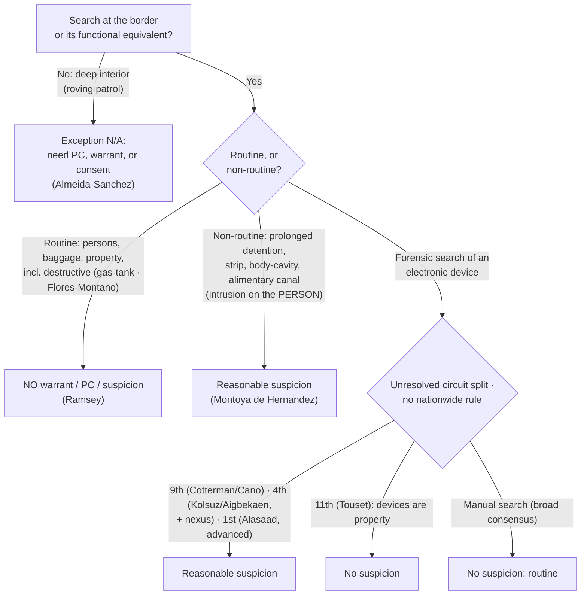

# S9 R1 panel-review — Opus model-diversity lane (prompt pack)

You are the **Claude/Opus** leg of the S9 three-lane adversarial panel (1 Claude + 2 Codex, R1). The two Codex lanes carry the A (support/quote-fidelity) and B (currency/treatment) attack lenses; **you carry model diversity and MUST vote on every paneled assertion across BOTH lenses' concerns.** You are refute-framed: try hard to break each assertion; **default to REFUTED on uncertainty**; never fabricate a cite, quote, or holding; use ONLY the evidence inlined below (no search, no outside knowledge). You are a SIGHTED reviewer — the FULL lake record (judgment fields included) is inlined.

You are a WRITER lane, not an adjudicator: you FIND and VOTE. You do not tally, adjudicate, or close any row — the orchestrator does.

For EACH group below, return one JSON object with the exact `reviewed[]` shape from the output contract (identical framing to the Codex lenses). Emit a finding object ONLY for a real defect (verdict refuted / stands-modified); a group you find wholly clean returns all-`stands` verdicts (the harness records a clean attestation). Concatenate the per-group JSON objects into a top-level `{"packs": [ ... ]}` array, one entry per group, each carrying its `group_id`.


OUTPUT CONTRACT — return ONE JSON object, nothing else:
{
  "lens": "A" | "B",
  "group_id": "<echo the group id>",
  "reviewed": [
    {
      "assertion_id": "<from group_inventory.jsonl>",
      "dimension": "existence|support|quote_fidelity|pincite|treatment|black_letter",
      "verdict": "stands" | "refuted" | "stands-modified",
      "verifiable_from_disclosed": true | false,
      "defect": null,   // null when verdict=="stands"; else an object:
      //  {"problem": "...", "severity": "high|medium|low", "proposed_fix": "...", "evidence_quote": "verbatim from disclosed evidence or null", "needs_cl": true|false, "locator_note": "..."}
      "reasons": ["short evidence-grounded reason", "..."],
      "breaks_true_positives": true | false,
      "residual_risks": ["..."],
      "suggested_tightening": "... or null"
    }
  ],
  "notes": ""
}
Rules: verdict=='stands' <=> defect==null (assertion survives your attack). verdict=='refuted' <=> a real defect (the assertion as framed is wrong). verdict=='stands-modified' <=> survives but needs a stated modification (a minor defect). Review EVERY assertion_id in group_inventory.jsonl exactly once. Output ONLY the JSON object.
---

## GROUP: content/warrant-exceptions/programmatic-and-special-needs-searches/Border Searches.md  (`doctrine`, 10 assertions)

### content_page

```
---
weight: 20
aliases:
  - "Border Searches"
  - "7-exceptions-warrant/7b-pc-not-needed/Border-Searches"
title: "Border Searches"
topic: Border Searches
type: doctrine
amendment: "U.S. Const. amend. IV"
jurisdiction: "Federal (U.S. Const. amend. IV); SCOTUS baseline"
status: draft
related: ["[[Special Needs and Administrative Searches]]", "[[Checkpoints and Roadblocks]]", "[[The Warrant Requirement]]", "[[Two Definitions of Search]]", "[[The Third-Party Doctrine and Digital Surveillance]]"]
---

# Border Searches

*Is this a border search, and if so, is it **routine** (no suspicion needed) or **non-routine / highly intrusive** (reasonable suspicion needed)?*

> [!rule] Black-letter rule
> At the international border and its functional equivalent, the sovereign's self-protective interest is at its **zenith**, so searches are "reasonable simply by virtue of the fact that they occur at the border." *[[United States v. Ramsey|Ramsey]]*, 431 U.S. 606, [616](https://www.courtlistener.com/opinion/109675/united-states-v-ramsey/) (1977). Reasonableness comes in **two tiers**: **routine** searches of persons, baggage, and property need **no warrant, probable cause, or suspicion**; **non-routine, highly intrusive** intrusions (prolonged detention, strip, body-cavity, alimentary-canal) need **reasonable suspicion**. *[[United States v. Montoya de Hernandez|Montoya de Hernandez]]*, 473 U.S. 531, [541](https://www.courtlistener.com/opinion/111509/united-states-v-montoya-de-hernandez/) (1985). The exception is **geographic**, not portable: it does not float into the deep interior. *[[Almeida-Sanchez v. United States|Almeida-Sanchez]]*, 413 U.S. 266, [273](https://www.courtlistener.com/opinion/108845/almeida-sanchez-v-united-states/) (1973).
> ^rule-border

## The Brief

**What it is, and is not.** The threshold question, whether the government action is a "search" at all, is still the opening move ([[Two Definitions of Search]]); once it is a search, the border-search exception governs the *reasonableness* question. This is a **categorical** exception to [[The Warrant Requirement]] grounded in sovereignty, not a special-needs balance and not the individualized rules of an interior stop. It reaches searches *for* things crossing the border; it is not authority to stop and question people away from the border, which is a separate seizure doctrine.

**The test up front.** Border searches split into two tiers:
1. **Routine.** Searches of persons, baggage, and property require **no warrant, no probable cause, and no individualized suspicion**. *[[United States v. Ramsey|Ramsey]]* extended this to opening incoming international mail. 431 U.S. at 616. *[[United States v. Flores-Montano|Flores-Montano]]* confirms the reach over vehicles: "We hold that the search in question did not require reasonable suspicion," so even removing, disassembling, and reassembling a gas tank is routine. 541 U.S. 149, 150 (2004).
2. **Non-routine, highly intrusive.** Prolonged detention and strip, body-cavity, or alimentary-canal searches require **reasonable suspicion**. *[[United States v. Montoya de Hernandez|Montoya de Hernandez]]* set that floor: a traveler may be detained when agents "reasonably suspect that the traveler is smuggling contraband in her alimentary canal," for "as long as is reasonably necessary" to verify or dispel it. 473 U.S. at 541, 544.

**What bumps a search into the non-routine tier is intrusion on the *person*, not property damage.** The dignity-and-bodily-integrity line, not the value of what is broken, drives the reasonable-suspicion requirement. *[[United States v. Flores-Montano|Flores-Montano]]* is explicit that "[c]omplex balancing tests to determine what is a 'routine' search of a vehicle, as opposed to a more 'intrusive' search of a person, have no place in border searches of vehicles." 541 U.S. at 152. Disassembling the gas tank stayed routine; the Court reserved only that some property searches might be "so destructive as to require a different result," but this was not one.

**The exception is geographic, not portable.** The power applies at the actual border **and its functional equivalents** (an established checkpoint where border roads converge, or an airport receiving a nonstop foreign flight), *[[Almeida-Sanchez v. United States|Almeida-Sanchez]]*, 413 U.S. at [272](https://www.courtlistener.com/opinion/108845/almeida-sanchez-v-united-states/), but it does **not** reach the deep interior. A roving-patrol *search* well inland, without probable cause or consent, violates the Fourth Amendment: the search of a car "at all points at least 20 miles north of the Mexican border . . . [i]n the absence of probable cause or consent . . . violated the petitioner's Fourth Amendment right." *Id.* at 273.

**Do not conflate the checkpoint *seizure* power with the border *search* power.** Fixed interior immigration checkpoints and roving-patrol stops near the border are **seizure** doctrines, not the border-search power. A roving-patrol **stop** to question occupants needs **reasonable suspicion**, "specific articulable facts, together with rational inferences," and apparent ancestry **alone** is not enough. *[[United States v. Brignoni-Ponce|Brignoni-Ponce]]*, 422 U.S. 873, [884](https://www.courtlistener.com/opinion/109311/united-states-v-brignoni-ponce/), 886–87 (1975). A brief **stop** at a **fixed, permanent** interior checkpoint is suspicionless. *[[United States v. Martinez-Fuerte|Martinez-Fuerte]]*, 428 U.S. 543, [566](https://www.courtlistener.com/opinion/109541/united-states-v-martinez-fuerte/) (1976). The outer limit of that checkpoint power is the crime-control bar of *[[City of Indianapolis v. Edmond|Edmond]]*; the programmatic-checkpoint rules are developed on [[Checkpoints and Roadblocks]]. (The holding of *[[United States v. Brignoni-Ponce|Brignoni-Ponce]]* is good law; its treatment of apparent Mexican ancestry as a relevant factor is widely criticized and given little practical weight.)

**The digital-device frontier is an unresolved circuit split, so name the circuits.** What standard governs a search of an **electronic device** at the border is a scope boundary that is an *assertion*, so state it precisely and never announce a nationwide device rule. A broad cross-circuit **consensus** treats a brief, *manual* device search as **routine** (no individualized suspicion). The circuits fracture over *forensic* (Cellebrite-type) searches:
- The **Ninth** and **Fourth** Circuits require **reasonable suspicion** for a forensic search (the Fourth adding a "border nexus" limit) (*[[United States v. Cotterman|Cotterman]]*; *[[United States v. Cano|Cano]]*; *[[United States v. Kolsuz|Kolsuz]]*; *[[United States v. Aigbekaen|Aigbekaen]]*).
- The **Eleventh** Circuit requires **no suspicion at all**, treating devices as property (*[[United States v. Touset|Touset]]*).
- The **First** Circuit requires reasonable suspicion for advanced searches but, splitting from the Ninth, does **not** confine them to digital contraband (*[[Alasaad v. Wolf|Alasaad]]*).

**SCOTUS has not resolved the split, and there is no nationwide device rule.** The full circuit spread is catalogued below. *[[Riley v. California|Riley]]*'s "get a warrant" reasoning about a phone's vast contents is the analytic engine each circuit argues from; the related digital cross-cutting doctrine is treated on [[The Third-Party Doctrine and Digital Surveillance]].

**Burden, standard of review, remedy.** The **government** bears the burden of justifying a warrantless border search; the defendant bears the threshold burden of showing a search and standing. Routine searches need **no individualized suspicion**; non-routine intrusions need **reasonable suspicion**. *[[United States v. Montoya de Hernandez|Montoya de Hernandez]]*, 473 U.S. at [541](https://www.courtlistener.com/opinion/111509/united-states-v-montoya-de-hernandez/). On appeal, reasonable suspicion is reviewed [[Common Legal Terms#de-novo|de novo]] and the historical facts for [[Common Legal Terms#clear-error|clear error]]. *[[Ornelas v. United States|Ornelas]]*, 517 U.S. 690, [699](https://www.courtlistener.com/opinion/118030/ornelas-v-united-states/) (1996). The **remedy** for an unjustified search is suppression under [[The Exclusionary Rule]].

**Apply it.**
1. **Locate the search.** Is it at the border or a functional equivalent? If it is a roving search in the interior, the exception does not apply; you need probable cause, a warrant, or consent (*[[Almeida-Sanchez v. United States|Almeida-Sanchez]]*).
2. **Classify the intrusion.** Routine (persons, baggage, property, including destructive vehicle searches) needs no suspicion; a strip, body-cavity, alimentary-canal, or prolonged detention needs reasonable suspicion (*[[United States v. Montoya de Hernandez|Montoya de Hernandez]]*).
3. **For a device, label the circuit and the mode.** A manual search is routine almost everywhere; for a forensic search, state your circuit's rule and flag the split. Do not assert a nationwide rule.
4. **Keep the checkpoint power separate.** A suspicionless immigration-checkpoint *stop* is not authority to *search* without suspicion away from the border (*[[United States v. Martinez-Fuerte|Martinez-Fuerte]]*).

**Common pitfalls.**
- **Assuming the exception reaches the deep interior.** A suspicionless roving *search* miles inland is not a border search (*[[Almeida-Sanchez v. United States|Almeida-Sanchez]]*).
- **Stating a nationwide device rule.** There is none; "forensic device searches always need reasonable suspicion" overstates the Ninth and Fourth, and "they never do" overstates the Eleventh. Label the circuit and flag the split.
- **Conflating immigration checkpoints with the search power.** *[[United States v. Martinez-Fuerte|Martinez-Fuerte]]* upholds suspicionless checkpoint *stops*, not suspicionless *searches* away from the border.
- **Treating destructive property searches as non-routine.** Dignity-intrusion on the **person**, not property damage, drives the reasonable-suspicion tier (*[[United States v. Flores-Montano|Flores-Montano]]*).

## Lower-court developments

The live frontier since *[[Riley v. California|Riley]]* (2014) is the standard for searching electronic devices at the border. A broad cross-circuit **consensus** treats a brief, *manual* search as routine and needs no individualized suspicion; the circuits **split** over whether a *forensic* search demands reasonable suspicion and, if so, its scope. SCOTUS has not resolved the device split. Each decision below binds only in its own circuit.

**Reasonable-suspicion camp: a forensic device search is non-routine.**

- ***[[United States v. Cotterman|Cotterman]]* (9th Cir. 2013) (en banc)** — *anchors the split.* A forensic examination of a device seized at the border requires reasonable suspicion, because it is the comprehensive and intrusive nature of a forensic search, not where it occurs, that triggers the requirement. 709 F.3d 952. **Binding in-circuit — 9th Cir.**
- ***[[United States v. Cano|Cano]]* (9th Cir. 2019)** — *clarifies Cotterman.* Manual searches need no suspicion; a forensic search needs reasonable suspicion, and (splitting the scope) that suspicion must be of **digital contraband**, so a border phone search is limited to a search for digital contraband. 934 F.3d 1002. **Binding in-circuit — 9th Cir.**
- ***[[United States v. Kolsuz|Kolsuz]]* (4th Cir. 2018)** — *first post-Riley appellate holding.* After *[[Riley v. California|Riley]]*, a forensic (off-site, weeks-long Cellebrite-type) device search at the border is non-routine and requires individualized suspicion. 890 F.3d 133. **Binding in-circuit — 4th Cir.**
- ***[[United States v. Aigbekaen|Aigbekaen]]* (4th Cir. 2019)** — *adds a border-nexus limit.* Where a border search is intrusive enough to require individualized suspicion, the suspected offense must bear a **nexus** to the border-search exception's purposes (national security, contraband, immigration), not a purely domestic investigation; good-faith saved the evidence. 943 F.3d 713. **Binding in-circuit — 4th Cir.**

**No-suspicion camp: devices are property.**

- ***[[United States v. Touset|Touset]]* (11th Cir. 2018)** — *the outlier.* **No suspicion, not even reasonable suspicion**, is required for a forensic device search; devices are property, and reasonable suspicion is reserved for intrusive searches of the **body**. Declines to follow *[[United States v. Cotterman|Cotterman]]*. 890 F.3d 1227. **Binding in-circuit — 11th Cir.**

**Contra-scope position: advanced searches need reasonable suspicion, but are not confined to contraband.**

- ***[[Alasaad v. Wolf|Alasaad]]* (1st Cir. 2021)** — *expands the scope.* Neither manual ("basic") nor forensic ("advanced") searches require a warrant or probable cause, and advanced searches need only reasonable suspicion; but, expressly splitting from the Ninth, the searches need **not** be limited to digital contraband. 988 F.3d 8. **Binding in-circuit — 1st Cir.**

**Manual-search consensus, reserving the forensic question.**

- ***[[United States v. Mendez|Mendez]]* (7th Cir. 2024)** — *joins the consensus.* A routine, manual cell-phone search needs no individualized suspicion; reserves whether a forensic search requires reasonable suspicion. 103 F.4th 1303. **Binding in-circuit — 7th Cir.**
- ***[[United States v. Castillo|Castillo]]* (5th Cir. 2023)** — *joins the consensus.* No individualized suspicion is required for a routine manual cell-phone search at the border; notes the forensic split without deciding it. 70 F.4th 894. **Binding in-circuit — 5th Cir.**
- ***[[United States v. Xiang|Xiang]]* (8th Cir. 2023)** — *reserves the question.* Affirmed denial of suppression of a forensic border search but expressly declined to decide whether reasonable suspicion is required, assuming the standard and holding it satisfied. 67 F.4th 895. **Binding in-circuit — 8th Cir.**

The synthesis: a **manual** device search is routine across the circuits; the fight is over **forensic** searches, where the Ninth and Fourth require reasonable suspicion (the Ninth confining it to digital contraband, the Fourth adding a border nexus), the First requires reasonable suspicion without the contraband limit, and the Eleventh requires nothing. Absent SCOTUS review, the governing rule is the one your circuit has adopted.

## Key cases

| Case | Holding | Opinion |
|---|---|---|
| *[[United States v. Ramsey]]*, 431 U.S. 606 (1977) | **Anchor.** Routine border searches (here, incoming international mail) need no warrant or probable cause; reasonable simply because they occur at the border. | [opinion](https://www.courtlistener.com/opinion/109675/united-states-v-ramsey/) |
| *[[United States v. Montoya de Hernandez]]*, 473 U.S. 531 (1985) | **Non-routine floor.** Prolonged detention of a suspected alimentary-canal smuggler is reasonable on reasonable suspicion, for as long as needed to verify or dispel it. | [opinion](https://www.courtlistener.com/opinion/111509/united-states-v-montoya-de-hernandez/) |
| *[[United States v. Flores-Montano]]*, 541 U.S. 149 (2004) | **Property is routine.** Suspicionless authority over vehicles includes removing and reassembling a gas tank; intrusiveness balancing is for the person, not vehicles. | [opinion](https://www.courtlistener.com/opinion/134729/united-states-v-flores-montano/) |
| *[[United States v. Martinez-Fuerte]]*, 428 U.S. 543 (1976) | **Checkpoint stops.** Brief stops at fixed interior immigration checkpoints are constitutional without individualized suspicion (a seizure power, distinct from the search power). | [opinion](https://www.courtlistener.com/opinion/109541/united-states-v-martinez-fuerte/) |
| *[[Almeida-Sanchez v. United States]]*, 413 U.S. 266 (1973) | **Geographic limit.** A roving-patrol search well inside the border, without probable cause or consent, violates the Fourth Amendment; introduces the "functional equivalent." | [opinion](https://www.courtlistener.com/opinion/108845/almeida-sanchez-v-united-states/) |
| *[[United States v. Brignoni-Ponce]]*, 422 U.S. 873 (1975) | **Roving stop.** A roving patrol may stop a vehicle near the border only on reasonable suspicion; apparent Mexican ancestry alone is not enough. | [opinion](https://www.courtlistener.com/opinion/109311/united-states-v-brignoni-ponce/) |

## Related cases across doctrines

These are treated in full elsewhere but bear directly on border searches, framed here.

| Case | Relevance here | Primary home | Opinion |
|---|---|---|---|
| *[[Riley v. California]]*, 573 U.S. 373 (2014) | ***Analytic engine.*** A phone's vast digital contents are categorically different ("get a warrant"), the premise every circuit reasons from on device searches at the border. | [[SIA Cell Phones]] | [opinion](https://www.courtlistener.com/opinion/2680439/riley-v-california/) |
| *[[City of Indianapolis v. Edmond]]*, 531 U.S. 32 (2000) | ***Checkpoint limit.*** A fixed checkpoint whose primary purpose is ordinary crime control is unconstitutional; interior crime-control stops cannot ride the border/checkpoint rationale. | [[Checkpoints and Roadblocks]] | [opinion](https://www.courtlistener.com/opinion/118391/city-of-indianapolis-v-edmond/) |
| *[[Ornelas v. United States]]*, 517 U.S. 690 (1996) | ***Standard of review.*** Reasonable suspicion and probable cause are reviewed [[Common Legal Terms#de-novo\|de novo]], historical facts for [[Common Legal Terms#clear-error\|clear error]], the appellate posture for a contested border search. | [[Probable Cause]] | [opinion](https://www.courtlistener.com/opinion/118030/ornelas-v-united-states/) |

## Visual



## Sources
- [*United States v. Ramsey*, 431 U.S. 606 (1977)](https://www.courtlistener.com/opinion/109675/united-states-v-ramsey/) (pinpoints: 612–13, 616)
- [*United States v. Montoya de Hernandez*, 473 U.S. 531 (1985)](https://www.courtlistener.com/opinion/111509/united-states-v-montoya-de-hernandez/) (pinpoints: 541, 544)
- [*United States v. Flores-Montano*, 541 U.S. 149 (2004)](https://www.courtlistener.com/opinion/134729/united-states-v-flores-montano/) (pinpoints: 150, 152–53)
- [*Almeida-Sanchez v. United States*, 413 U.S. 266 (1973)](https://www.courtlistener.com/opinion/108845/almeida-sanchez-v-united-states/) (pinpoints: 272, 273)
- [*United States v. Brignoni-Ponce*, 422 U.S. 873 (1975)](https://www.courtlistener.com/opinion/109311/united-states-v-brignoni-ponce/) (pinpoints: 884, 886–87)
- [*United States v. Martinez-Fuerte*, 428 U.S. 543 (1976)](https://www.courtlistener.com/opinion/109541/united-states-v-martinez-fuerte/) (pinpoint: 566)
- [*Ornelas v. United States*, 517 U.S. 690 (1996)](https://www.courtlistener.com/opinion/118030/ornelas-v-united-states/) (pinpoint: 699; home = [[Probable Cause]])
- [*Riley v. California*, 573 U.S. 373 (2014)](https://www.courtlistener.com/opinion/2680439/riley-v-california/) (home = [[SIA Cell Phones]])
- [*United States v. Cotterman*, 709 F.3d 952 (9th Cir. 2013) (en banc)](https://www.courtlistener.com/opinion/854692/united-states-v-howard-cotterman/) (Binding in-circuit — 9th Cir.)
- [*United States v. Cano*, 934 F.3d 1002 (9th Cir. 2019)](https://www.courtlistener.com/opinion/4649091/united-states-v-miguel-cano/) (Binding in-circuit — 9th Cir.)
- [*United States v. Kolsuz*, 890 F.3d 133 (4th Cir. 2018)](https://www.courtlistener.com/opinion/4499413/united-states-v-hamza-kolsuz/) (Binding in-circuit — 4th Cir.)
- [*United States v. Aigbekaen*, 943 F.3d 713 (4th Cir. 2019)](https://www.courtlistener.com/opinion/4680725/united-states-v-raymond-aigbekaen/) (Binding in-circuit — 4th Cir.)
- [*United States v. Touset*, 890 F.3d 1227 (11th Cir. 2018)](https://www.courtlistener.com/opinion/4500452/united-states-v-karl-touset/) (Binding in-circuit — 11th Cir.)
- [*Alasaad v. Wolf*, 988 F.3d 8 (1st Cir. 2021)](https://www.courtlistener.com/opinion/4855246/alasaad-v-wolf/) (Binding in-circuit — 1st Cir.)
- [*United States v. Mendez*, 103 F.4th 1303 (7th Cir. 2024)](https://www.courtlistener.com/opinion/9524074/united-states-v-marcos-mendez/) (Binding in-circuit — 7th Cir.)
- [*United States v. Castillo*, 70 F.4th 894 (5th Cir. 2023)](https://www.courtlistener.com/opinion/9407477/united-states-v-castillo/) (Binding in-circuit — 5th Cir.)
- [*United States v. Xiang*, 67 F.4th 895 (8th Cir. 2023)](https://www.courtlistener.com/opinion/9397097/united-states-v-haitao-xiang/) (Binding in-circuit — 8th Cir.)

```

### group_inventory (assertions under review)

```jsonl
{"assertion_id": "0c6d3cfd820e7b8e", "dimension": "existence", "kind": "case_cite", "locator": {"case": "Ornelas v. United States", "table_line": 91}, "payload": {"case": "Ornelas v. United States", "cells": ["*[[Ornelas v. United States]]*, 517 U.S. 690 (1996)", "***Standard of review.*** Reasonable suspicion and probable cause are reviewed [[Common Legal Terms#de-novo\\|de novo]], historical facts for [[Common Legal Terms#clear-error\\|clear error]], the appellate posture for a contested border search.", "[[Probable Cause]]", "[opinion](https://www.courtlistener.com/opinion/118030/ornelas-v-united-states/)"], "header": ["Case", "Relevance here", "Primary home", "Opinion"]}}
{"assertion_id": "2c6915bbf5b0d71d", "dimension": "existence", "kind": "case_cite", "locator": {"case": "United States v. Montoya de Hernandez", "table_line": 77}, "payload": {"case": "United States v. Montoya de Hernandez", "cells": ["*[[United States v. Montoya de Hernandez]]*, 473 U.S. 531 (1985)", "**Non-routine floor.** Prolonged detention of a suspected alimentary-canal smuggler is reasonable on reasonable suspicion, for as long as needed to verify or dispel it.", "[opinion](https://www.courtlistener.com/opinion/111509/united-states-v-montoya-de-hernandez/)"], "header": ["Case", "Holding", "Opinion"]}}
{"assertion_id": "3ccedd0ad3667918", "dimension": "existence", "kind": "case_cite", "locator": {"case": "United States v. Martinez-Fuerte", "table_line": 79}, "payload": {"case": "United States v. Martinez-Fuerte", "cells": ["*[[United States v. Martinez-Fuerte]]*, 428 U.S. 543 (1976)", "**Checkpoint stops.** Brief stops at fixed interior immigration checkpoints are constitutional without individualized suspicion (a seizure power, distinct from the search power).", "[opinion](https://www.courtlistener.com/opinion/109541/united-states-v-martinez-fuerte/)"], "header": ["Case", "Holding", "Opinion"]}}
{"assertion_id": "418b3b85e9a384ce", "dimension": "existence", "kind": "case_cite", "locator": {"case": "Riley v. California", "table_line": 89}, "payload": {"case": "Riley v. California", "cells": ["*[[Riley v. California]]*, 573 U.S. 373 (2014)", "***Analytic engine.*** A phone's vast digital contents are categorically different (\"get a warrant\"), the premise every circuit reasons from on device searches at the border.", "[[SIA Cell Phones]]", "[opinion](https://www.courtlistener.com/opinion/2680439/riley-v-california/)"], "header": ["Case", "Relevance here", "Primary home", "Opinion"]}}
{"assertion_id": "4b06675dab56ee39", "dimension": "existence", "kind": "case_cite", "locator": {"case": "United States v. Brignoni-Ponce", "table_line": 81}, "payload": {"case": "United States v. Brignoni-Ponce", "cells": ["*[[United States v. Brignoni-Ponce]]*, 422 U.S. 873 (1975)", "**Roving stop.** A roving patrol may stop a vehicle near the border only on reasonable suspicion; apparent Mexican ancestry alone is not enough.", "[opinion](https://www.courtlistener.com/opinion/109311/united-states-v-brignoni-ponce/)"], "header": ["Case", "Holding", "Opinion"]}}
{"assertion_id": "60c6b37018b22948", "dimension": "existence", "kind": "case_cite", "locator": {"case": "United States v. Flores-Montano", "table_line": 78}, "payload": {"case": "United States v. Flores-Montano", "cells": ["*[[United States v. Flores-Montano]]*, 541 U.S. 149 (2004)", "**Property is routine.** Suspicionless authority over vehicles includes removing and reassembling a gas tank; intrusiveness balancing is for the person, not vehicles.", "[opinion](https://www.courtlistener.com/opinion/134729/united-states-v-flores-montano/)"], "header": ["Case", "Holding", "Opinion"]}}
{"assertion_id": "798f19bf52e46291", "dimension": "existence", "kind": "case_cite", "locator": {"case": "United States v. Ramsey", "table_line": 76}, "payload": {"case": "United States v. Ramsey", "cells": ["*[[United States v. Ramsey]]*, 431 U.S. 606 (1977)", "**Anchor.** Routine border searches (here, incoming international mail) need no warrant or probable cause; reasonable simply because they occur at the border.", "[opinion](https://www.courtlistener.com/opinion/109675/united-states-v-ramsey/)"], "header": ["Case", "Holding", "Opinion"]}}
{"assertion_id": "e56956f0e73a41a0", "dimension": "existence", "kind": "case_cite", "locator": {"case": "City of Indianapolis v. Edmond", "table_line": 90}, "payload": {"case": "City of Indianapolis v. Edmond", "cells": ["*[[City of Indianapolis v. Edmond]]*, 531 U.S. 32 (2000)", "***Checkpoint limit.*** A fixed checkpoint whose primary purpose is ordinary crime control is unconstitutional; interior crime-control stops cannot ride the border/checkpoint rationale.", "[[Checkpoints and Roadblocks]]", "[opinion](https://www.courtlistener.com/opinion/118391/city-of-indianapolis-v-edmond/)"], "header": ["Case", "Relevance here", "Primary home", "Opinion"]}}
{"assertion_id": "f3eba8c275c70483", "dimension": "existence", "kind": "case_cite", "locator": {"case": "Almeida-Sanchez v. United States", "table_line": 80}, "payload": {"case": "Almeida-Sanchez v. United States", "cells": ["*[[Almeida-Sanchez v. United States]]*, 413 U.S. 266 (1973)", "**Geographic limit.** A roving-patrol search well inside the border, without probable cause or consent, violates the Fourth Amendment; introduces the \"functional equivalent.\"", "[opinion](https://www.courtlistener.com/opinion/108845/almeida-sanchez-v-united-states/)"], "header": ["Case", "Holding", "Opinion"]}}
{"assertion_id": "7507ed2d1d743f9d", "dimension": "support", "kind": "proposition", "locator": {"callout": "^rule-border"}, "payload": {"anchor": "^rule-border", "statement": "[!rule] Black-letter rule\nAt the international border and its functional equivalent, the sovereign's self-protective interest is at its **zenith**, so searches are \"reasonable simply by virtue of the fact that they occur at the border.\" *[[United States v. Ramsey|Ramsey]]*, 431 U.S. 606, [616](https://www.courtlistener.com/opinion/109675/united-states-v-ramsey/) (1977). Reasonableness comes in **two tiers**: **routine** searches of persons, baggage, and property need **no warrant, probable cause, or suspicion**; **non-routine, highly intrusive** intrusions (prolonged detention, strip, body-cavity, alimentary-canal) need **reasonable suspicion**. *[[United States v. Montoya de Hernandez|Montoya de Hernandez]]*, 473 U.S. 531, [541](https://www.courtlistener.com/opinion/111509/united-states-v-montoya-de-hernandez/) (1985). The exception is **geographic**, not portable: it does not float into the deep interior. *[[Almeida-Sanchez v. United States|Almeida-Sanchez]]*, 413 U.S. 266, [273](https://www.courtlistener.com/opinion/108845/almeida-sanchez-v-united-states/) (1973)."}}
```

### lake record — Almeida-Sanchez v. United States

```json
{
  "schema_version": "s2.v1",
  "record_id": "Almeida-Sanchez v. United States",
  "stub": false,
  "status": "verified",
  "identity": {
    "case_name": "Almeida-Sanchez v. United States",
    "case_name_short": "Almeida-Sanchez",
    "case_name_full": "Almeida-Sanchez v. United States",
    "input_case_name": "Almeida-Sanchez v. United States",
    "court": "U.S. Supreme Court",
    "court_id": "scotus",
    "court_level": "scotus",
    "circuit": null,
    "state": null,
    "date_decided": "1973-06-21",
    "year": 1973,
    "docket": null,
    "cluster_id": 108845,
    "lead_opinion_id": 108845,
    "sibling_ids": [
      108845,
      9425395,
      9425396,
      9425397
    ],
    "absolute_url": "/opinion/108845/almeida-sanchez-v-united-states/",
    "identity_method": "citation+party-text",
    "expected_citation_found": true,
    "party_name_in_text": true,
    "canonical_name_match": true,
    "alternates": [
      {
        "cluster_id": 8992646,
        "score": 10,
        "case_name": "Almeida-Sanchez v. United States"
      }
    ],
    "reason_code": null
  },
  "citations": {
    "official": {
      "cite": "413 U.S. 266",
      "volume": "413",
      "reporter": "U.S.",
      "page": "266",
      "type": 1,
      "selected_official": true,
      "source": "cluster.citations[]"
    },
    "parallel": [
      {
        "cite": "93 S. Ct. 2535",
        "volume": "93",
        "reporter": "S. Ct.",
        "page": "2535",
        "type": 1,
        "selected_official": false,
        "source": "cluster.citations[]"
      },
      {
        "cite": "37 L. Ed. 2d 596",
        "volume": "37",
        "reporter": "L. Ed. 2d",
        "page": "596",
        "type": 1,
        "selected_official": false,
        "source": "cluster.citations[]"
      }
    ],
    "vendor_neutral": [
      {
        "cite": "1973 U.S. LEXIS 44",
        "volume": "1973",
        "reporter": "U.S. LEXIS",
        "page": "44",
        "type": 6,
        "selected_official": false,
        "source": "cluster.citations[]"
      }
    ],
    "all": [
      {
        "cite": "413 U.S. 266",
        "volume": "413",
        "reporter": "U.S.",
        "page": "266",
        "type": 1,
        "selected_official": false,
        "source": "cluster.citations[]"
      },
      {
        "cite": "93 S. Ct. 2535",
        "volume": "93",
        "reporter": "S. Ct.",
        "page": "2535",
        "type": 1,
        "selected_official": false,
        "source": "cluster.citations[]"
      },
      {
        "cite": "37 L. Ed. 2d 596",
        "volume": "37",
        "reporter": "L. Ed. 2d",
        "page": "596",
        "type": 1,
        "selected_official": false,
        "source": "cluster.citations[]"
      },
      {
        "cite": "1973 U.S. LEXIS 44",
        "volume": "1973",
        "reporter": "U.S. LEXIS",
        "page": "44",
        "type": 6,
        "selected_official": false,
        "source": "cluster.citations[]"
      }
    ],
    "display": "413 U.S. 266",
    "official_selection": {
      "court_class": "scotus",
      "selected": "413 U.S. 266",
      "reason": "selected_rank_1"
    }
  },
  "pinpoints": [
    {
      "id": "pin-272",
      "page": null,
      "quote": "(defined as 100 air miles) of the border. Marijuana was found and used to convict. ## Issue Whether a warrantless, suspicionless search of a vehicle by a roving Border Patrol \u2014 conducted away from the border and without probable cause or consent \u2014 is consistent with the Fourth Amendment. ## Rule No. A genuine border search, or a search at the border's",
      "star_marker": null,
      "quote_fidelity": "mismatch",
      "pinpoint_status": "slip-only",
      "position": null
    },
    {
      "id": "pin-273",
      "page": null,
      "quote": "But the search of the petitioner's automobile by a roving patrol, on a California road that lies at all points at least 20 miles north of the Mexican border, was of a wholly different sort. In the absence of probable cause or consent, that search violated the petitioner's Fourth Amendment right to be free of 'unreasonable searches and seizures.'",
      "star_marker": null,
      "quote_fidelity": "mismatch",
      "pinpoint_status": "slip-only",
      "position": null
    }
  ],
  "treatment": {
    "field_i_validity": "good_law",
    "as_of_content": "1973-06-21",
    "as_of_treatment": "2026-06-30",
    "composite_basis": "migration-seed",
    "composite_basis_ref": "Almeida-Sanchez v. United States",
    "varies_by_point": false,
    "scope_note": "Old as_of seeds as_of_treatment; S2 derivation re-derives and may downgrade.",
    "point_overrides": [],
    "edges": [
      {
        "citing_case": {
          "name": "Fooks v. State",
          "cluster_id": 10600118,
          "cite": null,
          "field_ii": "abrogated"
        },
        "field_ii": "abrogated",
        "field_iii": "mentioned",
        "point": null,
        "proposed": true,
        "journal_ref": "Almeida-Sanchez v. United States:lane1_negative"
      },
      {
        "citing_case": {
          "name": "State of Iowa v. Shane Timothy Bakke",
          "cluster_id": 6619858,
          "cite": null,
          "field_ii": "questioned"
        },
        "field_ii": "questioned",
        "field_iii": "mentioned",
        "point": null,
        "proposed": true,
        "journal_ref": "Almeida-Sanchez v. United States:lane1_negative"
      },
      {
        "citing_case": {
          "name": "State v. Phillip Walker-Brazie & Brandi-Lena Butterfield",
          "cluster_id": 5139667,
          "cite": [
            "280 A.3d 24",
            "2021 VT 75"
          ],
          "field_ii": "overruled"
        },
        "field_ii": "overruled",
        "field_iii": "mentioned",
        "point": null,
        "proposed": true,
        "journal_ref": "Almeida-Sanchez v. United States:lane1_negative"
      },
      {
        "citing_case": {
          "name": "State of Iowa v. Brian De Arrie McGee",
          "cluster_id": 4883113,
          "cite": null,
          "field_ii": "overruled"
        },
        "field_ii": "overruled",
        "field_iii": "mentioned",
        "point": null,
        "proposed": true,
        "journal_ref": "Almeida-Sanchez v. United States:lane1_negative"
      },
      {
        "citing_case": {
          "name": "State v. Fleming",
          "cluster_id": 4832864,
          "cite": [
            "162 N.E.3d 981",
            "2020 Ohio 5352"
          ],
          "field_ii": "overruled"
        },
        "field_ii": "overruled",
        "field_iii": "mentioned",
        "point": null,
        "proposed": true,
        "journal_ref": "Almeida-Sanchez v. United States:lane1_negative"
      },
      {
        "citing_case": {
          "name": "Leaders of Beautiful Struggle v. Baltimore Police Department",
          "cluster_id": 4803842,
          "cite": [
            "979 F.3d 219"
          ],
          "field_ii": "abrogated"
        },
        "field_ii": "abrogated",
        "field_iii": "mentioned",
        "point": null,
        "proposed": true,
        "journal_ref": "Almeida-Sanchez v. United States:lane1_negative"
      },
      {
        "citing_case": {
          "name": "United States v. Billy Curry, Jr.",
          "cluster_id": 4787848,
          "cite": null,
          "field_ii": "abrogated"
        },
        "field_ii": "abrogated",
        "field_iii": "mentioned",
        "point": null,
        "proposed": true,
        "journal_ref": "Almeida-Sanchez v. United States:lane1_negative"
      },
      {
        "citing_case": {
          "name": "United States v. Raymond Aigbekaen",
          "cluster_id": 4680725,
          "cite": [
            "943 F.3d 713"
          ],
          "field_ii": "abrogated"
        },
        "field_ii": "abrogated",
        "field_iii": "mentioned",
        "point": null,
        "proposed": true,
        "journal_ref": "Almeida-Sanchez v. United States:lane1_negative"
      },
      {
        "citing_case": {
          "name": "Logan Vanderhoef v. Maurice Dixon",
          "cluster_id": 4654472,
          "cite": [
            "938 F.3d 271"
          ],
          "field_ii": "questioned"
        },
        "field_ii": "questioned",
        "field_iii": "mentioned",
        "point": null,
        "proposed": true,
        "journal_ref": "Almeida-Sanchez v. United States:lane1_negative"
      },
      {
        "citing_case": {
          "name": "United States v. Miguel Cano",
          "cluster_id": 4649091,
          "cite": [
            "934 F.3d 1002"
          ],
          "field_ii": "overruled"
        },
        "field_ii": "overruled",
        "field_iii": "mentioned",
        "point": null,
        "proposed": true,
        "journal_ref": "Almeida-Sanchez v. United States:lane1_negative"
      },
      {
        "citing_case": {
          "name": "United States v. Donald Wanjiku",
          "cluster_id": 4601308,
          "cite": null,
          "field_ii": "overruled"
        },
        "field_ii": "overruled",
        "field_iii": "mentioned",
        "point": null,
        "proposed": true,
        "journal_ref": "Almeida-Sanchez v. United States:lane1_negative"
      },
      {
        "citing_case": {
          "name": "United States v. Donald Wanjiku",
          "cluster_id": 4601253,
          "cite": [
            "919 F.3d 472"
          ],
          "field_ii": "overruled"
        },
        "field_ii": "overruled",
        "field_iii": "mentioned",
        "point": null,
        "proposed": true,
        "journal_ref": "Almeida-Sanchez v. United States:lane1_negative"
      },
      {
        "citing_case": {
          "name": "United States v. Hamza Kolsuz",
          "cluster_id": 4499413,
          "cite": null,
          "field_ii": "overruled"
        },
        "field_ii": "overruled",
        "field_iii": "mentioned",
        "point": null,
        "proposed": true,
        "journal_ref": "Almeida-Sanchez v. United States:lane1_negative"
      },
      {
        "citing_case": {
          "name": "United States v. Hamza Kolsuz",
          "cluster_id": 4496513,
          "cite": [
            "890 F.3d 133"
          ],
          "field_ii": "overruled"
        },
        "field_ii": "overruled",
        "field_iii": "mentioned",
        "point": null,
        "proposed": true,
        "journal_ref": "Almeida-Sanchez v. United States:lane1_negative"
      },
      {
        "citing_case": {
          "name": "Marcopoulos, Andreas",
          "cluster_id": 4455001,
          "cite": [
            "538 S.W.3d 596"
          ],
          "field_ii": "questioned"
        },
        "field_ii": "questioned",
        "field_iii": "mentioned",
        "point": null,
        "proposed": true,
        "journal_ref": "Almeida-Sanchez v. United States:lane1_negative"
      },
      {
        "citing_case": {
          "name": "Luis Sanchez v. Jefferson Sessions",
          "cluster_id": 4422886,
          "cite": [
            "870 F.3d 901",
            "2017 WL 3723238",
            "2017 U.S. App. LEXIS 16625"
          ],
          "field_ii": "questioned"
        },
        "field_ii": "questioned",
        "field_iii": "mentioned",
        "point": null,
        "proposed": true,
        "journal_ref": "Almeida-Sanchez v. United States:lane1_negative"
      },
      {
        "citing_case": {
          "name": "Amended September 13, 2016 State of Iowa v. Mar'yo D. Lindsey Jr.",
          "cluster_id": 4472005,
          "cite": null,
          "field_ii": "overruled"
        },
        "field_ii": "overruled",
        "field_iii": "mentioned",
        "point": null,
        "proposed": true,
        "journal_ref": "Almeida-Sanchez v. United States:lane1_negative"
      },
      {
        "citing_case": {
          "name": "State of Iowa v. Mar'yo D. Lindsey Jr.",
          "cluster_id": 3216871,
          "cite": [
            "881 N.W.2d 411",
            "2016 Iowa Sup. LEXIS 76"
          ],
          "field_ii": "overruled"
        },
        "field_ii": "overruled",
        "field_iii": "mentioned",
        "point": null,
        "proposed": true,
        "journal_ref": "Almeida-Sanchez v. United States:lane1_negative"
      },
      {
        "citing_case": {
          "name": "Birchfield v. N. Dakota. William Robert Bernard",
          "cluster_id": 3216497,
          "cite": [
            "579 U.S. 438",
            "195 L. Ed. 2d 560",
            "2016 U.S. LEXIS 4058",
            "136 S. Ct. 2160"
          ],
          "field_ii": "abrogated"
        },
        "field_ii": "abrogated",
        "field_iii": "mentioned",
        "point": null,
        "proposed": true,
        "journal_ref": "Almeida-Sanchez v. United States:lane1_negative"
      },
      {
        "citing_case": {
          "name": "Andreas Marcopoulos v. State",
          "cluster_id": 3194184,
          "cite": [
            "492 S.W.3d 773",
            "2016 WL 1479703",
            "2016 Tex. App. LEXIS 3911"
          ],
          "field_ii": "abrogated"
        },
        "field_ii": "abrogated",
        "field_iii": "mentioned",
        "point": null,
        "proposed": true,
        "journal_ref": "Almeida-Sanchez v. United States:lane1_negative"
      },
      {
        "citing_case": {
          "name": "State v. Yong Shik Won",
          "cluster_id": 3158283,
          "cite": [
            "137 Haw. 330",
            "372 P.3d 1065",
            "2015 Haw. LEXIS 352"
          ],
          "field_ii": "overruled"
        },
        "field_ii": "overruled",
        "field_iii": "mentioned",
        "point": null,
        "proposed": true,
        "journal_ref": "Almeida-Sanchez v. United States:lane1_negative"
      },
      {
        "citing_case": {
          "name": "State v. Sanchez",
          "cluster_id": 2815058,
          "cite": [
            "2015 NMSC 18",
            "8 N.M. Ct. App. 27",
            "2015 NMSC 018"
          ],
          "field_ii": "questioned"
        },
        "field_ii": "questioned",
        "field_iii": "mentioned",
        "point": null,
        "proposed": true,
        "journal_ref": "Almeida-Sanchez v. United States:lane1_negative"
      },
      {
        "citing_case": {
          "name": "State v. Gutierrez",
          "cluster_id": 2804164,
          "cite": null,
          "field_ii": "questioned"
        },
        "field_ii": "questioned",
        "field_iii": "mentioned",
        "point": null,
        "proposed": true,
        "journal_ref": "Almeida-Sanchez v. United States:lane1_negative"
      },
      {
        "citing_case": {
          "name": "United States v. Jae Shik Kim",
          "cluster_id": 2799603,
          "cite": [
            "103 F. Supp. 3d 32",
            "2015 U.S. Dist. LEXIS 60306"
          ],
          "field_ii": "abrogated"
        },
        "field_ii": "abrogated",
        "field_iii": "mentioned",
        "point": null,
        "proposed": true,
        "journal_ref": "Almeida-Sanchez v. United States:lane1_negative"
      },
      {
        "citing_case": {
          "name": "STATE OF TENNESSEE v. CHARLES A. KENNEDY",
          "cluster_id": 2739756,
          "cite": null,
          "field_ii": "questioned"
        },
        "field_ii": "questioned",
        "field_iii": "mentioned",
        "point": null,
        "proposed": true,
        "journal_ref": "Almeida-Sanchez v. United States:lane1_negative"
      },
      {
        "citing_case": {
          "name": "Jesus Hernandez v. USA",
          "cluster_id": 2681508,
          "cite": [
            "757 F.3d 249",
            "2014 WL 2932598"
          ],
          "field_ii": "overruled"
        },
        "field_ii": "overruled",
        "field_iii": "mentioned",
        "point": null,
        "proposed": true,
        "journal_ref": "Almeida-Sanchez v. United States:lane1_negative"
      },
      {
        "citing_case": {
          "name": "People v. Lee",
          "cluster_id": 2674606,
          "cite": [
            "2014 IL App (1st) 130507"
          ],
          "field_ii": "overruled"
        },
        "field_ii": "overruled",
        "field_iii": "mentioned",
        "point": null,
        "proposed": true,
        "journal_ref": "Almeida-Sanchez v. United States:lane1_negative"
      },
      {
        "citing_case": {
          "name": "People v. Butorac",
          "cluster_id": 2679461,
          "cite": [
            "2013 IL App (2d) 110953"
          ],
          "field_ii": "questioned"
        },
        "field_ii": "questioned",
        "field_iii": "mentioned",
        "point": null,
        "proposed": true,
        "journal_ref": "Almeida-Sanchez v. United States:lane1_negative"
      },
      {
        "citing_case": {
          "name": "State v. Rennis",
          "cluster_id": 8210127,
          "cite": [
            "195 Vt. 492",
            "2014 Vt. 8",
            "90 A.3d 906",
            "2014 VT 8",
            "2014 WL 185028",
            "2014 Vt. LEXIS 5"
          ],
          "field_ii": "questioned"
        },
        "field_ii": "questioned",
        "field_iii": "mentioned",
        "point": null,
        "proposed": true,
        "journal_ref": "Almeida-Sanchez v. United States:lane1_negative"
      },
      {
        "citing_case": {
          "name": "United States v. Harry Katzin",
          "cluster_id": 1086355,
          "cite": [
            "732 F.3d 187",
            "2013 WL 5716367",
            "2013 U.S. App. LEXIS 21377"
          ],
          "field_ii": "overruled"
        },
        "field_ii": "overruled",
        "field_iii": "mentioned",
        "point": null,
        "proposed": true,
        "journal_ref": "Almeida-Sanchez v. United States:lane1_negative"
      },
      {
        "citing_case": {
          "name": "United States v. Booker Powell",
          "cluster_id": 1043365,
          "cite": [
            "732 F.3d 361",
            "2013 WL 5493969"
          ],
          "field_ii": "overruled"
        },
        "field_ii": "overruled",
        "field_iii": "mentioned",
        "point": null,
        "proposed": true,
        "journal_ref": "Almeida-Sanchez v. United States:lane1_negative"
      },
      {
        "citing_case": {
          "name": "State of Iowa v. Christine Ann Kern",
          "cluster_id": 4472227,
          "cite": [
            "831 N.W.2d 149",
            "2013 WL 2278018",
            "2013 Iowa Sup. LEXIS 61"
          ],
          "field_ii": "overruled"
        },
        "field_ii": "overruled",
        "field_iii": "mentioned",
        "point": null,
        "proposed": true,
        "journal_ref": "Almeida-Sanchez v. United States:lane1_negative"
      },
      {
        "citing_case": {
          "name": "United States v. Howard Cotterman",
          "cluster_id": 854692,
          "cite": [
            "709 F.3d 952",
            "2013 WL 856292",
            "2013 U.S. App. LEXIS 4731"
          ],
          "field_ii": "questioned"
        },
        "field_ii": "questioned",
        "field_iii": "mentioned",
        "point": null,
        "proposed": true,
        "journal_ref": "Almeida-Sanchez v. United States:lane1_negative"
      },
      {
        "citing_case": {
          "name": "State v. Brown",
          "cluster_id": 2509614,
          "cite": [
            "726 S.E.2d 654",
            "315 Ga. App. 154",
            "2012 Fulton County D. Rep. 1288",
            "2012 Ga. App. LEXIS 337"
          ],
          "field_ii": "questioned"
        },
        "field_ii": "questioned",
        "field_iii": "mentioned",
        "point": null,
        "proposed": true,
        "journal_ref": "Almeida-Sanchez v. United States:lane1_negative"
      },
      {
        "citing_case": {
          "name": "State v. Klager",
          "cluster_id": 902104,
          "cite": [
            "2011 S.D. 12",
            "797 N.W.2d 47",
            "2011 SD 12",
            "2011 S.D. LEXIS 12",
            "2011 WL 1228292"
          ],
          "field_ii": "questioned"
        },
        "field_ii": "questioned",
        "field_iii": "mentioned",
        "point": null,
        "proposed": true,
        "journal_ref": "Almeida-Sanchez v. United States:lane1_negative"
      },
      {
        "citing_case": {
          "name": "United States v. Cotterman",
          "cluster_id": 213651,
          "cite": [
            "637 F.3d 1068",
            "2011 U.S. App. LEXIS 6483",
            "2011 WL 1137302"
          ],
          "field_ii": "abrogated"
        },
        "field_ii": "abrogated",
        "field_iii": "mentioned",
        "point": null,
        "proposed": true,
        "journal_ref": "Almeida-Sanchez v. United States:lane1_negative"
      },
      {
        "citing_case": {
          "name": "United States v. Walker",
          "cluster_id": 2474386,
          "cite": [
            "771 F. Supp. 2d 803",
            "2011 U.S. Dist. LEXIS 13760",
            "2011 WL 651414"
          ],
          "field_ii": "overruled"
        },
        "field_ii": "overruled",
        "field_iii": "mentioned",
        "point": null,
        "proposed": true,
        "journal_ref": "Almeida-Sanchez v. United States:lane1_negative"
      },
      {
        "citing_case": {
          "name": "State Of Iowa Vs. James Maximiliano Ochoa",
          "cluster_id": 4472474,
          "cite": [
            "792 N.W.2d 260",
            "2010 Iowa Sup. LEXIS 135"
          ],
          "field_ii": "overruled"
        },
        "field_ii": "overruled",
        "field_iii": "mentioned",
        "point": null,
        "proposed": true,
        "journal_ref": "Almeida-Sanchez v. United States:lane1_negative"
      },
      {
        "citing_case": {
          "name": "True v. Nebraska",
          "cluster_id": 150327,
          "cite": [
            "612 F.3d 676",
            "30 I.E.R. Cas. (BNA) 1537",
            "2010 U.S. App. LEXIS 14007",
            "93 Empl. Prac. Dec. (CCH) 43,931",
            "2010 WL 2696744"
          ],
          "field_ii": "questioned"
        },
        "field_ii": "questioned",
        "field_iii": "mentioned",
        "point": null,
        "proposed": true,
        "journal_ref": "Almeida-Sanchez v. United States:lane1_negative"
      },
      {
        "citing_case": {
          "name": "United States v. Villasenor",
          "cluster_id": 148280,
          "cite": [
            "608 F.3d 467",
            "2010 U.S. App. LEXIS 11833",
            "2010 WL 2303334"
          ],
          "field_ii": "questioned"
        },
        "field_ii": "questioned",
        "field_iii": "mentioned",
        "point": null,
        "proposed": true,
        "journal_ref": "Almeida-Sanchez v. United States:lane1_negative"
      },
      {
        "citing_case": {
          "name": "United States v. Hilario Alfaro-Moncada",
          "cluster_id": 3049883,
          "cite": null,
          "field_ii": "questioned"
        },
        "field_ii": "questioned",
        "field_iii": "mentioned",
        "point": null,
        "proposed": true,
        "journal_ref": "Almeida-Sanchez v. United States:lane1_negative"
      },
      {
        "citing_case": {
          "name": "United States v. Alfaro-Moncada",
          "cluster_id": 147332,
          "cite": [
            "607 F.3d 720",
            "2010 A.M.C. 1680",
            "2010 U.S. App. LEXIS 10841",
            "2010 WL 2103442"
          ],
          "field_ii": "questioned"
        },
        "field_ii": "questioned",
        "field_iii": "mentioned",
        "point": null,
        "proposed": true,
        "journal_ref": "Almeida-Sanchez v. United States:lane1_negative"
      },
      {
        "citing_case": {
          "name": "United States v. Stewart",
          "cluster_id": 2538573,
          "cite": [
            "715 F. Supp. 2d 750",
            "2010 U.S. Dist. LEXIS 50876",
            "2010 WL 2089355"
          ],
          "field_ii": "superseded_by_statute"
        },
        "field_ii": "superseded_by_statute",
        "field_iii": "mentioned",
        "point": null,
        "proposed": true,
        "journal_ref": "Almeida-Sanchez v. United States:lane1_negative"
      },
      {
        "citing_case": {
          "name": "Carmichael v. Village of Palatine, Ill.",
          "cluster_id": 146911,
          "cite": [
            "605 F.3d 451",
            "2010 U.S. App. LEXIS 10378",
            "2010 WL 2011509"
          ],
          "field_ii": "questioned"
        },
        "field_ii": "questioned",
        "field_iii": "mentioned",
        "point": null,
        "proposed": true,
        "journal_ref": "Almeida-Sanchez v. United States:lane1_negative"
      },
      {
        "citing_case": {
          "name": "Brown v. State",
          "cluster_id": 1584196,
          "cite": [
            "24 So. 3d 671",
            "2009 Fla. App. LEXIS 19763",
            "2009 WL 4874530"
          ],
          "field_ii": "overruled"
        },
        "field_ii": "overruled",
        "field_iii": "mentioned",
        "point": null,
        "proposed": true,
        "journal_ref": "Almeida-Sanchez v. United States:lane1_negative"
      },
      {
        "citing_case": {
          "name": "United States v. Peoples",
          "cluster_id": 1404047,
          "cite": [
            "668 F. Supp. 2d 1042",
            "2009 U.S. Dist. LEXIS 104573",
            "2009 WL 3586564"
          ],
          "field_ii": "abrogated"
        },
        "field_ii": "abrogated",
        "field_iii": "mentioned",
        "point": null,
        "proposed": true,
        "journal_ref": "Almeida-Sanchez v. United States:lane1_negative"
      },
      {
        "citing_case": {
          "name": "United States v. Juan Vasquez-Rosales",
          "cluster_id": 3064935,
          "cite": null,
          "field_ii": "superseded_by_statute"
        },
        "field_ii": "superseded_by_statute",
        "field_iii": "mentioned",
        "point": null,
        "proposed": true,
        "journal_ref": "Almeida-Sanchez v. United States:lane1_negative"
      },
      {
        "citing_case": {
          "name": "United States v. Guzman-Padilla",
          "cluster_id": 1448445,
          "cite": [
            "573 F.3d 865",
            "2009 U.S. App. LEXIS 16298",
            "2009 WL 2182818"
          ],
          "field_ii": "superseded_by_statute"
        },
        "field_ii": "superseded_by_statute",
        "field_iii": "mentioned",
        "point": null,
        "proposed": true,
        "journal_ref": "Almeida-Sanchez v. United States:lane1_negative"
      },
      {
        "citing_case": {
          "name": "Denson v. United States",
          "cluster_id": 78422,
          "cite": [
            "574 F.3d 1318",
            "2009 U.S. App. LEXIS 15634",
            "2009 WL 2031036"
          ],
          "field_ii": "overruled"
        },
        "field_ii": "overruled",
        "field_iii": "mentioned",
        "point": null,
        "proposed": true,
        "journal_ref": "Almeida-Sanchez v. United States:lane1_negative"
      },
      {
        "citing_case": {
          "name": "United States v. Gowadia",
          "cluster_id": 2469880,
          "cite": [
            "610 F. Supp. 2d 1234",
            "2009 U.S. Dist. LEXIS 16502",
            "2009 WL 529097"
          ],
          "field_ii": "questioned"
        },
        "field_ii": "questioned",
        "field_iii": "mentioned",
        "point": null,
        "proposed": true,
        "journal_ref": "Almeida-Sanchez v. United States:lane1_negative"
      },
      {
        "citing_case": {
          "name": "United States v. Whitted",
          "cluster_id": 3035592,
          "cite": null,
          "field_ii": "questioned"
        },
        "field_ii": "questioned",
        "field_iii": "mentioned",
        "point": null,
        "proposed": true,
        "journal_ref": "Almeida-Sanchez v. United States:lane1_negative"
      },
      {
        "citing_case": {
          "name": "United States v. Whitted",
          "cluster_id": 1441555,
          "cite": [
            "541 F.3d 480",
            "50 V.I. 1081",
            "43 A.L.R. 6th 771",
            "2008 U.S. App. LEXIS 18916",
            "2008 WL 4107473"
          ],
          "field_ii": "questioned"
        },
        "field_ii": "questioned",
        "field_iii": "mentioned",
        "point": null,
        "proposed": true,
        "journal_ref": "Almeida-Sanchez v. United States:lane1_negative"
      },
      {
        "citing_case": {
          "name": "United States v. Moya-Matute",
          "cluster_id": 2472669,
          "cite": [
            "735 F. Supp. 2d 1306",
            "2008 U.S. Dist. LEXIS 119558",
            "2008 WL 8053484"
          ],
          "field_ii": "overruled"
        },
        "field_ii": "overruled",
        "field_iii": "mentioned",
        "point": null,
        "proposed": true,
        "journal_ref": "Almeida-Sanchez v. United States:lane1_negative"
      },
      {
        "citing_case": {
          "name": "United States v. Arnold",
          "cluster_id": 1234252,
          "cite": [
            "533 F.3d 1003",
            "2008 U.S. App. LEXIS 14690",
            "45 A.L.R. Fed. 2d 715",
            "2008 WL 2675794"
          ],
          "field_ii": "questioned"
        },
        "field_ii": "questioned",
        "field_iii": "mentioned",
        "point": null,
        "proposed": true,
        "journal_ref": "Almeida-Sanchez v. United States:lane1_negative"
      },
      {
        "citing_case": {
          "name": "United States v. Arnold",
          "cluster_id": 3052269,
          "cite": null,
          "field_ii": "questioned"
        },
        "field_ii": "questioned",
        "field_iii": "mentioned",
        "point": null,
        "proposed": true,
        "journal_ref": "Almeida-Sanchez v. United States:lane1_negative"
      },
      {
        "citing_case": {
          "name": "United States v. Askew",
          "cluster_id": 187180,
          "cite": [
            "529 F.3d 1119",
            "2008 WL 2468501"
          ],
          "field_ii": "overruled"
        },
        "field_ii": "overruled",
        "field_iii": "mentioned",
        "point": null,
        "proposed": true,
        "journal_ref": "Almeida-Sanchez v. United States:lane1_negative"
      },
      {
        "citing_case": {
          "name": "United States v. Arnold",
          "cluster_id": 3051719,
          "cite": [
            "523 F.3d 941",
            "2008 U.S. App. LEXIS 8590",
            "2008 WL 1776525"
          ],
          "field_ii": "questioned"
        },
        "field_ii": "questioned",
        "field_iii": "mentioned",
        "point": null,
        "proposed": true,
        "journal_ref": "Almeida-Sanchez v. United States:lane1_negative"
      },
      {
        "citing_case": {
          "name": "In Re United States for an Order Directing a Provider of Electronic Communication Service to Disclose Records to the Government",
          "cluster_id": 2451365,
          "cite": [
            "534 F. Supp. 2d 585",
            "2008 U.S. Dist. LEXIS 13733",
            "2008 WL 483434"
          ],
          "field_ii": "abrogated"
        },
        "field_ii": "abrogated",
        "field_iii": "mentioned",
        "point": null,
        "proposed": true,
        "journal_ref": "Almeida-Sanchez v. United States:lane1_negative"
      },
      {
        "citing_case": {
          "name": "United States v. Moya-Matute",
          "cluster_id": 2580818,
          "cite": [
            "559 F. Supp. 2d 1189",
            "2008 U.S. Dist. LEXIS 42380",
            "2008 WL 2323522"
          ],
          "field_ii": "overruled"
        },
        "field_ii": "overruled",
        "field_iii": "mentioned",
        "point": null,
        "proposed": true,
        "journal_ref": "Almeida-Sanchez v. United States:lane1_negative"
      },
      {
        "citing_case": {
          "name": "United States v. McGinnis",
          "cluster_id": 2975657,
          "cite": [
            "247 F. App'x 589"
          ],
          "field_ii": "questioned"
        },
        "field_ii": "questioned",
        "field_iii": "mentioned",
        "point": null,
        "proposed": true,
        "journal_ref": "Almeida-Sanchez v. United States:lane1_negative"
      },
      {
        "citing_case": {
          "name": "United States v. Abbouchi",
          "cluster_id": 1235958,
          "cite": [
            "502 F.3d 850",
            "2007 U.S. App. LEXIS 21280",
            "2007 WL 2493507"
          ],
          "field_ii": "questioned"
        },
        "field_ii": "questioned",
        "field_iii": "mentioned",
        "point": null,
        "proposed": true,
        "journal_ref": "Almeida-Sanchez v. United States:lane1_negative"
      },
      {
        "citing_case": {
          "name": "United States v. Abbouchi",
          "cluster_id": 3050017,
          "cite": null,
          "field_ii": "questioned"
        },
        "field_ii": "questioned",
        "field_iii": "mentioned",
        "point": null,
        "proposed": true,
        "journal_ref": "Almeida-Sanchez v. United States:lane1_negative"
      },
      {
        "citing_case": {
          "name": "United States v. Abbouchi",
          "cluster_id": 3049356,
          "cite": null,
          "field_ii": "questioned"
        },
        "field_ii": "questioned",
        "field_iii": "mentioned",
        "point": null,
        "proposed": true,
        "journal_ref": "Almeida-Sanchez v. United States:lane1_negative"
      },
      {
        "citing_case": {
          "name": "Warshak v. United States",
          "cluster_id": 2975254,
          "cite": null,
          "field_ii": "overruled"
        },
        "field_ii": "overruled",
        "field_iii": "mentioned",
        "point": null,
        "proposed": true,
        "journal_ref": "Almeida-Sanchez v. United States:lane1_negative"
      },
      {
        "citing_case": {
          "name": "Steven Warshak v. United States",
          "cluster_id": 798096,
          "cite": [
            "490 F.3d 455",
            "2007 U.S. App. LEXIS 14297",
            "2007 WL 1730094"
          ],
          "field_ii": "overruled"
        },
        "field_ii": "overruled",
        "field_iii": "mentioned",
        "point": null,
        "proposed": true,
        "journal_ref": "Almeida-Sanchez v. United States:lane1_negative"
      },
      {
        "citing_case": {
          "name": "Brendlin v. California",
          "cluster_id": 145712,
          "cite": [
            "168 L. Ed. 2d 132",
            "127 S. Ct. 2400",
            "551 U.S. 249",
            "2007 U.S. LEXIS 7897"
          ],
          "field_ii": "questioned"
        },
        "field_ii": "questioned",
        "field_iii": "mentioned",
        "point": null,
        "proposed": true,
        "journal_ref": "Almeida-Sanchez v. United States:lane1_negative"
      },
      {
        "citing_case": {
          "name": "State v. Heapy",
          "cluster_id": 2638152,
          "cite": [
            "151 P.3d 764",
            "113 Haw. 283",
            "2007 Haw. LEXIS 13"
          ],
          "field_ii": "abrogated"
        },
        "field_ii": "abrogated",
        "field_iii": "mentioned",
        "point": null,
        "proposed": true,
        "journal_ref": "Almeida-Sanchez v. United States:lane1_negative"
      },
      {
        "citing_case": {
          "name": "United States v. Gurr, Bernard",
          "cluster_id": 186816,
          "cite": [
            "471 F.3d 144",
            "374 U.S. App. D.C. 21",
            "2006 U.S. App. LEXIS 30104"
          ],
          "field_ii": "overruled"
        },
        "field_ii": "overruled",
        "field_iii": "mentioned",
        "point": null,
        "proposed": true,
        "journal_ref": "Almeida-Sanchez v. United States:lane1_negative"
      },
      {
        "citing_case": {
          "name": "United States v. Ellison",
          "cluster_id": 2974262,
          "cite": null,
          "field_ii": "questioned"
        },
        "field_ii": "questioned",
        "field_iii": "mentioned",
        "point": null,
        "proposed": true,
        "journal_ref": "Almeida-Sanchez v. United States:lane1_negative"
      },
      {
        "citing_case": {
          "name": "United States v. Curtis Ellison",
          "cluster_id": 795627,
          "cite": [
            "462 F.3d 557",
            "2006 U.S. App. LEXIS 22558",
            "2006 WL 2527973"
          ],
          "field_ii": "questioned"
        },
        "field_ii": "questioned",
        "field_iii": "mentioned",
        "point": null,
        "proposed": true,
        "journal_ref": "Almeida-Sanchez v. United States:lane1_negative"
      },
      {
        "citing_case": {
          "name": "State v. Barnaby",
          "cluster_id": 887572,
          "cite": [
            "2006 MT 203",
            "142 P.3d 809",
            "333 Mont. 220",
            "2006 Mont. LEXIS 399"
          ],
          "field_ii": "overruled"
        },
        "field_ii": "overruled",
        "field_iii": "mentioned",
        "point": null,
        "proposed": true,
        "journal_ref": "Almeida-Sanchez v. United States:lane1_negative"
      },
      {
        "citing_case": {
          "name": "Martinez-Aguero v. Gonzalez",
          "cluster_id": 44591,
          "cite": [
            "459 F.3d 618",
            "2006 WL 2242365"
          ],
          "field_ii": "overruled"
        },
        "field_ii": "overruled",
        "field_iii": "mentioned",
        "point": null,
        "proposed": true,
        "journal_ref": "Almeida-Sanchez v. United States:lane1_negative"
      },
      {
        "citing_case": {
          "name": "United States v. Romm",
          "cluster_id": 3038099,
          "cite": null,
          "field_ii": "questioned"
        },
        "field_ii": "questioned",
        "field_iii": "mentioned",
        "point": null,
        "proposed": true,
        "journal_ref": "Almeida-Sanchez v. United States:lane1_negative"
      },
      {
        "citing_case": {
          "name": "United States v. Stuart Romm",
          "cluster_id": 795139,
          "cite": [
            "455 F.3d 990",
            "2006 U.S. App. LEXIS 18474",
            "2006 WL 2042827"
          ],
          "field_ii": "questioned"
        },
        "field_ii": "questioned",
        "field_iii": "mentioned",
        "point": null,
        "proposed": true,
        "journal_ref": "Almeida-Sanchez v. United States:lane1_negative"
      },
      {
        "citing_case": {
          "name": "United States v. Najar",
          "cluster_id": 167674,
          "cite": [
            "451 F.3d 710",
            "2006 U.S. App. LEXIS 15171",
            "2006 WL 1689231"
          ],
          "field_ii": "questioned"
        },
        "field_ii": "questioned",
        "field_iii": "mentioned",
        "point": null,
        "proposed": true,
        "journal_ref": "Almeida-Sanchez v. United States:lane1_negative"
      },
      {
        "citing_case": {
          "name": "United States v. McClain",
          "cluster_id": 2973671,
          "cite": null,
          "field_ii": "overruled"
        },
        "field_ii": "overruled",
        "field_iii": "mentioned",
        "point": null,
        "proposed": true,
        "journal_ref": "Almeida-Sanchez v. United States:lane1_negative"
      },
      {
        "citing_case": {
          "name": "United States v. Kevin McClain George Brandt Jason Davis",
          "cluster_id": 793975,
          "cite": [
            "444 F.3d 537",
            "2006 U.S. App. LEXIS 7895",
            "2006 WL 827811"
          ],
          "field_ii": "overruled"
        },
        "field_ii": "overruled",
        "field_iii": "mentioned",
        "point": null,
        "proposed": true,
        "journal_ref": "Almeida-Sanchez v. United States:lane1_negative"
      },
      {
        "citing_case": {
          "name": "AA Ex Rel. BA v. ATTY. GENERAL",
          "cluster_id": 2354253,
          "cite": [
            "894 A.2d 31",
            "384 N.J. Super. 67"
          ],
          "field_ii": "overruled"
        },
        "field_ii": "overruled",
        "field_iii": "mentioned",
        "point": null,
        "proposed": true,
        "journal_ref": "Almeida-Sanchez v. United States:lane1_negative"
      },
      {
        "citing_case": {
          "name": "Buchanan Ex Rel. Estate of Buchanan v. Maine",
          "cluster_id": 2458001,
          "cite": [
            "417 F. Supp. 2d 45",
            "2006 U.S. Dist. LEXIS 6292",
            "2006 WL 367340"
          ],
          "field_ii": "overruled"
        },
        "field_ii": "overruled",
        "field_iii": "mentioned",
        "point": null,
        "proposed": true,
        "journal_ref": "Almeida-Sanchez v. United States:lane1_negative"
      },
      {
        "citing_case": {
          "name": "United States v. Jackson, Tarry",
          "cluster_id": 186498,
          "cite": [
            "415 F.3d 88",
            "367 U.S. App. D.C. 320",
            "2005 U.S. App. LEXIS 14951",
            "2005 WL 1704843"
          ],
          "field_ii": "questioned"
        },
        "field_ii": "questioned",
        "field_iii": "mentioned",
        "point": null,
        "proposed": true,
        "journal_ref": "Almeida-Sanchez v. United States:lane1_negative"
      },
      {
        "citing_case": {
          "name": "United States v. Seljan",
          "cluster_id": 2438909,
          "cite": [
            "328 F. Supp. 2d 1077",
            "2004 U.S. Dist. LEXIS 14978",
            "2004 WL 1749495"
          ],
          "field_ii": "superseded_by_statute"
        },
        "field_ii": "superseded_by_statute",
        "field_iii": "mentioned",
        "point": null,
        "proposed": true,
        "journal_ref": "Almeida-Sanchez v. United States:lane1_negative"
      },
      {
        "citing_case": {
          "name": "Commonwealth v. Rogers",
          "cluster_id": 2371475,
          "cite": [
            "849 A.2d 1185",
            "578 Pa. 127",
            "2004 Pa. LEXIS 1252"
          ],
          "field_ii": "overruled"
        },
        "field_ii": "overruled",
        "field_iii": "mentioned",
        "point": null,
        "proposed": true,
        "journal_ref": "Almeida-Sanchez v. United States:lane1_negative"
      },
      {
        "citing_case": {
          "name": "Groh v. Ramirez",
          "cluster_id": 131161,
          "cite": [
            "157 L. Ed. 2d 1068",
            "124 S. Ct. 1284",
            "540 U.S. 551",
            "2004 U.S. LEXIS 1624",
            "2004 WL 330057"
          ],
          "field_ii": "abrogated"
        },
        "field_ii": "abrogated",
        "field_iii": "mentioned",
        "point": null,
        "proposed": true,
        "journal_ref": "Almeida-Sanchez v. United States:lane1_negative"
      },
      {
        "citing_case": {
          "name": "United States v. Boumelhem",
          "cluster_id": 2970815,
          "cite": null,
          "field_ii": "superseded_by_statute"
        },
        "field_ii": "superseded_by_statute",
        "field_iii": "mentioned",
        "point": null,
        "proposed": true,
        "journal_ref": "Almeida-Sanchez v. United States:lane1_negative"
      },
      {
        "citing_case": {
          "name": "United States v. Ali Boumelhem",
          "cluster_id": 783064,
          "cite": [
            "339 F.3d 414",
            "2003 U.S. App. LEXIS 16425",
            "2003 WL 21914106"
          ],
          "field_ii": "superseded_by_statute"
        },
        "field_ii": "superseded_by_statute",
        "field_iii": "mentioned",
        "point": null,
        "proposed": true,
        "journal_ref": "Almeida-Sanchez v. United States:lane1_negative"
      },
      {
        "citing_case": {
          "name": "United States v. Jose Augustin Romero-Bustamente",
          "cluster_id": 782919,
          "cite": [
            "337 F.3d 1104",
            "2003 Daily Journal DAR 8541",
            "2003 Cal. Daily Op. Serv. 6765",
            "2003 U.S. App. LEXIS 15249",
            "2003 WL 21757130"
          ],
          "field_ii": "overruled"
        },
        "field_ii": "overruled",
        "field_iii": "mentioned",
        "point": null,
        "proposed": true,
        "journal_ref": "Almeida-Sanchez v. United States:lane1_negative"
      },
      {
        "citing_case": {
          "name": "Commonwealth v. Tobin",
          "cluster_id": 1962653,
          "cite": [
            "828 A.2d 415",
            "2003 Pa. Commw. LEXIS 453"
          ],
          "field_ii": "overruled"
        },
        "field_ii": "overruled",
        "field_iii": "mentioned",
        "point": null,
        "proposed": true,
        "journal_ref": "Almeida-Sanchez v. United States:lane1_negative"
      },
      {
        "citing_case": {
          "name": "Derrick A. Wiley v. Department of Justice",
          "cluster_id": 781964,
          "cite": [
            "328 F.3d 1346",
            "2003 U.S. App. LEXIS 9175",
            "2003 WL 21060833"
          ],
          "field_ii": "questioned"
        },
        "field_ii": "questioned",
        "field_iii": "mentioned",
        "point": null,
        "proposed": true,
        "journal_ref": "Almeida-Sanchez v. United States:lane1_negative"
      },
      {
        "citing_case": {
          "name": "People v. Lidster",
          "cluster_id": 3134880,
          "cite": null,
          "field_ii": "abrogated"
        },
        "field_ii": "abrogated",
        "field_iii": "mentioned",
        "point": null,
        "proposed": true,
        "journal_ref": "Almeida-Sanchez v. United States:lane1_negative"
      },
      {
        "citing_case": {
          "name": "People v. Lidster",
          "cluster_id": 2070661,
          "cite": [
            "779 N.E.2d 855",
            "202 Ill. 2d 1",
            "269 Ill. Dec. 1",
            "2002 Ill. LEXIS 944"
          ],
          "field_ii": "abrogated"
        },
        "field_ii": "abrogated",
        "field_iii": "mentioned",
        "point": null,
        "proposed": true,
        "journal_ref": "Almeida-Sanchez v. United States:lane1_negative"
      },
      {
        "citing_case": {
          "name": "Hurn v. United States",
          "cluster_id": 2486148,
          "cite": [
            "221 F. Supp. 2d 493",
            "2002 U.S. Dist. LEXIS 18238",
            "2002 WL 31156059"
          ],
          "field_ii": "questioned"
        },
        "field_ii": "questioned",
        "field_iii": "mentioned",
        "point": null,
        "proposed": true,
        "journal_ref": "Almeida-Sanchez v. United States:lane1_negative"
      },
      {
        "citing_case": {
          "name": "Bradley v. United States",
          "cluster_id": 3012161,
          "cite": [
            "299 F.3d 197",
            "2002 U.S. App. LEXIS 14960",
            "2002 WL 1723779"
          ],
          "field_ii": "overruled"
        },
        "field_ii": "overruled",
        "field_iii": "mentioned",
        "point": null,
        "proposed": true,
        "journal_ref": "Almeida-Sanchez v. United States:lane1_negative"
      },
      {
        "citing_case": {
          "name": "Bradley v. United States",
          "cluster_id": 778647,
          "cite": [
            "299 F.3d 197"
          ],
          "field_ii": "overruled"
        },
        "field_ii": "overruled",
        "field_iii": "mentioned",
        "point": null,
        "proposed": true,
        "journal_ref": "Almeida-Sanchez v. United States:lane1_negative"
      },
      {
        "citing_case": {
          "name": "United States v. Pollard",
          "cluster_id": 2425044,
          "cite": [
            "209 F. Supp. 2d 525",
            "2002 WL 1363433",
            "2002 U.S. Dist. LEXIS 10989"
          ],
          "field_ii": "overruled"
        },
        "field_ii": "overruled",
        "field_iii": "mentioned",
        "point": null,
        "proposed": true,
        "journal_ref": "Almeida-Sanchez v. United States:lane1_negative"
      },
      {
        "citing_case": {
          "name": "Willie Lee Douglas v. State of Texas",
          "cluster_id": 2904221,
          "cite": null,
          "field_ii": "overruled"
        },
        "field_ii": "overruled",
        "field_iii": "mentioned",
        "point": null,
        "proposed": true,
        "journal_ref": "Almeida-Sanchez v. United States:lane1_negative"
      },
      {
        "citing_case": {
          "name": "Kim Ho Ma v. Ashcroft",
          "cluster_id": 7095993,
          "cite": [
            "257 F.3d 1095",
            "2001 WL 845325"
          ],
          "field_ii": "overruled"
        },
        "field_ii": "overruled",
        "field_iii": "mentioned",
        "point": null,
        "proposed": true,
        "journal_ref": "Almeida-Sanchez v. United States:lane1_negative"
      },
      {
        "citing_case": {
          "name": "Kim Ho Ma v. John D. Ashcroft",
          "cluster_id": 774115,
          "cite": [
            "257 F.3d 1095",
            "2001 Cal. Daily Op. Serv. 6360",
            "2001 Daily Journal DAR 7799",
            "2001 U.S. App. LEXIS 16866"
          ],
          "field_ii": "overruled"
        },
        "field_ii": "overruled",
        "field_iii": "mentioned",
        "point": null,
        "proposed": true,
        "journal_ref": "Almeida-Sanchez v. United States:lane1_negative"
      },
      {
        "citing_case": {
          "name": "City of Indianapolis v. Edmond",
          "cluster_id": 118391,
          "cite": [
            "148 L. Ed. 2d 333",
            "121 S. Ct. 447",
            "531 U.S. 32",
            "2000 U.S. LEXIS 8084",
            "69 U.S.L.W. 4009",
            "14 Fla. L. Weekly Fed. S 9",
            "2000 Colo. J. C.A.R. 6401",
            "2000 Cal. Daily Op. Serv. 9549"
          ],
          "field_ii": "overruled"
        },
        "field_ii": "overruled",
        "field_iii": "mentioned",
        "point": null,
        "proposed": true,
        "journal_ref": "Almeida-Sanchez v. United States:lane1_negative"
      },
      {
        "citing_case": {
          "name": "Dixon v. State",
          "cluster_id": 2276800,
          "cite": [
            "758 A.2d 1063",
            "133 Md. App. 654",
            "2000 Md. App. LEXIS 143"
          ],
          "field_ii": "overruled"
        },
        "field_ii": "overruled",
        "field_iii": "mentioned",
        "point": null,
        "proposed": true,
        "journal_ref": "Almeida-Sanchez v. United States:lane1_negative"
      },
      {
        "citing_case": {
          "name": "State v. Legg",
          "cluster_id": 1341701,
          "cite": [
            "536 S.E.2d 110",
            "207 W. Va. 686",
            "2000 W. Va. LEXIS 20"
          ],
          "field_ii": "overruled"
        },
        "field_ii": "overruled",
        "field_iii": "mentioned",
        "point": null,
        "proposed": true,
        "journal_ref": "Almeida-Sanchez v. United States:lane1_negative"
      },
      {
        "citing_case": {
          "name": "Kim Ho Ma v. Reno",
          "cluster_id": 7080220,
          "cite": [
            "208 F.3d 815",
            "2000 Daily Journal DAR 3695",
            "2000 Cal. Daily Op. Serv. 2744",
            "2000 U.S. App. LEXIS 6434"
          ],
          "field_ii": "overruled"
        },
        "field_ii": "overruled",
        "field_iii": "mentioned",
        "point": null,
        "proposed": true,
        "journal_ref": "Almeida-Sanchez v. United States:lane1_negative"
      },
      {
        "citing_case": {
          "name": "Kim Ho Ma v. Janet Reno",
          "cluster_id": 768268,
          "cite": [
            "208 F.3d 815"
          ],
          "field_ii": "overruled"
        },
        "field_ii": "overruled",
        "field_iii": "mentioned",
        "point": null,
        "proposed": true,
        "journal_ref": "Almeida-Sanchez v. United States:lane1_negative"
      },
      {
        "citing_case": {
          "name": "State v. Ward",
          "cluster_id": 1614689,
          "cite": [
            "2000 WI 3",
            "604 N.W.2d 517",
            "231 Wis. 2d 723",
            "2000 Wisc. LEXIS 3"
          ],
          "field_ii": "criticized"
        },
        "field_ii": "criticized",
        "field_iii": "mentioned",
        "point": null,
        "proposed": true,
        "journal_ref": "Almeida-Sanchez v. United States:lane1_negative"
      },
      {
        "citing_case": {
          "name": "United States v. Beras",
          "cluster_id": 198546,
          "cite": [
            "183 F.3d 22",
            "1999 U.S. App. LEXIS 15062",
            "1999 WL 447158"
          ],
          "field_ii": "overruled"
        },
        "field_ii": "overruled",
        "field_iii": "mentioned",
        "point": null,
        "proposed": true,
        "journal_ref": "Almeida-Sanchez v. United States:lane1_negative"
      },
      {
        "citing_case": {
          "name": "Lowe v. Pogue",
          "cluster_id": 1087697,
          "cite": [
            "143 L. Ed. 2d 384",
            "119 S. Ct. 1238",
            "526 U.S. 273",
            "1999 U.S. LEXIS 2249"
          ],
          "field_ii": "criticized"
        },
        "field_ii": "criticized",
        "field_iii": "mentioned",
        "point": null,
        "proposed": true,
        "journal_ref": "Almeida-Sanchez v. United States:lane1_negative"
      },
      {
        "citing_case": {
          "name": "United States v. Rubio-Hernandez",
          "cluster_id": 2286418,
          "cite": [
            "39 F. Supp. 2d 808",
            "1999 U.S. Dist. LEXIS 3727",
            "1999 WL 170549"
          ],
          "field_ii": "abrogated"
        },
        "field_ii": "abrogated",
        "field_iii": "mentioned",
        "point": null,
        "proposed": true,
        "journal_ref": "Almeida-Sanchez v. United States:lane1_negative"
      },
      {
        "citing_case": {
          "name": "Joseph H. Norwood, Individually and as Representative of a Class of Citizens v. W.C. Bain, Jr., Individually and in His Official Capacity as Director of Public Safety for the City of Spartanburg Police Department City of Spartanburg, Joseph H. Norwood, Individually and as Representative of a Class of Citizens v. W.C. Bain, Jr., Individually and in His Official Capacity as Director of Public Safety for the City of Spartanburg Police Department City of Spartanburg",
          "cluster_id": 760958,
          "cite": [
            "166 F.3d 243",
            "1999 U.S. App. LEXIS 244"
          ],
          "field_ii": "questioned"
        },
        "field_ii": "questioned",
        "field_iii": "mentioned",
        "point": null,
        "proposed": true,
        "journal_ref": "Almeida-Sanchez v. United States:lane1_negative"
      },
      {
        "citing_case": {
          "name": "Hulit v. State",
          "cluster_id": 2452885,
          "cite": [
            "982 S.W.2d 431",
            "1998 Tex. Crim. App. LEXIS 174",
            "1998 WL 870923"
          ],
          "field_ii": "criticized"
        },
        "field_ii": "criticized",
        "field_iii": "mentioned",
        "point": null,
        "proposed": true,
        "journal_ref": "Almeida-Sanchez v. United States:lane1_negative"
      },
      {
        "citing_case": {
          "name": "Loesch v. State",
          "cluster_id": 2416636,
          "cite": [
            "979 S.W.2d 47",
            "1998 Tex. App. LEXIS 6295",
            "1998 WL 698540"
          ],
          "field_ii": "questioned"
        },
        "field_ii": "questioned",
        "field_iii": "mentioned",
        "point": null,
        "proposed": true,
        "journal_ref": "Almeida-Sanchez v. United States:lane1_negative"
      },
      {
        "citing_case": {
          "name": "DEPT. OF BUSINESS v. Calder Race Course",
          "cluster_id": 1847855,
          "cite": [
            "724 So. 2d 100",
            "1998 WL 422515"
          ],
          "field_ii": "overruled"
        },
        "field_ii": "overruled",
        "field_iii": "mentioned",
        "point": null,
        "proposed": true,
        "journal_ref": "Almeida-Sanchez v. United States:lane1_negative"
      },
      {
        "citing_case": {
          "name": "Norwood v. Bain",
          "cluster_id": 2966869,
          "cite": null,
          "field_ii": "questioned"
        },
        "field_ii": "questioned",
        "field_iii": "mentioned",
        "point": null,
        "proposed": true,
        "journal_ref": "Almeida-Sanchez v. United States:lane1_negative"
      },
      {
        "citing_case": {
          "name": "Joseph H. Norwood, Individually and as Representative of a Class of Citizens v. W.C. Bain, Jr., Individually and in His Official Capacity as Director of Public Safety for the City of Spartanburg Police Department City of Spartanburg, Joseph H. Norwood, Individually and as Representative of a Class of Citizens v. W.C. Bain, Jr., Individually and in His Official Capacity as Director of Public Safety for the City of Spartanburg Police Department City of Spartanburg",
          "cluster_id": 754238,
          "cite": [
            "143 F.3d 843"
          ],
          "field_ii": "questioned"
        },
        "field_ii": "questioned",
        "field_iii": "mentioned",
        "point": null,
        "proposed": true,
        "journal_ref": "Almeida-Sanchez v. United States:lane1_negative"
      },
      {
        "citing_case": {
          "name": "AL Post 763 v. Ohio Liquor Control Comm.",
          "cluster_id": 10684485,
          "cite": [
            "1998 Ohio 367",
            "82 Ohio St. 3d 108"
          ],
          "field_ii": "questioned"
        },
        "field_ii": "questioned",
        "field_iii": "mentioned",
        "point": null,
        "proposed": true,
        "journal_ref": "Almeida-Sanchez v. United States:lane1_negative"
      },
      {
        "citing_case": {
          "name": "UNITED STATES of America, Plaintiff-Appellee, v. Francisco Javier SANTOS-PINON, Defendant-Appellant",
          "cluster_id": 755244,
          "cite": [
            "146 F.3d 734",
            "98 Daily Journal DAR 6584",
            "98 Cal. Daily Op. Serv. 4636",
            "1998 U.S. App. LEXIS 12796",
            "1998 WL 315489"
          ],
          "field_ii": "overruled"
        },
        "field_ii": "overruled",
        "field_iii": "mentioned",
        "point": null,
        "proposed": true,
        "journal_ref": "Almeida-Sanchez v. United States:lane1_negative"
      },
      {
        "citing_case": {
          "name": "Gora v. City of Ferndale",
          "cluster_id": 1572900,
          "cite": [
            "576 N.W.2d 141",
            "456 Mich. 704"
          ],
          "field_ii": "questioned"
        },
        "field_ii": "questioned",
        "field_iii": "mentioned",
        "point": null,
        "proposed": true,
        "journal_ref": "Almeida-Sanchez v. United States:lane1_negative"
      },
      {
        "citing_case": {
          "name": "State v. Mendez",
          "cluster_id": 1195185,
          "cite": [
            "947 P.2d 256",
            "88 Wash. App. 785"
          ],
          "field_ii": "questioned"
        },
        "field_ii": "questioned",
        "field_iii": "mentioned",
        "point": null,
        "proposed": true,
        "journal_ref": "Almeida-Sanchez v. United States:lane1_negative"
      },
      {
        "citing_case": {
          "name": "People v. Taylor",
          "cluster_id": 1624122,
          "cite": [
            "564 N.W.2d 24",
            "454 Mich. 580"
          ],
          "field_ii": "questioned"
        },
        "field_ii": "questioned",
        "field_iii": "mentioned",
        "point": null,
        "proposed": true,
        "journal_ref": "Almeida-Sanchez v. United States:lane1_negative"
      },
      {
        "citing_case": {
          "name": "State v. Codner",
          "cluster_id": 1729200,
          "cite": [
            "696 So. 2d 806",
            "1997 WL 100951"
          ],
          "field_ii": "questioned"
        },
        "field_ii": "questioned",
        "field_iii": "mentioned",
        "point": null,
        "proposed": true,
        "journal_ref": "Almeida-Sanchez v. United States:lane1_negative"
      },
      {
        "citing_case": {
          "name": "United States v. Alvarado-Ramirez",
          "cluster_id": 8750513,
          "cite": [
            "975 F. Supp. 906",
            "1997 U.S. Dist. LEXIS 13054",
            "1997 WL 538882"
          ],
          "field_ii": "questioned"
        },
        "field_ii": "questioned",
        "field_iii": "mentioned",
        "point": null,
        "proposed": true,
        "journal_ref": "Almeida-Sanchez v. United States:lane1_negative"
      },
      {
        "citing_case": {
          "name": "United States v. Ramon Navarro",
          "cluster_id": 722575,
          "cite": [
            "90 F.3d 1245",
            "1996 WL 411847"
          ],
          "field_ii": "overruled"
        },
        "field_ii": "overruled",
        "field_iii": "mentioned",
        "point": null,
        "proposed": true,
        "journal_ref": "Almeida-Sanchez v. United States:lane1_negative"
      },
      {
        "citing_case": {
          "name": "Loesch v. State",
          "cluster_id": 1677573,
          "cite": [
            "921 S.W.2d 405",
            "1996 Tex. App. LEXIS 1349",
            "1996 WL 155214"
          ],
          "field_ii": "questioned"
        },
        "field_ii": "questioned",
        "field_iii": "mentioned",
        "point": null,
        "proposed": true,
        "journal_ref": "Almeida-Sanchez v. United States:lane1_negative"
      },
      {
        "citing_case": {
          "name": "Richard Townes, Jr. v. Edward W. Murray, Director",
          "cluster_id": 706844,
          "cite": [
            "68 F.3d 840",
            "1995 U.S. App. LEXIS 30789",
            "1995 WL 627452"
          ],
          "field_ii": "questioned"
        },
        "field_ii": "questioned",
        "field_iii": "mentioned",
        "point": null,
        "proposed": true,
        "journal_ref": "Almeida-Sanchez v. United States:lane1_negative"
      },
      {
        "citing_case": {
          "name": "Commonwealth v. Cass",
          "cluster_id": 2381454,
          "cite": [
            "666 A.2d 313",
            "446 Pa. Super. 66",
            "1995 Pa. Super. LEXIS 3166"
          ],
          "field_ii": "questioned"
        },
        "field_ii": "questioned",
        "field_iii": "mentioned",
        "point": null,
        "proposed": true,
        "journal_ref": "Almeida-Sanchez v. United States:lane1_negative"
      },
      {
        "citing_case": {
          "name": "United States v. Daniel Oriakhi",
          "cluster_id": 698332,
          "cite": [
            "57 F.3d 1290",
            "1995 U.S. App. LEXIS 15499",
            "1995 WL 369608"
          ],
          "field_ii": "questioned"
        },
        "field_ii": "questioned",
        "field_iii": "mentioned",
        "point": null,
        "proposed": true,
        "journal_ref": "Almeida-Sanchez v. United States:lane1_negative"
      },
      {
        "citing_case": {
          "name": "United States v. Barona",
          "cluster_id": 7032767,
          "cite": [
            "56 F.3d 1087",
            "1995 WL 329267"
          ],
          "field_ii": "questioned"
        },
        "field_ii": "questioned",
        "field_iii": "mentioned",
        "point": null,
        "proposed": true,
        "journal_ref": "Almeida-Sanchez v. United States:lane1_negative"
      },
      {
        "citing_case": {
          "name": "United States v. Maria Cecilia Barona, United States of America v. Janet Martinez, Aka: Luz Janet Martinez & Luz Janeth Martinez, United States of America v. Brian Bennett, United States of America v. Mario Ernesto Villabona-Alvarado, A/K/A Tico, United States of America v. Michael Dubarry McCarver A/K/A Mike Bald, United States of America v. Michael Harris, A/K/A Tall Make",
          "cluster_id": 697352,
          "cite": [
            "56 F.3d 1087",
            "95 Daily Journal DAR 7174",
            "95 Cal. Daily Op. Serv. 4161",
            "1995 U.S. App. LEXIS 13590"
          ],
          "field_ii": "questioned"
        },
        "field_ii": "questioned",
        "field_iii": "mentioned",
        "point": null,
        "proposed": true,
        "journal_ref": "Almeida-Sanchez v. United States:lane1_negative"
      },
      {
        "citing_case": {
          "name": "State v. Brickhouse",
          "cluster_id": 2617617,
          "cite": [
            "20 Kan. App. 2d 495",
            "890 P.2d 353",
            "1995 Kan. App. LEXIS 20"
          ],
          "field_ii": "overruled"
        },
        "field_ii": "overruled",
        "field_iii": "mentioned",
        "point": null,
        "proposed": true,
        "journal_ref": "Almeida-Sanchez v. United States:lane1_negative"
      },
      {
        "citing_case": {
          "name": "United States v. Daniel Inocencio, Evaristo Hinojosa, Sr., Daniel Alfonso Reyes",
          "cluster_id": 682752,
          "cite": [
            "40 F.3d 716"
          ],
          "field_ii": "questioned"
        },
        "field_ii": "questioned",
        "field_iii": "mentioned",
        "point": null,
        "proposed": true,
        "journal_ref": "Almeida-Sanchez v. United States:lane1_negative"
      },
      {
        "citing_case": {
          "name": "United States v. Hinojosa",
          "cluster_id": 6811,
          "cite": null,
          "field_ii": "questioned"
        },
        "field_ii": "questioned",
        "field_iii": "mentioned",
        "point": null,
        "proposed": true,
        "journal_ref": "Almeida-Sanchez v. United States:lane1_negative"
      },
      {
        "citing_case": {
          "name": "Kimbrew v. Evansville Police Department",
          "cluster_id": 1456169,
          "cite": [
            "867 F. Supp. 818",
            "1994 U.S. Dist. LEXIS 16126",
            "1994 WL 630879"
          ],
          "field_ii": "overruled"
        },
        "field_ii": "overruled",
        "field_iii": "mentioned",
        "point": null,
        "proposed": true,
        "journal_ref": "Almeida-Sanchez v. United States:lane1_negative"
      },
      {
        "citing_case": {
          "name": "United States v. Jewel Rose Hyde Patricia Yvonne Gray Karen Boothe, A/K/A Karen Boothe-Waller, A/K/A Karen Ann Marie Boothe",
          "cluster_id": 679542,
          "cite": [
            "37 F.3d 116",
            "30 V.I. 475",
            "1994 U.S. App. LEXIS 27085",
            "1994 WL 524547"
          ],
          "field_ii": "questioned"
        },
        "field_ii": "questioned",
        "field_iii": "mentioned",
        "point": null,
        "proposed": true,
        "journal_ref": "Almeida-Sanchez v. United States:lane1_negative"
      },
      {
        "citing_case": {
          "name": "People v. Valenzuela",
          "cluster_id": 2270705,
          "cite": [
            "28 Cal. App. 4th 817",
            "33 Cal. Rptr. 2d 802",
            "94 Cal. Daily Op. Serv. 7452",
            "94 Daily Journal DAR 13603",
            "1994 Cal. App. LEXIS 980"
          ],
          "field_ii": "questioned"
        },
        "field_ii": "questioned",
        "field_iii": "mentioned",
        "point": null,
        "proposed": true,
        "journal_ref": "Almeida-Sanchez v. United States:lane1_negative"
      },
      {
        "citing_case": {
          "name": "Wilkerson v. Whitley",
          "cluster_id": 7029344,
          "cite": [
            "28 F.3d 498",
            "1994 U.S. App. LEXIS 21373",
            "1994 WL 390132"
          ],
          "field_ii": "overruled"
        },
        "field_ii": "overruled",
        "field_iii": "mentioned",
        "point": null,
        "proposed": true,
        "journal_ref": "Almeida-Sanchez v. United States:lane1_negative"
      },
      {
        "citing_case": {
          "name": "Wilkerson v. Whitley",
          "cluster_id": 6539,
          "cite": [
            "28 F.3d 498"
          ],
          "field_ii": "overruled"
        },
        "field_ii": "overruled",
        "field_iii": "mentioned",
        "point": null,
        "proposed": true,
        "journal_ref": "Almeida-Sanchez v. United States:lane1_negative"
      },
      {
        "citing_case": {
          "name": "Joseph Walton, as Next Friend of Christopher Walton, a Minor v. Alma Alexander, Alma Alexander",
          "cluster_id": 667160,
          "cite": [
            "20 F.3d 1350"
          ],
          "field_ii": "questioned"
        },
        "field_ii": "questioned",
        "field_iii": "mentioned",
        "point": null,
        "proposed": true,
        "journal_ref": "Almeida-Sanchez v. United States:lane1_negative"
      },
      {
        "citing_case": {
          "name": "State v. Joyce",
          "cluster_id": 7906322,
          "cite": [
            "30 Conn. App. 164",
            "619 A.2d 872",
            "1993 Conn. App. LEXIS 43"
          ],
          "field_ii": "questioned"
        },
        "field_ii": "questioned",
        "field_iii": "mentioned",
        "point": null,
        "proposed": true,
        "journal_ref": "Almeida-Sanchez v. United States:lane1_negative"
      },
      {
        "citing_case": {
          "name": "United States v. Vincent Ezeiruaku",
          "cluster_id": 563242,
          "cite": [
            "936 F.2d 136",
            "1991 WL 105684"
          ],
          "field_ii": "overruled"
        },
        "field_ii": "overruled",
        "field_iii": "mentioned",
        "point": null,
        "proposed": true,
        "journal_ref": "Almeida-Sanchez v. United States:lane1_negative"
      },
      {
        "citing_case": {
          "name": "People v. McKeown",
          "cluster_id": 6047279,
          "cite": [
            "146 A.D.2d 716",
            "536 N.Y.S.2d 1018",
            "1989 N.Y. App. Div. LEXIS 611"
          ],
          "field_ii": "questioned"
        },
        "field_ii": "questioned",
        "field_iii": "mentioned",
        "point": null,
        "proposed": true,
        "journal_ref": "Almeida-Sanchez v. United States:lane1_negative"
      },
      {
        "citing_case": {
          "name": "Ingersoll v. Palmer",
          "cluster_id": 2604190,
          "cite": [
            "743 P.2d 1299",
            "43 Cal. 3d 1321",
            "241 Cal. Rptr. 42",
            "1987 Cal. LEXIS 451"
          ],
          "field_ii": "overruled"
        },
        "field_ii": "overruled",
        "field_iii": "mentioned",
        "point": null,
        "proposed": true,
        "journal_ref": "Almeida-Sanchez v. United States:lane1_negative"
      },
      {
        "citing_case": {
          "name": "Webb v. State",
          "cluster_id": 2467075,
          "cite": [
            "739 S.W.2d 802",
            "1987 Tex. Crim. App. LEXIS 740"
          ],
          "field_ii": "questioned"
        },
        "field_ii": "questioned",
        "field_iii": "mentioned",
        "point": null,
        "proposed": true,
        "journal_ref": "Almeida-Sanchez v. United States:lane1_negative"
      },
      {
        "citing_case": {
          "name": "Illinois v. Gates",
          "cluster_id": 110959,
          "cite": [
            "76 L. Ed. 2d 527",
            "103 S. Ct. 2317",
            "462 U.S. 213",
            "1983 U.S. LEXIS 54",
            "51 U.S.L.W. 4709"
          ],
          "field_ii": "overruled"
        },
        "field_ii": "overruled",
        "field_iii": "mentioned",
        "point": null,
        "proposed": true,
        "journal_ref": "Almeida-Sanchez v. United States:lane2_top_cited"
      },
      {
        "citing_case": {
          "name": "United States v. Leon",
          "cluster_id": 111262,
          "cite": [
            "82 L. Ed. 2d 677",
            "104 S. Ct. 3405",
            "468 U.S. 897",
            "1984 U.S. LEXIS 153"
          ],
          "field_ii": "overruled"
        },
        "field_ii": "overruled",
        "field_iii": "mentioned",
        "point": null,
        "proposed": true,
        "journal_ref": "Almeida-Sanchez v. United States:lane2_top_cited"
      },
      {
        "citing_case": {
          "name": "Rakas v. Illinois",
          "cluster_id": 109953,
          "cite": [
            "58 L. Ed. 2d 387",
            "99 S. Ct. 421",
            "439 U.S. 128",
            "1978 U.S. LEXIS 2452"
          ],
          "field_ii": "overruled"
        },
        "field_ii": "overruled",
        "field_iii": "mentioned",
        "point": null,
        "proposed": true,
        "journal_ref": "Almeida-Sanchez v. United States:lane2_top_cited"
      },
      {
        "citing_case": {
          "name": "Delaware v. Prouse",
          "cluster_id": 110045,
          "cite": [
            "59 L. Ed. 2d 660",
            "99 S. Ct. 1391",
            "440 U.S. 648",
            "1979 U.S. LEXIS 80"
          ],
          "field_ii": "questioned"
        },
        "field_ii": "questioned",
        "field_iii": "mentioned",
        "point": null,
        "proposed": true,
        "journal_ref": "Almeida-Sanchez v. United States:lane2_top_cited"
      },
      {
        "citing_case": {
          "name": "United States v. Ross",
          "cluster_id": 110719,
          "cite": [
            "72 L. Ed. 2d 572",
            "102 S. Ct. 2157",
            "456 U.S. 798",
            "1982 U.S. LEXIS 18",
            "50 U.S.L.W. 4580"
          ],
          "field_ii": "overruled"
        },
        "field_ii": "overruled",
        "field_iii": "mentioned",
        "point": null,
        "proposed": true,
        "journal_ref": "Almeida-Sanchez v. United States:lane2_top_cited"
      },
      {
        "citing_case": {
          "name": "Michigan v. Long",
          "cluster_id": 111020,
          "cite": [
            "77 L. Ed. 2d 1201",
            "103 S. Ct. 3469",
            "463 U.S. 1032",
            "1983 U.S. LEXIS 7",
            "51 U.S.L.W. 5231"
          ],
          "field_ii": "questioned"
        },
        "field_ii": "questioned",
        "field_iii": "mentioned",
        "point": null,
        "proposed": true,
        "journal_ref": "Almeida-Sanchez v. United States:lane2_top_cited"
      },
      {
        "citing_case": {
          "name": "United States v. Brignoni-Ponce",
          "cluster_id": 109311,
          "cite": [
            "45 L. Ed. 2d 607",
            "95 S. Ct. 2574",
            "422 U.S. 873",
            "1975 U.S. LEXIS 10"
          ],
          "field_ii": "questioned"
        },
        "field_ii": "questioned",
        "field_iii": "mentioned",
        "point": null,
        "proposed": true,
        "journal_ref": "Almeida-Sanchez v. United States:lane2_top_cited"
      },
      {
        "citing_case": {
          "name": "South Dakota v. Opperman",
          "cluster_id": 109537,
          "cite": [
            "49 L. Ed. 2d 1000",
            "96 S. Ct. 3092",
            "428 U.S. 364",
            "1976 U.S. LEXIS 15"
          ],
          "field_ii": "questioned"
        },
        "field_ii": "questioned",
        "field_iii": "mentioned",
        "point": null,
        "proposed": true,
        "journal_ref": "Almeida-Sanchez v. United States:lane2_top_cited"
      },
      {
        "citing_case": {
          "name": "Texas v. Brown",
          "cluster_id": 110901,
          "cite": [
            "75 L. Ed. 2d 502",
            "103 S. Ct. 1535",
            "460 U.S. 730",
            "1983 U.S. LEXIS 143",
            "51 U.S.L.W. 4361"
          ],
          "field_ii": "criticized"
        },
        "field_ii": "criticized",
        "field_iii": "mentioned",
        "point": null,
        "proposed": true,
        "journal_ref": "Almeida-Sanchez v. United States:lane2_top_cited"
      },
      {
        "citing_case": {
          "name": "United States v. Sharpe",
          "cluster_id": 111378,
          "cite": [
            "84 L. Ed. 2d 605",
            "105 S. Ct. 1568",
            "470 U.S. 675",
            "1985 U.S. LEXIS 74",
            "53 U.S.L.W. 4346"
          ],
          "field_ii": "overruled"
        },
        "field_ii": "overruled",
        "field_iii": "mentioned",
        "point": null,
        "proposed": true,
        "journal_ref": "Almeida-Sanchez v. United States:lane2_top_cited"
      },
      {
        "citing_case": {
          "name": "Skinner v. Railway Labor Executives' Assn.",
          "cluster_id": 112219,
          "cite": [
            "103 L. Ed. 2d 639",
            "109 S. Ct. 1402",
            "489 U.S. 602",
            "1989 U.S. LEXIS 1568",
            "4 I.E.R. Cas. (BNA) 224",
            "1989 CCH OSHD 28,476",
            "57 U.S.L.W. 4324",
            "13 OSHC (BNA) 2065",
            "130 L.R.R.M. (BNA) 2857",
            "49 Empl. Prac. Dec. (CCH) 38,791"
          ],
          "field_ii": "abrogated"
        },
        "field_ii": "abrogated",
        "field_iii": "mentioned",
        "point": null,
        "proposed": true,
        "journal_ref": "Almeida-Sanchez v. United States:lane2_top_cited"
      },
      {
        "citing_case": {
          "name": "New Jersey v. T. L. O.",
          "cluster_id": 111301,
          "cite": [
            "83 L. Ed. 2d 720",
            "105 S. Ct. 733",
            "469 U.S. 325",
            "1985 U.S. LEXIS 41",
            "53 U.S.L.W. 4083"
          ],
          "field_ii": "questioned"
        },
        "field_ii": "questioned",
        "field_iii": "mentioned",
        "point": null,
        "proposed": true,
        "journal_ref": "Almeida-Sanchez v. United States:lane2_top_cited"
      },
      {
        "citing_case": {
          "name": "United States v. Watson",
          "cluster_id": 109352,
          "cite": [
            "46 L. Ed. 2d 598",
            "96 S. Ct. 820",
            "423 U.S. 411",
            "1976 U.S. LEXIS 121"
          ],
          "field_ii": "overruled"
        },
        "field_ii": "overruled",
        "field_iii": "mentioned",
        "point": null,
        "proposed": true,
        "journal_ref": "Almeida-Sanchez v. United States:lane2_top_cited"
      },
      {
        "citing_case": {
          "name": "United States v. Martinez-Fuerte",
          "cluster_id": 109541,
          "cite": [
            "49 L. Ed. 2d 1116",
            "96 S. Ct. 3074",
            "428 U.S. 543",
            "1976 U.S. LEXIS 87"
          ],
          "field_ii": "questioned"
        },
        "field_ii": "questioned",
        "field_iii": "mentioned",
        "point": null,
        "proposed": true,
        "journal_ref": "Almeida-Sanchez v. United States:lane2_top_cited"
      },
      {
        "citing_case": {
          "name": "Ybarra v. Illinois",
          "cluster_id": 110158,
          "cite": [
            "62 L. Ed. 2d 238",
            "100 S. Ct. 338",
            "444 U.S. 85",
            "1979 U.S. LEXIS 151"
          ],
          "field_ii": "questioned"
        },
        "field_ii": "questioned",
        "field_iii": "mentioned",
        "point": null,
        "proposed": true,
        "journal_ref": "Almeida-Sanchez v. United States:lane2_top_cited"
      },
      {
        "citing_case": {
          "name": "Michigan v. Summers",
          "cluster_id": 110534,
          "cite": [
            "69 L. Ed. 2d 340",
            "101 S. Ct. 2587",
            "452 U.S. 692",
            "1981 U.S. LEXIS 118",
            "49 U.S.L.W. 4776"
          ],
          "field_ii": "questioned"
        },
        "field_ii": "questioned",
        "field_iii": "mentioned",
        "point": null,
        "proposed": true,
        "journal_ref": "Almeida-Sanchez v. United States:lane2_top_cited"
      },
      {
        "citing_case": {
          "name": "Immigration & Naturalization Service v. Delgado",
          "cluster_id": 111148,
          "cite": [
            "80 L. Ed. 2d 247",
            "104 S. Ct. 1758",
            "466 U.S. 210",
            "1984 U.S. LEXIS 57",
            "52 U.S.L.W. 4436"
          ],
          "field_ii": "questioned"
        },
        "field_ii": "questioned",
        "field_iii": "mentioned",
        "point": null,
        "proposed": true,
        "journal_ref": "Almeida-Sanchez v. United States:lane2_top_cited"
      },
      {
        "citing_case": {
          "name": "Colorado v. Bertine",
          "cluster_id": 111788,
          "cite": [
            "93 L. Ed. 2d 739",
            "107 S. Ct. 738",
            "479 U.S. 367",
            "1987 U.S. LEXIS 286",
            "55 U.S.L.W. 4105"
          ],
          "field_ii": "questioned"
        },
        "field_ii": "questioned",
        "field_iii": "mentioned",
        "point": null,
        "proposed": true,
        "journal_ref": "Almeida-Sanchez v. United States:lane2_top_cited"
      },
      {
        "citing_case": {
          "name": "Michigan v. DeFillippo",
          "cluster_id": 110127,
          "cite": [
            "61 L. Ed. 2d 343",
            "99 S. Ct. 2627",
            "443 U.S. 31",
            "1979 U.S. LEXIS 135"
          ],
          "field_ii": "questioned"
        },
        "field_ii": "questioned",
        "field_iii": "mentioned",
        "point": null,
        "proposed": true,
        "journal_ref": "Almeida-Sanchez v. United States:lane2_top_cited"
      },
      {
        "citing_case": {
          "name": "Arkansas v. Sanders",
          "cluster_id": 110119,
          "cite": [
            "61 L. Ed. 2d 235",
            "99 S. Ct. 2586",
            "442 U.S. 753",
            "1979 U.S. LEXIS 6"
          ],
          "field_ii": "questioned"
        },
        "field_ii": "questioned",
        "field_iii": "mentioned",
        "point": null,
        "proposed": true,
        "journal_ref": "Almeida-Sanchez v. United States:lane2_top_cited"
      },
      {
        "citing_case": {
          "name": "Marshall v. Barlow's, Inc.",
          "cluster_id": 109866,
          "cite": [
            "56 L. Ed. 2d 305",
            "98 S. Ct. 1816",
            "436 U.S. 307",
            "1978 U.S. LEXIS 26",
            "8 Envtl. L. Rep. (Envtl. Law Inst.) 20434",
            "6 OSHC (BNA) 1571"
          ],
          "field_ii": "questioned"
        },
        "field_ii": "questioned",
        "field_iii": "mentioned",
        "point": null,
        "proposed": true,
        "journal_ref": "Almeida-Sanchez v. United States:lane2_top_cited"
      },
      {
        "citing_case": {
          "name": "United States v. Santana",
          "cluster_id": 109504,
          "cite": [
            "49 L. Ed. 2d 300",
            "96 S. Ct. 2406",
            "427 U.S. 38",
            "1976 U.S. LEXIS 71"
          ],
          "field_ii": "questioned"
        },
        "field_ii": "questioned",
        "field_iii": "mentioned",
        "point": null,
        "proposed": true,
        "journal_ref": "Almeida-Sanchez v. United States:lane2_top_cited"
      }
    ],
    "derivation": {
      "lane1_negative": {
        "query": "cites:(108845 OR 9425395 OR 9425396 OR 9425397) AND (overrul* OR abrogat* OR supersed* OR \"recede from\" OR \"no longer good law\" OR vacat* OR reversed) ",
        "reviewed": 200,
        "cap": 200,
        "cap_hit": true,
        "final_cursor": "https://www.courtlistener.com/api/rest/v4/search/?cursor=cz01NDg2NDAwMDAwMDAmcz00ODI5MDAmdD1vJmQ9MjAyNi0wNy0wNCZwPTEx&order_by=dateFiled+desc&page_size=100&q=cites%3A%28108845+OR+9425395+OR+9425396+OR+9425397%29+AND+%28overrul%2A+OR+abrogat%2A+OR+supersed%2A+OR+%22recede+from%22+OR+%22no+longer+good+law%22+OR+vacat%2A+OR+reversed%29+&stat_Published=on&type=o",
        "audit_needed": true,
        "proposed_negative_events": 5,
        "audit_marker": "R15 treatment audit required",
        "triage_mode": "snippet-first",
        "snippet_field": "results[].opinions[].snippet",
        "triage_journaled": 60,
        "triage_read": 5,
        "triage_snippet_classified": 55
      },
      "lane2_top_cited": {
        "query": "cites:(108845 OR 9425395 OR 9425396 OR 9425397)",
        "reviewed": 25,
        "cap": 25,
        "cap_hit": true,
        "final_cursor": "https://www.courtlistener.com/api/rest/v4/search/?cursor=cz02MjMmcz0xMDkwMDUmdD1vJmQ9MjAyNi0wNy0wNCZwPTM%3D&order_by=citeCount+desc&page_size=25&q=cites%3A%28108845+OR+9425395+OR+9425396+OR+9425397%29&type=o",
        "audit_needed": true,
        "proposed_negative_events": 25,
        "audit_marker": "R15 treatment audit required"
      },
      "lane3_recency": {
        "query": "cites:(108845 OR 9425395 OR 9425396 OR 9425397)",
        "reviewed": 3,
        "cap": 200,
        "cap_hit": false,
        "final_cursor": null,
        "audit_needed": false,
        "proposed_negative_events": 0,
        "audit_marker": null,
        "triage_mode": "snippet-first",
        "snippet_field": "results[].opinions[].snippet",
        "triage_journaled": 3,
        "triage_read": 0,
        "triage_snippet_classified": 3
      }
    }
  },
  "progeny": {
    "complete_query": "cites:(108845 OR 9425395 OR 9425396 OR 9425397)",
    "indexed_citing_opinions": 860,
    "count_source": "search",
    "per_sibling": [
      {
        "opinion_id": 108845,
        "count": 783,
        "count_source": "search"
      },
      {
        "opinion_id": 9425395,
        "count": 123,
        "count_source": "search"
      },
      {
        "opinion_id": 9425396,
        "count": 0,
        "count_source": "search"
      },
      {
        "opinion_id": 9425397,
        "count": 0,
        "count_source": "search"
      }
    ],
    "citation_count": 1282,
    "cache_path": "/Users/johngalt/cssi-lake/cache/progeny/almeida-sanchez-v-united-states.jsonl",
    "enumeration": "bounded",
    "cursor": "https://www.courtlistener.com/api/rest/v4/search/?cursor=cz0xLjU2NzIzMzgmcz00NDU1MDAxJnQ9byZkPTIwMjYtMDctMDQmcD0y&order_by=score+desc&page_size=100&q=cites%3A%28108845+OR+9425395+OR+9425396+OR+9425397%29&type=o",
    "rows_cached": 20,
    "outbound_opinion_edges": [
      {
        "source_opinion_id": 108845,
        "cited_id": 91573,
        "source": "search.opinions[].cites[]"
      },
      {
        "source_opinion_id": 108845,
        "cited_id": 92500,
        "source": "search.opinions[].cites[]"
      },
      {
        "source_opinion_id": 108845,
        "cited_id": 93665,
        "source": "search.opinions[].cites[]"
      },
      {
        "source_opinion_id": 108845,
        "cited_id": 94236,
        "source": "search.opinions[].cites[]"
      },
      {
        "source_opinion_id": 108845,
        "cited_id": 95830,
        "source": "search.opinions[].cites[]"
      },
      {
        "source_opinion_id": 108845,
        "cited_id": 96089,
        "source": "search.opinions[].cites[]"
      },
      {
        "source_opinion_id": 108845,
        "cited_id": 97062,
        "source": "search.opinions[].cites[]"
      },
      {
        "source_opinion_id": 108845,
        "cited_id": 98094,
        "source": "search.opinions[].cites[]"
      },
      {
        "source_opinion_id": 108845,
        "cited_id": 100567,
        "source": "search.opinions[].cites[]"
      },
      {
        "source_opinion_id": 108845,
        "cited_id": 101682,
        "source": "search.opinions[].cites[]"
      },
      {
        "source_opinion_id": 108845,
        "cited_id": 102102,
        "source": "search.opinions[].cites[]"
      },
      {
        "source_opinion_id": 108845,
        "cited_id": 102605,
        "source": "search.opinions[].cites[]"
      },
      {
        "source_opinion_id": 108845,
        "cited_id": 104716,
        "source": "search.opinions[].cites[]"
      },
      {
        "source_opinion_id": 108845,
        "cited_id": 107473,
        "source": "search.opinions[].cites[]"
      },
      {
        "source_opinion_id": 108845,
        "cited_id": 107474,
        "source": "search.opinions[].cites[]"
      },
      {
        "source_opinion_id": 108845,
        "cited_id": 107687,
        "source": "search.opinions[].cites[]"
      },
      {
        "source_opinion_id": 108845,
        "cited_id": 107729,
        "source": "search.opinions[].cites[]"
      },
      {
        "source_opinion_id": 108845,
        "cited_id": 107979,
        "source": "search.opinions[].cites[]"
      },
      {
        "source_opinion_id": 108845,
        "cited_id": 108077,
        "source": "search.opinions[].cites[]"
      },
      {
        "source_opinion_id": 108845,
        "cited_id": 108184,
        "source": "search.opinions[].cites[]"
      },
      {
        "source_opinion_id": 108845,
        "cited_id": 108377,
        "source": "search.opinions[].cites[]"
      },
      {
        "source_opinion_id": 108845,
        "cited_id": 108533,
        "source": "search.opinions[].cites[]"
      },
      {
        "source_opinion_id": 108845,
        "cited_id": 108571,
        "source": "search.opinions[].cites[]"
      },
      {
        "source_opinion_id": 108845,
        "cited_id": 108581,
        "source": "search.opinions[].cites[]"
      },
      {
        "source_opinion_id": 108845,
        "cited_id": 108612,
        "source": "search.opinions[].cites[]"
      },
      {
        "source_opinion_id": 108845,
        "cited_id": 229610,
        "source": "search.opinions[].cites[]"
      },
      {
        "source_opinion_id": 108845,
        "cited_id": 241230,
        "source": "search.opinions[].cites[]"
      },
      {
        "source_opinion_id": 108845,
        "cited_id": 247198,
        "source": "search.opinions[].cites[]"
      },
      {
        "source_opinion_id": 108845,
        "cited_id": 261509,
        "source": "search.opinions[].cites[]"
      },
      {
        "source_opinion_id": 108845,
        "cited_id": 267597,
        "source": "search.opinions[].cites[]"
      },
      {
        "source_opinion_id": 108845,
        "cited_id": 278167,
        "source": "search.opinions[].cites[]"
      },
      {
        "source_opinion_id": 108845,
        "cited_id": 284848,
        "source": "search.opinions[].cites[]"
      },
      {
        "source_opinion_id": 108845,
        "cited_id": 289951,
        "source": "search.opinions[].cites[]"
      },
      {
        "source_opinion_id": 108845,
        "cited_id": 289998,
        "source": "search.opinions[].cites[]"
      },
      {
        "source_opinion_id": 108845,
        "cited_id": 290134,
        "source": "search.opinions[].cites[]"
      },
      {
        "source_opinion_id": 108845,
        "cited_id": 291074,
        "source": "search.opinions[].cites[]"
      },
      {
        "source_opinion_id": 108845,
        "cited_id": 291417,
        "source": "search.opinions[].cites[]"
      },
      {
        "source_opinion_id": 108845,
        "cited_id": 291520,
        "source": "search.opinions[].cites[]"
      },
      {
        "source_opinion_id": 108845,
        "cited_id": 293899,
        "source": "search.opinions[].cites[]"
      },
      {
        "source_opinion_id": 108845,
        "cited_id": 296293,
        "source": "search.opinions[].cites[]"
      },
      {
        "source_opinion_id": 108845,
        "cited_id": 297309,
        "source": "search.opinions[].cites[]"
      },
      {
        "source_opinion_id": 108845,
        "cited_id": 300414,
        "source": "search.opinions[].cites[]"
      },
      {
        "source_opinion_id": 108845,
        "cited_id": 302071,
        "source": "search.opinions[].cites[]"
      },
      {
        "source_opinion_id": 108845,
        "cited_id": 304092,
        "source": "search.opinions[].cites[]"
      },
      {
        "source_opinion_id": 108845,
        "cited_id": 304419,
        "source": "search.opinions[].cites[]"
      },
      {
        "source_opinion_id": 108845,
        "cited_id": 306033,
        "source": "search.opinions[].cites[]"
      },
      {
        "source_opinion_id": 108845,
        "cited_id": 306459,
        "source": "search.opinions[].cites[]"
      }
    ]
  },
  "off_cl_links": [],
  "provenance": {
    "cl_source": "LRU",
    "cl_api": "https://www.courtlistener.com/api/rest/v4",
    "built_by": "S2-BUILDER-AUTHORING",
    "build_run": "s2-build-96d841cbb12e",
    "date_created": "2026-07-04T17:23:44Z",
    "date_modified": "2026-07-06T10:25:11Z",
    "warnings": [
      "legacy treatment migrated: good -> good_law"
    ],
    "field_provenance": {
      "identity": {
        "src": "CourtListener search + clusters + lead opinion text",
        "at": "2026-07-04T17:24:08Z",
        "verifier": "S2-BUILDER-AUTHORING"
      },
      "treatment.field_i_validity": {
        "src": "_treatment-migration.json + page frontmatter",
        "at": "2026-07-04T17:24:08Z",
        "verifier": "S2-BUILDER-AUTHORING"
      },
      "point_overrides": {
        "src": "S2 treatment derivation proposed only",
        "at": "2026-07-04T18:01:07Z",
        "verifier": "S2-BUILDER-AUTHORING"
      },
      "pinpoints": {
        "src": "content page quote harvest + lead opinion text",
        "at": "2026-07-04T17:24:08Z",
        "verifier": "S2-BUILDER-AUTHORING"
      }
    }
  }
}

```

### lake record — City of Indianapolis v. Edmond

```json
{
  "schema_version": "s2.v1",
  "record_id": "City of Indianapolis v. Edmond",
  "stub": false,
  "status": "verified",
  "identity": {
    "case_name": "City of Indianapolis v. Edmond",
    "case_name_short": "Edmond",
    "case_name_full": "CITY OF INDIANAPOLIS Et Al. v. EDMOND Et Al.",
    "input_case_name": "City of Indianapolis v. Edmond",
    "court": "U.S. Supreme Court",
    "court_id": "scotus",
    "court_level": "scotus",
    "circuit": null,
    "state": null,
    "date_decided": "2000-11-28",
    "year": 2000,
    "docket": null,
    "cluster_id": 118391,
    "lead_opinion_id": 118391,
    "sibling_ids": [
      118391,
      9434014,
      9434015,
      9434016
    ],
    "absolute_url": "/opinion/118391/city-of-indianapolis-v-edmond/",
    "identity_method": "citation+party-text",
    "expected_citation_found": true,
    "party_name_in_text": true,
    "canonical_name_match": true,
    "alternates": [
      {
        "cluster_id": 9194630,
        "score": 20,
        "case_name": "City of Indianapolis v. Edmond"
      },
      {
        "cluster_id": 9194629,
        "score": 20,
        "case_name": "City of Indianapolis v. Edmond"
      },
      {
        "cluster_id": 9266095,
        "score": 20,
        "case_name": "City of Indianapolis v. Edmond"
      }
    ],
    "reason_code": null
  },
  "citations": {
    "official": null,
    "parallel": [
      {
        "cite": "531 U.S. 32",
        "volume": "531",
        "reporter": "U.S.",
        "page": "32",
        "type": 1,
        "selected_official": false,
        "source": "cluster.citations[]"
      },
      {
        "cite": "121 S. Ct. 447",
        "volume": "121",
        "reporter": "S. Ct.",
        "page": "447",
        "type": 1,
        "selected_official": false,
        "source": "cluster.citations[]"
      },
      {
        "cite": "148 L. Ed. 2d 333",
        "volume": "148",
        "reporter": "L. Ed. 2d",
        "page": "333",
        "type": 1,
        "selected_official": false,
        "source": "cluster.citations[]"
      },
      {
        "cite": "69 U.S.L.W. 4009",
        "volume": "69",
        "reporter": "U.S.L.W.",
        "page": "4009",
        "type": 4,
        "selected_official": false,
        "source": "cluster.citations[]"
      },
      {
        "cite": "14 Fla. L. Weekly Fed. S 9",
        "volume": "14",
        "reporter": "Fla. L. Weekly Fed. S",
        "page": "9",
        "type": 1,
        "selected_official": false,
        "source": "cluster.citations[]"
      },
      {
        "cite": "2000 Colo. J. C.A.R. 6401",
        "volume": "2000",
        "reporter": "Colo. J. C.A.R.",
        "page": "6401",
        "type": 2,
        "selected_official": false,
        "source": "cluster.citations[]"
      }
    ],
    "vendor_neutral": [
      {
        "cite": "2000 U.S. LEXIS 8084",
        "volume": "2000",
        "reporter": "U.S. LEXIS",
        "page": "8084",
        "type": 6,
        "selected_official": false,
        "source": "cluster.citations[]"
      },
      {
        "cite": "2000 Cal. Daily Op. Serv. 9549",
        "volume": "2000",
        "reporter": "Cal. Daily Op. Serv.",
        "page": "9549",
        "type": 6,
        "selected_official": false,
        "source": "cluster.citations[]"
      }
    ],
    "all": [
      {
        "cite": "531 U.S. 32",
        "volume": "531",
        "reporter": "U.S.",
        "page": "32",
        "type": 1,
        "selected_official": false,
        "source": "cluster.citations[]"
      },
      {
        "cite": "121 S. Ct. 447",
        "volume": "121",
        "reporter": "S. Ct.",
        "page": "447",
        "type": 1,
        "selected_official": false,
        "source": "cluster.citations[]"
      },
      {
        "cite": "148 L. Ed. 2d 333",
        "volume": "148",
        "reporter": "L. Ed. 2d",
        "page": "333",
        "type": 1,
        "selected_official": false,
        "source": "cluster.citations[]"
      },
      {
        "cite": "2000 U.S. LEXIS 8084",
        "volume": "2000",
        "reporter": "U.S. LEXIS",
        "page": "8084",
        "type": 6,
        "selected_official": false,
        "source": "cluster.citations[]"
      },
      {
        "cite": "69 U.S.L.W. 4009",
        "volume": "69",
        "reporter": "U.S.L.W.",
        "page": "4009",
        "type": 4,
        "selected_official": false,
        "source": "cluster.citations[]"
      },
      {
        "cite": "14 Fla. L. Weekly Fed. S 9",
        "volume": "14",
        "reporter": "Fla. L. Weekly Fed. S",
        "page": "9",
        "type": 1,
        "selected_official": false,
        "source": "cluster.citations[]"
      },
      {
        "cite": "2000 Colo. J. C.A.R. 6401",
        "volume": "2000",
        "reporter": "Colo. J. C.A.R.",
        "page": "6401",
        "type": 2,
        "selected_official": false,
        "source": "cluster.citations[]"
      },
      {
        "cite": "2000 Cal. Daily Op. Serv. 9549",
        "volume": "2000",
        "reporter": "Cal. Daily Op. Serv.",
        "page": "9549",
        "type": 6,
        "selected_official": false,
        "source": "cluster.citations[]"
      }
    ],
    "display": null,
    "official_selection": {
      "court_class": "scotus",
      "selected": null,
      "reason": "unlisted_reporter:Fla. L. Weekly Fed. S"
    }
  },
  "pinpoints": [
    {
      "id": "pin-41",
      "page": null,
      "quote": "--- # City of Indianapolis v. Edmond *531 U.S. 32 (2000)* \u00b7 U.S. Supreme Court \u00b7 **Binding \u2014 SCOTUS** \u00b7 Treatment: **good** *(as of 2026-06-30)* <!-- header line; TreatmentBadge + weight render here, degrading to the text above --> ## Background Indianapolis operated vehicle checkpoints at which officers stopped a set number of cars, checked the driver's license and registration, looked for signs of impairment, and walked a drug-detection dog around each vehicle. The city conceded the program's purpose was to interdict narcotics. Motorists stopped at the checkpoints sued, challenging the program under the Fourth Amendment. ## Issue Whether a vehicle checkpoint program whose primary purpose is the general interest in crime control (narcotics interdiction) is consistent with the Fourth Amendment. ## Rule No. Suspicionless checkpoint seizures are measured by their programmatic purpose, and ordinary crime control will not justify them:",
      "star_marker": null,
      "quote_fidelity": "mismatch",
      "pinpoint_status": "slip-only",
      "position": null
    },
    {
      "id": "pin-42",
      "page": null,
      "quote": "Because the primary purpose of the Indianapolis narcotics checkpoint program is to uncover evidence of ordinary criminal wrongdoing, the program contravenes the Fourth Amendment.",
      "star_marker": null,
      "quote_fidelity": "mismatch",
      "pinpoint_status": "slip-only",
      "position": null
    }
  ],
  "treatment": {
    "field_i_validity": "good_law",
    "as_of_content": "2000-11-28",
    "as_of_treatment": "2026-06-30",
    "composite_basis": "migration-seed",
    "composite_basis_ref": "City of Indianapolis v. Edmond",
    "varies_by_point": false,
    "scope_note": "Old as_of seeds as_of_treatment; S2 derivation re-derives and may downgrade.",
    "point_overrides": [],
    "edges": [
      {
        "citing_case": {
          "name": "Commonwealth v. Privette",
          "cluster_id": 9387170,
          "cite": null,
          "field_ii": "overruled"
        },
        "field_ii": "overruled",
        "field_iii": "mentioned",
        "point": null,
        "proposed": true,
        "journal_ref": "City of Indianapolis v. Edmond:lane1_negative"
      },
      {
        "citing_case": {
          "name": "State v. Cobb",
          "cluster_id": 9352626,
          "cite": null,
          "field_ii": "questioned"
        },
        "field_ii": "questioned",
        "field_iii": "mentioned",
        "point": null,
        "proposed": true,
        "journal_ref": "City of Indianapolis v. Edmond:lane1_negative"
      },
      {
        "citing_case": {
          "name": "State v. Cobb",
          "cluster_id": 6466320,
          "cite": null,
          "field_ii": "questioned"
        },
        "field_ii": "questioned",
        "field_iii": "mentioned",
        "point": null,
        "proposed": true,
        "journal_ref": "City of Indianapolis v. Edmond:lane1_negative"
      },
      {
        "citing_case": {
          "name": "State v. Grady",
          "cluster_id": 4649078,
          "cite": [
            "831 S.E.2d 542",
            "372 N.C. 509"
          ],
          "field_ii": "questioned"
        },
        "field_ii": "questioned",
        "field_iii": "mentioned",
        "point": null,
        "proposed": true,
        "journal_ref": "City of Indianapolis v. Edmond:lane1_negative"
      },
      {
        "citing_case": {
          "name": "Commonwealth v. Johnson",
          "cluster_id": 4603999,
          "cite": [
            "119 N.E.3d 669",
            "481 Mass. 710"
          ],
          "field_ii": "abrogated"
        },
        "field_ii": "abrogated",
        "field_iii": "mentioned",
        "point": null,
        "proposed": true,
        "journal_ref": "City of Indianapolis v. Edmond:lane1_negative"
      },
      {
        "citing_case": {
          "name": "State v. Nicholson",
          "cluster_id": 4505529,
          "cite": [
            "813 S.E.2d 840",
            "371 N.C. 284"
          ],
          "field_ii": "questioned"
        },
        "field_ii": "questioned",
        "field_iii": "mentioned",
        "point": null,
        "proposed": true,
        "journal_ref": "City of Indianapolis v. Edmond:lane1_negative"
      },
      {
        "citing_case": {
          "name": "United States v. Morris Wise",
          "cluster_id": 4448990,
          "cite": [
            "877 F.3d 209"
          ],
          "field_ii": "questioned"
        },
        "field_ii": "questioned",
        "field_iii": "mentioned",
        "point": null,
        "proposed": true,
        "journal_ref": "City of Indianapolis v. Edmond:lane1_negative"
      },
      {
        "citing_case": {
          "name": "State v. Ashworth",
          "cluster_id": 4243394,
          "cite": [
            "790 S.E.2d 173",
            "248 N.C. App. 649",
            "2016 N.C. App. LEXIS 816"
          ],
          "field_ii": "questioned"
        },
        "field_ii": "questioned",
        "field_iii": "mentioned",
        "point": null,
        "proposed": true,
        "journal_ref": "City of Indianapolis v. Edmond:lane1_negative"
      },
      {
        "citing_case": {
          "name": "United States v. Gigliotti",
          "cluster_id": 7316853,
          "cite": [
            "145 F. Supp. 3d 203",
            "2015 WL 6830675"
          ],
          "field_ii": "superseded_by_statute"
        },
        "field_ii": "superseded_by_statute",
        "field_iii": "mentioned",
        "point": null,
        "proposed": true,
        "journal_ref": "City of Indianapolis v. Edmond:lane1_negative"
      },
      {
        "citing_case": {
          "name": "United States v. James Evans",
          "cluster_id": 2802206,
          "cite": [
            "786 F.3d 779",
            "15 Cal. Daily Op. Serv. 4997",
            "2015 U.S. App. LEXIS 8293",
            "2015 WL 2385010"
          ],
          "field_ii": "questioned"
        },
        "field_ii": "questioned",
        "field_iii": "mentioned",
        "point": null,
        "proposed": true,
        "journal_ref": "City of Indianapolis v. Edmond:lane1_negative"
      },
      {
        "citing_case": {
          "name": "United States v. Jonathan Thomas",
          "cluster_id": 1036878,
          "cite": [
            "726 F.3d 1086",
            "2013 U.S. App. LEXIS 16413",
            "2013 WL 4017239"
          ],
          "field_ii": "overruled"
        },
        "field_ii": "overruled",
        "field_iii": "mentioned",
        "point": null,
        "proposed": true,
        "journal_ref": "City of Indianapolis v. Edmond:lane1_negative"
      },
      {
        "citing_case": {
          "name": "United States v. King",
          "cluster_id": 8441539,
          "cite": [
            "736 F.3d 805",
            "2013 WL 4516751"
          ],
          "field_ii": "overruled"
        },
        "field_ii": "overruled",
        "field_iii": "mentioned",
        "point": null,
        "proposed": true,
        "journal_ref": "City of Indianapolis v. Edmond:lane1_negative"
      },
      {
        "citing_case": {
          "name": "United States v. Marcel King",
          "cluster_id": 854814,
          "cite": [
            "711 F.3d 986",
            "2013 WL 886161",
            "2013 U.S. App. LEXIS 4730"
          ],
          "field_ii": "overruled"
        },
        "field_ii": "overruled",
        "field_iii": "mentioned",
        "point": null,
        "proposed": true,
        "journal_ref": "City of Indianapolis v. Edmond:lane1_negative"
      },
      {
        "citing_case": {
          "name": "United States v. Daniel Bohman",
          "cluster_id": 803265,
          "cite": [
            "683 F.3d 861",
            "2012 WL 2432595",
            "2012 U.S. App. LEXIS 13195"
          ],
          "field_ii": "questioned"
        },
        "field_ii": "questioned",
        "field_iii": "mentioned",
        "point": null,
        "proposed": true,
        "journal_ref": "City of Indianapolis v. Edmond:lane1_negative"
      },
      {
        "citing_case": {
          "name": "Ashcroft v. al-Kidd",
          "cluster_id": 217703,
          "cite": [
            "179 L. Ed. 2d 1149",
            "131 S. Ct. 2074",
            "563 U.S. 731",
            "2011 U.S. LEXIS 4021"
          ],
          "field_ii": "questioned"
        },
        "field_ii": "questioned",
        "field_iii": "mentioned",
        "point": null,
        "proposed": true,
        "journal_ref": "City of Indianapolis v. Edmond:lane2_top_cited"
      },
      {
        "citing_case": {
          "name": "Brigham City v. Stuart",
          "cluster_id": 145654,
          "cite": [
            "164 L. Ed. 2d 650",
            "126 S. Ct. 1943",
            "547 U.S. 398",
            "2006 U.S. LEXIS 4155"
          ],
          "field_ii": "questioned"
        },
        "field_ii": "questioned",
        "field_iii": "mentioned",
        "point": null,
        "proposed": true,
        "journal_ref": "City of Indianapolis v. Edmond:lane2_top_cited"
      },
      {
        "citing_case": {
          "name": "Rodriguez v. United States",
          "cluster_id": 2795278,
          "cite": [
            "575 U.S. 348",
            "135 S. Ct. 1609",
            "191 L. Ed. 2d 492",
            "2015 U.S. LEXIS 2807",
            "83 U.S.L.W. 4241",
            "25 Fla. L. Weekly Fed. S 191"
          ],
          "field_ii": "abrogated"
        },
        "field_ii": "abrogated",
        "field_iii": "mentioned",
        "point": null,
        "proposed": true,
        "journal_ref": "City of Indianapolis v. Edmond:lane2_top_cited"
      },
      {
        "citing_case": {
          "name": "Illinois v. Caballes",
          "cluster_id": 137742,
          "cite": [
            "160 L. Ed. 2d 842",
            "125 S. Ct. 834",
            "543 U.S. 405",
            "2005 U.S. LEXIS 769"
          ],
          "field_ii": "questioned"
        },
        "field_ii": "questioned",
        "field_iii": "mentioned",
        "point": null,
        "proposed": true,
        "journal_ref": "City of Indianapolis v. Edmond:lane2_top_cited"
      },
      {
        "citing_case": {
          "name": "United States v. Knights",
          "cluster_id": 118468,
          "cite": [
            "151 L. Ed. 2d 497",
            "122 S. Ct. 587",
            "534 U.S. 112",
            "2001 U.S. LEXIS 10950"
          ],
          "field_ii": "questioned"
        },
        "field_ii": "questioned",
        "field_iii": "mentioned",
        "point": null,
        "proposed": true,
        "journal_ref": "City of Indianapolis v. Edmond:lane2_top_cited"
      },
      {
        "citing_case": {
          "name": "Samson v. California",
          "cluster_id": 145640,
          "cite": [
            "165 L. Ed. 2d 250",
            "126 S. Ct. 2193",
            "547 U.S. 843",
            "2006 U.S. LEXIS 4885"
          ],
          "field_ii": "questioned"
        },
        "field_ii": "questioned",
        "field_iii": "mentioned",
        "point": null,
        "proposed": true,
        "journal_ref": "City of Indianapolis v. Edmond:lane2_top_cited"
      },
      {
        "citing_case": {
          "name": "Maryland v. King",
          "cluster_id": 873669,
          "cite": [
            "186 L. Ed. 2d 1",
            "133 S. Ct. 1958",
            "2013 U.S. LEXIS 4165",
            "569 U.S. 435",
            "24 Fla. L. Weekly Fed. S 234",
            "81 U.S.L.W. 4343",
            "2013 WL 2371466"
          ],
          "field_ii": "questioned"
        },
        "field_ii": "questioned",
        "field_iii": "mentioned",
        "point": null,
        "proposed": true,
        "journal_ref": "City of Indianapolis v. Edmond:lane2_top_cited"
      },
      {
        "citing_case": {
          "name": "Ferguson v. City of Charleston",
          "cluster_id": 118414,
          "cite": [
            "149 L. Ed. 2d 205",
            "121 S. Ct. 1281",
            "532 U.S. 67",
            "2001 U.S. LEXIS 2460",
            "2001 Daily Journal DAR 2839",
            "2001 Colo. J. C.A.R. 1427",
            "14 Fla. L. Weekly Fed. S 152",
            "69 U.S.L.W. 4184"
          ],
          "field_ii": "questioned"
        },
        "field_ii": "questioned",
        "field_iii": "mentioned",
        "point": null,
        "proposed": true,
        "journal_ref": "City of Indianapolis v. Edmond:lane2_top_cited"
      },
      {
        "citing_case": {
          "name": "Illinois v. Lidster",
          "cluster_id": 131154,
          "cite": [
            "157 L. Ed. 2d 843",
            "124 S. Ct. 885",
            "540 U.S. 419",
            "2004 U.S. LEXIS 656"
          ],
          "field_ii": "questioned"
        },
        "field_ii": "questioned",
        "field_iii": "mentioned",
        "point": null,
        "proposed": true,
        "journal_ref": "City of Indianapolis v. Edmond:lane2_top_cited"
      },
      {
        "citing_case": {
          "name": "Club Retro, L.L.C. v. Hilton",
          "cluster_id": 1459439,
          "cite": [
            "568 F.3d 181",
            "2009 U.S. App. LEXIS 9864",
            "2006 WL 6245546"
          ],
          "field_ii": "questioned"
        },
        "field_ii": "questioned",
        "field_iii": "mentioned",
        "point": null,
        "proposed": true,
        "journal_ref": "City of Indianapolis v. Edmond:lane2_top_cited"
      },
      {
        "citing_case": {
          "name": "Utah v. Strieff",
          "cluster_id": 3214882,
          "cite": [
            "579 U.S. 232",
            "195 L. Ed. 2d 400",
            "2016 U.S. LEXIS 3926"
          ],
          "field_ii": "questioned"
        },
        "field_ii": "questioned",
        "field_iii": "mentioned",
        "point": null,
        "proposed": true,
        "journal_ref": "City of Indianapolis v. Edmond:lane2_top_cited"
      },
      {
        "citing_case": {
          "name": "Carmichael v. Village of Palatine, Ill.",
          "cluster_id": 146911,
          "cite": [
            "605 F.3d 451",
            "2010 U.S. App. LEXIS 10378",
            "2010 WL 2011509"
          ],
          "field_ii": "questioned"
        },
        "field_ii": "questioned",
        "field_iii": "mentioned",
        "point": null,
        "proposed": true,
        "journal_ref": "City of Indianapolis v. Edmond:lane2_top_cited"
      },
      {
        "citing_case": {
          "name": "People v. McIntosh",
          "cluster_id": 2058958,
          "cite": [
            "755 N.E.2d 329",
            "96 N.Y.2d 521",
            "730 N.Y.S.2d 265",
            "2001 N.Y. LEXIS 1978"
          ],
          "field_ii": "questioned"
        },
        "field_ii": "questioned",
        "field_iii": "mentioned",
        "point": null,
        "proposed": true,
        "journal_ref": "City of Indianapolis v. Edmond:lane2_top_cited"
      },
      {
        "citing_case": {
          "name": "Dickerson Ex Rel. Davison v. Napolitano",
          "cluster_id": 146453,
          "cite": [
            "604 F.3d 732",
            "2010 U.S. App. LEXIS 9887",
            "2010 WL 1931683"
          ],
          "field_ii": "questioned"
        },
        "field_ii": "questioned",
        "field_iii": "mentioned",
        "point": null,
        "proposed": true,
        "journal_ref": "City of Indianapolis v. Edmond:lane2_top_cited"
      },
      {
        "citing_case": {
          "name": "Heller v. District of Columbia",
          "cluster_id": 614652,
          "cite": [
            "670 F.3d 1244",
            "399 U.S. App. D.C. 314",
            "2011 U.S. App. LEXIS 20130",
            "2011 WL 4551558"
          ],
          "field_ii": "superseded_by_statute"
        },
        "field_ii": "superseded_by_statute",
        "field_iii": "mentioned",
        "point": null,
        "proposed": true,
        "journal_ref": "City of Indianapolis v. Edmond:lane2_top_cited"
      },
      {
        "citing_case": {
          "name": "United States v. Dennis Dayton Holt",
          "cluster_id": 774866,
          "cite": [
            "264 F.3d 1215",
            "2001 Colo. J. C.A.R. 4452",
            "2001 U.S. App. LEXIS 19759",
            "2001 WL 1013251"
          ],
          "field_ii": "overruled"
        },
        "field_ii": "overruled",
        "field_iii": "mentioned",
        "point": null,
        "proposed": true,
        "journal_ref": "City of Indianapolis v. Edmond:lane2_top_cited"
      },
      {
        "citing_case": {
          "name": "People v. Caballes",
          "cluster_id": 2192166,
          "cite": [
            "851 N.E.2d 26",
            "221 Ill. 2d 282",
            "303 Ill. Dec. 128",
            "2006 Ill. LEXIS 625"
          ],
          "field_ii": "overruled"
        },
        "field_ii": "overruled",
        "field_iii": "mentioned",
        "point": null,
        "proposed": true,
        "journal_ref": "City of Indianapolis v. Edmond:lane2_top_cited"
      },
      {
        "citing_case": {
          "name": "State v. Villarreal, David",
          "cluster_id": 2948963,
          "cite": [
            "475 S.W.3d 784",
            "2014 Tex. Crim. App. LEXIS 1898",
            "2014 WL 6734178"
          ],
          "field_ii": "overruled"
        },
        "field_ii": "overruled",
        "field_iii": "mentioned",
        "point": null,
        "proposed": true,
        "journal_ref": "City of Indianapolis v. Edmond:lane2_top_cited"
      },
      {
        "citing_case": {
          "name": "Crowe v. County of San Diego",
          "cluster_id": 148932,
          "cite": [
            "608 F.3d 406",
            "2010 U.S. App. LEXIS 12917",
            "2010 WL 2431842"
          ],
          "field_ii": "overruled"
        },
        "field_ii": "overruled",
        "field_iii": "mentioned",
        "point": null,
        "proposed": true,
        "journal_ref": "City of Indianapolis v. Edmond:lane2_top_cited"
      },
      {
        "citing_case": {
          "name": "United States v. Kimler",
          "cluster_id": 163635,
          "cite": [
            "335 F.3d 1132",
            "2003 WL 21519916"
          ],
          "field_ii": "overruled"
        },
        "field_ii": "overruled",
        "field_iii": "mentioned",
        "point": null,
        "proposed": true,
        "journal_ref": "City of Indianapolis v. Edmond:lane2_top_cited"
      },
      {
        "citing_case": {
          "name": "State v. Hicks",
          "cluster_id": 1060443,
          "cite": [
            "55 S.W.3d 515",
            "2001 Tenn. LEXIS 658",
            "2001 WL 1035172"
          ],
          "field_ii": "abrogated"
        },
        "field_ii": "abrogated",
        "field_iii": "mentioned",
        "point": null,
        "proposed": true,
        "journal_ref": "City of Indianapolis v. Edmond:lane2_top_cited"
      },
      {
        "citing_case": {
          "name": "City of L. A. v. Patel",
          "cluster_id": 2811846,
          "cite": [
            "576 U.S. 409",
            "135 S. Ct. 2443",
            "192 L. Ed. 2d 435",
            "2015 U.S. LEXIS 4065",
            "83 U.S.L.W. 4520",
            "25 Fla. L. Weekly Fed. S 412"
          ],
          "field_ii": "overruled"
        },
        "field_ii": "overruled",
        "field_iii": "mentioned",
        "point": null,
        "proposed": true,
        "journal_ref": "City of Indianapolis v. Edmond:lane2_top_cited"
      },
      {
        "citing_case": {
          "name": "United States v. Tommie T. Childs",
          "cluster_id": 776249,
          "cite": [
            "277 F.3d 947",
            "2002 U.S. App. LEXIS 760",
            "2002 WL 63798"
          ],
          "field_ii": "overruled"
        },
        "field_ii": "overruled",
        "field_iii": "mentioned",
        "point": null,
        "proposed": true,
        "journal_ref": "City of Indianapolis v. Edmond:lane2_top_cited"
      },
      {
        "citing_case": {
          "name": "United States of America, State of California, Intervenor v. Raphyal Crawford, AKA Aarmyl Crawford",
          "cluster_id": 786677,
          "cite": [
            "372 F.3d 1048",
            "2004 U.S. App. LEXIS 12116",
            "2004 WL 1375521"
          ],
          "field_ii": "overruled"
        },
        "field_ii": "overruled",
        "field_iii": "mentioned",
        "point": null,
        "proposed": true,
        "journal_ref": "City of Indianapolis v. Edmond:lane2_top_cited"
      },
      {
        "citing_case": {
          "name": "Commonwealth v. Jacoby, T., Aplt.",
          "cluster_id": 4429713,
          "cite": [
            "170 A.3d 1065"
          ],
          "field_ii": "questioned"
        },
        "field_ii": "questioned",
        "field_iii": "mentioned",
        "point": null,
        "proposed": true,
        "journal_ref": "City of Indianapolis v. Edmond:lane2_top_cited"
      }
    ],
    "derivation": {
      "lane1_negative": {
        "query": "cites:(118391 OR 9434014 OR 9434015 OR 9434016) AND (overrul* OR abrogat* OR supersed* OR \"recede from\" OR \"no longer good law\" OR vacat* OR reversed) ",
        "reviewed": 200,
        "cap": 200,
        "cap_hit": true,
        "final_cursor": "https://www.courtlistener.com/api/rest/v4/search/?cursor=cz0xMzEyNDE2MDAwMDAwJnM9Mjk5MTY0NCZ0PW8mZD0yMDI2LTA3LTA0JnA9MTE%3D&fields=absolute_url%2CcaseName%2CcaseNameFull%2Ccitation%2CciteCount%2Ccluster_id%2Ccourt%2Ccourt_citation_string%2Ccourt_id%2CdateFiled%2Copinions%2Csibling_ids%2Cstatus%2Csyllabus&order_by=dateFiled+desc&page_size=100&q=cites%3A%28118391+OR+9434014+OR+9434015+OR+9434016%29+AND+%28overrul%2A+OR+abrogat%2A+OR+supersed%2A+OR+%22recede+from%22+OR+%22no+longer+good+law%22+OR+vacat%2A+OR+reversed%29+&stat_Published=on&type=o",
        "audit_needed": true,
        "proposed_negative_events": 14,
        "audit_marker": "R15 treatment audit required",
        "triage_mode": "snippet-first",
        "snippet_field": "results[].opinions[].snippet",
        "triage_journaled": 200,
        "triage_read": 15,
        "triage_snippet_classified": 185
      },
      "lane2_top_cited": {
        "query": "cites:(118391 OR 9434014 OR 9434015 OR 9434016)",
        "reviewed": 25,
        "cap": 25,
        "cap_hit": true,
        "final_cursor": "https://www.courtlistener.com/api/rest/v4/search/?cursor=cz0xNTImcz0yNjEmdD1vJmQ9MjAyNi0wNy0wNCZwPTM%3D&order_by=citeCount+desc&page_size=25&q=cites%3A%28118391+OR+9434014+OR+9434015+OR+9434016%29&type=o",
        "audit_needed": true,
        "proposed_negative_events": 25,
        "audit_marker": "R15 treatment audit required"
      },
      "lane3_recency": {
        "query": "cites:(118391 OR 9434014 OR 9434015 OR 9434016)",
        "reviewed": 28,
        "cap": 200,
        "cap_hit": false,
        "final_cursor": null,
        "audit_needed": false,
        "proposed_negative_events": 0,
        "audit_marker": null,
        "triage_mode": "snippet-first",
        "snippet_field": "results[].opinions[].snippet",
        "triage_journaled": 28,
        "triage_read": 0,
        "triage_snippet_classified": 28
      }
    }
  },
  "progeny": {
    "complete_query": "cites:(118391 OR 9434014 OR 9434015 OR 9434016)",
    "indexed_citing_opinions": 745,
    "count_source": "search",
    "per_sibling": [
      {
        "opinion_id": 118391,
        "count": 644,
        "count_source": "search"
      },
      {
        "opinion_id": 9434014,
        "count": 125,
        "count_source": "search"
      },
      {
        "opinion_id": 9434015,
        "count": 0,
        "count_source": "search"
      },
      {
        "opinion_id": 9434016,
        "count": 0,
        "count_source": "search"
      }
    ],
    "citation_count": 1207,
    "cache_path": "/Users/johngalt/cssi-lake/cache/progeny/city-of-indianapolis-v-edmond.jsonl",
    "enumeration": "bounded",
    "cursor": "https://www.courtlistener.com/api/rest/v4/search/?cursor=cz0xLjg5MTAwNTkmcz0xMDAxNTMwMSZ0PW8mZD0yMDI2LTA3LTA0JnA9Mg%3D%3D&order_by=score+desc&page_size=100&q=cites%3A%28118391+OR+9434014+OR+9434015+OR+9434016%29&type=o",
    "rows_cached": 20,
    "outbound_opinion_edges": [
      {
        "source_opinion_id": 118391,
        "cited_id": 107473,
        "source": "search.opinions[].cites[]"
      },
      {
        "source_opinion_id": 118391,
        "cited_id": 107729,
        "source": "search.opinions[].cites[]"
      },
      {
        "source_opinion_id": 118391,
        "cited_id": 108845,
        "source": "search.opinions[].cites[]"
      },
      {
        "source_opinion_id": 118391,
        "cited_id": 109069,
        "source": "search.opinions[].cites[]"
      },
      {
        "source_opinion_id": 118391,
        "cited_id": 109311,
        "source": "search.opinions[].cites[]"
      },
      {
        "source_opinion_id": 118391,
        "cited_id": 109312,
        "source": "search.opinions[].cites[]"
      },
      {
        "source_opinion_id": 118391,
        "cited_id": 109537,
        "source": "search.opinions[].cites[]"
      },
      {
        "source_opinion_id": 118391,
        "cited_id": 109541,
        "source": "search.opinions[].cites[]"
      },
      {
        "source_opinion_id": 118391,
        "cited_id": 109860,
        "source": "search.opinions[].cites[]"
      },
      {
        "source_opinion_id": 118391,
        "cited_id": 109874,
        "source": "search.opinions[].cites[]"
      },
      {
        "source_opinion_id": 118391,
        "cited_id": 110045,
        "source": "search.opinions[].cites[]"
      },
      {
        "source_opinion_id": 118391,
        "cited_id": 110128,
        "source": "search.opinions[].cites[]"
      },
      {
        "source_opinion_id": 118391,
        "cited_id": 110979,
        "source": "search.opinions[].cites[]"
      },
      {
        "source_opinion_id": 118391,
        "cited_id": 111057,
        "source": "search.opinions[].cites[]"
      },
      {
        "source_opinion_id": 118391,
        "cited_id": 111301,
        "source": "search.opinions[].cites[]"
      },
      {
        "source_opinion_id": 118391,
        "cited_id": 111509,
        "source": "search.opinions[].cites[]"
      },
      {
        "source_opinion_id": 118391,
        "cited_id": 111600,
        "source": "search.opinions[].cites[]"
      },
      {
        "source_opinion_id": 118391,
        "cited_id": 111788,
        "source": "search.opinions[].cites[]"
      },
      {
        "source_opinion_id": 118391,
        "cited_id": 111927,
        "source": "search.opinions[].cites[]"
      },
      {
        "source_opinion_id": 118391,
        "cited_id": 112219,
        "source": "search.opinions[].cites[]"
      },
      {
        "source_opinion_id": 118391,
        "cited_id": 112220,
        "source": "search.opinions[].cites[]"
      },
      {
        "source_opinion_id": 118391,
        "cited_id": 112412,
        "source": "search.opinions[].cites[]"
      },
      {
        "source_opinion_id": 118391,
        "cited_id": 112459,
        "source": "search.opinions[].cites[]"
      },
      {
        "source_opinion_id": 118391,
        "cited_id": 117964,
        "source": "search.opinions[].cites[]"
      },
      {
        "source_opinion_id": 118391,
        "cited_id": 118036,
        "source": "search.opinions[].cites[]"
      },
      {
        "source_opinion_id": 118391,
        "cited_id": 118100,
        "source": "search.opinions[].cites[]"
      },
      {
        "source_opinion_id": 118391,
        "cited_id": 118354,
        "source": "search.opinions[].cites[]"
      },
      {
        "source_opinion_id": 118391,
        "cited_id": 156261,
        "source": "search.opinions[].cites[]"
      },
      {
        "source_opinion_id": 118391,
        "cited_id": 517399,
        "source": "search.opinions[].cites[]"
      },
      {
        "source_opinion_id": 118391,
        "cited_id": 552811,
        "source": "search.opinions[].cites[]"
      },
      {
        "source_opinion_id": 118391,
        "cited_id": 765145,
        "source": "search.opinions[].cites[]"
      },
      {
        "source_opinion_id": 118391,
        "cited_id": 2311329,
        "source": "search.opinions[].cites[]"
      }
    ]
  },
  "off_cl_links": [],
  "provenance": {
    "cl_source": "LRU",
    "cl_api": "https://www.courtlistener.com/api/rest/v4",
    "built_by": "S2-BUILDER-AUTHORING",
    "build_run": "s2-build-96d841cbb12e",
    "date_created": "2026-07-05T00:17:27Z",
    "date_modified": "2026-07-06T10:25:11Z",
    "warnings": [
      "official cite selection failed closed: unlisted_reporter:Fla. L. Weekly Fed. S",
      "legacy treatment migrated: good -> good_law"
    ],
    "field_provenance": {
      "identity": {
        "src": "CourtListener search + clusters + lead opinion text",
        "at": "2026-07-05T00:17:52Z",
        "verifier": "S2-BUILDER-AUTHORING"
      },
      "treatment.field_i_validity": {
        "src": "_treatment-migration.json + page frontmatter",
        "at": "2026-07-05T00:17:52Z",
        "verifier": "S2-BUILDER-AUTHORING"
      },
      "point_overrides": {
        "src": "S2 treatment derivation proposed only",
        "at": "2026-07-05T00:21:22Z",
        "verifier": "S2-BUILDER-AUTHORING"
      },
      "pinpoints": {
        "src": "content page quote harvest + lead opinion text",
        "at": "2026-07-05T00:17:52Z",
        "verifier": "S2-BUILDER-AUTHORING"
      }
    }
  }
}

```

### lake record — Ornelas v. United States

```json
{
  "schema_version": "s2.v1",
  "record_id": "Ornelas v. United States",
  "stub": false,
  "status": "verified",
  "identity": {
    "case_name": "Ornelas v. United States",
    "case_name_short": "Ornelas",
    "case_name_full": "ORNELAS Et Al. v. UNITED STATES",
    "input_case_name": "Ornelas v. United States",
    "court": "U.S. Supreme Court",
    "court_id": "scotus",
    "court_level": "scotus",
    "circuit": null,
    "state": null,
    "date_decided": "1996-06-10",
    "year": 1996,
    "docket": "95-5257",
    "cluster_id": 118030,
    "lead_opinion_id": 118030,
    "sibling_ids": [
      118030,
      9433305,
      9433306
    ],
    "absolute_url": "/opinion/118030/ornelas-v-united-states/",
    "identity_method": "citation+party-text",
    "expected_citation_found": true,
    "party_name_in_text": true,
    "canonical_name_match": true,
    "alternates": [
      {
        "cluster_id": 9283005,
        "score": 20,
        "case_name": "Ornelas-Martinez v. United States"
      },
      {
        "cluster_id": 9273679,
        "score": 20,
        "case_name": "Ornelas v. United States"
      }
    ],
    "reason_code": null
  },
  "citations": {
    "official": {
      "cite": "517 U.S. 690",
      "volume": "517",
      "reporter": "U.S.",
      "page": "690",
      "type": 1,
      "selected_official": true,
      "source": "cluster.citations[]"
    },
    "parallel": [
      {
        "cite": "116 S. Ct. 1657",
        "volume": "116",
        "reporter": "S. Ct.",
        "page": "1657",
        "type": 1,
        "selected_official": false,
        "source": "cluster.citations[]"
      },
      {
        "cite": "134 L. Ed. 2d 911",
        "volume": "134",
        "reporter": "L. Ed. 2d",
        "page": "911",
        "type": 1,
        "selected_official": false,
        "source": "cluster.citations[]"
      }
    ],
    "vendor_neutral": [
      {
        "cite": "1996 U.S. LEXIS 3391",
        "volume": "1996",
        "reporter": "U.S. LEXIS",
        "page": "3391",
        "type": 6,
        "selected_official": false,
        "source": "cluster.citations[]"
      }
    ],
    "all": [
      {
        "cite": "517 U.S. 690",
        "volume": "517",
        "reporter": "U.S.",
        "page": "690",
        "type": 1,
        "selected_official": false,
        "source": "cluster.citations[]"
      },
      {
        "cite": "116 S. Ct. 1657",
        "volume": "116",
        "reporter": "S. Ct.",
        "page": "1657",
        "type": 1,
        "selected_official": false,
        "source": "cluster.citations[]"
      },
      {
        "cite": "134 L. Ed. 2d 911",
        "volume": "134",
        "reporter": "L. Ed. 2d",
        "page": "911",
        "type": 1,
        "selected_official": false,
        "source": "cluster.citations[]"
      },
      {
        "cite": "1996 U.S. LEXIS 3391",
        "volume": "1996",
        "reporter": "U.S. LEXIS",
        "page": "3391",
        "type": 6,
        "selected_official": false,
        "source": "cluster.citations[]"
      }
    ],
    "display": "517 U.S. 690",
    "official_selection": {
      "court_class": "scotus",
      "selected": "517 U.S. 690",
      "reason": "selected_rank_1"
    }
  },
  "pinpoints": [
    {
      "id": "pin-691",
      "page": null,
      "quote": "## Issue What standard of review applies on appeal to a trial court's determinations of reasonable suspicion to make a stop and probable cause to conduct a warrantless search. ## Rule The ultimate determinations are reviewed de novo.",
      "star_marker": null,
      "quote_fidelity": "mismatch",
      "pinpoint_status": "slip-only",
      "position": null
    },
    {
      "id": "pin-699",
      "page": null,
      "quote": "We therefore hold that as a general matter determinations of reasonable suspicion and probable cause should be reviewed *de novo* on appeal.",
      "star_marker": null,
      "quote_fidelity": "mismatch",
      "pinpoint_status": "slip-only",
      "position": null
    },
    {
      "id": "pin-699a",
      "page": null,
      "quote": "a reviewing court should take care both to review findings of historical fact only for clear error and to give due weight to inferences drawn from those facts by resident judges and local law enforcement officers.",
      "star_marker": "699",
      "quote_fidelity": "matched",
      "pinpoint_status": "star-verified",
      "position": 24571,
      "fragment": "#:~:text=a%20reviewing%20court%20should%20take",
      "fragment_validated_at": "2026-07-09T15:40:45Z"
    }
  ],
  "treatment": {
    "field_i_validity": "good_law",
    "as_of_content": "1996-06-10",
    "as_of_treatment": "2026-06-30",
    "composite_basis": "migration-seed",
    "composite_basis_ref": "Ornelas v. United States",
    "varies_by_point": false,
    "scope_note": "Old as_of seeds as_of_treatment; S2 derivation re-derives and may downgrade.",
    "point_overrides": [],
    "edges": [
      {
        "citing_case": {
          "name": "State v. Wright",
          "cluster_id": 10658752,
          "cite": null,
          "field_ii": "questioned"
        },
        "field_ii": "questioned",
        "field_iii": "mentioned",
        "point": null,
        "proposed": true,
        "journal_ref": "Ornelas v. United States:lane1_negative"
      },
      {
        "citing_case": {
          "name": "State of Louisiana v. K.B.",
          "cluster_id": 10581696,
          "cite": null,
          "field_ii": "questioned"
        },
        "field_ii": "questioned",
        "field_iii": "mentioned",
        "point": null,
        "proposed": true,
        "journal_ref": "Ornelas v. United States:lane1_negative"
      },
      {
        "citing_case": {
          "name": "Marlon Juan Lall v. the State of Texas",
          "cluster_id": 10046849,
          "cite": null,
          "field_ii": "overruled"
        },
        "field_ii": "overruled",
        "field_iii": "mentioned",
        "point": null,
        "proposed": true,
        "journal_ref": "Ornelas v. United States:lane1_negative"
      },
      {
        "citing_case": {
          "name": "Guzman v. State",
          "cluster_id": 2449770,
          "cite": [
            "955 S.W.2d 85",
            "1997 Tex. Crim. App. LEXIS 72",
            "1997 WL 587024"
          ],
          "field_ii": "overruled"
        },
        "field_ii": "overruled",
        "field_iii": "mentioned",
        "point": null,
        "proposed": true,
        "journal_ref": "Ornelas v. United States:lane2_top_cited"
      },
      {
        "citing_case": {
          "name": "Edward H. Phillips v. Awh Corporation, Hopeman Brothers, Inc., and Lofton Corporation, Defendants-Cross",
          "cluster_id": 791122,
          "cite": [
            "415 F.3d 1303"
          ],
          "field_ii": "questioned"
        },
        "field_ii": "questioned",
        "field_iii": "mentioned",
        "point": null,
        "proposed": true,
        "journal_ref": "Ornelas v. United States:lane2_top_cited"
      },
      {
        "citing_case": {
          "name": "District of Columbia v. Wesby",
          "cluster_id": 4460854,
          "cite": [
            "583 U.S. 48",
            "138 S. Ct. 577",
            "199 L. Ed. 2d 453",
            "2018 U.S. LEXIS 760"
          ],
          "field_ii": "criticized"
        },
        "field_ii": "criticized",
        "field_iii": "mentioned",
        "point": null,
        "proposed": true,
        "journal_ref": "Ornelas v. United States:lane2_top_cited"
      },
      {
        "citing_case": {
          "name": "Rodriguez v. United States",
          "cluster_id": 2795278,
          "cite": [
            "575 U.S. 348",
            "135 S. Ct. 1609",
            "191 L. Ed. 2d 492",
            "2015 U.S. LEXIS 2807",
            "83 U.S.L.W. 4241",
            "25 Fla. L. Weekly Fed. S 191"
          ],
          "field_ii": "abrogated"
        },
        "field_ii": "abrogated",
        "field_iii": "mentioned",
        "point": null,
        "proposed": true,
        "journal_ref": "Ornelas v. United States:lane2_top_cited"
      },
      {
        "citing_case": {
          "name": "Gasperini v. Center for Humanities, Inc.",
          "cluster_id": 2528498,
          "cite": [
            "135 L. Ed. 2d 659",
            "116 S. Ct. 2211",
            "518 U.S. 415",
            "1996 U.S. LEXIS 4051",
            "64 U.S.L.W. 4607",
            "96 Cal. Daily Op. Serv. 4548",
            "10 Fla. L. Weekly Fed. S 26",
            "96 Daily Journal DAR 7338"
          ],
          "field_ii": "overruled"
        },
        "field_ii": "overruled",
        "field_iii": "mentioned",
        "point": null,
        "proposed": true,
        "journal_ref": "Ornelas v. United States:lane2_top_cited"
      },
      {
        "citing_case": {
          "name": "Maryland v. Pringle",
          "cluster_id": 131150,
          "cite": [
            "157 L. Ed. 2d 769",
            "124 S. Ct. 795",
            "540 U.S. 366",
            "2003 U.S. LEXIS 9198"
          ],
          "field_ii": "questioned"
        },
        "field_ii": "questioned",
        "field_iii": "mentioned",
        "point": null,
        "proposed": true,
        "journal_ref": "Ornelas v. United States:lane2_top_cited"
      },
      {
        "citing_case": {
          "name": "Herring v. United States",
          "cluster_id": 145922,
          "cite": [
            "172 L. Ed. 2d 496",
            "129 S. Ct. 695",
            "555 U.S. 135",
            "2009 U.S. LEXIS 581"
          ],
          "field_ii": "overruled"
        },
        "field_ii": "overruled",
        "field_iii": "mentioned",
        "point": null,
        "proposed": true,
        "journal_ref": "Ornelas v. United States:lane2_top_cited"
      },
      {
        "citing_case": {
          "name": "United States v. Bajakajian",
          "cluster_id": 118234,
          "cite": [
            "141 L. Ed. 2d 314",
            "118 S. Ct. 2028",
            "524 U.S. 321",
            "1998 U.S. LEXIS 4172"
          ],
          "field_ii": "criticized"
        },
        "field_ii": "criticized",
        "field_iii": "mentioned",
        "point": null,
        "proposed": true,
        "journal_ref": "Ornelas v. United States:lane2_top_cited"
      },
      {
        "citing_case": {
          "name": "United States v. Nicholas Omar Midgette",
          "cluster_id": 796984,
          "cite": [
            "478 F.3d 616",
            "2007 U.S. App. LEXIS 4153",
            "2007 WL 572127"
          ],
          "field_ii": "overruled"
        },
        "field_ii": "overruled",
        "field_iii": "mentioned",
        "point": null,
        "proposed": true,
        "journal_ref": "Ornelas v. United States:lane2_top_cited"
      },
      {
        "citing_case": {
          "name": "City of Chicago v. Morales",
          "cluster_id": 118299,
          "cite": [
            "144 L. Ed. 2d 67",
            "119 S. Ct. 1849",
            "527 U.S. 41",
            "1999 U.S. LEXIS 4005"
          ],
          "field_ii": "criticized"
        },
        "field_ii": "criticized",
        "field_iii": "mentioned",
        "point": null,
        "proposed": true,
        "journal_ref": "Ornelas v. United States:lane2_top_cited"
      },
      {
        "citing_case": {
          "name": "Wiede v. State",
          "cluster_id": 1404049,
          "cite": [
            "214 S.W.3d 17",
            "2007 Tex. Crim. App. LEXIS 100",
            "2007 WL 257624"
          ],
          "field_ii": "questioned"
        },
        "field_ii": "questioned",
        "field_iii": "mentioned",
        "point": null,
        "proposed": true,
        "journal_ref": "Ornelas v. United States:lane2_top_cited"
      },
      {
        "citing_case": {
          "name": "Villarreal v. State",
          "cluster_id": 2365320,
          "cite": [
            "935 S.W.2d 134",
            "1996 Tex. Crim. App. LEXIS 237",
            "1996 WL 668593"
          ],
          "field_ii": "overruled"
        },
        "field_ii": "overruled",
        "field_iii": "mentioned",
        "point": null,
        "proposed": true,
        "journal_ref": "Ornelas v. United States:lane2_top_cited"
      },
      {
        "citing_case": {
          "name": "Davis v. State",
          "cluster_id": 2419717,
          "cite": [
            "947 S.W.2d 240",
            "1997 Tex. Crim. App. LEXIS 43",
            "1997 WL 292676"
          ],
          "field_ii": "overruled"
        },
        "field_ii": "overruled",
        "field_iii": "mentioned",
        "point": null,
        "proposed": true,
        "journal_ref": "Ornelas v. United States:lane2_top_cited"
      },
      {
        "citing_case": {
          "name": "Lilly v. Virginia",
          "cluster_id": 118300,
          "cite": [
            "144 L. Ed. 2d 117",
            "119 S. Ct. 1887",
            "527 U.S. 116",
            "1999 U.S. LEXIS 4006"
          ],
          "field_ii": "overruled"
        },
        "field_ii": "overruled",
        "field_iii": "mentioned",
        "point": null,
        "proposed": true,
        "journal_ref": "Ornelas v. United States:lane2_top_cited"
      },
      {
        "citing_case": {
          "name": "Prado Navarette v. California",
          "cluster_id": 2670795,
          "cite": [
            "188 L. Ed. 2d 680",
            "134 S. Ct. 1683",
            "2014 U.S. LEXIS 2930",
            "82 U.S.L.W. 4282",
            "572 U.S. 393",
            "24 Fla. L. Weekly Fed. S 690",
            "2014 WL 1577513"
          ],
          "field_ii": "questioned"
        },
        "field_ii": "questioned",
        "field_iii": "mentioned",
        "point": null,
        "proposed": true,
        "journal_ref": "Ornelas v. United States:lane2_top_cited"
      },
      {
        "citing_case": {
          "name": "Muehler v. Mena",
          "cluster_id": 142878,
          "cite": [
            "161 L. Ed. 2d 299",
            "125 S. Ct. 1465",
            "544 U.S. 93",
            "2005 U.S. LEXIS 2755"
          ],
          "field_ii": "questioned"
        },
        "field_ii": "questioned",
        "field_iii": "mentioned",
        "point": null,
        "proposed": true,
        "journal_ref": "Ornelas v. United States:lane2_top_cited"
      },
      {
        "citing_case": {
          "name": "Kothe v. State",
          "cluster_id": 1504839,
          "cite": [
            "152 S.W.3d 54",
            "2004 Tex. Crim. App. LEXIS 1749",
            "2004 WL 2347781"
          ],
          "field_ii": "questioned"
        },
        "field_ii": "questioned",
        "field_iii": "mentioned",
        "point": null,
        "proposed": true,
        "journal_ref": "Ornelas v. United States:lane2_top_cited"
      },
      {
        "citing_case": {
          "name": "McGee v. Commonwealth",
          "cluster_id": 1067400,
          "cite": [
            "487 S.E.2d 259",
            "25 Va. App. 193",
            "1997 Va. App. LEXIS 444"
          ],
          "field_ii": "questioned"
        },
        "field_ii": "questioned",
        "field_iii": "mentioned",
        "point": null,
        "proposed": true,
        "journal_ref": "Ornelas v. United States:lane2_top_cited"
      },
      {
        "citing_case": {
          "name": "Cooper Industries, Inc. v. Leatherman Tool Group, Inc.",
          "cluster_id": 118424,
          "cite": [
            "149 L. Ed. 2d 674",
            "121 S. Ct. 1678",
            "532 U.S. 424",
            "2001 U.S. LEXIS 3520",
            "2001 Cal. Daily Op. Serv. 3820",
            "69 U.S.L.W. 4299",
            "58 U.S.P.Q. 2d (BNA) 1641",
            "2001 Daily Journal DAR 4673",
            "2001 Colo. J. C.A.R. 2407",
            "14 Fla. L. Weekly Fed. S 223"
          ],
          "field_ii": "overruled"
        },
        "field_ii": "overruled",
        "field_iii": "mentioned",
        "point": null,
        "proposed": true,
        "journal_ref": "Ornelas v. United States:lane2_top_cited"
      },
      {
        "citing_case": {
          "name": "Messerschmidt v. Millender",
          "cluster_id": 623242,
          "cite": [
            "182 L. Ed. 2d 47",
            "132 S. Ct. 1235",
            "565 U.S. 535",
            "2012 U.S. LEXIS 1687"
          ],
          "field_ii": "questioned"
        },
        "field_ii": "questioned",
        "field_iii": "mentioned",
        "point": null,
        "proposed": true,
        "journal_ref": "Ornelas v. United States:lane2_top_cited"
      },
      {
        "citing_case": {
          "name": "State v. Garcia-Cantu",
          "cluster_id": 1769810,
          "cite": [
            "253 S.W.3d 236",
            "2008 Tex. Crim. App. LEXIS 581",
            "2008 WL 1958956"
          ],
          "field_ii": "questioned"
        },
        "field_ii": "questioned",
        "field_iii": "mentioned",
        "point": null,
        "proposed": true,
        "journal_ref": "Ornelas v. United States:lane2_top_cited"
      },
      {
        "citing_case": {
          "name": "Garcia v. State",
          "cluster_id": 1382816,
          "cite": [
            "43 S.W.3d 527",
            "2001 Tex. Crim. App. LEXIS 30",
            "2001 WL 387433"
          ],
          "field_ii": "questioned"
        },
        "field_ii": "questioned",
        "field_iii": "mentioned",
        "point": null,
        "proposed": true,
        "journal_ref": "Ornelas v. United States:lane2_top_cited"
      },
      {
        "citing_case": {
          "name": "District of Columbia v. Wesby",
          "cluster_id": 4460811,
          "cite": [
            "583 U.S. 48"
          ],
          "field_ii": "criticized"
        },
        "field_ii": "criticized",
        "field_iii": "mentioned",
        "point": null,
        "proposed": true,
        "journal_ref": "Ornelas v. United States:lane2_top_cited"
      },
      {
        "citing_case": {
          "name": "Michael B. Smith v. Douglas Lamz and the Village of Algonquin, a Municipal Corporation",
          "cluster_id": 781088,
          "cite": [
            "321 F.3d 680",
            "2003 U.S. App. LEXIS 3888",
            "2003 WL 730093"
          ],
          "field_ii": "questioned"
        },
        "field_ii": "questioned",
        "field_iii": "mentioned",
        "point": null,
        "proposed": true,
        "journal_ref": "Ornelas v. United States:lane2_top_cited"
      }
    ],
    "derivation": {
      "lane1_negative": {
        "query": "cites:(118030 OR 9433305 OR 9433306) AND (overrul* OR abrogat* OR supersed* OR \"recede from\" OR \"no longer good law\" OR vacat* OR reversed) ",
        "reviewed": 200,
        "cap": 200,
        "cap_hit": true,
        "final_cursor": "https://www.courtlistener.com/api/rest/v4/search/?cursor=cz0xNjgxODYyNDAwMDAwJnM9OTM5MjY5OCZ0PW8mZD0yMDI2LTA3LTA1JnA9MTE%3D&fields=absolute_url%2CcaseName%2CcaseNameFull%2Ccitation%2CciteCount%2Ccluster_id%2Ccourt%2Ccourt_citation_string%2Ccourt_id%2CdateFiled%2Copinions%2Csibling_ids%2Cstatus%2Csyllabus&order_by=dateFiled+desc&page_size=100&q=cites%3A%28118030+OR+9433305+OR+9433306%29+AND+%28overrul%2A+OR+abrogat%2A+OR+supersed%2A+OR+%22recede+from%22+OR+%22no+longer+good+law%22+OR+vacat%2A+OR+reversed%29+&stat_Published=on&type=o",
        "audit_needed": true,
        "proposed_negative_events": 3,
        "audit_marker": "R15 treatment audit required",
        "triage_mode": "snippet-first",
        "snippet_field": "results[].opinions[].snippet",
        "triage_journaled": 200,
        "triage_read": 3,
        "triage_snippet_classified": 197
      },
      "lane2_top_cited": {
        "query": "cites:(118030 OR 9433305 OR 9433306)",
        "reviewed": 25,
        "cap": 25,
        "cap_hit": true,
        "final_cursor": "https://www.courtlistener.com/api/rest/v4/search/?cursor=cz01MDAmcz03OTA0ODUmdD1vJmQ9MjAyNi0wNy0wNSZwPTM%3D&order_by=citeCount+desc&page_size=25&q=cites%3A%28118030+OR+9433305+OR+9433306%29&type=o",
        "audit_needed": true,
        "proposed_negative_events": 24,
        "audit_marker": "R15 treatment audit required"
      },
      "lane3_recency": {
        "query": "cites:(118030 OR 9433305 OR 9433306)",
        "reviewed": 200,
        "cap": 200,
        "cap_hit": true,
        "final_cursor": "https://www.courtlistener.com/api/rest/v4/search/?cursor=cz0xNjk2MjA0ODAwMDAwJnM9OTQzMDcwNiZ0PW8mZD0yMDI2LTA3LTA2JnA9MTE%3D&fields=absolute_url%2CcaseName%2CcaseNameFull%2Ccitation%2CciteCount%2Ccluster_id%2Ccourt%2Ccourt_citation_string%2Ccourt_id%2CdateFiled%2Copinions%2Csibling_ids%2Cstatus%2Csyllabus&filed_after=2023-07-06&order_by=dateFiled+desc&page_size=100&q=cites%3A%28118030+OR+9433305+OR+9433306%29&type=o",
        "audit_needed": true,
        "proposed_negative_events": 3,
        "audit_marker": "R15 treatment audit required",
        "triage_mode": "snippet-first",
        "snippet_field": "results[].opinions[].snippet",
        "triage_journaled": 200,
        "triage_read": 3,
        "triage_snippet_classified": 197
      }
    }
  },
  "progeny": {
    "complete_query": "cites:(118030 OR 9433305 OR 9433306)",
    "indexed_citing_opinions": 4083,
    "count_source": "search",
    "per_sibling": [
      {
        "opinion_id": 118030,
        "count": 3455,
        "count_source": "search"
      },
      {
        "opinion_id": 9433305,
        "count": 699,
        "count_source": "search"
      },
      {
        "opinion_id": 9433306,
        "count": 0,
        "count_source": "search"
      }
    ],
    "citation_count": 7200,
    "cache_path": "/Users/johngalt/cssi-lake/cache/progeny/ornelas-v-united-states.jsonl",
    "enumeration": "bounded",
    "cursor": "https://www.courtlistener.com/api/rest/v4/search/?cursor=cz0xLjk0Nzg2MzYmcz0xMDY0ODY0NCZ0PW8mZD0yMDI2LTA3LTA1JnA9Mg%3D%3D&order_by=score+desc&page_size=100&q=cites%3A%28118030+OR+9433305+OR+9433306%29&type=o",
    "rows_cached": 20,
    "outbound_opinion_edges": [
      {
        "source_opinion_id": 118030,
        "cited_id": 100567,
        "source": "search.opinions[].cites[]"
      },
      {
        "source_opinion_id": 118030,
        "cited_id": 104716,
        "source": "search.opinions[].cites[]"
      },
      {
        "source_opinion_id": 118030,
        "cited_id": 106071,
        "source": "search.opinions[].cites[]"
      },
      {
        "source_opinion_id": 118030,
        "cited_id": 106641,
        "source": "search.opinions[].cites[]"
      },
      {
        "source_opinion_id": 118030,
        "cited_id": 107729,
        "source": "search.opinions[].cites[]"
      },
      {
        "source_opinion_id": 118030,
        "cited_id": 109312,
        "source": "search.opinions[].cites[]"
      },
      {
        "source_opinion_id": 118030,
        "cited_id": 110264,
        "source": "search.opinions[].cites[]"
      },
      {
        "source_opinion_id": 118030,
        "cited_id": 110336,
        "source": "search.opinions[].cites[]"
      },
      {
        "source_opinion_id": 118030,
        "cited_id": 110377,
        "source": "search.opinions[].cites[]"
      },
      {
        "source_opinion_id": 118030,
        "cited_id": 110559,
        "source": "search.opinions[].cites[]"
      },
      {
        "source_opinion_id": 118030,
        "cited_id": 110698,
        "source": "search.opinions[].cites[]"
      },
      {
        "source_opinion_id": 118030,
        "cited_id": 110719,
        "source": "search.opinions[].cites[]"
      },
      {
        "source_opinion_id": 118030,
        "cited_id": 110890,
        "source": "search.opinions[].cites[]"
      },
      {
        "source_opinion_id": 118030,
        "cited_id": 110959,
        "source": "search.opinions[].cites[]"
      },
      {
        "source_opinion_id": 118030,
        "cited_id": 111204,
        "source": "search.opinions[].cites[]"
      },
      {
        "source_opinion_id": 118030,
        "cited_id": 111262,
        "source": "search.opinions[].cites[]"
      },
      {
        "source_opinion_id": 118030,
        "cited_id": 111373,
        "source": "search.opinions[].cites[]"
      },
      {
        "source_opinion_id": 118030,
        "cited_id": 111542,
        "source": "search.opinions[].cites[]"
      },
      {
        "source_opinion_id": 118030,
        "cited_id": 112137,
        "source": "search.opinions[].cites[]"
      },
      {
        "source_opinion_id": 118030,
        "cited_id": 112239,
        "source": "search.opinions[].cites[]"
      },
      {
        "source_opinion_id": 118030,
        "cited_id": 112454,
        "source": "search.opinions[].cites[]"
      },
      {
        "source_opinion_id": 118030,
        "cited_id": 112457,
        "source": "search.opinions[].cites[]"
      },
      {
        "source_opinion_id": 118030,
        "cited_id": 112564,
        "source": "search.opinions[].cites[]"
      },
      {
        "source_opinion_id": 118030,
        "cited_id": 112608,
        "source": "search.opinions[].cites[]"
      },
      {
        "source_opinion_id": 118030,
        "cited_id": 117937,
        "source": "search.opinions[].cites[]"
      },
      {
        "source_opinion_id": 118030,
        "cited_id": 117982,
        "source": "search.opinions[].cites[]"
      },
      {
        "source_opinion_id": 118030,
        "cited_id": 537758,
        "source": "search.opinions[].cites[]"
      },
      {
        "source_opinion_id": 118030,
        "cited_id": 538805,
        "source": "search.opinions[].cites[]"
      },
      {
        "source_opinion_id": 118030,
        "cited_id": 561395,
        "source": "search.opinions[].cites[]"
      },
      {
        "source_opinion_id": 118030,
        "cited_id": 583951,
        "source": "search.opinions[].cites[]"
      },
      {
        "source_opinion_id": 118030,
        "cited_id": 597487,
        "source": "search.opinions[].cites[]"
      },
      {
        "source_opinion_id": 118030,
        "cited_id": 663109,
        "source": "search.opinions[].cites[]"
      }
    ]
  },
  "off_cl_links": [],
  "provenance": {
    "cl_source": "LRU",
    "cl_api": "https://www.courtlistener.com/api/rest/v4",
    "built_by": "S2-BUILDER-AUTHORING",
    "build_run": "s2-build-96d841cbb12e",
    "date_created": "2026-07-05T16:25:07Z",
    "date_modified": "2026-07-09T15:47:29Z",
    "warnings": [
      "legacy treatment migrated: good -> good_law"
    ],
    "field_provenance": {
      "identity": {
        "src": "CourtListener search + clusters + lead opinion text",
        "at": "2026-07-05T16:25:27Z",
        "verifier": "S2-BUILDER-AUTHORING"
      },
      "treatment.field_i_validity": {
        "src": "_treatment-migration.json + page frontmatter",
        "at": "2026-07-05T16:25:27Z",
        "verifier": "S2-BUILDER-AUTHORING"
      },
      "point_overrides": {
        "src": "S2 treatment derivation proposed only",
        "at": "2026-07-05T16:28:19Z",
        "verifier": "S2-BUILDER-AUTHORING"
      },
      "pinpoints": {
        "src": "content page quote harvest + lead opinion text",
        "at": "2026-07-05T16:25:27Z",
        "verifier": "S2-BUILDER-AUTHORING"
      }
    }
  }
}

```

### lake record — Riley v. California

```json
{
  "schema_version": "s2.v1",
  "record_id": "Riley v. California",
  "stub": false,
  "status": "under_review",
  "identity": {
    "case_name": "Riley v. California",
    "case_name_short": "Riley",
    "case_name_full": "David Leon RILEY v. CALIFORNIA.",
    "input_case_name": "Riley v. California",
    "court": "U.S. Supreme Court",
    "court_id": "scotus",
    "court_level": "scotus",
    "circuit": null,
    "state": null,
    "date_decided": "2014-06-25",
    "year": 2014,
    "docket": "13-132",
    "cluster_id": 2680439,
    "lead_opinion_id": 2680439,
    "sibling_ids": [
      2680439
    ],
    "absolute_url": "/opinion/2680439/riley-v-cal-united-states/",
    "identity_method": "panel-cluster-rekey",
    "expected_citation_found": true,
    "party_name_in_text": false,
    "canonical_name_match": true,
    "alternates": [
      {
        "cluster_id": 8414700,
        "score": 20,
        "case_name": "Riley v. California"
      }
    ],
    "reason_code": "recent_or_no_official_cite"
  },
  "citations": {
    "official": {
      "cite": "134 S. Ct. 2473",
      "volume": "134",
      "reporter": "S. Ct.",
      "page": "2473",
      "type": 1,
      "selected_official": true,
      "source": "cluster.citations[]"
    },
    "parallel": [
      {
        "cite": "189 L. Ed. 2d 430",
        "volume": "189",
        "reporter": "L. Ed. 2d",
        "page": "430",
        "type": 1,
        "selected_official": false,
        "source": "cluster.citations[]"
      },
      {
        "cite": "82 U.S.L.W. 4558",
        "volume": "82",
        "reporter": "U.S.L.W.",
        "page": "4558",
        "type": 4,
        "selected_official": false,
        "source": "cluster.citations[]"
      }
    ],
    "vendor_neutral": [
      {
        "cite": "2014 U.S. LEXIS 4497",
        "volume": "2014",
        "reporter": "U.S. LEXIS",
        "page": "4497",
        "type": 6,
        "selected_official": false,
        "source": "cluster.citations[]"
      }
    ],
    "all": [
      {
        "cite": "134 S. Ct. 2473",
        "volume": "134",
        "reporter": "S. Ct.",
        "page": "2473",
        "type": 1,
        "selected_official": false,
        "source": "cluster.citations[]"
      },
      {
        "cite": "189 L. Ed. 2d 430",
        "volume": "189",
        "reporter": "L. Ed. 2d",
        "page": "430",
        "type": 1,
        "selected_official": false,
        "source": "cluster.citations[]"
      },
      {
        "cite": "2014 U.S. LEXIS 4497",
        "volume": "2014",
        "reporter": "U.S. LEXIS",
        "page": "4497",
        "type": 6,
        "selected_official": false,
        "source": "cluster.citations[]"
      },
      {
        "cite": "82 U.S.L.W. 4558",
        "volume": "82",
        "reporter": "U.S.L.W.",
        "page": "4558",
        "type": 4,
        "selected_official": false,
        "source": "cluster.citations[]"
      }
    ],
    "display": "134 S. Ct. 2473",
    "official_selection": {
      "court_class": "scotus",
      "selected": "134 S. Ct. 2473",
      "reason": "selected_rank_2"
    }
  },
  "pinpoints": [
    {
      "id": "pin-403",
      "page": null,
      "quote": "--- # Riley v. California *573 U.S. 373 (2014)* \u00b7 U.S. Supreme Court \u00b7 **Binding \u2014 SCOTUS** \u00b7 Treatment: **good** *(as of 2026-06-30)* <!-- header line; TreatmentBadge + weight render here, degrading to the text above --> ## Background In two consolidated cases, police searched the digital contents of arrestees' cell phones without a warrant, as searches incident to arrest. After arresting Riley on weapons charges, an officer searched his smart phone and found photos, videos, and contacts linking him to a gang shooting. In the companion *Wurie* case, officers searched a flip phone's call log. ## Issue Whether police may, without a warrant, search the digital contents of a cell phone seized from an individual incident to arrest. ## Rule A warrant is generally required.",
      "star_marker": null,
      "quote_fidelity": "mismatch",
      "pinpoint_status": "slip-only",
      "position": null
    }
  ],
  "treatment": {
    "field_i_validity": "good_law",
    "as_of_content": "2014-06-25",
    "as_of_treatment": "2026-06-30",
    "composite_basis": "migration-seed",
    "composite_basis_ref": "Riley v. California",
    "varies_by_point": false,
    "scope_note": "Old as_of seeds as_of_treatment; S2 derivation re-derives and may downgrade.",
    "point_overrides": [],
    "edges": [],
    "derivation": {
      "lane1_negative": {
        "query": "cites:(8386852) AND (overrul* OR abrogat* OR supersed* OR \"recede from\" OR \"no longer good law\" OR vacat* OR reversed) ",
        "reviewed": 0,
        "cap": 200,
        "cap_hit": false,
        "final_cursor": null,
        "audit_needed": false,
        "proposed_negative_events": 0,
        "audit_marker": null,
        "triage_mode": "snippet-first",
        "snippet_field": "results[].opinions[].snippet",
        "triage_journaled": 0,
        "triage_read": 0,
        "triage_snippet_classified": 0
      },
      "lane2_top_cited": {
        "query": "cites:(8386852)",
        "reviewed": 0,
        "cap": 25,
        "cap_hit": false,
        "final_cursor": null,
        "audit_needed": false,
        "proposed_negative_events": 0,
        "audit_marker": null
      },
      "lane3_recency": {
        "query": "cites:(8386852)",
        "reviewed": 0,
        "cap": 200,
        "cap_hit": false,
        "final_cursor": null,
        "audit_needed": false,
        "proposed_negative_events": 0,
        "audit_marker": null,
        "triage_mode": "snippet-first",
        "snippet_field": "results[].opinions[].snippet",
        "triage_journaled": 0,
        "triage_read": 0,
        "triage_snippet_classified": 0
      }
    }
  },
  "progeny": {
    "complete_query": "cites:(8386852)",
    "indexed_citing_opinions": 0,
    "count_source": "search",
    "per_sibling": [
      {
        "opinion_id": 8386852,
        "count": 0,
        "count_source": "search"
      }
    ],
    "citation_count": 0,
    "cache_path": "/Users/johngalt/cssi-lake/cache/progeny/riley-v-california.jsonl",
    "enumeration": "bounded",
    "cursor": null,
    "rows_cached": 0,
    "outbound_opinion_edges": []
  },
  "off_cl_links": [],
  "provenance": {
    "cl_source": "U",
    "cl_api": "https://www.courtlistener.com/api/rest/v4",
    "built_by": "S2-BUILDER-AUTHORING",
    "build_run": "s2-build-96d841cbb12e",
    "date_created": "2026-07-05T17:33:55Z",
    "date_modified": "2026-07-09T05:52:51Z",
    "warnings": [
      "legacy treatment migrated: good -> good_law",
      "panel cluster re-key -> cluster 2680439 (evidence: batch-11 catch #5; phase-a cache verification (merits cluster 2680439 vs SG-order 8416508))"
    ],
    "field_provenance": {
      "identity": {
        "src": "CourtListener search + clusters + lead opinion text",
        "at": "2026-07-05T17:35:05Z",
        "verifier": "S2-BUILDER-AUTHORING"
      },
      "treatment.field_i_validity": {
        "src": "_treatment-migration.json + page frontmatter",
        "at": "2026-07-05T17:35:05Z",
        "verifier": "S2-BUILDER-AUTHORING"
      },
      "point_overrides": {
        "src": "S2 treatment derivation proposed only",
        "at": "2026-07-05T17:35:44Z",
        "verifier": "S2-BUILDER-AUTHORING"
      },
      "pinpoints": {
        "src": "content page quote harvest + lead opinion text",
        "at": "2026-07-05T17:35:05Z",
        "verifier": "S2-BUILDER-AUTHORING"
      }
    }
  }
}

```

### lake record — United States v. Brignoni-Ponce

```json
{
  "schema_version": "s2.v1",
  "record_id": "United States v. Brignoni-Ponce",
  "stub": false,
  "status": "verified",
  "identity": {
    "case_name": "United States v. Brignoni-Ponce",
    "case_name_short": "Brignoni-Ponce",
    "case_name_full": "United States v. Brignoni-Ponce",
    "input_case_name": "United States v. Brignoni-Ponce",
    "court": "U.S. Supreme Court",
    "court_id": "scotus",
    "court_level": "scotus",
    "circuit": null,
    "state": null,
    "date_decided": "1975-06-30",
    "year": 1975,
    "docket": null,
    "cluster_id": 109311,
    "lead_opinion_id": 109311,
    "sibling_ids": [
      109311,
      9426196,
      9426197,
      9426198
    ],
    "absolute_url": "/opinion/109311/united-states-v-brignoni-ponce/",
    "identity_method": "citation+party-text",
    "expected_citation_found": true,
    "party_name_in_text": true,
    "canonical_name_match": true,
    "alternates": [],
    "reason_code": null
  },
  "citations": {
    "official": {
      "cite": "422 U.S. 873",
      "volume": "422",
      "reporter": "U.S.",
      "page": "873",
      "type": 1,
      "selected_official": true,
      "source": "cluster.citations[]"
    },
    "parallel": [
      {
        "cite": "95 S. Ct. 2574",
        "volume": "95",
        "reporter": "S. Ct.",
        "page": "2574",
        "type": 1,
        "selected_official": false,
        "source": "cluster.citations[]"
      },
      {
        "cite": "45 L. Ed. 2d 607",
        "volume": "45",
        "reporter": "L. Ed. 2d",
        "page": "607",
        "type": 1,
        "selected_official": false,
        "source": "cluster.citations[]"
      }
    ],
    "vendor_neutral": [
      {
        "cite": "1975 U.S. LEXIS 10",
        "volume": "1975",
        "reporter": "U.S. LEXIS",
        "page": "10",
        "type": 6,
        "selected_official": false,
        "source": "cluster.citations[]"
      }
    ],
    "all": [
      {
        "cite": "422 U.S. 873",
        "volume": "422",
        "reporter": "U.S.",
        "page": "873",
        "type": 1,
        "selected_official": false,
        "source": "cluster.citations[]"
      },
      {
        "cite": "95 S. Ct. 2574",
        "volume": "95",
        "reporter": "S. Ct.",
        "page": "2574",
        "type": 1,
        "selected_official": false,
        "source": "cluster.citations[]"
      },
      {
        "cite": "45 L. Ed. 2d 607",
        "volume": "45",
        "reporter": "L. Ed. 2d",
        "page": "607",
        "type": 1,
        "selected_official": false,
        "source": "cluster.citations[]"
      },
      {
        "cite": "1975 U.S. LEXIS 10",
        "volume": "1975",
        "reporter": "U.S. LEXIS",
        "page": "10",
        "type": 6,
        "selected_official": false,
        "source": "cluster.citations[]"
      }
    ],
    "display": "422 U.S. 873",
    "official_selection": {
      "court_class": "scotus",
      "selected": "422 U.S. 873",
      "reason": "selected_rank_1"
    }
  },
  "pinpoints": [
    {
      "id": "pin-884",
      "page": null,
      "quote": "--- # United States v. Brignoni-Ponce *422 U.S. 873 (1975)* \u00b7 U.S. Supreme Court \u00b7 **Binding \u2014 SCOTUS** \u00b7 Treatment: **good** *(as of 2026-06-30)* <!-- header line; TreatmentBadge + weight render here, degrading to the text above --> ## Background A roving Border Patrol unit near the California-Mexico border stopped Brignoni-Ponce's car solely because its three occupants appeared to be of Mexican ancestry, and questioned them about their immigration status; two passengers were illegally present. The stop was not at the border or a fixed checkpoint. The government argued that, near the border, apparent Mexican ancestry alone justified a stop to question occupants. ## Issue Whether a roving Border Patrol may stop a vehicle near the border and question its occupants about immigration status based only on the occupants' apparent Mexican ancestry, or whether the stop requires reasonable suspicion. ## Rule A roving-patrol stop requires reasonable suspicion built on articulable facts:",
      "star_marker": null,
      "quote_fidelity": "mismatch",
      "pinpoint_status": "slip-only",
      "position": null
    },
    {
      "id": "pin-886",
      "page": null,
      "quote": "The likelihood that any given person of Mexican ancestry is an alien is high enough to make Mexican appearance a relevant factor, but standing alone it does not justify stopping all Mexican-Americans to ask if they are aliens.",
      "star_marker": null,
      "quote_fidelity": "mismatch",
      "pinpoint_status": "slip-only",
      "position": null
    }
  ],
  "treatment": {
    "field_i_validity": "good_law",
    "as_of_content": "1975-06-30",
    "as_of_treatment": "2026-06-30",
    "composite_basis": "migration-seed",
    "composite_basis_ref": "United States v. Brignoni-Ponce",
    "varies_by_point": false,
    "scope_note": "Holding (roving-patrol stops require reasonable suspicion) is good law; the dictum treating apparent ancestry as a permissible factor has been widely criticized.",
    "point_overrides": [],
    "edges": [
      {
        "citing_case": {
          "name": "United States v. Darrell Mark Babcock",
          "cluster_id": 4623035,
          "cite": [
            "924 F.3d 1180"
          ],
          "field_ii": "questioned"
        },
        "field_ii": "questioned",
        "field_iii": "mentioned",
        "point": null,
        "proposed": true,
        "journal_ref": "United States v. Brignoni-Ponce:lane1_negative"
      },
      {
        "citing_case": {
          "name": "United States v. Martinez",
          "cluster_id": 4574288,
          "cite": [
            "910 F.3d 1309"
          ],
          "field_ii": "questioned"
        },
        "field_ii": "questioned",
        "field_iii": "mentioned",
        "point": null,
        "proposed": true,
        "journal_ref": "United States v. Brignoni-Ponce:lane1_negative"
      },
      {
        "citing_case": {
          "name": "Bell v. Wolfish",
          "cluster_id": 110075,
          "cite": [
            "60 L. Ed. 2d 447",
            "99 S. Ct. 1861",
            "441 U.S. 520",
            "1979 U.S. LEXIS 100"
          ],
          "field_ii": "questioned"
        },
        "field_ii": "questioned",
        "field_iii": "mentioned",
        "point": null,
        "proposed": true,
        "journal_ref": "United States v. Brignoni-Ponce:lane2_top_cited"
      },
      {
        "citing_case": {
          "name": "Whren v. United States",
          "cluster_id": 118036,
          "cite": [
            "135 L. Ed. 2d 89",
            "116 S. Ct. 1769",
            "517 U.S. 806",
            "1996 U.S. LEXIS 3720"
          ],
          "field_ii": "questioned"
        },
        "field_ii": "questioned",
        "field_iii": "mentioned",
        "point": null,
        "proposed": true,
        "journal_ref": "United States v. Brignoni-Ponce:lane2_top_cited"
      },
      {
        "citing_case": {
          "name": "Florida v. Royer",
          "cluster_id": 110890,
          "cite": [
            "75 L. Ed. 2d 229",
            "103 S. Ct. 1319",
            "460 U.S. 491",
            "1983 U.S. LEXIS 151",
            "51 U.S.L.W. 4293"
          ],
          "field_ii": "questioned"
        },
        "field_ii": "questioned",
        "field_iii": "mentioned",
        "point": null,
        "proposed": true,
        "journal_ref": "United States v. Brignoni-Ponce:lane2_top_cited"
      },
      {
        "citing_case": {
          "name": "United States v. Mendenhall",
          "cluster_id": 110264,
          "cite": [
            "64 L. Ed. 2d 497",
            "100 S. Ct. 1870",
            "446 U.S. 544",
            "1980 U.S. LEXIS 102"
          ],
          "field_ii": "questioned"
        },
        "field_ii": "questioned",
        "field_iii": "mentioned",
        "point": null,
        "proposed": true,
        "journal_ref": "United States v. Brignoni-Ponce:lane2_top_cited"
      },
      {
        "citing_case": {
          "name": "Rakas v. Illinois",
          "cluster_id": 109953,
          "cite": [
            "58 L. Ed. 2d 387",
            "99 S. Ct. 421",
            "439 U.S. 128",
            "1978 U.S. LEXIS 2452"
          ],
          "field_ii": "overruled"
        },
        "field_ii": "overruled",
        "field_iii": "mentioned",
        "point": null,
        "proposed": true,
        "journal_ref": "United States v. Brignoni-Ponce:lane2_top_cited"
      },
      {
        "citing_case": {
          "name": "United States v. Cortez",
          "cluster_id": 110377,
          "cite": [
            "66 L. Ed. 2d 621",
            "101 S. Ct. 690",
            "449 U.S. 411",
            "1981 U.S. LEXIS 58",
            "49 U.S.L.W. 4099"
          ],
          "field_ii": "questioned"
        },
        "field_ii": "questioned",
        "field_iii": "mentioned",
        "point": null,
        "proposed": true,
        "journal_ref": "United States v. Brignoni-Ponce:lane2_top_cited"
      },
      {
        "citing_case": {
          "name": "Delaware v. Prouse",
          "cluster_id": 110045,
          "cite": [
            "59 L. Ed. 2d 660",
            "99 S. Ct. 1391",
            "440 U.S. 648",
            "1979 U.S. LEXIS 80"
          ],
          "field_ii": "questioned"
        },
        "field_ii": "questioned",
        "field_iii": "mentioned",
        "point": null,
        "proposed": true,
        "journal_ref": "United States v. Brignoni-Ponce:lane2_top_cited"
      },
      {
        "citing_case": {
          "name": "Berkemer v. McCarty",
          "cluster_id": 111249,
          "cite": [
            "82 L. Ed. 2d 317",
            "104 S. Ct. 3138",
            "468 U.S. 420",
            "1984 U.S. LEXIS 140",
            "52 U.S.L.W. 5023"
          ],
          "field_ii": "overruled"
        },
        "field_ii": "overruled",
        "field_iii": "mentioned",
        "point": null,
        "proposed": true,
        "journal_ref": "United States v. Brignoni-Ponce:lane2_top_cited"
      },
      {
        "citing_case": {
          "name": "United States v. Sokolow",
          "cluster_id": 112239,
          "cite": [
            "104 L. Ed. 2d 1",
            "109 S. Ct. 1581",
            "490 U.S. 1",
            "1989 U.S. LEXIS 1694",
            "57 U.S.L.W. 4401"
          ],
          "field_ii": "questioned"
        },
        "field_ii": "questioned",
        "field_iii": "mentioned",
        "point": null,
        "proposed": true,
        "journal_ref": "United States v. Brignoni-Ponce:lane2_top_cited"
      },
      {
        "citing_case": {
          "name": "Tennessee v. Garner",
          "cluster_id": 111397,
          "cite": [
            "85 L. Ed. 2d 1",
            "105 S. Ct. 1694",
            "471 U.S. 1",
            "1985 U.S. LEXIS 195",
            "53 U.S.L.W. 4410"
          ],
          "field_ii": "questioned"
        },
        "field_ii": "questioned",
        "field_iii": "mentioned",
        "point": null,
        "proposed": true,
        "journal_ref": "United States v. Brignoni-Ponce:lane2_top_cited"
      },
      {
        "citing_case": {
          "name": "Illinois v. Wardlow",
          "cluster_id": 118326,
          "cite": [
            "145 L. Ed. 2d 570",
            "120 S. Ct. 673",
            "528 U.S. 119",
            "2000 U.S. LEXIS 504"
          ],
          "field_ii": "questioned"
        },
        "field_ii": "questioned",
        "field_iii": "mentioned",
        "point": null,
        "proposed": true,
        "journal_ref": "United States v. Brignoni-Ponce:lane2_top_cited"
      },
      {
        "citing_case": {
          "name": "Mincey v. Arizona",
          "cluster_id": 109905,
          "cite": [
            "57 L. Ed. 2d 290",
            "98 S. Ct. 2408",
            "437 U.S. 385",
            "1978 U.S. LEXIS 115"
          ],
          "field_ii": "overruled"
        },
        "field_ii": "overruled",
        "field_iii": "mentioned",
        "point": null,
        "proposed": true,
        "journal_ref": "United States v. Brignoni-Ponce:lane2_top_cited"
      },
      {
        "citing_case": {
          "name": "California v. Hodari D.",
          "cluster_id": 112579,
          "cite": [
            "113 L. Ed. 2d 690",
            "111 S. Ct. 1547",
            "499 U.S. 621",
            "1991 U.S. LEXIS 2397",
            "91 Cal. Daily Op. Serv. 2893",
            "59 U.S.L.W. 4335",
            "91 Daily Journal DAR 4665"
          ],
          "field_ii": "criticized"
        },
        "field_ii": "criticized",
        "field_iii": "mentioned",
        "point": null,
        "proposed": true,
        "journal_ref": "United States v. Brignoni-Ponce:lane2_top_cited"
      },
      {
        "citing_case": {
          "name": "Dunaway v. New York",
          "cluster_id": 110096,
          "cite": [
            "60 L. Ed. 2d 824",
            "99 S. Ct. 2248",
            "442 U.S. 200",
            "1979 U.S. LEXIS 126"
          ],
          "field_ii": "questioned"
        },
        "field_ii": "questioned",
        "field_iii": "mentioned",
        "point": null,
        "proposed": true,
        "journal_ref": "United States v. Brignoni-Ponce:lane2_top_cited"
      },
      {
        "citing_case": {
          "name": "South Dakota v. Opperman",
          "cluster_id": 109537,
          "cite": [
            "49 L. Ed. 2d 1000",
            "96 S. Ct. 3092",
            "428 U.S. 364",
            "1976 U.S. LEXIS 15"
          ],
          "field_ii": "questioned"
        },
        "field_ii": "questioned",
        "field_iii": "mentioned",
        "point": null,
        "proposed": true,
        "journal_ref": "United States v. Brignoni-Ponce:lane2_top_cited"
      },
      {
        "citing_case": {
          "name": "United States v. Place",
          "cluster_id": 110979,
          "cite": [
            "77 L. Ed. 2d 110",
            "103 S. Ct. 2637",
            "462 U.S. 696",
            "1983 U.S. LEXIS 74",
            "51 U.S.L.W. 4844"
          ],
          "field_ii": "questioned"
        },
        "field_ii": "questioned",
        "field_iii": "mentioned",
        "point": null,
        "proposed": true,
        "journal_ref": "United States v. Brignoni-Ponce:lane2_top_cited"
      },
      {
        "citing_case": {
          "name": "Kolender v. Lawson",
          "cluster_id": 110926,
          "cite": [
            "75 L. Ed. 2d 903",
            "103 S. Ct. 1855",
            "461 U.S. 352",
            "1983 U.S. LEXIS 159",
            "51 U.S.L.W. 4532"
          ],
          "field_ii": "questioned"
        },
        "field_ii": "questioned",
        "field_iii": "mentioned",
        "point": null,
        "proposed": true,
        "journal_ref": "United States v. Brignoni-Ponce:lane2_top_cited"
      },
      {
        "citing_case": {
          "name": "Pennsylvania v. Mimms",
          "cluster_id": 109751,
          "cite": [
            "54 L. Ed. 2d 331",
            "98 S. Ct. 330",
            "434 U.S. 106",
            "1977 U.S. LEXIS 157"
          ],
          "field_ii": "questioned"
        },
        "field_ii": "questioned",
        "field_iii": "mentioned",
        "point": null,
        "proposed": true,
        "journal_ref": "United States v. Brignoni-Ponce:lane2_top_cited"
      },
      {
        "citing_case": {
          "name": "United States v. Jacobsen",
          "cluster_id": 111143,
          "cite": [
            "80 L. Ed. 2d 85",
            "104 S. Ct. 1652",
            "466 U.S. 109",
            "1984 U.S. LEXIS 53",
            "52 U.S.L.W. 4414"
          ],
          "field_ii": "overruled"
        },
        "field_ii": "overruled",
        "field_iii": "mentioned",
        "point": null,
        "proposed": true,
        "journal_ref": "United States v. Brignoni-Ponce:lane2_top_cited"
      },
      {
        "citing_case": {
          "name": "Carmouche v. State",
          "cluster_id": 1463452,
          "cite": [
            "10 S.W.3d 323",
            "2000 Tex. Crim. App. LEXIS 8",
            "2000 WL 60020"
          ],
          "field_ii": "overruled"
        },
        "field_ii": "overruled",
        "field_iii": "mentioned",
        "point": null,
        "proposed": true,
        "journal_ref": "United States v. Brignoni-Ponce:lane2_top_cited"
      },
      {
        "citing_case": {
          "name": "Texas v. Brown",
          "cluster_id": 110901,
          "cite": [
            "75 L. Ed. 2d 502",
            "103 S. Ct. 1535",
            "460 U.S. 730",
            "1983 U.S. LEXIS 143",
            "51 U.S.L.W. 4361"
          ],
          "field_ii": "criticized"
        },
        "field_ii": "criticized",
        "field_iii": "mentioned",
        "point": null,
        "proposed": true,
        "journal_ref": "United States v. Brignoni-Ponce:lane2_top_cited"
      },
      {
        "citing_case": {
          "name": "United States v. Sharpe",
          "cluster_id": 111378,
          "cite": [
            "84 L. Ed. 2d 605",
            "105 S. Ct. 1568",
            "470 U.S. 675",
            "1985 U.S. LEXIS 74",
            "53 U.S.L.W. 4346"
          ],
          "field_ii": "overruled"
        },
        "field_ii": "overruled",
        "field_iii": "mentioned",
        "point": null,
        "proposed": true,
        "journal_ref": "United States v. Brignoni-Ponce:lane2_top_cited"
      },
      {
        "citing_case": {
          "name": "Brown v. Texas",
          "cluster_id": 110128,
          "cite": [
            "61 L. Ed. 2d 357",
            "99 S. Ct. 2637",
            "443 U.S. 47",
            "1979 U.S. LEXIS 136"
          ],
          "field_ii": "questioned"
        },
        "field_ii": "questioned",
        "field_iii": "mentioned",
        "point": null,
        "proposed": true,
        "journal_ref": "United States v. Brignoni-Ponce:lane2_top_cited"
      },
      {
        "citing_case": {
          "name": "Skinner v. Railway Labor Executives' Assn.",
          "cluster_id": 112219,
          "cite": [
            "103 L. Ed. 2d 639",
            "109 S. Ct. 1402",
            "489 U.S. 602",
            "1989 U.S. LEXIS 1568",
            "4 I.E.R. Cas. (BNA) 224",
            "1989 CCH OSHD 28,476",
            "57 U.S.L.W. 4324",
            "13 OSHC (BNA) 2065",
            "130 L.R.R.M. (BNA) 2857",
            "49 Empl. Prac. Dec. (CCH) 38,791"
          ],
          "field_ii": "abrogated"
        },
        "field_ii": "abrogated",
        "field_iii": "mentioned",
        "point": null,
        "proposed": true,
        "journal_ref": "United States v. Brignoni-Ponce:lane2_top_cited"
      }
    ],
    "derivation": {
      "lane1_negative": {
        "query": "cites:(109311 OR 9426196 OR 9426197 OR 9426198) AND (overrul* OR abrogat* OR supersed* OR \"recede from\" OR \"no longer good law\" OR vacat* OR reversed) ",
        "reviewed": 200,
        "cap": 200,
        "cap_hit": true,
        "final_cursor": "https://www.courtlistener.com/api/rest/v4/search/?cursor=cz0xMzk2OTE1MjAwMDAwJnM9MjY3MzU1MiZ0PW8mZD0yMDI2LTA3LTA1JnA9MTE%3D&fields=absolute_url%2CcaseName%2CcaseNameFull%2Ccitation%2CciteCount%2Ccluster_id%2Ccourt%2Ccourt_citation_string%2Ccourt_id%2CdateFiled%2Copinions%2Csibling_ids%2Cstatus%2Csyllabus&order_by=dateFiled+desc&page_size=100&q=cites%3A%28109311+OR+9426196+OR+9426197+OR+9426198%29+AND+%28overrul%2A+OR+abrogat%2A+OR+supersed%2A+OR+%22recede+from%22+OR+%22no+longer+good+law%22+OR+vacat%2A+OR+reversed%29+&stat_Published=on&type=o",
        "audit_needed": true,
        "proposed_negative_events": 2,
        "audit_marker": "R15 treatment audit required",
        "triage_mode": "snippet-first",
        "snippet_field": "results[].opinions[].snippet",
        "triage_journaled": 200,
        "triage_read": 2,
        "triage_snippet_classified": 198
      },
      "lane2_top_cited": {
        "query": "cites:(109311 OR 9426196 OR 9426197 OR 9426198)",
        "reviewed": 25,
        "cap": 25,
        "cap_hit": true,
        "final_cursor": "https://www.courtlistener.com/api/rest/v4/search/?cursor=cz0xMjA3JnM9MTE4MzkxJnQ9byZkPTIwMjYtMDctMDUmcD0z&order_by=citeCount+desc&page_size=25&q=cites%3A%28109311+OR+9426196+OR+9426197+OR+9426198%29&type=o",
        "audit_needed": true,
        "proposed_negative_events": 24,
        "audit_marker": "R15 treatment audit required"
      },
      "lane3_recency": {
        "query": "cites:(109311 OR 9426196 OR 9426197 OR 9426198)",
        "reviewed": 45,
        "cap": 200,
        "cap_hit": false,
        "final_cursor": null,
        "audit_needed": false,
        "proposed_negative_events": 0,
        "audit_marker": null,
        "triage_mode": "snippet-first",
        "snippet_field": "results[].opinions[].snippet",
        "triage_journaled": 45,
        "triage_read": 0,
        "triage_snippet_classified": 45
      }
    }
  },
  "progeny": {
    "complete_query": "cites:(109311 OR 9426196 OR 9426197 OR 9426198)",
    "indexed_citing_opinions": 2431,
    "count_source": "search",
    "per_sibling": [
      {
        "opinion_id": 109311,
        "count": 2199,
        "count_source": "search"
      },
      {
        "opinion_id": 9426196,
        "count": 331,
        "count_source": "search"
      },
      {
        "opinion_id": 9426197,
        "count": 0,
        "count_source": "search"
      },
      {
        "opinion_id": 9426198,
        "count": 0,
        "count_source": "search"
      }
    ],
    "citation_count": 3737,
    "cache_path": "/Users/johngalt/cssi-lake/cache/progeny/united-states-v-brignoni-ponce.jsonl",
    "enumeration": "bounded",
    "cursor": "https://www.courtlistener.com/api/rest/v4/search/?cursor=cz0xLjkzNjAzNDkmcz0xMDYxMjk4MSZ0PW8mZD0yMDI2LTA3LTA1JnA9Mg%3D%3D&order_by=score+desc&page_size=100&q=cites%3A%28109311+OR+9426196+OR+9426197+OR+9426198%29&type=o",
    "rows_cached": 20,
    "outbound_opinion_edges": [
      {
        "source_opinion_id": 109311,
        "cited_id": 100567,
        "source": "search.opinions[].cites[]"
      },
      {
        "source_opinion_id": 109311,
        "cited_id": 106622,
        "source": "search.opinions[].cites[]"
      },
      {
        "source_opinion_id": 109311,
        "cited_id": 107473,
        "source": "search.opinions[].cites[]"
      },
      {
        "source_opinion_id": 109311,
        "cited_id": 107729,
        "source": "search.opinions[].cites[]"
      },
      {
        "source_opinion_id": 109311,
        "cited_id": 107912,
        "source": "search.opinions[].cites[]"
      },
      {
        "source_opinion_id": 109311,
        "cited_id": 108533,
        "source": "search.opinions[].cites[]"
      },
      {
        "source_opinion_id": 109311,
        "cited_id": 108571,
        "source": "search.opinions[].cites[]"
      },
      {
        "source_opinion_id": 109311,
        "cited_id": 108612,
        "source": "search.opinions[].cites[]"
      },
      {
        "source_opinion_id": 109311,
        "cited_id": 108845,
        "source": "search.opinions[].cites[]"
      },
      {
        "source_opinion_id": 109311,
        "cited_id": 108850,
        "source": "search.opinions[].cites[]"
      },
      {
        "source_opinion_id": 109311,
        "cited_id": 109208,
        "source": "search.opinions[].cites[]"
      },
      {
        "source_opinion_id": 109311,
        "cited_id": 293899,
        "source": "search.opinions[].cites[]"
      },
      {
        "source_opinion_id": 109311,
        "cited_id": 306426,
        "source": "search.opinions[].cites[]"
      },
      {
        "source_opinion_id": 109311,
        "cited_id": 310273,
        "source": "search.opinions[].cites[]"
      },
      {
        "source_opinion_id": 109311,
        "cited_id": 313406,
        "source": "search.opinions[].cites[]"
      },
      {
        "source_opinion_id": 109311,
        "cited_id": 318216,
        "source": "search.opinions[].cites[]"
      },
      {
        "source_opinion_id": 109311,
        "cited_id": 320445,
        "source": "search.opinions[].cites[]"
      },
      {
        "source_opinion_id": 109311,
        "cited_id": 320684,
        "source": "search.opinions[].cites[]"
      },
      {
        "source_opinion_id": 109311,
        "cited_id": 320688,
        "source": "search.opinions[].cites[]"
      },
      {
        "source_opinion_id": 109311,
        "cited_id": 320689,
        "source": "search.opinions[].cites[]"
      },
      {
        "source_opinion_id": 109311,
        "cited_id": 1802688,
        "source": "search.opinions[].cites[]"
      }
    ]
  },
  "off_cl_links": [],
  "provenance": {
    "cl_source": "LRU",
    "cl_api": "https://www.courtlistener.com/api/rest/v4",
    "built_by": "S2-BUILDER-AUTHORING",
    "build_run": "s2-build-96d841cbb12e",
    "date_created": "2026-07-05T22:49:27Z",
    "date_modified": "2026-07-06T10:25:12Z",
    "warnings": [
      "legacy treatment migrated: good -> good_law"
    ],
    "field_provenance": {
      "identity": {
        "src": "CourtListener search + clusters + lead opinion text",
        "at": "2026-07-05T22:49:44Z",
        "verifier": "S2-BUILDER-AUTHORING"
      },
      "treatment.field_i_validity": {
        "src": "_treatment-migration.json + page frontmatter",
        "at": "2026-07-05T22:49:44Z",
        "verifier": "S2-BUILDER-AUTHORING"
      },
      "point_overrides": {
        "src": "S2 treatment derivation proposed only",
        "at": "2026-07-05T22:52:32Z",
        "verifier": "S2-BUILDER-AUTHORING"
      },
      "pinpoints": {
        "src": "content page quote harvest + lead opinion text",
        "at": "2026-07-05T22:49:44Z",
        "verifier": "S2-BUILDER-AUTHORING"
      }
    }
  }
}

```

### lake record — United States v. Flores-Montano

```json
{
  "schema_version": "s2.v1",
  "record_id": "United States v. Flores-Montano",
  "stub": false,
  "status": "verified",
  "identity": {
    "case_name": "United States v. Flores-Montano",
    "case_name_short": "Flores-Montano",
    "case_name_full": "United States v. Flores-Montano",
    "input_case_name": "United States v. Flores-Montano",
    "court": "U.S. Supreme Court",
    "court_id": "scotus",
    "court_level": "scotus",
    "circuit": null,
    "state": null,
    "date_decided": "2004-03-30",
    "year": 2004,
    "docket": "02-1794",
    "cluster_id": 134729,
    "lead_opinion_id": 134729,
    "sibling_ids": [
      134729,
      9434573,
      9434574
    ],
    "absolute_url": "/opinion/134729/united-states-v-flores-montano/",
    "identity_method": "citation+party-text",
    "expected_citation_found": true,
    "party_name_in_text": true,
    "canonical_name_match": true,
    "alternates": [],
    "reason_code": null
  },
  "citations": {
    "official": null,
    "parallel": [
      {
        "cite": "541 U.S. 149",
        "volume": "541",
        "reporter": "U.S.",
        "page": "149",
        "type": 1,
        "selected_official": false,
        "source": "cluster.citations[]"
      },
      {
        "cite": "124 S. Ct. 1582",
        "volume": "124",
        "reporter": "S. Ct.",
        "page": "1582",
        "type": 1,
        "selected_official": false,
        "source": "cluster.citations[]"
      },
      {
        "cite": "158 L. Ed. 2d 311",
        "volume": "158",
        "reporter": "L. Ed. 2d",
        "page": "311",
        "type": 1,
        "selected_official": false,
        "source": "cluster.citations[]"
      },
      {
        "cite": "72 U.S.L.W. 4263",
        "volume": "72",
        "reporter": "U.S.L.W.",
        "page": "4263",
        "type": 4,
        "selected_official": false,
        "source": "cluster.citations[]"
      },
      {
        "cite": "17 Fla. L. Weekly Fed. S 207",
        "volume": "17",
        "reporter": "Fla. L. Weekly Fed. S",
        "page": "207",
        "type": 1,
        "selected_official": false,
        "source": "cluster.citations[]"
      }
    ],
    "vendor_neutral": [
      {
        "cite": "2004 U.S. LEXIS 2548",
        "volume": "2004",
        "reporter": "U.S. LEXIS",
        "page": "2548",
        "type": 6,
        "selected_official": false,
        "source": "cluster.citations[]"
      }
    ],
    "all": [
      {
        "cite": "541 U.S. 149",
        "volume": "541",
        "reporter": "U.S.",
        "page": "149",
        "type": 1,
        "selected_official": false,
        "source": "cluster.citations[]"
      },
      {
        "cite": "124 S. Ct. 1582",
        "volume": "124",
        "reporter": "S. Ct.",
        "page": "1582",
        "type": 1,
        "selected_official": false,
        "source": "cluster.citations[]"
      },
      {
        "cite": "158 L. Ed. 2d 311",
        "volume": "158",
        "reporter": "L. Ed. 2d",
        "page": "311",
        "type": 1,
        "selected_official": false,
        "source": "cluster.citations[]"
      },
      {
        "cite": "2004 U.S. LEXIS 2548",
        "volume": "2004",
        "reporter": "U.S. LEXIS",
        "page": "2548",
        "type": 6,
        "selected_official": false,
        "source": "cluster.citations[]"
      },
      {
        "cite": "72 U.S.L.W. 4263",
        "volume": "72",
        "reporter": "U.S.L.W.",
        "page": "4263",
        "type": 4,
        "selected_official": false,
        "source": "cluster.citations[]"
      },
      {
        "cite": "17 Fla. L. Weekly Fed. S 207",
        "volume": "17",
        "reporter": "Fla. L. Weekly Fed. S",
        "page": "207",
        "type": 1,
        "selected_official": false,
        "source": "cluster.citations[]"
      }
    ],
    "display": null,
    "official_selection": {
      "court_class": "scotus",
      "selected": null,
      "reason": "unlisted_reporter:Fla. L. Weekly Fed. S"
    }
  },
  "pinpoints": [
    {
      "id": "pin-150",
      "page": null,
      "quote": "--- # United States v. Flores-Montano *541 U.S. 149 (2004)* \u00b7 U.S. Supreme Court \u00b7 **Binding \u2014 SCOTUS** \u00b7 Treatment: **good** *(as of 2026-06-30)* <!-- header line; TreatmentBadge + weight render here, degrading to the text above --> ## Background At the Otay Mesa Port of Entry, customs inspectors sent Manuel Flores-Montano's station wagon to secondary inspection. A second inspector tapped the gas tank, found it sounded solid, and had a contract mechanic remove the tank; the inspector then hammered off bondo, opened an access plate, and found 37 kilograms of marijuana. The Government did not rely on reasonable suspicion; the Ninth Circuit (following its *Molina-Tarazon* decision) had held the fuel-tank disassembly required reasonable suspicion. ## Issue Whether the Fourth Amendment requires reasonable suspicion before customs officers may remove, disassemble, and reassemble a vehicle's fuel tank in a search at the international border. ## Rule No. A suspicionless border search of a vehicle, including disassembly of its fuel tank, is reasonable. The Court held at the outset:",
      "star_marker": null,
      "quote_fidelity": "mismatch",
      "pinpoint_status": "slip-only",
      "position": null
    },
    {
      "id": "pin-152",
      "page": null,
      "quote": "The Government's interest in preventing the entry of unwanted persons and effects is at its zenith at the international border,",
      "star_marker": null,
      "quote_fidelity": "mismatch",
      "pinpoint_status": "slip-only",
      "position": null
    },
    {
      "id": "pin-152a",
      "page": null,
      "quote": "Complex balancing tests to determine what is a 'routine' search of a vehicle, as opposed to a more 'intrusive' search of a person, have no place in border searches of vehicles.",
      "star_marker": null,
      "quote_fidelity": "mismatch",
      "pinpoint_status": "slip-only",
      "position": null
    },
    {
      "id": "pin-155",
      "page": null,
      "quote": "the search of a gas tank, which should be solely a repository for fuel,",
      "star_marker": "154",
      "quote_fidelity": "matched",
      "pinpoint_status": "star-verified",
      "position": 13434,
      "fragment": "#:~:text=the%20search%20of%20a%20gas",
      "fragment_validated_at": "2026-07-09T15:40:45Z"
    }
  ],
  "treatment": {
    "field_i_validity": "good_law",
    "as_of_content": "2004-03-30",
    "as_of_treatment": "2026-06-30",
    "composite_basis": "migration-seed",
    "composite_basis_ref": "United States v. Flores-Montano",
    "varies_by_point": false,
    "scope_note": "Old as_of seeds as_of_treatment; S2 derivation re-derives and may downgrade.",
    "point_overrides": [],
    "edges": [
      {
        "citing_case": {
          "name": "United States v. Caballero",
          "cluster_id": 7319742,
          "cite": [
            "178 F. Supp. 3d 1008",
            "2016 U.S. Dist. LEXIS 51132",
            "2016 WL 1546731"
          ],
          "field_ii": "overruled"
        },
        "field_ii": "overruled",
        "field_iii": "mentioned",
        "point": null,
        "proposed": true,
        "journal_ref": "United States v. Flores-Montano:lane1_negative"
      },
      {
        "citing_case": {
          "name": "United States v. Levy",
          "cluster_id": 8442407,
          "cite": [
            "803 F.3d 120",
            "2015 U.S. App. LEXIS 17154",
            "2015 WL 5692332"
          ],
          "field_ii": "superseded_by_statute"
        },
        "field_ii": "superseded_by_statute",
        "field_iii": "mentioned",
        "point": null,
        "proposed": true,
        "journal_ref": "United States v. Flores-Montano:lane1_negative"
      },
      {
        "citing_case": {
          "name": "United States v. Cotterman",
          "cluster_id": 213651,
          "cite": [
            "637 F.3d 1068",
            "2011 U.S. App. LEXIS 6483",
            "2011 WL 1137302"
          ],
          "field_ii": "abrogated"
        },
        "field_ii": "abrogated",
        "field_iii": "mentioned",
        "point": null,
        "proposed": true,
        "journal_ref": "United States v. Flores-Montano:lane1_negative"
      },
      {
        "citing_case": {
          "name": "United States v. Perez-Diaz",
          "cluster_id": 8473264,
          "cite": [
            "172 F. App'x 717"
          ],
          "field_ii": "questioned"
        },
        "field_ii": "questioned",
        "field_iii": "mentioned",
        "point": null,
        "proposed": true,
        "journal_ref": "United States v. Flores-Montano:lane1_negative"
      },
      {
        "citing_case": {
          "name": "United States v. Julio Cortez-Rocha",
          "cluster_id": 788904,
          "cite": [
            "394 F.3d 1115",
            "2005 U.S. App. LEXIS 1014",
            "2005 WL 107088"
          ],
          "field_ii": "criticized"
        },
        "field_ii": "criticized",
        "field_iii": "mentioned",
        "point": null,
        "proposed": true,
        "journal_ref": "United States v. Flores-Montano:lane1_negative"
      },
      {
        "citing_case": {
          "name": "United States v. Julio Cortez-Rocha",
          "cluster_id": 787787,
          "cite": [
            "383 F.3d 1093",
            "2004 U.S. App. LEXIS 19583",
            "2004 WL 2093451"
          ],
          "field_ii": "criticized"
        },
        "field_ii": "criticized",
        "field_iii": "mentioned",
        "point": null,
        "proposed": true,
        "journal_ref": "United States v. Flores-Montano:lane1_negative"
      },
      {
        "citing_case": {
          "name": "Delores Henry v. Melody Hulett",
          "cluster_id": 4774392,
          "cite": [
            "969 F.3d 769"
          ],
          "field_ii": "overruled"
        },
        "field_ii": "overruled",
        "field_iii": "mentioned",
        "point": null,
        "proposed": true,
        "journal_ref": "United States v. Flores-Montano:lane2_top_cited"
      },
      {
        "citing_case": {
          "name": "United States of America, State of California, Intervenor v. Raphyal Crawford, AKA Aarmyl Crawford",
          "cluster_id": 786677,
          "cite": [
            "372 F.3d 1048",
            "2004 U.S. App. LEXIS 12116",
            "2004 WL 1375521"
          ],
          "field_ii": "overruled"
        },
        "field_ii": "overruled",
        "field_iii": "mentioned",
        "point": null,
        "proposed": true,
        "journal_ref": "United States v. Flores-Montano:lane2_top_cited"
      },
      {
        "citing_case": {
          "name": "United States v. Stuart Romm",
          "cluster_id": 795139,
          "cite": [
            "455 F.3d 990",
            "2006 U.S. App. LEXIS 18474",
            "2006 WL 2042827"
          ],
          "field_ii": "questioned"
        },
        "field_ii": "questioned",
        "field_iii": "mentioned",
        "point": null,
        "proposed": true,
        "journal_ref": "United States v. Flores-Montano:lane2_top_cited"
      },
      {
        "citing_case": {
          "name": "United States v. Thomas Cameron Kincade",
          "cluster_id": 787362,
          "cite": [
            "379 F.3d 813",
            "2004 U.S. App. LEXIS 17191",
            "2004 WL 1837840"
          ],
          "field_ii": "overruled"
        },
        "field_ii": "overruled",
        "field_iii": "mentioned",
        "point": null,
        "proposed": true,
        "journal_ref": "United States v. Flores-Montano:lane2_top_cited"
      },
      {
        "citing_case": {
          "name": "Al Otro Lado v. Chad Wolf",
          "cluster_id": 4732848,
          "cite": [
            "952 F.3d 999"
          ],
          "field_ii": "criticized"
        },
        "field_ii": "criticized",
        "field_iii": "mentioned",
        "point": null,
        "proposed": true,
        "journal_ref": "United States v. Flores-Montano:lane2_top_cited"
      },
      {
        "citing_case": {
          "name": "United States v. Alfaro-Moncada",
          "cluster_id": 147332,
          "cite": [
            "607 F.3d 720",
            "2010 A.M.C. 1680",
            "2010 U.S. App. LEXIS 10841",
            "2010 WL 2103442"
          ],
          "field_ii": "questioned"
        },
        "field_ii": "questioned",
        "field_iii": "mentioned",
        "point": null,
        "proposed": true,
        "journal_ref": "United States v. Flores-Montano:lane2_top_cited"
      },
      {
        "citing_case": {
          "name": "Ray Askins v. Usdhs",
          "cluster_id": 4526305,
          "cite": [
            "899 F.3d 1035"
          ],
          "field_ii": "questioned"
        },
        "field_ii": "questioned",
        "field_iii": "mentioned",
        "point": null,
        "proposed": true,
        "journal_ref": "United States v. Flores-Montano:lane2_top_cited"
      },
      {
        "citing_case": {
          "name": "United States v. Howard Cotterman",
          "cluster_id": 854692,
          "cite": [
            "709 F.3d 952",
            "2013 WL 856292",
            "2013 U.S. App. LEXIS 4731"
          ],
          "field_ii": "questioned"
        },
        "field_ii": "questioned",
        "field_iii": "mentioned",
        "point": null,
        "proposed": true,
        "journal_ref": "United States v. Flores-Montano:lane2_top_cited"
      },
      {
        "citing_case": {
          "name": "International Refugee Assistance Project v. Trump",
          "cluster_id": 4394639,
          "cite": [
            "857 F.3d 554",
            "2017 U.S. App. LEXIS 9109",
            "2017 WL 2273306"
          ],
          "field_ii": "overruled"
        },
        "field_ii": "overruled",
        "field_iii": "mentioned",
        "point": null,
        "proposed": true,
        "journal_ref": "United States v. Flores-Montano:lane2_top_cited"
      },
      {
        "citing_case": {
          "name": "United States v. Guzman-Padilla",
          "cluster_id": 1448445,
          "cite": [
            "573 F.3d 865",
            "2009 U.S. App. LEXIS 16298",
            "2009 WL 2182818"
          ],
          "field_ii": "superseded_by_statute"
        },
        "field_ii": "superseded_by_statute",
        "field_iii": "mentioned",
        "point": null,
        "proposed": true,
        "journal_ref": "United States v. Flores-Montano:lane2_top_cited"
      },
      {
        "citing_case": {
          "name": "United States v. Vincent Franklin Bennett",
          "cluster_id": 785723,
          "cite": [
            "363 F.3d 947",
            "64 Fed. R. Serv. 467",
            "2004 U.S. App. LEXIS 6935"
          ],
          "field_ii": "overruled"
        },
        "field_ii": "overruled",
        "field_iii": "mentioned",
        "point": null,
        "proposed": true,
        "journal_ref": "United States v. Flores-Montano:lane2_top_cited"
      },
      {
        "citing_case": {
          "name": "Carlyle Bryan v. United States",
          "cluster_id": 4582985,
          "cite": [
            "913 F.3d 356"
          ],
          "field_ii": "questioned"
        },
        "field_ii": "questioned",
        "field_iii": "mentioned",
        "point": null,
        "proposed": true,
        "journal_ref": "United States v. Flores-Montano:lane2_top_cited"
      },
      {
        "citing_case": {
          "name": "United States v. Abbouchi",
          "cluster_id": 1235958,
          "cite": [
            "502 F.3d 850",
            "2007 U.S. App. LEXIS 21280",
            "2007 WL 2493507"
          ],
          "field_ii": "questioned"
        },
        "field_ii": "questioned",
        "field_iii": "mentioned",
        "point": null,
        "proposed": true,
        "journal_ref": "United States v. Flores-Montano:lane2_top_cited"
      },
      {
        "citing_case": {
          "name": "United States v. Theodore Stewart",
          "cluster_id": 1039561,
          "cite": [
            "729 F.3d 517",
            "2013 WL 4711054",
            "2013 U.S. App. LEXIS 18224"
          ],
          "field_ii": "overruled"
        },
        "field_ii": "overruled",
        "field_iii": "mentioned",
        "point": null,
        "proposed": true,
        "journal_ref": "United States v. Flores-Montano:lane2_top_cited"
      },
      {
        "citing_case": {
          "name": "United States v. Troy",
          "cluster_id": 204022,
          "cite": [
            "583 F.3d 20",
            "2009 U.S. App. LEXIS 21186",
            "2009 WL 3050901"
          ],
          "field_ii": "questioned"
        },
        "field_ii": "questioned",
        "field_iii": "mentioned",
        "point": null,
        "proposed": true,
        "journal_ref": "United States v. Flores-Montano:lane2_top_cited"
      },
      {
        "citing_case": {
          "name": "Denson v. United States",
          "cluster_id": 78422,
          "cite": [
            "574 F.3d 1318",
            "2009 U.S. App. LEXIS 15634",
            "2009 WL 2031036"
          ],
          "field_ii": "overruled"
        },
        "field_ii": "overruled",
        "field_iii": "mentioned",
        "point": null,
        "proposed": true,
        "journal_ref": "United States v. Flores-Montano:lane2_top_cited"
      },
      {
        "citing_case": {
          "name": "Anas Elhady v. Unidentified CBP Agents",
          "cluster_id": 5299118,
          "cite": [
            "18 F.4th 880"
          ],
          "field_ii": "questioned"
        },
        "field_ii": "questioned",
        "field_iii": "mentioned",
        "point": null,
        "proposed": true,
        "journal_ref": "United States v. Flores-Montano:lane2_top_cited"
      },
      {
        "citing_case": {
          "name": "United States v. Miguel Cano",
          "cluster_id": 4649091,
          "cite": [
            "934 F.3d 1002"
          ],
          "field_ii": "overruled"
        },
        "field_ii": "overruled",
        "field_iii": "mentioned",
        "point": null,
        "proposed": true,
        "journal_ref": "United States v. Flores-Montano:lane2_top_cited"
      },
      {
        "citing_case": {
          "name": "United States v. Manuel Flores-Montano",
          "cluster_id": 792061,
          "cite": [
            "424 F.3d 1044",
            "2005 U.S. App. LEXIS 19768",
            "2005 WL 2218952"
          ],
          "field_ii": "overruled"
        },
        "field_ii": "overruled",
        "field_iii": "mentioned",
        "point": null,
        "proposed": true,
        "journal_ref": "United States v. Flores-Montano:lane2_top_cited"
      },
      {
        "citing_case": {
          "name": "Tabbaa v. Chertoff",
          "cluster_id": 2661,
          "cite": [
            "509 F.3d 89",
            "2007 U.S. App. LEXIS 27258",
            "2007 WL 4150299"
          ],
          "field_ii": "questioned"
        },
        "field_ii": "questioned",
        "field_iii": "mentioned",
        "point": null,
        "proposed": true,
        "journal_ref": "United States v. Flores-Montano:lane2_top_cited"
      },
      {
        "citing_case": {
          "name": "United States v. Karl Touset",
          "cluster_id": 4500452,
          "cite": [
            "890 F.3d 1227"
          ],
          "field_ii": "questioned"
        },
        "field_ii": "questioned",
        "field_iii": "mentioned",
        "point": null,
        "proposed": true,
        "journal_ref": "United States v. Flores-Montano:lane2_top_cited"
      },
      {
        "citing_case": {
          "name": "Anas Elhady v. Charles Kable, IV",
          "cluster_id": 4869134,
          "cite": [
            "993 F.3d 208"
          ],
          "field_ii": "questioned"
        },
        "field_ii": "questioned",
        "field_iii": "mentioned",
        "point": null,
        "proposed": true,
        "journal_ref": "United States v. Flores-Montano:lane2_top_cited"
      },
      {
        "citing_case": {
          "name": "United States v. Hamza Kolsuz",
          "cluster_id": 4496513,
          "cite": [
            "890 F.3d 133"
          ],
          "field_ii": "overruled"
        },
        "field_ii": "overruled",
        "field_iii": "mentioned",
        "point": null,
        "proposed": true,
        "journal_ref": "United States v. Flores-Montano:lane2_top_cited"
      },
      {
        "citing_case": {
          "name": "United States v. Molina-Gomez",
          "cluster_id": 2788117,
          "cite": [
            "781 F.3d 13",
            "2015 WL 1283956"
          ],
          "field_ii": "questioned"
        },
        "field_ii": "questioned",
        "field_iii": "mentioned",
        "point": null,
        "proposed": true,
        "journal_ref": "United States v. Flores-Montano:lane2_top_cited"
      }
    ],
    "derivation": {
      "lane1_negative": {
        "query": "cites:(134729 OR 9434573 OR 9434574) AND (overrul* OR abrogat* OR supersed* OR \"recede from\" OR \"no longer good law\" OR vacat* OR reversed) ",
        "reviewed": 105,
        "cap": 200,
        "cap_hit": false,
        "final_cursor": null,
        "audit_needed": false,
        "proposed_negative_events": 6,
        "audit_marker": null,
        "triage_mode": "snippet-first",
        "snippet_field": "results[].opinions[].snippet",
        "triage_journaled": 105,
        "triage_read": 8,
        "triage_snippet_classified": 97
      },
      "lane2_top_cited": {
        "query": "cites:(134729 OR 9434573 OR 9434574)",
        "reviewed": 25,
        "cap": 25,
        "cap_hit": true,
        "final_cursor": "https://www.courtlistener.com/api/rest/v4/search/?cursor=cz0yNSZzPTc4NjMwMyZ0PW8mZD0yMDI2LTA3LTA1JnA9Mw%3D%3D&order_by=citeCount+desc&page_size=25&q=cites%3A%28134729+OR+9434573+OR+9434574%29&type=o",
        "audit_needed": true,
        "proposed_negative_events": 24,
        "audit_marker": "R15 treatment audit required"
      },
      "lane3_recency": {
        "query": "cites:(134729 OR 9434573 OR 9434574)",
        "reviewed": 12,
        "cap": 200,
        "cap_hit": false,
        "final_cursor": null,
        "audit_needed": false,
        "proposed_negative_events": 0,
        "audit_marker": null,
        "triage_mode": "snippet-first",
        "snippet_field": "results[].opinions[].snippet",
        "triage_journaled": 12,
        "triage_read": 0,
        "triage_snippet_classified": 12
      }
    }
  },
  "progeny": {
    "complete_query": "cites:(134729 OR 9434573 OR 9434574)",
    "indexed_citing_opinions": 145,
    "count_source": "search",
    "per_sibling": [
      {
        "opinion_id": 134729,
        "count": 109,
        "count_source": "search"
      },
      {
        "opinion_id": 9434573,
        "count": 39,
        "count_source": "search"
      },
      {
        "opinion_id": 9434574,
        "count": 0,
        "count_source": "search"
      }
    ],
    "citation_count": 217,
    "cache_path": "/Users/johngalt/cssi-lake/cache/progeny/united-states-v-flores-montano.jsonl",
    "enumeration": "bounded",
    "cursor": "https://www.courtlistener.com/api/rest/v4/search/?cursor=cz0xLjcxOTE4NjEmcz00ODY5MTM0JnQ9byZkPTIwMjYtMDctMDUmcD0y&order_by=score+desc&page_size=100&q=cites%3A%28134729+OR+9434573+OR+9434574%29&type=o",
    "rows_cached": 20,
    "outbound_opinion_edges": [
      {
        "source_opinion_id": 134729,
        "cited_id": 100567,
        "source": "search.opinions[].cites[]"
      },
      {
        "source_opinion_id": 134729,
        "cited_id": 109675,
        "source": "search.opinions[].cites[]"
      },
      {
        "source_opinion_id": 134729,
        "cited_id": 110973,
        "source": "search.opinions[].cites[]"
      },
      {
        "source_opinion_id": 134729,
        "cited_id": 111509,
        "source": "search.opinions[].cites[]"
      },
      {
        "source_opinion_id": 134729,
        "cited_id": 112795,
        "source": "search.opinions[].cites[]"
      },
      {
        "source_opinion_id": 134729,
        "cited_id": 521938,
        "source": "search.opinions[].cites[]"
      },
      {
        "source_opinion_id": 134729,
        "cited_id": 686763,
        "source": "search.opinions[].cites[]"
      },
      {
        "source_opinion_id": 134729,
        "cited_id": 776460,
        "source": "search.opinions[].cites[]"
      }
    ]
  },
  "off_cl_links": [],
  "provenance": {
    "cl_source": "LRU",
    "cl_api": "https://www.courtlistener.com/api/rest/v4",
    "built_by": "S2-BUILDER-AUTHORING",
    "build_run": "s2-build-96d841cbb12e",
    "date_created": "2026-07-05T23:56:13Z",
    "date_modified": "2026-07-09T15:47:29Z",
    "warnings": [
      "official cite selection failed closed: unlisted_reporter:Fla. L. Weekly Fed. S",
      "legacy treatment migrated: good -> good_law"
    ],
    "field_provenance": {
      "identity": {
        "src": "CourtListener search + clusters + lead opinion text",
        "at": "2026-07-05T23:56:35Z",
        "verifier": "S2-BUILDER-AUTHORING"
      },
      "treatment.field_i_validity": {
        "src": "_treatment-migration.json + page frontmatter",
        "at": "2026-07-05T23:56:35Z",
        "verifier": "S2-BUILDER-AUTHORING"
      },
      "point_overrides": {
        "src": "S2 treatment derivation proposed only",
        "at": "2026-07-06T00:00:02Z",
        "verifier": "S2-BUILDER-AUTHORING"
      },
      "pinpoints": {
        "src": "content page quote harvest + lead opinion text",
        "at": "2026-07-05T23:56:35Z",
        "verifier": "S2-BUILDER-AUTHORING"
      }
    }
  }
}

```

### lake record — United States v. Martinez-Fuerte

```json
{
  "schema_version": "s2.v1",
  "record_id": "United States v. Martinez-Fuerte",
  "stub": false,
  "status": "verified",
  "identity": {
    "case_name": "United States v. Martinez-Fuerte",
    "case_name_short": "Martinez-Fuerte",
    "case_name_full": "UNITED STATES v. MARTINEZ-FUERTE Et Al.",
    "input_case_name": "United States v. Martinez-Fuerte",
    "court": "U.S. Supreme Court",
    "court_id": "scotus",
    "court_level": "scotus",
    "circuit": null,
    "state": null,
    "date_decided": "1976-07-06",
    "year": 1976,
    "docket": "74-1560",
    "cluster_id": 109541,
    "lead_opinion_id": 109541,
    "sibling_ids": [
      109541,
      9426591,
      9426592
    ],
    "absolute_url": "/opinion/109541/united-states-v-martinez-fuerte/",
    "identity_method": "citation+party-text",
    "expected_citation_found": true,
    "party_name_in_text": true,
    "canonical_name_match": true,
    "alternates": [],
    "reason_code": null
  },
  "citations": {
    "official": {
      "cite": "428 U.S. 543",
      "volume": "428",
      "reporter": "U.S.",
      "page": "543",
      "type": 1,
      "selected_official": true,
      "source": "cluster.citations[]"
    },
    "parallel": [
      {
        "cite": "96 S. Ct. 3074",
        "volume": "96",
        "reporter": "S. Ct.",
        "page": "3074",
        "type": 1,
        "selected_official": false,
        "source": "cluster.citations[]"
      },
      {
        "cite": "49 L. Ed. 2d 1116",
        "volume": "49",
        "reporter": "L. Ed. 2d",
        "page": "1116",
        "type": 1,
        "selected_official": false,
        "source": "cluster.citations[]"
      }
    ],
    "vendor_neutral": [
      {
        "cite": "1976 U.S. LEXIS 87",
        "volume": "1976",
        "reporter": "U.S. LEXIS",
        "page": "87",
        "type": 6,
        "selected_official": false,
        "source": "cluster.citations[]"
      }
    ],
    "all": [
      {
        "cite": "428 U.S. 543",
        "volume": "428",
        "reporter": "U.S.",
        "page": "543",
        "type": 1,
        "selected_official": false,
        "source": "cluster.citations[]"
      },
      {
        "cite": "96 S. Ct. 3074",
        "volume": "96",
        "reporter": "S. Ct.",
        "page": "3074",
        "type": 1,
        "selected_official": false,
        "source": "cluster.citations[]"
      },
      {
        "cite": "49 L. Ed. 2d 1116",
        "volume": "49",
        "reporter": "L. Ed. 2d",
        "page": "1116",
        "type": 1,
        "selected_official": false,
        "source": "cluster.citations[]"
      },
      {
        "cite": "1976 U.S. LEXIS 87",
        "volume": "1976",
        "reporter": "U.S. LEXIS",
        "page": "87",
        "type": 6,
        "selected_official": false,
        "source": "cluster.citations[]"
      }
    ],
    "display": "428 U.S. 543",
    "official_selection": {
      "court_class": "scotus",
      "selected": "428 U.S. 543",
      "reason": "selected_rank_1"
    }
  },
  "pinpoints": [
    {
      "id": "pin-566",
      "page": null,
      "quote": "--- # United States v. Martinez-Fuerte *428 U.S. 543 (1976)* \u00b7 U.S. Supreme Court \u00b7 **Binding \u2014 SCOTUS** \u00b7 Treatment: **good** *(as of 2026-06-30)* <!-- header line; TreatmentBadge + weight render here, degrading to the text above --> ## Background At the San Clemente, California fixed immigration checkpoint on Interstate 5 \u2014 a permanent, clearly marked installation well inside the border \u2014 Border Patrol agents stopped passing vehicles for brief questioning about citizenship and referred some cars to a secondary inspection area. Martinez-Fuerte and other defendants were prosecuted for transporting illegal aliens found through these stops. They challenged the checkpoint stops and the secondary referrals as unreasonable seizures. ## Issue Whether routine stops for brief questioning at a permanent immigration checkpoint, and selective referral of motorists to a secondary inspection area, are consistent with the Fourth Amendment when conducted without individualized suspicion or a warrant. ## Rule Yes.",
      "star_marker": null,
      "quote_fidelity": "mismatch",
      "pinpoint_status": "slip-only",
      "position": null
    },
    {
      "id": "pin-562",
      "page": null,
      "quote": "Accordingly, we hold that the stops and questioning at issue may be made in the absence of any individualized suspicion at reasonably located checkpoints.",
      "star_marker": "562",
      "quote_fidelity": "matched",
      "pinpoint_status": "star-verified",
      "position": 36917,
      "fragment": "#:~:text=Accordingly%2C%20we%20hold%20that%20the",
      "fragment_validated_at": "2026-07-09T15:40:45Z"
    },
    {
      "id": "pin-563",
      "page": null,
      "quote": "We further believe that it is constitutional to refer motorists selectively to the secondary inspection area at the San Clemente checkpoint on the basis of criteria that would not sustain a roving-patrol stop. Thus, even if it be assumed that such referrals are made largely on the basis of apparent Mexican ancestry, we perceive no constitutional violation.",
      "star_marker": null,
      "quote_fidelity": "mismatch",
      "pinpoint_status": "slip-only",
      "position": null
    }
  ],
  "treatment": {
    "field_i_validity": "good_law",
    "as_of_content": "1976-07-06",
    "as_of_treatment": "2026-06-30",
    "composite_basis": "migration-seed",
    "composite_basis_ref": "United States v. Martinez-Fuerte",
    "varies_by_point": false,
    "scope_note": "Old as_of seeds as_of_treatment; S2 derivation re-derives and may downgrade.",
    "point_overrides": [],
    "edges": [
      {
        "citing_case": {
          "name": "State v. Cobb",
          "cluster_id": 9352626,
          "cite": null,
          "field_ii": "questioned"
        },
        "field_ii": "questioned",
        "field_iii": "mentioned",
        "point": null,
        "proposed": true,
        "journal_ref": "United States v. Martinez-Fuerte:lane1_negative"
      },
      {
        "citing_case": {
          "name": "State v. Cobb",
          "cluster_id": 6466320,
          "cite": null,
          "field_ii": "questioned"
        },
        "field_ii": "questioned",
        "field_iii": "mentioned",
        "point": null,
        "proposed": true,
        "journal_ref": "United States v. Martinez-Fuerte:lane1_negative"
      },
      {
        "citing_case": {
          "name": "State v. Grady",
          "cluster_id": 4649078,
          "cite": [
            "831 S.E.2d 542",
            "372 N.C. 509"
          ],
          "field_ii": "questioned"
        },
        "field_ii": "questioned",
        "field_iii": "mentioned",
        "point": null,
        "proposed": true,
        "journal_ref": "United States v. Martinez-Fuerte:lane1_negative"
      },
      {
        "citing_case": {
          "name": "United States v. Morris Wise",
          "cluster_id": 4448990,
          "cite": [
            "877 F.3d 209"
          ],
          "field_ii": "questioned"
        },
        "field_ii": "questioned",
        "field_iii": "mentioned",
        "point": null,
        "proposed": true,
        "journal_ref": "United States v. Martinez-Fuerte:lane1_negative"
      },
      {
        "citing_case": {
          "name": "State v. Ashworth",
          "cluster_id": 4243394,
          "cite": [
            "790 S.E.2d 173",
            "248 N.C. App. 649",
            "2016 N.C. App. LEXIS 816"
          ],
          "field_ii": "questioned"
        },
        "field_ii": "questioned",
        "field_iii": "mentioned",
        "point": null,
        "proposed": true,
        "journal_ref": "United States v. Martinez-Fuerte:lane1_negative"
      },
      {
        "citing_case": {
          "name": "United States v. Johnny Vasquez-Algarin",
          "cluster_id": 3199633,
          "cite": [
            "821 F.3d 467",
            "2016 U.S. App. LEXIS 7889",
            "2016 WL 1730540"
          ],
          "field_ii": "overruled"
        },
        "field_ii": "overruled",
        "field_iii": "mentioned",
        "point": null,
        "proposed": true,
        "journal_ref": "United States v. Martinez-Fuerte:lane1_negative"
      },
      {
        "citing_case": {
          "name": "Commonwealth v. Warren",
          "cluster_id": 2806866,
          "cite": [
            "87 Mass. App. Ct. 476"
          ],
          "field_ii": "superseded_by_statute"
        },
        "field_ii": "superseded_by_statute",
        "field_iii": "mentioned",
        "point": null,
        "proposed": true,
        "journal_ref": "United States v. Martinez-Fuerte:lane1_negative"
      },
      {
        "citing_case": {
          "name": "State v. Grice",
          "cluster_id": 2792904,
          "cite": null,
          "field_ii": "overruled"
        },
        "field_ii": "overruled",
        "field_iii": "mentioned",
        "point": null,
        "proposed": true,
        "journal_ref": "United States v. Martinez-Fuerte:lane1_negative"
      },
      {
        "citing_case": {
          "name": "State v. Grice",
          "cluster_id": 2772730,
          "cite": [
            "367 N.C. 753",
            "767 S.E.2d 312",
            "2015 N.C. LEXIS 69"
          ],
          "field_ii": "overruled"
        },
        "field_ii": "overruled",
        "field_iii": "mentioned",
        "point": null,
        "proposed": true,
        "journal_ref": "United States v. Martinez-Fuerte:lane1_negative"
      },
      {
        "citing_case": {
          "name": "Kenneth Lee Douds v. State",
          "cluster_id": 2983813,
          "cite": null,
          "field_ii": "overruled"
        },
        "field_ii": "overruled",
        "field_iii": "mentioned",
        "point": null,
        "proposed": true,
        "journal_ref": "United States v. Martinez-Fuerte:lane1_negative"
      },
      {
        "citing_case": {
          "name": "State v. Price",
          "cluster_id": 2728832,
          "cite": [
            "233 N.C. App. 386",
            "757 S.E.2d 309",
            "2014 WL 1366446",
            "2014 N.C. App. LEXIS 317"
          ],
          "field_ii": "overruled"
        },
        "field_ii": "overruled",
        "field_iii": "mentioned",
        "point": null,
        "proposed": true,
        "journal_ref": "United States v. Martinez-Fuerte:lane1_negative"
      },
      {
        "citing_case": {
          "name": "Bell v. Wolfish",
          "cluster_id": 110075,
          "cite": [
            "60 L. Ed. 2d 447",
            "99 S. Ct. 1861",
            "441 U.S. 520",
            "1979 U.S. LEXIS 100"
          ],
          "field_ii": "questioned"
        },
        "field_ii": "questioned",
        "field_iii": "mentioned",
        "point": null,
        "proposed": true,
        "journal_ref": "United States v. Martinez-Fuerte:lane2_top_cited"
      },
      {
        "citing_case": {
          "name": "Whren v. United States",
          "cluster_id": 118036,
          "cite": [
            "135 L. Ed. 2d 89",
            "116 S. Ct. 1769",
            "517 U.S. 806",
            "1996 U.S. LEXIS 3720"
          ],
          "field_ii": "questioned"
        },
        "field_ii": "questioned",
        "field_iii": "mentioned",
        "point": null,
        "proposed": true,
        "journal_ref": "United States v. Martinez-Fuerte:lane2_top_cited"
      },
      {
        "citing_case": {
          "name": "Florida v. Royer",
          "cluster_id": 110890,
          "cite": [
            "75 L. Ed. 2d 229",
            "103 S. Ct. 1319",
            "460 U.S. 491",
            "1983 U.S. LEXIS 151",
            "51 U.S.L.W. 4293"
          ],
          "field_ii": "questioned"
        },
        "field_ii": "questioned",
        "field_iii": "mentioned",
        "point": null,
        "proposed": true,
        "journal_ref": "United States v. Martinez-Fuerte:lane2_top_cited"
      },
      {
        "citing_case": {
          "name": "United States v. Mendenhall",
          "cluster_id": 110264,
          "cite": [
            "64 L. Ed. 2d 497",
            "100 S. Ct. 1870",
            "446 U.S. 544",
            "1980 U.S. LEXIS 102"
          ],
          "field_ii": "questioned"
        },
        "field_ii": "questioned",
        "field_iii": "mentioned",
        "point": null,
        "proposed": true,
        "journal_ref": "United States v. Martinez-Fuerte:lane2_top_cited"
      },
      {
        "citing_case": {
          "name": "Rakas v. Illinois",
          "cluster_id": 109953,
          "cite": [
            "58 L. Ed. 2d 387",
            "99 S. Ct. 421",
            "439 U.S. 128",
            "1978 U.S. LEXIS 2452"
          ],
          "field_ii": "overruled"
        },
        "field_ii": "overruled",
        "field_iii": "mentioned",
        "point": null,
        "proposed": true,
        "journal_ref": "United States v. Martinez-Fuerte:lane2_top_cited"
      },
      {
        "citing_case": {
          "name": "Delaware v. Prouse",
          "cluster_id": 110045,
          "cite": [
            "59 L. Ed. 2d 660",
            "99 S. Ct. 1391",
            "440 U.S. 648",
            "1979 U.S. LEXIS 80"
          ],
          "field_ii": "questioned"
        },
        "field_ii": "questioned",
        "field_iii": "mentioned",
        "point": null,
        "proposed": true,
        "journal_ref": "United States v. Martinez-Fuerte:lane2_top_cited"
      },
      {
        "citing_case": {
          "name": "Tennessee v. Garner",
          "cluster_id": 111397,
          "cite": [
            "85 L. Ed. 2d 1",
            "105 S. Ct. 1694",
            "471 U.S. 1",
            "1985 U.S. LEXIS 195",
            "53 U.S.L.W. 4410"
          ],
          "field_ii": "questioned"
        },
        "field_ii": "questioned",
        "field_iii": "mentioned",
        "point": null,
        "proposed": true,
        "journal_ref": "United States v. Martinez-Fuerte:lane2_top_cited"
      },
      {
        "citing_case": {
          "name": "United States v. Ross",
          "cluster_id": 110719,
          "cite": [
            "72 L. Ed. 2d 572",
            "102 S. Ct. 2157",
            "456 U.S. 798",
            "1982 U.S. LEXIS 18",
            "50 U.S.L.W. 4580"
          ],
          "field_ii": "overruled"
        },
        "field_ii": "overruled",
        "field_iii": "mentioned",
        "point": null,
        "proposed": true,
        "journal_ref": "United States v. Martinez-Fuerte:lane2_top_cited"
      },
      {
        "citing_case": {
          "name": "California v. Hodari D.",
          "cluster_id": 112579,
          "cite": [
            "113 L. Ed. 2d 690",
            "111 S. Ct. 1547",
            "499 U.S. 621",
            "1991 U.S. LEXIS 2397",
            "91 Cal. Daily Op. Serv. 2893",
            "59 U.S.L.W. 4335",
            "91 Daily Journal DAR 4665"
          ],
          "field_ii": "criticized"
        },
        "field_ii": "criticized",
        "field_iii": "mentioned",
        "point": null,
        "proposed": true,
        "journal_ref": "United States v. Martinez-Fuerte:lane2_top_cited"
      },
      {
        "citing_case": {
          "name": "Dunaway v. New York",
          "cluster_id": 110096,
          "cite": [
            "60 L. Ed. 2d 824",
            "99 S. Ct. 2248",
            "442 U.S. 200",
            "1979 U.S. LEXIS 126"
          ],
          "field_ii": "questioned"
        },
        "field_ii": "questioned",
        "field_iii": "mentioned",
        "point": null,
        "proposed": true,
        "journal_ref": "United States v. Martinez-Fuerte:lane2_top_cited"
      },
      {
        "citing_case": {
          "name": "Pennsylvania v. Mimms",
          "cluster_id": 109751,
          "cite": [
            "54 L. Ed. 2d 331",
            "98 S. Ct. 330",
            "434 U.S. 106",
            "1977 U.S. LEXIS 157"
          ],
          "field_ii": "questioned"
        },
        "field_ii": "questioned",
        "field_iii": "mentioned",
        "point": null,
        "proposed": true,
        "journal_ref": "United States v. Martinez-Fuerte:lane2_top_cited"
      },
      {
        "citing_case": {
          "name": "Texas v. Brown",
          "cluster_id": 110901,
          "cite": [
            "75 L. Ed. 2d 502",
            "103 S. Ct. 1535",
            "460 U.S. 730",
            "1983 U.S. LEXIS 143",
            "51 U.S.L.W. 4361"
          ],
          "field_ii": "criticized"
        },
        "field_ii": "criticized",
        "field_iii": "mentioned",
        "point": null,
        "proposed": true,
        "journal_ref": "United States v. Martinez-Fuerte:lane2_top_cited"
      },
      {
        "citing_case": {
          "name": "United States v. Sharpe",
          "cluster_id": 111378,
          "cite": [
            "84 L. Ed. 2d 605",
            "105 S. Ct. 1568",
            "470 U.S. 675",
            "1985 U.S. LEXIS 74",
            "53 U.S.L.W. 4346"
          ],
          "field_ii": "overruled"
        },
        "field_ii": "overruled",
        "field_iii": "mentioned",
        "point": null,
        "proposed": true,
        "journal_ref": "United States v. Martinez-Fuerte:lane2_top_cited"
      },
      {
        "citing_case": {
          "name": "Ashcroft v. al-Kidd",
          "cluster_id": 217703,
          "cite": [
            "179 L. Ed. 2d 1149",
            "131 S. Ct. 2074",
            "563 U.S. 731",
            "2011 U.S. LEXIS 4021"
          ],
          "field_ii": "questioned"
        },
        "field_ii": "questioned",
        "field_iii": "mentioned",
        "point": null,
        "proposed": true,
        "journal_ref": "United States v. Martinez-Fuerte:lane2_top_cited"
      },
      {
        "citing_case": {
          "name": "Brown v. Texas",
          "cluster_id": 110128,
          "cite": [
            "61 L. Ed. 2d 357",
            "99 S. Ct. 2637",
            "443 U.S. 47",
            "1979 U.S. LEXIS 136"
          ],
          "field_ii": "questioned"
        },
        "field_ii": "questioned",
        "field_iii": "mentioned",
        "point": null,
        "proposed": true,
        "journal_ref": "United States v. Martinez-Fuerte:lane2_top_cited"
      },
      {
        "citing_case": {
          "name": "Skinner v. Railway Labor Executives' Assn.",
          "cluster_id": 112219,
          "cite": [
            "103 L. Ed. 2d 639",
            "109 S. Ct. 1402",
            "489 U.S. 602",
            "1989 U.S. LEXIS 1568",
            "4 I.E.R. Cas. (BNA) 224",
            "1989 CCH OSHD 28,476",
            "57 U.S.L.W. 4324",
            "13 OSHC (BNA) 2065",
            "130 L.R.R.M. (BNA) 2857",
            "49 Empl. Prac. Dec. (CCH) 38,791"
          ],
          "field_ii": "abrogated"
        },
        "field_ii": "abrogated",
        "field_iii": "mentioned",
        "point": null,
        "proposed": true,
        "journal_ref": "United States v. Martinez-Fuerte:lane2_top_cited"
      },
      {
        "citing_case": {
          "name": "New Jersey v. T. L. O.",
          "cluster_id": 111301,
          "cite": [
            "83 L. Ed. 2d 720",
            "105 S. Ct. 733",
            "469 U.S. 325",
            "1985 U.S. LEXIS 41",
            "53 U.S.L.W. 4083"
          ],
          "field_ii": "questioned"
        },
        "field_ii": "questioned",
        "field_iii": "mentioned",
        "point": null,
        "proposed": true,
        "journal_ref": "United States v. Martinez-Fuerte:lane2_top_cited"
      },
      {
        "citing_case": {
          "name": "Ybarra v. Illinois",
          "cluster_id": 110158,
          "cite": [
            "62 L. Ed. 2d 238",
            "100 S. Ct. 338",
            "444 U.S. 85",
            "1979 U.S. LEXIS 151"
          ],
          "field_ii": "questioned"
        },
        "field_ii": "questioned",
        "field_iii": "mentioned",
        "point": null,
        "proposed": true,
        "journal_ref": "United States v. Martinez-Fuerte:lane2_top_cited"
      },
      {
        "citing_case": {
          "name": "Michigan v. Summers",
          "cluster_id": 110534,
          "cite": [
            "69 L. Ed. 2d 340",
            "101 S. Ct. 2587",
            "452 U.S. 692",
            "1981 U.S. LEXIS 118",
            "49 U.S.L.W. 4776"
          ],
          "field_ii": "questioned"
        },
        "field_ii": "questioned",
        "field_iii": "mentioned",
        "point": null,
        "proposed": true,
        "journal_ref": "United States v. Martinez-Fuerte:lane2_top_cited"
      },
      {
        "citing_case": {
          "name": "Immigration & Naturalization Service v. Delgado",
          "cluster_id": 111148,
          "cite": [
            "80 L. Ed. 2d 247",
            "104 S. Ct. 1758",
            "466 U.S. 210",
            "1984 U.S. LEXIS 57",
            "52 U.S.L.W. 4436"
          ],
          "field_ii": "questioned"
        },
        "field_ii": "questioned",
        "field_iii": "mentioned",
        "point": null,
        "proposed": true,
        "journal_ref": "United States v. Martinez-Fuerte:lane2_top_cited"
      },
      {
        "citing_case": {
          "name": "Oliver v. United States",
          "cluster_id": 111146,
          "cite": [
            "80 L. Ed. 2d 214",
            "104 S. Ct. 1735",
            "466 U.S. 170",
            "1984 U.S. LEXIS 55",
            "52 U.S.L.W. 4425"
          ],
          "field_ii": "overruled"
        },
        "field_ii": "overruled",
        "field_iii": "mentioned",
        "point": null,
        "proposed": true,
        "journal_ref": "United States v. Martinez-Fuerte:lane2_top_cited"
      },
      {
        "citing_case": {
          "name": "Colorado v. Bertine",
          "cluster_id": 111788,
          "cite": [
            "93 L. Ed. 2d 739",
            "107 S. Ct. 738",
            "479 U.S. 367",
            "1987 U.S. LEXIS 286",
            "55 U.S.L.W. 4105"
          ],
          "field_ii": "questioned"
        },
        "field_ii": "questioned",
        "field_iii": "mentioned",
        "point": null,
        "proposed": true,
        "journal_ref": "United States v. Martinez-Fuerte:lane2_top_cited"
      },
      {
        "citing_case": {
          "name": "Brendlin v. California",
          "cluster_id": 145712,
          "cite": [
            "168 L. Ed. 2d 132",
            "127 S. Ct. 2400",
            "551 U.S. 249",
            "2007 U.S. LEXIS 7897"
          ],
          "field_ii": "questioned"
        },
        "field_ii": "questioned",
        "field_iii": "mentioned",
        "point": null,
        "proposed": true,
        "journal_ref": "United States v. Martinez-Fuerte:lane2_top_cited"
      },
      {
        "citing_case": {
          "name": "Arkansas v. Sanders",
          "cluster_id": 110119,
          "cite": [
            "61 L. Ed. 2d 235",
            "99 S. Ct. 2586",
            "442 U.S. 753",
            "1979 U.S. LEXIS 6"
          ],
          "field_ii": "questioned"
        },
        "field_ii": "questioned",
        "field_iii": "mentioned",
        "point": null,
        "proposed": true,
        "journal_ref": "United States v. Martinez-Fuerte:lane2_top_cited"
      },
      {
        "citing_case": {
          "name": "Vernonia School District 47J v. Acton",
          "cluster_id": 117964,
          "cite": [
            "132 L. Ed. 2d 564",
            "115 S. Ct. 2386",
            "515 U.S. 646",
            "1995 U.S. LEXIS 4275"
          ],
          "field_ii": "questioned"
        },
        "field_ii": "questioned",
        "field_iii": "mentioned",
        "point": null,
        "proposed": true,
        "journal_ref": "United States v. Martinez-Fuerte:lane2_top_cited"
      }
    ],
    "derivation": {
      "lane1_negative": {
        "query": "cites:(109541 OR 9426591 OR 9426592) AND (overrul* OR abrogat* OR supersed* OR \"recede from\" OR \"no longer good law\" OR vacat* OR reversed) ",
        "reviewed": 200,
        "cap": 200,
        "cap_hit": true,
        "final_cursor": "https://www.courtlistener.com/api/rest/v4/search/?cursor=cz0xMzAyNzM5MjAwMDAwJnM9MjQ4NDY3MyZ0PW8mZD0yMDI2LTA3LTA1JnA9MTE%3D&fields=absolute_url%2CcaseName%2CcaseNameFull%2Ccitation%2CciteCount%2Ccluster_id%2Ccourt%2Ccourt_citation_string%2Ccourt_id%2CdateFiled%2Copinions%2Csibling_ids%2Cstatus%2Csyllabus&order_by=dateFiled+desc&page_size=100&q=cites%3A%28109541+OR+9426591+OR+9426592%29+AND+%28overrul%2A+OR+abrogat%2A+OR+supersed%2A+OR+%22recede+from%22+OR+%22no+longer+good+law%22+OR+vacat%2A+OR+reversed%29+&stat_Published=on&type=o",
        "audit_needed": true,
        "proposed_negative_events": 11,
        "audit_marker": "R15 treatment audit required",
        "triage_mode": "snippet-first",
        "snippet_field": "results[].opinions[].snippet",
        "triage_journaled": 200,
        "triage_read": 11,
        "triage_snippet_classified": 189
      },
      "lane2_top_cited": {
        "query": "cites:(109541 OR 9426591 OR 9426592)",
        "reviewed": 25,
        "cap": 25,
        "cap_hit": true,
        "final_cursor": "https://www.courtlistener.com/api/rest/v4/search/?cursor=cz02MDQmcz0xMTEzODImdD1vJmQ9MjAyNi0wNy0wNSZwPTM%3D&order_by=citeCount+desc&page_size=25&q=cites%3A%28109541+OR+9426591+OR+9426592%29&type=o",
        "audit_needed": true,
        "proposed_negative_events": 25,
        "audit_marker": "R15 treatment audit required"
      },
      "lane3_recency": {
        "query": "cites:(109541 OR 9426591 OR 9426592)",
        "reviewed": 21,
        "cap": 200,
        "cap_hit": false,
        "final_cursor": null,
        "audit_needed": false,
        "proposed_negative_events": 0,
        "audit_marker": null,
        "triage_mode": "snippet-first",
        "snippet_field": "results[].opinions[].snippet",
        "triage_journaled": 21,
        "triage_read": 0,
        "triage_snippet_classified": 21
      }
    }
  },
  "progeny": {
    "complete_query": "cites:(109541 OR 9426591 OR 9426592)",
    "indexed_citing_opinions": 1385,
    "count_source": "search",
    "per_sibling": [
      {
        "opinion_id": 109541,
        "count": 1267,
        "count_source": "search"
      },
      {
        "opinion_id": 9426591,
        "count": 162,
        "count_source": "search"
      },
      {
        "opinion_id": 9426592,
        "count": 0,
        "count_source": "search"
      }
    ],
    "citation_count": 2153,
    "cache_path": "/Users/johngalt/cssi-lake/cache/progeny/united-states-v-martinez-fuerte.jsonl",
    "enumeration": "bounded",
    "cursor": "https://www.courtlistener.com/api/rest/v4/search/?cursor=cz0xLjg0Njk5OTYmcz05NDMwNzA2JnQ9byZkPTIwMjYtMDctMDUmcD0y&order_by=score+desc&page_size=100&q=cites%3A%28109541+OR+9426591+OR+9426592%29&type=o",
    "rows_cached": 20,
    "outbound_opinion_edges": [
      {
        "source_opinion_id": 109541,
        "cited_id": 100567,
        "source": "search.opinions[].cites[]"
      },
      {
        "source_opinion_id": 109541,
        "cited_id": 104108,
        "source": "search.opinions[].cites[]"
      },
      {
        "source_opinion_id": 109541,
        "cited_id": 104605,
        "source": "search.opinions[].cites[]"
      },
      {
        "source_opinion_id": 109541,
        "cited_id": 106936,
        "source": "search.opinions[].cites[]"
      },
      {
        "source_opinion_id": 109541,
        "cited_id": 107473,
        "source": "search.opinions[].cites[]"
      },
      {
        "source_opinion_id": 109541,
        "cited_id": 107729,
        "source": "search.opinions[].cites[]"
      },
      {
        "source_opinion_id": 109541,
        "cited_id": 108077,
        "source": "search.opinions[].cites[]"
      },
      {
        "source_opinion_id": 109541,
        "cited_id": 108533,
        "source": "search.opinions[].cites[]"
      },
      {
        "source_opinion_id": 109541,
        "cited_id": 108581,
        "source": "search.opinions[].cites[]"
      },
      {
        "source_opinion_id": 109541,
        "cited_id": 108845,
        "source": "search.opinions[].cites[]"
      },
      {
        "source_opinion_id": 109541,
        "cited_id": 109069,
        "source": "search.opinions[].cites[]"
      },
      {
        "source_opinion_id": 109541,
        "cited_id": 109311,
        "source": "search.opinions[].cites[]"
      },
      {
        "source_opinion_id": 109541,
        "cited_id": 109312,
        "source": "search.opinions[].cites[]"
      },
      {
        "source_opinion_id": 109541,
        "cited_id": 109313,
        "source": "search.opinions[].cites[]"
      },
      {
        "source_opinion_id": 109541,
        "cited_id": 109332,
        "source": "search.opinions[].cites[]"
      },
      {
        "source_opinion_id": 109541,
        "cited_id": 109433,
        "source": "search.opinions[].cites[]"
      },
      {
        "source_opinion_id": 109541,
        "cited_id": 109504,
        "source": "search.opinions[].cites[]"
      },
      {
        "source_opinion_id": 109541,
        "cited_id": 109522,
        "source": "search.opinions[].cites[]"
      },
      {
        "source_opinion_id": 109541,
        "cited_id": 319859,
        "source": "search.opinions[].cites[]"
      },
      {
        "source_opinion_id": 109541,
        "cited_id": 320555,
        "source": "search.opinions[].cites[]"
      },
      {
        "source_opinion_id": 109541,
        "cited_id": 320688,
        "source": "search.opinions[].cites[]"
      },
      {
        "source_opinion_id": 109541,
        "cited_id": 326898,
        "source": "search.opinions[].cites[]"
      },
      {
        "source_opinion_id": 109541,
        "cited_id": 1802688,
        "source": "search.opinions[].cites[]"
      }
    ]
  },
  "off_cl_links": [],
  "provenance": {
    "cl_source": "LRU",
    "cl_api": "https://www.courtlistener.com/api/rest/v4",
    "built_by": "S2-BUILDER-AUTHORING",
    "build_run": "s2-build-96d841cbb12e",
    "date_created": "2026-07-06T01:26:35Z",
    "date_modified": "2026-07-09T15:47:29Z",
    "warnings": [
      "legacy treatment migrated: good -> good_law"
    ],
    "field_provenance": {
      "identity": {
        "src": "CourtListener search + clusters + lead opinion text",
        "at": "2026-07-06T01:26:44Z",
        "verifier": "S2-BUILDER-AUTHORING"
      },
      "treatment.field_i_validity": {
        "src": "_treatment-migration.json + page frontmatter",
        "at": "2026-07-06T01:26:44Z",
        "verifier": "S2-BUILDER-AUTHORING"
      },
      "point_overrides": {
        "src": "S2 treatment derivation proposed only",
        "at": "2026-07-06T01:29:48Z",
        "verifier": "S2-BUILDER-AUTHORING"
      },
      "pinpoints": {
        "src": "content page quote harvest + lead opinion text",
        "at": "2026-07-06T01:26:44Z",
        "verifier": "S2-BUILDER-AUTHORING"
      }
    }
  }
}

```

### lake record — United States v. Montoya de Hernandez

```json
{
  "schema_version": "s2.v1",
  "record_id": "United States v. Montoya de Hernandez",
  "stub": false,
  "status": "verified",
  "identity": {
    "case_name": "United States v. Montoya De Hernandez",
    "case_name_short": "Hernandez",
    "case_name_full": "UNITED STATES v. MONTOYA De HERNANDEZ",
    "input_case_name": "United States v. Montoya de Hernandez",
    "court": "U.S. Supreme Court",
    "court_id": "scotus",
    "court_level": "scotus",
    "circuit": null,
    "state": null,
    "date_decided": "1985-07-01",
    "year": 1985,
    "docket": "84-755",
    "cluster_id": 111509,
    "lead_opinion_id": 9430181,
    "sibling_ids": [
      111509,
      9430181,
      9430182,
      9430183
    ],
    "absolute_url": "/opinion/111509/united-states-v-montoya-de-hernandez/",
    "identity_method": "citation+party-text",
    "expected_citation_found": true,
    "party_name_in_text": true,
    "canonical_name_match": true,
    "alternates": [],
    "reason_code": null
  },
  "citations": {
    "official": {
      "cite": "473 U.S. 531",
      "volume": "473",
      "reporter": "U.S.",
      "page": "531",
      "type": 1,
      "selected_official": true,
      "source": "cluster.citations[]"
    },
    "parallel": [
      {
        "cite": "105 S. Ct. 3304",
        "volume": "105",
        "reporter": "S. Ct.",
        "page": "3304",
        "type": 1,
        "selected_official": false,
        "source": "cluster.citations[]"
      },
      {
        "cite": "87 L. Ed. 2d 381",
        "volume": "87",
        "reporter": "L. Ed. 2d",
        "page": "381",
        "type": 1,
        "selected_official": false,
        "source": "cluster.citations[]"
      },
      {
        "cite": "53 U.S.L.W. 5048",
        "volume": "53",
        "reporter": "U.S.L.W.",
        "page": "5048",
        "type": 4,
        "selected_official": false,
        "source": "cluster.citations[]"
      }
    ],
    "vendor_neutral": [
      {
        "cite": "1985 U.S. LEXIS 120",
        "volume": "1985",
        "reporter": "U.S. LEXIS",
        "page": "120",
        "type": 6,
        "selected_official": false,
        "source": "cluster.citations[]"
      }
    ],
    "all": [
      {
        "cite": "473 U.S. 531",
        "volume": "473",
        "reporter": "U.S.",
        "page": "531",
        "type": 1,
        "selected_official": false,
        "source": "cluster.citations[]"
      },
      {
        "cite": "105 S. Ct. 3304",
        "volume": "105",
        "reporter": "S. Ct.",
        "page": "3304",
        "type": 1,
        "selected_official": false,
        "source": "cluster.citations[]"
      },
      {
        "cite": "87 L. Ed. 2d 381",
        "volume": "87",
        "reporter": "L. Ed. 2d",
        "page": "381",
        "type": 1,
        "selected_official": false,
        "source": "cluster.citations[]"
      },
      {
        "cite": "1985 U.S. LEXIS 120",
        "volume": "1985",
        "reporter": "U.S. LEXIS",
        "page": "120",
        "type": 6,
        "selected_official": false,
        "source": "cluster.citations[]"
      },
      {
        "cite": "53 U.S.L.W. 5048",
        "volume": "53",
        "reporter": "U.S.L.W.",
        "page": "5048",
        "type": 4,
        "selected_official": false,
        "source": "cluster.citations[]"
      }
    ],
    "display": "473 U.S. 531",
    "official_selection": {
      "court_class": "scotus",
      "selected": "473 U.S. 531",
      "reason": "selected_rank_1"
    }
  },
  "pinpoints": [
    {
      "id": "pin-541",
      "page": null,
      "quote": "of smuggling. ## Issue What level of suspicion justifies detaining an incoming international traveler at the border, beyond a routine customs search, on suspicion of alimentary-canal smuggling \u2014 and whether the prolonged detention here was reasonable. ## Rule Reasonable suspicion governs such nonroutine border detentions of persons.",
      "star_marker": null,
      "quote_fidelity": "mismatch",
      "pinpoint_status": "slip-only",
      "position": null
    },
    {
      "id": "pin-544",
      "page": null,
      "quote": "The detention may last as long as is reasonably necessary to confirm or dispel the suspicion:",
      "star_marker": null,
      "quote_fidelity": "mismatch",
      "pinpoint_status": "slip-only",
      "position": null
    }
  ],
  "treatment": {
    "field_i_validity": "good_law",
    "as_of_content": "1985-07-01",
    "as_of_treatment": "2026-06-30",
    "composite_basis": "migration-seed",
    "composite_basis_ref": "United States v. Montoya de Hernandez",
    "varies_by_point": false,
    "scope_note": "Old as_of seeds as_of_treatment; S2 derivation re-derives and may downgrade.",
    "point_overrides": [],
    "edges": [
      {
        "citing_case": {
          "name": "State v. Banks",
          "cluster_id": 6658146,
          "cite": [
            "434 P.3d 361",
            "364 Or. 332"
          ],
          "field_ii": "questioned"
        },
        "field_ii": "questioned",
        "field_iii": "mentioned",
        "point": null,
        "proposed": true,
        "journal_ref": "United States v. Montoya de Hernandez:lane1_negative"
      },
      {
        "citing_case": {
          "name": "United States v. Martinez",
          "cluster_id": 4574288,
          "cite": [
            "910 F.3d 1309"
          ],
          "field_ii": "questioned"
        },
        "field_ii": "questioned",
        "field_iii": "mentioned",
        "point": null,
        "proposed": true,
        "journal_ref": "United States v. Montoya de Hernandez:lane1_negative"
      },
      {
        "citing_case": {
          "name": "United States v. Caballero",
          "cluster_id": 7319742,
          "cite": [
            "178 F. Supp. 3d 1008",
            "2016 U.S. Dist. LEXIS 51132",
            "2016 WL 1546731"
          ],
          "field_ii": "overruled"
        },
        "field_ii": "overruled",
        "field_iii": "mentioned",
        "point": null,
        "proposed": true,
        "journal_ref": "United States v. Montoya de Hernandez:lane1_negative"
      },
      {
        "citing_case": {
          "name": "United States v. Levy",
          "cluster_id": 8442407,
          "cite": [
            "803 F.3d 120",
            "2015 U.S. App. LEXIS 17154",
            "2015 WL 5692332"
          ],
          "field_ii": "superseded_by_statute"
        },
        "field_ii": "superseded_by_statute",
        "field_iii": "mentioned",
        "point": null,
        "proposed": true,
        "journal_ref": "United States v. Montoya de Hernandez:lane1_negative"
      },
      {
        "citing_case": {
          "name": "United States v. Cotterman",
          "cluster_id": 213651,
          "cite": [
            "637 F.3d 1068",
            "2011 U.S. App. LEXIS 6483",
            "2011 WL 1137302"
          ],
          "field_ii": "abrogated"
        },
        "field_ii": "abrogated",
        "field_iii": "mentioned",
        "point": null,
        "proposed": true,
        "journal_ref": "United States v. Montoya de Hernandez:lane1_negative"
      },
      {
        "citing_case": {
          "name": "United States v. Stefan Irving",
          "cluster_id": 794720,
          "cite": [
            "452 F.3d 110",
            "2006 U.S. App. LEXIS 16077",
            "2006 WL 1735582"
          ],
          "field_ii": "superseded_by_statute"
        },
        "field_ii": "superseded_by_statute",
        "field_iii": "mentioned",
        "point": null,
        "proposed": true,
        "journal_ref": "United States v. Montoya de Hernandez:lane1_negative"
      },
      {
        "citing_case": {
          "name": "Figg v. Schroeder",
          "cluster_id": 2967701,
          "cite": [
            "312 F.3d 625",
            "2002 WL 31689413"
          ],
          "field_ii": "overruled"
        },
        "field_ii": "overruled",
        "field_iii": "mentioned",
        "point": null,
        "proposed": true,
        "journal_ref": "United States v. Montoya de Hernandez:lane1_negative"
      },
      {
        "citing_case": {
          "name": "United States v. Sokolow",
          "cluster_id": 112239,
          "cite": [
            "104 L. Ed. 2d 1",
            "109 S. Ct. 1581",
            "490 U.S. 1",
            "1989 U.S. LEXIS 1694",
            "57 U.S.L.W. 4401"
          ],
          "field_ii": "questioned"
        },
        "field_ii": "questioned",
        "field_iii": "mentioned",
        "point": null,
        "proposed": true,
        "journal_ref": "United States v. Montoya de Hernandez:lane2_top_cited"
      },
      {
        "citing_case": {
          "name": "Ashcroft v. al-Kidd",
          "cluster_id": 217703,
          "cite": [
            "179 L. Ed. 2d 1149",
            "131 S. Ct. 2074",
            "563 U.S. 731",
            "2011 U.S. LEXIS 4021"
          ],
          "field_ii": "questioned"
        },
        "field_ii": "questioned",
        "field_iii": "mentioned",
        "point": null,
        "proposed": true,
        "journal_ref": "United States v. Montoya de Hernandez:lane2_top_cited"
      },
      {
        "citing_case": {
          "name": "Skinner v. Railway Labor Executives' Assn.",
          "cluster_id": 112219,
          "cite": [
            "103 L. Ed. 2d 639",
            "109 S. Ct. 1402",
            "489 U.S. 602",
            "1989 U.S. LEXIS 1568",
            "4 I.E.R. Cas. (BNA) 224",
            "1989 CCH OSHD 28,476",
            "57 U.S.L.W. 4324",
            "13 OSHC (BNA) 2065",
            "130 L.R.R.M. (BNA) 2857",
            "49 Empl. Prac. Dec. (CCH) 38,791"
          ],
          "field_ii": "abrogated"
        },
        "field_ii": "abrogated",
        "field_iii": "mentioned",
        "point": null,
        "proposed": true,
        "journal_ref": "United States v. Montoya de Hernandez:lane2_top_cited"
      },
      {
        "citing_case": {
          "name": "Vernonia School District 47J v. Acton",
          "cluster_id": 117964,
          "cite": [
            "132 L. Ed. 2d 564",
            "115 S. Ct. 2386",
            "515 U.S. 646",
            "1995 U.S. LEXIS 4275"
          ],
          "field_ii": "questioned"
        },
        "field_ii": "questioned",
        "field_iii": "mentioned",
        "point": null,
        "proposed": true,
        "journal_ref": "United States v. Montoya de Hernandez:lane2_top_cited"
      },
      {
        "citing_case": {
          "name": "California v. Acevedo",
          "cluster_id": 112608,
          "cite": [
            "114 L. Ed. 2d 619",
            "111 S. Ct. 1982",
            "500 U.S. 565",
            "1991 U.S. LEXIS 3016"
          ],
          "field_ii": "overruled"
        },
        "field_ii": "overruled",
        "field_iii": "mentioned",
        "point": null,
        "proposed": true,
        "journal_ref": "United States v. Montoya de Hernandez:lane2_top_cited"
      },
      {
        "citing_case": {
          "name": "City of Indianapolis v. Edmond",
          "cluster_id": 118391,
          "cite": [
            "148 L. Ed. 2d 333",
            "121 S. Ct. 447",
            "531 U.S. 32",
            "2000 U.S. LEXIS 8084",
            "69 U.S.L.W. 4009",
            "14 Fla. L. Weekly Fed. S 9",
            "2000 Colo. J. C.A.R. 6401",
            "2000 Cal. Daily Op. Serv. 9549"
          ],
          "field_ii": "overruled"
        },
        "field_ii": "overruled",
        "field_iii": "mentioned",
        "point": null,
        "proposed": true,
        "journal_ref": "United States v. Montoya de Hernandez:lane2_top_cited"
      },
      {
        "citing_case": {
          "name": "National Treasury Employees Union v. Von Raab",
          "cluster_id": 112220,
          "cite": [
            "103 L. Ed. 2d 685",
            "109 S. Ct. 1384",
            "489 U.S. 656",
            "1989 U.S. LEXIS 6033",
            "1989 CCH OSHD 28,589",
            "4 I.E.R. Cas. (BNA) 246",
            "57 U.S.L.W. 4338",
            "49 Empl. Prac. Dec. (CCH) 38,792"
          ],
          "field_ii": "questioned"
        },
        "field_ii": "questioned",
        "field_iii": "mentioned",
        "point": null,
        "proposed": true,
        "journal_ref": "United States v. Montoya de Hernandez:lane2_top_cited"
      },
      {
        "citing_case": {
          "name": "County of Allegheny v. American Civil Liberties Union",
          "cluster_id": 112331,
          "cite": [
            "106 L. Ed. 2d 472",
            "109 S. Ct. 3086",
            "492 U.S. 573",
            "1989 U.S. LEXIS 3468",
            "57 U.S.L.W. 5045"
          ],
          "field_ii": "overruled"
        },
        "field_ii": "overruled",
        "field_iii": "mentioned",
        "point": null,
        "proposed": true,
        "journal_ref": "United States v. Montoya de Hernandez:lane2_top_cited"
      },
      {
        "citing_case": {
          "name": "United States v. Verdugo-Urquidez",
          "cluster_id": 112382,
          "cite": [
            "108 L. Ed. 2d 222",
            "110 S. Ct. 1056",
            "494 U.S. 259",
            "1990 U.S. LEXIS 1175",
            "1990 WL 16772"
          ],
          "field_ii": "overruled"
        },
        "field_ii": "overruled",
        "field_iii": "mentioned",
        "point": null,
        "proposed": true,
        "journal_ref": "United States v. Montoya de Hernandez:lane2_top_cited"
      },
      {
        "citing_case": {
          "name": "Henry v. Purnell",
          "cluster_id": 220962,
          "cite": [
            "652 F.3d 524",
            "2011 U.S. App. LEXIS 14391",
            "2011 WL 2725816"
          ],
          "field_ii": "overruled"
        },
        "field_ii": "overruled",
        "field_iii": "mentioned",
        "point": null,
        "proposed": true,
        "journal_ref": "United States v. Montoya de Hernandez:lane2_top_cited"
      },
      {
        "citing_case": {
          "name": "People v. McCullough",
          "cluster_id": 2594742,
          "cite": [
            "6 P.3d 774",
            "2000 Colo. J. C.A.R. 3950",
            "2000 Colo. LEXIS 817",
            "2000 WL 870824"
          ],
          "field_ii": "questioned"
        },
        "field_ii": "questioned",
        "field_iii": "mentioned",
        "point": null,
        "proposed": true,
        "journal_ref": "United States v. Montoya de Hernandez:lane2_top_cited"
      },
      {
        "citing_case": {
          "name": "State v. Oody",
          "cluster_id": 1740610,
          "cite": [
            "823 S.W.2d 554",
            "1991 Tenn. Crim. App. LEXIS 405"
          ],
          "field_ii": "questioned"
        },
        "field_ii": "questioned",
        "field_iii": "mentioned",
        "point": null,
        "proposed": true,
        "journal_ref": "United States v. Montoya de Hernandez:lane2_top_cited"
      },
      {
        "citing_case": {
          "name": "McGee v. State",
          "cluster_id": 1960022,
          "cite": [
            "105 S.W.3d 609",
            "2003 Tex. Crim. App. LEXIS 75",
            "2003 WL 1918091"
          ],
          "field_ii": "questioned"
        },
        "field_ii": "questioned",
        "field_iii": "mentioned",
        "point": null,
        "proposed": true,
        "journal_ref": "United States v. Montoya de Hernandez:lane2_top_cited"
      },
      {
        "citing_case": {
          "name": "Fuller v. M.G. Jewelry",
          "cluster_id": 9003626,
          "cite": [
            "950 F.2d 1437",
            "1991 WL 258850"
          ],
          "field_ii": "questioned"
        },
        "field_ii": "questioned",
        "field_iii": "mentioned",
        "point": null,
        "proposed": true,
        "journal_ref": "United States v. Montoya de Hernandez:lane2_top_cited"
      },
      {
        "citing_case": {
          "name": "Gonzalez v. City of Schenectady",
          "cluster_id": 1038554,
          "cite": [
            "728 F.3d 149",
            "2013 U.S. App. LEXIS 17943",
            "2013 WL 4528864"
          ],
          "field_ii": "questioned"
        },
        "field_ii": "questioned",
        "field_iii": "mentioned",
        "point": null,
        "proposed": true,
        "journal_ref": "United States v. Montoya de Hernandez:lane2_top_cited"
      },
      {
        "citing_case": {
          "name": "United States v. Manuel Melendez-Garcia",
          "cluster_id": 673526,
          "cite": [
            "28 F.3d 1046",
            "1994 U.S. App. LEXIS 16309",
            "1994 WL 313268"
          ],
          "field_ii": "questioned"
        },
        "field_ii": "questioned",
        "field_iii": "mentioned",
        "point": null,
        "proposed": true,
        "journal_ref": "United States v. Montoya de Hernandez:lane2_top_cited"
      },
      {
        "citing_case": {
          "name": "United States v. $191,910.00 in U.S. Currency, Bruce R. Morgan, Claimant-Appellee",
          "cluster_id": 663161,
          "cite": [
            "16 F.3d 1051",
            "94 Daily Journal DAR 2139",
            "94 Cal. Daily Op. Serv. 1214",
            "1994 U.S. App. LEXIS 2681",
            "1994 WL 46744"
          ],
          "field_ii": "criticized"
        },
        "field_ii": "criticized",
        "field_iii": "mentioned",
        "point": null,
        "proposed": true,
        "journal_ref": "United States v. Montoya de Hernandez:lane2_top_cited"
      },
      {
        "citing_case": {
          "name": "United States v. Rita Ann Cardenas and Shamsideen Abiodun Lawal",
          "cluster_id": 657339,
          "cite": [
            "9 F.3d 1139"
          ],
          "field_ii": "overruled"
        },
        "field_ii": "overruled",
        "field_iii": "mentioned",
        "point": null,
        "proposed": true,
        "journal_ref": "United States v. Montoya de Hernandez:lane2_top_cited"
      },
      {
        "citing_case": {
          "name": "United States v. Terry King and Valerie Jean Burdex",
          "cluster_id": 604813,
          "cite": [
            "990 F.2d 1552",
            "1993 U.S. App. LEXIS 6056"
          ],
          "field_ii": "questioned"
        },
        "field_ii": "questioned",
        "field_iii": "mentioned",
        "point": null,
        "proposed": true,
        "journal_ref": "United States v. Montoya de Hernandez:lane2_top_cited"
      },
      {
        "citing_case": {
          "name": "People v. McKnight",
          "cluster_id": 4621444,
          "cite": [
            "2019 CO 36",
            "446 P.3d 397"
          ],
          "field_ii": "overruled"
        },
        "field_ii": "overruled",
        "field_iii": "mentioned",
        "point": null,
        "proposed": true,
        "journal_ref": "United States v. Montoya de Hernandez:lane2_top_cited"
      },
      {
        "citing_case": {
          "name": "United States v. Acosta-Colon",
          "cluster_id": 198134,
          "cite": [
            "157 F.3d 9",
            "1998 U.S. App. LEXIS 24862",
            "1998 WL 671324"
          ],
          "field_ii": "questioned"
        },
        "field_ii": "questioned",
        "field_iii": "mentioned",
        "point": null,
        "proposed": true,
        "journal_ref": "United States v. Montoya de Hernandez:lane2_top_cited"
      },
      {
        "citing_case": {
          "name": "United States v. Zapata",
          "cluster_id": 195255,
          "cite": [
            "18 F.3d 971",
            "1994 WL 86216"
          ],
          "field_ii": "questioned"
        },
        "field_ii": "questioned",
        "field_iii": "mentioned",
        "point": null,
        "proposed": true,
        "journal_ref": "United States v. Montoya de Hernandez:lane2_top_cited"
      },
      {
        "citing_case": {
          "name": "United States v. Flores-Montano",
          "cluster_id": 134729,
          "cite": [
            "158 L. Ed. 2d 311",
            "124 S. Ct. 1582",
            "541 U.S. 149",
            "2004 U.S. LEXIS 2548",
            "72 U.S.L.W. 4263",
            "17 Fla. L. Weekly Fed. S 207"
          ],
          "field_ii": "questioned"
        },
        "field_ii": "questioned",
        "field_iii": "mentioned",
        "point": null,
        "proposed": true,
        "journal_ref": "United States v. Montoya de Hernandez:lane2_top_cited"
      },
      {
        "citing_case": {
          "name": "United States v. Stuart Romm",
          "cluster_id": 795139,
          "cite": [
            "455 F.3d 990",
            "2006 U.S. App. LEXIS 18474",
            "2006 WL 2042827"
          ],
          "field_ii": "questioned"
        },
        "field_ii": "questioned",
        "field_iii": "mentioned",
        "point": null,
        "proposed": true,
        "journal_ref": "United States v. Montoya de Hernandez:lane2_top_cited"
      },
      {
        "citing_case": {
          "name": "Betty Lester v. City of Chicago, Officer Daniel Leahy, Officer Ernest Cain, and Sergeant John McNulty",
          "cluster_id": 495261,
          "cite": [
            "830 F.2d 706",
            "1987 U.S. App. LEXIS 14017",
            "56 U.S.L.W. 2203"
          ],
          "field_ii": "overruled"
        },
        "field_ii": "overruled",
        "field_iii": "mentioned",
        "point": null,
        "proposed": true,
        "journal_ref": "United States v. Montoya de Hernandez:lane2_top_cited"
      }
    ],
    "derivation": {
      "lane1_negative": {
        "query": "cites:(111509 OR 9430181 OR 9430182 OR 9430183) AND (overrul* OR abrogat* OR supersed* OR \"recede from\" OR \"no longer good law\" OR vacat* OR reversed) ",
        "reviewed": 200,
        "cap": 200,
        "cap_hit": true,
        "final_cursor": "https://www.courtlistener.com/api/rest/v4/search/?cursor=cz0xMDM4ODczNjAwMDAwJnM9Mjk2NzcwMSZ0PW8mZD0yMDI2LTA3LTA1JnA9MTE%3D&fields=absolute_url%2CcaseName%2CcaseNameFull%2Ccitation%2CciteCount%2Ccluster_id%2Ccourt%2Ccourt_citation_string%2Ccourt_id%2CdateFiled%2Copinions%2Csibling_ids%2Cstatus%2Csyllabus&order_by=dateFiled+desc&page_size=100&q=cites%3A%28111509+OR+9430181+OR+9430182+OR+9430183%29+AND+%28overrul%2A+OR+abrogat%2A+OR+supersed%2A+OR+%22recede+from%22+OR+%22no+longer+good+law%22+OR+vacat%2A+OR+reversed%29+&stat_Published=on&type=o",
        "audit_needed": true,
        "proposed_negative_events": 7,
        "audit_marker": "R15 treatment audit required",
        "triage_mode": "snippet-first",
        "snippet_field": "results[].opinions[].snippet",
        "triage_journaled": 200,
        "triage_read": 9,
        "triage_snippet_classified": 191
      },
      "lane2_top_cited": {
        "query": "cites:(111509 OR 9430181 OR 9430182 OR 9430183)",
        "reviewed": 25,
        "cap": 25,
        "cap_hit": true,
        "final_cursor": "https://www.courtlistener.com/api/rest/v4/search/?cursor=cz0xMjImcz04OTQzODQzJnQ9byZkPTIwMjYtMDctMDUmcD0z&order_by=citeCount+desc&page_size=25&q=cites%3A%28111509+OR+9430181+OR+9430182+OR+9430183%29&type=o",
        "audit_needed": true,
        "proposed_negative_events": 25,
        "audit_marker": "R15 treatment audit required"
      },
      "lane3_recency": {
        "query": "cites:(111509 OR 9430181 OR 9430182 OR 9430183)",
        "reviewed": 15,
        "cap": 200,
        "cap_hit": false,
        "final_cursor": null,
        "audit_needed": false,
        "proposed_negative_events": 0,
        "audit_marker": null,
        "triage_mode": "snippet-first",
        "snippet_field": "results[].opinions[].snippet",
        "triage_journaled": 15,
        "triage_read": 0,
        "triage_snippet_classified": 15
      }
    }
  },
  "progeny": {
    "complete_query": "cites:(111509 OR 9430181 OR 9430182 OR 9430183)",
    "indexed_citing_opinions": 607,
    "count_source": "search",
    "per_sibling": [
      {
        "opinion_id": 111509,
        "count": 527,
        "count_source": "search"
      },
      {
        "opinion_id": 9430181,
        "count": 94,
        "count_source": "search"
      },
      {
        "opinion_id": 9430182,
        "count": 0,
        "count_source": "search"
      },
      {
        "opinion_id": 9430183,
        "count": 0,
        "count_source": "search"
      }
    ],
    "citation_count": 983,
    "cache_path": "/Users/johngalt/cssi-lake/cache/progeny/united-states-v-montoya-de-hernandez.jsonl",
    "enumeration": "bounded",
    "cursor": "https://www.courtlistener.com/api/rest/v4/search/?cursor=cz0xLjgwNDQyMTUmcz05MzI5MDUzJnQ9byZkPTIwMjYtMDctMDUmcD0y&order_by=score+desc&page_size=100&q=cites%3A%28111509+OR+9430181+OR+9430182+OR+9430183%29&type=o",
    "rows_cached": 20,
    "outbound_opinion_edges": [
      {
        "source_opinion_id": 111509,
        "cited_id": 91573,
        "source": "search.opinions[].cites[]"
      },
      {
        "source_opinion_id": 111509,
        "cited_id": 94479,
        "source": "search.opinions[].cites[]"
      },
      {
        "source_opinion_id": 111509,
        "cited_id": 100567,
        "source": "search.opinions[].cites[]"
      },
      {
        "source_opinion_id": 111509,
        "cited_id": 100711,
        "source": "search.opinions[].cites[]"
      },
      {
        "source_opinion_id": 111509,
        "cited_id": 103791,
        "source": "search.opinions[].cites[]"
      },
      {
        "source_opinion_id": 111509,
        "cited_id": 104313,
        "source": "search.opinions[].cites[]"
      },
      {
        "source_opinion_id": 111509,
        "cited_id": 104504,
        "source": "search.opinions[].cites[]"
      },
      {
        "source_opinion_id": 111509,
        "cited_id": 104716,
        "source": "search.opinions[].cites[]"
      },
      {
        "source_opinion_id": 111509,
        "cited_id": 104769,
        "source": "search.opinions[].cites[]"
      },
      {
        "source_opinion_id": 111509,
        "cited_id": 105545,
        "source": "search.opinions[].cites[]"
      },
      {
        "source_opinion_id": 111509,
        "cited_id": 105963,
        "source": "search.opinions[].cites[]"
      },
      {
        "source_opinion_id": 111509,
        "cited_id": 106021,
        "source": "search.opinions[].cites[]"
      },
      {
        "source_opinion_id": 111509,
        "cited_id": 106515,
        "source": "search.opinions[].cites[]"
      },
      {
        "source_opinion_id": 111509,
        "cited_id": 106936,
        "source": "search.opinions[].cites[]"
      },
      {
        "source_opinion_id": 111509,
        "cited_id": 107262,
        "source": "search.opinions[].cites[]"
      },
      {
        "source_opinion_id": 111509,
        "cited_id": 107473,
        "source": "search.opinions[].cites[]"
      },
      {
        "source_opinion_id": 111509,
        "cited_id": 107474,
        "source": "search.opinions[].cites[]"
      },
      {
        "source_opinion_id": 111509,
        "cited_id": 107483,
        "source": "search.opinions[].cites[]"
      },
      {
        "source_opinion_id": 111509,
        "cited_id": 107564,
        "source": "search.opinions[].cites[]"
      },
      {
        "source_opinion_id": 111509,
        "cited_id": 107729,
        "source": "search.opinions[].cites[]"
      },
      {
        "source_opinion_id": 111509,
        "cited_id": 107912,
        "source": "search.opinions[].cites[]"
      },
      {
        "source_opinion_id": 111509,
        "cited_id": 108377,
        "source": "search.opinions[].cites[]"
      },
      {
        "source_opinion_id": 111509,
        "cited_id": 108571,
        "source": "search.opinions[].cites[]"
      },
      {
        "source_opinion_id": 111509,
        "cited_id": 108581,
        "source": "search.opinions[].cites[]"
      },
      {
        "source_opinion_id": 111509,
        "cited_id": 108841,
        "source": "search.opinions[].cites[]"
      },
      {
        "source_opinion_id": 111509,
        "cited_id": 108845,
        "source": "search.opinions[].cites[]"
      },
      {
        "source_opinion_id": 111509,
        "cited_id": 108850,
        "source": "search.opinions[].cites[]"
      },
      {
        "source_opinion_id": 111509,
        "cited_id": 109186,
        "source": "search.opinions[].cites[]"
      },
      {
        "source_opinion_id": 111509,
        "cited_id": 109304,
        "source": "search.opinions[].cites[]"
      },
      {
        "source_opinion_id": 111509,
        "cited_id": 109311,
        "source": "search.opinions[].cites[]"
      },
      {
        "source_opinion_id": 111509,
        "cited_id": 109312,
        "source": "search.opinions[].cites[]"
      },
      {
        "source_opinion_id": 111509,
        "cited_id": 109537,
        "source": "search.opinions[].cites[]"
      },
      {
        "source_opinion_id": 111509,
        "cited_id": 109541,
        "source": "search.opinions[].cites[]"
      },
      {
        "source_opinion_id": 111509,
        "cited_id": 109675,
        "source": "search.opinions[].cites[]"
      },
      {
        "source_opinion_id": 111509,
        "cited_id": 109866,
        "source": "search.opinions[].cites[]"
      },
      {
        "source_opinion_id": 111509,
        "cited_id": 109874,
        "source": "search.opinions[].cites[]"
      },
      {
        "source_opinion_id": 111509,
        "cited_id": 110045,
        "source": "search.opinions[].cites[]"
      },
      {
        "source_opinion_id": 111509,
        "cited_id": 110096,
        "source": "search.opinions[].cites[]"
      },
      {
        "source_opinion_id": 111509,
        "cited_id": 110175,
        "source": "search.opinions[].cites[]"
      },
      {
        "source_opinion_id": 111509,
        "cited_id": 110235,
        "source": "search.opinions[].cites[]"
      },
      {
        "source_opinion_id": 111509,
        "cited_id": 110264,
        "source": "search.opinions[].cites[]"
      },
      {
        "source_opinion_id": 111509,
        "cited_id": 110377,
        "source": "search.opinions[].cites[]"
      },
      {
        "source_opinion_id": 111509,
        "cited_id": 110501,
        "source": "search.opinions[].cites[]"
      },
      {
        "source_opinion_id": 111509,
        "cited_id": 110890,
        "source": "search.opinions[].cites[]"
      },
      {
        "source_opinion_id": 111509,
        "cited_id": 110926,
        "source": "search.opinions[].cites[]"
      },
      {
        "source_opinion_id": 111509,
        "cited_id": 110973,
        "source": "search.opinions[].cites[]"
      },
      {
        "source_opinion_id": 111509,
        "cited_id": 110979,
        "source": "search.opinions[].cites[]"
      },
      {
        "source_opinion_id": 111509,
        "cited_id": 111057,
        "source": "search.opinions[].cites[]"
      },
      {
        "source_opinion_id": 111509,
        "cited_id": 111301,
        "source": "search.opinions[].cites[]"
      },
      {
        "source_opinion_id": 111509,
        "cited_id": 111378,
        "source": "search.opinions[].cites[]"
      },
      {
        "source_opinion_id": 111509,
        "cited_id": 111380,
        "source": "search.opinions[].cites[]"
      },
      {
        "source_opinion_id": 111509,
        "cited_id": 111382,
        "source": "search.opinions[].cites[]"
      },
      {
        "source_opinion_id": 111509,
        "cited_id": 111397,
        "source": "search.opinions[].cites[]"
      },
      {
        "source_opinion_id": 111509,
        "cited_id": 272334,
        "source": "search.opinions[].cites[]"
      },
      {
        "source_opinion_id": 111509,
        "cited_id": 283495,
        "source": "search.opinions[].cites[]"
      },
      {
        "source_opinion_id": 111509,
        "cited_id": 285139,
        "source": "search.opinions[].cites[]"
      },
      {
        "source_opinion_id": 111509,
        "cited_id": 311366,
        "source": "search.opinions[].cites[]"
      },
      {
        "source_opinion_id": 111509,
        "cited_id": 402585,
        "source": "search.opinions[].cites[]"
      },
      {
        "source_opinion_id": 111509,
        "cited_id": 408227,
        "source": "search.opinions[].cites[]"
      },
      {
        "source_opinion_id": 111509,
        "cited_id": 419999,
        "source": "search.opinions[].cites[]"
      },
      {
        "source_opinion_id": 111509,
        "cited_id": 421712,
        "source": "search.opinions[].cites[]"
      },
      {
        "source_opinion_id": 111509,
        "cited_id": 421842,
        "source": "search.opinions[].cites[]"
      },
      {
        "source_opinion_id": 111509,
        "cited_id": 427199,
        "source": "search.opinions[].cites[]"
      },
      {
        "source_opinion_id": 111509,
        "cited_id": 428603,
        "source": "search.opinions[].cites[]"
      },
      {
        "source_opinion_id": 111509,
        "cited_id": 429241,
        "source": "search.opinions[].cites[]"
      },
      {
        "source_opinion_id": 111509,
        "cited_id": 432317,
        "source": "search.opinions[].cites[]"
      },
      {
        "source_opinion_id": 111509,
        "cited_id": 432318,
        "source": "search.opinions[].cites[]"
      },
      {
        "source_opinion_id": 111509,
        "cited_id": 432319,
        "source": "search.opinions[].cites[]"
      },
      {
        "source_opinion_id": 111509,
        "cited_id": 432320,
        "source": "search.opinions[].cites[]"
      },
      {
        "source_opinion_id": 111509,
        "cited_id": 432321,
        "source": "search.opinions[].cites[]"
      },
      {
        "source_opinion_id": 111509,
        "cited_id": 432322,
        "source": "search.opinions[].cites[]"
      },
      {
        "source_opinion_id": 111509,
        "cited_id": 433838,
        "source": "search.opinions[].cites[]"
      },
      {
        "source_opinion_id": 111509,
        "cited_id": 436008,
        "source": "search.opinions[].cites[]"
      }
    ]
  },
  "off_cl_links": [],
  "provenance": {
    "cl_source": "LRU",
    "cl_api": "https://www.courtlistener.com/api/rest/v4",
    "built_by": "S2-BUILDER-AUTHORING",
    "build_run": "s2-build-96d841cbb12e",
    "date_created": "2026-07-06T01:47:04Z",
    "date_modified": "2026-07-06T10:25:12Z",
    "warnings": [
      "legacy treatment migrated: good -> good_law"
    ],
    "field_provenance": {
      "identity": {
        "src": "CourtListener search + clusters + lead opinion text",
        "at": "2026-07-06T01:47:24Z",
        "verifier": "S2-BUILDER-AUTHORING"
      },
      "treatment.field_i_validity": {
        "src": "_treatment-migration.json + page frontmatter",
        "at": "2026-07-06T01:47:24Z",
        "verifier": "S2-BUILDER-AUTHORING"
      },
      "point_overrides": {
        "src": "S2 treatment derivation proposed only",
        "at": "2026-07-06T01:51:28Z",
        "verifier": "S2-BUILDER-AUTHORING"
      },
      "pinpoints": {
        "src": "content page quote harvest + lead opinion text",
        "at": "2026-07-06T01:47:24Z",
        "verifier": "S2-BUILDER-AUTHORING"
      }
    }
  }
}

```

### lake record — United States v. Ramsey

```json
{
  "schema_version": "s2.v1",
  "record_id": "United States v. Ramsey",
  "stub": false,
  "status": "verified",
  "identity": {
    "case_name": "United States v. Ramsey",
    "case_name_short": "Ramsey",
    "case_name_full": "UNITED STATES v. RAMSEY Et Al.",
    "input_case_name": "United States v. Ramsey",
    "court": "U.S. Supreme Court",
    "court_id": "scotus",
    "court_level": "scotus",
    "circuit": null,
    "state": null,
    "date_decided": "1977-06-06",
    "year": 1977,
    "docket": null,
    "cluster_id": 109675,
    "lead_opinion_id": 109675,
    "sibling_ids": [
      109675,
      9426823,
      9426824,
      9426825
    ],
    "absolute_url": "/opinion/109675/united-states-v-ramsey/",
    "identity_method": "citation+party-text",
    "expected_citation_found": true,
    "party_name_in_text": true,
    "canonical_name_match": true,
    "alternates": [],
    "reason_code": null
  },
  "citations": {
    "official": {
      "cite": "431 U.S. 606",
      "volume": "431",
      "reporter": "U.S.",
      "page": "606",
      "type": 1,
      "selected_official": true,
      "source": "cluster.citations[]"
    },
    "parallel": [
      {
        "cite": "97 S. Ct. 1972",
        "volume": "97",
        "reporter": "S. Ct.",
        "page": "1972",
        "type": 1,
        "selected_official": false,
        "source": "cluster.citations[]"
      },
      {
        "cite": "52 L. Ed. 2d 617",
        "volume": "52",
        "reporter": "L. Ed. 2d",
        "page": "617",
        "type": 1,
        "selected_official": false,
        "source": "cluster.citations[]"
      }
    ],
    "vendor_neutral": [
      {
        "cite": "1977 U.S. LEXIS 101",
        "volume": "1977",
        "reporter": "U.S. LEXIS",
        "page": "101",
        "type": 6,
        "selected_official": false,
        "source": "cluster.citations[]"
      }
    ],
    "all": [
      {
        "cite": "431 U.S. 606",
        "volume": "431",
        "reporter": "U.S.",
        "page": "606",
        "type": 1,
        "selected_official": false,
        "source": "cluster.citations[]"
      },
      {
        "cite": "97 S. Ct. 1972",
        "volume": "97",
        "reporter": "S. Ct.",
        "page": "1972",
        "type": 1,
        "selected_official": false,
        "source": "cluster.citations[]"
      },
      {
        "cite": "52 L. Ed. 2d 617",
        "volume": "52",
        "reporter": "L. Ed. 2d",
        "page": "617",
        "type": 1,
        "selected_official": false,
        "source": "cluster.citations[]"
      },
      {
        "cite": "1977 U.S. LEXIS 101",
        "volume": "1977",
        "reporter": "U.S. LEXIS",
        "page": "101",
        "type": 6,
        "selected_official": false,
        "source": "cluster.citations[]"
      }
    ],
    "display": "431 U.S. 606",
    "official_selection": {
      "court_class": "scotus",
      "selected": "431 U.S. 606",
      "reason": "selected_rank_1"
    }
  },
  "pinpoints": [
    {
      "id": "pin-616",
      "page": null,
      "quote": "--- # United States v. Ramsey *431 U.S. 606 (1977)* \u00b7 U.S. Supreme Court \u00b7 **Binding \u2014 SCOTUS** \u00b7 Treatment: **good** *(as of 2026-06-30)* <!-- header line; TreatmentBadge + weight render here, degrading to the text above --> ## Background A customs inspector working incoming international mail opened envelopes mailed from Thailand to addresses in the United States. The envelopes were bulky, many times the weight of a normal airmail letter, and felt as though they contained something; inside, the inspector found heroin. Charged with importing heroin through the mails, the defendants moved to suppress, contending that opening the letters without a warrant violated the Fourth Amendment. ## Issue Whether customs officials may open incoming international mail at the border without a warrant, consistent with the Fourth Amendment, when they have reasonable cause to suspect it contains contraband. ## Rule Border searches are reasonable simply because they occur at the border.",
      "star_marker": null,
      "quote_fidelity": "mismatch",
      "pinpoint_status": "slip-only",
      "position": null
    },
    {
      "id": "pin-612",
      "page": null,
      "quote": "reasonable cause to suspect",
      "star_marker": "607",
      "quote_fidelity": "matched",
      "pinpoint_status": "star-verified",
      "position": 1178,
      "fragment": "#:~:text=with%20%22-,reasonable%20cause%20to%20suspect",
      "fragment_validated_at": "2026-07-09T15:40:45Z"
    }
  ],
  "treatment": {
    "field_i_validity": "good_law",
    "as_of_content": "1977-06-06",
    "as_of_treatment": "2026-06-30",
    "composite_basis": "migration-seed",
    "composite_basis_ref": "United States v. Ramsey",
    "varies_by_point": false,
    "scope_note": "Old as_of seeds as_of_treatment; S2 derivation re-derives and may downgrade.",
    "point_overrides": [],
    "edges": [
      {
        "citing_case": {
          "name": "United States v. Caballero",
          "cluster_id": 7319742,
          "cite": [
            "178 F. Supp. 3d 1008",
            "2016 U.S. Dist. LEXIS 51132",
            "2016 WL 1546731"
          ],
          "field_ii": "overruled"
        },
        "field_ii": "overruled",
        "field_iii": "mentioned",
        "point": null,
        "proposed": true,
        "journal_ref": "United States v. Ramsey:lane1_negative"
      },
      {
        "citing_case": {
          "name": "United States v. Cotterman",
          "cluster_id": 213651,
          "cite": [
            "637 F.3d 1068",
            "2011 U.S. App. LEXIS 6483",
            "2011 WL 1137302"
          ],
          "field_ii": "abrogated"
        },
        "field_ii": "abrogated",
        "field_iii": "mentioned",
        "point": null,
        "proposed": true,
        "journal_ref": "United States v. Ramsey:lane1_negative"
      },
      {
        "citing_case": {
          "name": "United States v. Stefan Irving",
          "cluster_id": 794720,
          "cite": [
            "452 F.3d 110",
            "2006 U.S. App. LEXIS 16077",
            "2006 WL 1735582"
          ],
          "field_ii": "superseded_by_statute"
        },
        "field_ii": "superseded_by_statute",
        "field_iii": "mentioned",
        "point": null,
        "proposed": true,
        "journal_ref": "United States v. Ramsey:lane1_negative"
      },
      {
        "citing_case": {
          "name": "Oladiji v. United States",
          "cluster_id": 8744707,
          "cite": [
            "953 F. Supp. 43",
            "1996 U.S. Dist. LEXIS 20367",
            "1996 WL 785758"
          ],
          "field_ii": "questioned"
        },
        "field_ii": "questioned",
        "field_iii": "mentioned",
        "point": null,
        "proposed": true,
        "journal_ref": "United States v. Ramsey:lane1_negative"
      },
      {
        "citing_case": {
          "name": "People v. LePera",
          "cluster_id": 6100913,
          "cite": [
            "197 A.D.2d 43",
            "611 N.Y.S.2d 394"
          ],
          "field_ii": "questioned"
        },
        "field_ii": "questioned",
        "field_iii": "mentioned",
        "point": null,
        "proposed": true,
        "journal_ref": "United States v. Ramsey:lane1_negative"
      },
      {
        "citing_case": {
          "name": "United States v. Antonio Sylvester Hill and Joseph Herbert Francois",
          "cluster_id": 565137,
          "cite": [
            "939 F.2d 934",
            "1991 U.S. App. LEXIS 19428",
            "1991 WL 148908"
          ],
          "field_ii": "questioned"
        },
        "field_ii": "questioned",
        "field_iii": "mentioned",
        "point": null,
        "proposed": true,
        "journal_ref": "United States v. Ramsey:lane1_negative"
      },
      {
        "citing_case": {
          "name": "United States v. Vincent Ezeiruaku",
          "cluster_id": 563242,
          "cite": [
            "936 F.2d 136",
            "1991 WL 105684"
          ],
          "field_ii": "overruled"
        },
        "field_ii": "overruled",
        "field_iii": "mentioned",
        "point": null,
        "proposed": true,
        "journal_ref": "United States v. Ramsey:lane1_negative"
      },
      {
        "citing_case": {
          "name": "United States v. Christopher Patrick, Linda Taylor and Christopher Patrick",
          "cluster_id": 538805,
          "cite": [
            "899 F.2d 169",
            "1990 U.S. App. LEXIS 4674"
          ],
          "field_ii": "questioned"
        },
        "field_ii": "questioned",
        "field_iii": "mentioned",
        "point": null,
        "proposed": true,
        "journal_ref": "United States v. Ramsey:lane1_negative"
      },
      {
        "citing_case": {
          "name": "United States v. Enrique Carreon",
          "cluster_id": 521938,
          "cite": [
            "872 F.2d 1436",
            "1989 U.S. App. LEXIS 5032",
            "1989 WL 36046"
          ],
          "field_ii": "questioned"
        },
        "field_ii": "questioned",
        "field_iii": "mentioned",
        "point": null,
        "proposed": true,
        "journal_ref": "United States v. Ramsey:lane1_negative"
      },
      {
        "citing_case": {
          "name": "United States v. Juan Manuel Caminos",
          "cluster_id": 457063,
          "cite": [
            "770 F.2d 361",
            "1985 U.S. App. LEXIS 22328"
          ],
          "field_ii": "questioned"
        },
        "field_ii": "questioned",
        "field_iii": "mentioned",
        "point": null,
        "proposed": true,
        "journal_ref": "United States v. Ramsey:lane1_negative"
      },
      {
        "citing_case": {
          "name": "Bell v. Wolfish",
          "cluster_id": 110075,
          "cite": [
            "60 L. Ed. 2d 447",
            "99 S. Ct. 1861",
            "441 U.S. 520",
            "1979 U.S. LEXIS 100"
          ],
          "field_ii": "questioned"
        },
        "field_ii": "questioned",
        "field_iii": "mentioned",
        "point": null,
        "proposed": true,
        "journal_ref": "United States v. Ramsey:lane2_top_cited"
      },
      {
        "citing_case": {
          "name": "Delaware v. Prouse",
          "cluster_id": 110045,
          "cite": [
            "59 L. Ed. 2d 660",
            "99 S. Ct. 1391",
            "440 U.S. 648",
            "1979 U.S. LEXIS 80"
          ],
          "field_ii": "questioned"
        },
        "field_ii": "questioned",
        "field_iii": "mentioned",
        "point": null,
        "proposed": true,
        "journal_ref": "United States v. Ramsey:lane2_top_cited"
      },
      {
        "citing_case": {
          "name": "Arkansas v. Sanders",
          "cluster_id": 110119,
          "cite": [
            "61 L. Ed. 2d 235",
            "99 S. Ct. 2586",
            "442 U.S. 753",
            "1979 U.S. LEXIS 6"
          ],
          "field_ii": "questioned"
        },
        "field_ii": "questioned",
        "field_iii": "mentioned",
        "point": null,
        "proposed": true,
        "journal_ref": "United States v. Ramsey:lane2_top_cited"
      },
      {
        "citing_case": {
          "name": "National Treasury Employees Union v. Von Raab",
          "cluster_id": 112220,
          "cite": [
            "103 L. Ed. 2d 685",
            "109 S. Ct. 1384",
            "489 U.S. 656",
            "1989 U.S. LEXIS 6033",
            "1989 CCH OSHD 28,589",
            "4 I.E.R. Cas. (BNA) 246",
            "57 U.S.L.W. 4338",
            "49 Empl. Prac. Dec. (CCH) 38,792"
          ],
          "field_ii": "questioned"
        },
        "field_ii": "questioned",
        "field_iii": "mentioned",
        "point": null,
        "proposed": true,
        "journal_ref": "United States v. Ramsey:lane2_top_cited"
      },
      {
        "citing_case": {
          "name": "United States v. Montoya De Hernandez",
          "cluster_id": 111509,
          "cite": [
            "87 L. Ed. 2d 381",
            "105 S. Ct. 3304",
            "473 U.S. 531",
            "1985 U.S. LEXIS 120",
            "53 U.S.L.W. 5048"
          ],
          "field_ii": "questioned"
        },
        "field_ii": "questioned",
        "field_iii": "mentioned",
        "point": null,
        "proposed": true,
        "journal_ref": "United States v. Ramsey:lane2_top_cited"
      },
      {
        "citing_case": {
          "name": "Dalia v. United States",
          "cluster_id": 110061,
          "cite": [
            "60 L. Ed. 2d 177",
            "99 S. Ct. 1682",
            "441 U.S. 238",
            "1979 U.S. LEXIS 89"
          ],
          "field_ii": "questioned"
        },
        "field_ii": "questioned",
        "field_iii": "mentioned",
        "point": null,
        "proposed": true,
        "journal_ref": "United States v. Ramsey:lane2_top_cited"
      },
      {
        "citing_case": {
          "name": "Illinois v. Andreas",
          "cluster_id": 111013,
          "cite": [
            "77 L. Ed. 2d 1003",
            "103 S. Ct. 3319",
            "463 U.S. 765",
            "1983 U.S. LEXIS 106",
            "51 U.S.L.W. 5157"
          ],
          "field_ii": "questioned"
        },
        "field_ii": "questioned",
        "field_iii": "mentioned",
        "point": null,
        "proposed": true,
        "journal_ref": "United States v. Ramsey:lane2_top_cited"
      },
      {
        "citing_case": {
          "name": "Johnson v. Rodriguez",
          "cluster_id": 11663,
          "cite": [
            "110 F.3d 299",
            "1997 WL 163525"
          ],
          "field_ii": "overruled"
        },
        "field_ii": "overruled",
        "field_iii": "mentioned",
        "point": null,
        "proposed": true,
        "journal_ref": "United States v. Ramsey:lane2_top_cited"
      },
      {
        "citing_case": {
          "name": "United States v. Villamonte-Marquez",
          "cluster_id": 110973,
          "cite": [
            "77 L. Ed. 2d 22",
            "103 S. Ct. 2573",
            "462 U.S. 579",
            "1983 U.S. LEXIS 68",
            "51 U.S.L.W. 4812"
          ],
          "field_ii": "criticized"
        },
        "field_ii": "criticized",
        "field_iii": "mentioned",
        "point": null,
        "proposed": true,
        "journal_ref": "United States v. Ramsey:lane2_top_cited"
      },
      {
        "citing_case": {
          "name": "James N. Gramenos v. Jewel Companies, Inc.",
          "cluster_id": 474259,
          "cite": [
            "797 F.2d 432"
          ],
          "field_ii": "overruled"
        },
        "field_ii": "overruled",
        "field_iii": "mentioned",
        "point": null,
        "proposed": true,
        "journal_ref": "United States v. Ramsey:lane2_top_cited"
      },
      {
        "citing_case": {
          "name": "Collins v. Virginia",
          "cluster_id": 4501697,
          "cite": [
            "584 U.S. 586",
            "138 S. Ct. 1663",
            "201 L. Ed. 2d 9",
            "2018 U.S. LEXIS 3210"
          ],
          "field_ii": "overruled"
        },
        "field_ii": "overruled",
        "field_iii": "mentioned",
        "point": null,
        "proposed": true,
        "journal_ref": "United States v. Ramsey:lane2_top_cited"
      },
      {
        "citing_case": {
          "name": "United States v. Rita Ann Cardenas and Shamsideen Abiodun Lawal",
          "cluster_id": 657339,
          "cite": [
            "9 F.3d 1139"
          ],
          "field_ii": "overruled"
        },
        "field_ii": "overruled",
        "field_iii": "mentioned",
        "point": null,
        "proposed": true,
        "journal_ref": "United States v. Ramsey:lane2_top_cited"
      },
      {
        "citing_case": {
          "name": "Torres v. Puerto Rico",
          "cluster_id": 2620876,
          "cite": [
            "61 L. Ed. 2d 1",
            "99 S. Ct. 2425",
            "442 U.S. 465",
            "1979 U.S. LEXIS 111"
          ],
          "field_ii": "overruled"
        },
        "field_ii": "overruled",
        "field_iii": "mentioned",
        "point": null,
        "proposed": true,
        "journal_ref": "United States v. Ramsey:lane2_top_cited"
      },
      {
        "citing_case": {
          "name": "United States v. Flores-Montano",
          "cluster_id": 134729,
          "cite": [
            "158 L. Ed. 2d 311",
            "124 S. Ct. 1582",
            "541 U.S. 149",
            "2004 U.S. LEXIS 2548",
            "72 U.S.L.W. 4263",
            "17 Fla. L. Weekly Fed. S 207"
          ],
          "field_ii": "questioned"
        },
        "field_ii": "questioned",
        "field_iii": "mentioned",
        "point": null,
        "proposed": true,
        "journal_ref": "United States v. Ramsey:lane2_top_cited"
      },
      {
        "citing_case": {
          "name": "United States v. Stuart Romm",
          "cluster_id": 795139,
          "cite": [
            "455 F.3d 990",
            "2006 U.S. App. LEXIS 18474",
            "2006 WL 2042827"
          ],
          "field_ii": "questioned"
        },
        "field_ii": "questioned",
        "field_iii": "mentioned",
        "point": null,
        "proposed": true,
        "journal_ref": "United States v. Ramsey:lane2_top_cited"
      },
      {
        "citing_case": {
          "name": "United States v. Thomas Cameron Kincade",
          "cluster_id": 787362,
          "cite": [
            "379 F.3d 813",
            "2004 U.S. App. LEXIS 17191",
            "2004 WL 1837840"
          ],
          "field_ii": "overruled"
        },
        "field_ii": "overruled",
        "field_iii": "mentioned",
        "point": null,
        "proposed": true,
        "journal_ref": "United States v. Ramsey:lane2_top_cited"
      },
      {
        "citing_case": {
          "name": "Pierce v. Smith",
          "cluster_id": 12443,
          "cite": [
            "117 F.3d 866",
            "13 I.E.R. Cas. (BNA) 8",
            "1997 U.S. App. LEXIS 17907",
            "1997 WL 395259"
          ],
          "field_ii": "overruled"
        },
        "field_ii": "overruled",
        "field_iii": "mentioned",
        "point": null,
        "proposed": true,
        "journal_ref": "United States v. Ramsey:lane2_top_cited"
      },
      {
        "citing_case": {
          "name": "United States v. Frank Gunnar Williams",
          "cluster_id": 375926,
          "cite": [
            "617 F.2d 1063",
            "1980 U.S. App. LEXIS 17636",
            "1980 A.M.C. 2550"
          ],
          "field_ii": "questioned"
        },
        "field_ii": "questioned",
        "field_iii": "mentioned",
        "point": null,
        "proposed": true,
        "journal_ref": "United States v. Ramsey:lane2_top_cited"
      },
      {
        "citing_case": {
          "name": "United States v. Serafin Alfonso, Humberto Rayo, Fabian Mora, Primo Antonio Serrano-Tellez",
          "cluster_id": 450644,
          "cite": [
            "759 F.2d 728",
            "18 Fed. R. Serv. 1398",
            "1985 U.S. App. LEXIS 30539"
          ],
          "field_ii": "questioned"
        },
        "field_ii": "questioned",
        "field_iii": "mentioned",
        "point": null,
        "proposed": true,
        "journal_ref": "United States v. Ramsey:lane2_top_cited"
      },
      {
        "citing_case": {
          "name": "United States v. Alfaro-Moncada",
          "cluster_id": 147332,
          "cite": [
            "607 F.3d 720",
            "2010 A.M.C. 1680",
            "2010 U.S. App. LEXIS 10841",
            "2010 WL 2103442"
          ],
          "field_ii": "questioned"
        },
        "field_ii": "questioned",
        "field_iii": "mentioned",
        "point": null,
        "proposed": true,
        "journal_ref": "United States v. Ramsey:lane2_top_cited"
      },
      {
        "citing_case": {
          "name": "Elias Attallah, Violeta Lajam De Attallah, and the Conjugal Partnership They Comprise v. United States",
          "cluster_id": 577110,
          "cite": [
            "955 F.2d 776",
            "1992 U.S. App. LEXIS 1454",
            "1992 WL 17486"
          ],
          "field_ii": "questioned"
        },
        "field_ii": "questioned",
        "field_iii": "mentioned",
        "point": null,
        "proposed": true,
        "journal_ref": "United States v. Ramsey:lane2_top_cited"
      },
      {
        "citing_case": {
          "name": "United States v. Hensel",
          "cluster_id": 8926652,
          "cite": [
            "699 F.2d 18"
          ],
          "field_ii": "questioned"
        },
        "field_ii": "questioned",
        "field_iii": "mentioned",
        "point": null,
        "proposed": true,
        "journal_ref": "United States v. Ramsey:lane2_top_cited"
      },
      {
        "citing_case": {
          "name": "United States v. Silveus",
          "cluster_id": 1439120,
          "cite": [
            "542 F.3d 993",
            "50 V.I. 1101",
            "2008 U.S. App. LEXIS 19224",
            "2008 WL 4138460"
          ],
          "field_ii": "questioned"
        },
        "field_ii": "questioned",
        "field_iii": "mentioned",
        "point": null,
        "proposed": true,
        "journal_ref": "United States v. Ramsey:lane2_top_cited"
      },
      {
        "citing_case": {
          "name": "Reporters Committee for Freedom of the Press v. American Telephone & Telegraph Company",
          "cluster_id": 363949,
          "cite": [
            "593 F.2d 1030",
            "192 U.S. App. D.C. 376"
          ],
          "field_ii": "questioned"
        },
        "field_ii": "questioned",
        "field_iii": "mentioned",
        "point": null,
        "proposed": true,
        "journal_ref": "United States v. Ramsey:lane2_top_cited"
      }
    ],
    "derivation": {
      "lane1_negative": {
        "query": "cites:(109675 OR 9426823 OR 9426824 OR 9426825) AND (overrul* OR abrogat* OR supersed* OR \"recede from\" OR \"no longer good law\" OR vacat* OR reversed) ",
        "reviewed": 200,
        "cap": 200,
        "cap_hit": true,
        "final_cursor": "https://www.courtlistener.com/api/rest/v4/search/?cursor=cz00NjYxMjgwMDAwMDAmcz00NDE3NDYmdD1vJmQ9MjAyNi0wNy0wNSZwPTEx&fields=absolute_url%2CcaseName%2CcaseNameFull%2Ccitation%2CciteCount%2Ccluster_id%2Ccourt%2Ccourt_citation_string%2Ccourt_id%2CdateFiled%2Copinions%2Csibling_ids%2Cstatus%2Csyllabus&order_by=dateFiled+desc&page_size=100&q=cites%3A%28109675+OR+9426823+OR+9426824+OR+9426825%29+AND+%28overrul%2A+OR+abrogat%2A+OR+supersed%2A+OR+%22recede+from%22+OR+%22no+longer+good+law%22+OR+vacat%2A+OR+reversed%29+&stat_Published=on&type=o",
        "audit_needed": true,
        "proposed_negative_events": 10,
        "audit_marker": "R15 treatment audit required",
        "triage_mode": "snippet-first",
        "snippet_field": "results[].opinions[].snippet",
        "triage_journaled": 200,
        "triage_read": 12,
        "triage_snippet_classified": 188
      },
      "lane2_top_cited": {
        "query": "cites:(109675 OR 9426823 OR 9426824 OR 9426825)",
        "reviewed": 25,
        "cap": 25,
        "cap_hit": true,
        "final_cursor": "https://www.courtlistener.com/api/rest/v4/search/?cursor=cz05OCZzPTU3MzA2NyZ0PW8mZD0yMDI2LTA3LTA1JnA9Mw%3D%3D&order_by=citeCount+desc&page_size=25&q=cites%3A%28109675+OR+9426823+OR+9426824+OR+9426825%29&type=o",
        "audit_needed": true,
        "proposed_negative_events": 25,
        "audit_marker": "R15 treatment audit required"
      },
      "lane3_recency": {
        "query": "cites:(109675 OR 9426823 OR 9426824 OR 9426825)",
        "reviewed": 9,
        "cap": 200,
        "cap_hit": false,
        "final_cursor": null,
        "audit_needed": false,
        "proposed_negative_events": 0,
        "audit_marker": null,
        "triage_mode": "snippet-first",
        "snippet_field": "results[].opinions[].snippet",
        "triage_journaled": 9,
        "triage_read": 0,
        "triage_snippet_classified": 9
      }
    }
  },
  "progeny": {
    "complete_query": "cites:(109675 OR 9426823 OR 9426824 OR 9426825)",
    "indexed_citing_opinions": 459,
    "count_source": "search",
    "per_sibling": [
      {
        "opinion_id": 109675,
        "count": 393,
        "count_source": "search"
      },
      {
        "opinion_id": 9426823,
        "count": 86,
        "count_source": "search"
      },
      {
        "opinion_id": 9426824,
        "count": 0,
        "count_source": "search"
      },
      {
        "opinion_id": 9426825,
        "count": 0,
        "count_source": "search"
      }
    ],
    "citation_count": 663,
    "cache_path": "/Users/johngalt/cssi-lake/cache/progeny/united-states-v-ramsey.jsonl",
    "enumeration": "bounded",
    "cursor": "https://www.courtlistener.com/api/rest/v4/search/?cursor=cz0xLjY5ODE2NDgmcz00Nzk5ODI0JnQ9byZkPTIwMjYtMDctMDUmcD0y&order_by=score+desc&page_size=100&q=cites%3A%28109675+OR+9426823+OR+9426824+OR+9426825%29&type=o",
    "rows_cached": 20,
    "outbound_opinion_edges": [
      {
        "source_opinion_id": 109675,
        "cited_id": 89759,
        "source": "search.opinions[].cites[]"
      },
      {
        "source_opinion_id": 109675,
        "cited_id": 90759,
        "source": "search.opinions[].cites[]"
      },
      {
        "source_opinion_id": 109675,
        "cited_id": 91573,
        "source": "search.opinions[].cites[]"
      },
      {
        "source_opinion_id": 109675,
        "cited_id": 100567,
        "source": "search.opinions[].cites[]"
      },
      {
        "source_opinion_id": 109675,
        "cited_id": 101643,
        "source": "search.opinions[].cites[]"
      },
      {
        "source_opinion_id": 109675,
        "cited_id": 102605,
        "source": "search.opinions[].cites[]"
      },
      {
        "source_opinion_id": 109675,
        "cited_id": 103143,
        "source": "search.opinions[].cites[]"
      },
      {
        "source_opinion_id": 109675,
        "cited_id": 105502,
        "source": "search.opinions[].cites[]"
      },
      {
        "source_opinion_id": 109675,
        "cited_id": 105930,
        "source": "search.opinions[].cites[]"
      },
      {
        "source_opinion_id": 109675,
        "cited_id": 106078,
        "source": "search.opinions[].cites[]"
      },
      {
        "source_opinion_id": 109675,
        "cited_id": 106964,
        "source": "search.opinions[].cites[]"
      },
      {
        "source_opinion_id": 109675,
        "cited_id": 107729,
        "source": "search.opinions[].cites[]"
      },
      {
        "source_opinion_id": 109675,
        "cited_id": 108083,
        "source": "search.opinions[].cites[]"
      },
      {
        "source_opinion_id": 109675,
        "cited_id": 108332,
        "source": "search.opinions[].cites[]"
      },
      {
        "source_opinion_id": 109675,
        "cited_id": 108533,
        "source": "search.opinions[].cites[]"
      },
      {
        "source_opinion_id": 109675,
        "cited_id": 108841,
        "source": "search.opinions[].cites[]"
      },
      {
        "source_opinion_id": 109675,
        "cited_id": 108845,
        "source": "search.opinions[].cites[]"
      },
      {
        "source_opinion_id": 109675,
        "cited_id": 108854,
        "source": "search.opinions[].cites[]"
      },
      {
        "source_opinion_id": 109675,
        "cited_id": 108893,
        "source": "search.opinions[].cites[]"
      },
      {
        "source_opinion_id": 109675,
        "cited_id": 109011,
        "source": "search.opinions[].cites[]"
      },
      {
        "source_opinion_id": 109675,
        "cited_id": 109097,
        "source": "search.opinions[].cites[]"
      },
      {
        "source_opinion_id": 109675,
        "cited_id": 109311,
        "source": "search.opinions[].cites[]"
      },
      {
        "source_opinion_id": 109675,
        "cited_id": 109504,
        "source": "search.opinions[].cites[]"
      },
      {
        "source_opinion_id": 109675,
        "cited_id": 109541,
        "source": "search.opinions[].cites[]"
      },
      {
        "source_opinion_id": 109675,
        "cited_id": 265141,
        "source": "search.opinions[].cites[]"
      },
      {
        "source_opinion_id": 109675,
        "cited_id": 307979,
        "source": "search.opinions[].cites[]"
      },
      {
        "source_opinion_id": 109675,
        "cited_id": 321210,
        "source": "search.opinions[].cites[]"
      },
      {
        "source_opinion_id": 109675,
        "cited_id": 326933,
        "source": "search.opinions[].cites[]"
      },
      {
        "source_opinion_id": 109675,
        "cited_id": 327074,
        "source": "search.opinions[].cites[]"
      },
      {
        "source_opinion_id": 109675,
        "cited_id": 328030,
        "source": "search.opinions[].cites[]"
      },
      {
        "source_opinion_id": 109675,
        "cited_id": 337566,
        "source": "search.opinions[].cites[]"
      },
      {
        "source_opinion_id": 109675,
        "cited_id": 337725,
        "source": "search.opinions[].cites[]"
      },
      {
        "source_opinion_id": 109675,
        "cited_id": 339048,
        "source": "search.opinions[].cites[]"
      }
    ]
  },
  "off_cl_links": [],
  "provenance": {
    "cl_source": "LRU",
    "cl_api": "https://www.courtlistener.com/api/rest/v4",
    "built_by": "S2-BUILDER-AUTHORING",
    "build_run": "s2-build-96d841cbb12e",
    "date_created": "2026-07-06T02:24:42Z",
    "date_modified": "2026-07-09T15:47:29Z",
    "warnings": [
      "legacy treatment migrated: good -> good_law"
    ],
    "field_provenance": {
      "identity": {
        "src": "CourtListener search + clusters + lead opinion text",
        "at": "2026-07-06T02:24:51Z",
        "verifier": "S2-BUILDER-AUTHORING"
      },
      "treatment.field_i_validity": {
        "src": "_treatment-migration.json + page frontmatter",
        "at": "2026-07-06T02:24:51Z",
        "verifier": "S2-BUILDER-AUTHORING"
      },
      "point_overrides": {
        "src": "S2 treatment derivation proposed only",
        "at": "2026-07-06T02:28:42Z",
        "verifier": "S2-BUILDER-AUTHORING"
      },
      "pinpoints": {
        "src": "content page quote harvest + lead opinion text",
        "at": "2026-07-06T02:24:51Z",
        "verifier": "S2-BUILDER-AUTHORING"
      }
    }
  }
}

```

---
