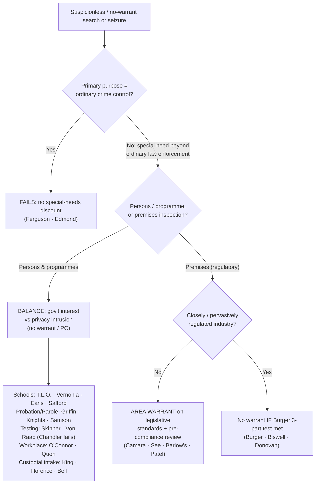

# S9 R1 panel-review — Opus model-diversity lane (prompt pack)

You are the **Claude/Opus** leg of the S9 three-lane adversarial panel (1 Claude + 2 Codex, R1). The two Codex lanes carry the A (support/quote-fidelity) and B (currency/treatment) attack lenses; **you carry model diversity and MUST vote on every paneled assertion across BOTH lenses' concerns.** You are refute-framed: try hard to break each assertion; **default to REFUTED on uncertainty**; never fabricate a cite, quote, or holding; use ONLY the evidence inlined below (no search, no outside knowledge). You are a SIGHTED reviewer — the FULL lake record (judgment fields included) is inlined.

You are a WRITER lane, not an adjudicator: you FIND and VOTE. You do not tally, adjudicate, or close any row — the orchestrator does.

For EACH group below, return one JSON object with the exact `reviewed[]` shape from the output contract (identical framing to the Codex lenses). Emit a finding object ONLY for a real defect (verdict refuted / stands-modified); a group you find wholly clean returns all-`stands` verdicts (the harness records a clean attestation). Concatenate the per-group JSON objects into a top-level `{"packs": [ ... ]}` array, one entry per group, each carrying its `group_id`.


OUTPUT CONTRACT — return ONE JSON object, nothing else:
{
  "lens": "A" | "B",
  "group_id": "<echo the group id>",
  "reviewed": [
    {
      "assertion_id": "<from group_inventory.jsonl>",
      "dimension": "existence|support|quote_fidelity|pincite|treatment|black_letter",
      "verdict": "stands" | "refuted" | "stands-modified",
      "verifiable_from_disclosed": true | false,
      "defect": null,   // null when verdict=="stands"; else an object:
      //  {"problem": "...", "severity": "high|medium|low", "proposed_fix": "...", "evidence_quote": "verbatim from disclosed evidence or null", "needs_cl": true|false, "locator_note": "..."}
      "reasons": ["short evidence-grounded reason", "..."],
      "breaks_true_positives": true | false,
      "residual_risks": ["..."],
      "suggested_tightening": "... or null"
    }
  ],
  "notes": ""
}
Rules: verdict=='stands' <=> defect==null (assertion survives your attack). verdict=='refuted' <=> a real defect (the assertion as framed is wrong). verdict=='stands-modified' <=> survives but needs a stated modification (a minor defect). Review EVERY assertion_id in group_inventory.jsonl exactly once. Output ONLY the JSON object.
---

## GROUP: content/warrant-exceptions/programmatic-and-special-needs-searches/Special Needs and Administrative Searches.md  (`doctrine`, 29 assertions)

### content_page

```
---
weight: 10
title: "Special Needs & Administrative"
aliases:
  - "Special Needs and Administrative Searches"
  - "7-exceptions-warrant/7b-pc-not-needed/Special-Needs-and-Administrative-Searches"
  - "special-needs-administrative-searches"
topic: Special Needs and Administrative Searches
type: doctrine
jurisdiction: Federal (U.S. Const. amend. IV); SCOTUS baseline
status: draft
related:
  - "[[Checkpoints and Roadblocks]]"
  - "[[Inventory Searches]]"
  - "[[The Warrant Requirement]]"
  - "[[Consent Searches]]"
  - "[[Border Searches]]"
  - "[[Emergency Aid]]"
---

# Special Needs and Administrative Searches

*Does this search serve a special need beyond ordinary law enforcement, so reasonableness is measured by a balance instead of by warrant-and-probable-cause, or is it ordinary crime control dressed up, which gets no discount?*

> [!rule] Black-letter rule
> When a search or seizure serves a **"special need, beyond the normal need for law enforcement,"** the Fourth Amendment is satisfied **not** by a warrant and probable cause but by a **reasonableness balance**: the government's special interest against the individual's privacy intrusion. When the balance favors the programme it can sustain **suspicionless** or **reduced-suspicion** action in defined contexts (schools, probation and parole, government employment, closely regulated industries, drug testing of safety-sensitive roles, custodial intake). The threshold gate comes first: a programme whose **primary purpose is ordinary crime control fails**, however orderly. *[[New Jersey v. T.L.O.|T.L.O.]]*, 469 U.S. 325, [351](https://www.courtlistener.com/opinion/111301/new-jersey-v-t-l-o/) (1985) (Blackmun, J., concurring); *[[Ferguson v. City of Charleston|Ferguson]]*, 532 U.S. 67, [83](https://www.courtlistener.com/opinion/118414/ferguson-v-city-of-charleston/) (2001).
> ^rule-special-needs

## The Brief

**What it is, and is not.** "Special needs" is a **free-standing reasonableness inquiry**, not an ordinary warrant exception. When a recognized special need is present, the court drops the warrant and probable-cause requirements and **balances** the government interest against the privacy intrusion. Do not analyze it as if probable cause were required, and keep it distinct from voluntariness-based [[Consent Searches]] and the sovereignty-based rules of [[Border Searches]]. "Administrative" searches are a related but separate line: inspections of **premises** to enforce a regulatory scheme, where the default is not "no warrant" but a warrant of a special kind.

**The test up front.**
1. **Purpose gate.** Ask what the programme is *for*. If its primary purpose is to detect evidence of ordinary criminal wrongdoing, it **fails**, and no balancing saves it. *[[Ferguson v. City of Charleston|Ferguson]]*, 532 U.S. at [83](https://www.courtlistener.com/opinion/118414/ferguson-v-city-of-charleston/).
2. **Recognized special need.** Identify the government interest beyond ordinary law enforcement (school discipline, supervision of probationers, workplace integrity, transportation safety, custodial security).
3. **Balance.** Weigh that interest, the programme's efficacy, and the degree of intrusion; the balance sets the standard (suspicionless, reduced suspicion, or an area warrant), which follows the box you are in.

**The purpose gate is dispositive.** *[[Ferguson v. City of Charleston|Ferguson]]* applied it off the road: covertly testing pregnant patients was **not** a special need because "the immediate objective of the searches was to generate evidence *for law enforcement purposes*." 532 U.S. at 83. The same gate governs suspicionless vehicle **checkpoints**, where a crime-control primary purpose is fatal (*[[City of Indianapolis v. Edmond|Edmond]]*); the checkpoint application is developed on [[Checkpoints and Roadblocks]].

**Two regimes, kept separate.** The page spans two lines that share a root (reasonableness without a traditional warrant on probable cause) but diverge on **what** is searched and **what substitutes** for the warrant. In the **special-needs** line the court drops warrant and probable cause and balances, which can sustain suspicionless testing; the phrase is Justice Blackmun's *[[New Jersey v. T.L.O.|T.L.O.]]* [[Common Legal Terms#concurring-opinion|concurrence]], "special needs, beyond the normal need for law enforcement," 469 U.S. at 351, **not** the majority (a common miscredit). In the **administrative** line, inspections of premises to enforce a regulatory scheme default to an **area warrant** on neutral, legislatively fixed criteria, with a narrow closely-regulated-industry carve-out.

### Scope by category, each with its standard

State which box you are in first; the standard follows the box.

**Schools.** An ordinary school search runs on the ***[[New Jersey v. T.L.O.|T.L.O.]]* two-part test**: whether the action was "justified at its inception" and "reasonably related in scope to the circumstances which justified the interference in the first place." 469 U.S. at 341. No warrant, no probable cause, reasonable suspicion reasonably scoped. Suspicionless *drug testing* is a narrower line tied to reduced privacy: student **athletes** (*[[Vernonia School District 47J v. Acton|Vernonia]]*, 515 U.S. 646 (1995)) and **extracurricular** participants (*[[Board of Education v. Earls|Earls]]*, 536 U.S. 822 (2002)). But intrusiveness must match the suspicion: *[[Safford Unified School District v. Redding|Safford]]* held a **strip search** of a 13-year-old for common pain relievers unreasonable, though officials had [[Qualified Immunity|qualified immunity]]. 557 U.S. 364 (2009).

**Probation and parole, at different floors.** Supervision is itself a special need, but the *[[Griffin v. Wisconsin|Griffin]]* / *[[United States v. Knights|Knights]]* / *[[Samson v. California|Samson]]* line sets **different** minimum suspicion levels, so do not assume parole rules govern probationers or vice versa. *[[Griffin v. Wisconsin|Griffin]]* allows a warrantless search of a **probationer's home** on "reasonable grounds" under a valid regulation, because "the special needs of Wisconsin's probation system make the warrant requirement impracticable." 483 U.S. 868, 873–74, 876 (1987). *[[United States v. Knights|Knights]]* upholds a probation search on **reasonable suspicion** even for an investigatory purpose. 534 U.S. 112, 121–22 (2001). *[[Samson v. California|Samson]]* goes further for **parolees**, who may be searched with **no individualized suspicion** given especially diminished privacy. 547 U.S. 843, 857 (2006).

**Administrative and regulatory inspections, where a warrant is still the default.** For routine code inspections the rule is *[[Camara v. Municipal Court|Camara]]*: a warrant is required, but an **area warrant** on reasonable legislative standards, not individualized probable cause. 387 U.S. 523 (1967). Its companion *[[See v. City of Seattle|See]]* extends the rule to **commercial** premises (387 U.S. 541 (1967)); *[[Marshall v. Barlow's Inc|Barlow's]]* applies it to **OSHA workplace** inspections (436 U.S. 307 (1978)). Modern *[[City of Los Angeles v. Patel|Patel]]* polices the regime: it must allow **pre-compliance review**, and ordinary businesses like **hotels are not "closely regulated."** 576 U.S. 409 (2015). The old warrantless-health-inspection rule of *[[Frank v. Maryland|Frank]]*, 359 U.S. 360 (1959), was **overruled** by *[[Camara v. Municipal Court|Camara]]* and *[[See v. City of Seattle|See]]*; it is history, not law. A separate welfare-administration niche survives: *[[Wyman v. James|Wyman]]*, 400 U.S. 309 (1971), treated a caseworker's home visit as a reasonable condition of benefits rather than a criminal-law "search" (good law, narrow).

*The narrow closely-regulated-industry carve-out is the **[[New York v. Burger|Burger]]** three-part test (the warrant substitute).* A warrantless inspection of a closely regulated business is reasonable **only** if all three are met: a **substantial government interest** informs the scheme; warrantless inspection is **necessary** to further it; and the scheme is "a constitutionally adequate substitute for a warrant," giving the owner notice and limiting inspector discretion in time, place, and scope. 482 U.S. 691, 702–03 (1987). It reaches genuinely pervasively regulated trades: **firearms** dealers (*[[United States v. Biswell|Biswell]]*, 406 U.S. 311 (1972)) and **mines** (*[[Donovan v. Dewey|Donovan]]*, 452 U.S. 594 (1981)), **not** any regulated business at will (*[[Marshall v. Barlow's Inc|Barlow's]]*; *[[City of Los Angeles v. Patel|Patel]]*).

**Drug and alcohol testing of safety-sensitive roles.** Suspicionless testing is reasonable where a concrete safety or integrity interest supports it: railway employees after major accidents or specified rule violations (*[[Skinner v. Railway Labor Executives' Ass'n|Skinner]]*, 489 U.S. 602 (1989)) and Customs employees seeking interdiction or firearm-carrying posts (*[[National Treasury Employees Union v. Von Raab|Von Raab]]*, 489 U.S. 656 (1989)). But the need must be **real and concrete**, not symbolic: *[[Chandler v. Miller|Chandler]]* struck down suspicionless drug testing of candidates for state office, which "diminishes personal privacy for a symbol's sake." 520 U.S. 305, 322 (1997).

**Public-employer workplace searches.** A public employee **can** have a [[Reasonable Expectation of Privacy|reasonable expectation of privacy]] in an office, desk, or files, but a public employer's **work-related** search (to retrieve materials or investigate work misconduct) is judged by **reasonableness under all the circumstances**, no warrant or probable cause. *[[O'Connor v. Ortega|O'Connor]]*, 480 U.S. 709 (1987). *[[City of Ontario v. Quon|Quon]]* applied that to an employer's review of **text messages** on an employer-issued pager, reasonable because work-motivated and not excessive in scope (assuming, without deciding, a privacy expectation). 560 U.S. 746 (2010).

**Custodial-intake balancing.** Booking and jail admission are their own custodial balances, not testing programmes. *[[Maryland v. King|King]]* upholds a **buccal DNA cheek-swab** of a serious-offense arrestee held in custody as a reasonable booking procedure. 569 U.S. 435 (2013). *[[Florence v. County of Burlington|Florence]]* upholds a **close visual strip search** of every arrestee admitted to a jail's general population, without individualized suspicion, even for a minor offense, 566 U.S. 318 (2012), applying the institutional-deference balancing of *[[Bell v. Wolfish|Bell]]*, 441 U.S. 520 (1979). (These bodily custodial searches are a different rule from the property-catalog [[Inventory Searches|inventory]] of an arrestee's effects.)

**Backstops and interfaces.** Neighboring doctrines share the special-needs balance but are treated in full elsewhere: suspicionless vehicle **checkpoints** ([[Checkpoints and Roadblocks]]), caretaking **inventories** of impounded vehicles and booked effects ([[Inventory Searches]]), and post-fire **administrative-warrant** entries once the blaze is out (*[[Michigan v. Tyler|Tyler]]*; *[[Michigan v. Clifford|Clifford]]*; see [[Emergency Aid]]).

**Burden, standard of review, remedy.** The **government** must establish that a recognized special-needs or administrative exception applies and that, on balance, its interest outweighs the intrusion. *[[Vernonia School District 47J v. Acton|Vernonia]]*, 515 U.S. at [652–53](https://www.courtlistener.com/opinion/117964/vernonia-school-district-47j-v-acton/). The reasonableness balance is reviewed [[Common Legal Terms#de-novo|de novo]], underlying facts for [[Common Legal Terms#clear-error|clear error]]. The **remedy** for an unjustified search is suppression under [[The Exclusionary Rule]], except that suppression does **not** reach a **parole-revocation** hearing. *[[Pennsylvania Board of Probation and Parole v. Scott|Scott]]*, 524 U.S. 357 (1998).

**Apply it.**
1. **Run the purpose gate first.** If the immediate objective is to gather ordinary criminal evidence, stop: there is no special-needs discount (*[[Ferguson v. City of Charleston|Ferguson]]*).
2. **Name the box.** School, probation, parole, testing of a safety role, regulatory inspection, or custodial intake, each has its own standard.
3. **Match the standard to the box.** Reasonable suspicion (schools, probation), no suspicion (parole, qualifying testing, custodial intake), or an **area warrant** (ordinary regulatory inspections).
4. **Do not stretch the carve-outs.** The closely-regulated exception is narrow (*[[New York v. Burger|Burger]]*); most businesses get a *[[Camara v. Municipal Court|Camara]]* area warrant, and a testing programme needs a real, concrete need (*[[Chandler v. Miller|Chandler]]*).

**Common pitfalls.**
- **Importing probable cause.** Special needs is a **balance**, but reasonableness is not a blank check: *[[Chandler v. Miller|Chandler]]* and *[[Ferguson v. City of Charleston|Ferguson]]* demand a real, non-law-enforcement need.
- **Calling it a warrant exception in the usual sense.** Some sub-areas (administrative inspections under *[[Camara v. Municipal Court|Camara]]*) still require a warrant of a special kind; others (testing, parole searches) require none. Match the rule to the sub-area.
- **Treating the closely-regulated carve-out as the general admin rule.** *[[Marshall v. Barlow's Inc|Barlow's]]* and *[[New York v. Burger|Burger]]* make it narrow; most premises default to a *[[Camara v. Municipal Court|Camara]]* area warrant.
- **Crediting "special needs" to the *[[New Jersey v. T.L.O.|T.L.O.]]* majority.** It is Blackmun's [[Common Legal Terms#concurring-opinion|concurrence]], 469 U.S. at 351.

## Lower-court developments

The special-needs and supervision-search rules keep being applied and extended in the courts of appeals, especially as the *[[United States v. Knights|Knights]]* / *[[Samson v. California|Samson]]* line meets digital devices and as circuits police how much record support a suspicionless supervised-release condition needs. Each decision below binds only in its own circuit.

- ***[[United States v. Payne|Payne]]* (9th Cir. 2024)** — *extends supervision searches to devices.* A California parolee's cell phone may be searched without individualized cause under a suspicionless parole condition (a *[[Samson v. California|Samson]]* / *[[United States v. Knights|Knights]]* totality), and officers may compel a thumbprint to unlock it as a non-testimonial act. 99 F.4th 495. **Binding in-circuit — 9th Cir.**
- ***[[United States v. Oliveras|Oliveras]]* (2d Cir. 2024)** — *demands record support.* The special-needs doctrine can support a suspicionless supervised-release search condition, but **only when the record justifies it**; the court [[Reading and Citing Cases#vacated|vacated]] the condition and [[Reading and Citing Cases#on-remand|remanded]] for individualized, on-the-record reasons. 96 F.4th 298. **Binding in-circuit — 2d Cir.**

The circuits agree the doctrine reaches supervisees' devices; they diverge on the record-making a suspicionless condition requires, a case-management question left to the sentencing court under *[[Samson v. California|Samson]]* and *[[United States v. Knights|Knights]]*.

## Key cases

| Case | Holding | Opinion |
|---|---|---|
| *[[Ferguson v. City of Charleston]]*, 532 U.S. 67 (2001) | **Purpose gate.** Covertly testing patients to generate evidence for police is not a special need; the immediate law-enforcement objective is dispositive. | [opinion](https://www.courtlistener.com/opinion/118414/ferguson-v-city-of-charleston/) |
| *[[New Jersey v. T.L.O.]]*, 469 U.S. 325 (1985) | **Anchor.** A public-school search runs on reasonableness alone (justified at inception, reasonable in scope), no warrant or probable cause. | [opinion](https://www.courtlistener.com/opinion/111301/new-jersey-v-t-l-o/) |
| *[[Vernonia School District 47J v. Acton]]*, 515 U.S. 646 (1995) | Suspicionless random drug testing of student athletes is reasonable under the special-needs doctrine. | [opinion](https://www.courtlistener.com/opinion/117964/vernonia-school-district-47j-v-acton/) |
| *[[Board of Education v. Earls]]*, 536 U.S. 822 (2002) | Extends *Vernonia*: suspicionless testing of all students in competitive extracurriculars is reasonable. | [opinion](https://www.courtlistener.com/opinion/121171/board-of-education-of-independent-school-district-no-92-of-pottawatomie/) |
| *[[Safford Unified School District v. Redding]]*, 557 U.S. 364 (2009) | A strip search must match intrusiveness to suspicion; strip-searching a 13-year-old for common pain relievers was unreasonable ([[Qualified Immunity\|qualified immunity]] applied). | [opinion](https://www.courtlistener.com/opinion/145852/safford-unified-school-district-1-v-redding/) |
| *[[Griffin v. Wisconsin]]*, 483 U.S. 868 (1987) | A probationer's home may be searched without a warrant, on reasonable grounds, under a valid regulation; probation is a special need. | [opinion](https://www.courtlistener.com/opinion/111959/griffin-v-wisconsin/) |
| *[[United States v. Knights]]*, 534 U.S. 112 (2001) | A probation search on reasonable suspicion, authorized by a search condition, is reasonable even for a law-enforcement purpose. | [opinion](https://www.courtlistener.com/opinion/118468/united-states-v-knights/) |
| *[[Samson v. California]]*, 547 U.S. 843 (2006) | A suspicionless search of a parolee subject to a search condition is reasonable; parolees have severely diminished privacy. | [opinion](https://www.courtlistener.com/opinion/145640/samson-v-california/) |
| *[[Skinner v. Railway Labor Executives' Ass'n]]*, 489 U.S. 602 (1989) | Suspicionless drug/alcohol testing of railway employees after major accidents or rule violations is reasonable (safety special need). | [opinion](https://www.courtlistener.com/opinion/112219/skinner-v-railway-labor-executives-assn/) |
| *[[National Treasury Employees Union v. Von Raab]]*, 489 U.S. 656 (1989) | Suspicionless drug testing of Customs employees seeking interdiction or firearm-carrying posts is reasonable. | [opinion](https://www.courtlistener.com/opinion/112220/national-treasury-employees-union-v-von-raab/) |
| *[[Chandler v. Miller]]*, 520 U.S. 305 (1997) | Symbolic suspicionless drug testing of candidates for state office fails; no concrete special need. | [opinion](https://www.courtlistener.com/opinion/118100/chandler-v-miller/) |
| *[[Camara v. Municipal Court]]*, 387 U.S. 523 (1967) | Administrative code inspections generally need a warrant, but an area warrant on reasonable legislative standards, not individualized probable cause. | [opinion](https://www.courtlistener.com/opinion/107473/camara-v-municipal-court-of-city-and-county-of-san-francisco/) |
| *[[See v. City of Seattle]]*, 387 U.S. 541 (1967) | Extends *[[Camara v. Municipal Court\|Camara]]* to commercial premises: an owner may insist on a warrant before inspection of non-public areas. | [opinion](https://www.courtlistener.com/opinion/107474/see-v-city-of-seattle/) |
| *[[Marshall v. Barlow's Inc]]*, 436 U.S. 307 (1978) | OSHA may not conduct warrantless inspections of business premises; an administrative inspection warrant is required (subject to the closely-regulated carve-out). | [opinion](https://www.courtlistener.com/opinion/109866/marshall-v-barlows-inc/) |
| *[[New York v. Burger]]*, 482 U.S. 691 (1987) | Warrantless inspection of a closely regulated business is reasonable under a three-part test (substantial interest, necessity, adequate warrant substitute). | [opinion](https://www.courtlistener.com/opinion/111927/new-york-v-burger/) |
| *[[United States v. Biswell]]*, 406 U.S. 311 (1972) | Warrantless inspection of a federally licensed firearms dealer is reasonable; a pervasively regulated business where unannounced inspection is essential. | [opinion](https://www.courtlistener.com/opinion/108533/united-states-v-biswell/) |
| *[[Donovan v. Dewey]]*, 452 U.S. 594 (1981) | Warrantless inspection of mines is reasonable where a comprehensive statutory scheme is a constitutionally adequate warrant substitute. | [opinion](https://www.courtlistener.com/opinion/110530/donovan-v-dewey/) |
| *[[City of Los Angeles v. Patel]]*, 576 U.S. 409 (2015) | An admin-inspection regime is facially invalid absent pre-compliance review; hotels are not closely regulated. | [opinion](https://www.courtlistener.com/opinion/2810524/los-angeles-v-patel/) |
| *[[O'Connor v. Ortega]]*, 480 U.S. 709 (1987) | A public employee may have privacy in office, desk, or files, but a public employer's work-related search is judged by reasonableness, no warrant or probable cause. | [opinion](https://www.courtlistener.com/opinion/111851/oconnor-v-ortega/) |
| *[[City of Ontario v. Quon]]*, 560 U.S. 746 (2010) | A government employer's review of an employee's text messages on an employer pager is reasonable where work-motivated and not excessive in scope. | [opinion](https://www.courtlistener.com/opinion/148797/city-of-ontario-v-quon/) |
| *[[Maryland v. King]]*, 569 U.S. 435 (2013) | A buccal DNA cheek-swab of a serious-offense arrestee held in custody is a reasonable booking procedure. | [opinion](https://www.courtlistener.com/opinion/873669/maryland-v-king/) |
| *[[Florence v. County of Burlington]]*, 566 U.S. 318 (2012) | A close visual jail-intake strip search of every arrestee admitted to the general population is reasonable without individualized suspicion, even for a minor offense. | [opinion](https://www.courtlistener.com/opinion/626454/florence-v-board-of-chosen-freeholders-of-county-of-burlington/) |
| *[[Bell v. Wolfish]]*, 441 U.S. 520 (1979) | Institutional-deference reasonableness balancing governs searches of detainees at a custodial facility; the foundation for custodial-intake searches. | [opinion](https://www.courtlistener.com/opinion/110075/bell-v-wolfish/) |
| *[[Wyman v. James]]*, 400 U.S. 309 (1971) | A welfare caseworker's home visit is a reasonable condition of benefits, not a criminal-law search (good law, narrow). | [opinion](https://www.courtlistener.com/opinion/108223/wyman-v-james/) |

## Related cases across doctrines

These are treated in full elsewhere but bear on the special-needs and administrative-search line, framed here.

| Case | Relevance here | Primary home | Opinion |
|---|---|---|---|
| *[[City of Indianapolis v. Edmond]]*, 531 U.S. 32 (2000) | ***Purpose gate (checkpoints).*** A checkpoint whose primary purpose is ordinary crime control is unconstitutional, the road-side sibling of *[[Ferguson v. City of Charleston\|Ferguson]]*'s purpose test. | [[Checkpoints and Roadblocks]] | [opinion](https://www.courtlistener.com/opinion/118391/city-of-indianapolis-v-edmond/) |
| *[[Michigan v. Tyler]]*, 436 U.S. 499 (1978) | ***Administrative-warrant sibling.*** Continued fire-scene investigation after the blaze is out needs an administrative warrant for cause/origin, or a criminal warrant for arson evidence. | [[Emergency Aid]] | [opinion](https://www.courtlistener.com/opinion/109874/michigan-v-tyler/) |
| *[[Michigan v. Clifford]]*, 464 U.S. 287 (1984) | ***Refines Tyler.*** Where privacy interests remain in fire-damaged property, a post-fire search once the scene is secured needs the right kind of warrant. | [[Emergency Aid]] | [opinion](https://www.courtlistener.com/opinion/111057/michigan-v-clifford/) |
| *[[Pennsylvania Board of Probation and Parole v. Scott]]*, 524 U.S. 357 (1998) | ***Remedy limit.*** The exclusionary rule does not apply at a parole-revocation hearing, limiting suppression in the supervision context. | [[The Exclusionary Rule]] | [opinion](https://www.courtlistener.com/opinion/118235/pennsylvania-bd-of-probation-and-parole-v-scott/) |

## Visual



## Sources

- *Ferguson v. City of Charleston*, 532 U.S. 67 (2001) — https://www.courtlistener.com/opinion/118414/ferguson-v-city-of-charleston/ (pinpoint: 83)
- *New Jersey v. T.L.O.*, 469 U.S. 325 (1985) — https://www.courtlistener.com/opinion/111301/new-jersey-v-t-l-o/ (pinpoints: 341, 351 (Blackmun, J., concurring))
- *Vernonia School District 47J v. Acton*, 515 U.S. 646 (1995) — https://www.courtlistener.com/opinion/117964/vernonia-school-district-47j-v-acton/ (pinpoint: 652–53)
- *Board of Education v. Earls*, 536 U.S. 822 (2002) — https://www.courtlistener.com/opinion/121171/board-of-education-of-independent-school-district-no-92-of-pottawatomie/
- *Safford Unified School District v. Redding*, 557 U.S. 364 (2009) — https://www.courtlistener.com/opinion/145852/safford-unified-school-district-1-v-redding/
- *Griffin v. Wisconsin*, 483 U.S. 868 (1987) — https://www.courtlistener.com/opinion/111959/griffin-v-wisconsin/ (pinpoints: 873–74, 876)
- *United States v. Knights*, 534 U.S. 112 (2001) — https://www.courtlistener.com/opinion/118468/united-states-v-knights/ (pinpoints: 121, 122)
- *Samson v. California*, 547 U.S. 843 (2006) — https://www.courtlistener.com/opinion/145640/samson-v-california/ (pinpoint: 857)
- *Skinner v. Railway Labor Executives' Ass'n*, 489 U.S. 602 (1989) — https://www.courtlistener.com/opinion/112219/skinner-v-railway-labor-executives-assn/
- *National Treasury Employees Union v. Von Raab*, 489 U.S. 656 (1989) — https://www.courtlistener.com/opinion/112220/national-treasury-employees-union-v-von-raab/
- *Chandler v. Miller*, 520 U.S. 305 (1997) — https://www.courtlistener.com/opinion/118100/chandler-v-miller/ (pinpoint: 322)
- *Camara v. Municipal Court*, 387 U.S. 523 (1967) — https://www.courtlistener.com/opinion/107473/camara-v-municipal-court-of-city-and-county-of-san-francisco/
- *See v. City of Seattle*, 387 U.S. 541 (1967) — https://www.courtlistener.com/opinion/107474/see-v-city-of-seattle/
- *Marshall v. Barlow's, Inc.*, 436 U.S. 307 (1978) — https://www.courtlistener.com/opinion/109866/marshall-v-barlows-inc/
- *New York v. Burger*, 482 U.S. 691 (1987) — https://www.courtlistener.com/opinion/111927/new-york-v-burger/ (pinpoints: 702, 703)
- *United States v. Biswell*, 406 U.S. 311 (1972) — https://www.courtlistener.com/opinion/108533/united-states-v-biswell/
- *Donovan v. Dewey*, 452 U.S. 594 (1981) — https://www.courtlistener.com/opinion/110530/donovan-v-dewey/
- *City of Los Angeles v. Patel*, 576 U.S. 409 (2015) — https://www.courtlistener.com/opinion/2810524/los-angeles-v-patel/
- *O'Connor v. Ortega*, 480 U.S. 709 (1987) — https://www.courtlistener.com/opinion/111851/oconnor-v-ortega/
- *City of Ontario v. Quon*, 560 U.S. 746 (2010) — https://www.courtlistener.com/opinion/148797/city-of-ontario-v-quon/
- *Maryland v. King*, 569 U.S. 435 (2013) — https://www.courtlistener.com/opinion/873669/maryland-v-king/
- *Florence v. County of Burlington*, 566 U.S. 318 (2012) — https://www.courtlistener.com/opinion/626454/florence-v-board-of-chosen-freeholders-of-county-of-burlington/
- *Bell v. Wolfish*, 441 U.S. 520 (1979) — https://www.courtlistener.com/opinion/110075/bell-v-wolfish/
- *Wyman v. James*, 400 U.S. 309 (1971) — https://www.courtlistener.com/opinion/108223/wyman-v-james/
- *Frank v. Maryland*, 359 U.S. 360 (1959) — https://www.courtlistener.com/opinion/105880/frank-v-maryland/ (overruled by *Camara* / *See*)
- *City of Indianapolis v. Edmond*, 531 U.S. 32 (2000) — https://www.courtlistener.com/opinion/118391/city-of-indianapolis-v-edmond/ (checkpoint purpose gate; home = [[Checkpoints and Roadblocks]])
- *Michigan v. Tyler*, 436 U.S. 499 (1978) — https://www.courtlistener.com/opinion/109874/michigan-v-tyler/ (home = [[Emergency Aid]])
- *Michigan v. Clifford*, 464 U.S. 287 (1984) — https://www.courtlistener.com/opinion/111057/michigan-v-clifford/ (home = [[Emergency Aid]])
- *Pennsylvania Board of Probation and Parole v. Scott*, 524 U.S. 357 (1998) — https://www.courtlistener.com/opinion/118235/pennsylvania-bd-of-probation-and-parole-v-scott/ (home = [[The Exclusionary Rule]])
- *United States v. Payne*, 99 F.4th 495 (9th Cir. 2024) — https://www.courtlistener.com/opinion/9494371/united-states-v-jeremy-payne/
- *United States v. Oliveras*, 96 F.4th 298 (2d Cir. 2024) — https://www.courtlistener.com/opinion/9484364/united-states-v-oliveras/

```

### group_inventory (assertions under review)

```jsonl
{"assertion_id": "03375b1b28fa1244", "dimension": "existence", "kind": "case_cite", "locator": {"case": "See v. City of Seattle", "table_line": 82}, "payload": {"case": "See v. City of Seattle", "cells": ["*[[See v. City of Seattle]]*, 387 U.S. 541 (1967)", "Extends *[[Camara v. Municipal Court\\|Camara]]* to commercial premises: an owner may insist on a warrant before inspection of non-public areas.", "[opinion](https://www.courtlistener.com/opinion/107474/see-v-city-of-seattle/)"], "header": ["Case", "Holding", "Opinion"]}}
{"assertion_id": "08e2a45d06ba76ce", "dimension": "existence", "kind": "case_cite", "locator": {"case": "Bell v. Wolfish", "table_line": 92}, "payload": {"case": "Bell v. Wolfish", "cells": ["*[[Bell v. Wolfish]]*, 441 U.S. 520 (1979)", "Institutional-deference reasonableness balancing governs searches of detainees at a custodial facility; the foundation for custodial-intake searches.", "[opinion](https://www.courtlistener.com/opinion/110075/bell-v-wolfish/)"], "header": ["Case", "Holding", "Opinion"]}}
{"assertion_id": "0a3984918add6a90", "dimension": "existence", "kind": "case_cite", "locator": {"case": "Maryland v. King", "table_line": 90}, "payload": {"case": "Maryland v. King", "cells": ["*[[Maryland v. King]]*, 569 U.S. 435 (2013)", "A buccal DNA cheek-swab of a serious-offense arrestee held in custody is a reasonable booking procedure.", "[opinion](https://www.courtlistener.com/opinion/873669/maryland-v-king/)"], "header": ["Case", "Holding", "Opinion"]}}
{"assertion_id": "0bfceb8d8f32838c", "dimension": "existence", "kind": "case_cite", "locator": {"case": "City of Indianapolis v. Edmond", "table_line": 101}, "payload": {"case": "City of Indianapolis v. Edmond", "cells": ["*[[City of Indianapolis v. Edmond]]*, 531 U.S. 32 (2000)", "***Purpose gate (checkpoints).*** A checkpoint whose primary purpose is ordinary crime control is unconstitutional, the road-side sibling of *[[Ferguson v. City of Charleston\\|Ferguson]]*'s purpose test.", "[[Checkpoints and Roadblocks]]", "[opinion](https://www.courtlistener.com/opinion/118391/city-of-indianapolis-v-edmond/)"], "header": ["Case", "Relevance here", "Primary home", "Opinion"]}}
{"assertion_id": "106c28175ed1dd3e", "dimension": "existence", "kind": "case_cite", "locator": {"case": "Marshall v. Barlow's Inc", "table_line": 83}, "payload": {"case": "Marshall v. Barlow's Inc", "cells": ["*[[Marshall v. Barlow's Inc]]*, 436 U.S. 307 (1978)", "OSHA may not conduct warrantless inspections of business premises; an administrative inspection warrant is required (subject to the closely-regulated carve-out).", "[opinion](https://www.courtlistener.com/opinion/109866/marshall-v-barlows-inc/)"], "header": ["Case", "Holding", "Opinion"]}}
{"assertion_id": "177aba100daf0b0a", "dimension": "existence", "kind": "case_cite", "locator": {"case": "Pennsylvania Board of Probation and Parole v. Scott", "table_line": 104}, "payload": {"case": "Pennsylvania Board of Probation and Parole v. Scott", "cells": ["*[[Pennsylvania Board of Probation and Parole v. Scott]]*, 524 U.S. 357 (1998)", "***Remedy limit.*** The exclusionary rule does not apply at a parole-revocation hearing, limiting suppression in the supervision context.", "[[The Exclusionary Rule]]", "[opinion](https://www.courtlistener.com/opinion/118235/pennsylvania-bd-of-probation-and-parole-v-scott/)"], "header": ["Case", "Relevance here", "Primary home", "Opinion"]}}
{"assertion_id": "1a03f699a6f38d71", "dimension": "existence", "kind": "case_cite", "locator": {"case": "New York v. Burger", "table_line": 84}, "payload": {"case": "New York v. Burger", "cells": ["*[[New York v. Burger]]*, 482 U.S. 691 (1987)", "Warrantless inspection of a closely regulated business is reasonable under a three-part test (substantial interest, necessity, adequate warrant substitute).", "[opinion](https://www.courtlistener.com/opinion/111927/new-york-v-burger/)"], "header": ["Case", "Holding", "Opinion"]}}
{"assertion_id": "1eec02439abc7b23", "dimension": "existence", "kind": "case_cite", "locator": {"case": "Chandler v. Miller", "table_line": 80}, "payload": {"case": "Chandler v. Miller", "cells": ["*[[Chandler v. Miller]]*, 520 U.S. 305 (1997)", "Symbolic suspicionless drug testing of candidates for state office fails; no concrete special need.", "[opinion](https://www.courtlistener.com/opinion/118100/chandler-v-miller/)"], "header": ["Case", "Holding", "Opinion"]}}
{"assertion_id": "2139eae639f22766", "dimension": "existence", "kind": "case_cite", "locator": {"case": "City of Los Angeles v. Patel", "table_line": 87}, "payload": {"case": "City of Los Angeles v. Patel", "cells": ["*[[City of Los Angeles v. Patel]]*, 576 U.S. 409 (2015)", "An admin-inspection regime is facially invalid absent pre-compliance review; hotels are not closely regulated.", "[opinion](https://www.courtlistener.com/opinion/2810524/los-angeles-v-patel/)"], "header": ["Case", "Holding", "Opinion"]}}
{"assertion_id": "24516960b26360b5", "dimension": "existence", "kind": "case_cite", "locator": {"case": "Griffin v. Wisconsin", "table_line": 75}, "payload": {"case": "Griffin v. Wisconsin", "cells": ["*[[Griffin v. Wisconsin]]*, 483 U.S. 868 (1987)", "A probationer's home may be searched without a warrant, on reasonable grounds, under a valid regulation; probation is a special need.", "[opinion](https://www.courtlistener.com/opinion/111959/griffin-v-wisconsin/)"], "header": ["Case", "Holding", "Opinion"]}}
{"assertion_id": "3268527bd9eae4c7", "dimension": "existence", "kind": "case_cite", "locator": {"case": "Safford Unified School District v. Redding", "table_line": 74}, "payload": {"case": "Safford Unified School District v. Redding", "cells": ["*[[Safford Unified School District v. Redding]]*, 557 U.S. 364 (2009)", "A strip search must match intrusiveness to suspicion; strip-searching a 13-year-old for common pain relievers was unreasonable ([[Qualified Immunity\\|qualified immunity]] applied).", "[opinion](https://www.courtlistener.com/opinion/145852/safford-unified-school-district-1-v-redding/)"], "header": ["Case", "Holding", "Opinion"]}}
{"assertion_id": "398ab63ae64c7e6e", "dimension": "existence", "kind": "case_cite", "locator": {"case": "Ferguson v. City of Charleston", "table_line": 70}, "payload": {"case": "Ferguson v. City of Charleston", "cells": ["*[[Ferguson v. City of Charleston]]*, 532 U.S. 67 (2001)", "**Purpose gate.** Covertly testing patients to generate evidence for police is not a special need; the immediate law-enforcement objective is dispositive.", "[opinion](https://www.courtlistener.com/opinion/118414/ferguson-v-city-of-charleston/)"], "header": ["Case", "Holding", "Opinion"]}}
{"assertion_id": "4011155049a70c44", "dimension": "existence", "kind": "case_cite", "locator": {"case": "O'Connor v. Ortega", "table_line": 88}, "payload": {"case": "O'Connor v. Ortega", "cells": ["*[[O'Connor v. Ortega]]*, 480 U.S. 709 (1987)", "A public employee may have privacy in office, desk, or files, but a public employer's work-related search is judged by reasonableness, no warrant or probable cause.", "[opinion](https://www.courtlistener.com/opinion/111851/oconnor-v-ortega/)"], "header": ["Case", "Holding", "Opinion"]}}
{"assertion_id": "44a4c7969e0a1ac5", "dimension": "existence", "kind": "case_cite", "locator": {"case": "Michigan v. Clifford", "table_line": 103}, "payload": {"case": "Michigan v. Clifford", "cells": ["*[[Michigan v. Clifford]]*, 464 U.S. 287 (1984)", "***Refines Tyler.*** Where privacy interests remain in fire-damaged property, a post-fire search once the scene is secured needs the right kind of warrant.", "[[Emergency Aid]]", "[opinion](https://www.courtlistener.com/opinion/111057/michigan-v-clifford/)"], "header": ["Case", "Relevance here", "Primary home", "Opinion"]}}
{"assertion_id": "49687add363d4c14", "dimension": "existence", "kind": "case_cite", "locator": {"case": "Samson v. California", "table_line": 77}, "payload": {"case": "Samson v. California", "cells": ["*[[Samson v. California]]*, 547 U.S. 843 (2006)", "A suspicionless search of a parolee subject to a search condition is reasonable; parolees have severely diminished privacy.", "[opinion](https://www.courtlistener.com/opinion/145640/samson-v-california/)"], "header": ["Case", "Holding", "Opinion"]}}
{"assertion_id": "58f47aece5200b3c", "dimension": "existence", "kind": "case_cite", "locator": {"case": "National Treasury Employees Union v. Von Raab", "table_line": 79}, "payload": {"case": "National Treasury Employees Union v. Von Raab", "cells": ["*[[National Treasury Employees Union v. Von Raab]]*, 489 U.S. 656 (1989)", "Suspicionless drug testing of Customs employees seeking interdiction or firearm-carrying posts is reasonable.", "[opinion](https://www.courtlistener.com/opinion/112220/national-treasury-employees-union-v-von-raab/)"], "header": ["Case", "Holding", "Opinion"]}}
{"assertion_id": "77a0d53d8e0ad34d", "dimension": "existence", "kind": "case_cite", "locator": {"case": "Skinner v. Railway Labor Executives' Ass'n", "table_line": 78}, "payload": {"case": "Skinner v. Railway Labor Executives' Ass'n", "cells": ["*[[Skinner v. Railway Labor Executives' Ass'n]]*, 489 U.S. 602 (1989)", "Suspicionless drug/alcohol testing of railway employees after major accidents or rule violations is reasonable (safety special need).", "[opinion](https://www.courtlistener.com/opinion/112219/skinner-v-railway-labor-executives-assn/)"], "header": ["Case", "Holding", "Opinion"]}}
{"assertion_id": "7b52776d75e29bf8", "dimension": "existence", "kind": "case_cite", "locator": {"case": "United States v. Knights", "table_line": 76}, "payload": {"case": "United States v. Knights", "cells": ["*[[United States v. Knights]]*, 534 U.S. 112 (2001)", "A probation search on reasonable suspicion, authorized by a search condition, is reasonable even for a law-enforcement purpose.", "[opinion](https://www.courtlistener.com/opinion/118468/united-states-v-knights/)"], "header": ["Case", "Holding", "Opinion"]}}
{"assertion_id": "7ddc1661dd140afa", "dimension": "existence", "kind": "case_cite", "locator": {"case": "City of Ontario v. Quon", "table_line": 89}, "payload": {"case": "City of Ontario v. Quon", "cells": ["*[[City of Ontario v. Quon]]*, 560 U.S. 746 (2010)", "A government employer's review of an employee's text messages on an employer pager is reasonable where work-motivated and not excessive in scope.", "[opinion](https://www.courtlistener.com/opinion/148797/city-of-ontario-v-quon/)"], "header": ["Case", "Holding", "Opinion"]}}
{"assertion_id": "85d421542afa871b", "dimension": "existence", "kind": "case_cite", "locator": {"case": "New Jersey v. T.L.O.", "table_line": 71}, "payload": {"case": "New Jersey v. T.L.O.", "cells": ["*[[New Jersey v. T.L.O.]]*, 469 U.S. 325 (1985)", "**Anchor.** A public-school search runs on reasonableness alone (justified at inception, reasonable in scope), no warrant or probable cause.", "[opinion](https://www.courtlistener.com/opinion/111301/new-jersey-v-t-l-o/)"], "header": ["Case", "Holding", "Opinion"]}}
{"assertion_id": "89493c858a0aece7", "dimension": "existence", "kind": "case_cite", "locator": {"case": "Wyman v. James", "table_line": 93}, "payload": {"case": "Wyman v. James", "cells": ["*[[Wyman v. James]]*, 400 U.S. 309 (1971)", "A welfare caseworker's home visit is a reasonable condition of benefits, not a criminal-law search (good law, narrow).", "[opinion](https://www.courtlistener.com/opinion/108223/wyman-v-james/)"], "header": ["Case", "Holding", "Opinion"]}}
{"assertion_id": "8b80f20483349fc8", "dimension": "existence", "kind": "case_cite", "locator": {"case": "Michigan v. Tyler", "table_line": 102}, "payload": {"case": "Michigan v. Tyler", "cells": ["*[[Michigan v. Tyler]]*, 436 U.S. 499 (1978)", "***Administrative-warrant sibling.*** Continued fire-scene investigation after the blaze is out needs an administrative warrant for cause/origin, or a criminal warrant for arson evidence.", "[[Emergency Aid]]", "[opinion](https://www.courtlistener.com/opinion/109874/michigan-v-tyler/)"], "header": ["Case", "Relevance here", "Primary home", "Opinion"]}}
{"assertion_id": "92c7a2b0bf0b01a0", "dimension": "existence", "kind": "case_cite", "locator": {"case": "United States v. Biswell", "table_line": 85}, "payload": {"case": "United States v. Biswell", "cells": ["*[[United States v. Biswell]]*, 406 U.S. 311 (1972)", "Warrantless inspection of a federally licensed firearms dealer is reasonable; a pervasively regulated business where unannounced inspection is essential.", "[opinion](https://www.courtlistener.com/opinion/108533/united-states-v-biswell/)"], "header": ["Case", "Holding", "Opinion"]}}
{"assertion_id": "a4c5a390cb6d48fd", "dimension": "existence", "kind": "case_cite", "locator": {"case": "Donovan v. Dewey", "table_line": 86}, "payload": {"case": "Donovan v. Dewey", "cells": ["*[[Donovan v. Dewey]]*, 452 U.S. 594 (1981)", "Warrantless inspection of mines is reasonable where a comprehensive statutory scheme is a constitutionally adequate warrant substitute.", "[opinion](https://www.courtlistener.com/opinion/110530/donovan-v-dewey/)"], "header": ["Case", "Holding", "Opinion"]}}
{"assertion_id": "bbe16b68e6df4f19", "dimension": "existence", "kind": "case_cite", "locator": {"case": "Vernonia School District 47J v. Acton", "table_line": 72}, "payload": {"case": "Vernonia School District 47J v. Acton", "cells": ["*[[Vernonia School District 47J v. Acton]]*, 515 U.S. 646 (1995)", "Suspicionless random drug testing of student athletes is reasonable under the special-needs doctrine.", "[opinion](https://www.courtlistener.com/opinion/117964/vernonia-school-district-47j-v-acton/)"], "header": ["Case", "Holding", "Opinion"]}}
{"assertion_id": "bc44e5e73a58eca8", "dimension": "existence", "kind": "case_cite", "locator": {"case": "Camara v. Municipal Court", "table_line": 81}, "payload": {"case": "Camara v. Municipal Court", "cells": ["*[[Camara v. Municipal Court]]*, 387 U.S. 523 (1967)", "Administrative code inspections generally need a warrant, but an area warrant on reasonable legislative standards, not individualized probable cause.", "[opinion](https://www.courtlistener.com/opinion/107473/camara-v-municipal-court-of-city-and-county-of-san-francisco/)"], "header": ["Case", "Holding", "Opinion"]}}
{"assertion_id": "d1ed5fa34f870988", "dimension": "existence", "kind": "case_cite", "locator": {"case": "Florence v. County of Burlington", "table_line": 91}, "payload": {"case": "Florence v. County of Burlington", "cells": ["*[[Florence v. County of Burlington]]*, 566 U.S. 318 (2012)", "A close visual jail-intake strip search of every arrestee admitted to the general population is reasonable without individualized suspicion, even for a minor offense.", "[opinion](https://www.courtlistener.com/opinion/626454/florence-v-board-of-chosen-freeholders-of-county-of-burlington/)"], "header": ["Case", "Holding", "Opinion"]}}
{"assertion_id": "e79243f13f8d64ae", "dimension": "existence", "kind": "case_cite", "locator": {"case": "Board of Education v. Earls", "table_line": 73}, "payload": {"case": "Board of Education v. Earls", "cells": ["*[[Board of Education v. Earls]]*, 536 U.S. 822 (2002)", "Extends *Vernonia*: suspicionless testing of all students in competitive extracurriculars is reasonable.", "[opinion](https://www.courtlistener.com/opinion/121171/board-of-education-of-independent-school-district-no-92-of-pottawatomie/)"], "header": ["Case", "Holding", "Opinion"]}}
{"assertion_id": "2052ef6a7554147a", "dimension": "support", "kind": "proposition", "locator": {"callout": "^rule-special-needs"}, "payload": {"anchor": "^rule-special-needs", "statement": "[!rule] Black-letter rule\nWhen a search or seizure serves a **\"special need, beyond the normal need for law enforcement,\"** the Fourth Amendment is satisfied **not** by a warrant and probable cause but by a **reasonableness balance**: the government's special interest against the individual's privacy intrusion. When the balance favors the programme it can sustain **suspicionless** or **reduced-suspicion** action in defined contexts (schools, probation and parole, government employment, closely regulated industries, drug testing of safety-sensitive roles, custodial intake). The threshold gate comes first: a programme whose **primary purpose is ordinary crime control fails**, however orderly. *[[New Jersey v. T.L.O.|T.L.O.]]*, 469 U.S. 325, [351](https://www.courtlistener.com/opinion/111301/new-jersey-v-t-l-o/) (1985) (Blackmun, J., concurring); *[[Ferguson v. City of Charleston|Ferguson]]*, 532 U.S. 67, [83](https://www.courtlistener.com/opinion/118414/ferguson-v-city-of-charleston/) (2001)."}}
```

### lake record — Bell v. Wolfish

```json
{
  "schema_version": "s2.v1",
  "record_id": "Bell v. Wolfish",
  "status": "under_review",
  "identity": {
    "case_name": "Bell v. Wolfish",
    "case_name_short": "Wolfish",
    "case_name_full": "BELL, ATTORNEY GENERAL, Et Al. v. WOLFISH Et Al.",
    "input_case_name": "Bell v. Wolfish",
    "court": "U.S. Supreme Court",
    "court_id": "scotus",
    "court_level": "scotus",
    "circuit": null,
    "state": null,
    "date_decided": "1979-05-14",
    "year": 1979,
    "docket": "77-1829",
    "cluster_id": 110075,
    "lead_opinion_id": 9427563,
    "sibling_ids": [],
    "absolute_url": "/opinion/110075/bell-v-wolfish/",
    "identity_method": "frontier-identity",
    "expected_citation_found": true,
    "party_name_in_text": false,
    "canonical_name_match": true,
    "alternates": [],
    "reason_code": null
  },
  "citations": {
    "official": {
      "cite": "441 U.S. 520",
      "volume": "441",
      "reporter": "U.S.",
      "page": "520",
      "type": 1,
      "selected_official": true,
      "source": "cluster.citations[]"
    },
    "parallel": [
      {
        "cite": "99 S. Ct. 1861",
        "volume": "99",
        "reporter": "S. Ct.",
        "page": "1861",
        "type": 1,
        "selected_official": false,
        "source": "cluster.citations[]"
      },
      {
        "cite": "60 L. Ed. 2d 447",
        "volume": "60",
        "reporter": "L. Ed. 2d",
        "page": "447",
        "type": 1,
        "selected_official": false,
        "source": "cluster.citations[]"
      }
    ],
    "vendor_neutral": [
      {
        "cite": "1979 U.S. LEXIS 100",
        "volume": "1979",
        "reporter": "U.S. LEXIS",
        "page": "100",
        "type": 6,
        "selected_official": false,
        "source": "cluster.citations[]"
      }
    ],
    "all": [
      {
        "cite": "441 U.S. 520",
        "volume": "441",
        "reporter": "U.S.",
        "page": "520",
        "type": 1,
        "selected_official": false,
        "source": "cluster.citations[]"
      },
      {
        "cite": "99 S. Ct. 1861",
        "volume": "99",
        "reporter": "S. Ct.",
        "page": "1861",
        "type": 1,
        "selected_official": false,
        "source": "cluster.citations[]"
      },
      {
        "cite": "60 L. Ed. 2d 447",
        "volume": "60",
        "reporter": "L. Ed. 2d",
        "page": "447",
        "type": 1,
        "selected_official": false,
        "source": "cluster.citations[]"
      },
      {
        "cite": "1979 U.S. LEXIS 100",
        "volume": "1979",
        "reporter": "U.S. LEXIS",
        "page": "100",
        "type": 6,
        "selected_official": false,
        "source": "cluster.citations[]"
      }
    ],
    "display": "441 U.S. 520",
    "official_selection": {
      "court_class": "scotus",
      "selected": "441 U.S. 520",
      "reason": "selected_rank_1"
    }
  },
  "pinpoints": [],
  "treatment": {
    "field_i_validity": "unverified",
    "as_of_content": null,
    "as_of_treatment": null,
    "composite_basis": "unverified",
    "composite_basis_ref": null,
    "varies_by_point": false,
    "scope_note": "Frontier stub: treatment/progeny intentionally not derived until S6 promotion.",
    "point_overrides": [],
    "edges": [],
    "derivation": {}
  },
  "progeny": {
    "complete_query": null,
    "indexed_citing_opinions": null,
    "count_source": null,
    "per_sibling": [],
    "citation_count": null,
    "cache_path": null,
    "enumeration": null,
    "cursor": null,
    "rows_cached": 0,
    "outbound_opinion_edges": []
  },
  "off_cl_links": [],
  "provenance": {
    "cl_source": null,
    "cl_api": "https://www.courtlistener.com/api/rest/v4",
    "built_by": "S2-BUILDER-AUTHORING",
    "build_run": "s2-build-96d841cbb12e",
    "date_created": "2026-07-08T00:40:18Z",
    "date_modified": "2026-07-10T20:54:54Z",
    "warnings": [
      "W10 on-read identity re-verification 2026-07-07: docket 77-1829 confirmed verbatim from CL lead-opinion caption (html_with_citations)"
    ],
    "field_provenance": {
      "identity": {
        "src": "CourtListener frontier identity search",
        "at": "2026-07-08T00:40:58Z",
        "verifier": "S2-BUILDER-AUTHORING"
      },
      "treatment.field_i_validity": {
        "src": "frontier stub, no treatment",
        "at": "2026-07-08T00:40:58Z",
        "verifier": "S2-BUILDER-AUTHORING"
      },
      "point_overrides": {
        "src": "frontier stub, no treatment",
        "at": "2026-07-08T00:40:58Z",
        "verifier": "S2-BUILDER-AUTHORING"
      },
      "pinpoints": {
        "src": "frontier stub, no pinpoints",
        "at": "2026-07-08T00:40:58Z",
        "verifier": "S2-BUILDER-AUTHORING"
      }
    },
    "s6_promotion": {
      "from_record_id": "bell-v-wolfish--110075",
      "to_record_id": "Bell v. Wolfish",
      "as_of": "2026-07-07",
      "born_status": "under_review"
    }
  }
}

```

### lake record — Board of Education v. Earls

```json
{
  "schema_version": "s2.v1",
  "record_id": "Board of Education v. Earls",
  "stub": false,
  "status": "verified",
  "identity": {
    "case_name": "Board of Education of Independent School District No. 92 of Pottawatomie County v. Earls",
    "case_name_short": "Earls",
    "case_name_full": "BOARD OF EDUCATION OF INDEPENDENT SCHOOL DISTRICT NO. 92 OF POTTAWATOMIE COUNTY Et Al. v. EARLS Et Al.",
    "input_case_name": "Board of Education v. Earls",
    "court": "U.S. Supreme Court",
    "court_id": "scotus",
    "court_level": "scotus",
    "circuit": null,
    "state": null,
    "date_decided": "2002-06-27",
    "year": 2002,
    "docket": "01-332",
    "cluster_id": 121171,
    "lead_opinion_id": 121171,
    "sibling_ids": [
      121171,
      9434325,
      9434326,
      9434327,
      9434328
    ],
    "absolute_url": "/opinion/121171/board-of-education-of-independent-school-district-no-92-of-pottawatomie/",
    "identity_method": "citation+party-text",
    "expected_citation_found": true,
    "party_name_in_text": true,
    "canonical_name_match": true,
    "alternates": [
      {
        "cluster_id": 9271936,
        "score": 20,
        "case_name": "Board of Education of Independent School District No. 92 v. Earls"
      }
    ],
    "reason_code": null
  },
  "citations": {
    "official": null,
    "parallel": [
      {
        "cite": "536 U.S. 822",
        "volume": "536",
        "reporter": "U.S.",
        "page": "822",
        "type": 1,
        "selected_official": false,
        "source": "cluster.citations[]"
      },
      {
        "cite": "122 S. Ct. 2559",
        "volume": "122",
        "reporter": "S. Ct.",
        "page": "2559",
        "type": 1,
        "selected_official": false,
        "source": "cluster.citations[]"
      },
      {
        "cite": "153 L. Ed. 2d 735",
        "volume": "153",
        "reporter": "L. Ed. 2d",
        "page": "735",
        "type": 1,
        "selected_official": false,
        "source": "cluster.citations[]"
      },
      {
        "cite": "2002 Daily Journal DAR 7275",
        "volume": "2002",
        "reporter": "Daily Journal DAR",
        "page": "7275",
        "type": 2,
        "selected_official": false,
        "source": "cluster.citations[]"
      },
      {
        "cite": "70 U.S.L.W. 4737",
        "volume": "70",
        "reporter": "U.S.L.W.",
        "page": "4737",
        "type": 4,
        "selected_official": false,
        "source": "cluster.citations[]"
      },
      {
        "cite": "15 Fla. L. Weekly Fed. S 483",
        "volume": "15",
        "reporter": "Fla. L. Weekly Fed. S",
        "page": "483",
        "type": 1,
        "selected_official": false,
        "source": "cluster.citations[]"
      }
    ],
    "vendor_neutral": [
      {
        "cite": "2002 U.S. LEXIS 4882",
        "volume": "2002",
        "reporter": "U.S. LEXIS",
        "page": "4882",
        "type": 6,
        "selected_official": false,
        "source": "cluster.citations[]"
      },
      {
        "cite": "2002 Cal. Daily Op. Serv. 5761",
        "volume": "2002",
        "reporter": "Cal. Daily Op. Serv.",
        "page": "5761",
        "type": 6,
        "selected_official": false,
        "source": "cluster.citations[]"
      }
    ],
    "all": [
      {
        "cite": "536 U.S. 822",
        "volume": "536",
        "reporter": "U.S.",
        "page": "822",
        "type": 1,
        "selected_official": false,
        "source": "cluster.citations[]"
      },
      {
        "cite": "122 S. Ct. 2559",
        "volume": "122",
        "reporter": "S. Ct.",
        "page": "2559",
        "type": 1,
        "selected_official": false,
        "source": "cluster.citations[]"
      },
      {
        "cite": "153 L. Ed. 2d 735",
        "volume": "153",
        "reporter": "L. Ed. 2d",
        "page": "735",
        "type": 1,
        "selected_official": false,
        "source": "cluster.citations[]"
      },
      {
        "cite": "2002 U.S. LEXIS 4882",
        "volume": "2002",
        "reporter": "U.S. LEXIS",
        "page": "4882",
        "type": 6,
        "selected_official": false,
        "source": "cluster.citations[]"
      },
      {
        "cite": "2002 Cal. Daily Op. Serv. 5761",
        "volume": "2002",
        "reporter": "Cal. Daily Op. Serv.",
        "page": "5761",
        "type": 6,
        "selected_official": false,
        "source": "cluster.citations[]"
      },
      {
        "cite": "2002 Daily Journal DAR 7275",
        "volume": "2002",
        "reporter": "Daily Journal DAR",
        "page": "7275",
        "type": 2,
        "selected_official": false,
        "source": "cluster.citations[]"
      },
      {
        "cite": "70 U.S.L.W. 4737",
        "volume": "70",
        "reporter": "U.S.L.W.",
        "page": "4737",
        "type": 4,
        "selected_official": false,
        "source": "cluster.citations[]"
      },
      {
        "cite": "15 Fla. L. Weekly Fed. S 483",
        "volume": "15",
        "reporter": "Fla. L. Weekly Fed. S",
        "page": "483",
        "type": 1,
        "selected_official": false,
        "source": "cluster.citations[]"
      }
    ],
    "display": null,
    "official_selection": {
      "court_class": "scotus",
      "selected": null,
      "reason": "unlisted_reporter:Fla. L. Weekly Fed. S"
    }
  },
  "pinpoints": [
    {
      "id": "pin-837",
      "page": null,
      "quote": "--- # Board of Education v. Earls *536 U.S. 822 (2002)* \u00b7 U.S. Supreme Court \u00b7 **Binding \u2014 SCOTUS** \u00b7 Treatment: **good** *(as of 2026-06-30)* <!-- header line; TreatmentBadge + weight render here, degrading to the text above --> ## Background The Tecumseh, Oklahoma school district adopted a Student Activities Drug Testing Policy requiring all middle- and high-school students to submit to urinalysis drug testing in order to participate in any competitive extracurricular activity (choir, band, academic team, athletics, and the like). Lindsay Earls and other students who participated in such activities challenged the policy as an unreasonable search. ## Issue Whether a public school's suspicionless drug testing of all students who participate in competitive extracurricular activities is a reasonable search under the Fourth Amendment. ## Rule In the public-school special-needs context, the search need not rest on individualized suspicion:",
      "star_marker": null,
      "quote_fidelity": "mismatch",
      "pinpoint_status": "slip-only",
      "position": null
    },
    {
      "id": "pin-838",
      "page": null,
      "quote": "we hold only that Tecumseh's Policy is a reasonable means of furthering the School District's important interest in preventing and deterring drug use among its schoolchildren.",
      "star_marker": "838",
      "quote_fidelity": "matched",
      "pinpoint_status": "star-verified",
      "position": 37097,
      "fragment": "#:~:text=we%20hold%20only%20that%20Tecumseh%27s",
      "fragment_validated_at": "2026-07-09T15:40:45Z"
    }
  ],
  "treatment": {
    "field_i_validity": "good_law",
    "as_of_content": "2002-06-27",
    "as_of_treatment": "2026-06-30",
    "composite_basis": "migration-seed",
    "composite_basis_ref": "Board of Education v. Earls",
    "varies_by_point": false,
    "scope_note": "Extends Vernonia to non-athletes; good law.",
    "point_overrides": [],
    "edges": [
      {
        "citing_case": {
          "name": "State v. Grady",
          "cluster_id": 4649078,
          "cite": [
            "831 S.E.2d 542",
            "372 N.C. 509"
          ],
          "field_ii": "questioned"
        },
        "field_ii": "questioned",
        "field_iii": "mentioned",
        "point": null,
        "proposed": true,
        "journal_ref": "Board of Education v. Earls:lane1_negative"
      },
      {
        "citing_case": {
          "name": "Mangino v. Incorporated Village of Patchogue",
          "cluster_id": 3164642,
          "cite": [
            "808 F.3d 951",
            "2015 U.S. App. LEXIS 22431",
            "2015 WL 9287019"
          ],
          "field_ii": "overruled"
        },
        "field_ii": "overruled",
        "field_iii": "mentioned",
        "point": null,
        "proposed": true,
        "journal_ref": "Board of Education v. Earls:lane1_negative"
      },
      {
        "citing_case": {
          "name": "State of Iowa v. Christine Ann Kern",
          "cluster_id": 4472227,
          "cite": [
            "831 N.W.2d 149",
            "2013 WL 2278018",
            "2013 Iowa Sup. LEXIS 61"
          ],
          "field_ii": "overruled"
        },
        "field_ii": "overruled",
        "field_iii": "mentioned",
        "point": null,
        "proposed": true,
        "journal_ref": "Board of Education v. Earls:lane1_negative"
      },
      {
        "citing_case": {
          "name": "In re D.H.",
          "cluster_id": 5280981,
          "cite": [
            "306 S.W.3d 955"
          ],
          "field_ii": "overruled"
        },
        "field_ii": "overruled",
        "field_iii": "mentioned",
        "point": null,
        "proposed": true,
        "journal_ref": "Board of Education v. Earls:lane1_negative"
      },
      {
        "citing_case": {
          "name": "Gillman Ex Rel. Gillman v. School Board for Holmes County",
          "cluster_id": 1454556,
          "cite": [
            "567 F. Supp. 2d 1359",
            "2008 U.S. Dist. LEXIS 56589",
            "2008 WL 2854266"
          ],
          "field_ii": "abrogated"
        },
        "field_ii": "abrogated",
        "field_iii": "mentioned",
        "point": null,
        "proposed": true,
        "journal_ref": "Board of Education v. Earls:lane1_negative"
      },
      {
        "citing_case": {
          "name": "United States v. Weikert",
          "cluster_id": 202888,
          "cite": [
            "504 F.3d 1",
            "2007 U.S. App. LEXIS 18845",
            "2007 WL 2265660"
          ],
          "field_ii": "questioned"
        },
        "field_ii": "questioned",
        "field_iii": "mentioned",
        "point": null,
        "proposed": true,
        "journal_ref": "Board of Education v. Earls:lane1_negative"
      },
      {
        "citing_case": {
          "name": "Ashcroft v. al-Kidd",
          "cluster_id": 217703,
          "cite": [
            "179 L. Ed. 2d 1149",
            "131 S. Ct. 2074",
            "563 U.S. 731",
            "2011 U.S. LEXIS 4021"
          ],
          "field_ii": "questioned"
        },
        "field_ii": "questioned",
        "field_iii": "mentioned",
        "point": null,
        "proposed": true,
        "journal_ref": "Board of Education v. Earls:lane2_top_cited"
      },
      {
        "citing_case": {
          "name": "United States v. Nicholas Omar Midgette",
          "cluster_id": 796984,
          "cite": [
            "478 F.3d 616",
            "2007 U.S. App. LEXIS 4153",
            "2007 WL 572127"
          ],
          "field_ii": "overruled"
        },
        "field_ii": "overruled",
        "field_iii": "mentioned",
        "point": null,
        "proposed": true,
        "journal_ref": "Board of Education v. Earls:lane2_top_cited"
      },
      {
        "citing_case": {
          "name": "Henry v. Purnell",
          "cluster_id": 220962,
          "cite": [
            "652 F.3d 524",
            "2011 U.S. App. LEXIS 14391",
            "2011 WL 2725816"
          ],
          "field_ii": "overruled"
        },
        "field_ii": "overruled",
        "field_iii": "mentioned",
        "point": null,
        "proposed": true,
        "journal_ref": "Board of Education v. Earls:lane2_top_cited"
      },
      {
        "citing_case": {
          "name": "Dubbs Ex Rel. Dubbs v. Head Start, Inc.",
          "cluster_id": 163684,
          "cite": [
            "336 F.3d 1194",
            "2003 U.S. App. LEXIS 14578",
            "2003 WL 21690533"
          ],
          "field_ii": "questioned"
        },
        "field_ii": "questioned",
        "field_iii": "mentioned",
        "point": null,
        "proposed": true,
        "journal_ref": "Board of Education v. Earls:lane2_top_cited"
      },
      {
        "citing_case": {
          "name": "Morse v. Frederick",
          "cluster_id": 145707,
          "cite": [
            "168 L. Ed. 2d 290",
            "127 S. Ct. 2618",
            "551 U.S. 393",
            "2007 U.S. LEXIS 8514"
          ],
          "field_ii": "overruled"
        },
        "field_ii": "overruled",
        "field_iii": "mentioned",
        "point": null,
        "proposed": true,
        "journal_ref": "Board of Education v. Earls:lane2_top_cited"
      },
      {
        "citing_case": {
          "name": "Safford Unified School District 1 v. Redding",
          "cluster_id": 145852,
          "cite": [
            "174 L. Ed. 2d 354",
            "129 S. Ct. 2633",
            "557 U.S. 364",
            "2009 U.S. LEXIS 4735",
            "21 Fla. L. Weekly Fed. S 1011",
            "77 U.S.L.W. 4591"
          ],
          "field_ii": "questioned"
        },
        "field_ii": "questioned",
        "field_iii": "mentioned",
        "point": null,
        "proposed": true,
        "journal_ref": "Board of Education v. Earls:lane2_top_cited"
      },
      {
        "citing_case": {
          "name": "Bull v. City and County of San Francisco",
          "cluster_id": 1313115,
          "cite": [
            "595 F.3d 964",
            "2010 WL 431790"
          ],
          "field_ii": "overruled"
        },
        "field_ii": "overruled",
        "field_iii": "mentioned",
        "point": null,
        "proposed": true,
        "journal_ref": "Board of Education v. Earls:lane2_top_cited"
      },
      {
        "citing_case": {
          "name": "United States v. Shukri Baker",
          "cluster_id": 618459,
          "cite": [
            "664 F.3d 467"
          ],
          "field_ii": "overruled"
        },
        "field_ii": "overruled",
        "field_iii": "mentioned",
        "point": null,
        "proposed": true,
        "journal_ref": "Board of Education v. Earls:lane2_top_cited"
      },
      {
        "citing_case": {
          "name": "State v. Villarreal, David",
          "cluster_id": 2948963,
          "cite": [
            "475 S.W.3d 784",
            "2014 Tex. Crim. App. LEXIS 1898",
            "2014 WL 6734178"
          ],
          "field_ii": "overruled"
        },
        "field_ii": "overruled",
        "field_iii": "mentioned",
        "point": null,
        "proposed": true,
        "journal_ref": "Board of Education v. Earls:lane2_top_cited"
      },
      {
        "citing_case": {
          "name": "Christian Legal Soc. Chapter of Univ. of Cal., Hastings College of Law v. Martinez",
          "cluster_id": 150544,
          "cite": [
            "177 L. Ed. 2d 838",
            "130 S. Ct. 2971",
            "561 U.S. 661",
            "2010 U.S. LEXIS 5367"
          ],
          "field_ii": "superseded_by_statute"
        },
        "field_ii": "superseded_by_statute",
        "field_iii": "mentioned",
        "point": null,
        "proposed": true,
        "journal_ref": "Board of Education v. Earls:lane2_top_cited"
      },
      {
        "citing_case": {
          "name": "United States of America, State of California, Intervenor v. Raphyal Crawford, AKA Aarmyl Crawford",
          "cluster_id": 786677,
          "cite": [
            "372 F.3d 1048",
            "2004 U.S. App. LEXIS 12116",
            "2004 WL 1375521"
          ],
          "field_ii": "overruled"
        },
        "field_ii": "overruled",
        "field_iii": "mentioned",
        "point": null,
        "proposed": true,
        "journal_ref": "Board of Education v. Earls:lane2_top_cited"
      },
      {
        "citing_case": {
          "name": "Nicholas v. Goord",
          "cluster_id": 8439101,
          "cite": [
            "430 F.3d 652",
            "2005 WL 3150611"
          ],
          "field_ii": "overruled"
        },
        "field_ii": "overruled",
        "field_iii": "mentioned",
        "point": null,
        "proposed": true,
        "journal_ref": "Board of Education v. Earls:lane2_top_cited"
      },
      {
        "citing_case": {
          "name": "Douglas McClish v. Richard B. Nugent",
          "cluster_id": 77659,
          "cite": [
            "483 F.3d 1231",
            "2007 U.S. App. LEXIS 8294",
            "2007 WL 1063337"
          ],
          "field_ii": "overruled"
        },
        "field_ii": "overruled",
        "field_iii": "mentioned",
        "point": null,
        "proposed": true,
        "journal_ref": "Board of Education v. Earls:lane2_top_cited"
      },
      {
        "citing_case": {
          "name": "United States v. Thomas Cameron Kincade",
          "cluster_id": 787362,
          "cite": [
            "379 F.3d 813",
            "2004 U.S. App. LEXIS 17191",
            "2004 WL 1837840"
          ],
          "field_ii": "overruled"
        },
        "field_ii": "overruled",
        "field_iii": "mentioned",
        "point": null,
        "proposed": true,
        "journal_ref": "Board of Education v. Earls:lane2_top_cited"
      },
      {
        "citing_case": {
          "name": "City of Ontario v. Quon",
          "cluster_id": 148797,
          "cite": [
            "177 L. Ed. 2d 216",
            "130 S. Ct. 2619",
            "560 U.S. 746",
            "2010 U.S. LEXIS 4972"
          ],
          "field_ii": "overruled"
        },
        "field_ii": "overruled",
        "field_iii": "mentioned",
        "point": null,
        "proposed": true,
        "journal_ref": "Board of Education v. Earls:lane2_top_cited"
      },
      {
        "citing_case": {
          "name": "Doe v. Woodard",
          "cluster_id": 4578612,
          "cite": [
            "912 F.3d 1278"
          ],
          "field_ii": "superseded_by_statute"
        },
        "field_ii": "superseded_by_statute",
        "field_iii": "mentioned",
        "point": null,
        "proposed": true,
        "journal_ref": "Board of Education v. Earls:lane2_top_cited"
      },
      {
        "citing_case": {
          "name": "State Of Iowa Vs. James Maximiliano Ochoa",
          "cluster_id": 4472474,
          "cite": [
            "792 N.W.2d 260",
            "2010 Iowa Sup. LEXIS 135"
          ],
          "field_ii": "overruled"
        },
        "field_ii": "overruled",
        "field_iii": "mentioned",
        "point": null,
        "proposed": true,
        "journal_ref": "Board of Education v. Earls:lane2_top_cited"
      },
      {
        "citing_case": {
          "name": "Brittan Holland v. Kelly Rosen",
          "cluster_id": 4515181,
          "cite": [
            "895 F.3d 272"
          ],
          "field_ii": "criticized"
        },
        "field_ii": "criticized",
        "field_iii": "mentioned",
        "point": null,
        "proposed": true,
        "journal_ref": "Board of Education v. Earls:lane2_top_cited"
      },
      {
        "citing_case": {
          "name": "United States v. Brandon Michael Lifshitz",
          "cluster_id": 786321,
          "cite": [
            "369 F.3d 173",
            "2004 WL 1043468"
          ],
          "field_ii": "questioned"
        },
        "field_ii": "questioned",
        "field_iii": "mentioned",
        "point": null,
        "proposed": true,
        "journal_ref": "Board of Education v. Earls:lane2_top_cited"
      },
      {
        "citing_case": {
          "name": "No. 01-5098",
          "cluster_id": 782823,
          "cite": [
            "336 F.3d 1194"
          ],
          "field_ii": "questioned"
        },
        "field_ii": "questioned",
        "field_iii": "mentioned",
        "point": null,
        "proposed": true,
        "journal_ref": "Board of Education v. Earls:lane2_top_cited"
      },
      {
        "citing_case": {
          "name": "Paul Palmieri v. Pamela Lynch, AKA Pam Lynch, John Doe 1",
          "cluster_id": 788624,
          "cite": [
            "392 F.3d 73",
            "2004 U.S. App. LEXIS 25468",
            "2004 WL 2827676"
          ],
          "field_ii": "questioned"
        },
        "field_ii": "questioned",
        "field_iii": "mentioned",
        "point": null,
        "proposed": true,
        "journal_ref": "Board of Education v. Earls:lane2_top_cited"
      },
      {
        "citing_case": {
          "name": "United States v. Raymond Lee Scott",
          "cluster_id": 794629,
          "cite": [
            "450 F.3d 863",
            "2006 U.S. App. LEXIS 14182"
          ],
          "field_ii": "superseded_by_statute"
        },
        "field_ii": "superseded_by_statute",
        "field_iii": "mentioned",
        "point": null,
        "proposed": true,
        "journal_ref": "Board of Education v. Earls:lane2_top_cited"
      },
      {
        "citing_case": {
          "name": "United States v. Paul G. Sczubelek",
          "cluster_id": 789683,
          "cite": [
            "402 F.3d 175",
            "2005 WL 638158"
          ],
          "field_ii": "abrogated"
        },
        "field_ii": "abrogated",
        "field_iii": "mentioned",
        "point": null,
        "proposed": true,
        "journal_ref": "Board of Education v. Earls:lane2_top_cited"
      }
    ],
    "derivation": {
      "lane1_negative": {
        "query": "cites:(121171 OR 9434325 OR 9434326 OR 9434327 OR 9434328) AND (overrul* OR abrogat* OR supersed* OR \"recede from\" OR \"no longer good law\" OR vacat* OR reversed) ",
        "reviewed": 200,
        "cap": 200,
        "cap_hit": true,
        "final_cursor": "https://www.courtlistener.com/api/rest/v4/search/?cursor=cz0xMDM2NTQwODAwMDAwJnM9Nzc5NzQ1JnQ9byZkPTIwMjYtMDctMDQmcD0xMQ%3D%3D&fields=absolute_url%2CcaseName%2CcaseNameFull%2Ccitation%2CciteCount%2Ccluster_id%2Ccourt%2Ccourt_citation_string%2Ccourt_id%2CdateFiled%2Copinions%2Csibling_ids%2Cstatus%2Csyllabus&order_by=dateFiled+desc&page_size=100&q=cites%3A%28121171+OR+9434325+OR+9434326+OR+9434327+OR+9434328%29+AND+%28overrul%2A+OR+abrogat%2A+OR+supersed%2A+OR+%22recede+from%22+OR+%22no+longer+good+law%22+OR+vacat%2A+OR+reversed%29+&stat_Published=on&type=o",
        "audit_needed": true,
        "proposed_negative_events": 6,
        "audit_marker": "R15 treatment audit required",
        "triage_mode": "snippet-first",
        "snippet_field": "results[].opinions[].snippet",
        "triage_journaled": 200,
        "triage_read": 7,
        "triage_snippet_classified": 193
      },
      "lane2_top_cited": {
        "query": "cites:(121171 OR 9434325 OR 9434326 OR 9434327 OR 9434328)",
        "reviewed": 25,
        "cap": 25,
        "cap_hit": true,
        "final_cursor": "https://www.courtlistener.com/api/rest/v4/search/?cursor=cz03MiZzPTI1MDcxNjkmdD1vJmQ9MjAyNi0wNy0wNCZwPTM%3D&order_by=citeCount+desc&page_size=25&q=cites%3A%28121171+OR+9434325+OR+9434326+OR+9434327+OR+9434328%29&type=o",
        "audit_needed": true,
        "proposed_negative_events": 24,
        "audit_marker": "R15 treatment audit required"
      },
      "lane3_recency": {
        "query": "cites:(121171 OR 9434325 OR 9434326 OR 9434327 OR 9434328)",
        "reviewed": 7,
        "cap": 200,
        "cap_hit": false,
        "final_cursor": null,
        "audit_needed": false,
        "proposed_negative_events": 0,
        "audit_marker": null,
        "triage_mode": "snippet-first",
        "snippet_field": "results[].opinions[].snippet",
        "triage_journaled": 7,
        "triage_read": 0,
        "triage_snippet_classified": 7
      }
    }
  },
  "progeny": {
    "complete_query": "cites:(121171 OR 9434325 OR 9434326 OR 9434327 OR 9434328)",
    "indexed_citing_opinions": 274,
    "count_source": "search",
    "per_sibling": [
      {
        "opinion_id": 121171,
        "count": 243,
        "count_source": "search"
      },
      {
        "opinion_id": 9434325,
        "count": 37,
        "count_source": "search"
      },
      {
        "opinion_id": 9434326,
        "count": 0,
        "count_source": "search"
      },
      {
        "opinion_id": 9434327,
        "count": 0,
        "count_source": "search"
      },
      {
        "opinion_id": 9434328,
        "count": 0,
        "count_source": "search"
      }
    ],
    "citation_count": 499,
    "cache_path": "/Users/johngalt/cssi-lake/cache/progeny/board-of-education-v-earls.jsonl",
    "enumeration": "bounded",
    "cursor": "https://www.courtlistener.com/api/rest/v4/search/?cursor=cz0xLjY5MDY1Mjgmcz00Nzc4NDAyJnQ9byZkPTIwMjYtMDctMDQmcD0y&order_by=score+desc&page_size=100&q=cites%3A%28121171+OR+9434325+OR+9434326+OR+9434327+OR+9434328%29&type=o",
    "rows_cached": 20,
    "outbound_opinion_edges": [
      {
        "source_opinion_id": 121171,
        "cited_id": 103870,
        "source": "search.opinions[].cites[]"
      },
      {
        "source_opinion_id": 121171,
        "cited_id": 106395,
        "source": "search.opinions[].cites[]"
      },
      {
        "source_opinion_id": 121171,
        "cited_id": 107841,
        "source": "search.opinions[].cites[]"
      },
      {
        "source_opinion_id": 121171,
        "cited_id": 108533,
        "source": "search.opinions[].cites[]"
      },
      {
        "source_opinion_id": 121171,
        "cited_id": 109541,
        "source": "search.opinions[].cites[]"
      },
      {
        "source_opinion_id": 121171,
        "cited_id": 110045,
        "source": "search.opinions[].cites[]"
      },
      {
        "source_opinion_id": 121171,
        "cited_id": 111301,
        "source": "search.opinions[].cites[]"
      },
      {
        "source_opinion_id": 121171,
        "cited_id": 111754,
        "source": "search.opinions[].cites[]"
      },
      {
        "source_opinion_id": 121171,
        "cited_id": 111959,
        "source": "search.opinions[].cites[]"
      },
      {
        "source_opinion_id": 121171,
        "cited_id": 112219,
        "source": "search.opinions[].cites[]"
      },
      {
        "source_opinion_id": 121171,
        "cited_id": 112220,
        "source": "search.opinions[].cites[]"
      },
      {
        "source_opinion_id": 121171,
        "cited_id": 112779,
        "source": "search.opinions[].cites[]"
      },
      {
        "source_opinion_id": 121171,
        "cited_id": 117964,
        "source": "search.opinions[].cites[]"
      },
      {
        "source_opinion_id": 121171,
        "cited_id": 118100,
        "source": "search.opinions[].cites[]"
      },
      {
        "source_opinion_id": 121171,
        "cited_id": 118414,
        "source": "search.opinions[].cites[]"
      },
      {
        "source_opinion_id": 121171,
        "cited_id": 118432,
        "source": "search.opinions[].cites[]"
      },
      {
        "source_opinion_id": 121171,
        "cited_id": 772423,
        "source": "search.opinions[].cites[]"
      },
      {
        "source_opinion_id": 121171,
        "cited_id": 2580272,
        "source": "search.opinions[].cites[]"
      }
    ]
  },
  "off_cl_links": [],
  "provenance": {
    "cl_source": "LRU",
    "cl_api": "https://www.courtlistener.com/api/rest/v4",
    "built_by": "S2-BUILDER-AUTHORING",
    "build_run": "s2-build-96d841cbb12e",
    "date_created": "2026-07-04T22:57:48Z",
    "date_modified": "2026-07-09T15:47:29Z",
    "warnings": [
      "official cite selection failed closed: unlisted_reporter:Fla. L. Weekly Fed. S",
      "legacy treatment migrated: good -> good_law"
    ],
    "field_provenance": {
      "identity": {
        "src": "CourtListener search + clusters + lead opinion text",
        "at": "2026-07-04T23:09:32Z",
        "verifier": "S2-BUILDER-AUTHORING"
      },
      "treatment.field_i_validity": {
        "src": "_treatment-migration.json + page frontmatter",
        "at": "2026-07-04T23:09:32Z",
        "verifier": "S2-BUILDER-AUTHORING"
      },
      "point_overrides": {
        "src": "S2 treatment derivation proposed only",
        "at": "2026-07-04T23:12:53Z",
        "verifier": "S2-BUILDER-AUTHORING"
      },
      "pinpoints": {
        "src": "content page quote harvest + lead opinion text",
        "at": "2026-07-04T23:09:32Z",
        "verifier": "S2-BUILDER-AUTHORING"
      }
    }
  }
}

```

### lake record — Camara v. Municipal Court

```json
{
  "schema_version": "s2.v1",
  "record_id": "Camara v. Municipal Court",
  "stub": false,
  "status": "under_review",
  "identity": {
    "case_name": "Camara v. Municipal Court of City and County of San Francisco",
    "case_name_short": "Camara",
    "case_name_full": "Camara v. Municipal Court of the City and County of San Francisco",
    "input_case_name": "Camara v. Municipal Court",
    "court": "U.S. Supreme Court",
    "court_id": "scotus",
    "court_level": "scotus",
    "circuit": null,
    "state": null,
    "date_decided": "1967-06-05",
    "year": 1967,
    "docket": "92",
    "cluster_id": 107473,
    "lead_opinion_id": 107473,
    "sibling_ids": [
      107473
    ],
    "absolute_url": "/opinion/107473/camara-v-municipal-court-of-city-and-county-of-san-francisco/",
    "identity_method": "name+docket",
    "expected_citation_found": true,
    "party_name_in_text": false,
    "canonical_name_match": true,
    "alternates": [],
    "reason_code": "recent_or_no_official_cite"
  },
  "citations": {
    "official": {
      "cite": "387 U.S. 523",
      "volume": "387",
      "reporter": "U.S.",
      "page": "523",
      "type": 1,
      "selected_official": true,
      "source": "cluster.citations[]"
    },
    "parallel": [
      {
        "cite": "87 S. Ct. 1727",
        "volume": "87",
        "reporter": "S. Ct.",
        "page": "1727",
        "type": 1,
        "selected_official": false,
        "source": "cluster.citations[]"
      },
      {
        "cite": "18 L. Ed. 2d 930",
        "volume": "18",
        "reporter": "L. Ed. 2d",
        "page": "930",
        "type": 1,
        "selected_official": false,
        "source": "cluster.citations[]"
      }
    ],
    "vendor_neutral": [
      {
        "cite": "1967 U.S. LEXIS 1254",
        "volume": "1967",
        "reporter": "U.S. LEXIS",
        "page": "1254",
        "type": 6,
        "selected_official": false,
        "source": "cluster.citations[]"
      }
    ],
    "all": [
      {
        "cite": "387 U.S. 523",
        "volume": "387",
        "reporter": "U.S.",
        "page": "523",
        "type": 1,
        "selected_official": false,
        "source": "cluster.citations[]"
      },
      {
        "cite": "87 S. Ct. 1727",
        "volume": "87",
        "reporter": "S. Ct.",
        "page": "1727",
        "type": 1,
        "selected_official": false,
        "source": "cluster.citations[]"
      },
      {
        "cite": "18 L. Ed. 2d 930",
        "volume": "18",
        "reporter": "L. Ed. 2d",
        "page": "930",
        "type": 1,
        "selected_official": false,
        "source": "cluster.citations[]"
      },
      {
        "cite": "1967 U.S. LEXIS 1254",
        "volume": "1967",
        "reporter": "U.S. LEXIS",
        "page": "1254",
        "type": 6,
        "selected_official": false,
        "source": "cluster.citations[]"
      }
    ],
    "display": "387 U.S. 523",
    "official_selection": {
      "court_class": "scotus",
      "selected": "387 U.S. 523",
      "reason": "selected_rank_1"
    }
  },
  "pinpoints": [
    {
      "id": "pin-534",
      "page": null,
      "quote": "such a warrant may issue. ## Rule Administrative inspections require a warrant procedure:",
      "star_marker": null,
      "quote_fidelity": "mismatch",
      "pinpoint_status": "slip-only",
      "position": null
    },
    {
      "id": "pin-538",
      "page": null,
      "quote": "'probable cause' to issue a warrant to inspect must exist if reasonable legislative or administrative standards for conducting an area inspection are satisfied with respect to a particular dwelling.",
      "star_marker": null,
      "quote_fidelity": "mismatch",
      "pinpoint_status": "slip-only",
      "position": null
    }
  ],
  "treatment": {
    "field_i_validity": "good_law",
    "as_of_content": "1967-06-05",
    "as_of_treatment": "2026-06-30",
    "composite_basis": "migration-seed",
    "composite_basis_ref": "Camara v. Municipal Court",
    "varies_by_point": false,
    "scope_note": "Overruled Frank v. Maryland; remains the foundational administrative-warrant case.",
    "point_overrides": [],
    "edges": [
      {
        "citing_case": {
          "name": "State v. Grady",
          "cluster_id": 4649078,
          "cite": [
            "831 S.E.2d 542",
            "372 N.C. 509"
          ],
          "field_ii": "questioned"
        },
        "field_ii": "questioned",
        "field_iii": "mentioned",
        "point": null,
        "proposed": true,
        "journal_ref": "Camara v. Municipal Court:lane1_negative"
      },
      {
        "citing_case": {
          "name": "Commonwealth v. O'Donnell",
          "cluster_id": 4427767,
          "cite": null,
          "field_ii": "superseded_by_statute"
        },
        "field_ii": "superseded_by_statute",
        "field_iii": "mentioned",
        "point": null,
        "proposed": true,
        "journal_ref": "Camara v. Municipal Court:lane1_negative"
      },
      {
        "citing_case": {
          "name": "State of Minnesota v. Ryan Mark Thompson",
          "cluster_id": 4311783,
          "cite": [
            "886 N.W.2d 224",
            "2016 Minn. LEXIS 656"
          ],
          "field_ii": "questioned"
        },
        "field_ii": "questioned",
        "field_iii": "mentioned",
        "point": null,
        "proposed": true,
        "journal_ref": "Camara v. Municipal Court:lane1_negative"
      },
      {
        "citing_case": {
          "name": "Terry v. Ohio",
          "cluster_id": 107729,
          "cite": [
            "20 L. Ed. 2d 889",
            "88 S. Ct. 1868",
            "392 U.S. 1",
            "1968 U.S. LEXIS 1345",
            "44 Ohio Op. 2d 383"
          ],
          "field_ii": "questioned"
        },
        "field_ii": "questioned",
        "field_iii": "mentioned",
        "point": null,
        "proposed": true,
        "journal_ref": "Camara v. Municipal Court:lane2_top_cited"
      },
      {
        "citing_case": {
          "name": "United States v. Leon",
          "cluster_id": 111262,
          "cite": [
            "82 L. Ed. 2d 677",
            "104 S. Ct. 3405",
            "468 U.S. 897",
            "1984 U.S. LEXIS 153"
          ],
          "field_ii": "overruled"
        },
        "field_ii": "overruled",
        "field_iii": "mentioned",
        "point": null,
        "proposed": true,
        "journal_ref": "Camara v. Municipal Court:lane2_top_cited"
      },
      {
        "citing_case": {
          "name": "Coolidge v. New Hampshire",
          "cluster_id": 108377,
          "cite": [
            "29 L. Ed. 2d 564",
            "91 S. Ct. 2022",
            "403 U.S. 443",
            "1971 U.S. LEXIS 25"
          ],
          "field_ii": "overruled"
        },
        "field_ii": "overruled",
        "field_iii": "mentioned",
        "point": null,
        "proposed": true,
        "journal_ref": "Camara v. Municipal Court:lane2_top_cited"
      },
      {
        "citing_case": {
          "name": "Payton v. New York",
          "cluster_id": 110235,
          "cite": [
            "63 L. Ed. 2d 639",
            "100 S. Ct. 1371",
            "445 U.S. 573",
            "1980 U.S. LEXIS 13"
          ],
          "field_ii": "questioned"
        },
        "field_ii": "questioned",
        "field_iii": "mentioned",
        "point": null,
        "proposed": true,
        "journal_ref": "Camara v. Municipal Court:lane2_top_cited"
      },
      {
        "citing_case": {
          "name": "Simmons v. United States",
          "cluster_id": 107636,
          "cite": [
            "19 L. Ed. 2d 1247",
            "88 S. Ct. 967",
            "390 U.S. 377",
            "1968 U.S. LEXIS 2167"
          ],
          "field_ii": "questioned"
        },
        "field_ii": "questioned",
        "field_iii": "mentioned",
        "point": null,
        "proposed": true,
        "journal_ref": "Camara v. Municipal Court:lane2_top_cited"
      },
      {
        "citing_case": {
          "name": "Delaware v. Prouse",
          "cluster_id": 110045,
          "cite": [
            "59 L. Ed. 2d 660",
            "99 S. Ct. 1391",
            "440 U.S. 648",
            "1979 U.S. LEXIS 80"
          ],
          "field_ii": "questioned"
        },
        "field_ii": "questioned",
        "field_iii": "mentioned",
        "point": null,
        "proposed": true,
        "journal_ref": "Camara v. Municipal Court:lane2_top_cited"
      },
      {
        "citing_case": {
          "name": "Tennessee v. Garner",
          "cluster_id": 111397,
          "cite": [
            "85 L. Ed. 2d 1",
            "105 S. Ct. 1694",
            "471 U.S. 1",
            "1985 U.S. LEXIS 195",
            "53 U.S.L.W. 4410"
          ],
          "field_ii": "questioned"
        },
        "field_ii": "questioned",
        "field_iii": "mentioned",
        "point": null,
        "proposed": true,
        "journal_ref": "Camara v. Municipal Court:lane2_top_cited"
      },
      {
        "citing_case": {
          "name": "Michigan v. Long",
          "cluster_id": 111020,
          "cite": [
            "77 L. Ed. 2d 1201",
            "103 S. Ct. 3469",
            "463 U.S. 1032",
            "1983 U.S. LEXIS 7",
            "51 U.S.L.W. 5231"
          ],
          "field_ii": "questioned"
        },
        "field_ii": "questioned",
        "field_iii": "mentioned",
        "point": null,
        "proposed": true,
        "journal_ref": "Camara v. Municipal Court:lane2_top_cited"
      },
      {
        "citing_case": {
          "name": "United States v. Brignoni-Ponce",
          "cluster_id": 109311,
          "cite": [
            "45 L. Ed. 2d 607",
            "95 S. Ct. 2574",
            "422 U.S. 873",
            "1975 U.S. LEXIS 10"
          ],
          "field_ii": "questioned"
        },
        "field_ii": "questioned",
        "field_iii": "mentioned",
        "point": null,
        "proposed": true,
        "journal_ref": "Camara v. Municipal Court:lane2_top_cited"
      },
      {
        "citing_case": {
          "name": "Dunaway v. New York",
          "cluster_id": 110096,
          "cite": [
            "60 L. Ed. 2d 824",
            "99 S. Ct. 2248",
            "442 U.S. 200",
            "1979 U.S. LEXIS 126"
          ],
          "field_ii": "questioned"
        },
        "field_ii": "questioned",
        "field_iii": "mentioned",
        "point": null,
        "proposed": true,
        "journal_ref": "Camara v. Municipal Court:lane2_top_cited"
      },
      {
        "citing_case": {
          "name": "South Dakota v. Opperman",
          "cluster_id": 109537,
          "cite": [
            "49 L. Ed. 2d 1000",
            "96 S. Ct. 3092",
            "428 U.S. 364",
            "1976 U.S. LEXIS 15"
          ],
          "field_ii": "questioned"
        },
        "field_ii": "questioned",
        "field_iii": "mentioned",
        "point": null,
        "proposed": true,
        "journal_ref": "Camara v. Municipal Court:lane2_top_cited"
      },
      {
        "citing_case": {
          "name": "United States v. Place",
          "cluster_id": 110979,
          "cite": [
            "77 L. Ed. 2d 110",
            "103 S. Ct. 2637",
            "462 U.S. 696",
            "1983 U.S. LEXIS 74",
            "51 U.S.L.W. 4844"
          ],
          "field_ii": "questioned"
        },
        "field_ii": "questioned",
        "field_iii": "mentioned",
        "point": null,
        "proposed": true,
        "journal_ref": "Camara v. Municipal Court:lane2_top_cited"
      },
      {
        "citing_case": {
          "name": "Pennsylvania v. Mimms",
          "cluster_id": 109751,
          "cite": [
            "54 L. Ed. 2d 331",
            "98 S. Ct. 330",
            "434 U.S. 106",
            "1977 U.S. LEXIS 157"
          ],
          "field_ii": "questioned"
        },
        "field_ii": "questioned",
        "field_iii": "mentioned",
        "point": null,
        "proposed": true,
        "journal_ref": "Camara v. Municipal Court:lane2_top_cited"
      },
      {
        "citing_case": {
          "name": "United States v. Jacobsen",
          "cluster_id": 111143,
          "cite": [
            "80 L. Ed. 2d 85",
            "104 S. Ct. 1652",
            "466 U.S. 109",
            "1984 U.S. LEXIS 53",
            "52 U.S.L.W. 4414"
          ],
          "field_ii": "overruled"
        },
        "field_ii": "overruled",
        "field_iii": "mentioned",
        "point": null,
        "proposed": true,
        "journal_ref": "Camara v. Municipal Court:lane2_top_cited"
      },
      {
        "citing_case": {
          "name": "Texas v. Brown",
          "cluster_id": 110901,
          "cite": [
            "75 L. Ed. 2d 502",
            "103 S. Ct. 1535",
            "460 U.S. 730",
            "1983 U.S. LEXIS 143",
            "51 U.S.L.W. 4361"
          ],
          "field_ii": "criticized"
        },
        "field_ii": "criticized",
        "field_iii": "mentioned",
        "point": null,
        "proposed": true,
        "journal_ref": "Camara v. Municipal Court:lane2_top_cited"
      },
      {
        "citing_case": {
          "name": "People v. De Bour",
          "cluster_id": 5682261,
          "cite": [
            "40 N.Y.2d 210",
            "386 N.Y.S.2d 375",
            "1976 N.Y. LEXIS 2873",
            "352 N.E.2d 562"
          ],
          "field_ii": "questioned"
        },
        "field_ii": "questioned",
        "field_iii": "mentioned",
        "point": null,
        "proposed": true,
        "journal_ref": "Camara v. Municipal Court:lane2_top_cited"
      },
      {
        "citing_case": {
          "name": "Ashcroft v. al-Kidd",
          "cluster_id": 217703,
          "cite": [
            "179 L. Ed. 2d 1149",
            "131 S. Ct. 2074",
            "563 U.S. 731",
            "2011 U.S. LEXIS 4021"
          ],
          "field_ii": "questioned"
        },
        "field_ii": "questioned",
        "field_iii": "mentioned",
        "point": null,
        "proposed": true,
        "journal_ref": "Camara v. Municipal Court:lane2_top_cited"
      },
      {
        "citing_case": {
          "name": "Skinner v. Railway Labor Executives' Assn.",
          "cluster_id": 112219,
          "cite": [
            "103 L. Ed. 2d 639",
            "109 S. Ct. 1402",
            "489 U.S. 602",
            "1989 U.S. LEXIS 1568",
            "4 I.E.R. Cas. (BNA) 224",
            "1989 CCH OSHD 28,476",
            "57 U.S.L.W. 4324",
            "13 OSHC (BNA) 2065",
            "130 L.R.R.M. (BNA) 2857",
            "49 Empl. Prac. Dec. (CCH) 38,791"
          ],
          "field_ii": "abrogated"
        },
        "field_ii": "abrogated",
        "field_iii": "mentioned",
        "point": null,
        "proposed": true,
        "journal_ref": "Camara v. Municipal Court:lane2_top_cited"
      },
      {
        "citing_case": {
          "name": "United States v. Chadwick",
          "cluster_id": 109714,
          "cite": [
            "53 L. Ed. 2d 538",
            "97 S. Ct. 2476",
            "433 U.S. 1",
            "1977 U.S. LEXIS 133"
          ],
          "field_ii": "questioned"
        },
        "field_ii": "questioned",
        "field_iii": "mentioned",
        "point": null,
        "proposed": true,
        "journal_ref": "Camara v. Municipal Court:lane2_top_cited"
      },
      {
        "citing_case": {
          "name": "Cady v. Dombrowski",
          "cluster_id": 108850,
          "cite": [
            "37 L. Ed. 2d 706",
            "93 S. Ct. 2523",
            "413 U.S. 433",
            "1973 U.S. LEXIS 48"
          ],
          "field_ii": "overruled"
        },
        "field_ii": "overruled",
        "field_iii": "mentioned",
        "point": null,
        "proposed": true,
        "journal_ref": "Camara v. Municipal Court:lane2_top_cited"
      },
      {
        "citing_case": {
          "name": "New Jersey v. T. L. O.",
          "cluster_id": 111301,
          "cite": [
            "83 L. Ed. 2d 720",
            "105 S. Ct. 733",
            "469 U.S. 325",
            "1985 U.S. LEXIS 41",
            "53 U.S.L.W. 4083"
          ],
          "field_ii": "questioned"
        },
        "field_ii": "questioned",
        "field_iii": "mentioned",
        "point": null,
        "proposed": true,
        "journal_ref": "Camara v. Municipal Court:lane2_top_cited"
      },
      {
        "citing_case": {
          "name": "United States v. Watson",
          "cluster_id": 109352,
          "cite": [
            "46 L. Ed. 2d 598",
            "96 S. Ct. 820",
            "423 U.S. 411",
            "1976 U.S. LEXIS 121"
          ],
          "field_ii": "overruled"
        },
        "field_ii": "overruled",
        "field_iii": "mentioned",
        "point": null,
        "proposed": true,
        "journal_ref": "Camara v. Municipal Court:lane2_top_cited"
      },
      {
        "citing_case": {
          "name": "United States v. Martinez-Fuerte",
          "cluster_id": 109541,
          "cite": [
            "49 L. Ed. 2d 1116",
            "96 S. Ct. 3074",
            "428 U.S. 543",
            "1976 U.S. LEXIS 87"
          ],
          "field_ii": "questioned"
        },
        "field_ii": "questioned",
        "field_iii": "mentioned",
        "point": null,
        "proposed": true,
        "journal_ref": "Camara v. Municipal Court:lane2_top_cited"
      },
      {
        "citing_case": {
          "name": "Griffin v. Wisconsin",
          "cluster_id": 111959,
          "cite": [
            "97 L. Ed. 2d 709",
            "107 S. Ct. 3164",
            "483 U.S. 868",
            "1987 U.S. LEXIS 2897",
            "55 U.S.L.W. 5156"
          ],
          "field_ii": "questioned"
        },
        "field_ii": "questioned",
        "field_iii": "mentioned",
        "point": null,
        "proposed": true,
        "journal_ref": "Camara v. Municipal Court:lane2_top_cited"
      },
      {
        "citing_case": {
          "name": "Maryland v. Buie",
          "cluster_id": 112384,
          "cite": [
            "108 L. Ed. 2d 276",
            "110 S. Ct. 1093",
            "494 U.S. 325",
            "1990 U.S. LEXIS 1176"
          ],
          "field_ii": "questioned"
        },
        "field_ii": "questioned",
        "field_iii": "mentioned",
        "point": null,
        "proposed": true,
        "journal_ref": "Camara v. Municipal Court:lane2_top_cited"
      }
    ],
    "derivation": {
      "lane1_negative": {
        "query": "cites:(107473) AND (overrul* OR abrogat* OR supersed* OR \"recede from\" OR \"no longer good law\" OR vacat* OR reversed) ",
        "reviewed": 200,
        "cap": 200,
        "cap_hit": true,
        "final_cursor": "https://www.courtlistener.com/api/rest/v4/search/?cursor=cz0xNDUyMTI0ODAwMDAwJnM9MzE2Nzk5OSZ0PW8mZD0yMDI2LTA3LTA0JnA9MTE%3D&fields=absolute_url%2CcaseName%2CcaseNameFull%2Ccitation%2CciteCount%2Ccluster_id%2Ccourt%2Ccourt_citation_string%2Ccourt_id%2CdateFiled%2Copinions%2Csibling_ids%2Cstatus%2Csyllabus&order_by=dateFiled+desc&page_size=100&q=cites%3A%28107473%29+AND+%28overrul%2A+OR+abrogat%2A+OR+supersed%2A+OR+%22recede+from%22+OR+%22no+longer+good+law%22+OR+vacat%2A+OR+reversed%29+&stat_Published=on&type=o",
        "audit_needed": true,
        "proposed_negative_events": 3,
        "audit_marker": "R15 treatment audit required",
        "triage_mode": "snippet-first",
        "snippet_field": "results[].opinions[].snippet",
        "triage_journaled": 200,
        "triage_read": 3,
        "triage_snippet_classified": 197
      },
      "lane2_top_cited": {
        "query": "cites:(107473)",
        "reviewed": 25,
        "cap": 25,
        "cap_hit": true,
        "final_cursor": "https://www.courtlistener.com/api/rest/v4/search/?cursor=cz0xMjM5JnM9MTEyNDcyJnQ9byZkPTIwMjYtMDctMDQmcD0z&order_by=citeCount+desc&page_size=25&q=cites%3A%28107473%29&type=o",
        "audit_needed": true,
        "proposed_negative_events": 25,
        "audit_marker": "R15 treatment audit required"
      },
      "lane3_recency": {
        "query": "cites:(107473)",
        "reviewed": 56,
        "cap": 200,
        "cap_hit": false,
        "final_cursor": null,
        "audit_needed": false,
        "proposed_negative_events": 0,
        "audit_marker": null,
        "triage_mode": "snippet-first",
        "snippet_field": "results[].opinions[].snippet",
        "triage_journaled": 56,
        "triage_read": 0,
        "triage_snippet_classified": 56
      }
    }
  },
  "progeny": {
    "complete_query": "cites:(107473)",
    "indexed_citing_opinions": 2314,
    "count_source": "search",
    "per_sibling": [
      {
        "opinion_id": 107473,
        "count": 2314,
        "count_source": "search"
      }
    ],
    "citation_count": 3595,
    "cache_path": "/Users/johngalt/cssi-lake/cache/progeny/camara-v-municipal-court.jsonl",
    "enumeration": "bounded",
    "cursor": "https://www.courtlistener.com/api/rest/v4/search/?cursor=cz0xLjkwNjI4NTUmcz0xMDI2NTcxNSZ0PW8mZD0yMDI2LTA3LTA0JnA9Mg%3D%3D&order_by=score+desc&page_size=100&q=cites%3A%28107473%29&type=o",
    "rows_cached": 20,
    "outbound_opinion_edges": [
      {
        "source_opinion_id": 107473,
        "cited_id": 95698,
        "source": "search.opinions[].cites[]"
      },
      {
        "source_opinion_id": 107473,
        "cited_id": 96230,
        "source": "search.opinions[].cites[]"
      },
      {
        "source_opinion_id": 107473,
        "cited_id": 96902,
        "source": "search.opinions[].cites[]"
      },
      {
        "source_opinion_id": 107473,
        "cited_id": 100711,
        "source": "search.opinions[].cites[]"
      },
      {
        "source_opinion_id": 107473,
        "cited_id": 104239,
        "source": "search.opinions[].cites[]"
      },
      {
        "source_opinion_id": 107473,
        "cited_id": 104504,
        "source": "search.opinions[].cites[]"
      },
      {
        "source_opinion_id": 107473,
        "cited_id": 104605,
        "source": "search.opinions[].cites[]"
      },
      {
        "source_opinion_id": 107473,
        "cited_id": 104709,
        "source": "search.opinions[].cites[]"
      },
      {
        "source_opinion_id": 107473,
        "cited_id": 104766,
        "source": "search.opinions[].cites[]"
      },
      {
        "source_opinion_id": 107473,
        "cited_id": 104932,
        "source": "search.opinions[].cites[]"
      },
      {
        "source_opinion_id": 107473,
        "cited_id": 105880,
        "source": "search.opinions[].cites[]"
      },
      {
        "source_opinion_id": 107473,
        "cited_id": 106021,
        "source": "search.opinions[].cites[]"
      },
      {
        "source_opinion_id": 107473,
        "cited_id": 106109,
        "source": "search.opinions[].cites[]"
      },
      {
        "source_opinion_id": 107473,
        "cited_id": 106197,
        "source": "search.opinions[].cites[]"
      },
      {
        "source_opinion_id": 107473,
        "cited_id": 106285,
        "source": "search.opinions[].cites[]"
      },
      {
        "source_opinion_id": 107473,
        "cited_id": 106641,
        "source": "search.opinions[].cites[]"
      },
      {
        "source_opinion_id": 107473,
        "cited_id": 106777,
        "source": "search.opinions[].cites[]"
      },
      {
        "source_opinion_id": 107473,
        "cited_id": 107262,
        "source": "search.opinions[].cites[]"
      },
      {
        "source_opinion_id": 107473,
        "cited_id": 1306345,
        "source": "search.opinions[].cites[]"
      },
      {
        "source_opinion_id": 107473,
        "cited_id": 1334923,
        "source": "search.opinions[].cites[]"
      },
      {
        "source_opinion_id": 107473,
        "cited_id": 2008391,
        "source": "search.opinions[].cites[]"
      },
      {
        "source_opinion_id": 107473,
        "cited_id": 2049948,
        "source": "search.opinions[].cites[]"
      },
      {
        "source_opinion_id": 107473,
        "cited_id": 2062881,
        "source": "search.opinions[].cites[]"
      },
      {
        "source_opinion_id": 107473,
        "cited_id": 2155771,
        "source": "search.opinions[].cites[]"
      },
      {
        "source_opinion_id": 107473,
        "cited_id": 2305304,
        "source": "search.opinions[].cites[]"
      },
      {
        "source_opinion_id": 107473,
        "cited_id": 2430498,
        "source": "search.opinions[].cites[]"
      },
      {
        "source_opinion_id": 107473,
        "cited_id": 2435050,
        "source": "search.opinions[].cites[]"
      },
      {
        "source_opinion_id": 107473,
        "cited_id": 3620827,
        "source": "search.opinions[].cites[]"
      },
      {
        "source_opinion_id": 107473,
        "cited_id": 3783238,
        "source": "search.opinions[].cites[]"
      },
      {
        "source_opinion_id": 107473,
        "cited_id": 5521228,
        "source": "search.opinions[].cites[]"
      },
      {
        "source_opinion_id": 107473,
        "cited_id": 9442232,
        "source": "search.opinions[].cites[]"
      }
    ]
  },
  "off_cl_links": [],
  "provenance": {
    "cl_source": "LRU",
    "cl_api": "https://www.courtlistener.com/api/rest/v4",
    "built_by": "S2-BUILDER-AUTHORING",
    "build_run": "s2-build-96d841cbb12e",
    "date_created": "2026-07-04T23:26:45Z",
    "date_modified": "2026-07-06T07:29:29Z",
    "warnings": [
      "legacy treatment migrated: good -> good_law"
    ],
    "field_provenance": {
      "identity": {
        "src": "CourtListener search + clusters + lead opinion text",
        "at": "2026-07-04T23:26:55Z",
        "verifier": "S2-BUILDER-AUTHORING"
      },
      "treatment.field_i_validity": {
        "src": "_treatment-migration.json + page frontmatter",
        "at": "2026-07-04T23:26:55Z",
        "verifier": "S2-BUILDER-AUTHORING"
      },
      "point_overrides": {
        "src": "S2 treatment derivation proposed only",
        "at": "2026-07-04T23:28:44Z",
        "verifier": "S2-BUILDER-AUTHORING"
      },
      "pinpoints": {
        "src": "content page quote harvest + lead opinion text",
        "at": "2026-07-04T23:26:55Z",
        "verifier": "S2-BUILDER-AUTHORING"
      }
    }
  }
}

```

### lake record — Chandler v. Miller

```json
{
  "schema_version": "s2.v1",
  "record_id": "Chandler v. Miller",
  "stub": false,
  "status": "verified",
  "identity": {
    "case_name": "Chandler v. Miller",
    "case_name_short": "",
    "case_name_full": "CHANDLER Et Al. v. MILLER, GOVERNOR OF GEORGIA, Et Al.",
    "input_case_name": "Chandler v. Miller",
    "court": "U.S. Supreme Court",
    "court_id": "scotus",
    "court_level": "scotus",
    "circuit": null,
    "state": null,
    "date_decided": "1997-04-15",
    "year": 1997,
    "docket": null,
    "cluster_id": 118100,
    "lead_opinion_id": 9433438,
    "sibling_ids": [
      118100,
      9433438,
      9433439
    ],
    "absolute_url": "/opinion/118100/chandler-v-miller/",
    "identity_method": "citation+party-text",
    "expected_citation_found": true,
    "party_name_in_text": true,
    "canonical_name_match": true,
    "alternates": [],
    "reason_code": null
  },
  "citations": {
    "official": {
      "cite": "520 U.S. 305",
      "volume": "520",
      "reporter": "U.S.",
      "page": "305",
      "type": 1,
      "selected_official": true,
      "source": "cluster.citations[]"
    },
    "parallel": [
      {
        "cite": "117 S. Ct. 1295",
        "volume": "117",
        "reporter": "S. Ct.",
        "page": "1295",
        "type": 1,
        "selected_official": false,
        "source": "cluster.citations[]"
      },
      {
        "cite": "137 L. Ed. 2d 513",
        "volume": "137",
        "reporter": "L. Ed. 2d",
        "page": "513",
        "type": 1,
        "selected_official": false,
        "source": "cluster.citations[]"
      }
    ],
    "vendor_neutral": [
      {
        "cite": "1997 U.S. LEXIS 2505",
        "volume": "1997",
        "reporter": "U.S. LEXIS",
        "page": "2505",
        "type": 6,
        "selected_official": false,
        "source": "cluster.citations[]"
      }
    ],
    "all": [
      {
        "cite": "520 U.S. 305",
        "volume": "520",
        "reporter": "U.S.",
        "page": "305",
        "type": 1,
        "selected_official": false,
        "source": "cluster.citations[]"
      },
      {
        "cite": "117 S. Ct. 1295",
        "volume": "117",
        "reporter": "S. Ct.",
        "page": "1295",
        "type": 1,
        "selected_official": false,
        "source": "cluster.citations[]"
      },
      {
        "cite": "137 L. Ed. 2d 513",
        "volume": "137",
        "reporter": "L. Ed. 2d",
        "page": "513",
        "type": 1,
        "selected_official": false,
        "source": "cluster.citations[]"
      },
      {
        "cite": "1997 U.S. LEXIS 2505",
        "volume": "1997",
        "reporter": "U.S. LEXIS",
        "page": "2505",
        "type": 6,
        "selected_official": false,
        "source": "cluster.citations[]"
      }
    ],
    "display": "520 U.S. 305",
    "official_selection": {
      "court_class": "scotus",
      "selected": "520 U.S. 305",
      "reason": "selected_rank_1"
    }
  },
  "pinpoints": [
    {
      "id": "pin-323",
      "page": null,
      "quote": "--- # Chandler v. Miller *520 U.S. 305 (1997)* \u00b7 U.S. Supreme Court \u00b7 **Binding \u2014 SCOTUS** \u00b7 Treatment: **good** *(as of 2026-06-30)* <!-- header line; TreatmentBadge + weight render here, degrading to the text above --> ## Background Georgia required candidates for designated state offices to certify they had passed a urinalysis drug test within 30 days of qualifying for the ballot. Two Libertarian Party candidates challenged the requirement as an unreasonable suspicionless search under the Fourth Amendment. ## Issue Whether a State's suspicionless drug-testing requirement for candidates for elective office fits the special-needs exception to the Fourth Amendment's individualized-suspicion baseline. ## Rule No, absent a genuine, concrete danger the testing is designed to meet. Where public safety is substantial and real, suspicionless searches calibrated to the risk may be reasonable;",
      "star_marker": null,
      "quote_fidelity": "mismatch",
      "pinpoint_status": "slip-only",
      "position": null
    },
    {
      "id": "pin-322",
      "page": null,
      "quote": "However well meant, the candidate drug test Georgia has devised diminishes personal privacy for a symbol's sake. The Fourth Amendment shields society against that state action.",
      "star_marker": null,
      "quote_fidelity": "mismatch",
      "pinpoint_status": "slip-only",
      "position": null
    }
  ],
  "treatment": {
    "field_i_validity": "good_law",
    "as_of_content": "1997-04-15",
    "as_of_treatment": "2026-06-30",
    "composite_basis": "migration-seed",
    "composite_basis_ref": "Chandler v. Miller",
    "varies_by_point": false,
    "scope_note": "Old as_of seeds as_of_treatment; S2 derivation re-derives and may downgrade.",
    "point_overrides": [],
    "edges": [
      {
        "citing_case": {
          "name": "State v. Grady",
          "cluster_id": 4649078,
          "cite": [
            "831 S.E.2d 542",
            "372 N.C. 509"
          ],
          "field_ii": "questioned"
        },
        "field_ii": "questioned",
        "field_iii": "mentioned",
        "point": null,
        "proposed": true,
        "journal_ref": "Chandler v. Miller:lane1_negative"
      },
      {
        "citing_case": {
          "name": "United States v. King",
          "cluster_id": 8441539,
          "cite": [
            "736 F.3d 805",
            "2013 WL 4516751"
          ],
          "field_ii": "overruled"
        },
        "field_ii": "overruled",
        "field_iii": "mentioned",
        "point": null,
        "proposed": true,
        "journal_ref": "Chandler v. Miller:lane1_negative"
      },
      {
        "citing_case": {
          "name": "United States v. Marcel King",
          "cluster_id": 854814,
          "cite": [
            "711 F.3d 986",
            "2013 WL 886161",
            "2013 U.S. App. LEXIS 4730"
          ],
          "field_ii": "overruled"
        },
        "field_ii": "overruled",
        "field_iii": "mentioned",
        "point": null,
        "proposed": true,
        "journal_ref": "Chandler v. Miller:lane1_negative"
      },
      {
        "citing_case": {
          "name": "Ferguson v. City of Charleston",
          "cluster_id": 2967360,
          "cite": null,
          "field_ii": "questioned"
        },
        "field_ii": "questioned",
        "field_iii": "mentioned",
        "point": null,
        "proposed": true,
        "journal_ref": "Chandler v. Miller:lane1_negative"
      },
      {
        "citing_case": {
          "name": "Schenekl v. State",
          "cluster_id": 1472762,
          "cite": [
            "996 S.W.2d 305",
            "1999 WL 374216"
          ],
          "field_ii": "overruled"
        },
        "field_ii": "overruled",
        "field_iii": "mentioned",
        "point": null,
        "proposed": true,
        "journal_ref": "Chandler v. Miller:lane1_negative"
      },
      {
        "citing_case": {
          "name": "Ashcroft v. al-Kidd",
          "cluster_id": 217703,
          "cite": [
            "179 L. Ed. 2d 1149",
            "131 S. Ct. 2074",
            "563 U.S. 731",
            "2011 U.S. LEXIS 4021"
          ],
          "field_ii": "questioned"
        },
        "field_ii": "questioned",
        "field_iii": "mentioned",
        "point": null,
        "proposed": true,
        "journal_ref": "Chandler v. Miller:lane2_top_cited"
      },
      {
        "citing_case": {
          "name": "City of Indianapolis v. Edmond",
          "cluster_id": 118391,
          "cite": [
            "148 L. Ed. 2d 333",
            "121 S. Ct. 447",
            "531 U.S. 32",
            "2000 U.S. LEXIS 8084",
            "69 U.S.L.W. 4009",
            "14 Fla. L. Weekly Fed. S 9",
            "2000 Colo. J. C.A.R. 6401",
            "2000 Cal. Daily Op. Serv. 9549"
          ],
          "field_ii": "overruled"
        },
        "field_ii": "overruled",
        "field_iii": "mentioned",
        "point": null,
        "proposed": true,
        "journal_ref": "Chandler v. Miller:lane2_top_cited"
      },
      {
        "citing_case": {
          "name": "Wyoming v. Houghton",
          "cluster_id": 118277,
          "cite": [
            "143 L. Ed. 2d 408",
            "119 S. Ct. 1297",
            "526 U.S. 295",
            "1999 U.S. LEXIS 2347"
          ],
          "field_ii": "questioned"
        },
        "field_ii": "questioned",
        "field_iii": "mentioned",
        "point": null,
        "proposed": true,
        "journal_ref": "Chandler v. Miller:lane2_top_cited"
      },
      {
        "citing_case": {
          "name": "Samson v. California",
          "cluster_id": 145640,
          "cite": [
            "165 L. Ed. 2d 250",
            "126 S. Ct. 2193",
            "547 U.S. 843",
            "2006 U.S. LEXIS 4885"
          ],
          "field_ii": "questioned"
        },
        "field_ii": "questioned",
        "field_iii": "mentioned",
        "point": null,
        "proposed": true,
        "journal_ref": "Chandler v. Miller:lane2_top_cited"
      },
      {
        "citing_case": {
          "name": "State v. Yeargan",
          "cluster_id": 1060948,
          "cite": [
            "958 S.W.2d 626",
            "1997 Tenn. LEXIS 574",
            "1997 WL 724993"
          ],
          "field_ii": "questioned"
        },
        "field_ii": "questioned",
        "field_iii": "mentioned",
        "point": null,
        "proposed": true,
        "journal_ref": "Chandler v. Miller:lane2_top_cited"
      },
      {
        "citing_case": {
          "name": "Maryland v. King",
          "cluster_id": 873669,
          "cite": [
            "186 L. Ed. 2d 1",
            "133 S. Ct. 1958",
            "2013 U.S. LEXIS 4165",
            "569 U.S. 435",
            "24 Fla. L. Weekly Fed. S 234",
            "81 U.S.L.W. 4343",
            "2013 WL 2371466"
          ],
          "field_ii": "questioned"
        },
        "field_ii": "questioned",
        "field_iii": "mentioned",
        "point": null,
        "proposed": true,
        "journal_ref": "Chandler v. Miller:lane2_top_cited"
      },
      {
        "citing_case": {
          "name": "Ferguson v. City of Charleston",
          "cluster_id": 118414,
          "cite": [
            "149 L. Ed. 2d 205",
            "121 S. Ct. 1281",
            "532 U.S. 67",
            "2001 U.S. LEXIS 2460",
            "2001 Daily Journal DAR 2839",
            "2001 Colo. J. C.A.R. 1427",
            "14 Fla. L. Weekly Fed. S 152",
            "69 U.S.L.W. 4184"
          ],
          "field_ii": "questioned"
        },
        "field_ii": "questioned",
        "field_iii": "mentioned",
        "point": null,
        "proposed": true,
        "journal_ref": "Chandler v. Miller:lane2_top_cited"
      },
      {
        "citing_case": {
          "name": "Board of Education of Independent School District No. 92 of Pottawatomie County v. Earls",
          "cluster_id": 121171,
          "cite": [
            "153 L. Ed. 2d 735",
            "122 S. Ct. 2559",
            "536 U.S. 822",
            "2002 U.S. LEXIS 4882",
            "2002 Cal. Daily Op. Serv. 5761",
            "2002 Daily Journal DAR 7275",
            "70 U.S.L.W. 4737",
            "15 Fla. L. Weekly Fed. S 483"
          ],
          "field_ii": "questioned"
        },
        "field_ii": "questioned",
        "field_iii": "mentioned",
        "point": null,
        "proposed": true,
        "journal_ref": "Chandler v. Miller:lane2_top_cited"
      },
      {
        "citing_case": {
          "name": "Segundo v. State",
          "cluster_id": 1590541,
          "cite": [
            "270 S.W.3d 79",
            "2008 Tex. Crim. App. LEXIS 1505",
            "2008 WL 4724093"
          ],
          "field_ii": "overruled"
        },
        "field_ii": "overruled",
        "field_iii": "mentioned",
        "point": null,
        "proposed": true,
        "journal_ref": "Chandler v. Miller:lane2_top_cited"
      },
      {
        "citing_case": {
          "name": "Wolfson v. Brammer",
          "cluster_id": 153018,
          "cite": [
            "616 F.3d 1045",
            "2010 U.S. App. LEXIS 16766",
            "2010 WL 3191159"
          ],
          "field_ii": "overruled"
        },
        "field_ii": "overruled",
        "field_iii": "mentioned",
        "point": null,
        "proposed": true,
        "journal_ref": "Chandler v. Miller:lane2_top_cited"
      },
      {
        "citing_case": {
          "name": "Comite De Jornaleros De Redondo Beach v. City of Redondo Beach",
          "cluster_id": 613771,
          "cite": [
            "657 F.3d 936",
            "2011 WL 4336667"
          ],
          "field_ii": "overruled"
        },
        "field_ii": "overruled",
        "field_iii": "mentioned",
        "point": null,
        "proposed": true,
        "journal_ref": "Chandler v. Miller:lane2_top_cited"
      },
      {
        "citing_case": {
          "name": "City of L. A. v. Patel",
          "cluster_id": 2811846,
          "cite": [
            "576 U.S. 409",
            "135 S. Ct. 2443",
            "192 L. Ed. 2d 435",
            "2015 U.S. LEXIS 4065",
            "83 U.S.L.W. 4520",
            "25 Fla. L. Weekly Fed. S 412"
          ],
          "field_ii": "overruled"
        },
        "field_ii": "overruled",
        "field_iii": "mentioned",
        "point": null,
        "proposed": true,
        "journal_ref": "Chandler v. Miller:lane2_top_cited"
      },
      {
        "citing_case": {
          "name": "United States of America, State of California, Intervenor v. Raphyal Crawford, AKA Aarmyl Crawford",
          "cluster_id": 786677,
          "cite": [
            "372 F.3d 1048",
            "2004 U.S. App. LEXIS 12116",
            "2004 WL 1375521"
          ],
          "field_ii": "overruled"
        },
        "field_ii": "overruled",
        "field_iii": "mentioned",
        "point": null,
        "proposed": true,
        "journal_ref": "Chandler v. Miller:lane2_top_cited"
      },
      {
        "citing_case": {
          "name": "Commonwealth v. Jacoby, T., Aplt.",
          "cluster_id": 4429713,
          "cite": [
            "170 A.3d 1065"
          ],
          "field_ii": "questioned"
        },
        "field_ii": "questioned",
        "field_iii": "mentioned",
        "point": null,
        "proposed": true,
        "journal_ref": "Chandler v. Miller:lane2_top_cited"
      },
      {
        "citing_case": {
          "name": "Nicholas v. Goord",
          "cluster_id": 8439101,
          "cite": [
            "430 F.3d 652",
            "2005 WL 3150611"
          ],
          "field_ii": "overruled"
        },
        "field_ii": "overruled",
        "field_iii": "mentioned",
        "point": null,
        "proposed": true,
        "journal_ref": "Chandler v. Miller:lane2_top_cited"
      },
      {
        "citing_case": {
          "name": "United States v. Thomas Cameron Kincade",
          "cluster_id": 787362,
          "cite": [
            "379 F.3d 813",
            "2004 U.S. App. LEXIS 17191",
            "2004 WL 1837840"
          ],
          "field_ii": "overruled"
        },
        "field_ii": "overruled",
        "field_iii": "mentioned",
        "point": null,
        "proposed": true,
        "journal_ref": "Chandler v. Miller:lane2_top_cited"
      },
      {
        "citing_case": {
          "name": "Pierce v. Smith",
          "cluster_id": 12443,
          "cite": [
            "117 F.3d 866",
            "13 I.E.R. Cas. (BNA) 8",
            "1997 U.S. App. LEXIS 17907",
            "1997 WL 395259"
          ],
          "field_ii": "overruled"
        },
        "field_ii": "overruled",
        "field_iii": "mentioned",
        "point": null,
        "proposed": true,
        "journal_ref": "Chandler v. Miller:lane2_top_cited"
      },
      {
        "citing_case": {
          "name": "American Civil Liberties Union v. United States Conference of Catholic Bishops",
          "cluster_id": 815386,
          "cite": [
            "705 F.3d 44",
            "2013 WL 150321",
            "2013 U.S. App. LEXIS 976"
          ],
          "field_ii": "questioned"
        },
        "field_ii": "questioned",
        "field_iii": "mentioned",
        "point": null,
        "proposed": true,
        "journal_ref": "Chandler v. Miller:lane2_top_cited"
      },
      {
        "citing_case": {
          "name": "Marcavage v. City of New York",
          "cluster_id": 805786,
          "cite": [
            "689 F.3d 98",
            "2012 WL 3125225",
            "2012 U.S. App. LEXIS 16081"
          ],
          "field_ii": "questioned"
        },
        "field_ii": "questioned",
        "field_iii": "mentioned",
        "point": null,
        "proposed": true,
        "journal_ref": "Chandler v. Miller:lane2_top_cited"
      },
      {
        "citing_case": {
          "name": "In re the United States",
          "cluster_id": 8441402,
          "cite": [
            "724 F.3d 600",
            "58 Communications Reg. (P&F) 1292",
            "2013 WL 3914484",
            "2013 U.S. App. LEXIS 15510"
          ],
          "field_ii": "overruled"
        },
        "field_ii": "overruled",
        "field_iii": "mentioned",
        "point": null,
        "proposed": true,
        "journal_ref": "Chandler v. Miller:lane2_top_cited"
      },
      {
        "citing_case": {
          "name": "Los Angeles v. Patel",
          "cluster_id": 2810524,
          "cite": [
            "576 U.S. 409"
          ],
          "field_ii": "overruled"
        },
        "field_ii": "overruled",
        "field_iii": "mentioned",
        "point": null,
        "proposed": true,
        "journal_ref": "Chandler v. Miller:lane2_top_cited"
      },
      {
        "citing_case": {
          "name": "United States v. Brandon Michael Lifshitz",
          "cluster_id": 786321,
          "cite": [
            "369 F.3d 173",
            "2004 WL 1043468"
          ],
          "field_ii": "questioned"
        },
        "field_ii": "questioned",
        "field_iii": "mentioned",
        "point": null,
        "proposed": true,
        "journal_ref": "Chandler v. Miller:lane2_top_cited"
      },
      {
        "citing_case": {
          "name": "United States v. Raymond Lee Scott",
          "cluster_id": 794629,
          "cite": [
            "450 F.3d 863",
            "2006 U.S. App. LEXIS 14182"
          ],
          "field_ii": "superseded_by_statute"
        },
        "field_ii": "superseded_by_statute",
        "field_iii": "mentioned",
        "point": null,
        "proposed": true,
        "journal_ref": "Chandler v. Miller:lane2_top_cited"
      },
      {
        "citing_case": {
          "name": "State v. Wiedeman",
          "cluster_id": 1033708,
          "cite": [
            "286 Neb. 193",
            "835 N.W.2d 698"
          ],
          "field_ii": "overruled"
        },
        "field_ii": "overruled",
        "field_iii": "mentioned",
        "point": null,
        "proposed": true,
        "journal_ref": "Chandler v. Miller:lane2_top_cited"
      }
    ],
    "derivation": {
      "lane1_negative": {
        "query": "cites:(118100 OR 9433438 OR 9433439) AND (overrul* OR abrogat* OR supersed* OR \"recede from\" OR \"no longer good law\" OR vacat* OR reversed) ",
        "reviewed": 200,
        "cap": 200,
        "cap_hit": true,
        "final_cursor": "https://www.courtlistener.com/api/rest/v4/search/?cursor=cz05MjI4Mzg0MDAwMDAmcz0zMDIyMjc2JnQ9byZkPTIwMjYtMDctMDQmcD0xMQ%3D%3D&fields=absolute_url%2CcaseName%2CcaseNameFull%2Ccitation%2CciteCount%2Ccluster_id%2Ccourt%2Ccourt_citation_string%2Ccourt_id%2CdateFiled%2Copinions%2Csibling_ids%2Cstatus%2Csyllabus&order_by=dateFiled+desc&page_size=100&q=cites%3A%28118100+OR+9433438+OR+9433439%29+AND+%28overrul%2A+OR+abrogat%2A+OR+supersed%2A+OR+%22recede+from%22+OR+%22no+longer+good+law%22+OR+vacat%2A+OR+reversed%29+&stat_Published=on&type=o",
        "audit_needed": true,
        "proposed_negative_events": 5,
        "audit_marker": "R15 treatment audit required",
        "triage_mode": "snippet-first",
        "snippet_field": "results[].opinions[].snippet",
        "triage_journaled": 200,
        "triage_read": 5,
        "triage_snippet_classified": 195
      },
      "lane2_top_cited": {
        "query": "cites:(118100 OR 9433438 OR 9433439)",
        "reviewed": 25,
        "cap": 25,
        "cap_hit": true,
        "final_cursor": "https://www.courtlistener.com/api/rest/v4/search/?cursor=cz02OSZzPTEyNzM0NTgmdD1vJmQ9MjAyNi0wNy0wNCZwPTM%3D&order_by=citeCount+desc&page_size=25&q=cites%3A%28118100+OR+9433438+OR+9433439%29&type=o",
        "audit_needed": true,
        "proposed_negative_events": 24,
        "audit_marker": "R15 treatment audit required"
      },
      "lane3_recency": {
        "query": "cites:(118100 OR 9433438 OR 9433439)",
        "reviewed": 11,
        "cap": 200,
        "cap_hit": false,
        "final_cursor": null,
        "audit_needed": false,
        "proposed_negative_events": 0,
        "audit_marker": null,
        "triage_mode": "snippet-first",
        "snippet_field": "results[].opinions[].snippet",
        "triage_journaled": 11,
        "triage_read": 0,
        "triage_snippet_classified": 11
      }
    }
  },
  "progeny": {
    "complete_query": "cites:(118100 OR 9433438 OR 9433439)",
    "indexed_citing_opinions": 321,
    "count_source": "search",
    "per_sibling": [
      {
        "opinion_id": 118100,
        "count": 290,
        "count_source": "search"
      },
      {
        "opinion_id": 9433438,
        "count": 38,
        "count_source": "search"
      },
      {
        "opinion_id": 9433439,
        "count": 0,
        "count_source": "search"
      }
    ],
    "citation_count": 525,
    "cache_path": "/Users/johngalt/cssi-lake/cache/progeny/chandler-v-miller.jsonl",
    "enumeration": "bounded",
    "cursor": "https://www.courtlistener.com/api/rest/v4/search/?cursor=cz0xLjY4NDg3OTkmcz00NzY3NjMyJnQ9byZkPTIwMjYtMDctMDQmcD0y&order_by=score+desc&page_size=100&q=cites%3A%28118100+OR+9433438+OR+9433439%29&type=o",
    "rows_cached": 20,
    "outbound_opinion_edges": [
      {
        "source_opinion_id": 118100,
        "cited_id": 101887,
        "source": "search.opinions[].cites[]"
      },
      {
        "source_opinion_id": 118100,
        "cited_id": 107301,
        "source": "search.opinions[].cites[]"
      },
      {
        "source_opinion_id": 118100,
        "cited_id": 108902,
        "source": "search.opinions[].cites[]"
      },
      {
        "source_opinion_id": 118100,
        "cited_id": 109541,
        "source": "search.opinions[].cites[]"
      },
      {
        "source_opinion_id": 118100,
        "cited_id": 109831,
        "source": "search.opinions[].cites[]"
      },
      {
        "source_opinion_id": 118100,
        "cited_id": 111143,
        "source": "search.opinions[].cites[]"
      },
      {
        "source_opinion_id": 118100,
        "cited_id": 111301,
        "source": "search.opinions[].cites[]"
      },
      {
        "source_opinion_id": 118100,
        "cited_id": 111927,
        "source": "search.opinions[].cites[]"
      },
      {
        "source_opinion_id": 118100,
        "cited_id": 111965,
        "source": "search.opinions[].cites[]"
      },
      {
        "source_opinion_id": 118100,
        "cited_id": 111990,
        "source": "search.opinions[].cites[]"
      },
      {
        "source_opinion_id": 118100,
        "cited_id": 112219,
        "source": "search.opinions[].cites[]"
      },
      {
        "source_opinion_id": 118100,
        "cited_id": 112220,
        "source": "search.opinions[].cites[]"
      },
      {
        "source_opinion_id": 118100,
        "cited_id": 112459,
        "source": "search.opinions[].cites[]"
      },
      {
        "source_opinion_id": 118100,
        "cited_id": 112632,
        "source": "search.opinions[].cites[]"
      },
      {
        "source_opinion_id": 118100,
        "cited_id": 117964,
        "source": "search.opinions[].cites[]"
      },
      {
        "source_opinion_id": 118100,
        "cited_id": 355692,
        "source": "search.opinions[].cites[]"
      },
      {
        "source_opinion_id": 118100,
        "cited_id": 422035,
        "source": "search.opinions[].cites[]"
      },
      {
        "source_opinion_id": 118100,
        "cited_id": 486563,
        "source": "search.opinions[].cites[]"
      },
      {
        "source_opinion_id": 118100,
        "cited_id": 711061,
        "source": "search.opinions[].cites[]"
      }
    ]
  },
  "off_cl_links": [],
  "provenance": {
    "cl_source": "LRU",
    "cl_api": "https://www.courtlistener.com/api/rest/v4",
    "built_by": "S2-BUILDER-AUTHORING",
    "build_run": "s2-build-96d841cbb12e",
    "date_created": "2026-07-04T23:50:05Z",
    "date_modified": "2026-07-06T10:25:11Z",
    "warnings": [
      "legacy treatment migrated: good -> good_law"
    ],
    "field_provenance": {
      "identity": {
        "src": "CourtListener search + clusters + lead opinion text",
        "at": "2026-07-04T23:50:20Z",
        "verifier": "S2-BUILDER-AUTHORING"
      },
      "treatment.field_i_validity": {
        "src": "_treatment-migration.json + page frontmatter",
        "at": "2026-07-04T23:50:20Z",
        "verifier": "S2-BUILDER-AUTHORING"
      },
      "point_overrides": {
        "src": "S2 treatment derivation proposed only",
        "at": "2026-07-04T23:53:11Z",
        "verifier": "S2-BUILDER-AUTHORING"
      },
      "pinpoints": {
        "src": "content page quote harvest + lead opinion text",
        "at": "2026-07-04T23:50:20Z",
        "verifier": "S2-BUILDER-AUTHORING"
      }
    }
  }
}

```

### lake record — City of Indianapolis v. Edmond

```json
{
  "schema_version": "s2.v1",
  "record_id": "City of Indianapolis v. Edmond",
  "stub": false,
  "status": "verified",
  "identity": {
    "case_name": "City of Indianapolis v. Edmond",
    "case_name_short": "Edmond",
    "case_name_full": "CITY OF INDIANAPOLIS Et Al. v. EDMOND Et Al.",
    "input_case_name": "City of Indianapolis v. Edmond",
    "court": "U.S. Supreme Court",
    "court_id": "scotus",
    "court_level": "scotus",
    "circuit": null,
    "state": null,
    "date_decided": "2000-11-28",
    "year": 2000,
    "docket": null,
    "cluster_id": 118391,
    "lead_opinion_id": 118391,
    "sibling_ids": [
      118391,
      9434014,
      9434015,
      9434016
    ],
    "absolute_url": "/opinion/118391/city-of-indianapolis-v-edmond/",
    "identity_method": "citation+party-text",
    "expected_citation_found": true,
    "party_name_in_text": true,
    "canonical_name_match": true,
    "alternates": [
      {
        "cluster_id": 9194630,
        "score": 20,
        "case_name": "City of Indianapolis v. Edmond"
      },
      {
        "cluster_id": 9194629,
        "score": 20,
        "case_name": "City of Indianapolis v. Edmond"
      },
      {
        "cluster_id": 9266095,
        "score": 20,
        "case_name": "City of Indianapolis v. Edmond"
      }
    ],
    "reason_code": null
  },
  "citations": {
    "official": null,
    "parallel": [
      {
        "cite": "531 U.S. 32",
        "volume": "531",
        "reporter": "U.S.",
        "page": "32",
        "type": 1,
        "selected_official": false,
        "source": "cluster.citations[]"
      },
      {
        "cite": "121 S. Ct. 447",
        "volume": "121",
        "reporter": "S. Ct.",
        "page": "447",
        "type": 1,
        "selected_official": false,
        "source": "cluster.citations[]"
      },
      {
        "cite": "148 L. Ed. 2d 333",
        "volume": "148",
        "reporter": "L. Ed. 2d",
        "page": "333",
        "type": 1,
        "selected_official": false,
        "source": "cluster.citations[]"
      },
      {
        "cite": "69 U.S.L.W. 4009",
        "volume": "69",
        "reporter": "U.S.L.W.",
        "page": "4009",
        "type": 4,
        "selected_official": false,
        "source": "cluster.citations[]"
      },
      {
        "cite": "14 Fla. L. Weekly Fed. S 9",
        "volume": "14",
        "reporter": "Fla. L. Weekly Fed. S",
        "page": "9",
        "type": 1,
        "selected_official": false,
        "source": "cluster.citations[]"
      },
      {
        "cite": "2000 Colo. J. C.A.R. 6401",
        "volume": "2000",
        "reporter": "Colo. J. C.A.R.",
        "page": "6401",
        "type": 2,
        "selected_official": false,
        "source": "cluster.citations[]"
      }
    ],
    "vendor_neutral": [
      {
        "cite": "2000 U.S. LEXIS 8084",
        "volume": "2000",
        "reporter": "U.S. LEXIS",
        "page": "8084",
        "type": 6,
        "selected_official": false,
        "source": "cluster.citations[]"
      },
      {
        "cite": "2000 Cal. Daily Op. Serv. 9549",
        "volume": "2000",
        "reporter": "Cal. Daily Op. Serv.",
        "page": "9549",
        "type": 6,
        "selected_official": false,
        "source": "cluster.citations[]"
      }
    ],
    "all": [
      {
        "cite": "531 U.S. 32",
        "volume": "531",
        "reporter": "U.S.",
        "page": "32",
        "type": 1,
        "selected_official": false,
        "source": "cluster.citations[]"
      },
      {
        "cite": "121 S. Ct. 447",
        "volume": "121",
        "reporter": "S. Ct.",
        "page": "447",
        "type": 1,
        "selected_official": false,
        "source": "cluster.citations[]"
      },
      {
        "cite": "148 L. Ed. 2d 333",
        "volume": "148",
        "reporter": "L. Ed. 2d",
        "page": "333",
        "type": 1,
        "selected_official": false,
        "source": "cluster.citations[]"
      },
      {
        "cite": "2000 U.S. LEXIS 8084",
        "volume": "2000",
        "reporter": "U.S. LEXIS",
        "page": "8084",
        "type": 6,
        "selected_official": false,
        "source": "cluster.citations[]"
      },
      {
        "cite": "69 U.S.L.W. 4009",
        "volume": "69",
        "reporter": "U.S.L.W.",
        "page": "4009",
        "type": 4,
        "selected_official": false,
        "source": "cluster.citations[]"
      },
      {
        "cite": "14 Fla. L. Weekly Fed. S 9",
        "volume": "14",
        "reporter": "Fla. L. Weekly Fed. S",
        "page": "9",
        "type": 1,
        "selected_official": false,
        "source": "cluster.citations[]"
      },
      {
        "cite": "2000 Colo. J. C.A.R. 6401",
        "volume": "2000",
        "reporter": "Colo. J. C.A.R.",
        "page": "6401",
        "type": 2,
        "selected_official": false,
        "source": "cluster.citations[]"
      },
      {
        "cite": "2000 Cal. Daily Op. Serv. 9549",
        "volume": "2000",
        "reporter": "Cal. Daily Op. Serv.",
        "page": "9549",
        "type": 6,
        "selected_official": false,
        "source": "cluster.citations[]"
      }
    ],
    "display": null,
    "official_selection": {
      "court_class": "scotus",
      "selected": null,
      "reason": "unlisted_reporter:Fla. L. Weekly Fed. S"
    }
  },
  "pinpoints": [
    {
      "id": "pin-41",
      "page": null,
      "quote": "--- # City of Indianapolis v. Edmond *531 U.S. 32 (2000)* \u00b7 U.S. Supreme Court \u00b7 **Binding \u2014 SCOTUS** \u00b7 Treatment: **good** *(as of 2026-06-30)* <!-- header line; TreatmentBadge + weight render here, degrading to the text above --> ## Background Indianapolis operated vehicle checkpoints at which officers stopped a set number of cars, checked the driver's license and registration, looked for signs of impairment, and walked a drug-detection dog around each vehicle. The city conceded the program's purpose was to interdict narcotics. Motorists stopped at the checkpoints sued, challenging the program under the Fourth Amendment. ## Issue Whether a vehicle checkpoint program whose primary purpose is the general interest in crime control (narcotics interdiction) is consistent with the Fourth Amendment. ## Rule No. Suspicionless checkpoint seizures are measured by their programmatic purpose, and ordinary crime control will not justify them:",
      "star_marker": null,
      "quote_fidelity": "mismatch",
      "pinpoint_status": "slip-only",
      "position": null
    },
    {
      "id": "pin-42",
      "page": null,
      "quote": "Because the primary purpose of the Indianapolis narcotics checkpoint program is to uncover evidence of ordinary criminal wrongdoing, the program contravenes the Fourth Amendment.",
      "star_marker": null,
      "quote_fidelity": "mismatch",
      "pinpoint_status": "slip-only",
      "position": null
    }
  ],
  "treatment": {
    "field_i_validity": "good_law",
    "as_of_content": "2000-11-28",
    "as_of_treatment": "2026-06-30",
    "composite_basis": "migration-seed",
    "composite_basis_ref": "City of Indianapolis v. Edmond",
    "varies_by_point": false,
    "scope_note": "Old as_of seeds as_of_treatment; S2 derivation re-derives and may downgrade.",
    "point_overrides": [],
    "edges": [
      {
        "citing_case": {
          "name": "Commonwealth v. Privette",
          "cluster_id": 9387170,
          "cite": null,
          "field_ii": "overruled"
        },
        "field_ii": "overruled",
        "field_iii": "mentioned",
        "point": null,
        "proposed": true,
        "journal_ref": "City of Indianapolis v. Edmond:lane1_negative"
      },
      {
        "citing_case": {
          "name": "State v. Cobb",
          "cluster_id": 9352626,
          "cite": null,
          "field_ii": "questioned"
        },
        "field_ii": "questioned",
        "field_iii": "mentioned",
        "point": null,
        "proposed": true,
        "journal_ref": "City of Indianapolis v. Edmond:lane1_negative"
      },
      {
        "citing_case": {
          "name": "State v. Cobb",
          "cluster_id": 6466320,
          "cite": null,
          "field_ii": "questioned"
        },
        "field_ii": "questioned",
        "field_iii": "mentioned",
        "point": null,
        "proposed": true,
        "journal_ref": "City of Indianapolis v. Edmond:lane1_negative"
      },
      {
        "citing_case": {
          "name": "State v. Grady",
          "cluster_id": 4649078,
          "cite": [
            "831 S.E.2d 542",
            "372 N.C. 509"
          ],
          "field_ii": "questioned"
        },
        "field_ii": "questioned",
        "field_iii": "mentioned",
        "point": null,
        "proposed": true,
        "journal_ref": "City of Indianapolis v. Edmond:lane1_negative"
      },
      {
        "citing_case": {
          "name": "Commonwealth v. Johnson",
          "cluster_id": 4603999,
          "cite": [
            "119 N.E.3d 669",
            "481 Mass. 710"
          ],
          "field_ii": "abrogated"
        },
        "field_ii": "abrogated",
        "field_iii": "mentioned",
        "point": null,
        "proposed": true,
        "journal_ref": "City of Indianapolis v. Edmond:lane1_negative"
      },
      {
        "citing_case": {
          "name": "State v. Nicholson",
          "cluster_id": 4505529,
          "cite": [
            "813 S.E.2d 840",
            "371 N.C. 284"
          ],
          "field_ii": "questioned"
        },
        "field_ii": "questioned",
        "field_iii": "mentioned",
        "point": null,
        "proposed": true,
        "journal_ref": "City of Indianapolis v. Edmond:lane1_negative"
      },
      {
        "citing_case": {
          "name": "United States v. Morris Wise",
          "cluster_id": 4448990,
          "cite": [
            "877 F.3d 209"
          ],
          "field_ii": "questioned"
        },
        "field_ii": "questioned",
        "field_iii": "mentioned",
        "point": null,
        "proposed": true,
        "journal_ref": "City of Indianapolis v. Edmond:lane1_negative"
      },
      {
        "citing_case": {
          "name": "State v. Ashworth",
          "cluster_id": 4243394,
          "cite": [
            "790 S.E.2d 173",
            "248 N.C. App. 649",
            "2016 N.C. App. LEXIS 816"
          ],
          "field_ii": "questioned"
        },
        "field_ii": "questioned",
        "field_iii": "mentioned",
        "point": null,
        "proposed": true,
        "journal_ref": "City of Indianapolis v. Edmond:lane1_negative"
      },
      {
        "citing_case": {
          "name": "United States v. Gigliotti",
          "cluster_id": 7316853,
          "cite": [
            "145 F. Supp. 3d 203",
            "2015 WL 6830675"
          ],
          "field_ii": "superseded_by_statute"
        },
        "field_ii": "superseded_by_statute",
        "field_iii": "mentioned",
        "point": null,
        "proposed": true,
        "journal_ref": "City of Indianapolis v. Edmond:lane1_negative"
      },
      {
        "citing_case": {
          "name": "United States v. James Evans",
          "cluster_id": 2802206,
          "cite": [
            "786 F.3d 779",
            "15 Cal. Daily Op. Serv. 4997",
            "2015 U.S. App. LEXIS 8293",
            "2015 WL 2385010"
          ],
          "field_ii": "questioned"
        },
        "field_ii": "questioned",
        "field_iii": "mentioned",
        "point": null,
        "proposed": true,
        "journal_ref": "City of Indianapolis v. Edmond:lane1_negative"
      },
      {
        "citing_case": {
          "name": "United States v. Jonathan Thomas",
          "cluster_id": 1036878,
          "cite": [
            "726 F.3d 1086",
            "2013 U.S. App. LEXIS 16413",
            "2013 WL 4017239"
          ],
          "field_ii": "overruled"
        },
        "field_ii": "overruled",
        "field_iii": "mentioned",
        "point": null,
        "proposed": true,
        "journal_ref": "City of Indianapolis v. Edmond:lane1_negative"
      },
      {
        "citing_case": {
          "name": "United States v. King",
          "cluster_id": 8441539,
          "cite": [
            "736 F.3d 805",
            "2013 WL 4516751"
          ],
          "field_ii": "overruled"
        },
        "field_ii": "overruled",
        "field_iii": "mentioned",
        "point": null,
        "proposed": true,
        "journal_ref": "City of Indianapolis v. Edmond:lane1_negative"
      },
      {
        "citing_case": {
          "name": "United States v. Marcel King",
          "cluster_id": 854814,
          "cite": [
            "711 F.3d 986",
            "2013 WL 886161",
            "2013 U.S. App. LEXIS 4730"
          ],
          "field_ii": "overruled"
        },
        "field_ii": "overruled",
        "field_iii": "mentioned",
        "point": null,
        "proposed": true,
        "journal_ref": "City of Indianapolis v. Edmond:lane1_negative"
      },
      {
        "citing_case": {
          "name": "United States v. Daniel Bohman",
          "cluster_id": 803265,
          "cite": [
            "683 F.3d 861",
            "2012 WL 2432595",
            "2012 U.S. App. LEXIS 13195"
          ],
          "field_ii": "questioned"
        },
        "field_ii": "questioned",
        "field_iii": "mentioned",
        "point": null,
        "proposed": true,
        "journal_ref": "City of Indianapolis v. Edmond:lane1_negative"
      },
      {
        "citing_case": {
          "name": "Ashcroft v. al-Kidd",
          "cluster_id": 217703,
          "cite": [
            "179 L. Ed. 2d 1149",
            "131 S. Ct. 2074",
            "563 U.S. 731",
            "2011 U.S. LEXIS 4021"
          ],
          "field_ii": "questioned"
        },
        "field_ii": "questioned",
        "field_iii": "mentioned",
        "point": null,
        "proposed": true,
        "journal_ref": "City of Indianapolis v. Edmond:lane2_top_cited"
      },
      {
        "citing_case": {
          "name": "Brigham City v. Stuart",
          "cluster_id": 145654,
          "cite": [
            "164 L. Ed. 2d 650",
            "126 S. Ct. 1943",
            "547 U.S. 398",
            "2006 U.S. LEXIS 4155"
          ],
          "field_ii": "questioned"
        },
        "field_ii": "questioned",
        "field_iii": "mentioned",
        "point": null,
        "proposed": true,
        "journal_ref": "City of Indianapolis v. Edmond:lane2_top_cited"
      },
      {
        "citing_case": {
          "name": "Rodriguez v. United States",
          "cluster_id": 2795278,
          "cite": [
            "575 U.S. 348",
            "135 S. Ct. 1609",
            "191 L. Ed. 2d 492",
            "2015 U.S. LEXIS 2807",
            "83 U.S.L.W. 4241",
            "25 Fla. L. Weekly Fed. S 191"
          ],
          "field_ii": "abrogated"
        },
        "field_ii": "abrogated",
        "field_iii": "mentioned",
        "point": null,
        "proposed": true,
        "journal_ref": "City of Indianapolis v. Edmond:lane2_top_cited"
      },
      {
        "citing_case": {
          "name": "Illinois v. Caballes",
          "cluster_id": 137742,
          "cite": [
            "160 L. Ed. 2d 842",
            "125 S. Ct. 834",
            "543 U.S. 405",
            "2005 U.S. LEXIS 769"
          ],
          "field_ii": "questioned"
        },
        "field_ii": "questioned",
        "field_iii": "mentioned",
        "point": null,
        "proposed": true,
        "journal_ref": "City of Indianapolis v. Edmond:lane2_top_cited"
      },
      {
        "citing_case": {
          "name": "United States v. Knights",
          "cluster_id": 118468,
          "cite": [
            "151 L. Ed. 2d 497",
            "122 S. Ct. 587",
            "534 U.S. 112",
            "2001 U.S. LEXIS 10950"
          ],
          "field_ii": "questioned"
        },
        "field_ii": "questioned",
        "field_iii": "mentioned",
        "point": null,
        "proposed": true,
        "journal_ref": "City of Indianapolis v. Edmond:lane2_top_cited"
      },
      {
        "citing_case": {
          "name": "Samson v. California",
          "cluster_id": 145640,
          "cite": [
            "165 L. Ed. 2d 250",
            "126 S. Ct. 2193",
            "547 U.S. 843",
            "2006 U.S. LEXIS 4885"
          ],
          "field_ii": "questioned"
        },
        "field_ii": "questioned",
        "field_iii": "mentioned",
        "point": null,
        "proposed": true,
        "journal_ref": "City of Indianapolis v. Edmond:lane2_top_cited"
      },
      {
        "citing_case": {
          "name": "Maryland v. King",
          "cluster_id": 873669,
          "cite": [
            "186 L. Ed. 2d 1",
            "133 S. Ct. 1958",
            "2013 U.S. LEXIS 4165",
            "569 U.S. 435",
            "24 Fla. L. Weekly Fed. S 234",
            "81 U.S.L.W. 4343",
            "2013 WL 2371466"
          ],
          "field_ii": "questioned"
        },
        "field_ii": "questioned",
        "field_iii": "mentioned",
        "point": null,
        "proposed": true,
        "journal_ref": "City of Indianapolis v. Edmond:lane2_top_cited"
      },
      {
        "citing_case": {
          "name": "Ferguson v. City of Charleston",
          "cluster_id": 118414,
          "cite": [
            "149 L. Ed. 2d 205",
            "121 S. Ct. 1281",
            "532 U.S. 67",
            "2001 U.S. LEXIS 2460",
            "2001 Daily Journal DAR 2839",
            "2001 Colo. J. C.A.R. 1427",
            "14 Fla. L. Weekly Fed. S 152",
            "69 U.S.L.W. 4184"
          ],
          "field_ii": "questioned"
        },
        "field_ii": "questioned",
        "field_iii": "mentioned",
        "point": null,
        "proposed": true,
        "journal_ref": "City of Indianapolis v. Edmond:lane2_top_cited"
      },
      {
        "citing_case": {
          "name": "Illinois v. Lidster",
          "cluster_id": 131154,
          "cite": [
            "157 L. Ed. 2d 843",
            "124 S. Ct. 885",
            "540 U.S. 419",
            "2004 U.S. LEXIS 656"
          ],
          "field_ii": "questioned"
        },
        "field_ii": "questioned",
        "field_iii": "mentioned",
        "point": null,
        "proposed": true,
        "journal_ref": "City of Indianapolis v. Edmond:lane2_top_cited"
      },
      {
        "citing_case": {
          "name": "Club Retro, L.L.C. v. Hilton",
          "cluster_id": 1459439,
          "cite": [
            "568 F.3d 181",
            "2009 U.S. App. LEXIS 9864",
            "2006 WL 6245546"
          ],
          "field_ii": "questioned"
        },
        "field_ii": "questioned",
        "field_iii": "mentioned",
        "point": null,
        "proposed": true,
        "journal_ref": "City of Indianapolis v. Edmond:lane2_top_cited"
      },
      {
        "citing_case": {
          "name": "Utah v. Strieff",
          "cluster_id": 3214882,
          "cite": [
            "579 U.S. 232",
            "195 L. Ed. 2d 400",
            "2016 U.S. LEXIS 3926"
          ],
          "field_ii": "questioned"
        },
        "field_ii": "questioned",
        "field_iii": "mentioned",
        "point": null,
        "proposed": true,
        "journal_ref": "City of Indianapolis v. Edmond:lane2_top_cited"
      },
      {
        "citing_case": {
          "name": "Carmichael v. Village of Palatine, Ill.",
          "cluster_id": 146911,
          "cite": [
            "605 F.3d 451",
            "2010 U.S. App. LEXIS 10378",
            "2010 WL 2011509"
          ],
          "field_ii": "questioned"
        },
        "field_ii": "questioned",
        "field_iii": "mentioned",
        "point": null,
        "proposed": true,
        "journal_ref": "City of Indianapolis v. Edmond:lane2_top_cited"
      },
      {
        "citing_case": {
          "name": "People v. McIntosh",
          "cluster_id": 2058958,
          "cite": [
            "755 N.E.2d 329",
            "96 N.Y.2d 521",
            "730 N.Y.S.2d 265",
            "2001 N.Y. LEXIS 1978"
          ],
          "field_ii": "questioned"
        },
        "field_ii": "questioned",
        "field_iii": "mentioned",
        "point": null,
        "proposed": true,
        "journal_ref": "City of Indianapolis v. Edmond:lane2_top_cited"
      },
      {
        "citing_case": {
          "name": "Dickerson Ex Rel. Davison v. Napolitano",
          "cluster_id": 146453,
          "cite": [
            "604 F.3d 732",
            "2010 U.S. App. LEXIS 9887",
            "2010 WL 1931683"
          ],
          "field_ii": "questioned"
        },
        "field_ii": "questioned",
        "field_iii": "mentioned",
        "point": null,
        "proposed": true,
        "journal_ref": "City of Indianapolis v. Edmond:lane2_top_cited"
      },
      {
        "citing_case": {
          "name": "Heller v. District of Columbia",
          "cluster_id": 614652,
          "cite": [
            "670 F.3d 1244",
            "399 U.S. App. D.C. 314",
            "2011 U.S. App. LEXIS 20130",
            "2011 WL 4551558"
          ],
          "field_ii": "superseded_by_statute"
        },
        "field_ii": "superseded_by_statute",
        "field_iii": "mentioned",
        "point": null,
        "proposed": true,
        "journal_ref": "City of Indianapolis v. Edmond:lane2_top_cited"
      },
      {
        "citing_case": {
          "name": "United States v. Dennis Dayton Holt",
          "cluster_id": 774866,
          "cite": [
            "264 F.3d 1215",
            "2001 Colo. J. C.A.R. 4452",
            "2001 U.S. App. LEXIS 19759",
            "2001 WL 1013251"
          ],
          "field_ii": "overruled"
        },
        "field_ii": "overruled",
        "field_iii": "mentioned",
        "point": null,
        "proposed": true,
        "journal_ref": "City of Indianapolis v. Edmond:lane2_top_cited"
      },
      {
        "citing_case": {
          "name": "People v. Caballes",
          "cluster_id": 2192166,
          "cite": [
            "851 N.E.2d 26",
            "221 Ill. 2d 282",
            "303 Ill. Dec. 128",
            "2006 Ill. LEXIS 625"
          ],
          "field_ii": "overruled"
        },
        "field_ii": "overruled",
        "field_iii": "mentioned",
        "point": null,
        "proposed": true,
        "journal_ref": "City of Indianapolis v. Edmond:lane2_top_cited"
      },
      {
        "citing_case": {
          "name": "State v. Villarreal, David",
          "cluster_id": 2948963,
          "cite": [
            "475 S.W.3d 784",
            "2014 Tex. Crim. App. LEXIS 1898",
            "2014 WL 6734178"
          ],
          "field_ii": "overruled"
        },
        "field_ii": "overruled",
        "field_iii": "mentioned",
        "point": null,
        "proposed": true,
        "journal_ref": "City of Indianapolis v. Edmond:lane2_top_cited"
      },
      {
        "citing_case": {
          "name": "Crowe v. County of San Diego",
          "cluster_id": 148932,
          "cite": [
            "608 F.3d 406",
            "2010 U.S. App. LEXIS 12917",
            "2010 WL 2431842"
          ],
          "field_ii": "overruled"
        },
        "field_ii": "overruled",
        "field_iii": "mentioned",
        "point": null,
        "proposed": true,
        "journal_ref": "City of Indianapolis v. Edmond:lane2_top_cited"
      },
      {
        "citing_case": {
          "name": "United States v. Kimler",
          "cluster_id": 163635,
          "cite": [
            "335 F.3d 1132",
            "2003 WL 21519916"
          ],
          "field_ii": "overruled"
        },
        "field_ii": "overruled",
        "field_iii": "mentioned",
        "point": null,
        "proposed": true,
        "journal_ref": "City of Indianapolis v. Edmond:lane2_top_cited"
      },
      {
        "citing_case": {
          "name": "State v. Hicks",
          "cluster_id": 1060443,
          "cite": [
            "55 S.W.3d 515",
            "2001 Tenn. LEXIS 658",
            "2001 WL 1035172"
          ],
          "field_ii": "abrogated"
        },
        "field_ii": "abrogated",
        "field_iii": "mentioned",
        "point": null,
        "proposed": true,
        "journal_ref": "City of Indianapolis v. Edmond:lane2_top_cited"
      },
      {
        "citing_case": {
          "name": "City of L. A. v. Patel",
          "cluster_id": 2811846,
          "cite": [
            "576 U.S. 409",
            "135 S. Ct. 2443",
            "192 L. Ed. 2d 435",
            "2015 U.S. LEXIS 4065",
            "83 U.S.L.W. 4520",
            "25 Fla. L. Weekly Fed. S 412"
          ],
          "field_ii": "overruled"
        },
        "field_ii": "overruled",
        "field_iii": "mentioned",
        "point": null,
        "proposed": true,
        "journal_ref": "City of Indianapolis v. Edmond:lane2_top_cited"
      },
      {
        "citing_case": {
          "name": "United States v. Tommie T. Childs",
          "cluster_id": 776249,
          "cite": [
            "277 F.3d 947",
            "2002 U.S. App. LEXIS 760",
            "2002 WL 63798"
          ],
          "field_ii": "overruled"
        },
        "field_ii": "overruled",
        "field_iii": "mentioned",
        "point": null,
        "proposed": true,
        "journal_ref": "City of Indianapolis v. Edmond:lane2_top_cited"
      },
      {
        "citing_case": {
          "name": "United States of America, State of California, Intervenor v. Raphyal Crawford, AKA Aarmyl Crawford",
          "cluster_id": 786677,
          "cite": [
            "372 F.3d 1048",
            "2004 U.S. App. LEXIS 12116",
            "2004 WL 1375521"
          ],
          "field_ii": "overruled"
        },
        "field_ii": "overruled",
        "field_iii": "mentioned",
        "point": null,
        "proposed": true,
        "journal_ref": "City of Indianapolis v. Edmond:lane2_top_cited"
      },
      {
        "citing_case": {
          "name": "Commonwealth v. Jacoby, T., Aplt.",
          "cluster_id": 4429713,
          "cite": [
            "170 A.3d 1065"
          ],
          "field_ii": "questioned"
        },
        "field_ii": "questioned",
        "field_iii": "mentioned",
        "point": null,
        "proposed": true,
        "journal_ref": "City of Indianapolis v. Edmond:lane2_top_cited"
      }
    ],
    "derivation": {
      "lane1_negative": {
        "query": "cites:(118391 OR 9434014 OR 9434015 OR 9434016) AND (overrul* OR abrogat* OR supersed* OR \"recede from\" OR \"no longer good law\" OR vacat* OR reversed) ",
        "reviewed": 200,
        "cap": 200,
        "cap_hit": true,
        "final_cursor": "https://www.courtlistener.com/api/rest/v4/search/?cursor=cz0xMzEyNDE2MDAwMDAwJnM9Mjk5MTY0NCZ0PW8mZD0yMDI2LTA3LTA0JnA9MTE%3D&fields=absolute_url%2CcaseName%2CcaseNameFull%2Ccitation%2CciteCount%2Ccluster_id%2Ccourt%2Ccourt_citation_string%2Ccourt_id%2CdateFiled%2Copinions%2Csibling_ids%2Cstatus%2Csyllabus&order_by=dateFiled+desc&page_size=100&q=cites%3A%28118391+OR+9434014+OR+9434015+OR+9434016%29+AND+%28overrul%2A+OR+abrogat%2A+OR+supersed%2A+OR+%22recede+from%22+OR+%22no+longer+good+law%22+OR+vacat%2A+OR+reversed%29+&stat_Published=on&type=o",
        "audit_needed": true,
        "proposed_negative_events": 14,
        "audit_marker": "R15 treatment audit required",
        "triage_mode": "snippet-first",
        "snippet_field": "results[].opinions[].snippet",
        "triage_journaled": 200,
        "triage_read": 15,
        "triage_snippet_classified": 185
      },
      "lane2_top_cited": {
        "query": "cites:(118391 OR 9434014 OR 9434015 OR 9434016)",
        "reviewed": 25,
        "cap": 25,
        "cap_hit": true,
        "final_cursor": "https://www.courtlistener.com/api/rest/v4/search/?cursor=cz0xNTImcz0yNjEmdD1vJmQ9MjAyNi0wNy0wNCZwPTM%3D&order_by=citeCount+desc&page_size=25&q=cites%3A%28118391+OR+9434014+OR+9434015+OR+9434016%29&type=o",
        "audit_needed": true,
        "proposed_negative_events": 25,
        "audit_marker": "R15 treatment audit required"
      },
      "lane3_recency": {
        "query": "cites:(118391 OR 9434014 OR 9434015 OR 9434016)",
        "reviewed": 28,
        "cap": 200,
        "cap_hit": false,
        "final_cursor": null,
        "audit_needed": false,
        "proposed_negative_events": 0,
        "audit_marker": null,
        "triage_mode": "snippet-first",
        "snippet_field": "results[].opinions[].snippet",
        "triage_journaled": 28,
        "triage_read": 0,
        "triage_snippet_classified": 28
      }
    }
  },
  "progeny": {
    "complete_query": "cites:(118391 OR 9434014 OR 9434015 OR 9434016)",
    "indexed_citing_opinions": 745,
    "count_source": "search",
    "per_sibling": [
      {
        "opinion_id": 118391,
        "count": 644,
        "count_source": "search"
      },
      {
        "opinion_id": 9434014,
        "count": 125,
        "count_source": "search"
      },
      {
        "opinion_id": 9434015,
        "count": 0,
        "count_source": "search"
      },
      {
        "opinion_id": 9434016,
        "count": 0,
        "count_source": "search"
      }
    ],
    "citation_count": 1207,
    "cache_path": "/Users/johngalt/cssi-lake/cache/progeny/city-of-indianapolis-v-edmond.jsonl",
    "enumeration": "bounded",
    "cursor": "https://www.courtlistener.com/api/rest/v4/search/?cursor=cz0xLjg5MTAwNTkmcz0xMDAxNTMwMSZ0PW8mZD0yMDI2LTA3LTA0JnA9Mg%3D%3D&order_by=score+desc&page_size=100&q=cites%3A%28118391+OR+9434014+OR+9434015+OR+9434016%29&type=o",
    "rows_cached": 20,
    "outbound_opinion_edges": [
      {
        "source_opinion_id": 118391,
        "cited_id": 107473,
        "source": "search.opinions[].cites[]"
      },
      {
        "source_opinion_id": 118391,
        "cited_id": 107729,
        "source": "search.opinions[].cites[]"
      },
      {
        "source_opinion_id": 118391,
        "cited_id": 108845,
        "source": "search.opinions[].cites[]"
      },
      {
        "source_opinion_id": 118391,
        "cited_id": 109069,
        "source": "search.opinions[].cites[]"
      },
      {
        "source_opinion_id": 118391,
        "cited_id": 109311,
        "source": "search.opinions[].cites[]"
      },
      {
        "source_opinion_id": 118391,
        "cited_id": 109312,
        "source": "search.opinions[].cites[]"
      },
      {
        "source_opinion_id": 118391,
        "cited_id": 109537,
        "source": "search.opinions[].cites[]"
      },
      {
        "source_opinion_id": 118391,
        "cited_id": 109541,
        "source": "search.opinions[].cites[]"
      },
      {
        "source_opinion_id": 118391,
        "cited_id": 109860,
        "source": "search.opinions[].cites[]"
      },
      {
        "source_opinion_id": 118391,
        "cited_id": 109874,
        "source": "search.opinions[].cites[]"
      },
      {
        "source_opinion_id": 118391,
        "cited_id": 110045,
        "source": "search.opinions[].cites[]"
      },
      {
        "source_opinion_id": 118391,
        "cited_id": 110128,
        "source": "search.opinions[].cites[]"
      },
      {
        "source_opinion_id": 118391,
        "cited_id": 110979,
        "source": "search.opinions[].cites[]"
      },
      {
        "source_opinion_id": 118391,
        "cited_id": 111057,
        "source": "search.opinions[].cites[]"
      },
      {
        "source_opinion_id": 118391,
        "cited_id": 111301,
        "source": "search.opinions[].cites[]"
      },
      {
        "source_opinion_id": 118391,
        "cited_id": 111509,
        "source": "search.opinions[].cites[]"
      },
      {
        "source_opinion_id": 118391,
        "cited_id": 111600,
        "source": "search.opinions[].cites[]"
      },
      {
        "source_opinion_id": 118391,
        "cited_id": 111788,
        "source": "search.opinions[].cites[]"
      },
      {
        "source_opinion_id": 118391,
        "cited_id": 111927,
        "source": "search.opinions[].cites[]"
      },
      {
        "source_opinion_id": 118391,
        "cited_id": 112219,
        "source": "search.opinions[].cites[]"
      },
      {
        "source_opinion_id": 118391,
        "cited_id": 112220,
        "source": "search.opinions[].cites[]"
      },
      {
        "source_opinion_id": 118391,
        "cited_id": 112412,
        "source": "search.opinions[].cites[]"
      },
      {
        "source_opinion_id": 118391,
        "cited_id": 112459,
        "source": "search.opinions[].cites[]"
      },
      {
        "source_opinion_id": 118391,
        "cited_id": 117964,
        "source": "search.opinions[].cites[]"
      },
      {
        "source_opinion_id": 118391,
        "cited_id": 118036,
        "source": "search.opinions[].cites[]"
      },
      {
        "source_opinion_id": 118391,
        "cited_id": 118100,
        "source": "search.opinions[].cites[]"
      },
      {
        "source_opinion_id": 118391,
        "cited_id": 118354,
        "source": "search.opinions[].cites[]"
      },
      {
        "source_opinion_id": 118391,
        "cited_id": 156261,
        "source": "search.opinions[].cites[]"
      },
      {
        "source_opinion_id": 118391,
        "cited_id": 517399,
        "source": "search.opinions[].cites[]"
      },
      {
        "source_opinion_id": 118391,
        "cited_id": 552811,
        "source": "search.opinions[].cites[]"
      },
      {
        "source_opinion_id": 118391,
        "cited_id": 765145,
        "source": "search.opinions[].cites[]"
      },
      {
        "source_opinion_id": 118391,
        "cited_id": 2311329,
        "source": "search.opinions[].cites[]"
      }
    ]
  },
  "off_cl_links": [],
  "provenance": {
    "cl_source": "LRU",
    "cl_api": "https://www.courtlistener.com/api/rest/v4",
    "built_by": "S2-BUILDER-AUTHORING",
    "build_run": "s2-build-96d841cbb12e",
    "date_created": "2026-07-05T00:17:27Z",
    "date_modified": "2026-07-06T10:25:11Z",
    "warnings": [
      "official cite selection failed closed: unlisted_reporter:Fla. L. Weekly Fed. S",
      "legacy treatment migrated: good -> good_law"
    ],
    "field_provenance": {
      "identity": {
        "src": "CourtListener search + clusters + lead opinion text",
        "at": "2026-07-05T00:17:52Z",
        "verifier": "S2-BUILDER-AUTHORING"
      },
      "treatment.field_i_validity": {
        "src": "_treatment-migration.json + page frontmatter",
        "at": "2026-07-05T00:17:52Z",
        "verifier": "S2-BUILDER-AUTHORING"
      },
      "point_overrides": {
        "src": "S2 treatment derivation proposed only",
        "at": "2026-07-05T00:21:22Z",
        "verifier": "S2-BUILDER-AUTHORING"
      },
      "pinpoints": {
        "src": "content page quote harvest + lead opinion text",
        "at": "2026-07-05T00:17:52Z",
        "verifier": "S2-BUILDER-AUTHORING"
      }
    }
  }
}

```

### lake record — City of Los Angeles v. Patel

```json
{
  "schema_version": "s2.v1",
  "record_id": "City of Los Angeles v. Patel",
  "stub": false,
  "status": "verified",
  "identity": {
    "case_name": "City of L. A. v. Patel",
    "case_name_short": "Patel",
    "case_name_full": "CITY OF LOS ANGELES, CALIFORNIA, for Petitioner v. Naranjibhai PATEL, Et Al.",
    "input_case_name": "City of Los Angeles v. Patel",
    "court": "U.S. Supreme Court",
    "court_id": "scotus",
    "court_level": "scotus",
    "circuit": null,
    "state": null,
    "date_decided": "2015-06-22",
    "year": 2015,
    "docket": "13-1175",
    "cluster_id": 2811846,
    "lead_opinion_id": 2811846,
    "sibling_ids": [
      2811846
    ],
    "absolute_url": "/opinion/2811846/city-of-l-a-v-patel/",
    "identity_method": "citation+party-text",
    "expected_citation_found": true,
    "party_name_in_text": true,
    "canonical_name_match": true,
    "alternates": [
      {
        "cluster_id": 2810524,
        "score": 120,
        "case_name": "Los Angeles v. Patel"
      },
      {
        "cluster_id": 8172542,
        "score": 20,
        "case_name": "City of L. A. v. Patel"
      }
    ],
    "reason_code": null
  },
  "citations": {
    "official": null,
    "parallel": [
      {
        "cite": "576 U.S. 409",
        "volume": "576",
        "reporter": "U.S.",
        "page": "409",
        "type": 1,
        "selected_official": false,
        "source": "cluster.citations[]"
      },
      {
        "cite": "135 S. Ct. 2443",
        "volume": "135",
        "reporter": "S. Ct.",
        "page": "2443",
        "type": 1,
        "selected_official": false,
        "source": "cluster.citations[]"
      },
      {
        "cite": "192 L. Ed. 2d 435",
        "volume": "192",
        "reporter": "L. Ed. 2d",
        "page": "435",
        "type": 1,
        "selected_official": false,
        "source": "cluster.citations[]"
      },
      {
        "cite": "83 U.S.L.W. 4520",
        "volume": "83",
        "reporter": "U.S.L.W.",
        "page": "4520",
        "type": 4,
        "selected_official": false,
        "source": "cluster.citations[]"
      },
      {
        "cite": "25 Fla. L. Weekly Fed. S 412",
        "volume": "25",
        "reporter": "Fla. L. Weekly Fed. S",
        "page": "412",
        "type": 1,
        "selected_official": false,
        "source": "cluster.citations[]"
      }
    ],
    "vendor_neutral": [
      {
        "cite": "2015 U.S. LEXIS 4065",
        "volume": "2015",
        "reporter": "U.S. LEXIS",
        "page": "4065",
        "type": 6,
        "selected_official": false,
        "source": "cluster.citations[]"
      }
    ],
    "all": [
      {
        "cite": "576 U.S. 409",
        "volume": "576",
        "reporter": "U.S.",
        "page": "409",
        "type": 1,
        "selected_official": false,
        "source": "cluster.citations[]"
      },
      {
        "cite": "135 S. Ct. 2443",
        "volume": "135",
        "reporter": "S. Ct.",
        "page": "2443",
        "type": 1,
        "selected_official": false,
        "source": "cluster.citations[]"
      },
      {
        "cite": "192 L. Ed. 2d 435",
        "volume": "192",
        "reporter": "L. Ed. 2d",
        "page": "435",
        "type": 1,
        "selected_official": false,
        "source": "cluster.citations[]"
      },
      {
        "cite": "2015 U.S. LEXIS 4065",
        "volume": "2015",
        "reporter": "U.S. LEXIS",
        "page": "4065",
        "type": 6,
        "selected_official": false,
        "source": "cluster.citations[]"
      },
      {
        "cite": "83 U.S.L.W. 4520",
        "volume": "83",
        "reporter": "U.S.L.W.",
        "page": "4520",
        "type": 4,
        "selected_official": false,
        "source": "cluster.citations[]"
      },
      {
        "cite": "25 Fla. L. Weekly Fed. S 412",
        "volume": "25",
        "reporter": "Fla. L. Weekly Fed. S",
        "page": "412",
        "type": 1,
        "selected_official": false,
        "source": "cluster.citations[]"
      }
    ],
    "display": null,
    "official_selection": {
      "court_class": "scotus",
      "selected": null,
      "reason": "unlisted_reporter:Fla. L. Weekly Fed. S"
    }
  },
  "pinpoints": [
    {
      "id": "pin-op10",
      "page": null,
      "quote": "--- # City of Los Angeles v. Patel *576 U.S. 409 (2015)* \u00b7 U.S. Supreme Court \u00b7 **Binding \u2014 SCOTUS** \u00b7 Treatment: **good** *(as of 2026-06-30)* <!-- header line; TreatmentBadge + weight render here, degrading to the text above --> ## Background A Los Angeles ordinance required hotel operators to keep specified guest-registry information and to make it available to police on demand, making refusal a misdemeanor punishable by arrest. A group of motel operators brought a facial Fourth Amendment challenge to the on-demand inspection provision. ## Issue Whether an ordinance compelling hotel operators to turn over their guest registries to police on demand, with no opportunity for pre-compliance review and arrest for refusal, is facially unconstitutional. ## Rule Yes. An administrative search regime must afford the subject a chance to contest the demand before a neutral official:",
      "star_marker": null,
      "quote_fidelity": "mismatch",
      "pinpoint_status": "slip-only",
      "position": null
    },
    {
      "id": "pin-op11",
      "page": null,
      "quote": "[W]e hold only that a hotel owner must be afforded an opportunity to have a neutral decisionmaker review an officer's demand to search the registry before he or she faces penalties for failing to comply.",
      "star_marker": null,
      "quote_fidelity": "mismatch",
      "pinpoint_status": "slip-only",
      "position": null
    }
  ],
  "treatment": {
    "field_i_validity": "good_law",
    "as_of_content": "2015-06-22",
    "as_of_treatment": "2026-06-30",
    "composite_basis": "migration-seed",
    "composite_basis_ref": "City of Los Angeles v. Patel",
    "varies_by_point": false,
    "scope_note": "Old as_of seeds as_of_treatment; S2 derivation re-derives and may downgrade.",
    "point_overrides": [],
    "edges": [
      {
        "citing_case": {
          "name": "State v. Grady",
          "cluster_id": 4649078,
          "cite": [
            "831 S.E.2d 542",
            "372 N.C. 509"
          ],
          "field_ii": "questioned"
        },
        "field_ii": "questioned",
        "field_iii": "mentioned",
        "point": null,
        "proposed": true,
        "journal_ref": "City of Los Angeles v. Patel:lane1_negative"
      },
      {
        "citing_case": {
          "name": "Cosino v. State",
          "cluster_id": 5447462,
          "cite": [
            "503 S.W.3d 592",
            "2016 Tex. App. LEXIS 11431",
            "2016 WL 6134461"
          ],
          "field_ii": "overruled"
        },
        "field_ii": "overruled",
        "field_iii": "mentioned",
        "point": null,
        "proposed": true,
        "journal_ref": "City of Los Angeles v. Patel:lane1_negative"
      },
      {
        "citing_case": {
          "name": "State v. Villarreal, David",
          "cluster_id": 2948963,
          "cite": [
            "475 S.W.3d 784",
            "2014 Tex. Crim. App. LEXIS 1898",
            "2014 WL 6734178"
          ],
          "field_ii": "overruled"
        },
        "field_ii": "overruled",
        "field_iii": "mentioned",
        "point": null,
        "proposed": true,
        "journal_ref": "City of Los Angeles v. Patel:lane2_top_cited"
      },
      {
        "citing_case": {
          "name": "Perry, Ex Parte James Richard \"Rick\"",
          "cluster_id": 3180638,
          "cite": [
            "483 S.W.3d 884",
            "2016 Tex. Crim. App. LEXIS 43",
            "2016 WL 738237"
          ],
          "field_ii": "overruled"
        },
        "field_ii": "overruled",
        "field_iii": "mentioned",
        "point": null,
        "proposed": true,
        "journal_ref": "City of Los Angeles v. Patel:lane2_top_cited"
      },
      {
        "citing_case": {
          "name": "Salinas, Orlando",
          "cluster_id": 4374733,
          "cite": [
            "523 S.W.3d 103",
            "2017 WL 915525",
            "2017 Tex. Crim. App. LEXIS 284"
          ],
          "field_ii": "overruled"
        },
        "field_ii": "overruled",
        "field_iii": "mentioned",
        "point": null,
        "proposed": true,
        "journal_ref": "City of Los Angeles v. Patel:lane2_top_cited"
      },
      {
        "citing_case": {
          "name": "People v. Eubanks",
          "cluster_id": 4684248,
          "cite": [
            "2019 IL 123525"
          ],
          "field_ii": "criticized"
        },
        "field_ii": "criticized",
        "field_iii": "mentioned",
        "point": null,
        "proposed": true,
        "journal_ref": "City of Los Angeles v. Patel:lane2_top_cited"
      },
      {
        "citing_case": {
          "name": "People v. Burns",
          "cluster_id": 3171866,
          "cite": [
            "2015 IL 117387"
          ],
          "field_ii": "questioned"
        },
        "field_ii": "questioned",
        "field_iii": "mentioned",
        "point": null,
        "proposed": true,
        "journal_ref": "City of Los Angeles v. Patel:lane2_top_cited"
      },
      {
        "citing_case": {
          "name": "City of El Cenizo, Texas v. State of Texas",
          "cluster_id": 4496244,
          "cite": [
            "890 F.3d 164"
          ],
          "field_ii": "overruled"
        },
        "field_ii": "overruled",
        "field_iii": "mentioned",
        "point": null,
        "proposed": true,
        "journal_ref": "City of Los Angeles v. Patel:lane2_top_cited"
      },
      {
        "citing_case": {
          "name": "Plains All American Pipeline L v. Thomas Cook",
          "cluster_id": 4417283,
          "cite": [
            "866 F.3d 534",
            "2017 WL 3403129",
            "2017 U.S. App. LEXIS 14661"
          ],
          "field_ii": "abrogated"
        },
        "field_ii": "abrogated",
        "field_iii": "mentioned",
        "point": null,
        "proposed": true,
        "journal_ref": "City of Los Angeles v. Patel:lane2_top_cited"
      },
      {
        "citing_case": {
          "name": "Joseph Zadeh v. Mari Robinson",
          "cluster_id": 4636058,
          "cite": [
            "928 F.3d 457"
          ],
          "field_ii": "questioned"
        },
        "field_ii": "questioned",
        "field_iii": "mentioned",
        "point": null,
        "proposed": true,
        "journal_ref": "City of Los Angeles v. Patel:lane2_top_cited"
      },
      {
        "citing_case": {
          "name": "Free Speech Coalition, Inc. v. Attorney General United States",
          "cluster_id": 3210858,
          "cite": [
            "825 F.3d 149",
            "44 Media L. Rep. (BNA) 2157",
            "2016 U.S. App. LEXIS 10356",
            "2016 WL 3191474"
          ],
          "field_ii": "overruled"
        },
        "field_ii": "overruled",
        "field_iii": "mentioned",
        "point": null,
        "proposed": true,
        "journal_ref": "City of Los Angeles v. Patel:lane2_top_cited"
      },
      {
        "citing_case": {
          "name": "James Porter v. City of Philadelphia",
          "cluster_id": 4786569,
          "cite": [
            "975 F.3d 374"
          ],
          "field_ii": "questioned"
        },
        "field_ii": "questioned",
        "field_iii": "mentioned",
        "point": null,
        "proposed": true,
        "journal_ref": "City of Los Angeles v. Patel:lane2_top_cited"
      },
      {
        "citing_case": {
          "name": "Toledo v. State",
          "cluster_id": 5448352,
          "cite": [
            "519 S.W.3d 273",
            "2017 WL 1281437",
            "2017 Tex. App. LEXIS 3023"
          ],
          "field_ii": "overruled"
        },
        "field_ii": "overruled",
        "field_iii": "mentioned",
        "point": null,
        "proposed": true,
        "journal_ref": "City of Los Angeles v. Patel:lane2_top_cited"
      },
      {
        "citing_case": {
          "name": "United States v. Durham",
          "cluster_id": 4531050,
          "cite": [
            "902 F.3d 1180"
          ],
          "field_ii": "overruled"
        },
        "field_ii": "overruled",
        "field_iii": "mentioned",
        "point": null,
        "proposed": true,
        "journal_ref": "City of Los Angeles v. Patel:lane2_top_cited"
      },
      {
        "citing_case": {
          "name": "United States v. Shaquille Robinson",
          "cluster_id": 4340460,
          "cite": [
            "846 F.3d 694",
            "2017 WL 280727",
            "2017 U.S. App. LEXIS 1134"
          ],
          "field_ii": "criticized"
        },
        "field_ii": "criticized",
        "field_iii": "mentioned",
        "point": null,
        "proposed": true,
        "journal_ref": "City of Los Angeles v. Patel:lane2_top_cited"
      },
      {
        "citing_case": {
          "name": "William Gardner v. Jason Evans",
          "cluster_id": 4607076,
          "cite": [
            "920 F.3d 1038"
          ],
          "field_ii": "questioned"
        },
        "field_ii": "questioned",
        "field_iii": "mentioned",
        "point": null,
        "proposed": true,
        "journal_ref": "City of Los Angeles v. Patel:lane2_top_cited"
      },
      {
        "citing_case": {
          "name": "Winston v. City of Syracuse",
          "cluster_id": 8439878,
          "cite": [
            "887 F.3d 553"
          ],
          "field_ii": "questioned"
        },
        "field_ii": "questioned",
        "field_iii": "mentioned",
        "point": null,
        "proposed": true,
        "journal_ref": "City of Los Angeles v. Patel:lane2_top_cited"
      },
      {
        "citing_case": {
          "name": "Liberty Coins v. David Goodman",
          "cluster_id": 4460823,
          "cite": [
            "880 F.3d 274"
          ],
          "field_ii": "questioned"
        },
        "field_ii": "questioned",
        "field_iii": "mentioned",
        "point": null,
        "proposed": true,
        "journal_ref": "City of Los Angeles v. Patel:lane2_top_cited"
      },
      {
        "citing_case": {
          "name": "Curtis Morrison v. Mark Peterson",
          "cluster_id": 3162649,
          "cite": [
            "809 F.3d 1059",
            "2015 U.S. App. LEXIS 21669",
            "2015 WL 8756229"
          ],
          "field_ii": "questioned"
        },
        "field_ii": "questioned",
        "field_iii": "mentioned",
        "point": null,
        "proposed": true,
        "journal_ref": "City of Los Angeles v. Patel:lane2_top_cited"
      },
      {
        "citing_case": {
          "name": "Nadine Pellegrino v. TSA",
          "cluster_id": 4657793,
          "cite": [
            "937 F.3d 164"
          ],
          "field_ii": "overruled"
        },
        "field_ii": "overruled",
        "field_iii": "mentioned",
        "point": null,
        "proposed": true,
        "journal_ref": "City of Los Angeles v. Patel:lane2_top_cited"
      },
      {
        "citing_case": {
          "name": "Texas Association of Business National Federation of Independent Business, American Staffing Association LeadingEdge Personnel, Ltd. Staff Force, Inc. HT Staffing Ltd. D/B/A the HT Group The Burnett Companies Consolidated, Inc., D/B/A Burnett Specialists Society for Human Resource Management Texas State Council of the Society for Human Resource Management Austin Human Resource Management Association Strickland School, LLC And the State of Texas v. City of Austin, Texas, and Spencer Cronk, City Manager of the City of Austin",
          "cluster_id": 4565114,
          "cite": [
            "565 S.W.3d 425"
          ],
          "field_ii": "overruled"
        },
        "field_ii": "overruled",
        "field_iii": "mentioned",
        "point": null,
        "proposed": true,
        "journal_ref": "City of Los Angeles v. Patel:lane2_top_cited"
      },
      {
        "citing_case": {
          "name": "Allmond v. Department of Health & Mental Hygiene",
          "cluster_id": 4237242,
          "cite": [
            "141 A.3d 57",
            "448 Md. 592",
            "2016 Md. LEXIS 436"
          ],
          "field_ii": "questioned"
        },
        "field_ii": "questioned",
        "field_iii": "mentioned",
        "point": null,
        "proposed": true,
        "journal_ref": "City of Los Angeles v. Patel:lane2_top_cited"
      },
      {
        "citing_case": {
          "name": "United States v. Mohamed Mohamud",
          "cluster_id": 4327222,
          "cite": [
            "843 F.3d 420",
            "2016 U.S. App. LEXIS 21622",
            "2016 WL 7046751"
          ],
          "field_ii": "overruled"
        },
        "field_ii": "overruled",
        "field_iii": "mentioned",
        "point": null,
        "proposed": true,
        "journal_ref": "City of Los Angeles v. Patel:lane2_top_cited"
      },
      {
        "citing_case": {
          "name": "Expressions Hair Design v. Schneiderman",
          "cluster_id": 8442471,
          "cite": [
            "808 F.3d 118",
            "2015 U.S. App. LEXIS 21521",
            "2015 WL 8537667"
          ],
          "field_ii": "questioned"
        },
        "field_ii": "questioned",
        "field_iii": "mentioned",
        "point": null,
        "proposed": true,
        "journal_ref": "City of Los Angeles v. Patel:lane2_top_cited"
      }
    ],
    "derivation": {
      "lane1_negative": {
        "query": "cites:(2811846) AND (overrul* OR abrogat* OR supersed* OR \"recede from\" OR \"no longer good law\" OR vacat* OR reversed) ",
        "reviewed": 127,
        "cap": 200,
        "cap_hit": false,
        "final_cursor": null,
        "audit_needed": false,
        "proposed_negative_events": 2,
        "audit_marker": null,
        "triage_mode": "snippet-first",
        "snippet_field": "results[].opinions[].snippet",
        "triage_journaled": 127,
        "triage_read": 2,
        "triage_snippet_classified": 125
      },
      "lane2_top_cited": {
        "query": "cites:(2811846)",
        "reviewed": 25,
        "cap": 25,
        "cap_hit": true,
        "final_cursor": "https://www.courtlistener.com/api/rest/v4/search/?cursor=cz05JnM9NDU0MjIyMSZ0PW8mZD0yMDI2LTA3LTA0JnA9Mw%3D%3D&order_by=citeCount+desc&page_size=25&q=cites%3A%282811846%29&type=o",
        "audit_needed": true,
        "proposed_negative_events": 23,
        "audit_marker": "R15 treatment audit required"
      },
      "lane3_recency": {
        "query": "cites:(2811846)",
        "reviewed": 8,
        "cap": 200,
        "cap_hit": false,
        "final_cursor": null,
        "audit_needed": false,
        "proposed_negative_events": 0,
        "audit_marker": null,
        "triage_mode": "snippet-first",
        "snippet_field": "results[].opinions[].snippet",
        "triage_journaled": 8,
        "triage_read": 0,
        "triage_snippet_classified": 8
      }
    }
  },
  "progeny": {
    "complete_query": "cites:(2811846)",
    "indexed_citing_opinions": 140,
    "count_source": "search",
    "per_sibling": [
      {
        "opinion_id": 2811846,
        "count": 140,
        "count_source": "search"
      }
    ],
    "citation_count": 241,
    "cache_path": "/Users/johngalt/cssi-lake/cache/progeny/city-of-los-angeles-v-patel.jsonl",
    "enumeration": "bounded",
    "cursor": "https://www.courtlistener.com/api/rest/v4/search/?cursor=cz0xLjc3NDAwOTgmcz02NDY3MDQ5JnQ9byZkPTIwMjYtMDctMDQmcD0y&order_by=score+desc&page_size=100&q=cites%3A%282811846%29&type=o",
    "rows_cached": 20,
    "outbound_opinion_edges": [
      {
        "source_opinion_id": 2811846,
        "cited_id": 96405,
        "source": "search.opinions[].cites[]"
      },
      {
        "source_opinion_id": 2811846,
        "cited_id": 107473,
        "source": "search.opinions[].cites[]"
      },
      {
        "source_opinion_id": 2811846,
        "cited_id": 107474,
        "source": "search.opinions[].cites[]"
      },
      {
        "source_opinion_id": 2811846,
        "cited_id": 107564,
        "source": "search.opinions[].cites[]"
      },
      {
        "source_opinion_id": 2811846,
        "cited_id": 107730,
        "source": "search.opinions[].cites[]"
      },
      {
        "source_opinion_id": 2811846,
        "cited_id": 107745,
        "source": "search.opinions[].cites[]"
      },
      {
        "source_opinion_id": 2811846,
        "cited_id": 108077,
        "source": "search.opinions[].cites[]"
      },
      {
        "source_opinion_id": 2811846,
        "cited_id": 108533,
        "source": "search.opinions[].cites[]"
      },
      {
        "source_opinion_id": 2811846,
        "cited_id": 109005,
        "source": "search.opinions[].cites[]"
      },
      {
        "source_opinion_id": 2811846,
        "cited_id": 109866,
        "source": "search.opinions[].cites[]"
      },
      {
        "source_opinion_id": 2811846,
        "cited_id": 110235,
        "source": "search.opinions[].cites[]"
      },
      {
        "source_opinion_id": 2811846,
        "cited_id": 110530,
        "source": "search.opinions[].cites[]"
      },
      {
        "source_opinion_id": 2811846,
        "cited_id": 111061,
        "source": "search.opinions[].cites[]"
      },
      {
        "source_opinion_id": 2811846,
        "cited_id": 111835,
        "source": "search.opinions[].cites[]"
      },
      {
        "source_opinion_id": 2811846,
        "cited_id": 111891,
        "source": "search.opinions[].cites[]"
      },
      {
        "source_opinion_id": 2811846,
        "cited_id": 111927,
        "source": "search.opinions[].cites[]"
      },
      {
        "source_opinion_id": 2811846,
        "cited_id": 111959,
        "source": "search.opinions[].cites[]"
      },
      {
        "source_opinion_id": 2811846,
        "cited_id": 112219,
        "source": "search.opinions[].cites[]"
      },
      {
        "source_opinion_id": 2811846,
        "cited_id": 112765,
        "source": "search.opinions[].cites[]"
      },
      {
        "source_opinion_id": 2811846,
        "cited_id": 112786,
        "source": "search.opinions[].cites[]"
      },
      {
        "source_opinion_id": 2811846,
        "cited_id": 117964,
        "source": "search.opinions[].cites[]"
      },
      {
        "source_opinion_id": 2811846,
        "cited_id": 118066,
        "source": "search.opinions[].cites[]"
      },
      {
        "source_opinion_id": 2811846,
        "cited_id": 118100,
        "source": "search.opinions[].cites[]"
      },
      {
        "source_opinion_id": 2811846,
        "cited_id": 118299,
        "source": "search.opinions[].cites[]"
      },
      {
        "source_opinion_id": 2811846,
        "cited_id": 118391,
        "source": "search.opinions[].cites[]"
      },
      {
        "source_opinion_id": 2811846,
        "cited_id": 118405,
        "source": "search.opinions[].cites[]"
      },
      {
        "source_opinion_id": 2811846,
        "cited_id": 118414,
        "source": "search.opinions[].cites[]"
      },
      {
        "source_opinion_id": 2811846,
        "cited_id": 145654,
        "source": "search.opinions[].cites[]"
      },
      {
        "source_opinion_id": 2811846,
        "cited_id": 145777,
        "source": "search.opinions[].cites[]"
      },
      {
        "source_opinion_id": 2811846,
        "cited_id": 145824,
        "source": "search.opinions[].cites[]"
      },
      {
        "source_opinion_id": 2811846,
        "cited_id": 145887,
        "source": "search.opinions[].cites[]"
      },
      {
        "source_opinion_id": 2811846,
        "cited_id": 202028,
        "source": "search.opinions[].cites[]"
      },
      {
        "source_opinion_id": 2811846,
        "cited_id": 357364,
        "source": "search.opinions[].cites[]"
      },
      {
        "source_opinion_id": 2811846,
        "cited_id": 385866,
        "source": "search.opinions[].cites[]"
      },
      {
        "source_opinion_id": 2811846,
        "cited_id": 449079,
        "source": "search.opinions[].cites[]"
      },
      {
        "source_opinion_id": 2811846,
        "cited_id": 677802,
        "source": "search.opinions[].cites[]"
      },
      {
        "source_opinion_id": 2811846,
        "cited_id": 1254195,
        "source": "search.opinions[].cites[]"
      },
      {
        "source_opinion_id": 2811846,
        "cited_id": 1489882,
        "source": "search.opinions[].cites[]"
      },
      {
        "source_opinion_id": 2811846,
        "cited_id": 2142195,
        "source": "search.opinions[].cites[]"
      },
      {
        "source_opinion_id": 2811846,
        "cited_id": 2620876,
        "source": "search.opinions[].cites[]"
      }
    ]
  },
  "off_cl_links": [],
  "provenance": {
    "cl_source": "CU",
    "cl_api": "https://www.courtlistener.com/api/rest/v4",
    "built_by": "S2-BUILDER-AUTHORING",
    "build_run": "s2-build-96d841cbb12e",
    "date_created": "2026-07-05T00:21:22Z",
    "date_modified": "2026-07-06T10:25:11Z",
    "warnings": [
      "official cite selection failed closed: unlisted_reporter:Fla. L. Weekly Fed. S",
      "legacy treatment migrated: good -> good_law"
    ],
    "field_provenance": {
      "identity": {
        "src": "CourtListener search + clusters + lead opinion text",
        "at": "2026-07-05T00:22:52Z",
        "verifier": "S2-BUILDER-AUTHORING"
      },
      "treatment.field_i_validity": {
        "src": "_treatment-migration.json + page frontmatter",
        "at": "2026-07-05T00:22:52Z",
        "verifier": "S2-BUILDER-AUTHORING"
      },
      "point_overrides": {
        "src": "S2 treatment derivation proposed only",
        "at": "2026-07-05T00:26:01Z",
        "verifier": "S2-BUILDER-AUTHORING"
      },
      "pinpoints": {
        "src": "content page quote harvest + lead opinion text",
        "at": "2026-07-05T00:22:52Z",
        "verifier": "S2-BUILDER-AUTHORING"
      }
    }
  }
}

```

### lake record — City of Ontario v. Quon

```json
{
  "schema_version": "s2.v1",
  "record_id": "City of Ontario v. Quon",
  "stub": false,
  "status": "verified",
  "identity": {
    "case_name": "City of Ontario v. Quon",
    "case_name_short": "Quon",
    "case_name_full": "CITY OF ONTARIO, CALIFORNIA v. JEFF QUON",
    "input_case_name": "City of Ontario v. Quon",
    "court": "U.S. Supreme Court",
    "court_id": "scotus",
    "court_level": "scotus",
    "circuit": null,
    "state": null,
    "date_decided": "2010-06-17",
    "year": 2010,
    "docket": "08-1332",
    "cluster_id": 6796843,
    "lead_opinion_id": 6681698,
    "sibling_ids": [
      6681698,
      6681699,
      6681700
    ],
    "absolute_url": "/opinion/6796843/city-of-ontario-v-quon/",
    "identity_method": "citation+party-text",
    "expected_citation_found": true,
    "party_name_in_text": true,
    "canonical_name_match": true,
    "alternates": [
      {
        "cluster_id": 148797,
        "score": 120,
        "case_name": "City of Ontario v. Quon"
      },
      {
        "cluster_id": 6794962,
        "score": 20,
        "case_name": "City of Ontario v. Quon"
      }
    ],
    "reason_code": null
  },
  "citations": {
    "official": null,
    "parallel": [
      {
        "cite": "177 L. Ed. 2d 216",
        "volume": "177",
        "reporter": "L. Ed. 2d",
        "page": "216",
        "type": 1,
        "selected_official": false,
        "source": "cluster.citations[]"
      },
      {
        "cite": "130 S. Ct. 2619",
        "volume": "130",
        "reporter": "S. Ct.",
        "page": "2619",
        "type": 1,
        "selected_official": false,
        "source": "cluster.citations[]"
      },
      {
        "cite": "560 U.S. 746",
        "volume": "560",
        "reporter": "U.S.",
        "page": "746",
        "type": 1,
        "selected_official": false,
        "source": "cluster.citations[]"
      },
      {
        "cite": "30 I.E.R. Cas. (BNA) 1345",
        "volume": "30",
        "reporter": "I.E.R. Cas. (BNA)",
        "page": "1345",
        "type": 4,
        "selected_official": false,
        "source": "cluster.citations[]"
      },
      {
        "cite": "78 U.S.L.W. 4591",
        "volume": "78",
        "reporter": "U.S.L.W.",
        "page": "4591",
        "type": 4,
        "selected_official": false,
        "source": "cluster.citations[]"
      },
      {
        "cite": "22 Fla. L. Weekly Fed. S 470",
        "volume": "22",
        "reporter": "Fla. L. Weekly Fed. S",
        "page": "470",
        "type": 1,
        "selected_official": false,
        "source": "cluster.citations[]"
      },
      {
        "cite": "93 Empl. Prac. Dec. (CCH) 43,907",
        "volume": "93",
        "reporter": "Empl. Prac. Dec. (CCH)",
        "page": "43,907",
        "type": 4,
        "selected_official": false,
        "source": "cluster.citations[]"
      }
    ],
    "vendor_neutral": [
      {
        "cite": "2010 U.S. LEXIS 4972",
        "volume": "2010",
        "reporter": "U.S. LEXIS",
        "page": "4972",
        "type": 6,
        "selected_official": false,
        "source": "cluster.citations[]"
      }
    ],
    "all": [
      {
        "cite": "177 L. Ed. 2d 216",
        "volume": "177",
        "reporter": "L. Ed. 2d",
        "page": "216",
        "type": 1,
        "selected_official": false,
        "source": "cluster.citations[]"
      },
      {
        "cite": "2010 U.S. LEXIS 4972",
        "volume": "2010",
        "reporter": "U.S. LEXIS",
        "page": "4972",
        "type": 6,
        "selected_official": false,
        "source": "cluster.citations[]"
      },
      {
        "cite": "130 S. Ct. 2619",
        "volume": "130",
        "reporter": "S. Ct.",
        "page": "2619",
        "type": 1,
        "selected_official": false,
        "source": "cluster.citations[]"
      },
      {
        "cite": "560 U.S. 746",
        "volume": "560",
        "reporter": "U.S.",
        "page": "746",
        "type": 1,
        "selected_official": false,
        "source": "cluster.citations[]"
      },
      {
        "cite": "30 I.E.R. Cas. (BNA) 1345",
        "volume": "30",
        "reporter": "I.E.R. Cas. (BNA)",
        "page": "1345",
        "type": 4,
        "selected_official": false,
        "source": "cluster.citations[]"
      },
      {
        "cite": "78 U.S.L.W. 4591",
        "volume": "78",
        "reporter": "U.S.L.W.",
        "page": "4591",
        "type": 4,
        "selected_official": false,
        "source": "cluster.citations[]"
      },
      {
        "cite": "22 Fla. L. Weekly Fed. S 470",
        "volume": "22",
        "reporter": "Fla. L. Weekly Fed. S",
        "page": "470",
        "type": 1,
        "selected_official": false,
        "source": "cluster.citations[]"
      },
      {
        "cite": "93 Empl. Prac. Dec. (CCH) 43,907",
        "volume": "93",
        "reporter": "Empl. Prac. Dec. (CCH)",
        "page": "43,907",
        "type": 4,
        "selected_official": false,
        "source": "cluster.citations[]"
      }
    ],
    "display": null,
    "official_selection": {
      "court_class": "scotus",
      "selected": null,
      "reason": "unlisted_reporter:Fla. L. Weekly Fed. S"
    }
  },
  "pinpoints": [
    {
      "id": "pin-761",
      "page": null,
      "quote": "--- # City of Ontario v. Quon *560 U.S. 746 (2010)* \u00b7 U.S. Supreme Court \u00b7 **Binding \u2014 SCOTUS** \u00b7 Treatment: **good** *(as of 2026-06-30)* <!-- header line; TreatmentBadge + weight render here, degrading to the text above --> ## Background Jeff Quon, a police sergeant on the Ontario, California, SWAT team, was issued a city pager with a monthly character allotment. After he repeatedly exceeded the limit and reimbursed the overage fees, the police chief ordered an audit of the message transcripts (obtained from the wireless carrier) to decide whether the character limit was too low for legitimate work use or whether officers were effectively subsidizing personal texting. The audit revealed many personal and sexually explicit messages. Quon sued, claiming the review of his texts violated the Fourth Amendment. ## Issue Whether a public employer's warrantless review of the contents of an employee's text messages sent on an employer-provided pager was an unreasonable search under the Fourth Amendment. ## Rule The search is judged by reasonableness under *O'Connor v. Ortega*. Assuming arguendo that Quon had a privacy expectation and that the review was a search, the audit was reasonable:",
      "star_marker": null,
      "quote_fidelity": "mismatch",
      "pinpoint_status": "slip-only",
      "position": null
    },
    {
      "id": "pin-759",
      "page": null,
      "quote": "The Court must proceed with care when considering the whole concept of privacy expectations in communications made on electronic equipment owned by a government employer. The judiciary risks error by elaborating too fully on the Fourth Amendment implications of emerging technology before its role in society has become clear.",
      "star_marker": null,
      "quote_fidelity": "mismatch",
      "pinpoint_status": "slip-only",
      "position": null
    }
  ],
  "treatment": {
    "field_i_validity": "good_law",
    "as_of_content": "2010-06-17",
    "as_of_treatment": "2026-06-30",
    "composite_basis": "migration-seed",
    "composite_basis_ref": "City of Ontario v. Quon",
    "varies_by_point": false,
    "scope_note": "Good law; applies O'Connor v. Ortega to electronic communications. The Court deliberately declined to set broad rules about digital privacy expectations \u2014 a caution later echoed in Riley v. California and Carpenter.",
    "point_overrides": [],
    "edges": [
      {
        "citing_case": {
          "name": "In re the United States",
          "cluster_id": 8441402,
          "cite": [
            "724 F.3d 600",
            "58 Communications Reg. (P&F) 1292",
            "2013 WL 3914484",
            "2013 U.S. App. LEXIS 15510"
          ],
          "field_ii": "overruled"
        },
        "field_ii": "overruled",
        "field_iii": "mentioned",
        "point": null,
        "proposed": true,
        "journal_ref": "City of Ontario v. Quon:lane1_negative"
      },
      {
        "citing_case": {
          "name": "Zailey Hess v. Jamie Garcia",
          "cluster_id": 9415232,
          "cite": [
            "72 F.4th 753"
          ],
          "field_ii": "abrogated"
        },
        "field_ii": "abrogated",
        "field_iii": "mentioned",
        "point": null,
        "proposed": true,
        "journal_ref": "City of Ontario v. Quon:lane2_top_cited"
      },
      {
        "citing_case": {
          "name": "Love v. State",
          "cluster_id": 6241312,
          "cite": [
            "543 S.W.3d 835"
          ],
          "field_ii": "overruled"
        },
        "field_ii": "overruled",
        "field_iii": "mentioned",
        "point": null,
        "proposed": true,
        "journal_ref": "City of Ontario v. Quon:lane2_top_cited"
      },
      {
        "citing_case": {
          "name": "Simon v. City and County of San Francisco",
          "cluster_id": 10382775,
          "cite": [
            "135 F.4th 784"
          ],
          "field_ii": "questioned"
        },
        "field_ii": "questioned",
        "field_iii": "mentioned",
        "point": null,
        "proposed": true,
        "journal_ref": "City of Ontario v. Quon:lane2_top_cited"
      },
      {
        "citing_case": {
          "name": "Ruskai v. Pistole",
          "cluster_id": 2764193,
          "cite": [
            "775 F.3d 61",
            "2014 U.S. App. LEXIS 24350",
            "2014 WL 7272770"
          ],
          "field_ii": "criticized"
        },
        "field_ii": "criticized",
        "field_iii": "mentioned",
        "point": null,
        "proposed": true,
        "journal_ref": "City of Ontario v. Quon:lane2_top_cited"
      },
      {
        "citing_case": {
          "name": "Crenshaw-Logal v. City of Abilene",
          "cluster_id": 8468431,
          "cite": [
            "436 F. App'x 306"
          ],
          "field_ii": "questioned"
        },
        "field_ii": "questioned",
        "field_iii": "mentioned",
        "point": null,
        "proposed": true,
        "journal_ref": "City of Ontario v. Quon:lane2_top_cited"
      },
      {
        "citing_case": {
          "name": "United States v. Weaver",
          "cluster_id": 4957807,
          "cite": [
            "9 F.4th 129"
          ],
          "field_ii": "overruled"
        },
        "field_ii": "overruled",
        "field_iii": "mentioned",
        "point": null,
        "proposed": true,
        "journal_ref": "City of Ontario v. Quon:lane2_top_cited"
      },
      {
        "citing_case": {
          "name": "United States v. Caraballo",
          "cluster_id": 8727352,
          "cite": [
            "963 F. Supp. 2d 341",
            "2013 WL 4039028",
            "2013 U.S. Dist. LEXIS 112739"
          ],
          "field_ii": "overruled"
        },
        "field_ii": "overruled",
        "field_iii": "mentioned",
        "point": null,
        "proposed": true,
        "journal_ref": "City of Ontario v. Quon:lane2_top_cited"
      },
      {
        "citing_case": {
          "name": "Johnson v. Town of Duxbury",
          "cluster_id": 4643762,
          "cite": [
            "931 F.3d 102"
          ],
          "field_ii": "questioned"
        },
        "field_ii": "questioned",
        "field_iii": "mentioned",
        "point": null,
        "proposed": true,
        "journal_ref": "City of Ontario v. Quon:lane2_top_cited"
      },
      {
        "citing_case": {
          "name": "Adkisson v. Paxton",
          "cluster_id": 5445438,
          "cite": [
            "459 S.W.3d 761",
            "43 Media L. Rep. (BNA) 1560",
            "2015 Tex. App. LEXIS 2167",
            "2015 WL 1030295"
          ],
          "field_ii": "overruled"
        },
        "field_ii": "overruled",
        "field_iii": "mentioned",
        "point": null,
        "proposed": true,
        "journal_ref": "City of Ontario v. Quon:lane2_top_cited"
      },
      {
        "citing_case": {
          "name": "United States v. Moises Zelaya-Veliz",
          "cluster_id": 9476330,
          "cite": [
            "94 F.4th 321"
          ],
          "field_ii": "superseded_by_statute"
        },
        "field_ii": "superseded_by_statute",
        "field_iii": "mentioned",
        "point": null,
        "proposed": true,
        "journal_ref": "City of Ontario v. Quon:lane2_top_cited"
      },
      {
        "citing_case": {
          "name": "Osborne v. Harris County",
          "cluster_id": 7312912,
          "cite": [
            "97 F. Supp. 3d 911",
            "2015 U.S. Dist. LEXIS 42534"
          ],
          "field_ii": "questioned"
        },
        "field_ii": "questioned",
        "field_iii": "mentioned",
        "point": null,
        "proposed": true,
        "journal_ref": "City of Ontario v. Quon:lane2_top_cited"
      },
      {
        "citing_case": {
          "name": "United States v. Rickey Beene",
          "cluster_id": 3183556,
          "cite": [
            "818 F.3d 157",
            "2016 U.S. App. LEXIS 4331",
            "2016 WL 890127"
          ],
          "field_ii": "abrogated"
        },
        "field_ii": "abrogated",
        "field_iii": "mentioned",
        "point": null,
        "proposed": true,
        "journal_ref": "City of Ontario v. Quon:lane2_top_cited"
      },
      {
        "citing_case": {
          "name": "In re the United States for an Order Pursuant to Title 18",
          "cluster_id": 8713843,
          "cite": [
            "849 F. Supp. 2d 177",
            "2012 WL 989638",
            "2012 U.S. Dist. LEXIS 42779"
          ],
          "field_ii": "questioned"
        },
        "field_ii": "questioned",
        "field_iii": "mentioned",
        "point": null,
        "proposed": true,
        "journal_ref": "City of Ontario v. Quon:lane2_top_cited"
      },
      {
        "citing_case": {
          "name": "Barrett v. Town of Plainville",
          "cluster_id": 7327099,
          "cite": [
            "272 F. Supp. 3d 235"
          ],
          "field_ii": "questioned"
        },
        "field_ii": "questioned",
        "field_iii": "mentioned",
        "point": null,
        "proposed": true,
        "journal_ref": "City of Ontario v. Quon:lane2_top_cited"
      },
      {
        "citing_case": {
          "name": "Clarissa Gilmore v. Georgia Department of Corrections",
          "cluster_id": 10631717,
          "cite": null,
          "field_ii": "overruled"
        },
        "field_ii": "overruled",
        "field_iii": "mentioned",
        "point": null,
        "proposed": true,
        "journal_ref": "City of Ontario v. Quon:lane2_top_cited"
      },
      {
        "citing_case": {
          "name": "Apache Stronghold v. USA",
          "cluster_id": 9501928,
          "cite": null,
          "field_ii": "overruled"
        },
        "field_ii": "overruled",
        "field_iii": "mentioned",
        "point": null,
        "proposed": true,
        "journal_ref": "City of Ontario v. Quon:lane2_top_cited"
      },
      {
        "citing_case": {
          "name": "United States v. Gilberto Morales",
          "cluster_id": 9476335,
          "cite": null,
          "field_ii": "superseded_by_statute"
        },
        "field_ii": "superseded_by_statute",
        "field_iii": "mentioned",
        "point": null,
        "proposed": true,
        "journal_ref": "City of Ontario v. Quon:lane2_top_cited"
      },
      {
        "citing_case": {
          "name": "United States v. Jonathan Zelaya-Veliz",
          "cluster_id": 9476334,
          "cite": null,
          "field_ii": "superseded_by_statute"
        },
        "field_ii": "superseded_by_statute",
        "field_iii": "mentioned",
        "point": null,
        "proposed": true,
        "journal_ref": "City of Ontario v. Quon:lane2_top_cited"
      },
      {
        "citing_case": {
          "name": "United States v. Jose Molina-Veliz",
          "cluster_id": 9476333,
          "cite": null,
          "field_ii": "superseded_by_statute"
        },
        "field_ii": "superseded_by_statute",
        "field_iii": "mentioned",
        "point": null,
        "proposed": true,
        "journal_ref": "City of Ontario v. Quon:lane2_top_cited"
      },
      {
        "citing_case": {
          "name": "United States v. Luis Gonzales",
          "cluster_id": 9476332,
          "cite": null,
          "field_ii": "superseded_by_statute"
        },
        "field_ii": "superseded_by_statute",
        "field_iii": "mentioned",
        "point": null,
        "proposed": true,
        "journal_ref": "City of Ontario v. Quon:lane2_top_cited"
      },
      {
        "citing_case": {
          "name": "United States v. Santos Castro",
          "cluster_id": 9476324,
          "cite": null,
          "field_ii": "superseded_by_statute"
        },
        "field_ii": "superseded_by_statute",
        "field_iii": "mentioned",
        "point": null,
        "proposed": true,
        "journal_ref": "City of Ontario v. Quon:lane2_top_cited"
      },
      {
        "citing_case": {
          "name": "Zailey Hess v. Jamie Garcia",
          "cluster_id": 9415233,
          "cite": null,
          "field_ii": "abrogated"
        },
        "field_ii": "abrogated",
        "field_iii": "mentioned",
        "point": null,
        "proposed": true,
        "journal_ref": "City of Ontario v. Quon:lane2_top_cited"
      },
      {
        "citing_case": {
          "name": "ANDRE VERDUN V. CITY OF SAN DIEGO",
          "cluster_id": 9367683,
          "cite": null,
          "field_ii": "overruled"
        },
        "field_ii": "overruled",
        "field_iii": "mentioned",
        "point": null,
        "proposed": true,
        "journal_ref": "City of Ontario v. Quon:lane2_top_cited"
      },
      {
        "citing_case": {
          "name": "Commonwealth v. Jordan",
          "cluster_id": 8358611,
          "cite": [
            "33 Mass. L. Rptr. 180"
          ],
          "field_ii": "questioned"
        },
        "field_ii": "questioned",
        "field_iii": "mentioned",
        "point": null,
        "proposed": true,
        "journal_ref": "City of Ontario v. Quon:lane2_top_cited"
      }
    ],
    "derivation": {
      "lane1_negative": {
        "query": "cites:(6681698 OR 6681699 OR 6681700) AND (overrul* OR abrogat* OR supersed* OR \"recede from\" OR \"no longer good law\" OR vacat* OR reversed) ",
        "reviewed": 21,
        "cap": 200,
        "cap_hit": false,
        "final_cursor": null,
        "audit_needed": false,
        "proposed_negative_events": 1,
        "audit_marker": null,
        "triage_mode": "snippet-first",
        "snippet_field": "results[].opinions[].snippet",
        "triage_journaled": 21,
        "triage_read": 1,
        "triage_snippet_classified": 20
      },
      "lane2_top_cited": {
        "query": "cites:(6681698 OR 6681699 OR 6681700)",
        "reviewed": 25,
        "cap": 25,
        "cap_hit": true,
        "final_cursor": "https://www.courtlistener.com/api/rest/v4/search/?cursor=cz0wJnM9OTQ3NjMzMyZ0PW8mZD0yMDI2LTA3LTA2JnA9Mg%3D%3D&order_by=citeCount+desc&page_size=25&q=cites%3A%286681698+OR+6681699+OR+6681700%29&type=o",
        "audit_needed": true,
        "proposed_negative_events": 25,
        "audit_marker": "R15 treatment audit required"
      },
      "lane3_recency": {
        "query": "cites:(6681698 OR 6681699 OR 6681700)",
        "reviewed": 9,
        "cap": 200,
        "cap_hit": false,
        "final_cursor": null,
        "audit_needed": false,
        "proposed_negative_events": 0,
        "audit_marker": null,
        "triage_mode": "snippet-first",
        "snippet_field": "results[].opinions[].snippet",
        "triage_journaled": 9,
        "triage_read": 0,
        "triage_snippet_classified": 9
      }
    }
  },
  "progeny": {
    "complete_query": "cites:(6681698 OR 6681699 OR 6681700)",
    "indexed_citing_opinions": 29,
    "count_source": "search",
    "per_sibling": [
      {
        "opinion_id": 6681698,
        "count": 29,
        "count_source": "search"
      },
      {
        "opinion_id": 6681699,
        "count": 0,
        "count_source": "search"
      },
      {
        "opinion_id": 6681700,
        "count": 0,
        "count_source": "search"
      }
    ],
    "citation_count": 234,
    "cache_path": "/Users/johngalt/cssi-lake/cache/progeny/city-of-ontario-v-quon.jsonl",
    "enumeration": "bounded",
    "cursor": "https://www.courtlistener.com/api/rest/v4/search/?cursor=cz0xLjQ5MDgzNjkmcz0zMTgzNTU2JnQ9byZkPTIwMjYtMDctMDQmcD0y&order_by=score+desc&page_size=100&q=cites%3A%286681698+OR+6681699+OR+6681700%29&type=o",
    "rows_cached": 20,
    "outbound_opinion_edges": []
  },
  "off_cl_links": [],
  "provenance": {
    "cl_source": "U",
    "cl_api": "https://www.courtlistener.com/api/rest/v4",
    "built_by": "S2-BUILDER-AUTHORING",
    "build_run": "s2-build-96d841cbb12e",
    "date_created": "2026-07-05T00:26:01Z",
    "date_modified": "2026-07-06T10:25:11Z",
    "warnings": [
      "official cite selection failed closed: unlisted_reporter:Fla. L. Weekly Fed. S",
      "legacy treatment migrated: good -> good_law"
    ],
    "field_provenance": {
      "identity": {
        "src": "CourtListener search + clusters + lead opinion text",
        "at": "2026-07-05T00:26:25Z",
        "verifier": "S2-BUILDER-AUTHORING"
      },
      "treatment.field_i_validity": {
        "src": "_treatment-migration.json + page frontmatter",
        "at": "2026-07-05T00:26:25Z",
        "verifier": "S2-BUILDER-AUTHORING"
      },
      "point_overrides": {
        "src": "S2 treatment derivation proposed only",
        "at": "2026-07-05T00:29:11Z",
        "verifier": "S2-BUILDER-AUTHORING"
      },
      "pinpoints": {
        "src": "content page quote harvest + lead opinion text",
        "at": "2026-07-05T00:26:25Z",
        "verifier": "S2-BUILDER-AUTHORING"
      }
    }
  }
}

```

### lake record — Donovan v. Dewey

```json
{
  "schema_version": "s2.v1",
  "record_id": "Donovan v. Dewey",
  "stub": false,
  "status": "under_review",
  "identity": {
    "case_name": "Donovan v. Dewey",
    "case_name_short": "Donovan",
    "case_name_full": "DONOVAN, SECRETARY OF LABOR v. DEWEY Et Al.",
    "input_case_name": "Donovan v. Dewey",
    "court": "U.S. Supreme Court",
    "court_id": "scotus",
    "court_level": "scotus",
    "circuit": null,
    "state": null,
    "date_decided": "1981-06-17",
    "year": 1981,
    "docket": "80-901",
    "cluster_id": 110530,
    "lead_opinion_id": 9428427,
    "sibling_ids": [
      110530,
      9428427,
      9428428,
      9428429,
      9428430
    ],
    "absolute_url": "/opinion/110530/donovan-v-dewey/",
    "identity_method": "name+docket",
    "expected_citation_found": true,
    "party_name_in_text": false,
    "canonical_name_match": true,
    "alternates": [
      {
        "cluster_id": 9032957,
        "score": 20,
        "case_name": "Donovan v. Dewey"
      },
      {
        "cluster_id": 9031727,
        "score": 20,
        "case_name": "Donovan v. Dewey"
      }
    ],
    "reason_code": "recent_or_no_official_cite"
  },
  "citations": {
    "official": {
      "cite": "452 U.S. 594",
      "volume": "452",
      "reporter": "U.S.",
      "page": "594",
      "type": 1,
      "selected_official": true,
      "source": "cluster.citations[]"
    },
    "parallel": [
      {
        "cite": "101 S. Ct. 2534",
        "volume": "101",
        "reporter": "S. Ct.",
        "page": "2534",
        "type": 1,
        "selected_official": false,
        "source": "cluster.citations[]"
      },
      {
        "cite": "69 L. Ed. 2d 262",
        "volume": "69",
        "reporter": "L. Ed. 2d",
        "page": "262",
        "type": 1,
        "selected_official": false,
        "source": "cluster.citations[]"
      }
    ],
    "vendor_neutral": [
      {
        "cite": "1980 U.S. LEXIS 58",
        "volume": "1980",
        "reporter": "U.S. LEXIS",
        "page": "58",
        "type": 6,
        "selected_official": false,
        "source": "cluster.citations[]"
      }
    ],
    "all": [
      {
        "cite": "452 U.S. 594",
        "volume": "452",
        "reporter": "U.S.",
        "page": "594",
        "type": 1,
        "selected_official": false,
        "source": "cluster.citations[]"
      },
      {
        "cite": "101 S. Ct. 2534",
        "volume": "101",
        "reporter": "S. Ct.",
        "page": "2534",
        "type": 1,
        "selected_official": false,
        "source": "cluster.citations[]"
      },
      {
        "cite": "69 L. Ed. 2d 262",
        "volume": "69",
        "reporter": "L. Ed. 2d",
        "page": "262",
        "type": 1,
        "selected_official": false,
        "source": "cluster.citations[]"
      },
      {
        "cite": "1980 U.S. LEXIS 58",
        "volume": "1980",
        "reporter": "U.S. LEXIS",
        "page": "58",
        "type": 6,
        "selected_official": false,
        "source": "cluster.citations[]"
      }
    ],
    "display": "452 U.S. 594",
    "official_selection": {
      "court_class": "scotus",
      "selected": "452 U.S. 594",
      "reason": "selected_rank_1"
    }
  },
  "pinpoints": [
    {
      "id": "pin-598",
      "page": null,
      "quote": "--- # Donovan v. Dewey *452 U.S. 594 (1981)* \u00b7 U.S. Supreme Court \u00b7 **Binding \u2014 SCOTUS** \u00b7 Treatment: **good** *(as of 2026-06-30)* <!-- header line; TreatmentBadge + weight render here, degrading to the text above --> ## Background Under \u00a7 103(a) of the Federal Mine Safety and Health Act of 1977, a federal inspector sought to inspect a stone quarry operated by Dewey without a warrant. The Act authorizes mandatory, unannounced inspections of all mines at specified frequencies. Dewey refused entry and challenged the warrantless-inspection scheme under the Fourth Amendment; the District Court held it unconstitutional under *Marshall v. Barlow's, Inc.* ## Issue Whether the Fourth Amendment permits warrantless inspections of mines under a comprehensive federal regulatory scheme that does not require a warrant. ## Rule Yes. Commercial premises in a pervasively regulated business enjoy reduced privacy.",
      "star_marker": null,
      "quote_fidelity": "mismatch",
      "pinpoint_status": "slip-only",
      "position": null
    },
    {
      "id": "pin-602",
      "page": null,
      "quote": "Applying this analysis \u2026 we conclude that the warrantless inspections required by the Mine Safety and Health Act do not offend the Fourth Amendment.",
      "star_marker": null,
      "quote_fidelity": "mismatch",
      "pinpoint_status": "slip-only",
      "position": null
    },
    {
      "id": "pin-603",
      "page": null,
      "quote": "[T]he only real issue before us is whether the statute's inspection program, in terms of the certainty and regularity of its application, provides a constitutionally adequate substitute for a warrant. We believe that it does.",
      "star_marker": null,
      "quote_fidelity": "mismatch",
      "pinpoint_status": "slip-only",
      "position": null
    }
  ],
  "treatment": {
    "field_i_validity": "good_law",
    "as_of_content": "1981-06-17",
    "as_of_treatment": "2026-06-30",
    "composite_basis": "migration-seed",
    "composite_basis_ref": "Donovan v. Dewey",
    "varies_by_point": false,
    "scope_note": "Good law; part of the Colonnade-Biswell pervasively-regulated-industry line, later refined into the three-part test of New York v. Burger (1987).",
    "point_overrides": [],
    "edges": [
      {
        "citing_case": {
          "name": "Poulson v. Commonwealth",
          "cluster_id": 10375911,
          "cite": null,
          "field_ii": "questioned"
        },
        "field_ii": "questioned",
        "field_iii": "mentioned",
        "point": null,
        "proposed": true,
        "journal_ref": "Donovan v. Dewey:lane1_negative"
      },
      {
        "citing_case": {
          "name": "Phillips v. State",
          "cluster_id": 1747319,
          "cite": [
            "109 S.W.3d 562",
            "2003 WL 1923487"
          ],
          "field_ii": "overruled"
        },
        "field_ii": "overruled",
        "field_iii": "mentioned",
        "point": null,
        "proposed": true,
        "journal_ref": "Donovan v. Dewey:lane1_negative"
      },
      {
        "citing_case": {
          "name": "Opinion No.",
          "cluster_id": 3262306,
          "cite": null,
          "field_ii": "questioned"
        },
        "field_ii": "questioned",
        "field_iii": "mentioned",
        "point": null,
        "proposed": true,
        "journal_ref": "Donovan v. Dewey:lane1_negative"
      },
      {
        "citing_case": {
          "name": "Crosby v. Paulk",
          "cluster_id": 74072,
          "cite": [
            "187 F.3d 1339",
            "1999 U.S. App. LEXIS 21641",
            "1999 WL 703193"
          ],
          "field_ii": "questioned"
        },
        "field_ii": "questioned",
        "field_iii": "mentioned",
        "point": null,
        "proposed": true,
        "journal_ref": "Donovan v. Dewey:lane1_negative"
      },
      {
        "citing_case": {
          "name": "United States v. Perry G. Blocker",
          "cluster_id": 733272,
          "cite": [
            "104 F.3d 720",
            "1997 U.S. App. LEXIS 712",
            "1997 WL 14762"
          ],
          "field_ii": "questioned"
        },
        "field_ii": "questioned",
        "field_iii": "mentioned",
        "point": null,
        "proposed": true,
        "journal_ref": "Donovan v. Dewey:lane1_negative"
      },
      {
        "citing_case": {
          "name": "United States v. Argent Chemical Laboratories, Inc.",
          "cluster_id": 7038653,
          "cite": [
            "93 F.3d 572",
            "96 Cal. Daily Op. Serv. 6117",
            "96 Daily Journal DAR 10005",
            "1996 U.S. App. LEXIS 20462",
            "1996 WL 465363"
          ],
          "field_ii": "questioned"
        },
        "field_ii": "questioned",
        "field_iii": "mentioned",
        "point": null,
        "proposed": true,
        "journal_ref": "Donovan v. Dewey:lane1_negative"
      },
      {
        "citing_case": {
          "name": "United States v. Leon",
          "cluster_id": 111262,
          "cite": [
            "82 L. Ed. 2d 677",
            "104 S. Ct. 3405",
            "468 U.S. 897",
            "1984 U.S. LEXIS 153"
          ],
          "field_ii": "overruled"
        },
        "field_ii": "overruled",
        "field_iii": "mentioned",
        "point": null,
        "proposed": true,
        "journal_ref": "Donovan v. Dewey:lane2_top_cited"
      },
      {
        "citing_case": {
          "name": "Whren v. United States",
          "cluster_id": 118036,
          "cite": [
            "135 L. Ed. 2d 89",
            "116 S. Ct. 1769",
            "517 U.S. 806",
            "1996 U.S. LEXIS 3720"
          ],
          "field_ii": "questioned"
        },
        "field_ii": "questioned",
        "field_iii": "mentioned",
        "point": null,
        "proposed": true,
        "journal_ref": "Donovan v. Dewey:lane2_top_cited"
      },
      {
        "citing_case": {
          "name": "Skinner v. Railway Labor Executives' Assn.",
          "cluster_id": 112219,
          "cite": [
            "103 L. Ed. 2d 639",
            "109 S. Ct. 1402",
            "489 U.S. 602",
            "1989 U.S. LEXIS 1568",
            "4 I.E.R. Cas. (BNA) 224",
            "1989 CCH OSHD 28,476",
            "57 U.S.L.W. 4324",
            "13 OSHC (BNA) 2065",
            "130 L.R.R.M. (BNA) 2857",
            "49 Empl. Prac. Dec. (CCH) 38,791"
          ],
          "field_ii": "abrogated"
        },
        "field_ii": "abrogated",
        "field_iii": "mentioned",
        "point": null,
        "proposed": true,
        "journal_ref": "Donovan v. Dewey:lane2_top_cited"
      },
      {
        "citing_case": {
          "name": "New Jersey v. T. L. O.",
          "cluster_id": 111301,
          "cite": [
            "83 L. Ed. 2d 720",
            "105 S. Ct. 733",
            "469 U.S. 325",
            "1985 U.S. LEXIS 41",
            "53 U.S.L.W. 4083"
          ],
          "field_ii": "questioned"
        },
        "field_ii": "questioned",
        "field_iii": "mentioned",
        "point": null,
        "proposed": true,
        "journal_ref": "Donovan v. Dewey:lane2_top_cited"
      },
      {
        "citing_case": {
          "name": "Griffin v. Wisconsin",
          "cluster_id": 111959,
          "cite": [
            "97 L. Ed. 2d 709",
            "107 S. Ct. 3164",
            "483 U.S. 868",
            "1987 U.S. LEXIS 2897",
            "55 U.S.L.W. 5156"
          ],
          "field_ii": "questioned"
        },
        "field_ii": "questioned",
        "field_iii": "mentioned",
        "point": null,
        "proposed": true,
        "journal_ref": "Donovan v. Dewey:lane2_top_cited"
      },
      {
        "citing_case": {
          "name": "Illinois v. Krull",
          "cluster_id": 111835,
          "cite": [
            "94 L. Ed. 2d 364",
            "107 S. Ct. 1160",
            "480 U.S. 340",
            "1987 U.S. LEXIS 1061",
            "55 U.S.L.W. 4291"
          ],
          "field_ii": "questioned"
        },
        "field_ii": "questioned",
        "field_iii": "mentioned",
        "point": null,
        "proposed": true,
        "journal_ref": "Donovan v. Dewey:lane2_top_cited"
      },
      {
        "citing_case": {
          "name": "New York v. Burger",
          "cluster_id": 111927,
          "cite": [
            "96 L. Ed. 2d 601",
            "107 S. Ct. 2636",
            "482 U.S. 691",
            "1987 U.S. LEXIS 2725",
            "55 U.S.L.W. 4890"
          ],
          "field_ii": "overruled"
        },
        "field_ii": "overruled",
        "field_iii": "mentioned",
        "point": null,
        "proposed": true,
        "journal_ref": "Donovan v. Dewey:lane2_top_cited"
      },
      {
        "citing_case": {
          "name": "Aaron Lindh v. James P. Murphy, Warden",
          "cluster_id": 726705,
          "cite": [
            "96 F.3d 856",
            "1996 U.S. App. LEXIS 24136",
            "1996 WL 517290"
          ],
          "field_ii": "overruled"
        },
        "field_ii": "overruled",
        "field_iii": "mentioned",
        "point": null,
        "proposed": true,
        "journal_ref": "Donovan v. Dewey:lane2_top_cited"
      },
      {
        "citing_case": {
          "name": "Thunder Basin Coal Co. v. Reich",
          "cluster_id": 112921,
          "cite": [
            "127 L. Ed. 2d 29",
            "114 S. Ct. 771",
            "510 U.S. 200",
            "1994 U.S. LEXIS 1136",
            "94 Daily Journal DAR 619",
            "7 Fla. L. Weekly Fed. S 695",
            "94 Cal. Daily Op. Serv. 373",
            "62 U.S.L.W. 4058",
            "1994 CCH OSHD 30,312",
            "16 OSHC (BNA) 1553"
          ],
          "field_ii": "superseded_by_statute"
        },
        "field_ii": "superseded_by_statute",
        "field_iii": "mentioned",
        "point": null,
        "proposed": true,
        "journal_ref": "Donovan v. Dewey:lane2_top_cited"
      },
      {
        "citing_case": {
          "name": "Robbins v. California",
          "cluster_id": 110558,
          "cite": [
            "69 L. Ed. 2d 744",
            "101 S. Ct. 2841",
            "453 U.S. 420",
            "1981 U.S. LEXIS 132"
          ],
          "field_ii": "overruled"
        },
        "field_ii": "overruled",
        "field_iii": "mentioned",
        "point": null,
        "proposed": true,
        "journal_ref": "Donovan v. Dewey:lane2_top_cited"
      },
      {
        "citing_case": {
          "name": "Club Retro, L.L.C. v. Hilton",
          "cluster_id": 1459439,
          "cite": [
            "568 F.3d 181",
            "2009 U.S. App. LEXIS 9864",
            "2006 WL 6245546"
          ],
          "field_ii": "questioned"
        },
        "field_ii": "questioned",
        "field_iii": "mentioned",
        "point": null,
        "proposed": true,
        "journal_ref": "Donovan v. Dewey:lane2_top_cited"
      },
      {
        "citing_case": {
          "name": "Michigan v. Clifford",
          "cluster_id": 111057,
          "cite": [
            "78 L. Ed. 2d 477",
            "104 S. Ct. 641",
            "464 U.S. 287",
            "1984 U.S. LEXIS 14",
            "52 U.S.L.W. 4056"
          ],
          "field_ii": "questioned"
        },
        "field_ii": "questioned",
        "field_iii": "mentioned",
        "point": null,
        "proposed": true,
        "journal_ref": "Donovan v. Dewey:lane2_top_cited"
      },
      {
        "citing_case": {
          "name": "Dow Chemical Co. v. United States Ex Rel. Administrator",
          "cluster_id": 111667,
          "cite": [
            "90 L. Ed. 2d 226",
            "106 S. Ct. 1819",
            "476 U.S. 227",
            "1986 U.S. LEXIS 155",
            "16 Envtl. L. Rep. (Envtl. Law Inst.) 20679",
            "54 U.S.L.W. 4464",
            "24 ERC (BNA) 1385"
          ],
          "field_ii": "questioned"
        },
        "field_ii": "questioned",
        "field_iii": "mentioned",
        "point": null,
        "proposed": true,
        "journal_ref": "Donovan v. Dewey:lane2_top_cited"
      },
      {
        "citing_case": {
          "name": "Menotti v. City of Seattle",
          "cluster_id": 3032002,
          "cite": [
            "409 F.3d 1113",
            "2005 WL 1300994"
          ],
          "field_ii": "overruled"
        },
        "field_ii": "overruled",
        "field_iii": "mentioned",
        "point": null,
        "proposed": true,
        "journal_ref": "Donovan v. Dewey:lane2_top_cited"
      },
      {
        "citing_case": {
          "name": "State v. Thompson",
          "cluster_id": 1836924,
          "cite": [
            "842 So. 2d 330",
            "2003 WL 1826561"
          ],
          "field_ii": "questioned"
        },
        "field_ii": "questioned",
        "field_iii": "mentioned",
        "point": null,
        "proposed": true,
        "journal_ref": "Donovan v. Dewey:lane2_top_cited"
      },
      {
        "citing_case": {
          "name": "Santikos v. State",
          "cluster_id": 1653416,
          "cite": [
            "836 S.W.2d 631",
            "1992 Tex. Crim. App. LEXIS 131",
            "1992 WL 116096"
          ],
          "field_ii": "overruled"
        },
        "field_ii": "overruled",
        "field_iii": "mentioned",
        "point": null,
        "proposed": true,
        "journal_ref": "Donovan v. Dewey:lane2_top_cited"
      },
      {
        "citing_case": {
          "name": "People v. Woods",
          "cluster_id": 5607944,
          "cite": [
            "21 Cal. 4th 668",
            "99 Cal. Daily Op. Serv. 6990",
            "99 Daily Journal DAR 8867",
            "981 P.2d 1019",
            "88 Cal. Rptr. 2d 88",
            "1999 Cal. LEXIS 5534"
          ],
          "field_ii": "overruled"
        },
        "field_ii": "overruled",
        "field_iii": "mentioned",
        "point": null,
        "proposed": true,
        "journal_ref": "Donovan v. Dewey:lane2_top_cited"
      },
      {
        "citing_case": {
          "name": "City of L. A. v. Patel",
          "cluster_id": 2811846,
          "cite": [
            "576 U.S. 409",
            "135 S. Ct. 2443",
            "192 L. Ed. 2d 435",
            "2015 U.S. LEXIS 4065",
            "83 U.S.L.W. 4520",
            "25 Fla. L. Weekly Fed. S 412"
          ],
          "field_ii": "overruled"
        },
        "field_ii": "overruled",
        "field_iii": "mentioned",
        "point": null,
        "proposed": true,
        "journal_ref": "Donovan v. Dewey:lane2_top_cited"
      },
      {
        "citing_case": {
          "name": "United States v. Donald P. Rohrig",
          "cluster_id": 728738,
          "cite": [
            "98 F.3d 1506",
            "1996 U.S. App. LEXIS 28274",
            "1996 WL 627521"
          ],
          "field_ii": "abrogated"
        },
        "field_ii": "abrogated",
        "field_iii": "mentioned",
        "point": null,
        "proposed": true,
        "journal_ref": "Donovan v. Dewey:lane2_top_cited"
      },
      {
        "citing_case": {
          "name": "People v. Woods",
          "cluster_id": 1160907,
          "cite": [
            "981 P.2d 1019",
            "88 Cal. Rptr. 2d 88",
            "21 Cal. 4th 668"
          ],
          "field_ii": "overruled"
        },
        "field_ii": "overruled",
        "field_iii": "mentioned",
        "point": null,
        "proposed": true,
        "journal_ref": "Donovan v. Dewey:lane2_top_cited"
      },
      {
        "citing_case": {
          "name": "Joseph J. O'Brien v. City of Grand Rapids William Hegarty Daniel Ostapowicz",
          "cluster_id": 669698,
          "cite": [
            "23 F.3d 990"
          ],
          "field_ii": "questioned"
        },
        "field_ii": "questioned",
        "field_iii": "mentioned",
        "point": null,
        "proposed": true,
        "journal_ref": "Donovan v. Dewey:lane2_top_cited"
      },
      {
        "citing_case": {
          "name": "Swint v. City Of Wadley",
          "cluster_id": 693042,
          "cite": [
            "51 F.3d 988",
            "1995 U.S. App. LEXIS 10481"
          ],
          "field_ii": "questioned"
        },
        "field_ii": "questioned",
        "field_iii": "mentioned",
        "point": null,
        "proposed": true,
        "journal_ref": "Donovan v. Dewey:lane2_top_cited"
      },
      {
        "citing_case": {
          "name": "Vaughn Neita v. City of Chicago",
          "cluster_id": 4239934,
          "cite": [
            "830 F.3d 494",
            "2016 U.S. App. LEXIS 13191",
            "2016 WL 3905604"
          ],
          "field_ii": "questioned"
        },
        "field_ii": "questioned",
        "field_iii": "mentioned",
        "point": null,
        "proposed": true,
        "journal_ref": "Donovan v. Dewey:lane2_top_cited"
      },
      {
        "citing_case": {
          "name": "Free Speech Coalition, Inc. v. Attorney General of the United States",
          "cluster_id": 676451,
          "cite": [
            "677 F.3d 519",
            "2012 WL 1255056",
            "2012 U.S. App. LEXIS 7543"
          ],
          "field_ii": "superseded_by_statute"
        },
        "field_ii": "superseded_by_statute",
        "field_iii": "mentioned",
        "point": null,
        "proposed": true,
        "journal_ref": "Donovan v. Dewey:lane2_top_cited"
      }
    ],
    "derivation": {
      "lane1_negative": {
        "query": "cites:(110530 OR 9428427 OR 9428428 OR 9428429 OR 9428430) AND (overrul* OR abrogat* OR supersed* OR \"recede from\" OR \"no longer good law\" OR vacat* OR reversed) ",
        "reviewed": 200,
        "cap": 200,
        "cap_hit": true,
        "final_cursor": "https://www.courtlistener.com/api/rest/v4/search/?cursor=cz03MDgyMjA4MDAwMDAmcz00OTI5JnQ9byZkPTIwMjYtMDctMDQmcD0xMQ%3D%3D&fields=absolute_url%2CcaseName%2CcaseNameFull%2Ccitation%2CciteCount%2Ccluster_id%2Ccourt%2Ccourt_citation_string%2Ccourt_id%2CdateFiled%2Copinions%2Csibling_ids%2Cstatus%2Csyllabus&order_by=dateFiled+desc&page_size=100&q=cites%3A%28110530+OR+9428427+OR+9428428+OR+9428429+OR+9428430%29+AND+%28overrul%2A+OR+abrogat%2A+OR+supersed%2A+OR+%22recede+from%22+OR+%22no+longer+good+law%22+OR+vacat%2A+OR+reversed%29+&stat_Published=on&type=o",
        "audit_needed": true,
        "proposed_negative_events": 6,
        "audit_marker": "R15 treatment audit required",
        "triage_mode": "snippet-first",
        "snippet_field": "results[].opinions[].snippet",
        "triage_journaled": 200,
        "triage_read": 6,
        "triage_snippet_classified": 194
      },
      "lane2_top_cited": {
        "query": "cites:(110530 OR 9428427 OR 9428428 OR 9428429 OR 9428430)",
        "reviewed": 25,
        "cap": 25,
        "cap_hit": true,
        "final_cursor": "https://www.courtlistener.com/api/rest/v4/search/?cursor=cz05NSZzPTEyMTU1MzQmdD1vJmQ9MjAyNi0wNy0wNCZwPTM%3D&order_by=citeCount+desc&page_size=25&q=cites%3A%28110530+OR+9428427+OR+9428428+OR+9428429+OR+9428430%29&type=o",
        "audit_needed": true,
        "proposed_negative_events": 24,
        "audit_marker": "R15 treatment audit required"
      },
      "lane3_recency": {
        "query": "cites:(110530 OR 9428427 OR 9428428 OR 9428429 OR 9428430)",
        "reviewed": 13,
        "cap": 200,
        "cap_hit": false,
        "final_cursor": null,
        "audit_needed": false,
        "proposed_negative_events": 1,
        "audit_marker": null,
        "triage_mode": "snippet-first",
        "snippet_field": "results[].opinions[].snippet",
        "triage_journaled": 13,
        "triage_read": 1,
        "triage_snippet_classified": 12
      }
    }
  },
  "progeny": {
    "complete_query": "cites:(110530 OR 9428427 OR 9428428 OR 9428429 OR 9428430)",
    "indexed_citing_opinions": 458,
    "count_source": "search",
    "per_sibling": [
      {
        "opinion_id": 110530,
        "count": 397,
        "count_source": "search"
      },
      {
        "opinion_id": 9428427,
        "count": 69,
        "count_source": "search"
      },
      {
        "opinion_id": 9428428,
        "count": 0,
        "count_source": "search"
      },
      {
        "opinion_id": 9428429,
        "count": 0,
        "count_source": "search"
      },
      {
        "opinion_id": 9428430,
        "count": 0,
        "count_source": "search"
      }
    ],
    "citation_count": 689,
    "cache_path": "/Users/johngalt/cssi-lake/cache/progeny/donovan-v-dewey.jsonl",
    "enumeration": "bounded",
    "cursor": "https://www.courtlistener.com/api/rest/v4/search/?cursor=cz0xLjczMjc3OCZzPTQ4OTgzOTUmdD1vJmQ9MjAyNi0wNy0wNCZwPTI%3D&order_by=score+desc&page_size=100&q=cites%3A%28110530+OR+9428427+OR+9428428+OR+9428429+OR+9428430%29&type=o",
    "rows_cached": 20,
    "outbound_opinion_edges": [
      {
        "source_opinion_id": 110530,
        "cited_id": 100413,
        "source": "search.opinions[].cites[]"
      },
      {
        "source_opinion_id": 110530,
        "cited_id": 104504,
        "source": "search.opinions[].cites[]"
      },
      {
        "source_opinion_id": 110530,
        "cited_id": 105880,
        "source": "search.opinions[].cites[]"
      },
      {
        "source_opinion_id": 110530,
        "cited_id": 107473,
        "source": "search.opinions[].cites[]"
      },
      {
        "source_opinion_id": 110530,
        "cited_id": 107474,
        "source": "search.opinions[].cites[]"
      },
      {
        "source_opinion_id": 110530,
        "cited_id": 108077,
        "source": "search.opinions[].cites[]"
      },
      {
        "source_opinion_id": 110530,
        "cited_id": 108533,
        "source": "search.opinions[].cites[]"
      },
      {
        "source_opinion_id": 110530,
        "cited_id": 108845,
        "source": "search.opinions[].cites[]"
      },
      {
        "source_opinion_id": 110530,
        "cited_id": 109579,
        "source": "search.opinions[].cites[]"
      },
      {
        "source_opinion_id": 110530,
        "cited_id": 109866,
        "source": "search.opinions[].cites[]"
      },
      {
        "source_opinion_id": 110530,
        "cited_id": 110235,
        "source": "search.opinions[].cites[]"
      },
      {
        "source_opinion_id": 110530,
        "cited_id": 110420,
        "source": "search.opinions[].cites[]"
      },
      {
        "source_opinion_id": 110530,
        "cited_id": 110464,
        "source": "search.opinions[].cites[]"
      },
      {
        "source_opinion_id": 110530,
        "cited_id": 368292,
        "source": "search.opinions[].cites[]"
      },
      {
        "source_opinion_id": 110530,
        "cited_id": 370334,
        "source": "search.opinions[].cites[]"
      },
      {
        "source_opinion_id": 110530,
        "cited_id": 373443,
        "source": "search.opinions[].cites[]"
      },
      {
        "source_opinion_id": 110530,
        "cited_id": 381457,
        "source": "search.opinions[].cites[]"
      },
      {
        "source_opinion_id": 110530,
        "cited_id": 1557646,
        "source": "search.opinions[].cites[]"
      }
    ]
  },
  "off_cl_links": [],
  "provenance": {
    "cl_source": "LRU",
    "cl_api": "https://www.courtlistener.com/api/rest/v4",
    "built_by": "S2-BUILDER-AUTHORING",
    "build_run": "s2-build-96d841cbb12e",
    "date_created": "2026-07-05T02:40:01Z",
    "date_modified": "2026-07-06T07:40:38Z",
    "warnings": [
      "legacy treatment migrated: good -> good_law"
    ],
    "field_provenance": {
      "identity": {
        "src": "CourtListener search + clusters + lead opinion text",
        "at": "2026-07-05T02:40:34Z",
        "verifier": "S2-BUILDER-AUTHORING"
      },
      "treatment.field_i_validity": {
        "src": "_treatment-migration.json + page frontmatter",
        "at": "2026-07-05T02:40:34Z",
        "verifier": "S2-BUILDER-AUTHORING"
      },
      "point_overrides": {
        "src": "S2 treatment derivation proposed only",
        "at": "2026-07-05T02:44:18Z",
        "verifier": "S2-BUILDER-AUTHORING"
      },
      "pinpoints": {
        "src": "content page quote harvest + lead opinion text",
        "at": "2026-07-05T02:40:34Z",
        "verifier": "S2-BUILDER-AUTHORING"
      }
    }
  }
}

```

### lake record — Ferguson v. City of Charleston

```json
{
  "schema_version": "s2.v1",
  "record_id": "Ferguson v. City of Charleston",
  "stub": false,
  "status": "verified",
  "identity": {
    "case_name": "Ferguson v. City of Charleston",
    "case_name_short": "Ferguson",
    "case_name_full": "FERGUSON Et Al. v. CITY OF CHARLESTON Et Al.",
    "input_case_name": "Ferguson v. City of Charleston",
    "court": "U.S. Supreme Court",
    "court_id": "scotus",
    "court_level": "scotus",
    "circuit": null,
    "state": null,
    "date_decided": "2001-03-21",
    "year": 2001,
    "docket": null,
    "cluster_id": 118414,
    "lead_opinion_id": 118414,
    "sibling_ids": [
      118414,
      9434054,
      9434055,
      9434056
    ],
    "absolute_url": "/opinion/118414/ferguson-v-city-of-charleston/",
    "identity_method": "citation+party-text",
    "expected_citation_found": true,
    "party_name_in_text": true,
    "canonical_name_match": true,
    "alternates": [],
    "reason_code": null
  },
  "citations": {
    "official": null,
    "parallel": [
      {
        "cite": "532 U.S. 67",
        "volume": "532",
        "reporter": "U.S.",
        "page": "67",
        "type": 1,
        "selected_official": false,
        "source": "cluster.citations[]"
      },
      {
        "cite": "121 S. Ct. 1281",
        "volume": "121",
        "reporter": "S. Ct.",
        "page": "1281",
        "type": 1,
        "selected_official": false,
        "source": "cluster.citations[]"
      },
      {
        "cite": "149 L. Ed. 2d 205",
        "volume": "149",
        "reporter": "L. Ed. 2d",
        "page": "205",
        "type": 1,
        "selected_official": false,
        "source": "cluster.citations[]"
      },
      {
        "cite": "2001 Daily Journal DAR 2839",
        "volume": "2001",
        "reporter": "Daily Journal DAR",
        "page": "2839",
        "type": 2,
        "selected_official": false,
        "source": "cluster.citations[]"
      },
      {
        "cite": "2001 Colo. J. C.A.R. 1427",
        "volume": "2001",
        "reporter": "Colo. J. C.A.R.",
        "page": "1427",
        "type": 2,
        "selected_official": false,
        "source": "cluster.citations[]"
      },
      {
        "cite": "14 Fla. L. Weekly Fed. S 152",
        "volume": "14",
        "reporter": "Fla. L. Weekly Fed. S",
        "page": "152",
        "type": 1,
        "selected_official": false,
        "source": "cluster.citations[]"
      },
      {
        "cite": "69 U.S.L.W. 4184",
        "volume": "69",
        "reporter": "U.S.L.W.",
        "page": "4184",
        "type": 4,
        "selected_official": false,
        "source": "cluster.citations[]"
      }
    ],
    "vendor_neutral": [
      {
        "cite": "2001 U.S. LEXIS 2460",
        "volume": "2001",
        "reporter": "U.S. LEXIS",
        "page": "2460",
        "type": 6,
        "selected_official": false,
        "source": "cluster.citations[]"
      }
    ],
    "all": [
      {
        "cite": "532 U.S. 67",
        "volume": "532",
        "reporter": "U.S.",
        "page": "67",
        "type": 1,
        "selected_official": false,
        "source": "cluster.citations[]"
      },
      {
        "cite": "121 S. Ct. 1281",
        "volume": "121",
        "reporter": "S. Ct.",
        "page": "1281",
        "type": 1,
        "selected_official": false,
        "source": "cluster.citations[]"
      },
      {
        "cite": "149 L. Ed. 2d 205",
        "volume": "149",
        "reporter": "L. Ed. 2d",
        "page": "205",
        "type": 1,
        "selected_official": false,
        "source": "cluster.citations[]"
      },
      {
        "cite": "2001 U.S. LEXIS 2460",
        "volume": "2001",
        "reporter": "U.S. LEXIS",
        "page": "2460",
        "type": 6,
        "selected_official": false,
        "source": "cluster.citations[]"
      },
      {
        "cite": "2001 Daily Journal DAR 2839",
        "volume": "2001",
        "reporter": "Daily Journal DAR",
        "page": "2839",
        "type": 2,
        "selected_official": false,
        "source": "cluster.citations[]"
      },
      {
        "cite": "2001 Colo. J. C.A.R. 1427",
        "volume": "2001",
        "reporter": "Colo. J. C.A.R.",
        "page": "1427",
        "type": 2,
        "selected_official": false,
        "source": "cluster.citations[]"
      },
      {
        "cite": "14 Fla. L. Weekly Fed. S 152",
        "volume": "14",
        "reporter": "Fla. L. Weekly Fed. S",
        "page": "152",
        "type": 1,
        "selected_official": false,
        "source": "cluster.citations[]"
      },
      {
        "cite": "69 U.S.L.W. 4184",
        "volume": "69",
        "reporter": "U.S.L.W.",
        "page": "4184",
        "type": 4,
        "selected_official": false,
        "source": "cluster.citations[]"
      }
    ],
    "display": null,
    "official_selection": {
      "court_class": "scotus",
      "selected": null,
      "reason": "unlisted_reporter:Fla. L. Weekly Fed. S"
    }
  },
  "pinpoints": [
    {
      "id": "pin-70",
      "page": null,
      "quote": "exception to the Fourth Amendment's warrant and probable-cause requirements. ## Rule No. Where the immediate objective of a search program is to generate evidence for law enforcement, the special-needs exception does not apply, and the search is governed by the ordinary warrant/consent rule. The Court framed the narrow question as whether the State's interest could",
      "star_marker": null,
      "quote_fidelity": "mismatch",
      "pinpoint_status": "slip-only",
      "position": null
    },
    {
      "id": "pin-83",
      "page": null,
      "quote": "the immediate objective of the searches was to generate evidence *for law enforcement purposes* in order to reach that goal.",
      "star_marker": null,
      "quote_fidelity": "mismatch",
      "pinpoint_status": "slip-only",
      "position": null
    }
  ],
  "treatment": {
    "field_i_validity": "good_law",
    "as_of_content": "2001-03-21",
    "as_of_treatment": "2026-06-30",
    "composite_basis": "migration-seed",
    "composite_basis_ref": "Ferguson v. City of Charleston",
    "varies_by_point": false,
    "scope_note": "Old as_of seeds as_of_treatment; S2 derivation re-derives and may downgrade.",
    "point_overrides": [],
    "edges": [
      {
        "citing_case": {
          "name": "State v. Hoffman",
          "cluster_id": 10135310,
          "cite": [
            "321 Or. App. 330",
            "515 P.3d 912"
          ],
          "field_ii": "questioned"
        },
        "field_ii": "questioned",
        "field_iii": "mentioned",
        "point": null,
        "proposed": true,
        "journal_ref": "Ferguson v. City of Charleston:lane1_negative"
      },
      {
        "citing_case": {
          "name": "State v. Grady",
          "cluster_id": 4649078,
          "cite": [
            "831 S.E.2d 542",
            "372 N.C. 509"
          ],
          "field_ii": "questioned"
        },
        "field_ii": "questioned",
        "field_iii": "mentioned",
        "point": null,
        "proposed": true,
        "journal_ref": "Ferguson v. City of Charleston:lane1_negative"
      },
      {
        "citing_case": {
          "name": "State of Iowa v. Christine Ann Kern",
          "cluster_id": 4472227,
          "cite": [
            "831 N.W.2d 149",
            "2013 WL 2278018",
            "2013 Iowa Sup. LEXIS 61"
          ],
          "field_ii": "overruled"
        },
        "field_ii": "overruled",
        "field_iii": "mentioned",
        "point": null,
        "proposed": true,
        "journal_ref": "Ferguson v. City of Charleston:lane1_negative"
      },
      {
        "citing_case": {
          "name": "State of Iowa v. Isaac Andrew Baldon III",
          "cluster_id": 4472245,
          "cite": [
            "829 N.W.2d 785",
            "2013 WL 1694553",
            "2013 Iowa Sup. LEXIS 42"
          ],
          "field_ii": "superseded_by_statute"
        },
        "field_ii": "superseded_by_statute",
        "field_iii": "mentioned",
        "point": null,
        "proposed": true,
        "journal_ref": "Ferguson v. City of Charleston:lane1_negative"
      },
      {
        "citing_case": {
          "name": "Al-Kidd v. Ashcroft",
          "cluster_id": 1204118,
          "cite": [
            "580 F.3d 949",
            "2009 U.S. App. LEXIS 20000",
            "2009 WL 2836448"
          ],
          "field_ii": "overruled"
        },
        "field_ii": "overruled",
        "field_iii": "mentioned",
        "point": null,
        "proposed": true,
        "journal_ref": "Ferguson v. City of Charleston:lane1_negative"
      },
      {
        "citing_case": {
          "name": "State v. Funk",
          "cluster_id": 4002857,
          "cite": [
            "896 N.E.2d 203",
            "177 Ohio App. 3d 814",
            "2008 Ohio 4086"
          ],
          "field_ii": "overruled"
        },
        "field_ii": "overruled",
        "field_iii": "mentioned",
        "point": null,
        "proposed": true,
        "journal_ref": "Ferguson v. City of Charleston:lane1_negative"
      },
      {
        "citing_case": {
          "name": "State v. Martin",
          "cluster_id": 1978636,
          "cite": [
            "2008 VT 53",
            "955 A.2d 1144",
            "184 Vt. 23",
            "2008 Vt. LEXIS 56"
          ],
          "field_ii": "criticized"
        },
        "field_ii": "criticized",
        "field_iii": "mentioned",
        "point": null,
        "proposed": true,
        "journal_ref": "Ferguson v. City of Charleston:lane1_negative"
      },
      {
        "citing_case": {
          "name": "Murray v. State",
          "cluster_id": 1656212,
          "cite": [
            "245 S.W.3d 37",
            "2007 WL 4462745"
          ],
          "field_ii": "overruled"
        },
        "field_ii": "overruled",
        "field_iii": "mentioned",
        "point": null,
        "proposed": true,
        "journal_ref": "Ferguson v. City of Charleston:lane1_negative"
      },
      {
        "citing_case": {
          "name": "State v. Burroughs",
          "cluster_id": 1231391,
          "cite": [
            "648 S.E.2d 561",
            "185 N.C. App. 496",
            "2007 N.C. App. LEXIS 1811"
          ],
          "field_ii": "questioned"
        },
        "field_ii": "questioned",
        "field_iii": "mentioned",
        "point": null,
        "proposed": true,
        "journal_ref": "Ferguson v. City of Charleston:lane1_negative"
      },
      {
        "citing_case": {
          "name": "United States v. Weikert",
          "cluster_id": 202888,
          "cite": [
            "504 F.3d 1",
            "2007 U.S. App. LEXIS 18845",
            "2007 WL 2265660"
          ],
          "field_ii": "questioned"
        },
        "field_ii": "questioned",
        "field_iii": "mentioned",
        "point": null,
        "proposed": true,
        "journal_ref": "Ferguson v. City of Charleston:lane1_negative"
      },
      {
        "citing_case": {
          "name": "Ashcroft v. al-Kidd",
          "cluster_id": 217703,
          "cite": [
            "179 L. Ed. 2d 1149",
            "131 S. Ct. 2074",
            "563 U.S. 731",
            "2011 U.S. LEXIS 4021"
          ],
          "field_ii": "questioned"
        },
        "field_ii": "questioned",
        "field_iii": "mentioned",
        "point": null,
        "proposed": true,
        "journal_ref": "Ferguson v. City of Charleston:lane2_top_cited"
      },
      {
        "citing_case": {
          "name": "Samson v. California",
          "cluster_id": 145640,
          "cite": [
            "165 L. Ed. 2d 250",
            "126 S. Ct. 2193",
            "547 U.S. 843",
            "2006 U.S. LEXIS 4885"
          ],
          "field_ii": "questioned"
        },
        "field_ii": "questioned",
        "field_iii": "mentioned",
        "point": null,
        "proposed": true,
        "journal_ref": "Ferguson v. City of Charleston:lane2_top_cited"
      },
      {
        "citing_case": {
          "name": "Dubbs Ex Rel. Dubbs v. Head Start, Inc.",
          "cluster_id": 163684,
          "cite": [
            "336 F.3d 1194",
            "2003 U.S. App. LEXIS 14578",
            "2003 WL 21690533"
          ],
          "field_ii": "questioned"
        },
        "field_ii": "questioned",
        "field_iii": "mentioned",
        "point": null,
        "proposed": true,
        "journal_ref": "Ferguson v. City of Charleston:lane2_top_cited"
      },
      {
        "citing_case": {
          "name": "People v. Shreck",
          "cluster_id": 2509432,
          "cite": [
            "107 P.3d 1048",
            "2004 WL 2137067"
          ],
          "field_ii": "questioned"
        },
        "field_ii": "questioned",
        "field_iii": "mentioned",
        "point": null,
        "proposed": true,
        "journal_ref": "Ferguson v. City of Charleston:lane2_top_cited"
      },
      {
        "citing_case": {
          "name": "Board of Education of Independent School District No. 92 of Pottawatomie County v. Earls",
          "cluster_id": 121171,
          "cite": [
            "153 L. Ed. 2d 735",
            "122 S. Ct. 2559",
            "536 U.S. 822",
            "2002 U.S. LEXIS 4882",
            "2002 Cal. Daily Op. Serv. 5761",
            "2002 Daily Journal DAR 7275",
            "70 U.S.L.W. 4737",
            "15 Fla. L. Weekly Fed. S 483"
          ],
          "field_ii": "questioned"
        },
        "field_ii": "questioned",
        "field_iii": "mentioned",
        "point": null,
        "proposed": true,
        "journal_ref": "Ferguson v. City of Charleston:lane2_top_cited"
      },
      {
        "citing_case": {
          "name": "Gates v. Texas Deparment of Protective & Regulatory Services",
          "cluster_id": 62905,
          "cite": [
            "537 F.3d 404",
            "2008 WL 2875378"
          ],
          "field_ii": "questioned"
        },
        "field_ii": "questioned",
        "field_iii": "mentioned",
        "point": null,
        "proposed": true,
        "journal_ref": "Ferguson v. City of Charleston:lane2_top_cited"
      },
      {
        "citing_case": {
          "name": "Reedy v. Evanson",
          "cluster_id": 152023,
          "cite": [
            "615 F.3d 197",
            "2010 U.S. App. LEXIS 15974",
            "2010 WL 2991378"
          ],
          "field_ii": "overruled"
        },
        "field_ii": "overruled",
        "field_iii": "mentioned",
        "point": null,
        "proposed": true,
        "journal_ref": "Ferguson v. City of Charleston:lane2_top_cited"
      },
      {
        "citing_case": {
          "name": "State v. Villarreal, David",
          "cluster_id": 2948963,
          "cite": [
            "475 S.W.3d 784",
            "2014 Tex. Crim. App. LEXIS 1898",
            "2014 WL 6734178"
          ],
          "field_ii": "overruled"
        },
        "field_ii": "overruled",
        "field_iii": "mentioned",
        "point": null,
        "proposed": true,
        "journal_ref": "Ferguson v. City of Charleston:lane2_top_cited"
      },
      {
        "citing_case": {
          "name": "Anthony v. City of New York",
          "cluster_id": 8437661,
          "cite": [
            "339 F.3d 129",
            "2003 U.S. App. LEXIS 16279",
            "2003 WL 21864087"
          ],
          "field_ii": "questioned"
        },
        "field_ii": "questioned",
        "field_iii": "mentioned",
        "point": null,
        "proposed": true,
        "journal_ref": "Ferguson v. City of Charleston:lane2_top_cited"
      },
      {
        "citing_case": {
          "name": "United States v. Kimler",
          "cluster_id": 163635,
          "cite": [
            "335 F.3d 1132",
            "2003 WL 21519916"
          ],
          "field_ii": "overruled"
        },
        "field_ii": "overruled",
        "field_iii": "mentioned",
        "point": null,
        "proposed": true,
        "journal_ref": "Ferguson v. City of Charleston:lane2_top_cited"
      },
      {
        "citing_case": {
          "name": "City of L. A. v. Patel",
          "cluster_id": 2811846,
          "cite": [
            "576 U.S. 409",
            "135 S. Ct. 2443",
            "192 L. Ed. 2d 435",
            "2015 U.S. LEXIS 4065",
            "83 U.S.L.W. 4520",
            "25 Fla. L. Weekly Fed. S 412"
          ],
          "field_ii": "overruled"
        },
        "field_ii": "overruled",
        "field_iii": "mentioned",
        "point": null,
        "proposed": true,
        "journal_ref": "Ferguson v. City of Charleston:lane2_top_cited"
      },
      {
        "citing_case": {
          "name": "United States of America, State of California, Intervenor v. Raphyal Crawford, AKA Aarmyl Crawford",
          "cluster_id": 786677,
          "cite": [
            "372 F.3d 1048",
            "2004 U.S. App. LEXIS 12116",
            "2004 WL 1375521"
          ],
          "field_ii": "overruled"
        },
        "field_ii": "overruled",
        "field_iii": "mentioned",
        "point": null,
        "proposed": true,
        "journal_ref": "Ferguson v. City of Charleston:lane2_top_cited"
      },
      {
        "citing_case": {
          "name": "Nicholas v. Goord",
          "cluster_id": 8439101,
          "cite": [
            "430 F.3d 652",
            "2005 WL 3150611"
          ],
          "field_ii": "overruled"
        },
        "field_ii": "overruled",
        "field_iii": "mentioned",
        "point": null,
        "proposed": true,
        "journal_ref": "Ferguson v. City of Charleston:lane2_top_cited"
      },
      {
        "citing_case": {
          "name": "United States v. Thomas Cameron Kincade",
          "cluster_id": 787362,
          "cite": [
            "379 F.3d 813",
            "2004 U.S. App. LEXIS 17191",
            "2004 WL 1837840"
          ],
          "field_ii": "overruled"
        },
        "field_ii": "overruled",
        "field_iii": "mentioned",
        "point": null,
        "proposed": true,
        "journal_ref": "Ferguson v. City of Charleston:lane2_top_cited"
      },
      {
        "citing_case": {
          "name": "Doe v. Woodard",
          "cluster_id": 4578612,
          "cite": [
            "912 F.3d 1278"
          ],
          "field_ii": "superseded_by_statute"
        },
        "field_ii": "superseded_by_statute",
        "field_iii": "mentioned",
        "point": null,
        "proposed": true,
        "journal_ref": "Ferguson v. City of Charleston:lane2_top_cited"
      },
      {
        "citing_case": {
          "name": "State Of Iowa Vs. James Maximiliano Ochoa",
          "cluster_id": 4472474,
          "cite": [
            "792 N.W.2d 260",
            "2010 Iowa Sup. LEXIS 135"
          ],
          "field_ii": "overruled"
        },
        "field_ii": "overruled",
        "field_iii": "mentioned",
        "point": null,
        "proposed": true,
        "journal_ref": "Ferguson v. City of Charleston:lane2_top_cited"
      },
      {
        "citing_case": {
          "name": "Kerns v. Bader",
          "cluster_id": 619354,
          "cite": [
            "663 F.3d 1173",
            "2011 WL 6367728"
          ],
          "field_ii": "abrogated"
        },
        "field_ii": "abrogated",
        "field_iii": "mentioned",
        "point": null,
        "proposed": true,
        "journal_ref": "Ferguson v. City of Charleston:lane2_top_cited"
      },
      {
        "citing_case": {
          "name": "State v. Athan",
          "cluster_id": 2622136,
          "cite": [
            "158 P.3d 27"
          ],
          "field_ii": "overruled"
        },
        "field_ii": "overruled",
        "field_iii": "mentioned",
        "point": null,
        "proposed": true,
        "journal_ref": "Ferguson v. City of Charleston:lane2_top_cited"
      },
      {
        "citing_case": {
          "name": "People v. Garvin",
          "cluster_id": 2038191,
          "cite": [
            "847 N.E.2d 82",
            "219 Ill. 2d 104",
            "301 Ill. Dec. 423",
            "2006 Ill. LEXIS 328"
          ],
          "field_ii": "questioned"
        },
        "field_ii": "questioned",
        "field_iii": "mentioned",
        "point": null,
        "proposed": true,
        "journal_ref": "Ferguson v. City of Charleston:lane2_top_cited"
      },
      {
        "citing_case": {
          "name": "Lynch v. City of New York",
          "cluster_id": 1360513,
          "cite": [
            "589 F.3d 94",
            "30 I.E.R. Cas. (BNA) 124",
            "2009 U.S. App. LEXIS 26980"
          ],
          "field_ii": "questioned"
        },
        "field_ii": "questioned",
        "field_iii": "mentioned",
        "point": null,
        "proposed": true,
        "journal_ref": "Ferguson v. City of Charleston:lane2_top_cited"
      },
      {
        "citing_case": {
          "name": "Toomer v. Garrett",
          "cluster_id": 1307887,
          "cite": [
            "574 S.E.2d 76",
            "155 N.C. App. 462",
            "2002 N.C. App. LEXIS 1613"
          ],
          "field_ii": "overruled"
        },
        "field_ii": "overruled",
        "field_iii": "mentioned",
        "point": null,
        "proposed": true,
        "journal_ref": "Ferguson v. City of Charleston:lane2_top_cited"
      },
      {
        "citing_case": {
          "name": "United States v. Quartavious Davis",
          "cluster_id": 2798570,
          "cite": [
            "785 F.3d 498",
            "2015 WL 2058977"
          ],
          "field_ii": "overruled"
        },
        "field_ii": "overruled",
        "field_iii": "mentioned",
        "point": null,
        "proposed": true,
        "journal_ref": "Ferguson v. City of Charleston:lane2_top_cited"
      },
      {
        "citing_case": {
          "name": "Los Angeles v. Patel",
          "cluster_id": 2810524,
          "cite": [
            "576 U.S. 409"
          ],
          "field_ii": "overruled"
        },
        "field_ii": "overruled",
        "field_iii": "mentioned",
        "point": null,
        "proposed": true,
        "journal_ref": "Ferguson v. City of Charleston:lane2_top_cited"
      },
      {
        "citing_case": {
          "name": "United States v. Brandon Michael Lifshitz",
          "cluster_id": 786321,
          "cite": [
            "369 F.3d 173",
            "2004 WL 1043468"
          ],
          "field_ii": "questioned"
        },
        "field_ii": "questioned",
        "field_iii": "mentioned",
        "point": null,
        "proposed": true,
        "journal_ref": "Ferguson v. City of Charleston:lane2_top_cited"
      }
    ],
    "derivation": {
      "lane1_negative": {
        "query": "cites:(118414 OR 9434054 OR 9434055 OR 9434056) AND (overrul* OR abrogat* OR supersed* OR \"recede from\" OR \"no longer good law\" OR vacat* OR reversed) ",
        "reviewed": 200,
        "cap": 200,
        "cap_hit": true,
        "final_cursor": "https://www.courtlistener.com/api/rest/v4/search/?cursor=cz0xMDcxNzA1NjAwMDAwJnM9Mjg0NDExMyZ0PW8mZD0yMDI2LTA3LTA0JnA9MTE%3D&fields=absolute_url%2CcaseName%2CcaseNameFull%2Ccitation%2CciteCount%2Ccluster_id%2Ccourt%2Ccourt_citation_string%2Ccourt_id%2CdateFiled%2Copinions%2Csibling_ids%2Cstatus%2Csyllabus&order_by=dateFiled+desc&page_size=100&q=cites%3A%28118414+OR+9434054+OR+9434055+OR+9434056%29+AND+%28overrul%2A+OR+abrogat%2A+OR+supersed%2A+OR+%22recede+from%22+OR+%22no+longer+good+law%22+OR+vacat%2A+OR+reversed%29+&stat_Published=on&type=o",
        "audit_needed": true,
        "proposed_negative_events": 10,
        "audit_marker": "R15 treatment audit required",
        "triage_mode": "snippet-first",
        "snippet_field": "results[].opinions[].snippet",
        "triage_journaled": 200,
        "triage_read": 10,
        "triage_snippet_classified": 190
      },
      "lane2_top_cited": {
        "query": "cites:(118414 OR 9434054 OR 9434055 OR 9434056)",
        "reviewed": 25,
        "cap": 25,
        "cap_hit": true,
        "final_cursor": "https://www.courtlistener.com/api/rest/v4/search/?cursor=cz05NCZzPTc4MTc1MiZ0PW8mZD0yMDI2LTA3LTA0JnA9Mw%3D%3D&order_by=citeCount+desc&page_size=25&q=cites%3A%28118414+OR+9434054+OR+9434055+OR+9434056%29&type=o",
        "audit_needed": true,
        "proposed_negative_events": 25,
        "audit_marker": "R15 treatment audit required"
      },
      "lane3_recency": {
        "query": "cites:(118414 OR 9434054 OR 9434055 OR 9434056)",
        "reviewed": 7,
        "cap": 200,
        "cap_hit": false,
        "final_cursor": null,
        "audit_needed": false,
        "proposed_negative_events": 0,
        "audit_marker": null,
        "triage_mode": "snippet-first",
        "snippet_field": "results[].opinions[].snippet",
        "triage_journaled": 7,
        "triage_read": 0,
        "triage_snippet_classified": 7
      }
    }
  },
  "progeny": {
    "complete_query": "cites:(118414 OR 9434054 OR 9434055 OR 9434056)",
    "indexed_citing_opinions": 337,
    "count_source": "search",
    "per_sibling": [
      {
        "opinion_id": 118414,
        "count": 305,
        "count_source": "search"
      },
      {
        "opinion_id": 9434054,
        "count": 37,
        "count_source": "search"
      },
      {
        "opinion_id": 9434055,
        "count": 0,
        "count_source": "search"
      },
      {
        "opinion_id": 9434056,
        "count": 0,
        "count_source": "search"
      }
    ],
    "citation_count": 525,
    "cache_path": "/Users/johngalt/cssi-lake/cache/progeny/ferguson-v-city-of-charleston.jsonl",
    "enumeration": "bounded",
    "cursor": "https://www.courtlistener.com/api/rest/v4/search/?cursor=cz0xLjcwMDAxNTcmcz00ODAzODQyJnQ9byZkPTIwMjYtMDctMDQmcD0y&order_by=score+desc&page_size=100&q=cites%3A%28118414+OR+9434054+OR+9434055+OR+9434056%29&type=o",
    "rows_cached": 20,
    "outbound_opinion_edges": [
      {
        "source_opinion_id": 118414,
        "cited_id": 99745,
        "source": "search.opinions[].cites[]"
      },
      {
        "source_opinion_id": 118414,
        "cited_id": 107252,
        "source": "search.opinions[].cites[]"
      },
      {
        "source_opinion_id": 118414,
        "cited_id": 107318,
        "source": "search.opinions[].cites[]"
      },
      {
        "source_opinion_id": 118414,
        "cited_id": 108304,
        "source": "search.opinions[].cites[]"
      },
      {
        "source_opinion_id": 118414,
        "cited_id": 108898,
        "source": "search.opinions[].cites[]"
      },
      {
        "source_opinion_id": 118414,
        "cited_id": 109433,
        "source": "search.opinions[].cites[]"
      },
      {
        "source_opinion_id": 118414,
        "cited_id": 109541,
        "source": "search.opinions[].cites[]"
      },
      {
        "source_opinion_id": 118414,
        "cited_id": 109592,
        "source": "search.opinions[].cites[]"
      },
      {
        "source_opinion_id": 118414,
        "cited_id": 111301,
        "source": "search.opinions[].cites[]"
      },
      {
        "source_opinion_id": 118414,
        "cited_id": 111851,
        "source": "search.opinions[].cites[]"
      },
      {
        "source_opinion_id": 118414,
        "cited_id": 111927,
        "source": "search.opinions[].cites[]"
      },
      {
        "source_opinion_id": 118414,
        "cited_id": 111959,
        "source": "search.opinions[].cites[]"
      },
      {
        "source_opinion_id": 118414,
        "cited_id": 112067,
        "source": "search.opinions[].cites[]"
      },
      {
        "source_opinion_id": 118414,
        "cited_id": 112219,
        "source": "search.opinions[].cites[]"
      },
      {
        "source_opinion_id": 118414,
        "cited_id": 112220,
        "source": "search.opinions[].cites[]"
      },
      {
        "source_opinion_id": 118414,
        "cited_id": 112452,
        "source": "search.opinions[].cites[]"
      },
      {
        "source_opinion_id": 118414,
        "cited_id": 112459,
        "source": "search.opinions[].cites[]"
      },
      {
        "source_opinion_id": 118414,
        "cited_id": 117964,
        "source": "search.opinions[].cites[]"
      },
      {
        "source_opinion_id": 118414,
        "cited_id": 118100,
        "source": "search.opinions[].cites[]"
      },
      {
        "source_opinion_id": 118414,
        "cited_id": 118263,
        "source": "search.opinions[].cites[]"
      },
      {
        "source_opinion_id": 118414,
        "cited_id": 118391,
        "source": "search.opinions[].cites[]"
      },
      {
        "source_opinion_id": 118414,
        "cited_id": 118397,
        "source": "search.opinions[].cites[]"
      },
      {
        "source_opinion_id": 118414,
        "cited_id": 1327281,
        "source": "search.opinions[].cites[]"
      },
      {
        "source_opinion_id": 118414,
        "cited_id": 1357541,
        "source": "search.opinions[].cites[]"
      }
    ]
  },
  "off_cl_links": [],
  "provenance": {
    "cl_source": "LRU",
    "cl_api": "https://www.courtlistener.com/api/rest/v4",
    "built_by": "S2-BUILDER-AUTHORING",
    "build_run": "s2-build-96d841cbb12e",
    "date_created": "2026-07-05T03:28:28Z",
    "date_modified": "2026-07-06T10:25:11Z",
    "warnings": [
      "official cite selection failed closed: unlisted_reporter:Fla. L. Weekly Fed. S",
      "legacy treatment migrated: good -> good_law"
    ],
    "field_provenance": {
      "identity": {
        "src": "CourtListener search + clusters + lead opinion text",
        "at": "2026-07-05T03:28:41Z",
        "verifier": "S2-BUILDER-AUTHORING"
      },
      "treatment.field_i_validity": {
        "src": "_treatment-migration.json + page frontmatter",
        "at": "2026-07-05T03:28:41Z",
        "verifier": "S2-BUILDER-AUTHORING"
      },
      "point_overrides": {
        "src": "S2 treatment derivation proposed only",
        "at": "2026-07-05T03:33:42Z",
        "verifier": "S2-BUILDER-AUTHORING"
      },
      "pinpoints": {
        "src": "content page quote harvest + lead opinion text",
        "at": "2026-07-05T03:28:41Z",
        "verifier": "S2-BUILDER-AUTHORING"
      }
    }
  }
}

```

### lake record — Florence v. County of Burlington

```json
{
  "schema_version": "s2.v1",
  "record_id": "Florence v. County of Burlington",
  "stub": false,
  "status": "verified",
  "identity": {
    "case_name": "Florence v. Board of Chosen Freeholders of County of Burlington",
    "case_name_short": "Florence",
    "case_name_full": "FLORENCE v. BOARD OF CHOSEN FREEHOLDERS OF COUNTY OF BURLINGTON Et Al.",
    "input_case_name": "Florence v. County of Burlington",
    "court": "U.S. Supreme Court",
    "court_id": "scotus",
    "court_level": "scotus",
    "circuit": null,
    "state": null,
    "date_decided": "2012-04-02",
    "year": 2012,
    "docket": "10-945",
    "cluster_id": 626454,
    "lead_opinion_id": 626454,
    "sibling_ids": [
      626454,
      9485643,
      9485644,
      9485645,
      9485646
    ],
    "absolute_url": "/opinion/626454/florence-v-board-of-chosen-freeholders-of-county-of-burlington/",
    "identity_method": "citation+party-text",
    "expected_citation_found": true,
    "party_name_in_text": true,
    "canonical_name_match": true,
    "alternates": [],
    "reason_code": null
  },
  "citations": {
    "official": {
      "cite": "566 U.S. 318",
      "volume": "566",
      "reporter": "U.S.",
      "page": "318",
      "type": 1,
      "selected_official": true,
      "source": "cluster.citations[]"
    },
    "parallel": [
      {
        "cite": "132 S. Ct. 1510",
        "volume": "132",
        "reporter": "S. Ct.",
        "page": "1510",
        "type": 1,
        "selected_official": false,
        "source": "cluster.citations[]"
      },
      {
        "cite": "182 L. Ed. 2d 566",
        "volume": "182",
        "reporter": "L. Ed. 2d",
        "page": "566",
        "type": 1,
        "selected_official": false,
        "source": "cluster.citations[]"
      }
    ],
    "vendor_neutral": [
      {
        "cite": "2012 U.S. LEXIS 2712",
        "volume": "2012",
        "reporter": "U.S. LEXIS",
        "page": "2712",
        "type": 6,
        "selected_official": false,
        "source": "cluster.citations[]"
      }
    ],
    "all": [
      {
        "cite": "132 S. Ct. 1510",
        "volume": "132",
        "reporter": "S. Ct.",
        "page": "1510",
        "type": 1,
        "selected_official": false,
        "source": "cluster.citations[]"
      },
      {
        "cite": "182 L. Ed. 2d 566",
        "volume": "182",
        "reporter": "L. Ed. 2d",
        "page": "566",
        "type": 1,
        "selected_official": false,
        "source": "cluster.citations[]"
      },
      {
        "cite": "2012 U.S. LEXIS 2712",
        "volume": "2012",
        "reporter": "U.S. LEXIS",
        "page": "2712",
        "type": 6,
        "selected_official": false,
        "source": "cluster.citations[]"
      },
      {
        "cite": "566 U.S. 318",
        "volume": "566",
        "reporter": "U.S.",
        "page": "318",
        "type": 1,
        "selected_official": false,
        "source": "cluster.citations[]"
      }
    ],
    "display": "566 U.S. 318",
    "official_selection": {
      "court_class": "scotus",
      "selected": "566 U.S. 318",
      "reason": "selected_rank_1"
    }
  },
  "pinpoints": [
    {
      "id": "pin-326",
      "page": null,
      "quote": "--- # Florence v. County of Burlington *566 U.S. 318 (2012)* \u00b7 U.S. Supreme Court \u00b7 **Binding \u2014 SCOTUS** \u00b7 Treatment: **good** *(as of 2026-06-30)* <!-- header line; TreatmentBadge + weight render here, degrading to the text above --> ## Background Florence was a passenger in a car stopped by a state trooper; he was arrested on a bench warrant for an unpaid fine that he had in fact already paid. He was held for about six days across two county jails and, at intake to each, was subjected to a close visual strip search \u2014 directed to disrobe and submit to a visual inspection while undressed \u2014 without any suspicion that he was carrying contraband. He sued under \u00a7 1983, claiming that suspicionless strip searches of a person arrested for a minor offense violated the Fourth Amendment. ## Issue May jail officials, consistent with the Fourth Amendment, conduct a close visual strip search of every arrestee being admitted to the general population without reasonable suspicion, regardless of the minor nature of the offense of arrest? ## Rule Yes. Maintaining institutional safety requires deference to correctional officials, and",
      "star_marker": null,
      "quote_fidelity": "mismatch",
      "pinpoint_status": "slip-only",
      "position": null
    },
    {
      "id": "pin-iv",
      "page": null,
      "quote": "substantial interest in preventing any new inmate, either of his own will or as a result of coercion, from putting all who live or work at these institutions at even greater risk when he is admitted to the general population.",
      "star_marker": null,
      "quote_fidelity": "matched",
      "pinpoint_status": "slip-only",
      "position": 33621,
      "fragment": "#:~:text=substantial%20interest%20in%20preventing%20any",
      "fragment_validated_at": "2026-07-09T15:40:45Z"
    },
    {
      "id": "pin-339",
      "page": null,
      "quote": "search procedures . . . struck a reasonable balance between inmate privacy and the needs of the institutions[;] [t]he Fourth and Fourteenth Amendments do not require adoption of the framework of rules petitioner proposes.",
      "star_marker": null,
      "quote_fidelity": "mismatch",
      "pinpoint_status": "slip-only",
      "position": null
    }
  ],
  "treatment": {
    "field_i_validity": "good_law",
    "as_of_content": "2012-04-02",
    "as_of_treatment": "2026-06-30",
    "composite_basis": "migration-seed",
    "composite_basis_ref": "Florence v. County of Burlington",
    "varies_by_point": false,
    "scope_note": "Controlling: jail-intake visual strip searches of all arrestees entering the general population are reasonable without individualized suspicion. Roberts and Alito concurred to note the holding may not reach detainees not admitted to the general population.",
    "point_overrides": [],
    "edges": [
      {
        "citing_case": {
          "name": "State v. Grady",
          "cluster_id": 4649078,
          "cite": [
            "831 S.E.2d 542",
            "372 N.C. 509"
          ],
          "field_ii": "questioned"
        },
        "field_ii": "questioned",
        "field_iii": "mentioned",
        "point": null,
        "proposed": true,
        "journal_ref": "Florence v. County of Burlington:lane1_negative"
      },
      {
        "citing_case": {
          "name": "Cole v. Commonwealth",
          "cluster_id": 4443619,
          "cite": [
            "806 S.E.2d 387",
            "294 Va. 342"
          ],
          "field_ii": "questioned"
        },
        "field_ii": "questioned",
        "field_iii": "mentioned",
        "point": null,
        "proposed": true,
        "journal_ref": "Florence v. County of Burlington:lane1_negative"
      },
      {
        "citing_case": {
          "name": "United States v. Alfonzo Williams",
          "cluster_id": 4327223,
          "cite": [
            "842 F.3d 1143",
            "2016 U.S. App. LEXIS 21621",
            "2016 WL 7046754"
          ],
          "field_ii": "superseded_by_statute"
        },
        "field_ii": "superseded_by_statute",
        "field_iii": "mentioned",
        "point": null,
        "proposed": true,
        "journal_ref": "Florence v. County of Burlington:lane1_negative"
      },
      {
        "citing_case": {
          "name": "Adrian King, Jr. v. Jim Rubenstein",
          "cluster_id": 3210222,
          "cite": [
            "825 F.3d 206",
            "2016 U.S. App. LEXIS 10276",
            "2016 WL 3165598"
          ],
          "field_ii": "abrogated"
        },
        "field_ii": "abrogated",
        "field_iii": "mentioned",
        "point": null,
        "proposed": true,
        "journal_ref": "Florence v. County of Burlington:lane1_negative"
      },
      {
        "citing_case": {
          "name": "Tynisa Williams v. City of Cleveland",
          "cluster_id": 2750185,
          "cite": [
            "771 F.3d 945",
            "2014 FED App. 0276P",
            "2014 U.S. App. LEXIS 21367",
            "2014 WL 5802282"
          ],
          "field_ii": "questioned"
        },
        "field_ii": "questioned",
        "field_iii": "mentioned",
        "point": null,
        "proposed": true,
        "journal_ref": "Florence v. County of Burlington:lane1_negative"
      },
      {
        "citing_case": {
          "name": "Saeed Hatim v. Barack Obama",
          "cluster_id": 2689122,
          "cite": [
            "411 U.S. App. D.C. 354",
            "760 F.3d 54",
            "2014 WL 3765701",
            "2014 U.S. App. LEXIS 14759"
          ],
          "field_ii": "questioned"
        },
        "field_ii": "questioned",
        "field_iii": "mentioned",
        "point": null,
        "proposed": true,
        "journal_ref": "Florence v. County of Burlington:lane1_negative"
      },
      {
        "citing_case": {
          "name": "Alexandra Chavarriaga v. State of NJ Department of Corr",
          "cluster_id": 3154962,
          "cite": [
            "806 F.3d 210",
            "2015 U.S. App. LEXIS 19854",
            "2015 WL 7171306"
          ],
          "field_ii": "questioned"
        },
        "field_ii": "questioned",
        "field_iii": "mentioned",
        "point": null,
        "proposed": true,
        "journal_ref": "Florence v. County of Burlington:lane2_top_cited"
      },
      {
        "citing_case": {
          "name": "Marshall King v. Robert McCarty",
          "cluster_id": 2789826,
          "cite": [
            "781 F.3d 889",
            "2015 U.S. App. LEXIS 5008",
            "2015 WL 1396611"
          ],
          "field_ii": "questioned"
        },
        "field_ii": "questioned",
        "field_iii": "mentioned",
        "point": null,
        "proposed": true,
        "journal_ref": "Florence v. County of Burlington:lane2_top_cited"
      },
      {
        "citing_case": {
          "name": "Donald Parkell v. Carl Danberg",
          "cluster_id": 4248660,
          "cite": [
            "833 F.3d 313",
            "2016 U.S. App. LEXIS 15092",
            "2016 WL 4375620"
          ],
          "field_ii": "questioned"
        },
        "field_ii": "questioned",
        "field_iii": "mentioned",
        "point": null,
        "proposed": true,
        "journal_ref": "Florence v. County of Burlington:lane2_top_cited"
      },
      {
        "citing_case": {
          "name": "Anthony Mays v. Thomas Dart",
          "cluster_id": 4783259,
          "cite": [
            "974 F.3d 810"
          ],
          "field_ii": "overruled"
        },
        "field_ii": "overruled",
        "field_iii": "mentioned",
        "point": null,
        "proposed": true,
        "journal_ref": "Florence v. County of Burlington:lane2_top_cited"
      },
      {
        "citing_case": {
          "name": "Gonzalez v. City of Schenectady",
          "cluster_id": 1038554,
          "cite": [
            "728 F.3d 149",
            "2013 U.S. App. LEXIS 17943",
            "2013 WL 4528864"
          ],
          "field_ii": "questioned"
        },
        "field_ii": "questioned",
        "field_iii": "mentioned",
        "point": null,
        "proposed": true,
        "journal_ref": "Florence v. County of Burlington:lane2_top_cited"
      },
      {
        "citing_case": {
          "name": "Wallace Beaulieu v. Cal Ludeman",
          "cluster_id": 807638,
          "cite": [
            "690 F.3d 1017",
            "2012 WL 3711342",
            "2012 U.S. App. LEXIS 18306"
          ],
          "field_ii": "questioned"
        },
        "field_ii": "questioned",
        "field_iii": "mentioned",
        "point": null,
        "proposed": true,
        "journal_ref": "Florence v. County of Burlington:lane2_top_cited"
      },
      {
        "citing_case": {
          "name": "Harris v. Miller",
          "cluster_id": 8442644,
          "cite": [
            "818 F.3d 49",
            "2016 U.S. App. LEXIS 4701",
            "2016 WL 963904"
          ],
          "field_ii": "questioned"
        },
        "field_ii": "questioned",
        "field_iii": "mentioned",
        "point": null,
        "proposed": true,
        "journal_ref": "Florence v. County of Burlington:lane2_top_cited"
      },
      {
        "citing_case": {
          "name": "Charles Mack v. John Yost",
          "cluster_id": 4772727,
          "cite": [
            "968 F.3d 311"
          ],
          "field_ii": "questioned"
        },
        "field_ii": "questioned",
        "field_iii": "mentioned",
        "point": null,
        "proposed": true,
        "journal_ref": "Florence v. County of Burlington:lane2_top_cited"
      },
      {
        "citing_case": {
          "name": "Delores Henry v. Melody Hulett",
          "cluster_id": 4774392,
          "cite": [
            "969 F.3d 769"
          ],
          "field_ii": "overruled"
        },
        "field_ii": "overruled",
        "field_iii": "mentioned",
        "point": null,
        "proposed": true,
        "journal_ref": "Florence v. County of Burlington:lane2_top_cited"
      },
      {
        "citing_case": {
          "name": "Anson McFaul v. Daniel Valenzuela",
          "cluster_id": 802444,
          "cite": [
            "684 F.3d 564",
            "2012 WL 2210300",
            "2012 U.S. App. LEXIS 12283"
          ],
          "field_ii": "abrogated"
        },
        "field_ii": "abrogated",
        "field_iii": "mentioned",
        "point": null,
        "proposed": true,
        "journal_ref": "Florence v. County of Burlington:lane2_top_cited"
      },
      {
        "citing_case": {
          "name": "Alfredo Prieto v. Harold Clarke",
          "cluster_id": 2787619,
          "cite": [
            "780 F.3d 245",
            "2015 WL 1020718"
          ],
          "field_ii": "questioned"
        },
        "field_ii": "questioned",
        "field_iii": "mentioned",
        "point": null,
        "proposed": true,
        "journal_ref": "Florence v. County of Burlington:lane2_top_cited"
      },
      {
        "citing_case": {
          "name": "Miriam Mendiola-Martinez v. Joseph Arpaio",
          "cluster_id": 4255699,
          "cite": [
            "836 F.3d 1239",
            "2016 U.S. App. LEXIS 16666",
            "2016 WL 4729476"
          ],
          "field_ii": "overruled"
        },
        "field_ii": "overruled",
        "field_iii": "mentioned",
        "point": null,
        "proposed": true,
        "journal_ref": "Florence v. County of Burlington:lane2_top_cited"
      },
      {
        "citing_case": {
          "name": "Martinique Stoudemire v. Mich. Dep't of Corrections",
          "cluster_id": 817115,
          "cite": [
            "705 F.3d 560",
            "2013 WL 362828",
            "2013 U.S. App. LEXIS 2159"
          ],
          "field_ii": "overruled"
        },
        "field_ii": "overruled",
        "field_iii": "mentioned",
        "point": null,
        "proposed": true,
        "journal_ref": "Florence v. County of Burlington:lane2_top_cited"
      },
      {
        "citing_case": {
          "name": "Raheem Jacobs v. Cumberland County",
          "cluster_id": 4906491,
          "cite": [
            "8 F.4th 187"
          ],
          "field_ii": "abrogated"
        },
        "field_ii": "abrogated",
        "field_iii": "mentioned",
        "point": null,
        "proposed": true,
        "journal_ref": "Florence v. County of Burlington:lane2_top_cited"
      },
      {
        "citing_case": {
          "name": "Thomas Porter v. Harold Clarke",
          "cluster_id": 4616681,
          "cite": [
            "923 F.3d 348"
          ],
          "field_ii": "overruled"
        },
        "field_ii": "overruled",
        "field_iii": "mentioned",
        "point": null,
        "proposed": true,
        "journal_ref": "Florence v. County of Burlington:lane2_top_cited"
      },
      {
        "citing_case": {
          "name": "Garrick Harrington v. A. Scribner",
          "cluster_id": 2799368,
          "cite": [
            "785 F.3d 1299",
            "2015 U.S. App. LEXIS 7545",
            "2015 WL 2106387"
          ],
          "field_ii": "superseded_by_statute"
        },
        "field_ii": "superseded_by_statute",
        "field_iii": "mentioned",
        "point": null,
        "proposed": true,
        "journal_ref": "Florence v. County of Burlington:lane2_top_cited"
      },
      {
        "citing_case": {
          "name": "People v. Elizalde",
          "cluster_id": 2811965,
          "cite": [
            "61 Cal. 4th 523",
            "351 P.3d 1010",
            "189 Cal. Rptr. 3d 518",
            "2015 Cal. LEXIS 4518"
          ],
          "field_ii": "overruled"
        },
        "field_ii": "overruled",
        "field_iii": "mentioned",
        "point": null,
        "proposed": true,
        "journal_ref": "Florence v. County of Burlington:lane2_top_cited"
      },
      {
        "citing_case": {
          "name": "Barnes v. Felix",
          "cluster_id": 10584846,
          "cite": [
            "605 U.S. 73",
            "145 S. Ct. 1353"
          ],
          "field_ii": "questioned"
        },
        "field_ii": "questioned",
        "field_iii": "mentioned",
        "point": null,
        "proposed": true,
        "journal_ref": "Florence v. County of Burlington:lane2_top_cited"
      },
      {
        "citing_case": {
          "name": "Bretton Westmoreland v. Butler Cnty.",
          "cluster_id": 6454550,
          "cite": [
            "29 F.4th 721"
          ],
          "field_ii": "overruled"
        },
        "field_ii": "overruled",
        "field_iii": "mentioned",
        "point": null,
        "proposed": true,
        "journal_ref": "Florence v. County of Burlington:lane2_top_cited"
      },
      {
        "citing_case": {
          "name": "Sloley v. VanBramer",
          "cluster_id": 4686314,
          "cite": [
            "945 F.3d 30"
          ],
          "field_ii": "abrogated"
        },
        "field_ii": "abrogated",
        "field_iii": "mentioned",
        "point": null,
        "proposed": true,
        "journal_ref": "Florence v. County of Burlington:lane2_top_cited"
      },
      {
        "citing_case": {
          "name": "Turkmen v. Hasty",
          "cluster_id": 8442249,
          "cite": [
            "789 F.3d 218",
            "2015 U.S. App. LEXIS 10160",
            "2015 WL 3756331"
          ],
          "field_ii": "abrogated"
        },
        "field_ii": "abrogated",
        "field_iii": "mentioned",
        "point": null,
        "proposed": true,
        "journal_ref": "Florence v. County of Burlington:lane2_top_cited"
      },
      {
        "citing_case": {
          "name": "Hinkle v. Beckham County Board of County",
          "cluster_id": 4762695,
          "cite": [
            "962 F.3d 1204"
          ],
          "field_ii": "overruled"
        },
        "field_ii": "overruled",
        "field_iii": "mentioned",
        "point": null,
        "proposed": true,
        "journal_ref": "Florence v. County of Burlington:lane2_top_cited"
      },
      {
        "citing_case": {
          "name": "United States v. Howard Cotterman",
          "cluster_id": 854692,
          "cite": [
            "709 F.3d 952",
            "2013 WL 856292",
            "2013 U.S. App. LEXIS 4731"
          ],
          "field_ii": "questioned"
        },
        "field_ii": "questioned",
        "field_iii": "mentioned",
        "point": null,
        "proposed": true,
        "journal_ref": "Florence v. County of Burlington:lane2_top_cited"
      },
      {
        "citing_case": {
          "name": "Holland v. City of New York",
          "cluster_id": 7321242,
          "cite": [
            "197 F. Supp. 3d 529",
            "2016 U.S. Dist. LEXIS 84586",
            "2016 WL 3636249"
          ],
          "field_ii": "overruled"
        },
        "field_ii": "overruled",
        "field_iii": "mentioned",
        "point": null,
        "proposed": true,
        "journal_ref": "Florence v. County of Burlington:lane2_top_cited"
      }
    ],
    "derivation": {
      "lane1_negative": {
        "query": "cites:(626454 OR 9485643 OR 9485644 OR 9485645 OR 9485646) AND (overrul* OR abrogat* OR supersed* OR \"recede from\" OR \"no longer good law\" OR vacat* OR reversed) ",
        "reviewed": 111,
        "cap": 200,
        "cap_hit": false,
        "final_cursor": null,
        "audit_needed": false,
        "proposed_negative_events": 6,
        "audit_marker": null,
        "triage_mode": "snippet-first",
        "snippet_field": "results[].opinions[].snippet",
        "triage_journaled": 111,
        "triage_read": 7,
        "triage_snippet_classified": 104
      },
      "lane2_top_cited": {
        "query": "cites:(626454 OR 9485643 OR 9485644 OR 9485645 OR 9485646)",
        "reviewed": 25,
        "cap": 25,
        "cap_hit": true,
        "final_cursor": "https://www.courtlistener.com/api/rest/v4/search/?cursor=cz0zNSZzPTk1NjczMDYmdD1vJmQ9MjAyNi0wNy0wNCZwPTM%3D&order_by=citeCount+desc&page_size=25&q=cites%3A%28626454+OR+9485643+OR+9485644+OR+9485645+OR+9485646%29&type=o",
        "audit_needed": true,
        "proposed_negative_events": 25,
        "audit_marker": "R15 treatment audit required"
      },
      "lane3_recency": {
        "query": "cites:(626454 OR 9485643 OR 9485644 OR 9485645 OR 9485646)",
        "reviewed": 21,
        "cap": 200,
        "cap_hit": false,
        "final_cursor": null,
        "audit_needed": false,
        "proposed_negative_events": 0,
        "audit_marker": null,
        "triage_mode": "snippet-first",
        "snippet_field": "results[].opinions[].snippet",
        "triage_journaled": 21,
        "triage_read": 0,
        "triage_snippet_classified": 21
      }
    }
  },
  "progeny": {
    "complete_query": "cites:(626454 OR 9485643 OR 9485644 OR 9485645 OR 9485646)",
    "indexed_citing_opinions": 141,
    "count_source": "search",
    "per_sibling": [
      {
        "opinion_id": 626454,
        "count": 83,
        "count_source": "search"
      },
      {
        "opinion_id": 9485643,
        "count": 58,
        "count_source": "search"
      },
      {
        "opinion_id": 9485644,
        "count": 0,
        "count_source": "search"
      },
      {
        "opinion_id": 9485645,
        "count": 0,
        "count_source": "search"
      },
      {
        "opinion_id": 9485646,
        "count": 0,
        "count_source": "search"
      }
    ],
    "citation_count": 709,
    "cache_path": "/Users/johngalt/cssi-lake/cache/progeny/florence-v-county-of-burlington.jsonl",
    "enumeration": "bounded",
    "cursor": "https://www.courtlistener.com/api/rest/v4/search/?cursor=cz0xLjgxMDA5MTMmcz05MzY4ODE4JnQ9byZkPTIwMjYtMDctMDQmcD0y&order_by=score+desc&page_size=100&q=cites%3A%28626454+OR+9485643+OR+9485644+OR+9485645+OR+9485646%29&type=o",
    "rows_cached": 20,
    "outbound_opinion_edges": [
      {
        "source_opinion_id": 626454,
        "cited_id": 96405,
        "source": "search.opinions[].cites[]"
      },
      {
        "source_opinion_id": 626454,
        "cited_id": 103990,
        "source": "search.opinions[].cites[]"
      },
      {
        "source_opinion_id": 626454,
        "cited_id": 110075,
        "source": "search.opinions[].cites[]"
      },
      {
        "source_opinion_id": 626454,
        "cited_id": 110559,
        "source": "search.opinions[].cites[]"
      },
      {
        "source_opinion_id": 626454,
        "cited_id": 110635,
        "source": "search.opinions[].cites[]"
      },
      {
        "source_opinion_id": 626454,
        "cited_id": 111173,
        "source": "search.opinions[].cites[]"
      },
      {
        "source_opinion_id": 626454,
        "cited_id": 111252,
        "source": "search.opinions[].cites[]"
      },
      {
        "source_opinion_id": 626454,
        "cited_id": 111254,
        "source": "search.opinions[].cites[]"
      },
      {
        "source_opinion_id": 626454,
        "cited_id": 111904,
        "source": "search.opinions[].cites[]"
      },
      {
        "source_opinion_id": 626454,
        "cited_id": 112224,
        "source": "search.opinions[].cites[]"
      },
      {
        "source_opinion_id": 626454,
        "cited_id": 112585,
        "source": "search.opinions[].cites[]"
      },
      {
        "source_opinion_id": 626454,
        "cited_id": 118036,
        "source": "search.opinions[].cites[]"
      },
      {
        "source_opinion_id": 626454,
        "cited_id": 130150,
        "source": "search.opinions[].cites[]"
      },
      {
        "source_opinion_id": 626454,
        "cited_id": 137748,
        "source": "search.opinions[].cites[]"
      },
      {
        "source_opinion_id": 626454,
        "cited_id": 170650,
        "source": "search.opinions[].cites[]"
      },
      {
        "source_opinion_id": 626454,
        "cited_id": 175607,
        "source": "search.opinions[].cites[]"
      },
      {
        "source_opinion_id": 626454,
        "cited_id": 199267,
        "source": "search.opinions[].cites[]"
      },
      {
        "source_opinion_id": 626454,
        "cited_id": 395191,
        "source": "search.opinions[].cites[]"
      },
      {
        "source_opinion_id": 626454,
        "cited_id": 420906,
        "source": "search.opinions[].cites[]"
      },
      {
        "source_opinion_id": 626454,
        "cited_id": 429227,
        "source": "search.opinions[].cites[]"
      },
      {
        "source_opinion_id": 626454,
        "cited_id": 436169,
        "source": "search.opinions[].cites[]"
      },
      {
        "source_opinion_id": 626454,
        "cited_id": 443066,
        "source": "search.opinions[].cites[]"
      },
      {
        "source_opinion_id": 626454,
        "cited_id": 454822,
        "source": "search.opinions[].cites[]"
      },
      {
        "source_opinion_id": 626454,
        "cited_id": 457122,
        "source": "search.opinions[].cites[]"
      },
      {
        "source_opinion_id": 626454,
        "cited_id": 457687,
        "source": "search.opinions[].cites[]"
      },
      {
        "source_opinion_id": 626454,
        "cited_id": 478949,
        "source": "search.opinions[].cites[]"
      },
      {
        "source_opinion_id": 626454,
        "cited_id": 521919,
        "source": "search.opinions[].cites[]"
      },
      {
        "source_opinion_id": 626454,
        "cited_id": 602915,
        "source": "search.opinions[].cites[]"
      },
      {
        "source_opinion_id": 626454,
        "cited_id": 775758,
        "source": "search.opinions[].cites[]"
      },
      {
        "source_opinion_id": 626454,
        "cited_id": 776906,
        "source": "search.opinions[].cites[]"
      },
      {
        "source_opinion_id": 626454,
        "cited_id": 1302147,
        "source": "search.opinions[].cites[]"
      },
      {
        "source_opinion_id": 626454,
        "cited_id": 1313115,
        "source": "search.opinions[].cites[]"
      },
      {
        "source_opinion_id": 626454,
        "cited_id": 2480296,
        "source": "search.opinions[].cites[]"
      },
      {
        "source_opinion_id": 626454,
        "cited_id": 2620702,
        "source": "search.opinions[].cites[]"
      }
    ]
  },
  "off_cl_links": [],
  "provenance": {
    "cl_source": "CU",
    "cl_api": "https://www.courtlistener.com/api/rest/v4",
    "built_by": "S2-BUILDER-AUTHORING",
    "build_run": "s2-build-96d841cbb12e",
    "date_created": "2026-07-05T03:41:38Z",
    "date_modified": "2026-07-09T15:47:29Z",
    "warnings": [
      "legacy treatment migrated: good -> good_law"
    ],
    "field_provenance": {
      "identity": {
        "src": "CourtListener search + clusters + lead opinion text",
        "at": "2026-07-05T03:41:50Z",
        "verifier": "S2-BUILDER-AUTHORING"
      },
      "treatment.field_i_validity": {
        "src": "_treatment-migration.json + page frontmatter",
        "at": "2026-07-05T03:41:50Z",
        "verifier": "S2-BUILDER-AUTHORING"
      },
      "point_overrides": {
        "src": "S2 treatment derivation proposed only",
        "at": "2026-07-05T03:45:45Z",
        "verifier": "S2-BUILDER-AUTHORING"
      },
      "pinpoints": {
        "src": "content page quote harvest + lead opinion text",
        "at": "2026-07-05T03:41:50Z",
        "verifier": "S2-BUILDER-AUTHORING"
      }
    }
  }
}

```

### lake record — Griffin v. Wisconsin

```json
{
  "schema_version": "s2.v1",
  "record_id": "Griffin v. Wisconsin",
  "stub": false,
  "status": "verified",
  "identity": {
    "case_name": "Griffin v. Wisconsin",
    "case_name_short": "Griffin",
    "case_name_full": "Griffin v. Wisconsin",
    "input_case_name": "Griffin v. Wisconsin",
    "court": "U.S. Supreme Court",
    "court_id": "scotus",
    "court_level": "scotus",
    "circuit": null,
    "state": null,
    "date_decided": "1987-06-26",
    "year": 1987,
    "docket": null,
    "cluster_id": 111959,
    "lead_opinion_id": 9431137,
    "sibling_ids": [
      111959,
      9431137,
      9431138,
      9431139
    ],
    "absolute_url": "/opinion/111959/griffin-v-wisconsin/",
    "identity_method": "citation+party-text",
    "expected_citation_found": true,
    "party_name_in_text": true,
    "canonical_name_match": true,
    "alternates": [
      {
        "cluster_id": 9065918,
        "score": 20,
        "case_name": "Griffin v. Wisconsin"
      }
    ],
    "reason_code": null
  },
  "citations": {
    "official": {
      "cite": "483 U.S. 868",
      "volume": "483",
      "reporter": "U.S.",
      "page": "868",
      "type": 1,
      "selected_official": true,
      "source": "cluster.citations[]"
    },
    "parallel": [
      {
        "cite": "107 S. Ct. 3164",
        "volume": "107",
        "reporter": "S. Ct.",
        "page": "3164",
        "type": 1,
        "selected_official": false,
        "source": "cluster.citations[]"
      },
      {
        "cite": "97 L. Ed. 2d 709",
        "volume": "97",
        "reporter": "L. Ed. 2d",
        "page": "709",
        "type": 1,
        "selected_official": false,
        "source": "cluster.citations[]"
      },
      {
        "cite": "55 U.S.L.W. 5156",
        "volume": "55",
        "reporter": "U.S.L.W.",
        "page": "5156",
        "type": 4,
        "selected_official": false,
        "source": "cluster.citations[]"
      }
    ],
    "vendor_neutral": [
      {
        "cite": "1987 U.S. LEXIS 2897",
        "volume": "1987",
        "reporter": "U.S. LEXIS",
        "page": "2897",
        "type": 6,
        "selected_official": false,
        "source": "cluster.citations[]"
      }
    ],
    "all": [
      {
        "cite": "483 U.S. 868",
        "volume": "483",
        "reporter": "U.S.",
        "page": "868",
        "type": 1,
        "selected_official": false,
        "source": "cluster.citations[]"
      },
      {
        "cite": "107 S. Ct. 3164",
        "volume": "107",
        "reporter": "S. Ct.",
        "page": "3164",
        "type": 1,
        "selected_official": false,
        "source": "cluster.citations[]"
      },
      {
        "cite": "97 L. Ed. 2d 709",
        "volume": "97",
        "reporter": "L. Ed. 2d",
        "page": "709",
        "type": 1,
        "selected_official": false,
        "source": "cluster.citations[]"
      },
      {
        "cite": "1987 U.S. LEXIS 2897",
        "volume": "1987",
        "reporter": "U.S. LEXIS",
        "page": "2897",
        "type": 6,
        "selected_official": false,
        "source": "cluster.citations[]"
      },
      {
        "cite": "55 U.S.L.W. 5156",
        "volume": "55",
        "reporter": "U.S.L.W.",
        "page": "5156",
        "type": 4,
        "selected_official": false,
        "source": "cluster.citations[]"
      }
    ],
    "display": "483 U.S. 868",
    "official_selection": {
      "court_class": "scotus",
      "selected": "483 U.S. 868",
      "reason": "selected_rank_1"
    }
  },
  "pinpoints": [
    {
      "id": "pin-873",
      "page": null,
      "quote": "satisfies the Fourth Amendment. ## Rule Yes. Supervising probationers is a special need beyond ordinary law enforcement that justifies departing from the warrant and probable-cause requirements.",
      "star_marker": null,
      "quote_fidelity": "mismatch",
      "pinpoint_status": "slip-only",
      "position": null
    },
    {
      "id": "pin-876",
      "page": null,
      "quote": "We think it clear that the special needs of Wisconsin's probation system make the warrant requirement impracticable and justify replacement of the standard of probable cause by 'reasonable grounds,' as defined by the Wisconsin Supreme Court.",
      "star_marker": null,
      "quote_fidelity": "mismatch",
      "pinpoint_status": "slip-only",
      "position": null
    }
  ],
  "treatment": {
    "field_i_validity": "good_law",
    "as_of_content": "1987-06-26",
    "as_of_treatment": "2026-06-30",
    "composite_basis": "migration-seed",
    "composite_basis_ref": "Griffin v. Wisconsin",
    "varies_by_point": false,
    "scope_note": "Old as_of seeds as_of_treatment; S2 derivation re-derives and may downgrade.",
    "point_overrides": [],
    "edges": [
      {
        "citing_case": {
          "name": "State v. Hilton",
          "cluster_id": 10018723,
          "cite": null,
          "field_ii": "overruled"
        },
        "field_ii": "overruled",
        "field_iii": "mentioned",
        "point": null,
        "proposed": true,
        "journal_ref": "Griffin v. Wisconsin:lane1_negative"
      },
      {
        "citing_case": {
          "name": "State v. Hilton",
          "cluster_id": 5144554,
          "cite": null,
          "field_ii": "overruled"
        },
        "field_ii": "overruled",
        "field_iii": "mentioned",
        "point": null,
        "proposed": true,
        "journal_ref": "Griffin v. Wisconsin:lane1_negative"
      },
      {
        "citing_case": {
          "name": "State v. Grady",
          "cluster_id": 4649078,
          "cite": [
            "831 S.E.2d 542",
            "372 N.C. 509"
          ],
          "field_ii": "questioned"
        },
        "field_ii": "questioned",
        "field_iii": "mentioned",
        "point": null,
        "proposed": true,
        "journal_ref": "Griffin v. Wisconsin:lane1_negative"
      },
      {
        "citing_case": {
          "name": "State v. Stenhoff",
          "cluster_id": 4609284,
          "cite": [
            "2019 ND 106",
            "925 N.W.2d 429"
          ],
          "field_ii": "questioned"
        },
        "field_ii": "questioned",
        "field_iii": "mentioned",
        "point": null,
        "proposed": true,
        "journal_ref": "Griffin v. Wisconsin:lane1_negative"
      },
      {
        "citing_case": {
          "name": "United States v. Chandler",
          "cluster_id": 7318545,
          "cite": [
            "164 F. Supp. 3d 368",
            "2016 U.S. Dist. LEXIS 17682",
            "2016 WL 614679"
          ],
          "field_ii": "superseded_by_statute"
        },
        "field_ii": "superseded_by_statute",
        "field_iii": "mentioned",
        "point": null,
        "proposed": true,
        "journal_ref": "Griffin v. Wisconsin:lane1_negative"
      },
      {
        "citing_case": {
          "name": "Commonwealth v. Moore",
          "cluster_id": 3168462,
          "cite": [
            "473 Mass. 481",
            "43 N.E.3d 294"
          ],
          "field_ii": "superseded_by_statute"
        },
        "field_ii": "superseded_by_statute",
        "field_iii": "mentioned",
        "point": null,
        "proposed": true,
        "journal_ref": "Griffin v. Wisconsin:lane1_negative"
      },
      {
        "citing_case": {
          "name": "United States v. Robert Hill",
          "cluster_id": 2769569,
          "cite": [
            "776 F.3d 243"
          ],
          "field_ii": "overruled"
        },
        "field_ii": "overruled",
        "field_iii": "mentioned",
        "point": null,
        "proposed": true,
        "journal_ref": "Griffin v. Wisconsin:lane1_negative"
      },
      {
        "citing_case": {
          "name": "Gall v. United States",
          "cluster_id": 145843,
          "cite": [
            "169 L. Ed. 2d 445",
            "128 S. Ct. 586",
            "552 U.S. 38",
            "2007 U.S. LEXIS 13083"
          ],
          "field_ii": "questioned"
        },
        "field_ii": "questioned",
        "field_iii": "mentioned",
        "point": null,
        "proposed": true,
        "journal_ref": "Griffin v. Wisconsin:lane2_top_cited"
      },
      {
        "citing_case": {
          "name": "Skinner v. Railway Labor Executives' Assn.",
          "cluster_id": 112219,
          "cite": [
            "103 L. Ed. 2d 639",
            "109 S. Ct. 1402",
            "489 U.S. 602",
            "1989 U.S. LEXIS 1568",
            "4 I.E.R. Cas. (BNA) 224",
            "1989 CCH OSHD 28,476",
            "57 U.S.L.W. 4324",
            "13 OSHC (BNA) 2065",
            "130 L.R.R.M. (BNA) 2857",
            "49 Empl. Prac. Dec. (CCH) 38,791"
          ],
          "field_ii": "abrogated"
        },
        "field_ii": "abrogated",
        "field_iii": "mentioned",
        "point": null,
        "proposed": true,
        "journal_ref": "Griffin v. Wisconsin:lane2_top_cited"
      },
      {
        "citing_case": {
          "name": "Maryland v. Buie",
          "cluster_id": 112384,
          "cite": [
            "108 L. Ed. 2d 276",
            "110 S. Ct. 1093",
            "494 U.S. 325",
            "1990 U.S. LEXIS 1176"
          ],
          "field_ii": "questioned"
        },
        "field_ii": "questioned",
        "field_iii": "mentioned",
        "point": null,
        "proposed": true,
        "journal_ref": "Griffin v. Wisconsin:lane2_top_cited"
      },
      {
        "citing_case": {
          "name": "Illinois v. Caballes",
          "cluster_id": 137742,
          "cite": [
            "160 L. Ed. 2d 842",
            "125 S. Ct. 834",
            "543 U.S. 405",
            "2005 U.S. LEXIS 769"
          ],
          "field_ii": "questioned"
        },
        "field_ii": "questioned",
        "field_iii": "mentioned",
        "point": null,
        "proposed": true,
        "journal_ref": "Griffin v. Wisconsin:lane2_top_cited"
      },
      {
        "citing_case": {
          "name": "Smith v. Doe",
          "cluster_id": 127899,
          "cite": [
            "155 L. Ed. 2d 164",
            "123 S. Ct. 1140",
            "538 U.S. 84",
            "2003 U.S. LEXIS 1949"
          ],
          "field_ii": "questioned"
        },
        "field_ii": "questioned",
        "field_iii": "mentioned",
        "point": null,
        "proposed": true,
        "journal_ref": "Griffin v. Wisconsin:lane2_top_cited"
      },
      {
        "citing_case": {
          "name": "United States v. Knights",
          "cluster_id": 118468,
          "cite": [
            "151 L. Ed. 2d 497",
            "122 S. Ct. 587",
            "534 U.S. 112",
            "2001 U.S. LEXIS 10950"
          ],
          "field_ii": "questioned"
        },
        "field_ii": "questioned",
        "field_iii": "mentioned",
        "point": null,
        "proposed": true,
        "journal_ref": "Griffin v. Wisconsin:lane2_top_cited"
      },
      {
        "citing_case": {
          "name": "Vernonia School District 47J v. Acton",
          "cluster_id": 117964,
          "cite": [
            "132 L. Ed. 2d 564",
            "115 S. Ct. 2386",
            "515 U.S. 646",
            "1995 U.S. LEXIS 4275"
          ],
          "field_ii": "questioned"
        },
        "field_ii": "questioned",
        "field_iii": "mentioned",
        "point": null,
        "proposed": true,
        "journal_ref": "Griffin v. Wisconsin:lane2_top_cited"
      },
      {
        "citing_case": {
          "name": "United States v. Nicholas Omar Midgette",
          "cluster_id": 796984,
          "cite": [
            "478 F.3d 616",
            "2007 U.S. App. LEXIS 4153",
            "2007 WL 572127"
          ],
          "field_ii": "overruled"
        },
        "field_ii": "overruled",
        "field_iii": "mentioned",
        "point": null,
        "proposed": true,
        "journal_ref": "Griffin v. Wisconsin:lane2_top_cited"
      },
      {
        "citing_case": {
          "name": "National Treasury Employees Union v. Von Raab",
          "cluster_id": 112220,
          "cite": [
            "103 L. Ed. 2d 685",
            "109 S. Ct. 1384",
            "489 U.S. 656",
            "1989 U.S. LEXIS 6033",
            "1989 CCH OSHD 28,589",
            "4 I.E.R. Cas. (BNA) 246",
            "57 U.S.L.W. 4338",
            "49 Empl. Prac. Dec. (CCH) 38,792"
          ],
          "field_ii": "questioned"
        },
        "field_ii": "questioned",
        "field_iii": "mentioned",
        "point": null,
        "proposed": true,
        "journal_ref": "Griffin v. Wisconsin:lane2_top_cited"
      },
      {
        "citing_case": {
          "name": "Samson v. California",
          "cluster_id": 145640,
          "cite": [
            "165 L. Ed. 2d 250",
            "126 S. Ct. 2193",
            "547 U.S. 843",
            "2006 U.S. LEXIS 4885"
          ],
          "field_ii": "questioned"
        },
        "field_ii": "questioned",
        "field_iii": "mentioned",
        "point": null,
        "proposed": true,
        "journal_ref": "Griffin v. Wisconsin:lane2_top_cited"
      },
      {
        "citing_case": {
          "name": "Dubbs Ex Rel. Dubbs v. Head Start, Inc.",
          "cluster_id": 163684,
          "cite": [
            "336 F.3d 1194",
            "2003 U.S. App. LEXIS 14578",
            "2003 WL 21690533"
          ],
          "field_ii": "questioned"
        },
        "field_ii": "questioned",
        "field_iii": "mentioned",
        "point": null,
        "proposed": true,
        "journal_ref": "Griffin v. Wisconsin:lane2_top_cited"
      },
      {
        "citing_case": {
          "name": "People v. Shreck",
          "cluster_id": 2509432,
          "cite": [
            "107 P.3d 1048",
            "2004 WL 2137067"
          ],
          "field_ii": "questioned"
        },
        "field_ii": "questioned",
        "field_iii": "mentioned",
        "point": null,
        "proposed": true,
        "journal_ref": "Griffin v. Wisconsin:lane2_top_cited"
      },
      {
        "citing_case": {
          "name": "Pennsylvania Bd. of Probation and Parole v. Scott",
          "cluster_id": 118235,
          "cite": [
            "141 L. Ed. 2d 344",
            "118 S. Ct. 2014",
            "524 U.S. 357",
            "1998 U.S. LEXIS 4037"
          ],
          "field_ii": "overruled"
        },
        "field_ii": "overruled",
        "field_iii": "mentioned",
        "point": null,
        "proposed": true,
        "journal_ref": "Griffin v. Wisconsin:lane2_top_cited"
      },
      {
        "citing_case": {
          "name": "Ferguson v. City of Charleston",
          "cluster_id": 118414,
          "cite": [
            "149 L. Ed. 2d 205",
            "121 S. Ct. 1281",
            "532 U.S. 67",
            "2001 U.S. LEXIS 2460",
            "2001 Daily Journal DAR 2839",
            "2001 Colo. J. C.A.R. 1427",
            "14 Fla. L. Weekly Fed. S 152",
            "69 U.S.L.W. 4184"
          ],
          "field_ii": "questioned"
        },
        "field_ii": "questioned",
        "field_iii": "mentioned",
        "point": null,
        "proposed": true,
        "journal_ref": "Griffin v. Wisconsin:lane2_top_cited"
      },
      {
        "citing_case": {
          "name": "People v. McCullough",
          "cluster_id": 2594742,
          "cite": [
            "6 P.3d 774",
            "2000 Colo. J. C.A.R. 3950",
            "2000 Colo. LEXIS 817",
            "2000 WL 870824"
          ],
          "field_ii": "questioned"
        },
        "field_ii": "questioned",
        "field_iii": "mentioned",
        "point": null,
        "proposed": true,
        "journal_ref": "Griffin v. Wisconsin:lane2_top_cited"
      },
      {
        "citing_case": {
          "name": "Board of Education of Independent School District No. 92 of Pottawatomie County v. Earls",
          "cluster_id": 121171,
          "cite": [
            "153 L. Ed. 2d 735",
            "122 S. Ct. 2559",
            "536 U.S. 822",
            "2002 U.S. LEXIS 4882",
            "2002 Cal. Daily Op. Serv. 5761",
            "2002 Daily Journal DAR 7275",
            "70 U.S.L.W. 4737",
            "15 Fla. L. Weekly Fed. S 483"
          ],
          "field_ii": "questioned"
        },
        "field_ii": "questioned",
        "field_iii": "mentioned",
        "point": null,
        "proposed": true,
        "journal_ref": "Griffin v. Wisconsin:lane2_top_cited"
      },
      {
        "citing_case": {
          "name": "Bliss v. Franco",
          "cluster_id": 167399,
          "cite": [
            "446 F.3d 1036",
            "64 Fed. R. Serv. 3d 781",
            "2006 U.S. App. LEXIS 10342",
            "2006 WL 1075595"
          ],
          "field_ii": "abrogated"
        },
        "field_ii": "abrogated",
        "field_iii": "mentioned",
        "point": null,
        "proposed": true,
        "journal_ref": "Griffin v. Wisconsin:lane2_top_cited"
      },
      {
        "citing_case": {
          "name": "People v. Olguin",
          "cluster_id": 2512145,
          "cite": [
            "45 Cal. 4th 375",
            "198 P.3d 1",
            "87 Cal. Rptr. 3d 199",
            "2008 Cal. LEXIS 14603"
          ],
          "field_ii": "overruled"
        },
        "field_ii": "overruled",
        "field_iii": "mentioned",
        "point": null,
        "proposed": true,
        "journal_ref": "Griffin v. Wisconsin:lane2_top_cited"
      },
      {
        "citing_case": {
          "name": "United States v. Haymond",
          "cluster_id": 4632951,
          "cite": [
            "588 U.S. 634",
            "139 S. Ct. 2369",
            "204 L. Ed. 2d 897",
            "2019 U.S. LEXIS 4398"
          ],
          "field_ii": "overruled"
        },
        "field_ii": "overruled",
        "field_iii": "mentioned",
        "point": null,
        "proposed": true,
        "journal_ref": "Griffin v. Wisconsin:lane2_top_cited"
      },
      {
        "citing_case": {
          "name": "Commonwealth v. Williams",
          "cluster_id": 1518571,
          "cite": [
            "832 A.2d 962",
            "574 Pa. 487",
            "2003 Pa. LEXIS 1746"
          ],
          "field_ii": "criticized"
        },
        "field_ii": "criticized",
        "field_iii": "mentioned",
        "point": null,
        "proposed": true,
        "journal_ref": "Griffin v. Wisconsin:lane2_top_cited"
      },
      {
        "citing_case": {
          "name": "People v. Firth",
          "cluster_id": 2588015,
          "cite": [
            "205 P.3d 445",
            "2008 Colo. App. LEXIS 1398",
            "2008 WL 4140588"
          ],
          "field_ii": "questioned"
        },
        "field_ii": "questioned",
        "field_iii": "mentioned",
        "point": null,
        "proposed": true,
        "journal_ref": "Griffin v. Wisconsin:lane2_top_cited"
      },
      {
        "citing_case": {
          "name": "Safford Unified School District 1 v. Redding",
          "cluster_id": 145852,
          "cite": [
            "174 L. Ed. 2d 354",
            "129 S. Ct. 2633",
            "557 U.S. 364",
            "2009 U.S. LEXIS 4735",
            "21 Fla. L. Weekly Fed. S 1011",
            "77 U.S.L.W. 4591"
          ],
          "field_ii": "questioned"
        },
        "field_ii": "questioned",
        "field_iii": "mentioned",
        "point": null,
        "proposed": true,
        "journal_ref": "Griffin v. Wisconsin:lane2_top_cited"
      },
      {
        "citing_case": {
          "name": "United States v. Sewn Newton",
          "cluster_id": 786350,
          "cite": [
            "369 F.3d 659",
            "2004 U.S. App. LEXIS 10343",
            "2004 WL 1161747"
          ],
          "field_ii": "questioned"
        },
        "field_ii": "questioned",
        "field_iii": "mentioned",
        "point": null,
        "proposed": true,
        "journal_ref": "Griffin v. Wisconsin:lane2_top_cited"
      },
      {
        "citing_case": {
          "name": "Gates v. Texas Deparment of Protective & Regulatory Services",
          "cluster_id": 62905,
          "cite": [
            "537 F.3d 404",
            "2008 WL 2875378"
          ],
          "field_ii": "questioned"
        },
        "field_ii": "questioned",
        "field_iii": "mentioned",
        "point": null,
        "proposed": true,
        "journal_ref": "Griffin v. Wisconsin:lane2_top_cited"
      },
      {
        "citing_case": {
          "name": "Du v. Commonwealth",
          "cluster_id": 4258780,
          "cite": [
            "790 S.E.2d 493",
            "292 Va. 555",
            "2016 Va. LEXIS 130"
          ],
          "field_ii": "questioned"
        },
        "field_ii": "questioned",
        "field_iii": "mentioned",
        "point": null,
        "proposed": true,
        "journal_ref": "Griffin v. Wisconsin:lane2_top_cited"
      }
    ],
    "derivation": {
      "lane1_negative": {
        "query": "cites:(111959 OR 9431137 OR 9431138 OR 9431139) AND (overrul* OR abrogat* OR supersed* OR \"recede from\" OR \"no longer good law\" OR vacat* OR reversed) ",
        "reviewed": 200,
        "cap": 200,
        "cap_hit": true,
        "final_cursor": "https://www.courtlistener.com/api/rest/v4/search/?cursor=cz0xNDEwOTk4NDAwMDAwJnM9MjczNzE4NyZ0PW8mZD0yMDI2LTA3LTA0JnA9MTE%3D&fields=absolute_url%2CcaseName%2CcaseNameFull%2Ccitation%2CciteCount%2Ccluster_id%2Ccourt%2Ccourt_citation_string%2Ccourt_id%2CdateFiled%2Copinions%2Csibling_ids%2Cstatus%2Csyllabus&order_by=dateFiled+desc&page_size=100&q=cites%3A%28111959+OR+9431137+OR+9431138+OR+9431139%29+AND+%28overrul%2A+OR+abrogat%2A+OR+supersed%2A+OR+%22recede+from%22+OR+%22no+longer+good+law%22+OR+vacat%2A+OR+reversed%29+&stat_Published=on&type=o",
        "audit_needed": true,
        "proposed_negative_events": 7,
        "audit_marker": "R15 treatment audit required",
        "triage_mode": "snippet-first",
        "snippet_field": "results[].opinions[].snippet",
        "triage_journaled": 200,
        "triage_read": 8,
        "triage_snippet_classified": 192
      },
      "lane2_top_cited": {
        "query": "cites:(111959 OR 9431137 OR 9431138 OR 9431139)",
        "reviewed": 25,
        "cap": 25,
        "cap_hit": true,
        "final_cursor": "https://www.courtlistener.com/api/rest/v4/search/?cursor=cz0xOTcmcz0xMjU4OTY1JnQ9byZkPTIwMjYtMDctMDQmcD0z&order_by=citeCount+desc&page_size=25&q=cites%3A%28111959+OR+9431137+OR+9431138+OR+9431139%29&type=o",
        "audit_needed": true,
        "proposed_negative_events": 25,
        "audit_marker": "R15 treatment audit required"
      },
      "lane3_recency": {
        "query": "cites:(111959 OR 9431137 OR 9431138 OR 9431139)",
        "reviewed": 40,
        "cap": 200,
        "cap_hit": false,
        "final_cursor": null,
        "audit_needed": false,
        "proposed_negative_events": 0,
        "audit_marker": null,
        "triage_mode": "snippet-first",
        "snippet_field": "results[].opinions[].snippet",
        "triage_journaled": 40,
        "triage_read": 0,
        "triage_snippet_classified": 40
      }
    }
  },
  "progeny": {
    "complete_query": "cites:(111959 OR 9431137 OR 9431138 OR 9431139)",
    "indexed_citing_opinions": 1045,
    "count_source": "search",
    "per_sibling": [
      {
        "opinion_id": 111959,
        "count": 915,
        "count_source": "search"
      },
      {
        "opinion_id": 9431137,
        "count": 158,
        "count_source": "search"
      },
      {
        "opinion_id": 9431138,
        "count": 0,
        "count_source": "search"
      },
      {
        "opinion_id": 9431139,
        "count": 0,
        "count_source": "search"
      }
    ],
    "citation_count": 2150,
    "cache_path": "/Users/johngalt/cssi-lake/cache/progeny/griffin-v-wisconsin.jsonl",
    "enumeration": "bounded",
    "cursor": "https://www.courtlistener.com/api/rest/v4/search/?cursor=cz0xLjkxNTU1MjYmcz01ODA4Mzg0JnQ9byZkPTIwMjYtMDctMDQmcD0y&order_by=score+desc&page_size=100&q=cites%3A%28111959+OR+9431137+OR+9431138+OR+9431139%29&type=o",
    "rows_cached": 20,
    "outbound_opinion_edges": [
      {
        "source_opinion_id": 111959,
        "cited_id": 105880,
        "source": "search.opinions[].cites[]"
      },
      {
        "source_opinion_id": 111959,
        "cited_id": 106187,
        "source": "search.opinions[].cites[]"
      },
      {
        "source_opinion_id": 111959,
        "cited_id": 107473,
        "source": "search.opinions[].cites[]"
      },
      {
        "source_opinion_id": 111959,
        "cited_id": 108223,
        "source": "search.opinions[].cites[]"
      },
      {
        "source_opinion_id": 111959,
        "cited_id": 108533,
        "source": "search.opinions[].cites[]"
      },
      {
        "source_opinion_id": 111959,
        "cited_id": 108581,
        "source": "search.opinions[].cites[]"
      },
      {
        "source_opinion_id": 111959,
        "cited_id": 108606,
        "source": "search.opinions[].cites[]"
      },
      {
        "source_opinion_id": 111959,
        "cited_id": 109866,
        "source": "search.opinions[].cites[]"
      },
      {
        "source_opinion_id": 111959,
        "cited_id": 110075,
        "source": "search.opinions[].cites[]"
      },
      {
        "source_opinion_id": 111959,
        "cited_id": 110235,
        "source": "search.opinions[].cites[]"
      },
      {
        "source_opinion_id": 111959,
        "cited_id": 110464,
        "source": "search.opinions[].cites[]"
      },
      {
        "source_opinion_id": 111959,
        "cited_id": 110530,
        "source": "search.opinions[].cites[]"
      },
      {
        "source_opinion_id": 111959,
        "cited_id": 110926,
        "source": "search.opinions[].cites[]"
      },
      {
        "source_opinion_id": 111959,
        "cited_id": 111173,
        "source": "search.opinions[].cites[]"
      },
      {
        "source_opinion_id": 111959,
        "cited_id": 111257,
        "source": "search.opinions[].cites[]"
      },
      {
        "source_opinion_id": 111959,
        "cited_id": 111301,
        "source": "search.opinions[].cites[]"
      },
      {
        "source_opinion_id": 111959,
        "cited_id": 111851,
        "source": "search.opinions[].cites[]"
      },
      {
        "source_opinion_id": 111959,
        "cited_id": 111904,
        "source": "search.opinions[].cites[]"
      },
      {
        "source_opinion_id": 111959,
        "cited_id": 111913,
        "source": "search.opinions[].cites[]"
      },
      {
        "source_opinion_id": 111959,
        "cited_id": 111927,
        "source": "search.opinions[].cites[]"
      },
      {
        "source_opinion_id": 111959,
        "cited_id": 1254526,
        "source": "search.opinions[].cites[]"
      },
      {
        "source_opinion_id": 111959,
        "cited_id": 1756304,
        "source": "search.opinions[].cites[]"
      },
      {
        "source_opinion_id": 111959,
        "cited_id": 2131359,
        "source": "search.opinions[].cites[]"
      }
    ]
  },
  "off_cl_links": [],
  "provenance": {
    "cl_source": "LRU",
    "cl_api": "https://www.courtlistener.com/api/rest/v4",
    "built_by": "S2-BUILDER-AUTHORING",
    "build_run": "s2-build-96d841cbb12e",
    "date_created": "2026-07-05T05:55:14Z",
    "date_modified": "2026-07-06T10:25:11Z",
    "warnings": [
      "legacy treatment migrated: good -> good_law"
    ],
    "field_provenance": {
      "identity": {
        "src": "CourtListener search + clusters + lead opinion text",
        "at": "2026-07-05T05:55:34Z",
        "verifier": "S2-BUILDER-AUTHORING"
      },
      "treatment.field_i_validity": {
        "src": "_treatment-migration.json + page frontmatter",
        "at": "2026-07-05T05:55:34Z",
        "verifier": "S2-BUILDER-AUTHORING"
      },
      "point_overrides": {
        "src": "S2 treatment derivation proposed only",
        "at": "2026-07-05T05:58:54Z",
        "verifier": "S2-BUILDER-AUTHORING"
      },
      "pinpoints": {
        "src": "content page quote harvest + lead opinion text",
        "at": "2026-07-05T05:55:34Z",
        "verifier": "S2-BUILDER-AUTHORING"
      }
    }
  }
}

```

### lake record — Marshall v. Barlow's Inc

```json
{
  "schema_version": "s2.v1",
  "record_id": "Marshall v. Barlow's Inc",
  "stub": false,
  "status": "verified",
  "identity": {
    "case_name": "Marshall v. Barlow's, Inc.",
    "case_name_short": "Marshall",
    "case_name_full": "MARSHALL, SECRETARY OF LABOR, Et Al. v. BARLOW\u2019S, INC.",
    "input_case_name": "Marshall v. Barlow's, Inc.",
    "court": "U.S. Supreme Court",
    "court_id": "scotus",
    "court_level": "scotus",
    "circuit": null,
    "state": null,
    "date_decided": "1978-05-23",
    "year": 1978,
    "docket": "76-1143",
    "cluster_id": 109866,
    "lead_opinion_id": 109866,
    "sibling_ids": [
      109866,
      9427200,
      9427201
    ],
    "absolute_url": "/opinion/109866/marshall-v-barlows-inc/",
    "identity_method": "citation+party-text",
    "expected_citation_found": true,
    "party_name_in_text": true,
    "canonical_name_match": true,
    "alternates": [],
    "reason_code": null
  },
  "citations": {
    "official": {
      "cite": "436 U.S. 307",
      "volume": "436",
      "reporter": "U.S.",
      "page": "307",
      "type": 1,
      "selected_official": true,
      "source": "cluster.citations[]"
    },
    "parallel": [
      {
        "cite": "98 S. Ct. 1816",
        "volume": "98",
        "reporter": "S. Ct.",
        "page": "1816",
        "type": 1,
        "selected_official": false,
        "source": "cluster.citations[]"
      },
      {
        "cite": "56 L. Ed. 2d 305",
        "volume": "56",
        "reporter": "L. Ed. 2d",
        "page": "305",
        "type": 1,
        "selected_official": false,
        "source": "cluster.citations[]"
      },
      {
        "cite": "8 Envtl. L. Rep. (Envtl. Law Inst.) 20434",
        "volume": "8",
        "reporter": "Envtl. L. Rep. (Envtl. Law Inst.)",
        "page": "20434",
        "type": 4,
        "selected_official": false,
        "source": "cluster.citations[]"
      },
      {
        "cite": "6 OSHC (BNA) 1571",
        "volume": "6",
        "reporter": "OSHC (BNA)",
        "page": "1571",
        "type": 4,
        "selected_official": false,
        "source": "cluster.citations[]"
      }
    ],
    "vendor_neutral": [
      {
        "cite": "1978 U.S. LEXIS 26",
        "volume": "1978",
        "reporter": "U.S. LEXIS",
        "page": "26",
        "type": 6,
        "selected_official": false,
        "source": "cluster.citations[]"
      }
    ],
    "all": [
      {
        "cite": "436 U.S. 307",
        "volume": "436",
        "reporter": "U.S.",
        "page": "307",
        "type": 1,
        "selected_official": false,
        "source": "cluster.citations[]"
      },
      {
        "cite": "98 S. Ct. 1816",
        "volume": "98",
        "reporter": "S. Ct.",
        "page": "1816",
        "type": 1,
        "selected_official": false,
        "source": "cluster.citations[]"
      },
      {
        "cite": "56 L. Ed. 2d 305",
        "volume": "56",
        "reporter": "L. Ed. 2d",
        "page": "305",
        "type": 1,
        "selected_official": false,
        "source": "cluster.citations[]"
      },
      {
        "cite": "1978 U.S. LEXIS 26",
        "volume": "1978",
        "reporter": "U.S. LEXIS",
        "page": "26",
        "type": 6,
        "selected_official": false,
        "source": "cluster.citations[]"
      },
      {
        "cite": "8 Envtl. L. Rep. (Envtl. Law Inst.) 20434",
        "volume": "8",
        "reporter": "Envtl. L. Rep. (Envtl. Law Inst.)",
        "page": "20434",
        "type": 4,
        "selected_official": false,
        "source": "cluster.citations[]"
      },
      {
        "cite": "6 OSHC (BNA) 1571",
        "volume": "6",
        "reporter": "OSHC (BNA)",
        "page": "1571",
        "type": 4,
        "selected_official": false,
        "source": "cluster.citations[]"
      }
    ],
    "display": "436 U.S. 307",
    "official_selection": {
      "court_class": "scotus",
      "selected": "436 U.S. 307",
      "reason": "selected_rank_1"
    }
  },
  "pinpoints": [
    {
      "id": "pin-311",
      "page": null,
      "quote": "--- # Marshall v. Barlow's, Inc. *436 U.S. 307 (1978)* \u00b7 U.S. Supreme Court \u00b7 **Binding \u2014 SCOTUS** \u00b7 Treatment: **good** *(as of 2026-06-30)* <!-- header line; TreatmentBadge + weight render here, degrading to the text above --> ## Background An OSHA inspector arrived at Barlow's, Inc., an electrical and plumbing business in Idaho, to inspect the nonpublic work area for safety violations. There was no complaint; the firm had simply come up in OSHA's selection process. The owner asked whether the inspector had a warrant; he had none, so the owner refused entry, invoking the Fourth Amendment. Section 8(a) of the Occupational Safety and Health Act purported to authorize such inspections without any warrant. ## Issue Whether OSHA may constitutionally authorize warrantless inspections of the nonpublic areas of an employer's premises over the employer's objection. ## Rule No.",
      "star_marker": null,
      "quote_fidelity": "mismatch",
      "pinpoint_status": "slip-only",
      "position": null
    },
    {
      "id": "pin-313",
      "page": null,
      "quote": "unless some recognized exception to the warrant requirement applies, *See v. Seattle* would require a warrant to conduct the inspection sought in this case.",
      "star_marker": null,
      "quote_fidelity": "mismatch",
      "pinpoint_status": "slip-only",
      "position": null
    },
    {
      "id": "pin-324",
      "page": null,
      "quote": "do not suffice to justify warrantless inspections under OSHA or vitiate the general constitutional requirement that for a search to be reasonable a warrant must be obtained.",
      "star_marker": "324",
      "quote_fidelity": "matched",
      "pinpoint_status": "star-verified",
      "position": 25894,
      "fragment": "#:~:text=do%20not%20suffice%20to%20justify",
      "fragment_validated_at": "2026-07-09T15:40:45Z"
    },
    {
      "id": "pin-325",
      "page": null,
      "quote": "We hold that Barlow's was entitled to a declaratory judgment that the Act is unconstitutional insofar as it purports to authorize inspections without warrant or its equivalent.",
      "star_marker": null,
      "quote_fidelity": "mismatch",
      "pinpoint_status": "slip-only",
      "position": null
    }
  ],
  "treatment": {
    "field_i_validity": "good_law",
    "as_of_content": "1978-05-23",
    "as_of_treatment": "2026-06-30",
    "composite_basis": "migration-seed",
    "composite_basis_ref": "Marshall v. Barlow's, Inc.",
    "varies_by_point": false,
    "scope_note": "Good law. OSHA \u00a7 8(a)'s warrantless-inspection authorization held unconstitutional; the administrative-warrant requirement for ordinary workplaces stands.",
    "point_overrides": [],
    "edges": [
      {
        "citing_case": {
          "name": "In re the United States",
          "cluster_id": 8441402,
          "cite": [
            "724 F.3d 600",
            "58 Communications Reg. (P&F) 1292",
            "2013 WL 3914484",
            "2013 U.S. App. LEXIS 15510"
          ],
          "field_ii": "overruled"
        },
        "field_ii": "overruled",
        "field_iii": "mentioned",
        "point": null,
        "proposed": true,
        "journal_ref": "Marshall v. Barlow's Inc:lane1_negative"
      },
      {
        "citing_case": {
          "name": "United States v. Cardenas-Alatorre",
          "cluster_id": 169200,
          "cite": [
            "485 F.3d 1111",
            "2007 U.S. App. LEXIS 10876",
            "2007 WL 1334511"
          ],
          "field_ii": "questioned"
        },
        "field_ii": "questioned",
        "field_iii": "mentioned",
        "point": null,
        "proposed": true,
        "journal_ref": "Marshall v. Barlow's Inc:lane1_negative"
      },
      {
        "citing_case": {
          "name": "United States v. Swazine Swindle",
          "cluster_id": 790194,
          "cite": [
            "407 F.3d 562",
            "2005 U.S. App. LEXIS 8245",
            "2005 WL 1110925"
          ],
          "field_ii": "questioned"
        },
        "field_ii": "questioned",
        "field_iii": "mentioned",
        "point": null,
        "proposed": true,
        "journal_ref": "Marshall v. Barlow's Inc:lane1_negative"
      },
      {
        "citing_case": {
          "name": "State v. Schofner",
          "cluster_id": 1473736,
          "cite": [
            "800 A.2d 1072",
            "174 Vt. 430",
            "2002 Vt. LEXIS 75"
          ],
          "field_ii": "overruled"
        },
        "field_ii": "overruled",
        "field_iii": "mentioned",
        "point": null,
        "proposed": true,
        "journal_ref": "Marshall v. Barlow's Inc:lane1_negative"
      },
      {
        "citing_case": {
          "name": "State v. Fudge",
          "cluster_id": 1591103,
          "cite": [
            "42 S.W.3d 226",
            "2001 WL 193835"
          ],
          "field_ii": "overruled"
        },
        "field_ii": "overruled",
        "field_iii": "mentioned",
        "point": null,
        "proposed": true,
        "journal_ref": "Marshall v. Barlow's Inc:lane1_negative"
      },
      {
        "citing_case": {
          "name": "Opinion No.",
          "cluster_id": 3262306,
          "cite": null,
          "field_ii": "questioned"
        },
        "field_ii": "questioned",
        "field_iii": "mentioned",
        "point": null,
        "proposed": true,
        "journal_ref": "Marshall v. Barlow's Inc:lane1_negative"
      },
      {
        "citing_case": {
          "name": "United States v. Leon",
          "cluster_id": 111262,
          "cite": [
            "82 L. Ed. 2d 677",
            "104 S. Ct. 3405",
            "468 U.S. 897",
            "1984 U.S. LEXIS 153"
          ],
          "field_ii": "overruled"
        },
        "field_ii": "overruled",
        "field_iii": "mentioned",
        "point": null,
        "proposed": true,
        "journal_ref": "Marshall v. Barlow's Inc:lane2_top_cited"
      },
      {
        "citing_case": {
          "name": "Payton v. New York",
          "cluster_id": 110235,
          "cite": [
            "63 L. Ed. 2d 639",
            "100 S. Ct. 1371",
            "445 U.S. 573",
            "1980 U.S. LEXIS 13"
          ],
          "field_ii": "questioned"
        },
        "field_ii": "questioned",
        "field_iii": "mentioned",
        "point": null,
        "proposed": true,
        "journal_ref": "Marshall v. Barlow's Inc:lane2_top_cited"
      },
      {
        "citing_case": {
          "name": "Delaware v. Prouse",
          "cluster_id": 110045,
          "cite": [
            "59 L. Ed. 2d 660",
            "99 S. Ct. 1391",
            "440 U.S. 648",
            "1979 U.S. LEXIS 80"
          ],
          "field_ii": "questioned"
        },
        "field_ii": "questioned",
        "field_iii": "mentioned",
        "point": null,
        "proposed": true,
        "journal_ref": "Marshall v. Barlow's Inc:lane2_top_cited"
      },
      {
        "citing_case": {
          "name": "United States v. Ross",
          "cluster_id": 110719,
          "cite": [
            "72 L. Ed. 2d 572",
            "102 S. Ct. 2157",
            "456 U.S. 798",
            "1982 U.S. LEXIS 18",
            "50 U.S.L.W. 4580"
          ],
          "field_ii": "overruled"
        },
        "field_ii": "overruled",
        "field_iii": "mentioned",
        "point": null,
        "proposed": true,
        "journal_ref": "Marshall v. Barlow's Inc:lane2_top_cited"
      },
      {
        "citing_case": {
          "name": "Dunaway v. New York",
          "cluster_id": 110096,
          "cite": [
            "60 L. Ed. 2d 824",
            "99 S. Ct. 2248",
            "442 U.S. 200",
            "1979 U.S. LEXIS 126"
          ],
          "field_ii": "questioned"
        },
        "field_ii": "questioned",
        "field_iii": "mentioned",
        "point": null,
        "proposed": true,
        "journal_ref": "Marshall v. Barlow's Inc:lane2_top_cited"
      },
      {
        "citing_case": {
          "name": "Skinner v. Railway Labor Executives' Assn.",
          "cluster_id": 112219,
          "cite": [
            "103 L. Ed. 2d 639",
            "109 S. Ct. 1402",
            "489 U.S. 602",
            "1989 U.S. LEXIS 1568",
            "4 I.E.R. Cas. (BNA) 224",
            "1989 CCH OSHD 28,476",
            "57 U.S.L.W. 4324",
            "13 OSHC (BNA) 2065",
            "130 L.R.R.M. (BNA) 2857",
            "49 Empl. Prac. Dec. (CCH) 38,791"
          ],
          "field_ii": "abrogated"
        },
        "field_ii": "abrogated",
        "field_iii": "mentioned",
        "point": null,
        "proposed": true,
        "journal_ref": "Marshall v. Barlow's Inc:lane2_top_cited"
      },
      {
        "citing_case": {
          "name": "New Jersey v. T. L. O.",
          "cluster_id": 111301,
          "cite": [
            "83 L. Ed. 2d 720",
            "105 S. Ct. 733",
            "469 U.S. 325",
            "1985 U.S. LEXIS 41",
            "53 U.S.L.W. 4083"
          ],
          "field_ii": "questioned"
        },
        "field_ii": "questioned",
        "field_iii": "mentioned",
        "point": null,
        "proposed": true,
        "journal_ref": "Marshall v. Barlow's Inc:lane2_top_cited"
      },
      {
        "citing_case": {
          "name": "Griffin v. Wisconsin",
          "cluster_id": 111959,
          "cite": [
            "97 L. Ed. 2d 709",
            "107 S. Ct. 3164",
            "483 U.S. 868",
            "1987 U.S. LEXIS 2897",
            "55 U.S.L.W. 5156"
          ],
          "field_ii": "questioned"
        },
        "field_ii": "questioned",
        "field_iii": "mentioned",
        "point": null,
        "proposed": true,
        "journal_ref": "Marshall v. Barlow's Inc:lane2_top_cited"
      },
      {
        "citing_case": {
          "name": "Ybarra v. Illinois",
          "cluster_id": 110158,
          "cite": [
            "62 L. Ed. 2d 238",
            "100 S. Ct. 338",
            "444 U.S. 85",
            "1979 U.S. LEXIS 151"
          ],
          "field_ii": "questioned"
        },
        "field_ii": "questioned",
        "field_iii": "mentioned",
        "point": null,
        "proposed": true,
        "journal_ref": "Marshall v. Barlow's Inc:lane2_top_cited"
      },
      {
        "citing_case": {
          "name": "Oliver v. United States",
          "cluster_id": 111146,
          "cite": [
            "80 L. Ed. 2d 214",
            "104 S. Ct. 1735",
            "466 U.S. 170",
            "1984 U.S. LEXIS 55",
            "52 U.S.L.W. 4425"
          ],
          "field_ii": "overruled"
        },
        "field_ii": "overruled",
        "field_iii": "mentioned",
        "point": null,
        "proposed": true,
        "journal_ref": "Marshall v. Barlow's Inc:lane2_top_cited"
      },
      {
        "citing_case": {
          "name": "Steagald v. United States",
          "cluster_id": 110464,
          "cite": [
            "68 L. Ed. 2d 38",
            "101 S. Ct. 1642",
            "451 U.S. 204",
            "1981 U.S. LEXIS 89",
            "49 U.S.L.W. 4418"
          ],
          "field_ii": "overruled"
        },
        "field_ii": "overruled",
        "field_iii": "mentioned",
        "point": null,
        "proposed": true,
        "journal_ref": "Marshall v. Barlow's Inc:lane2_top_cited"
      },
      {
        "citing_case": {
          "name": "Birchfield v. N. Dakota. William Robert Bernard",
          "cluster_id": 3216497,
          "cite": [
            "579 U.S. 438",
            "195 L. Ed. 2d 560",
            "2016 U.S. LEXIS 4058",
            "136 S. Ct. 2160"
          ],
          "field_ii": "abrogated"
        },
        "field_ii": "abrogated",
        "field_iii": "mentioned",
        "point": null,
        "proposed": true,
        "journal_ref": "Marshall v. Barlow's Inc:lane2_top_cited"
      },
      {
        "citing_case": {
          "name": "United States v. Dunn",
          "cluster_id": 111833,
          "cite": [
            "94 L. Ed. 2d 326",
            "107 S. Ct. 1134",
            "480 U.S. 294",
            "1987 U.S. LEXIS 1057"
          ],
          "field_ii": "abrogated"
        },
        "field_ii": "abrogated",
        "field_iii": "mentioned",
        "point": null,
        "proposed": true,
        "journal_ref": "Marshall v. Barlow's Inc:lane2_top_cited"
      },
      {
        "citing_case": {
          "name": "Illinois v. Krull",
          "cluster_id": 111835,
          "cite": [
            "94 L. Ed. 2d 364",
            "107 S. Ct. 1160",
            "480 U.S. 340",
            "1987 U.S. LEXIS 1061",
            "55 U.S.L.W. 4291"
          ],
          "field_ii": "questioned"
        },
        "field_ii": "questioned",
        "field_iii": "mentioned",
        "point": null,
        "proposed": true,
        "journal_ref": "Marshall v. Barlow's Inc:lane2_top_cited"
      },
      {
        "citing_case": {
          "name": "Soldal v. Cook County",
          "cluster_id": 112795,
          "cite": [
            "121 L. Ed. 2d 450",
            "113 S. Ct. 538",
            "506 U.S. 56",
            "1992 U.S. LEXIS 7835",
            "92 Daily Journal DAR 16378",
            "61 U.S.L.W. 4019",
            "6 Fla. L. Weekly Fed. S 769",
            "92 Cal. Daily Op. Serv. 9794"
          ],
          "field_ii": "questioned"
        },
        "field_ii": "questioned",
        "field_iii": "mentioned",
        "point": null,
        "proposed": true,
        "journal_ref": "Marshall v. Barlow's Inc:lane2_top_cited"
      },
      {
        "citing_case": {
          "name": "New York v. Burger",
          "cluster_id": 111927,
          "cite": [
            "96 L. Ed. 2d 601",
            "107 S. Ct. 2636",
            "482 U.S. 691",
            "1987 U.S. LEXIS 2725",
            "55 U.S.L.W. 4890"
          ],
          "field_ii": "overruled"
        },
        "field_ii": "overruled",
        "field_iii": "mentioned",
        "point": null,
        "proposed": true,
        "journal_ref": "Marshall v. Barlow's Inc:lane2_top_cited"
      },
      {
        "citing_case": {
          "name": "O'CONNOR v. Ortega",
          "cluster_id": 111851,
          "cite": [
            "94 L. Ed. 2d 714",
            "107 S. Ct. 1492",
            "480 U.S. 709",
            "1987 U.S. LEXIS 1507",
            "1 I.E.R. Cas. (BNA) 1617",
            "55 U.S.L.W. 4405",
            "42 Empl. Prac. Dec. (CCH) 36,891"
          ],
          "field_ii": "abrogated"
        },
        "field_ii": "abrogated",
        "field_iii": "mentioned",
        "point": null,
        "proposed": true,
        "journal_ref": "Marshall v. Barlow's Inc:lane2_top_cited"
      },
      {
        "citing_case": {
          "name": "Browning-Ferris Industries of Vermont, Inc. v. Kelco Disposal, Inc.",
          "cluster_id": 112324,
          "cite": [
            "106 L. Ed. 2d 219",
            "109 S. Ct. 2909",
            "492 U.S. 257",
            "1989 U.S. LEXIS 3285",
            "57 U.S.L.W. 4985"
          ],
          "field_ii": "criticized"
        },
        "field_ii": "criticized",
        "field_iii": "mentioned",
        "point": null,
        "proposed": true,
        "journal_ref": "Marshall v. Barlow's Inc:lane2_top_cited"
      },
      {
        "citing_case": {
          "name": "Dolan v. City of Tigard",
          "cluster_id": 117861,
          "cite": [
            "129 L. Ed. 2d 304",
            "114 S. Ct. 2309",
            "512 U.S. 374",
            "1994 U.S. LEXIS 4826"
          ],
          "field_ii": "abrogated"
        },
        "field_ii": "abrogated",
        "field_iii": "mentioned",
        "point": null,
        "proposed": true,
        "journal_ref": "Marshall v. Barlow's Inc:lane2_top_cited"
      },
      {
        "citing_case": {
          "name": "United States v. Montoya De Hernandez",
          "cluster_id": 111509,
          "cite": [
            "87 L. Ed. 2d 381",
            "105 S. Ct. 3304",
            "473 U.S. 531",
            "1985 U.S. LEXIS 120",
            "53 U.S.L.W. 5048"
          ],
          "field_ii": "questioned"
        },
        "field_ii": "questioned",
        "field_iii": "mentioned",
        "point": null,
        "proposed": true,
        "journal_ref": "Marshall v. Barlow's Inc:lane2_top_cited"
      },
      {
        "citing_case": {
          "name": "Donovan v. Dewey",
          "cluster_id": 110530,
          "cite": [
            "69 L. Ed. 2d 262",
            "101 S. Ct. 2534",
            "452 U.S. 594",
            "1980 U.S. LEXIS 58"
          ],
          "field_ii": "overruled"
        },
        "field_ii": "overruled",
        "field_iii": "mentioned",
        "point": null,
        "proposed": true,
        "journal_ref": "Marshall v. Barlow's Inc:lane2_top_cited"
      },
      {
        "citing_case": {
          "name": "Lo-Ji Sales, Inc. v. New York",
          "cluster_id": 110100,
          "cite": [
            "60 L. Ed. 2d 920",
            "99 S. Ct. 2319",
            "442 U.S. 319",
            "1979 U.S. LEXIS 107",
            "5 Media L. Rep. (BNA) 1177"
          ],
          "field_ii": "questioned"
        },
        "field_ii": "questioned",
        "field_iii": "mentioned",
        "point": null,
        "proposed": true,
        "journal_ref": "Marshall v. Barlow's Inc:lane2_top_cited"
      },
      {
        "citing_case": {
          "name": "Dalia v. United States",
          "cluster_id": 110061,
          "cite": [
            "60 L. Ed. 2d 177",
            "99 S. Ct. 1682",
            "441 U.S. 238",
            "1979 U.S. LEXIS 89"
          ],
          "field_ii": "questioned"
        },
        "field_ii": "questioned",
        "field_iii": "mentioned",
        "point": null,
        "proposed": true,
        "journal_ref": "Marshall v. Barlow's Inc:lane2_top_cited"
      },
      {
        "citing_case": {
          "name": "United States v. Carlos Botero-Ospina",
          "cluster_id": 709242,
          "cite": [
            "71 F.3d 783",
            "1995 U.S. App. LEXIS 34347",
            "1995 WL 723102"
          ],
          "field_ii": "overruled"
        },
        "field_ii": "overruled",
        "field_iii": "mentioned",
        "point": null,
        "proposed": true,
        "journal_ref": "Marshall v. Barlow's Inc:lane2_top_cited"
      },
      {
        "citing_case": {
          "name": "United States v. Villamonte-Marquez",
          "cluster_id": 110973,
          "cite": [
            "77 L. Ed. 2d 22",
            "103 S. Ct. 2573",
            "462 U.S. 579",
            "1983 U.S. LEXIS 68",
            "51 U.S.L.W. 4812"
          ],
          "field_ii": "criticized"
        },
        "field_ii": "criticized",
        "field_iii": "mentioned",
        "point": null,
        "proposed": true,
        "journal_ref": "Marshall v. Barlow's Inc:lane2_top_cited"
      }
    ],
    "derivation": {
      "lane1_negative": {
        "query": "cites:(109866 OR 9427200 OR 9427201) AND (overrul* OR abrogat* OR supersed* OR \"recede from\" OR \"no longer good law\" OR vacat* OR reversed) ",
        "reviewed": 200,
        "cap": 200,
        "cap_hit": true,
        "final_cursor": "https://www.courtlistener.com/api/rest/v4/search/?cursor=cz04ODgyNzg0MDAwMDAmcz0xMDY3MDYyJnQ9byZkPTIwMjYtMDctMDUmcD0xMQ%3D%3D&fields=absolute_url%2CcaseName%2CcaseNameFull%2Ccitation%2CciteCount%2Ccluster_id%2Ccourt%2Ccourt_citation_string%2Ccourt_id%2CdateFiled%2Copinions%2Csibling_ids%2Cstatus%2Csyllabus&order_by=dateFiled+desc&page_size=100&q=cites%3A%28109866+OR+9427200+OR+9427201%29+AND+%28overrul%2A+OR+abrogat%2A+OR+supersed%2A+OR+%22recede+from%22+OR+%22no+longer+good+law%22+OR+vacat%2A+OR+reversed%29+&stat_Published=on&type=o",
        "audit_needed": true,
        "proposed_negative_events": 6,
        "audit_marker": "R15 treatment audit required",
        "triage_mode": "snippet-first",
        "snippet_field": "results[].opinions[].snippet",
        "triage_journaled": 200,
        "triage_read": 6,
        "triage_snippet_classified": 194
      },
      "lane2_top_cited": {
        "query": "cites:(109866 OR 9427200 OR 9427201)",
        "reviewed": 25,
        "cap": 25,
        "cap_hit": true,
        "final_cursor": "https://www.courtlistener.com/api/rest/v4/search/?cursor=cz0yMDAmcz03NjYxMjImdD1vJmQ9MjAyNi0wNy0wNSZwPTM%3D&order_by=citeCount+desc&page_size=25&q=cites%3A%28109866+OR+9427200+OR+9427201%29&type=o",
        "audit_needed": true,
        "proposed_negative_events": 25,
        "audit_marker": "R15 treatment audit required"
      },
      "lane3_recency": {
        "query": "cites:(109866 OR 9427200 OR 9427201)",
        "reviewed": 11,
        "cap": 200,
        "cap_hit": false,
        "final_cursor": null,
        "audit_needed": false,
        "proposed_negative_events": 0,
        "audit_marker": null,
        "triage_mode": "snippet-first",
        "snippet_field": "results[].opinions[].snippet",
        "triage_journaled": 11,
        "triage_read": 0,
        "triage_snippet_classified": 11
      }
    }
  },
  "progeny": {
    "complete_query": "cites:(109866 OR 9427200 OR 9427201)",
    "indexed_citing_opinions": 946,
    "count_source": "search",
    "per_sibling": [
      {
        "opinion_id": 109866,
        "count": 854,
        "count_source": "search"
      },
      {
        "opinion_id": 9427200,
        "count": 122,
        "count_source": "search"
      },
      {
        "opinion_id": 9427201,
        "count": 0,
        "count_source": "search"
      }
    ],
    "citation_count": 1429,
    "cache_path": "/Users/johngalt/cssi-lake/cache/progeny/marshall-v-barlow-s-inc.jsonl",
    "enumeration": "bounded",
    "cursor": "https://www.courtlistener.com/api/rest/v4/search/?cursor=cz0xLjc0MDIzMDQmcz01MDkxMTIwJnQ9byZkPTIwMjYtMDctMDUmcD0y&order_by=score+desc&page_size=100&q=cites%3A%28109866+OR+9427200+OR+9427201%29&type=o",
    "rows_cached": 20,
    "outbound_opinion_edges": [
      {
        "source_opinion_id": 109866,
        "cited_id": 104130,
        "source": "search.opinions[].cites[]"
      },
      {
        "source_opinion_id": 109866,
        "cited_id": 105389,
        "source": "search.opinions[].cites[]"
      },
      {
        "source_opinion_id": 109866,
        "cited_id": 107473,
        "source": "search.opinions[].cites[]"
      },
      {
        "source_opinion_id": 109866,
        "cited_id": 107474,
        "source": "search.opinions[].cites[]"
      },
      {
        "source_opinion_id": 109866,
        "cited_id": 107564,
        "source": "search.opinions[].cites[]"
      },
      {
        "source_opinion_id": 109866,
        "cited_id": 107729,
        "source": "search.opinions[].cites[]"
      },
      {
        "source_opinion_id": 109866,
        "cited_id": 108077,
        "source": "search.opinions[].cites[]"
      },
      {
        "source_opinion_id": 109866,
        "cited_id": 108184,
        "source": "search.opinions[].cites[]"
      },
      {
        "source_opinion_id": 109866,
        "cited_id": 108377,
        "source": "search.opinions[].cites[]"
      },
      {
        "source_opinion_id": 109866,
        "cited_id": 108533,
        "source": "search.opinions[].cites[]"
      },
      {
        "source_opinion_id": 109866,
        "cited_id": 108571,
        "source": "search.opinions[].cites[]"
      },
      {
        "source_opinion_id": 109866,
        "cited_id": 108845,
        "source": "search.opinions[].cites[]"
      },
      {
        "source_opinion_id": 109866,
        "cited_id": 108850,
        "source": "search.opinions[].cites[]"
      },
      {
        "source_opinion_id": 109866,
        "cited_id": 109032,
        "source": "search.opinions[].cites[]"
      },
      {
        "source_opinion_id": 109866,
        "cited_id": 109537,
        "source": "search.opinions[].cites[]"
      },
      {
        "source_opinion_id": 109866,
        "cited_id": 109541,
        "source": "search.opinions[].cites[]"
      },
      {
        "source_opinion_id": 109866,
        "cited_id": 109579,
        "source": "search.opinions[].cites[]"
      },
      {
        "source_opinion_id": 109866,
        "cited_id": 109714,
        "source": "search.opinions[].cites[]"
      },
      {
        "source_opinion_id": 109866,
        "cited_id": 340592,
        "source": "search.opinions[].cites[]"
      }
    ]
  },
  "off_cl_links": [],
  "provenance": {
    "cl_source": "LRU",
    "cl_api": "https://www.courtlistener.com/api/rest/v4",
    "built_by": "S2-BUILDER-AUTHORING",
    "build_run": "s2-build-96d841cbb12e",
    "date_created": "2026-07-05T11:46:11Z",
    "date_modified": "2026-07-09T15:47:29Z",
    "warnings": [
      "legacy treatment migrated: good -> good_law"
    ],
    "field_provenance": {
      "identity": {
        "src": "CourtListener search + clusters + lead opinion text",
        "at": "2026-07-05T11:46:22Z",
        "verifier": "S2-BUILDER-AUTHORING"
      },
      "treatment.field_i_validity": {
        "src": "_treatment-migration.json + page frontmatter",
        "at": "2026-07-05T11:46:22Z",
        "verifier": "S2-BUILDER-AUTHORING"
      },
      "point_overrides": {
        "src": "S2 treatment derivation proposed only",
        "at": "2026-07-05T11:48:44Z",
        "verifier": "S2-BUILDER-AUTHORING"
      },
      "pinpoints": {
        "src": "content page quote harvest + lead opinion text",
        "at": "2026-07-05T11:46:22Z",
        "verifier": "S2-BUILDER-AUTHORING"
      }
    }
  }
}

```

### lake record — Maryland v. King

```json
{
  "schema_version": "s2.v1",
  "record_id": "Maryland v. King",
  "stub": false,
  "status": "verified",
  "identity": {
    "case_name": "Maryland v. King",
    "case_name_short": "King",
    "case_name_full": "MARYLAND, Petitioner v. Alonzo Jay KING, Jr.",
    "input_case_name": "Maryland v. King",
    "court": "U.S. Supreme Court",
    "court_id": "scotus",
    "court_level": "scotus",
    "circuit": null,
    "state": null,
    "date_decided": "2013-06-03",
    "year": 2013,
    "docket": null,
    "cluster_id": 873669,
    "lead_opinion_id": 873669,
    "sibling_ids": [
      873669
    ],
    "absolute_url": "/opinion/873669/maryland-v-king/",
    "identity_method": "citation+party-text",
    "expected_citation_found": true,
    "party_name_in_text": true,
    "canonical_name_match": true,
    "alternates": [
      {
        "cluster_id": 9240852,
        "score": 20,
        "case_name": "Maryland v. King"
      }
    ],
    "reason_code": null
  },
  "citations": {
    "official": null,
    "parallel": [
      {
        "cite": "133 S. Ct. 1958",
        "volume": "133",
        "reporter": "S. Ct.",
        "page": "1958",
        "type": 1,
        "selected_official": false,
        "source": "cluster.citations[]"
      },
      {
        "cite": "186 L. Ed. 2d 1",
        "volume": "186",
        "reporter": "L. Ed. 2d",
        "page": "1",
        "type": 1,
        "selected_official": false,
        "source": "cluster.citations[]"
      },
      {
        "cite": "569 U.S. 435",
        "volume": "569",
        "reporter": "U.S.",
        "page": "435",
        "type": 1,
        "selected_official": false,
        "source": "cluster.citations[]"
      },
      {
        "cite": "24 Fla. L. Weekly Fed. S 234",
        "volume": "24",
        "reporter": "Fla. L. Weekly Fed. S",
        "page": "234",
        "type": 1,
        "selected_official": false,
        "source": "cluster.citations[]"
      },
      {
        "cite": "81 U.S.L.W. 4343",
        "volume": "81",
        "reporter": "U.S.L.W.",
        "page": "4343",
        "type": 4,
        "selected_official": false,
        "source": "cluster.citations[]"
      }
    ],
    "vendor_neutral": [
      {
        "cite": "2013 U.S. LEXIS 4165",
        "volume": "2013",
        "reporter": "U.S. LEXIS",
        "page": "4165",
        "type": 6,
        "selected_official": false,
        "source": "cluster.citations[]"
      },
      {
        "cite": "2013 WL 2371466",
        "volume": "2013",
        "reporter": "WL",
        "page": "2371466",
        "type": 7,
        "selected_official": false,
        "source": "cluster.citations[]"
      }
    ],
    "all": [
      {
        "cite": "133 S. Ct. 1958",
        "volume": "133",
        "reporter": "S. Ct.",
        "page": "1958",
        "type": 1,
        "selected_official": false,
        "source": "cluster.citations[]"
      },
      {
        "cite": "186 L. Ed. 2d 1",
        "volume": "186",
        "reporter": "L. Ed. 2d",
        "page": "1",
        "type": 1,
        "selected_official": false,
        "source": "cluster.citations[]"
      },
      {
        "cite": "2013 U.S. LEXIS 4165",
        "volume": "2013",
        "reporter": "U.S. LEXIS",
        "page": "4165",
        "type": 6,
        "selected_official": false,
        "source": "cluster.citations[]"
      },
      {
        "cite": "569 U.S. 435",
        "volume": "569",
        "reporter": "U.S.",
        "page": "435",
        "type": 1,
        "selected_official": false,
        "source": "cluster.citations[]"
      },
      {
        "cite": "24 Fla. L. Weekly Fed. S 234",
        "volume": "24",
        "reporter": "Fla. L. Weekly Fed. S",
        "page": "234",
        "type": 1,
        "selected_official": false,
        "source": "cluster.citations[]"
      },
      {
        "cite": "81 U.S.L.W. 4343",
        "volume": "81",
        "reporter": "U.S.L.W.",
        "page": "4343",
        "type": 4,
        "selected_official": false,
        "source": "cluster.citations[]"
      },
      {
        "cite": "2013 WL 2371466",
        "volume": "2013",
        "reporter": "WL",
        "page": "2371466",
        "type": 7,
        "selected_official": false,
        "source": "cluster.citations[]"
      }
    ],
    "display": null,
    "official_selection": {
      "court_class": "scotus",
      "selected": null,
      "reason": "unlisted_reporter:Fla. L. Weekly Fed. S"
    }
  },
  "pinpoints": [
    {
      "id": "pin-465",
      "page": null,
      "quote": "--- # Maryland v. King *569 U.S. 435 (2013)* \u00b7 U.S. Supreme Court \u00b7 **Binding \u2014 SCOTUS** \u00b7 Treatment: **good** *(as of 2026-06-30)* <!-- header line; TreatmentBadge + weight render here, degrading to the text above --> ## Background King was arrested in Maryland on assault charges and, under the Maryland DNA Collection Act, a buccal (cheek) swab was taken from him during booking. The DNA profile matched evidence from an unsolved rape, and King was convicted of that crime. He argued that taking his DNA without a warrant or individualized suspicion violated the Fourth Amendment. ## Issue Whether, under the Fourth Amendment, police may take and analyze a cheek swab of the DNA of a person arrested for a serious offense as part of routine booking. ## Rule Yes.",
      "star_marker": null,
      "quote_fidelity": "mismatch",
      "pinpoint_status": "slip-only",
      "position": null
    }
  ],
  "treatment": {
    "field_i_validity": "good_law",
    "as_of_content": "2013-06-03",
    "as_of_treatment": "2026-06-30",
    "composite_basis": "migration-seed",
    "composite_basis_ref": "Maryland v. King",
    "varies_by_point": false,
    "scope_note": "Old as_of seeds as_of_treatment; S2 derivation re-derives and may downgrade.",
    "point_overrides": [],
    "edges": [
      {
        "citing_case": {
          "name": "State of Minnesota v. Seneca Warrior Steeprock",
          "cluster_id": 10102625,
          "cite": null,
          "field_ii": "overruled"
        },
        "field_ii": "overruled",
        "field_iii": "mentioned",
        "point": null,
        "proposed": true,
        "journal_ref": "Maryland v. King:lane1_negative"
      },
      {
        "citing_case": {
          "name": "Alan William Null v. the State of Texas",
          "cluster_id": 6445822,
          "cite": null,
          "field_ii": "overruled"
        },
        "field_ii": "overruled",
        "field_iii": "mentioned",
        "point": null,
        "proposed": true,
        "journal_ref": "Maryland v. King:lane1_negative"
      },
      {
        "citing_case": {
          "name": "State v. Strudwick",
          "cluster_id": 10018712,
          "cite": null,
          "field_ii": "superseded_by_statute"
        },
        "field_ii": "superseded_by_statute",
        "field_iii": "mentioned",
        "point": null,
        "proposed": true,
        "journal_ref": "Maryland v. King:lane1_negative"
      },
      {
        "citing_case": {
          "name": "State v. Strudwick",
          "cluster_id": 5293509,
          "cite": null,
          "field_ii": "superseded_by_statute"
        },
        "field_ii": "superseded_by_statute",
        "field_iii": "mentioned",
        "point": null,
        "proposed": true,
        "journal_ref": "Maryland v. King:lane1_negative"
      },
      {
        "citing_case": {
          "name": "State v. Grady",
          "cluster_id": 4649078,
          "cite": [
            "831 S.E.2d 542",
            "372 N.C. 509"
          ],
          "field_ii": "questioned"
        },
        "field_ii": "questioned",
        "field_iii": "mentioned",
        "point": null,
        "proposed": true,
        "journal_ref": "Maryland v. King:lane1_negative"
      },
      {
        "citing_case": {
          "name": "United States v. Alfonzo Williams",
          "cluster_id": 4327223,
          "cite": [
            "842 F.3d 1143",
            "2016 U.S. App. LEXIS 21621",
            "2016 WL 7046754"
          ],
          "field_ii": "superseded_by_statute"
        },
        "field_ii": "superseded_by_statute",
        "field_iii": "mentioned",
        "point": null,
        "proposed": true,
        "journal_ref": "Maryland v. King:lane1_negative"
      },
      {
        "citing_case": {
          "name": "State of Minnesota v. Ryan Mark Thompson",
          "cluster_id": 4311783,
          "cite": [
            "886 N.W.2d 224",
            "2016 Minn. LEXIS 656"
          ],
          "field_ii": "questioned"
        },
        "field_ii": "questioned",
        "field_iii": "mentioned",
        "point": null,
        "proposed": true,
        "journal_ref": "Maryland v. King:lane1_negative"
      },
      {
        "citing_case": {
          "name": "People v. Washington",
          "cluster_id": 6317368,
          "cite": [
            "53 Misc. 3d 572",
            "37 N.Y.S.3d 867"
          ],
          "field_ii": "questioned"
        },
        "field_ii": "questioned",
        "field_iii": "mentioned",
        "point": null,
        "proposed": true,
        "journal_ref": "Maryland v. King:lane1_negative"
      },
      {
        "citing_case": {
          "name": "Olushola Akinmboni v. United States",
          "cluster_id": 3155941,
          "cite": [
            "126 A.3d 694",
            "2015 D.C. App. LEXIS 530",
            "2015 WL 7289524"
          ],
          "field_ii": "questioned"
        },
        "field_ii": "questioned",
        "field_iii": "mentioned",
        "point": null,
        "proposed": true,
        "journal_ref": "Maryland v. King:lane1_negative"
      },
      {
        "citing_case": {
          "name": "Commonwealth v. Lunden",
          "cluster_id": 2824187,
          "cite": [
            "87 Mass. App. Ct. 823"
          ],
          "field_ii": "superseded_by_statute"
        },
        "field_ii": "superseded_by_statute",
        "field_iii": "mentioned",
        "point": null,
        "proposed": true,
        "journal_ref": "Maryland v. King:lane1_negative"
      },
      {
        "citing_case": {
          "name": "State v. Norton",
          "cluster_id": 2815787,
          "cite": [
            "443 Md. 517",
            "117 A.3d 1055",
            "2015 Md. LEXIS 482"
          ],
          "field_ii": "overruled"
        },
        "field_ii": "overruled",
        "field_iii": "mentioned",
        "point": null,
        "proposed": true,
        "journal_ref": "Maryland v. King:lane1_negative"
      },
      {
        "citing_case": {
          "name": "People v. Valdez",
          "cluster_id": 4382347,
          "cite": [
            "2017 COA 41",
            "405 P.3d 413",
            "2017 WL 1279747",
            "2017 Colo. App. LEXIS 394"
          ],
          "field_ii": "overruled"
        },
        "field_ii": "overruled",
        "field_iii": "mentioned",
        "point": null,
        "proposed": true,
        "journal_ref": "Maryland v. King:lane2_top_cited"
      },
      {
        "citing_case": {
          "name": "Jenkins v. State",
          "cluster_id": 5447023,
          "cite": [
            "493 S.W.3d 583",
            "2016 Tex. Crim. App. LEXIS 108",
            "2016 WL 3563879"
          ],
          "field_ii": "overruled"
        },
        "field_ii": "overruled",
        "field_iii": "mentioned",
        "point": null,
        "proposed": true,
        "journal_ref": "Maryland v. King:lane2_top_cited"
      },
      {
        "citing_case": {
          "name": "State v. Villarreal, David",
          "cluster_id": 2948963,
          "cite": [
            "475 S.W.3d 784",
            "2014 Tex. Crim. App. LEXIS 1898",
            "2014 WL 6734178"
          ],
          "field_ii": "overruled"
        },
        "field_ii": "overruled",
        "field_iii": "mentioned",
        "point": null,
        "proposed": true,
        "journal_ref": "Maryland v. King:lane2_top_cited"
      },
      {
        "citing_case": {
          "name": "People v. Cregan",
          "cluster_id": 2681818,
          "cite": [
            "2014 IL 113600"
          ],
          "field_ii": "overruled"
        },
        "field_ii": "overruled",
        "field_iii": "mentioned",
        "point": null,
        "proposed": true,
        "journal_ref": "Maryland v. King:lane2_top_cited"
      },
      {
        "citing_case": {
          "name": "United States v. Quartavious Davis",
          "cluster_id": 2798570,
          "cite": [
            "785 F.3d 498",
            "2015 WL 2058977"
          ],
          "field_ii": "overruled"
        },
        "field_ii": "overruled",
        "field_iii": "mentioned",
        "point": null,
        "proposed": true,
        "journal_ref": "Maryland v. King:lane2_top_cited"
      },
      {
        "citing_case": {
          "name": "State of Minnesota v. William Robert Bernard, Jr.",
          "cluster_id": 2778772,
          "cite": [
            "859 N.W.2d 762",
            "2015 Minn. LEXIS 46",
            "2015 WL 543160"
          ],
          "field_ii": "overruled"
        },
        "field_ii": "overruled",
        "field_iii": "mentioned",
        "point": null,
        "proposed": true,
        "journal_ref": "Maryland v. King:lane2_top_cited"
      },
      {
        "citing_case": {
          "name": "Hinkle v. Beckham County Board of County",
          "cluster_id": 4762695,
          "cite": [
            "962 F.3d 1204"
          ],
          "field_ii": "overruled"
        },
        "field_ii": "overruled",
        "field_iii": "mentioned",
        "point": null,
        "proposed": true,
        "journal_ref": "Maryland v. King:lane2_top_cited"
      },
      {
        "citing_case": {
          "name": "United States v. Bailey",
          "cluster_id": 2654019,
          "cite": [
            "743 F.3d 322",
            "2014 WL 657932"
          ],
          "field_ii": "overruled"
        },
        "field_ii": "overruled",
        "field_iii": "mentioned",
        "point": null,
        "proposed": true,
        "journal_ref": "Maryland v. King:lane2_top_cited"
      },
      {
        "citing_case": {
          "name": "Salmon v. Blesser",
          "cluster_id": 8442397,
          "cite": [
            "802 F.3d 249",
            "2015 WL 5254851"
          ],
          "field_ii": "questioned"
        },
        "field_ii": "questioned",
        "field_iii": "mentioned",
        "point": null,
        "proposed": true,
        "journal_ref": "Maryland v. King:lane2_top_cited"
      },
      {
        "citing_case": {
          "name": "State v. Martinez",
          "cluster_id": 6243814,
          "cite": [
            "570 S.W.3d 278"
          ],
          "field_ii": "questioned"
        },
        "field_ii": "questioned",
        "field_iii": "mentioned",
        "point": null,
        "proposed": true,
        "journal_ref": "Maryland v. King:lane2_top_cited"
      },
      {
        "citing_case": {
          "name": "State v. Tench",
          "cluster_id": 7178800,
          "cite": [
            "123 N.E.3d 955",
            "156 Ohio St. 3d 85",
            "2018 Ohio 5205"
          ],
          "field_ii": "overruled"
        },
        "field_ii": "overruled",
        "field_iii": "mentioned",
        "point": null,
        "proposed": true,
        "journal_ref": "Maryland v. King:lane2_top_cited"
      },
      {
        "citing_case": {
          "name": "United States v. Paulo Lara",
          "cluster_id": 3182466,
          "cite": [
            "815 F.3d 605",
            "2016 U.S. App. LEXIS 3995",
            "2016 WL 828100"
          ],
          "field_ii": "overruled"
        },
        "field_ii": "overruled",
        "field_iii": "mentioned",
        "point": null,
        "proposed": true,
        "journal_ref": "Maryland v. King:lane2_top_cited"
      },
      {
        "citing_case": {
          "name": "United States v. Ganias",
          "cluster_id": 3207604,
          "cite": [
            "824 F.3d 199",
            "117 A.F.T.R.2d (RIA) 1841",
            "2016 U.S. App. LEXIS 9706",
            "2016 WL 3031285"
          ],
          "field_ii": "criticized"
        },
        "field_ii": "criticized",
        "field_iii": "mentioned",
        "point": null,
        "proposed": true,
        "journal_ref": "Maryland v. King:lane2_top_cited"
      },
      {
        "citing_case": {
          "name": "Anne Marie Gennusa v. Brian Canova",
          "cluster_id": 2669144,
          "cite": [
            "748 F.3d 1103",
            "2014 WL 1363541"
          ],
          "field_ii": "questioned"
        },
        "field_ii": "questioned",
        "field_iii": "mentioned",
        "point": null,
        "proposed": true,
        "journal_ref": "Maryland v. King:lane2_top_cited"
      },
      {
        "citing_case": {
          "name": "Leaders of Beautiful Struggle v. Baltimore Police Department",
          "cluster_id": 4894627,
          "cite": [
            "2 F.4th 330"
          ],
          "field_ii": "questioned"
        },
        "field_ii": "questioned",
        "field_iii": "mentioned",
        "point": null,
        "proposed": true,
        "journal_ref": "Maryland v. King:lane2_top_cited"
      },
      {
        "citing_case": {
          "name": "Commonwealth v. Simonson",
          "cluster_id": 4255842,
          "cite": [
            "148 A.3d 792",
            "2016 Pa. Super. 207",
            "2016 Pa. Super. LEXIS 527",
            "2016 WL 4743498"
          ],
          "field_ii": "questioned"
        },
        "field_ii": "questioned",
        "field_iii": "mentioned",
        "point": null,
        "proposed": true,
        "journal_ref": "Maryland v. King:lane2_top_cited"
      },
      {
        "citing_case": {
          "name": "Reynaldo Castillo v. United States",
          "cluster_id": 3185536,
          "cite": [
            "816 F.3d 1300",
            "2016 U.S. App. LEXIS 4684",
            "2016 WL 1014220"
          ],
          "field_ii": "questioned"
        },
        "field_ii": "questioned",
        "field_iii": "mentioned",
        "point": null,
        "proposed": true,
        "journal_ref": "Maryland v. King:lane2_top_cited"
      },
      {
        "citing_case": {
          "name": "United States v. Ganias",
          "cluster_id": 2678675,
          "cite": [
            "755 F.3d 125",
            "2014 WL 2722618",
            "115 A.F.T.R.2d (RIA) 1500",
            "2014 U.S. App. LEXIS 11222"
          ],
          "field_ii": "overruled"
        },
        "field_ii": "overruled",
        "field_iii": "mentioned",
        "point": null,
        "proposed": true,
        "journal_ref": "Maryland v. King:lane2_top_cited"
      },
      {
        "citing_case": {
          "name": "United States v. Williams",
          "cluster_id": 4637553,
          "cite": [
            "930 F.3d 44"
          ],
          "field_ii": "overruled"
        },
        "field_ii": "overruled",
        "field_iii": "mentioned",
        "point": null,
        "proposed": true,
        "journal_ref": "Maryland v. King:lane2_top_cited"
      },
      {
        "citing_case": {
          "name": "United States v. Bain",
          "cluster_id": 4434458,
          "cite": [
            "874 F.3d 1",
            "2017 WL 4563821",
            "2017 U.S. App. LEXIS 20032"
          ],
          "field_ii": "questioned"
        },
        "field_ii": "questioned",
        "field_iii": "mentioned",
        "point": null,
        "proposed": true,
        "journal_ref": "Maryland v. King:lane2_top_cited"
      },
      {
        "citing_case": {
          "name": "State v. Banks",
          "cluster_id": 3217553,
          "cite": [
            "146 A.3d 1",
            "321 Conn. 821",
            "2016 Conn. LEXIS 184"
          ],
          "field_ii": "questioned"
        },
        "field_ii": "questioned",
        "field_iii": "mentioned",
        "point": null,
        "proposed": true,
        "journal_ref": "Maryland v. King:lane2_top_cited"
      },
      {
        "citing_case": {
          "name": "State v. Yong Shik Won",
          "cluster_id": 3158283,
          "cite": [
            "137 Haw. 330",
            "372 P.3d 1065",
            "2015 Haw. LEXIS 352"
          ],
          "field_ii": "overruled"
        },
        "field_ii": "overruled",
        "field_iii": "mentioned",
        "point": null,
        "proposed": true,
        "journal_ref": "Maryland v. King:lane2_top_cited"
      }
    ],
    "derivation": {
      "lane1_negative": {
        "query": "cites:(873669) AND (overrul* OR abrogat* OR supersed* OR \"recede from\" OR \"no longer good law\" OR vacat* OR reversed) ",
        "reviewed": 200,
        "cap": 200,
        "cap_hit": true,
        "final_cursor": "https://www.courtlistener.com/api/rest/v4/search/?cursor=cz0xNDI0MTMxMjAwMDAwJnM9NDI2MzMyMyZ0PW8mZD0yMDI2LTA3LTA1JnA9MTE%3D&fields=absolute_url%2CcaseName%2CcaseNameFull%2Ccitation%2CciteCount%2Ccluster_id%2Ccourt%2Ccourt_citation_string%2Ccourt_id%2CdateFiled%2Copinions%2Csibling_ids%2Cstatus%2Csyllabus&order_by=dateFiled+desc&page_size=100&q=cites%3A%28873669%29+AND+%28overrul%2A+OR+abrogat%2A+OR+supersed%2A+OR+%22recede+from%22+OR+%22no+longer+good+law%22+OR+vacat%2A+OR+reversed%29+&stat_Published=on&type=o",
        "audit_needed": true,
        "proposed_negative_events": 11,
        "audit_marker": "R15 treatment audit required",
        "triage_mode": "snippet-first",
        "snippet_field": "results[].opinions[].snippet",
        "triage_journaled": 200,
        "triage_read": 11,
        "triage_snippet_classified": 189
      },
      "lane2_top_cited": {
        "query": "cites:(873669)",
        "reviewed": 25,
        "cap": 25,
        "cap_hit": true,
        "final_cursor": "https://www.courtlistener.com/api/rest/v4/search/?cursor=cz0zMSZzPTQyNDkxMjcmdD1vJmQ9MjAyNi0wNy0wNSZwPTM%3D&order_by=citeCount+desc&page_size=25&q=cites%3A%28873669%29&type=o",
        "audit_needed": true,
        "proposed_negative_events": 24,
        "audit_marker": "R15 treatment audit required"
      },
      "lane3_recency": {
        "query": "cites:(873669)",
        "reviewed": 45,
        "cap": 200,
        "cap_hit": false,
        "final_cursor": null,
        "audit_needed": false,
        "proposed_negative_events": 1,
        "audit_marker": null,
        "triage_mode": "snippet-first",
        "snippet_field": "results[].opinions[].snippet",
        "triage_journaled": 45,
        "triage_read": 1,
        "triage_snippet_classified": 44
      }
    }
  },
  "progeny": {
    "complete_query": "cites:(873669)",
    "indexed_citing_opinions": 301,
    "count_source": "search",
    "per_sibling": [
      {
        "opinion_id": 873669,
        "count": 301,
        "count_source": "search"
      }
    ],
    "citation_count": 675,
    "cache_path": "/Users/johngalt/cssi-lake/cache/progeny/maryland-v-king.jsonl",
    "enumeration": "bounded",
    "cursor": "https://www.courtlistener.com/api/rest/v4/search/?cursor=cz0xLjg3MTE0MDUmcz05NTQwODAwJnQ9byZkPTIwMjYtMDctMDUmcD0y&order_by=score+desc&page_size=100&q=cites%3A%28873669%29&type=o",
    "rows_cached": 20,
    "outbound_opinion_edges": [
      {
        "source_opinion_id": 873669,
        "cited_id": 96405,
        "source": "search.opinions[].cites[]"
      },
      {
        "source_opinion_id": 873669,
        "cited_id": 98094,
        "source": "search.opinions[].cites[]"
      },
      {
        "source_opinion_id": 873669,
        "cited_id": 104504,
        "source": "search.opinions[].cites[]"
      },
      {
        "source_opinion_id": 873669,
        "cited_id": 104709,
        "source": "search.opinions[].cites[]"
      },
      {
        "source_opinion_id": 873669,
        "cited_id": 106285,
        "source": "search.opinions[].cites[]"
      },
      {
        "source_opinion_id": 873669,
        "cited_id": 107252,
        "source": "search.opinions[].cites[]"
      },
      {
        "source_opinion_id": 873669,
        "cited_id": 107262,
        "source": "search.opinions[].cites[]"
      },
      {
        "source_opinion_id": 873669,
        "cited_id": 107564,
        "source": "search.opinions[].cites[]"
      },
      {
        "source_opinion_id": 873669,
        "cited_id": 107729,
        "source": "search.opinions[].cites[]"
      },
      {
        "source_opinion_id": 873669,
        "cited_id": 107979,
        "source": "search.opinions[].cites[]"
      },
      {
        "source_opinion_id": 873669,
        "cited_id": 108801,
        "source": "search.opinions[].cites[]"
      },
      {
        "source_opinion_id": 873669,
        "cited_id": 108893,
        "source": "search.opinions[].cites[]"
      },
      {
        "source_opinion_id": 873669,
        "cited_id": 109186,
        "source": "search.opinions[].cites[]"
      },
      {
        "source_opinion_id": 873669,
        "cited_id": 109541,
        "source": "search.opinions[].cites[]"
      },
      {
        "source_opinion_id": 873669,
        "cited_id": 109592,
        "source": "search.opinions[].cites[]"
      },
      {
        "source_opinion_id": 873669,
        "cited_id": 110075,
        "source": "search.opinions[].cites[]"
      },
      {
        "source_opinion_id": 873669,
        "cited_id": 110127,
        "source": "search.opinions[].cites[]"
      },
      {
        "source_opinion_id": 873669,
        "cited_id": 110559,
        "source": "search.opinions[].cites[]"
      },
      {
        "source_opinion_id": 873669,
        "cited_id": 110959,
        "source": "search.opinions[].cites[]"
      },
      {
        "source_opinion_id": 873669,
        "cited_id": 110976,
        "source": "search.opinions[].cites[]"
      },
      {
        "source_opinion_id": 873669,
        "cited_id": 111301,
        "source": "search.opinions[].cites[]"
      },
      {
        "source_opinion_id": 873669,
        "cited_id": 111380,
        "source": "search.opinions[].cites[]"
      },
      {
        "source_opinion_id": 873669,
        "cited_id": 111891,
        "source": "search.opinions[].cites[]"
      },
      {
        "source_opinion_id": 873669,
        "cited_id": 112219,
        "source": "search.opinions[].cites[]"
      },
      {
        "source_opinion_id": 873669,
        "cited_id": 112220,
        "source": "search.opinions[].cites[]"
      },
      {
        "source_opinion_id": 873669,
        "cited_id": 112384,
        "source": "search.opinions[].cites[]"
      },
      {
        "source_opinion_id": 873669,
        "cited_id": 112464,
        "source": "search.opinions[].cites[]"
      },
      {
        "source_opinion_id": 873669,
        "cited_id": 112585,
        "source": "search.opinions[].cites[]"
      },
      {
        "source_opinion_id": 873669,
        "cited_id": 117964,
        "source": "search.opinions[].cites[]"
      },
      {
        "source_opinion_id": 873669,
        "cited_id": 118100,
        "source": "search.opinions[].cites[]"
      },
      {
        "source_opinion_id": 873669,
        "cited_id": 118277,
        "source": "search.opinions[].cites[]"
      },
      {
        "source_opinion_id": 873669,
        "cited_id": 118391,
        "source": "search.opinions[].cites[]"
      },
      {
        "source_opinion_id": 873669,
        "cited_id": 118405,
        "source": "search.opinions[].cites[]"
      },
      {
        "source_opinion_id": 873669,
        "cited_id": 134746,
        "source": "search.opinions[].cites[]"
      },
      {
        "source_opinion_id": 873669,
        "cited_id": 136990,
        "source": "search.opinions[].cites[]"
      },
      {
        "source_opinion_id": 873669,
        "cited_id": 145640,
        "source": "search.opinions[].cites[]"
      },
      {
        "source_opinion_id": 873669,
        "cited_id": 145860,
        "source": "search.opinions[].cites[]"
      },
      {
        "source_opinion_id": 873669,
        "cited_id": 145887,
        "source": "search.opinions[].cites[]"
      },
      {
        "source_opinion_id": 873669,
        "cited_id": 262430,
        "source": "search.opinions[].cites[]"
      },
      {
        "source_opinion_id": 873669,
        "cited_id": 582564,
        "source": "search.opinions[].cites[]"
      },
      {
        "source_opinion_id": 873669,
        "cited_id": 787362,
        "source": "search.opinions[].cites[]"
      },
      {
        "source_opinion_id": 873669,
        "cited_id": 856347,
        "source": "search.opinions[].cites[]"
      },
      {
        "source_opinion_id": 873669,
        "cited_id": 1564887,
        "source": "search.opinions[].cites[]"
      },
      {
        "source_opinion_id": 873669,
        "cited_id": 2303018,
        "source": "search.opinions[].cites[]"
      },
      {
        "source_opinion_id": 873669,
        "cited_id": 2342928,
        "source": "search.opinions[].cites[]"
      },
      {
        "source_opinion_id": 873669,
        "cited_id": 3579530,
        "source": "search.opinions[].cites[]"
      },
      {
        "source_opinion_id": 873669,
        "cited_id": 4734292,
        "source": "search.opinions[].cites[]"
      }
    ]
  },
  "off_cl_links": [],
  "provenance": {
    "cl_source": "CU",
    "cl_api": "https://www.courtlistener.com/api/rest/v4",
    "built_by": "S2-BUILDER-AUTHORING",
    "build_run": "s2-build-96d841cbb12e",
    "date_created": "2026-07-05T11:59:34Z",
    "date_modified": "2026-07-06T10:25:11Z",
    "warnings": [
      "official cite selection failed closed: unlisted_reporter:Fla. L. Weekly Fed. S",
      "legacy treatment migrated: good -> good_law"
    ],
    "field_provenance": {
      "identity": {
        "src": "CourtListener search + clusters + lead opinion text",
        "at": "2026-07-05T11:59:54Z",
        "verifier": "S2-BUILDER-AUTHORING"
      },
      "treatment.field_i_validity": {
        "src": "_treatment-migration.json + page frontmatter",
        "at": "2026-07-05T11:59:54Z",
        "verifier": "S2-BUILDER-AUTHORING"
      },
      "point_overrides": {
        "src": "S2 treatment derivation proposed only",
        "at": "2026-07-05T12:04:37Z",
        "verifier": "S2-BUILDER-AUTHORING"
      },
      "pinpoints": {
        "src": "content page quote harvest + lead opinion text",
        "at": "2026-07-05T11:59:54Z",
        "verifier": "S2-BUILDER-AUTHORING"
      }
    }
  }
}

```

### lake record — Michigan v. Clifford

```json
{
  "schema_version": "s2.v1",
  "record_id": "Michigan v. Clifford",
  "stub": false,
  "status": "verified",
  "identity": {
    "case_name": "Michigan v. Clifford",
    "case_name_short": "",
    "case_name_full": "MICHIGAN v. CLIFFORD Et Al.",
    "input_case_name": "Michigan v. Clifford",
    "court": "U.S. Supreme Court",
    "court_id": "scotus",
    "court_level": "scotus",
    "circuit": null,
    "state": null,
    "date_decided": "1984-01-11",
    "year": 1984,
    "docket": "82-357",
    "cluster_id": 111057,
    "lead_opinion_id": 9429413,
    "sibling_ids": [
      111057,
      9429413,
      9429414,
      9429415
    ],
    "absolute_url": "/opinion/111057/michigan-v-clifford/",
    "identity_method": "citation+party-text",
    "expected_citation_found": true,
    "party_name_in_text": true,
    "canonical_name_match": true,
    "alternates": [
      {
        "cluster_id": 9350257,
        "score": 20,
        "case_name": "Michigan v. Clifford"
      }
    ],
    "reason_code": null
  },
  "citations": {
    "official": {
      "cite": "464 U.S. 287",
      "volume": "464",
      "reporter": "U.S.",
      "page": "287",
      "type": 1,
      "selected_official": true,
      "source": "cluster.citations[]"
    },
    "parallel": [
      {
        "cite": "104 S. Ct. 641",
        "volume": "104",
        "reporter": "S. Ct.",
        "page": "641",
        "type": 1,
        "selected_official": false,
        "source": "cluster.citations[]"
      },
      {
        "cite": "78 L. Ed. 2d 477",
        "volume": "78",
        "reporter": "L. Ed. 2d",
        "page": "477",
        "type": 1,
        "selected_official": false,
        "source": "cluster.citations[]"
      },
      {
        "cite": "52 U.S.L.W. 4056",
        "volume": "52",
        "reporter": "U.S.L.W.",
        "page": "4056",
        "type": 4,
        "selected_official": false,
        "source": "cluster.citations[]"
      }
    ],
    "vendor_neutral": [
      {
        "cite": "1984 U.S. LEXIS 14",
        "volume": "1984",
        "reporter": "U.S. LEXIS",
        "page": "14",
        "type": 6,
        "selected_official": false,
        "source": "cluster.citations[]"
      }
    ],
    "all": [
      {
        "cite": "464 U.S. 287",
        "volume": "464",
        "reporter": "U.S.",
        "page": "287",
        "type": 1,
        "selected_official": false,
        "source": "cluster.citations[]"
      },
      {
        "cite": "104 S. Ct. 641",
        "volume": "104",
        "reporter": "S. Ct.",
        "page": "641",
        "type": 1,
        "selected_official": false,
        "source": "cluster.citations[]"
      },
      {
        "cite": "78 L. Ed. 2d 477",
        "volume": "78",
        "reporter": "L. Ed. 2d",
        "page": "477",
        "type": 1,
        "selected_official": false,
        "source": "cluster.citations[]"
      },
      {
        "cite": "1984 U.S. LEXIS 14",
        "volume": "1984",
        "reporter": "U.S. LEXIS",
        "page": "14",
        "type": 6,
        "selected_official": false,
        "source": "cluster.citations[]"
      },
      {
        "cite": "52 U.S.L.W. 4056",
        "volume": "52",
        "reporter": "U.S.L.W.",
        "page": "4056",
        "type": 4,
        "selected_official": false,
        "source": "cluster.citations[]"
      }
    ],
    "display": "464 U.S. 287",
    "official_selection": {
      "court_class": "scotus",
      "selected": "464 U.S. 287",
      "reason": "selected_rank_1"
    }
  },
  "pinpoints": [
    {
      "id": "pin-293",
      "page": null,
      "quote": "--- # Michigan v. Clifford *464 U.S. 287 (1984)* \u00b7 U.S. Supreme Court \u00b7 **Binding \u2014 SCOTUS** \u00b7 Treatment: **good** *(as of 2026-06-30)* <!-- header line; TreatmentBadge + weight render here, degrading to the text above --> ## Background A fire damaged the Cliffords' home in the early morning while they were away. Hours after the blaze was out and firefighters had left, an arson investigator and his partner arrived, entered the secured, uninhabitable house without a warrant or consent, and searched the basement (finding evidence of arson) and then the upstairs living areas. The Cliffords had arranged to have the house boarded up, and personal belongings remained inside. ## Issue Whether a warrantless, nonconsensual post-fire investigative search of a private home \u2014 conducted after the fire is extinguished and officials have left the scene \u2014 violates the Fourth Amendment, and what kind of warrant such a search requires. ## Rule If reasonable privacy interests remain, a warrant is required:",
      "star_marker": null,
      "quote_fidelity": "mismatch",
      "pinpoint_status": "slip-only",
      "position": null
    },
    {
      "id": "pin-294",
      "page": null,
      "quote": "If the primary object is to determine the cause and origin of a recent fire, an administrative warrant will suffice. . . . If the primary object of the search is to gather evidence of criminal activity, a criminal search warrant may be obtained only on a showing of probable cause.",
      "star_marker": null,
      "quote_fidelity": "mismatch",
      "pinpoint_status": "slip-only",
      "position": null
    },
    {
      "id": "pin-295",
      "page": null,
      "quote": "we hold that the Cliffords retained reasonable privacy interests in their fire-damaged residence and that the postfire investigations were subject to the warrant requirement.",
      "star_marker": "295",
      "quote_fidelity": "matched",
      "pinpoint_status": "star-verified",
      "position": 14913,
      "fragment": "#:~:text=we%20hold%20that%20the%20Cliffords",
      "fragment_validated_at": "2026-07-09T15:40:45Z"
    }
  ],
  "treatment": {
    "field_i_validity": "good_law",
    "as_of_content": "1984-01-11",
    "as_of_treatment": "2026-06-30",
    "composite_basis": "migration-seed",
    "composite_basis_ref": "Michigan v. Clifford",
    "varies_by_point": false,
    "scope_note": "Plurality opinion (Powell, J., joined by Brennan, White, Marshall; Stevens, J., concurring in the judgment supplied the fifth vote on the result). The administrative-warrant / criminal-warrant framework for post-fire searches is the controlling teaching and is good law.",
    "point_overrides": [],
    "edges": [
      {
        "citing_case": {
          "name": "Commonwealth v. O'Donnell",
          "cluster_id": 4427767,
          "cite": null,
          "field_ii": "superseded_by_statute"
        },
        "field_ii": "superseded_by_statute",
        "field_iii": "mentioned",
        "point": null,
        "proposed": true,
        "journal_ref": "Michigan v. Clifford:lane1_negative"
      },
      {
        "citing_case": {
          "name": "United States v. Bodie Witzlib",
          "cluster_id": 2825238,
          "cite": [
            "796 F.3d 799",
            "2015 U.S. App. LEXIS 13811",
            "2015 WL 4664340"
          ],
          "field_ii": "questioned"
        },
        "field_ii": "questioned",
        "field_iii": "mentioned",
        "point": null,
        "proposed": true,
        "journal_ref": "Michigan v. Clifford:lane1_negative"
      },
      {
        "citing_case": {
          "name": "United States v. Leland Earl Dart",
          "cluster_id": 443977,
          "cite": [
            "747 F.2d 263",
            "1984 U.S. App. LEXIS 17111"
          ],
          "field_ii": "questioned"
        },
        "field_ii": "questioned",
        "field_iii": "mentioned",
        "point": null,
        "proposed": true,
        "journal_ref": "Michigan v. Clifford:lane1_negative"
      },
      {
        "citing_case": {
          "name": "United States v. Leon",
          "cluster_id": 111262,
          "cite": [
            "82 L. Ed. 2d 677",
            "104 S. Ct. 3405",
            "468 U.S. 897",
            "1984 U.S. LEXIS 153"
          ],
          "field_ii": "overruled"
        },
        "field_ii": "overruled",
        "field_iii": "mentioned",
        "point": null,
        "proposed": true,
        "journal_ref": "Michigan v. Clifford:lane2_top_cited"
      },
      {
        "citing_case": {
          "name": "California v. Trombetta",
          "cluster_id": 111206,
          "cite": [
            "81 L. Ed. 2d 413",
            "104 S. Ct. 2528",
            "467 U.S. 479",
            "1984 U.S. LEXIS 103",
            "52 U.S.L.W. 4744"
          ],
          "field_ii": "questioned"
        },
        "field_ii": "questioned",
        "field_iii": "mentioned",
        "point": null,
        "proposed": true,
        "journal_ref": "Michigan v. Clifford:lane2_top_cited"
      },
      {
        "citing_case": {
          "name": "Ashcroft v. al-Kidd",
          "cluster_id": 217703,
          "cite": [
            "179 L. Ed. 2d 1149",
            "131 S. Ct. 2074",
            "563 U.S. 731",
            "2011 U.S. LEXIS 4021"
          ],
          "field_ii": "questioned"
        },
        "field_ii": "questioned",
        "field_iii": "mentioned",
        "point": null,
        "proposed": true,
        "journal_ref": "Michigan v. Clifford:lane2_top_cited"
      },
      {
        "citing_case": {
          "name": "Skinner v. Railway Labor Executives' Assn.",
          "cluster_id": 112219,
          "cite": [
            "103 L. Ed. 2d 639",
            "109 S. Ct. 1402",
            "489 U.S. 602",
            "1989 U.S. LEXIS 1568",
            "4 I.E.R. Cas. (BNA) 224",
            "1989 CCH OSHD 28,476",
            "57 U.S.L.W. 4324",
            "13 OSHC (BNA) 2065",
            "130 L.R.R.M. (BNA) 2857",
            "49 Empl. Prac. Dec. (CCH) 38,791"
          ],
          "field_ii": "abrogated"
        },
        "field_ii": "abrogated",
        "field_iii": "mentioned",
        "point": null,
        "proposed": true,
        "journal_ref": "Michigan v. Clifford:lane2_top_cited"
      },
      {
        "citing_case": {
          "name": "New Jersey v. T. L. O.",
          "cluster_id": 111301,
          "cite": [
            "83 L. Ed. 2d 720",
            "105 S. Ct. 733",
            "469 U.S. 325",
            "1985 U.S. LEXIS 41",
            "53 U.S.L.W. 4083"
          ],
          "field_ii": "questioned"
        },
        "field_ii": "questioned",
        "field_iii": "mentioned",
        "point": null,
        "proposed": true,
        "journal_ref": "Michigan v. Clifford:lane2_top_cited"
      },
      {
        "citing_case": {
          "name": "Oliver v. United States",
          "cluster_id": 111146,
          "cite": [
            "80 L. Ed. 2d 214",
            "104 S. Ct. 1735",
            "466 U.S. 170",
            "1984 U.S. LEXIS 55",
            "52 U.S.L.W. 4425"
          ],
          "field_ii": "overruled"
        },
        "field_ii": "overruled",
        "field_iii": "mentioned",
        "point": null,
        "proposed": true,
        "journal_ref": "Michigan v. Clifford:lane2_top_cited"
      },
      {
        "citing_case": {
          "name": "Welsh v. Wisconsin",
          "cluster_id": 111173,
          "cite": [
            "80 L. Ed. 2d 732",
            "104 S. Ct. 2091",
            "466 U.S. 740",
            "1984 U.S. LEXIS 82",
            "52 U.S.L.W. 4581"
          ],
          "field_ii": "questioned"
        },
        "field_ii": "questioned",
        "field_iii": "mentioned",
        "point": null,
        "proposed": true,
        "journal_ref": "Michigan v. Clifford:lane2_top_cited"
      },
      {
        "citing_case": {
          "name": "Segura v. United States",
          "cluster_id": 111259,
          "cite": [
            "82 L. Ed. 2d 599",
            "104 S. Ct. 3380",
            "468 U.S. 796",
            "1984 U.S. LEXIS 150",
            "52 U.S.L.W. 5128"
          ],
          "field_ii": "superseded_by_statute"
        },
        "field_ii": "superseded_by_statute",
        "field_iii": "mentioned",
        "point": null,
        "proposed": true,
        "journal_ref": "Michigan v. Clifford:lane2_top_cited"
      },
      {
        "citing_case": {
          "name": "New York v. Quarles",
          "cluster_id": 111214,
          "cite": [
            "81 L. Ed. 2d 550",
            "104 S. Ct. 2626",
            "467 U.S. 649",
            "1984 U.S. LEXIS 111",
            "52 U.S.L.W. 4790"
          ],
          "field_ii": "questioned"
        },
        "field_ii": "questioned",
        "field_iii": "mentioned",
        "point": null,
        "proposed": true,
        "journal_ref": "Michigan v. Clifford:lane2_top_cited"
      },
      {
        "citing_case": {
          "name": "Villarreal v. State",
          "cluster_id": 2365320,
          "cite": [
            "935 S.W.2d 134",
            "1996 Tex. Crim. App. LEXIS 237",
            "1996 WL 668593"
          ],
          "field_ii": "overruled"
        },
        "field_ii": "overruled",
        "field_iii": "mentioned",
        "point": null,
        "proposed": true,
        "journal_ref": "Michigan v. Clifford:lane2_top_cited"
      },
      {
        "citing_case": {
          "name": "Hudson v. Michigan",
          "cluster_id": 145646,
          "cite": [
            "165 L. Ed. 2d 56",
            "126 S. Ct. 2159",
            "547 U.S. 586",
            "2006 U.S. LEXIS 4677"
          ],
          "field_ii": "overruled"
        },
        "field_ii": "overruled",
        "field_iii": "mentioned",
        "point": null,
        "proposed": true,
        "journal_ref": "Michigan v. Clifford:lane2_top_cited"
      },
      {
        "citing_case": {
          "name": "City of Indianapolis v. Edmond",
          "cluster_id": 118391,
          "cite": [
            "148 L. Ed. 2d 333",
            "121 S. Ct. 447",
            "531 U.S. 32",
            "2000 U.S. LEXIS 8084",
            "69 U.S.L.W. 4009",
            "14 Fla. L. Weekly Fed. S 9",
            "2000 Colo. J. C.A.R. 6401",
            "2000 Cal. Daily Op. Serv. 9549"
          ],
          "field_ii": "overruled"
        },
        "field_ii": "overruled",
        "field_iii": "mentioned",
        "point": null,
        "proposed": true,
        "journal_ref": "Michigan v. Clifford:lane2_top_cited"
      },
      {
        "citing_case": {
          "name": "New York v. Burger",
          "cluster_id": 111927,
          "cite": [
            "96 L. Ed. 2d 601",
            "107 S. Ct. 2636",
            "482 U.S. 691",
            "1987 U.S. LEXIS 2725",
            "55 U.S.L.W. 4890"
          ],
          "field_ii": "overruled"
        },
        "field_ii": "overruled",
        "field_iii": "mentioned",
        "point": null,
        "proposed": true,
        "journal_ref": "Michigan v. Clifford:lane2_top_cited"
      },
      {
        "citing_case": {
          "name": "United States v. Montoya De Hernandez",
          "cluster_id": 111509,
          "cite": [
            "87 L. Ed. 2d 381",
            "105 S. Ct. 3304",
            "473 U.S. 531",
            "1985 U.S. LEXIS 120",
            "53 U.S.L.W. 5048"
          ],
          "field_ii": "questioned"
        },
        "field_ii": "questioned",
        "field_iii": "mentioned",
        "point": null,
        "proposed": true,
        "journal_ref": "Michigan v. Clifford:lane2_top_cited"
      },
      {
        "citing_case": {
          "name": "People v. Wharton",
          "cluster_id": 1196421,
          "cite": [
            "809 P.2d 290",
            "53 Cal. 3d 522",
            "280 Cal. Rptr. 631",
            "91 Daily Journal DAR 4957",
            "91 Cal. Daily Op. Serv. 3426",
            "1991 Cal. LEXIS 1608"
          ],
          "field_ii": "overruled"
        },
        "field_ii": "overruled",
        "field_iii": "mentioned",
        "point": null,
        "proposed": true,
        "journal_ref": "Michigan v. Clifford:lane2_top_cited"
      },
      {
        "citing_case": {
          "name": "State v. Silvers",
          "cluster_id": 2014870,
          "cite": [
            "587 N.W.2d 325",
            "255 Neb. 702",
            "1998 Neb. LEXIS 230"
          ],
          "field_ii": "overruled"
        },
        "field_ii": "overruled",
        "field_iii": "mentioned",
        "point": null,
        "proposed": true,
        "journal_ref": "Michigan v. Clifford:lane2_top_cited"
      },
      {
        "citing_case": {
          "name": "People v. Woods",
          "cluster_id": 5607944,
          "cite": [
            "21 Cal. 4th 668",
            "99 Cal. Daily Op. Serv. 6990",
            "99 Daily Journal DAR 8867",
            "981 P.2d 1019",
            "88 Cal. Rptr. 2d 88",
            "1999 Cal. LEXIS 5534"
          ],
          "field_ii": "overruled"
        },
        "field_ii": "overruled",
        "field_iii": "mentioned",
        "point": null,
        "proposed": true,
        "journal_ref": "Michigan v. Clifford:lane2_top_cited"
      },
      {
        "citing_case": {
          "name": "United States v. Donald P. Rohrig",
          "cluster_id": 728738,
          "cite": [
            "98 F.3d 1506",
            "1996 U.S. App. LEXIS 28274",
            "1996 WL 627521"
          ],
          "field_ii": "abrogated"
        },
        "field_ii": "abrogated",
        "field_iii": "mentioned",
        "point": null,
        "proposed": true,
        "journal_ref": "Michigan v. Clifford:lane2_top_cited"
      },
      {
        "citing_case": {
          "name": "People v. Woods",
          "cluster_id": 1160907,
          "cite": [
            "981 P.2d 1019",
            "88 Cal. Rptr. 2d 88",
            "21 Cal. 4th 668"
          ],
          "field_ii": "overruled"
        },
        "field_ii": "overruled",
        "field_iii": "mentioned",
        "point": null,
        "proposed": true,
        "journal_ref": "Michigan v. Clifford:lane2_top_cited"
      },
      {
        "citing_case": {
          "name": "Caniglia v. Strom",
          "cluster_id": 4883694,
          "cite": [
            "593 U.S. 194",
            "209 L. Ed. 2d 604",
            "141 S. Ct. 1596"
          ],
          "field_ii": "questioned"
        },
        "field_ii": "questioned",
        "field_iii": "mentioned",
        "point": null,
        "proposed": true,
        "journal_ref": "Michigan v. Clifford:lane2_top_cited"
      },
      {
        "citing_case": {
          "name": "People v. Scott",
          "cluster_id": 5690717,
          "cite": [
            "79 N.Y.2d 474"
          ],
          "field_ii": "overruled"
        },
        "field_ii": "overruled",
        "field_iii": "mentioned",
        "point": null,
        "proposed": true,
        "journal_ref": "Michigan v. Clifford:lane2_top_cited"
      },
      {
        "citing_case": {
          "name": "California v. Rooney",
          "cluster_id": 111943,
          "cite": [
            "97 L. Ed. 2d 258",
            "107 S. Ct. 2852",
            "483 U.S. 307",
            "1987 U.S. LEXIS 2870"
          ],
          "field_ii": "overruled"
        },
        "field_ii": "overruled",
        "field_iii": "mentioned",
        "point": null,
        "proposed": true,
        "journal_ref": "Michigan v. Clifford:lane2_top_cited"
      },
      {
        "citing_case": {
          "name": "Paul Palmieri v. Pamela Lynch, AKA Pam Lynch, John Doe 1",
          "cluster_id": 788624,
          "cite": [
            "392 F.3d 73",
            "2004 U.S. App. LEXIS 25468",
            "2004 WL 2827676"
          ],
          "field_ii": "questioned"
        },
        "field_ii": "questioned",
        "field_iii": "mentioned",
        "point": null,
        "proposed": true,
        "journal_ref": "Michigan v. Clifford:lane2_top_cited"
      },
      {
        "citing_case": {
          "name": "Doering v. State",
          "cluster_id": 1525226,
          "cite": [
            "545 A.2d 1281",
            "313 Md. 384",
            "1988 Md. LEXIS 115"
          ],
          "field_ii": "questioned"
        },
        "field_ii": "questioned",
        "field_iii": "mentioned",
        "point": null,
        "proposed": true,
        "journal_ref": "Michigan v. Clifford:lane2_top_cited"
      },
      {
        "citing_case": {
          "name": "Alexander v. City And County Of San Francisco",
          "cluster_id": 674655,
          "cite": [
            "29 F.3d 1355",
            "94 Cal. Daily Op. Serv. 5278",
            "94 Daily Journal DAR 9698",
            "1994 U.S. App. LEXIS 16752"
          ],
          "field_ii": "questioned"
        },
        "field_ii": "questioned",
        "field_iii": "mentioned",
        "point": null,
        "proposed": true,
        "journal_ref": "Michigan v. Clifford:lane2_top_cited"
      }
    ],
    "derivation": {
      "lane1_negative": {
        "query": "cites:(111057 OR 9429413 OR 9429414 OR 9429415) AND (overrul* OR abrogat* OR supersed* OR \"recede from\" OR \"no longer good law\" OR vacat* OR reversed) ",
        "reviewed": 181,
        "cap": 200,
        "cap_hit": false,
        "final_cursor": null,
        "audit_needed": false,
        "proposed_negative_events": 3,
        "audit_marker": null,
        "triage_mode": "snippet-first",
        "snippet_field": "results[].opinions[].snippet",
        "triage_journaled": 181,
        "triage_read": 4,
        "triage_snippet_classified": 177
      },
      "lane2_top_cited": {
        "query": "cites:(111057 OR 9429413 OR 9429414 OR 9429415)",
        "reviewed": 25,
        "cap": 25,
        "cap_hit": true,
        "final_cursor": "https://www.courtlistener.com/api/rest/v4/search/?cursor=cz02NSZzPTEzNTU2NTQmdD1vJmQ9MjAyNi0wNy0wNSZwPTM%3D&order_by=citeCount+desc&page_size=25&q=cites%3A%28111057+OR+9429413+OR+9429414+OR+9429415%29&type=o",
        "audit_needed": true,
        "proposed_negative_events": 25,
        "audit_marker": "R15 treatment audit required"
      },
      "lane3_recency": {
        "query": "cites:(111057 OR 9429413 OR 9429414 OR 9429415)",
        "reviewed": 5,
        "cap": 200,
        "cap_hit": false,
        "final_cursor": null,
        "audit_needed": false,
        "proposed_negative_events": 0,
        "audit_marker": null,
        "triage_mode": "snippet-first",
        "snippet_field": "results[].opinions[].snippet",
        "triage_journaled": 5,
        "triage_read": 0,
        "triage_snippet_classified": 5
      }
    }
  },
  "progeny": {
    "complete_query": "cites:(111057 OR 9429413 OR 9429414 OR 9429415)",
    "indexed_citing_opinions": 233,
    "count_source": "search",
    "per_sibling": [
      {
        "opinion_id": 111057,
        "count": 212,
        "count_source": "search"
      },
      {
        "opinion_id": 9429413,
        "count": 24,
        "count_source": "search"
      },
      {
        "opinion_id": 9429414,
        "count": 0,
        "count_source": "search"
      },
      {
        "opinion_id": 9429415,
        "count": 0,
        "count_source": "search"
      }
    ],
    "citation_count": 346,
    "cache_path": "/Users/johngalt/cssi-lake/cache/progeny/michigan-v-clifford.jsonl",
    "enumeration": "bounded",
    "cursor": "https://www.courtlistener.com/api/rest/v4/search/?cursor=cz0xLjU1Mjk2MDUmcz03MzI3MDE1JnQ9byZkPTIwMjYtMDctMDUmcD0y&order_by=score+desc&page_size=100&q=cites%3A%28111057+OR+9429413+OR+9429414+OR+9429415%29&type=o",
    "rows_cached": 20,
    "outbound_opinion_edges": [
      {
        "source_opinion_id": 111057,
        "cited_id": 107473,
        "source": "search.opinions[].cites[]"
      },
      {
        "source_opinion_id": 111057,
        "cited_id": 107474,
        "source": "search.opinions[].cites[]"
      },
      {
        "source_opinion_id": 111057,
        "cited_id": 107564,
        "source": "search.opinions[].cites[]"
      },
      {
        "source_opinion_id": 111057,
        "cited_id": 108077,
        "source": "search.opinions[].cites[]"
      },
      {
        "source_opinion_id": 111057,
        "cited_id": 108377,
        "source": "search.opinions[].cites[]"
      },
      {
        "source_opinion_id": 111057,
        "cited_id": 108533,
        "source": "search.opinions[].cites[]"
      },
      {
        "source_opinion_id": 111057,
        "cited_id": 108581,
        "source": "search.opinions[].cites[]"
      },
      {
        "source_opinion_id": 111057,
        "cited_id": 109866,
        "source": "search.opinions[].cites[]"
      },
      {
        "source_opinion_id": 111057,
        "cited_id": 109874,
        "source": "search.opinions[].cites[]"
      },
      {
        "source_opinion_id": 111057,
        "cited_id": 109876,
        "source": "search.opinions[].cites[]"
      },
      {
        "source_opinion_id": 111057,
        "cited_id": 110118,
        "source": "search.opinions[].cites[]"
      },
      {
        "source_opinion_id": 111057,
        "cited_id": 110235,
        "source": "search.opinions[].cites[]"
      },
      {
        "source_opinion_id": 111057,
        "cited_id": 110530,
        "source": "search.opinions[].cites[]"
      }
    ]
  },
  "off_cl_links": [],
  "provenance": {
    "cl_source": "LRU",
    "cl_api": "https://www.courtlistener.com/api/rest/v4",
    "built_by": "S2-BUILDER-AUTHORING",
    "build_run": "s2-build-96d841cbb12e",
    "date_created": "2026-07-05T13:17:01Z",
    "date_modified": "2026-07-09T15:47:29Z",
    "warnings": [
      "legacy treatment migrated: good -> good_law"
    ],
    "field_provenance": {
      "identity": {
        "src": "CourtListener search + clusters + lead opinion text",
        "at": "2026-07-05T13:17:30Z",
        "verifier": "S2-BUILDER-AUTHORING"
      },
      "treatment.field_i_validity": {
        "src": "_treatment-migration.json + page frontmatter",
        "at": "2026-07-05T13:17:30Z",
        "verifier": "S2-BUILDER-AUTHORING"
      },
      "point_overrides": {
        "src": "S2 treatment derivation proposed only",
        "at": "2026-07-05T13:21:37Z",
        "verifier": "S2-BUILDER-AUTHORING"
      },
      "pinpoints": {
        "src": "content page quote harvest + lead opinion text",
        "at": "2026-07-05T13:17:30Z",
        "verifier": "S2-BUILDER-AUTHORING"
      }
    }
  }
}

```

### lake record — Michigan v. Tyler

```json
{
  "schema_version": "s2.v1",
  "record_id": "Michigan v. Tyler",
  "stub": false,
  "status": "verified",
  "identity": {
    "case_name": "Michigan v. Tyler",
    "case_name_short": "Tyler",
    "case_name_full": "MICHIGAN v. TYLER Et Al.",
    "input_case_name": "Michigan v. Tyler",
    "court": "U.S. Supreme Court",
    "court_id": "scotus",
    "court_level": "scotus",
    "circuit": null,
    "state": null,
    "date_decided": "1978-05-31",
    "year": 1978,
    "docket": "76-1608",
    "cluster_id": 109874,
    "lead_opinion_id": 109874,
    "sibling_ids": [
      109874,
      9427218,
      9427219,
      9427220,
      9427221
    ],
    "absolute_url": "/opinion/109874/michigan-v-tyler/",
    "identity_method": "citation+party-text",
    "expected_citation_found": true,
    "party_name_in_text": true,
    "canonical_name_match": true,
    "alternates": [],
    "reason_code": null
  },
  "citations": {
    "official": {
      "cite": "436 U.S. 499",
      "volume": "436",
      "reporter": "U.S.",
      "page": "499",
      "type": 1,
      "selected_official": true,
      "source": "cluster.citations[]"
    },
    "parallel": [
      {
        "cite": "98 S. Ct. 1942",
        "volume": "98",
        "reporter": "S. Ct.",
        "page": "1942",
        "type": 1,
        "selected_official": false,
        "source": "cluster.citations[]"
      },
      {
        "cite": "56 L. Ed. 2d 486",
        "volume": "56",
        "reporter": "L. Ed. 2d",
        "page": "486",
        "type": 1,
        "selected_official": false,
        "source": "cluster.citations[]"
      }
    ],
    "vendor_neutral": [
      {
        "cite": "1978 U.S. LEXIS 97",
        "volume": "1978",
        "reporter": "U.S. LEXIS",
        "page": "97",
        "type": 6,
        "selected_official": false,
        "source": "cluster.citations[]"
      }
    ],
    "all": [
      {
        "cite": "436 U.S. 499",
        "volume": "436",
        "reporter": "U.S.",
        "page": "499",
        "type": 1,
        "selected_official": false,
        "source": "cluster.citations[]"
      },
      {
        "cite": "98 S. Ct. 1942",
        "volume": "98",
        "reporter": "S. Ct.",
        "page": "1942",
        "type": 1,
        "selected_official": false,
        "source": "cluster.citations[]"
      },
      {
        "cite": "56 L. Ed. 2d 486",
        "volume": "56",
        "reporter": "L. Ed. 2d",
        "page": "486",
        "type": 1,
        "selected_official": false,
        "source": "cluster.citations[]"
      },
      {
        "cite": "1978 U.S. LEXIS 97",
        "volume": "1978",
        "reporter": "U.S. LEXIS",
        "page": "97",
        "type": 6,
        "selected_official": false,
        "source": "cluster.citations[]"
      }
    ],
    "display": "436 U.S. 499",
    "official_selection": {
      "court_class": "scotus",
      "selected": "436 U.S. 499",
      "reason": "selected_rank_1"
    }
  },
  "pinpoints": [
    {
      "id": "pin-509",
      "page": null,
      "quote": "--- # Michigan v. Tyler *436 U.S. 499 (1978)* \u00b7 U.S. Supreme Court \u00b7 **Binding \u2014 SCOTUS** \u00b7 Treatment: **good** *(as of 2026-06-30)* <!-- header line; TreatmentBadge + weight render here, degrading to the text above --> ## Background A furniture store caught fire near midnight. As firefighters fought the blaze, the fire chief arrived, found plastic containers of flammable liquid, and (with a police detective) took some evidence; visibility was poor from smoke and steam, so officials left around 4 a.m. and returned shortly after daylight to continue. Over the following weeks, fire and police officials made several further entries, without warrants or consent, gathering more arson evidence. The Michigan Supreme Court ordered a new trial, holding much of the evidence the product of unlawful warrantless searches. ## Issue Whether, and for how long, officials may make warrantless entries into fire-damaged premises to fight the fire and investigate its cause, and when later investigative entries require a warrant. ## Rule A burning building is an exigency:",
      "star_marker": null,
      "quote_fidelity": "mismatch",
      "pinpoint_status": "slip-only",
      "position": null
    },
    {
      "id": "pin-510",
      "page": null,
      "quote": "officials need no warrant to remain in a building for a reasonable time to investigate the cause of a blaze after it has been extinguished.",
      "star_marker": "510",
      "quote_fidelity": "matched",
      "pinpoint_status": "star-verified",
      "position": 23984,
      "fragment": "#:~:text=officials%20need%20no%20warrant%20to",
      "fragment_validated_at": "2026-07-09T15:40:45Z"
    },
    {
      "id": "pin-511",
      "page": null,
      "quote": "we hold that an entry to fight a fire requires no warrant, and that once in the building, officials may remain there for a reasonable time to investigate the cause of the blaze. Thereafter, additional entries to investigate the cause of the fire must be made pursuant to the warrant procedures governing administrative searches.",
      "star_marker": "511",
      "quote_fidelity": "matched",
      "pinpoint_status": "star-verified",
      "position": 26093,
      "fragment": "#:~:text=we%20hold%20that%20an%20entry",
      "fragment_validated_at": "2026-07-09T15:40:45Z"
    }
  ],
  "treatment": {
    "field_i_validity": "good_law",
    "as_of_content": "1978-05-31",
    "as_of_treatment": "2026-06-30",
    "composite_basis": "migration-seed",
    "composite_basis_ref": "Michigan v. Tyler",
    "varies_by_point": false,
    "scope_note": "Good law; refined by Michigan v. Clifford (after the fire is out and the scene secured, further investigative entry needs an administrative or criminal warrant).",
    "point_overrides": [],
    "edges": [
      {
        "citing_case": {
          "name": "Jerel Chinedu Igboji v. State",
          "cluster_id": 4789820,
          "cite": null,
          "field_ii": "questioned"
        },
        "field_ii": "questioned",
        "field_iii": "mentioned",
        "point": null,
        "proposed": true,
        "journal_ref": "Michigan v. Tyler:lane1_negative"
      },
      {
        "citing_case": {
          "name": "Commonwealth v. Arias",
          "cluster_id": 4600764,
          "cite": [
            "119 N.E.3d 257",
            "481 Mass. 604"
          ],
          "field_ii": "superseded_by_statute"
        },
        "field_ii": "superseded_by_statute",
        "field_iii": "mentioned",
        "point": null,
        "proposed": true,
        "journal_ref": "Michigan v. Tyler:lane1_negative"
      },
      {
        "citing_case": {
          "name": "State v. Sarah Beth Keller",
          "cluster_id": 4247956,
          "cite": null,
          "field_ii": "questioned"
        },
        "field_ii": "questioned",
        "field_iii": "mentioned",
        "point": null,
        "proposed": true,
        "journal_ref": "Michigan v. Tyler:lane1_negative"
      },
      {
        "citing_case": {
          "name": "Cole v. State",
          "cluster_id": 5446855,
          "cite": [
            "490 S.W.3d 918",
            "2016 Tex. Crim. App. LEXIS 84",
            "2016 WL 3018203"
          ],
          "field_ii": "overruled"
        },
        "field_ii": "overruled",
        "field_iii": "mentioned",
        "point": null,
        "proposed": true,
        "journal_ref": "Michigan v. Tyler:lane1_negative"
      },
      {
        "citing_case": {
          "name": "State v. Yee",
          "cluster_id": 3062319,
          "cite": [
            "177 So. 3d 72",
            "2015 Fla. App. LEXIS 15198",
            "2015 WL 5965213"
          ],
          "field_ii": "criticized"
        },
        "field_ii": "criticized",
        "field_iii": "mentioned",
        "point": null,
        "proposed": true,
        "journal_ref": "Michigan v. Tyler:lane1_negative"
      },
      {
        "citing_case": {
          "name": "United States v. Bodie Witzlib",
          "cluster_id": 2825238,
          "cite": [
            "796 F.3d 799",
            "2015 U.S. App. LEXIS 13811",
            "2015 WL 4664340"
          ],
          "field_ii": "questioned"
        },
        "field_ii": "questioned",
        "field_iii": "mentioned",
        "point": null,
        "proposed": true,
        "journal_ref": "Michigan v. Tyler:lane1_negative"
      },
      {
        "citing_case": {
          "name": "City and County of San Francisco v. Sheehan",
          "cluster_id": 2801435,
          "cite": [
            "575 U.S. 600",
            "135 S. Ct. 1765",
            "191 L. Ed. 2d 856",
            "2015 U.S. LEXIS 3200",
            "83 U.S.L.W. 4303",
            "25 Fla. L. Weekly Fed. S 254"
          ],
          "field_ii": "questioned"
        },
        "field_ii": "questioned",
        "field_iii": "mentioned",
        "point": null,
        "proposed": true,
        "journal_ref": "Michigan v. Tyler:lane1_negative"
      },
      {
        "citing_case": {
          "name": "United States v. Fadul",
          "cluster_id": 7306139,
          "cite": [
            "16 F. Supp. 3d 270",
            "2014 WL 1584044"
          ],
          "field_ii": "superseded_by_statute"
        },
        "field_ii": "superseded_by_statute",
        "field_iii": "mentioned",
        "point": null,
        "proposed": true,
        "journal_ref": "Michigan v. Tyler:lane1_negative"
      },
      {
        "citing_case": {
          "name": "State of Tennessee v. Pamela A. Inghram",
          "cluster_id": 1053363,
          "cite": null,
          "field_ii": "questioned"
        },
        "field_ii": "questioned",
        "field_iii": "mentioned",
        "point": null,
        "proposed": true,
        "journal_ref": "Michigan v. Tyler:lane1_negative"
      },
      {
        "citing_case": {
          "name": "State v. Conley, 88495 (6-14-2007)",
          "cluster_id": 3971919,
          "cite": [
            "2007 Ohio 2920"
          ],
          "field_ii": "overruled"
        },
        "field_ii": "overruled",
        "field_iii": "mentioned",
        "point": null,
        "proposed": true,
        "journal_ref": "Michigan v. Tyler:lane1_negative"
      },
      {
        "citing_case": {
          "name": "United States v. Leon",
          "cluster_id": 111262,
          "cite": [
            "82 L. Ed. 2d 677",
            "104 S. Ct. 3405",
            "468 U.S. 897",
            "1984 U.S. LEXIS 153"
          ],
          "field_ii": "overruled"
        },
        "field_ii": "overruled",
        "field_iii": "mentioned",
        "point": null,
        "proposed": true,
        "journal_ref": "Michigan v. Tyler:lane2_top_cited"
      },
      {
        "citing_case": {
          "name": "Mincey v. Arizona",
          "cluster_id": 109905,
          "cite": [
            "57 L. Ed. 2d 290",
            "98 S. Ct. 2408",
            "437 U.S. 385",
            "1978 U.S. LEXIS 115"
          ],
          "field_ii": "overruled"
        },
        "field_ii": "overruled",
        "field_iii": "mentioned",
        "point": null,
        "proposed": true,
        "journal_ref": "Michigan v. Tyler:lane2_top_cited"
      },
      {
        "citing_case": {
          "name": "Michigan v. Long",
          "cluster_id": 111020,
          "cite": [
            "77 L. Ed. 2d 1201",
            "103 S. Ct. 3469",
            "463 U.S. 1032",
            "1983 U.S. LEXIS 7",
            "51 U.S.L.W. 5231"
          ],
          "field_ii": "questioned"
        },
        "field_ii": "questioned",
        "field_iii": "mentioned",
        "point": null,
        "proposed": true,
        "journal_ref": "Michigan v. Tyler:lane2_top_cited"
      },
      {
        "citing_case": {
          "name": "Dunaway v. New York",
          "cluster_id": 110096,
          "cite": [
            "60 L. Ed. 2d 824",
            "99 S. Ct. 2248",
            "442 U.S. 200",
            "1979 U.S. LEXIS 126"
          ],
          "field_ii": "questioned"
        },
        "field_ii": "questioned",
        "field_iii": "mentioned",
        "point": null,
        "proposed": true,
        "journal_ref": "Michigan v. Tyler:lane2_top_cited"
      },
      {
        "citing_case": {
          "name": "Illinois v. Rodriguez",
          "cluster_id": 112475,
          "cite": [
            "111 L. Ed. 2d 148",
            "110 S. Ct. 2793",
            "497 U.S. 177",
            "1990 U.S. LEXIS 3295",
            "58 U.S.L.W. 4892"
          ],
          "field_ii": "questioned"
        },
        "field_ii": "questioned",
        "field_iii": "mentioned",
        "point": null,
        "proposed": true,
        "journal_ref": "Michigan v. Tyler:lane2_top_cited"
      },
      {
        "citing_case": {
          "name": "Skinner v. Railway Labor Executives' Assn.",
          "cluster_id": 112219,
          "cite": [
            "103 L. Ed. 2d 639",
            "109 S. Ct. 1402",
            "489 U.S. 602",
            "1989 U.S. LEXIS 1568",
            "4 I.E.R. Cas. (BNA) 224",
            "1989 CCH OSHD 28,476",
            "57 U.S.L.W. 4324",
            "13 OSHC (BNA) 2065",
            "130 L.R.R.M. (BNA) 2857",
            "49 Empl. Prac. Dec. (CCH) 38,791"
          ],
          "field_ii": "abrogated"
        },
        "field_ii": "abrogated",
        "field_iii": "mentioned",
        "point": null,
        "proposed": true,
        "journal_ref": "Michigan v. Tyler:lane2_top_cited"
      },
      {
        "citing_case": {
          "name": "New Jersey v. T. L. O.",
          "cluster_id": 111301,
          "cite": [
            "83 L. Ed. 2d 720",
            "105 S. Ct. 733",
            "469 U.S. 325",
            "1985 U.S. LEXIS 41",
            "53 U.S.L.W. 4083"
          ],
          "field_ii": "questioned"
        },
        "field_ii": "questioned",
        "field_iii": "mentioned",
        "point": null,
        "proposed": true,
        "journal_ref": "Michigan v. Tyler:lane2_top_cited"
      },
      {
        "citing_case": {
          "name": "Brigham City v. Stuart",
          "cluster_id": 145654,
          "cite": [
            "164 L. Ed. 2d 650",
            "126 S. Ct. 1943",
            "547 U.S. 398",
            "2006 U.S. LEXIS 4155"
          ],
          "field_ii": "questioned"
        },
        "field_ii": "questioned",
        "field_iii": "mentioned",
        "point": null,
        "proposed": true,
        "journal_ref": "Michigan v. Tyler:lane2_top_cited"
      },
      {
        "citing_case": {
          "name": "Welsh v. Wisconsin",
          "cluster_id": 111173,
          "cite": [
            "80 L. Ed. 2d 732",
            "104 S. Ct. 2091",
            "466 U.S. 740",
            "1984 U.S. LEXIS 82",
            "52 U.S.L.W. 4581"
          ],
          "field_ii": "questioned"
        },
        "field_ii": "questioned",
        "field_iii": "mentioned",
        "point": null,
        "proposed": true,
        "journal_ref": "Michigan v. Tyler:lane2_top_cited"
      },
      {
        "citing_case": {
          "name": "Missouri v. McNeely",
          "cluster_id": 858288,
          "cite": [
            "185 L. Ed. 2d 696",
            "133 S. Ct. 1552",
            "569 U.S. 141",
            "2013 U.S. LEXIS 3160",
            "81 U.S.L.W. 4250",
            "24 Fla. L. Weekly Fed. S 150",
            "2013 WL 1628934"
          ],
          "field_ii": "questioned"
        },
        "field_ii": "questioned",
        "field_iii": "mentioned",
        "point": null,
        "proposed": true,
        "journal_ref": "Michigan v. Tyler:lane2_top_cited"
      },
      {
        "citing_case": {
          "name": "New York v. Quarles",
          "cluster_id": 111214,
          "cite": [
            "81 L. Ed. 2d 550",
            "104 S. Ct. 2626",
            "467 U.S. 649",
            "1984 U.S. LEXIS 111",
            "52 U.S.L.W. 4790"
          ],
          "field_ii": "questioned"
        },
        "field_ii": "questioned",
        "field_iii": "mentioned",
        "point": null,
        "proposed": true,
        "journal_ref": "Michigan v. Tyler:lane2_top_cited"
      },
      {
        "citing_case": {
          "name": "Birchfield v. N. Dakota. William Robert Bernard",
          "cluster_id": 3216497,
          "cite": [
            "579 U.S. 438",
            "195 L. Ed. 2d 560",
            "2016 U.S. LEXIS 4058",
            "136 S. Ct. 2160"
          ],
          "field_ii": "abrogated"
        },
        "field_ii": "abrogated",
        "field_iii": "mentioned",
        "point": null,
        "proposed": true,
        "journal_ref": "Michigan v. Tyler:lane2_top_cited"
      },
      {
        "citing_case": {
          "name": "Michigan Department of State Police v. Sitz",
          "cluster_id": 112459,
          "cite": [
            "110 L. Ed. 2d 412",
            "110 S. Ct. 2481",
            "496 U.S. 444",
            "1990 U.S. LEXIS 3144",
            "58 U.S.L.W. 4781"
          ],
          "field_ii": "questioned"
        },
        "field_ii": "questioned",
        "field_iii": "mentioned",
        "point": null,
        "proposed": true,
        "journal_ref": "Michigan v. Tyler:lane2_top_cited"
      },
      {
        "citing_case": {
          "name": "Hudson v. Michigan",
          "cluster_id": 145646,
          "cite": [
            "165 L. Ed. 2d 56",
            "126 S. Ct. 2159",
            "547 U.S. 586",
            "2006 U.S. LEXIS 4677"
          ],
          "field_ii": "overruled"
        },
        "field_ii": "overruled",
        "field_iii": "mentioned",
        "point": null,
        "proposed": true,
        "journal_ref": "Michigan v. Tyler:lane2_top_cited"
      },
      {
        "citing_case": {
          "name": "City of Indianapolis v. Edmond",
          "cluster_id": 118391,
          "cite": [
            "148 L. Ed. 2d 333",
            "121 S. Ct. 447",
            "531 U.S. 32",
            "2000 U.S. LEXIS 8084",
            "69 U.S.L.W. 4009",
            "14 Fla. L. Weekly Fed. S 9",
            "2000 Colo. J. C.A.R. 6401",
            "2000 Cal. Daily Op. Serv. 9549"
          ],
          "field_ii": "overruled"
        },
        "field_ii": "overruled",
        "field_iii": "mentioned",
        "point": null,
        "proposed": true,
        "journal_ref": "Michigan v. Tyler:lane2_top_cited"
      },
      {
        "citing_case": {
          "name": "Georgia v. Randolph",
          "cluster_id": 145669,
          "cite": [
            "164 L. Ed. 2d 208",
            "126 S. Ct. 1515",
            "547 U.S. 103",
            "2006 U.S. LEXIS 2498"
          ],
          "field_ii": "questioned"
        },
        "field_ii": "questioned",
        "field_iii": "mentioned",
        "point": null,
        "proposed": true,
        "journal_ref": "Michigan v. Tyler:lane2_top_cited"
      },
      {
        "citing_case": {
          "name": "Soldal v. Cook County",
          "cluster_id": 112795,
          "cite": [
            "121 L. Ed. 2d 450",
            "113 S. Ct. 538",
            "506 U.S. 56",
            "1992 U.S. LEXIS 7835",
            "92 Daily Journal DAR 16378",
            "61 U.S.L.W. 4019",
            "6 Fla. L. Weekly Fed. S 769",
            "92 Cal. Daily Op. Serv. 9794"
          ],
          "field_ii": "questioned"
        },
        "field_ii": "questioned",
        "field_iii": "mentioned",
        "point": null,
        "proposed": true,
        "journal_ref": "Michigan v. Tyler:lane2_top_cited"
      },
      {
        "citing_case": {
          "name": "New York v. Burger",
          "cluster_id": 111927,
          "cite": [
            "96 L. Ed. 2d 601",
            "107 S. Ct. 2636",
            "482 U.S. 691",
            "1987 U.S. LEXIS 2725",
            "55 U.S.L.W. 4890"
          ],
          "field_ii": "overruled"
        },
        "field_ii": "overruled",
        "field_iii": "mentioned",
        "point": null,
        "proposed": true,
        "journal_ref": "Michigan v. Tyler:lane2_top_cited"
      },
      {
        "citing_case": {
          "name": "O'CONNOR v. Ortega",
          "cluster_id": 111851,
          "cite": [
            "94 L. Ed. 2d 714",
            "107 S. Ct. 1492",
            "480 U.S. 709",
            "1987 U.S. LEXIS 1507",
            "1 I.E.R. Cas. (BNA) 1617",
            "55 U.S.L.W. 4405",
            "42 Empl. Prac. Dec. (CCH) 36,891"
          ],
          "field_ii": "abrogated"
        },
        "field_ii": "abrogated",
        "field_iii": "mentioned",
        "point": null,
        "proposed": true,
        "journal_ref": "Michigan v. Tyler:lane2_top_cited"
      },
      {
        "citing_case": {
          "name": "United States v. Montoya De Hernandez",
          "cluster_id": 111509,
          "cite": [
            "87 L. Ed. 2d 381",
            "105 S. Ct. 3304",
            "473 U.S. 531",
            "1985 U.S. LEXIS 120",
            "53 U.S.L.W. 5048"
          ],
          "field_ii": "questioned"
        },
        "field_ii": "questioned",
        "field_iii": "mentioned",
        "point": null,
        "proposed": true,
        "journal_ref": "Michigan v. Tyler:lane2_top_cited"
      },
      {
        "citing_case": {
          "name": "Commonwealth v. Albrecht",
          "cluster_id": 2259115,
          "cite": [
            "720 A.2d 693",
            "554 Pa. 31",
            "1998 Pa. LEXIS 2619"
          ],
          "field_ii": "questioned"
        },
        "field_ii": "questioned",
        "field_iii": "mentioned",
        "point": null,
        "proposed": true,
        "journal_ref": "Michigan v. Tyler:lane2_top_cited"
      },
      {
        "citing_case": {
          "name": "Illinois v. Andreas",
          "cluster_id": 111013,
          "cite": [
            "77 L. Ed. 2d 1003",
            "103 S. Ct. 3319",
            "463 U.S. 765",
            "1983 U.S. LEXIS 106",
            "51 U.S.L.W. 5157"
          ],
          "field_ii": "questioned"
        },
        "field_ii": "questioned",
        "field_iii": "mentioned",
        "point": null,
        "proposed": true,
        "journal_ref": "Michigan v. Tyler:lane2_top_cited"
      },
      {
        "citing_case": {
          "name": "Iqbal v. Hasty",
          "cluster_id": 2716,
          "cite": [
            "490 F.3d 143"
          ],
          "field_ii": "abrogated"
        },
        "field_ii": "abrogated",
        "field_iii": "mentioned",
        "point": null,
        "proposed": true,
        "journal_ref": "Michigan v. Tyler:lane2_top_cited"
      },
      {
        "citing_case": {
          "name": "Lee v. Kemna",
          "cluster_id": 118478,
          "cite": [
            "151 L. Ed. 2d 820",
            "122 S. Ct. 877",
            "534 U.S. 362",
            "2002 U.S. LEXIS 494"
          ],
          "field_ii": "overruled"
        },
        "field_ii": "overruled",
        "field_iii": "mentioned",
        "point": null,
        "proposed": true,
        "journal_ref": "Michigan v. Tyler:lane2_top_cited"
      }
    ],
    "derivation": {
      "lane1_negative": {
        "query": "cites:(109874 OR 9427218 OR 9427219 OR 9427220 OR 9427221) AND (overrul* OR abrogat* OR supersed* OR \"recede from\" OR \"no longer good law\" OR vacat* OR reversed) ",
        "reviewed": 200,
        "cap": 200,
        "cap_hit": true,
        "final_cursor": "https://www.courtlistener.com/api/rest/v4/search/?cursor=cz0xMTc3NDU5MjAwMDAwJnM9ODkwNzU1JnQ9byZkPTIwMjYtMDctMDUmcD0xMQ%3D%3D&fields=absolute_url%2CcaseName%2CcaseNameFull%2Ccitation%2CciteCount%2Ccluster_id%2Ccourt%2Ccourt_citation_string%2Ccourt_id%2CdateFiled%2Copinions%2Csibling_ids%2Cstatus%2Csyllabus&order_by=dateFiled+desc&page_size=100&q=cites%3A%28109874+OR+9427218+OR+9427219+OR+9427220+OR+9427221%29+AND+%28overrul%2A+OR+abrogat%2A+OR+supersed%2A+OR+%22recede+from%22+OR+%22no+longer+good+law%22+OR+vacat%2A+OR+reversed%29+&stat_Published=on&type=o",
        "audit_needed": true,
        "proposed_negative_events": 10,
        "audit_marker": "R15 treatment audit required",
        "triage_mode": "snippet-first",
        "snippet_field": "results[].opinions[].snippet",
        "triage_journaled": 200,
        "triage_read": 10,
        "triage_snippet_classified": 190
      },
      "lane2_top_cited": {
        "query": "cites:(109874 OR 9427218 OR 9427219 OR 9427220 OR 9427221)",
        "reviewed": 25,
        "cap": 25,
        "cap_hit": true,
        "final_cursor": "https://www.courtlistener.com/api/rest/v4/search/?cursor=cz0yMjkmcz0xMTIzNTQmdD1vJmQ9MjAyNi0wNy0wNSZwPTM%3D&order_by=citeCount+desc&page_size=25&q=cites%3A%28109874+OR+9427218+OR+9427219+OR+9427220+OR+9427221%29&type=o",
        "audit_needed": true,
        "proposed_negative_events": 25,
        "audit_marker": "R15 treatment audit required"
      },
      "lane3_recency": {
        "query": "cites:(109874 OR 9427218 OR 9427219 OR 9427220 OR 9427221)",
        "reviewed": 17,
        "cap": 200,
        "cap_hit": false,
        "final_cursor": null,
        "audit_needed": false,
        "proposed_negative_events": 0,
        "audit_marker": null,
        "triage_mode": "snippet-first",
        "snippet_field": "results[].opinions[].snippet",
        "triage_journaled": 17,
        "triage_read": 0,
        "triage_snippet_classified": 17
      }
    }
  },
  "progeny": {
    "complete_query": "cites:(109874 OR 9427218 OR 9427219 OR 9427220 OR 9427221)",
    "indexed_citing_opinions": 909,
    "count_source": "search",
    "per_sibling": [
      {
        "opinion_id": 109874,
        "count": 821,
        "count_source": "search"
      },
      {
        "opinion_id": 9427218,
        "count": 112,
        "count_source": "search"
      },
      {
        "opinion_id": 9427219,
        "count": 0,
        "count_source": "search"
      },
      {
        "opinion_id": 9427220,
        "count": 0,
        "count_source": "search"
      },
      {
        "opinion_id": 9427221,
        "count": 0,
        "count_source": "search"
      }
    ],
    "citation_count": 1386,
    "cache_path": "/Users/johngalt/cssi-lake/cache/progeny/michigan-v-tyler.jsonl",
    "enumeration": "bounded",
    "cursor": "https://www.courtlistener.com/api/rest/v4/search/?cursor=cz0xLjgxMzc4NzImcz05Mzc1MDIwJnQ9byZkPTIwMjYtMDctMDUmcD0y&order_by=score+desc&page_size=100&q=cites%3A%28109874+OR+9427218+OR+9427219+OR+9427220+OR+9427221%29&type=o",
    "rows_cached": 20,
    "outbound_opinion_edges": [
      {
        "source_opinion_id": 109874,
        "cited_id": 95698,
        "source": "search.opinions[].cites[]"
      },
      {
        "source_opinion_id": 109874,
        "cited_id": 96230,
        "source": "search.opinions[].cites[]"
      },
      {
        "source_opinion_id": 109874,
        "cited_id": 96902,
        "source": "search.opinions[].cites[]"
      },
      {
        "source_opinion_id": 109874,
        "cited_id": 100413,
        "source": "search.opinions[].cites[]"
      },
      {
        "source_opinion_id": 109874,
        "cited_id": 105731,
        "source": "search.opinions[].cites[]"
      },
      {
        "source_opinion_id": 109874,
        "cited_id": 105880,
        "source": "search.opinions[].cites[]"
      },
      {
        "source_opinion_id": 109874,
        "cited_id": 105919,
        "source": "search.opinions[].cites[]"
      },
      {
        "source_opinion_id": 109874,
        "cited_id": 106021,
        "source": "search.opinions[].cites[]"
      },
      {
        "source_opinion_id": 109874,
        "cited_id": 106641,
        "source": "search.opinions[].cites[]"
      },
      {
        "source_opinion_id": 109874,
        "cited_id": 106962,
        "source": "search.opinions[].cites[]"
      },
      {
        "source_opinion_id": 109874,
        "cited_id": 106990,
        "source": "search.opinions[].cites[]"
      },
      {
        "source_opinion_id": 109874,
        "cited_id": 107465,
        "source": "search.opinions[].cites[]"
      },
      {
        "source_opinion_id": 109874,
        "cited_id": 107473,
        "source": "search.opinions[].cites[]"
      },
      {
        "source_opinion_id": 109874,
        "cited_id": 107474,
        "source": "search.opinions[].cites[]"
      },
      {
        "source_opinion_id": 109874,
        "cited_id": 107889,
        "source": "search.opinions[].cites[]"
      },
      {
        "source_opinion_id": 109874,
        "cited_id": 108223,
        "source": "search.opinions[].cites[]"
      },
      {
        "source_opinion_id": 109874,
        "cited_id": 108377,
        "source": "search.opinions[].cites[]"
      },
      {
        "source_opinion_id": 109874,
        "cited_id": 109579,
        "source": "search.opinions[].cites[]"
      },
      {
        "source_opinion_id": 109874,
        "cited_id": 109714,
        "source": "search.opinions[].cites[]"
      },
      {
        "source_opinion_id": 109874,
        "cited_id": 1273756,
        "source": "search.opinions[].cites[]"
      }
    ]
  },
  "off_cl_links": [],
  "provenance": {
    "cl_source": "LRU",
    "cl_api": "https://www.courtlistener.com/api/rest/v4",
    "built_by": "S2-BUILDER-AUTHORING",
    "build_run": "s2-build-96d841cbb12e",
    "date_created": "2026-07-05T13:48:49Z",
    "date_modified": "2026-07-09T15:47:29Z",
    "warnings": [
      "legacy treatment migrated: good -> good_law"
    ],
    "field_provenance": {
      "identity": {
        "src": "CourtListener search + clusters + lead opinion text",
        "at": "2026-07-05T13:48:59Z",
        "verifier": "S2-BUILDER-AUTHORING"
      },
      "treatment.field_i_validity": {
        "src": "_treatment-migration.json + page frontmatter",
        "at": "2026-07-05T13:48:59Z",
        "verifier": "S2-BUILDER-AUTHORING"
      },
      "point_overrides": {
        "src": "S2 treatment derivation proposed only",
        "at": "2026-07-05T13:51:31Z",
        "verifier": "S2-BUILDER-AUTHORING"
      },
      "pinpoints": {
        "src": "content page quote harvest + lead opinion text",
        "at": "2026-07-05T13:48:59Z",
        "verifier": "S2-BUILDER-AUTHORING"
      }
    }
  }
}

```

### lake record — National Treasury Employees Union v. Von Raab

```json
{
  "schema_version": "s2.v1",
  "record_id": "National Treasury Employees Union v. Von Raab",
  "stub": false,
  "status": "verified",
  "identity": {
    "case_name": "National Treasury Employees Union v. Von Raab",
    "case_name_short": "Von Raab",
    "case_name_full": "NATIONAL TREASURY EMPLOYEES UNION Et Al. v. VON RAAB, COMMISSIONER, UNITED STATES CUSTOMS SERVICE",
    "input_case_name": "National Treasury Employees Union v. Von Raab",
    "court": "U.S. Supreme Court",
    "court_id": "scotus",
    "court_level": "scotus",
    "circuit": null,
    "state": null,
    "date_decided": "1989-03-21",
    "year": 1989,
    "docket": null,
    "cluster_id": 112220,
    "lead_opinion_id": 9431609,
    "sibling_ids": [
      112220,
      9431609,
      9431610,
      9431611
    ],
    "absolute_url": "/opinion/112220/national-treasury-employees-union-v-von-raab/",
    "identity_method": "citation+party-text",
    "expected_citation_found": true,
    "party_name_in_text": true,
    "canonical_name_match": true,
    "alternates": [],
    "reason_code": null
  },
  "citations": {
    "official": {
      "cite": "489 U.S. 656",
      "volume": "489",
      "reporter": "U.S.",
      "page": "656",
      "type": 1,
      "selected_official": true,
      "source": "cluster.citations[]"
    },
    "parallel": [
      {
        "cite": "109 S. Ct. 1384",
        "volume": "109",
        "reporter": "S. Ct.",
        "page": "1384",
        "type": 1,
        "selected_official": false,
        "source": "cluster.citations[]"
      },
      {
        "cite": "103 L. Ed. 2d 685",
        "volume": "103",
        "reporter": "L. Ed. 2d",
        "page": "685",
        "type": 1,
        "selected_official": false,
        "source": "cluster.citations[]"
      },
      {
        "cite": "1989 CCH OSHD 28,589",
        "volume": "1989",
        "reporter": "CCH OSHD",
        "page": "28,589",
        "type": 4,
        "selected_official": false,
        "source": "cluster.citations[]"
      },
      {
        "cite": "4 I.E.R. Cas. (BNA) 246",
        "volume": "4",
        "reporter": "I.E.R. Cas. (BNA)",
        "page": "246",
        "type": 4,
        "selected_official": false,
        "source": "cluster.citations[]"
      },
      {
        "cite": "57 U.S.L.W. 4338",
        "volume": "57",
        "reporter": "U.S.L.W.",
        "page": "4338",
        "type": 4,
        "selected_official": false,
        "source": "cluster.citations[]"
      },
      {
        "cite": "49 Empl. Prac. Dec. (CCH) 38,792",
        "volume": "49",
        "reporter": "Empl. Prac. Dec. (CCH)",
        "page": "38,792",
        "type": 4,
        "selected_official": false,
        "source": "cluster.citations[]"
      }
    ],
    "vendor_neutral": [
      {
        "cite": "1989 U.S. LEXIS 6033",
        "volume": "1989",
        "reporter": "U.S. LEXIS",
        "page": "6033",
        "type": 6,
        "selected_official": false,
        "source": "cluster.citations[]"
      }
    ],
    "all": [
      {
        "cite": "489 U.S. 656",
        "volume": "489",
        "reporter": "U.S.",
        "page": "656",
        "type": 1,
        "selected_official": false,
        "source": "cluster.citations[]"
      },
      {
        "cite": "109 S. Ct. 1384",
        "volume": "109",
        "reporter": "S. Ct.",
        "page": "1384",
        "type": 1,
        "selected_official": false,
        "source": "cluster.citations[]"
      },
      {
        "cite": "103 L. Ed. 2d 685",
        "volume": "103",
        "reporter": "L. Ed. 2d",
        "page": "685",
        "type": 1,
        "selected_official": false,
        "source": "cluster.citations[]"
      },
      {
        "cite": "1989 U.S. LEXIS 6033",
        "volume": "1989",
        "reporter": "U.S. LEXIS",
        "page": "6033",
        "type": 6,
        "selected_official": false,
        "source": "cluster.citations[]"
      },
      {
        "cite": "1989 CCH OSHD 28,589",
        "volume": "1989",
        "reporter": "CCH OSHD",
        "page": "28,589",
        "type": 4,
        "selected_official": false,
        "source": "cluster.citations[]"
      },
      {
        "cite": "4 I.E.R. Cas. (BNA) 246",
        "volume": "4",
        "reporter": "I.E.R. Cas. (BNA)",
        "page": "246",
        "type": 4,
        "selected_official": false,
        "source": "cluster.citations[]"
      },
      {
        "cite": "57 U.S.L.W. 4338",
        "volume": "57",
        "reporter": "U.S.L.W.",
        "page": "4338",
        "type": 4,
        "selected_official": false,
        "source": "cluster.citations[]"
      },
      {
        "cite": "49 Empl. Prac. Dec. (CCH) 38,792",
        "volume": "49",
        "reporter": "Empl. Prac. Dec. (CCH)",
        "page": "38,792",
        "type": 4,
        "selected_official": false,
        "source": "cluster.citations[]"
      }
    ],
    "display": "489 U.S. 656",
    "official_selection": {
      "court_class": "scotus",
      "selected": "489 U.S. 656",
      "reason": "selected_rank_1"
    }
  },
  "pinpoints": [
    {
      "id": "pin-665",
      "page": null,
      "quote": "--- # National Treasury Employees Union v. Von Raab *489 U.S. 656 (1989)* \u00b7 U.S. Supreme Court \u00b7 **Binding \u2014 SCOTUS** \u00b7 Treatment: **good** *(as of 2026-06-30)* <!-- header line; TreatmentBadge + weight render here, degrading to the text above --> ## Background The U.S. Customs Service adopted a drug-screening program requiring urinalysis for employees seeking transfer or promotion to positions involving drug interdiction, the carrying of firearms, or the handling of classified material. The employees' union challenged the suspicionless testing under the Fourth Amendment. ## Issue Whether suspicionless drug testing of Customs employees who seek such positions is a reasonable search under the Fourth Amendment. ## Rule Where a search serves a special governmental need beyond ordinary law enforcement, reasonableness is determined by balancing, and a warrant or individualized suspicion may be unnecessary:",
      "star_marker": null,
      "quote_fidelity": "mismatch",
      "pinpoint_status": "slip-only",
      "position": null
    },
    {
      "id": "pin-672",
      "page": null,
      "quote": "Customs employees who are directly involved in the interdiction of illegal drugs or who are required to carry firearms in the line of duty likewise have a diminished expectation of privacy in respect to the intrusions occasioned by a urine test.",
      "star_marker": "672",
      "quote_fidelity": "matched",
      "pinpoint_status": "star-verified",
      "position": 31893,
      "fragment": "#:~:text=Customs%20employees%20who%20are%20directly",
      "fragment_validated_at": "2026-07-09T15:40:45Z"
    }
  ],
  "treatment": {
    "field_i_validity": "good_law",
    "as_of_content": "1989-03-21",
    "as_of_treatment": "2026-06-30",
    "composite_basis": "migration-seed",
    "composite_basis_ref": "National Treasury Employees Union v. Von Raab",
    "varies_by_point": false,
    "scope_note": "Special-needs suspicionless-testing precedent; good law.",
    "point_overrides": [],
    "edges": [
      {
        "citing_case": {
          "name": "State v. Grady",
          "cluster_id": 4649078,
          "cite": [
            "831 S.E.2d 542",
            "372 N.C. 509"
          ],
          "field_ii": "questioned"
        },
        "field_ii": "questioned",
        "field_iii": "mentioned",
        "point": null,
        "proposed": true,
        "journal_ref": "National Treasury Employees Union v. Von Raab:lane1_negative"
      },
      {
        "citing_case": {
          "name": "Commonwealth v. Johnson",
          "cluster_id": 4381539,
          "cite": null,
          "field_ii": "superseded_by_statute"
        },
        "field_ii": "superseded_by_statute",
        "field_iii": "mentioned",
        "point": null,
        "proposed": true,
        "journal_ref": "National Treasury Employees Union v. Von Raab:lane1_negative"
      },
      {
        "citing_case": {
          "name": "Landgraf v. USI Film Products",
          "cluster_id": 117841,
          "cite": [
            "128 L. Ed. 2d 229",
            "114 S. Ct. 1483",
            "511 U.S. 244",
            "1994 U.S. LEXIS 3292"
          ],
          "field_ii": "overruled"
        },
        "field_ii": "overruled",
        "field_iii": "mentioned",
        "point": null,
        "proposed": true,
        "journal_ref": "National Treasury Employees Union v. Von Raab:lane2_top_cited"
      },
      {
        "citing_case": {
          "name": "Harmelin v. Michigan",
          "cluster_id": 112646,
          "cite": [
            "115 L. Ed. 2d 836",
            "111 S. Ct. 2680",
            "501 U.S. 957",
            "1991 U.S. LEXIS 3816"
          ],
          "field_ii": "overruled"
        },
        "field_ii": "overruled",
        "field_iii": "mentioned",
        "point": null,
        "proposed": true,
        "journal_ref": "National Treasury Employees Union v. Von Raab:lane2_top_cited"
      },
      {
        "citing_case": {
          "name": "Yates v. People",
          "cluster_id": 4675566,
          "cite": [
            "2019 CO 90"
          ],
          "field_ii": "overruled"
        },
        "field_ii": "overruled",
        "field_iii": "mentioned",
        "point": null,
        "proposed": true,
        "journal_ref": "National Treasury Employees Union v. Von Raab:lane2_top_cited"
      },
      {
        "citing_case": {
          "name": "Ashcroft v. al-Kidd",
          "cluster_id": 217703,
          "cite": [
            "179 L. Ed. 2d 1149",
            "131 S. Ct. 2074",
            "563 U.S. 731",
            "2011 U.S. LEXIS 4021"
          ],
          "field_ii": "questioned"
        },
        "field_ii": "questioned",
        "field_iii": "mentioned",
        "point": null,
        "proposed": true,
        "journal_ref": "National Treasury Employees Union v. Von Raab:lane2_top_cited"
      },
      {
        "citing_case": {
          "name": "Employment Div., Dept. of Human Resources of Ore. v. Smith",
          "cluster_id": 112404,
          "cite": [
            "108 L. Ed. 2d 876",
            "110 S. Ct. 1595",
            "494 U.S. 872",
            "1990 U.S. LEXIS 2021",
            "58 U.S.L.W. 4433",
            "53 Empl. Prac. Dec. (CCH) 39,826",
            "52 Fair Empl. Prac. Cas. (BNA) 855"
          ],
          "field_ii": "overruled"
        },
        "field_ii": "overruled",
        "field_iii": "mentioned",
        "point": null,
        "proposed": true,
        "journal_ref": "National Treasury Employees Union v. Von Raab:lane2_top_cited"
      },
      {
        "citing_case": {
          "name": "Vernonia School District 47J v. Acton",
          "cluster_id": 117964,
          "cite": [
            "132 L. Ed. 2d 564",
            "115 S. Ct. 2386",
            "515 U.S. 646",
            "1995 U.S. LEXIS 4275"
          ],
          "field_ii": "questioned"
        },
        "field_ii": "questioned",
        "field_iii": "mentioned",
        "point": null,
        "proposed": true,
        "journal_ref": "National Treasury Employees Union v. Von Raab:lane2_top_cited"
      },
      {
        "citing_case": {
          "name": "California v. Acevedo",
          "cluster_id": 112608,
          "cite": [
            "114 L. Ed. 2d 619",
            "111 S. Ct. 1982",
            "500 U.S. 565",
            "1991 U.S. LEXIS 3016"
          ],
          "field_ii": "overruled"
        },
        "field_ii": "overruled",
        "field_iii": "mentioned",
        "point": null,
        "proposed": true,
        "journal_ref": "National Treasury Employees Union v. Von Raab:lane2_top_cited"
      },
      {
        "citing_case": {
          "name": "Michigan Department of State Police v. Sitz",
          "cluster_id": 112459,
          "cite": [
            "110 L. Ed. 2d 412",
            "110 S. Ct. 2481",
            "496 U.S. 444",
            "1990 U.S. LEXIS 3144",
            "58 U.S.L.W. 4781"
          ],
          "field_ii": "questioned"
        },
        "field_ii": "questioned",
        "field_iii": "mentioned",
        "point": null,
        "proposed": true,
        "journal_ref": "National Treasury Employees Union v. Von Raab:lane2_top_cited"
      },
      {
        "citing_case": {
          "name": "City of Indianapolis v. Edmond",
          "cluster_id": 118391,
          "cite": [
            "148 L. Ed. 2d 333",
            "121 S. Ct. 447",
            "531 U.S. 32",
            "2000 U.S. LEXIS 8084",
            "69 U.S.L.W. 4009",
            "14 Fla. L. Weekly Fed. S 9",
            "2000 Colo. J. C.A.R. 6401",
            "2000 Cal. Daily Op. Serv. 9549"
          ],
          "field_ii": "overruled"
        },
        "field_ii": "overruled",
        "field_iii": "mentioned",
        "point": null,
        "proposed": true,
        "journal_ref": "National Treasury Employees Union v. Von Raab:lane2_top_cited"
      },
      {
        "citing_case": {
          "name": "County of Allegheny v. American Civil Liberties Union",
          "cluster_id": 112331,
          "cite": [
            "106 L. Ed. 2d 472",
            "109 S. Ct. 3086",
            "492 U.S. 573",
            "1989 U.S. LEXIS 3468",
            "57 U.S.L.W. 5045"
          ],
          "field_ii": "overruled"
        },
        "field_ii": "overruled",
        "field_iii": "mentioned",
        "point": null,
        "proposed": true,
        "journal_ref": "National Treasury Employees Union v. Von Raab:lane2_top_cited"
      },
      {
        "citing_case": {
          "name": "Kaiser Aluminum & Chemical Corp. v. Bonjorno",
          "cluster_id": 112403,
          "cite": [
            "108 L. Ed. 2d 842",
            "110 S. Ct. 1570",
            "494 U.S. 827",
            "1990 U.S. LEXIS 2024"
          ],
          "field_ii": "questioned"
        },
        "field_ii": "questioned",
        "field_iii": "mentioned",
        "point": null,
        "proposed": true,
        "journal_ref": "National Treasury Employees Union v. Von Raab:lane2_top_cited"
      },
      {
        "citing_case": {
          "name": "Samson v. California",
          "cluster_id": 145640,
          "cite": [
            "165 L. Ed. 2d 250",
            "126 S. Ct. 2193",
            "547 U.S. 843",
            "2006 U.S. LEXIS 4885"
          ],
          "field_ii": "questioned"
        },
        "field_ii": "questioned",
        "field_iii": "mentioned",
        "point": null,
        "proposed": true,
        "journal_ref": "National Treasury Employees Union v. Von Raab:lane2_top_cited"
      },
      {
        "citing_case": {
          "name": "Maryland v. King",
          "cluster_id": 873669,
          "cite": [
            "186 L. Ed. 2d 1",
            "133 S. Ct. 1958",
            "2013 U.S. LEXIS 4165",
            "569 U.S. 435",
            "24 Fla. L. Weekly Fed. S 234",
            "81 U.S.L.W. 4343",
            "2013 WL 2371466"
          ],
          "field_ii": "questioned"
        },
        "field_ii": "questioned",
        "field_iii": "mentioned",
        "point": null,
        "proposed": true,
        "journal_ref": "National Treasury Employees Union v. Von Raab:lane2_top_cited"
      },
      {
        "citing_case": {
          "name": "Dubbs Ex Rel. Dubbs v. Head Start, Inc.",
          "cluster_id": 163684,
          "cite": [
            "336 F.3d 1194",
            "2003 U.S. App. LEXIS 14578",
            "2003 WL 21690533"
          ],
          "field_ii": "questioned"
        },
        "field_ii": "questioned",
        "field_iii": "mentioned",
        "point": null,
        "proposed": true,
        "journal_ref": "National Treasury Employees Union v. Von Raab:lane2_top_cited"
      },
      {
        "citing_case": {
          "name": "Hill v. National Collegiate Athletic Assn.",
          "cluster_id": 1235436,
          "cite": [
            "865 P.2d 633",
            "7 Cal. 4th 1",
            "26 Cal. Rptr. 2d 834",
            "94 Cal. Daily Op. Serv. 681",
            "94 Daily Journal DAR 1141",
            "9 I.E.R. Cas. (BNA) 716",
            "1994 Cal. LEXIS 9"
          ],
          "field_ii": "overruled"
        },
        "field_ii": "overruled",
        "field_iii": "mentioned",
        "point": null,
        "proposed": true,
        "journal_ref": "National Treasury Employees Union v. Von Raab:lane2_top_cited"
      },
      {
        "citing_case": {
          "name": "Chandler v. Miller",
          "cluster_id": 118100,
          "cite": [
            "137 L. Ed. 2d 513",
            "117 S. Ct. 1295",
            "520 U.S. 305",
            "1997 U.S. LEXIS 2505"
          ],
          "field_ii": "questioned"
        },
        "field_ii": "questioned",
        "field_iii": "mentioned",
        "point": null,
        "proposed": true,
        "journal_ref": "National Treasury Employees Union v. Von Raab:lane2_top_cited"
      },
      {
        "citing_case": {
          "name": "Ferguson v. City of Charleston",
          "cluster_id": 118414,
          "cite": [
            "149 L. Ed. 2d 205",
            "121 S. Ct. 1281",
            "532 U.S. 67",
            "2001 U.S. LEXIS 2460",
            "2001 Daily Journal DAR 2839",
            "2001 Colo. J. C.A.R. 1427",
            "14 Fla. L. Weekly Fed. S 152",
            "69 U.S.L.W. 4184"
          ],
          "field_ii": "questioned"
        },
        "field_ii": "questioned",
        "field_iii": "mentioned",
        "point": null,
        "proposed": true,
        "journal_ref": "National Treasury Employees Union v. Von Raab:lane2_top_cited"
      },
      {
        "citing_case": {
          "name": "Board of Education of Independent School District No. 92 of Pottawatomie County v. Earls",
          "cluster_id": 121171,
          "cite": [
            "153 L. Ed. 2d 735",
            "122 S. Ct. 2559",
            "536 U.S. 822",
            "2002 U.S. LEXIS 4882",
            "2002 Cal. Daily Op. Serv. 5761",
            "2002 Daily Journal DAR 7275",
            "70 U.S.L.W. 4737",
            "15 Fla. L. Weekly Fed. S 483"
          ],
          "field_ii": "questioned"
        },
        "field_ii": "questioned",
        "field_iii": "mentioned",
        "point": null,
        "proposed": true,
        "journal_ref": "National Treasury Employees Union v. Von Raab:lane2_top_cited"
      },
      {
        "citing_case": {
          "name": "Stein v. Davidson Hotel Co.",
          "cluster_id": 1060994,
          "cite": [
            "945 S.W.2d 714",
            "12 I.E.R. Cas. (BNA) 1636",
            "1997 Tenn. LEXIS 283",
            "1997 WL 257138"
          ],
          "field_ii": "questioned"
        },
        "field_ii": "questioned",
        "field_iii": "mentioned",
        "point": null,
        "proposed": true,
        "journal_ref": "National Treasury Employees Union v. Von Raab:lane2_top_cited"
      },
      {
        "citing_case": {
          "name": "Hector Vega-Rodriguez v. Puerto Rico Telephone Company",
          "cluster_id": 739069,
          "cite": [
            "110 F.3d 174",
            "12 I.E.R. Cas. (BNA) 1253",
            "1997 U.S. App. LEXIS 6517",
            "1997 WL 154362"
          ],
          "field_ii": "questioned"
        },
        "field_ii": "questioned",
        "field_iii": "mentioned",
        "point": null,
        "proposed": true,
        "journal_ref": "National Treasury Employees Union v. Von Raab:lane2_top_cited"
      },
      {
        "citing_case": {
          "name": "People v. Reyes",
          "cluster_id": 1444172,
          "cite": [
            "968 P.2d 445",
            "80 Cal. Rptr. 2d 734",
            "19 Cal. 4th 743"
          ],
          "field_ii": "overruled"
        },
        "field_ii": "overruled",
        "field_iii": "mentioned",
        "point": null,
        "proposed": true,
        "journal_ref": "National Treasury Employees Union v. Von Raab:lane2_top_cited"
      },
      {
        "citing_case": {
          "name": "Bull v. City and County of San Francisco",
          "cluster_id": 1313115,
          "cite": [
            "595 F.3d 964",
            "2010 WL 431790"
          ],
          "field_ii": "overruled"
        },
        "field_ii": "overruled",
        "field_iii": "mentioned",
        "point": null,
        "proposed": true,
        "journal_ref": "National Treasury Employees Union v. Von Raab:lane2_top_cited"
      },
      {
        "citing_case": {
          "name": "State v. Villarreal, David",
          "cluster_id": 2948963,
          "cite": [
            "475 S.W.3d 784",
            "2014 Tex. Crim. App. LEXIS 1898",
            "2014 WL 6734178"
          ],
          "field_ii": "overruled"
        },
        "field_ii": "overruled",
        "field_iii": "mentioned",
        "point": null,
        "proposed": true,
        "journal_ref": "National Treasury Employees Union v. Von Raab:lane2_top_cited"
      },
      {
        "citing_case": {
          "name": "Bevill v. State",
          "cluster_id": 1149417,
          "cite": [
            "556 So. 2d 699",
            "1990 WL 7305"
          ],
          "field_ii": "overruled"
        },
        "field_ii": "overruled",
        "field_iii": "mentioned",
        "point": null,
        "proposed": true,
        "journal_ref": "National Treasury Employees Union v. Von Raab:lane2_top_cited"
      },
      {
        "citing_case": {
          "name": "United States of America, State of California, Intervenor v. Raphyal Crawford, AKA Aarmyl Crawford",
          "cluster_id": 786677,
          "cite": [
            "372 F.3d 1048",
            "2004 U.S. App. LEXIS 12116",
            "2004 WL 1375521"
          ],
          "field_ii": "overruled"
        },
        "field_ii": "overruled",
        "field_iii": "mentioned",
        "point": null,
        "proposed": true,
        "journal_ref": "National Treasury Employees Union v. Von Raab:lane2_top_cited"
      }
    ],
    "derivation": {
      "lane1_negative": {
        "query": "cites:(112220 OR 9431609 OR 9431610 OR 9431611) AND (overrul* OR abrogat* OR supersed* OR \"recede from\" OR \"no longer good law\" OR vacat* OR reversed) ",
        "reviewed": 200,
        "cap": 200,
        "cap_hit": true,
        "final_cursor": "https://www.courtlistener.com/api/rest/v4/search/?cursor=cz0xMDczNjA2NDAwMDAwJnM9Mjk5NjgwNyZ0PW8mZD0yMDI2LTA3LTA1JnA9MTE%3D&fields=absolute_url%2CcaseName%2CcaseNameFull%2Ccitation%2CciteCount%2Ccluster_id%2Ccourt%2Ccourt_citation_string%2Ccourt_id%2CdateFiled%2Copinions%2Csibling_ids%2Cstatus%2Csyllabus&order_by=dateFiled+desc&page_size=100&q=cites%3A%28112220+OR+9431609+OR+9431610+OR+9431611%29+AND+%28overrul%2A+OR+abrogat%2A+OR+supersed%2A+OR+%22recede+from%22+OR+%22no+longer+good+law%22+OR+vacat%2A+OR+reversed%29+&stat_Published=on&type=o",
        "audit_needed": true,
        "proposed_negative_events": 2,
        "audit_marker": "R15 treatment audit required",
        "triage_mode": "snippet-first",
        "snippet_field": "results[].opinions[].snippet",
        "triage_journaled": 200,
        "triage_read": 2,
        "triage_snippet_classified": 198
      },
      "lane2_top_cited": {
        "query": "cites:(112220 OR 9431609 OR 9431610 OR 9431611)",
        "reviewed": 25,
        "cap": 25,
        "cap_hit": true,
        "final_cursor": "https://www.courtlistener.com/api/rest/v4/search/?cursor=cz0xNTMmcz0yNjg3NTU4JnQ9byZkPTIwMjYtMDctMDUmcD0z&order_by=citeCount+desc&page_size=25&q=cites%3A%28112220+OR+9431609+OR+9431610+OR+9431611%29&type=o",
        "audit_needed": true,
        "proposed_negative_events": 25,
        "audit_marker": "R15 treatment audit required"
      },
      "lane3_recency": {
        "query": "cites:(112220 OR 9431609 OR 9431610 OR 9431611)",
        "reviewed": 7,
        "cap": 200,
        "cap_hit": false,
        "final_cursor": null,
        "audit_needed": false,
        "proposed_negative_events": 0,
        "audit_marker": null,
        "triage_mode": "snippet-first",
        "snippet_field": "results[].opinions[].snippet",
        "triage_journaled": 7,
        "triage_read": 0,
        "triage_snippet_classified": 7
      }
    }
  },
  "progeny": {
    "complete_query": "cites:(112220 OR 9431609 OR 9431610 OR 9431611)",
    "indexed_citing_opinions": 760,
    "count_source": "search",
    "per_sibling": [
      {
        "opinion_id": 112220,
        "count": 703,
        "count_source": "search"
      },
      {
        "opinion_id": 9431609,
        "count": 69,
        "count_source": "search"
      },
      {
        "opinion_id": 9431610,
        "count": 0,
        "count_source": "search"
      },
      {
        "opinion_id": 9431611,
        "count": 0,
        "count_source": "search"
      }
    ],
    "citation_count": 1190,
    "cache_path": "/Users/johngalt/cssi-lake/cache/progeny/national-treasury-employees-union-v-von-raab.jsonl",
    "enumeration": "bounded",
    "cursor": "https://www.courtlistener.com/api/rest/v4/search/?cursor=cz0xLjc1NTUxODkmcz01MzExNzM2JnQ9byZkPTIwMjYtMDctMDUmcD0y&order_by=score+desc&page_size=100&q=cites%3A%28112220+OR+9431609+OR+9431610+OR+9431611%29&type=o",
    "rows_cached": 20,
    "outbound_opinion_edges": [
      {
        "source_opinion_id": 112220,
        "cited_id": 100567,
        "source": "search.opinions[].cites[]"
      },
      {
        "source_opinion_id": 112220,
        "cited_id": 104504,
        "source": "search.opinions[].cites[]"
      },
      {
        "source_opinion_id": 112220,
        "cited_id": 107473,
        "source": "search.opinions[].cites[]"
      },
      {
        "source_opinion_id": 112220,
        "cited_id": 107554,
        "source": "search.opinions[].cites[]"
      },
      {
        "source_opinion_id": 112220,
        "cited_id": 107814,
        "source": "search.opinions[].cites[]"
      },
      {
        "source_opinion_id": 112220,
        "cited_id": 108223,
        "source": "search.opinions[].cites[]"
      },
      {
        "source_opinion_id": 112220,
        "cited_id": 109005,
        "source": "search.opinions[].cites[]"
      },
      {
        "source_opinion_id": 112220,
        "cited_id": 109077,
        "source": "search.opinions[].cites[]"
      },
      {
        "source_opinion_id": 112220,
        "cited_id": 109537,
        "source": "search.opinions[].cites[]"
      },
      {
        "source_opinion_id": 112220,
        "cited_id": 109541,
        "source": "search.opinions[].cites[]"
      },
      {
        "source_opinion_id": 112220,
        "cited_id": 109675,
        "source": "search.opinions[].cites[]"
      },
      {
        "source_opinion_id": 112220,
        "cited_id": 110045,
        "source": "search.opinions[].cites[]"
      },
      {
        "source_opinion_id": 112220,
        "cited_id": 110075,
        "source": "search.opinions[].cites[]"
      },
      {
        "source_opinion_id": 112220,
        "cited_id": 110183,
        "source": "search.opinions[].cites[]"
      },
      {
        "source_opinion_id": 112220,
        "cited_id": 110264,
        "source": "search.opinions[].cites[]"
      },
      {
        "source_opinion_id": 112220,
        "cited_id": 110890,
        "source": "search.opinions[].cites[]"
      },
      {
        "source_opinion_id": 112220,
        "cited_id": 110917,
        "source": "search.opinions[].cites[]"
      },
      {
        "source_opinion_id": 112220,
        "cited_id": 111257,
        "source": "search.opinions[].cites[]"
      },
      {
        "source_opinion_id": 112220,
        "cited_id": 111301,
        "source": "search.opinions[].cites[]"
      },
      {
        "source_opinion_id": 112220,
        "cited_id": 111397,
        "source": "search.opinions[].cites[]"
      },
      {
        "source_opinion_id": 112220,
        "cited_id": 111509,
        "source": "search.opinions[].cites[]"
      },
      {
        "source_opinion_id": 112220,
        "cited_id": 111788,
        "source": "search.opinions[].cites[]"
      },
      {
        "source_opinion_id": 112220,
        "cited_id": 111851,
        "source": "search.opinions[].cites[]"
      },
      {
        "source_opinion_id": 112220,
        "cited_id": 111959,
        "source": "search.opinions[].cites[]"
      },
      {
        "source_opinion_id": 112220,
        "cited_id": 111990,
        "source": "search.opinions[].cites[]"
      },
      {
        "source_opinion_id": 112220,
        "cited_id": 312772,
        "source": "search.opinions[].cites[]"
      },
      {
        "source_opinion_id": 112220,
        "cited_id": 312834,
        "source": "search.opinions[].cites[]"
      },
      {
        "source_opinion_id": 112220,
        "cited_id": 319945,
        "source": "search.opinions[].cites[]"
      },
      {
        "source_opinion_id": 112220,
        "cited_id": 328554,
        "source": "search.opinions[].cites[]"
      },
      {
        "source_opinion_id": 112220,
        "cited_id": 486563,
        "source": "search.opinions[].cites[]"
      },
      {
        "source_opinion_id": 112220,
        "cited_id": 504461,
        "source": "search.opinions[].cites[]"
      },
      {
        "source_opinion_id": 112220,
        "cited_id": 1631759,
        "source": "search.opinions[].cites[]"
      }
    ]
  },
  "off_cl_links": [],
  "provenance": {
    "cl_source": "LRU",
    "cl_api": "https://www.courtlistener.com/api/rest/v4",
    "built_by": "S2-BUILDER-AUTHORING",
    "build_run": "s2-build-96d841cbb12e",
    "date_created": "2026-07-05T15:04:49Z",
    "date_modified": "2026-07-09T15:47:29Z",
    "warnings": [
      "legacy treatment migrated: good -> good_law"
    ],
    "field_provenance": {
      "identity": {
        "src": "CourtListener search + clusters + lead opinion text",
        "at": "2026-07-05T15:05:10Z",
        "verifier": "S2-BUILDER-AUTHORING"
      },
      "treatment.field_i_validity": {
        "src": "_treatment-migration.json + page frontmatter",
        "at": "2026-07-05T15:05:10Z",
        "verifier": "S2-BUILDER-AUTHORING"
      },
      "point_overrides": {
        "src": "S2 treatment derivation proposed only",
        "at": "2026-07-05T15:09:29Z",
        "verifier": "S2-BUILDER-AUTHORING"
      },
      "pinpoints": {
        "src": "content page quote harvest + lead opinion text",
        "at": "2026-07-05T15:05:10Z",
        "verifier": "S2-BUILDER-AUTHORING"
      }
    }
  }
}

```

### lake record — New Jersey v. T.L.O.

```json
{
  "schema_version": "s2.v1",
  "record_id": "New Jersey v. T.L.O.",
  "stub": false,
  "status": "verified",
  "identity": {
    "case_name": "New Jersey v. T. L. O.",
    "case_name_short": "TLO",
    "case_name_full": "New Jersey v. T. L. O.",
    "input_case_name": "New Jersey v. T.L.O.",
    "court": "U.S. Supreme Court",
    "court_id": "scotus",
    "court_level": "scotus",
    "circuit": null,
    "state": null,
    "date_decided": "1985-01-15",
    "year": 1985,
    "docket": null,
    "cluster_id": 111301,
    "lead_opinion_id": 9429812,
    "sibling_ids": [
      111301,
      9429812,
      9429813,
      9429814,
      9429815,
      9429816
    ],
    "absolute_url": "/opinion/111301/new-jersey-v-t-l-o/",
    "identity_method": "citation+party-text",
    "expected_citation_found": true,
    "party_name_in_text": true,
    "canonical_name_match": true,
    "alternates": [],
    "reason_code": null
  },
  "citations": {
    "official": {
      "cite": "469 U.S. 325",
      "volume": "469",
      "reporter": "U.S.",
      "page": "325",
      "type": 1,
      "selected_official": true,
      "source": "cluster.citations[]"
    },
    "parallel": [
      {
        "cite": "105 S. Ct. 733",
        "volume": "105",
        "reporter": "S. Ct.",
        "page": "733",
        "type": 1,
        "selected_official": false,
        "source": "cluster.citations[]"
      },
      {
        "cite": "83 L. Ed. 2d 720",
        "volume": "83",
        "reporter": "L. Ed. 2d",
        "page": "720",
        "type": 1,
        "selected_official": false,
        "source": "cluster.citations[]"
      },
      {
        "cite": "53 U.S.L.W. 4083",
        "volume": "53",
        "reporter": "U.S.L.W.",
        "page": "4083",
        "type": 4,
        "selected_official": false,
        "source": "cluster.citations[]"
      }
    ],
    "vendor_neutral": [
      {
        "cite": "1985 U.S. LEXIS 41",
        "volume": "1985",
        "reporter": "U.S. LEXIS",
        "page": "41",
        "type": 6,
        "selected_official": false,
        "source": "cluster.citations[]"
      }
    ],
    "all": [
      {
        "cite": "469 U.S. 325",
        "volume": "469",
        "reporter": "U.S.",
        "page": "325",
        "type": 1,
        "selected_official": false,
        "source": "cluster.citations[]"
      },
      {
        "cite": "105 S. Ct. 733",
        "volume": "105",
        "reporter": "S. Ct.",
        "page": "733",
        "type": 1,
        "selected_official": false,
        "source": "cluster.citations[]"
      },
      {
        "cite": "83 L. Ed. 2d 720",
        "volume": "83",
        "reporter": "L. Ed. 2d",
        "page": "720",
        "type": 1,
        "selected_official": false,
        "source": "cluster.citations[]"
      },
      {
        "cite": "1985 U.S. LEXIS 41",
        "volume": "1985",
        "reporter": "U.S. LEXIS",
        "page": "41",
        "type": 6,
        "selected_official": false,
        "source": "cluster.citations[]"
      },
      {
        "cite": "53 U.S.L.W. 4083",
        "volume": "53",
        "reporter": "U.S.L.W.",
        "page": "4083",
        "type": 4,
        "selected_official": false,
        "source": "cluster.citations[]"
      }
    ],
    "display": "469 U.S. 325",
    "official_selection": {
      "court_class": "scotus",
      "selected": "469 U.S. 325",
      "reason": "selected_rank_1"
    }
  },
  "pinpoints": [
    {
      "id": "pin-341",
      "page": null,
      "quote": "--- # New Jersey v. T.L.O. *469 U.S. 325 (1985)* \u00b7 U.S. Supreme Court \u00b7 **Binding \u2014 SCOTUS** \u00b7 Treatment: **good** *(as of 2026-06-30)* <!-- header line; TreatmentBadge + weight render here, degrading to the text above --> ## Background A teacher found a 14-year-old student, T.L.O., smoking in a school bathroom. An assistant vice principal opened her purse, found cigarettes and rolling papers, and on continued inspection found marijuana, a pipe, plastic bags, money, and a list of students who owed her money. The evidence led to juvenile-delinquency charges. ## Issue What standard governs a search of a student by a public school official under the Fourth Amendment. ## Rule The Fourth Amendment applies to public school officials, but a school search requires only reasonableness under all the circumstances \u2014 not a warrant or probable cause.",
      "star_marker": null,
      "quote_fidelity": "mismatch",
      "pinpoint_status": "slip-only",
      "position": null
    },
    {
      "id": "pin-341b",
      "page": null,
      "quote": "Determining the reasonableness of any search involves a twofold inquiry: first, one must consider 'whether the . . . action was justified at its inception,' . . . second, one must determine whether the search as actually conducted 'was reasonably related in scope to the circumstances which justified the interference in the first place.'",
      "star_marker": null,
      "quote_fidelity": "mismatch",
      "pinpoint_status": "slip-only",
      "position": null
    },
    {
      "id": "pin-342",
      "page": null,
      "quote": "justified at its inception",
      "star_marker": "341",
      "quote_fidelity": "matched",
      "pinpoint_status": "star-verified",
      "position": 33899,
      "fragment": "#:~:text=was-,justified%20at%20its%20inception",
      "fragment_validated_at": "2026-07-09T15:40:45Z"
    }
  ],
  "treatment": {
    "field_i_validity": "good_law",
    "as_of_content": "1985-01-15",
    "as_of_treatment": "2026-06-30",
    "composite_basis": "migration-seed",
    "composite_basis_ref": "New Jersey v. T.L.O.",
    "varies_by_point": false,
    "scope_note": "Anchor for the reasonableness standard governing school searches; good law.",
    "point_overrides": [],
    "edges": [
      {
        "citing_case": {
          "name": "State v. Hilton",
          "cluster_id": 10018723,
          "cite": null,
          "field_ii": "overruled"
        },
        "field_ii": "overruled",
        "field_iii": "mentioned",
        "point": null,
        "proposed": true,
        "journal_ref": "New Jersey v. T.L.O.:lane1_negative"
      },
      {
        "citing_case": {
          "name": "State v. Hilton",
          "cluster_id": 5144554,
          "cite": null,
          "field_ii": "overruled"
        },
        "field_ii": "overruled",
        "field_iii": "mentioned",
        "point": null,
        "proposed": true,
        "journal_ref": "New Jersey v. T.L.O.:lane1_negative"
      },
      {
        "citing_case": {
          "name": "State v. Grady",
          "cluster_id": 4649078,
          "cite": [
            "831 S.E.2d 542",
            "372 N.C. 509"
          ],
          "field_ii": "questioned"
        },
        "field_ii": "questioned",
        "field_iii": "mentioned",
        "point": null,
        "proposed": true,
        "journal_ref": "New Jersey v. T.L.O.:lane1_negative"
      },
      {
        "citing_case": {
          "name": "Fairfax Cnty. Sch. Bd. v. South Carolina",
          "cluster_id": 4624555,
          "cite": [
            "827 S.E.2d 592"
          ],
          "field_ii": "superseded_by_statute"
        },
        "field_ii": "superseded_by_statute",
        "field_iii": "mentioned",
        "point": null,
        "proposed": true,
        "journal_ref": "New Jersey v. T.L.O.:lane1_negative"
      },
      {
        "citing_case": {
          "name": "Commonwealth v. Gonzalez",
          "cluster_id": 4476634,
          "cite": [
            "96 N.E.3d 719",
            "93 Mass. App. Ct. 6"
          ],
          "field_ii": "superseded_by_statute"
        },
        "field_ii": "superseded_by_statute",
        "field_iii": "mentioned",
        "point": null,
        "proposed": true,
        "journal_ref": "New Jersey v. T.L.O.:lane1_negative"
      },
      {
        "citing_case": {
          "name": "Commonwealth v. Villagran",
          "cluster_id": 4422358,
          "cite": [
            "477 Mass. 711",
            "81 N.E.3d 310"
          ],
          "field_ii": "superseded_by_statute"
        },
        "field_ii": "superseded_by_statute",
        "field_iii": "mentioned",
        "point": null,
        "proposed": true,
        "journal_ref": "New Jersey v. T.L.O.:lane1_negative"
      },
      {
        "citing_case": {
          "name": "Carlos Gonzalez v. Able Huerta",
          "cluster_id": 3216824,
          "cite": [
            "826 F.3d 854",
            "2016 U.S. App. LEXIS 11530",
            "2016 WL 3457258"
          ],
          "field_ii": "questioned"
        },
        "field_ii": "questioned",
        "field_iii": "mentioned",
        "point": null,
        "proposed": true,
        "journal_ref": "New Jersey v. T.L.O.:lane1_negative"
      },
      {
        "citing_case": {
          "name": "United States v. Ulbricht",
          "cluster_id": 7311405,
          "cite": [
            "79 F. Supp. 3d 466",
            "96 Fed. R. Serv. 348",
            "2015 U.S. Dist. LEXIS 2016",
            "2015 WL 105799"
          ],
          "field_ii": "superseded_by_statute"
        },
        "field_ii": "superseded_by_statute",
        "field_iii": "mentioned",
        "point": null,
        "proposed": true,
        "journal_ref": "New Jersey v. T.L.O.:lane1_negative"
      },
      {
        "citing_case": {
          "name": "State of Iowa v. Andre Jerome Lyle Jr.",
          "cluster_id": 2687555,
          "cite": null,
          "field_ii": "overruled"
        },
        "field_ii": "overruled",
        "field_iii": "mentioned",
        "point": null,
        "proposed": true,
        "journal_ref": "New Jersey v. T.L.O.:lane1_negative"
      },
      {
        "citing_case": {
          "name": "State v. Clark",
          "cluster_id": 2690293,
          "cite": [
            "2013 Ohio 4731",
            "137 Ohio St. 3d 346",
            "999 N.E.2d 592"
          ],
          "field_ii": "questioned"
        },
        "field_ii": "questioned",
        "field_iii": "mentioned",
        "point": null,
        "proposed": true,
        "journal_ref": "New Jersey v. T.L.O.:lane1_negative"
      },
      {
        "citing_case": {
          "name": "State of Iowa v. Christine Ann Kern",
          "cluster_id": 4472227,
          "cite": [
            "831 N.W.2d 149",
            "2013 WL 2278018",
            "2013 Iowa Sup. LEXIS 61"
          ],
          "field_ii": "overruled"
        },
        "field_ii": "overruled",
        "field_iii": "mentioned",
        "point": null,
        "proposed": true,
        "journal_ref": "New Jersey v. T.L.O.:lane1_negative"
      },
      {
        "citing_case": {
          "name": "State of Iowa v. Isaac Andrew Baldon III",
          "cluster_id": 4472245,
          "cite": [
            "829 N.W.2d 785",
            "2013 WL 1694553",
            "2013 Iowa Sup. LEXIS 42"
          ],
          "field_ii": "superseded_by_statute"
        },
        "field_ii": "superseded_by_statute",
        "field_iii": "mentioned",
        "point": null,
        "proposed": true,
        "journal_ref": "New Jersey v. T.L.O.:lane1_negative"
      },
      {
        "citing_case": {
          "name": "K.W. v. State of Indiana",
          "cluster_id": 851991,
          "cite": [
            "984 N.E.2d 610",
            "2013 WL 653023",
            "2013 Ind. LEXIS 147"
          ],
          "field_ii": "questioned"
        },
        "field_ii": "questioned",
        "field_iii": "mentioned",
        "point": null,
        "proposed": true,
        "journal_ref": "New Jersey v. T.L.O.:lane1_negative"
      },
      {
        "citing_case": {
          "name": "Ashcroft v. al-Kidd",
          "cluster_id": 217703,
          "cite": [
            "179 L. Ed. 2d 1149",
            "131 S. Ct. 2074",
            "563 U.S. 731",
            "2011 U.S. LEXIS 4021"
          ],
          "field_ii": "questioned"
        },
        "field_ii": "questioned",
        "field_iii": "mentioned",
        "point": null,
        "proposed": true,
        "journal_ref": "New Jersey v. T.L.O.:lane2_top_cited"
      },
      {
        "citing_case": {
          "name": "Skinner v. Railway Labor Executives' Assn.",
          "cluster_id": 112219,
          "cite": [
            "103 L. Ed. 2d 639",
            "109 S. Ct. 1402",
            "489 U.S. 602",
            "1989 U.S. LEXIS 1568",
            "4 I.E.R. Cas. (BNA) 224",
            "1989 CCH OSHD 28,476",
            "57 U.S.L.W. 4324",
            "13 OSHC (BNA) 2065",
            "130 L.R.R.M. (BNA) 2857",
            "49 Empl. Prac. Dec. (CCH) 38,791"
          ],
          "field_ii": "abrogated"
        },
        "field_ii": "abrogated",
        "field_iii": "mentioned",
        "point": null,
        "proposed": true,
        "journal_ref": "New Jersey v. T.L.O.:lane2_top_cited"
      },
      {
        "citing_case": {
          "name": "Griffin v. Wisconsin",
          "cluster_id": 111959,
          "cite": [
            "97 L. Ed. 2d 709",
            "107 S. Ct. 3164",
            "483 U.S. 868",
            "1987 U.S. LEXIS 2897",
            "55 U.S.L.W. 5156"
          ],
          "field_ii": "questioned"
        },
        "field_ii": "questioned",
        "field_iii": "mentioned",
        "point": null,
        "proposed": true,
        "journal_ref": "New Jersey v. T.L.O.:lane2_top_cited"
      },
      {
        "citing_case": {
          "name": "Maryland v. Buie",
          "cluster_id": 112384,
          "cite": [
            "108 L. Ed. 2d 276",
            "110 S. Ct. 1093",
            "494 U.S. 325",
            "1990 U.S. LEXIS 1176"
          ],
          "field_ii": "questioned"
        },
        "field_ii": "questioned",
        "field_iii": "mentioned",
        "point": null,
        "proposed": true,
        "journal_ref": "New Jersey v. T.L.O.:lane2_top_cited"
      },
      {
        "citing_case": {
          "name": "Illinois v. Caballes",
          "cluster_id": 137742,
          "cite": [
            "160 L. Ed. 2d 842",
            "125 S. Ct. 834",
            "543 U.S. 405",
            "2005 U.S. LEXIS 769"
          ],
          "field_ii": "questioned"
        },
        "field_ii": "questioned",
        "field_iii": "mentioned",
        "point": null,
        "proposed": true,
        "journal_ref": "New Jersey v. T.L.O.:lane2_top_cited"
      },
      {
        "citing_case": {
          "name": "Tennard v. Dretke, Director, Texas Department of Criminal Justice, Correctional Institutions Division",
          "cluster_id": 136994,
          "cite": [
            "159 L. Ed. 2d 384",
            "124 S. Ct. 2562",
            "542 U.S. 274",
            "2004 U.S. LEXIS 4575",
            "17 Fla. L. Weekly Fed. S 420",
            "72 U.S.L.W. 4540"
          ],
          "field_ii": "questioned"
        },
        "field_ii": "questioned",
        "field_iii": "mentioned",
        "point": null,
        "proposed": true,
        "journal_ref": "New Jersey v. T.L.O.:lane2_top_cited"
      },
      {
        "citing_case": {
          "name": "Davis Ex Rel. LaShonda D. v. Monroe County Board of Education",
          "cluster_id": 118290,
          "cite": [
            "143 L. Ed. 2d 839",
            "119 S. Ct. 1661",
            "526 U.S. 629",
            "1999 U.S. LEXIS 3452",
            "12 Fla. L. Weekly Fed. S 280",
            "67 U.S.L.W. 4329",
            "1999 Colo. J. C.A.R. 2948",
            "99 Cal. Daily Op. Serv. 3861",
            "99 Daily Journal DAR 4931"
          ],
          "field_ii": "superseded_by_statute"
        },
        "field_ii": "superseded_by_statute",
        "field_iii": "mentioned",
        "point": null,
        "proposed": true,
        "journal_ref": "New Jersey v. T.L.O.:lane2_top_cited"
      },
      {
        "citing_case": {
          "name": "Arizona v. Hicks",
          "cluster_id": 111834,
          "cite": [
            "94 L. Ed. 2d 347",
            "107 S. Ct. 1149",
            "480 U.S. 321",
            "1987 U.S. LEXIS 1056",
            "55 U.S.L.W. 4258"
          ],
          "field_ii": "overruled"
        },
        "field_ii": "overruled",
        "field_iii": "mentioned",
        "point": null,
        "proposed": true,
        "journal_ref": "New Jersey v. T.L.O.:lane2_top_cited"
      },
      {
        "citing_case": {
          "name": "Vernonia School District 47J v. Acton",
          "cluster_id": 117964,
          "cite": [
            "132 L. Ed. 2d 564",
            "115 S. Ct. 2386",
            "515 U.S. 646",
            "1995 U.S. LEXIS 4275"
          ],
          "field_ii": "questioned"
        },
        "field_ii": "questioned",
        "field_iii": "mentioned",
        "point": null,
        "proposed": true,
        "journal_ref": "New Jersey v. T.L.O.:lane2_top_cited"
      },
      {
        "citing_case": {
          "name": "California v. Acevedo",
          "cluster_id": 112608,
          "cite": [
            "114 L. Ed. 2d 619",
            "111 S. Ct. 1982",
            "500 U.S. 565",
            "1991 U.S. LEXIS 3016"
          ],
          "field_ii": "overruled"
        },
        "field_ii": "overruled",
        "field_iii": "mentioned",
        "point": null,
        "proposed": true,
        "journal_ref": "New Jersey v. T.L.O.:lane2_top_cited"
      },
      {
        "citing_case": {
          "name": "Florida v. JL",
          "cluster_id": 118352,
          "cite": [
            "146 L. Ed. 2d 254",
            "120 S. Ct. 1375",
            "529 U.S. 266",
            "2000 U.S. LEXIS 2345",
            "13 Fla. L. Weekly Fed. S 216",
            "68 U.S.L.W. 4236",
            "2000 Cal. Daily Op. Serv. 2409",
            "2000 Colo. J. C.A.R. 1642",
            "2000 Daily Journal DAR 3226"
          ],
          "field_ii": "questioned"
        },
        "field_ii": "questioned",
        "field_iii": "mentioned",
        "point": null,
        "proposed": true,
        "journal_ref": "New Jersey v. T.L.O.:lane2_top_cited"
      },
      {
        "citing_case": {
          "name": "Michigan Department of State Police v. Sitz",
          "cluster_id": 112459,
          "cite": [
            "110 L. Ed. 2d 412",
            "110 S. Ct. 2481",
            "496 U.S. 444",
            "1990 U.S. LEXIS 3144",
            "58 U.S.L.W. 4781"
          ],
          "field_ii": "questioned"
        },
        "field_ii": "questioned",
        "field_iii": "mentioned",
        "point": null,
        "proposed": true,
        "journal_ref": "New Jersey v. T.L.O.:lane2_top_cited"
      },
      {
        "citing_case": {
          "name": "City of Indianapolis v. Edmond",
          "cluster_id": 118391,
          "cite": [
            "148 L. Ed. 2d 333",
            "121 S. Ct. 447",
            "531 U.S. 32",
            "2000 U.S. LEXIS 8084",
            "69 U.S.L.W. 4009",
            "14 Fla. L. Weekly Fed. S 9",
            "2000 Colo. J. C.A.R. 6401",
            "2000 Cal. Daily Op. Serv. 9549"
          ],
          "field_ii": "overruled"
        },
        "field_ii": "overruled",
        "field_iii": "mentioned",
        "point": null,
        "proposed": true,
        "journal_ref": "New Jersey v. T.L.O.:lane2_top_cited"
      },
      {
        "citing_case": {
          "name": "National Treasury Employees Union v. Von Raab",
          "cluster_id": 112220,
          "cite": [
            "103 L. Ed. 2d 685",
            "109 S. Ct. 1384",
            "489 U.S. 656",
            "1989 U.S. LEXIS 6033",
            "1989 CCH OSHD 28,589",
            "4 I.E.R. Cas. (BNA) 246",
            "57 U.S.L.W. 4338",
            "49 Empl. Prac. Dec. (CCH) 38,792"
          ],
          "field_ii": "questioned"
        },
        "field_ii": "questioned",
        "field_iii": "mentioned",
        "point": null,
        "proposed": true,
        "journal_ref": "New Jersey v. T.L.O.:lane2_top_cited"
      },
      {
        "citing_case": {
          "name": "Soldal v. Cook County",
          "cluster_id": 112795,
          "cite": [
            "121 L. Ed. 2d 450",
            "113 S. Ct. 538",
            "506 U.S. 56",
            "1992 U.S. LEXIS 7835",
            "92 Daily Journal DAR 16378",
            "61 U.S.L.W. 4019",
            "6 Fla. L. Weekly Fed. S 769",
            "92 Cal. Daily Op. Serv. 9794"
          ],
          "field_ii": "questioned"
        },
        "field_ii": "questioned",
        "field_iii": "mentioned",
        "point": null,
        "proposed": true,
        "journal_ref": "New Jersey v. T.L.O.:lane2_top_cited"
      },
      {
        "citing_case": {
          "name": "New York v. Burger",
          "cluster_id": 111927,
          "cite": [
            "96 L. Ed. 2d 601",
            "107 S. Ct. 2636",
            "482 U.S. 691",
            "1987 U.S. LEXIS 2725",
            "55 U.S.L.W. 4890"
          ],
          "field_ii": "overruled"
        },
        "field_ii": "overruled",
        "field_iii": "mentioned",
        "point": null,
        "proposed": true,
        "journal_ref": "New Jersey v. T.L.O.:lane2_top_cited"
      },
      {
        "citing_case": {
          "name": "O'CONNOR v. Ortega",
          "cluster_id": 111851,
          "cite": [
            "94 L. Ed. 2d 714",
            "107 S. Ct. 1492",
            "480 U.S. 709",
            "1987 U.S. LEXIS 1507",
            "1 I.E.R. Cas. (BNA) 1617",
            "55 U.S.L.W. 4405",
            "42 Empl. Prac. Dec. (CCH) 36,891"
          ],
          "field_ii": "abrogated"
        },
        "field_ii": "abrogated",
        "field_iii": "mentioned",
        "point": null,
        "proposed": true,
        "journal_ref": "New Jersey v. T.L.O.:lane2_top_cited"
      },
      {
        "citing_case": {
          "name": "McKoy v. North Carolina",
          "cluster_id": 112388,
          "cite": [
            "108 L. Ed. 2d 369",
            "110 S. Ct. 1227",
            "494 U.S. 433",
            "1990 U.S. LEXIS 1179",
            "58 U.S.L.W. 4311"
          ],
          "field_ii": "questioned"
        },
        "field_ii": "questioned",
        "field_iii": "mentioned",
        "point": null,
        "proposed": true,
        "journal_ref": "New Jersey v. T.L.O.:lane2_top_cited"
      },
      {
        "citing_case": {
          "name": "Waters v. Churchill",
          "cluster_id": 1087950,
          "cite": [
            "128 L. Ed. 2d 686",
            "114 S. Ct. 1878",
            "511 U.S. 661",
            "1994 U.S. LEXIS 4104"
          ],
          "field_ii": "criticized"
        },
        "field_ii": "criticized",
        "field_iii": "mentioned",
        "point": null,
        "proposed": true,
        "journal_ref": "New Jersey v. T.L.O.:lane2_top_cited"
      },
      {
        "citing_case": {
          "name": "Wyoming v. Houghton",
          "cluster_id": 118277,
          "cite": [
            "143 L. Ed. 2d 408",
            "119 S. Ct. 1297",
            "526 U.S. 295",
            "1999 U.S. LEXIS 2347"
          ],
          "field_ii": "questioned"
        },
        "field_ii": "questioned",
        "field_iii": "mentioned",
        "point": null,
        "proposed": true,
        "journal_ref": "New Jersey v. T.L.O.:lane2_top_cited"
      },
      {
        "citing_case": {
          "name": "United States v. Montoya De Hernandez",
          "cluster_id": 111509,
          "cite": [
            "87 L. Ed. 2d 381",
            "105 S. Ct. 3304",
            "473 U.S. 531",
            "1985 U.S. LEXIS 120",
            "53 U.S.L.W. 5048"
          ],
          "field_ii": "questioned"
        },
        "field_ii": "questioned",
        "field_iii": "mentioned",
        "point": null,
        "proposed": true,
        "journal_ref": "New Jersey v. T.L.O.:lane2_top_cited"
      },
      {
        "citing_case": {
          "name": "Hazelwood School District v. Kuhlmeier",
          "cluster_id": 111979,
          "cite": [
            "98 L. Ed. 2d 592",
            "108 S. Ct. 562",
            "484 U.S. 260",
            "1988 U.S. LEXIS 310",
            "56 U.S.L.W. 4079",
            "14 Media L. Rep. (BNA) 2081"
          ],
          "field_ii": "questioned"
        },
        "field_ii": "questioned",
        "field_iii": "mentioned",
        "point": null,
        "proposed": true,
        "journal_ref": "New Jersey v. T.L.O.:lane2_top_cited"
      },
      {
        "citing_case": {
          "name": "Wilson v. Arkansas",
          "cluster_id": 117936,
          "cite": [
            "131 L. Ed. 2d 976",
            "115 S. Ct. 1914",
            "514 U.S. 927",
            "1995 U.S. LEXIS 3464"
          ],
          "field_ii": "questioned"
        },
        "field_ii": "questioned",
        "field_iii": "mentioned",
        "point": null,
        "proposed": true,
        "journal_ref": "New Jersey v. T.L.O.:lane2_top_cited"
      },
      {
        "citing_case": {
          "name": "Bethel School District No. 403 v. Fraser",
          "cluster_id": 111754,
          "cite": [
            "92 L. Ed. 2d 549",
            "106 S. Ct. 3159",
            "478 U.S. 675",
            "1986 U.S. LEXIS 139",
            "54 U.S.L.W. 5054"
          ],
          "field_ii": "questioned"
        },
        "field_ii": "questioned",
        "field_iii": "mentioned",
        "point": null,
        "proposed": true,
        "journal_ref": "New Jersey v. T.L.O.:lane2_top_cited"
      },
      {
        "citing_case": {
          "name": "United States v. Verdugo-Urquidez",
          "cluster_id": 112382,
          "cite": [
            "108 L. Ed. 2d 222",
            "110 S. Ct. 1056",
            "494 U.S. 259",
            "1990 U.S. LEXIS 1175",
            "1990 WL 16772"
          ],
          "field_ii": "overruled"
        },
        "field_ii": "overruled",
        "field_iii": "mentioned",
        "point": null,
        "proposed": true,
        "journal_ref": "New Jersey v. T.L.O.:lane2_top_cited"
      }
    ],
    "derivation": {
      "lane1_negative": {
        "query": "cites:(111301 OR 9429812 OR 9429813 OR 9429814 OR 9429815 OR 9429816) AND (overrul* OR abrogat* OR supersed* OR \"recede from\" OR \"no longer good law\" OR vacat* OR reversed) ",
        "reviewed": 200,
        "cap": 200,
        "cap_hit": true,
        "final_cursor": "https://www.courtlistener.com/api/rest/v4/search/?cursor=cz0xMzIxMzE1MjAwMDAwJnM9NTk4MDg0MyZ0PW8mZD0yMDI2LTA3LTA1JnA9MTE%3D&fields=absolute_url%2CcaseName%2CcaseNameFull%2Ccitation%2CciteCount%2Ccluster_id%2Ccourt%2Ccourt_citation_string%2Ccourt_id%2CdateFiled%2Copinions%2Csibling_ids%2Cstatus%2Csyllabus&order_by=dateFiled+desc&page_size=100&q=cites%3A%28111301+OR+9429812+OR+9429813+OR+9429814+OR+9429815+OR+9429816%29+AND+%28overrul%2A+OR+abrogat%2A+OR+supersed%2A+OR+%22recede+from%22+OR+%22no+longer+good+law%22+OR+vacat%2A+OR+reversed%29+&stat_Published=on&type=o",
        "audit_needed": true,
        "proposed_negative_events": 13,
        "audit_marker": "R15 treatment audit required",
        "triage_mode": "snippet-first",
        "snippet_field": "results[].opinions[].snippet",
        "triage_journaled": 200,
        "triage_read": 13,
        "triage_snippet_classified": 187
      },
      "lane2_top_cited": {
        "query": "cites:(111301 OR 9429812 OR 9429813 OR 9429814 OR 9429815 OR 9429816)",
        "reviewed": 25,
        "cap": 25,
        "cap_hit": true,
        "final_cursor": "https://www.courtlistener.com/api/rest/v4/search/?cursor=cz00ODgmcz0xNDU3MDcmdD1vJmQ9MjAyNi0wNy0wNSZwPTM%3D&order_by=citeCount+desc&page_size=25&q=cites%3A%28111301+OR+9429812+OR+9429813+OR+9429814+OR+9429815+OR+9429816%29&type=o",
        "audit_needed": true,
        "proposed_negative_events": 25,
        "audit_marker": "R15 treatment audit required"
      },
      "lane3_recency": {
        "query": "cites:(111301 OR 9429812 OR 9429813 OR 9429814 OR 9429815 OR 9429816)",
        "reviewed": 29,
        "cap": 200,
        "cap_hit": false,
        "final_cursor": null,
        "audit_needed": false,
        "proposed_negative_events": 0,
        "audit_marker": null,
        "triage_mode": "snippet-first",
        "snippet_field": "results[].opinions[].snippet",
        "triage_journaled": 29,
        "triage_read": 0,
        "triage_snippet_classified": 29
      }
    }
  },
  "progeny": {
    "complete_query": "cites:(111301 OR 9429812 OR 9429813 OR 9429814 OR 9429815 OR 9429816)",
    "indexed_citing_opinions": 1437,
    "count_source": "search",
    "per_sibling": [
      {
        "opinion_id": 111301,
        "count": 1267,
        "count_source": "search"
      },
      {
        "opinion_id": 9429812,
        "count": 199,
        "count_source": "search"
      },
      {
        "opinion_id": 9429813,
        "count": 0,
        "count_source": "search"
      },
      {
        "opinion_id": 9429814,
        "count": 0,
        "count_source": "search"
      },
      {
        "opinion_id": 9429815,
        "count": 0,
        "count_source": "search"
      },
      {
        "opinion_id": 9429816,
        "count": 0,
        "count_source": "search"
      }
    ],
    "citation_count": 2396,
    "cache_path": "/Users/johngalt/cssi-lake/cache/progeny/new-jersey-v-t-l-o.jsonl",
    "enumeration": "bounded",
    "cursor": "https://www.courtlistener.com/api/rest/v4/search/?cursor=cz0xLjg4NDQ1NyZzPTk1NDYxMjYmdD1vJmQ9MjAyNi0wNy0wNSZwPTI%3D&order_by=score+desc&page_size=100&q=cites%3A%28111301+OR+9429812+OR+9429813+OR+9429814+OR+9429815+OR+9429816%29&type=o",
    "rows_cached": 20,
    "outbound_opinion_edges": [
      {
        "source_opinion_id": 111301,
        "cited_id": 91573,
        "source": "search.opinions[].cites[]"
      },
      {
        "source_opinion_id": 111301,
        "cited_id": 99820,
        "source": "search.opinions[].cites[]"
      },
      {
        "source_opinion_id": 111301,
        "cited_id": 100567,
        "source": "search.opinions[].cites[]"
      },
      {
        "source_opinion_id": 111301,
        "cited_id": 103870,
        "source": "search.opinions[].cites[]"
      },
      {
        "source_opinion_id": 111301,
        "cited_id": 104504,
        "source": "search.opinions[].cites[]"
      },
      {
        "source_opinion_id": 111301,
        "cited_id": 104605,
        "source": "search.opinions[].cites[]"
      },
      {
        "source_opinion_id": 111301,
        "cited_id": 104709,
        "source": "search.opinions[].cites[]"
      },
      {
        "source_opinion_id": 111301,
        "cited_id": 104716,
        "source": "search.opinions[].cites[]"
      },
      {
        "source_opinion_id": 111301,
        "cited_id": 104769,
        "source": "search.opinions[].cites[]"
      },
      {
        "source_opinion_id": 111301,
        "cited_id": 105221,
        "source": "search.opinions[].cites[]"
      },
      {
        "source_opinion_id": 111301,
        "cited_id": 105820,
        "source": "search.opinions[].cites[]"
      },
      {
        "source_opinion_id": 111301,
        "cited_id": 105963,
        "source": "search.opinions[].cites[]"
      },
      {
        "source_opinion_id": 111301,
        "cited_id": 106107,
        "source": "search.opinions[].cites[]"
      },
      {
        "source_opinion_id": 111301,
        "cited_id": 106285,
        "source": "search.opinions[].cites[]"
      },
      {
        "source_opinion_id": 111301,
        "cited_id": 106515,
        "source": "search.opinions[].cites[]"
      },
      {
        "source_opinion_id": 111301,
        "cited_id": 106865,
        "source": "search.opinions[].cites[]"
      },
      {
        "source_opinion_id": 111301,
        "cited_id": 106936,
        "source": "search.opinions[].cites[]"
      },
      {
        "source_opinion_id": 111301,
        "cited_id": 107439,
        "source": "search.opinions[].cites[]"
      },
      {
        "source_opinion_id": 111301,
        "cited_id": 107465,
        "source": "search.opinions[].cites[]"
      },
      {
        "source_opinion_id": 111301,
        "cited_id": 107473,
        "source": "search.opinions[].cites[]"
      },
      {
        "source_opinion_id": 111301,
        "cited_id": 107474,
        "source": "search.opinions[].cites[]"
      },
      {
        "source_opinion_id": 111301,
        "cited_id": 107564,
        "source": "search.opinions[].cites[]"
      },
      {
        "source_opinion_id": 111301,
        "cited_id": 107729,
        "source": "search.opinions[].cites[]"
      },
      {
        "source_opinion_id": 111301,
        "cited_id": 107730,
        "source": "search.opinions[].cites[]"
      },
      {
        "source_opinion_id": 111301,
        "cited_id": 107793,
        "source": "search.opinions[].cites[]"
      },
      {
        "source_opinion_id": 111301,
        "cited_id": 107831,
        "source": "search.opinions[].cites[]"
      },
      {
        "source_opinion_id": 111301,
        "cited_id": 107841,
        "source": "search.opinions[].cites[]"
      },
      {
        "source_opinion_id": 111301,
        "cited_id": 107872,
        "source": "search.opinions[].cites[]"
      },
      {
        "source_opinion_id": 111301,
        "cited_id": 108184,
        "source": "search.opinions[].cites[]"
      },
      {
        "source_opinion_id": 111301,
        "cited_id": 108305,
        "source": "search.opinions[].cites[]"
      },
      {
        "source_opinion_id": 111301,
        "cited_id": 108377,
        "source": "search.opinions[].cites[]"
      },
      {
        "source_opinion_id": 111301,
        "cited_id": 108533,
        "source": "search.opinions[].cites[]"
      },
      {
        "source_opinion_id": 111301,
        "cited_id": 108571,
        "source": "search.opinions[].cites[]"
      },
      {
        "source_opinion_id": 111301,
        "cited_id": 108581,
        "source": "search.opinions[].cites[]"
      },
      {
        "source_opinion_id": 111301,
        "cited_id": 108845,
        "source": "search.opinions[].cites[]"
      },
      {
        "source_opinion_id": 111301,
        "cited_id": 108893,
        "source": "search.opinions[].cites[]"
      },
      {
        "source_opinion_id": 111301,
        "cited_id": 108894,
        "source": "search.opinions[].cites[]"
      },
      {
        "source_opinion_id": 111301,
        "cited_id": 108898,
        "source": "search.opinions[].cites[]"
      },
      {
        "source_opinion_id": 111301,
        "cited_id": 109136,
        "source": "search.opinions[].cites[]"
      },
      {
        "source_opinion_id": 111301,
        "cited_id": 109311,
        "source": "search.opinions[].cites[]"
      },
      {
        "source_opinion_id": 111301,
        "cited_id": 109312,
        "source": "search.opinions[].cites[]"
      },
      {
        "source_opinion_id": 111301,
        "cited_id": 109537,
        "source": "search.opinions[].cites[]"
      },
      {
        "source_opinion_id": 111301,
        "cited_id": 109539,
        "source": "search.opinions[].cites[]"
      },
      {
        "source_opinion_id": 111301,
        "cited_id": 109540,
        "source": "search.opinions[].cites[]"
      },
      {
        "source_opinion_id": 111301,
        "cited_id": 109541,
        "source": "search.opinions[].cites[]"
      },
      {
        "source_opinion_id": 111301,
        "cited_id": 109635,
        "source": "search.opinions[].cites[]"
      },
      {
        "source_opinion_id": 111301,
        "cited_id": 109714,
        "source": "search.opinions[].cites[]"
      },
      {
        "source_opinion_id": 111301,
        "cited_id": 109751,
        "source": "search.opinions[].cites[]"
      },
      {
        "source_opinion_id": 111301,
        "cited_id": 109866,
        "source": "search.opinions[].cites[]"
      },
      {
        "source_opinion_id": 111301,
        "cited_id": 109874,
        "source": "search.opinions[].cites[]"
      },
      {
        "source_opinion_id": 111301,
        "cited_id": 109905,
        "source": "search.opinions[].cites[]"
      },
      {
        "source_opinion_id": 111301,
        "cited_id": 110045,
        "source": "search.opinions[].cites[]"
      },
      {
        "source_opinion_id": 111301,
        "cited_id": 110055,
        "source": "search.opinions[].cites[]"
      },
      {
        "source_opinion_id": 111301,
        "cited_id": 110096,
        "source": "search.opinions[].cites[]"
      },
      {
        "source_opinion_id": 111301,
        "cited_id": 110119,
        "source": "search.opinions[].cites[]"
      },
      {
        "source_opinion_id": 111301,
        "cited_id": 110235,
        "source": "search.opinions[].cites[]"
      },
      {
        "source_opinion_id": 111301,
        "cited_id": 110326,
        "source": "search.opinions[].cites[]"
      },
      {
        "source_opinion_id": 111301,
        "cited_id": 110377,
        "source": "search.opinions[].cites[]"
      },
      {
        "source_opinion_id": 111301,
        "cited_id": 110464,
        "source": "search.opinions[].cites[]"
      },
      {
        "source_opinion_id": 111301,
        "cited_id": 110501,
        "source": "search.opinions[].cites[]"
      },
      {
        "source_opinion_id": 111301,
        "cited_id": 110530,
        "source": "search.opinions[].cites[]"
      },
      {
        "source_opinion_id": 111301,
        "cited_id": 110719,
        "source": "search.opinions[].cites[]"
      },
      {
        "source_opinion_id": 111301,
        "cited_id": 110742,
        "source": "search.opinions[].cites[]"
      },
      {
        "source_opinion_id": 111301,
        "cited_id": 110765,
        "source": "search.opinions[].cites[]"
      },
      {
        "source_opinion_id": 111301,
        "cited_id": 110850,
        "source": "search.opinions[].cites[]"
      },
      {
        "source_opinion_id": 111301,
        "cited_id": 110882,
        "source": "search.opinions[].cites[]"
      },
      {
        "source_opinion_id": 111301,
        "cited_id": 110890,
        "source": "search.opinions[].cites[]"
      },
      {
        "source_opinion_id": 111301,
        "cited_id": 110901,
        "source": "search.opinions[].cites[]"
      },
      {
        "source_opinion_id": 111301,
        "cited_id": 110937,
        "source": "search.opinions[].cites[]"
      },
      {
        "source_opinion_id": 111301,
        "cited_id": 110959,
        "source": "search.opinions[].cites[]"
      },
      {
        "source_opinion_id": 111301,
        "cited_id": 110973,
        "source": "search.opinions[].cites[]"
      },
      {
        "source_opinion_id": 111301,
        "cited_id": 110976,
        "source": "search.opinions[].cites[]"
      },
      {
        "source_opinion_id": 111301,
        "cited_id": 110979,
        "source": "search.opinions[].cites[]"
      },
      {
        "source_opinion_id": 111301,
        "cited_id": 111013,
        "source": "search.opinions[].cites[]"
      },
      {
        "source_opinion_id": 111301,
        "cited_id": 111020,
        "source": "search.opinions[].cites[]"
      },
      {
        "source_opinion_id": 111301,
        "cited_id": 111022,
        "source": "search.opinions[].cites[]"
      },
      {
        "source_opinion_id": 111301,
        "cited_id": 111057,
        "source": "search.opinions[].cites[]"
      },
      {
        "source_opinion_id": 111301,
        "cited_id": 111143,
        "source": "search.opinions[].cites[]"
      },
      {
        "source_opinion_id": 111301,
        "cited_id": 111146,
        "source": "search.opinions[].cites[]"
      },
      {
        "source_opinion_id": 111301,
        "cited_id": 111157,
        "source": "search.opinions[].cites[]"
      },
      {
        "source_opinion_id": 111301,
        "cited_id": 111172,
        "source": "search.opinions[].cites[]"
      },
      {
        "source_opinion_id": 111301,
        "cited_id": 111173,
        "source": "search.opinions[].cites[]"
      },
      {
        "source_opinion_id": 111301,
        "cited_id": 111252,
        "source": "search.opinions[].cites[]"
      },
      {
        "source_opinion_id": 111301,
        "cited_id": 111257,
        "source": "search.opinions[].cites[]"
      },
      {
        "source_opinion_id": 111301,
        "cited_id": 111259,
        "source": "search.opinions[].cites[]"
      },
      {
        "source_opinion_id": 111301,
        "cited_id": 111262,
        "source": "search.opinions[].cites[]"
      },
      {
        "source_opinion_id": 111301,
        "cited_id": 111263,
        "source": "search.opinions[].cites[]"
      },
      {
        "source_opinion_id": 111301,
        "cited_id": 111268,
        "source": "search.opinions[].cites[]"
      },
      {
        "source_opinion_id": 111301,
        "cited_id": 370522,
        "source": "search.opinions[].cites[]"
      },
      {
        "source_opinion_id": 111301,
        "cited_id": 382282,
        "source": "search.opinions[].cites[]"
      },
      {
        "source_opinion_id": 111301,
        "cited_id": 386325,
        "source": "search.opinions[].cites[]"
      },
      {
        "source_opinion_id": 111301,
        "cited_id": 409447,
        "source": "search.opinions[].cites[]"
      },
      {
        "source_opinion_id": 111301,
        "cited_id": 438820,
        "source": "search.opinions[].cites[]"
      },
      {
        "source_opinion_id": 111301,
        "cited_id": 440480,
        "source": "search.opinions[].cites[]"
      },
      {
        "source_opinion_id": 111301,
        "cited_id": 1292717,
        "source": "search.opinions[].cites[]"
      },
      {
        "source_opinion_id": 111301,
        "cited_id": 1304814,
        "source": "search.opinions[].cites[]"
      },
      {
        "source_opinion_id": 111301,
        "cited_id": 1381369,
        "source": "search.opinions[].cites[]"
      },
      {
        "source_opinion_id": 111301,
        "cited_id": 1391108,
        "source": "search.opinions[].cites[]"
      },
      {
        "source_opinion_id": 111301,
        "cited_id": 1406903,
        "source": "search.opinions[].cites[]"
      },
      {
        "source_opinion_id": 111301,
        "cited_id": 1463269,
        "source": "search.opinions[].cites[]"
      },
      {
        "source_opinion_id": 111301,
        "cited_id": 1554742,
        "source": "search.opinions[].cites[]"
      },
      {
        "source_opinion_id": 111301,
        "cited_id": 1567651,
        "source": "search.opinions[].cites[]"
      },
      {
        "source_opinion_id": 111301,
        "cited_id": 1595918,
        "source": "search.opinions[].cites[]"
      },
      {
        "source_opinion_id": 111301,
        "cited_id": 1616294,
        "source": "search.opinions[].cites[]"
      },
      {
        "source_opinion_id": 111301,
        "cited_id": 1677246,
        "source": "search.opinions[].cites[]"
      },
      {
        "source_opinion_id": 111301,
        "cited_id": 1739670,
        "source": "search.opinions[].cites[]"
      },
      {
        "source_opinion_id": 111301,
        "cited_id": 1900299,
        "source": "search.opinions[].cites[]"
      },
      {
        "source_opinion_id": 111301,
        "cited_id": 1950670,
        "source": "search.opinions[].cites[]"
      },
      {
        "source_opinion_id": 111301,
        "cited_id": 1961736,
        "source": "search.opinions[].cites[]"
      },
      {
        "source_opinion_id": 111301,
        "cited_id": 1969621,
        "source": "search.opinions[].cites[]"
      },
      {
        "source_opinion_id": 111301,
        "cited_id": 2029772,
        "source": "search.opinions[].cites[]"
      },
      {
        "source_opinion_id": 111301,
        "cited_id": 2122374,
        "source": "search.opinions[].cites[]"
      },
      {
        "source_opinion_id": 111301,
        "cited_id": 2156966,
        "source": "search.opinions[].cites[]"
      },
      {
        "source_opinion_id": 111301,
        "cited_id": 2183546,
        "source": "search.opinions[].cites[]"
      },
      {
        "source_opinion_id": 111301,
        "cited_id": 2261463,
        "source": "search.opinions[].cites[]"
      },
      {
        "source_opinion_id": 111301,
        "cited_id": 2308367,
        "source": "search.opinions[].cites[]"
      },
      {
        "source_opinion_id": 111301,
        "cited_id": 2372587,
        "source": "search.opinions[].cites[]"
      }
    ]
  },
  "off_cl_links": [],
  "provenance": {
    "cl_source": "LRU",
    "cl_api": "https://www.courtlistener.com/api/rest/v4",
    "built_by": "S2-BUILDER-AUTHORING",
    "build_run": "s2-build-96d841cbb12e",
    "date_created": "2026-07-05T15:28:21Z",
    "date_modified": "2026-07-09T15:47:29Z",
    "warnings": [
      "legacy treatment migrated: good -> good_law"
    ],
    "field_provenance": {
      "identity": {
        "src": "CourtListener search + clusters + lead opinion text",
        "at": "2026-07-05T15:28:38Z",
        "verifier": "S2-BUILDER-AUTHORING"
      },
      "treatment.field_i_validity": {
        "src": "_treatment-migration.json + page frontmatter",
        "at": "2026-07-05T15:28:38Z",
        "verifier": "S2-BUILDER-AUTHORING"
      },
      "point_overrides": {
        "src": "S2 treatment derivation proposed only",
        "at": "2026-07-05T15:31:51Z",
        "verifier": "S2-BUILDER-AUTHORING"
      },
      "pinpoints": {
        "src": "content page quote harvest + lead opinion text",
        "at": "2026-07-05T15:28:38Z",
        "verifier": "S2-BUILDER-AUTHORING"
      }
    }
  }
}

```

### lake record — New York v. Burger

```json
{
  "schema_version": "s2.v1",
  "record_id": "New York v. Burger",
  "stub": false,
  "status": "verified",
  "identity": {
    "case_name": "New York v. Burger",
    "case_name_short": "Burger",
    "case_name_full": "New York v. Burger",
    "input_case_name": "New York v. Burger",
    "court": "U.S. Supreme Court",
    "court_id": "scotus",
    "court_level": "scotus",
    "circuit": null,
    "state": null,
    "date_decided": "1987-06-19",
    "year": 1987,
    "docket": null,
    "cluster_id": 111927,
    "lead_opinion_id": 9431050,
    "sibling_ids": [
      111927,
      9431050,
      9431051
    ],
    "absolute_url": "/opinion/111927/new-york-v-burger/",
    "identity_method": "citation+party-text",
    "expected_citation_found": true,
    "party_name_in_text": true,
    "canonical_name_match": true,
    "alternates": [],
    "reason_code": null
  },
  "citations": {
    "official": {
      "cite": "482 U.S. 691",
      "volume": "482",
      "reporter": "U.S.",
      "page": "691",
      "type": 1,
      "selected_official": true,
      "source": "cluster.citations[]"
    },
    "parallel": [
      {
        "cite": "107 S. Ct. 2636",
        "volume": "107",
        "reporter": "S. Ct.",
        "page": "2636",
        "type": 1,
        "selected_official": false,
        "source": "cluster.citations[]"
      },
      {
        "cite": "96 L. Ed. 2d 601",
        "volume": "96",
        "reporter": "L. Ed. 2d",
        "page": "601",
        "type": 1,
        "selected_official": false,
        "source": "cluster.citations[]"
      },
      {
        "cite": "55 U.S.L.W. 4890",
        "volume": "55",
        "reporter": "U.S.L.W.",
        "page": "4890",
        "type": 4,
        "selected_official": false,
        "source": "cluster.citations[]"
      }
    ],
    "vendor_neutral": [
      {
        "cite": "1987 U.S. LEXIS 2725",
        "volume": "1987",
        "reporter": "U.S. LEXIS",
        "page": "2725",
        "type": 6,
        "selected_official": false,
        "source": "cluster.citations[]"
      }
    ],
    "all": [
      {
        "cite": "482 U.S. 691",
        "volume": "482",
        "reporter": "U.S.",
        "page": "691",
        "type": 1,
        "selected_official": false,
        "source": "cluster.citations[]"
      },
      {
        "cite": "107 S. Ct. 2636",
        "volume": "107",
        "reporter": "S. Ct.",
        "page": "2636",
        "type": 1,
        "selected_official": false,
        "source": "cluster.citations[]"
      },
      {
        "cite": "96 L. Ed. 2d 601",
        "volume": "96",
        "reporter": "L. Ed. 2d",
        "page": "601",
        "type": 1,
        "selected_official": false,
        "source": "cluster.citations[]"
      },
      {
        "cite": "1987 U.S. LEXIS 2725",
        "volume": "1987",
        "reporter": "U.S. LEXIS",
        "page": "2725",
        "type": 6,
        "selected_official": false,
        "source": "cluster.citations[]"
      },
      {
        "cite": "55 U.S.L.W. 4890",
        "volume": "55",
        "reporter": "U.S.L.W.",
        "page": "4890",
        "type": 4,
        "selected_official": false,
        "source": "cluster.citations[]"
      }
    ],
    "display": "482 U.S. 691",
    "official_selection": {
      "court_class": "scotus",
      "selected": "482 U.S. 691",
      "reason": "selected_rank_1"
    }
  },
  "pinpoints": [
    {
      "id": "pin-702",
      "page": null,
      "quote": "--- # New York v. Burger *482 U.S. 691 (1987)* \u00b7 U.S. Supreme Court \u00b7 **Binding \u2014 SCOTUS** \u00b7 Treatment: **good** *(as of 2026-06-30)* <!-- header line; TreatmentBadge + weight render here, degrading to the text above --> ## Background Police conducted a warrantless inspection of Burger's automobile junkyard under a New York statute authorizing inspection of vehicle-dismantling businesses. They found stolen vehicles and parts and charged him with possession of stolen property. ## Issue Whether a warrantless administrative inspection of a closely (pervasively) regulated business is reasonable under the Fourth Amendment. ## Rule A warrantless inspection of a pervasively regulated business is reasonable only if three criteria are met.",
      "star_marker": null,
      "quote_fidelity": "mismatch",
      "pinpoint_status": "slip-only",
      "position": null
    },
    {
      "id": "pin-703",
      "page": null,
      "quote": "Finally, 'the statute's inspection program, in terms of the certainty and regularity of its application, [must] provid[e] a constitutionally adequate substitute for a warrant.'",
      "star_marker": null,
      "quote_fidelity": "mismatch",
      "pinpoint_status": "slip-only",
      "position": null
    }
  ],
  "treatment": {
    "field_i_validity": "good_law",
    "as_of_content": "1987-06-19",
    "as_of_treatment": "2026-06-30",
    "composite_basis": "migration-seed",
    "composite_basis_ref": "New York v. Burger",
    "varies_by_point": false,
    "scope_note": "Three-part test for warrantless inspection of closely regulated businesses; good law.",
    "point_overrides": [],
    "edges": [
      {
        "citing_case": {
          "name": "United States v. Gigliotti",
          "cluster_id": 7316853,
          "cite": [
            "145 F. Supp. 3d 203",
            "2015 WL 6830675"
          ],
          "field_ii": "superseded_by_statute"
        },
        "field_ii": "superseded_by_statute",
        "field_iii": "mentioned",
        "point": null,
        "proposed": true,
        "journal_ref": "New York v. Burger:lane1_negative"
      },
      {
        "citing_case": {
          "name": "Jonathan Albert Leal v. State",
          "cluster_id": 2751234,
          "cite": null,
          "field_ii": "overruled"
        },
        "field_ii": "overruled",
        "field_iii": "mentioned",
        "point": null,
        "proposed": true,
        "journal_ref": "New York v. Burger:lane1_negative"
      },
      {
        "citing_case": {
          "name": "Vivid Entertainment, LLC v. Fielding",
          "cluster_id": 8727579,
          "cite": [
            "965 F. Supp. 2d 1113",
            "2013 WL 4451068",
            "2013 U.S. Dist. LEXIS 116731"
          ],
          "field_ii": "questioned"
        },
        "field_ii": "questioned",
        "field_iii": "mentioned",
        "point": null,
        "proposed": true,
        "journal_ref": "New York v. Burger:lane1_negative"
      },
      {
        "citing_case": {
          "name": "United States v. Ortiz",
          "cluster_id": 8477550,
          "cite": [
            "507 F. App'x 339"
          ],
          "field_ii": "questioned"
        },
        "field_ii": "questioned",
        "field_iii": "mentioned",
        "point": null,
        "proposed": true,
        "journal_ref": "New York v. Burger:lane1_negative"
      },
      {
        "citing_case": {
          "name": "Al-Kidd v. Ashcroft",
          "cluster_id": 1204118,
          "cite": [
            "580 F.3d 949",
            "2009 U.S. App. LEXIS 20000",
            "2009 WL 2836448"
          ],
          "field_ii": "overruled"
        },
        "field_ii": "overruled",
        "field_iii": "mentioned",
        "point": null,
        "proposed": true,
        "journal_ref": "New York v. Burger:lane1_negative"
      },
      {
        "citing_case": {
          "name": "Whren v. United States",
          "cluster_id": 118036,
          "cite": [
            "135 L. Ed. 2d 89",
            "116 S. Ct. 1769",
            "517 U.S. 806",
            "1996 U.S. LEXIS 3720"
          ],
          "field_ii": "questioned"
        },
        "field_ii": "questioned",
        "field_iii": "mentioned",
        "point": null,
        "proposed": true,
        "journal_ref": "New York v. Burger:lane2_top_cited"
      },
      {
        "citing_case": {
          "name": "Skinner v. Railway Labor Executives' Assn.",
          "cluster_id": 112219,
          "cite": [
            "103 L. Ed. 2d 639",
            "109 S. Ct. 1402",
            "489 U.S. 602",
            "1989 U.S. LEXIS 1568",
            "4 I.E.R. Cas. (BNA) 224",
            "1989 CCH OSHD 28,476",
            "57 U.S.L.W. 4324",
            "13 OSHC (BNA) 2065",
            "130 L.R.R.M. (BNA) 2857",
            "49 Empl. Prac. Dec. (CCH) 38,791"
          ],
          "field_ii": "abrogated"
        },
        "field_ii": "abrogated",
        "field_iii": "mentioned",
        "point": null,
        "proposed": true,
        "journal_ref": "New York v. Burger:lane2_top_cited"
      },
      {
        "citing_case": {
          "name": "Griffin v. Wisconsin",
          "cluster_id": 111959,
          "cite": [
            "97 L. Ed. 2d 709",
            "107 S. Ct. 3164",
            "483 U.S. 868",
            "1987 U.S. LEXIS 2897",
            "55 U.S.L.W. 5156"
          ],
          "field_ii": "questioned"
        },
        "field_ii": "questioned",
        "field_iii": "mentioned",
        "point": null,
        "proposed": true,
        "journal_ref": "New York v. Burger:lane2_top_cited"
      },
      {
        "citing_case": {
          "name": "Vernonia School District 47J v. Acton",
          "cluster_id": 117964,
          "cite": [
            "132 L. Ed. 2d 564",
            "115 S. Ct. 2386",
            "515 U.S. 646",
            "1995 U.S. LEXIS 4275"
          ],
          "field_ii": "questioned"
        },
        "field_ii": "questioned",
        "field_iii": "mentioned",
        "point": null,
        "proposed": true,
        "journal_ref": "New York v. Burger:lane2_top_cited"
      },
      {
        "citing_case": {
          "name": "Minnesota v. Carter",
          "cluster_id": 118249,
          "cite": [
            "142 L. Ed. 2d 373",
            "119 S. Ct. 469",
            "525 U.S. 83",
            "1998 U.S. LEXIS 7844"
          ],
          "field_ii": "overruled"
        },
        "field_ii": "overruled",
        "field_iii": "mentioned",
        "point": null,
        "proposed": true,
        "journal_ref": "New York v. Burger:lane2_top_cited"
      },
      {
        "citing_case": {
          "name": "City of Indianapolis v. Edmond",
          "cluster_id": 118391,
          "cite": [
            "148 L. Ed. 2d 333",
            "121 S. Ct. 447",
            "531 U.S. 32",
            "2000 U.S. LEXIS 8084",
            "69 U.S.L.W. 4009",
            "14 Fla. L. Weekly Fed. S 9",
            "2000 Colo. J. C.A.R. 6401",
            "2000 Cal. Daily Op. Serv. 9549"
          ],
          "field_ii": "overruled"
        },
        "field_ii": "overruled",
        "field_iii": "mentioned",
        "point": null,
        "proposed": true,
        "journal_ref": "New York v. Burger:lane2_top_cited"
      },
      {
        "citing_case": {
          "name": "Waters v. Churchill",
          "cluster_id": 1087950,
          "cite": [
            "128 L. Ed. 2d 686",
            "114 S. Ct. 1878",
            "511 U.S. 661",
            "1994 U.S. LEXIS 4104"
          ],
          "field_ii": "criticized"
        },
        "field_ii": "criticized",
        "field_iii": "mentioned",
        "point": null,
        "proposed": true,
        "journal_ref": "New York v. Burger:lane2_top_cited"
      },
      {
        "citing_case": {
          "name": "Dolan v. City of Tigard",
          "cluster_id": 117861,
          "cite": [
            "129 L. Ed. 2d 304",
            "114 S. Ct. 2309",
            "512 U.S. 374",
            "1994 U.S. LEXIS 4826"
          ],
          "field_ii": "abrogated"
        },
        "field_ii": "abrogated",
        "field_iii": "mentioned",
        "point": null,
        "proposed": true,
        "journal_ref": "New York v. Burger:lane2_top_cited"
      },
      {
        "citing_case": {
          "name": "United States v. Verdugo-Urquidez",
          "cluster_id": 112382,
          "cite": [
            "108 L. Ed. 2d 222",
            "110 S. Ct. 1056",
            "494 U.S. 259",
            "1990 U.S. LEXIS 1175",
            "1990 WL 16772"
          ],
          "field_ii": "overruled"
        },
        "field_ii": "overruled",
        "field_iii": "mentioned",
        "point": null,
        "proposed": true,
        "journal_ref": "New York v. Burger:lane2_top_cited"
      },
      {
        "citing_case": {
          "name": "People v. Robinson",
          "cluster_id": 2140668,
          "cite": [
            "767 N.E.2d 638",
            "97 N.Y.2d 341",
            "741 N.Y.S.2d 147"
          ],
          "field_ii": "overruled"
        },
        "field_ii": "overruled",
        "field_iii": "mentioned",
        "point": null,
        "proposed": true,
        "journal_ref": "New York v. Burger:lane2_top_cited"
      },
      {
        "citing_case": {
          "name": "Garcia v. State",
          "cluster_id": 2428168,
          "cite": [
            "827 S.W.2d 937",
            "1992 Tex. Crim. App. LEXIS 83",
            "1992 WL 61756"
          ],
          "field_ii": "overruled"
        },
        "field_ii": "overruled",
        "field_iii": "mentioned",
        "point": null,
        "proposed": true,
        "journal_ref": "New York v. Burger:lane2_top_cited"
      },
      {
        "citing_case": {
          "name": "Chandler v. Miller",
          "cluster_id": 118100,
          "cite": [
            "137 L. Ed. 2d 513",
            "117 S. Ct. 1295",
            "520 U.S. 305",
            "1997 U.S. LEXIS 2505"
          ],
          "field_ii": "questioned"
        },
        "field_ii": "questioned",
        "field_iii": "mentioned",
        "point": null,
        "proposed": true,
        "journal_ref": "New York v. Burger:lane2_top_cited"
      },
      {
        "citing_case": {
          "name": "Ferguson v. City of Charleston",
          "cluster_id": 118414,
          "cite": [
            "149 L. Ed. 2d 205",
            "121 S. Ct. 1281",
            "532 U.S. 67",
            "2001 U.S. LEXIS 2460",
            "2001 Daily Journal DAR 2839",
            "2001 Colo. J. C.A.R. 1427",
            "14 Fla. L. Weekly Fed. S 152",
            "69 U.S.L.W. 4184"
          ],
          "field_ii": "questioned"
        },
        "field_ii": "questioned",
        "field_iii": "mentioned",
        "point": null,
        "proposed": true,
        "journal_ref": "New York v. Burger:lane2_top_cited"
      },
      {
        "citing_case": {
          "name": "United States v. Carlos Botero-Ospina",
          "cluster_id": 709242,
          "cite": [
            "71 F.3d 783",
            "1995 U.S. App. LEXIS 34347",
            "1995 WL 723102"
          ],
          "field_ii": "overruled"
        },
        "field_ii": "overruled",
        "field_iii": "mentioned",
        "point": null,
        "proposed": true,
        "journal_ref": "New York v. Burger:lane2_top_cited"
      },
      {
        "citing_case": {
          "name": "Club Retro, L.L.C. v. Hilton",
          "cluster_id": 1459439,
          "cite": [
            "568 F.3d 181",
            "2009 U.S. App. LEXIS 9864",
            "2006 WL 6245546"
          ],
          "field_ii": "questioned"
        },
        "field_ii": "questioned",
        "field_iii": "mentioned",
        "point": null,
        "proposed": true,
        "journal_ref": "New York v. Burger:lane2_top_cited"
      },
      {
        "citing_case": {
          "name": "United States v. Cecil Ferguson",
          "cluster_id": 656143,
          "cite": [
            "8 F.3d 385",
            "1993 U.S. App. LEXIS 28306",
            "1993 WL 437691"
          ],
          "field_ii": "overruled"
        },
        "field_ii": "overruled",
        "field_iii": "mentioned",
        "point": null,
        "proposed": true,
        "journal_ref": "New York v. Burger:lane2_top_cited"
      },
      {
        "citing_case": {
          "name": "Segundo v. State",
          "cluster_id": 1590541,
          "cite": [
            "270 S.W.3d 79",
            "2008 Tex. Crim. App. LEXIS 1505",
            "2008 WL 4724093"
          ],
          "field_ii": "overruled"
        },
        "field_ii": "overruled",
        "field_iii": "mentioned",
        "point": null,
        "proposed": true,
        "journal_ref": "New York v. Burger:lane2_top_cited"
      },
      {
        "citing_case": {
          "name": "United States v. Mitchell",
          "cluster_id": 168153,
          "cite": [
            "518 F.3d 740",
            "69 Fed. R. Serv. 3d 1713",
            "2008 U.S. App. LEXIS 4505",
            "2008 WL 542130"
          ],
          "field_ii": "overruled"
        },
        "field_ii": "overruled",
        "field_iii": "mentioned",
        "point": null,
        "proposed": true,
        "journal_ref": "New York v. Burger:lane2_top_cited"
      },
      {
        "citing_case": {
          "name": "Spinelli v. City of New York",
          "cluster_id": 2490,
          "cite": [
            "579 F.3d 160",
            "2009 U.S. App. LEXIS 17640",
            "2009 WL 2413929"
          ],
          "field_ii": "questioned"
        },
        "field_ii": "questioned",
        "field_iii": "mentioned",
        "point": null,
        "proposed": true,
        "journal_ref": "New York v. Burger:lane2_top_cited"
      },
      {
        "citing_case": {
          "name": "Ronald Calzone v. Josh Hawley",
          "cluster_id": 4416575,
          "cite": [
            "866 F.3d 866",
            "2017 WL 3366519",
            "2017 U.S. App. LEXIS 14476"
          ],
          "field_ii": "questioned"
        },
        "field_ii": "questioned",
        "field_iii": "mentioned",
        "point": null,
        "proposed": true,
        "journal_ref": "New York v. Burger:lane2_top_cited"
      },
      {
        "citing_case": {
          "name": "State v. Villarreal, David",
          "cluster_id": 2948963,
          "cite": [
            "475 S.W.3d 784",
            "2014 Tex. Crim. App. LEXIS 1898",
            "2014 WL 6734178"
          ],
          "field_ii": "overruled"
        },
        "field_ii": "overruled",
        "field_iii": "mentioned",
        "point": null,
        "proposed": true,
        "journal_ref": "New York v. Burger:lane2_top_cited"
      },
      {
        "citing_case": {
          "name": "Santikos v. State",
          "cluster_id": 1653416,
          "cite": [
            "836 S.W.2d 631",
            "1992 Tex. Crim. App. LEXIS 131",
            "1992 WL 116096"
          ],
          "field_ii": "overruled"
        },
        "field_ii": "overruled",
        "field_iii": "mentioned",
        "point": null,
        "proposed": true,
        "journal_ref": "New York v. Burger:lane2_top_cited"
      },
      {
        "citing_case": {
          "name": "People v. Woods",
          "cluster_id": 5607944,
          "cite": [
            "21 Cal. 4th 668",
            "99 Cal. Daily Op. Serv. 6990",
            "99 Daily Journal DAR 8867",
            "981 P.2d 1019",
            "88 Cal. Rptr. 2d 88",
            "1999 Cal. LEXIS 5534"
          ],
          "field_ii": "overruled"
        },
        "field_ii": "overruled",
        "field_iii": "mentioned",
        "point": null,
        "proposed": true,
        "journal_ref": "New York v. Burger:lane2_top_cited"
      },
      {
        "citing_case": {
          "name": "City of L. A. v. Patel",
          "cluster_id": 2811846,
          "cite": [
            "576 U.S. 409",
            "135 S. Ct. 2443",
            "192 L. Ed. 2d 435",
            "2015 U.S. LEXIS 4065",
            "83 U.S.L.W. 4520",
            "25 Fla. L. Weekly Fed. S 412"
          ],
          "field_ii": "overruled"
        },
        "field_ii": "overruled",
        "field_iii": "mentioned",
        "point": null,
        "proposed": true,
        "journal_ref": "New York v. Burger:lane2_top_cited"
      },
      {
        "citing_case": {
          "name": "United States of America, State of California, Intervenor v. Raphyal Crawford, AKA Aarmyl Crawford",
          "cluster_id": 786677,
          "cite": [
            "372 F.3d 1048",
            "2004 U.S. App. LEXIS 12116",
            "2004 WL 1375521"
          ],
          "field_ii": "overruled"
        },
        "field_ii": "overruled",
        "field_iii": "mentioned",
        "point": null,
        "proposed": true,
        "journal_ref": "New York v. Burger:lane2_top_cited"
      }
    ],
    "derivation": {
      "lane1_negative": {
        "query": "cites:(111927 OR 9431050 OR 9431051) AND (overrul* OR abrogat* OR supersed* OR \"recede from\" OR \"no longer good law\" OR vacat* OR reversed) ",
        "reviewed": 200,
        "cap": 200,
        "cap_hit": true,
        "final_cursor": "https://www.courtlistener.com/api/rest/v4/search/?cursor=cz0xMTU4NjI0MDAwMDAwJnM9Nzk1ODY3JnQ9byZkPTIwMjYtMDctMDUmcD0xMQ%3D%3D&fields=absolute_url%2CcaseName%2CcaseNameFull%2Ccitation%2CciteCount%2Ccluster_id%2Ccourt%2Ccourt_citation_string%2Ccourt_id%2CdateFiled%2Copinions%2Csibling_ids%2Cstatus%2Csyllabus&order_by=dateFiled+desc&page_size=100&q=cites%3A%28111927+OR+9431050+OR+9431051%29+AND+%28overrul%2A+OR+abrogat%2A+OR+supersed%2A+OR+%22recede+from%22+OR+%22no+longer+good+law%22+OR+vacat%2A+OR+reversed%29+&stat_Published=on&type=o",
        "audit_needed": true,
        "proposed_negative_events": 5,
        "audit_marker": "R15 treatment audit required",
        "triage_mode": "snippet-first",
        "snippet_field": "results[].opinions[].snippet",
        "triage_journaled": 200,
        "triage_read": 5,
        "triage_snippet_classified": 195
      },
      "lane2_top_cited": {
        "query": "cites:(111927 OR 9431050 OR 9431051)",
        "reviewed": 25,
        "cap": 25,
        "cap_hit": true,
        "final_cursor": "https://www.courtlistener.com/api/rest/v4/search/?cursor=cz0xMzImcz0yODEwNTI0JnQ9byZkPTIwMjYtMDctMDUmcD0z&order_by=citeCount+desc&page_size=25&q=cites%3A%28111927+OR+9431050+OR+9431051%29&type=o",
        "audit_needed": true,
        "proposed_negative_events": 25,
        "audit_marker": "R15 treatment audit required"
      },
      "lane3_recency": {
        "query": "cites:(111927 OR 9431050 OR 9431051)",
        "reviewed": 25,
        "cap": 200,
        "cap_hit": false,
        "final_cursor": null,
        "audit_needed": false,
        "proposed_negative_events": 0,
        "audit_marker": null,
        "triage_mode": "snippet-first",
        "snippet_field": "results[].opinions[].snippet",
        "triage_journaled": 25,
        "triage_read": 0,
        "triage_snippet_classified": 25
      }
    }
  },
  "progeny": {
    "complete_query": "cites:(111927 OR 9431050 OR 9431051)",
    "indexed_citing_opinions": 691,
    "count_source": "search",
    "per_sibling": [
      {
        "opinion_id": 111927,
        "count": 608,
        "count_source": "search"
      },
      {
        "opinion_id": 9431050,
        "count": 111,
        "count_source": "search"
      },
      {
        "opinion_id": 9431051,
        "count": 0,
        "count_source": "search"
      }
    ],
    "citation_count": 1073,
    "cache_path": "/Users/johngalt/cssi-lake/cache/progeny/new-york-v-burger.jsonl",
    "enumeration": "bounded",
    "cursor": "https://www.courtlistener.com/api/rest/v4/search/?cursor=cz0xLjkxNjU0ODUmcz0xMDMxNDM4MCZ0PW8mZD0yMDI2LTA3LTA1JnA9Mg%3D%3D&order_by=score+desc&page_size=100&q=cites%3A%28111927+OR+9431050+OR+9431051%29&type=o",
    "rows_cached": 20,
    "outbound_opinion_edges": [
      {
        "source_opinion_id": 111927,
        "cited_id": 105880,
        "source": "search.opinions[].cites[]"
      },
      {
        "source_opinion_id": 111927,
        "cited_id": 106021,
        "source": "search.opinions[].cites[]"
      },
      {
        "source_opinion_id": 111927,
        "cited_id": 107473,
        "source": "search.opinions[].cites[]"
      },
      {
        "source_opinion_id": 111927,
        "cited_id": 107474,
        "source": "search.opinions[].cites[]"
      },
      {
        "source_opinion_id": 111927,
        "cited_id": 107564,
        "source": "search.opinions[].cites[]"
      },
      {
        "source_opinion_id": 111927,
        "cited_id": 108077,
        "source": "search.opinions[].cites[]"
      },
      {
        "source_opinion_id": 111927,
        "cited_id": 108533,
        "source": "search.opinions[].cites[]"
      },
      {
        "source_opinion_id": 111927,
        "cited_id": 108845,
        "source": "search.opinions[].cites[]"
      },
      {
        "source_opinion_id": 111927,
        "cited_id": 109866,
        "source": "search.opinions[].cites[]"
      },
      {
        "source_opinion_id": 111927,
        "cited_id": 109874,
        "source": "search.opinions[].cites[]"
      },
      {
        "source_opinion_id": 111927,
        "cited_id": 110530,
        "source": "search.opinions[].cites[]"
      },
      {
        "source_opinion_id": 111927,
        "cited_id": 110973,
        "source": "search.opinions[].cites[]"
      },
      {
        "source_opinion_id": 111927,
        "cited_id": 111057,
        "source": "search.opinions[].cites[]"
      },
      {
        "source_opinion_id": 111927,
        "cited_id": 111301,
        "source": "search.opinions[].cites[]"
      },
      {
        "source_opinion_id": 111927,
        "cited_id": 111835,
        "source": "search.opinions[].cites[]"
      },
      {
        "source_opinion_id": 111927,
        "cited_id": 111851,
        "source": "search.opinions[].cites[]"
      },
      {
        "source_opinion_id": 111927,
        "cited_id": 317754,
        "source": "search.opinions[].cites[]"
      },
      {
        "source_opinion_id": 111927,
        "cited_id": 427553,
        "source": "search.opinions[].cites[]"
      },
      {
        "source_opinion_id": 111927,
        "cited_id": 1108128,
        "source": "search.opinions[].cites[]"
      },
      {
        "source_opinion_id": 111927,
        "cited_id": 1244252,
        "source": "search.opinions[].cites[]"
      },
      {
        "source_opinion_id": 111927,
        "cited_id": 1382601,
        "source": "search.opinions[].cites[]"
      },
      {
        "source_opinion_id": 111927,
        "cited_id": 1557646,
        "source": "search.opinions[].cites[]"
      },
      {
        "source_opinion_id": 111927,
        "cited_id": 1601166,
        "source": "search.opinions[].cites[]"
      },
      {
        "source_opinion_id": 111927,
        "cited_id": 2024330,
        "source": "search.opinions[].cites[]"
      },
      {
        "source_opinion_id": 111927,
        "cited_id": 2102923,
        "source": "search.opinions[].cites[]"
      },
      {
        "source_opinion_id": 111927,
        "cited_id": 2123138,
        "source": "search.opinions[].cites[]"
      },
      {
        "source_opinion_id": 111927,
        "cited_id": 2123937,
        "source": "search.opinions[].cites[]"
      },
      {
        "source_opinion_id": 111927,
        "cited_id": 2583761,
        "source": "search.opinions[].cites[]"
      },
      {
        "source_opinion_id": 111927,
        "cited_id": 3778084,
        "source": "search.opinions[].cites[]"
      }
    ]
  },
  "off_cl_links": [],
  "provenance": {
    "cl_source": "LRU",
    "cl_api": "https://www.courtlistener.com/api/rest/v4",
    "built_by": "S2-BUILDER-AUTHORING",
    "build_run": "s2-build-96d841cbb12e",
    "date_created": "2026-07-05T15:36:22Z",
    "date_modified": "2026-07-06T10:25:12Z",
    "warnings": [
      "legacy treatment migrated: good -> good_law"
    ],
    "field_provenance": {
      "identity": {
        "src": "CourtListener search + clusters + lead opinion text",
        "at": "2026-07-05T15:36:41Z",
        "verifier": "S2-BUILDER-AUTHORING"
      },
      "treatment.field_i_validity": {
        "src": "_treatment-migration.json + page frontmatter",
        "at": "2026-07-05T15:36:41Z",
        "verifier": "S2-BUILDER-AUTHORING"
      },
      "point_overrides": {
        "src": "S2 treatment derivation proposed only",
        "at": "2026-07-05T15:38:49Z",
        "verifier": "S2-BUILDER-AUTHORING"
      },
      "pinpoints": {
        "src": "content page quote harvest + lead opinion text",
        "at": "2026-07-05T15:36:41Z",
        "verifier": "S2-BUILDER-AUTHORING"
      }
    }
  }
}

```

### lake record — O'Connor v. Ortega

```json
{
  "schema_version": "s2.v1",
  "record_id": "O'Connor v. Ortega",
  "stub": false,
  "status": "under_review",
  "identity": {
    "case_name": "O'CONNOR v. Ortega",
    "case_name_short": "O'Connor",
    "case_name_full": "O\u2019CONNOR Et Al. v. ORTEGA",
    "input_case_name": "O'Connor v. Ortega",
    "court": "U.S. Supreme Court",
    "court_id": "scotus",
    "court_level": "scotus",
    "circuit": null,
    "state": null,
    "date_decided": "1987-03-31",
    "year": 1987,
    "docket": "85-530",
    "cluster_id": 111851,
    "lead_opinion_id": 9430897,
    "sibling_ids": [
      111851,
      9430897,
      9430898,
      9430899
    ],
    "absolute_url": "/opinion/111851/oconnor-v-ortega/",
    "identity_method": "name+docket",
    "expected_citation_found": true,
    "party_name_in_text": false,
    "canonical_name_match": true,
    "alternates": [],
    "reason_code": "recent_or_no_official_cite"
  },
  "citations": {
    "official": {
      "cite": "480 U.S. 709",
      "volume": "480",
      "reporter": "U.S.",
      "page": "709",
      "type": 1,
      "selected_official": true,
      "source": "cluster.citations[]"
    },
    "parallel": [
      {
        "cite": "107 S. Ct. 1492",
        "volume": "107",
        "reporter": "S. Ct.",
        "page": "1492",
        "type": 1,
        "selected_official": false,
        "source": "cluster.citations[]"
      },
      {
        "cite": "94 L. Ed. 2d 714",
        "volume": "94",
        "reporter": "L. Ed. 2d",
        "page": "714",
        "type": 1,
        "selected_official": false,
        "source": "cluster.citations[]"
      },
      {
        "cite": "1 I.E.R. Cas. (BNA) 1617",
        "volume": "1",
        "reporter": "I.E.R. Cas. (BNA)",
        "page": "1617",
        "type": 4,
        "selected_official": false,
        "source": "cluster.citations[]"
      },
      {
        "cite": "55 U.S.L.W. 4405",
        "volume": "55",
        "reporter": "U.S.L.W.",
        "page": "4405",
        "type": 4,
        "selected_official": false,
        "source": "cluster.citations[]"
      },
      {
        "cite": "42 Empl. Prac. Dec. (CCH) 36,891",
        "volume": "42",
        "reporter": "Empl. Prac. Dec. (CCH)",
        "page": "36,891",
        "type": 4,
        "selected_official": false,
        "source": "cluster.citations[]"
      }
    ],
    "vendor_neutral": [
      {
        "cite": "1987 U.S. LEXIS 1507",
        "volume": "1987",
        "reporter": "U.S. LEXIS",
        "page": "1507",
        "type": 6,
        "selected_official": false,
        "source": "cluster.citations[]"
      }
    ],
    "all": [
      {
        "cite": "480 U.S. 709",
        "volume": "480",
        "reporter": "U.S.",
        "page": "709",
        "type": 1,
        "selected_official": false,
        "source": "cluster.citations[]"
      },
      {
        "cite": "107 S. Ct. 1492",
        "volume": "107",
        "reporter": "S. Ct.",
        "page": "1492",
        "type": 1,
        "selected_official": false,
        "source": "cluster.citations[]"
      },
      {
        "cite": "94 L. Ed. 2d 714",
        "volume": "94",
        "reporter": "L. Ed. 2d",
        "page": "714",
        "type": 1,
        "selected_official": false,
        "source": "cluster.citations[]"
      },
      {
        "cite": "1987 U.S. LEXIS 1507",
        "volume": "1987",
        "reporter": "U.S. LEXIS",
        "page": "1507",
        "type": 6,
        "selected_official": false,
        "source": "cluster.citations[]"
      },
      {
        "cite": "1 I.E.R. Cas. (BNA) 1617",
        "volume": "1",
        "reporter": "I.E.R. Cas. (BNA)",
        "page": "1617",
        "type": 4,
        "selected_official": false,
        "source": "cluster.citations[]"
      },
      {
        "cite": "55 U.S.L.W. 4405",
        "volume": "55",
        "reporter": "U.S.L.W.",
        "page": "4405",
        "type": 4,
        "selected_official": false,
        "source": "cluster.citations[]"
      },
      {
        "cite": "42 Empl. Prac. Dec. (CCH) 36,891",
        "volume": "42",
        "reporter": "Empl. Prac. Dec. (CCH)",
        "page": "36,891",
        "type": 4,
        "selected_official": false,
        "source": "cluster.citations[]"
      }
    ],
    "display": "480 U.S. 709",
    "official_selection": {
      "court_class": "scotus",
      "selected": "480 U.S. 709",
      "reason": "selected_rank_1"
    }
  },
  "pinpoints": [
    {
      "id": "pin-717",
      "page": null,
      "quote": "--- # O'Connor v. Ortega *480 U.S. 709 (1987)* \u00b7 U.S. Supreme Court \u00b7 **Binding \u2014 SCOTUS** \u00b7 Treatment: **good** *(as of 2026-06-30)* <!-- header line; TreatmentBadge + weight render here, degrading to the text above --> ## Background Dr. Ortega, a physician and administrator at a California state hospital, was placed on administrative leave while officials investigated suspected workplace misconduct (concerning resident-training and the acquisition of a computer). During the investigation, hospital officials entered and searched his office, desk, and file cabinets and seized personal items later used against him in administrative proceedings. Ortega sued under \u00a7 1983, claiming the search violated the Fourth Amendment. ## Issue Whether a public employee has a Fourth Amendment expectation of privacy in his office, desk, and files, and what standard governs a search of those areas by his government employer for work-related purposes. ## Rule Public employees are not stripped of Fourth Amendment protection at work, though their privacy may be reduced by workplace realities.",
      "star_marker": null,
      "quote_fidelity": "mismatch",
      "pinpoint_status": "slip-only",
      "position": null
    },
    {
      "id": "pin-725",
      "page": null,
      "quote": "We hold, therefore, that public employer intrusions on the constitutionally protected privacy interests of government employees for noninvestigatory, work-related purposes, as well as for investigations of work-related misconduct, should be judged by the standard of reasonableness under all the circumstances. Under this reasonableness standard, both the inception and the scope of the intrusion must be reasonable.",
      "star_marker": null,
      "quote_fidelity": "mismatch",
      "pinpoint_status": "slip-only",
      "position": null
    }
  ],
  "treatment": {
    "field_i_validity": "good_law",
    "as_of_content": "1987-03-31",
    "as_of_treatment": "2026-06-30",
    "composite_basis": "migration-seed",
    "composite_basis_ref": "O'Connor v. Ortega",
    "varies_by_point": false,
    "scope_note": "Plurality opinion (O'Connor, J.); Scalia concurred in the judgment, supplying a fifth vote for the reasonableness standard, which is controlling. Good law; reaffirmed and applied in City of Ontario v. Quon (2010).",
    "point_overrides": [],
    "edges": [
      {
        "citing_case": {
          "name": "State v. Grady",
          "cluster_id": 4649078,
          "cite": [
            "831 S.E.2d 542",
            "372 N.C. 509"
          ],
          "field_ii": "questioned"
        },
        "field_ii": "questioned",
        "field_iii": "mentioned",
        "point": null,
        "proposed": true,
        "journal_ref": "O'Connor v. Ortega:lane1_negative"
      },
      {
        "citing_case": {
          "name": "United States v. Pirk",
          "cluster_id": 7327733,
          "cite": [
            "282 F. Supp. 3d 585"
          ],
          "field_ii": "superseded_by_statute"
        },
        "field_ii": "superseded_by_statute",
        "field_iii": "mentioned",
        "point": null,
        "proposed": true,
        "journal_ref": "O'Connor v. Ortega:lane1_negative"
      },
      {
        "citing_case": {
          "name": "United States v. Hitselberger",
          "cluster_id": 2659423,
          "cite": [
            "991 F. Supp. 2d 108",
            "93 Fed. R. Serv. 1076",
            "2014 WL 842465",
            "2014 U.S. Dist. LEXIS 27792"
          ],
          "field_ii": "superseded_by_statute"
        },
        "field_ii": "superseded_by_statute",
        "field_iii": "mentioned",
        "point": null,
        "proposed": true,
        "journal_ref": "O'Connor v. Ortega:lane1_negative"
      },
      {
        "citing_case": {
          "name": "State of Iowa v. Christine Ann Kern",
          "cluster_id": 4472227,
          "cite": [
            "831 N.W.2d 149",
            "2013 WL 2278018",
            "2013 Iowa Sup. LEXIS 61"
          ],
          "field_ii": "overruled"
        },
        "field_ii": "overruled",
        "field_iii": "mentioned",
        "point": null,
        "proposed": true,
        "journal_ref": "O'Connor v. Ortega:lane1_negative"
      },
      {
        "citing_case": {
          "name": "Southerland v. City of New York",
          "cluster_id": 8441115,
          "cite": [
            "667 F.3d 87",
            "2012 WL 310836",
            "2011 U.S. App. LEXIS 26144"
          ],
          "field_ii": "questioned"
        },
        "field_ii": "questioned",
        "field_iii": "mentioned",
        "point": null,
        "proposed": true,
        "journal_ref": "O'Connor v. Ortega:lane1_negative"
      },
      {
        "citing_case": {
          "name": "Jessica Beechum v. State",
          "cluster_id": 3129045,
          "cite": null,
          "field_ii": "questioned"
        },
        "field_ii": "questioned",
        "field_iii": "mentioned",
        "point": null,
        "proposed": true,
        "journal_ref": "O'Connor v. Ortega:lane1_negative"
      },
      {
        "citing_case": {
          "name": "State v. Martin",
          "cluster_id": 1978636,
          "cite": [
            "2008 VT 53",
            "955 A.2d 1144",
            "184 Vt. 23",
            "2008 Vt. LEXIS 56"
          ],
          "field_ii": "criticized"
        },
        "field_ii": "criticized",
        "field_iii": "mentioned",
        "point": null,
        "proposed": true,
        "journal_ref": "O'Connor v. Ortega:lane1_negative"
      },
      {
        "citing_case": {
          "name": "United States v. Jeffrey Brian Ziegler",
          "cluster_id": 796647,
          "cite": [
            "474 F.3d 1184",
            "2007 U.S. App. LEXIS 1953",
            "2007 WL 222167"
          ],
          "field_ii": "superseded_by_statute"
        },
        "field_ii": "superseded_by_statute",
        "field_iii": "mentioned",
        "point": null,
        "proposed": true,
        "journal_ref": "O'Connor v. Ortega:lane1_negative"
      },
      {
        "citing_case": {
          "name": "Ashcroft v. al-Kidd",
          "cluster_id": 217703,
          "cite": [
            "179 L. Ed. 2d 1149",
            "131 S. Ct. 2074",
            "563 U.S. 731",
            "2011 U.S. LEXIS 4021"
          ],
          "field_ii": "questioned"
        },
        "field_ii": "questioned",
        "field_iii": "mentioned",
        "point": null,
        "proposed": true,
        "journal_ref": "O'Connor v. Ortega:lane2_top_cited"
      },
      {
        "citing_case": {
          "name": "Skinner v. Railway Labor Executives' Assn.",
          "cluster_id": 112219,
          "cite": [
            "103 L. Ed. 2d 639",
            "109 S. Ct. 1402",
            "489 U.S. 602",
            "1989 U.S. LEXIS 1568",
            "4 I.E.R. Cas. (BNA) 224",
            "1989 CCH OSHD 28,476",
            "57 U.S.L.W. 4324",
            "13 OSHC (BNA) 2065",
            "130 L.R.R.M. (BNA) 2857",
            "49 Empl. Prac. Dec. (CCH) 38,791"
          ],
          "field_ii": "abrogated"
        },
        "field_ii": "abrogated",
        "field_iii": "mentioned",
        "point": null,
        "proposed": true,
        "journal_ref": "O'Connor v. Ortega:lane2_top_cited"
      },
      {
        "citing_case": {
          "name": "Griffin v. Wisconsin",
          "cluster_id": 111959,
          "cite": [
            "97 L. Ed. 2d 709",
            "107 S. Ct. 3164",
            "483 U.S. 868",
            "1987 U.S. LEXIS 2897",
            "55 U.S.L.W. 5156"
          ],
          "field_ii": "questioned"
        },
        "field_ii": "questioned",
        "field_iii": "mentioned",
        "point": null,
        "proposed": true,
        "journal_ref": "O'Connor v. Ortega:lane2_top_cited"
      },
      {
        "citing_case": {
          "name": "Francis v. Giacomelli",
          "cluster_id": 1030886,
          "cite": [
            "588 F.3d 186",
            "30 I.E.R. Cas. (BNA) 1",
            "2009 U.S. App. LEXIS 26188",
            "107 Fair Empl. Prac. Cas. (BNA) 1605",
            "2009 WL 4348830"
          ],
          "field_ii": "overruled"
        },
        "field_ii": "overruled",
        "field_iii": "mentioned",
        "point": null,
        "proposed": true,
        "journal_ref": "O'Connor v. Ortega:lane2_top_cited"
      },
      {
        "citing_case": {
          "name": "Engquist v. Oregon Department of Agriculture",
          "cluster_id": 145801,
          "cite": [
            "170 L. Ed. 2d 975",
            "128 S. Ct. 2146",
            "553 U.S. 591",
            "2008 U.S. LEXIS 4705",
            "27 I.E.R. Cas. (BNA) 1121",
            "76 U.S.L.W. 4367",
            "21 Fla. L. Weekly Fed. S 302",
            "91 Empl. Prac. Dec. (CCH) 43,213"
          ],
          "field_ii": "questioned"
        },
        "field_ii": "questioned",
        "field_iii": "mentioned",
        "point": null,
        "proposed": true,
        "journal_ref": "O'Connor v. Ortega:lane2_top_cited"
      },
      {
        "citing_case": {
          "name": "Vernonia School District 47J v. Acton",
          "cluster_id": 117964,
          "cite": [
            "132 L. Ed. 2d 564",
            "115 S. Ct. 2386",
            "515 U.S. 646",
            "1995 U.S. LEXIS 4275"
          ],
          "field_ii": "questioned"
        },
        "field_ii": "questioned",
        "field_iii": "mentioned",
        "point": null,
        "proposed": true,
        "journal_ref": "O'Connor v. Ortega:lane2_top_cited"
      },
      {
        "citing_case": {
          "name": "California v. Acevedo",
          "cluster_id": 112608,
          "cite": [
            "114 L. Ed. 2d 619",
            "111 S. Ct. 1982",
            "500 U.S. 565",
            "1991 U.S. LEXIS 3016"
          ],
          "field_ii": "overruled"
        },
        "field_ii": "overruled",
        "field_iii": "mentioned",
        "point": null,
        "proposed": true,
        "journal_ref": "O'Connor v. Ortega:lane2_top_cited"
      },
      {
        "citing_case": {
          "name": "Villarreal v. State",
          "cluster_id": 2365320,
          "cite": [
            "935 S.W.2d 134",
            "1996 Tex. Crim. App. LEXIS 237",
            "1996 WL 668593"
          ],
          "field_ii": "overruled"
        },
        "field_ii": "overruled",
        "field_iii": "mentioned",
        "point": null,
        "proposed": true,
        "journal_ref": "O'Connor v. Ortega:lane2_top_cited"
      },
      {
        "citing_case": {
          "name": "Rutan v. Republican Party of Illinois",
          "cluster_id": 112472,
          "cite": [
            "111 L. Ed. 2d 52",
            "110 S. Ct. 2729",
            "497 U.S. 62",
            "1990 U.S. LEXIS 3298"
          ],
          "field_ii": "overruled"
        },
        "field_ii": "overruled",
        "field_iii": "mentioned",
        "point": null,
        "proposed": true,
        "journal_ref": "O'Connor v. Ortega:lane2_top_cited"
      },
      {
        "citing_case": {
          "name": "Minnesota v. Carter",
          "cluster_id": 118249,
          "cite": [
            "142 L. Ed. 2d 373",
            "119 S. Ct. 469",
            "525 U.S. 83",
            "1998 U.S. LEXIS 7844"
          ],
          "field_ii": "overruled"
        },
        "field_ii": "overruled",
        "field_iii": "mentioned",
        "point": null,
        "proposed": true,
        "journal_ref": "O'Connor v. Ortega:lane2_top_cited"
      },
      {
        "citing_case": {
          "name": "Carpenter v. United States",
          "cluster_id": 4510032,
          "cite": [
            "585 U.S. 296",
            "138 S. Ct. 2206",
            "201 L. Ed. 2d 507",
            "2018 U.S. LEXIS 3844"
          ],
          "field_ii": "overruled"
        },
        "field_ii": "overruled",
        "field_iii": "mentioned",
        "point": null,
        "proposed": true,
        "journal_ref": "O'Connor v. Ortega:lane2_top_cited"
      },
      {
        "citing_case": {
          "name": "National Treasury Employees Union v. Von Raab",
          "cluster_id": 112220,
          "cite": [
            "103 L. Ed. 2d 685",
            "109 S. Ct. 1384",
            "489 U.S. 656",
            "1989 U.S. LEXIS 6033",
            "1989 CCH OSHD 28,589",
            "4 I.E.R. Cas. (BNA) 246",
            "57 U.S.L.W. 4338",
            "49 Empl. Prac. Dec. (CCH) 38,792"
          ],
          "field_ii": "questioned"
        },
        "field_ii": "questioned",
        "field_iii": "mentioned",
        "point": null,
        "proposed": true,
        "journal_ref": "O'Connor v. Ortega:lane2_top_cited"
      },
      {
        "citing_case": {
          "name": "Soldal v. Cook County",
          "cluster_id": 112795,
          "cite": [
            "121 L. Ed. 2d 450",
            "113 S. Ct. 538",
            "506 U.S. 56",
            "1992 U.S. LEXIS 7835",
            "92 Daily Journal DAR 16378",
            "61 U.S.L.W. 4019",
            "6 Fla. L. Weekly Fed. S 769",
            "92 Cal. Daily Op. Serv. 9794"
          ],
          "field_ii": "questioned"
        },
        "field_ii": "questioned",
        "field_iii": "mentioned",
        "point": null,
        "proposed": true,
        "journal_ref": "O'Connor v. Ortega:lane2_top_cited"
      },
      {
        "citing_case": {
          "name": "New York v. Burger",
          "cluster_id": 111927,
          "cite": [
            "96 L. Ed. 2d 601",
            "107 S. Ct. 2636",
            "482 U.S. 691",
            "1987 U.S. LEXIS 2725",
            "55 U.S.L.W. 4890"
          ],
          "field_ii": "overruled"
        },
        "field_ii": "overruled",
        "field_iii": "mentioned",
        "point": null,
        "proposed": true,
        "journal_ref": "O'Connor v. Ortega:lane2_top_cited"
      },
      {
        "citing_case": {
          "name": "California v. Greenwood",
          "cluster_id": 112067,
          "cite": [
            "100 L. Ed. 2d 30",
            "108 S. Ct. 1625",
            "486 U.S. 35",
            "1988 U.S. LEXIS 2279",
            "56 U.S.L.W. 4409"
          ],
          "field_ii": "overruled"
        },
        "field_ii": "overruled",
        "field_iii": "mentioned",
        "point": null,
        "proposed": true,
        "journal_ref": "O'Connor v. Ortega:lane2_top_cited"
      },
      {
        "citing_case": {
          "name": "Jessie Walker v. Thomas E. Darby, Hugh L. Robinson, Jr., and Kenneth Day",
          "cluster_id": 546977,
          "cite": [
            "911 F.2d 1573",
            "5 I.E.R. Cas. (BNA) 1342",
            "1990 U.S. App. LEXIS 16510",
            "1990 WL 126642"
          ],
          "field_ii": "questioned"
        },
        "field_ii": "questioned",
        "field_iii": "mentioned",
        "point": null,
        "proposed": true,
        "journal_ref": "O'Connor v. Ortega:lane2_top_cited"
      },
      {
        "citing_case": {
          "name": "Dubbs Ex Rel. Dubbs v. Head Start, Inc.",
          "cluster_id": 163684,
          "cite": [
            "336 F.3d 1194",
            "2003 U.S. App. LEXIS 14578",
            "2003 WL 21690533"
          ],
          "field_ii": "questioned"
        },
        "field_ii": "questioned",
        "field_iii": "mentioned",
        "point": null,
        "proposed": true,
        "journal_ref": "O'Connor v. Ortega:lane2_top_cited"
      },
      {
        "citing_case": {
          "name": "Parviz Karim-Panahi v. Los Angeles Police Department",
          "cluster_id": 501771,
          "cite": [
            "839 F.2d 621",
            "10 Fed. R. Serv. 3d 791",
            "1988 U.S. App. LEXIS 1814",
            "46 Fair Empl. Prac. Cas. (BNA) 287"
          ],
          "field_ii": "superseded_by_statute"
        },
        "field_ii": "superseded_by_statute",
        "field_iii": "mentioned",
        "point": null,
        "proposed": true,
        "journal_ref": "O'Connor v. Ortega:lane2_top_cited"
      },
      {
        "citing_case": {
          "name": "Ferguson v. City of Charleston",
          "cluster_id": 118414,
          "cite": [
            "149 L. Ed. 2d 205",
            "121 S. Ct. 1281",
            "532 U.S. 67",
            "2001 U.S. LEXIS 2460",
            "2001 Daily Journal DAR 2839",
            "2001 Colo. J. C.A.R. 1427",
            "14 Fla. L. Weekly Fed. S 152",
            "69 U.S.L.W. 4184"
          ],
          "field_ii": "questioned"
        },
        "field_ii": "questioned",
        "field_iii": "mentioned",
        "point": null,
        "proposed": true,
        "journal_ref": "O'Connor v. Ortega:lane2_top_cited"
      },
      {
        "citing_case": {
          "name": "Tenenbaum v. Williams",
          "cluster_id": 7079141,
          "cite": [
            "193 F.3d 581",
            "1999 WL 822538"
          ],
          "field_ii": "questioned"
        },
        "field_ii": "questioned",
        "field_iii": "mentioned",
        "point": null,
        "proposed": true,
        "journal_ref": "O'Connor v. Ortega:lane2_top_cited"
      },
      {
        "citing_case": {
          "name": "Borough of Duryea v. Guarnieri",
          "cluster_id": 219105,
          "cite": [
            "180 L. Ed. 2d 408",
            "131 S. Ct. 2488",
            "564 U.S. 379",
            "2011 U.S. LEXIS 4564"
          ],
          "field_ii": "questioned"
        },
        "field_ii": "questioned",
        "field_iii": "mentioned",
        "point": null,
        "proposed": true,
        "journal_ref": "O'Connor v. Ortega:lane2_top_cited"
      },
      {
        "citing_case": {
          "name": "Brian Sheppard v. Leon Beerman, as an Individual and in His Official Capacity as Justice of the Supreme Court of the State of New York",
          "cluster_id": 664638,
          "cite": [
            "18 F.3d 147",
            "1994 U.S. App. LEXIS 3985"
          ],
          "field_ii": "questioned"
        },
        "field_ii": "questioned",
        "field_iii": "mentioned",
        "point": null,
        "proposed": true,
        "journal_ref": "O'Connor v. Ortega:lane2_top_cited"
      },
      {
        "citing_case": {
          "name": "James G. Jackson v. City of Columbus, Gregory Lashutka, Thomas W. Rice, Sr.",
          "cluster_id": 766509,
          "cite": [
            "194 F.3d 737"
          ],
          "field_ii": "overruled"
        },
        "field_ii": "overruled",
        "field_iii": "mentioned",
        "point": null,
        "proposed": true,
        "journal_ref": "O'Connor v. Ortega:lane2_top_cited"
      }
    ],
    "derivation": {
      "lane1_negative": {
        "query": "cites:(111851 OR 9430897 OR 9430898 OR 9430899) AND (overrul* OR abrogat* OR supersed* OR \"recede from\" OR \"no longer good law\" OR vacat* OR reversed) ",
        "reviewed": 200,
        "cap": 200,
        "cap_hit": true,
        "final_cursor": "https://www.courtlistener.com/api/rest/v4/search/?cursor=cz0xMTAyNjM2ODAwMDAwJnM9Nzg4NjI0JnQ9byZkPTIwMjYtMDctMDUmcD0xMQ%3D%3D&fields=absolute_url%2CcaseName%2CcaseNameFull%2Ccitation%2CciteCount%2Ccluster_id%2Ccourt%2Ccourt_citation_string%2Ccourt_id%2CdateFiled%2Copinions%2Csibling_ids%2Cstatus%2Csyllabus&order_by=dateFiled+desc&page_size=100&q=cites%3A%28111851+OR+9430897+OR+9430898+OR+9430899%29+AND+%28overrul%2A+OR+abrogat%2A+OR+supersed%2A+OR+%22recede+from%22+OR+%22no+longer+good+law%22+OR+vacat%2A+OR+reversed%29+&stat_Published=on&type=o",
        "audit_needed": true,
        "proposed_negative_events": 8,
        "audit_marker": "R15 treatment audit required",
        "triage_mode": "snippet-first",
        "snippet_field": "results[].opinions[].snippet",
        "triage_journaled": 200,
        "triage_read": 8,
        "triage_snippet_classified": 192
      },
      "lane2_top_cited": {
        "query": "cites:(111851 OR 9430897 OR 9430898 OR 9430899)",
        "reviewed": 25,
        "cap": 25,
        "cap_hit": true,
        "final_cursor": "https://www.courtlistener.com/api/rest/v4/search/?cursor=cz0xOTAmcz01NjA3OTU2JnQ9byZkPTIwMjYtMDctMDUmcD0z&order_by=citeCount+desc&page_size=25&q=cites%3A%28111851+OR+9430897+OR+9430898+OR+9430899%29&type=o",
        "audit_needed": true,
        "proposed_negative_events": 23,
        "audit_marker": "R15 treatment audit required"
      },
      "lane3_recency": {
        "query": "cites:(111851 OR 9430897 OR 9430898 OR 9430899)",
        "reviewed": 8,
        "cap": 200,
        "cap_hit": false,
        "final_cursor": null,
        "audit_needed": false,
        "proposed_negative_events": 0,
        "audit_marker": null,
        "triage_mode": "snippet-first",
        "snippet_field": "results[].opinions[].snippet",
        "triage_journaled": 8,
        "triage_read": 0,
        "triage_snippet_classified": 8
      }
    }
  },
  "progeny": {
    "complete_query": "cites:(111851 OR 9430897 OR 9430898 OR 9430899)",
    "indexed_citing_opinions": 694,
    "count_source": "search",
    "per_sibling": [
      {
        "opinion_id": 111851,
        "count": 635,
        "count_source": "search"
      },
      {
        "opinion_id": 9430897,
        "count": 73,
        "count_source": "search"
      },
      {
        "opinion_id": 9430898,
        "count": 0,
        "count_source": "search"
      },
      {
        "opinion_id": 9430899,
        "count": 0,
        "count_source": "search"
      }
    ],
    "citation_count": 1072,
    "cache_path": "/Users/johngalt/cssi-lake/cache/progeny/o-connor-v-ortega.jsonl",
    "enumeration": "bounded",
    "cursor": "https://www.courtlistener.com/api/rest/v4/search/?cursor=cz0xLjc0NjkwMDYmcz01Mjk5Mzc4JnQ9byZkPTIwMjYtMDctMDUmcD0y&order_by=score+desc&page_size=100&q=cites%3A%28111851+OR+9430897+OR+9430898+OR+9430899%29&type=o",
    "rows_cached": 20,
    "outbound_opinion_edges": [
      {
        "source_opinion_id": 111851,
        "cited_id": 104716,
        "source": "search.opinions[].cites[]"
      },
      {
        "source_opinion_id": 111851,
        "cited_id": 106168,
        "source": "search.opinions[].cites[]"
      },
      {
        "source_opinion_id": 111851,
        "cited_id": 107318,
        "source": "search.opinions[].cites[]"
      },
      {
        "source_opinion_id": 111851,
        "cited_id": 107473,
        "source": "search.opinions[].cites[]"
      },
      {
        "source_opinion_id": 111851,
        "cited_id": 107564,
        "source": "search.opinions[].cites[]"
      },
      {
        "source_opinion_id": 111851,
        "cited_id": 107729,
        "source": "search.opinions[].cites[]"
      },
      {
        "source_opinion_id": 111851,
        "cited_id": 107745,
        "source": "search.opinions[].cites[]"
      },
      {
        "source_opinion_id": 111851,
        "cited_id": 108581,
        "source": "search.opinions[].cites[]"
      },
      {
        "source_opinion_id": 111851,
        "cited_id": 108845,
        "source": "search.opinions[].cites[]"
      },
      {
        "source_opinion_id": 111851,
        "cited_id": 109311,
        "source": "search.opinions[].cites[]"
      },
      {
        "source_opinion_id": 111851,
        "cited_id": 109866,
        "source": "search.opinions[].cites[]"
      },
      {
        "source_opinion_id": 111851,
        "cited_id": 109874,
        "source": "search.opinions[].cites[]"
      },
      {
        "source_opinion_id": 111851,
        "cited_id": 110100,
        "source": "search.opinions[].cites[]"
      },
      {
        "source_opinion_id": 111851,
        "cited_id": 110763,
        "source": "search.opinions[].cites[]"
      },
      {
        "source_opinion_id": 111851,
        "cited_id": 110917,
        "source": "search.opinions[].cites[]"
      },
      {
        "source_opinion_id": 111851,
        "cited_id": 110976,
        "source": "search.opinions[].cites[]"
      },
      {
        "source_opinion_id": 111851,
        "cited_id": 110979,
        "source": "search.opinions[].cites[]"
      },
      {
        "source_opinion_id": 111851,
        "cited_id": 111143,
        "source": "search.opinions[].cites[]"
      },
      {
        "source_opinion_id": 111851,
        "cited_id": 111146,
        "source": "search.opinions[].cites[]"
      },
      {
        "source_opinion_id": 111851,
        "cited_id": 111241,
        "source": "search.opinions[].cites[]"
      },
      {
        "source_opinion_id": 111851,
        "cited_id": 111301,
        "source": "search.opinions[].cites[]"
      },
      {
        "source_opinion_id": 111851,
        "cited_id": 111423,
        "source": "search.opinions[].cites[]"
      },
      {
        "source_opinion_id": 111851,
        "cited_id": 111788,
        "source": "search.opinions[].cites[]"
      },
      {
        "source_opinion_id": 111851,
        "cited_id": 227140,
        "source": "search.opinions[].cites[]"
      },
      {
        "source_opinion_id": 111851,
        "cited_id": 268915,
        "source": "search.opinions[].cites[]"
      },
      {
        "source_opinion_id": 111851,
        "cited_id": 310289,
        "source": "search.opinions[].cites[]"
      },
      {
        "source_opinion_id": 111851,
        "cited_id": 329742,
        "source": "search.opinions[].cites[]"
      },
      {
        "source_opinion_id": 111851,
        "cited_id": 346754,
        "source": "search.opinions[].cites[]"
      },
      {
        "source_opinion_id": 111851,
        "cited_id": 358050,
        "source": "search.opinions[].cites[]"
      },
      {
        "source_opinion_id": 111851,
        "cited_id": 359042,
        "source": "search.opinions[].cites[]"
      },
      {
        "source_opinion_id": 111851,
        "cited_id": 431839,
        "source": "search.opinions[].cites[]"
      },
      {
        "source_opinion_id": 111851,
        "cited_id": 437463,
        "source": "search.opinions[].cites[]"
      },
      {
        "source_opinion_id": 111851,
        "cited_id": 453433,
        "source": "search.opinions[].cites[]"
      },
      {
        "source_opinion_id": 111851,
        "cited_id": 1631759,
        "source": "search.opinions[].cites[]"
      },
      {
        "source_opinion_id": 111851,
        "cited_id": 2005190,
        "source": "search.opinions[].cites[]"
      },
      {
        "source_opinion_id": 111851,
        "cited_id": 2263945,
        "source": "search.opinions[].cites[]"
      }
    ]
  },
  "off_cl_links": [],
  "provenance": {
    "cl_source": "LRU",
    "cl_api": "https://www.courtlistener.com/api/rest/v4",
    "built_by": "S2-BUILDER-AUTHORING",
    "build_run": "s2-build-96d841cbb12e",
    "date_created": "2026-07-05T16:00:58Z",
    "date_modified": "2026-07-06T08:32:27Z",
    "warnings": [
      "legacy treatment migrated: good -> good_law"
    ],
    "field_provenance": {
      "identity": {
        "src": "CourtListener search + clusters + lead opinion text",
        "at": "2026-07-05T16:01:29Z",
        "verifier": "S2-BUILDER-AUTHORING"
      },
      "treatment.field_i_validity": {
        "src": "_treatment-migration.json + page frontmatter",
        "at": "2026-07-05T16:01:29Z",
        "verifier": "S2-BUILDER-AUTHORING"
      },
      "point_overrides": {
        "src": "S2 treatment derivation proposed only",
        "at": "2026-07-05T16:05:24Z",
        "verifier": "S2-BUILDER-AUTHORING"
      },
      "pinpoints": {
        "src": "content page quote harvest + lead opinion text",
        "at": "2026-07-05T16:01:29Z",
        "verifier": "S2-BUILDER-AUTHORING"
      }
    }
  }
}

```

### lake record — Pennsylvania Board of Probation and Parole v. Scott

```json
{
  "schema_version": "s2.v1",
  "record_id": "Pennsylvania Board of Probation and Parole v. Scott",
  "stub": false,
  "status": "verified",
  "identity": {
    "case_name": "Pennsylvania Bd. of Probation and Parole v. Scott",
    "case_name_short": "Scott",
    "case_name_full": "Pennsylvania Board of Probation and Parole v. Scott",
    "input_case_name": "Pennsylvania Board of Probation and Parole v. Scott",
    "court": "U.S. Supreme Court",
    "court_id": "scotus",
    "court_level": "scotus",
    "circuit": null,
    "state": null,
    "date_decided": "1998-06-25",
    "year": 1998,
    "docket": "97-581",
    "cluster_id": 118235,
    "lead_opinion_id": 9433685,
    "sibling_ids": [
      118235,
      9433685,
      9433686,
      9433687
    ],
    "absolute_url": "/opinion/118235/pennsylvania-bd-of-probation-and-parole-v-scott/",
    "identity_method": "citation+party-text",
    "expected_citation_found": true,
    "party_name_in_text": true,
    "canonical_name_match": true,
    "alternates": [
      {
        "cluster_id": 9174362,
        "score": 20,
        "case_name": "Pennsylvania Board of Probation & Parole v. Scott"
      },
      {
        "cluster_id": 118176,
        "score": 20,
        "case_name": "Spencer v. Kemna"
      }
    ],
    "reason_code": null
  },
  "citations": {
    "official": {
      "cite": "524 U.S. 357",
      "volume": "524",
      "reporter": "U.S.",
      "page": "357",
      "type": 1,
      "selected_official": true,
      "source": "cluster.citations[]"
    },
    "parallel": [
      {
        "cite": "118 S. Ct. 2014",
        "volume": "118",
        "reporter": "S. Ct.",
        "page": "2014",
        "type": 1,
        "selected_official": false,
        "source": "cluster.citations[]"
      },
      {
        "cite": "141 L. Ed. 2d 344",
        "volume": "141",
        "reporter": "L. Ed. 2d",
        "page": "344",
        "type": 1,
        "selected_official": false,
        "source": "cluster.citations[]"
      }
    ],
    "vendor_neutral": [
      {
        "cite": "1998 U.S. LEXIS 4037",
        "volume": "1998",
        "reporter": "U.S. LEXIS",
        "page": "4037",
        "type": 6,
        "selected_official": false,
        "source": "cluster.citations[]"
      }
    ],
    "all": [
      {
        "cite": "524 U.S. 357",
        "volume": "524",
        "reporter": "U.S.",
        "page": "357",
        "type": 1,
        "selected_official": false,
        "source": "cluster.citations[]"
      },
      {
        "cite": "118 S. Ct. 2014",
        "volume": "118",
        "reporter": "S. Ct.",
        "page": "2014",
        "type": 1,
        "selected_official": false,
        "source": "cluster.citations[]"
      },
      {
        "cite": "141 L. Ed. 2d 344",
        "volume": "141",
        "reporter": "L. Ed. 2d",
        "page": "344",
        "type": 1,
        "selected_official": false,
        "source": "cluster.citations[]"
      },
      {
        "cite": "1998 U.S. LEXIS 4037",
        "volume": "1998",
        "reporter": "U.S. LEXIS",
        "page": "4037",
        "type": 6,
        "selected_official": false,
        "source": "cluster.citations[]"
      }
    ],
    "display": "524 U.S. 357",
    "official_selection": {
      "court_class": "scotus",
      "selected": "524 U.S. 357",
      "reason": "selected_rank_1"
    }
  },
  "pinpoints": [
    {
      "id": "pin-364",
      "page": null,
      "quote": "because the criminal-trial exclusionary rule already deters unconstitutional searches. The social costs of excluding reliable evidence \u2014 letting violators escape revocation \u2014 outweighed those marginal benefits. ## Conclusion",
      "star_marker": null,
      "quote_fidelity": "mismatch",
      "pinpoint_status": "slip-only",
      "position": null
    }
  ],
  "treatment": {
    "field_i_validity": "good_law",
    "as_of_content": "1998-06-22",
    "as_of_treatment": "2026-06-30",
    "composite_basis": "migration-seed",
    "composite_basis_ref": "Pennsylvania Board of Probation and Parole v. Scott",
    "varies_by_point": false,
    "scope_note": "The federal exclusionary rule does not apply at parole-revocation hearings; good law.",
    "point_overrides": [],
    "edges": [
      {
        "citing_case": {
          "name": "State v. Rogers",
          "cluster_id": 10705828,
          "cite": null,
          "field_ii": "overruled"
        },
        "field_ii": "overruled",
        "field_iii": "mentioned",
        "point": null,
        "proposed": true,
        "journal_ref": "Pennsylvania Board of Probation and Parole v. Scott:lane1_negative"
      },
      {
        "citing_case": {
          "name": "State v. Grady",
          "cluster_id": 4649078,
          "cite": [
            "831 S.E.2d 542",
            "372 N.C. 509"
          ],
          "field_ii": "questioned"
        },
        "field_ii": "questioned",
        "field_iii": "mentioned",
        "point": null,
        "proposed": true,
        "journal_ref": "Pennsylvania Board of Probation and Parole v. Scott:lane1_negative"
      },
      {
        "citing_case": {
          "name": "United States v. Kenneth Rush",
          "cluster_id": 3164356,
          "cite": [
            "808 F.3d 1007",
            "2015 U.S. App. LEXIS 22212",
            "2015 WL 9269763"
          ],
          "field_ii": "questioned"
        },
        "field_ii": "questioned",
        "field_iii": "mentioned",
        "point": null,
        "proposed": true,
        "journal_ref": "Pennsylvania Board of Probation and Parole v. Scott:lane1_negative"
      },
      {
        "citing_case": {
          "name": "State of Iowa v. Isaac Andrew Baldon III",
          "cluster_id": 4472245,
          "cite": [
            "829 N.W.2d 785",
            "2013 WL 1694553",
            "2013 Iowa Sup. LEXIS 42"
          ],
          "field_ii": "superseded_by_statute"
        },
        "field_ii": "superseded_by_statute",
        "field_iii": "mentioned",
        "point": null,
        "proposed": true,
        "journal_ref": "Pennsylvania Board of Probation and Parole v. Scott:lane1_negative"
      },
      {
        "citing_case": {
          "name": "Fallon v. Colorado Department of Revenue",
          "cluster_id": 2379299,
          "cite": [
            "250 P.3d 691",
            "2010 Colo. App. LEXIS 358",
            "2010 WL 961642"
          ],
          "field_ii": "questioned"
        },
        "field_ii": "questioned",
        "field_iii": "mentioned",
        "point": null,
        "proposed": true,
        "journal_ref": "Pennsylvania Board of Probation and Parole v. Scott:lane1_negative"
      },
      {
        "citing_case": {
          "name": "United States v. Weikert",
          "cluster_id": 202888,
          "cite": [
            "504 F.3d 1",
            "2007 U.S. App. LEXIS 18845",
            "2007 WL 2265660"
          ],
          "field_ii": "questioned"
        },
        "field_ii": "questioned",
        "field_iii": "mentioned",
        "point": null,
        "proposed": true,
        "journal_ref": "Pennsylvania Board of Probation and Parole v. Scott:lane1_negative"
      },
      {
        "citing_case": {
          "name": "State v. Dennis Russell Callaghan",
          "cluster_id": 2933574,
          "cite": null,
          "field_ii": "criticized"
        },
        "field_ii": "criticized",
        "field_iii": "mentioned",
        "point": null,
        "proposed": true,
        "journal_ref": "Pennsylvania Board of Probation and Parole v. Scott:lane1_negative"
      },
      {
        "citing_case": {
          "name": "Herring v. United States",
          "cluster_id": 145922,
          "cite": [
            "172 L. Ed. 2d 496",
            "129 S. Ct. 695",
            "555 U.S. 135",
            "2009 U.S. LEXIS 581"
          ],
          "field_ii": "overruled"
        },
        "field_ii": "overruled",
        "field_iii": "mentioned",
        "point": null,
        "proposed": true,
        "journal_ref": "Pennsylvania Board of Probation and Parole v. Scott:lane2_top_cited"
      },
      {
        "citing_case": {
          "name": "Davis v. United States",
          "cluster_id": 218926,
          "cite": [
            "180 L. Ed. 2d 285",
            "131 S. Ct. 2419",
            "564 U.S. 229",
            "2011 U.S. LEXIS 4560"
          ],
          "field_ii": "overruled"
        },
        "field_ii": "overruled",
        "field_iii": "mentioned",
        "point": null,
        "proposed": true,
        "journal_ref": "Pennsylvania Board of Probation and Parole v. Scott:lane2_top_cited"
      },
      {
        "citing_case": {
          "name": "Birchfield v. N. Dakota. William Robert Bernard",
          "cluster_id": 3216497,
          "cite": [
            "579 U.S. 438",
            "195 L. Ed. 2d 560",
            "2016 U.S. LEXIS 4058",
            "136 S. Ct. 2160"
          ],
          "field_ii": "abrogated"
        },
        "field_ii": "abrogated",
        "field_iii": "mentioned",
        "point": null,
        "proposed": true,
        "journal_ref": "Pennsylvania Board of Probation and Parole v. Scott:lane2_top_cited"
      },
      {
        "citing_case": {
          "name": "Hudson v. Michigan",
          "cluster_id": 145646,
          "cite": [
            "165 L. Ed. 2d 56",
            "126 S. Ct. 2159",
            "547 U.S. 586",
            "2006 U.S. LEXIS 4677"
          ],
          "field_ii": "overruled"
        },
        "field_ii": "overruled",
        "field_iii": "mentioned",
        "point": null,
        "proposed": true,
        "journal_ref": "Pennsylvania Board of Probation and Parole v. Scott:lane2_top_cited"
      },
      {
        "citing_case": {
          "name": "Samson v. California",
          "cluster_id": 145640,
          "cite": [
            "165 L. Ed. 2d 250",
            "126 S. Ct. 2193",
            "547 U.S. 843",
            "2006 U.S. LEXIS 4885"
          ],
          "field_ii": "questioned"
        },
        "field_ii": "questioned",
        "field_iii": "mentioned",
        "point": null,
        "proposed": true,
        "journal_ref": "Pennsylvania Board of Probation and Parole v. Scott:lane2_top_cited"
      },
      {
        "citing_case": {
          "name": "People v. McCullough",
          "cluster_id": 2594742,
          "cite": [
            "6 P.3d 774",
            "2000 Colo. J. C.A.R. 3950",
            "2000 Colo. LEXIS 817",
            "2000 WL 870824"
          ],
          "field_ii": "questioned"
        },
        "field_ii": "questioned",
        "field_iii": "mentioned",
        "point": null,
        "proposed": true,
        "journal_ref": "Pennsylvania Board of Probation and Parole v. Scott:lane2_top_cited"
      },
      {
        "citing_case": {
          "name": "Sanchez-Llamas v. Oregon",
          "cluster_id": 145628,
          "cite": [
            "165 L. Ed. 2d 557",
            "126 S. Ct. 2669",
            "548 U.S. 331",
            "2006 U.S. LEXIS 5177"
          ],
          "field_ii": "overruled"
        },
        "field_ii": "overruled",
        "field_iii": "mentioned",
        "point": null,
        "proposed": true,
        "journal_ref": "Pennsylvania Board of Probation and Parole v. Scott:lane2_top_cited"
      },
      {
        "citing_case": {
          "name": "United States v. Erickson Meko Campbell",
          "cluster_id": 6357475,
          "cite": [
            "26 F.4th 860"
          ],
          "field_ii": "overruled"
        },
        "field_ii": "overruled",
        "field_iii": "mentioned",
        "point": null,
        "proposed": true,
        "journal_ref": "Pennsylvania Board of Probation and Parole v. Scott:lane2_top_cited"
      },
      {
        "citing_case": {
          "name": "Caldarola v. Calabrese",
          "cluster_id": 7106428,
          "cite": [
            "298 F.3d 156",
            "2002 WL 1759778"
          ],
          "field_ii": "questioned"
        },
        "field_ii": "questioned",
        "field_iii": "mentioned",
        "point": null,
        "proposed": true,
        "journal_ref": "Pennsylvania Board of Probation and Parole v. Scott:lane2_top_cited"
      },
      {
        "citing_case": {
          "name": "Collins v. Virginia",
          "cluster_id": 4501697,
          "cite": [
            "584 U.S. 586",
            "138 S. Ct. 1663",
            "201 L. Ed. 2d 9",
            "2018 U.S. LEXIS 3210"
          ],
          "field_ii": "overruled"
        },
        "field_ii": "overruled",
        "field_iii": "mentioned",
        "point": null,
        "proposed": true,
        "journal_ref": "Pennsylvania Board of Probation and Parole v. Scott:lane2_top_cited"
      },
      {
        "citing_case": {
          "name": "Mayfield v. United States",
          "cluster_id": 594,
          "cite": [
            "599 F.3d 964",
            "2010 U.S. App. LEXIS 6015",
            "2010 WL 1052341"
          ],
          "field_ii": "questioned"
        },
        "field_ii": "questioned",
        "field_iii": "mentioned",
        "point": null,
        "proposed": true,
        "journal_ref": "Pennsylvania Board of Probation and Parole v. Scott:lane2_top_cited"
      },
      {
        "citing_case": {
          "name": "Caldarola v. Calabrese",
          "cluster_id": 778515,
          "cite": [
            "298 F.3d 156",
            "2002 U.S. App. LEXIS 15339"
          ],
          "field_ii": "questioned"
        },
        "field_ii": "questioned",
        "field_iii": "mentioned",
        "point": null,
        "proposed": true,
        "journal_ref": "Pennsylvania Board of Probation and Parole v. Scott:lane2_top_cited"
      },
      {
        "citing_case": {
          "name": "People v. Reyes",
          "cluster_id": 1444172,
          "cite": [
            "968 P.2d 445",
            "80 Cal. Rptr. 2d 734",
            "19 Cal. 4th 743"
          ],
          "field_ii": "overruled"
        },
        "field_ii": "overruled",
        "field_iii": "mentioned",
        "point": null,
        "proposed": true,
        "journal_ref": "Pennsylvania Board of Probation and Parole v. Scott:lane2_top_cited"
      },
      {
        "citing_case": {
          "name": "Zerby v. Shanon",
          "cluster_id": 1490851,
          "cite": [
            "964 A.2d 956",
            "2009 Pa. Commw. LEXIS 22",
            "2009 WL 233053"
          ],
          "field_ii": "questioned"
        },
        "field_ii": "questioned",
        "field_iii": "mentioned",
        "point": null,
        "proposed": true,
        "journal_ref": "Pennsylvania Board of Probation and Parole v. Scott:lane2_top_cited"
      },
      {
        "citing_case": {
          "name": "United States of America, State of California, Intervenor v. Raphyal Crawford, AKA Aarmyl Crawford",
          "cluster_id": 786677,
          "cite": [
            "372 F.3d 1048",
            "2004 U.S. App. LEXIS 12116",
            "2004 WL 1375521"
          ],
          "field_ii": "overruled"
        },
        "field_ii": "overruled",
        "field_iii": "mentioned",
        "point": null,
        "proposed": true,
        "journal_ref": "Pennsylvania Board of Probation and Parole v. Scott:lane2_top_cited"
      },
      {
        "citing_case": {
          "name": "People v. Kazmierczak",
          "cluster_id": 1965440,
          "cite": [
            "605 N.W.2d 667",
            "461 Mich. 411",
            "2000 WL 146099"
          ],
          "field_ii": "overruled"
        },
        "field_ii": "overruled",
        "field_iii": "mentioned",
        "point": null,
        "proposed": true,
        "journal_ref": "Pennsylvania Board of Probation and Parole v. Scott:lane2_top_cited"
      },
      {
        "citing_case": {
          "name": "Hernandez v. State",
          "cluster_id": 1882057,
          "cite": [
            "60 S.W.3d 106",
            "2001 Tex. Crim. App. LEXIS 104",
            "2001 WL 1415274"
          ],
          "field_ii": "overruled"
        },
        "field_ii": "overruled",
        "field_iii": "mentioned",
        "point": null,
        "proposed": true,
        "journal_ref": "Pennsylvania Board of Probation and Parole v. Scott:lane2_top_cited"
      },
      {
        "citing_case": {
          "name": "United States v. Thomas Cameron Kincade",
          "cluster_id": 787362,
          "cite": [
            "379 F.3d 813",
            "2004 U.S. App. LEXIS 17191",
            "2004 WL 1837840"
          ],
          "field_ii": "overruled"
        },
        "field_ii": "overruled",
        "field_iii": "mentioned",
        "point": null,
        "proposed": true,
        "journal_ref": "Pennsylvania Board of Probation and Parole v. Scott:lane2_top_cited"
      },
      {
        "citing_case": {
          "name": "United States v. Donald Reyes, Robert Jubic",
          "cluster_id": 776901,
          "cite": [
            "283 F.3d 446",
            "2002 U.S. App. LEXIS 3646"
          ],
          "field_ii": "questioned"
        },
        "field_ii": "questioned",
        "field_iii": "mentioned",
        "point": null,
        "proposed": true,
        "journal_ref": "Pennsylvania Board of Probation and Parole v. Scott:lane2_top_cited"
      },
      {
        "citing_case": {
          "name": "Motley v. Parks",
          "cluster_id": 3035469,
          "cite": [
            "432 F.3d 1072",
            "2005 WL 3556971"
          ],
          "field_ii": "overruled"
        },
        "field_ii": "overruled",
        "field_iii": "mentioned",
        "point": null,
        "proposed": true,
        "journal_ref": "Pennsylvania Board of Probation and Parole v. Scott:lane2_top_cited"
      },
      {
        "citing_case": {
          "name": "People v. Frazier",
          "cluster_id": 842682,
          "cite": [
            "733 N.W.2d 713",
            "478 Mich. 231"
          ],
          "field_ii": "questioned"
        },
        "field_ii": "questioned",
        "field_iii": "mentioned",
        "point": null,
        "proposed": true,
        "journal_ref": "Pennsylvania Board of Probation and Parole v. Scott:lane2_top_cited"
      },
      {
        "citing_case": {
          "name": "People v. Anstey",
          "cluster_id": 845579,
          "cite": [
            "719 N.W.2d 579",
            "476 Mich. 436"
          ],
          "field_ii": "overruled"
        },
        "field_ii": "overruled",
        "field_iii": "mentioned",
        "point": null,
        "proposed": true,
        "journal_ref": "Pennsylvania Board of Probation and Parole v. Scott:lane2_top_cited"
      },
      {
        "citing_case": {
          "name": "Ernest Edgar Black Jeff Wigington",
          "cluster_id": 3171438,
          "cite": [
            "811 F.3d 1259",
            "2016 U.S. App. LEXIS 1057",
            "2016 WL 278918"
          ],
          "field_ii": "abrogated"
        },
        "field_ii": "abrogated",
        "field_iii": "mentioned",
        "point": null,
        "proposed": true,
        "journal_ref": "Pennsylvania Board of Probation and Parole v. Scott:lane2_top_cited"
      },
      {
        "citing_case": {
          "name": "Townes v. City Of New York",
          "cluster_id": 763761,
          "cite": [
            "176 F.3d 138",
            "1999 U.S. App. LEXIS 9319"
          ],
          "field_ii": "superseded_by_statute"
        },
        "field_ii": "superseded_by_statute",
        "field_iii": "mentioned",
        "point": null,
        "proposed": true,
        "journal_ref": "Pennsylvania Board of Probation and Parole v. Scott:lane2_top_cited"
      },
      {
        "citing_case": {
          "name": "Townes v. City of New York",
          "cluster_id": 7077429,
          "cite": [
            "176 F.3d 138",
            "1999 WL 279798"
          ],
          "field_ii": "superseded_by_statute"
        },
        "field_ii": "superseded_by_statute",
        "field_iii": "mentioned",
        "point": null,
        "proposed": true,
        "journal_ref": "Pennsylvania Board of Probation and Parole v. Scott:lane2_top_cited"
      }
    ],
    "derivation": {
      "lane1_negative": {
        "query": "cites:(118235 OR 9433685 OR 9433686 OR 9433687) AND (overrul* OR abrogat* OR supersed* OR \"recede from\" OR \"no longer good law\" OR vacat* OR reversed) ",
        "reviewed": 200,
        "cap": 200,
        "cap_hit": true,
        "final_cursor": "https://www.courtlistener.com/api/rest/v4/search/?cursor=cz0xMTEwMTUzNjAwMDAwJnM9Nzg5NTYwJnQ9byZkPTIwMjYtMDctMDUmcD0xMQ%3D%3D&fields=absolute_url%2CcaseName%2CcaseNameFull%2Ccitation%2CciteCount%2Ccluster_id%2Ccourt%2Ccourt_citation_string%2Ccourt_id%2CdateFiled%2Copinions%2Csibling_ids%2Cstatus%2Csyllabus&order_by=dateFiled+desc&page_size=100&q=cites%3A%28118235+OR+9433685+OR+9433686+OR+9433687%29+AND+%28overrul%2A+OR+abrogat%2A+OR+supersed%2A+OR+%22recede+from%22+OR+%22no+longer+good+law%22+OR+vacat%2A+OR+reversed%29+&stat_Published=on&type=o",
        "audit_needed": true,
        "proposed_negative_events": 7,
        "audit_marker": "R15 treatment audit required",
        "triage_mode": "snippet-first",
        "snippet_field": "results[].opinions[].snippet",
        "triage_journaled": 200,
        "triage_read": 7,
        "triage_snippet_classified": 193
      },
      "lane2_top_cited": {
        "query": "cites:(118235 OR 9433685 OR 9433686 OR 9433687)",
        "reviewed": 25,
        "cap": 25,
        "cap_hit": true,
        "final_cursor": "https://www.courtlistener.com/api/rest/v4/search/?cursor=cz05NCZzPTE2Nzk1NyZ0PW8mZD0yMDI2LTA3LTA1JnA9Mw%3D%3D&order_by=citeCount+desc&page_size=25&q=cites%3A%28118235+OR+9433685+OR+9433686+OR+9433687%29&type=o",
        "audit_needed": true,
        "proposed_negative_events": 25,
        "audit_marker": "R15 treatment audit required"
      },
      "lane3_recency": {
        "query": "cites:(118235 OR 9433685 OR 9433686 OR 9433687)",
        "reviewed": 20,
        "cap": 200,
        "cap_hit": false,
        "final_cursor": null,
        "audit_needed": false,
        "proposed_negative_events": 1,
        "audit_marker": null,
        "triage_mode": "snippet-first",
        "snippet_field": "results[].opinions[].snippet",
        "triage_journaled": 20,
        "triage_read": 1,
        "triage_snippet_classified": 19
      }
    }
  },
  "progeny": {
    "complete_query": "cites:(118235 OR 9433685 OR 9433686 OR 9433687)",
    "indexed_citing_opinions": 334,
    "count_source": "search",
    "per_sibling": [
      {
        "opinion_id": 118235,
        "count": 280,
        "count_source": "search"
      },
      {
        "opinion_id": 9433685,
        "count": 63,
        "count_source": "search"
      },
      {
        "opinion_id": 9433686,
        "count": 1,
        "count_source": "search"
      },
      {
        "opinion_id": 9433687,
        "count": 0,
        "count_source": "search"
      }
    ],
    "citation_count": 589,
    "cache_path": "/Users/johngalt/cssi-lake/cache/progeny/pennsylvania-board-of-probation-and-parole-v-scott.jsonl",
    "enumeration": "bounded",
    "cursor": "https://www.courtlistener.com/api/rest/v4/search/?cursor=cz0xLjgxODkxODgmcz05Mzg1NjA4JnQ9byZkPTIwMjYtMDctMDUmcD0y&order_by=score+desc&page_size=100&q=cites%3A%28118235+OR+9433685+OR+9433686+OR+9433687%29&type=o",
    "rows_cached": 20,
    "outbound_opinion_edges": [
      {
        "source_opinion_id": 118235,
        "cited_id": 98094,
        "source": "search.opinions[].cites[]"
      },
      {
        "source_opinion_id": 118235,
        "cited_id": 105188,
        "source": "search.opinions[].cites[]"
      },
      {
        "source_opinion_id": 118235,
        "cited_id": 106107,
        "source": "search.opinions[].cites[]"
      },
      {
        "source_opinion_id": 118235,
        "cited_id": 106285,
        "source": "search.opinions[].cites[]"
      },
      {
        "source_opinion_id": 118235,
        "cited_id": 107872,
        "source": "search.opinions[].cites[]"
      },
      {
        "source_opinion_id": 118235,
        "cited_id": 108606,
        "source": "search.opinions[].cites[]"
      },
      {
        "source_opinion_id": 118235,
        "cited_id": 108785,
        "source": "search.opinions[].cites[]"
      },
      {
        "source_opinion_id": 118235,
        "cited_id": 108898,
        "source": "search.opinions[].cites[]"
      },
      {
        "source_opinion_id": 118235,
        "cited_id": 109539,
        "source": "search.opinions[].cites[]"
      },
      {
        "source_opinion_id": 118235,
        "cited_id": 109540,
        "source": "search.opinions[].cites[]"
      },
      {
        "source_opinion_id": 118235,
        "cited_id": 110267,
        "source": "search.opinions[].cites[]"
      },
      {
        "source_opinion_id": 118235,
        "cited_id": 110317,
        "source": "search.opinions[].cites[]"
      },
      {
        "source_opinion_id": 118235,
        "cited_id": 110959,
        "source": "search.opinions[].cites[]"
      },
      {
        "source_opinion_id": 118235,
        "cited_id": 111020,
        "source": "search.opinions[].cites[]"
      },
      {
        "source_opinion_id": 118235,
        "cited_id": 111105,
        "source": "search.opinions[].cites[]"
      },
      {
        "source_opinion_id": 118235,
        "cited_id": 111259,
        "source": "search.opinions[].cites[]"
      },
      {
        "source_opinion_id": 118235,
        "cited_id": 111262,
        "source": "search.opinions[].cites[]"
      },
      {
        "source_opinion_id": 118235,
        "cited_id": 111265,
        "source": "search.opinions[].cites[]"
      },
      {
        "source_opinion_id": 118235,
        "cited_id": 111835,
        "source": "search.opinions[].cites[]"
      },
      {
        "source_opinion_id": 118235,
        "cited_id": 111959,
        "source": "search.opinions[].cites[]"
      },
      {
        "source_opinion_id": 118235,
        "cited_id": 117905,
        "source": "search.opinions[].cites[]"
      },
      {
        "source_opinion_id": 118235,
        "cited_id": 296403,
        "source": "search.opinions[].cites[]"
      },
      {
        "source_opinion_id": 118235,
        "cited_id": 412039,
        "source": "search.opinions[].cites[]"
      },
      {
        "source_opinion_id": 118235,
        "cited_id": 1068423,
        "source": "search.opinions[].cites[]"
      },
      {
        "source_opinion_id": 118235,
        "cited_id": 1968474,
        "source": "search.opinions[].cites[]"
      },
      {
        "source_opinion_id": 118235,
        "cited_id": 1969552,
        "source": "search.opinions[].cites[]"
      },
      {
        "source_opinion_id": 118235,
        "cited_id": 1982665,
        "source": "search.opinions[].cites[]"
      },
      {
        "source_opinion_id": 118235,
        "cited_id": 2108285,
        "source": "search.opinions[].cites[]"
      },
      {
        "source_opinion_id": 118235,
        "cited_id": 2110701,
        "source": "search.opinions[].cites[]"
      },
      {
        "source_opinion_id": 118235,
        "cited_id": 2388645,
        "source": "search.opinions[].cites[]"
      },
      {
        "source_opinion_id": 118235,
        "cited_id": 4952023,
        "source": "search.opinions[].cites[]"
      },
      {
        "source_opinion_id": 118235,
        "cited_id": 4952935,
        "source": "search.opinions[].cites[]"
      }
    ]
  },
  "off_cl_links": [],
  "provenance": {
    "cl_source": "LRU",
    "cl_api": "https://www.courtlistener.com/api/rest/v4",
    "built_by": "S2-BUILDER-AUTHORING",
    "build_run": "s2-build-96d841cbb12e",
    "date_created": "2026-07-05T16:46:40Z",
    "date_modified": "2026-07-06T10:25:12Z",
    "warnings": [
      "legacy treatment migrated: good -> good_law"
    ],
    "field_provenance": {
      "identity": {
        "src": "CourtListener search + clusters + lead opinion text",
        "at": "2026-07-05T16:47:29Z",
        "verifier": "S2-BUILDER-AUTHORING"
      },
      "treatment.field_i_validity": {
        "src": "_treatment-migration.json + page frontmatter",
        "at": "2026-07-05T16:47:29Z",
        "verifier": "S2-BUILDER-AUTHORING"
      },
      "point_overrides": {
        "src": "S2 treatment derivation proposed only",
        "at": "2026-07-05T16:50:48Z",
        "verifier": "S2-BUILDER-AUTHORING"
      },
      "pinpoints": {
        "src": "content page quote harvest + lead opinion text",
        "at": "2026-07-05T16:47:29Z",
        "verifier": "S2-BUILDER-AUTHORING"
      }
    }
  }
}

```

### lake record — Safford Unified School District v. Redding

```json
{
  "schema_version": "s2.v1",
  "record_id": "Safford Unified School District v. Redding",
  "stub": false,
  "status": "verified",
  "identity": {
    "case_name": "Safford Unified School District 1 v. Redding",
    "case_name_short": "Redding",
    "case_name_full": "SAFFORD UNIFIED SCHOOL DISTRICT #1 Et Al. v. REDDING",
    "input_case_name": "Safford Unified School District v. Redding",
    "court": "U.S. Supreme Court",
    "court_id": "scotus",
    "court_level": "scotus",
    "circuit": null,
    "state": null,
    "date_decided": "2009-06-25",
    "year": 2009,
    "docket": "08-479",
    "cluster_id": 145852,
    "lead_opinion_id": 9435302,
    "sibling_ids": [
      145852,
      9435302,
      9435303,
      9435304,
      9435305
    ],
    "absolute_url": "/opinion/145852/safford-unified-school-district-1-v-redding/",
    "identity_method": "citation+party-text",
    "expected_citation_found": true,
    "party_name_in_text": true,
    "canonical_name_match": true,
    "alternates": [],
    "reason_code": null
  },
  "citations": {
    "official": null,
    "parallel": [
      {
        "cite": "557 U.S. 364",
        "volume": "557",
        "reporter": "U.S.",
        "page": "364",
        "type": 1,
        "selected_official": false,
        "source": "cluster.citations[]"
      },
      {
        "cite": "129 S. Ct. 2633",
        "volume": "129",
        "reporter": "S. Ct.",
        "page": "2633",
        "type": 1,
        "selected_official": false,
        "source": "cluster.citations[]"
      },
      {
        "cite": "174 L. Ed. 2d 354",
        "volume": "174",
        "reporter": "L. Ed. 2d",
        "page": "354",
        "type": 1,
        "selected_official": false,
        "source": "cluster.citations[]"
      },
      {
        "cite": "21 Fla. L. Weekly Fed. S 1011",
        "volume": "21",
        "reporter": "Fla. L. Weekly Fed. S",
        "page": "1011",
        "type": 1,
        "selected_official": false,
        "source": "cluster.citations[]"
      },
      {
        "cite": "77 U.S.L.W. 4591",
        "volume": "77",
        "reporter": "U.S.L.W.",
        "page": "4591",
        "type": 4,
        "selected_official": false,
        "source": "cluster.citations[]"
      }
    ],
    "vendor_neutral": [
      {
        "cite": "2009 U.S. LEXIS 4735",
        "volume": "2009",
        "reporter": "U.S. LEXIS",
        "page": "4735",
        "type": 6,
        "selected_official": false,
        "source": "cluster.citations[]"
      }
    ],
    "all": [
      {
        "cite": "557 U.S. 364",
        "volume": "557",
        "reporter": "U.S.",
        "page": "364",
        "type": 1,
        "selected_official": false,
        "source": "cluster.citations[]"
      },
      {
        "cite": "129 S. Ct. 2633",
        "volume": "129",
        "reporter": "S. Ct.",
        "page": "2633",
        "type": 1,
        "selected_official": false,
        "source": "cluster.citations[]"
      },
      {
        "cite": "174 L. Ed. 2d 354",
        "volume": "174",
        "reporter": "L. Ed. 2d",
        "page": "354",
        "type": 1,
        "selected_official": false,
        "source": "cluster.citations[]"
      },
      {
        "cite": "2009 U.S. LEXIS 4735",
        "volume": "2009",
        "reporter": "U.S. LEXIS",
        "page": "4735",
        "type": 6,
        "selected_official": false,
        "source": "cluster.citations[]"
      },
      {
        "cite": "21 Fla. L. Weekly Fed. S 1011",
        "volume": "21",
        "reporter": "Fla. L. Weekly Fed. S",
        "page": "1011",
        "type": 1,
        "selected_official": false,
        "source": "cluster.citations[]"
      },
      {
        "cite": "77 U.S.L.W. 4591",
        "volume": "77",
        "reporter": "U.S.L.W.",
        "page": "4591",
        "type": 4,
        "selected_official": false,
        "source": "cluster.citations[]"
      }
    ],
    "display": null,
    "official_selection": {
      "court_class": "scotus",
      "selected": null,
      "reason": "unlisted_reporter:Fla. L. Weekly Fed. S"
    }
  },
  "pinpoints": [
    {
      "id": "pin-376",
      "page": null,
      "quote": "and its degree of intrusion must be matched by the suspicion supporting it.",
      "star_marker": null,
      "quote_fidelity": "mismatch",
      "pinpoint_status": "slip-only",
      "position": null
    },
    {
      "id": "pin-368",
      "page": null,
      "quote": "because there is reason to question the clarity with which the right was established, the official who ordered the unconstitutional search is entitled to qualified immunity from liability.",
      "star_marker": "368",
      "quote_fidelity": "matched",
      "pinpoint_status": "star-verified",
      "position": 691,
      "fragment": "#:~:text=because%20there%20is%20reason%20to",
      "fragment_validated_at": "2026-07-09T15:40:45Z"
    },
    {
      "id": "pin-374",
      "page": null,
      "quote": "Savana's subjective expectation of privacy \u2026 is inherent in her account of it as embarrassing, frightening, and humiliating.",
      "star_marker": null,
      "quote_fidelity": "mismatch",
      "pinpoint_status": "slip-only",
      "position": null
    }
  ],
  "treatment": {
    "field_i_validity": "good_law",
    "as_of_content": "2009-06-25",
    "as_of_treatment": "2026-06-30",
    "composite_basis": "migration-seed",
    "composite_basis_ref": "Safford Unified School District v. Redding",
    "varies_by_point": false,
    "scope_note": "Good law; applies and cabins the New Jersey v. T.L.O. school-search standard to strip searches.",
    "point_overrides": [],
    "edges": [
      {
        "citing_case": {
          "name": "State v. Ward",
          "cluster_id": 4433423,
          "cite": [
            "2017 Ohio 8141",
            "98 N.E.3d 1257"
          ],
          "field_ii": "overruled"
        },
        "field_ii": "overruled",
        "field_iii": "mentioned",
        "point": null,
        "proposed": true,
        "journal_ref": "Safford Unified School District v. Redding:lane1_negative"
      },
      {
        "citing_case": {
          "name": "United States v. King",
          "cluster_id": 8441539,
          "cite": [
            "736 F.3d 805",
            "2013 WL 4516751"
          ],
          "field_ii": "overruled"
        },
        "field_ii": "overruled",
        "field_iii": "mentioned",
        "point": null,
        "proposed": true,
        "journal_ref": "Safford Unified School District v. Redding:lane1_negative"
      },
      {
        "citing_case": {
          "name": "United States v. Marcel King",
          "cluster_id": 854814,
          "cite": [
            "711 F.3d 986",
            "2013 WL 886161",
            "2013 U.S. App. LEXIS 4730"
          ],
          "field_ii": "overruled"
        },
        "field_ii": "overruled",
        "field_iii": "mentioned",
        "point": null,
        "proposed": true,
        "journal_ref": "Safford Unified School District v. Redding:lane1_negative"
      },
      {
        "citing_case": {
          "name": "Morgan v. Swanson",
          "cluster_id": 8441074,
          "cite": [
            "659 F.3d 359",
            "2011 U.S. App. LEXIS 19656",
            "2011 WL 4470233"
          ],
          "field_ii": "overruled"
        },
        "field_ii": "overruled",
        "field_iii": "mentioned",
        "point": null,
        "proposed": true,
        "journal_ref": "Safford Unified School District v. Redding:lane1_negative"
      },
      {
        "citing_case": {
          "name": "In re D.H.",
          "cluster_id": 5280981,
          "cite": [
            "306 S.W.3d 955"
          ],
          "field_ii": "overruled"
        },
        "field_ii": "overruled",
        "field_iii": "mentioned",
        "point": null,
        "proposed": true,
        "journal_ref": "Safford Unified School District v. Redding:lane1_negative"
      },
      {
        "citing_case": {
          "name": "Florida v. Harris",
          "cluster_id": 820744,
          "cite": [
            "185 L. Ed. 2d 61",
            "133 S. Ct. 1050",
            "568 U.S. 237",
            "2013 U.S. LEXIS 1121"
          ],
          "field_ii": "criticized"
        },
        "field_ii": "criticized",
        "field_iii": "mentioned",
        "point": null,
        "proposed": true,
        "journal_ref": "Safford Unified School District v. Redding:lane2_top_cited"
      },
      {
        "citing_case": {
          "name": "Natasha Whitley v. John Hanna",
          "cluster_id": 1036944,
          "cite": [
            "726 F.3d 631",
            "2013 WL 4029134",
            "2013 U.S. App. LEXIS 16485"
          ],
          "field_ii": "criticized"
        },
        "field_ii": "criticized",
        "field_iii": "mentioned",
        "point": null,
        "proposed": true,
        "journal_ref": "Safford Unified School District v. Redding:lane2_top_cited"
      },
      {
        "citing_case": {
          "name": "Brittany Morrow v. Barry Balaski",
          "cluster_id": 891221,
          "cite": [
            "719 F.3d 160",
            "98 A.L.R. 6th 777",
            "2013 WL 2466892",
            "2013 U.S. App. LEXIS 11246"
          ],
          "field_ii": "superseded_by_statute"
        },
        "field_ii": "superseded_by_statute",
        "field_iii": "mentioned",
        "point": null,
        "proposed": true,
        "journal_ref": "Safford Unified School District v. Redding:lane2_top_cited"
      },
      {
        "citing_case": {
          "name": "Roe v. Elyea",
          "cluster_id": 183790,
          "cite": [
            "631 F.3d 843",
            "78 Fed. R. Serv. 3d 874",
            "2011 U.S. App. LEXIS 1781",
            "2011 WL 256978"
          ],
          "field_ii": "questioned"
        },
        "field_ii": "questioned",
        "field_iii": "mentioned",
        "point": null,
        "proposed": true,
        "journal_ref": "Safford Unified School District v. Redding:lane2_top_cited"
      },
      {
        "citing_case": {
          "name": "Emerson v. City of New York",
          "cluster_id": 2473879,
          "cite": [
            "740 F. Supp. 2d 385",
            "2010 U.S. Dist. LEXIS 74318",
            "2010 WL 2910661"
          ],
          "field_ii": "superseded_by_statute"
        },
        "field_ii": "superseded_by_statute",
        "field_iii": "mentioned",
        "point": null,
        "proposed": true,
        "journal_ref": "Safford Unified School District v. Redding:lane2_top_cited"
      },
      {
        "citing_case": {
          "name": "Alan Baynes v. Brandon Cleland",
          "cluster_id": 2829925,
          "cite": [
            "799 F.3d 600",
            "2015 FED App. 0205P",
            "2015 U.S. App. LEXIS 14824",
            "2015 WL 5000615"
          ],
          "field_ii": "overruled"
        },
        "field_ii": "overruled",
        "field_iii": "mentioned",
        "point": null,
        "proposed": true,
        "journal_ref": "Safford Unified School District v. Redding:lane2_top_cited"
      },
      {
        "citing_case": {
          "name": "Nicole Schneyder v. Gina Smith",
          "cluster_id": 222150,
          "cite": [
            "653 F.3d 313",
            "2011 U.S. App. LEXIS 15831",
            "2011 WL 3211504"
          ],
          "field_ii": "abrogated"
        },
        "field_ii": "abrogated",
        "field_iii": "mentioned",
        "point": null,
        "proposed": true,
        "journal_ref": "Safford Unified School District v. Redding:lane2_top_cited"
      },
      {
        "citing_case": {
          "name": "Bull v. City and County of San Francisco",
          "cluster_id": 1313115,
          "cite": [
            "595 F.3d 964",
            "2010 WL 431790"
          ],
          "field_ii": "overruled"
        },
        "field_ii": "overruled",
        "field_iii": "mentioned",
        "point": null,
        "proposed": true,
        "journal_ref": "Safford Unified School District v. Redding:lane2_top_cited"
      },
      {
        "citing_case": {
          "name": "Shari Guertin v. State of Mich.",
          "cluster_id": 4578962,
          "cite": [
            "912 F.3d 907"
          ],
          "field_ii": "overruled"
        },
        "field_ii": "overruled",
        "field_iii": "mentioned",
        "point": null,
        "proposed": true,
        "journal_ref": "Safford Unified School District v. Redding:lane2_top_cited"
      },
      {
        "citing_case": {
          "name": "A.M. Ex Rel. F.M. v. Holmes",
          "cluster_id": 4241340,
          "cite": [
            "830 F.3d 1123"
          ],
          "field_ii": "overruled"
        },
        "field_ii": "overruled",
        "field_iii": "mentioned",
        "point": null,
        "proposed": true,
        "journal_ref": "Safford Unified School District v. Redding:lane2_top_cited"
      },
      {
        "citing_case": {
          "name": "United States v. Pack",
          "cluster_id": 150729,
          "cite": [
            "612 F.3d 341",
            "2010 U.S. App. LEXIS 14562",
            "2010 WL 2777061"
          ],
          "field_ii": "overruled"
        },
        "field_ii": "overruled",
        "field_iii": "mentioned",
        "point": null,
        "proposed": true,
        "journal_ref": "Safford Unified School District v. Redding:lane2_top_cited"
      },
      {
        "citing_case": {
          "name": "Allen Quigley v. Tuong Thai",
          "cluster_id": 821001,
          "cite": [
            "707 F.3d 675",
            "2013 WL 627207",
            "2013 U.S. App. LEXIS 3615"
          ],
          "field_ii": "criticized"
        },
        "field_ii": "criticized",
        "field_iii": "mentioned",
        "point": null,
        "proposed": true,
        "journal_ref": "Safford Unified School District v. Redding:lane2_top_cited"
      },
      {
        "citing_case": {
          "name": "Outlaw v. City of Hartford",
          "cluster_id": 4475062,
          "cite": [
            "884 F.3d 351"
          ],
          "field_ii": "criticized"
        },
        "field_ii": "criticized",
        "field_iii": "mentioned",
        "point": null,
        "proposed": true,
        "journal_ref": "Safford Unified School District v. Redding:lane2_top_cited"
      },
      {
        "citing_case": {
          "name": "Phillips v. Community Ins. Corp.",
          "cluster_id": 798871,
          "cite": [
            "678 F.3d 513",
            "2012 WL 1449675",
            "2012 U.S. App. LEXIS 8582"
          ],
          "field_ii": "questioned"
        },
        "field_ii": "questioned",
        "field_iii": "mentioned",
        "point": null,
        "proposed": true,
        "journal_ref": "Safford Unified School District v. Redding:lane2_top_cited"
      },
      {
        "citing_case": {
          "name": "Edgerly v. City and County of San Francisco",
          "cluster_id": 409,
          "cite": [
            "599 F.3d 946",
            "2010 U.S. App. LEXIS 5697",
            "2010 WL 986764"
          ],
          "field_ii": "overruled"
        },
        "field_ii": "overruled",
        "field_iii": "mentioned",
        "point": null,
        "proposed": true,
        "journal_ref": "Safford Unified School District v. Redding:lane2_top_cited"
      },
      {
        "citing_case": {
          "name": "Doe v. Woodard",
          "cluster_id": 4578612,
          "cite": [
            "912 F.3d 1278"
          ],
          "field_ii": "superseded_by_statute"
        },
        "field_ii": "superseded_by_statute",
        "field_iii": "mentioned",
        "point": null,
        "proposed": true,
        "journal_ref": "Safford Unified School District v. Redding:lane2_top_cited"
      },
      {
        "citing_case": {
          "name": "Bettina Littell v. Houston Independent Sch",
          "cluster_id": 4511891,
          "cite": [
            "894 F.3d 616"
          ],
          "field_ii": "criticized"
        },
        "field_ii": "criticized",
        "field_iii": "mentioned",
        "point": null,
        "proposed": true,
        "journal_ref": "Safford Unified School District v. Redding:lane2_top_cited"
      },
      {
        "citing_case": {
          "name": "Jeffrey Leiser v. Karen Kloth",
          "cluster_id": 4645048,
          "cite": [
            "933 F.3d 696"
          ],
          "field_ii": "questioned"
        },
        "field_ii": "questioned",
        "field_iii": "mentioned",
        "point": null,
        "proposed": true,
        "journal_ref": "Safford Unified School District v. Redding:lane2_top_cited"
      },
      {
        "citing_case": {
          "name": "State v. Maciel-Figueroa",
          "cluster_id": 4372448,
          "cite": [
            "361 Or. 163",
            "389 P.3d 1121",
            "2017 Ore. LEXIS 166"
          ],
          "field_ii": "questioned"
        },
        "field_ii": "questioned",
        "field_iii": "mentioned",
        "point": null,
        "proposed": true,
        "journal_ref": "Safford Unified School District v. Redding:lane2_top_cited"
      },
      {
        "citing_case": {
          "name": "C. B. v. City of Sonora",
          "cluster_id": 2743611,
          "cite": [
            "769 F.3d 1005",
            "89 Fed. R. Serv. 3d 1624",
            "2014 U.S. App. LEXIS 19757",
            "2014 WL 5151632"
          ],
          "field_ii": "abrogated"
        },
        "field_ii": "abrogated",
        "field_iii": "mentioned",
        "point": null,
        "proposed": true,
        "journal_ref": "Safford Unified School District v. Redding:lane2_top_cited"
      },
      {
        "citing_case": {
          "name": "Vincent v. Yelich Earley v. Annucci",
          "cluster_id": 875349,
          "cite": [
            "718 F.3d 157"
          ],
          "field_ii": "overruled"
        },
        "field_ii": "overruled",
        "field_iii": "mentioned",
        "point": null,
        "proposed": true,
        "journal_ref": "Safford Unified School District v. Redding:lane2_top_cited"
      },
      {
        "citing_case": {
          "name": "Anthony Novak v. City of Parma",
          "cluster_id": 4643674,
          "cite": [
            "932 F.3d 421"
          ],
          "field_ii": "abrogated"
        },
        "field_ii": "abrogated",
        "field_iii": "mentioned",
        "point": null,
        "proposed": true,
        "journal_ref": "Safford Unified School District v. Redding:lane2_top_cited"
      },
      {
        "citing_case": {
          "name": "Christopher Cantu v. City of Dothan, Alabama",
          "cluster_id": 4782328,
          "cite": [
            "974 F.3d 1217"
          ],
          "field_ii": "questioned"
        },
        "field_ii": "questioned",
        "field_iii": "mentioned",
        "point": null,
        "proposed": true,
        "journal_ref": "Safford Unified School District v. Redding:lane2_top_cited"
      },
      {
        "citing_case": {
          "name": "Wesby v. District of Columbia",
          "cluster_id": 2722589,
          "cite": [
            "412 U.S. App. D.C. 246",
            "765 F.3d 13",
            "2014 U.S. App. LEXIS 16893",
            "2014 WL 4290316"
          ],
          "field_ii": "overruled"
        },
        "field_ii": "overruled",
        "field_iii": "mentioned",
        "point": null,
        "proposed": true,
        "journal_ref": "Safford Unified School District v. Redding:lane2_top_cited"
      }
    ],
    "derivation": {
      "lane1_negative": {
        "query": "cites:(145852 OR 9435302 OR 9435303 OR 9435304 OR 9435305) AND (overrul* OR abrogat* OR supersed* OR \"recede from\" OR \"no longer good law\" OR vacat* OR reversed) ",
        "reviewed": 157,
        "cap": 200,
        "cap_hit": false,
        "final_cursor": null,
        "audit_needed": false,
        "proposed_negative_events": 5,
        "audit_marker": null,
        "triage_mode": "snippet-first",
        "snippet_field": "results[].opinions[].snippet",
        "triage_journaled": 157,
        "triage_read": 5,
        "triage_snippet_classified": 152
      },
      "lane2_top_cited": {
        "query": "cites:(145852 OR 9435302 OR 9435303 OR 9435304 OR 9435305)",
        "reviewed": 25,
        "cap": 25,
        "cap_hit": true,
        "final_cursor": "https://www.courtlistener.com/api/rest/v4/search/?cursor=cz00OSZzPTI4MzA5MjMmdD1vJmQ9MjAyNi0wNy0wNSZwPTM%3D&order_by=citeCount+desc&page_size=25&q=cites%3A%28145852+OR+9435302+OR+9435303+OR+9435304+OR+9435305%29&type=o",
        "audit_needed": true,
        "proposed_negative_events": 25,
        "audit_marker": "R15 treatment audit required"
      },
      "lane3_recency": {
        "query": "cites:(145852 OR 9435302 OR 9435303 OR 9435304 OR 9435305)",
        "reviewed": 12,
        "cap": 200,
        "cap_hit": false,
        "final_cursor": null,
        "audit_needed": false,
        "proposed_negative_events": 0,
        "audit_marker": null,
        "triage_mode": "snippet-first",
        "snippet_field": "results[].opinions[].snippet",
        "triage_journaled": 12,
        "triage_read": 0,
        "triage_snippet_classified": 12
      }
    }
  },
  "progeny": {
    "complete_query": "cites:(145852 OR 9435302 OR 9435303 OR 9435304 OR 9435305)",
    "indexed_citing_opinions": 191,
    "count_source": "search",
    "per_sibling": [
      {
        "opinion_id": 145852,
        "count": 150,
        "count_source": "search"
      },
      {
        "opinion_id": 9435302,
        "count": 46,
        "count_source": "search"
      },
      {
        "opinion_id": 9435303,
        "count": 0,
        "count_source": "search"
      },
      {
        "opinion_id": 9435304,
        "count": 0,
        "count_source": "search"
      },
      {
        "opinion_id": 9435305,
        "count": 0,
        "count_source": "search"
      }
    ],
    "citation_count": 367,
    "cache_path": "/Users/johngalt/cssi-lake/cache/progeny/safford-unified-school-district-v-redding.jsonl",
    "enumeration": "bounded",
    "cursor": "https://www.courtlistener.com/api/rest/v4/search/?cursor=cz0xLjY3MDY3NDgmcz00NzM5ODgwJnQ9byZkPTIwMjYtMDctMDUmcD0y&order_by=score+desc&page_size=100&q=cites%3A%28145852+OR+9435302+OR+9435303+OR+9435304+OR+9435305%29&type=o",
    "rows_cached": 20,
    "outbound_opinion_edges": [
      {
        "source_opinion_id": 145852,
        "cited_id": 96405,
        "source": "search.opinions[].cites[]"
      },
      {
        "source_opinion_id": 145852,
        "cited_id": 100567,
        "source": "search.opinions[].cites[]"
      },
      {
        "source_opinion_id": 145852,
        "cited_id": 104716,
        "source": "search.opinions[].cites[]"
      },
      {
        "source_opinion_id": 145852,
        "cited_id": 106865,
        "source": "search.opinions[].cites[]"
      },
      {
        "source_opinion_id": 145852,
        "cited_id": 107262,
        "source": "search.opinions[].cites[]"
      },
      {
        "source_opinion_id": 145852,
        "cited_id": 107729,
        "source": "search.opinions[].cites[]"
      },
      {
        "source_opinion_id": 145852,
        "cited_id": 107831,
        "source": "search.opinions[].cites[]"
      },
      {
        "source_opinion_id": 145852,
        "cited_id": 107841,
        "source": "search.opinions[].cites[]"
      },
      {
        "source_opinion_id": 145852,
        "cited_id": 108571,
        "source": "search.opinions[].cites[]"
      },
      {
        "source_opinion_id": 145852,
        "cited_id": 109136,
        "source": "search.opinions[].cites[]"
      },
      {
        "source_opinion_id": 145852,
        "cited_id": 109776,
        "source": "search.opinions[].cites[]"
      },
      {
        "source_opinion_id": 145852,
        "cited_id": 109881,
        "source": "search.opinions[].cites[]"
      },
      {
        "source_opinion_id": 145852,
        "cited_id": 110075,
        "source": "search.opinions[].cites[]"
      },
      {
        "source_opinion_id": 145852,
        "cited_id": 110377,
        "source": "search.opinions[].cites[]"
      },
      {
        "source_opinion_id": 145852,
        "cited_id": 110719,
        "source": "search.opinions[].cites[]"
      },
      {
        "source_opinion_id": 145852,
        "cited_id": 110959,
        "source": "search.opinions[].cites[]"
      },
      {
        "source_opinion_id": 145852,
        "cited_id": 111301,
        "source": "search.opinions[].cites[]"
      },
      {
        "source_opinion_id": 145852,
        "cited_id": 111305,
        "source": "search.opinions[].cites[]"
      },
      {
        "source_opinion_id": 145852,
        "cited_id": 111549,
        "source": "search.opinions[].cites[]"
      },
      {
        "source_opinion_id": 145852,
        "cited_id": 111959,
        "source": "search.opinions[].cites[]"
      },
      {
        "source_opinion_id": 145852,
        "cited_id": 112219,
        "source": "search.opinions[].cites[]"
      },
      {
        "source_opinion_id": 145852,
        "cited_id": 112239,
        "source": "search.opinions[].cites[]"
      },
      {
        "source_opinion_id": 145852,
        "cited_id": 112448,
        "source": "search.opinions[].cites[]"
      },
      {
        "source_opinion_id": 145852,
        "cited_id": 112595,
        "source": "search.opinions[].cites[]"
      },
      {
        "source_opinion_id": 145852,
        "cited_id": 112699,
        "source": "search.opinions[].cites[]"
      },
      {
        "source_opinion_id": 145852,
        "cited_id": 117957,
        "source": "search.opinions[].cites[]"
      },
      {
        "source_opinion_id": 145852,
        "cited_id": 117964,
        "source": "search.opinions[].cites[]"
      },
      {
        "source_opinion_id": 145852,
        "cited_id": 118030,
        "source": "search.opinions[].cites[]"
      },
      {
        "source_opinion_id": 145852,
        "cited_id": 118277,
        "source": "search.opinions[].cites[]"
      },
      {
        "source_opinion_id": 145852,
        "cited_id": 118289,
        "source": "search.opinions[].cites[]"
      },
      {
        "source_opinion_id": 145852,
        "cited_id": 118474,
        "source": "search.opinions[].cites[]"
      },
      {
        "source_opinion_id": 145852,
        "cited_id": 121169,
        "source": "search.opinions[].cites[]"
      },
      {
        "source_opinion_id": 145852,
        "cited_id": 121171,
        "source": "search.opinions[].cites[]"
      },
      {
        "source_opinion_id": 145852,
        "cited_id": 145626,
        "source": "search.opinions[].cites[]"
      },
      {
        "source_opinion_id": 145852,
        "cited_id": 145669,
        "source": "search.opinions[].cites[]"
      },
      {
        "source_opinion_id": 145852,
        "cited_id": 145707,
        "source": "search.opinions[].cites[]"
      },
      {
        "source_opinion_id": 145852,
        "cited_id": 145814,
        "source": "search.opinions[].cites[]"
      },
      {
        "source_opinion_id": 145852,
        "cited_id": 145918,
        "source": "search.opinions[].cites[]"
      },
      {
        "source_opinion_id": 145852,
        "cited_id": 382282,
        "source": "search.opinions[].cites[]"
      },
      {
        "source_opinion_id": 145852,
        "cited_id": 438820,
        "source": "search.opinions[].cites[]"
      },
      {
        "source_opinion_id": 145852,
        "cited_id": 548401,
        "source": "search.opinions[].cites[]"
      },
      {
        "source_opinion_id": 145852,
        "cited_id": 563694,
        "source": "search.opinions[].cites[]"
      },
      {
        "source_opinion_id": 145852,
        "cited_id": 741842,
        "source": "search.opinions[].cites[]"
      },
      {
        "source_opinion_id": 145852,
        "cited_id": 781346,
        "source": "search.opinions[].cites[]"
      },
      {
        "source_opinion_id": 145852,
        "cited_id": 1262302,
        "source": "search.opinions[].cites[]"
      },
      {
        "source_opinion_id": 145852,
        "cited_id": 1429635,
        "source": "search.opinions[].cites[]"
      },
      {
        "source_opinion_id": 145852,
        "cited_id": 1467104,
        "source": "search.opinions[].cites[]"
      },
      {
        "source_opinion_id": 145852,
        "cited_id": 2620702,
        "source": "search.opinions[].cites[]"
      }
    ]
  },
  "off_cl_links": [],
  "provenance": {
    "cl_source": "CU",
    "cl_api": "https://www.courtlistener.com/api/rest/v4",
    "built_by": "S2-BUILDER-AUTHORING",
    "build_run": "s2-build-96d841cbb12e",
    "date_created": "2026-07-05T18:27:23Z",
    "date_modified": "2026-07-09T15:47:29Z",
    "warnings": [
      "official cite selection failed closed: unlisted_reporter:Fla. L. Weekly Fed. S",
      "legacy treatment migrated: good -> good_law"
    ],
    "field_provenance": {
      "identity": {
        "src": "CourtListener search + clusters + lead opinion text",
        "at": "2026-07-05T18:27:40Z",
        "verifier": "S2-BUILDER-AUTHORING"
      },
      "treatment.field_i_validity": {
        "src": "_treatment-migration.json + page frontmatter",
        "at": "2026-07-05T18:27:40Z",
        "verifier": "S2-BUILDER-AUTHORING"
      },
      "point_overrides": {
        "src": "S2 treatment derivation proposed only",
        "at": "2026-07-05T18:30:51Z",
        "verifier": "S2-BUILDER-AUTHORING"
      },
      "pinpoints": {
        "src": "content page quote harvest + lead opinion text",
        "at": "2026-07-05T18:27:40Z",
        "verifier": "S2-BUILDER-AUTHORING"
      }
    }
  }
}

```

### lake record — Samson v. California

```json
{
  "schema_version": "s2.v1",
  "record_id": "Samson v. California",
  "stub": false,
  "status": "verified",
  "identity": {
    "case_name": "Samson v. California",
    "case_name_short": "Samson",
    "case_name_full": "Samson v. California",
    "input_case_name": "Samson v. California",
    "court": "U.S. Supreme Court",
    "court_id": "scotus",
    "court_level": "scotus",
    "circuit": null,
    "state": null,
    "date_decided": "2006-06-19",
    "year": 2006,
    "docket": "04-9728",
    "cluster_id": 145640,
    "lead_opinion_id": 145640,
    "sibling_ids": [
      145640,
      9434919,
      9434920
    ],
    "absolute_url": "/opinion/145640/samson-v-california/",
    "identity_method": "citation+party-text",
    "expected_citation_found": true,
    "party_name_in_text": true,
    "canonical_name_match": true,
    "alternates": [],
    "reason_code": null
  },
  "citations": {
    "official": {
      "cite": "547 U.S. 843",
      "volume": "547",
      "reporter": "U.S.",
      "page": "843",
      "type": 1,
      "selected_official": true,
      "source": "cluster.citations[]"
    },
    "parallel": [
      {
        "cite": "126 S. Ct. 2193",
        "volume": "126",
        "reporter": "S. Ct.",
        "page": "2193",
        "type": 1,
        "selected_official": false,
        "source": "cluster.citations[]"
      },
      {
        "cite": "165 L. Ed. 2d 250",
        "volume": "165",
        "reporter": "L. Ed. 2d",
        "page": "250",
        "type": 1,
        "selected_official": false,
        "source": "cluster.citations[]"
      }
    ],
    "vendor_neutral": [
      {
        "cite": "2006 U.S. LEXIS 4885",
        "volume": "2006",
        "reporter": "U.S. LEXIS",
        "page": "4885",
        "type": 6,
        "selected_official": false,
        "source": "cluster.citations[]"
      }
    ],
    "all": [
      {
        "cite": "547 U.S. 843",
        "volume": "547",
        "reporter": "U.S.",
        "page": "843",
        "type": 1,
        "selected_official": false,
        "source": "cluster.citations[]"
      },
      {
        "cite": "126 S. Ct. 2193",
        "volume": "126",
        "reporter": "S. Ct.",
        "page": "2193",
        "type": 1,
        "selected_official": false,
        "source": "cluster.citations[]"
      },
      {
        "cite": "165 L. Ed. 2d 250",
        "volume": "165",
        "reporter": "L. Ed. 2d",
        "page": "250",
        "type": 1,
        "selected_official": false,
        "source": "cluster.citations[]"
      },
      {
        "cite": "2006 U.S. LEXIS 4885",
        "volume": "2006",
        "reporter": "U.S. LEXIS",
        "page": "4885",
        "type": 6,
        "selected_official": false,
        "source": "cluster.citations[]"
      }
    ],
    "display": "547 U.S. 843",
    "official_selection": {
      "court_class": "scotus",
      "selected": "547 U.S. 843",
      "reason": "selected_rank_1"
    }
  },
  "pinpoints": [
    {
      "id": "pin-852",
      "page": null,
      "quote": "A police officer who knew Samson was a parolee stopped and searched him on a city street without any particularized suspicion and found methamphetamine. Samson moved to suppress. ## Issue Whether a suspicionless search of a parolee, conducted pursuant to a state parole search condition, violates the Fourth Amendment. ## Rule No. Parolees have sharply reduced privacy expectations:",
      "star_marker": null,
      "quote_fidelity": "mismatch",
      "pinpoint_status": "slip-only",
      "position": null
    },
    {
      "id": "pin-857",
      "page": null,
      "quote": "we conclude that the Fourth Amendment does not prohibit a police officer from conducting a suspicionless search of a parolee.",
      "star_marker": null,
      "quote_fidelity": "matched",
      "pinpoint_status": "slip-only",
      "position": 30946,
      "fragment": "#:~:text=we%20conclude%20that%20the%20Fourth",
      "fragment_validated_at": "2026-07-09T15:40:45Z"
    }
  ],
  "treatment": {
    "field_i_validity": "good_law",
    "as_of_content": "2006-06-19",
    "as_of_treatment": "2026-06-30",
    "composite_basis": "migration-seed",
    "composite_basis_ref": "Samson v. California",
    "varies_by_point": false,
    "scope_note": "Old as_of seeds as_of_treatment; S2 derivation re-derives and may downgrade.",
    "point_overrides": [],
    "edges": [
      {
        "citing_case": {
          "name": "State of Louisiana v. K.B.",
          "cluster_id": 10581696,
          "cite": null,
          "field_ii": "questioned"
        },
        "field_ii": "questioned",
        "field_iii": "mentioned",
        "point": null,
        "proposed": true,
        "journal_ref": "Samson v. California:lane1_negative"
      },
      {
        "citing_case": {
          "name": "State v. Hilton",
          "cluster_id": 10018723,
          "cite": null,
          "field_ii": "overruled"
        },
        "field_ii": "overruled",
        "field_iii": "mentioned",
        "point": null,
        "proposed": true,
        "journal_ref": "Samson v. California:lane1_negative"
      },
      {
        "citing_case": {
          "name": "State v. Hilton",
          "cluster_id": 5144554,
          "cite": null,
          "field_ii": "overruled"
        },
        "field_ii": "overruled",
        "field_iii": "mentioned",
        "point": null,
        "proposed": true,
        "journal_ref": "Samson v. California:lane1_negative"
      },
      {
        "citing_case": {
          "name": "State v. Grady",
          "cluster_id": 4649078,
          "cite": [
            "831 S.E.2d 542",
            "372 N.C. 509"
          ],
          "field_ii": "questioned"
        },
        "field_ii": "questioned",
        "field_iii": "mentioned",
        "point": null,
        "proposed": true,
        "journal_ref": "Samson v. California:lane1_negative"
      },
      {
        "citing_case": {
          "name": "State v. Stenhoff",
          "cluster_id": 4609284,
          "cite": [
            "2019 ND 106",
            "925 N.W.2d 429"
          ],
          "field_ii": "questioned"
        },
        "field_ii": "questioned",
        "field_iii": "mentioned",
        "point": null,
        "proposed": true,
        "journal_ref": "Samson v. California:lane1_negative"
      },
      {
        "citing_case": {
          "name": "Commonwealth v. Johnson",
          "cluster_id": 4603999,
          "cite": [
            "119 N.E.3d 669",
            "481 Mass. 710"
          ],
          "field_ii": "abrogated"
        },
        "field_ii": "abrogated",
        "field_iii": "mentioned",
        "point": null,
        "proposed": true,
        "journal_ref": "Samson v. California:lane1_negative"
      },
      {
        "citing_case": {
          "name": "State v. Blue",
          "cluster_id": 3185413,
          "cite": [
            "783 S.E.2d 524",
            "246 N.C. App. 259",
            "2016 N.C. App. LEXIS 293"
          ],
          "field_ii": "overruled"
        },
        "field_ii": "overruled",
        "field_iii": "mentioned",
        "point": null,
        "proposed": true,
        "journal_ref": "Samson v. California:lane1_negative"
      },
      {
        "citing_case": {
          "name": "State v. Morris",
          "cluster_id": 3185407,
          "cite": [
            "783 S.E.2d 528",
            "246 N.C. App. 349",
            "2016 N.C. App. LEXIS 291"
          ],
          "field_ii": "overruled"
        },
        "field_ii": "overruled",
        "field_iii": "mentioned",
        "point": null,
        "proposed": true,
        "journal_ref": "Samson v. California:lane1_negative"
      },
      {
        "citing_case": {
          "name": "Commonwealth v. Moore",
          "cluster_id": 3168462,
          "cite": [
            "473 Mass. 481",
            "43 N.E.3d 294"
          ],
          "field_ii": "superseded_by_statute"
        },
        "field_ii": "superseded_by_statute",
        "field_iii": "mentioned",
        "point": null,
        "proposed": true,
        "journal_ref": "Samson v. California:lane1_negative"
      },
      {
        "citing_case": {
          "name": "United States v. Edward Sullivan",
          "cluster_id": 2821420,
          "cite": [
            "797 F.3d 623",
            "2015 U.S. App. LEXIS 13702",
            "2015 WL 4547498"
          ],
          "field_ii": "overruled"
        },
        "field_ii": "overruled",
        "field_iii": "mentioned",
        "point": null,
        "proposed": true,
        "journal_ref": "Samson v. California:lane1_negative"
      },
      {
        "citing_case": {
          "name": "State of Indiana v. Brishen R. Vanderkolk",
          "cluster_id": 2806588,
          "cite": [
            "32 N.E.3d 775",
            "2015 Ind. LEXIS 507",
            "2015 WL 3608834"
          ],
          "field_ii": "questioned"
        },
        "field_ii": "questioned",
        "field_iii": "mentioned",
        "point": null,
        "proposed": true,
        "journal_ref": "Samson v. California:lane1_negative"
      },
      {
        "citing_case": {
          "name": "United States v. Nicholas Omar Midgette",
          "cluster_id": 796984,
          "cite": [
            "478 F.3d 616",
            "2007 U.S. App. LEXIS 4153",
            "2007 WL 572127"
          ],
          "field_ii": "overruled"
        },
        "field_ii": "overruled",
        "field_iii": "mentioned",
        "point": null,
        "proposed": true,
        "journal_ref": "Samson v. California:lane2_top_cited"
      },
      {
        "citing_case": {
          "name": "Maryland v. King",
          "cluster_id": 873669,
          "cite": [
            "186 L. Ed. 2d 1",
            "133 S. Ct. 1958",
            "2013 U.S. LEXIS 4165",
            "569 U.S. 435",
            "24 Fla. L. Weekly Fed. S 234",
            "81 U.S.L.W. 4343",
            "2013 WL 2371466"
          ],
          "field_ii": "questioned"
        },
        "field_ii": "questioned",
        "field_iii": "mentioned",
        "point": null,
        "proposed": true,
        "journal_ref": "Samson v. California:lane2_top_cited"
      },
      {
        "citing_case": {
          "name": "Segundo v. State",
          "cluster_id": 1590541,
          "cite": [
            "270 S.W.3d 79",
            "2008 Tex. Crim. App. LEXIS 1505",
            "2008 WL 4724093"
          ],
          "field_ii": "overruled"
        },
        "field_ii": "overruled",
        "field_iii": "mentioned",
        "point": null,
        "proposed": true,
        "journal_ref": "Samson v. California:lane2_top_cited"
      },
      {
        "citing_case": {
          "name": "Bull v. City and County of San Francisco",
          "cluster_id": 1313115,
          "cite": [
            "595 F.3d 964",
            "2010 WL 431790"
          ],
          "field_ii": "overruled"
        },
        "field_ii": "overruled",
        "field_iii": "mentioned",
        "point": null,
        "proposed": true,
        "journal_ref": "Samson v. California:lane2_top_cited"
      },
      {
        "citing_case": {
          "name": "Delores Henry v. Melody Hulett",
          "cluster_id": 4774392,
          "cite": [
            "969 F.3d 769"
          ],
          "field_ii": "overruled"
        },
        "field_ii": "overruled",
        "field_iii": "mentioned",
        "point": null,
        "proposed": true,
        "journal_ref": "Samson v. California:lane2_top_cited"
      },
      {
        "citing_case": {
          "name": "State v. Villarreal, David",
          "cluster_id": 2948963,
          "cite": [
            "475 S.W.3d 784",
            "2014 Tex. Crim. App. LEXIS 1898",
            "2014 WL 6734178"
          ],
          "field_ii": "overruled"
        },
        "field_ii": "overruled",
        "field_iii": "mentioned",
        "point": null,
        "proposed": true,
        "journal_ref": "Samson v. California:lane2_top_cited"
      },
      {
        "citing_case": {
          "name": "Commonwealth v. Jacoby, T., Aplt.",
          "cluster_id": 4429713,
          "cite": [
            "170 A.3d 1065"
          ],
          "field_ii": "questioned"
        },
        "field_ii": "questioned",
        "field_iii": "mentioned",
        "point": null,
        "proposed": true,
        "journal_ref": "Samson v. California:lane2_top_cited"
      },
      {
        "citing_case": {
          "name": "Douglas McClish v. Richard B. Nugent",
          "cluster_id": 77659,
          "cite": [
            "483 F.3d 1231",
            "2007 U.S. App. LEXIS 8294",
            "2007 WL 1063337"
          ],
          "field_ii": "overruled"
        },
        "field_ii": "overruled",
        "field_iii": "mentioned",
        "point": null,
        "proposed": true,
        "journal_ref": "Samson v. California:lane2_top_cited"
      },
      {
        "citing_case": {
          "name": "Merritt Sharp, III v. County of Orange",
          "cluster_id": 4427211,
          "cite": [
            "871 F.3d 901",
            "2017 WL 4126947",
            "2017 U.S. App. LEXIS 18148"
          ],
          "field_ii": "questioned"
        },
        "field_ii": "questioned",
        "field_iii": "mentioned",
        "point": null,
        "proposed": true,
        "journal_ref": "Samson v. California:lane2_top_cited"
      },
      {
        "citing_case": {
          "name": "Grady v. North Carolina",
          "cluster_id": 2789928,
          "cite": [
            "575 U.S. 306",
            "135 S. Ct. 1368",
            "191 L. Ed. 2d 459",
            "2015 U.S. LEXIS 2124",
            "83 U.S.L.W. 4226",
            "25 Fla. L. Weekly Fed. S 181"
          ],
          "field_ii": "questioned"
        },
        "field_ii": "questioned",
        "field_iii": "mentioned",
        "point": null,
        "proposed": true,
        "journal_ref": "Samson v. California:lane2_top_cited"
      },
      {
        "citing_case": {
          "name": "People v. Samuels",
          "cluster_id": 2601800,
          "cite": [
            "228 P.3d 229",
            "2009 Colo. App. LEXIS 1789",
            "2009 WL 3297504"
          ],
          "field_ii": "overruled"
        },
        "field_ii": "overruled",
        "field_iii": "mentioned",
        "point": null,
        "proposed": true,
        "journal_ref": "Samson v. California:lane2_top_cited"
      },
      {
        "citing_case": {
          "name": "Warshak v. United States",
          "cluster_id": 1425282,
          "cite": [
            "532 F.3d 521",
            "2008 U.S. App. LEXIS 14717",
            "2008 WL 2698177"
          ],
          "field_ii": "questioned"
        },
        "field_ii": "questioned",
        "field_iii": "mentioned",
        "point": null,
        "proposed": true,
        "journal_ref": "Samson v. California:lane2_top_cited"
      },
      {
        "citing_case": {
          "name": "United States v. Vilar",
          "cluster_id": 1039434,
          "cite": [
            "729 F.3d 62",
            "92 A.L.R. Fed. 2d 661",
            "2013 WL 4608948",
            "2013 U.S. App. LEXIS 18143"
          ],
          "field_ii": "questioned"
        },
        "field_ii": "questioned",
        "field_iii": "mentioned",
        "point": null,
        "proposed": true,
        "journal_ref": "Samson v. California:lane2_top_cited"
      },
      {
        "citing_case": {
          "name": "State Of Iowa Vs. James Maximiliano Ochoa",
          "cluster_id": 4472474,
          "cite": [
            "792 N.W.2d 260",
            "2010 Iowa Sup. LEXIS 135"
          ],
          "field_ii": "overruled"
        },
        "field_ii": "overruled",
        "field_iii": "mentioned",
        "point": null,
        "proposed": true,
        "journal_ref": "Samson v. California:lane2_top_cited"
      },
      {
        "citing_case": {
          "name": "United States v. Lewis",
          "cluster_id": 626016,
          "cite": [
            "674 F.3d 1298",
            "2012 WL 967969"
          ],
          "field_ii": "questioned"
        },
        "field_ii": "questioned",
        "field_iii": "mentioned",
        "point": null,
        "proposed": true,
        "journal_ref": "Samson v. California:lane2_top_cited"
      },
      {
        "citing_case": {
          "name": "State of Iowa v. Justin Dean Short",
          "cluster_id": 2687558,
          "cite": [
            "851 N.W.2d 474",
            "2014 WL 3537029",
            "2014 Iowa Sup. LEXIS 86"
          ],
          "field_ii": "overruled"
        },
        "field_ii": "overruled",
        "field_iii": "mentioned",
        "point": null,
        "proposed": true,
        "journal_ref": "Samson v. California:lane2_top_cited"
      },
      {
        "citing_case": {
          "name": "People v. Nuckles",
          "cluster_id": 858615,
          "cite": [
            "56 Cal. 4th 601",
            "298 P.3d 867",
            "155 Cal. Rptr. 3d 374",
            "2013 WL 1707968",
            "2013 Cal. LEXIS 3329"
          ],
          "field_ii": "questioned"
        },
        "field_ii": "questioned",
        "field_iii": "mentioned",
        "point": null,
        "proposed": true,
        "journal_ref": "Samson v. California:lane2_top_cited"
      },
      {
        "citing_case": {
          "name": "State of Iowa v. Scottize Danyelle Brown",
          "cluster_id": 4635121,
          "cite": [
            "930 N.W.2d 840"
          ],
          "field_ii": "overruled"
        },
        "field_ii": "overruled",
        "field_iii": "mentioned",
        "point": null,
        "proposed": true,
        "journal_ref": "Samson v. California:lane2_top_cited"
      },
      {
        "citing_case": {
          "name": "State of Iowa v. Christine Ann Kern",
          "cluster_id": 4472227,
          "cite": [
            "831 N.W.2d 149",
            "2013 WL 2278018",
            "2013 Iowa Sup. LEXIS 61"
          ],
          "field_ii": "overruled"
        },
        "field_ii": "overruled",
        "field_iii": "mentioned",
        "point": null,
        "proposed": true,
        "journal_ref": "Samson v. California:lane2_top_cited"
      },
      {
        "citing_case": {
          "name": "McCain v. Com.",
          "cluster_id": 1058509,
          "cite": [
            "659 S.E.2d 512",
            "275 Va. 546",
            "2008 Va. LEXIS 55"
          ],
          "field_ii": "questioned"
        },
        "field_ii": "questioned",
        "field_iii": "mentioned",
        "point": null,
        "proposed": true,
        "journal_ref": "Samson v. California:lane2_top_cited"
      },
      {
        "citing_case": {
          "name": "State of Iowa v. Jesse Michael Gaskins",
          "cluster_id": 2812905,
          "cite": [
            "866 N.W.2d 1",
            "2015 Iowa Sup. LEXIS 80"
          ],
          "field_ii": "overruled"
        },
        "field_ii": "overruled",
        "field_iii": "mentioned",
        "point": null,
        "proposed": true,
        "journal_ref": "Samson v. California:lane2_top_cited"
      },
      {
        "citing_case": {
          "name": "People v. Jaime P.",
          "cluster_id": 2588357,
          "cite": [
            "146 P.3d 965",
            "51 Cal. Rptr. 3d 430",
            "40 Cal. 4th 128",
            "2006 Daily Journal DAR 15618",
            "2006 Cal. Daily Op. Serv. 10933",
            "2006 Cal. LEXIS 14082",
            "2006 WL 3437058"
          ],
          "field_ii": "overruled"
        },
        "field_ii": "overruled",
        "field_iii": "mentioned",
        "point": null,
        "proposed": true,
        "journal_ref": "Samson v. California:lane2_top_cited"
      },
      {
        "citing_case": {
          "name": "United States v. Earl Davis",
          "cluster_id": 2968788,
          "cite": [
            "690 F.3d 226",
            "2012 WL 3518479",
            "2012 U.S. App. LEXIS 17217"
          ],
          "field_ii": "overruled"
        },
        "field_ii": "overruled",
        "field_iii": "mentioned",
        "point": null,
        "proposed": true,
        "journal_ref": "Samson v. California:lane2_top_cited"
      },
      {
        "citing_case": {
          "name": "People v. Ward",
          "cluster_id": 2010509,
          "cite": [
            "862 N.E.2d 1102",
            "308 Ill. Dec. 899",
            "371 Ill. App. 3d 382",
            "2007 Ill. App. LEXIS 75"
          ],
          "field_ii": "overruled"
        },
        "field_ii": "overruled",
        "field_iii": "mentioned",
        "point": null,
        "proposed": true,
        "journal_ref": "Samson v. California:lane2_top_cited"
      },
      {
        "citing_case": {
          "name": "People v. Weaver",
          "cluster_id": 5639938,
          "cite": [
            "12 N.Y.3d 433",
            "909 N.E.2d 1195"
          ],
          "field_ii": "overruled"
        },
        "field_ii": "overruled",
        "field_iii": "mentioned",
        "point": null,
        "proposed": true,
        "journal_ref": "Samson v. California:lane2_top_cited"
      }
    ],
    "derivation": {
      "lane1_negative": {
        "query": "cites:(145640 OR 9434919 OR 9434920) AND (overrul* OR abrogat* OR supersed* OR \"recede from\" OR \"no longer good law\" OR vacat* OR reversed) ",
        "reviewed": 200,
        "cap": 200,
        "cap_hit": true,
        "final_cursor": "https://www.courtlistener.com/api/rest/v4/search/?cursor=cz0xNDI4NjI0MDAwMDAwJnM9Mjc5Mjg3NCZ0PW8mZD0yMDI2LTA3LTA1JnA9MTE%3D&fields=absolute_url%2CcaseName%2CcaseNameFull%2Ccitation%2CciteCount%2Ccluster_id%2Ccourt%2Ccourt_citation_string%2Ccourt_id%2CdateFiled%2Copinions%2Csibling_ids%2Cstatus%2Csyllabus&order_by=dateFiled+desc&page_size=100&q=cites%3A%28145640+OR+9434919+OR+9434920%29+AND+%28overrul%2A+OR+abrogat%2A+OR+supersed%2A+OR+%22recede+from%22+OR+%22no+longer+good+law%22+OR+vacat%2A+OR+reversed%29+&stat_Published=on&type=o",
        "audit_needed": true,
        "proposed_negative_events": 11,
        "audit_marker": "R15 treatment audit required",
        "triage_mode": "snippet-first",
        "snippet_field": "results[].opinions[].snippet",
        "triage_journaled": 200,
        "triage_read": 11,
        "triage_snippet_classified": 189
      },
      "lane2_top_cited": {
        "query": "cites:(145640 OR 9434919 OR 9434920)",
        "reviewed": 25,
        "cap": 25,
        "cap_hit": true,
        "final_cursor": "https://www.courtlistener.com/api/rest/v4/search/?cursor=cz04OSZzPTE2MzE5NDYmdD1vJmQ9MjAyNi0wNy0wNSZwPTM%3D&order_by=citeCount+desc&page_size=25&q=cites%3A%28145640+OR+9434919+OR+9434920%29&type=o",
        "audit_needed": true,
        "proposed_negative_events": 25,
        "audit_marker": "R15 treatment audit required"
      },
      "lane3_recency": {
        "query": "cites:(145640 OR 9434919 OR 9434920)",
        "reviewed": 40,
        "cap": 200,
        "cap_hit": false,
        "final_cursor": null,
        "audit_needed": false,
        "proposed_negative_events": 1,
        "audit_marker": null,
        "triage_mode": "snippet-first",
        "snippet_field": "results[].opinions[].snippet",
        "triage_journaled": 40,
        "triage_read": 1,
        "triage_snippet_classified": 39
      }
    }
  },
  "progeny": {
    "complete_query": "cites:(145640 OR 9434919 OR 9434920)",
    "indexed_citing_opinions": 593,
    "count_source": "search",
    "per_sibling": [
      {
        "opinion_id": 145640,
        "count": 505,
        "count_source": "search"
      },
      {
        "opinion_id": 9434919,
        "count": 99,
        "count_source": "search"
      },
      {
        "opinion_id": 9434920,
        "count": 0,
        "count_source": "search"
      }
    ],
    "citation_count": 985,
    "cache_path": "/Users/johngalt/cssi-lake/cache/progeny/samson-v-california.jsonl",
    "enumeration": "bounded",
    "cursor": "https://www.courtlistener.com/api/rest/v4/search/?cursor=cz0xLjg5ODkyODImcz0xMDEyMDUzOCZ0PW8mZD0yMDI2LTA3LTA1JnA9Mg%3D%3D&order_by=score+desc&page_size=100&q=cites%3A%28145640+OR+9434919+OR+9434920%29&type=o",
    "rows_cached": 20,
    "outbound_opinion_edges": [
      {
        "source_opinion_id": 145640,
        "cited_id": 91573,
        "source": "search.opinions[].cites[]"
      },
      {
        "source_opinion_id": 145640,
        "cited_id": 102473,
        "source": "search.opinions[].cites[]"
      },
      {
        "source_opinion_id": 145640,
        "cited_id": 107473,
        "source": "search.opinions[].cites[]"
      },
      {
        "source_opinion_id": 145640,
        "cited_id": 107729,
        "source": "search.opinions[].cites[]"
      },
      {
        "source_opinion_id": 145640,
        "cited_id": 108606,
        "source": "search.opinions[].cites[]"
      },
      {
        "source_opinion_id": 145640,
        "cited_id": 108785,
        "source": "search.opinions[].cites[]"
      },
      {
        "source_opinion_id": 145640,
        "cited_id": 108800,
        "source": "search.opinions[].cites[]"
      },
      {
        "source_opinion_id": 145640,
        "cited_id": 109311,
        "source": "search.opinions[].cites[]"
      },
      {
        "source_opinion_id": 145640,
        "cited_id": 109541,
        "source": "search.opinions[].cites[]"
      },
      {
        "source_opinion_id": 145640,
        "cited_id": 110045,
        "source": "search.opinions[].cites[]"
      },
      {
        "source_opinion_id": 145640,
        "cited_id": 110118,
        "source": "search.opinions[].cites[]"
      },
      {
        "source_opinion_id": 145640,
        "cited_id": 111252,
        "source": "search.opinions[].cites[]"
      },
      {
        "source_opinion_id": 145640,
        "cited_id": 111904,
        "source": "search.opinions[].cites[]"
      },
      {
        "source_opinion_id": 145640,
        "cited_id": 111959,
        "source": "search.opinions[].cites[]"
      },
      {
        "source_opinion_id": 145640,
        "cited_id": 112219,
        "source": "search.opinions[].cites[]"
      },
      {
        "source_opinion_id": 145640,
        "cited_id": 112220,
        "source": "search.opinions[].cites[]"
      },
      {
        "source_opinion_id": 145640,
        "cited_id": 118100,
        "source": "search.opinions[].cites[]"
      },
      {
        "source_opinion_id": 145640,
        "cited_id": 118235,
        "source": "search.opinions[].cites[]"
      },
      {
        "source_opinion_id": 145640,
        "cited_id": 118391,
        "source": "search.opinions[].cites[]"
      },
      {
        "source_opinion_id": 145640,
        "cited_id": 118414,
        "source": "search.opinions[].cites[]"
      },
      {
        "source_opinion_id": 145640,
        "cited_id": 118468,
        "source": "search.opinions[].cites[]"
      },
      {
        "source_opinion_id": 145640,
        "cited_id": 127897,
        "source": "search.opinions[].cites[]"
      },
      {
        "source_opinion_id": 145640,
        "cited_id": 541733,
        "source": "search.opinions[].cites[]"
      },
      {
        "source_opinion_id": 145640,
        "cited_id": 776901,
        "source": "search.opinions[].cites[]"
      },
      {
        "source_opinion_id": 145640,
        "cited_id": 786677,
        "source": "search.opinions[].cites[]"
      },
      {
        "source_opinion_id": 145640,
        "cited_id": 791251,
        "source": "search.opinions[].cites[]"
      },
      {
        "source_opinion_id": 145640,
        "cited_id": 1112011,
        "source": "search.opinions[].cites[]"
      },
      {
        "source_opinion_id": 145640,
        "cited_id": 1212086,
        "source": "search.opinions[].cites[]"
      },
      {
        "source_opinion_id": 145640,
        "cited_id": 1444172,
        "source": "search.opinions[].cites[]"
      },
      {
        "source_opinion_id": 145640,
        "cited_id": 2281190,
        "source": "search.opinions[].cites[]"
      },
      {
        "source_opinion_id": 145640,
        "cited_id": 2545822,
        "source": "search.opinions[].cites[]"
      }
    ]
  },
  "off_cl_links": [],
  "provenance": {
    "cl_source": "LCU",
    "cl_api": "https://www.courtlistener.com/api/rest/v4",
    "built_by": "S2-BUILDER-AUTHORING",
    "build_run": "s2-build-96d841cbb12e",
    "date_created": "2026-07-05T18:34:52Z",
    "date_modified": "2026-07-09T15:47:29Z",
    "warnings": [
      "legacy treatment migrated: good -> good_law"
    ],
    "field_provenance": {
      "identity": {
        "src": "CourtListener search + clusters + lead opinion text",
        "at": "2026-07-05T18:35:02Z",
        "verifier": "S2-BUILDER-AUTHORING"
      },
      "treatment.field_i_validity": {
        "src": "_treatment-migration.json + page frontmatter",
        "at": "2026-07-05T18:35:02Z",
        "verifier": "S2-BUILDER-AUTHORING"
      },
      "point_overrides": {
        "src": "S2 treatment derivation proposed only",
        "at": "2026-07-05T18:38:19Z",
        "verifier": "S2-BUILDER-AUTHORING"
      },
      "pinpoints": {
        "src": "content page quote harvest + lead opinion text",
        "at": "2026-07-05T18:35:02Z",
        "verifier": "S2-BUILDER-AUTHORING"
      }
    }
  }
}

```

### lake record — See v. City of Seattle

```json
{
  "schema_version": "s2.v1",
  "record_id": "See v. City of Seattle",
  "stub": false,
  "status": "verified",
  "identity": {
    "case_name": "See v. City of Seattle",
    "case_name_short": "See",
    "case_name_full": "See v. City of Seattle",
    "input_case_name": "See v. City of Seattle",
    "court": "U.S. Supreme Court",
    "court_id": "scotus",
    "court_level": "scotus",
    "circuit": null,
    "state": null,
    "date_decided": "1967-06-05",
    "year": 1967,
    "docket": "180",
    "cluster_id": 107474,
    "lead_opinion_id": 107474,
    "sibling_ids": [
      107474,
      9423449,
      9423450
    ],
    "absolute_url": "/opinion/107474/see-v-city-of-seattle/",
    "identity_method": "citation+party-text",
    "expected_citation_found": true,
    "party_name_in_text": true,
    "canonical_name_match": true,
    "alternates": [],
    "reason_code": null
  },
  "citations": {
    "official": {
      "cite": "387 U.S. 541",
      "volume": "387",
      "reporter": "U.S.",
      "page": "541",
      "type": 1,
      "selected_official": true,
      "source": "cluster.citations[]"
    },
    "parallel": [
      {
        "cite": "87 S. Ct. 1737",
        "volume": "87",
        "reporter": "S. Ct.",
        "page": "1737",
        "type": 1,
        "selected_official": false,
        "source": "cluster.citations[]"
      },
      {
        "cite": "18 L. Ed. 2d 943",
        "volume": "18",
        "reporter": "L. Ed. 2d",
        "page": "943",
        "type": 1,
        "selected_official": false,
        "source": "cluster.citations[]"
      }
    ],
    "vendor_neutral": [
      {
        "cite": "1967 U.S. LEXIS 1255",
        "volume": "1967",
        "reporter": "U.S. LEXIS",
        "page": "1255",
        "type": 6,
        "selected_official": false,
        "source": "cluster.citations[]"
      }
    ],
    "all": [
      {
        "cite": "387 U.S. 541",
        "volume": "387",
        "reporter": "U.S.",
        "page": "541",
        "type": 1,
        "selected_official": false,
        "source": "cluster.citations[]"
      },
      {
        "cite": "87 S. Ct. 1737",
        "volume": "87",
        "reporter": "S. Ct.",
        "page": "1737",
        "type": 1,
        "selected_official": false,
        "source": "cluster.citations[]"
      },
      {
        "cite": "18 L. Ed. 2d 943",
        "volume": "18",
        "reporter": "L. Ed. 2d",
        "page": "943",
        "type": 1,
        "selected_official": false,
        "source": "cluster.citations[]"
      },
      {
        "cite": "1967 U.S. LEXIS 1255",
        "volume": "1967",
        "reporter": "U.S. LEXIS",
        "page": "1255",
        "type": 6,
        "selected_official": false,
        "source": "cluster.citations[]"
      }
    ],
    "display": "387 U.S. 541",
    "official_selection": {
      "court_class": "scotus",
      "selected": "387 U.S. 541",
      "reason": "selected_rank_1"
    }
  },
  "pinpoints": [
    {
      "id": "pin-543",
      "page": null,
      "quote": "--- # See v. City of Seattle *387 U.S. 541 (1967)* \u00b7 U.S. Supreme Court \u00b7 **Binding \u2014 SCOTUS** \u00b7 Treatment: **good** *(as of 2026-06-30)* <!-- header line; TreatmentBadge + weight render here, degrading to the text above --> ## Background A Seattle fire inspector sought to enter See's locked commercial warehouse as part of a routine, area-wide fire-code inspection. See refused to permit the entry because the inspector had no warrant, and he was convicted of violating a city ordinance making it unlawful to refuse a lawful inspection. Decided the same day as *Camara v. Municipal Court* (residences), *See* extended the question to commercial premises. ## Issue Whether the Fourth Amendment permits a municipality to punish a businessman for refusing to consent to a warrantless administrative inspection of the nonpublic portions of his commercial premises. ## Rule No. Commercial premises receive Fourth Amendment protection against warrantless regulatory entry.",
      "star_marker": null,
      "quote_fidelity": "mismatch",
      "pinpoint_status": "slip-only",
      "position": null
    },
    {
      "id": "pin-545",
      "page": null,
      "quote": "We therefore conclude that administrative entry, without consent, upon the portions of commercial premises which are not open to the public may only be compelled through prosecution or physical force within the framework of a warrant procedure.",
      "star_marker": "545",
      "quote_fidelity": "matched",
      "pinpoint_status": "star-verified",
      "position": 9499,
      "fragment": "#:~:text=We%20therefore%20conclude%20that%20administrative",
      "fragment_validated_at": "2026-07-09T15:40:45Z"
    }
  ],
  "treatment": {
    "field_i_validity": "good_law",
    "as_of_content": "1967-06-05",
    "as_of_treatment": "2026-06-30",
    "composite_basis": "migration-seed",
    "composite_basis_ref": "See v. City of Seattle",
    "varies_by_point": false,
    "scope_note": "Good law; the commercial-premises companion to Camara. Later cases recognized the pervasively-regulated-industry exception (Barlow's, Donovan v. Dewey, Biswell, Burger) but did not disturb See's general warrant rule.",
    "point_overrides": [],
    "edges": [
      {
        "citing_case": {
          "name": "Opinion No.",
          "cluster_id": 3262306,
          "cite": null,
          "field_ii": "questioned"
        },
        "field_ii": "questioned",
        "field_iii": "mentioned",
        "point": null,
        "proposed": true,
        "journal_ref": "See v. City of Seattle:lane1_negative"
      },
      {
        "citing_case": {
          "name": "United States v. Perry G. Blocker",
          "cluster_id": 733272,
          "cite": [
            "104 F.3d 720",
            "1997 U.S. App. LEXIS 712",
            "1997 WL 14762"
          ],
          "field_ii": "questioned"
        },
        "field_ii": "questioned",
        "field_iii": "mentioned",
        "point": null,
        "proposed": true,
        "journal_ref": "See v. City of Seattle:lane1_negative"
      },
      {
        "citing_case": {
          "name": "United States v. Argent Chemical Laboratories, Inc.",
          "cluster_id": 7038653,
          "cite": [
            "93 F.3d 572",
            "96 Cal. Daily Op. Serv. 6117",
            "96 Daily Journal DAR 10005",
            "1996 U.S. App. LEXIS 20462",
            "1996 WL 465363"
          ],
          "field_ii": "questioned"
        },
        "field_ii": "questioned",
        "field_iii": "mentioned",
        "point": null,
        "proposed": true,
        "journal_ref": "See v. City of Seattle:lane1_negative"
      },
      {
        "citing_case": {
          "name": "State v. Paxton",
          "cluster_id": 4020585,
          "cite": [
            "615 N.E.2d 1086",
            "83 Ohio App. 3d 818",
            "1992 Ohio App. LEXIS 5867"
          ],
          "field_ii": "overruled"
        },
        "field_ii": "overruled",
        "field_iii": "mentioned",
        "point": null,
        "proposed": true,
        "journal_ref": "See v. City of Seattle:lane1_negative"
      },
      {
        "citing_case": {
          "name": "Higbie v. State",
          "cluster_id": 2412833,
          "cite": [
            "780 S.W.2d 228",
            "1989 Tex. Crim. App. LEXIS 182",
            "1989 WL 118822"
          ],
          "field_ii": "overruled"
        },
        "field_ii": "overruled",
        "field_iii": "mentioned",
        "point": null,
        "proposed": true,
        "journal_ref": "See v. City of Seattle:lane1_negative"
      },
      {
        "citing_case": {
          "name": "Ingersoll v. Palmer",
          "cluster_id": 2604190,
          "cite": [
            "743 P.2d 1299",
            "43 Cal. 3d 1321",
            "241 Cal. Rptr. 42",
            "1987 Cal. LEXIS 451"
          ],
          "field_ii": "overruled"
        },
        "field_ii": "overruled",
        "field_iii": "mentioned",
        "point": null,
        "proposed": true,
        "journal_ref": "See v. City of Seattle:lane1_negative"
      },
      {
        "citing_case": {
          "name": "United States v. Leon",
          "cluster_id": 111262,
          "cite": [
            "82 L. Ed. 2d 677",
            "104 S. Ct. 3405",
            "468 U.S. 897",
            "1984 U.S. LEXIS 153"
          ],
          "field_ii": "overruled"
        },
        "field_ii": "overruled",
        "field_iii": "mentioned",
        "point": null,
        "proposed": true,
        "journal_ref": "See v. City of Seattle:lane2_top_cited"
      },
      {
        "citing_case": {
          "name": "Coolidge v. New Hampshire",
          "cluster_id": 108377,
          "cite": [
            "29 L. Ed. 2d 564",
            "91 S. Ct. 2022",
            "403 U.S. 443",
            "1971 U.S. LEXIS 25"
          ],
          "field_ii": "overruled"
        },
        "field_ii": "overruled",
        "field_iii": "mentioned",
        "point": null,
        "proposed": true,
        "journal_ref": "See v. City of Seattle:lane2_top_cited"
      },
      {
        "citing_case": {
          "name": "Delaware v. Prouse",
          "cluster_id": 110045,
          "cite": [
            "59 L. Ed. 2d 660",
            "99 S. Ct. 1391",
            "440 U.S. 648",
            "1979 U.S. LEXIS 80"
          ],
          "field_ii": "questioned"
        },
        "field_ii": "questioned",
        "field_iii": "mentioned",
        "point": null,
        "proposed": true,
        "journal_ref": "See v. City of Seattle:lane2_top_cited"
      },
      {
        "citing_case": {
          "name": "South Dakota v. Opperman",
          "cluster_id": 109537,
          "cite": [
            "49 L. Ed. 2d 1000",
            "96 S. Ct. 3092",
            "428 U.S. 364",
            "1976 U.S. LEXIS 15"
          ],
          "field_ii": "questioned"
        },
        "field_ii": "questioned",
        "field_iii": "mentioned",
        "point": null,
        "proposed": true,
        "journal_ref": "See v. City of Seattle:lane2_top_cited"
      },
      {
        "citing_case": {
          "name": "Cady v. Dombrowski",
          "cluster_id": 108850,
          "cite": [
            "37 L. Ed. 2d 706",
            "93 S. Ct. 2523",
            "413 U.S. 433",
            "1973 U.S. LEXIS 48"
          ],
          "field_ii": "overruled"
        },
        "field_ii": "overruled",
        "field_iii": "mentioned",
        "point": null,
        "proposed": true,
        "journal_ref": "See v. City of Seattle:lane2_top_cited"
      },
      {
        "citing_case": {
          "name": "New Jersey v. T. L. O.",
          "cluster_id": 111301,
          "cite": [
            "83 L. Ed. 2d 720",
            "105 S. Ct. 733",
            "469 U.S. 325",
            "1985 U.S. LEXIS 41",
            "53 U.S.L.W. 4083"
          ],
          "field_ii": "questioned"
        },
        "field_ii": "questioned",
        "field_iii": "mentioned",
        "point": null,
        "proposed": true,
        "journal_ref": "See v. City of Seattle:lane2_top_cited"
      },
      {
        "citing_case": {
          "name": "Marshall v. Barlow's, Inc.",
          "cluster_id": 109866,
          "cite": [
            "56 L. Ed. 2d 305",
            "98 S. Ct. 1816",
            "436 U.S. 307",
            "1978 U.S. LEXIS 26",
            "8 Envtl. L. Rep. (Envtl. Law Inst.) 20434",
            "6 OSHC (BNA) 1571"
          ],
          "field_ii": "questioned"
        },
        "field_ii": "questioned",
        "field_iii": "mentioned",
        "point": null,
        "proposed": true,
        "journal_ref": "See v. City of Seattle:lane2_top_cited"
      },
      {
        "citing_case": {
          "name": "Michigan v. Tyler",
          "cluster_id": 109874,
          "cite": [
            "56 L. Ed. 2d 486",
            "98 S. Ct. 1942",
            "436 U.S. 499",
            "1978 U.S. LEXIS 97"
          ],
          "field_ii": "questioned"
        },
        "field_ii": "questioned",
        "field_iii": "mentioned",
        "point": null,
        "proposed": true,
        "journal_ref": "See v. City of Seattle:lane2_top_cited"
      },
      {
        "citing_case": {
          "name": "United States v. Dunn",
          "cluster_id": 111833,
          "cite": [
            "94 L. Ed. 2d 326",
            "107 S. Ct. 1134",
            "480 U.S. 294",
            "1987 U.S. LEXIS 1057"
          ],
          "field_ii": "abrogated"
        },
        "field_ii": "abrogated",
        "field_iii": "mentioned",
        "point": null,
        "proposed": true,
        "journal_ref": "See v. City of Seattle:lane2_top_cited"
      },
      {
        "citing_case": {
          "name": "Almeida-Sanchez v. United States",
          "cluster_id": 108845,
          "cite": [
            "37 L. Ed. 2d 596",
            "93 S. Ct. 2535",
            "413 U.S. 266",
            "1973 U.S. LEXIS 44"
          ],
          "field_ii": "abrogated"
        },
        "field_ii": "abrogated",
        "field_iii": "mentioned",
        "point": null,
        "proposed": true,
        "journal_ref": "See v. City of Seattle:lane2_top_cited"
      },
      {
        "citing_case": {
          "name": "Berger v. New York",
          "cluster_id": 107483,
          "cite": [
            "18 L. Ed. 2d 1040",
            "87 S. Ct. 1873",
            "388 U.S. 41",
            "1967 U.S. LEXIS 2964"
          ],
          "field_ii": "overruled"
        },
        "field_ii": "overruled",
        "field_iii": "mentioned",
        "point": null,
        "proposed": true,
        "journal_ref": "See v. City of Seattle:lane2_top_cited"
      },
      {
        "citing_case": {
          "name": "Carpenter v. United States",
          "cluster_id": 4510032,
          "cite": [
            "585 U.S. 296",
            "138 S. Ct. 2206",
            "201 L. Ed. 2d 507",
            "2018 U.S. LEXIS 3844"
          ],
          "field_ii": "overruled"
        },
        "field_ii": "overruled",
        "field_iii": "mentioned",
        "point": null,
        "proposed": true,
        "journal_ref": "See v. City of Seattle:lane2_top_cited"
      },
      {
        "citing_case": {
          "name": "New York v. Burger",
          "cluster_id": 111927,
          "cite": [
            "96 L. Ed. 2d 601",
            "107 S. Ct. 2636",
            "482 U.S. 691",
            "1987 U.S. LEXIS 2725",
            "55 U.S.L.W. 4890"
          ],
          "field_ii": "overruled"
        },
        "field_ii": "overruled",
        "field_iii": "mentioned",
        "point": null,
        "proposed": true,
        "journal_ref": "See v. City of Seattle:lane2_top_cited"
      },
      {
        "citing_case": {
          "name": "United States v. Montoya De Hernandez",
          "cluster_id": 111509,
          "cite": [
            "87 L. Ed. 2d 381",
            "105 S. Ct. 3304",
            "473 U.S. 531",
            "1985 U.S. LEXIS 120",
            "53 U.S.L.W. 5048"
          ],
          "field_ii": "questioned"
        },
        "field_ii": "questioned",
        "field_iii": "mentioned",
        "point": null,
        "proposed": true,
        "journal_ref": "See v. City of Seattle:lane2_top_cited"
      },
      {
        "citing_case": {
          "name": "United States v. Biswell",
          "cluster_id": 108533,
          "cite": [
            "32 L. Ed. 2d 87",
            "92 S. Ct. 1593",
            "406 U.S. 311",
            "1972 U.S. LEXIS 60"
          ],
          "field_ii": "questioned"
        },
        "field_ii": "questioned",
        "field_iii": "mentioned",
        "point": null,
        "proposed": true,
        "journal_ref": "See v. City of Seattle:lane2_top_cited"
      },
      {
        "citing_case": {
          "name": "Zurcher v. Stanford Daily",
          "cluster_id": 109876,
          "cite": [
            "56 L. Ed. 2d 525",
            "98 S. Ct. 1970",
            "436 U.S. 547",
            "1978 U.S. LEXIS 98"
          ],
          "field_ii": "questioned"
        },
        "field_ii": "questioned",
        "field_iii": "mentioned",
        "point": null,
        "proposed": true,
        "journal_ref": "See v. City of Seattle:lane2_top_cited"
      },
      {
        "citing_case": {
          "name": "Mancusi v. DeForte",
          "cluster_id": 107745,
          "cite": [
            "20 L. Ed. 2d 1154",
            "88 S. Ct. 2120",
            "392 U.S. 364",
            "1968 U.S. LEXIS 3075",
            "68 L.R.R.M. (BNA) 2449"
          ],
          "field_ii": "questioned"
        },
        "field_ii": "questioned",
        "field_iii": "mentioned",
        "point": null,
        "proposed": true,
        "journal_ref": "See v. City of Seattle:lane2_top_cited"
      },
      {
        "citing_case": {
          "name": "Colonnade Catering Corp. v. United States",
          "cluster_id": 108077,
          "cite": [
            "25 L. Ed. 2d 60",
            "90 S. Ct. 774",
            "397 U.S. 72",
            "1970 U.S. LEXIS 66"
          ],
          "field_ii": "overruled"
        },
        "field_ii": "overruled",
        "field_iii": "mentioned",
        "point": null,
        "proposed": true,
        "journal_ref": "See v. City of Seattle:lane2_top_cited"
      },
      {
        "citing_case": {
          "name": "Donovan v. Dewey",
          "cluster_id": 110530,
          "cite": [
            "69 L. Ed. 2d 262",
            "101 S. Ct. 2534",
            "452 U.S. 594",
            "1980 U.S. LEXIS 58"
          ],
          "field_ii": "overruled"
        },
        "field_ii": "overruled",
        "field_iii": "mentioned",
        "point": null,
        "proposed": true,
        "journal_ref": "See v. City of Seattle:lane2_top_cited"
      },
      {
        "citing_case": {
          "name": "Avery v. Midland County",
          "cluster_id": 107647,
          "cite": [
            "20 L. Ed. 2d 45",
            "88 S. Ct. 1114",
            "390 U.S. 474",
            "1968 U.S. LEXIS 2061"
          ],
          "field_ii": "questioned"
        },
        "field_ii": "questioned",
        "field_iii": "mentioned",
        "point": null,
        "proposed": true,
        "journal_ref": "See v. City of Seattle:lane2_top_cited"
      },
      {
        "citing_case": {
          "name": "G. M. Leasing Corp. v. United States",
          "cluster_id": 109579,
          "cite": [
            "50 L. Ed. 2d 530",
            "97 S. Ct. 619",
            "429 U.S. 338",
            "1977 U.S. LEXIS 33",
            "39 A.F.T.R.2d (RIA) 475"
          ],
          "field_ii": "questioned"
        },
        "field_ii": "questioned",
        "field_iii": "mentioned",
        "point": null,
        "proposed": true,
        "journal_ref": "See v. City of Seattle:lane2_top_cited"
      },
      {
        "citing_case": {
          "name": "California Bankers Assn. v. Shultz",
          "cluster_id": 109005,
          "cite": [
            "39 L. Ed. 2d 812",
            "94 S. Ct. 1494",
            "416 U.S. 21",
            "1974 U.S. LEXIS 34",
            "33 A.F.T.R.2d (RIA) 1041"
          ],
          "field_ii": "overruled"
        },
        "field_ii": "overruled",
        "field_iii": "mentioned",
        "point": null,
        "proposed": true,
        "journal_ref": "See v. City of Seattle:lane2_top_cited"
      },
      {
        "citing_case": {
          "name": "Wyman v. James",
          "cluster_id": 108223,
          "cite": [
            "27 L. Ed. 2d 408",
            "91 S. Ct. 381",
            "400 U.S. 309",
            "1971 U.S. LEXIS 106"
          ],
          "field_ii": "overruled"
        },
        "field_ii": "overruled",
        "field_iii": "mentioned",
        "point": null,
        "proposed": true,
        "journal_ref": "See v. City of Seattle:lane2_top_cited"
      },
      {
        "citing_case": {
          "name": "Michigan v. Clifford",
          "cluster_id": 111057,
          "cite": [
            "78 L. Ed. 2d 477",
            "104 S. Ct. 641",
            "464 U.S. 287",
            "1984 U.S. LEXIS 14",
            "52 U.S.L.W. 4056"
          ],
          "field_ii": "questioned"
        },
        "field_ii": "questioned",
        "field_iii": "mentioned",
        "point": null,
        "proposed": true,
        "journal_ref": "See v. City of Seattle:lane2_top_cited"
      },
      {
        "citing_case": {
          "name": "Dow Chemical Co. v. United States Ex Rel. Administrator",
          "cluster_id": 111667,
          "cite": [
            "90 L. Ed. 2d 226",
            "106 S. Ct. 1819",
            "476 U.S. 227",
            "1986 U.S. LEXIS 155",
            "16 Envtl. L. Rep. (Envtl. Law Inst.) 20679",
            "54 U.S.L.W. 4464",
            "24 ERC (BNA) 1385"
          ],
          "field_ii": "questioned"
        },
        "field_ii": "questioned",
        "field_iii": "mentioned",
        "point": null,
        "proposed": true,
        "journal_ref": "See v. City of Seattle:lane2_top_cited"
      }
    ],
    "derivation": {
      "lane1_negative": {
        "query": "cites:(107474 OR 9423449 OR 9423450) AND (overrul* OR abrogat* OR supersed* OR \"recede from\" OR \"no longer good law\" OR vacat* OR reversed) ",
        "reviewed": 200,
        "cap": 200,
        "cap_hit": true,
        "final_cursor": "https://www.courtlistener.com/api/rest/v4/search/?cursor=cz01NTU4OTc2MDAwMDAmcz0xNDY0ODkzJnQ9byZkPTIwMjYtMDctMDUmcD0xMQ%3D%3D&fields=absolute_url%2CcaseName%2CcaseNameFull%2Ccitation%2CciteCount%2Ccluster_id%2Ccourt%2Ccourt_citation_string%2Ccourt_id%2CdateFiled%2Copinions%2Csibling_ids%2Cstatus%2Csyllabus&order_by=dateFiled+desc&page_size=100&q=cites%3A%28107474+OR+9423449+OR+9423450%29+AND+%28overrul%2A+OR+abrogat%2A+OR+supersed%2A+OR+%22recede+from%22+OR+%22no+longer+good+law%22+OR+vacat%2A+OR+reversed%29+&stat_Published=on&type=o",
        "audit_needed": true,
        "proposed_negative_events": 6,
        "audit_marker": "R15 treatment audit required",
        "triage_mode": "snippet-first",
        "snippet_field": "results[].opinions[].snippet",
        "triage_journaled": 200,
        "triage_read": 8,
        "triage_snippet_classified": 192
      },
      "lane2_top_cited": {
        "query": "cites:(107474 OR 9423449 OR 9423450)",
        "reviewed": 25,
        "cap": 25,
        "cap_hit": true,
        "final_cursor": "https://www.courtlistener.com/api/rest/v4/search/?cursor=cz0xNTMmcz0yNTQ2NDg1JnQ9byZkPTIwMjYtMDctMDUmcD0z&order_by=citeCount+desc&page_size=25&q=cites%3A%28107474+OR+9423449+OR+9423450%29&type=o",
        "audit_needed": true,
        "proposed_negative_events": 25,
        "audit_marker": "R15 treatment audit required"
      },
      "lane3_recency": {
        "query": "cites:(107474 OR 9423449 OR 9423450)",
        "reviewed": 14,
        "cap": 200,
        "cap_hit": false,
        "final_cursor": null,
        "audit_needed": false,
        "proposed_negative_events": 0,
        "audit_marker": null,
        "triage_mode": "snippet-first",
        "snippet_field": "results[].opinions[].snippet",
        "triage_journaled": 14,
        "triage_read": 0,
        "triage_snippet_classified": 14
      }
    }
  },
  "progeny": {
    "complete_query": "cites:(107474 OR 9423449 OR 9423450)",
    "indexed_citing_opinions": 789,
    "count_source": "search",
    "per_sibling": [
      {
        "opinion_id": 107474,
        "count": 715,
        "count_source": "search"
      },
      {
        "opinion_id": 9423449,
        "count": 98,
        "count_source": "search"
      },
      {
        "opinion_id": 9423450,
        "count": 0,
        "count_source": "search"
      }
    ],
    "citation_count": 1228,
    "cache_path": "/Users/johngalt/cssi-lake/cache/progeny/see-v-city-of-seattle.jsonl",
    "enumeration": "bounded",
    "cursor": "https://www.courtlistener.com/api/rest/v4/search/?cursor=cz0xLjY0ODE1MjImcz00NjY3MTQ3JnQ9byZkPTIwMjYtMDctMDUmcD0y&order_by=score+desc&page_size=100&q=cites%3A%28107474+OR+9423449+OR+9423450%29&type=o",
    "rows_cached": 20,
    "outbound_opinion_edges": [
      {
        "source_opinion_id": 107474,
        "cited_id": 99506,
        "source": "search.opinions[].cites[]"
      },
      {
        "source_opinion_id": 107474,
        "cited_id": 99746,
        "source": "search.opinions[].cites[]"
      },
      {
        "source_opinion_id": 107474,
        "cited_id": 100375,
        "source": "search.opinions[].cites[]"
      },
      {
        "source_opinion_id": 107474,
        "cited_id": 101643,
        "source": "search.opinions[].cites[]"
      },
      {
        "source_opinion_id": 107474,
        "cited_id": 104239,
        "source": "search.opinions[].cites[]"
      },
      {
        "source_opinion_id": 107474,
        "cited_id": 104313,
        "source": "search.opinions[].cites[]"
      },
      {
        "source_opinion_id": 107474,
        "cited_id": 104758,
        "source": "search.opinions[].cites[]"
      },
      {
        "source_opinion_id": 107474,
        "cited_id": 104766,
        "source": "search.opinions[].cites[]"
      },
      {
        "source_opinion_id": 107474,
        "cited_id": 105052,
        "source": "search.opinions[].cites[]"
      },
      {
        "source_opinion_id": 107474,
        "cited_id": 105244,
        "source": "search.opinions[].cites[]"
      },
      {
        "source_opinion_id": 107474,
        "cited_id": 105880,
        "source": "search.opinions[].cites[]"
      },
      {
        "source_opinion_id": 107474,
        "cited_id": 106109,
        "source": "search.opinions[].cites[]"
      },
      {
        "source_opinion_id": 107474,
        "cited_id": 1329358,
        "source": "search.opinions[].cites[]"
      },
      {
        "source_opinion_id": 107474,
        "cited_id": 1421045,
        "source": "search.opinions[].cites[]"
      },
      {
        "source_opinion_id": 107474,
        "cited_id": 2008391,
        "source": "search.opinions[].cites[]"
      },
      {
        "source_opinion_id": 107474,
        "cited_id": 2435050,
        "source": "search.opinions[].cites[]"
      }
    ]
  },
  "off_cl_links": [],
  "provenance": {
    "cl_source": "LRU",
    "cl_api": "https://www.courtlistener.com/api/rest/v4",
    "built_by": "S2-BUILDER-AUTHORING",
    "build_run": "s2-build-96d841cbb12e",
    "date_created": "2026-07-05T18:57:20Z",
    "date_modified": "2026-07-09T15:47:29Z",
    "warnings": [
      "legacy treatment migrated: good -> good_law"
    ],
    "field_provenance": {
      "identity": {
        "src": "CourtListener search + clusters + lead opinion text",
        "at": "2026-07-05T18:57:56Z",
        "verifier": "S2-BUILDER-AUTHORING"
      },
      "treatment.field_i_validity": {
        "src": "_treatment-migration.json + page frontmatter",
        "at": "2026-07-05T18:57:56Z",
        "verifier": "S2-BUILDER-AUTHORING"
      },
      "point_overrides": {
        "src": "S2 treatment derivation proposed only",
        "at": "2026-07-05T19:12:03Z",
        "verifier": "S2-BUILDER-AUTHORING"
      },
      "pinpoints": {
        "src": "content page quote harvest + lead opinion text",
        "at": "2026-07-05T18:57:56Z",
        "verifier": "S2-BUILDER-AUTHORING"
      }
    }
  }
}

```

### lake record — Skinner v. Railway Labor Executives' Ass'n

```json
{
  "schema_version": "s2.v1",
  "record_id": "Skinner v. Railway Labor Executives' Ass'n",
  "stub": false,
  "status": "verified",
  "identity": {
    "case_name": "Skinner v. Railway Labor Executives' Assn.",
    "case_name_short": "Skinner",
    "case_name_full": "SKINNER, SECRETARY OF TRANSPORTATION, Et Al. v. RAILWAY LABOR EXECUTIVES\u2019 ASSOCIATION Et Al.",
    "input_case_name": "Skinner v. Railway Labor Executives' Ass'n",
    "court": "U.S. Supreme Court",
    "court_id": "scotus",
    "court_level": "scotus",
    "circuit": null,
    "state": null,
    "date_decided": "1989-03-21",
    "year": 1989,
    "docket": "87-1555",
    "cluster_id": 112219,
    "lead_opinion_id": 112219,
    "sibling_ids": [
      112219,
      9431606,
      9431607,
      9431608
    ],
    "absolute_url": "/opinion/112219/skinner-v-railway-labor-executives-assn/",
    "identity_method": "citation+party-text",
    "expected_citation_found": true,
    "party_name_in_text": true,
    "canonical_name_match": true,
    "alternates": [],
    "reason_code": null
  },
  "citations": {
    "official": {
      "cite": "489 U.S. 602",
      "volume": "489",
      "reporter": "U.S.",
      "page": "602",
      "type": 1,
      "selected_official": true,
      "source": "cluster.citations[]"
    },
    "parallel": [
      {
        "cite": "109 S. Ct. 1402",
        "volume": "109",
        "reporter": "S. Ct.",
        "page": "1402",
        "type": 1,
        "selected_official": false,
        "source": "cluster.citations[]"
      },
      {
        "cite": "103 L. Ed. 2d 639",
        "volume": "103",
        "reporter": "L. Ed. 2d",
        "page": "639",
        "type": 1,
        "selected_official": false,
        "source": "cluster.citations[]"
      },
      {
        "cite": "4 I.E.R. Cas. (BNA) 224",
        "volume": "4",
        "reporter": "I.E.R. Cas. (BNA)",
        "page": "224",
        "type": 4,
        "selected_official": false,
        "source": "cluster.citations[]"
      },
      {
        "cite": "1989 CCH OSHD 28,476",
        "volume": "1989",
        "reporter": "CCH OSHD",
        "page": "28,476",
        "type": 4,
        "selected_official": false,
        "source": "cluster.citations[]"
      },
      {
        "cite": "57 U.S.L.W. 4324",
        "volume": "57",
        "reporter": "U.S.L.W.",
        "page": "4324",
        "type": 4,
        "selected_official": false,
        "source": "cluster.citations[]"
      },
      {
        "cite": "13 OSHC (BNA) 2065",
        "volume": "13",
        "reporter": "OSHC (BNA)",
        "page": "2065",
        "type": 4,
        "selected_official": false,
        "source": "cluster.citations[]"
      },
      {
        "cite": "130 L.R.R.M. (BNA) 2857",
        "volume": "130",
        "reporter": "L.R.R.M. (BNA)",
        "page": "2857",
        "type": 4,
        "selected_official": false,
        "source": "cluster.citations[]"
      },
      {
        "cite": "49 Empl. Prac. Dec. (CCH) 38,791",
        "volume": "49",
        "reporter": "Empl. Prac. Dec. (CCH)",
        "page": "38,791",
        "type": 4,
        "selected_official": false,
        "source": "cluster.citations[]"
      }
    ],
    "vendor_neutral": [
      {
        "cite": "1989 U.S. LEXIS 1568",
        "volume": "1989",
        "reporter": "U.S. LEXIS",
        "page": "1568",
        "type": 6,
        "selected_official": false,
        "source": "cluster.citations[]"
      }
    ],
    "all": [
      {
        "cite": "489 U.S. 602",
        "volume": "489",
        "reporter": "U.S.",
        "page": "602",
        "type": 1,
        "selected_official": false,
        "source": "cluster.citations[]"
      },
      {
        "cite": "109 S. Ct. 1402",
        "volume": "109",
        "reporter": "S. Ct.",
        "page": "1402",
        "type": 1,
        "selected_official": false,
        "source": "cluster.citations[]"
      },
      {
        "cite": "103 L. Ed. 2d 639",
        "volume": "103",
        "reporter": "L. Ed. 2d",
        "page": "639",
        "type": 1,
        "selected_official": false,
        "source": "cluster.citations[]"
      },
      {
        "cite": "1989 U.S. LEXIS 1568",
        "volume": "1989",
        "reporter": "U.S. LEXIS",
        "page": "1568",
        "type": 6,
        "selected_official": false,
        "source": "cluster.citations[]"
      },
      {
        "cite": "4 I.E.R. Cas. (BNA) 224",
        "volume": "4",
        "reporter": "I.E.R. Cas. (BNA)",
        "page": "224",
        "type": 4,
        "selected_official": false,
        "source": "cluster.citations[]"
      },
      {
        "cite": "1989 CCH OSHD 28,476",
        "volume": "1989",
        "reporter": "CCH OSHD",
        "page": "28,476",
        "type": 4,
        "selected_official": false,
        "source": "cluster.citations[]"
      },
      {
        "cite": "57 U.S.L.W. 4324",
        "volume": "57",
        "reporter": "U.S.L.W.",
        "page": "4324",
        "type": 4,
        "selected_official": false,
        "source": "cluster.citations[]"
      },
      {
        "cite": "13 OSHC (BNA) 2065",
        "volume": "13",
        "reporter": "OSHC (BNA)",
        "page": "2065",
        "type": 4,
        "selected_official": false,
        "source": "cluster.citations[]"
      },
      {
        "cite": "130 L.R.R.M. (BNA) 2857",
        "volume": "130",
        "reporter": "L.R.R.M. (BNA)",
        "page": "2857",
        "type": 4,
        "selected_official": false,
        "source": "cluster.citations[]"
      },
      {
        "cite": "49 Empl. Prac. Dec. (CCH) 38,791",
        "volume": "49",
        "reporter": "Empl. Prac. Dec. (CCH)",
        "page": "38,791",
        "type": 4,
        "selected_official": false,
        "source": "cluster.citations[]"
      }
    ],
    "display": "489 U.S. 602",
    "official_selection": {
      "court_class": "scotus",
      "selected": "489 U.S. 602",
      "reason": "selected_rank_1"
    }
  },
  "pinpoints": [
    {
      "id": "pin-624",
      "page": null,
      "quote": "--- # Skinner v. Railway Labor Executives' Ass'n *489 U.S. 602 (1989)* \u00b7 U.S. Supreme Court \u00b7 **Binding \u2014 SCOTUS** \u00b7 Treatment: **good** *(as of 2026-06-30)* <!-- header line; TreatmentBadge + weight render here, degrading to the text above --> ## Background Federal Railroad Administration regulations required blood and urine testing of railroad employees involved in major accidents, and authorized breath and urine testing on reasonable suspicion of impairment. A railway-labor group challenged the suspicionless post-accident testing as an unreasonable search. ## Issue Whether suspicionless drug and alcohol testing of railroad employees following accidents is reasonable under the Fourth Amendment as a special-needs search. ## Rule Where special needs make individualized suspicion impracticable, a search may be reasonable without it.",
      "star_marker": null,
      "quote_fidelity": "mismatch",
      "pinpoint_status": "slip-only",
      "position": null
    }
  ],
  "treatment": {
    "field_i_validity": "good_law",
    "as_of_content": "1989-03-21",
    "as_of_treatment": "2026-06-30",
    "composite_basis": "migration-seed",
    "composite_basis_ref": "Skinner v. Railway Labor Executives' Ass'n",
    "varies_by_point": false,
    "scope_note": "Old as_of seeds as_of_treatment; S2 derivation re-derives and may downgrade.",
    "point_overrides": [],
    "edges": [
      {
        "citing_case": {
          "name": "State v. Bell",
          "cluster_id": 10747468,
          "cite": [
            "2025 ND 201"
          ],
          "field_ii": "abrogated"
        },
        "field_ii": "abrogated",
        "field_iii": "mentioned",
        "point": null,
        "proposed": true,
        "journal_ref": "Skinner v. Railway Labor Executives' Ass'n:lane1_negative"
      },
      {
        "citing_case": {
          "name": "State v. Hilton",
          "cluster_id": 10018723,
          "cite": null,
          "field_ii": "overruled"
        },
        "field_ii": "overruled",
        "field_iii": "mentioned",
        "point": null,
        "proposed": true,
        "journal_ref": "Skinner v. Railway Labor Executives' Ass'n:lane1_negative"
      },
      {
        "citing_case": {
          "name": "State v. Hilton",
          "cluster_id": 5144554,
          "cite": null,
          "field_ii": "overruled"
        },
        "field_ii": "overruled",
        "field_iii": "mentioned",
        "point": null,
        "proposed": true,
        "journal_ref": "Skinner v. Railway Labor Executives' Ass'n:lane1_negative"
      },
      {
        "citing_case": {
          "name": "State v. Grady",
          "cluster_id": 4649078,
          "cite": [
            "831 S.E.2d 542",
            "372 N.C. 509"
          ],
          "field_ii": "questioned"
        },
        "field_ii": "questioned",
        "field_iii": "mentioned",
        "point": null,
        "proposed": true,
        "journal_ref": "Skinner v. Railway Labor Executives' Ass'n:lane1_negative"
      },
      {
        "citing_case": {
          "name": "Harte v. Board Comm'rs Cnty of Johnson",
          "cluster_id": 4411980,
          "cite": [
            "864 F.3d 1154",
            "2017 WL 3138494"
          ],
          "field_ii": "overruled"
        },
        "field_ii": "overruled",
        "field_iii": "mentioned",
        "point": null,
        "proposed": true,
        "journal_ref": "Skinner v. Railway Labor Executives' Ass'n:lane1_negative"
      },
      {
        "citing_case": {
          "name": "State of Minnesota v. Ryan Mark Thompson",
          "cluster_id": 4311783,
          "cite": [
            "886 N.W.2d 224",
            "2016 Minn. LEXIS 656"
          ],
          "field_ii": "questioned"
        },
        "field_ii": "questioned",
        "field_iii": "mentioned",
        "point": null,
        "proposed": true,
        "journal_ref": "Skinner v. Railway Labor Executives' Ass'n:lane1_negative"
      },
      {
        "citing_case": {
          "name": "United States v. Sokolow",
          "cluster_id": 112239,
          "cite": [
            "104 L. Ed. 2d 1",
            "109 S. Ct. 1581",
            "490 U.S. 1",
            "1989 U.S. LEXIS 1694",
            "57 U.S.L.W. 4401"
          ],
          "field_ii": "questioned"
        },
        "field_ii": "questioned",
        "field_iii": "mentioned",
        "point": null,
        "proposed": true,
        "journal_ref": "Skinner v. Railway Labor Executives' Ass'n:lane2_top_cited"
      },
      {
        "citing_case": {
          "name": "Ashcroft v. al-Kidd",
          "cluster_id": 217703,
          "cite": [
            "179 L. Ed. 2d 1149",
            "131 S. Ct. 2074",
            "563 U.S. 731",
            "2011 U.S. LEXIS 4021"
          ],
          "field_ii": "questioned"
        },
        "field_ii": "questioned",
        "field_iii": "mentioned",
        "point": null,
        "proposed": true,
        "journal_ref": "Skinner v. Railway Labor Executives' Ass'n:lane2_top_cited"
      },
      {
        "citing_case": {
          "name": "Illinois v. Rodriguez",
          "cluster_id": 112475,
          "cite": [
            "111 L. Ed. 2d 148",
            "110 S. Ct. 2793",
            "497 U.S. 177",
            "1990 U.S. LEXIS 3295",
            "58 U.S.L.W. 4892"
          ],
          "field_ii": "questioned"
        },
        "field_ii": "questioned",
        "field_iii": "mentioned",
        "point": null,
        "proposed": true,
        "journal_ref": "Skinner v. Railway Labor Executives' Ass'n:lane2_top_cited"
      },
      {
        "citing_case": {
          "name": "Maryland v. Buie",
          "cluster_id": 112384,
          "cite": [
            "108 L. Ed. 2d 276",
            "110 S. Ct. 1093",
            "494 U.S. 325",
            "1990 U.S. LEXIS 1176"
          ],
          "field_ii": "questioned"
        },
        "field_ii": "questioned",
        "field_iii": "mentioned",
        "point": null,
        "proposed": true,
        "journal_ref": "Skinner v. Railway Labor Executives' Ass'n:lane2_top_cited"
      },
      {
        "citing_case": {
          "name": "Missouri v. McNeely",
          "cluster_id": 858288,
          "cite": [
            "185 L. Ed. 2d 696",
            "133 S. Ct. 1552",
            "569 U.S. 141",
            "2013 U.S. LEXIS 3160",
            "81 U.S.L.W. 4250",
            "24 Fla. L. Weekly Fed. S 150",
            "2013 WL 1628934"
          ],
          "field_ii": "questioned"
        },
        "field_ii": "questioned",
        "field_iii": "mentioned",
        "point": null,
        "proposed": true,
        "journal_ref": "Skinner v. Railway Labor Executives' Ass'n:lane2_top_cited"
      },
      {
        "citing_case": {
          "name": "Vernonia School District 47J v. Acton",
          "cluster_id": 117964,
          "cite": [
            "132 L. Ed. 2d 564",
            "115 S. Ct. 2386",
            "515 U.S. 646",
            "1995 U.S. LEXIS 4275"
          ],
          "field_ii": "questioned"
        },
        "field_ii": "questioned",
        "field_iii": "mentioned",
        "point": null,
        "proposed": true,
        "journal_ref": "Skinner v. Railway Labor Executives' Ass'n:lane2_top_cited"
      },
      {
        "citing_case": {
          "name": "Birchfield v. N. Dakota. William Robert Bernard",
          "cluster_id": 3216497,
          "cite": [
            "579 U.S. 438",
            "195 L. Ed. 2d 560",
            "2016 U.S. LEXIS 4058",
            "136 S. Ct. 2160"
          ],
          "field_ii": "abrogated"
        },
        "field_ii": "abrogated",
        "field_iii": "mentioned",
        "point": null,
        "proposed": true,
        "journal_ref": "Skinner v. Railway Labor Executives' Ass'n:lane2_top_cited"
      },
      {
        "citing_case": {
          "name": "California v. Acevedo",
          "cluster_id": 112608,
          "cite": [
            "114 L. Ed. 2d 619",
            "111 S. Ct. 1982",
            "500 U.S. 565",
            "1991 U.S. LEXIS 3016"
          ],
          "field_ii": "overruled"
        },
        "field_ii": "overruled",
        "field_iii": "mentioned",
        "point": null,
        "proposed": true,
        "journal_ref": "Skinner v. Railway Labor Executives' Ass'n:lane2_top_cited"
      },
      {
        "citing_case": {
          "name": "Atwater v. City of Lago Vista",
          "cluster_id": 2620702,
          "cite": [
            "149 L. Ed. 2d 549",
            "121 S. Ct. 1536",
            "532 U.S. 318",
            "2001 U.S. LEXIS 3366",
            "2001 Daily Journal DAR 3953",
            "2001 Colo. J. C.A.R. 2069",
            "14 Fla. L. Weekly Fed. S 193",
            "69 U.S.L.W. 4262",
            "2001 Cal. Daily Op. Serv. 3203"
          ],
          "field_ii": "overruled"
        },
        "field_ii": "overruled",
        "field_iii": "mentioned",
        "point": null,
        "proposed": true,
        "journal_ref": "Skinner v. Railway Labor Executives' Ass'n:lane2_top_cited"
      },
      {
        "citing_case": {
          "name": "United States v. Nicholas Omar Midgette",
          "cluster_id": 796984,
          "cite": [
            "478 F.3d 616",
            "2007 U.S. App. LEXIS 4153",
            "2007 WL 572127"
          ],
          "field_ii": "overruled"
        },
        "field_ii": "overruled",
        "field_iii": "mentioned",
        "point": null,
        "proposed": true,
        "journal_ref": "Skinner v. Railway Labor Executives' Ass'n:lane2_top_cited"
      },
      {
        "citing_case": {
          "name": "Michigan Department of State Police v. Sitz",
          "cluster_id": 112459,
          "cite": [
            "110 L. Ed. 2d 412",
            "110 S. Ct. 2481",
            "496 U.S. 444",
            "1990 U.S. LEXIS 3144",
            "58 U.S.L.W. 4781"
          ],
          "field_ii": "questioned"
        },
        "field_ii": "questioned",
        "field_iii": "mentioned",
        "point": null,
        "proposed": true,
        "journal_ref": "Skinner v. Railway Labor Executives' Ass'n:lane2_top_cited"
      },
      {
        "citing_case": {
          "name": "Villarreal v. State",
          "cluster_id": 2365320,
          "cite": [
            "935 S.W.2d 134",
            "1996 Tex. Crim. App. LEXIS 237",
            "1996 WL 668593"
          ],
          "field_ii": "overruled"
        },
        "field_ii": "overruled",
        "field_iii": "mentioned",
        "point": null,
        "proposed": true,
        "journal_ref": "Skinner v. Railway Labor Executives' Ass'n:lane2_top_cited"
      },
      {
        "citing_case": {
          "name": "City of Indianapolis v. Edmond",
          "cluster_id": 118391,
          "cite": [
            "148 L. Ed. 2d 333",
            "121 S. Ct. 447",
            "531 U.S. 32",
            "2000 U.S. LEXIS 8084",
            "69 U.S.L.W. 4009",
            "14 Fla. L. Weekly Fed. S 9",
            "2000 Colo. J. C.A.R. 6401",
            "2000 Cal. Daily Op. Serv. 9549"
          ],
          "field_ii": "overruled"
        },
        "field_ii": "overruled",
        "field_iii": "mentioned",
        "point": null,
        "proposed": true,
        "journal_ref": "Skinner v. Railway Labor Executives' Ass'n:lane2_top_cited"
      },
      {
        "citing_case": {
          "name": "Georgia v. Randolph",
          "cluster_id": 145669,
          "cite": [
            "164 L. Ed. 2d 208",
            "126 S. Ct. 1515",
            "547 U.S. 103",
            "2006 U.S. LEXIS 2498"
          ],
          "field_ii": "questioned"
        },
        "field_ii": "questioned",
        "field_iii": "mentioned",
        "point": null,
        "proposed": true,
        "journal_ref": "Skinner v. Railway Labor Executives' Ass'n:lane2_top_cited"
      },
      {
        "citing_case": {
          "name": "United States v. James Daniel Good Real Property",
          "cluster_id": 112914,
          "cite": [
            "126 L. Ed. 2d 490",
            "114 S. Ct. 492",
            "510 U.S. 43",
            "1993 U.S. LEXIS 7941",
            "7 Fla. L. Weekly Fed. S 665",
            "93 Daily Journal DAR 15706",
            "93 Cal. Daily Op. Serv. 9143",
            "62 U.S.L.W. 4013",
            "1993 WL 505539"
          ],
          "field_ii": "superseded_by_statute"
        },
        "field_ii": "superseded_by_statute",
        "field_iii": "mentioned",
        "point": null,
        "proposed": true,
        "journal_ref": "Skinner v. Railway Labor Executives' Ass'n:lane2_top_cited"
      },
      {
        "citing_case": {
          "name": "Everson v. Leis",
          "cluster_id": 1464717,
          "cite": [
            "556 F.3d 484",
            "2009 U.S. App. LEXIS 3288",
            "2009 WL 414625"
          ],
          "field_ii": "questioned"
        },
        "field_ii": "questioned",
        "field_iii": "mentioned",
        "point": null,
        "proposed": true,
        "journal_ref": "Skinner v. Railway Labor Executives' Ass'n:lane2_top_cited"
      },
      {
        "citing_case": {
          "name": "County of Allegheny v. American Civil Liberties Union",
          "cluster_id": 112331,
          "cite": [
            "106 L. Ed. 2d 472",
            "109 S. Ct. 3086",
            "492 U.S. 573",
            "1989 U.S. LEXIS 3468",
            "57 U.S.L.W. 5045"
          ],
          "field_ii": "overruled"
        },
        "field_ii": "overruled",
        "field_iii": "mentioned",
        "point": null,
        "proposed": true,
        "journal_ref": "Skinner v. Railway Labor Executives' Ass'n:lane2_top_cited"
      },
      {
        "citing_case": {
          "name": "Shirley Presley v. City of Charlottesville Rivanna Trails Foundation",
          "cluster_id": 795822,
          "cite": [
            "464 F.3d 480",
            "2006 U.S. App. LEXIS 24048",
            "2006 WL 2709208"
          ],
          "field_ii": "questioned"
        },
        "field_ii": "questioned",
        "field_iii": "mentioned",
        "point": null,
        "proposed": true,
        "journal_ref": "Skinner v. Railway Labor Executives' Ass'n:lane2_top_cited"
      },
      {
        "citing_case": {
          "name": "Samson v. California",
          "cluster_id": 145640,
          "cite": [
            "165 L. Ed. 2d 250",
            "126 S. Ct. 2193",
            "547 U.S. 843",
            "2006 U.S. LEXIS 4885"
          ],
          "field_ii": "questioned"
        },
        "field_ii": "questioned",
        "field_iii": "mentioned",
        "point": null,
        "proposed": true,
        "journal_ref": "Skinner v. Railway Labor Executives' Ass'n:lane2_top_cited"
      },
      {
        "citing_case": {
          "name": "Rossignol v. Voorhaar",
          "cluster_id": 2967705,
          "cite": [
            "316 F.3d 516",
            "2003 WL 124775"
          ],
          "field_ii": "questioned"
        },
        "field_ii": "questioned",
        "field_iii": "mentioned",
        "point": null,
        "proposed": true,
        "journal_ref": "Skinner v. Railway Labor Executives' Ass'n:lane2_top_cited"
      },
      {
        "citing_case": {
          "name": "Donald Parkell v. Carl Danberg",
          "cluster_id": 4248660,
          "cite": [
            "833 F.3d 313",
            "2016 U.S. App. LEXIS 15092",
            "2016 WL 4375620"
          ],
          "field_ii": "questioned"
        },
        "field_ii": "questioned",
        "field_iii": "mentioned",
        "point": null,
        "proposed": true,
        "journal_ref": "Skinner v. Railway Labor Executives' Ass'n:lane2_top_cited"
      },
      {
        "citing_case": {
          "name": "Maryland v. King",
          "cluster_id": 873669,
          "cite": [
            "186 L. Ed. 2d 1",
            "133 S. Ct. 1958",
            "2013 U.S. LEXIS 4165",
            "569 U.S. 435",
            "24 Fla. L. Weekly Fed. S 234",
            "81 U.S.L.W. 4343",
            "2013 WL 2371466"
          ],
          "field_ii": "questioned"
        },
        "field_ii": "questioned",
        "field_iii": "mentioned",
        "point": null,
        "proposed": true,
        "journal_ref": "Skinner v. Railway Labor Executives' Ass'n:lane2_top_cited"
      },
      {
        "citing_case": {
          "name": "Dubbs Ex Rel. Dubbs v. Head Start, Inc.",
          "cluster_id": 163684,
          "cite": [
            "336 F.3d 1194",
            "2003 U.S. App. LEXIS 14578",
            "2003 WL 21690533"
          ],
          "field_ii": "questioned"
        },
        "field_ii": "questioned",
        "field_iii": "mentioned",
        "point": null,
        "proposed": true,
        "journal_ref": "Skinner v. Railway Labor Executives' Ass'n:lane2_top_cited"
      },
      {
        "citing_case": {
          "name": "Consolidated Rail Corporation v. Railway Labor Executives' Assn.",
          "cluster_id": 112300,
          "cite": [
            "105 L. Ed. 2d 250",
            "109 S. Ct. 2477",
            "491 U.S. 299",
            "1989 U.S. LEXIS 3000",
            "57 U.S.L.W. 4742",
            "131 L.R.R.M. (BNA) 2601",
            "50 Empl. Prac. Dec. (CCH) 39,068"
          ],
          "field_ii": "questioned"
        },
        "field_ii": "questioned",
        "field_iii": "mentioned",
        "point": null,
        "proposed": true,
        "journal_ref": "Skinner v. Railway Labor Executives' Ass'n:lane2_top_cited"
      },
      {
        "citing_case": {
          "name": "Hill v. National Collegiate Athletic Assn.",
          "cluster_id": 1235436,
          "cite": [
            "865 P.2d 633",
            "7 Cal. 4th 1",
            "26 Cal. Rptr. 2d 834",
            "94 Cal. Daily Op. Serv. 681",
            "94 Daily Journal DAR 1141",
            "9 I.E.R. Cas. (BNA) 716",
            "1994 Cal. LEXIS 9"
          ],
          "field_ii": "overruled"
        },
        "field_ii": "overruled",
        "field_iii": "mentioned",
        "point": null,
        "proposed": true,
        "journal_ref": "Skinner v. Railway Labor Executives' Ass'n:lane2_top_cited"
      }
    ],
    "derivation": {
      "lane1_negative": {
        "query": "cites:(112219 OR 9431606 OR 9431607 OR 9431608) AND (overrul* OR abrogat* OR supersed* OR \"recede from\" OR \"no longer good law\" OR vacat* OR reversed) ",
        "reviewed": 200,
        "cap": 200,
        "cap_hit": true,
        "final_cursor": "https://www.courtlistener.com/api/rest/v4/search/?cursor=cz0xNDU0MDI1NjAwMDAwJnM9MzE3Mzc0MyZ0PW8mZD0yMDI2LTA3LTA1JnA9MTE%3D&fields=absolute_url%2CcaseName%2CcaseNameFull%2Ccitation%2CciteCount%2Ccluster_id%2Ccourt%2Ccourt_citation_string%2Ccourt_id%2CdateFiled%2Copinions%2Csibling_ids%2Cstatus%2Csyllabus&order_by=dateFiled+desc&page_size=100&q=cites%3A%28112219+OR+9431606+OR+9431607+OR+9431608%29+AND+%28overrul%2A+OR+abrogat%2A+OR+supersed%2A+OR+%22recede+from%22+OR+%22no+longer+good+law%22+OR+vacat%2A+OR+reversed%29+&stat_Published=on&type=o",
        "audit_needed": true,
        "proposed_negative_events": 6,
        "audit_marker": "R15 treatment audit required",
        "triage_mode": "snippet-first",
        "snippet_field": "results[].opinions[].snippet",
        "triage_journaled": 200,
        "triage_read": 6,
        "triage_snippet_classified": 194
      },
      "lane2_top_cited": {
        "query": "cites:(112219 OR 9431606 OR 9431607 OR 9431608)",
        "reviewed": 25,
        "cap": 25,
        "cap_hit": true,
        "final_cursor": "https://www.courtlistener.com/api/rest/v4/search/?cursor=cz0yOTQmcz0xNDY0MzY2JnQ9byZkPTIwMjYtMDctMDUmcD0z&order_by=citeCount+desc&page_size=25&q=cites%3A%28112219+OR+9431606+OR+9431607+OR+9431608%29&type=o",
        "audit_needed": true,
        "proposed_negative_events": 25,
        "audit_marker": "R15 treatment audit required"
      },
      "lane3_recency": {
        "query": "cites:(112219 OR 9431606 OR 9431607 OR 9431608)",
        "reviewed": 42,
        "cap": 200,
        "cap_hit": false,
        "final_cursor": null,
        "audit_needed": false,
        "proposed_negative_events": 1,
        "audit_marker": null,
        "triage_mode": "snippet-first",
        "snippet_field": "results[].opinions[].snippet",
        "triage_journaled": 42,
        "triage_read": 1,
        "triage_snippet_classified": 41
      }
    }
  },
  "progeny": {
    "complete_query": "cites:(112219 OR 9431606 OR 9431607 OR 9431608)",
    "indexed_citing_opinions": 1507,
    "count_source": "search",
    "per_sibling": [
      {
        "opinion_id": 112219,
        "count": 1348,
        "count_source": "search"
      },
      {
        "opinion_id": 9431606,
        "count": 184,
        "count_source": "search"
      },
      {
        "opinion_id": 9431607,
        "count": 0,
        "count_source": "search"
      },
      {
        "opinion_id": 9431608,
        "count": 0,
        "count_source": "search"
      }
    ],
    "citation_count": 2566,
    "cache_path": "/Users/johngalt/cssi-lake/cache/progeny/skinner-v-railway-labor-executives-ass-n.jsonl",
    "enumeration": "bounded",
    "cursor": "https://www.courtlistener.com/api/rest/v4/search/?cursor=cz0xLjkwOTI5Nzcmcz0xMDI4MzgzNiZ0PW8mZD0yMDI2LTA3LTA1JnA9Mg%3D%3D&order_by=score+desc&page_size=100&q=cites%3A%28112219+OR+9431606+OR+9431607+OR+9431608%29&type=o",
    "rows_cached": 20,
    "outbound_opinion_edges": [
      {
        "source_opinion_id": 112219,
        "cited_id": 92312,
        "source": "search.opinions[].cites[]"
      },
      {
        "source_opinion_id": 112219,
        "cited_id": 96033,
        "source": "search.opinions[].cites[]"
      },
      {
        "source_opinion_id": 112219,
        "cited_id": 97451,
        "source": "search.opinions[].cites[]"
      },
      {
        "source_opinion_id": 112219,
        "cited_id": 98973,
        "source": "search.opinions[].cites[]"
      },
      {
        "source_opinion_id": 112219,
        "cited_id": 99296,
        "source": "search.opinions[].cites[]"
      },
      {
        "source_opinion_id": 112219,
        "cited_id": 99820,
        "source": "search.opinions[].cites[]"
      },
      {
        "source_opinion_id": 112219,
        "cited_id": 100980,
        "source": "search.opinions[].cites[]"
      },
      {
        "source_opinion_id": 112219,
        "cited_id": 103875,
        "source": "search.opinions[].cites[]"
      },
      {
        "source_opinion_id": 112219,
        "cited_id": 104713,
        "source": "search.opinions[].cites[]"
      },
      {
        "source_opinion_id": 112219,
        "cited_id": 104914,
        "source": "search.opinions[].cites[]"
      },
      {
        "source_opinion_id": 112219,
        "cited_id": 105456,
        "source": "search.opinions[].cites[]"
      },
      {
        "source_opinion_id": 112219,
        "cited_id": 107262,
        "source": "search.opinions[].cites[]"
      },
      {
        "source_opinion_id": 112219,
        "cited_id": 107318,
        "source": "search.opinions[].cites[]"
      },
      {
        "source_opinion_id": 112219,
        "cited_id": 107473,
        "source": "search.opinions[].cites[]"
      },
      {
        "source_opinion_id": 112219,
        "cited_id": 107564,
        "source": "search.opinions[].cites[]"
      },
      {
        "source_opinion_id": 112219,
        "cited_id": 107729,
        "source": "search.opinions[].cites[]"
      },
      {
        "source_opinion_id": 112219,
        "cited_id": 107912,
        "source": "search.opinions[].cites[]"
      },
      {
        "source_opinion_id": 112219,
        "cited_id": 107979,
        "source": "search.opinions[].cites[]"
      },
      {
        "source_opinion_id": 112219,
        "cited_id": 108184,
        "source": "search.opinions[].cites[]"
      },
      {
        "source_opinion_id": 112219,
        "cited_id": 108377,
        "source": "search.opinions[].cites[]"
      },
      {
        "source_opinion_id": 112219,
        "cited_id": 108533,
        "source": "search.opinions[].cites[]"
      },
      {
        "source_opinion_id": 112219,
        "cited_id": 108571,
        "source": "search.opinions[].cites[]"
      },
      {
        "source_opinion_id": 112219,
        "cited_id": 108581,
        "source": "search.opinions[].cites[]"
      },
      {
        "source_opinion_id": 112219,
        "cited_id": 108709,
        "source": "search.opinions[].cites[]"
      },
      {
        "source_opinion_id": 112219,
        "cited_id": 108710,
        "source": "search.opinions[].cites[]"
      },
      {
        "source_opinion_id": 112219,
        "cited_id": 108801,
        "source": "search.opinions[].cites[]"
      },
      {
        "source_opinion_id": 112219,
        "cited_id": 108845,
        "source": "search.opinions[].cites[]"
      },
      {
        "source_opinion_id": 112219,
        "cited_id": 109311,
        "source": "search.opinions[].cites[]"
      },
      {
        "source_opinion_id": 112219,
        "cited_id": 109541,
        "source": "search.opinions[].cites[]"
      },
      {
        "source_opinion_id": 112219,
        "cited_id": 109592,
        "source": "search.opinions[].cites[]"
      },
      {
        "source_opinion_id": 112219,
        "cited_id": 109714,
        "source": "search.opinions[].cites[]"
      },
      {
        "source_opinion_id": 112219,
        "cited_id": 109751,
        "source": "search.opinions[].cites[]"
      },
      {
        "source_opinion_id": 112219,
        "cited_id": 109866,
        "source": "search.opinions[].cites[]"
      },
      {
        "source_opinion_id": 112219,
        "cited_id": 109874,
        "source": "search.opinions[].cites[]"
      },
      {
        "source_opinion_id": 112219,
        "cited_id": 109905,
        "source": "search.opinions[].cites[]"
      },
      {
        "source_opinion_id": 112219,
        "cited_id": 110045,
        "source": "search.opinions[].cites[]"
      },
      {
        "source_opinion_id": 112219,
        "cited_id": 110075,
        "source": "search.opinions[].cites[]"
      },
      {
        "source_opinion_id": 112219,
        "cited_id": 110096,
        "source": "search.opinions[].cites[]"
      },
      {
        "source_opinion_id": 112219,
        "cited_id": 110235,
        "source": "search.opinions[].cites[]"
      },
      {
        "source_opinion_id": 112219,
        "cited_id": 110530,
        "source": "search.opinions[].cites[]"
      },
      {
        "source_opinion_id": 112219,
        "cited_id": 110832,
        "source": "search.opinions[].cites[]"
      },
      {
        "source_opinion_id": 112219,
        "cited_id": 110976,
        "source": "search.opinions[].cites[]"
      },
      {
        "source_opinion_id": 112219,
        "cited_id": 110979,
        "source": "search.opinions[].cites[]"
      },
      {
        "source_opinion_id": 112219,
        "cited_id": 111057,
        "source": "search.opinions[].cites[]"
      },
      {
        "source_opinion_id": 112219,
        "cited_id": 111143,
        "source": "search.opinions[].cites[]"
      },
      {
        "source_opinion_id": 112219,
        "cited_id": 111146,
        "source": "search.opinions[].cites[]"
      },
      {
        "source_opinion_id": 112219,
        "cited_id": 111148,
        "source": "search.opinions[].cites[]"
      },
      {
        "source_opinion_id": 112219,
        "cited_id": 111173,
        "source": "search.opinions[].cites[]"
      },
      {
        "source_opinion_id": 112219,
        "cited_id": 111206,
        "source": "search.opinions[].cites[]"
      },
      {
        "source_opinion_id": 112219,
        "cited_id": 111294,
        "source": "search.opinions[].cites[]"
      },
      {
        "source_opinion_id": 112219,
        "cited_id": 111301,
        "source": "search.opinions[].cites[]"
      },
      {
        "source_opinion_id": 112219,
        "cited_id": 111378,
        "source": "search.opinions[].cites[]"
      },
      {
        "source_opinion_id": 112219,
        "cited_id": 111380,
        "source": "search.opinions[].cites[]"
      },
      {
        "source_opinion_id": 112219,
        "cited_id": 111509,
        "source": "search.opinions[].cites[]"
      },
      {
        "source_opinion_id": 112219,
        "cited_id": 111788,
        "source": "search.opinions[].cites[]"
      },
      {
        "source_opinion_id": 112219,
        "cited_id": 111834,
        "source": "search.opinions[].cites[]"
      },
      {
        "source_opinion_id": 112219,
        "cited_id": 111851,
        "source": "search.opinions[].cites[]"
      },
      {
        "source_opinion_id": 112219,
        "cited_id": 111927,
        "source": "search.opinions[].cites[]"
      },
      {
        "source_opinion_id": 112219,
        "cited_id": 111959,
        "source": "search.opinions[].cites[]"
      },
      {
        "source_opinion_id": 112219,
        "cited_id": 112067,
        "source": "search.opinions[].cites[]"
      },
      {
        "source_opinion_id": 112219,
        "cited_id": 337776,
        "source": "search.opinions[].cites[]"
      },
      {
        "source_opinion_id": 112219,
        "cited_id": 473627,
        "source": "search.opinions[].cites[]"
      },
      {
        "source_opinion_id": 112219,
        "cited_id": 477827,
        "source": "search.opinions[].cites[]"
      },
      {
        "source_opinion_id": 112219,
        "cited_id": 480401,
        "source": "search.opinions[].cites[]"
      },
      {
        "source_opinion_id": 112219,
        "cited_id": 482045,
        "source": "search.opinions[].cites[]"
      },
      {
        "source_opinion_id": 112219,
        "cited_id": 486563,
        "source": "search.opinions[].cites[]"
      },
      {
        "source_opinion_id": 112219,
        "cited_id": 497255,
        "source": "search.opinions[].cites[]"
      },
      {
        "source_opinion_id": 112219,
        "cited_id": 497335,
        "source": "search.opinions[].cites[]"
      },
      {
        "source_opinion_id": 112219,
        "cited_id": 498019,
        "source": "search.opinions[].cites[]"
      },
      {
        "source_opinion_id": 112219,
        "cited_id": 501767,
        "source": "search.opinions[].cites[]"
      },
      {
        "source_opinion_id": 112219,
        "cited_id": 502437,
        "source": "search.opinions[].cites[]"
      },
      {
        "source_opinion_id": 112219,
        "cited_id": 504461,
        "source": "search.opinions[].cites[]"
      },
      {
        "source_opinion_id": 112219,
        "cited_id": 506184,
        "source": "search.opinions[].cites[]"
      },
      {
        "source_opinion_id": 112219,
        "cited_id": 1215534,
        "source": "search.opinions[].cites[]"
      },
      {
        "source_opinion_id": 112219,
        "cited_id": 1908384,
        "source": "search.opinions[].cites[]"
      },
      {
        "source_opinion_id": 112219,
        "cited_id": 2307499,
        "source": "search.opinions[].cites[]"
      },
      {
        "source_opinion_id": 112219,
        "cited_id": 2370062,
        "source": "search.opinions[].cites[]"
      },
      {
        "source_opinion_id": 112219,
        "cited_id": 2372481,
        "source": "search.opinions[].cites[]"
      }
    ]
  },
  "off_cl_links": [],
  "provenance": {
    "cl_source": "LRU",
    "cl_api": "https://www.courtlistener.com/api/rest/v4",
    "built_by": "S2-BUILDER-AUTHORING",
    "build_run": "s2-build-96d841cbb12e",
    "date_created": "2026-07-05T20:56:06Z",
    "date_modified": "2026-07-06T10:25:12Z",
    "warnings": [
      "legacy treatment migrated: good -> good_law"
    ],
    "field_provenance": {
      "identity": {
        "src": "CourtListener search + clusters + lead opinion text",
        "at": "2026-07-05T20:57:33Z",
        "verifier": "S2-BUILDER-AUTHORING"
      },
      "treatment.field_i_validity": {
        "src": "_treatment-migration.json + page frontmatter",
        "at": "2026-07-05T20:57:33Z",
        "verifier": "S2-BUILDER-AUTHORING"
      },
      "point_overrides": {
        "src": "S2 treatment derivation proposed only",
        "at": "2026-07-05T20:59:11Z",
        "verifier": "S2-BUILDER-AUTHORING"
      },
      "pinpoints": {
        "src": "content page quote harvest + lead opinion text",
        "at": "2026-07-05T20:57:33Z",
        "verifier": "S2-BUILDER-AUTHORING"
      }
    }
  }
}

```

### lake record — United States v. Biswell

```json
{
  "schema_version": "s2.v1",
  "record_id": "United States v. Biswell",
  "stub": false,
  "status": "verified",
  "identity": {
    "case_name": "United States v. Biswell",
    "case_name_short": "Biswell",
    "case_name_full": "United States v. Biswell",
    "input_case_name": "United States v. Biswell",
    "court": "U.S. Supreme Court",
    "court_id": "scotus",
    "court_level": "scotus",
    "circuit": null,
    "state": null,
    "date_decided": "1972-05-15",
    "year": 1972,
    "docket": "71-81",
    "cluster_id": 108533,
    "lead_opinion_id": 108533,
    "sibling_ids": [
      108533,
      9424870,
      9424871,
      9424872
    ],
    "absolute_url": "/opinion/108533/united-states-v-biswell/",
    "identity_method": "citation+party-text",
    "expected_citation_found": true,
    "party_name_in_text": true,
    "canonical_name_match": true,
    "alternates": [],
    "reason_code": null
  },
  "citations": {
    "official": {
      "cite": "406 U.S. 311",
      "volume": "406",
      "reporter": "U.S.",
      "page": "311",
      "type": 1,
      "selected_official": true,
      "source": "cluster.citations[]"
    },
    "parallel": [
      {
        "cite": "92 S. Ct. 1593",
        "volume": "92",
        "reporter": "S. Ct.",
        "page": "1593",
        "type": 1,
        "selected_official": false,
        "source": "cluster.citations[]"
      },
      {
        "cite": "32 L. Ed. 2d 87",
        "volume": "32",
        "reporter": "L. Ed. 2d",
        "page": "87",
        "type": 1,
        "selected_official": false,
        "source": "cluster.citations[]"
      }
    ],
    "vendor_neutral": [
      {
        "cite": "1972 U.S. LEXIS 60",
        "volume": "1972",
        "reporter": "U.S. LEXIS",
        "page": "60",
        "type": 6,
        "selected_official": false,
        "source": "cluster.citations[]"
      }
    ],
    "all": [
      {
        "cite": "406 U.S. 311",
        "volume": "406",
        "reporter": "U.S.",
        "page": "311",
        "type": 1,
        "selected_official": false,
        "source": "cluster.citations[]"
      },
      {
        "cite": "92 S. Ct. 1593",
        "volume": "92",
        "reporter": "S. Ct.",
        "page": "1593",
        "type": 1,
        "selected_official": false,
        "source": "cluster.citations[]"
      },
      {
        "cite": "32 L. Ed. 2d 87",
        "volume": "32",
        "reporter": "L. Ed. 2d",
        "page": "87",
        "type": 1,
        "selected_official": false,
        "source": "cluster.citations[]"
      },
      {
        "cite": "1972 U.S. LEXIS 60",
        "volume": "1972",
        "reporter": "U.S. LEXIS",
        "page": "60",
        "type": 6,
        "selected_official": false,
        "source": "cluster.citations[]"
      }
    ],
    "display": "406 U.S. 311",
    "official_selection": {
      "court_class": "scotus",
      "selected": "406 U.S. 311",
      "reason": "selected_rank_1"
    }
  },
  "pinpoints": [
    {
      "id": "pin-316a",
      "page": null,
      "quote": "--- # United States v. Biswell *406 U.S. 311 (1972)* \u00b7 U.S. Supreme Court \u00b7 **Binding \u2014 SCOTUS** \u00b7 Treatment: **good** *(as of 2026-06-30)* <!-- header line; TreatmentBadge + weight render here, degrading to the text above --> ## Background A city policeman and a federal Treasury agent entered the gun shop of Biswell, a federally licensed firearms dealer, and \u2014 under \u00a7 923(g) of the Gun Control Act \u2014 inspected a locked storeroom, finding two sawed-off rifles he was not licensed to possess. Biswell was convicted of dealing in firearms without paying the special occupational tax. He moved to suppress, arguing the warrantless inspection violated the Fourth Amendment. ## Issue Whether a warrantless inspection of a licensed firearms dealer's premises, as authorized by the Gun Control Act, is reasonable under the Fourth Amendment. ## Rule Yes. Effective enforcement requires unannounced inspection:",
      "star_marker": null,
      "quote_fidelity": "mismatch",
      "pinpoint_status": "slip-only",
      "position": null
    },
    {
      "id": "pin-316b",
      "page": null,
      "quote": "When a dealer chooses to engage in this pervasively regulated business and to accept a federal license, he does so with the knowledge that his business records, firearms, and ammunition will be subject to effective inspection. \u2026 The dealer is not left to wonder about the purposes of the inspector or the limits of his task.",
      "star_marker": null,
      "quote_fidelity": "mismatch",
      "pinpoint_status": "slip-only",
      "position": null
    },
    {
      "id": "pin-317",
      "page": null,
      "quote": "We have little difficulty in concluding that where, as here, regulatory inspections further urgent federal interest, and the possibilities of abuse and the threat to privacy are not of impressive dimensions, the inspection may proceed without a warrant where specifically authorized by statute.",
      "star_marker": "317",
      "quote_fidelity": "matched",
      "pinpoint_status": "star-verified",
      "position": 10283,
      "fragment": "#:~:text=We%20have%20little%20difficulty%20in",
      "fragment_validated_at": "2026-07-09T15:40:45Z"
    }
  ],
  "treatment": {
    "field_i_validity": "good_law",
    "as_of_content": "1972-05-15",
    "as_of_treatment": "2026-06-30",
    "composite_basis": "migration-seed",
    "composite_basis_ref": "United States v. Biswell",
    "varies_by_point": false,
    "scope_note": "Good law; foundational pervasively-regulated-industry case (with Colonnade), applied in Donovan v. Dewey and organized into the three-part test of New York v. Burger (1987).",
    "point_overrides": [],
    "edges": [
      {
        "citing_case": {
          "name": "United States v. Najar",
          "cluster_id": 167674,
          "cite": [
            "451 F.3d 710",
            "2006 U.S. App. LEXIS 15171",
            "2006 WL 1689231"
          ],
          "field_ii": "questioned"
        },
        "field_ii": "questioned",
        "field_iii": "mentioned",
        "point": null,
        "proposed": true,
        "journal_ref": "United States v. Biswell:lane1_negative"
      },
      {
        "citing_case": {
          "name": "United States v. Johnson",
          "cluster_id": 165906,
          "cite": [
            "408 F.3d 1313",
            "2005 U.S. App. LEXIS 9988",
            "2005 WL 1283833"
          ],
          "field_ii": "questioned"
        },
        "field_ii": "questioned",
        "field_iii": "mentioned",
        "point": null,
        "proposed": true,
        "journal_ref": "United States v. Biswell:lane1_negative"
      },
      {
        "citing_case": {
          "name": "Opinion No.",
          "cluster_id": 3262306,
          "cite": null,
          "field_ii": "questioned"
        },
        "field_ii": "questioned",
        "field_iii": "mentioned",
        "point": null,
        "proposed": true,
        "journal_ref": "United States v. Biswell:lane1_negative"
      },
      {
        "citing_case": {
          "name": "Knox County Education Association v. Knox County Board of Education",
          "cluster_id": 758562,
          "cite": [
            "158 F.3d 361"
          ],
          "field_ii": "questioned"
        },
        "field_ii": "questioned",
        "field_iii": "mentioned",
        "point": null,
        "proposed": true,
        "journal_ref": "United States v. Biswell:lane1_negative"
      },
      {
        "citing_case": {
          "name": "Norwood v. Bain",
          "cluster_id": 2966869,
          "cite": null,
          "field_ii": "questioned"
        },
        "field_ii": "questioned",
        "field_iii": "mentioned",
        "point": null,
        "proposed": true,
        "journal_ref": "United States v. Biswell:lane1_negative"
      },
      {
        "citing_case": {
          "name": "United States v. Argent Chemical Laboratories, Inc.",
          "cluster_id": 7038653,
          "cite": [
            "93 F.3d 572",
            "96 Cal. Daily Op. Serv. 6117",
            "96 Daily Journal DAR 10005",
            "1996 U.S. App. LEXIS 20462",
            "1996 WL 465363"
          ],
          "field_ii": "questioned"
        },
        "field_ii": "questioned",
        "field_iii": "mentioned",
        "point": null,
        "proposed": true,
        "journal_ref": "United States v. Biswell:lane1_negative"
      },
      {
        "citing_case": {
          "name": "People v. Keta",
          "cluster_id": 6064779,
          "cite": [
            "165 A.D.2d 172",
            "567 N.Y.S.2d 738",
            "1991 N.Y. App. Div. LEXIS 2305"
          ],
          "field_ii": "questioned"
        },
        "field_ii": "questioned",
        "field_iii": "mentioned",
        "point": null,
        "proposed": true,
        "journal_ref": "United States v. Biswell:lane1_negative"
      },
      {
        "citing_case": {
          "name": "Caruso v. Ward",
          "cluster_id": 6033327,
          "cite": [
            "131 A.D.2d 214",
            "520 N.Y.S.2d 551",
            "2 I.E.R. Cas. (BNA) 1057",
            "1987 N.Y. App. Div. LEXIS 49496",
            "44 Empl. Prac. Dec. (CCH) 37,504"
          ],
          "field_ii": "questioned"
        },
        "field_ii": "questioned",
        "field_iii": "mentioned",
        "point": null,
        "proposed": true,
        "journal_ref": "United States v. Biswell:lane1_negative"
      },
      {
        "citing_case": {
          "name": "Ingersoll v. Palmer",
          "cluster_id": 2604190,
          "cite": [
            "743 P.2d 1299",
            "43 Cal. 3d 1321",
            "241 Cal. Rptr. 42",
            "1987 Cal. LEXIS 451"
          ],
          "field_ii": "overruled"
        },
        "field_ii": "overruled",
        "field_iii": "mentioned",
        "point": null,
        "proposed": true,
        "journal_ref": "United States v. Biswell:lane1_negative"
      },
      {
        "citing_case": {
          "name": "Schneckloth v. Bustamonte",
          "cluster_id": 108800,
          "cite": [
            "36 L. Ed. 2d 854",
            "93 S. Ct. 2041",
            "412 U.S. 218",
            "1973 U.S. LEXIS 6"
          ],
          "field_ii": "questioned"
        },
        "field_ii": "questioned",
        "field_iii": "mentioned",
        "point": null,
        "proposed": true,
        "journal_ref": "United States v. Biswell:lane2_top_cited"
      },
      {
        "citing_case": {
          "name": "Delaware v. Prouse",
          "cluster_id": 110045,
          "cite": [
            "59 L. Ed. 2d 660",
            "99 S. Ct. 1391",
            "440 U.S. 648",
            "1979 U.S. LEXIS 80"
          ],
          "field_ii": "questioned"
        },
        "field_ii": "questioned",
        "field_iii": "mentioned",
        "point": null,
        "proposed": true,
        "journal_ref": "United States v. Biswell:lane2_top_cited"
      },
      {
        "citing_case": {
          "name": "United States v. Brignoni-Ponce",
          "cluster_id": 109311,
          "cite": [
            "45 L. Ed. 2d 607",
            "95 S. Ct. 2574",
            "422 U.S. 873",
            "1975 U.S. LEXIS 10"
          ],
          "field_ii": "questioned"
        },
        "field_ii": "questioned",
        "field_iii": "mentioned",
        "point": null,
        "proposed": true,
        "journal_ref": "United States v. Biswell:lane2_top_cited"
      },
      {
        "citing_case": {
          "name": "Skinner v. Railway Labor Executives' Assn.",
          "cluster_id": 112219,
          "cite": [
            "103 L. Ed. 2d 639",
            "109 S. Ct. 1402",
            "489 U.S. 602",
            "1989 U.S. LEXIS 1568",
            "4 I.E.R. Cas. (BNA) 224",
            "1989 CCH OSHD 28,476",
            "57 U.S.L.W. 4324",
            "13 OSHC (BNA) 2065",
            "130 L.R.R.M. (BNA) 2857",
            "49 Empl. Prac. Dec. (CCH) 38,791"
          ],
          "field_ii": "abrogated"
        },
        "field_ii": "abrogated",
        "field_iii": "mentioned",
        "point": null,
        "proposed": true,
        "journal_ref": "United States v. Biswell:lane2_top_cited"
      },
      {
        "citing_case": {
          "name": "Cady v. Dombrowski",
          "cluster_id": 108850,
          "cite": [
            "37 L. Ed. 2d 706",
            "93 S. Ct. 2523",
            "413 U.S. 433",
            "1973 U.S. LEXIS 48"
          ],
          "field_ii": "overruled"
        },
        "field_ii": "overruled",
        "field_iii": "mentioned",
        "point": null,
        "proposed": true,
        "journal_ref": "United States v. Biswell:lane2_top_cited"
      },
      {
        "citing_case": {
          "name": "New Jersey v. T. L. O.",
          "cluster_id": 111301,
          "cite": [
            "83 L. Ed. 2d 720",
            "105 S. Ct. 733",
            "469 U.S. 325",
            "1985 U.S. LEXIS 41",
            "53 U.S.L.W. 4083"
          ],
          "field_ii": "questioned"
        },
        "field_ii": "questioned",
        "field_iii": "mentioned",
        "point": null,
        "proposed": true,
        "journal_ref": "United States v. Biswell:lane2_top_cited"
      },
      {
        "citing_case": {
          "name": "United States v. Martinez-Fuerte",
          "cluster_id": 109541,
          "cite": [
            "49 L. Ed. 2d 1116",
            "96 S. Ct. 3074",
            "428 U.S. 543",
            "1976 U.S. LEXIS 87"
          ],
          "field_ii": "questioned"
        },
        "field_ii": "questioned",
        "field_iii": "mentioned",
        "point": null,
        "proposed": true,
        "journal_ref": "United States v. Biswell:lane2_top_cited"
      },
      {
        "citing_case": {
          "name": "Griffin v. Wisconsin",
          "cluster_id": 111959,
          "cite": [
            "97 L. Ed. 2d 709",
            "107 S. Ct. 3164",
            "483 U.S. 868",
            "1987 U.S. LEXIS 2897",
            "55 U.S.L.W. 5156"
          ],
          "field_ii": "questioned"
        },
        "field_ii": "questioned",
        "field_iii": "mentioned",
        "point": null,
        "proposed": true,
        "journal_ref": "United States v. Biswell:lane2_top_cited"
      },
      {
        "citing_case": {
          "name": "Ybarra v. Illinois",
          "cluster_id": 110158,
          "cite": [
            "62 L. Ed. 2d 238",
            "100 S. Ct. 338",
            "444 U.S. 85",
            "1979 U.S. LEXIS 151"
          ],
          "field_ii": "questioned"
        },
        "field_ii": "questioned",
        "field_iii": "mentioned",
        "point": null,
        "proposed": true,
        "journal_ref": "United States v. Biswell:lane2_top_cited"
      },
      {
        "citing_case": {
          "name": "Vernonia School District 47J v. Acton",
          "cluster_id": 117964,
          "cite": [
            "132 L. Ed. 2d 564",
            "115 S. Ct. 2386",
            "515 U.S. 646",
            "1995 U.S. LEXIS 4275"
          ],
          "field_ii": "questioned"
        },
        "field_ii": "questioned",
        "field_iii": "mentioned",
        "point": null,
        "proposed": true,
        "journal_ref": "United States v. Biswell:lane2_top_cited"
      },
      {
        "citing_case": {
          "name": "Marshall v. Barlow's, Inc.",
          "cluster_id": 109866,
          "cite": [
            "56 L. Ed. 2d 305",
            "98 S. Ct. 1816",
            "436 U.S. 307",
            "1978 U.S. LEXIS 26",
            "8 Envtl. L. Rep. (Envtl. Law Inst.) 20434",
            "6 OSHC (BNA) 1571"
          ],
          "field_ii": "questioned"
        },
        "field_ii": "questioned",
        "field_iii": "mentioned",
        "point": null,
        "proposed": true,
        "journal_ref": "United States v. Biswell:lane2_top_cited"
      },
      {
        "citing_case": {
          "name": "Groh v. Ramirez",
          "cluster_id": 131161,
          "cite": [
            "157 L. Ed. 2d 1068",
            "124 S. Ct. 1284",
            "540 U.S. 551",
            "2004 U.S. LEXIS 1624",
            "2004 WL 330057"
          ],
          "field_ii": "abrogated"
        },
        "field_ii": "abrogated",
        "field_iii": "mentioned",
        "point": null,
        "proposed": true,
        "journal_ref": "United States v. Biswell:lane2_top_cited"
      },
      {
        "citing_case": {
          "name": "Almeida-Sanchez v. United States",
          "cluster_id": 108845,
          "cite": [
            "37 L. Ed. 2d 596",
            "93 S. Ct. 2535",
            "413 U.S. 266",
            "1973 U.S. LEXIS 44"
          ],
          "field_ii": "abrogated"
        },
        "field_ii": "abrogated",
        "field_iii": "mentioned",
        "point": null,
        "proposed": true,
        "journal_ref": "United States v. Biswell:lane2_top_cited"
      },
      {
        "citing_case": {
          "name": "Illinois v. Krull",
          "cluster_id": 111835,
          "cite": [
            "94 L. Ed. 2d 364",
            "107 S. Ct. 1160",
            "480 U.S. 340",
            "1987 U.S. LEXIS 1061",
            "55 U.S.L.W. 4291"
          ],
          "field_ii": "questioned"
        },
        "field_ii": "questioned",
        "field_iii": "mentioned",
        "point": null,
        "proposed": true,
        "journal_ref": "United States v. Biswell:lane2_top_cited"
      },
      {
        "citing_case": {
          "name": "New York v. Burger",
          "cluster_id": 111927,
          "cite": [
            "96 L. Ed. 2d 601",
            "107 S. Ct. 2636",
            "482 U.S. 691",
            "1987 U.S. LEXIS 2725",
            "55 U.S.L.W. 4890"
          ],
          "field_ii": "overruled"
        },
        "field_ii": "overruled",
        "field_iii": "mentioned",
        "point": null,
        "proposed": true,
        "journal_ref": "United States v. Biswell:lane2_top_cited"
      },
      {
        "citing_case": {
          "name": "Zurcher v. Stanford Daily",
          "cluster_id": 109876,
          "cite": [
            "56 L. Ed. 2d 525",
            "98 S. Ct. 1970",
            "436 U.S. 547",
            "1978 U.S. LEXIS 98"
          ],
          "field_ii": "questioned"
        },
        "field_ii": "questioned",
        "field_iii": "mentioned",
        "point": null,
        "proposed": true,
        "journal_ref": "United States v. Biswell:lane2_top_cited"
      },
      {
        "citing_case": {
          "name": "Donovan v. Dewey",
          "cluster_id": 110530,
          "cite": [
            "69 L. Ed. 2d 262",
            "101 S. Ct. 2534",
            "452 U.S. 594",
            "1980 U.S. LEXIS 58"
          ],
          "field_ii": "overruled"
        },
        "field_ii": "overruled",
        "field_iii": "mentioned",
        "point": null,
        "proposed": true,
        "journal_ref": "United States v. Biswell:lane2_top_cited"
      },
      {
        "citing_case": {
          "name": "G. M. Leasing Corp. v. United States",
          "cluster_id": 109579,
          "cite": [
            "50 L. Ed. 2d 530",
            "97 S. Ct. 619",
            "429 U.S. 338",
            "1977 U.S. LEXIS 33",
            "39 A.F.T.R.2d (RIA) 475"
          ],
          "field_ii": "questioned"
        },
        "field_ii": "questioned",
        "field_iii": "mentioned",
        "point": null,
        "proposed": true,
        "journal_ref": "United States v. Biswell:lane2_top_cited"
      },
      {
        "citing_case": {
          "name": "United States v. Ramsey",
          "cluster_id": 109675,
          "cite": [
            "52 L. Ed. 2d 617",
            "97 S. Ct. 1972",
            "431 U.S. 606",
            "1977 U.S. LEXIS 101"
          ],
          "field_ii": "questioned"
        },
        "field_ii": "questioned",
        "field_iii": "mentioned",
        "point": null,
        "proposed": true,
        "journal_ref": "United States v. Biswell:lane2_top_cited"
      },
      {
        "citing_case": {
          "name": "Dalia v. United States",
          "cluster_id": 110061,
          "cite": [
            "60 L. Ed. 2d 177",
            "99 S. Ct. 1682",
            "441 U.S. 238",
            "1979 U.S. LEXIS 89"
          ],
          "field_ii": "questioned"
        },
        "field_ii": "questioned",
        "field_iii": "mentioned",
        "point": null,
        "proposed": true,
        "journal_ref": "United States v. Biswell:lane2_top_cited"
      },
      {
        "citing_case": {
          "name": "California Bankers Assn. v. Shultz",
          "cluster_id": 109005,
          "cite": [
            "39 L. Ed. 2d 812",
            "94 S. Ct. 1494",
            "416 U.S. 21",
            "1974 U.S. LEXIS 34",
            "33 A.F.T.R.2d (RIA) 1041"
          ],
          "field_ii": "overruled"
        },
        "field_ii": "overruled",
        "field_iii": "mentioned",
        "point": null,
        "proposed": true,
        "journal_ref": "United States v. Biswell:lane2_top_cited"
      },
      {
        "citing_case": {
          "name": "United States v. Ortiz",
          "cluster_id": 109312,
          "cite": [
            "45 L. Ed. 2d 623",
            "95 S. Ct. 2585",
            "422 U.S. 891",
            "1975 U.S. LEXIS 146"
          ],
          "field_ii": "questioned"
        },
        "field_ii": "questioned",
        "field_iii": "mentioned",
        "point": null,
        "proposed": true,
        "journal_ref": "United States v. Biswell:lane2_top_cited"
      },
      {
        "citing_case": {
          "name": "Board of Education of Independent School District No. 92 of Pottawatomie County v. Earls",
          "cluster_id": 121171,
          "cite": [
            "153 L. Ed. 2d 735",
            "122 S. Ct. 2559",
            "536 U.S. 822",
            "2002 U.S. LEXIS 4882",
            "2002 Cal. Daily Op. Serv. 5761",
            "2002 Daily Journal DAR 7275",
            "70 U.S.L.W. 4737",
            "15 Fla. L. Weekly Fed. S 483"
          ],
          "field_ii": "questioned"
        },
        "field_ii": "questioned",
        "field_iii": "mentioned",
        "point": null,
        "proposed": true,
        "journal_ref": "United States v. Biswell:lane2_top_cited"
      },
      {
        "citing_case": {
          "name": "Club Retro, L.L.C. v. Hilton",
          "cluster_id": 1459439,
          "cite": [
            "568 F.3d 181",
            "2009 U.S. App. LEXIS 9864",
            "2006 WL 6245546"
          ],
          "field_ii": "questioned"
        },
        "field_ii": "questioned",
        "field_iii": "mentioned",
        "point": null,
        "proposed": true,
        "journal_ref": "United States v. Biswell:lane2_top_cited"
      },
      {
        "citing_case": {
          "name": "Michigan v. Clifford",
          "cluster_id": 111057,
          "cite": [
            "78 L. Ed. 2d 477",
            "104 S. Ct. 641",
            "464 U.S. 287",
            "1984 U.S. LEXIS 14",
            "52 U.S.L.W. 4056"
          ],
          "field_ii": "questioned"
        },
        "field_ii": "questioned",
        "field_iii": "mentioned",
        "point": null,
        "proposed": true,
        "journal_ref": "United States v. Biswell:lane2_top_cited"
      }
    ],
    "derivation": {
      "lane1_negative": {
        "query": "cites:(108533 OR 9424870 OR 9424871 OR 9424872) AND (overrul* OR abrogat* OR supersed* OR \"recede from\" OR \"no longer good law\" OR vacat* OR reversed) ",
        "reviewed": 200,
        "cap": 200,
        "cap_hit": true,
        "final_cursor": "https://www.courtlistener.com/api/rest/v4/search/?cursor=cz01MzcwNjI0MDAwMDAmcz00ODEzNjQmdD1vJmQ9MjAyNi0wNy0wNSZwPTEx&fields=absolute_url%2CcaseName%2CcaseNameFull%2Ccitation%2CciteCount%2Ccluster_id%2Ccourt%2Ccourt_citation_string%2Ccourt_id%2CdateFiled%2Copinions%2Csibling_ids%2Cstatus%2Csyllabus&order_by=dateFiled+desc&page_size=100&q=cites%3A%28108533+OR+9424870+OR+9424871+OR+9424872%29+AND+%28overrul%2A+OR+abrogat%2A+OR+supersed%2A+OR+%22recede+from%22+OR+%22no+longer+good+law%22+OR+vacat%2A+OR+reversed%29+&stat_Published=on&type=o",
        "audit_needed": true,
        "proposed_negative_events": 9,
        "audit_marker": "R15 treatment audit required",
        "triage_mode": "snippet-first",
        "snippet_field": "results[].opinions[].snippet",
        "triage_journaled": 200,
        "triage_read": 9,
        "triage_snippet_classified": 191
      },
      "lane2_top_cited": {
        "query": "cites:(108533 OR 9424870 OR 9424871 OR 9424872)",
        "reviewed": 25,
        "cap": 25,
        "cap_hit": true,
        "final_cursor": "https://www.courtlistener.com/api/rest/v4/search/?cursor=cz0xNDkmcz0xOTc1NTMxJnQ9byZkPTIwMjYtMDctMDUmcD0z&order_by=citeCount+desc&page_size=25&q=cites%3A%28108533+OR+9424870+OR+9424871+OR+9424872%29&type=o",
        "audit_needed": true,
        "proposed_negative_events": 25,
        "audit_marker": "R15 treatment audit required"
      },
      "lane3_recency": {
        "query": "cites:(108533 OR 9424870 OR 9424871 OR 9424872)",
        "reviewed": 8,
        "cap": 200,
        "cap_hit": false,
        "final_cursor": null,
        "audit_needed": false,
        "proposed_negative_events": 0,
        "audit_marker": null,
        "triage_mode": "snippet-first",
        "snippet_field": "results[].opinions[].snippet",
        "triage_journaled": 8,
        "triage_read": 0,
        "triage_snippet_classified": 8
      }
    }
  },
  "progeny": {
    "complete_query": "cites:(108533 OR 9424870 OR 9424871 OR 9424872)",
    "indexed_citing_opinions": 639,
    "count_source": "search",
    "per_sibling": [
      {
        "opinion_id": 108533,
        "count": 582,
        "count_source": "search"
      },
      {
        "opinion_id": 9424870,
        "count": 75,
        "count_source": "search"
      },
      {
        "opinion_id": 9424871,
        "count": 0,
        "count_source": "search"
      },
      {
        "opinion_id": 9424872,
        "count": 0,
        "count_source": "search"
      }
    ],
    "citation_count": 945,
    "cache_path": "/Users/johngalt/cssi-lake/cache/progeny/united-states-v-biswell.jsonl",
    "enumeration": "bounded",
    "cursor": "https://www.courtlistener.com/api/rest/v4/search/?cursor=cz0xLjU5MDgyNjQmcz00NTEzNjkxJnQ9byZkPTIwMjYtMDctMDUmcD0y&order_by=score+desc&page_size=100&q=cites%3A%28108533+OR+9424870+OR+9424871+OR+9424872%29&type=o",
    "rows_cached": 20,
    "outbound_opinion_edges": [
      {
        "source_opinion_id": 108533,
        "cited_id": 91573,
        "source": "search.opinions[].cites[]"
      },
      {
        "source_opinion_id": 108533,
        "cited_id": 107474,
        "source": "search.opinions[].cites[]"
      },
      {
        "source_opinion_id": 108533,
        "cited_id": 107716,
        "source": "search.opinions[].cites[]"
      },
      {
        "source_opinion_id": 108533,
        "cited_id": 108077,
        "source": "search.opinions[].cites[]"
      },
      {
        "source_opinion_id": 108533,
        "cited_id": 296736,
        "source": "search.opinions[].cites[]"
      }
    ]
  },
  "off_cl_links": [],
  "provenance": {
    "cl_source": "LRU",
    "cl_api": "https://www.courtlistener.com/api/rest/v4",
    "built_by": "S2-BUILDER-AUTHORING",
    "build_run": "s2-build-96d841cbb12e",
    "date_created": "2026-07-05T22:39:04Z",
    "date_modified": "2026-07-09T15:47:29Z",
    "warnings": [
      "legacy treatment migrated: good -> good_law"
    ],
    "field_provenance": {
      "identity": {
        "src": "CourtListener search + clusters + lead opinion text",
        "at": "2026-07-05T22:39:18Z",
        "verifier": "S2-BUILDER-AUTHORING"
      },
      "treatment.field_i_validity": {
        "src": "_treatment-migration.json + page frontmatter",
        "at": "2026-07-05T22:39:18Z",
        "verifier": "S2-BUILDER-AUTHORING"
      },
      "point_overrides": {
        "src": "S2 treatment derivation proposed only",
        "at": "2026-07-05T22:45:19Z",
        "verifier": "S2-BUILDER-AUTHORING"
      },
      "pinpoints": {
        "src": "content page quote harvest + lead opinion text",
        "at": "2026-07-05T22:39:18Z",
        "verifier": "S2-BUILDER-AUTHORING"
      }
    }
  }
}

```

### lake record — United States v. Knights

```json
{
  "schema_version": "s2.v1",
  "record_id": "United States v. Knights",
  "stub": false,
  "status": "verified",
  "identity": {
    "case_name": "United States v. Knights",
    "case_name_short": "Knights",
    "case_name_full": "United States v. Knights",
    "input_case_name": "United States v. Knights",
    "court": "U.S. Supreme Court",
    "court_id": "scotus",
    "court_level": "scotus",
    "circuit": null,
    "state": null,
    "date_decided": "2001-12-10",
    "year": 2001,
    "docket": "00-1260",
    "cluster_id": 118468,
    "lead_opinion_id": 9434170,
    "sibling_ids": [
      118468,
      9434170,
      9434171
    ],
    "absolute_url": "/opinion/118468/united-states-v-knights/",
    "identity_method": "citation+party-text",
    "expected_citation_found": true,
    "party_name_in_text": true,
    "canonical_name_match": true,
    "alternates": [],
    "reason_code": null
  },
  "citations": {
    "official": {
      "cite": "534 U.S. 112",
      "volume": "534",
      "reporter": "U.S.",
      "page": "112",
      "type": 1,
      "selected_official": true,
      "source": "cluster.citations[]"
    },
    "parallel": [
      {
        "cite": "122 S. Ct. 587",
        "volume": "122",
        "reporter": "S. Ct.",
        "page": "587",
        "type": 1,
        "selected_official": false,
        "source": "cluster.citations[]"
      },
      {
        "cite": "151 L. Ed. 2d 497",
        "volume": "151",
        "reporter": "L. Ed. 2d",
        "page": "497",
        "type": 1,
        "selected_official": false,
        "source": "cluster.citations[]"
      }
    ],
    "vendor_neutral": [
      {
        "cite": "2001 U.S. LEXIS 10950",
        "volume": "2001",
        "reporter": "U.S. LEXIS",
        "page": "10950",
        "type": 6,
        "selected_official": false,
        "source": "cluster.citations[]"
      }
    ],
    "all": [
      {
        "cite": "534 U.S. 112",
        "volume": "534",
        "reporter": "U.S.",
        "page": "112",
        "type": 1,
        "selected_official": false,
        "source": "cluster.citations[]"
      },
      {
        "cite": "122 S. Ct. 587",
        "volume": "122",
        "reporter": "S. Ct.",
        "page": "587",
        "type": 1,
        "selected_official": false,
        "source": "cluster.citations[]"
      },
      {
        "cite": "151 L. Ed. 2d 497",
        "volume": "151",
        "reporter": "L. Ed. 2d",
        "page": "497",
        "type": 1,
        "selected_official": false,
        "source": "cluster.citations[]"
      },
      {
        "cite": "2001 U.S. LEXIS 10950",
        "volume": "2001",
        "reporter": "U.S. LEXIS",
        "page": "10950",
        "type": 6,
        "selected_official": false,
        "source": "cluster.citations[]"
      }
    ],
    "display": "534 U.S. 112",
    "official_selection": {
      "court_class": "scotus",
      "selected": "534 U.S. 112",
      "reason": "selected_rank_1"
    }
  },
  "pinpoints": [
    {
      "id": "pin-121",
      "page": null,
      "quote": "; the Ninth Circuit affirmed. ## Issue Whether a warrantless search of a probationer's residence, authorized by a probation search condition and supported by reasonable suspicion, is reasonable under the Fourth Amendment \u2014 even where the officer's purpose was investigatory rather than probationary. ## Rule Yes. Balancing the probationer's diminished privacy against the State's interest in supervising probationers, the Court applied ordinary Fourth Amendment reasonableness rather than the special-needs doctrine, and held:",
      "star_marker": null,
      "quote_fidelity": "mismatch",
      "pinpoint_status": "slip-only",
      "position": null
    },
    {
      "id": "pin-122",
      "page": null,
      "quote": "\u2014 *Id.* The Court's ultimate holding:",
      "star_marker": null,
      "quote_fidelity": "mismatch",
      "pinpoint_status": "slip-only",
      "position": null
    },
    {
      "id": "pin-120",
      "page": null,
      "quote": "because the search in this case was supported by reasonable suspicion.",
      "star_marker": "122",
      "quote_fidelity": "matched",
      "pinpoint_status": "star-verified",
      "position": 24268,
      "fragment": "#:~:text=because%20the%20search%20in%20this",
      "fragment_validated_at": "2026-07-09T15:40:45Z"
    }
  ],
  "treatment": {
    "field_i_validity": "good_law",
    "as_of_content": "2001-12-10",
    "as_of_treatment": "2026-06-30",
    "composite_basis": "migration-seed",
    "composite_basis_ref": "United States v. Knights",
    "varies_by_point": false,
    "scope_note": "Old as_of seeds as_of_treatment; S2 derivation re-derives and may downgrade.",
    "point_overrides": [],
    "edges": [
      {
        "citing_case": {
          "name": "State v. Hilton",
          "cluster_id": 10018723,
          "cite": null,
          "field_ii": "overruled"
        },
        "field_ii": "overruled",
        "field_iii": "mentioned",
        "point": null,
        "proposed": true,
        "journal_ref": "United States v. Knights:lane1_negative"
      },
      {
        "citing_case": {
          "name": "State v. Hilton",
          "cluster_id": 5144554,
          "cite": null,
          "field_ii": "overruled"
        },
        "field_ii": "overruled",
        "field_iii": "mentioned",
        "point": null,
        "proposed": true,
        "journal_ref": "United States v. Knights:lane1_negative"
      },
      {
        "citing_case": {
          "name": "Commonwealth v. Norman",
          "cluster_id": 4736927,
          "cite": null,
          "field_ii": "superseded_by_statute"
        },
        "field_ii": "superseded_by_statute",
        "field_iii": "mentioned",
        "point": null,
        "proposed": true,
        "journal_ref": "United States v. Knights:lane1_negative"
      },
      {
        "citing_case": {
          "name": "Commonwealth v. Shipps",
          "cluster_id": 4725703,
          "cite": null,
          "field_ii": "superseded_by_statute"
        },
        "field_ii": "superseded_by_statute",
        "field_iii": "mentioned",
        "point": null,
        "proposed": true,
        "journal_ref": "United States v. Knights:lane1_negative"
      },
      {
        "citing_case": {
          "name": "State v. Grady",
          "cluster_id": 4649078,
          "cite": [
            "831 S.E.2d 542",
            "372 N.C. 509"
          ],
          "field_ii": "questioned"
        },
        "field_ii": "questioned",
        "field_iii": "mentioned",
        "point": null,
        "proposed": true,
        "journal_ref": "United States v. Knights:lane1_negative"
      },
      {
        "citing_case": {
          "name": "State v. Stenhoff",
          "cluster_id": 4609284,
          "cite": [
            "2019 ND 106",
            "925 N.W.2d 429"
          ],
          "field_ii": "questioned"
        },
        "field_ii": "questioned",
        "field_iii": "mentioned",
        "point": null,
        "proposed": true,
        "journal_ref": "United States v. Knights:lane1_negative"
      },
      {
        "citing_case": {
          "name": "Commonwealth v. Johnson",
          "cluster_id": 4603999,
          "cite": [
            "119 N.E.3d 669",
            "481 Mass. 710"
          ],
          "field_ii": "abrogated"
        },
        "field_ii": "abrogated",
        "field_iii": "mentioned",
        "point": null,
        "proposed": true,
        "journal_ref": "United States v. Knights:lane1_negative"
      },
      {
        "citing_case": {
          "name": "The People v. Sean Garvin",
          "cluster_id": 4436829,
          "cite": null,
          "field_ii": "overruled"
        },
        "field_ii": "overruled",
        "field_iii": "mentioned",
        "point": null,
        "proposed": true,
        "journal_ref": "United States v. Knights:lane1_negative"
      },
      {
        "citing_case": {
          "name": "Commonwealth v. Parker",
          "cluster_id": 4329293,
          "cite": [
            "152 A.3d 309",
            "2016 Pa. Super. 280",
            "2016 Pa. Super. LEXIS 751"
          ],
          "field_ii": "questioned"
        },
        "field_ii": "questioned",
        "field_iii": "mentioned",
        "point": null,
        "proposed": true,
        "journal_ref": "United States v. Knights:lane1_negative"
      },
      {
        "citing_case": {
          "name": "State of Minnesota v. Ryan Mark Thompson",
          "cluster_id": 4311783,
          "cite": [
            "886 N.W.2d 224",
            "2016 Minn. LEXIS 656"
          ],
          "field_ii": "questioned"
        },
        "field_ii": "questioned",
        "field_iii": "mentioned",
        "point": null,
        "proposed": true,
        "journal_ref": "United States v. Knights:lane1_negative"
      },
      {
        "citing_case": {
          "name": "United States v. Chandler",
          "cluster_id": 7318545,
          "cite": [
            "164 F. Supp. 3d 368",
            "2016 U.S. Dist. LEXIS 17682",
            "2016 WL 614679"
          ],
          "field_ii": "superseded_by_statute"
        },
        "field_ii": "superseded_by_statute",
        "field_iii": "mentioned",
        "point": null,
        "proposed": true,
        "journal_ref": "United States v. Knights:lane1_negative"
      },
      {
        "citing_case": {
          "name": "Commonwealth v. Moore",
          "cluster_id": 3168462,
          "cite": [
            "473 Mass. 481",
            "43 N.E.3d 294"
          ],
          "field_ii": "superseded_by_statute"
        },
        "field_ii": "superseded_by_statute",
        "field_iii": "mentioned",
        "point": null,
        "proposed": true,
        "journal_ref": "United States v. Knights:lane1_negative"
      },
      {
        "citing_case": {
          "name": "Gall v. United States",
          "cluster_id": 145843,
          "cite": [
            "169 L. Ed. 2d 445",
            "128 S. Ct. 586",
            "552 U.S. 38",
            "2007 U.S. LEXIS 13083"
          ],
          "field_ii": "questioned"
        },
        "field_ii": "questioned",
        "field_iii": "mentioned",
        "point": null,
        "proposed": true,
        "journal_ref": "United States v. Knights:lane2_top_cited"
      },
      {
        "citing_case": {
          "name": "Ashcroft v. al-Kidd",
          "cluster_id": 217703,
          "cite": [
            "179 L. Ed. 2d 1149",
            "131 S. Ct. 2074",
            "563 U.S. 731",
            "2011 U.S. LEXIS 4021"
          ],
          "field_ii": "questioned"
        },
        "field_ii": "questioned",
        "field_iii": "mentioned",
        "point": null,
        "proposed": true,
        "journal_ref": "United States v. Knights:lane2_top_cited"
      },
      {
        "citing_case": {
          "name": "United States v. Nicholas Omar Midgette",
          "cluster_id": 796984,
          "cite": [
            "478 F.3d 616",
            "2007 U.S. App. LEXIS 4153",
            "2007 WL 572127"
          ],
          "field_ii": "overruled"
        },
        "field_ii": "overruled",
        "field_iii": "mentioned",
        "point": null,
        "proposed": true,
        "journal_ref": "United States v. Knights:lane2_top_cited"
      },
      {
        "citing_case": {
          "name": "Samson v. California",
          "cluster_id": 145640,
          "cite": [
            "165 L. Ed. 2d 250",
            "126 S. Ct. 2193",
            "547 U.S. 843",
            "2006 U.S. LEXIS 4885"
          ],
          "field_ii": "questioned"
        },
        "field_ii": "questioned",
        "field_iii": "mentioned",
        "point": null,
        "proposed": true,
        "journal_ref": "United States v. Knights:lane2_top_cited"
      },
      {
        "citing_case": {
          "name": "People v. Luedemann",
          "cluster_id": 2008176,
          "cite": [
            "857 N.E.2d 187",
            "222 Ill. 2d 530",
            "306 Ill. Dec. 94",
            "2006 Ill. LEXIS 1641"
          ],
          "field_ii": "overruled"
        },
        "field_ii": "overruled",
        "field_iii": "mentioned",
        "point": null,
        "proposed": true,
        "journal_ref": "United States v. Knights:lane2_top_cited"
      },
      {
        "citing_case": {
          "name": "Cyril Korte v. HHS",
          "cluster_id": 2709178,
          "cite": [
            "735 F.3d 654",
            "2013 WL 5960692"
          ],
          "field_ii": "overruled"
        },
        "field_ii": "overruled",
        "field_iii": "mentioned",
        "point": null,
        "proposed": true,
        "journal_ref": "United States v. Knights:lane2_top_cited"
      },
      {
        "citing_case": {
          "name": "Segundo v. State",
          "cluster_id": 1590541,
          "cite": [
            "270 S.W.3d 79",
            "2008 Tex. Crim. App. LEXIS 1505",
            "2008 WL 4724093"
          ],
          "field_ii": "overruled"
        },
        "field_ii": "overruled",
        "field_iii": "mentioned",
        "point": null,
        "proposed": true,
        "journal_ref": "United States v. Knights:lane2_top_cited"
      },
      {
        "citing_case": {
          "name": "Delores Henry v. Melody Hulett",
          "cluster_id": 4774392,
          "cite": [
            "969 F.3d 769"
          ],
          "field_ii": "overruled"
        },
        "field_ii": "overruled",
        "field_iii": "mentioned",
        "point": null,
        "proposed": true,
        "journal_ref": "United States v. Knights:lane2_top_cited"
      },
      {
        "citing_case": {
          "name": "State v. Villarreal, David",
          "cluster_id": 2948963,
          "cite": [
            "475 S.W.3d 784",
            "2014 Tex. Crim. App. LEXIS 1898",
            "2014 WL 6734178"
          ],
          "field_ii": "overruled"
        },
        "field_ii": "overruled",
        "field_iii": "mentioned",
        "point": null,
        "proposed": true,
        "journal_ref": "United States v. Knights:lane2_top_cited"
      },
      {
        "citing_case": {
          "name": "United States v. Parrish Kappes",
          "cluster_id": 2792248,
          "cite": [
            "782 F.3d 828",
            "2015 WL 1546810"
          ],
          "field_ii": "criticized"
        },
        "field_ii": "criticized",
        "field_iii": "mentioned",
        "point": null,
        "proposed": true,
        "journal_ref": "United States v. Knights:lane2_top_cited"
      },
      {
        "citing_case": {
          "name": "United States v. Fernandez",
          "cluster_id": 8438634,
          "cite": [
            "388 F.3d 1199",
            "2004 WL 2399856"
          ],
          "field_ii": "overruled"
        },
        "field_ii": "overruled",
        "field_iii": "mentioned",
        "point": null,
        "proposed": true,
        "journal_ref": "United States v. Knights:lane2_top_cited"
      },
      {
        "citing_case": {
          "name": "Center for Bio-Ethical Reform, Inc. v. Los Angeles County Sheriff Department",
          "cluster_id": 1235108,
          "cite": [
            "533 F.3d 780",
            "2008 U.S. App. LEXIS 13975",
            "2008 WL 2599683"
          ],
          "field_ii": "questioned"
        },
        "field_ii": "questioned",
        "field_iii": "mentioned",
        "point": null,
        "proposed": true,
        "journal_ref": "United States v. Knights:lane2_top_cited"
      },
      {
        "citing_case": {
          "name": "United States v. Tommie T. Childs",
          "cluster_id": 776249,
          "cite": [
            "277 F.3d 947",
            "2002 U.S. App. LEXIS 760",
            "2002 WL 63798"
          ],
          "field_ii": "overruled"
        },
        "field_ii": "overruled",
        "field_iii": "mentioned",
        "point": null,
        "proposed": true,
        "journal_ref": "United States v. Knights:lane2_top_cited"
      },
      {
        "citing_case": {
          "name": "United States of America, State of California, Intervenor v. Raphyal Crawford, AKA Aarmyl Crawford",
          "cluster_id": 786677,
          "cite": [
            "372 F.3d 1048",
            "2004 U.S. App. LEXIS 12116",
            "2004 WL 1375521"
          ],
          "field_ii": "overruled"
        },
        "field_ii": "overruled",
        "field_iii": "mentioned",
        "point": null,
        "proposed": true,
        "journal_ref": "United States v. Knights:lane2_top_cited"
      },
      {
        "citing_case": {
          "name": "United States v. Chanthasouxat",
          "cluster_id": 76272,
          "cite": [
            "342 F.3d 1271",
            "2003 WL 21994747"
          ],
          "field_ii": "questioned"
        },
        "field_ii": "questioned",
        "field_iii": "mentioned",
        "point": null,
        "proposed": true,
        "journal_ref": "United States v. Knights:lane2_top_cited"
      },
      {
        "citing_case": {
          "name": "Nicholas v. Goord",
          "cluster_id": 8439101,
          "cite": [
            "430 F.3d 652",
            "2005 WL 3150611"
          ],
          "field_ii": "overruled"
        },
        "field_ii": "overruled",
        "field_iii": "mentioned",
        "point": null,
        "proposed": true,
        "journal_ref": "United States v. Knights:lane2_top_cited"
      },
      {
        "citing_case": {
          "name": "Merritt Sharp, III v. County of Orange",
          "cluster_id": 4427211,
          "cite": [
            "871 F.3d 901",
            "2017 WL 4126947",
            "2017 U.S. App. LEXIS 18148"
          ],
          "field_ii": "questioned"
        },
        "field_ii": "questioned",
        "field_iii": "mentioned",
        "point": null,
        "proposed": true,
        "journal_ref": "United States v. Knights:lane2_top_cited"
      },
      {
        "citing_case": {
          "name": "People v. Ramos",
          "cluster_id": 2507985,
          "cite": [
            "101 P.3d 478",
            "21 Cal. Rptr. 3d 575",
            "34 Cal. 4th 494",
            "2004 Daily Journal DAR 14175",
            "2004 Cal. Daily Op. Serv. 10418",
            "2004 Cal. LEXIS 11332"
          ],
          "field_ii": "abrogated"
        },
        "field_ii": "abrogated",
        "field_iii": "mentioned",
        "point": null,
        "proposed": true,
        "journal_ref": "United States v. Knights:lane2_top_cited"
      },
      {
        "citing_case": {
          "name": "United States v. Thomas Cameron Kincade",
          "cluster_id": 787362,
          "cite": [
            "379 F.3d 813",
            "2004 U.S. App. LEXIS 17191",
            "2004 WL 1837840"
          ],
          "field_ii": "overruled"
        },
        "field_ii": "overruled",
        "field_iii": "mentioned",
        "point": null,
        "proposed": true,
        "journal_ref": "United States v. Knights:lane2_top_cited"
      },
      {
        "citing_case": {
          "name": "People v. Samuels",
          "cluster_id": 2601800,
          "cite": [
            "228 P.3d 229",
            "2009 Colo. App. LEXIS 1789",
            "2009 WL 3297504"
          ],
          "field_ii": "overruled"
        },
        "field_ii": "overruled",
        "field_iii": "mentioned",
        "point": null,
        "proposed": true,
        "journal_ref": "United States v. Knights:lane2_top_cited"
      },
      {
        "citing_case": {
          "name": "United States v. Donald Reyes, Robert Jubic",
          "cluster_id": 776901,
          "cite": [
            "283 F.3d 446",
            "2002 U.S. App. LEXIS 3646"
          ],
          "field_ii": "questioned"
        },
        "field_ii": "questioned",
        "field_iii": "mentioned",
        "point": null,
        "proposed": true,
        "journal_ref": "United States v. Knights:lane2_top_cited"
      },
      {
        "citing_case": {
          "name": "Motley v. Parks",
          "cluster_id": 3035469,
          "cite": [
            "432 F.3d 1072",
            "2005 WL 3556971"
          ],
          "field_ii": "overruled"
        },
        "field_ii": "overruled",
        "field_iii": "mentioned",
        "point": null,
        "proposed": true,
        "journal_ref": "United States v. Knights:lane2_top_cited"
      },
      {
        "citing_case": {
          "name": "United States v. Frank Fernandez, United States of America v. Roy Gavaldon, AKA Spider, United States of America v. David Gonzales-Contreras, AKA David Contreras-Gonzalez, United States of America v. Dominick Shewmaker Gonzales, AKA Solo, AKA Dominick Gonzales, United States of America v. Jimmy Sanchez, AKA Seal D, AKA Smokey, United States of America v. Suzanne Schoenberg Sanchez",
          "cluster_id": 788340,
          "cite": [
            "388 F.3d 1199",
            "2004 U.S. App. LEXIS 22328"
          ],
          "field_ii": "overruled"
        },
        "field_ii": "overruled",
        "field_iii": "mentioned",
        "point": null,
        "proposed": true,
        "journal_ref": "United States v. Knights:lane2_top_cited"
      },
      {
        "citing_case": {
          "name": "State of Iowa v. Tommy Tyler, Jr.",
          "cluster_id": 4472243,
          "cite": [
            "830 N.W.2d 288",
            "2013 WL 1785988",
            "2013 Iowa Sup. LEXIS 44"
          ],
          "field_ii": "abrogated"
        },
        "field_ii": "abrogated",
        "field_iii": "mentioned",
        "point": null,
        "proposed": true,
        "journal_ref": "United States v. Knights:lane2_top_cited"
      }
    ],
    "derivation": {
      "lane1_negative": {
        "query": "cites:(118468 OR 9434170 OR 9434171) AND (overrul* OR abrogat* OR supersed* OR \"recede from\" OR \"no longer good law\" OR vacat* OR reversed) ",
        "reviewed": 200,
        "cap": 200,
        "cap_hit": true,
        "final_cursor": "https://www.courtlistener.com/api/rest/v4/search/?cursor=cz0xNDQ5MDE0NDAwMDAwJnM9MzE1OTI2NSZ0PW8mZD0yMDI2LTA3LTA1JnA9MTE%3D&fields=absolute_url%2CcaseName%2CcaseNameFull%2Ccitation%2CciteCount%2Ccluster_id%2Ccourt%2Ccourt_citation_string%2Ccourt_id%2CdateFiled%2Copinions%2Csibling_ids%2Cstatus%2Csyllabus&order_by=dateFiled+desc&page_size=100&q=cites%3A%28118468+OR+9434170+OR+9434171%29+AND+%28overrul%2A+OR+abrogat%2A+OR+supersed%2A+OR+%22recede+from%22+OR+%22no+longer+good+law%22+OR+vacat%2A+OR+reversed%29+&stat_Published=on&type=o",
        "audit_needed": true,
        "proposed_negative_events": 12,
        "audit_marker": "R15 treatment audit required",
        "triage_mode": "snippet-first",
        "snippet_field": "results[].opinions[].snippet",
        "triage_journaled": 200,
        "triage_read": 13,
        "triage_snippet_classified": 187
      },
      "lane2_top_cited": {
        "query": "cites:(118468 OR 9434170 OR 9434171)",
        "reviewed": 25,
        "cap": 25,
        "cap_hit": true,
        "final_cursor": "https://www.courtlistener.com/api/rest/v4/search/?cursor=cz0xMzEmcz0yODEyOTA1JnQ9byZkPTIwMjYtMDctMDUmcD0z&order_by=citeCount+desc&page_size=25&q=cites%3A%28118468+OR+9434170+OR+9434171%29&type=o",
        "audit_needed": true,
        "proposed_negative_events": 24,
        "audit_marker": "R15 treatment audit required"
      },
      "lane3_recency": {
        "query": "cites:(118468 OR 9434170 OR 9434171)",
        "reviewed": 50,
        "cap": 200,
        "cap_hit": false,
        "final_cursor": null,
        "audit_needed": false,
        "proposed_negative_events": 0,
        "audit_marker": null,
        "triage_mode": "snippet-first",
        "snippet_field": "results[].opinions[].snippet",
        "triage_journaled": 50,
        "triage_read": 0,
        "triage_snippet_classified": 50
      }
    }
  },
  "progeny": {
    "complete_query": "cites:(118468 OR 9434170 OR 9434171)",
    "indexed_citing_opinions": 872,
    "count_source": "search",
    "per_sibling": [
      {
        "opinion_id": 118468,
        "count": 762,
        "count_source": "search"
      },
      {
        "opinion_id": 9434170,
        "count": 126,
        "count_source": "search"
      },
      {
        "opinion_id": 9434171,
        "count": 0,
        "count_source": "search"
      }
    ],
    "citation_count": 1481,
    "cache_path": "/Users/johngalt/cssi-lake/cache/progeny/united-states-v-knights.jsonl",
    "enumeration": "bounded",
    "cursor": "https://www.courtlistener.com/api/rest/v4/search/?cursor=cz0xLjkxMjkxOTMmcz0xMDI5ODE1NCZ0PW8mZD0yMDI2LTA3LTA1JnA9Mg%3D%3D&order_by=score+desc&page_size=100&q=cites%3A%28118468+OR+9434170+OR+9434171%29&type=o",
    "rows_cached": 20,
    "outbound_opinion_edges": [
      {
        "source_opinion_id": 118468,
        "cited_id": 104314,
        "source": "search.opinions[].cites[]"
      },
      {
        "source_opinion_id": 118468,
        "cited_id": 107729,
        "source": "search.opinions[].cites[]"
      },
      {
        "source_opinion_id": 118468,
        "cited_id": 108606,
        "source": "search.opinions[].cites[]"
      },
      {
        "source_opinion_id": 118468,
        "cited_id": 108800,
        "source": "search.opinions[].cites[]"
      },
      {
        "source_opinion_id": 118468,
        "cited_id": 109311,
        "source": "search.opinions[].cites[]"
      },
      {
        "source_opinion_id": 118468,
        "cited_id": 110377,
        "source": "search.opinions[].cites[]"
      },
      {
        "source_opinion_id": 118468,
        "cited_id": 111105,
        "source": "search.opinions[].cites[]"
      },
      {
        "source_opinion_id": 118468,
        "cited_id": 111959,
        "source": "search.opinions[].cites[]"
      },
      {
        "source_opinion_id": 118468,
        "cited_id": 118036,
        "source": "search.opinions[].cites[]"
      },
      {
        "source_opinion_id": 118468,
        "cited_id": 118066,
        "source": "search.opinions[].cites[]"
      },
      {
        "source_opinion_id": 118468,
        "cited_id": 118277,
        "source": "search.opinions[].cites[]"
      },
      {
        "source_opinion_id": 118468,
        "cited_id": 118391,
        "source": "search.opinions[].cites[]"
      },
      {
        "source_opinion_id": 118468,
        "cited_id": 118405,
        "source": "search.opinions[].cites[]"
      },
      {
        "source_opinion_id": 118468,
        "cited_id": 741978,
        "source": "search.opinions[].cites[]"
      },
      {
        "source_opinion_id": 118468,
        "cited_id": 1160907,
        "source": "search.opinions[].cites[]"
      },
      {
        "source_opinion_id": 118468,
        "cited_id": 1162126,
        "source": "search.opinions[].cites[]"
      },
      {
        "source_opinion_id": 118468,
        "cited_id": 5452320,
        "source": "search.opinions[].cites[]"
      }
    ]
  },
  "off_cl_links": [],
  "provenance": {
    "cl_source": "LRU",
    "cl_api": "https://www.courtlistener.com/api/rest/v4",
    "built_by": "S2-BUILDER-AUTHORING",
    "build_run": "s2-build-96d841cbb12e",
    "date_created": "2026-07-06T01:06:03Z",
    "date_modified": "2026-07-09T15:47:29Z",
    "warnings": [
      "legacy treatment migrated: good -> good_law"
    ],
    "field_provenance": {
      "identity": {
        "src": "CourtListener search + clusters + lead opinion text",
        "at": "2026-07-06T01:07:25Z",
        "verifier": "S2-BUILDER-AUTHORING"
      },
      "treatment.field_i_validity": {
        "src": "_treatment-migration.json + page frontmatter",
        "at": "2026-07-06T01:07:25Z",
        "verifier": "S2-BUILDER-AUTHORING"
      },
      "point_overrides": {
        "src": "S2 treatment derivation proposed only",
        "at": "2026-07-06T01:11:45Z",
        "verifier": "S2-BUILDER-AUTHORING"
      },
      "pinpoints": {
        "src": "content page quote harvest + lead opinion text",
        "at": "2026-07-06T01:07:25Z",
        "verifier": "S2-BUILDER-AUTHORING"
      }
    }
  }
}

```

### lake record — Vernonia School District 47J v. Acton

```json
{
  "schema_version": "s2.v1",
  "record_id": "Vernonia School District 47J v. Acton",
  "stub": false,
  "status": "verified",
  "identity": {
    "case_name": "Vernonia School District 47J v. Acton",
    "case_name_short": "Acton",
    "case_name_full": "VERNONIA SCHOOL DISTRICT 47J v. ACTON Et Ux., Guardians Ad Litem for ACTON",
    "input_case_name": "Vernonia School District 47J v. Acton",
    "court": "U.S. Supreme Court",
    "court_id": "scotus",
    "court_level": "scotus",
    "circuit": null,
    "state": null,
    "date_decided": "1995-06-26",
    "year": 1995,
    "docket": "94-590",
    "cluster_id": 117964,
    "lead_opinion_id": 9433198,
    "sibling_ids": [
      117964,
      9433198,
      9433199,
      9433200
    ],
    "absolute_url": "/opinion/117964/vernonia-school-district-47j-v-acton/",
    "identity_method": "citation+party-text",
    "expected_citation_found": true,
    "party_name_in_text": true,
    "canonical_name_match": true,
    "alternates": [],
    "reason_code": null
  },
  "citations": {
    "official": {
      "cite": "515 U.S. 646",
      "volume": "515",
      "reporter": "U.S.",
      "page": "646",
      "type": 1,
      "selected_official": true,
      "source": "cluster.citations[]"
    },
    "parallel": [
      {
        "cite": "115 S. Ct. 2386",
        "volume": "115",
        "reporter": "S. Ct.",
        "page": "2386",
        "type": 1,
        "selected_official": false,
        "source": "cluster.citations[]"
      },
      {
        "cite": "132 L. Ed. 2d 564",
        "volume": "132",
        "reporter": "L. Ed. 2d",
        "page": "564",
        "type": 1,
        "selected_official": false,
        "source": "cluster.citations[]"
      }
    ],
    "vendor_neutral": [
      {
        "cite": "1995 U.S. LEXIS 4275",
        "volume": "1995",
        "reporter": "U.S. LEXIS",
        "page": "4275",
        "type": 6,
        "selected_official": false,
        "source": "cluster.citations[]"
      }
    ],
    "all": [
      {
        "cite": "515 U.S. 646",
        "volume": "515",
        "reporter": "U.S.",
        "page": "646",
        "type": 1,
        "selected_official": false,
        "source": "cluster.citations[]"
      },
      {
        "cite": "115 S. Ct. 2386",
        "volume": "115",
        "reporter": "S. Ct.",
        "page": "2386",
        "type": 1,
        "selected_official": false,
        "source": "cluster.citations[]"
      },
      {
        "cite": "132 L. Ed. 2d 564",
        "volume": "132",
        "reporter": "L. Ed. 2d",
        "page": "564",
        "type": 1,
        "selected_official": false,
        "source": "cluster.citations[]"
      },
      {
        "cite": "1995 U.S. LEXIS 4275",
        "volume": "1995",
        "reporter": "U.S. LEXIS",
        "page": "4275",
        "type": 6,
        "selected_official": false,
        "source": "cluster.citations[]"
      }
    ],
    "display": "515 U.S. 646",
    "official_selection": {
      "court_class": "scotus",
      "selected": "515 U.S. 646",
      "reason": "selected_rank_1"
    }
  },
  "pinpoints": [
    {
      "id": "pin-652",
      "page": null,
      "quote": "--- # Vernonia School District 47J v. Acton *515 U.S. 646 (1995)* \u00b7 U.S. Supreme Court \u00b7 **Binding \u2014 SCOTUS** \u00b7 Treatment: **good** *(as of 2026-06-30)* <!-- header line; TreatmentBadge + weight render here, degrading to the text above --> ## Background Faced with a sharp rise in student drug use led by the school's athletes, the Vernonia, Oregon school district adopted a Student Athlete Drug Policy conditioning participation in interscholastic sports on consent to suspicionless urinalysis \u2014 a test at the start of each season plus random weekly testing during the season. Seventh grader James Acton was denied a spot on the football team after he and his parents refused to sign the consent forms. The Actons sued, claiming the policy violated the Fourth Amendment. ## Issue Whether a public school district's policy of random, suspicionless urinalysis drug testing of student athletes is a reasonable search under the Fourth Amendment. ## Rule State-compelled urinalysis is a search, and",
      "star_marker": null,
      "quote_fidelity": "mismatch",
      "pinpoint_status": "slip-only",
      "position": null
    },
    {
      "id": "pin-657",
      "page": null,
      "quote": "special needs",
      "star_marker": "653",
      "quote_fidelity": "matched",
      "pinpoint_status": "star-verified",
      "position": 12646,
      "fragment": "#:~:text=%E2%80%9Cwhen-,special%20needs",
      "fragment_validated_at": "2026-07-09T15:40:45Z"
    },
    {
      "id": "pin-665",
      "page": null,
      "quote": "the decreased expectation of privacy, the relative unobtrusiveness of the search, and the severity of the need met by the search,",
      "star_marker": null,
      "quote_fidelity": "mismatch",
      "pinpoint_status": "slip-only",
      "position": null
    }
  ],
  "treatment": {
    "field_i_validity": "good_law",
    "as_of_content": "1995-06-26",
    "as_of_treatment": "2026-06-30",
    "composite_basis": "migration-seed",
    "composite_basis_ref": "Vernonia School District 47J v. Acton",
    "varies_by_point": false,
    "scope_note": "Extended to non-athlete competitive extracurriculars by Board of Education v. Earls (2002); good law.",
    "point_overrides": [],
    "edges": [
      {
        "citing_case": {
          "name": "Moore v. Portland Public Schools",
          "cluster_id": 10143838,
          "cite": [
            "328 Or. App. 391"
          ],
          "field_ii": "abrogated"
        },
        "field_ii": "abrogated",
        "field_iii": "mentioned",
        "point": null,
        "proposed": true,
        "journal_ref": "Vernonia School District 47J v. Acton:lane1_negative"
      },
      {
        "citing_case": {
          "name": "State v. Strudwick",
          "cluster_id": 10018712,
          "cite": null,
          "field_ii": "superseded_by_statute"
        },
        "field_ii": "superseded_by_statute",
        "field_iii": "mentioned",
        "point": null,
        "proposed": true,
        "journal_ref": "Vernonia School District 47J v. Acton:lane1_negative"
      },
      {
        "citing_case": {
          "name": "State v. Strudwick",
          "cluster_id": 5293509,
          "cite": null,
          "field_ii": "superseded_by_statute"
        },
        "field_ii": "superseded_by_statute",
        "field_iii": "mentioned",
        "point": null,
        "proposed": true,
        "journal_ref": "Vernonia School District 47J v. Acton:lane1_negative"
      },
      {
        "citing_case": {
          "name": "State v. Hilton",
          "cluster_id": 10018723,
          "cite": null,
          "field_ii": "overruled"
        },
        "field_ii": "overruled",
        "field_iii": "mentioned",
        "point": null,
        "proposed": true,
        "journal_ref": "Vernonia School District 47J v. Acton:lane1_negative"
      },
      {
        "citing_case": {
          "name": "State v. Hilton",
          "cluster_id": 5144554,
          "cite": null,
          "field_ii": "overruled"
        },
        "field_ii": "overruled",
        "field_iii": "mentioned",
        "point": null,
        "proposed": true,
        "journal_ref": "Vernonia School District 47J v. Acton:lane1_negative"
      },
      {
        "citing_case": {
          "name": "State v. Grady",
          "cluster_id": 4649078,
          "cite": [
            "831 S.E.2d 542",
            "372 N.C. 509"
          ],
          "field_ii": "questioned"
        },
        "field_ii": "questioned",
        "field_iii": "mentioned",
        "point": null,
        "proposed": true,
        "journal_ref": "Vernonia School District 47J v. Acton:lane1_negative"
      },
      {
        "citing_case": {
          "name": "State of Minnesota v. Ryan Mark Thompson",
          "cluster_id": 4311783,
          "cite": [
            "886 N.W.2d 224",
            "2016 Minn. LEXIS 656"
          ],
          "field_ii": "questioned"
        },
        "field_ii": "questioned",
        "field_iii": "mentioned",
        "point": null,
        "proposed": true,
        "journal_ref": "Vernonia School District 47J v. Acton:lane1_negative"
      },
      {
        "citing_case": {
          "name": "State v. Sarah Beth Keller",
          "cluster_id": 4247956,
          "cite": null,
          "field_ii": "questioned"
        },
        "field_ii": "questioned",
        "field_iii": "mentioned",
        "point": null,
        "proposed": true,
        "journal_ref": "Vernonia School District 47J v. Acton:lane1_negative"
      },
      {
        "citing_case": {
          "name": "Carlos Gonzalez v. Able Huerta",
          "cluster_id": 3216824,
          "cite": [
            "826 F.3d 854",
            "2016 U.S. App. LEXIS 11530",
            "2016 WL 3457258"
          ],
          "field_ii": "questioned"
        },
        "field_ii": "questioned",
        "field_iii": "mentioned",
        "point": null,
        "proposed": true,
        "journal_ref": "Vernonia School District 47J v. Acton:lane1_negative"
      },
      {
        "citing_case": {
          "name": "State v. Blue",
          "cluster_id": 3185413,
          "cite": [
            "783 S.E.2d 524",
            "246 N.C. App. 259",
            "2016 N.C. App. LEXIS 293"
          ],
          "field_ii": "overruled"
        },
        "field_ii": "overruled",
        "field_iii": "mentioned",
        "point": null,
        "proposed": true,
        "journal_ref": "Vernonia School District 47J v. Acton:lane1_negative"
      },
      {
        "citing_case": {
          "name": "State v. Morris",
          "cluster_id": 3185407,
          "cite": [
            "783 S.E.2d 528",
            "246 N.C. App. 349",
            "2016 N.C. App. LEXIS 291"
          ],
          "field_ii": "overruled"
        },
        "field_ii": "overruled",
        "field_iii": "mentioned",
        "point": null,
        "proposed": true,
        "journal_ref": "Vernonia School District 47J v. Acton:lane1_negative"
      },
      {
        "citing_case": {
          "name": "Riley v. Cal. United States",
          "cluster_id": 2680439,
          "cite": [
            "189 L. Ed. 2d 430",
            "134 S. Ct. 2473",
            "2014 U.S. LEXIS 4497",
            "82 U.S.L.W. 4558"
          ],
          "field_ii": "overruled"
        },
        "field_ii": "overruled",
        "field_iii": "mentioned",
        "point": null,
        "proposed": true,
        "journal_ref": "Vernonia School District 47J v. Acton:lane1_negative"
      },
      {
        "citing_case": {
          "name": "Ashcroft v. al-Kidd",
          "cluster_id": 217703,
          "cite": [
            "179 L. Ed. 2d 1149",
            "131 S. Ct. 2074",
            "563 U.S. 731",
            "2011 U.S. LEXIS 4021"
          ],
          "field_ii": "questioned"
        },
        "field_ii": "questioned",
        "field_iii": "mentioned",
        "point": null,
        "proposed": true,
        "journal_ref": "Vernonia School District 47J v. Acton:lane2_top_cited"
      },
      {
        "citing_case": {
          "name": "Davis Ex Rel. LaShonda D. v. Monroe County Board of Education",
          "cluster_id": 118290,
          "cite": [
            "143 L. Ed. 2d 839",
            "119 S. Ct. 1661",
            "526 U.S. 629",
            "1999 U.S. LEXIS 3452",
            "12 Fla. L. Weekly Fed. S 280",
            "67 U.S.L.W. 4329",
            "1999 Colo. J. C.A.R. 2948",
            "99 Cal. Daily Op. Serv. 3861",
            "99 Daily Journal DAR 4931"
          ],
          "field_ii": "superseded_by_statute"
        },
        "field_ii": "superseded_by_statute",
        "field_iii": "mentioned",
        "point": null,
        "proposed": true,
        "journal_ref": "Vernonia School District 47J v. Acton:lane2_top_cited"
      },
      {
        "citing_case": {
          "name": "Birchfield v. N. Dakota. William Robert Bernard",
          "cluster_id": 3216497,
          "cite": [
            "579 U.S. 438",
            "195 L. Ed. 2d 560",
            "2016 U.S. LEXIS 4058",
            "136 S. Ct. 2160"
          ],
          "field_ii": "abrogated"
        },
        "field_ii": "abrogated",
        "field_iii": "mentioned",
        "point": null,
        "proposed": true,
        "journal_ref": "Vernonia School District 47J v. Acton:lane2_top_cited"
      },
      {
        "citing_case": {
          "name": "Atwater v. City of Lago Vista",
          "cluster_id": 2620702,
          "cite": [
            "149 L. Ed. 2d 549",
            "121 S. Ct. 1536",
            "532 U.S. 318",
            "2001 U.S. LEXIS 3366",
            "2001 Daily Journal DAR 3953",
            "2001 Colo. J. C.A.R. 2069",
            "14 Fla. L. Weekly Fed. S 193",
            "69 U.S.L.W. 4262",
            "2001 Cal. Daily Op. Serv. 3203"
          ],
          "field_ii": "overruled"
        },
        "field_ii": "overruled",
        "field_iii": "mentioned",
        "point": null,
        "proposed": true,
        "journal_ref": "Vernonia School District 47J v. Acton:lane2_top_cited"
      },
      {
        "citing_case": {
          "name": "Carpenter v. United States",
          "cluster_id": 4510032,
          "cite": [
            "585 U.S. 296",
            "138 S. Ct. 2206",
            "201 L. Ed. 2d 507",
            "2018 U.S. LEXIS 3844"
          ],
          "field_ii": "overruled"
        },
        "field_ii": "overruled",
        "field_iii": "mentioned",
        "point": null,
        "proposed": true,
        "journal_ref": "Vernonia School District 47J v. Acton:lane2_top_cited"
      },
      {
        "citing_case": {
          "name": "City of Indianapolis v. Edmond",
          "cluster_id": 118391,
          "cite": [
            "148 L. Ed. 2d 333",
            "121 S. Ct. 447",
            "531 U.S. 32",
            "2000 U.S. LEXIS 8084",
            "69 U.S.L.W. 4009",
            "14 Fla. L. Weekly Fed. S 9",
            "2000 Colo. J. C.A.R. 6401",
            "2000 Cal. Daily Op. Serv. 9549"
          ],
          "field_ii": "overruled"
        },
        "field_ii": "overruled",
        "field_iii": "mentioned",
        "point": null,
        "proposed": true,
        "journal_ref": "Vernonia School District 47J v. Acton:lane2_top_cited"
      },
      {
        "citing_case": {
          "name": "Wyoming v. Houghton",
          "cluster_id": 118277,
          "cite": [
            "143 L. Ed. 2d 408",
            "119 S. Ct. 1297",
            "526 U.S. 295",
            "1999 U.S. LEXIS 2347"
          ],
          "field_ii": "questioned"
        },
        "field_ii": "questioned",
        "field_iii": "mentioned",
        "point": null,
        "proposed": true,
        "journal_ref": "Vernonia School District 47J v. Acton:lane2_top_cited"
      },
      {
        "citing_case": {
          "name": "Maryland v. King",
          "cluster_id": 873669,
          "cite": [
            "186 L. Ed. 2d 1",
            "133 S. Ct. 1958",
            "2013 U.S. LEXIS 4165",
            "569 U.S. 435",
            "24 Fla. L. Weekly Fed. S 234",
            "81 U.S.L.W. 4343",
            "2013 WL 2371466"
          ],
          "field_ii": "questioned"
        },
        "field_ii": "questioned",
        "field_iii": "mentioned",
        "point": null,
        "proposed": true,
        "journal_ref": "Vernonia School District 47J v. Acton:lane2_top_cited"
      },
      {
        "citing_case": {
          "name": "Dubbs Ex Rel. Dubbs v. Head Start, Inc.",
          "cluster_id": 163684,
          "cite": [
            "336 F.3d 1194",
            "2003 U.S. App. LEXIS 14578",
            "2003 WL 21690533"
          ],
          "field_ii": "questioned"
        },
        "field_ii": "questioned",
        "field_iii": "mentioned",
        "point": null,
        "proposed": true,
        "journal_ref": "Vernonia School District 47J v. Acton:lane2_top_cited"
      },
      {
        "citing_case": {
          "name": "Brittany Morrow v. Barry Balaski",
          "cluster_id": 891221,
          "cite": [
            "719 F.3d 160",
            "98 A.L.R. 6th 777",
            "2013 WL 2466892",
            "2013 U.S. App. LEXIS 11246"
          ],
          "field_ii": "superseded_by_statute"
        },
        "field_ii": "superseded_by_statute",
        "field_iii": "mentioned",
        "point": null,
        "proposed": true,
        "journal_ref": "Vernonia School District 47J v. Acton:lane2_top_cited"
      },
      {
        "citing_case": {
          "name": "Hedges v. Musco",
          "cluster_id": 767706,
          "cite": [
            "204 F.3d 109",
            "2000 U.S. App. LEXIS 2671"
          ],
          "field_ii": "questioned"
        },
        "field_ii": "questioned",
        "field_iii": "mentioned",
        "point": null,
        "proposed": true,
        "journal_ref": "Vernonia School District 47J v. Acton:lane2_top_cited"
      },
      {
        "citing_case": {
          "name": "Doe Ex Rel. Magee v. Covington County School District",
          "cluster_id": 626050,
          "cite": [
            "675 F.3d 849",
            "2012 U.S. App. LEXIS 6080",
            "2012 WL 976349"
          ],
          "field_ii": "abrogated"
        },
        "field_ii": "abrogated",
        "field_iii": "mentioned",
        "point": null,
        "proposed": true,
        "journal_ref": "Vernonia School District 47J v. Acton:lane2_top_cited"
      },
      {
        "citing_case": {
          "name": "Chandler v. Miller",
          "cluster_id": 118100,
          "cite": [
            "137 L. Ed. 2d 513",
            "117 S. Ct. 1295",
            "520 U.S. 305",
            "1997 U.S. LEXIS 2505"
          ],
          "field_ii": "questioned"
        },
        "field_ii": "questioned",
        "field_iii": "mentioned",
        "point": null,
        "proposed": true,
        "journal_ref": "Vernonia School District 47J v. Acton:lane2_top_cited"
      },
      {
        "citing_case": {
          "name": "Ferguson v. City of Charleston",
          "cluster_id": 118414,
          "cite": [
            "149 L. Ed. 2d 205",
            "121 S. Ct. 1281",
            "532 U.S. 67",
            "2001 U.S. LEXIS 2460",
            "2001 Daily Journal DAR 2839",
            "2001 Colo. J. C.A.R. 1427",
            "14 Fla. L. Weekly Fed. S 152",
            "69 U.S.L.W. 4184"
          ],
          "field_ii": "questioned"
        },
        "field_ii": "questioned",
        "field_iii": "mentioned",
        "point": null,
        "proposed": true,
        "journal_ref": "Vernonia School District 47J v. Acton:lane2_top_cited"
      },
      {
        "citing_case": {
          "name": "Board of Education of Independent School District No. 92 of Pottawatomie County v. Earls",
          "cluster_id": 121171,
          "cite": [
            "153 L. Ed. 2d 735",
            "122 S. Ct. 2559",
            "536 U.S. 822",
            "2002 U.S. LEXIS 4882",
            "2002 Cal. Daily Op. Serv. 5761",
            "2002 Daily Journal DAR 7275",
            "70 U.S.L.W. 4737",
            "15 Fla. L. Weekly Fed. S 483"
          ],
          "field_ii": "questioned"
        },
        "field_ii": "questioned",
        "field_iii": "mentioned",
        "point": null,
        "proposed": true,
        "journal_ref": "Vernonia School District 47J v. Acton:lane2_top_cited"
      },
      {
        "citing_case": {
          "name": "Tenenbaum v. Williams",
          "cluster_id": 7079141,
          "cite": [
            "193 F.3d 581",
            "1999 WL 822538"
          ],
          "field_ii": "questioned"
        },
        "field_ii": "questioned",
        "field_iii": "mentioned",
        "point": null,
        "proposed": true,
        "journal_ref": "Vernonia School District 47J v. Acton:lane2_top_cited"
      },
      {
        "citing_case": {
          "name": "Morse v. Frederick",
          "cluster_id": 145707,
          "cite": [
            "168 L. Ed. 2d 290",
            "127 S. Ct. 2618",
            "551 U.S. 393",
            "2007 U.S. LEXIS 8514"
          ],
          "field_ii": "overruled"
        },
        "field_ii": "overruled",
        "field_iii": "mentioned",
        "point": null,
        "proposed": true,
        "journal_ref": "Vernonia School District 47J v. Acton:lane2_top_cited"
      },
      {
        "citing_case": {
          "name": "Safford Unified School District 1 v. Redding",
          "cluster_id": 145852,
          "cite": [
            "174 L. Ed. 2d 354",
            "129 S. Ct. 2633",
            "557 U.S. 364",
            "2009 U.S. LEXIS 4735",
            "21 Fla. L. Weekly Fed. S 1011",
            "77 U.S.L.W. 4591"
          ],
          "field_ii": "questioned"
        },
        "field_ii": "questioned",
        "field_iii": "mentioned",
        "point": null,
        "proposed": true,
        "journal_ref": "Vernonia School District 47J v. Acton:lane2_top_cited"
      },
      {
        "citing_case": {
          "name": "Gates v. Texas Deparment of Protective & Regulatory Services",
          "cluster_id": 62905,
          "cite": [
            "537 F.3d 404",
            "2008 WL 2875378"
          ],
          "field_ii": "questioned"
        },
        "field_ii": "questioned",
        "field_iii": "mentioned",
        "point": null,
        "proposed": true,
        "journal_ref": "Vernonia School District 47J v. Acton:lane2_top_cited"
      },
      {
        "citing_case": {
          "name": "Gonzalez v. City of Schenectady",
          "cluster_id": 1038554,
          "cite": [
            "728 F.3d 149",
            "2013 U.S. App. LEXIS 17943",
            "2013 WL 4528864"
          ],
          "field_ii": "questioned"
        },
        "field_ii": "questioned",
        "field_iii": "mentioned",
        "point": null,
        "proposed": true,
        "journal_ref": "Vernonia School District 47J v. Acton:lane2_top_cited"
      },
      {
        "citing_case": {
          "name": "People v. Snider",
          "cluster_id": 1746280,
          "cite": [
            "608 N.W.2d 502",
            "239 Mich. App. 393"
          ],
          "field_ii": "questioned"
        },
        "field_ii": "questioned",
        "field_iii": "mentioned",
        "point": null,
        "proposed": true,
        "journal_ref": "Vernonia School District 47J v. Acton:lane2_top_cited"
      },
      {
        "citing_case": {
          "name": "Bull v. City and County of San Francisco",
          "cluster_id": 1313115,
          "cite": [
            "595 F.3d 964",
            "2010 WL 431790"
          ],
          "field_ii": "overruled"
        },
        "field_ii": "overruled",
        "field_iii": "mentioned",
        "point": null,
        "proposed": true,
        "journal_ref": "Vernonia School District 47J v. Acton:lane2_top_cited"
      },
      {
        "citing_case": {
          "name": "State v. Villarreal, David",
          "cluster_id": 2948963,
          "cite": [
            "475 S.W.3d 784",
            "2014 Tex. Crim. App. LEXIS 1898",
            "2014 WL 6734178"
          ],
          "field_ii": "overruled"
        },
        "field_ii": "overruled",
        "field_iii": "mentioned",
        "point": null,
        "proposed": true,
        "journal_ref": "Vernonia School District 47J v. Acton:lane2_top_cited"
      }
    ],
    "derivation": {
      "lane1_negative": {
        "query": "cites:(117964 OR 9433198 OR 9433199 OR 9433200) AND (overrul* OR abrogat* OR supersed* OR \"recede from\" OR \"no longer good law\" OR vacat* OR reversed) ",
        "reviewed": 200,
        "cap": 200,
        "cap_hit": true,
        "final_cursor": "https://www.courtlistener.com/api/rest/v4/search/?cursor=cz0xMzkyOTQwODAwMDAwJnM9MjY1NDAxOSZ0PW8mZD0yMDI2LTA3LTA1JnA9MTE%3D&fields=absolute_url%2CcaseName%2CcaseNameFull%2Ccitation%2CciteCount%2Ccluster_id%2Ccourt%2Ccourt_citation_string%2Ccourt_id%2CdateFiled%2Copinions%2Csibling_ids%2Cstatus%2Csyllabus&order_by=dateFiled+desc&page_size=100&q=cites%3A%28117964+OR+9433198+OR+9433199+OR+9433200%29+AND+%28overrul%2A+OR+abrogat%2A+OR+supersed%2A+OR+%22recede+from%22+OR+%22no+longer+good+law%22+OR+vacat%2A+OR+reversed%29+&stat_Published=on&type=o",
        "audit_needed": true,
        "proposed_negative_events": 12,
        "audit_marker": "R15 treatment audit required",
        "triage_mode": "snippet-first",
        "snippet_field": "results[].opinions[].snippet",
        "triage_journaled": 200,
        "triage_read": 12,
        "triage_snippet_classified": 188
      },
      "lane2_top_cited": {
        "query": "cites:(117964 OR 9433198 OR 9433199 OR 9433200)",
        "reviewed": 25,
        "cap": 25,
        "cap_hit": true,
        "final_cursor": "https://www.courtlistener.com/api/rest/v4/search/?cursor=cz0xNjYmcz03MDY5NTAmdD1vJmQ9MjAyNi0wNy0wNSZwPTM%3D&order_by=citeCount+desc&page_size=25&q=cites%3A%28117964+OR+9433198+OR+9433199+OR+9433200%29&type=o",
        "audit_needed": true,
        "proposed_negative_events": 24,
        "audit_marker": "R15 treatment audit required"
      },
      "lane3_recency": {
        "query": "cites:(117964 OR 9433198 OR 9433199 OR 9433200)",
        "reviewed": 34,
        "cap": 200,
        "cap_hit": false,
        "final_cursor": null,
        "audit_needed": false,
        "proposed_negative_events": 1,
        "audit_marker": null,
        "triage_mode": "snippet-first",
        "snippet_field": "results[].opinions[].snippet",
        "triage_journaled": 34,
        "triage_read": 1,
        "triage_snippet_classified": 33
      }
    }
  },
  "progeny": {
    "complete_query": "cites:(117964 OR 9433198 OR 9433199 OR 9433200)",
    "indexed_citing_opinions": 895,
    "count_source": "search",
    "per_sibling": [
      {
        "opinion_id": 117964,
        "count": 778,
        "count_source": "search"
      },
      {
        "opinion_id": 9433198,
        "count": 129,
        "count_source": "search"
      },
      {
        "opinion_id": 9433199,
        "count": 0,
        "count_source": "search"
      },
      {
        "opinion_id": 9433200,
        "count": 0,
        "count_source": "search"
      }
    ],
    "citation_count": 1472,
    "cache_path": "/Users/johngalt/cssi-lake/cache/progeny/vernonia-school-district-47j-v-acton.jsonl",
    "enumeration": "bounded",
    "cursor": "https://www.courtlistener.com/api/rest/v4/search/?cursor=cz0xLjg4MTA0Mzkmcz05NTA1OTgzJnQ9byZkPTIwMjYtMDctMDUmcD0y&order_by=score+desc&page_size=100&q=cites%3A%28117964+OR+9433198+OR+9433199+OR+9433200%29&type=o",
    "rows_cached": 20,
    "outbound_opinion_edges": [
      {
        "source_opinion_id": 117964,
        "cited_id": 100567,
        "source": "search.opinions[].cites[]"
      },
      {
        "source_opinion_id": 117964,
        "cited_id": 106107,
        "source": "search.opinions[].cites[]"
      },
      {
        "source_opinion_id": 117964,
        "cited_id": 107473,
        "source": "search.opinions[].cites[]"
      },
      {
        "source_opinion_id": 117964,
        "cited_id": 107841,
        "source": "search.opinions[].cites[]"
      },
      {
        "source_opinion_id": 117964,
        "cited_id": 108533,
        "source": "search.opinions[].cites[]"
      },
      {
        "source_opinion_id": 117964,
        "cited_id": 108801,
        "source": "search.opinions[].cites[]"
      },
      {
        "source_opinion_id": 117964,
        "cited_id": 109136,
        "source": "search.opinions[].cites[]"
      },
      {
        "source_opinion_id": 117964,
        "cited_id": 109537,
        "source": "search.opinions[].cites[]"
      },
      {
        "source_opinion_id": 117964,
        "cited_id": 109541,
        "source": "search.opinions[].cites[]"
      },
      {
        "source_opinion_id": 117964,
        "cited_id": 109635,
        "source": "search.opinions[].cites[]"
      },
      {
        "source_opinion_id": 117964,
        "cited_id": 110045,
        "source": "search.opinions[].cites[]"
      },
      {
        "source_opinion_id": 117964,
        "cited_id": 110075,
        "source": "search.opinions[].cites[]"
      },
      {
        "source_opinion_id": 117964,
        "cited_id": 111301,
        "source": "search.opinions[].cites[]"
      },
      {
        "source_opinion_id": 117964,
        "cited_id": 111509,
        "source": "search.opinions[].cites[]"
      },
      {
        "source_opinion_id": 117964,
        "cited_id": 111754,
        "source": "search.opinions[].cites[]"
      },
      {
        "source_opinion_id": 117964,
        "cited_id": 111834,
        "source": "search.opinions[].cites[]"
      },
      {
        "source_opinion_id": 117964,
        "cited_id": 111835,
        "source": "search.opinions[].cites[]"
      },
      {
        "source_opinion_id": 117964,
        "cited_id": 111851,
        "source": "search.opinions[].cites[]"
      },
      {
        "source_opinion_id": 117964,
        "cited_id": 111927,
        "source": "search.opinions[].cites[]"
      },
      {
        "source_opinion_id": 117964,
        "cited_id": 111959,
        "source": "search.opinions[].cites[]"
      },
      {
        "source_opinion_id": 117964,
        "cited_id": 111979,
        "source": "search.opinions[].cites[]"
      },
      {
        "source_opinion_id": 117964,
        "cited_id": 112202,
        "source": "search.opinions[].cites[]"
      },
      {
        "source_opinion_id": 117964,
        "cited_id": 112219,
        "source": "search.opinions[].cites[]"
      },
      {
        "source_opinion_id": 117964,
        "cited_id": 112220,
        "source": "search.opinions[].cites[]"
      },
      {
        "source_opinion_id": 117964,
        "cited_id": 112459,
        "source": "search.opinions[].cites[]"
      },
      {
        "source_opinion_id": 117964,
        "cited_id": 319945,
        "source": "search.opinions[].cites[]"
      },
      {
        "source_opinion_id": 117964,
        "cited_id": 669794,
        "source": "search.opinions[].cites[]"
      },
      {
        "source_opinion_id": 117964,
        "cited_id": 1559138,
        "source": "search.opinions[].cites[]"
      }
    ]
  },
  "off_cl_links": [],
  "provenance": {
    "cl_source": "LRU",
    "cl_api": "https://www.courtlistener.com/api/rest/v4",
    "built_by": "S2-BUILDER-AUTHORING",
    "build_run": "s2-build-96d841cbb12e",
    "date_created": "2026-07-06T03:50:22Z",
    "date_modified": "2026-07-09T15:47:29Z",
    "warnings": [
      "legacy treatment migrated: good -> good_law"
    ],
    "field_provenance": {
      "identity": {
        "src": "CourtListener search + clusters + lead opinion text",
        "at": "2026-07-06T03:50:37Z",
        "verifier": "S2-BUILDER-AUTHORING"
      },
      "treatment.field_i_validity": {
        "src": "_treatment-migration.json + page frontmatter",
        "at": "2026-07-06T03:50:37Z",
        "verifier": "S2-BUILDER-AUTHORING"
      },
      "point_overrides": {
        "src": "S2 treatment derivation proposed only",
        "at": "2026-07-06T03:53:16Z",
        "verifier": "S2-BUILDER-AUTHORING"
      },
      "pinpoints": {
        "src": "content page quote harvest + lead opinion text",
        "at": "2026-07-06T03:50:37Z",
        "verifier": "S2-BUILDER-AUTHORING"
      }
    }
  }
}

```

### lake record — Wyman v. James

```json
{
  "schema_version": "s2.v1",
  "record_id": "Wyman v. James",
  "status": "under_review",
  "identity": {
    "case_name": "Wyman v. James",
    "case_name_short": "Wyman",
    "case_name_full": "WYMAN, COMMISSIONER OF NEW YORK DEPARTMENT OF SOCIAL SERVICES, Et Al. v. JAMES",
    "input_case_name": "Wyman v. James",
    "court": "U.S.",
    "court_id": null,
    "court_level": "scotus",
    "circuit": null,
    "state": null,
    "date_decided": "1971-01-12",
    "year": 1971,
    "docket": "69",
    "cluster_id": 108223,
    "lead_opinion_id": 9424375,
    "sibling_ids": [],
    "absolute_url": "/opinion/108223/wyman-v-james/",
    "identity_method": "frontier-identity",
    "expected_citation_found": true,
    "party_name_in_text": false,
    "canonical_name_match": true,
    "alternates": [],
    "reason_code": null
  },
  "citations": {
    "official": {
      "cite": "400 U.S. 309",
      "volume": "400",
      "reporter": "U.S.",
      "page": "309",
      "type": 1,
      "selected_official": true,
      "source": "cluster.citations[]"
    },
    "parallel": [
      {
        "cite": "91 S. Ct. 381",
        "volume": "91",
        "reporter": "S. Ct.",
        "page": "381",
        "type": 1,
        "selected_official": false,
        "source": "cluster.citations[]"
      },
      {
        "cite": "27 L. Ed. 2d 408",
        "volume": "27",
        "reporter": "L. Ed. 2d",
        "page": "408",
        "type": 1,
        "selected_official": false,
        "source": "cluster.citations[]"
      }
    ],
    "vendor_neutral": [
      {
        "cite": "1971 U.S. LEXIS 106",
        "volume": "1971",
        "reporter": "U.S. LEXIS",
        "page": "106",
        "type": 6,
        "selected_official": false,
        "source": "cluster.citations[]"
      }
    ],
    "all": [
      {
        "cite": "400 U.S. 309",
        "volume": "400",
        "reporter": "U.S.",
        "page": "309",
        "type": 1,
        "selected_official": false,
        "source": "cluster.citations[]"
      },
      {
        "cite": "91 S. Ct. 381",
        "volume": "91",
        "reporter": "S. Ct.",
        "page": "381",
        "type": 1,
        "selected_official": false,
        "source": "cluster.citations[]"
      },
      {
        "cite": "27 L. Ed. 2d 408",
        "volume": "27",
        "reporter": "L. Ed. 2d",
        "page": "408",
        "type": 1,
        "selected_official": false,
        "source": "cluster.citations[]"
      },
      {
        "cite": "1971 U.S. LEXIS 106",
        "volume": "1971",
        "reporter": "U.S. LEXIS",
        "page": "106",
        "type": 6,
        "selected_official": false,
        "source": "cluster.citations[]"
      }
    ],
    "display": "400 U.S. 309",
    "official_selection": {
      "court_class": "scotus",
      "selected": "400 U.S. 309",
      "reason": "selected_rank_1"
    }
  },
  "pinpoints": [],
  "treatment": {
    "field_i_validity": "unverified",
    "as_of_content": null,
    "as_of_treatment": null,
    "composite_basis": "unverified",
    "composite_basis_ref": null,
    "varies_by_point": false,
    "scope_note": "Frontier stub: treatment/progeny intentionally not derived until S6 promotion.",
    "point_overrides": [],
    "edges": [],
    "derivation": {}
  },
  "progeny": {
    "complete_query": null,
    "indexed_citing_opinions": null,
    "count_source": null,
    "per_sibling": [],
    "citation_count": null,
    "cache_path": null,
    "enumeration": null,
    "cursor": null,
    "rows_cached": 0,
    "outbound_opinion_edges": []
  },
  "off_cl_links": [],
  "provenance": {
    "cl_source": null,
    "cl_api": "https://www.courtlistener.com/api/rest/v4",
    "built_by": "S2-BUILDER-AUTHORING",
    "build_run": "s2-build-96d841cbb12e",
    "date_created": "2026-07-07T01:41:07Z",
    "date_modified": "2026-07-09T23:29:56Z",
    "warnings": [],
    "field_provenance": {
      "identity": {
        "src": "CourtListener frontier identity search",
        "at": "2026-07-07T01:41:13Z",
        "verifier": "S2-BUILDER-AUTHORING"
      },
      "treatment.field_i_validity": {
        "src": "frontier stub, no treatment",
        "at": "2026-07-07T01:41:13Z",
        "verifier": "S2-BUILDER-AUTHORING"
      },
      "point_overrides": {
        "src": "frontier stub, no treatment",
        "at": "2026-07-07T01:41:13Z",
        "verifier": "S2-BUILDER-AUTHORING"
      },
      "pinpoints": {
        "src": "frontier stub, no pinpoints",
        "at": "2026-07-07T01:41:13Z",
        "verifier": "S2-BUILDER-AUTHORING"
      }
    },
    "s6_promotion": {
      "from_record_id": "wyman-v-james--108223",
      "to_record_id": "Wyman v. James",
      "as_of": "2026-07-07",
      "born_status": "under_review"
    }
  }
}

```

---
