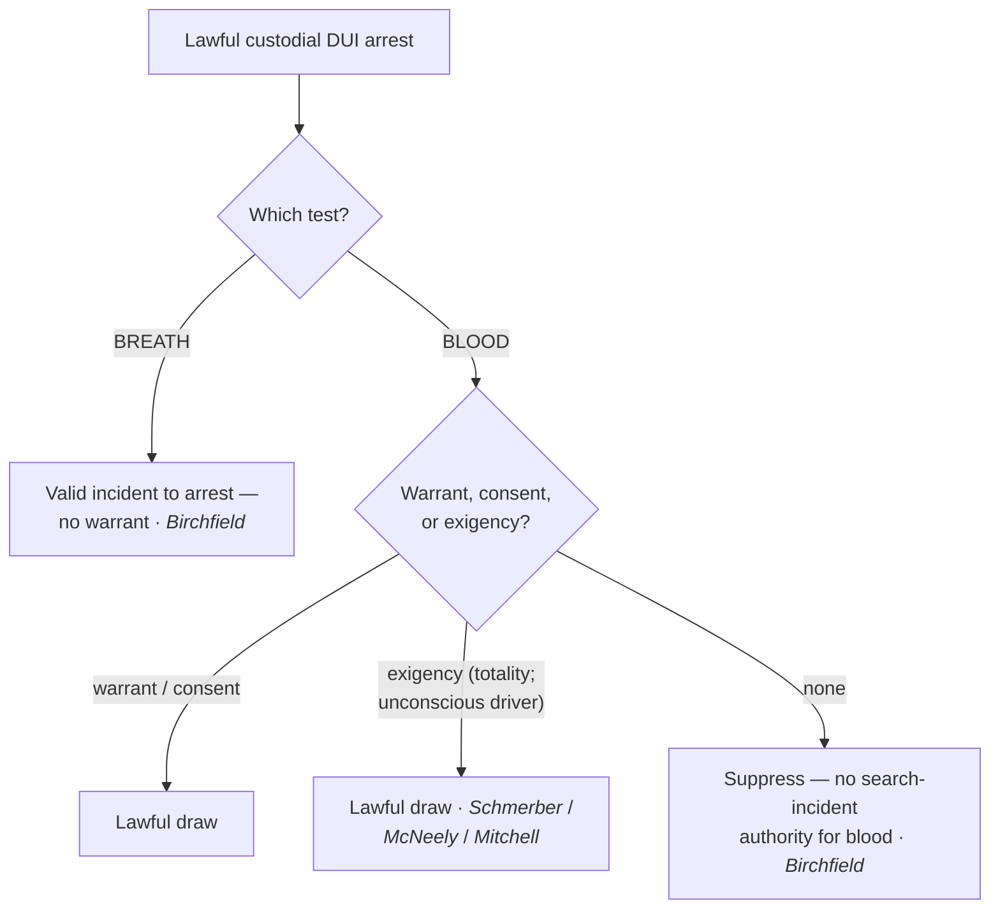
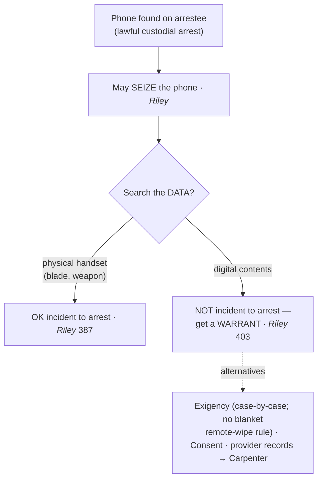

# S9 R1 panel-review — Opus model-diversity lane (prompt pack)

You are the **Claude/Opus** leg of the S9 three-lane adversarial panel (1 Claude + 2 Codex, R1). The two Codex lanes carry the A (support/quote-fidelity) and B (currency/treatment) attack lenses; **you carry model diversity and MUST vote on every paneled assertion across BOTH lenses' concerns.** You are refute-framed: try hard to break each assertion; **default to REFUTED on uncertainty**; never fabricate a cite, quote, or holding; use ONLY the evidence inlined below (no search, no outside knowledge). You are a SIGHTED reviewer — the FULL lake record (judgment fields included) is inlined.

You are a WRITER lane, not an adjudicator: you FIND and VOTE. You do not tally, adjudicate, or close any row — the orchestrator does.

For EACH group below, return one JSON object with the exact `reviewed[]` shape from the output contract (identical framing to the Codex lenses). Emit a finding object ONLY for a real defect (verdict refuted / stands-modified); a group you find wholly clean returns all-`stands` verdicts (the harness records a clean attestation). Concatenate the per-group JSON objects into a top-level `{"packs": [ ... ]}` array, one entry per group, each carrying its `group_id`.


OUTPUT CONTRACT — return ONE JSON object, nothing else:
{
  "lens": "A" | "B",
  "group_id": "<echo the group id>",
  "reviewed": [
    {
      "assertion_id": "<from group_inventory.jsonl>",
      "dimension": "existence|support|quote_fidelity|pincite|treatment|black_letter",
      "verdict": "stands" | "refuted" | "stands-modified",
      "verifiable_from_disclosed": true | false,
      "defect": null,   // null when verdict=="stands"; else an object:
      //  {"problem": "...", "severity": "high|medium|low", "proposed_fix": "...", "evidence_quote": "verbatim from disclosed evidence or null", "needs_cl": true|false, "locator_note": "..."}
      "reasons": ["short evidence-grounded reason", "..."],
      "breaks_true_positives": true | false,
      "residual_risks": ["..."],
      "suggested_tightening": "... or null"
    }
  ],
  "notes": ""
}
Rules: verdict=='stands' <=> defect==null (assertion survives your attack). verdict=='refuted' <=> a real defect (the assertion as framed is wrong). verdict=='stands-modified' <=> survives but needs a stated modification (a minor defect). Review EVERY assertion_id in group_inventory.jsonl exactly once. Output ONLY the JSON object.
---

## GROUP: content/warrant-exceptions/searching-a-person/SIA Alcohol Tests.md  (`doctrine`, 5 assertions)

### content_page

```
---
weight: 30
aliases:
  - "SIA Alcohol Tests"
title: "SIA — Alcohol Tests"
topic: Search Incident to Arrest — Alcohol & Chemical Tests
type: doctrine
jurisdiction: Federal (U.S. Const. amend. IV); SCOTUS baseline
status: draft
related: ["[[SIA Persons]]", "[[Exigent Circumstances and Hot Pursuit]]", "[[Consent Searches]]", "[[The Exclusionary Rule]]"]
---

# SIA — Alcohol Tests

*This page states the search-incident rule for chemical testing on a drunk-driving arrest. The dissipating-alcohol [[Exigent Circumstances and Hot Pursuit|exigency]] that fills the gap for blood is developed at [[Exigent Circumstances and Hot Pursuit]].*

> [!rule] Black-letter rule
> "[A] breath test, but not a blood test, may be administered as a search incident to a lawful arrest for drunk driving." *[[Birchfield v. North Dakota#^pin-2185|Birchfield v. North Dakota]]*, 579 U.S. 438, [474](https://www.courtlistener.com/opinion/3216497/birchfield-v-n-dakota-william-robert-bernard/) (2016). A warrantless **breath** test rides the arrest; a warrantless **blood** draw does not — it needs a **warrant**, valid **consent**, or a genuine **[[Exigent Circumstances and Hot Pursuit|exigency]]** (the dissipating-BAC line of *[[Schmerber v. California#^pin-770|Schmerber]]* / *[[Missouri v. McNeely|McNeely]]* / *[[Mitchell v. Wisconsin#^pin-2539|Mitchell]]*).
> ^rule-sia-alcohol

## The Brief

**Field-decisive question: I arrested a driver for DUI — can I test breath or blood without a warrant?** Breath, yes, on the arrest alone; blood, no, unless a warrant, consent, or [[Exigent Circumstances and Hot Pursuit|exigency]] supplies the authority. The government bears the burden of justifying any warrantless test; the remedy for an unjustified blood draw is suppression under [[The Exclusionary Rule]].

**The two tests are treated differently because the intrusions differ.** *[[Birchfield v. North Dakota|Birchfield]]* weighed the privacy intrusion against the state's interest and split the difference: a **breath** test is minimally intrusive (no piercing of the skin, no lingering biological sample) and "may be administered as a search incident to a lawful arrest for drunk driving." *[[Birchfield v. North Dakota#^pin-2185|Birchfield]]*, 579 U.S. at [474](https://www.courtlistener.com/opinion/3216497/birchfield-v-n-dakota-william-robert-bernard/). A **blood** draw pierces the body and yields a sample the government retains, so it is **not** covered by the search-incident exception and needs its own justification.

**Implied-consent statutes: refusing a breath test can be a crime; refusing a blood test cannot.** Because a warrantless breath test is a valid incident search, a State may make it a **crime** to refuse one. But because a warrantless **blood** draw is not, a State may not impose **criminal** penalties for refusing it — the driver cannot be deemed to have "consented" on pain of a separate crime to a test the Fourth Amendment would otherwise require a warrant for. *[[Birchfield v. North Dakota|Birchfield]]* struck the criminal-refusal penalty as applied to blood while upholding it for breath. Civil consequences (license suspension) are a different question and were not disturbed.

**The blood gap is filled by [[Exigent Circumstances and Hot Pursuit|exigency]], not by the arrest.** Where a warrantless blood draw is needed, the theory is the **dissipating-alcohol [[Exigent Circumstances and Hot Pursuit|exigency]]**, not [[Search Incident to Arrest|search incident to arrest]]. *[[Schmerber v. California#^pin-770|Schmerber]]* upheld a warrantless blood draw on probable cause where the delay to get a warrant threatened the loss of evidence as alcohol metabolized. 384 U.S. 757, 770 (1966). *[[Missouri v. McNeely|McNeely]]* then held the natural dissipation of blood alcohol does **not** create a **[[Common Legal Terms#per-se|per se]]** [[Exigent Circumstances and Hot Pursuit|exigency]] in every case; the [[Exigent Circumstances and Hot Pursuit|exigency]] question is judged on the **[[Common Legal Terms#totality-of-the-circumstances|totality of the circumstances]]**. 569 U.S. 141, 156 (2013). *[[Mitchell v. Wisconsin#^pin-2539|Mitchell]]* addressed the recurring **unconscious-driver** case: when a drunk-driving suspect is unconscious and cannot be given a breath test, the [[Exigent Circumstances and Hot Pursuit|exigency]] doctrine will **almost always** permit a warrantless blood draw. 588 U.S. 840 (2019). The full [[Exigent Circumstances and Hot Pursuit|exigency]] analysis is at [[Exigent Circumstances and Hot Pursuit]].

**Apply it.**
1. On a lawful **custodial DUI arrest**, a warrantless **breath** test is valid incident to the arrest (*[[Birchfield v. North Dakota|Birchfield]]*).
2. For **blood**, get a **warrant** unless consent or a genuine [[Exigent Circumstances and Hot Pursuit|exigency]] applies (*[[Birchfield v. North Dakota|Birchfield]]*).
3. If you rely on **[[Exigent Circumstances and Hot Pursuit|exigency]]** for blood, articulate the totality — dissipation alone is not automatic (*[[Missouri v. McNeely|McNeely]]*); an **unconscious** driver who cannot blow will "almost always" support it (*[[Mitchell v. Wisconsin|Mitchell]]*).
4. Do not threaten a **crime** for refusing a **blood** test; that penalty is unconstitutional (*[[Birchfield v. North Dakota|Birchfield]]*). Breath-test-refusal penalties are permissible.

**Common pitfalls.**
- **Treating blood like breath.** Only the **breath** test rides the arrest; blood needs a warrant, consent, or [[Exigent Circumstances and Hot Pursuit|exigency]] (*[[Birchfield v. North Dakota|Birchfield]]*).
- **Assuming BAC dissipation is an automatic [[Exigent Circumstances and Hot Pursuit|exigency]].** *[[Missouri v. McNeely|McNeely]]* rejects a per-se rule; judge the totality.
- **Criminalizing refusal of a blood test.** Unconstitutional under *[[Birchfield v. North Dakota|Birchfield]]* (civil license consequences are separate).
- **Calling the blood draw a "search incident to arrest."** It is not; the theory is [[Exigent Circumstances and Hot Pursuit|exigency]] (*[[Schmerber v. California|Schmerber]]* line).

## Lower-court developments

The SCOTUS line (*[[Birchfield v. North Dakota|Birchfield]]* / *[[Missouri v. McNeely|McNeely]]* / *[[Mitchell v. Wisconsin|Mitchell]]*) governs; state courts continue to work out **implied-consent** mechanics — how far *[[Mitchell v. Wisconsin|Mitchell]]*'s unconscious-driver rule reaches, and whether statutory "consent" can substitute for a warrant after *[[Birchfield v. North Dakota|Birchfield]]*. These turn on state statutes and are litigated state by state; no federal circuit rule displaces the SCOTUS framework.

## Key cases

| Case | Holding | Opinion |
|---|---|---|
| *[[Birchfield v. North Dakota]]*, 579 U.S. 438 (2016) | **Anchor.** A warrantless **breath** test is a valid search incident to a DUI arrest; a warrantless **blood** test is not, and criminal penalties for refusing a blood test are unconstitutional. | [opinion](https://www.courtlistener.com/opinion/3216497/birchfield-v-n-dakota-william-robert-bernard/) |

## Related cases across doctrines

These cases are treated in full elsewhere but frame the chemical-testing rule here.

| Case | Relevance here | Primary home | Opinion |
|---|---|---|---|
| *[[Schmerber v. California]]*, 384 U.S. 757 (1966) | ***[[Exigent Circumstances and Hot Pursuit\|Exigency]] baseline.*** A warrantless **blood** draw on probable cause is reasonable where dissipating BAC leaves no time for a warrant; the theory that fills the gap *[[Birchfield v. North Dakota\|Birchfield]]* leaves for blood. | [[Exigent Circumstances and Hot Pursuit]] | [opinion](https://www.courtlistener.com/opinion/107262/schmerber-v-california/) |
| *[[Missouri v. McNeely]]*, 569 U.S. 141 (2013) | ***No per-se [[Exigent Circumstances and Hot Pursuit\|exigency]].*** The natural dissipation of blood alcohol does not create a categorical [[Exigent Circumstances and Hot Pursuit\|exigency]]; the question is judged on the [[Common Legal Terms#totality-of-the-circumstances\|totality of the circumstances]]. | [[Exigent Circumstances and Hot Pursuit]] | [opinion](https://www.courtlistener.com/opinion/882802/missouri-v-mcneely/) |
| *[[Mitchell v. Wisconsin]]*, 588 U.S. 840 (2019) | ***Unconscious driver.*** When a DUI suspect is unconscious and cannot take a breath test, [[Exigent Circumstances and Hot Pursuit\|exigency]] will "almost always" permit a warrantless blood draw. | [[Exigent Circumstances and Hot Pursuit]] | [opinion](https://www.courtlistener.com/opinion/4218101/mitchell-v-wisconsin/) |

## Visual



## Sources
- [*Birchfield v. North Dakota*, 579 U.S. 438 (2016)](https://www.courtlistener.com/opinion/3216497/birchfield-v-n-dakota-william-robert-bernard/) (pinpoint: 474)
- [*Schmerber v. California*, 384 U.S. 757 (1966)](https://www.courtlistener.com/opinion/107262/schmerber-v-california/) (pinpoint: 770)
- [*Missouri v. McNeely*, 569 U.S. 141 (2013)](https://www.courtlistener.com/opinion/882802/missouri-v-mcneely/) (pinpoint: 156)
- [*Mitchell v. Wisconsin*, 588 U.S. 840 (2019)](https://www.courtlistener.com/opinion/4218101/mitchell-v-wisconsin/)

```

### group_inventory (assertions under review)

```jsonl
{"assertion_id": "116e5f98313999e9", "dimension": "existence", "kind": "case_cite", "locator": {"case": "Mitchell v. Wisconsin", "table_line": 50}, "payload": {"case": "Mitchell v. Wisconsin", "cells": ["*[[Mitchell v. Wisconsin]]*, 588 U.S. 840 (2019)", "***Unconscious driver.*** When a DUI suspect is unconscious and cannot take a breath test, [[Exigent Circumstances and Hot Pursuit\\|exigency]] will \"almost always\" permit a warrantless blood draw.", "[[Exigent Circumstances and Hot Pursuit]]", "[opinion](https://www.courtlistener.com/opinion/4218101/mitchell-v-wisconsin/)"], "header": ["Case", "Relevance here", "Primary home", "Opinion"]}}
{"assertion_id": "6455f73072340554", "dimension": "existence", "kind": "case_cite", "locator": {"case": "Missouri v. McNeely", "table_line": 49}, "payload": {"case": "Missouri v. McNeely", "cells": ["*[[Missouri v. McNeely]]*, 569 U.S. 141 (2013)", "***No per-se [[Exigent Circumstances and Hot Pursuit\\|exigency]].*** The natural dissipation of blood alcohol does not create a categorical [[Exigent Circumstances and Hot Pursuit\\|exigency]]; the question is judged on the [[Common Legal Terms#totality-of-the-circumstances\\|totality of the circumstances]].", "[[Exigent Circumstances and Hot Pursuit]]", "[opinion](https://www.courtlistener.com/opinion/882802/missouri-v-mcneely/)"], "header": ["Case", "Relevance here", "Primary home", "Opinion"]}}
{"assertion_id": "eb10be1ef7d3ea4a", "dimension": "existence", "kind": "case_cite", "locator": {"case": "Birchfield v. North Dakota", "table_line": 40}, "payload": {"case": "Birchfield v. North Dakota", "cells": ["*[[Birchfield v. North Dakota]]*, 579 U.S. 438 (2016)", "**Anchor.** A warrantless **breath** test is a valid search incident to a DUI arrest; a warrantless **blood** test is not, and criminal penalties for refusing a blood test are unconstitutional.", "[opinion](https://www.courtlistener.com/opinion/3216497/birchfield-v-n-dakota-william-robert-bernard/)"], "header": ["Case", "Holding", "Opinion"]}}
{"assertion_id": "fea79b586dc8eee4", "dimension": "existence", "kind": "case_cite", "locator": {"case": "Schmerber v. California", "table_line": 48}, "payload": {"case": "Schmerber v. California", "cells": ["*[[Schmerber v. California]]*, 384 U.S. 757 (1966)", "***[[Exigent Circumstances and Hot Pursuit\\|Exigency]] baseline.*** A warrantless **blood** draw on probable cause is reasonable where dissipating BAC leaves no time for a warrant; the theory that fills the gap *[[Birchfield v. North Dakota\\|Birchfield]]* leaves for blood.", "[[Exigent Circumstances and Hot Pursuit]]", "[opinion](https://www.courtlistener.com/opinion/107262/schmerber-v-california/)"], "header": ["Case", "Relevance here", "Primary home", "Opinion"]}}
{"assertion_id": "f613c1436663ba91", "dimension": "support", "kind": "proposition", "locator": {"callout": "^rule-sia-alcohol"}, "payload": {"anchor": "^rule-sia-alcohol", "statement": "[!rule] Black-letter rule\n\"[A] breath test, but not a blood test, may be administered as a search incident to a lawful arrest for drunk driving.\" *[[Birchfield v. North Dakota#^pin-2185|Birchfield v. North Dakota]]*, 579 U.S. 438, [474](https://www.courtlistener.com/opinion/3216497/birchfield-v-n-dakota-william-robert-bernard/) (2016). A warrantless **breath** test rides the arrest; a warrantless **blood** draw does not — it needs a **warrant**, valid **consent**, or a genuine **[[Exigent Circumstances and Hot Pursuit|exigency]]** (the dissipating-BAC line of *[[Schmerber v. California#^pin-770|Schmerber]]* / *[[Missouri v. McNeely|McNeely]]* / *[[Mitchell v. Wisconsin#^pin-2539|Mitchell]]*)."}}
```

### lake record — Birchfield v. North Dakota

```json
{
  "schema_version": "s2.v1",
  "record_id": "Birchfield v. North Dakota",
  "stub": false,
  "status": "verified",
  "identity": {
    "case_name": "Birchfield v. N. Dakota. William Robert Bernard",
    "case_name_short": "Birchfield",
    "case_name_full": "Danny BIRCHFIELD, Petitioner v. NORTH DAKOTA. William Robert Bernard, Jr., Petitioner v. Minnesota. and Steve Michael Beylund, Petitioner v. Grant Levi, Director, North Dakota Department of Transportation.",
    "input_case_name": "Birchfield v. North Dakota",
    "court": "U.S. Supreme Court",
    "court_id": "scotus",
    "court_level": "scotus",
    "circuit": null,
    "state": null,
    "date_decided": "2016-06-23",
    "year": 2016,
    "docket": "14-1468",
    "cluster_id": 3216497,
    "lead_opinion_id": 3216391,
    "sibling_ids": [
      3216391
    ],
    "absolute_url": "/opinion/3216497/birchfield-v-n-dakota-william-robert-bernard/",
    "identity_method": "citation+party-text",
    "expected_citation_found": true,
    "party_name_in_text": true,
    "canonical_name_match": true,
    "alternates": [
      {
        "cluster_id": 8424452,
        "score": 20,
        "case_name": "Birchfield v. Dakota"
      },
      {
        "cluster_id": 8423610,
        "score": 20,
        "case_name": "Birchfield v. Dakota"
      }
    ],
    "reason_code": null
  },
  "citations": {
    "official": {
      "cite": "579 U.S. 438",
      "volume": "579",
      "reporter": "U.S.",
      "page": "438",
      "type": 1,
      "selected_official": true,
      "source": "cluster.citations[]"
    },
    "parallel": [
      {
        "cite": "195 L. Ed. 2d 560",
        "volume": "195",
        "reporter": "L. Ed. 2d",
        "page": "560",
        "type": 1,
        "selected_official": false,
        "source": "cluster.citations[]"
      },
      {
        "cite": "136 S. Ct. 2160",
        "volume": "136",
        "reporter": "S. Ct.",
        "page": "2160",
        "type": 1,
        "selected_official": false,
        "source": "cluster.citations[]"
      }
    ],
    "vendor_neutral": [
      {
        "cite": "2016 U.S. LEXIS 4058",
        "volume": "2016",
        "reporter": "U.S. LEXIS",
        "page": "4058",
        "type": 6,
        "selected_official": false,
        "source": "cluster.citations[]"
      }
    ],
    "all": [
      {
        "cite": "579 U.S. 438",
        "volume": "579",
        "reporter": "U.S.",
        "page": "438",
        "type": 1,
        "selected_official": false,
        "source": "cluster.citations[]"
      },
      {
        "cite": "195 L. Ed. 2d 560",
        "volume": "195",
        "reporter": "L. Ed. 2d",
        "page": "560",
        "type": 1,
        "selected_official": false,
        "source": "cluster.citations[]"
      },
      {
        "cite": "2016 U.S. LEXIS 4058",
        "volume": "2016",
        "reporter": "U.S. LEXIS",
        "page": "4058",
        "type": 6,
        "selected_official": false,
        "source": "cluster.citations[]"
      },
      {
        "cite": "136 S. Ct. 2160",
        "volume": "136",
        "reporter": "S. Ct.",
        "page": "2160",
        "type": 1,
        "selected_official": false,
        "source": "cluster.citations[]"
      }
    ],
    "display": "579 U.S. 438",
    "official_selection": {
      "court_class": "scotus",
      "selected": "579 U.S. 438",
      "reason": "selected_rank_1"
    }
  },
  "pinpoints": [
    {
      "id": "pin-2185",
      "page": null,
      "quote": "--- # Birchfield v. North Dakota *579 U.S. 438 (2016)* \u00b7 U.S. Supreme Court \u00b7 **Binding \u2014 SCOTUS** \u00b7 Treatment: **good** *(as of 2026-06-30)* <!-- header line; TreatmentBadge + weight render here, degrading to the text above --> ## Background Three consolidated DUI cases tested States' implied-consent laws that attach consequences to refusing a chemical test. Danny Birchfield was criminally prosecuted under North Dakota law for refusing a warrantless **blood** test after a drunk-driving arrest. William Bernard was prosecuted for refusing a warrantless **breath** test in Minnesota. Steve Beylund submitted to a **blood** test after being told that refusal was a crime. Each argued that criminalizing or coercing submission to a warrantless test violated the Fourth Amendment. ## Issue Whether the Fourth Amendment permits warrantless breath and blood tests incident to an arrest for drunk driving, and whether a State may impose criminal penalties on a motorist's refusal to submit to such a warrantless test. ## Rule The intrusiveness of the test controls.",
      "star_marker": null,
      "quote_fidelity": "mismatch",
      "pinpoint_status": "slip-only",
      "position": null
    },
    {
      "id": "pin-2185a",
      "page": null,
      "quote": "It is another matter, however, for a State not only to insist upon an intrusive blood test, but also to impose criminal penalties on the refusal to submit to such a test. There must be a limit to the consequences to which motorists may be deemed to have consented by virtue of a decision to drive on public roads.",
      "star_marker": null,
      "quote_fidelity": "mismatch",
      "pinpoint_status": "slip-only",
      "position": null
    }
  ],
  "treatment": {
    "field_i_validity": "good_law",
    "as_of_content": "2016-06-23",
    "as_of_treatment": "2026-06-30",
    "composite_basis": "migration-seed",
    "composite_basis_ref": "Birchfield v. North Dakota",
    "varies_by_point": false,
    "scope_note": "Good law. Refines the Schmerber/McNeely DUI-testing line: breath tests are valid as a search incident to arrest, blood tests are not; States may not criminalize refusal of a warrantless blood test.",
    "point_overrides": [],
    "edges": [
      {
        "citing_case": {
          "name": "State v. Bell",
          "cluster_id": 10747468,
          "cite": [
            "2025 ND 201"
          ],
          "field_ii": "abrogated"
        },
        "field_ii": "abrogated",
        "field_iii": "mentioned",
        "point": null,
        "proposed": true,
        "journal_ref": "Birchfield v. North Dakota:lane1_negative"
      },
      {
        "citing_case": {
          "name": "State of Iowa v. Colby Davis Laub",
          "cluster_id": 9493043,
          "cite": null,
          "field_ii": "overruled"
        },
        "field_ii": "overruled",
        "field_iii": "mentioned",
        "point": null,
        "proposed": true,
        "journal_ref": "Birchfield v. North Dakota:lane1_negative"
      },
      {
        "citing_case": {
          "name": "State of Iowa v. Colby Davis Laub",
          "cluster_id": 9473742,
          "cite": null,
          "field_ii": "overruled"
        },
        "field_ii": "overruled",
        "field_iii": "mentioned",
        "point": null,
        "proposed": true,
        "journal_ref": "Birchfield v. North Dakota:lane1_negative"
      },
      {
        "citing_case": {
          "name": "State v. Phipps",
          "cluster_id": 9440775,
          "cite": null,
          "field_ii": "overruled"
        },
        "field_ii": "overruled",
        "field_iii": "mentioned",
        "point": null,
        "proposed": true,
        "journal_ref": "Birchfield v. North Dakota:lane1_negative"
      },
      {
        "citing_case": {
          "name": "State v. Portulano",
          "cluster_id": 10135231,
          "cite": [
            "320 Or. App. 335",
            "514 P.3d 93"
          ],
          "field_ii": "questioned"
        },
        "field_ii": "questioned",
        "field_iii": "mentioned",
        "point": null,
        "proposed": true,
        "journal_ref": "Birchfield v. North Dakota:lane1_negative"
      },
      {
        "citing_case": {
          "name": "State v. Kruse",
          "cluster_id": 4643214,
          "cite": [
            "303 Neb. 799",
            "931 N.W.2d 148"
          ],
          "field_ii": "overruled"
        },
        "field_ii": "overruled",
        "field_iii": "mentioned",
        "point": null,
        "proposed": true,
        "journal_ref": "Birchfield v. North Dakota:lane1_negative"
      },
      {
        "citing_case": {
          "name": "State v. Banks",
          "cluster_id": 6658146,
          "cite": [
            "434 P.3d 361",
            "364 Or. 332"
          ],
          "field_ii": "questioned"
        },
        "field_ii": "questioned",
        "field_iii": "mentioned",
        "point": null,
        "proposed": true,
        "journal_ref": "Birchfield v. North Dakota:lane1_negative"
      },
      {
        "citing_case": {
          "name": "State v. Hatfield",
          "cluster_id": 4505365,
          "cite": [
            "300 Neb. 152",
            "912 N.W.2d 731"
          ],
          "field_ii": "questioned"
        },
        "field_ii": "questioned",
        "field_iii": "mentioned",
        "point": null,
        "proposed": true,
        "journal_ref": "Birchfield v. North Dakota:lane1_negative"
      },
      {
        "citing_case": {
          "name": "Cosino v. State",
          "cluster_id": 5447462,
          "cite": [
            "503 S.W.3d 592",
            "2016 Tex. App. LEXIS 11431",
            "2016 WL 6134461"
          ],
          "field_ii": "overruled"
        },
        "field_ii": "overruled",
        "field_iii": "mentioned",
        "point": null,
        "proposed": true,
        "journal_ref": "Birchfield v. North Dakota:lane1_negative"
      },
      {
        "citing_case": {
          "name": "State v. Rocha",
          "cluster_id": 4345763,
          "cite": [
            "295 Neb. 716",
            "890 N.W.2d 178"
          ],
          "field_ii": "overruled"
        },
        "field_ii": "overruled",
        "field_iii": "mentioned",
        "point": null,
        "proposed": true,
        "journal_ref": "Birchfield v. North Dakota:lane2_top_cited"
      },
      {
        "citing_case": {
          "name": "The Matter of Kevin B. Acevedo v. New York State Department of Motor Vehicles , The Matter of Michael W. Carney v. New York State Department of Motor Vehicles , The Matter of Caralyn A. Matsen v. New York State Department of Motor Vehicles",
          "cluster_id": 4390108,
          "cite": [
            "29 N.Y.3d 202",
            "77 N.E.3d 331"
          ],
          "field_ii": "questioned"
        },
        "field_ii": "questioned",
        "field_iii": "mentioned",
        "point": null,
        "proposed": true,
        "journal_ref": "Birchfield v. North Dakota:lane2_top_cited"
      },
      {
        "citing_case": {
          "name": "State v. Hood",
          "cluster_id": 4541268,
          "cite": [
            "301 Neb. 207",
            "917 N.W.2d 880"
          ],
          "field_ii": "overruled"
        },
        "field_ii": "overruled",
        "field_iii": "mentioned",
        "point": null,
        "proposed": true,
        "journal_ref": "Birchfield v. North Dakota:lane2_top_cited"
      },
      {
        "citing_case": {
          "name": "State v. McCumber",
          "cluster_id": 4370918,
          "cite": [
            "295 Neb. 941",
            "893 N.W.2d 411"
          ],
          "field_ii": "questioned"
        },
        "field_ii": "questioned",
        "field_iii": "mentioned",
        "point": null,
        "proposed": true,
        "journal_ref": "Birchfield v. North Dakota:lane2_top_cited"
      },
      {
        "citing_case": {
          "name": "Sloley v. VanBramer",
          "cluster_id": 4686314,
          "cite": [
            "945 F.3d 30"
          ],
          "field_ii": "abrogated"
        },
        "field_ii": "abrogated",
        "field_iii": "mentioned",
        "point": null,
        "proposed": true,
        "journal_ref": "Birchfield v. North Dakota:lane2_top_cited"
      },
      {
        "citing_case": {
          "name": "Commonwealth, Aplt. v. Myers, D.",
          "cluster_id": 4410366,
          "cite": [
            "164 A.3d 1162",
            "2017 WL 3045867",
            "2017 Pa. LEXIS 1689"
          ],
          "field_ii": "questioned"
        },
        "field_ii": "questioned",
        "field_iii": "mentioned",
        "point": null,
        "proposed": true,
        "journal_ref": "Birchfield v. North Dakota:lane2_top_cited"
      },
      {
        "citing_case": {
          "name": "State of Tennessee v. Corrin Kathleen Reynolds",
          "cluster_id": 4318256,
          "cite": [
            "504 S.W.3d 283",
            "2016 Tenn. LEXIS 821"
          ],
          "field_ii": "overruled"
        },
        "field_ii": "overruled",
        "field_iii": "mentioned",
        "point": null,
        "proposed": true,
        "journal_ref": "Birchfield v. North Dakota:lane2_top_cited"
      },
      {
        "citing_case": {
          "name": "State v. Martinez",
          "cluster_id": 6243814,
          "cite": [
            "570 S.W.3d 278"
          ],
          "field_ii": "questioned"
        },
        "field_ii": "questioned",
        "field_iii": "mentioned",
        "point": null,
        "proposed": true,
        "journal_ref": "Birchfield v. North Dakota:lane2_top_cited"
      },
      {
        "citing_case": {
          "name": "State v. Schmidt",
          "cluster_id": 4330697,
          "cite": [
            "53 Kan. App. 2d 225",
            "385 P.3d 936",
            "2016 Kan. App. LEXIS 70"
          ],
          "field_ii": "questioned"
        },
        "field_ii": "questioned",
        "field_iii": "mentioned",
        "point": null,
        "proposed": true,
        "journal_ref": "Birchfield v. North Dakota:lane2_top_cited"
      },
      {
        "citing_case": {
          "name": "State v. Pester",
          "cluster_id": 4312370,
          "cite": [
            "294 Neb. 995",
            "885 N.W.2d 713"
          ],
          "field_ii": "overruled"
        },
        "field_ii": "overruled",
        "field_iii": "mentioned",
        "point": null,
        "proposed": true,
        "journal_ref": "Birchfield v. North Dakota:lane2_top_cited"
      },
      {
        "citing_case": {
          "name": "Lange v. California",
          "cluster_id": 4894054,
          "cite": [
            "594 U.S. 295"
          ],
          "field_ii": "questioned"
        },
        "field_ii": "questioned",
        "field_iii": "mentioned",
        "point": null,
        "proposed": true,
        "journal_ref": "Birchfield v. North Dakota:lane2_top_cited"
      },
      {
        "citing_case": {
          "name": "State v. McGinn",
          "cluster_id": 4623043,
          "cite": [
            "303 Neb. 224",
            "928 N.W.2d 391"
          ],
          "field_ii": "overruled"
        },
        "field_ii": "overruled",
        "field_iii": "mentioned",
        "point": null,
        "proposed": true,
        "journal_ref": "Birchfield v. North Dakota:lane2_top_cited"
      },
      {
        "citing_case": {
          "name": "State v. Rothenberger",
          "cluster_id": 4259293,
          "cite": [
            "294 Neb. 810",
            "885 N.W.2d 23"
          ],
          "field_ii": "overruled"
        },
        "field_ii": "overruled",
        "field_iii": "mentioned",
        "point": null,
        "proposed": true,
        "journal_ref": "Birchfield v. North Dakota:lane2_top_cited"
      },
      {
        "citing_case": {
          "name": "People of Michigan v. Glorianna Woodard",
          "cluster_id": 4428527,
          "cite": [
            "909 N.W.2d 299",
            "321 Mich. App. 377"
          ],
          "field_ii": "questioned"
        },
        "field_ii": "questioned",
        "field_iii": "mentioned",
        "point": null,
        "proposed": true,
        "journal_ref": "Birchfield v. North Dakota:lane2_top_cited"
      },
      {
        "citing_case": {
          "name": "United States v. Delva",
          "cluster_id": 4396270,
          "cite": [
            "858 F.3d 135",
            "2017 WL 2366489",
            "2017 U.S. App. LEXIS 9645"
          ],
          "field_ii": "questioned"
        },
        "field_ii": "questioned",
        "field_iii": "mentioned",
        "point": null,
        "proposed": true,
        "journal_ref": "Birchfield v. North Dakota:lane2_top_cited"
      },
      {
        "citing_case": {
          "name": "State v. Nielsen",
          "cluster_id": 4535193,
          "cite": [
            "301 Neb. 88",
            "917 N.W.2d 159"
          ],
          "field_ii": "questioned"
        },
        "field_ii": "questioned",
        "field_iii": "mentioned",
        "point": null,
        "proposed": true,
        "journal_ref": "Birchfield v. North Dakota:lane2_top_cited"
      },
      {
        "citing_case": {
          "name": "Com. v. Hand, T.",
          "cluster_id": 10279074,
          "cite": [
            "2021 Pa. Super. 113",
            "252 A.3d 1159"
          ],
          "field_ii": "questioned"
        },
        "field_ii": "questioned",
        "field_iii": "mentioned",
        "point": null,
        "proposed": true,
        "journal_ref": "Birchfield v. North Dakota:lane2_top_cited"
      },
      {
        "citing_case": {
          "name": "Pacheco v. State",
          "cluster_id": 10048657,
          "cite": [
            "465 Md. 311"
          ],
          "field_ii": "questioned"
        },
        "field_ii": "questioned",
        "field_iii": "mentioned",
        "point": null,
        "proposed": true,
        "journal_ref": "Birchfield v. North Dakota:lane2_top_cited"
      },
      {
        "citing_case": {
          "name": "State v. Dawn M. Prado",
          "cluster_id": 4893130,
          "cite": [
            "960 N.W.2d 869",
            "2021 WI 64"
          ],
          "field_ii": "overruled"
        },
        "field_ii": "overruled",
        "field_iii": "mentioned",
        "point": null,
        "proposed": true,
        "journal_ref": "Birchfield v. North Dakota:lane2_top_cited"
      },
      {
        "citing_case": {
          "name": "Wade Robertson v. Rise Pichon",
          "cluster_id": 4372525,
          "cite": [
            "849 F.3d 1173",
            "2017 WL 816886",
            "2017 U.S. App. LEXIS 3770"
          ],
          "field_ii": "criticized"
        },
        "field_ii": "criticized",
        "field_iii": "mentioned",
        "point": null,
        "proposed": true,
        "journal_ref": "Birchfield v. North Dakota:lane2_top_cited"
      },
      {
        "citing_case": {
          "name": "United States v. Roberto Pabon",
          "cluster_id": 4425184,
          "cite": [
            "871 F.3d 164",
            "2017 U.S. App. LEXIS 17471"
          ],
          "field_ii": "questioned"
        },
        "field_ii": "questioned",
        "field_iii": "mentioned",
        "point": null,
        "proposed": true,
        "journal_ref": "Birchfield v. North Dakota:lane2_top_cited"
      },
      {
        "citing_case": {
          "name": "State v. Cornwell",
          "cluster_id": 4257159,
          "cite": [
            "294 Neb. 799",
            "884 N.W.2d 722"
          ],
          "field_ii": "questioned"
        },
        "field_ii": "questioned",
        "field_iii": "mentioned",
        "point": null,
        "proposed": true,
        "journal_ref": "Birchfield v. North Dakota:lane2_top_cited"
      }
    ],
    "derivation": {
      "lane1_negative": {
        "query": "cites:(3216391) AND (overrul* OR abrogat* OR supersed* OR \"recede from\" OR \"no longer good law\" OR vacat* OR reversed) ",
        "reviewed": 177,
        "cap": 200,
        "cap_hit": false,
        "final_cursor": null,
        "audit_needed": false,
        "proposed_negative_events": 9,
        "audit_marker": null,
        "triage_mode": "snippet-first",
        "snippet_field": "results[].opinions[].snippet",
        "triage_journaled": 177,
        "triage_read": 10,
        "triage_snippet_classified": 167
      },
      "lane2_top_cited": {
        "query": "cites:(3216391)",
        "reviewed": 25,
        "cap": 25,
        "cap_hit": true,
        "final_cursor": "https://www.courtlistener.com/api/rest/v4/search/?cursor=cz0xMSZzPTQ2ODkxNTUmdD1vJmQ9MjAyNi0wNy0wNCZwPTM%3D&order_by=citeCount+desc&page_size=25&q=cites%3A%283216391%29&type=o",
        "audit_needed": true,
        "proposed_negative_events": 25,
        "audit_marker": "R15 treatment audit required"
      },
      "lane3_recency": {
        "query": "cites:(3216391)",
        "reviewed": 58,
        "cap": 200,
        "cap_hit": false,
        "final_cursor": null,
        "audit_needed": false,
        "proposed_negative_events": 4,
        "audit_marker": null,
        "triage_mode": "snippet-first",
        "snippet_field": "results[].opinions[].snippet",
        "triage_journaled": 58,
        "triage_read": 4,
        "triage_snippet_classified": 54
      }
    }
  },
  "progeny": {
    "complete_query": "cites:(3216391)",
    "indexed_citing_opinions": 231,
    "count_source": "search",
    "per_sibling": [
      {
        "opinion_id": 3216391,
        "count": 231,
        "count_source": "search"
      }
    ],
    "citation_count": 1444,
    "cache_path": "/Users/johngalt/cssi-lake/cache/progeny/birchfield-v-north-dakota.jsonl",
    "enumeration": "bounded",
    "cursor": "https://www.courtlistener.com/api/rest/v4/search/?cursor=cz0xLjg5MDcwNzcmcz0xMDAxMzA0OCZ0PW8mZD0yMDI2LTA3LTA0JnA9Mg%3D%3D&order_by=score+desc&page_size=100&q=cites%3A%283216391%29&type=o",
    "rows_cached": 20,
    "outbound_opinion_edges": [
      {
        "source_opinion_id": 3216391,
        "cited_id": 96405,
        "source": "search.opinions[].cites[]"
      },
      {
        "source_opinion_id": 3216391,
        "cited_id": 98094,
        "source": "search.opinions[].cites[]"
      },
      {
        "source_opinion_id": 3216391,
        "cited_id": 101899,
        "source": "search.opinions[].cites[]"
      },
      {
        "source_opinion_id": 3216391,
        "cited_id": 104422,
        "source": "search.opinions[].cites[]"
      },
      {
        "source_opinion_id": 3216391,
        "cited_id": 104769,
        "source": "search.opinions[].cites[]"
      },
      {
        "source_opinion_id": 3216391,
        "cited_id": 105456,
        "source": "search.opinions[].cites[]"
      },
      {
        "source_opinion_id": 3216391,
        "cited_id": 107262,
        "source": "search.opinions[].cites[]"
      },
      {
        "source_opinion_id": 3216391,
        "cited_id": 107473,
        "source": "search.opinions[].cites[]"
      },
      {
        "source_opinion_id": 3216391,
        "cited_id": 107564,
        "source": "search.opinions[].cites[]"
      },
      {
        "source_opinion_id": 3216391,
        "cited_id": 107716,
        "source": "search.opinions[].cites[]"
      },
      {
        "source_opinion_id": 3216391,
        "cited_id": 107979,
        "source": "search.opinions[].cites[]"
      },
      {
        "source_opinion_id": 3216391,
        "cited_id": 108581,
        "source": "search.opinions[].cites[]"
      },
      {
        "source_opinion_id": 3216391,
        "cited_id": 108800,
        "source": "search.opinions[].cites[]"
      },
      {
        "source_opinion_id": 3216391,
        "cited_id": 108801,
        "source": "search.opinions[].cites[]"
      },
      {
        "source_opinion_id": 3216391,
        "cited_id": 108845,
        "source": "search.opinions[].cites[]"
      },
      {
        "source_opinion_id": 3216391,
        "cited_id": 108893,
        "source": "search.opinions[].cites[]"
      },
      {
        "source_opinion_id": 3216391,
        "cited_id": 109714,
        "source": "search.opinions[].cites[]"
      },
      {
        "source_opinion_id": 3216391,
        "cited_id": 109866,
        "source": "search.opinions[].cites[]"
      },
      {
        "source_opinion_id": 3216391,
        "cited_id": 109874,
        "source": "search.opinions[].cites[]"
      },
      {
        "source_opinion_id": 3216391,
        "cited_id": 110126,
        "source": "search.opinions[].cites[]"
      },
      {
        "source_opinion_id": 3216391,
        "cited_id": 110464,
        "source": "search.opinions[].cites[]"
      },
      {
        "source_opinion_id": 3216391,
        "cited_id": 110832,
        "source": "search.opinions[].cites[]"
      },
      {
        "source_opinion_id": 3216391,
        "cited_id": 111206,
        "source": "search.opinions[].cites[]"
      },
      {
        "source_opinion_id": 3216391,
        "cited_id": 111788,
        "source": "search.opinions[].cites[]"
      },
      {
        "source_opinion_id": 3216391,
        "cited_id": 112219,
        "source": "search.opinions[].cites[]"
      },
      {
        "source_opinion_id": 3216391,
        "cited_id": 112412,
        "source": "search.opinions[].cites[]"
      },
      {
        "source_opinion_id": 3216391,
        "cited_id": 112608,
        "source": "search.opinions[].cites[]"
      },
      {
        "source_opinion_id": 3216391,
        "cited_id": 117964,
        "source": "search.opinions[].cites[]"
      },
      {
        "source_opinion_id": 3216391,
        "cited_id": 118235,
        "source": "search.opinions[].cites[]"
      },
      {
        "source_opinion_id": 3216391,
        "cited_id": 118250,
        "source": "search.opinions[].cites[]"
      },
      {
        "source_opinion_id": 3216391,
        "cited_id": 134724,
        "source": "search.opinions[].cites[]"
      },
      {
        "source_opinion_id": 3216391,
        "cited_id": 145654,
        "source": "search.opinions[].cites[]"
      },
      {
        "source_opinion_id": 3216391,
        "cited_id": 145814,
        "source": "search.opinions[].cites[]"
      },
      {
        "source_opinion_id": 3216391,
        "cited_id": 145887,
        "source": "search.opinions[].cites[]"
      },
      {
        "source_opinion_id": 3216391,
        "cited_id": 216733,
        "source": "search.opinions[].cites[]"
      },
      {
        "source_opinion_id": 3216391,
        "cited_id": 856347,
        "source": "search.opinions[].cites[]"
      },
      {
        "source_opinion_id": 3216391,
        "cited_id": 1180238,
        "source": "search.opinions[].cites[]"
      },
      {
        "source_opinion_id": 3216391,
        "cited_id": 1593988,
        "source": "search.opinions[].cites[]"
      },
      {
        "source_opinion_id": 3216391,
        "cited_id": 1613688,
        "source": "search.opinions[].cites[]"
      },
      {
        "source_opinion_id": 3216391,
        "cited_id": 1845122,
        "source": "search.opinions[].cites[]"
      },
      {
        "source_opinion_id": 3216391,
        "cited_id": 1865553,
        "source": "search.opinions[].cites[]"
      },
      {
        "source_opinion_id": 3216391,
        "cited_id": 2770344,
        "source": "search.opinions[].cites[]"
      },
      {
        "source_opinion_id": 3216391,
        "cited_id": 2779207,
        "source": "search.opinions[].cites[]"
      },
      {
        "source_opinion_id": 3216391,
        "cited_id": 3836945,
        "source": "search.opinions[].cites[]"
      },
      {
        "source_opinion_id": 3216391,
        "cited_id": 4934771,
        "source": "search.opinions[].cites[]"
      }
    ]
  },
  "off_cl_links": [],
  "provenance": {
    "cl_source": "CU",
    "cl_api": "https://www.courtlistener.com/api/rest/v4",
    "built_by": "S2-BUILDER-AUTHORING",
    "build_run": "s2-build-96d841cbb12e",
    "date_created": "2026-07-04T22:57:48Z",
    "date_modified": "2026-07-06T10:25:11Z",
    "warnings": [
      "legacy treatment migrated: good -> good_law"
    ],
    "field_provenance": {
      "identity": {
        "src": "CourtListener search + clusters + lead opinion text",
        "at": "2026-07-04T23:01:02Z",
        "verifier": "S2-BUILDER-AUTHORING"
      },
      "treatment.field_i_validity": {
        "src": "_treatment-migration.json + page frontmatter",
        "at": "2026-07-04T23:01:02Z",
        "verifier": "S2-BUILDER-AUTHORING"
      },
      "point_overrides": {
        "src": "S2 treatment derivation proposed only",
        "at": "2026-07-04T23:05:55Z",
        "verifier": "S2-BUILDER-AUTHORING"
      },
      "pinpoints": {
        "src": "content page quote harvest + lead opinion text",
        "at": "2026-07-04T23:01:02Z",
        "verifier": "S2-BUILDER-AUTHORING"
      }
    }
  }
}

```

### lake record — Missouri v. McNeely

```json
{
  "schema_version": "s2.v1",
  "record_id": "Missouri v. McNeely",
  "stub": false,
  "status": "verified",
  "identity": {
    "case_name": "Missouri v. McNeely",
    "case_name_short": "McNeely",
    "case_name_full": "MISSOURI, Petitioner v. Tyler G. McNEELY.",
    "input_case_name": "Missouri v. McNeely",
    "court": "U.S. Supreme Court",
    "court_id": "scotus",
    "court_level": "scotus",
    "circuit": null,
    "state": null,
    "date_decided": "2013-04-17",
    "year": 2013,
    "docket": null,
    "cluster_id": 858288,
    "lead_opinion_id": 858288,
    "sibling_ids": [
      858288
    ],
    "absolute_url": "/opinion/858288/missouri-v-mcneely/",
    "identity_method": "citation+party-text",
    "expected_citation_found": true,
    "party_name_in_text": true,
    "canonical_name_match": true,
    "alternates": [
      {
        "cluster_id": 9239980,
        "score": 20,
        "case_name": "Missouri v. McNeely"
      }
    ],
    "reason_code": null
  },
  "citations": {
    "official": null,
    "parallel": [
      {
        "cite": "133 S. Ct. 1552",
        "volume": "133",
        "reporter": "S. Ct.",
        "page": "1552",
        "type": 1,
        "selected_official": false,
        "source": "cluster.citations[]"
      },
      {
        "cite": "185 L. Ed. 2d 696",
        "volume": "185",
        "reporter": "L. Ed. 2d",
        "page": "696",
        "type": 1,
        "selected_official": false,
        "source": "cluster.citations[]"
      },
      {
        "cite": "569 U.S. 141",
        "volume": "569",
        "reporter": "U.S.",
        "page": "141",
        "type": 1,
        "selected_official": false,
        "source": "cluster.citations[]"
      },
      {
        "cite": "81 U.S.L.W. 4250",
        "volume": "81",
        "reporter": "U.S.L.W.",
        "page": "4250",
        "type": 4,
        "selected_official": false,
        "source": "cluster.citations[]"
      },
      {
        "cite": "24 Fla. L. Weekly Fed. S 150",
        "volume": "24",
        "reporter": "Fla. L. Weekly Fed. S",
        "page": "150",
        "type": 1,
        "selected_official": false,
        "source": "cluster.citations[]"
      }
    ],
    "vendor_neutral": [
      {
        "cite": "2013 U.S. LEXIS 3160",
        "volume": "2013",
        "reporter": "U.S. LEXIS",
        "page": "3160",
        "type": 6,
        "selected_official": false,
        "source": "cluster.citations[]"
      },
      {
        "cite": "2013 WL 1628934",
        "volume": "2013",
        "reporter": "WL",
        "page": "1628934",
        "type": 7,
        "selected_official": false,
        "source": "cluster.citations[]"
      }
    ],
    "all": [
      {
        "cite": "133 S. Ct. 1552",
        "volume": "133",
        "reporter": "S. Ct.",
        "page": "1552",
        "type": 1,
        "selected_official": false,
        "source": "cluster.citations[]"
      },
      {
        "cite": "185 L. Ed. 2d 696",
        "volume": "185",
        "reporter": "L. Ed. 2d",
        "page": "696",
        "type": 1,
        "selected_official": false,
        "source": "cluster.citations[]"
      },
      {
        "cite": "2013 U.S. LEXIS 3160",
        "volume": "2013",
        "reporter": "U.S. LEXIS",
        "page": "3160",
        "type": 6,
        "selected_official": false,
        "source": "cluster.citations[]"
      },
      {
        "cite": "569 U.S. 141",
        "volume": "569",
        "reporter": "U.S.",
        "page": "141",
        "type": 1,
        "selected_official": false,
        "source": "cluster.citations[]"
      },
      {
        "cite": "81 U.S.L.W. 4250",
        "volume": "81",
        "reporter": "U.S.L.W.",
        "page": "4250",
        "type": 4,
        "selected_official": false,
        "source": "cluster.citations[]"
      },
      {
        "cite": "24 Fla. L. Weekly Fed. S 150",
        "volume": "24",
        "reporter": "Fla. L. Weekly Fed. S",
        "page": "150",
        "type": 1,
        "selected_official": false,
        "source": "cluster.citations[]"
      },
      {
        "cite": "2013 WL 1628934",
        "volume": "2013",
        "reporter": "WL",
        "page": "1628934",
        "type": 7,
        "selected_official": false,
        "source": "cluster.citations[]"
      }
    ],
    "display": null,
    "official_selection": {
      "court_class": "scotus",
      "selected": null,
      "reason": "unlisted_reporter:Fla. L. Weekly Fed. S"
    }
  },
  "pinpoints": [
    {
      "id": "pin-156",
      "page": null,
      "quote": "--- # Missouri v. McNeely *569 U.S. 141 (2013)* \u00b7 U.S. Supreme Court \u00b7 **Binding \u2014 SCOTUS** \u00b7 Treatment: **good** *(as of 2026-06-30)* <!-- header line; TreatmentBadge + weight render here, degrading to the text above --> ## Background McNeely was stopped for speeding, showed signs of intoxication, and refused a breath test. Without seeking a warrant, the officer took him to a hospital and directed a blood draw over his objection. Missouri defended the warrantless draw on the theory that the body's natural elimination of alcohol always creates an exigency. ## Issue Whether the natural metabolization of alcohol in the bloodstream categorically creates an exigency that justifies a warrantless blood draw in every drunk-driving case. ## Rule No.",
      "star_marker": null,
      "quote_fidelity": "mismatch",
      "pinpoint_status": "slip-only",
      "position": null
    }
  ],
  "treatment": {
    "field_i_validity": "good_law",
    "as_of_content": "2013-04-17",
    "as_of_treatment": "2026-06-30",
    "composite_basis": "migration-seed",
    "composite_basis_ref": "Missouri v. McNeely",
    "varies_by_point": false,
    "scope_note": "Old as_of seeds as_of_treatment; S2 derivation re-derives and may downgrade.",
    "point_overrides": [],
    "edges": [
      {
        "citing_case": {
          "name": "State of Minnesota v. Raenard Romalle Douglas",
          "cluster_id": 10129058,
          "cite": null,
          "field_ii": "overruled"
        },
        "field_ii": "overruled",
        "field_iii": "mentioned",
        "point": null,
        "proposed": true,
        "journal_ref": "Missouri v. McNeely:lane1_negative"
      },
      {
        "citing_case": {
          "name": "State of Minnesota v. Seneca Warrior Steeprock",
          "cluster_id": 10102625,
          "cite": null,
          "field_ii": "overruled"
        },
        "field_ii": "overruled",
        "field_iii": "mentioned",
        "point": null,
        "proposed": true,
        "journal_ref": "Missouri v. McNeely:lane1_negative"
      },
      {
        "citing_case": {
          "name": "State of Iowa v. Colby Davis Laub",
          "cluster_id": 9493043,
          "cite": null,
          "field_ii": "overruled"
        },
        "field_ii": "overruled",
        "field_iii": "mentioned",
        "point": null,
        "proposed": true,
        "journal_ref": "Missouri v. McNeely:lane1_negative"
      },
      {
        "citing_case": {
          "name": "State of Iowa v. Colby Davis Laub",
          "cluster_id": 9473742,
          "cite": null,
          "field_ii": "overruled"
        },
        "field_ii": "overruled",
        "field_iii": "mentioned",
        "point": null,
        "proposed": true,
        "journal_ref": "Missouri v. McNeely:lane1_negative"
      },
      {
        "citing_case": {
          "name": "State v. Portulano",
          "cluster_id": 10135231,
          "cite": [
            "320 Or. App. 335",
            "514 P.3d 93"
          ],
          "field_ii": "questioned"
        },
        "field_ii": "questioned",
        "field_iii": "mentioned",
        "point": null,
        "proposed": true,
        "journal_ref": "Missouri v. McNeely:lane1_negative"
      },
      {
        "citing_case": {
          "name": "State v. McCarthy",
          "cluster_id": 10160868,
          "cite": [
            "369 Or. 129",
            "501 P.3d 478"
          ],
          "field_ii": "overruled"
        },
        "field_ii": "overruled",
        "field_iii": "mentioned",
        "point": null,
        "proposed": true,
        "journal_ref": "Missouri v. McNeely:lane1_negative"
      },
      {
        "citing_case": {
          "name": "Commonwealth v. Bohigian",
          "cluster_id": 4806187,
          "cite": null,
          "field_ii": "superseded_by_statute"
        },
        "field_ii": "superseded_by_statute",
        "field_iii": "mentioned",
        "point": null,
        "proposed": true,
        "journal_ref": "Missouri v. McNeely:lane1_negative"
      },
      {
        "citing_case": {
          "name": "Jerel Chinedu Igboji v. State",
          "cluster_id": 4789820,
          "cite": null,
          "field_ii": "questioned"
        },
        "field_ii": "questioned",
        "field_iii": "mentioned",
        "point": null,
        "proposed": true,
        "journal_ref": "Missouri v. McNeely:lane1_negative"
      },
      {
        "citing_case": {
          "name": "State v. Hedgpeth",
          "cluster_id": 10160693,
          "cite": [
            "365 Or. 724",
            "452 P.3d 948"
          ],
          "field_ii": "abrogated"
        },
        "field_ii": "abrogated",
        "field_iii": "mentioned",
        "point": null,
        "proposed": true,
        "journal_ref": "Missouri v. McNeely:lane1_negative"
      },
      {
        "citing_case": {
          "name": "In re B.B.",
          "cluster_id": 6243638,
          "cite": [
            "567 S.W.3d 786"
          ],
          "field_ii": "overruled"
        },
        "field_ii": "overruled",
        "field_iii": "mentioned",
        "point": null,
        "proposed": true,
        "journal_ref": "Missouri v. McNeely:lane1_negative"
      },
      {
        "citing_case": {
          "name": "Gonzalez v. City of Schenectady",
          "cluster_id": 1038554,
          "cite": [
            "728 F.3d 149",
            "2013 U.S. App. LEXIS 17943",
            "2013 WL 4528864"
          ],
          "field_ii": "questioned"
        },
        "field_ii": "questioned",
        "field_iii": "mentioned",
        "point": null,
        "proposed": true,
        "journal_ref": "Missouri v. McNeely:lane2_top_cited"
      },
      {
        "citing_case": {
          "name": "State v. William L. Witt(074468)",
          "cluster_id": 2993869,
          "cite": [
            "223 N.J. 409",
            "126 A.3d 850",
            "2015 N.J. LEXIS 890"
          ],
          "field_ii": "overruled"
        },
        "field_ii": "overruled",
        "field_iii": "mentioned",
        "point": null,
        "proposed": true,
        "journal_ref": "Missouri v. McNeely:lane2_top_cited"
      },
      {
        "citing_case": {
          "name": "State v. Villarreal, David",
          "cluster_id": 2948963,
          "cite": [
            "475 S.W.3d 784",
            "2014 Tex. Crim. App. LEXIS 1898",
            "2014 WL 6734178"
          ],
          "field_ii": "overruled"
        },
        "field_ii": "overruled",
        "field_iii": "mentioned",
        "point": null,
        "proposed": true,
        "journal_ref": "Missouri v. McNeely:lane2_top_cited"
      },
      {
        "citing_case": {
          "name": "Brokers' Choice of America, Inc. v. NBC Universal, Inc.",
          "cluster_id": 2682361,
          "cite": [
            "757 F.3d 1125",
            "2014 WL 3307834"
          ],
          "field_ii": "questioned"
        },
        "field_ii": "questioned",
        "field_iii": "mentioned",
        "point": null,
        "proposed": true,
        "journal_ref": "Missouri v. McNeely:lane2_top_cited"
      },
      {
        "citing_case": {
          "name": "Fitzgerald v. People",
          "cluster_id": 4385083,
          "cite": [
            "2017 CO 26",
            "394 P.3d 671",
            "2017 WL 1377349"
          ],
          "field_ii": "questioned"
        },
        "field_ii": "questioned",
        "field_iii": "mentioned",
        "point": null,
        "proposed": true,
        "journal_ref": "Missouri v. McNeely:lane2_top_cited"
      },
      {
        "citing_case": {
          "name": "Thompson, Ex Parte Ronald",
          "cluster_id": 2949202,
          "cite": [
            "442 S.W.3d 325",
            "2014 Tex. Crim. App. LEXIS 969",
            "2014 WL 4627231"
          ],
          "field_ii": "questioned"
        },
        "field_ii": "questioned",
        "field_iii": "mentioned",
        "point": null,
        "proposed": true,
        "journal_ref": "Missouri v. McNeely:lane2_top_cited"
      },
      {
        "citing_case": {
          "name": "Commonwealth v. Evans",
          "cluster_id": 4331789,
          "cite": [
            "153 A.3d 323",
            "2016 Pa. Super. 293",
            "2016 Pa. Super. LEXIS 778"
          ],
          "field_ii": "questioned"
        },
        "field_ii": "questioned",
        "field_iii": "mentioned",
        "point": null,
        "proposed": true,
        "journal_ref": "Missouri v. McNeely:lane2_top_cited"
      },
      {
        "citing_case": {
          "name": "State v. McCumber",
          "cluster_id": 4370918,
          "cite": [
            "295 Neb. 941",
            "893 N.W.2d 411"
          ],
          "field_ii": "questioned"
        },
        "field_ii": "questioned",
        "field_iii": "mentioned",
        "point": null,
        "proposed": true,
        "journal_ref": "Missouri v. McNeely:lane2_top_cited"
      },
      {
        "citing_case": {
          "name": "Caniglia v. Strom",
          "cluster_id": 4883694,
          "cite": [
            "593 U.S. 194",
            "209 L. Ed. 2d 604",
            "141 S. Ct. 1596"
          ],
          "field_ii": "questioned"
        },
        "field_ii": "questioned",
        "field_iii": "mentioned",
        "point": null,
        "proposed": true,
        "journal_ref": "Missouri v. McNeely:lane2_top_cited"
      },
      {
        "citing_case": {
          "name": "State of Tennessee v. Lemaricus Devall Davidson",
          "cluster_id": 4331383,
          "cite": [
            "509 S.W.3d 156",
            "2016 Tenn. LEXIS 913"
          ],
          "field_ii": "overruled"
        },
        "field_ii": "overruled",
        "field_iii": "mentioned",
        "point": null,
        "proposed": true,
        "journal_ref": "Missouri v. McNeely:lane2_top_cited"
      },
      {
        "citing_case": {
          "name": "James Williams v. Brian Maurer",
          "cluster_id": 4958226,
          "cite": [
            "9 F.4th 416"
          ],
          "field_ii": "questioned"
        },
        "field_ii": "questioned",
        "field_iii": "mentioned",
        "point": null,
        "proposed": true,
        "journal_ref": "Missouri v. McNeely:lane2_top_cited"
      },
      {
        "citing_case": {
          "name": "State of Minnesota v. William Robert Bernard, Jr.",
          "cluster_id": 2778772,
          "cite": [
            "859 N.W.2d 762",
            "2015 Minn. LEXIS 46",
            "2015 WL 543160"
          ],
          "field_ii": "overruled"
        },
        "field_ii": "overruled",
        "field_iii": "mentioned",
        "point": null,
        "proposed": true,
        "journal_ref": "Missouri v. McNeely:lane2_top_cited"
      },
      {
        "citing_case": {
          "name": "State v. Michael R. Tullberg",
          "cluster_id": 2764887,
          "cite": [
            "359 Wis. 2d 421",
            "2014 WI 134",
            "857 N.W.2d 120",
            "2014 Wisc. LEXIS 951"
          ],
          "field_ii": "abrogated"
        },
        "field_ii": "abrogated",
        "field_iii": "mentioned",
        "point": null,
        "proposed": true,
        "journal_ref": "Missouri v. McNeely:lane2_top_cited"
      },
      {
        "citing_case": {
          "name": "Commonwealth, Aplt. v. Myers, D.",
          "cluster_id": 4410366,
          "cite": [
            "164 A.3d 1162",
            "2017 WL 3045867",
            "2017 Pa. LEXIS 1689"
          ],
          "field_ii": "questioned"
        },
        "field_ii": "questioned",
        "field_iii": "mentioned",
        "point": null,
        "proposed": true,
        "journal_ref": "Missouri v. McNeely:lane2_top_cited"
      },
      {
        "citing_case": {
          "name": "United States v. Wurie",
          "cluster_id": 870435,
          "cite": [
            "728 F.3d 1",
            "2013 U.S. App. LEXIS 9937",
            "2013 WL 2129119"
          ],
          "field_ii": "overruled"
        },
        "field_ii": "overruled",
        "field_iii": "mentioned",
        "point": null,
        "proposed": true,
        "journal_ref": "Missouri v. McNeely:lane2_top_cited"
      },
      {
        "citing_case": {
          "name": "State of Tennessee v. Corrin Kathleen Reynolds",
          "cluster_id": 4318256,
          "cite": [
            "504 S.W.3d 283",
            "2016 Tenn. LEXIS 821"
          ],
          "field_ii": "overruled"
        },
        "field_ii": "overruled",
        "field_iii": "mentioned",
        "point": null,
        "proposed": true,
        "journal_ref": "Missouri v. McNeely:lane2_top_cited"
      },
      {
        "citing_case": {
          "name": "State v. Martinez",
          "cluster_id": 6243814,
          "cite": [
            "570 S.W.3d 278"
          ],
          "field_ii": "questioned"
        },
        "field_ii": "questioned",
        "field_iii": "mentioned",
        "point": null,
        "proposed": true,
        "journal_ref": "Missouri v. McNeely:lane2_top_cited"
      },
      {
        "citing_case": {
          "name": "State v. Dean M. Blatterman",
          "cluster_id": 2798569,
          "cite": [
            "362 Wis. 2d 138",
            "2015 WI 46",
            "864 N.W.2d 26",
            "2015 Wisc. LEXIS 175"
          ],
          "field_ii": "abrogated"
        },
        "field_ii": "abrogated",
        "field_iii": "mentioned",
        "point": null,
        "proposed": true,
        "journal_ref": "Missouri v. McNeely:lane2_top_cited"
      },
      {
        "citing_case": {
          "name": "State v. Micah Abraham Wulff",
          "cluster_id": 3133317,
          "cite": [
            "157 Idaho 416",
            "337 P.3d 575",
            "2014 Ida. LEXIS 286"
          ],
          "field_ii": "overruled"
        },
        "field_ii": "overruled",
        "field_iii": "mentioned",
        "point": null,
        "proposed": true,
        "journal_ref": "Missouri v. McNeely:lane2_top_cited"
      },
      {
        "citing_case": {
          "name": "Mitchell v. Wisconsin",
          "cluster_id": 4633470,
          "cite": [
            "588 U.S. 840",
            "139 S. Ct. 2525",
            "2019 U.S. LEXIS 4400"
          ],
          "field_ii": "criticized"
        },
        "field_ii": "criticized",
        "field_iii": "mentioned",
        "point": null,
        "proposed": true,
        "journal_ref": "Missouri v. McNeely:lane2_top_cited"
      },
      {
        "citing_case": {
          "name": "State of Iowa v. Christopher George Storm",
          "cluster_id": 4405282,
          "cite": [
            "898 N.W.2d 140",
            "2017 WL 2822483",
            "2017 Iowa Sup. LEXIS 81"
          ],
          "field_ii": "overruled"
        },
        "field_ii": "overruled",
        "field_iii": "mentioned",
        "point": null,
        "proposed": true,
        "journal_ref": "Missouri v. McNeely:lane2_top_cited"
      },
      {
        "citing_case": {
          "name": "Anne Marie Gennusa v. Brian Canova",
          "cluster_id": 2669144,
          "cite": [
            "748 F.3d 1103",
            "2014 WL 1363541"
          ],
          "field_ii": "questioned"
        },
        "field_ii": "questioned",
        "field_iii": "mentioned",
        "point": null,
        "proposed": true,
        "journal_ref": "Missouri v. McNeely:lane2_top_cited"
      },
      {
        "citing_case": {
          "name": "State of Iowa v. Kenneth Ray Washington III",
          "cluster_id": 4472220,
          "cite": [
            "832 N.W.2d 650",
            "2013 WL 2450146",
            "2013 Iowa Sup. LEXIS 69"
          ],
          "field_ii": "questioned"
        },
        "field_ii": "questioned",
        "field_iii": "mentioned",
        "point": null,
        "proposed": true,
        "journal_ref": "Missouri v. McNeely:lane2_top_cited"
      }
    ],
    "derivation": {
      "lane1_negative": {
        "query": "cites:(858288) AND (overrul* OR abrogat* OR supersed* OR \"recede from\" OR \"no longer good law\" OR vacat* OR reversed) ",
        "reviewed": 200,
        "cap": 200,
        "cap_hit": true,
        "final_cursor": "https://www.courtlistener.com/api/rest/v4/search/?cursor=cz0xNTI2NDI4ODAwMDAwJnM9NjIzOTYzMyZ0PW8mZD0yMDI2LTA3LTA1JnA9MTE%3D&fields=absolute_url%2CcaseName%2CcaseNameFull%2Ccitation%2CciteCount%2Ccluster_id%2Ccourt%2Ccourt_citation_string%2Ccourt_id%2CdateFiled%2Copinions%2Csibling_ids%2Cstatus%2Csyllabus&order_by=dateFiled+desc&page_size=100&q=cites%3A%28858288%29+AND+%28overrul%2A+OR+abrogat%2A+OR+supersed%2A+OR+%22recede+from%22+OR+%22no+longer+good+law%22+OR+vacat%2A+OR+reversed%29+&stat_Published=on&type=o",
        "audit_needed": true,
        "proposed_negative_events": 10,
        "audit_marker": "R15 treatment audit required",
        "triage_mode": "snippet-first",
        "snippet_field": "results[].opinions[].snippet",
        "triage_journaled": 200,
        "triage_read": 10,
        "triage_snippet_classified": 190
      },
      "lane2_top_cited": {
        "query": "cites:(858288)",
        "reviewed": 25,
        "cap": 25,
        "cap_hit": true,
        "final_cursor": "https://www.courtlistener.com/api/rest/v4/search/?cursor=cz01NCZzPTkwMzQ4OSZ0PW8mZD0yMDI2LTA3LTA1JnA9Mw%3D%3D&order_by=citeCount+desc&page_size=25&q=cites%3A%28858288%29&type=o",
        "audit_needed": true,
        "proposed_negative_events": 24,
        "audit_marker": "R15 treatment audit required"
      },
      "lane3_recency": {
        "query": "cites:(858288)",
        "reviewed": 77,
        "cap": 200,
        "cap_hit": false,
        "final_cursor": null,
        "audit_needed": false,
        "proposed_negative_events": 4,
        "audit_marker": null,
        "triage_mode": "snippet-first",
        "snippet_field": "results[].opinions[].snippet",
        "triage_journaled": 77,
        "triage_read": 4,
        "triage_snippet_classified": 73
      }
    }
  },
  "progeny": {
    "complete_query": "cites:(858288)",
    "indexed_citing_opinions": 808,
    "count_source": "search",
    "per_sibling": [
      {
        "opinion_id": 858288,
        "count": 808,
        "count_source": "search"
      }
    ],
    "citation_count": 1552,
    "cache_path": "/Users/johngalt/cssi-lake/cache/progeny/missouri-v-mcneely.jsonl",
    "enumeration": "bounded",
    "cursor": "https://www.courtlistener.com/api/rest/v4/search/?cursor=cz0xLjkwODM5MzUmcz0xMDI3ODMzNCZ0PW8mZD0yMDI2LTA3LTA1JnA9Mg%3D%3D&order_by=score+desc&page_size=100&q=cites%3A%28858288%29&type=o",
    "rows_cached": 20,
    "outbound_opinion_edges": [
      {
        "source_opinion_id": 858288,
        "cited_id": 1755,
        "source": "search.opinions[].cites[]"
      },
      {
        "source_opinion_id": 858288,
        "cited_id": 96405,
        "source": "search.opinions[].cites[]"
      },
      {
        "source_opinion_id": 858288,
        "cited_id": 104504,
        "source": "search.opinions[].cites[]"
      },
      {
        "source_opinion_id": 858288,
        "cited_id": 104605,
        "source": "search.opinions[].cites[]"
      },
      {
        "source_opinion_id": 858288,
        "cited_id": 104943,
        "source": "search.opinions[].cites[]"
      },
      {
        "source_opinion_id": 858288,
        "cited_id": 106641,
        "source": "search.opinions[].cites[]"
      },
      {
        "source_opinion_id": 858288,
        "cited_id": 106771,
        "source": "search.opinions[].cites[]"
      },
      {
        "source_opinion_id": 858288,
        "cited_id": 107262,
        "source": "search.opinions[].cites[]"
      },
      {
        "source_opinion_id": 858288,
        "cited_id": 107465,
        "source": "search.opinions[].cites[]"
      },
      {
        "source_opinion_id": 858288,
        "cited_id": 107729,
        "source": "search.opinions[].cites[]"
      },
      {
        "source_opinion_id": 858288,
        "cited_id": 108801,
        "source": "search.opinions[].cites[]"
      },
      {
        "source_opinion_id": 858288,
        "cited_id": 108854,
        "source": "search.opinions[].cites[]"
      },
      {
        "source_opinion_id": 858288,
        "cited_id": 108893,
        "source": "search.opinions[].cites[]"
      },
      {
        "source_opinion_id": 858288,
        "cited_id": 109504,
        "source": "search.opinions[].cites[]"
      },
      {
        "source_opinion_id": 858288,
        "cited_id": 109874,
        "source": "search.opinions[].cites[]"
      },
      {
        "source_opinion_id": 858288,
        "cited_id": 109905,
        "source": "search.opinions[].cites[]"
      },
      {
        "source_opinion_id": 858288,
        "cited_id": 110832,
        "source": "search.opinions[].cites[]"
      },
      {
        "source_opinion_id": 858288,
        "cited_id": 111380,
        "source": "search.opinions[].cites[]"
      },
      {
        "source_opinion_id": 858288,
        "cited_id": 111397,
        "source": "search.opinions[].cites[]"
      },
      {
        "source_opinion_id": 858288,
        "cited_id": 111423,
        "source": "search.opinions[].cites[]"
      },
      {
        "source_opinion_id": 858288,
        "cited_id": 112219,
        "source": "search.opinions[].cites[]"
      },
      {
        "source_opinion_id": 858288,
        "cited_id": 112459,
        "source": "search.opinions[].cites[]"
      },
      {
        "source_opinion_id": 858288,
        "cited_id": 112475,
        "source": "search.opinions[].cites[]"
      },
      {
        "source_opinion_id": 858288,
        "cited_id": 112608,
        "source": "search.opinions[].cites[]"
      },
      {
        "source_opinion_id": 858288,
        "cited_id": 118066,
        "source": "search.opinions[].cites[]"
      },
      {
        "source_opinion_id": 858288,
        "cited_id": 118103,
        "source": "search.opinions[].cites[]"
      },
      {
        "source_opinion_id": 858288,
        "cited_id": 118326,
        "source": "search.opinions[].cites[]"
      },
      {
        "source_opinion_id": 858288,
        "cited_id": 118405,
        "source": "search.opinions[].cites[]"
      },
      {
        "source_opinion_id": 858288,
        "cited_id": 145654,
        "source": "search.opinions[].cites[]"
      },
      {
        "source_opinion_id": 858288,
        "cited_id": 145669,
        "source": "search.opinions[].cites[]"
      },
      {
        "source_opinion_id": 858288,
        "cited_id": 145814,
        "source": "search.opinions[].cites[]"
      },
      {
        "source_opinion_id": 858288,
        "cited_id": 216733,
        "source": "search.opinions[].cites[]"
      },
      {
        "source_opinion_id": 858288,
        "cited_id": 622303,
        "source": "search.opinions[].cites[]"
      },
      {
        "source_opinion_id": 858288,
        "cited_id": 1257859,
        "source": "search.opinions[].cites[]"
      },
      {
        "source_opinion_id": 858288,
        "cited_id": 1869975,
        "source": "search.opinions[].cites[]"
      },
      {
        "source_opinion_id": 858288,
        "cited_id": 2009694,
        "source": "search.opinions[].cites[]"
      },
      {
        "source_opinion_id": 858288,
        "cited_id": 2035860,
        "source": "search.opinions[].cites[]"
      },
      {
        "source_opinion_id": 858288,
        "cited_id": 2219022,
        "source": "search.opinions[].cites[]"
      },
      {
        "source_opinion_id": 858288,
        "cited_id": 2586146,
        "source": "search.opinions[].cites[]"
      },
      {
        "source_opinion_id": 858288,
        "cited_id": 2620702,
        "source": "search.opinions[].cites[]"
      }
    ]
  },
  "off_cl_links": [],
  "provenance": {
    "cl_source": "CU",
    "cl_api": "https://www.courtlistener.com/api/rest/v4",
    "built_by": "S2-BUILDER-AUTHORING",
    "build_run": "s2-build-96d841cbb12e",
    "date_created": "2026-07-05T14:13:34Z",
    "date_modified": "2026-07-06T10:25:12Z",
    "warnings": [
      "official cite selection failed closed: unlisted_reporter:Fla. L. Weekly Fed. S",
      "legacy treatment migrated: good -> good_law"
    ],
    "field_provenance": {
      "identity": {
        "src": "CourtListener search + clusters + lead opinion text",
        "at": "2026-07-05T14:13:49Z",
        "verifier": "S2-BUILDER-AUTHORING"
      },
      "treatment.field_i_validity": {
        "src": "_treatment-migration.json + page frontmatter",
        "at": "2026-07-05T14:13:49Z",
        "verifier": "S2-BUILDER-AUTHORING"
      },
      "point_overrides": {
        "src": "S2 treatment derivation proposed only",
        "at": "2026-07-05T14:17:00Z",
        "verifier": "S2-BUILDER-AUTHORING"
      },
      "pinpoints": {
        "src": "content page quote harvest + lead opinion text",
        "at": "2026-07-05T14:13:49Z",
        "verifier": "S2-BUILDER-AUTHORING"
      }
    }
  }
}

```

### lake record — Mitchell v. Wisconsin

```json
{
  "schema_version": "s2.v1",
  "record_id": "Mitchell v. Wisconsin",
  "stub": false,
  "status": "verified",
  "identity": {
    "case_name": "Mitchell v. Wisconsin",
    "case_name_short": "",
    "case_name_full": "Gerald P. MITCHELL v. WISCONSIN",
    "input_case_name": "Mitchell v. Wisconsin",
    "court": "U.S. Supreme Court",
    "court_id": "scotus",
    "court_level": "scotus",
    "circuit": null,
    "state": null,
    "date_decided": "2019-06-27",
    "year": 2019,
    "docket": null,
    "cluster_id": 9231242,
    "lead_opinion_id": 9226047,
    "sibling_ids": [
      9226047,
      9226048
    ],
    "absolute_url": "/opinion/9231242/mitchell-v-wisconsin/",
    "identity_method": "citation+party-text",
    "expected_citation_found": true,
    "party_name_in_text": true,
    "canonical_name_match": true,
    "alternates": [
      {
        "cluster_id": 4633470,
        "score": 120,
        "case_name": "Mitchell v. Wisconsin"
      },
      {
        "cluster_id": 9339798,
        "score": 20,
        "case_name": "Mitchell v. Wisconsin"
      }
    ],
    "reason_code": null
  },
  "citations": {
    "official": {
      "cite": "588 U.S. 840",
      "volume": "588",
      "reporter": "U.S.",
      "page": "840",
      "type": 1,
      "selected_official": true,
      "source": "cluster.citations[]"
    },
    "parallel": [
      {
        "cite": "139 S. Ct. 2525",
        "volume": "139",
        "reporter": "S. Ct.",
        "page": "2525",
        "type": 1,
        "selected_official": false,
        "source": "cluster.citations[]"
      },
      {
        "cite": "204 L. Ed. 2d 1040",
        "volume": "204",
        "reporter": "L. Ed. 2d",
        "page": "1040",
        "type": 1,
        "selected_official": false,
        "source": "cluster.citations[]"
      }
    ],
    "vendor_neutral": [],
    "all": [
      {
        "cite": "588 U.S. 840",
        "volume": "588",
        "reporter": "U.S.",
        "page": "840",
        "type": 1,
        "selected_official": false,
        "source": "cluster.citations[]"
      },
      {
        "cite": "139 S. Ct. 2525",
        "volume": "139",
        "reporter": "S. Ct.",
        "page": "2525",
        "type": 1,
        "selected_official": false,
        "source": "cluster.citations[]"
      },
      {
        "cite": "204 L. Ed. 2d 1040",
        "volume": "204",
        "reporter": "L. Ed. 2d",
        "page": "1040",
        "type": 1,
        "selected_official": false,
        "source": "cluster.citations[]"
      }
    ],
    "display": "588 U.S. 840",
    "official_selection": {
      "court_class": "scotus",
      "selected": "588 U.S. 840",
      "reason": "selected_rank_1"
    }
  },
  "pinpoints": [
    {
      "id": "pin-2539",
      "page": null,
      "quote": "--- # Mitchell v. Wisconsin *588 U.S. 840 (2019)* \u00b7 U.S. Supreme Court \u00b7 **Binding \u2014 SCOTUS** \u00b7 Treatment: **good** *(as of 2026-06-30)* <!-- header line; TreatmentBadge + weight render here, degrading to the text above --> ## Background Mitchell was arrested for drunk driving and grew too lethargic for a breath test, so officers took him to a hospital, where he became unconscious. Without a warrant, the officers directed a blood draw, which showed a blood-alcohol concentration well above the legal limit. ## Issue Whether police may conduct a warrantless blood draw on an unconscious drunk-driving suspect who cannot be given a breath test. ## Rule Generally yes (plurality).",
      "star_marker": null,
      "quote_fidelity": "mismatch",
      "pinpoint_status": "slip-only",
      "position": null
    }
  ],
  "treatment": {
    "field_i_validity": "good_law",
    "as_of_content": "2019-06-27",
    "as_of_treatment": "2026-06-30",
    "composite_basis": "migration-seed",
    "composite_basis_ref": "Mitchell v. Wisconsin",
    "varies_by_point": false,
    "scope_note": "Plurality opinion (Alito, J.); judgment supported by Thomas, J., concurring in the judgment.",
    "point_overrides": [],
    "edges": [
      {
        "citing_case": {
          "name": "State v. Portulano",
          "cluster_id": 10135231,
          "cite": [
            "320 Or. App. 335",
            "514 P.3d 93"
          ],
          "field_ii": "questioned"
        },
        "field_ii": "questioned",
        "field_iii": "mentioned",
        "point": null,
        "proposed": true,
        "journal_ref": "Mitchell v. Wisconsin:lane1_negative"
      },
      {
        "citing_case": {
          "name": "State v. Dawn M. Prado",
          "cluster_id": 4893130,
          "cite": [
            "960 N.W.2d 869",
            "2021 WI 64"
          ],
          "field_ii": "overruled"
        },
        "field_ii": "overruled",
        "field_iii": "mentioned",
        "point": null,
        "proposed": true,
        "journal_ref": "Mitchell v. Wisconsin:lane2_top_cited"
      },
      {
        "citing_case": {
          "name": "State v. Miller",
          "cluster_id": 8248921,
          "cite": [
            "978 N.W.2d 19",
            "312 Neb. 17"
          ],
          "field_ii": "overruled"
        },
        "field_ii": "overruled",
        "field_iii": "mentioned",
        "point": null,
        "proposed": true,
        "journal_ref": "Mitchell v. Wisconsin:lane2_top_cited"
      },
      {
        "citing_case": {
          "name": "Fuld v. Palestine Liberation Organization",
          "cluster_id": 9425200,
          "cite": [
            "82 F.4th 74"
          ],
          "field_ii": "overruled"
        },
        "field_ii": "overruled",
        "field_iii": "mentioned",
        "point": null,
        "proposed": true,
        "journal_ref": "Mitchell v. Wisconsin:lane2_top_cited"
      },
      {
        "citing_case": {
          "name": "State v. Nelson",
          "cluster_id": 9508065,
          "cite": [
            "970 N.W.2d 814",
            "2022 S.D. 12"
          ],
          "field_ii": "questioned"
        },
        "field_ii": "questioned",
        "field_iii": "mentioned",
        "point": null,
        "proposed": true,
        "journal_ref": "Mitchell v. Wisconsin:lane2_top_cited"
      },
      {
        "citing_case": {
          "name": "L.B. v. United States",
          "cluster_id": 7857259,
          "cite": [
            "515 P.3d 818",
            "409 Mont. 505",
            "2022 MT 166"
          ],
          "field_ii": "overruled"
        },
        "field_ii": "overruled",
        "field_iii": "mentioned",
        "point": null,
        "proposed": true,
        "journal_ref": "Mitchell v. Wisconsin:lane2_top_cited"
      },
      {
        "citing_case": {
          "name": "State of Maine v. Randall J. Weddle",
          "cluster_id": 4721814,
          "cite": [
            "224 A.3d 1035",
            "2020 ME 12"
          ],
          "field_ii": "overruled"
        },
        "field_ii": "overruled",
        "field_iii": "mentioned",
        "point": null,
        "proposed": true,
        "journal_ref": "Mitchell v. Wisconsin:lane2_top_cited"
      },
      {
        "citing_case": {
          "name": "United States v. Jonathan Anderson",
          "cluster_id": 9498858,
          "cite": [
            "101 F.4th 586"
          ],
          "field_ii": "overruled"
        },
        "field_ii": "overruled",
        "field_iii": "mentioned",
        "point": null,
        "proposed": true,
        "journal_ref": "Mitchell v. Wisconsin:lane2_top_cited"
      },
      {
        "citing_case": {
          "name": "State v. Yancy Kevin Dieter",
          "cluster_id": 10109472,
          "cite": [
            "948 N.W.2d 431",
            "393 Wis. 2d 796",
            "2020 WI App 49"
          ],
          "field_ii": "questioned"
        },
        "field_ii": "questioned",
        "field_iii": "mentioned",
        "point": null,
        "proposed": true,
        "journal_ref": "Mitchell v. Wisconsin:lane2_top_cited"
      },
      {
        "citing_case": {
          "name": "United States v. Manubolu",
          "cluster_id": 5093549,
          "cite": [
            "13 F.4th 57"
          ],
          "field_ii": "overruled"
        },
        "field_ii": "overruled",
        "field_iii": "mentioned",
        "point": null,
        "proposed": true,
        "journal_ref": "Mitchell v. Wisconsin:lane2_top_cited"
      },
      {
        "citing_case": {
          "name": "Joshua Parks v. State of Arkansas",
          "cluster_id": 10607297,
          "cite": [
            "599 S.W.3d 382",
            "2020 Ark. App. 267"
          ],
          "field_ii": "questioned"
        },
        "field_ii": "questioned",
        "field_iii": "mentioned",
        "point": null,
        "proposed": true,
        "journal_ref": "Mitchell v. Wisconsin:lane2_top_cited"
      },
      {
        "citing_case": {
          "name": "State v. Gerald P. Mitchell",
          "cluster_id": 10110635,
          "cite": [
            "978 N.W.2d 231",
            "404 Wis. 2d 103",
            "2022 WI App 31"
          ],
          "field_ii": "questioned"
        },
        "field_ii": "questioned",
        "field_iii": "mentioned",
        "point": null,
        "proposed": true,
        "journal_ref": "Mitchell v. Wisconsin:lane2_top_cited"
      },
      {
        "citing_case": {
          "name": "The PEOPLE of the State of Colorado v. Glen Gary MONTOYA",
          "cluster_id": 10613799,
          "cite": [
            "546 P.3d 605"
          ],
          "field_ii": "overruled"
        },
        "field_ii": "overruled",
        "field_iii": "mentioned",
        "point": null,
        "proposed": true,
        "journal_ref": "Mitchell v. Wisconsin:lane2_top_cited"
      },
      {
        "citing_case": {
          "name": "State v. Donnie Gene Richards",
          "cluster_id": 10109475,
          "cite": [
            "948 N.W.2d 359",
            "393 Wis. 2d 772",
            "2020 WI App 48"
          ],
          "field_ii": "questioned"
        },
        "field_ii": "questioned",
        "field_iii": "mentioned",
        "point": null,
        "proposed": true,
        "journal_ref": "Mitchell v. Wisconsin:lane2_top_cited"
      },
      {
        "citing_case": {
          "name": "People v. Castro",
          "cluster_id": 10883712,
          "cite": null,
          "field_ii": "questioned"
        },
        "field_ii": "questioned",
        "field_iii": "mentioned",
        "point": null,
        "proposed": true,
        "journal_ref": "Mitchell v. Wisconsin:lane2_top_cited"
      },
      {
        "citing_case": {
          "name": "People v. Valencia",
          "cluster_id": 10806666,
          "cite": null,
          "field_ii": "questioned"
        },
        "field_ii": "questioned",
        "field_iii": "mentioned",
        "point": null,
        "proposed": true,
        "journal_ref": "Mitchell v. Wisconsin:lane2_top_cited"
      },
      {
        "citing_case": {
          "name": "State v. Denham",
          "cluster_id": 10797878,
          "cite": [
            "197 Wash. 2d 759",
            "489 P.3d 1138"
          ],
          "field_ii": "overruled"
        },
        "field_ii": "overruled",
        "field_iii": "mentioned",
        "point": null,
        "proposed": true,
        "journal_ref": "Mitchell v. Wisconsin:lane2_top_cited"
      },
      {
        "citing_case": {
          "name": "State of Indiana v. Dennis R Poland, Jr.",
          "cluster_id": 10681794,
          "cite": null,
          "field_ii": "questioned"
        },
        "field_ii": "questioned",
        "field_iii": "mentioned",
        "point": null,
        "proposed": true,
        "journal_ref": "Mitchell v. Wisconsin:lane2_top_cited"
      },
      {
        "citing_case": {
          "name": "Forrest R. Stewart v. State of Arkansas",
          "cluster_id": 10607993,
          "cite": [
            "611 S.W.3d 720",
            "2020 Ark. App. 515"
          ],
          "field_ii": "overruled"
        },
        "field_ii": "overruled",
        "field_iii": "mentioned",
        "point": null,
        "proposed": true,
        "journal_ref": "Mitchell v. Wisconsin:lane2_top_cited"
      },
      {
        "citing_case": {
          "name": "State of Louisiana v. Joseph W. Miller",
          "cluster_id": 10580798,
          "cite": null,
          "field_ii": "questioned"
        },
        "field_ii": "questioned",
        "field_iii": "mentioned",
        "point": null,
        "proposed": true,
        "journal_ref": "Mitchell v. Wisconsin:lane2_top_cited"
      }
    ],
    "derivation": {
      "lane1_negative": {
        "query": "cites:(9226047 OR 9226048) AND (overrul* OR abrogat* OR supersed* OR \"recede from\" OR \"no longer good law\" OR vacat* OR reversed) ",
        "reviewed": 36,
        "cap": 200,
        "cap_hit": false,
        "final_cursor": null,
        "audit_needed": false,
        "proposed_negative_events": 1,
        "audit_marker": null,
        "triage_mode": "snippet-first",
        "snippet_field": "results[].opinions[].snippet",
        "triage_journaled": 36,
        "triage_read": 1,
        "triage_snippet_classified": 35
      },
      "lane2_top_cited": {
        "query": "cites:(9226047 OR 9226048)",
        "reviewed": 25,
        "cap": 25,
        "cap_hit": true,
        "final_cursor": "https://www.courtlistener.com/api/rest/v4/search/?cursor=cz0wJnM9NjQ0OTA2OSZ0PW8mZD0yMDI2LTA3LTA1JnA9Mw%3D%3D&order_by=citeCount+desc&page_size=25&q=cites%3A%289226047+OR+9226048%29&type=o",
        "audit_needed": true,
        "proposed_negative_events": 20,
        "audit_marker": "R15 treatment audit required"
      },
      "lane3_recency": {
        "query": "cites:(9226047 OR 9226048)",
        "reviewed": 14,
        "cap": 200,
        "cap_hit": false,
        "final_cursor": null,
        "audit_needed": false,
        "proposed_negative_events": 0,
        "audit_marker": null,
        "triage_mode": "snippet-first",
        "snippet_field": "results[].opinions[].snippet",
        "triage_journaled": 14,
        "triage_read": 0,
        "triage_snippet_classified": 14
      }
    }
  },
  "progeny": {
    "complete_query": "cites:(9226047 OR 9226048)",
    "indexed_citing_opinions": 46,
    "count_source": "search",
    "per_sibling": [
      {
        "opinion_id": 9226047,
        "count": 46,
        "count_source": "search"
      },
      {
        "opinion_id": 9226048,
        "count": 0,
        "count_source": "search"
      }
    ],
    "citation_count": 153,
    "cache_path": "/Users/johngalt/cssi-lake/cache/progeny/mitchell-v-wisconsin.jsonl",
    "enumeration": "bounded",
    "cursor": "https://www.courtlistener.com/api/rest/v4/search/?cursor=cz0xLjc2NTg0MTQmcz02NDQ5MDY5JnQ9byZkPTIwMjYtMDctMDUmcD0y&order_by=score+desc&page_size=100&q=cites%3A%289226047+OR+9226048%29&type=o",
    "rows_cached": 20,
    "outbound_opinion_edges": []
  },
  "off_cl_links": [],
  "provenance": {
    "cl_source": "U",
    "cl_api": "https://www.courtlistener.com/api/rest/v4",
    "built_by": "S2-BUILDER-AUTHORING",
    "build_run": "s2-build-96d841cbb12e",
    "date_created": "2026-07-05T14:21:08Z",
    "date_modified": "2026-07-06T10:25:12Z",
    "warnings": [
      "legacy treatment migrated: good -> good_law"
    ],
    "field_provenance": {
      "identity": {
        "src": "CourtListener search + clusters + lead opinion text",
        "at": "2026-07-05T14:21:33Z",
        "verifier": "S2-BUILDER-AUTHORING"
      },
      "treatment.field_i_validity": {
        "src": "_treatment-migration.json + page frontmatter",
        "at": "2026-07-05T14:21:33Z",
        "verifier": "S2-BUILDER-AUTHORING"
      },
      "point_overrides": {
        "src": "S2 treatment derivation proposed only",
        "at": "2026-07-05T14:24:17Z",
        "verifier": "S2-BUILDER-AUTHORING"
      },
      "pinpoints": {
        "src": "content page quote harvest + lead opinion text",
        "at": "2026-07-05T14:21:33Z",
        "verifier": "S2-BUILDER-AUTHORING"
      }
    }
  }
}

```

### lake record — Schmerber v. California

```json
{
  "schema_version": "s2.v1",
  "record_id": "Schmerber v. California",
  "stub": false,
  "status": "verified",
  "identity": {
    "case_name": "Schmerber v. California",
    "case_name_short": "Schmerber",
    "case_name_full": "Schmerber v. California",
    "input_case_name": "Schmerber v. California",
    "court": "U.S. Supreme Court",
    "court_id": "scotus",
    "court_level": "scotus",
    "circuit": null,
    "state": null,
    "date_decided": "1966-06-20",
    "year": 1966,
    "docket": "658",
    "cluster_id": 107262,
    "lead_opinion_id": 107262,
    "sibling_ids": [
      107262,
      9423255,
      9423256,
      9423257,
      9423258,
      9423259,
      9423260
    ],
    "absolute_url": "/opinion/107262/schmerber-v-california/",
    "identity_method": "citation+party-text",
    "expected_citation_found": true,
    "party_name_in_text": true,
    "canonical_name_match": true,
    "alternates": [],
    "reason_code": null
  },
  "citations": {
    "official": {
      "cite": "384 U.S. 757",
      "volume": "384",
      "reporter": "U.S.",
      "page": "757",
      "type": 1,
      "selected_official": true,
      "source": "cluster.citations[]"
    },
    "parallel": [
      {
        "cite": "86 S. Ct. 1826",
        "volume": "86",
        "reporter": "S. Ct.",
        "page": "1826",
        "type": 1,
        "selected_official": false,
        "source": "cluster.citations[]"
      },
      {
        "cite": "16 L. Ed. 2d 908",
        "volume": "16",
        "reporter": "L. Ed. 2d",
        "page": "908",
        "type": 1,
        "selected_official": false,
        "source": "cluster.citations[]"
      }
    ],
    "vendor_neutral": [
      {
        "cite": "1966 U.S. LEXIS 1129",
        "volume": "1966",
        "reporter": "U.S. LEXIS",
        "page": "1129",
        "type": 6,
        "selected_official": false,
        "source": "cluster.citations[]"
      }
    ],
    "all": [
      {
        "cite": "384 U.S. 757",
        "volume": "384",
        "reporter": "U.S.",
        "page": "757",
        "type": 1,
        "selected_official": false,
        "source": "cluster.citations[]"
      },
      {
        "cite": "86 S. Ct. 1826",
        "volume": "86",
        "reporter": "S. Ct.",
        "page": "1826",
        "type": 1,
        "selected_official": false,
        "source": "cluster.citations[]"
      },
      {
        "cite": "16 L. Ed. 2d 908",
        "volume": "16",
        "reporter": "L. Ed. 2d",
        "page": "908",
        "type": 1,
        "selected_official": false,
        "source": "cluster.citations[]"
      },
      {
        "cite": "1966 U.S. LEXIS 1129",
        "volume": "1966",
        "reporter": "U.S. LEXIS",
        "page": "1129",
        "type": 6,
        "selected_official": false,
        "source": "cluster.citations[]"
      }
    ],
    "display": "384 U.S. 757",
    "official_selection": {
      "court_class": "scotus",
      "selected": "384 U.S. 757",
      "reason": "selected_rank_1"
    }
  },
  "pinpoints": [
    {
      "id": "pin-761",
      "page": null,
      "quote": "--- # Schmerber v. California *384 U.S. 757 (1966)* \u00b7 U.S. Supreme Court \u00b7 **Binding \u2014 SCOTUS** \u00b7 Treatment: **good** *(as of 2026-06-30)* <!-- header line; TreatmentBadge + weight render here, degrading to the text above --> ## Background Schmerber was arrested for driving under the influence at a hospital where he was being treated for injuries from a car accident he had apparently caused. At the direction of the arresting officer and over Schmerber's refusal, a physician drew a blood sample, and its analysis (showing intoxication) was admitted at his trial. He argued the compelled blood draw violated, among other things, his Fifth Amendment privilege against self-incrimination and his Fourth Amendment right against unreasonable searches. ## Issue Whether the compelled, warrantless withdrawal and chemical analysis of a DUI arrestee's blood violates (1) the Fifth Amendment privilege against self-incrimination, and (2) the Fourth Amendment. ## Rule **Fifth Amendment** \u2014 blood-alcohol evidence is physical, not testimonial:",
      "star_marker": null,
      "quote_fidelity": "mismatch",
      "pinpoint_status": "slip-only",
      "position": null
    },
    {
      "id": "pin-770",
      "page": null,
      "quote": "there was no time to seek out a magistrate and secure a warrant. Given these special facts, we conclude that the attempt to secure evidence of blood-alcohol content in this case was an appropriate incident to petitioner's arrest.",
      "star_marker": "771",
      "quote_fidelity": "matched",
      "pinpoint_status": "star-verified",
      "position": 24817,
      "fragment": "#:~:text=there%20was%20no%20time%20to",
      "fragment_validated_at": "2026-07-09T15:40:45Z"
    }
  ],
  "treatment": {
    "field_i_validity": "good_law",
    "as_of_content": "1966-06-20",
    "as_of_treatment": "2026-06-30",
    "composite_basis": "migration-seed",
    "composite_basis_ref": "Schmerber v. California",
    "varies_by_point": false,
    "scope_note": "Foundational warrantless-blood-draw / bodily-intrusion case; good law. Missouri v. McNeely (2013) clarified that the natural dissipation of alcohol is not a per se exigency (exigency is case-by-case), and Birchfield v. North Dakota (2016) held blood tests are not justified as a search incident to arrest (breath tests are). Schmerber's own fact-bound holding stands.",
    "point_overrides": [],
    "edges": [
      {
        "citing_case": {
          "name": "State v. Bell",
          "cluster_id": 10747468,
          "cite": [
            "2025 ND 201"
          ],
          "field_ii": "abrogated"
        },
        "field_ii": "abrogated",
        "field_iii": "mentioned",
        "point": null,
        "proposed": true,
        "journal_ref": "Schmerber v. California:lane1_negative"
      },
      {
        "citing_case": {
          "name": "State of Iowa v. Colby Davis Laub",
          "cluster_id": 9493043,
          "cite": null,
          "field_ii": "overruled"
        },
        "field_ii": "overruled",
        "field_iii": "mentioned",
        "point": null,
        "proposed": true,
        "journal_ref": "Schmerber v. California:lane1_negative"
      },
      {
        "citing_case": {
          "name": "State of Iowa v. Colby Davis Laub",
          "cluster_id": 9473742,
          "cite": null,
          "field_ii": "overruled"
        },
        "field_ii": "overruled",
        "field_iii": "mentioned",
        "point": null,
        "proposed": true,
        "journal_ref": "Schmerber v. California:lane1_negative"
      },
      {
        "citing_case": {
          "name": "State v. Portulano",
          "cluster_id": 10135231,
          "cite": [
            "320 Or. App. 335",
            "514 P.3d 93"
          ],
          "field_ii": "questioned"
        },
        "field_ii": "questioned",
        "field_iii": "mentioned",
        "point": null,
        "proposed": true,
        "journal_ref": "Schmerber v. California:lane1_negative"
      },
      {
        "citing_case": {
          "name": "Commonwealth v. Bohigian",
          "cluster_id": 4806187,
          "cite": null,
          "field_ii": "superseded_by_statute"
        },
        "field_ii": "superseded_by_statute",
        "field_iii": "mentioned",
        "point": null,
        "proposed": true,
        "journal_ref": "Schmerber v. California:lane1_negative"
      },
      {
        "citing_case": {
          "name": "Commonwealth v. Dennis",
          "cluster_id": 4679939,
          "cite": null,
          "field_ii": "superseded_by_statute"
        },
        "field_ii": "superseded_by_statute",
        "field_iii": "mentioned",
        "point": null,
        "proposed": true,
        "journal_ref": "Schmerber v. California:lane1_negative"
      },
      {
        "citing_case": {
          "name": "State v. Grady",
          "cluster_id": 4649078,
          "cite": [
            "831 S.E.2d 542",
            "372 N.C. 509"
          ],
          "field_ii": "questioned"
        },
        "field_ii": "questioned",
        "field_iii": "mentioned",
        "point": null,
        "proposed": true,
        "journal_ref": "Schmerber v. California:lane1_negative"
      },
      {
        "citing_case": {
          "name": "People v. Gutierrez",
          "cluster_id": 6240355,
          "cite": [
            "245 Cal. Rptr. 3d 143",
            "33 Cal. App. Supp. 5th 11"
          ],
          "field_ii": "questioned"
        },
        "field_ii": "questioned",
        "field_iii": "mentioned",
        "point": null,
        "proposed": true,
        "journal_ref": "Schmerber v. California:lane1_negative"
      },
      {
        "citing_case": {
          "name": "Bivens v. Six Unknown Named Agents of Federal Bureau of Narcotics",
          "cluster_id": 108375,
          "cite": [
            "29 L. Ed. 2d 619",
            "91 S. Ct. 1999",
            "403 U.S. 388",
            "1971 U.S. LEXIS 23"
          ],
          "field_ii": "overruled"
        },
        "field_ii": "overruled",
        "field_iii": "mentioned",
        "point": null,
        "proposed": true,
        "journal_ref": "Schmerber v. California:lane2_top_cited"
      },
      {
        "citing_case": {
          "name": "Bell v. Wolfish",
          "cluster_id": 110075,
          "cite": [
            "60 L. Ed. 2d 447",
            "99 S. Ct. 1861",
            "441 U.S. 520",
            "1979 U.S. LEXIS 100"
          ],
          "field_ii": "questioned"
        },
        "field_ii": "questioned",
        "field_iii": "mentioned",
        "point": null,
        "proposed": true,
        "journal_ref": "Schmerber v. California:lane2_top_cited"
      },
      {
        "citing_case": {
          "name": "Coolidge v. New Hampshire",
          "cluster_id": 108377,
          "cite": [
            "29 L. Ed. 2d 564",
            "91 S. Ct. 2022",
            "403 U.S. 443",
            "1971 U.S. LEXIS 25"
          ],
          "field_ii": "overruled"
        },
        "field_ii": "overruled",
        "field_iii": "mentioned",
        "point": null,
        "proposed": true,
        "journal_ref": "Schmerber v. California:lane2_top_cited"
      },
      {
        "citing_case": {
          "name": "United States v. Wade",
          "cluster_id": 107486,
          "cite": [
            "18 L. Ed. 2d 1149",
            "87 S. Ct. 1926",
            "388 U.S. 218",
            "1967 U.S. LEXIS 1085"
          ],
          "field_ii": "overruled"
        },
        "field_ii": "overruled",
        "field_iii": "mentioned",
        "point": null,
        "proposed": true,
        "journal_ref": "Schmerber v. California:lane2_top_cited"
      },
      {
        "citing_case": {
          "name": "Tennessee v. Garner",
          "cluster_id": 111397,
          "cite": [
            "85 L. Ed. 2d 1",
            "105 S. Ct. 1694",
            "471 U.S. 1",
            "1985 U.S. LEXIS 195",
            "53 U.S.L.W. 4410"
          ],
          "field_ii": "questioned"
        },
        "field_ii": "questioned",
        "field_iii": "mentioned",
        "point": null,
        "proposed": true,
        "journal_ref": "Schmerber v. California:lane2_top_cited"
      },
      {
        "citing_case": {
          "name": "Mincey v. Arizona",
          "cluster_id": 109905,
          "cite": [
            "57 L. Ed. 2d 290",
            "98 S. Ct. 2408",
            "437 U.S. 385",
            "1978 U.S. LEXIS 115"
          ],
          "field_ii": "overruled"
        },
        "field_ii": "overruled",
        "field_iii": "mentioned",
        "point": null,
        "proposed": true,
        "journal_ref": "Schmerber v. California:lane2_top_cited"
      },
      {
        "citing_case": {
          "name": "Gilbert v. California",
          "cluster_id": 107487,
          "cite": [
            "18 L. Ed. 2d 1178",
            "87 S. Ct. 1951",
            "388 U.S. 263",
            "1967 U.S. LEXIS 1086"
          ],
          "field_ii": "questioned"
        },
        "field_ii": "questioned",
        "field_iii": "mentioned",
        "point": null,
        "proposed": true,
        "journal_ref": "Schmerber v. California:lane2_top_cited"
      },
      {
        "citing_case": {
          "name": "Camara v. Municipal Court of City and County of San Francisco",
          "cluster_id": 107473,
          "cite": [
            "18 L. Ed. 2d 930",
            "87 S. Ct. 1727",
            "387 U.S. 523",
            "1967 U.S. LEXIS 1254"
          ],
          "field_ii": "overruled"
        },
        "field_ii": "overruled",
        "field_iii": "mentioned",
        "point": null,
        "proposed": true,
        "journal_ref": "Schmerber v. California:lane2_top_cited"
      },
      {
        "citing_case": {
          "name": "Warden, Maryland Penitentiary v. Hayden",
          "cluster_id": 107465,
          "cite": [
            "18 L. Ed. 2d 782",
            "87 S. Ct. 1642",
            "387 U.S. 294",
            "1967 U.S. LEXIS 2753"
          ],
          "field_ii": "criticized"
        },
        "field_ii": "criticized",
        "field_iii": "mentioned",
        "point": null,
        "proposed": true,
        "journal_ref": "Schmerber v. California:lane2_top_cited"
      },
      {
        "citing_case": {
          "name": "Kirby v. Illinois",
          "cluster_id": 108554,
          "cite": [
            "32 L. Ed. 2d 411",
            "92 S. Ct. 1877",
            "406 U.S. 682",
            "1972 U.S. LEXIS 49"
          ],
          "field_ii": "questioned"
        },
        "field_ii": "questioned",
        "field_iii": "mentioned",
        "point": null,
        "proposed": true,
        "journal_ref": "Schmerber v. California:lane2_top_cited"
      },
      {
        "citing_case": {
          "name": "Ingraham v. Wright",
          "cluster_id": 109635,
          "cite": [
            "51 L. Ed. 2d 711",
            "97 S. Ct. 1401",
            "430 U.S. 651",
            "1977 U.S. LEXIS 74"
          ],
          "field_ii": "criticized"
        },
        "field_ii": "criticized",
        "field_iii": "mentioned",
        "point": null,
        "proposed": true,
        "journal_ref": "Schmerber v. California:lane2_top_cited"
      },
      {
        "citing_case": {
          "name": "Oregon v. Elstad",
          "cluster_id": 111364,
          "cite": [
            "84 L. Ed. 2d 222",
            "105 S. Ct. 1285",
            "470 U.S. 298",
            "1985 U.S. LEXIS 60",
            "53 U.S.L.W. 4244"
          ],
          "field_ii": "criticized"
        },
        "field_ii": "criticized",
        "field_iii": "mentioned",
        "point": null,
        "proposed": true,
        "journal_ref": "Schmerber v. California:lane2_top_cited"
      },
      {
        "citing_case": {
          "name": "Skinner v. Railway Labor Executives' Assn.",
          "cluster_id": 112219,
          "cite": [
            "103 L. Ed. 2d 639",
            "109 S. Ct. 1402",
            "489 U.S. 602",
            "1989 U.S. LEXIS 1568",
            "4 I.E.R. Cas. (BNA) 224",
            "1989 CCH OSHD 28,476",
            "57 U.S.L.W. 4324",
            "13 OSHC (BNA) 2065",
            "130 L.R.R.M. (BNA) 2857",
            "49 Empl. Prac. Dec. (CCH) 38,791"
          ],
          "field_ii": "abrogated"
        },
        "field_ii": "abrogated",
        "field_iii": "mentioned",
        "point": null,
        "proposed": true,
        "journal_ref": "Schmerber v. California:lane2_top_cited"
      },
      {
        "citing_case": {
          "name": "Estelle v. Smith",
          "cluster_id": 110474,
          "cite": [
            "68 L. Ed. 2d 359",
            "101 S. Ct. 1866",
            "451 U.S. 454",
            "1981 U.S. LEXIS 95",
            "49 U.S.L.W. 4490"
          ],
          "field_ii": "questioned"
        },
        "field_ii": "questioned",
        "field_iii": "mentioned",
        "point": null,
        "proposed": true,
        "journal_ref": "Schmerber v. California:lane2_top_cited"
      },
      {
        "citing_case": {
          "name": "Fisher v. United States",
          "cluster_id": 109432,
          "cite": [
            "48 L. Ed. 2d 39",
            "96 S. Ct. 1569",
            "425 U.S. 391",
            "1976 U.S. LEXIS 98",
            "37 A.F.T.R.2d (RIA) 1244"
          ],
          "field_ii": "questioned"
        },
        "field_ii": "questioned",
        "field_iii": "mentioned",
        "point": null,
        "proposed": true,
        "journal_ref": "Schmerber v. California:lane2_top_cited"
      },
      {
        "citing_case": {
          "name": "Welsh v. Wisconsin",
          "cluster_id": 111173,
          "cite": [
            "80 L. Ed. 2d 732",
            "104 S. Ct. 2091",
            "466 U.S. 740",
            "1984 U.S. LEXIS 82",
            "52 U.S.L.W. 4581"
          ],
          "field_ii": "questioned"
        },
        "field_ii": "questioned",
        "field_iii": "mentioned",
        "point": null,
        "proposed": true,
        "journal_ref": "Schmerber v. California:lane2_top_cited"
      },
      {
        "citing_case": {
          "name": "Adrian King, Jr. v. Jim Rubenstein",
          "cluster_id": 3210222,
          "cite": [
            "825 F.3d 206",
            "2016 U.S. App. LEXIS 10276",
            "2016 WL 3165598"
          ],
          "field_ii": "abrogated"
        },
        "field_ii": "abrogated",
        "field_iii": "mentioned",
        "point": null,
        "proposed": true,
        "journal_ref": "Schmerber v. California:lane2_top_cited"
      },
      {
        "citing_case": {
          "name": "Williams v. Florida",
          "cluster_id": 108186,
          "cite": [
            "26 L. Ed. 2d 446",
            "90 S. Ct. 1893",
            "399 U.S. 78",
            "1970 U.S. LEXIS 98",
            "53 Ohio Op. 2d 55"
          ],
          "field_ii": "overruled"
        },
        "field_ii": "overruled",
        "field_iii": "mentioned",
        "point": null,
        "proposed": true,
        "journal_ref": "Schmerber v. California:lane2_top_cited"
      },
      {
        "citing_case": {
          "name": "United States v. Nobles",
          "cluster_id": 109292,
          "cite": [
            "45 L. Ed. 2d 141",
            "95 S. Ct. 2160",
            "422 U.S. 225",
            "1975 U.S. LEXIS 80"
          ],
          "field_ii": "questioned"
        },
        "field_ii": "questioned",
        "field_iii": "mentioned",
        "point": null,
        "proposed": true,
        "journal_ref": "Schmerber v. California:lane2_top_cited"
      },
      {
        "citing_case": {
          "name": "Missouri v. McNeely",
          "cluster_id": 858288,
          "cite": [
            "185 L. Ed. 2d 696",
            "133 S. Ct. 1552",
            "569 U.S. 141",
            "2013 U.S. LEXIS 3160",
            "81 U.S.L.W. 4250",
            "24 Fla. L. Weekly Fed. S 150",
            "2013 WL 1628934"
          ],
          "field_ii": "questioned"
        },
        "field_ii": "questioned",
        "field_iii": "mentioned",
        "point": null,
        "proposed": true,
        "journal_ref": "Schmerber v. California:lane2_top_cited"
      },
      {
        "citing_case": {
          "name": "Washington v. Harper",
          "cluster_id": 112381,
          "cite": [
            "108 L. Ed. 2d 178",
            "110 S. Ct. 1028",
            "494 U.S. 210",
            "1990 U.S. LEXIS 1174"
          ],
          "field_ii": "overruled"
        },
        "field_ii": "overruled",
        "field_iii": "mentioned",
        "point": null,
        "proposed": true,
        "journal_ref": "Schmerber v. California:lane2_top_cited"
      },
      {
        "citing_case": {
          "name": "New York v. Quarles",
          "cluster_id": 111214,
          "cite": [
            "81 L. Ed. 2d 550",
            "104 S. Ct. 2626",
            "467 U.S. 649",
            "1984 U.S. LEXIS 111",
            "52 U.S.L.W. 4790"
          ],
          "field_ii": "questioned"
        },
        "field_ii": "questioned",
        "field_iii": "mentioned",
        "point": null,
        "proposed": true,
        "journal_ref": "Schmerber v. California:lane2_top_cited"
      },
      {
        "citing_case": {
          "name": "Kentucky v. King",
          "cluster_id": 216733,
          "cite": [
            "179 L. Ed. 2d 865",
            "131 S. Ct. 1849",
            "563 U.S. 452",
            "2011 U.S. LEXIS 3541"
          ],
          "field_ii": "questioned"
        },
        "field_ii": "questioned",
        "field_iii": "mentioned",
        "point": null,
        "proposed": true,
        "journal_ref": "Schmerber v. California:lane2_top_cited"
      },
      {
        "citing_case": {
          "name": "Birchfield v. N. Dakota. William Robert Bernard",
          "cluster_id": 3216497,
          "cite": [
            "579 U.S. 438",
            "195 L. Ed. 2d 560",
            "2016 U.S. LEXIS 4058",
            "136 S. Ct. 2160"
          ],
          "field_ii": "abrogated"
        },
        "field_ii": "abrogated",
        "field_iii": "mentioned",
        "point": null,
        "proposed": true,
        "journal_ref": "Schmerber v. California:lane2_top_cited"
      },
      {
        "citing_case": {
          "name": "Michigan v. Tucker",
          "cluster_id": 109063,
          "cite": [
            "41 L. Ed. 2d 182",
            "94 S. Ct. 2357",
            "417 U.S. 433",
            "1974 U.S. LEXIS 71"
          ],
          "field_ii": "overruled"
        },
        "field_ii": "overruled",
        "field_iii": "mentioned",
        "point": null,
        "proposed": true,
        "journal_ref": "Schmerber v. California:lane2_top_cited"
      }
    ],
    "derivation": {
      "lane1_negative": {
        "query": "cites:(107262 OR 9423255 OR 9423256 OR 9423257 OR 9423258 OR 9423259 OR 9423260) AND (overrul* OR abrogat* OR supersed* OR \"recede from\" OR \"no longer good law\" OR vacat* OR reversed) ",
        "reviewed": 200,
        "cap": 200,
        "cap_hit": true,
        "final_cursor": "https://www.courtlistener.com/api/rest/v4/search/?cursor=cz0xNTI4MjQzMjAwMDAwJnM9NDUwNTAzMyZ0PW8mZD0yMDI2LTA3LTA1JnA9MTE%3D&fields=absolute_url%2CcaseName%2CcaseNameFull%2Ccitation%2CciteCount%2Ccluster_id%2Ccourt%2Ccourt_citation_string%2Ccourt_id%2CdateFiled%2Copinions%2Csibling_ids%2Cstatus%2Csyllabus&order_by=dateFiled+desc&page_size=100&q=cites%3A%28107262+OR+9423255+OR+9423256+OR+9423257+OR+9423258+OR+9423259+OR+9423260%29+AND+%28overrul%2A+OR+abrogat%2A+OR+supersed%2A+OR+%22recede+from%22+OR+%22no+longer+good+law%22+OR+vacat%2A+OR+reversed%29+&stat_Published=on&type=o",
        "audit_needed": true,
        "proposed_negative_events": 8,
        "audit_marker": "R15 treatment audit required",
        "triage_mode": "snippet-first",
        "snippet_field": "results[].opinions[].snippet",
        "triage_journaled": 200,
        "triage_read": 8,
        "triage_snippet_classified": 192
      },
      "lane2_top_cited": {
        "query": "cites:(107262 OR 9423255 OR 9423256 OR 9423257 OR 9423258 OR 9423259 OR 9423260)",
        "reviewed": 25,
        "cap": 25,
        "cap_hit": true,
        "final_cursor": "https://www.courtlistener.com/api/rest/v4/search/?cursor=cz03OTcmcz0xMDg2NTAmdD1vJmQ9MjAyNi0wNy0wNSZwPTM%3D&order_by=citeCount+desc&page_size=25&q=cites%3A%28107262+OR+9423255+OR+9423256+OR+9423257+OR+9423258+OR+9423259+OR+9423260%29&type=o",
        "audit_needed": true,
        "proposed_negative_events": 25,
        "audit_marker": "R15 treatment audit required"
      },
      "lane3_recency": {
        "query": "cites:(107262 OR 9423255 OR 9423256 OR 9423257 OR 9423258 OR 9423259 OR 9423260)",
        "reviewed": 51,
        "cap": 200,
        "cap_hit": false,
        "final_cursor": null,
        "audit_needed": false,
        "proposed_negative_events": 3,
        "audit_marker": null,
        "triage_mode": "snippet-first",
        "snippet_field": "results[].opinions[].snippet",
        "triage_journaled": 51,
        "triage_read": 3,
        "triage_snippet_classified": 48
      }
    }
  },
  "progeny": {
    "complete_query": "cites:(107262 OR 9423255 OR 9423256 OR 9423257 OR 9423258 OR 9423259 OR 9423260)",
    "indexed_citing_opinions": 4034,
    "count_source": "search",
    "per_sibling": [
      {
        "opinion_id": 107262,
        "count": 3693,
        "count_source": "search"
      },
      {
        "opinion_id": 9423255,
        "count": 457,
        "count_source": "search"
      },
      {
        "opinion_id": 9423256,
        "count": 0,
        "count_source": "search"
      },
      {
        "opinion_id": 9423257,
        "count": 0,
        "count_source": "search"
      },
      {
        "opinion_id": 9423258,
        "count": 0,
        "count_source": "search"
      },
      {
        "opinion_id": 9423259,
        "count": 0,
        "count_source": "search"
      },
      {
        "opinion_id": 9423260,
        "count": 0,
        "count_source": "search"
      }
    ],
    "citation_count": 6073,
    "cache_path": "/Users/johngalt/cssi-lake/cache/progeny/schmerber-v-california.jsonl",
    "enumeration": "bounded",
    "cursor": "https://www.courtlistener.com/api/rest/v4/search/?cursor=cz0xLjkyNjcyMSZzPTEwMzYwOTgxJnQ9byZkPTIwMjYtMDctMDUmcD0y&order_by=score+desc&page_size=100&q=cites%3A%28107262+OR+9423255+OR+9423256+OR+9423257+OR+9423258+OR+9423259+OR+9423260%29&type=o",
    "rows_cached": 20,
    "outbound_opinion_edges": [
      {
        "source_opinion_id": 107262,
        "cited_id": 91573,
        "source": "search.opinions[].cites[]"
      },
      {
        "source_opinion_id": 107262,
        "cited_id": 93234,
        "source": "search.opinions[].cites[]"
      },
      {
        "source_opinion_id": 107262,
        "cited_id": 96885,
        "source": "search.opinions[].cites[]"
      },
      {
        "source_opinion_id": 107262,
        "cited_id": 97290,
        "source": "search.opinions[].cites[]"
      },
      {
        "source_opinion_id": 107262,
        "cited_id": 98094,
        "source": "search.opinions[].cites[]"
      },
      {
        "source_opinion_id": 107262,
        "cited_id": 103557,
        "source": "search.opinions[].cites[]"
      },
      {
        "source_opinion_id": 107262,
        "cited_id": 104504,
        "source": "search.opinions[].cites[]"
      },
      {
        "source_opinion_id": 107262,
        "cited_id": 104709,
        "source": "search.opinions[].cites[]"
      },
      {
        "source_opinion_id": 107262,
        "cited_id": 104769,
        "source": "search.opinions[].cites[]"
      },
      {
        "source_opinion_id": 107262,
        "cited_id": 104943,
        "source": "search.opinions[].cites[]"
      },
      {
        "source_opinion_id": 107262,
        "cited_id": 105456,
        "source": "search.opinions[].cites[]"
      },
      {
        "source_opinion_id": 107262,
        "cited_id": 106021,
        "source": "search.opinions[].cites[]"
      },
      {
        "source_opinion_id": 107262,
        "cited_id": 106187,
        "source": "search.opinions[].cites[]"
      },
      {
        "source_opinion_id": 107262,
        "cited_id": 106285,
        "source": "search.opinions[].cites[]"
      },
      {
        "source_opinion_id": 107262,
        "cited_id": 106771,
        "source": "search.opinions[].cites[]"
      },
      {
        "source_opinion_id": 107262,
        "cited_id": 106862,
        "source": "search.opinions[].cites[]"
      },
      {
        "source_opinion_id": 107262,
        "cited_id": 106865,
        "source": "search.opinions[].cites[]"
      },
      {
        "source_opinion_id": 107262,
        "cited_id": 106883,
        "source": "search.opinions[].cites[]"
      },
      {
        "source_opinion_id": 107262,
        "cited_id": 107038,
        "source": "search.opinions[].cites[]"
      },
      {
        "source_opinion_id": 107262,
        "cited_id": 107082,
        "source": "search.opinions[].cites[]"
      },
      {
        "source_opinion_id": 107262,
        "cited_id": 271964,
        "source": "search.opinions[].cites[]"
      },
      {
        "source_opinion_id": 107262,
        "cited_id": 1212162,
        "source": "search.opinions[].cites[]"
      },
      {
        "source_opinion_id": 107262,
        "cited_id": 1347242,
        "source": "search.opinions[].cites[]"
      },
      {
        "source_opinion_id": 107262,
        "cited_id": 1421285,
        "source": "search.opinions[].cites[]"
      },
      {
        "source_opinion_id": 107262,
        "cited_id": 1421344,
        "source": "search.opinions[].cites[]"
      },
      {
        "source_opinion_id": 107262,
        "cited_id": 1440868,
        "source": "search.opinions[].cites[]"
      },
      {
        "source_opinion_id": 107262,
        "cited_id": 1447648,
        "source": "search.opinions[].cites[]"
      },
      {
        "source_opinion_id": 107262,
        "cited_id": 1923442,
        "source": "search.opinions[].cites[]"
      },
      {
        "source_opinion_id": 107262,
        "cited_id": 3579530,
        "source": "search.opinions[].cites[]"
      }
    ]
  },
  "off_cl_links": [],
  "provenance": {
    "cl_source": "LRU",
    "cl_api": "https://www.courtlistener.com/api/rest/v4",
    "built_by": "S2-BUILDER-AUTHORING",
    "build_run": "s2-build-96d841cbb12e",
    "date_created": "2026-07-05T18:39:29Z",
    "date_modified": "2026-07-09T15:47:29Z",
    "warnings": [
      "legacy treatment migrated: good -> good_law"
    ],
    "field_provenance": {
      "identity": {
        "src": "CourtListener search + clusters + lead opinion text",
        "at": "2026-07-05T18:39:39Z",
        "verifier": "S2-BUILDER-AUTHORING"
      },
      "treatment.field_i_validity": {
        "src": "_treatment-migration.json + page frontmatter",
        "at": "2026-07-05T18:39:39Z",
        "verifier": "S2-BUILDER-AUTHORING"
      },
      "point_overrides": {
        "src": "S2 treatment derivation proposed only",
        "at": "2026-07-05T18:41:44Z",
        "verifier": "S2-BUILDER-AUTHORING"
      },
      "pinpoints": {
        "src": "content page quote harvest + lead opinion text",
        "at": "2026-07-05T18:39:39Z",
        "verifier": "S2-BUILDER-AUTHORING"
      }
    }
  }
}

```

---

## GROUP: content/warrant-exceptions/searching-a-person/SIA Cell Phones.md  (`doctrine`, 5 assertions)

### content_page

```
---
weight: 20
aliases:
  - "SIA Cell Phones"
title: "SIA — Cell Phones"
topic: Search Incident to Arrest — Cell Phones
type: doctrine
jurisdiction: Federal (U.S. Const. amend. IV); SCOTUS baseline
status: draft
related: ["[[SIA Persons]]", "[[The Third-Party Doctrine and Digital Surveillance]]", "[[Exigent Circumstances and Hot Pursuit]]", "[[Consent Searches]]", "[[The Exclusionary Rule]]"]
---

# SIA — Cell Phones

*This page states the one place the bright-line search-of-the-person rule stops: the digital contents of a cell phone. For the person search generally see [[SIA Persons]]; for location and account records held by a provider see [[The Third-Party Doctrine and Digital Surveillance]].*

> [!rule] Black-letter rule
> The search-incident-to-arrest rule does **not** reach the **digital contents** of a cell phone. "Our answer to the question of what police must do before searching a cell phone seized incident to an arrest is accordingly simple — get a warrant." *[[Riley v. California|Riley v. California]]*, 573 U.S. 373, [403](https://www.courtlistener.com/opinion/2680439/riley-v-cal-united-states/) (2014). Officers may **seize** the phone and inspect its **physical** aspects incident to arrest; they may not search the **data** without a warrant or a separate exception.
> ^rule-sia-cellphone

## The Brief

**Field-decisive question: I found a phone on the arrestee — may I go through it?** No. Seizing the handset is fine; browsing its data is a search that needs a warrant. The burden to justify a warrantless data search is the government's; the remedy for browsing without one is suppression under [[The Exclusionary Rule]].

**Why the bright line stops at the data.** The *[[Chimel v. California|Chimel]]* rationales (officer safety and evidence preservation) do not transfer to digital contents. "Digital data stored on a cell phone cannot itself be used as a weapon to harm an arresting officer or to effectuate the arrestee's escape." *[[Riley v. California|Riley]]*, 573 U.S. at [387](https://www.courtlistener.com/opinion/2680439/riley-v-cal-united-states/). A modern phone is not a wallet or a cigarette pack: its immense storage, its capacity to reconstruct a person's whole life, and the way it reaches data stored elsewhere (the cloud) make the *[[United States v. Robinson|Robinson]]* full-search-of-the-person rule a poor fit, so the Court declined to extend it.

**What officers may still do without a warrant.** Two things survive the arrest. First, they may **seize** the phone so it is not lost or destroyed. Second, they may examine the phone's **physical aspects**: officers "remain free to examine the physical aspects of a phone to ensure that it will not be used as a weapon — say, to determine whether there is a razor blade hidden between the phone and its case." *[[Riley v. California|Riley]]*, 573 U.S. at [387](https://www.courtlistener.com/opinion/2680439/riley-v-cal-united-states/). What they may not do on the arrest alone is open the phone and read its data.

**The doctrine interfaces: the ways in without an incident search.** *[[Riley v. California|Riley]]* closed the search-incident door for data but left the ordinary doors open. A **warrant** is the routine answer. A genuine **[[Exigent Circumstances and Hot Pursuit|exigency]]** (imminent remote-wiping or data encryption, a specific threat) can justify a warrantless search case by case, but *[[Riley v. California|Riley]]* was skeptical of remote-wiping as a generic justification and pointed to less-intrusive alternatives (powering down, a Faraday bag). See [[Exigent Circumstances and Hot Pursuit]]. **Consent** to search the phone works if voluntary (see [[Consent Searches]]). And records held by a **provider** (cell-site location, account data) are governed by the third-party and *[[Carpenter v. United States|Carpenter]]* line, not by this rule; see [[The Third-Party Doctrine and Digital Surveillance]].

**Apply it.**
1. **Seize** the phone incident to the arrest so it is preserved.
2. Inspect only the **physical** device (for a weapon or a concealed blade) — not its data (*[[Riley v. California|Riley]]*).
3. To read the **data**, get a **warrant** (the default answer *[[Riley v. California|Riley]]* gives).
4. If you claim **[[Exigent Circumstances and Hot Pursuit|exigency]]** (imminent wiping, encryption, a live threat), articulate the specific facts and consider a Faraday bag or powering down first; *[[Riley v. California|Riley]]* rejects remote-wiping as an automatic justification.
5. For **location or account records** held by a carrier, do not rely on this rule — see the *[[Carpenter v. United States|Carpenter]]* line at [[The Third-Party Doctrine and Digital Surveillance]].

**Common pitfalls.**
- **Treating the phone like everything else in the pockets.** *[[United States v. Robinson|Robinson]]* lets you search the pack of cigarettes; *[[Riley v. California|Riley]]* stops you at the phone's data.
- **Reading the whole phone "for officer safety."** The physical handset can hide a blade; the **data** cannot hurt anyone (*[[Riley v. California|Riley]]*, 573 U.S. at [387](https://www.courtlistener.com/opinion/2680439/riley-v-cal-united-states/)).
- **Calling routine remote-wiping risk an [[Exigent Circumstances and Hot Pursuit|exigency]].** *[[Riley v. California|Riley]]* rejects that as a blanket justification; articulate specific facts or secure the device.
- **Conflating the phone's contents with carrier records.** Data on the device is *[[Riley v. California|Riley]]*; historical location and account data held by the provider is the *[[Carpenter v. United States|Carpenter]]* / third-party line.

## Lower-court developments

*[[Riley v. California|Riley]]* is a bright line and has held; the frontier work is at the phone's edges (border-search device inspections, forced decryption, and the scope of a phone warrant) and is treated on the digital-surveillance pages rather than here. No lower-court development narrows the core rule that a warrant is required to search a phone's data incident to arrest.

## Key cases

| Case | Holding | Opinion |
|---|---|---|
| *[[Riley v. California]]*, 573 U.S. 373 (2014) | **Anchor.** The search-incident rule does **not** extend to the **digital data** on a cell phone; seize the phone, then get a warrant to search its contents. | [opinion](https://www.courtlistener.com/opinion/2680439/riley-v-california/) |

## Related cases across doctrines

These cases are treated in full elsewhere but frame the cell-phone rule here.

| Case | Relevance here | Primary home | Opinion |
|---|---|---|---|
| *[[Chimel v. California]]*, 395 U.S. 752 (1969) | ***Rationale.*** Supplies the officer-safety and evidence-preservation rationales that *[[Riley v. California\|Riley]]* holds do **not** transfer to digital data. | [[SIA Persons]] | [opinion](https://www.courtlistener.com/opinion/107979/chimel-v-california/) |
| *[[United States v. Robinson]]*, 414 U.S. 218 (1973) | ***Foil.*** The categorical full-search-of-the-person rule *[[Riley v. California\|Riley]]* declines to extend to a phone's contents. | [[SIA Persons]] | [opinion](https://www.courtlistener.com/opinion/108893/united-states-v-robinson/) |
| *[[Carpenter v. United States]]*, 585 U.S. 296 (2018) | ***Boundary.*** Records of a phone's past cell-site locations held by a provider need a warrant; the account-records counterpart to *[[Riley v. California\|Riley]]*'s on-device rule. | [[The Third-Party Doctrine and Digital Surveillance]] | [opinion](https://www.courtlistener.com/opinion/4510032/carpenter-v-united-states/) |

## Visual



## Sources
- [*Riley v. California*, 573 U.S. 373 (2014)](https://www.courtlistener.com/opinion/2680439/riley-v-california/) (pinpoints: 387, 403)
- [*Chimel v. California*, 395 U.S. 752 (1969)](https://www.courtlistener.com/opinion/107979/chimel-v-california/) (pinpoint: 763)
- [*United States v. Robinson*, 414 U.S. 218 (1973)](https://www.courtlistener.com/opinion/108893/united-states-v-robinson/) (pinpoint: 235)
- [*Carpenter v. United States*, 585 U.S. 296 (2018)](https://www.courtlistener.com/opinion/4510032/carpenter-v-united-states/)

```

### group_inventory (assertions under review)

```jsonl
{"assertion_id": "03d238eef415eb1d", "dimension": "existence", "kind": "case_cite", "locator": {"case": "Chimel v. California", "table_line": 49}, "payload": {"case": "Chimel v. California", "cells": ["*[[Chimel v. California]]*, 395 U.S. 752 (1969)", "***Rationale.*** Supplies the officer-safety and evidence-preservation rationales that *[[Riley v. California\\|Riley]]* holds do **not** transfer to digital data.", "[[SIA Persons]]", "[opinion](https://www.courtlistener.com/opinion/107979/chimel-v-california/)"], "header": ["Case", "Relevance here", "Primary home", "Opinion"]}}
{"assertion_id": "4e79eb31ff0ff875", "dimension": "existence", "kind": "case_cite", "locator": {"case": "United States v. Robinson", "table_line": 50}, "payload": {"case": "United States v. Robinson", "cells": ["*[[United States v. Robinson]]*, 414 U.S. 218 (1973)", "***Foil.*** The categorical full-search-of-the-person rule *[[Riley v. California\\|Riley]]* declines to extend to a phone's contents.", "[[SIA Persons]]", "[opinion](https://www.courtlistener.com/opinion/108893/united-states-v-robinson/)"], "header": ["Case", "Relevance here", "Primary home", "Opinion"]}}
{"assertion_id": "643d35e1cf7b99ab", "dimension": "existence", "kind": "case_cite", "locator": {"case": "Riley v. California", "table_line": 41}, "payload": {"case": "Riley v. California", "cells": ["*[[Riley v. California]]*, 573 U.S. 373 (2014)", "**Anchor.** The search-incident rule does **not** extend to the **digital data** on a cell phone; seize the phone, then get a warrant to search its contents.", "[opinion](https://www.courtlistener.com/opinion/2680439/riley-v-california/)"], "header": ["Case", "Holding", "Opinion"]}}
{"assertion_id": "ac85f4d20ba5f39f", "dimension": "existence", "kind": "case_cite", "locator": {"case": "Carpenter v. United States", "table_line": 51}, "payload": {"case": "Carpenter v. United States", "cells": ["*[[Carpenter v. United States]]*, 585 U.S. 296 (2018)", "***Boundary.*** Records of a phone's past cell-site locations held by a provider need a warrant; the account-records counterpart to *[[Riley v. California\\|Riley]]*'s on-device rule.", "[[The Third-Party Doctrine and Digital Surveillance]]", "[opinion](https://www.courtlistener.com/opinion/4510032/carpenter-v-united-states/)"], "header": ["Case", "Relevance here", "Primary home", "Opinion"]}}
{"assertion_id": "4df225bf711de07e", "dimension": "support", "kind": "proposition", "locator": {"callout": "^rule-sia-cellphone"}, "payload": {"anchor": "^rule-sia-cellphone", "statement": "[!rule] Black-letter rule\nThe search-incident-to-arrest rule does **not** reach the **digital contents** of a cell phone. \"Our answer to the question of what police must do before searching a cell phone seized incident to an arrest is accordingly simple — get a warrant.\" *[[Riley v. California|Riley v. California]]*, 573 U.S. 373, [403](https://www.courtlistener.com/opinion/2680439/riley-v-cal-united-states/) (2014). Officers may **seize** the phone and inspect its **physical** aspects incident to arrest; they may not search the **data** without a warrant or a separate exception."}}
```

### lake record — Carpenter v. United States

```json
{
  "schema_version": "s2.v1",
  "record_id": "Carpenter v. United States",
  "stub": false,
  "status": "verified",
  "identity": {
    "case_name": "Carpenter v. United States",
    "case_name_short": "Carpenter",
    "case_name_full": "",
    "input_case_name": "Carpenter v. United States",
    "court": "U.S. Supreme Court",
    "court_id": "scotus",
    "court_level": "scotus",
    "circuit": null,
    "state": null,
    "date_decided": "2018-06-22",
    "year": 2018,
    "docket": "16-402",
    "cluster_id": 4510032,
    "lead_opinion_id": 4287285,
    "sibling_ids": [
      4287285
    ],
    "absolute_url": "/opinion/4510032/carpenter-v-united-states/",
    "identity_method": "citation+party-text",
    "expected_citation_found": true,
    "party_name_in_text": true,
    "canonical_name_match": true,
    "alternates": [
      {
        "cluster_id": 4512666,
        "score": 20,
        "case_name": "Carpenter v. United States"
      }
    ],
    "reason_code": null
  },
  "citations": {
    "official": {
      "cite": "585 U.S. 296",
      "volume": "585",
      "reporter": "U.S.",
      "page": "296",
      "type": 1,
      "selected_official": true,
      "source": "cluster.citations[]"
    },
    "parallel": [
      {
        "cite": "138 S. Ct. 2206",
        "volume": "138",
        "reporter": "S. Ct.",
        "page": "2206",
        "type": 1,
        "selected_official": false,
        "source": "cluster.citations[]"
      },
      {
        "cite": "201 L. Ed. 2d 507",
        "volume": "201",
        "reporter": "L. Ed. 2d",
        "page": "507",
        "type": 1,
        "selected_official": false,
        "source": "cluster.citations[]"
      }
    ],
    "vendor_neutral": [
      {
        "cite": "2018 U.S. LEXIS 3844",
        "volume": "2018",
        "reporter": "U.S. LEXIS",
        "page": "3844",
        "type": 6,
        "selected_official": false,
        "source": "cluster.citations[]"
      }
    ],
    "all": [
      {
        "cite": "585 U.S. 296",
        "volume": "585",
        "reporter": "U.S.",
        "page": "296",
        "type": 1,
        "selected_official": false,
        "source": "cluster.citations[]"
      },
      {
        "cite": "138 S. Ct. 2206",
        "volume": "138",
        "reporter": "S. Ct.",
        "page": "2206",
        "type": 1,
        "selected_official": false,
        "source": "cluster.citations[]"
      },
      {
        "cite": "201 L. Ed. 2d 507",
        "volume": "201",
        "reporter": "L. Ed. 2d",
        "page": "507",
        "type": 1,
        "selected_official": false,
        "source": "cluster.citations[]"
      },
      {
        "cite": "2018 U.S. LEXIS 3844",
        "volume": "2018",
        "reporter": "U.S. LEXIS",
        "page": "3844",
        "type": 6,
        "selected_official": false,
        "source": "cluster.citations[]"
      }
    ],
    "display": "585 U.S. 296",
    "official_selection": {
      "court_class": "scotus",
      "selected": "585 U.S. 296",
      "reason": "selected_rank_1"
    }
  },
  "pinpoints": [
    {
      "id": "pin-op11",
      "page": null,
      "quote": "\u2014 a showing short of probable cause \u2014 rather than a warrant. The records (nearly 12,900 location points) placed his phone near the robbery sites. He moved to suppress the CSLI as the product of a warrantless search. ## Issue Whether the Government's acquisition of historical cell-site records that chronicle a person's past movements is a search under the Fourth Amendment. ## Rule Yes.",
      "star_marker": null,
      "quote_fidelity": "mismatch",
      "pinpoint_status": "slip-only",
      "position": null
    }
  ],
  "treatment": {
    "field_i_validity": "good_law",
    "as_of_content": "2018-06-22",
    "as_of_treatment": "2026-06-30",
    "composite_basis": "migration-seed",
    "composite_basis_ref": "Carpenter v. United States",
    "varies_by_point": false,
    "scope_note": "Carpenter itself narrows the third-party doctrine for digital-age location data; it is good law.",
    "point_overrides": [],
    "edges": [
      {
        "citing_case": {
          "name": "State v. Rogers",
          "cluster_id": 10705828,
          "cite": null,
          "field_ii": "overruled"
        },
        "field_ii": "overruled",
        "field_iii": "mentioned",
        "point": null,
        "proposed": true,
        "journal_ref": "Carpenter v. United States:lane1_negative"
      },
      {
        "citing_case": {
          "name": "State v. Von Harris",
          "cluster_id": 10324088,
          "cite": [
            "2025 Ohio 279"
          ],
          "field_ii": "overruled"
        },
        "field_ii": "overruled",
        "field_iii": "mentioned",
        "point": null,
        "proposed": true,
        "journal_ref": "Carpenter v. United States:lane1_negative"
      },
      {
        "citing_case": {
          "name": "State v. Devin J. Johnson",
          "cluster_id": 10132115,
          "cite": null,
          "field_ii": "questioned"
        },
        "field_ii": "questioned",
        "field_iii": "mentioned",
        "point": null,
        "proposed": true,
        "journal_ref": "Carpenter v. United States:lane1_negative"
      },
      {
        "citing_case": {
          "name": "Thomas v. State",
          "cluster_id": 10680321,
          "cite": [
            "902 S.E.2d 566",
            "319 Ga. 123"
          ],
          "field_ii": "overruled"
        },
        "field_ii": "overruled",
        "field_iii": "mentioned",
        "point": null,
        "proposed": true,
        "journal_ref": "Carpenter v. United States:lane1_negative"
      },
      {
        "citing_case": {
          "name": "State v. Singleton",
          "cluster_id": 9506618,
          "cite": null,
          "field_ii": "overruled"
        },
        "field_ii": "overruled",
        "field_iii": "mentioned",
        "point": null,
        "proposed": true,
        "journal_ref": "Carpenter v. United States:lane1_negative"
      },
      {
        "citing_case": {
          "name": "Commonwealth v. Janvier",
          "cluster_id": 9494606,
          "cite": null,
          "field_ii": "superseded_by_statute"
        },
        "field_ii": "superseded_by_statute",
        "field_iii": "mentioned",
        "point": null,
        "proposed": true,
        "journal_ref": "Carpenter v. United States:lane1_negative"
      },
      {
        "citing_case": {
          "name": "Jamin Kidron Stocker v. the State of Texas",
          "cluster_id": 9329108,
          "cite": null,
          "field_ii": "overruled"
        },
        "field_ii": "overruled",
        "field_iii": "mentioned",
        "point": null,
        "proposed": true,
        "journal_ref": "Carpenter v. United States:lane1_negative"
      },
      {
        "citing_case": {
          "name": "State v. Hoffman",
          "cluster_id": 10135310,
          "cite": [
            "321 Or. App. 330",
            "515 P.3d 912"
          ],
          "field_ii": "questioned"
        },
        "field_ii": "questioned",
        "field_iii": "mentioned",
        "point": null,
        "proposed": true,
        "journal_ref": "Carpenter v. United States:lane1_negative"
      },
      {
        "citing_case": {
          "name": "Andrew Lennette, Individually and on behalf of C.L., O.L. and S.L., Minor Children v. State of Iowa, Melody Siver, Amy Howell, and Valerie Lovaglia",
          "cluster_id": 6476611,
          "cite": null,
          "field_ii": "overruled"
        },
        "field_ii": "overruled",
        "field_iii": "mentioned",
        "point": null,
        "proposed": true,
        "journal_ref": "Carpenter v. United States:lane1_negative"
      },
      {
        "citing_case": {
          "name": "v. Thompson",
          "cluster_id": 4858089,
          "cite": [
            "2021 CO 15"
          ],
          "field_ii": "superseded_by_statute"
        },
        "field_ii": "superseded_by_statute",
        "field_iii": "mentioned",
        "point": null,
        "proposed": true,
        "journal_ref": "Carpenter v. United States:lane2_top_cited"
      },
      {
        "citing_case": {
          "name": "Perrin Davis v. Facebook, Inc.",
          "cluster_id": 4743751,
          "cite": [
            "956 F.3d 589"
          ],
          "field_ii": "questioned"
        },
        "field_ii": "questioned",
        "field_iii": "mentioned",
        "point": null,
        "proposed": true,
        "journal_ref": "Carpenter v. United States:lane2_top_cited"
      },
      {
        "citing_case": {
          "name": "People v. Caro",
          "cluster_id": 4629272,
          "cite": [
            "248 Cal. Rptr. 3d 96",
            "7 Cal. 5th 463",
            "442 P.3d 316"
          ],
          "field_ii": "overruled"
        },
        "field_ii": "overruled",
        "field_iii": "mentioned",
        "point": null,
        "proposed": true,
        "journal_ref": "Carpenter v. United States:lane2_top_cited"
      },
      {
        "citing_case": {
          "name": "United States v. Matthew Jones",
          "cluster_id": 4757714,
          "cite": [
            "960 F.3d 949"
          ],
          "field_ii": "overruled"
        },
        "field_ii": "overruled",
        "field_iii": "mentioned",
        "point": null,
        "proposed": true,
        "journal_ref": "Carpenter v. United States:lane2_top_cited"
      },
      {
        "citing_case": {
          "name": "North American Butterfly Association v. Chad F. Wolf",
          "cluster_id": 4795622,
          "cite": [
            "977 F.3d 1244"
          ],
          "field_ii": "abrogated"
        },
        "field_ii": "abrogated",
        "field_iii": "mentioned",
        "point": null,
        "proposed": true,
        "journal_ref": "Carpenter v. United States:lane2_top_cited"
      },
      {
        "citing_case": {
          "name": "United States v. Eaglin",
          "cluster_id": 8443840,
          "cite": [
            "913 F.3d 88"
          ],
          "field_ii": "questioned"
        },
        "field_ii": "questioned",
        "field_iii": "mentioned",
        "point": null,
        "proposed": true,
        "journal_ref": "Carpenter v. United States:lane2_top_cited"
      },
      {
        "citing_case": {
          "name": "State v. Martinez",
          "cluster_id": 6243814,
          "cite": [
            "570 S.W.3d 278"
          ],
          "field_ii": "questioned"
        },
        "field_ii": "questioned",
        "field_iii": "mentioned",
        "point": null,
        "proposed": true,
        "journal_ref": "Carpenter v. United States:lane2_top_cited"
      },
      {
        "citing_case": {
          "name": "Com. v. Kurtz, J.",
          "cluster_id": 10317095,
          "cite": [
            "294 A.3d 509",
            "2023 Pa. Super. 72"
          ],
          "field_ii": "abrogated"
        },
        "field_ii": "abrogated",
        "field_iii": "mentioned",
        "point": null,
        "proposed": true,
        "journal_ref": "Carpenter v. United States:lane2_top_cited"
      },
      {
        "citing_case": {
          "name": "State v. Grady",
          "cluster_id": 4649078,
          "cite": [
            "831 S.E.2d 542",
            "372 N.C. 509"
          ],
          "field_ii": "questioned"
        },
        "field_ii": "questioned",
        "field_iii": "mentioned",
        "point": null,
        "proposed": true,
        "journal_ref": "Carpenter v. United States:lane2_top_cited"
      },
      {
        "citing_case": {
          "name": "Leaders of Beautiful Struggle v. Baltimore Police Department",
          "cluster_id": 4894627,
          "cite": [
            "2 F.4th 330"
          ],
          "field_ii": "questioned"
        },
        "field_ii": "questioned",
        "field_iii": "mentioned",
        "point": null,
        "proposed": true,
        "journal_ref": "Carpenter v. United States:lane2_top_cited"
      },
      {
        "citing_case": {
          "name": "Troester v. Starbucks Corporation",
          "cluster_id": 4520879,
          "cite": [
            "235 Cal. Rptr. 3d 820",
            "5 Cal. 5th 829",
            "421 P.3d 1114"
          ],
          "field_ii": "questioned"
        },
        "field_ii": "questioned",
        "field_iii": "mentioned",
        "point": null,
        "proposed": true,
        "journal_ref": "Carpenter v. United States:lane2_top_cited"
      },
      {
        "citing_case": {
          "name": "In the Matter of the Application of Jason Leopold to Unseal Certain Electronic Surveillance Applications and Orders",
          "cluster_id": 4766181,
          "cite": [
            "964 F.3d 1121"
          ],
          "field_ii": "questioned"
        },
        "field_ii": "questioned",
        "field_iii": "mentioned",
        "point": null,
        "proposed": true,
        "journal_ref": "Carpenter v. United States:lane2_top_cited"
      },
      {
        "citing_case": {
          "name": "United States v. William Miller",
          "cluster_id": 4835528,
          "cite": [
            "982 F.3d 412"
          ],
          "field_ii": "overruled"
        },
        "field_ii": "overruled",
        "field_iii": "mentioned",
        "point": null,
        "proposed": true,
        "journal_ref": "Carpenter v. United States:lane2_top_cited"
      },
      {
        "citing_case": {
          "name": "State v. Kaufhold",
          "cluster_id": 4770908,
          "cite": [
            "2020 Ohio 3835"
          ],
          "field_ii": "overruled"
        },
        "field_ii": "overruled",
        "field_iii": "mentioned",
        "point": null,
        "proposed": true,
        "journal_ref": "Carpenter v. United States:lane2_top_cited"
      },
      {
        "citing_case": {
          "name": "Trump v. Mazars USA, LLP",
          "cluster_id": 4766665,
          "cite": [
            "140 S. Ct. 2019",
            "207 L. Ed. 2d 951"
          ],
          "field_ii": "criticized"
        },
        "field_ii": "criticized",
        "field_iii": "mentioned",
        "point": null,
        "proposed": true,
        "journal_ref": "Carpenter v. United States:lane2_top_cited"
      },
      {
        "citing_case": {
          "name": "United States v. Charlie L. Green",
          "cluster_id": 4833880,
          "cite": [
            "981 F.3d 945"
          ],
          "field_ii": "overruled"
        },
        "field_ii": "overruled",
        "field_iii": "mentioned",
        "point": null,
        "proposed": true,
        "journal_ref": "Carpenter v. United States:lane2_top_cited"
      },
      {
        "citing_case": {
          "name": "Hill v. State",
          "cluster_id": 10367330,
          "cite": [
            "850 S.E.2d 110",
            "310 Ga. 180"
          ],
          "field_ii": "overruled"
        },
        "field_ii": "overruled",
        "field_iii": "mentioned",
        "point": null,
        "proposed": true,
        "journal_ref": "Carpenter v. United States:lane2_top_cited"
      },
      {
        "citing_case": {
          "name": "Kelsey Rose Juliana v. United States",
          "cluster_id": 4707560,
          "cite": [
            "947 F.3d 1159"
          ],
          "field_ii": "abrogated"
        },
        "field_ii": "abrogated",
        "field_iii": "mentioned",
        "point": null,
        "proposed": true,
        "journal_ref": "Carpenter v. United States:lane2_top_cited"
      },
      {
        "citing_case": {
          "name": "Com. v. Dunkins, A.",
          "cluster_id": 10315445,
          "cite": [
            "229 A.3d 622",
            "2020 Pa. Super. 38"
          ],
          "field_ii": "questioned"
        },
        "field_ii": "questioned",
        "field_iii": "mentioned",
        "point": null,
        "proposed": true,
        "journal_ref": "Carpenter v. United States:lane2_top_cited"
      },
      {
        "citing_case": {
          "name": "United States v. Dwayne Sheckles",
          "cluster_id": 4879211,
          "cite": [
            "996 F.3d 330"
          ],
          "field_ii": "abrogated"
        },
        "field_ii": "abrogated",
        "field_iii": "mentioned",
        "point": null,
        "proposed": true,
        "journal_ref": "Carpenter v. United States:lane2_top_cited"
      },
      {
        "citing_case": {
          "name": "United States v. Kunz",
          "cluster_id": 9400913,
          "cite": [
            "68 F.4th 748"
          ],
          "field_ii": "overruled"
        },
        "field_ii": "overruled",
        "field_iii": "mentioned",
        "point": null,
        "proposed": true,
        "journal_ref": "Carpenter v. United States:lane2_top_cited"
      },
      {
        "citing_case": {
          "name": "United States v. Marcus Walker",
          "cluster_id": 4861532,
          "cite": [
            "990 F.3d 316"
          ],
          "field_ii": "abrogated"
        },
        "field_ii": "abrogated",
        "field_iii": "mentioned",
        "point": null,
        "proposed": true,
        "journal_ref": "Carpenter v. United States:lane2_top_cited"
      },
      {
        "citing_case": {
          "name": "United States v. Rex Hammond",
          "cluster_id": 4877368,
          "cite": [
            "996 F.3d 374"
          ],
          "field_ii": "superseded_by_statute"
        },
        "field_ii": "superseded_by_statute",
        "field_iii": "mentioned",
        "point": null,
        "proposed": true,
        "journal_ref": "Carpenter v. United States:lane2_top_cited"
      },
      {
        "citing_case": {
          "name": "George Young, Jr. v. State of Hawaii",
          "cluster_id": 4867182,
          "cite": [
            "992 F.3d 765"
          ],
          "field_ii": "overruled"
        },
        "field_ii": "overruled",
        "field_iii": "mentioned",
        "point": null,
        "proposed": true,
        "journal_ref": "Carpenter v. United States:lane2_top_cited"
      },
      {
        "citing_case": {
          "name": "Eric K. Brooks v. D Miller",
          "cluster_id": 9421763,
          "cite": [
            "78 F.4th 1267"
          ],
          "field_ii": "overruled"
        },
        "field_ii": "overruled",
        "field_iii": "mentioned",
        "point": null,
        "proposed": true,
        "journal_ref": "Carpenter v. United States:lane2_top_cited"
      }
    ],
    "derivation": {
      "lane1_negative": {
        "query": "cites:(4287285) AND (overrul* OR abrogat* OR supersed* OR \"recede from\" OR \"no longer good law\" OR vacat* OR reversed) ",
        "reviewed": 200,
        "cap": 200,
        "cap_hit": true,
        "final_cursor": "https://www.courtlistener.com/api/rest/v4/search/?cursor=cz0xNjQzNjczNjAwMDAwJnM9NjI0NzMxNCZ0PW8mZD0yMDI2LTA3LTA0JnA9MTE%3D&fields=absolute_url%2CcaseName%2CcaseNameFull%2Ccitation%2CciteCount%2Ccluster_id%2Ccourt%2Ccourt_citation_string%2Ccourt_id%2CdateFiled%2Copinions%2Csibling_ids%2Cstatus%2Csyllabus&order_by=dateFiled+desc&page_size=100&q=cites%3A%284287285%29+AND+%28overrul%2A+OR+abrogat%2A+OR+supersed%2A+OR+%22recede+from%22+OR+%22no+longer+good+law%22+OR+vacat%2A+OR+reversed%29+&stat_Published=on&type=o",
        "audit_needed": true,
        "proposed_negative_events": 9,
        "audit_marker": "R15 treatment audit required",
        "triage_mode": "snippet-first",
        "snippet_field": "results[].opinions[].snippet",
        "triage_journaled": 200,
        "triage_read": 9,
        "triage_snippet_classified": 191
      },
      "lane2_top_cited": {
        "query": "cites:(4287285)",
        "reviewed": 25,
        "cap": 25,
        "cap_hit": true,
        "final_cursor": "https://www.courtlistener.com/api/rest/v4/search/?cursor=cz0zMiZzPTEwMzgyNzc1JnQ9byZkPTIwMjYtMDctMDQmcD0z&order_by=citeCount+desc&page_size=25&q=cites%3A%284287285%29&type=o",
        "audit_needed": true,
        "proposed_negative_events": 25,
        "audit_marker": "R15 treatment audit required"
      },
      "lane3_recency": {
        "query": "cites:(4287285)",
        "reviewed": 178,
        "cap": 200,
        "cap_hit": false,
        "final_cursor": null,
        "audit_needed": false,
        "proposed_negative_events": 6,
        "audit_marker": null,
        "triage_mode": "snippet-first",
        "snippet_field": "results[].opinions[].snippet",
        "triage_journaled": 178,
        "triage_read": 6,
        "triage_snippet_classified": 172
      }
    }
  },
  "progeny": {
    "complete_query": "cites:(4287285)",
    "indexed_citing_opinions": 525,
    "count_source": "search",
    "per_sibling": [
      {
        "opinion_id": 4287285,
        "count": 525,
        "count_source": "search"
      }
    ],
    "citation_count": 1207,
    "cache_path": "/Users/johngalt/cssi-lake/cache/progeny/carpenter-v-united-states.jsonl",
    "enumeration": "bounded",
    "cursor": "https://www.courtlistener.com/api/rest/v4/search/?cursor=cz0xLjkzNDgxMDUmcz0xMDU4MTk5OSZ0PW8mZD0yMDI2LTA3LTA0JnA9Mg%3D%3D&order_by=score+desc&page_size=100&q=cites%3A%284287285%29&type=o",
    "rows_cached": 20,
    "outbound_opinion_edges": [
      {
        "source_opinion_id": 4287285,
        "cited_id": 89759,
        "source": "search.opinions[].cites[]"
      },
      {
        "source_opinion_id": 4287285,
        "cited_id": 91573,
        "source": "search.opinions[].cites[]"
      },
      {
        "source_opinion_id": 4287285,
        "cited_id": 96405,
        "source": "search.opinions[].cites[]"
      },
      {
        "source_opinion_id": 4287285,
        "cited_id": 96424,
        "source": "search.opinions[].cites[]"
      },
      {
        "source_opinion_id": 4287285,
        "cited_id": 99422,
        "source": "search.opinions[].cites[]"
      },
      {
        "source_opinion_id": 4287285,
        "cited_id": 100047,
        "source": "search.opinions[].cites[]"
      },
      {
        "source_opinion_id": 4287285,
        "cited_id": 100567,
        "source": "search.opinions[].cites[]"
      },
      {
        "source_opinion_id": 4287285,
        "cited_id": 103990,
        "source": "search.opinions[].cites[]"
      },
      {
        "source_opinion_id": 4287285,
        "cited_id": 104239,
        "source": "search.opinions[].cites[]"
      },
      {
        "source_opinion_id": 4287285,
        "cited_id": 104490,
        "source": "search.opinions[].cites[]"
      },
      {
        "source_opinion_id": 4287285,
        "cited_id": 104758,
        "source": "search.opinions[].cites[]"
      },
      {
        "source_opinion_id": 4287285,
        "cited_id": 105021,
        "source": "search.opinions[].cites[]"
      },
      {
        "source_opinion_id": 4287285,
        "cited_id": 106130,
        "source": "search.opinions[].cites[]"
      },
      {
        "source_opinion_id": 4287285,
        "cited_id": 106187,
        "source": "search.opinions[].cites[]"
      },
      {
        "source_opinion_id": 4287285,
        "cited_id": 106197,
        "source": "search.opinions[].cites[]"
      },
      {
        "source_opinion_id": 4287285,
        "cited_id": 106515,
        "source": "search.opinions[].cites[]"
      },
      {
        "source_opinion_id": 4287285,
        "cited_id": 106777,
        "source": "search.opinions[].cites[]"
      },
      {
        "source_opinion_id": 4287285,
        "cited_id": 106933,
        "source": "search.opinions[].cites[]"
      },
      {
        "source_opinion_id": 4287285,
        "cited_id": 106964,
        "source": "search.opinions[].cites[]"
      },
      {
        "source_opinion_id": 4287285,
        "cited_id": 107082,
        "source": "search.opinions[].cites[]"
      },
      {
        "source_opinion_id": 4287285,
        "cited_id": 107318,
        "source": "search.opinions[].cites[]"
      },
      {
        "source_opinion_id": 4287285,
        "cited_id": 107473,
        "source": "search.opinions[].cites[]"
      },
      {
        "source_opinion_id": 4287285,
        "cited_id": 107474,
        "source": "search.opinions[].cites[]"
      },
      {
        "source_opinion_id": 4287285,
        "cited_id": 107483,
        "source": "search.opinions[].cites[]"
      },
      {
        "source_opinion_id": 4287285,
        "cited_id": 107564,
        "source": "search.opinions[].cites[]"
      },
      {
        "source_opinion_id": 4287285,
        "cited_id": 107716,
        "source": "search.opinions[].cites[]"
      },
      {
        "source_opinion_id": 4287285,
        "cited_id": 107729,
        "source": "search.opinions[].cites[]"
      },
      {
        "source_opinion_id": 4287285,
        "cited_id": 108304,
        "source": "search.opinions[].cites[]"
      },
      {
        "source_opinion_id": 4287285,
        "cited_id": 108709,
        "source": "search.opinions[].cites[]"
      },
      {
        "source_opinion_id": 4287285,
        "cited_id": 108713,
        "source": "search.opinions[].cites[]"
      },
      {
        "source_opinion_id": 4287285,
        "cited_id": 108898,
        "source": "search.opinions[].cites[]"
      },
      {
        "source_opinion_id": 4287285,
        "cited_id": 109005,
        "source": "search.opinions[].cites[]"
      },
      {
        "source_opinion_id": 4287285,
        "cited_id": 109069,
        "source": "search.opinions[].cites[]"
      },
      {
        "source_opinion_id": 4287285,
        "cited_id": 109101,
        "source": "search.opinions[].cites[]"
      },
      {
        "source_opinion_id": 4287285,
        "cited_id": 109432,
        "source": "search.opinions[].cites[]"
      },
      {
        "source_opinion_id": 4287285,
        "cited_id": 109433,
        "source": "search.opinions[].cites[]"
      },
      {
        "source_opinion_id": 4287285,
        "cited_id": 109522,
        "source": "search.opinions[].cites[]"
      },
      {
        "source_opinion_id": 4287285,
        "cited_id": 109541,
        "source": "search.opinions[].cites[]"
      },
      {
        "source_opinion_id": 4287285,
        "cited_id": 109905,
        "source": "search.opinions[].cites[]"
      },
      {
        "source_opinion_id": 4287285,
        "cited_id": 110061,
        "source": "search.opinions[].cites[]"
      },
      {
        "source_opinion_id": 4287285,
        "cited_id": 110118,
        "source": "search.opinions[].cites[]"
      },
      {
        "source_opinion_id": 4287285,
        "cited_id": 110325,
        "source": "search.opinions[].cites[]"
      },
      {
        "source_opinion_id": 4287285,
        "cited_id": 110326,
        "source": "search.opinions[].cites[]"
      },
      {
        "source_opinion_id": 4287285,
        "cited_id": 110719,
        "source": "search.opinions[].cites[]"
      },
      {
        "source_opinion_id": 4287285,
        "cited_id": 110882,
        "source": "search.opinions[].cites[]"
      },
      {
        "source_opinion_id": 4287285,
        "cited_id": 111061,
        "source": "search.opinions[].cites[]"
      },
      {
        "source_opinion_id": 4287285,
        "cited_id": 111102,
        "source": "search.opinions[].cites[]"
      },
      {
        "source_opinion_id": 4287285,
        "cited_id": 111146,
        "source": "search.opinions[].cites[]"
      },
      {
        "source_opinion_id": 4287285,
        "cited_id": 111217,
        "source": "search.opinions[].cites[]"
      },
      {
        "source_opinion_id": 4287285,
        "cited_id": 111227,
        "source": "search.opinions[].cites[]"
      },
      {
        "source_opinion_id": 4287285,
        "cited_id": 111851,
        "source": "search.opinions[].cites[]"
      },
      {
        "source_opinion_id": 4287285,
        "cited_id": 112067,
        "source": "search.opinions[].cites[]"
      },
      {
        "source_opinion_id": 4287285,
        "cited_id": 112175,
        "source": "search.opinions[].cites[]"
      },
      {
        "source_opinion_id": 4287285,
        "cited_id": 112382,
        "source": "search.opinions[].cites[]"
      },
      {
        "source_opinion_id": 4287285,
        "cited_id": 112416,
        "source": "search.opinions[].cites[]"
      },
      {
        "source_opinion_id": 4287285,
        "cited_id": 112448,
        "source": "search.opinions[].cites[]"
      },
      {
        "source_opinion_id": 4287285,
        "cited_id": 112608,
        "source": "search.opinions[].cites[]"
      },
      {
        "source_opinion_id": 4287285,
        "cited_id": 112795,
        "source": "search.opinions[].cites[]"
      },
      {
        "source_opinion_id": 4287285,
        "cited_id": 117936,
        "source": "search.opinions[].cites[]"
      },
      {
        "source_opinion_id": 4287285,
        "cited_id": 117964,
        "source": "search.opinions[].cites[]"
      },
      {
        "source_opinion_id": 4287285,
        "cited_id": 118148,
        "source": "search.opinions[].cites[]"
      },
      {
        "source_opinion_id": 4287285,
        "cited_id": 118180,
        "source": "search.opinions[].cites[]"
      },
      {
        "source_opinion_id": 4287285,
        "cited_id": 118443,
        "source": "search.opinions[].cites[]"
      },
      {
        "source_opinion_id": 4287285,
        "cited_id": 137006,
        "source": "search.opinions[].cites[]"
      },
      {
        "source_opinion_id": 4287285,
        "cited_id": 145633,
        "source": "search.opinions[].cites[]"
      },
      {
        "source_opinion_id": 4287285,
        "cited_id": 145777,
        "source": "search.opinions[].cites[]"
      },
      {
        "source_opinion_id": 4287285,
        "cited_id": 148797,
        "source": "search.opinions[].cites[]"
      },
      {
        "source_opinion_id": 4287285,
        "cited_id": 149703,
        "source": "search.opinions[].cites[]"
      },
      {
        "source_opinion_id": 4287285,
        "cited_id": 158478,
        "source": "search.opinions[].cites[]"
      },
      {
        "source_opinion_id": 4287285,
        "cited_id": 181032,
        "source": "search.opinions[].cites[]"
      },
      {
        "source_opinion_id": 4287285,
        "cited_id": 216733,
        "source": "search.opinions[].cites[]"
      },
      {
        "source_opinion_id": 4287285,
        "cited_id": 612140,
        "source": "search.opinions[].cites[]"
      },
      {
        "source_opinion_id": 4287285,
        "cited_id": 622304,
        "source": "search.opinions[].cites[]"
      },
      {
        "source_opinion_id": 4287285,
        "cited_id": 746807,
        "source": "search.opinions[].cites[]"
      },
      {
        "source_opinion_id": 4287285,
        "cited_id": 779290,
        "source": "search.opinions[].cites[]"
      },
      {
        "source_opinion_id": 4287285,
        "cited_id": 1087666,
        "source": "search.opinions[].cites[]"
      },
      {
        "source_opinion_id": 4287285,
        "cited_id": 1215380,
        "source": "search.opinions[].cites[]"
      },
      {
        "source_opinion_id": 4287285,
        "cited_id": 1440458,
        "source": "search.opinions[].cites[]"
      },
      {
        "source_opinion_id": 4287285,
        "cited_id": 2443377,
        "source": "search.opinions[].cites[]"
      },
      {
        "source_opinion_id": 4287285,
        "cited_id": 2513954,
        "source": "search.opinions[].cites[]"
      },
      {
        "source_opinion_id": 4287285,
        "cited_id": 2680439,
        "source": "search.opinions[].cites[]"
      },
      {
        "source_opinion_id": 4287285,
        "cited_id": 2789928,
        "source": "search.opinions[].cites[]"
      },
      {
        "source_opinion_id": 4287285,
        "cited_id": 2812209,
        "source": "search.opinions[].cites[]"
      },
      {
        "source_opinion_id": 4287285,
        "cited_id": 3235330,
        "source": "search.opinions[].cites[]"
      },
      {
        "source_opinion_id": 4287285,
        "cited_id": 4181058,
        "source": "search.opinions[].cites[]"
      },
      {
        "source_opinion_id": 4287285,
        "cited_id": 4274911,
        "source": "search.opinions[].cites[]"
      }
    ]
  },
  "off_cl_links": [],
  "provenance": {
    "cl_source": "C",
    "cl_api": "https://www.courtlistener.com/api/rest/v4",
    "built_by": "S2-BUILDER-AUTHORING",
    "build_run": "s2-build-96d841cbb12e",
    "date_created": "2026-07-04T23:36:05Z",
    "date_modified": "2026-07-06T10:25:11Z",
    "warnings": [
      "legacy treatment migrated: good -> good_law"
    ],
    "field_provenance": {
      "identity": {
        "src": "CourtListener search + clusters + lead opinion text",
        "at": "2026-07-04T23:36:21Z",
        "verifier": "S2-BUILDER-AUTHORING"
      },
      "treatment.field_i_validity": {
        "src": "_treatment-migration.json + page frontmatter",
        "at": "2026-07-04T23:36:21Z",
        "verifier": "S2-BUILDER-AUTHORING"
      },
      "point_overrides": {
        "src": "S2 treatment derivation proposed only",
        "at": "2026-07-04T23:40:51Z",
        "verifier": "S2-BUILDER-AUTHORING"
      },
      "pinpoints": {
        "src": "content page quote harvest + lead opinion text",
        "at": "2026-07-04T23:36:21Z",
        "verifier": "S2-BUILDER-AUTHORING"
      }
    }
  }
}

```

### lake record — Chimel v. California

```json
{
  "schema_version": "s2.v1",
  "record_id": "Chimel v. California",
  "stub": false,
  "status": "verified",
  "identity": {
    "case_name": "Chimel v. California",
    "case_name_short": "Chimel",
    "case_name_full": "Chimel v. California",
    "input_case_name": "Chimel v. California",
    "court": "U.S. Supreme Court",
    "court_id": "scotus",
    "court_level": "scotus",
    "circuit": null,
    "state": null,
    "date_decided": "1969-06-23",
    "year": 1969,
    "docket": null,
    "cluster_id": 107979,
    "lead_opinion_id": 9841975,
    "sibling_ids": [
      107979,
      9841975,
      9841976,
      9841977
    ],
    "absolute_url": "/opinion/107979/chimel-v-california/",
    "identity_method": "citation+party-text",
    "expected_citation_found": true,
    "party_name_in_text": true,
    "canonical_name_match": true,
    "alternates": [
      {
        "cluster_id": 8974742,
        "score": 20,
        "case_name": "Chimel v. California"
      },
      {
        "cluster_id": 8973648,
        "score": 20,
        "case_name": "Chimel v. California"
      }
    ],
    "reason_code": null
  },
  "citations": {
    "official": {
      "cite": "395 U.S. 752",
      "volume": "395",
      "reporter": "U.S.",
      "page": "752",
      "type": 1,
      "selected_official": true,
      "source": "cluster.citations[]"
    },
    "parallel": [
      {
        "cite": "89 S. Ct. 2034",
        "volume": "89",
        "reporter": "S. Ct.",
        "page": "2034",
        "type": 1,
        "selected_official": false,
        "source": "cluster.citations[]"
      },
      {
        "cite": "23 L. Ed. 2d 685",
        "volume": "23",
        "reporter": "L. Ed. 2d",
        "page": "685",
        "type": 1,
        "selected_official": false,
        "source": "cluster.citations[]"
      }
    ],
    "vendor_neutral": [
      {
        "cite": "1969 U.S. LEXIS 1166",
        "volume": "1969",
        "reporter": "U.S. LEXIS",
        "page": "1166",
        "type": 6,
        "selected_official": false,
        "source": "cluster.citations[]"
      }
    ],
    "all": [
      {
        "cite": "395 U.S. 752",
        "volume": "395",
        "reporter": "U.S.",
        "page": "752",
        "type": 1,
        "selected_official": false,
        "source": "cluster.citations[]"
      },
      {
        "cite": "89 S. Ct. 2034",
        "volume": "89",
        "reporter": "S. Ct.",
        "page": "2034",
        "type": 1,
        "selected_official": false,
        "source": "cluster.citations[]"
      },
      {
        "cite": "23 L. Ed. 2d 685",
        "volume": "23",
        "reporter": "L. Ed. 2d",
        "page": "685",
        "type": 1,
        "selected_official": false,
        "source": "cluster.citations[]"
      },
      {
        "cite": "1969 U.S. LEXIS 1166",
        "volume": "1969",
        "reporter": "U.S. LEXIS",
        "page": "1166",
        "type": 6,
        "selected_official": false,
        "source": "cluster.citations[]"
      }
    ],
    "display": "395 U.S. 752",
    "official_selection": {
      "court_class": "scotus",
      "selected": "395 U.S. 752",
      "reason": "selected_rank_1"
    }
  },
  "pinpoints": [
    {
      "id": "pin-763",
      "page": null,
      "quote": "--- # Chimel v. California *395 U.S. 752 (1969)* \u00b7 U.S. Supreme Court \u00b7 **Binding \u2014 SCOTUS** \u00b7 Treatment: **good** *(as of 2026-06-30)* <!-- header line; TreatmentBadge + weight render here, degrading to the text above --> ## Background Officers arrested Chimel in his home on a burglary warrant, then \u2014 over his objection and without a search warrant \u2014 searched the entire three-bedroom house, including drawers, directing his wife to open them so they could view the contents. Coins and other items seized in the search were admitted at his burglary trial. ## Issue Whether, incident to a lawful arrest, officers may search the arrestee's entire home without a warrant. ## Rule No; the search incident to arrest is limited to the arrestee's person and the area within his immediate reach.",
      "star_marker": null,
      "quote_fidelity": "mismatch",
      "pinpoint_status": "slip-only",
      "position": null
    },
    {
      "id": "pin-763a",
      "page": null,
      "quote": "There is no comparable justification, however, for routinely searching any room other than that in which an arrest occurs \u2014 or, for that matter, for searching through all the desk drawers or other closed or concealed areas in that room itself.",
      "star_marker": "763",
      "quote_fidelity": "matched",
      "pinpoint_status": "star-verified",
      "position": 28275,
      "fragment": "#:~:text=There%20is%20no%20comparable%20justification%2C",
      "fragment_validated_at": "2026-07-09T15:40:45Z"
    }
  ],
  "treatment": {
    "field_i_validity": "good_law",
    "as_of_content": "1969-06-23",
    "as_of_treatment": "2026-06-30",
    "composite_basis": "migration-seed",
    "composite_basis_ref": "Chimel v. California",
    "varies_by_point": false,
    "scope_note": "Good law and the foundational SITA rule; Gant (relying on Chimel's reaching-distance rationale) cabined the broad Belton reading of vehicle searches. Chimel's core is undisturbed.",
    "point_overrides": [],
    "edges": [
      {
        "citing_case": {
          "name": "Commonwealth v. Rosario-Santiago",
          "cluster_id": 4666565,
          "cite": null,
          "field_ii": "superseded_by_statute"
        },
        "field_ii": "superseded_by_statute",
        "field_iii": "mentioned",
        "point": null,
        "proposed": true,
        "journal_ref": "Chimel v. California:lane1_negative"
      },
      {
        "citing_case": {
          "name": "State of Indiana v. Justin Crager",
          "cluster_id": 4547157,
          "cite": [
            "113 N.E.3d 657"
          ],
          "field_ii": "abrogated"
        },
        "field_ii": "abrogated",
        "field_iii": "mentioned",
        "point": null,
        "proposed": true,
        "journal_ref": "Chimel v. California:lane1_negative"
      },
      {
        "citing_case": {
          "name": "Lerma v. State",
          "cluster_id": 6241263,
          "cite": [
            "543 S.W.3d 184"
          ],
          "field_ii": "questioned"
        },
        "field_ii": "questioned",
        "field_iii": "mentioned",
        "point": null,
        "proposed": true,
        "journal_ref": "Chimel v. California:lane1_negative"
      },
      {
        "citing_case": {
          "name": "Andre Anderson v. State of Indiana",
          "cluster_id": 4327181,
          "cite": [
            "64 N.E.3d 903",
            "2016 Ind. App. LEXIS 432",
            "2016 WL 7078344"
          ],
          "field_ii": "overruled"
        },
        "field_ii": "overruled",
        "field_iii": "mentioned",
        "point": null,
        "proposed": true,
        "journal_ref": "Chimel v. California:lane1_negative"
      },
      {
        "citing_case": {
          "name": "State v. Yee",
          "cluster_id": 3062319,
          "cite": [
            "177 So. 3d 72",
            "2015 Fla. App. LEXIS 15198",
            "2015 WL 5965213"
          ],
          "field_ii": "criticized"
        },
        "field_ii": "criticized",
        "field_iii": "mentioned",
        "point": null,
        "proposed": true,
        "journal_ref": "Chimel v. California:lane1_negative"
      },
      {
        "citing_case": {
          "name": "Schneckloth v. Bustamonte",
          "cluster_id": 108800,
          "cite": [
            "36 L. Ed. 2d 854",
            "93 S. Ct. 2041",
            "412 U.S. 218",
            "1973 U.S. LEXIS 6"
          ],
          "field_ii": "questioned"
        },
        "field_ii": "questioned",
        "field_iii": "mentioned",
        "point": null,
        "proposed": true,
        "journal_ref": "Chimel v. California:lane2_top_cited"
      },
      {
        "citing_case": {
          "name": "United States v. Leon",
          "cluster_id": 111262,
          "cite": [
            "82 L. Ed. 2d 677",
            "104 S. Ct. 3405",
            "468 U.S. 897",
            "1984 U.S. LEXIS 153"
          ],
          "field_ii": "overruled"
        },
        "field_ii": "overruled",
        "field_iii": "mentioned",
        "point": null,
        "proposed": true,
        "journal_ref": "Chimel v. California:lane2_top_cited"
      },
      {
        "citing_case": {
          "name": "Coolidge v. New Hampshire",
          "cluster_id": 108377,
          "cite": [
            "29 L. Ed. 2d 564",
            "91 S. Ct. 2022",
            "403 U.S. 443",
            "1971 U.S. LEXIS 25"
          ],
          "field_ii": "overruled"
        },
        "field_ii": "overruled",
        "field_iii": "mentioned",
        "point": null,
        "proposed": true,
        "journal_ref": "Chimel v. California:lane2_top_cited"
      },
      {
        "citing_case": {
          "name": "Payton v. New York",
          "cluster_id": 110235,
          "cite": [
            "63 L. Ed. 2d 639",
            "100 S. Ct. 1371",
            "445 U.S. 573",
            "1980 U.S. LEXIS 13"
          ],
          "field_ii": "questioned"
        },
        "field_ii": "questioned",
        "field_iii": "mentioned",
        "point": null,
        "proposed": true,
        "journal_ref": "Chimel v. California:lane2_top_cited"
      },
      {
        "citing_case": {
          "name": "Florida v. Royer",
          "cluster_id": 110890,
          "cite": [
            "75 L. Ed. 2d 229",
            "103 S. Ct. 1319",
            "460 U.S. 491",
            "1983 U.S. LEXIS 151",
            "51 U.S.L.W. 4293"
          ],
          "field_ii": "questioned"
        },
        "field_ii": "questioned",
        "field_iii": "mentioned",
        "point": null,
        "proposed": true,
        "journal_ref": "Chimel v. California:lane2_top_cited"
      },
      {
        "citing_case": {
          "name": "Chimel v. California",
          "cluster_id": 107979,
          "cite": [
            "23 L. Ed. 2d 685",
            "89 S. Ct. 2034",
            "395 U.S. 752",
            "1969 U.S. LEXIS 1166"
          ],
          "field_ii": "questioned"
        },
        "field_ii": "questioned",
        "field_iii": "mentioned",
        "point": null,
        "proposed": true,
        "journal_ref": "Chimel v. California:lane2_top_cited"
      },
      {
        "citing_case": {
          "name": "Stanley v. Illinois",
          "cluster_id": 108497,
          "cite": [
            "31 L. Ed. 2d 551",
            "92 S. Ct. 1208",
            "405 U.S. 645",
            "1972 U.S. LEXIS 70"
          ],
          "field_ii": "questioned"
        },
        "field_ii": "questioned",
        "field_iii": "mentioned",
        "point": null,
        "proposed": true,
        "journal_ref": "Chimel v. California:lane2_top_cited"
      },
      {
        "citing_case": {
          "name": "Chambers v. Maroney",
          "cluster_id": 108184,
          "cite": [
            "26 L. Ed. 2d 419",
            "90 S. Ct. 1975",
            "399 U.S. 42",
            "1970 U.S. LEXIS 19"
          ],
          "field_ii": "overruled"
        },
        "field_ii": "overruled",
        "field_iii": "mentioned",
        "point": null,
        "proposed": true,
        "journal_ref": "Chimel v. California:lane2_top_cited"
      },
      {
        "citing_case": {
          "name": "Gerstein v. Pugh",
          "cluster_id": 109186,
          "cite": [
            "43 L. Ed. 2d 54",
            "95 S. Ct. 854",
            "420 U.S. 103",
            "1975 U.S. LEXIS 29",
            "19 Fed. R. Serv. 2d 1499"
          ],
          "field_ii": "overruled"
        },
        "field_ii": "overruled",
        "field_iii": "mentioned",
        "point": null,
        "proposed": true,
        "journal_ref": "Chimel v. California:lane2_top_cited"
      },
      {
        "citing_case": {
          "name": "United States v. Ross",
          "cluster_id": 110719,
          "cite": [
            "72 L. Ed. 2d 572",
            "102 S. Ct. 2157",
            "456 U.S. 798",
            "1982 U.S. LEXIS 18",
            "50 U.S.L.W. 4580"
          ],
          "field_ii": "overruled"
        },
        "field_ii": "overruled",
        "field_iii": "mentioned",
        "point": null,
        "proposed": true,
        "journal_ref": "Chimel v. California:lane2_top_cited"
      },
      {
        "citing_case": {
          "name": "Mincey v. Arizona",
          "cluster_id": 109905,
          "cite": [
            "57 L. Ed. 2d 290",
            "98 S. Ct. 2408",
            "437 U.S. 385",
            "1978 U.S. LEXIS 115"
          ],
          "field_ii": "overruled"
        },
        "field_ii": "overruled",
        "field_iii": "mentioned",
        "point": null,
        "proposed": true,
        "journal_ref": "Chimel v. California:lane2_top_cited"
      },
      {
        "citing_case": {
          "name": "Michigan v. Long",
          "cluster_id": 111020,
          "cite": [
            "77 L. Ed. 2d 1201",
            "103 S. Ct. 3469",
            "463 U.S. 1032",
            "1983 U.S. LEXIS 7",
            "51 U.S.L.W. 5231"
          ],
          "field_ii": "questioned"
        },
        "field_ii": "questioned",
        "field_iii": "mentioned",
        "point": null,
        "proposed": true,
        "journal_ref": "Chimel v. California:lane2_top_cited"
      },
      {
        "citing_case": {
          "name": "United States v. Robinson",
          "cluster_id": 108893,
          "cite": [
            "38 L. Ed. 2d 427",
            "94 S. Ct. 467",
            "414 U.S. 218",
            "1973 U.S. LEXIS 21",
            "66 Ohio Op. 2d 202"
          ],
          "field_ii": "overruled"
        },
        "field_ii": "overruled",
        "field_iii": "mentioned",
        "point": null,
        "proposed": true,
        "journal_ref": "Chimel v. California:lane2_top_cited"
      },
      {
        "citing_case": {
          "name": "New York v. Belton",
          "cluster_id": 110559,
          "cite": [
            "69 L. Ed. 2d 768",
            "101 S. Ct. 2860",
            "453 U.S. 454",
            "1981 U.S. LEXIS 13"
          ],
          "field_ii": "overruled"
        },
        "field_ii": "overruled",
        "field_iii": "mentioned",
        "point": null,
        "proposed": true,
        "journal_ref": "Chimel v. California:lane2_top_cited"
      },
      {
        "citing_case": {
          "name": "South Dakota v. Opperman",
          "cluster_id": 109537,
          "cite": [
            "49 L. Ed. 2d 1000",
            "96 S. Ct. 3092",
            "428 U.S. 364",
            "1976 U.S. LEXIS 15"
          ],
          "field_ii": "questioned"
        },
        "field_ii": "questioned",
        "field_iii": "mentioned",
        "point": null,
        "proposed": true,
        "journal_ref": "Chimel v. California:lane2_top_cited"
      },
      {
        "citing_case": {
          "name": "Texas v. Brown",
          "cluster_id": 110901,
          "cite": [
            "75 L. Ed. 2d 502",
            "103 S. Ct. 1535",
            "460 U.S. 730",
            "1983 U.S. LEXIS 143",
            "51 U.S.L.W. 4361"
          ],
          "field_ii": "criticized"
        },
        "field_ii": "criticized",
        "field_iii": "mentioned",
        "point": null,
        "proposed": true,
        "journal_ref": "Chimel v. California:lane2_top_cited"
      },
      {
        "citing_case": {
          "name": "Arizona v. Gant",
          "cluster_id": 145887,
          "cite": [
            "173 L. Ed. 2d 485",
            "129 S. Ct. 1710",
            "556 U.S. 332",
            "2009 U.S. LEXIS 3120"
          ],
          "field_ii": "overruled"
        },
        "field_ii": "overruled",
        "field_iii": "mentioned",
        "point": null,
        "proposed": true,
        "journal_ref": "Chimel v. California:lane2_top_cited"
      },
      {
        "citing_case": {
          "name": "Illinois v. Rodriguez",
          "cluster_id": 112475,
          "cite": [
            "111 L. Ed. 2d 148",
            "110 S. Ct. 2793",
            "497 U.S. 177",
            "1990 U.S. LEXIS 3295",
            "58 U.S.L.W. 4892"
          ],
          "field_ii": "questioned"
        },
        "field_ii": "questioned",
        "field_iii": "mentioned",
        "point": null,
        "proposed": true,
        "journal_ref": "Chimel v. California:lane2_top_cited"
      },
      {
        "citing_case": {
          "name": "Skinner v. Railway Labor Executives' Assn.",
          "cluster_id": 112219,
          "cite": [
            "103 L. Ed. 2d 639",
            "109 S. Ct. 1402",
            "489 U.S. 602",
            "1989 U.S. LEXIS 1568",
            "4 I.E.R. Cas. (BNA) 224",
            "1989 CCH OSHD 28,476",
            "57 U.S.L.W. 4324",
            "13 OSHC (BNA) 2065",
            "130 L.R.R.M. (BNA) 2857",
            "49 Empl. Prac. Dec. (CCH) 38,791"
          ],
          "field_ii": "abrogated"
        },
        "field_ii": "abrogated",
        "field_iii": "mentioned",
        "point": null,
        "proposed": true,
        "journal_ref": "Chimel v. California:lane2_top_cited"
      },
      {
        "citing_case": {
          "name": "United States v. Chadwick",
          "cluster_id": 109714,
          "cite": [
            "53 L. Ed. 2d 538",
            "97 S. Ct. 2476",
            "433 U.S. 1",
            "1977 U.S. LEXIS 133"
          ],
          "field_ii": "questioned"
        },
        "field_ii": "questioned",
        "field_iii": "mentioned",
        "point": null,
        "proposed": true,
        "journal_ref": "Chimel v. California:lane2_top_cited"
      },
      {
        "citing_case": {
          "name": "Cady v. Dombrowski",
          "cluster_id": 108850,
          "cite": [
            "37 L. Ed. 2d 706",
            "93 S. Ct. 2523",
            "413 U.S. 433",
            "1973 U.S. LEXIS 48"
          ],
          "field_ii": "overruled"
        },
        "field_ii": "overruled",
        "field_iii": "mentioned",
        "point": null,
        "proposed": true,
        "journal_ref": "Chimel v. California:lane2_top_cited"
      },
      {
        "citing_case": {
          "name": "United States v. Watson",
          "cluster_id": 109352,
          "cite": [
            "46 L. Ed. 2d 598",
            "96 S. Ct. 820",
            "423 U.S. 411",
            "1976 U.S. LEXIS 121"
          ],
          "field_ii": "overruled"
        },
        "field_ii": "overruled",
        "field_iii": "mentioned",
        "point": null,
        "proposed": true,
        "journal_ref": "Chimel v. California:lane2_top_cited"
      },
      {
        "citing_case": {
          "name": "Maryland v. Buie",
          "cluster_id": 112384,
          "cite": [
            "108 L. Ed. 2d 276",
            "110 S. Ct. 1093",
            "494 U.S. 325",
            "1990 U.S. LEXIS 1176"
          ],
          "field_ii": "questioned"
        },
        "field_ii": "questioned",
        "field_iii": "mentioned",
        "point": null,
        "proposed": true,
        "journal_ref": "Chimel v. California:lane2_top_cited"
      },
      {
        "citing_case": {
          "name": "Ybarra v. Illinois",
          "cluster_id": 110158,
          "cite": [
            "62 L. Ed. 2d 238",
            "100 S. Ct. 338",
            "444 U.S. 85",
            "1979 U.S. LEXIS 151"
          ],
          "field_ii": "questioned"
        },
        "field_ii": "questioned",
        "field_iii": "mentioned",
        "point": null,
        "proposed": true,
        "journal_ref": "Chimel v. California:lane2_top_cited"
      },
      {
        "citing_case": {
          "name": "Whiteley v. Warden, Wyoming State Penitentiary",
          "cluster_id": 108297,
          "cite": [
            "28 L. Ed. 2d 306",
            "91 S. Ct. 1031",
            "401 U.S. 560",
            "1971 U.S. LEXIS 65",
            "58 Ohio Op. 2d 434"
          ],
          "field_ii": "overruled"
        },
        "field_ii": "overruled",
        "field_iii": "mentioned",
        "point": null,
        "proposed": true,
        "journal_ref": "Chimel v. California:lane2_top_cited"
      }
    ],
    "derivation": {
      "lane1_negative": {
        "query": "cites:(107979 OR 9841975 OR 9841976 OR 9841977) AND (overrul* OR abrogat* OR supersed* OR \"recede from\" OR \"no longer good law\" OR vacat* OR reversed) ",
        "reviewed": 200,
        "cap": 200,
        "cap_hit": true,
        "final_cursor": "https://www.courtlistener.com/api/rest/v4/search/?cursor=cz0xNDQxODQzMjAwMDAwJnM9MzEzMzE3NiZ0PW8mZD0yMDI2LTA3LTA0JnA9MTE%3D&fields=absolute_url%2CcaseName%2CcaseNameFull%2Ccitation%2CciteCount%2Ccluster_id%2Ccourt%2Ccourt_citation_string%2Ccourt_id%2CdateFiled%2Copinions%2Csibling_ids%2Cstatus%2Csyllabus&order_by=dateFiled+desc&page_size=100&q=cites%3A%28107979+OR+9841975+OR+9841976+OR+9841977%29+AND+%28overrul%2A+OR+abrogat%2A+OR+supersed%2A+OR+%22recede+from%22+OR+%22no+longer+good+law%22+OR+vacat%2A+OR+reversed%29+&stat_Published=on&type=o",
        "audit_needed": true,
        "proposed_negative_events": 5,
        "audit_marker": "R15 treatment audit required",
        "triage_mode": "snippet-first",
        "snippet_field": "results[].opinions[].snippet",
        "triage_journaled": 200,
        "triage_read": 6,
        "triage_snippet_classified": 194
      },
      "lane2_top_cited": {
        "query": "cites:(107979 OR 9841975 OR 9841976 OR 9841977)",
        "reviewed": 25,
        "cap": 25,
        "cap_hit": true,
        "final_cursor": "https://www.courtlistener.com/api/rest/v4/search/?cursor=cz0xMjE2JnM9MTEwOTc2JnQ9byZkPTIwMjYtMDctMDQmcD0z&order_by=citeCount+desc&page_size=25&q=cites%3A%28107979+OR+9841975+OR+9841976+OR+9841977%29&type=o",
        "audit_needed": true,
        "proposed_negative_events": 25,
        "audit_marker": "R15 treatment audit required"
      },
      "lane3_recency": {
        "query": "cites:(107979 OR 9841975 OR 9841976 OR 9841977)",
        "reviewed": 58,
        "cap": 200,
        "cap_hit": false,
        "final_cursor": null,
        "audit_needed": false,
        "proposed_negative_events": 0,
        "audit_marker": null,
        "triage_mode": "snippet-first",
        "snippet_field": "results[].opinions[].snippet",
        "triage_journaled": 58,
        "triage_read": 0,
        "triage_snippet_classified": 58
      }
    }
  },
  "progeny": {
    "complete_query": "cites:(107979 OR 9841975 OR 9841976 OR 9841977)",
    "indexed_citing_opinions": 4230,
    "count_source": "search",
    "per_sibling": [
      {
        "opinion_id": 107979,
        "count": 3919,
        "count_source": "search"
      },
      {
        "opinion_id": 9841975,
        "count": 423,
        "count_source": "search"
      },
      {
        "opinion_id": 9841976,
        "count": 0,
        "count_source": "search"
      },
      {
        "opinion_id": 9841977,
        "count": 0,
        "count_source": "search"
      }
    ],
    "citation_count": 6512,
    "cache_path": "/Users/johngalt/cssi-lake/cache/progeny/chimel-v-california.jsonl",
    "enumeration": "bounded",
    "cursor": "https://www.courtlistener.com/api/rest/v4/search/?cursor=cz0xLjkyMDk0NDEmcz0xMDMzMDIyMCZ0PW8mZD0yMDI2LTA3LTA0JnA9Mg%3D%3D&order_by=score+desc&page_size=100&q=cites%3A%28107979+OR+9841975+OR+9841976+OR+9841977%29&type=o",
    "rows_cached": 20,
    "outbound_opinion_edges": [
      {
        "source_opinion_id": 9841976,
        "cited_id": 106285,
        "source": "search.opinions[].cites[]"
      },
      {
        "source_opinion_id": 9841976,
        "cited_id": 106641,
        "source": "search.opinions[].cites[]"
      },
      {
        "source_opinion_id": 9841975,
        "cited_id": 91573,
        "source": "search.opinions[].cites[]"
      },
      {
        "source_opinion_id": 9841975,
        "cited_id": 98094,
        "source": "search.opinions[].cites[]"
      },
      {
        "source_opinion_id": 9841975,
        "cited_id": 100567,
        "source": "search.opinions[].cites[]"
      },
      {
        "source_opinion_id": 9841975,
        "cited_id": 100711,
        "source": "search.opinions[].cites[]"
      },
      {
        "source_opinion_id": 9841975,
        "cited_id": 101164,
        "source": "search.opinions[].cites[]"
      },
      {
        "source_opinion_id": 9841975,
        "cited_id": 101643,
        "source": "search.opinions[].cites[]"
      },
      {
        "source_opinion_id": 9841975,
        "cited_id": 101899,
        "source": "search.opinions[].cites[]"
      },
      {
        "source_opinion_id": 9841975,
        "cited_id": 104313,
        "source": "search.opinions[].cites[]"
      },
      {
        "source_opinion_id": 9841975,
        "cited_id": 104422,
        "source": "search.opinions[].cites[]"
      },
      {
        "source_opinion_id": 9841975,
        "cited_id": 104576,
        "source": "search.opinions[].cites[]"
      },
      {
        "source_opinion_id": 9841975,
        "cited_id": 104605,
        "source": "search.opinions[].cites[]"
      },
      {
        "source_opinion_id": 9841975,
        "cited_id": 104716,
        "source": "search.opinions[].cites[]"
      },
      {
        "source_opinion_id": 9841975,
        "cited_id": 104769,
        "source": "search.opinions[].cites[]"
      },
      {
        "source_opinion_id": 9841975,
        "cited_id": 104932,
        "source": "search.opinions[].cites[]"
      },
      {
        "source_opinion_id": 9841975,
        "cited_id": 105502,
        "source": "search.opinions[].cites[]"
      },
      {
        "source_opinion_id": 9841975,
        "cited_id": 105748,
        "source": "search.opinions[].cites[]"
      },
      {
        "source_opinion_id": 9841975,
        "cited_id": 105749,
        "source": "search.opinions[].cites[]"
      },
      {
        "source_opinion_id": 9841975,
        "cited_id": 105820,
        "source": "search.opinions[].cites[]"
      },
      {
        "source_opinion_id": 9841975,
        "cited_id": 106021,
        "source": "search.opinions[].cites[]"
      },
      {
        "source_opinion_id": 9841975,
        "cited_id": 106197,
        "source": "search.opinions[].cites[]"
      },
      {
        "source_opinion_id": 9841975,
        "cited_id": 106641,
        "source": "search.opinions[].cites[]"
      },
      {
        "source_opinion_id": 9841975,
        "cited_id": 106771,
        "source": "search.opinions[].cites[]"
      },
      {
        "source_opinion_id": 9841975,
        "cited_id": 106777,
        "source": "search.opinions[].cites[]"
      },
      {
        "source_opinion_id": 9841975,
        "cited_id": 106865,
        "source": "search.opinions[].cites[]"
      },
      {
        "source_opinion_id": 9841975,
        "cited_id": 106936,
        "source": "search.opinions[].cites[]"
      },
      {
        "source_opinion_id": 9841975,
        "cited_id": 106964,
        "source": "search.opinions[].cites[]"
      },
      {
        "source_opinion_id": 9841975,
        "cited_id": 107102,
        "source": "search.opinions[].cites[]"
      },
      {
        "source_opinion_id": 9841975,
        "cited_id": 107360,
        "source": "search.opinions[].cites[]"
      },
      {
        "source_opinion_id": 9841975,
        "cited_id": 107465,
        "source": "search.opinions[].cites[]"
      },
      {
        "source_opinion_id": 9841975,
        "cited_id": 107564,
        "source": "search.opinions[].cites[]"
      },
      {
        "source_opinion_id": 9841975,
        "cited_id": 107687,
        "source": "search.opinions[].cites[]"
      },
      {
        "source_opinion_id": 9841975,
        "cited_id": 107729,
        "source": "search.opinions[].cites[]"
      },
      {
        "source_opinion_id": 9841975,
        "cited_id": 107730,
        "source": "search.opinions[].cites[]"
      },
      {
        "source_opinion_id": 9841975,
        "cited_id": 107831,
        "source": "search.opinions[].cites[]"
      },
      {
        "source_opinion_id": 9841975,
        "cited_id": 107912,
        "source": "search.opinions[].cites[]"
      },
      {
        "source_opinion_id": 9841975,
        "cited_id": 237181,
        "source": "search.opinions[].cites[]"
      },
      {
        "source_opinion_id": 9841975,
        "cited_id": 1272352,
        "source": "search.opinions[].cites[]"
      },
      {
        "source_opinion_id": 9841975,
        "cited_id": 1481331,
        "source": "search.opinions[].cites[]"
      },
      {
        "source_opinion_id": 9841975,
        "cited_id": 1893679,
        "source": "search.opinions[].cites[]"
      },
      {
        "source_opinion_id": 107979,
        "cited_id": 88122,
        "source": "search.opinions[].cites[]"
      },
      {
        "source_opinion_id": 107979,
        "cited_id": 91573,
        "source": "search.opinions[].cites[]"
      },
      {
        "source_opinion_id": 107979,
        "cited_id": 98094,
        "source": "search.opinions[].cites[]"
      },
      {
        "source_opinion_id": 107979,
        "cited_id": 100567,
        "source": "search.opinions[].cites[]"
      },
      {
        "source_opinion_id": 107979,
        "cited_id": 100711,
        "source": "search.opinions[].cites[]"
      },
      {
        "source_opinion_id": 107979,
        "cited_id": 101164,
        "source": "search.opinions[].cites[]"
      },
      {
        "source_opinion_id": 107979,
        "cited_id": 101643,
        "source": "search.opinions[].cites[]"
      },
      {
        "source_opinion_id": 107979,
        "cited_id": 101899,
        "source": "search.opinions[].cites[]"
      },
      {
        "source_opinion_id": 107979,
        "cited_id": 103705,
        "source": "search.opinions[].cites[]"
      },
      {
        "source_opinion_id": 107979,
        "cited_id": 103831,
        "source": "search.opinions[].cites[]"
      },
      {
        "source_opinion_id": 107979,
        "cited_id": 104313,
        "source": "search.opinions[].cites[]"
      },
      {
        "source_opinion_id": 107979,
        "cited_id": 104422,
        "source": "search.opinions[].cites[]"
      },
      {
        "source_opinion_id": 107979,
        "cited_id": 104490,
        "source": "search.opinions[].cites[]"
      },
      {
        "source_opinion_id": 107979,
        "cited_id": 104576,
        "source": "search.opinions[].cites[]"
      },
      {
        "source_opinion_id": 107979,
        "cited_id": 104605,
        "source": "search.opinions[].cites[]"
      },
      {
        "source_opinion_id": 107979,
        "cited_id": 104716,
        "source": "search.opinions[].cites[]"
      },
      {
        "source_opinion_id": 107979,
        "cited_id": 104769,
        "source": "search.opinions[].cites[]"
      },
      {
        "source_opinion_id": 107979,
        "cited_id": 104932,
        "source": "search.opinions[].cites[]"
      },
      {
        "source_opinion_id": 107979,
        "cited_id": 105502,
        "source": "search.opinions[].cites[]"
      },
      {
        "source_opinion_id": 107979,
        "cited_id": 105545,
        "source": "search.opinions[].cites[]"
      },
      {
        "source_opinion_id": 107979,
        "cited_id": 105748,
        "source": "search.opinions[].cites[]"
      },
      {
        "source_opinion_id": 107979,
        "cited_id": 105749,
        "source": "search.opinions[].cites[]"
      },
      {
        "source_opinion_id": 107979,
        "cited_id": 105820,
        "source": "search.opinions[].cites[]"
      },
      {
        "source_opinion_id": 107979,
        "cited_id": 105963,
        "source": "search.opinions[].cites[]"
      },
      {
        "source_opinion_id": 107979,
        "cited_id": 106021,
        "source": "search.opinions[].cites[]"
      },
      {
        "source_opinion_id": 107979,
        "cited_id": 106107,
        "source": "search.opinions[].cites[]"
      },
      {
        "source_opinion_id": 107979,
        "cited_id": 106108,
        "source": "search.opinions[].cites[]"
      },
      {
        "source_opinion_id": 107979,
        "cited_id": 106197,
        "source": "search.opinions[].cites[]"
      },
      {
        "source_opinion_id": 107979,
        "cited_id": 106285,
        "source": "search.opinions[].cites[]"
      },
      {
        "source_opinion_id": 107979,
        "cited_id": 106641,
        "source": "search.opinions[].cites[]"
      },
      {
        "source_opinion_id": 107979,
        "cited_id": 106771,
        "source": "search.opinions[].cites[]"
      },
      {
        "source_opinion_id": 107979,
        "cited_id": 106777,
        "source": "search.opinions[].cites[]"
      },
      {
        "source_opinion_id": 107979,
        "cited_id": 106865,
        "source": "search.opinions[].cites[]"
      },
      {
        "source_opinion_id": 107979,
        "cited_id": 106936,
        "source": "search.opinions[].cites[]"
      },
      {
        "source_opinion_id": 107979,
        "cited_id": 106964,
        "source": "search.opinions[].cites[]"
      },
      {
        "source_opinion_id": 107979,
        "cited_id": 107102,
        "source": "search.opinions[].cites[]"
      },
      {
        "source_opinion_id": 107979,
        "cited_id": 107252,
        "source": "search.opinions[].cites[]"
      },
      {
        "source_opinion_id": 107979,
        "cited_id": 107360,
        "source": "search.opinions[].cites[]"
      },
      {
        "source_opinion_id": 107979,
        "cited_id": 107465,
        "source": "search.opinions[].cites[]"
      },
      {
        "source_opinion_id": 107979,
        "cited_id": 107564,
        "source": "search.opinions[].cites[]"
      },
      {
        "source_opinion_id": 107979,
        "cited_id": 107687,
        "source": "search.opinions[].cites[]"
      },
      {
        "source_opinion_id": 107979,
        "cited_id": 107729,
        "source": "search.opinions[].cites[]"
      },
      {
        "source_opinion_id": 107979,
        "cited_id": 107730,
        "source": "search.opinions[].cites[]"
      },
      {
        "source_opinion_id": 107979,
        "cited_id": 107831,
        "source": "search.opinions[].cites[]"
      },
      {
        "source_opinion_id": 107979,
        "cited_id": 107883,
        "source": "search.opinions[].cites[]"
      },
      {
        "source_opinion_id": 107979,
        "cited_id": 107912,
        "source": "search.opinions[].cites[]"
      },
      {
        "source_opinion_id": 107979,
        "cited_id": 226125,
        "source": "search.opinions[].cites[]"
      },
      {
        "source_opinion_id": 107979,
        "cited_id": 227881,
        "source": "search.opinions[].cites[]"
      },
      {
        "source_opinion_id": 107979,
        "cited_id": 229424,
        "source": "search.opinions[].cites[]"
      },
      {
        "source_opinion_id": 107979,
        "cited_id": 237181,
        "source": "search.opinions[].cites[]"
      },
      {
        "source_opinion_id": 107979,
        "cited_id": 244962,
        "source": "search.opinions[].cites[]"
      },
      {
        "source_opinion_id": 107979,
        "cited_id": 246794,
        "source": "search.opinions[].cites[]"
      },
      {
        "source_opinion_id": 107979,
        "cited_id": 1272352,
        "source": "search.opinions[].cites[]"
      },
      {
        "source_opinion_id": 107979,
        "cited_id": 1481331,
        "source": "search.opinions[].cites[]"
      },
      {
        "source_opinion_id": 107979,
        "cited_id": 1893679,
        "source": "search.opinions[].cites[]"
      },
      {
        "source_opinion_id": 107979,
        "cited_id": 9416821,
        "source": "search.opinions[].cites[]"
      },
      {
        "source_opinion_id": 107979,
        "cited_id": 9419320,
        "source": "search.opinions[].cites[]"
      },
      {
        "source_opinion_id": 107979,
        "cited_id": 9841975,
        "source": "search.opinions[].cites[]"
      },
      {
        "source_opinion_id": 9841977,
        "cited_id": 88122,
        "source": "search.opinions[].cites[]"
      },
      {
        "source_opinion_id": 9841977,
        "cited_id": 98094,
        "source": "search.opinions[].cites[]"
      },
      {
        "source_opinion_id": 9841977,
        "cited_id": 100567,
        "source": "search.opinions[].cites[]"
      },
      {
        "source_opinion_id": 9841977,
        "cited_id": 100711,
        "source": "search.opinions[].cites[]"
      },
      {
        "source_opinion_id": 9841977,
        "cited_id": 101164,
        "source": "search.opinions[].cites[]"
      },
      {
        "source_opinion_id": 9841977,
        "cited_id": 101643,
        "source": "search.opinions[].cites[]"
      },
      {
        "source_opinion_id": 9841977,
        "cited_id": 101899,
        "source": "search.opinions[].cites[]"
      },
      {
        "source_opinion_id": 9841977,
        "cited_id": 103705,
        "source": "search.opinions[].cites[]"
      },
      {
        "source_opinion_id": 9841977,
        "cited_id": 103831,
        "source": "search.opinions[].cites[]"
      },
      {
        "source_opinion_id": 9841977,
        "cited_id": 104422,
        "source": "search.opinions[].cites[]"
      },
      {
        "source_opinion_id": 9841977,
        "cited_id": 104490,
        "source": "search.opinions[].cites[]"
      },
      {
        "source_opinion_id": 9841977,
        "cited_id": 104576,
        "source": "search.opinions[].cites[]"
      },
      {
        "source_opinion_id": 9841977,
        "cited_id": 104605,
        "source": "search.opinions[].cites[]"
      },
      {
        "source_opinion_id": 9841977,
        "cited_id": 104769,
        "source": "search.opinions[].cites[]"
      },
      {
        "source_opinion_id": 9841977,
        "cited_id": 104932,
        "source": "search.opinions[].cites[]"
      },
      {
        "source_opinion_id": 9841977,
        "cited_id": 105502,
        "source": "search.opinions[].cites[]"
      },
      {
        "source_opinion_id": 9841977,
        "cited_id": 105545,
        "source": "search.opinions[].cites[]"
      },
      {
        "source_opinion_id": 9841977,
        "cited_id": 105749,
        "source": "search.opinions[].cites[]"
      },
      {
        "source_opinion_id": 9841977,
        "cited_id": 105820,
        "source": "search.opinions[].cites[]"
      },
      {
        "source_opinion_id": 9841977,
        "cited_id": 105963,
        "source": "search.opinions[].cites[]"
      },
      {
        "source_opinion_id": 9841977,
        "cited_id": 106021,
        "source": "search.opinions[].cites[]"
      },
      {
        "source_opinion_id": 9841977,
        "cited_id": 106107,
        "source": "search.opinions[].cites[]"
      },
      {
        "source_opinion_id": 9841977,
        "cited_id": 106108,
        "source": "search.opinions[].cites[]"
      },
      {
        "source_opinion_id": 9841977,
        "cited_id": 106641,
        "source": "search.opinions[].cites[]"
      },
      {
        "source_opinion_id": 9841977,
        "cited_id": 106777,
        "source": "search.opinions[].cites[]"
      },
      {
        "source_opinion_id": 9841977,
        "cited_id": 107102,
        "source": "search.opinions[].cites[]"
      },
      {
        "source_opinion_id": 9841977,
        "cited_id": 107252,
        "source": "search.opinions[].cites[]"
      },
      {
        "source_opinion_id": 9841977,
        "cited_id": 107729,
        "source": "search.opinions[].cites[]"
      },
      {
        "source_opinion_id": 9841977,
        "cited_id": 107730,
        "source": "search.opinions[].cites[]"
      },
      {
        "source_opinion_id": 9841977,
        "cited_id": 107883,
        "source": "search.opinions[].cites[]"
      },
      {
        "source_opinion_id": 9841977,
        "cited_id": 226125,
        "source": "search.opinions[].cites[]"
      },
      {
        "source_opinion_id": 9841977,
        "cited_id": 227881,
        "source": "search.opinions[].cites[]"
      },
      {
        "source_opinion_id": 9841977,
        "cited_id": 229424,
        "source": "search.opinions[].cites[]"
      },
      {
        "source_opinion_id": 9841977,
        "cited_id": 244962,
        "source": "search.opinions[].cites[]"
      },
      {
        "source_opinion_id": 9841977,
        "cited_id": 246794,
        "source": "search.opinions[].cites[]"
      },
      {
        "source_opinion_id": 9841977,
        "cited_id": 9416821,
        "source": "search.opinions[].cites[]"
      },
      {
        "source_opinion_id": 9841977,
        "cited_id": 9419320,
        "source": "search.opinions[].cites[]"
      }
    ]
  },
  "off_cl_links": [],
  "provenance": {
    "cl_source": "LRU",
    "cl_api": "https://www.courtlistener.com/api/rest/v4",
    "built_by": "S2-BUILDER-AUTHORING",
    "build_run": "s2-build-96d841cbb12e",
    "date_created": "2026-07-05T00:04:45Z",
    "date_modified": "2026-07-09T15:47:29Z",
    "warnings": [
      "legacy treatment migrated: good -> good_law"
    ],
    "field_provenance": {
      "identity": {
        "src": "CourtListener search + clusters + lead opinion text",
        "at": "2026-07-05T00:05:11Z",
        "verifier": "S2-BUILDER-AUTHORING"
      },
      "treatment.field_i_validity": {
        "src": "_treatment-migration.json + page frontmatter",
        "at": "2026-07-05T00:05:11Z",
        "verifier": "S2-BUILDER-AUTHORING"
      },
      "point_overrides": {
        "src": "S2 treatment derivation proposed only",
        "at": "2026-07-05T00:07:42Z",
        "verifier": "S2-BUILDER-AUTHORING"
      },
      "pinpoints": {
        "src": "content page quote harvest + lead opinion text",
        "at": "2026-07-05T00:05:11Z",
        "verifier": "S2-BUILDER-AUTHORING"
      }
    }
  }
}

```

### lake record — Riley v. California

```json
{
  "schema_version": "s2.v1",
  "record_id": "Riley v. California",
  "stub": false,
  "status": "under_review",
  "identity": {
    "case_name": "Riley v. California",
    "case_name_short": "Riley",
    "case_name_full": "David Leon RILEY v. CALIFORNIA.",
    "input_case_name": "Riley v. California",
    "court": "U.S. Supreme Court",
    "court_id": "scotus",
    "court_level": "scotus",
    "circuit": null,
    "state": null,
    "date_decided": "2014-06-25",
    "year": 2014,
    "docket": "13-132",
    "cluster_id": 2680439,
    "lead_opinion_id": 2680439,
    "sibling_ids": [
      2680439
    ],
    "absolute_url": "/opinion/2680439/riley-v-cal-united-states/",
    "identity_method": "panel-cluster-rekey",
    "expected_citation_found": true,
    "party_name_in_text": false,
    "canonical_name_match": true,
    "alternates": [
      {
        "cluster_id": 8414700,
        "score": 20,
        "case_name": "Riley v. California"
      }
    ],
    "reason_code": "recent_or_no_official_cite"
  },
  "citations": {
    "official": {
      "cite": "134 S. Ct. 2473",
      "volume": "134",
      "reporter": "S. Ct.",
      "page": "2473",
      "type": 1,
      "selected_official": true,
      "source": "cluster.citations[]"
    },
    "parallel": [
      {
        "cite": "189 L. Ed. 2d 430",
        "volume": "189",
        "reporter": "L. Ed. 2d",
        "page": "430",
        "type": 1,
        "selected_official": false,
        "source": "cluster.citations[]"
      },
      {
        "cite": "82 U.S.L.W. 4558",
        "volume": "82",
        "reporter": "U.S.L.W.",
        "page": "4558",
        "type": 4,
        "selected_official": false,
        "source": "cluster.citations[]"
      }
    ],
    "vendor_neutral": [
      {
        "cite": "2014 U.S. LEXIS 4497",
        "volume": "2014",
        "reporter": "U.S. LEXIS",
        "page": "4497",
        "type": 6,
        "selected_official": false,
        "source": "cluster.citations[]"
      }
    ],
    "all": [
      {
        "cite": "134 S. Ct. 2473",
        "volume": "134",
        "reporter": "S. Ct.",
        "page": "2473",
        "type": 1,
        "selected_official": false,
        "source": "cluster.citations[]"
      },
      {
        "cite": "189 L. Ed. 2d 430",
        "volume": "189",
        "reporter": "L. Ed. 2d",
        "page": "430",
        "type": 1,
        "selected_official": false,
        "source": "cluster.citations[]"
      },
      {
        "cite": "2014 U.S. LEXIS 4497",
        "volume": "2014",
        "reporter": "U.S. LEXIS",
        "page": "4497",
        "type": 6,
        "selected_official": false,
        "source": "cluster.citations[]"
      },
      {
        "cite": "82 U.S.L.W. 4558",
        "volume": "82",
        "reporter": "U.S.L.W.",
        "page": "4558",
        "type": 4,
        "selected_official": false,
        "source": "cluster.citations[]"
      }
    ],
    "display": "134 S. Ct. 2473",
    "official_selection": {
      "court_class": "scotus",
      "selected": "134 S. Ct. 2473",
      "reason": "selected_rank_2"
    }
  },
  "pinpoints": [
    {
      "id": "pin-403",
      "page": null,
      "quote": "--- # Riley v. California *573 U.S. 373 (2014)* \u00b7 U.S. Supreme Court \u00b7 **Binding \u2014 SCOTUS** \u00b7 Treatment: **good** *(as of 2026-06-30)* <!-- header line; TreatmentBadge + weight render here, degrading to the text above --> ## Background In two consolidated cases, police searched the digital contents of arrestees' cell phones without a warrant, as searches incident to arrest. After arresting Riley on weapons charges, an officer searched his smart phone and found photos, videos, and contacts linking him to a gang shooting. In the companion *Wurie* case, officers searched a flip phone's call log. ## Issue Whether police may, without a warrant, search the digital contents of a cell phone seized from an individual incident to arrest. ## Rule A warrant is generally required.",
      "star_marker": null,
      "quote_fidelity": "mismatch",
      "pinpoint_status": "slip-only",
      "position": null
    }
  ],
  "treatment": {
    "field_i_validity": "good_law",
    "as_of_content": "2014-06-25",
    "as_of_treatment": "2026-06-30",
    "composite_basis": "migration-seed",
    "composite_basis_ref": "Riley v. California",
    "varies_by_point": false,
    "scope_note": "Old as_of seeds as_of_treatment; S2 derivation re-derives and may downgrade.",
    "point_overrides": [],
    "edges": [],
    "derivation": {
      "lane1_negative": {
        "query": "cites:(8386852) AND (overrul* OR abrogat* OR supersed* OR \"recede from\" OR \"no longer good law\" OR vacat* OR reversed) ",
        "reviewed": 0,
        "cap": 200,
        "cap_hit": false,
        "final_cursor": null,
        "audit_needed": false,
        "proposed_negative_events": 0,
        "audit_marker": null,
        "triage_mode": "snippet-first",
        "snippet_field": "results[].opinions[].snippet",
        "triage_journaled": 0,
        "triage_read": 0,
        "triage_snippet_classified": 0
      },
      "lane2_top_cited": {
        "query": "cites:(8386852)",
        "reviewed": 0,
        "cap": 25,
        "cap_hit": false,
        "final_cursor": null,
        "audit_needed": false,
        "proposed_negative_events": 0,
        "audit_marker": null
      },
      "lane3_recency": {
        "query": "cites:(8386852)",
        "reviewed": 0,
        "cap": 200,
        "cap_hit": false,
        "final_cursor": null,
        "audit_needed": false,
        "proposed_negative_events": 0,
        "audit_marker": null,
        "triage_mode": "snippet-first",
        "snippet_field": "results[].opinions[].snippet",
        "triage_journaled": 0,
        "triage_read": 0,
        "triage_snippet_classified": 0
      }
    }
  },
  "progeny": {
    "complete_query": "cites:(8386852)",
    "indexed_citing_opinions": 0,
    "count_source": "search",
    "per_sibling": [
      {
        "opinion_id": 8386852,
        "count": 0,
        "count_source": "search"
      }
    ],
    "citation_count": 0,
    "cache_path": "/Users/johngalt/cssi-lake/cache/progeny/riley-v-california.jsonl",
    "enumeration": "bounded",
    "cursor": null,
    "rows_cached": 0,
    "outbound_opinion_edges": []
  },
  "off_cl_links": [],
  "provenance": {
    "cl_source": "U",
    "cl_api": "https://www.courtlistener.com/api/rest/v4",
    "built_by": "S2-BUILDER-AUTHORING",
    "build_run": "s2-build-96d841cbb12e",
    "date_created": "2026-07-05T17:33:55Z",
    "date_modified": "2026-07-09T05:52:51Z",
    "warnings": [
      "legacy treatment migrated: good -> good_law",
      "panel cluster re-key -> cluster 2680439 (evidence: batch-11 catch #5; phase-a cache verification (merits cluster 2680439 vs SG-order 8416508))"
    ],
    "field_provenance": {
      "identity": {
        "src": "CourtListener search + clusters + lead opinion text",
        "at": "2026-07-05T17:35:05Z",
        "verifier": "S2-BUILDER-AUTHORING"
      },
      "treatment.field_i_validity": {
        "src": "_treatment-migration.json + page frontmatter",
        "at": "2026-07-05T17:35:05Z",
        "verifier": "S2-BUILDER-AUTHORING"
      },
      "point_overrides": {
        "src": "S2 treatment derivation proposed only",
        "at": "2026-07-05T17:35:44Z",
        "verifier": "S2-BUILDER-AUTHORING"
      },
      "pinpoints": {
        "src": "content page quote harvest + lead opinion text",
        "at": "2026-07-05T17:35:05Z",
        "verifier": "S2-BUILDER-AUTHORING"
      }
    }
  }
}

```

### lake record — United States v. Robinson

```json
{
  "schema_version": "s2.v1",
  "record_id": "United States v. Robinson",
  "stub": false,
  "status": "verified",
  "identity": {
    "case_name": "United States v. Robinson",
    "case_name_short": "Robinson",
    "case_name_full": "United States v. Robinson",
    "input_case_name": "United States v. Robinson",
    "court": "U.S. Supreme Court",
    "court_id": "scotus",
    "court_level": "scotus",
    "circuit": null,
    "state": null,
    "date_decided": "1973-12-11",
    "year": 1973,
    "docket": null,
    "cluster_id": 108893,
    "lead_opinion_id": 9425474,
    "sibling_ids": [
      108893,
      9425474,
      9425475,
      9425476
    ],
    "absolute_url": "/opinion/108893/united-states-v-robinson/",
    "identity_method": "citation+party-text",
    "expected_citation_found": true,
    "party_name_in_text": true,
    "canonical_name_match": true,
    "alternates": [],
    "reason_code": null
  },
  "citations": {
    "official": {
      "cite": "414 U.S. 218",
      "volume": "414",
      "reporter": "U.S.",
      "page": "218",
      "type": 1,
      "selected_official": true,
      "source": "cluster.citations[]"
    },
    "parallel": [
      {
        "cite": "94 S. Ct. 467",
        "volume": "94",
        "reporter": "S. Ct.",
        "page": "467",
        "type": 1,
        "selected_official": false,
        "source": "cluster.citations[]"
      },
      {
        "cite": "38 L. Ed. 2d 427",
        "volume": "38",
        "reporter": "L. Ed. 2d",
        "page": "427",
        "type": 1,
        "selected_official": false,
        "source": "cluster.citations[]"
      },
      {
        "cite": "66 Ohio Op. 2d 202",
        "volume": "66",
        "reporter": "Ohio Op. 2d",
        "page": "202",
        "type": 2,
        "selected_official": false,
        "source": "cluster.citations[]"
      }
    ],
    "vendor_neutral": [
      {
        "cite": "1973 U.S. LEXIS 21",
        "volume": "1973",
        "reporter": "U.S. LEXIS",
        "page": "21",
        "type": 6,
        "selected_official": false,
        "source": "cluster.citations[]"
      }
    ],
    "all": [
      {
        "cite": "414 U.S. 218",
        "volume": "414",
        "reporter": "U.S.",
        "page": "218",
        "type": 1,
        "selected_official": false,
        "source": "cluster.citations[]"
      },
      {
        "cite": "94 S. Ct. 467",
        "volume": "94",
        "reporter": "S. Ct.",
        "page": "467",
        "type": 1,
        "selected_official": false,
        "source": "cluster.citations[]"
      },
      {
        "cite": "38 L. Ed. 2d 427",
        "volume": "38",
        "reporter": "L. Ed. 2d",
        "page": "427",
        "type": 1,
        "selected_official": false,
        "source": "cluster.citations[]"
      },
      {
        "cite": "1973 U.S. LEXIS 21",
        "volume": "1973",
        "reporter": "U.S. LEXIS",
        "page": "21",
        "type": 6,
        "selected_official": false,
        "source": "cluster.citations[]"
      },
      {
        "cite": "66 Ohio Op. 2d 202",
        "volume": "66",
        "reporter": "Ohio Op. 2d",
        "page": "202",
        "type": 2,
        "selected_official": false,
        "source": "cluster.citations[]"
      }
    ],
    "display": "414 U.S. 218",
    "official_selection": {
      "court_class": "scotus",
      "selected": "414 U.S. 218",
      "reason": "selected_rank_1"
    }
  },
  "pinpoints": [
    {
      "id": "pin-235",
      "page": null,
      "quote": "--- # United States v. Robinson *414 U.S. 218 (1973)* \u00b7 U.S. Supreme Court \u00b7 **Binding \u2014 SCOTUS** \u00b7 Treatment: **good** *(as of 2026-06-30)* <!-- header line; TreatmentBadge + weight render here, degrading to the text above --> ## Background An officer lawfully arrested Robinson on a full-custody basis for operating a motor vehicle after revocation of his driver's license. Searching Robinson incident to the arrest, the officer felt an object in Robinson's coat pocket, removed a crumpled cigarette package, opened it, and found heroin capsules. Robinson moved to suppress, arguing the search went beyond what was needed to protect the officer or to preserve evidence of the license offense. ## Issue Whether, incident to a lawful custodial arrest, an officer may conduct a full search of the arrestee's person without additional justification \u2014 even with no particular reason to believe the search will produce weapons or evidence of the crime of arrest. ## Rule Yes.",
      "star_marker": null,
      "quote_fidelity": "mismatch",
      "pinpoint_status": "slip-only",
      "position": null
    }
  ],
  "treatment": {
    "field_i_validity": "good_law",
    "as_of_content": "1973-12-11",
    "as_of_treatment": "2026-06-30",
    "composite_basis": "migration-seed",
    "composite_basis_ref": "United States v. Robinson",
    "varies_by_point": false,
    "scope_note": "Old as_of seeds as_of_treatment; S2 derivation re-derives and may downgrade.",
    "point_overrides": [],
    "edges": [
      {
        "citing_case": {
          "name": "State v. Garrett",
          "cluster_id": 4552162,
          "cite": [
            "2018 Ohio 4530",
            "123 N.E.3d 327"
          ],
          "field_ii": "overruled"
        },
        "field_ii": "overruled",
        "field_iii": "mentioned",
        "point": null,
        "proposed": true,
        "journal_ref": "United States v. Robinson:lane1_negative"
      },
      {
        "citing_case": {
          "name": "State of Indiana v. Justin Crager",
          "cluster_id": 4547157,
          "cite": [
            "113 N.E.3d 657"
          ],
          "field_ii": "abrogated"
        },
        "field_ii": "abrogated",
        "field_iii": "mentioned",
        "point": null,
        "proposed": true,
        "journal_ref": "United States v. Robinson:lane1_negative"
      },
      {
        "citing_case": {
          "name": "Brandon Pegg v. Grant Herrnberger",
          "cluster_id": 4335908,
          "cite": [
            "845 F.3d 112",
            "2017 WL 35722",
            "2017 U.S. App. LEXIS 109"
          ],
          "field_ii": "questioned"
        },
        "field_ii": "questioned",
        "field_iii": "mentioned",
        "point": null,
        "proposed": true,
        "journal_ref": "United States v. Robinson:lane1_negative"
      },
      {
        "citing_case": {
          "name": "State of Minnesota v. Ryan Mark Thompson",
          "cluster_id": 4311783,
          "cite": [
            "886 N.W.2d 224",
            "2016 Minn. LEXIS 656"
          ],
          "field_ii": "questioned"
        },
        "field_ii": "questioned",
        "field_iii": "mentioned",
        "point": null,
        "proposed": true,
        "journal_ref": "United States v. Robinson:lane1_negative"
      },
      {
        "citing_case": {
          "name": "United States v. Tony Williams",
          "cluster_id": 4257975,
          "cite": [
            "837 F.3d 1016",
            "2016 U.S. App. LEXIS 17150",
            "2016 WL 5030343"
          ],
          "field_ii": "superseded_by_statute"
        },
        "field_ii": "superseded_by_statute",
        "field_iii": "mentioned",
        "point": null,
        "proposed": true,
        "journal_ref": "United States v. Robinson:lane1_negative"
      },
      {
        "citing_case": {
          "name": "Graham v. Connor",
          "cluster_id": 112257,
          "cite": [
            "104 L. Ed. 2d 443",
            "109 S. Ct. 1865",
            "490 U.S. 386",
            "1989 U.S. LEXIS 2467",
            "57 U.S.L.W. 4513"
          ],
          "field_ii": "questioned"
        },
        "field_ii": "questioned",
        "field_iii": "mentioned",
        "point": null,
        "proposed": true,
        "journal_ref": "United States v. Robinson:lane2_top_cited"
      },
      {
        "citing_case": {
          "name": "Hudson v. Palmer",
          "cluster_id": 111252,
          "cite": [
            "82 L. Ed. 2d 393",
            "104 S. Ct. 3194",
            "468 U.S. 517",
            "1984 U.S. LEXIS 143",
            "52 U.S.L.W. 5052"
          ],
          "field_ii": "questioned"
        },
        "field_ii": "questioned",
        "field_iii": "mentioned",
        "point": null,
        "proposed": true,
        "journal_ref": "United States v. Robinson:lane2_top_cited"
      },
      {
        "citing_case": {
          "name": "Whren v. United States",
          "cluster_id": 118036,
          "cite": [
            "135 L. Ed. 2d 89",
            "116 S. Ct. 1769",
            "517 U.S. 806",
            "1996 U.S. LEXIS 3720"
          ],
          "field_ii": "questioned"
        },
        "field_ii": "questioned",
        "field_iii": "mentioned",
        "point": null,
        "proposed": true,
        "journal_ref": "United States v. Robinson:lane2_top_cited"
      },
      {
        "citing_case": {
          "name": "Rakas v. Illinois",
          "cluster_id": 109953,
          "cite": [
            "58 L. Ed. 2d 387",
            "99 S. Ct. 421",
            "439 U.S. 128",
            "1978 U.S. LEXIS 2452"
          ],
          "field_ii": "overruled"
        },
        "field_ii": "overruled",
        "field_iii": "mentioned",
        "point": null,
        "proposed": true,
        "journal_ref": "United States v. Robinson:lane2_top_cited"
      },
      {
        "citing_case": {
          "name": "Berkemer v. McCarty",
          "cluster_id": 111249,
          "cite": [
            "82 L. Ed. 2d 317",
            "104 S. Ct. 3138",
            "468 U.S. 420",
            "1984 U.S. LEXIS 140",
            "52 U.S.L.W. 5023"
          ],
          "field_ii": "overruled"
        },
        "field_ii": "overruled",
        "field_iii": "mentioned",
        "point": null,
        "proposed": true,
        "journal_ref": "United States v. Robinson:lane2_top_cited"
      },
      {
        "citing_case": {
          "name": "Brown v. Illinois",
          "cluster_id": 109304,
          "cite": [
            "45 L. Ed. 2d 416",
            "95 S. Ct. 2254",
            "422 U.S. 590",
            "1975 U.S. LEXIS 82"
          ],
          "field_ii": "overruled"
        },
        "field_ii": "overruled",
        "field_iii": "mentioned",
        "point": null,
        "proposed": true,
        "journal_ref": "United States v. Robinson:lane2_top_cited"
      },
      {
        "citing_case": {
          "name": "Mincey v. Arizona",
          "cluster_id": 109905,
          "cite": [
            "57 L. Ed. 2d 290",
            "98 S. Ct. 2408",
            "437 U.S. 385",
            "1978 U.S. LEXIS 115"
          ],
          "field_ii": "overruled"
        },
        "field_ii": "overruled",
        "field_iii": "mentioned",
        "point": null,
        "proposed": true,
        "journal_ref": "United States v. Robinson:lane2_top_cited"
      },
      {
        "citing_case": {
          "name": "Michigan v. Long",
          "cluster_id": 111020,
          "cite": [
            "77 L. Ed. 2d 1201",
            "103 S. Ct. 3469",
            "463 U.S. 1032",
            "1983 U.S. LEXIS 7",
            "51 U.S.L.W. 5231"
          ],
          "field_ii": "questioned"
        },
        "field_ii": "questioned",
        "field_iii": "mentioned",
        "point": null,
        "proposed": true,
        "journal_ref": "United States v. Robinson:lane2_top_cited"
      },
      {
        "citing_case": {
          "name": "New York v. Belton",
          "cluster_id": 110559,
          "cite": [
            "69 L. Ed. 2d 768",
            "101 S. Ct. 2860",
            "453 U.S. 454",
            "1981 U.S. LEXIS 13"
          ],
          "field_ii": "overruled"
        },
        "field_ii": "overruled",
        "field_iii": "mentioned",
        "point": null,
        "proposed": true,
        "journal_ref": "United States v. Robinson:lane2_top_cited"
      },
      {
        "citing_case": {
          "name": "Pennsylvania v. Mimms",
          "cluster_id": 109751,
          "cite": [
            "54 L. Ed. 2d 331",
            "98 S. Ct. 330",
            "434 U.S. 106",
            "1977 U.S. LEXIS 157"
          ],
          "field_ii": "questioned"
        },
        "field_ii": "questioned",
        "field_iii": "mentioned",
        "point": null,
        "proposed": true,
        "journal_ref": "United States v. Robinson:lane2_top_cited"
      },
      {
        "citing_case": {
          "name": "Texas v. Brown",
          "cluster_id": 110901,
          "cite": [
            "75 L. Ed. 2d 502",
            "103 S. Ct. 1535",
            "460 U.S. 730",
            "1983 U.S. LEXIS 143",
            "51 U.S.L.W. 4361"
          ],
          "field_ii": "criticized"
        },
        "field_ii": "criticized",
        "field_iii": "mentioned",
        "point": null,
        "proposed": true,
        "journal_ref": "United States v. Robinson:lane2_top_cited"
      },
      {
        "citing_case": {
          "name": "Arizona v. Gant",
          "cluster_id": 145887,
          "cite": [
            "173 L. Ed. 2d 485",
            "129 S. Ct. 1710",
            "556 U.S. 332",
            "2009 U.S. LEXIS 3120"
          ],
          "field_ii": "overruled"
        },
        "field_ii": "overruled",
        "field_iii": "mentioned",
        "point": null,
        "proposed": true,
        "journal_ref": "United States v. Robinson:lane2_top_cited"
      },
      {
        "citing_case": {
          "name": "United States v. Chadwick",
          "cluster_id": 109714,
          "cite": [
            "53 L. Ed. 2d 538",
            "97 S. Ct. 2476",
            "433 U.S. 1",
            "1977 U.S. LEXIS 133"
          ],
          "field_ii": "questioned"
        },
        "field_ii": "questioned",
        "field_iii": "mentioned",
        "point": null,
        "proposed": true,
        "journal_ref": "United States v. Robinson:lane2_top_cited"
      },
      {
        "citing_case": {
          "name": "New Jersey v. T. L. O.",
          "cluster_id": 111301,
          "cite": [
            "83 L. Ed. 2d 720",
            "105 S. Ct. 733",
            "469 U.S. 325",
            "1985 U.S. LEXIS 41",
            "53 U.S.L.W. 4083"
          ],
          "field_ii": "questioned"
        },
        "field_ii": "questioned",
        "field_iii": "mentioned",
        "point": null,
        "proposed": true,
        "journal_ref": "United States v. Robinson:lane2_top_cited"
      },
      {
        "citing_case": {
          "name": "Oliver v. United States",
          "cluster_id": 111146,
          "cite": [
            "80 L. Ed. 2d 214",
            "104 S. Ct. 1735",
            "466 U.S. 170",
            "1984 U.S. LEXIS 55",
            "52 U.S.L.W. 4425"
          ],
          "field_ii": "overruled"
        },
        "field_ii": "overruled",
        "field_iii": "mentioned",
        "point": null,
        "proposed": true,
        "journal_ref": "United States v. Robinson:lane2_top_cited"
      },
      {
        "citing_case": {
          "name": "Colorado v. Bertine",
          "cluster_id": 111788,
          "cite": [
            "93 L. Ed. 2d 739",
            "107 S. Ct. 738",
            "479 U.S. 367",
            "1987 U.S. LEXIS 286",
            "55 U.S.L.W. 4105"
          ],
          "field_ii": "questioned"
        },
        "field_ii": "questioned",
        "field_iii": "mentioned",
        "point": null,
        "proposed": true,
        "journal_ref": "United States v. Robinson:lane2_top_cited"
      },
      {
        "citing_case": {
          "name": "Michigan v. DeFillippo",
          "cluster_id": 110127,
          "cite": [
            "61 L. Ed. 2d 343",
            "99 S. Ct. 2627",
            "443 U.S. 31",
            "1979 U.S. LEXIS 135"
          ],
          "field_ii": "questioned"
        },
        "field_ii": "questioned",
        "field_iii": "mentioned",
        "point": null,
        "proposed": true,
        "journal_ref": "United States v. Robinson:lane2_top_cited"
      },
      {
        "citing_case": {
          "name": "Scott v. United States",
          "cluster_id": 109860,
          "cite": [
            "56 L. Ed. 2d 168",
            "98 S. Ct. 1717",
            "436 U.S. 128",
            "1978 U.S. LEXIS 89"
          ],
          "field_ii": "overruled"
        },
        "field_ii": "overruled",
        "field_iii": "mentioned",
        "point": null,
        "proposed": true,
        "journal_ref": "United States v. Robinson:lane2_top_cited"
      },
      {
        "citing_case": {
          "name": "Segura v. United States",
          "cluster_id": 111259,
          "cite": [
            "82 L. Ed. 2d 599",
            "104 S. Ct. 3380",
            "468 U.S. 796",
            "1984 U.S. LEXIS 150",
            "52 U.S.L.W. 5128"
          ],
          "field_ii": "superseded_by_statute"
        },
        "field_ii": "superseded_by_statute",
        "field_iii": "mentioned",
        "point": null,
        "proposed": true,
        "journal_ref": "United States v. Robinson:lane2_top_cited"
      },
      {
        "citing_case": {
          "name": "Missouri v. McNeely",
          "cluster_id": 858288,
          "cite": [
            "185 L. Ed. 2d 696",
            "133 S. Ct. 1552",
            "569 U.S. 141",
            "2013 U.S. LEXIS 3160",
            "81 U.S.L.W. 4250",
            "24 Fla. L. Weekly Fed. S 150",
            "2013 WL 1628934"
          ],
          "field_ii": "questioned"
        },
        "field_ii": "questioned",
        "field_iii": "mentioned",
        "point": null,
        "proposed": true,
        "journal_ref": "United States v. Robinson:lane2_top_cited"
      },
      {
        "citing_case": {
          "name": "Arkansas v. Sanders",
          "cluster_id": 110119,
          "cite": [
            "61 L. Ed. 2d 235",
            "99 S. Ct. 2586",
            "442 U.S. 753",
            "1979 U.S. LEXIS 6"
          ],
          "field_ii": "questioned"
        },
        "field_ii": "questioned",
        "field_iii": "mentioned",
        "point": null,
        "proposed": true,
        "journal_ref": "United States v. Robinson:lane2_top_cited"
      },
      {
        "citing_case": {
          "name": "New York v. Quarles",
          "cluster_id": 111214,
          "cite": [
            "81 L. Ed. 2d 550",
            "104 S. Ct. 2626",
            "467 U.S. 649",
            "1984 U.S. LEXIS 111",
            "52 U.S.L.W. 4790"
          ],
          "field_ii": "questioned"
        },
        "field_ii": "questioned",
        "field_iii": "mentioned",
        "point": null,
        "proposed": true,
        "journal_ref": "United States v. Robinson:lane2_top_cited"
      },
      {
        "citing_case": {
          "name": "Birchfield v. N. Dakota. William Robert Bernard",
          "cluster_id": 3216497,
          "cite": [
            "579 U.S. 438",
            "195 L. Ed. 2d 560",
            "2016 U.S. LEXIS 4058",
            "136 S. Ct. 2160"
          ],
          "field_ii": "abrogated"
        },
        "field_ii": "abrogated",
        "field_iii": "mentioned",
        "point": null,
        "proposed": true,
        "journal_ref": "United States v. Robinson:lane2_top_cited"
      },
      {
        "citing_case": {
          "name": "Atwater v. City of Lago Vista",
          "cluster_id": 2620702,
          "cite": [
            "149 L. Ed. 2d 549",
            "121 S. Ct. 1536",
            "532 U.S. 318",
            "2001 U.S. LEXIS 3366",
            "2001 Daily Journal DAR 3953",
            "2001 Colo. J. C.A.R. 2069",
            "14 Fla. L. Weekly Fed. S 193",
            "69 U.S.L.W. 4262",
            "2001 Cal. Daily Op. Serv. 3203"
          ],
          "field_ii": "overruled"
        },
        "field_ii": "overruled",
        "field_iii": "mentioned",
        "point": null,
        "proposed": true,
        "journal_ref": "United States v. Robinson:lane2_top_cited"
      },
      {
        "citing_case": {
          "name": "United States v. Santana",
          "cluster_id": 109504,
          "cite": [
            "49 L. Ed. 2d 300",
            "96 S. Ct. 2406",
            "427 U.S. 38",
            "1976 U.S. LEXIS 71"
          ],
          "field_ii": "questioned"
        },
        "field_ii": "questioned",
        "field_iii": "mentioned",
        "point": null,
        "proposed": true,
        "journal_ref": "United States v. Robinson:lane2_top_cited"
      }
    ],
    "derivation": {
      "lane1_negative": {
        "query": "cites:(108893 OR 9425474 OR 9425475 OR 9425476) AND (overrul* OR abrogat* OR supersed* OR \"recede from\" OR \"no longer good law\" OR vacat* OR reversed) ",
        "reviewed": 200,
        "cap": 200,
        "cap_hit": true,
        "final_cursor": "https://www.courtlistener.com/api/rest/v4/search/?cursor=cz0xNDUyNTU2ODAwMDAwJnM9MzE2ODkyOSZ0PW8mZD0yMDI2LTA3LTA1JnA9MTE%3D&fields=absolute_url%2CcaseName%2CcaseNameFull%2Ccitation%2CciteCount%2Ccluster_id%2Ccourt%2Ccourt_citation_string%2Ccourt_id%2CdateFiled%2Copinions%2Csibling_ids%2Cstatus%2Csyllabus&order_by=dateFiled+desc&page_size=100&q=cites%3A%28108893+OR+9425474+OR+9425475+OR+9425476%29+AND+%28overrul%2A+OR+abrogat%2A+OR+supersed%2A+OR+%22recede+from%22+OR+%22no+longer+good+law%22+OR+vacat%2A+OR+reversed%29+&stat_Published=on&type=o",
        "audit_needed": true,
        "proposed_negative_events": 5,
        "audit_marker": "R15 treatment audit required",
        "triage_mode": "snippet-first",
        "snippet_field": "results[].opinions[].snippet",
        "triage_journaled": 200,
        "triage_read": 5,
        "triage_snippet_classified": 195
      },
      "lane2_top_cited": {
        "query": "cites:(108893 OR 9425474 OR 9425475 OR 9425476)",
        "reviewed": 25,
        "cap": 25,
        "cap_hit": true,
        "final_cursor": "https://www.courtlistener.com/api/rest/v4/search/?cursor=cz00ODAmcz02MDY2ODkmdD1vJmQ9MjAyNi0wNy0wNSZwPTM%3D&order_by=citeCount+desc&page_size=25&q=cites%3A%28108893+OR+9425474+OR+9425475+OR+9425476%29&type=o",
        "audit_needed": true,
        "proposed_negative_events": 25,
        "audit_marker": "R15 treatment audit required"
      },
      "lane3_recency": {
        "query": "cites:(108893 OR 9425474 OR 9425475 OR 9425476)",
        "reviewed": 56,
        "cap": 200,
        "cap_hit": false,
        "final_cursor": null,
        "audit_needed": false,
        "proposed_negative_events": 0,
        "audit_marker": null,
        "triage_mode": "snippet-first",
        "snippet_field": "results[].opinions[].snippet",
        "triage_journaled": 56,
        "triage_read": 0,
        "triage_snippet_classified": 56
      }
    }
  },
  "progeny": {
    "complete_query": "cites:(108893 OR 9425474 OR 9425475 OR 9425476)",
    "indexed_citing_opinions": 2137,
    "count_source": "search",
    "per_sibling": [
      {
        "opinion_id": 108893,
        "count": 1919,
        "count_source": "search"
      },
      {
        "opinion_id": 9425474,
        "count": 268,
        "count_source": "search"
      },
      {
        "opinion_id": 9425475,
        "count": 0,
        "count_source": "search"
      },
      {
        "opinion_id": 9425476,
        "count": 0,
        "count_source": "search"
      }
    ],
    "citation_count": 3541,
    "cache_path": "/Users/johngalt/cssi-lake/cache/progeny/united-states-v-robinson.jsonl",
    "enumeration": "bounded",
    "cursor": "https://www.courtlistener.com/api/rest/v4/search/?cursor=cz0xLjkxMDIwMjQmcz0xMDI4NjMwNiZ0PW8mZD0yMDI2LTA3LTA1JnA9Mg%3D%3D&order_by=score+desc&page_size=100&q=cites%3A%28108893+OR+9425474+OR+9425475+OR+9425476%29&type=o",
    "rows_cached": 20,
    "outbound_opinion_edges": [
      {
        "source_opinion_id": 108893,
        "cited_id": 98094,
        "source": "search.opinions[].cites[]"
      },
      {
        "source_opinion_id": 108893,
        "cited_id": 100567,
        "source": "search.opinions[].cites[]"
      },
      {
        "source_opinion_id": 108893,
        "cited_id": 100711,
        "source": "search.opinions[].cites[]"
      },
      {
        "source_opinion_id": 108893,
        "cited_id": 101164,
        "source": "search.opinions[].cites[]"
      },
      {
        "source_opinion_id": 108893,
        "cited_id": 101643,
        "source": "search.opinions[].cites[]"
      },
      {
        "source_opinion_id": 108893,
        "cited_id": 101899,
        "source": "search.opinions[].cites[]"
      },
      {
        "source_opinion_id": 108893,
        "cited_id": 104422,
        "source": "search.opinions[].cites[]"
      },
      {
        "source_opinion_id": 108893,
        "cited_id": 104504,
        "source": "search.opinions[].cites[]"
      },
      {
        "source_opinion_id": 108893,
        "cited_id": 104576,
        "source": "search.opinions[].cites[]"
      },
      {
        "source_opinion_id": 108893,
        "cited_id": 104605,
        "source": "search.opinions[].cites[]"
      },
      {
        "source_opinion_id": 108893,
        "cited_id": 104769,
        "source": "search.opinions[].cites[]"
      },
      {
        "source_opinion_id": 108893,
        "cited_id": 104932,
        "source": "search.opinions[].cites[]"
      },
      {
        "source_opinion_id": 108893,
        "cited_id": 104943,
        "source": "search.opinions[].cites[]"
      },
      {
        "source_opinion_id": 108893,
        "cited_id": 105749,
        "source": "search.opinions[].cites[]"
      },
      {
        "source_opinion_id": 108893,
        "cited_id": 106021,
        "source": "search.opinions[].cites[]"
      },
      {
        "source_opinion_id": 108893,
        "cited_id": 106285,
        "source": "search.opinions[].cites[]"
      },
      {
        "source_opinion_id": 108893,
        "cited_id": 106515,
        "source": "search.opinions[].cites[]"
      },
      {
        "source_opinion_id": 108893,
        "cited_id": 106771,
        "source": "search.opinions[].cites[]"
      },
      {
        "source_opinion_id": 108893,
        "cited_id": 107465,
        "source": "search.opinions[].cites[]"
      },
      {
        "source_opinion_id": 108893,
        "cited_id": 107564,
        "source": "search.opinions[].cites[]"
      },
      {
        "source_opinion_id": 108893,
        "cited_id": 107729,
        "source": "search.opinions[].cites[]"
      },
      {
        "source_opinion_id": 108893,
        "cited_id": 107730,
        "source": "search.opinions[].cites[]"
      },
      {
        "source_opinion_id": 108893,
        "cited_id": 107979,
        "source": "search.opinions[].cites[]"
      },
      {
        "source_opinion_id": 108893,
        "cited_id": 108377,
        "source": "search.opinions[].cites[]"
      },
      {
        "source_opinion_id": 108893,
        "cited_id": 108571,
        "source": "search.opinions[].cites[]"
      },
      {
        "source_opinion_id": 108893,
        "cited_id": 108801,
        "source": "search.opinions[].cites[]"
      },
      {
        "source_opinion_id": 108893,
        "cited_id": 250962,
        "source": "search.opinions[].cites[]"
      },
      {
        "source_opinion_id": 108893,
        "cited_id": 279289,
        "source": "search.opinions[].cites[]"
      },
      {
        "source_opinion_id": 108893,
        "cited_id": 284470,
        "source": "search.opinions[].cites[]"
      },
      {
        "source_opinion_id": 108893,
        "cited_id": 298864,
        "source": "search.opinions[].cites[]"
      },
      {
        "source_opinion_id": 108893,
        "cited_id": 307722,
        "source": "search.opinions[].cites[]"
      },
      {
        "source_opinion_id": 108893,
        "cited_id": 308053,
        "source": "search.opinions[].cites[]"
      },
      {
        "source_opinion_id": 108893,
        "cited_id": 1141467,
        "source": "search.opinions[].cites[]"
      },
      {
        "source_opinion_id": 108893,
        "cited_id": 1170737,
        "source": "search.opinions[].cites[]"
      },
      {
        "source_opinion_id": 108893,
        "cited_id": 1211726,
        "source": "search.opinions[].cites[]"
      },
      {
        "source_opinion_id": 108893,
        "cited_id": 1604308,
        "source": "search.opinions[].cites[]"
      },
      {
        "source_opinion_id": 108893,
        "cited_id": 1821304,
        "source": "search.opinions[].cites[]"
      },
      {
        "source_opinion_id": 108893,
        "cited_id": 1922425,
        "source": "search.opinions[].cites[]"
      },
      {
        "source_opinion_id": 108893,
        "cited_id": 1992458,
        "source": "search.opinions[].cites[]"
      },
      {
        "source_opinion_id": 108893,
        "cited_id": 3579530,
        "source": "search.opinions[].cites[]"
      }
    ]
  },
  "off_cl_links": [],
  "provenance": {
    "cl_source": "LRU",
    "cl_api": "https://www.courtlistener.com/api/rest/v4",
    "built_by": "S2-BUILDER-AUTHORING",
    "build_run": "s2-build-96d841cbb12e",
    "date_created": "2026-07-06T02:32:43Z",
    "date_modified": "2026-07-06T10:25:12Z",
    "warnings": [
      "legacy treatment migrated: good -> good_law"
    ],
    "field_provenance": {
      "identity": {
        "src": "CourtListener search + clusters + lead opinion text",
        "at": "2026-07-06T02:33:00Z",
        "verifier": "S2-BUILDER-AUTHORING"
      },
      "treatment.field_i_validity": {
        "src": "_treatment-migration.json + page frontmatter",
        "at": "2026-07-06T02:33:00Z",
        "verifier": "S2-BUILDER-AUTHORING"
      },
      "point_overrides": {
        "src": "S2 treatment derivation proposed only",
        "at": "2026-07-06T02:35:16Z",
        "verifier": "S2-BUILDER-AUTHORING"
      },
      "pinpoints": {
        "src": "content page quote harvest + lead opinion text",
        "at": "2026-07-06T02:33:00Z",
        "verifier": "S2-BUILDER-AUTHORING"
      }
    }
  }
}

```

---
