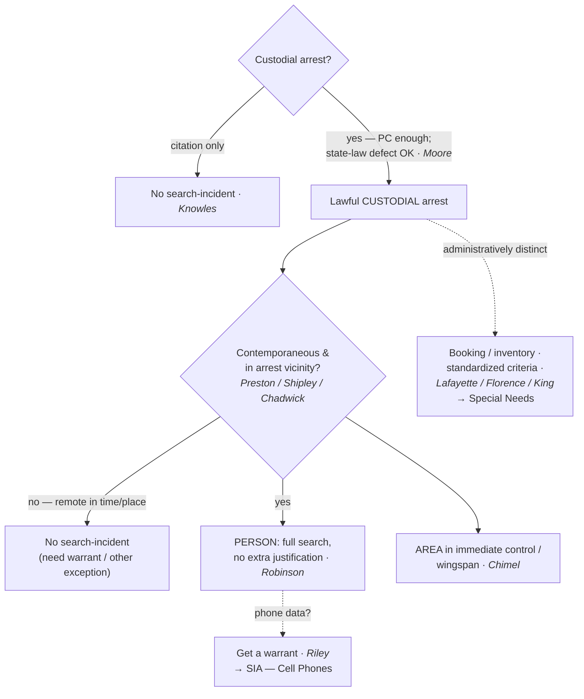

# S9 R1 panel-review — Opus model-diversity lane (prompt pack)

You are the **Claude/Opus** leg of the S9 three-lane adversarial panel (1 Claude + 2 Codex, R1). The two Codex lanes carry the A (support/quote-fidelity) and B (currency/treatment) attack lenses; **you carry model diversity and MUST vote on every paneled assertion across BOTH lenses' concerns.** You are refute-framed: try hard to break each assertion; **default to REFUTED on uncertainty**; never fabricate a cite, quote, or holding; use ONLY the evidence inlined below (no search, no outside knowledge). You are a SIGHTED reviewer — the FULL lake record (judgment fields included) is inlined.

You are a WRITER lane, not an adjudicator: you FIND and VOTE. You do not tally, adjudicate, or close any row — the orchestrator does.

For EACH group below, return one JSON object with the exact `reviewed[]` shape from the output contract (identical framing to the Codex lenses). Emit a finding object ONLY for a real defect (verdict refuted / stands-modified); a group you find wholly clean returns all-`stands` verdicts (the harness records a clean attestation). Concatenate the per-group JSON objects into a top-level `{"packs": [ ... ]}` array, one entry per group, each carrying its `group_id`.


OUTPUT CONTRACT — return ONE JSON object, nothing else:
{
  "lens": "A" | "B",
  "group_id": "<echo the group id>",
  "reviewed": [
    {
      "assertion_id": "<from group_inventory.jsonl>",
      "dimension": "existence|support|quote_fidelity|pincite|treatment|black_letter",
      "verdict": "stands" | "refuted" | "stands-modified",
      "verifiable_from_disclosed": true | false,
      "defect": null,   // null when verdict=="stands"; else an object:
      //  {"problem": "...", "severity": "high|medium|low", "proposed_fix": "...", "evidence_quote": "verbatim from disclosed evidence or null", "needs_cl": true|false, "locator_note": "..."}
      "reasons": ["short evidence-grounded reason", "..."],
      "breaks_true_positives": true | false,
      "residual_risks": ["..."],
      "suggested_tightening": "... or null"
    }
  ],
  "notes": ""
}
Rules: verdict=='stands' <=> defect==null (assertion survives your attack). verdict=='refuted' <=> a real defect (the assertion as framed is wrong). verdict=='stands-modified' <=> survives but needs a stated modification (a minor defect). Review EVERY assertion_id in group_inventory.jsonl exactly once. Output ONLY the JSON object.
---

## GROUP: content/warrant-exceptions/searching-a-person/SIA Persons.md  (`doctrine`, 17 assertions)

### content_page

```
---
weight: 10
aliases:
  - "Search Incident to Arrest"
  - "SITA"
  - "search-incident-to-arrest"
  - "warrant-exceptions/search-incident-to-arrest"
  - "7-exceptions-warrant/7b-pc-not-needed/Search-Incident-to-Arrest"
title: "SIA — Persons"
topic: Search Incident to Arrest — Persons
type: doctrine
jurisdiction: Federal (U.S. Const. amend. IV); SCOTUS baseline
status: draft
related: ["[[SIA Cell Phones]]", "[[SIA Alcohol Tests]]", "[[SIA Vehicles]]", "[[Automobile Exception]]", "[[Arrest and Arrest Warrants]]", "[[Arrest in the Home]]", "[[Special Needs and Administrative Searches]]", "[[Exigent Circumstances and Hot Pursuit]]", "[[The Exclusionary Rule]]"]
---

# SIA — Persons

*This page states the search-incident-to-arrest rule as applied to the arrestee's own body and the area within reach. Two specialized lines carry their own pages: the digital contents of a phone (see [[SIA Cell Phones]]) and chemical testing for intoxication (see [[SIA Alcohol Tests]]); the vehicle version is at [[SIA Vehicles]].*

> [!rule] Black-letter rule
> On a lawful **custodial** arrest, an officer may search — without a warrant and without any separate probable cause — **(1)** the **arrestee's person**, a *full* search that needs no case-by-case justification (*[[United States v. Robinson#^pin-235|Robinson]]*, 414 U.S. 218, [235](https://www.courtlistener.com/opinion/108893/united-states-v-robinson/) (1973)), and **(2)** the area within the arrestee's **immediate control**, the "grabbing area" from which he might reach a weapon or destructible evidence (*[[Chimel v. California#^pin-763|Chimel]]*, 395 U.S. 752, [763](https://www.courtlistener.com/opinion/107979/chimel-v-california/) (1969)). The predicate is a *custodial* arrest; the two engines that justify and *cabin* the search are **officer safety** and **evidence preservation**.
> ^rule-sia-persons

## The Brief

**Field-decisive question: I have made a lawful custodial arrest — what may I search on the person, and how far?** The authority is automatic on the arrest itself. Because search incident to arrest is an **exception** to the warrant requirement, the **government bears the burden** of bringing the search within it; on review, historic facts are taken as found and the ultimate reasonableness is a legal question reviewed [[Common Legal Terms#de-novo|de novo]]; the **remedy** for exceeding the exception is suppression under [[The Exclusionary Rule]] (subject to good faith and [[Inevitable Discovery and Independent Source|inevitable discovery]]).

**The predicate is a *custodial* arrest, not a citation.** A ticket in lieu of custody does not trigger the search: there is no "search incident to citation." Once a driver is "stopped for speeding and issued a citation, all the evidence necessary to prosecute that offense had been obtained," so neither officer-safety nor evidence-preservation supports a full search. *[[Knowles v. Iowa|Knowles v. Iowa]]*, 525 U.S. 113, [118–19](https://www.courtlistener.com/opinion/118250/knowles-v-iowa/) (1998).

**The arrest need not be perfect — probable cause is what matters.** An arrest that breaks a *state* arrest statute yet rests on **probable cause** still satisfies the Fourth Amendment, and the incident search is valid, because state law does not define Fourth Amendment reasonableness (*[[Virginia v. Moore|Moore]]*, 553 U.S. 164 (2008)). The offense supplying probable cause need not be the one the officer named (*[[Devenpeck v. Alford|Devenpeck]]*), a reasonable good-faith arrest of the **wrong person** still supports the search (*[[Hill v. California|Hill]]*), and even a **fine-only** misdemeanor arrest, if custodial and probable-cause-backed, carries the authority (*[[Atwater v. City of Lago Vista|Atwater]]*).

**The person is searched in full — no extra showing (*[[United States v. Robinson|Robinson]]*).** "It is the fact of the lawful arrest which establishes the authority to search, and we hold that in the case of a lawful custodial arrest a full search of the person is not only an exception to the warrant requirement of the Fourth Amendment, but is also a 'reasonable' search under that Amendment." *[[United States v. Robinson#^pin-235|Robinson, 414 U.S. at 235]]*. Unlike a *[[Terry v. Ohio|Terry]]* frisk (see [[Terry Stops and Reasonable Suspicion]]), the search of the person needs **no** case-by-case suspicion that weapons or evidence are present; the arrest alone is enough.

**Wingspan is the engine (*[[Chimel v. California|Chimel]]*).** The arrest justifies "a search of the arrestee's person and the area 'within his immediate control' — construing that phrase to mean the area from within which he might gain possession of a weapon or destructible evidence." *[[Chimel v. California#^pin-763|Chimel, 395 U.S. at 763]]*. There is "no comparable justification … for routinely searching any room other than that in which an arrest occurs." *Id.* (*[[Chimel v. California|Chimel]]* itself was a home arrest; see [[Arrest in the Home]] for how wingspan plays out indoors.)

**Scope is the person and the place of arrest, never a separate general search.** The immediate-control limit is the modern successor to the founding-era rule that the search reaches **the person and the place of arrest**, not a "general exploratory search" of separate premises (*[[Agnello v. United States|Agnello]]*; *[[Go-Bart Importing Co. v. United States|Go-Bart]]*). The older, broader premises-search line (*[[Trupiano v. United States|Trupiano]]*, later rejected in *Rabinowitz*) was superseded by *[[Chimel v. California|Chimel]]*'s immediate-control limit; teach the scope through *[[Chimel v. California|Chimel]]*, not the dead pre-*[[Chimel v. California|Chimel]]* cases.

**The search must be roughly contemporaneous and confined to the arrest vicinity.** A search "remote in time or place from the arrest" cannot be justified as incident to it (*[[Preston v. United States|Preston]]*), and a house may not be searched as incident to an arrest made **outside** it, because a street arrest is not its own [[Exigent Circumstances and Hot Pursuit|exigency]] (*[[Shipley v. California|Shipley]]*; *[[Vale v. Louisiana|Vale]]*). Once effects are reduced to **exclusive police control** with no [[Exigent Circumstances and Hot Pursuit|exigency]], the search-incident theory is spent and a warrant is required (*[[United States v. Chadwick|Chadwick]]* — a seized footlocker).

**The one recognized stretch is at the stationhouse (*[[United States v. Edwards|Edwards]]*).** Clothing and effects that were searchable at the moment of arrest may be searched after a reasonable **booking delay** without a fresh warrant. *[[United States v. Edwards#^pin-807|Edwards]]*, 415 U.S. 800, [807–08](https://www.courtlistener.com/opinion/108995/united-states-v-edwards/) (1974). This is a delay in *time*, not a license to expand *scope*.

**Do not confuse the incident search with booking or inventory.** A stationhouse/booking inventory of an arrestee's effects (*[[Illinois v. Lafayette|Lafayette]]*), a jail-intake strip search (*[[Florence v. County of Burlington|Florence]]*), and a booking DNA swab (*[[Maryland v. King|King]]*) ride a separate **administrative** track — justified by a standardized procedure and jail-security reasonableness, not by the arrest. They are taught on [[Special Needs and Administrative Searches]] and are named here only to keep the theories apart; do not let a failed incident search be rescued by an inventory theory unless the predicate impoundment is itself valid.

**Apply it.**
1. Confirm the arrest is **custodial** and rests on **probable cause** (any offense the facts support — *[[Devenpeck v. Alford|Devenpeck]]*). No custody, no search-incident authority (*[[Knowles v. Iowa|Knowles]]*).
2. Search the **person** in full (pockets, clothing, and containers on the body) with no further justification (*[[United States v. Robinson|Robinson]]*).
3. Search the **immediate-control area** the arrestee could reach for a weapon or destructible evidence at the time of the search (*[[Chimel v. California|Chimel]]*); articulate what was within reach.
4. Keep it **contemporaneous** and in the **arrest vicinity** (*[[Preston v. United States|Preston]]*, *[[Shipley v. California|Shipley]]*); do not treat the arrest as authority to search a separate room or the house.
5. Once an item is in **exclusive police control** with no [[Exigent Circumstances and Hot Pursuit|exigency]], stop and get a warrant (*[[United States v. Chadwick|Chadwick]]*) — subject to the stationhouse-effects delay (*[[United States v. Edwards|Edwards]]*).

**Common pitfalls.**
- **Running a "search incident to citation."** No custody, no search (*[[Knowles v. Iowa|Knowles]]*).
- **Arguing suppression on a *state-law* arrest defect alone.** Probable cause satisfies the Fourth Amendment (*[[Virginia v. Moore|Moore]]*).
- **Treating "wingspan" as the whole room or house.** The area is what the arrestee can actually reach (*[[Chimel v. California|Chimel]]*); a street arrest supplies no authority to enter and search a home (*[[Vale v. Louisiana|Vale]]*, *[[Shipley v. California|Shipley]]*).
- **Rummaging an item already secured in the cruiser or evidence room.** Exclusive control with no [[Exigent Circumstances and Hot Pursuit|exigency]] ends the theory (*[[United States v. Chadwick|Chadwick]]*).
- **Rescuing a bad search with an "inventory."** Inventory is a separate, standardized-procedure exception (see [[Special Needs and Administrative Searches]]); it is not a fallback for an over-broad incident search.

## Lower-court developments

The SCOTUS framework (*[[United States v. Robinson|Robinson]]* / *[[Chimel v. California|Chimel]]*) is stable; the live question is whether *[[Arizona v. Gant|Gant]]*'s reaching-distance limit reaches **outside the vehicle** to a secured arrestee's nearby containers — a fight treated in full at [[SIA Vehicles]]. The decisions below bind only in their own circuits and are persuasive elsewhere.

- **Does the reaching-distance limit reach a secured arrestee's bag?** ⚖ **Developing circuit split.** The Fourth Circuit (*[[United States v. Howard Davis|Davis]]*) says a secured arrestee's out-of-reach backpack cannot be searched as incident to arrest, joined in substance by the Third, Ninth, and Tenth Circuits; the First Circuit (*[[United States v. Perez|Perez]]*) declined to extend the limit to a bag already removed and secured. Treat the container question as **unsettled**; the vehicle line is developed at [[SIA Vehicles]].

## Key cases

| Case | Holding | Opinion |
|---|---|---|
| *[[United States v. Robinson]]*, 414 U.S. 218 (1973) | **Anchor.** A lawful custodial arrest categorically permits a **full search of the person**, with no separate showing that weapons or evidence are present. | [opinion](https://www.courtlistener.com/opinion/108893/united-states-v-robinson/) |
| *[[Chimel v. California]]*, 395 U.S. 752 (1969) | **Anchor.** Scope is the person **plus** the "immediate control"/wingspan area; the rationales are officer safety and evidence preservation. | [opinion](https://www.courtlistener.com/opinion/107979/chimel-v-california/) |
| *[[Knowles v. Iowa]]*, 525 U.S. 113 (1998) | **Limiting.** No "search incident to **citation**"; a ticket in lieu of custody does not trigger the authority. | [opinion](https://www.courtlistener.com/opinion/118250/knowles-v-iowa/) |
| *[[United States v. Edwards]]*, 415 U.S. 800 (1974) | The search may extend in **time**: effects searchable at arrest may be examined at the jail after a reasonable booking delay. | [opinion](https://www.courtlistener.com/opinion/108995/united-states-v-edwards/) |
| *[[Preston v. United States]]*, 376 U.S. 364 (1964) | **Contemporaneity.** A search remote in **time or place** from the arrest cannot be justified as incident to it. | [opinion](https://www.courtlistener.com/opinion/106771/preston-v-united-states/) |
| *[[Shipley v. California]]*, 395 U.S. 818 (1969) | **Contemporaneity.** The search must be substantially contemporaneous and confined to the immediate vicinity; no home search on an outside arrest. | [opinion](https://www.courtlistener.com/opinion/107982/shipley-v-california/) |
| *[[Vale v. Louisiana]]*, 399 U.S. 30 (1970) | **Limiting.** A house cannot be searched as incident to an arrest made **outside** it; a street arrest is not its own [[Exigent Circumstances and Hot Pursuit\|exigency]]. | [opinion](https://www.courtlistener.com/opinion/108183/vale-v-louisiana/) |
| *[[Agnello v. United States]]*, 269 U.S. 20 (1925) | **Foundational.** The search reaches the person and place of arrest, not a separate house entered after the suspects are in custody elsewhere. | [opinion](https://www.courtlistener.com/opinion/100711/agnello-v-united-states/) |
| *[[Go-Bart Importing Co. v. United States]]*, 282 U.S. 344 (1931) | **Foundational.** The incident search may not become a **general exploratory search** of the premises. | [opinion](https://www.courtlistener.com/opinion/101643/go-bart-importing-co-v-united-states/) |
| *[[Trupiano v. United States]]*, 334 U.S. 699 (1948) | **Pre-*[[Chimel v. California\|Chimel]]* origin.** The old "reasonably practicable warrant" premises rule; rejected in *Rabinowitz* and superseded by *[[Chimel v. California\|Chimel]]*'s immediate-control limit (taught as dead-letter background). | [opinion](https://www.courtlistener.com/opinion/104576/trupiano-v-united-states/) |

## Related cases across doctrines

These cases are treated in full elsewhere but bear on the incident search of the person, framed here for this doctrine.

| Case | Relevance here | Primary home | Opinion |
|---|---|---|---|
| *[[Virginia v. Moore]]*, 553 U.S. 164 (2008) | ***Predicate.*** An arrest violating **state law** but on probable cause does not violate the Fourth Amendment; the incident search is valid. | [[Arrest and Arrest Warrants]] | [opinion](https://www.courtlistener.com/opinion/145814/virginia-v-moore/) |
| *[[Atwater v. City of Lago Vista]]*, 532 U.S. 318 (2001) | ***Predicate.*** A custodial arrest for a **fine-only** misdemeanor on probable cause is constitutional, so the search-incident authority attaches even to trivial offenses. | [[Arrest and Arrest Warrants]] | [opinion](https://www.courtlistener.com/opinion/2620702/atwater-v-city-of-lago-vista/) |
| *[[Hill v. California]]*, 401 U.S. 797 (1971) | ***Predicate.*** A reasonable, good-faith arrest of the **wrong person** is valid, and so is the search incident to it. | [[Probable Cause]] | [opinion](https://www.courtlistener.com/opinion/108305/hill-v-california/) |
| *[[United States v. Chadwick]]*, 433 U.S. 1 (1977) | ***Exclusive-control limit.*** Once luggage is seized and in exclusive police control with no [[Exigent Circumstances and Hot Pursuit\|exigency]], it may not be searched as incident to arrest. | [[Automobile Exception]] | [opinion](https://www.courtlistener.com/opinion/109714/united-states-v-chadwick/) |
| *[[Cupp v. Murphy]]*, 412 U.S. 291 (1973) | ***Destructible evidence.*** The very limited preservation of **readily destructible** evidence (fingernail scrapings) is reasonable on the *[[Chimel v. California\|Chimel]]* rationale even without a full arrest search. | [[Exigent Circumstances and Hot Pursuit]] | [opinion](https://www.courtlistener.com/opinion/108801/cupp-v-murphy/) |
| *[[Peters v. New York]]*, 392 U.S. 40 (1968) | ***Sequence.*** Where probable cause to arrest existed, the search was valid as incident to arrest even though the formal arrest followed the seizure. | [[Terry Stops and Reasonable Suspicion]] | [opinion](https://www.courtlistener.com/opinion/107730/sibron-v-new-york/) |

## Visual



## Sources
- [*United States v. Robinson*, 414 U.S. 218 (1973)](https://www.courtlistener.com/opinion/108893/united-states-v-robinson/) (pinpoint: 235)
- [*Chimel v. California*, 395 U.S. 752 (1969)](https://www.courtlistener.com/opinion/107979/chimel-v-california/) (pinpoint: 763)
- [*Knowles v. Iowa*, 525 U.S. 113 (1998)](https://www.courtlistener.com/opinion/118250/knowles-v-iowa/) (pinpoints: 118–119)
- [*United States v. Edwards*, 415 U.S. 800 (1974)](https://www.courtlistener.com/opinion/108995/united-states-v-edwards/) (pinpoints: 807–808)
- [*Preston v. United States*, 376 U.S. 364 (1964)](https://www.courtlistener.com/opinion/106771/preston-v-united-states/)
- [*Shipley v. California*, 395 U.S. 818 (1969)](https://www.courtlistener.com/opinion/107982/shipley-v-california/)
- [*Vale v. Louisiana*, 399 U.S. 30 (1970)](https://www.courtlistener.com/opinion/108183/vale-v-louisiana/)
- [*Agnello v. United States*, 269 U.S. 20 (1925)](https://www.courtlistener.com/opinion/100711/agnello-v-united-states/)
- [*Go-Bart Importing Co. v. United States*, 282 U.S. 344 (1931)](https://www.courtlistener.com/opinion/101643/go-bart-importing-co-v-united-states/)
- [*Trupiano v. United States*, 334 U.S. 699 (1948)](https://www.courtlistener.com/opinion/104576/trupiano-v-united-states/)
- [*Virginia v. Moore*, 553 U.S. 164 (2008)](https://www.courtlistener.com/opinion/145814/virginia-v-moore/)
- [*Atwater v. City of Lago Vista*, 532 U.S. 318 (2001)](https://www.courtlistener.com/opinion/2620702/atwater-v-city-of-lago-vista/)
- [*Hill v. California*, 401 U.S. 797 (1971)](https://www.courtlistener.com/opinion/108305/hill-v-california/)
- [*United States v. Chadwick*, 433 U.S. 1 (1977)](https://www.courtlistener.com/opinion/109714/united-states-v-chadwick/)
- [*Cupp v. Murphy*, 412 U.S. 291 (1973)](https://www.courtlistener.com/opinion/108801/cupp-v-murphy/)
- [*Peters v. New York* (decided with *Sibron v. New York*), 392 U.S. 40 (1968)](https://www.courtlistener.com/opinion/107730/sibron-v-new-york/)
- [*Devenpeck v. Alford*, 543 U.S. 146 (2004)](https://www.courtlistener.com/opinion/137733/devenpeck-v-alford/)

```

### group_inventory (assertions under review)

```jsonl
{"assertion_id": "047b1a2d9266ec67", "dimension": "existence", "kind": "case_cite", "locator": {"case": "Virginia v. Moore", "table_line": 71}, "payload": {"case": "Virginia v. Moore", "cells": ["*[[Virginia v. Moore]]*, 553 U.S. 164 (2008)", "***Predicate.*** An arrest violating **state law** but on probable cause does not violate the Fourth Amendment; the incident search is valid.", "[[Arrest and Arrest Warrants]]", "[opinion](https://www.courtlistener.com/opinion/145814/virginia-v-moore/)"], "header": ["Case", "Relevance here", "Primary home", "Opinion"]}}
{"assertion_id": "13124a944d02fec0", "dimension": "existence", "kind": "case_cite", "locator": {"case": "Shipley v. California", "table_line": 59}, "payload": {"case": "Shipley v. California", "cells": ["*[[Shipley v. California]]*, 395 U.S. 818 (1969)", "**Contemporaneity.** The search must be substantially contemporaneous and confined to the immediate vicinity; no home search on an outside arrest.", "[opinion](https://www.courtlistener.com/opinion/107982/shipley-v-california/)"], "header": ["Case", "Holding", "Opinion"]}}
{"assertion_id": "2383fb48aff77bed", "dimension": "existence", "kind": "case_cite", "locator": {"case": "Vale v. Louisiana", "table_line": 60}, "payload": {"case": "Vale v. Louisiana", "cells": ["*[[Vale v. Louisiana]]*, 399 U.S. 30 (1970)", "**Limiting.** A house cannot be searched as incident to an arrest made **outside** it; a street arrest is not its own [[Exigent Circumstances and Hot Pursuit\\|exigency]].", "[opinion](https://www.courtlistener.com/opinion/108183/vale-v-louisiana/)"], "header": ["Case", "Holding", "Opinion"]}}
{"assertion_id": "3f23ed5d58321668", "dimension": "existence", "kind": "case_cite", "locator": {"case": "Atwater v. City of Lago Vista", "table_line": 72}, "payload": {"case": "Atwater v. City of Lago Vista", "cells": ["*[[Atwater v. City of Lago Vista]]*, 532 U.S. 318 (2001)", "***Predicate.*** A custodial arrest for a **fine-only** misdemeanor on probable cause is constitutional, so the search-incident authority attaches even to trivial offenses.", "[[Arrest and Arrest Warrants]]", "[opinion](https://www.courtlistener.com/opinion/2620702/atwater-v-city-of-lago-vista/)"], "header": ["Case", "Relevance here", "Primary home", "Opinion"]}}
{"assertion_id": "48680b0d1edfe3b1", "dimension": "existence", "kind": "case_cite", "locator": {"case": "Peters v. New York", "table_line": 76}, "payload": {"case": "Peters v. New York", "cells": ["*[[Peters v. New York]]*, 392 U.S. 40 (1968)", "***Sequence.*** Where probable cause to arrest existed, the search was valid as incident to arrest even though the formal arrest followed the seizure.", "[[Terry Stops and Reasonable Suspicion]]", "[opinion](https://www.courtlistener.com/opinion/107730/sibron-v-new-york/)"], "header": ["Case", "Relevance here", "Primary home", "Opinion"]}}
{"assertion_id": "4bd0697362ea521e", "dimension": "existence", "kind": "case_cite", "locator": {"case": "Preston v. United States", "table_line": 58}, "payload": {"case": "Preston v. United States", "cells": ["*[[Preston v. United States]]*, 376 U.S. 364 (1964)", "**Contemporaneity.** A search remote in **time or place** from the arrest cannot be justified as incident to it.", "[opinion](https://www.courtlistener.com/opinion/106771/preston-v-united-states/)"], "header": ["Case", "Holding", "Opinion"]}}
{"assertion_id": "4c9ca03eadf79f89", "dimension": "existence", "kind": "case_cite", "locator": {"case": "Trupiano v. United States", "table_line": 63}, "payload": {"case": "Trupiano v. United States", "cells": ["*[[Trupiano v. United States]]*, 334 U.S. 699 (1948)", "**Pre-*[[Chimel v. California\\|Chimel]]* origin.** The old \"reasonably practicable warrant\" premises rule; rejected in *Rabinowitz* and superseded by *[[Chimel v. California\\|Chimel]]*'s immediate-control limit (taught as dead-letter background).", "[opinion](https://www.courtlistener.com/opinion/104576/trupiano-v-united-states/)"], "header": ["Case", "Holding", "Opinion"]}}
{"assertion_id": "5b9a8d711c610771", "dimension": "existence", "kind": "case_cite", "locator": {"case": "United States v. Chadwick", "table_line": 74}, "payload": {"case": "United States v. Chadwick", "cells": ["*[[United States v. Chadwick]]*, 433 U.S. 1 (1977)", "***Exclusive-control limit.*** Once luggage is seized and in exclusive police control with no [[Exigent Circumstances and Hot Pursuit\\|exigency]], it may not be searched as incident to arrest.", "[[Automobile Exception]]", "[opinion](https://www.courtlistener.com/opinion/109714/united-states-v-chadwick/)"], "header": ["Case", "Relevance here", "Primary home", "Opinion"]}}
{"assertion_id": "77457c57b1b2d725", "dimension": "existence", "kind": "case_cite", "locator": {"case": "United States v. Edwards", "table_line": 57}, "payload": {"case": "United States v. Edwards", "cells": ["*[[United States v. Edwards]]*, 415 U.S. 800 (1974)", "The search may extend in **time**: effects searchable at arrest may be examined at the jail after a reasonable booking delay.", "[opinion](https://www.courtlistener.com/opinion/108995/united-states-v-edwards/)"], "header": ["Case", "Holding", "Opinion"]}}
{"assertion_id": "7fe6535eafd4d017", "dimension": "existence", "kind": "case_cite", "locator": {"case": "Chimel v. California", "table_line": 55}, "payload": {"case": "Chimel v. California", "cells": ["*[[Chimel v. California]]*, 395 U.S. 752 (1969)", "**Anchor.** Scope is the person **plus** the \"immediate control\"/wingspan area; the rationales are officer safety and evidence preservation.", "[opinion](https://www.courtlistener.com/opinion/107979/chimel-v-california/)"], "header": ["Case", "Holding", "Opinion"]}}
{"assertion_id": "a53e73e225971d81", "dimension": "existence", "kind": "case_cite", "locator": {"case": "Hill v. California", "table_line": 73}, "payload": {"case": "Hill v. California", "cells": ["*[[Hill v. California]]*, 401 U.S. 797 (1971)", "***Predicate.*** A reasonable, good-faith arrest of the **wrong person** is valid, and so is the search incident to it.", "[[Probable Cause]]", "[opinion](https://www.courtlistener.com/opinion/108305/hill-v-california/)"], "header": ["Case", "Relevance here", "Primary home", "Opinion"]}}
{"assertion_id": "a8e52ba38d404142", "dimension": "existence", "kind": "case_cite", "locator": {"case": "Agnello v. United States", "table_line": 61}, "payload": {"case": "Agnello v. United States", "cells": ["*[[Agnello v. United States]]*, 269 U.S. 20 (1925)", "**Foundational.** The search reaches the person and place of arrest, not a separate house entered after the suspects are in custody elsewhere.", "[opinion](https://www.courtlistener.com/opinion/100711/agnello-v-united-states/)"], "header": ["Case", "Holding", "Opinion"]}}
{"assertion_id": "b62e333085eb4071", "dimension": "existence", "kind": "case_cite", "locator": {"case": "Go-Bart Importing Co. v. United States", "table_line": 62}, "payload": {"case": "Go-Bart Importing Co. v. United States", "cells": ["*[[Go-Bart Importing Co. v. United States]]*, 282 U.S. 344 (1931)", "**Foundational.** The incident search may not become a **general exploratory search** of the premises.", "[opinion](https://www.courtlistener.com/opinion/101643/go-bart-importing-co-v-united-states/)"], "header": ["Case", "Holding", "Opinion"]}}
{"assertion_id": "d51af4ed82d15a10", "dimension": "existence", "kind": "case_cite", "locator": {"case": "United States v. Robinson", "table_line": 54}, "payload": {"case": "United States v. Robinson", "cells": ["*[[United States v. Robinson]]*, 414 U.S. 218 (1973)", "**Anchor.** A lawful custodial arrest categorically permits a **full search of the person**, with no separate showing that weapons or evidence are present.", "[opinion](https://www.courtlistener.com/opinion/108893/united-states-v-robinson/)"], "header": ["Case", "Holding", "Opinion"]}}
{"assertion_id": "decff18c0454aac1", "dimension": "existence", "kind": "case_cite", "locator": {"case": "Cupp v. Murphy", "table_line": 75}, "payload": {"case": "Cupp v. Murphy", "cells": ["*[[Cupp v. Murphy]]*, 412 U.S. 291 (1973)", "***Destructible evidence.*** The very limited preservation of **readily destructible** evidence (fingernail scrapings) is reasonable on the *[[Chimel v. California\\|Chimel]]* rationale even without a full arrest search.", "[[Exigent Circumstances and Hot Pursuit]]", "[opinion](https://www.courtlistener.com/opinion/108801/cupp-v-murphy/)"], "header": ["Case", "Relevance here", "Primary home", "Opinion"]}}
{"assertion_id": "f27e96b9436d00a8", "dimension": "existence", "kind": "case_cite", "locator": {"case": "Knowles v. Iowa", "table_line": 56}, "payload": {"case": "Knowles v. Iowa", "cells": ["*[[Knowles v. Iowa]]*, 525 U.S. 113 (1998)", "**Limiting.** No \"search incident to **citation**\"; a ticket in lieu of custody does not trigger the authority.", "[opinion](https://www.courtlistener.com/opinion/118250/knowles-v-iowa/)"], "header": ["Case", "Holding", "Opinion"]}}
{"assertion_id": "67af9a3f21567761", "dimension": "support", "kind": "proposition", "locator": {"callout": "^rule-sia-persons"}, "payload": {"anchor": "^rule-sia-persons", "statement": "[!rule] Black-letter rule\nOn a lawful **custodial** arrest, an officer may search — without a warrant and without any separate probable cause — **(1)** the **arrestee's person**, a *full* search that needs no case-by-case justification (*[[United States v. Robinson#^pin-235|Robinson]]*, 414 U.S. 218, [235](https://www.courtlistener.com/opinion/108893/united-states-v-robinson/) (1973)), and **(2)** the area within the arrestee's **immediate control**, the \"grabbing area\" from which he might reach a weapon or destructible evidence (*[[Chimel v. California#^pin-763|Chimel]]*, 395 U.S. 752, [763](https://www.courtlistener.com/opinion/107979/chimel-v-california/) (1969)). The predicate is a *custodial* arrest; the two engines that justify and *cabin* the search are **officer safety** and **evidence preservation**."}}
```

### lake record — Agnello v. United States

```json
{
  "schema_version": "s2.v1",
  "record_id": "Agnello v. United States",
  "stub": false,
  "status": "verified",
  "identity": {
    "case_name": "Agnello v. United States",
    "case_name_short": "Agnello",
    "case_name_full": "AGNELLO Et Al. v. UNITED STATES",
    "input_case_name": "Agnello v. United States",
    "court": "U.S. Supreme Court",
    "court_id": "scotus",
    "court_level": "scotus",
    "circuit": null,
    "state": null,
    "date_decided": "1925-10-12",
    "year": 1925,
    "docket": "6",
    "cluster_id": 100711,
    "lead_opinion_id": 100711,
    "sibling_ids": [
      100711
    ],
    "absolute_url": "/opinion/100711/agnello-v-united-states/",
    "identity_method": "citation+party-text",
    "expected_citation_found": true,
    "party_name_in_text": true,
    "canonical_name_match": true,
    "alternates": [],
    "reason_code": null
  },
  "citations": {
    "official": {
      "cite": "269 U.S. 20",
      "volume": "269",
      "reporter": "U.S.",
      "page": "20",
      "type": 1,
      "selected_official": true,
      "source": "cluster.citations[]"
    },
    "parallel": [
      {
        "cite": "46 S. Ct. 4",
        "volume": "46",
        "reporter": "S. Ct.",
        "page": "4",
        "type": 1,
        "selected_official": false,
        "source": "cluster.citations[]"
      },
      {
        "cite": "70 L. Ed. 145",
        "volume": "70",
        "reporter": "L. Ed.",
        "page": "145",
        "type": 1,
        "selected_official": false,
        "source": "cluster.citations[]"
      },
      {
        "cite": "51 A.L.R. 409",
        "volume": "51",
        "reporter": "A.L.R.",
        "page": "409",
        "type": 4,
        "selected_official": false,
        "source": "cluster.citations[]"
      }
    ],
    "vendor_neutral": [
      {
        "cite": "1925 U.S. LEXIS 2",
        "volume": "1925",
        "reporter": "U.S. LEXIS",
        "page": "2",
        "type": 6,
        "selected_official": false,
        "source": "cluster.citations[]"
      }
    ],
    "all": [
      {
        "cite": "269 U.S. 20",
        "volume": "269",
        "reporter": "U.S.",
        "page": "20",
        "type": 1,
        "selected_official": false,
        "source": "cluster.citations[]"
      },
      {
        "cite": "46 S. Ct. 4",
        "volume": "46",
        "reporter": "S. Ct.",
        "page": "4",
        "type": 1,
        "selected_official": false,
        "source": "cluster.citations[]"
      },
      {
        "cite": "70 L. Ed. 145",
        "volume": "70",
        "reporter": "L. Ed.",
        "page": "145",
        "type": 1,
        "selected_official": false,
        "source": "cluster.citations[]"
      },
      {
        "cite": "1925 U.S. LEXIS 2",
        "volume": "1925",
        "reporter": "U.S. LEXIS",
        "page": "2",
        "type": 6,
        "selected_official": false,
        "source": "cluster.citations[]"
      },
      {
        "cite": "51 A.L.R. 409",
        "volume": "51",
        "reporter": "A.L.R.",
        "page": "409",
        "type": 4,
        "selected_official": false,
        "source": "cluster.citations[]"
      }
    ],
    "display": "269 U.S. 20",
    "official_selection": {
      "court_class": "scotus",
      "selected": "269 U.S. 20",
      "reason": "selected_rank_1"
    }
  },
  "pinpoints": [
    {
      "id": "pin-30",
      "page": null,
      "quote": "--- # Agnello v. United States *269 U.S. 20 (1925)* \u00b7 U.S. Supreme Court \u00b7 **Binding \u2014 SCOTUS** \u00b7 Treatment: **good** *(as of 2026-06-30)* <!-- header line; TreatmentBadge + weight render here, degrading to the text above --> ## Background Federal revenue agents watched a cocaine sale at Alba's house and, when it was consummated, rushed in and arrested the defendants there, seizing cocaine on the table and on Frank Agnello's person. While some agents took the defendants to the station, others went \u2014 without a search warrant \u2014 to Frank Agnello's home several blocks away, searched his bedroom, and found a can of cocaine. That can was ultimately admitted against him. ## Issue Whether the warrantless search of the arrestee's home, several blocks from the place of arrest and after he was in custody elsewhere, can be justified as a search incident to arrest. ## Rule A search incident to arrest is real but bounded to the arrest scene:",
      "star_marker": null,
      "quote_fidelity": "mismatch",
      "pinpoint_status": "slip-only",
      "position": null
    },
    {
      "id": "pin-30a",
      "page": null,
      "quote": "But the right does not extend to other places. Frank Agnello's house was several blocks distant from Alba's house, where the arrest was made. When it was entered and searched, the conspiracy was ended and the defendants were under arrest and in custody elsewhere. That search cannot be sustained as an incident of the arrests.",
      "star_marker": null,
      "quote_fidelity": "mismatch",
      "pinpoint_status": "slip-only",
      "position": null
    }
  ],
  "treatment": {
    "field_i_validity": "good_law",
    "as_of_content": "1925-10-12",
    "as_of_treatment": "2026-06-30",
    "composite_basis": "migration-seed",
    "composite_basis_ref": "Agnello v. United States",
    "varies_by_point": false,
    "scope_note": "Foundational early limit on search incident to arrest; the rule that a SITA does not reach a separate home away from the arrest survives and is consistent with Chimel v. California.",
    "point_overrides": [],
    "edges": [
      {
        "citing_case": {
          "name": "United States v. Leonard",
          "cluster_id": 10789713,
          "cite": null,
          "field_ii": "overruled"
        },
        "field_ii": "overruled",
        "field_iii": "mentioned",
        "point": null,
        "proposed": true,
        "journal_ref": "Agnello v. United States:lane1_negative"
      },
      {
        "citing_case": {
          "name": "State v. Camper",
          "cluster_id": 9454678,
          "cite": [
            "232 N.E.3d 419",
            "2023 Ohio 4673"
          ],
          "field_ii": "overruled"
        },
        "field_ii": "overruled",
        "field_iii": "mentioned",
        "point": null,
        "proposed": true,
        "journal_ref": "Agnello v. United States:lane1_negative"
      },
      {
        "citing_case": {
          "name": "Jenkins v. Dragoo & Assocs., Inc.",
          "cluster_id": 9439763,
          "cite": [
            "229 N.E.3d 140",
            "2023 Ohio 4103"
          ],
          "field_ii": "overruled"
        },
        "field_ii": "overruled",
        "field_iii": "mentioned",
        "point": null,
        "proposed": true,
        "journal_ref": "Agnello v. United States:lane1_negative"
      },
      {
        "citing_case": {
          "name": "Renee Michelle Parady v. Commonwealth of Virginia",
          "cluster_id": 9411484,
          "cite": null,
          "field_ii": "abrogated"
        },
        "field_ii": "abrogated",
        "field_iii": "mentioned",
        "point": null,
        "proposed": true,
        "journal_ref": "Agnello v. United States:lane1_negative"
      },
      {
        "citing_case": {
          "name": "State of Iowa v. Hannah Marie Kilby",
          "cluster_id": 5290146,
          "cite": null,
          "field_ii": "overruled"
        },
        "field_ii": "overruled",
        "field_iii": "mentioned",
        "point": null,
        "proposed": true,
        "journal_ref": "Agnello v. United States:lane1_negative"
      },
      {
        "citing_case": {
          "name": "State of Iowa v. Hannah Marie Kilby",
          "cluster_id": 4893115,
          "cite": null,
          "field_ii": "overruled"
        },
        "field_ii": "overruled",
        "field_iii": "mentioned",
        "point": null,
        "proposed": true,
        "journal_ref": "Agnello v. United States:lane1_negative"
      },
      {
        "citing_case": {
          "name": "State v. Manuel Garcia",
          "cluster_id": 10109643,
          "cite": [
            "951 N.W.2d 631",
            "394 Wis. 2d 743",
            "2020 WI App 71"
          ],
          "field_ii": "questioned"
        },
        "field_ii": "questioned",
        "field_iii": "mentioned",
        "point": null,
        "proposed": true,
        "journal_ref": "Agnello v. United States:lane1_negative"
      },
      {
        "citing_case": {
          "name": "Whittington v. State",
          "cluster_id": 10021170,
          "cite": [
            "230 A.3d 148",
            "246 Md. App. 451"
          ],
          "field_ii": "questioned"
        },
        "field_ii": "questioned",
        "field_iii": "mentioned",
        "point": null,
        "proposed": true,
        "journal_ref": "Agnello v. United States:lane1_negative"
      },
      {
        "citing_case": {
          "name": "v. Johnson",
          "cluster_id": 4672578,
          "cite": [
            "2019 COA 159"
          ],
          "field_ii": "overruled"
        },
        "field_ii": "overruled",
        "field_iii": "mentioned",
        "point": null,
        "proposed": true,
        "journal_ref": "Agnello v. United States:lane1_negative"
      },
      {
        "citing_case": {
          "name": "Pacheco v. State",
          "cluster_id": 10048657,
          "cite": [
            "465 Md. 311"
          ],
          "field_ii": "questioned"
        },
        "field_ii": "questioned",
        "field_iii": "mentioned",
        "point": null,
        "proposed": true,
        "journal_ref": "Agnello v. United States:lane1_negative"
      },
      {
        "citing_case": {
          "name": "Pacheco v. State",
          "cluster_id": 4647520,
          "cite": null,
          "field_ii": "questioned"
        },
        "field_ii": "questioned",
        "field_iii": "mentioned",
        "point": null,
        "proposed": true,
        "journal_ref": "Agnello v. United States:lane1_negative"
      },
      {
        "citing_case": {
          "name": "State v. Jessica M. Randall",
          "cluster_id": 4635900,
          "cite": [
            "930 N.W.2d 223",
            "2019 WI 80",
            "387 Wis. 2d 744"
          ],
          "field_ii": "overruled"
        },
        "field_ii": "overruled",
        "field_iii": "mentioned",
        "point": null,
        "proposed": true,
        "journal_ref": "Agnello v. United States:lane1_negative"
      },
      {
        "citing_case": {
          "name": "State v. Mayfield",
          "cluster_id": 4588394,
          "cite": [
            "434 P.3d 58",
            "192 Wash. 2d 871"
          ],
          "field_ii": "superseded_by_statute"
        },
        "field_ii": "superseded_by_statute",
        "field_iii": "mentioned",
        "point": null,
        "proposed": true,
        "journal_ref": "Agnello v. United States:lane1_negative"
      },
      {
        "citing_case": {
          "name": "State v. Corona",
          "cluster_id": 5310101,
          "cite": [
            "2018 UT App 154",
            "436 P.3d 174"
          ],
          "field_ii": "overruled"
        },
        "field_ii": "overruled",
        "field_iii": "mentioned",
        "point": null,
        "proposed": true,
        "journal_ref": "Agnello v. United States:lane1_negative"
      },
      {
        "citing_case": {
          "name": "Collins v. Virginia",
          "cluster_id": 4501697,
          "cite": [
            "584 U.S. 586",
            "138 S. Ct. 1663",
            "201 L. Ed. 2d 9",
            "2018 U.S. LEXIS 3210"
          ],
          "field_ii": "overruled"
        },
        "field_ii": "overruled",
        "field_iii": "mentioned",
        "point": null,
        "proposed": true,
        "journal_ref": "Agnello v. United States:lane1_negative"
      },
      {
        "citing_case": {
          "name": "State v. Ward",
          "cluster_id": 4433423,
          "cite": [
            "2017 Ohio 8141",
            "98 N.E.3d 1257"
          ],
          "field_ii": "overruled"
        },
        "field_ii": "overruled",
        "field_iii": "mentioned",
        "point": null,
        "proposed": true,
        "journal_ref": "Agnello v. United States:lane1_negative"
      },
      {
        "citing_case": {
          "name": "Gutierrez-Hernandez v. State",
          "cluster_id": 4409141,
          "cite": [
            "221 So. 3d 792",
            "2017 Fla. App. LEXIS 10099",
            "2017 WL 2989013"
          ],
          "field_ii": "questioned"
        },
        "field_ii": "questioned",
        "field_iii": "mentioned",
        "point": null,
        "proposed": true,
        "journal_ref": "Agnello v. United States:lane1_negative"
      },
      {
        "citing_case": {
          "name": "Vincent Milewski v. Town of Dover",
          "cluster_id": 4408481,
          "cite": null,
          "field_ii": "overruled"
        },
        "field_ii": "overruled",
        "field_iii": "mentioned",
        "point": null,
        "proposed": true,
        "journal_ref": "Agnello v. United States:lane1_negative"
      },
      {
        "citing_case": {
          "name": "Vincent Milewski v. Town of Dover",
          "cluster_id": 4407393,
          "cite": null,
          "field_ii": "overruled"
        },
        "field_ii": "overruled",
        "field_iii": "mentioned",
        "point": null,
        "proposed": true,
        "journal_ref": "Agnello v. United States:lane1_negative"
      },
      {
        "citing_case": {
          "name": "Vincent Milewski v. Town of Dover",
          "cluster_id": 4407039,
          "cite": [
            "377 Wis. 2d 38",
            "2017 WI 79",
            "899 N.W.2d 303",
            "2017 WL 2883925",
            "2017 Wisc. LEXIS 396"
          ],
          "field_ii": "overruled"
        },
        "field_ii": "overruled",
        "field_iii": "mentioned",
        "point": null,
        "proposed": true,
        "journal_ref": "Agnello v. United States:lane1_negative"
      },
      {
        "citing_case": {
          "name": "Commonwealth v. Leslie",
          "cluster_id": 4389764,
          "cite": [
            "477 Mass. 48",
            "76 N.E.3d 978"
          ],
          "field_ii": "superseded_by_statute"
        },
        "field_ii": "superseded_by_statute",
        "field_iii": "mentioned",
        "point": null,
        "proposed": true,
        "journal_ref": "Agnello v. United States:lane1_negative"
      },
      {
        "citing_case": {
          "name": "UNITED STATES v. DAVID D. LEWIS",
          "cluster_id": 4281856,
          "cite": [
            "147 A.3d 236",
            "2016 D.C. App. LEXIS 369",
            "2016 WL 5539892"
          ],
          "field_ii": "overruled"
        },
        "field_ii": "overruled",
        "field_iii": "mentioned",
        "point": null,
        "proposed": true,
        "journal_ref": "Agnello v. United States:lane1_negative"
      },
      {
        "citing_case": {
          "name": "In the Int. of: I.M.S., a Minor",
          "cluster_id": 2898309,
          "cite": [
            "124 A.3d 311",
            "2015 Pa. Super. 188",
            "2015 Pa. Super. LEXIS 514"
          ],
          "field_ii": "abrogated"
        },
        "field_ii": "abrogated",
        "field_iii": "mentioned",
        "point": null,
        "proposed": true,
        "journal_ref": "Agnello v. United States:lane1_negative"
      },
      {
        "citing_case": {
          "name": "State of Washington v. Heath T. Wisdom",
          "cluster_id": 2801822,
          "cite": null,
          "field_ii": "overruled"
        },
        "field_ii": "overruled",
        "field_iii": "mentioned",
        "point": null,
        "proposed": true,
        "journal_ref": "Agnello v. United States:lane1_negative"
      },
      {
        "citing_case": {
          "name": "Paselk, Ex Parte Carol",
          "cluster_id": 4262512,
          "cite": null,
          "field_ii": "overruled"
        },
        "field_ii": "overruled",
        "field_iii": "mentioned",
        "point": null,
        "proposed": true,
        "journal_ref": "Agnello v. United States:lane1_negative"
      },
      {
        "citing_case": {
          "name": "City of Beatrice v. Meints",
          "cluster_id": 2757932,
          "cite": null,
          "field_ii": "overruled"
        },
        "field_ii": "overruled",
        "field_iii": "mentioned",
        "point": null,
        "proposed": true,
        "journal_ref": "Agnello v. United States:lane1_negative"
      },
      {
        "citing_case": {
          "name": "State v. Littell",
          "cluster_id": 2744514,
          "cite": [
            "2014 Ohio 4654"
          ],
          "field_ii": "overruled"
        },
        "field_ii": "overruled",
        "field_iii": "mentioned",
        "point": null,
        "proposed": true,
        "journal_ref": "Agnello v. United States:lane1_negative"
      },
      {
        "citing_case": {
          "name": "Brandon Q. Gales v. State of Mississippi",
          "cluster_id": 2741345,
          "cite": [
            "153 So. 3d 632",
            "2014 Miss. LEXIS 501",
            "2014 WL 5035944"
          ],
          "field_ii": "overruled"
        },
        "field_ii": "overruled",
        "field_iii": "mentioned",
        "point": null,
        "proposed": true,
        "journal_ref": "Agnello v. United States:lane1_negative"
      },
      {
        "citing_case": {
          "name": "Amended October 15, 2014 State of Iowa v. Justin Dean Short",
          "cluster_id": 4472150,
          "cite": null,
          "field_ii": "overruled"
        },
        "field_ii": "overruled",
        "field_iii": "mentioned",
        "point": null,
        "proposed": true,
        "journal_ref": "Agnello v. United States:lane1_negative"
      },
      {
        "citing_case": {
          "name": "State of Iowa v. Justin Dean Short",
          "cluster_id": 2687558,
          "cite": [
            "851 N.W.2d 474",
            "2014 WL 3537029",
            "2014 Iowa Sup. LEXIS 86"
          ],
          "field_ii": "overruled"
        },
        "field_ii": "overruled",
        "field_iii": "mentioned",
        "point": null,
        "proposed": true,
        "journal_ref": "Agnello v. United States:lane1_negative"
      },
      {
        "citing_case": {
          "name": "United States v. Perea-Rey",
          "cluster_id": 801335,
          "cite": [
            "680 F.3d 1179",
            "2012 U.S. App. LEXIS 10941",
            "2012 WL 1948973"
          ],
          "field_ii": "overruled"
        },
        "field_ii": "overruled",
        "field_iii": "mentioned",
        "point": null,
        "proposed": true,
        "journal_ref": "Agnello v. United States:lane1_negative"
      },
      {
        "citing_case": {
          "name": "Commonwealth v. Gentle",
          "cluster_id": 6589626,
          "cite": [
            "80 Mass. App. Ct. 243",
            "952 N.E.2d 426",
            "2011 Mass. App. LEXIS 1134"
          ],
          "field_ii": "questioned"
        },
        "field_ii": "questioned",
        "field_iii": "mentioned",
        "point": null,
        "proposed": true,
        "journal_ref": "Agnello v. United States:lane1_negative"
      },
      {
        "citing_case": {
          "name": "State v. Harding",
          "cluster_id": 2550601,
          "cite": [
            "9 A.3d 547",
            "196 Md. App. 384",
            "2010 Md. App. LEXIS 182"
          ],
          "field_ii": "questioned"
        },
        "field_ii": "questioned",
        "field_iii": "mentioned",
        "point": null,
        "proposed": true,
        "journal_ref": "Agnello v. United States:lane1_negative"
      },
      {
        "citing_case": {
          "name": "State Of Iowa Vs. Joshua Daniel Fleming",
          "cluster_id": 4472496,
          "cite": [
            "790 N.W.2d 560",
            "2010 Iowa Sup. LEXIS 110"
          ],
          "field_ii": "overruled"
        },
        "field_ii": "overruled",
        "field_iii": "mentioned",
        "point": null,
        "proposed": true,
        "journal_ref": "Agnello v. United States:lane1_negative"
      },
      {
        "citing_case": {
          "name": "Commonwealth v. Marshall",
          "cluster_id": 2273474,
          "cite": [
            "319 S.W.3d 352",
            "2010 Ky. LEXIS 182",
            "2010 WL 3374171"
          ],
          "field_ii": "overruled"
        },
        "field_ii": "overruled",
        "field_iii": "mentioned",
        "point": null,
        "proposed": true,
        "journal_ref": "Agnello v. United States:lane1_negative"
      },
      {
        "citing_case": {
          "name": "United States v. Ramirez",
          "cluster_id": 149658,
          "cite": [
            "609 F.3d 495",
            "2010 U.S. App. LEXIS 13200",
            "2010 WL 2574123"
          ],
          "field_ii": "questioned"
        },
        "field_ii": "questioned",
        "field_iii": "mentioned",
        "point": null,
        "proposed": true,
        "journal_ref": "Agnello v. United States:lane1_negative"
      },
      {
        "citing_case": {
          "name": "Belote v. State",
          "cluster_id": 1912680,
          "cite": [
            "981 A.2d 1247",
            "411 Md. 104",
            "2009 Md. LEXIS 743"
          ],
          "field_ii": "overruled"
        },
        "field_ii": "overruled",
        "field_iii": "mentioned",
        "point": null,
        "proposed": true,
        "journal_ref": "Agnello v. United States:lane1_negative"
      },
      {
        "citing_case": {
          "name": "United States v. Tatman",
          "cluster_id": 2482593,
          "cite": [
            "615 F. Supp. 2d 664",
            "2008 U.S. Dist. LEXIS 106022",
            "2008 WL 5431163"
          ],
          "field_ii": "questioned"
        },
        "field_ii": "questioned",
        "field_iii": "mentioned",
        "point": null,
        "proposed": true,
        "journal_ref": "Agnello v. United States:lane1_negative"
      },
      {
        "citing_case": {
          "name": "State v. Keith",
          "cluster_id": 3965884,
          "cite": [
            "178 Ohio App. 3d 46",
            "2008 Ohio 4326",
            "896 N.E.2d 764"
          ],
          "field_ii": "overruled"
        },
        "field_ii": "overruled",
        "field_iii": "mentioned",
        "point": null,
        "proposed": true,
        "journal_ref": "Agnello v. United States:lane1_negative"
      },
      {
        "citing_case": {
          "name": "State v. Smith, 07-Ca-47 (7-25-2008)",
          "cluster_id": 4015581,
          "cite": [
            "2008 Ohio 3717"
          ],
          "field_ii": "overruled"
        },
        "field_ii": "overruled",
        "field_iii": "mentioned",
        "point": null,
        "proposed": true,
        "journal_ref": "Agnello v. United States:lane1_negative"
      },
      {
        "citing_case": {
          "name": "State v. Sanders",
          "cluster_id": 1873366,
          "cite": [
            "2008 WI 85",
            "752 N.W.2d 713",
            "311 Wis. 2d 257",
            "2008 Wisc. LEXIS 336"
          ],
          "field_ii": "overruled"
        },
        "field_ii": "overruled",
        "field_iii": "mentioned",
        "point": null,
        "proposed": true,
        "journal_ref": "Agnello v. United States:lane1_negative"
      },
      {
        "citing_case": {
          "name": "State v. Sharpe",
          "cluster_id": 3971545,
          "cite": [
            "174 Ohio App. 3d 498",
            "2008 Ohio 267",
            "882 N.E.2d 960"
          ],
          "field_ii": "questioned"
        },
        "field_ii": "questioned",
        "field_iii": "mentioned",
        "point": null,
        "proposed": true,
        "journal_ref": "Agnello v. United States:lane1_negative"
      },
      {
        "citing_case": {
          "name": "United States v. Gray",
          "cluster_id": 2968497,
          "cite": null,
          "field_ii": "overruled"
        },
        "field_ii": "overruled",
        "field_iii": "mentioned",
        "point": null,
        "proposed": true,
        "journal_ref": "Agnello v. United States:lane1_negative"
      },
      {
        "citing_case": {
          "name": "United States v. Joshua Brent Gray, United States of America v. Terrence A. Askew",
          "cluster_id": 798157,
          "cite": [
            "491 F.3d 138",
            "2007 U.S. App. LEXIS 15760",
            "2007 WL 1881194"
          ],
          "field_ii": "overruled"
        },
        "field_ii": "overruled",
        "field_iii": "mentioned",
        "point": null,
        "proposed": true,
        "journal_ref": "Agnello v. United States:lane1_negative"
      },
      {
        "citing_case": {
          "name": "State v. Warren",
          "cluster_id": 1800687,
          "cite": [
            "949 So. 2d 1215",
            "2007 WL 530029"
          ],
          "field_ii": "questioned"
        },
        "field_ii": "questioned",
        "field_iii": "mentioned",
        "point": null,
        "proposed": true,
        "journal_ref": "Agnello v. United States:lane1_negative"
      },
      {
        "citing_case": {
          "name": "Hudson v. Michigan",
          "cluster_id": 145646,
          "cite": [
            "165 L. Ed. 2d 56",
            "126 S. Ct. 2159",
            "547 U.S. 586",
            "2006 U.S. LEXIS 4677"
          ],
          "field_ii": "overruled"
        },
        "field_ii": "overruled",
        "field_iii": "mentioned",
        "point": null,
        "proposed": true,
        "journal_ref": "Agnello v. United States:lane1_negative"
      },
      {
        "citing_case": {
          "name": "State v. Sherman",
          "cluster_id": 1129307,
          "cite": [
            "931 So. 2d 286",
            "2006 WL 860652"
          ],
          "field_ii": "questioned"
        },
        "field_ii": "questioned",
        "field_iii": "mentioned",
        "point": null,
        "proposed": true,
        "journal_ref": "Agnello v. United States:lane1_negative"
      },
      {
        "citing_case": {
          "name": "State v. Carvalho",
          "cluster_id": 1925493,
          "cite": [
            "892 A.2d 140",
            "2006 R.I. LEXIS 29",
            "2006 WL 537913"
          ],
          "field_ii": "questioned"
        },
        "field_ii": "questioned",
        "field_iii": "mentioned",
        "point": null,
        "proposed": true,
        "journal_ref": "Agnello v. United States:lane1_negative"
      },
      {
        "citing_case": {
          "name": "State v. Eckel",
          "cluster_id": 2112994,
          "cite": [
            "888 A.2d 1266",
            "185 N.J. 523",
            "2006 N.J. LEXIS 2"
          ],
          "field_ii": "overruled"
        },
        "field_ii": "overruled",
        "field_iii": "mentioned",
        "point": null,
        "proposed": true,
        "journal_ref": "Agnello v. United States:lane1_negative"
      },
      {
        "citing_case": {
          "name": "Thornton v. United States",
          "cluster_id": 134746,
          "cite": [
            "158 L. Ed. 2d 905",
            "124 S. Ct. 2127",
            "541 U.S. 615",
            "2004 U.S. LEXIS 3681"
          ],
          "field_ii": "overruled"
        },
        "field_ii": "overruled",
        "field_iii": "mentioned",
        "point": null,
        "proposed": true,
        "journal_ref": "Agnello v. United States:lane1_negative"
      },
      {
        "citing_case": {
          "name": "State v. Carter",
          "cluster_id": 2639057,
          "cite": [
            "85 P.3d 887"
          ],
          "field_ii": "questioned"
        },
        "field_ii": "questioned",
        "field_iii": "mentioned",
        "point": null,
        "proposed": true,
        "journal_ref": "Agnello v. United States:lane1_negative"
      },
      {
        "citing_case": {
          "name": "United States v. Carpenter, Sheila",
          "cluster_id": 2971092,
          "cite": [
            "360 F.3d 591",
            "2004 WL 419906"
          ],
          "field_ii": "questioned"
        },
        "field_ii": "questioned",
        "field_iii": "mentioned",
        "point": null,
        "proposed": true,
        "journal_ref": "Agnello v. United States:lane1_negative"
      },
      {
        "citing_case": {
          "name": "United States v. Carpenter",
          "cluster_id": 785340,
          "cite": [
            "360 F.3d 591",
            "2004 U.S. App. LEXIS 4435"
          ],
          "field_ii": "questioned"
        },
        "field_ii": "questioned",
        "field_iii": "mentioned",
        "point": null,
        "proposed": true,
        "journal_ref": "Agnello v. United States:lane1_negative"
      },
      {
        "citing_case": {
          "name": "Spencer v. City of Bay City",
          "cluster_id": 2331528,
          "cite": [
            "292 F. Supp. 2d 932",
            "2003 U.S. Dist. LEXIS 21242",
            "2003 WL 22801139"
          ],
          "field_ii": "questioned"
        },
        "field_ii": "questioned",
        "field_iii": "mentioned",
        "point": null,
        "proposed": true,
        "journal_ref": "Agnello v. United States:lane1_negative"
      },
      {
        "citing_case": {
          "name": "Dunnuck v. State",
          "cluster_id": 1469197,
          "cite": [
            "786 A.2d 695",
            "367 Md. 198",
            "2001 Md. LEXIS 943"
          ],
          "field_ii": "overruled"
        },
        "field_ii": "overruled",
        "field_iii": "mentioned",
        "point": null,
        "proposed": true,
        "journal_ref": "Agnello v. United States:lane1_negative"
      },
      {
        "citing_case": {
          "name": "United States v. Gilley",
          "cluster_id": 4282804,
          "cite": [
            "56 M.J. 113",
            "2001 CAAF LEXIS 1378",
            "2001 WL 1441832"
          ],
          "field_ii": "overruled"
        },
        "field_ii": "overruled",
        "field_iii": "mentioned",
        "point": null,
        "proposed": true,
        "journal_ref": "Agnello v. United States:lane1_negative"
      },
      {
        "citing_case": {
          "name": "Hernandez v. State",
          "cluster_id": 1882057,
          "cite": [
            "60 S.W.3d 106",
            "2001 Tex. Crim. App. LEXIS 104",
            "2001 WL 1415274"
          ],
          "field_ii": "overruled"
        },
        "field_ii": "overruled",
        "field_iii": "mentioned",
        "point": null,
        "proposed": true,
        "journal_ref": "Agnello v. United States:lane1_negative"
      },
      {
        "citing_case": {
          "name": "Mason v. Wrightson",
          "cluster_id": 2206253,
          "cite": [
            "109 A.2d 128",
            "205 Md. 481"
          ],
          "field_ii": "questioned"
        },
        "field_ii": "questioned",
        "field_iii": "mentioned",
        "point": null,
        "proposed": true,
        "journal_ref": "Agnello v. United States:lane1_negative"
      },
      {
        "citing_case": {
          "name": "Griffin v. State",
          "cluster_id": 2269214,
          "cite": [
            "92 A.2d 743",
            "200 Md. 569"
          ],
          "field_ii": "overruled"
        },
        "field_ii": "overruled",
        "field_iii": "mentioned",
        "point": null,
        "proposed": true,
        "journal_ref": "Agnello v. United States:lane1_negative"
      },
      {
        "citing_case": {
          "name": "State v. Funkhouser",
          "cluster_id": 2386458,
          "cite": [
            "782 A.2d 387",
            "140 Md. App. 696",
            "2001 Md. App. LEXIS 161"
          ],
          "field_ii": "questioned"
        },
        "field_ii": "questioned",
        "field_iii": "mentioned",
        "point": null,
        "proposed": true,
        "journal_ref": "Agnello v. United States:lane1_negative"
      },
      {
        "citing_case": {
          "name": "State v. Parker",
          "cluster_id": 1401702,
          "cite": [
            "987 P.2d 73"
          ],
          "field_ii": "overruled"
        },
        "field_ii": "overruled",
        "field_iii": "mentioned",
        "point": null,
        "proposed": true,
        "journal_ref": "Agnello v. United States:lane1_negative"
      },
      {
        "citing_case": {
          "name": "United States v. Matthews",
          "cluster_id": 4282934,
          "cite": [
            "53 M.J. 465",
            "2000 CAAF LEXIS 950",
            "2000 WL 1239211"
          ],
          "field_ii": "questioned"
        },
        "field_ii": "questioned",
        "field_iii": "mentioned",
        "point": null,
        "proposed": true,
        "journal_ref": "Agnello v. United States:lane1_negative"
      },
      {
        "citing_case": {
          "name": "Moyer v. Commonwealth",
          "cluster_id": 1065604,
          "cite": [
            "531 S.E.2d 580",
            "33 Va. App. 8",
            "2000 Va. App. LEXIS 557"
          ],
          "field_ii": "overruled"
        },
        "field_ii": "overruled",
        "field_iii": "mentioned",
        "point": null,
        "proposed": true,
        "journal_ref": "Agnello v. United States:lane1_negative"
      },
      {
        "citing_case": {
          "name": "Moyer v. Commonwealth",
          "cluster_id": 1238318,
          "cite": [
            "520 S.E.2d 371",
            "30 Va. App. 744",
            "1999 Va. App. LEXIS 596"
          ],
          "field_ii": "overruled"
        },
        "field_ii": "overruled",
        "field_iii": "mentioned",
        "point": null,
        "proposed": true,
        "journal_ref": "Agnello v. United States:lane1_negative"
      },
      {
        "citing_case": {
          "name": "State v. Longcore",
          "cluster_id": 2209414,
          "cite": [
            "593 N.W.2d 412",
            "226 Wis. 2d 1",
            "1999 Wisc. App. LEXIS 307"
          ],
          "field_ii": "overruled"
        },
        "field_ii": "overruled",
        "field_iii": "mentioned",
        "point": null,
        "proposed": true,
        "journal_ref": "Agnello v. United States:lane1_negative"
      },
      {
        "citing_case": {
          "name": "Glasco v. Commonwealth",
          "cluster_id": 1059787,
          "cite": [
            "513 S.E.2d 137",
            "257 Va. 433",
            "1999 Va. LEXIS 41"
          ],
          "field_ii": "overruled"
        },
        "field_ii": "overruled",
        "field_iii": "mentioned",
        "point": null,
        "proposed": true,
        "journal_ref": "Agnello v. United States:lane1_negative"
      },
      {
        "citing_case": {
          "name": "Knowles v. Iowa",
          "cluster_id": 118250,
          "cite": [
            "142 L. Ed. 2d 492",
            "119 S. Ct. 484",
            "525 U.S. 113",
            "1998 U.S. LEXIS 8068"
          ],
          "field_ii": "questioned"
        },
        "field_ii": "questioned",
        "field_iii": "mentioned",
        "point": null,
        "proposed": true,
        "journal_ref": "Agnello v. United States:lane1_negative"
      },
      {
        "citing_case": {
          "name": "State v. Wagoner",
          "cluster_id": 2609356,
          "cite": [
            "966 P.2d 176",
            "126 N.M. 9",
            "1998 NMCA 124"
          ],
          "field_ii": "questioned"
        },
        "field_ii": "questioned",
        "field_iii": "mentioned",
        "point": null,
        "proposed": true,
        "journal_ref": "Agnello v. United States:lane1_negative"
      },
      {
        "citing_case": {
          "name": "Pierce v. Smith",
          "cluster_id": 12443,
          "cite": [
            "117 F.3d 866",
            "13 I.E.R. Cas. (BNA) 8",
            "1997 U.S. App. LEXIS 17907",
            "1997 WL 395259"
          ],
          "field_ii": "overruled"
        },
        "field_ii": "overruled",
        "field_iii": "mentioned",
        "point": null,
        "proposed": true,
        "journal_ref": "Agnello v. United States:lane1_negative"
      },
      {
        "citing_case": {
          "name": "Titus v. State",
          "cluster_id": 1728813,
          "cite": [
            "696 So. 2d 1257",
            "1997 WL 360959"
          ],
          "field_ii": "questioned"
        },
        "field_ii": "questioned",
        "field_iii": "mentioned",
        "point": null,
        "proposed": true,
        "journal_ref": "Agnello v. United States:lane1_negative"
      },
      {
        "citing_case": {
          "name": "People v. Accardi",
          "cluster_id": 3136153,
          "cite": [
            "284 Ill. App. 3d 31"
          ],
          "field_ii": "questioned"
        },
        "field_ii": "questioned",
        "field_iii": "mentioned",
        "point": null,
        "proposed": true,
        "journal_ref": "Agnello v. United States:lane1_negative"
      },
      {
        "citing_case": {
          "name": "Green v. State",
          "cluster_id": 2194990,
          "cite": [
            "676 N.E.2d 755",
            "1997 WL 33862"
          ],
          "field_ii": "overruled"
        },
        "field_ii": "overruled",
        "field_iii": "mentioned",
        "point": null,
        "proposed": true,
        "journal_ref": "Agnello v. United States:lane1_negative"
      },
      {
        "citing_case": {
          "name": "Kristopher Roth v. State",
          "cluster_id": 2859172,
          "cite": null,
          "field_ii": "overruled"
        },
        "field_ii": "overruled",
        "field_iii": "mentioned",
        "point": null,
        "proposed": true,
        "journal_ref": "Agnello v. United States:lane1_negative"
      },
      {
        "citing_case": {
          "name": "Roth v. State",
          "cluster_id": 1723172,
          "cite": [
            "917 S.W.2d 292",
            "1995 Tex. App. LEXIS 3296",
            "1995 WL 675583"
          ],
          "field_ii": "overruled"
        },
        "field_ii": "overruled",
        "field_iii": "mentioned",
        "point": null,
        "proposed": true,
        "journal_ref": "Agnello v. United States:lane1_negative"
      },
      {
        "citing_case": {
          "name": "State v. Stubbs",
          "cluster_id": 883728,
          "cite": [
            "892 P.2d 547",
            "270 Mont. 364",
            "52 State Rptr. 232",
            "1995 Mont. LEXIS 50"
          ],
          "field_ii": "questioned"
        },
        "field_ii": "questioned",
        "field_iii": "mentioned",
        "point": null,
        "proposed": true,
        "journal_ref": "Agnello v. United States:lane1_negative"
      },
      {
        "citing_case": {
          "name": "State v. Pierce",
          "cluster_id": 2009627,
          "cite": [
            "642 A.2d 947",
            "136 N.J. 184",
            "1994 N.J. LEXIS 495"
          ],
          "field_ii": "overruled"
        },
        "field_ii": "overruled",
        "field_iii": "mentioned",
        "point": null,
        "proposed": true,
        "journal_ref": "Agnello v. United States:lane1_negative"
      },
      {
        "citing_case": {
          "name": "United States v. Chun Yen Chiu",
          "cluster_id": 2008300,
          "cite": [
            "857 F. Supp. 353",
            "1993 U.S. Dist. LEXIS 20112",
            "1993 WL 721298"
          ],
          "field_ii": "superseded_by_statute"
        },
        "field_ii": "superseded_by_statute",
        "field_iii": "mentioned",
        "point": null,
        "proposed": true,
        "journal_ref": "Agnello v. United States:lane1_negative"
      },
      {
        "citing_case": {
          "name": "Wilkes v. United States",
          "cluster_id": 2329036,
          "cite": [
            "631 A.2d 880",
            "1993 D.C. App. LEXIS 233",
            "1993 WL 375307"
          ],
          "field_ii": "overruled"
        },
        "field_ii": "overruled",
        "field_iii": "mentioned",
        "point": null,
        "proposed": true,
        "journal_ref": "Agnello v. United States:lane1_negative"
      },
      {
        "citing_case": {
          "name": "State v. Miller",
          "cluster_id": 7906180,
          "cite": [
            "29 Conn. App. 207",
            "614 A.2d 1229",
            "1992 Conn. App. LEXIS 368"
          ],
          "field_ii": "overruled"
        },
        "field_ii": "overruled",
        "field_iii": "mentioned",
        "point": null,
        "proposed": true,
        "journal_ref": "Agnello v. United States:lane1_negative"
      },
      {
        "citing_case": {
          "name": "People v. Mullins",
          "cluster_id": 6080465,
          "cite": [
            "179 A.D.2d 48",
            "582 N.Y.S.2d 810",
            "1992 N.Y. App. Div. LEXIS 5279"
          ],
          "field_ii": "questioned"
        },
        "field_ii": "questioned",
        "field_iii": "mentioned",
        "point": null,
        "proposed": true,
        "journal_ref": "Agnello v. United States:lane1_negative"
      },
      {
        "citing_case": {
          "name": "State v. Fairchild",
          "cluster_id": 1424081,
          "cite": [
            "829 P.2d 550",
            "121 Idaho 960",
            "1992 Ida. App. LEXIS 49"
          ],
          "field_ii": "questioned"
        },
        "field_ii": "questioned",
        "field_iii": "mentioned",
        "point": null,
        "proposed": true,
        "journal_ref": "Agnello v. United States:lane1_negative"
      },
      {
        "citing_case": {
          "name": "United States v. Six Hundred Thirty-Nine Thousand Five Hundred and Fifty-Eight Dollars ($639,558) in United States Currency",
          "cluster_id": 577094,
          "cite": [
            "955 F.2d 712",
            "293 U.S. App. D.C. 384",
            "1992 U.S. App. LEXIS 1433",
            "1992 WL 18289"
          ],
          "field_ii": "overruled"
        },
        "field_ii": "overruled",
        "field_iii": "mentioned",
        "point": null,
        "proposed": true,
        "journal_ref": "Agnello v. United States:lane1_negative"
      },
      {
        "citing_case": {
          "name": "United States v. Rivera",
          "cluster_id": 8708533,
          "cite": [
            "762 F. Supp. 49",
            "1991 U.S. Dist. LEXIS 4014",
            "1991 WL 60088"
          ],
          "field_ii": "overruled"
        },
        "field_ii": "overruled",
        "field_iii": "mentioned",
        "point": null,
        "proposed": true,
        "journal_ref": "Agnello v. United States:lane1_negative"
      },
      {
        "citing_case": {
          "name": "Gordon v. State",
          "cluster_id": 1638510,
          "cite": [
            "801 S.W.2d 899",
            "1990 Tex. Crim. App. LEXIS 203",
            "1990 WL 199137"
          ],
          "field_ii": "overruled"
        },
        "field_ii": "overruled",
        "field_iii": "mentioned",
        "point": null,
        "proposed": true,
        "journal_ref": "Agnello v. United States:lane1_negative"
      },
      {
        "citing_case": {
          "name": "State v. Garcia",
          "cluster_id": 2437892,
          "cite": [
            "794 S.W.2d 472",
            "1990 WL 83587"
          ],
          "field_ii": "overruled"
        },
        "field_ii": "overruled",
        "field_iii": "mentioned",
        "point": null,
        "proposed": true,
        "journal_ref": "Agnello v. United States:lane1_negative"
      },
      {
        "citing_case": {
          "name": "State v. O'DELL",
          "cluster_id": 1435360,
          "cite": [
            "576 A.2d 425",
            "1990 R.I. LEXIS 118",
            "1990 WL 79415"
          ],
          "field_ii": "questioned"
        },
        "field_ii": "questioned",
        "field_iii": "mentioned",
        "point": null,
        "proposed": true,
        "journal_ref": "Agnello v. United States:lane1_negative"
      },
      {
        "citing_case": {
          "name": "People v. Camilleri",
          "cluster_id": 2143661,
          "cite": [
            "220 Cal. App. 3d 1199",
            "269 Cal. Rptr. 862",
            "1990 Cal. App. LEXIS 550"
          ],
          "field_ii": "overruled"
        },
        "field_ii": "overruled",
        "field_iii": "mentioned",
        "point": null,
        "proposed": true,
        "journal_ref": "Agnello v. United States:lane1_negative"
      },
      {
        "citing_case": {
          "name": "United States v. Roundtree",
          "cluster_id": 1874558,
          "cite": [
            "694 F. Supp. 1230",
            "1988 WL 96725"
          ],
          "field_ii": "questioned"
        },
        "field_ii": "questioned",
        "field_iii": "mentioned",
        "point": null,
        "proposed": true,
        "journal_ref": "Agnello v. United States:lane1_negative"
      },
      {
        "citing_case": {
          "name": "Crosby v. Commonwealth",
          "cluster_id": 1225752,
          "cite": [
            "367 S.E.2d 730",
            "6 Va. App. 193",
            "4 Va. Law Rep. 2341",
            "1988 Va. App. LEXIS 39"
          ],
          "field_ii": "questioned"
        },
        "field_ii": "questioned",
        "field_iii": "mentioned",
        "point": null,
        "proposed": true,
        "journal_ref": "Agnello v. United States:lane1_negative"
      },
      {
        "citing_case": {
          "name": "State v. Malik",
          "cluster_id": 1533332,
          "cite": [
            "534 A.2d 27",
            "221 N.J. Super. 114"
          ],
          "field_ii": "questioned"
        },
        "field_ii": "questioned",
        "field_iii": "mentioned",
        "point": null,
        "proposed": true,
        "journal_ref": "Agnello v. United States:lane1_negative"
      },
      {
        "citing_case": {
          "name": "State v. Brunelle",
          "cluster_id": 1533148,
          "cite": [
            "534 A.2d 198",
            "148 Vt. 347",
            "1987 Vt. LEXIS 513"
          ],
          "field_ii": "questioned"
        },
        "field_ii": "questioned",
        "field_iii": "mentioned",
        "point": null,
        "proposed": true,
        "journal_ref": "Agnello v. United States:lane1_negative"
      },
      {
        "citing_case": {
          "name": "Reed Wayne Hamilton v. Crispus Nix, Warden, and Attorney General of the State of Iowa",
          "cluster_id": 481691,
          "cite": [
            "809 F.2d 463",
            "1987 U.S. App. LEXIS 938"
          ],
          "field_ii": "overruled"
        },
        "field_ii": "overruled",
        "field_iii": "mentioned",
        "point": null,
        "proposed": true,
        "journal_ref": "Agnello v. United States:lane1_negative"
      },
      {
        "citing_case": {
          "name": "State v. Cathey",
          "cluster_id": 1658376,
          "cite": [
            "493 So. 2d 842"
          ],
          "field_ii": "overruled"
        },
        "field_ii": "overruled",
        "field_iii": "mentioned",
        "point": null,
        "proposed": true,
        "journal_ref": "Agnello v. United States:lane1_negative"
      },
      {
        "citing_case": {
          "name": "Voelkel v. State",
          "cluster_id": 2461220,
          "cite": [
            "717 S.W.2d 314",
            "1986 Tex. Crim. App. LEXIS 1274"
          ],
          "field_ii": "questioned"
        },
        "field_ii": "questioned",
        "field_iii": "mentioned",
        "point": null,
        "proposed": true,
        "journal_ref": "Agnello v. United States:lane1_negative"
      },
      {
        "citing_case": {
          "name": "United States v. Montoya De Hernandez",
          "cluster_id": 111509,
          "cite": [
            "87 L. Ed. 2d 381",
            "105 S. Ct. 3304",
            "473 U.S. 531",
            "1985 U.S. LEXIS 120",
            "53 U.S.L.W. 5048"
          ],
          "field_ii": "questioned"
        },
        "field_ii": "questioned",
        "field_iii": "mentioned",
        "point": null,
        "proposed": true,
        "journal_ref": "Agnello v. United States:lane1_negative"
      },
      {
        "citing_case": {
          "name": "Collins v. United States",
          "cluster_id": 2265688,
          "cite": [
            "491 A.2d 480"
          ],
          "field_ii": "questioned"
        },
        "field_ii": "questioned",
        "field_iii": "mentioned",
        "point": null,
        "proposed": true,
        "journal_ref": "Agnello v. United States:lane1_negative"
      },
      {
        "citing_case": {
          "name": "State v. Kao",
          "cluster_id": 878927,
          "cite": [
            "697 P.2d 903",
            "215 Mont. 277"
          ],
          "field_ii": "questioned"
        },
        "field_ii": "questioned",
        "field_iii": "mentioned",
        "point": null,
        "proposed": true,
        "journal_ref": "Agnello v. United States:lane1_negative"
      },
      {
        "citing_case": {
          "name": "United States v. Leon",
          "cluster_id": 111262,
          "cite": [
            "82 L. Ed. 2d 677",
            "104 S. Ct. 3405",
            "468 U.S. 897",
            "1984 U.S. LEXIS 153"
          ],
          "field_ii": "overruled"
        },
        "field_ii": "overruled",
        "field_iii": "mentioned",
        "point": null,
        "proposed": true,
        "journal_ref": "Agnello v. United States:lane1_negative"
      },
      {
        "citing_case": {
          "name": "United States v. Ralph Joseph Palumbo",
          "cluster_id": 440435,
          "cite": [
            "742 F.2d 656",
            "1984 U.S. App. LEXIS 18582"
          ],
          "field_ii": "questioned"
        },
        "field_ii": "questioned",
        "field_iii": "mentioned",
        "point": null,
        "proposed": true,
        "journal_ref": "Agnello v. United States:lane1_negative"
      },
      {
        "citing_case": {
          "name": "Segura v. United States",
          "cluster_id": 111259,
          "cite": [
            "82 L. Ed. 2d 599",
            "104 S. Ct. 3380",
            "468 U.S. 796",
            "1984 U.S. LEXIS 150",
            "52 U.S.L.W. 5128"
          ],
          "field_ii": "superseded_by_statute"
        },
        "field_ii": "superseded_by_statute",
        "field_iii": "mentioned",
        "point": null,
        "proposed": true,
        "journal_ref": "Agnello v. United States:lane1_negative"
      },
      {
        "citing_case": {
          "name": "State v. Ortiz",
          "cluster_id": 1159713,
          "cite": [
            "683 P.2d 822",
            "67 Haw. 181",
            "1984 Haw. LEXIS 107"
          ],
          "field_ii": "overruled"
        },
        "field_ii": "overruled",
        "field_iii": "mentioned",
        "point": null,
        "proposed": true,
        "journal_ref": "Agnello v. United States:lane1_negative"
      },
      {
        "citing_case": {
          "name": "LeMasters v. People",
          "cluster_id": 1216986,
          "cite": [
            "678 P.2d 538",
            "1984 Colo. LEXIS 501"
          ],
          "field_ii": "overruled"
        },
        "field_ii": "overruled",
        "field_iii": "mentioned",
        "point": null,
        "proposed": true,
        "journal_ref": "Agnello v. United States:lane1_negative"
      },
      {
        "citing_case": {
          "name": "State v. Ringer",
          "cluster_id": 1248379,
          "cite": [
            "674 P.2d 1240",
            "100 Wash. 2d 686",
            "1983 Wash. LEXIS 1922"
          ],
          "field_ii": "overruled"
        },
        "field_ii": "overruled",
        "field_iii": "mentioned",
        "point": null,
        "proposed": true,
        "journal_ref": "Agnello v. United States:lane1_negative"
      },
      {
        "citing_case": {
          "name": "Stackhouse v. State",
          "cluster_id": 2275066,
          "cite": [
            "468 A.2d 333",
            "298 Md. 203",
            "1983 Md. LEXIS 341"
          ],
          "field_ii": "overruled"
        },
        "field_ii": "overruled",
        "field_iii": "mentioned",
        "point": null,
        "proposed": true,
        "journal_ref": "Agnello v. United States:lane1_negative"
      },
      {
        "citing_case": {
          "name": "People v. Dickson",
          "cluster_id": 2163530,
          "cite": [
            "144 Cal. App. 3d 1046",
            "192 Cal. Rptr. 897",
            "1983 Cal. App. LEXIS 1897"
          ],
          "field_ii": "overruled"
        },
        "field_ii": "overruled",
        "field_iii": "mentioned",
        "point": null,
        "proposed": true,
        "journal_ref": "Agnello v. United States:lane1_negative"
      },
      {
        "citing_case": {
          "name": "Illinois v. Gates",
          "cluster_id": 110959,
          "cite": [
            "76 L. Ed. 2d 527",
            "103 S. Ct. 2317",
            "462 U.S. 213",
            "1983 U.S. LEXIS 54",
            "51 U.S.L.W. 4709"
          ],
          "field_ii": "overruled"
        },
        "field_ii": "overruled",
        "field_iii": "mentioned",
        "point": null,
        "proposed": true,
        "journal_ref": "Agnello v. United States:lane1_negative"
      },
      {
        "citing_case": {
          "name": "Lopez-Mendoza v. Immigration & Naturalization Service",
          "cluster_id": 8927000,
          "cite": [
            "705 F.2d 1059",
            "1983 U.S. App. LEXIS 28584"
          ],
          "field_ii": "overruled"
        },
        "field_ii": "overruled",
        "field_iii": "mentioned",
        "point": null,
        "proposed": true,
        "journal_ref": "Agnello v. United States:lane1_negative"
      },
      {
        "citing_case": {
          "name": "Castaneda v. State",
          "cluster_id": 5234027,
          "cite": [
            "650 S.W.2d 211",
            "1983 Tex. App. LEXIS 4340"
          ],
          "field_ii": "overruled"
        },
        "field_ii": "overruled",
        "field_iii": "mentioned",
        "point": null,
        "proposed": true,
        "journal_ref": "Agnello v. United States:lane1_negative"
      },
      {
        "citing_case": {
          "name": "Russell v. State",
          "cluster_id": 2456197,
          "cite": [
            "644 S.W.2d 554"
          ],
          "field_ii": "overruled"
        },
        "field_ii": "overruled",
        "field_iii": "mentioned",
        "point": null,
        "proposed": true,
        "journal_ref": "Agnello v. United States:lane1_negative"
      },
      {
        "citing_case": {
          "name": "State v. Calegar",
          "cluster_id": 1178435,
          "cite": [
            "661 P.2d 311",
            "104 Idaho 526",
            "1983 Ida. LEXIS 420"
          ],
          "field_ii": "questioned"
        },
        "field_ii": "questioned",
        "field_iii": "mentioned",
        "point": null,
        "proposed": true,
        "journal_ref": "Agnello v. United States:lane1_negative"
      },
      {
        "citing_case": {
          "name": "Golden v. State",
          "cluster_id": 1647005,
          "cite": [
            "429 So. 2d 45"
          ],
          "field_ii": "criticized"
        },
        "field_ii": "criticized",
        "field_iii": "mentioned",
        "point": null,
        "proposed": true,
        "journal_ref": "Agnello v. United States:lane1_negative"
      },
      {
        "citing_case": {
          "name": "State v. Caraher",
          "cluster_id": 1188275,
          "cite": [
            "653 P.2d 942",
            "293 Or. 741",
            "1982 Ore. LEXIS 1190"
          ],
          "field_ii": "questioned"
        },
        "field_ii": "questioned",
        "field_iii": "mentioned",
        "point": null,
        "proposed": true,
        "journal_ref": "Agnello v. United States:lane1_negative"
      },
      {
        "citing_case": {
          "name": "Duncan v. State",
          "cluster_id": 1518530,
          "cite": [
            "639 S.W.2d 314",
            "1982 Tex. Crim. App. LEXIS 1108"
          ],
          "field_ii": "questioned"
        },
        "field_ii": "questioned",
        "field_iii": "mentioned",
        "point": null,
        "proposed": true,
        "journal_ref": "Agnello v. United States:lane1_negative"
      },
      {
        "citing_case": {
          "name": "United States of America Ex Rel. Ronald Doss v. Lou v. Brewer, Warden",
          "cluster_id": 407609,
          "cite": [
            "685 F.2d 1003"
          ],
          "field_ii": "questioned"
        },
        "field_ii": "questioned",
        "field_iii": "mentioned",
        "point": null,
        "proposed": true,
        "journal_ref": "Agnello v. United States:lane1_negative"
      },
      {
        "citing_case": {
          "name": "People v. Bradley",
          "cluster_id": 2119659,
          "cite": [
            "132 Cal. App. 3d 737",
            "183 Cal. Rptr. 434",
            "1982 Cal. App. LEXIS 1657"
          ],
          "field_ii": "overruled"
        },
        "field_ii": "overruled",
        "field_iii": "mentioned",
        "point": null,
        "proposed": true,
        "journal_ref": "Agnello v. United States:lane1_negative"
      },
      {
        "citing_case": {
          "name": "State v. Heumiller",
          "cluster_id": 1641433,
          "cite": [
            "317 N.W.2d 126",
            "1982 S.D. LEXIS 271"
          ],
          "field_ii": "questioned"
        },
        "field_ii": "questioned",
        "field_iii": "mentioned",
        "point": null,
        "proposed": true,
        "journal_ref": "Agnello v. United States:lane1_negative"
      },
      {
        "citing_case": {
          "name": "State v. Capps",
          "cluster_id": 1222613,
          "cite": [
            "641 P.2d 484",
            "97 N.M. 453"
          ],
          "field_ii": "overruled"
        },
        "field_ii": "overruled",
        "field_iii": "mentioned",
        "point": null,
        "proposed": true,
        "journal_ref": "Agnello v. United States:lane1_negative"
      },
      {
        "citing_case": {
          "name": "Gill v. State",
          "cluster_id": 1770662,
          "cite": [
            "625 S.W.2d 307",
            "1981 Tex. Crim. App. LEXIS 1283"
          ],
          "field_ii": "overruled"
        },
        "field_ii": "overruled",
        "field_iii": "mentioned",
        "point": null,
        "proposed": true,
        "journal_ref": "Agnello v. United States:lane1_negative"
      },
      {
        "citing_case": {
          "name": "State v. Congeni",
          "cluster_id": 3937272,
          "cite": [
            "445 N.E.2d 698",
            "3 Ohio App. 3d 392",
            "3 Ohio B. 457",
            "1981 Ohio App. LEXIS 10078"
          ],
          "field_ii": "overruled"
        },
        "field_ii": "overruled",
        "field_iii": "mentioned",
        "point": null,
        "proposed": true,
        "journal_ref": "Agnello v. United States:lane1_negative"
      },
      {
        "citing_case": {
          "name": "State v. Evans",
          "cluster_id": 1899913,
          "cite": [
            "438 A.2d 340",
            "181 N.J. Super. 455"
          ],
          "field_ii": "questioned"
        },
        "field_ii": "questioned",
        "field_iii": "mentioned",
        "point": null,
        "proposed": true,
        "journal_ref": "Agnello v. United States:lane1_negative"
      },
      {
        "citing_case": {
          "name": "Robbins v. California",
          "cluster_id": 110558,
          "cite": [
            "69 L. Ed. 2d 744",
            "101 S. Ct. 2841",
            "453 U.S. 420",
            "1981 U.S. LEXIS 132"
          ],
          "field_ii": "overruled"
        },
        "field_ii": "overruled",
        "field_iii": "mentioned",
        "point": null,
        "proposed": true,
        "journal_ref": "Agnello v. United States:lane1_negative"
      },
      {
        "citing_case": {
          "name": "State v. Roberts",
          "cluster_id": 1502467,
          "cite": [
            "434 A.2d 257",
            "1981 R.I. LEXIS 1258"
          ],
          "field_ii": "questioned"
        },
        "field_ii": "questioned",
        "field_iii": "mentioned",
        "point": null,
        "proposed": true,
        "journal_ref": "Agnello v. United States:lane1_negative"
      },
      {
        "citing_case": {
          "name": "Henighan v. United States",
          "cluster_id": 2280122,
          "cite": [
            "433 A.2d 1059",
            "1981 D.C. App. LEXIS 315"
          ],
          "field_ii": "criticized"
        },
        "field_ii": "criticized",
        "field_iii": "mentioned",
        "point": null,
        "proposed": true,
        "journal_ref": "Agnello v. United States:lane1_negative"
      },
      {
        "citing_case": {
          "name": "Parkhurst v. State",
          "cluster_id": 2605745,
          "cite": [
            "628 P.2d 1369",
            "1981 Wyo. LEXIS 347"
          ],
          "field_ii": "questioned"
        },
        "field_ii": "questioned",
        "field_iii": "mentioned",
        "point": null,
        "proposed": true,
        "journal_ref": "Agnello v. United States:lane1_negative"
      },
      {
        "citing_case": {
          "name": "United States v. Anthony Hernandez",
          "cluster_id": 389504,
          "cite": [
            "646 F.2d 970",
            "8 Fed. R. Serv. 794",
            "1981 U.S. App. LEXIS 12727"
          ],
          "field_ii": "overruled"
        },
        "field_ii": "overruled",
        "field_iii": "mentioned",
        "point": null,
        "proposed": true,
        "journal_ref": "Agnello v. United States:lane1_negative"
      },
      {
        "citing_case": {
          "name": "Steagald v. United States",
          "cluster_id": 110464,
          "cite": [
            "68 L. Ed. 2d 38",
            "101 S. Ct. 1642",
            "451 U.S. 204",
            "1981 U.S. LEXIS 89",
            "49 U.S.L.W. 4418"
          ],
          "field_ii": "overruled"
        },
        "field_ii": "overruled",
        "field_iii": "mentioned",
        "point": null,
        "proposed": true,
        "journal_ref": "Agnello v. United States:lane1_negative"
      },
      {
        "citing_case": {
          "name": "State v. Griffin",
          "cluster_id": 2613893,
          "cite": [
            "626 P.2d 478",
            "1981 Utah LEXIS 723"
          ],
          "field_ii": "questioned"
        },
        "field_ii": "questioned",
        "field_iii": "mentioned",
        "point": null,
        "proposed": true,
        "journal_ref": "Agnello v. United States:lane1_negative"
      },
      {
        "citing_case": {
          "name": "State v. Donelson",
          "cluster_id": 2172888,
          "cite": [
            "302 N.W.2d 125",
            "1981 Iowa Sup. LEXIS 890"
          ],
          "field_ii": "overruled"
        },
        "field_ii": "overruled",
        "field_iii": "mentioned",
        "point": null,
        "proposed": true,
        "journal_ref": "Agnello v. United States:lane1_negative"
      },
      {
        "citing_case": {
          "name": "United States v. Luz-Estella Alvarez-Porras, Jose Garcia-Perez, and Roberto Colon-Diaz",
          "cluster_id": 388070,
          "cite": [
            "643 F.2d 54",
            "8 Fed. R. Serv. 242",
            "1981 U.S. App. LEXIS 20295"
          ],
          "field_ii": "questioned"
        },
        "field_ii": "questioned",
        "field_iii": "mentioned",
        "point": null,
        "proposed": true,
        "journal_ref": "Agnello v. United States:lane1_negative"
      },
      {
        "citing_case": {
          "name": "Ross v. Stahl",
          "cluster_id": 1512993,
          "cite": [
            "502 F. Supp. 107",
            "7 Fed. R. Serv. 1306",
            "1980 U.S. Dist. LEXIS 14639"
          ],
          "field_ii": "overruled"
        },
        "field_ii": "overruled",
        "field_iii": "mentioned",
        "point": null,
        "proposed": true,
        "journal_ref": "Agnello v. United States:lane1_negative"
      },
      {
        "citing_case": {
          "name": "People v. Spies",
          "cluster_id": 1242066,
          "cite": [
            "615 P.2d 710",
            "200 Colo. 434",
            "1980 Colo. LEXIS 709"
          ],
          "field_ii": "overruled"
        },
        "field_ii": "overruled",
        "field_iii": "mentioned",
        "point": null,
        "proposed": true,
        "journal_ref": "Agnello v. United States:lane1_negative"
      },
      {
        "citing_case": {
          "name": "United States v. Havens",
          "cluster_id": 110267,
          "cite": [
            "64 L. Ed. 2d 559",
            "100 S. Ct. 1912",
            "446 U.S. 620",
            "1980 U.S. LEXIS 103"
          ],
          "field_ii": "overruled"
        },
        "field_ii": "overruled",
        "field_iii": "mentioned",
        "point": null,
        "proposed": true,
        "journal_ref": "Agnello v. United States:lane1_negative"
      },
      {
        "citing_case": {
          "name": "Payton v. New York",
          "cluster_id": 110235,
          "cite": [
            "63 L. Ed. 2d 639",
            "100 S. Ct. 1371",
            "445 U.S. 573",
            "1980 U.S. LEXIS 13"
          ],
          "field_ii": "questioned"
        },
        "field_ii": "questioned",
        "field_iii": "mentioned",
        "point": null,
        "proposed": true,
        "journal_ref": "Agnello v. United States:lane1_negative"
      },
      {
        "citing_case": {
          "name": "Christian v. State",
          "cluster_id": 1566358,
          "cite": [
            "592 S.W.2d 625",
            "1980 Tex. Crim. App. LEXIS 1063"
          ],
          "field_ii": "overruled"
        },
        "field_ii": "overruled",
        "field_iii": "mentioned",
        "point": null,
        "proposed": true,
        "journal_ref": "Agnello v. United States:lane1_negative"
      },
      {
        "citing_case": {
          "name": "State v. Heitman",
          "cluster_id": 1571293,
          "cite": [
            "589 S.W.2d 249",
            "1979 Mo. LEXIS 338"
          ],
          "field_ii": "superseded_by_statute"
        },
        "field_ii": "superseded_by_statute",
        "field_iii": "mentioned",
        "point": null,
        "proposed": true,
        "journal_ref": "Agnello v. United States:lane1_negative"
      },
      {
        "citing_case": {
          "name": "Ramos v. Seidl",
          "cluster_id": 2263801,
          "cite": [
            "479 F. Supp. 771",
            "1979 U.S. Dist. LEXIS 8741"
          ],
          "field_ii": "overruled"
        },
        "field_ii": "overruled",
        "field_iii": "mentioned",
        "point": null,
        "proposed": true,
        "journal_ref": "Agnello v. United States:lane1_negative"
      },
      {
        "citing_case": {
          "name": "United States v. Charles Emmett Hoffman",
          "cluster_id": 370457,
          "cite": [
            "607 F.2d 280",
            "1979 U.S. App. LEXIS 10927"
          ],
          "field_ii": "questioned"
        },
        "field_ii": "questioned",
        "field_iii": "mentioned",
        "point": null,
        "proposed": true,
        "journal_ref": "Agnello v. United States:lane1_negative"
      },
      {
        "citing_case": {
          "name": "Ibn-Tamas v. United States",
          "cluster_id": 1910611,
          "cite": [
            "407 A.2d 626",
            "1979 D.C. App. LEXIS 457"
          ],
          "field_ii": "questioned"
        },
        "field_ii": "questioned",
        "field_iii": "mentioned",
        "point": null,
        "proposed": true,
        "journal_ref": "Agnello v. United States:lane1_negative"
      },
      {
        "citing_case": {
          "name": "Knox v. State",
          "cluster_id": 1632971,
          "cite": [
            "586 S.W.2d 504",
            "1979 Tex. Crim. App. LEXIS 1650"
          ],
          "field_ii": "overruled"
        },
        "field_ii": "overruled",
        "field_iii": "mentioned",
        "point": null,
        "proposed": true,
        "journal_ref": "Agnello v. United States:lane1_negative"
      },
      {
        "citing_case": {
          "name": "Hudson v. State",
          "cluster_id": 1510190,
          "cite": [
            "588 S.W.2d 348",
            "1979 Tex. Crim. App. LEXIS 1616"
          ],
          "field_ii": "questioned"
        },
        "field_ii": "questioned",
        "field_iii": "mentioned",
        "point": null,
        "proposed": true,
        "journal_ref": "Agnello v. United States:lane1_negative"
      },
      {
        "citing_case": {
          "name": "State v. Federici",
          "cluster_id": 1973144,
          "cite": [
            "179 Conn. 46",
            "425 A.2d 916",
            "1979 Conn. LEXIS 912"
          ],
          "field_ii": "questioned"
        },
        "field_ii": "questioned",
        "field_iii": "mentioned",
        "point": null,
        "proposed": true,
        "journal_ref": "Agnello v. United States:lane1_negative"
      },
      {
        "citing_case": {
          "name": "Commonwealth v. Stanley",
          "cluster_id": 2082590,
          "cite": [
            "401 A.2d 1166",
            "265 Pa. Super. 194"
          ],
          "field_ii": "questioned"
        },
        "field_ii": "questioned",
        "field_iii": "mentioned",
        "point": null,
        "proposed": true,
        "journal_ref": "Agnello v. United States:lane1_negative"
      },
      {
        "citing_case": {
          "name": "Arkansas v. Sanders",
          "cluster_id": 110119,
          "cite": [
            "61 L. Ed. 2d 235",
            "99 S. Ct. 2586",
            "442 U.S. 753",
            "1979 U.S. LEXIS 6"
          ],
          "field_ii": "questioned"
        },
        "field_ii": "questioned",
        "field_iii": "mentioned",
        "point": null,
        "proposed": true,
        "journal_ref": "Agnello v. United States:lane1_negative"
      },
      {
        "citing_case": {
          "name": "State v. Seiss",
          "cluster_id": 1497008,
          "cite": [
            "402 A.2d 972",
            "168 N.J. Super. 269"
          ],
          "field_ii": "questioned"
        },
        "field_ii": "questioned",
        "field_iii": "mentioned",
        "point": null,
        "proposed": true,
        "journal_ref": "Agnello v. United States:lane1_negative"
      },
      {
        "citing_case": {
          "name": "United States v. Robert Anthony Hickey, United States v. William Lloyd Ferreira",
          "cluster_id": 365612,
          "cite": [
            "596 F.2d 1082",
            "1979 U.S. App. LEXIS 15297"
          ],
          "field_ii": "criticized"
        },
        "field_ii": "criticized",
        "field_iii": "mentioned",
        "point": null,
        "proposed": true,
        "journal_ref": "Agnello v. United States:lane1_negative"
      },
      {
        "citing_case": {
          "name": "United States v. Kenneth Erb, Mark C. Perschbacher, John E. Lavell, Michael S. Mosley",
          "cluster_id": 365526,
          "cite": [
            "596 F.2d 412",
            "1979 U.S. App. LEXIS 15624"
          ],
          "field_ii": "superseded_by_statute"
        },
        "field_ii": "superseded_by_statute",
        "field_iii": "mentioned",
        "point": null,
        "proposed": true,
        "journal_ref": "Agnello v. United States:lane1_negative"
      },
      {
        "citing_case": {
          "name": "United States v. J. Lee Havens",
          "cluster_id": 363621,
          "cite": [
            "592 F.2d 848",
            "1979 U.S. App. LEXIS 15634"
          ],
          "field_ii": "questioned"
        },
        "field_ii": "questioned",
        "field_iii": "mentioned",
        "point": null,
        "proposed": true,
        "journal_ref": "Agnello v. United States:lane1_negative"
      },
      {
        "citing_case": {
          "name": "United States v. Forsythe",
          "cluster_id": 364657,
          "cite": [
            "594 F.2d 947"
          ],
          "field_ii": "questioned"
        },
        "field_ii": "questioned",
        "field_iii": "mentioned",
        "point": null,
        "proposed": true,
        "journal_ref": "Agnello v. United States:lane1_negative"
      },
      {
        "citing_case": {
          "name": "United States v. Cadena",
          "cluster_id": 360399,
          "cite": [
            "585 F.2d 1252"
          ],
          "field_ii": "superseded_by_statute"
        },
        "field_ii": "superseded_by_statute",
        "field_iii": "mentioned",
        "point": null,
        "proposed": true,
        "journal_ref": "Agnello v. United States:lane1_negative"
      },
      {
        "citing_case": {
          "name": "People v. Wise",
          "cluster_id": 5683261,
          "cite": [
            "46 N.Y.2d 321",
            "385 N.E.2d 1262",
            "413 N.Y.S.2d 334",
            "14 A.L.R. 4th 666",
            "1978 N.Y. LEXIS 2422"
          ],
          "field_ii": "overruled"
        },
        "field_ii": "overruled",
        "field_iii": "mentioned",
        "point": null,
        "proposed": true,
        "journal_ref": "Agnello v. United States:lane1_negative"
      },
      {
        "citing_case": {
          "name": "United States v. Garle A. Whitson",
          "cluster_id": 361132,
          "cite": [
            "587 F.2d 948"
          ],
          "field_ii": "overruled"
        },
        "field_ii": "overruled",
        "field_iii": "mentioned",
        "point": null,
        "proposed": true,
        "journal_ref": "Agnello v. United States:lane1_negative"
      },
      {
        "citing_case": {
          "name": "State v. Warren",
          "cluster_id": 1417762,
          "cite": [
            "589 P.2d 1338",
            "121 Ariz. 306",
            "1978 Ariz. App. LEXIS 719"
          ],
          "field_ii": "questioned"
        },
        "field_ii": "questioned",
        "field_iii": "mentioned",
        "point": null,
        "proposed": true,
        "journal_ref": "Agnello v. United States:lane1_negative"
      },
      {
        "citing_case": {
          "name": "United States v. Cadena",
          "cluster_id": 8919342,
          "cite": [
            "585 F.2d 1252",
            "1979 A.M.C. 1934"
          ],
          "field_ii": "superseded_by_statute"
        },
        "field_ii": "superseded_by_statute",
        "field_iii": "mentioned",
        "point": null,
        "proposed": true,
        "journal_ref": "Agnello v. United States:lane1_negative"
      },
      {
        "citing_case": {
          "name": "Brenneman v. State",
          "cluster_id": 1773897,
          "cite": [
            "573 S.W.2d 47",
            "264 Ark. 460",
            "1978 Ark. LEXIS 2141"
          ],
          "field_ii": "questioned"
        },
        "field_ii": "questioned",
        "field_iii": "mentioned",
        "point": null,
        "proposed": true,
        "journal_ref": "Agnello v. United States:lane1_negative"
      },
      {
        "citing_case": {
          "name": "United States v. Saundra Prescott",
          "cluster_id": 358848,
          "cite": [
            "581 F.2d 1343",
            "1978 U.S. App. LEXIS 9041"
          ],
          "field_ii": "overruled"
        },
        "field_ii": "overruled",
        "field_iii": "mentioned",
        "point": null,
        "proposed": true,
        "journal_ref": "Agnello v. United States:lane1_negative"
      },
      {
        "citing_case": {
          "name": "State v. Ross",
          "cluster_id": 1225463,
          "cite": [
            "246 S.E.2d 780",
            "295 N.C. 488",
            "1978 N.C. LEXIS 1015"
          ],
          "field_ii": "overruled"
        },
        "field_ii": "overruled",
        "field_iii": "mentioned",
        "point": null,
        "proposed": true,
        "journal_ref": "Agnello v. United States:lane1_negative"
      },
      {
        "citing_case": {
          "name": "Commonwealth v. Silo",
          "cluster_id": 2073312,
          "cite": [
            "389 A.2d 62",
            "480 Pa. 15",
            "1978 Pa. LEXIS 780"
          ],
          "field_ii": "questioned"
        },
        "field_ii": "questioned",
        "field_iii": "mentioned",
        "point": null,
        "proposed": true,
        "journal_ref": "Agnello v. United States:lane1_negative"
      },
      {
        "citing_case": {
          "name": "People v. Payton",
          "cluster_id": 5683033,
          "cite": [
            "45 N.Y.2d 300",
            "408 N.Y.S.2d 395",
            "1978 N.Y. LEXIS 2144",
            "380 N.E.2d 224"
          ],
          "field_ii": "overruled"
        },
        "field_ii": "overruled",
        "field_iii": "mentioned",
        "point": null,
        "proposed": true,
        "journal_ref": "Agnello v. United States:lane1_negative"
      },
      {
        "citing_case": {
          "name": "State v. Parkinson",
          "cluster_id": 2073303,
          "cite": [
            "389 A.2d 1",
            "1978 Me. LEXIS 770"
          ],
          "field_ii": "overruled"
        },
        "field_ii": "overruled",
        "field_iii": "mentioned",
        "point": null,
        "proposed": true,
        "journal_ref": "Agnello v. United States:lane1_negative"
      },
      {
        "citing_case": {
          "name": "State v. Means",
          "cluster_id": 876687,
          "cite": [
            "581 P.2d 406",
            "177 Mont. 193",
            "1978 Mont. LEXIS 835"
          ],
          "field_ii": "questioned"
        },
        "field_ii": "questioned",
        "field_iii": "mentioned",
        "point": null,
        "proposed": true,
        "journal_ref": "Agnello v. United States:lane1_negative"
      },
      {
        "citing_case": {
          "name": "Providence Journal Co. v. Federal Bureau of Investigation",
          "cluster_id": 2093217,
          "cite": [
            "460 F. Supp. 762",
            "27 Fed. R. Serv. 2d 143",
            "1978 U.S. Dist. LEXIS 17769"
          ],
          "field_ii": "abrogated"
        },
        "field_ii": "abrogated",
        "field_iii": "mentioned",
        "point": null,
        "proposed": true,
        "journal_ref": "Agnello v. United States:lane1_negative"
      },
      {
        "citing_case": {
          "name": "Ward v. United States",
          "cluster_id": 1935714,
          "cite": [
            "386 A.2d 1180",
            "1978 D.C. App. LEXIS 375"
          ],
          "field_ii": "questioned"
        },
        "field_ii": "questioned",
        "field_iii": "mentioned",
        "point": null,
        "proposed": true,
        "journal_ref": "Agnello v. United States:lane1_negative"
      },
      {
        "citing_case": {
          "name": "People v. Maxwell",
          "cluster_id": 2147794,
          "cite": [
            "78 Cal. App. 3d 124",
            "144 Cal. Rptr. 95",
            "1978 Cal. App. LEXIS 1289"
          ],
          "field_ii": "questioned"
        },
        "field_ii": "questioned",
        "field_iii": "mentioned",
        "point": null,
        "proposed": true,
        "journal_ref": "Agnello v. United States:lane1_negative"
      },
      {
        "citing_case": {
          "name": "Volpicelli v. Salamack",
          "cluster_id": 1620955,
          "cite": [
            "447 F. Supp. 652",
            "1978 U.S. Dist. LEXIS 19416"
          ],
          "field_ii": "overruled"
        },
        "field_ii": "overruled",
        "field_iii": "mentioned",
        "point": null,
        "proposed": true,
        "journal_ref": "Agnello v. United States:lane1_negative"
      },
      {
        "citing_case": {
          "name": "Commonwealth v. Shaw",
          "cluster_id": 2388761,
          "cite": [
            "383 A.2d 496",
            "476 Pa. 543",
            "1978 Pa. LEXIS 840"
          ],
          "field_ii": "questioned"
        },
        "field_ii": "questioned",
        "field_iii": "mentioned",
        "point": null,
        "proposed": true,
        "journal_ref": "Agnello v. United States:lane1_negative"
      },
      {
        "citing_case": {
          "name": "Peterson v. State",
          "cluster_id": 1468214,
          "cite": [
            "379 A.2d 164",
            "281 Md. 309",
            "1977 Md. LEXIS 595"
          ],
          "field_ii": "questioned"
        },
        "field_ii": "questioned",
        "field_iii": "mentioned",
        "point": null,
        "proposed": true,
        "journal_ref": "Agnello v. United States:lane1_negative"
      },
      {
        "citing_case": {
          "name": "Stinchfield v. State",
          "cluster_id": 2056758,
          "cite": [
            "367 N.E.2d 1150",
            "174 Ind. App. 423",
            "1977 Ind. App. LEXIS 992"
          ],
          "field_ii": "overruled"
        },
        "field_ii": "overruled",
        "field_iii": "mentioned",
        "point": null,
        "proposed": true,
        "journal_ref": "Agnello v. United States:lane1_negative"
      },
      {
        "citing_case": {
          "name": "Isaacks v. State",
          "cluster_id": 1927176,
          "cite": [
            "350 So. 2d 1340"
          ],
          "field_ii": "overruled"
        },
        "field_ii": "overruled",
        "field_iii": "mentioned",
        "point": null,
        "proposed": true,
        "journal_ref": "Agnello v. United States:lane1_negative"
      },
      {
        "citing_case": {
          "name": "United States v. George Moss and American Identification Products",
          "cluster_id": 349228,
          "cite": [
            "562 F.2d 155",
            "14 Collier Bankr. Cas. 2d 279",
            "1977 U.S. App. LEXIS 11674"
          ],
          "field_ii": "questioned"
        },
        "field_ii": "questioned",
        "field_iii": "mentioned",
        "point": null,
        "proposed": true,
        "journal_ref": "Agnello v. United States:lane1_negative"
      },
      {
        "citing_case": {
          "name": "People v. Crawl",
          "cluster_id": 1892052,
          "cite": [
            "257 N.W.2d 86",
            "401 Mich. 1",
            "1977 Mich. LEXIS 154"
          ],
          "field_ii": "questioned"
        },
        "field_ii": "questioned",
        "field_iii": "mentioned",
        "point": null,
        "proposed": true,
        "journal_ref": "Agnello v. United States:lane1_negative"
      },
      {
        "citing_case": {
          "name": "United States v. William Courtney Batts",
          "cluster_id": 347031,
          "cite": [
            "558 F.2d 513"
          ],
          "field_ii": "questioned"
        },
        "field_ii": "questioned",
        "field_iii": "mentioned",
        "point": null,
        "proposed": true,
        "journal_ref": "Agnello v. United States:lane1_negative"
      },
      {
        "citing_case": {
          "name": "State v. Kidd",
          "cluster_id": 2168949,
          "cite": [
            "375 A.2d 1105",
            "281 Md. 32",
            "1977 Md. LEXIS 570"
          ],
          "field_ii": "overruled"
        },
        "field_ii": "overruled",
        "field_iii": "mentioned",
        "point": null,
        "proposed": true,
        "journal_ref": "Agnello v. United States:lane1_negative"
      },
      {
        "citing_case": {
          "name": "United States v. Perez",
          "cluster_id": 1817744,
          "cite": [
            "440 F. Supp. 272",
            "1977 U.S. Dist. LEXIS 16266"
          ],
          "field_ii": "overruled"
        },
        "field_ii": "overruled",
        "field_iii": "mentioned",
        "point": null,
        "proposed": true,
        "journal_ref": "Agnello v. United States:lane1_negative"
      },
      {
        "citing_case": {
          "name": "United States v. John R. James, Jr.",
          "cluster_id": 345567,
          "cite": [
            "555 F.2d 992",
            "181 U.S. App. D.C. 55",
            "1 Fed. R. Serv. 895",
            "1977 U.S. App. LEXIS 13953"
          ],
          "field_ii": "questioned"
        },
        "field_ii": "questioned",
        "field_iii": "mentioned",
        "point": null,
        "proposed": true,
        "journal_ref": "Agnello v. United States:lane1_negative"
      },
      {
        "citing_case": {
          "name": "State v. Monahan",
          "cluster_id": 2229181,
          "cite": [
            "251 N.W.2d 421",
            "76 Wis. 2d 387",
            "261 N.W.2d 421",
            "1977 Wisc. LEXIS 1362"
          ],
          "field_ii": "questioned"
        },
        "field_ii": "questioned",
        "field_iii": "mentioned",
        "point": null,
        "proposed": true,
        "journal_ref": "Agnello v. United States:lane1_negative"
      },
      {
        "citing_case": {
          "name": "United States v. John D. Ehrlichman",
          "cluster_id": 341470,
          "cite": [
            "546 F.2d 910",
            "178 U.S. App. D.C. 144"
          ],
          "field_ii": "overruled"
        },
        "field_ii": "overruled",
        "field_iii": "mentioned",
        "point": null,
        "proposed": true,
        "journal_ref": "Agnello v. United States:lane1_negative"
      },
      {
        "citing_case": {
          "name": "United States v. Cravero",
          "cluster_id": 340675,
          "cite": [
            "545 F.2d 406"
          ],
          "field_ii": "questioned"
        },
        "field_ii": "questioned",
        "field_iii": "mentioned",
        "point": null,
        "proposed": true,
        "journal_ref": "Agnello v. United States:lane1_negative"
      },
      {
        "citing_case": {
          "name": "People v. Tyler",
          "cluster_id": 1273756,
          "cite": [
            "250 N.W.2d 467",
            "399 Mich. 564"
          ],
          "field_ii": "overruled"
        },
        "field_ii": "overruled",
        "field_iii": "mentioned",
        "point": null,
        "proposed": true,
        "journal_ref": "Agnello v. United States:lane1_negative"
      },
      {
        "citing_case": {
          "name": "United States v. Carroll D. Ford. United States of America v. Wesley Dessaso A/K/A Wesley Dessaso, Jr. United States of America v. Steve F. Dacosta. United States of America v. Daniel Haile, Jr. United States of America v. Melvin E. Smith",
          "cluster_id": 344771,
          "cite": [
            "553 F.2d 146"
          ],
          "field_ii": "overruled"
        },
        "field_ii": "overruled",
        "field_iii": "mentioned",
        "point": null,
        "proposed": true,
        "journal_ref": "Agnello v. United States:lane1_negative"
      },
      {
        "citing_case": {
          "name": "G. M. Leasing Corp. v. United States",
          "cluster_id": 109579,
          "cite": [
            "50 L. Ed. 2d 530",
            "97 S. Ct. 619",
            "429 U.S. 338",
            "1977 U.S. LEXIS 33",
            "39 A.F.T.R.2d (RIA) 475"
          ],
          "field_ii": "questioned"
        },
        "field_ii": "questioned",
        "field_iii": "mentioned",
        "point": null,
        "proposed": true,
        "journal_ref": "Agnello v. United States:lane1_negative"
      },
      {
        "citing_case": {
          "name": "People v. Brown",
          "cluster_id": 1722607,
          "cite": [
            "249 N.W.2d 693",
            "399 Mich. 350",
            "1976 Mich. LEXIS 220"
          ],
          "field_ii": "questioned"
        },
        "field_ii": "questioned",
        "field_iii": "mentioned",
        "point": null,
        "proposed": true,
        "journal_ref": "Agnello v. United States:lane1_negative"
      },
      {
        "citing_case": {
          "name": "People v. Wolgemuth",
          "cluster_id": 2245378,
          "cite": [
            "356 N.E.2d 1139",
            "43 Ill. App. 3d 335",
            "1 Ill. Dec. 857",
            "1976 Ill. App. LEXIS 3294"
          ],
          "field_ii": "questioned"
        },
        "field_ii": "questioned",
        "field_iii": "mentioned",
        "point": null,
        "proposed": true,
        "journal_ref": "Agnello v. United States:lane1_negative"
      },
      {
        "citing_case": {
          "name": "United States v. Alfred B. Diggs",
          "cluster_id": 340058,
          "cite": [
            "544 F.2d 116",
            "1976 U.S. App. LEXIS 7361"
          ],
          "field_ii": "overruled"
        },
        "field_ii": "overruled",
        "field_iii": "mentioned",
        "point": null,
        "proposed": true,
        "journal_ref": "Agnello v. United States:lane1_negative"
      },
      {
        "citing_case": {
          "name": "United States v. Cravero",
          "cluster_id": 8912462,
          "cite": [
            "545 F.2d 406",
            "2 Fed. R. Serv. 223"
          ],
          "field_ii": "questioned"
        },
        "field_ii": "questioned",
        "field_iii": "mentioned",
        "point": null,
        "proposed": true,
        "journal_ref": "Agnello v. United States:lane1_negative"
      },
      {
        "citing_case": {
          "name": "United States v. Ralph Mariani",
          "cluster_id": 338326,
          "cite": [
            "539 F.2d 915",
            "1976 U.S. App. LEXIS 7955"
          ],
          "field_ii": "questioned"
        },
        "field_ii": "questioned",
        "field_iii": "mentioned",
        "point": null,
        "proposed": true,
        "journal_ref": "Agnello v. United States:lane1_negative"
      },
      {
        "citing_case": {
          "name": "South Dakota v. Opperman",
          "cluster_id": 109537,
          "cite": [
            "49 L. Ed. 2d 1000",
            "96 S. Ct. 3092",
            "428 U.S. 364",
            "1976 U.S. LEXIS 15"
          ],
          "field_ii": "questioned"
        },
        "field_ii": "questioned",
        "field_iii": "mentioned",
        "point": null,
        "proposed": true,
        "journal_ref": "Agnello v. United States:lane1_negative"
      },
      {
        "citing_case": {
          "name": "Andresen v. Maryland",
          "cluster_id": 109522,
          "cite": [
            "49 L. Ed. 2d 627",
            "96 S. Ct. 2737",
            "427 U.S. 463",
            "1976 U.S. LEXIS 78"
          ],
          "field_ii": "overruled"
        },
        "field_ii": "overruled",
        "field_iii": "mentioned",
        "point": null,
        "proposed": true,
        "journal_ref": "Agnello v. United States:lane1_negative"
      },
      {
        "citing_case": {
          "name": "Glover v. State",
          "cluster_id": 1296375,
          "cite": [
            "227 S.E.2d 921",
            "139 Ga. App. 162",
            "1976 Ga. App. LEXIS 1719"
          ],
          "field_ii": "overruled"
        },
        "field_ii": "overruled",
        "field_iii": "mentioned",
        "point": null,
        "proposed": true,
        "journal_ref": "Agnello v. United States:lane1_negative"
      },
      {
        "citing_case": {
          "name": "Commonwealth v. COOPER",
          "cluster_id": 1538291,
          "cite": [
            "240 Pa. Super. 477",
            "362 A.2d 1041",
            "1976 Pa. Super. LEXIS 1937"
          ],
          "field_ii": "questioned"
        },
        "field_ii": "questioned",
        "field_iii": "mentioned",
        "point": null,
        "proposed": true,
        "journal_ref": "Agnello v. United States:lane1_negative"
      },
      {
        "citing_case": {
          "name": "Fisher v. United States",
          "cluster_id": 109432,
          "cite": [
            "48 L. Ed. 2d 39",
            "96 S. Ct. 1569",
            "425 U.S. 391",
            "1976 U.S. LEXIS 98",
            "37 A.F.T.R.2d (RIA) 1244"
          ],
          "field_ii": "questioned"
        },
        "field_ii": "questioned",
        "field_iii": "mentioned",
        "point": null,
        "proposed": true,
        "journal_ref": "Agnello v. United States:lane1_negative"
      },
      {
        "citing_case": {
          "name": "People v. Evans",
          "cluster_id": 5946417,
          "cite": [
            "52 A.D.2d 32",
            "382 N.Y.S.2d 399",
            "1976 N.Y. App. Div. LEXIS 11525"
          ],
          "field_ii": "questioned"
        },
        "field_ii": "questioned",
        "field_iii": "mentioned",
        "point": null,
        "proposed": true,
        "journal_ref": "Agnello v. United States:lane1_negative"
      },
      {
        "citing_case": {
          "name": "Thomas v. State",
          "cluster_id": 1774097,
          "cite": [
            "572 S.W.2d 507",
            "1976 Tex. Crim. App. LEXIS 1210"
          ],
          "field_ii": "overruled"
        },
        "field_ii": "overruled",
        "field_iii": "mentioned",
        "point": null,
        "proposed": true,
        "journal_ref": "Agnello v. United States:lane1_negative"
      },
      {
        "citing_case": {
          "name": "People v. Disbrow",
          "cluster_id": 1185789,
          "cite": [
            "545 P.2d 272",
            "16 Cal. 3d 101",
            "127 Cal. Rptr. 360",
            "1976 Cal. LEXIS 210"
          ],
          "field_ii": "overruled"
        },
        "field_ii": "overruled",
        "field_iii": "mentioned",
        "point": null,
        "proposed": true,
        "journal_ref": "Agnello v. United States:lane1_negative"
      },
      {
        "citing_case": {
          "name": "People v. Diaz",
          "cluster_id": 6354097,
          "cite": [
            "85 Misc. 2d 41",
            "1975 N.Y. Misc. LEXIS 3274",
            "376 N.Y.S.2d 849"
          ],
          "field_ii": "questioned"
        },
        "field_ii": "questioned",
        "field_iii": "mentioned",
        "point": null,
        "proposed": true,
        "journal_ref": "Agnello v. United States:lane1_negative"
      },
      {
        "citing_case": {
          "name": "Terry v. Ohio",
          "cluster_id": 107729,
          "cite": [
            "20 L. Ed. 2d 889",
            "88 S. Ct. 1868",
            "392 U.S. 1",
            "1968 U.S. LEXIS 1345",
            "44 Ohio Op. 2d 383"
          ],
          "field_ii": "questioned"
        },
        "field_ii": "questioned",
        "field_iii": "mentioned",
        "point": null,
        "proposed": true,
        "journal_ref": "Agnello v. United States:lane2_top_cited"
      },
      {
        "citing_case": {
          "name": "Katz v. United States",
          "cluster_id": 107564,
          "cite": [
            "19 L. Ed. 2d 576",
            "88 S. Ct. 507",
            "389 U.S. 347",
            "1967 U.S. LEXIS 2"
          ],
          "field_ii": "overruled"
        },
        "field_ii": "overruled",
        "field_iii": "mentioned",
        "point": null,
        "proposed": true,
        "journal_ref": "Agnello v. United States:lane2_top_cited"
      },
      {
        "citing_case": {
          "name": "Glasser v. United States",
          "cluster_id": 103597,
          "cite": [
            "315 U.S. 60",
            "62 S. Ct. 457",
            "86 L. Ed. 680",
            "1942 U.S. LEXIS 979"
          ],
          "field_ii": "overruled"
        },
        "field_ii": "overruled",
        "field_iii": "mentioned",
        "point": null,
        "proposed": true,
        "journal_ref": "Agnello v. United States:lane2_top_cited"
      },
      {
        "citing_case": {
          "name": "Coolidge v. New Hampshire",
          "cluster_id": 108377,
          "cite": [
            "29 L. Ed. 2d 564",
            "91 S. Ct. 2022",
            "403 U.S. 443",
            "1971 U.S. LEXIS 25"
          ],
          "field_ii": "overruled"
        },
        "field_ii": "overruled",
        "field_iii": "mentioned",
        "point": null,
        "proposed": true,
        "journal_ref": "Agnello v. United States:lane2_top_cited"
      },
      {
        "citing_case": {
          "name": "Chimel v. California",
          "cluster_id": 107979,
          "cite": [
            "23 L. Ed. 2d 685",
            "89 S. Ct. 2034",
            "395 U.S. 752",
            "1969 U.S. LEXIS 1166"
          ],
          "field_ii": "questioned"
        },
        "field_ii": "questioned",
        "field_iii": "mentioned",
        "point": null,
        "proposed": true,
        "journal_ref": "Agnello v. United States:lane2_top_cited"
      },
      {
        "citing_case": {
          "name": "Jones v. United States",
          "cluster_id": 106022,
          "cite": [
            "4 L. Ed. 2d 697",
            "80 S. Ct. 725",
            "362 U.S. 257",
            "1960 U.S. LEXIS 1413",
            "78 A.L.R. 2d 233"
          ],
          "field_ii": "questioned"
        },
        "field_ii": "questioned",
        "field_iii": "mentioned",
        "point": null,
        "proposed": true,
        "journal_ref": "Agnello v. United States:lane2_top_cited"
      },
      {
        "citing_case": {
          "name": "Chambers v. Maroney",
          "cluster_id": 108184,
          "cite": [
            "26 L. Ed. 2d 419",
            "90 S. Ct. 1975",
            "399 U.S. 42",
            "1970 U.S. LEXIS 19"
          ],
          "field_ii": "overruled"
        },
        "field_ii": "overruled",
        "field_iii": "mentioned",
        "point": null,
        "proposed": true,
        "journal_ref": "Agnello v. United States:lane2_top_cited"
      },
      {
        "citing_case": {
          "name": "United States v. Ventresca",
          "cluster_id": 106990,
          "cite": [
            "13 L. Ed. 2d 684",
            "85 S. Ct. 741",
            "380 U.S. 102",
            "1965 U.S. LEXIS 2438",
            "16 A.F.T.R.2d (RIA) 5787"
          ],
          "field_ii": "questioned"
        },
        "field_ii": "questioned",
        "field_iii": "mentioned",
        "point": null,
        "proposed": true,
        "journal_ref": "Agnello v. United States:lane2_top_cited"
      },
      {
        "citing_case": {
          "name": "Johnson v. United States",
          "cluster_id": 104504,
          "cite": [
            "92 L. Ed. 2d 436",
            "68 S. Ct. 367",
            "333 U.S. 10",
            "1948 U.S. LEXIS 2583",
            "92 L. Ed. 436"
          ],
          "field_ii": "questioned"
        },
        "field_ii": "questioned",
        "field_iii": "mentioned",
        "point": null,
        "proposed": true,
        "journal_ref": "Agnello v. United States:lane2_top_cited"
      },
      {
        "citing_case": {
          "name": "Gilbert v. California",
          "cluster_id": 107487,
          "cite": [
            "18 L. Ed. 2d 1178",
            "87 S. Ct. 1951",
            "388 U.S. 263",
            "1967 U.S. LEXIS 1086"
          ],
          "field_ii": "questioned"
        },
        "field_ii": "questioned",
        "field_iii": "mentioned",
        "point": null,
        "proposed": true,
        "journal_ref": "Agnello v. United States:lane2_top_cited"
      },
      {
        "citing_case": {
          "name": "Camara v. Municipal Court of City and County of San Francisco",
          "cluster_id": 107473,
          "cite": [
            "18 L. Ed. 2d 930",
            "87 S. Ct. 1727",
            "387 U.S. 523",
            "1967 U.S. LEXIS 1254"
          ],
          "field_ii": "overruled"
        },
        "field_ii": "overruled",
        "field_iii": "mentioned",
        "point": null,
        "proposed": true,
        "journal_ref": "Agnello v. United States:lane2_top_cited"
      },
      {
        "citing_case": {
          "name": "United States v. Robinson",
          "cluster_id": 108893,
          "cite": [
            "38 L. Ed. 2d 427",
            "94 S. Ct. 467",
            "414 U.S. 218",
            "1973 U.S. LEXIS 21",
            "66 Ohio Op. 2d 202"
          ],
          "field_ii": "overruled"
        },
        "field_ii": "overruled",
        "field_iii": "mentioned",
        "point": null,
        "proposed": true,
        "journal_ref": "Agnello v. United States:lane2_top_cited"
      },
      {
        "citing_case": {
          "name": "Warden, Maryland Penitentiary v. Hayden",
          "cluster_id": 107465,
          "cite": [
            "18 L. Ed. 2d 782",
            "87 S. Ct. 1642",
            "387 U.S. 294",
            "1967 U.S. LEXIS 2753"
          ],
          "field_ii": "criticized"
        },
        "field_ii": "criticized",
        "field_iii": "mentioned",
        "point": null,
        "proposed": true,
        "journal_ref": "Agnello v. United States:lane2_top_cited"
      },
      {
        "citing_case": {
          "name": "Draper v. United States",
          "cluster_id": 105820,
          "cite": [
            "3 L. Ed. 2d 327",
            "79 S. Ct. 329",
            "358 U.S. 307",
            "1959 U.S. LEXIS 1607"
          ],
          "field_ii": "overruled"
        },
        "field_ii": "overruled",
        "field_iii": "mentioned",
        "point": null,
        "proposed": true,
        "journal_ref": "Agnello v. United States:lane2_top_cited"
      },
      {
        "citing_case": {
          "name": "Ker v. California",
          "cluster_id": 106641,
          "cite": [
            "10 L. Ed. 2d 726",
            "83 S. Ct. 1623",
            "374 U.S. 23",
            "1963 U.S. LEXIS 2473",
            "24 Ohio Op. 2d 201"
          ],
          "field_ii": "questioned"
        },
        "field_ii": "questioned",
        "field_iii": "mentioned",
        "point": null,
        "proposed": true,
        "journal_ref": "Agnello v. United States:lane2_top_cited"
      },
      {
        "citing_case": {
          "name": "Elkins v. United States",
          "cluster_id": 106107,
          "cite": [
            "4 L. Ed. 2d 1669",
            "80 S. Ct. 1437",
            "364 U.S. 206",
            "1960 U.S. LEXIS 1989"
          ],
          "field_ii": "overruled"
        },
        "field_ii": "overruled",
        "field_iii": "mentioned",
        "point": null,
        "proposed": true,
        "journal_ref": "Agnello v. United States:lane2_top_cited"
      },
      {
        "citing_case": {
          "name": "Olmstead v. United States",
          "cluster_id": 101320,
          "cite": [
            "277 U.S. 438",
            "48 S. Ct. 564",
            "72 L. Ed. 944",
            "1928 U.S. LEXIS 694",
            "66 A.L.R. 376"
          ],
          "field_ii": "overruled"
        },
        "field_ii": "overruled",
        "field_iii": "mentioned",
        "point": null,
        "proposed": true,
        "journal_ref": "Agnello v. United States:lane2_top_cited"
      },
      {
        "citing_case": {
          "name": "United States v. Rabinowitz",
          "cluster_id": 104769,
          "cite": [
            "94 L. Ed. 2d 653",
            "70 S. Ct. 430",
            "339 U.S. 56",
            "1950 U.S. LEXIS 2298",
            "94 L. Ed. 653"
          ],
          "field_ii": "overruled"
        },
        "field_ii": "overruled",
        "field_iii": "mentioned",
        "point": null,
        "proposed": true,
        "journal_ref": "Agnello v. United States:lane2_top_cited"
      },
      {
        "citing_case": {
          "name": "McNabb v. United States",
          "cluster_id": 103791,
          "cite": [
            "318 U.S. 332",
            "63 S. Ct. 608",
            "87 L. Ed. 819",
            "1943 U.S. LEXIS 1280"
          ],
          "field_ii": "questioned"
        },
        "field_ii": "questioned",
        "field_iii": "mentioned",
        "point": null,
        "proposed": true,
        "journal_ref": "Agnello v. United States:lane2_top_cited"
      },
      {
        "citing_case": {
          "name": "Preston v. United States",
          "cluster_id": 106771,
          "cite": [
            "11 L. Ed. 2d 777",
            "84 S. Ct. 881",
            "376 U.S. 364",
            "1964 U.S. LEXIS 1578"
          ],
          "field_ii": "questioned"
        },
        "field_ii": "questioned",
        "field_iii": "mentioned",
        "point": null,
        "proposed": true,
        "journal_ref": "Agnello v. United States:lane2_top_cited"
      }
    ],
    "derivation": {
      "lane1_negative": {
        "query": "cites:(100711) AND (overrul* OR abrogat* OR supersed* OR \"recede from\" OR \"no longer good law\" OR vacat* OR reversed) ",
        "reviewed": 200,
        "cap": 200,
        "cap_hit": true,
        "final_cursor": "https://www.courtlistener.com/api/rest/v4/search/?cursor=cz0xODY4ODMyMDAwMDAmcz02MzU0MDk3JnQ9byZkPTIwMjYtMDctMDQmcD0xMQ%3D%3D&order_by=dateFiled+desc&page_size=100&q=cites%3A%28100711%29+AND+%28overrul%2A+OR+abrogat%2A+OR+supersed%2A+OR+%22recede+from%22+OR+%22no+longer+good+law%22+OR+vacat%2A+OR+reversed%29+&stat_Published=on&type=o",
        "audit_needed": true,
        "audit_marker": "R15 treatment audit required",
        "proposed_negative_events": 194
      },
      "lane2_top_cited": {
        "query": "cites:(100711)",
        "reviewed": 25,
        "cap": 25,
        "cap_hit": true,
        "final_cursor": "https://www.courtlistener.com/api/rest/v4/search/?cursor=cz0xMDIzJnM9MTA1MTg4JnQ9byZkPTIwMjYtMDctMDQmcD0z&order_by=citeCount+desc&page_size=25&q=cites%3A%28100711%29&type=o",
        "audit_needed": true,
        "audit_marker": "R15 treatment audit required",
        "proposed_negative_events": 25
      },
      "lane3_recency": {
        "query": "cites:(100711)",
        "reviewed": 3,
        "cap": 200,
        "cap_hit": false,
        "final_cursor": null,
        "audit_needed": false,
        "proposed_negative_events": 0,
        "audit_marker": null,
        "triage_mode": "snippet-first",
        "snippet_field": "results[].opinions[].snippet",
        "triage_journaled": 3,
        "triage_read": 0,
        "triage_snippet_classified": 3
      }
    }
  },
  "progeny": {
    "complete_query": "cites:(100711)",
    "indexed_citing_opinions": 1070,
    "count_source": "search",
    "per_sibling": [
      {
        "opinion_id": 100711,
        "count": 1070,
        "count_source": "search"
      }
    ],
    "citation_count": 1597,
    "cache_path": "/Users/johngalt/cssi-lake/cache/progeny/agnello-v-united-states.jsonl",
    "enumeration": "bounded",
    "cursor": "https://www.courtlistener.com/api/rest/v4/search/?cursor=cz0xLjU0NzM2NDImcz00NDA4NDgxJnQ9byZkPTIwMjYtMDctMDQmcD0y&order_by=score+desc&page_size=100&q=cites%3A%28100711%29&type=o",
    "rows_cached": 20,
    "outbound_opinion_edges": [
      {
        "source_opinion_id": 100711,
        "cited_id": 91573,
        "source": "search.opinions[].cites[]"
      },
      {
        "source_opinion_id": 100711,
        "cited_id": 94272,
        "source": "search.opinions[].cites[]"
      },
      {
        "source_opinion_id": 100711,
        "cited_id": 96015,
        "source": "search.opinions[].cites[]"
      },
      {
        "source_opinion_id": 100711,
        "cited_id": 98094,
        "source": "search.opinions[].cites[]"
      },
      {
        "source_opinion_id": 100711,
        "cited_id": 99506,
        "source": "search.opinions[].cites[]"
      },
      {
        "source_opinion_id": 100711,
        "cited_id": 99745,
        "source": "search.opinions[].cites[]"
      },
      {
        "source_opinion_id": 100711,
        "cited_id": 99746,
        "source": "search.opinions[].cites[]"
      },
      {
        "source_opinion_id": 100711,
        "cited_id": 100567,
        "source": "search.opinions[].cites[]"
      },
      {
        "source_opinion_id": 100711,
        "cited_id": 3502705,
        "source": "search.opinions[].cites[]"
      }
    ]
  },
  "off_cl_links": [],
  "provenance": {
    "cl_source": "LRU",
    "cl_api": "https://www.courtlistener.com/api/rest/v4",
    "built_by": "S2-BUILDER-AUTHORING",
    "build_run": "s2-build-96d841cbb12e",
    "date_created": "2026-07-04T15:53:16Z",
    "date_modified": "2026-07-06T10:25:11Z",
    "warnings": [
      "legacy treatment migrated: good -> good_law"
    ],
    "field_provenance": {
      "identity": {
        "src": "CourtListener search + clusters + lead opinion text",
        "at": "2026-07-04T15:53:32Z",
        "verifier": "S2-BUILDER-AUTHORING"
      },
      "treatment.field_i_validity": {
        "src": "_treatment-migration.json + page frontmatter",
        "at": "2026-07-04T15:53:32Z",
        "verifier": "S2-BUILDER-AUTHORING"
      },
      "point_overrides": {
        "src": "S2 treatment derivation proposed only",
        "at": "2026-07-04T16:18:55Z",
        "verifier": "S2-BUILDER-AUTHORING"
      },
      "pinpoints": {
        "src": "content page quote harvest + lead opinion text",
        "at": "2026-07-04T15:53:32Z",
        "verifier": "S2-BUILDER-AUTHORING"
      }
    }
  }
}

```

### lake record — Atwater v. City of Lago Vista

```json
{
  "schema_version": "s2.v1",
  "record_id": "Atwater v. City of Lago Vista",
  "stub": false,
  "status": "verified",
  "identity": {
    "case_name": "Atwater v. City of Lago Vista",
    "case_name_short": "Atwater",
    "case_name_full": "ATWATER Et Al. v. CITY OF LAGO VISTA Et Al.",
    "input_case_name": "Atwater v. City of Lago Vista",
    "court": "U.S. Supreme Court",
    "court_id": "scotus",
    "court_level": "scotus",
    "circuit": null,
    "state": null,
    "date_decided": "2001-04-24",
    "year": 2001,
    "docket": null,
    "cluster_id": 2620702,
    "lead_opinion_id": 2620702,
    "sibling_ids": [
      2620702,
      9795084,
      9795085
    ],
    "absolute_url": "/opinion/2620702/atwater-v-city-of-lago-vista/",
    "identity_method": "citation+party-text",
    "expected_citation_found": true,
    "party_name_in_text": true,
    "canonical_name_match": true,
    "alternates": [
      {
        "cluster_id": 9199445,
        "score": 10,
        "case_name": "Atwater v. City of Lago Vista"
      },
      {
        "cluster_id": 9199444,
        "score": 10,
        "case_name": "Atwater v. City of Lago Vista"
      }
    ],
    "reason_code": null
  },
  "citations": {
    "official": null,
    "parallel": [
      {
        "cite": "532 U.S. 318",
        "volume": "532",
        "reporter": "U.S.",
        "page": "318",
        "type": 1,
        "selected_official": false,
        "source": "cluster.citations[]"
      },
      {
        "cite": "121 S. Ct. 1536",
        "volume": "121",
        "reporter": "S. Ct.",
        "page": "1536",
        "type": 1,
        "selected_official": false,
        "source": "cluster.citations[]"
      },
      {
        "cite": "149 L. Ed. 2d 549",
        "volume": "149",
        "reporter": "L. Ed. 2d",
        "page": "549",
        "type": 1,
        "selected_official": false,
        "source": "cluster.citations[]"
      },
      {
        "cite": "2001 Daily Journal DAR 3953",
        "volume": "2001",
        "reporter": "Daily Journal DAR",
        "page": "3953",
        "type": 2,
        "selected_official": false,
        "source": "cluster.citations[]"
      },
      {
        "cite": "2001 Colo. J. C.A.R. 2069",
        "volume": "2001",
        "reporter": "Colo. J. C.A.R.",
        "page": "2069",
        "type": 2,
        "selected_official": false,
        "source": "cluster.citations[]"
      },
      {
        "cite": "14 Fla. L. Weekly Fed. S 193",
        "volume": "14",
        "reporter": "Fla. L. Weekly Fed. S",
        "page": "193",
        "type": 1,
        "selected_official": false,
        "source": "cluster.citations[]"
      },
      {
        "cite": "69 U.S.L.W. 4262",
        "volume": "69",
        "reporter": "U.S.L.W.",
        "page": "4262",
        "type": 4,
        "selected_official": false,
        "source": "cluster.citations[]"
      }
    ],
    "vendor_neutral": [
      {
        "cite": "2001 U.S. LEXIS 3366",
        "volume": "2001",
        "reporter": "U.S. LEXIS",
        "page": "3366",
        "type": 6,
        "selected_official": false,
        "source": "cluster.citations[]"
      },
      {
        "cite": "2001 Cal. Daily Op. Serv. 3203",
        "volume": "2001",
        "reporter": "Cal. Daily Op. Serv.",
        "page": "3203",
        "type": 6,
        "selected_official": false,
        "source": "cluster.citations[]"
      }
    ],
    "all": [
      {
        "cite": "532 U.S. 318",
        "volume": "532",
        "reporter": "U.S.",
        "page": "318",
        "type": 1,
        "selected_official": false,
        "source": "cluster.citations[]"
      },
      {
        "cite": "121 S. Ct. 1536",
        "volume": "121",
        "reporter": "S. Ct.",
        "page": "1536",
        "type": 1,
        "selected_official": false,
        "source": "cluster.citations[]"
      },
      {
        "cite": "149 L. Ed. 2d 549",
        "volume": "149",
        "reporter": "L. Ed. 2d",
        "page": "549",
        "type": 1,
        "selected_official": false,
        "source": "cluster.citations[]"
      },
      {
        "cite": "2001 U.S. LEXIS 3366",
        "volume": "2001",
        "reporter": "U.S. LEXIS",
        "page": "3366",
        "type": 6,
        "selected_official": false,
        "source": "cluster.citations[]"
      },
      {
        "cite": "2001 Daily Journal DAR 3953",
        "volume": "2001",
        "reporter": "Daily Journal DAR",
        "page": "3953",
        "type": 2,
        "selected_official": false,
        "source": "cluster.citations[]"
      },
      {
        "cite": "2001 Colo. J. C.A.R. 2069",
        "volume": "2001",
        "reporter": "Colo. J. C.A.R.",
        "page": "2069",
        "type": 2,
        "selected_official": false,
        "source": "cluster.citations[]"
      },
      {
        "cite": "14 Fla. L. Weekly Fed. S 193",
        "volume": "14",
        "reporter": "Fla. L. Weekly Fed. S",
        "page": "193",
        "type": 1,
        "selected_official": false,
        "source": "cluster.citations[]"
      },
      {
        "cite": "69 U.S.L.W. 4262",
        "volume": "69",
        "reporter": "U.S.L.W.",
        "page": "4262",
        "type": 4,
        "selected_official": false,
        "source": "cluster.citations[]"
      },
      {
        "cite": "2001 Cal. Daily Op. Serv. 3203",
        "volume": "2001",
        "reporter": "Cal. Daily Op. Serv.",
        "page": "3203",
        "type": 6,
        "selected_official": false,
        "source": "cluster.citations[]"
      }
    ],
    "display": null,
    "official_selection": {
      "court_class": "scotus",
      "selected": null,
      "reason": "unlisted_reporter:Fla. L. Weekly Fed. S"
    }
  },
  "pinpoints": [
    {
      "id": "pin-354",
      "page": null,
      "quote": "--- # Atwater v. City of Lago Vista *532 U.S. 318 (2001)* \u00b7 U.S. Supreme Court \u00b7 **Binding \u2014 SCOTUS** \u00b7 Treatment: **good** *(as of 2026-06-30)* <!-- header line; TreatmentBadge + weight render here, degrading to the text above --> ## Background Gail Atwater was driving her pickup in Lago Vista, Texas, with her two young children; none of them was wearing a seatbelt, a misdemeanor punishable under Texas law only by a fine. Officer Turek stopped her, and rather than issue a citation, he handcuffed her, placed her in his squad car, and took her to the police station, where she was booked \u2014 required to remove her shoes, jewelry, and glasses, photographed, and held in a cell for about an hour before being taken to a magistrate and released on bond. She ultimately pleaded no contest and paid a $50 fine, then sued the City, the police chief, and Officer Turek under 42 U.S.C. \u00a7 1983, contending the custodial arrest was an unreasonable seizure. ## Issue Whether the Fourth Amendment forbids a warrantless custodial arrest, supported by probable cause, for a minor criminal offense \u2014 such as a misdemeanor seatbelt violation punishable only by a fine \u2014 committed in the officer's presence. ## Rule No. Probable cause governs all arrests, without case-by-case balancing: the Court",
      "star_marker": null,
      "quote_fidelity": "mismatch",
      "pinpoint_status": "slip-only",
      "position": null
    },
    {
      "id": "pin-355",
      "page": null,
      "quote": "(quoting *Whren v. United States*). ## Application There was no dispute that Officer Turek had probable cause: Atwater admitted that neither she nor her children were belted, a crime committed in his presence, so he was",
      "star_marker": null,
      "quote_fidelity": "mismatch",
      "pinpoint_status": "slip-only",
      "position": null
    }
  ],
  "treatment": {
    "field_i_validity": "good_law",
    "as_of_content": "2001-04-24",
    "as_of_treatment": "2026-06-30",
    "composite_basis": "migration-seed",
    "composite_basis_ref": "Atwater v. City of Lago Vista",
    "varies_by_point": false,
    "scope_note": "Good law. If an officer has probable cause to believe a person has committed even a very minor criminal offense (including a fine-only misdemeanor) in his presence, a warrantless custodial arrest does not violate the Fourth Amendment; no case-by-case balancing is required. Extended by Virginia v. Moore (2008).",
    "point_overrides": [],
    "edges": [
      {
        "citing_case": {
          "name": "Commonwealth v. Buckley",
          "cluster_id": 4468007,
          "cite": [
            "90 N.E.3d 767",
            "478 Mass. 861"
          ],
          "field_ii": "superseded_by_statute"
        },
        "field_ii": "superseded_by_statute",
        "field_iii": "mentioned",
        "point": null,
        "proposed": true,
        "journal_ref": "Atwater v. City of Lago Vista:lane1_negative"
      },
      {
        "citing_case": {
          "name": "Paul Stephens v. Nick Degiovanni, individually",
          "cluster_id": 4379656,
          "cite": [
            "852 F.3d 1298",
            "2017 U.S. App. LEXIS 5548",
            "2017 WL 1174381"
          ],
          "field_ii": "questioned"
        },
        "field_ii": "questioned",
        "field_iii": "mentioned",
        "point": null,
        "proposed": true,
        "journal_ref": "Atwater v. City of Lago Vista:lane1_negative"
      },
      {
        "citing_case": {
          "name": "Phyllis J. May v. City of Nahunta, Georgia",
          "cluster_id": 4339893,
          "cite": [
            "846 F.3d 1320",
            "2017 WL 218838",
            "2017 U.S. App. LEXIS 985"
          ],
          "field_ii": "questioned"
        },
        "field_ii": "questioned",
        "field_iii": "mentioned",
        "point": null,
        "proposed": true,
        "journal_ref": "Atwater v. City of Lago Vista:lane1_negative"
      },
      {
        "citing_case": {
          "name": "Brandon Pegg v. Grant Herrnberger",
          "cluster_id": 4335908,
          "cite": [
            "845 F.3d 112",
            "2017 WL 35722",
            "2017 U.S. App. LEXIS 109"
          ],
          "field_ii": "questioned"
        },
        "field_ii": "questioned",
        "field_iii": "mentioned",
        "point": null,
        "proposed": true,
        "journal_ref": "Atwater v. City of Lago Vista:lane1_negative"
      },
      {
        "citing_case": {
          "name": "United States v. Ted Phillips",
          "cluster_id": 4250252,
          "cite": [
            "834 F.3d 1176",
            "2016 WL 4435613"
          ],
          "field_ii": "overruled"
        },
        "field_ii": "overruled",
        "field_iii": "mentioned",
        "point": null,
        "proposed": true,
        "journal_ref": "Atwater v. City of Lago Vista:lane1_negative"
      },
      {
        "citing_case": {
          "name": "People v. Campuzano",
          "cluster_id": 7428164,
          "cite": [
            "237 Cal. App. Supp. 4th 14",
            "188 Cal. Rptr. 3d 587",
            "2015 Cal. App. LEXIS 489"
          ],
          "field_ii": "questioned"
        },
        "field_ii": "questioned",
        "field_iii": "mentioned",
        "point": null,
        "proposed": true,
        "journal_ref": "Atwater v. City of Lago Vista:lane1_negative"
      },
      {
        "citing_case": {
          "name": "Arizona v. Gant",
          "cluster_id": 145887,
          "cite": [
            "173 L. Ed. 2d 485",
            "129 S. Ct. 1710",
            "556 U.S. 332",
            "2009 U.S. LEXIS 3120"
          ],
          "field_ii": "overruled"
        },
        "field_ii": "overruled",
        "field_iii": "mentioned",
        "point": null,
        "proposed": true,
        "journal_ref": "Atwater v. City of Lago Vista:lane2_top_cited"
      },
      {
        "citing_case": {
          "name": "District of Columbia v. Wesby",
          "cluster_id": 4460854,
          "cite": [
            "583 U.S. 48",
            "138 S. Ct. 577",
            "199 L. Ed. 2d 453",
            "2018 U.S. LEXIS 760"
          ],
          "field_ii": "criticized"
        },
        "field_ii": "criticized",
        "field_iii": "mentioned",
        "point": null,
        "proposed": true,
        "journal_ref": "Atwater v. City of Lago Vista:lane2_top_cited"
      },
      {
        "citing_case": {
          "name": "Rodriguez v. United States",
          "cluster_id": 2795278,
          "cite": [
            "575 U.S. 348",
            "135 S. Ct. 1609",
            "191 L. Ed. 2d 492",
            "2015 U.S. LEXIS 2807",
            "83 U.S.L.W. 4241",
            "25 Fla. L. Weekly Fed. S 191"
          ],
          "field_ii": "abrogated"
        },
        "field_ii": "abrogated",
        "field_iii": "mentioned",
        "point": null,
        "proposed": true,
        "journal_ref": "Atwater v. City of Lago Vista:lane2_top_cited"
      },
      {
        "citing_case": {
          "name": "Maryland v. Pringle",
          "cluster_id": 131150,
          "cite": [
            "157 L. Ed. 2d 769",
            "124 S. Ct. 795",
            "540 U.S. 366",
            "2003 U.S. LEXIS 9198"
          ],
          "field_ii": "questioned"
        },
        "field_ii": "questioned",
        "field_iii": "mentioned",
        "point": null,
        "proposed": true,
        "journal_ref": "Atwater v. City of Lago Vista:lane2_top_cited"
      },
      {
        "citing_case": {
          "name": "Missouri v. McNeely",
          "cluster_id": 858288,
          "cite": [
            "185 L. Ed. 2d 696",
            "133 S. Ct. 1552",
            "569 U.S. 141",
            "2013 U.S. LEXIS 3160",
            "81 U.S.L.W. 4250",
            "24 Fla. L. Weekly Fed. S 150",
            "2013 WL 1628934"
          ],
          "field_ii": "questioned"
        },
        "field_ii": "questioned",
        "field_iii": "mentioned",
        "point": null,
        "proposed": true,
        "journal_ref": "Atwater v. City of Lago Vista:lane2_top_cited"
      },
      {
        "citing_case": {
          "name": "Brendlin v. California",
          "cluster_id": 145712,
          "cite": [
            "168 L. Ed. 2d 132",
            "127 S. Ct. 2400",
            "551 U.S. 249",
            "2007 U.S. LEXIS 7897"
          ],
          "field_ii": "questioned"
        },
        "field_ii": "questioned",
        "field_iii": "mentioned",
        "point": null,
        "proposed": true,
        "journal_ref": "Atwater v. City of Lago Vista:lane2_top_cited"
      },
      {
        "citing_case": {
          "name": "Kim D. Lee v. Luis Ferraro",
          "cluster_id": 75789,
          "cite": [
            "284 F.3d 1188",
            "2002 U.S. App. LEXIS 3438",
            "2002 WL 340670"
          ],
          "field_ii": "questioned"
        },
        "field_ii": "questioned",
        "field_iii": "mentioned",
        "point": null,
        "proposed": true,
        "journal_ref": "Atwater v. City of Lago Vista:lane2_top_cited"
      },
      {
        "citing_case": {
          "name": "Laurie Tsao v. Desert Palace, Inc.",
          "cluster_id": 810771,
          "cite": [
            "698 F.3d 1128",
            "2012 WL 5200336"
          ],
          "field_ii": "overruled"
        },
        "field_ii": "overruled",
        "field_iii": "mentioned",
        "point": null,
        "proposed": true,
        "journal_ref": "Atwater v. City of Lago Vista:lane2_top_cited"
      },
      {
        "citing_case": {
          "name": "Gary Blankenhorn v. City of Orange Andy Romero Dung Nguyen Garrett Ross Tamara South Gray, Sergeant Montano, Officer Kayano, Officer Roman, Officer",
          "cluster_id": 797658,
          "cite": [
            "485 F.3d 463",
            "2007 U.S. App. LEXIS 10856",
            "2007 D.A.R. 6484"
          ],
          "field_ii": "questioned"
        },
        "field_ii": "questioned",
        "field_iii": "mentioned",
        "point": null,
        "proposed": true,
        "journal_ref": "Atwater v. City of Lago Vista:lane2_top_cited"
      },
      {
        "citing_case": {
          "name": "Florence v. Board of Chosen Freeholders of County of Burlington",
          "cluster_id": 626454,
          "cite": [
            "182 L. Ed. 2d 566",
            "132 S. Ct. 1510",
            "566 U.S. 318",
            "2012 U.S. LEXIS 2712"
          ],
          "field_ii": "questioned"
        },
        "field_ii": "questioned",
        "field_iii": "mentioned",
        "point": null,
        "proposed": true,
        "journal_ref": "Atwater v. City of Lago Vista:lane2_top_cited"
      },
      {
        "citing_case": {
          "name": "District of Columbia v. Wesby",
          "cluster_id": 4460811,
          "cite": [
            "583 U.S. 48"
          ],
          "field_ii": "criticized"
        },
        "field_ii": "criticized",
        "field_iii": "mentioned",
        "point": null,
        "proposed": true,
        "journal_ref": "Atwater v. City of Lago Vista:lane2_top_cited"
      },
      {
        "citing_case": {
          "name": "People v. Campbell",
          "cluster_id": 4463634,
          "cite": [
            "2018 COA 5",
            "425 P.3d 1163"
          ],
          "field_ii": "questioned"
        },
        "field_ii": "questioned",
        "field_iii": "mentioned",
        "point": null,
        "proposed": true,
        "journal_ref": "Atwater v. City of Lago Vista:lane2_top_cited"
      },
      {
        "citing_case": {
          "name": "Thornton v. United States",
          "cluster_id": 134746,
          "cite": [
            "158 L. Ed. 2d 905",
            "124 S. Ct. 2127",
            "541 U.S. 615",
            "2004 U.S. LEXIS 3681"
          ],
          "field_ii": "overruled"
        },
        "field_ii": "overruled",
        "field_iii": "mentioned",
        "point": null,
        "proposed": true,
        "journal_ref": "Atwater v. City of Lago Vista:lane2_top_cited"
      },
      {
        "citing_case": {
          "name": "Deville v. Marcantel",
          "cluster_id": 65780,
          "cite": [
            "567 F.3d 156",
            "2009 U.S. App. LEXIS 9403",
            "2009 WL 1162586"
          ],
          "field_ii": "questioned"
        },
        "field_ii": "questioned",
        "field_iii": "mentioned",
        "point": null,
        "proposed": true,
        "journal_ref": "Atwater v. City of Lago Vista:lane2_top_cited"
      },
      {
        "citing_case": {
          "name": "Cortez v. McCauley",
          "cluster_id": 167088,
          "cite": [
            "478 F.3d 1108",
            "2007 WL 503819"
          ],
          "field_ii": "abrogated"
        },
        "field_ii": "abrogated",
        "field_iii": "mentioned",
        "point": null,
        "proposed": true,
        "journal_ref": "Atwater v. City of Lago Vista:lane2_top_cited"
      },
      {
        "citing_case": {
          "name": "Maxine Veatch v. Bartels Lutheran Home",
          "cluster_id": 181829,
          "cite": [
            "627 F.3d 1254",
            "2010 U.S. App. LEXIS 26270",
            "2010 WL 5293814"
          ],
          "field_ii": "questioned"
        },
        "field_ii": "questioned",
        "field_iii": "mentioned",
        "point": null,
        "proposed": true,
        "journal_ref": "Atwater v. City of Lago Vista:lane2_top_cited"
      },
      {
        "citing_case": {
          "name": "Koch v. City of Del City",
          "cluster_id": 616534,
          "cite": [
            "660 F.3d 1228",
            "2011 U.S. App. LEXIS 22095",
            "2011 WL 5176164"
          ],
          "field_ii": "questioned"
        },
        "field_ii": "questioned",
        "field_iii": "mentioned",
        "point": null,
        "proposed": true,
        "journal_ref": "Atwater v. City of Lago Vista:lane2_top_cited"
      },
      {
        "citing_case": {
          "name": "Torres v. Madrid",
          "cluster_id": 4867542,
          "cite": [
            "592 U.S. 306",
            "141 S. Ct. 989",
            "209 L. Ed. 2d 190"
          ],
          "field_ii": "criticized"
        },
        "field_ii": "criticized",
        "field_iii": "mentioned",
        "point": null,
        "proposed": true,
        "journal_ref": "Atwater v. City of Lago Vista:lane2_top_cited"
      },
      {
        "citing_case": {
          "name": "Melvin Alan Wood v. Michael Kesler, individually and in his capacity as an Alabama State Trooper, Brian Jones",
          "cluster_id": 76122,
          "cite": [
            "323 F.3d 872",
            "2003 U.S. App. LEXIS 3857",
            "2003 WL 722756"
          ],
          "field_ii": "overruled"
        },
        "field_ii": "overruled",
        "field_iii": "mentioned",
        "point": null,
        "proposed": true,
        "journal_ref": "Atwater v. City of Lago Vista:lane2_top_cited"
      },
      {
        "citing_case": {
          "name": "Safford Unified School District 1 v. Redding",
          "cluster_id": 145852,
          "cite": [
            "174 L. Ed. 2d 354",
            "129 S. Ct. 2633",
            "557 U.S. 364",
            "2009 U.S. LEXIS 4735",
            "21 Fla. L. Weekly Fed. S 1011",
            "77 U.S.L.W. 4591"
          ],
          "field_ii": "questioned"
        },
        "field_ii": "questioned",
        "field_iii": "mentioned",
        "point": null,
        "proposed": true,
        "journal_ref": "Atwater v. City of Lago Vista:lane2_top_cited"
      },
      {
        "citing_case": {
          "name": "Utah v. Strieff",
          "cluster_id": 3214882,
          "cite": [
            "579 U.S. 232",
            "195 L. Ed. 2d 400",
            "2016 U.S. LEXIS 3926"
          ],
          "field_ii": "questioned"
        },
        "field_ii": "questioned",
        "field_iii": "mentioned",
        "point": null,
        "proposed": true,
        "journal_ref": "Atwater v. City of Lago Vista:lane2_top_cited"
      },
      {
        "citing_case": {
          "name": "State v. Woodard",
          "cluster_id": 2540788,
          "cite": [
            "341 S.W.3d 404",
            "2011 Tex. Crim. App. LEXIS 447",
            "2011 WL 1261320"
          ],
          "field_ii": "criticized"
        },
        "field_ii": "criticized",
        "field_iii": "mentioned",
        "point": null,
        "proposed": true,
        "journal_ref": "Atwater v. City of Lago Vista:lane2_top_cited"
      },
      {
        "citing_case": {
          "name": "Tracy Williams v. Brandon Brooks",
          "cluster_id": 3167211,
          "cite": [
            "809 F.3d 936",
            "2016 U.S. App. LEXIS 68",
            "2016 WL 51409"
          ],
          "field_ii": "questioned"
        },
        "field_ii": "questioned",
        "field_iii": "mentioned",
        "point": null,
        "proposed": true,
        "journal_ref": "Atwater v. City of Lago Vista:lane2_top_cited"
      },
      {
        "citing_case": {
          "name": "People v. Aguilar",
          "cluster_id": 2650810,
          "cite": [
            "2013 IL 112116"
          ],
          "field_ii": "abrogated"
        },
        "field_ii": "abrogated",
        "field_iii": "mentioned",
        "point": null,
        "proposed": true,
        "journal_ref": "Atwater v. City of Lago Vista:lane2_top_cited"
      }
    ],
    "derivation": {
      "lane1_negative": {
        "query": "cites:(2620702 OR 9795084 OR 9795085) AND (overrul* OR abrogat* OR supersed* OR \"recede from\" OR \"no longer good law\" OR vacat* OR reversed) ",
        "reviewed": 200,
        "cap": 200,
        "cap_hit": true,
        "final_cursor": "https://www.courtlistener.com/api/rest/v4/search/?cursor=cz0xMzU1ODc1MjAwMDAwJnM9ODcyMTU0MSZ0PW8mZD0yMDI2LTA3LTA0JnA9MTE%3D&fields=absolute_url%2CcaseName%2CcaseNameFull%2Ccitation%2CciteCount%2Ccluster_id%2Ccourt%2Ccourt_citation_string%2Ccourt_id%2CdateFiled%2Copinions%2Csibling_ids%2Cstatus%2Csyllabus&order_by=dateFiled+desc&page_size=100&q=cites%3A%282620702+OR+9795084+OR+9795085%29+AND+%28overrul%2A+OR+abrogat%2A+OR+supersed%2A+OR+%22recede+from%22+OR+%22no+longer+good+law%22+OR+vacat%2A+OR+reversed%29+&stat_Published=on&type=o",
        "audit_needed": true,
        "proposed_negative_events": 6,
        "audit_marker": "R15 treatment audit required",
        "triage_mode": "snippet-first",
        "snippet_field": "results[].opinions[].snippet",
        "triage_journaled": 200,
        "triage_read": 6,
        "triage_snippet_classified": 194
      },
      "lane2_top_cited": {
        "query": "cites:(2620702 OR 9795084 OR 9795085)",
        "reviewed": 25,
        "cap": 25,
        "cap_hit": true,
        "final_cursor": "https://www.courtlistener.com/api/rest/v4/search/?cursor=cz0yMTMmcz03OTI1MDUmdD1vJmQ9MjAyNi0wNy0wNCZwPTM%3D&order_by=citeCount+desc&page_size=25&q=cites%3A%282620702+OR+9795084+OR+9795085%29&type=o",
        "audit_needed": true,
        "proposed_negative_events": 24,
        "audit_marker": "R15 treatment audit required"
      },
      "lane3_recency": {
        "query": "cites:(2620702 OR 9795084 OR 9795085)",
        "reviewed": 35,
        "cap": 200,
        "cap_hit": false,
        "final_cursor": null,
        "audit_needed": false,
        "proposed_negative_events": 0,
        "audit_marker": null,
        "triage_mode": "snippet-first",
        "snippet_field": "results[].opinions[].snippet",
        "triage_journaled": 35,
        "triage_read": 0,
        "triage_snippet_classified": 35
      }
    }
  },
  "progeny": {
    "complete_query": "cites:(2620702 OR 9795084 OR 9795085)",
    "indexed_citing_opinions": 701,
    "count_source": "search",
    "per_sibling": [
      {
        "opinion_id": 2620702,
        "count": 612,
        "count_source": "search"
      },
      {
        "opinion_id": 9795084,
        "count": 101,
        "count_source": "search"
      },
      {
        "opinion_id": 9795085,
        "count": 0,
        "count_source": "search"
      }
    ],
    "citation_count": 1392,
    "cache_path": "/Users/johngalt/cssi-lake/cache/progeny/atwater-v-city-of-lago-vista.jsonl",
    "enumeration": "bounded",
    "cursor": "https://www.courtlistener.com/api/rest/v4/search/?cursor=cz0xLjg1NjkwNiZzPTk0NTA1NDUmdD1vJmQ9MjAyNi0wNy0wNCZwPTI%3D&order_by=score+desc&page_size=100&q=cites%3A%282620702+OR+9795084+OR+9795085%29&type=o",
    "rows_cached": 20,
    "outbound_opinion_edges": [
      {
        "source_opinion_id": 2620702,
        "cited_id": 85827,
        "source": "search.opinions[].cites[]"
      },
      {
        "source_opinion_id": 2620702,
        "cited_id": 91470,
        "source": "search.opinions[].cites[]"
      },
      {
        "source_opinion_id": 2620702,
        "cited_id": 95265,
        "source": "search.opinions[].cites[]"
      },
      {
        "source_opinion_id": 2620702,
        "cited_id": 96744,
        "source": "search.opinions[].cites[]"
      },
      {
        "source_opinion_id": 2620702,
        "cited_id": 100567,
        "source": "search.opinions[].cites[]"
      },
      {
        "source_opinion_id": 2620702,
        "cited_id": 101643,
        "source": "search.opinions[].cites[]"
      },
      {
        "source_opinion_id": 2620702,
        "cited_id": 106515,
        "source": "search.opinions[].cites[]"
      },
      {
        "source_opinion_id": 2620702,
        "cited_id": 107252,
        "source": "search.opinions[].cites[]"
      },
      {
        "source_opinion_id": 2620702,
        "cited_id": 107729,
        "source": "search.opinions[].cites[]"
      },
      {
        "source_opinion_id": 2620702,
        "cited_id": 108893,
        "source": "search.opinions[].cites[]"
      },
      {
        "source_opinion_id": 2620702,
        "cited_id": 108894,
        "source": "search.opinions[].cites[]"
      },
      {
        "source_opinion_id": 2620702,
        "cited_id": 109402,
        "source": "search.opinions[].cites[]"
      },
      {
        "source_opinion_id": 2620702,
        "cited_id": 109541,
        "source": "search.opinions[].cites[]"
      },
      {
        "source_opinion_id": 2620702,
        "cited_id": 109714,
        "source": "search.opinions[].cites[]"
      },
      {
        "source_opinion_id": 2620702,
        "cited_id": 109751,
        "source": "search.opinions[].cites[]"
      },
      {
        "source_opinion_id": 2620702,
        "cited_id": 109932,
        "source": "search.opinions[].cites[]"
      },
      {
        "source_opinion_id": 2620702,
        "cited_id": 110045,
        "source": "search.opinions[].cites[]"
      },
      {
        "source_opinion_id": 2620702,
        "cited_id": 110096,
        "source": "search.opinions[].cites[]"
      },
      {
        "source_opinion_id": 2620702,
        "cited_id": 110235,
        "source": "search.opinions[].cites[]"
      },
      {
        "source_opinion_id": 2620702,
        "cited_id": 110559,
        "source": "search.opinions[].cites[]"
      },
      {
        "source_opinion_id": 2620702,
        "cited_id": 110763,
        "source": "search.opinions[].cites[]"
      },
      {
        "source_opinion_id": 2620702,
        "cited_id": 111173,
        "source": "search.opinions[].cites[]"
      },
      {
        "source_opinion_id": 2620702,
        "cited_id": 111249,
        "source": "search.opinions[].cites[]"
      },
      {
        "source_opinion_id": 2620702,
        "cited_id": 111380,
        "source": "search.opinions[].cites[]"
      },
      {
        "source_opinion_id": 2620702,
        "cited_id": 111397,
        "source": "search.opinions[].cites[]"
      },
      {
        "source_opinion_id": 2620702,
        "cited_id": 111788,
        "source": "search.opinions[].cites[]"
      },
      {
        "source_opinion_id": 2620702,
        "cited_id": 111953,
        "source": "search.opinions[].cites[]"
      },
      {
        "source_opinion_id": 2620702,
        "cited_id": 112219,
        "source": "search.opinions[].cites[]"
      },
      {
        "source_opinion_id": 2620702,
        "cited_id": 112257,
        "source": "search.opinions[].cites[]"
      },
      {
        "source_opinion_id": 2620702,
        "cited_id": 112412,
        "source": "search.opinions[].cites[]"
      },
      {
        "source_opinion_id": 2620702,
        "cited_id": 112585,
        "source": "search.opinions[].cites[]"
      },
      {
        "source_opinion_id": 2620702,
        "cited_id": 112595,
        "source": "search.opinions[].cites[]"
      },
      {
        "source_opinion_id": 2620702,
        "cited_id": 117936,
        "source": "search.opinions[].cites[]"
      },
      {
        "source_opinion_id": 2620702,
        "cited_id": 117964,
        "source": "search.opinions[].cites[]"
      },
      {
        "source_opinion_id": 2620702,
        "cited_id": 118036,
        "source": "search.opinions[].cites[]"
      },
      {
        "source_opinion_id": 2620702,
        "cited_id": 118066,
        "source": "search.opinions[].cites[]"
      },
      {
        "source_opinion_id": 2620702,
        "cited_id": 118086,
        "source": "search.opinions[].cites[]"
      },
      {
        "source_opinion_id": 2620702,
        "cited_id": 118180,
        "source": "search.opinions[].cites[]"
      },
      {
        "source_opinion_id": 2620702,
        "cited_id": 118277,
        "source": "search.opinions[].cites[]"
      },
      {
        "source_opinion_id": 2620702,
        "cited_id": 546349,
        "source": "search.opinions[].cites[]"
      },
      {
        "source_opinion_id": 2620702,
        "cited_id": 3585438,
        "source": "search.opinions[].cites[]"
      }
    ]
  },
  "off_cl_links": [],
  "provenance": {
    "cl_source": "LU",
    "cl_api": "https://www.courtlistener.com/api/rest/v4",
    "built_by": "S2-BUILDER-AUTHORING",
    "build_run": "s2-build-96d841cbb12e",
    "date_created": "2026-07-04T19:10:49Z",
    "date_modified": "2026-07-06T10:25:11Z",
    "warnings": [
      "official cite selection failed closed: unlisted_reporter:Fla. L. Weekly Fed. S",
      "legacy treatment migrated: good -> good_law"
    ],
    "field_provenance": {
      "identity": {
        "src": "CourtListener search + clusters + lead opinion text",
        "at": "2026-07-04T19:11:18Z",
        "verifier": "S2-BUILDER-AUTHORING"
      },
      "treatment.field_i_validity": {
        "src": "_treatment-migration.json + page frontmatter",
        "at": "2026-07-04T19:11:18Z",
        "verifier": "S2-BUILDER-AUTHORING"
      },
      "point_overrides": {
        "src": "S2 treatment derivation proposed only",
        "at": "2026-07-04T19:16:10Z",
        "verifier": "S2-BUILDER-AUTHORING"
      },
      "pinpoints": {
        "src": "content page quote harvest + lead opinion text",
        "at": "2026-07-04T19:11:18Z",
        "verifier": "S2-BUILDER-AUTHORING"
      }
    }
  }
}

```

### lake record — Chimel v. California

```json
{
  "schema_version": "s2.v1",
  "record_id": "Chimel v. California",
  "stub": false,
  "status": "verified",
  "identity": {
    "case_name": "Chimel v. California",
    "case_name_short": "Chimel",
    "case_name_full": "Chimel v. California",
    "input_case_name": "Chimel v. California",
    "court": "U.S. Supreme Court",
    "court_id": "scotus",
    "court_level": "scotus",
    "circuit": null,
    "state": null,
    "date_decided": "1969-06-23",
    "year": 1969,
    "docket": null,
    "cluster_id": 107979,
    "lead_opinion_id": 9841975,
    "sibling_ids": [
      107979,
      9841975,
      9841976,
      9841977
    ],
    "absolute_url": "/opinion/107979/chimel-v-california/",
    "identity_method": "citation+party-text",
    "expected_citation_found": true,
    "party_name_in_text": true,
    "canonical_name_match": true,
    "alternates": [
      {
        "cluster_id": 8974742,
        "score": 20,
        "case_name": "Chimel v. California"
      },
      {
        "cluster_id": 8973648,
        "score": 20,
        "case_name": "Chimel v. California"
      }
    ],
    "reason_code": null
  },
  "citations": {
    "official": {
      "cite": "395 U.S. 752",
      "volume": "395",
      "reporter": "U.S.",
      "page": "752",
      "type": 1,
      "selected_official": true,
      "source": "cluster.citations[]"
    },
    "parallel": [
      {
        "cite": "89 S. Ct. 2034",
        "volume": "89",
        "reporter": "S. Ct.",
        "page": "2034",
        "type": 1,
        "selected_official": false,
        "source": "cluster.citations[]"
      },
      {
        "cite": "23 L. Ed. 2d 685",
        "volume": "23",
        "reporter": "L. Ed. 2d",
        "page": "685",
        "type": 1,
        "selected_official": false,
        "source": "cluster.citations[]"
      }
    ],
    "vendor_neutral": [
      {
        "cite": "1969 U.S. LEXIS 1166",
        "volume": "1969",
        "reporter": "U.S. LEXIS",
        "page": "1166",
        "type": 6,
        "selected_official": false,
        "source": "cluster.citations[]"
      }
    ],
    "all": [
      {
        "cite": "395 U.S. 752",
        "volume": "395",
        "reporter": "U.S.",
        "page": "752",
        "type": 1,
        "selected_official": false,
        "source": "cluster.citations[]"
      },
      {
        "cite": "89 S. Ct. 2034",
        "volume": "89",
        "reporter": "S. Ct.",
        "page": "2034",
        "type": 1,
        "selected_official": false,
        "source": "cluster.citations[]"
      },
      {
        "cite": "23 L. Ed. 2d 685",
        "volume": "23",
        "reporter": "L. Ed. 2d",
        "page": "685",
        "type": 1,
        "selected_official": false,
        "source": "cluster.citations[]"
      },
      {
        "cite": "1969 U.S. LEXIS 1166",
        "volume": "1969",
        "reporter": "U.S. LEXIS",
        "page": "1166",
        "type": 6,
        "selected_official": false,
        "source": "cluster.citations[]"
      }
    ],
    "display": "395 U.S. 752",
    "official_selection": {
      "court_class": "scotus",
      "selected": "395 U.S. 752",
      "reason": "selected_rank_1"
    }
  },
  "pinpoints": [
    {
      "id": "pin-763",
      "page": null,
      "quote": "--- # Chimel v. California *395 U.S. 752 (1969)* \u00b7 U.S. Supreme Court \u00b7 **Binding \u2014 SCOTUS** \u00b7 Treatment: **good** *(as of 2026-06-30)* <!-- header line; TreatmentBadge + weight render here, degrading to the text above --> ## Background Officers arrested Chimel in his home on a burglary warrant, then \u2014 over his objection and without a search warrant \u2014 searched the entire three-bedroom house, including drawers, directing his wife to open them so they could view the contents. Coins and other items seized in the search were admitted at his burglary trial. ## Issue Whether, incident to a lawful arrest, officers may search the arrestee's entire home without a warrant. ## Rule No; the search incident to arrest is limited to the arrestee's person and the area within his immediate reach.",
      "star_marker": null,
      "quote_fidelity": "mismatch",
      "pinpoint_status": "slip-only",
      "position": null
    },
    {
      "id": "pin-763a",
      "page": null,
      "quote": "There is no comparable justification, however, for routinely searching any room other than that in which an arrest occurs \u2014 or, for that matter, for searching through all the desk drawers or other closed or concealed areas in that room itself.",
      "star_marker": "763",
      "quote_fidelity": "matched",
      "pinpoint_status": "star-verified",
      "position": 28275,
      "fragment": "#:~:text=There%20is%20no%20comparable%20justification%2C",
      "fragment_validated_at": "2026-07-09T15:40:45Z"
    }
  ],
  "treatment": {
    "field_i_validity": "good_law",
    "as_of_content": "1969-06-23",
    "as_of_treatment": "2026-06-30",
    "composite_basis": "migration-seed",
    "composite_basis_ref": "Chimel v. California",
    "varies_by_point": false,
    "scope_note": "Good law and the foundational SITA rule; Gant (relying on Chimel's reaching-distance rationale) cabined the broad Belton reading of vehicle searches. Chimel's core is undisturbed.",
    "point_overrides": [],
    "edges": [
      {
        "citing_case": {
          "name": "Commonwealth v. Rosario-Santiago",
          "cluster_id": 4666565,
          "cite": null,
          "field_ii": "superseded_by_statute"
        },
        "field_ii": "superseded_by_statute",
        "field_iii": "mentioned",
        "point": null,
        "proposed": true,
        "journal_ref": "Chimel v. California:lane1_negative"
      },
      {
        "citing_case": {
          "name": "State of Indiana v. Justin Crager",
          "cluster_id": 4547157,
          "cite": [
            "113 N.E.3d 657"
          ],
          "field_ii": "abrogated"
        },
        "field_ii": "abrogated",
        "field_iii": "mentioned",
        "point": null,
        "proposed": true,
        "journal_ref": "Chimel v. California:lane1_negative"
      },
      {
        "citing_case": {
          "name": "Lerma v. State",
          "cluster_id": 6241263,
          "cite": [
            "543 S.W.3d 184"
          ],
          "field_ii": "questioned"
        },
        "field_ii": "questioned",
        "field_iii": "mentioned",
        "point": null,
        "proposed": true,
        "journal_ref": "Chimel v. California:lane1_negative"
      },
      {
        "citing_case": {
          "name": "Andre Anderson v. State of Indiana",
          "cluster_id": 4327181,
          "cite": [
            "64 N.E.3d 903",
            "2016 Ind. App. LEXIS 432",
            "2016 WL 7078344"
          ],
          "field_ii": "overruled"
        },
        "field_ii": "overruled",
        "field_iii": "mentioned",
        "point": null,
        "proposed": true,
        "journal_ref": "Chimel v. California:lane1_negative"
      },
      {
        "citing_case": {
          "name": "State v. Yee",
          "cluster_id": 3062319,
          "cite": [
            "177 So. 3d 72",
            "2015 Fla. App. LEXIS 15198",
            "2015 WL 5965213"
          ],
          "field_ii": "criticized"
        },
        "field_ii": "criticized",
        "field_iii": "mentioned",
        "point": null,
        "proposed": true,
        "journal_ref": "Chimel v. California:lane1_negative"
      },
      {
        "citing_case": {
          "name": "Schneckloth v. Bustamonte",
          "cluster_id": 108800,
          "cite": [
            "36 L. Ed. 2d 854",
            "93 S. Ct. 2041",
            "412 U.S. 218",
            "1973 U.S. LEXIS 6"
          ],
          "field_ii": "questioned"
        },
        "field_ii": "questioned",
        "field_iii": "mentioned",
        "point": null,
        "proposed": true,
        "journal_ref": "Chimel v. California:lane2_top_cited"
      },
      {
        "citing_case": {
          "name": "United States v. Leon",
          "cluster_id": 111262,
          "cite": [
            "82 L. Ed. 2d 677",
            "104 S. Ct. 3405",
            "468 U.S. 897",
            "1984 U.S. LEXIS 153"
          ],
          "field_ii": "overruled"
        },
        "field_ii": "overruled",
        "field_iii": "mentioned",
        "point": null,
        "proposed": true,
        "journal_ref": "Chimel v. California:lane2_top_cited"
      },
      {
        "citing_case": {
          "name": "Coolidge v. New Hampshire",
          "cluster_id": 108377,
          "cite": [
            "29 L. Ed. 2d 564",
            "91 S. Ct. 2022",
            "403 U.S. 443",
            "1971 U.S. LEXIS 25"
          ],
          "field_ii": "overruled"
        },
        "field_ii": "overruled",
        "field_iii": "mentioned",
        "point": null,
        "proposed": true,
        "journal_ref": "Chimel v. California:lane2_top_cited"
      },
      {
        "citing_case": {
          "name": "Payton v. New York",
          "cluster_id": 110235,
          "cite": [
            "63 L. Ed. 2d 639",
            "100 S. Ct. 1371",
            "445 U.S. 573",
            "1980 U.S. LEXIS 13"
          ],
          "field_ii": "questioned"
        },
        "field_ii": "questioned",
        "field_iii": "mentioned",
        "point": null,
        "proposed": true,
        "journal_ref": "Chimel v. California:lane2_top_cited"
      },
      {
        "citing_case": {
          "name": "Florida v. Royer",
          "cluster_id": 110890,
          "cite": [
            "75 L. Ed. 2d 229",
            "103 S. Ct. 1319",
            "460 U.S. 491",
            "1983 U.S. LEXIS 151",
            "51 U.S.L.W. 4293"
          ],
          "field_ii": "questioned"
        },
        "field_ii": "questioned",
        "field_iii": "mentioned",
        "point": null,
        "proposed": true,
        "journal_ref": "Chimel v. California:lane2_top_cited"
      },
      {
        "citing_case": {
          "name": "Chimel v. California",
          "cluster_id": 107979,
          "cite": [
            "23 L. Ed. 2d 685",
            "89 S. Ct. 2034",
            "395 U.S. 752",
            "1969 U.S. LEXIS 1166"
          ],
          "field_ii": "questioned"
        },
        "field_ii": "questioned",
        "field_iii": "mentioned",
        "point": null,
        "proposed": true,
        "journal_ref": "Chimel v. California:lane2_top_cited"
      },
      {
        "citing_case": {
          "name": "Stanley v. Illinois",
          "cluster_id": 108497,
          "cite": [
            "31 L. Ed. 2d 551",
            "92 S. Ct. 1208",
            "405 U.S. 645",
            "1972 U.S. LEXIS 70"
          ],
          "field_ii": "questioned"
        },
        "field_ii": "questioned",
        "field_iii": "mentioned",
        "point": null,
        "proposed": true,
        "journal_ref": "Chimel v. California:lane2_top_cited"
      },
      {
        "citing_case": {
          "name": "Chambers v. Maroney",
          "cluster_id": 108184,
          "cite": [
            "26 L. Ed. 2d 419",
            "90 S. Ct. 1975",
            "399 U.S. 42",
            "1970 U.S. LEXIS 19"
          ],
          "field_ii": "overruled"
        },
        "field_ii": "overruled",
        "field_iii": "mentioned",
        "point": null,
        "proposed": true,
        "journal_ref": "Chimel v. California:lane2_top_cited"
      },
      {
        "citing_case": {
          "name": "Gerstein v. Pugh",
          "cluster_id": 109186,
          "cite": [
            "43 L. Ed. 2d 54",
            "95 S. Ct. 854",
            "420 U.S. 103",
            "1975 U.S. LEXIS 29",
            "19 Fed. R. Serv. 2d 1499"
          ],
          "field_ii": "overruled"
        },
        "field_ii": "overruled",
        "field_iii": "mentioned",
        "point": null,
        "proposed": true,
        "journal_ref": "Chimel v. California:lane2_top_cited"
      },
      {
        "citing_case": {
          "name": "United States v. Ross",
          "cluster_id": 110719,
          "cite": [
            "72 L. Ed. 2d 572",
            "102 S. Ct. 2157",
            "456 U.S. 798",
            "1982 U.S. LEXIS 18",
            "50 U.S.L.W. 4580"
          ],
          "field_ii": "overruled"
        },
        "field_ii": "overruled",
        "field_iii": "mentioned",
        "point": null,
        "proposed": true,
        "journal_ref": "Chimel v. California:lane2_top_cited"
      },
      {
        "citing_case": {
          "name": "Mincey v. Arizona",
          "cluster_id": 109905,
          "cite": [
            "57 L. Ed. 2d 290",
            "98 S. Ct. 2408",
            "437 U.S. 385",
            "1978 U.S. LEXIS 115"
          ],
          "field_ii": "overruled"
        },
        "field_ii": "overruled",
        "field_iii": "mentioned",
        "point": null,
        "proposed": true,
        "journal_ref": "Chimel v. California:lane2_top_cited"
      },
      {
        "citing_case": {
          "name": "Michigan v. Long",
          "cluster_id": 111020,
          "cite": [
            "77 L. Ed. 2d 1201",
            "103 S. Ct. 3469",
            "463 U.S. 1032",
            "1983 U.S. LEXIS 7",
            "51 U.S.L.W. 5231"
          ],
          "field_ii": "questioned"
        },
        "field_ii": "questioned",
        "field_iii": "mentioned",
        "point": null,
        "proposed": true,
        "journal_ref": "Chimel v. California:lane2_top_cited"
      },
      {
        "citing_case": {
          "name": "United States v. Robinson",
          "cluster_id": 108893,
          "cite": [
            "38 L. Ed. 2d 427",
            "94 S. Ct. 467",
            "414 U.S. 218",
            "1973 U.S. LEXIS 21",
            "66 Ohio Op. 2d 202"
          ],
          "field_ii": "overruled"
        },
        "field_ii": "overruled",
        "field_iii": "mentioned",
        "point": null,
        "proposed": true,
        "journal_ref": "Chimel v. California:lane2_top_cited"
      },
      {
        "citing_case": {
          "name": "New York v. Belton",
          "cluster_id": 110559,
          "cite": [
            "69 L. Ed. 2d 768",
            "101 S. Ct. 2860",
            "453 U.S. 454",
            "1981 U.S. LEXIS 13"
          ],
          "field_ii": "overruled"
        },
        "field_ii": "overruled",
        "field_iii": "mentioned",
        "point": null,
        "proposed": true,
        "journal_ref": "Chimel v. California:lane2_top_cited"
      },
      {
        "citing_case": {
          "name": "South Dakota v. Opperman",
          "cluster_id": 109537,
          "cite": [
            "49 L. Ed. 2d 1000",
            "96 S. Ct. 3092",
            "428 U.S. 364",
            "1976 U.S. LEXIS 15"
          ],
          "field_ii": "questioned"
        },
        "field_ii": "questioned",
        "field_iii": "mentioned",
        "point": null,
        "proposed": true,
        "journal_ref": "Chimel v. California:lane2_top_cited"
      },
      {
        "citing_case": {
          "name": "Texas v. Brown",
          "cluster_id": 110901,
          "cite": [
            "75 L. Ed. 2d 502",
            "103 S. Ct. 1535",
            "460 U.S. 730",
            "1983 U.S. LEXIS 143",
            "51 U.S.L.W. 4361"
          ],
          "field_ii": "criticized"
        },
        "field_ii": "criticized",
        "field_iii": "mentioned",
        "point": null,
        "proposed": true,
        "journal_ref": "Chimel v. California:lane2_top_cited"
      },
      {
        "citing_case": {
          "name": "Arizona v. Gant",
          "cluster_id": 145887,
          "cite": [
            "173 L. Ed. 2d 485",
            "129 S. Ct. 1710",
            "556 U.S. 332",
            "2009 U.S. LEXIS 3120"
          ],
          "field_ii": "overruled"
        },
        "field_ii": "overruled",
        "field_iii": "mentioned",
        "point": null,
        "proposed": true,
        "journal_ref": "Chimel v. California:lane2_top_cited"
      },
      {
        "citing_case": {
          "name": "Illinois v. Rodriguez",
          "cluster_id": 112475,
          "cite": [
            "111 L. Ed. 2d 148",
            "110 S. Ct. 2793",
            "497 U.S. 177",
            "1990 U.S. LEXIS 3295",
            "58 U.S.L.W. 4892"
          ],
          "field_ii": "questioned"
        },
        "field_ii": "questioned",
        "field_iii": "mentioned",
        "point": null,
        "proposed": true,
        "journal_ref": "Chimel v. California:lane2_top_cited"
      },
      {
        "citing_case": {
          "name": "Skinner v. Railway Labor Executives' Assn.",
          "cluster_id": 112219,
          "cite": [
            "103 L. Ed. 2d 639",
            "109 S. Ct. 1402",
            "489 U.S. 602",
            "1989 U.S. LEXIS 1568",
            "4 I.E.R. Cas. (BNA) 224",
            "1989 CCH OSHD 28,476",
            "57 U.S.L.W. 4324",
            "13 OSHC (BNA) 2065",
            "130 L.R.R.M. (BNA) 2857",
            "49 Empl. Prac. Dec. (CCH) 38,791"
          ],
          "field_ii": "abrogated"
        },
        "field_ii": "abrogated",
        "field_iii": "mentioned",
        "point": null,
        "proposed": true,
        "journal_ref": "Chimel v. California:lane2_top_cited"
      },
      {
        "citing_case": {
          "name": "United States v. Chadwick",
          "cluster_id": 109714,
          "cite": [
            "53 L. Ed. 2d 538",
            "97 S. Ct. 2476",
            "433 U.S. 1",
            "1977 U.S. LEXIS 133"
          ],
          "field_ii": "questioned"
        },
        "field_ii": "questioned",
        "field_iii": "mentioned",
        "point": null,
        "proposed": true,
        "journal_ref": "Chimel v. California:lane2_top_cited"
      },
      {
        "citing_case": {
          "name": "Cady v. Dombrowski",
          "cluster_id": 108850,
          "cite": [
            "37 L. Ed. 2d 706",
            "93 S. Ct. 2523",
            "413 U.S. 433",
            "1973 U.S. LEXIS 48"
          ],
          "field_ii": "overruled"
        },
        "field_ii": "overruled",
        "field_iii": "mentioned",
        "point": null,
        "proposed": true,
        "journal_ref": "Chimel v. California:lane2_top_cited"
      },
      {
        "citing_case": {
          "name": "United States v. Watson",
          "cluster_id": 109352,
          "cite": [
            "46 L. Ed. 2d 598",
            "96 S. Ct. 820",
            "423 U.S. 411",
            "1976 U.S. LEXIS 121"
          ],
          "field_ii": "overruled"
        },
        "field_ii": "overruled",
        "field_iii": "mentioned",
        "point": null,
        "proposed": true,
        "journal_ref": "Chimel v. California:lane2_top_cited"
      },
      {
        "citing_case": {
          "name": "Maryland v. Buie",
          "cluster_id": 112384,
          "cite": [
            "108 L. Ed. 2d 276",
            "110 S. Ct. 1093",
            "494 U.S. 325",
            "1990 U.S. LEXIS 1176"
          ],
          "field_ii": "questioned"
        },
        "field_ii": "questioned",
        "field_iii": "mentioned",
        "point": null,
        "proposed": true,
        "journal_ref": "Chimel v. California:lane2_top_cited"
      },
      {
        "citing_case": {
          "name": "Ybarra v. Illinois",
          "cluster_id": 110158,
          "cite": [
            "62 L. Ed. 2d 238",
            "100 S. Ct. 338",
            "444 U.S. 85",
            "1979 U.S. LEXIS 151"
          ],
          "field_ii": "questioned"
        },
        "field_ii": "questioned",
        "field_iii": "mentioned",
        "point": null,
        "proposed": true,
        "journal_ref": "Chimel v. California:lane2_top_cited"
      },
      {
        "citing_case": {
          "name": "Whiteley v. Warden, Wyoming State Penitentiary",
          "cluster_id": 108297,
          "cite": [
            "28 L. Ed. 2d 306",
            "91 S. Ct. 1031",
            "401 U.S. 560",
            "1971 U.S. LEXIS 65",
            "58 Ohio Op. 2d 434"
          ],
          "field_ii": "overruled"
        },
        "field_ii": "overruled",
        "field_iii": "mentioned",
        "point": null,
        "proposed": true,
        "journal_ref": "Chimel v. California:lane2_top_cited"
      }
    ],
    "derivation": {
      "lane1_negative": {
        "query": "cites:(107979 OR 9841975 OR 9841976 OR 9841977) AND (overrul* OR abrogat* OR supersed* OR \"recede from\" OR \"no longer good law\" OR vacat* OR reversed) ",
        "reviewed": 200,
        "cap": 200,
        "cap_hit": true,
        "final_cursor": "https://www.courtlistener.com/api/rest/v4/search/?cursor=cz0xNDQxODQzMjAwMDAwJnM9MzEzMzE3NiZ0PW8mZD0yMDI2LTA3LTA0JnA9MTE%3D&fields=absolute_url%2CcaseName%2CcaseNameFull%2Ccitation%2CciteCount%2Ccluster_id%2Ccourt%2Ccourt_citation_string%2Ccourt_id%2CdateFiled%2Copinions%2Csibling_ids%2Cstatus%2Csyllabus&order_by=dateFiled+desc&page_size=100&q=cites%3A%28107979+OR+9841975+OR+9841976+OR+9841977%29+AND+%28overrul%2A+OR+abrogat%2A+OR+supersed%2A+OR+%22recede+from%22+OR+%22no+longer+good+law%22+OR+vacat%2A+OR+reversed%29+&stat_Published=on&type=o",
        "audit_needed": true,
        "proposed_negative_events": 5,
        "audit_marker": "R15 treatment audit required",
        "triage_mode": "snippet-first",
        "snippet_field": "results[].opinions[].snippet",
        "triage_journaled": 200,
        "triage_read": 6,
        "triage_snippet_classified": 194
      },
      "lane2_top_cited": {
        "query": "cites:(107979 OR 9841975 OR 9841976 OR 9841977)",
        "reviewed": 25,
        "cap": 25,
        "cap_hit": true,
        "final_cursor": "https://www.courtlistener.com/api/rest/v4/search/?cursor=cz0xMjE2JnM9MTEwOTc2JnQ9byZkPTIwMjYtMDctMDQmcD0z&order_by=citeCount+desc&page_size=25&q=cites%3A%28107979+OR+9841975+OR+9841976+OR+9841977%29&type=o",
        "audit_needed": true,
        "proposed_negative_events": 25,
        "audit_marker": "R15 treatment audit required"
      },
      "lane3_recency": {
        "query": "cites:(107979 OR 9841975 OR 9841976 OR 9841977)",
        "reviewed": 58,
        "cap": 200,
        "cap_hit": false,
        "final_cursor": null,
        "audit_needed": false,
        "proposed_negative_events": 0,
        "audit_marker": null,
        "triage_mode": "snippet-first",
        "snippet_field": "results[].opinions[].snippet",
        "triage_journaled": 58,
        "triage_read": 0,
        "triage_snippet_classified": 58
      }
    }
  },
  "progeny": {
    "complete_query": "cites:(107979 OR 9841975 OR 9841976 OR 9841977)",
    "indexed_citing_opinions": 4230,
    "count_source": "search",
    "per_sibling": [
      {
        "opinion_id": 107979,
        "count": 3919,
        "count_source": "search"
      },
      {
        "opinion_id": 9841975,
        "count": 423,
        "count_source": "search"
      },
      {
        "opinion_id": 9841976,
        "count": 0,
        "count_source": "search"
      },
      {
        "opinion_id": 9841977,
        "count": 0,
        "count_source": "search"
      }
    ],
    "citation_count": 6512,
    "cache_path": "/Users/johngalt/cssi-lake/cache/progeny/chimel-v-california.jsonl",
    "enumeration": "bounded",
    "cursor": "https://www.courtlistener.com/api/rest/v4/search/?cursor=cz0xLjkyMDk0NDEmcz0xMDMzMDIyMCZ0PW8mZD0yMDI2LTA3LTA0JnA9Mg%3D%3D&order_by=score+desc&page_size=100&q=cites%3A%28107979+OR+9841975+OR+9841976+OR+9841977%29&type=o",
    "rows_cached": 20,
    "outbound_opinion_edges": [
      {
        "source_opinion_id": 9841976,
        "cited_id": 106285,
        "source": "search.opinions[].cites[]"
      },
      {
        "source_opinion_id": 9841976,
        "cited_id": 106641,
        "source": "search.opinions[].cites[]"
      },
      {
        "source_opinion_id": 9841975,
        "cited_id": 91573,
        "source": "search.opinions[].cites[]"
      },
      {
        "source_opinion_id": 9841975,
        "cited_id": 98094,
        "source": "search.opinions[].cites[]"
      },
      {
        "source_opinion_id": 9841975,
        "cited_id": 100567,
        "source": "search.opinions[].cites[]"
      },
      {
        "source_opinion_id": 9841975,
        "cited_id": 100711,
        "source": "search.opinions[].cites[]"
      },
      {
        "source_opinion_id": 9841975,
        "cited_id": 101164,
        "source": "search.opinions[].cites[]"
      },
      {
        "source_opinion_id": 9841975,
        "cited_id": 101643,
        "source": "search.opinions[].cites[]"
      },
      {
        "source_opinion_id": 9841975,
        "cited_id": 101899,
        "source": "search.opinions[].cites[]"
      },
      {
        "source_opinion_id": 9841975,
        "cited_id": 104313,
        "source": "search.opinions[].cites[]"
      },
      {
        "source_opinion_id": 9841975,
        "cited_id": 104422,
        "source": "search.opinions[].cites[]"
      },
      {
        "source_opinion_id": 9841975,
        "cited_id": 104576,
        "source": "search.opinions[].cites[]"
      },
      {
        "source_opinion_id": 9841975,
        "cited_id": 104605,
        "source": "search.opinions[].cites[]"
      },
      {
        "source_opinion_id": 9841975,
        "cited_id": 104716,
        "source": "search.opinions[].cites[]"
      },
      {
        "source_opinion_id": 9841975,
        "cited_id": 104769,
        "source": "search.opinions[].cites[]"
      },
      {
        "source_opinion_id": 9841975,
        "cited_id": 104932,
        "source": "search.opinions[].cites[]"
      },
      {
        "source_opinion_id": 9841975,
        "cited_id": 105502,
        "source": "search.opinions[].cites[]"
      },
      {
        "source_opinion_id": 9841975,
        "cited_id": 105748,
        "source": "search.opinions[].cites[]"
      },
      {
        "source_opinion_id": 9841975,
        "cited_id": 105749,
        "source": "search.opinions[].cites[]"
      },
      {
        "source_opinion_id": 9841975,
        "cited_id": 105820,
        "source": "search.opinions[].cites[]"
      },
      {
        "source_opinion_id": 9841975,
        "cited_id": 106021,
        "source": "search.opinions[].cites[]"
      },
      {
        "source_opinion_id": 9841975,
        "cited_id": 106197,
        "source": "search.opinions[].cites[]"
      },
      {
        "source_opinion_id": 9841975,
        "cited_id": 106641,
        "source": "search.opinions[].cites[]"
      },
      {
        "source_opinion_id": 9841975,
        "cited_id": 106771,
        "source": "search.opinions[].cites[]"
      },
      {
        "source_opinion_id": 9841975,
        "cited_id": 106777,
        "source": "search.opinions[].cites[]"
      },
      {
        "source_opinion_id": 9841975,
        "cited_id": 106865,
        "source": "search.opinions[].cites[]"
      },
      {
        "source_opinion_id": 9841975,
        "cited_id": 106936,
        "source": "search.opinions[].cites[]"
      },
      {
        "source_opinion_id": 9841975,
        "cited_id": 106964,
        "source": "search.opinions[].cites[]"
      },
      {
        "source_opinion_id": 9841975,
        "cited_id": 107102,
        "source": "search.opinions[].cites[]"
      },
      {
        "source_opinion_id": 9841975,
        "cited_id": 107360,
        "source": "search.opinions[].cites[]"
      },
      {
        "source_opinion_id": 9841975,
        "cited_id": 107465,
        "source": "search.opinions[].cites[]"
      },
      {
        "source_opinion_id": 9841975,
        "cited_id": 107564,
        "source": "search.opinions[].cites[]"
      },
      {
        "source_opinion_id": 9841975,
        "cited_id": 107687,
        "source": "search.opinions[].cites[]"
      },
      {
        "source_opinion_id": 9841975,
        "cited_id": 107729,
        "source": "search.opinions[].cites[]"
      },
      {
        "source_opinion_id": 9841975,
        "cited_id": 107730,
        "source": "search.opinions[].cites[]"
      },
      {
        "source_opinion_id": 9841975,
        "cited_id": 107831,
        "source": "search.opinions[].cites[]"
      },
      {
        "source_opinion_id": 9841975,
        "cited_id": 107912,
        "source": "search.opinions[].cites[]"
      },
      {
        "source_opinion_id": 9841975,
        "cited_id": 237181,
        "source": "search.opinions[].cites[]"
      },
      {
        "source_opinion_id": 9841975,
        "cited_id": 1272352,
        "source": "search.opinions[].cites[]"
      },
      {
        "source_opinion_id": 9841975,
        "cited_id": 1481331,
        "source": "search.opinions[].cites[]"
      },
      {
        "source_opinion_id": 9841975,
        "cited_id": 1893679,
        "source": "search.opinions[].cites[]"
      },
      {
        "source_opinion_id": 107979,
        "cited_id": 88122,
        "source": "search.opinions[].cites[]"
      },
      {
        "source_opinion_id": 107979,
        "cited_id": 91573,
        "source": "search.opinions[].cites[]"
      },
      {
        "source_opinion_id": 107979,
        "cited_id": 98094,
        "source": "search.opinions[].cites[]"
      },
      {
        "source_opinion_id": 107979,
        "cited_id": 100567,
        "source": "search.opinions[].cites[]"
      },
      {
        "source_opinion_id": 107979,
        "cited_id": 100711,
        "source": "search.opinions[].cites[]"
      },
      {
        "source_opinion_id": 107979,
        "cited_id": 101164,
        "source": "search.opinions[].cites[]"
      },
      {
        "source_opinion_id": 107979,
        "cited_id": 101643,
        "source": "search.opinions[].cites[]"
      },
      {
        "source_opinion_id": 107979,
        "cited_id": 101899,
        "source": "search.opinions[].cites[]"
      },
      {
        "source_opinion_id": 107979,
        "cited_id": 103705,
        "source": "search.opinions[].cites[]"
      },
      {
        "source_opinion_id": 107979,
        "cited_id": 103831,
        "source": "search.opinions[].cites[]"
      },
      {
        "source_opinion_id": 107979,
        "cited_id": 104313,
        "source": "search.opinions[].cites[]"
      },
      {
        "source_opinion_id": 107979,
        "cited_id": 104422,
        "source": "search.opinions[].cites[]"
      },
      {
        "source_opinion_id": 107979,
        "cited_id": 104490,
        "source": "search.opinions[].cites[]"
      },
      {
        "source_opinion_id": 107979,
        "cited_id": 104576,
        "source": "search.opinions[].cites[]"
      },
      {
        "source_opinion_id": 107979,
        "cited_id": 104605,
        "source": "search.opinions[].cites[]"
      },
      {
        "source_opinion_id": 107979,
        "cited_id": 104716,
        "source": "search.opinions[].cites[]"
      },
      {
        "source_opinion_id": 107979,
        "cited_id": 104769,
        "source": "search.opinions[].cites[]"
      },
      {
        "source_opinion_id": 107979,
        "cited_id": 104932,
        "source": "search.opinions[].cites[]"
      },
      {
        "source_opinion_id": 107979,
        "cited_id": 105502,
        "source": "search.opinions[].cites[]"
      },
      {
        "source_opinion_id": 107979,
        "cited_id": 105545,
        "source": "search.opinions[].cites[]"
      },
      {
        "source_opinion_id": 107979,
        "cited_id": 105748,
        "source": "search.opinions[].cites[]"
      },
      {
        "source_opinion_id": 107979,
        "cited_id": 105749,
        "source": "search.opinions[].cites[]"
      },
      {
        "source_opinion_id": 107979,
        "cited_id": 105820,
        "source": "search.opinions[].cites[]"
      },
      {
        "source_opinion_id": 107979,
        "cited_id": 105963,
        "source": "search.opinions[].cites[]"
      },
      {
        "source_opinion_id": 107979,
        "cited_id": 106021,
        "source": "search.opinions[].cites[]"
      },
      {
        "source_opinion_id": 107979,
        "cited_id": 106107,
        "source": "search.opinions[].cites[]"
      },
      {
        "source_opinion_id": 107979,
        "cited_id": 106108,
        "source": "search.opinions[].cites[]"
      },
      {
        "source_opinion_id": 107979,
        "cited_id": 106197,
        "source": "search.opinions[].cites[]"
      },
      {
        "source_opinion_id": 107979,
        "cited_id": 106285,
        "source": "search.opinions[].cites[]"
      },
      {
        "source_opinion_id": 107979,
        "cited_id": 106641,
        "source": "search.opinions[].cites[]"
      },
      {
        "source_opinion_id": 107979,
        "cited_id": 106771,
        "source": "search.opinions[].cites[]"
      },
      {
        "source_opinion_id": 107979,
        "cited_id": 106777,
        "source": "search.opinions[].cites[]"
      },
      {
        "source_opinion_id": 107979,
        "cited_id": 106865,
        "source": "search.opinions[].cites[]"
      },
      {
        "source_opinion_id": 107979,
        "cited_id": 106936,
        "source": "search.opinions[].cites[]"
      },
      {
        "source_opinion_id": 107979,
        "cited_id": 106964,
        "source": "search.opinions[].cites[]"
      },
      {
        "source_opinion_id": 107979,
        "cited_id": 107102,
        "source": "search.opinions[].cites[]"
      },
      {
        "source_opinion_id": 107979,
        "cited_id": 107252,
        "source": "search.opinions[].cites[]"
      },
      {
        "source_opinion_id": 107979,
        "cited_id": 107360,
        "source": "search.opinions[].cites[]"
      },
      {
        "source_opinion_id": 107979,
        "cited_id": 107465,
        "source": "search.opinions[].cites[]"
      },
      {
        "source_opinion_id": 107979,
        "cited_id": 107564,
        "source": "search.opinions[].cites[]"
      },
      {
        "source_opinion_id": 107979,
        "cited_id": 107687,
        "source": "search.opinions[].cites[]"
      },
      {
        "source_opinion_id": 107979,
        "cited_id": 107729,
        "source": "search.opinions[].cites[]"
      },
      {
        "source_opinion_id": 107979,
        "cited_id": 107730,
        "source": "search.opinions[].cites[]"
      },
      {
        "source_opinion_id": 107979,
        "cited_id": 107831,
        "source": "search.opinions[].cites[]"
      },
      {
        "source_opinion_id": 107979,
        "cited_id": 107883,
        "source": "search.opinions[].cites[]"
      },
      {
        "source_opinion_id": 107979,
        "cited_id": 107912,
        "source": "search.opinions[].cites[]"
      },
      {
        "source_opinion_id": 107979,
        "cited_id": 226125,
        "source": "search.opinions[].cites[]"
      },
      {
        "source_opinion_id": 107979,
        "cited_id": 227881,
        "source": "search.opinions[].cites[]"
      },
      {
        "source_opinion_id": 107979,
        "cited_id": 229424,
        "source": "search.opinions[].cites[]"
      },
      {
        "source_opinion_id": 107979,
        "cited_id": 237181,
        "source": "search.opinions[].cites[]"
      },
      {
        "source_opinion_id": 107979,
        "cited_id": 244962,
        "source": "search.opinions[].cites[]"
      },
      {
        "source_opinion_id": 107979,
        "cited_id": 246794,
        "source": "search.opinions[].cites[]"
      },
      {
        "source_opinion_id": 107979,
        "cited_id": 1272352,
        "source": "search.opinions[].cites[]"
      },
      {
        "source_opinion_id": 107979,
        "cited_id": 1481331,
        "source": "search.opinions[].cites[]"
      },
      {
        "source_opinion_id": 107979,
        "cited_id": 1893679,
        "source": "search.opinions[].cites[]"
      },
      {
        "source_opinion_id": 107979,
        "cited_id": 9416821,
        "source": "search.opinions[].cites[]"
      },
      {
        "source_opinion_id": 107979,
        "cited_id": 9419320,
        "source": "search.opinions[].cites[]"
      },
      {
        "source_opinion_id": 107979,
        "cited_id": 9841975,
        "source": "search.opinions[].cites[]"
      },
      {
        "source_opinion_id": 9841977,
        "cited_id": 88122,
        "source": "search.opinions[].cites[]"
      },
      {
        "source_opinion_id": 9841977,
        "cited_id": 98094,
        "source": "search.opinions[].cites[]"
      },
      {
        "source_opinion_id": 9841977,
        "cited_id": 100567,
        "source": "search.opinions[].cites[]"
      },
      {
        "source_opinion_id": 9841977,
        "cited_id": 100711,
        "source": "search.opinions[].cites[]"
      },
      {
        "source_opinion_id": 9841977,
        "cited_id": 101164,
        "source": "search.opinions[].cites[]"
      },
      {
        "source_opinion_id": 9841977,
        "cited_id": 101643,
        "source": "search.opinions[].cites[]"
      },
      {
        "source_opinion_id": 9841977,
        "cited_id": 101899,
        "source": "search.opinions[].cites[]"
      },
      {
        "source_opinion_id": 9841977,
        "cited_id": 103705,
        "source": "search.opinions[].cites[]"
      },
      {
        "source_opinion_id": 9841977,
        "cited_id": 103831,
        "source": "search.opinions[].cites[]"
      },
      {
        "source_opinion_id": 9841977,
        "cited_id": 104422,
        "source": "search.opinions[].cites[]"
      },
      {
        "source_opinion_id": 9841977,
        "cited_id": 104490,
        "source": "search.opinions[].cites[]"
      },
      {
        "source_opinion_id": 9841977,
        "cited_id": 104576,
        "source": "search.opinions[].cites[]"
      },
      {
        "source_opinion_id": 9841977,
        "cited_id": 104605,
        "source": "search.opinions[].cites[]"
      },
      {
        "source_opinion_id": 9841977,
        "cited_id": 104769,
        "source": "search.opinions[].cites[]"
      },
      {
        "source_opinion_id": 9841977,
        "cited_id": 104932,
        "source": "search.opinions[].cites[]"
      },
      {
        "source_opinion_id": 9841977,
        "cited_id": 105502,
        "source": "search.opinions[].cites[]"
      },
      {
        "source_opinion_id": 9841977,
        "cited_id": 105545,
        "source": "search.opinions[].cites[]"
      },
      {
        "source_opinion_id": 9841977,
        "cited_id": 105749,
        "source": "search.opinions[].cites[]"
      },
      {
        "source_opinion_id": 9841977,
        "cited_id": 105820,
        "source": "search.opinions[].cites[]"
      },
      {
        "source_opinion_id": 9841977,
        "cited_id": 105963,
        "source": "search.opinions[].cites[]"
      },
      {
        "source_opinion_id": 9841977,
        "cited_id": 106021,
        "source": "search.opinions[].cites[]"
      },
      {
        "source_opinion_id": 9841977,
        "cited_id": 106107,
        "source": "search.opinions[].cites[]"
      },
      {
        "source_opinion_id": 9841977,
        "cited_id": 106108,
        "source": "search.opinions[].cites[]"
      },
      {
        "source_opinion_id": 9841977,
        "cited_id": 106641,
        "source": "search.opinions[].cites[]"
      },
      {
        "source_opinion_id": 9841977,
        "cited_id": 106777,
        "source": "search.opinions[].cites[]"
      },
      {
        "source_opinion_id": 9841977,
        "cited_id": 107102,
        "source": "search.opinions[].cites[]"
      },
      {
        "source_opinion_id": 9841977,
        "cited_id": 107252,
        "source": "search.opinions[].cites[]"
      },
      {
        "source_opinion_id": 9841977,
        "cited_id": 107729,
        "source": "search.opinions[].cites[]"
      },
      {
        "source_opinion_id": 9841977,
        "cited_id": 107730,
        "source": "search.opinions[].cites[]"
      },
      {
        "source_opinion_id": 9841977,
        "cited_id": 107883,
        "source": "search.opinions[].cites[]"
      },
      {
        "source_opinion_id": 9841977,
        "cited_id": 226125,
        "source": "search.opinions[].cites[]"
      },
      {
        "source_opinion_id": 9841977,
        "cited_id": 227881,
        "source": "search.opinions[].cites[]"
      },
      {
        "source_opinion_id": 9841977,
        "cited_id": 229424,
        "source": "search.opinions[].cites[]"
      },
      {
        "source_opinion_id": 9841977,
        "cited_id": 244962,
        "source": "search.opinions[].cites[]"
      },
      {
        "source_opinion_id": 9841977,
        "cited_id": 246794,
        "source": "search.opinions[].cites[]"
      },
      {
        "source_opinion_id": 9841977,
        "cited_id": 9416821,
        "source": "search.opinions[].cites[]"
      },
      {
        "source_opinion_id": 9841977,
        "cited_id": 9419320,
        "source": "search.opinions[].cites[]"
      }
    ]
  },
  "off_cl_links": [],
  "provenance": {
    "cl_source": "LRU",
    "cl_api": "https://www.courtlistener.com/api/rest/v4",
    "built_by": "S2-BUILDER-AUTHORING",
    "build_run": "s2-build-96d841cbb12e",
    "date_created": "2026-07-05T00:04:45Z",
    "date_modified": "2026-07-09T15:47:29Z",
    "warnings": [
      "legacy treatment migrated: good -> good_law"
    ],
    "field_provenance": {
      "identity": {
        "src": "CourtListener search + clusters + lead opinion text",
        "at": "2026-07-05T00:05:11Z",
        "verifier": "S2-BUILDER-AUTHORING"
      },
      "treatment.field_i_validity": {
        "src": "_treatment-migration.json + page frontmatter",
        "at": "2026-07-05T00:05:11Z",
        "verifier": "S2-BUILDER-AUTHORING"
      },
      "point_overrides": {
        "src": "S2 treatment derivation proposed only",
        "at": "2026-07-05T00:07:42Z",
        "verifier": "S2-BUILDER-AUTHORING"
      },
      "pinpoints": {
        "src": "content page quote harvest + lead opinion text",
        "at": "2026-07-05T00:05:11Z",
        "verifier": "S2-BUILDER-AUTHORING"
      }
    }
  }
}

```

### lake record — Cupp v. Murphy

```json
{
  "schema_version": "s2.v1",
  "record_id": "Cupp v. Murphy",
  "stub": false,
  "status": "verified",
  "identity": {
    "case_name": "Cupp v. Murphy",
    "case_name_short": "Cupp",
    "case_name_full": "Cupp, Penitentiary Superintendent v. Murphy",
    "input_case_name": "Cupp v. Murphy",
    "court": "U.S. Supreme Court",
    "court_id": "scotus",
    "court_level": "scotus",
    "circuit": null,
    "state": null,
    "date_decided": "1973-05-29",
    "year": 1973,
    "docket": "72-212",
    "cluster_id": 108801,
    "lead_opinion_id": 108801,
    "sibling_ids": [
      108801,
      9425320,
      9425321,
      9425322,
      9425323,
      9425324,
      9425325
    ],
    "absolute_url": "/opinion/108801/cupp-v-murphy/",
    "identity_method": "citation+party-text",
    "expected_citation_found": true,
    "party_name_in_text": true,
    "canonical_name_match": true,
    "alternates": [
      {
        "cluster_id": 8991915,
        "score": 20,
        "case_name": "Cupp v. Murphy"
      }
    ],
    "reason_code": null
  },
  "citations": {
    "official": {
      "cite": "412 U.S. 291",
      "volume": "412",
      "reporter": "U.S.",
      "page": "291",
      "type": 1,
      "selected_official": true,
      "source": "cluster.citations[]"
    },
    "parallel": [
      {
        "cite": "93 S. Ct. 2000",
        "volume": "93",
        "reporter": "S. Ct.",
        "page": "2000",
        "type": 1,
        "selected_official": false,
        "source": "cluster.citations[]"
      },
      {
        "cite": "36 L. Ed. 2d 900",
        "volume": "36",
        "reporter": "L. Ed. 2d",
        "page": "900",
        "type": 1,
        "selected_official": false,
        "source": "cluster.citations[]"
      }
    ],
    "vendor_neutral": [
      {
        "cite": "1973 U.S. LEXIS 63",
        "volume": "1973",
        "reporter": "U.S. LEXIS",
        "page": "63",
        "type": 6,
        "selected_official": false,
        "source": "cluster.citations[]"
      }
    ],
    "all": [
      {
        "cite": "412 U.S. 291",
        "volume": "412",
        "reporter": "U.S.",
        "page": "291",
        "type": 1,
        "selected_official": false,
        "source": "cluster.citations[]"
      },
      {
        "cite": "93 S. Ct. 2000",
        "volume": "93",
        "reporter": "S. Ct.",
        "page": "2000",
        "type": 1,
        "selected_official": false,
        "source": "cluster.citations[]"
      },
      {
        "cite": "36 L. Ed. 2d 900",
        "volume": "36",
        "reporter": "L. Ed. 2d",
        "page": "900",
        "type": 1,
        "selected_official": false,
        "source": "cluster.citations[]"
      },
      {
        "cite": "1973 U.S. LEXIS 63",
        "volume": "1973",
        "reporter": "U.S. LEXIS",
        "page": "63",
        "type": 6,
        "selected_official": false,
        "source": "cluster.citations[]"
      }
    ],
    "display": "412 U.S. 291",
    "official_selection": {
      "court_class": "scotus",
      "selected": "412 U.S. 291",
      "reason": "selected_rank_1"
    }
  },
  "pinpoints": [
    {
      "id": "pin-296",
      "page": null,
      "quote": "--- # Cupp v. Murphy *412 U.S. 291 (1973)* \u00b7 U.S. Supreme Court \u00b7 **Binding \u2014 SCOTUS** \u00b7 Treatment: **good** *(as of 2026-06-30)* <!-- header line; TreatmentBadge + weight render here, degrading to the text above --> ## Background Murphy voluntarily came to the police station after his estranged wife was found strangled. Police, who had probable cause to believe he committed the murder, noticed a dark spot on his finger and asked to take fingernail scrapings. He refused, then put his hands behind his back, appeared to rub them together, and slipped them into his pockets (a metallic rattling was heard). Without arresting him or obtaining a warrant, officers took the scrapings, which contained the victim's skin and blood. ## Issue Whether police with probable cause, but who have not made a formal arrest, may take a very limited, warrantless sample of readily destructible evidence (fingernail scrapings) from a suspect. ## Rule Yes, on a narrowed *Chimel* rationale. The taking of the scrapings",
      "star_marker": null,
      "quote_fidelity": "mismatch",
      "pinpoint_status": "slip-only",
      "position": null
    },
    {
      "id": "pin-296b",
      "page": null,
      "quote": "we do not hold that a full *Chimel* search would have been justified in this case without a formal arrest and without a warrant.",
      "star_marker": null,
      "quote_fidelity": "mismatch",
      "pinpoint_status": "slip-only",
      "position": null
    },
    {
      "id": "pin-296a",
      "page": null,
      "quote": "On the facts of this case, considering the existence of probable cause, the very limited intrusion undertaken incident to the station house detention, and the ready destructibility of the evidence, we cannot say that this search violated the Fourth and Fourteenth Amendments.",
      "star_marker": "296",
      "quote_fidelity": "matched",
      "pinpoint_status": "star-verified",
      "position": 14318,
      "fragment": "#:~:text=On%20the%20facts%20of%20this",
      "fragment_validated_at": "2026-07-09T15:40:45Z"
    }
  ],
  "treatment": {
    "field_i_validity": "good_law",
    "as_of_content": "1973-05-29",
    "as_of_treatment": "2026-06-30",
    "composite_basis": "migration-seed",
    "composite_basis_ref": "Cupp v. Murphy",
    "varies_by_point": false,
    "scope_note": "Good law; a narrow holding confined to a very limited intrusion on probable cause where the evidence is readily destructible and no formal arrest was made.",
    "point_overrides": [],
    "edges": [
      {
        "citing_case": {
          "name": "Cole v. State",
          "cluster_id": 5446855,
          "cite": [
            "490 S.W.3d 918",
            "2016 Tex. Crim. App. LEXIS 84",
            "2016 WL 3018203"
          ],
          "field_ii": "overruled"
        },
        "field_ii": "overruled",
        "field_iii": "mentioned",
        "point": null,
        "proposed": true,
        "journal_ref": "Cupp v. Murphy:lane1_negative"
      },
      {
        "citing_case": {
          "name": "Friedman v. Boucher",
          "cluster_id": 3064806,
          "cite": [
            "580 F.3d 847",
            "2009 WL 2857199"
          ],
          "field_ii": "overruled"
        },
        "field_ii": "overruled",
        "field_iii": "mentioned",
        "point": null,
        "proposed": true,
        "journal_ref": "Cupp v. Murphy:lane1_negative"
      },
      {
        "citing_case": {
          "name": "United States v. Kareem Jamal Currence",
          "cluster_id": 794165,
          "cite": [
            "446 F.3d 554",
            "2006 U.S. App. LEXIS 11090",
            "2006 WL 1172337"
          ],
          "field_ii": "questioned"
        },
        "field_ii": "questioned",
        "field_iii": "mentioned",
        "point": null,
        "proposed": true,
        "journal_ref": "Cupp v. Murphy:lane1_negative"
      },
      {
        "citing_case": {
          "name": "Commonwealth v. Blais",
          "cluster_id": 6577730,
          "cite": [
            "428 Mass. 294",
            "701 N.E.2d 314",
            "1998 Mass. LEXIS 547"
          ],
          "field_ii": "questioned"
        },
        "field_ii": "questioned",
        "field_iii": "mentioned",
        "point": null,
        "proposed": true,
        "journal_ref": "Cupp v. Murphy:lane1_negative"
      },
      {
        "citing_case": {
          "name": "Vester v. State",
          "cluster_id": 2449964,
          "cite": [
            "916 S.W.2d 708",
            "1996 WL 70218"
          ],
          "field_ii": "overruled"
        },
        "field_ii": "overruled",
        "field_iii": "mentioned",
        "point": null,
        "proposed": true,
        "journal_ref": "Cupp v. Murphy:lane1_negative"
      },
      {
        "citing_case": {
          "name": "State v. Joyce",
          "cluster_id": 7906322,
          "cite": [
            "30 Conn. App. 164",
            "619 A.2d 872",
            "1993 Conn. App. LEXIS 43"
          ],
          "field_ii": "questioned"
        },
        "field_ii": "questioned",
        "field_iii": "mentioned",
        "point": null,
        "proposed": true,
        "journal_ref": "Cupp v. Murphy:lane1_negative"
      },
      {
        "citing_case": {
          "name": "Gerstein v. Pugh",
          "cluster_id": 109186,
          "cite": [
            "43 L. Ed. 2d 54",
            "95 S. Ct. 854",
            "420 U.S. 103",
            "1975 U.S. LEXIS 29",
            "19 Fed. R. Serv. 2d 1499"
          ],
          "field_ii": "overruled"
        },
        "field_ii": "overruled",
        "field_iii": "mentioned",
        "point": null,
        "proposed": true,
        "journal_ref": "Cupp v. Murphy:lane2_top_cited"
      },
      {
        "citing_case": {
          "name": "Tennessee v. Garner",
          "cluster_id": 111397,
          "cite": [
            "85 L. Ed. 2d 1",
            "105 S. Ct. 1694",
            "471 U.S. 1",
            "1985 U.S. LEXIS 195",
            "53 U.S.L.W. 4410"
          ],
          "field_ii": "questioned"
        },
        "field_ii": "questioned",
        "field_iii": "mentioned",
        "point": null,
        "proposed": true,
        "journal_ref": "Cupp v. Murphy:lane2_top_cited"
      },
      {
        "citing_case": {
          "name": "California v. Hodari D.",
          "cluster_id": 112579,
          "cite": [
            "113 L. Ed. 2d 690",
            "111 S. Ct. 1547",
            "499 U.S. 621",
            "1991 U.S. LEXIS 2397",
            "91 Cal. Daily Op. Serv. 2893",
            "59 U.S.L.W. 4335",
            "91 Daily Journal DAR 4665"
          ],
          "field_ii": "criticized"
        },
        "field_ii": "criticized",
        "field_iii": "mentioned",
        "point": null,
        "proposed": true,
        "journal_ref": "Cupp v. Murphy:lane2_top_cited"
      },
      {
        "citing_case": {
          "name": "Dunaway v. New York",
          "cluster_id": 110096,
          "cite": [
            "60 L. Ed. 2d 824",
            "99 S. Ct. 2248",
            "442 U.S. 200",
            "1979 U.S. LEXIS 126"
          ],
          "field_ii": "questioned"
        },
        "field_ii": "questioned",
        "field_iii": "mentioned",
        "point": null,
        "proposed": true,
        "journal_ref": "Cupp v. Murphy:lane2_top_cited"
      },
      {
        "citing_case": {
          "name": "United States v. Robinson",
          "cluster_id": 108893,
          "cite": [
            "38 L. Ed. 2d 427",
            "94 S. Ct. 467",
            "414 U.S. 218",
            "1973 U.S. LEXIS 21",
            "66 Ohio Op. 2d 202"
          ],
          "field_ii": "overruled"
        },
        "field_ii": "overruled",
        "field_iii": "mentioned",
        "point": null,
        "proposed": true,
        "journal_ref": "Cupp v. Murphy:lane2_top_cited"
      },
      {
        "citing_case": {
          "name": "New York v. Belton",
          "cluster_id": 110559,
          "cite": [
            "69 L. Ed. 2d 768",
            "101 S. Ct. 2860",
            "453 U.S. 454",
            "1981 U.S. LEXIS 13"
          ],
          "field_ii": "overruled"
        },
        "field_ii": "overruled",
        "field_iii": "mentioned",
        "point": null,
        "proposed": true,
        "journal_ref": "Cupp v. Murphy:lane2_top_cited"
      },
      {
        "citing_case": {
          "name": "United States v. Jacobsen",
          "cluster_id": 111143,
          "cite": [
            "80 L. Ed. 2d 85",
            "104 S. Ct. 1652",
            "466 U.S. 109",
            "1984 U.S. LEXIS 53",
            "52 U.S.L.W. 4414"
          ],
          "field_ii": "overruled"
        },
        "field_ii": "overruled",
        "field_iii": "mentioned",
        "point": null,
        "proposed": true,
        "journal_ref": "Cupp v. Murphy:lane2_top_cited"
      },
      {
        "citing_case": {
          "name": "Skinner v. Railway Labor Executives' Assn.",
          "cluster_id": 112219,
          "cite": [
            "103 L. Ed. 2d 639",
            "109 S. Ct. 1402",
            "489 U.S. 602",
            "1989 U.S. LEXIS 1568",
            "4 I.E.R. Cas. (BNA) 224",
            "1989 CCH OSHD 28,476",
            "57 U.S.L.W. 4324",
            "13 OSHC (BNA) 2065",
            "130 L.R.R.M. (BNA) 2857",
            "49 Empl. Prac. Dec. (CCH) 38,791"
          ],
          "field_ii": "abrogated"
        },
        "field_ii": "abrogated",
        "field_iii": "mentioned",
        "point": null,
        "proposed": true,
        "journal_ref": "Cupp v. Murphy:lane2_top_cited"
      },
      {
        "citing_case": {
          "name": "Rawlings v. Kentucky",
          "cluster_id": 110326,
          "cite": [
            "65 L. Ed. 2d 633",
            "100 S. Ct. 2556",
            "448 U.S. 98",
            "1980 U.S. LEXIS 142"
          ],
          "field_ii": "overruled"
        },
        "field_ii": "overruled",
        "field_iii": "mentioned",
        "point": null,
        "proposed": true,
        "journal_ref": "Cupp v. Murphy:lane2_top_cited"
      },
      {
        "citing_case": {
          "name": "Missouri v. McNeely",
          "cluster_id": 858288,
          "cite": [
            "185 L. Ed. 2d 696",
            "133 S. Ct. 1552",
            "569 U.S. 141",
            "2013 U.S. LEXIS 3160",
            "81 U.S.L.W. 4250",
            "24 Fla. L. Weekly Fed. S 150",
            "2013 WL 1628934"
          ],
          "field_ii": "questioned"
        },
        "field_ii": "questioned",
        "field_iii": "mentioned",
        "point": null,
        "proposed": true,
        "journal_ref": "Cupp v. Murphy:lane2_top_cited"
      },
      {
        "citing_case": {
          "name": "Vernonia School District 47J v. Acton",
          "cluster_id": 117964,
          "cite": [
            "132 L. Ed. 2d 564",
            "115 S. Ct. 2386",
            "515 U.S. 646",
            "1995 U.S. LEXIS 4275"
          ],
          "field_ii": "questioned"
        },
        "field_ii": "questioned",
        "field_iii": "mentioned",
        "point": null,
        "proposed": true,
        "journal_ref": "Cupp v. Murphy:lane2_top_cited"
      },
      {
        "citing_case": {
          "name": "Birchfield v. N. Dakota. William Robert Bernard",
          "cluster_id": 3216497,
          "cite": [
            "579 U.S. 438",
            "195 L. Ed. 2d 560",
            "2016 U.S. LEXIS 4058",
            "136 S. Ct. 2160"
          ],
          "field_ii": "abrogated"
        },
        "field_ii": "abrogated",
        "field_iii": "mentioned",
        "point": null,
        "proposed": true,
        "journal_ref": "Cupp v. Murphy:lane2_top_cited"
      },
      {
        "citing_case": {
          "name": "People v. Cantor",
          "cluster_id": 5681132,
          "cite": [
            "36 N.Y.2d 106",
            "324 N.E.2d 872",
            "365 N.Y.S.2d 509",
            "1975 N.Y. LEXIS 3100"
          ],
          "field_ii": "questioned"
        },
        "field_ii": "questioned",
        "field_iii": "mentioned",
        "point": null,
        "proposed": true,
        "journal_ref": "Cupp v. Murphy:lane2_top_cited"
      },
      {
        "citing_case": {
          "name": "Knowles v. Iowa",
          "cluster_id": 118250,
          "cite": [
            "142 L. Ed. 2d 492",
            "119 S. Ct. 484",
            "525 U.S. 113",
            "1998 U.S. LEXIS 8068"
          ],
          "field_ii": "questioned"
        },
        "field_ii": "questioned",
        "field_iii": "mentioned",
        "point": null,
        "proposed": true,
        "journal_ref": "Cupp v. Murphy:lane2_top_cited"
      },
      {
        "citing_case": {
          "name": "Doe v. Poritz",
          "cluster_id": 1473573,
          "cite": [
            "662 A.2d 367",
            "142 N.J. 1",
            "36 A.L.R. 5th 711",
            "1995 N.J. LEXIS 519"
          ],
          "field_ii": "overruled"
        },
        "field_ii": "overruled",
        "field_iii": "mentioned",
        "point": null,
        "proposed": true,
        "journal_ref": "Cupp v. Murphy:lane2_top_cited"
      },
      {
        "citing_case": {
          "name": "Maryland v. King",
          "cluster_id": 873669,
          "cite": [
            "186 L. Ed. 2d 1",
            "133 S. Ct. 1958",
            "2013 U.S. LEXIS 4165",
            "569 U.S. 435",
            "24 Fla. L. Weekly Fed. S 234",
            "81 U.S.L.W. 4343",
            "2013 WL 2371466"
          ],
          "field_ii": "questioned"
        },
        "field_ii": "questioned",
        "field_iii": "mentioned",
        "point": null,
        "proposed": true,
        "journal_ref": "Cupp v. Murphy:lane2_top_cited"
      },
      {
        "citing_case": {
          "name": "State v. Crutcher",
          "cluster_id": 2454155,
          "cite": [
            "989 S.W.2d 295",
            "1999 Tenn. LEXIS 228"
          ],
          "field_ii": "overruled"
        },
        "field_ii": "overruled",
        "field_iii": "mentioned",
        "point": null,
        "proposed": true,
        "journal_ref": "Cupp v. Murphy:lane2_top_cited"
      },
      {
        "citing_case": {
          "name": "Simmons v. State",
          "cluster_id": 1652484,
          "cite": [
            "805 So. 2d 452",
            "2001 WL 1587933"
          ],
          "field_ii": "overruled"
        },
        "field_ii": "overruled",
        "field_iii": "mentioned",
        "point": null,
        "proposed": true,
        "journal_ref": "Cupp v. Murphy:lane2_top_cited"
      },
      {
        "citing_case": {
          "name": "Aliff v. State",
          "cluster_id": 1669433,
          "cite": [
            "627 S.W.2d 166",
            "1982 Tex. Crim. App. LEXIS 824"
          ],
          "field_ii": "overruled"
        },
        "field_ii": "overruled",
        "field_iii": "mentioned",
        "point": null,
        "proposed": true,
        "journal_ref": "Cupp v. Murphy:lane2_top_cited"
      },
      {
        "citing_case": {
          "name": "State v. Amaya-Ruiz",
          "cluster_id": 2612518,
          "cite": [
            "800 P.2d 1260",
            "166 Ariz. 152"
          ],
          "field_ii": "criticized"
        },
        "field_ii": "criticized",
        "field_iii": "mentioned",
        "point": null,
        "proposed": true,
        "journal_ref": "Cupp v. Murphy:lane2_top_cited"
      },
      {
        "citing_case": {
          "name": "Brown v. State",
          "cluster_id": 1136943,
          "cite": [
            "690 So. 2d 276",
            "1996 WL 711294"
          ],
          "field_ii": "overruled"
        },
        "field_ii": "overruled",
        "field_iii": "mentioned",
        "point": null,
        "proposed": true,
        "journal_ref": "Cupp v. Murphy:lane2_top_cited"
      },
      {
        "citing_case": {
          "name": "State v. Asherman",
          "cluster_id": 7891879,
          "cite": [
            "193 Conn. 695",
            "478 A.2d 227",
            "1984 Conn. LEXIS 629"
          ],
          "field_ii": "questioned"
        },
        "field_ii": "questioned",
        "field_iii": "mentioned",
        "point": null,
        "proposed": true,
        "journal_ref": "Cupp v. Murphy:lane2_top_cited"
      },
      {
        "citing_case": {
          "name": "State v. Villarreal, David",
          "cluster_id": 2948963,
          "cite": [
            "475 S.W.3d 784",
            "2014 Tex. Crim. App. LEXIS 1898",
            "2014 WL 6734178"
          ],
          "field_ii": "overruled"
        },
        "field_ii": "overruled",
        "field_iii": "mentioned",
        "point": null,
        "proposed": true,
        "journal_ref": "Cupp v. Murphy:lane2_top_cited"
      },
      {
        "citing_case": {
          "name": "In re of an Investigation into the Death of Jon L.",
          "cluster_id": 5685680,
          "cite": [
            "56 N.Y.2d 288",
            "437 N.E.2d 265",
            "452 N.Y.S.2d 6",
            "1982 N.Y. LEXIS 3395"
          ],
          "field_ii": "questioned"
        },
        "field_ii": "questioned",
        "field_iii": "mentioned",
        "point": null,
        "proposed": true,
        "journal_ref": "Cupp v. Murphy:lane2_top_cited"
      },
      {
        "citing_case": {
          "name": "Jones v. State",
          "cluster_id": 2369299,
          "cite": [
            "795 S.W.2d 171",
            "1990 Tex. Crim. App. LEXIS 67",
            "1990 WL 55049"
          ],
          "field_ii": "questioned"
        },
        "field_ii": "questioned",
        "field_iii": "mentioned",
        "point": null,
        "proposed": true,
        "journal_ref": "Cupp v. Murphy:lane2_top_cited"
      }
    ],
    "derivation": {
      "lane1_negative": {
        "query": "cites:(108801 OR 9425320 OR 9425321 OR 9425322 OR 9425323 OR 9425324 OR 9425325) AND (overrul* OR abrogat* OR supersed* OR \"recede from\" OR \"no longer good law\" OR vacat* OR reversed) ",
        "reviewed": 200,
        "cap": 200,
        "cap_hit": true,
        "final_cursor": "https://www.courtlistener.com/api/rest/v4/search/?cursor=cz02MzAxMTUyMDAwMDAmcz01MzQ1NTEmdD1vJmQ9MjAyNi0wNy0wNCZwPTEx&fields=absolute_url%2CcaseName%2CcaseNameFull%2Ccitation%2CciteCount%2Ccluster_id%2Ccourt%2Ccourt_citation_string%2Ccourt_id%2CdateFiled%2Copinions%2Csibling_ids%2Cstatus%2Csyllabus&order_by=dateFiled+desc&page_size=100&q=cites%3A%28108801+OR+9425320+OR+9425321+OR+9425322+OR+9425323+OR+9425324+OR+9425325%29+AND+%28overrul%2A+OR+abrogat%2A+OR+supersed%2A+OR+%22recede+from%22+OR+%22no+longer+good+law%22+OR+vacat%2A+OR+reversed%29+&stat_Published=on&type=o",
        "audit_needed": true,
        "proposed_negative_events": 6,
        "audit_marker": "R15 treatment audit required",
        "triage_mode": "snippet-first",
        "snippet_field": "results[].opinions[].snippet",
        "triage_journaled": 200,
        "triage_read": 6,
        "triage_snippet_classified": 194
      },
      "lane2_top_cited": {
        "query": "cites:(108801 OR 9425320 OR 9425321 OR 9425322 OR 9425323 OR 9425324 OR 9425325)",
        "reviewed": 25,
        "cap": 25,
        "cap_hit": true,
        "final_cursor": "https://www.courtlistener.com/api/rest/v4/search/?cursor=cz0xMTMmcz01Njg0MDMxJnQ9byZkPTIwMjYtMDctMDQmcD0z&order_by=citeCount+desc&page_size=25&q=cites%3A%28108801+OR+9425320+OR+9425321+OR+9425322+OR+9425323+OR+9425324+OR+9425325%29&type=o",
        "audit_needed": true,
        "proposed_negative_events": 25,
        "audit_marker": "R15 treatment audit required"
      },
      "lane3_recency": {
        "query": "cites:(108801 OR 9425320 OR 9425321 OR 9425322 OR 9425323 OR 9425324 OR 9425325)",
        "reviewed": 9,
        "cap": 200,
        "cap_hit": false,
        "final_cursor": null,
        "audit_needed": false,
        "proposed_negative_events": 0,
        "audit_marker": null,
        "triage_mode": "snippet-first",
        "snippet_field": "results[].opinions[].snippet",
        "triage_journaled": 9,
        "triage_read": 0,
        "triage_snippet_classified": 9
      }
    }
  },
  "progeny": {
    "complete_query": "cites:(108801 OR 9425320 OR 9425321 OR 9425322 OR 9425323 OR 9425324 OR 9425325)",
    "indexed_citing_opinions": 484,
    "count_source": "search",
    "per_sibling": [
      {
        "opinion_id": 108801,
        "count": 440,
        "count_source": "search"
      },
      {
        "opinion_id": 9425320,
        "count": 57,
        "count_source": "search"
      },
      {
        "opinion_id": 9425321,
        "count": 0,
        "count_source": "search"
      },
      {
        "opinion_id": 9425322,
        "count": 0,
        "count_source": "search"
      },
      {
        "opinion_id": 9425323,
        "count": 0,
        "count_source": "search"
      },
      {
        "opinion_id": 9425324,
        "count": 0,
        "count_source": "search"
      },
      {
        "opinion_id": 9425325,
        "count": 0,
        "count_source": "search"
      }
    ],
    "citation_count": 739,
    "cache_path": "/Users/johngalt/cssi-lake/cache/progeny/cupp-v-murphy.jsonl",
    "enumeration": "bounded",
    "cursor": "https://www.courtlistener.com/api/rest/v4/search/?cursor=cz0xLjYzOTM2NyZzPTEwNjEwMTE3JnQ9byZkPTIwMjYtMDctMDQmcD0y&order_by=score+desc&page_size=100&q=cites%3A%28108801+OR+9425320+OR+9425321+OR+9425322+OR+9425323+OR+9425324+OR+9425325%29&type=o",
    "rows_cached": 20,
    "outbound_opinion_edges": [
      {
        "source_opinion_id": 108801,
        "cited_id": 91573,
        "source": "search.opinions[].cites[]"
      },
      {
        "source_opinion_id": 108801,
        "cited_id": 99506,
        "source": "search.opinions[].cites[]"
      },
      {
        "source_opinion_id": 108801,
        "cited_id": 104504,
        "source": "search.opinions[].cites[]"
      },
      {
        "source_opinion_id": 108801,
        "cited_id": 104943,
        "source": "search.opinions[].cites[]"
      },
      {
        "source_opinion_id": 108801,
        "cited_id": 105749,
        "source": "search.opinions[].cites[]"
      },
      {
        "source_opinion_id": 108801,
        "cited_id": 106285,
        "source": "search.opinions[].cites[]"
      },
      {
        "source_opinion_id": 108801,
        "cited_id": 107262,
        "source": "search.opinions[].cites[]"
      },
      {
        "source_opinion_id": 108801,
        "cited_id": 107729,
        "source": "search.opinions[].cites[]"
      },
      {
        "source_opinion_id": 108801,
        "cited_id": 107730,
        "source": "search.opinions[].cites[]"
      },
      {
        "source_opinion_id": 108801,
        "cited_id": 107745,
        "source": "search.opinions[].cites[]"
      },
      {
        "source_opinion_id": 108801,
        "cited_id": 107912,
        "source": "search.opinions[].cites[]"
      },
      {
        "source_opinion_id": 108801,
        "cited_id": 107979,
        "source": "search.opinions[].cites[]"
      },
      {
        "source_opinion_id": 108801,
        "cited_id": 108377,
        "source": "search.opinions[].cites[]"
      },
      {
        "source_opinion_id": 108801,
        "cited_id": 108571,
        "source": "search.opinions[].cites[]"
      },
      {
        "source_opinion_id": 108801,
        "cited_id": 108709,
        "source": "search.opinions[].cites[]"
      },
      {
        "source_opinion_id": 108801,
        "cited_id": 108710,
        "source": "search.opinions[].cites[]"
      },
      {
        "source_opinion_id": 108801,
        "cited_id": 303975,
        "source": "search.opinions[].cites[]"
      },
      {
        "source_opinion_id": 108801,
        "cited_id": 1176185,
        "source": "search.opinions[].cites[]"
      }
    ]
  },
  "off_cl_links": [],
  "provenance": {
    "cl_source": "LRU",
    "cl_api": "https://www.courtlistener.com/api/rest/v4",
    "built_by": "S2-BUILDER-AUTHORING",
    "build_run": "s2-build-96d841cbb12e",
    "date_created": "2026-07-05T01:51:50Z",
    "date_modified": "2026-07-09T15:47:29Z",
    "warnings": [
      "legacy treatment migrated: good -> good_law"
    ],
    "field_provenance": {
      "identity": {
        "src": "CourtListener search + clusters + lead opinion text",
        "at": "2026-07-05T01:52:14Z",
        "verifier": "S2-BUILDER-AUTHORING"
      },
      "treatment.field_i_validity": {
        "src": "_treatment-migration.json + page frontmatter",
        "at": "2026-07-05T01:52:14Z",
        "verifier": "S2-BUILDER-AUTHORING"
      },
      "point_overrides": {
        "src": "S2 treatment derivation proposed only",
        "at": "2026-07-05T01:55:39Z",
        "verifier": "S2-BUILDER-AUTHORING"
      },
      "pinpoints": {
        "src": "content page quote harvest + lead opinion text",
        "at": "2026-07-05T01:52:14Z",
        "verifier": "S2-BUILDER-AUTHORING"
      }
    }
  }
}

```

### lake record — Go-Bart Importing Co. v. United States

```json
{
  "schema_version": "s2.v1",
  "record_id": "Go-Bart Importing Co. v. United States",
  "stub": false,
  "status": "under_review",
  "identity": {
    "case_name": "Go-Bart Importing Co. v. United States",
    "case_name_short": "",
    "case_name_full": "GO-BART IMPORTING COMPANY Et Al. v. UNITED STATES",
    "input_case_name": "Go-Bart Importing Co. v. United States",
    "court": "U.S. Supreme Court",
    "court_id": "scotus",
    "court_level": "scotus",
    "circuit": null,
    "state": null,
    "date_decided": "1931-01-05",
    "year": 1931,
    "docket": "111",
    "cluster_id": 101643,
    "lead_opinion_id": 101643,
    "sibling_ids": [
      101643
    ],
    "absolute_url": "/opinion/101643/go-bart-importing-co-v-united-states/",
    "identity_method": "name+docket",
    "expected_citation_found": true,
    "party_name_in_text": false,
    "canonical_name_match": true,
    "alternates": [],
    "reason_code": "recent_or_no_official_cite"
  },
  "citations": {
    "official": {
      "cite": "282 U.S. 344",
      "volume": "282",
      "reporter": "U.S.",
      "page": "344",
      "type": 1,
      "selected_official": true,
      "source": "cluster.citations[]"
    },
    "parallel": [
      {
        "cite": "51 S. Ct. 153",
        "volume": "51",
        "reporter": "S. Ct.",
        "page": "153",
        "type": 1,
        "selected_official": false,
        "source": "cluster.citations[]"
      },
      {
        "cite": "75 L. Ed. 374",
        "volume": "75",
        "reporter": "L. Ed.",
        "page": "374",
        "type": 1,
        "selected_official": false,
        "source": "cluster.citations[]"
      }
    ],
    "vendor_neutral": [
      {
        "cite": "1931 U.S. LEXIS 842",
        "volume": "1931",
        "reporter": "U.S. LEXIS",
        "page": "842",
        "type": 6,
        "selected_official": false,
        "source": "cluster.citations[]"
      }
    ],
    "all": [
      {
        "cite": "282 U.S. 344",
        "volume": "282",
        "reporter": "U.S.",
        "page": "344",
        "type": 1,
        "selected_official": false,
        "source": "cluster.citations[]"
      },
      {
        "cite": "51 S. Ct. 153",
        "volume": "51",
        "reporter": "S. Ct.",
        "page": "153",
        "type": 1,
        "selected_official": false,
        "source": "cluster.citations[]"
      },
      {
        "cite": "75 L. Ed. 374",
        "volume": "75",
        "reporter": "L. Ed.",
        "page": "374",
        "type": 1,
        "selected_official": false,
        "source": "cluster.citations[]"
      },
      {
        "cite": "1931 U.S. LEXIS 842",
        "volume": "1931",
        "reporter": "U.S. LEXIS",
        "page": "842",
        "type": 6,
        "selected_official": false,
        "source": "cluster.citations[]"
      }
    ],
    "display": "282 U.S. 344",
    "official_selection": {
      "court_class": "scotus",
      "selected": "282 U.S. 344",
      "reason": "selected_rank_1"
    }
  },
  "pinpoints": [
    {
      "id": "pin-357",
      "page": null,
      "quote": "--- # Go-Bart Importing Co. v. United States *282 U.S. 344 (1931)* \u00b7 U.S. Supreme Court \u00b7 **Binding \u2014 SCOTUS** \u00b7 Treatment: **good** *(as of 2026-06-30)* <!-- header line; TreatmentBadge + weight render here, degrading to the text above --> ## Background Prohibition agents, acting on an invalid warrant issued by a commissioner who lacked authority, entered the petitioners' import-company office, arrested Gowen and Bartels, and \u2014 under a false claim of having a warrant and by threat of force \u2014 compelled Gowen to open his desk and safe. The agents then ransacked the desk, safe, filing cabinets, and other parts of the office, seizing papers, even though they had ample information and time to obtain a valid warrant. ## Issue Whether a warrantless general search and seizure of papers throughout an office, conducted incident to an arrest, is a reasonable search incident to arrest or an unconstitutional general search. ## Rule Reasonableness is fact-specific:",
      "star_marker": null,
      "quote_fidelity": "mismatch",
      "pinpoint_status": "slip-only",
      "position": null
    },
    {
      "id": "pin-358",
      "page": null,
      "quote": "pretension of right and threat of force he compelled Gowen to open the desk and the safe and with the others made a general and apparently unlimited search, ransacking the desk, safe, filing cases and other parts of the office. It was a lawless invasion of the premises and a general exploratory search in the hope that evidence of crime might be found.",
      "star_marker": null,
      "quote_fidelity": "mismatch",
      "pinpoint_status": "slip-only",
      "position": null
    }
  ],
  "treatment": {
    "field_i_validity": "good_law",
    "as_of_content": "1931-01-05",
    "as_of_treatment": "2026-06-30",
    "composite_basis": "migration-seed",
    "composite_basis_ref": "Go-Bart Importing Co. v. United States",
    "varies_by_point": false,
    "scope_note": "Foundational early limit on search incident to arrest; the principle that a SITA may not become a general exploratory search of the premises survives and was reaffirmed/structured in Chimel v. California.",
    "point_overrides": [],
    "edges": [
      {
        "citing_case": {
          "name": "Pacemaker Diagnostic Clinic of America, Inc., a Corporation, Plaintiff- Cross-Appellee v. Instromedix, Inc., a Corporation, Cross-Appellant",
          "cluster_id": 429819,
          "cite": [
            "725 F.2d 537",
            "1984 U.S. App. LEXIS 25408"
          ],
          "field_ii": "overruled"
        },
        "field_ii": "overruled",
        "field_iii": "mentioned",
        "point": null,
        "proposed": true,
        "journal_ref": "Go-Bart Importing Co. v. United States:lane1_negative"
      },
      {
        "citing_case": {
          "name": "Gill v. State",
          "cluster_id": 1770662,
          "cite": [
            "625 S.W.2d 307",
            "1981 Tex. Crim. App. LEXIS 1283"
          ],
          "field_ii": "overruled"
        },
        "field_ii": "overruled",
        "field_iii": "mentioned",
        "point": null,
        "proposed": true,
        "journal_ref": "Go-Bart Importing Co. v. United States:lane1_negative"
      },
      {
        "citing_case": {
          "name": "People v. Superior Court",
          "cluster_id": 5806373,
          "cite": [
            "102 Cal. App. 3d 342",
            "162 Cal. Rptr. 295",
            "1980 Cal. App. LEXIS 1491"
          ],
          "field_ii": "overruled"
        },
        "field_ii": "overruled",
        "field_iii": "mentioned",
        "point": null,
        "proposed": true,
        "journal_ref": "Go-Bart Importing Co. v. United States:lane1_negative"
      },
      {
        "citing_case": {
          "name": "National Super Spuds, Inc. v. New York Mercantile Exchange",
          "cluster_id": 9343908,
          "cite": [
            "591 F.2d 174",
            "26 Fed. R. Serv. 2d 1010"
          ],
          "field_ii": "overruled"
        },
        "field_ii": "overruled",
        "field_iii": "mentioned",
        "point": null,
        "proposed": true,
        "journal_ref": "Go-Bart Importing Co. v. United States:lane1_negative"
      },
      {
        "citing_case": {
          "name": "People v. Dolan",
          "cluster_id": 6330597,
          "cite": [
            "95 Misc. 2d 470",
            "1978 N.Y. Misc. LEXIS 2449",
            "408 N.Y.S.2d 249"
          ],
          "field_ii": "superseded_by_statute"
        },
        "field_ii": "superseded_by_statute",
        "field_iii": "mentioned",
        "point": null,
        "proposed": true,
        "journal_ref": "Go-Bart Importing Co. v. United States:lane1_negative"
      },
      {
        "citing_case": {
          "name": "People v. Bianco",
          "cluster_id": 7427525,
          "cite": [
            "55 Cal. App. Supp. 3d 8",
            "127 Cal. Rptr. 92",
            "1975 Cal. App. LEXIS 1842"
          ],
          "field_ii": "questioned"
        },
        "field_ii": "questioned",
        "field_iii": "mentioned",
        "point": null,
        "proposed": true,
        "journal_ref": "Go-Bart Importing Co. v. United States:lane1_negative"
      },
      {
        "citing_case": {
          "name": "Guzman v. Estelle",
          "cluster_id": 8905678,
          "cite": [
            "493 F.2d 532"
          ],
          "field_ii": "questioned"
        },
        "field_ii": "questioned",
        "field_iii": "mentioned",
        "point": null,
        "proposed": true,
        "journal_ref": "Go-Bart Importing Co. v. United States:lane1_negative"
      },
      {
        "citing_case": {
          "name": "People v. Baird",
          "cluster_id": 2118432,
          "cite": [
            "18 Cal. App. 3d 450",
            "95 Cal. Rptr. 700",
            "1971 Cal. App. LEXIS 1399"
          ],
          "field_ii": "questioned"
        },
        "field_ii": "questioned",
        "field_iii": "mentioned",
        "point": null,
        "proposed": true,
        "journal_ref": "Go-Bart Importing Co. v. United States:lane1_negative"
      },
      {
        "citing_case": {
          "name": "Chimel v. California",
          "cluster_id": 107979,
          "cite": [
            "23 L. Ed. 2d 685",
            "89 S. Ct. 2034",
            "395 U.S. 752",
            "1969 U.S. LEXIS 1166"
          ],
          "field_ii": "questioned"
        },
        "field_ii": "questioned",
        "field_iii": "mentioned",
        "point": null,
        "proposed": true,
        "journal_ref": "Go-Bart Importing Co. v. United States:lane1_negative"
      },
      {
        "citing_case": {
          "name": "Terry v. Ohio",
          "cluster_id": 107729,
          "cite": [
            "20 L. Ed. 2d 889",
            "88 S. Ct. 1868",
            "392 U.S. 1",
            "1968 U.S. LEXIS 1345",
            "44 Ohio Op. 2d 383"
          ],
          "field_ii": "questioned"
        },
        "field_ii": "questioned",
        "field_iii": "mentioned",
        "point": null,
        "proposed": true,
        "journal_ref": "Go-Bart Importing Co. v. United States:lane2_top_cited"
      },
      {
        "citing_case": {
          "name": "United States v. Leon",
          "cluster_id": 111262,
          "cite": [
            "82 L. Ed. 2d 677",
            "104 S. Ct. 3405",
            "468 U.S. 897",
            "1984 U.S. LEXIS 153"
          ],
          "field_ii": "overruled"
        },
        "field_ii": "overruled",
        "field_iii": "mentioned",
        "point": null,
        "proposed": true,
        "journal_ref": "Go-Bart Importing Co. v. United States:lane2_top_cited"
      },
      {
        "citing_case": {
          "name": "Coolidge v. New Hampshire",
          "cluster_id": 108377,
          "cite": [
            "29 L. Ed. 2d 564",
            "91 S. Ct. 2022",
            "403 U.S. 443",
            "1971 U.S. LEXIS 25"
          ],
          "field_ii": "overruled"
        },
        "field_ii": "overruled",
        "field_iii": "mentioned",
        "point": null,
        "proposed": true,
        "journal_ref": "Go-Bart Importing Co. v. United States:lane2_top_cited"
      },
      {
        "citing_case": {
          "name": "United States v. Robinson",
          "cluster_id": 108893,
          "cite": [
            "38 L. Ed. 2d 427",
            "94 S. Ct. 467",
            "414 U.S. 218",
            "1973 U.S. LEXIS 21",
            "66 Ohio Op. 2d 202"
          ],
          "field_ii": "overruled"
        },
        "field_ii": "overruled",
        "field_iii": "mentioned",
        "point": null,
        "proposed": true,
        "journal_ref": "Go-Bart Importing Co. v. United States:lane2_top_cited"
      },
      {
        "citing_case": {
          "name": "New York v. Belton",
          "cluster_id": 110559,
          "cite": [
            "69 L. Ed. 2d 768",
            "101 S. Ct. 2860",
            "453 U.S. 454",
            "1981 U.S. LEXIS 13"
          ],
          "field_ii": "overruled"
        },
        "field_ii": "overruled",
        "field_iii": "mentioned",
        "point": null,
        "proposed": true,
        "journal_ref": "Go-Bart Importing Co. v. United States:lane2_top_cited"
      },
      {
        "citing_case": {
          "name": "United States v. Calandra",
          "cluster_id": 108898,
          "cite": [
            "38 L. Ed. 2d 561",
            "94 S. Ct. 613",
            "414 U.S. 338",
            "1974 U.S. LEXIS 145",
            "66 Ohio Op. 2d 320"
          ],
          "field_ii": "overruled"
        },
        "field_ii": "overruled",
        "field_iii": "mentioned",
        "point": null,
        "proposed": true,
        "journal_ref": "Go-Bart Importing Co. v. United States:lane2_top_cited"
      },
      {
        "citing_case": {
          "name": "Warden, Maryland Penitentiary v. Hayden",
          "cluster_id": 107465,
          "cite": [
            "18 L. Ed. 2d 782",
            "87 S. Ct. 1642",
            "387 U.S. 294",
            "1967 U.S. LEXIS 2753"
          ],
          "field_ii": "criticized"
        },
        "field_ii": "criticized",
        "field_iii": "mentioned",
        "point": null,
        "proposed": true,
        "journal_ref": "Go-Bart Importing Co. v. United States:lane2_top_cited"
      },
      {
        "citing_case": {
          "name": "Texas v. Brown",
          "cluster_id": 110901,
          "cite": [
            "75 L. Ed. 2d 502",
            "103 S. Ct. 1535",
            "460 U.S. 730",
            "1983 U.S. LEXIS 143",
            "51 U.S.L.W. 4361"
          ],
          "field_ii": "criticized"
        },
        "field_ii": "criticized",
        "field_iii": "mentioned",
        "point": null,
        "proposed": true,
        "journal_ref": "Go-Bart Importing Co. v. United States:lane2_top_cited"
      },
      {
        "citing_case": {
          "name": "Ker v. California",
          "cluster_id": 106641,
          "cite": [
            "10 L. Ed. 2d 726",
            "83 S. Ct. 1623",
            "374 U.S. 23",
            "1963 U.S. LEXIS 2473",
            "24 Ohio Op. 2d 201"
          ],
          "field_ii": "questioned"
        },
        "field_ii": "questioned",
        "field_iii": "mentioned",
        "point": null,
        "proposed": true,
        "journal_ref": "Go-Bart Importing Co. v. United States:lane2_top_cited"
      },
      {
        "citing_case": {
          "name": "Horton v. California",
          "cluster_id": 112448,
          "cite": [
            "110 L. Ed. 2d 112",
            "110 S. Ct. 2301",
            "496 U.S. 128",
            "1990 U.S. LEXIS 2937"
          ],
          "field_ii": "questioned"
        },
        "field_ii": "questioned",
        "field_iii": "mentioned",
        "point": null,
        "proposed": true,
        "journal_ref": "Go-Bart Importing Co. v. United States:lane2_top_cited"
      },
      {
        "citing_case": {
          "name": "Arizona v. Gant",
          "cluster_id": 145887,
          "cite": [
            "173 L. Ed. 2d 485",
            "129 S. Ct. 1710",
            "556 U.S. 332",
            "2009 U.S. LEXIS 3120"
          ],
          "field_ii": "overruled"
        },
        "field_ii": "overruled",
        "field_iii": "mentioned",
        "point": null,
        "proposed": true,
        "journal_ref": "Go-Bart Importing Co. v. United States:lane2_top_cited"
      },
      {
        "citing_case": {
          "name": "Elkins v. United States",
          "cluster_id": 106107,
          "cite": [
            "4 L. Ed. 2d 1669",
            "80 S. Ct. 1437",
            "364 U.S. 206",
            "1960 U.S. LEXIS 1989"
          ],
          "field_ii": "overruled"
        },
        "field_ii": "overruled",
        "field_iii": "mentioned",
        "point": null,
        "proposed": true,
        "journal_ref": "Go-Bart Importing Co. v. United States:lane2_top_cited"
      },
      {
        "citing_case": {
          "name": "Ybarra v. Illinois",
          "cluster_id": 110158,
          "cite": [
            "62 L. Ed. 2d 238",
            "100 S. Ct. 338",
            "444 U.S. 85",
            "1979 U.S. LEXIS 151"
          ],
          "field_ii": "questioned"
        },
        "field_ii": "questioned",
        "field_iii": "mentioned",
        "point": null,
        "proposed": true,
        "journal_ref": "Go-Bart Importing Co. v. United States:lane2_top_cited"
      },
      {
        "citing_case": {
          "name": "United States v. Rabinowitz",
          "cluster_id": 104769,
          "cite": [
            "94 L. Ed. 2d 653",
            "70 S. Ct. 430",
            "339 U.S. 56",
            "1950 U.S. LEXIS 2298",
            "94 L. Ed. 653"
          ],
          "field_ii": "overruled"
        },
        "field_ii": "overruled",
        "field_iii": "mentioned",
        "point": null,
        "proposed": true,
        "journal_ref": "Go-Bart Importing Co. v. United States:lane2_top_cited"
      },
      {
        "citing_case": {
          "name": "McDonald v. United States",
          "cluster_id": 104605,
          "cite": [
            "93 L. Ed. 2d 153",
            "69 S. Ct. 191",
            "335 U.S. 451",
            "1948 U.S. LEXIS 1456"
          ],
          "field_ii": "questioned"
        },
        "field_ii": "questioned",
        "field_iii": "mentioned",
        "point": null,
        "proposed": true,
        "journal_ref": "Go-Bart Importing Co. v. United States:lane2_top_cited"
      },
      {
        "citing_case": {
          "name": "Freytag v. Commissioner",
          "cluster_id": 112644,
          "cite": [
            "115 L. Ed. 2d 764",
            "111 S. Ct. 2631",
            "501 U.S. 868",
            "1991 U.S. LEXIS 3818"
          ],
          "field_ii": "overruled"
        },
        "field_ii": "overruled",
        "field_iii": "mentioned",
        "point": null,
        "proposed": true,
        "journal_ref": "Go-Bart Importing Co. v. United States:lane2_top_cited"
      },
      {
        "citing_case": {
          "name": "Abel v. United States",
          "cluster_id": 106021,
          "cite": [
            "4 L. Ed. 2d 668",
            "80 S. Ct. 683",
            "362 U.S. 217",
            "1960 U.S. LEXIS 1412"
          ],
          "field_ii": "overruled"
        },
        "field_ii": "overruled",
        "field_iii": "mentioned",
        "point": null,
        "proposed": true,
        "journal_ref": "Go-Bart Importing Co. v. United States:lane2_top_cited"
      },
      {
        "citing_case": {
          "name": "Atwater v. City of Lago Vista",
          "cluster_id": 2620702,
          "cite": [
            "149 L. Ed. 2d 549",
            "121 S. Ct. 1536",
            "532 U.S. 318",
            "2001 U.S. LEXIS 3366",
            "2001 Daily Journal DAR 3953",
            "2001 Colo. J. C.A.R. 2069",
            "14 Fla. L. Weekly Fed. S 193",
            "69 U.S.L.W. 4262",
            "2001 Cal. Daily Op. Serv. 3203"
          ],
          "field_ii": "overruled"
        },
        "field_ii": "overruled",
        "field_iii": "mentioned",
        "point": null,
        "proposed": true,
        "journal_ref": "Go-Bart Importing Co. v. United States:lane2_top_cited"
      },
      {
        "citing_case": {
          "name": "Harris v. United States",
          "cluster_id": 104422,
          "cite": [
            "67 S. Ct. 1098",
            "331 U.S. 145",
            "91 L. Ed. 1399",
            "1947 U.S. LEXIS 2936"
          ],
          "field_ii": "overruled"
        },
        "field_ii": "overruled",
        "field_iii": "mentioned",
        "point": null,
        "proposed": true,
        "journal_ref": "Go-Bart Importing Co. v. United States:lane2_top_cited"
      },
      {
        "citing_case": {
          "name": "See v. City of Seattle",
          "cluster_id": 107474,
          "cite": [
            "18 L. Ed. 2d 943",
            "87 S. Ct. 1737",
            "387 U.S. 541",
            "1967 U.S. LEXIS 1255"
          ],
          "field_ii": "overruled"
        },
        "field_ii": "overruled",
        "field_iii": "mentioned",
        "point": null,
        "proposed": true,
        "journal_ref": "Go-Bart Importing Co. v. United States:lane2_top_cited"
      },
      {
        "citing_case": {
          "name": "Berger v. New York",
          "cluster_id": 107483,
          "cite": [
            "18 L. Ed. 2d 1040",
            "87 S. Ct. 1873",
            "388 U.S. 41",
            "1967 U.S. LEXIS 2964"
          ],
          "field_ii": "overruled"
        },
        "field_ii": "overruled",
        "field_iii": "mentioned",
        "point": null,
        "proposed": true,
        "journal_ref": "Go-Bart Importing Co. v. United States:lane2_top_cited"
      },
      {
        "citing_case": {
          "name": "Cobbledick v. United States",
          "cluster_id": 103311,
          "cite": [
            "309 U.S. 323",
            "60 S. Ct. 540",
            "84 L. Ed. 783",
            "1940 U.S. LEXIS 1091",
            "1940 Trade Cas. (CCH) 56,011"
          ],
          "field_ii": "questioned"
        },
        "field_ii": "questioned",
        "field_iii": "mentioned",
        "point": null,
        "proposed": true,
        "journal_ref": "Go-Bart Importing Co. v. United States:lane2_top_cited"
      },
      {
        "citing_case": {
          "name": "Maryland v. Garrison",
          "cluster_id": 111823,
          "cite": [
            "94 L. Ed. 2d 72",
            "107 S. Ct. 1013",
            "480 U.S. 79",
            "1987 U.S. LEXIS 559",
            "55 U.S.L.W. 4190"
          ],
          "field_ii": "questioned"
        },
        "field_ii": "questioned",
        "field_iii": "mentioned",
        "point": null,
        "proposed": true,
        "journal_ref": "Go-Bart Importing Co. v. United States:lane2_top_cited"
      },
      {
        "citing_case": {
          "name": "Vale v. Louisiana",
          "cluster_id": 108183,
          "cite": [
            "26 L. Ed. 2d 409",
            "90 S. Ct. 1969",
            "399 U.S. 30",
            "1970 U.S. LEXIS 18"
          ],
          "field_ii": "questioned"
        },
        "field_ii": "questioned",
        "field_iii": "mentioned",
        "point": null,
        "proposed": true,
        "journal_ref": "Go-Bart Importing Co. v. United States:lane2_top_cited"
      }
    ],
    "derivation": {
      "lane1_negative": {
        "query": "cites:(101643) AND (overrul* OR abrogat* OR supersed* OR \"recede from\" OR \"no longer good law\" OR vacat* OR reversed) ",
        "reviewed": 200,
        "cap": 200,
        "cap_hit": true,
        "final_cursor": "https://www.courtlistener.com/api/rest/v4/search/?cursor=cz0tMjM1ODcyMDAwMDAmcz0yODQyNzEmdD1vJmQ9MjAyNi0wNy0wNCZwPTEx&fields=absolute_url%2CcaseName%2CcaseNameFull%2Ccitation%2CciteCount%2Ccluster_id%2Ccourt%2Ccourt_citation_string%2Ccourt_id%2CdateFiled%2Copinions%2Csibling_ids%2Cstatus%2Csyllabus&order_by=dateFiled+desc&page_size=100&q=cites%3A%28101643%29+AND+%28overrul%2A+OR+abrogat%2A+OR+supersed%2A+OR+%22recede+from%22+OR+%22no+longer+good+law%22+OR+vacat%2A+OR+reversed%29+&stat_Published=on&type=o",
        "audit_needed": true,
        "proposed_negative_events": 9,
        "audit_marker": "R15 treatment audit required",
        "triage_mode": "snippet-first",
        "snippet_field": "results[].opinions[].snippet",
        "triage_journaled": 200,
        "triage_read": 9,
        "triage_snippet_classified": 191
      },
      "lane2_top_cited": {
        "query": "cites:(101643)",
        "reviewed": 25,
        "cap": 25,
        "cap_hit": true,
        "final_cursor": "https://www.courtlistener.com/api/rest/v4/search/?cursor=cz0zNzEmcz0xMTIyMDQzJnQ9byZkPTIwMjYtMDctMDQmcD0z&order_by=citeCount+desc&page_size=25&q=cites%3A%28101643%29&type=o",
        "audit_needed": true,
        "proposed_negative_events": 25,
        "audit_marker": "R15 treatment audit required"
      },
      "lane3_recency": {
        "query": "cites:(101643)",
        "reviewed": 3,
        "cap": 200,
        "cap_hit": false,
        "final_cursor": null,
        "audit_needed": false,
        "proposed_negative_events": 0,
        "audit_marker": null,
        "triage_mode": "snippet-first",
        "snippet_field": "results[].opinions[].snippet",
        "triage_journaled": 3,
        "triage_read": 0,
        "triage_snippet_classified": 3
      }
    }
  },
  "progeny": {
    "complete_query": "cites:(101643)",
    "indexed_citing_opinions": 589,
    "count_source": "search",
    "per_sibling": [
      {
        "opinion_id": 101643,
        "count": 589,
        "count_source": "search"
      }
    ],
    "citation_count": 885,
    "cache_path": "/Users/johngalt/cssi-lake/cache/progeny/go-bart-importing-co-v-united-states.jsonl",
    "enumeration": "bounded",
    "cursor": "https://www.courtlistener.com/api/rest/v4/search/?cursor=cz0xLjUxOTcyODUmcz00MzIwNzMxJnQ9byZkPTIwMjYtMDctMDQmcD0y&order_by=score+desc&page_size=100&q=cites%3A%28101643%29&type=o",
    "rows_cached": 20,
    "outbound_opinion_edges": [
      {
        "source_opinion_id": 101643,
        "cited_id": 84827,
        "source": "search.opinions[].cites[]"
      },
      {
        "source_opinion_id": 101643,
        "cited_id": 89309,
        "source": "search.opinions[].cites[]"
      },
      {
        "source_opinion_id": 101643,
        "cited_id": 90713,
        "source": "search.opinions[].cites[]"
      },
      {
        "source_opinion_id": 101643,
        "cited_id": 91573,
        "source": "search.opinions[].cites[]"
      },
      {
        "source_opinion_id": 101643,
        "cited_id": 92143,
        "source": "search.opinions[].cites[]"
      },
      {
        "source_opinion_id": 101643,
        "cited_id": 94069,
        "source": "search.opinions[].cites[]"
      },
      {
        "source_opinion_id": 101643,
        "cited_id": 94212,
        "source": "search.opinions[].cites[]"
      },
      {
        "source_opinion_id": 101643,
        "cited_id": 94408,
        "source": "search.opinions[].cites[]"
      },
      {
        "source_opinion_id": 101643,
        "cited_id": 95422,
        "source": "search.opinions[].cites[]"
      },
      {
        "source_opinion_id": 101643,
        "cited_id": 95722,
        "source": "search.opinions[].cites[]"
      },
      {
        "source_opinion_id": 101643,
        "cited_id": 97412,
        "source": "search.opinions[].cites[]"
      },
      {
        "source_opinion_id": 101643,
        "cited_id": 98094,
        "source": "search.opinions[].cites[]"
      },
      {
        "source_opinion_id": 101643,
        "cited_id": 99162,
        "source": "search.opinions[].cites[]"
      },
      {
        "source_opinion_id": 101643,
        "cited_id": 99506,
        "source": "search.opinions[].cites[]"
      },
      {
        "source_opinion_id": 101643,
        "cited_id": 99525,
        "source": "search.opinions[].cites[]"
      },
      {
        "source_opinion_id": 101643,
        "cited_id": 99554,
        "source": "search.opinions[].cites[]"
      },
      {
        "source_opinion_id": 101643,
        "cited_id": 99745,
        "source": "search.opinions[].cites[]"
      },
      {
        "source_opinion_id": 101643,
        "cited_id": 99820,
        "source": "search.opinions[].cites[]"
      },
      {
        "source_opinion_id": 101643,
        "cited_id": 100375,
        "source": "search.opinions[].cites[]"
      },
      {
        "source_opinion_id": 101643,
        "cited_id": 100711,
        "source": "search.opinions[].cites[]"
      },
      {
        "source_opinion_id": 101643,
        "cited_id": 100980,
        "source": "search.opinions[].cites[]"
      },
      {
        "source_opinion_id": 101643,
        "cited_id": 101164,
        "source": "search.opinions[].cites[]"
      },
      {
        "source_opinion_id": 101643,
        "cited_id": 101264,
        "source": "search.opinions[].cites[]"
      },
      {
        "source_opinion_id": 101643,
        "cited_id": 101354,
        "source": "search.opinions[].cites[]"
      },
      {
        "source_opinion_id": 101643,
        "cited_id": 2425305,
        "source": "search.opinions[].cites[]"
      }
    ]
  },
  "off_cl_links": [],
  "provenance": {
    "cl_source": "LRU",
    "cl_api": "https://www.courtlistener.com/api/rest/v4",
    "built_by": "S2-BUILDER-AUTHORING",
    "build_run": "s2-build-96d841cbb12e",
    "date_created": "2026-07-05T05:36:41Z",
    "date_modified": "2026-07-06T07:51:12Z",
    "warnings": [
      "legacy treatment migrated: good -> good_law"
    ],
    "field_provenance": {
      "identity": {
        "src": "CourtListener search + clusters + lead opinion text",
        "at": "2026-07-05T05:36:51Z",
        "verifier": "S2-BUILDER-AUTHORING"
      },
      "treatment.field_i_validity": {
        "src": "_treatment-migration.json + page frontmatter",
        "at": "2026-07-05T05:36:51Z",
        "verifier": "S2-BUILDER-AUTHORING"
      },
      "point_overrides": {
        "src": "S2 treatment derivation proposed only",
        "at": "2026-07-05T05:40:02Z",
        "verifier": "S2-BUILDER-AUTHORING"
      },
      "pinpoints": {
        "src": "content page quote harvest + lead opinion text",
        "at": "2026-07-05T05:36:51Z",
        "verifier": "S2-BUILDER-AUTHORING"
      }
    }
  }
}

```

### lake record — Hill v. California

```json
{
  "schema_version": "s2.v1",
  "record_id": "Hill v. California",
  "stub": false,
  "status": "verified",
  "identity": {
    "case_name": "Hill v. California",
    "case_name_short": "Hill",
    "case_name_full": "Hill v. California",
    "input_case_name": "Hill v. California",
    "court": "U.S. Supreme Court",
    "court_id": "scotus",
    "court_level": "scotus",
    "circuit": null,
    "state": null,
    "date_decided": "1971-04-05",
    "year": 1971,
    "docket": null,
    "cluster_id": 108305,
    "lead_opinion_id": 108305,
    "sibling_ids": [
      108305,
      9424518,
      9424519
    ],
    "absolute_url": "/opinion/108305/hill-v-california/",
    "identity_method": "citation+party-text",
    "expected_citation_found": true,
    "party_name_in_text": true,
    "canonical_name_match": true,
    "alternates": [],
    "reason_code": null
  },
  "citations": {
    "official": {
      "cite": "401 U.S. 797",
      "volume": "401",
      "reporter": "U.S.",
      "page": "797",
      "type": 1,
      "selected_official": true,
      "source": "cluster.citations[]"
    },
    "parallel": [
      {
        "cite": "91 S. Ct. 1106",
        "volume": "91",
        "reporter": "S. Ct.",
        "page": "1106",
        "type": 1,
        "selected_official": false,
        "source": "cluster.citations[]"
      },
      {
        "cite": "28 L. Ed. 2d 484",
        "volume": "28",
        "reporter": "L. Ed. 2d",
        "page": "484",
        "type": 1,
        "selected_official": false,
        "source": "cluster.citations[]"
      },
      {
        "cite": "27 A.F.T.R.2d (RIA) 1006",
        "volume": "27",
        "reporter": "A.F.T.R.2d (RIA)",
        "page": "1006",
        "type": 4,
        "selected_official": false,
        "source": "cluster.citations[]"
      }
    ],
    "vendor_neutral": [
      {
        "cite": "1971 U.S. LEXIS 59",
        "volume": "1971",
        "reporter": "U.S. LEXIS",
        "page": "59",
        "type": 6,
        "selected_official": false,
        "source": "cluster.citations[]"
      }
    ],
    "all": [
      {
        "cite": "401 U.S. 797",
        "volume": "401",
        "reporter": "U.S.",
        "page": "797",
        "type": 1,
        "selected_official": false,
        "source": "cluster.citations[]"
      },
      {
        "cite": "91 S. Ct. 1106",
        "volume": "91",
        "reporter": "S. Ct.",
        "page": "1106",
        "type": 1,
        "selected_official": false,
        "source": "cluster.citations[]"
      },
      {
        "cite": "28 L. Ed. 2d 484",
        "volume": "28",
        "reporter": "L. Ed. 2d",
        "page": "484",
        "type": 1,
        "selected_official": false,
        "source": "cluster.citations[]"
      },
      {
        "cite": "1971 U.S. LEXIS 59",
        "volume": "1971",
        "reporter": "U.S. LEXIS",
        "page": "59",
        "type": 6,
        "selected_official": false,
        "source": "cluster.citations[]"
      },
      {
        "cite": "27 A.F.T.R.2d (RIA) 1006",
        "volume": "27",
        "reporter": "A.F.T.R.2d (RIA)",
        "page": "1006",
        "type": 4,
        "selected_official": false,
        "source": "cluster.citations[]"
      }
    ],
    "display": "401 U.S. 797",
    "official_selection": {
      "court_class": "scotus",
      "selected": "401 U.S. 797",
      "reason": "selected_rank_1"
    }
  },
  "pinpoints": [
    {
      "id": "pin-802",
      "page": null,
      "quote": "--- # Hill v. California *401 U.S. 797 (1971)* \u00b7 U.S. Supreme Court \u00b7 **Binding \u2014 SCOTUS** \u00b7 Treatment: **good** *(as of 2026-06-30)* <!-- header line; TreatmentBadge + weight render here, degrading to the text above --> ## Background Police had probable cause to arrest Hill for robbery and had his address and a verified physical description. At Hill's apartment they encountered Miller, who matched the description of Hill. Miller insisted he was Miller, not Hill, and produced identification, but his explanation for being in the locked apartment was unconvincing, and a pistol and a loaded ammunition clip lay in plain view. Believing Miller was Hill, the officers arrested him and searched the apartment incident to the arrest, seizing evidence later used to convict the actual Hill. Hill moved to suppress, arguing the arrest of the wrong man was invalid and the search therefore unlawful. ## Issue Whether an arrest is valid \u2014 and a search incident to it lawful \u2014 when police have probable cause to arrest one person but, reasonably and in good faith, arrest a different person whom they mistake for the suspect. ## Rule Yes. The Court adopted the rule that",
      "star_marker": null,
      "quote_fidelity": "mismatch",
      "pinpoint_status": "slip-only",
      "position": null
    },
    {
      "id": "pin-804",
      "page": null,
      "quote": "sufficient probability, not certainty, is the touchstone of reasonableness under the Fourth Amendment and on the record before us the officers' mistake was understandable and the arrest a reasonable response to the situation facing them at the time.",
      "star_marker": "804",
      "quote_fidelity": "matched",
      "pinpoint_status": "star-verified",
      "position": 9745,
      "fragment": "#:~:text=sufficient%20probability%2C%20not%20certainty%2C%20is",
      "fragment_validated_at": "2026-07-09T15:40:45Z"
    },
    {
      "id": "pin-804b",
      "page": null,
      "quote": "the police were entitled to do what the law would have allowed them to do if Miller had in fact been Hill, that is, to search incident to arrest and to seize evidence of the crime the police had probable cause to believe Hill had committed.",
      "star_marker": "804",
      "quote_fidelity": "matched",
      "pinpoint_status": "star-verified",
      "position": 10677,
      "fragment": "#:~:text=the%20police%20were%20entitled%20to",
      "fragment_validated_at": "2026-07-09T15:40:45Z"
    }
  ],
  "treatment": {
    "field_i_validity": "good_law",
    "as_of_content": "1971-04-05",
    "as_of_treatment": "2026-06-30",
    "composite_basis": "migration-seed",
    "composite_basis_ref": "Hill v. California",
    "varies_by_point": false,
    "scope_note": "Good law. When police have probable cause to arrest one person and reasonably, in good faith, mistake another for that person, the arrest of the second person is valid, and so is the ensuing search incident to arrest. Sufficient probability, not certainty, is the touchstone of Fourth Amendment reasonableness.",
    "point_overrides": [],
    "edges": [
      {
        "citing_case": {
          "name": "Riley v. Cal. United States",
          "cluster_id": 2680439,
          "cite": [
            "189 L. Ed. 2d 430",
            "134 S. Ct. 2473",
            "2014 U.S. LEXIS 4497",
            "82 U.S.L.W. 4558"
          ],
          "field_ii": "overruled"
        },
        "field_ii": "overruled",
        "field_iii": "mentioned",
        "point": null,
        "proposed": true,
        "journal_ref": "Hill v. California:lane1_negative"
      },
      {
        "citing_case": {
          "name": "Commonwealth v. Damian D.",
          "cluster_id": 6578334,
          "cite": [
            "434 Mass. 725",
            "752 N.E.2d 679",
            "2001 Mass. LEXIS 410"
          ],
          "field_ii": "questioned"
        },
        "field_ii": "questioned",
        "field_iii": "mentioned",
        "point": null,
        "proposed": true,
        "journal_ref": "Hill v. California:lane1_negative"
      },
      {
        "citing_case": {
          "name": "Mendenhall v. Riser",
          "cluster_id": 21122,
          "cite": [
            "213 F.3d 226",
            "2000 WL 691548"
          ],
          "field_ii": "questioned"
        },
        "field_ii": "questioned",
        "field_iii": "mentioned",
        "point": null,
        "proposed": true,
        "journal_ref": "Hill v. California:lane1_negative"
      },
      {
        "citing_case": {
          "name": "Illinois v. Gates",
          "cluster_id": 110959,
          "cite": [
            "76 L. Ed. 2d 527",
            "103 S. Ct. 2317",
            "462 U.S. 213",
            "1983 U.S. LEXIS 54",
            "51 U.S.L.W. 4709"
          ],
          "field_ii": "overruled"
        },
        "field_ii": "overruled",
        "field_iii": "mentioned",
        "point": null,
        "proposed": true,
        "journal_ref": "Hill v. California:lane2_top_cited"
      },
      {
        "citing_case": {
          "name": "Graham v. Connor",
          "cluster_id": 112257,
          "cite": [
            "104 L. Ed. 2d 443",
            "109 S. Ct. 1865",
            "490 U.S. 386",
            "1989 U.S. LEXIS 2467",
            "57 U.S.L.W. 4513"
          ],
          "field_ii": "questioned"
        },
        "field_ii": "questioned",
        "field_iii": "mentioned",
        "point": null,
        "proposed": true,
        "journal_ref": "Hill v. California:lane2_top_cited"
      },
      {
        "citing_case": {
          "name": "Schneckloth v. Bustamonte",
          "cluster_id": 108800,
          "cite": [
            "36 L. Ed. 2d 854",
            "93 S. Ct. 2041",
            "412 U.S. 218",
            "1973 U.S. LEXIS 6"
          ],
          "field_ii": "questioned"
        },
        "field_ii": "questioned",
        "field_iii": "mentioned",
        "point": null,
        "proposed": true,
        "journal_ref": "Hill v. California:lane2_top_cited"
      },
      {
        "citing_case": {
          "name": "District of Columbia Court of Appeals v. Feldman",
          "cluster_id": 110889,
          "cite": [
            "75 L. Ed. 2d 206",
            "103 S. Ct. 1303",
            "460 U.S. 462",
            "1983 U.S. LEXIS 150",
            "51 U.S.L.W. 4285"
          ],
          "field_ii": "questioned"
        },
        "field_ii": "questioned",
        "field_iii": "mentioned",
        "point": null,
        "proposed": true,
        "journal_ref": "Hill v. California:lane2_top_cited"
      },
      {
        "citing_case": {
          "name": "Stanley v. Illinois",
          "cluster_id": 108497,
          "cite": [
            "31 L. Ed. 2d 551",
            "92 S. Ct. 1208",
            "405 U.S. 645",
            "1972 U.S. LEXIS 70"
          ],
          "field_ii": "questioned"
        },
        "field_ii": "questioned",
        "field_iii": "mentioned",
        "point": null,
        "proposed": true,
        "journal_ref": "Hill v. California:lane2_top_cited"
      },
      {
        "citing_case": {
          "name": "Illinois v. Rodriguez",
          "cluster_id": 112475,
          "cite": [
            "111 L. Ed. 2d 148",
            "110 S. Ct. 2793",
            "497 U.S. 177",
            "1990 U.S. LEXIS 3295",
            "58 U.S.L.W. 4892"
          ],
          "field_ii": "questioned"
        },
        "field_ii": "questioned",
        "field_iii": "mentioned",
        "point": null,
        "proposed": true,
        "journal_ref": "Hill v. California:lane2_top_cited"
      },
      {
        "citing_case": {
          "name": "Chevron Oil Co. v. Huson",
          "cluster_id": 108406,
          "cite": [
            "30 L. Ed. 2d 296",
            "92 S. Ct. 349",
            "404 U.S. 97",
            "1971 U.S. LEXIS 95"
          ],
          "field_ii": "overruled"
        },
        "field_ii": "overruled",
        "field_iii": "mentioned",
        "point": null,
        "proposed": true,
        "journal_ref": "Hill v. California:lane2_top_cited"
      },
      {
        "citing_case": {
          "name": "New Jersey v. T. L. O.",
          "cluster_id": 111301,
          "cite": [
            "83 L. Ed. 2d 720",
            "105 S. Ct. 733",
            "469 U.S. 325",
            "1985 U.S. LEXIS 41",
            "53 U.S.L.W. 4083"
          ],
          "field_ii": "questioned"
        },
        "field_ii": "questioned",
        "field_iii": "mentioned",
        "point": null,
        "proposed": true,
        "journal_ref": "Hill v. California:lane2_top_cited"
      },
      {
        "citing_case": {
          "name": "Brower Ex Rel. Estate of Caldwell v. County of Inyo",
          "cluster_id": 112218,
          "cite": [
            "103 L. Ed. 2d 628",
            "109 S. Ct. 1378",
            "489 U.S. 593",
            "1989 U.S. LEXIS 1569",
            "57 U.S.L.W. 4321"
          ],
          "field_ii": "questioned"
        },
        "field_ii": "questioned",
        "field_iii": "mentioned",
        "point": null,
        "proposed": true,
        "journal_ref": "Hill v. California:lane2_top_cited"
      },
      {
        "citing_case": {
          "name": "People v. Cantor",
          "cluster_id": 5681132,
          "cite": [
            "36 N.Y.2d 106",
            "324 N.E.2d 872",
            "365 N.Y.S.2d 509",
            "1975 N.Y. LEXIS 3100"
          ],
          "field_ii": "questioned"
        },
        "field_ii": "questioned",
        "field_iii": "mentioned",
        "point": null,
        "proposed": true,
        "journal_ref": "Hill v. California:lane2_top_cited"
      },
      {
        "citing_case": {
          "name": "Wood v. Georgia",
          "cluster_id": 110425,
          "cite": [
            "67 L. Ed. 2d 220",
            "101 S. Ct. 1097",
            "450 U.S. 261",
            "1981 U.S. LEXIS 76",
            "49 U.S.L.W. 4218"
          ],
          "field_ii": "questioned"
        },
        "field_ii": "questioned",
        "field_iii": "mentioned",
        "point": null,
        "proposed": true,
        "journal_ref": "Hill v. California:lane2_top_cited"
      },
      {
        "citing_case": {
          "name": "Maryland v. Garrison",
          "cluster_id": 111823,
          "cite": [
            "94 L. Ed. 2d 72",
            "107 S. Ct. 1013",
            "480 U.S. 79",
            "1987 U.S. LEXIS 559",
            "55 U.S.L.W. 4190"
          ],
          "field_ii": "questioned"
        },
        "field_ii": "questioned",
        "field_iii": "mentioned",
        "point": null,
        "proposed": true,
        "journal_ref": "Hill v. California:lane2_top_cited"
      },
      {
        "citing_case": {
          "name": "State v. Evans",
          "cluster_id": 1538821,
          "cite": [
            "165 Conn. 61",
            "327 A.2d 576",
            "1973 Conn. LEXIS 709"
          ],
          "field_ii": "overruled"
        },
        "field_ii": "overruled",
        "field_iii": "mentioned",
        "point": null,
        "proposed": true,
        "journal_ref": "Hill v. California:lane2_top_cited"
      },
      {
        "citing_case": {
          "name": "Johnson v. Outboard Marine Corp.",
          "cluster_id": 762789,
          "cite": [
            "172 F.3d 531",
            "1999 U.S. App. LEXIS 5444",
            "1999 WL 164061"
          ],
          "field_ii": "questioned"
        },
        "field_ii": "questioned",
        "field_iii": "mentioned",
        "point": null,
        "proposed": true,
        "journal_ref": "Hill v. California:lane2_top_cited"
      },
      {
        "citing_case": {
          "name": "United States v. Peltier",
          "cluster_id": 109302,
          "cite": [
            "45 L. Ed. 2d 374",
            "95 S. Ct. 2313",
            "422 U.S. 531",
            "1975 U.S. LEXIS 155"
          ],
          "field_ii": "overruled"
        },
        "field_ii": "overruled",
        "field_iii": "mentioned",
        "point": null,
        "proposed": true,
        "journal_ref": "Hill v. California:lane2_top_cited"
      },
      {
        "citing_case": {
          "name": "Henry v. Purnell",
          "cluster_id": 220962,
          "cite": [
            "652 F.3d 524",
            "2011 U.S. App. LEXIS 14391",
            "2011 WL 2725816"
          ],
          "field_ii": "overruled"
        },
        "field_ii": "overruled",
        "field_iii": "mentioned",
        "point": null,
        "proposed": true,
        "journal_ref": "Hill v. California:lane2_top_cited"
      },
      {
        "citing_case": {
          "name": "Manganiello v. City of New York",
          "cluster_id": 2522805,
          "cite": [
            "612 F.3d 149",
            "2010 U.S. App. LEXIS 15156",
            "2010 WL 2884967"
          ],
          "field_ii": "questioned"
        },
        "field_ii": "questioned",
        "field_iii": "mentioned",
        "point": null,
        "proposed": true,
        "journal_ref": "Hill v. California:lane2_top_cited"
      },
      {
        "citing_case": {
          "name": "Heien v. North Carolina",
          "cluster_id": 2760668,
          "cite": [
            "190 L. Ed. 2d 475",
            "135 S. Ct. 530",
            "2014 U.S. LEXIS 8306",
            "83 U.S.L.W. 4021",
            "25 Fla. L. Weekly Fed. S 20"
          ],
          "field_ii": "questioned"
        },
        "field_ii": "questioned",
        "field_iii": "mentioned",
        "point": null,
        "proposed": true,
        "journal_ref": "Hill v. California:lane2_top_cited"
      },
      {
        "citing_case": {
          "name": "Buchanan v. Kentucky",
          "cluster_id": 111947,
          "cite": [
            "97 L. Ed. 2d 336",
            "107 S. Ct. 2906",
            "483 U.S. 402",
            "1987 U.S. LEXIS 2877",
            "55 U.S.L.W. 5026"
          ],
          "field_ii": "questioned"
        },
        "field_ii": "questioned",
        "field_iii": "mentioned",
        "point": null,
        "proposed": true,
        "journal_ref": "Hill v. California:lane2_top_cited"
      },
      {
        "citing_case": {
          "name": "Patricia Scott v. Clay County, Tennessee Chinn Anderson Billy Pierce Michael Thompson",
          "cluster_id": 767897,
          "cite": [
            "205 F.3d 867",
            "2000 U.S. App. LEXIS 2965",
            "2000 WL 228300"
          ],
          "field_ii": "questioned"
        },
        "field_ii": "questioned",
        "field_iii": "mentioned",
        "point": null,
        "proposed": true,
        "journal_ref": "Hill v. California:lane2_top_cited"
      },
      {
        "citing_case": {
          "name": "State v. Harvey",
          "cluster_id": 1343416,
          "cite": [
            "187 S.E.2d 706",
            "281 N.C. 1",
            "1972 N.C. LEXIS 1321"
          ],
          "field_ii": "overruled"
        },
        "field_ii": "overruled",
        "field_iii": "mentioned",
        "point": null,
        "proposed": true,
        "journal_ref": "Hill v. California:lane2_top_cited"
      },
      {
        "citing_case": {
          "name": "Torres v. City of Madera",
          "cluster_id": 223714,
          "cite": [
            "648 F.3d 1119",
            "2011 U.S. App. LEXIS 17459",
            "2011 WL 3659355"
          ],
          "field_ii": "abrogated"
        },
        "field_ii": "abrogated",
        "field_iii": "mentioned",
        "point": null,
        "proposed": true,
        "journal_ref": "Hill v. California:lane2_top_cited"
      },
      {
        "citing_case": {
          "name": "Glenn v. City of Tyler",
          "cluster_id": 23151,
          "cite": [
            "242 F.3d 307",
            "2001 U.S. App. LEXIS 2585",
            "2001 WL 102270"
          ],
          "field_ii": "questioned"
        },
        "field_ii": "questioned",
        "field_iii": "mentioned",
        "point": null,
        "proposed": true,
        "journal_ref": "Hill v. California:lane2_top_cited"
      },
      {
        "citing_case": {
          "name": "Atkins v. City of Chicago",
          "cluster_id": 183500,
          "cite": [
            "631 F.3d 823",
            "2011 U.S. App. LEXIS 1459",
            "2011 WL 206155"
          ],
          "field_ii": "questioned"
        },
        "field_ii": "questioned",
        "field_iii": "mentioned",
        "point": null,
        "proposed": true,
        "journal_ref": "Hill v. California:lane2_top_cited"
      }
    ],
    "derivation": {
      "lane1_negative": {
        "query": "cites:(108305 OR 9424518 OR 9424519) AND (overrul* OR abrogat* OR supersed* OR \"recede from\" OR \"no longer good law\" OR vacat* OR reversed) ",
        "reviewed": 200,
        "cap": 200,
        "cap_hit": true,
        "final_cursor": "https://www.courtlistener.com/api/rest/v4/search/?cursor=cz02OTU0MzM2MDAwMDAmcz0yMTA0Njg2JnQ9byZkPTIwMjYtMDctMDUmcD0xMQ%3D%3D&fields=absolute_url%2CcaseName%2CcaseNameFull%2Ccitation%2CciteCount%2Ccluster_id%2Ccourt%2Ccourt_citation_string%2Ccourt_id%2CdateFiled%2Copinions%2Csibling_ids%2Cstatus%2Csyllabus&order_by=dateFiled+desc&page_size=100&q=cites%3A%28108305+OR+9424518+OR+9424519%29+AND+%28overrul%2A+OR+abrogat%2A+OR+supersed%2A+OR+%22recede+from%22+OR+%22no+longer+good+law%22+OR+vacat%2A+OR+reversed%29+&stat_Published=on&type=o",
        "audit_needed": true,
        "proposed_negative_events": 3,
        "audit_marker": "R15 treatment audit required",
        "triage_mode": "snippet-first",
        "snippet_field": "results[].opinions[].snippet",
        "triage_journaled": 200,
        "triage_read": 6,
        "triage_snippet_classified": 194
      },
      "lane2_top_cited": {
        "query": "cites:(108305 OR 9424518 OR 9424519)",
        "reviewed": 25,
        "cap": 25,
        "cap_hit": true,
        "final_cursor": "https://www.courtlistener.com/api/rest/v4/search/?cursor=cz0xNzkmcz00OTA1OTAmdD1vJmQ9MjAyNi0wNy0wNSZwPTM%3D&order_by=citeCount+desc&page_size=25&q=cites%3A%28108305+OR+9424518+OR+9424519%29&type=o",
        "audit_needed": true,
        "proposed_negative_events": 25,
        "audit_marker": "R15 treatment audit required"
      },
      "lane3_recency": {
        "query": "cites:(108305 OR 9424518 OR 9424519)",
        "reviewed": 15,
        "cap": 200,
        "cap_hit": false,
        "final_cursor": null,
        "audit_needed": false,
        "proposed_negative_events": 0,
        "audit_marker": null,
        "triage_mode": "snippet-first",
        "snippet_field": "results[].opinions[].snippet",
        "triage_journaled": 15,
        "triage_read": 0,
        "triage_snippet_classified": 15
      }
    }
  },
  "progeny": {
    "complete_query": "cites:(108305 OR 9424518 OR 9424519)",
    "indexed_citing_opinions": 451,
    "count_source": "search",
    "per_sibling": [
      {
        "opinion_id": 108305,
        "count": 400,
        "count_source": "search"
      },
      {
        "opinion_id": 9424518,
        "count": 55,
        "count_source": "search"
      },
      {
        "opinion_id": 9424519,
        "count": 0,
        "count_source": "search"
      }
    ],
    "citation_count": 766,
    "cache_path": "/Users/johngalt/cssi-lake/cache/progeny/hill-v-california.jsonl",
    "enumeration": "bounded",
    "cursor": "https://www.courtlistener.com/api/rest/v4/search/?cursor=cz0xLjY5NDk5NzMmcz00NzkwNjE5JnQ9byZkPTIwMjYtMDctMDUmcD0y&order_by=score+desc&page_size=100&q=cites%3A%28108305+OR+9424518+OR+9424519%29&type=o",
    "rows_cached": 20,
    "outbound_opinion_edges": [
      {
        "source_opinion_id": 108305,
        "cited_id": 91573,
        "source": "search.opinions[].cites[]"
      },
      {
        "source_opinion_id": 108305,
        "cited_id": 104716,
        "source": "search.opinions[].cites[]"
      },
      {
        "source_opinion_id": 108305,
        "cited_id": 107889,
        "source": "search.opinions[].cites[]"
      },
      {
        "source_opinion_id": 108305,
        "cited_id": 107979,
        "source": "search.opinions[].cites[]"
      },
      {
        "source_opinion_id": 108305,
        "cited_id": 1129895,
        "source": "search.opinions[].cites[]"
      },
      {
        "source_opinion_id": 108305,
        "cited_id": 1428394,
        "source": "search.opinions[].cites[]"
      }
    ]
  },
  "off_cl_links": [],
  "provenance": {
    "cl_source": "LRU",
    "cl_api": "https://www.courtlistener.com/api/rest/v4",
    "built_by": "S2-BUILDER-AUTHORING",
    "build_run": "s2-build-96d841cbb12e",
    "date_created": "2026-07-05T07:10:37Z",
    "date_modified": "2026-07-09T15:47:29Z",
    "warnings": [
      "legacy treatment migrated: good -> good_law"
    ],
    "field_provenance": {
      "identity": {
        "src": "CourtListener search + clusters + lead opinion text",
        "at": "2026-07-05T07:10:54Z",
        "verifier": "S2-BUILDER-AUTHORING"
      },
      "treatment.field_i_validity": {
        "src": "_treatment-migration.json + page frontmatter",
        "at": "2026-07-05T07:10:54Z",
        "verifier": "S2-BUILDER-AUTHORING"
      },
      "point_overrides": {
        "src": "S2 treatment derivation proposed only",
        "at": "2026-07-05T07:14:48Z",
        "verifier": "S2-BUILDER-AUTHORING"
      },
      "pinpoints": {
        "src": "content page quote harvest + lead opinion text",
        "at": "2026-07-05T07:10:54Z",
        "verifier": "S2-BUILDER-AUTHORING"
      }
    }
  }
}

```

### lake record — Knowles v. Iowa

```json
{
  "schema_version": "s2.v1",
  "record_id": "Knowles v. Iowa",
  "stub": false,
  "status": "verified",
  "identity": {
    "case_name": "Knowles v. Iowa",
    "case_name_short": "Knowles",
    "case_name_full": "Knowles v. Iowa",
    "input_case_name": "Knowles v. Iowa",
    "court": "U.S. Supreme Court",
    "court_id": "scotus",
    "court_level": "scotus",
    "circuit": null,
    "state": null,
    "date_decided": "1998-12-08",
    "year": 1998,
    "docket": "97-7597",
    "cluster_id": 118250,
    "lead_opinion_id": 118250,
    "sibling_ids": [
      118250
    ],
    "absolute_url": "/opinion/118250/knowles-v-iowa/",
    "identity_method": "citation+party-text",
    "expected_citation_found": true,
    "party_name_in_text": true,
    "canonical_name_match": true,
    "alternates": [
      {
        "cluster_id": 9179844,
        "score": 20,
        "case_name": "Knowles v. Iowa"
      },
      {
        "cluster_id": 9179843,
        "score": 20,
        "case_name": "Knowles v. Iowa"
      },
      {
        "cluster_id": 9170706,
        "score": 20,
        "case_name": "Knowles v. Iowa"
      },
      {
        "cluster_id": 9168391,
        "score": 20,
        "case_name": "Knowles v. Iowa"
      }
    ],
    "reason_code": null
  },
  "citations": {
    "official": {
      "cite": "525 U.S. 113",
      "volume": "525",
      "reporter": "U.S.",
      "page": "113",
      "type": 1,
      "selected_official": true,
      "source": "cluster.citations[]"
    },
    "parallel": [
      {
        "cite": "119 S. Ct. 484",
        "volume": "119",
        "reporter": "S. Ct.",
        "page": "484",
        "type": 1,
        "selected_official": false,
        "source": "cluster.citations[]"
      },
      {
        "cite": "142 L. Ed. 2d 492",
        "volume": "142",
        "reporter": "L. Ed. 2d",
        "page": "492",
        "type": 1,
        "selected_official": false,
        "source": "cluster.citations[]"
      }
    ],
    "vendor_neutral": [
      {
        "cite": "1998 U.S. LEXIS 8068",
        "volume": "1998",
        "reporter": "U.S. LEXIS",
        "page": "8068",
        "type": 6,
        "selected_official": false,
        "source": "cluster.citations[]"
      }
    ],
    "all": [
      {
        "cite": "525 U.S. 113",
        "volume": "525",
        "reporter": "U.S.",
        "page": "113",
        "type": 1,
        "selected_official": false,
        "source": "cluster.citations[]"
      },
      {
        "cite": "119 S. Ct. 484",
        "volume": "119",
        "reporter": "S. Ct.",
        "page": "484",
        "type": 1,
        "selected_official": false,
        "source": "cluster.citations[]"
      },
      {
        "cite": "142 L. Ed. 2d 492",
        "volume": "142",
        "reporter": "L. Ed. 2d",
        "page": "492",
        "type": 1,
        "selected_official": false,
        "source": "cluster.citations[]"
      },
      {
        "cite": "1998 U.S. LEXIS 8068",
        "volume": "1998",
        "reporter": "U.S. LEXIS",
        "page": "8068",
        "type": 6,
        "selected_official": false,
        "source": "cluster.citations[]"
      }
    ],
    "display": "525 U.S. 113",
    "official_selection": {
      "court_class": "scotus",
      "selected": "525 U.S. 113",
      "reason": "selected_rank_1"
    }
  },
  "pinpoints": [
    {
      "id": "pin-113",
      "page": null,
      "quote": "the officer then conducted a full search of the car and found marijuana and a pipe under the driver's seat. Knowles was arrested on drug charges. At the suppression hearing the officer conceded he had neither Knowles' consent nor probable cause to search. ## Issue Does the Fourth Amendment permit an officer to conduct a full search of a vehicle incident to the issuance of a traffic citation, where the driver has not been placed under custodial arrest? ## Rule No. The question",
      "star_marker": null,
      "quote_fidelity": "mismatch",
      "pinpoint_status": "slip-only",
      "position": null
    },
    {
      "id": "pin-116",
      "page": null,
      "quote": "neither of these underlying rationales for the search incident to arrest exception is sufficient to justify the search in the present case.",
      "star_marker": "117",
      "quote_fidelity": "matched",
      "pinpoint_status": "star-verified",
      "position": 7271,
      "fragment": "#:~:text=neither%20of%20these%20underlying%20rationales",
      "fragment_validated_at": "2026-07-09T15:40:45Z"
    },
    {
      "id": "pin-118",
      "page": null,
      "quote": "[o]nce Knowles was stopped for speeding and issued a citation, all the evidence necessary to prosecute that offense had been obtained.",
      "star_marker": null,
      "quote_fidelity": "mismatch",
      "pinpoint_status": "slip-only",
      "position": null
    },
    {
      "id": "pin-119",
      "page": null,
      "quote": "to a situation where the concern for officer safety is not present to the same extent and the concern for destruction or loss of evidence is not present at all. We decline to do so.",
      "star_marker": "119",
      "quote_fidelity": "matched",
      "pinpoint_status": "star-verified",
      "position": 14092,
      "fragment": "#:~:text=to%20a%20situation%20where%20the",
      "fragment_validated_at": "2026-07-09T15:40:45Z"
    }
  ],
  "treatment": {
    "field_i_validity": "good_law",
    "as_of_content": "1998-12-08",
    "as_of_treatment": "2026-06-30",
    "composite_basis": "migration-seed",
    "composite_basis_ref": "Knowles v. Iowa",
    "varies_by_point": false,
    "scope_note": "Controlling: there is no 'search incident to citation' \u2014 issuing a citation, without a custodial arrest, does not authorize a full search.",
    "point_overrides": [],
    "edges": [
      {
        "citing_case": {
          "name": "State v. Solorio",
          "cluster_id": 10133534,
          "cite": [
            "304 Or. App. 666",
            "468 P.3d 522"
          ],
          "field_ii": "questioned"
        },
        "field_ii": "questioned",
        "field_iii": "mentioned",
        "point": null,
        "proposed": true,
        "journal_ref": "Knowles v. Iowa:lane1_negative"
      },
      {
        "citing_case": {
          "name": "United States v. James Evans",
          "cluster_id": 2802206,
          "cite": [
            "786 F.3d 779",
            "15 Cal. Daily Op. Serv. 4997",
            "2015 U.S. App. LEXIS 8293",
            "2015 WL 2385010"
          ],
          "field_ii": "questioned"
        },
        "field_ii": "questioned",
        "field_iii": "mentioned",
        "point": null,
        "proposed": true,
        "journal_ref": "Knowles v. Iowa:lane1_negative"
      },
      {
        "citing_case": {
          "name": "United States v. William A. Nash, Jr. and David Lewis",
          "cluster_id": 2736697,
          "cite": [
            "100 A.3d 157",
            "2014 D.C. App. LEXIS 393"
          ],
          "field_ii": "overruled"
        },
        "field_ii": "overruled",
        "field_iii": "mentioned",
        "point": null,
        "proposed": true,
        "journal_ref": "Knowles v. Iowa:lane1_negative"
      },
      {
        "citing_case": {
          "name": "Riley v. Cal. United States",
          "cluster_id": 2680439,
          "cite": [
            "189 L. Ed. 2d 430",
            "134 S. Ct. 2473",
            "2014 U.S. LEXIS 4497",
            "82 U.S.L.W. 4558"
          ],
          "field_ii": "overruled"
        },
        "field_ii": "overruled",
        "field_iii": "mentioned",
        "point": null,
        "proposed": true,
        "journal_ref": "Knowles v. Iowa:lane1_negative"
      },
      {
        "citing_case": {
          "name": "Danielle Kelly v. State of Indiana",
          "cluster_id": 2644345,
          "cite": [
            "997 N.E.2d 1045",
            "2013 WL 6122278",
            "2013 Ind. LEXIS 904"
          ],
          "field_ii": "questioned"
        },
        "field_ii": "questioned",
        "field_iii": "mentioned",
        "point": null,
        "proposed": true,
        "journal_ref": "Knowles v. Iowa:lane1_negative"
      },
      {
        "citing_case": {
          "name": "State v. Green",
          "cluster_id": 2487584,
          "cite": [
            "79 So. 3d 1013",
            "2012 La. LEXIS 268",
            "2012 WL 415483"
          ],
          "field_ii": "questioned"
        },
        "field_ii": "questioned",
        "field_iii": "mentioned",
        "point": null,
        "proposed": true,
        "journal_ref": "Knowles v. Iowa:lane1_negative"
      },
      {
        "citing_case": {
          "name": "Samuel Cendejas Fernandez v. State",
          "cluster_id": 3130718,
          "cite": null,
          "field_ii": "overruled"
        },
        "field_ii": "overruled",
        "field_iii": "mentioned",
        "point": null,
        "proposed": true,
        "journal_ref": "Knowles v. Iowa:lane1_negative"
      },
      {
        "citing_case": {
          "name": "Fernandez v. State",
          "cluster_id": 1748290,
          "cite": [
            "306 S.W.3d 354",
            "2010 Tex. App. LEXIS 1039",
            "2010 WL 520810"
          ],
          "field_ii": "overruled"
        },
        "field_ii": "overruled",
        "field_iii": "mentioned",
        "point": null,
        "proposed": true,
        "journal_ref": "Knowles v. Iowa:lane1_negative"
      },
      {
        "citing_case": {
          "name": "State of Tennessee v. Triston Lee Harris",
          "cluster_id": 1052778,
          "cite": [
            "280 S.W.3d 832",
            "2008 Tenn. Crim. App. LEXIS 112"
          ],
          "field_ii": "overruled"
        },
        "field_ii": "overruled",
        "field_iii": "mentioned",
        "point": null,
        "proposed": true,
        "journal_ref": "Knowles v. Iowa:lane1_negative"
      },
      {
        "citing_case": {
          "name": "Arizona v. Gant",
          "cluster_id": 145887,
          "cite": [
            "173 L. Ed. 2d 485",
            "129 S. Ct. 1710",
            "556 U.S. 332",
            "2009 U.S. LEXIS 3120"
          ],
          "field_ii": "overruled"
        },
        "field_ii": "overruled",
        "field_iii": "mentioned",
        "point": null,
        "proposed": true,
        "journal_ref": "Knowles v. Iowa:lane2_top_cited"
      },
      {
        "citing_case": {
          "name": "Rodriguez v. United States",
          "cluster_id": 2795278,
          "cite": [
            "575 U.S. 348",
            "135 S. Ct. 1609",
            "191 L. Ed. 2d 492",
            "2015 U.S. LEXIS 2807",
            "83 U.S.L.W. 4241",
            "25 Fla. L. Weekly Fed. S 191"
          ],
          "field_ii": "abrogated"
        },
        "field_ii": "abrogated",
        "field_iii": "mentioned",
        "point": null,
        "proposed": true,
        "journal_ref": "Knowles v. Iowa:lane2_top_cited"
      },
      {
        "citing_case": {
          "name": "Illinois v. Caballes",
          "cluster_id": 137742,
          "cite": [
            "160 L. Ed. 2d 842",
            "125 S. Ct. 834",
            "543 U.S. 405",
            "2005 U.S. LEXIS 769"
          ],
          "field_ii": "questioned"
        },
        "field_ii": "questioned",
        "field_iii": "mentioned",
        "point": null,
        "proposed": true,
        "journal_ref": "Knowles v. Iowa:lane2_top_cited"
      },
      {
        "citing_case": {
          "name": "Arizona v. Johnson",
          "cluster_id": 145912,
          "cite": [
            "172 L. Ed. 2d 694",
            "129 S. Ct. 781",
            "555 U.S. 323",
            "2009 U.S. LEXIS 868"
          ],
          "field_ii": "questioned"
        },
        "field_ii": "questioned",
        "field_iii": "mentioned",
        "point": null,
        "proposed": true,
        "journal_ref": "Knowles v. Iowa:lane2_top_cited"
      },
      {
        "citing_case": {
          "name": "Birchfield v. N. Dakota. William Robert Bernard",
          "cluster_id": 3216497,
          "cite": [
            "579 U.S. 438",
            "195 L. Ed. 2d 560",
            "2016 U.S. LEXIS 4058",
            "136 S. Ct. 2160"
          ],
          "field_ii": "abrogated"
        },
        "field_ii": "abrogated",
        "field_iii": "mentioned",
        "point": null,
        "proposed": true,
        "journal_ref": "Knowles v. Iowa:lane2_top_cited"
      },
      {
        "citing_case": {
          "name": "Henry v. Purnell",
          "cluster_id": 220962,
          "cite": [
            "652 F.3d 524",
            "2011 U.S. App. LEXIS 14391",
            "2011 WL 2725816"
          ],
          "field_ii": "overruled"
        },
        "field_ii": "overruled",
        "field_iii": "mentioned",
        "point": null,
        "proposed": true,
        "journal_ref": "Knowles v. Iowa:lane2_top_cited"
      },
      {
        "citing_case": {
          "name": "Thornton v. United States",
          "cluster_id": 134746,
          "cite": [
            "158 L. Ed. 2d 905",
            "124 S. Ct. 2127",
            "541 U.S. 615",
            "2004 U.S. LEXIS 3681"
          ],
          "field_ii": "overruled"
        },
        "field_ii": "overruled",
        "field_iii": "mentioned",
        "point": null,
        "proposed": true,
        "journal_ref": "Knowles v. Iowa:lane2_top_cited"
      },
      {
        "citing_case": {
          "name": "Donald Bennett v. City of Eastpointe",
          "cluster_id": 790530,
          "cite": [
            "410 F.3d 810",
            "2005 U.S. App. LEXIS 10587",
            "2005 WL 1384366"
          ],
          "field_ii": "questioned"
        },
        "field_ii": "questioned",
        "field_iii": "mentioned",
        "point": null,
        "proposed": true,
        "journal_ref": "Knowles v. Iowa:lane2_top_cited"
      },
      {
        "citing_case": {
          "name": "United States v. John Jay Hill and Malcolm Scott Hill",
          "cluster_id": 766585,
          "cite": [
            "195 F.3d 258",
            "1999 U.S. App. LEXIS 24597",
            "1999 WL 781810"
          ],
          "field_ii": "questioned"
        },
        "field_ii": "questioned",
        "field_iii": "mentioned",
        "point": null,
        "proposed": true,
        "journal_ref": "Knowles v. Iowa:lane2_top_cited"
      },
      {
        "citing_case": {
          "name": "Menotti v. City of Seattle",
          "cluster_id": 3032002,
          "cite": [
            "409 F.3d 1113",
            "2005 WL 1300994"
          ],
          "field_ii": "overruled"
        },
        "field_ii": "overruled",
        "field_iii": "mentioned",
        "point": null,
        "proposed": true,
        "journal_ref": "Knowles v. Iowa:lane2_top_cited"
      },
      {
        "citing_case": {
          "name": "United States v. Eleuterio Lopez-Moreno, Also Known as Eleuterio Lopez",
          "cluster_id": 791593,
          "cite": [
            "420 F.3d 420",
            "2005 U.S. App. LEXIS 16564",
            "2005 WL 1864257"
          ],
          "field_ii": "overruled"
        },
        "field_ii": "overruled",
        "field_iii": "mentioned",
        "point": null,
        "proposed": true,
        "journal_ref": "Knowles v. Iowa:lane2_top_cited"
      },
      {
        "citing_case": {
          "name": "United States v. Dennis Dayton Holt",
          "cluster_id": 774866,
          "cite": [
            "264 F.3d 1215",
            "2001 Colo. J. C.A.R. 4452",
            "2001 U.S. App. LEXIS 19759",
            "2001 WL 1013251"
          ],
          "field_ii": "overruled"
        },
        "field_ii": "overruled",
        "field_iii": "mentioned",
        "point": null,
        "proposed": true,
        "journal_ref": "Knowles v. Iowa:lane2_top_cited"
      },
      {
        "citing_case": {
          "name": "People v. Jones",
          "cluster_id": 2058953,
          "cite": [
            "830 N.E.2d 541",
            "215 Ill. 2d 261",
            "294 Ill. Dec. 129",
            "2005 Ill. LEXIS 632"
          ],
          "field_ii": "overruled"
        },
        "field_ii": "overruled",
        "field_iii": "mentioned",
        "point": null,
        "proposed": true,
        "journal_ref": "Knowles v. Iowa:lane2_top_cited"
      },
      {
        "citing_case": {
          "name": "E.W. v. Rosemary Dolgos",
          "cluster_id": 4467174,
          "cite": [
            "884 F.3d 172"
          ],
          "field_ii": "criticized"
        },
        "field_ii": "criticized",
        "field_iii": "mentioned",
        "point": null,
        "proposed": true,
        "journal_ref": "Knowles v. Iowa:lane2_top_cited"
      },
      {
        "citing_case": {
          "name": "People v. Woods",
          "cluster_id": 5607944,
          "cite": [
            "21 Cal. 4th 668",
            "99 Cal. Daily Op. Serv. 6990",
            "99 Daily Journal DAR 8867",
            "981 P.2d 1019",
            "88 Cal. Rptr. 2d 88",
            "1999 Cal. LEXIS 5534"
          ],
          "field_ii": "overruled"
        },
        "field_ii": "overruled",
        "field_iii": "mentioned",
        "point": null,
        "proposed": true,
        "journal_ref": "Knowles v. Iowa:lane2_top_cited"
      },
      {
        "citing_case": {
          "name": "State v. Jenkins",
          "cluster_id": 1195377,
          "cite": [
            "997 P.2d 13",
            "93 Haw. 87",
            "2000 Haw. LEXIS 97"
          ],
          "field_ii": "overruled"
        },
        "field_ii": "overruled",
        "field_iii": "mentioned",
        "point": null,
        "proposed": true,
        "journal_ref": "Knowles v. Iowa:lane2_top_cited"
      },
      {
        "citing_case": {
          "name": "United States v. Kevin Davis (03-1451) and Keith Presley (03-1621)",
          "cluster_id": 792556,
          "cite": [
            "430 F.3d 345",
            "2005 U.S. App. LEXIS 25124",
            "2005 WL 3108503"
          ],
          "field_ii": "questioned"
        },
        "field_ii": "questioned",
        "field_iii": "mentioned",
        "point": null,
        "proposed": true,
        "journal_ref": "Knowles v. Iowa:lane2_top_cited"
      },
      {
        "citing_case": {
          "name": "Jones v. State",
          "cluster_id": 2087727,
          "cite": [
            "745 A.2d 856",
            "1999 Del. LEXIS 445",
            "1999 WL 1259008"
          ],
          "field_ii": "questioned"
        },
        "field_ii": "questioned",
        "field_iii": "mentioned",
        "point": null,
        "proposed": true,
        "journal_ref": "Knowles v. Iowa:lane2_top_cited"
      },
      {
        "citing_case": {
          "name": "Salazar v. Buono",
          "cluster_id": 145221,
          "cite": [
            "176 L. Ed. 2d 634",
            "130 S. Ct. 1803",
            "559 U.S. 700",
            "2010 U.S. LEXIS 3674"
          ],
          "field_ii": "criticized"
        },
        "field_ii": "criticized",
        "field_iii": "mentioned",
        "point": null,
        "proposed": true,
        "journal_ref": "Knowles v. Iowa:lane2_top_cited"
      },
      {
        "citing_case": {
          "name": "Floyd v. City of Crystal Springs",
          "cluster_id": 1711298,
          "cite": [
            "749 So. 2d 110",
            "1999 WL 1063627"
          ],
          "field_ii": "overruled"
        },
        "field_ii": "overruled",
        "field_iii": "mentioned",
        "point": null,
        "proposed": true,
        "journal_ref": "Knowles v. Iowa:lane2_top_cited"
      },
      {
        "citing_case": {
          "name": "Ramirez v. City of Buena Park",
          "cluster_id": 1227729,
          "cite": [
            "560 F.3d 1012",
            "2009 U.S. App. LEXIS 6394",
            "2009 WL 764568"
          ],
          "field_ii": "questioned"
        },
        "field_ii": "questioned",
        "field_iii": "mentioned",
        "point": null,
        "proposed": true,
        "journal_ref": "Knowles v. Iowa:lane2_top_cited"
      },
      {
        "citing_case": {
          "name": "People v. Woods",
          "cluster_id": 1160907,
          "cite": [
            "981 P.2d 1019",
            "88 Cal. Rptr. 2d 88",
            "21 Cal. 4th 668"
          ],
          "field_ii": "overruled"
        },
        "field_ii": "overruled",
        "field_iii": "mentioned",
        "point": null,
        "proposed": true,
        "journal_ref": "Knowles v. Iowa:lane2_top_cited"
      },
      {
        "citing_case": {
          "name": "Mitchell v. State",
          "cluster_id": 853407,
          "cite": [
            "745 N.E.2d 775",
            "2001 Ind. LEXIS 300",
            "2001 WL 371941"
          ],
          "field_ii": "questioned"
        },
        "field_ii": "questioned",
        "field_iii": "mentioned",
        "point": null,
        "proposed": true,
        "journal_ref": "Knowles v. Iowa:lane2_top_cited"
      }
    ],
    "derivation": {
      "lane1_negative": {
        "query": "cites:(118250) AND (overrul* OR abrogat* OR supersed* OR \"recede from\" OR \"no longer good law\" OR vacat* OR reversed) ",
        "reviewed": 200,
        "cap": 200,
        "cap_hit": true,
        "final_cursor": "https://www.courtlistener.com/api/rest/v4/search/?cursor=cz0xMTMyNjE3NjAwMDAwJnM9NzkyNTU2JnQ9byZkPTIwMjYtMDctMDUmcD0xMQ%3D%3D&fields=absolute_url%2CcaseName%2CcaseNameFull%2Ccitation%2CciteCount%2Ccluster_id%2Ccourt%2Ccourt_citation_string%2Ccourt_id%2CdateFiled%2Copinions%2Csibling_ids%2Cstatus%2Csyllabus&order_by=dateFiled+desc&page_size=100&q=cites%3A%28118250%29+AND+%28overrul%2A+OR+abrogat%2A+OR+supersed%2A+OR+%22recede+from%22+OR+%22no+longer+good+law%22+OR+vacat%2A+OR+reversed%29+&stat_Published=on&type=o",
        "audit_needed": true,
        "proposed_negative_events": 9,
        "audit_marker": "R15 treatment audit required",
        "triage_mode": "snippet-first",
        "snippet_field": "results[].opinions[].snippet",
        "triage_journaled": 200,
        "triage_read": 9,
        "triage_snippet_classified": 191
      },
      "lane2_top_cited": {
        "query": "cites:(118250)",
        "reviewed": 25,
        "cap": 25,
        "cap_hit": true,
        "final_cursor": "https://www.courtlistener.com/api/rest/v4/search/?cursor=cz0xMjAmcz0yNzc4NzcyJnQ9byZkPTIwMjYtMDctMDUmcD0z&order_by=citeCount+desc&page_size=25&q=cites%3A%28118250%29&type=o",
        "audit_needed": true,
        "proposed_negative_events": 24,
        "audit_marker": "R15 treatment audit required"
      },
      "lane3_recency": {
        "query": "cites:(118250)",
        "reviewed": 18,
        "cap": 200,
        "cap_hit": false,
        "final_cursor": null,
        "audit_needed": false,
        "proposed_negative_events": 0,
        "audit_marker": null,
        "triage_mode": "snippet-first",
        "snippet_field": "results[].opinions[].snippet",
        "triage_journaled": 18,
        "triage_read": 0,
        "triage_snippet_classified": 18
      }
    }
  },
  "progeny": {
    "complete_query": "cites:(118250)",
    "indexed_citing_opinions": 490,
    "count_source": "search",
    "per_sibling": [
      {
        "opinion_id": 118250,
        "count": 490,
        "count_source": "search"
      }
    ],
    "citation_count": 801,
    "cache_path": "/Users/johngalt/cssi-lake/cache/progeny/knowles-v-iowa.jsonl",
    "enumeration": "bounded",
    "cursor": "https://www.courtlistener.com/api/rest/v4/search/?cursor=cz0xLjc4NzI1MjImcz03ODU1MzIyJnQ9byZkPTIwMjYtMDctMDUmcD0y&order_by=score+desc&page_size=100&q=cites%3A%28118250%29&type=o",
    "rows_cached": 20,
    "outbound_opinion_edges": [
      {
        "source_opinion_id": 118250,
        "cited_id": 98094,
        "source": "search.opinions[].cites[]"
      },
      {
        "source_opinion_id": 118250,
        "cited_id": 100711,
        "source": "search.opinions[].cites[]"
      },
      {
        "source_opinion_id": 118250,
        "cited_id": 106771,
        "source": "search.opinions[].cites[]"
      },
      {
        "source_opinion_id": 118250,
        "cited_id": 107729,
        "source": "search.opinions[].cites[]"
      },
      {
        "source_opinion_id": 118250,
        "cited_id": 107730,
        "source": "search.opinions[].cites[]"
      },
      {
        "source_opinion_id": 118250,
        "cited_id": 107979,
        "source": "search.opinions[].cites[]"
      },
      {
        "source_opinion_id": 118250,
        "cited_id": 108801,
        "source": "search.opinions[].cites[]"
      },
      {
        "source_opinion_id": 118250,
        "cited_id": 108893,
        "source": "search.opinions[].cites[]"
      },
      {
        "source_opinion_id": 118250,
        "cited_id": 108995,
        "source": "search.opinions[].cites[]"
      },
      {
        "source_opinion_id": 118250,
        "cited_id": 109751,
        "source": "search.opinions[].cites[]"
      },
      {
        "source_opinion_id": 118250,
        "cited_id": 110559,
        "source": "search.opinions[].cites[]"
      },
      {
        "source_opinion_id": 118250,
        "cited_id": 111020,
        "source": "search.opinions[].cites[]"
      },
      {
        "source_opinion_id": 118250,
        "cited_id": 111249,
        "source": "search.opinions[].cites[]"
      },
      {
        "source_opinion_id": 118250,
        "cited_id": 118086,
        "source": "search.opinions[].cites[]"
      },
      {
        "source_opinion_id": 118250,
        "cited_id": 1734862,
        "source": "search.opinions[].cites[]"
      },
      {
        "source_opinion_id": 118250,
        "cited_id": 1833134,
        "source": "search.opinions[].cites[]"
      },
      {
        "source_opinion_id": 118250,
        "cited_id": 1877452,
        "source": "search.opinions[].cites[]"
      },
      {
        "source_opinion_id": 118250,
        "cited_id": 2075076,
        "source": "search.opinions[].cites[]"
      }
    ]
  },
  "off_cl_links": [],
  "provenance": {
    "cl_source": "LRU",
    "cl_api": "https://www.courtlistener.com/api/rest/v4",
    "built_by": "S2-BUILDER-AUTHORING",
    "build_run": "s2-build-96d841cbb12e",
    "date_created": "2026-07-05T10:19:41Z",
    "date_modified": "2026-07-09T15:47:29Z",
    "warnings": [
      "legacy treatment migrated: good -> good_law"
    ],
    "field_provenance": {
      "identity": {
        "src": "CourtListener search + clusters + lead opinion text",
        "at": "2026-07-05T10:21:18Z",
        "verifier": "S2-BUILDER-AUTHORING"
      },
      "treatment.field_i_validity": {
        "src": "_treatment-migration.json + page frontmatter",
        "at": "2026-07-05T10:21:18Z",
        "verifier": "S2-BUILDER-AUTHORING"
      },
      "point_overrides": {
        "src": "S2 treatment derivation proposed only",
        "at": "2026-07-05T10:24:35Z",
        "verifier": "S2-BUILDER-AUTHORING"
      },
      "pinpoints": {
        "src": "content page quote harvest + lead opinion text",
        "at": "2026-07-05T10:21:18Z",
        "verifier": "S2-BUILDER-AUTHORING"
      }
    }
  }
}

```

### lake record — Peters v. New York

```json
{
  "schema_version": "s2.v1",
  "record_id": "Peters v. New York",
  "stub": false,
  "status": "verified",
  "identity": {
    "case_name": "Sibron v. New York",
    "case_name_short": "Sibron",
    "case_name_full": "Sibron v. New York",
    "input_case_name": "Peters v. New York",
    "court": "U.S. Supreme Court",
    "court_id": "scotus",
    "court_level": "scotus",
    "circuit": null,
    "state": null,
    "date_decided": "1968-06-10",
    "year": 1968,
    "docket": null,
    "cluster_id": 107730,
    "lead_opinion_id": 9423756,
    "sibling_ids": [
      107730,
      9423756,
      9423757,
      9423758,
      9423759,
      9423760,
      9423761,
      9423762
    ],
    "absolute_url": "/opinion/107730/sibron-v-new-york/",
    "identity_method": "citation+party-text",
    "expected_citation_found": true,
    "party_name_in_text": true,
    "canonical_name_match": false,
    "alternates": [],
    "reason_code": "caption_mismatch_canonical"
  },
  "citations": {
    "official": {
      "cite": "392 U.S. 40",
      "volume": "392",
      "reporter": "U.S.",
      "page": "40",
      "type": 1,
      "selected_official": true,
      "source": "cluster.citations[]"
    },
    "parallel": [
      {
        "cite": "88 S. Ct. 1889",
        "volume": "88",
        "reporter": "S. Ct.",
        "page": "1889",
        "type": 1,
        "selected_official": false,
        "source": "cluster.citations[]"
      },
      {
        "cite": "20 L. Ed. 2d 917",
        "volume": "20",
        "reporter": "L. Ed. 2d",
        "page": "917",
        "type": 1,
        "selected_official": false,
        "source": "cluster.citations[]"
      },
      {
        "cite": "44 Ohio Op. 2d 402",
        "volume": "44",
        "reporter": "Ohio Op. 2d",
        "page": "402",
        "type": 2,
        "selected_official": false,
        "source": "cluster.citations[]"
      }
    ],
    "vendor_neutral": [
      {
        "cite": "1968 U.S. LEXIS 1346",
        "volume": "1968",
        "reporter": "U.S. LEXIS",
        "page": "1346",
        "type": 6,
        "selected_official": false,
        "source": "cluster.citations[]"
      }
    ],
    "all": [
      {
        "cite": "392 U.S. 40",
        "volume": "392",
        "reporter": "U.S.",
        "page": "40",
        "type": 1,
        "selected_official": false,
        "source": "cluster.citations[]"
      },
      {
        "cite": "88 S. Ct. 1889",
        "volume": "88",
        "reporter": "S. Ct.",
        "page": "1889",
        "type": 1,
        "selected_official": false,
        "source": "cluster.citations[]"
      },
      {
        "cite": "20 L. Ed. 2d 917",
        "volume": "20",
        "reporter": "L. Ed. 2d",
        "page": "917",
        "type": 1,
        "selected_official": false,
        "source": "cluster.citations[]"
      },
      {
        "cite": "1968 U.S. LEXIS 1346",
        "volume": "1968",
        "reporter": "U.S. LEXIS",
        "page": "1346",
        "type": 6,
        "selected_official": false,
        "source": "cluster.citations[]"
      },
      {
        "cite": "44 Ohio Op. 2d 402",
        "volume": "44",
        "reporter": "Ohio Op. 2d",
        "page": "402",
        "type": 2,
        "selected_official": false,
        "source": "cluster.citations[]"
      }
    ],
    "display": "392 U.S. 40",
    "official_selection": {
      "court_class": "scotus",
      "selected": "392 U.S. 40",
      "reason": "selected_rank_1"
    }
  },
  "pinpoints": [
    {
      "id": "pin-66",
      "page": null,
      "quote": "--- # Peters v. New York *392 U.S. 40 (1968)* \u00b7 U.S. Supreme Court \u00b7 **Binding \u2014 SCOTUS** \u00b7 Treatment: **good** *(as of 2026-06-30)* <!-- header line; TreatmentBadge + weight render here, degrading to the text above --> ## Background Off-duty New York City officer Lasky, at home, heard noises at his apartment door that led him to believe someone was trying to force entry. Looking through the peephole, he saw two men \u2014 strangers he had never seen in his twelve years in the building \u2014 tiptoeing furtively in the hallway. He telephoned the police, dressed, and entered the hall with his service revolver; the men immediately fled down the stairs. Lasky caught Peters between the fourth and fifth floors, patted down his clothing, and felt a hard object in an opaque envelope, which proved to be burglar's tools. Peters was convicted of possessing burglar's tools and moved to suppress them. The case was decided in the same opinion as *Sibron v. New York*. ## Issue Whether the burglar's tools were lawfully seized \u2014 specifically, whether Officer Lasky had probable cause to arrest Peters, so that the search was valid as incident to a lawful arrest rather than as a *Terry* frisk. ## Rule Yes. The search was justified as incident to a lawful arrest supported by probable cause.",
      "star_marker": null,
      "quote_fidelity": "mismatch",
      "pinpoint_status": "slip-only",
      "position": null
    },
    {
      "id": "pin-66b",
      "page": null,
      "quote": "deliberately furtive actions and flight at the approach of strangers or law officers are strong indicia of *mens rea*, and when coupled with specific knowledge on the part of the officer relating the suspect to the evidence of crime, they are proper factors to be considered in the decision to make an arrest.",
      "star_marker": null,
      "quote_fidelity": "mismatch",
      "pinpoint_status": "slip-only",
      "position": null
    },
    {
      "id": "pin-67",
      "page": null,
      "quote": "When the policeman grabbed Peters by the collar, he abruptly 'seized' him . . . on the basis of probable cause . . . . At that point he had the authority to search Peters, and the incident search was obviously justified 'by the need to seize weapons and other things which might be used to assault an officer or effect an escape, as well as by the need to prevent the destruction of evidence of the crime.'",
      "star_marker": null,
      "quote_fidelity": "mismatch",
      "pinpoint_status": "slip-only",
      "position": null
    }
  ],
  "treatment": {
    "field_i_validity": "good_law",
    "as_of_content": "1968-06-10",
    "as_of_treatment": "2026-06-30",
    "composite_basis": "migration-seed",
    "composite_basis_ref": "Peters v. New York",
    "varies_by_point": false,
    "scope_note": "Good law. Decided in the same opinion as Sibron v. New York (and companion to Terry v. Ohio): where probable cause to arrest existed, the search was valid as a search incident to a lawful arrest. opinion_id shared with Sibron (consolidated).",
    "point_overrides": [],
    "edges": [
      {
        "citing_case": {
          "name": "State of Louisiana v. K.B.",
          "cluster_id": 10581696,
          "cite": null,
          "field_ii": "questioned"
        },
        "field_ii": "questioned",
        "field_iii": "mentioned",
        "point": null,
        "proposed": true,
        "journal_ref": "Peters v. New York:lane1_negative"
      },
      {
        "citing_case": {
          "name": "Commonwealth v. Powell",
          "cluster_id": 9409078,
          "cite": null,
          "field_ii": "superseded_by_statute"
        },
        "field_ii": "superseded_by_statute",
        "field_iii": "mentioned",
        "point": null,
        "proposed": true,
        "journal_ref": "Peters v. New York:lane1_negative"
      },
      {
        "citing_case": {
          "name": "Commonwealth v. McGann",
          "cluster_id": 4736928,
          "cite": null,
          "field_ii": "overruled"
        },
        "field_ii": "overruled",
        "field_iii": "mentioned",
        "point": null,
        "proposed": true,
        "journal_ref": "Peters v. New York:lane1_negative"
      },
      {
        "citing_case": {
          "name": "D.L. v. Sheppard Pratt Health Sys.",
          "cluster_id": 4649052,
          "cite": null,
          "field_ii": "questioned"
        },
        "field_ii": "questioned",
        "field_iii": "mentioned",
        "point": null,
        "proposed": true,
        "journal_ref": "Peters v. New York:lane1_negative"
      },
      {
        "citing_case": {
          "name": "D.L. v. Sheppard Pratt Health Sys.",
          "cluster_id": 4647891,
          "cite": null,
          "field_ii": "questioned"
        },
        "field_ii": "questioned",
        "field_iii": "mentioned",
        "point": null,
        "proposed": true,
        "journal_ref": "Peters v. New York:lane1_negative"
      },
      {
        "citing_case": {
          "name": "Wanda Horn v. Timothy Arnold Horn",
          "cluster_id": 4522724,
          "cite": null,
          "field_ii": "questioned"
        },
        "field_ii": "questioned",
        "field_iii": "mentioned",
        "point": null,
        "proposed": true,
        "journal_ref": "Peters v. New York:lane1_negative"
      },
      {
        "citing_case": {
          "name": "People v. Perez",
          "cluster_id": 7172931,
          "cite": [
            "96 N.E.3d 772",
            "31 N.Y.3d 964",
            "73 N.Y.S.3d 508"
          ],
          "field_ii": "questioned"
        },
        "field_ii": "questioned",
        "field_iii": "mentioned",
        "point": null,
        "proposed": true,
        "journal_ref": "Peters v. New York:lane1_negative"
      },
      {
        "citing_case": {
          "name": "The People v. Sean Garvin",
          "cluster_id": 4436829,
          "cite": null,
          "field_ii": "overruled"
        },
        "field_ii": "overruled",
        "field_iii": "mentioned",
        "point": null,
        "proposed": true,
        "journal_ref": "Peters v. New York:lane1_negative"
      },
      {
        "citing_case": {
          "name": "United States v. Thomas Steiner",
          "cluster_id": 4345072,
          "cite": [
            "847 F.3d 103",
            "102 Fed. R. Serv. 711",
            "2017 WL 437657",
            "2017 U.S. App. LEXIS 1823"
          ],
          "field_ii": "overruled"
        },
        "field_ii": "overruled",
        "field_iii": "mentioned",
        "point": null,
        "proposed": true,
        "journal_ref": "Peters v. New York:lane1_negative"
      },
      {
        "citing_case": {
          "name": "Robert Gordon v. Loretta E. Lynch",
          "cluster_id": 3191464,
          "cite": [
            "422 U.S. App. D.C. 30",
            "817 F.3d 804",
            "2016 U.S. App. LEXIS 6175",
            "2016 WL 1319282"
          ],
          "field_ii": "questioned"
        },
        "field_ii": "questioned",
        "field_iii": "mentioned",
        "point": null,
        "proposed": true,
        "journal_ref": "Peters v. New York:lane1_negative"
      },
      {
        "citing_case": {
          "name": "Callahan v. Unified Govt of Wyandotte",
          "cluster_id": 3154974,
          "cite": [
            "806 F.3d 1022",
            "2015 U.S. App. LEXIS 19872",
            "2015 WL 7172922"
          ],
          "field_ii": "overruled"
        },
        "field_ii": "overruled",
        "field_iii": "mentioned",
        "point": null,
        "proposed": true,
        "journal_ref": "Peters v. New York:lane1_negative"
      },
      {
        "citing_case": {
          "name": "State of Missouri v. Nicholas Carr",
          "cluster_id": 2731166,
          "cite": [
            "441 S.W.3d 166",
            "2014 Mo. App. LEXIS 997",
            "2014 WL 4411614"
          ],
          "field_ii": "questioned"
        },
        "field_ii": "questioned",
        "field_iii": "mentioned",
        "point": null,
        "proposed": true,
        "journal_ref": "Peters v. New York:lane1_negative"
      },
      {
        "citing_case": {
          "name": "Illinois v. Gates",
          "cluster_id": 110959,
          "cite": [
            "76 L. Ed. 2d 527",
            "103 S. Ct. 2317",
            "462 U.S. 213",
            "1983 U.S. LEXIS 54",
            "51 U.S.L.W. 4709"
          ],
          "field_ii": "overruled"
        },
        "field_ii": "overruled",
        "field_iii": "mentioned",
        "point": null,
        "proposed": true,
        "journal_ref": "Peters v. New York:lane2_top_cited"
      },
      {
        "citing_case": {
          "name": "United States v. Leon",
          "cluster_id": 111262,
          "cite": [
            "82 L. Ed. 2d 677",
            "104 S. Ct. 3405",
            "468 U.S. 897",
            "1984 U.S. LEXIS 153"
          ],
          "field_ii": "overruled"
        },
        "field_ii": "overruled",
        "field_iii": "mentioned",
        "point": null,
        "proposed": true,
        "journal_ref": "Peters v. New York:lane2_top_cited"
      },
      {
        "citing_case": {
          "name": "Coolidge v. New Hampshire",
          "cluster_id": 108377,
          "cite": [
            "29 L. Ed. 2d 564",
            "91 S. Ct. 2022",
            "403 U.S. 443",
            "1971 U.S. LEXIS 25"
          ],
          "field_ii": "overruled"
        },
        "field_ii": "overruled",
        "field_iii": "mentioned",
        "point": null,
        "proposed": true,
        "journal_ref": "Peters v. New York:lane2_top_cited"
      },
      {
        "citing_case": {
          "name": "North Carolina v. Pearce",
          "cluster_id": 107978,
          "cite": [
            "23 L. Ed. 2d 656",
            "89 S. Ct. 2072",
            "395 U.S. 711",
            "1969 U.S. LEXIS 1165"
          ],
          "field_ii": "questioned"
        },
        "field_ii": "questioned",
        "field_iii": "mentioned",
        "point": null,
        "proposed": true,
        "journal_ref": "Peters v. New York:lane2_top_cited"
      },
      {
        "citing_case": {
          "name": "Florida v. Royer",
          "cluster_id": 110890,
          "cite": [
            "75 L. Ed. 2d 229",
            "103 S. Ct. 1319",
            "460 U.S. 491",
            "1983 U.S. LEXIS 151",
            "51 U.S.L.W. 4293"
          ],
          "field_ii": "questioned"
        },
        "field_ii": "questioned",
        "field_iii": "mentioned",
        "point": null,
        "proposed": true,
        "journal_ref": "Peters v. New York:lane2_top_cited"
      },
      {
        "citing_case": {
          "name": "Chimel v. California",
          "cluster_id": 107979,
          "cite": [
            "23 L. Ed. 2d 685",
            "89 S. Ct. 2034",
            "395 U.S. 752",
            "1969 U.S. LEXIS 1166"
          ],
          "field_ii": "questioned"
        },
        "field_ii": "questioned",
        "field_iii": "mentioned",
        "point": null,
        "proposed": true,
        "journal_ref": "Peters v. New York:lane2_top_cited"
      },
      {
        "citing_case": {
          "name": "United States v. Mendenhall",
          "cluster_id": 110264,
          "cite": [
            "64 L. Ed. 2d 497",
            "100 S. Ct. 1870",
            "446 U.S. 544",
            "1980 U.S. LEXIS 102"
          ],
          "field_ii": "questioned"
        },
        "field_ii": "questioned",
        "field_iii": "mentioned",
        "point": null,
        "proposed": true,
        "journal_ref": "Peters v. New York:lane2_top_cited"
      },
      {
        "citing_case": {
          "name": "Adams v. Williams",
          "cluster_id": 108571,
          "cite": [
            "32 L. Ed. 2d 612",
            "92 S. Ct. 1921",
            "407 U.S. 143",
            "1972 U.S. LEXIS 2206"
          ],
          "field_ii": "questioned"
        },
        "field_ii": "questioned",
        "field_iii": "mentioned",
        "point": null,
        "proposed": true,
        "journal_ref": "Peters v. New York:lane2_top_cited"
      },
      {
        "citing_case": {
          "name": "Benton v. Maryland",
          "cluster_id": 107980,
          "cite": [
            "23 L. Ed. 2d 707",
            "89 S. Ct. 2056",
            "395 U.S. 784",
            "1969 U.S. LEXIS 1167"
          ],
          "field_ii": "overruled"
        },
        "field_ii": "overruled",
        "field_iii": "mentioned",
        "point": null,
        "proposed": true,
        "journal_ref": "Peters v. New York:lane2_top_cited"
      },
      {
        "citing_case": {
          "name": "Michigan v. Long",
          "cluster_id": 111020,
          "cite": [
            "77 L. Ed. 2d 1201",
            "103 S. Ct. 3469",
            "463 U.S. 1032",
            "1983 U.S. LEXIS 7",
            "51 U.S.L.W. 5231"
          ],
          "field_ii": "questioned"
        },
        "field_ii": "questioned",
        "field_iii": "mentioned",
        "point": null,
        "proposed": true,
        "journal_ref": "Peters v. New York:lane2_top_cited"
      },
      {
        "citing_case": {
          "name": "Dunaway v. New York",
          "cluster_id": 110096,
          "cite": [
            "60 L. Ed. 2d 824",
            "99 S. Ct. 2248",
            "442 U.S. 200",
            "1979 U.S. LEXIS 126"
          ],
          "field_ii": "questioned"
        },
        "field_ii": "questioned",
        "field_iii": "mentioned",
        "point": null,
        "proposed": true,
        "journal_ref": "Peters v. New York:lane2_top_cited"
      },
      {
        "citing_case": {
          "name": "Spencer v. Kemna",
          "cluster_id": 118176,
          "cite": [
            "140 L. Ed. 2d 43",
            "118 S. Ct. 978",
            "523 U.S. 1",
            "1998 U.S. LEXIS 1597"
          ],
          "field_ii": "questioned"
        },
        "field_ii": "questioned",
        "field_iii": "mentioned",
        "point": null,
        "proposed": true,
        "journal_ref": "Peters v. New York:lane2_top_cited"
      },
      {
        "citing_case": {
          "name": "United States v. Robinson",
          "cluster_id": 108893,
          "cite": [
            "38 L. Ed. 2d 427",
            "94 S. Ct. 467",
            "414 U.S. 218",
            "1973 U.S. LEXIS 21",
            "66 Ohio Op. 2d 202"
          ],
          "field_ii": "overruled"
        },
        "field_ii": "overruled",
        "field_iii": "mentioned",
        "point": null,
        "proposed": true,
        "journal_ref": "Peters v. New York:lane2_top_cited"
      },
      {
        "citing_case": {
          "name": "New York v. Belton",
          "cluster_id": 110559,
          "cite": [
            "69 L. Ed. 2d 768",
            "101 S. Ct. 2860",
            "453 U.S. 454",
            "1981 U.S. LEXIS 13"
          ],
          "field_ii": "overruled"
        },
        "field_ii": "overruled",
        "field_iii": "mentioned",
        "point": null,
        "proposed": true,
        "journal_ref": "Peters v. New York:lane2_top_cited"
      },
      {
        "citing_case": {
          "name": "Kolender v. Lawson",
          "cluster_id": 110926,
          "cite": [
            "75 L. Ed. 2d 903",
            "103 S. Ct. 1855",
            "461 U.S. 352",
            "1983 U.S. LEXIS 159",
            "51 U.S.L.W. 4532"
          ],
          "field_ii": "questioned"
        },
        "field_ii": "questioned",
        "field_iii": "mentioned",
        "point": null,
        "proposed": true,
        "journal_ref": "Peters v. New York:lane2_top_cited"
      },
      {
        "citing_case": {
          "name": "Pennsylvania v. Mimms",
          "cluster_id": 109751,
          "cite": [
            "54 L. Ed. 2d 331",
            "98 S. Ct. 330",
            "434 U.S. 106",
            "1977 U.S. LEXIS 157"
          ],
          "field_ii": "questioned"
        },
        "field_ii": "questioned",
        "field_iii": "mentioned",
        "point": null,
        "proposed": true,
        "journal_ref": "Peters v. New York:lane2_top_cited"
      },
      {
        "citing_case": {
          "name": "Carmouche v. State",
          "cluster_id": 1463452,
          "cite": [
            "10 S.W.3d 323",
            "2000 Tex. Crim. App. LEXIS 8",
            "2000 WL 60020"
          ],
          "field_ii": "overruled"
        },
        "field_ii": "overruled",
        "field_iii": "mentioned",
        "point": null,
        "proposed": true,
        "journal_ref": "Peters v. New York:lane2_top_cited"
      },
      {
        "citing_case": {
          "name": "Evitts v. Lucey",
          "cluster_id": 111302,
          "cite": [
            "83 L. Ed. 2d 821",
            "105 S. Ct. 830",
            "469 U.S. 387",
            "1985 U.S. LEXIS 42"
          ],
          "field_ii": "superseded_by_statute"
        },
        "field_ii": "superseded_by_statute",
        "field_iii": "mentioned",
        "point": null,
        "proposed": true,
        "journal_ref": "Peters v. New York:lane2_top_cited"
      },
      {
        "citing_case": {
          "name": "Powell v. McCormack",
          "cluster_id": 107969,
          "cite": [
            "23 L. Ed. 2d 491",
            "89 S. Ct. 1944",
            "395 U.S. 486",
            "1969 U.S. LEXIS 3103"
          ],
          "field_ii": "overruled"
        },
        "field_ii": "overruled",
        "field_iii": "mentioned",
        "point": null,
        "proposed": true,
        "journal_ref": "Peters v. New York:lane2_top_cited"
      },
      {
        "citing_case": {
          "name": "United States v. Sharpe",
          "cluster_id": 111378,
          "cite": [
            "84 L. Ed. 2d 605",
            "105 S. Ct. 1568",
            "470 U.S. 675",
            "1985 U.S. LEXIS 74",
            "53 U.S.L.W. 4346"
          ],
          "field_ii": "overruled"
        },
        "field_ii": "overruled",
        "field_iii": "mentioned",
        "point": null,
        "proposed": true,
        "journal_ref": "Peters v. New York:lane2_top_cited"
      },
      {
        "citing_case": {
          "name": "People v. De Bour",
          "cluster_id": 5682261,
          "cite": [
            "40 N.Y.2d 210",
            "386 N.Y.S.2d 375",
            "1976 N.Y. LEXIS 2873",
            "352 N.E.2d 562"
          ],
          "field_ii": "questioned"
        },
        "field_ii": "questioned",
        "field_iii": "mentioned",
        "point": null,
        "proposed": true,
        "journal_ref": "Peters v. New York:lane2_top_cited"
      },
      {
        "citing_case": {
          "name": "Minnesota v. Dickerson",
          "cluster_id": 112873,
          "cite": [
            "124 L. Ed. 2d 334",
            "113 S. Ct. 2130",
            "508 U.S. 366",
            "1993 U.S. LEXIS 4018"
          ],
          "field_ii": "questioned"
        },
        "field_ii": "questioned",
        "field_iii": "mentioned",
        "point": null,
        "proposed": true,
        "journal_ref": "Peters v. New York:lane2_top_cited"
      },
      {
        "citing_case": {
          "name": "District of Columbia v. Wesby",
          "cluster_id": 4460854,
          "cite": [
            "583 U.S. 48",
            "138 S. Ct. 577",
            "199 L. Ed. 2d 453",
            "2018 U.S. LEXIS 760"
          ],
          "field_ii": "criticized"
        },
        "field_ii": "criticized",
        "field_iii": "mentioned",
        "point": null,
        "proposed": true,
        "journal_ref": "Peters v. New York:lane2_top_cited"
      },
      {
        "citing_case": {
          "name": "New Jersey v. T. L. O.",
          "cluster_id": 111301,
          "cite": [
            "83 L. Ed. 2d 720",
            "105 S. Ct. 733",
            "469 U.S. 325",
            "1985 U.S. LEXIS 41",
            "53 U.S.L.W. 4083"
          ],
          "field_ii": "questioned"
        },
        "field_ii": "questioned",
        "field_iii": "mentioned",
        "point": null,
        "proposed": true,
        "journal_ref": "Peters v. New York:lane2_top_cited"
      }
    ],
    "derivation": {
      "lane1_negative": {
        "query": "cites:(107730 OR 9423756 OR 9423757 OR 9423758 OR 9423759 OR 9423760 OR 9423761 OR 9423762) AND (overrul* OR abrogat* OR supersed* OR \"recede from\" OR \"no longer good law\" OR vacat* OR reversed) ",
        "reviewed": 200,
        "cap": 200,
        "cap_hit": true,
        "final_cursor": "https://www.courtlistener.com/api/rest/v4/search/?cursor=cz0xNDA3MTk2ODAwMDAwJnM9MjcwODMzNiZ0PW8mZD0yMDI2LTA3LTA1JnA9MTE%3D&fields=absolute_url%2CcaseName%2CcaseNameFull%2Ccitation%2CciteCount%2Ccluster_id%2Ccourt%2Ccourt_citation_string%2Ccourt_id%2CdateFiled%2Copinions%2Csibling_ids%2Cstatus%2Csyllabus&order_by=dateFiled+desc&page_size=100&q=cites%3A%28107730+OR+9423756+OR+9423757+OR+9423758+OR+9423759+OR+9423760+OR+9423761+OR+9423762%29+AND+%28overrul%2A+OR+abrogat%2A+OR+supersed%2A+OR+%22recede+from%22+OR+%22no+longer+good+law%22+OR+vacat%2A+OR+reversed%29+&stat_Published=on&type=o",
        "audit_needed": true,
        "proposed_negative_events": 12,
        "audit_marker": "R15 treatment audit required",
        "triage_mode": "snippet-first",
        "snippet_field": "results[].opinions[].snippet",
        "triage_journaled": 200,
        "triage_read": 13,
        "triage_snippet_classified": 187
      },
      "lane2_top_cited": {
        "query": "cites:(107730 OR 9423756 OR 9423757 OR 9423758 OR 9423759 OR 9423760 OR 9423761 OR 9423762)",
        "reviewed": 25,
        "cap": 25,
        "cap_hit": true,
        "final_cursor": "https://www.courtlistener.com/api/rest/v4/search/?cursor=cz0xMTcwJnM9MTExODM1JnQ9byZkPTIwMjYtMDctMDUmcD0z&order_by=citeCount+desc&page_size=25&q=cites%3A%28107730+OR+9423756+OR+9423757+OR+9423758+OR+9423759+OR+9423760+OR+9423761+OR+9423762%29&type=o",
        "audit_needed": true,
        "proposed_negative_events": 24,
        "audit_marker": "R15 treatment audit required"
      },
      "lane3_recency": {
        "query": "cites:(107730 OR 9423756 OR 9423757 OR 9423758 OR 9423759 OR 9423760 OR 9423761 OR 9423762)",
        "reviewed": 44,
        "cap": 200,
        "cap_hit": false,
        "final_cursor": null,
        "audit_needed": false,
        "proposed_negative_events": 1,
        "audit_marker": null,
        "triage_mode": "snippet-first",
        "snippet_field": "results[].opinions[].snippet",
        "triage_journaled": 44,
        "triage_read": 1,
        "triage_snippet_classified": 43
      }
    }
  },
  "progeny": {
    "complete_query": "cites:(107730 OR 9423756 OR 9423757 OR 9423758 OR 9423759 OR 9423760 OR 9423761 OR 9423762)",
    "indexed_citing_opinions": 2550,
    "count_source": "search",
    "per_sibling": [
      {
        "opinion_id": 107730,
        "count": 2329,
        "count_source": "search"
      },
      {
        "opinion_id": 9423756,
        "count": 293,
        "count_source": "search"
      },
      {
        "opinion_id": 9423757,
        "count": 0,
        "count_source": "search"
      },
      {
        "opinion_id": 9423758,
        "count": 0,
        "count_source": "search"
      },
      {
        "opinion_id": 9423759,
        "count": 0,
        "count_source": "search"
      },
      {
        "opinion_id": 9423760,
        "count": 0,
        "count_source": "search"
      },
      {
        "opinion_id": 9423761,
        "count": 0,
        "count_source": "search"
      },
      {
        "opinion_id": 9423762,
        "count": 0,
        "count_source": "search"
      }
    ],
    "citation_count": 4328,
    "cache_path": "/Users/johngalt/cssi-lake/cache/progeny/peters-v-new-york.jsonl",
    "enumeration": "bounded",
    "cursor": "https://www.courtlistener.com/api/rest/v4/search/?cursor=cz0xLjkyNjU2ODcmcz0xMDM2MDczMiZ0PW8mZD0yMDI2LTA3LTA1JnA9Mg%3D%3D&order_by=score+desc&page_size=100&q=cites%3A%28107730+OR+9423756+OR+9423757+OR+9423758+OR+9423759+OR+9423760+OR+9423761+OR+9423762%29&type=o",
    "rows_cached": 20,
    "outbound_opinion_edges": [
      {
        "source_opinion_id": 107730,
        "cited_id": 91800,
        "source": "search.opinions[].cites[]"
      },
      {
        "source_opinion_id": 107730,
        "cited_id": 101682,
        "source": "search.opinions[].cites[]"
      },
      {
        "source_opinion_id": 107730,
        "cited_id": 103481,
        "source": "search.opinions[].cites[]"
      },
      {
        "source_opinion_id": 107730,
        "cited_id": 103610,
        "source": "search.opinions[].cites[]"
      },
      {
        "source_opinion_id": 107730,
        "cited_id": 103823,
        "source": "search.opinions[].cites[]"
      },
      {
        "source_opinion_id": 107730,
        "cited_id": 104336,
        "source": "search.opinions[].cites[]"
      },
      {
        "source_opinion_id": 107730,
        "cited_id": 104504,
        "source": "search.opinions[].cites[]"
      },
      {
        "source_opinion_id": 107730,
        "cited_id": 104716,
        "source": "search.opinions[].cites[]"
      },
      {
        "source_opinion_id": 107730,
        "cited_id": 104769,
        "source": "search.opinions[].cites[]"
      },
      {
        "source_opinion_id": 107730,
        "cited_id": 105176,
        "source": "search.opinions[].cites[]"
      },
      {
        "source_opinion_id": 107730,
        "cited_id": 105450,
        "source": "search.opinions[].cites[]"
      },
      {
        "source_opinion_id": 107730,
        "cited_id": 105748,
        "source": "search.opinions[].cites[]"
      },
      {
        "source_opinion_id": 107730,
        "cited_id": 105963,
        "source": "search.opinions[].cites[]"
      },
      {
        "source_opinion_id": 107730,
        "cited_id": 106017,
        "source": "search.opinions[].cites[]"
      },
      {
        "source_opinion_id": 107730,
        "cited_id": 106050,
        "source": "search.opinions[].cites[]"
      },
      {
        "source_opinion_id": 107730,
        "cited_id": 106108,
        "source": "search.opinions[].cites[]"
      },
      {
        "source_opinion_id": 107730,
        "cited_id": 106285,
        "source": "search.opinions[].cites[]"
      },
      {
        "source_opinion_id": 107730,
        "cited_id": 106548,
        "source": "search.opinions[].cites[]"
      },
      {
        "source_opinion_id": 107730,
        "cited_id": 106641,
        "source": "search.opinions[].cites[]"
      },
      {
        "source_opinion_id": 107730,
        "cited_id": 106771,
        "source": "search.opinions[].cites[]"
      },
      {
        "source_opinion_id": 107730,
        "cited_id": 106865,
        "source": "search.opinions[].cites[]"
      },
      {
        "source_opinion_id": 107730,
        "cited_id": 106936,
        "source": "search.opinions[].cites[]"
      },
      {
        "source_opinion_id": 107730,
        "cited_id": 107252,
        "source": "search.opinions[].cites[]"
      },
      {
        "source_opinion_id": 107730,
        "cited_id": 107360,
        "source": "search.opinions[].cites[]"
      },
      {
        "source_opinion_id": 107730,
        "cited_id": 107431,
        "source": "search.opinions[].cites[]"
      },
      {
        "source_opinion_id": 107730,
        "cited_id": 107483,
        "source": "search.opinions[].cites[]"
      },
      {
        "source_opinion_id": 107730,
        "cited_id": 107540,
        "source": "search.opinions[].cites[]"
      },
      {
        "source_opinion_id": 107730,
        "cited_id": 107663,
        "source": "search.opinions[].cites[]"
      },
      {
        "source_opinion_id": 107730,
        "cited_id": 107679,
        "source": "search.opinions[].cites[]"
      },
      {
        "source_opinion_id": 107730,
        "cited_id": 107689,
        "source": "search.opinions[].cites[]"
      }
    ]
  },
  "off_cl_links": [],
  "provenance": {
    "cl_source": "LRU",
    "cl_api": "https://www.courtlistener.com/api/rest/v4",
    "built_by": "S2-BUILDER-AUTHORING",
    "build_run": "s2-build-96d841cbb12e",
    "date_created": "2026-07-05T18:14:17Z",
    "date_modified": "2026-07-06T10:25:12Z",
    "warnings": [
      "input caption does not match CL canonical caption",
      "legacy treatment migrated: good -> good_law"
    ],
    "field_provenance": {
      "identity": {
        "src": "CourtListener search + clusters + lead opinion text",
        "at": "2026-07-05T18:15:32Z",
        "verifier": "S2-BUILDER-AUTHORING"
      },
      "treatment.field_i_validity": {
        "src": "_treatment-migration.json + page frontmatter",
        "at": "2026-07-05T18:15:32Z",
        "verifier": "S2-BUILDER-AUTHORING"
      },
      "point_overrides": {
        "src": "S2 treatment derivation proposed only",
        "at": "2026-07-05T18:19:32Z",
        "verifier": "S2-BUILDER-AUTHORING"
      },
      "pinpoints": {
        "src": "content page quote harvest + lead opinion text",
        "at": "2026-07-05T18:15:32Z",
        "verifier": "S2-BUILDER-AUTHORING"
      }
    }
  }
}

```

### lake record — Preston v. United States

```json
{
  "schema_version": "s2.v1",
  "record_id": "Preston v. United States",
  "stub": false,
  "status": "verified",
  "identity": {
    "case_name": "Preston v. United States",
    "case_name_short": "Preston",
    "case_name_full": "Preston v. United States",
    "input_case_name": "Preston v. United States",
    "court": "U.S. Supreme Court",
    "court_id": "scotus",
    "court_level": "scotus",
    "circuit": null,
    "state": null,
    "date_decided": "1964-03-23",
    "year": 1964,
    "docket": "163",
    "cluster_id": 106771,
    "lead_opinion_id": 106771,
    "sibling_ids": [
      106771
    ],
    "absolute_url": "/opinion/106771/preston-v-united-states/",
    "identity_method": "citation+party-text",
    "expected_citation_found": true,
    "party_name_in_text": true,
    "canonical_name_match": true,
    "alternates": [],
    "reason_code": null
  },
  "citations": {
    "official": {
      "cite": "376 U.S. 364",
      "volume": "376",
      "reporter": "U.S.",
      "page": "364",
      "type": 1,
      "selected_official": true,
      "source": "cluster.citations[]"
    },
    "parallel": [
      {
        "cite": "84 S. Ct. 881",
        "volume": "84",
        "reporter": "S. Ct.",
        "page": "881",
        "type": 1,
        "selected_official": false,
        "source": "cluster.citations[]"
      },
      {
        "cite": "11 L. Ed. 2d 777",
        "volume": "11",
        "reporter": "L. Ed. 2d",
        "page": "777",
        "type": 1,
        "selected_official": false,
        "source": "cluster.citations[]"
      }
    ],
    "vendor_neutral": [
      {
        "cite": "1964 U.S. LEXIS 1578",
        "volume": "1964",
        "reporter": "U.S. LEXIS",
        "page": "1578",
        "type": 6,
        "selected_official": false,
        "source": "cluster.citations[]"
      }
    ],
    "all": [
      {
        "cite": "376 U.S. 364",
        "volume": "376",
        "reporter": "U.S.",
        "page": "364",
        "type": 1,
        "selected_official": false,
        "source": "cluster.citations[]"
      },
      {
        "cite": "84 S. Ct. 881",
        "volume": "84",
        "reporter": "S. Ct.",
        "page": "881",
        "type": 1,
        "selected_official": false,
        "source": "cluster.citations[]"
      },
      {
        "cite": "11 L. Ed. 2d 777",
        "volume": "11",
        "reporter": "L. Ed. 2d",
        "page": "777",
        "type": 1,
        "selected_official": false,
        "source": "cluster.citations[]"
      },
      {
        "cite": "1964 U.S. LEXIS 1578",
        "volume": "1964",
        "reporter": "U.S. LEXIS",
        "page": "1578",
        "type": 6,
        "selected_official": false,
        "source": "cluster.citations[]"
      }
    ],
    "display": "376 U.S. 364",
    "official_selection": {
      "court_class": "scotus",
      "selected": "376 U.S. 364",
      "reason": "selected_rank_1"
    }
  },
  "pinpoints": [
    {
      "id": "pin-367",
      "page": null,
      "quote": "--- # Preston v. United States *376 U.S. 364 (1964)* \u00b7 U.S. Supreme Court \u00b7 **Binding \u2014 SCOTUS** \u00b7 Treatment: **good** *(as of 2026-06-30)* <!-- header line; TreatmentBadge + weight render here, degrading to the text above --> ## Background Police received a 3 a.m. complaint about three suspicious men who had been sitting in a parked car for hours in a business district. Officers questioned the men, found their answers evasive, learned all three were unemployed with 25 cents among them, and arrested them for vagrancy. The men were searched for weapons and taken to the station; the car, unsearched at the scene, was driven to the station and then towed to a garage. After the men were booked, officers searched the car at the garage, finding loaded revolvers in the glove compartment and \u2014 after forcing into the trunk \u2014 robbery paraphernalia (a stocking mask, rope, a fake license plate). The items were used to convict petitioner of conspiracy to rob a bank. ## Issue May a warrantless search of a car at a garage \u2014 conducted after the arrestees were in custody at the station and the car had been towed \u2014 be justified as a search incident to the arrest? ## Rule No. A search incident to arrest must be contemporaneous, and",
      "star_marker": null,
      "quote_fidelity": "mismatch",
      "pinpoint_status": "slip-only",
      "position": null
    },
    {
      "id": "pin-367b",
      "page": null,
      "quote": "justifications are absent where a search is remote in time or place from the arrest.",
      "star_marker": "367",
      "quote_fidelity": "matched",
      "pinpoint_status": "star-verified",
      "position": 8643,
      "fragment": "#:~:text=justifications%20are%20absent%20where%20a",
      "fragment_validated_at": "2026-07-09T15:40:45Z"
    },
    {
      "id": "pin-368",
      "page": null,
      "quote": "the search was too remote in time or place to have been made as incidental to the arrest . . . , [so] the search of the car without a warrant failed to meet the test of reasonableness under the Fourth Amendment, rendering the evidence obtained . . . inadmissible.",
      "star_marker": null,
      "quote_fidelity": "mismatch",
      "pinpoint_status": "slip-only",
      "position": null
    }
  ],
  "treatment": {
    "field_i_validity": "good_law",
    "as_of_content": "1964-03-23",
    "as_of_treatment": "2026-06-30",
    "composite_basis": "migration-seed",
    "composite_basis_ref": "Preston v. United States",
    "varies_by_point": false,
    "scope_note": "The search-incident-to-arrest remoteness holding remains controlling. Preston is a SITA case; the later automobile-exception line ([[Chambers v. Maroney]], [[Michigan v. Thomas]]) independently permits warrantless delayed vehicle searches on probable cause, distinguishing \u2014 not overruling \u2014 Preston, so it no longer implies every station-house car search is unreasonable.",
    "point_overrides": [],
    "edges": [
      {
        "citing_case": {
          "name": "Commonwealth v. Dennis",
          "cluster_id": 4679939,
          "cite": null,
          "field_ii": "superseded_by_statute"
        },
        "field_ii": "superseded_by_statute",
        "field_iii": "mentioned",
        "point": null,
        "proposed": true,
        "journal_ref": "Preston v. United States:lane1_negative"
      },
      {
        "citing_case": {
          "name": "Commonwealth v. Johnson",
          "cluster_id": 4603999,
          "cite": [
            "119 N.E.3d 669",
            "481 Mass. 710"
          ],
          "field_ii": "abrogated"
        },
        "field_ii": "abrogated",
        "field_iii": "mentioned",
        "point": null,
        "proposed": true,
        "journal_ref": "Preston v. United States:lane1_negative"
      },
      {
        "citing_case": {
          "name": "Kenneth Lee Douds v. State",
          "cluster_id": 2983810,
          "cite": [
            "434 S.W.3d 842",
            "2014 WL 2619863",
            "2014 Tex. App. LEXIS 6152"
          ],
          "field_ii": "questioned"
        },
        "field_ii": "questioned",
        "field_iii": "mentioned",
        "point": null,
        "proposed": true,
        "journal_ref": "Preston v. United States:lane1_negative"
      },
      {
        "citing_case": {
          "name": "Hughes v. State",
          "cluster_id": 2284872,
          "cite": [
            "334 S.W.3d 379",
            "2011 WL 561497"
          ],
          "field_ii": "overruled"
        },
        "field_ii": "overruled",
        "field_iii": "mentioned",
        "point": null,
        "proposed": true,
        "journal_ref": "Preston v. United States:lane1_negative"
      },
      {
        "citing_case": {
          "name": "United States v. Sawyer",
          "cluster_id": 167203,
          "cite": [
            "441 F.3d 890",
            "2006 U.S. App. LEXIS 6838",
            "2006 WL 689451"
          ],
          "field_ii": "questioned"
        },
        "field_ii": "questioned",
        "field_iii": "mentioned",
        "point": null,
        "proposed": true,
        "journal_ref": "Preston v. United States:lane1_negative"
      },
      {
        "citing_case": {
          "name": "Opinion No.",
          "cluster_id": 3256671,
          "cite": null,
          "field_ii": "abrogated"
        },
        "field_ii": "abrogated",
        "field_iii": "mentioned",
        "point": null,
        "proposed": true,
        "journal_ref": "Preston v. United States:lane1_negative"
      },
      {
        "citing_case": {
          "name": "United States v. Garner",
          "cluster_id": 8742797,
          "cite": [
            "945 F. Supp. 990",
            "1996 U.S. Dist. LEXIS 16709",
            "1996 WL 655571"
          ],
          "field_ii": "questioned"
        },
        "field_ii": "questioned",
        "field_iii": "mentioned",
        "point": null,
        "proposed": true,
        "journal_ref": "Preston v. United States:lane1_negative"
      },
      {
        "citing_case": {
          "name": "United States v. Mark A. McKinnell",
          "cluster_id": 531282,
          "cite": [
            "888 F.2d 669",
            "28 Fed. R. Serv. 1309",
            "1989 U.S. App. LEXIS 16209",
            "1989 WL 127016"
          ],
          "field_ii": "overruled"
        },
        "field_ii": "overruled",
        "field_iii": "mentioned",
        "point": null,
        "proposed": true,
        "journal_ref": "Preston v. United States:lane1_negative"
      },
      {
        "citing_case": {
          "name": "People v. Belton",
          "cluster_id": 5685394,
          "cite": [
            "55 N.Y.2d 49",
            "432 N.E.2d 745",
            "447 N.Y.S.2d 873",
            "1982 N.Y. LEXIS 3067"
          ],
          "field_ii": "questioned"
        },
        "field_ii": "questioned",
        "field_iii": "mentioned",
        "point": null,
        "proposed": true,
        "journal_ref": "Preston v. United States:lane1_negative"
      },
      {
        "citing_case": {
          "name": "People v. Riegler",
          "cluster_id": 2135147,
          "cite": [
            "127 Cal. App. 3d 317",
            "179 Cal. Rptr. 530",
            "1981 Cal. App. LEXIS 2530"
          ],
          "field_ii": "questioned"
        },
        "field_ii": "questioned",
        "field_iii": "mentioned",
        "point": null,
        "proposed": true,
        "journal_ref": "Preston v. United States:lane1_negative"
      },
      {
        "citing_case": {
          "name": "Gill v. State",
          "cluster_id": 1770662,
          "cite": [
            "625 S.W.2d 307",
            "1981 Tex. Crim. App. LEXIS 1283"
          ],
          "field_ii": "overruled"
        },
        "field_ii": "overruled",
        "field_iii": "mentioned",
        "point": null,
        "proposed": true,
        "journal_ref": "Preston v. United States:lane1_negative"
      },
      {
        "citing_case": {
          "name": "United States v. Jozsef Tibor Wiga, United States of America v. Jozsef Tibor Wiga",
          "cluster_id": 396356,
          "cite": [
            "662 F.2d 1325",
            "1981 U.S. App. LEXIS 15460"
          ],
          "field_ii": "superseded_by_statute"
        },
        "field_ii": "superseded_by_statute",
        "field_iii": "mentioned",
        "point": null,
        "proposed": true,
        "journal_ref": "Preston v. United States:lane1_negative"
      },
      {
        "citing_case": {
          "name": "United States v. Rafaela Monclavo-Cruz",
          "cluster_id": 396352,
          "cite": [
            "662 F.2d 1285"
          ],
          "field_ii": "questioned"
        },
        "field_ii": "questioned",
        "field_iii": "mentioned",
        "point": null,
        "proposed": true,
        "journal_ref": "Preston v. United States:lane1_negative"
      },
      {
        "citing_case": {
          "name": "Taylor v. State",
          "cluster_id": 1596133,
          "cite": [
            "399 So. 2d 881"
          ],
          "field_ii": "overruled"
        },
        "field_ii": "overruled",
        "field_iii": "mentioned",
        "point": null,
        "proposed": true,
        "journal_ref": "Preston v. United States:lane1_negative"
      },
      {
        "citing_case": {
          "name": "Terry v. Ohio",
          "cluster_id": 107729,
          "cite": [
            "20 L. Ed. 2d 889",
            "88 S. Ct. 1868",
            "392 U.S. 1",
            "1968 U.S. LEXIS 1345",
            "44 Ohio Op. 2d 383"
          ],
          "field_ii": "questioned"
        },
        "field_ii": "questioned",
        "field_iii": "mentioned",
        "point": null,
        "proposed": true,
        "journal_ref": "Preston v. United States:lane2_top_cited"
      },
      {
        "citing_case": {
          "name": "Coolidge v. New Hampshire",
          "cluster_id": 108377,
          "cite": [
            "29 L. Ed. 2d 564",
            "91 S. Ct. 2022",
            "403 U.S. 443",
            "1971 U.S. LEXIS 25"
          ],
          "field_ii": "overruled"
        },
        "field_ii": "overruled",
        "field_iii": "mentioned",
        "point": null,
        "proposed": true,
        "journal_ref": "Preston v. United States:lane2_top_cited"
      },
      {
        "citing_case": {
          "name": "Chimel v. California",
          "cluster_id": 107979,
          "cite": [
            "23 L. Ed. 2d 685",
            "89 S. Ct. 2034",
            "395 U.S. 752",
            "1969 U.S. LEXIS 1166"
          ],
          "field_ii": "questioned"
        },
        "field_ii": "questioned",
        "field_iii": "mentioned",
        "point": null,
        "proposed": true,
        "journal_ref": "Preston v. United States:lane2_top_cited"
      },
      {
        "citing_case": {
          "name": "Rakas v. Illinois",
          "cluster_id": 109953,
          "cite": [
            "58 L. Ed. 2d 387",
            "99 S. Ct. 421",
            "439 U.S. 128",
            "1978 U.S. LEXIS 2452"
          ],
          "field_ii": "overruled"
        },
        "field_ii": "overruled",
        "field_iii": "mentioned",
        "point": null,
        "proposed": true,
        "journal_ref": "Preston v. United States:lane2_top_cited"
      },
      {
        "citing_case": {
          "name": "Schmerber v. California",
          "cluster_id": 107262,
          "cite": [
            "16 L. Ed. 2d 908",
            "86 S. Ct. 1826",
            "384 U.S. 757",
            "1966 U.S. LEXIS 1129"
          ],
          "field_ii": "overruled"
        },
        "field_ii": "overruled",
        "field_iii": "mentioned",
        "point": null,
        "proposed": true,
        "journal_ref": "Preston v. United States:lane2_top_cited"
      },
      {
        "citing_case": {
          "name": "Beck v. Ohio",
          "cluster_id": 106936,
          "cite": [
            "13 L. Ed. 2d 142",
            "85 S. Ct. 223",
            "379 U.S. 89",
            "1964 U.S. LEXIS 151",
            "3 Ohio Misc. 71",
            "31 Ohio Op. 2d 80"
          ],
          "field_ii": "overruled"
        },
        "field_ii": "overruled",
        "field_iii": "mentioned",
        "point": null,
        "proposed": true,
        "journal_ref": "Preston v. United States:lane2_top_cited"
      },
      {
        "citing_case": {
          "name": "Chambers v. Maroney",
          "cluster_id": 108184,
          "cite": [
            "26 L. Ed. 2d 419",
            "90 S. Ct. 1975",
            "399 U.S. 42",
            "1970 U.S. LEXIS 19"
          ],
          "field_ii": "overruled"
        },
        "field_ii": "overruled",
        "field_iii": "mentioned",
        "point": null,
        "proposed": true,
        "journal_ref": "Preston v. United States:lane2_top_cited"
      },
      {
        "citing_case": {
          "name": "Sibron v. New York",
          "cluster_id": 107730,
          "cite": [
            "20 L. Ed. 2d 917",
            "88 S. Ct. 1889",
            "392 U.S. 40",
            "1968 U.S. LEXIS 1346",
            "44 Ohio Op. 2d 402"
          ],
          "field_ii": "superseded_by_statute"
        },
        "field_ii": "superseded_by_statute",
        "field_iii": "mentioned",
        "point": null,
        "proposed": true,
        "journal_ref": "Preston v. United States:lane2_top_cited"
      },
      {
        "citing_case": {
          "name": "United States v. Ventresca",
          "cluster_id": 106990,
          "cite": [
            "13 L. Ed. 2d 684",
            "85 S. Ct. 741",
            "380 U.S. 102",
            "1965 U.S. LEXIS 2438",
            "16 A.F.T.R.2d (RIA) 5787"
          ],
          "field_ii": "questioned"
        },
        "field_ii": "questioned",
        "field_iii": "mentioned",
        "point": null,
        "proposed": true,
        "journal_ref": "Preston v. United States:lane2_top_cited"
      },
      {
        "citing_case": {
          "name": "United States v. Robinson",
          "cluster_id": 108893,
          "cite": [
            "38 L. Ed. 2d 427",
            "94 S. Ct. 467",
            "414 U.S. 218",
            "1973 U.S. LEXIS 21",
            "66 Ohio Op. 2d 202"
          ],
          "field_ii": "overruled"
        },
        "field_ii": "overruled",
        "field_iii": "mentioned",
        "point": null,
        "proposed": true,
        "journal_ref": "Preston v. United States:lane2_top_cited"
      },
      {
        "citing_case": {
          "name": "New York v. Belton",
          "cluster_id": 110559,
          "cite": [
            "69 L. Ed. 2d 768",
            "101 S. Ct. 2860",
            "453 U.S. 454",
            "1981 U.S. LEXIS 13"
          ],
          "field_ii": "overruled"
        },
        "field_ii": "overruled",
        "field_iii": "mentioned",
        "point": null,
        "proposed": true,
        "journal_ref": "Preston v. United States:lane2_top_cited"
      },
      {
        "citing_case": {
          "name": "South Dakota v. Opperman",
          "cluster_id": 109537,
          "cite": [
            "49 L. Ed. 2d 1000",
            "96 S. Ct. 3092",
            "428 U.S. 364",
            "1976 U.S. LEXIS 15"
          ],
          "field_ii": "questioned"
        },
        "field_ii": "questioned",
        "field_iii": "mentioned",
        "point": null,
        "proposed": true,
        "journal_ref": "Preston v. United States:lane2_top_cited"
      },
      {
        "citing_case": {
          "name": "Warden, Maryland Penitentiary v. Hayden",
          "cluster_id": 107465,
          "cite": [
            "18 L. Ed. 2d 782",
            "87 S. Ct. 1642",
            "387 U.S. 294",
            "1967 U.S. LEXIS 2753"
          ],
          "field_ii": "criticized"
        },
        "field_ii": "criticized",
        "field_iii": "mentioned",
        "point": null,
        "proposed": true,
        "journal_ref": "Preston v. United States:lane2_top_cited"
      },
      {
        "citing_case": {
          "name": "Arizona v. Gant",
          "cluster_id": 145887,
          "cite": [
            "173 L. Ed. 2d 485",
            "129 S. Ct. 1710",
            "556 U.S. 332",
            "2009 U.S. LEXIS 3120"
          ],
          "field_ii": "overruled"
        },
        "field_ii": "overruled",
        "field_iii": "mentioned",
        "point": null,
        "proposed": true,
        "journal_ref": "Preston v. United States:lane2_top_cited"
      },
      {
        "citing_case": {
          "name": "United States v. Chadwick",
          "cluster_id": 109714,
          "cite": [
            "53 L. Ed. 2d 538",
            "97 S. Ct. 2476",
            "433 U.S. 1",
            "1977 U.S. LEXIS 133"
          ],
          "field_ii": "questioned"
        },
        "field_ii": "questioned",
        "field_iii": "mentioned",
        "point": null,
        "proposed": true,
        "journal_ref": "Preston v. United States:lane2_top_cited"
      },
      {
        "citing_case": {
          "name": "Cady v. Dombrowski",
          "cluster_id": 108850,
          "cite": [
            "37 L. Ed. 2d 706",
            "93 S. Ct. 2523",
            "413 U.S. 433",
            "1973 U.S. LEXIS 48"
          ],
          "field_ii": "overruled"
        },
        "field_ii": "overruled",
        "field_iii": "mentioned",
        "point": null,
        "proposed": true,
        "journal_ref": "Preston v. United States:lane2_top_cited"
      },
      {
        "citing_case": {
          "name": "United States v. Winston Bryant McConney",
          "cluster_id": 431931,
          "cite": [
            "728 F.2d 1195",
            "1984 U.S. App. LEXIS 25576"
          ],
          "field_ii": "overruled"
        },
        "field_ii": "overruled",
        "field_iii": "mentioned",
        "point": null,
        "proposed": true,
        "journal_ref": "Preston v. United States:lane2_top_cited"
      },
      {
        "citing_case": {
          "name": "Harris v. United States",
          "cluster_id": 107625,
          "cite": [
            "19 L. Ed. 2d 1067",
            "88 S. Ct. 992",
            "390 U.S. 234",
            "1968 U.S. LEXIS 2283"
          ],
          "field_ii": "questioned"
        },
        "field_ii": "questioned",
        "field_iii": "mentioned",
        "point": null,
        "proposed": true,
        "journal_ref": "Preston v. United States:lane2_top_cited"
      },
      {
        "citing_case": {
          "name": "Cooper v. California",
          "cluster_id": 107360,
          "cite": [
            "17 L. Ed. 2d 730",
            "87 S. Ct. 788",
            "386 U.S. 58",
            "1967 U.S. LEXIS 2199"
          ],
          "field_ii": "overruled"
        },
        "field_ii": "overruled",
        "field_iii": "mentioned",
        "point": null,
        "proposed": true,
        "journal_ref": "Preston v. United States:lane2_top_cited"
      },
      {
        "citing_case": {
          "name": "Missouri v. McNeely",
          "cluster_id": 858288,
          "cite": [
            "185 L. Ed. 2d 696",
            "133 S. Ct. 1552",
            "569 U.S. 141",
            "2013 U.S. LEXIS 3160",
            "81 U.S.L.W. 4250",
            "24 Fla. L. Weekly Fed. S 150",
            "2013 WL 1628934"
          ],
          "field_ii": "questioned"
        },
        "field_ii": "questioned",
        "field_iii": "mentioned",
        "point": null,
        "proposed": true,
        "journal_ref": "Preston v. United States:lane2_top_cited"
      },
      {
        "citing_case": {
          "name": "Kentucky v. King",
          "cluster_id": 216733,
          "cite": [
            "179 L. Ed. 2d 865",
            "131 S. Ct. 1849",
            "563 U.S. 452",
            "2011 U.S. LEXIS 3541"
          ],
          "field_ii": "questioned"
        },
        "field_ii": "questioned",
        "field_iii": "mentioned",
        "point": null,
        "proposed": true,
        "journal_ref": "Preston v. United States:lane2_top_cited"
      },
      {
        "citing_case": {
          "name": "Vale v. Louisiana",
          "cluster_id": 108183,
          "cite": [
            "26 L. Ed. 2d 409",
            "90 S. Ct. 1969",
            "399 U.S. 30",
            "1970 U.S. LEXIS 18"
          ],
          "field_ii": "questioned"
        },
        "field_ii": "questioned",
        "field_iii": "mentioned",
        "point": null,
        "proposed": true,
        "journal_ref": "Preston v. United States:lane2_top_cited"
      },
      {
        "citing_case": {
          "name": "Cardwell v. Lewis",
          "cluster_id": 109069,
          "cite": [
            "41 L. Ed. 2d 325",
            "94 S. Ct. 2464",
            "417 U.S. 583",
            "1974 U.S. LEXIS 75",
            "69 Ohio Op. 2d 69"
          ],
          "field_ii": "questioned"
        },
        "field_ii": "questioned",
        "field_iii": "mentioned",
        "point": null,
        "proposed": true,
        "journal_ref": "Preston v. United States:lane2_top_cited"
      },
      {
        "citing_case": {
          "name": "United States v. Edwards",
          "cluster_id": 108995,
          "cite": [
            "39 L. Ed. 2d 771",
            "94 S. Ct. 1234",
            "415 U.S. 800",
            "1974 U.S. LEXIS 120"
          ],
          "field_ii": "questioned"
        },
        "field_ii": "questioned",
        "field_iii": "mentioned",
        "point": null,
        "proposed": true,
        "journal_ref": "Preston v. United States:lane2_top_cited"
      },
      {
        "citing_case": {
          "name": "Knowles v. Iowa",
          "cluster_id": 118250,
          "cite": [
            "142 L. Ed. 2d 492",
            "119 S. Ct. 484",
            "525 U.S. 113",
            "1998 U.S. LEXIS 8068"
          ],
          "field_ii": "questioned"
        },
        "field_ii": "questioned",
        "field_iii": "mentioned",
        "point": null,
        "proposed": true,
        "journal_ref": "Preston v. United States:lane2_top_cited"
      }
    ],
    "derivation": {
      "lane1_negative": {
        "query": "cites:(106771) AND (overrul* OR abrogat* OR supersed* OR \"recede from\" OR \"no longer good law\" OR vacat* OR reversed) ",
        "reviewed": 200,
        "cap": 200,
        "cap_hit": true,
        "final_cursor": "https://www.courtlistener.com/api/rest/v4/search/?cursor=cz0zNTIwODAwMDAwMDAmcz0xNTk2MTMzJnQ9byZkPTIwMjYtMDctMDUmcD0xMQ%3D%3D&fields=absolute_url%2CcaseName%2CcaseNameFull%2Ccitation%2CciteCount%2Ccluster_id%2Ccourt%2Ccourt_citation_string%2Ccourt_id%2CdateFiled%2Copinions%2Csibling_ids%2Cstatus%2Csyllabus&order_by=dateFiled+desc&page_size=100&q=cites%3A%28106771%29+AND+%28overrul%2A+OR+abrogat%2A+OR+supersed%2A+OR+%22recede+from%22+OR+%22no+longer+good+law%22+OR+vacat%2A+OR+reversed%29+&stat_Published=on&type=o",
        "audit_needed": true,
        "proposed_negative_events": 14,
        "audit_marker": "R15 treatment audit required",
        "triage_mode": "snippet-first",
        "snippet_field": "results[].opinions[].snippet",
        "triage_journaled": 200,
        "triage_read": 16,
        "triage_snippet_classified": 184
      },
      "lane2_top_cited": {
        "query": "cites:(106771)",
        "reviewed": 25,
        "cap": 25,
        "cap_hit": true,
        "final_cursor": "https://www.courtlistener.com/api/rest/v4/search/?cursor=cz0yMzAmcz0xMzg4MDYxJnQ9byZkPTIwMjYtMDctMDUmcD0z&order_by=citeCount+desc&page_size=25&q=cites%3A%28106771%29&type=o",
        "audit_needed": true,
        "proposed_negative_events": 25,
        "audit_marker": "R15 treatment audit required"
      },
      "lane3_recency": {
        "query": "cites:(106771)",
        "reviewed": 6,
        "cap": 200,
        "cap_hit": false,
        "final_cursor": null,
        "audit_needed": false,
        "proposed_negative_events": 0,
        "audit_marker": null,
        "triage_mode": "snippet-first",
        "snippet_field": "results[].opinions[].snippet",
        "triage_journaled": 6,
        "triage_read": 0,
        "triage_snippet_classified": 6
      }
    }
  },
  "progeny": {
    "complete_query": "cites:(106771)",
    "indexed_citing_opinions": 1251,
    "count_source": "search",
    "per_sibling": [
      {
        "opinion_id": 106771,
        "count": 1251,
        "count_source": "search"
      }
    ],
    "citation_count": 1906,
    "cache_path": "/Users/johngalt/cssi-lake/cache/progeny/preston-v-united-states.jsonl",
    "enumeration": "bounded",
    "cursor": "https://www.courtlistener.com/api/rest/v4/search/?cursor=cz0xLjU5NTI0OSZzPTQ1MjQ4MjImdD1vJmQ9MjAyNi0wNy0wNSZwPTI%3D&order_by=score+desc&page_size=100&q=cites%3A%28106771%29&type=o",
    "rows_cached": 20,
    "outbound_opinion_edges": [
      {
        "source_opinion_id": 106771,
        "cited_id": 98094,
        "source": "search.opinions[].cites[]"
      },
      {
        "source_opinion_id": 106771,
        "cited_id": 100567,
        "source": "search.opinions[].cites[]"
      },
      {
        "source_opinion_id": 106771,
        "cited_id": 100711,
        "source": "search.opinions[].cites[]"
      },
      {
        "source_opinion_id": 106771,
        "cited_id": 101164,
        "source": "search.opinions[].cites[]"
      },
      {
        "source_opinion_id": 106771,
        "cited_id": 104716,
        "source": "search.opinions[].cites[]"
      },
      {
        "source_opinion_id": 106771,
        "cited_id": 104769,
        "source": "search.opinions[].cites[]"
      },
      {
        "source_opinion_id": 106771,
        "cited_id": 104932,
        "source": "search.opinions[].cites[]"
      },
      {
        "source_opinion_id": 106771,
        "cited_id": 106107,
        "source": "search.opinions[].cites[]"
      }
    ]
  },
  "off_cl_links": [],
  "provenance": {
    "cl_source": "LRU",
    "cl_api": "https://www.courtlistener.com/api/rest/v4",
    "built_by": "S2-BUILDER-AUTHORING",
    "build_run": "s2-build-96d841cbb12e",
    "date_created": "2026-07-05T17:15:33Z",
    "date_modified": "2026-07-09T15:47:29Z",
    "warnings": [
      "legacy treatment migrated: good -> good_law"
    ],
    "field_provenance": {
      "identity": {
        "src": "CourtListener search + clusters + lead opinion text",
        "at": "2026-07-05T17:15:54Z",
        "verifier": "S2-BUILDER-AUTHORING"
      },
      "treatment.field_i_validity": {
        "src": "_treatment-migration.json + page frontmatter",
        "at": "2026-07-05T17:15:54Z",
        "verifier": "S2-BUILDER-AUTHORING"
      },
      "point_overrides": {
        "src": "S2 treatment derivation proposed only",
        "at": "2026-07-05T17:19:40Z",
        "verifier": "S2-BUILDER-AUTHORING"
      },
      "pinpoints": {
        "src": "content page quote harvest + lead opinion text",
        "at": "2026-07-05T17:15:54Z",
        "verifier": "S2-BUILDER-AUTHORING"
      }
    }
  }
}

```

### lake record — Shipley v. California

```json
{
  "schema_version": "s2.v1",
  "record_id": "Shipley v. California",
  "stub": false,
  "status": "verified",
  "identity": {
    "case_name": "Shipley v. California",
    "case_name_short": "Shipley",
    "case_name_full": "Shipley v. California",
    "input_case_name": "Shipley v. California",
    "court": "U.S. Supreme Court",
    "court_id": "scotus",
    "court_level": "scotus",
    "circuit": null,
    "state": null,
    "date_decided": "1969-06-23",
    "year": 1969,
    "docket": "540, Misc.",
    "cluster_id": 107982,
    "lead_opinion_id": 107982,
    "sibling_ids": [
      107982,
      9424104,
      9424105
    ],
    "absolute_url": "/opinion/107982/shipley-v-california/",
    "identity_method": "citation+party-text",
    "expected_citation_found": true,
    "party_name_in_text": true,
    "canonical_name_match": true,
    "alternates": [],
    "reason_code": null
  },
  "citations": {
    "official": {
      "cite": "395 U.S. 818",
      "volume": "395",
      "reporter": "U.S.",
      "page": "818",
      "type": 1,
      "selected_official": true,
      "source": "cluster.citations[]"
    },
    "parallel": [
      {
        "cite": "89 S. Ct. 2053",
        "volume": "89",
        "reporter": "S. Ct.",
        "page": "2053",
        "type": 1,
        "selected_official": false,
        "source": "cluster.citations[]"
      },
      {
        "cite": "23 L. Ed. 2d 732",
        "volume": "23",
        "reporter": "L. Ed. 2d",
        "page": "732",
        "type": 1,
        "selected_official": false,
        "source": "cluster.citations[]"
      }
    ],
    "vendor_neutral": [
      {
        "cite": "1969 U.S. LEXIS 1169",
        "volume": "1969",
        "reporter": "U.S. LEXIS",
        "page": "1169",
        "type": 6,
        "selected_official": false,
        "source": "cluster.citations[]"
      }
    ],
    "all": [
      {
        "cite": "395 U.S. 818",
        "volume": "395",
        "reporter": "U.S.",
        "page": "818",
        "type": 1,
        "selected_official": false,
        "source": "cluster.citations[]"
      },
      {
        "cite": "89 S. Ct. 2053",
        "volume": "89",
        "reporter": "S. Ct.",
        "page": "2053",
        "type": 1,
        "selected_official": false,
        "source": "cluster.citations[]"
      },
      {
        "cite": "23 L. Ed. 2d 732",
        "volume": "23",
        "reporter": "L. Ed. 2d",
        "page": "732",
        "type": 1,
        "selected_official": false,
        "source": "cluster.citations[]"
      },
      {
        "cite": "1969 U.S. LEXIS 1169",
        "volume": "1969",
        "reporter": "U.S. LEXIS",
        "page": "1169",
        "type": 6,
        "selected_official": false,
        "source": "cluster.citations[]"
      }
    ],
    "display": "395 U.S. 818",
    "official_selection": {
      "court_class": "scotus",
      "selected": "395 U.S. 818",
      "reason": "selected_rank_1"
    }
  },
  "pinpoints": [
    {
      "id": "pin-819",
      "page": null,
      "quote": "--- # Shipley v. California *395 U.S. 818 (1969)* \u00b7 U.S. Supreme Court \u00b7 **Binding \u2014 SCOTUS** \u00b7 Treatment: **good** *(as of 2026-06-30)* <!-- header line; TreatmentBadge + weight render here, degrading to the text above --> ## Background Police, informed that Shipley was involved in a robbery, went to his home while he was out; a 15-year-old who said she was his wife let them in, and they found stolen rings. The officers staked out the house and arrested Shipley as he stepped from his car \u2014 parked 15 to 20 feet from the house \u2014 late that night. After searching him and the car, they re-entered the house without a warrant and found a stolen jewelry case under a couch. The state courts upheld the second search as incident to the arrest. ## Issue Whether police may search a person's home as incident to an arrest made outside the home, without a warrant. ## Rule No.",
      "star_marker": null,
      "quote_fidelity": "mismatch",
      "pinpoint_status": "slip-only",
      "position": null
    },
    {
      "id": "pin-820",
      "page": null,
      "quote": "the Constitution has never been construed by this Court to allow the police, in the absence of an emergency, to arrest a person *outside* his home and then take him inside for the purpose of conducting a warrantless search. . . . [I]t has always been assumed that one's house cannot lawfully be searched without a search warrant, except as an incident to a lawful arrest *therein*.",
      "star_marker": null,
      "quote_fidelity": "mismatch",
      "pinpoint_status": "slip-only",
      "position": null
    }
  ],
  "treatment": {
    "field_i_validity": "good_law",
    "as_of_content": "1969-06-23",
    "as_of_treatment": "2026-06-30",
    "composite_basis": "migration-seed",
    "composite_basis_ref": "Shipley v. California",
    "varies_by_point": false,
    "scope_note": "Per curiam, decided the same day as Chimel v. California; applies the search-incident-to-arrest limits. No negative treatment.",
    "point_overrides": [],
    "edges": [
      {
        "citing_case": {
          "name": "Commonwealth v. Johnson",
          "cluster_id": 4603999,
          "cite": [
            "119 N.E.3d 669",
            "481 Mass. 710"
          ],
          "field_ii": "abrogated"
        },
        "field_ii": "abrogated",
        "field_iii": "mentioned",
        "point": null,
        "proposed": true,
        "journal_ref": "Shipley v. California:lane1_negative"
      },
      {
        "citing_case": {
          "name": "United States v. Joseph Rodney Thomas",
          "cluster_id": 292358,
          "cite": [
            "432 F.2d 120"
          ],
          "field_ii": "questioned"
        },
        "field_ii": "questioned",
        "field_iii": "mentioned",
        "point": null,
        "proposed": true,
        "journal_ref": "Shipley v. California:lane1_negative"
      },
      {
        "citing_case": {
          "name": "United States v. Eugene E. Thweatt",
          "cluster_id": 293070,
          "cite": [
            "433 F.2d 1226",
            "140 U.S. App. D.C. 120",
            "1970 U.S. App. LEXIS 8425"
          ],
          "field_ii": "overruled"
        },
        "field_ii": "overruled",
        "field_iii": "mentioned",
        "point": null,
        "proposed": true,
        "journal_ref": "Shipley v. California:lane1_negative"
      },
      {
        "citing_case": {
          "name": "United States v. Ralph F. Deleo",
          "cluster_id": 288700,
          "cite": [
            "422 F.2d 487"
          ],
          "field_ii": "overruled"
        },
        "field_ii": "overruled",
        "field_iii": "mentioned",
        "point": null,
        "proposed": true,
        "journal_ref": "Shipley v. California:lane1_negative"
      },
      {
        "citing_case": {
          "name": "Thornton v. State",
          "cluster_id": 1630935,
          "cite": [
            "451 S.W.2d 898",
            "1970 Tex. Crim. App. LEXIS 1399"
          ],
          "field_ii": "overruled"
        },
        "field_ii": "overruled",
        "field_iii": "mentioned",
        "point": null,
        "proposed": true,
        "journal_ref": "Shipley v. California:lane1_negative"
      },
      {
        "citing_case": {
          "name": "Coolidge v. New Hampshire",
          "cluster_id": 108377,
          "cite": [
            "29 L. Ed. 2d 564",
            "91 S. Ct. 2022",
            "403 U.S. 443",
            "1971 U.S. LEXIS 25"
          ],
          "field_ii": "overruled"
        },
        "field_ii": "overruled",
        "field_iii": "mentioned",
        "point": null,
        "proposed": true,
        "journal_ref": "Shipley v. California:lane2_top_cited"
      },
      {
        "citing_case": {
          "name": "New York v. Belton",
          "cluster_id": 110559,
          "cite": [
            "69 L. Ed. 2d 768",
            "101 S. Ct. 2860",
            "453 U.S. 454",
            "1981 U.S. LEXIS 13"
          ],
          "field_ii": "overruled"
        },
        "field_ii": "overruled",
        "field_iii": "mentioned",
        "point": null,
        "proposed": true,
        "journal_ref": "Shipley v. California:lane2_top_cited"
      },
      {
        "citing_case": {
          "name": "Hudson v. Michigan",
          "cluster_id": 145646,
          "cite": [
            "165 L. Ed. 2d 56",
            "126 S. Ct. 2159",
            "547 U.S. 586",
            "2006 U.S. LEXIS 4677"
          ],
          "field_ii": "overruled"
        },
        "field_ii": "overruled",
        "field_iii": "mentioned",
        "point": null,
        "proposed": true,
        "journal_ref": "Shipley v. California:lane2_top_cited"
      },
      {
        "citing_case": {
          "name": "Vale v. Louisiana",
          "cluster_id": 108183,
          "cite": [
            "26 L. Ed. 2d 409",
            "90 S. Ct. 1969",
            "399 U.S. 30",
            "1970 U.S. LEXIS 18"
          ],
          "field_ii": "questioned"
        },
        "field_ii": "questioned",
        "field_iii": "mentioned",
        "point": null,
        "proposed": true,
        "journal_ref": "Shipley v. California:lane2_top_cited"
      },
      {
        "citing_case": {
          "name": "People v. Edwards",
          "cluster_id": 1423047,
          "cite": [
            "458 P.2d 713",
            "71 Cal. 2d 1096",
            "80 Cal. Rptr. 633",
            "1969 Cal. LEXIS 306"
          ],
          "field_ii": "overruled"
        },
        "field_ii": "overruled",
        "field_iii": "mentioned",
        "point": null,
        "proposed": true,
        "journal_ref": "Shipley v. California:lane2_top_cited"
      },
      {
        "citing_case": {
          "name": "State v. Cherry",
          "cluster_id": 1310686,
          "cite": [
            "257 S.E.2d 551",
            "298 N.C. 86",
            "1979 N.C. LEXIS 1366"
          ],
          "field_ii": "overruled"
        },
        "field_ii": "overruled",
        "field_iii": "mentioned",
        "point": null,
        "proposed": true,
        "journal_ref": "Shipley v. California:lane2_top_cited"
      },
      {
        "citing_case": {
          "name": "United States v. Orlando Vasquez, Carlos Sanchez, Fernando Eugenio Medina, Amparo Valencia Medina, Clara Inez Mesa and Hernando Mesa",
          "cluster_id": 386016,
          "cite": [
            "638 F.2d 507",
            "1980 U.S. App. LEXIS 11022"
          ],
          "field_ii": "overruled"
        },
        "field_ii": "overruled",
        "field_iii": "mentioned",
        "point": null,
        "proposed": true,
        "journal_ref": "Shipley v. California:lane2_top_cited"
      },
      {
        "citing_case": {
          "name": "Montana v. Hall",
          "cluster_id": 111872,
          "cite": [
            "95 L. Ed. 2d 354",
            "107 S. Ct. 1825",
            "481 U.S. 400",
            "1987 U.S. LEXIS 1822",
            "55 U.S.L.W. 3727"
          ],
          "field_ii": "questioned"
        },
        "field_ii": "questioned",
        "field_iii": "mentioned",
        "point": null,
        "proposed": true,
        "journal_ref": "Shipley v. California:lane2_top_cited"
      },
      {
        "citing_case": {
          "name": "United States v. Thomas D. Harris",
          "cluster_id": 293551,
          "cite": [
            "435 F.2d 74"
          ],
          "field_ii": "overruled"
        },
        "field_ii": "overruled",
        "field_iii": "mentioned",
        "point": null,
        "proposed": true,
        "journal_ref": "Shipley v. California:lane2_top_cited"
      },
      {
        "citing_case": {
          "name": "Clarence Williams and Arlene Jackson v. United States",
          "cluster_id": 287204,
          "cite": [
            "418 F.2d 159"
          ],
          "field_ii": "questioned"
        },
        "field_ii": "questioned",
        "field_iii": "mentioned",
        "point": null,
        "proposed": true,
        "journal_ref": "Shipley v. California:lane2_top_cited"
      },
      {
        "citing_case": {
          "name": "Paprskar v. State",
          "cluster_id": 2408008,
          "cite": [
            "484 S.W.2d 731",
            "1972 Tex. Crim. App. LEXIS 1935"
          ],
          "field_ii": "overruled"
        },
        "field_ii": "overruled",
        "field_iii": "mentioned",
        "point": null,
        "proposed": true,
        "journal_ref": "Shipley v. California:lane2_top_cited"
      },
      {
        "citing_case": {
          "name": "United States v. Luis Marti and Lou Saks",
          "cluster_id": 288501,
          "cite": [
            "421 F.2d 1263",
            "1970 U.S. App. LEXIS 10891"
          ],
          "field_ii": "questioned"
        },
        "field_ii": "questioned",
        "field_iii": "mentioned",
        "point": null,
        "proposed": true,
        "journal_ref": "Shipley v. California:lane2_top_cited"
      },
      {
        "citing_case": {
          "name": "Vasquez v. United States",
          "cluster_id": 110612,
          "cite": [
            "454 U.S. 975",
            "102 S. Ct. 528",
            "50 U.S.L.W. 3343",
            "70 L. Ed. 2d 396",
            "1981 U.S. LEXIS 4345"
          ],
          "field_ii": "questioned"
        },
        "field_ii": "questioned",
        "field_iii": "mentioned",
        "point": null,
        "proposed": true,
        "journal_ref": "Shipley v. California:lane2_top_cited"
      },
      {
        "citing_case": {
          "name": "Adiel F. Gonzales v. Dr. George J. Beto, Director, Texas Department of Corrections, Joe Givas Acosta v. Dr. George J. Beto, Director, Texas Department of Corrections, and the Stateof Texas",
          "cluster_id": 289944,
          "cite": [
            "425 F.2d 963"
          ],
          "field_ii": "questioned"
        },
        "field_ii": "questioned",
        "field_iii": "mentioned",
        "point": null,
        "proposed": true,
        "journal_ref": "Shipley v. California:lane2_top_cited"
      },
      {
        "citing_case": {
          "name": "Commonwealth v. Simonson",
          "cluster_id": 4255842,
          "cite": [
            "148 A.3d 792",
            "2016 Pa. Super. 207",
            "2016 Pa. Super. LEXIS 527",
            "2016 WL 4743498"
          ],
          "field_ii": "questioned"
        },
        "field_ii": "questioned",
        "field_iii": "mentioned",
        "point": null,
        "proposed": true,
        "journal_ref": "Shipley v. California:lane2_top_cited"
      },
      {
        "citing_case": {
          "name": "United States v. Diaz",
          "cluster_id": 8443247,
          "cite": [
            "854 F.3d 197",
            "2017 WL 1379188",
            "2017 U.S. App. LEXIS 6579"
          ],
          "field_ii": "overruled"
        },
        "field_ii": "overruled",
        "field_iii": "mentioned",
        "point": null,
        "proposed": true,
        "journal_ref": "Shipley v. California:lane2_top_cited"
      },
      {
        "citing_case": {
          "name": "State v. Cullison",
          "cluster_id": 1600328,
          "cite": [
            "173 N.W.2d 533",
            "1970 Iowa Sup. LEXIS 742"
          ],
          "field_ii": "overruled"
        },
        "field_ii": "overruled",
        "field_iii": "mentioned",
        "point": null,
        "proposed": true,
        "journal_ref": "Shipley v. California:lane2_top_cited"
      },
      {
        "citing_case": {
          "name": "United States v. Sanchez",
          "cluster_id": 171758,
          "cite": [
            "555 F.3d 910",
            "2009 U.S. App. LEXIS 2474",
            "2009 WL 311267"
          ],
          "field_ii": "overruled"
        },
        "field_ii": "overruled",
        "field_iii": "mentioned",
        "point": null,
        "proposed": true,
        "journal_ref": "Shipley v. California:lane2_top_cited"
      },
      {
        "citing_case": {
          "name": "Scott v. State",
          "cluster_id": 1958185,
          "cite": [
            "256 A.2d 384",
            "7 Md. App. 505",
            "1969 Md. App. LEXIS 354"
          ],
          "field_ii": "overruled"
        },
        "field_ii": "overruled",
        "field_iii": "mentioned",
        "point": null,
        "proposed": true,
        "journal_ref": "Shipley v. California:lane2_top_cited"
      },
      {
        "citing_case": {
          "name": "Filmon v. State",
          "cluster_id": 1804266,
          "cite": [
            "336 So. 2d 586"
          ],
          "field_ii": "overruled"
        },
        "field_ii": "overruled",
        "field_iii": "mentioned",
        "point": null,
        "proposed": true,
        "journal_ref": "Shipley v. California:lane2_top_cited"
      },
      {
        "citing_case": {
          "name": "United States v. Anthony Carlo Cozzetti, United States of America v. Michael Miller, Also Known as Michael Rosenthal, United States of America v. Ronald Ernest Gilmour",
          "cluster_id": 296147,
          "cite": [
            "441 F.2d 344"
          ],
          "field_ii": "overruled"
        },
        "field_ii": "overruled",
        "field_iii": "mentioned",
        "point": null,
        "proposed": true,
        "journal_ref": "Shipley v. California:lane2_top_cited"
      }
    ],
    "derivation": {
      "lane1_negative": {
        "query": "cites:(107982 OR 9424104 OR 9424105) AND (overrul* OR abrogat* OR supersed* OR \"recede from\" OR \"no longer good law\" OR vacat* OR reversed) ",
        "reviewed": 75,
        "cap": 200,
        "cap_hit": false,
        "final_cursor": null,
        "audit_needed": false,
        "proposed_negative_events": 5,
        "audit_marker": null,
        "triage_mode": "snippet-first",
        "snippet_field": "results[].opinions[].snippet",
        "triage_journaled": 75,
        "triage_read": 5,
        "triage_snippet_classified": 70
      },
      "lane2_top_cited": {
        "query": "cites:(107982 OR 9424104 OR 9424105)",
        "reviewed": 25,
        "cap": 25,
        "cap_hit": true,
        "final_cursor": "https://www.courtlistener.com/api/rest/v4/search/?cursor=cz0yNCZzPTIxODMxNDImdD1vJmQ9MjAyNi0wNy0wNSZwPTM%3D&order_by=citeCount+desc&page_size=25&q=cites%3A%28107982+OR+9424104+OR+9424105%29&type=o",
        "audit_needed": true,
        "proposed_negative_events": 24,
        "audit_marker": "R15 treatment audit required"
      },
      "lane3_recency": {
        "query": "cites:(107982 OR 9424104 OR 9424105)",
        "reviewed": 1,
        "cap": 200,
        "cap_hit": false,
        "final_cursor": null,
        "audit_needed": false,
        "proposed_negative_events": 0,
        "audit_marker": null,
        "triage_mode": "snippet-first",
        "snippet_field": "results[].opinions[].snippet",
        "triage_journaled": 1,
        "triage_read": 0,
        "triage_snippet_classified": 1
      }
    }
  },
  "progeny": {
    "complete_query": "cites:(107982 OR 9424104 OR 9424105)",
    "indexed_citing_opinions": 95,
    "count_source": "search",
    "per_sibling": [
      {
        "opinion_id": 107982,
        "count": 90,
        "count_source": "search"
      },
      {
        "opinion_id": 9424104,
        "count": 8,
        "count_source": "search"
      },
      {
        "opinion_id": 9424105,
        "count": 0,
        "count_source": "search"
      }
    ],
    "citation_count": 145,
    "cache_path": "/Users/johngalt/cssi-lake/cache/progeny/shipley-v-california.jsonl",
    "enumeration": "bounded",
    "cursor": "https://www.courtlistener.com/api/rest/v4/search/?cursor=cz0wLjY5Njk1Mjc2JnM9MTIxMjQyOSZ0PW8mZD0yMDI2LTA3LTA1JnA9Mg%3D%3D&order_by=score+desc&page_size=100&q=cites%3A%28107982+OR+9424104+OR+9424105%29&type=o",
    "rows_cached": 20,
    "outbound_opinion_edges": [
      {
        "source_opinion_id": 107982,
        "cited_id": 100711,
        "source": "search.opinions[].cites[]"
      },
      {
        "source_opinion_id": 107982,
        "cited_id": 104422,
        "source": "search.opinions[].cites[]"
      },
      {
        "source_opinion_id": 107982,
        "cited_id": 104769,
        "source": "search.opinions[].cites[]"
      },
      {
        "source_opinion_id": 107982,
        "cited_id": 105502,
        "source": "search.opinions[].cites[]"
      },
      {
        "source_opinion_id": 107982,
        "cited_id": 106285,
        "source": "search.opinions[].cites[]"
      },
      {
        "source_opinion_id": 107982,
        "cited_id": 106777,
        "source": "search.opinions[].cites[]"
      },
      {
        "source_opinion_id": 107982,
        "cited_id": 107102,
        "source": "search.opinions[].cites[]"
      }
    ]
  },
  "off_cl_links": [],
  "provenance": {
    "cl_source": "LRU",
    "cl_api": "https://www.courtlistener.com/api/rest/v4",
    "built_by": "S2-BUILDER-AUTHORING",
    "build_run": "s2-build-96d841cbb12e",
    "date_created": "2026-07-05T19:29:13Z",
    "date_modified": "2026-07-06T10:25:12Z",
    "warnings": [
      "legacy treatment migrated: good -> good_law"
    ],
    "field_provenance": {
      "identity": {
        "src": "CourtListener search + clusters + lead opinion text",
        "at": "2026-07-05T19:29:32Z",
        "verifier": "S2-BUILDER-AUTHORING"
      },
      "treatment.field_i_validity": {
        "src": "_treatment-migration.json + page frontmatter",
        "at": "2026-07-05T19:29:32Z",
        "verifier": "S2-BUILDER-AUTHORING"
      },
      "point_overrides": {
        "src": "S2 treatment derivation proposed only",
        "at": "2026-07-05T19:34:15Z",
        "verifier": "S2-BUILDER-AUTHORING"
      },
      "pinpoints": {
        "src": "content page quote harvest + lead opinion text",
        "at": "2026-07-05T19:29:32Z",
        "verifier": "S2-BUILDER-AUTHORING"
      }
    }
  }
}

```

### lake record — Trupiano v. United States

```json
{
  "schema_version": "s2.v1",
  "record_id": "Trupiano v. United States",
  "status": "under_review",
  "identity": {
    "case_name": "Trupiano v. United States",
    "case_name_short": "Trupiano",
    "case_name_full": "TRUPIANO Et Al. v. UNITED STATES",
    "input_case_name": "Trupiano v. United States",
    "court": "U.S.",
    "court_id": null,
    "court_level": "scotus",
    "circuit": null,
    "state": null,
    "date_decided": "1948-06-14",
    "year": 1948,
    "docket": "427",
    "cluster_id": 104576,
    "lead_opinion_id": 9420205,
    "sibling_ids": [],
    "absolute_url": "/opinion/104576/trupiano-v-united-states/",
    "identity_method": "frontier-identity",
    "expected_citation_found": true,
    "party_name_in_text": false,
    "canonical_name_match": true,
    "alternates": [],
    "reason_code": null
  },
  "citations": {
    "official": {
      "cite": "334 U.S. 699",
      "volume": "334",
      "reporter": "U.S.",
      "page": "699",
      "type": 1,
      "selected_official": true,
      "source": "cluster.citations[]"
    },
    "parallel": [
      {
        "cite": "68 S. Ct. 1229",
        "volume": "68",
        "reporter": "S. Ct.",
        "page": "1229",
        "type": 1,
        "selected_official": false,
        "source": "cluster.citations[]"
      },
      {
        "cite": "92 L. Ed. 2d 1663",
        "volume": "92",
        "reporter": "L. Ed. 2d",
        "page": "1663",
        "type": 1,
        "selected_official": false,
        "source": "cluster.citations[]"
      },
      {
        "cite": "92 L. Ed. 1663",
        "volume": "92",
        "reporter": "L. Ed.",
        "page": "1663",
        "type": 1,
        "selected_official": false,
        "source": "cluster.citations[]"
      }
    ],
    "vendor_neutral": [
      {
        "cite": "1948 U.S. LEXIS 1986",
        "volume": "1948",
        "reporter": "U.S. LEXIS",
        "page": "1986",
        "type": 6,
        "selected_official": false,
        "source": "cluster.citations[]"
      }
    ],
    "all": [
      {
        "cite": "334 U.S. 699",
        "volume": "334",
        "reporter": "U.S.",
        "page": "699",
        "type": 1,
        "selected_official": false,
        "source": "cluster.citations[]"
      },
      {
        "cite": "68 S. Ct. 1229",
        "volume": "68",
        "reporter": "S. Ct.",
        "page": "1229",
        "type": 1,
        "selected_official": false,
        "source": "cluster.citations[]"
      },
      {
        "cite": "92 L. Ed. 2d 1663",
        "volume": "92",
        "reporter": "L. Ed. 2d",
        "page": "1663",
        "type": 1,
        "selected_official": false,
        "source": "cluster.citations[]"
      },
      {
        "cite": "1948 U.S. LEXIS 1986",
        "volume": "1948",
        "reporter": "U.S. LEXIS",
        "page": "1986",
        "type": 6,
        "selected_official": false,
        "source": "cluster.citations[]"
      },
      {
        "cite": "92 L. Ed. 1663",
        "volume": "92",
        "reporter": "L. Ed.",
        "page": "1663",
        "type": 1,
        "selected_official": false,
        "source": "cluster.citations[]"
      }
    ],
    "display": "334 U.S. 699",
    "official_selection": {
      "court_class": "scotus",
      "selected": "334 U.S. 699",
      "reason": "selected_rank_1"
    }
  },
  "pinpoints": [],
  "treatment": {
    "field_i_validity": "unverified",
    "as_of_content": null,
    "as_of_treatment": null,
    "composite_basis": "unverified",
    "composite_basis_ref": null,
    "varies_by_point": false,
    "scope_note": "Frontier stub: treatment/progeny intentionally not derived until S6 promotion.",
    "point_overrides": [],
    "edges": [],
    "derivation": {}
  },
  "progeny": {
    "complete_query": null,
    "indexed_citing_opinions": null,
    "count_source": null,
    "per_sibling": [],
    "citation_count": null,
    "cache_path": null,
    "enumeration": null,
    "cursor": null,
    "rows_cached": 0,
    "outbound_opinion_edges": []
  },
  "off_cl_links": [],
  "provenance": {
    "cl_source": null,
    "cl_api": "https://www.courtlistener.com/api/rest/v4",
    "built_by": "S2-BUILDER-AUTHORING",
    "build_run": "s2-build-96d841cbb12e",
    "date_created": "2026-07-07T01:38:46Z",
    "date_modified": "2026-07-10T20:54:54Z",
    "warnings": [],
    "field_provenance": {
      "identity": {
        "src": "CourtListener frontier identity search",
        "at": "2026-07-07T01:38:55Z",
        "verifier": "S2-BUILDER-AUTHORING"
      },
      "treatment.field_i_validity": {
        "src": "frontier stub, no treatment",
        "at": "2026-07-07T01:38:55Z",
        "verifier": "S2-BUILDER-AUTHORING"
      },
      "point_overrides": {
        "src": "frontier stub, no treatment",
        "at": "2026-07-07T01:38:55Z",
        "verifier": "S2-BUILDER-AUTHORING"
      },
      "pinpoints": {
        "src": "frontier stub, no pinpoints",
        "at": "2026-07-07T01:38:55Z",
        "verifier": "S2-BUILDER-AUTHORING"
      }
    },
    "s6_promotion": {
      "from_record_id": "trupiano-v-united-states--104576",
      "to_record_id": "Trupiano v. United States",
      "as_of": "2026-07-07",
      "born_status": "under_review"
    }
  }
}

```

### lake record — United States v. Chadwick

```json
{
  "schema_version": "s2.v1",
  "record_id": "United States v. Chadwick",
  "stub": false,
  "status": "verified",
  "identity": {
    "case_name": "United States v. Chadwick",
    "case_name_short": "Chadwick",
    "case_name_full": "UNITED STATES v. CHADWICK Et Al.",
    "input_case_name": "United States v. Chadwick",
    "court": "U.S. Supreme Court",
    "court_id": "scotus",
    "court_level": "scotus",
    "circuit": null,
    "state": null,
    "date_decided": "1977-06-21",
    "year": 1977,
    "docket": "75-1721",
    "cluster_id": 109714,
    "lead_opinion_id": 9426913,
    "sibling_ids": [
      109714,
      9426913,
      9426914,
      9426915
    ],
    "absolute_url": "/opinion/109714/united-states-v-chadwick/",
    "identity_method": "citation+party-text",
    "expected_citation_found": true,
    "party_name_in_text": true,
    "canonical_name_match": true,
    "alternates": [],
    "reason_code": null
  },
  "citations": {
    "official": {
      "cite": "433 U.S. 1",
      "volume": "433",
      "reporter": "U.S.",
      "page": "1",
      "type": 1,
      "selected_official": true,
      "source": "cluster.citations[]"
    },
    "parallel": [
      {
        "cite": "97 S. Ct. 2476",
        "volume": "97",
        "reporter": "S. Ct.",
        "page": "2476",
        "type": 1,
        "selected_official": false,
        "source": "cluster.citations[]"
      },
      {
        "cite": "53 L. Ed. 2d 538",
        "volume": "53",
        "reporter": "L. Ed. 2d",
        "page": "538",
        "type": 1,
        "selected_official": false,
        "source": "cluster.citations[]"
      }
    ],
    "vendor_neutral": [
      {
        "cite": "1977 U.S. LEXIS 133",
        "volume": "1977",
        "reporter": "U.S. LEXIS",
        "page": "133",
        "type": 6,
        "selected_official": false,
        "source": "cluster.citations[]"
      }
    ],
    "all": [
      {
        "cite": "433 U.S. 1",
        "volume": "433",
        "reporter": "U.S.",
        "page": "1",
        "type": 1,
        "selected_official": false,
        "source": "cluster.citations[]"
      },
      {
        "cite": "97 S. Ct. 2476",
        "volume": "97",
        "reporter": "S. Ct.",
        "page": "2476",
        "type": 1,
        "selected_official": false,
        "source": "cluster.citations[]"
      },
      {
        "cite": "53 L. Ed. 2d 538",
        "volume": "53",
        "reporter": "L. Ed. 2d",
        "page": "538",
        "type": 1,
        "selected_official": false,
        "source": "cluster.citations[]"
      },
      {
        "cite": "1977 U.S. LEXIS 133",
        "volume": "1977",
        "reporter": "U.S. LEXIS",
        "page": "133",
        "type": 6,
        "selected_official": false,
        "source": "cluster.citations[]"
      }
    ],
    "display": "433 U.S. 1",
    "official_selection": {
      "court_class": "scotus",
      "selected": "433 U.S. 1",
      "reason": "selected_rank_1"
    }
  },
  "pinpoints": [
    {
      "id": "pin-11",
      "page": null,
      "quote": "--- # United States v. Chadwick *433 U.S. 1 (1977)* \u00b7 U.S. Supreme Court \u00b7 **Binding \u2014 SCOTUS** \u00b7 Treatment: **limited** *(as of 2026-06-30)* <!-- header line; TreatmentBadge + weight render here, degrading to the text above --> ## Background Federal agents had probable cause to believe a 200-pound double-locked footlocker shipped by train contained marijuana. After Chadwick and his confederates picked it up and loaded it into the trunk of a waiting car, agents arrested them and seized the footlocker. More than an hour later, at the federal building and with the footlocker under the agents' exclusive control, they opened and searched it without a warrant and found the marijuana. ## Issue Whether federal agents who have lawfully seized a footlocker incident to arrest, and reduced it to their exclusive control, may search it without a warrant when no exigency exists. ## Rule No. Personal luggage carries a high expectation of privacy that the warrant requirement protects:",
      "star_marker": null,
      "quote_fidelity": "mismatch",
      "pinpoint_status": "slip-only",
      "position": null
    },
    {
      "id": "pin-13",
      "page": null,
      "quote": "a person's expectations of privacy in personal luggage are substantially greater than in an automobile.",
      "star_marker": null,
      "quote_fidelity": "mismatch",
      "pinpoint_status": "slip-only",
      "position": null
    },
    {
      "id": "pin-15",
      "page": null,
      "quote": "Once law enforcement officers have reduced luggage or other personal property not immediately associated with the person of the arrestee to their exclusive control, and there is no longer any danger that the arrestee might gain access to the property to seize a weapon or destroy evidence, a search of that property is no longer an incident of the arrest.",
      "star_marker": "15",
      "quote_fidelity": "matched",
      "pinpoint_status": "star-verified",
      "position": 28915,
      "fragment": "#:~:text=Once%20law%20enforcement%20officers%20have",
      "fragment_validated_at": "2026-07-09T15:40:45Z"
    }
  ],
  "treatment": {
    "field_i_validity": "caution",
    "as_of_content": "1977-06-21",
    "as_of_treatment": "2026-06-30",
    "composite_basis": "migration-seed",
    "composite_basis_ref": "United States v. Chadwick",
    "varies_by_point": true,
    "scope_note": "The Chadwick-Sanders distinction \u2014 that luggage/containers carry a high REP demanding a warrant even when connected to a car \u2014 was collapsed in the automobile context by California v. Acevedo, which lets police search a container in a vehicle on PC alone. Chadwick's core (property reduced to exclusive police control, no exigency, needs a warrant) survives outside the auto-container setting.",
    "point_overrides": [
      {
        "point": "legacy-limited-united-states-v-chadwick",
        "point_label": "Legacy limited treatment point",
        "field_i_validity": "caution",
        "as_of_treatment": "2026-06-30",
        "s3_binding_status": "provisional",
        "by": [
          {
            "name": "California v. Acevedo",
            "cluster_id": 112608,
            "cite": "500 U.S. 565",
            "field_ii": "limited"
          }
        ],
        "scope_note": "The Chadwick-Sanders distinction \u2014 that luggage/containers carry a high REP demanding a warrant even when connected to a car \u2014 was collapsed in the automobile context by California v. Acevedo, which lets police search a container in a vehicle on PC alone. Chadwick's core (property reduced to exclusive police control, no exigency, needs a warrant) survives outside the auto-container setting."
      }
    ],
    "edges": [
      {
        "citing_case": {
          "name": "California v. Acevedo",
          "cluster_id": 112608,
          "cite": "500 U.S. 565",
          "field_ii": "limited"
        },
        "field_ii": "limited",
        "field_iii": "mentioned",
        "point": null,
        "proposed": true,
        "journal_ref": "migration:limited"
      },
      {
        "citing_case": {
          "name": "State of Indiana v. Justin Crager",
          "cluster_id": 4547157,
          "cite": [
            "113 N.E.3d 657"
          ],
          "field_ii": "abrogated"
        },
        "field_ii": "abrogated",
        "field_iii": "mentioned",
        "point": null,
        "proposed": true,
        "journal_ref": "United States v. Chadwick:lane1_negative"
      },
      {
        "citing_case": {
          "name": "United States v. Chad Camou",
          "cluster_id": 2759861,
          "cite": [
            "773 F.3d 932",
            "2014 U.S. App. LEXIS 23347",
            "2014 WL 6980135"
          ],
          "field_ii": "overruled"
        },
        "field_ii": "overruled",
        "field_iii": "mentioned",
        "point": null,
        "proposed": true,
        "journal_ref": "United States v. Chadwick:lane1_negative"
      },
      {
        "citing_case": {
          "name": "Riley v. Cal. United States",
          "cluster_id": 2680439,
          "cite": [
            "189 L. Ed. 2d 430",
            "134 S. Ct. 2473",
            "2014 U.S. LEXIS 4497",
            "82 U.S.L.W. 4558"
          ],
          "field_ii": "overruled"
        },
        "field_ii": "overruled",
        "field_iii": "mentioned",
        "point": null,
        "proposed": true,
        "journal_ref": "United States v. Chadwick:lane1_negative"
      },
      {
        "citing_case": {
          "name": "United States v. Jonathan Thomas",
          "cluster_id": 1036878,
          "cite": [
            "726 F.3d 1086",
            "2013 U.S. App. LEXIS 16413",
            "2013 WL 4017239"
          ],
          "field_ii": "overruled"
        },
        "field_ii": "overruled",
        "field_iii": "mentioned",
        "point": null,
        "proposed": true,
        "journal_ref": "United States v. Chadwick:lane1_negative"
      },
      {
        "citing_case": {
          "name": "Illinois v. Gates",
          "cluster_id": 110959,
          "cite": [
            "76 L. Ed. 2d 527",
            "103 S. Ct. 2317",
            "462 U.S. 213",
            "1983 U.S. LEXIS 54",
            "51 U.S.L.W. 4709"
          ],
          "field_ii": "overruled"
        },
        "field_ii": "overruled",
        "field_iii": "mentioned",
        "point": null,
        "proposed": true,
        "journal_ref": "United States v. Chadwick:lane2_top_cited"
      },
      {
        "citing_case": {
          "name": "United States v. Leon",
          "cluster_id": 111262,
          "cite": [
            "82 L. Ed. 2d 677",
            "104 S. Ct. 3405",
            "468 U.S. 897",
            "1984 U.S. LEXIS 153"
          ],
          "field_ii": "overruled"
        },
        "field_ii": "overruled",
        "field_iii": "mentioned",
        "point": null,
        "proposed": true,
        "journal_ref": "United States v. Chadwick:lane2_top_cited"
      },
      {
        "citing_case": {
          "name": "Payton v. New York",
          "cluster_id": 110235,
          "cite": [
            "63 L. Ed. 2d 639",
            "100 S. Ct. 1371",
            "445 U.S. 573",
            "1980 U.S. LEXIS 13"
          ],
          "field_ii": "questioned"
        },
        "field_ii": "questioned",
        "field_iii": "mentioned",
        "point": null,
        "proposed": true,
        "journal_ref": "United States v. Chadwick:lane2_top_cited"
      },
      {
        "citing_case": {
          "name": "Rakas v. Illinois",
          "cluster_id": 109953,
          "cite": [
            "58 L. Ed. 2d 387",
            "99 S. Ct. 421",
            "439 U.S. 128",
            "1978 U.S. LEXIS 2452"
          ],
          "field_ii": "overruled"
        },
        "field_ii": "overruled",
        "field_iii": "mentioned",
        "point": null,
        "proposed": true,
        "journal_ref": "United States v. Chadwick:lane2_top_cited"
      },
      {
        "citing_case": {
          "name": "United States v. Ross",
          "cluster_id": 110719,
          "cite": [
            "72 L. Ed. 2d 572",
            "102 S. Ct. 2157",
            "456 U.S. 798",
            "1982 U.S. LEXIS 18",
            "50 U.S.L.W. 4580"
          ],
          "field_ii": "overruled"
        },
        "field_ii": "overruled",
        "field_iii": "mentioned",
        "point": null,
        "proposed": true,
        "journal_ref": "United States v. Chadwick:lane2_top_cited"
      },
      {
        "citing_case": {
          "name": "Mincey v. Arizona",
          "cluster_id": 109905,
          "cite": [
            "57 L. Ed. 2d 290",
            "98 S. Ct. 2408",
            "437 U.S. 385",
            "1978 U.S. LEXIS 115"
          ],
          "field_ii": "overruled"
        },
        "field_ii": "overruled",
        "field_iii": "mentioned",
        "point": null,
        "proposed": true,
        "journal_ref": "United States v. Chadwick:lane2_top_cited"
      },
      {
        "citing_case": {
          "name": "California v. Hodari D.",
          "cluster_id": 112579,
          "cite": [
            "113 L. Ed. 2d 690",
            "111 S. Ct. 1547",
            "499 U.S. 621",
            "1991 U.S. LEXIS 2397",
            "91 Cal. Daily Op. Serv. 2893",
            "59 U.S.L.W. 4335",
            "91 Daily Journal DAR 4665"
          ],
          "field_ii": "criticized"
        },
        "field_ii": "criticized",
        "field_iii": "mentioned",
        "point": null,
        "proposed": true,
        "journal_ref": "United States v. Chadwick:lane2_top_cited"
      },
      {
        "citing_case": {
          "name": "New York v. Belton",
          "cluster_id": 110559,
          "cite": [
            "69 L. Ed. 2d 768",
            "101 S. Ct. 2860",
            "453 U.S. 454",
            "1981 U.S. LEXIS 13"
          ],
          "field_ii": "overruled"
        },
        "field_ii": "overruled",
        "field_iii": "mentioned",
        "point": null,
        "proposed": true,
        "journal_ref": "United States v. Chadwick:lane2_top_cited"
      },
      {
        "citing_case": {
          "name": "United States v. Place",
          "cluster_id": 110979,
          "cite": [
            "77 L. Ed. 2d 110",
            "103 S. Ct. 2637",
            "462 U.S. 696",
            "1983 U.S. LEXIS 74",
            "51 U.S.L.W. 4844"
          ],
          "field_ii": "questioned"
        },
        "field_ii": "questioned",
        "field_iii": "mentioned",
        "point": null,
        "proposed": true,
        "journal_ref": "United States v. Chadwick:lane2_top_cited"
      },
      {
        "citing_case": {
          "name": "United States v. Jacobsen",
          "cluster_id": 111143,
          "cite": [
            "80 L. Ed. 2d 85",
            "104 S. Ct. 1652",
            "466 U.S. 109",
            "1984 U.S. LEXIS 53",
            "52 U.S.L.W. 4414"
          ],
          "field_ii": "overruled"
        },
        "field_ii": "overruled",
        "field_iii": "mentioned",
        "point": null,
        "proposed": true,
        "journal_ref": "United States v. Chadwick:lane2_top_cited"
      },
      {
        "citing_case": {
          "name": "Texas v. Brown",
          "cluster_id": 110901,
          "cite": [
            "75 L. Ed. 2d 502",
            "103 S. Ct. 1535",
            "460 U.S. 730",
            "1983 U.S. LEXIS 143",
            "51 U.S.L.W. 4361"
          ],
          "field_ii": "criticized"
        },
        "field_ii": "criticized",
        "field_iii": "mentioned",
        "point": null,
        "proposed": true,
        "journal_ref": "United States v. Chadwick:lane2_top_cited"
      },
      {
        "citing_case": {
          "name": "Horton v. California",
          "cluster_id": 112448,
          "cite": [
            "110 L. Ed. 2d 112",
            "110 S. Ct. 2301",
            "496 U.S. 128",
            "1990 U.S. LEXIS 2937"
          ],
          "field_ii": "questioned"
        },
        "field_ii": "questioned",
        "field_iii": "mentioned",
        "point": null,
        "proposed": true,
        "journal_ref": "United States v. Chadwick:lane2_top_cited"
      },
      {
        "citing_case": {
          "name": "Illinois v. Rodriguez",
          "cluster_id": 112475,
          "cite": [
            "111 L. Ed. 2d 148",
            "110 S. Ct. 2793",
            "497 U.S. 177",
            "1990 U.S. LEXIS 3295",
            "58 U.S.L.W. 4892"
          ],
          "field_ii": "questioned"
        },
        "field_ii": "questioned",
        "field_iii": "mentioned",
        "point": null,
        "proposed": true,
        "journal_ref": "United States v. Chadwick:lane2_top_cited"
      },
      {
        "citing_case": {
          "name": "Skinner v. Railway Labor Executives' Assn.",
          "cluster_id": 112219,
          "cite": [
            "103 L. Ed. 2d 639",
            "109 S. Ct. 1402",
            "489 U.S. 602",
            "1989 U.S. LEXIS 1568",
            "4 I.E.R. Cas. (BNA) 224",
            "1989 CCH OSHD 28,476",
            "57 U.S.L.W. 4324",
            "13 OSHC (BNA) 2065",
            "130 L.R.R.M. (BNA) 2857",
            "49 Empl. Prac. Dec. (CCH) 38,791"
          ],
          "field_ii": "abrogated"
        },
        "field_ii": "abrogated",
        "field_iii": "mentioned",
        "point": null,
        "proposed": true,
        "journal_ref": "United States v. Chadwick:lane2_top_cited"
      },
      {
        "citing_case": {
          "name": "Rawlings v. Kentucky",
          "cluster_id": 110326,
          "cite": [
            "65 L. Ed. 2d 633",
            "100 S. Ct. 2556",
            "448 U.S. 98",
            "1980 U.S. LEXIS 142"
          ],
          "field_ii": "overruled"
        },
        "field_ii": "overruled",
        "field_iii": "mentioned",
        "point": null,
        "proposed": true,
        "journal_ref": "United States v. Chadwick:lane2_top_cited"
      },
      {
        "citing_case": {
          "name": "New Jersey v. T. L. O.",
          "cluster_id": 111301,
          "cite": [
            "83 L. Ed. 2d 720",
            "105 S. Ct. 733",
            "469 U.S. 325",
            "1985 U.S. LEXIS 41",
            "53 U.S.L.W. 4083"
          ],
          "field_ii": "questioned"
        },
        "field_ii": "questioned",
        "field_iii": "mentioned",
        "point": null,
        "proposed": true,
        "journal_ref": "United States v. Chadwick:lane2_top_cited"
      },
      {
        "citing_case": {
          "name": "Smith v. Maryland",
          "cluster_id": 110118,
          "cite": [
            "61 L. Ed. 2d 220",
            "99 S. Ct. 2577",
            "442 U.S. 735",
            "1979 U.S. LEXIS 134"
          ],
          "field_ii": "abrogated"
        },
        "field_ii": "abrogated",
        "field_iii": "mentioned",
        "point": null,
        "proposed": true,
        "journal_ref": "United States v. Chadwick:lane2_top_cited"
      },
      {
        "citing_case": {
          "name": "Florida v. Jimeno",
          "cluster_id": 112595,
          "cite": [
            "114 L. Ed. 2d 297",
            "111 S. Ct. 1801",
            "500 U.S. 248",
            "1991 U.S. LEXIS 2910"
          ],
          "field_ii": "questioned"
        },
        "field_ii": "questioned",
        "field_iii": "mentioned",
        "point": null,
        "proposed": true,
        "journal_ref": "United States v. Chadwick:lane2_top_cited"
      },
      {
        "citing_case": {
          "name": "Ybarra v. Illinois",
          "cluster_id": 110158,
          "cite": [
            "62 L. Ed. 2d 238",
            "100 S. Ct. 338",
            "444 U.S. 85",
            "1979 U.S. LEXIS 151"
          ],
          "field_ii": "questioned"
        },
        "field_ii": "questioned",
        "field_iii": "mentioned",
        "point": null,
        "proposed": true,
        "journal_ref": "United States v. Chadwick:lane2_top_cited"
      },
      {
        "citing_case": {
          "name": "Oliver v. United States",
          "cluster_id": 111146,
          "cite": [
            "80 L. Ed. 2d 214",
            "104 S. Ct. 1735",
            "466 U.S. 170",
            "1984 U.S. LEXIS 55",
            "52 U.S.L.W. 4425"
          ],
          "field_ii": "overruled"
        },
        "field_ii": "overruled",
        "field_iii": "mentioned",
        "point": null,
        "proposed": true,
        "journal_ref": "United States v. Chadwick:lane2_top_cited"
      },
      {
        "citing_case": {
          "name": "Colorado v. Bertine",
          "cluster_id": 111788,
          "cite": [
            "93 L. Ed. 2d 739",
            "107 S. Ct. 738",
            "479 U.S. 367",
            "1987 U.S. LEXIS 286",
            "55 U.S.L.W. 4105"
          ],
          "field_ii": "questioned"
        },
        "field_ii": "questioned",
        "field_iii": "mentioned",
        "point": null,
        "proposed": true,
        "journal_ref": "United States v. Chadwick:lane2_top_cited"
      },
      {
        "citing_case": {
          "name": "Segura v. United States",
          "cluster_id": 111259,
          "cite": [
            "82 L. Ed. 2d 599",
            "104 S. Ct. 3380",
            "468 U.S. 796",
            "1984 U.S. LEXIS 150",
            "52 U.S.L.W. 5128"
          ],
          "field_ii": "superseded_by_statute"
        },
        "field_ii": "superseded_by_statute",
        "field_iii": "mentioned",
        "point": null,
        "proposed": true,
        "journal_ref": "United States v. Chadwick:lane2_top_cited"
      },
      {
        "citing_case": {
          "name": "Arkansas v. Sanders",
          "cluster_id": 110119,
          "cite": [
            "61 L. Ed. 2d 235",
            "99 S. Ct. 2586",
            "442 U.S. 753",
            "1979 U.S. LEXIS 6"
          ],
          "field_ii": "questioned"
        },
        "field_ii": "questioned",
        "field_iii": "mentioned",
        "point": null,
        "proposed": true,
        "journal_ref": "United States v. Chadwick:lane2_top_cited"
      },
      {
        "citing_case": {
          "name": "Birchfield v. N. Dakota. William Robert Bernard",
          "cluster_id": 3216497,
          "cite": [
            "579 U.S. 438",
            "195 L. Ed. 2d 560",
            "2016 U.S. LEXIS 4058",
            "136 S. Ct. 2160"
          ],
          "field_ii": "abrogated"
        },
        "field_ii": "abrogated",
        "field_iii": "mentioned",
        "point": null,
        "proposed": true,
        "journal_ref": "United States v. Chadwick:lane2_top_cited"
      },
      {
        "citing_case": {
          "name": "Marshall v. Barlow's, Inc.",
          "cluster_id": 109866,
          "cite": [
            "56 L. Ed. 2d 305",
            "98 S. Ct. 1816",
            "436 U.S. 307",
            "1978 U.S. LEXIS 26",
            "8 Envtl. L. Rep. (Envtl. Law Inst.) 20434",
            "6 OSHC (BNA) 1571"
          ],
          "field_ii": "questioned"
        },
        "field_ii": "questioned",
        "field_iii": "mentioned",
        "point": null,
        "proposed": true,
        "journal_ref": "United States v. Chadwick:lane2_top_cited"
      }
    ],
    "derivation": {
      "lane1_negative": {
        "query": "cites:(109714 OR 9426913 OR 9426914 OR 9426915) AND (overrul* OR abrogat* OR supersed* OR \"recede from\" OR \"no longer good law\" OR vacat* OR reversed) ",
        "reviewed": 200,
        "cap": 200,
        "cap_hit": true,
        "final_cursor": "https://www.courtlistener.com/api/rest/v4/search/?cursor=cz0xMTk5ODM2ODAwMDAwJnM9MTM4NTc2NiZ0PW8mZD0yMDI2LTA3LTA1JnA9MTE%3D&fields=absolute_url%2CcaseName%2CcaseNameFull%2Ccitation%2CciteCount%2Ccluster_id%2Ccourt%2Ccourt_citation_string%2Ccourt_id%2CdateFiled%2Copinions%2Csibling_ids%2Cstatus%2Csyllabus&order_by=dateFiled+desc&page_size=100&q=cites%3A%28109714+OR+9426913+OR+9426914+OR+9426915%29+AND+%28overrul%2A+OR+abrogat%2A+OR+supersed%2A+OR+%22recede+from%22+OR+%22no+longer+good+law%22+OR+vacat%2A+OR+reversed%29+&stat_Published=on&type=o",
        "audit_needed": true,
        "proposed_negative_events": 4,
        "audit_marker": "R15 treatment audit required",
        "triage_mode": "snippet-first",
        "snippet_field": "results[].opinions[].snippet",
        "triage_journaled": 200,
        "triage_read": 4,
        "triage_snippet_classified": 196
      },
      "lane2_top_cited": {
        "query": "cites:(109714 OR 9426913 OR 9426914 OR 9426915)",
        "reviewed": 25,
        "cap": 25,
        "cap_hit": true,
        "final_cursor": "https://www.courtlistener.com/api/rest/v4/search/?cursor=cz02NDImcz0xMTAxMDAmdD1vJmQ9MjAyNi0wNy0wNSZwPTM%3D&order_by=citeCount+desc&page_size=25&q=cites%3A%28109714+OR+9426913+OR+9426914+OR+9426915%29&type=o",
        "audit_needed": true,
        "proposed_negative_events": 25,
        "audit_marker": "R15 treatment audit required"
      },
      "lane3_recency": {
        "query": "cites:(109714 OR 9426913 OR 9426914 OR 9426915)",
        "reviewed": 19,
        "cap": 200,
        "cap_hit": false,
        "final_cursor": null,
        "audit_needed": false,
        "proposed_negative_events": 0,
        "audit_marker": null,
        "triage_mode": "snippet-first",
        "snippet_field": "results[].opinions[].snippet",
        "triage_journaled": 19,
        "triage_read": 0,
        "triage_snippet_classified": 19
      }
    }
  },
  "progeny": {
    "complete_query": "cites:(109714 OR 9426913 OR 9426914 OR 9426915)",
    "indexed_citing_opinions": 1642,
    "count_source": "search",
    "per_sibling": [
      {
        "opinion_id": 109714,
        "count": 1488,
        "count_source": "search"
      },
      {
        "opinion_id": 9426913,
        "count": 202,
        "count_source": "search"
      },
      {
        "opinion_id": 9426914,
        "count": 0,
        "count_source": "search"
      },
      {
        "opinion_id": 9426915,
        "count": 0,
        "count_source": "search"
      }
    ],
    "citation_count": 2561,
    "cache_path": "/Users/johngalt/cssi-lake/cache/progeny/united-states-v-chadwick.jsonl",
    "enumeration": "bounded",
    "cursor": "https://www.courtlistener.com/api/rest/v4/search/?cursor=cz0xLjgyNTc4NjImcz05Mzk3NDYwJnQ9byZkPTIwMjYtMDctMDUmcD0y&order_by=score+desc&page_size=100&q=cites%3A%28109714+OR+9426913+OR+9426914+OR+9426915%29&type=o",
    "rows_cached": 20,
    "outbound_opinion_edges": [
      {
        "source_opinion_id": 109714,
        "cited_id": 89759,
        "source": "search.opinions[].cites[]"
      },
      {
        "source_opinion_id": 109714,
        "cited_id": 91573,
        "source": "search.opinions[].cites[]"
      },
      {
        "source_opinion_id": 109714,
        "cited_id": 100567,
        "source": "search.opinions[].cites[]"
      },
      {
        "source_opinion_id": 109714,
        "cited_id": 104504,
        "source": "search.opinions[].cites[]"
      },
      {
        "source_opinion_id": 109714,
        "cited_id": 104709,
        "source": "search.opinions[].cites[]"
      },
      {
        "source_opinion_id": 109714,
        "cited_id": 104769,
        "source": "search.opinions[].cites[]"
      },
      {
        "source_opinion_id": 109714,
        "cited_id": 104932,
        "source": "search.opinions[].cites[]"
      },
      {
        "source_opinion_id": 109714,
        "cited_id": 105820,
        "source": "search.opinions[].cites[]"
      },
      {
        "source_opinion_id": 109714,
        "cited_id": 105880,
        "source": "search.opinions[].cites[]"
      },
      {
        "source_opinion_id": 109714,
        "cited_id": 106287,
        "source": "search.opinions[].cites[]"
      },
      {
        "source_opinion_id": 109714,
        "cited_id": 106771,
        "source": "search.opinions[].cites[]"
      },
      {
        "source_opinion_id": 109714,
        "cited_id": 106964,
        "source": "search.opinions[].cites[]"
      },
      {
        "source_opinion_id": 109714,
        "cited_id": 107360,
        "source": "search.opinions[].cites[]"
      },
      {
        "source_opinion_id": 109714,
        "cited_id": 107465,
        "source": "search.opinions[].cites[]"
      },
      {
        "source_opinion_id": 109714,
        "cited_id": 107473,
        "source": "search.opinions[].cites[]"
      },
      {
        "source_opinion_id": 109714,
        "cited_id": 107564,
        "source": "search.opinions[].cites[]"
      },
      {
        "source_opinion_id": 109714,
        "cited_id": 107729,
        "source": "search.opinions[].cites[]"
      },
      {
        "source_opinion_id": 109714,
        "cited_id": 107745,
        "source": "search.opinions[].cites[]"
      },
      {
        "source_opinion_id": 109714,
        "cited_id": 107979,
        "source": "search.opinions[].cites[]"
      },
      {
        "source_opinion_id": 109714,
        "cited_id": 108099,
        "source": "search.opinions[].cites[]"
      },
      {
        "source_opinion_id": 109714,
        "cited_id": 108184,
        "source": "search.opinions[].cites[]"
      },
      {
        "source_opinion_id": 109714,
        "cited_id": 108377,
        "source": "search.opinions[].cites[]"
      },
      {
        "source_opinion_id": 109714,
        "cited_id": 108850,
        "source": "search.opinions[].cites[]"
      },
      {
        "source_opinion_id": 109714,
        "cited_id": 108893,
        "source": "search.opinions[].cites[]"
      },
      {
        "source_opinion_id": 109714,
        "cited_id": 108894,
        "source": "search.opinions[].cites[]"
      },
      {
        "source_opinion_id": 109714,
        "cited_id": 108995,
        "source": "search.opinions[].cites[]"
      },
      {
        "source_opinion_id": 109714,
        "cited_id": 109069,
        "source": "search.opinions[].cites[]"
      },
      {
        "source_opinion_id": 109714,
        "cited_id": 109332,
        "source": "search.opinions[].cites[]"
      },
      {
        "source_opinion_id": 109714,
        "cited_id": 109537,
        "source": "search.opinions[].cites[]"
      },
      {
        "source_opinion_id": 109714,
        "cited_id": 109579,
        "source": "search.opinions[].cites[]"
      },
      {
        "source_opinion_id": 109714,
        "cited_id": 292608,
        "source": "search.opinions[].cites[]"
      },
      {
        "source_opinion_id": 109714,
        "cited_id": 294420,
        "source": "search.opinions[].cites[]"
      },
      {
        "source_opinion_id": 109714,
        "cited_id": 305845,
        "source": "search.opinions[].cites[]"
      },
      {
        "source_opinion_id": 109714,
        "cited_id": 312363,
        "source": "search.opinions[].cites[]"
      },
      {
        "source_opinion_id": 109714,
        "cited_id": 317229,
        "source": "search.opinions[].cites[]"
      },
      {
        "source_opinion_id": 109714,
        "cited_id": 319326,
        "source": "search.opinions[].cites[]"
      },
      {
        "source_opinion_id": 109714,
        "cited_id": 325005,
        "source": "search.opinions[].cites[]"
      },
      {
        "source_opinion_id": 109714,
        "cited_id": 326798,
        "source": "search.opinions[].cites[]"
      },
      {
        "source_opinion_id": 109714,
        "cited_id": 328838,
        "source": "search.opinions[].cites[]"
      },
      {
        "source_opinion_id": 109714,
        "cited_id": 334451,
        "source": "search.opinions[].cites[]"
      },
      {
        "source_opinion_id": 109714,
        "cited_id": 335388,
        "source": "search.opinions[].cites[]"
      },
      {
        "source_opinion_id": 109714,
        "cited_id": 339773,
        "source": "search.opinions[].cites[]"
      },
      {
        "source_opinion_id": 109714,
        "cited_id": 340781,
        "source": "search.opinions[].cites[]"
      }
    ]
  },
  "off_cl_links": [],
  "provenance": {
    "cl_source": "LRU",
    "cl_api": "https://www.courtlistener.com/api/rest/v4",
    "built_by": "S2-BUILDER-AUTHORING",
    "build_run": "s2-build-96d841cbb12e",
    "date_created": "2026-07-05T23:06:52Z",
    "date_modified": "2026-07-09T15:47:29Z",
    "warnings": [
      "legacy treatment migrated: limited -> caution",
      "F-S2-29 migration reference repair"
    ],
    "field_provenance": {
      "identity": {
        "src": "CourtListener search + clusters + lead opinion text",
        "at": "2026-07-05T23:07:12Z",
        "verifier": "S2-BUILDER-AUTHORING"
      },
      "treatment.field_i_validity": {
        "src": "_treatment-migration.json + page frontmatter",
        "at": "2026-07-05T23:07:12Z",
        "verifier": "S2-BUILDER-AUTHORING"
      },
      "point_overrides": {
        "src": "F-S2-29 migration reference repair",
        "at": "2026-07-06T07:11:32Z",
        "verifier": "orchestrator claude-fable-5"
      },
      "pinpoints": {
        "src": "content page quote harvest + lead opinion text",
        "at": "2026-07-05T23:07:12Z",
        "verifier": "S2-BUILDER-AUTHORING"
      }
    }
  }
}

```

### lake record — United States v. Edwards

```json
{
  "schema_version": "s2.v1",
  "record_id": "United States v. Edwards",
  "stub": false,
  "status": "verified",
  "identity": {
    "case_name": "United States v. Edwards",
    "case_name_short": "Edwards",
    "case_name_full": "UNITED STATES v. EDWARDS Et Al.",
    "input_case_name": "United States v. Edwards",
    "court": "U.S. Supreme Court",
    "court_id": "scotus",
    "court_level": "scotus",
    "circuit": null,
    "state": null,
    "date_decided": "1974-03-26",
    "year": 1974,
    "docket": "73-88",
    "cluster_id": 108995,
    "lead_opinion_id": 108995,
    "sibling_ids": [
      108995,
      9425658,
      9425659
    ],
    "absolute_url": "/opinion/108995/united-states-v-edwards/",
    "identity_method": "citation+party-text",
    "expected_citation_found": true,
    "party_name_in_text": true,
    "canonical_name_match": true,
    "alternates": [],
    "reason_code": null
  },
  "citations": {
    "official": {
      "cite": "415 U.S. 800",
      "volume": "415",
      "reporter": "U.S.",
      "page": "800",
      "type": 1,
      "selected_official": true,
      "source": "cluster.citations[]"
    },
    "parallel": [
      {
        "cite": "94 S. Ct. 1234",
        "volume": "94",
        "reporter": "S. Ct.",
        "page": "1234",
        "type": 1,
        "selected_official": false,
        "source": "cluster.citations[]"
      },
      {
        "cite": "39 L. Ed. 2d 771",
        "volume": "39",
        "reporter": "L. Ed. 2d",
        "page": "771",
        "type": 1,
        "selected_official": false,
        "source": "cluster.citations[]"
      }
    ],
    "vendor_neutral": [
      {
        "cite": "1974 U.S. LEXIS 120",
        "volume": "1974",
        "reporter": "U.S. LEXIS",
        "page": "120",
        "type": 6,
        "selected_official": false,
        "source": "cluster.citations[]"
      }
    ],
    "all": [
      {
        "cite": "415 U.S. 800",
        "volume": "415",
        "reporter": "U.S.",
        "page": "800",
        "type": 1,
        "selected_official": false,
        "source": "cluster.citations[]"
      },
      {
        "cite": "94 S. Ct. 1234",
        "volume": "94",
        "reporter": "S. Ct.",
        "page": "1234",
        "type": 1,
        "selected_official": false,
        "source": "cluster.citations[]"
      },
      {
        "cite": "39 L. Ed. 2d 771",
        "volume": "39",
        "reporter": "L. Ed. 2d",
        "page": "771",
        "type": 1,
        "selected_official": false,
        "source": "cluster.citations[]"
      },
      {
        "cite": "1974 U.S. LEXIS 120",
        "volume": "1974",
        "reporter": "U.S. LEXIS",
        "page": "120",
        "type": 6,
        "selected_official": false,
        "source": "cluster.citations[]"
      }
    ],
    "display": "415 U.S. 800",
    "official_selection": {
      "court_class": "scotus",
      "selected": "415 U.S. 800",
      "reason": "selected_rank_1"
    }
  },
  "pinpoints": [
    {
      "id": "pin-803",
      "page": null,
      "quote": "--- # United States v. Edwards *415 U.S. 800 (1974)* \u00b7 U.S. Supreme Court \u00b7 **Binding \u2014 SCOTUS** \u00b7 Treatment: **good** *(as of 2026-06-30)* <!-- header line; TreatmentBadge + weight render here, degrading to the text above --> ## Background Edwards was lawfully arrested shortly after 11 p.m. for attempting to break into a post office and was jailed. Investigation at the scene revealed the entry had been pried open, leaving paint chips. The next morning, substitute clothing was purchased for Edwards; his own clothing \u2014 worn at and since the arrest, about 10 hours earlier \u2014 was then taken and held as evidence. Laboratory examination revealed paint chips matching the window. Edwards objected that the warrantless seizure of his clothing violated the Fourth Amendment. ## Issue Does the Fourth Amendment bar the warrantless seizure of an arrestee's clothing at the jail roughly 10 hours after his arrest, once the administrative mechanics of arrest are complete and the prisoner is incarcerated? ## Rule No. Searches and seizures",
      "star_marker": null,
      "quote_fidelity": "mismatch",
      "pinpoint_status": "slip-only",
      "position": null
    },
    {
      "id": "pin-807",
      "page": null,
      "quote": "once the accused is lawfully arrested and is in custody, the effects in his possession at the place of detention that were subject to search at the time and place of his arrest may lawfully be searched and seized without a warrant even though a substantial period of time has elapsed between the arrest and subsequent administrative processing . . . and the taking of the property for use as evidence.",
      "star_marker": null,
      "quote_fidelity": "mismatch",
      "pinpoint_status": "slip-only",
      "position": null
    },
    {
      "id": "pin-808",
      "page": null,
      "quote": "does \u2014 for at least a reasonable time and to a reasonable extent \u2014 take [the arrestee's] own privacy out of the realm of protection from police interest in weapons, means of escape, and evidence.",
      "star_marker": null,
      "quote_fidelity": "mismatch",
      "pinpoint_status": "slip-only",
      "position": null
    }
  ],
  "treatment": {
    "field_i_validity": "good_law",
    "as_of_content": "1974-03-26",
    "as_of_treatment": "2026-06-30",
    "composite_basis": "migration-seed",
    "composite_basis_ref": "United States v. Edwards",
    "varies_by_point": false,
    "scope_note": "Still controlling on the timing of a search incident to arrest: effects subject to search at arrest may be seized at the jail after a reasonable delay.",
    "point_overrides": [],
    "edges": [
      {
        "citing_case": {
          "name": "Commonwealth v. Rosario-Santiago",
          "cluster_id": 4666565,
          "cite": null,
          "field_ii": "superseded_by_statute"
        },
        "field_ii": "superseded_by_statute",
        "field_iii": "mentioned",
        "point": null,
        "proposed": true,
        "journal_ref": "United States v. Edwards:lane1_negative"
      },
      {
        "citing_case": {
          "name": "State v. Grady",
          "cluster_id": 4649078,
          "cite": [
            "831 S.E.2d 542",
            "372 N.C. 509"
          ],
          "field_ii": "questioned"
        },
        "field_ii": "questioned",
        "field_iii": "mentioned",
        "point": null,
        "proposed": true,
        "journal_ref": "United States v. Edwards:lane1_negative"
      },
      {
        "citing_case": {
          "name": "Commonwealth v. Tremblay",
          "cluster_id": 4428704,
          "cite": null,
          "field_ii": "superseded_by_statute"
        },
        "field_ii": "superseded_by_statute",
        "field_iii": "mentioned",
        "point": null,
        "proposed": true,
        "journal_ref": "United States v. Edwards:lane1_negative"
      },
      {
        "citing_case": {
          "name": "Matter of Jamal S.",
          "cluster_id": 2757696,
          "cite": [
            "123 A.D.3d 429",
            "999 N.Y.S.2d 7"
          ],
          "field_ii": "questioned"
        },
        "field_ii": "questioned",
        "field_iii": "mentioned",
        "point": null,
        "proposed": true,
        "journal_ref": "United States v. Edwards:lane1_negative"
      },
      {
        "citing_case": {
          "name": "Douglas A. Guilmette v. State of Indiana",
          "cluster_id": 2718767,
          "cite": [
            "14 N.E.3d 38",
            "2014 WL 3953636",
            "2014 Ind. LEXIS 650"
          ],
          "field_ii": "overruled"
        },
        "field_ii": "overruled",
        "field_iii": "mentioned",
        "point": null,
        "proposed": true,
        "journal_ref": "United States v. Edwards:lane1_negative"
      },
      {
        "citing_case": {
          "name": "Oles v. State",
          "cluster_id": 1722157,
          "cite": [
            "965 S.W.2d 641",
            "1998 Tex. App. LEXIS 1367",
            "1998 WL 95098"
          ],
          "field_ii": "overruled"
        },
        "field_ii": "overruled",
        "field_iii": "mentioned",
        "point": null,
        "proposed": true,
        "journal_ref": "United States v. Edwards:lane1_negative"
      },
      {
        "citing_case": {
          "name": "Contreras v. State",
          "cluster_id": 1747151,
          "cite": [
            "838 S.W.2d 594",
            "1992 WL 142198"
          ],
          "field_ii": "overruled"
        },
        "field_ii": "overruled",
        "field_iii": "mentioned",
        "point": null,
        "proposed": true,
        "journal_ref": "United States v. Edwards:lane1_negative"
      },
      {
        "citing_case": {
          "name": "State v. Joyce",
          "cluster_id": 7906322,
          "cite": [
            "30 Conn. App. 164",
            "619 A.2d 872",
            "1993 Conn. App. LEXIS 43"
          ],
          "field_ii": "questioned"
        },
        "field_ii": "questioned",
        "field_iii": "mentioned",
        "point": null,
        "proposed": true,
        "journal_ref": "United States v. Edwards:lane1_negative"
      },
      {
        "citing_case": {
          "name": "Hudson v. Palmer",
          "cluster_id": 111252,
          "cite": [
            "82 L. Ed. 2d 393",
            "104 S. Ct. 3194",
            "468 U.S. 517",
            "1984 U.S. LEXIS 143",
            "52 U.S.L.W. 5052"
          ],
          "field_ii": "questioned"
        },
        "field_ii": "questioned",
        "field_iii": "mentioned",
        "point": null,
        "proposed": true,
        "journal_ref": "United States v. Edwards:lane2_top_cited"
      },
      {
        "citing_case": {
          "name": "Mincey v. Arizona",
          "cluster_id": 109905,
          "cite": [
            "57 L. Ed. 2d 290",
            "98 S. Ct. 2408",
            "437 U.S. 385",
            "1978 U.S. LEXIS 115"
          ],
          "field_ii": "overruled"
        },
        "field_ii": "overruled",
        "field_iii": "mentioned",
        "point": null,
        "proposed": true,
        "journal_ref": "United States v. Edwards:lane2_top_cited"
      },
      {
        "citing_case": {
          "name": "New York v. Belton",
          "cluster_id": 110559,
          "cite": [
            "69 L. Ed. 2d 768",
            "101 S. Ct. 2860",
            "453 U.S. 454",
            "1981 U.S. LEXIS 13"
          ],
          "field_ii": "overruled"
        },
        "field_ii": "overruled",
        "field_iii": "mentioned",
        "point": null,
        "proposed": true,
        "journal_ref": "United States v. Edwards:lane2_top_cited"
      },
      {
        "citing_case": {
          "name": "United States v. Chadwick",
          "cluster_id": 109714,
          "cite": [
            "53 L. Ed. 2d 538",
            "97 S. Ct. 2476",
            "433 U.S. 1",
            "1977 U.S. LEXIS 133"
          ],
          "field_ii": "questioned"
        },
        "field_ii": "questioned",
        "field_iii": "mentioned",
        "point": null,
        "proposed": true,
        "journal_ref": "United States v. Edwards:lane2_top_cited"
      },
      {
        "citing_case": {
          "name": "Segura v. United States",
          "cluster_id": 111259,
          "cite": [
            "82 L. Ed. 2d 599",
            "104 S. Ct. 3380",
            "468 U.S. 796",
            "1984 U.S. LEXIS 150",
            "52 U.S.L.W. 5128"
          ],
          "field_ii": "superseded_by_statute"
        },
        "field_ii": "superseded_by_statute",
        "field_iii": "mentioned",
        "point": null,
        "proposed": true,
        "journal_ref": "United States v. Edwards:lane2_top_cited"
      },
      {
        "citing_case": {
          "name": "Illinois v. Lafayette",
          "cluster_id": 110976,
          "cite": [
            "77 L. Ed. 2d 65",
            "103 S. Ct. 2605",
            "462 U.S. 640",
            "1983 U.S. LEXIS 71"
          ],
          "field_ii": "questioned"
        },
        "field_ii": "questioned",
        "field_iii": "mentioned",
        "point": null,
        "proposed": true,
        "journal_ref": "United States v. Edwards:lane2_top_cited"
      },
      {
        "citing_case": {
          "name": "Knowles v. Iowa",
          "cluster_id": 118250,
          "cite": [
            "142 L. Ed. 2d 492",
            "119 S. Ct. 484",
            "525 U.S. 113",
            "1998 U.S. LEXIS 8068"
          ],
          "field_ii": "questioned"
        },
        "field_ii": "questioned",
        "field_iii": "mentioned",
        "point": null,
        "proposed": true,
        "journal_ref": "United States v. Edwards:lane2_top_cited"
      },
      {
        "citing_case": {
          "name": "Oles v. State",
          "cluster_id": 1762668,
          "cite": [
            "993 S.W.2d 103",
            "1999 Tex. Crim. App. LEXIS 53",
            "1999 WL 330266"
          ],
          "field_ii": "questioned"
        },
        "field_ii": "questioned",
        "field_iii": "mentioned",
        "point": null,
        "proposed": true,
        "journal_ref": "United States v. Edwards:lane2_top_cited"
      },
      {
        "citing_case": {
          "name": "State v. Bible",
          "cluster_id": 1154894,
          "cite": [
            "858 P.2d 1152",
            "175 Ariz. 549",
            "145 Ariz. Adv. Rep. 3",
            "1993 Ariz. LEXIS 73"
          ],
          "field_ii": "overruled"
        },
        "field_ii": "overruled",
        "field_iii": "mentioned",
        "point": null,
        "proposed": true,
        "journal_ref": "United States v. Edwards:lane2_top_cited"
      },
      {
        "citing_case": {
          "name": "Young v. State",
          "cluster_id": 1860086,
          "cite": [
            "283 S.W.3d 854",
            "2009 Tex. Crim. App. LEXIS 979",
            "2009 WL 1066912"
          ],
          "field_ii": "overruled"
        },
        "field_ii": "overruled",
        "field_iii": "mentioned",
        "point": null,
        "proposed": true,
        "journal_ref": "United States v. Edwards:lane2_top_cited"
      },
      {
        "citing_case": {
          "name": "United States v. Johns",
          "cluster_id": 111305,
          "cite": [
            "83 L. Ed. 2d 890",
            "105 S. Ct. 881",
            "469 U.S. 478",
            "1985 U.S. LEXIS 45",
            "53 U.S.L.W. 4126"
          ],
          "field_ii": "questioned"
        },
        "field_ii": "questioned",
        "field_iii": "mentioned",
        "point": null,
        "proposed": true,
        "journal_ref": "United States v. Edwards:lane2_top_cited"
      },
      {
        "citing_case": {
          "name": "McGee v. State",
          "cluster_id": 1960022,
          "cite": [
            "105 S.W.3d 609",
            "2003 Tex. Crim. App. LEXIS 75",
            "2003 WL 1918091"
          ],
          "field_ii": "questioned"
        },
        "field_ii": "questioned",
        "field_iii": "mentioned",
        "point": null,
        "proposed": true,
        "journal_ref": "United States v. Edwards:lane2_top_cited"
      },
      {
        "citing_case": {
          "name": "United States v. Carmine Tramunti",
          "cluster_id": 326798,
          "cite": [
            "513 F.2d 1087"
          ],
          "field_ii": "superseded_by_statute"
        },
        "field_ii": "superseded_by_statute",
        "field_iii": "mentioned",
        "point": null,
        "proposed": true,
        "journal_ref": "United States v. Edwards:lane2_top_cited"
      },
      {
        "citing_case": {
          "name": "James N. Gramenos v. Jewel Companies, Inc.",
          "cluster_id": 474259,
          "cite": [
            "797 F.2d 432"
          ],
          "field_ii": "overruled"
        },
        "field_ii": "overruled",
        "field_iii": "mentioned",
        "point": null,
        "proposed": true,
        "journal_ref": "United States v. Edwards:lane2_top_cited"
      },
      {
        "citing_case": {
          "name": "Menotti v. City of Seattle",
          "cluster_id": 3032002,
          "cite": [
            "409 F.3d 1113",
            "2005 WL 1300994"
          ],
          "field_ii": "overruled"
        },
        "field_ii": "overruled",
        "field_iii": "mentioned",
        "point": null,
        "proposed": true,
        "journal_ref": "United States v. Edwards:lane2_top_cited"
      },
      {
        "citing_case": {
          "name": "State v. Caraher",
          "cluster_id": 1188275,
          "cite": [
            "653 P.2d 942",
            "293 Or. 741",
            "1982 Ore. LEXIS 1190"
          ],
          "field_ii": "questioned"
        },
        "field_ii": "questioned",
        "field_iii": "mentioned",
        "point": null,
        "proposed": true,
        "journal_ref": "United States v. Edwards:lane2_top_cited"
      },
      {
        "citing_case": {
          "name": "United States v. Ernest Raymond Basurto",
          "cluster_id": 319510,
          "cite": [
            "497 F.2d 781"
          ],
          "field_ii": "overruled"
        },
        "field_ii": "overruled",
        "field_iii": "mentioned",
        "point": null,
        "proposed": true,
        "journal_ref": "United States v. Edwards:lane2_top_cited"
      },
      {
        "citing_case": {
          "name": "United States v. Bruce Carneil Webster, A/K/A B-Love",
          "cluster_id": 759707,
          "cite": [
            "162 F.3d 308"
          ],
          "field_ii": "overruled"
        },
        "field_ii": "overruled",
        "field_iii": "mentioned",
        "point": null,
        "proposed": true,
        "journal_ref": "United States v. Edwards:lane2_top_cited"
      },
      {
        "citing_case": {
          "name": "Russell v. State",
          "cluster_id": 1505440,
          "cite": [
            "665 S.W.2d 771",
            "1983 Tex. Crim. App. LEXIS 1111"
          ],
          "field_ii": "overruled"
        },
        "field_ii": "overruled",
        "field_iii": "mentioned",
        "point": null,
        "proposed": true,
        "journal_ref": "United States v. Edwards:lane2_top_cited"
      },
      {
        "citing_case": {
          "name": "Marquez v. State",
          "cluster_id": 2391915,
          "cite": [
            "725 S.W.2d 217",
            "1987 Tex. Crim. App. LEXIS 500"
          ],
          "field_ii": "overruled"
        },
        "field_ii": "overruled",
        "field_iii": "mentioned",
        "point": null,
        "proposed": true,
        "journal_ref": "United States v. Edwards:lane2_top_cited"
      },
      {
        "citing_case": {
          "name": "United States v. Tommie T. Childs",
          "cluster_id": 776249,
          "cite": [
            "277 F.3d 947",
            "2002 U.S. App. LEXIS 760",
            "2002 WL 63798"
          ],
          "field_ii": "overruled"
        },
        "field_ii": "overruled",
        "field_iii": "mentioned",
        "point": null,
        "proposed": true,
        "journal_ref": "United States v. Edwards:lane2_top_cited"
      },
      {
        "citing_case": {
          "name": "People v. Hill",
          "cluster_id": 1388061,
          "cite": [
            "528 P.2d 1",
            "12 Cal. 3d 731",
            "117 Cal. Rptr. 393"
          ],
          "field_ii": "questioned"
        },
        "field_ii": "questioned",
        "field_iii": "mentioned",
        "point": null,
        "proposed": true,
        "journal_ref": "United States v. Edwards:lane2_top_cited"
      },
      {
        "citing_case": {
          "name": "Swain v. Spinney",
          "cluster_id": 197434,
          "cite": [
            "117 F.3d 1",
            "1997 WL 339126"
          ],
          "field_ii": "abrogated"
        },
        "field_ii": "abrogated",
        "field_iii": "mentioned",
        "point": null,
        "proposed": true,
        "journal_ref": "United States v. Edwards:lane2_top_cited"
      },
      {
        "citing_case": {
          "name": "United States v. Carl Bailey",
          "cluster_id": 410253,
          "cite": [
            "691 F.2d 1009"
          ],
          "field_ii": "questioned"
        },
        "field_ii": "questioned",
        "field_iii": "mentioned",
        "point": null,
        "proposed": true,
        "journal_ref": "United States v. Edwards:lane2_top_cited"
      },
      {
        "citing_case": {
          "name": "State v. Nuccio",
          "cluster_id": 1088486,
          "cite": [
            "454 So. 2d 93"
          ],
          "field_ii": "overruled"
        },
        "field_ii": "overruled",
        "field_iii": "mentioned",
        "point": null,
        "proposed": true,
        "journal_ref": "United States v. Edwards:lane2_top_cited"
      }
    ],
    "derivation": {
      "lane1_negative": {
        "query": "cites:(108995 OR 9425658 OR 9425659) AND (overrul* OR abrogat* OR supersed* OR \"recede from\" OR \"no longer good law\" OR vacat* OR reversed) ",
        "reviewed": 200,
        "cap": 200,
        "cap_hit": true,
        "final_cursor": "https://www.courtlistener.com/api/rest/v4/search/?cursor=cz03MDgzMDcyMDAwMDAmcz0xNDQ3MzcyJnQ9byZkPTIwMjYtMDctMDUmcD0xMQ%3D%3D&fields=absolute_url%2CcaseName%2CcaseNameFull%2Ccitation%2CciteCount%2Ccluster_id%2Ccourt%2Ccourt_citation_string%2Ccourt_id%2CdateFiled%2Copinions%2Csibling_ids%2Cstatus%2Csyllabus&order_by=dateFiled+desc&page_size=100&q=cites%3A%28108995+OR+9425658+OR+9425659%29+AND+%28overrul%2A+OR+abrogat%2A+OR+supersed%2A+OR+%22recede+from%22+OR+%22no+longer+good+law%22+OR+vacat%2A+OR+reversed%29+&stat_Published=on&type=o",
        "audit_needed": true,
        "proposed_negative_events": 8,
        "audit_marker": "R15 treatment audit required",
        "triage_mode": "snippet-first",
        "snippet_field": "results[].opinions[].snippet",
        "triage_journaled": 200,
        "triage_read": 8,
        "triage_snippet_classified": 192
      },
      "lane2_top_cited": {
        "query": "cites:(108995 OR 9425658 OR 9425659)",
        "reviewed": 25,
        "cap": 25,
        "cap_hit": true,
        "final_cursor": "https://www.courtlistener.com/api/rest/v4/search/?cursor=cz0xMzgmcz0xMTg1ODc5JnQ9byZkPTIwMjYtMDctMDUmcD0z&order_by=citeCount+desc&page_size=25&q=cites%3A%28108995+OR+9425658+OR+9425659%29&type=o",
        "audit_needed": true,
        "proposed_negative_events": 25,
        "audit_marker": "R15 treatment audit required"
      },
      "lane3_recency": {
        "query": "cites:(108995 OR 9425658 OR 9425659)",
        "reviewed": 11,
        "cap": 200,
        "cap_hit": false,
        "final_cursor": null,
        "audit_needed": false,
        "proposed_negative_events": 0,
        "audit_marker": null,
        "triage_mode": "snippet-first",
        "snippet_field": "results[].opinions[].snippet",
        "triage_journaled": 11,
        "triage_read": 0,
        "triage_snippet_classified": 11
      }
    }
  },
  "progeny": {
    "complete_query": "cites:(108995 OR 9425658 OR 9425659)",
    "indexed_citing_opinions": 600,
    "count_source": "search",
    "per_sibling": [
      {
        "opinion_id": 108995,
        "count": 546,
        "count_source": "search"
      },
      {
        "opinion_id": 9425658,
        "count": 68,
        "count_source": "search"
      },
      {
        "opinion_id": 9425659,
        "count": 0,
        "count_source": "search"
      }
    ],
    "citation_count": 917,
    "cache_path": "/Users/johngalt/cssi-lake/cache/progeny/united-states-v-edwards.jsonl",
    "enumeration": "bounded",
    "cursor": "https://www.courtlistener.com/api/rest/v4/search/?cursor=cz0xLjY0Nzg5Njgmcz00NjY2NTY1JnQ9byZkPTIwMjYtMDctMDUmcD0y&order_by=score+desc&page_size=100&q=cites%3A%28108995+OR+9425658+OR+9425659%29&type=o",
    "rows_cached": 20,
    "outbound_opinion_edges": [
      {
        "source_opinion_id": 108995,
        "cited_id": 91573,
        "source": "search.opinions[].cites[]"
      },
      {
        "source_opinion_id": 108995,
        "cited_id": 98094,
        "source": "search.opinions[].cites[]"
      },
      {
        "source_opinion_id": 108995,
        "cited_id": 99745,
        "source": "search.opinions[].cites[]"
      },
      {
        "source_opinion_id": 108995,
        "cited_id": 104314,
        "source": "search.opinions[].cites[]"
      },
      {
        "source_opinion_id": 108995,
        "cited_id": 104769,
        "source": "search.opinions[].cites[]"
      },
      {
        "source_opinion_id": 108995,
        "cited_id": 104943,
        "source": "search.opinions[].cites[]"
      },
      {
        "source_opinion_id": 108995,
        "cited_id": 105749,
        "source": "search.opinions[].cites[]"
      },
      {
        "source_opinion_id": 108995,
        "cited_id": 106021,
        "source": "search.opinions[].cites[]"
      },
      {
        "source_opinion_id": 108995,
        "cited_id": 106641,
        "source": "search.opinions[].cites[]"
      },
      {
        "source_opinion_id": 108995,
        "cited_id": 106771,
        "source": "search.opinions[].cites[]"
      },
      {
        "source_opinion_id": 108995,
        "cited_id": 106777,
        "source": "search.opinions[].cites[]"
      },
      {
        "source_opinion_id": 108995,
        "cited_id": 107262,
        "source": "search.opinions[].cites[]"
      },
      {
        "source_opinion_id": 108995,
        "cited_id": 107360,
        "source": "search.opinions[].cites[]"
      },
      {
        "source_opinion_id": 108995,
        "cited_id": 107465,
        "source": "search.opinions[].cites[]"
      },
      {
        "source_opinion_id": 108995,
        "cited_id": 107564,
        "source": "search.opinions[].cites[]"
      },
      {
        "source_opinion_id": 108995,
        "cited_id": 107729,
        "source": "search.opinions[].cites[]"
      },
      {
        "source_opinion_id": 108995,
        "cited_id": 107913,
        "source": "search.opinions[].cites[]"
      },
      {
        "source_opinion_id": 108995,
        "cited_id": 107979,
        "source": "search.opinions[].cites[]"
      },
      {
        "source_opinion_id": 108995,
        "cited_id": 108288,
        "source": "search.opinions[].cites[]"
      },
      {
        "source_opinion_id": 108995,
        "cited_id": 108377,
        "source": "search.opinions[].cites[]"
      },
      {
        "source_opinion_id": 108995,
        "cited_id": 108893,
        "source": "search.opinions[].cites[]"
      },
      {
        "source_opinion_id": 108995,
        "cited_id": 237906,
        "source": "search.opinions[].cites[]"
      },
      {
        "source_opinion_id": 108995,
        "cited_id": 250962,
        "source": "search.opinions[].cites[]"
      },
      {
        "source_opinion_id": 108995,
        "cited_id": 252159,
        "source": "search.opinions[].cites[]"
      },
      {
        "source_opinion_id": 108995,
        "cited_id": 265378,
        "source": "search.opinions[].cites[]"
      },
      {
        "source_opinion_id": 108995,
        "cited_id": 268259,
        "source": "search.opinions[].cites[]"
      },
      {
        "source_opinion_id": 108995,
        "cited_id": 271127,
        "source": "search.opinions[].cites[]"
      },
      {
        "source_opinion_id": 108995,
        "cited_id": 272209,
        "source": "search.opinions[].cites[]"
      },
      {
        "source_opinion_id": 108995,
        "cited_id": 272272,
        "source": "search.opinions[].cites[]"
      },
      {
        "source_opinion_id": 108995,
        "cited_id": 272441,
        "source": "search.opinions[].cites[]"
      },
      {
        "source_opinion_id": 108995,
        "cited_id": 272841,
        "source": "search.opinions[].cites[]"
      },
      {
        "source_opinion_id": 108995,
        "cited_id": 274387,
        "source": "search.opinions[].cites[]"
      },
      {
        "source_opinion_id": 108995,
        "cited_id": 276677,
        "source": "search.opinions[].cites[]"
      },
      {
        "source_opinion_id": 108995,
        "cited_id": 277074,
        "source": "search.opinions[].cites[]"
      },
      {
        "source_opinion_id": 108995,
        "cited_id": 278241,
        "source": "search.opinions[].cites[]"
      },
      {
        "source_opinion_id": 108995,
        "cited_id": 280000,
        "source": "search.opinions[].cites[]"
      },
      {
        "source_opinion_id": 108995,
        "cited_id": 285514,
        "source": "search.opinions[].cites[]"
      },
      {
        "source_opinion_id": 108995,
        "cited_id": 285576,
        "source": "search.opinions[].cites[]"
      },
      {
        "source_opinion_id": 108995,
        "cited_id": 286531,
        "source": "search.opinions[].cites[]"
      },
      {
        "source_opinion_id": 108995,
        "cited_id": 288700,
        "source": "search.opinions[].cites[]"
      },
      {
        "source_opinion_id": 108995,
        "cited_id": 290365,
        "source": "search.opinions[].cites[]"
      },
      {
        "source_opinion_id": 108995,
        "cited_id": 301119,
        "source": "search.opinions[].cites[]"
      },
      {
        "source_opinion_id": 108995,
        "cited_id": 308901,
        "source": "search.opinions[].cites[]"
      }
    ]
  },
  "off_cl_links": [],
  "provenance": {
    "cl_source": "LRU",
    "cl_api": "https://www.courtlistener.com/api/rest/v4",
    "built_by": "S2-BUILDER-AUTHORING",
    "build_run": "s2-build-96d841cbb12e",
    "date_created": "2026-07-05T23:49:51Z",
    "date_modified": "2026-07-06T10:25:12Z",
    "warnings": [
      "legacy treatment migrated: good -> good_law"
    ],
    "field_provenance": {
      "identity": {
        "src": "CourtListener search + clusters + lead opinion text",
        "at": "2026-07-05T23:50:03Z",
        "verifier": "S2-BUILDER-AUTHORING"
      },
      "treatment.field_i_validity": {
        "src": "_treatment-migration.json + page frontmatter",
        "at": "2026-07-05T23:50:03Z",
        "verifier": "S2-BUILDER-AUTHORING"
      },
      "point_overrides": {
        "src": "S2 treatment derivation proposed only",
        "at": "2026-07-05T23:53:39Z",
        "verifier": "S2-BUILDER-AUTHORING"
      },
      "pinpoints": {
        "src": "content page quote harvest + lead opinion text",
        "at": "2026-07-05T23:50:03Z",
        "verifier": "S2-BUILDER-AUTHORING"
      }
    }
  }
}

```

### lake record — United States v. Robinson

```json
{
  "schema_version": "s2.v1",
  "record_id": "United States v. Robinson",
  "stub": false,
  "status": "verified",
  "identity": {
    "case_name": "United States v. Robinson",
    "case_name_short": "Robinson",
    "case_name_full": "United States v. Robinson",
    "input_case_name": "United States v. Robinson",
    "court": "U.S. Supreme Court",
    "court_id": "scotus",
    "court_level": "scotus",
    "circuit": null,
    "state": null,
    "date_decided": "1973-12-11",
    "year": 1973,
    "docket": null,
    "cluster_id": 108893,
    "lead_opinion_id": 9425474,
    "sibling_ids": [
      108893,
      9425474,
      9425475,
      9425476
    ],
    "absolute_url": "/opinion/108893/united-states-v-robinson/",
    "identity_method": "citation+party-text",
    "expected_citation_found": true,
    "party_name_in_text": true,
    "canonical_name_match": true,
    "alternates": [],
    "reason_code": null
  },
  "citations": {
    "official": {
      "cite": "414 U.S. 218",
      "volume": "414",
      "reporter": "U.S.",
      "page": "218",
      "type": 1,
      "selected_official": true,
      "source": "cluster.citations[]"
    },
    "parallel": [
      {
        "cite": "94 S. Ct. 467",
        "volume": "94",
        "reporter": "S. Ct.",
        "page": "467",
        "type": 1,
        "selected_official": false,
        "source": "cluster.citations[]"
      },
      {
        "cite": "38 L. Ed. 2d 427",
        "volume": "38",
        "reporter": "L. Ed. 2d",
        "page": "427",
        "type": 1,
        "selected_official": false,
        "source": "cluster.citations[]"
      },
      {
        "cite": "66 Ohio Op. 2d 202",
        "volume": "66",
        "reporter": "Ohio Op. 2d",
        "page": "202",
        "type": 2,
        "selected_official": false,
        "source": "cluster.citations[]"
      }
    ],
    "vendor_neutral": [
      {
        "cite": "1973 U.S. LEXIS 21",
        "volume": "1973",
        "reporter": "U.S. LEXIS",
        "page": "21",
        "type": 6,
        "selected_official": false,
        "source": "cluster.citations[]"
      }
    ],
    "all": [
      {
        "cite": "414 U.S. 218",
        "volume": "414",
        "reporter": "U.S.",
        "page": "218",
        "type": 1,
        "selected_official": false,
        "source": "cluster.citations[]"
      },
      {
        "cite": "94 S. Ct. 467",
        "volume": "94",
        "reporter": "S. Ct.",
        "page": "467",
        "type": 1,
        "selected_official": false,
        "source": "cluster.citations[]"
      },
      {
        "cite": "38 L. Ed. 2d 427",
        "volume": "38",
        "reporter": "L. Ed. 2d",
        "page": "427",
        "type": 1,
        "selected_official": false,
        "source": "cluster.citations[]"
      },
      {
        "cite": "1973 U.S. LEXIS 21",
        "volume": "1973",
        "reporter": "U.S. LEXIS",
        "page": "21",
        "type": 6,
        "selected_official": false,
        "source": "cluster.citations[]"
      },
      {
        "cite": "66 Ohio Op. 2d 202",
        "volume": "66",
        "reporter": "Ohio Op. 2d",
        "page": "202",
        "type": 2,
        "selected_official": false,
        "source": "cluster.citations[]"
      }
    ],
    "display": "414 U.S. 218",
    "official_selection": {
      "court_class": "scotus",
      "selected": "414 U.S. 218",
      "reason": "selected_rank_1"
    }
  },
  "pinpoints": [
    {
      "id": "pin-235",
      "page": null,
      "quote": "--- # United States v. Robinson *414 U.S. 218 (1973)* \u00b7 U.S. Supreme Court \u00b7 **Binding \u2014 SCOTUS** \u00b7 Treatment: **good** *(as of 2026-06-30)* <!-- header line; TreatmentBadge + weight render here, degrading to the text above --> ## Background An officer lawfully arrested Robinson on a full-custody basis for operating a motor vehicle after revocation of his driver's license. Searching Robinson incident to the arrest, the officer felt an object in Robinson's coat pocket, removed a crumpled cigarette package, opened it, and found heroin capsules. Robinson moved to suppress, arguing the search went beyond what was needed to protect the officer or to preserve evidence of the license offense. ## Issue Whether, incident to a lawful custodial arrest, an officer may conduct a full search of the arrestee's person without additional justification \u2014 even with no particular reason to believe the search will produce weapons or evidence of the crime of arrest. ## Rule Yes.",
      "star_marker": null,
      "quote_fidelity": "mismatch",
      "pinpoint_status": "slip-only",
      "position": null
    }
  ],
  "treatment": {
    "field_i_validity": "good_law",
    "as_of_content": "1973-12-11",
    "as_of_treatment": "2026-06-30",
    "composite_basis": "migration-seed",
    "composite_basis_ref": "United States v. Robinson",
    "varies_by_point": false,
    "scope_note": "Old as_of seeds as_of_treatment; S2 derivation re-derives and may downgrade.",
    "point_overrides": [],
    "edges": [
      {
        "citing_case": {
          "name": "State v. Garrett",
          "cluster_id": 4552162,
          "cite": [
            "2018 Ohio 4530",
            "123 N.E.3d 327"
          ],
          "field_ii": "overruled"
        },
        "field_ii": "overruled",
        "field_iii": "mentioned",
        "point": null,
        "proposed": true,
        "journal_ref": "United States v. Robinson:lane1_negative"
      },
      {
        "citing_case": {
          "name": "State of Indiana v. Justin Crager",
          "cluster_id": 4547157,
          "cite": [
            "113 N.E.3d 657"
          ],
          "field_ii": "abrogated"
        },
        "field_ii": "abrogated",
        "field_iii": "mentioned",
        "point": null,
        "proposed": true,
        "journal_ref": "United States v. Robinson:lane1_negative"
      },
      {
        "citing_case": {
          "name": "Brandon Pegg v. Grant Herrnberger",
          "cluster_id": 4335908,
          "cite": [
            "845 F.3d 112",
            "2017 WL 35722",
            "2017 U.S. App. LEXIS 109"
          ],
          "field_ii": "questioned"
        },
        "field_ii": "questioned",
        "field_iii": "mentioned",
        "point": null,
        "proposed": true,
        "journal_ref": "United States v. Robinson:lane1_negative"
      },
      {
        "citing_case": {
          "name": "State of Minnesota v. Ryan Mark Thompson",
          "cluster_id": 4311783,
          "cite": [
            "886 N.W.2d 224",
            "2016 Minn. LEXIS 656"
          ],
          "field_ii": "questioned"
        },
        "field_ii": "questioned",
        "field_iii": "mentioned",
        "point": null,
        "proposed": true,
        "journal_ref": "United States v. Robinson:lane1_negative"
      },
      {
        "citing_case": {
          "name": "United States v. Tony Williams",
          "cluster_id": 4257975,
          "cite": [
            "837 F.3d 1016",
            "2016 U.S. App. LEXIS 17150",
            "2016 WL 5030343"
          ],
          "field_ii": "superseded_by_statute"
        },
        "field_ii": "superseded_by_statute",
        "field_iii": "mentioned",
        "point": null,
        "proposed": true,
        "journal_ref": "United States v. Robinson:lane1_negative"
      },
      {
        "citing_case": {
          "name": "Graham v. Connor",
          "cluster_id": 112257,
          "cite": [
            "104 L. Ed. 2d 443",
            "109 S. Ct. 1865",
            "490 U.S. 386",
            "1989 U.S. LEXIS 2467",
            "57 U.S.L.W. 4513"
          ],
          "field_ii": "questioned"
        },
        "field_ii": "questioned",
        "field_iii": "mentioned",
        "point": null,
        "proposed": true,
        "journal_ref": "United States v. Robinson:lane2_top_cited"
      },
      {
        "citing_case": {
          "name": "Hudson v. Palmer",
          "cluster_id": 111252,
          "cite": [
            "82 L. Ed. 2d 393",
            "104 S. Ct. 3194",
            "468 U.S. 517",
            "1984 U.S. LEXIS 143",
            "52 U.S.L.W. 5052"
          ],
          "field_ii": "questioned"
        },
        "field_ii": "questioned",
        "field_iii": "mentioned",
        "point": null,
        "proposed": true,
        "journal_ref": "United States v. Robinson:lane2_top_cited"
      },
      {
        "citing_case": {
          "name": "Whren v. United States",
          "cluster_id": 118036,
          "cite": [
            "135 L. Ed. 2d 89",
            "116 S. Ct. 1769",
            "517 U.S. 806",
            "1996 U.S. LEXIS 3720"
          ],
          "field_ii": "questioned"
        },
        "field_ii": "questioned",
        "field_iii": "mentioned",
        "point": null,
        "proposed": true,
        "journal_ref": "United States v. Robinson:lane2_top_cited"
      },
      {
        "citing_case": {
          "name": "Rakas v. Illinois",
          "cluster_id": 109953,
          "cite": [
            "58 L. Ed. 2d 387",
            "99 S. Ct. 421",
            "439 U.S. 128",
            "1978 U.S. LEXIS 2452"
          ],
          "field_ii": "overruled"
        },
        "field_ii": "overruled",
        "field_iii": "mentioned",
        "point": null,
        "proposed": true,
        "journal_ref": "United States v. Robinson:lane2_top_cited"
      },
      {
        "citing_case": {
          "name": "Berkemer v. McCarty",
          "cluster_id": 111249,
          "cite": [
            "82 L. Ed. 2d 317",
            "104 S. Ct. 3138",
            "468 U.S. 420",
            "1984 U.S. LEXIS 140",
            "52 U.S.L.W. 5023"
          ],
          "field_ii": "overruled"
        },
        "field_ii": "overruled",
        "field_iii": "mentioned",
        "point": null,
        "proposed": true,
        "journal_ref": "United States v. Robinson:lane2_top_cited"
      },
      {
        "citing_case": {
          "name": "Brown v. Illinois",
          "cluster_id": 109304,
          "cite": [
            "45 L. Ed. 2d 416",
            "95 S. Ct. 2254",
            "422 U.S. 590",
            "1975 U.S. LEXIS 82"
          ],
          "field_ii": "overruled"
        },
        "field_ii": "overruled",
        "field_iii": "mentioned",
        "point": null,
        "proposed": true,
        "journal_ref": "United States v. Robinson:lane2_top_cited"
      },
      {
        "citing_case": {
          "name": "Mincey v. Arizona",
          "cluster_id": 109905,
          "cite": [
            "57 L. Ed. 2d 290",
            "98 S. Ct. 2408",
            "437 U.S. 385",
            "1978 U.S. LEXIS 115"
          ],
          "field_ii": "overruled"
        },
        "field_ii": "overruled",
        "field_iii": "mentioned",
        "point": null,
        "proposed": true,
        "journal_ref": "United States v. Robinson:lane2_top_cited"
      },
      {
        "citing_case": {
          "name": "Michigan v. Long",
          "cluster_id": 111020,
          "cite": [
            "77 L. Ed. 2d 1201",
            "103 S. Ct. 3469",
            "463 U.S. 1032",
            "1983 U.S. LEXIS 7",
            "51 U.S.L.W. 5231"
          ],
          "field_ii": "questioned"
        },
        "field_ii": "questioned",
        "field_iii": "mentioned",
        "point": null,
        "proposed": true,
        "journal_ref": "United States v. Robinson:lane2_top_cited"
      },
      {
        "citing_case": {
          "name": "New York v. Belton",
          "cluster_id": 110559,
          "cite": [
            "69 L. Ed. 2d 768",
            "101 S. Ct. 2860",
            "453 U.S. 454",
            "1981 U.S. LEXIS 13"
          ],
          "field_ii": "overruled"
        },
        "field_ii": "overruled",
        "field_iii": "mentioned",
        "point": null,
        "proposed": true,
        "journal_ref": "United States v. Robinson:lane2_top_cited"
      },
      {
        "citing_case": {
          "name": "Pennsylvania v. Mimms",
          "cluster_id": 109751,
          "cite": [
            "54 L. Ed. 2d 331",
            "98 S. Ct. 330",
            "434 U.S. 106",
            "1977 U.S. LEXIS 157"
          ],
          "field_ii": "questioned"
        },
        "field_ii": "questioned",
        "field_iii": "mentioned",
        "point": null,
        "proposed": true,
        "journal_ref": "United States v. Robinson:lane2_top_cited"
      },
      {
        "citing_case": {
          "name": "Texas v. Brown",
          "cluster_id": 110901,
          "cite": [
            "75 L. Ed. 2d 502",
            "103 S. Ct. 1535",
            "460 U.S. 730",
            "1983 U.S. LEXIS 143",
            "51 U.S.L.W. 4361"
          ],
          "field_ii": "criticized"
        },
        "field_ii": "criticized",
        "field_iii": "mentioned",
        "point": null,
        "proposed": true,
        "journal_ref": "United States v. Robinson:lane2_top_cited"
      },
      {
        "citing_case": {
          "name": "Arizona v. Gant",
          "cluster_id": 145887,
          "cite": [
            "173 L. Ed. 2d 485",
            "129 S. Ct. 1710",
            "556 U.S. 332",
            "2009 U.S. LEXIS 3120"
          ],
          "field_ii": "overruled"
        },
        "field_ii": "overruled",
        "field_iii": "mentioned",
        "point": null,
        "proposed": true,
        "journal_ref": "United States v. Robinson:lane2_top_cited"
      },
      {
        "citing_case": {
          "name": "United States v. Chadwick",
          "cluster_id": 109714,
          "cite": [
            "53 L. Ed. 2d 538",
            "97 S. Ct. 2476",
            "433 U.S. 1",
            "1977 U.S. LEXIS 133"
          ],
          "field_ii": "questioned"
        },
        "field_ii": "questioned",
        "field_iii": "mentioned",
        "point": null,
        "proposed": true,
        "journal_ref": "United States v. Robinson:lane2_top_cited"
      },
      {
        "citing_case": {
          "name": "New Jersey v. T. L. O.",
          "cluster_id": 111301,
          "cite": [
            "83 L. Ed. 2d 720",
            "105 S. Ct. 733",
            "469 U.S. 325",
            "1985 U.S. LEXIS 41",
            "53 U.S.L.W. 4083"
          ],
          "field_ii": "questioned"
        },
        "field_ii": "questioned",
        "field_iii": "mentioned",
        "point": null,
        "proposed": true,
        "journal_ref": "United States v. Robinson:lane2_top_cited"
      },
      {
        "citing_case": {
          "name": "Oliver v. United States",
          "cluster_id": 111146,
          "cite": [
            "80 L. Ed. 2d 214",
            "104 S. Ct. 1735",
            "466 U.S. 170",
            "1984 U.S. LEXIS 55",
            "52 U.S.L.W. 4425"
          ],
          "field_ii": "overruled"
        },
        "field_ii": "overruled",
        "field_iii": "mentioned",
        "point": null,
        "proposed": true,
        "journal_ref": "United States v. Robinson:lane2_top_cited"
      },
      {
        "citing_case": {
          "name": "Colorado v. Bertine",
          "cluster_id": 111788,
          "cite": [
            "93 L. Ed. 2d 739",
            "107 S. Ct. 738",
            "479 U.S. 367",
            "1987 U.S. LEXIS 286",
            "55 U.S.L.W. 4105"
          ],
          "field_ii": "questioned"
        },
        "field_ii": "questioned",
        "field_iii": "mentioned",
        "point": null,
        "proposed": true,
        "journal_ref": "United States v. Robinson:lane2_top_cited"
      },
      {
        "citing_case": {
          "name": "Michigan v. DeFillippo",
          "cluster_id": 110127,
          "cite": [
            "61 L. Ed. 2d 343",
            "99 S. Ct. 2627",
            "443 U.S. 31",
            "1979 U.S. LEXIS 135"
          ],
          "field_ii": "questioned"
        },
        "field_ii": "questioned",
        "field_iii": "mentioned",
        "point": null,
        "proposed": true,
        "journal_ref": "United States v. Robinson:lane2_top_cited"
      },
      {
        "citing_case": {
          "name": "Scott v. United States",
          "cluster_id": 109860,
          "cite": [
            "56 L. Ed. 2d 168",
            "98 S. Ct. 1717",
            "436 U.S. 128",
            "1978 U.S. LEXIS 89"
          ],
          "field_ii": "overruled"
        },
        "field_ii": "overruled",
        "field_iii": "mentioned",
        "point": null,
        "proposed": true,
        "journal_ref": "United States v. Robinson:lane2_top_cited"
      },
      {
        "citing_case": {
          "name": "Segura v. United States",
          "cluster_id": 111259,
          "cite": [
            "82 L. Ed. 2d 599",
            "104 S. Ct. 3380",
            "468 U.S. 796",
            "1984 U.S. LEXIS 150",
            "52 U.S.L.W. 5128"
          ],
          "field_ii": "superseded_by_statute"
        },
        "field_ii": "superseded_by_statute",
        "field_iii": "mentioned",
        "point": null,
        "proposed": true,
        "journal_ref": "United States v. Robinson:lane2_top_cited"
      },
      {
        "citing_case": {
          "name": "Missouri v. McNeely",
          "cluster_id": 858288,
          "cite": [
            "185 L. Ed. 2d 696",
            "133 S. Ct. 1552",
            "569 U.S. 141",
            "2013 U.S. LEXIS 3160",
            "81 U.S.L.W. 4250",
            "24 Fla. L. Weekly Fed. S 150",
            "2013 WL 1628934"
          ],
          "field_ii": "questioned"
        },
        "field_ii": "questioned",
        "field_iii": "mentioned",
        "point": null,
        "proposed": true,
        "journal_ref": "United States v. Robinson:lane2_top_cited"
      },
      {
        "citing_case": {
          "name": "Arkansas v. Sanders",
          "cluster_id": 110119,
          "cite": [
            "61 L. Ed. 2d 235",
            "99 S. Ct. 2586",
            "442 U.S. 753",
            "1979 U.S. LEXIS 6"
          ],
          "field_ii": "questioned"
        },
        "field_ii": "questioned",
        "field_iii": "mentioned",
        "point": null,
        "proposed": true,
        "journal_ref": "United States v. Robinson:lane2_top_cited"
      },
      {
        "citing_case": {
          "name": "New York v. Quarles",
          "cluster_id": 111214,
          "cite": [
            "81 L. Ed. 2d 550",
            "104 S. Ct. 2626",
            "467 U.S. 649",
            "1984 U.S. LEXIS 111",
            "52 U.S.L.W. 4790"
          ],
          "field_ii": "questioned"
        },
        "field_ii": "questioned",
        "field_iii": "mentioned",
        "point": null,
        "proposed": true,
        "journal_ref": "United States v. Robinson:lane2_top_cited"
      },
      {
        "citing_case": {
          "name": "Birchfield v. N. Dakota. William Robert Bernard",
          "cluster_id": 3216497,
          "cite": [
            "579 U.S. 438",
            "195 L. Ed. 2d 560",
            "2016 U.S. LEXIS 4058",
            "136 S. Ct. 2160"
          ],
          "field_ii": "abrogated"
        },
        "field_ii": "abrogated",
        "field_iii": "mentioned",
        "point": null,
        "proposed": true,
        "journal_ref": "United States v. Robinson:lane2_top_cited"
      },
      {
        "citing_case": {
          "name": "Atwater v. City of Lago Vista",
          "cluster_id": 2620702,
          "cite": [
            "149 L. Ed. 2d 549",
            "121 S. Ct. 1536",
            "532 U.S. 318",
            "2001 U.S. LEXIS 3366",
            "2001 Daily Journal DAR 3953",
            "2001 Colo. J. C.A.R. 2069",
            "14 Fla. L. Weekly Fed. S 193",
            "69 U.S.L.W. 4262",
            "2001 Cal. Daily Op. Serv. 3203"
          ],
          "field_ii": "overruled"
        },
        "field_ii": "overruled",
        "field_iii": "mentioned",
        "point": null,
        "proposed": true,
        "journal_ref": "United States v. Robinson:lane2_top_cited"
      },
      {
        "citing_case": {
          "name": "United States v. Santana",
          "cluster_id": 109504,
          "cite": [
            "49 L. Ed. 2d 300",
            "96 S. Ct. 2406",
            "427 U.S. 38",
            "1976 U.S. LEXIS 71"
          ],
          "field_ii": "questioned"
        },
        "field_ii": "questioned",
        "field_iii": "mentioned",
        "point": null,
        "proposed": true,
        "journal_ref": "United States v. Robinson:lane2_top_cited"
      }
    ],
    "derivation": {
      "lane1_negative": {
        "query": "cites:(108893 OR 9425474 OR 9425475 OR 9425476) AND (overrul* OR abrogat* OR supersed* OR \"recede from\" OR \"no longer good law\" OR vacat* OR reversed) ",
        "reviewed": 200,
        "cap": 200,
        "cap_hit": true,
        "final_cursor": "https://www.courtlistener.com/api/rest/v4/search/?cursor=cz0xNDUyNTU2ODAwMDAwJnM9MzE2ODkyOSZ0PW8mZD0yMDI2LTA3LTA1JnA9MTE%3D&fields=absolute_url%2CcaseName%2CcaseNameFull%2Ccitation%2CciteCount%2Ccluster_id%2Ccourt%2Ccourt_citation_string%2Ccourt_id%2CdateFiled%2Copinions%2Csibling_ids%2Cstatus%2Csyllabus&order_by=dateFiled+desc&page_size=100&q=cites%3A%28108893+OR+9425474+OR+9425475+OR+9425476%29+AND+%28overrul%2A+OR+abrogat%2A+OR+supersed%2A+OR+%22recede+from%22+OR+%22no+longer+good+law%22+OR+vacat%2A+OR+reversed%29+&stat_Published=on&type=o",
        "audit_needed": true,
        "proposed_negative_events": 5,
        "audit_marker": "R15 treatment audit required",
        "triage_mode": "snippet-first",
        "snippet_field": "results[].opinions[].snippet",
        "triage_journaled": 200,
        "triage_read": 5,
        "triage_snippet_classified": 195
      },
      "lane2_top_cited": {
        "query": "cites:(108893 OR 9425474 OR 9425475 OR 9425476)",
        "reviewed": 25,
        "cap": 25,
        "cap_hit": true,
        "final_cursor": "https://www.courtlistener.com/api/rest/v4/search/?cursor=cz00ODAmcz02MDY2ODkmdD1vJmQ9MjAyNi0wNy0wNSZwPTM%3D&order_by=citeCount+desc&page_size=25&q=cites%3A%28108893+OR+9425474+OR+9425475+OR+9425476%29&type=o",
        "audit_needed": true,
        "proposed_negative_events": 25,
        "audit_marker": "R15 treatment audit required"
      },
      "lane3_recency": {
        "query": "cites:(108893 OR 9425474 OR 9425475 OR 9425476)",
        "reviewed": 56,
        "cap": 200,
        "cap_hit": false,
        "final_cursor": null,
        "audit_needed": false,
        "proposed_negative_events": 0,
        "audit_marker": null,
        "triage_mode": "snippet-first",
        "snippet_field": "results[].opinions[].snippet",
        "triage_journaled": 56,
        "triage_read": 0,
        "triage_snippet_classified": 56
      }
    }
  },
  "progeny": {
    "complete_query": "cites:(108893 OR 9425474 OR 9425475 OR 9425476)",
    "indexed_citing_opinions": 2137,
    "count_source": "search",
    "per_sibling": [
      {
        "opinion_id": 108893,
        "count": 1919,
        "count_source": "search"
      },
      {
        "opinion_id": 9425474,
        "count": 268,
        "count_source": "search"
      },
      {
        "opinion_id": 9425475,
        "count": 0,
        "count_source": "search"
      },
      {
        "opinion_id": 9425476,
        "count": 0,
        "count_source": "search"
      }
    ],
    "citation_count": 3541,
    "cache_path": "/Users/johngalt/cssi-lake/cache/progeny/united-states-v-robinson.jsonl",
    "enumeration": "bounded",
    "cursor": "https://www.courtlistener.com/api/rest/v4/search/?cursor=cz0xLjkxMDIwMjQmcz0xMDI4NjMwNiZ0PW8mZD0yMDI2LTA3LTA1JnA9Mg%3D%3D&order_by=score+desc&page_size=100&q=cites%3A%28108893+OR+9425474+OR+9425475+OR+9425476%29&type=o",
    "rows_cached": 20,
    "outbound_opinion_edges": [
      {
        "source_opinion_id": 108893,
        "cited_id": 98094,
        "source": "search.opinions[].cites[]"
      },
      {
        "source_opinion_id": 108893,
        "cited_id": 100567,
        "source": "search.opinions[].cites[]"
      },
      {
        "source_opinion_id": 108893,
        "cited_id": 100711,
        "source": "search.opinions[].cites[]"
      },
      {
        "source_opinion_id": 108893,
        "cited_id": 101164,
        "source": "search.opinions[].cites[]"
      },
      {
        "source_opinion_id": 108893,
        "cited_id": 101643,
        "source": "search.opinions[].cites[]"
      },
      {
        "source_opinion_id": 108893,
        "cited_id": 101899,
        "source": "search.opinions[].cites[]"
      },
      {
        "source_opinion_id": 108893,
        "cited_id": 104422,
        "source": "search.opinions[].cites[]"
      },
      {
        "source_opinion_id": 108893,
        "cited_id": 104504,
        "source": "search.opinions[].cites[]"
      },
      {
        "source_opinion_id": 108893,
        "cited_id": 104576,
        "source": "search.opinions[].cites[]"
      },
      {
        "source_opinion_id": 108893,
        "cited_id": 104605,
        "source": "search.opinions[].cites[]"
      },
      {
        "source_opinion_id": 108893,
        "cited_id": 104769,
        "source": "search.opinions[].cites[]"
      },
      {
        "source_opinion_id": 108893,
        "cited_id": 104932,
        "source": "search.opinions[].cites[]"
      },
      {
        "source_opinion_id": 108893,
        "cited_id": 104943,
        "source": "search.opinions[].cites[]"
      },
      {
        "source_opinion_id": 108893,
        "cited_id": 105749,
        "source": "search.opinions[].cites[]"
      },
      {
        "source_opinion_id": 108893,
        "cited_id": 106021,
        "source": "search.opinions[].cites[]"
      },
      {
        "source_opinion_id": 108893,
        "cited_id": 106285,
        "source": "search.opinions[].cites[]"
      },
      {
        "source_opinion_id": 108893,
        "cited_id": 106515,
        "source": "search.opinions[].cites[]"
      },
      {
        "source_opinion_id": 108893,
        "cited_id": 106771,
        "source": "search.opinions[].cites[]"
      },
      {
        "source_opinion_id": 108893,
        "cited_id": 107465,
        "source": "search.opinions[].cites[]"
      },
      {
        "source_opinion_id": 108893,
        "cited_id": 107564,
        "source": "search.opinions[].cites[]"
      },
      {
        "source_opinion_id": 108893,
        "cited_id": 107729,
        "source": "search.opinions[].cites[]"
      },
      {
        "source_opinion_id": 108893,
        "cited_id": 107730,
        "source": "search.opinions[].cites[]"
      },
      {
        "source_opinion_id": 108893,
        "cited_id": 107979,
        "source": "search.opinions[].cites[]"
      },
      {
        "source_opinion_id": 108893,
        "cited_id": 108377,
        "source": "search.opinions[].cites[]"
      },
      {
        "source_opinion_id": 108893,
        "cited_id": 108571,
        "source": "search.opinions[].cites[]"
      },
      {
        "source_opinion_id": 108893,
        "cited_id": 108801,
        "source": "search.opinions[].cites[]"
      },
      {
        "source_opinion_id": 108893,
        "cited_id": 250962,
        "source": "search.opinions[].cites[]"
      },
      {
        "source_opinion_id": 108893,
        "cited_id": 279289,
        "source": "search.opinions[].cites[]"
      },
      {
        "source_opinion_id": 108893,
        "cited_id": 284470,
        "source": "search.opinions[].cites[]"
      },
      {
        "source_opinion_id": 108893,
        "cited_id": 298864,
        "source": "search.opinions[].cites[]"
      },
      {
        "source_opinion_id": 108893,
        "cited_id": 307722,
        "source": "search.opinions[].cites[]"
      },
      {
        "source_opinion_id": 108893,
        "cited_id": 308053,
        "source": "search.opinions[].cites[]"
      },
      {
        "source_opinion_id": 108893,
        "cited_id": 1141467,
        "source": "search.opinions[].cites[]"
      },
      {
        "source_opinion_id": 108893,
        "cited_id": 1170737,
        "source": "search.opinions[].cites[]"
      },
      {
        "source_opinion_id": 108893,
        "cited_id": 1211726,
        "source": "search.opinions[].cites[]"
      },
      {
        "source_opinion_id": 108893,
        "cited_id": 1604308,
        "source": "search.opinions[].cites[]"
      },
      {
        "source_opinion_id": 108893,
        "cited_id": 1821304,
        "source": "search.opinions[].cites[]"
      },
      {
        "source_opinion_id": 108893,
        "cited_id": 1922425,
        "source": "search.opinions[].cites[]"
      },
      {
        "source_opinion_id": 108893,
        "cited_id": 1992458,
        "source": "search.opinions[].cites[]"
      },
      {
        "source_opinion_id": 108893,
        "cited_id": 3579530,
        "source": "search.opinions[].cites[]"
      }
    ]
  },
  "off_cl_links": [],
  "provenance": {
    "cl_source": "LRU",
    "cl_api": "https://www.courtlistener.com/api/rest/v4",
    "built_by": "S2-BUILDER-AUTHORING",
    "build_run": "s2-build-96d841cbb12e",
    "date_created": "2026-07-06T02:32:43Z",
    "date_modified": "2026-07-06T10:25:12Z",
    "warnings": [
      "legacy treatment migrated: good -> good_law"
    ],
    "field_provenance": {
      "identity": {
        "src": "CourtListener search + clusters + lead opinion text",
        "at": "2026-07-06T02:33:00Z",
        "verifier": "S2-BUILDER-AUTHORING"
      },
      "treatment.field_i_validity": {
        "src": "_treatment-migration.json + page frontmatter",
        "at": "2026-07-06T02:33:00Z",
        "verifier": "S2-BUILDER-AUTHORING"
      },
      "point_overrides": {
        "src": "S2 treatment derivation proposed only",
        "at": "2026-07-06T02:35:16Z",
        "verifier": "S2-BUILDER-AUTHORING"
      },
      "pinpoints": {
        "src": "content page quote harvest + lead opinion text",
        "at": "2026-07-06T02:33:00Z",
        "verifier": "S2-BUILDER-AUTHORING"
      }
    }
  }
}

```

### lake record — Vale v. Louisiana

```json
{
  "schema_version": "s2.v1",
  "record_id": "Vale v. Louisiana",
  "stub": false,
  "status": "verified",
  "identity": {
    "case_name": "Vale v. Louisiana",
    "case_name_short": "Vale",
    "case_name_full": "Vale v. Louisiana",
    "input_case_name": "Vale v. Louisiana",
    "court": "U.S. Supreme Court",
    "court_id": "scotus",
    "court_level": "scotus",
    "circuit": null,
    "state": null,
    "date_decided": "1970-06-22",
    "year": 1970,
    "docket": "727",
    "cluster_id": 108183,
    "lead_opinion_id": 108183,
    "sibling_ids": [
      108183,
      9424318,
      9424319
    ],
    "absolute_url": "/opinion/108183/vale-v-louisiana/",
    "identity_method": "citation+party-text",
    "expected_citation_found": true,
    "party_name_in_text": true,
    "canonical_name_match": true,
    "alternates": [],
    "reason_code": null
  },
  "citations": {
    "official": {
      "cite": "399 U.S. 30",
      "volume": "399",
      "reporter": "U.S.",
      "page": "30",
      "type": 1,
      "selected_official": true,
      "source": "cluster.citations[]"
    },
    "parallel": [
      {
        "cite": "90 S. Ct. 1969",
        "volume": "90",
        "reporter": "S. Ct.",
        "page": "1969",
        "type": 1,
        "selected_official": false,
        "source": "cluster.citations[]"
      },
      {
        "cite": "26 L. Ed. 2d 409",
        "volume": "26",
        "reporter": "L. Ed. 2d",
        "page": "409",
        "type": 1,
        "selected_official": false,
        "source": "cluster.citations[]"
      }
    ],
    "vendor_neutral": [
      {
        "cite": "1970 U.S. LEXIS 18",
        "volume": "1970",
        "reporter": "U.S. LEXIS",
        "page": "18",
        "type": 6,
        "selected_official": false,
        "source": "cluster.citations[]"
      }
    ],
    "all": [
      {
        "cite": "399 U.S. 30",
        "volume": "399",
        "reporter": "U.S.",
        "page": "30",
        "type": 1,
        "selected_official": false,
        "source": "cluster.citations[]"
      },
      {
        "cite": "90 S. Ct. 1969",
        "volume": "90",
        "reporter": "S. Ct.",
        "page": "1969",
        "type": 1,
        "selected_official": false,
        "source": "cluster.citations[]"
      },
      {
        "cite": "26 L. Ed. 2d 409",
        "volume": "26",
        "reporter": "L. Ed. 2d",
        "page": "409",
        "type": 1,
        "selected_official": false,
        "source": "cluster.citations[]"
      },
      {
        "cite": "1970 U.S. LEXIS 18",
        "volume": "1970",
        "reporter": "U.S. LEXIS",
        "page": "18",
        "type": 6,
        "selected_official": false,
        "source": "cluster.citations[]"
      }
    ],
    "display": "399 U.S. 30",
    "official_selection": {
      "court_class": "scotus",
      "selected": "399 U.S. 30",
      "reason": "selected_rank_1"
    }
  },
  "pinpoints": [
    {
      "id": "pin-33",
      "page": null,
      "quote": "--- # Vale v. Louisiana *399 U.S. 30 (1970)* \u00b7 U.S. Supreme Court \u00b7 **Binding \u2014 SCOTUS** \u00b7 Treatment: **good** *(as of 2026-06-30)* <!-- header line; TreatmentBadge + weight render here, degrading to the text above --> ## Background Officers holding two arrest warrants for Vale, and information that he lived at a specified address, set up surveillance of the house. They watched what they took to be a narcotics sale to the driver of a car at the curb, then approached. They arrested Vale on the front steps of the house, entered, made a cursory check that no one else was inside, and searched a rear bedroom, where they found narcotics. ## Issue May a warrantless search of a house be justified as incident to an arrest made outside the house (on the front steps), or by the ready destructibility of narcotics, absent any exigent circumstance? ## Rule No. A search",
      "star_marker": null,
      "quote_fidelity": "mismatch",
      "pinpoint_status": "slip-only",
      "position": null
    },
    {
      "id": "pin-34",
      "page": null,
      "quote": "If a search of a house is to be upheld as incident to an arrest, that arrest must take place inside the house . . . not somewhere outside \u2014 whether two blocks away . . . twenty feet away . . . or on the sidewalk near the front steps.",
      "star_marker": null,
      "quote_fidelity": "mismatch",
      "pinpoint_status": "slip-only",
      "position": null
    },
    {
      "id": "pin-34b",
      "page": null,
      "quote": "a few specifically established and well-delineated",
      "star_marker": "34",
      "quote_fidelity": "matched",
      "pinpoint_status": "star-verified",
      "position": 9600,
      "fragment": "#:~:text=a%20few%20specifically%20established%20and",
      "fragment_validated_at": "2026-07-09T15:40:45Z"
    },
    {
      "id": "pin-35",
      "page": null,
      "quote": "decline[d] to hold that an arrest on the street can provide its own 'exigent circumstance' so as to justify a warrantless search of the arrestee's house.",
      "star_marker": null,
      "quote_fidelity": "mismatch",
      "pinpoint_status": "slip-only",
      "position": null
    }
  ],
  "treatment": {
    "field_i_validity": "good_law",
    "as_of_content": "1970-06-22",
    "as_of_treatment": "2026-06-30",
    "composite_basis": "migration-seed",
    "composite_basis_ref": "Vale v. Louisiana",
    "varies_by_point": false,
    "scope_note": "Applies Chimel's spatial limit to dwellings; still the controlling rule that a search incident to arrest cannot reach a house when the arrest occurs outside it.",
    "point_overrides": [],
    "edges": [
      {
        "citing_case": {
          "name": "The People v. Shawn J. Sivertson",
          "cluster_id": 4396228,
          "cite": [
            "29 N.Y.3d 1006",
            "77 N.E.3d 349"
          ],
          "field_ii": "questioned"
        },
        "field_ii": "questioned",
        "field_iii": "mentioned",
        "point": null,
        "proposed": true,
        "journal_ref": "Vale v. Louisiana:lane1_negative"
      },
      {
        "citing_case": {
          "name": "Frankie Dean Pair, Jr. v. State",
          "cluster_id": 2850893,
          "cite": null,
          "field_ii": "overruled"
        },
        "field_ii": "overruled",
        "field_iii": "mentioned",
        "point": null,
        "proposed": true,
        "journal_ref": "Vale v. Louisiana:lane1_negative"
      },
      {
        "citing_case": {
          "name": "Vela v. State",
          "cluster_id": 5248598,
          "cite": [
            "775 S.W.2d 11",
            "1989 Tex. App. LEXIS 1522",
            "1989 WL 61440"
          ],
          "field_ii": "overruled"
        },
        "field_ii": "overruled",
        "field_iii": "mentioned",
        "point": null,
        "proposed": true,
        "journal_ref": "Vale v. Louisiana:lane1_negative"
      },
      {
        "citing_case": {
          "name": "State v. Baird",
          "cluster_id": 1281144,
          "cite": [
            "763 P.2d 1214",
            "94 Utah Adv. Rep. 40",
            "1988 Utah App. LEXIS 163",
            "1988 WL 116729"
          ],
          "field_ii": "questioned"
        },
        "field_ii": "questioned",
        "field_iii": "mentioned",
        "point": null,
        "proposed": true,
        "journal_ref": "Vale v. Louisiana:lane1_negative"
      },
      {
        "citing_case": {
          "name": "Livingston v. State",
          "cluster_id": 5243642,
          "cite": [
            "731 S.W.2d 744",
            "1987 Tex. App. LEXIS 7761"
          ],
          "field_ii": "overruled"
        },
        "field_ii": "overruled",
        "field_iii": "mentioned",
        "point": null,
        "proposed": true,
        "journal_ref": "Vale v. Louisiana:lane1_negative"
      },
      {
        "citing_case": {
          "name": "Illinois v. Gates",
          "cluster_id": 110959,
          "cite": [
            "76 L. Ed. 2d 527",
            "103 S. Ct. 2317",
            "462 U.S. 213",
            "1983 U.S. LEXIS 54",
            "51 U.S.L.W. 4709"
          ],
          "field_ii": "overruled"
        },
        "field_ii": "overruled",
        "field_iii": "mentioned",
        "point": null,
        "proposed": true,
        "journal_ref": "Vale v. Louisiana:lane2_top_cited"
      },
      {
        "citing_case": {
          "name": "Schneckloth v. Bustamonte",
          "cluster_id": 108800,
          "cite": [
            "36 L. Ed. 2d 854",
            "93 S. Ct. 2041",
            "412 U.S. 218",
            "1973 U.S. LEXIS 6"
          ],
          "field_ii": "questioned"
        },
        "field_ii": "questioned",
        "field_iii": "mentioned",
        "point": null,
        "proposed": true,
        "journal_ref": "Vale v. Louisiana:lane2_top_cited"
      },
      {
        "citing_case": {
          "name": "United States v. Leon",
          "cluster_id": 111262,
          "cite": [
            "82 L. Ed. 2d 677",
            "104 S. Ct. 3405",
            "468 U.S. 897",
            "1984 U.S. LEXIS 153"
          ],
          "field_ii": "overruled"
        },
        "field_ii": "overruled",
        "field_iii": "mentioned",
        "point": null,
        "proposed": true,
        "journal_ref": "Vale v. Louisiana:lane2_top_cited"
      },
      {
        "citing_case": {
          "name": "Coolidge v. New Hampshire",
          "cluster_id": 108377,
          "cite": [
            "29 L. Ed. 2d 564",
            "91 S. Ct. 2022",
            "403 U.S. 443",
            "1971 U.S. LEXIS 25"
          ],
          "field_ii": "overruled"
        },
        "field_ii": "overruled",
        "field_iii": "mentioned",
        "point": null,
        "proposed": true,
        "journal_ref": "Vale v. Louisiana:lane2_top_cited"
      },
      {
        "citing_case": {
          "name": "Mincey v. Arizona",
          "cluster_id": 109905,
          "cite": [
            "57 L. Ed. 2d 290",
            "98 S. Ct. 2408",
            "437 U.S. 385",
            "1978 U.S. LEXIS 115"
          ],
          "field_ii": "overruled"
        },
        "field_ii": "overruled",
        "field_iii": "mentioned",
        "point": null,
        "proposed": true,
        "journal_ref": "Vale v. Louisiana:lane2_top_cited"
      },
      {
        "citing_case": {
          "name": "New York v. Belton",
          "cluster_id": 110559,
          "cite": [
            "69 L. Ed. 2d 768",
            "101 S. Ct. 2860",
            "453 U.S. 454",
            "1981 U.S. LEXIS 13"
          ],
          "field_ii": "overruled"
        },
        "field_ii": "overruled",
        "field_iii": "mentioned",
        "point": null,
        "proposed": true,
        "journal_ref": "Vale v. Louisiana:lane2_top_cited"
      },
      {
        "citing_case": {
          "name": "Texas v. Brown",
          "cluster_id": 110901,
          "cite": [
            "75 L. Ed. 2d 502",
            "103 S. Ct. 1535",
            "460 U.S. 730",
            "1983 U.S. LEXIS 143",
            "51 U.S.L.W. 4361"
          ],
          "field_ii": "criticized"
        },
        "field_ii": "criticized",
        "field_iii": "mentioned",
        "point": null,
        "proposed": true,
        "journal_ref": "Vale v. Louisiana:lane2_top_cited"
      },
      {
        "citing_case": {
          "name": "Segura v. United States",
          "cluster_id": 111259,
          "cite": [
            "82 L. Ed. 2d 599",
            "104 S. Ct. 3380",
            "468 U.S. 796",
            "1984 U.S. LEXIS 150",
            "52 U.S.L.W. 5128"
          ],
          "field_ii": "superseded_by_statute"
        },
        "field_ii": "superseded_by_statute",
        "field_iii": "mentioned",
        "point": null,
        "proposed": true,
        "journal_ref": "Vale v. Louisiana:lane2_top_cited"
      },
      {
        "citing_case": {
          "name": "United States v. Santana",
          "cluster_id": 109504,
          "cite": [
            "49 L. Ed. 2d 300",
            "96 S. Ct. 2406",
            "427 U.S. 38",
            "1976 U.S. LEXIS 71"
          ],
          "field_ii": "questioned"
        },
        "field_ii": "questioned",
        "field_iii": "mentioned",
        "point": null,
        "proposed": true,
        "journal_ref": "Vale v. Louisiana:lane2_top_cited"
      },
      {
        "citing_case": {
          "name": "People v. Ledesma",
          "cluster_id": 1228080,
          "cite": [
            "729 P.2d 839",
            "43 Cal. 3d 171",
            "233 Cal. Rptr. 404",
            "1987 Cal. LEXIS 278"
          ],
          "field_ii": "questioned"
        },
        "field_ii": "questioned",
        "field_iii": "mentioned",
        "point": null,
        "proposed": true,
        "journal_ref": "Vale v. Louisiana:lane2_top_cited"
      },
      {
        "citing_case": {
          "name": "Hudson v. Michigan",
          "cluster_id": 145646,
          "cite": [
            "165 L. Ed. 2d 56",
            "126 S. Ct. 2159",
            "547 U.S. 586",
            "2006 U.S. LEXIS 4677"
          ],
          "field_ii": "overruled"
        },
        "field_ii": "overruled",
        "field_iii": "mentioned",
        "point": null,
        "proposed": true,
        "journal_ref": "Vale v. Louisiana:lane2_top_cited"
      },
      {
        "citing_case": {
          "name": "McGee v. State",
          "cluster_id": 1960022,
          "cite": [
            "105 S.W.3d 609",
            "2003 Tex. Crim. App. LEXIS 75",
            "2003 WL 1918091"
          ],
          "field_ii": "questioned"
        },
        "field_ii": "questioned",
        "field_iii": "mentioned",
        "point": null,
        "proposed": true,
        "journal_ref": "Vale v. Louisiana:lane2_top_cited"
      },
      {
        "citing_case": {
          "name": "Wyman v. James",
          "cluster_id": 108223,
          "cite": [
            "27 L. Ed. 2d 408",
            "91 S. Ct. 381",
            "400 U.S. 309",
            "1971 U.S. LEXIS 106"
          ],
          "field_ii": "overruled"
        },
        "field_ii": "overruled",
        "field_iii": "mentioned",
        "point": null,
        "proposed": true,
        "journal_ref": "Vale v. Louisiana:lane2_top_cited"
      },
      {
        "citing_case": {
          "name": "People v. Ramey",
          "cluster_id": 1185860,
          "cite": [
            "545 P.2d 1333",
            "16 Cal. 3d 263",
            "127 Cal. Rptr. 629",
            "1976 Cal. LEXIS 220"
          ],
          "field_ii": "questioned"
        },
        "field_ii": "questioned",
        "field_iii": "mentioned",
        "point": null,
        "proposed": true,
        "journal_ref": "Vale v. Louisiana:lane2_top_cited"
      },
      {
        "citing_case": {
          "name": "Webster Bivens v. Six Unknown Named Agents of the Federal Bureau of Narcotics",
          "cluster_id": 302266,
          "cite": [
            "456 F.2d 1339",
            "1972 U.S. App. LEXIS 10860"
          ],
          "field_ii": "questioned"
        },
        "field_ii": "questioned",
        "field_iii": "mentioned",
        "point": null,
        "proposed": true,
        "journal_ref": "Vale v. Louisiana:lane2_top_cited"
      },
      {
        "citing_case": {
          "name": "United States v. Francisco Sangineto-Miranda, (87-5667) Luray Betts, (87-5668) Enrique Vargas, (87-5711) & Benjamin Nelson, (87-5712)",
          "cluster_id": 513263,
          "cite": [
            "859 F.2d 1501"
          ],
          "field_ii": "questioned"
        },
        "field_ii": "questioned",
        "field_iii": "mentioned",
        "point": null,
        "proposed": true,
        "journal_ref": "Vale v. Louisiana:lane2_top_cited"
      },
      {
        "citing_case": {
          "name": "State v. Huddleston",
          "cluster_id": 2435833,
          "cite": [
            "924 S.W.2d 666",
            "1996 Tenn. LEXIS 387",
            "1996 WL 328642"
          ],
          "field_ii": "questioned"
        },
        "field_ii": "questioned",
        "field_iii": "mentioned",
        "point": null,
        "proposed": true,
        "journal_ref": "Vale v. Louisiana:lane2_top_cited"
      },
      {
        "citing_case": {
          "name": "United States v. Juan Castillo, Aka: Luis Hong Rojas, United States of America v. Antonio De La Renta",
          "cluster_id": 517687,
          "cite": [
            "866 F.2d 1071"
          ],
          "field_ii": "abrogated"
        },
        "field_ii": "abrogated",
        "field_iii": "mentioned",
        "point": null,
        "proposed": true,
        "journal_ref": "Vale v. Louisiana:lane2_top_cited"
      },
      {
        "citing_case": {
          "name": "United States v. Kenneth Joe Whitten, John Elmer Gaiefsky, Jack Wayne Gish, Richard Lawrence Shimel",
          "cluster_id": 418069,
          "cite": [
            "706 F.2d 1000",
            "13 Fed. R. Serv. 384",
            "1983 U.S. App. LEXIS 27369"
          ],
          "field_ii": "questioned"
        },
        "field_ii": "questioned",
        "field_iii": "mentioned",
        "point": null,
        "proposed": true,
        "journal_ref": "Vale v. Louisiana:lane2_top_cited"
      },
      {
        "citing_case": {
          "name": "People v. Williams",
          "cluster_id": 1162553,
          "cite": [
            "756 P.2d 221",
            "45 Cal. 3d 1268",
            "248 Cal. Rptr. 834",
            "1988 Cal. LEXIS 155"
          ],
          "field_ii": "questioned"
        },
        "field_ii": "questioned",
        "field_iii": "mentioned",
        "point": null,
        "proposed": true,
        "journal_ref": "Vale v. Louisiana:lane2_top_cited"
      },
      {
        "citing_case": {
          "name": "United States v. Paul Gary Rubin United States of America v. Louis Martin Agnes A/K/A Louis Martin",
          "cluster_id": 308715,
          "cite": [
            "474 F.2d 262"
          ],
          "field_ii": "questioned"
        },
        "field_ii": "questioned",
        "field_iii": "mentioned",
        "point": null,
        "proposed": true,
        "journal_ref": "Vale v. Louisiana:lane2_top_cited"
      },
      {
        "citing_case": {
          "name": "Servis v. Commonwealth",
          "cluster_id": 1349258,
          "cite": [
            "371 S.E.2d 156",
            "6 Va. App. 507",
            "5 Va. Law Rep. 37",
            "1988 Va. App. LEXIS 66"
          ],
          "field_ii": "overruled"
        },
        "field_ii": "overruled",
        "field_iii": "mentioned",
        "point": null,
        "proposed": true,
        "journal_ref": "Vale v. Louisiana:lane2_top_cited"
      },
      {
        "citing_case": {
          "name": "United States v. Ronald Tobin, Clifford Roger Ackerson, United States of America v. Ronald Tobin",
          "cluster_id": 554960,
          "cite": [
            "923 F.2d 1506",
            "1991 U.S. App. LEXIS 2683"
          ],
          "field_ii": "questioned"
        },
        "field_ii": "questioned",
        "field_iii": "mentioned",
        "point": null,
        "proposed": true,
        "journal_ref": "Vale v. Louisiana:lane2_top_cited"
      },
      {
        "citing_case": {
          "name": "United States v. Ernest Raymond Basurto",
          "cluster_id": 319510,
          "cite": [
            "497 F.2d 781"
          ],
          "field_ii": "overruled"
        },
        "field_ii": "overruled",
        "field_iii": "mentioned",
        "point": null,
        "proposed": true,
        "journal_ref": "Vale v. Louisiana:lane2_top_cited"
      }
    ],
    "derivation": {
      "lane1_negative": {
        "query": "cites:(108183 OR 9424318 OR 9424319) AND (overrul* OR abrogat* OR supersed* OR \"recede from\" OR \"no longer good law\" OR vacat* OR reversed) ",
        "reviewed": 200,
        "cap": 200,
        "cap_hit": true,
        "final_cursor": "https://www.courtlistener.com/api/rest/v4/search/?cursor=cz01MzY1NDQwMDAwMDAmcz0xMjI4MDgwJnQ9byZkPTIwMjYtMDctMDUmcD0xMQ%3D%3D&fields=absolute_url%2CcaseName%2CcaseNameFull%2Ccitation%2CciteCount%2Ccluster_id%2Ccourt%2Ccourt_citation_string%2Ccourt_id%2CdateFiled%2Copinions%2Csibling_ids%2Cstatus%2Csyllabus&order_by=dateFiled+desc&page_size=100&q=cites%3A%28108183+OR+9424318+OR+9424319%29+AND+%28overrul%2A+OR+abrogat%2A+OR+supersed%2A+OR+%22recede+from%22+OR+%22no+longer+good+law%22+OR+vacat%2A+OR+reversed%29+&stat_Published=on&type=o",
        "audit_needed": true,
        "proposed_negative_events": 5,
        "audit_marker": "R15 treatment audit required",
        "triage_mode": "snippet-first",
        "snippet_field": "results[].opinions[].snippet",
        "triage_journaled": 200,
        "triage_read": 7,
        "triage_snippet_classified": 193
      },
      "lane2_top_cited": {
        "query": "cites:(108183 OR 9424318 OR 9424319)",
        "reviewed": 25,
        "cap": 25,
        "cap_hit": true,
        "final_cursor": "https://www.courtlistener.com/api/rest/v4/search/?cursor=cz0xNzYmcz0xMDU3NzI3JnQ9byZkPTIwMjYtMDctMDUmcD0z&order_by=citeCount+desc&page_size=25&q=cites%3A%28108183+OR+9424318+OR+9424319%29&type=o",
        "audit_needed": true,
        "proposed_negative_events": 24,
        "audit_marker": "R15 treatment audit required"
      },
      "lane3_recency": {
        "query": "cites:(108183 OR 9424318 OR 9424319)",
        "reviewed": 3,
        "cap": 200,
        "cap_hit": false,
        "final_cursor": null,
        "audit_needed": false,
        "proposed_negative_events": 0,
        "audit_marker": null,
        "triage_mode": "snippet-first",
        "snippet_field": "results[].opinions[].snippet",
        "triage_journaled": 3,
        "triage_read": 0,
        "triage_snippet_classified": 3
      }
    }
  },
  "progeny": {
    "complete_query": "cites:(108183 OR 9424318 OR 9424319)",
    "indexed_citing_opinions": 631,
    "count_source": "search",
    "per_sibling": [
      {
        "opinion_id": 108183,
        "count": 565,
        "count_source": "search"
      },
      {
        "opinion_id": 9424318,
        "count": 90,
        "count_source": "search"
      },
      {
        "opinion_id": 9424319,
        "count": 0,
        "count_source": "search"
      }
    ],
    "citation_count": 1044,
    "cache_path": "/Users/johngalt/cssi-lake/cache/progeny/vale-v-louisiana.jsonl",
    "enumeration": "bounded",
    "cursor": "https://www.courtlistener.com/api/rest/v4/search/?cursor=cz0xLjQ2ODE1NzMmcz00MjY1NTA3JnQ9byZkPTIwMjYtMDctMDUmcD0y&order_by=score+desc&page_size=100&q=cites%3A%28108183+OR+9424318+OR+9424319%29&type=o",
    "rows_cached": 20,
    "outbound_opinion_edges": [
      {
        "source_opinion_id": 108183,
        "cited_id": 100567,
        "source": "search.opinions[].cites[]"
      },
      {
        "source_opinion_id": 108183,
        "cited_id": 100711,
        "source": "search.opinions[].cites[]"
      },
      {
        "source_opinion_id": 108183,
        "cited_id": 101643,
        "source": "search.opinions[].cites[]"
      },
      {
        "source_opinion_id": 108183,
        "cited_id": 101905,
        "source": "search.opinions[].cites[]"
      },
      {
        "source_opinion_id": 108183,
        "cited_id": 104314,
        "source": "search.opinions[].cites[]"
      },
      {
        "source_opinion_id": 108183,
        "cited_id": 104504,
        "source": "search.opinions[].cites[]"
      },
      {
        "source_opinion_id": 108183,
        "cited_id": 104576,
        "source": "search.opinions[].cites[]"
      },
      {
        "source_opinion_id": 108183,
        "cited_id": 104605,
        "source": "search.opinions[].cites[]"
      },
      {
        "source_opinion_id": 108183,
        "cited_id": 104716,
        "source": "search.opinions[].cites[]"
      },
      {
        "source_opinion_id": 108183,
        "cited_id": 104769,
        "source": "search.opinions[].cites[]"
      },
      {
        "source_opinion_id": 108183,
        "cited_id": 104932,
        "source": "search.opinions[].cites[]"
      },
      {
        "source_opinion_id": 108183,
        "cited_id": 105963,
        "source": "search.opinions[].cites[]"
      },
      {
        "source_opinion_id": 108183,
        "cited_id": 106197,
        "source": "search.opinions[].cites[]"
      },
      {
        "source_opinion_id": 108183,
        "cited_id": 106285,
        "source": "search.opinions[].cites[]"
      },
      {
        "source_opinion_id": 108183,
        "cited_id": 106641,
        "source": "search.opinions[].cites[]"
      },
      {
        "source_opinion_id": 108183,
        "cited_id": 106771,
        "source": "search.opinions[].cites[]"
      },
      {
        "source_opinion_id": 108183,
        "cited_id": 106777,
        "source": "search.opinions[].cites[]"
      },
      {
        "source_opinion_id": 108183,
        "cited_id": 107102,
        "source": "search.opinions[].cites[]"
      },
      {
        "source_opinion_id": 108183,
        "cited_id": 107262,
        "source": "search.opinions[].cites[]"
      },
      {
        "source_opinion_id": 108183,
        "cited_id": 107465,
        "source": "search.opinions[].cites[]"
      },
      {
        "source_opinion_id": 108183,
        "cited_id": 107564,
        "source": "search.opinions[].cites[]"
      },
      {
        "source_opinion_id": 108183,
        "cited_id": 107979,
        "source": "search.opinions[].cites[]"
      },
      {
        "source_opinion_id": 108183,
        "cited_id": 107982,
        "source": "search.opinions[].cites[]"
      },
      {
        "source_opinion_id": 108183,
        "cited_id": 1714335,
        "source": "search.opinions[].cites[]"
      }
    ]
  },
  "off_cl_links": [],
  "provenance": {
    "cl_source": "LRU",
    "cl_api": "https://www.courtlistener.com/api/rest/v4",
    "built_by": "S2-BUILDER-AUTHORING",
    "build_run": "s2-build-96d841cbb12e",
    "date_created": "2026-07-06T03:43:44Z",
    "date_modified": "2026-07-09T15:47:29Z",
    "warnings": [
      "legacy treatment migrated: good -> good_law"
    ],
    "field_provenance": {
      "identity": {
        "src": "CourtListener search + clusters + lead opinion text",
        "at": "2026-07-06T03:43:55Z",
        "verifier": "S2-BUILDER-AUTHORING"
      },
      "treatment.field_i_validity": {
        "src": "_treatment-migration.json + page frontmatter",
        "at": "2026-07-06T03:43:55Z",
        "verifier": "S2-BUILDER-AUTHORING"
      },
      "point_overrides": {
        "src": "S2 treatment derivation proposed only",
        "at": "2026-07-06T03:47:05Z",
        "verifier": "S2-BUILDER-AUTHORING"
      },
      "pinpoints": {
        "src": "content page quote harvest + lead opinion text",
        "at": "2026-07-06T03:43:55Z",
        "verifier": "S2-BUILDER-AUTHORING"
      }
    }
  }
}

```

### lake record — Virginia v. Moore

```json
{
  "schema_version": "s2.v1",
  "record_id": "Virginia v. Moore",
  "stub": false,
  "status": "verified",
  "identity": {
    "case_name": "Virginia v. Moore",
    "case_name_short": "Moore",
    "case_name_full": "Virginia v. Moore",
    "input_case_name": "Virginia v. Moore",
    "court": "U.S. Supreme Court",
    "court_id": "scotus",
    "court_level": "scotus",
    "circuit": null,
    "state": null,
    "date_decided": "2008-04-23",
    "year": 2008,
    "docket": "06-1082",
    "cluster_id": 145814,
    "lead_opinion_id": 145814,
    "sibling_ids": [
      145814,
      9435233,
      9435234
    ],
    "absolute_url": "/opinion/145814/virginia-v-moore/",
    "identity_method": "citation+party-text",
    "expected_citation_found": true,
    "party_name_in_text": true,
    "canonical_name_match": true,
    "alternates": [],
    "reason_code": null
  },
  "citations": {
    "official": {
      "cite": "553 U.S. 164",
      "volume": "553",
      "reporter": "U.S.",
      "page": "164",
      "type": 1,
      "selected_official": true,
      "source": "cluster.citations[]"
    },
    "parallel": [
      {
        "cite": "128 S. Ct. 1598",
        "volume": "128",
        "reporter": "S. Ct.",
        "page": "1598",
        "type": 1,
        "selected_official": false,
        "source": "cluster.citations[]"
      },
      {
        "cite": "170 L. Ed. 2d 559",
        "volume": "170",
        "reporter": "L. Ed. 2d",
        "page": "559",
        "type": 1,
        "selected_official": false,
        "source": "cluster.citations[]"
      }
    ],
    "vendor_neutral": [
      {
        "cite": "2008 U.S. LEXIS 3674",
        "volume": "2008",
        "reporter": "U.S. LEXIS",
        "page": "3674",
        "type": 6,
        "selected_official": false,
        "source": "cluster.citations[]"
      }
    ],
    "all": [
      {
        "cite": "553 U.S. 164",
        "volume": "553",
        "reporter": "U.S.",
        "page": "164",
        "type": 1,
        "selected_official": false,
        "source": "cluster.citations[]"
      },
      {
        "cite": "128 S. Ct. 1598",
        "volume": "128",
        "reporter": "S. Ct.",
        "page": "1598",
        "type": 1,
        "selected_official": false,
        "source": "cluster.citations[]"
      },
      {
        "cite": "170 L. Ed. 2d 559",
        "volume": "170",
        "reporter": "L. Ed. 2d",
        "page": "559",
        "type": 1,
        "selected_official": false,
        "source": "cluster.citations[]"
      },
      {
        "cite": "2008 U.S. LEXIS 3674",
        "volume": "2008",
        "reporter": "U.S. LEXIS",
        "page": "3674",
        "type": 6,
        "selected_official": false,
        "source": "cluster.citations[]"
      }
    ],
    "display": "553 U.S. 164",
    "official_selection": {
      "court_class": "scotus",
      "selected": "553 U.S. 164",
      "reason": "selected_rank_1"
    }
  },
  "pinpoints": [
    {
      "id": "pin-1607",
      "page": null,
      "quote": "--- # Virginia v. Moore *553 U.S. 164 (2008)* \u00b7 U.S. Supreme Court \u00b7 **Binding \u2014 SCOTUS** \u00b7 Treatment: **good** *(as of 2026-06-30)* <!-- header line; TreatmentBadge + weight render here, degrading to the text above --> ## Background Officers stopped Moore and determined he was driving on a suspended license \u2014 a misdemeanor for which Virginia law directed officers to issue a summons rather than make a custodial arrest. The officers arrested Moore anyway, searched him incident to the arrest, and found crack cocaine. Moore moved to suppress, arguing the arrest violated state law and the search was therefore invalid. ## Issue Does the Fourth Amendment require suppression of evidence found in a search incident to an arrest that was based on probable cause but prohibited by state law, where state law required a citation instead of a custodial arrest? ## Rule No.",
      "star_marker": null,
      "quote_fidelity": "mismatch",
      "pinpoint_status": "slip-only",
      "position": null
    },
    {
      "id": "pin-1608",
      "page": null,
      "quote": "officers may perform searches incident to constitutionally permissible arrests in order to ensure their safety and safeguard evidence",
      "star_marker": null,
      "quote_fidelity": "mismatch",
      "pinpoint_status": "slip-only",
      "position": null
    }
  ],
  "treatment": {
    "field_i_validity": "good_law",
    "as_of_content": "2008-04-23",
    "as_of_treatment": "2026-06-30",
    "composite_basis": "migration-seed",
    "composite_basis_ref": "Virginia v. Moore",
    "varies_by_point": false,
    "scope_note": "Controlling: an arrest on probable cause is reasonable under the Fourth Amendment even if it violates state arrest law; the search incident follows and no suppression results from the state-law violation.",
    "point_overrides": [],
    "edges": [
      {
        "citing_case": {
          "name": "Commonwealth v. Bohigian",
          "cluster_id": 4806187,
          "cite": null,
          "field_ii": "superseded_by_statute"
        },
        "field_ii": "superseded_by_statute",
        "field_iii": "mentioned",
        "point": null,
        "proposed": true,
        "journal_ref": "Virginia v. Moore:lane1_negative"
      },
      {
        "citing_case": {
          "name": "Ragbir v. Homan",
          "cluster_id": 8443991,
          "cite": [
            "923 F.3d 53"
          ],
          "field_ii": "criticized"
        },
        "field_ii": "criticized",
        "field_iii": "mentioned",
        "point": null,
        "proposed": true,
        "journal_ref": "Virginia v. Moore:lane1_negative"
      },
      {
        "citing_case": {
          "name": "State v. Islas",
          "cluster_id": 4597157,
          "cite": [
            "443 P.3d 274",
            "165 Idaho 260"
          ],
          "field_ii": "questioned"
        },
        "field_ii": "questioned",
        "field_iii": "mentioned",
        "point": null,
        "proposed": true,
        "journal_ref": "Virginia v. Moore:lane1_negative"
      },
      {
        "citing_case": {
          "name": "United States v. Ted Phillips",
          "cluster_id": 4250252,
          "cite": [
            "834 F.3d 1176",
            "2016 WL 4435613"
          ],
          "field_ii": "overruled"
        },
        "field_ii": "overruled",
        "field_iii": "mentioned",
        "point": null,
        "proposed": true,
        "journal_ref": "Virginia v. Moore:lane1_negative"
      },
      {
        "citing_case": {
          "name": "State v. Leotis B. Branigh, III",
          "cluster_id": 1034108,
          "cite": [
            "155 Idaho 404",
            "313 P.3d 732",
            "2013 WL 3718751",
            "2013 Ida. App. LEXIS 63"
          ],
          "field_ii": "overruled"
        },
        "field_ii": "overruled",
        "field_iii": "mentioned",
        "point": null,
        "proposed": true,
        "journal_ref": "Virginia v. Moore:lane1_negative"
      },
      {
        "citing_case": {
          "name": "State v. Kelm",
          "cluster_id": 890265,
          "cite": [
            "2013 MT 115",
            "370 Mont. 61",
            "300 P.3d 687",
            "2013 WL 1804265",
            "2013 Mont. LEXIS 142"
          ],
          "field_ii": "overruled"
        },
        "field_ii": "overruled",
        "field_iii": "mentioned",
        "point": null,
        "proposed": true,
        "journal_ref": "Virginia v. Moore:lane1_negative"
      },
      {
        "citing_case": {
          "name": "State of Iowa v. Isaac Andrew Baldon III",
          "cluster_id": 4472245,
          "cite": [
            "829 N.W.2d 785",
            "2013 WL 1694553",
            "2013 Iowa Sup. LEXIS 42"
          ],
          "field_ii": "superseded_by_statute"
        },
        "field_ii": "superseded_by_statute",
        "field_iii": "mentioned",
        "point": null,
        "proposed": true,
        "journal_ref": "Virginia v. Moore:lane1_negative"
      },
      {
        "citing_case": {
          "name": "State v. Green",
          "cluster_id": 2487584,
          "cite": [
            "79 So. 3d 1013",
            "2012 La. LEXIS 268",
            "2012 WL 415483"
          ],
          "field_ii": "questioned"
        },
        "field_ii": "questioned",
        "field_iii": "mentioned",
        "point": null,
        "proposed": true,
        "journal_ref": "Virginia v. Moore:lane1_negative"
      },
      {
        "citing_case": {
          "name": "Mattos v. Agarano",
          "cluster_id": 615433,
          "cite": [
            "661 F.3d 433",
            "2011 WL 4908374"
          ],
          "field_ii": "questioned"
        },
        "field_ii": "questioned",
        "field_iii": "mentioned",
        "point": null,
        "proposed": true,
        "journal_ref": "Virginia v. Moore:lane1_negative"
      },
      {
        "citing_case": {
          "name": "Arizona v. Gant",
          "cluster_id": 145887,
          "cite": [
            "173 L. Ed. 2d 485",
            "129 S. Ct. 1710",
            "556 U.S. 332",
            "2009 U.S. LEXIS 3120"
          ],
          "field_ii": "overruled"
        },
        "field_ii": "overruled",
        "field_iii": "mentioned",
        "point": null,
        "proposed": true,
        "journal_ref": "Virginia v. Moore:lane2_top_cited"
      },
      {
        "citing_case": {
          "name": "New York State Rifle & Pistol Assn., Inc. v. Bruen",
          "cluster_id": 6480696,
          "cite": [
            "597 U.S. 1",
            "142 S. Ct. 2111",
            "213 L. Ed. 2d 387"
          ],
          "field_ii": "abrogated"
        },
        "field_ii": "abrogated",
        "field_iii": "mentioned",
        "point": null,
        "proposed": true,
        "journal_ref": "Virginia v. Moore:lane2_top_cited"
      },
      {
        "citing_case": {
          "name": "Rodriguez v. United States",
          "cluster_id": 2795278,
          "cite": [
            "575 U.S. 348",
            "135 S. Ct. 1609",
            "191 L. Ed. 2d 492",
            "2015 U.S. LEXIS 2807",
            "83 U.S.L.W. 4241",
            "25 Fla. L. Weekly Fed. S 191"
          ],
          "field_ii": "abrogated"
        },
        "field_ii": "abrogated",
        "field_iii": "mentioned",
        "point": null,
        "proposed": true,
        "journal_ref": "Virginia v. Moore:lane2_top_cited"
      },
      {
        "citing_case": {
          "name": "Missouri v. McNeely",
          "cluster_id": 858288,
          "cite": [
            "185 L. Ed. 2d 696",
            "133 S. Ct. 1552",
            "569 U.S. 141",
            "2013 U.S. LEXIS 3160",
            "81 U.S.L.W. 4250",
            "24 Fla. L. Weekly Fed. S 150",
            "2013 WL 1628934"
          ],
          "field_ii": "questioned"
        },
        "field_ii": "questioned",
        "field_iii": "mentioned",
        "point": null,
        "proposed": true,
        "journal_ref": "Virginia v. Moore:lane2_top_cited"
      },
      {
        "citing_case": {
          "name": "Birchfield v. N. Dakota. William Robert Bernard",
          "cluster_id": 3216497,
          "cite": [
            "579 U.S. 438",
            "195 L. Ed. 2d 560",
            "2016 U.S. LEXIS 4058",
            "136 S. Ct. 2160"
          ],
          "field_ii": "abrogated"
        },
        "field_ii": "abrogated",
        "field_iii": "mentioned",
        "point": null,
        "proposed": true,
        "journal_ref": "Virginia v. Moore:lane2_top_cited"
      },
      {
        "citing_case": {
          "name": "Safford Unified School District 1 v. Redding",
          "cluster_id": 145852,
          "cite": [
            "174 L. Ed. 2d 354",
            "129 S. Ct. 2633",
            "557 U.S. 364",
            "2009 U.S. LEXIS 4735",
            "21 Fla. L. Weekly Fed. S 1011",
            "77 U.S.L.W. 4591"
          ],
          "field_ii": "questioned"
        },
        "field_ii": "questioned",
        "field_iii": "mentioned",
        "point": null,
        "proposed": true,
        "journal_ref": "Virginia v. Moore:lane2_top_cited"
      },
      {
        "citing_case": {
          "name": "People v. Redd",
          "cluster_id": 2387024,
          "cite": [
            "48 Cal. 4th 691",
            "229 P.3d 101",
            "108 Cal. Rptr. 3d 192",
            "2010 Cal. LEXIS 3749"
          ],
          "field_ii": "overruled"
        },
        "field_ii": "overruled",
        "field_iii": "mentioned",
        "point": null,
        "proposed": true,
        "journal_ref": "Virginia v. Moore:lane2_top_cited"
      },
      {
        "citing_case": {
          "name": "Bull v. City and County of San Francisco",
          "cluster_id": 1313115,
          "cite": [
            "595 F.3d 964",
            "2010 WL 431790"
          ],
          "field_ii": "overruled"
        },
        "field_ii": "overruled",
        "field_iii": "mentioned",
        "point": null,
        "proposed": true,
        "journal_ref": "Virginia v. Moore:lane2_top_cited"
      },
      {
        "citing_case": {
          "name": "Torres v. City of Los Angeles",
          "cluster_id": 3053953,
          "cite": [
            "548 F.3d 1197",
            "2008 WL 4878904"
          ],
          "field_ii": "overruled"
        },
        "field_ii": "overruled",
        "field_iii": "mentioned",
        "point": null,
        "proposed": true,
        "journal_ref": "Virginia v. Moore:lane2_top_cited"
      },
      {
        "citing_case": {
          "name": "Quinn v. Young",
          "cluster_id": 2786042,
          "cite": [
            "780 F.3d 998",
            "2015 U.S. App. LEXIS 3959",
            "2015 WL 1089573"
          ],
          "field_ii": "questioned"
        },
        "field_ii": "questioned",
        "field_iii": "mentioned",
        "point": null,
        "proposed": true,
        "journal_ref": "Virginia v. Moore:lane2_top_cited"
      },
      {
        "citing_case": {
          "name": "Elliott v. State",
          "cluster_id": 7479349,
          "cite": [
            "824 S.E.2d 265",
            "305 Ga. 179"
          ],
          "field_ii": "overruled"
        },
        "field_ii": "overruled",
        "field_iii": "mentioned",
        "point": null,
        "proposed": true,
        "journal_ref": "Virginia v. Moore:lane2_top_cited"
      },
      {
        "citing_case": {
          "name": "City of Ontario v. Quon",
          "cluster_id": 148797,
          "cite": [
            "177 L. Ed. 2d 216",
            "130 S. Ct. 2619",
            "560 U.S. 746",
            "2010 U.S. LEXIS 4972"
          ],
          "field_ii": "overruled"
        },
        "field_ii": "overruled",
        "field_iii": "mentioned",
        "point": null,
        "proposed": true,
        "journal_ref": "Virginia v. Moore:lane2_top_cited"
      },
      {
        "citing_case": {
          "name": "Edgerly v. City and County of San Francisco",
          "cluster_id": 409,
          "cite": [
            "599 F.3d 946",
            "2010 U.S. App. LEXIS 5697",
            "2010 WL 986764"
          ],
          "field_ii": "overruled"
        },
        "field_ii": "overruled",
        "field_iii": "mentioned",
        "point": null,
        "proposed": true,
        "journal_ref": "Virginia v. Moore:lane2_top_cited"
      },
      {
        "citing_case": {
          "name": "State v. Victor Garcia-Rodriguez",
          "cluster_id": 4400153,
          "cite": [
            "162 Idaho 271",
            "396 P.3d 700",
            "2017 WL 2569786",
            "2017 Ida. LEXIS 171"
          ],
          "field_ii": "superseded_by_statute"
        },
        "field_ii": "superseded_by_statute",
        "field_iii": "mentioned",
        "point": null,
        "proposed": true,
        "journal_ref": "Virginia v. Moore:lane2_top_cited"
      },
      {
        "citing_case": {
          "name": "State v. Bishop",
          "cluster_id": 2640962,
          "cite": [
            "203 P.3d 1203",
            "146 Idaho 804",
            "2009 Ida. LEXIS 19"
          ],
          "field_ii": "abrogated"
        },
        "field_ii": "abrogated",
        "field_iii": "mentioned",
        "point": null,
        "proposed": true,
        "journal_ref": "Virginia v. Moore:lane2_top_cited"
      },
      {
        "citing_case": {
          "name": "Buck v. City of Albuquerque",
          "cluster_id": 171480,
          "cite": [
            "549 F.3d 1269",
            "2008 U.S. App. LEXIS 25450",
            "2008 WL 5147474"
          ],
          "field_ii": "overruled"
        },
        "field_ii": "overruled",
        "field_iii": "mentioned",
        "point": null,
        "proposed": true,
        "journal_ref": "Virginia v. Moore:lane2_top_cited"
      },
      {
        "citing_case": {
          "name": "State of Iowa v. Scottize Danyelle Brown",
          "cluster_id": 4635121,
          "cite": [
            "930 N.W.2d 840"
          ],
          "field_ii": "overruled"
        },
        "field_ii": "overruled",
        "field_iii": "mentioned",
        "point": null,
        "proposed": true,
        "journal_ref": "Virginia v. Moore:lane2_top_cited"
      },
      {
        "citing_case": {
          "name": "United States v. Stephen G. House",
          "cluster_id": 802697,
          "cite": [
            "684 F.3d 1173",
            "2012 U.S. App. LEXIS 12596",
            "2012 WL 2343665"
          ],
          "field_ii": "superseded_by_statute"
        },
        "field_ii": "superseded_by_statute",
        "field_iii": "mentioned",
        "point": null,
        "proposed": true,
        "journal_ref": "Virginia v. Moore:lane2_top_cited"
      },
      {
        "citing_case": {
          "name": "Liberal v. Estrada",
          "cluster_id": 183026,
          "cite": [
            "632 F.3d 1064",
            "2011 U.S. App. LEXIS 957",
            "2011 WL 149348"
          ],
          "field_ii": "overruled"
        },
        "field_ii": "overruled",
        "field_iii": "mentioned",
        "point": null,
        "proposed": true,
        "journal_ref": "Virginia v. Moore:lane2_top_cited"
      },
      {
        "citing_case": {
          "name": "People v. Robinson",
          "cluster_id": 2637645,
          "cite": [
            "224 P.3d 55",
            "47 Cal. 4th 1104",
            "104 Cal. Rptr. 3d 727",
            "2010 Cal. LEXIS 114"
          ],
          "field_ii": "questioned"
        },
        "field_ii": "questioned",
        "field_iii": "mentioned",
        "point": null,
        "proposed": true,
        "journal_ref": "Virginia v. Moore:lane2_top_cited"
      },
      {
        "citing_case": {
          "name": "Amobi v. District of Columbia Department of Corrections",
          "cluster_id": 2680783,
          "cite": [
            "410 U.S. App. D.C. 338",
            "755 F.3d 980",
            "38 I.E.R. Cas. (BNA) 1116",
            "2014 WL 2895933",
            "2014 U.S. App. LEXIS 12117"
          ],
          "field_ii": "questioned"
        },
        "field_ii": "questioned",
        "field_iii": "mentioned",
        "point": null,
        "proposed": true,
        "journal_ref": "Virginia v. Moore:lane2_top_cited"
      },
      {
        "citing_case": {
          "name": "Antoine Jones v. Steve Kirchner",
          "cluster_id": 4251490,
          "cite": [
            "835 F.3d 74",
            "2016 U.S. App. LEXIS 15759"
          ],
          "field_ii": "overruled"
        },
        "field_ii": "overruled",
        "field_iii": "mentioned",
        "point": null,
        "proposed": true,
        "journal_ref": "Virginia v. Moore:lane2_top_cited"
      },
      {
        "citing_case": {
          "name": "Walker v. Prince George's County, Md.",
          "cluster_id": 1029542,
          "cite": [
            "575 F.3d 426",
            "2009 U.S. App. LEXIS 16872",
            "2009 WL 2343614"
          ],
          "field_ii": "overruled"
        },
        "field_ii": "overruled",
        "field_iii": "mentioned",
        "point": null,
        "proposed": true,
        "journal_ref": "Virginia v. Moore:lane2_top_cited"
      },
      {
        "citing_case": {
          "name": "Miguel Gutierrez v. Michael Kermon",
          "cluster_id": 2709559,
          "cite": [
            "722 F.3d 1003",
            "2013 WL 3481359",
            "2013 U.S. App. LEXIS 14101"
          ],
          "field_ii": "superseded_by_statute"
        },
        "field_ii": "superseded_by_statute",
        "field_iii": "mentioned",
        "point": null,
        "proposed": true,
        "journal_ref": "Virginia v. Moore:lane2_top_cited"
      }
    ],
    "derivation": {
      "lane1_negative": {
        "query": "cites:(145814 OR 9435233 OR 9435234) AND (overrul* OR abrogat* OR supersed* OR \"recede from\" OR \"no longer good law\" OR vacat* OR reversed) ",
        "reviewed": 200,
        "cap": 200,
        "cap_hit": true,
        "final_cursor": "https://www.courtlistener.com/api/rest/v4/search/?cursor=cz0xMjk3MzgyNDAwMDAwJnM9MjQ2NzYwOCZ0PW8mZD0yMDI2LTA3LTA1JnA9MTE%3D&fields=absolute_url%2CcaseName%2CcaseNameFull%2Ccitation%2CciteCount%2Ccluster_id%2Ccourt%2Ccourt_citation_string%2Ccourt_id%2CdateFiled%2Copinions%2Csibling_ids%2Cstatus%2Csyllabus&order_by=dateFiled+desc&page_size=100&q=cites%3A%28145814+OR+9435233+OR+9435234%29+AND+%28overrul%2A+OR+abrogat%2A+OR+supersed%2A+OR+%22recede+from%22+OR+%22no+longer+good+law%22+OR+vacat%2A+OR+reversed%29+&stat_Published=on&type=o",
        "audit_needed": true,
        "proposed_negative_events": 9,
        "audit_marker": "R15 treatment audit required",
        "triage_mode": "snippet-first",
        "snippet_field": "results[].opinions[].snippet",
        "triage_journaled": 200,
        "triage_read": 9,
        "triage_snippet_classified": 191
      },
      "lane2_top_cited": {
        "query": "cites:(145814 OR 9435233 OR 9435234)",
        "reviewed": 25,
        "cap": 25,
        "cap_hit": true,
        "final_cursor": "https://www.courtlistener.com/api/rest/v4/search/?cursor=cz03MiZzPTE4MDMzMCZ0PW8mZD0yMDI2LTA3LTA1JnA9Mw%3D%3D&order_by=citeCount+desc&page_size=25&q=cites%3A%28145814+OR+9435233+OR+9435234%29&type=o",
        "audit_needed": true,
        "proposed_negative_events": 25,
        "audit_marker": "R15 treatment audit required"
      },
      "lane3_recency": {
        "query": "cites:(145814 OR 9435233 OR 9435234)",
        "reviewed": 40,
        "cap": 200,
        "cap_hit": false,
        "final_cursor": null,
        "audit_needed": false,
        "proposed_negative_events": 0,
        "audit_marker": null,
        "triage_mode": "snippet-first",
        "snippet_field": "results[].opinions[].snippet",
        "triage_journaled": 40,
        "triage_read": 0,
        "triage_snippet_classified": 40
      }
    }
  },
  "progeny": {
    "complete_query": "cites:(145814 OR 9435233 OR 9435234)",
    "indexed_citing_opinions": 401,
    "count_source": "search",
    "per_sibling": [
      {
        "opinion_id": 145814,
        "count": 306,
        "count_source": "search"
      },
      {
        "opinion_id": 9435233,
        "count": 96,
        "count_source": "search"
      },
      {
        "opinion_id": 9435234,
        "count": 0,
        "count_source": "search"
      }
    ],
    "citation_count": 795,
    "cache_path": "/Users/johngalt/cssi-lake/cache/progeny/virginia-v-moore.jsonl",
    "enumeration": "bounded",
    "cursor": "https://www.courtlistener.com/api/rest/v4/search/?cursor=cz0xLjkxOTI3NTUmcz0xMDMyNTMyNiZ0PW8mZD0yMDI2LTA3LTA1JnA9Mg%3D%3D&order_by=score+desc&page_size=100&q=cites%3A%28145814+OR+9435233+OR+9435234%29&type=o",
    "rows_cached": 20,
    "outbound_opinion_edges": [
      {
        "source_opinion_id": 145814,
        "cited_id": 85827,
        "source": "search.opinions[].cites[]"
      },
      {
        "source_opinion_id": 145814,
        "cited_id": 91573,
        "source": "search.opinions[].cites[]"
      },
      {
        "source_opinion_id": 145814,
        "cited_id": 104490,
        "source": "search.opinions[].cites[]"
      },
      {
        "source_opinion_id": 145814,
        "cited_id": 104504,
        "source": "search.opinions[].cites[]"
      },
      {
        "source_opinion_id": 145814,
        "cited_id": 104716,
        "source": "search.opinions[].cites[]"
      },
      {
        "source_opinion_id": 145814,
        "cited_id": 106107,
        "source": "search.opinions[].cites[]"
      },
      {
        "source_opinion_id": 145814,
        "cited_id": 106515,
        "source": "search.opinions[].cites[]"
      },
      {
        "source_opinion_id": 145814,
        "cited_id": 107360,
        "source": "search.opinions[].cites[]"
      },
      {
        "source_opinion_id": 145814,
        "cited_id": 108893,
        "source": "search.opinions[].cites[]"
      },
      {
        "source_opinion_id": 145814,
        "cited_id": 109186,
        "source": "search.opinions[].cites[]"
      },
      {
        "source_opinion_id": 145814,
        "cited_id": 110127,
        "source": "search.opinions[].cites[]"
      },
      {
        "source_opinion_id": 145814,
        "cited_id": 110235,
        "source": "search.opinions[].cites[]"
      },
      {
        "source_opinion_id": 145814,
        "cited_id": 112067,
        "source": "search.opinions[].cites[]"
      },
      {
        "source_opinion_id": 145814,
        "cited_id": 117936,
        "source": "search.opinions[].cites[]"
      },
      {
        "source_opinion_id": 145814,
        "cited_id": 118036,
        "source": "search.opinions[].cites[]"
      },
      {
        "source_opinion_id": 145814,
        "cited_id": 118250,
        "source": "search.opinions[].cites[]"
      },
      {
        "source_opinion_id": 145814,
        "cited_id": 118277,
        "source": "search.opinions[].cites[]"
      },
      {
        "source_opinion_id": 145814,
        "cited_id": 137733,
        "source": "search.opinions[].cites[]"
      },
      {
        "source_opinion_id": 145814,
        "cited_id": 1063368,
        "source": "search.opinions[].cites[]"
      },
      {
        "source_opinion_id": 145814,
        "cited_id": 1322589,
        "source": "search.opinions[].cites[]"
      },
      {
        "source_opinion_id": 145814,
        "cited_id": 1344610,
        "source": "search.opinions[].cites[]"
      },
      {
        "source_opinion_id": 145814,
        "cited_id": 2620702,
        "source": "search.opinions[].cites[]"
      },
      {
        "source_opinion_id": 145814,
        "cited_id": 3579530,
        "source": "search.opinions[].cites[]"
      },
      {
        "source_opinion_id": 145814,
        "cited_id": 3580565,
        "source": "search.opinions[].cites[]"
      }
    ]
  },
  "off_cl_links": [],
  "provenance": {
    "cl_source": "LCU",
    "cl_api": "https://www.courtlistener.com/api/rest/v4",
    "built_by": "S2-BUILDER-AUTHORING",
    "build_run": "s2-build-96d841cbb12e",
    "date_created": "2026-07-06T03:53:16Z",
    "date_modified": "2026-07-06T10:25:12Z",
    "warnings": [
      "legacy treatment migrated: good -> good_law"
    ],
    "field_provenance": {
      "identity": {
        "src": "CourtListener search + clusters + lead opinion text",
        "at": "2026-07-06T03:53:28Z",
        "verifier": "S2-BUILDER-AUTHORING"
      },
      "treatment.field_i_validity": {
        "src": "_treatment-migration.json + page frontmatter",
        "at": "2026-07-06T03:53:28Z",
        "verifier": "S2-BUILDER-AUTHORING"
      },
      "point_overrides": {
        "src": "S2 treatment derivation proposed only",
        "at": "2026-07-06T03:56:50Z",
        "verifier": "S2-BUILDER-AUTHORING"
      },
      "pinpoints": {
        "src": "content page quote harvest + lead opinion text",
        "at": "2026-07-06T03:53:28Z",
        "verifier": "S2-BUILDER-AUTHORING"
      }
    }
  }
}

```

---
