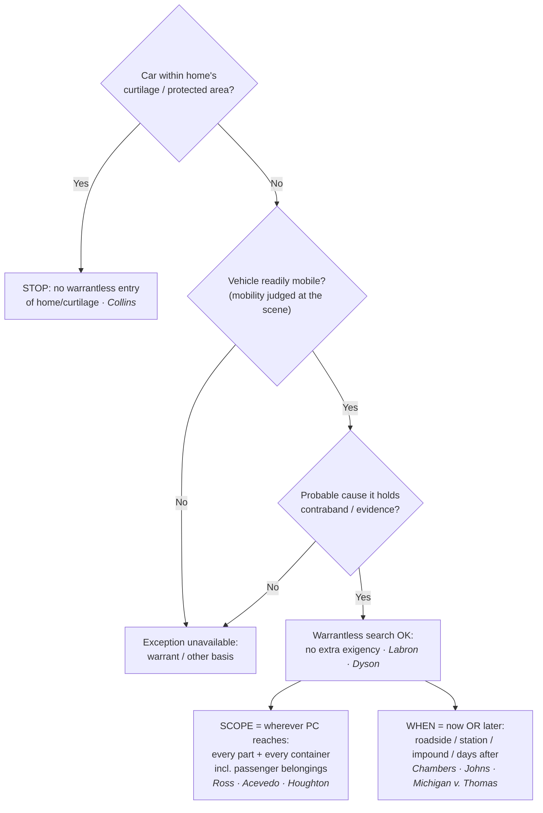

# S9 R1 panel-review — Opus model-diversity lane (prompt pack)

You are the **Claude/Opus** leg of the S9 three-lane adversarial panel (1 Claude + 2 Codex, R1). The two Codex lanes carry the A (support/quote-fidelity) and B (currency/treatment) attack lenses; **you carry model diversity and MUST vote on every paneled assertion across BOTH lenses' concerns.** You are refute-framed: try hard to break each assertion; **default to REFUTED on uncertainty**; never fabricate a cite, quote, or holding; use ONLY the evidence inlined below (no search, no outside knowledge). You are a SIGHTED reviewer — the FULL lake record (judgment fields included) is inlined.

You are a WRITER lane, not an adjudicator: you FIND and VOTE. You do not tally, adjudicate, or close any row — the orchestrator does.

For EACH group below, return one JSON object with the exact `reviewed[]` shape from the output contract (identical framing to the Codex lenses). Emit a finding object ONLY for a real defect (verdict refuted / stands-modified); a group you find wholly clean returns all-`stands` verdicts (the harness records a clean attestation). Concatenate the per-group JSON objects into a top-level `{"packs": [ ... ]}` array, one entry per group, each carrying its `group_id`.


OUTPUT CONTRACT — return ONE JSON object, nothing else:
{
  "lens": "A" | "B",
  "group_id": "<echo the group id>",
  "reviewed": [
    {
      "assertion_id": "<from group_inventory.jsonl>",
      "dimension": "existence|support|quote_fidelity|pincite|treatment|black_letter",
      "verdict": "stands" | "refuted" | "stands-modified",
      "verifiable_from_disclosed": true | false,
      "defect": null,   // null when verdict=="stands"; else an object:
      //  {"problem": "...", "severity": "high|medium|low", "proposed_fix": "...", "evidence_quote": "verbatim from disclosed evidence or null", "needs_cl": true|false, "locator_note": "..."}
      "reasons": ["short evidence-grounded reason", "..."],
      "breaks_true_positives": true | false,
      "residual_risks": ["..."],
      "suggested_tightening": "... or null"
    }
  ],
  "notes": ""
}
Rules: verdict=='stands' <=> defect==null (assertion survives your attack). verdict=='refuted' <=> a real defect (the assertion as framed is wrong). verdict=='stands-modified' <=> survives but needs a stated modification (a minor defect). Review EVERY assertion_id in group_inventory.jsonl exactly once. Output ONLY the JSON object.
---

## GROUP: content/warrant-exceptions/searching-a-vehicle/Automobile Exception.md  (`doctrine`, 26 assertions)

### content_page

```
---
weight: 10
aliases:
  - "Automobile Exception"
  - "7-exceptions-warrant/7a-pc-needed/Automobile-Exception"
title: "The Automobile Exception"
topic: Automobile Exception
type: doctrine
jurisdiction: Federal (U.S. Const. amend. IV); SCOTUS baseline
status: draft
related: ["[[Traffic Stops]]", "[[SIA Vehicles]]", "[[Inventory Searches]]", "[[Searching Effects and Containers]]", "[[Curtilage]]"]
---

# The Automobile Exception

*Can I search this vehicle right now without a warrant, and how far does the search reach?*

> [!rule] Black-letter rule
> A warrantless search of a vehicle is permitted when **(1)** the vehicle is **readily mobile** and **(2)** the officer has **probable cause** to believe it contains contraband or evidence. On those two facts the search needs **no warrant and no separate showing of [[Exigent Circumstances and Hot Pursuit|exigency]]**, and it reaches every part of the car and every container in it where the object of the probable cause could be hidden. *[[Carroll v. United States|Carroll]]*, 267 U.S. 132 (1925); *[[Pennsylvania v. Labron|Labron]]*, 518 U.S. 938, [940](https://www.courtlistener.com/opinion/118063/pennsylvania-v-labron/) (1996) (per curiam); *[[United States v. Ross|Ross]]*, 456 U.S. 798, [825](https://www.courtlistener.com/opinion/110719/united-states-v-ross/) (1982).
> ^rule-automobile

## The Brief

**What it is, and is not.** One fact decides the exception: probable cause to believe a readily mobile vehicle contains evidence or contraband. With it, an officer may search the car on the spot, or later at the station after impoundment, with no warrant and no separate [[Exigent Circumstances and Hot Pursuit|exigency]] showing, and the search reaches wherever the object of the probable cause could be hidden. Without probable cause, the exception gives nothing. It is not a [[Search Incident to Arrest|search incident to arrest]], not an inventory, and not [[Community Caretaking|community caretaking]]; those neighboring theories have their own triggers, and naming the right one matters.

**The test up front.** A warrantless vehicle search fits the exception only if both elements hold:
1. **Ready mobility.** The vehicle is capable of being moved, judged at the scene; the Fourth Amendment then "permits police to search the vehicle without more." *[[Pennsylvania v. Labron|Labron]]*, 518 U.S. 938, [940](https://www.courtlistener.com/opinion/118063/pennsylvania-v-labron/) (1996) (per curiam).
2. **Probable cause.** The officer has probable cause to believe the vehicle contains contraband or evidence. *[[United States v. Ross|Ross]]*, 456 U.S. 798, [825](https://www.courtlistener.com/opinion/110719/united-states-v-ross/) (1982). A recent restatement of the two-element formulation is *[[United States v. Morley|Morley]]*, 99 F.4th 1328 (11th Cir. 2024).

**The origin, and why mobility matters.** The exception traces to *[[Carroll v. United States|Carroll]]*, which excused the warrant for a vehicle "where it is not practicable to secure a warrant, because the vehicle can be quickly moved out of the locality or jurisdiction in which the warrant must be sought." 267 U.S. 132, 153 (1925). The car's capacity to disappear, not its label as a "car," is what excuses the warrant.

**Two rationales, both load-bearing.** Modern doctrine rests on a pair of justifications, and an officer should be able to articulate both:

![[cases/California v. Carney#^pin-393]]

*[[California v. Carney|Carney]]* confirms the exception covers a **motor home** in use as a vehicle, not just an ordinary car. The reduced-privacy rationale also explains why merely examining a car's **exterior** on probable cause (paint scrapings, a tire-tread cast) invades no protected interest at all. *[[Cardwell v. Lewis|Cardwell]]*, 417 U.S. 583 (1974).

**Scope tracks probable cause, and it reaches containers, including a passenger's.** "If probable cause justifies the search of a lawfully stopped vehicle, it justifies the search of every part of the vehicle and its contents that may conceal the object of the search." *[[United States v. Ross|Ross]]*, 456 U.S. at [825](https://www.courtlistener.com/opinion/110719/united-states-v-ross/). The distinction between a "container" and the "vehicle" has been collapsed: with probable cause, police may search a container found in a car where they believe it holds the object, *[[California v. Acevedo|Acevedo]]*, 500 U.S. 565, [580](https://www.courtlistener.com/opinion/112608/california-v-acevedo/) (1991) (overruling the separate-warrant rule of *[[Arkansas v. Sanders|Sanders]]*), just as *[[United States v. Ross|Ross]]* had earlier swept aside the closed-container rule of *[[Robbins v. California|Robbins]]*. The "every container" reach is not limited to the driver's; with probable cause to search the car, officers may inspect "passengers' belongings found in the car that are capable of concealing the object of the search." *[[Wyoming v. Houghton#^pin-307|Houghton]]*, 526 U.S. 295, [307](https://www.courtlistener.com/opinion/118277/wyoming-v-houghton/#:~:text=We%20hold%20that%20police%20officers) (1999) (though *[[Wyoming v. Houghton|Houghton]]* reaches a passenger's belongings, not the passenger's person or body, which needs its own probable cause or a [[Search Incident to Arrest|search incident to arrest]]). Scope is **object-limited**: probable cause to find a stolen flat-screen does not justify opening a pill bottle, and probable cause as to one container is not probable cause to dismantle the whole car. *(How the container rule developed, and how a container's protection differs inside versus outside a vehicle, is the container-doctrine story told on [[Searching Effects and Containers]].)*

**No separate [[Exigent Circumstances and Hot Pursuit|exigency]] beyond mobility plus probable cause.** *[[Pennsylvania v. Labron|Labron]]* reversed a state rule demanding proof of *additional* [[Exigent Circumstances and Hot Pursuit|exigent circumstances]]; mobility plus probable cause is the whole showing, reaffirmed [[Common Legal Terms#per-curiam|per curiam]] in *[[Maryland v. Dyson|Dyson]]*, which held the exception "has no separate exigency requirement" even when officers had ample time to get a warrant. 527 U.S. 465, 466–467 (1999) (per curiam).

**Delay and immobilization do not defeat the exception.** Because the justification does not evaporate when the car is immobilized, the search may be conducted later. "Given probable cause to search, either course [immediate search or seizing and holding the car] is reasonable under the Fourth Amendment." *[[Chambers v. Maroney|Chambers]]*, 399 U.S. 42, [52](https://www.courtlistener.com/opinion/108184/chambers-v-maroney/) (1970). *[[United States v. Johns|Johns]]* upheld a search of packages three days after they were removed from the truck. 469 U.S. 478, 487 (1985). The same logic validates a warrantless search of an **impounded** car at the station (*[[Michigan v. Thomas|Michigan v. Thomas]]*, 458 U.S. 259 (1982) (per curiam)) and even a second search of an already-impounded car hours later (*[[Florida v. Meyers|Meyers]]*, 466 U.S. 380 (1984) (per curiam)); a car lawfully held in custody may likewise be searched where the search is closely related to the reason it was seized (*[[Cooper v. California|Cooper]]*, 386 U.S. 58 (1967)). As a vivid in-circuit illustration, *[[United States v. Gastiaburo|Gastiaburo]]* (4th Cir.) pushed the point to 38 days, holding "the passage of time between the seizure and the search . . . is legally irrelevant." 16 F.3d 582, 587 (4th Cir. 1994). Mobility is judged **at the scene**; do not assume a warrant is suddenly required merely because the car is now immobilized or impounded.

**The [[Curtilage|curtilage]] limit.** The exception reaches the *vehicle*, not the constitutionally protected ground it sits on. The automobile exception does not permit an officer without a warrant to enter a home or its [[Curtilage|curtilage]] in order to search a vehicle parked there. *[[Collins v. Virginia|Collins]]*, 584 U.S. 586 (2018). A car parked in a driveway within the [[Curtilage|curtilage]] is off-limits without a warrant or a separate exception, the most common overreach in the field (cross-link [[Curtilage]]).

**Keep it separate from the neighboring vehicle theories.** The auto exception is not a [[Search Incident to Arrest|search incident to arrest]], and confusing the two is a recurring error. A [[Search Incident to Arrest|search incident to arrest]] cannot justify a search of a car already removed to the station with the arrestee in custody (*[[Preston v. United States|Preston]]*, 376 U.S. 364 (1964)), the gap the auto exception fills, and the vehicle search-incident rule is the narrow, arrest-tethered *[[Arizona v. Gant|Gant]]* rule (search only if the arrestee is unsecured and within reach, or it is reasonable to believe evidence of the arrest offense is in the car), not the probable-cause-driven whole-car reach of the auto exception. Nor is it the **inventory** route: a lawful impound supports a standardized inventory with no probable cause at all (*[[South Dakota v. Opperman|Opperman]]* / *[[Colorado v. Bertine|Bertine]]*, see [[Inventory Searches]]), but only where it is not a ruse for general rummaging (*[[Florida v. Wells|Wells]]*). And it is neither the **community-caretaking** basis for entering a disabled or impounded vehicle (*[[Cady v. Dombrowski|Cady]]*) nor the Terry-level **[[Securing the Scene|protective sweep]]** of the passenger compartment for weapons on reasonable suspicion the driver is dangerous (*[[Michigan v. Long|Long]]*). Separately, where police have probable cause the **vehicle itself is forfeitable contraband**, they may seize it from a public place without a warrant (*[[Florida v. White|White]]*, 526 U.S. 559 (1999)).

**Burden, standard of review, remedy.** Because this is a warrantless search, the **government** bears the burden of bringing it within the exception by showing ready mobility and probable cause. Whether probable cause existed is reviewed [[Common Legal Terms#de-novo|de novo]] on appeal, with the historical facts taken for [[Common Legal Terms#clear-error|clear error]]. Cf. *[[Ornelas v. United States|Ornelas]]*, 517 U.S. 690, [699](https://www.courtlistener.com/opinion/118030/ornelas-v-united-states/) (1996). The **remedy** for a search that falls outside the exception is suppression of the evidence and its fruits under [[The Exclusionary Rule]].

**Apply it.**
1. **Establish probable cause first.** The exception is nothing without it. Pin down the specific object you have probable cause to find; that object fixes the scope.
2. **Confirm ready mobility at the scene.** A car on a public road or lot qualifies. Do not treat later immobilization or impoundment as reviving the warrant requirement (*[[Chambers v. Maroney|Chambers]]* / *[[United States v. Johns|Johns]]*).
3. **Search where the object could be.** That includes closed containers and a passenger's belongings capable of hiding it (*[[United States v. Ross|Ross]]* / *[[Wyoming v. Houghton|Houghton]]*), but not beyond the object's likely location.
4. **Stop at the [[Curtilage|curtilage]].** Do not walk onto a home's protected ground to reach the car; get a warrant or another exception (*[[Collins v. Virginia|Collins]]*).
5. **Name your theory.** If your basis is really inventory, caretaking, or a [[Search Incident to Arrest|search incident to arrest]], invoke that theory on its own terms rather than stretching the auto exception.

**Common pitfalls.**
- **Treating "automobile" as the magic word.** *[[California v. Carney|Carney]]*'s reduced-privacy rationale lowers the bar; it never eliminates the probable-cause requirement.
- **Searching beyond the object's likely location.** Probable cause defines the scope (*[[United States v. Ross|Ross]]* / *[[California v. Acevedo|Acevedo]]*); probable cause to find a rifle does not justify opening a jewelry box, and conversely a passenger's bag is not automatically off-limits (*[[Wyoming v. Houghton|Houghton]]*).
- **Assuming you must search now, or that you no longer can.** You may search later (*[[United States v. Johns|Johns]]*), and immobilization does not revive the warrant requirement.
- **Driveway or [[Curtilage|curtilage]] overreach.** *[[Collins v. Virginia|Collins]]* forbids entering protected ground to reach the car.
- **Over-relying on *[[United States v. Anchondo|Anchondo]]*.** Frequently miscited as auto-exception authority, it is not: the defendant conceded vehicle probable cause and the cocaine was upheld as a [[Search Incident to Arrest|search incident to arrest]] of his person. Do not anchor any auto-exception rule to it.

## Lower-court developments

The core rule (mobility plus probable cause, no separate [[Exigent Circumstances and Hot Pursuit|exigency]], object-limited scope reaching containers) is SCOTUS-settled and stable; the live edge is **digital**. The open question is whether the "every container" reach extends to the **data** on a cell phone found in a car, with *[[Riley v. California|Riley]]*'s privacy logic pulling courts toward a warrant requirement for phone contents. The decisions below bind only in their own circuits and are persuasive elsewhere.

- ***[[United States v. Camou|United States v. Camou]]* (9th Cir. 2014)** — *first-impression, digital limit.* Holds the automobile exception does not authorize a warrantless search of the **data** on a cell phone found in a vehicle: a phone is not a container for exception purposes, and *[[Riley v. California|Riley]]*'s reasoning applies with even greater force because the exception's scope is broader than a [[Search Incident to Arrest|search incident to arrest]]. 773 F.3d 932. **Binding in-circuit — 9th Cir.**
- ***[[United States v. Morley|Morley]]* (11th Cir. 2024)** — *recent restatement (no split).* Distills the doctrine to the clean two-element test (readily mobile plus probable cause to search), a recent in-circuit articulation of the settled rule that applies rather than extends it. 99 F.4th 1328. **Binding in-circuit — 11th Cir.**

The through-line: post-*[[Riley v. California|Riley]]*, the settled physical-scope rule is largely undisturbed, and the frontier is confined to whether a device's *data* is a "container" the exception can reach or a distinct privacy interest that demands its own warrant.

## Key cases

| Case | Holding | Opinion |
|---|---|---|
| *[[Carroll v. United States]]*, 267 U.S. 132 (1925) | **Origin.** A vehicle may be searched warrantless on probable cause because, unlike a fixed structure, it can be quickly moved out of the jurisdiction before a warrant issues (ready mobility). | [opinion](https://www.courtlistener.com/opinion/100567/carroll-v-united-states/) |
| *[[Chambers v. Maroney]]*, 399 U.S. 42 (1970) | **Delayed search.** Where probable cause plus mobility existed at the scene, a station-house search is as reasonable as a roadside one; immobilizing the car until a warrant issues is no better. | [opinion](https://www.courtlistener.com/opinion/108184/chambers-v-maroney/) |
| *[[United States v. Ross]]*, 456 U.S. 798 (1982) | **Scope anchor.** Probable cause to search the vehicle justifies a search of every part of it and every container within that may conceal the object of the search. | [opinion](https://www.courtlistener.com/opinion/110719/united-states-v-ross/) |
| *[[California v. Carney]]*, 471 U.S. 386 (1985) | **Two rationales.** Applies to a motor home in use as a vehicle; states the paired justifications of ready mobility and reduced expectation of privacy from pervasive regulation. | [opinion](https://www.courtlistener.com/opinion/111423/california-v-carney/) |
| *[[California v. Acevedo]]*, 500 U.S. 565 (1991) | **Container in a car.** With probable cause a container found in a car may be searched on the spot; the old container/vehicle distinction is collapsed into one rule (fuller treatment on [[Searching Effects and Containers]]). | [opinion](https://www.courtlistener.com/opinion/112608/california-v-acevedo/) |
| *[[Wyoming v. Houghton]]*, 526 U.S. 295 (1999) | **Passenger belongings.** With probable cause to search a car, officers may search a passenger's belongings capable of concealing the object; a non-suspect passenger's ownership is no shield. | [opinion](https://www.courtlistener.com/opinion/118277/wyoming-v-houghton/) |
| *[[Pennsylvania v. Labron]]*, 518 U.S. 938 (1996) (per curiam) | **No separate [[Exigent Circumstances and Hot Pursuit\|exigency]].** Readily mobile plus probable cause permits a warrantless search "without more." | [opinion](https://www.courtlistener.com/opinion/118063/pennsylvania-v-labron/) |
| *[[Maryland v. Dyson]]*, 527 U.S. 465 (1999) (per curiam) | **No [[Exigent Circumstances and Hot Pursuit\|exigency]] requirement.** Reaffirms that the exception has no separate [[Exigent Circumstances and Hot Pursuit\|exigency]] requirement, valid even with ample time to obtain a warrant. | [opinion](https://www.courtlistener.com/opinion/2621047/maryland-v-dyson/) |
| *[[United States v. Johns]]*, 469 U.S. 478 (1985) | **Delay is fine.** A delayed search of packages lawfully removed from a vehicle (three days later) is valid; immobilization does not end the justification. | [opinion](https://www.courtlistener.com/opinion/111305/united-states-v-johns/) |
| *[[Michigan v. Thomas]]*, 458 U.S. 259 (1982) (per curiam) | **Impound search.** A warrantless search of an impounded car at the station is valid on probable cause; the justification does not vanish once the car is immobilized, and no separate [[Exigent Circumstances and Hot Pursuit\|exigency]] is required. | [opinion](https://www.courtlistener.com/opinion/110776/michigan-v-thomas/) |
| *[[Collins v. Virginia]]*, 584 U.S. 586 (2018) | **[[Curtilage]] limit.** The exception does not reach a vehicle parked within the home's [[Curtilage\|curtilage]]; there is no warrantless entry of home or [[Curtilage\|curtilage]] to search a car. | [opinion](https://www.courtlistener.com/opinion/4501697/collins-v-virginia/) |
| *[[United States v. Gastiaburo]]*, 16 F.3d 582 (4th Cir. 1994) | **No temporal limit.** A 38-day gap between seizure and search is "legally irrelevant." | [opinion](https://www.courtlistener.com/opinion/7027957/united-states-v-gastiaburo/) |

## Related cases across doctrines

These are treated in full elsewhere but bear on the automobile exception, framed for it here.

| Case | Relevance here | Primary home | Opinion |
|---|---|---|---|
| *[[United States v. Chadwick]]*, 433 U.S. 1 (1977) | ***Container contrast.*** Personal luggage (a double-locked footlocker) reduced to exclusive police control keeps a high expectation of privacy and needs a warrant; *[[California v. Acevedo\|Acevedo]]* limits that rule for a container found in a car, where probable cause supports an on-the-spot search. | [[Searching Effects and Containers]] | [opinion](https://www.courtlistener.com/opinion/109714/united-states-v-chadwick/) |
| *[[Preston v. United States]]*, 376 U.S. 364 (1964) | ***SITA limit that made the exception necessary.*** A warrantless car search is not incident to arrest once the arrestee is in custody and the car removed. | [[SIA Persons]] | [opinion](https://www.courtlistener.com/opinion/106771/preston-v-united-states/) |
| *[[Arizona v. Gant]]*, 556 U.S. 332 (2009) | ***The other vehicle theory.*** A [[Search Incident to Arrest\|search incident to arrest]] reaches the car only if the arrestee is unsecured and within reach, or evidence of the arrest offense may be inside, far narrower than the probable-cause-driven auto exception. | [[SIA Vehicles]] | [opinion](https://www.courtlistener.com/opinion/145887/arizona-v-gant/) |
| *[[Thornton v. United States]]*, 541 U.S. 615 (2004) | ***SITA, not auto exception.*** Extended the *[[New York v. Belton\|Belton]]* recent-occupant rule; limited by *[[Arizona v. Gant\|Gant]]*'s two-justification test, and not auto-exception authority. | [[SIA Vehicles]] | [opinion](https://www.courtlistener.com/opinion/134746/thornton-v-united-states/) |
| *[[Maryland v. Pringle]]*, 540 U.S. 366 (2003) | ***PC predicate.*** Drugs and cash in a car with no occupant claiming them give probable cause as to the car and all occupants, the "probable cause it contains contraband" element. | [[Probable Cause]] | [opinion](https://www.courtlistener.com/opinion/131150/maryland-v-pringle/) |
| *[[South Dakota v. Opperman]]*, 428 U.S. 364 (1976) | ***Inventory alternative.*** A warrantless search of a lawfully impounded car under standardized procedures, a separate basis needing no probable cause. | [[Inventory Searches]] | [opinion](https://www.courtlistener.com/opinion/109537/south-dakota-v-opperman/) |
| *[[Colorado v. Bertine]]*, 479 U.S. 367 (1987) | ***Inventory of containers.*** Inventory of an impounded car may include opening closed containers under standardized criteria, the no-probable-cause route to a container the auto exception reaches only with probable cause. | [[Inventory Searches]] | [opinion](https://www.courtlistener.com/opinion/111788/colorado-v-bertine/) |
| *[[Florida v. Wells]]*, 495 U.S. 1 (1990) | ***Inventory boundary.*** An inventory cannot be a ruse for general rummaging; when officers really hunt evidence without probable cause, neither inventory nor the auto exception saves the search. | [[Inventory Searches]] | [opinion](https://www.courtlistener.com/opinion/112412/florida-v-wells/) |
| *[[Cady v. Dombrowski]]*, 413 U.S. 433 (1973) | ***[[Community Caretaking\|Community caretaking]].*** A distinct, non-investigatory warrantless basis to enter a car (disabled or impounded) that does not require the probable cause the auto exception demands. | [[Community Caretaking]] | [opinion](https://www.courtlistener.com/opinion/108850/cady-v-dombrowski/) |
| *[[Michigan v. Long]]*, 463 U.S. 1032 (1983) | ***[[Securing the Scene\|Protective sweep]].*** On reasonable suspicion the driver is dangerous, officers may sweep the passenger compartment for weapons, a suspicion-level search distinct from the probable-cause auto exception. | [[Traffic Stops]] | [opinion](https://www.courtlistener.com/opinion/111020/michigan-v-long/) |
| *[[Byrd v. United States]]*, 584 U.S. 395 (2018) | ***Standing predicate.*** A driver in lawful possession of a rental car has a [[Reasonable Expectation of Privacy\|reasonable expectation of privacy]] even if not on the rental agreement, so he can challenge an auto-exception search. | [[Standing to Challenge a Search]] | [opinion](https://www.courtlistener.com/opinion/4497658/byrd-v-united-states/) |
| *[[Riley v. California]]*, 573 U.S. 373 (2014) | ***Digital frontier.*** *[[Riley v. California\|Riley]]*'s logic (a phone's data implicates privacy far beyond physical effects) drives the open question whether the exception reaches the **data** on a phone found in a car; treat phone contents as warrant-required. | [[SIA Cell Phones]] | [opinion](https://www.courtlistener.com/opinion/2680439/riley-v-cal-united-states/) |
| *[[Harris v. United States (1968)]]*, 390 U.S. 234 (1968) | ***Plain view.*** Objects in plain view of an officer rightfully positioned (securing a lawfully impounded car) are subject to seizure; the protective step was not a search. | [[Plain View Doctrine]] | [opinion](https://www.courtlistener.com/opinion/107625/harris-v-united-states/) |

## Visual



## Sources
- [*Carroll v. United States*, 267 U.S. 132 (1925)](https://www.courtlistener.com/opinion/100567/carroll-v-united-states/) (pinpoint: 153)
- [*Chambers v. Maroney*, 399 U.S. 42 (1970)](https://www.courtlistener.com/opinion/108184/chambers-v-maroney/) (pinpoint: 52)
- [*United States v. Ross*, 456 U.S. 798 (1982)](https://www.courtlistener.com/opinion/110719/united-states-v-ross/) (pinpoint: 825)
- [*California v. Carney*, 471 U.S. 386 (1985)](https://www.courtlistener.com/opinion/111423/california-v-carney/) (pinpoint: 393)
- [*California v. Acevedo*, 500 U.S. 565 (1991)](https://www.courtlistener.com/opinion/112608/california-v-acevedo/) (pinpoint: 580; container-unification treatment on [[Searching Effects and Containers]])
- [*Wyoming v. Houghton*, 526 U.S. 295 (1999)](https://www.courtlistener.com/opinion/118277/wyoming-v-houghton/) (pinpoint: 307)
- [*Pennsylvania v. Labron*, 518 U.S. 938 (1996) (per curiam)](https://www.courtlistener.com/opinion/118063/pennsylvania-v-labron/) (pinpoint: 940)
- [*Maryland v. Dyson*, 527 U.S. 465 (1999) (per curiam)](https://www.courtlistener.com/opinion/2621047/maryland-v-dyson/) (pinpoints: 466–467)
- [*United States v. Johns*, 469 U.S. 478 (1985)](https://www.courtlistener.com/opinion/111305/united-states-v-johns/) (pinpoint: 487)
- [*Michigan v. Thomas*, 458 U.S. 259 (1982) (per curiam)](https://www.courtlistener.com/opinion/110776/michigan-v-thomas/)
- [*Florida v. Meyers*, 466 U.S. 380 (1984) (per curiam)](https://www.courtlistener.com/opinion/111157/florida-v-meyers/)
- [*Cooper v. California*, 386 U.S. 58 (1967)](https://www.courtlistener.com/opinion/107360/cooper-v-california/)
- [*United States v. Gastiaburo*, 16 F.3d 582 (4th Cir. 1994)](https://www.courtlistener.com/opinion/7027957/united-states-v-gastiaburo/) (pinpoint: 587) (Binding in-circuit — 4th Cir.)
- [*Collins v. Virginia*, 584 U.S. 586 (2018)](https://www.courtlistener.com/opinion/4501697/collins-v-virginia/)
- [*Cardwell v. Lewis*, 417 U.S. 583 (1974)](https://www.courtlistener.com/opinion/109069/cardwell-v-lewis/)
- [*Florida v. White*, 526 U.S. 559 (1999)](https://www.courtlistener.com/opinion/118287/florida-v-white/)
- [*Ornelas v. United States*, 517 U.S. 690 (1996)](https://www.courtlistener.com/opinion/118030/ornelas-v-united-states/) (pinpoint: 699)
- [*United States v. Chadwick*, 433 U.S. 1 (1977)](https://www.courtlistener.com/opinion/109714/united-states-v-chadwick/) (limited by *California v. Acevedo* for containers in a car; home = [[Searching Effects and Containers]])
- [*United States v. Camou*, 773 F.3d 932 (9th Cir. 2014)](https://www.courtlistener.com/opinion/2759861/united-states-v-chad-camou/) (Binding in-circuit — 9th Cir.)
- [*United States v. Morley*, 99 F.4th 1328 (11th Cir. 2024)](https://www.courtlistener.com/opinion/9498175/united-states-v-derrick-alfondso-morley/) (Binding in-circuit — 11th Cir.)
- [*United States v. Anchondo*, 156 F.3d 1043 (10th Cir. 1998)](https://www.courtlistener.com/opinion/758111/united-states-v-erick-anchondo/) (miscited pitfall, upheld as a search incident to arrest, not auto-exception authority) (Binding in-circuit — 10th Cir.)
- [*Arkansas v. Sanders*, 442 U.S. 753 (1979)](https://www.courtlistener.com/opinion/110119/arkansas-v-sanders/) (overruled by *California v. Acevedo*; container-doctrine history on [[Searching Effects and Containers]])
- [*Robbins v. California*, 453 U.S. 420 (1981)](https://www.courtlistener.com/opinion/110558/robbins-v-california/) (overruled by *United States v. Ross*; container-doctrine history on [[Searching Effects and Containers]])

```

### group_inventory (assertions under review)

```jsonl
{"assertion_id": "1596dd50607edc0b", "dimension": "existence", "kind": "case_cite", "locator": {"case": "Maryland v. Pringle", "table_line": 88}, "payload": {"case": "Maryland v. Pringle", "cells": ["*[[Maryland v. Pringle]]*, 540 U.S. 366 (2003)", "***PC predicate.*** Drugs and cash in a car with no occupant claiming them give probable cause as to the car and all occupants, the \"probable cause it contains contraband\" element.", "[[Probable Cause]]", "[opinion](https://www.courtlistener.com/opinion/131150/maryland-v-pringle/)"], "header": ["Case", "Relevance here", "Primary home", "Opinion"]}}
{"assertion_id": "16c929424b8cd1ca", "dimension": "existence", "kind": "case_cite", "locator": {"case": "Wyoming v. Houghton", "table_line": 70}, "payload": {"case": "Wyoming v. Houghton", "cells": ["*[[Wyoming v. Houghton]]*, 526 U.S. 295 (1999)", "**Passenger belongings.** With probable cause to search a car, officers may search a passenger's belongings capable of concealing the object; a non-suspect passenger's ownership is no shield.", "[opinion](https://www.courtlistener.com/opinion/118277/wyoming-v-houghton/)"], "header": ["Case", "Holding", "Opinion"]}}
{"assertion_id": "16f46aa779e65ad9", "dimension": "existence", "kind": "case_cite", "locator": {"case": "Preston v. United States", "table_line": 85}, "payload": {"case": "Preston v. United States", "cells": ["*[[Preston v. United States]]*, 376 U.S. 364 (1964)", "***SITA limit that made the exception necessary.*** A warrantless car search is not incident to arrest once the arrestee is in custody and the car removed.", "[[SIA Persons]]", "[opinion](https://www.courtlistener.com/opinion/106771/preston-v-united-states/)"], "header": ["Case", "Relevance here", "Primary home", "Opinion"]}}
{"assertion_id": "2ea88db05fc52025", "dimension": "existence", "kind": "case_cite", "locator": {"case": "South Dakota v. Opperman", "table_line": 89}, "payload": {"case": "South Dakota v. Opperman", "cells": ["*[[South Dakota v. Opperman]]*, 428 U.S. 364 (1976)", "***Inventory alternative.*** A warrantless search of a lawfully impounded car under standardized procedures, a separate basis needing no probable cause.", "[[Inventory Searches]]", "[opinion](https://www.courtlistener.com/opinion/109537/south-dakota-v-opperman/)"], "header": ["Case", "Relevance here", "Primary home", "Opinion"]}}
{"assertion_id": "33307a00d30744be", "dimension": "existence", "kind": "case_cite", "locator": {"case": "Florida v. Wells", "table_line": 91}, "payload": {"case": "Florida v. Wells", "cells": ["*[[Florida v. Wells]]*, 495 U.S. 1 (1990)", "***Inventory boundary.*** An inventory cannot be a ruse for general rummaging; when officers really hunt evidence without probable cause, neither inventory nor the auto exception saves the search.", "[[Inventory Searches]]", "[opinion](https://www.courtlistener.com/opinion/112412/florida-v-wells/)"], "header": ["Case", "Relevance here", "Primary home", "Opinion"]}}
{"assertion_id": "4c3a65cdb2adf065", "dimension": "existence", "kind": "case_cite", "locator": {"case": "California v. Acevedo", "table_line": 69}, "payload": {"case": "California v. Acevedo", "cells": ["*[[California v. Acevedo]]*, 500 U.S. 565 (1991)", "**Container in a car.** With probable cause a container found in a car may be searched on the spot; the old container/vehicle distinction is collapsed into one rule (fuller treatment on [[Searching Effects and Containers]]).", "[opinion](https://www.courtlistener.com/opinion/112608/california-v-acevedo/)"], "header": ["Case", "Holding", "Opinion"]}}
{"assertion_id": "4ec7fa75e4cdec15", "dimension": "existence", "kind": "case_cite", "locator": {"case": "Riley v. California", "table_line": 95}, "payload": {"case": "Riley v. California", "cells": ["*[[Riley v. California]]*, 573 U.S. 373 (2014)", "***Digital frontier.*** *[[Riley v. California\\|Riley]]*'s logic (a phone's data implicates privacy far beyond physical effects) drives the open question whether the exception reaches the **data** on a phone found in a car; treat phone contents as warrant-required.", "[[SIA Cell Phones]]", "[opinion](https://www.courtlistener.com/opinion/2680439/riley-v-cal-united-states/)"], "header": ["Case", "Relevance here", "Primary home", "Opinion"]}}
{"assertion_id": "50954bb0f4f1f471", "dimension": "existence", "kind": "case_cite", "locator": {"case": "Harris v. United States (1968)", "table_line": 96}, "payload": {"case": "Harris v. United States (1968)", "cells": ["*[[Harris v. United States (1968)]]*, 390 U.S. 234 (1968)", "***Plain view.*** Objects in plain view of an officer rightfully positioned (securing a lawfully impounded car) are subject to seizure; the protective step was not a search.", "[[Plain View Doctrine]]", "[opinion](https://www.courtlistener.com/opinion/107625/harris-v-united-states/)"], "header": ["Case", "Relevance here", "Primary home", "Opinion"]}}
{"assertion_id": "58db47b7b3f8b1d7", "dimension": "existence", "kind": "case_cite", "locator": {"case": "Byrd v. United States", "table_line": 94}, "payload": {"case": "Byrd v. United States", "cells": ["*[[Byrd v. United States]]*, 584 U.S. 395 (2018)", "***Standing predicate.*** A driver in lawful possession of a rental car has a [[Reasonable Expectation of Privacy\\|reasonable expectation of privacy]] even if not on the rental agreement, so he can challenge an auto-exception search.", "[[Standing to Challenge a Search]]", "[opinion](https://www.courtlistener.com/opinion/4497658/byrd-v-united-states/)"], "header": ["Case", "Relevance here", "Primary home", "Opinion"]}}
{"assertion_id": "5ad5a41b211d3806", "dimension": "existence", "kind": "case_cite", "locator": {"case": "Thornton v. United States", "table_line": 87}, "payload": {"case": "Thornton v. United States", "cells": ["*[[Thornton v. United States]]*, 541 U.S. 615 (2004)", "***SITA, not auto exception.*** Extended the *[[New York v. Belton\\|Belton]]* recent-occupant rule; limited by *[[Arizona v. Gant\\|Gant]]*'s two-justification test, and not auto-exception authority.", "[[SIA Vehicles]]", "[opinion](https://www.courtlistener.com/opinion/134746/thornton-v-united-states/)"], "header": ["Case", "Relevance here", "Primary home", "Opinion"]}}
{"assertion_id": "5cc97913184cdd88", "dimension": "existence", "kind": "case_cite", "locator": {"case": "Chambers v. Maroney", "table_line": 66}, "payload": {"case": "Chambers v. Maroney", "cells": ["*[[Chambers v. Maroney]]*, 399 U.S. 42 (1970)", "**Delayed search.** Where probable cause plus mobility existed at the scene, a station-house search is as reasonable as a roadside one; immobilizing the car until a warrant issues is no better.", "[opinion](https://www.courtlistener.com/opinion/108184/chambers-v-maroney/)"], "header": ["Case", "Holding", "Opinion"]}}
{"assertion_id": "b244a2f8d2b39ebd", "dimension": "existence", "kind": "case_cite", "locator": {"case": "Collins v. Virginia", "table_line": 75}, "payload": {"case": "Collins v. Virginia", "cells": ["*[[Collins v. Virginia]]*, 584 U.S. 586 (2018)", "**[[Curtilage]] limit.** The exception does not reach a vehicle parked within the home's [[Curtilage\\|curtilage]]; there is no warrantless entry of home or [[Curtilage\\|curtilage]] to search a car.", "[opinion](https://www.courtlistener.com/opinion/4501697/collins-v-virginia/)"], "header": ["Case", "Holding", "Opinion"]}}
{"assertion_id": "bc6f65bba7d0199b", "dimension": "existence", "kind": "case_cite", "locator": {"case": "Michigan v. Thomas", "table_line": 74}, "payload": {"case": "Michigan v. Thomas", "cells": ["*[[Michigan v. Thomas]]*, 458 U.S. 259 (1982) (per curiam)", "**Impound search.** A warrantless search of an impounded car at the station is valid on probable cause; the justification does not vanish once the car is immobilized, and no separate [[Exigent Circumstances and Hot Pursuit\\|exigency]] is required.", "[opinion](https://www.courtlistener.com/opinion/110776/michigan-v-thomas/)"], "header": ["Case", "Holding", "Opinion"]}}
{"assertion_id": "bf29c4885789e584", "dimension": "existence", "kind": "case_cite", "locator": {"case": "Carroll v. United States", "table_line": 65}, "payload": {"case": "Carroll v. United States", "cells": ["*[[Carroll v. United States]]*, 267 U.S. 132 (1925)", "**Origin.** A vehicle may be searched warrantless on probable cause because, unlike a fixed structure, it can be quickly moved out of the jurisdiction before a warrant issues (ready mobility).", "[opinion](https://www.courtlistener.com/opinion/100567/carroll-v-united-states/)"], "header": ["Case", "Holding", "Opinion"]}}
{"assertion_id": "c7c44fc1ee2325a6", "dimension": "existence", "kind": "case_cite", "locator": {"case": "United States v. Ross", "table_line": 67}, "payload": {"case": "United States v. Ross", "cells": ["*[[United States v. Ross]]*, 456 U.S. 798 (1982)", "**Scope anchor.** Probable cause to search the vehicle justifies a search of every part of it and every container within that may conceal the object of the search.", "[opinion](https://www.courtlistener.com/opinion/110719/united-states-v-ross/)"], "header": ["Case", "Holding", "Opinion"]}}
{"assertion_id": "c870b1b6d93b8c42", "dimension": "existence", "kind": "case_cite", "locator": {"case": "United States v. Gastiaburo", "table_line": 76}, "payload": {"case": "United States v. Gastiaburo", "cells": ["*[[United States v. Gastiaburo]]*, 16 F.3d 582 (4th Cir. 1994)", "**No temporal limit.** A 38-day gap between seizure and search is \"legally irrelevant.\"", "[opinion](https://www.courtlistener.com/opinion/7027957/united-states-v-gastiaburo/)"], "header": ["Case", "Holding", "Opinion"]}}
{"assertion_id": "c9e5224f0844de01", "dimension": "existence", "kind": "case_cite", "locator": {"case": "California v. Carney", "table_line": 68}, "payload": {"case": "California v. Carney", "cells": ["*[[California v. Carney]]*, 471 U.S. 386 (1985)", "**Two rationales.** Applies to a motor home in use as a vehicle; states the paired justifications of ready mobility and reduced expectation of privacy from pervasive regulation.", "[opinion](https://www.courtlistener.com/opinion/111423/california-v-carney/)"], "header": ["Case", "Holding", "Opinion"]}}
{"assertion_id": "d02f31fe3dc057f8", "dimension": "existence", "kind": "case_cite", "locator": {"case": "Cady v. Dombrowski", "table_line": 92}, "payload": {"case": "Cady v. Dombrowski", "cells": ["*[[Cady v. Dombrowski]]*, 413 U.S. 433 (1973)", "***[[Community Caretaking\\|Community caretaking]].*** A distinct, non-investigatory warrantless basis to enter a car (disabled or impounded) that does not require the probable cause the auto exception demands.", "[[Community Caretaking]]", "[opinion](https://www.courtlistener.com/opinion/108850/cady-v-dombrowski/)"], "header": ["Case", "Relevance here", "Primary home", "Opinion"]}}
{"assertion_id": "d37d9ba0c2811845", "dimension": "existence", "kind": "case_cite", "locator": {"case": "Colorado v. Bertine", "table_line": 90}, "payload": {"case": "Colorado v. Bertine", "cells": ["*[[Colorado v. Bertine]]*, 479 U.S. 367 (1987)", "***Inventory of containers.*** Inventory of an impounded car may include opening closed containers under standardized criteria, the no-probable-cause route to a container the auto exception reaches only with probable cause.", "[[Inventory Searches]]", "[opinion](https://www.courtlistener.com/opinion/111788/colorado-v-bertine/)"], "header": ["Case", "Relevance here", "Primary home", "Opinion"]}}
{"assertion_id": "d5a671fb274f2bc8", "dimension": "existence", "kind": "case_cite", "locator": {"case": "United States v. Chadwick", "table_line": 84}, "payload": {"case": "United States v. Chadwick", "cells": ["*[[United States v. Chadwick]]*, 433 U.S. 1 (1977)", "***Container contrast.*** Personal luggage (a double-locked footlocker) reduced to exclusive police control keeps a high expectation of privacy and needs a warrant; *[[California v. Acevedo\\|Acevedo]]* limits that rule for a container found in a car, where probable cause supports an on-the-spot search.", "[[Searching Effects and Containers]]", "[opinion](https://www.courtlistener.com/opinion/109714/united-states-v-chadwick/)"], "header": ["Case", "Relevance here", "Primary home", "Opinion"]}}
{"assertion_id": "dacc9864a5bd1e0a", "dimension": "existence", "kind": "case_cite", "locator": {"case": "Arizona v. Gant", "table_line": 86}, "payload": {"case": "Arizona v. Gant", "cells": ["*[[Arizona v. Gant]]*, 556 U.S. 332 (2009)", "***The other vehicle theory.*** A [[Search Incident to Arrest\\|search incident to arrest]] reaches the car only if the arrestee is unsecured and within reach, or evidence of the arrest offense may be inside, far narrower than the probable-cause-driven auto exception.", "[[SIA Vehicles]]", "[opinion](https://www.courtlistener.com/opinion/145887/arizona-v-gant/)"], "header": ["Case", "Relevance here", "Primary home", "Opinion"]}}
{"assertion_id": "ec5f2663df22bb35", "dimension": "existence", "kind": "case_cite", "locator": {"case": "Maryland v. Dyson", "table_line": 72}, "payload": {"case": "Maryland v. Dyson", "cells": ["*[[Maryland v. Dyson]]*, 527 U.S. 465 (1999) (per curiam)", "**No [[Exigent Circumstances and Hot Pursuit\\|exigency]] requirement.** Reaffirms that the exception has no separate [[Exigent Circumstances and Hot Pursuit\\|exigency]] requirement, valid even with ample time to obtain a warrant.", "[opinion](https://www.courtlistener.com/opinion/2621047/maryland-v-dyson/)"], "header": ["Case", "Holding", "Opinion"]}}
{"assertion_id": "ed1af6ecee6180c6", "dimension": "existence", "kind": "case_cite", "locator": {"case": "Pennsylvania v. Labron", "table_line": 71}, "payload": {"case": "Pennsylvania v. Labron", "cells": ["*[[Pennsylvania v. Labron]]*, 518 U.S. 938 (1996) (per curiam)", "**No separate [[Exigent Circumstances and Hot Pursuit\\|exigency]].** Readily mobile plus probable cause permits a warrantless search \"without more.\"", "[opinion](https://www.courtlistener.com/opinion/118063/pennsylvania-v-labron/)"], "header": ["Case", "Holding", "Opinion"]}}
{"assertion_id": "fb2169552d9cf828", "dimension": "existence", "kind": "case_cite", "locator": {"case": "United States v. Johns", "table_line": 73}, "payload": {"case": "United States v. Johns", "cells": ["*[[United States v. Johns]]*, 469 U.S. 478 (1985)", "**Delay is fine.** A delayed search of packages lawfully removed from a vehicle (three days later) is valid; immobilization does not end the justification.", "[opinion](https://www.courtlistener.com/opinion/111305/united-states-v-johns/)"], "header": ["Case", "Holding", "Opinion"]}}
{"assertion_id": "ffab7ccd0091eb13", "dimension": "existence", "kind": "case_cite", "locator": {"case": "Michigan v. Long", "table_line": 93}, "payload": {"case": "Michigan v. Long", "cells": ["*[[Michigan v. Long]]*, 463 U.S. 1032 (1983)", "***[[Securing the Scene\\|Protective sweep]].*** On reasonable suspicion the driver is dangerous, officers may sweep the passenger compartment for weapons, a suspicion-level search distinct from the probable-cause auto exception.", "[[Traffic Stops]]", "[opinion](https://www.courtlistener.com/opinion/111020/michigan-v-long/)"], "header": ["Case", "Relevance here", "Primary home", "Opinion"]}}
{"assertion_id": "293ff9858487b34e", "dimension": "support", "kind": "proposition", "locator": {"callout": "^rule-automobile"}, "payload": {"anchor": "^rule-automobile", "statement": "[!rule] Black-letter rule\nA warrantless search of a vehicle is permitted when **(1)** the vehicle is **readily mobile** and **(2)** the officer has **probable cause** to believe it contains contraband or evidence. On those two facts the search needs **no warrant and no separate showing of [[Exigent Circumstances and Hot Pursuit|exigency]]**, and it reaches every part of the car and every container in it where the object of the probable cause could be hidden. *[[Carroll v. United States|Carroll]]*, 267 U.S. 132 (1925); *[[Pennsylvania v. Labron|Labron]]*, 518 U.S. 938, [940](https://www.courtlistener.com/opinion/118063/pennsylvania-v-labron/) (1996) (per curiam); *[[United States v. Ross|Ross]]*, 456 U.S. 798, [825](https://www.courtlistener.com/opinion/110719/united-states-v-ross/) (1982)."}}
```

### lake record — Arizona v. Gant

```json
{
  "schema_version": "s2.v1",
  "record_id": "Arizona v. Gant",
  "stub": false,
  "status": "verified",
  "identity": {
    "case_name": "Arizona v. Gant",
    "case_name_short": "Gant",
    "case_name_full": "Arizona v. Gant",
    "input_case_name": "Arizona v. Gant",
    "court": "U.S. Supreme Court",
    "court_id": "scotus",
    "court_level": "scotus",
    "circuit": null,
    "state": null,
    "date_decided": "2009-04-21",
    "year": 2009,
    "docket": null,
    "cluster_id": 145887,
    "lead_opinion_id": 9435359,
    "sibling_ids": [
      145887,
      9435359,
      9435360,
      9435361
    ],
    "absolute_url": "/opinion/145887/arizona-v-gant/",
    "identity_method": "citation+party-text",
    "expected_citation_found": true,
    "party_name_in_text": true,
    "canonical_name_match": true,
    "alternates": [],
    "reason_code": null
  },
  "citations": {
    "official": {
      "cite": "556 U.S. 332",
      "volume": "556",
      "reporter": "U.S.",
      "page": "332",
      "type": 1,
      "selected_official": true,
      "source": "cluster.citations[]"
    },
    "parallel": [
      {
        "cite": "129 S. Ct. 1710",
        "volume": "129",
        "reporter": "S. Ct.",
        "page": "1710",
        "type": 1,
        "selected_official": false,
        "source": "cluster.citations[]"
      },
      {
        "cite": "173 L. Ed. 2d 485",
        "volume": "173",
        "reporter": "L. Ed. 2d",
        "page": "485",
        "type": 1,
        "selected_official": false,
        "source": "cluster.citations[]"
      }
    ],
    "vendor_neutral": [
      {
        "cite": "2009 U.S. LEXIS 3120",
        "volume": "2009",
        "reporter": "U.S. LEXIS",
        "page": "3120",
        "type": 6,
        "selected_official": false,
        "source": "cluster.citations[]"
      }
    ],
    "all": [
      {
        "cite": "556 U.S. 332",
        "volume": "556",
        "reporter": "U.S.",
        "page": "332",
        "type": 1,
        "selected_official": false,
        "source": "cluster.citations[]"
      },
      {
        "cite": "129 S. Ct. 1710",
        "volume": "129",
        "reporter": "S. Ct.",
        "page": "1710",
        "type": 1,
        "selected_official": false,
        "source": "cluster.citations[]"
      },
      {
        "cite": "173 L. Ed. 2d 485",
        "volume": "173",
        "reporter": "L. Ed. 2d",
        "page": "485",
        "type": 1,
        "selected_official": false,
        "source": "cluster.citations[]"
      },
      {
        "cite": "2009 U.S. LEXIS 3120",
        "volume": "2009",
        "reporter": "U.S. LEXIS",
        "page": "3120",
        "type": 6,
        "selected_official": false,
        "source": "cluster.citations[]"
      }
    ],
    "display": "556 U.S. 332",
    "official_selection": {
      "court_class": "scotus",
      "selected": "556 U.S. 332",
      "reason": "selected_rank_1"
    }
  },
  "pinpoints": [
    {
      "id": "pin-351",
      "page": null,
      "quote": "--- # Arizona v. Gant *556 U.S. 332 (2009)* \u00b7 U.S. Supreme Court \u00b7 **Binding \u2014 SCOTUS** \u00b7 Treatment: **good** *(as of 2026-06-30)* <!-- header line; TreatmentBadge + weight render here, degrading to the text above --> ## Background Gant was arrested for driving on a suspended license. After he was handcuffed and locked in the back of a patrol car, officers searched his car and found cocaine in a jacket on the back seat. He moved to suppress the cocaine as the product of an unlawful search incident to arrest. ## Issue Whether police may search the passenger compartment of a vehicle incident to a recent occupant's arrest when the arrestee has been secured and cannot reach the vehicle, and there is no reason to believe the vehicle contains evidence of the offense of arrest. ## Rule A vehicle search incident to a recent occupant's arrest is allowed only on one of two independent justifications:",
      "star_marker": null,
      "quote_fidelity": "mismatch",
      "pinpoint_status": "slip-only",
      "position": null
    }
  ],
  "treatment": {
    "field_i_validity": "good_law",
    "as_of_content": "2009-04-21",
    "as_of_treatment": "2026-06-30",
    "composite_basis": "migration-seed",
    "composite_basis_ref": "Arizona v. Gant",
    "varies_by_point": false,
    "scope_note": "Gant itself cabins the broad reading of New York v. Belton; Gant is good law.",
    "point_overrides": [],
    "edges": [
      {
        "citing_case": {
          "name": "State of Minnesota v. Raenard Romalle Douglas",
          "cluster_id": 10129058,
          "cite": null,
          "field_ii": "overruled"
        },
        "field_ii": "overruled",
        "field_iii": "mentioned",
        "point": null,
        "proposed": true,
        "journal_ref": "Arizona v. Gant:lane1_negative"
      },
      {
        "citing_case": {
          "name": "Commonwealth v. Williams",
          "cluster_id": 10027459,
          "cite": null,
          "field_ii": "overruled"
        },
        "field_ii": "overruled",
        "field_iii": "mentioned",
        "point": null,
        "proposed": true,
        "journal_ref": "Arizona v. Gant:lane1_negative"
      },
      {
        "citing_case": {
          "name": "Commonwealth v. Silvelo",
          "cluster_id": 4796646,
          "cite": null,
          "field_ii": "overruled"
        },
        "field_ii": "overruled",
        "field_iii": "mentioned",
        "point": null,
        "proposed": true,
        "journal_ref": "Arizona v. Gant:lane1_negative"
      },
      {
        "citing_case": {
          "name": "Ramos v. Louisiana",
          "cluster_id": 9231323,
          "cite": [
            "140 S. Ct. 1390",
            "206 L. Ed. 2d 583"
          ],
          "field_ii": "overruled"
        },
        "field_ii": "overruled",
        "field_iii": "mentioned",
        "point": null,
        "proposed": true,
        "journal_ref": "Arizona v. Gant:lane1_negative"
      },
      {
        "citing_case": {
          "name": "Alleyne v. United States",
          "cluster_id": 903985,
          "cite": [
            "186 L. Ed. 2d 314",
            "133 S. Ct. 2151",
            "2013 U.S. LEXIS 4543",
            "570 U.S. 99",
            "81 U.S.L.W. 4444",
            "24 Fla. L. Weekly Fed. S 310",
            "2013 WL 2922116"
          ],
          "field_ii": "overruled"
        },
        "field_ii": "overruled",
        "field_iii": "mentioned",
        "point": null,
        "proposed": true,
        "journal_ref": "Arizona v. Gant:lane2_top_cited"
      },
      {
        "citing_case": {
          "name": "Rodriguez v. United States",
          "cluster_id": 2795278,
          "cite": [
            "575 U.S. 348",
            "135 S. Ct. 1609",
            "191 L. Ed. 2d 492",
            "2015 U.S. LEXIS 2807",
            "83 U.S.L.W. 4241",
            "25 Fla. L. Weekly Fed. S 191"
          ],
          "field_ii": "abrogated"
        },
        "field_ii": "abrogated",
        "field_iii": "mentioned",
        "point": null,
        "proposed": true,
        "journal_ref": "Arizona v. Gant:lane2_top_cited"
      },
      {
        "citing_case": {
          "name": "Florida v. Jardines",
          "cluster_id": 856347,
          "cite": [
            "185 L. Ed. 2d 495",
            "133 S. Ct. 1409",
            "569 U.S. 1",
            "2013 U.S. LEXIS 2542",
            "24 Fla. L. Weekly Fed. S 117",
            "81 U.S.L.W. 4209",
            "2013 WL 1196577"
          ],
          "field_ii": "questioned"
        },
        "field_ii": "questioned",
        "field_iii": "mentioned",
        "point": null,
        "proposed": true,
        "journal_ref": "Arizona v. Gant:lane2_top_cited"
      },
      {
        "citing_case": {
          "name": "Birchfield v. N. Dakota. William Robert Bernard",
          "cluster_id": 3216497,
          "cite": [
            "579 U.S. 438",
            "195 L. Ed. 2d 560",
            "2016 U.S. LEXIS 4058",
            "136 S. Ct. 2160"
          ],
          "field_ii": "abrogated"
        },
        "field_ii": "abrogated",
        "field_iii": "mentioned",
        "point": null,
        "proposed": true,
        "journal_ref": "Arizona v. Gant:lane2_top_cited"
      },
      {
        "citing_case": {
          "name": "Riley v. Cal. United States",
          "cluster_id": 2680439,
          "cite": [
            "189 L. Ed. 2d 430",
            "134 S. Ct. 2473",
            "2014 U.S. LEXIS 4497",
            "82 U.S.L.W. 4558"
          ],
          "field_ii": "overruled"
        },
        "field_ii": "overruled",
        "field_iii": "mentioned",
        "point": null,
        "proposed": true,
        "journal_ref": "Arizona v. Gant:lane2_top_cited"
      },
      {
        "citing_case": {
          "name": "Kisor v. Wilkie",
          "cluster_id": 4632953,
          "cite": [
            "588 U.S. 558",
            "139 S. Ct. 2400",
            "204 L. Ed. 2d 841",
            "2019 U.S. LEXIS 4397"
          ],
          "field_ii": "overruled"
        },
        "field_ii": "overruled",
        "field_iii": "mentioned",
        "point": null,
        "proposed": true,
        "journal_ref": "Arizona v. Gant:lane2_top_cited"
      },
      {
        "citing_case": {
          "name": "Maryland v. King",
          "cluster_id": 873669,
          "cite": [
            "186 L. Ed. 2d 1",
            "133 S. Ct. 1958",
            "2013 U.S. LEXIS 4165",
            "569 U.S. 435",
            "24 Fla. L. Weekly Fed. S 234",
            "81 U.S.L.W. 4343",
            "2013 WL 2371466"
          ],
          "field_ii": "questioned"
        },
        "field_ii": "questioned",
        "field_iii": "mentioned",
        "point": null,
        "proposed": true,
        "journal_ref": "Arizona v. Gant:lane2_top_cited"
      },
      {
        "citing_case": {
          "name": "Janus v. State, County, and Municipal Employees",
          "cluster_id": 4511640,
          "cite": [
            "585 U.S. 878",
            "138 S. Ct. 2448",
            "201 L. Ed. 2d 924",
            "2018 U.S. LEXIS 4028"
          ],
          "field_ii": "overruled"
        },
        "field_ii": "overruled",
        "field_iii": "mentioned",
        "point": null,
        "proposed": true,
        "journal_ref": "Arizona v. Gant:lane2_top_cited"
      },
      {
        "citing_case": {
          "name": "United States v. Manigan",
          "cluster_id": 1031401,
          "cite": [
            "592 F.3d 621",
            "2010 U.S. App. LEXIS 1713",
            "2010 WL 298031"
          ],
          "field_ii": "overruled"
        },
        "field_ii": "overruled",
        "field_iii": "mentioned",
        "point": null,
        "proposed": true,
        "journal_ref": "Arizona v. Gant:lane2_top_cited"
      },
      {
        "citing_case": {
          "name": "State v. Rocha",
          "cluster_id": 4345763,
          "cite": [
            "295 Neb. 716",
            "890 N.W.2d 178"
          ],
          "field_ii": "overruled"
        },
        "field_ii": "overruled",
        "field_iii": "mentioned",
        "point": null,
        "proposed": true,
        "journal_ref": "Arizona v. Gant:lane2_top_cited"
      },
      {
        "citing_case": {
          "name": "v. Allen",
          "cluster_id": 4673511,
          "cite": [
            "2019 CO 88"
          ],
          "field_ii": "abrogated"
        },
        "field_ii": "abrogated",
        "field_iii": "mentioned",
        "point": null,
        "proposed": true,
        "journal_ref": "Arizona v. Gant:lane2_top_cited"
      },
      {
        "citing_case": {
          "name": "Bailey v. United States",
          "cluster_id": 820749,
          "cite": [
            "185 L. Ed. 2d 19",
            "133 S. Ct. 1031",
            "568 U.S. 186",
            "2013 U.S. LEXIS 1075"
          ],
          "field_ii": "questioned"
        },
        "field_ii": "questioned",
        "field_iii": "mentioned",
        "point": null,
        "proposed": true,
        "journal_ref": "Arizona v. Gant:lane2_top_cited"
      },
      {
        "citing_case": {
          "name": "Utah v. Strieff",
          "cluster_id": 3214882,
          "cite": [
            "579 U.S. 232",
            "195 L. Ed. 2d 400",
            "2016 U.S. LEXIS 3926"
          ],
          "field_ii": "questioned"
        },
        "field_ii": "questioned",
        "field_iii": "mentioned",
        "point": null,
        "proposed": true,
        "journal_ref": "Arizona v. Gant:lane2_top_cited"
      },
      {
        "citing_case": {
          "name": "Collins v. Virginia",
          "cluster_id": 4501697,
          "cite": [
            "584 U.S. 586",
            "138 S. Ct. 1663",
            "201 L. Ed. 2d 9",
            "2018 U.S. LEXIS 3210"
          ],
          "field_ii": "overruled"
        },
        "field_ii": "overruled",
        "field_iii": "mentioned",
        "point": null,
        "proposed": true,
        "journal_ref": "Arizona v. Gant:lane2_top_cited"
      },
      {
        "citing_case": {
          "name": "Heller v. District of Columbia",
          "cluster_id": 614652,
          "cite": [
            "670 F.3d 1244",
            "399 U.S. App. D.C. 314",
            "2011 U.S. App. LEXIS 20130",
            "2011 WL 4551558"
          ],
          "field_ii": "superseded_by_statute"
        },
        "field_ii": "superseded_by_statute",
        "field_iii": "mentioned",
        "point": null,
        "proposed": true,
        "journal_ref": "Arizona v. Gant:lane2_top_cited"
      },
      {
        "citing_case": {
          "name": "Byrd v. United States",
          "cluster_id": 4497658,
          "cite": [
            "584 U.S. 395",
            "138 S. Ct. 1518",
            "200 L. Ed. 2d 805",
            "2018 U.S. LEXIS 2803"
          ],
          "field_ii": "questioned"
        },
        "field_ii": "questioned",
        "field_iii": "mentioned",
        "point": null,
        "proposed": true,
        "journal_ref": "Arizona v. Gant:lane2_top_cited"
      },
      {
        "citing_case": {
          "name": "State v. William L. Witt(074468)",
          "cluster_id": 2993869,
          "cite": [
            "223 N.J. 409",
            "126 A.3d 850",
            "2015 N.J. LEXIS 890"
          ],
          "field_ii": "overruled"
        },
        "field_ii": "overruled",
        "field_iii": "mentioned",
        "point": null,
        "proposed": true,
        "journal_ref": "Arizona v. Gant:lane2_top_cited"
      },
      {
        "citing_case": {
          "name": "Kevin M. Clark v. State of Indiana",
          "cluster_id": 1041668,
          "cite": [
            "994 N.E.2d 252",
            "2013 WL 5228498",
            "2013 Ind. LEXIS 700"
          ],
          "field_ii": "overruled"
        },
        "field_ii": "overruled",
        "field_iii": "mentioned",
        "point": null,
        "proposed": true,
        "journal_ref": "Arizona v. Gant:lane2_top_cited"
      },
      {
        "citing_case": {
          "name": "State v. Swick",
          "cluster_id": 891802,
          "cite": [
            "2012 NMSC 18",
            "2 N.M. 30",
            "2012 NMSC 018"
          ],
          "field_ii": "overruled"
        },
        "field_ii": "overruled",
        "field_iii": "mentioned",
        "point": null,
        "proposed": true,
        "journal_ref": "Arizona v. Gant:lane2_top_cited"
      },
      {
        "citing_case": {
          "name": "State v. Elias",
          "cluster_id": 2539936,
          "cite": [
            "339 S.W.3d 667",
            "2011 Tex. Crim. App. LEXIS 448",
            "2011 WL 1267248"
          ],
          "field_ii": "questioned"
        },
        "field_ii": "questioned",
        "field_iii": "mentioned",
        "point": null,
        "proposed": true,
        "journal_ref": "Arizona v. Gant:lane2_top_cited"
      },
      {
        "citing_case": {
          "name": "State v. Villarreal, David",
          "cluster_id": 2948963,
          "cite": [
            "475 S.W.3d 784",
            "2014 Tex. Crim. App. LEXIS 1898",
            "2014 WL 6734178"
          ],
          "field_ii": "overruled"
        },
        "field_ii": "overruled",
        "field_iii": "mentioned",
        "point": null,
        "proposed": true,
        "journal_ref": "Arizona v. Gant:lane2_top_cited"
      },
      {
        "citing_case": {
          "name": "Ramos v. Louisiana",
          "cluster_id": 4746633,
          "cite": [
            "590 U.S. 83"
          ],
          "field_ii": "overruled"
        },
        "field_ii": "overruled",
        "field_iii": "mentioned",
        "point": null,
        "proposed": true,
        "journal_ref": "Arizona v. Gant:lane2_top_cited"
      }
    ],
    "derivation": {
      "lane1_negative": {
        "query": "cites:(145887 OR 9435359 OR 9435360 OR 9435361) AND (overrul* OR abrogat* OR supersed* OR \"recede from\" OR \"no longer good law\" OR vacat* OR reversed) ",
        "reviewed": 200,
        "cap": 200,
        "cap_hit": true,
        "final_cursor": "https://www.courtlistener.com/api/rest/v4/search/?cursor=cz0xNTg1ODcyMDAwMDAwJnM9MTAwMjEwMTAmdD1vJmQ9MjAyNi0wNy0wNCZwPTEx&fields=absolute_url%2CcaseName%2CcaseNameFull%2Ccitation%2CciteCount%2Ccluster_id%2Ccourt%2Ccourt_citation_string%2Ccourt_id%2CdateFiled%2Copinions%2Csibling_ids%2Cstatus%2Csyllabus&order_by=dateFiled+desc&page_size=100&q=cites%3A%28145887+OR+9435359+OR+9435360+OR+9435361%29+AND+%28overrul%2A+OR+abrogat%2A+OR+supersed%2A+OR+%22recede+from%22+OR+%22no+longer+good+law%22+OR+vacat%2A+OR+reversed%29+&stat_Published=on&type=o",
        "audit_needed": true,
        "proposed_negative_events": 4,
        "audit_marker": "R15 treatment audit required",
        "triage_mode": "snippet-first",
        "snippet_field": "results[].opinions[].snippet",
        "triage_journaled": 200,
        "triage_read": 4,
        "triage_snippet_classified": 196
      },
      "lane2_top_cited": {
        "query": "cites:(145887 OR 9435359 OR 9435360 OR 9435361)",
        "reviewed": 25,
        "cap": 25,
        "cap_hit": true,
        "final_cursor": "https://www.courtlistener.com/api/rest/v4/search/?cursor=cz0xNTQmcz0yNjgxODE4JnQ9byZkPTIwMjYtMDctMDQmcD0z&order_by=citeCount+desc&page_size=25&q=cites%3A%28145887+OR+9435359+OR+9435360+OR+9435361%29&type=o",
        "audit_needed": true,
        "proposed_negative_events": 23,
        "audit_marker": "R15 treatment audit required"
      },
      "lane3_recency": {
        "query": "cites:(145887 OR 9435359 OR 9435360 OR 9435361)",
        "reviewed": 117,
        "cap": 200,
        "cap_hit": false,
        "final_cursor": null,
        "audit_needed": false,
        "proposed_negative_events": 2,
        "audit_marker": null,
        "triage_mode": "snippet-first",
        "snippet_field": "results[].opinions[].snippet",
        "triage_journaled": 117,
        "triage_read": 2,
        "triage_snippet_classified": 115
      }
    }
  },
  "progeny": {
    "complete_query": "cites:(145887 OR 9435359 OR 9435360 OR 9435361)",
    "indexed_citing_opinions": 1426,
    "count_source": "search",
    "per_sibling": [
      {
        "opinion_id": 145887,
        "count": 1166,
        "count_source": "search"
      },
      {
        "opinion_id": 9435359,
        "count": 280,
        "count_source": "search"
      },
      {
        "opinion_id": 9435360,
        "count": 0,
        "count_source": "search"
      },
      {
        "opinion_id": 9435361,
        "count": 0,
        "count_source": "search"
      }
    ],
    "citation_count": 2728,
    "cache_path": "/Users/johngalt/cssi-lake/cache/progeny/arizona-v-gant.jsonl",
    "enumeration": "bounded",
    "cursor": "https://www.courtlistener.com/api/rest/v4/search/?cursor=cz0xLjkyNDc0MjUmcz0xMDM1MjEwNCZ0PW8mZD0yMDI2LTA3LTA0JnA9Mg%3D%3D&order_by=score+desc&page_size=100&q=cites%3A%28145887+OR+9435359+OR+9435360+OR+9435361%29&type=o",
    "rows_cached": 20,
    "outbound_opinion_edges": [
      {
        "source_opinion_id": 145887,
        "cited_id": 30547,
        "source": "search.opinions[].cites[]"
      },
      {
        "source_opinion_id": 145887,
        "cited_id": 91573,
        "source": "search.opinions[].cites[]"
      },
      {
        "source_opinion_id": 145887,
        "cited_id": 98094,
        "source": "search.opinions[].cites[]"
      },
      {
        "source_opinion_id": 145887,
        "cited_id": 101164,
        "source": "search.opinions[].cites[]"
      },
      {
        "source_opinion_id": 145887,
        "cited_id": 101643,
        "source": "search.opinions[].cites[]"
      },
      {
        "source_opinion_id": 145887,
        "cited_id": 101894,
        "source": "search.opinions[].cites[]"
      },
      {
        "source_opinion_id": 145887,
        "cited_id": 101899,
        "source": "search.opinions[].cites[]"
      },
      {
        "source_opinion_id": 145887,
        "cited_id": 104422,
        "source": "search.opinions[].cites[]"
      },
      {
        "source_opinion_id": 145887,
        "cited_id": 104576,
        "source": "search.opinions[].cites[]"
      },
      {
        "source_opinion_id": 145887,
        "cited_id": 104769,
        "source": "search.opinions[].cites[]"
      },
      {
        "source_opinion_id": 145887,
        "cited_id": 106447,
        "source": "search.opinions[].cites[]"
      },
      {
        "source_opinion_id": 145887,
        "cited_id": 106771,
        "source": "search.opinions[].cites[]"
      },
      {
        "source_opinion_id": 145887,
        "cited_id": 106964,
        "source": "search.opinions[].cites[]"
      },
      {
        "source_opinion_id": 145887,
        "cited_id": 107252,
        "source": "search.opinions[].cites[]"
      },
      {
        "source_opinion_id": 145887,
        "cited_id": 107564,
        "source": "search.opinions[].cites[]"
      },
      {
        "source_opinion_id": 145887,
        "cited_id": 107729,
        "source": "search.opinions[].cites[]"
      },
      {
        "source_opinion_id": 145887,
        "cited_id": 107979,
        "source": "search.opinions[].cites[]"
      },
      {
        "source_opinion_id": 145887,
        "cited_id": 108893,
        "source": "search.opinions[].cites[]"
      },
      {
        "source_opinion_id": 145887,
        "cited_id": 109905,
        "source": "search.opinions[].cites[]"
      },
      {
        "source_opinion_id": 145887,
        "cited_id": 110096,
        "source": "search.opinions[].cites[]"
      },
      {
        "source_opinion_id": 145887,
        "cited_id": 110558,
        "source": "search.opinions[].cites[]"
      },
      {
        "source_opinion_id": 145887,
        "cited_id": 110559,
        "source": "search.opinions[].cites[]"
      },
      {
        "source_opinion_id": 145887,
        "cited_id": 110719,
        "source": "search.opinions[].cites[]"
      },
      {
        "source_opinion_id": 145887,
        "cited_id": 111020,
        "source": "search.opinions[].cites[]"
      },
      {
        "source_opinion_id": 145887,
        "cited_id": 111600,
        "source": "search.opinions[].cites[]"
      },
      {
        "source_opinion_id": 145887,
        "cited_id": 111823,
        "source": "search.opinions[].cites[]"
      },
      {
        "source_opinion_id": 145887,
        "cited_id": 112296,
        "source": "search.opinions[].cites[]"
      },
      {
        "source_opinion_id": 145887,
        "cited_id": 112384,
        "source": "search.opinions[].cites[]"
      },
      {
        "source_opinion_id": 145887,
        "cited_id": 112643,
        "source": "search.opinions[].cites[]"
      },
      {
        "source_opinion_id": 145887,
        "cited_id": 118250,
        "source": "search.opinions[].cites[]"
      },
      {
        "source_opinion_id": 145887,
        "cited_id": 118380,
        "source": "search.opinions[].cites[]"
      },
      {
        "source_opinion_id": 145887,
        "cited_id": 130160,
        "source": "search.opinions[].cites[]"
      },
      {
        "source_opinion_id": 145887,
        "cited_id": 134735,
        "source": "search.opinions[].cites[]"
      },
      {
        "source_opinion_id": 145887,
        "cited_id": 134746,
        "source": "search.opinions[].cites[]"
      },
      {
        "source_opinion_id": 145887,
        "cited_id": 145630,
        "source": "search.opinions[].cites[]"
      },
      {
        "source_opinion_id": 145887,
        "cited_id": 145701,
        "source": "search.opinions[].cites[]"
      },
      {
        "source_opinion_id": 145887,
        "cited_id": 145814,
        "source": "search.opinions[].cites[]"
      },
      {
        "source_opinion_id": 145887,
        "cited_id": 195782,
        "source": "search.opinions[].cites[]"
      },
      {
        "source_opinion_id": 145887,
        "cited_id": 498214,
        "source": "search.opinions[].cites[]"
      },
      {
        "source_opinion_id": 145887,
        "cited_id": 520415,
        "source": "search.opinions[].cites[]"
      },
      {
        "source_opinion_id": 145887,
        "cited_id": 593396,
        "source": "search.opinions[].cites[]"
      },
      {
        "source_opinion_id": 145887,
        "cited_id": 719587,
        "source": "search.opinions[].cites[]"
      },
      {
        "source_opinion_id": 145887,
        "cited_id": 721372,
        "source": "search.opinions[].cites[]"
      },
      {
        "source_opinion_id": 145887,
        "cited_id": 762479,
        "source": "search.opinions[].cites[]"
      },
      {
        "source_opinion_id": 145887,
        "cited_id": 789343,
        "source": "search.opinions[].cites[]"
      },
      {
        "source_opinion_id": 145887,
        "cited_id": 791442,
        "source": "search.opinions[].cites[]"
      },
      {
        "source_opinion_id": 145887,
        "cited_id": 792893,
        "source": "search.opinions[].cites[]"
      },
      {
        "source_opinion_id": 145887,
        "cited_id": 794927,
        "source": "search.opinions[].cites[]"
      },
      {
        "source_opinion_id": 145887,
        "cited_id": 867371,
        "source": "search.opinions[].cites[]"
      },
      {
        "source_opinion_id": 145887,
        "cited_id": 1057451,
        "source": "search.opinions[].cites[]"
      },
      {
        "source_opinion_id": 145887,
        "cited_id": 1195099,
        "source": "search.opinions[].cites[]"
      },
      {
        "source_opinion_id": 145887,
        "cited_id": 1223809,
        "source": "search.opinions[].cites[]"
      },
      {
        "source_opinion_id": 145887,
        "cited_id": 1234081,
        "source": "search.opinions[].cites[]"
      },
      {
        "source_opinion_id": 145887,
        "cited_id": 1399986,
        "source": "search.opinions[].cites[]"
      },
      {
        "source_opinion_id": 145887,
        "cited_id": 1401546,
        "source": "search.opinions[].cites[]"
      },
      {
        "source_opinion_id": 145887,
        "cited_id": 1427013,
        "source": "search.opinions[].cites[]"
      },
      {
        "source_opinion_id": 145887,
        "cited_id": 1983319,
        "source": "search.opinions[].cites[]"
      },
      {
        "source_opinion_id": 145887,
        "cited_id": 2009627,
        "source": "search.opinions[].cites[]"
      },
      {
        "source_opinion_id": 145887,
        "cited_id": 2080120,
        "source": "search.opinions[].cites[]"
      },
      {
        "source_opinion_id": 145887,
        "cited_id": 2112994,
        "source": "search.opinions[].cites[]"
      },
      {
        "source_opinion_id": 145887,
        "cited_id": 2221553,
        "source": "search.opinions[].cites[]"
      },
      {
        "source_opinion_id": 145887,
        "cited_id": 2598312,
        "source": "search.opinions[].cites[]"
      },
      {
        "source_opinion_id": 145887,
        "cited_id": 2620702,
        "source": "search.opinions[].cites[]"
      },
      {
        "source_opinion_id": 145887,
        "cited_id": 5538778,
        "source": "search.opinions[].cites[]"
      }
    ]
  },
  "off_cl_links": [],
  "provenance": {
    "cl_source": "LCU",
    "cl_api": "https://www.courtlistener.com/api/rest/v4",
    "built_by": "S2-BUILDER-AUTHORING",
    "build_run": "s2-build-96d841cbb12e",
    "date_created": "2026-07-04T18:20:38Z",
    "date_modified": "2026-07-06T10:25:11Z",
    "warnings": [
      "legacy treatment migrated: good -> good_law"
    ],
    "field_provenance": {
      "identity": {
        "src": "CourtListener search + clusters + lead opinion text",
        "at": "2026-07-04T18:20:55Z",
        "verifier": "S2-BUILDER-AUTHORING"
      },
      "treatment.field_i_validity": {
        "src": "_treatment-migration.json + page frontmatter",
        "at": "2026-07-04T18:20:55Z",
        "verifier": "S2-BUILDER-AUTHORING"
      },
      "point_overrides": {
        "src": "S2 treatment derivation proposed only",
        "at": "2026-07-04T18:25:14Z",
        "verifier": "S2-BUILDER-AUTHORING"
      },
      "pinpoints": {
        "src": "content page quote harvest + lead opinion text",
        "at": "2026-07-04T18:20:55Z",
        "verifier": "S2-BUILDER-AUTHORING"
      }
    }
  }
}

```

### lake record — Byrd v. United States

```json
{
  "schema_version": "s2.v1",
  "record_id": "Byrd v. United States",
  "stub": false,
  "status": "verified",
  "identity": {
    "case_name": "Byrd v. United States",
    "case_name_short": "Byrd",
    "case_name_full": "",
    "input_case_name": "Byrd v. United States",
    "court": "U.S. Supreme Court",
    "court_id": "scotus",
    "court_level": "scotus",
    "circuit": null,
    "state": null,
    "date_decided": "2018-05-14",
    "year": 2018,
    "docket": "16-1371",
    "cluster_id": 4497658,
    "lead_opinion_id": 4274911,
    "sibling_ids": [
      4274911
    ],
    "absolute_url": "/opinion/4497658/byrd-v-united-states/",
    "identity_method": "citation+party-text",
    "expected_citation_found": true,
    "party_name_in_text": true,
    "canonical_name_match": true,
    "alternates": [
      {
        "cluster_id": 9337228,
        "score": 10,
        "case_name": "Byrd v. United States"
      }
    ],
    "reason_code": null
  },
  "citations": {
    "official": {
      "cite": "584 U.S. 395",
      "volume": "584",
      "reporter": "U.S.",
      "page": "395",
      "type": 1,
      "selected_official": true,
      "source": "cluster.citations[]"
    },
    "parallel": [
      {
        "cite": "138 S. Ct. 1518",
        "volume": "138",
        "reporter": "S. Ct.",
        "page": "1518",
        "type": 1,
        "selected_official": false,
        "source": "cluster.citations[]"
      },
      {
        "cite": "200 L. Ed. 2d 805",
        "volume": "200",
        "reporter": "L. Ed. 2d",
        "page": "805",
        "type": 1,
        "selected_official": false,
        "source": "cluster.citations[]"
      }
    ],
    "vendor_neutral": [
      {
        "cite": "2018 U.S. LEXIS 2803",
        "volume": "2018",
        "reporter": "U.S. LEXIS",
        "page": "2803",
        "type": 6,
        "selected_official": false,
        "source": "cluster.citations[]"
      }
    ],
    "all": [
      {
        "cite": "584 U.S. 395",
        "volume": "584",
        "reporter": "U.S.",
        "page": "395",
        "type": 1,
        "selected_official": false,
        "source": "cluster.citations[]"
      },
      {
        "cite": "138 S. Ct. 1518",
        "volume": "138",
        "reporter": "S. Ct.",
        "page": "1518",
        "type": 1,
        "selected_official": false,
        "source": "cluster.citations[]"
      },
      {
        "cite": "200 L. Ed. 2d 805",
        "volume": "200",
        "reporter": "L. Ed. 2d",
        "page": "805",
        "type": 1,
        "selected_official": false,
        "source": "cluster.citations[]"
      },
      {
        "cite": "2018 U.S. LEXIS 2803",
        "volume": "2018",
        "reporter": "U.S. LEXIS",
        "page": "2803",
        "type": 6,
        "selected_official": false,
        "source": "cluster.citations[]"
      }
    ],
    "display": "584 U.S. 395",
    "official_selection": {
      "court_class": "scotus",
      "selected": "584 U.S. 395",
      "reason": "selected_rank_1"
    }
  },
  "pinpoints": [
    {
      "id": "pin-op2",
      "page": null,
      "quote": "--- # Byrd v. United States *584 U.S. 395 (2018)* \u00b7 U.S. Supreme Court \u00b7 **Binding \u2014 SCOTUS** \u00b7 Treatment: **good** *(as of 2026-06-30)* <!-- header line; TreatmentBadge + weight render here, degrading to the text above --> ## Background Terrence Byrd drove a car that a companion had rented; he was not listed as an authorized driver on the rental agreement. Troopers stopped him, learned he was not on the agreement, searched the car, and found body armor and heroin in the trunk. The lower courts held Byrd lacked any reasonable expectation of privacy because he was not an authorized renter. ## Issue Whether a driver in otherwise lawful possession and control of a rental car has a reasonable expectation of privacy in it when he is not listed on the rental agreement. ## Rule",
      "star_marker": null,
      "quote_fidelity": "mismatch",
      "pinpoint_status": "slip-only",
      "position": null
    }
  ],
  "treatment": {
    "field_i_validity": "good_law",
    "as_of_content": "2018-05-14",
    "as_of_treatment": "2026-06-30",
    "composite_basis": "migration-seed",
    "composite_basis_ref": "Byrd v. United States",
    "varies_by_point": false,
    "scope_note": "Old as_of seeds as_of_treatment; S2 derivation re-derives and may downgrade.",
    "point_overrides": [],
    "edges": [
      {
        "citing_case": {
          "name": "Carpenter v. United States",
          "cluster_id": 4510032,
          "cite": [
            "585 U.S. 296",
            "138 S. Ct. 2206",
            "201 L. Ed. 2d 507",
            "2018 U.S. LEXIS 3844"
          ],
          "field_ii": "overruled"
        },
        "field_ii": "overruled",
        "field_iii": "mentioned",
        "point": null,
        "proposed": true,
        "journal_ref": "Byrd v. United States:lane2_top_cited"
      },
      {
        "citing_case": {
          "name": "Nat'l Credit Union Admin. Bd. v. U.S. Bank Nat'l Ass'n",
          "cluster_id": 4523095,
          "cite": [
            "898 F.3d 243"
          ],
          "field_ii": "questioned"
        },
        "field_ii": "questioned",
        "field_iii": "mentioned",
        "point": null,
        "proposed": true,
        "journal_ref": "Byrd v. United States:lane2_top_cited"
      },
      {
        "citing_case": {
          "name": "United States v. James Dixon",
          "cluster_id": 4529808,
          "cite": [
            "901 F.3d 1322"
          ],
          "field_ii": "overruled"
        },
        "field_ii": "overruled",
        "field_iii": "mentioned",
        "point": null,
        "proposed": true,
        "journal_ref": "Byrd v. United States:lane2_top_cited"
      },
      {
        "citing_case": {
          "name": "Joshua Saquan Maurice Eley v. Commonwealth of Virginia",
          "cluster_id": 4610383,
          "cite": [
            "826 S.E.2d 321",
            "70 Va. App. 158"
          ],
          "field_ii": "questioned"
        },
        "field_ii": "questioned",
        "field_iii": "mentioned",
        "point": null,
        "proposed": true,
        "journal_ref": "Byrd v. United States:lane2_top_cited"
      },
      {
        "citing_case": {
          "name": "United States v. Charlie L. Green",
          "cluster_id": 4833880,
          "cite": [
            "981 F.3d 945"
          ],
          "field_ii": "overruled"
        },
        "field_ii": "overruled",
        "field_iii": "mentioned",
        "point": null,
        "proposed": true,
        "journal_ref": "Byrd v. United States:lane2_top_cited"
      },
      {
        "citing_case": {
          "name": "United States v. Lyle",
          "cluster_id": 8443943,
          "cite": [
            "919 F.3d 716"
          ],
          "field_ii": "superseded_by_statute"
        },
        "field_ii": "superseded_by_statute",
        "field_iii": "mentioned",
        "point": null,
        "proposed": true,
        "journal_ref": "Byrd v. United States:lane2_top_cited"
      },
      {
        "citing_case": {
          "name": "Armando Villanueva v. State of California",
          "cluster_id": 4851713,
          "cite": [
            "986 F.3d 1158"
          ],
          "field_ii": "abrogated"
        },
        "field_ii": "abrogated",
        "field_iii": "mentioned",
        "point": null,
        "proposed": true,
        "journal_ref": "Byrd v. United States:lane2_top_cited"
      },
      {
        "citing_case": {
          "name": "The Keene Group, Inc. v. City of Cincinnati, Ohio",
          "cluster_id": 4884918,
          "cite": [
            "998 F.3d 306"
          ],
          "field_ii": "questioned"
        },
        "field_ii": "questioned",
        "field_iii": "mentioned",
        "point": null,
        "proposed": true,
        "journal_ref": "Byrd v. United States:lane2_top_cited"
      },
      {
        "citing_case": {
          "name": "Ethridge v. Bell",
          "cluster_id": 8242301,
          "cite": [
            "49 F.4th 674"
          ],
          "field_ii": "questioned"
        },
        "field_ii": "questioned",
        "field_iii": "mentioned",
        "point": null,
        "proposed": true,
        "journal_ref": "Byrd v. United States:lane2_top_cited"
      },
      {
        "citing_case": {
          "name": "United States v. Quentin Ferebee",
          "cluster_id": 4747521,
          "cite": [
            "957 F.3d 406"
          ],
          "field_ii": "questioned"
        },
        "field_ii": "questioned",
        "field_iii": "mentioned",
        "point": null,
        "proposed": true,
        "journal_ref": "Byrd v. United States:lane2_top_cited"
      },
      {
        "citing_case": {
          "name": "United States v. Rex Hammond",
          "cluster_id": 4877368,
          "cite": [
            "996 F.3d 374"
          ],
          "field_ii": "superseded_by_statute"
        },
        "field_ii": "superseded_by_statute",
        "field_iii": "mentioned",
        "point": null,
        "proposed": true,
        "journal_ref": "Byrd v. United States:lane2_top_cited"
      },
      {
        "citing_case": {
          "name": "United States v. Wali Ebbin Rashee Ross",
          "cluster_id": 4763360,
          "cite": [
            "963 F.3d 1056"
          ],
          "field_ii": "overruled"
        },
        "field_ii": "overruled",
        "field_iii": "mentioned",
        "point": null,
        "proposed": true,
        "journal_ref": "Byrd v. United States:lane2_top_cited"
      },
      {
        "citing_case": {
          "name": "United States v. Demetrius Brooks",
          "cluster_id": 4854998,
          "cite": [
            "987 F.3d 593"
          ],
          "field_ii": "abrogated"
        },
        "field_ii": "abrogated",
        "field_iii": "mentioned",
        "point": null,
        "proposed": true,
        "journal_ref": "Byrd v. United States:lane2_top_cited"
      },
      {
        "citing_case": {
          "name": "United States v. Denzell Russell",
          "cluster_id": 6357516,
          "cite": [
            "26 F.4th 371"
          ],
          "field_ii": "questioned"
        },
        "field_ii": "questioned",
        "field_iii": "mentioned",
        "point": null,
        "proposed": true,
        "journal_ref": "Byrd v. United States:lane2_top_cited"
      },
      {
        "citing_case": {
          "name": "United States v. Nahach Garay",
          "cluster_id": 4661504,
          "cite": [
            "938 F.3d 1108"
          ],
          "field_ii": "questioned"
        },
        "field_ii": "questioned",
        "field_iii": "mentioned",
        "point": null,
        "proposed": true,
        "journal_ref": "Byrd v. United States:lane2_top_cited"
      },
      {
        "citing_case": {
          "name": "Vitagliano v. County of Westchester",
          "cluster_id": 9408029,
          "cite": [
            "71 F.4th 130"
          ],
          "field_ii": "overruled"
        },
        "field_ii": "overruled",
        "field_iii": "mentioned",
        "point": null,
        "proposed": true,
        "journal_ref": "Byrd v. United States:lane2_top_cited"
      },
      {
        "citing_case": {
          "name": "State v. Scheuerman",
          "cluster_id": 6236732,
          "cite": [
            "502 P.3d 502"
          ],
          "field_ii": "questioned"
        },
        "field_ii": "questioned",
        "field_iii": "mentioned",
        "point": null,
        "proposed": true,
        "journal_ref": "Byrd v. United States:lane2_top_cited"
      },
      {
        "citing_case": {
          "name": "United States v. Martavis James",
          "cluster_id": 4898691,
          "cite": [
            "3 F.4th 1102"
          ],
          "field_ii": "questioned"
        },
        "field_ii": "questioned",
        "field_iii": "mentioned",
        "point": null,
        "proposed": true,
        "journal_ref": "Byrd v. United States:lane2_top_cited"
      },
      {
        "citing_case": {
          "name": "United States v. Balmy Lincoln Joseph",
          "cluster_id": 4800601,
          "cite": [
            "978 F.3d 1251"
          ],
          "field_ii": "overruled"
        },
        "field_ii": "overruled",
        "field_iii": "mentioned",
        "point": null,
        "proposed": true,
        "journal_ref": "Byrd v. United States:lane2_top_cited"
      },
      {
        "citing_case": {
          "name": "State v. Maxim",
          "cluster_id": 4683972,
          "cite": [
            "454 P.3d 543",
            "165 Idaho 901"
          ],
          "field_ii": "questioned"
        },
        "field_ii": "questioned",
        "field_iii": "mentioned",
        "point": null,
        "proposed": true,
        "journal_ref": "Byrd v. United States:lane2_top_cited"
      },
      {
        "citing_case": {
          "name": "United States v. Gregory Rogers",
          "cluster_id": 9492473,
          "cite": [
            "97 F.4th 1038"
          ],
          "field_ii": "abrogated"
        },
        "field_ii": "abrogated",
        "field_iii": "mentioned",
        "point": null,
        "proposed": true,
        "journal_ref": "Byrd v. United States:lane2_top_cited"
      },
      {
        "citing_case": {
          "name": "United States v. Howard Dixon",
          "cluster_id": 4844659,
          "cite": [
            "984 F.3d 814"
          ],
          "field_ii": "overruled"
        },
        "field_ii": "overruled",
        "field_iii": "mentioned",
        "point": null,
        "proposed": true,
        "journal_ref": "Byrd v. United States:lane2_top_cited"
      },
      {
        "citing_case": {
          "name": "Ahmed Hammoud v. Equifax Information Servs.",
          "cluster_id": 8466966,
          "cite": [
            "52 F.4th 669"
          ],
          "field_ii": "questioned"
        },
        "field_ii": "questioned",
        "field_iii": "mentioned",
        "point": null,
        "proposed": true,
        "journal_ref": "Byrd v. United States:lane2_top_cited"
      },
      {
        "citing_case": {
          "name": "United States v. Robert White",
          "cluster_id": 4763247,
          "cite": [
            "962 F.3d 1052"
          ],
          "field_ii": "questioned"
        },
        "field_ii": "questioned",
        "field_iii": "mentioned",
        "point": null,
        "proposed": true,
        "journal_ref": "Byrd v. United States:lane2_top_cited"
      },
      {
        "citing_case": {
          "name": "United States v. Gerald Schram",
          "cluster_id": 4528495,
          "cite": [
            "901 F.3d 1042"
          ],
          "field_ii": "abrogated"
        },
        "field_ii": "abrogated",
        "field_iii": "mentioned",
        "point": null,
        "proposed": true,
        "journal_ref": "Byrd v. United States:lane2_top_cited"
      }
    ],
    "derivation": {
      "lane1_negative": {
        "query": "cites:(4274911) AND (overrul* OR abrogat* OR supersed* OR \"recede from\" OR \"no longer good law\" OR vacat* OR reversed) ",
        "reviewed": 96,
        "cap": 200,
        "cap_hit": false,
        "final_cursor": null,
        "audit_needed": false,
        "proposed_negative_events": 0,
        "audit_marker": null,
        "triage_mode": "snippet-first",
        "snippet_field": "results[].opinions[].snippet",
        "triage_journaled": 96,
        "triage_read": 0,
        "triage_snippet_classified": 96
      },
      "lane2_top_cited": {
        "query": "cites:(4274911)",
        "reviewed": 25,
        "cap": 25,
        "cap_hit": true,
        "final_cursor": "https://www.courtlistener.com/api/rest/v4/search/?cursor=cz04JnM9OTQxMzEyMSZ0PW8mZD0yMDI2LTA3LTA0JnA9Mw%3D%3D&order_by=citeCount+desc&page_size=25&q=cites%3A%284274911%29&type=o",
        "audit_needed": true,
        "proposed_negative_events": 25,
        "audit_marker": "R15 treatment audit required"
      },
      "lane3_recency": {
        "query": "cites:(4274911)",
        "reviewed": 63,
        "cap": 200,
        "cap_hit": false,
        "final_cursor": null,
        "audit_needed": false,
        "proposed_negative_events": 0,
        "audit_marker": null,
        "triage_mode": "snippet-first",
        "snippet_field": "results[].opinions[].snippet",
        "triage_journaled": 63,
        "triage_read": 0,
        "triage_snippet_classified": 63
      }
    }
  },
  "progeny": {
    "complete_query": "cites:(4274911)",
    "indexed_citing_opinions": 124,
    "count_source": "search",
    "per_sibling": [
      {
        "opinion_id": 4274911,
        "count": 124,
        "count_source": "search"
      }
    ],
    "citation_count": 290,
    "cache_path": "/Users/johngalt/cssi-lake/cache/progeny/byrd-v-united-states.jsonl",
    "enumeration": "bounded",
    "cursor": "https://www.courtlistener.com/api/rest/v4/search/?cursor=cz0xLjg3NzM0MTcmcz05NDk2OTk4JnQ9byZkPTIwMjYtMDctMDQmcD0y&order_by=score+desc&page_size=100&q=cites%3A%284274911%29&type=o",
    "rows_cached": 20,
    "outbound_opinion_edges": [
      {
        "source_opinion_id": 4274911,
        "cited_id": 31294,
        "source": "search.opinions[].cites[]"
      },
      {
        "source_opinion_id": 4274911,
        "cited_id": 96405,
        "source": "search.opinions[].cites[]"
      },
      {
        "source_opinion_id": 4274911,
        "cited_id": 106022,
        "source": "search.opinions[].cites[]"
      },
      {
        "source_opinion_id": 4274911,
        "cited_id": 107564,
        "source": "search.opinions[].cites[]"
      },
      {
        "source_opinion_id": 4274911,
        "cited_id": 107745,
        "source": "search.opinions[].cites[]"
      },
      {
        "source_opinion_id": 4274911,
        "cited_id": 107979,
        "source": "search.opinions[].cites[]"
      },
      {
        "source_opinion_id": 4274911,
        "cited_id": 109953,
        "source": "search.opinions[].cites[]"
      },
      {
        "source_opinion_id": 4274911,
        "cited_id": 110045,
        "source": "search.opinions[].cites[]"
      },
      {
        "source_opinion_id": 4274911,
        "cited_id": 112416,
        "source": "search.opinions[].cites[]"
      },
      {
        "source_opinion_id": 4274911,
        "cited_id": 112608,
        "source": "search.opinions[].cites[]"
      },
      {
        "source_opinion_id": 4274911,
        "cited_id": 142900,
        "source": "search.opinions[].cites[]"
      },
      {
        "source_opinion_id": 4274911,
        "cited_id": 145887,
        "source": "search.opinions[].cites[]"
      },
      {
        "source_opinion_id": 4274911,
        "cited_id": 212488,
        "source": "search.opinions[].cites[]"
      },
      {
        "source_opinion_id": 4274911,
        "cited_id": 214467,
        "source": "search.opinions[].cites[]"
      },
      {
        "source_opinion_id": 4274911,
        "cited_id": 551363,
        "source": "search.opinions[].cites[]"
      },
      {
        "source_opinion_id": 4274911,
        "cited_id": 676083,
        "source": "search.opinions[].cites[]"
      },
      {
        "source_opinion_id": 4274911,
        "cited_id": 751576,
        "source": "search.opinions[].cites[]"
      },
      {
        "source_opinion_id": 4274911,
        "cited_id": 774727,
        "source": "search.opinions[].cites[]"
      },
      {
        "source_opinion_id": 4274911,
        "cited_id": 794349,
        "source": "search.opinions[].cites[]"
      }
    ]
  },
  "off_cl_links": [],
  "provenance": {
    "cl_source": "C",
    "cl_api": "https://www.courtlistener.com/api/rest/v4",
    "built_by": "S2-BUILDER-AUTHORING",
    "build_run": "s2-build-96d841cbb12e",
    "date_created": "2026-07-04T21:07:32Z",
    "date_modified": "2026-07-06T10:25:11Z",
    "warnings": [
      "legacy treatment migrated: good -> good_law"
    ],
    "field_provenance": {
      "identity": {
        "src": "CourtListener search + clusters + lead opinion text",
        "at": "2026-07-04T21:07:52Z",
        "verifier": "S2-BUILDER-AUTHORING"
      },
      "treatment.field_i_validity": {
        "src": "_treatment-migration.json + page frontmatter",
        "at": "2026-07-04T21:07:52Z",
        "verifier": "S2-BUILDER-AUTHORING"
      },
      "point_overrides": {
        "src": "S2 treatment derivation proposed only",
        "at": "2026-07-04T21:10:52Z",
        "verifier": "S2-BUILDER-AUTHORING"
      },
      "pinpoints": {
        "src": "content page quote harvest + lead opinion text",
        "at": "2026-07-04T21:07:52Z",
        "verifier": "S2-BUILDER-AUTHORING"
      }
    }
  }
}

```

### lake record — Cady v. Dombrowski

```json
{
  "schema_version": "s2.v1",
  "record_id": "Cady v. Dombrowski",
  "stub": false,
  "status": "verified",
  "identity": {
    "case_name": "Cady v. Dombrowski",
    "case_name_short": "Cady",
    "case_name_full": "Cady, Warden v. Dombrowski",
    "input_case_name": "Cady v. Dombrowski",
    "court": "U.S. Supreme Court",
    "court_id": "scotus",
    "court_level": "scotus",
    "circuit": null,
    "state": null,
    "date_decided": "1973-06-21",
    "year": 1973,
    "docket": "72-586",
    "cluster_id": 108850,
    "lead_opinion_id": 108850,
    "sibling_ids": [
      108850,
      9425411,
      9425412
    ],
    "absolute_url": "/opinion/108850/cady-v-dombrowski/",
    "identity_method": "citation+party-text",
    "expected_citation_found": true,
    "party_name_in_text": true,
    "canonical_name_match": true,
    "alternates": [
      {
        "cluster_id": 8993374,
        "score": 10,
        "case_name": "Cady v. Dombrowski"
      },
      {
        "cluster_id": 8992197,
        "score": 10,
        "case_name": "Cady v. Dombrowski"
      }
    ],
    "reason_code": null
  },
  "citations": {
    "official": {
      "cite": "413 U.S. 433",
      "volume": "413",
      "reporter": "U.S.",
      "page": "433",
      "type": 1,
      "selected_official": true,
      "source": "cluster.citations[]"
    },
    "parallel": [
      {
        "cite": "93 S. Ct. 2523",
        "volume": "93",
        "reporter": "S. Ct.",
        "page": "2523",
        "type": 1,
        "selected_official": false,
        "source": "cluster.citations[]"
      },
      {
        "cite": "37 L. Ed. 2d 706",
        "volume": "37",
        "reporter": "L. Ed. 2d",
        "page": "706",
        "type": 1,
        "selected_official": false,
        "source": "cluster.citations[]"
      }
    ],
    "vendor_neutral": [
      {
        "cite": "1973 U.S. LEXIS 48",
        "volume": "1973",
        "reporter": "U.S. LEXIS",
        "page": "48",
        "type": 6,
        "selected_official": false,
        "source": "cluster.citations[]"
      }
    ],
    "all": [
      {
        "cite": "413 U.S. 433",
        "volume": "413",
        "reporter": "U.S.",
        "page": "433",
        "type": 1,
        "selected_official": false,
        "source": "cluster.citations[]"
      },
      {
        "cite": "93 S. Ct. 2523",
        "volume": "93",
        "reporter": "S. Ct.",
        "page": "2523",
        "type": 1,
        "selected_official": false,
        "source": "cluster.citations[]"
      },
      {
        "cite": "37 L. Ed. 2d 706",
        "volume": "37",
        "reporter": "L. Ed. 2d",
        "page": "706",
        "type": 1,
        "selected_official": false,
        "source": "cluster.citations[]"
      },
      {
        "cite": "1973 U.S. LEXIS 48",
        "volume": "1973",
        "reporter": "U.S. LEXIS",
        "page": "48",
        "type": 6,
        "selected_official": false,
        "source": "cluster.citations[]"
      }
    ],
    "display": "413 U.S. 433",
    "official_selection": {
      "court_class": "scotus",
      "selected": "413 U.S. 433",
      "reason": "selected_rank_1"
    }
  },
  "pinpoints": [
    {
      "id": "pin-441",
      "page": null,
      "quote": "--- # Cady v. Dombrowski *413 U.S. 433 (1973)* \u00b7 U.S. Supreme Court \u00b7 **Binding \u2014 SCOTUS** \u00b7 Treatment: **good** *(as of 2026-06-30)* <!-- header line; TreatmentBadge + weight render here, degrading to the text above --> ## Background Dombrowski, an off-duty Chicago police officer, wrecked his car in rural Wisconsin. Local police, who believed department policy required off-duty officers to carry their service revolver and did not find it on him, had the disabled car towed and searched its trunk for the gun \u2014 to keep it out of the wrong hands. Instead they found evidence linking Dombrowski to a murder. ## Issue Whether a warrantless search of an impounded, disabled vehicle for a firearm, undertaken to protect the public rather than to investigate crime, is reasonable under the Fourth Amendment. ## Rule Police perform many noncriminal functions with vehicles:",
      "star_marker": null,
      "quote_fidelity": "mismatch",
      "pinpoint_status": "slip-only",
      "position": null
    },
    {
      "id": "pin-448",
      "page": null,
      "quote": "Where, as here, the trunk of an automobile, which the officer reasonably believed to contain a gun, was vulnerable to intrusion by vandals, we hold that the search was not 'unreasonable' within the meaning of the Fourth and Fourteenth Amendments.",
      "star_marker": null,
      "quote_fidelity": "mismatch",
      "pinpoint_status": "slip-only",
      "position": null
    }
  ],
  "treatment": {
    "field_i_validity": "good_law",
    "as_of_content": "1973-06-21",
    "as_of_treatment": "2026-06-30",
    "composite_basis": "migration-seed",
    "composite_basis_ref": "Cady v. Dombrowski",
    "varies_by_point": false,
    "scope_note": "Vehicle caretaking holding intact; Caniglia v. Strom (2021) declined to extend Cady's caretaking rationale to the home.",
    "point_overrides": [],
    "edges": [
      {
        "citing_case": {
          "name": "Commonwealth v. Armstrong",
          "cluster_id": 9410756,
          "cite": null,
          "field_ii": "abrogated"
        },
        "field_ii": "abrogated",
        "field_iii": "mentioned",
        "point": null,
        "proposed": true,
        "journal_ref": "Cady v. Dombrowski:lane1_negative"
      },
      {
        "citing_case": {
          "name": "People v. Brown",
          "cluster_id": 4486934,
          "cite": [
            "2018 CO 27",
            "415 P.3d 815"
          ],
          "field_ii": "questioned"
        },
        "field_ii": "questioned",
        "field_iii": "mentioned",
        "point": null,
        "proposed": true,
        "journal_ref": "Cady v. Dombrowski:lane1_negative"
      },
      {
        "citing_case": {
          "name": "Otis Sams, Jr. v. State of Indiana",
          "cluster_id": 4369368,
          "cite": [
            "71 N.E.3d 372",
            "2017 WL 677723",
            "2017 Ind. App. LEXIS 70"
          ],
          "field_ii": "questioned"
        },
        "field_ii": "questioned",
        "field_iii": "mentioned",
        "point": null,
        "proposed": true,
        "journal_ref": "Cady v. Dombrowski:lane1_negative"
      },
      {
        "citing_case": {
          "name": "State of Florida v. Clarence E. Johnson",
          "cluster_id": 4343883,
          "cite": [
            "208 So. 3d 843",
            "2017 Fla. App. LEXIS 995"
          ],
          "field_ii": "questioned"
        },
        "field_ii": "questioned",
        "field_iii": "mentioned",
        "point": null,
        "proposed": true,
        "journal_ref": "Cady v. Dombrowski:lane1_negative"
      },
      {
        "citing_case": {
          "name": "Tonja Ames v. King County",
          "cluster_id": 4338436,
          "cite": [
            "846 F.3d 340",
            "2017 WL 127563"
          ],
          "field_ii": "questioned"
        },
        "field_ii": "questioned",
        "field_iii": "mentioned",
        "point": null,
        "proposed": true,
        "journal_ref": "Cady v. Dombrowski:lane1_negative"
      },
      {
        "citing_case": {
          "name": "United States v. Tosh Toussaint",
          "cluster_id": 4259133,
          "cite": [
            "838 F.3d 503",
            "2016 U.S. App. LEXIS 17357",
            "2016 WL 5314862"
          ],
          "field_ii": "questioned"
        },
        "field_ii": "questioned",
        "field_iii": "mentioned",
        "point": null,
        "proposed": true,
        "journal_ref": "Cady v. Dombrowski:lane1_negative"
      },
      {
        "citing_case": {
          "name": "Mary Osborne v. State of Indiana",
          "cluster_id": 3203044,
          "cite": [
            "54 N.E.3d 428",
            "2016 WL 2756467"
          ],
          "field_ii": "questioned"
        },
        "field_ii": "questioned",
        "field_iii": "mentioned",
        "point": null,
        "proposed": true,
        "journal_ref": "Cady v. Dombrowski:lane1_negative"
      },
      {
        "citing_case": {
          "name": "People v. Parks",
          "cluster_id": 4247757,
          "cite": [
            "2015 COA 158"
          ],
          "field_ii": "questioned"
        },
        "field_ii": "questioned",
        "field_iii": "mentioned",
        "point": null,
        "proposed": true,
        "journal_ref": "Cady v. Dombrowski:lane1_negative"
      },
      {
        "citing_case": {
          "name": "Delaware v. Prouse",
          "cluster_id": 110045,
          "cite": [
            "59 L. Ed. 2d 660",
            "99 S. Ct. 1391",
            "440 U.S. 648",
            "1979 U.S. LEXIS 80"
          ],
          "field_ii": "questioned"
        },
        "field_ii": "questioned",
        "field_iii": "mentioned",
        "point": null,
        "proposed": true,
        "journal_ref": "Cady v. Dombrowski:lane2_top_cited"
      },
      {
        "citing_case": {
          "name": "Stone v. Powell",
          "cluster_id": 109540,
          "cite": [
            "49 L. Ed. 2d 1067",
            "96 S. Ct. 3037",
            "428 U.S. 465",
            "1976 U.S. LEXIS 86"
          ],
          "field_ii": "overruled"
        },
        "field_ii": "overruled",
        "field_iii": "mentioned",
        "point": null,
        "proposed": true,
        "journal_ref": "Cady v. Dombrowski:lane2_top_cited"
      },
      {
        "citing_case": {
          "name": "United States v. Ross",
          "cluster_id": 110719,
          "cite": [
            "72 L. Ed. 2d 572",
            "102 S. Ct. 2157",
            "456 U.S. 798",
            "1982 U.S. LEXIS 18",
            "50 U.S.L.W. 4580"
          ],
          "field_ii": "overruled"
        },
        "field_ii": "overruled",
        "field_iii": "mentioned",
        "point": null,
        "proposed": true,
        "journal_ref": "Cady v. Dombrowski:lane2_top_cited"
      },
      {
        "citing_case": {
          "name": "United States v. Brignoni-Ponce",
          "cluster_id": 109311,
          "cite": [
            "45 L. Ed. 2d 607",
            "95 S. Ct. 2574",
            "422 U.S. 873",
            "1975 U.S. LEXIS 10"
          ],
          "field_ii": "questioned"
        },
        "field_ii": "questioned",
        "field_iii": "mentioned",
        "point": null,
        "proposed": true,
        "journal_ref": "Cady v. Dombrowski:lane2_top_cited"
      },
      {
        "citing_case": {
          "name": "South Dakota v. Opperman",
          "cluster_id": 109537,
          "cite": [
            "49 L. Ed. 2d 1000",
            "96 S. Ct. 3092",
            "428 U.S. 364",
            "1976 U.S. LEXIS 15"
          ],
          "field_ii": "questioned"
        },
        "field_ii": "questioned",
        "field_iii": "mentioned",
        "point": null,
        "proposed": true,
        "journal_ref": "Cady v. Dombrowski:lane2_top_cited"
      },
      {
        "citing_case": {
          "name": "United States v. Sharpe",
          "cluster_id": 111378,
          "cite": [
            "84 L. Ed. 2d 605",
            "105 S. Ct. 1568",
            "470 U.S. 675",
            "1985 U.S. LEXIS 74",
            "53 U.S.L.W. 4346"
          ],
          "field_ii": "overruled"
        },
        "field_ii": "overruled",
        "field_iii": "mentioned",
        "point": null,
        "proposed": true,
        "journal_ref": "Cady v. Dombrowski:lane2_top_cited"
      },
      {
        "citing_case": {
          "name": "United States v. Chadwick",
          "cluster_id": 109714,
          "cite": [
            "53 L. Ed. 2d 538",
            "97 S. Ct. 2476",
            "433 U.S. 1",
            "1977 U.S. LEXIS 133"
          ],
          "field_ii": "questioned"
        },
        "field_ii": "questioned",
        "field_iii": "mentioned",
        "point": null,
        "proposed": true,
        "journal_ref": "Cady v. Dombrowski:lane2_top_cited"
      },
      {
        "citing_case": {
          "name": "United States v. Watson",
          "cluster_id": 109352,
          "cite": [
            "46 L. Ed. 2d 598",
            "96 S. Ct. 820",
            "423 U.S. 411",
            "1976 U.S. LEXIS 121"
          ],
          "field_ii": "overruled"
        },
        "field_ii": "overruled",
        "field_iii": "mentioned",
        "point": null,
        "proposed": true,
        "journal_ref": "Cady v. Dombrowski:lane2_top_cited"
      },
      {
        "citing_case": {
          "name": "Colorado v. Bertine",
          "cluster_id": 111788,
          "cite": [
            "93 L. Ed. 2d 739",
            "107 S. Ct. 738",
            "479 U.S. 367",
            "1987 U.S. LEXIS 286",
            "55 U.S.L.W. 4105"
          ],
          "field_ii": "questioned"
        },
        "field_ii": "questioned",
        "field_iii": "mentioned",
        "point": null,
        "proposed": true,
        "journal_ref": "Cady v. Dombrowski:lane2_top_cited"
      },
      {
        "citing_case": {
          "name": "Maryland v. Wilson",
          "cluster_id": 118086,
          "cite": [
            "137 L. Ed. 2d 41",
            "117 S. Ct. 882",
            "519 U.S. 408",
            "1997 U.S. LEXIS 1271"
          ],
          "field_ii": "criticized"
        },
        "field_ii": "criticized",
        "field_iii": "mentioned",
        "point": null,
        "proposed": true,
        "journal_ref": "Cady v. Dombrowski:lane2_top_cited"
      },
      {
        "citing_case": {
          "name": "Arkansas v. Sanders",
          "cluster_id": 110119,
          "cite": [
            "61 L. Ed. 2d 235",
            "99 S. Ct. 2586",
            "442 U.S. 753",
            "1979 U.S. LEXIS 6"
          ],
          "field_ii": "questioned"
        },
        "field_ii": "questioned",
        "field_iii": "mentioned",
        "point": null,
        "proposed": true,
        "journal_ref": "Cady v. Dombrowski:lane2_top_cited"
      },
      {
        "citing_case": {
          "name": "Marshall v. Barlow's, Inc.",
          "cluster_id": 109866,
          "cite": [
            "56 L. Ed. 2d 305",
            "98 S. Ct. 1816",
            "436 U.S. 307",
            "1978 U.S. LEXIS 26",
            "8 Envtl. L. Rep. (Envtl. Law Inst.) 20434",
            "6 OSHC (BNA) 1571"
          ],
          "field_ii": "questioned"
        },
        "field_ii": "questioned",
        "field_iii": "mentioned",
        "point": null,
        "proposed": true,
        "journal_ref": "Cady v. Dombrowski:lane2_top_cited"
      },
      {
        "citing_case": {
          "name": "Wiede v. State",
          "cluster_id": 1404049,
          "cite": [
            "214 S.W.3d 17",
            "2007 Tex. Crim. App. LEXIS 100",
            "2007 WL 257624"
          ],
          "field_ii": "questioned"
        },
        "field_ii": "questioned",
        "field_iii": "mentioned",
        "point": null,
        "proposed": true,
        "journal_ref": "Cady v. Dombrowski:lane2_top_cited"
      },
      {
        "citing_case": {
          "name": "California v. Carney",
          "cluster_id": 111423,
          "cite": [
            "85 L. Ed. 2d 406",
            "105 S. Ct. 2066",
            "471 U.S. 386",
            "1985 U.S. LEXIS 8",
            "53 U.S.L.W. 4521"
          ],
          "field_ii": "questioned"
        },
        "field_ii": "questioned",
        "field_iii": "mentioned",
        "point": null,
        "proposed": true,
        "journal_ref": "Cady v. Dombrowski:lane2_top_cited"
      },
      {
        "citing_case": {
          "name": "Illinois v. Lafayette",
          "cluster_id": 110976,
          "cite": [
            "77 L. Ed. 2d 65",
            "103 S. Ct. 2605",
            "462 U.S. 640",
            "1983 U.S. LEXIS 71"
          ],
          "field_ii": "questioned"
        },
        "field_ii": "questioned",
        "field_iii": "mentioned",
        "point": null,
        "proposed": true,
        "journal_ref": "Cady v. Dombrowski:lane2_top_cited"
      },
      {
        "citing_case": {
          "name": "Cardwell v. Lewis",
          "cluster_id": 109069,
          "cite": [
            "41 L. Ed. 2d 325",
            "94 S. Ct. 2464",
            "417 U.S. 583",
            "1974 U.S. LEXIS 75",
            "69 Ohio Op. 2d 69"
          ],
          "field_ii": "questioned"
        },
        "field_ii": "questioned",
        "field_iii": "mentioned",
        "point": null,
        "proposed": true,
        "journal_ref": "Cady v. Dombrowski:lane2_top_cited"
      },
      {
        "citing_case": {
          "name": "United States v. Montoya De Hernandez",
          "cluster_id": 111509,
          "cite": [
            "87 L. Ed. 2d 381",
            "105 S. Ct. 3304",
            "473 U.S. 531",
            "1985 U.S. LEXIS 120",
            "53 U.S.L.W. 5048"
          ],
          "field_ii": "questioned"
        },
        "field_ii": "questioned",
        "field_iii": "mentioned",
        "point": null,
        "proposed": true,
        "journal_ref": "Cady v. Dombrowski:lane2_top_cited"
      },
      {
        "citing_case": {
          "name": "State v. Elders",
          "cluster_id": 2353203,
          "cite": [
            "927 A.2d 1250",
            "192 N.J. 224",
            "2007 N.J. LEXIS 925"
          ],
          "field_ii": "questioned"
        },
        "field_ii": "questioned",
        "field_iii": "mentioned",
        "point": null,
        "proposed": true,
        "journal_ref": "Cady v. Dombrowski:lane2_top_cited"
      },
      {
        "citing_case": {
          "name": "New York v. Class",
          "cluster_id": 111600,
          "cite": [
            "89 L. Ed. 2d 81",
            "106 S. Ct. 960",
            "475 U.S. 106",
            "1986 U.S. LEXIS 5",
            "54 U.S.L.W. 4178"
          ],
          "field_ii": "questioned"
        },
        "field_ii": "questioned",
        "field_iii": "mentioned",
        "point": null,
        "proposed": true,
        "journal_ref": "Cady v. Dombrowski:lane2_top_cited"
      },
      {
        "citing_case": {
          "name": "Scott v. Henrich",
          "cluster_id": 7030666,
          "cite": [
            "39 F.3d 912",
            "1994 WL 596643"
          ],
          "field_ii": "questioned"
        },
        "field_ii": "questioned",
        "field_iii": "mentioned",
        "point": null,
        "proposed": true,
        "journal_ref": "Cady v. Dombrowski:lane2_top_cited"
      },
      {
        "citing_case": {
          "name": "People v. Luedemann",
          "cluster_id": 2008176,
          "cite": [
            "857 N.E.2d 187",
            "222 Ill. 2d 530",
            "306 Ill. Dec. 94",
            "2006 Ill. LEXIS 1641"
          ],
          "field_ii": "overruled"
        },
        "field_ii": "overruled",
        "field_iii": "mentioned",
        "point": null,
        "proposed": true,
        "journal_ref": "Cady v. Dombrowski:lane2_top_cited"
      },
      {
        "citing_case": {
          "name": "Robbins v. California",
          "cluster_id": 110558,
          "cite": [
            "69 L. Ed. 2d 744",
            "101 S. Ct. 2841",
            "453 U.S. 420",
            "1981 U.S. LEXIS 132"
          ],
          "field_ii": "overruled"
        },
        "field_ii": "overruled",
        "field_iii": "mentioned",
        "point": null,
        "proposed": true,
        "journal_ref": "Cady v. Dombrowski:lane2_top_cited"
      },
      {
        "citing_case": {
          "name": "United States v. Tyronski Johnson",
          "cluster_id": 790485,
          "cite": [
            "410 F.3d 137",
            "2005 U.S. App. LEXIS 10600",
            "2005 WL 1345622"
          ],
          "field_ii": "questioned"
        },
        "field_ii": "questioned",
        "field_iii": "mentioned",
        "point": null,
        "proposed": true,
        "journal_ref": "Cady v. Dombrowski:lane2_top_cited"
      },
      {
        "citing_case": {
          "name": "United States v. Villamonte-Marquez",
          "cluster_id": 110973,
          "cite": [
            "77 L. Ed. 2d 22",
            "103 S. Ct. 2573",
            "462 U.S. 579",
            "1983 U.S. LEXIS 68",
            "51 U.S.L.W. 4812"
          ],
          "field_ii": "criticized"
        },
        "field_ii": "criticized",
        "field_iii": "mentioned",
        "point": null,
        "proposed": true,
        "journal_ref": "Cady v. Dombrowski:lane2_top_cited"
      },
      {
        "citing_case": {
          "name": "Laney v. State",
          "cluster_id": 1427607,
          "cite": [
            "117 S.W.3d 854",
            "2003 Tex. Crim. App. LEXIS 533",
            "2003 WL 22300456"
          ],
          "field_ii": "overruled"
        },
        "field_ii": "overruled",
        "field_iii": "mentioned",
        "point": null,
        "proposed": true,
        "journal_ref": "Cady v. Dombrowski:lane2_top_cited"
      }
    ],
    "derivation": {
      "lane1_negative": {
        "query": "cites:(108850 OR 9425411 OR 9425412) AND (overrul* OR abrogat* OR supersed* OR \"recede from\" OR \"no longer good law\" OR vacat* OR reversed) ",
        "reviewed": 200,
        "cap": 200,
        "cap_hit": true,
        "final_cursor": "https://www.courtlistener.com/api/rest/v4/search/?cursor=cz0xNDQ2NjgxNjAwMDAwJnM9MzE1MjQwMyZ0PW8mZD0yMDI2LTA3LTA0JnA9MTE%3D&fields=absolute_url%2CcaseName%2CcaseNameFull%2Ccitation%2CciteCount%2Ccluster_id%2Ccourt%2Ccourt_citation_string%2Ccourt_id%2CdateFiled%2Copinions%2Csibling_ids%2Cstatus%2Csyllabus&order_by=dateFiled+desc&page_size=100&q=cites%3A%28108850+OR+9425411+OR+9425412%29+AND+%28overrul%2A+OR+abrogat%2A+OR+supersed%2A+OR+%22recede+from%22+OR+%22no+longer+good+law%22+OR+vacat%2A+OR+reversed%29+&stat_Published=on&type=o",
        "audit_needed": true,
        "proposed_negative_events": 8,
        "audit_marker": "R15 treatment audit required",
        "triage_mode": "snippet-first",
        "snippet_field": "results[].opinions[].snippet",
        "triage_journaled": 200,
        "triage_read": 8,
        "triage_snippet_classified": 192
      },
      "lane2_top_cited": {
        "query": "cites:(108850 OR 9425411 OR 9425412)",
        "reviewed": 25,
        "cap": 25,
        "cap_hit": true,
        "final_cursor": "https://www.courtlistener.com/api/rest/v4/search/?cursor=cz0yMzQmcz0yNzg3NTAwJnQ9byZkPTIwMjYtMDctMDQmcD0z&order_by=citeCount+desc&page_size=25&q=cites%3A%28108850+OR+9425411+OR+9425412%29&type=o",
        "audit_needed": true,
        "proposed_negative_events": 25,
        "audit_marker": "R15 treatment audit required"
      },
      "lane3_recency": {
        "query": "cites:(108850 OR 9425411 OR 9425412)",
        "reviewed": 42,
        "cap": 200,
        "cap_hit": false,
        "final_cursor": null,
        "audit_needed": false,
        "proposed_negative_events": 0,
        "audit_marker": null,
        "triage_mode": "snippet-first",
        "snippet_field": "results[].opinions[].snippet",
        "triage_journaled": 42,
        "triage_read": 0,
        "triage_snippet_classified": 42
      }
    }
  },
  "progeny": {
    "complete_query": "cites:(108850 OR 9425411 OR 9425412)",
    "indexed_citing_opinions": 1591,
    "count_source": "search",
    "per_sibling": [
      {
        "opinion_id": 108850,
        "count": 1398,
        "count_source": "search"
      },
      {
        "opinion_id": 9425411,
        "count": 237,
        "count_source": "search"
      },
      {
        "opinion_id": 9425412,
        "count": 0,
        "count_source": "search"
      }
    ],
    "citation_count": 2466,
    "cache_path": "/Users/johngalt/cssi-lake/cache/progeny/cady-v-dombrowski.jsonl",
    "enumeration": "bounded",
    "cursor": "https://www.courtlistener.com/api/rest/v4/search/?cursor=cz0xLjg4NTM0ODYmcz05NTc2MDY2JnQ9byZkPTIwMjYtMDctMDQmcD0y&order_by=score+desc&page_size=100&q=cites%3A%28108850+OR+9425411+OR+9425412%29&type=o",
    "rows_cached": 20,
    "outbound_opinion_edges": [
      {
        "source_opinion_id": 108850,
        "cited_id": 100413,
        "source": "search.opinions[].cites[]"
      },
      {
        "source_opinion_id": 108850,
        "cited_id": 100567,
        "source": "search.opinions[].cites[]"
      },
      {
        "source_opinion_id": 108850,
        "cited_id": 104709,
        "source": "search.opinions[].cites[]"
      },
      {
        "source_opinion_id": 108850,
        "cited_id": 104716,
        "source": "search.opinions[].cites[]"
      },
      {
        "source_opinion_id": 108850,
        "cited_id": 104766,
        "source": "search.opinions[].cites[]"
      },
      {
        "source_opinion_id": 108850,
        "cited_id": 106285,
        "source": "search.opinions[].cites[]"
      },
      {
        "source_opinion_id": 108850,
        "cited_id": 106515,
        "source": "search.opinions[].cites[]"
      },
      {
        "source_opinion_id": 108850,
        "cited_id": 106771,
        "source": "search.opinions[].cites[]"
      },
      {
        "source_opinion_id": 108850,
        "cited_id": 107360,
        "source": "search.opinions[].cites[]"
      },
      {
        "source_opinion_id": 108850,
        "cited_id": 107473,
        "source": "search.opinions[].cites[]"
      },
      {
        "source_opinion_id": 108850,
        "cited_id": 107474,
        "source": "search.opinions[].cites[]"
      },
      {
        "source_opinion_id": 108850,
        "cited_id": 107564,
        "source": "search.opinions[].cites[]"
      },
      {
        "source_opinion_id": 108850,
        "cited_id": 107625,
        "source": "search.opinions[].cites[]"
      },
      {
        "source_opinion_id": 108850,
        "cited_id": 107687,
        "source": "search.opinions[].cites[]"
      },
      {
        "source_opinion_id": 108850,
        "cited_id": 107872,
        "source": "search.opinions[].cites[]"
      },
      {
        "source_opinion_id": 108850,
        "cited_id": 107979,
        "source": "search.opinions[].cites[]"
      },
      {
        "source_opinion_id": 108850,
        "cited_id": 108184,
        "source": "search.opinions[].cites[]"
      },
      {
        "source_opinion_id": 108850,
        "cited_id": 108377,
        "source": "search.opinions[].cites[]"
      },
      {
        "source_opinion_id": 108850,
        "cited_id": 108533,
        "source": "search.opinions[].cites[]"
      },
      {
        "source_opinion_id": 108850,
        "cited_id": 241230,
        "source": "search.opinions[].cites[]"
      },
      {
        "source_opinion_id": 108850,
        "cited_id": 307314,
        "source": "search.opinions[].cites[]"
      },
      {
        "source_opinion_id": 108850,
        "cited_id": 1848277,
        "source": "search.opinions[].cites[]"
      }
    ]
  },
  "off_cl_links": [],
  "provenance": {
    "cl_source": "LRU",
    "cl_api": "https://www.courtlistener.com/api/rest/v4",
    "built_by": "S2-BUILDER-AUTHORING",
    "build_run": "s2-build-96d841cbb12e",
    "date_created": "2026-07-04T21:10:52Z",
    "date_modified": "2026-07-06T10:25:11Z",
    "warnings": [
      "legacy treatment migrated: good -> good_law"
    ],
    "field_provenance": {
      "identity": {
        "src": "CourtListener search + clusters + lead opinion text",
        "at": "2026-07-04T21:11:11Z",
        "verifier": "S2-BUILDER-AUTHORING"
      },
      "treatment.field_i_validity": {
        "src": "_treatment-migration.json + page frontmatter",
        "at": "2026-07-04T21:11:11Z",
        "verifier": "S2-BUILDER-AUTHORING"
      },
      "point_overrides": {
        "src": "S2 treatment derivation proposed only",
        "at": "2026-07-04T21:15:35Z",
        "verifier": "S2-BUILDER-AUTHORING"
      },
      "pinpoints": {
        "src": "content page quote harvest + lead opinion text",
        "at": "2026-07-04T21:11:11Z",
        "verifier": "S2-BUILDER-AUTHORING"
      }
    }
  }
}

```

### lake record — California v. Acevedo

```json
{
  "schema_version": "s2.v1",
  "record_id": "California v. Acevedo",
  "stub": false,
  "status": "verified",
  "identity": {
    "case_name": "California v. Acevedo",
    "case_name_short": "Acevedo",
    "case_name_full": "California v. Acevedo",
    "input_case_name": "California v. Acevedo",
    "court": "U.S. Supreme Court",
    "court_id": "scotus",
    "court_level": "scotus",
    "circuit": null,
    "state": null,
    "date_decided": "1991-06-03",
    "year": 1991,
    "docket": "89-1690",
    "cluster_id": 112608,
    "lead_opinion_id": 112608,
    "sibling_ids": [
      112608,
      9432308,
      9432309,
      9432310,
      9432311
    ],
    "absolute_url": "/opinion/112608/california-v-acevedo/",
    "identity_method": "citation+party-text",
    "expected_citation_found": true,
    "party_name_in_text": true,
    "canonical_name_match": true,
    "alternates": [],
    "reason_code": null
  },
  "citations": {
    "official": {
      "cite": "500 U.S. 565",
      "volume": "500",
      "reporter": "U.S.",
      "page": "565",
      "type": 1,
      "selected_official": true,
      "source": "cluster.citations[]"
    },
    "parallel": [
      {
        "cite": "111 S. Ct. 1982",
        "volume": "111",
        "reporter": "S. Ct.",
        "page": "1982",
        "type": 1,
        "selected_official": false,
        "source": "cluster.citations[]"
      },
      {
        "cite": "114 L. Ed. 2d 619",
        "volume": "114",
        "reporter": "L. Ed. 2d",
        "page": "619",
        "type": 1,
        "selected_official": false,
        "source": "cluster.citations[]"
      }
    ],
    "vendor_neutral": [
      {
        "cite": "1991 U.S. LEXIS 3016",
        "volume": "1991",
        "reporter": "U.S. LEXIS",
        "page": "3016",
        "type": 6,
        "selected_official": false,
        "source": "cluster.citations[]"
      }
    ],
    "all": [
      {
        "cite": "500 U.S. 565",
        "volume": "500",
        "reporter": "U.S.",
        "page": "565",
        "type": 1,
        "selected_official": false,
        "source": "cluster.citations[]"
      },
      {
        "cite": "111 S. Ct. 1982",
        "volume": "111",
        "reporter": "S. Ct.",
        "page": "1982",
        "type": 1,
        "selected_official": false,
        "source": "cluster.citations[]"
      },
      {
        "cite": "114 L. Ed. 2d 619",
        "volume": "114",
        "reporter": "L. Ed. 2d",
        "page": "619",
        "type": 1,
        "selected_official": false,
        "source": "cluster.citations[]"
      },
      {
        "cite": "1991 U.S. LEXIS 3016",
        "volume": "1991",
        "reporter": "U.S. LEXIS",
        "page": "3016",
        "type": 6,
        "selected_official": false,
        "source": "cluster.citations[]"
      }
    ],
    "display": "500 U.S. 565",
    "official_selection": {
      "court_class": "scotus",
      "selected": "500 U.S. 565",
      "reason": "selected_rank_1"
    }
  },
  "pinpoints": [
    {
      "id": "pin-580",
      "page": null,
      "quote": "--- # California v. Acevedo *500 U.S. 565 (1991)* \u00b7 U.S. Supreme Court \u00b7 **Binding \u2014 SCOTUS** \u00b7 Treatment: **good** *(as of 2026-06-30)* <!-- header line; TreatmentBadge + weight render here, degrading to the text above --> ## Background Police watched Acevedo leave an apartment they knew contained marijuana, carrying a brown paper bag the size of the marijuana packages. He put the bag in his car's trunk and drove off. Officers stopped the car, opened the trunk and the bag, and found marijuana. They had probable cause as to the bag but not necessarily as to the rest of the car. ## Issue Whether police may search a container located in a vehicle without a warrant when they have probable cause to believe the container holds contraband, even if they lack probable cause to search the entire vehicle. ## Rule",
      "star_marker": null,
      "quote_fidelity": "mismatch",
      "pinpoint_status": "slip-only",
      "position": null
    }
  ],
  "treatment": {
    "field_i_validity": "good_law",
    "as_of_content": "1991-05-30",
    "as_of_treatment": "2026-06-30",
    "composite_basis": "migration-seed",
    "composite_basis_ref": "California v. Acevedo",
    "varies_by_point": false,
    "scope_note": "Adopted a unified container rule, overruling Arkansas v. Sanders; Acevedo itself is good law.",
    "point_overrides": [],
    "edges": [
      {
        "citing_case": {
          "name": "Andrew Lennette, Individually and on behalf of C.L., O.L. and S.L., Minor Children v. State of Iowa, Melody Siver, Amy Howell, and Valerie Lovaglia",
          "cluster_id": 6476611,
          "cite": null,
          "field_ii": "overruled"
        },
        "field_ii": "overruled",
        "field_iii": "mentioned",
        "point": null,
        "proposed": true,
        "journal_ref": "California v. Acevedo:lane1_negative"
      },
      {
        "citing_case": {
          "name": "State of Indiana v. Justin Crager",
          "cluster_id": 4547157,
          "cite": [
            "113 N.E.3d 657"
          ],
          "field_ii": "abrogated"
        },
        "field_ii": "abrogated",
        "field_iii": "mentioned",
        "point": null,
        "proposed": true,
        "journal_ref": "California v. Acevedo:lane1_negative"
      },
      {
        "citing_case": {
          "name": "State v. Knight",
          "cluster_id": 4499332,
          "cite": [
            "419 P.3d 637",
            "55 Kan. App. 2d 642"
          ],
          "field_ii": "overruled"
        },
        "field_ii": "overruled",
        "field_iii": "mentioned",
        "point": null,
        "proposed": true,
        "journal_ref": "California v. Acevedo:lane1_negative"
      },
      {
        "citing_case": {
          "name": "United States v. Chad Camou",
          "cluster_id": 2759861,
          "cite": [
            "773 F.3d 932",
            "2014 U.S. App. LEXIS 23347",
            "2014 WL 6980135"
          ],
          "field_ii": "overruled"
        },
        "field_ii": "overruled",
        "field_iii": "mentioned",
        "point": null,
        "proposed": true,
        "journal_ref": "California v. Acevedo:lane1_negative"
      },
      {
        "citing_case": {
          "name": "Riley v. Cal. United States",
          "cluster_id": 2680439,
          "cite": [
            "189 L. Ed. 2d 430",
            "134 S. Ct. 2473",
            "2014 U.S. LEXIS 4497",
            "82 U.S.L.W. 4558"
          ],
          "field_ii": "overruled"
        },
        "field_ii": "overruled",
        "field_iii": "mentioned",
        "point": null,
        "proposed": true,
        "journal_ref": "California v. Acevedo:lane1_negative"
      },
      {
        "citing_case": {
          "name": "Ornelas v. United States",
          "cluster_id": 118030,
          "cite": [
            "134 L. Ed. 2d 911",
            "116 S. Ct. 1657",
            "517 U.S. 690",
            "1996 U.S. LEXIS 3391"
          ],
          "field_ii": "questioned"
        },
        "field_ii": "questioned",
        "field_iii": "mentioned",
        "point": null,
        "proposed": true,
        "journal_ref": "California v. Acevedo:lane2_top_cited"
      },
      {
        "citing_case": {
          "name": "Payne v. Tennessee",
          "cluster_id": 112643,
          "cite": [
            "115 L. Ed. 2d 720",
            "111 S. Ct. 2597",
            "501 U.S. 808",
            "1991 U.S. LEXIS 3821"
          ],
          "field_ii": "overruled"
        },
        "field_ii": "overruled",
        "field_iii": "mentioned",
        "point": null,
        "proposed": true,
        "journal_ref": "California v. Acevedo:lane2_top_cited"
      },
      {
        "citing_case": {
          "name": "Minnesota v. Dickerson",
          "cluster_id": 112873,
          "cite": [
            "124 L. Ed. 2d 334",
            "113 S. Ct. 2130",
            "508 U.S. 366",
            "1993 U.S. LEXIS 4018"
          ],
          "field_ii": "questioned"
        },
        "field_ii": "questioned",
        "field_iii": "mentioned",
        "point": null,
        "proposed": true,
        "journal_ref": "California v. Acevedo:lane2_top_cited"
      },
      {
        "citing_case": {
          "name": "Missouri v. McNeely",
          "cluster_id": 858288,
          "cite": [
            "185 L. Ed. 2d 696",
            "133 S. Ct. 1552",
            "569 U.S. 141",
            "2013 U.S. LEXIS 3160",
            "81 U.S.L.W. 4250",
            "24 Fla. L. Weekly Fed. S 150",
            "2013 WL 1628934"
          ],
          "field_ii": "questioned"
        },
        "field_ii": "questioned",
        "field_iii": "mentioned",
        "point": null,
        "proposed": true,
        "journal_ref": "California v. Acevedo:lane2_top_cited"
      },
      {
        "citing_case": {
          "name": "Birchfield v. N. Dakota. William Robert Bernard",
          "cluster_id": 3216497,
          "cite": [
            "579 U.S. 438",
            "195 L. Ed. 2d 560",
            "2016 U.S. LEXIS 4058",
            "136 S. Ct. 2160"
          ],
          "field_ii": "abrogated"
        },
        "field_ii": "abrogated",
        "field_iii": "mentioned",
        "point": null,
        "proposed": true,
        "journal_ref": "California v. Acevedo:lane2_top_cited"
      },
      {
        "citing_case": {
          "name": "California v. Acevedo",
          "cluster_id": 112608,
          "cite": [
            "114 L. Ed. 2d 619",
            "111 S. Ct. 1982",
            "500 U.S. 565",
            "1991 U.S. LEXIS 3016"
          ],
          "field_ii": "overruled"
        },
        "field_ii": "overruled",
        "field_iii": "mentioned",
        "point": null,
        "proposed": true,
        "journal_ref": "California v. Acevedo:lane2_top_cited"
      },
      {
        "citing_case": {
          "name": "Groh v. Ramirez",
          "cluster_id": 131161,
          "cite": [
            "157 L. Ed. 2d 1068",
            "124 S. Ct. 1284",
            "540 U.S. 551",
            "2004 U.S. LEXIS 1624",
            "2004 WL 330057"
          ],
          "field_ii": "abrogated"
        },
        "field_ii": "abrogated",
        "field_iii": "mentioned",
        "point": null,
        "proposed": true,
        "journal_ref": "California v. Acevedo:lane2_top_cited"
      },
      {
        "citing_case": {
          "name": "Carpenter v. United States",
          "cluster_id": 4510032,
          "cite": [
            "585 U.S. 296",
            "138 S. Ct. 2206",
            "201 L. Ed. 2d 507",
            "2018 U.S. LEXIS 3844"
          ],
          "field_ii": "overruled"
        },
        "field_ii": "overruled",
        "field_iii": "mentioned",
        "point": null,
        "proposed": true,
        "journal_ref": "California v. Acevedo:lane2_top_cited"
      },
      {
        "citing_case": {
          "name": "Georgia v. Randolph",
          "cluster_id": 145669,
          "cite": [
            "164 L. Ed. 2d 208",
            "126 S. Ct. 1515",
            "547 U.S. 103",
            "2006 U.S. LEXIS 2498"
          ],
          "field_ii": "questioned"
        },
        "field_ii": "questioned",
        "field_iii": "mentioned",
        "point": null,
        "proposed": true,
        "journal_ref": "California v. Acevedo:lane2_top_cited"
      },
      {
        "citing_case": {
          "name": "Lampf, Pleva, Lipkind, Prupis & Petigrow v. Gilbertson",
          "cluster_id": 112628,
          "cite": [
            "115 L. Ed. 2d 321",
            "111 S. Ct. 2773",
            "501 U.S. 350",
            "1991 U.S. LEXIS 3629"
          ],
          "field_ii": "overruled"
        },
        "field_ii": "overruled",
        "field_iii": "mentioned",
        "point": null,
        "proposed": true,
        "journal_ref": "California v. Acevedo:lane2_top_cited"
      },
      {
        "citing_case": {
          "name": "Wyoming v. Houghton",
          "cluster_id": 118277,
          "cite": [
            "143 L. Ed. 2d 408",
            "119 S. Ct. 1297",
            "526 U.S. 295",
            "1999 U.S. LEXIS 2347"
          ],
          "field_ii": "questioned"
        },
        "field_ii": "questioned",
        "field_iii": "mentioned",
        "point": null,
        "proposed": true,
        "journal_ref": "California v. Acevedo:lane2_top_cited"
      },
      {
        "citing_case": {
          "name": "Muscarello v. United States",
          "cluster_id": 118224,
          "cite": [
            "141 L. Ed. 2d 111",
            "118 S. Ct. 1911",
            "524 U.S. 125",
            "1998 U.S. LEXIS 3879"
          ],
          "field_ii": "overruled"
        },
        "field_ii": "overruled",
        "field_iii": "mentioned",
        "point": null,
        "proposed": true,
        "journal_ref": "California v. Acevedo:lane2_top_cited"
      },
      {
        "citing_case": {
          "name": "Dubbs Ex Rel. Dubbs v. Head Start, Inc.",
          "cluster_id": 163684,
          "cite": [
            "336 F.3d 1194",
            "2003 U.S. App. LEXIS 14578",
            "2003 WL 21690533"
          ],
          "field_ii": "questioned"
        },
        "field_ii": "questioned",
        "field_iii": "mentioned",
        "point": null,
        "proposed": true,
        "journal_ref": "California v. Acevedo:lane2_top_cited"
      },
      {
        "citing_case": {
          "name": "United States v. Wayne Gaskin, AKA \"Atiba,\" and Al Castle",
          "cluster_id": 785776,
          "cite": [
            "364 F.3d 438",
            "2004 U.S. App. LEXIS 7440",
            "2004 WL 818734"
          ],
          "field_ii": "questioned"
        },
        "field_ii": "questioned",
        "field_iii": "mentioned",
        "point": null,
        "proposed": true,
        "journal_ref": "California v. Acevedo:lane2_top_cited"
      },
      {
        "citing_case": {
          "name": "State v. Gomez",
          "cluster_id": 2613548,
          "cite": [
            "932 P.2d 1",
            "122 N.M. 777",
            "1997 NMSC 006"
          ],
          "field_ii": "overruled"
        },
        "field_ii": "overruled",
        "field_iii": "mentioned",
        "point": null,
        "proposed": true,
        "journal_ref": "California v. Acevedo:lane2_top_cited"
      },
      {
        "citing_case": {
          "name": "People v. Thompson",
          "cluster_id": 2630185,
          "cite": [
            "231 P.3d 289",
            "49 Cal. 4th 79",
            "109 Cal. Rptr. 3d 549",
            "2010 Cal. LEXIS 4884"
          ],
          "field_ii": "questioned"
        },
        "field_ii": "questioned",
        "field_iii": "mentioned",
        "point": null,
        "proposed": true,
        "journal_ref": "California v. Acevedo:lane2_top_cited"
      },
      {
        "citing_case": {
          "name": "Nevada v. Hicks",
          "cluster_id": 118454,
          "cite": [
            "150 L. Ed. 2d 398",
            "121 S. Ct. 2304",
            "533 U.S. 353",
            "2001 U.S. LEXIS 4669",
            "2001 Daily Journal DAR 6461",
            "14 Fla. L. Weekly Fed. S 430",
            "69 U.S.L.W. 4528",
            "2001 Cal. Daily Op. Serv. 5248",
            "2001 Colo. J. C.A.R. 3522"
          ],
          "field_ii": "questioned"
        },
        "field_ii": "questioned",
        "field_iii": "mentioned",
        "point": null,
        "proposed": true,
        "journal_ref": "California v. Acevedo:lane2_top_cited"
      },
      {
        "citing_case": {
          "name": "State v. Ladson",
          "cluster_id": 1191947,
          "cite": [
            "979 P.2d 833"
          ],
          "field_ii": "abrogated"
        },
        "field_ii": "abrogated",
        "field_iii": "mentioned",
        "point": null,
        "proposed": true,
        "journal_ref": "California v. Acevedo:lane2_top_cited"
      },
      {
        "citing_case": {
          "name": "People v. Reyes",
          "cluster_id": 1444172,
          "cite": [
            "968 P.2d 445",
            "80 Cal. Rptr. 2d 734",
            "19 Cal. 4th 743"
          ],
          "field_ii": "overruled"
        },
        "field_ii": "overruled",
        "field_iii": "mentioned",
        "point": null,
        "proposed": true,
        "journal_ref": "California v. Acevedo:lane2_top_cited"
      },
      {
        "citing_case": {
          "name": "Byrd v. United States",
          "cluster_id": 4497658,
          "cite": [
            "584 U.S. 395",
            "138 S. Ct. 1518",
            "200 L. Ed. 2d 805",
            "2018 U.S. LEXIS 2803"
          ],
          "field_ii": "questioned"
        },
        "field_ii": "questioned",
        "field_iii": "mentioned",
        "point": null,
        "proposed": true,
        "journal_ref": "California v. Acevedo:lane2_top_cited"
      },
      {
        "citing_case": {
          "name": "State v. Villarreal, David",
          "cluster_id": 2948963,
          "cite": [
            "475 S.W.3d 784",
            "2014 Tex. Crim. App. LEXIS 1898",
            "2014 WL 6734178"
          ],
          "field_ii": "overruled"
        },
        "field_ii": "overruled",
        "field_iii": "mentioned",
        "point": null,
        "proposed": true,
        "journal_ref": "California v. Acevedo:lane2_top_cited"
      },
      {
        "citing_case": {
          "name": "United States v. Bruce Carneil Webster, A/K/A B-Love",
          "cluster_id": 759707,
          "cite": [
            "162 F.3d 308"
          ],
          "field_ii": "overruled"
        },
        "field_ii": "overruled",
        "field_iii": "mentioned",
        "point": null,
        "proposed": true,
        "journal_ref": "California v. Acevedo:lane2_top_cited"
      },
      {
        "citing_case": {
          "name": "People v. Bullock",
          "cluster_id": 1599814,
          "cite": [
            "485 N.W.2d 866",
            "440 Mich. 15"
          ],
          "field_ii": "overruled"
        },
        "field_ii": "overruled",
        "field_iii": "mentioned",
        "point": null,
        "proposed": true,
        "journal_ref": "California v. Acevedo:lane2_top_cited"
      },
      {
        "citing_case": {
          "name": "People v. McKnight",
          "cluster_id": 4621444,
          "cite": [
            "2019 CO 36",
            "446 P.3d 397"
          ],
          "field_ii": "overruled"
        },
        "field_ii": "overruled",
        "field_iii": "mentioned",
        "point": null,
        "proposed": true,
        "journal_ref": "California v. Acevedo:lane2_top_cited"
      }
    ],
    "derivation": {
      "lane1_negative": {
        "query": "cites:(112608 OR 9432308 OR 9432309 OR 9432310 OR 9432311) AND (overrul* OR abrogat* OR supersed* OR \"recede from\" OR \"no longer good law\" OR vacat* OR reversed) ",
        "reviewed": 200,
        "cap": 200,
        "cap_hit": true,
        "final_cursor": "https://www.courtlistener.com/api/rest/v4/search/?cursor=cz0xMzY2ODQ4MDAwMDAwJnM9MjcwMjY2MCZ0PW8mZD0yMDI2LTA3LTA0JnA9MTE%3D&fields=absolute_url%2CcaseName%2CcaseNameFull%2Ccitation%2CciteCount%2Ccluster_id%2Ccourt%2Ccourt_citation_string%2Ccourt_id%2CdateFiled%2Copinions%2Csibling_ids%2Cstatus%2Csyllabus&order_by=dateFiled+desc&page_size=100&q=cites%3A%28112608+OR+9432308+OR+9432309+OR+9432310+OR+9432311%29+AND+%28overrul%2A+OR+abrogat%2A+OR+supersed%2A+OR+%22recede+from%22+OR+%22no+longer+good+law%22+OR+vacat%2A+OR+reversed%29+&stat_Published=on&type=o",
        "audit_needed": true,
        "proposed_negative_events": 5,
        "audit_marker": "R15 treatment audit required",
        "triage_mode": "snippet-first",
        "snippet_field": "results[].opinions[].snippet",
        "triage_journaled": 200,
        "triage_read": 5,
        "triage_snippet_classified": 195
      },
      "lane2_top_cited": {
        "query": "cites:(112608 OR 9432308 OR 9432309 OR 9432310 OR 9432311)",
        "reviewed": 25,
        "cap": 25,
        "cap_hit": true,
        "final_cursor": "https://www.courtlistener.com/api/rest/v4/search/?cursor=cz0xNTYmcz01ODgxMzAmdD1vJmQ9MjAyNi0wNy0wNCZwPTM%3D&order_by=citeCount+desc&page_size=25&q=cites%3A%28112608+OR+9432308+OR+9432309+OR+9432310+OR+9432311%29&type=o",
        "audit_needed": true,
        "proposed_negative_events": 25,
        "audit_marker": "R15 treatment audit required"
      },
      "lane3_recency": {
        "query": "cites:(112608 OR 9432308 OR 9432309 OR 9432310 OR 9432311)",
        "reviewed": 38,
        "cap": 200,
        "cap_hit": false,
        "final_cursor": null,
        "audit_needed": false,
        "proposed_negative_events": 0,
        "audit_marker": null,
        "triage_mode": "snippet-first",
        "snippet_field": "results[].opinions[].snippet",
        "triage_journaled": 38,
        "triage_read": 0,
        "triage_snippet_classified": 38
      }
    }
  },
  "progeny": {
    "complete_query": "cites:(112608 OR 9432308 OR 9432309 OR 9432310 OR 9432311)",
    "indexed_citing_opinions": 854,
    "count_source": "search",
    "per_sibling": [
      {
        "opinion_id": 112608,
        "count": 726,
        "count_source": "search"
      },
      {
        "opinion_id": 9432308,
        "count": 142,
        "count_source": "search"
      },
      {
        "opinion_id": 9432309,
        "count": 0,
        "count_source": "search"
      },
      {
        "opinion_id": 9432310,
        "count": 0,
        "count_source": "search"
      },
      {
        "opinion_id": 9432311,
        "count": 0,
        "count_source": "search"
      }
    ],
    "citation_count": 1409,
    "cache_path": "/Users/johngalt/cssi-lake/cache/progeny/california-v-acevedo.jsonl",
    "enumeration": "bounded",
    "cursor": "https://www.courtlistener.com/api/rest/v4/search/?cursor=cz0xLjg4Nzg3NzEmcz05OTk3OTMzJnQ9byZkPTIwMjYtMDctMDQmcD0y&order_by=score+desc&page_size=100&q=cites%3A%28112608+OR+9432308+OR+9432309+OR+9432310+OR+9432311%29&type=o",
    "rows_cached": 20,
    "outbound_opinion_edges": [
      {
        "source_opinion_id": 9432311,
        "cited_id": 89759,
        "source": "search.opinions[].cites[]"
      },
      {
        "source_opinion_id": 9432311,
        "cited_id": 91573,
        "source": "search.opinions[].cites[]"
      },
      {
        "source_opinion_id": 9432311,
        "cited_id": 98094,
        "source": "search.opinions[].cites[]"
      },
      {
        "source_opinion_id": 9432311,
        "cited_id": 100567,
        "source": "search.opinions[].cites[]"
      },
      {
        "source_opinion_id": 9432311,
        "cited_id": 100980,
        "source": "search.opinions[].cites[]"
      },
      {
        "source_opinion_id": 9432311,
        "cited_id": 104490,
        "source": "search.opinions[].cites[]"
      },
      {
        "source_opinion_id": 9432311,
        "cited_id": 104504,
        "source": "search.opinions[].cites[]"
      },
      {
        "source_opinion_id": 9432311,
        "cited_id": 104932,
        "source": "search.opinions[].cites[]"
      },
      {
        "source_opinion_id": 9432311,
        "cited_id": 107564,
        "source": "search.opinions[].cites[]"
      },
      {
        "source_opinion_id": 9432311,
        "cited_id": 108099,
        "source": "search.opinions[].cites[]"
      },
      {
        "source_opinion_id": 9432311,
        "cited_id": 108184,
        "source": "search.opinions[].cites[]"
      },
      {
        "source_opinion_id": 9432311,
        "cited_id": 108377,
        "source": "search.opinions[].cites[]"
      },
      {
        "source_opinion_id": 9432311,
        "cited_id": 109714,
        "source": "search.opinions[].cites[]"
      },
      {
        "source_opinion_id": 9432311,
        "cited_id": 109905,
        "source": "search.opinions[].cites[]"
      },
      {
        "source_opinion_id": 9432311,
        "cited_id": 110119,
        "source": "search.opinions[].cites[]"
      },
      {
        "source_opinion_id": 9432311,
        "cited_id": 110558,
        "source": "search.opinions[].cites[]"
      },
      {
        "source_opinion_id": 9432311,
        "cited_id": 110559,
        "source": "search.opinions[].cites[]"
      },
      {
        "source_opinion_id": 9432311,
        "cited_id": 110719,
        "source": "search.opinions[].cites[]"
      },
      {
        "source_opinion_id": 9432311,
        "cited_id": 110882,
        "source": "search.opinions[].cites[]"
      },
      {
        "source_opinion_id": 9432311,
        "cited_id": 110890,
        "source": "search.opinions[].cites[]"
      },
      {
        "source_opinion_id": 9432311,
        "cited_id": 110901,
        "source": "search.opinions[].cites[]"
      },
      {
        "source_opinion_id": 9432311,
        "cited_id": 110959,
        "source": "search.opinions[].cites[]"
      },
      {
        "source_opinion_id": 9432311,
        "cited_id": 110973,
        "source": "search.opinions[].cites[]"
      },
      {
        "source_opinion_id": 9432311,
        "cited_id": 110976,
        "source": "search.opinions[].cites[]"
      },
      {
        "source_opinion_id": 9432311,
        "cited_id": 110979,
        "source": "search.opinions[].cites[]"
      },
      {
        "source_opinion_id": 9432311,
        "cited_id": 111013,
        "source": "search.opinions[].cites[]"
      },
      {
        "source_opinion_id": 9432311,
        "cited_id": 111020,
        "source": "search.opinions[].cites[]"
      },
      {
        "source_opinion_id": 9432311,
        "cited_id": 111143,
        "source": "search.opinions[].cites[]"
      },
      {
        "source_opinion_id": 9432311,
        "cited_id": 111146,
        "source": "search.opinions[].cites[]"
      },
      {
        "source_opinion_id": 9432311,
        "cited_id": 111257,
        "source": "search.opinions[].cites[]"
      },
      {
        "source_opinion_id": 9432311,
        "cited_id": 111262,
        "source": "search.opinions[].cites[]"
      },
      {
        "source_opinion_id": 9432311,
        "cited_id": 111301,
        "source": "search.opinions[].cites[]"
      },
      {
        "source_opinion_id": 9432311,
        "cited_id": 111305,
        "source": "search.opinions[].cites[]"
      },
      {
        "source_opinion_id": 9432311,
        "cited_id": 111378,
        "source": "search.opinions[].cites[]"
      },
      {
        "source_opinion_id": 9432311,
        "cited_id": 111405,
        "source": "search.opinions[].cites[]"
      },
      {
        "source_opinion_id": 9432311,
        "cited_id": 111423,
        "source": "search.opinions[].cites[]"
      },
      {
        "source_opinion_id": 9432311,
        "cited_id": 111509,
        "source": "search.opinions[].cites[]"
      },
      {
        "source_opinion_id": 9432311,
        "cited_id": 111666,
        "source": "search.opinions[].cites[]"
      },
      {
        "source_opinion_id": 9432311,
        "cited_id": 111788,
        "source": "search.opinions[].cites[]"
      },
      {
        "source_opinion_id": 9432311,
        "cited_id": 111823,
        "source": "search.opinions[].cites[]"
      },
      {
        "source_opinion_id": 9432311,
        "cited_id": 111833,
        "source": "search.opinions[].cites[]"
      },
      {
        "source_opinion_id": 9432311,
        "cited_id": 112067,
        "source": "search.opinions[].cites[]"
      },
      {
        "source_opinion_id": 9432311,
        "cited_id": 112095,
        "source": "search.opinions[].cites[]"
      },
      {
        "source_opinion_id": 9432311,
        "cited_id": 112175,
        "source": "search.opinions[].cites[]"
      },
      {
        "source_opinion_id": 9432311,
        "cited_id": 112219,
        "source": "search.opinions[].cites[]"
      },
      {
        "source_opinion_id": 9432311,
        "cited_id": 112220,
        "source": "search.opinions[].cites[]"
      },
      {
        "source_opinion_id": 9432311,
        "cited_id": 112382,
        "source": "search.opinions[].cites[]"
      },
      {
        "source_opinion_id": 9432311,
        "cited_id": 112412,
        "source": "search.opinions[].cites[]"
      },
      {
        "source_opinion_id": 9432311,
        "cited_id": 112475,
        "source": "search.opinions[].cites[]"
      },
      {
        "source_opinion_id": 9432311,
        "cited_id": 1666834,
        "source": "search.opinions[].cites[]"
      },
      {
        "source_opinion_id": 9432311,
        "cited_id": 9565373,
        "source": "search.opinions[].cites[]"
      },
      {
        "source_opinion_id": 9432311,
        "cited_id": 9731130,
        "source": "search.opinions[].cites[]"
      },
      {
        "source_opinion_id": 9432309,
        "cited_id": 84781,
        "source": "search.opinions[].cites[]"
      },
      {
        "source_opinion_id": 9432309,
        "cited_id": 98094,
        "source": "search.opinions[].cites[]"
      },
      {
        "source_opinion_id": 9432309,
        "cited_id": 100567,
        "source": "search.opinions[].cites[]"
      },
      {
        "source_opinion_id": 9432309,
        "cited_id": 104504,
        "source": "search.opinions[].cites[]"
      },
      {
        "source_opinion_id": 9432309,
        "cited_id": 104576,
        "source": "search.opinions[].cites[]"
      },
      {
        "source_opinion_id": 9432309,
        "cited_id": 104769,
        "source": "search.opinions[].cites[]"
      },
      {
        "source_opinion_id": 9432309,
        "cited_id": 107979,
        "source": "search.opinions[].cites[]"
      },
      {
        "source_opinion_id": 9432309,
        "cited_id": 108377,
        "source": "search.opinions[].cites[]"
      },
      {
        "source_opinion_id": 9432309,
        "cited_id": 109714,
        "source": "search.opinions[].cites[]"
      },
      {
        "source_opinion_id": 9432309,
        "cited_id": 110119,
        "source": "search.opinions[].cites[]"
      },
      {
        "source_opinion_id": 9432309,
        "cited_id": 110719,
        "source": "search.opinions[].cites[]"
      },
      {
        "source_opinion_id": 9432309,
        "cited_id": 110976,
        "source": "search.opinions[].cites[]"
      },
      {
        "source_opinion_id": 9432309,
        "cited_id": 111423,
        "source": "search.opinions[].cites[]"
      },
      {
        "source_opinion_id": 9432309,
        "cited_id": 111851,
        "source": "search.opinions[].cites[]"
      },
      {
        "source_opinion_id": 9432309,
        "cited_id": 112579,
        "source": "search.opinions[].cites[]"
      },
      {
        "source_opinion_id": 9432309,
        "cited_id": 3579530,
        "source": "search.opinions[].cites[]"
      },
      {
        "source_opinion_id": 9432309,
        "cited_id": 5473240,
        "source": "search.opinions[].cites[]"
      },
      {
        "source_opinion_id": 9432309,
        "cited_id": 8373743,
        "source": "search.opinions[].cites[]"
      },
      {
        "source_opinion_id": 9432309,
        "cited_id": 9419996,
        "source": "search.opinions[].cites[]"
      },
      {
        "source_opinion_id": 9432309,
        "cited_id": 9426247,
        "source": "search.opinions[].cites[]"
      },
      {
        "source_opinion_id": 112608,
        "cited_id": 84781,
        "source": "search.opinions[].cites[]"
      },
      {
        "source_opinion_id": 112608,
        "cited_id": 89759,
        "source": "search.opinions[].cites[]"
      },
      {
        "source_opinion_id": 112608,
        "cited_id": 91573,
        "source": "search.opinions[].cites[]"
      },
      {
        "source_opinion_id": 112608,
        "cited_id": 98094,
        "source": "search.opinions[].cites[]"
      },
      {
        "source_opinion_id": 112608,
        "cited_id": 100567,
        "source": "search.opinions[].cites[]"
      },
      {
        "source_opinion_id": 112608,
        "cited_id": 100980,
        "source": "search.opinions[].cites[]"
      },
      {
        "source_opinion_id": 112608,
        "cited_id": 104422,
        "source": "search.opinions[].cites[]"
      },
      {
        "source_opinion_id": 112608,
        "cited_id": 104490,
        "source": "search.opinions[].cites[]"
      },
      {
        "source_opinion_id": 112608,
        "cited_id": 104504,
        "source": "search.opinions[].cites[]"
      },
      {
        "source_opinion_id": 112608,
        "cited_id": 104576,
        "source": "search.opinions[].cites[]"
      },
      {
        "source_opinion_id": 112608,
        "cited_id": 104769,
        "source": "search.opinions[].cites[]"
      },
      {
        "source_opinion_id": 112608,
        "cited_id": 104932,
        "source": "search.opinions[].cites[]"
      },
      {
        "source_opinion_id": 112608,
        "cited_id": 107564,
        "source": "search.opinions[].cites[]"
      },
      {
        "source_opinion_id": 112608,
        "cited_id": 107979,
        "source": "search.opinions[].cites[]"
      },
      {
        "source_opinion_id": 112608,
        "cited_id": 108099,
        "source": "search.opinions[].cites[]"
      },
      {
        "source_opinion_id": 112608,
        "cited_id": 108184,
        "source": "search.opinions[].cites[]"
      },
      {
        "source_opinion_id": 112608,
        "cited_id": 108377,
        "source": "search.opinions[].cites[]"
      },
      {
        "source_opinion_id": 112608,
        "cited_id": 109615,
        "source": "search.opinions[].cites[]"
      },
      {
        "source_opinion_id": 112608,
        "cited_id": 109714,
        "source": "search.opinions[].cites[]"
      },
      {
        "source_opinion_id": 112608,
        "cited_id": 109905,
        "source": "search.opinions[].cites[]"
      },
      {
        "source_opinion_id": 112608,
        "cited_id": 110119,
        "source": "search.opinions[].cites[]"
      },
      {
        "source_opinion_id": 112608,
        "cited_id": 110558,
        "source": "search.opinions[].cites[]"
      },
      {
        "source_opinion_id": 112608,
        "cited_id": 110559,
        "source": "search.opinions[].cites[]"
      },
      {
        "source_opinion_id": 112608,
        "cited_id": 110719,
        "source": "search.opinions[].cites[]"
      },
      {
        "source_opinion_id": 112608,
        "cited_id": 110882,
        "source": "search.opinions[].cites[]"
      },
      {
        "source_opinion_id": 112608,
        "cited_id": 110890,
        "source": "search.opinions[].cites[]"
      },
      {
        "source_opinion_id": 112608,
        "cited_id": 110901,
        "source": "search.opinions[].cites[]"
      },
      {
        "source_opinion_id": 112608,
        "cited_id": 110930,
        "source": "search.opinions[].cites[]"
      },
      {
        "source_opinion_id": 112608,
        "cited_id": 110959,
        "source": "search.opinions[].cites[]"
      },
      {
        "source_opinion_id": 112608,
        "cited_id": 110973,
        "source": "search.opinions[].cites[]"
      },
      {
        "source_opinion_id": 112608,
        "cited_id": 110976,
        "source": "search.opinions[].cites[]"
      },
      {
        "source_opinion_id": 112608,
        "cited_id": 110979,
        "source": "search.opinions[].cites[]"
      },
      {
        "source_opinion_id": 112608,
        "cited_id": 111013,
        "source": "search.opinions[].cites[]"
      },
      {
        "source_opinion_id": 112608,
        "cited_id": 111020,
        "source": "search.opinions[].cites[]"
      },
      {
        "source_opinion_id": 112608,
        "cited_id": 111143,
        "source": "search.opinions[].cites[]"
      },
      {
        "source_opinion_id": 112608,
        "cited_id": 111146,
        "source": "search.opinions[].cites[]"
      },
      {
        "source_opinion_id": 112608,
        "cited_id": 111257,
        "source": "search.opinions[].cites[]"
      },
      {
        "source_opinion_id": 112608,
        "cited_id": 111262,
        "source": "search.opinions[].cites[]"
      },
      {
        "source_opinion_id": 112608,
        "cited_id": 111301,
        "source": "search.opinions[].cites[]"
      },
      {
        "source_opinion_id": 112608,
        "cited_id": 111305,
        "source": "search.opinions[].cites[]"
      },
      {
        "source_opinion_id": 112608,
        "cited_id": 111378,
        "source": "search.opinions[].cites[]"
      },
      {
        "source_opinion_id": 112608,
        "cited_id": 111405,
        "source": "search.opinions[].cites[]"
      },
      {
        "source_opinion_id": 112608,
        "cited_id": 111423,
        "source": "search.opinions[].cites[]"
      },
      {
        "source_opinion_id": 112608,
        "cited_id": 111509,
        "source": "search.opinions[].cites[]"
      },
      {
        "source_opinion_id": 112608,
        "cited_id": 111666,
        "source": "search.opinions[].cites[]"
      },
      {
        "source_opinion_id": 112608,
        "cited_id": 111788,
        "source": "search.opinions[].cites[]"
      },
      {
        "source_opinion_id": 112608,
        "cited_id": 111823,
        "source": "search.opinions[].cites[]"
      },
      {
        "source_opinion_id": 112608,
        "cited_id": 111833,
        "source": "search.opinions[].cites[]"
      },
      {
        "source_opinion_id": 112608,
        "cited_id": 111851,
        "source": "search.opinions[].cites[]"
      },
      {
        "source_opinion_id": 112608,
        "cited_id": 112067,
        "source": "search.opinions[].cites[]"
      },
      {
        "source_opinion_id": 112608,
        "cited_id": 112095,
        "source": "search.opinions[].cites[]"
      },
      {
        "source_opinion_id": 112608,
        "cited_id": 112100,
        "source": "search.opinions[].cites[]"
      },
      {
        "source_opinion_id": 112608,
        "cited_id": 112175,
        "source": "search.opinions[].cites[]"
      },
      {
        "source_opinion_id": 112608,
        "cited_id": 112219,
        "source": "search.opinions[].cites[]"
      },
      {
        "source_opinion_id": 112608,
        "cited_id": 112220,
        "source": "search.opinions[].cites[]"
      },
      {
        "source_opinion_id": 112608,
        "cited_id": 112382,
        "source": "search.opinions[].cites[]"
      },
      {
        "source_opinion_id": 112608,
        "cited_id": 112393,
        "source": "search.opinions[].cites[]"
      },
      {
        "source_opinion_id": 112608,
        "cited_id": 112412,
        "source": "search.opinions[].cites[]"
      },
      {
        "source_opinion_id": 112608,
        "cited_id": 112475,
        "source": "search.opinions[].cites[]"
      },
      {
        "source_opinion_id": 112608,
        "cited_id": 112513,
        "source": "search.opinions[].cites[]"
      },
      {
        "source_opinion_id": 112608,
        "cited_id": 112579,
        "source": "search.opinions[].cites[]"
      },
      {
        "source_opinion_id": 112608,
        "cited_id": 1666834,
        "source": "search.opinions[].cites[]"
      },
      {
        "source_opinion_id": 112608,
        "cited_id": 3579530,
        "source": "search.opinions[].cites[]"
      },
      {
        "source_opinion_id": 112608,
        "cited_id": 5473240,
        "source": "search.opinions[].cites[]"
      },
      {
        "source_opinion_id": 112608,
        "cited_id": 8373743,
        "source": "search.opinions[].cites[]"
      },
      {
        "source_opinion_id": 112608,
        "cited_id": 9426247,
        "source": "search.opinions[].cites[]"
      },
      {
        "source_opinion_id": 112608,
        "cited_id": 9432308,
        "source": "search.opinions[].cites[]"
      },
      {
        "source_opinion_id": 112608,
        "cited_id": 9565373,
        "source": "search.opinions[].cites[]"
      },
      {
        "source_opinion_id": 112608,
        "cited_id": 9731130,
        "source": "search.opinions[].cites[]"
      },
      {
        "source_opinion_id": 9432308,
        "cited_id": 91573,
        "source": "search.opinions[].cites[]"
      },
      {
        "source_opinion_id": 9432308,
        "cited_id": 100567,
        "source": "search.opinions[].cites[]"
      },
      {
        "source_opinion_id": 9432308,
        "cited_id": 107564,
        "source": "search.opinions[].cites[]"
      },
      {
        "source_opinion_id": 9432308,
        "cited_id": 108184,
        "source": "search.opinions[].cites[]"
      },
      {
        "source_opinion_id": 9432308,
        "cited_id": 109615,
        "source": "search.opinions[].cites[]"
      },
      {
        "source_opinion_id": 9432308,
        "cited_id": 109714,
        "source": "search.opinions[].cites[]"
      },
      {
        "source_opinion_id": 9432308,
        "cited_id": 109905,
        "source": "search.opinions[].cites[]"
      },
      {
        "source_opinion_id": 9432308,
        "cited_id": 110119,
        "source": "search.opinions[].cites[]"
      },
      {
        "source_opinion_id": 9432308,
        "cited_id": 110558,
        "source": "search.opinions[].cites[]"
      },
      {
        "source_opinion_id": 9432308,
        "cited_id": 110559,
        "source": "search.opinions[].cites[]"
      },
      {
        "source_opinion_id": 9432308,
        "cited_id": 110719,
        "source": "search.opinions[].cites[]"
      },
      {
        "source_opinion_id": 9432308,
        "cited_id": 110901,
        "source": "search.opinions[].cites[]"
      },
      {
        "source_opinion_id": 9432308,
        "cited_id": 110930,
        "source": "search.opinions[].cites[]"
      },
      {
        "source_opinion_id": 9432308,
        "cited_id": 110979,
        "source": "search.opinions[].cites[]"
      },
      {
        "source_opinion_id": 9432308,
        "cited_id": 111305,
        "source": "search.opinions[].cites[]"
      },
      {
        "source_opinion_id": 9432308,
        "cited_id": 111405,
        "source": "search.opinions[].cites[]"
      },
      {
        "source_opinion_id": 9432308,
        "cited_id": 111423,
        "source": "search.opinions[].cites[]"
      },
      {
        "source_opinion_id": 9432308,
        "cited_id": 112393,
        "source": "search.opinions[].cites[]"
      },
      {
        "source_opinion_id": 9432308,
        "cited_id": 112513,
        "source": "search.opinions[].cites[]"
      },
      {
        "source_opinion_id": 9432308,
        "cited_id": 9431349,
        "source": "search.opinions[].cites[]"
      },
      {
        "source_opinion_id": 9432308,
        "cited_id": 9731130,
        "source": "search.opinions[].cites[]"
      }
    ]
  },
  "off_cl_links": [],
  "provenance": {
    "cl_source": "LRU",
    "cl_api": "https://www.courtlistener.com/api/rest/v4",
    "built_by": "S2-BUILDER-AUTHORING",
    "build_run": "s2-build-96d841cbb12e",
    "date_created": "2026-07-04T21:15:35Z",
    "date_modified": "2026-07-06T10:25:11Z",
    "warnings": [
      "legacy treatment migrated: good -> good_law"
    ],
    "field_provenance": {
      "identity": {
        "src": "CourtListener search + clusters + lead opinion text",
        "at": "2026-07-04T21:15:45Z",
        "verifier": "S2-BUILDER-AUTHORING"
      },
      "treatment.field_i_validity": {
        "src": "_treatment-migration.json + page frontmatter",
        "at": "2026-07-04T21:15:45Z",
        "verifier": "S2-BUILDER-AUTHORING"
      },
      "point_overrides": {
        "src": "S2 treatment derivation proposed only",
        "at": "2026-07-04T21:19:23Z",
        "verifier": "S2-BUILDER-AUTHORING"
      },
      "pinpoints": {
        "src": "content page quote harvest + lead opinion text",
        "at": "2026-07-04T21:15:45Z",
        "verifier": "S2-BUILDER-AUTHORING"
      }
    }
  }
}

```

### lake record — California v. Carney

```json
{
  "schema_version": "s2.v1",
  "record_id": "California v. Carney",
  "stub": false,
  "status": "verified",
  "identity": {
    "case_name": "California v. Carney",
    "case_name_short": "Carney",
    "case_name_full": "California v. Carney",
    "input_case_name": "California v. Carney",
    "court": "U.S. Supreme Court",
    "court_id": "scotus",
    "court_level": "scotus",
    "circuit": null,
    "state": null,
    "date_decided": "1985-05-13",
    "year": 1985,
    "docket": "83-859",
    "cluster_id": 111423,
    "lead_opinion_id": 9430011,
    "sibling_ids": [
      111423,
      9430011,
      9430012
    ],
    "absolute_url": "/opinion/111423/california-v-carney/",
    "identity_method": "citation+party-text",
    "expected_citation_found": true,
    "party_name_in_text": true,
    "canonical_name_match": true,
    "alternates": [],
    "reason_code": null
  },
  "citations": {
    "official": {
      "cite": "471 U.S. 386",
      "volume": "471",
      "reporter": "U.S.",
      "page": "386",
      "type": 1,
      "selected_official": true,
      "source": "cluster.citations[]"
    },
    "parallel": [
      {
        "cite": "105 S. Ct. 2066",
        "volume": "105",
        "reporter": "S. Ct.",
        "page": "2066",
        "type": 1,
        "selected_official": false,
        "source": "cluster.citations[]"
      },
      {
        "cite": "85 L. Ed. 2d 406",
        "volume": "85",
        "reporter": "L. Ed. 2d",
        "page": "406",
        "type": 1,
        "selected_official": false,
        "source": "cluster.citations[]"
      },
      {
        "cite": "53 U.S.L.W. 4521",
        "volume": "53",
        "reporter": "U.S.L.W.",
        "page": "4521",
        "type": 4,
        "selected_official": false,
        "source": "cluster.citations[]"
      }
    ],
    "vendor_neutral": [
      {
        "cite": "1985 U.S. LEXIS 8",
        "volume": "1985",
        "reporter": "U.S. LEXIS",
        "page": "8",
        "type": 6,
        "selected_official": false,
        "source": "cluster.citations[]"
      }
    ],
    "all": [
      {
        "cite": "471 U.S. 386",
        "volume": "471",
        "reporter": "U.S.",
        "page": "386",
        "type": 1,
        "selected_official": false,
        "source": "cluster.citations[]"
      },
      {
        "cite": "105 S. Ct. 2066",
        "volume": "105",
        "reporter": "S. Ct.",
        "page": "2066",
        "type": 1,
        "selected_official": false,
        "source": "cluster.citations[]"
      },
      {
        "cite": "85 L. Ed. 2d 406",
        "volume": "85",
        "reporter": "L. Ed. 2d",
        "page": "406",
        "type": 1,
        "selected_official": false,
        "source": "cluster.citations[]"
      },
      {
        "cite": "1985 U.S. LEXIS 8",
        "volume": "1985",
        "reporter": "U.S. LEXIS",
        "page": "8",
        "type": 6,
        "selected_official": false,
        "source": "cluster.citations[]"
      },
      {
        "cite": "53 U.S.L.W. 4521",
        "volume": "53",
        "reporter": "U.S.L.W.",
        "page": "4521",
        "type": 4,
        "selected_official": false,
        "source": "cluster.citations[]"
      }
    ],
    "display": "471 U.S. 386",
    "official_selection": {
      "court_class": "scotus",
      "selected": "471 U.S. 386",
      "reason": "selected_rank_1"
    }
  },
  "pinpoints": [
    {
      "id": "pin-392",
      "page": null,
      "quote": "--- # California v. Carney *471 U.S. 386 (1985)* \u00b7 U.S. Supreme Court \u00b7 **Binding \u2014 SCOTUS** \u00b7 Treatment: **good** *(as of 2026-06-30)* <!-- header line; TreatmentBadge + weight render here, degrading to the text above --> ## Background Acting on information that Carney was exchanging marijuana for sex inside his motor home, agents watched a youth enter and leave it, stopped the youth, and then \u2014 without a warrant, on probable cause \u2014 entered the motor home parked in a downtown lot and found marijuana. Carney argued his motor home was more like a home than a vehicle. ## Issue Whether the automobile exception to the warrant requirement applies to a motor home that is readily mobile. ## Rule The vehicle exception rests on two justifications:",
      "star_marker": null,
      "quote_fidelity": "mismatch",
      "pinpoint_status": "slip-only",
      "position": null
    },
    {
      "id": "pin-393",
      "page": null,
      "quote": "First, the vehicle is obviously readily mobile by the turn of an ignition key, if not actually moving. Second, there is a reduced expectation of privacy stemming from its use as a licensed motor vehicle subject to a range of police regulation inapplicable to a fixed dwelling.",
      "star_marker": "393",
      "quote_fidelity": "matched",
      "pinpoint_status": "star-verified",
      "position": 16130,
      "fragment": "#:~:text=First%2C%20the%20vehicle%20is%20obviously",
      "fragment_validated_at": "2026-07-09T15:40:45Z"
    }
  ],
  "treatment": {
    "field_i_validity": "good_law",
    "as_of_content": "1985-05-13",
    "as_of_treatment": "2026-06-30",
    "composite_basis": "migration-seed",
    "composite_basis_ref": "California v. Carney",
    "varies_by_point": false,
    "scope_note": "Old as_of seeds as_of_treatment; S2 derivation re-derives and may downgrade.",
    "point_overrides": [],
    "edges": [
      {
        "citing_case": {
          "name": "Commonwealth v. Davenport",
          "cluster_id": 4743495,
          "cite": null,
          "field_ii": "superseded_by_statute"
        },
        "field_ii": "superseded_by_statute",
        "field_iii": "mentioned",
        "point": null,
        "proposed": true,
        "journal_ref": "California v. Carney:lane1_negative"
      },
      {
        "citing_case": {
          "name": "Commonwealth v. Sanborn",
          "cluster_id": 4404766,
          "cite": [
            "477 Mass. 393",
            "77 N.E.3d 274"
          ],
          "field_ii": "superseded_by_statute"
        },
        "field_ii": "superseded_by_statute",
        "field_iii": "mentioned",
        "point": null,
        "proposed": true,
        "journal_ref": "California v. Carney:lane1_negative"
      },
      {
        "citing_case": {
          "name": "United States v. Rickey Beene",
          "cluster_id": 3183556,
          "cite": [
            "818 F.3d 157",
            "2016 U.S. App. LEXIS 4331",
            "2016 WL 890127"
          ],
          "field_ii": "abrogated"
        },
        "field_ii": "abrogated",
        "field_iii": "mentioned",
        "point": null,
        "proposed": true,
        "journal_ref": "California v. Carney:lane1_negative"
      },
      {
        "citing_case": {
          "name": "United States v. Chad Camou",
          "cluster_id": 2759861,
          "cite": [
            "773 F.3d 932",
            "2014 U.S. App. LEXIS 23347",
            "2014 WL 6980135"
          ],
          "field_ii": "overruled"
        },
        "field_ii": "overruled",
        "field_iii": "mentioned",
        "point": null,
        "proposed": true,
        "journal_ref": "California v. Carney:lane1_negative"
      },
      {
        "citing_case": {
          "name": "People v. Waxler",
          "cluster_id": 2656340,
          "cite": [
            "224 Cal. App. 4th 712",
            "168 Cal. Rptr. 3d 822",
            "2014 WL 935470",
            "2014 Cal. App. LEXIS 227"
          ],
          "field_ii": "overruled"
        },
        "field_ii": "overruled",
        "field_iii": "mentioned",
        "point": null,
        "proposed": true,
        "journal_ref": "California v. Carney:lane1_negative"
      },
      {
        "citing_case": {
          "name": "Superintendent, Mass. Correctional Institution at Walpole v. Hill",
          "cluster_id": 111476,
          "cite": [
            "86 L. Ed. 2d 356",
            "105 S. Ct. 2768",
            "472 U.S. 445",
            "1985 U.S. LEXIS 109",
            "53 U.S.L.W. 4778"
          ],
          "field_ii": "questioned"
        },
        "field_ii": "questioned",
        "field_iii": "mentioned",
        "point": null,
        "proposed": true,
        "journal_ref": "California v. Carney:lane2_top_cited"
      },
      {
        "citing_case": {
          "name": "Delaware v. Fensterer",
          "cluster_id": 111535,
          "cite": [
            "88 L. Ed. 2d 15",
            "106 S. Ct. 292",
            "474 U.S. 15",
            "1985 U.S. LEXIS 137",
            "54 U.S.L.W. 3301"
          ],
          "field_ii": "overruled"
        },
        "field_ii": "overruled",
        "field_iii": "mentioned",
        "point": null,
        "proposed": true,
        "journal_ref": "California v. Carney:lane2_top_cited"
      },
      {
        "citing_case": {
          "name": "Missouri v. McNeely",
          "cluster_id": 858288,
          "cite": [
            "185 L. Ed. 2d 696",
            "133 S. Ct. 1552",
            "569 U.S. 141",
            "2013 U.S. LEXIS 3160",
            "81 U.S.L.W. 4250",
            "24 Fla. L. Weekly Fed. S 150",
            "2013 WL 1628934"
          ],
          "field_ii": "questioned"
        },
        "field_ii": "questioned",
        "field_iii": "mentioned",
        "point": null,
        "proposed": true,
        "journal_ref": "California v. Carney:lane2_top_cited"
      },
      {
        "citing_case": {
          "name": "California v. Acevedo",
          "cluster_id": 112608,
          "cite": [
            "114 L. Ed. 2d 619",
            "111 S. Ct. 1982",
            "500 U.S. 565",
            "1991 U.S. LEXIS 3016"
          ],
          "field_ii": "overruled"
        },
        "field_ii": "overruled",
        "field_iii": "mentioned",
        "point": null,
        "proposed": true,
        "journal_ref": "California v. Carney:lane2_top_cited"
      },
      {
        "citing_case": {
          "name": "Wiede v. State",
          "cluster_id": 1404049,
          "cite": [
            "214 S.W.3d 17",
            "2007 Tex. Crim. App. LEXIS 100",
            "2007 WL 257624"
          ],
          "field_ii": "questioned"
        },
        "field_ii": "questioned",
        "field_iii": "mentioned",
        "point": null,
        "proposed": true,
        "journal_ref": "California v. Carney:lane2_top_cited"
      },
      {
        "citing_case": {
          "name": "Groh v. Ramirez",
          "cluster_id": 131161,
          "cite": [
            "157 L. Ed. 2d 1068",
            "124 S. Ct. 1284",
            "540 U.S. 551",
            "2004 U.S. LEXIS 1624",
            "2004 WL 330057"
          ],
          "field_ii": "abrogated"
        },
        "field_ii": "abrogated",
        "field_iii": "mentioned",
        "point": null,
        "proposed": true,
        "journal_ref": "California v. Carney:lane2_top_cited"
      },
      {
        "citing_case": {
          "name": "Maryland v. Garrison",
          "cluster_id": 111823,
          "cite": [
            "94 L. Ed. 2d 72",
            "107 S. Ct. 1013",
            "480 U.S. 79",
            "1987 U.S. LEXIS 559",
            "55 U.S.L.W. 4190"
          ],
          "field_ii": "questioned"
        },
        "field_ii": "questioned",
        "field_iii": "mentioned",
        "point": null,
        "proposed": true,
        "journal_ref": "California v. Carney:lane2_top_cited"
      },
      {
        "citing_case": {
          "name": "O'CONNOR v. Ortega",
          "cluster_id": 111851,
          "cite": [
            "94 L. Ed. 2d 714",
            "107 S. Ct. 1492",
            "480 U.S. 709",
            "1987 U.S. LEXIS 1507",
            "1 I.E.R. Cas. (BNA) 1617",
            "55 U.S.L.W. 4405",
            "42 Empl. Prac. Dec. (CCH) 36,891"
          ],
          "field_ii": "abrogated"
        },
        "field_ii": "abrogated",
        "field_iii": "mentioned",
        "point": null,
        "proposed": true,
        "journal_ref": "California v. Carney:lane2_top_cited"
      },
      {
        "citing_case": {
          "name": "Wyoming v. Houghton",
          "cluster_id": 118277,
          "cite": [
            "143 L. Ed. 2d 408",
            "119 S. Ct. 1297",
            "526 U.S. 295",
            "1999 U.S. LEXIS 2347"
          ],
          "field_ii": "questioned"
        },
        "field_ii": "questioned",
        "field_iii": "mentioned",
        "point": null,
        "proposed": true,
        "journal_ref": "California v. Carney:lane2_top_cited"
      },
      {
        "citing_case": {
          "name": "State v. Claytor",
          "cluster_id": 3951703,
          "cite": [
            "620 N.E.2d 906",
            "85 Ohio App. 3d 623",
            "1993 Ohio App. LEXIS 1930"
          ],
          "field_ii": "overruled"
        },
        "field_ii": "overruled",
        "field_iii": "mentioned",
        "point": null,
        "proposed": true,
        "journal_ref": "California v. Carney:lane2_top_cited"
      },
      {
        "citing_case": {
          "name": "United States v. David Lee Rusher, United States of America v. Sarah Jean Shoemaker Rusher, A/K/A Sarah Anne Rusher, United States of America v. James Joseph Flannery, A/K/A James Joseph Fleming, A/K/A Richard J. Mutschler",
          "cluster_id": 584528,
          "cite": [
            "966 F.2d 868",
            "1992 U.S. App. LEXIS 12338"
          ],
          "field_ii": "questioned"
        },
        "field_ii": "questioned",
        "field_iii": "mentioned",
        "point": null,
        "proposed": true,
        "journal_ref": "California v. Carney:lane2_top_cited"
      },
      {
        "citing_case": {
          "name": "New York v. Class",
          "cluster_id": 111600,
          "cite": [
            "89 L. Ed. 2d 81",
            "106 S. Ct. 960",
            "475 U.S. 106",
            "1986 U.S. LEXIS 5",
            "54 U.S.L.W. 4178"
          ],
          "field_ii": "questioned"
        },
        "field_ii": "questioned",
        "field_iii": "mentioned",
        "point": null,
        "proposed": true,
        "journal_ref": "California v. Carney:lane2_top_cited"
      },
      {
        "citing_case": {
          "name": "Maryland v. Dyson",
          "cluster_id": 2621047,
          "cite": [
            "144 L. Ed. 2d 442",
            "119 S. Ct. 2013",
            "527 U.S. 465",
            "1999 U.S. LEXIS 4200"
          ],
          "field_ii": "questioned"
        },
        "field_ii": "questioned",
        "field_iii": "mentioned",
        "point": null,
        "proposed": true,
        "journal_ref": "California v. Carney:lane2_top_cited"
      },
      {
        "citing_case": {
          "name": "Pennsylvania v. Labron",
          "cluster_id": 118063,
          "cite": [
            "135 L. Ed. 2d 1031",
            "116 S. Ct. 2485",
            "518 U.S. 938",
            "1996 U.S. LEXIS 4268"
          ],
          "field_ii": "questioned"
        },
        "field_ii": "questioned",
        "field_iii": "mentioned",
        "point": null,
        "proposed": true,
        "journal_ref": "California v. Carney:lane2_top_cited"
      },
      {
        "citing_case": {
          "name": "State v. Rocha",
          "cluster_id": 4345763,
          "cite": [
            "295 Neb. 716",
            "890 N.W.2d 178"
          ],
          "field_ii": "overruled"
        },
        "field_ii": "overruled",
        "field_iii": "mentioned",
        "point": null,
        "proposed": true,
        "journal_ref": "California v. Carney:lane2_top_cited"
      },
      {
        "citing_case": {
          "name": "State v. Gomez",
          "cluster_id": 2613548,
          "cite": [
            "932 P.2d 1",
            "122 N.M. 777",
            "1997 NMSC 006"
          ],
          "field_ii": "overruled"
        },
        "field_ii": "overruled",
        "field_iii": "mentioned",
        "point": null,
        "proposed": true,
        "journal_ref": "California v. Carney:lane2_top_cited"
      },
      {
        "citing_case": {
          "name": "State v. Koedatich",
          "cluster_id": 2159212,
          "cite": [
            "548 A.2d 939",
            "112 N.J. 225",
            "1988 N.J. LEXIS 83"
          ],
          "field_ii": "questioned"
        },
        "field_ii": "questioned",
        "field_iii": "mentioned",
        "point": null,
        "proposed": true,
        "journal_ref": "California v. Carney:lane2_top_cited"
      },
      {
        "citing_case": {
          "name": "Collins v. Virginia",
          "cluster_id": 4501697,
          "cite": [
            "584 U.S. 586",
            "138 S. Ct. 1663",
            "201 L. Ed. 2d 9",
            "2018 U.S. LEXIS 3210"
          ],
          "field_ii": "overruled"
        },
        "field_ii": "overruled",
        "field_iii": "mentioned",
        "point": null,
        "proposed": true,
        "journal_ref": "California v. Carney:lane2_top_cited"
      },
      {
        "citing_case": {
          "name": "Hubert v. State",
          "cluster_id": 1464366,
          "cite": [
            "312 S.W.3d 554",
            "2010 Tex. Crim. App. LEXIS 636",
            "2010 WL 2077166"
          ],
          "field_ii": "overruled"
        },
        "field_ii": "overruled",
        "field_iii": "mentioned",
        "point": null,
        "proposed": true,
        "journal_ref": "California v. Carney:lane2_top_cited"
      },
      {
        "citing_case": {
          "name": "State v. William L. Witt(074468)",
          "cluster_id": 2993869,
          "cite": [
            "223 N.J. 409",
            "126 A.3d 850",
            "2015 N.J. LEXIS 890"
          ],
          "field_ii": "overruled"
        },
        "field_ii": "overruled",
        "field_iii": "mentioned",
        "point": null,
        "proposed": true,
        "journal_ref": "California v. Carney:lane2_top_cited"
      },
      {
        "citing_case": {
          "name": "United States v. Carlo Scott Bagley",
          "cluster_id": 457913,
          "cite": [
            "772 F.2d 482",
            "19 Fed. R. Serv. 222",
            "1985 U.S. App. LEXIS 23309"
          ],
          "field_ii": "questioned"
        },
        "field_ii": "questioned",
        "field_iii": "mentioned",
        "point": null,
        "proposed": true,
        "journal_ref": "California v. Carney:lane2_top_cited"
      },
      {
        "citing_case": {
          "name": "State v. Villarreal, David",
          "cluster_id": 2948963,
          "cite": [
            "475 S.W.3d 784",
            "2014 Tex. Crim. App. LEXIS 1898",
            "2014 WL 6734178"
          ],
          "field_ii": "overruled"
        },
        "field_ii": "overruled",
        "field_iii": "mentioned",
        "point": null,
        "proposed": true,
        "journal_ref": "California v. Carney:lane2_top_cited"
      },
      {
        "citing_case": {
          "name": "Keehn v. State",
          "cluster_id": 2341745,
          "cite": [
            "279 S.W.3d 330",
            "2009 Tex. Crim. App. LEXIS 425",
            "2009 WL 774854"
          ],
          "field_ii": "overruled"
        },
        "field_ii": "overruled",
        "field_iii": "mentioned",
        "point": null,
        "proposed": true,
        "journal_ref": "California v. Carney:lane2_top_cited"
      },
      {
        "citing_case": {
          "name": "United States v. Randy Graham",
          "cluster_id": 775981,
          "cite": [
            "275 F.3d 490",
            "2001 U.S. App. LEXIS 26685",
            "2001 WL 1636805"
          ],
          "field_ii": "overruled"
        },
        "field_ii": "overruled",
        "field_iii": "mentioned",
        "point": null,
        "proposed": true,
        "journal_ref": "California v. Carney:lane2_top_cited"
      },
      {
        "citing_case": {
          "name": "Klein v. City of San Clemente",
          "cluster_id": 1435788,
          "cite": [
            "584 F.3d 1196",
            "2009 U.S. App. LEXIS 21642",
            "2009 WL 3152381"
          ],
          "field_ii": "overruled"
        },
        "field_ii": "overruled",
        "field_iii": "mentioned",
        "point": null,
        "proposed": true,
        "journal_ref": "California v. Carney:lane2_top_cited"
      }
    ],
    "derivation": {
      "lane1_negative": {
        "query": "cites:(111423 OR 9430011 OR 9430012) AND (overrul* OR abrogat* OR supersed* OR \"recede from\" OR \"no longer good law\" OR vacat* OR reversed) ",
        "reviewed": 200,
        "cap": 200,
        "cap_hit": true,
        "final_cursor": "https://www.courtlistener.com/api/rest/v4/search/?cursor=cz0xMzQ0NDcwNDAwMDAwJnM9MzA5MzgwMCZ0PW8mZD0yMDI2LTA3LTA0JnA9MTE%3D&fields=absolute_url%2CcaseName%2CcaseNameFull%2Ccitation%2CciteCount%2Ccluster_id%2Ccourt%2Ccourt_citation_string%2Ccourt_id%2CdateFiled%2Copinions%2Csibling_ids%2Cstatus%2Csyllabus&order_by=dateFiled+desc&page_size=100&q=cites%3A%28111423+OR+9430011+OR+9430012%29+AND+%28overrul%2A+OR+abrogat%2A+OR+supersed%2A+OR+%22recede+from%22+OR+%22no+longer+good+law%22+OR+vacat%2A+OR+reversed%29+&stat_Published=on&type=o",
        "audit_needed": true,
        "proposed_negative_events": 5,
        "audit_marker": "R15 treatment audit required",
        "triage_mode": "snippet-first",
        "snippet_field": "results[].opinions[].snippet",
        "triage_journaled": 200,
        "triage_read": 5,
        "triage_snippet_classified": 195
      },
      "lane2_top_cited": {
        "query": "cites:(111423 OR 9430011 OR 9430012)",
        "reviewed": 25,
        "cap": 25,
        "cap_hit": true,
        "final_cursor": "https://www.courtlistener.com/api/rest/v4/search/?cursor=cz0xNTAmcz00MzI2OTI5JnQ9byZkPTIwMjYtMDctMDQmcD0z&order_by=citeCount+desc&page_size=25&q=cites%3A%28111423+OR+9430011+OR+9430012%29&type=o",
        "audit_needed": true,
        "proposed_negative_events": 25,
        "audit_marker": "R15 treatment audit required"
      },
      "lane3_recency": {
        "query": "cites:(111423 OR 9430011 OR 9430012)",
        "reviewed": 49,
        "cap": 200,
        "cap_hit": false,
        "final_cursor": null,
        "audit_needed": false,
        "proposed_negative_events": 0,
        "audit_marker": null,
        "triage_mode": "snippet-first",
        "snippet_field": "results[].opinions[].snippet",
        "triage_journaled": 49,
        "triage_read": 0,
        "triage_snippet_classified": 49
      }
    }
  },
  "progeny": {
    "complete_query": "cites:(111423 OR 9430011 OR 9430012)",
    "indexed_citing_opinions": 793,
    "count_source": "search",
    "per_sibling": [
      {
        "opinion_id": 111423,
        "count": 671,
        "count_source": "search"
      },
      {
        "opinion_id": 9430011,
        "count": 139,
        "count_source": "search"
      },
      {
        "opinion_id": 9430012,
        "count": 0,
        "count_source": "search"
      }
    ],
    "citation_count": 1277,
    "cache_path": "/Users/johngalt/cssi-lake/cache/progeny/california-v-carney.jsonl",
    "enumeration": "bounded",
    "cursor": "https://www.courtlistener.com/api/rest/v4/search/?cursor=cz0xLjkxNzE1NDImcz0xMDMxNTIzMiZ0PW8mZD0yMDI2LTA3LTA0JnA9Mg%3D%3D&order_by=score+desc&page_size=100&q=cites%3A%28111423+OR+9430011+OR+9430012%29&type=o",
    "rows_cached": 20,
    "outbound_opinion_edges": [
      {
        "source_opinion_id": 111423,
        "cited_id": 100567,
        "source": "search.opinions[].cites[]"
      },
      {
        "source_opinion_id": 111423,
        "cited_id": 104504,
        "source": "search.opinions[].cites[]"
      },
      {
        "source_opinion_id": 111423,
        "cited_id": 106777,
        "source": "search.opinions[].cites[]"
      },
      {
        "source_opinion_id": 111423,
        "cited_id": 107360,
        "source": "search.opinions[].cites[]"
      },
      {
        "source_opinion_id": 111423,
        "cited_id": 107564,
        "source": "search.opinions[].cites[]"
      },
      {
        "source_opinion_id": 111423,
        "cited_id": 108184,
        "source": "search.opinions[].cites[]"
      },
      {
        "source_opinion_id": 111423,
        "cited_id": 108377,
        "source": "search.opinions[].cites[]"
      },
      {
        "source_opinion_id": 111423,
        "cited_id": 108850,
        "source": "search.opinions[].cites[]"
      },
      {
        "source_opinion_id": 111423,
        "cited_id": 109069,
        "source": "search.opinions[].cites[]"
      },
      {
        "source_opinion_id": 111423,
        "cited_id": 109537,
        "source": "search.opinions[].cites[]"
      },
      {
        "source_opinion_id": 111423,
        "cited_id": 109714,
        "source": "search.opinions[].cites[]"
      },
      {
        "source_opinion_id": 111423,
        "cited_id": 110119,
        "source": "search.opinions[].cites[]"
      },
      {
        "source_opinion_id": 111423,
        "cited_id": 110235,
        "source": "search.opinions[].cites[]"
      },
      {
        "source_opinion_id": 111423,
        "cited_id": 110466,
        "source": "search.opinions[].cites[]"
      },
      {
        "source_opinion_id": 111423,
        "cited_id": 110719,
        "source": "search.opinions[].cites[]"
      },
      {
        "source_opinion_id": 111423,
        "cited_id": 110951,
        "source": "search.opinions[].cites[]"
      },
      {
        "source_opinion_id": 111423,
        "cited_id": 110959,
        "source": "search.opinions[].cites[]"
      },
      {
        "source_opinion_id": 111423,
        "cited_id": 111019,
        "source": "search.opinions[].cites[]"
      },
      {
        "source_opinion_id": 111423,
        "cited_id": 111020,
        "source": "search.opinions[].cites[]"
      },
      {
        "source_opinion_id": 111423,
        "cited_id": 111257,
        "source": "search.opinions[].cites[]"
      },
      {
        "source_opinion_id": 111423,
        "cited_id": 111262,
        "source": "search.opinions[].cites[]"
      },
      {
        "source_opinion_id": 111423,
        "cited_id": 111280,
        "source": "search.opinions[].cites[]"
      },
      {
        "source_opinion_id": 111423,
        "cited_id": 111305,
        "source": "search.opinions[].cites[]"
      },
      {
        "source_opinion_id": 111423,
        "cited_id": 111332,
        "source": "search.opinions[].cites[]"
      },
      {
        "source_opinion_id": 111423,
        "cited_id": 111339,
        "source": "search.opinions[].cites[]"
      },
      {
        "source_opinion_id": 111423,
        "cited_id": 111378,
        "source": "search.opinions[].cites[]"
      },
      {
        "source_opinion_id": 111423,
        "cited_id": 303550,
        "source": "search.opinions[].cites[]"
      },
      {
        "source_opinion_id": 111423,
        "cited_id": 308034,
        "source": "search.opinions[].cites[]"
      },
      {
        "source_opinion_id": 111423,
        "cited_id": 326862,
        "source": "search.opinions[].cites[]"
      },
      {
        "source_opinion_id": 111423,
        "cited_id": 337764,
        "source": "search.opinions[].cites[]"
      },
      {
        "source_opinion_id": 111423,
        "cited_id": 347602,
        "source": "search.opinions[].cites[]"
      },
      {
        "source_opinion_id": 111423,
        "cited_id": 361203,
        "source": "search.opinions[].cites[]"
      },
      {
        "source_opinion_id": 111423,
        "cited_id": 377893,
        "source": "search.opinions[].cites[]"
      },
      {
        "source_opinion_id": 111423,
        "cited_id": 382242,
        "source": "search.opinions[].cites[]"
      },
      {
        "source_opinion_id": 111423,
        "cited_id": 396356,
        "source": "search.opinions[].cites[]"
      },
      {
        "source_opinion_id": 111423,
        "cited_id": 414134,
        "source": "search.opinions[].cites[]"
      },
      {
        "source_opinion_id": 111423,
        "cited_id": 1132273,
        "source": "search.opinions[].cites[]"
      },
      {
        "source_opinion_id": 111423,
        "cited_id": 1204049,
        "source": "search.opinions[].cites[]"
      },
      {
        "source_opinion_id": 111423,
        "cited_id": 1278177,
        "source": "search.opinions[].cites[]"
      },
      {
        "source_opinion_id": 111423,
        "cited_id": 1290893,
        "source": "search.opinions[].cites[]"
      },
      {
        "source_opinion_id": 111423,
        "cited_id": 1719125,
        "source": "search.opinions[].cites[]"
      },
      {
        "source_opinion_id": 111423,
        "cited_id": 1997533,
        "source": "search.opinions[].cites[]"
      },
      {
        "source_opinion_id": 111423,
        "cited_id": 2111273,
        "source": "search.opinions[].cites[]"
      },
      {
        "source_opinion_id": 111423,
        "cited_id": 2128583,
        "source": "search.opinions[].cites[]"
      },
      {
        "source_opinion_id": 111423,
        "cited_id": 2163745,
        "source": "search.opinions[].cites[]"
      },
      {
        "source_opinion_id": 111423,
        "cited_id": 2181717,
        "source": "search.opinions[].cites[]"
      },
      {
        "source_opinion_id": 111423,
        "cited_id": 2615223,
        "source": "search.opinions[].cites[]"
      }
    ]
  },
  "off_cl_links": [],
  "provenance": {
    "cl_source": "LRU",
    "cl_api": "https://www.courtlistener.com/api/rest/v4",
    "built_by": "S2-BUILDER-AUTHORING",
    "build_run": "s2-build-96d841cbb12e",
    "date_created": "2026-07-04T21:26:11Z",
    "date_modified": "2026-07-09T15:47:29Z",
    "warnings": [
      "legacy treatment migrated: good -> good_law"
    ],
    "field_provenance": {
      "identity": {
        "src": "CourtListener search + clusters + lead opinion text",
        "at": "2026-07-04T21:26:27Z",
        "verifier": "S2-BUILDER-AUTHORING"
      },
      "treatment.field_i_validity": {
        "src": "_treatment-migration.json + page frontmatter",
        "at": "2026-07-04T21:26:27Z",
        "verifier": "S2-BUILDER-AUTHORING"
      },
      "point_overrides": {
        "src": "S2 treatment derivation proposed only",
        "at": "2026-07-04T21:29:45Z",
        "verifier": "S2-BUILDER-AUTHORING"
      },
      "pinpoints": {
        "src": "content page quote harvest + lead opinion text",
        "at": "2026-07-04T21:26:27Z",
        "verifier": "S2-BUILDER-AUTHORING"
      }
    }
  }
}

```

### lake record — Carroll v. United States

```json
{
  "schema_version": "s2.v1",
  "record_id": "Carroll v. United States",
  "stub": false,
  "status": "verified",
  "identity": {
    "case_name": "Carroll v. United States",
    "case_name_short": "Carroll",
    "case_name_full": "Carroll Et Al. v. United States",
    "input_case_name": "Carroll v. United States",
    "court": "U.S. Supreme Court",
    "court_id": "scotus",
    "court_level": "scotus",
    "circuit": null,
    "state": null,
    "date_decided": "1925-11-26",
    "year": 1925,
    "docket": null,
    "cluster_id": 100567,
    "lead_opinion_id": 100567,
    "sibling_ids": [
      100567,
      9418540,
      9418541
    ],
    "absolute_url": "/opinion/100567/carroll-v-united-states/",
    "identity_method": "citation+party-text",
    "expected_citation_found": true,
    "party_name_in_text": true,
    "canonical_name_match": true,
    "alternates": [],
    "reason_code": null
  },
  "citations": {
    "official": {
      "cite": "267 U.S. 132",
      "volume": "267",
      "reporter": "U.S.",
      "page": "132",
      "type": 1,
      "selected_official": true,
      "source": "cluster.citations[]"
    },
    "parallel": [
      {
        "cite": "45 S. Ct. 280",
        "volume": "45",
        "reporter": "S. Ct.",
        "page": "280",
        "type": 1,
        "selected_official": false,
        "source": "cluster.citations[]"
      },
      {
        "cite": "69 L. Ed. 543",
        "volume": "69",
        "reporter": "L. Ed.",
        "page": "543",
        "type": 1,
        "selected_official": false,
        "source": "cluster.citations[]"
      }
    ],
    "vendor_neutral": [
      {
        "cite": "1925 U.S. LEXIS 361",
        "volume": "1925",
        "reporter": "U.S. LEXIS",
        "page": "361",
        "type": 6,
        "selected_official": false,
        "source": "cluster.citations[]"
      }
    ],
    "all": [
      {
        "cite": "267 U.S. 132",
        "volume": "267",
        "reporter": "U.S.",
        "page": "132",
        "type": 1,
        "selected_official": false,
        "source": "cluster.citations[]"
      },
      {
        "cite": "45 S. Ct. 280",
        "volume": "45",
        "reporter": "S. Ct.",
        "page": "280",
        "type": 1,
        "selected_official": false,
        "source": "cluster.citations[]"
      },
      {
        "cite": "69 L. Ed. 543",
        "volume": "69",
        "reporter": "L. Ed.",
        "page": "543",
        "type": 1,
        "selected_official": false,
        "source": "cluster.citations[]"
      },
      {
        "cite": "1925 U.S. LEXIS 361",
        "volume": "1925",
        "reporter": "U.S. LEXIS",
        "page": "361",
        "type": 6,
        "selected_official": false,
        "source": "cluster.citations[]"
      }
    ],
    "display": "267 U.S. 132",
    "official_selection": {
      "court_class": "scotus",
      "selected": "267 U.S. 132",
      "reason": "selected_rank_1"
    }
  },
  "pinpoints": [
    {
      "id": "pin-p37",
      "page": null,
      "quote": "--- # Carroll v. United States *267 U.S. 132 (1925)* \u00b7 U.S. Supreme Court \u00b7 **Binding \u2014 SCOTUS** \u00b7 Treatment: **good** *(as of 2026-06-30)* <!-- header line; TreatmentBadge + weight render here, degrading to the text above --> ## Background During Prohibition, federal agents who had probable cause to believe Carroll and a companion were transporting bootleg liquor stopped their automobile on a highway between Detroit and Grand Rapids and searched it without a warrant, finding 68 bottles of liquor concealed behind the upholstery. Carroll was convicted of transporting intoxicating liquor and challenged the warrantless search. ## Issue Whether officers with probable cause may search a moving vehicle for contraband without first obtaining a warrant. ## Rule Yes. The Court distinguished fixed premises from vehicles: there is",
      "star_marker": null,
      "quote_fidelity": "mismatch",
      "pinpoint_status": "slip-only",
      "position": null
    }
  ],
  "treatment": {
    "field_i_validity": "good_law",
    "as_of_content": "1925-03-02",
    "as_of_treatment": "2026-06-30",
    "composite_basis": "migration-seed",
    "composite_basis_ref": "Carroll v. United States",
    "varies_by_point": false,
    "scope_note": "Origin of the automobile exception; repeatedly reaffirmed and refined (Chambers, Ross, Carney, Acevedo). Good law.",
    "point_overrides": [],
    "edges": [
      {
        "citing_case": {
          "name": "State of Minnesota v. Raenard Romalle Douglas",
          "cluster_id": 10129058,
          "cite": null,
          "field_ii": "overruled"
        },
        "field_ii": "overruled",
        "field_iii": "mentioned",
        "point": null,
        "proposed": true,
        "journal_ref": "Carroll v. United States:lane1_negative"
      },
      {
        "citing_case": {
          "name": "State v. McCarthy",
          "cluster_id": 10160868,
          "cite": [
            "369 Or. 129",
            "501 P.3d 478"
          ],
          "field_ii": "overruled"
        },
        "field_ii": "overruled",
        "field_iii": "mentioned",
        "point": null,
        "proposed": true,
        "journal_ref": "Carroll v. United States:lane1_negative"
      },
      {
        "citing_case": {
          "name": "Terry v. Ohio",
          "cluster_id": 107729,
          "cite": [
            "20 L. Ed. 2d 889",
            "88 S. Ct. 1868",
            "392 U.S. 1",
            "1968 U.S. LEXIS 1345",
            "44 Ohio Op. 2d 383"
          ],
          "field_ii": "questioned"
        },
        "field_ii": "questioned",
        "field_iii": "mentioned",
        "point": null,
        "proposed": true,
        "journal_ref": "Carroll v. United States:lane2_top_cited"
      },
      {
        "citing_case": {
          "name": "Gall v. United States",
          "cluster_id": 145843,
          "cite": [
            "169 L. Ed. 2d 445",
            "128 S. Ct. 586",
            "552 U.S. 38",
            "2007 U.S. LEXIS 13083"
          ],
          "field_ii": "questioned"
        },
        "field_ii": "questioned",
        "field_iii": "mentioned",
        "point": null,
        "proposed": true,
        "journal_ref": "Carroll v. United States:lane2_top_cited"
      },
      {
        "citing_case": {
          "name": "Katz v. United States",
          "cluster_id": 107564,
          "cite": [
            "19 L. Ed. 2d 576",
            "88 S. Ct. 507",
            "389 U.S. 347",
            "1967 U.S. LEXIS 2"
          ],
          "field_ii": "overruled"
        },
        "field_ii": "overruled",
        "field_iii": "mentioned",
        "point": null,
        "proposed": true,
        "journal_ref": "Carroll v. United States:lane2_top_cited"
      },
      {
        "citing_case": {
          "name": "Wong Sun v. United States",
          "cluster_id": 106515,
          "cite": [
            "9 L. Ed. 2d 441",
            "83 S. Ct. 407",
            "371 U.S. 471",
            "1963 U.S. LEXIS 2431"
          ],
          "field_ii": "overruled"
        },
        "field_ii": "overruled",
        "field_iii": "mentioned",
        "point": null,
        "proposed": true,
        "journal_ref": "Carroll v. United States:lane2_top_cited"
      },
      {
        "citing_case": {
          "name": "Schneckloth v. Bustamonte",
          "cluster_id": 108800,
          "cite": [
            "36 L. Ed. 2d 854",
            "93 S. Ct. 2041",
            "412 U.S. 218",
            "1973 U.S. LEXIS 6"
          ],
          "field_ii": "questioned"
        },
        "field_ii": "questioned",
        "field_iii": "mentioned",
        "point": null,
        "proposed": true,
        "journal_ref": "Carroll v. United States:lane2_top_cited"
      },
      {
        "citing_case": {
          "name": "Bell v. Wolfish",
          "cluster_id": 110075,
          "cite": [
            "60 L. Ed. 2d 447",
            "99 S. Ct. 1861",
            "441 U.S. 520",
            "1979 U.S. LEXIS 100"
          ],
          "field_ii": "questioned"
        },
        "field_ii": "questioned",
        "field_iii": "mentioned",
        "point": null,
        "proposed": true,
        "journal_ref": "Carroll v. United States:lane2_top_cited"
      },
      {
        "citing_case": {
          "name": "Coolidge v. New Hampshire",
          "cluster_id": 108377,
          "cite": [
            "29 L. Ed. 2d 564",
            "91 S. Ct. 2022",
            "403 U.S. 443",
            "1971 U.S. LEXIS 25"
          ],
          "field_ii": "overruled"
        },
        "field_ii": "overruled",
        "field_iii": "mentioned",
        "point": null,
        "proposed": true,
        "journal_ref": "Carroll v. United States:lane2_top_cited"
      },
      {
        "citing_case": {
          "name": "Payton v. New York",
          "cluster_id": 110235,
          "cite": [
            "63 L. Ed. 2d 639",
            "100 S. Ct. 1371",
            "445 U.S. 573",
            "1980 U.S. LEXIS 13"
          ],
          "field_ii": "questioned"
        },
        "field_ii": "questioned",
        "field_iii": "mentioned",
        "point": null,
        "proposed": true,
        "journal_ref": "Carroll v. United States:lane2_top_cited"
      },
      {
        "citing_case": {
          "name": "Aguilar v. Texas",
          "cluster_id": 106865,
          "cite": [
            "12 L. Ed. 2d 723",
            "84 S. Ct. 1509",
            "378 U.S. 108",
            "1964 U.S. LEXIS 994"
          ],
          "field_ii": "overruled"
        },
        "field_ii": "overruled",
        "field_iii": "mentioned",
        "point": null,
        "proposed": true,
        "journal_ref": "Carroll v. United States:lane2_top_cited"
      },
      {
        "citing_case": {
          "name": "Ornelas v. United States",
          "cluster_id": 118030,
          "cite": [
            "134 L. Ed. 2d 911",
            "116 S. Ct. 1657",
            "517 U.S. 690",
            "1996 U.S. LEXIS 3391"
          ],
          "field_ii": "questioned"
        },
        "field_ii": "questioned",
        "field_iii": "mentioned",
        "point": null,
        "proposed": true,
        "journal_ref": "Carroll v. United States:lane2_top_cited"
      },
      {
        "citing_case": {
          "name": "Chimel v. California",
          "cluster_id": 107979,
          "cite": [
            "23 L. Ed. 2d 685",
            "89 S. Ct. 2034",
            "395 U.S. 752",
            "1969 U.S. LEXIS 1166"
          ],
          "field_ii": "questioned"
        },
        "field_ii": "questioned",
        "field_iii": "mentioned",
        "point": null,
        "proposed": true,
        "journal_ref": "Carroll v. United States:lane2_top_cited"
      },
      {
        "citing_case": {
          "name": "Rakas v. Illinois",
          "cluster_id": 109953,
          "cite": [
            "58 L. Ed. 2d 387",
            "99 S. Ct. 421",
            "439 U.S. 128",
            "1978 U.S. LEXIS 2452"
          ],
          "field_ii": "overruled"
        },
        "field_ii": "overruled",
        "field_iii": "mentioned",
        "point": null,
        "proposed": true,
        "journal_ref": "Carroll v. United States:lane2_top_cited"
      },
      {
        "citing_case": {
          "name": "Brinegar v. United States",
          "cluster_id": 104716,
          "cite": [
            "93 L. Ed. 2d 1879",
            "69 S. Ct. 1302",
            "338 U.S. 160",
            "1949 U.S. LEXIS 2084"
          ],
          "field_ii": "overruled"
        },
        "field_ii": "overruled",
        "field_iii": "mentioned",
        "point": null,
        "proposed": true,
        "journal_ref": "Carroll v. United States:lane2_top_cited"
      },
      {
        "citing_case": {
          "name": "Delaware v. Prouse",
          "cluster_id": 110045,
          "cite": [
            "59 L. Ed. 2d 660",
            "99 S. Ct. 1391",
            "440 U.S. 648",
            "1979 U.S. LEXIS 80"
          ],
          "field_ii": "questioned"
        },
        "field_ii": "questioned",
        "field_iii": "mentioned",
        "point": null,
        "proposed": true,
        "journal_ref": "Carroll v. United States:lane2_top_cited"
      },
      {
        "citing_case": {
          "name": "Beck v. Ohio",
          "cluster_id": 106936,
          "cite": [
            "13 L. Ed. 2d 142",
            "85 S. Ct. 223",
            "379 U.S. 89",
            "1964 U.S. LEXIS 151",
            "3 Ohio Misc. 71",
            "31 Ohio Op. 2d 80"
          ],
          "field_ii": "overruled"
        },
        "field_ii": "overruled",
        "field_iii": "mentioned",
        "point": null,
        "proposed": true,
        "journal_ref": "Carroll v. United States:lane2_top_cited"
      },
      {
        "citing_case": {
          "name": "Adams v. Williams",
          "cluster_id": 108571,
          "cite": [
            "32 L. Ed. 2d 612",
            "92 S. Ct. 1921",
            "407 U.S. 143",
            "1972 U.S. LEXIS 2206"
          ],
          "field_ii": "questioned"
        },
        "field_ii": "questioned",
        "field_iii": "mentioned",
        "point": null,
        "proposed": true,
        "journal_ref": "Carroll v. United States:lane2_top_cited"
      },
      {
        "citing_case": {
          "name": "Harmelin v. Michigan",
          "cluster_id": 112646,
          "cite": [
            "115 L. Ed. 2d 836",
            "111 S. Ct. 2680",
            "501 U.S. 957",
            "1991 U.S. LEXIS 3816"
          ],
          "field_ii": "overruled"
        },
        "field_ii": "overruled",
        "field_iii": "mentioned",
        "point": null,
        "proposed": true,
        "journal_ref": "Carroll v. United States:lane2_top_cited"
      },
      {
        "citing_case": {
          "name": "Chambers v. Maroney",
          "cluster_id": 108184,
          "cite": [
            "26 L. Ed. 2d 419",
            "90 S. Ct. 1975",
            "399 U.S. 42",
            "1970 U.S. LEXIS 19"
          ],
          "field_ii": "overruled"
        },
        "field_ii": "overruled",
        "field_iii": "mentioned",
        "point": null,
        "proposed": true,
        "journal_ref": "Carroll v. United States:lane2_top_cited"
      },
      {
        "citing_case": {
          "name": "Gerstein v. Pugh",
          "cluster_id": 109186,
          "cite": [
            "43 L. Ed. 2d 54",
            "95 S. Ct. 854",
            "420 U.S. 103",
            "1975 U.S. LEXIS 29",
            "19 Fed. R. Serv. 2d 1499"
          ],
          "field_ii": "overruled"
        },
        "field_ii": "overruled",
        "field_iii": "mentioned",
        "point": null,
        "proposed": true,
        "journal_ref": "Carroll v. United States:lane2_top_cited"
      },
      {
        "citing_case": {
          "name": "Tennessee v. Garner",
          "cluster_id": 111397,
          "cite": [
            "85 L. Ed. 2d 1",
            "105 S. Ct. 1694",
            "471 U.S. 1",
            "1985 U.S. LEXIS 195",
            "53 U.S.L.W. 4410"
          ],
          "field_ii": "questioned"
        },
        "field_ii": "questioned",
        "field_iii": "mentioned",
        "point": null,
        "proposed": true,
        "journal_ref": "Carroll v. United States:lane2_top_cited"
      },
      {
        "citing_case": {
          "name": "United States v. Ventresca",
          "cluster_id": 106990,
          "cite": [
            "13 L. Ed. 2d 684",
            "85 S. Ct. 741",
            "380 U.S. 102",
            "1965 U.S. LEXIS 2438",
            "16 A.F.T.R.2d (RIA) 5787"
          ],
          "field_ii": "questioned"
        },
        "field_ii": "questioned",
        "field_iii": "mentioned",
        "point": null,
        "proposed": true,
        "journal_ref": "Carroll v. United States:lane2_top_cited"
      },
      {
        "citing_case": {
          "name": "United States v. Ross",
          "cluster_id": 110719,
          "cite": [
            "72 L. Ed. 2d 572",
            "102 S. Ct. 2157",
            "456 U.S. 798",
            "1982 U.S. LEXIS 18",
            "50 U.S.L.W. 4580"
          ],
          "field_ii": "overruled"
        },
        "field_ii": "overruled",
        "field_iii": "mentioned",
        "point": null,
        "proposed": true,
        "journal_ref": "Carroll v. United States:lane2_top_cited"
      },
      {
        "citing_case": {
          "name": "Michigan v. Long",
          "cluster_id": 111020,
          "cite": [
            "77 L. Ed. 2d 1201",
            "103 S. Ct. 3469",
            "463 U.S. 1032",
            "1983 U.S. LEXIS 7",
            "51 U.S.L.W. 5231"
          ],
          "field_ii": "questioned"
        },
        "field_ii": "questioned",
        "field_iii": "mentioned",
        "point": null,
        "proposed": true,
        "journal_ref": "Carroll v. United States:lane2_top_cited"
      },
      {
        "citing_case": {
          "name": "United States v. Brignoni-Ponce",
          "cluster_id": 109311,
          "cite": [
            "45 L. Ed. 2d 607",
            "95 S. Ct. 2574",
            "422 U.S. 873",
            "1975 U.S. LEXIS 10"
          ],
          "field_ii": "questioned"
        },
        "field_ii": "questioned",
        "field_iii": "mentioned",
        "point": null,
        "proposed": true,
        "journal_ref": "Carroll v. United States:lane2_top_cited"
      },
      {
        "citing_case": {
          "name": "Dunaway v. New York",
          "cluster_id": 110096,
          "cite": [
            "60 L. Ed. 2d 824",
            "99 S. Ct. 2248",
            "442 U.S. 200",
            "1979 U.S. LEXIS 126"
          ],
          "field_ii": "questioned"
        },
        "field_ii": "questioned",
        "field_iii": "mentioned",
        "point": null,
        "proposed": true,
        "journal_ref": "Carroll v. United States:lane2_top_cited"
      }
    ],
    "derivation": {
      "lane1_negative": {
        "query": "cites:(100567 OR 9418540 OR 9418541) AND (overrul* OR abrogat* OR supersed* OR \"recede from\" OR \"no longer good law\" OR vacat* OR reversed) ",
        "reviewed": 200,
        "cap": 200,
        "cap_hit": true,
        "final_cursor": "https://www.courtlistener.com/api/rest/v4/search/?cursor=cz0xNTMyMDQ0ODAwMDAwJnM9NDUxODk5MyZ0PW8mZD0yMDI2LTA3LTA0JnA9MTE%3D&fields=absolute_url%2CcaseName%2CcaseNameFull%2Ccitation%2CciteCount%2Ccluster_id%2Ccourt%2Ccourt_citation_string%2Ccourt_id%2CdateFiled%2Copinions%2Csibling_ids%2Cstatus%2Csyllabus&order_by=dateFiled+desc&page_size=100&q=cites%3A%28100567+OR+9418540+OR+9418541%29+AND+%28overrul%2A+OR+abrogat%2A+OR+supersed%2A+OR+%22recede+from%22+OR+%22no+longer+good+law%22+OR+vacat%2A+OR+reversed%29+&stat_Published=on&type=o",
        "audit_needed": true,
        "proposed_negative_events": 2,
        "audit_marker": "R15 treatment audit required",
        "triage_mode": "snippet-first",
        "snippet_field": "results[].opinions[].snippet",
        "triage_journaled": 200,
        "triage_read": 2,
        "triage_snippet_classified": 198
      },
      "lane2_top_cited": {
        "query": "cites:(100567 OR 9418540 OR 9418541)",
        "reviewed": 25,
        "cap": 25,
        "cap_hit": true,
        "final_cursor": "https://www.courtlistener.com/api/rest/v4/search/?cursor=cz0yMDgwJnM9MTA0NzY5JnQ9byZkPTIwMjYtMDctMDQmcD0z&order_by=citeCount+desc&page_size=25&q=cites%3A%28100567+OR+9418540+OR+9418541%29&type=o",
        "audit_needed": true,
        "proposed_negative_events": 25,
        "audit_marker": "R15 treatment audit required"
      },
      "lane3_recency": {
        "query": "cites:(100567 OR 9418540 OR 9418541)",
        "reviewed": 77,
        "cap": 200,
        "cap_hit": false,
        "final_cursor": null,
        "audit_needed": false,
        "proposed_negative_events": 1,
        "audit_marker": null,
        "triage_mode": "snippet-first",
        "snippet_field": "results[].opinions[].snippet",
        "triage_journaled": 77,
        "triage_read": 1,
        "triage_snippet_classified": 76
      }
    }
  },
  "progeny": {
    "complete_query": "cites:(100567 OR 9418540 OR 9418541)",
    "indexed_citing_opinions": 4916,
    "count_source": "search",
    "per_sibling": [
      {
        "opinion_id": 100567,
        "count": 4498,
        "count_source": "search"
      },
      {
        "opinion_id": 9418540,
        "count": 536,
        "count_source": "search"
      },
      {
        "opinion_id": 9418541,
        "count": 0,
        "count_source": "search"
      }
    ],
    "citation_count": 7455,
    "cache_path": "/Users/johngalt/cssi-lake/cache/progeny/carroll-v-united-states.jsonl",
    "enumeration": "bounded",
    "cursor": "https://www.courtlistener.com/api/rest/v4/search/?cursor=cz0xLjkzMjIxMTYmcz0xMDM4ODk1NSZ0PW8mZD0yMDI2LTA3LTA0JnA9Mg%3D%3D&order_by=score+desc&page_size=100&q=cites%3A%28100567+OR+9418540+OR+9418541%29&type=o",
    "rows_cached": 20,
    "outbound_opinion_edges": [
      {
        "source_opinion_id": 100567,
        "cited_id": 85007,
        "source": "search.opinions[].cites[]"
      },
      {
        "source_opinion_id": 100567,
        "cited_id": 85059,
        "source": "search.opinions[].cites[]"
      },
      {
        "source_opinion_id": 100567,
        "cited_id": 85079,
        "source": "search.opinions[].cites[]"
      },
      {
        "source_opinion_id": 100567,
        "cited_id": 85121,
        "source": "search.opinions[].cites[]"
      },
      {
        "source_opinion_id": 100567,
        "cited_id": 86221,
        "source": "search.opinions[].cites[]"
      },
      {
        "source_opinion_id": 100567,
        "cited_id": 87693,
        "source": "search.opinions[].cites[]"
      },
      {
        "source_opinion_id": 100567,
        "cited_id": 89833,
        "source": "search.opinions[].cites[]"
      },
      {
        "source_opinion_id": 100567,
        "cited_id": 90759,
        "source": "search.opinions[].cites[]"
      },
      {
        "source_opinion_id": 100567,
        "cited_id": 91470,
        "source": "search.opinions[].cites[]"
      },
      {
        "source_opinion_id": 100567,
        "cited_id": 91573,
        "source": "search.opinions[].cites[]"
      },
      {
        "source_opinion_id": 100567,
        "cited_id": 95241,
        "source": "search.opinions[].cites[]"
      },
      {
        "source_opinion_id": 100567,
        "cited_id": 95265,
        "source": "search.opinions[].cites[]"
      },
      {
        "source_opinion_id": 100567,
        "cited_id": 98094,
        "source": "search.opinions[].cites[]"
      },
      {
        "source_opinion_id": 100567,
        "cited_id": 99506,
        "source": "search.opinions[].cites[]"
      },
      {
        "source_opinion_id": 100567,
        "cited_id": 99745,
        "source": "search.opinions[].cites[]"
      },
      {
        "source_opinion_id": 100567,
        "cited_id": 99746,
        "source": "search.opinions[].cites[]"
      },
      {
        "source_opinion_id": 100567,
        "cited_id": 100265,
        "source": "search.opinions[].cites[]"
      },
      {
        "source_opinion_id": 100567,
        "cited_id": 100413,
        "source": "search.opinions[].cites[]"
      },
      {
        "source_opinion_id": 100567,
        "cited_id": 5560847,
        "source": "search.opinions[].cites[]"
      },
      {
        "source_opinion_id": 100567,
        "cited_id": 6236987,
        "source": "search.opinions[].cites[]"
      }
    ]
  },
  "off_cl_links": [],
  "provenance": {
    "cl_source": "RU",
    "cl_api": "https://www.courtlistener.com/api/rest/v4",
    "built_by": "S2-BUILDER-AUTHORING",
    "build_run": "s2-build-96d841cbb12e",
    "date_created": "2026-07-04T23:40:51Z",
    "date_modified": "2026-07-06T10:25:11Z",
    "warnings": [
      "legacy treatment migrated: good -> good_law"
    ],
    "field_provenance": {
      "identity": {
        "src": "CourtListener search + clusters + lead opinion text",
        "at": "2026-07-04T23:41:02Z",
        "verifier": "S2-BUILDER-AUTHORING"
      },
      "treatment.field_i_validity": {
        "src": "_treatment-migration.json + page frontmatter",
        "at": "2026-07-04T23:41:02Z",
        "verifier": "S2-BUILDER-AUTHORING"
      },
      "point_overrides": {
        "src": "S2 treatment derivation proposed only",
        "at": "2026-07-04T23:43:22Z",
        "verifier": "S2-BUILDER-AUTHORING"
      },
      "pinpoints": {
        "src": "content page quote harvest + lead opinion text",
        "at": "2026-07-04T23:41:02Z",
        "verifier": "S2-BUILDER-AUTHORING"
      }
    }
  }
}

```

### lake record — Chambers v. Maroney

```json
{
  "schema_version": "s2.v1",
  "record_id": "Chambers v. Maroney",
  "stub": false,
  "status": "verified",
  "identity": {
    "case_name": "Chambers v. Maroney",
    "case_name_short": "Chambers",
    "case_name_full": "Chambers v. Maroney, Correctional Superintendent",
    "input_case_name": "Chambers v. Maroney",
    "court": "U.S. Supreme Court",
    "court_id": "scotus",
    "court_level": "scotus",
    "circuit": null,
    "state": null,
    "date_decided": "1970-10-12",
    "year": 1970,
    "docket": null,
    "cluster_id": 108184,
    "lead_opinion_id": 9424320,
    "sibling_ids": [
      108184,
      9424320,
      9424321,
      9424322
    ],
    "absolute_url": "/opinion/108184/chambers-v-maroney/",
    "identity_method": "citation+party-text",
    "expected_citation_found": true,
    "party_name_in_text": true,
    "canonical_name_match": true,
    "alternates": [
      {
        "cluster_id": 8978955,
        "score": 20,
        "case_name": "Chambers v. Maroney"
      }
    ],
    "reason_code": null
  },
  "citations": {
    "official": {
      "cite": "399 U.S. 42",
      "volume": "399",
      "reporter": "U.S.",
      "page": "42",
      "type": 1,
      "selected_official": true,
      "source": "cluster.citations[]"
    },
    "parallel": [
      {
        "cite": "90 S. Ct. 1975",
        "volume": "90",
        "reporter": "S. Ct.",
        "page": "1975",
        "type": 1,
        "selected_official": false,
        "source": "cluster.citations[]"
      },
      {
        "cite": "26 L. Ed. 2d 419",
        "volume": "26",
        "reporter": "L. Ed. 2d",
        "page": "419",
        "type": 1,
        "selected_official": false,
        "source": "cluster.citations[]"
      }
    ],
    "vendor_neutral": [
      {
        "cite": "1970 U.S. LEXIS 19",
        "volume": "1970",
        "reporter": "U.S. LEXIS",
        "page": "19",
        "type": 6,
        "selected_official": false,
        "source": "cluster.citations[]"
      }
    ],
    "all": [
      {
        "cite": "399 U.S. 42",
        "volume": "399",
        "reporter": "U.S.",
        "page": "42",
        "type": 1,
        "selected_official": false,
        "source": "cluster.citations[]"
      },
      {
        "cite": "90 S. Ct. 1975",
        "volume": "90",
        "reporter": "S. Ct.",
        "page": "1975",
        "type": 1,
        "selected_official": false,
        "source": "cluster.citations[]"
      },
      {
        "cite": "26 L. Ed. 2d 419",
        "volume": "26",
        "reporter": "L. Ed. 2d",
        "page": "419",
        "type": 1,
        "selected_official": false,
        "source": "cluster.citations[]"
      },
      {
        "cite": "1970 U.S. LEXIS 19",
        "volume": "1970",
        "reporter": "U.S. LEXIS",
        "page": "19",
        "type": 6,
        "selected_official": false,
        "source": "cluster.citations[]"
      }
    ],
    "display": "399 U.S. 42",
    "official_selection": {
      "court_class": "scotus",
      "selected": "399 U.S. 42",
      "reason": "selected_rank_1"
    }
  },
  "pinpoints": [
    {
      "id": "pin-52",
      "page": null,
      "quote": "--- # Chambers v. Maroney *399 U.S. 42 (1970)* \u00b7 U.S. Supreme Court \u00b7 **Binding \u2014 SCOTUS** \u00b7 Treatment: **good** *(as of 2026-06-30)* <!-- header line; TreatmentBadge + weight render here, degrading to the text above --> ## Background Police, acting on probable cause from witness descriptions, stopped a station wagon shortly after an armed service-station robbery, arrested the occupants, and drove the car to the police station, where they searched it without a warrant and found weapons and evidence of the robbery. Chambers challenged the warrantless station-house search. ## Issue Whether police who had probable cause and a lawfully stopped vehicle at the scene may instead search it without a warrant later at the station house. ## Rule Yes. Given probable cause to search a vehicle that was mobile when stopped, a warrantless search at the station house is reasonable:",
      "star_marker": null,
      "quote_fidelity": "mismatch",
      "pinpoint_status": "slip-only",
      "position": null
    }
  ],
  "treatment": {
    "field_i_validity": "good_law",
    "as_of_content": "1970-06-22",
    "as_of_treatment": "2026-06-30",
    "composite_basis": "migration-seed",
    "composite_basis_ref": "Chambers v. Maroney",
    "varies_by_point": false,
    "scope_note": "Old as_of seeds as_of_treatment; S2 derivation re-derives and may downgrade.",
    "point_overrides": [],
    "edges": [
      {
        "citing_case": {
          "name": "State v. McCarthy",
          "cluster_id": 10160868,
          "cite": [
            "369 Or. 129",
            "501 P.3d 478"
          ],
          "field_ii": "overruled"
        },
        "field_ii": "overruled",
        "field_iii": "mentioned",
        "point": null,
        "proposed": true,
        "journal_ref": "Chambers v. Maroney:lane1_negative"
      },
      {
        "citing_case": {
          "name": "State v. Podrazo",
          "cluster_id": 2645492,
          "cite": null,
          "field_ii": "overruled"
        },
        "field_ii": "overruled",
        "field_iii": "mentioned",
        "point": null,
        "proposed": true,
        "journal_ref": "Chambers v. Maroney:lane1_negative"
      },
      {
        "citing_case": {
          "name": "Williams v. State",
          "cluster_id": 2542111,
          "cite": [
            "356 S.W.3d 508",
            "2011 WL 5220350"
          ],
          "field_ii": "overruled"
        },
        "field_ii": "overruled",
        "field_iii": "mentioned",
        "point": null,
        "proposed": true,
        "journal_ref": "Chambers v. Maroney:lane1_negative"
      },
      {
        "citing_case": {
          "name": "Curtis Leo Williams v. State",
          "cluster_id": 3089627,
          "cite": null,
          "field_ii": "overruled"
        },
        "field_ii": "overruled",
        "field_iii": "mentioned",
        "point": null,
        "proposed": true,
        "journal_ref": "Chambers v. Maroney:lane1_negative"
      },
      {
        "citing_case": {
          "name": "Dahlem v. State",
          "cluster_id": 2274819,
          "cite": [
            "322 S.W.3d 685",
            "2010 WL 1854413"
          ],
          "field_ii": "overruled"
        },
        "field_ii": "overruled",
        "field_iii": "mentioned",
        "point": null,
        "proposed": true,
        "journal_ref": "Chambers v. Maroney:lane1_negative"
      },
      {
        "citing_case": {
          "name": "Illinois v. Gates",
          "cluster_id": 110959,
          "cite": [
            "76 L. Ed. 2d 527",
            "103 S. Ct. 2317",
            "462 U.S. 213",
            "1983 U.S. LEXIS 54",
            "51 U.S.L.W. 4709"
          ],
          "field_ii": "overruled"
        },
        "field_ii": "overruled",
        "field_iii": "mentioned",
        "point": null,
        "proposed": true,
        "journal_ref": "Chambers v. Maroney:lane2_top_cited"
      },
      {
        "citing_case": {
          "name": "Schneckloth v. Bustamonte",
          "cluster_id": 108800,
          "cite": [
            "36 L. Ed. 2d 854",
            "93 S. Ct. 2041",
            "412 U.S. 218",
            "1973 U.S. LEXIS 6"
          ],
          "field_ii": "questioned"
        },
        "field_ii": "questioned",
        "field_iii": "mentioned",
        "point": null,
        "proposed": true,
        "journal_ref": "Chambers v. Maroney:lane2_top_cited"
      },
      {
        "citing_case": {
          "name": "Coolidge v. New Hampshire",
          "cluster_id": 108377,
          "cite": [
            "29 L. Ed. 2d 564",
            "91 S. Ct. 2022",
            "403 U.S. 443",
            "1971 U.S. LEXIS 25"
          ],
          "field_ii": "overruled"
        },
        "field_ii": "overruled",
        "field_iii": "mentioned",
        "point": null,
        "proposed": true,
        "journal_ref": "Chambers v. Maroney:lane2_top_cited"
      },
      {
        "citing_case": {
          "name": "Franks v. Delaware",
          "cluster_id": 109925,
          "cite": [
            "57 L. Ed. 2d 667",
            "98 S. Ct. 2674",
            "438 U.S. 154",
            "1978 U.S. LEXIS 127"
          ],
          "field_ii": "overruled"
        },
        "field_ii": "overruled",
        "field_iii": "mentioned",
        "point": null,
        "proposed": true,
        "journal_ref": "Chambers v. Maroney:lane2_top_cited"
      },
      {
        "citing_case": {
          "name": "United States v. Cronic",
          "cluster_id": 111169,
          "cite": [
            "80 L. Ed. 2d 657",
            "104 S. Ct. 2039",
            "466 U.S. 648",
            "1984 U.S. LEXIS 78",
            "52 U.S.L.W. 4560"
          ],
          "field_ii": "questioned"
        },
        "field_ii": "questioned",
        "field_iii": "mentioned",
        "point": null,
        "proposed": true,
        "journal_ref": "Chambers v. Maroney:lane2_top_cited"
      },
      {
        "citing_case": {
          "name": "Rakas v. Illinois",
          "cluster_id": 109953,
          "cite": [
            "58 L. Ed. 2d 387",
            "99 S. Ct. 421",
            "439 U.S. 128",
            "1978 U.S. LEXIS 2452"
          ],
          "field_ii": "overruled"
        },
        "field_ii": "overruled",
        "field_iii": "mentioned",
        "point": null,
        "proposed": true,
        "journal_ref": "Chambers v. Maroney:lane2_top_cited"
      },
      {
        "citing_case": {
          "name": "Wainwright v. Sykes",
          "cluster_id": 109717,
          "cite": [
            "53 L. Ed. 2d 594",
            "97 S. Ct. 2497",
            "433 U.S. 72",
            "1977 U.S. LEXIS 135"
          ],
          "field_ii": "overruled"
        },
        "field_ii": "overruled",
        "field_iii": "mentioned",
        "point": null,
        "proposed": true,
        "journal_ref": "Chambers v. Maroney:lane2_top_cited"
      },
      {
        "citing_case": {
          "name": "Arizona v. Fulminante",
          "cluster_id": 112566,
          "cite": [
            "113 L. Ed. 2d 302",
            "111 S. Ct. 1246",
            "499 U.S. 279",
            "1991 U.S. LEXIS 1854"
          ],
          "field_ii": "overruled"
        },
        "field_ii": "overruled",
        "field_iii": "mentioned",
        "point": null,
        "proposed": true,
        "journal_ref": "Chambers v. Maroney:lane2_top_cited"
      },
      {
        "citing_case": {
          "name": "Stone v. Powell",
          "cluster_id": 109540,
          "cite": [
            "49 L. Ed. 2d 1067",
            "96 S. Ct. 3037",
            "428 U.S. 465",
            "1976 U.S. LEXIS 86"
          ],
          "field_ii": "overruled"
        },
        "field_ii": "overruled",
        "field_iii": "mentioned",
        "point": null,
        "proposed": true,
        "journal_ref": "Chambers v. Maroney:lane2_top_cited"
      },
      {
        "citing_case": {
          "name": "United States v. Ross",
          "cluster_id": 110719,
          "cite": [
            "72 L. Ed. 2d 572",
            "102 S. Ct. 2157",
            "456 U.S. 798",
            "1982 U.S. LEXIS 18",
            "50 U.S.L.W. 4580"
          ],
          "field_ii": "overruled"
        },
        "field_ii": "overruled",
        "field_iii": "mentioned",
        "point": null,
        "proposed": true,
        "journal_ref": "Chambers v. Maroney:lane2_top_cited"
      },
      {
        "citing_case": {
          "name": "New York v. Belton",
          "cluster_id": 110559,
          "cite": [
            "69 L. Ed. 2d 768",
            "101 S. Ct. 2860",
            "453 U.S. 454",
            "1981 U.S. LEXIS 13"
          ],
          "field_ii": "overruled"
        },
        "field_ii": "overruled",
        "field_iii": "mentioned",
        "point": null,
        "proposed": true,
        "journal_ref": "Chambers v. Maroney:lane2_top_cited"
      },
      {
        "citing_case": {
          "name": "South Dakota v. Opperman",
          "cluster_id": 109537,
          "cite": [
            "49 L. Ed. 2d 1000",
            "96 S. Ct. 3092",
            "428 U.S. 364",
            "1976 U.S. LEXIS 15"
          ],
          "field_ii": "questioned"
        },
        "field_ii": "questioned",
        "field_iii": "mentioned",
        "point": null,
        "proposed": true,
        "journal_ref": "Chambers v. Maroney:lane2_top_cited"
      },
      {
        "citing_case": {
          "name": "United States v. Place",
          "cluster_id": 110979,
          "cite": [
            "77 L. Ed. 2d 110",
            "103 S. Ct. 2637",
            "462 U.S. 696",
            "1983 U.S. LEXIS 74",
            "51 U.S.L.W. 4844"
          ],
          "field_ii": "questioned"
        },
        "field_ii": "questioned",
        "field_iii": "mentioned",
        "point": null,
        "proposed": true,
        "journal_ref": "Chambers v. Maroney:lane2_top_cited"
      },
      {
        "citing_case": {
          "name": "Skinner v. Railway Labor Executives' Assn.",
          "cluster_id": 112219,
          "cite": [
            "103 L. Ed. 2d 639",
            "109 S. Ct. 1402",
            "489 U.S. 602",
            "1989 U.S. LEXIS 1568",
            "4 I.E.R. Cas. (BNA) 224",
            "1989 CCH OSHD 28,476",
            "57 U.S.L.W. 4324",
            "13 OSHC (BNA) 2065",
            "130 L.R.R.M. (BNA) 2857",
            "49 Empl. Prac. Dec. (CCH) 38,791"
          ],
          "field_ii": "abrogated"
        },
        "field_ii": "abrogated",
        "field_iii": "mentioned",
        "point": null,
        "proposed": true,
        "journal_ref": "Chambers v. Maroney:lane2_top_cited"
      },
      {
        "citing_case": {
          "name": "United States v. Chadwick",
          "cluster_id": 109714,
          "cite": [
            "53 L. Ed. 2d 538",
            "97 S. Ct. 2476",
            "433 U.S. 1",
            "1977 U.S. LEXIS 133"
          ],
          "field_ii": "questioned"
        },
        "field_ii": "questioned",
        "field_iii": "mentioned",
        "point": null,
        "proposed": true,
        "journal_ref": "Chambers v. Maroney:lane2_top_cited"
      },
      {
        "citing_case": {
          "name": "Cady v. Dombrowski",
          "cluster_id": 108850,
          "cite": [
            "37 L. Ed. 2d 706",
            "93 S. Ct. 2523",
            "413 U.S. 433",
            "1973 U.S. LEXIS 48"
          ],
          "field_ii": "overruled"
        },
        "field_ii": "overruled",
        "field_iii": "mentioned",
        "point": null,
        "proposed": true,
        "journal_ref": "Chambers v. Maroney:lane2_top_cited"
      },
      {
        "citing_case": {
          "name": "Rose v. Clark",
          "cluster_id": 111750,
          "cite": [
            "92 L. Ed. 2d 460",
            "106 S. Ct. 3101",
            "478 U.S. 570",
            "1986 U.S. LEXIS 135",
            "54 U.S.L.W. 5023"
          ],
          "field_ii": "criticized"
        },
        "field_ii": "criticized",
        "field_iii": "mentioned",
        "point": null,
        "proposed": true,
        "journal_ref": "Chambers v. Maroney:lane2_top_cited"
      },
      {
        "citing_case": {
          "name": "New Jersey v. T. L. O.",
          "cluster_id": 111301,
          "cite": [
            "83 L. Ed. 2d 720",
            "105 S. Ct. 733",
            "469 U.S. 325",
            "1985 U.S. LEXIS 41",
            "53 U.S.L.W. 4083"
          ],
          "field_ii": "questioned"
        },
        "field_ii": "questioned",
        "field_iii": "mentioned",
        "point": null,
        "proposed": true,
        "journal_ref": "Chambers v. Maroney:lane2_top_cited"
      },
      {
        "citing_case": {
          "name": "Morris v. Slappy",
          "cluster_id": 110914,
          "cite": [
            "75 L. Ed. 2d 610",
            "103 S. Ct. 1610",
            "461 U.S. 1",
            "1983 U.S. LEXIS 5",
            "51 U.S.L.W. 4399"
          ],
          "field_ii": "criticized"
        },
        "field_ii": "criticized",
        "field_iii": "mentioned",
        "point": null,
        "proposed": true,
        "journal_ref": "Chambers v. Maroney:lane2_top_cited"
      },
      {
        "citing_case": {
          "name": "Whiteley v. Warden, Wyoming State Penitentiary",
          "cluster_id": 108297,
          "cite": [
            "28 L. Ed. 2d 306",
            "91 S. Ct. 1031",
            "401 U.S. 560",
            "1971 U.S. LEXIS 65",
            "58 Ohio Op. 2d 434"
          ],
          "field_ii": "overruled"
        },
        "field_ii": "overruled",
        "field_iii": "mentioned",
        "point": null,
        "proposed": true,
        "journal_ref": "Chambers v. Maroney:lane2_top_cited"
      },
      {
        "citing_case": {
          "name": "Segura v. United States",
          "cluster_id": 111259,
          "cite": [
            "82 L. Ed. 2d 599",
            "104 S. Ct. 3380",
            "468 U.S. 796",
            "1984 U.S. LEXIS 150",
            "52 U.S.L.W. 5128"
          ],
          "field_ii": "superseded_by_statute"
        },
        "field_ii": "superseded_by_statute",
        "field_iii": "mentioned",
        "point": null,
        "proposed": true,
        "journal_ref": "Chambers v. Maroney:lane2_top_cited"
      },
      {
        "citing_case": {
          "name": "Maryland v. Wilson",
          "cluster_id": 118086,
          "cite": [
            "137 L. Ed. 2d 41",
            "117 S. Ct. 882",
            "519 U.S. 408",
            "1997 U.S. LEXIS 1271"
          ],
          "field_ii": "criticized"
        },
        "field_ii": "criticized",
        "field_iii": "mentioned",
        "point": null,
        "proposed": true,
        "journal_ref": "Chambers v. Maroney:lane2_top_cited"
      },
      {
        "citing_case": {
          "name": "Arkansas v. Sanders",
          "cluster_id": 110119,
          "cite": [
            "61 L. Ed. 2d 235",
            "99 S. Ct. 2586",
            "442 U.S. 753",
            "1979 U.S. LEXIS 6"
          ],
          "field_ii": "questioned"
        },
        "field_ii": "questioned",
        "field_iii": "mentioned",
        "point": null,
        "proposed": true,
        "journal_ref": "Chambers v. Maroney:lane2_top_cited"
      },
      {
        "citing_case": {
          "name": "Marshall v. Barlow's, Inc.",
          "cluster_id": 109866,
          "cite": [
            "56 L. Ed. 2d 305",
            "98 S. Ct. 1816",
            "436 U.S. 307",
            "1978 U.S. LEXIS 26",
            "8 Envtl. L. Rep. (Envtl. Law Inst.) 20434",
            "6 OSHC (BNA) 1571"
          ],
          "field_ii": "questioned"
        },
        "field_ii": "questioned",
        "field_iii": "mentioned",
        "point": null,
        "proposed": true,
        "journal_ref": "Chambers v. Maroney:lane2_top_cited"
      },
      {
        "citing_case": {
          "name": "California v. Acevedo",
          "cluster_id": 112608,
          "cite": [
            "114 L. Ed. 2d 619",
            "111 S. Ct. 1982",
            "500 U.S. 565",
            "1991 U.S. LEXIS 3016"
          ],
          "field_ii": "overruled"
        },
        "field_ii": "overruled",
        "field_iii": "mentioned",
        "point": null,
        "proposed": true,
        "journal_ref": "Chambers v. Maroney:lane2_top_cited"
      }
    ],
    "derivation": {
      "lane1_negative": {
        "query": "cites:(108184 OR 9424320 OR 9424321 OR 9424322) AND (overrul* OR abrogat* OR supersed* OR \"recede from\" OR \"no longer good law\" OR vacat* OR reversed) ",
        "reviewed": 200,
        "cap": 200,
        "cap_hit": true,
        "final_cursor": "https://www.courtlistener.com/api/rest/v4/search/?cursor=cz0xMjEzNjYwODAwMDAwJnM9MjMzNTE5NSZ0PW8mZD0yMDI2LTA3LTA0JnA9MTE%3D&fields=absolute_url%2CcaseName%2CcaseNameFull%2Ccitation%2CciteCount%2Ccluster_id%2Ccourt%2Ccourt_citation_string%2Ccourt_id%2CdateFiled%2Copinions%2Csibling_ids%2Cstatus%2Csyllabus&order_by=dateFiled+desc&page_size=100&q=cites%3A%28108184+OR+9424320+OR+9424321+OR+9424322%29+AND+%28overrul%2A+OR+abrogat%2A+OR+supersed%2A+OR+%22recede+from%22+OR+%22no+longer+good+law%22+OR+vacat%2A+OR+reversed%29+&stat_Published=on&type=o",
        "audit_needed": true,
        "proposed_negative_events": 5,
        "audit_marker": "R15 treatment audit required",
        "triage_mode": "snippet-first",
        "snippet_field": "results[].opinions[].snippet",
        "triage_journaled": 200,
        "triage_read": 5,
        "triage_snippet_classified": 195
      },
      "lane2_top_cited": {
        "query": "cites:(108184 OR 9424320 OR 9424321 OR 9424322)",
        "reviewed": 25,
        "cap": 25,
        "cap_hit": true,
        "final_cursor": "https://www.courtlistener.com/api/rest/v4/search/?cursor=cz01MDMmcz0xMTA1NTgmdD1vJmQ9MjAyNi0wNy0wNCZwPTM%3D&order_by=citeCount+desc&page_size=25&q=cites%3A%28108184+OR+9424320+OR+9424321+OR+9424322%29&type=o",
        "audit_needed": true,
        "proposed_negative_events": 25,
        "audit_marker": "R15 treatment audit required"
      },
      "lane3_recency": {
        "query": "cites:(108184 OR 9424320 OR 9424321 OR 9424322)",
        "reviewed": 31,
        "cap": 200,
        "cap_hit": false,
        "final_cursor": null,
        "audit_needed": false,
        "proposed_negative_events": 0,
        "audit_marker": null,
        "triage_mode": "snippet-first",
        "snippet_field": "results[].opinions[].snippet",
        "triage_journaled": 31,
        "triage_read": 0,
        "triage_snippet_classified": 31
      }
    }
  },
  "progeny": {
    "complete_query": "cites:(108184 OR 9424320 OR 9424321 OR 9424322)",
    "indexed_citing_opinions": 2970,
    "count_source": "search",
    "per_sibling": [
      {
        "opinion_id": 108184,
        "count": 2726,
        "count_source": "search"
      },
      {
        "opinion_id": 9424320,
        "count": 358,
        "count_source": "search"
      },
      {
        "opinion_id": 9424321,
        "count": 0,
        "count_source": "search"
      },
      {
        "opinion_id": 9424322,
        "count": 0,
        "count_source": "search"
      }
    ],
    "citation_count": 4392,
    "cache_path": "/Users/johngalt/cssi-lake/cache/progeny/chambers-v-maroney.jsonl",
    "enumeration": "bounded",
    "cursor": "https://www.courtlistener.com/api/rest/v4/search/?cursor=cz0xLjg1MTM2Mjgmcz05NDM5ODM1JnQ9byZkPTIwMjYtMDctMDQmcD0y&order_by=score+desc&page_size=100&q=cites%3A%28108184+OR+9424320+OR+9424321+OR+9424322%29&type=o",
    "rows_cached": 20,
    "outbound_opinion_edges": [
      {
        "source_opinion_id": 108184,
        "cited_id": 100567,
        "source": "search.opinions[].cites[]"
      },
      {
        "source_opinion_id": 108184,
        "cited_id": 100711,
        "source": "search.opinions[].cites[]"
      },
      {
        "source_opinion_id": 108184,
        "cited_id": 101682,
        "source": "search.opinions[].cites[]"
      },
      {
        "source_opinion_id": 108184,
        "cited_id": 103100,
        "source": "search.opinions[].cites[]"
      },
      {
        "source_opinion_id": 108184,
        "cited_id": 103272,
        "source": "search.opinions[].cites[]"
      },
      {
        "source_opinion_id": 108184,
        "cited_id": 103597,
        "source": "search.opinions[].cites[]"
      },
      {
        "source_opinion_id": 108184,
        "cited_id": 104196,
        "source": "search.opinions[].cites[]"
      },
      {
        "source_opinion_id": 108184,
        "cited_id": 104490,
        "source": "search.opinions[].cites[]"
      },
      {
        "source_opinion_id": 108184,
        "cited_id": 104576,
        "source": "search.opinions[].cites[]"
      },
      {
        "source_opinion_id": 108184,
        "cited_id": 104605,
        "source": "search.opinions[].cites[]"
      },
      {
        "source_opinion_id": 108184,
        "cited_id": 104716,
        "source": "search.opinions[].cites[]"
      },
      {
        "source_opinion_id": 108184,
        "cited_id": 104769,
        "source": "search.opinions[].cites[]"
      },
      {
        "source_opinion_id": 108184,
        "cited_id": 104932,
        "source": "search.opinions[].cites[]"
      },
      {
        "source_opinion_id": 108184,
        "cited_id": 106191,
        "source": "search.opinions[].cites[]"
      },
      {
        "source_opinion_id": 108184,
        "cited_id": 106285,
        "source": "search.opinions[].cites[]"
      },
      {
        "source_opinion_id": 108184,
        "cited_id": 106595,
        "source": "search.opinions[].cites[]"
      },
      {
        "source_opinion_id": 108184,
        "cited_id": 106771,
        "source": "search.opinions[].cites[]"
      },
      {
        "source_opinion_id": 108184,
        "cited_id": 106990,
        "source": "search.opinions[].cites[]"
      },
      {
        "source_opinion_id": 108184,
        "cited_id": 107360,
        "source": "search.opinions[].cites[]"
      },
      {
        "source_opinion_id": 108184,
        "cited_id": 107465,
        "source": "search.opinions[].cites[]"
      },
      {
        "source_opinion_id": 108184,
        "cited_id": 107564,
        "source": "search.opinions[].cites[]"
      },
      {
        "source_opinion_id": 108184,
        "cited_id": 107687,
        "source": "search.opinions[].cites[]"
      },
      {
        "source_opinion_id": 108184,
        "cited_id": 107689,
        "source": "search.opinions[].cites[]"
      },
      {
        "source_opinion_id": 108184,
        "cited_id": 107729,
        "source": "search.opinions[].cites[]"
      },
      {
        "source_opinion_id": 108184,
        "cited_id": 107745,
        "source": "search.opinions[].cites[]"
      },
      {
        "source_opinion_id": 108184,
        "cited_id": 107874,
        "source": "search.opinions[].cites[]"
      },
      {
        "source_opinion_id": 108184,
        "cited_id": 107877,
        "source": "search.opinions[].cites[]"
      },
      {
        "source_opinion_id": 108184,
        "cited_id": 107952,
        "source": "search.opinions[].cites[]"
      },
      {
        "source_opinion_id": 108184,
        "cited_id": 107979,
        "source": "search.opinions[].cites[]"
      },
      {
        "source_opinion_id": 108184,
        "cited_id": 108138,
        "source": "search.opinions[].cites[]"
      },
      {
        "source_opinion_id": 108184,
        "cited_id": 284134,
        "source": "search.opinions[].cites[]"
      },
      {
        "source_opinion_id": 108184,
        "cited_id": 286933,
        "source": "search.opinions[].cites[]"
      },
      {
        "source_opinion_id": 108184,
        "cited_id": 1236300,
        "source": "search.opinions[].cites[]"
      }
    ]
  },
  "off_cl_links": [],
  "provenance": {
    "cl_source": "LRU",
    "cl_api": "https://www.courtlistener.com/api/rest/v4",
    "built_by": "S2-BUILDER-AUTHORING",
    "build_run": "s2-build-96d841cbb12e",
    "date_created": "2026-07-04T23:47:16Z",
    "date_modified": "2026-07-06T10:25:11Z",
    "warnings": [
      "legacy treatment migrated: good -> good_law"
    ],
    "field_provenance": {
      "identity": {
        "src": "CourtListener search + clusters + lead opinion text",
        "at": "2026-07-04T23:47:36Z",
        "verifier": "S2-BUILDER-AUTHORING"
      },
      "treatment.field_i_validity": {
        "src": "_treatment-migration.json + page frontmatter",
        "at": "2026-07-04T23:47:36Z",
        "verifier": "S2-BUILDER-AUTHORING"
      },
      "point_overrides": {
        "src": "S2 treatment derivation proposed only",
        "at": "2026-07-04T23:50:04Z",
        "verifier": "S2-BUILDER-AUTHORING"
      },
      "pinpoints": {
        "src": "content page quote harvest + lead opinion text",
        "at": "2026-07-04T23:47:36Z",
        "verifier": "S2-BUILDER-AUTHORING"
      }
    }
  }
}

```

### lake record — Collins v. Virginia

```json
{
  "schema_version": "s2.v1",
  "record_id": "Collins v. Virginia",
  "stub": false,
  "status": "verified",
  "identity": {
    "case_name": "Collins v. Virginia",
    "case_name_short": "Collins",
    "case_name_full": "",
    "input_case_name": "Collins v. Virginia",
    "court": "U.S. Supreme Court",
    "court_id": "scotus",
    "court_level": "scotus",
    "circuit": null,
    "state": null,
    "date_decided": "2018-05-29",
    "year": 2018,
    "docket": "16-1027",
    "cluster_id": 4501697,
    "lead_opinion_id": 4278950,
    "sibling_ids": [
      4278950
    ],
    "absolute_url": "/opinion/4501697/collins-v-virginia/",
    "identity_method": "citation+party-text",
    "expected_citation_found": true,
    "party_name_in_text": true,
    "canonical_name_match": true,
    "alternates": [],
    "reason_code": null
  },
  "citations": {
    "official": {
      "cite": "584 U.S. 586",
      "volume": "584",
      "reporter": "U.S.",
      "page": "586",
      "type": 1,
      "selected_official": true,
      "source": "cluster.citations[]"
    },
    "parallel": [
      {
        "cite": "138 S. Ct. 1663",
        "volume": "138",
        "reporter": "S. Ct.",
        "page": "1663",
        "type": 1,
        "selected_official": false,
        "source": "cluster.citations[]"
      },
      {
        "cite": "201 L. Ed. 2d 9",
        "volume": "201",
        "reporter": "L. Ed. 2d",
        "page": "9",
        "type": 1,
        "selected_official": false,
        "source": "cluster.citations[]"
      }
    ],
    "vendor_neutral": [
      {
        "cite": "2018 U.S. LEXIS 3210",
        "volume": "2018",
        "reporter": "U.S. LEXIS",
        "page": "3210",
        "type": 6,
        "selected_official": false,
        "source": "cluster.citations[]"
      }
    ],
    "all": [
      {
        "cite": "584 U.S. 586",
        "volume": "584",
        "reporter": "U.S.",
        "page": "586",
        "type": 1,
        "selected_official": false,
        "source": "cluster.citations[]"
      },
      {
        "cite": "138 S. Ct. 1663",
        "volume": "138",
        "reporter": "S. Ct.",
        "page": "1663",
        "type": 1,
        "selected_official": false,
        "source": "cluster.citations[]"
      },
      {
        "cite": "201 L. Ed. 2d 9",
        "volume": "201",
        "reporter": "L. Ed. 2d",
        "page": "9",
        "type": 1,
        "selected_official": false,
        "source": "cluster.citations[]"
      },
      {
        "cite": "2018 U.S. LEXIS 3210",
        "volume": "2018",
        "reporter": "U.S. LEXIS",
        "page": "3210",
        "type": 6,
        "selected_official": false,
        "source": "cluster.citations[]"
      }
    ],
    "display": "584 U.S. 586",
    "official_selection": {
      "court_class": "scotus",
      "selected": "584 U.S. 586",
      "reason": "selected_rank_1"
    }
  },
  "pinpoints": [
    {
      "id": "pin-op14",
      "page": null,
      "quote": "--- # Collins v. Virginia *584 U.S. 586 (2018)* \u00b7 U.S. Supreme Court \u00b7 **Binding \u2014 SCOTUS** \u00b7 Treatment: **good** *(as of 2026-06-30)* <!-- header line; TreatmentBadge + weight render here, degrading to the text above --> ## Background An officer investigating a distinctive orange-and-black motorcycle suspected of eluding police walked up the driveway of Collins's house to a parking patio partly enclosed by the home, pulled back a tarp covering the motorcycle, ran the plates, and confirmed it was stolen \u2014 all without a warrant. Collins moved to suppress, and the Virginia Supreme Court upheld the search under the automobile exception. ## Issue Whether the automobile exception permits an officer, without a warrant, to enter the curtilage of a home to search a vehicle parked there. ## Rule No.",
      "star_marker": null,
      "quote_fidelity": "mismatch",
      "pinpoint_status": "slip-only",
      "position": null
    }
  ],
  "treatment": {
    "field_i_validity": "good_law",
    "as_of_content": "2018-05-29",
    "as_of_treatment": "2026-06-30",
    "composite_basis": "migration-seed",
    "composite_basis_ref": "Collins v. Virginia",
    "varies_by_point": false,
    "scope_note": "Old as_of seeds as_of_treatment; S2 derivation re-derives and may downgrade.",
    "point_overrides": [],
    "edges": [
      {
        "citing_case": {
          "name": "LaCour v. Marshalls of California",
          "cluster_id": 10765564,
          "cite": null,
          "field_ii": "overruled"
        },
        "field_ii": "overruled",
        "field_iii": "mentioned",
        "point": null,
        "proposed": true,
        "journal_ref": "Collins v. Virginia:lane1_negative"
      },
      {
        "citing_case": {
          "name": "Commonwealth v. Wittey",
          "cluster_id": 9404034,
          "cite": null,
          "field_ii": "superseded_by_statute"
        },
        "field_ii": "superseded_by_statute",
        "field_iii": "mentioned",
        "point": null,
        "proposed": true,
        "journal_ref": "Collins v. Virginia:lane1_negative"
      },
      {
        "citing_case": {
          "name": "Commonwealth v. Chesney",
          "cluster_id": 4536724,
          "cite": [
            "196 A.3d 253"
          ],
          "field_ii": "overruled"
        },
        "field_ii": "overruled",
        "field_iii": "mentioned",
        "point": null,
        "proposed": true,
        "journal_ref": "Collins v. Virginia:lane1_negative"
      },
      {
        "citing_case": {
          "name": "Garza v. Idaho",
          "cluster_id": 4594419,
          "cite": [
            "586 U.S. 232",
            "139 S. Ct. 738",
            "203 L. Ed. 2d 77",
            "2019 U.S. LEXIS 1596"
          ],
          "field_ii": "overruled"
        },
        "field_ii": "overruled",
        "field_iii": "mentioned",
        "point": null,
        "proposed": true,
        "journal_ref": "Collins v. Virginia:lane2_top_cited"
      },
      {
        "citing_case": {
          "name": "United States v. Anthony Caldwell",
          "cluster_id": 4904976,
          "cite": [
            "7 F.4th 191"
          ],
          "field_ii": "overruled"
        },
        "field_ii": "overruled",
        "field_iii": "mentioned",
        "point": null,
        "proposed": true,
        "journal_ref": "Collins v. Virginia:lane2_top_cited"
      },
      {
        "citing_case": {
          "name": "Pacheco v. State",
          "cluster_id": 10048657,
          "cite": [
            "465 Md. 311"
          ],
          "field_ii": "questioned"
        },
        "field_ii": "questioned",
        "field_iii": "mentioned",
        "point": null,
        "proposed": true,
        "journal_ref": "Collins v. Virginia:lane2_top_cited"
      },
      {
        "citing_case": {
          "name": "Commonwealth v. Alexis",
          "cluster_id": 4573870,
          "cite": [
            "112 N.E.3d 796",
            "481 Mass. 91"
          ],
          "field_ii": "abrogated"
        },
        "field_ii": "abrogated",
        "field_iii": "mentioned",
        "point": null,
        "proposed": true,
        "journal_ref": "Collins v. Virginia:lane2_top_cited"
      },
      {
        "citing_case": {
          "name": "Soukaneh v. Andrzejewski",
          "cluster_id": 10038252,
          "cite": [
            "112 F.4th 107"
          ],
          "field_ii": "questioned"
        },
        "field_ii": "questioned",
        "field_iii": "mentioned",
        "point": null,
        "proposed": true,
        "journal_ref": "Collins v. Virginia:lane2_top_cited"
      },
      {
        "citing_case": {
          "name": "United States v. Lewis",
          "cluster_id": 9385343,
          "cite": [
            "62 F.4th 733"
          ],
          "field_ii": "questioned"
        },
        "field_ii": "questioned",
        "field_iii": "mentioned",
        "point": null,
        "proposed": true,
        "journal_ref": "Collins v. Virginia:lane2_top_cited"
      },
      {
        "citing_case": {
          "name": "United States v. Raheim Trice",
          "cluster_id": 4769607,
          "cite": [
            "966 F.3d 506"
          ],
          "field_ii": "questioned"
        },
        "field_ii": "questioned",
        "field_iii": "mentioned",
        "point": null,
        "proposed": true,
        "journal_ref": "Collins v. Virginia:lane2_top_cited"
      },
      {
        "citing_case": {
          "name": "Alexander v. City of Syracuse",
          "cluster_id": 10356512,
          "cite": [
            "132 F.4th 129"
          ],
          "field_ii": "questioned"
        },
        "field_ii": "questioned",
        "field_iii": "mentioned",
        "point": null,
        "proposed": true,
        "journal_ref": "Collins v. Virginia:lane2_top_cited"
      },
      {
        "citing_case": {
          "name": "United States v. Suggs",
          "cluster_id": 4888422,
          "cite": [
            "998 F.3d 1125"
          ],
          "field_ii": "questioned"
        },
        "field_ii": "questioned",
        "field_iii": "mentioned",
        "point": null,
        "proposed": true,
        "journal_ref": "Collins v. Virginia:lane2_top_cited"
      },
      {
        "citing_case": {
          "name": "Lewis v. State",
          "cluster_id": 10020965,
          "cite": [
            "233 A.3d 86",
            "470 Md. 1"
          ],
          "field_ii": "questioned"
        },
        "field_ii": "questioned",
        "field_iii": "mentioned",
        "point": null,
        "proposed": true,
        "journal_ref": "Collins v. Virginia:lane2_top_cited"
      },
      {
        "citing_case": {
          "name": "State v. Long",
          "cluster_id": 4775413,
          "cite": [
            "157 N.E.3d 362",
            "2020 Ohio 4090"
          ],
          "field_ii": "questioned"
        },
        "field_ii": "questioned",
        "field_iii": "mentioned",
        "point": null,
        "proposed": true,
        "journal_ref": "Collins v. Virginia:lane2_top_cited"
      },
      {
        "citing_case": {
          "name": "State v. Maxim",
          "cluster_id": 4683972,
          "cite": [
            "454 P.3d 543",
            "165 Idaho 901"
          ],
          "field_ii": "questioned"
        },
        "field_ii": "questioned",
        "field_iii": "mentioned",
        "point": null,
        "proposed": true,
        "journal_ref": "Collins v. Virginia:lane2_top_cited"
      },
      {
        "citing_case": {
          "name": "State v. Noli",
          "cluster_id": 9399584,
          "cite": [
            "412 Mont. 170",
            "529 P.3d 813",
            "2023 MT 84"
          ],
          "field_ii": "questioned"
        },
        "field_ii": "questioned",
        "field_iii": "mentioned",
        "point": null,
        "proposed": true,
        "journal_ref": "Collins v. Virginia:lane2_top_cited"
      },
      {
        "citing_case": {
          "name": "United States v. Jones",
          "cluster_id": 7852694,
          "cite": [
            "43 F.4th 94"
          ],
          "field_ii": "questioned"
        },
        "field_ii": "questioned",
        "field_iii": "mentioned",
        "point": null,
        "proposed": true,
        "journal_ref": "Collins v. Virginia:lane2_top_cited"
      },
      {
        "citing_case": {
          "name": "People v. James",
          "cluster_id": 4869243,
          "cite": [
            "2021 IL App (1st) 180509"
          ],
          "field_ii": "questioned"
        },
        "field_ii": "questioned",
        "field_iii": "mentioned",
        "point": null,
        "proposed": true,
        "journal_ref": "Collins v. Virginia:lane2_top_cited"
      },
      {
        "citing_case": {
          "name": "United States v. Lamar Clancy",
          "cluster_id": 4805551,
          "cite": [
            "979 F.3d 1135"
          ],
          "field_ii": "questioned"
        },
        "field_ii": "questioned",
        "field_iii": "mentioned",
        "point": null,
        "proposed": true,
        "journal_ref": "Collins v. Virginia:lane2_top_cited"
      },
      {
        "citing_case": {
          "name": "State of Maine v. Bruce Akers",
          "cluster_id": 5093384,
          "cite": [
            "259 A.3d 127",
            "2021 ME 43"
          ],
          "field_ii": "questioned"
        },
        "field_ii": "questioned",
        "field_iii": "mentioned",
        "point": null,
        "proposed": true,
        "journal_ref": "Collins v. Virginia:lane2_top_cited"
      },
      {
        "citing_case": {
          "name": "United States v. Toddrey Willie Bruce",
          "cluster_id": 4794438,
          "cite": [
            "977 F.3d 1112"
          ],
          "field_ii": "questioned"
        },
        "field_ii": "questioned",
        "field_iii": "mentioned",
        "point": null,
        "proposed": true,
        "journal_ref": "Collins v. Virginia:lane2_top_cited"
      },
      {
        "citing_case": {
          "name": "United States v. Hernandez-Mieses",
          "cluster_id": 4644586,
          "cite": [
            "931 F.3d 134"
          ],
          "field_ii": "questioned"
        },
        "field_ii": "questioned",
        "field_iii": "mentioned",
        "point": null,
        "proposed": true,
        "journal_ref": "Collins v. Virginia:lane2_top_cited"
      },
      {
        "citing_case": {
          "name": "United States v. Dylan Ostrum",
          "cluster_id": 9496998,
          "cite": [
            "99 F.4th 999"
          ],
          "field_ii": "questioned"
        },
        "field_ii": "questioned",
        "field_iii": "mentioned",
        "point": null,
        "proposed": true,
        "journal_ref": "Collins v. Virginia:lane2_top_cited"
      },
      {
        "citing_case": {
          "name": "United States v. Jones",
          "cluster_id": 8439952,
          "cite": [
            "893 F.3d 66"
          ],
          "field_ii": "questioned"
        },
        "field_ii": "questioned",
        "field_iii": "mentioned",
        "point": null,
        "proposed": true,
        "journal_ref": "Collins v. Virginia:lane2_top_cited"
      },
      {
        "citing_case": {
          "name": "United States v. Prentiss Jackson",
          "cluster_id": 9510705,
          "cite": [
            "103 F.4th 483"
          ],
          "field_ii": "questioned"
        },
        "field_ii": "questioned",
        "field_iii": "mentioned",
        "point": null,
        "proposed": true,
        "journal_ref": "Collins v. Virginia:lane2_top_cited"
      },
      {
        "citing_case": {
          "name": "State v. Wright",
          "cluster_id": 9500300,
          "cite": [
            "243 N.E.3d 782",
            "2024 Ohio 1763"
          ],
          "field_ii": "overruled"
        },
        "field_ii": "overruled",
        "field_iii": "mentioned",
        "point": null,
        "proposed": true,
        "journal_ref": "Collins v. Virginia:lane2_top_cited"
      },
      {
        "citing_case": {
          "name": "United States v. Simpkins",
          "cluster_id": 4796830,
          "cite": [
            "978 F.3d 1"
          ],
          "field_ii": "superseded_by_statute"
        },
        "field_ii": "superseded_by_statute",
        "field_iii": "mentioned",
        "point": null,
        "proposed": true,
        "journal_ref": "Collins v. Virginia:lane2_top_cited"
      }
    ],
    "derivation": {
      "lane1_negative": {
        "query": "cites:(4278950) AND (overrul* OR abrogat* OR supersed* OR \"recede from\" OR \"no longer good law\" OR vacat* OR reversed) ",
        "reviewed": 111,
        "cap": 200,
        "cap_hit": false,
        "final_cursor": null,
        "audit_needed": false,
        "proposed_negative_events": 3,
        "audit_marker": null,
        "triage_mode": "snippet-first",
        "snippet_field": "results[].opinions[].snippet",
        "triage_journaled": 111,
        "triage_read": 3,
        "triage_snippet_classified": 108
      },
      "lane2_top_cited": {
        "query": "cites:(4278950)",
        "reviewed": 25,
        "cap": 25,
        "cap_hit": true,
        "final_cursor": "https://www.courtlistener.com/api/rest/v4/search/?cursor=cz00JnM9Nzg2MjEzMiZ0PW8mZD0yMDI2LTA3LTA0JnA9Mw%3D%3D&order_by=citeCount+desc&page_size=25&q=cites%3A%284278950%29&type=o",
        "audit_needed": true,
        "proposed_negative_events": 25,
        "audit_marker": "R15 treatment audit required"
      },
      "lane3_recency": {
        "query": "cites:(4278950)",
        "reviewed": 48,
        "cap": 200,
        "cap_hit": false,
        "final_cursor": null,
        "audit_needed": false,
        "proposed_negative_events": 1,
        "audit_marker": null,
        "triage_mode": "snippet-first",
        "snippet_field": "results[].opinions[].snippet",
        "triage_journaled": 48,
        "triage_read": 1,
        "triage_snippet_classified": 47
      }
    }
  },
  "progeny": {
    "complete_query": "cites:(4278950)",
    "indexed_citing_opinions": 142,
    "count_source": "search",
    "per_sibling": [
      {
        "opinion_id": 4278950,
        "count": 142,
        "count_source": "search"
      }
    ],
    "citation_count": 349,
    "cache_path": "/Users/johngalt/cssi-lake/cache/progeny/collins-v-virginia.jsonl",
    "enumeration": "bounded",
    "cursor": "https://www.courtlistener.com/api/rest/v4/search/?cursor=cz0xLjg5MzU0MyZzPTEwMDM4MjUyJnQ9byZkPTIwMjYtMDctMDQmcD0y&order_by=score+desc&page_size=100&q=cites%3A%284278950%29&type=o",
    "rows_cached": 20,
    "outbound_opinion_edges": [
      {
        "source_opinion_id": 4278950,
        "cited_id": 85412,
        "source": "search.opinions[].cites[]"
      },
      {
        "source_opinion_id": 4278950,
        "cited_id": 87010,
        "source": "search.opinions[].cites[]"
      },
      {
        "source_opinion_id": 4278950,
        "cited_id": 96405,
        "source": "search.opinions[].cites[]"
      },
      {
        "source_opinion_id": 4278950,
        "cited_id": 98094,
        "source": "search.opinions[].cites[]"
      },
      {
        "source_opinion_id": 4278950,
        "cited_id": 100567,
        "source": "search.opinions[].cites[]"
      },
      {
        "source_opinion_id": 4278950,
        "cited_id": 100711,
        "source": "search.opinions[].cites[]"
      },
      {
        "source_opinion_id": 4278950,
        "cited_id": 103012,
        "source": "search.opinions[].cites[]"
      },
      {
        "source_opinion_id": 4278950,
        "cited_id": 103013,
        "source": "search.opinions[].cites[]"
      },
      {
        "source_opinion_id": 4278950,
        "cited_id": 103100,
        "source": "search.opinions[].cites[]"
      },
      {
        "source_opinion_id": 4278950,
        "cited_id": 103794,
        "source": "search.opinions[].cites[]"
      },
      {
        "source_opinion_id": 4278950,
        "cited_id": 104709,
        "source": "search.opinions[].cites[]"
      },
      {
        "source_opinion_id": 4278950,
        "cited_id": 105511,
        "source": "search.opinions[].cites[]"
      },
      {
        "source_opinion_id": 4278950,
        "cited_id": 106187,
        "source": "search.opinions[].cites[]"
      },
      {
        "source_opinion_id": 4278950,
        "cited_id": 106285,
        "source": "search.opinions[].cites[]"
      },
      {
        "source_opinion_id": 4278950,
        "cited_id": 106628,
        "source": "search.opinions[].cites[]"
      },
      {
        "source_opinion_id": 4278950,
        "cited_id": 106775,
        "source": "search.opinions[].cites[]"
      },
      {
        "source_opinion_id": 4278950,
        "cited_id": 107252,
        "source": "search.opinions[].cites[]"
      },
      {
        "source_opinion_id": 4278950,
        "cited_id": 107360,
        "source": "search.opinions[].cites[]"
      },
      {
        "source_opinion_id": 4278950,
        "cited_id": 107875,
        "source": "search.opinions[].cites[]"
      },
      {
        "source_opinion_id": 4278950,
        "cited_id": 108184,
        "source": "search.opinions[].cites[]"
      },
      {
        "source_opinion_id": 4278950,
        "cited_id": 108377,
        "source": "search.opinions[].cites[]"
      },
      {
        "source_opinion_id": 4278950,
        "cited_id": 108850,
        "source": "search.opinions[].cites[]"
      },
      {
        "source_opinion_id": 4278950,
        "cited_id": 108898,
        "source": "search.opinions[].cites[]"
      },
      {
        "source_opinion_id": 4278950,
        "cited_id": 109537,
        "source": "search.opinions[].cites[]"
      },
      {
        "source_opinion_id": 4278950,
        "cited_id": 109539,
        "source": "search.opinions[].cites[]"
      },
      {
        "source_opinion_id": 4278950,
        "cited_id": 109540,
        "source": "search.opinions[].cites[]"
      },
      {
        "source_opinion_id": 4278950,
        "cited_id": 109579,
        "source": "search.opinions[].cites[]"
      },
      {
        "source_opinion_id": 4278950,
        "cited_id": 109675,
        "source": "search.opinions[].cites[]"
      },
      {
        "source_opinion_id": 4278950,
        "cited_id": 109905,
        "source": "search.opinions[].cites[]"
      },
      {
        "source_opinion_id": 4278950,
        "cited_id": 110235,
        "source": "search.opinions[].cites[]"
      },
      {
        "source_opinion_id": 4278950,
        "cited_id": 110484,
        "source": "search.opinions[].cites[]"
      },
      {
        "source_opinion_id": 4278950,
        "cited_id": 110645,
        "source": "search.opinions[].cites[]"
      },
      {
        "source_opinion_id": 4278950,
        "cited_id": 110719,
        "source": "search.opinions[].cites[]"
      },
      {
        "source_opinion_id": 4278950,
        "cited_id": 110973,
        "source": "search.opinions[].cites[]"
      },
      {
        "source_opinion_id": 4278950,
        "cited_id": 111146,
        "source": "search.opinions[].cites[]"
      },
      {
        "source_opinion_id": 4278950,
        "cited_id": 111262,
        "source": "search.opinions[].cites[]"
      },
      {
        "source_opinion_id": 4278950,
        "cited_id": 111263,
        "source": "search.opinions[].cites[]"
      },
      {
        "source_opinion_id": 4278950,
        "cited_id": 111423,
        "source": "search.opinions[].cites[]"
      },
      {
        "source_opinion_id": 4278950,
        "cited_id": 111666,
        "source": "search.opinions[].cites[]"
      },
      {
        "source_opinion_id": 4278950,
        "cited_id": 111833,
        "source": "search.opinions[].cites[]"
      },
      {
        "source_opinion_id": 4278950,
        "cited_id": 112416,
        "source": "search.opinions[].cites[]"
      },
      {
        "source_opinion_id": 4278950,
        "cited_id": 112448,
        "source": "search.opinions[].cites[]"
      },
      {
        "source_opinion_id": 4278950,
        "cited_id": 112795,
        "source": "search.opinions[].cites[]"
      },
      {
        "source_opinion_id": 4278950,
        "cited_id": 117905,
        "source": "search.opinions[].cites[]"
      },
      {
        "source_opinion_id": 4278950,
        "cited_id": 118063,
        "source": "search.opinions[].cites[]"
      },
      {
        "source_opinion_id": 4278950,
        "cited_id": 118235,
        "source": "search.opinions[].cites[]"
      },
      {
        "source_opinion_id": 4278950,
        "cited_id": 118277,
        "source": "search.opinions[].cites[]"
      },
      {
        "source_opinion_id": 4278950,
        "cited_id": 118363,
        "source": "search.opinions[].cites[]"
      },
      {
        "source_opinion_id": 4278950,
        "cited_id": 118380,
        "source": "search.opinions[].cites[]"
      },
      {
        "source_opinion_id": 4278950,
        "cited_id": 145646,
        "source": "search.opinions[].cites[]"
      },
      {
        "source_opinion_id": 4278950,
        "cited_id": 145654,
        "source": "search.opinions[].cites[]"
      },
      {
        "source_opinion_id": 4278950,
        "cited_id": 145887,
        "source": "search.opinions[].cites[]"
      },
      {
        "source_opinion_id": 4278950,
        "cited_id": 145902,
        "source": "search.opinions[].cites[]"
      },
      {
        "source_opinion_id": 4278950,
        "cited_id": 145922,
        "source": "search.opinions[].cites[]"
      },
      {
        "source_opinion_id": 4278950,
        "cited_id": 216733,
        "source": "search.opinions[].cites[]"
      },
      {
        "source_opinion_id": 4278950,
        "cited_id": 218926,
        "source": "search.opinions[].cites[]"
      },
      {
        "source_opinion_id": 4278950,
        "cited_id": 354014,
        "source": "search.opinions[].cites[]"
      },
      {
        "source_opinion_id": 4278950,
        "cited_id": 622304,
        "source": "search.opinions[].cites[]"
      },
      {
        "source_opinion_id": 4278950,
        "cited_id": 1501475,
        "source": "search.opinions[].cites[]"
      },
      {
        "source_opinion_id": 4278950,
        "cited_id": 2089408,
        "source": "search.opinions[].cites[]"
      },
      {
        "source_opinion_id": 4278950,
        "cited_id": 2621047,
        "source": "search.opinions[].cites[]"
      },
      {
        "source_opinion_id": 4278950,
        "cited_id": 3580565,
        "source": "search.opinions[].cites[]"
      }
    ]
  },
  "off_cl_links": [],
  "provenance": {
    "cl_source": "C",
    "cl_api": "https://www.courtlistener.com/api/rest/v4",
    "built_by": "S2-BUILDER-AUTHORING",
    "build_run": "s2-build-96d841cbb12e",
    "date_created": "2026-07-05T00:30:26Z",
    "date_modified": "2026-07-06T10:25:11Z",
    "warnings": [
      "legacy treatment migrated: good -> good_law"
    ],
    "field_provenance": {
      "identity": {
        "src": "CourtListener search + clusters + lead opinion text",
        "at": "2026-07-05T00:30:36Z",
        "verifier": "S2-BUILDER-AUTHORING"
      },
      "treatment.field_i_validity": {
        "src": "_treatment-migration.json + page frontmatter",
        "at": "2026-07-05T00:30:36Z",
        "verifier": "S2-BUILDER-AUTHORING"
      },
      "point_overrides": {
        "src": "S2 treatment derivation proposed only",
        "at": "2026-07-05T00:34:24Z",
        "verifier": "S2-BUILDER-AUTHORING"
      },
      "pinpoints": {
        "src": "content page quote harvest + lead opinion text",
        "at": "2026-07-05T00:30:36Z",
        "verifier": "S2-BUILDER-AUTHORING"
      }
    }
  }
}

```

### lake record — Colorado v. Bertine

```json
{
  "schema_version": "s2.v1",
  "record_id": "Colorado v. Bertine",
  "stub": false,
  "status": "verified",
  "identity": {
    "case_name": "Colorado v. Bertine",
    "case_name_short": "Bertine",
    "case_name_full": "Colorado v. Bertine",
    "input_case_name": "Colorado v. Bertine",
    "court": "U.S. Supreme Court",
    "court_id": "scotus",
    "court_level": "scotus",
    "circuit": null,
    "state": null,
    "date_decided": "1987-01-14",
    "year": 1987,
    "docket": null,
    "cluster_id": 111788,
    "lead_opinion_id": 9430773,
    "sibling_ids": [
      111788,
      9430773,
      9430774,
      9430775
    ],
    "absolute_url": "/opinion/111788/colorado-v-bertine/",
    "identity_method": "citation+party-text",
    "expected_citation_found": true,
    "party_name_in_text": true,
    "canonical_name_match": true,
    "alternates": [],
    "reason_code": null
  },
  "citations": {
    "official": {
      "cite": "479 U.S. 367",
      "volume": "479",
      "reporter": "U.S.",
      "page": "367",
      "type": 1,
      "selected_official": true,
      "source": "cluster.citations[]"
    },
    "parallel": [
      {
        "cite": "107 S. Ct. 738",
        "volume": "107",
        "reporter": "S. Ct.",
        "page": "738",
        "type": 1,
        "selected_official": false,
        "source": "cluster.citations[]"
      },
      {
        "cite": "93 L. Ed. 2d 739",
        "volume": "93",
        "reporter": "L. Ed. 2d",
        "page": "739",
        "type": 1,
        "selected_official": false,
        "source": "cluster.citations[]"
      },
      {
        "cite": "55 U.S.L.W. 4105",
        "volume": "55",
        "reporter": "U.S.L.W.",
        "page": "4105",
        "type": 4,
        "selected_official": false,
        "source": "cluster.citations[]"
      }
    ],
    "vendor_neutral": [
      {
        "cite": "1987 U.S. LEXIS 286",
        "volume": "1987",
        "reporter": "U.S. LEXIS",
        "page": "286",
        "type": 6,
        "selected_official": false,
        "source": "cluster.citations[]"
      }
    ],
    "all": [
      {
        "cite": "479 U.S. 367",
        "volume": "479",
        "reporter": "U.S.",
        "page": "367",
        "type": 1,
        "selected_official": false,
        "source": "cluster.citations[]"
      },
      {
        "cite": "107 S. Ct. 738",
        "volume": "107",
        "reporter": "S. Ct.",
        "page": "738",
        "type": 1,
        "selected_official": false,
        "source": "cluster.citations[]"
      },
      {
        "cite": "93 L. Ed. 2d 739",
        "volume": "93",
        "reporter": "L. Ed. 2d",
        "page": "739",
        "type": 1,
        "selected_official": false,
        "source": "cluster.citations[]"
      },
      {
        "cite": "1987 U.S. LEXIS 286",
        "volume": "1987",
        "reporter": "U.S. LEXIS",
        "page": "286",
        "type": 6,
        "selected_official": false,
        "source": "cluster.citations[]"
      },
      {
        "cite": "55 U.S.L.W. 4105",
        "volume": "55",
        "reporter": "U.S.L.W.",
        "page": "4105",
        "type": 4,
        "selected_official": false,
        "source": "cluster.citations[]"
      }
    ],
    "display": "479 U.S. 367",
    "official_selection": {
      "court_class": "scotus",
      "selected": "479 U.S. 367",
      "reason": "selected_rank_1"
    }
  },
  "pinpoints": [
    {
      "id": "pin-374",
      "page": null,
      "quote": "--- # Colorado v. Bertine *479 U.S. 367 (1987)* \u00b7 U.S. Supreme Court \u00b7 **Binding \u2014 SCOTUS** \u00b7 Treatment: **good** *(as of 2026-06-30)* <!-- header line; TreatmentBadge + weight render here, degrading to the text above --> ## Background After arresting Bertine for driving under the influence, and before a tow truck arrived, a Boulder officer inventoried his van pursuant to police procedures, opening a closed backpack and the containers inside it and finding drugs, cash, and paraphernalia. Bertine moved to suppress, arguing the warrantless inventory of closed containers was unconstitutional. ## Issue Whether police may, as part of a routine inventory of an impounded vehicle conducted under standardized procedures, open closed containers without a warrant or probable cause. ## Rule Yes, where standardized procedures govern and the inventory is not a pretext for investigation.",
      "star_marker": null,
      "quote_fidelity": "mismatch",
      "pinpoint_status": "slip-only",
      "position": null
    },
    {
      "id": "pin-375",
      "page": null,
      "quote": "Nothing in *Opperman* or *Lafayette* prohibits the exercise of police discretion so long as that discretion is exercised according to standard criteria and on the basis of something other than suspicion of evidence of criminal activity.",
      "star_marker": null,
      "quote_fidelity": "mismatch",
      "pinpoint_status": "slip-only",
      "position": null
    }
  ],
  "treatment": {
    "field_i_validity": "good_law",
    "as_of_content": "1987-01-13",
    "as_of_treatment": "2026-06-30",
    "composite_basis": "migration-seed",
    "composite_basis_ref": "Colorado v. Bertine",
    "varies_by_point": false,
    "scope_note": "Old as_of seeds as_of_treatment; S2 derivation re-derives and may downgrade.",
    "point_overrides": [],
    "edges": [
      {
        "citing_case": {
          "name": "Charles E. Blake v. State of Mississippi",
          "cluster_id": 4541114,
          "cite": [
            "256 So. 3d 1161"
          ],
          "field_ii": "questioned"
        },
        "field_ii": "questioned",
        "field_iii": "mentioned",
        "point": null,
        "proposed": true,
        "journal_ref": "Colorado v. Bertine:lane1_negative"
      },
      {
        "citing_case": {
          "name": "Kennebrew v. State",
          "cluster_id": 10366687,
          "cite": [
            "304 Ga. 406"
          ],
          "field_ii": "overruled"
        },
        "field_ii": "overruled",
        "field_iii": "mentioned",
        "point": null,
        "proposed": true,
        "journal_ref": "Colorado v. Bertine:lane1_negative"
      },
      {
        "citing_case": {
          "name": "People v. Brown",
          "cluster_id": 4486934,
          "cite": [
            "2018 CO 27",
            "415 P.3d 815"
          ],
          "field_ii": "questioned"
        },
        "field_ii": "questioned",
        "field_iii": "mentioned",
        "point": null,
        "proposed": true,
        "journal_ref": "Colorado v. Bertine:lane1_negative"
      },
      {
        "citing_case": {
          "name": "People v. Wallace",
          "cluster_id": 6239020,
          "cite": [
            "222 Cal. Rptr. 3d 795",
            "15 Cal. App. 5th 82",
            "2017 Cal. App. LEXIS 775"
          ],
          "field_ii": "questioned"
        },
        "field_ii": "questioned",
        "field_iii": "mentioned",
        "point": null,
        "proposed": true,
        "journal_ref": "Colorado v. Bertine:lane1_negative"
      },
      {
        "citing_case": {
          "name": "Otis Sams, Jr. v. State of Indiana",
          "cluster_id": 4369368,
          "cite": [
            "71 N.E.3d 372",
            "2017 WL 677723",
            "2017 Ind. App. LEXIS 70"
          ],
          "field_ii": "questioned"
        },
        "field_ii": "questioned",
        "field_iii": "mentioned",
        "point": null,
        "proposed": true,
        "journal_ref": "Colorado v. Bertine:lane1_negative"
      },
      {
        "citing_case": {
          "name": "Andre Anderson v. State of Indiana",
          "cluster_id": 4327181,
          "cite": [
            "64 N.E.3d 903",
            "2016 Ind. App. LEXIS 432",
            "2016 WL 7078344"
          ],
          "field_ii": "overruled"
        },
        "field_ii": "overruled",
        "field_iii": "mentioned",
        "point": null,
        "proposed": true,
        "journal_ref": "Colorado v. Bertine:lane1_negative"
      },
      {
        "citing_case": {
          "name": "People v. Brown",
          "cluster_id": 4316369,
          "cite": [
            "2016 COA 150",
            "417 P.3d 868"
          ],
          "field_ii": "overruled"
        },
        "field_ii": "overruled",
        "field_iii": "mentioned",
        "point": null,
        "proposed": true,
        "journal_ref": "Colorado v. Bertine:lane1_negative"
      },
      {
        "citing_case": {
          "name": "Robert Weathers v. State of Indiana",
          "cluster_id": 4248521,
          "cite": [
            "61 N.E.3d 279",
            "2016 Ind. App. LEXIS 297",
            "2016 WL 4379346"
          ],
          "field_ii": "questioned"
        },
        "field_ii": "questioned",
        "field_iii": "mentioned",
        "point": null,
        "proposed": true,
        "journal_ref": "Colorado v. Bertine:lane1_negative"
      },
      {
        "citing_case": {
          "name": "People v. Parks",
          "cluster_id": 4247757,
          "cite": [
            "2015 COA 158"
          ],
          "field_ii": "questioned"
        },
        "field_ii": "questioned",
        "field_iii": "mentioned",
        "point": null,
        "proposed": true,
        "journal_ref": "Colorado v. Bertine:lane1_negative"
      },
      {
        "citing_case": {
          "name": "Cruz, Adelfo Ramirez",
          "cluster_id": 2950538,
          "cite": [
            "461 S.W.3d 531",
            "2015 Tex. Crim. App. LEXIS 561",
            "2015 WL 2236982"
          ],
          "field_ii": "questioned"
        },
        "field_ii": "questioned",
        "field_iii": "mentioned",
        "point": null,
        "proposed": true,
        "journal_ref": "Colorado v. Bertine:lane1_negative"
      },
      {
        "citing_case": {
          "name": "Jeffrey Ray Cox v. State",
          "cluster_id": 4288224,
          "cite": null,
          "field_ii": "overruled"
        },
        "field_ii": "overruled",
        "field_iii": "mentioned",
        "point": null,
        "proposed": true,
        "journal_ref": "Colorado v. Bertine:lane1_negative"
      },
      {
        "citing_case": {
          "name": "Whren v. United States",
          "cluster_id": 118036,
          "cite": [
            "135 L. Ed. 2d 89",
            "116 S. Ct. 1769",
            "517 U.S. 806",
            "1996 U.S. LEXIS 3720"
          ],
          "field_ii": "questioned"
        },
        "field_ii": "questioned",
        "field_iii": "mentioned",
        "point": null,
        "proposed": true,
        "journal_ref": "Colorado v. Bertine:lane2_top_cited"
      },
      {
        "citing_case": {
          "name": "Horton v. California",
          "cluster_id": 112448,
          "cite": [
            "110 L. Ed. 2d 112",
            "110 S. Ct. 2301",
            "496 U.S. 128",
            "1990 U.S. LEXIS 2937"
          ],
          "field_ii": "questioned"
        },
        "field_ii": "questioned",
        "field_iii": "mentioned",
        "point": null,
        "proposed": true,
        "journal_ref": "Colorado v. Bertine:lane2_top_cited"
      },
      {
        "citing_case": {
          "name": "Skinner v. Railway Labor Executives' Assn.",
          "cluster_id": 112219,
          "cite": [
            "103 L. Ed. 2d 639",
            "109 S. Ct. 1402",
            "489 U.S. 602",
            "1989 U.S. LEXIS 1568",
            "4 I.E.R. Cas. (BNA) 224",
            "1989 CCH OSHD 28,476",
            "57 U.S.L.W. 4324",
            "13 OSHC (BNA) 2065",
            "130 L.R.R.M. (BNA) 2857",
            "49 Empl. Prac. Dec. (CCH) 38,791"
          ],
          "field_ii": "abrogated"
        },
        "field_ii": "abrogated",
        "field_iii": "mentioned",
        "point": null,
        "proposed": true,
        "journal_ref": "Colorado v. Bertine:lane2_top_cited"
      },
      {
        "citing_case": {
          "name": "Birchfield v. N. Dakota. William Robert Bernard",
          "cluster_id": 3216497,
          "cite": [
            "579 U.S. 438",
            "195 L. Ed. 2d 560",
            "2016 U.S. LEXIS 4058",
            "136 S. Ct. 2160"
          ],
          "field_ii": "abrogated"
        },
        "field_ii": "abrogated",
        "field_iii": "mentioned",
        "point": null,
        "proposed": true,
        "journal_ref": "Colorado v. Bertine:lane2_top_cited"
      },
      {
        "citing_case": {
          "name": "California v. Acevedo",
          "cluster_id": 112608,
          "cite": [
            "114 L. Ed. 2d 619",
            "111 S. Ct. 1982",
            "500 U.S. 565",
            "1991 U.S. LEXIS 3016"
          ],
          "field_ii": "overruled"
        },
        "field_ii": "overruled",
        "field_iii": "mentioned",
        "point": null,
        "proposed": true,
        "journal_ref": "Colorado v. Bertine:lane2_top_cited"
      },
      {
        "citing_case": {
          "name": "Atwater v. City of Lago Vista",
          "cluster_id": 2620702,
          "cite": [
            "149 L. Ed. 2d 549",
            "121 S. Ct. 1536",
            "532 U.S. 318",
            "2001 U.S. LEXIS 3366",
            "2001 Daily Journal DAR 3953",
            "2001 Colo. J. C.A.R. 2069",
            "14 Fla. L. Weekly Fed. S 193",
            "69 U.S.L.W. 4262",
            "2001 Cal. Daily Op. Serv. 3203"
          ],
          "field_ii": "overruled"
        },
        "field_ii": "overruled",
        "field_iii": "mentioned",
        "point": null,
        "proposed": true,
        "journal_ref": "Colorado v. Bertine:lane2_top_cited"
      },
      {
        "citing_case": {
          "name": "City of Indianapolis v. Edmond",
          "cluster_id": 118391,
          "cite": [
            "148 L. Ed. 2d 333",
            "121 S. Ct. 447",
            "531 U.S. 32",
            "2000 U.S. LEXIS 8084",
            "69 U.S.L.W. 4009",
            "14 Fla. L. Weekly Fed. S 9",
            "2000 Colo. J. C.A.R. 6401",
            "2000 Cal. Daily Op. Serv. 9549"
          ],
          "field_ii": "overruled"
        },
        "field_ii": "overruled",
        "field_iii": "mentioned",
        "point": null,
        "proposed": true,
        "journal_ref": "Colorado v. Bertine:lane2_top_cited"
      },
      {
        "citing_case": {
          "name": "National Treasury Employees Union v. Von Raab",
          "cluster_id": 112220,
          "cite": [
            "103 L. Ed. 2d 685",
            "109 S. Ct. 1384",
            "489 U.S. 656",
            "1989 U.S. LEXIS 6033",
            "1989 CCH OSHD 28,589",
            "4 I.E.R. Cas. (BNA) 246",
            "57 U.S.L.W. 4338",
            "49 Empl. Prac. Dec. (CCH) 38,792"
          ],
          "field_ii": "questioned"
        },
        "field_ii": "questioned",
        "field_iii": "mentioned",
        "point": null,
        "proposed": true,
        "journal_ref": "Colorado v. Bertine:lane2_top_cited"
      },
      {
        "citing_case": {
          "name": "O'CONNOR v. Ortega",
          "cluster_id": 111851,
          "cite": [
            "94 L. Ed. 2d 714",
            "107 S. Ct. 1492",
            "480 U.S. 709",
            "1987 U.S. LEXIS 1507",
            "1 I.E.R. Cas. (BNA) 1617",
            "55 U.S.L.W. 4405",
            "42 Empl. Prac. Dec. (CCH) 36,891"
          ],
          "field_ii": "abrogated"
        },
        "field_ii": "abrogated",
        "field_iii": "mentioned",
        "point": null,
        "proposed": true,
        "journal_ref": "Colorado v. Bertine:lane2_top_cited"
      },
      {
        "citing_case": {
          "name": "Florida v. Wells",
          "cluster_id": 112412,
          "cite": [
            "109 L. Ed. 2d 1",
            "110 S. Ct. 1632",
            "495 U.S. 1",
            "1990 U.S. LEXIS 2035",
            "58 U.S.L.W. 4454"
          ],
          "field_ii": "questioned"
        },
        "field_ii": "questioned",
        "field_iii": "mentioned",
        "point": null,
        "proposed": true,
        "journal_ref": "Colorado v. Bertine:lane2_top_cited"
      },
      {
        "citing_case": {
          "name": "People v. Robinson",
          "cluster_id": 2140668,
          "cite": [
            "767 N.E.2d 638",
            "97 N.Y.2d 341",
            "741 N.Y.S.2d 147"
          ],
          "field_ii": "overruled"
        },
        "field_ii": "overruled",
        "field_iii": "mentioned",
        "point": null,
        "proposed": true,
        "journal_ref": "Colorado v. Bertine:lane2_top_cited"
      },
      {
        "citing_case": {
          "name": "State v. Hendrickson",
          "cluster_id": 1135960,
          "cite": [
            "917 P.2d 563"
          ],
          "field_ii": "overruled"
        },
        "field_ii": "overruled",
        "field_iii": "mentioned",
        "point": null,
        "proposed": true,
        "journal_ref": "Colorado v. Bertine:lane2_top_cited"
      },
      {
        "citing_case": {
          "name": "Garcia v. State",
          "cluster_id": 2428168,
          "cite": [
            "827 S.W.2d 937",
            "1992 Tex. Crim. App. LEXIS 83",
            "1992 WL 61756"
          ],
          "field_ii": "overruled"
        },
        "field_ii": "overruled",
        "field_iii": "mentioned",
        "point": null,
        "proposed": true,
        "journal_ref": "Colorado v. Bertine:lane2_top_cited"
      },
      {
        "citing_case": {
          "name": "v. Allen",
          "cluster_id": 4673511,
          "cite": [
            "2019 CO 88"
          ],
          "field_ii": "abrogated"
        },
        "field_ii": "abrogated",
        "field_iii": "mentioned",
        "point": null,
        "proposed": true,
        "journal_ref": "Colorado v. Bertine:lane2_top_cited"
      },
      {
        "citing_case": {
          "name": "United States v. Jose Luis Guzman and Sonia Cruz-Lazo",
          "cluster_id": 516479,
          "cite": [
            "864 F.2d 1512",
            "1988 U.S. App. LEXIS 17681",
            "1988 WL 138644"
          ],
          "field_ii": "questioned"
        },
        "field_ii": "questioned",
        "field_iii": "mentioned",
        "point": null,
        "proposed": true,
        "journal_ref": "Colorado v. Bertine:lane2_top_cited"
      },
      {
        "citing_case": {
          "name": "People v. Redd",
          "cluster_id": 2387024,
          "cite": [
            "48 Cal. 4th 691",
            "229 P.3d 101",
            "108 Cal. Rptr. 3d 192",
            "2010 Cal. LEXIS 3749"
          ],
          "field_ii": "overruled"
        },
        "field_ii": "overruled",
        "field_iii": "mentioned",
        "point": null,
        "proposed": true,
        "journal_ref": "Colorado v. Bertine:lane2_top_cited"
      },
      {
        "citing_case": {
          "name": "United States v. Scottie Ray Hurst",
          "cluster_id": 770650,
          "cite": [
            "228 F.3d 751",
            "2000 U.S. App. LEXIS 23606",
            "2000 WL 1363206"
          ],
          "field_ii": "questioned"
        },
        "field_ii": "questioned",
        "field_iii": "mentioned",
        "point": null,
        "proposed": true,
        "journal_ref": "Colorado v. Bertine:lane2_top_cited"
      },
      {
        "citing_case": {
          "name": "United States v. Gregory Lynn Cummins, United States of America v. Timothy Akins, A/K/A Michael Mayfield",
          "cluster_id": 552404,
          "cite": [
            "920 F.2d 498"
          ],
          "field_ii": "questioned"
        },
        "field_ii": "questioned",
        "field_iii": "mentioned",
        "point": null,
        "proposed": true,
        "journal_ref": "Colorado v. Bertine:lane2_top_cited"
      },
      {
        "citing_case": {
          "name": "People v. Williams",
          "cluster_id": 1302221,
          "cite": [
            "973 P.2d 52",
            "83 Cal. Rptr. 2d 275",
            "20 Cal. 4th 119"
          ],
          "field_ii": "criticized"
        },
        "field_ii": "criticized",
        "field_iii": "mentioned",
        "point": null,
        "proposed": true,
        "journal_ref": "Colorado v. Bertine:lane2_top_cited"
      },
      {
        "citing_case": {
          "name": "People v. Woods",
          "cluster_id": 5607944,
          "cite": [
            "21 Cal. 4th 668",
            "99 Cal. Daily Op. Serv. 6990",
            "99 Daily Journal DAR 8867",
            "981 P.2d 1019",
            "88 Cal. Rptr. 2d 88",
            "1999 Cal. LEXIS 5534"
          ],
          "field_ii": "overruled"
        },
        "field_ii": "overruled",
        "field_iii": "mentioned",
        "point": null,
        "proposed": true,
        "journal_ref": "Colorado v. Bertine:lane2_top_cited"
      },
      {
        "citing_case": {
          "name": "United States v. Rahman",
          "cluster_id": 7078717,
          "cite": [
            "189 F.3d 88"
          ],
          "field_ii": "overruled"
        },
        "field_ii": "overruled",
        "field_iii": "mentioned",
        "point": null,
        "proposed": true,
        "journal_ref": "Colorado v. Bertine:lane2_top_cited"
      },
      {
        "citing_case": {
          "name": "United States v. Reginald James Causey",
          "cluster_id": 498394,
          "cite": [
            "834 F.2d 1179",
            "1987 U.S. App. LEXIS 17041",
            "1987 WL 23392"
          ],
          "field_ii": "overruled"
        },
        "field_ii": "overruled",
        "field_iii": "mentioned",
        "point": null,
        "proposed": true,
        "journal_ref": "Colorado v. Bertine:lane2_top_cited"
      },
      {
        "citing_case": {
          "name": "United States v. Brenton-Farley",
          "cluster_id": 147727,
          "cite": [
            "607 F.3d 1294",
            "2010 U.S. App. LEXIS 11125",
            "2010 WL 2179617"
          ],
          "field_ii": "criticized"
        },
        "field_ii": "criticized",
        "field_iii": "mentioned",
        "point": null,
        "proposed": true,
        "journal_ref": "Colorado v. Bertine:lane2_top_cited"
      },
      {
        "citing_case": {
          "name": "United States v. George M. Khoury, Howard Kluver, David W. West, Louis H. Chippas",
          "cluster_id": 540141,
          "cite": [
            "901 F.2d 948"
          ],
          "field_ii": "overruled"
        },
        "field_ii": "overruled",
        "field_iii": "mentioned",
        "point": null,
        "proposed": true,
        "journal_ref": "Colorado v. Bertine:lane2_top_cited"
      },
      {
        "citing_case": {
          "name": "United States v. Zapata",
          "cluster_id": 195255,
          "cite": [
            "18 F.3d 971",
            "1994 WL 86216"
          ],
          "field_ii": "questioned"
        },
        "field_ii": "questioned",
        "field_iii": "mentioned",
        "point": null,
        "proposed": true,
        "journal_ref": "Colorado v. Bertine:lane2_top_cited"
      }
    ],
    "derivation": {
      "lane1_negative": {
        "query": "cites:(111788 OR 9430773 OR 9430774 OR 9430775) AND (overrul* OR abrogat* OR supersed* OR \"recede from\" OR \"no longer good law\" OR vacat* OR reversed) ",
        "reviewed": 200,
        "cap": 200,
        "cap_hit": true,
        "final_cursor": "https://www.courtlistener.com/api/rest/v4/search/?cursor=cz0xMzg3MzI0ODAwMDAwJnM9MjY0NjU3NCZ0PW8mZD0yMDI2LTA3LTA0JnA9MTE%3D&fields=absolute_url%2CcaseName%2CcaseNameFull%2Ccitation%2CciteCount%2Ccluster_id%2Ccourt%2Ccourt_citation_string%2Ccourt_id%2CdateFiled%2Copinions%2Csibling_ids%2Cstatus%2Csyllabus&order_by=dateFiled+desc&page_size=100&q=cites%3A%28111788+OR+9430773+OR+9430774+OR+9430775%29+AND+%28overrul%2A+OR+abrogat%2A+OR+supersed%2A+OR+%22recede+from%22+OR+%22no+longer+good+law%22+OR+vacat%2A+OR+reversed%29+&stat_Published=on&type=o",
        "audit_needed": true,
        "proposed_negative_events": 11,
        "audit_marker": "R15 treatment audit required",
        "triage_mode": "snippet-first",
        "snippet_field": "results[].opinions[].snippet",
        "triage_journaled": 200,
        "triage_read": 11,
        "triage_snippet_classified": 189
      },
      "lane2_top_cited": {
        "query": "cites:(111788 OR 9430773 OR 9430774 OR 9430775)",
        "reviewed": 25,
        "cap": 25,
        "cap_hit": true,
        "final_cursor": "https://www.courtlistener.com/api/rest/v4/search/?cursor=cz0xNTUmcz02MDA3NDEmdD1vJmQ9MjAyNi0wNy0wNCZwPTM%3D&order_by=citeCount+desc&page_size=25&q=cites%3A%28111788+OR+9430773+OR+9430774+OR+9430775%29&type=o",
        "audit_needed": true,
        "proposed_negative_events": 25,
        "audit_marker": "R15 treatment audit required"
      },
      "lane3_recency": {
        "query": "cites:(111788 OR 9430773 OR 9430774 OR 9430775)",
        "reviewed": 49,
        "cap": 200,
        "cap_hit": false,
        "final_cursor": null,
        "audit_needed": false,
        "proposed_negative_events": 0,
        "audit_marker": null,
        "triage_mode": "snippet-first",
        "snippet_field": "results[].opinions[].snippet",
        "triage_journaled": 49,
        "triage_read": 0,
        "triage_snippet_classified": 49
      }
    }
  },
  "progeny": {
    "complete_query": "cites:(111788 OR 9430773 OR 9430774 OR 9430775)",
    "indexed_citing_opinions": 993,
    "count_source": "search",
    "per_sibling": [
      {
        "opinion_id": 111788,
        "count": 827,
        "count_source": "search"
      },
      {
        "opinion_id": 9430773,
        "count": 186,
        "count_source": "search"
      },
      {
        "opinion_id": 9430774,
        "count": 0,
        "count_source": "search"
      },
      {
        "opinion_id": 9430775,
        "count": 0,
        "count_source": "search"
      }
    ],
    "citation_count": 1722,
    "cache_path": "/Users/johngalt/cssi-lake/cache/progeny/colorado-v-bertine.jsonl",
    "enumeration": "bounded",
    "cursor": "https://www.courtlistener.com/api/rest/v4/search/?cursor=cz0xLjg4NTM0ODYmcz05NTc2MDY2JnQ9byZkPTIwMjYtMDctMDQmcD0y&order_by=score+desc&page_size=100&q=cites%3A%28111788+OR+9430773+OR+9430774+OR+9430775%29&type=o",
    "rows_cached": 20,
    "outbound_opinion_edges": [
      {
        "source_opinion_id": 111788,
        "cited_id": 107360,
        "source": "search.opinions[].cites[]"
      },
      {
        "source_opinion_id": 111788,
        "cited_id": 107473,
        "source": "search.opinions[].cites[]"
      },
      {
        "source_opinion_id": 111788,
        "cited_id": 107625,
        "source": "search.opinions[].cites[]"
      },
      {
        "source_opinion_id": 111788,
        "cited_id": 108377,
        "source": "search.opinions[].cites[]"
      },
      {
        "source_opinion_id": 111788,
        "cited_id": 108845,
        "source": "search.opinions[].cites[]"
      },
      {
        "source_opinion_id": 111788,
        "cited_id": 108850,
        "source": "search.opinions[].cites[]"
      },
      {
        "source_opinion_id": 111788,
        "cited_id": 108893,
        "source": "search.opinions[].cites[]"
      },
      {
        "source_opinion_id": 111788,
        "cited_id": 109005,
        "source": "search.opinions[].cites[]"
      },
      {
        "source_opinion_id": 111788,
        "cited_id": 109537,
        "source": "search.opinions[].cites[]"
      },
      {
        "source_opinion_id": 111788,
        "cited_id": 109541,
        "source": "search.opinions[].cites[]"
      },
      {
        "source_opinion_id": 111788,
        "cited_id": 109714,
        "source": "search.opinions[].cites[]"
      },
      {
        "source_opinion_id": 111788,
        "cited_id": 110045,
        "source": "search.opinions[].cites[]"
      },
      {
        "source_opinion_id": 111788,
        "cited_id": 110119,
        "source": "search.opinions[].cites[]"
      },
      {
        "source_opinion_id": 111788,
        "cited_id": 110559,
        "source": "search.opinions[].cites[]"
      },
      {
        "source_opinion_id": 111788,
        "cited_id": 110719,
        "source": "search.opinions[].cites[]"
      },
      {
        "source_opinion_id": 111788,
        "cited_id": 110976,
        "source": "search.opinions[].cites[]"
      },
      {
        "source_opinion_id": 111788,
        "cited_id": 364699,
        "source": "search.opinions[].cites[]"
      },
      {
        "source_opinion_id": 111788,
        "cited_id": 432054,
        "source": "search.opinions[].cites[]"
      },
      {
        "source_opinion_id": 111788,
        "cited_id": 1211186,
        "source": "search.opinions[].cites[]"
      },
      {
        "source_opinion_id": 111788,
        "cited_id": 1284293,
        "source": "search.opinions[].cites[]"
      },
      {
        "source_opinion_id": 111788,
        "cited_id": 1792609,
        "source": "search.opinions[].cites[]"
      },
      {
        "source_opinion_id": 111788,
        "cited_id": 2051832,
        "source": "search.opinions[].cites[]"
      }
    ]
  },
  "off_cl_links": [],
  "provenance": {
    "cl_source": "LRU",
    "cl_api": "https://www.courtlistener.com/api/rest/v4",
    "built_by": "S2-BUILDER-AUTHORING",
    "build_run": "s2-build-96d841cbb12e",
    "date_created": "2026-07-05T00:34:24Z",
    "date_modified": "2026-07-06T10:25:11Z",
    "warnings": [
      "legacy treatment migrated: good -> good_law"
    ],
    "field_provenance": {
      "identity": {
        "src": "CourtListener search + clusters + lead opinion text",
        "at": "2026-07-05T00:34:40Z",
        "verifier": "S2-BUILDER-AUTHORING"
      },
      "treatment.field_i_validity": {
        "src": "_treatment-migration.json + page frontmatter",
        "at": "2026-07-05T00:34:40Z",
        "verifier": "S2-BUILDER-AUTHORING"
      },
      "point_overrides": {
        "src": "S2 treatment derivation proposed only",
        "at": "2026-07-05T00:39:02Z",
        "verifier": "S2-BUILDER-AUTHORING"
      },
      "pinpoints": {
        "src": "content page quote harvest + lead opinion text",
        "at": "2026-07-05T00:34:40Z",
        "verifier": "S2-BUILDER-AUTHORING"
      }
    }
  }
}

```

### lake record — Florida v. Wells

```json
{
  "schema_version": "s2.v1",
  "record_id": "Florida v. Wells",
  "stub": false,
  "status": "verified",
  "identity": {
    "case_name": "Florida v. Wells",
    "case_name_short": "Wells",
    "case_name_full": "Florida v. Wells",
    "input_case_name": "Florida v. Wells",
    "court": "U.S. Supreme Court",
    "court_id": "scotus",
    "court_level": "scotus",
    "circuit": null,
    "state": null,
    "date_decided": "1990-04-18",
    "year": 1990,
    "docket": null,
    "cluster_id": 112412,
    "lead_opinion_id": 9431971,
    "sibling_ids": [
      112412,
      9431971,
      9431972,
      9431973,
      9431974
    ],
    "absolute_url": "/opinion/112412/florida-v-wells/",
    "identity_method": "citation+party-text",
    "expected_citation_found": true,
    "party_name_in_text": true,
    "canonical_name_match": true,
    "alternates": [],
    "reason_code": null
  },
  "citations": {
    "official": {
      "cite": "495 U.S. 1",
      "volume": "495",
      "reporter": "U.S.",
      "page": "1",
      "type": 1,
      "selected_official": true,
      "source": "cluster.citations[]"
    },
    "parallel": [
      {
        "cite": "110 S. Ct. 1632",
        "volume": "110",
        "reporter": "S. Ct.",
        "page": "1632",
        "type": 1,
        "selected_official": false,
        "source": "cluster.citations[]"
      },
      {
        "cite": "109 L. Ed. 2d 1",
        "volume": "109",
        "reporter": "L. Ed. 2d",
        "page": "1",
        "type": 1,
        "selected_official": false,
        "source": "cluster.citations[]"
      },
      {
        "cite": "58 U.S.L.W. 4454",
        "volume": "58",
        "reporter": "U.S.L.W.",
        "page": "4454",
        "type": 4,
        "selected_official": false,
        "source": "cluster.citations[]"
      }
    ],
    "vendor_neutral": [
      {
        "cite": "1990 U.S. LEXIS 2035",
        "volume": "1990",
        "reporter": "U.S. LEXIS",
        "page": "2035",
        "type": 6,
        "selected_official": false,
        "source": "cluster.citations[]"
      }
    ],
    "all": [
      {
        "cite": "495 U.S. 1",
        "volume": "495",
        "reporter": "U.S.",
        "page": "1",
        "type": 1,
        "selected_official": false,
        "source": "cluster.citations[]"
      },
      {
        "cite": "110 S. Ct. 1632",
        "volume": "110",
        "reporter": "S. Ct.",
        "page": "1632",
        "type": 1,
        "selected_official": false,
        "source": "cluster.citations[]"
      },
      {
        "cite": "109 L. Ed. 2d 1",
        "volume": "109",
        "reporter": "L. Ed. 2d",
        "page": "1",
        "type": 1,
        "selected_official": false,
        "source": "cluster.citations[]"
      },
      {
        "cite": "1990 U.S. LEXIS 2035",
        "volume": "1990",
        "reporter": "U.S. LEXIS",
        "page": "2035",
        "type": 6,
        "selected_official": false,
        "source": "cluster.citations[]"
      },
      {
        "cite": "58 U.S.L.W. 4454",
        "volume": "58",
        "reporter": "U.S.L.W.",
        "page": "4454",
        "type": 4,
        "selected_official": false,
        "source": "cluster.citations[]"
      }
    ],
    "display": "495 U.S. 1",
    "official_selection": {
      "court_class": "scotus",
      "selected": "495 U.S. 1",
      "reason": "selected_rank_1"
    }
  },
  "pinpoints": [
    {
      "id": "pin-4",
      "page": null,
      "quote": "--- # Florida v. Wells *495 U.S. 1 (1990)* \u00b7 U.S. Supreme Court \u00b7 **Binding \u2014 SCOTUS** \u00b7 Treatment: **good** *(as of 2026-06-30)* <!-- header line; TreatmentBadge + weight render here, degrading to the text above --> ## Background A Florida trooper stopped Wells for speeding, arrested him for DUI, and had his car impounded. An inventory search at the impound facility turned up a locked suitcase in the trunk; at the trooper's direction, facility employees forced it open and found a large quantity of marijuana. The record showed no Florida Highway Patrol policy governing whether closed containers should be opened during an inventory search. ## Issue Whether marijuana found inside a locked suitcase during an inventory search is admissible when the police had no standardized policy governing the opening of closed containers. ## Rule No. An inventory search is valid only when conducted under standardized criteria or an established routine, so that it does not become a pretext for an investigatory search:",
      "star_marker": null,
      "quote_fidelity": "mismatch",
      "pinpoint_status": "slip-only",
      "position": null
    },
    {
      "id": "pin-4a",
      "page": null,
      "quote": "The policy or practice governing inventory searches should be designed to produce an inventory.",
      "star_marker": "4",
      "quote_fidelity": "matched",
      "pinpoint_status": "star-verified",
      "position": 6278,
      "fragment": "#:~:text=The%20policy%20or%20practice%20governing",
      "fragment_validated_at": "2026-07-09T15:40:45Z"
    }
  ],
  "treatment": {
    "field_i_validity": "good_law",
    "as_of_content": "1990-04-18",
    "as_of_treatment": "2026-06-30",
    "composite_basis": "migration-seed",
    "composite_basis_ref": "Florida v. Wells",
    "varies_by_point": false,
    "scope_note": "Old as_of seeds as_of_treatment; S2 derivation re-derives and may downgrade.",
    "point_overrides": [],
    "edges": [
      {
        "citing_case": {
          "name": "Commonwealth v. Privette",
          "cluster_id": 9387170,
          "cite": null,
          "field_ii": "overruled"
        },
        "field_ii": "overruled",
        "field_iii": "mentioned",
        "point": null,
        "proposed": true,
        "journal_ref": "Florida v. Wells:lane1_negative"
      },
      {
        "citing_case": {
          "name": "Kennebrew v. State",
          "cluster_id": 10366687,
          "cite": [
            "304 Ga. 406"
          ],
          "field_ii": "overruled"
        },
        "field_ii": "overruled",
        "field_iii": "mentioned",
        "point": null,
        "proposed": true,
        "journal_ref": "Florida v. Wells:lane1_negative"
      },
      {
        "citing_case": {
          "name": "People v. Wallace",
          "cluster_id": 6239020,
          "cite": [
            "222 Cal. Rptr. 3d 795",
            "15 Cal. App. 5th 82",
            "2017 Cal. App. LEXIS 775"
          ],
          "field_ii": "questioned"
        },
        "field_ii": "questioned",
        "field_iii": "mentioned",
        "point": null,
        "proposed": true,
        "journal_ref": "Florida v. Wells:lane1_negative"
      },
      {
        "citing_case": {
          "name": "Otis Sams, Jr. v. State of Indiana",
          "cluster_id": 4369368,
          "cite": [
            "71 N.E.3d 372",
            "2017 WL 677723",
            "2017 Ind. App. LEXIS 70"
          ],
          "field_ii": "questioned"
        },
        "field_ii": "questioned",
        "field_iii": "mentioned",
        "point": null,
        "proposed": true,
        "journal_ref": "Florida v. Wells:lane1_negative"
      },
      {
        "citing_case": {
          "name": "Andre Anderson v. State of Indiana",
          "cluster_id": 4327181,
          "cite": [
            "64 N.E.3d 903",
            "2016 Ind. App. LEXIS 432",
            "2016 WL 7078344"
          ],
          "field_ii": "overruled"
        },
        "field_ii": "overruled",
        "field_iii": "mentioned",
        "point": null,
        "proposed": true,
        "journal_ref": "Florida v. Wells:lane1_negative"
      },
      {
        "citing_case": {
          "name": "Robert Weathers v. State of Indiana",
          "cluster_id": 4248521,
          "cite": [
            "61 N.E.3d 279",
            "2016 Ind. App. LEXIS 297",
            "2016 WL 4379346"
          ],
          "field_ii": "questioned"
        },
        "field_ii": "questioned",
        "field_iii": "mentioned",
        "point": null,
        "proposed": true,
        "journal_ref": "Florida v. Wells:lane1_negative"
      },
      {
        "citing_case": {
          "name": "State v. Davis",
          "cluster_id": 3210125,
          "cite": [
            "10 N.M. 348",
            "2016 NMCA 073"
          ],
          "field_ii": "questioned"
        },
        "field_ii": "questioned",
        "field_iii": "mentioned",
        "point": null,
        "proposed": true,
        "journal_ref": "Florida v. Wells:lane1_negative"
      },
      {
        "citing_case": {
          "name": "Eddie Tyler v. State of Florida",
          "cluster_id": 3176188,
          "cite": [
            "185 So. 3d 659",
            "2016 Fla. App. LEXIS 1811",
            "2016 WL 514244"
          ],
          "field_ii": "questioned"
        },
        "field_ii": "questioned",
        "field_iii": "mentioned",
        "point": null,
        "proposed": true,
        "journal_ref": "Florida v. Wells:lane1_negative"
      },
      {
        "citing_case": {
          "name": "Cruz, Adelfo Ramirez",
          "cluster_id": 2950538,
          "cite": [
            "461 S.W.3d 531",
            "2015 Tex. Crim. App. LEXIS 561",
            "2015 WL 2236982"
          ],
          "field_ii": "questioned"
        },
        "field_ii": "questioned",
        "field_iii": "mentioned",
        "point": null,
        "proposed": true,
        "journal_ref": "Florida v. Wells:lane1_negative"
      },
      {
        "citing_case": {
          "name": "Jeffrey Ray Cox v. State",
          "cluster_id": 4288224,
          "cite": null,
          "field_ii": "overruled"
        },
        "field_ii": "overruled",
        "field_iii": "mentioned",
        "point": null,
        "proposed": true,
        "journal_ref": "Florida v. Wells:lane1_negative"
      },
      {
        "citing_case": {
          "name": "People v. Corbin",
          "cluster_id": 2740840,
          "cite": [
            "121 A.D.3d 803",
            "993 N.Y.S.2d 746"
          ],
          "field_ii": "questioned"
        },
        "field_ii": "questioned",
        "field_iii": "mentioned",
        "point": null,
        "proposed": true,
        "journal_ref": "Florida v. Wells:lane1_negative"
      },
      {
        "citing_case": {
          "name": "United States v. Jesus Cervantes",
          "cluster_id": 799940,
          "cite": [
            "678 F.3d 798",
            "2012 WL 1700840",
            "2012 U.S. App. LEXIS 9843"
          ],
          "field_ii": "overruled"
        },
        "field_ii": "overruled",
        "field_iii": "mentioned",
        "point": null,
        "proposed": true,
        "journal_ref": "Florida v. Wells:lane1_negative"
      },
      {
        "citing_case": {
          "name": "State v. Five Thousand Five Hundred Dollars in United States Currency",
          "cluster_id": 2903783,
          "cite": [
            "296 S.W.3d 696",
            "2009 Tex. App. LEXIS 2678",
            "2009 WL 1026607"
          ],
          "field_ii": "questioned"
        },
        "field_ii": "questioned",
        "field_iii": "mentioned",
        "point": null,
        "proposed": true,
        "journal_ref": "Florida v. Wells:lane1_negative"
      },
      {
        "citing_case": {
          "name": "Whren v. United States",
          "cluster_id": 118036,
          "cite": [
            "135 L. Ed. 2d 89",
            "116 S. Ct. 1769",
            "517 U.S. 806",
            "1996 U.S. LEXIS 3720"
          ],
          "field_ii": "questioned"
        },
        "field_ii": "questioned",
        "field_iii": "mentioned",
        "point": null,
        "proposed": true,
        "journal_ref": "Florida v. Wells:lane2_top_cited"
      },
      {
        "citing_case": {
          "name": "Florida v. Jimeno",
          "cluster_id": 112595,
          "cite": [
            "114 L. Ed. 2d 297",
            "111 S. Ct. 1801",
            "500 U.S. 248",
            "1991 U.S. LEXIS 2910"
          ],
          "field_ii": "questioned"
        },
        "field_ii": "questioned",
        "field_iii": "mentioned",
        "point": null,
        "proposed": true,
        "journal_ref": "Florida v. Wells:lane2_top_cited"
      },
      {
        "citing_case": {
          "name": "Brigham City v. Stuart",
          "cluster_id": 145654,
          "cite": [
            "164 L. Ed. 2d 650",
            "126 S. Ct. 1943",
            "547 U.S. 398",
            "2006 U.S. LEXIS 4155"
          ],
          "field_ii": "questioned"
        },
        "field_ii": "questioned",
        "field_iii": "mentioned",
        "point": null,
        "proposed": true,
        "journal_ref": "Florida v. Wells:lane2_top_cited"
      },
      {
        "citing_case": {
          "name": "Birchfield v. N. Dakota. William Robert Bernard",
          "cluster_id": 3216497,
          "cite": [
            "579 U.S. 438",
            "195 L. Ed. 2d 560",
            "2016 U.S. LEXIS 4058",
            "136 S. Ct. 2160"
          ],
          "field_ii": "abrogated"
        },
        "field_ii": "abrogated",
        "field_iii": "mentioned",
        "point": null,
        "proposed": true,
        "journal_ref": "Florida v. Wells:lane2_top_cited"
      },
      {
        "citing_case": {
          "name": "California v. Acevedo",
          "cluster_id": 112608,
          "cite": [
            "114 L. Ed. 2d 619",
            "111 S. Ct. 1982",
            "500 U.S. 565",
            "1991 U.S. LEXIS 3016"
          ],
          "field_ii": "overruled"
        },
        "field_ii": "overruled",
        "field_iii": "mentioned",
        "point": null,
        "proposed": true,
        "journal_ref": "Florida v. Wells:lane2_top_cited"
      },
      {
        "citing_case": {
          "name": "Atwater v. City of Lago Vista",
          "cluster_id": 2620702,
          "cite": [
            "149 L. Ed. 2d 549",
            "121 S. Ct. 1536",
            "532 U.S. 318",
            "2001 U.S. LEXIS 3366",
            "2001 Daily Journal DAR 3953",
            "2001 Colo. J. C.A.R. 2069",
            "14 Fla. L. Weekly Fed. S 193",
            "69 U.S.L.W. 4262",
            "2001 Cal. Daily Op. Serv. 3203"
          ],
          "field_ii": "overruled"
        },
        "field_ii": "overruled",
        "field_iii": "mentioned",
        "point": null,
        "proposed": true,
        "journal_ref": "Florida v. Wells:lane2_top_cited"
      },
      {
        "citing_case": {
          "name": "City of Indianapolis v. Edmond",
          "cluster_id": 118391,
          "cite": [
            "148 L. Ed. 2d 333",
            "121 S. Ct. 447",
            "531 U.S. 32",
            "2000 U.S. LEXIS 8084",
            "69 U.S.L.W. 4009",
            "14 Fla. L. Weekly Fed. S 9",
            "2000 Colo. J. C.A.R. 6401",
            "2000 Cal. Daily Op. Serv. 9549"
          ],
          "field_ii": "overruled"
        },
        "field_ii": "overruled",
        "field_iii": "mentioned",
        "point": null,
        "proposed": true,
        "journal_ref": "Florida v. Wells:lane2_top_cited"
      },
      {
        "citing_case": {
          "name": "People v. Robinson",
          "cluster_id": 2140668,
          "cite": [
            "767 N.E.2d 638",
            "97 N.Y.2d 341",
            "741 N.Y.S.2d 147"
          ],
          "field_ii": "overruled"
        },
        "field_ii": "overruled",
        "field_iii": "mentioned",
        "point": null,
        "proposed": true,
        "journal_ref": "Florida v. Wells:lane2_top_cited"
      },
      {
        "citing_case": {
          "name": "State v. Ladson",
          "cluster_id": 1191947,
          "cite": [
            "979 P.2d 833"
          ],
          "field_ii": "abrogated"
        },
        "field_ii": "abrogated",
        "field_iii": "mentioned",
        "point": null,
        "proposed": true,
        "journal_ref": "Florida v. Wells:lane2_top_cited"
      },
      {
        "citing_case": {
          "name": "People v. Redd",
          "cluster_id": 2387024,
          "cite": [
            "48 Cal. 4th 691",
            "229 P.3d 101",
            "108 Cal. Rptr. 3d 192",
            "2010 Cal. LEXIS 3749"
          ],
          "field_ii": "overruled"
        },
        "field_ii": "overruled",
        "field_iii": "mentioned",
        "point": null,
        "proposed": true,
        "journal_ref": "Florida v. Wells:lane2_top_cited"
      },
      {
        "citing_case": {
          "name": "People v. Williams",
          "cluster_id": 1302221,
          "cite": [
            "973 P.2d 52",
            "83 Cal. Rptr. 2d 275",
            "20 Cal. 4th 119"
          ],
          "field_ii": "criticized"
        },
        "field_ii": "criticized",
        "field_iii": "mentioned",
        "point": null,
        "proposed": true,
        "journal_ref": "Florida v. Wells:lane2_top_cited"
      },
      {
        "citing_case": {
          "name": "People v. Woods",
          "cluster_id": 5607944,
          "cite": [
            "21 Cal. 4th 668",
            "99 Cal. Daily Op. Serv. 6990",
            "99 Daily Journal DAR 8867",
            "981 P.2d 1019",
            "88 Cal. Rptr. 2d 88",
            "1999 Cal. LEXIS 5534"
          ],
          "field_ii": "overruled"
        },
        "field_ii": "overruled",
        "field_iii": "mentioned",
        "point": null,
        "proposed": true,
        "journal_ref": "Florida v. Wells:lane2_top_cited"
      },
      {
        "citing_case": {
          "name": "United States v. George M. Khoury, Howard Kluver, David W. West, Louis H. Chippas",
          "cluster_id": 540141,
          "cite": [
            "901 F.2d 948"
          ],
          "field_ii": "overruled"
        },
        "field_ii": "overruled",
        "field_iii": "mentioned",
        "point": null,
        "proposed": true,
        "journal_ref": "Florida v. Wells:lane2_top_cited"
      },
      {
        "citing_case": {
          "name": "United States v. Amos Salmon, No. 90-3355, Raymond E. Washington, No. 90-3363, Richard Fitzpatrick, No. 90-3366, John Surratt, No. 90-3438",
          "cluster_id": 568506,
          "cite": [
            "944 F.2d 1106",
            "1991 U.S. App. LEXIS 21727"
          ],
          "field_ii": "questioned"
        },
        "field_ii": "questioned",
        "field_iii": "mentioned",
        "point": null,
        "proposed": true,
        "journal_ref": "Florida v. Wells:lane2_top_cited"
      },
      {
        "citing_case": {
          "name": "People v. Woods",
          "cluster_id": 1160907,
          "cite": [
            "981 P.2d 1019",
            "88 Cal. Rptr. 2d 88",
            "21 Cal. 4th 668"
          ],
          "field_ii": "overruled"
        },
        "field_ii": "overruled",
        "field_iii": "mentioned",
        "point": null,
        "proposed": true,
        "journal_ref": "Florida v. Wells:lane2_top_cited"
      },
      {
        "citing_case": {
          "name": "United States v. Zavala",
          "cluster_id": 63259,
          "cite": [
            "541 F.3d 562",
            "2008 U.S. App. LEXIS 18132",
            "2008 WL 3877232"
          ],
          "field_ii": "questioned"
        },
        "field_ii": "questioned",
        "field_iii": "mentioned",
        "point": null,
        "proposed": true,
        "journal_ref": "Florida v. Wells:lane2_top_cited"
      },
      {
        "citing_case": {
          "name": "Crittenden v. State",
          "cluster_id": 1506576,
          "cite": [
            "899 S.W.2d 668",
            "1995 Tex. Crim. App. LEXIS 57",
            "1995 WL 296354"
          ],
          "field_ii": "overruled"
        },
        "field_ii": "overruled",
        "field_iii": "mentioned",
        "point": null,
        "proposed": true,
        "journal_ref": "Florida v. Wells:lane2_top_cited"
      },
      {
        "citing_case": {
          "name": "United States v. Christopher Duguay",
          "cluster_id": 724910,
          "cite": [
            "93 F.3d 346",
            "1996 WL 467316"
          ],
          "field_ii": "questioned"
        },
        "field_ii": "questioned",
        "field_iii": "mentioned",
        "point": null,
        "proposed": true,
        "journal_ref": "Florida v. Wells:lane2_top_cited"
      },
      {
        "citing_case": {
          "name": "United States v. Rodney Lee Morgan",
          "cluster_id": 563786,
          "cite": [
            "936 F.2d 1561",
            "1991 U.S. App. LEXIS 13305",
            "33 Fed. R. Serv. 583"
          ],
          "field_ii": "questioned"
        },
        "field_ii": "questioned",
        "field_iii": "mentioned",
        "point": null,
        "proposed": true,
        "journal_ref": "Florida v. Wells:lane2_top_cited"
      },
      {
        "citing_case": {
          "name": "United States v. Jose Alvaro Gallo",
          "cluster_id": 557219,
          "cite": [
            "927 F.2d 815",
            "1991 U.S. App. LEXIS 4366",
            "1991 WL 34983"
          ],
          "field_ii": "questioned"
        },
        "field_ii": "questioned",
        "field_iii": "mentioned",
        "point": null,
        "proposed": true,
        "journal_ref": "Florida v. Wells:lane2_top_cited"
      },
      {
        "citing_case": {
          "name": "State v. Newman",
          "cluster_id": 1953250,
          "cite": [
            "548 N.W.2d 739",
            "250 Neb. 226",
            "1996 Neb. LEXIS 122"
          ],
          "field_ii": "overruled"
        },
        "field_ii": "overruled",
        "field_iii": "mentioned",
        "point": null,
        "proposed": true,
        "journal_ref": "Florida v. Wells:lane2_top_cited"
      },
      {
        "citing_case": {
          "name": "State Of Iowa Vs. James Maximiliano Ochoa",
          "cluster_id": 4472474,
          "cite": [
            "792 N.W.2d 260",
            "2010 Iowa Sup. LEXIS 135"
          ],
          "field_ii": "overruled"
        },
        "field_ii": "overruled",
        "field_iii": "mentioned",
        "point": null,
        "proposed": true,
        "journal_ref": "Florida v. Wells:lane2_top_cited"
      },
      {
        "citing_case": {
          "name": "State v. Vineyard",
          "cluster_id": 1060923,
          "cite": [
            "958 S.W.2d 730",
            "1997 Tenn. LEXIS 634",
            "1997 WL 790359"
          ],
          "field_ii": "overruled"
        },
        "field_ii": "overruled",
        "field_iii": "mentioned",
        "point": null,
        "proposed": true,
        "journal_ref": "Florida v. Wells:lane2_top_cited"
      },
      {
        "citing_case": {
          "name": "United States v. Cyrus Jonathan George",
          "cluster_id": 588130,
          "cite": [
            "971 F.2d 1113"
          ],
          "field_ii": "criticized"
        },
        "field_ii": "criticized",
        "field_iii": "mentioned",
        "point": null,
        "proposed": true,
        "journal_ref": "Florida v. Wells:lane2_top_cited"
      }
    ],
    "derivation": {
      "lane1_negative": {
        "query": "cites:(112412 OR 9431971 OR 9431972 OR 9431973 OR 9431974) AND (overrul* OR abrogat* OR supersed* OR \"recede from\" OR \"no longer good law\" OR vacat* OR reversed) ",
        "reviewed": 200,
        "cap": 200,
        "cap_hit": true,
        "final_cursor": "https://www.courtlistener.com/api/rest/v4/search/?cursor=cz0xMjE3NDYyNDAwMDAwJnM9MTYyOTc1OCZ0PW8mZD0yMDI2LTA3LTA0JnA9MTE%3D&fields=absolute_url%2CcaseName%2CcaseNameFull%2Ccitation%2CciteCount%2Ccluster_id%2Ccourt%2Ccourt_citation_string%2Ccourt_id%2CdateFiled%2Copinions%2Csibling_ids%2Cstatus%2Csyllabus&order_by=dateFiled+desc&page_size=100&q=cites%3A%28112412+OR+9431971+OR+9431972+OR+9431973+OR+9431974%29+AND+%28overrul%2A+OR+abrogat%2A+OR+supersed%2A+OR+%22recede+from%22+OR+%22no+longer+good+law%22+OR+vacat%2A+OR+reversed%29+&stat_Published=on&type=o",
        "audit_needed": true,
        "proposed_negative_events": 13,
        "audit_marker": "R15 treatment audit required",
        "triage_mode": "snippet-first",
        "snippet_field": "results[].opinions[].snippet",
        "triage_journaled": 200,
        "triage_read": 13,
        "triage_snippet_classified": 187
      },
      "lane2_top_cited": {
        "query": "cites:(112412 OR 9431971 OR 9431972 OR 9431973 OR 9431974)",
        "reviewed": 25,
        "cap": 25,
        "cap_hit": true,
        "final_cursor": "https://www.courtlistener.com/api/rest/v4/search/?cursor=cz0xMTEmcz0xNzgyODI3JnQ9byZkPTIwMjYtMDctMDQmcD0z&order_by=citeCount+desc&page_size=25&q=cites%3A%28112412+OR+9431971+OR+9431972+OR+9431973+OR+9431974%29&type=o",
        "audit_needed": true,
        "proposed_negative_events": 25,
        "audit_marker": "R15 treatment audit required"
      },
      "lane3_recency": {
        "query": "cites:(112412 OR 9431971 OR 9431972 OR 9431973 OR 9431974)",
        "reviewed": 32,
        "cap": 200,
        "cap_hit": false,
        "final_cursor": null,
        "audit_needed": false,
        "proposed_negative_events": 0,
        "audit_marker": null,
        "triage_mode": "snippet-first",
        "snippet_field": "results[].opinions[].snippet",
        "triage_journaled": 32,
        "triage_read": 0,
        "triage_snippet_classified": 32
      }
    }
  },
  "progeny": {
    "complete_query": "cites:(112412 OR 9431971 OR 9431972 OR 9431973 OR 9431974)",
    "indexed_citing_opinions": 591,
    "count_source": "search",
    "per_sibling": [
      {
        "opinion_id": 112412,
        "count": 498,
        "count_source": "search"
      },
      {
        "opinion_id": 9431971,
        "count": 108,
        "count_source": "search"
      },
      {
        "opinion_id": 9431972,
        "count": 0,
        "count_source": "search"
      },
      {
        "opinion_id": 9431973,
        "count": 0,
        "count_source": "search"
      },
      {
        "opinion_id": 9431974,
        "count": 0,
        "count_source": "search"
      }
    ],
    "citation_count": 1010,
    "cache_path": "/Users/johngalt/cssi-lake/cache/progeny/florida-v-wells.jsonl",
    "enumeration": "bounded",
    "cursor": "https://www.courtlistener.com/api/rest/v4/search/?cursor=cz0xLjg3Mzc5NTQmcz05NDg5NjIwJnQ9byZkPTIwMjYtMDctMDQmcD0y&order_by=score+desc&page_size=100&q=cites%3A%28112412+OR+9431971+OR+9431972+OR+9431973+OR+9431974%29&type=o",
    "rows_cached": 20,
    "outbound_opinion_edges": [
      {
        "source_opinion_id": 112412,
        "cited_id": 109537,
        "source": "search.opinions[].cites[]"
      },
      {
        "source_opinion_id": 112412,
        "cited_id": 109714,
        "source": "search.opinions[].cites[]"
      },
      {
        "source_opinion_id": 112412,
        "cited_id": 110119,
        "source": "search.opinions[].cites[]"
      },
      {
        "source_opinion_id": 112412,
        "cited_id": 110976,
        "source": "search.opinions[].cites[]"
      },
      {
        "source_opinion_id": 112412,
        "cited_id": 111788,
        "source": "search.opinions[].cites[]"
      },
      {
        "source_opinion_id": 112412,
        "cited_id": 1095147,
        "source": "search.opinions[].cites[]"
      }
    ]
  },
  "off_cl_links": [],
  "provenance": {
    "cl_source": "LRU",
    "cl_api": "https://www.courtlistener.com/api/rest/v4",
    "built_by": "S2-BUILDER-AUTHORING",
    "build_run": "s2-build-96d841cbb12e",
    "date_created": "2026-07-05T04:29:18Z",
    "date_modified": "2026-07-09T15:47:29Z",
    "warnings": [
      "legacy treatment migrated: good -> good_law"
    ],
    "field_provenance": {
      "identity": {
        "src": "CourtListener search + clusters + lead opinion text",
        "at": "2026-07-05T04:29:34Z",
        "verifier": "S2-BUILDER-AUTHORING"
      },
      "treatment.field_i_validity": {
        "src": "_treatment-migration.json + page frontmatter",
        "at": "2026-07-05T04:29:34Z",
        "verifier": "S2-BUILDER-AUTHORING"
      },
      "point_overrides": {
        "src": "S2 treatment derivation proposed only",
        "at": "2026-07-05T04:33:40Z",
        "verifier": "S2-BUILDER-AUTHORING"
      },
      "pinpoints": {
        "src": "content page quote harvest + lead opinion text",
        "at": "2026-07-05T04:29:34Z",
        "verifier": "S2-BUILDER-AUTHORING"
      }
    }
  }
}

```

### lake record — Harris v. United States (1968)

```json
{
  "schema_version": "s2.v1",
  "record_id": "Harris v. United States (1968)",
  "stub": false,
  "status": "verified",
  "identity": {
    "case_name": "Harris v. United States",
    "case_name_short": "Harris",
    "case_name_full": "Harris v. United States",
    "input_case_name": "Harris v. United States (1968)",
    "court": "U.S. Supreme Court",
    "court_id": "scotus",
    "court_level": "scotus",
    "circuit": null,
    "state": null,
    "date_decided": "1968-03-05",
    "year": 1968,
    "docket": "92",
    "cluster_id": 107625,
    "lead_opinion_id": 107625,
    "sibling_ids": [
      107625,
      9423622,
      9423623
    ],
    "absolute_url": "/opinion/107625/harris-v-united-states/",
    "identity_method": "citation+party-text",
    "expected_citation_found": true,
    "party_name_in_text": true,
    "canonical_name_match": true,
    "alternates": [
      {
        "cluster_id": 107608,
        "score": 20,
        "case_name": "Haynes v. United States"
      },
      {
        "cluster_id": 107623,
        "score": 20,
        "case_name": "United States v. Habig"
      }
    ],
    "reason_code": null
  },
  "citations": {
    "official": {
      "cite": "390 U.S. 234",
      "volume": "390",
      "reporter": "U.S.",
      "page": "234",
      "type": 1,
      "selected_official": true,
      "source": "cluster.citations[]"
    },
    "parallel": [
      {
        "cite": "88 S. Ct. 992",
        "volume": "88",
        "reporter": "S. Ct.",
        "page": "992",
        "type": 1,
        "selected_official": false,
        "source": "cluster.citations[]"
      },
      {
        "cite": "19 L. Ed. 2d 1067",
        "volume": "19",
        "reporter": "L. Ed. 2d",
        "page": "1067",
        "type": 1,
        "selected_official": false,
        "source": "cluster.citations[]"
      }
    ],
    "vendor_neutral": [
      {
        "cite": "1968 U.S. LEXIS 2283",
        "volume": "1968",
        "reporter": "U.S. LEXIS",
        "page": "2283",
        "type": 6,
        "selected_official": false,
        "source": "cluster.citations[]"
      }
    ],
    "all": [
      {
        "cite": "390 U.S. 234",
        "volume": "390",
        "reporter": "U.S.",
        "page": "234",
        "type": 1,
        "selected_official": false,
        "source": "cluster.citations[]"
      },
      {
        "cite": "88 S. Ct. 992",
        "volume": "88",
        "reporter": "S. Ct.",
        "page": "992",
        "type": 1,
        "selected_official": false,
        "source": "cluster.citations[]"
      },
      {
        "cite": "19 L. Ed. 2d 1067",
        "volume": "19",
        "reporter": "L. Ed. 2d",
        "page": "1067",
        "type": 1,
        "selected_official": false,
        "source": "cluster.citations[]"
      },
      {
        "cite": "1968 U.S. LEXIS 2283",
        "volume": "1968",
        "reporter": "U.S. LEXIS",
        "page": "2283",
        "type": 6,
        "selected_official": false,
        "source": "cluster.citations[]"
      }
    ],
    "display": "390 U.S. 234",
    "official_selection": {
      "court_class": "scotus",
      "selected": "390 U.S. 234",
      "reason": "selected_rank_1"
    }
  },
  "pinpoints": [
    {
      "id": "pin-236",
      "page": null,
      "quote": "--- # Harris v. United States (1968) *390 U.S. 234 (1968)* \u00b7 U.S. Supreme Court \u00b7 **Binding \u2014 SCOTUS** \u00b7 Treatment: **good** *(as of 2026-06-30)* <!-- header line; TreatmentBadge + weight render here, degrading to the text above --> > **Identity / disambiguation:** this is the 1968 per curiam (plain-view seizure from a lawfully impounded car). It is a **different case** from *Harris v. United States*, 331 U.S. 145 (1947) (a sweeping search-incident-to-arrest holding **overruled** by [[Chimel v. California]]), and from *United States v. Harris*, 401 U.S. 1027 (1971) (reversed party). The year-suffix filename and bare-name `alias` keep the links from colliding. ## Background Harris's car was seen leaving a robbery; it was traced and he was arrested entering it near his home. Police impounded the car as evidence and towed it to the precinct lot. Because it had begun to rain and the windows were open and a door unlocked, the arresting officer \u2014 following a department regulation to secure impounded vehicles \u2014 went to the lot to tag the car, roll up the windows, and lock the doors. Opening the passenger door to secure that window, he saw the robbery victim's automobile registration card lying face up on the door sill in plain view, and later seized it. The card was admitted at trial. ## Issue Whether the officer discovered the registration card by means of an illegal search when he saw it in plain view while securing a lawfully impounded car. ## Rule No. A measure taken to protect an impounded car is not a search:",
      "star_marker": null,
      "quote_fidelity": "mismatch",
      "pinpoint_status": "slip-only",
      "position": null
    },
    {
      "id": "pin-236a",
      "page": null,
      "quote": "It has long been settled that objects falling in the plain view of an officer who has a right to be in the position to have that view are subject to seizure and may be introduced in evidence.",
      "star_marker": "236",
      "quote_fidelity": "matched",
      "pinpoint_status": "star-verified",
      "position": 4774,
      "fragment": "#:~:text=It%20has%20long%20been%20settled",
      "fragment_validated_at": "2026-07-09T15:40:45Z"
    }
  ],
  "treatment": {
    "field_i_validity": "good_law",
    "as_of_content": "1968-03-05",
    "as_of_treatment": "2026-06-30",
    "composite_basis": "migration-seed",
    "composite_basis_ref": "Harris v. United States (1968)",
    "varies_by_point": false,
    "scope_note": "Per curiam. The plain-view-seizure formulation remains settled law; it was later structured (no-inadvertence requirement) by Horton v. California. Distinct case from the 1947 Harris v. United States (search incident to arrest), which Chimel v. California overruled.",
    "point_overrides": [],
    "edges": [
      {
        "citing_case": {
          "name": "Martin v. State",
          "cluster_id": 10740496,
          "cite": null,
          "field_ii": "questioned"
        },
        "field_ii": "questioned",
        "field_iii": "mentioned",
        "point": null,
        "proposed": true,
        "journal_ref": "Harris v. United States (1968):lane1_negative"
      },
      {
        "citing_case": {
          "name": "State of Louisiana v. K.B.",
          "cluster_id": 10581696,
          "cite": null,
          "field_ii": "questioned"
        },
        "field_ii": "questioned",
        "field_iii": "mentioned",
        "point": null,
        "proposed": true,
        "journal_ref": "Harris v. United States (1968):lane1_negative"
      },
      {
        "citing_case": {
          "name": "State of Florida v. Clarence E. Johnson",
          "cluster_id": 4343883,
          "cite": [
            "208 So. 3d 843",
            "2017 Fla. App. LEXIS 995"
          ],
          "field_ii": "questioned"
        },
        "field_ii": "questioned",
        "field_iii": "mentioned",
        "point": null,
        "proposed": true,
        "journal_ref": "Harris v. United States (1968):lane1_negative"
      },
      {
        "citing_case": {
          "name": "Jesus Rodriguez v. State",
          "cluster_id": 2920356,
          "cite": null,
          "field_ii": "overruled"
        },
        "field_ii": "overruled",
        "field_iii": "mentioned",
        "point": null,
        "proposed": true,
        "journal_ref": "Harris v. United States (1968):lane1_negative"
      },
      {
        "citing_case": {
          "name": "United States v. Lang",
          "cluster_id": 6109,
          "cite": [
            "8 F.3d 268",
            "38 Fed. R. Serv. 579",
            "1993 U.S. App. LEXIS 30076",
            "1993 WL 478488"
          ],
          "field_ii": "questioned"
        },
        "field_ii": "questioned",
        "field_iii": "mentioned",
        "point": null,
        "proposed": true,
        "journal_ref": "Harris v. United States (1968):lane1_negative"
      },
      {
        "citing_case": {
          "name": "United States v. $10,000 in United States Currency",
          "cluster_id": 8946555,
          "cite": [
            "780 F.2d 213",
            "1986 U.S. App. LEXIS 21660"
          ],
          "field_ii": "overruled"
        },
        "field_ii": "overruled",
        "field_iii": "mentioned",
        "point": null,
        "proposed": true,
        "journal_ref": "Harris v. United States (1968):lane1_negative"
      },
      {
        "citing_case": {
          "name": "United States v. Jerome F. Blakeney",
          "cluster_id": 446901,
          "cite": [
            "753 F.2d 152",
            "243 U.S. App. D.C. 334",
            "1985 U.S. App. LEXIS 27774"
          ],
          "field_ii": "superseded_by_statute"
        },
        "field_ii": "superseded_by_statute",
        "field_iii": "mentioned",
        "point": null,
        "proposed": true,
        "journal_ref": "Harris v. United States (1968):lane1_negative"
      },
      {
        "citing_case": {
          "name": "Stewart v. State",
          "cluster_id": 1531281,
          "cite": [
            "681 S.W.2d 774",
            "1984 Tex. App. LEXIS 6422"
          ],
          "field_ii": "overruled"
        },
        "field_ii": "overruled",
        "field_iii": "mentioned",
        "point": null,
        "proposed": true,
        "journal_ref": "Harris v. United States (1968):lane1_negative"
      },
      {
        "citing_case": {
          "name": "United States v. Clement Kolodziej",
          "cluster_id": 418003,
          "cite": [
            "706 F.2d 590",
            "1983 U.S. App. LEXIS 27009"
          ],
          "field_ii": "questioned"
        },
        "field_ii": "questioned",
        "field_iii": "mentioned",
        "point": null,
        "proposed": true,
        "journal_ref": "Harris v. United States (1968):lane1_negative"
      },
      {
        "citing_case": {
          "name": "United States v. Milan Bagaric, Mile Markich, Ante Ljubas, Vinko Logarusic, Ranko Primorac, and Drago Sudar",
          "cluster_id": 417774,
          "cite": [
            "706 F.2d 42",
            "1983 U.S. App. LEXIS 28806"
          ],
          "field_ii": "overruled"
        },
        "field_ii": "overruled",
        "field_iii": "mentioned",
        "point": null,
        "proposed": true,
        "journal_ref": "Harris v. United States (1968):lane1_negative"
      },
      {
        "citing_case": {
          "name": "State v. Dees",
          "cluster_id": 1518524,
          "cite": [
            "639 S.W.2d 149",
            "1982 Mo. App. LEXIS 3679"
          ],
          "field_ii": "overruled"
        },
        "field_ii": "overruled",
        "field_iii": "mentioned",
        "point": null,
        "proposed": true,
        "journal_ref": "Harris v. United States (1968):lane1_negative"
      },
      {
        "citing_case": {
          "name": "State v. Sims",
          "cluster_id": 1518614,
          "cite": [
            "639 S.W.2d 105",
            "1982 Mo. App. LEXIS 3686"
          ],
          "field_ii": "overruled"
        },
        "field_ii": "overruled",
        "field_iii": "mentioned",
        "point": null,
        "proposed": true,
        "journal_ref": "Harris v. United States (1968):lane1_negative"
      },
      {
        "citing_case": {
          "name": "Coolidge v. New Hampshire",
          "cluster_id": 108377,
          "cite": [
            "29 L. Ed. 2d 564",
            "91 S. Ct. 2022",
            "403 U.S. 443",
            "1971 U.S. LEXIS 25"
          ],
          "field_ii": "overruled"
        },
        "field_ii": "overruled",
        "field_iii": "mentioned",
        "point": null,
        "proposed": true,
        "journal_ref": "Harris v. United States (1968):lane2_top_cited"
      },
      {
        "citing_case": {
          "name": "South Dakota v. Opperman",
          "cluster_id": 109537,
          "cite": [
            "49 L. Ed. 2d 1000",
            "96 S. Ct. 3092",
            "428 U.S. 364",
            "1976 U.S. LEXIS 15"
          ],
          "field_ii": "questioned"
        },
        "field_ii": "questioned",
        "field_iii": "mentioned",
        "point": null,
        "proposed": true,
        "journal_ref": "Harris v. United States (1968):lane2_top_cited"
      },
      {
        "citing_case": {
          "name": "United States v. Jacobsen",
          "cluster_id": 111143,
          "cite": [
            "80 L. Ed. 2d 85",
            "104 S. Ct. 1652",
            "466 U.S. 109",
            "1984 U.S. LEXIS 53",
            "52 U.S.L.W. 4414"
          ],
          "field_ii": "overruled"
        },
        "field_ii": "overruled",
        "field_iii": "mentioned",
        "point": null,
        "proposed": true,
        "journal_ref": "Harris v. United States (1968):lane2_top_cited"
      },
      {
        "citing_case": {
          "name": "Texas v. Brown",
          "cluster_id": 110901,
          "cite": [
            "75 L. Ed. 2d 502",
            "103 S. Ct. 1535",
            "460 U.S. 730",
            "1983 U.S. LEXIS 143",
            "51 U.S.L.W. 4361"
          ],
          "field_ii": "criticized"
        },
        "field_ii": "criticized",
        "field_iii": "mentioned",
        "point": null,
        "proposed": true,
        "journal_ref": "Harris v. United States (1968):lane2_top_cited"
      },
      {
        "citing_case": {
          "name": "Horton v. California",
          "cluster_id": 112448,
          "cite": [
            "110 L. Ed. 2d 112",
            "110 S. Ct. 2301",
            "496 U.S. 128",
            "1990 U.S. LEXIS 2937"
          ],
          "field_ii": "questioned"
        },
        "field_ii": "questioned",
        "field_iii": "mentioned",
        "point": null,
        "proposed": true,
        "journal_ref": "Harris v. United States (1968):lane2_top_cited"
      },
      {
        "citing_case": {
          "name": "Cady v. Dombrowski",
          "cluster_id": 108850,
          "cite": [
            "37 L. Ed. 2d 706",
            "93 S. Ct. 2523",
            "413 U.S. 433",
            "1973 U.S. LEXIS 48"
          ],
          "field_ii": "overruled"
        },
        "field_ii": "overruled",
        "field_iii": "mentioned",
        "point": null,
        "proposed": true,
        "journal_ref": "Harris v. United States (1968):lane2_top_cited"
      },
      {
        "citing_case": {
          "name": "Colorado v. Bertine",
          "cluster_id": 111788,
          "cite": [
            "93 L. Ed. 2d 739",
            "107 S. Ct. 738",
            "479 U.S. 367",
            "1987 U.S. LEXIS 286",
            "55 U.S.L.W. 4105"
          ],
          "field_ii": "questioned"
        },
        "field_ii": "questioned",
        "field_iii": "mentioned",
        "point": null,
        "proposed": true,
        "journal_ref": "Harris v. United States (1968):lane2_top_cited"
      },
      {
        "citing_case": {
          "name": "Arkansas v. Sanders",
          "cluster_id": 110119,
          "cite": [
            "61 L. Ed. 2d 235",
            "99 S. Ct. 2586",
            "442 U.S. 753",
            "1979 U.S. LEXIS 6"
          ],
          "field_ii": "questioned"
        },
        "field_ii": "questioned",
        "field_iii": "mentioned",
        "point": null,
        "proposed": true,
        "journal_ref": "Harris v. United States (1968):lane2_top_cited"
      },
      {
        "citing_case": {
          "name": "Frazier v. Cupp",
          "cluster_id": 107913,
          "cite": [
            "22 L. Ed. 2d 684",
            "89 S. Ct. 1420",
            "394 U.S. 731",
            "1969 U.S. LEXIS 1870"
          ],
          "field_ii": "questioned"
        },
        "field_ii": "questioned",
        "field_iii": "mentioned",
        "point": null,
        "proposed": true,
        "journal_ref": "Harris v. United States (1968):lane2_top_cited"
      },
      {
        "citing_case": {
          "name": "Cardwell v. Lewis",
          "cluster_id": 109069,
          "cite": [
            "41 L. Ed. 2d 325",
            "94 S. Ct. 2464",
            "417 U.S. 583",
            "1974 U.S. LEXIS 75",
            "69 Ohio Op. 2d 69"
          ],
          "field_ii": "questioned"
        },
        "field_ii": "questioned",
        "field_iii": "mentioned",
        "point": null,
        "proposed": true,
        "journal_ref": "Harris v. United States (1968):lane2_top_cited"
      },
      {
        "citing_case": {
          "name": "Stoker v. State",
          "cluster_id": 2464243,
          "cite": [
            "788 S.W.2d 1",
            "1989 Tex. Crim. App. LEXIS 167",
            "1989 WL 107536"
          ],
          "field_ii": "overruled"
        },
        "field_ii": "overruled",
        "field_iii": "mentioned",
        "point": null,
        "proposed": true,
        "journal_ref": "Harris v. United States (1968):lane2_top_cited"
      },
      {
        "citing_case": {
          "name": "Robbins v. California",
          "cluster_id": 110558,
          "cite": [
            "69 L. Ed. 2d 744",
            "101 S. Ct. 2841",
            "453 U.S. 420",
            "1981 U.S. LEXIS 132"
          ],
          "field_ii": "overruled"
        },
        "field_ii": "overruled",
        "field_iii": "mentioned",
        "point": null,
        "proposed": true,
        "journal_ref": "Harris v. United States (1968):lane2_top_cited"
      },
      {
        "citing_case": {
          "name": "Harold B. Dorman v. United States",
          "cluster_id": 293653,
          "cite": [
            "435 F.2d 385",
            "140 U.S. App. D.C. 313",
            "1970 U.S. App. LEXIS 9785"
          ],
          "field_ii": "overruled"
        },
        "field_ii": "overruled",
        "field_iii": "mentioned",
        "point": null,
        "proposed": true,
        "journal_ref": "Harris v. United States (1968):lane2_top_cited"
      },
      {
        "citing_case": {
          "name": "Sharon Olabisiomotosho v. City of Houston City of Houston P. J. Bartlett K. L. Richards Rene Bertrand",
          "cluster_id": 765388,
          "cite": [
            "185 F.3d 521"
          ],
          "field_ii": "questioned"
        },
        "field_ii": "questioned",
        "field_iii": "mentioned",
        "point": null,
        "proposed": true,
        "journal_ref": "Harris v. United States (1968):lane2_top_cited"
      },
      {
        "citing_case": {
          "name": "United States v. Carmine Tramunti",
          "cluster_id": 326798,
          "cite": [
            "513 F.2d 1087"
          ],
          "field_ii": "superseded_by_statute"
        },
        "field_ii": "superseded_by_statute",
        "field_iii": "mentioned",
        "point": null,
        "proposed": true,
        "journal_ref": "Harris v. United States (1968):lane2_top_cited"
      },
      {
        "citing_case": {
          "name": "People v. Reisman",
          "cluster_id": 5678745,
          "cite": [
            "29 N.Y.2d 278",
            "277 N.E.2d 396",
            "327 N.Y.S.2d 342",
            "1971 N.Y. LEXIS 943"
          ],
          "field_ii": "questioned"
        },
        "field_ii": "questioned",
        "field_iii": "mentioned",
        "point": null,
        "proposed": true,
        "journal_ref": "Harris v. United States (1968):lane2_top_cited"
      },
      {
        "citing_case": {
          "name": "People v. Superior Court",
          "cluster_id": 1435013,
          "cite": [
            "478 P.2d 449",
            "3 Cal. 3d 807",
            "91 Cal. Rptr. 729",
            "45 A.L.R. 3d 559",
            "1970 Cal. LEXIS 249"
          ],
          "field_ii": "questioned"
        },
        "field_ii": "questioned",
        "field_iii": "mentioned",
        "point": null,
        "proposed": true,
        "journal_ref": "Harris v. United States (1968):lane2_top_cited"
      },
      {
        "citing_case": {
          "name": "Smith v. State",
          "cluster_id": 1914341,
          "cite": [
            "419 So. 2d 563"
          ],
          "field_ii": "overruled"
        },
        "field_ii": "overruled",
        "field_iii": "mentioned",
        "point": null,
        "proposed": true,
        "journal_ref": "Harris v. United States (1968):lane2_top_cited"
      },
      {
        "citing_case": {
          "name": "Commonwealth v. Bowden",
          "cluster_id": 2123427,
          "cite": [
            "399 N.E.2d 482",
            "379 Mass. 472",
            "1980 Mass. LEXIS 944"
          ],
          "field_ii": "questioned"
        },
        "field_ii": "questioned",
        "field_iii": "mentioned",
        "point": null,
        "proposed": true,
        "journal_ref": "Harris v. United States (1968):lane2_top_cited"
      },
      {
        "citing_case": {
          "name": "Commonwealth v. Silva",
          "cluster_id": 2120427,
          "cite": [
            "318 N.E.2d 895",
            "366 Mass. 402",
            "1974 Mass. LEXIS 732"
          ],
          "field_ii": "questioned"
        },
        "field_ii": "questioned",
        "field_iii": "mentioned",
        "point": null,
        "proposed": true,
        "journal_ref": "Harris v. United States (1968):lane2_top_cited"
      },
      {
        "citing_case": {
          "name": "Servis v. Commonwealth",
          "cluster_id": 1349258,
          "cite": [
            "371 S.E.2d 156",
            "6 Va. App. 507",
            "5 Va. Law Rep. 37",
            "1988 Va. App. LEXIS 66"
          ],
          "field_ii": "overruled"
        },
        "field_ii": "overruled",
        "field_iii": "mentioned",
        "point": null,
        "proposed": true,
        "journal_ref": "Harris v. United States (1968):lane2_top_cited"
      },
      {
        "citing_case": {
          "name": "State v. Seagull",
          "cluster_id": 1157235,
          "cite": [
            "632 P.2d 44",
            "95 Wash. 2d 898",
            "1981 Wash. LEXIS 1130"
          ],
          "field_ii": "questioned"
        },
        "field_ii": "questioned",
        "field_iii": "mentioned",
        "point": null,
        "proposed": true,
        "journal_ref": "Harris v. United States (1968):lane2_top_cited"
      },
      {
        "citing_case": {
          "name": "United States v. Frank Diecidue, Larry Neil Miller, Frank Boni, Jr., A/K/A \"Mustache Frankie,\" Manuel Gispert, Anthony Antone, and Homer Rex Davis",
          "cluster_id": 368882,
          "cite": [
            "603 F.2d 535",
            "4 Fed. R. Serv. 1294",
            "1979 U.S. App. LEXIS 11494"
          ],
          "field_ii": "questioned"
        },
        "field_ii": "questioned",
        "field_iii": "mentioned",
        "point": null,
        "proposed": true,
        "journal_ref": "Harris v. United States (1968):lane2_top_cited"
      }
    ],
    "derivation": {
      "lane1_negative": {
        "query": "cites:(107625 OR 9423622 OR 9423623) AND (overrul* OR abrogat* OR supersed* OR \"recede from\" OR \"no longer good law\" OR vacat* OR reversed) ",
        "reviewed": 200,
        "cap": 200,
        "cap_hit": true,
        "final_cursor": "https://www.courtlistener.com/api/rest/v4/search/?cursor=cz0zODU2ODk2MDAwMDAmcz0xMTg3MTY3JnQ9byZkPTIwMjYtMDctMDQmcD0xMQ%3D%3D&fields=absolute_url%2CcaseName%2CcaseNameFull%2Ccitation%2CciteCount%2Ccluster_id%2Ccourt%2Ccourt_citation_string%2Ccourt_id%2CdateFiled%2Copinions%2Csibling_ids%2Cstatus%2Csyllabus&order_by=dateFiled+desc&page_size=100&q=cites%3A%28107625+OR+9423622+OR+9423623%29+AND+%28overrul%2A+OR+abrogat%2A+OR+supersed%2A+OR+%22recede+from%22+OR+%22no+longer+good+law%22+OR+vacat%2A+OR+reversed%29+&stat_Published=on&type=o",
        "audit_needed": true,
        "proposed_negative_events": 12,
        "audit_marker": "R15 treatment audit required",
        "triage_mode": "snippet-first",
        "snippet_field": "results[].opinions[].snippet",
        "triage_journaled": 200,
        "triage_read": 12,
        "triage_snippet_classified": 188
      },
      "lane2_top_cited": {
        "query": "cites:(107625 OR 9423622 OR 9423623)",
        "reviewed": 25,
        "cap": 25,
        "cap_hit": true,
        "final_cursor": "https://www.courtlistener.com/api/rest/v4/search/?cursor=cz0xNjYmcz0xMzA3NjAyJnQ9byZkPTIwMjYtMDctMDQmcD0z&order_by=citeCount+desc&page_size=25&q=cites%3A%28107625+OR+9423622+OR+9423623%29&type=o",
        "audit_needed": true,
        "proposed_negative_events": 24,
        "audit_marker": "R15 treatment audit required"
      },
      "lane3_recency": {
        "query": "cites:(107625 OR 9423622 OR 9423623)",
        "reviewed": 10,
        "cap": 200,
        "cap_hit": false,
        "final_cursor": null,
        "audit_needed": false,
        "proposed_negative_events": 2,
        "audit_marker": null,
        "triage_mode": "snippet-first",
        "snippet_field": "results[].opinions[].snippet",
        "triage_journaled": 10,
        "triage_read": 2,
        "triage_snippet_classified": 8
      }
    }
  },
  "progeny": {
    "complete_query": "cites:(107625 OR 9423622 OR 9423623)",
    "indexed_citing_opinions": 1248,
    "count_source": "search",
    "per_sibling": [
      {
        "opinion_id": 107625,
        "count": 1158,
        "count_source": "search"
      },
      {
        "opinion_id": 9423622,
        "count": 111,
        "count_source": "search"
      },
      {
        "opinion_id": 9423623,
        "count": 0,
        "count_source": "search"
      }
    ],
    "citation_count": 1768,
    "cache_path": "/Users/johngalt/cssi-lake/cache/progeny/harris-v-united-states-1968.jsonl",
    "enumeration": "bounded",
    "cursor": "https://www.courtlistener.com/api/rest/v4/search/?cursor=cz0xLjU2NDQ2MzQmcz00NDQ2MzkxJnQ9byZkPTIwMjYtMDctMDQmcD0y&order_by=score+desc&page_size=100&q=cites%3A%28107625+OR+9423622+OR+9423623%29&type=o",
    "rows_cached": 20,
    "outbound_opinion_edges": [
      {
        "source_opinion_id": 107625,
        "cited_id": 100413,
        "source": "search.opinions[].cites[]"
      },
      {
        "source_opinion_id": 107625,
        "cited_id": 101118,
        "source": "search.opinions[].cites[]"
      },
      {
        "source_opinion_id": 107625,
        "cited_id": 106641,
        "source": "search.opinions[].cites[]"
      },
      {
        "source_opinion_id": 107625,
        "cited_id": 106771,
        "source": "search.opinions[].cites[]"
      }
    ]
  },
  "off_cl_links": [],
  "provenance": {
    "cl_source": "LRU",
    "cl_api": "https://www.courtlistener.com/api/rest/v4",
    "built_by": "S2-BUILDER-AUTHORING",
    "build_run": "s2-build-96d841cbb12e",
    "date_created": "2026-07-05T06:27:40Z",
    "date_modified": "2026-07-09T15:47:29Z",
    "warnings": [
      "legacy treatment migrated: good -> good_law"
    ],
    "field_provenance": {
      "identity": {
        "src": "CourtListener search + clusters + lead opinion text",
        "at": "2026-07-05T06:28:12Z",
        "verifier": "S2-BUILDER-AUTHORING"
      },
      "treatment.field_i_validity": {
        "src": "_treatment-migration.json + page frontmatter",
        "at": "2026-07-05T06:28:12Z",
        "verifier": "S2-BUILDER-AUTHORING"
      },
      "point_overrides": {
        "src": "S2 treatment derivation proposed only",
        "at": "2026-07-05T06:34:42Z",
        "verifier": "S2-BUILDER-AUTHORING"
      },
      "pinpoints": {
        "src": "content page quote harvest + lead opinion text",
        "at": "2026-07-05T06:28:12Z",
        "verifier": "S2-BUILDER-AUTHORING"
      }
    }
  }
}

```

### lake record — Maryland v. Dyson

```json
{
  "schema_version": "s2.v1",
  "record_id": "Maryland v. Dyson",
  "stub": false,
  "status": "verified",
  "identity": {
    "case_name": "Maryland v. Dyson",
    "case_name_short": "Dyson",
    "case_name_full": "Maryland v. Dyson",
    "input_case_name": "Maryland v. Dyson",
    "court": "U.S. Supreme Court",
    "court_id": "scotus",
    "court_level": "scotus",
    "circuit": null,
    "state": null,
    "date_decided": "1999-06-21",
    "year": 1999,
    "docket": "98-1062",
    "cluster_id": 2621047,
    "lead_opinion_id": 9795106,
    "sibling_ids": [
      2621047,
      9795106,
      9795107
    ],
    "absolute_url": "/opinion/2621047/maryland-v-dyson/",
    "identity_method": "citation+party-text",
    "expected_citation_found": true,
    "party_name_in_text": true,
    "canonical_name_match": true,
    "alternates": [],
    "reason_code": null
  },
  "citations": {
    "official": {
      "cite": "527 U.S. 465",
      "volume": "527",
      "reporter": "U.S.",
      "page": "465",
      "type": 1,
      "selected_official": true,
      "source": "cluster.citations[]"
    },
    "parallel": [
      {
        "cite": "119 S. Ct. 2013",
        "volume": "119",
        "reporter": "S. Ct.",
        "page": "2013",
        "type": 1,
        "selected_official": false,
        "source": "cluster.citations[]"
      },
      {
        "cite": "144 L. Ed. 2d 442",
        "volume": "144",
        "reporter": "L. Ed. 2d",
        "page": "442",
        "type": 1,
        "selected_official": false,
        "source": "cluster.citations[]"
      }
    ],
    "vendor_neutral": [
      {
        "cite": "1999 U.S. LEXIS 4200",
        "volume": "1999",
        "reporter": "U.S. LEXIS",
        "page": "4200",
        "type": 6,
        "selected_official": false,
        "source": "cluster.citations[]"
      }
    ],
    "all": [
      {
        "cite": "527 U.S. 465",
        "volume": "527",
        "reporter": "U.S.",
        "page": "465",
        "type": 1,
        "selected_official": false,
        "source": "cluster.citations[]"
      },
      {
        "cite": "119 S. Ct. 2013",
        "volume": "119",
        "reporter": "S. Ct.",
        "page": "2013",
        "type": 1,
        "selected_official": false,
        "source": "cluster.citations[]"
      },
      {
        "cite": "144 L. Ed. 2d 442",
        "volume": "144",
        "reporter": "L. Ed. 2d",
        "page": "442",
        "type": 1,
        "selected_official": false,
        "source": "cluster.citations[]"
      },
      {
        "cite": "1999 U.S. LEXIS 4200",
        "volume": "1999",
        "reporter": "U.S. LEXIS",
        "page": "4200",
        "type": 6,
        "selected_official": false,
        "source": "cluster.citations[]"
      }
    ],
    "display": "527 U.S. 465",
    "official_selection": {
      "court_class": "scotus",
      "selected": "527 U.S. 465",
      "reason": "selected_rank_1"
    }
  },
  "pinpoints": [
    {
      "id": "pin-466",
      "page": null,
      "quote": "but ample time to get a warrant, the warrantless search was invalid. ## Issue Whether the automobile exception requires a separate finding of exigency in addition to probable cause to believe the vehicle contains contraband. ## Rule No.",
      "star_marker": null,
      "quote_fidelity": "mismatch",
      "pinpoint_status": "slip-only",
      "position": null
    },
    {
      "id": "pin-467",
      "page": null,
      "quote": "If a car is readily mobile and probable cause exists to believe it contains contraband, the Fourth Amendment . . . permits police to search the vehicle without more.",
      "star_marker": null,
      "quote_fidelity": "mismatch",
      "pinpoint_status": "slip-only",
      "position": null
    }
  ],
  "treatment": {
    "field_i_validity": "good_law",
    "as_of_content": "1999-06-21",
    "as_of_treatment": "2026-06-30",
    "composite_basis": "migration-seed",
    "composite_basis_ref": "Maryland v. Dyson",
    "varies_by_point": false,
    "scope_note": "Per curiam. Settled statement of the automobile exception; no negative treatment.",
    "point_overrides": [],
    "edges": [
      {
        "citing_case": {
          "name": "State v. Knight",
          "cluster_id": 4499332,
          "cite": [
            "419 P.3d 637",
            "55 Kan. App. 2d 642"
          ],
          "field_ii": "overruled"
        },
        "field_ii": "overruled",
        "field_iii": "mentioned",
        "point": null,
        "proposed": true,
        "journal_ref": "Maryland v. Dyson:lane1_negative"
      },
      {
        "citing_case": {
          "name": "Meekins v. State",
          "cluster_id": 2544137,
          "cite": [
            "340 S.W.3d 454",
            "2011 Tex. Crim. App. LEXIS 592",
            "2011 WL 1663151"
          ],
          "field_ii": "overruled"
        },
        "field_ii": "overruled",
        "field_iii": "mentioned",
        "point": null,
        "proposed": true,
        "journal_ref": "Maryland v. Dyson:lane1_negative"
      },
      {
        "citing_case": {
          "name": "Limon v. State",
          "cluster_id": 1466284,
          "cite": [
            "314 S.W.3d 694",
            "2010 Tex. App. LEXIS 4565",
            "2010 WL 2430428"
          ],
          "field_ii": "overruled"
        },
        "field_ii": "overruled",
        "field_iii": "mentioned",
        "point": null,
        "proposed": true,
        "journal_ref": "Maryland v. Dyson:lane1_negative"
      },
      {
        "citing_case": {
          "name": "Hubert v. State",
          "cluster_id": 1464366,
          "cite": [
            "312 S.W.3d 554",
            "2010 Tex. Crim. App. LEXIS 636",
            "2010 WL 2077166"
          ],
          "field_ii": "overruled"
        },
        "field_ii": "overruled",
        "field_iii": "mentioned",
        "point": null,
        "proposed": true,
        "journal_ref": "Maryland v. Dyson:lane1_negative"
      },
      {
        "citing_case": {
          "name": "Wiede v. State",
          "cluster_id": 1404049,
          "cite": [
            "214 S.W.3d 17",
            "2007 Tex. Crim. App. LEXIS 100",
            "2007 WL 257624"
          ],
          "field_ii": "questioned"
        },
        "field_ii": "questioned",
        "field_iii": "mentioned",
        "point": null,
        "proposed": true,
        "journal_ref": "Maryland v. Dyson:lane2_top_cited"
      },
      {
        "citing_case": {
          "name": "Neal v. State",
          "cluster_id": 2347917,
          "cite": [
            "256 S.W.3d 264",
            "2008 Tex. Crim. App. LEXIS 754",
            "2008 WL 2437667"
          ],
          "field_ii": "overruled"
        },
        "field_ii": "overruled",
        "field_iii": "mentioned",
        "point": null,
        "proposed": true,
        "journal_ref": "Maryland v. Dyson:lane2_top_cited"
      },
      {
        "citing_case": {
          "name": "Ford v. State",
          "cluster_id": 2187417,
          "cite": [
            "305 S.W.3d 530",
            "2009 Tex. Crim. App. LEXIS 1440",
            "2009 WL 3365661"
          ],
          "field_ii": "overruled"
        },
        "field_ii": "overruled",
        "field_iii": "mentioned",
        "point": null,
        "proposed": true,
        "journal_ref": "Maryland v. Dyson:lane2_top_cited"
      },
      {
        "citing_case": {
          "name": "State v. Rocha",
          "cluster_id": 4345763,
          "cite": [
            "295 Neb. 716",
            "890 N.W.2d 178"
          ],
          "field_ii": "overruled"
        },
        "field_ii": "overruled",
        "field_iii": "mentioned",
        "point": null,
        "proposed": true,
        "journal_ref": "Maryland v. Dyson:lane2_top_cited"
      },
      {
        "citing_case": {
          "name": "United States v. Tyronski Johnson",
          "cluster_id": 790485,
          "cite": [
            "410 F.3d 137",
            "2005 U.S. App. LEXIS 10600",
            "2005 WL 1345622"
          ],
          "field_ii": "questioned"
        },
        "field_ii": "questioned",
        "field_iii": "mentioned",
        "point": null,
        "proposed": true,
        "journal_ref": "Maryland v. Dyson:lane2_top_cited"
      },
      {
        "citing_case": {
          "name": "v. Allen",
          "cluster_id": 4673511,
          "cite": [
            "2019 CO 88"
          ],
          "field_ii": "abrogated"
        },
        "field_ii": "abrogated",
        "field_iii": "mentioned",
        "point": null,
        "proposed": true,
        "journal_ref": "Maryland v. Dyson:lane2_top_cited"
      },
      {
        "citing_case": {
          "name": "Collins v. Virginia",
          "cluster_id": 4501697,
          "cite": [
            "584 U.S. 586",
            "138 S. Ct. 1663",
            "201 L. Ed. 2d 9",
            "2018 U.S. LEXIS 3210"
          ],
          "field_ii": "overruled"
        },
        "field_ii": "overruled",
        "field_iii": "mentioned",
        "point": null,
        "proposed": true,
        "journal_ref": "Maryland v. Dyson:lane2_top_cited"
      },
      {
        "citing_case": {
          "name": "State v. William L. Witt(074468)",
          "cluster_id": 2993869,
          "cite": [
            "223 N.J. 409",
            "126 A.3d 850",
            "2015 N.J. LEXIS 890"
          ],
          "field_ii": "overruled"
        },
        "field_ii": "overruled",
        "field_iii": "mentioned",
        "point": null,
        "proposed": true,
        "journal_ref": "Maryland v. Dyson:lane2_top_cited"
      },
      {
        "citing_case": {
          "name": "United States v. Kevin Davis (03-1451) and Keith Presley (03-1621)",
          "cluster_id": 792556,
          "cite": [
            "430 F.3d 345",
            "2005 U.S. App. LEXIS 25124",
            "2005 WL 3108503"
          ],
          "field_ii": "questioned"
        },
        "field_ii": "questioned",
        "field_iii": "mentioned",
        "point": null,
        "proposed": true,
        "journal_ref": "Maryland v. Dyson:lane2_top_cited"
      },
      {
        "citing_case": {
          "name": "People v. Kazmierczak",
          "cluster_id": 1965440,
          "cite": [
            "605 N.W.2d 667",
            "461 Mich. 411",
            "2000 WL 146099"
          ],
          "field_ii": "overruled"
        },
        "field_ii": "overruled",
        "field_iii": "mentioned",
        "point": null,
        "proposed": true,
        "journal_ref": "Maryland v. Dyson:lane2_top_cited"
      },
      {
        "citing_case": {
          "name": "Keehn v. State",
          "cluster_id": 2341745,
          "cite": [
            "279 S.W.3d 330",
            "2009 Tex. Crim. App. LEXIS 425",
            "2009 WL 774854"
          ],
          "field_ii": "overruled"
        },
        "field_ii": "overruled",
        "field_iii": "mentioned",
        "point": null,
        "proposed": true,
        "journal_ref": "Maryland v. Dyson:lane2_top_cited"
      },
      {
        "citing_case": {
          "name": "United States v. Randy Graham",
          "cluster_id": 775981,
          "cite": [
            "275 F.3d 490",
            "2001 U.S. App. LEXIS 26685",
            "2001 WL 1636805"
          ],
          "field_ii": "overruled"
        },
        "field_ii": "overruled",
        "field_iii": "mentioned",
        "point": null,
        "proposed": true,
        "journal_ref": "Maryland v. Dyson:lane2_top_cited"
      },
      {
        "citing_case": {
          "name": "United States v. Marco Burton",
          "cluster_id": 777431,
          "cite": [
            "288 F.3d 91",
            "2002 U.S. App. LEXIS 7851",
            "2002 WL 753492"
          ],
          "field_ii": "questioned"
        },
        "field_ii": "questioned",
        "field_iii": "mentioned",
        "point": null,
        "proposed": true,
        "journal_ref": "Maryland v. Dyson:lane2_top_cited"
      },
      {
        "citing_case": {
          "name": "State v. Turner",
          "cluster_id": 4326929,
          "cite": [
            "2016 Ohio 7983"
          ],
          "field_ii": "questioned"
        },
        "field_ii": "questioned",
        "field_iii": "mentioned",
        "point": null,
        "proposed": true,
        "journal_ref": "Maryland v. Dyson:lane2_top_cited"
      },
      {
        "citing_case": {
          "name": "State v. Cooke",
          "cluster_id": 2196499,
          "cite": [
            "751 A.2d 92",
            "163 N.J. 657",
            "2000 N.J. LEXIS 529"
          ],
          "field_ii": "questioned"
        },
        "field_ii": "questioned",
        "field_iii": "mentioned",
        "point": null,
        "proposed": true,
        "journal_ref": "Maryland v. Dyson:lane2_top_cited"
      },
      {
        "citing_case": {
          "name": "Dixon v. State",
          "cluster_id": 1400372,
          "cite": [
            "206 S.W.3d 613",
            "2006 Tex. Crim. App. LEXIS 1006",
            "2006 WL 1408451"
          ],
          "field_ii": "criticized"
        },
        "field_ii": "criticized",
        "field_iii": "mentioned",
        "point": null,
        "proposed": true,
        "journal_ref": "Maryland v. Dyson:lane2_top_cited"
      },
      {
        "citing_case": {
          "name": "United States v. Randall Cope and Terry Wayne Cope",
          "cluster_id": 780062,
          "cite": [
            "312 F.3d 757"
          ],
          "field_ii": "superseded_by_statute"
        },
        "field_ii": "superseded_by_statute",
        "field_iii": "mentioned",
        "point": null,
        "proposed": true,
        "journal_ref": "Maryland v. Dyson:lane2_top_cited"
      },
      {
        "citing_case": {
          "name": "State v. Gauster",
          "cluster_id": 1873770,
          "cite": [
            "752 N.W.2d 496",
            "2008 Minn. LEXIS 322",
            "2008 WL 2678037"
          ],
          "field_ii": "questioned"
        },
        "field_ii": "questioned",
        "field_iii": "mentioned",
        "point": null,
        "proposed": true,
        "journal_ref": "Maryland v. Dyson:lane2_top_cited"
      },
      {
        "citing_case": {
          "name": "Myers v. State",
          "cluster_id": 852726,
          "cite": [
            "839 N.E.2d 1146",
            "2005 Ind. LEXIS 1135",
            "2005 WL 3484607"
          ],
          "field_ii": "overruled"
        },
        "field_ii": "overruled",
        "field_iii": "mentioned",
        "point": null,
        "proposed": true,
        "journal_ref": "Maryland v. Dyson:lane2_top_cited"
      },
      {
        "citing_case": {
          "name": "United States v. Robert Mosley",
          "cluster_id": 794964,
          "cite": [
            "454 F.3d 249",
            "2006 U.S. App. LEXIS 18322",
            "2006 WL 2035249"
          ],
          "field_ii": "questioned"
        },
        "field_ii": "questioned",
        "field_iii": "mentioned",
        "point": null,
        "proposed": true,
        "journal_ref": "Maryland v. Dyson:lane2_top_cited"
      },
      {
        "citing_case": {
          "name": "State v. Elison",
          "cluster_id": 885285,
          "cite": [
            "2000 MT 288",
            "14 P.3d 456",
            "302 Mont. 228",
            "2000 Mont. LEXIS 291"
          ],
          "field_ii": "questioned"
        },
        "field_ii": "questioned",
        "field_iii": "mentioned",
        "point": null,
        "proposed": true,
        "journal_ref": "Maryland v. Dyson:lane2_top_cited"
      },
      {
        "citing_case": {
          "name": "Baldwin v. Reagan",
          "cluster_id": 853850,
          "cite": [
            "715 N.E.2d 332",
            "1999 Ind. LEXIS 413",
            "1999 WL 452155"
          ],
          "field_ii": "questioned"
        },
        "field_ii": "questioned",
        "field_iii": "mentioned",
        "point": null,
        "proposed": true,
        "journal_ref": "Maryland v. Dyson:lane2_top_cited"
      },
      {
        "citing_case": {
          "name": "United States v. Katrina Lyons",
          "cluster_id": 805149,
          "cite": [
            "687 F.3d 754",
            "2012 WL 3023528",
            "2012 U.S. App. LEXIS 15300"
          ],
          "field_ii": "questioned"
        },
        "field_ii": "questioned",
        "field_iii": "mentioned",
        "point": null,
        "proposed": true,
        "journal_ref": "Maryland v. Dyson:lane2_top_cited"
      }
    ],
    "derivation": {
      "lane1_negative": {
        "query": "cites:(2621047 OR 9795106 OR 9795107) AND (overrul* OR abrogat* OR supersed* OR \"recede from\" OR \"no longer good law\" OR vacat* OR reversed) ",
        "reviewed": 200,
        "cap": 200,
        "cap_hit": true,
        "final_cursor": "https://www.courtlistener.com/api/rest/v4/search/?cursor=cz0xMjMxOTc3NjAwMDAwJnM9MjkyNzUxMSZ0PW8mZD0yMDI2LTA3LTA1JnA9MTE%3D&fields=absolute_url%2CcaseName%2CcaseNameFull%2Ccitation%2CciteCount%2Ccluster_id%2Ccourt%2Ccourt_citation_string%2Ccourt_id%2CdateFiled%2Copinions%2Csibling_ids%2Cstatus%2Csyllabus&order_by=dateFiled+desc&page_size=100&q=cites%3A%282621047+OR+9795106+OR+9795107%29+AND+%28overrul%2A+OR+abrogat%2A+OR+supersed%2A+OR+%22recede+from%22+OR+%22no+longer+good+law%22+OR+vacat%2A+OR+reversed%29+&stat_Published=on&type=o",
        "audit_needed": true,
        "proposed_negative_events": 4,
        "audit_marker": "R15 treatment audit required",
        "triage_mode": "snippet-first",
        "snippet_field": "results[].opinions[].snippet",
        "triage_journaled": 200,
        "triage_read": 5,
        "triage_snippet_classified": 195
      },
      "lane2_top_cited": {
        "query": "cites:(2621047 OR 9795106 OR 9795107)",
        "reviewed": 25,
        "cap": 25,
        "cap_hit": true,
        "final_cursor": "https://www.courtlistener.com/api/rest/v4/search/?cursor=cz03MSZzPTIxNjI2NiZ0PW8mZD0yMDI2LTA3LTA1JnA9Mw%3D%3D&order_by=citeCount+desc&page_size=25&q=cites%3A%282621047+OR+9795106+OR+9795107%29&type=o",
        "audit_needed": true,
        "proposed_negative_events": 25,
        "audit_marker": "R15 treatment audit required"
      },
      "lane3_recency": {
        "query": "cites:(2621047 OR 9795106 OR 9795107)",
        "reviewed": 21,
        "cap": 200,
        "cap_hit": false,
        "final_cursor": null,
        "audit_needed": false,
        "proposed_negative_events": 0,
        "audit_marker": null,
        "triage_mode": "snippet-first",
        "snippet_field": "results[].opinions[].snippet",
        "triage_journaled": 21,
        "triage_read": 0,
        "triage_snippet_classified": 21
      }
    }
  },
  "progeny": {
    "complete_query": "cites:(2621047 OR 9795106 OR 9795107)",
    "indexed_citing_opinions": 416,
    "count_source": "search",
    "per_sibling": [
      {
        "opinion_id": 2621047,
        "count": 352,
        "count_source": "search"
      },
      {
        "opinion_id": 9795106,
        "count": 72,
        "count_source": "search"
      },
      {
        "opinion_id": 9795107,
        "count": 0,
        "count_source": "search"
      }
    ],
    "citation_count": 696,
    "cache_path": "/Users/johngalt/cssi-lake/cache/progeny/maryland-v-dyson.jsonl",
    "enumeration": "bounded",
    "cursor": "https://www.courtlistener.com/api/rest/v4/search/?cursor=cz0xLjgwODM4ODImcz05MzU3MDM5JnQ9byZkPTIwMjYtMDctMDUmcD0y&order_by=score+desc&page_size=100&q=cites%3A%282621047+OR+9795106+OR+9795107%29&type=o",
    "rows_cached": 20,
    "outbound_opinion_edges": [
      {
        "source_opinion_id": 2621047,
        "cited_id": 100567,
        "source": "search.opinions[].cites[]"
      },
      {
        "source_opinion_id": 2621047,
        "cited_id": 110719,
        "source": "search.opinions[].cites[]"
      },
      {
        "source_opinion_id": 2621047,
        "cited_id": 111423,
        "source": "search.opinions[].cites[]"
      },
      {
        "source_opinion_id": 2621047,
        "cited_id": 118063,
        "source": "search.opinions[].cites[]"
      },
      {
        "source_opinion_id": 2621047,
        "cited_id": 1929659,
        "source": "search.opinions[].cites[]"
      }
    ]
  },
  "off_cl_links": [],
  "provenance": {
    "cl_source": "LU",
    "cl_api": "https://www.courtlistener.com/api/rest/v4",
    "built_by": "S2-BUILDER-AUTHORING",
    "build_run": "s2-build-96d841cbb12e",
    "date_created": "2026-07-05T11:53:09Z",
    "date_modified": "2026-07-06T10:25:11Z",
    "warnings": [
      "legacy treatment migrated: good -> good_law"
    ],
    "field_provenance": {
      "identity": {
        "src": "CourtListener search + clusters + lead opinion text",
        "at": "2026-07-05T11:53:20Z",
        "verifier": "S2-BUILDER-AUTHORING"
      },
      "treatment.field_i_validity": {
        "src": "_treatment-migration.json + page frontmatter",
        "at": "2026-07-05T11:53:20Z",
        "verifier": "S2-BUILDER-AUTHORING"
      },
      "point_overrides": {
        "src": "S2 treatment derivation proposed only",
        "at": "2026-07-05T11:56:31Z",
        "verifier": "S2-BUILDER-AUTHORING"
      },
      "pinpoints": {
        "src": "content page quote harvest + lead opinion text",
        "at": "2026-07-05T11:53:20Z",
        "verifier": "S2-BUILDER-AUTHORING"
      }
    }
  }
}

```

### lake record — Maryland v. Pringle

```json
{
  "schema_version": "s2.v1",
  "record_id": "Maryland v. Pringle",
  "stub": false,
  "status": "verified",
  "identity": {
    "case_name": "Maryland v. Pringle",
    "case_name_short": "Pringle",
    "case_name_full": "Maryland v. Pringle",
    "input_case_name": "Maryland v. Pringle",
    "court": "U.S. Supreme Court",
    "court_id": "scotus",
    "court_level": "scotus",
    "circuit": null,
    "state": null,
    "date_decided": "2003-12-15",
    "year": 2003,
    "docket": null,
    "cluster_id": 131150,
    "lead_opinion_id": 131150,
    "sibling_ids": [
      131150
    ],
    "absolute_url": "/opinion/131150/maryland-v-pringle/",
    "identity_method": "citation+party-text",
    "expected_citation_found": true,
    "party_name_in_text": true,
    "canonical_name_match": true,
    "alternates": [
      {
        "cluster_id": 131050,
        "score": 20,
        "case_name": "Maryland v. Pringle"
      },
      {
        "cluster_id": 128150,
        "score": 20,
        "case_name": "Maryland v. Pringle"
      }
    ],
    "reason_code": null
  },
  "citations": {
    "official": {
      "cite": "540 U.S. 366",
      "volume": "540",
      "reporter": "U.S.",
      "page": "366",
      "type": 1,
      "selected_official": true,
      "source": "cluster.citations[]"
    },
    "parallel": [
      {
        "cite": "124 S. Ct. 795",
        "volume": "124",
        "reporter": "S. Ct.",
        "page": "795",
        "type": 1,
        "selected_official": false,
        "source": "cluster.citations[]"
      },
      {
        "cite": "157 L. Ed. 2d 769",
        "volume": "157",
        "reporter": "L. Ed. 2d",
        "page": "769",
        "type": 1,
        "selected_official": false,
        "source": "cluster.citations[]"
      }
    ],
    "vendor_neutral": [
      {
        "cite": "2003 U.S. LEXIS 9198",
        "volume": "2003",
        "reporter": "U.S. LEXIS",
        "page": "9198",
        "type": 6,
        "selected_official": false,
        "source": "cluster.citations[]"
      }
    ],
    "all": [
      {
        "cite": "540 U.S. 366",
        "volume": "540",
        "reporter": "U.S.",
        "page": "366",
        "type": 1,
        "selected_official": false,
        "source": "cluster.citations[]"
      },
      {
        "cite": "124 S. Ct. 795",
        "volume": "124",
        "reporter": "S. Ct.",
        "page": "795",
        "type": 1,
        "selected_official": false,
        "source": "cluster.citations[]"
      },
      {
        "cite": "157 L. Ed. 2d 769",
        "volume": "157",
        "reporter": "L. Ed. 2d",
        "page": "769",
        "type": 1,
        "selected_official": false,
        "source": "cluster.citations[]"
      },
      {
        "cite": "2003 U.S. LEXIS 9198",
        "volume": "2003",
        "reporter": "U.S. LEXIS",
        "page": "9198",
        "type": 6,
        "selected_official": false,
        "source": "cluster.citations[]"
      }
    ],
    "display": "540 U.S. 366",
    "official_selection": {
      "court_class": "scotus",
      "selected": "540 U.S. 366",
      "reason": "selected_rank_1"
    }
  },
  "pinpoints": [
    {
      "id": "pin-372",
      "page": null,
      "quote": "--- # Maryland v. Pringle *540 U.S. 366 (2003)* \u00b7 U.S. Supreme Court \u00b7 **Binding \u2014 SCOTUS** \u00b7 Treatment: **good** *(as of 2026-06-30)* <!-- header line; TreatmentBadge + weight render here, degrading to the text above --> ## Background An officer stopped a car with three occupants at 3:16 a.m. and, with consent, found $763 of rolled-up cash in the glove compartment in front of Pringle (the front-seat passenger) and five baggies of cocaine behind the back-seat armrest, accessible to all three. None of the men admitted ownership of the drugs or money, so the officer arrested all three. Pringle later confessed and argued his arrest lacked probable cause. ## Issue Whether an officer has probable cause to arrest a vehicle's occupant for possession of drugs found in the car when no occupant admits ownership and the drugs are accessible to all. ## Rule Yes \u2014 the circumstances support a reasonable inference of common possession.",
      "star_marker": null,
      "quote_fidelity": "mismatch",
      "pinpoint_status": "slip-only",
      "position": null
    }
  ],
  "treatment": {
    "field_i_validity": "good_law",
    "as_of_content": "2003-12-15",
    "as_of_treatment": "2026-06-30",
    "composite_basis": "migration-seed",
    "composite_basis_ref": "Maryland v. Pringle",
    "varies_by_point": false,
    "scope_note": "Old as_of seeds as_of_treatment; S2 derivation re-derives and may downgrade.",
    "point_overrides": [],
    "edges": [
      {
        "citing_case": {
          "name": "State of Louisiana v. K.B.",
          "cluster_id": 10581696,
          "cite": null,
          "field_ii": "questioned"
        },
        "field_ii": "questioned",
        "field_iii": "mentioned",
        "point": null,
        "proposed": true,
        "journal_ref": "Maryland v. Pringle:lane1_negative"
      },
      {
        "citing_case": {
          "name": "Michael Hodges v. State of Indiana",
          "cluster_id": 4633575,
          "cite": [
            "125 N.E.3d 578"
          ],
          "field_ii": "questioned"
        },
        "field_ii": "questioned",
        "field_iii": "mentioned",
        "point": null,
        "proposed": true,
        "journal_ref": "Maryland v. Pringle:lane1_negative"
      },
      {
        "citing_case": {
          "name": "Pat Reed, Commissioner of the WV DMV v. Joseph M. Winesburg",
          "cluster_id": 4597286,
          "cite": [
            "825 S.E.2d 85"
          ],
          "field_ii": "questioned"
        },
        "field_ii": "questioned",
        "field_iii": "mentioned",
        "point": null,
        "proposed": true,
        "journal_ref": "Maryland v. Pringle:lane1_negative"
      },
      {
        "citing_case": {
          "name": "State v. Knight",
          "cluster_id": 4499332,
          "cite": [
            "419 P.3d 637",
            "55 Kan. App. 2d 642"
          ],
          "field_ii": "overruled"
        },
        "field_ii": "overruled",
        "field_iii": "mentioned",
        "point": null,
        "proposed": true,
        "journal_ref": "Maryland v. Pringle:lane1_negative"
      },
      {
        "citing_case": {
          "name": "District of Columbia v. Wesby",
          "cluster_id": 4460854,
          "cite": [
            "583 U.S. 48",
            "138 S. Ct. 577",
            "199 L. Ed. 2d 453",
            "2018 U.S. LEXIS 760"
          ],
          "field_ii": "criticized"
        },
        "field_ii": "criticized",
        "field_iii": "mentioned",
        "point": null,
        "proposed": true,
        "journal_ref": "Maryland v. Pringle:lane2_top_cited"
      },
      {
        "citing_case": {
          "name": "Devenpeck v. Alford",
          "cluster_id": 137733,
          "cite": [
            "160 L. Ed. 2d 537",
            "125 S. Ct. 588",
            "543 U.S. 146",
            "2004 U.S. LEXIS 8272"
          ],
          "field_ii": "questioned"
        },
        "field_ii": "questioned",
        "field_iii": "mentioned",
        "point": null,
        "proposed": true,
        "journal_ref": "Maryland v. Pringle:lane2_top_cited"
      },
      {
        "citing_case": {
          "name": "State v. Pigford",
          "cluster_id": 1694070,
          "cite": [
            "922 So. 2d 517",
            "2006 WL 408710"
          ],
          "field_ii": "questioned"
        },
        "field_ii": "questioned",
        "field_iii": "mentioned",
        "point": null,
        "proposed": true,
        "journal_ref": "Maryland v. Pringle:lane2_top_cited"
      },
      {
        "citing_case": {
          "name": "Florida v. Harris",
          "cluster_id": 820744,
          "cite": [
            "185 L. Ed. 2d 61",
            "133 S. Ct. 1050",
            "568 U.S. 237",
            "2013 U.S. LEXIS 1121"
          ],
          "field_ii": "criticized"
        },
        "field_ii": "criticized",
        "field_iii": "mentioned",
        "point": null,
        "proposed": true,
        "journal_ref": "Maryland v. Pringle:lane2_top_cited"
      },
      {
        "citing_case": {
          "name": "Laura Skop v. City of Atlanta, Georgia",
          "cluster_id": 77695,
          "cite": [
            "485 F.3d 1130",
            "2007 U.S. App. LEXIS 10341",
            "2007 WL 1288012"
          ],
          "field_ii": "overruled"
        },
        "field_ii": "overruled",
        "field_iii": "mentioned",
        "point": null,
        "proposed": true,
        "journal_ref": "Maryland v. Pringle:lane2_top_cited"
      },
      {
        "citing_case": {
          "name": "District of Columbia v. Wesby",
          "cluster_id": 4460811,
          "cite": [
            "583 U.S. 48"
          ],
          "field_ii": "criticized"
        },
        "field_ii": "criticized",
        "field_iii": "mentioned",
        "point": null,
        "proposed": true,
        "journal_ref": "Maryland v. Pringle:lane2_top_cited"
      },
      {
        "citing_case": {
          "name": "Cindy Abbott v. Sangamon County",
          "cluster_id": 816250,
          "cite": [
            "705 F.3d 706",
            "2013 WL 322920",
            "2013 U.S. App. LEXIS 1963"
          ],
          "field_ii": "abrogated"
        },
        "field_ii": "abrogated",
        "field_iii": "mentioned",
        "point": null,
        "proposed": true,
        "journal_ref": "Maryland v. Pringle:lane2_top_cited"
      },
      {
        "citing_case": {
          "name": "Byron Halsey v. Frank Pfeiffer",
          "cluster_id": 2671183,
          "cite": [
            "750 F.3d 273",
            "2014 WL 1622769",
            "2014 U.S. App. LEXIS 7696"
          ],
          "field_ii": "questioned"
        },
        "field_ii": "questioned",
        "field_iii": "mentioned",
        "point": null,
        "proposed": true,
        "journal_ref": "Maryland v. Pringle:lane2_top_cited"
      },
      {
        "citing_case": {
          "name": "Cortez v. McCauley",
          "cluster_id": 167088,
          "cite": [
            "478 F.3d 1108",
            "2007 WL 503819"
          ],
          "field_ii": "abrogated"
        },
        "field_ii": "abrogated",
        "field_iii": "mentioned",
        "point": null,
        "proposed": true,
        "journal_ref": "Maryland v. Pringle:lane2_top_cited"
      },
      {
        "citing_case": {
          "name": "People v. Perea",
          "cluster_id": 2640415,
          "cite": [
            "126 P.3d 241",
            "2005 Colo. App. LEXIS 1207",
            "2005 WL 1773880"
          ],
          "field_ii": "overruled"
        },
        "field_ii": "overruled",
        "field_iii": "mentioned",
        "point": null,
        "proposed": true,
        "journal_ref": "Maryland v. Pringle:lane2_top_cited"
      },
      {
        "citing_case": {
          "name": "Rodriguez v. State",
          "cluster_id": 1685476,
          "cite": [
            "232 S.W.3d 55",
            "2007 Tex. Crim. App. LEXIS 624",
            "2007 WL 1343066"
          ],
          "field_ii": "questioned"
        },
        "field_ii": "questioned",
        "field_iii": "mentioned",
        "point": null,
        "proposed": true,
        "journal_ref": "Maryland v. Pringle:lane2_top_cited"
      },
      {
        "citing_case": {
          "name": "Amador v. State",
          "cluster_id": 1450770,
          "cite": [
            "275 S.W.3d 872",
            "2009 Tex. Crim. App. LEXIS 4",
            "2009 WL 80204"
          ],
          "field_ii": "overruled"
        },
        "field_ii": "overruled",
        "field_iii": "mentioned",
        "point": null,
        "proposed": true,
        "journal_ref": "Maryland v. Pringle:lane2_top_cited"
      },
      {
        "citing_case": {
          "name": "People v. Scott",
          "cluster_id": 844257,
          "cite": [
            "257 P.3d 703",
            "52 Cal. 4th 452",
            "129 Cal. Rptr. 3d 91",
            "2011 Cal. LEXIS 8086"
          ],
          "field_ii": "overruled"
        },
        "field_ii": "overruled",
        "field_iii": "mentioned",
        "point": null,
        "proposed": true,
        "journal_ref": "Maryland v. Pringle:lane2_top_cited"
      },
      {
        "citing_case": {
          "name": "Nicole Schneyder v. Gina Smith",
          "cluster_id": 222150,
          "cite": [
            "653 F.3d 313",
            "2011 U.S. App. LEXIS 15831",
            "2011 WL 3211504"
          ],
          "field_ii": "abrogated"
        },
        "field_ii": "abrogated",
        "field_iii": "mentioned",
        "point": null,
        "proposed": true,
        "journal_ref": "Maryland v. Pringle:lane2_top_cited"
      },
      {
        "citing_case": {
          "name": "State v. Ball",
          "cluster_id": 1742701,
          "cite": [
            "710 N.W.2d 592",
            "271 Neb. 140",
            "2006 Neb. LEXIS 37"
          ],
          "field_ii": "overruled"
        },
        "field_ii": "overruled",
        "field_iii": "mentioned",
        "point": null,
        "proposed": true,
        "journal_ref": "Maryland v. Pringle:lane2_top_cited"
      },
      {
        "citing_case": {
          "name": "A.M. Ex Rel. F.M. v. Holmes",
          "cluster_id": 4241340,
          "cite": [
            "830 F.3d 1123"
          ],
          "field_ii": "overruled"
        },
        "field_ii": "overruled",
        "field_iii": "mentioned",
        "point": null,
        "proposed": true,
        "journal_ref": "Maryland v. Pringle:lane2_top_cited"
      },
      {
        "citing_case": {
          "name": "People v. Jones",
          "cluster_id": 2058953,
          "cite": [
            "830 N.E.2d 541",
            "215 Ill. 2d 261",
            "294 Ill. Dec. 129",
            "2005 Ill. LEXIS 632"
          ],
          "field_ii": "overruled"
        },
        "field_ii": "overruled",
        "field_iii": "mentioned",
        "point": null,
        "proposed": true,
        "journal_ref": "Maryland v. Pringle:lane2_top_cited"
      },
      {
        "citing_case": {
          "name": "State v. Pineiro",
          "cluster_id": 1980861,
          "cite": [
            "853 A.2d 887",
            "181 N.J. 13",
            "2004 N.J. LEXIS 931"
          ],
          "field_ii": "questioned"
        },
        "field_ii": "questioned",
        "field_iii": "mentioned",
        "point": null,
        "proposed": true,
        "journal_ref": "Maryland v. Pringle:lane2_top_cited"
      },
      {
        "citing_case": {
          "name": "Commonwealth v. Thompson",
          "cluster_id": 2056760,
          "cite": [
            "985 A.2d 928",
            "604 Pa. 198",
            "2009 Pa. LEXIS 2793"
          ],
          "field_ii": "overruled"
        },
        "field_ii": "overruled",
        "field_iii": "mentioned",
        "point": null,
        "proposed": true,
        "journal_ref": "Maryland v. Pringle:lane2_top_cited"
      },
      {
        "citing_case": {
          "name": "Price v. Sery",
          "cluster_id": 1272546,
          "cite": [
            "513 F.3d 962",
            "2008 U.S. App. LEXIS 1196",
            "2008 WL 170205"
          ],
          "field_ii": "overruled"
        },
        "field_ii": "overruled",
        "field_iii": "mentioned",
        "point": null,
        "proposed": true,
        "journal_ref": "Maryland v. Pringle:lane2_top_cited"
      },
      {
        "citing_case": {
          "name": "Omar Paez v. Claudia Mulvey",
          "cluster_id": 4588729,
          "cite": [
            "915 F.3d 1276"
          ],
          "field_ii": "abrogated"
        },
        "field_ii": "abrogated",
        "field_iii": "mentioned",
        "point": null,
        "proposed": true,
        "journal_ref": "Maryland v. Pringle:lane2_top_cited"
      },
      {
        "citing_case": {
          "name": "People v. Brady",
          "cluster_id": 2387577,
          "cite": [
            "236 P.3d 312",
            "50 Cal. 4th 547",
            "113 Cal. Rptr. 3d 458",
            "2010 Cal. LEXIS 7625"
          ],
          "field_ii": "overruled"
        },
        "field_ii": "overruled",
        "field_iii": "mentioned",
        "point": null,
        "proposed": true,
        "journal_ref": "Maryland v. Pringle:lane2_top_cited"
      },
      {
        "citing_case": {
          "name": "Commonwealth v. Freeman",
          "cluster_id": 3159439,
          "cite": [
            "128 A.3d 1231",
            "2015 Pa. Super. 252",
            "2015 Pa. Super. LEXIS 783",
            "2015 WL 7756864"
          ],
          "field_ii": "questioned"
        },
        "field_ii": "questioned",
        "field_iii": "mentioned",
        "point": null,
        "proposed": true,
        "journal_ref": "Maryland v. Pringle:lane2_top_cited"
      },
      {
        "citing_case": {
          "name": "William Hawkins v. Rodney Mitchell",
          "cluster_id": 2708520,
          "cite": [
            "756 F.3d 983",
            "2014 WL 2808981",
            "2014 U.S. App. LEXIS 11906"
          ],
          "field_ii": "questioned"
        },
        "field_ii": "questioned",
        "field_iii": "mentioned",
        "point": null,
        "proposed": true,
        "journal_ref": "Maryland v. Pringle:lane2_top_cited"
      },
      {
        "citing_case": {
          "name": "Commonwealth v. Jones",
          "cluster_id": 2820294,
          "cite": [
            "121 A.3d 524",
            "2015 Pa. Super. 160",
            "2015 Pa. Super. LEXIS 424",
            "2015 WL 4503123"
          ],
          "field_ii": "questioned"
        },
        "field_ii": "questioned",
        "field_iii": "mentioned",
        "point": null,
        "proposed": true,
        "journal_ref": "Maryland v. Pringle:lane2_top_cited"
      }
    ],
    "derivation": {
      "lane1_negative": {
        "query": "cites:(131150) AND (overrul* OR abrogat* OR supersed* OR \"recede from\" OR \"no longer good law\" OR vacat* OR reversed) ",
        "reviewed": 200,
        "cap": 200,
        "cap_hit": true,
        "final_cursor": "https://www.courtlistener.com/api/rest/v4/search/?cursor=cz0xNDk1NTg0MDAwMDAwJnM9NDM5NDExNCZ0PW8mZD0yMDI2LTA3LTA1JnA9MTE%3D&fields=absolute_url%2CcaseName%2CcaseNameFull%2Ccitation%2CciteCount%2Ccluster_id%2Ccourt%2Ccourt_citation_string%2Ccourt_id%2CdateFiled%2Copinions%2Csibling_ids%2Cstatus%2Csyllabus&order_by=dateFiled+desc&page_size=100&q=cites%3A%28131150%29+AND+%28overrul%2A+OR+abrogat%2A+OR+supersed%2A+OR+%22recede+from%22+OR+%22no+longer+good+law%22+OR+vacat%2A+OR+reversed%29+&stat_Published=on&type=o",
        "audit_needed": true,
        "proposed_negative_events": 4,
        "audit_marker": "R15 treatment audit required",
        "triage_mode": "snippet-first",
        "snippet_field": "results[].opinions[].snippet",
        "triage_journaled": 200,
        "triage_read": 4,
        "triage_snippet_classified": 196
      },
      "lane2_top_cited": {
        "query": "cites:(131150)",
        "reviewed": 25,
        "cap": 25,
        "cap_hit": true,
        "final_cursor": "https://www.courtlistener.com/api/rest/v4/search/?cursor=cz0xNTUmcz0zMTc2OTgwJnQ9byZkPTIwMjYtMDctMDUmcD0z&order_by=citeCount+desc&page_size=25&q=cites%3A%28131150%29&type=o",
        "audit_needed": true,
        "proposed_negative_events": 25,
        "audit_marker": "R15 treatment audit required"
      },
      "lane3_recency": {
        "query": "cites:(131150)",
        "reviewed": 102,
        "cap": 200,
        "cap_hit": false,
        "final_cursor": null,
        "audit_needed": false,
        "proposed_negative_events": 1,
        "audit_marker": null,
        "triage_mode": "snippet-first",
        "snippet_field": "results[].opinions[].snippet",
        "triage_journaled": 102,
        "triage_read": 1,
        "triage_snippet_classified": 101
      }
    }
  },
  "progeny": {
    "complete_query": "cites:(131150)",
    "indexed_citing_opinions": 833,
    "count_source": "search",
    "per_sibling": [
      {
        "opinion_id": 131150,
        "count": 833,
        "count_source": "search"
      }
    ],
    "citation_count": 1614,
    "cache_path": "/Users/johngalt/cssi-lake/cache/progeny/maryland-v-pringle.jsonl",
    "enumeration": "bounded",
    "cursor": "https://www.courtlistener.com/api/rest/v4/search/?cursor=cz0xLjkzNDE5ODYmcz0xMDU4MTY5NiZ0PW8mZD0yMDI2LTA3LTA1JnA9Mg%3D%3D&order_by=score+desc&page_size=100&q=cites%3A%28131150%29&type=o",
    "rows_cached": 20,
    "outbound_opinion_edges": [
      {
        "source_opinion_id": 131150,
        "cited_id": 85007,
        "source": "search.opinions[].cites[]"
      },
      {
        "source_opinion_id": 131150,
        "cited_id": 104490,
        "source": "search.opinions[].cites[]"
      },
      {
        "source_opinion_id": 131150,
        "cited_id": 104716,
        "source": "search.opinions[].cites[]"
      },
      {
        "source_opinion_id": 131150,
        "cited_id": 106285,
        "source": "search.opinions[].cites[]"
      },
      {
        "source_opinion_id": 131150,
        "cited_id": 107252,
        "source": "search.opinions[].cites[]"
      },
      {
        "source_opinion_id": 131150,
        "cited_id": 107730,
        "source": "search.opinions[].cites[]"
      },
      {
        "source_opinion_id": 131150,
        "cited_id": 110959,
        "source": "search.opinions[].cites[]"
      },
      {
        "source_opinion_id": 131150,
        "cited_id": 112239,
        "source": "search.opinions[].cites[]"
      },
      {
        "source_opinion_id": 131150,
        "cited_id": 118030,
        "source": "search.opinions[].cites[]"
      },
      {
        "source_opinion_id": 131150,
        "cited_id": 118277,
        "source": "search.opinions[].cites[]"
      },
      {
        "source_opinion_id": 131150,
        "cited_id": 1435281,
        "source": "search.opinions[].cites[]"
      },
      {
        "source_opinion_id": 131150,
        "cited_id": 2376130,
        "source": "search.opinions[].cites[]"
      },
      {
        "source_opinion_id": 131150,
        "cited_id": 2620702,
        "source": "search.opinions[].cites[]"
      }
    ]
  },
  "off_cl_links": [],
  "provenance": {
    "cl_source": "LRU",
    "cl_api": "https://www.courtlistener.com/api/rest/v4",
    "built_by": "S2-BUILDER-AUTHORING",
    "build_run": "s2-build-96d841cbb12e",
    "date_created": "2026-07-05T12:09:02Z",
    "date_modified": "2026-07-06T10:25:11Z",
    "warnings": [
      "legacy treatment migrated: good -> good_law"
    ],
    "field_provenance": {
      "identity": {
        "src": "CourtListener search + clusters + lead opinion text",
        "at": "2026-07-05T12:09:23Z",
        "verifier": "S2-BUILDER-AUTHORING"
      },
      "treatment.field_i_validity": {
        "src": "_treatment-migration.json + page frontmatter",
        "at": "2026-07-05T12:09:23Z",
        "verifier": "S2-BUILDER-AUTHORING"
      },
      "point_overrides": {
        "src": "S2 treatment derivation proposed only",
        "at": "2026-07-05T12:12:55Z",
        "verifier": "S2-BUILDER-AUTHORING"
      },
      "pinpoints": {
        "src": "content page quote harvest + lead opinion text",
        "at": "2026-07-05T12:09:23Z",
        "verifier": "S2-BUILDER-AUTHORING"
      }
    }
  }
}

```

### lake record — Michigan v. Long

```json
{
  "schema_version": "s2.v1",
  "record_id": "Michigan v. Long",
  "stub": false,
  "status": "verified",
  "identity": {
    "case_name": "Michigan v. Long",
    "case_name_short": "Long",
    "case_name_full": "Michigan v. Long",
    "input_case_name": "Michigan v. Long",
    "court": "U.S. Supreme Court",
    "court_id": "scotus",
    "court_level": "scotus",
    "circuit": null,
    "state": null,
    "date_decided": "1983-07-06",
    "year": 1983,
    "docket": null,
    "cluster_id": 111020,
    "lead_opinion_id": 9842054,
    "sibling_ids": [
      111020,
      9842054,
      9842055
    ],
    "absolute_url": "/opinion/111020/michigan-v-long/",
    "identity_method": "citation+party-text",
    "expected_citation_found": true,
    "party_name_in_text": true,
    "canonical_name_match": true,
    "alternates": [
      {
        "cluster_id": 9042910,
        "score": 20,
        "case_name": "Michigan v. Long"
      }
    ],
    "reason_code": null
  },
  "citations": {
    "official": {
      "cite": "463 U.S. 1032",
      "volume": "463",
      "reporter": "U.S.",
      "page": "1032",
      "type": 1,
      "selected_official": true,
      "source": "cluster.citations[]"
    },
    "parallel": [
      {
        "cite": "103 S. Ct. 3469",
        "volume": "103",
        "reporter": "S. Ct.",
        "page": "3469",
        "type": 1,
        "selected_official": false,
        "source": "cluster.citations[]"
      },
      {
        "cite": "77 L. Ed. 2d 1201",
        "volume": "77",
        "reporter": "L. Ed. 2d",
        "page": "1201",
        "type": 1,
        "selected_official": false,
        "source": "cluster.citations[]"
      },
      {
        "cite": "51 U.S.L.W. 5231",
        "volume": "51",
        "reporter": "U.S.L.W.",
        "page": "5231",
        "type": 4,
        "selected_official": false,
        "source": "cluster.citations[]"
      }
    ],
    "vendor_neutral": [
      {
        "cite": "1983 U.S. LEXIS 7",
        "volume": "1983",
        "reporter": "U.S. LEXIS",
        "page": "7",
        "type": 6,
        "selected_official": false,
        "source": "cluster.citations[]"
      }
    ],
    "all": [
      {
        "cite": "463 U.S. 1032",
        "volume": "463",
        "reporter": "U.S.",
        "page": "1032",
        "type": 1,
        "selected_official": false,
        "source": "cluster.citations[]"
      },
      {
        "cite": "103 S. Ct. 3469",
        "volume": "103",
        "reporter": "S. Ct.",
        "page": "3469",
        "type": 1,
        "selected_official": false,
        "source": "cluster.citations[]"
      },
      {
        "cite": "77 L. Ed. 2d 1201",
        "volume": "77",
        "reporter": "L. Ed. 2d",
        "page": "1201",
        "type": 1,
        "selected_official": false,
        "source": "cluster.citations[]"
      },
      {
        "cite": "1983 U.S. LEXIS 7",
        "volume": "1983",
        "reporter": "U.S. LEXIS",
        "page": "7",
        "type": 6,
        "selected_official": false,
        "source": "cluster.citations[]"
      },
      {
        "cite": "51 U.S.L.W. 5231",
        "volume": "51",
        "reporter": "U.S.L.W.",
        "page": "5231",
        "type": 4,
        "selected_official": false,
        "source": "cluster.citations[]"
      }
    ],
    "display": "463 U.S. 1032",
    "official_selection": {
      "court_class": "scotus",
      "selected": "463 U.S. 1032",
      "reason": "selected_rank_1"
    }
  },
  "pinpoints": [
    {
      "id": "pin-1049",
      "page": null,
      "quote": "--- # Michigan v. Long *463 U.S. 1032 (1983)* \u00b7 U.S. Supreme Court \u00b7 **Binding \u2014 SCOTUS** \u00b7 Treatment: **good** *(as of 2026-06-30)* <!-- header line; TreatmentBadge + weight render here, degrading to the text above --> ## Background Late at night in a rural area, officers saw Long's car swerve into a ditch. Long, who appeared intoxicated, met them at the rear of the car and was unresponsive to questions. The officers saw a hunting knife on the floorboard, and when Long began moving toward the car's interior they conducted a protective search of the passenger compartment, finding marijuana. ## Issue Whether *Terry*'s protective-search rationale permits an officer to search the passenger compartment of a vehicle for weapons during an investigative stop. ## Rule Yes.",
      "star_marker": null,
      "quote_fidelity": "mismatch",
      "pinpoint_status": "slip-only",
      "position": null
    }
  ],
  "treatment": {
    "field_i_validity": "good_law",
    "as_of_content": "1983-07-06",
    "as_of_treatment": "2026-06-30",
    "composite_basis": "migration-seed",
    "composite_basis_ref": "Michigan v. Long",
    "varies_by_point": false,
    "scope_note": "Old as_of seeds as_of_treatment; S2 derivation re-derives and may downgrade.",
    "point_overrides": [],
    "edges": [
      {
        "citing_case": {
          "name": "Commonwealth v. Watt",
          "cluster_id": 9459195,
          "cite": null,
          "field_ii": "superseded_by_statute"
        },
        "field_ii": "superseded_by_statute",
        "field_iii": "mentioned",
        "point": null,
        "proposed": true,
        "journal_ref": "Michigan v. Long:lane1_negative"
      },
      {
        "citing_case": {
          "name": "McGirt v. Oklahoma",
          "cluster_id": 4766667,
          "cite": [
            "591 U. S. 894",
            "140 S. Ct. 2452",
            "207 L. Ed. 2d 985"
          ],
          "field_ii": "overruled"
        },
        "field_ii": "overruled",
        "field_iii": "mentioned",
        "point": null,
        "proposed": true,
        "journal_ref": "Michigan v. Long:lane1_negative"
      },
      {
        "citing_case": {
          "name": "Lerma v. State",
          "cluster_id": 6241263,
          "cite": [
            "543 S.W.3d 184"
          ],
          "field_ii": "questioned"
        },
        "field_ii": "questioned",
        "field_iii": "mentioned",
        "point": null,
        "proposed": true,
        "journal_ref": "Michigan v. Long:lane1_negative"
      },
      {
        "citing_case": {
          "name": "Commonwealth v. Owens",
          "cluster_id": 4425178,
          "cite": null,
          "field_ii": "abrogated"
        },
        "field_ii": "abrogated",
        "field_iii": "mentioned",
        "point": null,
        "proposed": true,
        "journal_ref": "Michigan v. Long:lane1_negative"
      },
      {
        "citing_case": {
          "name": "Coleman v. Thompson",
          "cluster_id": 112640,
          "cite": [
            "115 L. Ed. 2d 640",
            "111 S. Ct. 2546",
            "501 U.S. 722",
            "1991 U.S. LEXIS 3640"
          ],
          "field_ii": "overruled"
        },
        "field_ii": "overruled",
        "field_iii": "mentioned",
        "point": null,
        "proposed": true,
        "journal_ref": "Michigan v. Long:lane2_top_cited"
      },
      {
        "citing_case": {
          "name": "Hudson v. Palmer",
          "cluster_id": 111252,
          "cite": [
            "82 L. Ed. 2d 393",
            "104 S. Ct. 3194",
            "468 U.S. 517",
            "1984 U.S. LEXIS 143",
            "52 U.S.L.W. 5052"
          ],
          "field_ii": "questioned"
        },
        "field_ii": "questioned",
        "field_iii": "mentioned",
        "point": null,
        "proposed": true,
        "journal_ref": "Michigan v. Long:lane2_top_cited"
      },
      {
        "citing_case": {
          "name": "Delaware v. Van Arsdall",
          "cluster_id": 111625,
          "cite": [
            "89 L. Ed. 2d 674",
            "106 S. Ct. 1431",
            "475 U.S. 673",
            "1986 U.S. LEXIS 94",
            "20 Fed. R. Serv. 1",
            "54 U.S.L.W. 4347"
          ],
          "field_ii": "superseded_by_statute"
        },
        "field_ii": "superseded_by_statute",
        "field_iii": "mentioned",
        "point": null,
        "proposed": true,
        "journal_ref": "Michigan v. Long:lane2_top_cited"
      },
      {
        "citing_case": {
          "name": "Teague v. Lane",
          "cluster_id": 112206,
          "cite": [
            "103 L. Ed. 2d 334",
            "109 S. Ct. 1060",
            "489 U.S. 288",
            "1989 U.S. LEXIS 1043"
          ],
          "field_ii": "overruled"
        },
        "field_ii": "overruled",
        "field_iii": "mentioned",
        "point": null,
        "proposed": true,
        "journal_ref": "Michigan v. Long:lane2_top_cited"
      },
      {
        "citing_case": {
          "name": "Pennsylvania v. Finley",
          "cluster_id": 111880,
          "cite": [
            "95 L. Ed. 2d 539",
            "107 S. Ct. 1990",
            "481 U.S. 551",
            "1987 U.S. LEXIS 2058",
            "55 U.S.L.W. 4612"
          ],
          "field_ii": "questioned"
        },
        "field_ii": "questioned",
        "field_iii": "mentioned",
        "point": null,
        "proposed": true,
        "journal_ref": "Michigan v. Long:lane2_top_cited"
      },
      {
        "citing_case": {
          "name": "United States v. Jacobsen",
          "cluster_id": 111143,
          "cite": [
            "80 L. Ed. 2d 85",
            "104 S. Ct. 1652",
            "466 U.S. 109",
            "1984 U.S. LEXIS 53",
            "52 U.S.L.W. 4414"
          ],
          "field_ii": "overruled"
        },
        "field_ii": "overruled",
        "field_iii": "mentioned",
        "point": null,
        "proposed": true,
        "journal_ref": "Michigan v. Long:lane2_top_cited"
      },
      {
        "citing_case": {
          "name": "Carmouche v. State",
          "cluster_id": 1463452,
          "cite": [
            "10 S.W.3d 323",
            "2000 Tex. Crim. App. LEXIS 8",
            "2000 WL 60020"
          ],
          "field_ii": "overruled"
        },
        "field_ii": "overruled",
        "field_iii": "mentioned",
        "point": null,
        "proposed": true,
        "journal_ref": "Michigan v. Long:lane2_top_cited"
      },
      {
        "citing_case": {
          "name": "Harris v. Reed",
          "cluster_id": 112205,
          "cite": [
            "103 L. Ed. 2d 308",
            "109 S. Ct. 1038",
            "489 U.S. 255",
            "1989 U.S. LEXIS 1044",
            "57 U.S.L.W. 4224"
          ],
          "field_ii": "overruled"
        },
        "field_ii": "overruled",
        "field_iii": "mentioned",
        "point": null,
        "proposed": true,
        "journal_ref": "Michigan v. Long:lane2_top_cited"
      },
      {
        "citing_case": {
          "name": "United States v. Lopez",
          "cluster_id": 117927,
          "cite": [
            "131 L. Ed. 2d 626",
            "115 S. Ct. 1624",
            "514 U.S. 549",
            "1995 U.S. LEXIS 3039"
          ],
          "field_ii": "overruled"
        },
        "field_ii": "overruled",
        "field_iii": "mentioned",
        "point": null,
        "proposed": true,
        "journal_ref": "Michigan v. Long:lane2_top_cited"
      },
      {
        "citing_case": {
          "name": "Caldwell v. Mississippi",
          "cluster_id": 111471,
          "cite": [
            "86 L. Ed. 2d 231",
            "105 S. Ct. 2633",
            "472 U.S. 320",
            "1985 U.S. LEXIS 96",
            "53 U.S.L.W. 4743"
          ],
          "field_ii": "questioned"
        },
        "field_ii": "questioned",
        "field_iii": "mentioned",
        "point": null,
        "proposed": true,
        "journal_ref": "Michigan v. Long:lane2_top_cited"
      },
      {
        "citing_case": {
          "name": "Arizona v. Gant",
          "cluster_id": 145887,
          "cite": [
            "173 L. Ed. 2d 485",
            "129 S. Ct. 1710",
            "556 U.S. 332",
            "2009 U.S. LEXIS 3120"
          ],
          "field_ii": "overruled"
        },
        "field_ii": "overruled",
        "field_iii": "mentioned",
        "point": null,
        "proposed": true,
        "journal_ref": "Michigan v. Long:lane2_top_cited"
      },
      {
        "citing_case": {
          "name": "Minnesota v. Dickerson",
          "cluster_id": 112873,
          "cite": [
            "124 L. Ed. 2d 334",
            "113 S. Ct. 2130",
            "508 U.S. 366",
            "1993 U.S. LEXIS 4018"
          ],
          "field_ii": "questioned"
        },
        "field_ii": "questioned",
        "field_iii": "mentioned",
        "point": null,
        "proposed": true,
        "journal_ref": "Michigan v. Long:lane2_top_cited"
      },
      {
        "citing_case": {
          "name": "Illinois v. Rodriguez",
          "cluster_id": 112475,
          "cite": [
            "111 L. Ed. 2d 148",
            "110 S. Ct. 2793",
            "497 U.S. 177",
            "1990 U.S. LEXIS 3295",
            "58 U.S.L.W. 4892"
          ],
          "field_ii": "questioned"
        },
        "field_ii": "questioned",
        "field_iii": "mentioned",
        "point": null,
        "proposed": true,
        "journal_ref": "Michigan v. Long:lane2_top_cited"
      },
      {
        "citing_case": {
          "name": "New Jersey v. T. L. O.",
          "cluster_id": 111301,
          "cite": [
            "83 L. Ed. 2d 720",
            "105 S. Ct. 733",
            "469 U.S. 325",
            "1985 U.S. LEXIS 41",
            "53 U.S.L.W. 4083"
          ],
          "field_ii": "questioned"
        },
        "field_ii": "questioned",
        "field_iii": "mentioned",
        "point": null,
        "proposed": true,
        "journal_ref": "Michigan v. Long:lane2_top_cited"
      },
      {
        "citing_case": {
          "name": "United States v. Hensley",
          "cluster_id": 111294,
          "cite": [
            "83 L. Ed. 2d 604",
            "105 S. Ct. 675",
            "469 U.S. 221",
            "1985 U.S. LEXIS 34",
            "53 U.S.L.W. 4053"
          ],
          "field_ii": "questioned"
        },
        "field_ii": "questioned",
        "field_iii": "mentioned",
        "point": null,
        "proposed": true,
        "journal_ref": "Michigan v. Long:lane2_top_cited"
      },
      {
        "citing_case": {
          "name": "Brigham City v. Stuart",
          "cluster_id": 145654,
          "cite": [
            "164 L. Ed. 2d 650",
            "126 S. Ct. 1943",
            "547 U.S. 398",
            "2006 U.S. LEXIS 4155"
          ],
          "field_ii": "questioned"
        },
        "field_ii": "questioned",
        "field_iii": "mentioned",
        "point": null,
        "proposed": true,
        "journal_ref": "Michigan v. Long:lane2_top_cited"
      },
      {
        "citing_case": {
          "name": "Maryland v. Buie",
          "cluster_id": 112384,
          "cite": [
            "108 L. Ed. 2d 276",
            "110 S. Ct. 1093",
            "494 U.S. 325",
            "1990 U.S. LEXIS 1176"
          ],
          "field_ii": "questioned"
        },
        "field_ii": "questioned",
        "field_iii": "mentioned",
        "point": null,
        "proposed": true,
        "journal_ref": "Michigan v. Long:lane2_top_cited"
      },
      {
        "citing_case": {
          "name": "Ohio v. Robinette",
          "cluster_id": 118066,
          "cite": [
            "136 L. Ed. 2d 347",
            "117 S. Ct. 417",
            "519 U.S. 33",
            "1996 U.S. LEXIS 6971"
          ],
          "field_ii": "criticized"
        },
        "field_ii": "criticized",
        "field_iii": "mentioned",
        "point": null,
        "proposed": true,
        "journal_ref": "Michigan v. Long:lane2_top_cited"
      },
      {
        "citing_case": {
          "name": "Oliver v. United States",
          "cluster_id": 111146,
          "cite": [
            "80 L. Ed. 2d 214",
            "104 S. Ct. 1735",
            "466 U.S. 170",
            "1984 U.S. LEXIS 55",
            "52 U.S.L.W. 4425"
          ],
          "field_ii": "overruled"
        },
        "field_ii": "overruled",
        "field_iii": "mentioned",
        "point": null,
        "proposed": true,
        "journal_ref": "Michigan v. Long:lane2_top_cited"
      },
      {
        "citing_case": {
          "name": "Milkovich v. Lorain Journal Co.",
          "cluster_id": 112470,
          "cite": [
            "111 L. Ed. 2d 1",
            "110 S. Ct. 2695",
            "497 U.S. 1",
            "1990 U.S. LEXIS 3296",
            "17 Media L. Rep. (BNA) 2009",
            "58 U.S.L.W. 4846"
          ],
          "field_ii": "overruled"
        },
        "field_ii": "overruled",
        "field_iii": "mentioned",
        "point": null,
        "proposed": true,
        "journal_ref": "Michigan v. Long:lane2_top_cited"
      },
      {
        "citing_case": {
          "name": "Minnesota v. Olson",
          "cluster_id": 112416,
          "cite": [
            "109 L. Ed. 2d 85",
            "110 S. Ct. 1684",
            "495 U.S. 91",
            "1990 U.S. LEXIS 2038",
            "58 U.S.L.W. 4464"
          ],
          "field_ii": "questioned"
        },
        "field_ii": "questioned",
        "field_iii": "mentioned",
        "point": null,
        "proposed": true,
        "journal_ref": "Michigan v. Long:lane2_top_cited"
      },
      {
        "citing_case": {
          "name": "Arizona v. Johnson",
          "cluster_id": 145912,
          "cite": [
            "172 L. Ed. 2d 694",
            "129 S. Ct. 781",
            "555 U.S. 323",
            "2009 U.S. LEXIS 868"
          ],
          "field_ii": "questioned"
        },
        "field_ii": "questioned",
        "field_iii": "mentioned",
        "point": null,
        "proposed": true,
        "journal_ref": "Michigan v. Long:lane2_top_cited"
      },
      {
        "citing_case": {
          "name": "Maryland v. Wilson",
          "cluster_id": 118086,
          "cite": [
            "137 L. Ed. 2d 41",
            "117 S. Ct. 882",
            "519 U.S. 408",
            "1997 U.S. LEXIS 1271"
          ],
          "field_ii": "criticized"
        },
        "field_ii": "criticized",
        "field_iii": "mentioned",
        "point": null,
        "proposed": true,
        "journal_ref": "Michigan v. Long:lane2_top_cited"
      },
      {
        "citing_case": {
          "name": "Michigan v. Chesternut",
          "cluster_id": 112095,
          "cite": [
            "100 L. Ed. 2d 565",
            "108 S. Ct. 1975",
            "486 U.S. 567",
            "1988 U.S. LEXIS 2582",
            "56 U.S.L.W. 4558"
          ],
          "field_ii": "questioned"
        },
        "field_ii": "questioned",
        "field_iii": "mentioned",
        "point": null,
        "proposed": true,
        "journal_ref": "Michigan v. Long:lane2_top_cited"
      },
      {
        "citing_case": {
          "name": "New York v. Quarles",
          "cluster_id": 111214,
          "cite": [
            "81 L. Ed. 2d 550",
            "104 S. Ct. 2626",
            "467 U.S. 649",
            "1984 U.S. LEXIS 111",
            "52 U.S.L.W. 4790"
          ],
          "field_ii": "questioned"
        },
        "field_ii": "questioned",
        "field_iii": "mentioned",
        "point": null,
        "proposed": true,
        "journal_ref": "Michigan v. Long:lane2_top_cited"
      }
    ],
    "derivation": {
      "lane1_negative": {
        "query": "cites:(111020 OR 9842054 OR 9842055) AND (overrul* OR abrogat* OR supersed* OR \"recede from\" OR \"no longer good law\" OR vacat* OR reversed) ",
        "reviewed": 200,
        "cap": 200,
        "cap_hit": true,
        "final_cursor": "https://www.courtlistener.com/api/rest/v4/search/?cursor=cz0xNDY3MjQ0ODAwMDAwJnM9Mzc3NTg2NSZ0PW8mZD0yMDI2LTA3LTA1JnA9MTE%3D&fields=absolute_url%2CcaseName%2CcaseNameFull%2Ccitation%2CciteCount%2Ccluster_id%2Ccourt%2Ccourt_citation_string%2Ccourt_id%2CdateFiled%2Copinions%2Csibling_ids%2Cstatus%2Csyllabus&order_by=dateFiled+desc&page_size=100&q=cites%3A%28111020+OR+9842054+OR+9842055%29+AND+%28overrul%2A+OR+abrogat%2A+OR+supersed%2A+OR+%22recede+from%22+OR+%22no+longer+good+law%22+OR+vacat%2A+OR+reversed%29+&stat_Published=on&type=o",
        "audit_needed": true,
        "proposed_negative_events": 4,
        "audit_marker": "R15 treatment audit required",
        "triage_mode": "snippet-first",
        "snippet_field": "results[].opinions[].snippet",
        "triage_journaled": 200,
        "triage_read": 4,
        "triage_snippet_classified": 196
      },
      "lane2_top_cited": {
        "query": "cites:(111020 OR 9842054 OR 9842055)",
        "reviewed": 25,
        "cap": 25,
        "cap_hit": true,
        "final_cursor": "https://www.courtlistener.com/api/rest/v4/search/?cursor=cz03NzYmcz0yMzE2Njk4JnQ9byZkPTIwMjYtMDctMDUmcD0z&order_by=citeCount+desc&page_size=25&q=cites%3A%28111020+OR+9842054+OR+9842055%29&type=o",
        "audit_needed": true,
        "proposed_negative_events": 25,
        "audit_marker": "R15 treatment audit required"
      },
      "lane3_recency": {
        "query": "cites:(111020 OR 9842054 OR 9842055)",
        "reviewed": 58,
        "cap": 200,
        "cap_hit": false,
        "final_cursor": null,
        "audit_needed": false,
        "proposed_negative_events": 1,
        "audit_marker": null,
        "triage_mode": "snippet-first",
        "snippet_field": "results[].opinions[].snippet",
        "triage_journaled": 58,
        "triage_read": 1,
        "triage_snippet_classified": 57
      }
    }
  },
  "progeny": {
    "complete_query": "cites:(111020 OR 9842054 OR 9842055)",
    "indexed_citing_opinions": 2137,
    "count_source": "search",
    "per_sibling": [
      {
        "opinion_id": 111020,
        "count": 1892,
        "count_source": "search"
      },
      {
        "opinion_id": 9842054,
        "count": 292,
        "count_source": "search"
      },
      {
        "opinion_id": 9842055,
        "count": 0,
        "count_source": "search"
      }
    ],
    "citation_count": 3765,
    "cache_path": "/Users/johngalt/cssi-lake/cache/progeny/michigan-v-long.jsonl",
    "enumeration": "bounded",
    "cursor": "https://www.courtlistener.com/api/rest/v4/search/?cursor=cz0xLjkyMzA3MDImcz0xMDMzOTE5MyZ0PW8mZD0yMDI2LTA3LTA1JnA9Mg%3D%3D&order_by=score+desc&page_size=100&q=cites%3A%28111020+OR+9842054+OR+9842055%29&type=o",
    "rows_cached": 20,
    "outbound_opinion_edges": [
      {
        "source_opinion_id": 111020,
        "cited_id": 92881,
        "source": "search.opinions[].cites[]"
      },
      {
        "source_opinion_id": 111020,
        "cited_id": 93015,
        "source": "search.opinions[].cites[]"
      },
      {
        "source_opinion_id": 111020,
        "cited_id": 96285,
        "source": "search.opinions[].cites[]"
      },
      {
        "source_opinion_id": 111020,
        "cited_id": 97658,
        "source": "search.opinions[].cites[]"
      },
      {
        "source_opinion_id": 111020,
        "cited_id": 97878,
        "source": "search.opinions[].cites[]"
      },
      {
        "source_opinion_id": 111020,
        "cited_id": 98886,
        "source": "search.opinions[].cites[]"
      },
      {
        "source_opinion_id": 111020,
        "cited_id": 98966,
        "source": "search.opinions[].cites[]"
      },
      {
        "source_opinion_id": 111020,
        "cited_id": 99227,
        "source": "search.opinions[].cites[]"
      },
      {
        "source_opinion_id": 111020,
        "cited_id": 100567,
        "source": "search.opinions[].cites[]"
      },
      {
        "source_opinion_id": 111020,
        "cited_id": 101688,
        "source": "search.opinions[].cites[]"
      },
      {
        "source_opinion_id": 111020,
        "cited_id": 102305,
        "source": "search.opinions[].cites[]"
      },
      {
        "source_opinion_id": 111020,
        "cited_id": 102505,
        "source": "search.opinions[].cites[]"
      },
      {
        "source_opinion_id": 111020,
        "cited_id": 102747,
        "source": "search.opinions[].cites[]"
      },
      {
        "source_opinion_id": 111020,
        "cited_id": 103332,
        "source": "search.opinions[].cites[]"
      },
      {
        "source_opinion_id": 111020,
        "cited_id": 104716,
        "source": "search.opinions[].cites[]"
      },
      {
        "source_opinion_id": 111020,
        "cited_id": 104769,
        "source": "search.opinions[].cites[]"
      },
      {
        "source_opinion_id": 111020,
        "cited_id": 105015,
        "source": "search.opinions[].cites[]"
      },
      {
        "source_opinion_id": 111020,
        "cited_id": 105047,
        "source": "search.opinions[].cites[]"
      },
      {
        "source_opinion_id": 111020,
        "cited_id": 105403,
        "source": "search.opinions[].cites[]"
      },
      {
        "source_opinion_id": 111020,
        "cited_id": 107473,
        "source": "search.opinions[].cites[]"
      },
      {
        "source_opinion_id": 111020,
        "cited_id": 107526,
        "source": "search.opinions[].cites[]"
      },
      {
        "source_opinion_id": 111020,
        "cited_id": 107729,
        "source": "search.opinions[].cites[]"
      },
      {
        "source_opinion_id": 111020,
        "cited_id": 107730,
        "source": "search.opinions[].cites[]"
      },
      {
        "source_opinion_id": 111020,
        "cited_id": 107889,
        "source": "search.opinions[].cites[]"
      },
      {
        "source_opinion_id": 111020,
        "cited_id": 107979,
        "source": "search.opinions[].cites[]"
      },
      {
        "source_opinion_id": 111020,
        "cited_id": 108377,
        "source": "search.opinions[].cites[]"
      },
      {
        "source_opinion_id": 111020,
        "cited_id": 108571,
        "source": "search.opinions[].cites[]"
      },
      {
        "source_opinion_id": 111020,
        "cited_id": 108622,
        "source": "search.opinions[].cites[]"
      },
      {
        "source_opinion_id": 111020,
        "cited_id": 108726,
        "source": "search.opinions[].cites[]"
      },
      {
        "source_opinion_id": 111020,
        "cited_id": 108845,
        "source": "search.opinions[].cites[]"
      },
      {
        "source_opinion_id": 111020,
        "cited_id": 108893,
        "source": "search.opinions[].cites[]"
      },
      {
        "source_opinion_id": 111020,
        "cited_id": 108894,
        "source": "search.opinions[].cites[]"
      },
      {
        "source_opinion_id": 111020,
        "cited_id": 109537,
        "source": "search.opinions[].cites[]"
      },
      {
        "source_opinion_id": 111020,
        "cited_id": 109730,
        "source": "search.opinions[].cites[]"
      },
      {
        "source_opinion_id": 111020,
        "cited_id": 109751,
        "source": "search.opinions[].cites[]"
      },
      {
        "source_opinion_id": 111020,
        "cited_id": 109759,
        "source": "search.opinions[].cites[]"
      },
      {
        "source_opinion_id": 111020,
        "cited_id": 109874,
        "source": "search.opinions[].cites[]"
      },
      {
        "source_opinion_id": 111020,
        "cited_id": 110044,
        "source": "search.opinions[].cites[]"
      },
      {
        "source_opinion_id": 111020,
        "cited_id": 110045,
        "source": "search.opinions[].cites[]"
      },
      {
        "source_opinion_id": 111020,
        "cited_id": 110096,
        "source": "search.opinions[].cites[]"
      },
      {
        "source_opinion_id": 111020,
        "cited_id": 110534,
        "source": "search.opinions[].cites[]"
      },
      {
        "source_opinion_id": 111020,
        "cited_id": 110559,
        "source": "search.opinions[].cites[]"
      },
      {
        "source_opinion_id": 111020,
        "cited_id": 110714,
        "source": "search.opinions[].cites[]"
      },
      {
        "source_opinion_id": 111020,
        "cited_id": 110719,
        "source": "search.opinions[].cites[]"
      },
      {
        "source_opinion_id": 111020,
        "cited_id": 110824,
        "source": "search.opinions[].cites[]"
      },
      {
        "source_opinion_id": 111020,
        "cited_id": 110832,
        "source": "search.opinions[].cites[]"
      },
      {
        "source_opinion_id": 111020,
        "cited_id": 110875,
        "source": "search.opinions[].cites[]"
      },
      {
        "source_opinion_id": 111020,
        "cited_id": 110890,
        "source": "search.opinions[].cites[]"
      },
      {
        "source_opinion_id": 111020,
        "cited_id": 110901,
        "source": "search.opinions[].cites[]"
      },
      {
        "source_opinion_id": 111020,
        "cited_id": 110926,
        "source": "search.opinions[].cites[]"
      },
      {
        "source_opinion_id": 111020,
        "cited_id": 110959,
        "source": "search.opinions[].cites[]"
      },
      {
        "source_opinion_id": 111020,
        "cited_id": 110975,
        "source": "search.opinions[].cites[]"
      },
      {
        "source_opinion_id": 111020,
        "cited_id": 110976,
        "source": "search.opinions[].cites[]"
      },
      {
        "source_opinion_id": 111020,
        "cited_id": 110979,
        "source": "search.opinions[].cites[]"
      },
      {
        "source_opinion_id": 111020,
        "cited_id": 110987,
        "source": "search.opinions[].cites[]"
      },
      {
        "source_opinion_id": 111020,
        "cited_id": 341408,
        "source": "search.opinions[].cites[]"
      },
      {
        "source_opinion_id": 111020,
        "cited_id": 360888,
        "source": "search.opinions[].cites[]"
      },
      {
        "source_opinion_id": 111020,
        "cited_id": 1087618,
        "source": "search.opinions[].cites[]"
      },
      {
        "source_opinion_id": 111020,
        "cited_id": 1266827,
        "source": "search.opinions[].cites[]"
      },
      {
        "source_opinion_id": 111020,
        "cited_id": 1270558,
        "source": "search.opinions[].cites[]"
      },
      {
        "source_opinion_id": 111020,
        "cited_id": 1585735,
        "source": "search.opinions[].cites[]"
      },
      {
        "source_opinion_id": 111020,
        "cited_id": 1724817,
        "source": "search.opinions[].cites[]"
      },
      {
        "source_opinion_id": 111020,
        "cited_id": 1752565,
        "source": "search.opinions[].cites[]"
      },
      {
        "source_opinion_id": 111020,
        "cited_id": 1851863,
        "source": "search.opinions[].cites[]"
      },
      {
        "source_opinion_id": 111020,
        "cited_id": 1938258,
        "source": "search.opinions[].cites[]"
      },
      {
        "source_opinion_id": 111020,
        "cited_id": 2041383,
        "source": "search.opinions[].cites[]"
      },
      {
        "source_opinion_id": 111020,
        "cited_id": 2115863,
        "source": "search.opinions[].cites[]"
      },
      {
        "source_opinion_id": 111020,
        "cited_id": 2128917,
        "source": "search.opinions[].cites[]"
      },
      {
        "source_opinion_id": 111020,
        "cited_id": 2354063,
        "source": "search.opinions[].cites[]"
      }
    ]
  },
  "off_cl_links": [],
  "provenance": {
    "cl_source": "LRU",
    "cl_api": "https://www.courtlistener.com/api/rest/v4",
    "built_by": "S2-BUILDER-AUTHORING",
    "build_run": "s2-build-96d841cbb12e",
    "date_created": "2026-07-05T13:30:29Z",
    "date_modified": "2026-07-06T10:25:12Z",
    "warnings": [
      "legacy treatment migrated: good -> good_law"
    ],
    "field_provenance": {
      "identity": {
        "src": "CourtListener search + clusters + lead opinion text",
        "at": "2026-07-05T13:30:44Z",
        "verifier": "S2-BUILDER-AUTHORING"
      },
      "treatment.field_i_validity": {
        "src": "_treatment-migration.json + page frontmatter",
        "at": "2026-07-05T13:30:44Z",
        "verifier": "S2-BUILDER-AUTHORING"
      },
      "point_overrides": {
        "src": "S2 treatment derivation proposed only",
        "at": "2026-07-05T13:34:04Z",
        "verifier": "S2-BUILDER-AUTHORING"
      },
      "pinpoints": {
        "src": "content page quote harvest + lead opinion text",
        "at": "2026-07-05T13:30:44Z",
        "verifier": "S2-BUILDER-AUTHORING"
      }
    }
  }
}

```

### lake record — Michigan v. Thomas

```json
{
  "schema_version": "s2.v1",
  "record_id": "Michigan v. Thomas",
  "stub": false,
  "status": "verified",
  "identity": {
    "case_name": "Michigan v. Thomas",
    "case_name_short": "Thomas",
    "case_name_full": "Michigan v. Thomas",
    "input_case_name": "Michigan v. Thomas",
    "court": "U.S. Supreme Court",
    "court_id": "scotus",
    "court_level": "scotus",
    "circuit": null,
    "state": null,
    "date_decided": "1982-06-28",
    "year": 1982,
    "docket": "81-593",
    "cluster_id": 110776,
    "lead_opinion_id": 110776,
    "sibling_ids": [
      110776
    ],
    "absolute_url": "/opinion/110776/michigan-v-thomas/",
    "identity_method": "citation+party-text",
    "expected_citation_found": true,
    "party_name_in_text": true,
    "canonical_name_match": true,
    "alternates": [],
    "reason_code": null
  },
  "citations": {
    "official": {
      "cite": "458 U.S. 259",
      "volume": "458",
      "reporter": "U.S.",
      "page": "259",
      "type": 1,
      "selected_official": true,
      "source": "cluster.citations[]"
    },
    "parallel": [
      {
        "cite": "102 S. Ct. 3079",
        "volume": "102",
        "reporter": "S. Ct.",
        "page": "3079",
        "type": 1,
        "selected_official": false,
        "source": "cluster.citations[]"
      },
      {
        "cite": "73 L. Ed. 2d 750",
        "volume": "73",
        "reporter": "L. Ed. 2d",
        "page": "750",
        "type": 1,
        "selected_official": false,
        "source": "cluster.citations[]"
      },
      {
        "cite": "50 U.S.L.W. 3998",
        "volume": "50",
        "reporter": "U.S.L.W.",
        "page": "3998",
        "type": 4,
        "selected_official": false,
        "source": "cluster.citations[]"
      }
    ],
    "vendor_neutral": [
      {
        "cite": "1982 U.S. LEXIS 145",
        "volume": "1982",
        "reporter": "U.S. LEXIS",
        "page": "145",
        "type": 6,
        "selected_official": false,
        "source": "cluster.citations[]"
      }
    ],
    "all": [
      {
        "cite": "458 U.S. 259",
        "volume": "458",
        "reporter": "U.S.",
        "page": "259",
        "type": 1,
        "selected_official": false,
        "source": "cluster.citations[]"
      },
      {
        "cite": "102 S. Ct. 3079",
        "volume": "102",
        "reporter": "S. Ct.",
        "page": "3079",
        "type": 1,
        "selected_official": false,
        "source": "cluster.citations[]"
      },
      {
        "cite": "73 L. Ed. 2d 750",
        "volume": "73",
        "reporter": "L. Ed. 2d",
        "page": "750",
        "type": 1,
        "selected_official": false,
        "source": "cluster.citations[]"
      },
      {
        "cite": "1982 U.S. LEXIS 145",
        "volume": "1982",
        "reporter": "U.S. LEXIS",
        "page": "145",
        "type": 6,
        "selected_official": false,
        "source": "cluster.citations[]"
      },
      {
        "cite": "50 U.S.L.W. 3998",
        "volume": "50",
        "reporter": "U.S.L.W.",
        "page": "3998",
        "type": 4,
        "selected_official": false,
        "source": "cluster.citations[]"
      }
    ],
    "display": "458 U.S. 259",
    "official_selection": {
      "court_class": "scotus",
      "selected": "458 U.S. 259",
      "reason": "selected_rank_1"
    }
  },
  "pinpoints": [
    {
      "id": "pin-261",
      "page": null,
      "quote": "## Rule No. Restating *Chambers v. Maroney*:",
      "star_marker": null,
      "quote_fidelity": "mismatch",
      "pinpoint_status": "slip-only",
      "position": null
    },
    {
      "id": "pin-261a",
      "page": null,
      "quote": "It is thus clear that the justification to conduct such a warrantless search does not vanish once the car has been immobilized; nor does it depend upon a reviewing court's assessment of the likelihood in each particular case that the car would have been driven away, or that its contents would have been tampered with, during the period required for the police to obtain a warrant.",
      "star_marker": null,
      "quote_fidelity": "mismatch",
      "pinpoint_status": "slip-only",
      "position": null
    }
  ],
  "treatment": {
    "field_i_validity": "good_law",
    "as_of_content": "1982-06-28",
    "as_of_treatment": "2026-06-30",
    "composite_basis": "migration-seed",
    "composite_basis_ref": "Michigan v. Thomas",
    "varies_by_point": false,
    "scope_note": "Per curiam. Reaffirmed by the Court's later auto-exception cases (e.g., Maryland v. Dyson).",
    "point_overrides": [],
    "edges": [
      {
        "citing_case": {
          "name": "State Of Iowa Vs. Allen Robert Allensworth",
          "cluster_id": 4472786,
          "cite": null,
          "field_ii": "questioned"
        },
        "field_ii": "questioned",
        "field_iii": "mentioned",
        "point": null,
        "proposed": true,
        "journal_ref": "Michigan v. Thomas:lane1_negative"
      },
      {
        "citing_case": {
          "name": "Blevins v. State",
          "cluster_id": 1384203,
          "cite": [
            "74 S.W.3d 125",
            "2002 WL 535490"
          ],
          "field_ii": "overruled"
        },
        "field_ii": "overruled",
        "field_iii": "mentioned",
        "point": null,
        "proposed": true,
        "journal_ref": "Michigan v. Thomas:lane1_negative"
      },
      {
        "citing_case": {
          "name": "State v. Trudeau",
          "cluster_id": 1907869,
          "cite": [
            "683 A.2d 725",
            "165 Vt. 355",
            "1996 Vt. LEXIS 82"
          ],
          "field_ii": "questioned"
        },
        "field_ii": "questioned",
        "field_iii": "mentioned",
        "point": null,
        "proposed": true,
        "journal_ref": "Michigan v. Thomas:lane1_negative"
      },
      {
        "citing_case": {
          "name": "United States v. Keith Rudolph Ludwig, National Association of Criminal Defense Lawyers, Amicus Curiae",
          "cluster_id": 658364,
          "cite": [
            "10 F.3d 1523"
          ],
          "field_ii": "questioned"
        },
        "field_ii": "questioned",
        "field_iii": "mentioned",
        "point": null,
        "proposed": true,
        "journal_ref": "Michigan v. Thomas:lane1_negative"
      },
      {
        "citing_case": {
          "name": "United States v. Kye Soo Lee, Min Ho Chay, and Min Sik Lee",
          "cluster_id": 582583,
          "cite": [
            "962 F.2d 430"
          ],
          "field_ii": "questioned"
        },
        "field_ii": "questioned",
        "field_iii": "mentioned",
        "point": null,
        "proposed": true,
        "journal_ref": "Michigan v. Thomas:lane1_negative"
      },
      {
        "citing_case": {
          "name": "United States v. Manuel Parrado and Elfobaldo Rodriguez",
          "cluster_id": 546976,
          "cite": [
            "911 F.2d 1567",
            "1990 U.S. App. LEXIS 16500",
            "1990 WL 126641"
          ],
          "field_ii": "superseded_by_statute"
        },
        "field_ii": "superseded_by_statute",
        "field_iii": "mentioned",
        "point": null,
        "proposed": true,
        "journal_ref": "Michigan v. Thomas:lane1_negative"
      },
      {
        "citing_case": {
          "name": "Martin v. State",
          "cluster_id": 2412816,
          "cite": [
            "780 S.W.2d 497",
            "1989 WL 137646"
          ],
          "field_ii": "overruled"
        },
        "field_ii": "overruled",
        "field_iii": "mentioned",
        "point": null,
        "proposed": true,
        "journal_ref": "Michigan v. Thomas:lane1_negative"
      },
      {
        "citing_case": {
          "name": "State v. Williams",
          "cluster_id": 3990817,
          "cite": [
            "561 N.E.2d 1038",
            "54 Ohio App. 3d 117",
            "1988 Ohio App. LEXIS 4386"
          ],
          "field_ii": "overruled"
        },
        "field_ii": "overruled",
        "field_iii": "mentioned",
        "point": null,
        "proposed": true,
        "journal_ref": "Michigan v. Thomas:lane1_negative"
      },
      {
        "citing_case": {
          "name": "Kelley v. State",
          "cluster_id": 2468256,
          "cite": [
            "677 S.W.2d 34",
            "1984 Tex. Crim. App. LEXIS 737"
          ],
          "field_ii": "overruled"
        },
        "field_ii": "overruled",
        "field_iii": "mentioned",
        "point": null,
        "proposed": true,
        "journal_ref": "Michigan v. Thomas:lane1_negative"
      },
      {
        "citing_case": {
          "name": "State v. Williams",
          "cluster_id": 1513883,
          "cite": [
            "654 S.W.2d 238",
            "1983 Mo. App. LEXIS 4002"
          ],
          "field_ii": "overruled"
        },
        "field_ii": "overruled",
        "field_iii": "mentioned",
        "point": null,
        "proposed": true,
        "journal_ref": "Michigan v. Thomas:lane1_negative"
      },
      {
        "citing_case": {
          "name": "People v. Panah",
          "cluster_id": 2509294,
          "cite": [
            "107 P.3d 790",
            "25 Cal. Rptr. 3d 672",
            "35 Cal. 4th 395",
            "2005 Cal. Daily Op. Serv. 2194",
            "2005 Daily Journal DAR 3023",
            "2005 Cal. LEXIS 2712"
          ],
          "field_ii": "overruled"
        },
        "field_ii": "overruled",
        "field_iii": "mentioned",
        "point": null,
        "proposed": true,
        "journal_ref": "Michigan v. Thomas:lane2_top_cited"
      },
      {
        "citing_case": {
          "name": "United States v. Johns",
          "cluster_id": 111305,
          "cite": [
            "83 L. Ed. 2d 890",
            "105 S. Ct. 881",
            "469 U.S. 478",
            "1985 U.S. LEXIS 45",
            "53 U.S.L.W. 4126"
          ],
          "field_ii": "questioned"
        },
        "field_ii": "questioned",
        "field_iii": "mentioned",
        "point": null,
        "proposed": true,
        "journal_ref": "Michigan v. Thomas:lane2_top_cited"
      },
      {
        "citing_case": {
          "name": "State v. Rocha",
          "cluster_id": 4345763,
          "cite": [
            "295 Neb. 716",
            "890 N.W.2d 178"
          ],
          "field_ii": "overruled"
        },
        "field_ii": "overruled",
        "field_iii": "mentioned",
        "point": null,
        "proposed": true,
        "journal_ref": "Michigan v. Thomas:lane2_top_cited"
      },
      {
        "citing_case": {
          "name": "United States v. Denny Ray Hunnicutt",
          "cluster_id": 751593,
          "cite": [
            "135 F.3d 1345",
            "1998 Colo. J. C.A.R. 962",
            "1998 U.S. App. LEXIS 1763",
            "1998 WL 48805"
          ],
          "field_ii": "questioned"
        },
        "field_ii": "questioned",
        "field_iii": "mentioned",
        "point": null,
        "proposed": true,
        "journal_ref": "Michigan v. Thomas:lane2_top_cited"
      },
      {
        "citing_case": {
          "name": "State v. Guzman",
          "cluster_id": 1785574,
          "cite": [
            "959 S.W.2d 631",
            "1998 Tex. Crim. App. LEXIS 12",
            "1998 WL 28103"
          ],
          "field_ii": "overruled"
        },
        "field_ii": "overruled",
        "field_iii": "mentioned",
        "point": null,
        "proposed": true,
        "journal_ref": "Michigan v. Thomas:lane2_top_cited"
      },
      {
        "citing_case": {
          "name": "United States v. Willie Kincaide (96-1771), Christian R. Key (96-1915), Keith Elbert Riley (96-1772)",
          "cluster_id": 754758,
          "cite": [
            "145 F.3d 771"
          ],
          "field_ii": "questioned"
        },
        "field_ii": "questioned",
        "field_iii": "mentioned",
        "point": null,
        "proposed": true,
        "journal_ref": "Michigan v. Thomas:lane2_top_cited"
      },
      {
        "citing_case": {
          "name": "United States v. Albert Thomas (92-4344) and Angelique Dupree (93-3026)",
          "cluster_id": 658579,
          "cite": [
            "11 F.3d 620",
            "1993 U.S. App. LEXIS 32262",
            "1993 WL 513330"
          ],
          "field_ii": "overruled"
        },
        "field_ii": "overruled",
        "field_iii": "mentioned",
        "point": null,
        "proposed": true,
        "journal_ref": "Michigan v. Thomas:lane2_top_cited"
      },
      {
        "citing_case": {
          "name": "United States v. Joseph Pace, Anthony Besase, Christ Savides, Donald Smith, John Cialoni, and Robert Wilson",
          "cluster_id": 538544,
          "cite": [
            "898 F.2d 1218",
            "1990 U.S. App. LEXIS 3831"
          ],
          "field_ii": "questioned"
        },
        "field_ii": "questioned",
        "field_iii": "mentioned",
        "point": null,
        "proposed": true,
        "journal_ref": "Michigan v. Thomas:lane2_top_cited"
      },
      {
        "citing_case": {
          "name": "United States v. Amador Rodriguez Chaidez, A/K/A Rodriguez Amador Chaidez and Amador Rodriguez",
          "cluster_id": 543654,
          "cite": [
            "906 F.2d 377",
            "1990 U.S. App. LEXIS 11006",
            "1990 WL 88172"
          ],
          "field_ii": "questioned"
        },
        "field_ii": "questioned",
        "field_iii": "mentioned",
        "point": null,
        "proposed": true,
        "journal_ref": "Michigan v. Thomas:lane2_top_cited"
      },
      {
        "citing_case": {
          "name": "United States v. Ronald Glen Shaw",
          "cluster_id": 415225,
          "cite": [
            "701 F.2d 367",
            "1983 U.S. App. LEXIS 29636",
            "12 Fed. R. Serv. 1566"
          ],
          "field_ii": "overruled"
        },
        "field_ii": "overruled",
        "field_iii": "mentioned",
        "point": null,
        "proposed": true,
        "journal_ref": "Michigan v. Thomas:lane2_top_cited"
      },
      {
        "citing_case": {
          "name": "United States v. Anthony E. Anderson",
          "cluster_id": 741175,
          "cite": [
            "114 F.3d 1059",
            "1997 U.S. App. LEXIS 12598",
            "1997 WL 287031"
          ],
          "field_ii": "questioned"
        },
        "field_ii": "questioned",
        "field_iii": "mentioned",
        "point": null,
        "proposed": true,
        "journal_ref": "Michigan v. Thomas:lane2_top_cited"
      },
      {
        "citing_case": {
          "name": "Florida v. Meyers",
          "cluster_id": 111157,
          "cite": [
            "80 L. Ed. 2d 381",
            "104 S. Ct. 1852",
            "466 U.S. 380",
            "1984 U.S. LEXIS 66",
            "52 U.S.L.W. 3774"
          ],
          "field_ii": "questioned"
        },
        "field_ii": "questioned",
        "field_iii": "mentioned",
        "point": null,
        "proposed": true,
        "journal_ref": "Michigan v. Thomas:lane2_top_cited"
      },
      {
        "citing_case": {
          "name": "United States v. Burgess",
          "cluster_id": 172511,
          "cite": [
            "576 F.3d 1078",
            "80 Fed. R. Serv. 344",
            "2009 U.S. App. LEXIS 17823",
            "2009 WL 2436674"
          ],
          "field_ii": "criticized"
        },
        "field_ii": "criticized",
        "field_iii": "mentioned",
        "point": null,
        "proposed": true,
        "journal_ref": "Michigan v. Thomas:lane2_top_cited"
      },
      {
        "citing_case": {
          "name": "United States v. Solomon Philip Panitz, United States of America v. Andrew Stewart Baumwald",
          "cluster_id": 544607,
          "cite": [
            "907 F.2d 1267",
            "1990 U.S. App. LEXIS 11808"
          ],
          "field_ii": "overruled"
        },
        "field_ii": "overruled",
        "field_iii": "mentioned",
        "point": null,
        "proposed": true,
        "journal_ref": "Michigan v. Thomas:lane2_top_cited"
      },
      {
        "citing_case": {
          "name": "United States v. Lacey Lee Koenig and Lee Graf",
          "cluster_id": 511637,
          "cite": [
            "856 F.2d 843",
            "1988 U.S. App. LEXIS 12655",
            "1988 WL 93655"
          ],
          "field_ii": "overruled"
        },
        "field_ii": "overruled",
        "field_iii": "mentioned",
        "point": null,
        "proposed": true,
        "journal_ref": "Michigan v. Thomas:lane2_top_cited"
      },
      {
        "citing_case": {
          "name": "United States v. Darren Eugene Henderson",
          "cluster_id": 772238,
          "cite": [
            "241 F.3d 638"
          ],
          "field_ii": "overruled"
        },
        "field_ii": "overruled",
        "field_iii": "mentioned",
        "point": null,
        "proposed": true,
        "journal_ref": "Michigan v. Thomas:lane2_top_cited"
      },
      {
        "citing_case": {
          "name": "United States v. Jimmy Lee Nixon, Richard Nixon, Michael Parks, Emmitt Lamar Manns, Henry L. Manns, Michael Keeley, Gerald Wells",
          "cluster_id": 551365,
          "cite": [
            "918 F.2d 895",
            "31 Fed. R. Serv. 920",
            "1990 U.S. App. LEXIS 20987"
          ],
          "field_ii": "questioned"
        },
        "field_ii": "questioned",
        "field_iii": "mentioned",
        "point": null,
        "proposed": true,
        "journal_ref": "Michigan v. Thomas:lane2_top_cited"
      },
      {
        "citing_case": {
          "name": "United States v. Richard Lee Hatfield",
          "cluster_id": 486411,
          "cite": [
            "815 F.2d 1068",
            "1987 U.S. App. LEXIS 4273"
          ],
          "field_ii": "questioned"
        },
        "field_ii": "questioned",
        "field_iii": "mentioned",
        "point": null,
        "proposed": true,
        "journal_ref": "Michigan v. Thomas:lane2_top_cited"
      },
      {
        "citing_case": {
          "name": "State v. Badgett",
          "cluster_id": 7892532,
          "cite": [
            "200 Conn. 412",
            "512 A.2d 160",
            "1986 Conn. LEXIS 878"
          ],
          "field_ii": "questioned"
        },
        "field_ii": "questioned",
        "field_iii": "mentioned",
        "point": null,
        "proposed": true,
        "journal_ref": "Michigan v. Thomas:lane2_top_cited"
      },
      {
        "citing_case": {
          "name": "United States v. Billy Ray Rowland",
          "cluster_id": 783350,
          "cite": [
            "341 F.3d 774",
            "2003 WL 22047799"
          ],
          "field_ii": "questioned"
        },
        "field_ii": "questioned",
        "field_iii": "mentioned",
        "point": null,
        "proposed": true,
        "journal_ref": "Michigan v. Thomas:lane2_top_cited"
      },
      {
        "citing_case": {
          "name": "United States v. Kelly",
          "cluster_id": 1031354,
          "cite": [
            "592 F.3d 586",
            "2010 U.S. App. LEXIS 1925",
            "2010 WL 322200"
          ],
          "field_ii": "questioned"
        },
        "field_ii": "questioned",
        "field_iii": "mentioned",
        "point": null,
        "proposed": true,
        "journal_ref": "Michigan v. Thomas:lane2_top_cited"
      },
      {
        "citing_case": {
          "name": "United States v. Horace Chavis, (Two Cases) United States of America v. Clement Chavis",
          "cluster_id": 526753,
          "cite": [
            "880 F.2d 788",
            "1989 U.S. App. LEXIS 10676"
          ],
          "field_ii": "questioned"
        },
        "field_ii": "questioned",
        "field_iii": "mentioned",
        "point": null,
        "proposed": true,
        "journal_ref": "Michigan v. Thomas:lane2_top_cited"
      },
      {
        "citing_case": {
          "name": "United States v. Walter George Strickland, Jr.",
          "cluster_id": 540933,
          "cite": [
            "902 F.2d 937",
            "1990 U.S. App. LEXIS 8825",
            "1990 WL 64575"
          ],
          "field_ii": "questioned"
        },
        "field_ii": "questioned",
        "field_iii": "mentioned",
        "point": null,
        "proposed": true,
        "journal_ref": "Michigan v. Thomas:lane2_top_cited"
      }
    ],
    "derivation": {
      "lane1_negative": {
        "query": "cites:(110776) AND (overrul* OR abrogat* OR supersed* OR \"recede from\" OR \"no longer good law\" OR vacat* OR reversed) ",
        "reviewed": 179,
        "cap": 200,
        "cap_hit": false,
        "final_cursor": null,
        "audit_needed": false,
        "proposed_negative_events": 10,
        "audit_marker": null,
        "triage_mode": "snippet-first",
        "snippet_field": "results[].opinions[].snippet",
        "triage_journaled": 179,
        "triage_read": 12,
        "triage_snippet_classified": 167
      },
      "lane2_top_cited": {
        "query": "cites:(110776)",
        "reviewed": 25,
        "cap": 25,
        "cap_hit": true,
        "final_cursor": "https://www.courtlistener.com/api/rest/v4/search/?cursor=cz01NSZzPTE2MTM5OCZ0PW8mZD0yMDI2LTA3LTA1JnA9Mw%3D%3D&order_by=citeCount+desc&page_size=25&q=cites%3A%28110776%29&type=o",
        "audit_needed": true,
        "proposed_negative_events": 25,
        "audit_marker": "R15 treatment audit required"
      },
      "lane3_recency": {
        "query": "cites:(110776)",
        "reviewed": 8,
        "cap": 200,
        "cap_hit": false,
        "final_cursor": null,
        "audit_needed": false,
        "proposed_negative_events": 0,
        "audit_marker": null,
        "triage_mode": "snippet-first",
        "snippet_field": "results[].opinions[].snippet",
        "triage_journaled": 8,
        "triage_read": 0,
        "triage_snippet_classified": 8
      }
    }
  },
  "progeny": {
    "complete_query": "cites:(110776)",
    "indexed_citing_opinions": 246,
    "count_source": "search",
    "per_sibling": [
      {
        "opinion_id": 110776,
        "count": 246,
        "count_source": "search"
      }
    ],
    "citation_count": 390,
    "cache_path": "/Users/johngalt/cssi-lake/cache/progeny/michigan-v-thomas.jsonl",
    "enumeration": "bounded",
    "cursor": "https://www.courtlistener.com/api/rest/v4/search/?cursor=cz0xLjU2OTc2ODImcz02MjM5MzIyJnQ9byZkPTIwMjYtMDctMDUmcD0y&order_by=score+desc&page_size=100&q=cites%3A%28110776%29&type=o",
    "rows_cached": 20,
    "outbound_opinion_edges": [
      {
        "source_opinion_id": 110776,
        "cited_id": 108184,
        "source": "search.opinions[].cites[]"
      },
      {
        "source_opinion_id": 110776,
        "cited_id": 109332,
        "source": "search.opinions[].cites[]"
      },
      {
        "source_opinion_id": 110776,
        "cited_id": 109537,
        "source": "search.opinions[].cites[]"
      },
      {
        "source_opinion_id": 110776,
        "cited_id": 110719,
        "source": "search.opinions[].cites[]"
      },
      {
        "source_opinion_id": 110776,
        "cited_id": 1853732,
        "source": "search.opinions[].cites[]"
      }
    ]
  },
  "off_cl_links": [],
  "provenance": {
    "cl_source": "LRU",
    "cl_api": "https://www.courtlistener.com/api/rest/v4",
    "built_by": "S2-BUILDER-AUTHORING",
    "build_run": "s2-build-96d841cbb12e",
    "date_created": "2026-07-05T13:41:40Z",
    "date_modified": "2026-07-06T10:25:12Z",
    "warnings": [
      "legacy treatment migrated: good -> good_law"
    ],
    "field_provenance": {
      "identity": {
        "src": "CourtListener search + clusters + lead opinion text",
        "at": "2026-07-05T13:41:57Z",
        "verifier": "S2-BUILDER-AUTHORING"
      },
      "treatment.field_i_validity": {
        "src": "_treatment-migration.json + page frontmatter",
        "at": "2026-07-05T13:41:57Z",
        "verifier": "S2-BUILDER-AUTHORING"
      },
      "point_overrides": {
        "src": "S2 treatment derivation proposed only",
        "at": "2026-07-05T13:45:38Z",
        "verifier": "S2-BUILDER-AUTHORING"
      },
      "pinpoints": {
        "src": "content page quote harvest + lead opinion text",
        "at": "2026-07-05T13:41:57Z",
        "verifier": "S2-BUILDER-AUTHORING"
      }
    }
  }
}

```

### lake record — Pennsylvania v. Labron

```json
{
  "schema_version": "s2.v1",
  "record_id": "Pennsylvania v. Labron",
  "stub": false,
  "status": "verified",
  "identity": {
    "case_name": "Pennsylvania v. Labron",
    "case_name_short": "Labron",
    "case_name_full": "Pennsylvania v. Labron",
    "input_case_name": "Pennsylvania v. Labron",
    "court": "U.S. Supreme Court",
    "court_id": "scotus",
    "court_level": "scotus",
    "circuit": null,
    "state": null,
    "date_decided": "1996-07-01",
    "year": 1996,
    "docket": "95-1691",
    "cluster_id": 118063,
    "lead_opinion_id": 118063,
    "sibling_ids": [
      118063,
      9433386,
      9433387
    ],
    "absolute_url": "/opinion/118063/pennsylvania-v-labron/",
    "identity_method": "citation+party-text",
    "expected_citation_found": true,
    "party_name_in_text": true,
    "canonical_name_match": true,
    "alternates": [],
    "reason_code": null
  },
  "citations": {
    "official": {
      "cite": "518 U.S. 938",
      "volume": "518",
      "reporter": "U.S.",
      "page": "938",
      "type": 1,
      "selected_official": true,
      "source": "cluster.citations[]"
    },
    "parallel": [
      {
        "cite": "116 S. Ct. 2485",
        "volume": "116",
        "reporter": "S. Ct.",
        "page": "2485",
        "type": 1,
        "selected_official": false,
        "source": "cluster.citations[]"
      },
      {
        "cite": "135 L. Ed. 2d 1031",
        "volume": "135",
        "reporter": "L. Ed. 2d",
        "page": "1031",
        "type": 1,
        "selected_official": false,
        "source": "cluster.citations[]"
      }
    ],
    "vendor_neutral": [
      {
        "cite": "1996 U.S. LEXIS 4268",
        "volume": "1996",
        "reporter": "U.S. LEXIS",
        "page": "4268",
        "type": 6,
        "selected_official": false,
        "source": "cluster.citations[]"
      }
    ],
    "all": [
      {
        "cite": "518 U.S. 938",
        "volume": "518",
        "reporter": "U.S.",
        "page": "938",
        "type": 1,
        "selected_official": false,
        "source": "cluster.citations[]"
      },
      {
        "cite": "116 S. Ct. 2485",
        "volume": "116",
        "reporter": "S. Ct.",
        "page": "2485",
        "type": 1,
        "selected_official": false,
        "source": "cluster.citations[]"
      },
      {
        "cite": "135 L. Ed. 2d 1031",
        "volume": "135",
        "reporter": "L. Ed. 2d",
        "page": "1031",
        "type": 1,
        "selected_official": false,
        "source": "cluster.citations[]"
      },
      {
        "cite": "1996 U.S. LEXIS 4268",
        "volume": "1996",
        "reporter": "U.S. LEXIS",
        "page": "4268",
        "type": 6,
        "selected_official": false,
        "source": "cluster.citations[]"
      }
    ],
    "display": "518 U.S. 938",
    "official_selection": {
      "court_class": "scotus",
      "selected": "518 U.S. 938",
      "reason": "selected_rank_1"
    }
  },
  "pinpoints": [
    {
      "id": "pin-940",
      "page": null,
      "quote": "--- # Pennsylvania v. Labron *518 U.S. 938 (1996)* \u00b7 U.S. Supreme Court \u00b7 **Binding \u2014 SCOTUS** \u00b7 Treatment: **good** *(as of 2026-06-30)* <!-- header line; TreatmentBadge + weight render here, degrading to the text above --> ## Background In two consolidated cases, the Supreme Court of Pennsylvania suppressed evidence on the theory that the automobile exception requires both probable cause *and* separate exigent circumstances. In *Labron*, police watched Labron conduct street drug transactions in Philadelphia, arrested the suspects, searched the trunk of the car from which the drugs had been produced, and found cocaine. (In the companion *Kilgore* case, police searched a pickup truck after a controlled buy.) ## Issue Whether the automobile exception requires a separate showing of exigent circumstances beyond the vehicle's ready mobility and probable cause to believe it contains contraband. ## Rule No separate exigency is required.",
      "star_marker": null,
      "quote_fidelity": "mismatch",
      "pinpoint_status": "slip-only",
      "position": null
    },
    {
      "id": "pin-940a",
      "page": null,
      "quote": "ready mobility",
      "star_marker": "940",
      "quote_fidelity": "matched",
      "pinpoint_status": "star-verified",
      "position": 6615,
      "fragment": "#:~:text=ready%20mobility",
      "fragment_validated_at": "2026-07-09T15:40:45Z"
    }
  ],
  "treatment": {
    "field_i_validity": "good_law",
    "as_of_content": "1996-07-01",
    "as_of_treatment": "2026-06-30",
    "composite_basis": "migration-seed",
    "composite_basis_ref": "Pennsylvania v. Labron",
    "varies_by_point": false,
    "scope_note": "Old as_of seeds as_of_treatment; S2 derivation re-derives and may downgrade.",
    "point_overrides": [],
    "edges": [
      {
        "citing_case": {
          "name": "State v. Knight",
          "cluster_id": 4499332,
          "cite": [
            "419 P.3d 637",
            "55 Kan. App. 2d 642"
          ],
          "field_ii": "overruled"
        },
        "field_ii": "overruled",
        "field_iii": "mentioned",
        "point": null,
        "proposed": true,
        "journal_ref": "Pennsylvania v. Labron:lane1_negative"
      },
      {
        "citing_case": {
          "name": "United States v. Rickey Beene",
          "cluster_id": 3183556,
          "cite": [
            "818 F.3d 157",
            "2016 U.S. App. LEXIS 4331",
            "2016 WL 890127"
          ],
          "field_ii": "abrogated"
        },
        "field_ii": "abrogated",
        "field_iii": "mentioned",
        "point": null,
        "proposed": true,
        "journal_ref": "Pennsylvania v. Labron:lane1_negative"
      },
      {
        "citing_case": {
          "name": "Bernard West v. United States",
          "cluster_id": 2735560,
          "cite": [
            "100 A.3d 1076",
            "2014 D.C. App. LEXIS 382",
            "2014 WL 4636023"
          ],
          "field_ii": "overruled"
        },
        "field_ii": "overruled",
        "field_iii": "mentioned",
        "point": null,
        "proposed": true,
        "journal_ref": "Pennsylvania v. Labron:lane1_negative"
      },
      {
        "citing_case": {
          "name": "Meekins v. State",
          "cluster_id": 2544137,
          "cite": [
            "340 S.W.3d 454",
            "2011 Tex. Crim. App. LEXIS 592",
            "2011 WL 1663151"
          ],
          "field_ii": "overruled"
        },
        "field_ii": "overruled",
        "field_iii": "mentioned",
        "point": null,
        "proposed": true,
        "journal_ref": "Pennsylvania v. Labron:lane1_negative"
      },
      {
        "citing_case": {
          "name": "State v. Black",
          "cluster_id": 1814285,
          "cite": [
            "987 So. 2d 1177",
            "2006 WL 2457818"
          ],
          "field_ii": "questioned"
        },
        "field_ii": "questioned",
        "field_iii": "mentioned",
        "point": null,
        "proposed": true,
        "journal_ref": "Pennsylvania v. Labron:lane1_negative"
      },
      {
        "citing_case": {
          "name": "Tyrone Werts v. Donald T. Vaughn the District Attorney of the County of Philadelphia the Attorney General of the State of Pennsylvania",
          "cluster_id": 770608,
          "cite": [
            "228 F.3d 178"
          ],
          "field_ii": "overruled"
        },
        "field_ii": "overruled",
        "field_iii": "mentioned",
        "point": null,
        "proposed": true,
        "journal_ref": "Pennsylvania v. Labron:lane2_top_cited"
      },
      {
        "citing_case": {
          "name": "Maryland v. Dyson",
          "cluster_id": 2621047,
          "cite": [
            "144 L. Ed. 2d 442",
            "119 S. Ct. 2013",
            "527 U.S. 465",
            "1999 U.S. LEXIS 4200"
          ],
          "field_ii": "questioned"
        },
        "field_ii": "questioned",
        "field_iii": "mentioned",
        "point": null,
        "proposed": true,
        "journal_ref": "Pennsylvania v. Labron:lane2_top_cited"
      },
      {
        "citing_case": {
          "name": "United States v. Wayne Gaskin, AKA \"Atiba,\" and Al Castle",
          "cluster_id": 785776,
          "cite": [
            "364 F.3d 438",
            "2004 U.S. App. LEXIS 7440",
            "2004 WL 818734"
          ],
          "field_ii": "questioned"
        },
        "field_ii": "questioned",
        "field_iii": "mentioned",
        "point": null,
        "proposed": true,
        "journal_ref": "Pennsylvania v. Labron:lane2_top_cited"
      },
      {
        "citing_case": {
          "name": "State v. Rocha",
          "cluster_id": 4345763,
          "cite": [
            "295 Neb. 716",
            "890 N.W.2d 178"
          ],
          "field_ii": "overruled"
        },
        "field_ii": "overruled",
        "field_iii": "mentioned",
        "point": null,
        "proposed": true,
        "journal_ref": "Pennsylvania v. Labron:lane2_top_cited"
      },
      {
        "citing_case": {
          "name": "v. Allen",
          "cluster_id": 4673511,
          "cite": [
            "2019 CO 88"
          ],
          "field_ii": "abrogated"
        },
        "field_ii": "abrogated",
        "field_iii": "mentioned",
        "point": null,
        "proposed": true,
        "journal_ref": "Pennsylvania v. Labron:lane2_top_cited"
      },
      {
        "citing_case": {
          "name": "Collins v. Virginia",
          "cluster_id": 4501697,
          "cite": [
            "584 U.S. 586",
            "138 S. Ct. 1663",
            "201 L. Ed. 2d 9",
            "2018 U.S. LEXIS 3210"
          ],
          "field_ii": "overruled"
        },
        "field_ii": "overruled",
        "field_iii": "mentioned",
        "point": null,
        "proposed": true,
        "journal_ref": "Pennsylvania v. Labron:lane2_top_cited"
      },
      {
        "citing_case": {
          "name": "State v. William L. Witt(074468)",
          "cluster_id": 2993869,
          "cite": [
            "223 N.J. 409",
            "126 A.3d 850",
            "2015 N.J. LEXIS 890"
          ],
          "field_ii": "overruled"
        },
        "field_ii": "overruled",
        "field_iii": "mentioned",
        "point": null,
        "proposed": true,
        "journal_ref": "Pennsylvania v. Labron:lane2_top_cited"
      },
      {
        "citing_case": {
          "name": "State v. Thompson",
          "cluster_id": 1836924,
          "cite": [
            "842 So. 2d 330",
            "2003 WL 1826561"
          ],
          "field_ii": "questioned"
        },
        "field_ii": "questioned",
        "field_iii": "mentioned",
        "point": null,
        "proposed": true,
        "journal_ref": "Pennsylvania v. Labron:lane2_top_cited"
      },
      {
        "citing_case": {
          "name": "Florida v. Powell",
          "cluster_id": 1736,
          "cite": [
            "175 L. Ed. 2d 1009",
            "130 S. Ct. 1195",
            "559 U.S. 50",
            "2010 U.S. LEXIS 1898"
          ],
          "field_ii": "overruled"
        },
        "field_ii": "overruled",
        "field_iii": "mentioned",
        "point": null,
        "proposed": true,
        "journal_ref": "Pennsylvania v. Labron:lane2_top_cited"
      },
      {
        "citing_case": {
          "name": "United States v. Kevin Davis (03-1451) and Keith Presley (03-1621)",
          "cluster_id": 792556,
          "cite": [
            "430 F.3d 345",
            "2005 U.S. App. LEXIS 25124",
            "2005 WL 3108503"
          ],
          "field_ii": "questioned"
        },
        "field_ii": "questioned",
        "field_iii": "mentioned",
        "point": null,
        "proposed": true,
        "journal_ref": "Pennsylvania v. Labron:lane2_top_cited"
      },
      {
        "citing_case": {
          "name": "People v. Kazmierczak",
          "cluster_id": 1965440,
          "cite": [
            "605 N.W.2d 667",
            "461 Mich. 411",
            "2000 WL 146099"
          ],
          "field_ii": "overruled"
        },
        "field_ii": "overruled",
        "field_iii": "mentioned",
        "point": null,
        "proposed": true,
        "journal_ref": "Pennsylvania v. Labron:lane2_top_cited"
      },
      {
        "citing_case": {
          "name": "Keehn v. State",
          "cluster_id": 2341745,
          "cite": [
            "279 S.W.3d 330",
            "2009 Tex. Crim. App. LEXIS 425",
            "2009 WL 774854"
          ],
          "field_ii": "overruled"
        },
        "field_ii": "overruled",
        "field_iii": "mentioned",
        "point": null,
        "proposed": true,
        "journal_ref": "Pennsylvania v. Labron:lane2_top_cited"
      },
      {
        "citing_case": {
          "name": "United States v. Maynard",
          "cluster_id": 152441,
          "cite": [
            "615 F.3d 544",
            "392 U.S. App. D.C. 291",
            "2010 U.S. App. LEXIS 16417",
            "2010 WL 3063788"
          ],
          "field_ii": "superseded_by_statute"
        },
        "field_ii": "superseded_by_statute",
        "field_iii": "mentioned",
        "point": null,
        "proposed": true,
        "journal_ref": "Pennsylvania v. Labron:lane2_top_cited"
      },
      {
        "citing_case": {
          "name": "State v. Guzman",
          "cluster_id": 1785574,
          "cite": [
            "959 S.W.2d 631",
            "1998 Tex. Crim. App. LEXIS 12",
            "1998 WL 28103"
          ],
          "field_ii": "overruled"
        },
        "field_ii": "overruled",
        "field_iii": "mentioned",
        "point": null,
        "proposed": true,
        "journal_ref": "Pennsylvania v. Labron:lane2_top_cited"
      },
      {
        "citing_case": {
          "name": "United States v. Thomas Cameron Kincade",
          "cluster_id": 787362,
          "cite": [
            "379 F.3d 813",
            "2004 U.S. App. LEXIS 17191",
            "2004 WL 1837840"
          ],
          "field_ii": "overruled"
        },
        "field_ii": "overruled",
        "field_iii": "mentioned",
        "point": null,
        "proposed": true,
        "journal_ref": "Pennsylvania v. Labron:lane2_top_cited"
      },
      {
        "citing_case": {
          "name": "Florida v. White",
          "cluster_id": 118287,
          "cite": [
            "143 L. Ed. 2d 748",
            "119 S. Ct. 1555",
            "526 U.S. 559",
            "1999 U.S. LEXIS 3172"
          ],
          "field_ii": "overruled"
        },
        "field_ii": "overruled",
        "field_iii": "mentioned",
        "point": null,
        "proposed": true,
        "journal_ref": "Pennsylvania v. Labron:lane2_top_cited"
      },
      {
        "citing_case": {
          "name": "People v. Brownlee",
          "cluster_id": 2106553,
          "cite": [
            "713 N.E.2d 556",
            "186 Ill. 2d 501",
            "239 Ill. Dec. 25",
            "1999 Ill. LEXIS 686"
          ],
          "field_ii": "questioned"
        },
        "field_ii": "questioned",
        "field_iii": "mentioned",
        "point": null,
        "proposed": true,
        "journal_ref": "Pennsylvania v. Labron:lane2_top_cited"
      },
      {
        "citing_case": {
          "name": "United States v. Marco Burton",
          "cluster_id": 777431,
          "cite": [
            "288 F.3d 91",
            "2002 U.S. App. LEXIS 7851",
            "2002 WL 753492"
          ],
          "field_ii": "questioned"
        },
        "field_ii": "questioned",
        "field_iii": "mentioned",
        "point": null,
        "proposed": true,
        "journal_ref": "Pennsylvania v. Labron:lane2_top_cited"
      },
      {
        "citing_case": {
          "name": "State v. Turner",
          "cluster_id": 4326929,
          "cite": [
            "2016 Ohio 7983"
          ],
          "field_ii": "questioned"
        },
        "field_ii": "questioned",
        "field_iii": "mentioned",
        "point": null,
        "proposed": true,
        "journal_ref": "Pennsylvania v. Labron:lane2_top_cited"
      },
      {
        "citing_case": {
          "name": "State v. Cooke",
          "cluster_id": 2196499,
          "cite": [
            "751 A.2d 92",
            "163 N.J. 657",
            "2000 N.J. LEXIS 529"
          ],
          "field_ii": "questioned"
        },
        "field_ii": "questioned",
        "field_iii": "mentioned",
        "point": null,
        "proposed": true,
        "journal_ref": "Pennsylvania v. Labron:lane2_top_cited"
      },
      {
        "citing_case": {
          "name": "Dixon v. State",
          "cluster_id": 1400372,
          "cite": [
            "206 S.W.3d 613",
            "2006 Tex. Crim. App. LEXIS 1006",
            "2006 WL 1408451"
          ],
          "field_ii": "criticized"
        },
        "field_ii": "criticized",
        "field_iii": "mentioned",
        "point": null,
        "proposed": true,
        "journal_ref": "Pennsylvania v. Labron:lane2_top_cited"
      },
      {
        "citing_case": {
          "name": "Myers v. State",
          "cluster_id": 852726,
          "cite": [
            "839 N.E.2d 1146",
            "2005 Ind. LEXIS 1135",
            "2005 WL 3484607"
          ],
          "field_ii": "overruled"
        },
        "field_ii": "overruled",
        "field_iii": "mentioned",
        "point": null,
        "proposed": true,
        "journal_ref": "Pennsylvania v. Labron:lane2_top_cited"
      }
    ],
    "derivation": {
      "lane1_negative": {
        "query": "cites:(118063 OR 9433386 OR 9433387) AND (overrul* OR abrogat* OR supersed* OR \"recede from\" OR \"no longer good law\" OR vacat* OR reversed) ",
        "reviewed": 200,
        "cap": 200,
        "cap_hit": true,
        "final_cursor": "https://www.courtlistener.com/api/rest/v4/search/?cursor=cz0xMTMzOTEzNjAwMDAwJnM9MjU2NzQzMCZ0PW8mZD0yMDI2LTA3LTA1JnA9MTE%3D&fields=absolute_url%2CcaseName%2CcaseNameFull%2Ccitation%2CciteCount%2Ccluster_id%2Ccourt%2Ccourt_citation_string%2Ccourt_id%2CdateFiled%2Copinions%2Csibling_ids%2Cstatus%2Csyllabus&order_by=dateFiled+desc&page_size=100&q=cites%3A%28118063+OR+9433386+OR+9433387%29+AND+%28overrul%2A+OR+abrogat%2A+OR+supersed%2A+OR+%22recede+from%22+OR+%22no+longer+good+law%22+OR+vacat%2A+OR+reversed%29+&stat_Published=on&type=o",
        "audit_needed": true,
        "proposed_negative_events": 5,
        "audit_marker": "R15 treatment audit required",
        "triage_mode": "snippet-first",
        "snippet_field": "results[].opinions[].snippet",
        "triage_journaled": 200,
        "triage_read": 7,
        "triage_snippet_classified": 193
      },
      "lane2_top_cited": {
        "query": "cites:(118063 OR 9433386 OR 9433387)",
        "reviewed": 25,
        "cap": 25,
        "cap_hit": true,
        "final_cursor": "https://www.courtlistener.com/api/rest/v4/search/?cursor=cz04MSZzPTc3ODkxMiZ0PW8mZD0yMDI2LTA3LTA1JnA9Mw%3D%3D&order_by=citeCount+desc&page_size=25&q=cites%3A%28118063+OR+9433386+OR+9433387%29&type=o",
        "audit_needed": true,
        "proposed_negative_events": 23,
        "audit_marker": "R15 treatment audit required"
      },
      "lane3_recency": {
        "query": "cites:(118063 OR 9433386 OR 9433387)",
        "reviewed": 23,
        "cap": 200,
        "cap_hit": false,
        "final_cursor": null,
        "audit_needed": false,
        "proposed_negative_events": 0,
        "audit_marker": null,
        "triage_mode": "snippet-first",
        "snippet_field": "results[].opinions[].snippet",
        "triage_journaled": 23,
        "triage_read": 0,
        "triage_snippet_classified": 23
      }
    }
  },
  "progeny": {
    "complete_query": "cites:(118063 OR 9433386 OR 9433387)",
    "indexed_citing_opinions": 389,
    "count_source": "search",
    "per_sibling": [
      {
        "opinion_id": 118063,
        "count": 330,
        "count_source": "search"
      },
      {
        "opinion_id": 9433386,
        "count": 64,
        "count_source": "search"
      },
      {
        "opinion_id": 9433387,
        "count": 0,
        "count_source": "search"
      }
    ],
    "citation_count": 669,
    "cache_path": "/Users/johngalt/cssi-lake/cache/progeny/pennsylvania-v-labron.jsonl",
    "enumeration": "bounded",
    "cursor": "https://www.courtlistener.com/api/rest/v4/search/?cursor=cz0xLjg0Njk5OTYmcz05NDMwNzA2JnQ9byZkPTIwMjYtMDctMDUmcD0y&order_by=score+desc&page_size=100&q=cites%3A%28118063+OR+9433386+OR+9433387%29&type=o",
    "rows_cached": 20,
    "outbound_opinion_edges": [
      {
        "source_opinion_id": 118063,
        "cited_id": 100567,
        "source": "search.opinions[].cites[]"
      },
      {
        "source_opinion_id": 118063,
        "cited_id": 108184,
        "source": "search.opinions[].cites[]"
      },
      {
        "source_opinion_id": 118063,
        "cited_id": 108377,
        "source": "search.opinions[].cites[]"
      },
      {
        "source_opinion_id": 118063,
        "cited_id": 110559,
        "source": "search.opinions[].cites[]"
      },
      {
        "source_opinion_id": 118063,
        "cited_id": 111020,
        "source": "search.opinions[].cites[]"
      },
      {
        "source_opinion_id": 118063,
        "cited_id": 111423,
        "source": "search.opinions[].cites[]"
      },
      {
        "source_opinion_id": 118063,
        "cited_id": 111430,
        "source": "search.opinions[].cites[]"
      },
      {
        "source_opinion_id": 118063,
        "cited_id": 111625,
        "source": "search.opinions[].cites[]"
      },
      {
        "source_opinion_id": 118063,
        "cited_id": 111823,
        "source": "search.opinions[].cites[]"
      },
      {
        "source_opinion_id": 118063,
        "cited_id": 111872,
        "source": "search.opinions[].cites[]"
      },
      {
        "source_opinion_id": 118063,
        "cited_id": 111928,
        "source": "search.opinions[].cites[]"
      },
      {
        "source_opinion_id": 118063,
        "cited_id": 112095,
        "source": "search.opinions[].cites[]"
      },
      {
        "source_opinion_id": 118063,
        "cited_id": 112175,
        "source": "search.opinions[].cites[]"
      },
      {
        "source_opinion_id": 118063,
        "cited_id": 112205,
        "source": "search.opinions[].cites[]"
      },
      {
        "source_opinion_id": 118063,
        "cited_id": 112464,
        "source": "search.opinions[].cites[]"
      },
      {
        "source_opinion_id": 118063,
        "cited_id": 112475,
        "source": "search.opinions[].cites[]"
      },
      {
        "source_opinion_id": 118063,
        "cited_id": 117905,
        "source": "search.opinions[].cites[]"
      },
      {
        "source_opinion_id": 118063,
        "cited_id": 1473518,
        "source": "search.opinions[].cites[]"
      },
      {
        "source_opinion_id": 118063,
        "cited_id": 1752565,
        "source": "search.opinions[].cites[]"
      },
      {
        "source_opinion_id": 118063,
        "cited_id": 1983319,
        "source": "search.opinions[].cites[]"
      },
      {
        "source_opinion_id": 118063,
        "cited_id": 1984308,
        "source": "search.opinions[].cites[]"
      },
      {
        "source_opinion_id": 118063,
        "cited_id": 2073495,
        "source": "search.opinions[].cites[]"
      },
      {
        "source_opinion_id": 118063,
        "cited_id": 2089408,
        "source": "search.opinions[].cites[]"
      },
      {
        "source_opinion_id": 118063,
        "cited_id": 2089468,
        "source": "search.opinions[].cites[]"
      },
      {
        "source_opinion_id": 118063,
        "cited_id": 2100000,
        "source": "search.opinions[].cites[]"
      },
      {
        "source_opinion_id": 118063,
        "cited_id": 2165222,
        "source": "search.opinions[].cites[]"
      },
      {
        "source_opinion_id": 118063,
        "cited_id": 2316698,
        "source": "search.opinions[].cites[]"
      }
    ]
  },
  "off_cl_links": [],
  "provenance": {
    "cl_source": "LRU",
    "cl_api": "https://www.courtlistener.com/api/rest/v4",
    "built_by": "S2-BUILDER-AUTHORING",
    "build_run": "s2-build-96d841cbb12e",
    "date_created": "2026-07-05T16:54:56Z",
    "date_modified": "2026-07-09T15:47:29Z",
    "warnings": [
      "legacy treatment migrated: good -> good_law"
    ],
    "field_provenance": {
      "identity": {
        "src": "CourtListener search + clusters + lead opinion text",
        "at": "2026-07-05T16:55:07Z",
        "verifier": "S2-BUILDER-AUTHORING"
      },
      "treatment.field_i_validity": {
        "src": "_treatment-migration.json + page frontmatter",
        "at": "2026-07-05T16:55:07Z",
        "verifier": "S2-BUILDER-AUTHORING"
      },
      "point_overrides": {
        "src": "S2 treatment derivation proposed only",
        "at": "2026-07-05T16:58:02Z",
        "verifier": "S2-BUILDER-AUTHORING"
      },
      "pinpoints": {
        "src": "content page quote harvest + lead opinion text",
        "at": "2026-07-05T16:55:07Z",
        "verifier": "S2-BUILDER-AUTHORING"
      }
    }
  }
}

```

### lake record — Preston v. United States

```json
{
  "schema_version": "s2.v1",
  "record_id": "Preston v. United States",
  "stub": false,
  "status": "verified",
  "identity": {
    "case_name": "Preston v. United States",
    "case_name_short": "Preston",
    "case_name_full": "Preston v. United States",
    "input_case_name": "Preston v. United States",
    "court": "U.S. Supreme Court",
    "court_id": "scotus",
    "court_level": "scotus",
    "circuit": null,
    "state": null,
    "date_decided": "1964-03-23",
    "year": 1964,
    "docket": "163",
    "cluster_id": 106771,
    "lead_opinion_id": 106771,
    "sibling_ids": [
      106771
    ],
    "absolute_url": "/opinion/106771/preston-v-united-states/",
    "identity_method": "citation+party-text",
    "expected_citation_found": true,
    "party_name_in_text": true,
    "canonical_name_match": true,
    "alternates": [],
    "reason_code": null
  },
  "citations": {
    "official": {
      "cite": "376 U.S. 364",
      "volume": "376",
      "reporter": "U.S.",
      "page": "364",
      "type": 1,
      "selected_official": true,
      "source": "cluster.citations[]"
    },
    "parallel": [
      {
        "cite": "84 S. Ct. 881",
        "volume": "84",
        "reporter": "S. Ct.",
        "page": "881",
        "type": 1,
        "selected_official": false,
        "source": "cluster.citations[]"
      },
      {
        "cite": "11 L. Ed. 2d 777",
        "volume": "11",
        "reporter": "L. Ed. 2d",
        "page": "777",
        "type": 1,
        "selected_official": false,
        "source": "cluster.citations[]"
      }
    ],
    "vendor_neutral": [
      {
        "cite": "1964 U.S. LEXIS 1578",
        "volume": "1964",
        "reporter": "U.S. LEXIS",
        "page": "1578",
        "type": 6,
        "selected_official": false,
        "source": "cluster.citations[]"
      }
    ],
    "all": [
      {
        "cite": "376 U.S. 364",
        "volume": "376",
        "reporter": "U.S.",
        "page": "364",
        "type": 1,
        "selected_official": false,
        "source": "cluster.citations[]"
      },
      {
        "cite": "84 S. Ct. 881",
        "volume": "84",
        "reporter": "S. Ct.",
        "page": "881",
        "type": 1,
        "selected_official": false,
        "source": "cluster.citations[]"
      },
      {
        "cite": "11 L. Ed. 2d 777",
        "volume": "11",
        "reporter": "L. Ed. 2d",
        "page": "777",
        "type": 1,
        "selected_official": false,
        "source": "cluster.citations[]"
      },
      {
        "cite": "1964 U.S. LEXIS 1578",
        "volume": "1964",
        "reporter": "U.S. LEXIS",
        "page": "1578",
        "type": 6,
        "selected_official": false,
        "source": "cluster.citations[]"
      }
    ],
    "display": "376 U.S. 364",
    "official_selection": {
      "court_class": "scotus",
      "selected": "376 U.S. 364",
      "reason": "selected_rank_1"
    }
  },
  "pinpoints": [
    {
      "id": "pin-367",
      "page": null,
      "quote": "--- # Preston v. United States *376 U.S. 364 (1964)* \u00b7 U.S. Supreme Court \u00b7 **Binding \u2014 SCOTUS** \u00b7 Treatment: **good** *(as of 2026-06-30)* <!-- header line; TreatmentBadge + weight render here, degrading to the text above --> ## Background Police received a 3 a.m. complaint about three suspicious men who had been sitting in a parked car for hours in a business district. Officers questioned the men, found their answers evasive, learned all three were unemployed with 25 cents among them, and arrested them for vagrancy. The men were searched for weapons and taken to the station; the car, unsearched at the scene, was driven to the station and then towed to a garage. After the men were booked, officers searched the car at the garage, finding loaded revolvers in the glove compartment and \u2014 after forcing into the trunk \u2014 robbery paraphernalia (a stocking mask, rope, a fake license plate). The items were used to convict petitioner of conspiracy to rob a bank. ## Issue May a warrantless search of a car at a garage \u2014 conducted after the arrestees were in custody at the station and the car had been towed \u2014 be justified as a search incident to the arrest? ## Rule No. A search incident to arrest must be contemporaneous, and",
      "star_marker": null,
      "quote_fidelity": "mismatch",
      "pinpoint_status": "slip-only",
      "position": null
    },
    {
      "id": "pin-367b",
      "page": null,
      "quote": "justifications are absent where a search is remote in time or place from the arrest.",
      "star_marker": "367",
      "quote_fidelity": "matched",
      "pinpoint_status": "star-verified",
      "position": 8643,
      "fragment": "#:~:text=justifications%20are%20absent%20where%20a",
      "fragment_validated_at": "2026-07-09T15:40:45Z"
    },
    {
      "id": "pin-368",
      "page": null,
      "quote": "the search was too remote in time or place to have been made as incidental to the arrest . . . , [so] the search of the car without a warrant failed to meet the test of reasonableness under the Fourth Amendment, rendering the evidence obtained . . . inadmissible.",
      "star_marker": null,
      "quote_fidelity": "mismatch",
      "pinpoint_status": "slip-only",
      "position": null
    }
  ],
  "treatment": {
    "field_i_validity": "good_law",
    "as_of_content": "1964-03-23",
    "as_of_treatment": "2026-06-30",
    "composite_basis": "migration-seed",
    "composite_basis_ref": "Preston v. United States",
    "varies_by_point": false,
    "scope_note": "The search-incident-to-arrest remoteness holding remains controlling. Preston is a SITA case; the later automobile-exception line ([[Chambers v. Maroney]], [[Michigan v. Thomas]]) independently permits warrantless delayed vehicle searches on probable cause, distinguishing \u2014 not overruling \u2014 Preston, so it no longer implies every station-house car search is unreasonable.",
    "point_overrides": [],
    "edges": [
      {
        "citing_case": {
          "name": "Commonwealth v. Dennis",
          "cluster_id": 4679939,
          "cite": null,
          "field_ii": "superseded_by_statute"
        },
        "field_ii": "superseded_by_statute",
        "field_iii": "mentioned",
        "point": null,
        "proposed": true,
        "journal_ref": "Preston v. United States:lane1_negative"
      },
      {
        "citing_case": {
          "name": "Commonwealth v. Johnson",
          "cluster_id": 4603999,
          "cite": [
            "119 N.E.3d 669",
            "481 Mass. 710"
          ],
          "field_ii": "abrogated"
        },
        "field_ii": "abrogated",
        "field_iii": "mentioned",
        "point": null,
        "proposed": true,
        "journal_ref": "Preston v. United States:lane1_negative"
      },
      {
        "citing_case": {
          "name": "Kenneth Lee Douds v. State",
          "cluster_id": 2983810,
          "cite": [
            "434 S.W.3d 842",
            "2014 WL 2619863",
            "2014 Tex. App. LEXIS 6152"
          ],
          "field_ii": "questioned"
        },
        "field_ii": "questioned",
        "field_iii": "mentioned",
        "point": null,
        "proposed": true,
        "journal_ref": "Preston v. United States:lane1_negative"
      },
      {
        "citing_case": {
          "name": "Hughes v. State",
          "cluster_id": 2284872,
          "cite": [
            "334 S.W.3d 379",
            "2011 WL 561497"
          ],
          "field_ii": "overruled"
        },
        "field_ii": "overruled",
        "field_iii": "mentioned",
        "point": null,
        "proposed": true,
        "journal_ref": "Preston v. United States:lane1_negative"
      },
      {
        "citing_case": {
          "name": "United States v. Sawyer",
          "cluster_id": 167203,
          "cite": [
            "441 F.3d 890",
            "2006 U.S. App. LEXIS 6838",
            "2006 WL 689451"
          ],
          "field_ii": "questioned"
        },
        "field_ii": "questioned",
        "field_iii": "mentioned",
        "point": null,
        "proposed": true,
        "journal_ref": "Preston v. United States:lane1_negative"
      },
      {
        "citing_case": {
          "name": "Opinion No.",
          "cluster_id": 3256671,
          "cite": null,
          "field_ii": "abrogated"
        },
        "field_ii": "abrogated",
        "field_iii": "mentioned",
        "point": null,
        "proposed": true,
        "journal_ref": "Preston v. United States:lane1_negative"
      },
      {
        "citing_case": {
          "name": "United States v. Garner",
          "cluster_id": 8742797,
          "cite": [
            "945 F. Supp. 990",
            "1996 U.S. Dist. LEXIS 16709",
            "1996 WL 655571"
          ],
          "field_ii": "questioned"
        },
        "field_ii": "questioned",
        "field_iii": "mentioned",
        "point": null,
        "proposed": true,
        "journal_ref": "Preston v. United States:lane1_negative"
      },
      {
        "citing_case": {
          "name": "United States v. Mark A. McKinnell",
          "cluster_id": 531282,
          "cite": [
            "888 F.2d 669",
            "28 Fed. R. Serv. 1309",
            "1989 U.S. App. LEXIS 16209",
            "1989 WL 127016"
          ],
          "field_ii": "overruled"
        },
        "field_ii": "overruled",
        "field_iii": "mentioned",
        "point": null,
        "proposed": true,
        "journal_ref": "Preston v. United States:lane1_negative"
      },
      {
        "citing_case": {
          "name": "People v. Belton",
          "cluster_id": 5685394,
          "cite": [
            "55 N.Y.2d 49",
            "432 N.E.2d 745",
            "447 N.Y.S.2d 873",
            "1982 N.Y. LEXIS 3067"
          ],
          "field_ii": "questioned"
        },
        "field_ii": "questioned",
        "field_iii": "mentioned",
        "point": null,
        "proposed": true,
        "journal_ref": "Preston v. United States:lane1_negative"
      },
      {
        "citing_case": {
          "name": "People v. Riegler",
          "cluster_id": 2135147,
          "cite": [
            "127 Cal. App. 3d 317",
            "179 Cal. Rptr. 530",
            "1981 Cal. App. LEXIS 2530"
          ],
          "field_ii": "questioned"
        },
        "field_ii": "questioned",
        "field_iii": "mentioned",
        "point": null,
        "proposed": true,
        "journal_ref": "Preston v. United States:lane1_negative"
      },
      {
        "citing_case": {
          "name": "Gill v. State",
          "cluster_id": 1770662,
          "cite": [
            "625 S.W.2d 307",
            "1981 Tex. Crim. App. LEXIS 1283"
          ],
          "field_ii": "overruled"
        },
        "field_ii": "overruled",
        "field_iii": "mentioned",
        "point": null,
        "proposed": true,
        "journal_ref": "Preston v. United States:lane1_negative"
      },
      {
        "citing_case": {
          "name": "United States v. Jozsef Tibor Wiga, United States of America v. Jozsef Tibor Wiga",
          "cluster_id": 396356,
          "cite": [
            "662 F.2d 1325",
            "1981 U.S. App. LEXIS 15460"
          ],
          "field_ii": "superseded_by_statute"
        },
        "field_ii": "superseded_by_statute",
        "field_iii": "mentioned",
        "point": null,
        "proposed": true,
        "journal_ref": "Preston v. United States:lane1_negative"
      },
      {
        "citing_case": {
          "name": "United States v. Rafaela Monclavo-Cruz",
          "cluster_id": 396352,
          "cite": [
            "662 F.2d 1285"
          ],
          "field_ii": "questioned"
        },
        "field_ii": "questioned",
        "field_iii": "mentioned",
        "point": null,
        "proposed": true,
        "journal_ref": "Preston v. United States:lane1_negative"
      },
      {
        "citing_case": {
          "name": "Taylor v. State",
          "cluster_id": 1596133,
          "cite": [
            "399 So. 2d 881"
          ],
          "field_ii": "overruled"
        },
        "field_ii": "overruled",
        "field_iii": "mentioned",
        "point": null,
        "proposed": true,
        "journal_ref": "Preston v. United States:lane1_negative"
      },
      {
        "citing_case": {
          "name": "Terry v. Ohio",
          "cluster_id": 107729,
          "cite": [
            "20 L. Ed. 2d 889",
            "88 S. Ct. 1868",
            "392 U.S. 1",
            "1968 U.S. LEXIS 1345",
            "44 Ohio Op. 2d 383"
          ],
          "field_ii": "questioned"
        },
        "field_ii": "questioned",
        "field_iii": "mentioned",
        "point": null,
        "proposed": true,
        "journal_ref": "Preston v. United States:lane2_top_cited"
      },
      {
        "citing_case": {
          "name": "Coolidge v. New Hampshire",
          "cluster_id": 108377,
          "cite": [
            "29 L. Ed. 2d 564",
            "91 S. Ct. 2022",
            "403 U.S. 443",
            "1971 U.S. LEXIS 25"
          ],
          "field_ii": "overruled"
        },
        "field_ii": "overruled",
        "field_iii": "mentioned",
        "point": null,
        "proposed": true,
        "journal_ref": "Preston v. United States:lane2_top_cited"
      },
      {
        "citing_case": {
          "name": "Chimel v. California",
          "cluster_id": 107979,
          "cite": [
            "23 L. Ed. 2d 685",
            "89 S. Ct. 2034",
            "395 U.S. 752",
            "1969 U.S. LEXIS 1166"
          ],
          "field_ii": "questioned"
        },
        "field_ii": "questioned",
        "field_iii": "mentioned",
        "point": null,
        "proposed": true,
        "journal_ref": "Preston v. United States:lane2_top_cited"
      },
      {
        "citing_case": {
          "name": "Rakas v. Illinois",
          "cluster_id": 109953,
          "cite": [
            "58 L. Ed. 2d 387",
            "99 S. Ct. 421",
            "439 U.S. 128",
            "1978 U.S. LEXIS 2452"
          ],
          "field_ii": "overruled"
        },
        "field_ii": "overruled",
        "field_iii": "mentioned",
        "point": null,
        "proposed": true,
        "journal_ref": "Preston v. United States:lane2_top_cited"
      },
      {
        "citing_case": {
          "name": "Schmerber v. California",
          "cluster_id": 107262,
          "cite": [
            "16 L. Ed. 2d 908",
            "86 S. Ct. 1826",
            "384 U.S. 757",
            "1966 U.S. LEXIS 1129"
          ],
          "field_ii": "overruled"
        },
        "field_ii": "overruled",
        "field_iii": "mentioned",
        "point": null,
        "proposed": true,
        "journal_ref": "Preston v. United States:lane2_top_cited"
      },
      {
        "citing_case": {
          "name": "Beck v. Ohio",
          "cluster_id": 106936,
          "cite": [
            "13 L. Ed. 2d 142",
            "85 S. Ct. 223",
            "379 U.S. 89",
            "1964 U.S. LEXIS 151",
            "3 Ohio Misc. 71",
            "31 Ohio Op. 2d 80"
          ],
          "field_ii": "overruled"
        },
        "field_ii": "overruled",
        "field_iii": "mentioned",
        "point": null,
        "proposed": true,
        "journal_ref": "Preston v. United States:lane2_top_cited"
      },
      {
        "citing_case": {
          "name": "Chambers v. Maroney",
          "cluster_id": 108184,
          "cite": [
            "26 L. Ed. 2d 419",
            "90 S. Ct. 1975",
            "399 U.S. 42",
            "1970 U.S. LEXIS 19"
          ],
          "field_ii": "overruled"
        },
        "field_ii": "overruled",
        "field_iii": "mentioned",
        "point": null,
        "proposed": true,
        "journal_ref": "Preston v. United States:lane2_top_cited"
      },
      {
        "citing_case": {
          "name": "Sibron v. New York",
          "cluster_id": 107730,
          "cite": [
            "20 L. Ed. 2d 917",
            "88 S. Ct. 1889",
            "392 U.S. 40",
            "1968 U.S. LEXIS 1346",
            "44 Ohio Op. 2d 402"
          ],
          "field_ii": "superseded_by_statute"
        },
        "field_ii": "superseded_by_statute",
        "field_iii": "mentioned",
        "point": null,
        "proposed": true,
        "journal_ref": "Preston v. United States:lane2_top_cited"
      },
      {
        "citing_case": {
          "name": "United States v. Ventresca",
          "cluster_id": 106990,
          "cite": [
            "13 L. Ed. 2d 684",
            "85 S. Ct. 741",
            "380 U.S. 102",
            "1965 U.S. LEXIS 2438",
            "16 A.F.T.R.2d (RIA) 5787"
          ],
          "field_ii": "questioned"
        },
        "field_ii": "questioned",
        "field_iii": "mentioned",
        "point": null,
        "proposed": true,
        "journal_ref": "Preston v. United States:lane2_top_cited"
      },
      {
        "citing_case": {
          "name": "United States v. Robinson",
          "cluster_id": 108893,
          "cite": [
            "38 L. Ed. 2d 427",
            "94 S. Ct. 467",
            "414 U.S. 218",
            "1973 U.S. LEXIS 21",
            "66 Ohio Op. 2d 202"
          ],
          "field_ii": "overruled"
        },
        "field_ii": "overruled",
        "field_iii": "mentioned",
        "point": null,
        "proposed": true,
        "journal_ref": "Preston v. United States:lane2_top_cited"
      },
      {
        "citing_case": {
          "name": "New York v. Belton",
          "cluster_id": 110559,
          "cite": [
            "69 L. Ed. 2d 768",
            "101 S. Ct. 2860",
            "453 U.S. 454",
            "1981 U.S. LEXIS 13"
          ],
          "field_ii": "overruled"
        },
        "field_ii": "overruled",
        "field_iii": "mentioned",
        "point": null,
        "proposed": true,
        "journal_ref": "Preston v. United States:lane2_top_cited"
      },
      {
        "citing_case": {
          "name": "South Dakota v. Opperman",
          "cluster_id": 109537,
          "cite": [
            "49 L. Ed. 2d 1000",
            "96 S. Ct. 3092",
            "428 U.S. 364",
            "1976 U.S. LEXIS 15"
          ],
          "field_ii": "questioned"
        },
        "field_ii": "questioned",
        "field_iii": "mentioned",
        "point": null,
        "proposed": true,
        "journal_ref": "Preston v. United States:lane2_top_cited"
      },
      {
        "citing_case": {
          "name": "Warden, Maryland Penitentiary v. Hayden",
          "cluster_id": 107465,
          "cite": [
            "18 L. Ed. 2d 782",
            "87 S. Ct. 1642",
            "387 U.S. 294",
            "1967 U.S. LEXIS 2753"
          ],
          "field_ii": "criticized"
        },
        "field_ii": "criticized",
        "field_iii": "mentioned",
        "point": null,
        "proposed": true,
        "journal_ref": "Preston v. United States:lane2_top_cited"
      },
      {
        "citing_case": {
          "name": "Arizona v. Gant",
          "cluster_id": 145887,
          "cite": [
            "173 L. Ed. 2d 485",
            "129 S. Ct. 1710",
            "556 U.S. 332",
            "2009 U.S. LEXIS 3120"
          ],
          "field_ii": "overruled"
        },
        "field_ii": "overruled",
        "field_iii": "mentioned",
        "point": null,
        "proposed": true,
        "journal_ref": "Preston v. United States:lane2_top_cited"
      },
      {
        "citing_case": {
          "name": "United States v. Chadwick",
          "cluster_id": 109714,
          "cite": [
            "53 L. Ed. 2d 538",
            "97 S. Ct. 2476",
            "433 U.S. 1",
            "1977 U.S. LEXIS 133"
          ],
          "field_ii": "questioned"
        },
        "field_ii": "questioned",
        "field_iii": "mentioned",
        "point": null,
        "proposed": true,
        "journal_ref": "Preston v. United States:lane2_top_cited"
      },
      {
        "citing_case": {
          "name": "Cady v. Dombrowski",
          "cluster_id": 108850,
          "cite": [
            "37 L. Ed. 2d 706",
            "93 S. Ct. 2523",
            "413 U.S. 433",
            "1973 U.S. LEXIS 48"
          ],
          "field_ii": "overruled"
        },
        "field_ii": "overruled",
        "field_iii": "mentioned",
        "point": null,
        "proposed": true,
        "journal_ref": "Preston v. United States:lane2_top_cited"
      },
      {
        "citing_case": {
          "name": "United States v. Winston Bryant McConney",
          "cluster_id": 431931,
          "cite": [
            "728 F.2d 1195",
            "1984 U.S. App. LEXIS 25576"
          ],
          "field_ii": "overruled"
        },
        "field_ii": "overruled",
        "field_iii": "mentioned",
        "point": null,
        "proposed": true,
        "journal_ref": "Preston v. United States:lane2_top_cited"
      },
      {
        "citing_case": {
          "name": "Harris v. United States",
          "cluster_id": 107625,
          "cite": [
            "19 L. Ed. 2d 1067",
            "88 S. Ct. 992",
            "390 U.S. 234",
            "1968 U.S. LEXIS 2283"
          ],
          "field_ii": "questioned"
        },
        "field_ii": "questioned",
        "field_iii": "mentioned",
        "point": null,
        "proposed": true,
        "journal_ref": "Preston v. United States:lane2_top_cited"
      },
      {
        "citing_case": {
          "name": "Cooper v. California",
          "cluster_id": 107360,
          "cite": [
            "17 L. Ed. 2d 730",
            "87 S. Ct. 788",
            "386 U.S. 58",
            "1967 U.S. LEXIS 2199"
          ],
          "field_ii": "overruled"
        },
        "field_ii": "overruled",
        "field_iii": "mentioned",
        "point": null,
        "proposed": true,
        "journal_ref": "Preston v. United States:lane2_top_cited"
      },
      {
        "citing_case": {
          "name": "Missouri v. McNeely",
          "cluster_id": 858288,
          "cite": [
            "185 L. Ed. 2d 696",
            "133 S. Ct. 1552",
            "569 U.S. 141",
            "2013 U.S. LEXIS 3160",
            "81 U.S.L.W. 4250",
            "24 Fla. L. Weekly Fed. S 150",
            "2013 WL 1628934"
          ],
          "field_ii": "questioned"
        },
        "field_ii": "questioned",
        "field_iii": "mentioned",
        "point": null,
        "proposed": true,
        "journal_ref": "Preston v. United States:lane2_top_cited"
      },
      {
        "citing_case": {
          "name": "Kentucky v. King",
          "cluster_id": 216733,
          "cite": [
            "179 L. Ed. 2d 865",
            "131 S. Ct. 1849",
            "563 U.S. 452",
            "2011 U.S. LEXIS 3541"
          ],
          "field_ii": "questioned"
        },
        "field_ii": "questioned",
        "field_iii": "mentioned",
        "point": null,
        "proposed": true,
        "journal_ref": "Preston v. United States:lane2_top_cited"
      },
      {
        "citing_case": {
          "name": "Vale v. Louisiana",
          "cluster_id": 108183,
          "cite": [
            "26 L. Ed. 2d 409",
            "90 S. Ct. 1969",
            "399 U.S. 30",
            "1970 U.S. LEXIS 18"
          ],
          "field_ii": "questioned"
        },
        "field_ii": "questioned",
        "field_iii": "mentioned",
        "point": null,
        "proposed": true,
        "journal_ref": "Preston v. United States:lane2_top_cited"
      },
      {
        "citing_case": {
          "name": "Cardwell v. Lewis",
          "cluster_id": 109069,
          "cite": [
            "41 L. Ed. 2d 325",
            "94 S. Ct. 2464",
            "417 U.S. 583",
            "1974 U.S. LEXIS 75",
            "69 Ohio Op. 2d 69"
          ],
          "field_ii": "questioned"
        },
        "field_ii": "questioned",
        "field_iii": "mentioned",
        "point": null,
        "proposed": true,
        "journal_ref": "Preston v. United States:lane2_top_cited"
      },
      {
        "citing_case": {
          "name": "United States v. Edwards",
          "cluster_id": 108995,
          "cite": [
            "39 L. Ed. 2d 771",
            "94 S. Ct. 1234",
            "415 U.S. 800",
            "1974 U.S. LEXIS 120"
          ],
          "field_ii": "questioned"
        },
        "field_ii": "questioned",
        "field_iii": "mentioned",
        "point": null,
        "proposed": true,
        "journal_ref": "Preston v. United States:lane2_top_cited"
      },
      {
        "citing_case": {
          "name": "Knowles v. Iowa",
          "cluster_id": 118250,
          "cite": [
            "142 L. Ed. 2d 492",
            "119 S. Ct. 484",
            "525 U.S. 113",
            "1998 U.S. LEXIS 8068"
          ],
          "field_ii": "questioned"
        },
        "field_ii": "questioned",
        "field_iii": "mentioned",
        "point": null,
        "proposed": true,
        "journal_ref": "Preston v. United States:lane2_top_cited"
      }
    ],
    "derivation": {
      "lane1_negative": {
        "query": "cites:(106771) AND (overrul* OR abrogat* OR supersed* OR \"recede from\" OR \"no longer good law\" OR vacat* OR reversed) ",
        "reviewed": 200,
        "cap": 200,
        "cap_hit": true,
        "final_cursor": "https://www.courtlistener.com/api/rest/v4/search/?cursor=cz0zNTIwODAwMDAwMDAmcz0xNTk2MTMzJnQ9byZkPTIwMjYtMDctMDUmcD0xMQ%3D%3D&fields=absolute_url%2CcaseName%2CcaseNameFull%2Ccitation%2CciteCount%2Ccluster_id%2Ccourt%2Ccourt_citation_string%2Ccourt_id%2CdateFiled%2Copinions%2Csibling_ids%2Cstatus%2Csyllabus&order_by=dateFiled+desc&page_size=100&q=cites%3A%28106771%29+AND+%28overrul%2A+OR+abrogat%2A+OR+supersed%2A+OR+%22recede+from%22+OR+%22no+longer+good+law%22+OR+vacat%2A+OR+reversed%29+&stat_Published=on&type=o",
        "audit_needed": true,
        "proposed_negative_events": 14,
        "audit_marker": "R15 treatment audit required",
        "triage_mode": "snippet-first",
        "snippet_field": "results[].opinions[].snippet",
        "triage_journaled": 200,
        "triage_read": 16,
        "triage_snippet_classified": 184
      },
      "lane2_top_cited": {
        "query": "cites:(106771)",
        "reviewed": 25,
        "cap": 25,
        "cap_hit": true,
        "final_cursor": "https://www.courtlistener.com/api/rest/v4/search/?cursor=cz0yMzAmcz0xMzg4MDYxJnQ9byZkPTIwMjYtMDctMDUmcD0z&order_by=citeCount+desc&page_size=25&q=cites%3A%28106771%29&type=o",
        "audit_needed": true,
        "proposed_negative_events": 25,
        "audit_marker": "R15 treatment audit required"
      },
      "lane3_recency": {
        "query": "cites:(106771)",
        "reviewed": 6,
        "cap": 200,
        "cap_hit": false,
        "final_cursor": null,
        "audit_needed": false,
        "proposed_negative_events": 0,
        "audit_marker": null,
        "triage_mode": "snippet-first",
        "snippet_field": "results[].opinions[].snippet",
        "triage_journaled": 6,
        "triage_read": 0,
        "triage_snippet_classified": 6
      }
    }
  },
  "progeny": {
    "complete_query": "cites:(106771)",
    "indexed_citing_opinions": 1251,
    "count_source": "search",
    "per_sibling": [
      {
        "opinion_id": 106771,
        "count": 1251,
        "count_source": "search"
      }
    ],
    "citation_count": 1906,
    "cache_path": "/Users/johngalt/cssi-lake/cache/progeny/preston-v-united-states.jsonl",
    "enumeration": "bounded",
    "cursor": "https://www.courtlistener.com/api/rest/v4/search/?cursor=cz0xLjU5NTI0OSZzPTQ1MjQ4MjImdD1vJmQ9MjAyNi0wNy0wNSZwPTI%3D&order_by=score+desc&page_size=100&q=cites%3A%28106771%29&type=o",
    "rows_cached": 20,
    "outbound_opinion_edges": [
      {
        "source_opinion_id": 106771,
        "cited_id": 98094,
        "source": "search.opinions[].cites[]"
      },
      {
        "source_opinion_id": 106771,
        "cited_id": 100567,
        "source": "search.opinions[].cites[]"
      },
      {
        "source_opinion_id": 106771,
        "cited_id": 100711,
        "source": "search.opinions[].cites[]"
      },
      {
        "source_opinion_id": 106771,
        "cited_id": 101164,
        "source": "search.opinions[].cites[]"
      },
      {
        "source_opinion_id": 106771,
        "cited_id": 104716,
        "source": "search.opinions[].cites[]"
      },
      {
        "source_opinion_id": 106771,
        "cited_id": 104769,
        "source": "search.opinions[].cites[]"
      },
      {
        "source_opinion_id": 106771,
        "cited_id": 104932,
        "source": "search.opinions[].cites[]"
      },
      {
        "source_opinion_id": 106771,
        "cited_id": 106107,
        "source": "search.opinions[].cites[]"
      }
    ]
  },
  "off_cl_links": [],
  "provenance": {
    "cl_source": "LRU",
    "cl_api": "https://www.courtlistener.com/api/rest/v4",
    "built_by": "S2-BUILDER-AUTHORING",
    "build_run": "s2-build-96d841cbb12e",
    "date_created": "2026-07-05T17:15:33Z",
    "date_modified": "2026-07-09T15:47:29Z",
    "warnings": [
      "legacy treatment migrated: good -> good_law"
    ],
    "field_provenance": {
      "identity": {
        "src": "CourtListener search + clusters + lead opinion text",
        "at": "2026-07-05T17:15:54Z",
        "verifier": "S2-BUILDER-AUTHORING"
      },
      "treatment.field_i_validity": {
        "src": "_treatment-migration.json + page frontmatter",
        "at": "2026-07-05T17:15:54Z",
        "verifier": "S2-BUILDER-AUTHORING"
      },
      "point_overrides": {
        "src": "S2 treatment derivation proposed only",
        "at": "2026-07-05T17:19:40Z",
        "verifier": "S2-BUILDER-AUTHORING"
      },
      "pinpoints": {
        "src": "content page quote harvest + lead opinion text",
        "at": "2026-07-05T17:15:54Z",
        "verifier": "S2-BUILDER-AUTHORING"
      }
    }
  }
}

```

### lake record — Riley v. California

```json
{
  "schema_version": "s2.v1",
  "record_id": "Riley v. California",
  "stub": false,
  "status": "under_review",
  "identity": {
    "case_name": "Riley v. California",
    "case_name_short": "Riley",
    "case_name_full": "David Leon RILEY v. CALIFORNIA.",
    "input_case_name": "Riley v. California",
    "court": "U.S. Supreme Court",
    "court_id": "scotus",
    "court_level": "scotus",
    "circuit": null,
    "state": null,
    "date_decided": "2014-06-25",
    "year": 2014,
    "docket": "13-132",
    "cluster_id": 2680439,
    "lead_opinion_id": 2680439,
    "sibling_ids": [
      2680439
    ],
    "absolute_url": "/opinion/2680439/riley-v-cal-united-states/",
    "identity_method": "panel-cluster-rekey",
    "expected_citation_found": true,
    "party_name_in_text": false,
    "canonical_name_match": true,
    "alternates": [
      {
        "cluster_id": 8414700,
        "score": 20,
        "case_name": "Riley v. California"
      }
    ],
    "reason_code": "recent_or_no_official_cite"
  },
  "citations": {
    "official": {
      "cite": "134 S. Ct. 2473",
      "volume": "134",
      "reporter": "S. Ct.",
      "page": "2473",
      "type": 1,
      "selected_official": true,
      "source": "cluster.citations[]"
    },
    "parallel": [
      {
        "cite": "189 L. Ed. 2d 430",
        "volume": "189",
        "reporter": "L. Ed. 2d",
        "page": "430",
        "type": 1,
        "selected_official": false,
        "source": "cluster.citations[]"
      },
      {
        "cite": "82 U.S.L.W. 4558",
        "volume": "82",
        "reporter": "U.S.L.W.",
        "page": "4558",
        "type": 4,
        "selected_official": false,
        "source": "cluster.citations[]"
      }
    ],
    "vendor_neutral": [
      {
        "cite": "2014 U.S. LEXIS 4497",
        "volume": "2014",
        "reporter": "U.S. LEXIS",
        "page": "4497",
        "type": 6,
        "selected_official": false,
        "source": "cluster.citations[]"
      }
    ],
    "all": [
      {
        "cite": "134 S. Ct. 2473",
        "volume": "134",
        "reporter": "S. Ct.",
        "page": "2473",
        "type": 1,
        "selected_official": false,
        "source": "cluster.citations[]"
      },
      {
        "cite": "189 L. Ed. 2d 430",
        "volume": "189",
        "reporter": "L. Ed. 2d",
        "page": "430",
        "type": 1,
        "selected_official": false,
        "source": "cluster.citations[]"
      },
      {
        "cite": "2014 U.S. LEXIS 4497",
        "volume": "2014",
        "reporter": "U.S. LEXIS",
        "page": "4497",
        "type": 6,
        "selected_official": false,
        "source": "cluster.citations[]"
      },
      {
        "cite": "82 U.S.L.W. 4558",
        "volume": "82",
        "reporter": "U.S.L.W.",
        "page": "4558",
        "type": 4,
        "selected_official": false,
        "source": "cluster.citations[]"
      }
    ],
    "display": "134 S. Ct. 2473",
    "official_selection": {
      "court_class": "scotus",
      "selected": "134 S. Ct. 2473",
      "reason": "selected_rank_2"
    }
  },
  "pinpoints": [
    {
      "id": "pin-403",
      "page": null,
      "quote": "--- # Riley v. California *573 U.S. 373 (2014)* \u00b7 U.S. Supreme Court \u00b7 **Binding \u2014 SCOTUS** \u00b7 Treatment: **good** *(as of 2026-06-30)* <!-- header line; TreatmentBadge + weight render here, degrading to the text above --> ## Background In two consolidated cases, police searched the digital contents of arrestees' cell phones without a warrant, as searches incident to arrest. After arresting Riley on weapons charges, an officer searched his smart phone and found photos, videos, and contacts linking him to a gang shooting. In the companion *Wurie* case, officers searched a flip phone's call log. ## Issue Whether police may, without a warrant, search the digital contents of a cell phone seized from an individual incident to arrest. ## Rule A warrant is generally required.",
      "star_marker": null,
      "quote_fidelity": "mismatch",
      "pinpoint_status": "slip-only",
      "position": null
    }
  ],
  "treatment": {
    "field_i_validity": "good_law",
    "as_of_content": "2014-06-25",
    "as_of_treatment": "2026-06-30",
    "composite_basis": "migration-seed",
    "composite_basis_ref": "Riley v. California",
    "varies_by_point": false,
    "scope_note": "Old as_of seeds as_of_treatment; S2 derivation re-derives and may downgrade.",
    "point_overrides": [],
    "edges": [],
    "derivation": {
      "lane1_negative": {
        "query": "cites:(8386852) AND (overrul* OR abrogat* OR supersed* OR \"recede from\" OR \"no longer good law\" OR vacat* OR reversed) ",
        "reviewed": 0,
        "cap": 200,
        "cap_hit": false,
        "final_cursor": null,
        "audit_needed": false,
        "proposed_negative_events": 0,
        "audit_marker": null,
        "triage_mode": "snippet-first",
        "snippet_field": "results[].opinions[].snippet",
        "triage_journaled": 0,
        "triage_read": 0,
        "triage_snippet_classified": 0
      },
      "lane2_top_cited": {
        "query": "cites:(8386852)",
        "reviewed": 0,
        "cap": 25,
        "cap_hit": false,
        "final_cursor": null,
        "audit_needed": false,
        "proposed_negative_events": 0,
        "audit_marker": null
      },
      "lane3_recency": {
        "query": "cites:(8386852)",
        "reviewed": 0,
        "cap": 200,
        "cap_hit": false,
        "final_cursor": null,
        "audit_needed": false,
        "proposed_negative_events": 0,
        "audit_marker": null,
        "triage_mode": "snippet-first",
        "snippet_field": "results[].opinions[].snippet",
        "triage_journaled": 0,
        "triage_read": 0,
        "triage_snippet_classified": 0
      }
    }
  },
  "progeny": {
    "complete_query": "cites:(8386852)",
    "indexed_citing_opinions": 0,
    "count_source": "search",
    "per_sibling": [
      {
        "opinion_id": 8386852,
        "count": 0,
        "count_source": "search"
      }
    ],
    "citation_count": 0,
    "cache_path": "/Users/johngalt/cssi-lake/cache/progeny/riley-v-california.jsonl",
    "enumeration": "bounded",
    "cursor": null,
    "rows_cached": 0,
    "outbound_opinion_edges": []
  },
  "off_cl_links": [],
  "provenance": {
    "cl_source": "U",
    "cl_api": "https://www.courtlistener.com/api/rest/v4",
    "built_by": "S2-BUILDER-AUTHORING",
    "build_run": "s2-build-96d841cbb12e",
    "date_created": "2026-07-05T17:33:55Z",
    "date_modified": "2026-07-09T05:52:51Z",
    "warnings": [
      "legacy treatment migrated: good -> good_law",
      "panel cluster re-key -> cluster 2680439 (evidence: batch-11 catch #5; phase-a cache verification (merits cluster 2680439 vs SG-order 8416508))"
    ],
    "field_provenance": {
      "identity": {
        "src": "CourtListener search + clusters + lead opinion text",
        "at": "2026-07-05T17:35:05Z",
        "verifier": "S2-BUILDER-AUTHORING"
      },
      "treatment.field_i_validity": {
        "src": "_treatment-migration.json + page frontmatter",
        "at": "2026-07-05T17:35:05Z",
        "verifier": "S2-BUILDER-AUTHORING"
      },
      "point_overrides": {
        "src": "S2 treatment derivation proposed only",
        "at": "2026-07-05T17:35:44Z",
        "verifier": "S2-BUILDER-AUTHORING"
      },
      "pinpoints": {
        "src": "content page quote harvest + lead opinion text",
        "at": "2026-07-05T17:35:05Z",
        "verifier": "S2-BUILDER-AUTHORING"
      }
    }
  }
}

```

### lake record — South Dakota v. Opperman

```json
{
  "schema_version": "s2.v1",
  "record_id": "South Dakota v. Opperman",
  "stub": false,
  "status": "verified",
  "identity": {
    "case_name": "South Dakota v. Opperman",
    "case_name_short": "Opperman",
    "case_name_full": "South Dakota v. Opperman",
    "input_case_name": "South Dakota v. Opperman",
    "court": "U.S. Supreme Court",
    "court_id": "scotus",
    "court_level": "scotus",
    "circuit": null,
    "state": null,
    "date_decided": "1976-07-06",
    "year": 1976,
    "docket": "75-76",
    "cluster_id": 109537,
    "lead_opinion_id": 109537,
    "sibling_ids": [
      109537,
      9426579,
      9426580,
      9426581
    ],
    "absolute_url": "/opinion/109537/south-dakota-v-opperman/",
    "identity_method": "citation+party-text",
    "expected_citation_found": true,
    "party_name_in_text": true,
    "canonical_name_match": true,
    "alternates": [],
    "reason_code": null
  },
  "citations": {
    "official": {
      "cite": "428 U.S. 364",
      "volume": "428",
      "reporter": "U.S.",
      "page": "364",
      "type": 1,
      "selected_official": true,
      "source": "cluster.citations[]"
    },
    "parallel": [
      {
        "cite": "96 S. Ct. 3092",
        "volume": "96",
        "reporter": "S. Ct.",
        "page": "3092",
        "type": 1,
        "selected_official": false,
        "source": "cluster.citations[]"
      },
      {
        "cite": "49 L. Ed. 2d 1000",
        "volume": "49",
        "reporter": "L. Ed. 2d",
        "page": "1000",
        "type": 1,
        "selected_official": false,
        "source": "cluster.citations[]"
      }
    ],
    "vendor_neutral": [
      {
        "cite": "1976 U.S. LEXIS 15",
        "volume": "1976",
        "reporter": "U.S. LEXIS",
        "page": "15",
        "type": 6,
        "selected_official": false,
        "source": "cluster.citations[]"
      }
    ],
    "all": [
      {
        "cite": "428 U.S. 364",
        "volume": "428",
        "reporter": "U.S.",
        "page": "364",
        "type": 1,
        "selected_official": false,
        "source": "cluster.citations[]"
      },
      {
        "cite": "96 S. Ct. 3092",
        "volume": "96",
        "reporter": "S. Ct.",
        "page": "3092",
        "type": 1,
        "selected_official": false,
        "source": "cluster.citations[]"
      },
      {
        "cite": "49 L. Ed. 2d 1000",
        "volume": "49",
        "reporter": "L. Ed. 2d",
        "page": "1000",
        "type": 1,
        "selected_official": false,
        "source": "cluster.citations[]"
      },
      {
        "cite": "1976 U.S. LEXIS 15",
        "volume": "1976",
        "reporter": "U.S. LEXIS",
        "page": "15",
        "type": 6,
        "selected_official": false,
        "source": "cluster.citations[]"
      }
    ],
    "display": "428 U.S. 364",
    "official_selection": {
      "court_class": "scotus",
      "selected": "428 U.S. 364",
      "reason": "selected_rank_1"
    }
  },
  "pinpoints": [
    {
      "id": "pin-376",
      "page": null,
      "quote": "--- # South Dakota v. Opperman *428 U.S. 364 (1976)* \u00b7 U.S. Supreme Court \u00b7 **Binding \u2014 SCOTUS** \u00b7 Treatment: **good** *(as of 2026-06-30)* <!-- header line; TreatmentBadge + weight render here, degrading to the text above --> ## Background Opperman's car was impounded for repeated overnight parking violations. Following standard department procedure, an officer inventoried the car using a standard form, opened the unlocked glove compartment, and found marijuana. Opperman was convicted and moved to suppress the marijuana as the product of a warrantless search. ## Issue Whether a routine inventory search of a lawfully impounded vehicle, conducted under standard police procedures, is reasonable under the Fourth Amendment. ## Rule Routine inventories under standardized procedures are reasonable. The Court emphasized that",
      "star_marker": null,
      "quote_fidelity": "mismatch",
      "pinpoint_status": "slip-only",
      "position": null
    },
    {
      "id": "pin-376a",
      "page": null,
      "quote": "On this record we conclude that in following standard police procedures, prevailing throughout the country and approved by the overwhelming majority of courts, the conduct of the police was not 'unreasonable' under the Fourth Amendment.",
      "star_marker": null,
      "quote_fidelity": "mismatch",
      "pinpoint_status": "slip-only",
      "position": null
    }
  ],
  "treatment": {
    "field_i_validity": "good_law",
    "as_of_content": "1976-07-06",
    "as_of_treatment": "2026-06-30",
    "composite_basis": "migration-seed",
    "composite_basis_ref": "South Dakota v. Opperman",
    "varies_by_point": false,
    "scope_note": "Old as_of seeds as_of_treatment; S2 derivation re-derives and may downgrade.",
    "point_overrides": [],
    "edges": [
      {
        "citing_case": {
          "name": "Commonwealth v. Rosario-Santiago",
          "cluster_id": 4666565,
          "cite": null,
          "field_ii": "superseded_by_statute"
        },
        "field_ii": "superseded_by_statute",
        "field_iii": "mentioned",
        "point": null,
        "proposed": true,
        "journal_ref": "South Dakota v. Opperman:lane1_negative"
      },
      {
        "citing_case": {
          "name": "Charles E. Blake v. State of Mississippi",
          "cluster_id": 4541114,
          "cite": [
            "256 So. 3d 1161"
          ],
          "field_ii": "questioned"
        },
        "field_ii": "questioned",
        "field_iii": "mentioned",
        "point": null,
        "proposed": true,
        "journal_ref": "South Dakota v. Opperman:lane1_negative"
      },
      {
        "citing_case": {
          "name": "Kennebrew v. State",
          "cluster_id": 10366687,
          "cite": [
            "304 Ga. 406"
          ],
          "field_ii": "overruled"
        },
        "field_ii": "overruled",
        "field_iii": "mentioned",
        "point": null,
        "proposed": true,
        "journal_ref": "South Dakota v. Opperman:lane1_negative"
      },
      {
        "citing_case": {
          "name": "People v. Brown",
          "cluster_id": 4486934,
          "cite": [
            "2018 CO 27",
            "415 P.3d 815"
          ],
          "field_ii": "questioned"
        },
        "field_ii": "questioned",
        "field_iii": "mentioned",
        "point": null,
        "proposed": true,
        "journal_ref": "South Dakota v. Opperman:lane1_negative"
      },
      {
        "citing_case": {
          "name": "Commonwealth v. Ehiabhi",
          "cluster_id": 4434347,
          "cite": null,
          "field_ii": "superseded_by_statute"
        },
        "field_ii": "superseded_by_statute",
        "field_iii": "mentioned",
        "point": null,
        "proposed": true,
        "journal_ref": "South Dakota v. Opperman:lane1_negative"
      },
      {
        "citing_case": {
          "name": "People v. Wallace",
          "cluster_id": 6239020,
          "cite": [
            "222 Cal. Rptr. 3d 795",
            "15 Cal. App. 5th 82",
            "2017 Cal. App. LEXIS 775"
          ],
          "field_ii": "questioned"
        },
        "field_ii": "questioned",
        "field_iii": "mentioned",
        "point": null,
        "proposed": true,
        "journal_ref": "South Dakota v. Opperman:lane1_negative"
      },
      {
        "citing_case": {
          "name": "Whren v. United States",
          "cluster_id": 118036,
          "cite": [
            "135 L. Ed. 2d 89",
            "116 S. Ct. 1769",
            "517 U.S. 806",
            "1996 U.S. LEXIS 3720"
          ],
          "field_ii": "questioned"
        },
        "field_ii": "questioned",
        "field_iii": "mentioned",
        "point": null,
        "proposed": true,
        "journal_ref": "South Dakota v. Opperman:lane2_top_cited"
      },
      {
        "citing_case": {
          "name": "Rakas v. Illinois",
          "cluster_id": 109953,
          "cite": [
            "58 L. Ed. 2d 387",
            "99 S. Ct. 421",
            "439 U.S. 128",
            "1978 U.S. LEXIS 2452"
          ],
          "field_ii": "overruled"
        },
        "field_ii": "overruled",
        "field_iii": "mentioned",
        "point": null,
        "proposed": true,
        "journal_ref": "South Dakota v. Opperman:lane2_top_cited"
      },
      {
        "citing_case": {
          "name": "Colorado v. Connelly",
          "cluster_id": 111779,
          "cite": [
            "93 L. Ed. 2d 473",
            "107 S. Ct. 515",
            "479 U.S. 157",
            "1986 U.S. LEXIS 23",
            "55 U.S.L.W. 4043"
          ],
          "field_ii": "criticized"
        },
        "field_ii": "criticized",
        "field_iii": "mentioned",
        "point": null,
        "proposed": true,
        "journal_ref": "South Dakota v. Opperman:lane2_top_cited"
      },
      {
        "citing_case": {
          "name": "United States v. Ross",
          "cluster_id": 110719,
          "cite": [
            "72 L. Ed. 2d 572",
            "102 S. Ct. 2157",
            "456 U.S. 798",
            "1982 U.S. LEXIS 18",
            "50 U.S.L.W. 4580"
          ],
          "field_ii": "overruled"
        },
        "field_ii": "overruled",
        "field_iii": "mentioned",
        "point": null,
        "proposed": true,
        "journal_ref": "South Dakota v. Opperman:lane2_top_cited"
      },
      {
        "citing_case": {
          "name": "Mincey v. Arizona",
          "cluster_id": 109905,
          "cite": [
            "57 L. Ed. 2d 290",
            "98 S. Ct. 2408",
            "437 U.S. 385",
            "1978 U.S. LEXIS 115"
          ],
          "field_ii": "overruled"
        },
        "field_ii": "overruled",
        "field_iii": "mentioned",
        "point": null,
        "proposed": true,
        "journal_ref": "South Dakota v. Opperman:lane2_top_cited"
      },
      {
        "citing_case": {
          "name": "Pennsylvania v. Finley",
          "cluster_id": 111880,
          "cite": [
            "95 L. Ed. 2d 539",
            "107 S. Ct. 1990",
            "481 U.S. 551",
            "1987 U.S. LEXIS 2058",
            "55 U.S.L.W. 4612"
          ],
          "field_ii": "questioned"
        },
        "field_ii": "questioned",
        "field_iii": "mentioned",
        "point": null,
        "proposed": true,
        "journal_ref": "South Dakota v. Opperman:lane2_top_cited"
      },
      {
        "citing_case": {
          "name": "Michigan v. Long",
          "cluster_id": 111020,
          "cite": [
            "77 L. Ed. 2d 1201",
            "103 S. Ct. 3469",
            "463 U.S. 1032",
            "1983 U.S. LEXIS 7",
            "51 U.S.L.W. 5231"
          ],
          "field_ii": "questioned"
        },
        "field_ii": "questioned",
        "field_iii": "mentioned",
        "point": null,
        "proposed": true,
        "journal_ref": "South Dakota v. Opperman:lane2_top_cited"
      },
      {
        "citing_case": {
          "name": "Pennsylvania v. Mimms",
          "cluster_id": 109751,
          "cite": [
            "54 L. Ed. 2d 331",
            "98 S. Ct. 330",
            "434 U.S. 106",
            "1977 U.S. LEXIS 157"
          ],
          "field_ii": "questioned"
        },
        "field_ii": "questioned",
        "field_iii": "mentioned",
        "point": null,
        "proposed": true,
        "journal_ref": "South Dakota v. Opperman:lane2_top_cited"
      },
      {
        "citing_case": {
          "name": "Oregon v. Mathiason",
          "cluster_id": 109587,
          "cite": [
            "50 L. Ed. 2d 714",
            "97 S. Ct. 711",
            "429 U.S. 492",
            "1977 U.S. LEXIS 38"
          ],
          "field_ii": "questioned"
        },
        "field_ii": "questioned",
        "field_iii": "mentioned",
        "point": null,
        "proposed": true,
        "journal_ref": "South Dakota v. Opperman:lane2_top_cited"
      },
      {
        "citing_case": {
          "name": "United States v. Chadwick",
          "cluster_id": 109714,
          "cite": [
            "53 L. Ed. 2d 538",
            "97 S. Ct. 2476",
            "433 U.S. 1",
            "1977 U.S. LEXIS 133"
          ],
          "field_ii": "questioned"
        },
        "field_ii": "questioned",
        "field_iii": "mentioned",
        "point": null,
        "proposed": true,
        "journal_ref": "South Dakota v. Opperman:lane2_top_cited"
      },
      {
        "citing_case": {
          "name": "New Jersey v. T. L. O.",
          "cluster_id": 111301,
          "cite": [
            "83 L. Ed. 2d 720",
            "105 S. Ct. 733",
            "469 U.S. 325",
            "1985 U.S. LEXIS 41",
            "53 U.S.L.W. 4083"
          ],
          "field_ii": "questioned"
        },
        "field_ii": "questioned",
        "field_iii": "mentioned",
        "point": null,
        "proposed": true,
        "journal_ref": "South Dakota v. Opperman:lane2_top_cited"
      },
      {
        "citing_case": {
          "name": "Florida v. Jimeno",
          "cluster_id": 112595,
          "cite": [
            "114 L. Ed. 2d 297",
            "111 S. Ct. 1801",
            "500 U.S. 248",
            "1991 U.S. LEXIS 2910"
          ],
          "field_ii": "questioned"
        },
        "field_ii": "questioned",
        "field_iii": "mentioned",
        "point": null,
        "proposed": true,
        "journal_ref": "South Dakota v. Opperman:lane2_top_cited"
      },
      {
        "citing_case": {
          "name": "Oregon v. Kennedy",
          "cluster_id": 110714,
          "cite": [
            "72 L. Ed. 2d 416",
            "102 S. Ct. 2083",
            "456 U.S. 667",
            "1982 U.S. LEXIS 111",
            "50 U.S.L.W. 4544"
          ],
          "field_ii": "overruled"
        },
        "field_ii": "overruled",
        "field_iii": "mentioned",
        "point": null,
        "proposed": true,
        "journal_ref": "South Dakota v. Opperman:lane2_top_cited"
      },
      {
        "citing_case": {
          "name": "Ybarra v. Illinois",
          "cluster_id": 110158,
          "cite": [
            "62 L. Ed. 2d 238",
            "100 S. Ct. 338",
            "444 U.S. 85",
            "1979 U.S. LEXIS 151"
          ],
          "field_ii": "questioned"
        },
        "field_ii": "questioned",
        "field_iii": "mentioned",
        "point": null,
        "proposed": true,
        "journal_ref": "South Dakota v. Opperman:lane2_top_cited"
      },
      {
        "citing_case": {
          "name": "Colorado v. Bertine",
          "cluster_id": 111788,
          "cite": [
            "93 L. Ed. 2d 739",
            "107 S. Ct. 738",
            "479 U.S. 367",
            "1987 U.S. LEXIS 286",
            "55 U.S.L.W. 4105"
          ],
          "field_ii": "questioned"
        },
        "field_ii": "questioned",
        "field_iii": "mentioned",
        "point": null,
        "proposed": true,
        "journal_ref": "South Dakota v. Opperman:lane2_top_cited"
      },
      {
        "citing_case": {
          "name": "Segura v. United States",
          "cluster_id": 111259,
          "cite": [
            "82 L. Ed. 2d 599",
            "104 S. Ct. 3380",
            "468 U.S. 796",
            "1984 U.S. LEXIS 150",
            "52 U.S.L.W. 5128"
          ],
          "field_ii": "superseded_by_statute"
        },
        "field_ii": "superseded_by_statute",
        "field_iii": "mentioned",
        "point": null,
        "proposed": true,
        "journal_ref": "South Dakota v. Opperman:lane2_top_cited"
      },
      {
        "citing_case": {
          "name": "Maryland v. Wilson",
          "cluster_id": 118086,
          "cite": [
            "137 L. Ed. 2d 41",
            "117 S. Ct. 882",
            "519 U.S. 408",
            "1997 U.S. LEXIS 1271"
          ],
          "field_ii": "criticized"
        },
        "field_ii": "criticized",
        "field_iii": "mentioned",
        "point": null,
        "proposed": true,
        "journal_ref": "South Dakota v. Opperman:lane2_top_cited"
      },
      {
        "citing_case": {
          "name": "Vernonia School District 47J v. Acton",
          "cluster_id": 117964,
          "cite": [
            "132 L. Ed. 2d 564",
            "115 S. Ct. 2386",
            "515 U.S. 646",
            "1995 U.S. LEXIS 4275"
          ],
          "field_ii": "questioned"
        },
        "field_ii": "questioned",
        "field_iii": "mentioned",
        "point": null,
        "proposed": true,
        "journal_ref": "South Dakota v. Opperman:lane2_top_cited"
      },
      {
        "citing_case": {
          "name": "Marshall v. Barlow's, Inc.",
          "cluster_id": 109866,
          "cite": [
            "56 L. Ed. 2d 305",
            "98 S. Ct. 1816",
            "436 U.S. 307",
            "1978 U.S. LEXIS 26",
            "8 Envtl. L. Rep. (Envtl. Law Inst.) 20434",
            "6 OSHC (BNA) 1571"
          ],
          "field_ii": "questioned"
        },
        "field_ii": "questioned",
        "field_iii": "mentioned",
        "point": null,
        "proposed": true,
        "journal_ref": "South Dakota v. Opperman:lane2_top_cited"
      },
      {
        "citing_case": {
          "name": "Wiede v. State",
          "cluster_id": 1404049,
          "cite": [
            "214 S.W.3d 17",
            "2007 Tex. Crim. App. LEXIS 100",
            "2007 WL 257624"
          ],
          "field_ii": "questioned"
        },
        "field_ii": "questioned",
        "field_iii": "mentioned",
        "point": null,
        "proposed": true,
        "journal_ref": "South Dakota v. Opperman:lane2_top_cited"
      },
      {
        "citing_case": {
          "name": "Nixon v. Administrator of General Services",
          "cluster_id": 109729,
          "cite": [
            "53 L. Ed. 2d 867",
            "97 S. Ct. 2777",
            "433 U.S. 425",
            "1977 U.S. LEXIS 24",
            "2 Media L. Rep. (BNA) 2025"
          ],
          "field_ii": "overruled"
        },
        "field_ii": "overruled",
        "field_iii": "mentioned",
        "point": null,
        "proposed": true,
        "journal_ref": "South Dakota v. Opperman:lane2_top_cited"
      },
      {
        "citing_case": {
          "name": "California v. Carney",
          "cluster_id": 111423,
          "cite": [
            "85 L. Ed. 2d 406",
            "105 S. Ct. 2066",
            "471 U.S. 386",
            "1985 U.S. LEXIS 8",
            "53 U.S.L.W. 4521"
          ],
          "field_ii": "questioned"
        },
        "field_ii": "questioned",
        "field_iii": "mentioned",
        "point": null,
        "proposed": true,
        "journal_ref": "South Dakota v. Opperman:lane2_top_cited"
      },
      {
        "citing_case": {
          "name": "South Dakota v. Neville",
          "cluster_id": 110832,
          "cite": [
            "74 L. Ed. 2d 748",
            "103 S. Ct. 916",
            "459 U.S. 553",
            "1983 U.S. LEXIS 129",
            "51 U.S.L.W. 4148"
          ],
          "field_ii": "questioned"
        },
        "field_ii": "questioned",
        "field_iii": "mentioned",
        "point": null,
        "proposed": true,
        "journal_ref": "South Dakota v. Opperman:lane2_top_cited"
      },
      {
        "citing_case": {
          "name": "Illinois v. Lafayette",
          "cluster_id": 110976,
          "cite": [
            "77 L. Ed. 2d 65",
            "103 S. Ct. 2605",
            "462 U.S. 640",
            "1983 U.S. LEXIS 71"
          ],
          "field_ii": "questioned"
        },
        "field_ii": "questioned",
        "field_iii": "mentioned",
        "point": null,
        "proposed": true,
        "journal_ref": "South Dakota v. Opperman:lane2_top_cited"
      },
      {
        "citing_case": {
          "name": "City of Indianapolis v. Edmond",
          "cluster_id": 118391,
          "cite": [
            "148 L. Ed. 2d 333",
            "121 S. Ct. 447",
            "531 U.S. 32",
            "2000 U.S. LEXIS 8084",
            "69 U.S.L.W. 4009",
            "14 Fla. L. Weekly Fed. S 9",
            "2000 Colo. J. C.A.R. 6401",
            "2000 Cal. Daily Op. Serv. 9549"
          ],
          "field_ii": "overruled"
        },
        "field_ii": "overruled",
        "field_iii": "mentioned",
        "point": null,
        "proposed": true,
        "journal_ref": "South Dakota v. Opperman:lane2_top_cited"
      }
    ],
    "derivation": {
      "lane1_negative": {
        "query": "cites:(109537 OR 9426579 OR 9426580 OR 9426581) AND (overrul* OR abrogat* OR supersed* OR \"recede from\" OR \"no longer good law\" OR vacat* OR reversed) ",
        "reviewed": 200,
        "cap": 200,
        "cap_hit": true,
        "final_cursor": "https://www.courtlistener.com/api/rest/v4/search/?cursor=cz0xNDk4NzgwODAwMDAwJnM9NDQwNTI4MiZ0PW8mZD0yMDI2LTA3LTA1JnA9MTE%3D&fields=absolute_url%2CcaseName%2CcaseNameFull%2Ccitation%2CciteCount%2Ccluster_id%2Ccourt%2Ccourt_citation_string%2Ccourt_id%2CdateFiled%2Copinions%2Csibling_ids%2Cstatus%2Csyllabus&order_by=dateFiled+desc&page_size=100&q=cites%3A%28109537+OR+9426579+OR+9426580+OR+9426581%29+AND+%28overrul%2A+OR+abrogat%2A+OR+supersed%2A+OR+%22recede+from%22+OR+%22no+longer+good+law%22+OR+vacat%2A+OR+reversed%29+&stat_Published=on&type=o",
        "audit_needed": true,
        "proposed_negative_events": 6,
        "audit_marker": "R15 treatment audit required",
        "triage_mode": "snippet-first",
        "snippet_field": "results[].opinions[].snippet",
        "triage_journaled": 200,
        "triage_read": 6,
        "triage_snippet_classified": 194
      },
      "lane2_top_cited": {
        "query": "cites:(109537 OR 9426579 OR 9426580 OR 9426581)",
        "reviewed": 25,
        "cap": 25,
        "cap_hit": true,
        "final_cursor": "https://www.courtlistener.com/api/rest/v4/search/?cursor=cz01MTkmcz0xMTQyODQxJnQ9byZkPTIwMjYtMDctMDUmcD0z&order_by=citeCount+desc&page_size=25&q=cites%3A%28109537+OR+9426579+OR+9426580+OR+9426581%29&type=o",
        "audit_needed": true,
        "proposed_negative_events": 25,
        "audit_marker": "R15 treatment audit required"
      },
      "lane3_recency": {
        "query": "cites:(109537 OR 9426579 OR 9426580 OR 9426581)",
        "reviewed": 70,
        "cap": 200,
        "cap_hit": false,
        "final_cursor": null,
        "audit_needed": false,
        "proposed_negative_events": 0,
        "audit_marker": null,
        "triage_mode": "snippet-first",
        "snippet_field": "results[].opinions[].snippet",
        "triage_journaled": 70,
        "triage_read": 0,
        "triage_snippet_classified": 70
      }
    }
  },
  "progeny": {
    "complete_query": "cites:(109537 OR 9426579 OR 9426580 OR 9426581)",
    "indexed_citing_opinions": 2070,
    "count_source": "search",
    "per_sibling": [
      {
        "opinion_id": 109537,
        "count": 1793,
        "count_source": "search"
      },
      {
        "opinion_id": 9426579,
        "count": 336,
        "count_source": "search"
      },
      {
        "opinion_id": 9426580,
        "count": 1,
        "count_source": "search"
      },
      {
        "opinion_id": 9426581,
        "count": 0,
        "count_source": "search"
      }
    ],
    "citation_count": 3446,
    "cache_path": "/Users/johngalt/cssi-lake/cache/progeny/south-dakota-v-opperman.jsonl",
    "enumeration": "bounded",
    "cursor": "https://www.courtlistener.com/api/rest/v4/search/?cursor=cz0xLjkxOTEyMzkmcz0xMDMyODM2MiZ0PW8mZD0yMDI2LTA3LTA1JnA9Mg%3D%3D&order_by=score+desc&page_size=100&q=cites%3A%28109537+OR+9426579+OR+9426580+OR+9426581%29&type=o",
    "rows_cached": 20,
    "outbound_opinion_edges": [
      {
        "source_opinion_id": 109537,
        "cited_id": 100567,
        "source": "search.opinions[].cites[]"
      },
      {
        "source_opinion_id": 109537,
        "cited_id": 100711,
        "source": "search.opinions[].cites[]"
      },
      {
        "source_opinion_id": 109537,
        "cited_id": 104504,
        "source": "search.opinions[].cites[]"
      },
      {
        "source_opinion_id": 109537,
        "cited_id": 104605,
        "source": "search.opinions[].cites[]"
      },
      {
        "source_opinion_id": 109537,
        "cited_id": 104716,
        "source": "search.opinions[].cites[]"
      },
      {
        "source_opinion_id": 109537,
        "cited_id": 104769,
        "source": "search.opinions[].cites[]"
      },
      {
        "source_opinion_id": 109537,
        "cited_id": 104932,
        "source": "search.opinions[].cites[]"
      },
      {
        "source_opinion_id": 109537,
        "cited_id": 106515,
        "source": "search.opinions[].cites[]"
      },
      {
        "source_opinion_id": 109537,
        "cited_id": 106771,
        "source": "search.opinions[].cites[]"
      },
      {
        "source_opinion_id": 109537,
        "cited_id": 106777,
        "source": "search.opinions[].cites[]"
      },
      {
        "source_opinion_id": 109537,
        "cited_id": 107360,
        "source": "search.opinions[].cites[]"
      },
      {
        "source_opinion_id": 109537,
        "cited_id": 107465,
        "source": "search.opinions[].cites[]"
      },
      {
        "source_opinion_id": 109537,
        "cited_id": 107473,
        "source": "search.opinions[].cites[]"
      },
      {
        "source_opinion_id": 109537,
        "cited_id": 107474,
        "source": "search.opinions[].cites[]"
      },
      {
        "source_opinion_id": 109537,
        "cited_id": 107564,
        "source": "search.opinions[].cites[]"
      },
      {
        "source_opinion_id": 109537,
        "cited_id": 107625,
        "source": "search.opinions[].cites[]"
      },
      {
        "source_opinion_id": 109537,
        "cited_id": 107687,
        "source": "search.opinions[].cites[]"
      },
      {
        "source_opinion_id": 109537,
        "cited_id": 107716,
        "source": "search.opinions[].cites[]"
      },
      {
        "source_opinion_id": 109537,
        "cited_id": 107729,
        "source": "search.opinions[].cites[]"
      },
      {
        "source_opinion_id": 109537,
        "cited_id": 107979,
        "source": "search.opinions[].cites[]"
      },
      {
        "source_opinion_id": 109537,
        "cited_id": 108184,
        "source": "search.opinions[].cites[]"
      },
      {
        "source_opinion_id": 109537,
        "cited_id": 108223,
        "source": "search.opinions[].cites[]"
      },
      {
        "source_opinion_id": 109537,
        "cited_id": 108377,
        "source": "search.opinions[].cites[]"
      },
      {
        "source_opinion_id": 109537,
        "cited_id": 108581,
        "source": "search.opinions[].cites[]"
      },
      {
        "source_opinion_id": 109537,
        "cited_id": 108845,
        "source": "search.opinions[].cites[]"
      },
      {
        "source_opinion_id": 109537,
        "cited_id": 108850,
        "source": "search.opinions[].cites[]"
      },
      {
        "source_opinion_id": 109537,
        "cited_id": 108967,
        "source": "search.opinions[].cites[]"
      },
      {
        "source_opinion_id": 109537,
        "cited_id": 109005,
        "source": "search.opinions[].cites[]"
      },
      {
        "source_opinion_id": 109537,
        "cited_id": 109069,
        "source": "search.opinions[].cites[]"
      },
      {
        "source_opinion_id": 109537,
        "cited_id": 109221,
        "source": "search.opinions[].cites[]"
      },
      {
        "source_opinion_id": 109537,
        "cited_id": 109311,
        "source": "search.opinions[].cites[]"
      },
      {
        "source_opinion_id": 109537,
        "cited_id": 109312,
        "source": "search.opinions[].cites[]"
      },
      {
        "source_opinion_id": 109537,
        "cited_id": 109432,
        "source": "search.opinions[].cites[]"
      },
      {
        "source_opinion_id": 109537,
        "cited_id": 274387,
        "source": "search.opinions[].cites[]"
      },
      {
        "source_opinion_id": 109537,
        "cited_id": 292850,
        "source": "search.opinions[].cites[]"
      },
      {
        "source_opinion_id": 109537,
        "cited_id": 296084,
        "source": "search.opinions[].cites[]"
      },
      {
        "source_opinion_id": 109537,
        "cited_id": 302928,
        "source": "search.opinions[].cites[]"
      },
      {
        "source_opinion_id": 109537,
        "cited_id": 307000,
        "source": "search.opinions[].cites[]"
      },
      {
        "source_opinion_id": 109537,
        "cited_id": 310049,
        "source": "search.opinions[].cites[]"
      },
      {
        "source_opinion_id": 109537,
        "cited_id": 313477,
        "source": "search.opinions[].cites[]"
      },
      {
        "source_opinion_id": 109537,
        "cited_id": 314840,
        "source": "search.opinions[].cites[]"
      },
      {
        "source_opinion_id": 109537,
        "cited_id": 332335,
        "source": "search.opinions[].cites[]"
      },
      {
        "source_opinion_id": 109537,
        "cited_id": 1141627,
        "source": "search.opinions[].cites[]"
      },
      {
        "source_opinion_id": 109537,
        "cited_id": 1153594,
        "source": "search.opinions[].cites[]"
      },
      {
        "source_opinion_id": 109537,
        "cited_id": 1185375,
        "source": "search.opinions[].cites[]"
      },
      {
        "source_opinion_id": 109537,
        "cited_id": 1207398,
        "source": "search.opinions[].cites[]"
      },
      {
        "source_opinion_id": 109537,
        "cited_id": 1239412,
        "source": "search.opinions[].cites[]"
      },
      {
        "source_opinion_id": 109537,
        "cited_id": 1256845,
        "source": "search.opinions[].cites[]"
      },
      {
        "source_opinion_id": 109537,
        "cited_id": 1271156,
        "source": "search.opinions[].cites[]"
      },
      {
        "source_opinion_id": 109537,
        "cited_id": 1273048,
        "source": "search.opinions[].cites[]"
      },
      {
        "source_opinion_id": 109537,
        "cited_id": 1311789,
        "source": "search.opinions[].cites[]"
      },
      {
        "source_opinion_id": 109537,
        "cited_id": 1312019,
        "source": "search.opinions[].cites[]"
      },
      {
        "source_opinion_id": 109537,
        "cited_id": 1367368,
        "source": "search.opinions[].cites[]"
      },
      {
        "source_opinion_id": 109537,
        "cited_id": 1494540,
        "source": "search.opinions[].cites[]"
      },
      {
        "source_opinion_id": 109537,
        "cited_id": 1600787,
        "source": "search.opinions[].cites[]"
      },
      {
        "source_opinion_id": 109537,
        "cited_id": 1659036,
        "source": "search.opinions[].cites[]"
      },
      {
        "source_opinion_id": 109537,
        "cited_id": 1762007,
        "source": "search.opinions[].cites[]"
      },
      {
        "source_opinion_id": 109537,
        "cited_id": 1770477,
        "source": "search.opinions[].cites[]"
      },
      {
        "source_opinion_id": 109537,
        "cited_id": 1868897,
        "source": "search.opinions[].cites[]"
      },
      {
        "source_opinion_id": 109537,
        "cited_id": 2060145,
        "source": "search.opinions[].cites[]"
      },
      {
        "source_opinion_id": 109537,
        "cited_id": 2350702,
        "source": "search.opinions[].cites[]"
      },
      {
        "source_opinion_id": 109537,
        "cited_id": 2353003,
        "source": "search.opinions[].cites[]"
      }
    ]
  },
  "off_cl_links": [],
  "provenance": {
    "cl_source": "LRU",
    "cl_api": "https://www.courtlistener.com/api/rest/v4",
    "built_by": "S2-BUILDER-AUTHORING",
    "build_run": "s2-build-96d841cbb12e",
    "date_created": "2026-07-05T20:10:19Z",
    "date_modified": "2026-07-06T10:25:12Z",
    "warnings": [
      "legacy treatment migrated: good -> good_law"
    ],
    "field_provenance": {
      "identity": {
        "src": "CourtListener search + clusters + lead opinion text",
        "at": "2026-07-05T20:10:29Z",
        "verifier": "S2-BUILDER-AUTHORING"
      },
      "treatment.field_i_validity": {
        "src": "_treatment-migration.json + page frontmatter",
        "at": "2026-07-05T20:10:30Z",
        "verifier": "S2-BUILDER-AUTHORING"
      },
      "point_overrides": {
        "src": "S2 treatment derivation proposed only",
        "at": "2026-07-05T20:13:20Z",
        "verifier": "S2-BUILDER-AUTHORING"
      },
      "pinpoints": {
        "src": "content page quote harvest + lead opinion text",
        "at": "2026-07-05T20:10:30Z",
        "verifier": "S2-BUILDER-AUTHORING"
      }
    }
  }
}

```

### lake record — Thornton v. United States

```json
{
  "schema_version": "s2.v1",
  "record_id": "Thornton v. United States",
  "stub": false,
  "status": "verified",
  "identity": {
    "case_name": "Thornton v. United States",
    "case_name_short": "Thornton",
    "case_name_full": "Thornton v. United States",
    "input_case_name": "Thornton v. United States",
    "court": "U.S. Supreme Court",
    "court_id": "scotus",
    "court_level": "scotus",
    "circuit": null,
    "state": null,
    "date_decided": "2004-05-24",
    "year": 2004,
    "docket": "03-5165",
    "cluster_id": 134746,
    "lead_opinion_id": 9434613,
    "sibling_ids": [
      134746,
      9434613,
      9434614,
      9434615,
      9434616
    ],
    "absolute_url": "/opinion/134746/thornton-v-united-states/",
    "identity_method": "citation+party-text",
    "expected_citation_found": true,
    "party_name_in_text": true,
    "canonical_name_match": true,
    "alternates": [],
    "reason_code": null
  },
  "citations": {
    "official": {
      "cite": "541 U.S. 615",
      "volume": "541",
      "reporter": "U.S.",
      "page": "615",
      "type": 1,
      "selected_official": true,
      "source": "cluster.citations[]"
    },
    "parallel": [
      {
        "cite": "124 S. Ct. 2127",
        "volume": "124",
        "reporter": "S. Ct.",
        "page": "2127",
        "type": 1,
        "selected_official": false,
        "source": "cluster.citations[]"
      },
      {
        "cite": "158 L. Ed. 2d 905",
        "volume": "158",
        "reporter": "L. Ed. 2d",
        "page": "905",
        "type": 1,
        "selected_official": false,
        "source": "cluster.citations[]"
      }
    ],
    "vendor_neutral": [
      {
        "cite": "2004 U.S. LEXIS 3681",
        "volume": "2004",
        "reporter": "U.S. LEXIS",
        "page": "3681",
        "type": 6,
        "selected_official": false,
        "source": "cluster.citations[]"
      }
    ],
    "all": [
      {
        "cite": "541 U.S. 615",
        "volume": "541",
        "reporter": "U.S.",
        "page": "615",
        "type": 1,
        "selected_official": false,
        "source": "cluster.citations[]"
      },
      {
        "cite": "124 S. Ct. 2127",
        "volume": "124",
        "reporter": "S. Ct.",
        "page": "2127",
        "type": 1,
        "selected_official": false,
        "source": "cluster.citations[]"
      },
      {
        "cite": "158 L. Ed. 2d 905",
        "volume": "158",
        "reporter": "L. Ed. 2d",
        "page": "905",
        "type": 1,
        "selected_official": false,
        "source": "cluster.citations[]"
      },
      {
        "cite": "2004 U.S. LEXIS 3681",
        "volume": "2004",
        "reporter": "U.S. LEXIS",
        "page": "3681",
        "type": 6,
        "selected_official": false,
        "source": "cluster.citations[]"
      }
    ],
    "display": "541 U.S. 615",
    "official_selection": {
      "court_class": "scotus",
      "selected": "541 U.S. 615",
      "reason": "selected_rank_1"
    }
  },
  "pinpoints": [
    {
      "id": "pin-617",
      "page": null,
      "quote": "). ## Rule Yes.",
      "star_marker": null,
      "quote_fidelity": "mismatch",
      "pinpoint_status": "slip-only",
      "position": null
    },
    {
      "id": "pin-622",
      "page": null,
      "quote": "recent occupant",
      "star_marker": "620",
      "quote_fidelity": "matched",
      "pinpoint_status": "star-verified",
      "position": 12831,
      "fragment": "#:~:text=%5Bwa%5Ds%20its-,recent%20occupant",
      "fragment_validated_at": "2026-07-09T23:46:10Z"
    },
    {
      "id": "pin-623",
      "page": null,
      "quote": "So long as an arrestee is the sort of 'recent occupant' of a vehicle such as petitioner was here, officers may search that vehicle incident to the arrest.",
      "star_marker": null,
      "quote_fidelity": "mismatch",
      "pinpoint_status": "slip-only",
      "position": null
    }
  ],
  "treatment": {
    "field_i_validity": "caution",
    "as_of_content": "2004-05-24",
    "as_of_treatment": "2026-06-30",
    "composite_basis": "migration-seed",
    "composite_basis_ref": "Thornton v. United States",
    "varies_by_point": true,
    "scope_note": "Extended Belton to 'recent occupants'; its automatic-search rule was cabined by Arizona v. Gant (2009), which replaced it with a two-justification test (arrestee unsecured and within reach, or reason to believe the vehicle contains evidence of the offense of arrest).",
    "point_overrides": [
      {
        "point": "legacy-limited-thornton-v-united-states",
        "point_label": "Legacy limited treatment point",
        "field_i_validity": "caution",
        "as_of_treatment": "2026-06-30",
        "s3_binding_status": "provisional",
        "by": [
          {
            "name": "Arizona v. Gant",
            "cluster_id": 145887,
            "cite": "556 U.S. 332",
            "field_ii": "limited"
          }
        ],
        "scope_note": "Extended Belton to 'recent occupants'; its automatic-search rule was cabined by Arizona v. Gant (2009), which replaced it with a two-justification test (arrestee unsecured and within reach, or reason to believe the vehicle contains evidence of the offense of arrest)."
      }
    ],
    "edges": [
      {
        "citing_case": {
          "name": "Arizona v. Gant",
          "cluster_id": 145887,
          "cite": "556 U.S. 332",
          "field_ii": "limited"
        },
        "field_ii": "limited",
        "field_iii": "mentioned",
        "point": null,
        "proposed": true,
        "journal_ref": "migration:limited"
      },
      {
        "citing_case": {
          "name": "State of Indiana v. Justin Crager",
          "cluster_id": 4547157,
          "cite": [
            "113 N.E.3d 657"
          ],
          "field_ii": "abrogated"
        },
        "field_ii": "abrogated",
        "field_iii": "mentioned",
        "point": null,
        "proposed": true,
        "journal_ref": "Thornton v. United States:lane1_negative"
      },
      {
        "citing_case": {
          "name": "United States v. Chad Camou",
          "cluster_id": 2759861,
          "cite": [
            "773 F.3d 932",
            "2014 U.S. App. LEXIS 23347",
            "2014 WL 6980135"
          ],
          "field_ii": "overruled"
        },
        "field_ii": "overruled",
        "field_iii": "mentioned",
        "point": null,
        "proposed": true,
        "journal_ref": "Thornton v. United States:lane1_negative"
      },
      {
        "citing_case": {
          "name": "Riley v. Cal. United States",
          "cluster_id": 2680439,
          "cite": [
            "189 L. Ed. 2d 430",
            "134 S. Ct. 2473",
            "2014 U.S. LEXIS 4497",
            "82 U.S.L.W. 4558"
          ],
          "field_ii": "overruled"
        },
        "field_ii": "overruled",
        "field_iii": "mentioned",
        "point": null,
        "proposed": true,
        "journal_ref": "Thornton v. United States:lane1_negative"
      },
      {
        "citing_case": {
          "name": "United States v. Jonathan Thomas",
          "cluster_id": 1036878,
          "cite": [
            "726 F.3d 1086",
            "2013 U.S. App. LEXIS 16413",
            "2013 WL 4017239"
          ],
          "field_ii": "overruled"
        },
        "field_ii": "overruled",
        "field_iii": "mentioned",
        "point": null,
        "proposed": true,
        "journal_ref": "Thornton v. United States:lane1_negative"
      },
      {
        "citing_case": {
          "name": "Gary Lynn Patton v. State",
          "cluster_id": 3128917,
          "cite": null,
          "field_ii": "overruled"
        },
        "field_ii": "overruled",
        "field_iii": "mentioned",
        "point": null,
        "proposed": true,
        "journal_ref": "Thornton v. United States:lane1_negative"
      },
      {
        "citing_case": {
          "name": "Hill v. State",
          "cluster_id": 1619349,
          "cite": [
            "303 S.W.3d 863",
            "2009 WL 3821453"
          ],
          "field_ii": "overruled"
        },
        "field_ii": "overruled",
        "field_iii": "mentioned",
        "point": null,
        "proposed": true,
        "journal_ref": "Thornton v. United States:lane1_negative"
      },
      {
        "citing_case": {
          "name": "Monterio Desha Hill v. State",
          "cluster_id": 2855208,
          "cite": null,
          "field_ii": "overruled"
        },
        "field_ii": "overruled",
        "field_iii": "mentioned",
        "point": null,
        "proposed": true,
        "journal_ref": "Thornton v. United States:lane1_negative"
      },
      {
        "citing_case": {
          "name": "Grooms v. United States",
          "cluster_id": 2621071,
          "cite": [
            "129 S. Ct. 1981",
            "556 U.S. 1231",
            "77 U.S.L.W. 3632",
            "173 L. Ed. 2d 1288",
            "2009 U.S. LEXIS 3469"
          ],
          "field_ii": "questioned"
        },
        "field_ii": "questioned",
        "field_iii": "mentioned",
        "point": null,
        "proposed": true,
        "journal_ref": "Thornton v. United States:lane1_negative"
      },
      {
        "citing_case": {
          "name": "Megginson v. United States",
          "cluster_id": 2621069,
          "cite": [
            "129 S. Ct. 1982",
            "556 U.S. 1230",
            "77 U.S.L.W. 3631",
            "173 L. Ed. 2d 1288",
            "2009 U.S. LEXIS 3471"
          ],
          "field_ii": "questioned"
        },
        "field_ii": "questioned",
        "field_iii": "mentioned",
        "point": null,
        "proposed": true,
        "journal_ref": "Thornton v. United States:lane1_negative"
      },
      {
        "citing_case": {
          "name": "Vennus v. State",
          "cluster_id": 1496491,
          "cite": [
            "282 S.W.3d 70",
            "2009 Tex. Crim. App. LEXIS 977",
            "2009 WL 1066947"
          ],
          "field_ii": "overruled"
        },
        "field_ii": "overruled",
        "field_iii": "mentioned",
        "point": null,
        "proposed": true,
        "journal_ref": "Thornton v. United States:lane1_negative"
      },
      {
        "citing_case": {
          "name": "State v. Williams, 22924 (4-3-2009)",
          "cluster_id": 3956380,
          "cite": [
            "2009 Ohio 1627"
          ],
          "field_ii": "overruled"
        },
        "field_ii": "overruled",
        "field_iii": "mentioned",
        "point": null,
        "proposed": true,
        "journal_ref": "Thornton v. United States:lane1_negative"
      },
      {
        "citing_case": {
          "name": "Arizona v. Gant",
          "cluster_id": 145887,
          "cite": [
            "173 L. Ed. 2d 485",
            "129 S. Ct. 1710",
            "556 U.S. 332",
            "2009 U.S. LEXIS 3120"
          ],
          "field_ii": "overruled"
        },
        "field_ii": "overruled",
        "field_iii": "mentioned",
        "point": null,
        "proposed": true,
        "journal_ref": "Thornton v. United States:lane2_top_cited"
      },
      {
        "citing_case": {
          "name": "Davis v. United States",
          "cluster_id": 218926,
          "cite": [
            "180 L. Ed. 2d 285",
            "131 S. Ct. 2419",
            "564 U.S. 229",
            "2011 U.S. LEXIS 4560"
          ],
          "field_ii": "overruled"
        },
        "field_ii": "overruled",
        "field_iii": "mentioned",
        "point": null,
        "proposed": true,
        "journal_ref": "Thornton v. United States:lane2_top_cited"
      },
      {
        "citing_case": {
          "name": "Georgia v. Randolph",
          "cluster_id": 145669,
          "cite": [
            "164 L. Ed. 2d 208",
            "126 S. Ct. 1515",
            "547 U.S. 103",
            "2006 U.S. LEXIS 2498"
          ],
          "field_ii": "questioned"
        },
        "field_ii": "questioned",
        "field_iii": "mentioned",
        "point": null,
        "proposed": true,
        "journal_ref": "Thornton v. United States:lane2_top_cited"
      },
      {
        "citing_case": {
          "name": "Henry v. Purnell",
          "cluster_id": 220962,
          "cite": [
            "652 F.3d 524",
            "2011 U.S. App. LEXIS 14391",
            "2011 WL 2725816"
          ],
          "field_ii": "overruled"
        },
        "field_ii": "overruled",
        "field_iii": "mentioned",
        "point": null,
        "proposed": true,
        "journal_ref": "Thornton v. United States:lane2_top_cited"
      },
      {
        "citing_case": {
          "name": "Maryland v. King",
          "cluster_id": 873669,
          "cite": [
            "186 L. Ed. 2d 1",
            "133 S. Ct. 1958",
            "2013 U.S. LEXIS 4165",
            "569 U.S. 435",
            "24 Fla. L. Weekly Fed. S 234",
            "81 U.S.L.W. 4343",
            "2013 WL 2371466"
          ],
          "field_ii": "questioned"
        },
        "field_ii": "questioned",
        "field_iii": "mentioned",
        "point": null,
        "proposed": true,
        "journal_ref": "Thornton v. United States:lane2_top_cited"
      },
      {
        "citing_case": {
          "name": "Bailey v. United States",
          "cluster_id": 820749,
          "cite": [
            "185 L. Ed. 2d 19",
            "133 S. Ct. 1031",
            "568 U.S. 186",
            "2013 U.S. LEXIS 1075"
          ],
          "field_ii": "questioned"
        },
        "field_ii": "questioned",
        "field_iii": "mentioned",
        "point": null,
        "proposed": true,
        "journal_ref": "Thornton v. United States:lane2_top_cited"
      },
      {
        "citing_case": {
          "name": "United States v. Thomas Cameron Kincade",
          "cluster_id": 787362,
          "cite": [
            "379 F.3d 813",
            "2004 U.S. App. LEXIS 17191",
            "2004 WL 1837840"
          ],
          "field_ii": "overruled"
        },
        "field_ii": "overruled",
        "field_iii": "mentioned",
        "point": null,
        "proposed": true,
        "journal_ref": "Thornton v. United States:lane2_top_cited"
      },
      {
        "citing_case": {
          "name": "State Of Iowa Vs. Robert Joseph Vance",
          "cluster_id": 4472492,
          "cite": [
            "790 N.W.2d 775",
            "2010 Iowa Sup. LEXIS 116"
          ],
          "field_ii": "overruled"
        },
        "field_ii": "overruled",
        "field_iii": "mentioned",
        "point": null,
        "proposed": true,
        "journal_ref": "Thornton v. United States:lane2_top_cited"
      },
      {
        "citing_case": {
          "name": "State of Texas v. Granville, Anthony",
          "cluster_id": 2950015,
          "cite": [
            "423 S.W.3d 399",
            "2014 WL 714730",
            "2014 Tex. Crim. App. LEXIS 237"
          ],
          "field_ii": "overruled"
        },
        "field_ii": "overruled",
        "field_iii": "mentioned",
        "point": null,
        "proposed": true,
        "journal_ref": "Thornton v. United States:lane2_top_cited"
      },
      {
        "citing_case": {
          "name": "State v. Robinson",
          "cluster_id": 2454018,
          "cite": [
            "253 P.3d 84",
            "171 Wash. 2d 292"
          ],
          "field_ii": "overruled"
        },
        "field_ii": "overruled",
        "field_iii": "mentioned",
        "point": null,
        "proposed": true,
        "journal_ref": "Thornton v. United States:lane2_top_cited"
      },
      {
        "citing_case": {
          "name": "United States v. Michael A. Robinson",
          "cluster_id": 788500,
          "cite": [
            "390 F.3d 853",
            "65 Fed. R. Serv. 1188",
            "2004 U.S. App. LEXIS 24893",
            "2004 WL 2735246"
          ],
          "field_ii": "superseded_by_statute"
        },
        "field_ii": "superseded_by_statute",
        "field_iii": "mentioned",
        "point": null,
        "proposed": true,
        "journal_ref": "Thornton v. United States:lane2_top_cited"
      },
      {
        "citing_case": {
          "name": "State v. Valdez",
          "cluster_id": 2637812,
          "cite": [
            "224 P.3d 751"
          ],
          "field_ii": "overruled"
        },
        "field_ii": "overruled",
        "field_iii": "mentioned",
        "point": null,
        "proposed": true,
        "journal_ref": "Thornton v. United States:lane2_top_cited"
      },
      {
        "citing_case": {
          "name": "State of Iowa v. Scottize Danyelle Brown",
          "cluster_id": 4635121,
          "cite": [
            "930 N.W.2d 840"
          ],
          "field_ii": "overruled"
        },
        "field_ii": "overruled",
        "field_iii": "mentioned",
        "point": null,
        "proposed": true,
        "journal_ref": "Thornton v. United States:lane2_top_cited"
      },
      {
        "citing_case": {
          "name": "United States v. Kory Ray Smith",
          "cluster_id": 788425,
          "cite": [
            "389 F.3d 944",
            "2004 U.S. App. LEXIS 24343",
            "2004 WL 2660594"
          ],
          "field_ii": "overruled"
        },
        "field_ii": "overruled",
        "field_iii": "mentioned",
        "point": null,
        "proposed": true,
        "journal_ref": "Thornton v. United States:lane2_top_cited"
      },
      {
        "citing_case": {
          "name": "State of Iowa v. Jesse Michael Gaskins",
          "cluster_id": 2812905,
          "cite": [
            "866 N.W.2d 1",
            "2015 Iowa Sup. LEXIS 80"
          ],
          "field_ii": "overruled"
        },
        "field_ii": "overruled",
        "field_iii": "mentioned",
        "point": null,
        "proposed": true,
        "journal_ref": "Thornton v. United States:lane2_top_cited"
      },
      {
        "citing_case": {
          "name": "Peter Evans v. City of Zebulon, Georgia",
          "cluster_id": 76954,
          "cite": [
            "407 F.3d 1272",
            "2005 U.S. App. LEXIS 8071",
            "2005 WL 1076603"
          ],
          "field_ii": "overruled"
        },
        "field_ii": "overruled",
        "field_iii": "mentioned",
        "point": null,
        "proposed": true,
        "journal_ref": "Thornton v. United States:lane2_top_cited"
      },
      {
        "citing_case": {
          "name": "United States v. Vinton",
          "cluster_id": 187527,
          "cite": [
            "594 F.3d 14",
            "389 U.S. App. D.C. 199",
            "2010 U.S. App. LEXIS 2450",
            "2010 WL 392347"
          ],
          "field_ii": "questioned"
        },
        "field_ii": "questioned",
        "field_iii": "mentioned",
        "point": null,
        "proposed": true,
        "journal_ref": "Thornton v. United States:lane2_top_cited"
      },
      {
        "citing_case": {
          "name": "Mora v. City of Gaithersburg, Md.",
          "cluster_id": 1025190,
          "cite": [
            "519 F.3d 216",
            "2008 U.S. App. LEXIS 4561",
            "2008 WL 565711"
          ],
          "field_ii": "questioned"
        },
        "field_ii": "questioned",
        "field_iii": "mentioned",
        "point": null,
        "proposed": true,
        "journal_ref": "Thornton v. United States:lane2_top_cited"
      },
      {
        "citing_case": {
          "name": "State v. Rowell",
          "cluster_id": 2570155,
          "cite": [
            "188 P.3d 95",
            "144 N.M. 371",
            "2008 NMSC 041"
          ],
          "field_ii": "overruled"
        },
        "field_ii": "overruled",
        "field_iii": "mentioned",
        "point": null,
        "proposed": true,
        "journal_ref": "Thornton v. United States:lane2_top_cited"
      },
      {
        "citing_case": {
          "name": "United States v. Wurie",
          "cluster_id": 870435,
          "cite": [
            "728 F.3d 1",
            "2013 U.S. App. LEXIS 9937",
            "2013 WL 2129119"
          ],
          "field_ii": "overruled"
        },
        "field_ii": "overruled",
        "field_iii": "mentioned",
        "point": null,
        "proposed": true,
        "journal_ref": "Thornton v. United States:lane2_top_cited"
      },
      {
        "citing_case": {
          "name": "People v. Evans",
          "cluster_id": 5810664,
          "cite": [
            "200 Cal. App. 4th 735",
            "133 Cal. Rptr. 3d 323",
            "2011 Cal. App. LEXIS 1382"
          ],
          "field_ii": "questioned"
        },
        "field_ii": "questioned",
        "field_iii": "mentioned",
        "point": null,
        "proposed": true,
        "journal_ref": "Thornton v. United States:lane2_top_cited"
      },
      {
        "citing_case": {
          "name": "State v. Baker",
          "cluster_id": 2600016,
          "cite": [
            "2010 UT 18",
            "229 P.3d 650",
            "651 Utah Adv. Rep. 25",
            "2010 Utah LEXIS 17",
            "2010 WL 841271"
          ],
          "field_ii": "overruled"
        },
        "field_ii": "overruled",
        "field_iii": "mentioned",
        "point": null,
        "proposed": true,
        "journal_ref": "Thornton v. United States:lane2_top_cited"
      },
      {
        "citing_case": {
          "name": "People v. Diaz",
          "cluster_id": 2367386,
          "cite": [
            "51 Cal. 4th 84",
            "244 P.3d 501",
            "119 Cal. Rptr. 3d 105",
            "2011 Cal. LEXIS 1"
          ],
          "field_ii": "overruled"
        },
        "field_ii": "overruled",
        "field_iii": "mentioned",
        "point": null,
        "proposed": true,
        "journal_ref": "Thornton v. United States:lane2_top_cited"
      }
    ],
    "derivation": {
      "lane1_negative": {
        "query": "cites:(134746 OR 9434613 OR 9434614 OR 9434615 OR 9434616) AND (overrul* OR abrogat* OR supersed* OR \"recede from\" OR \"no longer good law\" OR vacat* OR reversed) ",
        "reviewed": 200,
        "cap": 200,
        "cap_hit": true,
        "final_cursor": "https://www.courtlistener.com/api/rest/v4/search/?cursor=cz0xMjMwNTk1MjAwMDAwJnM9MjA0NDUxNiZ0PW8mZD0yMDI2LTA3LTA1JnA9MTE%3D&fields=absolute_url%2CcaseName%2CcaseNameFull%2Ccitation%2CciteCount%2Ccluster_id%2Ccourt%2Ccourt_citation_string%2Ccourt_id%2CdateFiled%2Copinions%2Csibling_ids%2Cstatus%2Csyllabus&order_by=dateFiled+desc&page_size=100&q=cites%3A%28134746+OR+9434613+OR+9434614+OR+9434615+OR+9434616%29+AND+%28overrul%2A+OR+abrogat%2A+OR+supersed%2A+OR+%22recede+from%22+OR+%22no+longer+good+law%22+OR+vacat%2A+OR+reversed%29+&stat_Published=on&type=o",
        "audit_needed": true,
        "proposed_negative_events": 11,
        "audit_marker": "R15 treatment audit required",
        "triage_mode": "snippet-first",
        "snippet_field": "results[].opinions[].snippet",
        "triage_journaled": 200,
        "triage_read": 11,
        "triage_snippet_classified": 189
      },
      "lane2_top_cited": {
        "query": "cites:(134746 OR 9434613 OR 9434614 OR 9434615 OR 9434616)",
        "reviewed": 25,
        "cap": 25,
        "cap_hit": true,
        "final_cursor": "https://www.courtlistener.com/api/rest/v4/search/?cursor=cz02MCZzPTEwNTc0NTEmdD1vJmQ9MjAyNi0wNy0wNSZwPTM%3D&order_by=citeCount+desc&page_size=25&q=cites%3A%28134746+OR+9434613+OR+9434614+OR+9434615+OR+9434616%29&type=o",
        "audit_needed": true,
        "proposed_negative_events": 24,
        "audit_marker": "R15 treatment audit required"
      },
      "lane3_recency": {
        "query": "cites:(134746 OR 9434613 OR 9434614 OR 9434615 OR 9434616)",
        "reviewed": 21,
        "cap": 200,
        "cap_hit": false,
        "final_cursor": null,
        "audit_needed": false,
        "proposed_negative_events": 0,
        "audit_marker": null,
        "triage_mode": "snippet-first",
        "snippet_field": "results[].opinions[].snippet",
        "triage_journaled": 21,
        "triage_read": 0,
        "triage_snippet_classified": 21
      }
    }
  },
  "progeny": {
    "complete_query": "cites:(134746 OR 9434613 OR 9434614 OR 9434615 OR 9434616)",
    "indexed_citing_opinions": 409,
    "count_source": "search",
    "per_sibling": [
      {
        "opinion_id": 134746,
        "count": 365,
        "count_source": "search"
      },
      {
        "opinion_id": 9434613,
        "count": 51,
        "count_source": "search"
      },
      {
        "opinion_id": 9434614,
        "count": 0,
        "count_source": "search"
      },
      {
        "opinion_id": 9434615,
        "count": 0,
        "count_source": "search"
      },
      {
        "opinion_id": 9434616,
        "count": 0,
        "count_source": "search"
      }
    ],
    "citation_count": 660,
    "cache_path": "/Users/johngalt/cssi-lake/cache/progeny/thornton-v-united-states.jsonl",
    "enumeration": "bounded",
    "cursor": "https://www.courtlistener.com/api/rest/v4/search/?cursor=cz0xLjgyMzM1MDcmcz0xMDY0MjU2OCZ0PW8mZD0yMDI2LTA3LTA1JnA9Mg%3D%3D&order_by=score+desc&page_size=100&q=cites%3A%28134746+OR+9434613+OR+9434614+OR+9434615+OR+9434616%29&type=o",
    "rows_cached": 20,
    "outbound_opinion_edges": [
      {
        "source_opinion_id": 134746,
        "cited_id": 98094,
        "source": "search.opinions[].cites[]"
      },
      {
        "source_opinion_id": 134746,
        "cited_id": 100711,
        "source": "search.opinions[].cites[]"
      },
      {
        "source_opinion_id": 134746,
        "cited_id": 101164,
        "source": "search.opinions[].cites[]"
      },
      {
        "source_opinion_id": 134746,
        "cited_id": 104422,
        "source": "search.opinions[].cites[]"
      },
      {
        "source_opinion_id": 134746,
        "cited_id": 104769,
        "source": "search.opinions[].cites[]"
      },
      {
        "source_opinion_id": 134746,
        "cited_id": 106771,
        "source": "search.opinions[].cites[]"
      },
      {
        "source_opinion_id": 134746,
        "cited_id": 107465,
        "source": "search.opinions[].cites[]"
      },
      {
        "source_opinion_id": 134746,
        "cited_id": 107730,
        "source": "search.opinions[].cites[]"
      },
      {
        "source_opinion_id": 134746,
        "cited_id": 107979,
        "source": "search.opinions[].cites[]"
      },
      {
        "source_opinion_id": 134746,
        "cited_id": 108153,
        "source": "search.opinions[].cites[]"
      },
      {
        "source_opinion_id": 134746,
        "cited_id": 108893,
        "source": "search.opinions[].cites[]"
      },
      {
        "source_opinion_id": 134746,
        "cited_id": 110096,
        "source": "search.opinions[].cites[]"
      },
      {
        "source_opinion_id": 134746,
        "cited_id": 110168,
        "source": "search.opinions[].cites[]"
      },
      {
        "source_opinion_id": 134746,
        "cited_id": 110558,
        "source": "search.opinions[].cites[]"
      },
      {
        "source_opinion_id": 134746,
        "cited_id": 110559,
        "source": "search.opinions[].cites[]"
      },
      {
        "source_opinion_id": 134746,
        "cited_id": 110636,
        "source": "search.opinions[].cites[]"
      },
      {
        "source_opinion_id": 134746,
        "cited_id": 111020,
        "source": "search.opinions[].cites[]"
      },
      {
        "source_opinion_id": 134746,
        "cited_id": 112014,
        "source": "search.opinions[].cites[]"
      },
      {
        "source_opinion_id": 134746,
        "cited_id": 112719,
        "source": "search.opinions[].cites[]"
      },
      {
        "source_opinion_id": 134746,
        "cited_id": 118066,
        "source": "search.opinions[].cites[]"
      },
      {
        "source_opinion_id": 134746,
        "cited_id": 118228,
        "source": "search.opinions[].cites[]"
      },
      {
        "source_opinion_id": 134746,
        "cited_id": 118250,
        "source": "search.opinions[].cites[]"
      },
      {
        "source_opinion_id": 134746,
        "cited_id": 118277,
        "source": "search.opinions[].cites[]"
      },
      {
        "source_opinion_id": 134746,
        "cited_id": 118437,
        "source": "search.opinions[].cites[]"
      },
      {
        "source_opinion_id": 134746,
        "cited_id": 133277,
        "source": "search.opinions[].cites[]"
      },
      {
        "source_opinion_id": 134746,
        "cited_id": 195782,
        "source": "search.opinions[].cites[]"
      },
      {
        "source_opinion_id": 134746,
        "cited_id": 347138,
        "source": "search.opinions[].cites[]"
      },
      {
        "source_opinion_id": 134746,
        "cited_id": 360135,
        "source": "search.opinions[].cites[]"
      },
      {
        "source_opinion_id": 134746,
        "cited_id": 360237,
        "source": "search.opinions[].cites[]"
      },
      {
        "source_opinion_id": 134746,
        "cited_id": 371215,
        "source": "search.opinions[].cites[]"
      },
      {
        "source_opinion_id": 134746,
        "cited_id": 382105,
        "source": "search.opinions[].cites[]"
      },
      {
        "source_opinion_id": 134746,
        "cited_id": 382713,
        "source": "search.opinions[].cites[]"
      },
      {
        "source_opinion_id": 134746,
        "cited_id": 382715,
        "source": "search.opinions[].cites[]"
      },
      {
        "source_opinion_id": 134746,
        "cited_id": 509334,
        "source": "search.opinions[].cites[]"
      },
      {
        "source_opinion_id": 134746,
        "cited_id": 520415,
        "source": "search.opinions[].cites[]"
      },
      {
        "source_opinion_id": 134746,
        "cited_id": 607884,
        "source": "search.opinions[].cites[]"
      },
      {
        "source_opinion_id": 134746,
        "cited_id": 666017,
        "source": "search.opinions[].cites[]"
      },
      {
        "source_opinion_id": 134746,
        "cited_id": 716780,
        "source": "search.opinions[].cites[]"
      },
      {
        "source_opinion_id": 134746,
        "cited_id": 721372,
        "source": "search.opinions[].cites[]"
      },
      {
        "source_opinion_id": 134746,
        "cited_id": 762479,
        "source": "search.opinions[].cites[]"
      },
      {
        "source_opinion_id": 134746,
        "cited_id": 768295,
        "source": "search.opinions[].cites[]"
      },
      {
        "source_opinion_id": 134746,
        "cited_id": 777993,
        "source": "search.opinions[].cites[]"
      },
      {
        "source_opinion_id": 134746,
        "cited_id": 781516,
        "source": "search.opinions[].cites[]"
      },
      {
        "source_opinion_id": 134746,
        "cited_id": 867520,
        "source": "search.opinions[].cites[]"
      },
      {
        "source_opinion_id": 134746,
        "cited_id": 1102464,
        "source": "search.opinions[].cites[]"
      },
      {
        "source_opinion_id": 134746,
        "cited_id": 1263396,
        "source": "search.opinions[].cites[]"
      },
      {
        "source_opinion_id": 134746,
        "cited_id": 1391930,
        "source": "search.opinions[].cites[]"
      },
      {
        "source_opinion_id": 134746,
        "cited_id": 1687668,
        "source": "search.opinions[].cites[]"
      },
      {
        "source_opinion_id": 134746,
        "cited_id": 2620702,
        "source": "search.opinions[].cites[]"
      }
    ]
  },
  "off_cl_links": [],
  "provenance": {
    "cl_source": "LRU",
    "cl_api": "https://www.courtlistener.com/api/rest/v4",
    "built_by": "S2-BUILDER-AUTHORING",
    "build_run": "s2-build-96d841cbb12e",
    "date_created": "2026-07-05T21:42:17Z",
    "date_modified": "2026-07-09T23:46:37Z",
    "warnings": [
      "legacy treatment migrated: limited -> caution",
      "F-S2-29 migration reference repair"
    ],
    "field_provenance": {
      "identity": {
        "src": "CourtListener search + clusters + lead opinion text",
        "at": "2026-07-05T21:42:27Z",
        "verifier": "S2-BUILDER-AUTHORING"
      },
      "treatment.field_i_validity": {
        "src": "_treatment-migration.json + page frontmatter",
        "at": "2026-07-05T21:42:27Z",
        "verifier": "S2-BUILDER-AUTHORING"
      },
      "point_overrides": {
        "src": "F-S2-29 migration reference repair",
        "at": "2026-07-06T07:11:32Z",
        "verifier": "orchestrator claude-fable-5"
      },
      "pinpoints": {
        "src": "content page quote harvest + lead opinion text",
        "at": "2026-07-05T21:42:27Z",
        "verifier": "S2-BUILDER-AUTHORING"
      }
    }
  }
}

```

### lake record — United States v. Chadwick

```json
{
  "schema_version": "s2.v1",
  "record_id": "United States v. Chadwick",
  "stub": false,
  "status": "verified",
  "identity": {
    "case_name": "United States v. Chadwick",
    "case_name_short": "Chadwick",
    "case_name_full": "UNITED STATES v. CHADWICK Et Al.",
    "input_case_name": "United States v. Chadwick",
    "court": "U.S. Supreme Court",
    "court_id": "scotus",
    "court_level": "scotus",
    "circuit": null,
    "state": null,
    "date_decided": "1977-06-21",
    "year": 1977,
    "docket": "75-1721",
    "cluster_id": 109714,
    "lead_opinion_id": 9426913,
    "sibling_ids": [
      109714,
      9426913,
      9426914,
      9426915
    ],
    "absolute_url": "/opinion/109714/united-states-v-chadwick/",
    "identity_method": "citation+party-text",
    "expected_citation_found": true,
    "party_name_in_text": true,
    "canonical_name_match": true,
    "alternates": [],
    "reason_code": null
  },
  "citations": {
    "official": {
      "cite": "433 U.S. 1",
      "volume": "433",
      "reporter": "U.S.",
      "page": "1",
      "type": 1,
      "selected_official": true,
      "source": "cluster.citations[]"
    },
    "parallel": [
      {
        "cite": "97 S. Ct. 2476",
        "volume": "97",
        "reporter": "S. Ct.",
        "page": "2476",
        "type": 1,
        "selected_official": false,
        "source": "cluster.citations[]"
      },
      {
        "cite": "53 L. Ed. 2d 538",
        "volume": "53",
        "reporter": "L. Ed. 2d",
        "page": "538",
        "type": 1,
        "selected_official": false,
        "source": "cluster.citations[]"
      }
    ],
    "vendor_neutral": [
      {
        "cite": "1977 U.S. LEXIS 133",
        "volume": "1977",
        "reporter": "U.S. LEXIS",
        "page": "133",
        "type": 6,
        "selected_official": false,
        "source": "cluster.citations[]"
      }
    ],
    "all": [
      {
        "cite": "433 U.S. 1",
        "volume": "433",
        "reporter": "U.S.",
        "page": "1",
        "type": 1,
        "selected_official": false,
        "source": "cluster.citations[]"
      },
      {
        "cite": "97 S. Ct. 2476",
        "volume": "97",
        "reporter": "S. Ct.",
        "page": "2476",
        "type": 1,
        "selected_official": false,
        "source": "cluster.citations[]"
      },
      {
        "cite": "53 L. Ed. 2d 538",
        "volume": "53",
        "reporter": "L. Ed. 2d",
        "page": "538",
        "type": 1,
        "selected_official": false,
        "source": "cluster.citations[]"
      },
      {
        "cite": "1977 U.S. LEXIS 133",
        "volume": "1977",
        "reporter": "U.S. LEXIS",
        "page": "133",
        "type": 6,
        "selected_official": false,
        "source": "cluster.citations[]"
      }
    ],
    "display": "433 U.S. 1",
    "official_selection": {
      "court_class": "scotus",
      "selected": "433 U.S. 1",
      "reason": "selected_rank_1"
    }
  },
  "pinpoints": [
    {
      "id": "pin-11",
      "page": null,
      "quote": "--- # United States v. Chadwick *433 U.S. 1 (1977)* \u00b7 U.S. Supreme Court \u00b7 **Binding \u2014 SCOTUS** \u00b7 Treatment: **limited** *(as of 2026-06-30)* <!-- header line; TreatmentBadge + weight render here, degrading to the text above --> ## Background Federal agents had probable cause to believe a 200-pound double-locked footlocker shipped by train contained marijuana. After Chadwick and his confederates picked it up and loaded it into the trunk of a waiting car, agents arrested them and seized the footlocker. More than an hour later, at the federal building and with the footlocker under the agents' exclusive control, they opened and searched it without a warrant and found the marijuana. ## Issue Whether federal agents who have lawfully seized a footlocker incident to arrest, and reduced it to their exclusive control, may search it without a warrant when no exigency exists. ## Rule No. Personal luggage carries a high expectation of privacy that the warrant requirement protects:",
      "star_marker": null,
      "quote_fidelity": "mismatch",
      "pinpoint_status": "slip-only",
      "position": null
    },
    {
      "id": "pin-13",
      "page": null,
      "quote": "a person's expectations of privacy in personal luggage are substantially greater than in an automobile.",
      "star_marker": null,
      "quote_fidelity": "mismatch",
      "pinpoint_status": "slip-only",
      "position": null
    },
    {
      "id": "pin-15",
      "page": null,
      "quote": "Once law enforcement officers have reduced luggage or other personal property not immediately associated with the person of the arrestee to their exclusive control, and there is no longer any danger that the arrestee might gain access to the property to seize a weapon or destroy evidence, a search of that property is no longer an incident of the arrest.",
      "star_marker": "15",
      "quote_fidelity": "matched",
      "pinpoint_status": "star-verified",
      "position": 28915,
      "fragment": "#:~:text=Once%20law%20enforcement%20officers%20have",
      "fragment_validated_at": "2026-07-09T15:40:45Z"
    }
  ],
  "treatment": {
    "field_i_validity": "caution",
    "as_of_content": "1977-06-21",
    "as_of_treatment": "2026-06-30",
    "composite_basis": "migration-seed",
    "composite_basis_ref": "United States v. Chadwick",
    "varies_by_point": true,
    "scope_note": "The Chadwick-Sanders distinction \u2014 that luggage/containers carry a high REP demanding a warrant even when connected to a car \u2014 was collapsed in the automobile context by California v. Acevedo, which lets police search a container in a vehicle on PC alone. Chadwick's core (property reduced to exclusive police control, no exigency, needs a warrant) survives outside the auto-container setting.",
    "point_overrides": [
      {
        "point": "legacy-limited-united-states-v-chadwick",
        "point_label": "Legacy limited treatment point",
        "field_i_validity": "caution",
        "as_of_treatment": "2026-06-30",
        "s3_binding_status": "provisional",
        "by": [
          {
            "name": "California v. Acevedo",
            "cluster_id": 112608,
            "cite": "500 U.S. 565",
            "field_ii": "limited"
          }
        ],
        "scope_note": "The Chadwick-Sanders distinction \u2014 that luggage/containers carry a high REP demanding a warrant even when connected to a car \u2014 was collapsed in the automobile context by California v. Acevedo, which lets police search a container in a vehicle on PC alone. Chadwick's core (property reduced to exclusive police control, no exigency, needs a warrant) survives outside the auto-container setting."
      }
    ],
    "edges": [
      {
        "citing_case": {
          "name": "California v. Acevedo",
          "cluster_id": 112608,
          "cite": "500 U.S. 565",
          "field_ii": "limited"
        },
        "field_ii": "limited",
        "field_iii": "mentioned",
        "point": null,
        "proposed": true,
        "journal_ref": "migration:limited"
      },
      {
        "citing_case": {
          "name": "State of Indiana v. Justin Crager",
          "cluster_id": 4547157,
          "cite": [
            "113 N.E.3d 657"
          ],
          "field_ii": "abrogated"
        },
        "field_ii": "abrogated",
        "field_iii": "mentioned",
        "point": null,
        "proposed": true,
        "journal_ref": "United States v. Chadwick:lane1_negative"
      },
      {
        "citing_case": {
          "name": "United States v. Chad Camou",
          "cluster_id": 2759861,
          "cite": [
            "773 F.3d 932",
            "2014 U.S. App. LEXIS 23347",
            "2014 WL 6980135"
          ],
          "field_ii": "overruled"
        },
        "field_ii": "overruled",
        "field_iii": "mentioned",
        "point": null,
        "proposed": true,
        "journal_ref": "United States v. Chadwick:lane1_negative"
      },
      {
        "citing_case": {
          "name": "Riley v. Cal. United States",
          "cluster_id": 2680439,
          "cite": [
            "189 L. Ed. 2d 430",
            "134 S. Ct. 2473",
            "2014 U.S. LEXIS 4497",
            "82 U.S.L.W. 4558"
          ],
          "field_ii": "overruled"
        },
        "field_ii": "overruled",
        "field_iii": "mentioned",
        "point": null,
        "proposed": true,
        "journal_ref": "United States v. Chadwick:lane1_negative"
      },
      {
        "citing_case": {
          "name": "United States v. Jonathan Thomas",
          "cluster_id": 1036878,
          "cite": [
            "726 F.3d 1086",
            "2013 U.S. App. LEXIS 16413",
            "2013 WL 4017239"
          ],
          "field_ii": "overruled"
        },
        "field_ii": "overruled",
        "field_iii": "mentioned",
        "point": null,
        "proposed": true,
        "journal_ref": "United States v. Chadwick:lane1_negative"
      },
      {
        "citing_case": {
          "name": "Illinois v. Gates",
          "cluster_id": 110959,
          "cite": [
            "76 L. Ed. 2d 527",
            "103 S. Ct. 2317",
            "462 U.S. 213",
            "1983 U.S. LEXIS 54",
            "51 U.S.L.W. 4709"
          ],
          "field_ii": "overruled"
        },
        "field_ii": "overruled",
        "field_iii": "mentioned",
        "point": null,
        "proposed": true,
        "journal_ref": "United States v. Chadwick:lane2_top_cited"
      },
      {
        "citing_case": {
          "name": "United States v. Leon",
          "cluster_id": 111262,
          "cite": [
            "82 L. Ed. 2d 677",
            "104 S. Ct. 3405",
            "468 U.S. 897",
            "1984 U.S. LEXIS 153"
          ],
          "field_ii": "overruled"
        },
        "field_ii": "overruled",
        "field_iii": "mentioned",
        "point": null,
        "proposed": true,
        "journal_ref": "United States v. Chadwick:lane2_top_cited"
      },
      {
        "citing_case": {
          "name": "Payton v. New York",
          "cluster_id": 110235,
          "cite": [
            "63 L. Ed. 2d 639",
            "100 S. Ct. 1371",
            "445 U.S. 573",
            "1980 U.S. LEXIS 13"
          ],
          "field_ii": "questioned"
        },
        "field_ii": "questioned",
        "field_iii": "mentioned",
        "point": null,
        "proposed": true,
        "journal_ref": "United States v. Chadwick:lane2_top_cited"
      },
      {
        "citing_case": {
          "name": "Rakas v. Illinois",
          "cluster_id": 109953,
          "cite": [
            "58 L. Ed. 2d 387",
            "99 S. Ct. 421",
            "439 U.S. 128",
            "1978 U.S. LEXIS 2452"
          ],
          "field_ii": "overruled"
        },
        "field_ii": "overruled",
        "field_iii": "mentioned",
        "point": null,
        "proposed": true,
        "journal_ref": "United States v. Chadwick:lane2_top_cited"
      },
      {
        "citing_case": {
          "name": "United States v. Ross",
          "cluster_id": 110719,
          "cite": [
            "72 L. Ed. 2d 572",
            "102 S. Ct. 2157",
            "456 U.S. 798",
            "1982 U.S. LEXIS 18",
            "50 U.S.L.W. 4580"
          ],
          "field_ii": "overruled"
        },
        "field_ii": "overruled",
        "field_iii": "mentioned",
        "point": null,
        "proposed": true,
        "journal_ref": "United States v. Chadwick:lane2_top_cited"
      },
      {
        "citing_case": {
          "name": "Mincey v. Arizona",
          "cluster_id": 109905,
          "cite": [
            "57 L. Ed. 2d 290",
            "98 S. Ct. 2408",
            "437 U.S. 385",
            "1978 U.S. LEXIS 115"
          ],
          "field_ii": "overruled"
        },
        "field_ii": "overruled",
        "field_iii": "mentioned",
        "point": null,
        "proposed": true,
        "journal_ref": "United States v. Chadwick:lane2_top_cited"
      },
      {
        "citing_case": {
          "name": "California v. Hodari D.",
          "cluster_id": 112579,
          "cite": [
            "113 L. Ed. 2d 690",
            "111 S. Ct. 1547",
            "499 U.S. 621",
            "1991 U.S. LEXIS 2397",
            "91 Cal. Daily Op. Serv. 2893",
            "59 U.S.L.W. 4335",
            "91 Daily Journal DAR 4665"
          ],
          "field_ii": "criticized"
        },
        "field_ii": "criticized",
        "field_iii": "mentioned",
        "point": null,
        "proposed": true,
        "journal_ref": "United States v. Chadwick:lane2_top_cited"
      },
      {
        "citing_case": {
          "name": "New York v. Belton",
          "cluster_id": 110559,
          "cite": [
            "69 L. Ed. 2d 768",
            "101 S. Ct. 2860",
            "453 U.S. 454",
            "1981 U.S. LEXIS 13"
          ],
          "field_ii": "overruled"
        },
        "field_ii": "overruled",
        "field_iii": "mentioned",
        "point": null,
        "proposed": true,
        "journal_ref": "United States v. Chadwick:lane2_top_cited"
      },
      {
        "citing_case": {
          "name": "United States v. Place",
          "cluster_id": 110979,
          "cite": [
            "77 L. Ed. 2d 110",
            "103 S. Ct. 2637",
            "462 U.S. 696",
            "1983 U.S. LEXIS 74",
            "51 U.S.L.W. 4844"
          ],
          "field_ii": "questioned"
        },
        "field_ii": "questioned",
        "field_iii": "mentioned",
        "point": null,
        "proposed": true,
        "journal_ref": "United States v. Chadwick:lane2_top_cited"
      },
      {
        "citing_case": {
          "name": "United States v. Jacobsen",
          "cluster_id": 111143,
          "cite": [
            "80 L. Ed. 2d 85",
            "104 S. Ct. 1652",
            "466 U.S. 109",
            "1984 U.S. LEXIS 53",
            "52 U.S.L.W. 4414"
          ],
          "field_ii": "overruled"
        },
        "field_ii": "overruled",
        "field_iii": "mentioned",
        "point": null,
        "proposed": true,
        "journal_ref": "United States v. Chadwick:lane2_top_cited"
      },
      {
        "citing_case": {
          "name": "Texas v. Brown",
          "cluster_id": 110901,
          "cite": [
            "75 L. Ed. 2d 502",
            "103 S. Ct. 1535",
            "460 U.S. 730",
            "1983 U.S. LEXIS 143",
            "51 U.S.L.W. 4361"
          ],
          "field_ii": "criticized"
        },
        "field_ii": "criticized",
        "field_iii": "mentioned",
        "point": null,
        "proposed": true,
        "journal_ref": "United States v. Chadwick:lane2_top_cited"
      },
      {
        "citing_case": {
          "name": "Horton v. California",
          "cluster_id": 112448,
          "cite": [
            "110 L. Ed. 2d 112",
            "110 S. Ct. 2301",
            "496 U.S. 128",
            "1990 U.S. LEXIS 2937"
          ],
          "field_ii": "questioned"
        },
        "field_ii": "questioned",
        "field_iii": "mentioned",
        "point": null,
        "proposed": true,
        "journal_ref": "United States v. Chadwick:lane2_top_cited"
      },
      {
        "citing_case": {
          "name": "Illinois v. Rodriguez",
          "cluster_id": 112475,
          "cite": [
            "111 L. Ed. 2d 148",
            "110 S. Ct. 2793",
            "497 U.S. 177",
            "1990 U.S. LEXIS 3295",
            "58 U.S.L.W. 4892"
          ],
          "field_ii": "questioned"
        },
        "field_ii": "questioned",
        "field_iii": "mentioned",
        "point": null,
        "proposed": true,
        "journal_ref": "United States v. Chadwick:lane2_top_cited"
      },
      {
        "citing_case": {
          "name": "Skinner v. Railway Labor Executives' Assn.",
          "cluster_id": 112219,
          "cite": [
            "103 L. Ed. 2d 639",
            "109 S. Ct. 1402",
            "489 U.S. 602",
            "1989 U.S. LEXIS 1568",
            "4 I.E.R. Cas. (BNA) 224",
            "1989 CCH OSHD 28,476",
            "57 U.S.L.W. 4324",
            "13 OSHC (BNA) 2065",
            "130 L.R.R.M. (BNA) 2857",
            "49 Empl. Prac. Dec. (CCH) 38,791"
          ],
          "field_ii": "abrogated"
        },
        "field_ii": "abrogated",
        "field_iii": "mentioned",
        "point": null,
        "proposed": true,
        "journal_ref": "United States v. Chadwick:lane2_top_cited"
      },
      {
        "citing_case": {
          "name": "Rawlings v. Kentucky",
          "cluster_id": 110326,
          "cite": [
            "65 L. Ed. 2d 633",
            "100 S. Ct. 2556",
            "448 U.S. 98",
            "1980 U.S. LEXIS 142"
          ],
          "field_ii": "overruled"
        },
        "field_ii": "overruled",
        "field_iii": "mentioned",
        "point": null,
        "proposed": true,
        "journal_ref": "United States v. Chadwick:lane2_top_cited"
      },
      {
        "citing_case": {
          "name": "New Jersey v. T. L. O.",
          "cluster_id": 111301,
          "cite": [
            "83 L. Ed. 2d 720",
            "105 S. Ct. 733",
            "469 U.S. 325",
            "1985 U.S. LEXIS 41",
            "53 U.S.L.W. 4083"
          ],
          "field_ii": "questioned"
        },
        "field_ii": "questioned",
        "field_iii": "mentioned",
        "point": null,
        "proposed": true,
        "journal_ref": "United States v. Chadwick:lane2_top_cited"
      },
      {
        "citing_case": {
          "name": "Smith v. Maryland",
          "cluster_id": 110118,
          "cite": [
            "61 L. Ed. 2d 220",
            "99 S. Ct. 2577",
            "442 U.S. 735",
            "1979 U.S. LEXIS 134"
          ],
          "field_ii": "abrogated"
        },
        "field_ii": "abrogated",
        "field_iii": "mentioned",
        "point": null,
        "proposed": true,
        "journal_ref": "United States v. Chadwick:lane2_top_cited"
      },
      {
        "citing_case": {
          "name": "Florida v. Jimeno",
          "cluster_id": 112595,
          "cite": [
            "114 L. Ed. 2d 297",
            "111 S. Ct. 1801",
            "500 U.S. 248",
            "1991 U.S. LEXIS 2910"
          ],
          "field_ii": "questioned"
        },
        "field_ii": "questioned",
        "field_iii": "mentioned",
        "point": null,
        "proposed": true,
        "journal_ref": "United States v. Chadwick:lane2_top_cited"
      },
      {
        "citing_case": {
          "name": "Ybarra v. Illinois",
          "cluster_id": 110158,
          "cite": [
            "62 L. Ed. 2d 238",
            "100 S. Ct. 338",
            "444 U.S. 85",
            "1979 U.S. LEXIS 151"
          ],
          "field_ii": "questioned"
        },
        "field_ii": "questioned",
        "field_iii": "mentioned",
        "point": null,
        "proposed": true,
        "journal_ref": "United States v. Chadwick:lane2_top_cited"
      },
      {
        "citing_case": {
          "name": "Oliver v. United States",
          "cluster_id": 111146,
          "cite": [
            "80 L. Ed. 2d 214",
            "104 S. Ct. 1735",
            "466 U.S. 170",
            "1984 U.S. LEXIS 55",
            "52 U.S.L.W. 4425"
          ],
          "field_ii": "overruled"
        },
        "field_ii": "overruled",
        "field_iii": "mentioned",
        "point": null,
        "proposed": true,
        "journal_ref": "United States v. Chadwick:lane2_top_cited"
      },
      {
        "citing_case": {
          "name": "Colorado v. Bertine",
          "cluster_id": 111788,
          "cite": [
            "93 L. Ed. 2d 739",
            "107 S. Ct. 738",
            "479 U.S. 367",
            "1987 U.S. LEXIS 286",
            "55 U.S.L.W. 4105"
          ],
          "field_ii": "questioned"
        },
        "field_ii": "questioned",
        "field_iii": "mentioned",
        "point": null,
        "proposed": true,
        "journal_ref": "United States v. Chadwick:lane2_top_cited"
      },
      {
        "citing_case": {
          "name": "Segura v. United States",
          "cluster_id": 111259,
          "cite": [
            "82 L. Ed. 2d 599",
            "104 S. Ct. 3380",
            "468 U.S. 796",
            "1984 U.S. LEXIS 150",
            "52 U.S.L.W. 5128"
          ],
          "field_ii": "superseded_by_statute"
        },
        "field_ii": "superseded_by_statute",
        "field_iii": "mentioned",
        "point": null,
        "proposed": true,
        "journal_ref": "United States v. Chadwick:lane2_top_cited"
      },
      {
        "citing_case": {
          "name": "Arkansas v. Sanders",
          "cluster_id": 110119,
          "cite": [
            "61 L. Ed. 2d 235",
            "99 S. Ct. 2586",
            "442 U.S. 753",
            "1979 U.S. LEXIS 6"
          ],
          "field_ii": "questioned"
        },
        "field_ii": "questioned",
        "field_iii": "mentioned",
        "point": null,
        "proposed": true,
        "journal_ref": "United States v. Chadwick:lane2_top_cited"
      },
      {
        "citing_case": {
          "name": "Birchfield v. N. Dakota. William Robert Bernard",
          "cluster_id": 3216497,
          "cite": [
            "579 U.S. 438",
            "195 L. Ed. 2d 560",
            "2016 U.S. LEXIS 4058",
            "136 S. Ct. 2160"
          ],
          "field_ii": "abrogated"
        },
        "field_ii": "abrogated",
        "field_iii": "mentioned",
        "point": null,
        "proposed": true,
        "journal_ref": "United States v. Chadwick:lane2_top_cited"
      },
      {
        "citing_case": {
          "name": "Marshall v. Barlow's, Inc.",
          "cluster_id": 109866,
          "cite": [
            "56 L. Ed. 2d 305",
            "98 S. Ct. 1816",
            "436 U.S. 307",
            "1978 U.S. LEXIS 26",
            "8 Envtl. L. Rep. (Envtl. Law Inst.) 20434",
            "6 OSHC (BNA) 1571"
          ],
          "field_ii": "questioned"
        },
        "field_ii": "questioned",
        "field_iii": "mentioned",
        "point": null,
        "proposed": true,
        "journal_ref": "United States v. Chadwick:lane2_top_cited"
      }
    ],
    "derivation": {
      "lane1_negative": {
        "query": "cites:(109714 OR 9426913 OR 9426914 OR 9426915) AND (overrul* OR abrogat* OR supersed* OR \"recede from\" OR \"no longer good law\" OR vacat* OR reversed) ",
        "reviewed": 200,
        "cap": 200,
        "cap_hit": true,
        "final_cursor": "https://www.courtlistener.com/api/rest/v4/search/?cursor=cz0xMTk5ODM2ODAwMDAwJnM9MTM4NTc2NiZ0PW8mZD0yMDI2LTA3LTA1JnA9MTE%3D&fields=absolute_url%2CcaseName%2CcaseNameFull%2Ccitation%2CciteCount%2Ccluster_id%2Ccourt%2Ccourt_citation_string%2Ccourt_id%2CdateFiled%2Copinions%2Csibling_ids%2Cstatus%2Csyllabus&order_by=dateFiled+desc&page_size=100&q=cites%3A%28109714+OR+9426913+OR+9426914+OR+9426915%29+AND+%28overrul%2A+OR+abrogat%2A+OR+supersed%2A+OR+%22recede+from%22+OR+%22no+longer+good+law%22+OR+vacat%2A+OR+reversed%29+&stat_Published=on&type=o",
        "audit_needed": true,
        "proposed_negative_events": 4,
        "audit_marker": "R15 treatment audit required",
        "triage_mode": "snippet-first",
        "snippet_field": "results[].opinions[].snippet",
        "triage_journaled": 200,
        "triage_read": 4,
        "triage_snippet_classified": 196
      },
      "lane2_top_cited": {
        "query": "cites:(109714 OR 9426913 OR 9426914 OR 9426915)",
        "reviewed": 25,
        "cap": 25,
        "cap_hit": true,
        "final_cursor": "https://www.courtlistener.com/api/rest/v4/search/?cursor=cz02NDImcz0xMTAxMDAmdD1vJmQ9MjAyNi0wNy0wNSZwPTM%3D&order_by=citeCount+desc&page_size=25&q=cites%3A%28109714+OR+9426913+OR+9426914+OR+9426915%29&type=o",
        "audit_needed": true,
        "proposed_negative_events": 25,
        "audit_marker": "R15 treatment audit required"
      },
      "lane3_recency": {
        "query": "cites:(109714 OR 9426913 OR 9426914 OR 9426915)",
        "reviewed": 19,
        "cap": 200,
        "cap_hit": false,
        "final_cursor": null,
        "audit_needed": false,
        "proposed_negative_events": 0,
        "audit_marker": null,
        "triage_mode": "snippet-first",
        "snippet_field": "results[].opinions[].snippet",
        "triage_journaled": 19,
        "triage_read": 0,
        "triage_snippet_classified": 19
      }
    }
  },
  "progeny": {
    "complete_query": "cites:(109714 OR 9426913 OR 9426914 OR 9426915)",
    "indexed_citing_opinions": 1642,
    "count_source": "search",
    "per_sibling": [
      {
        "opinion_id": 109714,
        "count": 1488,
        "count_source": "search"
      },
      {
        "opinion_id": 9426913,
        "count": 202,
        "count_source": "search"
      },
      {
        "opinion_id": 9426914,
        "count": 0,
        "count_source": "search"
      },
      {
        "opinion_id": 9426915,
        "count": 0,
        "count_source": "search"
      }
    ],
    "citation_count": 2561,
    "cache_path": "/Users/johngalt/cssi-lake/cache/progeny/united-states-v-chadwick.jsonl",
    "enumeration": "bounded",
    "cursor": "https://www.courtlistener.com/api/rest/v4/search/?cursor=cz0xLjgyNTc4NjImcz05Mzk3NDYwJnQ9byZkPTIwMjYtMDctMDUmcD0y&order_by=score+desc&page_size=100&q=cites%3A%28109714+OR+9426913+OR+9426914+OR+9426915%29&type=o",
    "rows_cached": 20,
    "outbound_opinion_edges": [
      {
        "source_opinion_id": 109714,
        "cited_id": 89759,
        "source": "search.opinions[].cites[]"
      },
      {
        "source_opinion_id": 109714,
        "cited_id": 91573,
        "source": "search.opinions[].cites[]"
      },
      {
        "source_opinion_id": 109714,
        "cited_id": 100567,
        "source": "search.opinions[].cites[]"
      },
      {
        "source_opinion_id": 109714,
        "cited_id": 104504,
        "source": "search.opinions[].cites[]"
      },
      {
        "source_opinion_id": 109714,
        "cited_id": 104709,
        "source": "search.opinions[].cites[]"
      },
      {
        "source_opinion_id": 109714,
        "cited_id": 104769,
        "source": "search.opinions[].cites[]"
      },
      {
        "source_opinion_id": 109714,
        "cited_id": 104932,
        "source": "search.opinions[].cites[]"
      },
      {
        "source_opinion_id": 109714,
        "cited_id": 105820,
        "source": "search.opinions[].cites[]"
      },
      {
        "source_opinion_id": 109714,
        "cited_id": 105880,
        "source": "search.opinions[].cites[]"
      },
      {
        "source_opinion_id": 109714,
        "cited_id": 106287,
        "source": "search.opinions[].cites[]"
      },
      {
        "source_opinion_id": 109714,
        "cited_id": 106771,
        "source": "search.opinions[].cites[]"
      },
      {
        "source_opinion_id": 109714,
        "cited_id": 106964,
        "source": "search.opinions[].cites[]"
      },
      {
        "source_opinion_id": 109714,
        "cited_id": 107360,
        "source": "search.opinions[].cites[]"
      },
      {
        "source_opinion_id": 109714,
        "cited_id": 107465,
        "source": "search.opinions[].cites[]"
      },
      {
        "source_opinion_id": 109714,
        "cited_id": 107473,
        "source": "search.opinions[].cites[]"
      },
      {
        "source_opinion_id": 109714,
        "cited_id": 107564,
        "source": "search.opinions[].cites[]"
      },
      {
        "source_opinion_id": 109714,
        "cited_id": 107729,
        "source": "search.opinions[].cites[]"
      },
      {
        "source_opinion_id": 109714,
        "cited_id": 107745,
        "source": "search.opinions[].cites[]"
      },
      {
        "source_opinion_id": 109714,
        "cited_id": 107979,
        "source": "search.opinions[].cites[]"
      },
      {
        "source_opinion_id": 109714,
        "cited_id": 108099,
        "source": "search.opinions[].cites[]"
      },
      {
        "source_opinion_id": 109714,
        "cited_id": 108184,
        "source": "search.opinions[].cites[]"
      },
      {
        "source_opinion_id": 109714,
        "cited_id": 108377,
        "source": "search.opinions[].cites[]"
      },
      {
        "source_opinion_id": 109714,
        "cited_id": 108850,
        "source": "search.opinions[].cites[]"
      },
      {
        "source_opinion_id": 109714,
        "cited_id": 108893,
        "source": "search.opinions[].cites[]"
      },
      {
        "source_opinion_id": 109714,
        "cited_id": 108894,
        "source": "search.opinions[].cites[]"
      },
      {
        "source_opinion_id": 109714,
        "cited_id": 108995,
        "source": "search.opinions[].cites[]"
      },
      {
        "source_opinion_id": 109714,
        "cited_id": 109069,
        "source": "search.opinions[].cites[]"
      },
      {
        "source_opinion_id": 109714,
        "cited_id": 109332,
        "source": "search.opinions[].cites[]"
      },
      {
        "source_opinion_id": 109714,
        "cited_id": 109537,
        "source": "search.opinions[].cites[]"
      },
      {
        "source_opinion_id": 109714,
        "cited_id": 109579,
        "source": "search.opinions[].cites[]"
      },
      {
        "source_opinion_id": 109714,
        "cited_id": 292608,
        "source": "search.opinions[].cites[]"
      },
      {
        "source_opinion_id": 109714,
        "cited_id": 294420,
        "source": "search.opinions[].cites[]"
      },
      {
        "source_opinion_id": 109714,
        "cited_id": 305845,
        "source": "search.opinions[].cites[]"
      },
      {
        "source_opinion_id": 109714,
        "cited_id": 312363,
        "source": "search.opinions[].cites[]"
      },
      {
        "source_opinion_id": 109714,
        "cited_id": 317229,
        "source": "search.opinions[].cites[]"
      },
      {
        "source_opinion_id": 109714,
        "cited_id": 319326,
        "source": "search.opinions[].cites[]"
      },
      {
        "source_opinion_id": 109714,
        "cited_id": 325005,
        "source": "search.opinions[].cites[]"
      },
      {
        "source_opinion_id": 109714,
        "cited_id": 326798,
        "source": "search.opinions[].cites[]"
      },
      {
        "source_opinion_id": 109714,
        "cited_id": 328838,
        "source": "search.opinions[].cites[]"
      },
      {
        "source_opinion_id": 109714,
        "cited_id": 334451,
        "source": "search.opinions[].cites[]"
      },
      {
        "source_opinion_id": 109714,
        "cited_id": 335388,
        "source": "search.opinions[].cites[]"
      },
      {
        "source_opinion_id": 109714,
        "cited_id": 339773,
        "source": "search.opinions[].cites[]"
      },
      {
        "source_opinion_id": 109714,
        "cited_id": 340781,
        "source": "search.opinions[].cites[]"
      }
    ]
  },
  "off_cl_links": [],
  "provenance": {
    "cl_source": "LRU",
    "cl_api": "https://www.courtlistener.com/api/rest/v4",
    "built_by": "S2-BUILDER-AUTHORING",
    "build_run": "s2-build-96d841cbb12e",
    "date_created": "2026-07-05T23:06:52Z",
    "date_modified": "2026-07-09T15:47:29Z",
    "warnings": [
      "legacy treatment migrated: limited -> caution",
      "F-S2-29 migration reference repair"
    ],
    "field_provenance": {
      "identity": {
        "src": "CourtListener search + clusters + lead opinion text",
        "at": "2026-07-05T23:07:12Z",
        "verifier": "S2-BUILDER-AUTHORING"
      },
      "treatment.field_i_validity": {
        "src": "_treatment-migration.json + page frontmatter",
        "at": "2026-07-05T23:07:12Z",
        "verifier": "S2-BUILDER-AUTHORING"
      },
      "point_overrides": {
        "src": "F-S2-29 migration reference repair",
        "at": "2026-07-06T07:11:32Z",
        "verifier": "orchestrator claude-fable-5"
      },
      "pinpoints": {
        "src": "content page quote harvest + lead opinion text",
        "at": "2026-07-05T23:07:12Z",
        "verifier": "S2-BUILDER-AUTHORING"
      }
    }
  }
}

```

### lake record — United States v. Gastiaburo

```json
{
  "schema_version": "s2.v1",
  "record_id": "United States v. Gastiaburo",
  "stub": false,
  "status": "verified",
  "identity": {
    "case_name": "United States v. Gastiaburo",
    "case_name_short": "Gastiaburo",
    "case_name_full": "United States v. Joseph GASTIABURO, a/k/a Joe Gastiaburo, a/k/a Joseph Gastiburo, a/k/a Joseph Menendez, a/k/a Joseph Gastibury, a/k/a Robert Julio Gastiaburo, a/k/a Joseph Mendez, a/k/a Joseph Rodriguez",
    "input_case_name": "United States v. Gastiaburo",
    "court": "U.S. Court of Appeals, Fourth Circuit",
    "court_id": "ca4",
    "court_level": "coa",
    "circuit": "4th",
    "state": null,
    "date_decided": "1994-02-08",
    "year": 1994,
    "docket": null,
    "cluster_id": 7027957,
    "lead_opinion_id": 6929715,
    "sibling_ids": [
      6929715
    ],
    "absolute_url": "/opinion/7027957/united-states-v-gastiaburo/",
    "identity_method": "citation+party-text",
    "expected_citation_found": true,
    "party_name_in_text": true,
    "canonical_name_match": true,
    "alternates": [
      {
        "cluster_id": 663093,
        "score": 120,
        "case_name": "United States v. Gastiaburo"
      }
    ],
    "reason_code": null
  },
  "citations": {
    "official": {
      "cite": "16 F.3d 582",
      "volume": "16",
      "reporter": "F.3d",
      "page": "582",
      "type": 1,
      "selected_official": true,
      "source": "cluster.citations[]"
    },
    "parallel": [],
    "vendor_neutral": [
      {
        "cite": "1994 WL 32623",
        "volume": "1994",
        "reporter": "WL",
        "page": "32623",
        "type": 7,
        "selected_official": false,
        "source": "cluster.citations[]"
      }
    ],
    "all": [
      {
        "cite": "16 F.3d 582",
        "volume": "16",
        "reporter": "F.3d",
        "page": "582",
        "type": 1,
        "selected_official": false,
        "source": "cluster.citations[]"
      },
      {
        "cite": "1994 WL 32623",
        "volume": "1994",
        "reporter": "WL",
        "page": "32623",
        "type": 7,
        "selected_official": false,
        "source": "cluster.citations[]"
      }
    ],
    "display": "16 F.3d 582",
    "official_selection": {
      "court_class": "coa",
      "selected": "16 F.3d 582",
      "reason": "selected_rank_1"
    }
  },
  "pinpoints": [
    {
      "id": "pin-585",
      "page": null,
      "quote": "--- # United States v. Gastiaburo *16 F.3d 582 (4th Cir. 1994)* \u00b7 U.S. Court of Appeals, Fourth Circuit \u00b7 **Binding in-circuit \u2014 4th Cir.** \u00b7 Treatment: **good** *(as of 2026-06-30)* <!-- header line; TreatmentBadge + weight render here, degrading to the text above --> ## Background Gastiaburo's car was seized on October 8, 1991. Thirty-eight days later, on November 15, 1991, after his passenger Dina Viola told the police there was a hidden compartment behind the radio containing drugs, money, and a handgun, officer Cosslett went to the impound lot and searched that compartment without a warrant, recovering a gun and a 24-gram rock of crack cocaine. Gastiaburo moved to suppress, arguing the impoundment and the 38-day delay defeated the automobile exception. ## Issue Whether the automobile exception justifies a warrantless search of a car that has already been seized and impounded, where 38 days elapsed between the seizure and the search. ## Rule Yes. Probable cause supporting an automobile-exception search is not dissolved by impoundment or by the passage of time. The Fourth Circuit held the government's automobile-exception argument",
      "star_marker": null,
      "quote_fidelity": "mismatch",
      "pinpoint_status": "slip-only",
      "position": null
    },
    {
      "id": "pin-586",
      "page": null,
      "quote": "the justification to conduct a warrantless search under the automobile exception does not disappear merely because the car has been immobilized and impounded.",
      "star_marker": "586",
      "quote_fidelity": "matched",
      "pinpoint_status": "star-verified",
      "position": 15463,
      "fragment": "#:~:text=the%20justification%20to%20conduct%20a",
      "fragment_validated_at": "2026-07-09T15:40:45Z"
    },
    {
      "id": "pin-587",
      "page": null,
      "quote": "Not a single published federal case speaks of a 'temporal limit' to the automobile exception. The Supreme Court has repeatedly stated that a warrantless search of a car (1) need not occur contemporaneously with the car's lawful seizure and (2) need not be justified by the existence of exigent circumstances that might have made it impractical to secure a warrant prior to the search.",
      "star_marker": null,
      "quote_fidelity": "mismatch",
      "pinpoint_status": "slip-only",
      "position": null
    }
  ],
  "treatment": {
    "field_i_validity": "good_law",
    "as_of_content": "1994-02-08",
    "as_of_treatment": "2026-06-30",
    "composite_basis": "migration-seed",
    "composite_basis_ref": "United States v. Gastiaburo",
    "varies_by_point": false,
    "scope_note": "Old as_of seeds as_of_treatment; S2 derivation re-derives and may downgrade.",
    "point_overrides": [],
    "edges": [
      {
        "citing_case": {
          "name": "Lenzi v. Systemax, Inc.",
          "cluster_id": 4684832,
          "cite": [
            "944 F.3d 97"
          ],
          "field_ii": "abrogated"
        },
        "field_ii": "abrogated",
        "field_iii": "mentioned",
        "point": null,
        "proposed": true,
        "journal_ref": "United States v. Gastiaburo:lane2_top_cited"
      },
      {
        "citing_case": {
          "name": "Morris v. State",
          "cluster_id": 5281599,
          "cite": [
            "361 S.W.3d 649",
            "2011 Tex. Crim. App. LEXIS 1664",
            "2011 WL 6057840"
          ],
          "field_ii": "overruled"
        },
        "field_ii": "overruled",
        "field_iii": "mentioned",
        "point": null,
        "proposed": true,
        "journal_ref": "United States v. Gastiaburo:lane2_top_cited"
      },
      {
        "citing_case": {
          "name": "Commonwealth v. Nicholson",
          "cluster_id": 6587522,
          "cite": [
            "58 Mass. App. Ct. 601",
            "792 N.E.2d 124",
            "2003 Mass. App. LEXIS 765"
          ],
          "field_ii": "questioned"
        },
        "field_ii": "questioned",
        "field_iii": "mentioned",
        "point": null,
        "proposed": true,
        "journal_ref": "United States v. Gastiaburo:lane2_top_cited"
      }
    ],
    "derivation": {
      "lane1_negative": {
        "query": "cites:(6929715) AND (overrul* OR abrogat* OR supersed* OR \"recede from\" OR \"no longer good law\" OR vacat* OR reversed) AND court_id:(scotus OR ca4)",
        "reviewed": 0,
        "cap": 200,
        "cap_hit": false,
        "final_cursor": null,
        "audit_needed": false,
        "proposed_negative_events": 0,
        "audit_marker": null,
        "triage_mode": "snippet-first",
        "snippet_field": "results[].opinions[].snippet",
        "triage_journaled": 0,
        "triage_read": 0,
        "triage_snippet_classified": 0
      },
      "lane2_top_cited": {
        "query": "cites:(6929715)",
        "reviewed": 3,
        "cap": 25,
        "cap_hit": false,
        "final_cursor": null,
        "audit_needed": false,
        "proposed_negative_events": 3,
        "audit_marker": null
      },
      "lane3_recency": {
        "query": "cites:(6929715)",
        "reviewed": 0,
        "cap": 200,
        "cap_hit": false,
        "final_cursor": null,
        "audit_needed": false,
        "proposed_negative_events": 0,
        "audit_marker": null,
        "triage_mode": "snippet-first",
        "snippet_field": "results[].opinions[].snippet",
        "triage_journaled": 0,
        "triage_read": 0,
        "triage_snippet_classified": 0
      }
    }
  },
  "progeny": {
    "complete_query": "cites:(6929715)",
    "indexed_citing_opinions": 3,
    "count_source": "search",
    "per_sibling": [
      {
        "opinion_id": 6929715,
        "count": 3,
        "count_source": "search"
      }
    ],
    "citation_count": 159,
    "cache_path": "/Users/johngalt/cssi-lake/cache/progeny/united-states-v-gastiaburo.jsonl",
    "enumeration": "bounded",
    "cursor": null,
    "rows_cached": 3,
    "outbound_opinion_edges": []
  },
  "off_cl_links": [],
  "provenance": {
    "cl_source": "U",
    "cl_api": "https://www.courtlistener.com/api/rest/v4",
    "built_by": "S2-BUILDER-AUTHORING",
    "build_run": "s2-build-96d841cbb12e",
    "date_created": "2026-07-06T00:05:59Z",
    "date_modified": "2026-07-09T15:47:29Z",
    "warnings": [
      "legacy treatment migrated: good -> good_law"
    ],
    "field_provenance": {
      "identity": {
        "src": "CourtListener search + clusters + lead opinion text",
        "at": "2026-07-06T00:06:25Z",
        "verifier": "S2-BUILDER-AUTHORING"
      },
      "treatment.field_i_validity": {
        "src": "_treatment-migration.json + page frontmatter",
        "at": "2026-07-06T00:06:25Z",
        "verifier": "S2-BUILDER-AUTHORING"
      },
      "point_overrides": {
        "src": "S2 treatment derivation proposed only",
        "at": "2026-07-06T00:07:11Z",
        "verifier": "S2-BUILDER-AUTHORING"
      },
      "pinpoints": {
        "src": "content page quote harvest + lead opinion text",
        "at": "2026-07-06T00:06:25Z",
        "verifier": "S2-BUILDER-AUTHORING"
      }
    }
  }
}

```

### lake record — United States v. Johns

```json
{
  "schema_version": "s2.v1",
  "record_id": "United States v. Johns",
  "stub": false,
  "status": "verified",
  "identity": {
    "case_name": "United States v. Johns",
    "case_name_short": "Johns",
    "case_name_full": "UNITED STATES v. JOHNS Et Al.",
    "input_case_name": "United States v. Johns",
    "court": "U.S. Supreme Court",
    "court_id": "scotus",
    "court_level": "scotus",
    "circuit": null,
    "state": null,
    "date_decided": "1985-01-21",
    "year": 1985,
    "docket": "83-1625",
    "cluster_id": 111305,
    "lead_opinion_id": 9429826,
    "sibling_ids": [
      111305,
      9429826,
      9429827
    ],
    "absolute_url": "/opinion/111305/united-states-v-johns/",
    "identity_method": "citation+party-text",
    "expected_citation_found": true,
    "party_name_in_text": true,
    "canonical_name_match": true,
    "alternates": [],
    "reason_code": null
  },
  "citations": {
    "official": {
      "cite": "469 U.S. 478",
      "volume": "469",
      "reporter": "U.S.",
      "page": "478",
      "type": 1,
      "selected_official": true,
      "source": "cluster.citations[]"
    },
    "parallel": [
      {
        "cite": "105 S. Ct. 881",
        "volume": "105",
        "reporter": "S. Ct.",
        "page": "881",
        "type": 1,
        "selected_official": false,
        "source": "cluster.citations[]"
      },
      {
        "cite": "83 L. Ed. 2d 890",
        "volume": "83",
        "reporter": "L. Ed. 2d",
        "page": "890",
        "type": 1,
        "selected_official": false,
        "source": "cluster.citations[]"
      },
      {
        "cite": "53 U.S.L.W. 4126",
        "volume": "53",
        "reporter": "U.S.L.W.",
        "page": "4126",
        "type": 4,
        "selected_official": false,
        "source": "cluster.citations[]"
      }
    ],
    "vendor_neutral": [
      {
        "cite": "1985 U.S. LEXIS 45",
        "volume": "1985",
        "reporter": "U.S. LEXIS",
        "page": "45",
        "type": 6,
        "selected_official": false,
        "source": "cluster.citations[]"
      }
    ],
    "all": [
      {
        "cite": "469 U.S. 478",
        "volume": "469",
        "reporter": "U.S.",
        "page": "478",
        "type": 1,
        "selected_official": false,
        "source": "cluster.citations[]"
      },
      {
        "cite": "105 S. Ct. 881",
        "volume": "105",
        "reporter": "S. Ct.",
        "page": "881",
        "type": 1,
        "selected_official": false,
        "source": "cluster.citations[]"
      },
      {
        "cite": "83 L. Ed. 2d 890",
        "volume": "83",
        "reporter": "L. Ed. 2d",
        "page": "890",
        "type": 1,
        "selected_official": false,
        "source": "cluster.citations[]"
      },
      {
        "cite": "1985 U.S. LEXIS 45",
        "volume": "1985",
        "reporter": "U.S. LEXIS",
        "page": "45",
        "type": 6,
        "selected_official": false,
        "source": "cluster.citations[]"
      },
      {
        "cite": "53 U.S.L.W. 4126",
        "volume": "53",
        "reporter": "U.S.L.W.",
        "page": "4126",
        "type": 4,
        "selected_official": false,
        "source": "cluster.citations[]"
      }
    ],
    "display": "469 U.S. 478",
    "official_selection": {
      "court_class": "scotus",
      "selected": "469 U.S. 478",
      "reason": "selected_rank_1"
    }
  },
  "pinpoints": [
    {
      "id": "pin-482",
      "page": null,
      "quote": "--- # United States v. Johns *469 U.S. 478 (1985)* \u00b7 U.S. Supreme Court \u00b7 **Binding \u2014 SCOTUS** \u00b7 Treatment: **good** *(as of 2026-06-30)* <!-- header line; TreatmentBadge + weight render here, degrading to the text above --> ## Background Customs officers investigating a smuggling operation watched two pickup trucks rendezvous with small planes at a remote Arizona airstrip; agents detected the odor of marihuana coming from packages wrapped in plastic and paper in the trucks. They arrested the people at the scene, drove the trucks to DEA headquarters, and moved the packages into a DEA warehouse. Without a warrant, agents opened the packages about three days later and found marihuana. The Ninth Circuit suppressed it, holding the automobile exception did not authorize a search three days after the packages were removed. ## Issue Whether the automobile exception permits a warrantless search of packages that officers had probable cause to search and lawfully removed from vehicles, when the search occurs three days after the packages were removed. ## Rule Yes. Where officers had probable cause and the authority to search the vehicles and their containers under the [[Carroll v. United States]] / *Ross* automobile-exception line, a later search of the removed packages is not made unreasonable by delay. The Court framed the question as",
      "star_marker": null,
      "quote_fidelity": "mismatch",
      "pinpoint_status": "slip-only",
      "position": null
    },
    {
      "id": "pin-487",
      "page": null,
      "quote": "Inasmuch as the Government was entitled to seize the packages and could have searched them immediately without a warrant, we conclude that the warrantless search three days after the packages were placed in the DEA warehouse was reasonable and consistent with our precedent involving searches of impounded vehicles.",
      "star_marker": null,
      "quote_fidelity": "mismatch",
      "pinpoint_status": "slip-only",
      "position": null
    },
    {
      "id": "pin-487a",
      "page": null,
      "quote": "respondents have not even alleged, much less proved, that the delay in the search of packages adversely affected legitimate interests protected by the Fourth Amendment.",
      "star_marker": "487",
      "quote_fidelity": "matched",
      "pinpoint_status": "star-verified",
      "position": 28246,
      "fragment": "#:~:text=respondents%20have%20not%20even%20alleged%2C",
      "fragment_validated_at": "2026-07-09T15:40:45Z"
    }
  ],
  "treatment": {
    "field_i_validity": "good_law",
    "as_of_content": "1985-01-21",
    "as_of_treatment": "2026-06-30",
    "composite_basis": "migration-seed",
    "composite_basis_ref": "United States v. Johns",
    "varies_by_point": false,
    "scope_note": "Old as_of seeds as_of_treatment; S2 derivation re-derives and may downgrade.",
    "point_overrides": [],
    "edges": [
      {
        "citing_case": {
          "name": "United States v. Edward Sullivan",
          "cluster_id": 2821420,
          "cite": [
            "797 F.3d 623",
            "2015 U.S. App. LEXIS 13702",
            "2015 WL 4547498"
          ],
          "field_ii": "overruled"
        },
        "field_ii": "overruled",
        "field_iii": "mentioned",
        "point": null,
        "proposed": true,
        "journal_ref": "United States v. Johns:lane1_negative"
      },
      {
        "citing_case": {
          "name": "United States v. Chad Camou",
          "cluster_id": 2759861,
          "cite": [
            "773 F.3d 932",
            "2014 U.S. App. LEXIS 23347",
            "2014 WL 6980135"
          ],
          "field_ii": "overruled"
        },
        "field_ii": "overruled",
        "field_iii": "mentioned",
        "point": null,
        "proposed": true,
        "journal_ref": "United States v. Johns:lane1_negative"
      },
      {
        "citing_case": {
          "name": "Hill v. State",
          "cluster_id": 1619349,
          "cite": [
            "303 S.W.3d 863",
            "2009 WL 3821453"
          ],
          "field_ii": "overruled"
        },
        "field_ii": "overruled",
        "field_iii": "mentioned",
        "point": null,
        "proposed": true,
        "journal_ref": "United States v. Johns:lane1_negative"
      },
      {
        "citing_case": {
          "name": "State v. Earnest Lynn Ross",
          "cluster_id": 3131028,
          "cite": null,
          "field_ii": "questioned"
        },
        "field_ii": "questioned",
        "field_iii": "mentioned",
        "point": null,
        "proposed": true,
        "journal_ref": "United States v. Johns:lane1_negative"
      },
      {
        "citing_case": {
          "name": "Monterio Desha Hill v. State",
          "cluster_id": 2855208,
          "cite": null,
          "field_ii": "overruled"
        },
        "field_ii": "overruled",
        "field_iii": "mentioned",
        "point": null,
        "proposed": true,
        "journal_ref": "United States v. Johns:lane1_negative"
      },
      {
        "citing_case": {
          "name": "Andrew Wamsley v. State",
          "cluster_id": 2854445,
          "cite": null,
          "field_ii": "overruled"
        },
        "field_ii": "overruled",
        "field_iii": "mentioned",
        "point": null,
        "proposed": true,
        "journal_ref": "United States v. Johns:lane1_negative"
      },
      {
        "citing_case": {
          "name": "Blevins v. State",
          "cluster_id": 1384203,
          "cite": [
            "74 S.W.3d 125",
            "2002 WL 535490"
          ],
          "field_ii": "overruled"
        },
        "field_ii": "overruled",
        "field_iii": "mentioned",
        "point": null,
        "proposed": true,
        "journal_ref": "United States v. Johns:lane1_negative"
      },
      {
        "citing_case": {
          "name": "United States v. Padilla",
          "cluster_id": 7042664,
          "cite": [
            "111 F.3d 685",
            "97 Cal. Daily Op. Serv. 2744",
            "97 Daily Journal DAR 4867",
            "1997 U.S. App. LEXIS 7123"
          ],
          "field_ii": "questioned"
        },
        "field_ii": "questioned",
        "field_iii": "mentioned",
        "point": null,
        "proposed": true,
        "journal_ref": "United States v. Johns:lane1_negative"
      },
      {
        "citing_case": {
          "name": "United States v. Doe",
          "cluster_id": 196225,
          "cite": [
            "61 F.3d 107",
            "1995 U.S. App. LEXIS 20643",
            "1995 WL 452641"
          ],
          "field_ii": "overruled"
        },
        "field_ii": "overruled",
        "field_iii": "mentioned",
        "point": null,
        "proposed": true,
        "journal_ref": "United States v. Johns:lane1_negative"
      },
      {
        "citing_case": {
          "name": "California v. Acevedo",
          "cluster_id": 112608,
          "cite": [
            "114 L. Ed. 2d 619",
            "111 S. Ct. 1982",
            "500 U.S. 565",
            "1991 U.S. LEXIS 3016"
          ],
          "field_ii": "overruled"
        },
        "field_ii": "overruled",
        "field_iii": "mentioned",
        "point": null,
        "proposed": true,
        "journal_ref": "United States v. Johns:lane1_negative"
      },
      {
        "citing_case": {
          "name": "People v. Acevedo",
          "cluster_id": 2175164,
          "cite": [
            "216 Cal. App. 3d 586",
            "265 Cal. Rptr. 23",
            "1989 Cal. App. LEXIS 1266"
          ],
          "field_ii": "questioned"
        },
        "field_ii": "questioned",
        "field_iii": "mentioned",
        "point": null,
        "proposed": true,
        "journal_ref": "United States v. Johns:lane1_negative"
      },
      {
        "citing_case": {
          "name": "United States v. Lyle Gerald Johns",
          "cluster_id": 533056,
          "cite": [
            "891 F.2d 243",
            "1989 U.S. App. LEXIS 18434",
            "1989 WL 146951"
          ],
          "field_ii": "questioned"
        },
        "field_ii": "questioned",
        "field_iii": "mentioned",
        "point": null,
        "proposed": true,
        "journal_ref": "United States v. Johns:lane1_negative"
      },
      {
        "citing_case": {
          "name": "United States v. Robert Anthony Prati",
          "cluster_id": 514000,
          "cite": [
            "861 F.2d 82",
            "27 Fed. R. Serv. 66",
            "1988 U.S. App. LEXIS 16205",
            "1988 WL 121235"
          ],
          "field_ii": "questioned"
        },
        "field_ii": "questioned",
        "field_iii": "mentioned",
        "point": null,
        "proposed": true,
        "journal_ref": "United States v. Johns:lane1_negative"
      },
      {
        "citing_case": {
          "name": "United States v. Sharpe",
          "cluster_id": 111378,
          "cite": [
            "84 L. Ed. 2d 605",
            "105 S. Ct. 1568",
            "470 U.S. 675",
            "1985 U.S. LEXIS 74",
            "53 U.S.L.W. 4346"
          ],
          "field_ii": "overruled"
        },
        "field_ii": "overruled",
        "field_iii": "mentioned",
        "point": null,
        "proposed": true,
        "journal_ref": "United States v. Johns:lane2_top_cited"
      },
      {
        "citing_case": {
          "name": "Florida v. Jardines",
          "cluster_id": 856347,
          "cite": [
            "185 L. Ed. 2d 495",
            "133 S. Ct. 1409",
            "569 U.S. 1",
            "2013 U.S. LEXIS 2542",
            "24 Fla. L. Weekly Fed. S 117",
            "81 U.S.L.W. 4209",
            "2013 WL 1196577"
          ],
          "field_ii": "questioned"
        },
        "field_ii": "questioned",
        "field_iii": "mentioned",
        "point": null,
        "proposed": true,
        "journal_ref": "United States v. Johns:lane2_top_cited"
      },
      {
        "citing_case": {
          "name": "California v. Carney",
          "cluster_id": 111423,
          "cite": [
            "85 L. Ed. 2d 406",
            "105 S. Ct. 2066",
            "471 U.S. 386",
            "1985 U.S. LEXIS 8",
            "53 U.S.L.W. 4521"
          ],
          "field_ii": "questioned"
        },
        "field_ii": "questioned",
        "field_iii": "mentioned",
        "point": null,
        "proposed": true,
        "journal_ref": "United States v. Johns:lane2_top_cited"
      },
      {
        "citing_case": {
          "name": "Wyoming v. Houghton",
          "cluster_id": 118277,
          "cite": [
            "143 L. Ed. 2d 408",
            "119 S. Ct. 1297",
            "526 U.S. 295",
            "1999 U.S. LEXIS 2347"
          ],
          "field_ii": "questioned"
        },
        "field_ii": "questioned",
        "field_iii": "mentioned",
        "point": null,
        "proposed": true,
        "journal_ref": "United States v. Johns:lane2_top_cited"
      },
      {
        "citing_case": {
          "name": "Neal v. State",
          "cluster_id": 2347917,
          "cite": [
            "256 S.W.3d 264",
            "2008 Tex. Crim. App. LEXIS 754",
            "2008 WL 2437667"
          ],
          "field_ii": "overruled"
        },
        "field_ii": "overruled",
        "field_iii": "mentioned",
        "point": null,
        "proposed": true,
        "journal_ref": "United States v. Johns:lane2_top_cited"
      },
      {
        "citing_case": {
          "name": "Safford Unified School District 1 v. Redding",
          "cluster_id": 145852,
          "cite": [
            "174 L. Ed. 2d 354",
            "129 S. Ct. 2633",
            "557 U.S. 364",
            "2009 U.S. LEXIS 4735",
            "21 Fla. L. Weekly Fed. S 1011",
            "77 U.S.L.W. 4591"
          ],
          "field_ii": "questioned"
        },
        "field_ii": "questioned",
        "field_iii": "mentioned",
        "point": null,
        "proposed": true,
        "journal_ref": "United States v. Johns:lane2_top_cited"
      },
      {
        "citing_case": {
          "name": "State v. Guzman",
          "cluster_id": 1785574,
          "cite": [
            "959 S.W.2d 631",
            "1998 Tex. Crim. App. LEXIS 12",
            "1998 WL 28103"
          ],
          "field_ii": "overruled"
        },
        "field_ii": "overruled",
        "field_iii": "mentioned",
        "point": null,
        "proposed": true,
        "journal_ref": "United States v. Johns:lane2_top_cited"
      },
      {
        "citing_case": {
          "name": "United States v. Joseph Pace, Anthony Besase, Christ Savides, Donald Smith, John Cialoni, and Robert Wilson",
          "cluster_id": 538544,
          "cite": [
            "898 F.2d 1218",
            "1990 U.S. App. LEXIS 3831"
          ],
          "field_ii": "questioned"
        },
        "field_ii": "questioned",
        "field_iii": "mentioned",
        "point": null,
        "proposed": true,
        "journal_ref": "United States v. Johns:lane2_top_cited"
      },
      {
        "citing_case": {
          "name": "United States v. Amador Rodriguez Chaidez, A/K/A Rodriguez Amador Chaidez and Amador Rodriguez",
          "cluster_id": 543654,
          "cite": [
            "906 F.2d 377",
            "1990 U.S. App. LEXIS 11006",
            "1990 WL 88172"
          ],
          "field_ii": "questioned"
        },
        "field_ii": "questioned",
        "field_iii": "mentioned",
        "point": null,
        "proposed": true,
        "journal_ref": "United States v. Johns:lane2_top_cited"
      },
      {
        "citing_case": {
          "name": "United States v. Stabile",
          "cluster_id": 183984,
          "cite": [
            "633 F.3d 219",
            "2011 U.S. App. LEXIS 1945",
            "2011 WL 294036"
          ],
          "field_ii": "superseded_by_statute"
        },
        "field_ii": "superseded_by_statute",
        "field_iii": "mentioned",
        "point": null,
        "proposed": true,
        "journal_ref": "United States v. Johns:lane2_top_cited"
      },
      {
        "citing_case": {
          "name": "Josey v. State",
          "cluster_id": 1760044,
          "cite": [
            "981 S.W.2d 831",
            "1998 Tex. App. LEXIS 6635",
            "1998 WL 734011"
          ],
          "field_ii": "overruled"
        },
        "field_ii": "overruled",
        "field_iii": "mentioned",
        "point": null,
        "proposed": true,
        "journal_ref": "United States v. Johns:lane2_top_cited"
      },
      {
        "citing_case": {
          "name": "United States v. David Taketa and Thomas O'Brien",
          "cluster_id": 554097,
          "cite": [
            "923 F.2d 665",
            "91 Daily Journal DAR 307",
            "91 Cal. Daily Op. Serv. 314",
            "1991 U.S. App. LEXIS 86",
            "1991 WL 594"
          ],
          "field_ii": "questioned"
        },
        "field_ii": "questioned",
        "field_iii": "mentioned",
        "point": null,
        "proposed": true,
        "journal_ref": "United States v. Johns:lane2_top_cited"
      },
      {
        "citing_case": {
          "name": "United States v. Serafin Alfonso, Humberto Rayo, Fabian Mora, Primo Antonio Serrano-Tellez",
          "cluster_id": 450644,
          "cite": [
            "759 F.2d 728",
            "18 Fed. R. Serv. 1398",
            "1985 U.S. App. LEXIS 30539"
          ],
          "field_ii": "questioned"
        },
        "field_ii": "questioned",
        "field_iii": "mentioned",
        "point": null,
        "proposed": true,
        "journal_ref": "United States v. Johns:lane2_top_cited"
      },
      {
        "citing_case": {
          "name": "United States v. McSween",
          "cluster_id": 7205,
          "cite": [
            "53 F.3d 684",
            "1995 WL 309564"
          ],
          "field_ii": "overruled"
        },
        "field_ii": "overruled",
        "field_iii": "mentioned",
        "point": null,
        "proposed": true,
        "journal_ref": "United States v. Johns:lane2_top_cited"
      },
      {
        "citing_case": {
          "name": "United States v. Steven Ricciardelli",
          "cluster_id": 610895,
          "cite": [
            "998 F.2d 8",
            "1993 U.S. App. LEXIS 14891",
            "1993 WL 210540"
          ],
          "field_ii": "questioned"
        },
        "field_ii": "questioned",
        "field_iii": "mentioned",
        "point": null,
        "proposed": true,
        "journal_ref": "United States v. Johns:lane2_top_cited"
      },
      {
        "citing_case": {
          "name": "United States v. Anthony H. Lindsey",
          "cluster_id": 77608,
          "cite": [
            "482 F.3d 1285",
            "2007 WL 894366"
          ],
          "field_ii": "questioned"
        },
        "field_ii": "questioned",
        "field_iii": "mentioned",
        "point": null,
        "proposed": true,
        "journal_ref": "United States v. Johns:lane2_top_cited"
      },
      {
        "citing_case": {
          "name": "United States v. Burgess",
          "cluster_id": 172511,
          "cite": [
            "576 F.3d 1078",
            "80 Fed. R. Serv. 344",
            "2009 U.S. App. LEXIS 17823",
            "2009 WL 2436674"
          ],
          "field_ii": "criticized"
        },
        "field_ii": "criticized",
        "field_iii": "mentioned",
        "point": null,
        "proposed": true,
        "journal_ref": "United States v. Johns:lane2_top_cited"
      },
      {
        "citing_case": {
          "name": "Commonwealth v. Cast",
          "cluster_id": 2099235,
          "cite": [
            "556 N.E.2d 69",
            "407 Mass. 891",
            "1990 Mass. LEXIS 315"
          ],
          "field_ii": "questioned"
        },
        "field_ii": "questioned",
        "field_iii": "mentioned",
        "point": null,
        "proposed": true,
        "journal_ref": "United States v. Johns:lane2_top_cited"
      },
      {
        "citing_case": {
          "name": "United States v. Solomon Philip Panitz, United States of America v. Andrew Stewart Baumwald",
          "cluster_id": 544607,
          "cite": [
            "907 F.2d 1267",
            "1990 U.S. App. LEXIS 11808"
          ],
          "field_ii": "overruled"
        },
        "field_ii": "overruled",
        "field_iii": "mentioned",
        "point": null,
        "proposed": true,
        "journal_ref": "United States v. Johns:lane2_top_cited"
      },
      {
        "citing_case": {
          "name": "United States v. Darren Eugene Henderson",
          "cluster_id": 772238,
          "cite": [
            "241 F.3d 638"
          ],
          "field_ii": "overruled"
        },
        "field_ii": "overruled",
        "field_iii": "mentioned",
        "point": null,
        "proposed": true,
        "journal_ref": "United States v. Johns:lane2_top_cited"
      },
      {
        "citing_case": {
          "name": "United States v. Staula",
          "cluster_id": 196665,
          "cite": [
            "80 F.3d 596",
            "1996 U.S. App. LEXIS 5821",
            "1996 WL 134813"
          ],
          "field_ii": "questioned"
        },
        "field_ii": "questioned",
        "field_iii": "mentioned",
        "point": null,
        "proposed": true,
        "journal_ref": "United States v. Johns:lane2_top_cited"
      },
      {
        "citing_case": {
          "name": "United States v. Ernesto J. Benevento, Ernest A. Benevento, Earl A. Keller, and Carmine Loiacono",
          "cluster_id": 499444,
          "cite": [
            "836 F.2d 60",
            "1987 U.S. App. LEXIS 16699"
          ],
          "field_ii": "questioned"
        },
        "field_ii": "questioned",
        "field_iii": "mentioned",
        "point": null,
        "proposed": true,
        "journal_ref": "United States v. Johns:lane2_top_cited"
      },
      {
        "citing_case": {
          "name": "United States v. Randolph Williams",
          "cluster_id": 490903,
          "cite": [
            "822 F.2d 1174",
            "262 U.S. App. D.C. 112",
            "1987 U.S. App. LEXIS 8870"
          ],
          "field_ii": "overruled"
        },
        "field_ii": "overruled",
        "field_iii": "mentioned",
        "point": null,
        "proposed": true,
        "journal_ref": "United States v. Johns:lane2_top_cited"
      },
      {
        "citing_case": {
          "name": "Commonwealth v. Moses",
          "cluster_id": 2039425,
          "cite": [
            "557 N.E.2d 14",
            "408 Mass. 136",
            "1990 Mass. LEXIS 329"
          ],
          "field_ii": "questioned"
        },
        "field_ii": "questioned",
        "field_iii": "mentioned",
        "point": null,
        "proposed": true,
        "journal_ref": "United States v. Johns:lane2_top_cited"
      }
    ],
    "derivation": {
      "lane1_negative": {
        "query": "cites:(111305 OR 9429826 OR 9429827) AND (overrul* OR abrogat* OR supersed* OR \"recede from\" OR \"no longer good law\" OR vacat* OR reversed) ",
        "reviewed": 200,
        "cap": 200,
        "cap_hit": true,
        "final_cursor": "https://www.courtlistener.com/api/rest/v4/search/?cursor=cz01ODc3NzkyMDAwMDAmcz0yMTMzNTg1JnQ9byZkPTIwMjYtMDctMDUmcD0xMQ%3D%3D&fields=absolute_url%2CcaseName%2CcaseNameFull%2Ccitation%2CciteCount%2Ccluster_id%2Ccourt%2Ccourt_citation_string%2Ccourt_id%2CdateFiled%2Copinions%2Csibling_ids%2Cstatus%2Csyllabus&order_by=dateFiled+desc&page_size=100&q=cites%3A%28111305+OR+9429826+OR+9429827%29+AND+%28overrul%2A+OR+abrogat%2A+OR+supersed%2A+OR+%22recede+from%22+OR+%22no+longer+good+law%22+OR+vacat%2A+OR+reversed%29+&stat_Published=on&type=o",
        "audit_needed": true,
        "proposed_negative_events": 13,
        "audit_marker": "R15 treatment audit required",
        "triage_mode": "snippet-first",
        "snippet_field": "results[].opinions[].snippet",
        "triage_journaled": 200,
        "triage_read": 14,
        "triage_snippet_classified": 186
      },
      "lane2_top_cited": {
        "query": "cites:(111305 OR 9429826 OR 9429827)",
        "reviewed": 25,
        "cap": 25,
        "cap_hit": true,
        "final_cursor": "https://www.courtlistener.com/api/rest/v4/search/?cursor=cz04OCZzPTUyNzYwNiZ0PW8mZD0yMDI2LTA3LTA1JnA9Mw%3D%3D&order_by=citeCount+desc&page_size=25&q=cites%3A%28111305+OR+9429826+OR+9429827%29&type=o",
        "audit_needed": true,
        "proposed_negative_events": 25,
        "audit_marker": "R15 treatment audit required"
      },
      "lane3_recency": {
        "query": "cites:(111305 OR 9429826 OR 9429827)",
        "reviewed": 9,
        "cap": 200,
        "cap_hit": false,
        "final_cursor": null,
        "audit_needed": false,
        "proposed_negative_events": 0,
        "audit_marker": null,
        "triage_mode": "snippet-first",
        "snippet_field": "results[].opinions[].snippet",
        "triage_journaled": 9,
        "triage_read": 0,
        "triage_snippet_classified": 9
      }
    }
  },
  "progeny": {
    "complete_query": "cites:(111305 OR 9429826 OR 9429827)",
    "indexed_citing_opinions": 334,
    "count_source": "search",
    "per_sibling": [
      {
        "opinion_id": 111305,
        "count": 292,
        "count_source": "search"
      },
      {
        "opinion_id": 9429826,
        "count": 47,
        "count_source": "search"
      },
      {
        "opinion_id": 9429827,
        "count": 0,
        "count_source": "search"
      }
    ],
    "citation_count": 515,
    "cache_path": "/Users/johngalt/cssi-lake/cache/progeny/united-states-v-johns.jsonl",
    "enumeration": "bounded",
    "cursor": "https://www.courtlistener.com/api/rest/v4/search/?cursor=cz0xLjcyNjg0MTgmcz00ODg2NzEyJnQ9byZkPTIwMjYtMDctMDUmcD0y&order_by=score+desc&page_size=100&q=cites%3A%28111305+OR+9429826+OR+9429827%29&type=o",
    "rows_cached": 20,
    "outbound_opinion_edges": [
      {
        "source_opinion_id": 111305,
        "cited_id": 100567,
        "source": "search.opinions[].cites[]"
      },
      {
        "source_opinion_id": 111305,
        "cited_id": 104504,
        "source": "search.opinions[].cites[]"
      },
      {
        "source_opinion_id": 111305,
        "cited_id": 107360,
        "source": "search.opinions[].cites[]"
      },
      {
        "source_opinion_id": 111305,
        "cited_id": 108184,
        "source": "search.opinions[].cites[]"
      },
      {
        "source_opinion_id": 111305,
        "cited_id": 108377,
        "source": "search.opinions[].cites[]"
      },
      {
        "source_opinion_id": 111305,
        "cited_id": 108995,
        "source": "search.opinions[].cites[]"
      },
      {
        "source_opinion_id": 111305,
        "cited_id": 109069,
        "source": "search.opinions[].cites[]"
      },
      {
        "source_opinion_id": 111305,
        "cited_id": 109332,
        "source": "search.opinions[].cites[]"
      },
      {
        "source_opinion_id": 111305,
        "cited_id": 109537,
        "source": "search.opinions[].cites[]"
      },
      {
        "source_opinion_id": 111305,
        "cited_id": 109714,
        "source": "search.opinions[].cites[]"
      },
      {
        "source_opinion_id": 111305,
        "cited_id": 110119,
        "source": "search.opinions[].cites[]"
      },
      {
        "source_opinion_id": 111305,
        "cited_id": 110719,
        "source": "search.opinions[].cites[]"
      },
      {
        "source_opinion_id": 111305,
        "cited_id": 110776,
        "source": "search.opinions[].cites[]"
      },
      {
        "source_opinion_id": 111305,
        "cited_id": 110979,
        "source": "search.opinions[].cites[]"
      },
      {
        "source_opinion_id": 111305,
        "cited_id": 111143,
        "source": "search.opinions[].cites[]"
      },
      {
        "source_opinion_id": 111305,
        "cited_id": 111157,
        "source": "search.opinions[].cites[]"
      },
      {
        "source_opinion_id": 111305,
        "cited_id": 371884,
        "source": "search.opinions[].cites[]"
      },
      {
        "source_opinion_id": 111305,
        "cited_id": 398924,
        "source": "search.opinions[].cites[]"
      },
      {
        "source_opinion_id": 111305,
        "cited_id": 418796,
        "source": "search.opinions[].cites[]"
      }
    ]
  },
  "off_cl_links": [],
  "provenance": {
    "cl_source": "LRU",
    "cl_api": "https://www.courtlistener.com/api/rest/v4",
    "built_by": "S2-BUILDER-AUTHORING",
    "build_run": "s2-build-96d841cbb12e",
    "date_created": "2026-07-06T00:50:45Z",
    "date_modified": "2026-07-09T15:47:29Z",
    "warnings": [
      "legacy treatment migrated: good -> good_law"
    ],
    "field_provenance": {
      "identity": {
        "src": "CourtListener search + clusters + lead opinion text",
        "at": "2026-07-06T00:51:02Z",
        "verifier": "S2-BUILDER-AUTHORING"
      },
      "treatment.field_i_validity": {
        "src": "_treatment-migration.json + page frontmatter",
        "at": "2026-07-06T00:51:02Z",
        "verifier": "S2-BUILDER-AUTHORING"
      },
      "point_overrides": {
        "src": "S2 treatment derivation proposed only",
        "at": "2026-07-06T00:55:26Z",
        "verifier": "S2-BUILDER-AUTHORING"
      },
      "pinpoints": {
        "src": "content page quote harvest + lead opinion text",
        "at": "2026-07-06T00:51:02Z",
        "verifier": "S2-BUILDER-AUTHORING"
      }
    }
  }
}

```

### lake record — United States v. Ross

```json
{
  "schema_version": "s2.v1",
  "record_id": "United States v. Ross",
  "stub": false,
  "status": "verified",
  "identity": {
    "case_name": "United States v. Ross",
    "case_name_short": "Ross",
    "case_name_full": "United States v. Ross",
    "input_case_name": "United States v. Ross",
    "court": "U.S. Supreme Court",
    "court_id": "scotus",
    "court_level": "scotus",
    "circuit": null,
    "state": null,
    "date_decided": "1982-06-01",
    "year": 1982,
    "docket": null,
    "cluster_id": 110719,
    "lead_opinion_id": 110719,
    "sibling_ids": [
      110719,
      9428782,
      9428783,
      9428784,
      9428785,
      9428786
    ],
    "absolute_url": "/opinion/110719/united-states-v-ross/",
    "identity_method": "citation+party-text",
    "expected_citation_found": true,
    "party_name_in_text": true,
    "canonical_name_match": true,
    "alternates": [],
    "reason_code": null
  },
  "citations": {
    "official": {
      "cite": "456 U.S. 798",
      "volume": "456",
      "reporter": "U.S.",
      "page": "798",
      "type": 1,
      "selected_official": true,
      "source": "cluster.citations[]"
    },
    "parallel": [
      {
        "cite": "102 S. Ct. 2157",
        "volume": "102",
        "reporter": "S. Ct.",
        "page": "2157",
        "type": 1,
        "selected_official": false,
        "source": "cluster.citations[]"
      },
      {
        "cite": "72 L. Ed. 2d 572",
        "volume": "72",
        "reporter": "L. Ed. 2d",
        "page": "572",
        "type": 1,
        "selected_official": false,
        "source": "cluster.citations[]"
      },
      {
        "cite": "50 U.S.L.W. 4580",
        "volume": "50",
        "reporter": "U.S.L.W.",
        "page": "4580",
        "type": 4,
        "selected_official": false,
        "source": "cluster.citations[]"
      }
    ],
    "vendor_neutral": [
      {
        "cite": "1982 U.S. LEXIS 18",
        "volume": "1982",
        "reporter": "U.S. LEXIS",
        "page": "18",
        "type": 6,
        "selected_official": false,
        "source": "cluster.citations[]"
      }
    ],
    "all": [
      {
        "cite": "456 U.S. 798",
        "volume": "456",
        "reporter": "U.S.",
        "page": "798",
        "type": 1,
        "selected_official": false,
        "source": "cluster.citations[]"
      },
      {
        "cite": "102 S. Ct. 2157",
        "volume": "102",
        "reporter": "S. Ct.",
        "page": "2157",
        "type": 1,
        "selected_official": false,
        "source": "cluster.citations[]"
      },
      {
        "cite": "72 L. Ed. 2d 572",
        "volume": "72",
        "reporter": "L. Ed. 2d",
        "page": "572",
        "type": 1,
        "selected_official": false,
        "source": "cluster.citations[]"
      },
      {
        "cite": "1982 U.S. LEXIS 18",
        "volume": "1982",
        "reporter": "U.S. LEXIS",
        "page": "18",
        "type": 6,
        "selected_official": false,
        "source": "cluster.citations[]"
      },
      {
        "cite": "50 U.S.L.W. 4580",
        "volume": "50",
        "reporter": "U.S.L.W.",
        "page": "4580",
        "type": 4,
        "selected_official": false,
        "source": "cluster.citations[]"
      }
    ],
    "display": "456 U.S. 798",
    "official_selection": {
      "court_class": "scotus",
      "selected": "456 U.S. 798",
      "reason": "selected_rank_1"
    }
  },
  "pinpoints": [
    {
      "id": "pin-825",
      "page": null,
      "quote": "--- # United States v. Ross *456 U.S. 798 (1982)* \u00b7 U.S. Supreme Court \u00b7 **Binding \u2014 SCOTUS** \u00b7 Treatment: **good** *(as of 2026-06-30)* <!-- header line; TreatmentBadge + weight render here, degrading to the text above --> ## Background Acting on a tip from a reliable informant that Ross was selling narcotics kept in the trunk of his car, detectives stopped the car with probable cause to believe it contained contraband. They searched the trunk and opened a closed brown paper bag, finding heroin; in a later search they opened a zippered leather pouch and found cash. Ross moved to suppress the contents of the containers, arguing that opening closed containers required a warrant. ## Issue Whether, when officers have probable cause to search a lawfully stopped vehicle, the automobile exception permits a warrantless search of closed containers found inside that may conceal the object of the search. ## Rule Yes. The scope of a warrantless automobile search is as broad as a magistrate could have authorized by warrant.",
      "star_marker": null,
      "quote_fidelity": "mismatch",
      "pinpoint_status": "slip-only",
      "position": null
    },
    {
      "id": "pin-824",
      "page": null,
      "quote": "The scope of a warrantless search of an automobile thus is not defined by the nature of the container in which the contraband is secreted. Rather, it is defined by the object of the search and the places in which there is probable cause to believe that it may be found.",
      "star_marker": "824",
      "quote_fidelity": "matched",
      "pinpoint_status": "star-verified",
      "position": 50488,
      "fragment": "#:~:text=The%20scope%20of%20a%20warrantless%20search%20of",
      "fragment_validated_at": "2026-07-09T15:40:45Z"
    }
  ],
  "treatment": {
    "field_i_validity": "good_law",
    "as_of_content": "1982-06-01",
    "as_of_treatment": "2026-06-30",
    "composite_basis": "migration-seed",
    "composite_basis_ref": "United States v. Ross",
    "varies_by_point": false,
    "scope_note": "Old as_of seeds as_of_treatment; S2 derivation re-derives and may downgrade.",
    "point_overrides": [],
    "edges": [
      {
        "citing_case": {
          "name": "State v. Rogers",
          "cluster_id": 10705828,
          "cite": null,
          "field_ii": "overruled"
        },
        "field_ii": "overruled",
        "field_iii": "mentioned",
        "point": null,
        "proposed": true,
        "journal_ref": "United States v. Ross:lane1_negative"
      },
      {
        "citing_case": {
          "name": "Commonwealth v. Guardado",
          "cluster_id": 9391153,
          "cite": null,
          "field_ii": "overruled"
        },
        "field_ii": "overruled",
        "field_iii": "mentioned",
        "point": null,
        "proposed": true,
        "journal_ref": "United States v. Ross:lane1_negative"
      },
      {
        "citing_case": {
          "name": "Commonwealth v. Privette",
          "cluster_id": 9387170,
          "cite": null,
          "field_ii": "overruled"
        },
        "field_ii": "overruled",
        "field_iii": "mentioned",
        "point": null,
        "proposed": true,
        "journal_ref": "United States v. Ross:lane1_negative"
      },
      {
        "citing_case": {
          "name": "State v. McCarthy",
          "cluster_id": 10160868,
          "cite": [
            "369 Or. 129",
            "501 P.3d 478"
          ],
          "field_ii": "overruled"
        },
        "field_ii": "overruled",
        "field_iii": "mentioned",
        "point": null,
        "proposed": true,
        "journal_ref": "United States v. Ross:lane1_negative"
      },
      {
        "citing_case": {
          "name": "Illinois v. Gates",
          "cluster_id": 110959,
          "cite": [
            "76 L. Ed. 2d 527",
            "103 S. Ct. 2317",
            "462 U.S. 213",
            "1983 U.S. LEXIS 54",
            "51 U.S.L.W. 4709"
          ],
          "field_ii": "overruled"
        },
        "field_ii": "overruled",
        "field_iii": "mentioned",
        "point": null,
        "proposed": true,
        "journal_ref": "United States v. Ross:lane2_top_cited"
      },
      {
        "citing_case": {
          "name": "United States v. Leon",
          "cluster_id": 111262,
          "cite": [
            "82 L. Ed. 2d 677",
            "104 S. Ct. 3405",
            "468 U.S. 897",
            "1984 U.S. LEXIS 153"
          ],
          "field_ii": "overruled"
        },
        "field_ii": "overruled",
        "field_iii": "mentioned",
        "point": null,
        "proposed": true,
        "journal_ref": "United States v. Ross:lane2_top_cited"
      },
      {
        "citing_case": {
          "name": "Ornelas v. United States",
          "cluster_id": 118030,
          "cite": [
            "134 L. Ed. 2d 911",
            "116 S. Ct. 1657",
            "517 U.S. 690",
            "1996 U.S. LEXIS 3391"
          ],
          "field_ii": "questioned"
        },
        "field_ii": "questioned",
        "field_iii": "mentioned",
        "point": null,
        "proposed": true,
        "journal_ref": "United States v. Ross:lane2_top_cited"
      },
      {
        "citing_case": {
          "name": "United States v. Ross",
          "cluster_id": 110719,
          "cite": [
            "72 L. Ed. 2d 572",
            "102 S. Ct. 2157",
            "456 U.S. 798",
            "1982 U.S. LEXIS 18",
            "50 U.S.L.W. 4580"
          ],
          "field_ii": "overruled"
        },
        "field_ii": "overruled",
        "field_iii": "mentioned",
        "point": null,
        "proposed": true,
        "journal_ref": "United States v. Ross:lane2_top_cited"
      },
      {
        "citing_case": {
          "name": "Michigan v. Long",
          "cluster_id": 111020,
          "cite": [
            "77 L. Ed. 2d 1201",
            "103 S. Ct. 3469",
            "463 U.S. 1032",
            "1983 U.S. LEXIS 7",
            "51 U.S.L.W. 5231"
          ],
          "field_ii": "questioned"
        },
        "field_ii": "questioned",
        "field_iii": "mentioned",
        "point": null,
        "proposed": true,
        "journal_ref": "United States v. Ross:lane2_top_cited"
      },
      {
        "citing_case": {
          "name": "United States v. Place",
          "cluster_id": 110979,
          "cite": [
            "77 L. Ed. 2d 110",
            "103 S. Ct. 2637",
            "462 U.S. 696",
            "1983 U.S. LEXIS 74",
            "51 U.S.L.W. 4844"
          ],
          "field_ii": "questioned"
        },
        "field_ii": "questioned",
        "field_iii": "mentioned",
        "point": null,
        "proposed": true,
        "journal_ref": "United States v. Ross:lane2_top_cited"
      },
      {
        "citing_case": {
          "name": "United States v. Jacobsen",
          "cluster_id": 111143,
          "cite": [
            "80 L. Ed. 2d 85",
            "104 S. Ct. 1652",
            "466 U.S. 109",
            "1984 U.S. LEXIS 53",
            "52 U.S.L.W. 4414"
          ],
          "field_ii": "overruled"
        },
        "field_ii": "overruled",
        "field_iii": "mentioned",
        "point": null,
        "proposed": true,
        "journal_ref": "United States v. Ross:lane2_top_cited"
      },
      {
        "citing_case": {
          "name": "Texas v. Brown",
          "cluster_id": 110901,
          "cite": [
            "75 L. Ed. 2d 502",
            "103 S. Ct. 1535",
            "460 U.S. 730",
            "1983 U.S. LEXIS 143",
            "51 U.S.L.W. 4361"
          ],
          "field_ii": "criticized"
        },
        "field_ii": "criticized",
        "field_iii": "mentioned",
        "point": null,
        "proposed": true,
        "journal_ref": "United States v. Ross:lane2_top_cited"
      },
      {
        "citing_case": {
          "name": "United States v. Sharpe",
          "cluster_id": 111378,
          "cite": [
            "84 L. Ed. 2d 605",
            "105 S. Ct. 1568",
            "470 U.S. 675",
            "1985 U.S. LEXIS 74",
            "53 U.S.L.W. 4346"
          ],
          "field_ii": "overruled"
        },
        "field_ii": "overruled",
        "field_iii": "mentioned",
        "point": null,
        "proposed": true,
        "journal_ref": "United States v. Ross:lane2_top_cited"
      },
      {
        "citing_case": {
          "name": "Horton v. California",
          "cluster_id": 112448,
          "cite": [
            "110 L. Ed. 2d 112",
            "110 S. Ct. 2301",
            "496 U.S. 128",
            "1990 U.S. LEXIS 2937"
          ],
          "field_ii": "questioned"
        },
        "field_ii": "questioned",
        "field_iii": "mentioned",
        "point": null,
        "proposed": true,
        "journal_ref": "United States v. Ross:lane2_top_cited"
      },
      {
        "citing_case": {
          "name": "Arizona v. Gant",
          "cluster_id": 145887,
          "cite": [
            "173 L. Ed. 2d 485",
            "129 S. Ct. 1710",
            "556 U.S. 332",
            "2009 U.S. LEXIS 3120"
          ],
          "field_ii": "overruled"
        },
        "field_ii": "overruled",
        "field_iii": "mentioned",
        "point": null,
        "proposed": true,
        "journal_ref": "United States v. Ross:lane2_top_cited"
      },
      {
        "citing_case": {
          "name": "New Jersey v. T. L. O.",
          "cluster_id": 111301,
          "cite": [
            "83 L. Ed. 2d 720",
            "105 S. Ct. 733",
            "469 U.S. 325",
            "1985 U.S. LEXIS 41",
            "53 U.S.L.W. 4083"
          ],
          "field_ii": "questioned"
        },
        "field_ii": "questioned",
        "field_iii": "mentioned",
        "point": null,
        "proposed": true,
        "journal_ref": "United States v. Ross:lane2_top_cited"
      },
      {
        "citing_case": {
          "name": "Florida v. Jimeno",
          "cluster_id": 112595,
          "cite": [
            "114 L. Ed. 2d 297",
            "111 S. Ct. 1801",
            "500 U.S. 248",
            "1991 U.S. LEXIS 2910"
          ],
          "field_ii": "questioned"
        },
        "field_ii": "questioned",
        "field_iii": "mentioned",
        "point": null,
        "proposed": true,
        "journal_ref": "United States v. Ross:lane2_top_cited"
      },
      {
        "citing_case": {
          "name": "Colorado v. Bertine",
          "cluster_id": 111788,
          "cite": [
            "93 L. Ed. 2d 739",
            "107 S. Ct. 738",
            "479 U.S. 367",
            "1987 U.S. LEXIS 286",
            "55 U.S.L.W. 4105"
          ],
          "field_ii": "questioned"
        },
        "field_ii": "questioned",
        "field_iii": "mentioned",
        "point": null,
        "proposed": true,
        "journal_ref": "United States v. Ross:lane2_top_cited"
      },
      {
        "citing_case": {
          "name": "California v. Acevedo",
          "cluster_id": 112608,
          "cite": [
            "114 L. Ed. 2d 619",
            "111 S. Ct. 1982",
            "500 U.S. 565",
            "1991 U.S. LEXIS 3016"
          ],
          "field_ii": "overruled"
        },
        "field_ii": "overruled",
        "field_iii": "mentioned",
        "point": null,
        "proposed": true,
        "journal_ref": "United States v. Ross:lane2_top_cited"
      },
      {
        "citing_case": {
          "name": "Oregon v. Bradshaw",
          "cluster_id": 110987,
          "cite": [
            "77 L. Ed. 2d 405",
            "103 S. Ct. 2830",
            "462 U.S. 1039",
            "1983 U.S. LEXIS 82",
            "51 U.S.L.W. 4940"
          ],
          "field_ii": "questioned"
        },
        "field_ii": "questioned",
        "field_iii": "mentioned",
        "point": null,
        "proposed": true,
        "journal_ref": "United States v. Ross:lane2_top_cited"
      },
      {
        "citing_case": {
          "name": "Groh v. Ramirez",
          "cluster_id": 131161,
          "cite": [
            "157 L. Ed. 2d 1068",
            "124 S. Ct. 1284",
            "540 U.S. 551",
            "2004 U.S. LEXIS 1624",
            "2004 WL 330057"
          ],
          "field_ii": "abrogated"
        },
        "field_ii": "abrogated",
        "field_iii": "mentioned",
        "point": null,
        "proposed": true,
        "journal_ref": "United States v. Ross:lane2_top_cited"
      },
      {
        "citing_case": {
          "name": "California v. Carney",
          "cluster_id": 111423,
          "cite": [
            "85 L. Ed. 2d 406",
            "105 S. Ct. 2066",
            "471 U.S. 386",
            "1985 U.S. LEXIS 8",
            "53 U.S.L.W. 4521"
          ],
          "field_ii": "questioned"
        },
        "field_ii": "questioned",
        "field_iii": "mentioned",
        "point": null,
        "proposed": true,
        "journal_ref": "United States v. Ross:lane2_top_cited"
      },
      {
        "citing_case": {
          "name": "Illinois v. Lafayette",
          "cluster_id": 110976,
          "cite": [
            "77 L. Ed. 2d 65",
            "103 S. Ct. 2605",
            "462 U.S. 640",
            "1983 U.S. LEXIS 71"
          ],
          "field_ii": "questioned"
        },
        "field_ii": "questioned",
        "field_iii": "mentioned",
        "point": null,
        "proposed": true,
        "journal_ref": "United States v. Ross:lane2_top_cited"
      },
      {
        "citing_case": {
          "name": "Carpenter v. United States",
          "cluster_id": 4510032,
          "cite": [
            "585 U.S. 296",
            "138 S. Ct. 2206",
            "201 L. Ed. 2d 507",
            "2018 U.S. LEXIS 3844"
          ],
          "field_ii": "overruled"
        },
        "field_ii": "overruled",
        "field_iii": "mentioned",
        "point": null,
        "proposed": true,
        "journal_ref": "United States v. Ross:lane2_top_cited"
      },
      {
        "citing_case": {
          "name": "Maryland v. Garrison",
          "cluster_id": 111823,
          "cite": [
            "94 L. Ed. 2d 72",
            "107 S. Ct. 1013",
            "480 U.S. 79",
            "1987 U.S. LEXIS 559",
            "55 U.S.L.W. 4190"
          ],
          "field_ii": "questioned"
        },
        "field_ii": "questioned",
        "field_iii": "mentioned",
        "point": null,
        "proposed": true,
        "journal_ref": "United States v. Ross:lane2_top_cited"
      },
      {
        "citing_case": {
          "name": "California v. Greenwood",
          "cluster_id": 112067,
          "cite": [
            "100 L. Ed. 2d 30",
            "108 S. Ct. 1625",
            "486 U.S. 35",
            "1988 U.S. LEXIS 2279",
            "56 U.S.L.W. 4409"
          ],
          "field_ii": "overruled"
        },
        "field_ii": "overruled",
        "field_iii": "mentioned",
        "point": null,
        "proposed": true,
        "journal_ref": "United States v. Ross:lane2_top_cited"
      },
      {
        "citing_case": {
          "name": "Wyoming v. Houghton",
          "cluster_id": 118277,
          "cite": [
            "143 L. Ed. 2d 408",
            "119 S. Ct. 1297",
            "526 U.S. 295",
            "1999 U.S. LEXIS 2347"
          ],
          "field_ii": "questioned"
        },
        "field_ii": "questioned",
        "field_iii": "mentioned",
        "point": null,
        "proposed": true,
        "journal_ref": "United States v. Ross:lane2_top_cited"
      },
      {
        "citing_case": {
          "name": "Neal v. State",
          "cluster_id": 2347917,
          "cite": [
            "256 S.W.3d 264",
            "2008 Tex. Crim. App. LEXIS 754",
            "2008 WL 2437667"
          ],
          "field_ii": "overruled"
        },
        "field_ii": "overruled",
        "field_iii": "mentioned",
        "point": null,
        "proposed": true,
        "journal_ref": "United States v. Ross:lane2_top_cited"
      },
      {
        "citing_case": {
          "name": "United States v. Karo",
          "cluster_id": 111257,
          "cite": [
            "82 L. Ed. 2d 530",
            "104 S. Ct. 3296",
            "468 U.S. 705",
            "1984 U.S. LEXIS 148"
          ],
          "field_ii": "questioned"
        },
        "field_ii": "questioned",
        "field_iii": "mentioned",
        "point": null,
        "proposed": true,
        "journal_ref": "United States v. Ross:lane2_top_cited"
      }
    ],
    "derivation": {
      "lane1_negative": {
        "query": "cites:(110719 OR 9428782 OR 9428783 OR 9428784 OR 9428785 OR 9428786) AND (overrul* OR abrogat* OR supersed* OR \"recede from\" OR \"no longer good law\" OR vacat* OR reversed) ",
        "reviewed": 200,
        "cap": 200,
        "cap_hit": true,
        "final_cursor": "https://www.courtlistener.com/api/rest/v4/search/?cursor=cz0xNTcwMDYwODAwMDAwJnM9NDY2NjgwNyZ0PW8mZD0yMDI2LTA3LTA1JnA9MTE%3D&fields=absolute_url%2CcaseName%2CcaseNameFull%2Ccitation%2CciteCount%2Ccluster_id%2Ccourt%2Ccourt_citation_string%2Ccourt_id%2CdateFiled%2Copinions%2Csibling_ids%2Cstatus%2Csyllabus&order_by=dateFiled+desc&page_size=100&q=cites%3A%28110719+OR+9428782+OR+9428783+OR+9428784+OR+9428785+OR+9428786%29+AND+%28overrul%2A+OR+abrogat%2A+OR+supersed%2A+OR+%22recede+from%22+OR+%22no+longer+good+law%22+OR+vacat%2A+OR+reversed%29+&stat_Published=on&type=o",
        "audit_needed": true,
        "proposed_negative_events": 4,
        "audit_marker": "R15 treatment audit required",
        "triage_mode": "snippet-first",
        "snippet_field": "results[].opinions[].snippet",
        "triage_journaled": 200,
        "triage_read": 4,
        "triage_snippet_classified": 196
      },
      "lane2_top_cited": {
        "query": "cites:(110719 OR 9428782 OR 9428783 OR 9428784 OR 9428785 OR 9428786)",
        "reviewed": 25,
        "cap": 25,
        "cap_hit": true,
        "final_cursor": "https://www.courtlistener.com/api/rest/v4/search/?cursor=cz0zNjcmcz0xNDU4NTImdD1vJmQ9MjAyNi0wNy0wNSZwPTM%3D&order_by=citeCount+desc&page_size=25&q=cites%3A%28110719+OR+9428782+OR+9428783+OR+9428784+OR+9428785+OR+9428786%29&type=o",
        "audit_needed": true,
        "proposed_negative_events": 25,
        "audit_marker": "R15 treatment audit required"
      },
      "lane3_recency": {
        "query": "cites:(110719 OR 9428782 OR 9428783 OR 9428784 OR 9428785 OR 9428786)",
        "reviewed": 94,
        "cap": 200,
        "cap_hit": false,
        "final_cursor": null,
        "audit_needed": false,
        "proposed_negative_events": 1,
        "audit_marker": null,
        "triage_mode": "snippet-first",
        "snippet_field": "results[].opinions[].snippet",
        "triage_journaled": 94,
        "triage_read": 1,
        "triage_snippet_classified": 93
      }
    }
  },
  "progeny": {
    "complete_query": "cites:(110719 OR 9428782 OR 9428783 OR 9428784 OR 9428785 OR 9428786)",
    "indexed_citing_opinions": 2496,
    "count_source": "search",
    "per_sibling": [
      {
        "opinion_id": 110719,
        "count": 2156,
        "count_source": "search"
      },
      {
        "opinion_id": 9428782,
        "count": 381,
        "count_source": "search"
      },
      {
        "opinion_id": 9428783,
        "count": 0,
        "count_source": "search"
      },
      {
        "opinion_id": 9428784,
        "count": 0,
        "count_source": "search"
      },
      {
        "opinion_id": 9428785,
        "count": 0,
        "count_source": "search"
      },
      {
        "opinion_id": 9428786,
        "count": 0,
        "count_source": "search"
      }
    ],
    "citation_count": 3987,
    "cache_path": "/Users/johngalt/cssi-lake/cache/progeny/united-states-v-ross.jsonl",
    "enumeration": "bounded",
    "cursor": "https://www.courtlistener.com/api/rest/v4/search/?cursor=cz0xLjkzNzEwNjgmcz0xMDU5Mzc0NCZ0PW8mZD0yMDI2LTA3LTA1JnA9Mg%3D%3D&order_by=score+desc&page_size=100&q=cites%3A%28110719+OR+9428782+OR+9428783+OR+9428784+OR+9428785+OR+9428786%29&type=o",
    "rows_cached": 20,
    "outbound_opinion_edges": [
      {
        "source_opinion_id": 9428783,
        "cited_id": 109714,
        "source": "search.opinions[].cites[]"
      },
      {
        "source_opinion_id": 9428783,
        "cited_id": 110119,
        "source": "search.opinions[].cites[]"
      },
      {
        "source_opinion_id": 9428783,
        "cited_id": 110558,
        "source": "search.opinions[].cites[]"
      },
      {
        "source_opinion_id": 9428784,
        "cited_id": 100567,
        "source": "search.opinions[].cites[]"
      },
      {
        "source_opinion_id": 9428784,
        "cited_id": 108184,
        "source": "search.opinions[].cites[]"
      },
      {
        "source_opinion_id": 9428784,
        "cited_id": 108845,
        "source": "search.opinions[].cites[]"
      },
      {
        "source_opinion_id": 9428784,
        "cited_id": 110119,
        "source": "search.opinions[].cites[]"
      },
      {
        "source_opinion_id": 9428784,
        "cited_id": 110558,
        "source": "search.opinions[].cites[]"
      },
      {
        "source_opinion_id": 9428784,
        "cited_id": 110559,
        "source": "search.opinions[].cites[]"
      },
      {
        "source_opinion_id": 9428785,
        "cited_id": 110558,
        "source": "search.opinions[].cites[]"
      },
      {
        "source_opinion_id": 110719,
        "cited_id": 84894,
        "source": "search.opinions[].cites[]"
      },
      {
        "source_opinion_id": 110719,
        "cited_id": 89759,
        "source": "search.opinions[].cites[]"
      },
      {
        "source_opinion_id": 110719,
        "cited_id": 94508,
        "source": "search.opinions[].cites[]"
      },
      {
        "source_opinion_id": 110719,
        "cited_id": 98094,
        "source": "search.opinions[].cites[]"
      },
      {
        "source_opinion_id": 110719,
        "cited_id": 99746,
        "source": "search.opinions[].cites[]"
      },
      {
        "source_opinion_id": 110719,
        "cited_id": 100265,
        "source": "search.opinions[].cites[]"
      },
      {
        "source_opinion_id": 110719,
        "cited_id": 100567,
        "source": "search.opinions[].cites[]"
      },
      {
        "source_opinion_id": 110719,
        "cited_id": 101682,
        "source": "search.opinions[].cites[]"
      },
      {
        "source_opinion_id": 110719,
        "cited_id": 103100,
        "source": "search.opinions[].cites[]"
      },
      {
        "source_opinion_id": 110719,
        "cited_id": 104504,
        "source": "search.opinions[].cites[]"
      },
      {
        "source_opinion_id": 110719,
        "cited_id": 104716,
        "source": "search.opinions[].cites[]"
      },
      {
        "source_opinion_id": 110719,
        "cited_id": 105221,
        "source": "search.opinions[].cites[]"
      },
      {
        "source_opinion_id": 110719,
        "cited_id": 105731,
        "source": "search.opinions[].cites[]"
      },
      {
        "source_opinion_id": 110719,
        "cited_id": 105963,
        "source": "search.opinions[].cites[]"
      },
      {
        "source_opinion_id": 110719,
        "cited_id": 106021,
        "source": "search.opinions[].cites[]"
      },
      {
        "source_opinion_id": 110719,
        "cited_id": 106170,
        "source": "search.opinions[].cites[]"
      },
      {
        "source_opinion_id": 110719,
        "cited_id": 106936,
        "source": "search.opinions[].cites[]"
      },
      {
        "source_opinion_id": 110719,
        "cited_id": 107360,
        "source": "search.opinions[].cites[]"
      },
      {
        "source_opinion_id": 110719,
        "cited_id": 107564,
        "source": "search.opinions[].cites[]"
      },
      {
        "source_opinion_id": 110719,
        "cited_id": 107687,
        "source": "search.opinions[].cites[]"
      },
      {
        "source_opinion_id": 110719,
        "cited_id": 107979,
        "source": "search.opinions[].cites[]"
      },
      {
        "source_opinion_id": 110719,
        "cited_id": 108099,
        "source": "search.opinions[].cites[]"
      },
      {
        "source_opinion_id": 110719,
        "cited_id": 108184,
        "source": "search.opinions[].cites[]"
      },
      {
        "source_opinion_id": 110719,
        "cited_id": 108377,
        "source": "search.opinions[].cites[]"
      },
      {
        "source_opinion_id": 110719,
        "cited_id": 108581,
        "source": "search.opinions[].cites[]"
      },
      {
        "source_opinion_id": 110719,
        "cited_id": 108582,
        "source": "search.opinions[].cites[]"
      },
      {
        "source_opinion_id": 110719,
        "cited_id": 108845,
        "source": "search.opinions[].cites[]"
      },
      {
        "source_opinion_id": 110719,
        "cited_id": 108850,
        "source": "search.opinions[].cites[]"
      },
      {
        "source_opinion_id": 110719,
        "cited_id": 109332,
        "source": "search.opinions[].cites[]"
      },
      {
        "source_opinion_id": 110719,
        "cited_id": 109537,
        "source": "search.opinions[].cites[]"
      },
      {
        "source_opinion_id": 110719,
        "cited_id": 109541,
        "source": "search.opinions[].cites[]"
      },
      {
        "source_opinion_id": 110719,
        "cited_id": 109714,
        "source": "search.opinions[].cites[]"
      },
      {
        "source_opinion_id": 110719,
        "cited_id": 109866,
        "source": "search.opinions[].cites[]"
      },
      {
        "source_opinion_id": 110719,
        "cited_id": 109905,
        "source": "search.opinions[].cites[]"
      },
      {
        "source_opinion_id": 110719,
        "cited_id": 110119,
        "source": "search.opinions[].cites[]"
      },
      {
        "source_opinion_id": 110719,
        "cited_id": 110235,
        "source": "search.opinions[].cites[]"
      },
      {
        "source_opinion_id": 110719,
        "cited_id": 110351,
        "source": "search.opinions[].cites[]"
      },
      {
        "source_opinion_id": 110719,
        "cited_id": 110558,
        "source": "search.opinions[].cites[]"
      },
      {
        "source_opinion_id": 110719,
        "cited_id": 110559,
        "source": "search.opinions[].cites[]"
      },
      {
        "source_opinion_id": 110719,
        "cited_id": 312363,
        "source": "search.opinions[].cites[]"
      },
      {
        "source_opinion_id": 110719,
        "cited_id": 315004,
        "source": "search.opinions[].cites[]"
      },
      {
        "source_opinion_id": 110719,
        "cited_id": 324408,
        "source": "search.opinions[].cites[]"
      },
      {
        "source_opinion_id": 110719,
        "cited_id": 326798,
        "source": "search.opinions[].cites[]"
      },
      {
        "source_opinion_id": 110719,
        "cited_id": 351991,
        "source": "search.opinions[].cites[]"
      },
      {
        "source_opinion_id": 110719,
        "cited_id": 358808,
        "source": "search.opinions[].cites[]"
      },
      {
        "source_opinion_id": 110719,
        "cited_id": 366539,
        "source": "search.opinions[].cites[]"
      },
      {
        "source_opinion_id": 110719,
        "cited_id": 380373,
        "source": "search.opinions[].cites[]"
      },
      {
        "source_opinion_id": 110719,
        "cited_id": 384730,
        "source": "search.opinions[].cites[]"
      },
      {
        "source_opinion_id": 110719,
        "cited_id": 392944,
        "source": "search.opinions[].cites[]"
      },
      {
        "source_opinion_id": 110719,
        "cited_id": 1452588,
        "source": "search.opinions[].cites[]"
      },
      {
        "source_opinion_id": 110719,
        "cited_id": 1666834,
        "source": "search.opinions[].cites[]"
      },
      {
        "source_opinion_id": 110719,
        "cited_id": 1693668,
        "source": "search.opinions[].cites[]"
      },
      {
        "source_opinion_id": 110719,
        "cited_id": 1738098,
        "source": "search.opinions[].cites[]"
      },
      {
        "source_opinion_id": 110719,
        "cited_id": 1842632,
        "source": "search.opinions[].cites[]"
      },
      {
        "source_opinion_id": 110719,
        "cited_id": 2121440,
        "source": "search.opinions[].cites[]"
      },
      {
        "source_opinion_id": 110719,
        "cited_id": 8893666,
        "source": "search.opinions[].cites[]"
      },
      {
        "source_opinion_id": 110719,
        "cited_id": 8898917,
        "source": "search.opinions[].cites[]"
      },
      {
        "source_opinion_id": 110719,
        "cited_id": 9428782,
        "source": "search.opinions[].cites[]"
      },
      {
        "source_opinion_id": 9428782,
        "cited_id": 84894,
        "source": "search.opinions[].cites[]"
      },
      {
        "source_opinion_id": 9428782,
        "cited_id": 89759,
        "source": "search.opinions[].cites[]"
      },
      {
        "source_opinion_id": 9428782,
        "cited_id": 98094,
        "source": "search.opinions[].cites[]"
      },
      {
        "source_opinion_id": 9428782,
        "cited_id": 99746,
        "source": "search.opinions[].cites[]"
      },
      {
        "source_opinion_id": 9428782,
        "cited_id": 100265,
        "source": "search.opinions[].cites[]"
      },
      {
        "source_opinion_id": 9428782,
        "cited_id": 100567,
        "source": "search.opinions[].cites[]"
      },
      {
        "source_opinion_id": 9428782,
        "cited_id": 101682,
        "source": "search.opinions[].cites[]"
      },
      {
        "source_opinion_id": 9428782,
        "cited_id": 103100,
        "source": "search.opinions[].cites[]"
      },
      {
        "source_opinion_id": 9428782,
        "cited_id": 104716,
        "source": "search.opinions[].cites[]"
      },
      {
        "source_opinion_id": 9428782,
        "cited_id": 105731,
        "source": "search.opinions[].cites[]"
      },
      {
        "source_opinion_id": 9428782,
        "cited_id": 105963,
        "source": "search.opinions[].cites[]"
      },
      {
        "source_opinion_id": 9428782,
        "cited_id": 106170,
        "source": "search.opinions[].cites[]"
      },
      {
        "source_opinion_id": 9428782,
        "cited_id": 107360,
        "source": "search.opinions[].cites[]"
      },
      {
        "source_opinion_id": 9428782,
        "cited_id": 107564,
        "source": "search.opinions[].cites[]"
      },
      {
        "source_opinion_id": 9428782,
        "cited_id": 107687,
        "source": "search.opinions[].cites[]"
      },
      {
        "source_opinion_id": 9428782,
        "cited_id": 108099,
        "source": "search.opinions[].cites[]"
      },
      {
        "source_opinion_id": 9428782,
        "cited_id": 108184,
        "source": "search.opinions[].cites[]"
      },
      {
        "source_opinion_id": 9428782,
        "cited_id": 108850,
        "source": "search.opinions[].cites[]"
      },
      {
        "source_opinion_id": 9428782,
        "cited_id": 109332,
        "source": "search.opinions[].cites[]"
      },
      {
        "source_opinion_id": 9428782,
        "cited_id": 109537,
        "source": "search.opinions[].cites[]"
      },
      {
        "source_opinion_id": 9428782,
        "cited_id": 109714,
        "source": "search.opinions[].cites[]"
      },
      {
        "source_opinion_id": 9428782,
        "cited_id": 109905,
        "source": "search.opinions[].cites[]"
      },
      {
        "source_opinion_id": 9428782,
        "cited_id": 110119,
        "source": "search.opinions[].cites[]"
      },
      {
        "source_opinion_id": 9428782,
        "cited_id": 110235,
        "source": "search.opinions[].cites[]"
      },
      {
        "source_opinion_id": 9428782,
        "cited_id": 110351,
        "source": "search.opinions[].cites[]"
      },
      {
        "source_opinion_id": 9428782,
        "cited_id": 110558,
        "source": "search.opinions[].cites[]"
      },
      {
        "source_opinion_id": 9428782,
        "cited_id": 312363,
        "source": "search.opinions[].cites[]"
      },
      {
        "source_opinion_id": 9428782,
        "cited_id": 315004,
        "source": "search.opinions[].cites[]"
      },
      {
        "source_opinion_id": 9428782,
        "cited_id": 324408,
        "source": "search.opinions[].cites[]"
      },
      {
        "source_opinion_id": 9428782,
        "cited_id": 326798,
        "source": "search.opinions[].cites[]"
      },
      {
        "source_opinion_id": 9428782,
        "cited_id": 351991,
        "source": "search.opinions[].cites[]"
      },
      {
        "source_opinion_id": 9428782,
        "cited_id": 358808,
        "source": "search.opinions[].cites[]"
      },
      {
        "source_opinion_id": 9428782,
        "cited_id": 366539,
        "source": "search.opinions[].cites[]"
      },
      {
        "source_opinion_id": 9428782,
        "cited_id": 380373,
        "source": "search.opinions[].cites[]"
      },
      {
        "source_opinion_id": 9428782,
        "cited_id": 384730,
        "source": "search.opinions[].cites[]"
      },
      {
        "source_opinion_id": 9428782,
        "cited_id": 392944,
        "source": "search.opinions[].cites[]"
      },
      {
        "source_opinion_id": 9428782,
        "cited_id": 1452588,
        "source": "search.opinions[].cites[]"
      },
      {
        "source_opinion_id": 9428782,
        "cited_id": 1666834,
        "source": "search.opinions[].cites[]"
      },
      {
        "source_opinion_id": 9428782,
        "cited_id": 1693668,
        "source": "search.opinions[].cites[]"
      },
      {
        "source_opinion_id": 9428782,
        "cited_id": 1738098,
        "source": "search.opinions[].cites[]"
      },
      {
        "source_opinion_id": 9428782,
        "cited_id": 1842632,
        "source": "search.opinions[].cites[]"
      },
      {
        "source_opinion_id": 9428782,
        "cited_id": 2121440,
        "source": "search.opinions[].cites[]"
      },
      {
        "source_opinion_id": 9428782,
        "cited_id": 8893666,
        "source": "search.opinions[].cites[]"
      },
      {
        "source_opinion_id": 9428782,
        "cited_id": 8898917,
        "source": "search.opinions[].cites[]"
      },
      {
        "source_opinion_id": 9428786,
        "cited_id": 94508,
        "source": "search.opinions[].cites[]"
      },
      {
        "source_opinion_id": 9428786,
        "cited_id": 100567,
        "source": "search.opinions[].cites[]"
      },
      {
        "source_opinion_id": 9428786,
        "cited_id": 100568,
        "source": "search.opinions[].cites[]"
      },
      {
        "source_opinion_id": 9428786,
        "cited_id": 104504,
        "source": "search.opinions[].cites[]"
      },
      {
        "source_opinion_id": 9428786,
        "cited_id": 105221,
        "source": "search.opinions[].cites[]"
      },
      {
        "source_opinion_id": 9428786,
        "cited_id": 106021,
        "source": "search.opinions[].cites[]"
      },
      {
        "source_opinion_id": 9428786,
        "cited_id": 106936,
        "source": "search.opinions[].cites[]"
      },
      {
        "source_opinion_id": 9428786,
        "cited_id": 107564,
        "source": "search.opinions[].cites[]"
      },
      {
        "source_opinion_id": 9428786,
        "cited_id": 107979,
        "source": "search.opinions[].cites[]"
      },
      {
        "source_opinion_id": 9428786,
        "cited_id": 108184,
        "source": "search.opinions[].cites[]"
      },
      {
        "source_opinion_id": 9428786,
        "cited_id": 108377,
        "source": "search.opinions[].cites[]"
      },
      {
        "source_opinion_id": 9428786,
        "cited_id": 108581,
        "source": "search.opinions[].cites[]"
      },
      {
        "source_opinion_id": 9428786,
        "cited_id": 108582,
        "source": "search.opinions[].cites[]"
      },
      {
        "source_opinion_id": 9428786,
        "cited_id": 108850,
        "source": "search.opinions[].cites[]"
      },
      {
        "source_opinion_id": 9428786,
        "cited_id": 109537,
        "source": "search.opinions[].cites[]"
      },
      {
        "source_opinion_id": 9428786,
        "cited_id": 109541,
        "source": "search.opinions[].cites[]"
      },
      {
        "source_opinion_id": 9428786,
        "cited_id": 109714,
        "source": "search.opinions[].cites[]"
      },
      {
        "source_opinion_id": 9428786,
        "cited_id": 109866,
        "source": "search.opinions[].cites[]"
      },
      {
        "source_opinion_id": 9428786,
        "cited_id": 109905,
        "source": "search.opinions[].cites[]"
      },
      {
        "source_opinion_id": 9428786,
        "cited_id": 110119,
        "source": "search.opinions[].cites[]"
      },
      {
        "source_opinion_id": 9428786,
        "cited_id": 110558,
        "source": "search.opinions[].cites[]"
      },
      {
        "source_opinion_id": 9428786,
        "cited_id": 392944,
        "source": "search.opinions[].cites[]"
      }
    ]
  },
  "off_cl_links": [],
  "provenance": {
    "cl_source": "LRU",
    "cl_api": "https://www.courtlistener.com/api/rest/v4",
    "built_by": "S2-BUILDER-AUTHORING",
    "build_run": "s2-build-96d841cbb12e",
    "date_created": "2026-07-06T02:35:17Z",
    "date_modified": "2026-07-09T15:47:29Z",
    "warnings": [
      "legacy treatment migrated: good -> good_law"
    ],
    "field_provenance": {
      "identity": {
        "src": "CourtListener search + clusters + lead opinion text",
        "at": "2026-07-06T02:35:33Z",
        "verifier": "S2-BUILDER-AUTHORING"
      },
      "treatment.field_i_validity": {
        "src": "_treatment-migration.json + page frontmatter",
        "at": "2026-07-06T02:35:33Z",
        "verifier": "S2-BUILDER-AUTHORING"
      },
      "point_overrides": {
        "src": "S2 treatment derivation proposed only",
        "at": "2026-07-06T02:38:48Z",
        "verifier": "S2-BUILDER-AUTHORING"
      },
      "pinpoints": {
        "src": "content page quote harvest + lead opinion text",
        "at": "2026-07-06T02:35:33Z",
        "verifier": "S2-BUILDER-AUTHORING"
      }
    }
  }
}

```

### lake record — Wyoming v. Houghton

```json
{
  "schema_version": "s2.v1",
  "record_id": "Wyoming v. Houghton",
  "stub": false,
  "status": "verified",
  "identity": {
    "case_name": "Wyoming v. Houghton",
    "case_name_short": "Houghton",
    "case_name_full": "Wyoming v. Houghton",
    "input_case_name": "Wyoming v. Houghton",
    "court": "U.S. Supreme Court",
    "court_id": "scotus",
    "court_level": "scotus",
    "circuit": null,
    "state": null,
    "date_decided": "1999-04-05",
    "year": 1999,
    "docket": "98-184",
    "cluster_id": 118277,
    "lead_opinion_id": 118277,
    "sibling_ids": [
      118277,
      9433782,
      9433783,
      9433784
    ],
    "absolute_url": "/opinion/118277/wyoming-v-houghton/",
    "identity_method": "citation+party-text",
    "expected_citation_found": true,
    "party_name_in_text": true,
    "canonical_name_match": true,
    "alternates": [],
    "reason_code": null
  },
  "citations": {
    "official": {
      "cite": "526 U.S. 295",
      "volume": "526",
      "reporter": "U.S.",
      "page": "295",
      "type": 1,
      "selected_official": true,
      "source": "cluster.citations[]"
    },
    "parallel": [
      {
        "cite": "119 S. Ct. 1297",
        "volume": "119",
        "reporter": "S. Ct.",
        "page": "1297",
        "type": 1,
        "selected_official": false,
        "source": "cluster.citations[]"
      },
      {
        "cite": "143 L. Ed. 2d 408",
        "volume": "143",
        "reporter": "L. Ed. 2d",
        "page": "408",
        "type": 1,
        "selected_official": false,
        "source": "cluster.citations[]"
      }
    ],
    "vendor_neutral": [
      {
        "cite": "1999 U.S. LEXIS 2347",
        "volume": "1999",
        "reporter": "U.S. LEXIS",
        "page": "2347",
        "type": 6,
        "selected_official": false,
        "source": "cluster.citations[]"
      }
    ],
    "all": [
      {
        "cite": "526 U.S. 295",
        "volume": "526",
        "reporter": "U.S.",
        "page": "295",
        "type": 1,
        "selected_official": false,
        "source": "cluster.citations[]"
      },
      {
        "cite": "119 S. Ct. 1297",
        "volume": "119",
        "reporter": "S. Ct.",
        "page": "1297",
        "type": 1,
        "selected_official": false,
        "source": "cluster.citations[]"
      },
      {
        "cite": "143 L. Ed. 2d 408",
        "volume": "143",
        "reporter": "L. Ed. 2d",
        "page": "408",
        "type": 1,
        "selected_official": false,
        "source": "cluster.citations[]"
      },
      {
        "cite": "1999 U.S. LEXIS 2347",
        "volume": "1999",
        "reporter": "U.S. LEXIS",
        "page": "2347",
        "type": 6,
        "selected_official": false,
        "source": "cluster.citations[]"
      }
    ],
    "display": "526 U.S. 295",
    "official_selection": {
      "court_class": "scotus",
      "selected": "526 U.S. 295",
      "reason": "selected_rank_1"
    }
  },
  "pinpoints": [
    {
      "id": "pin-300",
      "page": null,
      "quote": "--- # Wyoming v. Houghton *526 U.S. 295 (1999)* \u00b7 U.S. Supreme Court \u00b7 **Binding \u2014 SCOTUS** \u00b7 Treatment: **good** *(as of 2026-06-30)* <!-- header line; TreatmentBadge + weight render here, degrading to the text above --> ## Background A Wyoming highway patrolman stopped a car and saw a hypodermic syringe in the driver's pocket; the driver admitted he used it for drugs, giving probable cause to search the car for narcotics. Two passengers were in the car, including Sandra Houghton. Searching the passenger compartment, the officer found a purse on the back seat that Houghton acknowledged was hers, searched it, and found drug paraphernalia and methamphetamine. The Wyoming Supreme Court suppressed the evidence, reasoning the officer lacked probable cause specific to Houghton or her purse. ## Issue Whether, when officers have probable cause to search a car for contraband, the automobile exception lets them search a passenger's belongings found in the car that could conceal the object of the search. ## Rule Where founding-era history is inconclusive, reasonableness is assessed by balancing: the Court must",
      "star_marker": null,
      "quote_fidelity": "mismatch",
      "pinpoint_status": "slip-only",
      "position": null
    },
    {
      "id": "pin-307",
      "page": null,
      "quote": "We hold that police officers with probable cause to search a car may inspect passengers' belongings found in the car that are capable of concealing the object of the search.",
      "star_marker": "307",
      "quote_fidelity": "matched",
      "pinpoint_status": "star-verified",
      "position": 25902,
      "fragment": "#:~:text=We%20hold%20that%20police%20officers",
      "fragment_validated_at": "2026-07-09T15:40:45Z"
    }
  ],
  "treatment": {
    "field_i_validity": "good_law",
    "as_of_content": "1999-04-05",
    "as_of_treatment": "2026-06-30",
    "composite_basis": "migration-seed",
    "composite_basis_ref": "Wyoming v. Houghton",
    "varies_by_point": false,
    "scope_note": "Extends the Ross container rule to a passenger's belongings; good law. Does not authorize searching a passenger's person.",
    "point_overrides": [],
    "edges": [
      {
        "citing_case": {
          "name": "State v. Grady",
          "cluster_id": 4649078,
          "cite": [
            "831 S.E.2d 542",
            "372 N.C. 509"
          ],
          "field_ii": "questioned"
        },
        "field_ii": "questioned",
        "field_iii": "mentioned",
        "point": null,
        "proposed": true,
        "journal_ref": "Wyoming v. Houghton:lane1_negative"
      },
      {
        "citing_case": {
          "name": "Will Thomas v. State of Indiana",
          "cluster_id": 4332194,
          "cite": [
            "65 N.E.3d 1096",
            "2016 Ind. App. LEXIS 457",
            "2016 WL 7397545"
          ],
          "field_ii": "questioned"
        },
        "field_ii": "questioned",
        "field_iii": "mentioned",
        "point": null,
        "proposed": true,
        "journal_ref": "Wyoming v. Houghton:lane1_negative"
      },
      {
        "citing_case": {
          "name": "United States v. Tony Williams",
          "cluster_id": 4257975,
          "cite": [
            "837 F.3d 1016",
            "2016 U.S. App. LEXIS 17150",
            "2016 WL 5030343"
          ],
          "field_ii": "superseded_by_statute"
        },
        "field_ii": "superseded_by_statute",
        "field_iii": "mentioned",
        "point": null,
        "proposed": true,
        "journal_ref": "Wyoming v. Houghton:lane1_negative"
      },
      {
        "citing_case": {
          "name": "United States v. Ted Phillips",
          "cluster_id": 4250252,
          "cite": [
            "834 F.3d 1176",
            "2016 WL 4435613"
          ],
          "field_ii": "overruled"
        },
        "field_ii": "overruled",
        "field_iii": "mentioned",
        "point": null,
        "proposed": true,
        "journal_ref": "Wyoming v. Houghton:lane1_negative"
      },
      {
        "citing_case": {
          "name": "Robert Weathers v. State of Indiana",
          "cluster_id": 4248521,
          "cite": [
            "61 N.E.3d 279",
            "2016 Ind. App. LEXIS 297",
            "2016 WL 4379346"
          ],
          "field_ii": "questioned"
        },
        "field_ii": "questioned",
        "field_iii": "mentioned",
        "point": null,
        "proposed": true,
        "journal_ref": "Wyoming v. Houghton:lane1_negative"
      },
      {
        "citing_case": {
          "name": "Florida v. Jardines",
          "cluster_id": 856347,
          "cite": [
            "185 L. Ed. 2d 495",
            "133 S. Ct. 1409",
            "569 U.S. 1",
            "2013 U.S. LEXIS 2542",
            "24 Fla. L. Weekly Fed. S 117",
            "81 U.S.L.W. 4209",
            "2013 WL 1196577"
          ],
          "field_ii": "questioned"
        },
        "field_ii": "questioned",
        "field_iii": "mentioned",
        "point": null,
        "proposed": true,
        "journal_ref": "Wyoming v. Houghton:lane2_top_cited"
      },
      {
        "citing_case": {
          "name": "Maryland v. Pringle",
          "cluster_id": 131150,
          "cite": [
            "157 L. Ed. 2d 769",
            "124 S. Ct. 795",
            "540 U.S. 366",
            "2003 U.S. LEXIS 9198"
          ],
          "field_ii": "questioned"
        },
        "field_ii": "questioned",
        "field_iii": "mentioned",
        "point": null,
        "proposed": true,
        "journal_ref": "Wyoming v. Houghton:lane2_top_cited"
      },
      {
        "citing_case": {
          "name": "United States v. Knights",
          "cluster_id": 118468,
          "cite": [
            "151 L. Ed. 2d 497",
            "122 S. Ct. 587",
            "534 U.S. 112",
            "2001 U.S. LEXIS 10950"
          ],
          "field_ii": "questioned"
        },
        "field_ii": "questioned",
        "field_iii": "mentioned",
        "point": null,
        "proposed": true,
        "journal_ref": "Wyoming v. Houghton:lane2_top_cited"
      },
      {
        "citing_case": {
          "name": "Atwater v. City of Lago Vista",
          "cluster_id": 2620702,
          "cite": [
            "149 L. Ed. 2d 549",
            "121 S. Ct. 1536",
            "532 U.S. 318",
            "2001 U.S. LEXIS 3366",
            "2001 Daily Journal DAR 3953",
            "2001 Colo. J. C.A.R. 2069",
            "14 Fla. L. Weekly Fed. S 193",
            "69 U.S.L.W. 4262",
            "2001 Cal. Daily Op. Serv. 3203"
          ],
          "field_ii": "overruled"
        },
        "field_ii": "overruled",
        "field_iii": "mentioned",
        "point": null,
        "proposed": true,
        "journal_ref": "Wyoming v. Houghton:lane2_top_cited"
      },
      {
        "citing_case": {
          "name": "Riley v. Cal. United States",
          "cluster_id": 2680439,
          "cite": [
            "189 L. Ed. 2d 430",
            "134 S. Ct. 2473",
            "2014 U.S. LEXIS 4497",
            "82 U.S.L.W. 4558"
          ],
          "field_ii": "overruled"
        },
        "field_ii": "overruled",
        "field_iii": "mentioned",
        "point": null,
        "proposed": true,
        "journal_ref": "Wyoming v. Houghton:lane2_top_cited"
      },
      {
        "citing_case": {
          "name": "People v. Jenkins",
          "cluster_id": 1195356,
          "cite": [
            "997 P.2d 1044",
            "95 Cal. Rptr. 2d 377",
            "22 Cal. 4th 900"
          ],
          "field_ii": "overruled"
        },
        "field_ii": "overruled",
        "field_iii": "mentioned",
        "point": null,
        "proposed": true,
        "journal_ref": "Wyoming v. Houghton:lane2_top_cited"
      },
      {
        "citing_case": {
          "name": "Maryland v. King",
          "cluster_id": 873669,
          "cite": [
            "186 L. Ed. 2d 1",
            "133 S. Ct. 1958",
            "2013 U.S. LEXIS 4165",
            "569 U.S. 435",
            "24 Fla. L. Weekly Fed. S 234",
            "81 U.S.L.W. 4343",
            "2013 WL 2371466"
          ],
          "field_ii": "questioned"
        },
        "field_ii": "questioned",
        "field_iii": "mentioned",
        "point": null,
        "proposed": true,
        "journal_ref": "Wyoming v. Houghton:lane2_top_cited"
      },
      {
        "citing_case": {
          "name": "Thornton v. United States",
          "cluster_id": 134746,
          "cite": [
            "158 L. Ed. 2d 905",
            "124 S. Ct. 2127",
            "541 U.S. 615",
            "2004 U.S. LEXIS 3681"
          ],
          "field_ii": "overruled"
        },
        "field_ii": "overruled",
        "field_iii": "mentioned",
        "point": null,
        "proposed": true,
        "journal_ref": "Wyoming v. Houghton:lane2_top_cited"
      },
      {
        "citing_case": {
          "name": "Safford Unified School District 1 v. Redding",
          "cluster_id": 145852,
          "cite": [
            "174 L. Ed. 2d 354",
            "129 S. Ct. 2633",
            "557 U.S. 364",
            "2009 U.S. LEXIS 4735",
            "21 Fla. L. Weekly Fed. S 1011",
            "77 U.S.L.W. 4591"
          ],
          "field_ii": "questioned"
        },
        "field_ii": "questioned",
        "field_iii": "mentioned",
        "point": null,
        "proposed": true,
        "journal_ref": "Wyoming v. Houghton:lane2_top_cited"
      },
      {
        "citing_case": {
          "name": "Collins v. Virginia",
          "cluster_id": 4501697,
          "cite": [
            "584 U.S. 586",
            "138 S. Ct. 1663",
            "201 L. Ed. 2d 9",
            "2018 U.S. LEXIS 3210"
          ],
          "field_ii": "overruled"
        },
        "field_ii": "overruled",
        "field_iii": "mentioned",
        "point": null,
        "proposed": true,
        "journal_ref": "Wyoming v. Houghton:lane2_top_cited"
      },
      {
        "citing_case": {
          "name": "Albert Woods v. City of Chicago, Officer Makowski, Chicago Police Officer 16971, Officer Alanis, Chicago Police Officer 5001",
          "cluster_id": 771403,
          "cite": [
            "234 F.3d 979",
            "55 Fed. R. Serv. 912",
            "2000 U.S. App. LEXIS 31315",
            "2000 WL 1801038"
          ],
          "field_ii": "abrogated"
        },
        "field_ii": "abrogated",
        "field_iii": "mentioned",
        "point": null,
        "proposed": true,
        "journal_ref": "Wyoming v. Houghton:lane2_top_cited"
      },
      {
        "citing_case": {
          "name": "Francis S. v. Stone",
          "cluster_id": 7080910,
          "cite": [
            "221 F.3d 100",
            "2000 WL 1120432"
          ],
          "field_ii": "overruled"
        },
        "field_ii": "overruled",
        "field_iii": "mentioned",
        "point": null,
        "proposed": true,
        "journal_ref": "Wyoming v. Houghton:lane2_top_cited"
      },
      {
        "citing_case": {
          "name": "Bull v. City and County of San Francisco",
          "cluster_id": 1313115,
          "cite": [
            "595 F.3d 964",
            "2010 WL 431790"
          ],
          "field_ii": "overruled"
        },
        "field_ii": "overruled",
        "field_iii": "mentioned",
        "point": null,
        "proposed": true,
        "journal_ref": "Wyoming v. Houghton:lane2_top_cited"
      },
      {
        "citing_case": {
          "name": "Delores Henry v. Melody Hulett",
          "cluster_id": 4774392,
          "cite": [
            "969 F.3d 769"
          ],
          "field_ii": "overruled"
        },
        "field_ii": "overruled",
        "field_iii": "mentioned",
        "point": null,
        "proposed": true,
        "journal_ref": "Wyoming v. Houghton:lane2_top_cited"
      },
      {
        "citing_case": {
          "name": "State v. Villarreal, David",
          "cluster_id": 2948963,
          "cite": [
            "475 S.W.3d 784",
            "2014 Tex. Crim. App. LEXIS 1898",
            "2014 WL 6734178"
          ],
          "field_ii": "overruled"
        },
        "field_ii": "overruled",
        "field_iii": "mentioned",
        "point": null,
        "proposed": true,
        "journal_ref": "Wyoming v. Houghton:lane2_top_cited"
      },
      {
        "citing_case": {
          "name": "Center for Bio-Ethical Reform, Inc. v. Los Angeles County Sheriff Department",
          "cluster_id": 1235108,
          "cite": [
            "533 F.3d 780",
            "2008 U.S. App. LEXIS 13975",
            "2008 WL 2599683"
          ],
          "field_ii": "questioned"
        },
        "field_ii": "questioned",
        "field_iii": "mentioned",
        "point": null,
        "proposed": true,
        "journal_ref": "Wyoming v. Houghton:lane2_top_cited"
      },
      {
        "citing_case": {
          "name": "United States of America, State of California, Intervenor v. Raphyal Crawford, AKA Aarmyl Crawford",
          "cluster_id": 786677,
          "cite": [
            "372 F.3d 1048",
            "2004 U.S. App. LEXIS 12116",
            "2004 WL 1375521"
          ],
          "field_ii": "overruled"
        },
        "field_ii": "overruled",
        "field_iii": "mentioned",
        "point": null,
        "proposed": true,
        "journal_ref": "Wyoming v. Houghton:lane2_top_cited"
      },
      {
        "citing_case": {
          "name": "People v. Kazmierczak",
          "cluster_id": 1965440,
          "cite": [
            "605 N.W.2d 667",
            "461 Mich. 411",
            "2000 WL 146099"
          ],
          "field_ii": "overruled"
        },
        "field_ii": "overruled",
        "field_iii": "mentioned",
        "point": null,
        "proposed": true,
        "journal_ref": "Wyoming v. Houghton:lane2_top_cited"
      },
      {
        "citing_case": {
          "name": "Francis v. James Stone",
          "cluster_id": 769740,
          "cite": [
            "221 F.3d 100",
            "2000 U.S. App. LEXIS 19016"
          ],
          "field_ii": "overruled"
        },
        "field_ii": "overruled",
        "field_iii": "mentioned",
        "point": null,
        "proposed": true,
        "journal_ref": "Wyoming v. Houghton:lane2_top_cited"
      },
      {
        "citing_case": {
          "name": "United States v. Thomas Cameron Kincade",
          "cluster_id": 787362,
          "cite": [
            "379 F.3d 813",
            "2004 U.S. App. LEXIS 17191",
            "2004 WL 1837840"
          ],
          "field_ii": "overruled"
        },
        "field_ii": "overruled",
        "field_iii": "mentioned",
        "point": null,
        "proposed": true,
        "journal_ref": "Wyoming v. Houghton:lane2_top_cited"
      },
      {
        "citing_case": {
          "name": "People v. Samuels",
          "cluster_id": 2601800,
          "cite": [
            "228 P.3d 229",
            "2009 Colo. App. LEXIS 1789",
            "2009 WL 3297504"
          ],
          "field_ii": "overruled"
        },
        "field_ii": "overruled",
        "field_iii": "mentioned",
        "point": null,
        "proposed": true,
        "journal_ref": "Wyoming v. Houghton:lane2_top_cited"
      },
      {
        "citing_case": {
          "name": "People v. Wear",
          "cluster_id": 2231471,
          "cite": [
            "893 N.E.2d 631",
            "229 Ill. 2d 545",
            "323 Ill. Dec. 359",
            "2008 Ill. LEXIS 636"
          ],
          "field_ii": "superseded_by_statute"
        },
        "field_ii": "superseded_by_statute",
        "field_iii": "mentioned",
        "point": null,
        "proposed": true,
        "journal_ref": "Wyoming v. Houghton:lane2_top_cited"
      },
      {
        "citing_case": {
          "name": "Doe v. Woodard",
          "cluster_id": 4578612,
          "cite": [
            "912 F.3d 1278"
          ],
          "field_ii": "superseded_by_statute"
        },
        "field_ii": "superseded_by_statute",
        "field_iii": "mentioned",
        "point": null,
        "proposed": true,
        "journal_ref": "Wyoming v. Houghton:lane2_top_cited"
      },
      {
        "citing_case": {
          "name": "State v. Parker",
          "cluster_id": 1401702,
          "cite": [
            "987 P.2d 73"
          ],
          "field_ii": "overruled"
        },
        "field_ii": "overruled",
        "field_iii": "mentioned",
        "point": null,
        "proposed": true,
        "journal_ref": "Wyoming v. Houghton:lane2_top_cited"
      }
    ],
    "derivation": {
      "lane1_negative": {
        "query": "cites:(118277 OR 9433782 OR 9433783 OR 9433784) AND (overrul* OR abrogat* OR supersed* OR \"recede from\" OR \"no longer good law\" OR vacat* OR reversed) ",
        "reviewed": 200,
        "cap": 200,
        "cap_hit": true,
        "final_cursor": "https://www.courtlistener.com/api/rest/v4/search/?cursor=cz0xNDEwNDgwMDAwMDAwJnM9MjczMjUwMyZ0PW8mZD0yMDI2LTA3LTA1JnA9MTE%3D&fields=absolute_url%2CcaseName%2CcaseNameFull%2Ccitation%2CciteCount%2Ccluster_id%2Ccourt%2Ccourt_citation_string%2Ccourt_id%2CdateFiled%2Copinions%2Csibling_ids%2Cstatus%2Csyllabus&order_by=dateFiled+desc&page_size=100&q=cites%3A%28118277+OR+9433782+OR+9433783+OR+9433784%29+AND+%28overrul%2A+OR+abrogat%2A+OR+supersed%2A+OR+%22recede+from%22+OR+%22no+longer+good+law%22+OR+vacat%2A+OR+reversed%29+&stat_Published=on&type=o",
        "audit_needed": true,
        "proposed_negative_events": 5,
        "audit_marker": "R15 treatment audit required",
        "triage_mode": "snippet-first",
        "snippet_field": "results[].opinions[].snippet",
        "triage_journaled": 200,
        "triage_read": 5,
        "triage_snippet_classified": 195
      },
      "lane2_top_cited": {
        "query": "cites:(118277 OR 9433782 OR 9433783 OR 9433784)",
        "reviewed": 25,
        "cap": 25,
        "cap_hit": true,
        "final_cursor": "https://www.courtlistener.com/api/rest/v4/search/?cursor=cz0xMDcmcz04MjE1MjEmdD1vJmQ9MjAyNi0wNy0wNSZwPTM%3D&order_by=citeCount+desc&page_size=25&q=cites%3A%28118277+OR+9433782+OR+9433783+OR+9433784%29&type=o",
        "audit_needed": true,
        "proposed_negative_events": 24,
        "audit_marker": "R15 treatment audit required"
      },
      "lane3_recency": {
        "query": "cites:(118277 OR 9433782 OR 9433783 OR 9433784)",
        "reviewed": 33,
        "cap": 200,
        "cap_hit": false,
        "final_cursor": null,
        "audit_needed": false,
        "proposed_negative_events": 0,
        "audit_marker": null,
        "triage_mode": "snippet-first",
        "snippet_field": "results[].opinions[].snippet",
        "triage_journaled": 33,
        "triage_read": 0,
        "triage_snippet_classified": 33
      }
    }
  },
  "progeny": {
    "complete_query": "cites:(118277 OR 9433782 OR 9433783 OR 9433784)",
    "indexed_citing_opinions": 613,
    "count_source": "search",
    "per_sibling": [
      {
        "opinion_id": 118277,
        "count": 523,
        "count_source": "search"
      },
      {
        "opinion_id": 9433782,
        "count": 97,
        "count_source": "search"
      },
      {
        "opinion_id": 9433783,
        "count": 0,
        "count_source": "search"
      },
      {
        "opinion_id": 9433784,
        "count": 0,
        "count_source": "search"
      }
    ],
    "citation_count": 988,
    "cache_path": "/Users/johngalt/cssi-lake/cache/progeny/wyoming-v-houghton.jsonl",
    "enumeration": "bounded",
    "cursor": "https://www.courtlistener.com/api/rest/v4/search/?cursor=cz0xLjg1NDQyMzkmcz05NDQzOTIwJnQ9byZkPTIwMjYtMDctMDUmcD0y&order_by=score+desc&page_size=100&q=cites%3A%28118277+OR+9433782+OR+9433783+OR+9433784%29&type=o",
    "rows_cached": 20,
    "outbound_opinion_edges": [
      {
        "source_opinion_id": 118277,
        "cited_id": 89759,
        "source": "search.opinions[].cites[]"
      },
      {
        "source_opinion_id": 118277,
        "cited_id": 91573,
        "source": "search.opinions[].cites[]"
      },
      {
        "source_opinion_id": 118277,
        "cited_id": 100567,
        "source": "search.opinions[].cites[]"
      },
      {
        "source_opinion_id": 118277,
        "cited_id": 104490,
        "source": "search.opinions[].cites[]"
      },
      {
        "source_opinion_id": 118277,
        "cited_id": 107729,
        "source": "search.opinions[].cites[]"
      },
      {
        "source_opinion_id": 118277,
        "cited_id": 107730,
        "source": "search.opinions[].cites[]"
      },
      {
        "source_opinion_id": 118277,
        "cited_id": 109069,
        "source": "search.opinions[].cites[]"
      },
      {
        "source_opinion_id": 118277,
        "cited_id": 109537,
        "source": "search.opinions[].cites[]"
      },
      {
        "source_opinion_id": 118277,
        "cited_id": 109876,
        "source": "search.opinions[].cites[]"
      },
      {
        "source_opinion_id": 118277,
        "cited_id": 109905,
        "source": "search.opinions[].cites[]"
      },
      {
        "source_opinion_id": 118277,
        "cited_id": 110128,
        "source": "search.opinions[].cites[]"
      },
      {
        "source_opinion_id": 118277,
        "cited_id": 110326,
        "source": "search.opinions[].cites[]"
      },
      {
        "source_opinion_id": 118277,
        "cited_id": 110719,
        "source": "search.opinions[].cites[]"
      },
      {
        "source_opinion_id": 118277,
        "cited_id": 111301,
        "source": "search.opinions[].cites[]"
      },
      {
        "source_opinion_id": 118277,
        "cited_id": 111305,
        "source": "search.opinions[].cites[]"
      },
      {
        "source_opinion_id": 118277,
        "cited_id": 111423,
        "source": "search.opinions[].cites[]"
      },
      {
        "source_opinion_id": 118277,
        "cited_id": 112579,
        "source": "search.opinions[].cites[]"
      },
      {
        "source_opinion_id": 118277,
        "cited_id": 112608,
        "source": "search.opinions[].cites[]"
      },
      {
        "source_opinion_id": 118277,
        "cited_id": 112856,
        "source": "search.opinions[].cites[]"
      },
      {
        "source_opinion_id": 118277,
        "cited_id": 117936,
        "source": "search.opinions[].cites[]"
      },
      {
        "source_opinion_id": 118277,
        "cited_id": 117964,
        "source": "search.opinions[].cites[]"
      },
      {
        "source_opinion_id": 118277,
        "cited_id": 118086,
        "source": "search.opinions[].cites[]"
      },
      {
        "source_opinion_id": 118277,
        "cited_id": 118100,
        "source": "search.opinions[].cites[]"
      },
      {
        "source_opinion_id": 118277,
        "cited_id": 1433794,
        "source": "search.opinions[].cites[]"
      }
    ]
  },
  "off_cl_links": [],
  "provenance": {
    "cl_source": "LRU",
    "cl_api": "https://www.courtlistener.com/api/rest/v4",
    "built_by": "S2-BUILDER-AUTHORING",
    "build_run": "s2-build-96d841cbb12e",
    "date_created": "2026-07-06T04:48:29Z",
    "date_modified": "2026-07-09T15:47:29Z",
    "warnings": [
      "legacy treatment migrated: good -> good_law"
    ],
    "field_provenance": {
      "identity": {
        "src": "CourtListener search + clusters + lead opinion text",
        "at": "2026-07-06T04:48:39Z",
        "verifier": "S2-BUILDER-AUTHORING"
      },
      "treatment.field_i_validity": {
        "src": "_treatment-migration.json + page frontmatter",
        "at": "2026-07-06T04:48:39Z",
        "verifier": "S2-BUILDER-AUTHORING"
      },
      "point_overrides": {
        "src": "S2 treatment derivation proposed only",
        "at": "2026-07-06T04:50:51Z",
        "verifier": "S2-BUILDER-AUTHORING"
      },
      "pinpoints": {
        "src": "content page quote harvest + lead opinion text",
        "at": "2026-07-06T04:48:39Z",
        "verifier": "S2-BUILDER-AUTHORING"
      }
    }
  }
}

```

---
