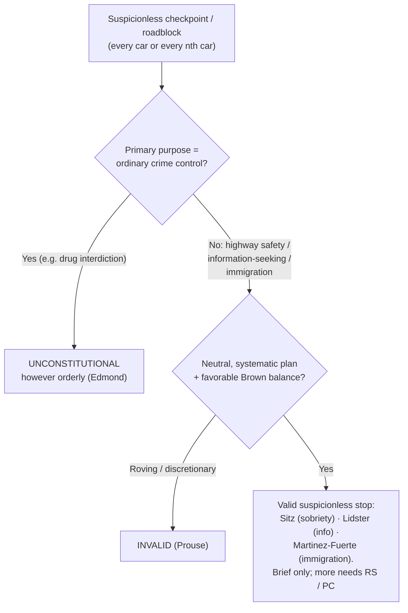
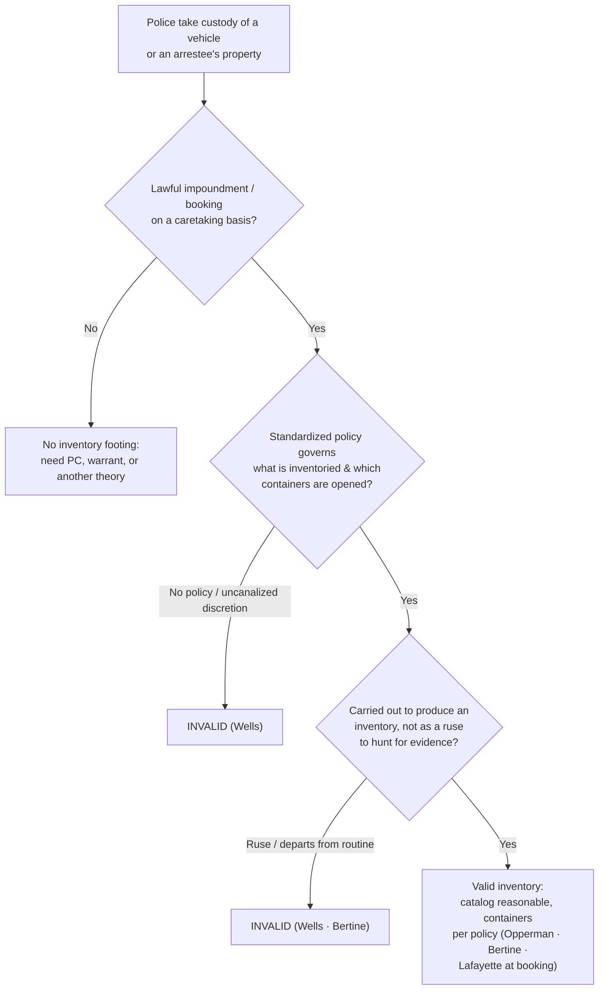

# S9 R1 panel-review — Opus model-diversity lane (prompt pack)

You are the **Claude/Opus** leg of the S9 three-lane adversarial panel (1 Claude + 2 Codex, R1). The two Codex lanes carry the A (support/quote-fidelity) and B (currency/treatment) attack lenses; **you carry model diversity and MUST vote on every paneled assertion across BOTH lenses' concerns.** You are refute-framed: try hard to break each assertion; **default to REFUTED on uncertainty**; never fabricate a cite, quote, or holding; use ONLY the evidence inlined below (no search, no outside knowledge). You are a SIGHTED reviewer — the FULL lake record (judgment fields included) is inlined.

You are a WRITER lane, not an adjudicator: you FIND and VOTE. You do not tally, adjudicate, or close any row — the orchestrator does.

For EACH group below, return one JSON object with the exact `reviewed[]` shape from the output contract (identical framing to the Codex lenses). Emit a finding object ONLY for a real defect (verdict refuted / stands-modified); a group you find wholly clean returns all-`stands` verdicts (the harness records a clean attestation). Concatenate the per-group JSON objects into a top-level `{"packs": [ ... ]}` array, one entry per group, each carrying its `group_id`.


OUTPUT CONTRACT — return ONE JSON object, nothing else:
{
  "lens": "A" | "B",
  "group_id": "<echo the group id>",
  "reviewed": [
    {
      "assertion_id": "<from group_inventory.jsonl>",
      "dimension": "existence|support|quote_fidelity|pincite|treatment|black_letter",
      "verdict": "stands" | "refuted" | "stands-modified",
      "verifiable_from_disclosed": true | false,
      "defect": null,   // null when verdict=="stands"; else an object:
      //  {"problem": "...", "severity": "high|medium|low", "proposed_fix": "...", "evidence_quote": "verbatim from disclosed evidence or null", "needs_cl": true|false, "locator_note": "..."}
      "reasons": ["short evidence-grounded reason", "..."],
      "breaks_true_positives": true | false,
      "residual_risks": ["..."],
      "suggested_tightening": "... or null"
    }
  ],
  "notes": ""
}
Rules: verdict=='stands' <=> defect==null (assertion survives your attack). verdict=='refuted' <=> a real defect (the assertion as framed is wrong). verdict=='stands-modified' <=> survives but needs a stated modification (a minor defect). Review EVERY assertion_id in group_inventory.jsonl exactly once. Output ONLY the JSON object.
---

## GROUP: content/warrant-exceptions/searching-a-vehicle/Checkpoints and Roadblocks.md  (`doctrine`, 7 assertions)

### content_page

```
---
weight: 40
aliases:
  - "Checkpoints and Roadblocks"
  - "Checkpoints & Roadblocks"
title: "Checkpoints & Roadblocks"
topic: Checkpoints and Roadblocks
type: doctrine
jurisdiction: Federal (U.S. Const. amend. IV); SCOTUS baseline
status: draft
related: ["[[Traffic Stops]]", "[[Border Searches]]", "[[Special Needs and Administrative Searches]]", "[[Terry Stops and Reasonable Suspicion]]", "[[The Exclusionary Rule]]"]
---

# Checkpoints & Roadblocks

*Does this suspicionless checkpoint serve a primary purpose beyond ordinary crime control, so a programmatic balance can sustain it, or is it crime control in disguise, which gets no discount?*

> [!rule] Black-letter rule
> A brief, suspicionless, **systematic** checkpoint stop is a seizure that can be reasonable **without individualized suspicion** under a programmatic balance of the public interest against the minimal intrusion, **but only if its primary purpose is not to detect evidence of ordinary criminal wrongdoing**. A sobriety or safety checkpoint is valid, *[[Michigan Dept. of State Police v. Sitz|Sitz]]*, 496 U.S. 444, [455](https://www.courtlistener.com/opinion/112459/michigan-department-of-state-police-v-sitz/) (1990); a checkpoint whose primary purpose is general crime control (drug interdiction) is unconstitutional however orderly, *[[City of Indianapolis v. Edmond|Edmond]]*, 531 U.S. 32, [41–42](https://www.courtlistener.com/opinion/118391/city-of-indianapolis-v-edmond/) (2000).
> ^rule-checkpoint

## The Brief

**What it is, and is not.** A checkpoint is a **seizure without suspicion**: officers stop every car (or every nth car) on a neutral, pre-announced plan, not because any driver did anything. What makes that constitutional is not a warrant but a **programmatic balance** in which the checkpoint's design removes officer discretion and serves a defined public need. It is **not** a license to fish for crime, and it is a distinct doctrine from the individualized [[Traffic Stops|traffic stop]] (which needs reasonable suspicion) and from the [[Border Searches|border-search]] power (sovereignty at the border). The dispositive move is naming the checkpoint's **primary purpose**.

**The test up front.** A suspicionless checkpoint seizure is reasonable when:
1. **Primary purpose.** The programme's primary purpose is something **other than** detecting evidence of ordinary criminal wrongdoing, such as highway safety or information-seeking. *[[City of Indianapolis v. Edmond|Edmond]]*, 531 U.S. at [41–42](https://www.courtlistener.com/opinion/118391/city-of-indianapolis-v-edmond/).
2. **Programmatic balance.** Weighing "the gravity of the public concerns served by the seizure, the degree to which the seizure advances the public interest, and the severity of the interference with individual liberty," the balance favors the programme. *[[Brown v. Texas|Brown]]*, 443 U.S. 47, [51](https://www.courtlistener.com/opinion/110128/brown-v-texas/) (1979).
3. **Neutral, systematic operation.** The stops follow "explicit, neutral limitations on the conduct of individual officers" rather than roving, ad hoc discretion. *Id.*

**The purpose gate comes first, and it is dispositive.** Before any balancing, ask what the checkpoint is *for*. *[[City of Indianapolis v. Edmond|Edmond]]* struck down a narcotics checkpoint precisely because "the primary purpose of the Indianapolis narcotics checkpoint program is to uncover evidence of ordinary criminal wrongdoing," and the Court had "never approved a checkpoint program whose primary purpose was to detect evidence of ordinary criminal wrongdoing." 531 U.S. at 41–42. A "drug checkpoint" is unconstitutional **even if run exactly like a lawful sobriety checkpoint**, because purpose, not procedure, decides.

**The valid poles.** Two purposes have been sustained:
- **Highway safety (sobriety).** *[[Michigan Dept. of State Police v. Sitz|Sitz]]* upheld a DUI sobriety checkpoint: balancing the State's interest in stopping drunk driving, the programme's effectiveness, and the brief intrusion, the Court held it "consistent with the Fourth Amendment." 496 U.S. at 455.
- **Information-seeking about someone else's crime.** *[[Illinois v. Lidster|Lidster]]* upheld a checkpoint that stopped motorists to ask for help solving a hit-and-run: its "primary law enforcement purpose was not to determine whether a vehicle's occupants were committing a crime, but to ask . . . for their help in providing information about a crime in all likelihood committed by others." 540 U.S. 419, 423, 427 (2004). *[[Illinois v. Lidster|Lidster]]* applies the *[[Brown v. Texas|Brown]]* factors case by case rather than presuming validity.

**The immigration and random-stop lines.** Two neighboring rules bound this doctrine and are treated in full elsewhere. Fixed **interior immigration checkpoints** are the doctrinal ancestor: brief suspicionless stops for questioning at a permanent checkpoint are constitutional "in the absence of any individualized suspicion." *[[United States v. Martinez-Fuerte|Martinez-Fuerte]]*, 428 U.S. 543, [566](https://www.courtlistener.com/opinion/109541/united-states-v-martinez-fuerte/) (1976); that immigration line is developed on [[Border Searches]]. At the other end, **random, discretionary** roving stops are barred: an officer may not stop a car to check license and registration on a whim, because that leaves "standardless and unconstrained discretion" with the officer, though the Court expressly left room for "questioning of all oncoming traffic at roadblock-type stops." *[[Delaware v. Prouse|Prouse]]*, 440 U.S. 648, [663](https://www.courtlistener.com/opinion/110045/delaware-v-prouse/) (1979); the individualized-stop rules live on [[Traffic Stops]].

**What it yields, and its limits.** A valid checkpoint legitimates the brief stop and whatever an officer observes in [[Plain View Doctrine|plain view]] from it; escalation beyond the checkpoint's purpose (a full search, a prolonged detention) needs its own justification (reasonable suspicion or probable cause). An invalid-purpose checkpoint taints every stop it produces, whatever an individual officer subjectively intended, because the inquiry is **programmatic**.

**Burden, standard of review, remedy.** The **government** must establish the checkpoint's lawful primary purpose and neutral operation. The purpose inquiry looks to the programmatic level, not one officer's motive; reasonableness is reviewed [[Common Legal Terms#de-novo|de novo]] on facts found for [[Common Legal Terms#clear-error|clear error]]. The **remedy** for an unlawful checkpoint is suppression under [[The Exclusionary Rule]].

**Apply it.**
1. **Name the primary purpose.** Highway safety or information-seeking can support a checkpoint; general crime control cannot. Write down the programme's purpose before you defend it.
2. **Show the plan.** Point to the neutral, systematic protocol (which cars are stopped, what officers do), not on-the-spot discretion (*[[Delaware v. Prouse|Prouse]]*).
3. **Keep the stop brief.** A checkpoint buys a short, suspicionless stop; anything more needs independent suspicion or probable cause.
4. **Do not relabel a drug checkpoint.** Running it like *[[Michigan Dept. of State Police v. Sitz|Sitz]]* does not save a crime-control purpose (*[[City of Indianapolis v. Edmond|Edmond]]*).

**Common pitfalls.**
- **Treating any orderly checkpoint as valid.** *[[City of Indianapolis v. Edmond|Edmond]]* makes the programme's **primary purpose dispositive**; procedure cannot cure a crime-control purpose.
- **Bootstrapping crime control onto a safety checkpoint.** Adding a narcotics-detection objective to a sobriety checkpoint risks converting the whole programme into an *[[City of Indianapolis v. Edmond|Edmond]]* violation.
- **Confusing a checkpoint with an individualized stop.** A [[Traffic Stops|traffic stop]] needs reasonable suspicion; a checkpoint substitutes a neutral programme for suspicion. Do not mix the justifications.
- **Confusing an immigration checkpoint with a search.** *[[United States v. Martinez-Fuerte|Martinez-Fuerte]]* authorizes a suspicionless *stop*, not a suspicionless *search* away from the border.

## Lower-court developments

The Supreme Court framework (*[[Michigan Dept. of State Police v. Sitz|Sitz]]* / *[[City of Indianapolis v. Edmond|Edmond]]* / *[[Illinois v. Lidster|Lidster]]* / *[[United States v. Martinez-Fuerte|Martinez-Fuerte]]* / *[[Delaware v. Prouse|Prouse]]*) is stable and controlling; the recurring work in the lower courts is applying the **primary-purpose** test to mixed-motive checkpoints (safety plus incidental drug detection), to "ruse" checkpoints (a sign advertising a nonexistent drug checkpoint, catching drivers who exit or discard contraband), and to license-and-registration or immigration-status roadblocks. Those applications are circuit- and state-specific and turn on the *[[City of Indianapolis v. Edmond|Edmond]]* purpose inquiry and the *[[Brown v. Texas|Brown]]* balance; the individualized-stop developments are catalogued on [[Traffic Stops]].

## Key cases

| Case | Holding | Opinion |
|---|---|---|
| *[[Michigan Dept. of State Police v. Sitz]]*, 496 U.S. 444 (1990) | **Valid pole.** A suspicionless DUI sobriety checkpoint is reasonable; the State's interest in combating drunk driving outweighs the brief, minimal intrusion. | [opinion](https://www.courtlistener.com/opinion/112459/michigan-department-of-state-police-v-sitz/) |
| *[[City of Indianapolis v. Edmond]]*, 531 U.S. 32 (2000) | **Purpose gate.** A checkpoint whose primary purpose is ordinary crime control (drug interdiction) is unconstitutional, however brief or orderly. | [opinion](https://www.courtlistener.com/opinion/118391/city-of-indianapolis-v-edmond/) |
| *[[Illinois v. Lidster]]*, 540 U.S. 419 (2004) | **Information-seeking.** A checkpoint that stops motorists to ask for help about a crime committed by someone else is valid under the *[[Brown v. Texas\|Brown]]* balance. | [opinion](https://www.courtlistener.com/opinion/131154/illinois-v-lidster/) |

## Related cases across doctrines

These are treated in full elsewhere but bear directly on the checkpoint line, framed here.

| Case | Relevance here | Primary home | Opinion |
|---|---|---|---|
| *[[United States v. Martinez-Fuerte]]*, 428 U.S. 543 (1976) | ***Ancestor.*** Brief suspicionless stops at fixed interior immigration checkpoints are reasonable on a programmatic balance, the model for the no-suspicion, no-discretion checkpoint. | [[Border Searches]] | [opinion](https://www.courtlistener.com/opinion/109541/united-states-v-martinez-fuerte/) |
| *[[Delaware v. Prouse]]*, 440 U.S. 648 (1979) | ***Floor.*** Random, discretionary license/registration stops are barred, but a neutral, systematic roadblock could pass, the line every checkpoint must clear. | [[Traffic Stops]] | [opinion](https://www.courtlistener.com/opinion/110045/delaware-v-prouse/) |
| *[[Brown v. Texas]]*, 443 U.S. 47 (1979) | ***Balancing engine.*** Supplies the three-factor test (public concern, advancement, interference) and the "neutral limitations" requirement that the checkpoint cases run on. | [[Terry Stops and Reasonable Suspicion]] | [opinion](https://www.courtlistener.com/opinion/110128/brown-v-texas/) |

## Visual



## Sources
- [*Michigan Dept. of State Police v. Sitz*, 496 U.S. 444 (1990)](https://www.courtlistener.com/opinion/112459/michigan-department-of-state-police-v-sitz/) (pinpoint: 455)
- [*City of Indianapolis v. Edmond*, 531 U.S. 32 (2000)](https://www.courtlistener.com/opinion/118391/city-of-indianapolis-v-edmond/) (pinpoints: 41, 42)
- [*Illinois v. Lidster*, 540 U.S. 419 (2004)](https://www.courtlistener.com/opinion/131154/illinois-v-lidster/) (pinpoints: 423, 426, 427)
- [*United States v. Martinez-Fuerte*, 428 U.S. 543 (1976)](https://www.courtlistener.com/opinion/109541/united-states-v-martinez-fuerte/) (pinpoint: 566; immigration checkpoints; home = [[Border Searches]])
- [*Delaware v. Prouse*, 440 U.S. 648 (1979)](https://www.courtlistener.com/opinion/110045/delaware-v-prouse/) (pinpoint: 663; random-stop floor; home = [[Traffic Stops]])
- [*Brown v. Texas*, 443 U.S. 47 (1979)](https://www.courtlistener.com/opinion/110128/brown-v-texas/) (pinpoint: 51; three-factor balance; home = [[Terry Stops and Reasonable Suspicion]])

```

### group_inventory (assertions under review)

```jsonl
{"assertion_id": "1b017d2bad264a81", "dimension": "existence", "kind": "case_cite", "locator": {"case": "Delaware v. Prouse", "table_line": 62}, "payload": {"case": "Delaware v. Prouse", "cells": ["*[[Delaware v. Prouse]]*, 440 U.S. 648 (1979)", "***Floor.*** Random, discretionary license/registration stops are barred, but a neutral, systematic roadblock could pass, the line every checkpoint must clear.", "[[Traffic Stops]]", "[opinion](https://www.courtlistener.com/opinion/110045/delaware-v-prouse/)"], "header": ["Case", "Relevance here", "Primary home", "Opinion"]}}
{"assertion_id": "312adf96a17069ba", "dimension": "existence", "kind": "case_cite", "locator": {"case": "United States v. Martinez-Fuerte", "table_line": 61}, "payload": {"case": "United States v. Martinez-Fuerte", "cells": ["*[[United States v. Martinez-Fuerte]]*, 428 U.S. 543 (1976)", "***Ancestor.*** Brief suspicionless stops at fixed interior immigration checkpoints are reasonable on a programmatic balance, the model for the no-suspicion, no-discretion checkpoint.", "[[Border Searches]]", "[opinion](https://www.courtlistener.com/opinion/109541/united-states-v-martinez-fuerte/)"], "header": ["Case", "Relevance here", "Primary home", "Opinion"]}}
{"assertion_id": "713901035df85763", "dimension": "existence", "kind": "case_cite", "locator": {"case": "City of Indianapolis v. Edmond", "table_line": 52}, "payload": {"case": "City of Indianapolis v. Edmond", "cells": ["*[[City of Indianapolis v. Edmond]]*, 531 U.S. 32 (2000)", "**Purpose gate.** A checkpoint whose primary purpose is ordinary crime control (drug interdiction) is unconstitutional, however brief or orderly.", "[opinion](https://www.courtlistener.com/opinion/118391/city-of-indianapolis-v-edmond/)"], "header": ["Case", "Holding", "Opinion"]}}
{"assertion_id": "8e30e5dbdd45e688", "dimension": "existence", "kind": "case_cite", "locator": {"case": "Brown v. Texas", "table_line": 63}, "payload": {"case": "Brown v. Texas", "cells": ["*[[Brown v. Texas]]*, 443 U.S. 47 (1979)", "***Balancing engine.*** Supplies the three-factor test (public concern, advancement, interference) and the \"neutral limitations\" requirement that the checkpoint cases run on.", "[[Terry Stops and Reasonable Suspicion]]", "[opinion](https://www.courtlistener.com/opinion/110128/brown-v-texas/)"], "header": ["Case", "Relevance here", "Primary home", "Opinion"]}}
{"assertion_id": "c445a4f8ba41696e", "dimension": "existence", "kind": "case_cite", "locator": {"case": "Michigan Dept. of State Police v. Sitz", "table_line": 51}, "payload": {"case": "Michigan Dept. of State Police v. Sitz", "cells": ["*[[Michigan Dept. of State Police v. Sitz]]*, 496 U.S. 444 (1990)", "**Valid pole.** A suspicionless DUI sobriety checkpoint is reasonable; the State's interest in combating drunk driving outweighs the brief, minimal intrusion.", "[opinion](https://www.courtlistener.com/opinion/112459/michigan-department-of-state-police-v-sitz/)"], "header": ["Case", "Holding", "Opinion"]}}
{"assertion_id": "cd5ff4ec295ee7be", "dimension": "existence", "kind": "case_cite", "locator": {"case": "Illinois v. Lidster", "table_line": 53}, "payload": {"case": "Illinois v. Lidster", "cells": ["*[[Illinois v. Lidster]]*, 540 U.S. 419 (2004)", "**Information-seeking.** A checkpoint that stops motorists to ask for help about a crime committed by someone else is valid under the *[[Brown v. Texas\\|Brown]]* balance.", "[opinion](https://www.courtlistener.com/opinion/131154/illinois-v-lidster/)"], "header": ["Case", "Holding", "Opinion"]}}
{"assertion_id": "a8f69d4f5dde7285", "dimension": "support", "kind": "proposition", "locator": {"callout": "^rule-checkpoint"}, "payload": {"anchor": "^rule-checkpoint", "statement": "[!rule] Black-letter rule\nA brief, suspicionless, **systematic** checkpoint stop is a seizure that can be reasonable **without individualized suspicion** under a programmatic balance of the public interest against the minimal intrusion, **but only if its primary purpose is not to detect evidence of ordinary criminal wrongdoing**. A sobriety or safety checkpoint is valid, *[[Michigan Dept. of State Police v. Sitz|Sitz]]*, 496 U.S. 444, [455](https://www.courtlistener.com/opinion/112459/michigan-department-of-state-police-v-sitz/) (1990); a checkpoint whose primary purpose is general crime control (drug interdiction) is unconstitutional however orderly, *[[City of Indianapolis v. Edmond|Edmond]]*, 531 U.S. 32, [41–42](https://www.courtlistener.com/opinion/118391/city-of-indianapolis-v-edmond/) (2000)."}}
```

### lake record — Brown v. Texas

```json
{
  "schema_version": "s2.v1",
  "record_id": "Brown v. Texas",
  "stub": false,
  "status": "under_review",
  "identity": {
    "case_name": "Brown v. Texas",
    "case_name_short": "Brown",
    "case_name_full": "Brown v. Texas",
    "input_case_name": "Brown v. Texas",
    "court": "U.S. Supreme Court",
    "court_id": "scotus",
    "court_level": "scotus",
    "circuit": null,
    "state": null,
    "date_decided": "1979-06-25",
    "year": 1979,
    "docket": null,
    "cluster_id": 110128,
    "lead_opinion_id": 110128,
    "sibling_ids": [
      110128
    ],
    "absolute_url": "/opinion/110128/brown-v-texas/",
    "identity_method": "pending",
    "expected_citation_found": true,
    "party_name_in_text": false,
    "canonical_name_match": true,
    "alternates": [
      {
        "cluster_id": 9021114,
        "score": 10,
        "case_name": "Brown v. Texas"
      },
      {
        "cluster_id": 9020748,
        "score": 10,
        "case_name": "Brown v. Texas"
      }
    ],
    "reason_code": "two_key_not_satisfied"
  },
  "citations": {
    "official": {
      "cite": "443 U.S. 47",
      "volume": "443",
      "reporter": "U.S.",
      "page": "47",
      "type": 1,
      "selected_official": true,
      "source": "cluster.citations[]"
    },
    "parallel": [
      {
        "cite": "99 S. Ct. 2637",
        "volume": "99",
        "reporter": "S. Ct.",
        "page": "2637",
        "type": 1,
        "selected_official": false,
        "source": "cluster.citations[]"
      },
      {
        "cite": "61 L. Ed. 2d 357",
        "volume": "61",
        "reporter": "L. Ed. 2d",
        "page": "357",
        "type": 1,
        "selected_official": false,
        "source": "cluster.citations[]"
      }
    ],
    "vendor_neutral": [
      {
        "cite": "1979 U.S. LEXIS 136",
        "volume": "1979",
        "reporter": "U.S. LEXIS",
        "page": "136",
        "type": 6,
        "selected_official": false,
        "source": "cluster.citations[]"
      }
    ],
    "all": [
      {
        "cite": "443 U.S. 47",
        "volume": "443",
        "reporter": "U.S.",
        "page": "47",
        "type": 1,
        "selected_official": false,
        "source": "cluster.citations[]"
      },
      {
        "cite": "99 S. Ct. 2637",
        "volume": "99",
        "reporter": "S. Ct.",
        "page": "2637",
        "type": 1,
        "selected_official": false,
        "source": "cluster.citations[]"
      },
      {
        "cite": "61 L. Ed. 2d 357",
        "volume": "61",
        "reporter": "L. Ed. 2d",
        "page": "357",
        "type": 1,
        "selected_official": false,
        "source": "cluster.citations[]"
      },
      {
        "cite": "1979 U.S. LEXIS 136",
        "volume": "1979",
        "reporter": "U.S. LEXIS",
        "page": "136",
        "type": 6,
        "selected_official": false,
        "source": "cluster.citations[]"
      }
    ],
    "display": "443 U.S. 47",
    "official_selection": {
      "court_class": "scotus",
      "selected": "443 U.S. 47",
      "reason": "selected_rank_1"
    }
  },
  "pinpoints": [
    {
      "id": "pin-51",
      "page": null,
      "quote": "but could point to no specific facts; he acknowledged the only reason for the stop was to ascertain Brown's identity. Brown refused to identify himself and was arrested and convicted under a Texas statute (\u00a7 38.02) making it a crime to refuse to give one's name to an officer who has lawfully stopped him. ## Issue Whether officers may detain an individual and require him to identify himself, on penalty of criminal punishment for refusing, when they lack reasonable suspicion that he is engaged in criminal activity. ## Rule No. The constitutionality of a seizure short of arrest is judged by a balancing test:",
      "star_marker": null,
      "quote_fidelity": "mismatch",
      "pinpoint_status": "slip-only",
      "position": null
    },
    {
      "id": "pin-51b",
      "page": null,
      "quote": "the Fourth Amendment requires that a seizure must be based on specific, objective facts indicating that society's legitimate interests require the seizure of the particular individual, or that the seizure must be carried out pursuant to a plan embodying explicit, neutral limitations on the conduct of individual officers.",
      "star_marker": null,
      "quote_fidelity": "mismatch",
      "pinpoint_status": "slip-only",
      "position": null
    },
    {
      "id": "pin-53",
      "page": null,
      "quote": "## Application The officers had no such basis. One could say only that the alley",
      "star_marker": null,
      "quote_fidelity": "mismatch",
      "pinpoint_status": "slip-only",
      "position": null
    }
  ],
  "treatment": {
    "field_i_validity": "good_law",
    "as_of_content": "1979-06-25",
    "as_of_treatment": "2026-06-30",
    "composite_basis": "migration-seed",
    "composite_basis_ref": "Brown v. Texas",
    "varies_by_point": false,
    "scope_note": "Good law. Police may not detain a person and demand identification without reasonable suspicion; the case supplies the three-factor balancing test for suspicionless seizures. Hiibel v. Sixth Judicial Dist. Court (2004) later upheld an identify-yourself demand during a lawful Terry stop \u2014 the question Brown expressly reserved \u2014 and does not disturb Brown.",
    "point_overrides": [],
    "edges": [
      {
        "citing_case": {
          "name": "Commonwealth v. Arias",
          "cluster_id": 10843215,
          "cite": null,
          "field_ii": "superseded_by_statute"
        },
        "field_ii": "superseded_by_statute",
        "field_iii": "mentioned",
        "point": null,
        "proposed": true,
        "journal_ref": "Brown v. Texas:lane1_negative"
      },
      {
        "citing_case": {
          "name": "State v. Cobb",
          "cluster_id": 9352626,
          "cite": null,
          "field_ii": "questioned"
        },
        "field_ii": "questioned",
        "field_iii": "mentioned",
        "point": null,
        "proposed": true,
        "journal_ref": "Brown v. Texas:lane1_negative"
      },
      {
        "citing_case": {
          "name": "State v. Cobb",
          "cluster_id": 6466320,
          "cite": null,
          "field_ii": "questioned"
        },
        "field_ii": "questioned",
        "field_iii": "mentioned",
        "point": null,
        "proposed": true,
        "journal_ref": "Brown v. Texas:lane1_negative"
      },
      {
        "citing_case": {
          "name": "State v. Sievers - supplemental opinion",
          "cluster_id": 4571040,
          "cite": [
            "301 Neb. 806",
            "920 N.W.2d 443"
          ],
          "field_ii": "overruled"
        },
        "field_ii": "overruled",
        "field_iii": "mentioned",
        "point": null,
        "proposed": true,
        "journal_ref": "Brown v. Texas:lane1_negative"
      },
      {
        "citing_case": {
          "name": "State v. Baskins",
          "cluster_id": 4524209,
          "cite": [
            "818 S.E.2d 381",
            "260 N.C. App. 589"
          ],
          "field_ii": "overruled"
        },
        "field_ii": "overruled",
        "field_iii": "mentioned",
        "point": null,
        "proposed": true,
        "journal_ref": "Brown v. Texas:lane1_negative"
      },
      {
        "citing_case": {
          "name": "State v. Christian",
          "cluster_id": 4477521,
          "cite": [
            "2018 Ohio 957",
            "109 N.E.3d 183"
          ],
          "field_ii": "questioned"
        },
        "field_ii": "questioned",
        "field_iii": "mentioned",
        "point": null,
        "proposed": true,
        "journal_ref": "Brown v. Texas:lane1_negative"
      },
      {
        "citing_case": {
          "name": "State v. Hairston",
          "cluster_id": 4426228,
          "cite": [
            "2017 Ohio 7612",
            "97 N.E.3d 784"
          ],
          "field_ii": "overruled"
        },
        "field_ii": "overruled",
        "field_iii": "mentioned",
        "point": null,
        "proposed": true,
        "journal_ref": "Brown v. Texas:lane1_negative"
      },
      {
        "citing_case": {
          "name": "Elvis Elvis Ramirez-Tamayo v. State",
          "cluster_id": 4311099,
          "cite": [
            "501 S.W.3d 788",
            "2016 Tex. App. LEXIS 10905",
            "2016 WL 5874327"
          ],
          "field_ii": "questioned"
        },
        "field_ii": "questioned",
        "field_iii": "mentioned",
        "point": null,
        "proposed": true,
        "journal_ref": "Brown v. Texas:lane1_negative"
      },
      {
        "citing_case": {
          "name": "State v. Ashworth",
          "cluster_id": 4243394,
          "cite": [
            "790 S.E.2d 173",
            "248 N.C. App. 649",
            "2016 N.C. App. LEXIS 816"
          ],
          "field_ii": "questioned"
        },
        "field_ii": "questioned",
        "field_iii": "mentioned",
        "point": null,
        "proposed": true,
        "journal_ref": "Brown v. Texas:lane1_negative"
      },
      {
        "citing_case": {
          "name": "Carlos Gonzalez v. Able Huerta",
          "cluster_id": 3216824,
          "cite": [
            "826 F.3d 854",
            "2016 U.S. App. LEXIS 11530",
            "2016 WL 3457258"
          ],
          "field_ii": "questioned"
        },
        "field_ii": "questioned",
        "field_iii": "mentioned",
        "point": null,
        "proposed": true,
        "journal_ref": "Brown v. Texas:lane1_negative"
      },
      {
        "citing_case": {
          "name": "Leming v. State",
          "cluster_id": 5447022,
          "cite": [
            "493 S.W.3d 552",
            "2016 WL 1458242",
            "2016 Tex. Crim. App. LEXIS 73"
          ],
          "field_ii": "questioned"
        },
        "field_ii": "questioned",
        "field_iii": "mentioned",
        "point": null,
        "proposed": true,
        "journal_ref": "Brown v. Texas:lane1_negative"
      },
      {
        "citing_case": {
          "name": "Mocek v. City of Albuquerque",
          "cluster_id": 3164764,
          "cite": [
            "813 F.3d 912",
            "2015 U.S. App. LEXIS 22435",
            "2015 WL 9298662"
          ],
          "field_ii": "abrogated"
        },
        "field_ii": "abrogated",
        "field_iii": "mentioned",
        "point": null,
        "proposed": true,
        "journal_ref": "Brown v. Texas:lane1_negative"
      },
      {
        "citing_case": {
          "name": "United States v. Mercedes-De la Cruz",
          "cluster_id": 2803337,
          "cite": [
            "787 F.3d 61",
            "2015 U.S. App. LEXIS 8624",
            "2015 WL 3378255"
          ],
          "field_ii": "questioned"
        },
        "field_ii": "questioned",
        "field_iii": "mentioned",
        "point": null,
        "proposed": true,
        "journal_ref": "Brown v. Texas:lane1_negative"
      },
      {
        "citing_case": {
          "name": "Illinois v. Gates",
          "cluster_id": 110959,
          "cite": [
            "76 L. Ed. 2d 527",
            "103 S. Ct. 2317",
            "462 U.S. 213",
            "1983 U.S. LEXIS 54",
            "51 U.S.L.W. 4709"
          ],
          "field_ii": "overruled"
        },
        "field_ii": "overruled",
        "field_iii": "mentioned",
        "point": null,
        "proposed": true,
        "journal_ref": "Brown v. Texas:lane2_top_cited"
      },
      {
        "citing_case": {
          "name": "Florida v. Royer",
          "cluster_id": 110890,
          "cite": [
            "75 L. Ed. 2d 229",
            "103 S. Ct. 1319",
            "460 U.S. 491",
            "1983 U.S. LEXIS 151",
            "51 U.S.L.W. 4293"
          ],
          "field_ii": "questioned"
        },
        "field_ii": "questioned",
        "field_iii": "mentioned",
        "point": null,
        "proposed": true,
        "journal_ref": "Brown v. Texas:lane2_top_cited"
      },
      {
        "citing_case": {
          "name": "United States v. Mendenhall",
          "cluster_id": 110264,
          "cite": [
            "64 L. Ed. 2d 497",
            "100 S. Ct. 1870",
            "446 U.S. 544",
            "1980 U.S. LEXIS 102"
          ],
          "field_ii": "questioned"
        },
        "field_ii": "questioned",
        "field_iii": "mentioned",
        "point": null,
        "proposed": true,
        "journal_ref": "Brown v. Texas:lane2_top_cited"
      },
      {
        "citing_case": {
          "name": "United States v. Cortez",
          "cluster_id": 110377,
          "cite": [
            "66 L. Ed. 2d 621",
            "101 S. Ct. 690",
            "449 U.S. 411",
            "1981 U.S. LEXIS 58",
            "49 U.S.L.W. 4099"
          ],
          "field_ii": "questioned"
        },
        "field_ii": "questioned",
        "field_iii": "mentioned",
        "point": null,
        "proposed": true,
        "journal_ref": "Brown v. Texas:lane2_top_cited"
      },
      {
        "citing_case": {
          "name": "United States v. Sokolow",
          "cluster_id": 112239,
          "cite": [
            "104 L. Ed. 2d 1",
            "109 S. Ct. 1581",
            "490 U.S. 1",
            "1989 U.S. LEXIS 1694",
            "57 U.S.L.W. 4401"
          ],
          "field_ii": "questioned"
        },
        "field_ii": "questioned",
        "field_iii": "mentioned",
        "point": null,
        "proposed": true,
        "journal_ref": "Brown v. Texas:lane2_top_cited"
      },
      {
        "citing_case": {
          "name": "Florida v. Bostick",
          "cluster_id": 112631,
          "cite": [
            "115 L. Ed. 2d 389",
            "111 S. Ct. 2382",
            "501 U.S. 429",
            "1991 U.S. LEXIS 3625",
            "59 U.S.L.W. 4708",
            "91 Daily Journal DAR 7328",
            "91 Cal. Daily Op. Serv. 4671",
            "1991 WL 105224"
          ],
          "field_ii": "overruled"
        },
        "field_ii": "overruled",
        "field_iii": "mentioned",
        "point": null,
        "proposed": true,
        "journal_ref": "Brown v. Texas:lane2_top_cited"
      },
      {
        "citing_case": {
          "name": "Illinois v. Wardlow",
          "cluster_id": 118326,
          "cite": [
            "145 L. Ed. 2d 570",
            "120 S. Ct. 673",
            "528 U.S. 119",
            "2000 U.S. LEXIS 504"
          ],
          "field_ii": "questioned"
        },
        "field_ii": "questioned",
        "field_iii": "mentioned",
        "point": null,
        "proposed": true,
        "journal_ref": "Brown v. Texas:lane2_top_cited"
      },
      {
        "citing_case": {
          "name": "California v. Hodari D.",
          "cluster_id": 112579,
          "cite": [
            "113 L. Ed. 2d 690",
            "111 S. Ct. 1547",
            "499 U.S. 621",
            "1991 U.S. LEXIS 2397",
            "91 Cal. Daily Op. Serv. 2893",
            "59 U.S.L.W. 4335",
            "91 Daily Journal DAR 4665"
          ],
          "field_ii": "criticized"
        },
        "field_ii": "criticized",
        "field_iii": "mentioned",
        "point": null,
        "proposed": true,
        "journal_ref": "Brown v. Texas:lane2_top_cited"
      },
      {
        "citing_case": {
          "name": "Kolender v. Lawson",
          "cluster_id": 110926,
          "cite": [
            "75 L. Ed. 2d 903",
            "103 S. Ct. 1855",
            "461 U.S. 352",
            "1983 U.S. LEXIS 159",
            "51 U.S.L.W. 4532"
          ],
          "field_ii": "questioned"
        },
        "field_ii": "questioned",
        "field_iii": "mentioned",
        "point": null,
        "proposed": true,
        "journal_ref": "Brown v. Texas:lane2_top_cited"
      },
      {
        "citing_case": {
          "name": "United States v. Jacobsen",
          "cluster_id": 111143,
          "cite": [
            "80 L. Ed. 2d 85",
            "104 S. Ct. 1652",
            "466 U.S. 109",
            "1984 U.S. LEXIS 53",
            "52 U.S.L.W. 4414"
          ],
          "field_ii": "overruled"
        },
        "field_ii": "overruled",
        "field_iii": "mentioned",
        "point": null,
        "proposed": true,
        "journal_ref": "Brown v. Texas:lane2_top_cited"
      },
      {
        "citing_case": {
          "name": "Rawlings v. Kentucky",
          "cluster_id": 110326,
          "cite": [
            "65 L. Ed. 2d 633",
            "100 S. Ct. 2556",
            "448 U.S. 98",
            "1980 U.S. LEXIS 142"
          ],
          "field_ii": "overruled"
        },
        "field_ii": "overruled",
        "field_iii": "mentioned",
        "point": null,
        "proposed": true,
        "journal_ref": "Brown v. Texas:lane2_top_cited"
      },
      {
        "citing_case": {
          "name": "United States v. Hensley",
          "cluster_id": 111294,
          "cite": [
            "83 L. Ed. 2d 604",
            "105 S. Ct. 675",
            "469 U.S. 221",
            "1985 U.S. LEXIS 34",
            "53 U.S.L.W. 4053"
          ],
          "field_ii": "questioned"
        },
        "field_ii": "questioned",
        "field_iii": "mentioned",
        "point": null,
        "proposed": true,
        "journal_ref": "Brown v. Texas:lane2_top_cited"
      },
      {
        "citing_case": {
          "name": "Michigan v. Summers",
          "cluster_id": 110534,
          "cite": [
            "69 L. Ed. 2d 340",
            "101 S. Ct. 2587",
            "452 U.S. 692",
            "1981 U.S. LEXIS 118",
            "49 U.S.L.W. 4776"
          ],
          "field_ii": "questioned"
        },
        "field_ii": "questioned",
        "field_iii": "mentioned",
        "point": null,
        "proposed": true,
        "journal_ref": "Brown v. Texas:lane2_top_cited"
      },
      {
        "citing_case": {
          "name": "Immigration & Naturalization Service v. Delgado",
          "cluster_id": 111148,
          "cite": [
            "80 L. Ed. 2d 247",
            "104 S. Ct. 1758",
            "466 U.S. 210",
            "1984 U.S. LEXIS 57",
            "52 U.S.L.W. 4436"
          ],
          "field_ii": "questioned"
        },
        "field_ii": "questioned",
        "field_iii": "mentioned",
        "point": null,
        "proposed": true,
        "journal_ref": "Brown v. Texas:lane2_top_cited"
      },
      {
        "citing_case": {
          "name": "Ford v. State",
          "cluster_id": 1355298,
          "cite": [
            "158 S.W.3d 488",
            "2005 Tex. Crim. App. LEXIS 399",
            "2005 WL 544796"
          ],
          "field_ii": "overruled"
        },
        "field_ii": "overruled",
        "field_iii": "mentioned",
        "point": null,
        "proposed": true,
        "journal_ref": "Brown v. Texas:lane2_top_cited"
      },
      {
        "citing_case": {
          "name": "State v. Smith",
          "cluster_id": 1828048,
          "cite": [
            "433 So. 2d 688"
          ],
          "field_ii": "questioned"
        },
        "field_ii": "questioned",
        "field_iii": "mentioned",
        "point": null,
        "proposed": true,
        "journal_ref": "Brown v. Texas:lane2_top_cited"
      },
      {
        "citing_case": {
          "name": "Michigan Department of State Police v. Sitz",
          "cluster_id": 112459,
          "cite": [
            "110 L. Ed. 2d 412",
            "110 S. Ct. 2481",
            "496 U.S. 444",
            "1990 U.S. LEXIS 3144",
            "58 U.S.L.W. 4781"
          ],
          "field_ii": "questioned"
        },
        "field_ii": "questioned",
        "field_iii": "mentioned",
        "point": null,
        "proposed": true,
        "journal_ref": "Brown v. Texas:lane2_top_cited"
      },
      {
        "citing_case": {
          "name": "Davis v. State",
          "cluster_id": 2419717,
          "cite": [
            "947 S.W.2d 240",
            "1997 Tex. Crim. App. LEXIS 43",
            "1997 WL 292676"
          ],
          "field_ii": "overruled"
        },
        "field_ii": "overruled",
        "field_iii": "mentioned",
        "point": null,
        "proposed": true,
        "journal_ref": "Brown v. Texas:lane2_top_cited"
      },
      {
        "citing_case": {
          "name": "City of Indianapolis v. Edmond",
          "cluster_id": 118391,
          "cite": [
            "148 L. Ed. 2d 333",
            "121 S. Ct. 447",
            "531 U.S. 32",
            "2000 U.S. LEXIS 8084",
            "69 U.S.L.W. 4009",
            "14 Fla. L. Weekly Fed. S 9",
            "2000 Colo. J. C.A.R. 6401",
            "2000 Cal. Daily Op. Serv. 9549"
          ],
          "field_ii": "overruled"
        },
        "field_ii": "overruled",
        "field_iii": "mentioned",
        "point": null,
        "proposed": true,
        "journal_ref": "Brown v. Texas:lane2_top_cited"
      },
      {
        "citing_case": {
          "name": "Reid v. Georgia",
          "cluster_id": 110336,
          "cite": [
            "65 L. Ed. 2d 890",
            "100 S. Ct. 2752",
            "448 U.S. 438",
            "1980 U.S. LEXIS 148"
          ],
          "field_ii": "questioned"
        },
        "field_ii": "questioned",
        "field_iii": "mentioned",
        "point": null,
        "proposed": true,
        "journal_ref": "Brown v. Texas:lane2_top_cited"
      },
      {
        "citing_case": {
          "name": "Wyoming v. Houghton",
          "cluster_id": 118277,
          "cite": [
            "143 L. Ed. 2d 408",
            "119 S. Ct. 1297",
            "526 U.S. 295",
            "1999 U.S. LEXIS 2347"
          ],
          "field_ii": "questioned"
        },
        "field_ii": "questioned",
        "field_iii": "mentioned",
        "point": null,
        "proposed": true,
        "journal_ref": "Brown v. Texas:lane2_top_cited"
      },
      {
        "citing_case": {
          "name": "Hiibel v. Sixth Judicial Dist. Court of Nev., Humboldt Cty.",
          "cluster_id": 136990,
          "cite": [
            "159 L. Ed. 2d 292",
            "124 S. Ct. 2451",
            "542 U.S. 177",
            "2004 U.S. LEXIS 4385",
            "17 Fla. L. Weekly Fed. S 406",
            "72 U.S.L.W. 4509"
          ],
          "field_ii": "questioned"
        },
        "field_ii": "questioned",
        "field_iii": "mentioned",
        "point": null,
        "proposed": true,
        "journal_ref": "Brown v. Texas:lane2_top_cited"
      },
      {
        "citing_case": {
          "name": "Schall v. Martin",
          "cluster_id": 111198,
          "cite": [
            "81 L. Ed. 2d 207",
            "104 S. Ct. 2403",
            "467 U.S. 253",
            "1984 U.S. LEXIS 96",
            "52 U.S.L.W. 4681"
          ],
          "field_ii": "questioned"
        },
        "field_ii": "questioned",
        "field_iii": "mentioned",
        "point": null,
        "proposed": true,
        "journal_ref": "Brown v. Texas:lane2_top_cited"
      },
      {
        "citing_case": {
          "name": "State v. Yeargan",
          "cluster_id": 1060948,
          "cite": [
            "958 S.W.2d 626",
            "1997 Tenn. LEXIS 574",
            "1997 WL 724993"
          ],
          "field_ii": "questioned"
        },
        "field_ii": "questioned",
        "field_iii": "mentioned",
        "point": null,
        "proposed": true,
        "journal_ref": "Brown v. Texas:lane2_top_cited"
      },
      {
        "citing_case": {
          "name": "People v. Howard",
          "cluster_id": 5684310,
          "cite": [
            "50 N.Y.2d 583",
            "408 N.E.2d 908",
            "430 N.Y.S.2d 578",
            "1980 N.Y. LEXIS 2454"
          ],
          "field_ii": "questioned"
        },
        "field_ii": "questioned",
        "field_iii": "mentioned",
        "point": null,
        "proposed": true,
        "journal_ref": "Brown v. Texas:lane2_top_cited"
      }
    ],
    "derivation": {
      "lane1_negative": {
        "query": "cites:(110128) AND (overrul* OR abrogat* OR supersed* OR \"recede from\" OR \"no longer good law\" OR vacat* OR reversed) ",
        "reviewed": 200,
        "cap": 200,
        "cap_hit": true,
        "final_cursor": "https://www.courtlistener.com/api/rest/v4/search/?cursor=cz0xMzkyNzY4MDAwMDAwJnM9MjY3OTQ2MSZ0PW8mZD0yMDI2LTA3LTA0JnA9MTE%3D&fields=absolute_url%2CcaseName%2CcaseNameFull%2Ccitation%2CciteCount%2Ccluster_id%2Ccourt%2Ccourt_citation_string%2Ccourt_id%2CdateFiled%2Copinions%2Csibling_ids%2Cstatus%2Csyllabus&order_by=dateFiled+desc&page_size=100&q=cites%3A%28110128%29+AND+%28overrul%2A+OR+abrogat%2A+OR+supersed%2A+OR+%22recede+from%22+OR+%22no+longer+good+law%22+OR+vacat%2A+OR+reversed%29+&stat_Published=on&type=o",
        "audit_needed": true,
        "proposed_negative_events": 13,
        "audit_marker": "R15 treatment audit required",
        "triage_mode": "snippet-first",
        "snippet_field": "results[].opinions[].snippet",
        "triage_journaled": 200,
        "triage_read": 13,
        "triage_snippet_classified": 187
      },
      "lane2_top_cited": {
        "query": "cites:(110128)",
        "reviewed": 25,
        "cap": 25,
        "cap_hit": true,
        "final_cursor": "https://www.courtlistener.com/api/rest/v4/search/?cursor=cz0yNzEmcz0yOTQ3NzE2JnQ9byZkPTIwMjYtMDctMDQmcD0z&order_by=citeCount+desc&page_size=25&q=cites%3A%28110128%29&type=o",
        "audit_needed": true,
        "proposed_negative_events": 25,
        "audit_marker": "R15 treatment audit required"
      },
      "lane3_recency": {
        "query": "cites:(110128)",
        "reviewed": 32,
        "cap": 200,
        "cap_hit": false,
        "final_cursor": null,
        "audit_needed": false,
        "proposed_negative_events": 1,
        "audit_marker": null,
        "triage_mode": "snippet-first",
        "snippet_field": "results[].opinions[].snippet",
        "triage_journaled": 32,
        "triage_read": 1,
        "triage_snippet_classified": 31
      }
    }
  },
  "progeny": {
    "complete_query": "cites:(110128)",
    "indexed_citing_opinions": 1635,
    "count_source": "search",
    "per_sibling": [
      {
        "opinion_id": 110128,
        "count": 1635,
        "count_source": "search"
      }
    ],
    "citation_count": 2680,
    "cache_path": "/Users/johngalt/cssi-lake/cache/progeny/brown-v-texas.jsonl",
    "enumeration": "bounded",
    "cursor": "https://www.courtlistener.com/api/rest/v4/search/?cursor=cz0xLjg1MjY3NCZzPTk0Mzg0MTMmdD1vJmQ9MjAyNi0wNy0wNCZwPTI%3D&order_by=score+desc&page_size=100&q=cites%3A%28110128%29&type=o",
    "rows_cached": 20,
    "outbound_opinion_edges": [
      {
        "source_opinion_id": 110128,
        "cited_id": 103170,
        "source": "search.opinions[].cites[]"
      },
      {
        "source_opinion_id": 110128,
        "cited_id": 107729,
        "source": "search.opinions[].cites[]"
      },
      {
        "source_opinion_id": 110128,
        "cited_id": 107912,
        "source": "search.opinions[].cites[]"
      },
      {
        "source_opinion_id": 110128,
        "cited_id": 109311,
        "source": "search.opinions[].cites[]"
      },
      {
        "source_opinion_id": 110128,
        "cited_id": 109541,
        "source": "search.opinions[].cites[]"
      },
      {
        "source_opinion_id": 110128,
        "cited_id": 109751,
        "source": "search.opinions[].cites[]"
      },
      {
        "source_opinion_id": 110128,
        "cited_id": 110045,
        "source": "search.opinions[].cites[]"
      },
      {
        "source_opinion_id": 110128,
        "cited_id": 110096,
        "source": "search.opinions[].cites[]"
      },
      {
        "source_opinion_id": 110128,
        "cited_id": 246074,
        "source": "search.opinions[].cites[]"
      }
    ]
  },
  "off_cl_links": [],
  "provenance": {
    "cl_source": "LRU",
    "cl_api": "https://www.courtlistener.com/api/rest/v4",
    "built_by": "S2-BUILDER-AUTHORING",
    "build_run": "s2-build-96d841cbb12e",
    "date_created": "2026-07-04T20:53:09Z",
    "date_modified": "2026-07-06T07:26:24Z",
    "warnings": [
      "two-key identity check did not fully satisfy citation plus party text",
      "legacy treatment migrated: good -> good_law"
    ],
    "field_provenance": {
      "identity": {
        "src": "CourtListener search + clusters + lead opinion text",
        "at": "2026-07-04T20:53:33Z",
        "verifier": "S2-BUILDER-AUTHORING"
      },
      "treatment.field_i_validity": {
        "src": "_treatment-migration.json + page frontmatter",
        "at": "2026-07-04T20:53:33Z",
        "verifier": "S2-BUILDER-AUTHORING"
      },
      "point_overrides": {
        "src": "S2 treatment derivation proposed only",
        "at": "2026-07-04T20:56:59Z",
        "verifier": "S2-BUILDER-AUTHORING"
      },
      "pinpoints": {
        "src": "content page quote harvest + lead opinion text",
        "at": "2026-07-04T20:53:33Z",
        "verifier": "S2-BUILDER-AUTHORING"
      }
    }
  }
}

```

### lake record — City of Indianapolis v. Edmond

```json
{
  "schema_version": "s2.v1",
  "record_id": "City of Indianapolis v. Edmond",
  "stub": false,
  "status": "verified",
  "identity": {
    "case_name": "City of Indianapolis v. Edmond",
    "case_name_short": "Edmond",
    "case_name_full": "CITY OF INDIANAPOLIS Et Al. v. EDMOND Et Al.",
    "input_case_name": "City of Indianapolis v. Edmond",
    "court": "U.S. Supreme Court",
    "court_id": "scotus",
    "court_level": "scotus",
    "circuit": null,
    "state": null,
    "date_decided": "2000-11-28",
    "year": 2000,
    "docket": null,
    "cluster_id": 118391,
    "lead_opinion_id": 118391,
    "sibling_ids": [
      118391,
      9434014,
      9434015,
      9434016
    ],
    "absolute_url": "/opinion/118391/city-of-indianapolis-v-edmond/",
    "identity_method": "citation+party-text",
    "expected_citation_found": true,
    "party_name_in_text": true,
    "canonical_name_match": true,
    "alternates": [
      {
        "cluster_id": 9194630,
        "score": 20,
        "case_name": "City of Indianapolis v. Edmond"
      },
      {
        "cluster_id": 9194629,
        "score": 20,
        "case_name": "City of Indianapolis v. Edmond"
      },
      {
        "cluster_id": 9266095,
        "score": 20,
        "case_name": "City of Indianapolis v. Edmond"
      }
    ],
    "reason_code": null
  },
  "citations": {
    "official": null,
    "parallel": [
      {
        "cite": "531 U.S. 32",
        "volume": "531",
        "reporter": "U.S.",
        "page": "32",
        "type": 1,
        "selected_official": false,
        "source": "cluster.citations[]"
      },
      {
        "cite": "121 S. Ct. 447",
        "volume": "121",
        "reporter": "S. Ct.",
        "page": "447",
        "type": 1,
        "selected_official": false,
        "source": "cluster.citations[]"
      },
      {
        "cite": "148 L. Ed. 2d 333",
        "volume": "148",
        "reporter": "L. Ed. 2d",
        "page": "333",
        "type": 1,
        "selected_official": false,
        "source": "cluster.citations[]"
      },
      {
        "cite": "69 U.S.L.W. 4009",
        "volume": "69",
        "reporter": "U.S.L.W.",
        "page": "4009",
        "type": 4,
        "selected_official": false,
        "source": "cluster.citations[]"
      },
      {
        "cite": "14 Fla. L. Weekly Fed. S 9",
        "volume": "14",
        "reporter": "Fla. L. Weekly Fed. S",
        "page": "9",
        "type": 1,
        "selected_official": false,
        "source": "cluster.citations[]"
      },
      {
        "cite": "2000 Colo. J. C.A.R. 6401",
        "volume": "2000",
        "reporter": "Colo. J. C.A.R.",
        "page": "6401",
        "type": 2,
        "selected_official": false,
        "source": "cluster.citations[]"
      }
    ],
    "vendor_neutral": [
      {
        "cite": "2000 U.S. LEXIS 8084",
        "volume": "2000",
        "reporter": "U.S. LEXIS",
        "page": "8084",
        "type": 6,
        "selected_official": false,
        "source": "cluster.citations[]"
      },
      {
        "cite": "2000 Cal. Daily Op. Serv. 9549",
        "volume": "2000",
        "reporter": "Cal. Daily Op. Serv.",
        "page": "9549",
        "type": 6,
        "selected_official": false,
        "source": "cluster.citations[]"
      }
    ],
    "all": [
      {
        "cite": "531 U.S. 32",
        "volume": "531",
        "reporter": "U.S.",
        "page": "32",
        "type": 1,
        "selected_official": false,
        "source": "cluster.citations[]"
      },
      {
        "cite": "121 S. Ct. 447",
        "volume": "121",
        "reporter": "S. Ct.",
        "page": "447",
        "type": 1,
        "selected_official": false,
        "source": "cluster.citations[]"
      },
      {
        "cite": "148 L. Ed. 2d 333",
        "volume": "148",
        "reporter": "L. Ed. 2d",
        "page": "333",
        "type": 1,
        "selected_official": false,
        "source": "cluster.citations[]"
      },
      {
        "cite": "2000 U.S. LEXIS 8084",
        "volume": "2000",
        "reporter": "U.S. LEXIS",
        "page": "8084",
        "type": 6,
        "selected_official": false,
        "source": "cluster.citations[]"
      },
      {
        "cite": "69 U.S.L.W. 4009",
        "volume": "69",
        "reporter": "U.S.L.W.",
        "page": "4009",
        "type": 4,
        "selected_official": false,
        "source": "cluster.citations[]"
      },
      {
        "cite": "14 Fla. L. Weekly Fed. S 9",
        "volume": "14",
        "reporter": "Fla. L. Weekly Fed. S",
        "page": "9",
        "type": 1,
        "selected_official": false,
        "source": "cluster.citations[]"
      },
      {
        "cite": "2000 Colo. J. C.A.R. 6401",
        "volume": "2000",
        "reporter": "Colo. J. C.A.R.",
        "page": "6401",
        "type": 2,
        "selected_official": false,
        "source": "cluster.citations[]"
      },
      {
        "cite": "2000 Cal. Daily Op. Serv. 9549",
        "volume": "2000",
        "reporter": "Cal. Daily Op. Serv.",
        "page": "9549",
        "type": 6,
        "selected_official": false,
        "source": "cluster.citations[]"
      }
    ],
    "display": null,
    "official_selection": {
      "court_class": "scotus",
      "selected": null,
      "reason": "unlisted_reporter:Fla. L. Weekly Fed. S"
    }
  },
  "pinpoints": [
    {
      "id": "pin-41",
      "page": null,
      "quote": "--- # City of Indianapolis v. Edmond *531 U.S. 32 (2000)* \u00b7 U.S. Supreme Court \u00b7 **Binding \u2014 SCOTUS** \u00b7 Treatment: **good** *(as of 2026-06-30)* <!-- header line; TreatmentBadge + weight render here, degrading to the text above --> ## Background Indianapolis operated vehicle checkpoints at which officers stopped a set number of cars, checked the driver's license and registration, looked for signs of impairment, and walked a drug-detection dog around each vehicle. The city conceded the program's purpose was to interdict narcotics. Motorists stopped at the checkpoints sued, challenging the program under the Fourth Amendment. ## Issue Whether a vehicle checkpoint program whose primary purpose is the general interest in crime control (narcotics interdiction) is consistent with the Fourth Amendment. ## Rule No. Suspicionless checkpoint seizures are measured by their programmatic purpose, and ordinary crime control will not justify them:",
      "star_marker": null,
      "quote_fidelity": "mismatch",
      "pinpoint_status": "slip-only",
      "position": null
    },
    {
      "id": "pin-42",
      "page": null,
      "quote": "Because the primary purpose of the Indianapolis narcotics checkpoint program is to uncover evidence of ordinary criminal wrongdoing, the program contravenes the Fourth Amendment.",
      "star_marker": null,
      "quote_fidelity": "mismatch",
      "pinpoint_status": "slip-only",
      "position": null
    }
  ],
  "treatment": {
    "field_i_validity": "good_law",
    "as_of_content": "2000-11-28",
    "as_of_treatment": "2026-06-30",
    "composite_basis": "migration-seed",
    "composite_basis_ref": "City of Indianapolis v. Edmond",
    "varies_by_point": false,
    "scope_note": "Old as_of seeds as_of_treatment; S2 derivation re-derives and may downgrade.",
    "point_overrides": [],
    "edges": [
      {
        "citing_case": {
          "name": "Commonwealth v. Privette",
          "cluster_id": 9387170,
          "cite": null,
          "field_ii": "overruled"
        },
        "field_ii": "overruled",
        "field_iii": "mentioned",
        "point": null,
        "proposed": true,
        "journal_ref": "City of Indianapolis v. Edmond:lane1_negative"
      },
      {
        "citing_case": {
          "name": "State v. Cobb",
          "cluster_id": 9352626,
          "cite": null,
          "field_ii": "questioned"
        },
        "field_ii": "questioned",
        "field_iii": "mentioned",
        "point": null,
        "proposed": true,
        "journal_ref": "City of Indianapolis v. Edmond:lane1_negative"
      },
      {
        "citing_case": {
          "name": "State v. Cobb",
          "cluster_id": 6466320,
          "cite": null,
          "field_ii": "questioned"
        },
        "field_ii": "questioned",
        "field_iii": "mentioned",
        "point": null,
        "proposed": true,
        "journal_ref": "City of Indianapolis v. Edmond:lane1_negative"
      },
      {
        "citing_case": {
          "name": "State v. Grady",
          "cluster_id": 4649078,
          "cite": [
            "831 S.E.2d 542",
            "372 N.C. 509"
          ],
          "field_ii": "questioned"
        },
        "field_ii": "questioned",
        "field_iii": "mentioned",
        "point": null,
        "proposed": true,
        "journal_ref": "City of Indianapolis v. Edmond:lane1_negative"
      },
      {
        "citing_case": {
          "name": "Commonwealth v. Johnson",
          "cluster_id": 4603999,
          "cite": [
            "119 N.E.3d 669",
            "481 Mass. 710"
          ],
          "field_ii": "abrogated"
        },
        "field_ii": "abrogated",
        "field_iii": "mentioned",
        "point": null,
        "proposed": true,
        "journal_ref": "City of Indianapolis v. Edmond:lane1_negative"
      },
      {
        "citing_case": {
          "name": "State v. Nicholson",
          "cluster_id": 4505529,
          "cite": [
            "813 S.E.2d 840",
            "371 N.C. 284"
          ],
          "field_ii": "questioned"
        },
        "field_ii": "questioned",
        "field_iii": "mentioned",
        "point": null,
        "proposed": true,
        "journal_ref": "City of Indianapolis v. Edmond:lane1_negative"
      },
      {
        "citing_case": {
          "name": "United States v. Morris Wise",
          "cluster_id": 4448990,
          "cite": [
            "877 F.3d 209"
          ],
          "field_ii": "questioned"
        },
        "field_ii": "questioned",
        "field_iii": "mentioned",
        "point": null,
        "proposed": true,
        "journal_ref": "City of Indianapolis v. Edmond:lane1_negative"
      },
      {
        "citing_case": {
          "name": "State v. Ashworth",
          "cluster_id": 4243394,
          "cite": [
            "790 S.E.2d 173",
            "248 N.C. App. 649",
            "2016 N.C. App. LEXIS 816"
          ],
          "field_ii": "questioned"
        },
        "field_ii": "questioned",
        "field_iii": "mentioned",
        "point": null,
        "proposed": true,
        "journal_ref": "City of Indianapolis v. Edmond:lane1_negative"
      },
      {
        "citing_case": {
          "name": "United States v. Gigliotti",
          "cluster_id": 7316853,
          "cite": [
            "145 F. Supp. 3d 203",
            "2015 WL 6830675"
          ],
          "field_ii": "superseded_by_statute"
        },
        "field_ii": "superseded_by_statute",
        "field_iii": "mentioned",
        "point": null,
        "proposed": true,
        "journal_ref": "City of Indianapolis v. Edmond:lane1_negative"
      },
      {
        "citing_case": {
          "name": "United States v. James Evans",
          "cluster_id": 2802206,
          "cite": [
            "786 F.3d 779",
            "15 Cal. Daily Op. Serv. 4997",
            "2015 U.S. App. LEXIS 8293",
            "2015 WL 2385010"
          ],
          "field_ii": "questioned"
        },
        "field_ii": "questioned",
        "field_iii": "mentioned",
        "point": null,
        "proposed": true,
        "journal_ref": "City of Indianapolis v. Edmond:lane1_negative"
      },
      {
        "citing_case": {
          "name": "United States v. Jonathan Thomas",
          "cluster_id": 1036878,
          "cite": [
            "726 F.3d 1086",
            "2013 U.S. App. LEXIS 16413",
            "2013 WL 4017239"
          ],
          "field_ii": "overruled"
        },
        "field_ii": "overruled",
        "field_iii": "mentioned",
        "point": null,
        "proposed": true,
        "journal_ref": "City of Indianapolis v. Edmond:lane1_negative"
      },
      {
        "citing_case": {
          "name": "United States v. King",
          "cluster_id": 8441539,
          "cite": [
            "736 F.3d 805",
            "2013 WL 4516751"
          ],
          "field_ii": "overruled"
        },
        "field_ii": "overruled",
        "field_iii": "mentioned",
        "point": null,
        "proposed": true,
        "journal_ref": "City of Indianapolis v. Edmond:lane1_negative"
      },
      {
        "citing_case": {
          "name": "United States v. Marcel King",
          "cluster_id": 854814,
          "cite": [
            "711 F.3d 986",
            "2013 WL 886161",
            "2013 U.S. App. LEXIS 4730"
          ],
          "field_ii": "overruled"
        },
        "field_ii": "overruled",
        "field_iii": "mentioned",
        "point": null,
        "proposed": true,
        "journal_ref": "City of Indianapolis v. Edmond:lane1_negative"
      },
      {
        "citing_case": {
          "name": "United States v. Daniel Bohman",
          "cluster_id": 803265,
          "cite": [
            "683 F.3d 861",
            "2012 WL 2432595",
            "2012 U.S. App. LEXIS 13195"
          ],
          "field_ii": "questioned"
        },
        "field_ii": "questioned",
        "field_iii": "mentioned",
        "point": null,
        "proposed": true,
        "journal_ref": "City of Indianapolis v. Edmond:lane1_negative"
      },
      {
        "citing_case": {
          "name": "Ashcroft v. al-Kidd",
          "cluster_id": 217703,
          "cite": [
            "179 L. Ed. 2d 1149",
            "131 S. Ct. 2074",
            "563 U.S. 731",
            "2011 U.S. LEXIS 4021"
          ],
          "field_ii": "questioned"
        },
        "field_ii": "questioned",
        "field_iii": "mentioned",
        "point": null,
        "proposed": true,
        "journal_ref": "City of Indianapolis v. Edmond:lane2_top_cited"
      },
      {
        "citing_case": {
          "name": "Brigham City v. Stuart",
          "cluster_id": 145654,
          "cite": [
            "164 L. Ed. 2d 650",
            "126 S. Ct. 1943",
            "547 U.S. 398",
            "2006 U.S. LEXIS 4155"
          ],
          "field_ii": "questioned"
        },
        "field_ii": "questioned",
        "field_iii": "mentioned",
        "point": null,
        "proposed": true,
        "journal_ref": "City of Indianapolis v. Edmond:lane2_top_cited"
      },
      {
        "citing_case": {
          "name": "Rodriguez v. United States",
          "cluster_id": 2795278,
          "cite": [
            "575 U.S. 348",
            "135 S. Ct. 1609",
            "191 L. Ed. 2d 492",
            "2015 U.S. LEXIS 2807",
            "83 U.S.L.W. 4241",
            "25 Fla. L. Weekly Fed. S 191"
          ],
          "field_ii": "abrogated"
        },
        "field_ii": "abrogated",
        "field_iii": "mentioned",
        "point": null,
        "proposed": true,
        "journal_ref": "City of Indianapolis v. Edmond:lane2_top_cited"
      },
      {
        "citing_case": {
          "name": "Illinois v. Caballes",
          "cluster_id": 137742,
          "cite": [
            "160 L. Ed. 2d 842",
            "125 S. Ct. 834",
            "543 U.S. 405",
            "2005 U.S. LEXIS 769"
          ],
          "field_ii": "questioned"
        },
        "field_ii": "questioned",
        "field_iii": "mentioned",
        "point": null,
        "proposed": true,
        "journal_ref": "City of Indianapolis v. Edmond:lane2_top_cited"
      },
      {
        "citing_case": {
          "name": "United States v. Knights",
          "cluster_id": 118468,
          "cite": [
            "151 L. Ed. 2d 497",
            "122 S. Ct. 587",
            "534 U.S. 112",
            "2001 U.S. LEXIS 10950"
          ],
          "field_ii": "questioned"
        },
        "field_ii": "questioned",
        "field_iii": "mentioned",
        "point": null,
        "proposed": true,
        "journal_ref": "City of Indianapolis v. Edmond:lane2_top_cited"
      },
      {
        "citing_case": {
          "name": "Samson v. California",
          "cluster_id": 145640,
          "cite": [
            "165 L. Ed. 2d 250",
            "126 S. Ct. 2193",
            "547 U.S. 843",
            "2006 U.S. LEXIS 4885"
          ],
          "field_ii": "questioned"
        },
        "field_ii": "questioned",
        "field_iii": "mentioned",
        "point": null,
        "proposed": true,
        "journal_ref": "City of Indianapolis v. Edmond:lane2_top_cited"
      },
      {
        "citing_case": {
          "name": "Maryland v. King",
          "cluster_id": 873669,
          "cite": [
            "186 L. Ed. 2d 1",
            "133 S. Ct. 1958",
            "2013 U.S. LEXIS 4165",
            "569 U.S. 435",
            "24 Fla. L. Weekly Fed. S 234",
            "81 U.S.L.W. 4343",
            "2013 WL 2371466"
          ],
          "field_ii": "questioned"
        },
        "field_ii": "questioned",
        "field_iii": "mentioned",
        "point": null,
        "proposed": true,
        "journal_ref": "City of Indianapolis v. Edmond:lane2_top_cited"
      },
      {
        "citing_case": {
          "name": "Ferguson v. City of Charleston",
          "cluster_id": 118414,
          "cite": [
            "149 L. Ed. 2d 205",
            "121 S. Ct. 1281",
            "532 U.S. 67",
            "2001 U.S. LEXIS 2460",
            "2001 Daily Journal DAR 2839",
            "2001 Colo. J. C.A.R. 1427",
            "14 Fla. L. Weekly Fed. S 152",
            "69 U.S.L.W. 4184"
          ],
          "field_ii": "questioned"
        },
        "field_ii": "questioned",
        "field_iii": "mentioned",
        "point": null,
        "proposed": true,
        "journal_ref": "City of Indianapolis v. Edmond:lane2_top_cited"
      },
      {
        "citing_case": {
          "name": "Illinois v. Lidster",
          "cluster_id": 131154,
          "cite": [
            "157 L. Ed. 2d 843",
            "124 S. Ct. 885",
            "540 U.S. 419",
            "2004 U.S. LEXIS 656"
          ],
          "field_ii": "questioned"
        },
        "field_ii": "questioned",
        "field_iii": "mentioned",
        "point": null,
        "proposed": true,
        "journal_ref": "City of Indianapolis v. Edmond:lane2_top_cited"
      },
      {
        "citing_case": {
          "name": "Club Retro, L.L.C. v. Hilton",
          "cluster_id": 1459439,
          "cite": [
            "568 F.3d 181",
            "2009 U.S. App. LEXIS 9864",
            "2006 WL 6245546"
          ],
          "field_ii": "questioned"
        },
        "field_ii": "questioned",
        "field_iii": "mentioned",
        "point": null,
        "proposed": true,
        "journal_ref": "City of Indianapolis v. Edmond:lane2_top_cited"
      },
      {
        "citing_case": {
          "name": "Utah v. Strieff",
          "cluster_id": 3214882,
          "cite": [
            "579 U.S. 232",
            "195 L. Ed. 2d 400",
            "2016 U.S. LEXIS 3926"
          ],
          "field_ii": "questioned"
        },
        "field_ii": "questioned",
        "field_iii": "mentioned",
        "point": null,
        "proposed": true,
        "journal_ref": "City of Indianapolis v. Edmond:lane2_top_cited"
      },
      {
        "citing_case": {
          "name": "Carmichael v. Village of Palatine, Ill.",
          "cluster_id": 146911,
          "cite": [
            "605 F.3d 451",
            "2010 U.S. App. LEXIS 10378",
            "2010 WL 2011509"
          ],
          "field_ii": "questioned"
        },
        "field_ii": "questioned",
        "field_iii": "mentioned",
        "point": null,
        "proposed": true,
        "journal_ref": "City of Indianapolis v. Edmond:lane2_top_cited"
      },
      {
        "citing_case": {
          "name": "People v. McIntosh",
          "cluster_id": 2058958,
          "cite": [
            "755 N.E.2d 329",
            "96 N.Y.2d 521",
            "730 N.Y.S.2d 265",
            "2001 N.Y. LEXIS 1978"
          ],
          "field_ii": "questioned"
        },
        "field_ii": "questioned",
        "field_iii": "mentioned",
        "point": null,
        "proposed": true,
        "journal_ref": "City of Indianapolis v. Edmond:lane2_top_cited"
      },
      {
        "citing_case": {
          "name": "Dickerson Ex Rel. Davison v. Napolitano",
          "cluster_id": 146453,
          "cite": [
            "604 F.3d 732",
            "2010 U.S. App. LEXIS 9887",
            "2010 WL 1931683"
          ],
          "field_ii": "questioned"
        },
        "field_ii": "questioned",
        "field_iii": "mentioned",
        "point": null,
        "proposed": true,
        "journal_ref": "City of Indianapolis v. Edmond:lane2_top_cited"
      },
      {
        "citing_case": {
          "name": "Heller v. District of Columbia",
          "cluster_id": 614652,
          "cite": [
            "670 F.3d 1244",
            "399 U.S. App. D.C. 314",
            "2011 U.S. App. LEXIS 20130",
            "2011 WL 4551558"
          ],
          "field_ii": "superseded_by_statute"
        },
        "field_ii": "superseded_by_statute",
        "field_iii": "mentioned",
        "point": null,
        "proposed": true,
        "journal_ref": "City of Indianapolis v. Edmond:lane2_top_cited"
      },
      {
        "citing_case": {
          "name": "United States v. Dennis Dayton Holt",
          "cluster_id": 774866,
          "cite": [
            "264 F.3d 1215",
            "2001 Colo. J. C.A.R. 4452",
            "2001 U.S. App. LEXIS 19759",
            "2001 WL 1013251"
          ],
          "field_ii": "overruled"
        },
        "field_ii": "overruled",
        "field_iii": "mentioned",
        "point": null,
        "proposed": true,
        "journal_ref": "City of Indianapolis v. Edmond:lane2_top_cited"
      },
      {
        "citing_case": {
          "name": "People v. Caballes",
          "cluster_id": 2192166,
          "cite": [
            "851 N.E.2d 26",
            "221 Ill. 2d 282",
            "303 Ill. Dec. 128",
            "2006 Ill. LEXIS 625"
          ],
          "field_ii": "overruled"
        },
        "field_ii": "overruled",
        "field_iii": "mentioned",
        "point": null,
        "proposed": true,
        "journal_ref": "City of Indianapolis v. Edmond:lane2_top_cited"
      },
      {
        "citing_case": {
          "name": "State v. Villarreal, David",
          "cluster_id": 2948963,
          "cite": [
            "475 S.W.3d 784",
            "2014 Tex. Crim. App. LEXIS 1898",
            "2014 WL 6734178"
          ],
          "field_ii": "overruled"
        },
        "field_ii": "overruled",
        "field_iii": "mentioned",
        "point": null,
        "proposed": true,
        "journal_ref": "City of Indianapolis v. Edmond:lane2_top_cited"
      },
      {
        "citing_case": {
          "name": "Crowe v. County of San Diego",
          "cluster_id": 148932,
          "cite": [
            "608 F.3d 406",
            "2010 U.S. App. LEXIS 12917",
            "2010 WL 2431842"
          ],
          "field_ii": "overruled"
        },
        "field_ii": "overruled",
        "field_iii": "mentioned",
        "point": null,
        "proposed": true,
        "journal_ref": "City of Indianapolis v. Edmond:lane2_top_cited"
      },
      {
        "citing_case": {
          "name": "United States v. Kimler",
          "cluster_id": 163635,
          "cite": [
            "335 F.3d 1132",
            "2003 WL 21519916"
          ],
          "field_ii": "overruled"
        },
        "field_ii": "overruled",
        "field_iii": "mentioned",
        "point": null,
        "proposed": true,
        "journal_ref": "City of Indianapolis v. Edmond:lane2_top_cited"
      },
      {
        "citing_case": {
          "name": "State v. Hicks",
          "cluster_id": 1060443,
          "cite": [
            "55 S.W.3d 515",
            "2001 Tenn. LEXIS 658",
            "2001 WL 1035172"
          ],
          "field_ii": "abrogated"
        },
        "field_ii": "abrogated",
        "field_iii": "mentioned",
        "point": null,
        "proposed": true,
        "journal_ref": "City of Indianapolis v. Edmond:lane2_top_cited"
      },
      {
        "citing_case": {
          "name": "City of L. A. v. Patel",
          "cluster_id": 2811846,
          "cite": [
            "576 U.S. 409",
            "135 S. Ct. 2443",
            "192 L. Ed. 2d 435",
            "2015 U.S. LEXIS 4065",
            "83 U.S.L.W. 4520",
            "25 Fla. L. Weekly Fed. S 412"
          ],
          "field_ii": "overruled"
        },
        "field_ii": "overruled",
        "field_iii": "mentioned",
        "point": null,
        "proposed": true,
        "journal_ref": "City of Indianapolis v. Edmond:lane2_top_cited"
      },
      {
        "citing_case": {
          "name": "United States v. Tommie T. Childs",
          "cluster_id": 776249,
          "cite": [
            "277 F.3d 947",
            "2002 U.S. App. LEXIS 760",
            "2002 WL 63798"
          ],
          "field_ii": "overruled"
        },
        "field_ii": "overruled",
        "field_iii": "mentioned",
        "point": null,
        "proposed": true,
        "journal_ref": "City of Indianapolis v. Edmond:lane2_top_cited"
      },
      {
        "citing_case": {
          "name": "United States of America, State of California, Intervenor v. Raphyal Crawford, AKA Aarmyl Crawford",
          "cluster_id": 786677,
          "cite": [
            "372 F.3d 1048",
            "2004 U.S. App. LEXIS 12116",
            "2004 WL 1375521"
          ],
          "field_ii": "overruled"
        },
        "field_ii": "overruled",
        "field_iii": "mentioned",
        "point": null,
        "proposed": true,
        "journal_ref": "City of Indianapolis v. Edmond:lane2_top_cited"
      },
      {
        "citing_case": {
          "name": "Commonwealth v. Jacoby, T., Aplt.",
          "cluster_id": 4429713,
          "cite": [
            "170 A.3d 1065"
          ],
          "field_ii": "questioned"
        },
        "field_ii": "questioned",
        "field_iii": "mentioned",
        "point": null,
        "proposed": true,
        "journal_ref": "City of Indianapolis v. Edmond:lane2_top_cited"
      }
    ],
    "derivation": {
      "lane1_negative": {
        "query": "cites:(118391 OR 9434014 OR 9434015 OR 9434016) AND (overrul* OR abrogat* OR supersed* OR \"recede from\" OR \"no longer good law\" OR vacat* OR reversed) ",
        "reviewed": 200,
        "cap": 200,
        "cap_hit": true,
        "final_cursor": "https://www.courtlistener.com/api/rest/v4/search/?cursor=cz0xMzEyNDE2MDAwMDAwJnM9Mjk5MTY0NCZ0PW8mZD0yMDI2LTA3LTA0JnA9MTE%3D&fields=absolute_url%2CcaseName%2CcaseNameFull%2Ccitation%2CciteCount%2Ccluster_id%2Ccourt%2Ccourt_citation_string%2Ccourt_id%2CdateFiled%2Copinions%2Csibling_ids%2Cstatus%2Csyllabus&order_by=dateFiled+desc&page_size=100&q=cites%3A%28118391+OR+9434014+OR+9434015+OR+9434016%29+AND+%28overrul%2A+OR+abrogat%2A+OR+supersed%2A+OR+%22recede+from%22+OR+%22no+longer+good+law%22+OR+vacat%2A+OR+reversed%29+&stat_Published=on&type=o",
        "audit_needed": true,
        "proposed_negative_events": 14,
        "audit_marker": "R15 treatment audit required",
        "triage_mode": "snippet-first",
        "snippet_field": "results[].opinions[].snippet",
        "triage_journaled": 200,
        "triage_read": 15,
        "triage_snippet_classified": 185
      },
      "lane2_top_cited": {
        "query": "cites:(118391 OR 9434014 OR 9434015 OR 9434016)",
        "reviewed": 25,
        "cap": 25,
        "cap_hit": true,
        "final_cursor": "https://www.courtlistener.com/api/rest/v4/search/?cursor=cz0xNTImcz0yNjEmdD1vJmQ9MjAyNi0wNy0wNCZwPTM%3D&order_by=citeCount+desc&page_size=25&q=cites%3A%28118391+OR+9434014+OR+9434015+OR+9434016%29&type=o",
        "audit_needed": true,
        "proposed_negative_events": 25,
        "audit_marker": "R15 treatment audit required"
      },
      "lane3_recency": {
        "query": "cites:(118391 OR 9434014 OR 9434015 OR 9434016)",
        "reviewed": 28,
        "cap": 200,
        "cap_hit": false,
        "final_cursor": null,
        "audit_needed": false,
        "proposed_negative_events": 0,
        "audit_marker": null,
        "triage_mode": "snippet-first",
        "snippet_field": "results[].opinions[].snippet",
        "triage_journaled": 28,
        "triage_read": 0,
        "triage_snippet_classified": 28
      }
    }
  },
  "progeny": {
    "complete_query": "cites:(118391 OR 9434014 OR 9434015 OR 9434016)",
    "indexed_citing_opinions": 745,
    "count_source": "search",
    "per_sibling": [
      {
        "opinion_id": 118391,
        "count": 644,
        "count_source": "search"
      },
      {
        "opinion_id": 9434014,
        "count": 125,
        "count_source": "search"
      },
      {
        "opinion_id": 9434015,
        "count": 0,
        "count_source": "search"
      },
      {
        "opinion_id": 9434016,
        "count": 0,
        "count_source": "search"
      }
    ],
    "citation_count": 1207,
    "cache_path": "/Users/johngalt/cssi-lake/cache/progeny/city-of-indianapolis-v-edmond.jsonl",
    "enumeration": "bounded",
    "cursor": "https://www.courtlistener.com/api/rest/v4/search/?cursor=cz0xLjg5MTAwNTkmcz0xMDAxNTMwMSZ0PW8mZD0yMDI2LTA3LTA0JnA9Mg%3D%3D&order_by=score+desc&page_size=100&q=cites%3A%28118391+OR+9434014+OR+9434015+OR+9434016%29&type=o",
    "rows_cached": 20,
    "outbound_opinion_edges": [
      {
        "source_opinion_id": 118391,
        "cited_id": 107473,
        "source": "search.opinions[].cites[]"
      },
      {
        "source_opinion_id": 118391,
        "cited_id": 107729,
        "source": "search.opinions[].cites[]"
      },
      {
        "source_opinion_id": 118391,
        "cited_id": 108845,
        "source": "search.opinions[].cites[]"
      },
      {
        "source_opinion_id": 118391,
        "cited_id": 109069,
        "source": "search.opinions[].cites[]"
      },
      {
        "source_opinion_id": 118391,
        "cited_id": 109311,
        "source": "search.opinions[].cites[]"
      },
      {
        "source_opinion_id": 118391,
        "cited_id": 109312,
        "source": "search.opinions[].cites[]"
      },
      {
        "source_opinion_id": 118391,
        "cited_id": 109537,
        "source": "search.opinions[].cites[]"
      },
      {
        "source_opinion_id": 118391,
        "cited_id": 109541,
        "source": "search.opinions[].cites[]"
      },
      {
        "source_opinion_id": 118391,
        "cited_id": 109860,
        "source": "search.opinions[].cites[]"
      },
      {
        "source_opinion_id": 118391,
        "cited_id": 109874,
        "source": "search.opinions[].cites[]"
      },
      {
        "source_opinion_id": 118391,
        "cited_id": 110045,
        "source": "search.opinions[].cites[]"
      },
      {
        "source_opinion_id": 118391,
        "cited_id": 110128,
        "source": "search.opinions[].cites[]"
      },
      {
        "source_opinion_id": 118391,
        "cited_id": 110979,
        "source": "search.opinions[].cites[]"
      },
      {
        "source_opinion_id": 118391,
        "cited_id": 111057,
        "source": "search.opinions[].cites[]"
      },
      {
        "source_opinion_id": 118391,
        "cited_id": 111301,
        "source": "search.opinions[].cites[]"
      },
      {
        "source_opinion_id": 118391,
        "cited_id": 111509,
        "source": "search.opinions[].cites[]"
      },
      {
        "source_opinion_id": 118391,
        "cited_id": 111600,
        "source": "search.opinions[].cites[]"
      },
      {
        "source_opinion_id": 118391,
        "cited_id": 111788,
        "source": "search.opinions[].cites[]"
      },
      {
        "source_opinion_id": 118391,
        "cited_id": 111927,
        "source": "search.opinions[].cites[]"
      },
      {
        "source_opinion_id": 118391,
        "cited_id": 112219,
        "source": "search.opinions[].cites[]"
      },
      {
        "source_opinion_id": 118391,
        "cited_id": 112220,
        "source": "search.opinions[].cites[]"
      },
      {
        "source_opinion_id": 118391,
        "cited_id": 112412,
        "source": "search.opinions[].cites[]"
      },
      {
        "source_opinion_id": 118391,
        "cited_id": 112459,
        "source": "search.opinions[].cites[]"
      },
      {
        "source_opinion_id": 118391,
        "cited_id": 117964,
        "source": "search.opinions[].cites[]"
      },
      {
        "source_opinion_id": 118391,
        "cited_id": 118036,
        "source": "search.opinions[].cites[]"
      },
      {
        "source_opinion_id": 118391,
        "cited_id": 118100,
        "source": "search.opinions[].cites[]"
      },
      {
        "source_opinion_id": 118391,
        "cited_id": 118354,
        "source": "search.opinions[].cites[]"
      },
      {
        "source_opinion_id": 118391,
        "cited_id": 156261,
        "source": "search.opinions[].cites[]"
      },
      {
        "source_opinion_id": 118391,
        "cited_id": 517399,
        "source": "search.opinions[].cites[]"
      },
      {
        "source_opinion_id": 118391,
        "cited_id": 552811,
        "source": "search.opinions[].cites[]"
      },
      {
        "source_opinion_id": 118391,
        "cited_id": 765145,
        "source": "search.opinions[].cites[]"
      },
      {
        "source_opinion_id": 118391,
        "cited_id": 2311329,
        "source": "search.opinions[].cites[]"
      }
    ]
  },
  "off_cl_links": [],
  "provenance": {
    "cl_source": "LRU",
    "cl_api": "https://www.courtlistener.com/api/rest/v4",
    "built_by": "S2-BUILDER-AUTHORING",
    "build_run": "s2-build-96d841cbb12e",
    "date_created": "2026-07-05T00:17:27Z",
    "date_modified": "2026-07-06T10:25:11Z",
    "warnings": [
      "official cite selection failed closed: unlisted_reporter:Fla. L. Weekly Fed. S",
      "legacy treatment migrated: good -> good_law"
    ],
    "field_provenance": {
      "identity": {
        "src": "CourtListener search + clusters + lead opinion text",
        "at": "2026-07-05T00:17:52Z",
        "verifier": "S2-BUILDER-AUTHORING"
      },
      "treatment.field_i_validity": {
        "src": "_treatment-migration.json + page frontmatter",
        "at": "2026-07-05T00:17:52Z",
        "verifier": "S2-BUILDER-AUTHORING"
      },
      "point_overrides": {
        "src": "S2 treatment derivation proposed only",
        "at": "2026-07-05T00:21:22Z",
        "verifier": "S2-BUILDER-AUTHORING"
      },
      "pinpoints": {
        "src": "content page quote harvest + lead opinion text",
        "at": "2026-07-05T00:17:52Z",
        "verifier": "S2-BUILDER-AUTHORING"
      }
    }
  }
}

```

### lake record — Delaware v. Prouse

```json
{
  "schema_version": "s2.v1",
  "record_id": "Delaware v. Prouse",
  "stub": false,
  "status": "verified",
  "identity": {
    "case_name": "Delaware v. Prouse",
    "case_name_short": "Prouse",
    "case_name_full": "Delaware v. Prouse",
    "input_case_name": "Delaware v. Prouse",
    "court": "U.S. Supreme Court",
    "court_id": "scotus",
    "court_level": "scotus",
    "circuit": null,
    "state": null,
    "date_decided": "1979-03-27",
    "year": 1979,
    "docket": null,
    "cluster_id": 110045,
    "lead_opinion_id": 110045,
    "sibling_ids": [
      110045,
      9427509,
      9427510,
      9427511
    ],
    "absolute_url": "/opinion/110045/delaware-v-prouse/",
    "identity_method": "citation+party-text",
    "expected_citation_found": true,
    "party_name_in_text": true,
    "canonical_name_match": true,
    "alternates": [],
    "reason_code": null
  },
  "citations": {
    "official": {
      "cite": "440 U.S. 648",
      "volume": "440",
      "reporter": "U.S.",
      "page": "648",
      "type": 1,
      "selected_official": true,
      "source": "cluster.citations[]"
    },
    "parallel": [
      {
        "cite": "99 S. Ct. 1391",
        "volume": "99",
        "reporter": "S. Ct.",
        "page": "1391",
        "type": 1,
        "selected_official": false,
        "source": "cluster.citations[]"
      },
      {
        "cite": "59 L. Ed. 2d 660",
        "volume": "59",
        "reporter": "L. Ed. 2d",
        "page": "660",
        "type": 1,
        "selected_official": false,
        "source": "cluster.citations[]"
      }
    ],
    "vendor_neutral": [
      {
        "cite": "1979 U.S. LEXIS 80",
        "volume": "1979",
        "reporter": "U.S. LEXIS",
        "page": "80",
        "type": 6,
        "selected_official": false,
        "source": "cluster.citations[]"
      }
    ],
    "all": [
      {
        "cite": "440 U.S. 648",
        "volume": "440",
        "reporter": "U.S.",
        "page": "648",
        "type": 1,
        "selected_official": false,
        "source": "cluster.citations[]"
      },
      {
        "cite": "99 S. Ct. 1391",
        "volume": "99",
        "reporter": "S. Ct.",
        "page": "1391",
        "type": 1,
        "selected_official": false,
        "source": "cluster.citations[]"
      },
      {
        "cite": "59 L. Ed. 2d 660",
        "volume": "59",
        "reporter": "L. Ed. 2d",
        "page": "660",
        "type": 1,
        "selected_official": false,
        "source": "cluster.citations[]"
      },
      {
        "cite": "1979 U.S. LEXIS 80",
        "volume": "1979",
        "reporter": "U.S. LEXIS",
        "page": "80",
        "type": 6,
        "selected_official": false,
        "source": "cluster.citations[]"
      }
    ],
    "display": "440 U.S. 648",
    "official_selection": {
      "court_class": "scotus",
      "selected": "440 U.S. 648",
      "reason": "selected_rank_1"
    }
  },
  "pinpoints": [
    {
      "id": "pin-663",
      "page": null,
      "quote": "--- # Delaware v. Prouse *440 U.S. 648 (1979)* \u00b7 U.S. Supreme Court \u00b7 **Binding \u2014 SCOTUS** \u00b7 Treatment: **good** *(as of 2026-06-30)* <!-- header line; TreatmentBadge + weight render here, degrading to the text above --> ## Background A patrolman, acting on no observed violation or articulable suspicion, stopped Prouse's car solely to check his license and registration; he smelled and then saw marijuana in plain view, leading to charges. Prouse moved to suppress, and the Delaware courts held the random, suspicionless stop unconstitutional. ## Issue Whether police may stop a motorist to check his driver's license and registration without any articulable and reasonable suspicion of wrongdoing. ## Rule No.",
      "star_marker": null,
      "quote_fidelity": "mismatch",
      "pinpoint_status": "slip-only",
      "position": null
    }
  ],
  "treatment": {
    "field_i_validity": "good_law",
    "as_of_content": "1979-03-27",
    "as_of_treatment": "2026-06-30",
    "composite_basis": "migration-seed",
    "composite_basis_ref": "Delaware v. Prouse",
    "varies_by_point": false,
    "scope_note": "Old as_of seeds as_of_treatment; S2 derivation re-derives and may downgrade.",
    "point_overrides": [],
    "edges": [
      {
        "citing_case": {
          "name": "Commonwealth v. Arias",
          "cluster_id": 10843215,
          "cite": null,
          "field_ii": "superseded_by_statute"
        },
        "field_ii": "superseded_by_statute",
        "field_iii": "mentioned",
        "point": null,
        "proposed": true,
        "journal_ref": "Delaware v. Prouse:lane1_negative"
      },
      {
        "citing_case": {
          "name": "Marlon Juan Lall v. the State of Texas",
          "cluster_id": 10046849,
          "cite": null,
          "field_ii": "overruled"
        },
        "field_ii": "overruled",
        "field_iii": "mentioned",
        "point": null,
        "proposed": true,
        "journal_ref": "Delaware v. Prouse:lane1_negative"
      },
      {
        "citing_case": {
          "name": "State v. Cobb",
          "cluster_id": 9352626,
          "cite": null,
          "field_ii": "questioned"
        },
        "field_ii": "questioned",
        "field_iii": "mentioned",
        "point": null,
        "proposed": true,
        "journal_ref": "Delaware v. Prouse:lane1_negative"
      },
      {
        "citing_case": {
          "name": "State v. Cobb",
          "cluster_id": 6466320,
          "cite": null,
          "field_ii": "questioned"
        },
        "field_ii": "questioned",
        "field_iii": "mentioned",
        "point": null,
        "proposed": true,
        "journal_ref": "Delaware v. Prouse:lane1_negative"
      },
      {
        "citing_case": {
          "name": "Illinois v. Gates",
          "cluster_id": 110959,
          "cite": [
            "76 L. Ed. 2d 527",
            "103 S. Ct. 2317",
            "462 U.S. 213",
            "1983 U.S. LEXIS 54",
            "51 U.S.L.W. 4709"
          ],
          "field_ii": "overruled"
        },
        "field_ii": "overruled",
        "field_iii": "mentioned",
        "point": null,
        "proposed": true,
        "journal_ref": "Delaware v. Prouse:lane2_top_cited"
      },
      {
        "citing_case": {
          "name": "Payton v. New York",
          "cluster_id": 110235,
          "cite": [
            "63 L. Ed. 2d 639",
            "100 S. Ct. 1371",
            "445 U.S. 573",
            "1980 U.S. LEXIS 13"
          ],
          "field_ii": "questioned"
        },
        "field_ii": "questioned",
        "field_iii": "mentioned",
        "point": null,
        "proposed": true,
        "journal_ref": "Delaware v. Prouse:lane2_top_cited"
      },
      {
        "citing_case": {
          "name": "Whren v. United States",
          "cluster_id": 118036,
          "cite": [
            "135 L. Ed. 2d 89",
            "116 S. Ct. 1769",
            "517 U.S. 806",
            "1996 U.S. LEXIS 3720"
          ],
          "field_ii": "questioned"
        },
        "field_ii": "questioned",
        "field_iii": "mentioned",
        "point": null,
        "proposed": true,
        "journal_ref": "Delaware v. Prouse:lane2_top_cited"
      },
      {
        "citing_case": {
          "name": "United States v. Mendenhall",
          "cluster_id": 110264,
          "cite": [
            "64 L. Ed. 2d 497",
            "100 S. Ct. 1870",
            "446 U.S. 544",
            "1980 U.S. LEXIS 102"
          ],
          "field_ii": "questioned"
        },
        "field_ii": "questioned",
        "field_iii": "mentioned",
        "point": null,
        "proposed": true,
        "journal_ref": "Delaware v. Prouse:lane2_top_cited"
      },
      {
        "citing_case": {
          "name": "United States v. Cortez",
          "cluster_id": 110377,
          "cite": [
            "66 L. Ed. 2d 621",
            "101 S. Ct. 690",
            "449 U.S. 411",
            "1981 U.S. LEXIS 58",
            "49 U.S.L.W. 4099"
          ],
          "field_ii": "questioned"
        },
        "field_ii": "questioned",
        "field_iii": "mentioned",
        "point": null,
        "proposed": true,
        "journal_ref": "Delaware v. Prouse:lane2_top_cited"
      },
      {
        "citing_case": {
          "name": "Baker v. McCollan",
          "cluster_id": 110132,
          "cite": [
            "61 L. Ed. 2d 433",
            "99 S. Ct. 2689",
            "443 U.S. 137",
            "1979 U.S. LEXIS 141"
          ],
          "field_ii": "questioned"
        },
        "field_ii": "questioned",
        "field_iii": "mentioned",
        "point": null,
        "proposed": true,
        "journal_ref": "Delaware v. Prouse:lane2_top_cited"
      },
      {
        "citing_case": {
          "name": "Berkemer v. McCarty",
          "cluster_id": 111249,
          "cite": [
            "82 L. Ed. 2d 317",
            "104 S. Ct. 3138",
            "468 U.S. 420",
            "1984 U.S. LEXIS 140",
            "52 U.S.L.W. 5023"
          ],
          "field_ii": "overruled"
        },
        "field_ii": "overruled",
        "field_iii": "mentioned",
        "point": null,
        "proposed": true,
        "journal_ref": "Delaware v. Prouse:lane2_top_cited"
      },
      {
        "citing_case": {
          "name": "Tennessee v. Garner",
          "cluster_id": 111397,
          "cite": [
            "85 L. Ed. 2d 1",
            "105 S. Ct. 1694",
            "471 U.S. 1",
            "1985 U.S. LEXIS 195",
            "53 U.S.L.W. 4410"
          ],
          "field_ii": "questioned"
        },
        "field_ii": "questioned",
        "field_iii": "mentioned",
        "point": null,
        "proposed": true,
        "journal_ref": "Delaware v. Prouse:lane2_top_cited"
      },
      {
        "citing_case": {
          "name": "Michigan v. Long",
          "cluster_id": 111020,
          "cite": [
            "77 L. Ed. 2d 1201",
            "103 S. Ct. 3469",
            "463 U.S. 1032",
            "1983 U.S. LEXIS 7",
            "51 U.S.L.W. 5231"
          ],
          "field_ii": "questioned"
        },
        "field_ii": "questioned",
        "field_iii": "mentioned",
        "point": null,
        "proposed": true,
        "journal_ref": "Delaware v. Prouse:lane2_top_cited"
      },
      {
        "citing_case": {
          "name": "California v. Hodari D.",
          "cluster_id": 112579,
          "cite": [
            "113 L. Ed. 2d 690",
            "111 S. Ct. 1547",
            "499 U.S. 621",
            "1991 U.S. LEXIS 2397",
            "91 Cal. Daily Op. Serv. 2893",
            "59 U.S.L.W. 4335",
            "91 Daily Journal DAR 4665"
          ],
          "field_ii": "criticized"
        },
        "field_ii": "criticized",
        "field_iii": "mentioned",
        "point": null,
        "proposed": true,
        "journal_ref": "Delaware v. Prouse:lane2_top_cited"
      },
      {
        "citing_case": {
          "name": "Dunaway v. New York",
          "cluster_id": 110096,
          "cite": [
            "60 L. Ed. 2d 824",
            "99 S. Ct. 2248",
            "442 U.S. 200",
            "1979 U.S. LEXIS 126"
          ],
          "field_ii": "questioned"
        },
        "field_ii": "questioned",
        "field_iii": "mentioned",
        "point": null,
        "proposed": true,
        "journal_ref": "Delaware v. Prouse:lane2_top_cited"
      },
      {
        "citing_case": {
          "name": "United States v. Jacobsen",
          "cluster_id": 111143,
          "cite": [
            "80 L. Ed. 2d 85",
            "104 S. Ct. 1652",
            "466 U.S. 109",
            "1984 U.S. LEXIS 53",
            "52 U.S.L.W. 4414"
          ],
          "field_ii": "overruled"
        },
        "field_ii": "overruled",
        "field_iii": "mentioned",
        "point": null,
        "proposed": true,
        "journal_ref": "Delaware v. Prouse:lane2_top_cited"
      },
      {
        "citing_case": {
          "name": "Texas v. Brown",
          "cluster_id": 110901,
          "cite": [
            "75 L. Ed. 2d 502",
            "103 S. Ct. 1535",
            "460 U.S. 730",
            "1983 U.S. LEXIS 143",
            "51 U.S.L.W. 4361"
          ],
          "field_ii": "criticized"
        },
        "field_ii": "criticized",
        "field_iii": "mentioned",
        "point": null,
        "proposed": true,
        "journal_ref": "Delaware v. Prouse:lane2_top_cited"
      },
      {
        "citing_case": {
          "name": "United States v. Sharpe",
          "cluster_id": 111378,
          "cite": [
            "84 L. Ed. 2d 605",
            "105 S. Ct. 1568",
            "470 U.S. 675",
            "1985 U.S. LEXIS 74",
            "53 U.S.L.W. 4346"
          ],
          "field_ii": "overruled"
        },
        "field_ii": "overruled",
        "field_iii": "mentioned",
        "point": null,
        "proposed": true,
        "journal_ref": "Delaware v. Prouse:lane2_top_cited"
      },
      {
        "citing_case": {
          "name": "Ashcroft v. al-Kidd",
          "cluster_id": 217703,
          "cite": [
            "179 L. Ed. 2d 1149",
            "131 S. Ct. 2074",
            "563 U.S. 731",
            "2011 U.S. LEXIS 4021"
          ],
          "field_ii": "questioned"
        },
        "field_ii": "questioned",
        "field_iii": "mentioned",
        "point": null,
        "proposed": true,
        "journal_ref": "Delaware v. Prouse:lane2_top_cited"
      },
      {
        "citing_case": {
          "name": "Brown v. Texas",
          "cluster_id": 110128,
          "cite": [
            "61 L. Ed. 2d 357",
            "99 S. Ct. 2637",
            "443 U.S. 47",
            "1979 U.S. LEXIS 136"
          ],
          "field_ii": "questioned"
        },
        "field_ii": "questioned",
        "field_iii": "mentioned",
        "point": null,
        "proposed": true,
        "journal_ref": "Delaware v. Prouse:lane2_top_cited"
      },
      {
        "citing_case": {
          "name": "Illinois v. Rodriguez",
          "cluster_id": 112475,
          "cite": [
            "111 L. Ed. 2d 148",
            "110 S. Ct. 2793",
            "497 U.S. 177",
            "1990 U.S. LEXIS 3295",
            "58 U.S.L.W. 4892"
          ],
          "field_ii": "questioned"
        },
        "field_ii": "questioned",
        "field_iii": "mentioned",
        "point": null,
        "proposed": true,
        "journal_ref": "Delaware v. Prouse:lane2_top_cited"
      },
      {
        "citing_case": {
          "name": "Skinner v. Railway Labor Executives' Assn.",
          "cluster_id": 112219,
          "cite": [
            "103 L. Ed. 2d 639",
            "109 S. Ct. 1402",
            "489 U.S. 602",
            "1989 U.S. LEXIS 1568",
            "4 I.E.R. Cas. (BNA) 224",
            "1989 CCH OSHD 28,476",
            "57 U.S.L.W. 4324",
            "13 OSHC (BNA) 2065",
            "130 L.R.R.M. (BNA) 2857",
            "49 Empl. Prac. Dec. (CCH) 38,791"
          ],
          "field_ii": "abrogated"
        },
        "field_ii": "abrogated",
        "field_iii": "mentioned",
        "point": null,
        "proposed": true,
        "journal_ref": "Delaware v. Prouse:lane2_top_cited"
      },
      {
        "citing_case": {
          "name": "New Jersey v. T. L. O.",
          "cluster_id": 111301,
          "cite": [
            "83 L. Ed. 2d 720",
            "105 S. Ct. 733",
            "469 U.S. 325",
            "1985 U.S. LEXIS 41",
            "53 U.S.L.W. 4083"
          ],
          "field_ii": "questioned"
        },
        "field_ii": "questioned",
        "field_iii": "mentioned",
        "point": null,
        "proposed": true,
        "journal_ref": "Delaware v. Prouse:lane2_top_cited"
      },
      {
        "citing_case": {
          "name": "United States v. Hensley",
          "cluster_id": 111294,
          "cite": [
            "83 L. Ed. 2d 604",
            "105 S. Ct. 675",
            "469 U.S. 221",
            "1985 U.S. LEXIS 34",
            "53 U.S.L.W. 4053"
          ],
          "field_ii": "questioned"
        },
        "field_ii": "questioned",
        "field_iii": "mentioned",
        "point": null,
        "proposed": true,
        "journal_ref": "Delaware v. Prouse:lane2_top_cited"
      },
      {
        "citing_case": {
          "name": "Maryland v. Buie",
          "cluster_id": 112384,
          "cite": [
            "108 L. Ed. 2d 276",
            "110 S. Ct. 1093",
            "494 U.S. 325",
            "1990 U.S. LEXIS 1176"
          ],
          "field_ii": "questioned"
        },
        "field_ii": "questioned",
        "field_iii": "mentioned",
        "point": null,
        "proposed": true,
        "journal_ref": "Delaware v. Prouse:lane2_top_cited"
      },
      {
        "citing_case": {
          "name": "Oregon v. Kennedy",
          "cluster_id": 110714,
          "cite": [
            "72 L. Ed. 2d 416",
            "102 S. Ct. 2083",
            "456 U.S. 667",
            "1982 U.S. LEXIS 111",
            "50 U.S.L.W. 4544"
          ],
          "field_ii": "overruled"
        },
        "field_ii": "overruled",
        "field_iii": "mentioned",
        "point": null,
        "proposed": true,
        "journal_ref": "Delaware v. Prouse:lane2_top_cited"
      },
      {
        "citing_case": {
          "name": "Rodriguez v. United States",
          "cluster_id": 2795278,
          "cite": [
            "575 U.S. 348",
            "135 S. Ct. 1609",
            "191 L. Ed. 2d 492",
            "2015 U.S. LEXIS 2807",
            "83 U.S.L.W. 4241",
            "25 Fla. L. Weekly Fed. S 191"
          ],
          "field_ii": "abrogated"
        },
        "field_ii": "abrogated",
        "field_iii": "mentioned",
        "point": null,
        "proposed": true,
        "journal_ref": "Delaware v. Prouse:lane2_top_cited"
      },
      {
        "citing_case": {
          "name": "Ybarra v. Illinois",
          "cluster_id": 110158,
          "cite": [
            "62 L. Ed. 2d 238",
            "100 S. Ct. 338",
            "444 U.S. 85",
            "1979 U.S. LEXIS 151"
          ],
          "field_ii": "questioned"
        },
        "field_ii": "questioned",
        "field_iii": "mentioned",
        "point": null,
        "proposed": true,
        "journal_ref": "Delaware v. Prouse:lane2_top_cited"
      },
      {
        "citing_case": {
          "name": "Michigan v. Summers",
          "cluster_id": 110534,
          "cite": [
            "69 L. Ed. 2d 340",
            "101 S. Ct. 2587",
            "452 U.S. 692",
            "1981 U.S. LEXIS 118",
            "49 U.S.L.W. 4776"
          ],
          "field_ii": "questioned"
        },
        "field_ii": "questioned",
        "field_iii": "mentioned",
        "point": null,
        "proposed": true,
        "journal_ref": "Delaware v. Prouse:lane2_top_cited"
      }
    ],
    "derivation": {
      "lane1_negative": {
        "query": "cites:(110045 OR 9427509 OR 9427510 OR 9427511) AND (overrul* OR abrogat* OR supersed* OR \"recede from\" OR \"no longer good law\" OR vacat* OR reversed) ",
        "reviewed": 200,
        "cap": 200,
        "cap_hit": true,
        "final_cursor": "https://www.courtlistener.com/api/rest/v4/search/?cursor=cz0xNTkxNTc0NDAwMDAwJnM9NDc2MDAwMCZ0PW8mZD0yMDI2LTA3LTA0JnA9MTE%3D&fields=absolute_url%2CcaseName%2CcaseNameFull%2Ccitation%2CciteCount%2Ccluster_id%2Ccourt%2Ccourt_citation_string%2Ccourt_id%2CdateFiled%2Copinions%2Csibling_ids%2Cstatus%2Csyllabus&order_by=dateFiled+desc&page_size=100&q=cites%3A%28110045+OR+9427509+OR+9427510+OR+9427511%29+AND+%28overrul%2A+OR+abrogat%2A+OR+supersed%2A+OR+%22recede+from%22+OR+%22no+longer+good+law%22+OR+vacat%2A+OR+reversed%29+&stat_Published=on&type=o",
        "audit_needed": true,
        "proposed_negative_events": 4,
        "audit_marker": "R15 treatment audit required",
        "triage_mode": "snippet-first",
        "snippet_field": "results[].opinions[].snippet",
        "triage_journaled": 200,
        "triage_read": 4,
        "triage_snippet_classified": 196
      },
      "lane2_top_cited": {
        "query": "cites:(110045 OR 9427509 OR 9427510 OR 9427511)",
        "reviewed": 25,
        "cap": 25,
        "cap_hit": true,
        "final_cursor": "https://www.courtlistener.com/api/rest/v4/search/?cursor=cz05ODUmcz0xNDU2NDAmdD1vJmQ9MjAyNi0wNy0wNCZwPTM%3D&order_by=citeCount+desc&page_size=25&q=cites%3A%28110045+OR+9427509+OR+9427510+OR+9427511%29&type=o",
        "audit_needed": true,
        "proposed_negative_events": 25,
        "audit_marker": "R15 treatment audit required"
      },
      "lane3_recency": {
        "query": "cites:(110045 OR 9427509 OR 9427510 OR 9427511)",
        "reviewed": 109,
        "cap": 200,
        "cap_hit": false,
        "final_cursor": null,
        "audit_needed": false,
        "proposed_negative_events": 2,
        "audit_marker": null,
        "triage_mode": "snippet-first",
        "snippet_field": "results[].opinions[].snippet",
        "triage_journaled": 109,
        "triage_read": 2,
        "triage_snippet_classified": 107
      }
    }
  },
  "progeny": {
    "complete_query": "cites:(110045 OR 9427509 OR 9427510 OR 9427511)",
    "indexed_citing_opinions": 3221,
    "count_source": "search",
    "per_sibling": [
      {
        "opinion_id": 110045,
        "count": 2856,
        "count_source": "search"
      },
      {
        "opinion_id": 9427509,
        "count": 435,
        "count_source": "search"
      },
      {
        "opinion_id": 9427510,
        "count": 0,
        "count_source": "search"
      },
      {
        "opinion_id": 9427511,
        "count": 0,
        "count_source": "search"
      }
    ],
    "citation_count": 5550,
    "cache_path": "/Users/johngalt/cssi-lake/cache/progeny/delaware-v-prouse.jsonl",
    "enumeration": "bounded",
    "cursor": "https://www.courtlistener.com/api/rest/v4/search/?cursor=cz0xLjkzMzEyODUmcz0xMDQ2MjY1NCZ0PW8mZD0yMDI2LTA3LTA0JnA9Mg%3D%3D&order_by=score+desc&page_size=100&q=cites%3A%28110045+OR+9427509+OR+9427510+OR+9427511%29&type=o",
    "rows_cached": 20,
    "outbound_opinion_edges": [
      {
        "source_opinion_id": 110045,
        "cited_id": 90041,
        "source": "search.opinions[].cites[]"
      },
      {
        "source_opinion_id": 110045,
        "cited_id": 100567,
        "source": "search.opinions[].cites[]"
      },
      {
        "source_opinion_id": 110045,
        "cited_id": 102505,
        "source": "search.opinions[].cites[]"
      },
      {
        "source_opinion_id": 110045,
        "cited_id": 104605,
        "source": "search.opinions[].cites[]"
      },
      {
        "source_opinion_id": 110045,
        "cited_id": 106285,
        "source": "search.opinions[].cites[]"
      },
      {
        "source_opinion_id": 110045,
        "cited_id": 106641,
        "source": "search.opinions[].cites[]"
      },
      {
        "source_opinion_id": 110045,
        "cited_id": 106936,
        "source": "search.opinions[].cites[]"
      },
      {
        "source_opinion_id": 110045,
        "cited_id": 107465,
        "source": "search.opinions[].cites[]"
      },
      {
        "source_opinion_id": 110045,
        "cited_id": 107473,
        "source": "search.opinions[].cites[]"
      },
      {
        "source_opinion_id": 110045,
        "cited_id": 107474,
        "source": "search.opinions[].cites[]"
      },
      {
        "source_opinion_id": 110045,
        "cited_id": 107729,
        "source": "search.opinions[].cites[]"
      },
      {
        "source_opinion_id": 110045,
        "cited_id": 107917,
        "source": "search.opinions[].cites[]"
      },
      {
        "source_opinion_id": 110045,
        "cited_id": 108077,
        "source": "search.opinions[].cites[]"
      },
      {
        "source_opinion_id": 110045,
        "cited_id": 108533,
        "source": "search.opinions[].cites[]"
      },
      {
        "source_opinion_id": 110045,
        "cited_id": 108571,
        "source": "search.opinions[].cites[]"
      },
      {
        "source_opinion_id": 110045,
        "cited_id": 108581,
        "source": "search.opinions[].cites[]"
      },
      {
        "source_opinion_id": 110045,
        "cited_id": 108622,
        "source": "search.opinions[].cites[]"
      },
      {
        "source_opinion_id": 110045,
        "cited_id": 108767,
        "source": "search.opinions[].cites[]"
      },
      {
        "source_opinion_id": 110045,
        "cited_id": 108845,
        "source": "search.opinions[].cites[]"
      },
      {
        "source_opinion_id": 110045,
        "cited_id": 108850,
        "source": "search.opinions[].cites[]"
      },
      {
        "source_opinion_id": 110045,
        "cited_id": 109186,
        "source": "search.opinions[].cites[]"
      },
      {
        "source_opinion_id": 110045,
        "cited_id": 109311,
        "source": "search.opinions[].cites[]"
      },
      {
        "source_opinion_id": 110045,
        "cited_id": 109312,
        "source": "search.opinions[].cites[]"
      },
      {
        "source_opinion_id": 110045,
        "cited_id": 109504,
        "source": "search.opinions[].cites[]"
      },
      {
        "source_opinion_id": 110045,
        "cited_id": 109541,
        "source": "search.opinions[].cites[]"
      },
      {
        "source_opinion_id": 110045,
        "cited_id": 109675,
        "source": "search.opinions[].cites[]"
      },
      {
        "source_opinion_id": 110045,
        "cited_id": 109730,
        "source": "search.opinions[].cites[]"
      },
      {
        "source_opinion_id": 110045,
        "cited_id": 109860,
        "source": "search.opinions[].cites[]"
      },
      {
        "source_opinion_id": 110045,
        "cited_id": 109866,
        "source": "search.opinions[].cites[]"
      },
      {
        "source_opinion_id": 110045,
        "cited_id": 109905,
        "source": "search.opinions[].cites[]"
      },
      {
        "source_opinion_id": 110045,
        "cited_id": 274285,
        "source": "search.opinions[].cites[]"
      },
      {
        "source_opinion_id": 110045,
        "cited_id": 299088,
        "source": "search.opinions[].cites[]"
      },
      {
        "source_opinion_id": 110045,
        "cited_id": 321729,
        "source": "search.opinions[].cites[]"
      },
      {
        "source_opinion_id": 110045,
        "cited_id": 332182,
        "source": "search.opinions[].cites[]"
      },
      {
        "source_opinion_id": 110045,
        "cited_id": 348709,
        "source": "search.opinions[].cites[]"
      },
      {
        "source_opinion_id": 110045,
        "cited_id": 1087989,
        "source": "search.opinions[].cites[]"
      },
      {
        "source_opinion_id": 110045,
        "cited_id": 1190270,
        "source": "search.opinions[].cites[]"
      },
      {
        "source_opinion_id": 110045,
        "cited_id": 1332651,
        "source": "search.opinions[].cites[]"
      },
      {
        "source_opinion_id": 110045,
        "cited_id": 1367261,
        "source": "search.opinions[].cites[]"
      },
      {
        "source_opinion_id": 110045,
        "cited_id": 1442373,
        "source": "search.opinions[].cites[]"
      },
      {
        "source_opinion_id": 110045,
        "cited_id": 1471204,
        "source": "search.opinions[].cites[]"
      },
      {
        "source_opinion_id": 110045,
        "cited_id": 1500552,
        "source": "search.opinions[].cites[]"
      },
      {
        "source_opinion_id": 110045,
        "cited_id": 1518042,
        "source": "search.opinions[].cites[]"
      },
      {
        "source_opinion_id": 110045,
        "cited_id": 1701839,
        "source": "search.opinions[].cites[]"
      },
      {
        "source_opinion_id": 110045,
        "cited_id": 1778812,
        "source": "search.opinions[].cites[]"
      },
      {
        "source_opinion_id": 110045,
        "cited_id": 1893463,
        "source": "search.opinions[].cites[]"
      },
      {
        "source_opinion_id": 110045,
        "cited_id": 2170567,
        "source": "search.opinions[].cites[]"
      },
      {
        "source_opinion_id": 110045,
        "cited_id": 2354841,
        "source": "search.opinions[].cites[]"
      },
      {
        "source_opinion_id": 110045,
        "cited_id": 2378216,
        "source": "search.opinions[].cites[]"
      }
    ]
  },
  "off_cl_links": [],
  "provenance": {
    "cl_source": "LRU",
    "cl_api": "https://www.courtlistener.com/api/rest/v4",
    "built_by": "S2-BUILDER-AUTHORING",
    "build_run": "s2-build-96d841cbb12e",
    "date_created": "2026-07-05T02:20:37Z",
    "date_modified": "2026-07-06T10:25:11Z",
    "warnings": [
      "legacy treatment migrated: good -> good_law"
    ],
    "field_provenance": {
      "identity": {
        "src": "CourtListener search + clusters + lead opinion text",
        "at": "2026-07-05T02:20:48Z",
        "verifier": "S2-BUILDER-AUTHORING"
      },
      "treatment.field_i_validity": {
        "src": "_treatment-migration.json + page frontmatter",
        "at": "2026-07-05T02:20:48Z",
        "verifier": "S2-BUILDER-AUTHORING"
      },
      "point_overrides": {
        "src": "S2 treatment derivation proposed only",
        "at": "2026-07-05T02:24:44Z",
        "verifier": "S2-BUILDER-AUTHORING"
      },
      "pinpoints": {
        "src": "content page quote harvest + lead opinion text",
        "at": "2026-07-05T02:20:48Z",
        "verifier": "S2-BUILDER-AUTHORING"
      }
    }
  }
}

```

### lake record — Illinois v. Lidster

```json
{
  "schema_version": "s2.v1",
  "record_id": "Illinois v. Lidster",
  "stub": false,
  "status": "verified",
  "identity": {
    "case_name": "Illinois v. Lidster",
    "case_name_short": "Lidster",
    "case_name_full": "Illinois v. Lidster",
    "input_case_name": "Illinois v. Lidster",
    "court": "U.S. Supreme Court",
    "court_id": "scotus",
    "court_level": "scotus",
    "circuit": null,
    "state": null,
    "date_decided": "2004-01-13",
    "year": 2004,
    "docket": null,
    "cluster_id": 131154,
    "lead_opinion_id": 131154,
    "sibling_ids": [
      131154,
      9434532,
      9434533
    ],
    "absolute_url": "/opinion/131154/illinois-v-lidster/",
    "identity_method": "citation+party-text",
    "expected_citation_found": true,
    "party_name_in_text": true,
    "canonical_name_match": true,
    "alternates": [],
    "reason_code": null
  },
  "citations": {
    "official": {
      "cite": "540 U.S. 419",
      "volume": "540",
      "reporter": "U.S.",
      "page": "419",
      "type": 1,
      "selected_official": true,
      "source": "cluster.citations[]"
    },
    "parallel": [
      {
        "cite": "124 S. Ct. 885",
        "volume": "124",
        "reporter": "S. Ct.",
        "page": "885",
        "type": 1,
        "selected_official": false,
        "source": "cluster.citations[]"
      },
      {
        "cite": "157 L. Ed. 2d 843",
        "volume": "157",
        "reporter": "L. Ed. 2d",
        "page": "843",
        "type": 1,
        "selected_official": false,
        "source": "cluster.citations[]"
      }
    ],
    "vendor_neutral": [
      {
        "cite": "2004 U.S. LEXIS 656",
        "volume": "2004",
        "reporter": "U.S. LEXIS",
        "page": "656",
        "type": 6,
        "selected_official": false,
        "source": "cluster.citations[]"
      }
    ],
    "all": [
      {
        "cite": "540 U.S. 419",
        "volume": "540",
        "reporter": "U.S.",
        "page": "419",
        "type": 1,
        "selected_official": false,
        "source": "cluster.citations[]"
      },
      {
        "cite": "124 S. Ct. 885",
        "volume": "124",
        "reporter": "S. Ct.",
        "page": "885",
        "type": 1,
        "selected_official": false,
        "source": "cluster.citations[]"
      },
      {
        "cite": "157 L. Ed. 2d 843",
        "volume": "157",
        "reporter": "L. Ed. 2d",
        "page": "843",
        "type": 1,
        "selected_official": false,
        "source": "cluster.citations[]"
      },
      {
        "cite": "2004 U.S. LEXIS 656",
        "volume": "2004",
        "reporter": "U.S. LEXIS",
        "page": "656",
        "type": 6,
        "selected_official": false,
        "source": "cluster.citations[]"
      }
    ],
    "display": "540 U.S. 419",
    "official_selection": {
      "court_class": "scotus",
      "selected": "540 U.S. 419",
      "reason": "selected_rank_1"
    }
  },
  "pinpoints": [
    {
      "id": "pin-423",
      "page": null,
      "quote": "--- # Illinois v. Lidster *540 U.S. 419 (2004)* \u00b7 U.S. Supreme Court \u00b7 **Binding \u2014 SCOTUS** \u00b7 Treatment: **good** *(as of 2026-06-30)* <!-- header line; TreatmentBadge + weight render here, degrading to the text above --> ## Background A week after a fatal hit-and-run, police set up a highway checkpoint at the same location and time of night to ask passing motorists for information about the accident, handing out flyers. As Lidster approached the checkpoint his minivan nearly hit an officer; he was found to be intoxicated and convicted of DUI. He argued the checkpoint stop was unconstitutional under *City of Indianapolis v. Edmond*. ## Issue Whether a highway checkpoint whose purpose is to ask motorists, as members of the public, for information about a crime committed by someone else is an unreasonable seizure under the Fourth Amendment. ## Rule No; such information-seeking stops are not per se unconstitutional and are judged by a balancing test.",
      "star_marker": null,
      "quote_fidelity": "mismatch",
      "pinpoint_status": "slip-only",
      "position": null
    },
    {
      "id": "pin-426",
      "page": null,
      "quote": "on the basis of the individual circumstances.",
      "star_marker": "426",
      "quote_fidelity": "matched",
      "pinpoint_status": "star-verified",
      "position": 15657,
      "fragment": "#:~:text=on%20the%20basis%20of%20the",
      "fragment_validated_at": "2026-07-09T15:40:45Z"
    },
    {
      "id": "pin-427",
      "page": null,
      "quote": "We hold that the stop was constitutional.",
      "star_marker": "427",
      "quote_fidelity": "matched",
      "pinpoint_status": "star-verified",
      "position": 17007,
      "fragment": "#:~:text=We%20hold%20that%20the%20stop",
      "fragment_validated_at": "2026-07-09T15:40:45Z"
    }
  ],
  "treatment": {
    "field_i_validity": "good_law",
    "as_of_content": "2004-01-13",
    "as_of_treatment": "2026-06-30",
    "composite_basis": "migration-seed",
    "composite_basis_ref": "Illinois v. Lidster",
    "varies_by_point": false,
    "scope_note": "Old as_of seeds as_of_treatment; S2 derivation re-derives and may downgrade.",
    "point_overrides": [],
    "edges": [
      {
        "citing_case": {
          "name": "State v. Cobb",
          "cluster_id": 9352626,
          "cite": null,
          "field_ii": "questioned"
        },
        "field_ii": "questioned",
        "field_iii": "mentioned",
        "point": null,
        "proposed": true,
        "journal_ref": "Illinois v. Lidster:lane1_negative"
      },
      {
        "citing_case": {
          "name": "State v. Cobb",
          "cluster_id": 6466320,
          "cite": null,
          "field_ii": "questioned"
        },
        "field_ii": "questioned",
        "field_iii": "mentioned",
        "point": null,
        "proposed": true,
        "journal_ref": "Illinois v. Lidster:lane1_negative"
      },
      {
        "citing_case": {
          "name": "State v. Lira",
          "cluster_id": 10134125,
          "cite": [
            "310 Or. App. 237",
            "484 P.3d 1090"
          ],
          "field_ii": "questioned"
        },
        "field_ii": "questioned",
        "field_iii": "mentioned",
        "point": null,
        "proposed": true,
        "journal_ref": "Illinois v. Lidster:lane1_negative"
      },
      {
        "citing_case": {
          "name": "United States v. Morris Wise",
          "cluster_id": 4448990,
          "cite": [
            "877 F.3d 209"
          ],
          "field_ii": "questioned"
        },
        "field_ii": "questioned",
        "field_iii": "mentioned",
        "point": null,
        "proposed": true,
        "journal_ref": "Illinois v. Lidster:lane1_negative"
      },
      {
        "citing_case": {
          "name": "State v. Ashworth",
          "cluster_id": 4243394,
          "cite": [
            "790 S.E.2d 173",
            "248 N.C. App. 649",
            "2016 N.C. App. LEXIS 816"
          ],
          "field_ii": "questioned"
        },
        "field_ii": "questioned",
        "field_iii": "mentioned",
        "point": null,
        "proposed": true,
        "journal_ref": "Illinois v. Lidster:lane1_negative"
      },
      {
        "citing_case": {
          "name": "State v. Martin",
          "cluster_id": 1978636,
          "cite": [
            "2008 VT 53",
            "955 A.2d 1144",
            "184 Vt. 23",
            "2008 Vt. LEXIS 56"
          ],
          "field_ii": "criticized"
        },
        "field_ii": "criticized",
        "field_iii": "mentioned",
        "point": null,
        "proposed": true,
        "journal_ref": "Illinois v. Lidster:lane1_negative"
      },
      {
        "citing_case": {
          "name": "State v. Burroughs",
          "cluster_id": 1231391,
          "cite": [
            "648 S.E.2d 561",
            "185 N.C. App. 496",
            "2007 N.C. App. LEXIS 1811"
          ],
          "field_ii": "questioned"
        },
        "field_ii": "questioned",
        "field_iii": "mentioned",
        "point": null,
        "proposed": true,
        "journal_ref": "Illinois v. Lidster:lane1_negative"
      },
      {
        "citing_case": {
          "name": "United States v. Weikert",
          "cluster_id": 202888,
          "cite": [
            "504 F.3d 1",
            "2007 U.S. App. LEXIS 18845",
            "2007 WL 2265660"
          ],
          "field_ii": "questioned"
        },
        "field_ii": "questioned",
        "field_iii": "mentioned",
        "point": null,
        "proposed": true,
        "journal_ref": "Illinois v. Lidster:lane1_negative"
      },
      {
        "citing_case": {
          "name": "Wesley David Hirmon, Jr. v. State",
          "cluster_id": 2849505,
          "cite": null,
          "field_ii": "overruled"
        },
        "field_ii": "overruled",
        "field_iii": "mentioned",
        "point": null,
        "proposed": true,
        "journal_ref": "Illinois v. Lidster:lane1_negative"
      },
      {
        "citing_case": {
          "name": "United States v. Derrick L. Foster",
          "cluster_id": 787028,
          "cite": [
            "376 F.3d 577",
            "65 Fed. R. Serv. 1",
            "2004 U.S. App. LEXIS 15267",
            "2004 WL 1606725"
          ],
          "field_ii": "overruled"
        },
        "field_ii": "overruled",
        "field_iii": "mentioned",
        "point": null,
        "proposed": true,
        "journal_ref": "Illinois v. Lidster:lane1_negative"
      },
      {
        "citing_case": {
          "name": "Ashcroft v. al-Kidd",
          "cluster_id": 217703,
          "cite": [
            "179 L. Ed. 2d 1149",
            "131 S. Ct. 2074",
            "563 U.S. 731",
            "2011 U.S. LEXIS 4021"
          ],
          "field_ii": "questioned"
        },
        "field_ii": "questioned",
        "field_iii": "mentioned",
        "point": null,
        "proposed": true,
        "journal_ref": "Illinois v. Lidster:lane2_top_cited"
      },
      {
        "citing_case": {
          "name": "United States v. Jones",
          "cluster_id": 622304,
          "cite": [
            "181 L. Ed. 2d 911",
            "132 S. Ct. 945",
            "565 U.S. 400",
            "2012 U.S. LEXIS 1063"
          ],
          "field_ii": "overruled"
        },
        "field_ii": "overruled",
        "field_iii": "mentioned",
        "point": null,
        "proposed": true,
        "journal_ref": "Illinois v. Lidster:lane2_top_cited"
      },
      {
        "citing_case": {
          "name": "State v. Garcia-Cantu",
          "cluster_id": 1769810,
          "cite": [
            "253 S.W.3d 236",
            "2008 Tex. Crim. App. LEXIS 581",
            "2008 WL 1958956"
          ],
          "field_ii": "questioned"
        },
        "field_ii": "questioned",
        "field_iii": "mentioned",
        "point": null,
        "proposed": true,
        "journal_ref": "Illinois v. Lidster:lane2_top_cited"
      },
      {
        "citing_case": {
          "name": "Bucklew v. Precythe",
          "cluster_id": 4605633,
          "cite": [
            "587 U.S. 119",
            "139 S. Ct. 1112",
            "203 L. Ed. 2d 521",
            "2019 U.S. LEXIS 2477"
          ],
          "field_ii": "questioned"
        },
        "field_ii": "questioned",
        "field_iii": "mentioned",
        "point": null,
        "proposed": true,
        "journal_ref": "Illinois v. Lidster:lane2_top_cited"
      },
      {
        "citing_case": {
          "name": "United States v. Shukri Baker",
          "cluster_id": 618459,
          "cite": [
            "664 F.3d 467"
          ],
          "field_ii": "overruled"
        },
        "field_ii": "overruled",
        "field_iii": "mentioned",
        "point": null,
        "proposed": true,
        "journal_ref": "Illinois v. Lidster:lane2_top_cited"
      },
      {
        "citing_case": {
          "name": "Nicholas v. Goord",
          "cluster_id": 8439101,
          "cite": [
            "430 F.3d 652",
            "2005 WL 3150611"
          ],
          "field_ii": "overruled"
        },
        "field_ii": "overruled",
        "field_iii": "mentioned",
        "point": null,
        "proposed": true,
        "journal_ref": "Illinois v. Lidster:lane2_top_cited"
      },
      {
        "citing_case": {
          "name": "United States v. Thomas Cameron Kincade",
          "cluster_id": 787362,
          "cite": [
            "379 F.3d 813",
            "2004 U.S. App. LEXIS 17191",
            "2004 WL 1837840"
          ],
          "field_ii": "overruled"
        },
        "field_ii": "overruled",
        "field_iii": "mentioned",
        "point": null,
        "proposed": true,
        "journal_ref": "Illinois v. Lidster:lane2_top_cited"
      },
      {
        "citing_case": {
          "name": "Lynch v. City of New York",
          "cluster_id": 1360513,
          "cite": [
            "589 F.3d 94",
            "30 I.E.R. Cas. (BNA) 124",
            "2009 U.S. App. LEXIS 26980"
          ],
          "field_ii": "questioned"
        },
        "field_ii": "questioned",
        "field_iii": "mentioned",
        "point": null,
        "proposed": true,
        "journal_ref": "Illinois v. Lidster:lane2_top_cited"
      },
      {
        "citing_case": {
          "name": "Jim Maxwell v. County of San Diego",
          "cluster_id": 820536,
          "cite": [
            "708 F.3d 1075",
            "2013 WL 542756"
          ],
          "field_ii": "overruled"
        },
        "field_ii": "overruled",
        "field_iii": "mentioned",
        "point": null,
        "proposed": true,
        "journal_ref": "Illinois v. Lidster:lane2_top_cited"
      },
      {
        "citing_case": {
          "name": "Nicholas George v. William Rehiel",
          "cluster_id": 2647461,
          "cite": [
            "738 F.3d 562",
            "2013 WL 6768151",
            "2013 U.S. App. LEXIS 25604"
          ],
          "field_ii": "questioned"
        },
        "field_ii": "questioned",
        "field_iii": "mentioned",
        "point": null,
        "proposed": true,
        "journal_ref": "Illinois v. Lidster:lane2_top_cited"
      },
      {
        "citing_case": {
          "name": "Erin Lincoln v. City of Colleyville, Texas",
          "cluster_id": 4439435,
          "cite": [
            "874 F.3d 833"
          ],
          "field_ii": "questioned"
        },
        "field_ii": "questioned",
        "field_iii": "mentioned",
        "point": null,
        "proposed": true,
        "journal_ref": "Illinois v. Lidster:lane2_top_cited"
      },
      {
        "citing_case": {
          "name": "Al-Kidd v. Ashcroft",
          "cluster_id": 1204118,
          "cite": [
            "580 F.3d 949",
            "2009 U.S. App. LEXIS 20000",
            "2009 WL 2836448"
          ],
          "field_ii": "overruled"
        },
        "field_ii": "overruled",
        "field_iii": "mentioned",
        "point": null,
        "proposed": true,
        "journal_ref": "Illinois v. Lidster:lane2_top_cited"
      },
      {
        "citing_case": {
          "name": "Electronic Privacy Information Center v. United States Department of Homeland Security",
          "cluster_id": 221052,
          "cite": [
            "653 F.3d 1",
            "397 U.S. App. D.C. 313",
            "2011 U.S. App. LEXIS 14503",
            "2011 WL 2739752"
          ],
          "field_ii": "questioned"
        },
        "field_ii": "questioned",
        "field_iii": "mentioned",
        "point": null,
        "proposed": true,
        "journal_ref": "Illinois v. Lidster:lane2_top_cited"
      },
      {
        "citing_case": {
          "name": "United States v. Mitchell",
          "cluster_id": 221722,
          "cite": [
            "652 F.3d 387",
            "2011 U.S. App. LEXIS 15272",
            "2011 WL 3086952"
          ],
          "field_ii": "overruled"
        },
        "field_ii": "overruled",
        "field_iii": "mentioned",
        "point": null,
        "proposed": true,
        "journal_ref": "Illinois v. Lidster:lane2_top_cited"
      },
      {
        "citing_case": {
          "name": "Mills v. District of Columbia",
          "cluster_id": 187432,
          "cite": [
            "571 F.3d 1304",
            "387 U.S. App. D.C. 221",
            "2009 U.S. App. LEXIS 15324",
            "2009 WL 1979257"
          ],
          "field_ii": "questioned"
        },
        "field_ii": "questioned",
        "field_iii": "mentioned",
        "point": null,
        "proposed": true,
        "journal_ref": "Illinois v. Lidster:lane2_top_cited"
      },
      {
        "citing_case": {
          "name": "United States v. Karen H. Amerson, United States of America v. Julius Graves",
          "cluster_id": 797450,
          "cite": [
            "483 F.3d 73",
            "2007 U.S. App. LEXIS 8610"
          ],
          "field_ii": "questioned"
        },
        "field_ii": "questioned",
        "field_iii": "mentioned",
        "point": null,
        "proposed": true,
        "journal_ref": "Illinois v. Lidster:lane2_top_cited"
      },
      {
        "citing_case": {
          "name": "State v. Scarborough",
          "cluster_id": 1057956,
          "cite": [
            "201 S.W.3d 607",
            "2006 Tenn. LEXIS 758",
            "2006 WL 2471439"
          ],
          "field_ii": "questioned"
        },
        "field_ii": "questioned",
        "field_iii": "mentioned",
        "point": null,
        "proposed": true,
        "journal_ref": "Illinois v. Lidster:lane2_top_cited"
      },
      {
        "citing_case": {
          "name": "Underwood v. State",
          "cluster_id": 2448390,
          "cite": [
            "2011 OK CR 12",
            "252 P.3d 221",
            "2011 Okla. Crim. App. LEXIS 11",
            "2011 WL 1129582"
          ],
          "field_ii": "overruled"
        },
        "field_ii": "overruled",
        "field_iii": "mentioned",
        "point": null,
        "proposed": true,
        "journal_ref": "Illinois v. Lidster:lane2_top_cited"
      },
      {
        "citing_case": {
          "name": "Nicholas v. Goord",
          "cluster_id": 792582,
          "cite": [
            "430 F.3d 652",
            "2005 U.S. App. LEXIS 25607"
          ],
          "field_ii": "overruled"
        },
        "field_ii": "overruled",
        "field_iii": "mentioned",
        "point": null,
        "proposed": true,
        "journal_ref": "Illinois v. Lidster:lane2_top_cited"
      },
      {
        "citing_case": {
          "name": "United States v. Brewer",
          "cluster_id": 1372618,
          "cite": [
            "561 F.3d 676",
            "2009 U.S. App. LEXIS 7047",
            "2009 WL 859701"
          ],
          "field_ii": "overruled"
        },
        "field_ii": "overruled",
        "field_iii": "mentioned",
        "point": null,
        "proposed": true,
        "journal_ref": "Illinois v. Lidster:lane2_top_cited"
      },
      {
        "citing_case": {
          "name": "State v. Watkins",
          "cluster_id": 2572755,
          "cite": [
            "88 P.3d 1174",
            "207 Ariz. 562"
          ],
          "field_ii": "questioned"
        },
        "field_ii": "questioned",
        "field_iii": "mentioned",
        "point": null,
        "proposed": true,
        "journal_ref": "Illinois v. Lidster:lane2_top_cited"
      },
      {
        "citing_case": {
          "name": "David Walker, for Himself and as Next Best Friend for Cadin Wayne Walker, McKaela Tandi Walker and Andrew Walker Debbie Walker, for Herself, as Personal Representative of the Estate of David Walker, as Next Best Friend for Cadin Wayne Walker, McKaela Tandi Walker and Andrew Walker Patti Walker Stratton Chad Stratton Tyree Lamph, Individually, and for and on Behalf of Dakota (\"Cody\") Lamph Amy Melissa Lamph, Individually, and for and on Behalf of Dakota (\"Cody\") Lamph v. City of Orem, a Utah Municipality Harold Peterson, Officer City of Pleasant Grove, a Utah Municipality John Clayton, Officer B.J. Robinson, Officer Gordon Smith, Officer of the Department of Public Safety, Orem City, Individually, Utah County David Bateman, Sheriff of Utah County, in His Official and Individual Capacity Darin Durfey, Detective Patty Johnston, Detective Tom Hodgson, Detective, and Jerry Monson, Sgt. Meret Lance McDaniel Deputy, All of the Utah County Sheriff's Department, in Their Individual Capacities, David Walker, for Himself and as Next Best Friend for Cadin Wayne Walker, McKaela Tandi Walker and Andrew Walker Debbie Walker, for Herself, as Personal Representative of the Estate of David Walker, as Next Best Friend for Cadin Wayne Walker, McKaela Tandi Walker and Andrew Walker Patti Walker Stratton Chad Stratton Tyree Lamph, Individually, and for and on Behalf of Dakota (\"Cody\") Lamph Amy Melissa Lamph, Individually, and for and on Behalf of Dakota (\"Cody\") Lamph v. City of Orem, a Utah Municipality City of Pleasant Grove, a Utah Municipality John Clayton, Officer B.J. Robinson, Officer Utah County David Bateman, Sheriff of Utah County, in His Official and Individual Capacity Jerry Monson, Sgt. Darin Durfey, Detective Patty Johnston, Detective Tom Hodgson, Detective Meret Lance McDaniel Deputy, All of the Utah County Sheriff's Department, in Their Individual Capacities Gordon Smith, Officer of the Department of Public Safety, Orem City, Individually, and Harold Peterson, Officer, Debbie Walker, as Personal Representative of the Estate of David Walker, and as Next Best Friend for Cadin Wayne Walker, McKaela Tandi Walker and Andrew Walker David B. Walker, for Himself and as Next Best Friend for Cadin Wayne Walker, McKaela Tandi Walker and Andrew Walker Tyree Lamph Amy Melissa Lamph Patti Stratton Walker Chad Stratton v. Orem City, a Utah Municipality Harold Peterson, Officer Pleasant Grove City, a Utah Municipality B.J. Robinson, Officer Richard Case Utah County David Bateman Jerry Monson Meret Lance McDaniel Gordon Smith (Fnu) Gilbert, and John Clayton, Officer, Debbie Walker, as Personal Representative of the Estate of David Walker, and as Next Best Friend for Cadin Wayne Walker, McKaela Tandi Walker and Andrew Walker David Walker, Sr., for Himself and as Next Best Friend for Cadin Wayne Walker, McKaela Tandi Walker and Andrew Walker Tyree Lamph, and Amy Melissa Lamph, Individually and on Behalf of Dakota (\"Cody\") Lamph Patti Stratton Walker Chad Stratton v. Orem City, a Utah Municipality Harold Peterson, Officer Pleasant Grove City, a Utah Municipality John Clayton, Officer B.J. Robinson, Officer Richard Case David Bateman, Sheriff of Utah County, in His Official and Individual Capacity Darin Durfey Gordon Smith (Fnu) Gilbert, and Utah County Jerry Monson Meret Lance McDaniel",
          "cluster_id": 794712,
          "cite": [
            "451 F.3d 1139",
            "2006 U.S. App. LEXIS 16103"
          ],
          "field_ii": "questioned"
        },
        "field_ii": "questioned",
        "field_iii": "mentioned",
        "point": null,
        "proposed": true,
        "journal_ref": "Illinois v. Lidster:lane2_top_cited"
      },
      {
        "citing_case": {
          "name": "Manzanares v. Higdon",
          "cluster_id": 172499,
          "cite": [
            "575 F.3d 1135",
            "2009 U.S. App. LEXIS 17817",
            "2009 WL 2430643"
          ],
          "field_ii": "overruled"
        },
        "field_ii": "overruled",
        "field_iii": "mentioned",
        "point": null,
        "proposed": true,
        "journal_ref": "Illinois v. Lidster:lane2_top_cited"
      }
    ],
    "derivation": {
      "lane1_negative": {
        "query": "cites:(131154 OR 9434532 OR 9434533) AND (overrul* OR abrogat* OR supersed* OR \"recede from\" OR \"no longer good law\" OR vacat* OR reversed) ",
        "reviewed": 179,
        "cap": 200,
        "cap_hit": false,
        "final_cursor": null,
        "audit_needed": false,
        "proposed_negative_events": 10,
        "audit_marker": null,
        "triage_mode": "snippet-first",
        "snippet_field": "results[].opinions[].snippet",
        "triage_journaled": 179,
        "triage_read": 10,
        "triage_snippet_classified": 169
      },
      "lane2_top_cited": {
        "query": "cites:(131154 OR 9434532 OR 9434533)",
        "reviewed": 25,
        "cap": 25,
        "cap_hit": true,
        "final_cursor": "https://www.courtlistener.com/api/rest/v4/search/?cursor=cz00MCZzPTEzMDMzMTUmdD1vJmQ9MjAyNi0wNy0wNSZwPTM%3D&order_by=citeCount+desc&page_size=25&q=cites%3A%28131154+OR+9434532+OR+9434533%29&type=o",
        "audit_needed": true,
        "proposed_negative_events": 25,
        "audit_marker": "R15 treatment audit required"
      },
      "lane3_recency": {
        "query": "cites:(131154 OR 9434532 OR 9434533)",
        "reviewed": 20,
        "cap": 200,
        "cap_hit": false,
        "final_cursor": null,
        "audit_needed": false,
        "proposed_negative_events": 0,
        "audit_marker": null,
        "triage_mode": "snippet-first",
        "snippet_field": "results[].opinions[].snippet",
        "triage_journaled": 20,
        "triage_read": 0,
        "triage_snippet_classified": 20
      }
    }
  },
  "progeny": {
    "complete_query": "cites:(131154 OR 9434532 OR 9434533)",
    "indexed_citing_opinions": 238,
    "count_source": "search",
    "per_sibling": [
      {
        "opinion_id": 131154,
        "count": 188,
        "count_source": "search"
      },
      {
        "opinion_id": 9434532,
        "count": 53,
        "count_source": "search"
      },
      {
        "opinion_id": 9434533,
        "count": 0,
        "count_source": "search"
      }
    ],
    "citation_count": 399,
    "cache_path": "/Users/johngalt/cssi-lake/cache/progeny/illinois-v-lidster.jsonl",
    "enumeration": "bounded",
    "cursor": "https://www.courtlistener.com/api/rest/v4/search/?cursor=cz0xLjc4ODIzMjMmcz03ODU3MTUzJnQ9byZkPTIwMjYtMDctMDUmcD0y&order_by=score+desc&page_size=100&q=cites%3A%28131154+OR+9434532+OR+9434533%29&type=o",
    "rows_cached": 20,
    "outbound_opinion_edges": [
      {
        "source_opinion_id": 131154,
        "cited_id": 106625,
        "source": "search.opinions[].cites[]"
      },
      {
        "source_opinion_id": 131154,
        "cited_id": 107252,
        "source": "search.opinions[].cites[]"
      },
      {
        "source_opinion_id": 131154,
        "cited_id": 109541,
        "source": "search.opinions[].cites[]"
      },
      {
        "source_opinion_id": 131154,
        "cited_id": 110128,
        "source": "search.opinions[].cites[]"
      },
      {
        "source_opinion_id": 131154,
        "cited_id": 110890,
        "source": "search.opinions[].cites[]"
      },
      {
        "source_opinion_id": 131154,
        "cited_id": 111600,
        "source": "search.opinions[].cites[]"
      },
      {
        "source_opinion_id": 131154,
        "cited_id": 112459,
        "source": "search.opinions[].cites[]"
      },
      {
        "source_opinion_id": 131154,
        "cited_id": 118391,
        "source": "search.opinions[].cites[]"
      },
      {
        "source_opinion_id": 131154,
        "cited_id": 122252,
        "source": "search.opinions[].cites[]"
      },
      {
        "source_opinion_id": 131154,
        "cited_id": 1059512,
        "source": "search.opinions[].cites[]"
      },
      {
        "source_opinion_id": 131154,
        "cited_id": 2070661,
        "source": "search.opinions[].cites[]"
      },
      {
        "source_opinion_id": 131154,
        "cited_id": 2119720,
        "source": "search.opinions[].cites[]"
      }
    ]
  },
  "off_cl_links": [],
  "provenance": {
    "cl_source": "LRU",
    "cl_api": "https://www.courtlistener.com/api/rest/v4",
    "built_by": "S2-BUILDER-AUTHORING",
    "build_run": "s2-build-96d841cbb12e",
    "date_created": "2026-07-05T08:08:48Z",
    "date_modified": "2026-07-09T15:47:29Z",
    "warnings": [
      "legacy treatment migrated: good -> good_law"
    ],
    "field_provenance": {
      "identity": {
        "src": "CourtListener search + clusters + lead opinion text",
        "at": "2026-07-05T08:10:03Z",
        "verifier": "S2-BUILDER-AUTHORING"
      },
      "treatment.field_i_validity": {
        "src": "_treatment-migration.json + page frontmatter",
        "at": "2026-07-05T08:10:03Z",
        "verifier": "S2-BUILDER-AUTHORING"
      },
      "point_overrides": {
        "src": "S2 treatment derivation proposed only",
        "at": "2026-07-05T08:14:17Z",
        "verifier": "S2-BUILDER-AUTHORING"
      },
      "pinpoints": {
        "src": "content page quote harvest + lead opinion text",
        "at": "2026-07-05T08:10:03Z",
        "verifier": "S2-BUILDER-AUTHORING"
      }
    }
  }
}

```

### lake record — Michigan Dept. of State Police v. Sitz

```json
{
  "schema_version": "s2.v1",
  "record_id": "Michigan Dept. of State Police v. Sitz",
  "stub": false,
  "status": "verified",
  "identity": {
    "case_name": "Michigan Department of State Police v. Sitz",
    "case_name_short": "Sitz",
    "case_name_full": "MICHIGAN DEPARTMENT OF STATE POLICE Et Al. v. SITZ Et Al.",
    "input_case_name": "Michigan Dept. of State Police v. Sitz",
    "court": "U.S. Supreme Court",
    "court_id": "scotus",
    "court_level": "scotus",
    "circuit": null,
    "state": null,
    "date_decided": "1990-06-14",
    "year": 1990,
    "docket": null,
    "cluster_id": 112459,
    "lead_opinion_id": 9432063,
    "sibling_ids": [
      112459,
      9432063,
      9432064,
      9432065,
      9432066
    ],
    "absolute_url": "/opinion/112459/michigan-department-of-state-police-v-sitz/",
    "identity_method": "citation+party-text",
    "expected_citation_found": true,
    "party_name_in_text": true,
    "canonical_name_match": true,
    "alternates": [],
    "reason_code": null
  },
  "citations": {
    "official": {
      "cite": "496 U.S. 444",
      "volume": "496",
      "reporter": "U.S.",
      "page": "444",
      "type": 1,
      "selected_official": true,
      "source": "cluster.citations[]"
    },
    "parallel": [
      {
        "cite": "110 S. Ct. 2481",
        "volume": "110",
        "reporter": "S. Ct.",
        "page": "2481",
        "type": 1,
        "selected_official": false,
        "source": "cluster.citations[]"
      },
      {
        "cite": "110 L. Ed. 2d 412",
        "volume": "110",
        "reporter": "L. Ed. 2d",
        "page": "412",
        "type": 1,
        "selected_official": false,
        "source": "cluster.citations[]"
      },
      {
        "cite": "58 U.S.L.W. 4781",
        "volume": "58",
        "reporter": "U.S.L.W.",
        "page": "4781",
        "type": 4,
        "selected_official": false,
        "source": "cluster.citations[]"
      }
    ],
    "vendor_neutral": [
      {
        "cite": "1990 U.S. LEXIS 3144",
        "volume": "1990",
        "reporter": "U.S. LEXIS",
        "page": "3144",
        "type": 6,
        "selected_official": false,
        "source": "cluster.citations[]"
      }
    ],
    "all": [
      {
        "cite": "496 U.S. 444",
        "volume": "496",
        "reporter": "U.S.",
        "page": "444",
        "type": 1,
        "selected_official": false,
        "source": "cluster.citations[]"
      },
      {
        "cite": "110 S. Ct. 2481",
        "volume": "110",
        "reporter": "S. Ct.",
        "page": "2481",
        "type": 1,
        "selected_official": false,
        "source": "cluster.citations[]"
      },
      {
        "cite": "110 L. Ed. 2d 412",
        "volume": "110",
        "reporter": "L. Ed. 2d",
        "page": "412",
        "type": 1,
        "selected_official": false,
        "source": "cluster.citations[]"
      },
      {
        "cite": "1990 U.S. LEXIS 3144",
        "volume": "1990",
        "reporter": "U.S. LEXIS",
        "page": "3144",
        "type": 6,
        "selected_official": false,
        "source": "cluster.citations[]"
      },
      {
        "cite": "58 U.S.L.W. 4781",
        "volume": "58",
        "reporter": "U.S.L.W.",
        "page": "4781",
        "type": 4,
        "selected_official": false,
        "source": "cluster.citations[]"
      }
    ],
    "display": "496 U.S. 444",
    "official_selection": {
      "court_class": "scotus",
      "selected": "496 U.S. 444",
      "reason": "selected_rank_1"
    }
  },
  "pinpoints": [
    {
      "id": "pin-455",
      "page": null,
      "quote": "--- # Michigan Dept. of State Police v. Sitz *496 U.S. 444 (1990)* \u00b7 U.S. Supreme Court \u00b7 **Binding \u2014 SCOTUS** \u00b7 Treatment: **good** *(as of 2026-06-30)* <!-- header line; TreatmentBadge + weight render here, degrading to the text above --> ## Background The Michigan State Police operated a highway sobriety-checkpoint program under which all passing cars were briefly stopped and drivers showing signs of intoxication were directed aside for field sobriety testing. Licensed Michigan drivers challenged the suspicionless stops as a violation of the Fourth Amendment, and the state courts held the program unconstitutional. ## Issue Whether a State's use of suspicionless highway sobriety checkpoints to detect and deter drunk driving violates the Fourth Amendment. ## Rule No. Weighing the State's interest, the program's effectiveness, and the intrusion on motorists:",
      "star_marker": null,
      "quote_fidelity": "mismatch",
      "pinpoint_status": "slip-only",
      "position": null
    }
  ],
  "treatment": {
    "field_i_validity": "good_law",
    "as_of_content": "1990-06-14",
    "as_of_treatment": "2026-06-30",
    "composite_basis": "migration-seed",
    "composite_basis_ref": "Michigan Dept. of State Police v. Sitz",
    "varies_by_point": false,
    "scope_note": "Distinguished by City of Indianapolis v. Edmond for checkpoints whose primary purpose is general crime control.",
    "point_overrides": [],
    "edges": [
      {
        "citing_case": {
          "name": "State v. Cobb",
          "cluster_id": 9352626,
          "cite": null,
          "field_ii": "questioned"
        },
        "field_ii": "questioned",
        "field_iii": "mentioned",
        "point": null,
        "proposed": true,
        "journal_ref": "Michigan Dept. of State Police v. Sitz:lane1_negative"
      },
      {
        "citing_case": {
          "name": "State v. Cobb",
          "cluster_id": 6466320,
          "cite": null,
          "field_ii": "questioned"
        },
        "field_ii": "questioned",
        "field_iii": "mentioned",
        "point": null,
        "proposed": true,
        "journal_ref": "Michigan Dept. of State Police v. Sitz:lane1_negative"
      },
      {
        "citing_case": {
          "name": "State v. Grady",
          "cluster_id": 4649078,
          "cite": [
            "831 S.E.2d 542",
            "372 N.C. 509"
          ],
          "field_ii": "questioned"
        },
        "field_ii": "questioned",
        "field_iii": "mentioned",
        "point": null,
        "proposed": true,
        "journal_ref": "Michigan Dept. of State Police v. Sitz:lane1_negative"
      },
      {
        "citing_case": {
          "name": "United States v. Morris Wise",
          "cluster_id": 4448990,
          "cite": [
            "877 F.3d 209"
          ],
          "field_ii": "questioned"
        },
        "field_ii": "questioned",
        "field_iii": "mentioned",
        "point": null,
        "proposed": true,
        "journal_ref": "Michigan Dept. of State Police v. Sitz:lane1_negative"
      },
      {
        "citing_case": {
          "name": "Commonwealth v. Sanborn",
          "cluster_id": 4404766,
          "cite": [
            "477 Mass. 393",
            "77 N.E.3d 274"
          ],
          "field_ii": "superseded_by_statute"
        },
        "field_ii": "superseded_by_statute",
        "field_iii": "mentioned",
        "point": null,
        "proposed": true,
        "journal_ref": "Michigan Dept. of State Police v. Sitz:lane1_negative"
      },
      {
        "citing_case": {
          "name": "Commonwealth v. Rodriguez",
          "cluster_id": 2969172,
          "cite": [
            "472 Mass. 767",
            "37 N.E.3d 611"
          ],
          "field_ii": "superseded_by_statute"
        },
        "field_ii": "superseded_by_statute",
        "field_iii": "mentioned",
        "point": null,
        "proposed": true,
        "journal_ref": "Michigan Dept. of State Police v. Sitz:lane1_negative"
      },
      {
        "citing_case": {
          "name": "Jonathan Albert Leal v. State",
          "cluster_id": 2751234,
          "cite": null,
          "field_ii": "overruled"
        },
        "field_ii": "overruled",
        "field_iii": "mentioned",
        "point": null,
        "proposed": true,
        "journal_ref": "Michigan Dept. of State Police v. Sitz:lane1_negative"
      },
      {
        "citing_case": {
          "name": "State of Iowa v. Isaac Andrew Baldon III",
          "cluster_id": 4472245,
          "cite": [
            "829 N.W.2d 785",
            "2013 WL 1694553",
            "2013 Iowa Sup. LEXIS 42"
          ],
          "field_ii": "superseded_by_statute"
        },
        "field_ii": "superseded_by_statute",
        "field_iii": "mentioned",
        "point": null,
        "proposed": true,
        "journal_ref": "Michigan Dept. of State Police v. Sitz:lane1_negative"
      },
      {
        "citing_case": {
          "name": "United States v. Daniel Bohman",
          "cluster_id": 803265,
          "cite": [
            "683 F.3d 861",
            "2012 WL 2432595",
            "2012 U.S. App. LEXIS 13195"
          ],
          "field_ii": "questioned"
        },
        "field_ii": "questioned",
        "field_iii": "mentioned",
        "point": null,
        "proposed": true,
        "journal_ref": "Michigan Dept. of State Police v. Sitz:lane1_negative"
      },
      {
        "citing_case": {
          "name": "State v. Williams",
          "cluster_id": 3997962,
          "cite": [
            "909 N.E.2d 667",
            "181 Ohio App. 3d 472",
            "2009 Ohio 970"
          ],
          "field_ii": "questioned"
        },
        "field_ii": "questioned",
        "field_iii": "mentioned",
        "point": null,
        "proposed": true,
        "journal_ref": "Michigan Dept. of State Police v. Sitz:lane1_negative"
      },
      {
        "citing_case": {
          "name": "State v. Martin",
          "cluster_id": 1978636,
          "cite": [
            "2008 VT 53",
            "955 A.2d 1144",
            "184 Vt. 23",
            "2008 Vt. LEXIS 56"
          ],
          "field_ii": "criticized"
        },
        "field_ii": "criticized",
        "field_iii": "mentioned",
        "point": null,
        "proposed": true,
        "journal_ref": "Michigan Dept. of State Police v. Sitz:lane1_negative"
      },
      {
        "citing_case": {
          "name": "Harmelin v. Michigan",
          "cluster_id": 112646,
          "cite": [
            "115 L. Ed. 2d 836",
            "111 S. Ct. 2680",
            "501 U.S. 957",
            "1991 U.S. LEXIS 3816"
          ],
          "field_ii": "overruled"
        },
        "field_ii": "overruled",
        "field_iii": "mentioned",
        "point": null,
        "proposed": true,
        "journal_ref": "Michigan Dept. of State Police v. Sitz:lane2_top_cited"
      },
      {
        "citing_case": {
          "name": "Ashcroft v. al-Kidd",
          "cluster_id": 217703,
          "cite": [
            "179 L. Ed. 2d 1149",
            "131 S. Ct. 2074",
            "563 U.S. 731",
            "2011 U.S. LEXIS 4021"
          ],
          "field_ii": "questioned"
        },
        "field_ii": "questioned",
        "field_iii": "mentioned",
        "point": null,
        "proposed": true,
        "journal_ref": "Michigan Dept. of State Police v. Sitz:lane2_top_cited"
      },
      {
        "citing_case": {
          "name": "Illinois v. Caballes",
          "cluster_id": 137742,
          "cite": [
            "160 L. Ed. 2d 842",
            "125 S. Ct. 834",
            "543 U.S. 405",
            "2005 U.S. LEXIS 769"
          ],
          "field_ii": "questioned"
        },
        "field_ii": "questioned",
        "field_iii": "mentioned",
        "point": null,
        "proposed": true,
        "journal_ref": "Michigan Dept. of State Police v. Sitz:lane2_top_cited"
      },
      {
        "citing_case": {
          "name": "Missouri v. McNeely",
          "cluster_id": 858288,
          "cite": [
            "185 L. Ed. 2d 696",
            "133 S. Ct. 1552",
            "569 U.S. 141",
            "2013 U.S. LEXIS 3160",
            "81 U.S.L.W. 4250",
            "24 Fla. L. Weekly Fed. S 150",
            "2013 WL 1628934"
          ],
          "field_ii": "questioned"
        },
        "field_ii": "questioned",
        "field_iii": "mentioned",
        "point": null,
        "proposed": true,
        "journal_ref": "Michigan Dept. of State Police v. Sitz:lane2_top_cited"
      },
      {
        "citing_case": {
          "name": "Vernonia School District 47J v. Acton",
          "cluster_id": 117964,
          "cite": [
            "132 L. Ed. 2d 564",
            "115 S. Ct. 2386",
            "515 U.S. 646",
            "1995 U.S. LEXIS 4275"
          ],
          "field_ii": "questioned"
        },
        "field_ii": "questioned",
        "field_iii": "mentioned",
        "point": null,
        "proposed": true,
        "journal_ref": "Michigan Dept. of State Police v. Sitz:lane2_top_cited"
      },
      {
        "citing_case": {
          "name": "Begay v. United States",
          "cluster_id": 145815,
          "cite": [
            "170 L. Ed. 2d 490",
            "128 S. Ct. 1581",
            "553 U.S. 137",
            "2008 U.S. LEXIS 3474"
          ],
          "field_ii": "questioned"
        },
        "field_ii": "questioned",
        "field_iii": "mentioned",
        "point": null,
        "proposed": true,
        "journal_ref": "Michigan Dept. of State Police v. Sitz:lane2_top_cited"
      },
      {
        "citing_case": {
          "name": "United States v. Nicholas Omar Midgette",
          "cluster_id": 796984,
          "cite": [
            "478 F.3d 616",
            "2007 U.S. App. LEXIS 4153",
            "2007 WL 572127"
          ],
          "field_ii": "overruled"
        },
        "field_ii": "overruled",
        "field_iii": "mentioned",
        "point": null,
        "proposed": true,
        "journal_ref": "Michigan Dept. of State Police v. Sitz:lane2_top_cited"
      },
      {
        "citing_case": {
          "name": "State v. Cook",
          "cluster_id": 1628034,
          "cite": [
            "674 So. 2d 957",
            "1996 WL 292130"
          ],
          "field_ii": "questioned"
        },
        "field_ii": "questioned",
        "field_iii": "mentioned",
        "point": null,
        "proposed": true,
        "journal_ref": "Michigan Dept. of State Police v. Sitz:lane2_top_cited"
      },
      {
        "citing_case": {
          "name": "City of Indianapolis v. Edmond",
          "cluster_id": 118391,
          "cite": [
            "148 L. Ed. 2d 333",
            "121 S. Ct. 447",
            "531 U.S. 32",
            "2000 U.S. LEXIS 8084",
            "69 U.S.L.W. 4009",
            "14 Fla. L. Weekly Fed. S 9",
            "2000 Colo. J. C.A.R. 6401",
            "2000 Cal. Daily Op. Serv. 9549"
          ],
          "field_ii": "overruled"
        },
        "field_ii": "overruled",
        "field_iii": "mentioned",
        "point": null,
        "proposed": true,
        "journal_ref": "Michigan Dept. of State Police v. Sitz:lane2_top_cited"
      },
      {
        "citing_case": {
          "name": "State v. Yeargan",
          "cluster_id": 1060948,
          "cite": [
            "958 S.W.2d 626",
            "1997 Tenn. LEXIS 574",
            "1997 WL 724993"
          ],
          "field_ii": "questioned"
        },
        "field_ii": "questioned",
        "field_iii": "mentioned",
        "point": null,
        "proposed": true,
        "journal_ref": "Michigan Dept. of State Police v. Sitz:lane2_top_cited"
      },
      {
        "citing_case": {
          "name": "Doe v. Poritz",
          "cluster_id": 1473573,
          "cite": [
            "662 A.2d 367",
            "142 N.J. 1",
            "36 A.L.R. 5th 711",
            "1995 N.J. LEXIS 519"
          ],
          "field_ii": "overruled"
        },
        "field_ii": "overruled",
        "field_iii": "mentioned",
        "point": null,
        "proposed": true,
        "journal_ref": "Michigan Dept. of State Police v. Sitz:lane2_top_cited"
      },
      {
        "citing_case": {
          "name": "People v. Alvarez",
          "cluster_id": 1160457,
          "cite": [
            "14 Cal. 4th 155",
            "926 P.2d 365",
            "96 Cal. Daily Op. Serv. 8805",
            "58 Cal. Rptr. 2d 385",
            "96 Daily Journal DAR 14567",
            "1996 Cal. LEXIS 6514"
          ],
          "field_ii": "overruled"
        },
        "field_ii": "overruled",
        "field_iii": "mentioned",
        "point": null,
        "proposed": true,
        "journal_ref": "Michigan Dept. of State Police v. Sitz:lane2_top_cited"
      },
      {
        "citing_case": {
          "name": "Chandler v. Miller",
          "cluster_id": 118100,
          "cite": [
            "137 L. Ed. 2d 513",
            "117 S. Ct. 1295",
            "520 U.S. 305",
            "1997 U.S. LEXIS 2505"
          ],
          "field_ii": "questioned"
        },
        "field_ii": "questioned",
        "field_iii": "mentioned",
        "point": null,
        "proposed": true,
        "journal_ref": "Michigan Dept. of State Police v. Sitz:lane2_top_cited"
      },
      {
        "citing_case": {
          "name": "Ferguson v. City of Charleston",
          "cluster_id": 118414,
          "cite": [
            "149 L. Ed. 2d 205",
            "121 S. Ct. 1281",
            "532 U.S. 67",
            "2001 U.S. LEXIS 2460",
            "2001 Daily Journal DAR 2839",
            "2001 Colo. J. C.A.R. 1427",
            "14 Fla. L. Weekly Fed. S 152",
            "69 U.S.L.W. 4184"
          ],
          "field_ii": "questioned"
        },
        "field_ii": "questioned",
        "field_iii": "mentioned",
        "point": null,
        "proposed": true,
        "journal_ref": "Michigan Dept. of State Police v. Sitz:lane2_top_cited"
      },
      {
        "citing_case": {
          "name": "People v. Carter",
          "cluster_id": 2629957,
          "cite": [
            "117 P.3d 476",
            "32 Cal. Rptr. 3d 759",
            "36 Cal. 4th 1114",
            "2005 Cal. Daily Op. Serv. 7196",
            "2005 Daily Journal DAR 9801",
            "2005 Cal. LEXIS 8908"
          ],
          "field_ii": "overruled"
        },
        "field_ii": "overruled",
        "field_iii": "mentioned",
        "point": null,
        "proposed": true,
        "journal_ref": "Michigan Dept. of State Police v. Sitz:lane2_top_cited"
      },
      {
        "citing_case": {
          "name": "Illinois v. Lidster",
          "cluster_id": 131154,
          "cite": [
            "157 L. Ed. 2d 843",
            "124 S. Ct. 885",
            "540 U.S. 419",
            "2004 U.S. LEXIS 656"
          ],
          "field_ii": "questioned"
        },
        "field_ii": "questioned",
        "field_iii": "mentioned",
        "point": null,
        "proposed": true,
        "journal_ref": "Michigan Dept. of State Police v. Sitz:lane2_top_cited"
      },
      {
        "citing_case": {
          "name": "Chew v. Gates",
          "cluster_id": 7029311,
          "cite": [
            "27 F.3d 1432",
            "94 Cal. Daily Op. Serv. 4853",
            "94 Daily Journal DAR 9043",
            "1994 U.S. App. LEXIS 16020",
            "1994 WL 280292"
          ],
          "field_ii": "questioned"
        },
        "field_ii": "questioned",
        "field_iii": "mentioned",
        "point": null,
        "proposed": true,
        "journal_ref": "Michigan Dept. of State Police v. Sitz:lane2_top_cited"
      },
      {
        "citing_case": {
          "name": "Cyril Korte v. HHS",
          "cluster_id": 2709178,
          "cite": [
            "735 F.3d 654",
            "2013 WL 5960692"
          ],
          "field_ii": "overruled"
        },
        "field_ii": "overruled",
        "field_iii": "mentioned",
        "point": null,
        "proposed": true,
        "journal_ref": "Michigan Dept. of State Police v. Sitz:lane2_top_cited"
      },
      {
        "citing_case": {
          "name": "Carmichael v. Village of Palatine, Ill.",
          "cluster_id": 146911,
          "cite": [
            "605 F.3d 451",
            "2010 U.S. App. LEXIS 10378",
            "2010 WL 2011509"
          ],
          "field_ii": "questioned"
        },
        "field_ii": "questioned",
        "field_iii": "mentioned",
        "point": null,
        "proposed": true,
        "journal_ref": "Michigan Dept. of State Police v. Sitz:lane2_top_cited"
      },
      {
        "citing_case": {
          "name": "Jordan v. Gardner",
          "cluster_id": 601474,
          "cite": [
            "986 F.2d 1521",
            "93 Cal. Daily Op. Serv. 1354",
            "1993 U.S. App. LEXIS 3065",
            "1993 WL 46630"
          ],
          "field_ii": "overruled"
        },
        "field_ii": "overruled",
        "field_iii": "mentioned",
        "point": null,
        "proposed": true,
        "journal_ref": "Michigan Dept. of State Police v. Sitz:lane2_top_cited"
      },
      {
        "citing_case": {
          "name": "Menotti v. City of Seattle",
          "cluster_id": 3032002,
          "cite": [
            "409 F.3d 1113",
            "2005 WL 1300994"
          ],
          "field_ii": "overruled"
        },
        "field_ii": "overruled",
        "field_iii": "mentioned",
        "point": null,
        "proposed": true,
        "journal_ref": "Michigan Dept. of State Police v. Sitz:lane2_top_cited"
      },
      {
        "citing_case": {
          "name": "State v. Carlson",
          "cluster_id": 4012041,
          "cite": [
            "657 N.E.2d 591",
            "102 Ohio App. 3d 585",
            "1995 Ohio App. LEXIS 1642"
          ],
          "field_ii": "overruled"
        },
        "field_ii": "overruled",
        "field_iii": "mentioned",
        "point": null,
        "proposed": true,
        "journal_ref": "Michigan Dept. of State Police v. Sitz:lane2_top_cited"
      },
      {
        "citing_case": {
          "name": "United States v. Shukri Baker",
          "cluster_id": 618459,
          "cite": [
            "664 F.3d 467"
          ],
          "field_ii": "overruled"
        },
        "field_ii": "overruled",
        "field_iii": "mentioned",
        "point": null,
        "proposed": true,
        "journal_ref": "Michigan Dept. of State Police v. Sitz:lane2_top_cited"
      }
    ],
    "derivation": {
      "lane1_negative": {
        "query": "cites:(112459 OR 9432063 OR 9432064 OR 9432065 OR 9432066) AND (overrul* OR abrogat* OR supersed* OR \"recede from\" OR \"no longer good law\" OR vacat* OR reversed) ",
        "reviewed": 200,
        "cap": 200,
        "cap_hit": true,
        "final_cursor": "https://www.courtlistener.com/api/rest/v4/search/?cursor=cz0xMTg3MzA4ODAwMDAwJnM9MTA1Nzg0NyZ0PW8mZD0yMDI2LTA3LTA1JnA9MTE%3D&fields=absolute_url%2CcaseName%2CcaseNameFull%2Ccitation%2CciteCount%2Ccluster_id%2Ccourt%2Ccourt_citation_string%2Ccourt_id%2CdateFiled%2Copinions%2Csibling_ids%2Cstatus%2Csyllabus&order_by=dateFiled+desc&page_size=100&q=cites%3A%28112459+OR+9432063+OR+9432064+OR+9432065+OR+9432066%29+AND+%28overrul%2A+OR+abrogat%2A+OR+supersed%2A+OR+%22recede+from%22+OR+%22no+longer+good+law%22+OR+vacat%2A+OR+reversed%29+&stat_Published=on&type=o",
        "audit_needed": true,
        "proposed_negative_events": 11,
        "audit_marker": "R15 treatment audit required",
        "triage_mode": "snippet-first",
        "snippet_field": "results[].opinions[].snippet",
        "triage_journaled": 200,
        "triage_read": 12,
        "triage_snippet_classified": 188
      },
      "lane2_top_cited": {
        "query": "cites:(112459 OR 9432063 OR 9432064 OR 9432065 OR 9432066)",
        "reviewed": 25,
        "cap": 25,
        "cap_hit": true,
        "final_cursor": "https://www.courtlistener.com/api/rest/v4/search/?cursor=cz0xODUmcz01ODI1NjQmdD1vJmQ9MjAyNi0wNy0wNSZwPTM%3D&order_by=citeCount+desc&page_size=25&q=cites%3A%28112459+OR+9432063+OR+9432064+OR+9432065+OR+9432066%29&type=o",
        "audit_needed": true,
        "proposed_negative_events": 23,
        "audit_marker": "R15 treatment audit required"
      },
      "lane3_recency": {
        "query": "cites:(112459 OR 9432063 OR 9432064 OR 9432065 OR 9432066)",
        "reviewed": 6,
        "cap": 200,
        "cap_hit": false,
        "final_cursor": null,
        "audit_needed": false,
        "proposed_negative_events": 0,
        "audit_marker": null,
        "triage_mode": "snippet-first",
        "snippet_field": "results[].opinions[].snippet",
        "triage_journaled": 6,
        "triage_read": 0,
        "triage_snippet_classified": 6
      }
    }
  },
  "progeny": {
    "complete_query": "cites:(112459 OR 9432063 OR 9432064 OR 9432065 OR 9432066)",
    "indexed_citing_opinions": 812,
    "count_source": "search",
    "per_sibling": [
      {
        "opinion_id": 112459,
        "count": 735,
        "count_source": "search"
      },
      {
        "opinion_id": 9432063,
        "count": 102,
        "count_source": "search"
      },
      {
        "opinion_id": 9432064,
        "count": 0,
        "count_source": "search"
      },
      {
        "opinion_id": 9432065,
        "count": 0,
        "count_source": "search"
      },
      {
        "opinion_id": 9432066,
        "count": 0,
        "count_source": "search"
      }
    ],
    "citation_count": 1275,
    "cache_path": "/Users/johngalt/cssi-lake/cache/progeny/michigan-dept-of-state-police-v-sitz.jsonl",
    "enumeration": "bounded",
    "cursor": "https://www.courtlistener.com/api/rest/v4/search/?cursor=cz0xLjc3NjkyNzYmcz02NDcyOTkxJnQ9byZkPTIwMjYtMDctMDUmcD0y&order_by=score+desc&page_size=100&q=cites%3A%28112459+OR+9432063+OR+9432064+OR+9432065+OR+9432066%29&type=o",
    "rows_cached": 20,
    "outbound_opinion_edges": [
      {
        "source_opinion_id": 112459,
        "cited_id": 91573,
        "source": "search.opinions[].cites[]"
      },
      {
        "source_opinion_id": 112459,
        "cited_id": 100567,
        "source": "search.opinions[].cites[]"
      },
      {
        "source_opinion_id": 112459,
        "cited_id": 104716,
        "source": "search.opinions[].cites[]"
      },
      {
        "source_opinion_id": 112459,
        "cited_id": 105456,
        "source": "search.opinions[].cites[]"
      },
      {
        "source_opinion_id": 112459,
        "cited_id": 107729,
        "source": "search.opinions[].cites[]"
      },
      {
        "source_opinion_id": 112459,
        "cited_id": 108223,
        "source": "search.opinions[].cites[]"
      },
      {
        "source_opinion_id": 112459,
        "cited_id": 108282,
        "source": "search.opinions[].cites[]"
      },
      {
        "source_opinion_id": 112459,
        "cited_id": 108350,
        "source": "search.opinions[].cites[]"
      },
      {
        "source_opinion_id": 112459,
        "cited_id": 108845,
        "source": "search.opinions[].cites[]"
      },
      {
        "source_opinion_id": 112459,
        "cited_id": 109311,
        "source": "search.opinions[].cites[]"
      },
      {
        "source_opinion_id": 112459,
        "cited_id": 109312,
        "source": "search.opinions[].cites[]"
      },
      {
        "source_opinion_id": 112459,
        "cited_id": 109510,
        "source": "search.opinions[].cites[]"
      },
      {
        "source_opinion_id": 112459,
        "cited_id": 109541,
        "source": "search.opinions[].cites[]"
      },
      {
        "source_opinion_id": 112459,
        "cited_id": 109874,
        "source": "search.opinions[].cites[]"
      },
      {
        "source_opinion_id": 112459,
        "cited_id": 110045,
        "source": "search.opinions[].cites[]"
      },
      {
        "source_opinion_id": 112459,
        "cited_id": 110096,
        "source": "search.opinions[].cites[]"
      },
      {
        "source_opinion_id": 112459,
        "cited_id": 110128,
        "source": "search.opinions[].cites[]"
      },
      {
        "source_opinion_id": 112459,
        "cited_id": 110832,
        "source": "search.opinions[].cites[]"
      },
      {
        "source_opinion_id": 112459,
        "cited_id": 111252,
        "source": "search.opinions[].cites[]"
      },
      {
        "source_opinion_id": 112459,
        "cited_id": 111301,
        "source": "search.opinions[].cites[]"
      },
      {
        "source_opinion_id": 112459,
        "cited_id": 111504,
        "source": "search.opinions[].cites[]"
      },
      {
        "source_opinion_id": 112459,
        "cited_id": 112218,
        "source": "search.opinions[].cites[]"
      },
      {
        "source_opinion_id": 112459,
        "cited_id": 112219,
        "source": "search.opinions[].cites[]"
      },
      {
        "source_opinion_id": 112459,
        "cited_id": 112220,
        "source": "search.opinions[].cites[]"
      },
      {
        "source_opinion_id": 112459,
        "cited_id": 1259470,
        "source": "search.opinions[].cites[]"
      },
      {
        "source_opinion_id": 112459,
        "cited_id": 1845032,
        "source": "search.opinions[].cites[]"
      },
      {
        "source_opinion_id": 112459,
        "cited_id": 2038264,
        "source": "search.opinions[].cites[]"
      },
      {
        "source_opinion_id": 112459,
        "cited_id": 2102798,
        "source": "search.opinions[].cites[]"
      },
      {
        "source_opinion_id": 112459,
        "cited_id": 2234088,
        "source": "search.opinions[].cites[]"
      },
      {
        "source_opinion_id": 112459,
        "cited_id": 2604190,
        "source": "search.opinions[].cites[]"
      },
      {
        "source_opinion_id": 112459,
        "cited_id": 2618916,
        "source": "search.opinions[].cites[]"
      }
    ]
  },
  "off_cl_links": [],
  "provenance": {
    "cl_source": "LRU",
    "cl_api": "https://www.courtlistener.com/api/rest/v4",
    "built_by": "S2-BUILDER-AUTHORING",
    "build_run": "s2-build-96d841cbb12e",
    "date_created": "2026-07-05T13:09:17Z",
    "date_modified": "2026-07-06T10:25:12Z",
    "warnings": [
      "legacy treatment migrated: good -> good_law"
    ],
    "field_provenance": {
      "identity": {
        "src": "CourtListener search + clusters + lead opinion text",
        "at": "2026-07-05T13:09:39Z",
        "verifier": "S2-BUILDER-AUTHORING"
      },
      "treatment.field_i_validity": {
        "src": "_treatment-migration.json + page frontmatter",
        "at": "2026-07-05T13:09:39Z",
        "verifier": "S2-BUILDER-AUTHORING"
      },
      "point_overrides": {
        "src": "S2 treatment derivation proposed only",
        "at": "2026-07-05T13:12:47Z",
        "verifier": "S2-BUILDER-AUTHORING"
      },
      "pinpoints": {
        "src": "content page quote harvest + lead opinion text",
        "at": "2026-07-05T13:09:39Z",
        "verifier": "S2-BUILDER-AUTHORING"
      }
    }
  }
}

```

### lake record — United States v. Martinez-Fuerte

```json
{
  "schema_version": "s2.v1",
  "record_id": "United States v. Martinez-Fuerte",
  "stub": false,
  "status": "verified",
  "identity": {
    "case_name": "United States v. Martinez-Fuerte",
    "case_name_short": "Martinez-Fuerte",
    "case_name_full": "UNITED STATES v. MARTINEZ-FUERTE Et Al.",
    "input_case_name": "United States v. Martinez-Fuerte",
    "court": "U.S. Supreme Court",
    "court_id": "scotus",
    "court_level": "scotus",
    "circuit": null,
    "state": null,
    "date_decided": "1976-07-06",
    "year": 1976,
    "docket": "74-1560",
    "cluster_id": 109541,
    "lead_opinion_id": 109541,
    "sibling_ids": [
      109541,
      9426591,
      9426592
    ],
    "absolute_url": "/opinion/109541/united-states-v-martinez-fuerte/",
    "identity_method": "citation+party-text",
    "expected_citation_found": true,
    "party_name_in_text": true,
    "canonical_name_match": true,
    "alternates": [],
    "reason_code": null
  },
  "citations": {
    "official": {
      "cite": "428 U.S. 543",
      "volume": "428",
      "reporter": "U.S.",
      "page": "543",
      "type": 1,
      "selected_official": true,
      "source": "cluster.citations[]"
    },
    "parallel": [
      {
        "cite": "96 S. Ct. 3074",
        "volume": "96",
        "reporter": "S. Ct.",
        "page": "3074",
        "type": 1,
        "selected_official": false,
        "source": "cluster.citations[]"
      },
      {
        "cite": "49 L. Ed. 2d 1116",
        "volume": "49",
        "reporter": "L. Ed. 2d",
        "page": "1116",
        "type": 1,
        "selected_official": false,
        "source": "cluster.citations[]"
      }
    ],
    "vendor_neutral": [
      {
        "cite": "1976 U.S. LEXIS 87",
        "volume": "1976",
        "reporter": "U.S. LEXIS",
        "page": "87",
        "type": 6,
        "selected_official": false,
        "source": "cluster.citations[]"
      }
    ],
    "all": [
      {
        "cite": "428 U.S. 543",
        "volume": "428",
        "reporter": "U.S.",
        "page": "543",
        "type": 1,
        "selected_official": false,
        "source": "cluster.citations[]"
      },
      {
        "cite": "96 S. Ct. 3074",
        "volume": "96",
        "reporter": "S. Ct.",
        "page": "3074",
        "type": 1,
        "selected_official": false,
        "source": "cluster.citations[]"
      },
      {
        "cite": "49 L. Ed. 2d 1116",
        "volume": "49",
        "reporter": "L. Ed. 2d",
        "page": "1116",
        "type": 1,
        "selected_official": false,
        "source": "cluster.citations[]"
      },
      {
        "cite": "1976 U.S. LEXIS 87",
        "volume": "1976",
        "reporter": "U.S. LEXIS",
        "page": "87",
        "type": 6,
        "selected_official": false,
        "source": "cluster.citations[]"
      }
    ],
    "display": "428 U.S. 543",
    "official_selection": {
      "court_class": "scotus",
      "selected": "428 U.S. 543",
      "reason": "selected_rank_1"
    }
  },
  "pinpoints": [
    {
      "id": "pin-566",
      "page": null,
      "quote": "--- # United States v. Martinez-Fuerte *428 U.S. 543 (1976)* \u00b7 U.S. Supreme Court \u00b7 **Binding \u2014 SCOTUS** \u00b7 Treatment: **good** *(as of 2026-06-30)* <!-- header line; TreatmentBadge + weight render here, degrading to the text above --> ## Background At the San Clemente, California fixed immigration checkpoint on Interstate 5 \u2014 a permanent, clearly marked installation well inside the border \u2014 Border Patrol agents stopped passing vehicles for brief questioning about citizenship and referred some cars to a secondary inspection area. Martinez-Fuerte and other defendants were prosecuted for transporting illegal aliens found through these stops. They challenged the checkpoint stops and the secondary referrals as unreasonable seizures. ## Issue Whether routine stops for brief questioning at a permanent immigration checkpoint, and selective referral of motorists to a secondary inspection area, are consistent with the Fourth Amendment when conducted without individualized suspicion or a warrant. ## Rule Yes.",
      "star_marker": null,
      "quote_fidelity": "mismatch",
      "pinpoint_status": "slip-only",
      "position": null
    },
    {
      "id": "pin-562",
      "page": null,
      "quote": "Accordingly, we hold that the stops and questioning at issue may be made in the absence of any individualized suspicion at reasonably located checkpoints.",
      "star_marker": "562",
      "quote_fidelity": "matched",
      "pinpoint_status": "star-verified",
      "position": 36917,
      "fragment": "#:~:text=Accordingly%2C%20we%20hold%20that%20the",
      "fragment_validated_at": "2026-07-09T15:40:45Z"
    },
    {
      "id": "pin-563",
      "page": null,
      "quote": "We further believe that it is constitutional to refer motorists selectively to the secondary inspection area at the San Clemente checkpoint on the basis of criteria that would not sustain a roving-patrol stop. Thus, even if it be assumed that such referrals are made largely on the basis of apparent Mexican ancestry, we perceive no constitutional violation.",
      "star_marker": null,
      "quote_fidelity": "mismatch",
      "pinpoint_status": "slip-only",
      "position": null
    }
  ],
  "treatment": {
    "field_i_validity": "good_law",
    "as_of_content": "1976-07-06",
    "as_of_treatment": "2026-06-30",
    "composite_basis": "migration-seed",
    "composite_basis_ref": "United States v. Martinez-Fuerte",
    "varies_by_point": false,
    "scope_note": "Old as_of seeds as_of_treatment; S2 derivation re-derives and may downgrade.",
    "point_overrides": [],
    "edges": [
      {
        "citing_case": {
          "name": "State v. Cobb",
          "cluster_id": 9352626,
          "cite": null,
          "field_ii": "questioned"
        },
        "field_ii": "questioned",
        "field_iii": "mentioned",
        "point": null,
        "proposed": true,
        "journal_ref": "United States v. Martinez-Fuerte:lane1_negative"
      },
      {
        "citing_case": {
          "name": "State v. Cobb",
          "cluster_id": 6466320,
          "cite": null,
          "field_ii": "questioned"
        },
        "field_ii": "questioned",
        "field_iii": "mentioned",
        "point": null,
        "proposed": true,
        "journal_ref": "United States v. Martinez-Fuerte:lane1_negative"
      },
      {
        "citing_case": {
          "name": "State v. Grady",
          "cluster_id": 4649078,
          "cite": [
            "831 S.E.2d 542",
            "372 N.C. 509"
          ],
          "field_ii": "questioned"
        },
        "field_ii": "questioned",
        "field_iii": "mentioned",
        "point": null,
        "proposed": true,
        "journal_ref": "United States v. Martinez-Fuerte:lane1_negative"
      },
      {
        "citing_case": {
          "name": "United States v. Morris Wise",
          "cluster_id": 4448990,
          "cite": [
            "877 F.3d 209"
          ],
          "field_ii": "questioned"
        },
        "field_ii": "questioned",
        "field_iii": "mentioned",
        "point": null,
        "proposed": true,
        "journal_ref": "United States v. Martinez-Fuerte:lane1_negative"
      },
      {
        "citing_case": {
          "name": "State v. Ashworth",
          "cluster_id": 4243394,
          "cite": [
            "790 S.E.2d 173",
            "248 N.C. App. 649",
            "2016 N.C. App. LEXIS 816"
          ],
          "field_ii": "questioned"
        },
        "field_ii": "questioned",
        "field_iii": "mentioned",
        "point": null,
        "proposed": true,
        "journal_ref": "United States v. Martinez-Fuerte:lane1_negative"
      },
      {
        "citing_case": {
          "name": "United States v. Johnny Vasquez-Algarin",
          "cluster_id": 3199633,
          "cite": [
            "821 F.3d 467",
            "2016 U.S. App. LEXIS 7889",
            "2016 WL 1730540"
          ],
          "field_ii": "overruled"
        },
        "field_ii": "overruled",
        "field_iii": "mentioned",
        "point": null,
        "proposed": true,
        "journal_ref": "United States v. Martinez-Fuerte:lane1_negative"
      },
      {
        "citing_case": {
          "name": "Commonwealth v. Warren",
          "cluster_id": 2806866,
          "cite": [
            "87 Mass. App. Ct. 476"
          ],
          "field_ii": "superseded_by_statute"
        },
        "field_ii": "superseded_by_statute",
        "field_iii": "mentioned",
        "point": null,
        "proposed": true,
        "journal_ref": "United States v. Martinez-Fuerte:lane1_negative"
      },
      {
        "citing_case": {
          "name": "State v. Grice",
          "cluster_id": 2792904,
          "cite": null,
          "field_ii": "overruled"
        },
        "field_ii": "overruled",
        "field_iii": "mentioned",
        "point": null,
        "proposed": true,
        "journal_ref": "United States v. Martinez-Fuerte:lane1_negative"
      },
      {
        "citing_case": {
          "name": "State v. Grice",
          "cluster_id": 2772730,
          "cite": [
            "367 N.C. 753",
            "767 S.E.2d 312",
            "2015 N.C. LEXIS 69"
          ],
          "field_ii": "overruled"
        },
        "field_ii": "overruled",
        "field_iii": "mentioned",
        "point": null,
        "proposed": true,
        "journal_ref": "United States v. Martinez-Fuerte:lane1_negative"
      },
      {
        "citing_case": {
          "name": "Kenneth Lee Douds v. State",
          "cluster_id": 2983813,
          "cite": null,
          "field_ii": "overruled"
        },
        "field_ii": "overruled",
        "field_iii": "mentioned",
        "point": null,
        "proposed": true,
        "journal_ref": "United States v. Martinez-Fuerte:lane1_negative"
      },
      {
        "citing_case": {
          "name": "State v. Price",
          "cluster_id": 2728832,
          "cite": [
            "233 N.C. App. 386",
            "757 S.E.2d 309",
            "2014 WL 1366446",
            "2014 N.C. App. LEXIS 317"
          ],
          "field_ii": "overruled"
        },
        "field_ii": "overruled",
        "field_iii": "mentioned",
        "point": null,
        "proposed": true,
        "journal_ref": "United States v. Martinez-Fuerte:lane1_negative"
      },
      {
        "citing_case": {
          "name": "Bell v. Wolfish",
          "cluster_id": 110075,
          "cite": [
            "60 L. Ed. 2d 447",
            "99 S. Ct. 1861",
            "441 U.S. 520",
            "1979 U.S. LEXIS 100"
          ],
          "field_ii": "questioned"
        },
        "field_ii": "questioned",
        "field_iii": "mentioned",
        "point": null,
        "proposed": true,
        "journal_ref": "United States v. Martinez-Fuerte:lane2_top_cited"
      },
      {
        "citing_case": {
          "name": "Whren v. United States",
          "cluster_id": 118036,
          "cite": [
            "135 L. Ed. 2d 89",
            "116 S. Ct. 1769",
            "517 U.S. 806",
            "1996 U.S. LEXIS 3720"
          ],
          "field_ii": "questioned"
        },
        "field_ii": "questioned",
        "field_iii": "mentioned",
        "point": null,
        "proposed": true,
        "journal_ref": "United States v. Martinez-Fuerte:lane2_top_cited"
      },
      {
        "citing_case": {
          "name": "Florida v. Royer",
          "cluster_id": 110890,
          "cite": [
            "75 L. Ed. 2d 229",
            "103 S. Ct. 1319",
            "460 U.S. 491",
            "1983 U.S. LEXIS 151",
            "51 U.S.L.W. 4293"
          ],
          "field_ii": "questioned"
        },
        "field_ii": "questioned",
        "field_iii": "mentioned",
        "point": null,
        "proposed": true,
        "journal_ref": "United States v. Martinez-Fuerte:lane2_top_cited"
      },
      {
        "citing_case": {
          "name": "United States v. Mendenhall",
          "cluster_id": 110264,
          "cite": [
            "64 L. Ed. 2d 497",
            "100 S. Ct. 1870",
            "446 U.S. 544",
            "1980 U.S. LEXIS 102"
          ],
          "field_ii": "questioned"
        },
        "field_ii": "questioned",
        "field_iii": "mentioned",
        "point": null,
        "proposed": true,
        "journal_ref": "United States v. Martinez-Fuerte:lane2_top_cited"
      },
      {
        "citing_case": {
          "name": "Rakas v. Illinois",
          "cluster_id": 109953,
          "cite": [
            "58 L. Ed. 2d 387",
            "99 S. Ct. 421",
            "439 U.S. 128",
            "1978 U.S. LEXIS 2452"
          ],
          "field_ii": "overruled"
        },
        "field_ii": "overruled",
        "field_iii": "mentioned",
        "point": null,
        "proposed": true,
        "journal_ref": "United States v. Martinez-Fuerte:lane2_top_cited"
      },
      {
        "citing_case": {
          "name": "Delaware v. Prouse",
          "cluster_id": 110045,
          "cite": [
            "59 L. Ed. 2d 660",
            "99 S. Ct. 1391",
            "440 U.S. 648",
            "1979 U.S. LEXIS 80"
          ],
          "field_ii": "questioned"
        },
        "field_ii": "questioned",
        "field_iii": "mentioned",
        "point": null,
        "proposed": true,
        "journal_ref": "United States v. Martinez-Fuerte:lane2_top_cited"
      },
      {
        "citing_case": {
          "name": "Tennessee v. Garner",
          "cluster_id": 111397,
          "cite": [
            "85 L. Ed. 2d 1",
            "105 S. Ct. 1694",
            "471 U.S. 1",
            "1985 U.S. LEXIS 195",
            "53 U.S.L.W. 4410"
          ],
          "field_ii": "questioned"
        },
        "field_ii": "questioned",
        "field_iii": "mentioned",
        "point": null,
        "proposed": true,
        "journal_ref": "United States v. Martinez-Fuerte:lane2_top_cited"
      },
      {
        "citing_case": {
          "name": "United States v. Ross",
          "cluster_id": 110719,
          "cite": [
            "72 L. Ed. 2d 572",
            "102 S. Ct. 2157",
            "456 U.S. 798",
            "1982 U.S. LEXIS 18",
            "50 U.S.L.W. 4580"
          ],
          "field_ii": "overruled"
        },
        "field_ii": "overruled",
        "field_iii": "mentioned",
        "point": null,
        "proposed": true,
        "journal_ref": "United States v. Martinez-Fuerte:lane2_top_cited"
      },
      {
        "citing_case": {
          "name": "California v. Hodari D.",
          "cluster_id": 112579,
          "cite": [
            "113 L. Ed. 2d 690",
            "111 S. Ct. 1547",
            "499 U.S. 621",
            "1991 U.S. LEXIS 2397",
            "91 Cal. Daily Op. Serv. 2893",
            "59 U.S.L.W. 4335",
            "91 Daily Journal DAR 4665"
          ],
          "field_ii": "criticized"
        },
        "field_ii": "criticized",
        "field_iii": "mentioned",
        "point": null,
        "proposed": true,
        "journal_ref": "United States v. Martinez-Fuerte:lane2_top_cited"
      },
      {
        "citing_case": {
          "name": "Dunaway v. New York",
          "cluster_id": 110096,
          "cite": [
            "60 L. Ed. 2d 824",
            "99 S. Ct. 2248",
            "442 U.S. 200",
            "1979 U.S. LEXIS 126"
          ],
          "field_ii": "questioned"
        },
        "field_ii": "questioned",
        "field_iii": "mentioned",
        "point": null,
        "proposed": true,
        "journal_ref": "United States v. Martinez-Fuerte:lane2_top_cited"
      },
      {
        "citing_case": {
          "name": "Pennsylvania v. Mimms",
          "cluster_id": 109751,
          "cite": [
            "54 L. Ed. 2d 331",
            "98 S. Ct. 330",
            "434 U.S. 106",
            "1977 U.S. LEXIS 157"
          ],
          "field_ii": "questioned"
        },
        "field_ii": "questioned",
        "field_iii": "mentioned",
        "point": null,
        "proposed": true,
        "journal_ref": "United States v. Martinez-Fuerte:lane2_top_cited"
      },
      {
        "citing_case": {
          "name": "Texas v. Brown",
          "cluster_id": 110901,
          "cite": [
            "75 L. Ed. 2d 502",
            "103 S. Ct. 1535",
            "460 U.S. 730",
            "1983 U.S. LEXIS 143",
            "51 U.S.L.W. 4361"
          ],
          "field_ii": "criticized"
        },
        "field_ii": "criticized",
        "field_iii": "mentioned",
        "point": null,
        "proposed": true,
        "journal_ref": "United States v. Martinez-Fuerte:lane2_top_cited"
      },
      {
        "citing_case": {
          "name": "United States v. Sharpe",
          "cluster_id": 111378,
          "cite": [
            "84 L. Ed. 2d 605",
            "105 S. Ct. 1568",
            "470 U.S. 675",
            "1985 U.S. LEXIS 74",
            "53 U.S.L.W. 4346"
          ],
          "field_ii": "overruled"
        },
        "field_ii": "overruled",
        "field_iii": "mentioned",
        "point": null,
        "proposed": true,
        "journal_ref": "United States v. Martinez-Fuerte:lane2_top_cited"
      },
      {
        "citing_case": {
          "name": "Ashcroft v. al-Kidd",
          "cluster_id": 217703,
          "cite": [
            "179 L. Ed. 2d 1149",
            "131 S. Ct. 2074",
            "563 U.S. 731",
            "2011 U.S. LEXIS 4021"
          ],
          "field_ii": "questioned"
        },
        "field_ii": "questioned",
        "field_iii": "mentioned",
        "point": null,
        "proposed": true,
        "journal_ref": "United States v. Martinez-Fuerte:lane2_top_cited"
      },
      {
        "citing_case": {
          "name": "Brown v. Texas",
          "cluster_id": 110128,
          "cite": [
            "61 L. Ed. 2d 357",
            "99 S. Ct. 2637",
            "443 U.S. 47",
            "1979 U.S. LEXIS 136"
          ],
          "field_ii": "questioned"
        },
        "field_ii": "questioned",
        "field_iii": "mentioned",
        "point": null,
        "proposed": true,
        "journal_ref": "United States v. Martinez-Fuerte:lane2_top_cited"
      },
      {
        "citing_case": {
          "name": "Skinner v. Railway Labor Executives' Assn.",
          "cluster_id": 112219,
          "cite": [
            "103 L. Ed. 2d 639",
            "109 S. Ct. 1402",
            "489 U.S. 602",
            "1989 U.S. LEXIS 1568",
            "4 I.E.R. Cas. (BNA) 224",
            "1989 CCH OSHD 28,476",
            "57 U.S.L.W. 4324",
            "13 OSHC (BNA) 2065",
            "130 L.R.R.M. (BNA) 2857",
            "49 Empl. Prac. Dec. (CCH) 38,791"
          ],
          "field_ii": "abrogated"
        },
        "field_ii": "abrogated",
        "field_iii": "mentioned",
        "point": null,
        "proposed": true,
        "journal_ref": "United States v. Martinez-Fuerte:lane2_top_cited"
      },
      {
        "citing_case": {
          "name": "New Jersey v. T. L. O.",
          "cluster_id": 111301,
          "cite": [
            "83 L. Ed. 2d 720",
            "105 S. Ct. 733",
            "469 U.S. 325",
            "1985 U.S. LEXIS 41",
            "53 U.S.L.W. 4083"
          ],
          "field_ii": "questioned"
        },
        "field_ii": "questioned",
        "field_iii": "mentioned",
        "point": null,
        "proposed": true,
        "journal_ref": "United States v. Martinez-Fuerte:lane2_top_cited"
      },
      {
        "citing_case": {
          "name": "Ybarra v. Illinois",
          "cluster_id": 110158,
          "cite": [
            "62 L. Ed. 2d 238",
            "100 S. Ct. 338",
            "444 U.S. 85",
            "1979 U.S. LEXIS 151"
          ],
          "field_ii": "questioned"
        },
        "field_ii": "questioned",
        "field_iii": "mentioned",
        "point": null,
        "proposed": true,
        "journal_ref": "United States v. Martinez-Fuerte:lane2_top_cited"
      },
      {
        "citing_case": {
          "name": "Michigan v. Summers",
          "cluster_id": 110534,
          "cite": [
            "69 L. Ed. 2d 340",
            "101 S. Ct. 2587",
            "452 U.S. 692",
            "1981 U.S. LEXIS 118",
            "49 U.S.L.W. 4776"
          ],
          "field_ii": "questioned"
        },
        "field_ii": "questioned",
        "field_iii": "mentioned",
        "point": null,
        "proposed": true,
        "journal_ref": "United States v. Martinez-Fuerte:lane2_top_cited"
      },
      {
        "citing_case": {
          "name": "Immigration & Naturalization Service v. Delgado",
          "cluster_id": 111148,
          "cite": [
            "80 L. Ed. 2d 247",
            "104 S. Ct. 1758",
            "466 U.S. 210",
            "1984 U.S. LEXIS 57",
            "52 U.S.L.W. 4436"
          ],
          "field_ii": "questioned"
        },
        "field_ii": "questioned",
        "field_iii": "mentioned",
        "point": null,
        "proposed": true,
        "journal_ref": "United States v. Martinez-Fuerte:lane2_top_cited"
      },
      {
        "citing_case": {
          "name": "Oliver v. United States",
          "cluster_id": 111146,
          "cite": [
            "80 L. Ed. 2d 214",
            "104 S. Ct. 1735",
            "466 U.S. 170",
            "1984 U.S. LEXIS 55",
            "52 U.S.L.W. 4425"
          ],
          "field_ii": "overruled"
        },
        "field_ii": "overruled",
        "field_iii": "mentioned",
        "point": null,
        "proposed": true,
        "journal_ref": "United States v. Martinez-Fuerte:lane2_top_cited"
      },
      {
        "citing_case": {
          "name": "Colorado v. Bertine",
          "cluster_id": 111788,
          "cite": [
            "93 L. Ed. 2d 739",
            "107 S. Ct. 738",
            "479 U.S. 367",
            "1987 U.S. LEXIS 286",
            "55 U.S.L.W. 4105"
          ],
          "field_ii": "questioned"
        },
        "field_ii": "questioned",
        "field_iii": "mentioned",
        "point": null,
        "proposed": true,
        "journal_ref": "United States v. Martinez-Fuerte:lane2_top_cited"
      },
      {
        "citing_case": {
          "name": "Brendlin v. California",
          "cluster_id": 145712,
          "cite": [
            "168 L. Ed. 2d 132",
            "127 S. Ct. 2400",
            "551 U.S. 249",
            "2007 U.S. LEXIS 7897"
          ],
          "field_ii": "questioned"
        },
        "field_ii": "questioned",
        "field_iii": "mentioned",
        "point": null,
        "proposed": true,
        "journal_ref": "United States v. Martinez-Fuerte:lane2_top_cited"
      },
      {
        "citing_case": {
          "name": "Arkansas v. Sanders",
          "cluster_id": 110119,
          "cite": [
            "61 L. Ed. 2d 235",
            "99 S. Ct. 2586",
            "442 U.S. 753",
            "1979 U.S. LEXIS 6"
          ],
          "field_ii": "questioned"
        },
        "field_ii": "questioned",
        "field_iii": "mentioned",
        "point": null,
        "proposed": true,
        "journal_ref": "United States v. Martinez-Fuerte:lane2_top_cited"
      },
      {
        "citing_case": {
          "name": "Vernonia School District 47J v. Acton",
          "cluster_id": 117964,
          "cite": [
            "132 L. Ed. 2d 564",
            "115 S. Ct. 2386",
            "515 U.S. 646",
            "1995 U.S. LEXIS 4275"
          ],
          "field_ii": "questioned"
        },
        "field_ii": "questioned",
        "field_iii": "mentioned",
        "point": null,
        "proposed": true,
        "journal_ref": "United States v. Martinez-Fuerte:lane2_top_cited"
      }
    ],
    "derivation": {
      "lane1_negative": {
        "query": "cites:(109541 OR 9426591 OR 9426592) AND (overrul* OR abrogat* OR supersed* OR \"recede from\" OR \"no longer good law\" OR vacat* OR reversed) ",
        "reviewed": 200,
        "cap": 200,
        "cap_hit": true,
        "final_cursor": "https://www.courtlistener.com/api/rest/v4/search/?cursor=cz0xMzAyNzM5MjAwMDAwJnM9MjQ4NDY3MyZ0PW8mZD0yMDI2LTA3LTA1JnA9MTE%3D&fields=absolute_url%2CcaseName%2CcaseNameFull%2Ccitation%2CciteCount%2Ccluster_id%2Ccourt%2Ccourt_citation_string%2Ccourt_id%2CdateFiled%2Copinions%2Csibling_ids%2Cstatus%2Csyllabus&order_by=dateFiled+desc&page_size=100&q=cites%3A%28109541+OR+9426591+OR+9426592%29+AND+%28overrul%2A+OR+abrogat%2A+OR+supersed%2A+OR+%22recede+from%22+OR+%22no+longer+good+law%22+OR+vacat%2A+OR+reversed%29+&stat_Published=on&type=o",
        "audit_needed": true,
        "proposed_negative_events": 11,
        "audit_marker": "R15 treatment audit required",
        "triage_mode": "snippet-first",
        "snippet_field": "results[].opinions[].snippet",
        "triage_journaled": 200,
        "triage_read": 11,
        "triage_snippet_classified": 189
      },
      "lane2_top_cited": {
        "query": "cites:(109541 OR 9426591 OR 9426592)",
        "reviewed": 25,
        "cap": 25,
        "cap_hit": true,
        "final_cursor": "https://www.courtlistener.com/api/rest/v4/search/?cursor=cz02MDQmcz0xMTEzODImdD1vJmQ9MjAyNi0wNy0wNSZwPTM%3D&order_by=citeCount+desc&page_size=25&q=cites%3A%28109541+OR+9426591+OR+9426592%29&type=o",
        "audit_needed": true,
        "proposed_negative_events": 25,
        "audit_marker": "R15 treatment audit required"
      },
      "lane3_recency": {
        "query": "cites:(109541 OR 9426591 OR 9426592)",
        "reviewed": 21,
        "cap": 200,
        "cap_hit": false,
        "final_cursor": null,
        "audit_needed": false,
        "proposed_negative_events": 0,
        "audit_marker": null,
        "triage_mode": "snippet-first",
        "snippet_field": "results[].opinions[].snippet",
        "triage_journaled": 21,
        "triage_read": 0,
        "triage_snippet_classified": 21
      }
    }
  },
  "progeny": {
    "complete_query": "cites:(109541 OR 9426591 OR 9426592)",
    "indexed_citing_opinions": 1385,
    "count_source": "search",
    "per_sibling": [
      {
        "opinion_id": 109541,
        "count": 1267,
        "count_source": "search"
      },
      {
        "opinion_id": 9426591,
        "count": 162,
        "count_source": "search"
      },
      {
        "opinion_id": 9426592,
        "count": 0,
        "count_source": "search"
      }
    ],
    "citation_count": 2153,
    "cache_path": "/Users/johngalt/cssi-lake/cache/progeny/united-states-v-martinez-fuerte.jsonl",
    "enumeration": "bounded",
    "cursor": "https://www.courtlistener.com/api/rest/v4/search/?cursor=cz0xLjg0Njk5OTYmcz05NDMwNzA2JnQ9byZkPTIwMjYtMDctMDUmcD0y&order_by=score+desc&page_size=100&q=cites%3A%28109541+OR+9426591+OR+9426592%29&type=o",
    "rows_cached": 20,
    "outbound_opinion_edges": [
      {
        "source_opinion_id": 109541,
        "cited_id": 100567,
        "source": "search.opinions[].cites[]"
      },
      {
        "source_opinion_id": 109541,
        "cited_id": 104108,
        "source": "search.opinions[].cites[]"
      },
      {
        "source_opinion_id": 109541,
        "cited_id": 104605,
        "source": "search.opinions[].cites[]"
      },
      {
        "source_opinion_id": 109541,
        "cited_id": 106936,
        "source": "search.opinions[].cites[]"
      },
      {
        "source_opinion_id": 109541,
        "cited_id": 107473,
        "source": "search.opinions[].cites[]"
      },
      {
        "source_opinion_id": 109541,
        "cited_id": 107729,
        "source": "search.opinions[].cites[]"
      },
      {
        "source_opinion_id": 109541,
        "cited_id": 108077,
        "source": "search.opinions[].cites[]"
      },
      {
        "source_opinion_id": 109541,
        "cited_id": 108533,
        "source": "search.opinions[].cites[]"
      },
      {
        "source_opinion_id": 109541,
        "cited_id": 108581,
        "source": "search.opinions[].cites[]"
      },
      {
        "source_opinion_id": 109541,
        "cited_id": 108845,
        "source": "search.opinions[].cites[]"
      },
      {
        "source_opinion_id": 109541,
        "cited_id": 109069,
        "source": "search.opinions[].cites[]"
      },
      {
        "source_opinion_id": 109541,
        "cited_id": 109311,
        "source": "search.opinions[].cites[]"
      },
      {
        "source_opinion_id": 109541,
        "cited_id": 109312,
        "source": "search.opinions[].cites[]"
      },
      {
        "source_opinion_id": 109541,
        "cited_id": 109313,
        "source": "search.opinions[].cites[]"
      },
      {
        "source_opinion_id": 109541,
        "cited_id": 109332,
        "source": "search.opinions[].cites[]"
      },
      {
        "source_opinion_id": 109541,
        "cited_id": 109433,
        "source": "search.opinions[].cites[]"
      },
      {
        "source_opinion_id": 109541,
        "cited_id": 109504,
        "source": "search.opinions[].cites[]"
      },
      {
        "source_opinion_id": 109541,
        "cited_id": 109522,
        "source": "search.opinions[].cites[]"
      },
      {
        "source_opinion_id": 109541,
        "cited_id": 319859,
        "source": "search.opinions[].cites[]"
      },
      {
        "source_opinion_id": 109541,
        "cited_id": 320555,
        "source": "search.opinions[].cites[]"
      },
      {
        "source_opinion_id": 109541,
        "cited_id": 320688,
        "source": "search.opinions[].cites[]"
      },
      {
        "source_opinion_id": 109541,
        "cited_id": 326898,
        "source": "search.opinions[].cites[]"
      },
      {
        "source_opinion_id": 109541,
        "cited_id": 1802688,
        "source": "search.opinions[].cites[]"
      }
    ]
  },
  "off_cl_links": [],
  "provenance": {
    "cl_source": "LRU",
    "cl_api": "https://www.courtlistener.com/api/rest/v4",
    "built_by": "S2-BUILDER-AUTHORING",
    "build_run": "s2-build-96d841cbb12e",
    "date_created": "2026-07-06T01:26:35Z",
    "date_modified": "2026-07-09T15:47:29Z",
    "warnings": [
      "legacy treatment migrated: good -> good_law"
    ],
    "field_provenance": {
      "identity": {
        "src": "CourtListener search + clusters + lead opinion text",
        "at": "2026-07-06T01:26:44Z",
        "verifier": "S2-BUILDER-AUTHORING"
      },
      "treatment.field_i_validity": {
        "src": "_treatment-migration.json + page frontmatter",
        "at": "2026-07-06T01:26:44Z",
        "verifier": "S2-BUILDER-AUTHORING"
      },
      "point_overrides": {
        "src": "S2 treatment derivation proposed only",
        "at": "2026-07-06T01:29:48Z",
        "verifier": "S2-BUILDER-AUTHORING"
      },
      "pinpoints": {
        "src": "content page quote harvest + lead opinion text",
        "at": "2026-07-06T01:26:44Z",
        "verifier": "S2-BUILDER-AUTHORING"
      }
    }
  }
}

```

---

## GROUP: content/warrant-exceptions/searching-a-vehicle/Inventory Searches.md  (`doctrine`, 8 assertions)

### content_page

```
---
weight: 30
aliases:
  - "Inventory Searches"
title: "Inventory Searches"
topic: Inventory Searches
type: doctrine
jurisdiction: Federal (U.S. Const. amend. IV); SCOTUS baseline
status: draft
related: ["[[Automobile Exception]]", "[[SIA Vehicles]]", "[[Community Caretaking]]", "[[Special Needs and Administrative Searches]]", "[[The Exclusionary Rule]]"]
---

# Inventory Searches

*Is this a genuine caretaking inventory run under a standardized policy, or an investigative search wearing an inventory's clothes?*

> [!rule] Black-letter rule
> An inventory of a lawfully impounded vehicle, or of an arrestee's effects during the routine booking process, is reasonable **without a warrant or probable cause** when two things hold: it is conducted **according to standardized procedures** that cabin officer discretion, and it is **not a ruse** for a general rummaging to find evidence. *[[South Dakota v. Opperman|Opperman]]*, 428 U.S. 364, [376](https://www.courtlistener.com/opinion/109537/south-dakota-v-opperman/) (1976); *[[Florida v. Wells|Wells]]*, 495 U.S. 1, [4](https://www.courtlistener.com/opinion/112412/florida-v-wells/) (1990). It is a **caretaking**, not an investigative, function; its lawfulness turns on the governing policy, never on suspicion of crime.
> ^rule-inventory

## The Brief

**What it is, and is not.** An inventory is a catalog. When police lawfully take custody of a vehicle or an arrestee's property, they may list its contents to protect the owner's property, shield the department against false claims, and guard against dangerous items. That caretaking purpose is what justifies the intrusion, so the inventory is **not** an evidence hunt and does not depend on probable cause. It is a distinct theory from the [[Automobile Exception]] (a probable-cause search of a mobile vehicle) and from a vehicle [[Search Incident to Arrest|search incident to arrest]] under *[[Arizona v. Gant|Gant]]* (see [[SIA Vehicles]]). Say which theory you are on: evidence found during a valid inventory is admissible, but calling an investigative search an "inventory" forfeits all three theories.

**The test up front.** A warrantless inventory is reasonable when:
1. **Custody is lawful.** The vehicle was impounded, or the person arrested, on a legitimate basis; the impoundment itself must be a reasonable caretaking decision, not a pretext to search.
2. **A standardized policy governs.** An established routine or written criteria control what is inventoried and when containers are opened, so the officer is not left with "uncanalized discretion." *[[Florida v. Wells|Wells]]*, 495 U.S. at [4](https://www.courtlistener.com/opinion/112412/florida-v-wells/).
3. **No investigative ruse.** The inventory is carried out in good faith to produce an inventory, not "as a ruse for a general rummaging in order to discover incriminating evidence." *Id.*

**Standardized criteria are the whole ballgame.** *[[South Dakota v. Opperman|Opperman]]* upheld the routine inventory of an impounded car because "there [was] no suggestion whatever that this standard procedure . . . was a pretext concealing an investigatory police motive." 428 U.S. at 376. Discretion is permissible so long as it is cabined: *[[Colorado v. Bertine|Bertine]]* allows officers to open closed containers during an inventory, but only where "that discretion is exercised according to standard criteria and on the basis of something other than suspicion of evidence of criminal activity." 479 U.S. 367, 375 (1987). *[[Florida v. Wells|Wells]]* supplies the outer limit: with **no** policy at all on opening containers, the search fails, because the Fourth Amendment will not tolerate uncanalized discretion. 495 U.S. at 4.

**The doctrine reaches the stationhouse.** The same standardized-criteria rule extends from the roadside to booking. *[[Illinois v. Lafayette|Lafayette]]* held it "not 'unreasonable' for police, as part of the routine procedure incident to incarcerating an arrested person, to search any container or article in his possession, in accordance with established inventory procedures." 462 U.S. 640, 648 (1983). The justification does not rest on probable cause, so the absence of a warrant is immaterial. (Booking and jail-intake **strip searches** of the person are a different rule, judged by institutional-security balancing under *[[Bell v. Wolfish|Bell]]* and *[[Florence v. County of Burlington|Florence]]*; those live on [[Special Needs and Administrative Searches]].)

**What it yields, and its limits.** A valid inventory legitimates whatever the standardized catalog turns up, including items in containers the policy directs officers to open. It does not authorize prying beyond the policy, and it cannot retroactively justify a search the officer was really conducting for evidence. Where impoundment was itself unjustified, or the "inventory" strayed from the routine, the caretaking rationale collapses and the fruits are suppressed.

**Burden, standard of review, remedy.** Because this is a warrant exception, the **government** bears the burden of showing a lawful impoundment or booking and a genuine, policy-governed inventory. Historic facts are reviewed for [[Common Legal Terms#clear-error|clear error]] and the ultimate reasonableness [[Common Legal Terms#de-novo|de novo]]; the **remedy** for an inventory that departs from the standard, or that masks an investigation, is suppression under [[The Exclusionary Rule]].

**Apply it.**
1. **Confirm lawful custody.** Is the impoundment (or arrest) a legitimate caretaking decision under department criteria, not a device to get inside the car? If impoundment is discretionary, follow the policy that governs it.
2. **Follow the written routine.** Inventory what the policy says, when it says, in the manner it says. Open containers only if the policy directs or permits it on standard criteria.
3. **Stay in the caretaking lane.** If you are really looking for evidence, stop and get a warrant or invoke the [[Automobile Exception|automobile exception]] on probable cause. Do not relabel that search an inventory.
4. **Document the policy.** Be able to name the standardized procedure you followed; a bare "we always look" will not survive *[[Florida v. Wells|Wells]]*.

**Common pitfalls.**
- **Using the inventory as an investigative tool.** Deviating from the policy, or opening containers to hunt for evidence, voids it (*[[Florida v. Wells|Wells]]*; *[[Colorado v. Bertine|Bertine]]*).
- **No standardized policy.** Uncanalized discretion over what to open is fatal (*[[Florida v. Wells|Wells]]*).
- **Assuming the impoundment is automatically lawful.** The decision to impound must itself be a reasonable, policy-guided caretaking choice, or the inventory that follows has no lawful footing.
- **Confusing inventory with the automobile exception or *[[Arizona v. Gant|Gant]]*.** Inventory is caretaking on a policy; the automobile exception is a probable-cause search; *[[Arizona v. Gant|Gant]]* is an arrest theory. Name the one you are using.

## Lower-court developments

The Supreme Court framework (*[[South Dakota v. Opperman|Opperman]]* / *[[Colorado v. Bertine|Bertine]]* / *[[Florida v. Wells|Wells]]* / *[[Illinois v. Lafayette|Lafayette]]*) is settled; the live circuit work is over how much the **impoundment decision** itself must be policy-governed, and how courts police the line between a genuine inventory and an investigatory search. The decisions below bind only in their own circuits and are persuasive elsewhere.

- ***[[United States v. Evans|Evans]]* (10th Cir. 1991)** — *applies the rule; place is not the test.* A bus-station inventory of a carry-on bag was valid because officers followed the department's standardized procedure; the policy "does not require officers to conduct their inventory at a particular place," and *[[Florida v. Wells|Wells]]* cautions only against inventories "used as a ruse for investigatory purposes." 937 F.2d 1534, 1539. **Binding in-circuit — 10th Cir.**
- ***[[United States v. Braxton|Braxton]]* (10th Cir. 2023)** — *the impoundment/inventory must be proved, not assumed.* Where a bag search was conceded not to be a valid [[Search Incident to Arrest|search incident to arrest]], the government could not salvage the evidence by [[Inevitable Discovery and Independent Source|inevitable discovery]] without proving that a lawful impoundment and inventory **would in fact have occurred**; speculation that officers "would have" inventoried the bag was not enough, and suppression followed. 61 F.4th 830. **Binding in-circuit — 10th Cir.**

The through-line: an inventory earns its warrant-free status only from a real, followed policy. Circuits that scrutinize the impoundment decision (was there a caretaking reason to tow at all?) apply the same anti-pretext logic one step earlier in the sequence.

## Key cases

| Case | Holding | Opinion |
|---|---|---|
| *[[South Dakota v. Opperman]]*, 428 U.S. 364 (1976) | **Anchor.** A routine inventory of a lawfully impounded vehicle under standard procedures, not a pretext for investigation, is reasonable without a warrant or probable cause. | [opinion](https://www.courtlistener.com/opinion/109537/south-dakota-v-opperman/) |
| *[[Colorado v. Bertine]]*, 479 U.S. 367 (1987) | **Containers.** Closed containers may be opened during an inventory where discretion follows standard criteria and rests on something other than suspicion of evidence. | [opinion](https://www.courtlistener.com/opinion/111788/colorado-v-bertine/) |
| *[[Florida v. Wells]]*, 495 U.S. 1 (1990) | **Outer limit.** An inventory must follow standardized criteria; with no policy on opening containers, the search is invalid, and it may never be a ruse for general rummaging. | [opinion](https://www.courtlistener.com/opinion/112412/florida-v-wells/) |
| *[[Illinois v. Lafayette]]*, 462 U.S. 640 (1983) | **Booking.** The stationhouse booking inventory of an arrestee's effects, including containers, is reasonable under established procedures, no warrant or probable cause needed. | [opinion](https://www.courtlistener.com/opinion/110976/illinois-v-lafayette/) |

## Related cases across doctrines

These are treated in full elsewhere but bear on the inventory line, framed here.

| Case | Relevance here | Primary home | Opinion |
|---|---|---|---|
| *[[Cady v. Dombrowski]]*, 413 U.S. 433 (1973) | ***Origin.*** The community-caretaking idea that police perform noncriminal custodial functions with vehicles, the caretaking premise the inventory line rests on. | [[Community Caretaking]] | [opinion](https://www.courtlistener.com/opinion/108850/cady-v-dombrowski/) |
| *[[Florence v. County of Burlington]]*, 566 U.S. 318 (2012) | ***Different rule.*** A jail-intake strip search of the person is judged by institutional-security balancing, not the inventory rule, though both are custodial and suspicionless. | [[Special Needs and Administrative Searches]] | [opinion](https://www.courtlistener.com/opinion/626454/florence-v-board-of-chosen-freeholders-of-county-of-burlington/) |
| *[[Bell v. Wolfish]]*, 441 U.S. 520 (1979) | ***Different rule.*** The institutional-deference balancing that governs searches of detainees at a custodial facility, distinct from the property-catalog inventory. | [[Special Needs and Administrative Searches]] | [opinion](https://www.courtlistener.com/opinion/110075/bell-v-wolfish/) |

## Visual



## Sources
- [*South Dakota v. Opperman*, 428 U.S. 364 (1976)](https://www.courtlistener.com/opinion/109537/south-dakota-v-opperman/) (pinpoint: 376)
- [*Colorado v. Bertine*, 479 U.S. 367 (1987)](https://www.courtlistener.com/opinion/111788/colorado-v-bertine/) (pinpoints: 374, 375)
- [*Florida v. Wells*, 495 U.S. 1 (1990)](https://www.courtlistener.com/opinion/112412/florida-v-wells/) (pinpoint: 4)
- [*Illinois v. Lafayette*, 462 U.S. 640 (1983)](https://www.courtlistener.com/opinion/110976/illinois-v-lafayette/) (pinpoint: 648)
- [*United States v. Evans*, 937 F.2d 1534 (10th Cir. 1991)](https://www.courtlistener.com/opinion/564407/united-states-v-daryl-lee-evans/) (pinpoint: 1539) (Binding in-circuit — 10th Cir.)
- [*United States v. Braxton*, 61 F.4th 830 (10th Cir. 2023)](https://www.courtlistener.com/opinion/9381854/united-states-v-braxton/) (Binding in-circuit — 10th Cir.)
- [*Cady v. Dombrowski*, 413 U.S. 433 (1973)](https://www.courtlistener.com/opinion/108850/cady-v-dombrowski/) (community-caretaking origin; home = [[Community Caretaking]])
- [*Florence v. County of Burlington*, 566 U.S. 318 (2012)](https://www.courtlistener.com/opinion/626454/florence-v-board-of-chosen-freeholders-of-county-of-burlington/) (jail-intake balancing; home = [[Special Needs and Administrative Searches]])
- [*Bell v. Wolfish*, 441 U.S. 520 (1979)](https://www.courtlistener.com/opinion/110075/bell-v-wolfish/) (institutional-security balancing; home = [[Special Needs and Administrative Searches]])

```

### group_inventory (assertions under review)

```jsonl
{"assertion_id": "14e318bbbc42b1ee", "dimension": "existence", "kind": "case_cite", "locator": {"case": "Illinois v. Lafayette", "table_line": 55}, "payload": {"case": "Illinois v. Lafayette", "cells": ["*[[Illinois v. Lafayette]]*, 462 U.S. 640 (1983)", "**Booking.** The stationhouse booking inventory of an arrestee's effects, including containers, is reasonable under established procedures, no warrant or probable cause needed.", "[opinion](https://www.courtlistener.com/opinion/110976/illinois-v-lafayette/)"], "header": ["Case", "Holding", "Opinion"]}}
{"assertion_id": "453b3839cc6e7e3f", "dimension": "existence", "kind": "case_cite", "locator": {"case": "Florence v. County of Burlington", "table_line": 64}, "payload": {"case": "Florence v. County of Burlington", "cells": ["*[[Florence v. County of Burlington]]*, 566 U.S. 318 (2012)", "***Different rule.*** A jail-intake strip search of the person is judged by institutional-security balancing, not the inventory rule, though both are custodial and suspicionless.", "[[Special Needs and Administrative Searches]]", "[opinion](https://www.courtlistener.com/opinion/626454/florence-v-board-of-chosen-freeholders-of-county-of-burlington/)"], "header": ["Case", "Relevance here", "Primary home", "Opinion"]}}
{"assertion_id": "4d85dd17dd17a3fe", "dimension": "existence", "kind": "case_cite", "locator": {"case": "Bell v. Wolfish", "table_line": 65}, "payload": {"case": "Bell v. Wolfish", "cells": ["*[[Bell v. Wolfish]]*, 441 U.S. 520 (1979)", "***Different rule.*** The institutional-deference balancing that governs searches of detainees at a custodial facility, distinct from the property-catalog inventory.", "[[Special Needs and Administrative Searches]]", "[opinion](https://www.courtlistener.com/opinion/110075/bell-v-wolfish/)"], "header": ["Case", "Relevance here", "Primary home", "Opinion"]}}
{"assertion_id": "722d6eecf8c7a9f7", "dimension": "existence", "kind": "case_cite", "locator": {"case": "Cady v. Dombrowski", "table_line": 63}, "payload": {"case": "Cady v. Dombrowski", "cells": ["*[[Cady v. Dombrowski]]*, 413 U.S. 433 (1973)", "***Origin.*** The community-caretaking idea that police perform noncriminal custodial functions with vehicles, the caretaking premise the inventory line rests on.", "[[Community Caretaking]]", "[opinion](https://www.courtlistener.com/opinion/108850/cady-v-dombrowski/)"], "header": ["Case", "Relevance here", "Primary home", "Opinion"]}}
{"assertion_id": "80c063501541515c", "dimension": "existence", "kind": "case_cite", "locator": {"case": "South Dakota v. Opperman", "table_line": 52}, "payload": {"case": "South Dakota v. Opperman", "cells": ["*[[South Dakota v. Opperman]]*, 428 U.S. 364 (1976)", "**Anchor.** A routine inventory of a lawfully impounded vehicle under standard procedures, not a pretext for investigation, is reasonable without a warrant or probable cause.", "[opinion](https://www.courtlistener.com/opinion/109537/south-dakota-v-opperman/)"], "header": ["Case", "Holding", "Opinion"]}}
{"assertion_id": "b86c2a17ea590749", "dimension": "existence", "kind": "case_cite", "locator": {"case": "Colorado v. Bertine", "table_line": 53}, "payload": {"case": "Colorado v. Bertine", "cells": ["*[[Colorado v. Bertine]]*, 479 U.S. 367 (1987)", "**Containers.** Closed containers may be opened during an inventory where discretion follows standard criteria and rests on something other than suspicion of evidence.", "[opinion](https://www.courtlistener.com/opinion/111788/colorado-v-bertine/)"], "header": ["Case", "Holding", "Opinion"]}}
{"assertion_id": "c25018a15773db6c", "dimension": "existence", "kind": "case_cite", "locator": {"case": "Florida v. Wells", "table_line": 54}, "payload": {"case": "Florida v. Wells", "cells": ["*[[Florida v. Wells]]*, 495 U.S. 1 (1990)", "**Outer limit.** An inventory must follow standardized criteria; with no policy on opening containers, the search is invalid, and it may never be a ruse for general rummaging.", "[opinion](https://www.courtlistener.com/opinion/112412/florida-v-wells/)"], "header": ["Case", "Holding", "Opinion"]}}
{"assertion_id": "4f7d01432d0b61c8", "dimension": "support", "kind": "proposition", "locator": {"callout": "^rule-inventory"}, "payload": {"anchor": "^rule-inventory", "statement": "[!rule] Black-letter rule\nAn inventory of a lawfully impounded vehicle, or of an arrestee's effects during the routine booking process, is reasonable **without a warrant or probable cause** when two things hold: it is conducted **according to standardized procedures** that cabin officer discretion, and it is **not a ruse** for a general rummaging to find evidence. *[[South Dakota v. Opperman|Opperman]]*, 428 U.S. 364, [376](https://www.courtlistener.com/opinion/109537/south-dakota-v-opperman/) (1976); *[[Florida v. Wells|Wells]]*, 495 U.S. 1, [4](https://www.courtlistener.com/opinion/112412/florida-v-wells/) (1990). It is a **caretaking**, not an investigative, function; its lawfulness turns on the governing policy, never on suspicion of crime."}}
```

### lake record — Bell v. Wolfish

```json
{
  "schema_version": "s2.v1",
  "record_id": "Bell v. Wolfish",
  "status": "under_review",
  "identity": {
    "case_name": "Bell v. Wolfish",
    "case_name_short": "Wolfish",
    "case_name_full": "BELL, ATTORNEY GENERAL, Et Al. v. WOLFISH Et Al.",
    "input_case_name": "Bell v. Wolfish",
    "court": "U.S. Supreme Court",
    "court_id": "scotus",
    "court_level": "scotus",
    "circuit": null,
    "state": null,
    "date_decided": "1979-05-14",
    "year": 1979,
    "docket": "77-1829",
    "cluster_id": 110075,
    "lead_opinion_id": 9427563,
    "sibling_ids": [],
    "absolute_url": "/opinion/110075/bell-v-wolfish/",
    "identity_method": "frontier-identity",
    "expected_citation_found": true,
    "party_name_in_text": false,
    "canonical_name_match": true,
    "alternates": [],
    "reason_code": null
  },
  "citations": {
    "official": {
      "cite": "441 U.S. 520",
      "volume": "441",
      "reporter": "U.S.",
      "page": "520",
      "type": 1,
      "selected_official": true,
      "source": "cluster.citations[]"
    },
    "parallel": [
      {
        "cite": "99 S. Ct. 1861",
        "volume": "99",
        "reporter": "S. Ct.",
        "page": "1861",
        "type": 1,
        "selected_official": false,
        "source": "cluster.citations[]"
      },
      {
        "cite": "60 L. Ed. 2d 447",
        "volume": "60",
        "reporter": "L. Ed. 2d",
        "page": "447",
        "type": 1,
        "selected_official": false,
        "source": "cluster.citations[]"
      }
    ],
    "vendor_neutral": [
      {
        "cite": "1979 U.S. LEXIS 100",
        "volume": "1979",
        "reporter": "U.S. LEXIS",
        "page": "100",
        "type": 6,
        "selected_official": false,
        "source": "cluster.citations[]"
      }
    ],
    "all": [
      {
        "cite": "441 U.S. 520",
        "volume": "441",
        "reporter": "U.S.",
        "page": "520",
        "type": 1,
        "selected_official": false,
        "source": "cluster.citations[]"
      },
      {
        "cite": "99 S. Ct. 1861",
        "volume": "99",
        "reporter": "S. Ct.",
        "page": "1861",
        "type": 1,
        "selected_official": false,
        "source": "cluster.citations[]"
      },
      {
        "cite": "60 L. Ed. 2d 447",
        "volume": "60",
        "reporter": "L. Ed. 2d",
        "page": "447",
        "type": 1,
        "selected_official": false,
        "source": "cluster.citations[]"
      },
      {
        "cite": "1979 U.S. LEXIS 100",
        "volume": "1979",
        "reporter": "U.S. LEXIS",
        "page": "100",
        "type": 6,
        "selected_official": false,
        "source": "cluster.citations[]"
      }
    ],
    "display": "441 U.S. 520",
    "official_selection": {
      "court_class": "scotus",
      "selected": "441 U.S. 520",
      "reason": "selected_rank_1"
    }
  },
  "pinpoints": [],
  "treatment": {
    "field_i_validity": "unverified",
    "as_of_content": null,
    "as_of_treatment": null,
    "composite_basis": "unverified",
    "composite_basis_ref": null,
    "varies_by_point": false,
    "scope_note": "Frontier stub: treatment/progeny intentionally not derived until S6 promotion.",
    "point_overrides": [],
    "edges": [],
    "derivation": {}
  },
  "progeny": {
    "complete_query": null,
    "indexed_citing_opinions": null,
    "count_source": null,
    "per_sibling": [],
    "citation_count": null,
    "cache_path": null,
    "enumeration": null,
    "cursor": null,
    "rows_cached": 0,
    "outbound_opinion_edges": []
  },
  "off_cl_links": [],
  "provenance": {
    "cl_source": null,
    "cl_api": "https://www.courtlistener.com/api/rest/v4",
    "built_by": "S2-BUILDER-AUTHORING",
    "build_run": "s2-build-96d841cbb12e",
    "date_created": "2026-07-08T00:40:18Z",
    "date_modified": "2026-07-10T20:54:54Z",
    "warnings": [
      "W10 on-read identity re-verification 2026-07-07: docket 77-1829 confirmed verbatim from CL lead-opinion caption (html_with_citations)"
    ],
    "field_provenance": {
      "identity": {
        "src": "CourtListener frontier identity search",
        "at": "2026-07-08T00:40:58Z",
        "verifier": "S2-BUILDER-AUTHORING"
      },
      "treatment.field_i_validity": {
        "src": "frontier stub, no treatment",
        "at": "2026-07-08T00:40:58Z",
        "verifier": "S2-BUILDER-AUTHORING"
      },
      "point_overrides": {
        "src": "frontier stub, no treatment",
        "at": "2026-07-08T00:40:58Z",
        "verifier": "S2-BUILDER-AUTHORING"
      },
      "pinpoints": {
        "src": "frontier stub, no pinpoints",
        "at": "2026-07-08T00:40:58Z",
        "verifier": "S2-BUILDER-AUTHORING"
      }
    },
    "s6_promotion": {
      "from_record_id": "bell-v-wolfish--110075",
      "to_record_id": "Bell v. Wolfish",
      "as_of": "2026-07-07",
      "born_status": "under_review"
    }
  }
}

```

### lake record — Cady v. Dombrowski

```json
{
  "schema_version": "s2.v1",
  "record_id": "Cady v. Dombrowski",
  "stub": false,
  "status": "verified",
  "identity": {
    "case_name": "Cady v. Dombrowski",
    "case_name_short": "Cady",
    "case_name_full": "Cady, Warden v. Dombrowski",
    "input_case_name": "Cady v. Dombrowski",
    "court": "U.S. Supreme Court",
    "court_id": "scotus",
    "court_level": "scotus",
    "circuit": null,
    "state": null,
    "date_decided": "1973-06-21",
    "year": 1973,
    "docket": "72-586",
    "cluster_id": 108850,
    "lead_opinion_id": 108850,
    "sibling_ids": [
      108850,
      9425411,
      9425412
    ],
    "absolute_url": "/opinion/108850/cady-v-dombrowski/",
    "identity_method": "citation+party-text",
    "expected_citation_found": true,
    "party_name_in_text": true,
    "canonical_name_match": true,
    "alternates": [
      {
        "cluster_id": 8993374,
        "score": 10,
        "case_name": "Cady v. Dombrowski"
      },
      {
        "cluster_id": 8992197,
        "score": 10,
        "case_name": "Cady v. Dombrowski"
      }
    ],
    "reason_code": null
  },
  "citations": {
    "official": {
      "cite": "413 U.S. 433",
      "volume": "413",
      "reporter": "U.S.",
      "page": "433",
      "type": 1,
      "selected_official": true,
      "source": "cluster.citations[]"
    },
    "parallel": [
      {
        "cite": "93 S. Ct. 2523",
        "volume": "93",
        "reporter": "S. Ct.",
        "page": "2523",
        "type": 1,
        "selected_official": false,
        "source": "cluster.citations[]"
      },
      {
        "cite": "37 L. Ed. 2d 706",
        "volume": "37",
        "reporter": "L. Ed. 2d",
        "page": "706",
        "type": 1,
        "selected_official": false,
        "source": "cluster.citations[]"
      }
    ],
    "vendor_neutral": [
      {
        "cite": "1973 U.S. LEXIS 48",
        "volume": "1973",
        "reporter": "U.S. LEXIS",
        "page": "48",
        "type": 6,
        "selected_official": false,
        "source": "cluster.citations[]"
      }
    ],
    "all": [
      {
        "cite": "413 U.S. 433",
        "volume": "413",
        "reporter": "U.S.",
        "page": "433",
        "type": 1,
        "selected_official": false,
        "source": "cluster.citations[]"
      },
      {
        "cite": "93 S. Ct. 2523",
        "volume": "93",
        "reporter": "S. Ct.",
        "page": "2523",
        "type": 1,
        "selected_official": false,
        "source": "cluster.citations[]"
      },
      {
        "cite": "37 L. Ed. 2d 706",
        "volume": "37",
        "reporter": "L. Ed. 2d",
        "page": "706",
        "type": 1,
        "selected_official": false,
        "source": "cluster.citations[]"
      },
      {
        "cite": "1973 U.S. LEXIS 48",
        "volume": "1973",
        "reporter": "U.S. LEXIS",
        "page": "48",
        "type": 6,
        "selected_official": false,
        "source": "cluster.citations[]"
      }
    ],
    "display": "413 U.S. 433",
    "official_selection": {
      "court_class": "scotus",
      "selected": "413 U.S. 433",
      "reason": "selected_rank_1"
    }
  },
  "pinpoints": [
    {
      "id": "pin-441",
      "page": null,
      "quote": "--- # Cady v. Dombrowski *413 U.S. 433 (1973)* \u00b7 U.S. Supreme Court \u00b7 **Binding \u2014 SCOTUS** \u00b7 Treatment: **good** *(as of 2026-06-30)* <!-- header line; TreatmentBadge + weight render here, degrading to the text above --> ## Background Dombrowski, an off-duty Chicago police officer, wrecked his car in rural Wisconsin. Local police, who believed department policy required off-duty officers to carry their service revolver and did not find it on him, had the disabled car towed and searched its trunk for the gun \u2014 to keep it out of the wrong hands. Instead they found evidence linking Dombrowski to a murder. ## Issue Whether a warrantless search of an impounded, disabled vehicle for a firearm, undertaken to protect the public rather than to investigate crime, is reasonable under the Fourth Amendment. ## Rule Police perform many noncriminal functions with vehicles:",
      "star_marker": null,
      "quote_fidelity": "mismatch",
      "pinpoint_status": "slip-only",
      "position": null
    },
    {
      "id": "pin-448",
      "page": null,
      "quote": "Where, as here, the trunk of an automobile, which the officer reasonably believed to contain a gun, was vulnerable to intrusion by vandals, we hold that the search was not 'unreasonable' within the meaning of the Fourth and Fourteenth Amendments.",
      "star_marker": null,
      "quote_fidelity": "mismatch",
      "pinpoint_status": "slip-only",
      "position": null
    }
  ],
  "treatment": {
    "field_i_validity": "good_law",
    "as_of_content": "1973-06-21",
    "as_of_treatment": "2026-06-30",
    "composite_basis": "migration-seed",
    "composite_basis_ref": "Cady v. Dombrowski",
    "varies_by_point": false,
    "scope_note": "Vehicle caretaking holding intact; Caniglia v. Strom (2021) declined to extend Cady's caretaking rationale to the home.",
    "point_overrides": [],
    "edges": [
      {
        "citing_case": {
          "name": "Commonwealth v. Armstrong",
          "cluster_id": 9410756,
          "cite": null,
          "field_ii": "abrogated"
        },
        "field_ii": "abrogated",
        "field_iii": "mentioned",
        "point": null,
        "proposed": true,
        "journal_ref": "Cady v. Dombrowski:lane1_negative"
      },
      {
        "citing_case": {
          "name": "People v. Brown",
          "cluster_id": 4486934,
          "cite": [
            "2018 CO 27",
            "415 P.3d 815"
          ],
          "field_ii": "questioned"
        },
        "field_ii": "questioned",
        "field_iii": "mentioned",
        "point": null,
        "proposed": true,
        "journal_ref": "Cady v. Dombrowski:lane1_negative"
      },
      {
        "citing_case": {
          "name": "Otis Sams, Jr. v. State of Indiana",
          "cluster_id": 4369368,
          "cite": [
            "71 N.E.3d 372",
            "2017 WL 677723",
            "2017 Ind. App. LEXIS 70"
          ],
          "field_ii": "questioned"
        },
        "field_ii": "questioned",
        "field_iii": "mentioned",
        "point": null,
        "proposed": true,
        "journal_ref": "Cady v. Dombrowski:lane1_negative"
      },
      {
        "citing_case": {
          "name": "State of Florida v. Clarence E. Johnson",
          "cluster_id": 4343883,
          "cite": [
            "208 So. 3d 843",
            "2017 Fla. App. LEXIS 995"
          ],
          "field_ii": "questioned"
        },
        "field_ii": "questioned",
        "field_iii": "mentioned",
        "point": null,
        "proposed": true,
        "journal_ref": "Cady v. Dombrowski:lane1_negative"
      },
      {
        "citing_case": {
          "name": "Tonja Ames v. King County",
          "cluster_id": 4338436,
          "cite": [
            "846 F.3d 340",
            "2017 WL 127563"
          ],
          "field_ii": "questioned"
        },
        "field_ii": "questioned",
        "field_iii": "mentioned",
        "point": null,
        "proposed": true,
        "journal_ref": "Cady v. Dombrowski:lane1_negative"
      },
      {
        "citing_case": {
          "name": "United States v. Tosh Toussaint",
          "cluster_id": 4259133,
          "cite": [
            "838 F.3d 503",
            "2016 U.S. App. LEXIS 17357",
            "2016 WL 5314862"
          ],
          "field_ii": "questioned"
        },
        "field_ii": "questioned",
        "field_iii": "mentioned",
        "point": null,
        "proposed": true,
        "journal_ref": "Cady v. Dombrowski:lane1_negative"
      },
      {
        "citing_case": {
          "name": "Mary Osborne v. State of Indiana",
          "cluster_id": 3203044,
          "cite": [
            "54 N.E.3d 428",
            "2016 WL 2756467"
          ],
          "field_ii": "questioned"
        },
        "field_ii": "questioned",
        "field_iii": "mentioned",
        "point": null,
        "proposed": true,
        "journal_ref": "Cady v. Dombrowski:lane1_negative"
      },
      {
        "citing_case": {
          "name": "People v. Parks",
          "cluster_id": 4247757,
          "cite": [
            "2015 COA 158"
          ],
          "field_ii": "questioned"
        },
        "field_ii": "questioned",
        "field_iii": "mentioned",
        "point": null,
        "proposed": true,
        "journal_ref": "Cady v. Dombrowski:lane1_negative"
      },
      {
        "citing_case": {
          "name": "Delaware v. Prouse",
          "cluster_id": 110045,
          "cite": [
            "59 L. Ed. 2d 660",
            "99 S. Ct. 1391",
            "440 U.S. 648",
            "1979 U.S. LEXIS 80"
          ],
          "field_ii": "questioned"
        },
        "field_ii": "questioned",
        "field_iii": "mentioned",
        "point": null,
        "proposed": true,
        "journal_ref": "Cady v. Dombrowski:lane2_top_cited"
      },
      {
        "citing_case": {
          "name": "Stone v. Powell",
          "cluster_id": 109540,
          "cite": [
            "49 L. Ed. 2d 1067",
            "96 S. Ct. 3037",
            "428 U.S. 465",
            "1976 U.S. LEXIS 86"
          ],
          "field_ii": "overruled"
        },
        "field_ii": "overruled",
        "field_iii": "mentioned",
        "point": null,
        "proposed": true,
        "journal_ref": "Cady v. Dombrowski:lane2_top_cited"
      },
      {
        "citing_case": {
          "name": "United States v. Ross",
          "cluster_id": 110719,
          "cite": [
            "72 L. Ed. 2d 572",
            "102 S. Ct. 2157",
            "456 U.S. 798",
            "1982 U.S. LEXIS 18",
            "50 U.S.L.W. 4580"
          ],
          "field_ii": "overruled"
        },
        "field_ii": "overruled",
        "field_iii": "mentioned",
        "point": null,
        "proposed": true,
        "journal_ref": "Cady v. Dombrowski:lane2_top_cited"
      },
      {
        "citing_case": {
          "name": "United States v. Brignoni-Ponce",
          "cluster_id": 109311,
          "cite": [
            "45 L. Ed. 2d 607",
            "95 S. Ct. 2574",
            "422 U.S. 873",
            "1975 U.S. LEXIS 10"
          ],
          "field_ii": "questioned"
        },
        "field_ii": "questioned",
        "field_iii": "mentioned",
        "point": null,
        "proposed": true,
        "journal_ref": "Cady v. Dombrowski:lane2_top_cited"
      },
      {
        "citing_case": {
          "name": "South Dakota v. Opperman",
          "cluster_id": 109537,
          "cite": [
            "49 L. Ed. 2d 1000",
            "96 S. Ct. 3092",
            "428 U.S. 364",
            "1976 U.S. LEXIS 15"
          ],
          "field_ii": "questioned"
        },
        "field_ii": "questioned",
        "field_iii": "mentioned",
        "point": null,
        "proposed": true,
        "journal_ref": "Cady v. Dombrowski:lane2_top_cited"
      },
      {
        "citing_case": {
          "name": "United States v. Sharpe",
          "cluster_id": 111378,
          "cite": [
            "84 L. Ed. 2d 605",
            "105 S. Ct. 1568",
            "470 U.S. 675",
            "1985 U.S. LEXIS 74",
            "53 U.S.L.W. 4346"
          ],
          "field_ii": "overruled"
        },
        "field_ii": "overruled",
        "field_iii": "mentioned",
        "point": null,
        "proposed": true,
        "journal_ref": "Cady v. Dombrowski:lane2_top_cited"
      },
      {
        "citing_case": {
          "name": "United States v. Chadwick",
          "cluster_id": 109714,
          "cite": [
            "53 L. Ed. 2d 538",
            "97 S. Ct. 2476",
            "433 U.S. 1",
            "1977 U.S. LEXIS 133"
          ],
          "field_ii": "questioned"
        },
        "field_ii": "questioned",
        "field_iii": "mentioned",
        "point": null,
        "proposed": true,
        "journal_ref": "Cady v. Dombrowski:lane2_top_cited"
      },
      {
        "citing_case": {
          "name": "United States v. Watson",
          "cluster_id": 109352,
          "cite": [
            "46 L. Ed. 2d 598",
            "96 S. Ct. 820",
            "423 U.S. 411",
            "1976 U.S. LEXIS 121"
          ],
          "field_ii": "overruled"
        },
        "field_ii": "overruled",
        "field_iii": "mentioned",
        "point": null,
        "proposed": true,
        "journal_ref": "Cady v. Dombrowski:lane2_top_cited"
      },
      {
        "citing_case": {
          "name": "Colorado v. Bertine",
          "cluster_id": 111788,
          "cite": [
            "93 L. Ed. 2d 739",
            "107 S. Ct. 738",
            "479 U.S. 367",
            "1987 U.S. LEXIS 286",
            "55 U.S.L.W. 4105"
          ],
          "field_ii": "questioned"
        },
        "field_ii": "questioned",
        "field_iii": "mentioned",
        "point": null,
        "proposed": true,
        "journal_ref": "Cady v. Dombrowski:lane2_top_cited"
      },
      {
        "citing_case": {
          "name": "Maryland v. Wilson",
          "cluster_id": 118086,
          "cite": [
            "137 L. Ed. 2d 41",
            "117 S. Ct. 882",
            "519 U.S. 408",
            "1997 U.S. LEXIS 1271"
          ],
          "field_ii": "criticized"
        },
        "field_ii": "criticized",
        "field_iii": "mentioned",
        "point": null,
        "proposed": true,
        "journal_ref": "Cady v. Dombrowski:lane2_top_cited"
      },
      {
        "citing_case": {
          "name": "Arkansas v. Sanders",
          "cluster_id": 110119,
          "cite": [
            "61 L. Ed. 2d 235",
            "99 S. Ct. 2586",
            "442 U.S. 753",
            "1979 U.S. LEXIS 6"
          ],
          "field_ii": "questioned"
        },
        "field_ii": "questioned",
        "field_iii": "mentioned",
        "point": null,
        "proposed": true,
        "journal_ref": "Cady v. Dombrowski:lane2_top_cited"
      },
      {
        "citing_case": {
          "name": "Marshall v. Barlow's, Inc.",
          "cluster_id": 109866,
          "cite": [
            "56 L. Ed. 2d 305",
            "98 S. Ct. 1816",
            "436 U.S. 307",
            "1978 U.S. LEXIS 26",
            "8 Envtl. L. Rep. (Envtl. Law Inst.) 20434",
            "6 OSHC (BNA) 1571"
          ],
          "field_ii": "questioned"
        },
        "field_ii": "questioned",
        "field_iii": "mentioned",
        "point": null,
        "proposed": true,
        "journal_ref": "Cady v. Dombrowski:lane2_top_cited"
      },
      {
        "citing_case": {
          "name": "Wiede v. State",
          "cluster_id": 1404049,
          "cite": [
            "214 S.W.3d 17",
            "2007 Tex. Crim. App. LEXIS 100",
            "2007 WL 257624"
          ],
          "field_ii": "questioned"
        },
        "field_ii": "questioned",
        "field_iii": "mentioned",
        "point": null,
        "proposed": true,
        "journal_ref": "Cady v. Dombrowski:lane2_top_cited"
      },
      {
        "citing_case": {
          "name": "California v. Carney",
          "cluster_id": 111423,
          "cite": [
            "85 L. Ed. 2d 406",
            "105 S. Ct. 2066",
            "471 U.S. 386",
            "1985 U.S. LEXIS 8",
            "53 U.S.L.W. 4521"
          ],
          "field_ii": "questioned"
        },
        "field_ii": "questioned",
        "field_iii": "mentioned",
        "point": null,
        "proposed": true,
        "journal_ref": "Cady v. Dombrowski:lane2_top_cited"
      },
      {
        "citing_case": {
          "name": "Illinois v. Lafayette",
          "cluster_id": 110976,
          "cite": [
            "77 L. Ed. 2d 65",
            "103 S. Ct. 2605",
            "462 U.S. 640",
            "1983 U.S. LEXIS 71"
          ],
          "field_ii": "questioned"
        },
        "field_ii": "questioned",
        "field_iii": "mentioned",
        "point": null,
        "proposed": true,
        "journal_ref": "Cady v. Dombrowski:lane2_top_cited"
      },
      {
        "citing_case": {
          "name": "Cardwell v. Lewis",
          "cluster_id": 109069,
          "cite": [
            "41 L. Ed. 2d 325",
            "94 S. Ct. 2464",
            "417 U.S. 583",
            "1974 U.S. LEXIS 75",
            "69 Ohio Op. 2d 69"
          ],
          "field_ii": "questioned"
        },
        "field_ii": "questioned",
        "field_iii": "mentioned",
        "point": null,
        "proposed": true,
        "journal_ref": "Cady v. Dombrowski:lane2_top_cited"
      },
      {
        "citing_case": {
          "name": "United States v. Montoya De Hernandez",
          "cluster_id": 111509,
          "cite": [
            "87 L. Ed. 2d 381",
            "105 S. Ct. 3304",
            "473 U.S. 531",
            "1985 U.S. LEXIS 120",
            "53 U.S.L.W. 5048"
          ],
          "field_ii": "questioned"
        },
        "field_ii": "questioned",
        "field_iii": "mentioned",
        "point": null,
        "proposed": true,
        "journal_ref": "Cady v. Dombrowski:lane2_top_cited"
      },
      {
        "citing_case": {
          "name": "State v. Elders",
          "cluster_id": 2353203,
          "cite": [
            "927 A.2d 1250",
            "192 N.J. 224",
            "2007 N.J. LEXIS 925"
          ],
          "field_ii": "questioned"
        },
        "field_ii": "questioned",
        "field_iii": "mentioned",
        "point": null,
        "proposed": true,
        "journal_ref": "Cady v. Dombrowski:lane2_top_cited"
      },
      {
        "citing_case": {
          "name": "New York v. Class",
          "cluster_id": 111600,
          "cite": [
            "89 L. Ed. 2d 81",
            "106 S. Ct. 960",
            "475 U.S. 106",
            "1986 U.S. LEXIS 5",
            "54 U.S.L.W. 4178"
          ],
          "field_ii": "questioned"
        },
        "field_ii": "questioned",
        "field_iii": "mentioned",
        "point": null,
        "proposed": true,
        "journal_ref": "Cady v. Dombrowski:lane2_top_cited"
      },
      {
        "citing_case": {
          "name": "Scott v. Henrich",
          "cluster_id": 7030666,
          "cite": [
            "39 F.3d 912",
            "1994 WL 596643"
          ],
          "field_ii": "questioned"
        },
        "field_ii": "questioned",
        "field_iii": "mentioned",
        "point": null,
        "proposed": true,
        "journal_ref": "Cady v. Dombrowski:lane2_top_cited"
      },
      {
        "citing_case": {
          "name": "People v. Luedemann",
          "cluster_id": 2008176,
          "cite": [
            "857 N.E.2d 187",
            "222 Ill. 2d 530",
            "306 Ill. Dec. 94",
            "2006 Ill. LEXIS 1641"
          ],
          "field_ii": "overruled"
        },
        "field_ii": "overruled",
        "field_iii": "mentioned",
        "point": null,
        "proposed": true,
        "journal_ref": "Cady v. Dombrowski:lane2_top_cited"
      },
      {
        "citing_case": {
          "name": "Robbins v. California",
          "cluster_id": 110558,
          "cite": [
            "69 L. Ed. 2d 744",
            "101 S. Ct. 2841",
            "453 U.S. 420",
            "1981 U.S. LEXIS 132"
          ],
          "field_ii": "overruled"
        },
        "field_ii": "overruled",
        "field_iii": "mentioned",
        "point": null,
        "proposed": true,
        "journal_ref": "Cady v. Dombrowski:lane2_top_cited"
      },
      {
        "citing_case": {
          "name": "United States v. Tyronski Johnson",
          "cluster_id": 790485,
          "cite": [
            "410 F.3d 137",
            "2005 U.S. App. LEXIS 10600",
            "2005 WL 1345622"
          ],
          "field_ii": "questioned"
        },
        "field_ii": "questioned",
        "field_iii": "mentioned",
        "point": null,
        "proposed": true,
        "journal_ref": "Cady v. Dombrowski:lane2_top_cited"
      },
      {
        "citing_case": {
          "name": "United States v. Villamonte-Marquez",
          "cluster_id": 110973,
          "cite": [
            "77 L. Ed. 2d 22",
            "103 S. Ct. 2573",
            "462 U.S. 579",
            "1983 U.S. LEXIS 68",
            "51 U.S.L.W. 4812"
          ],
          "field_ii": "criticized"
        },
        "field_ii": "criticized",
        "field_iii": "mentioned",
        "point": null,
        "proposed": true,
        "journal_ref": "Cady v. Dombrowski:lane2_top_cited"
      },
      {
        "citing_case": {
          "name": "Laney v. State",
          "cluster_id": 1427607,
          "cite": [
            "117 S.W.3d 854",
            "2003 Tex. Crim. App. LEXIS 533",
            "2003 WL 22300456"
          ],
          "field_ii": "overruled"
        },
        "field_ii": "overruled",
        "field_iii": "mentioned",
        "point": null,
        "proposed": true,
        "journal_ref": "Cady v. Dombrowski:lane2_top_cited"
      }
    ],
    "derivation": {
      "lane1_negative": {
        "query": "cites:(108850 OR 9425411 OR 9425412) AND (overrul* OR abrogat* OR supersed* OR \"recede from\" OR \"no longer good law\" OR vacat* OR reversed) ",
        "reviewed": 200,
        "cap": 200,
        "cap_hit": true,
        "final_cursor": "https://www.courtlistener.com/api/rest/v4/search/?cursor=cz0xNDQ2NjgxNjAwMDAwJnM9MzE1MjQwMyZ0PW8mZD0yMDI2LTA3LTA0JnA9MTE%3D&fields=absolute_url%2CcaseName%2CcaseNameFull%2Ccitation%2CciteCount%2Ccluster_id%2Ccourt%2Ccourt_citation_string%2Ccourt_id%2CdateFiled%2Copinions%2Csibling_ids%2Cstatus%2Csyllabus&order_by=dateFiled+desc&page_size=100&q=cites%3A%28108850+OR+9425411+OR+9425412%29+AND+%28overrul%2A+OR+abrogat%2A+OR+supersed%2A+OR+%22recede+from%22+OR+%22no+longer+good+law%22+OR+vacat%2A+OR+reversed%29+&stat_Published=on&type=o",
        "audit_needed": true,
        "proposed_negative_events": 8,
        "audit_marker": "R15 treatment audit required",
        "triage_mode": "snippet-first",
        "snippet_field": "results[].opinions[].snippet",
        "triage_journaled": 200,
        "triage_read": 8,
        "triage_snippet_classified": 192
      },
      "lane2_top_cited": {
        "query": "cites:(108850 OR 9425411 OR 9425412)",
        "reviewed": 25,
        "cap": 25,
        "cap_hit": true,
        "final_cursor": "https://www.courtlistener.com/api/rest/v4/search/?cursor=cz0yMzQmcz0yNzg3NTAwJnQ9byZkPTIwMjYtMDctMDQmcD0z&order_by=citeCount+desc&page_size=25&q=cites%3A%28108850+OR+9425411+OR+9425412%29&type=o",
        "audit_needed": true,
        "proposed_negative_events": 25,
        "audit_marker": "R15 treatment audit required"
      },
      "lane3_recency": {
        "query": "cites:(108850 OR 9425411 OR 9425412)",
        "reviewed": 42,
        "cap": 200,
        "cap_hit": false,
        "final_cursor": null,
        "audit_needed": false,
        "proposed_negative_events": 0,
        "audit_marker": null,
        "triage_mode": "snippet-first",
        "snippet_field": "results[].opinions[].snippet",
        "triage_journaled": 42,
        "triage_read": 0,
        "triage_snippet_classified": 42
      }
    }
  },
  "progeny": {
    "complete_query": "cites:(108850 OR 9425411 OR 9425412)",
    "indexed_citing_opinions": 1591,
    "count_source": "search",
    "per_sibling": [
      {
        "opinion_id": 108850,
        "count": 1398,
        "count_source": "search"
      },
      {
        "opinion_id": 9425411,
        "count": 237,
        "count_source": "search"
      },
      {
        "opinion_id": 9425412,
        "count": 0,
        "count_source": "search"
      }
    ],
    "citation_count": 2466,
    "cache_path": "/Users/johngalt/cssi-lake/cache/progeny/cady-v-dombrowski.jsonl",
    "enumeration": "bounded",
    "cursor": "https://www.courtlistener.com/api/rest/v4/search/?cursor=cz0xLjg4NTM0ODYmcz05NTc2MDY2JnQ9byZkPTIwMjYtMDctMDQmcD0y&order_by=score+desc&page_size=100&q=cites%3A%28108850+OR+9425411+OR+9425412%29&type=o",
    "rows_cached": 20,
    "outbound_opinion_edges": [
      {
        "source_opinion_id": 108850,
        "cited_id": 100413,
        "source": "search.opinions[].cites[]"
      },
      {
        "source_opinion_id": 108850,
        "cited_id": 100567,
        "source": "search.opinions[].cites[]"
      },
      {
        "source_opinion_id": 108850,
        "cited_id": 104709,
        "source": "search.opinions[].cites[]"
      },
      {
        "source_opinion_id": 108850,
        "cited_id": 104716,
        "source": "search.opinions[].cites[]"
      },
      {
        "source_opinion_id": 108850,
        "cited_id": 104766,
        "source": "search.opinions[].cites[]"
      },
      {
        "source_opinion_id": 108850,
        "cited_id": 106285,
        "source": "search.opinions[].cites[]"
      },
      {
        "source_opinion_id": 108850,
        "cited_id": 106515,
        "source": "search.opinions[].cites[]"
      },
      {
        "source_opinion_id": 108850,
        "cited_id": 106771,
        "source": "search.opinions[].cites[]"
      },
      {
        "source_opinion_id": 108850,
        "cited_id": 107360,
        "source": "search.opinions[].cites[]"
      },
      {
        "source_opinion_id": 108850,
        "cited_id": 107473,
        "source": "search.opinions[].cites[]"
      },
      {
        "source_opinion_id": 108850,
        "cited_id": 107474,
        "source": "search.opinions[].cites[]"
      },
      {
        "source_opinion_id": 108850,
        "cited_id": 107564,
        "source": "search.opinions[].cites[]"
      },
      {
        "source_opinion_id": 108850,
        "cited_id": 107625,
        "source": "search.opinions[].cites[]"
      },
      {
        "source_opinion_id": 108850,
        "cited_id": 107687,
        "source": "search.opinions[].cites[]"
      },
      {
        "source_opinion_id": 108850,
        "cited_id": 107872,
        "source": "search.opinions[].cites[]"
      },
      {
        "source_opinion_id": 108850,
        "cited_id": 107979,
        "source": "search.opinions[].cites[]"
      },
      {
        "source_opinion_id": 108850,
        "cited_id": 108184,
        "source": "search.opinions[].cites[]"
      },
      {
        "source_opinion_id": 108850,
        "cited_id": 108377,
        "source": "search.opinions[].cites[]"
      },
      {
        "source_opinion_id": 108850,
        "cited_id": 108533,
        "source": "search.opinions[].cites[]"
      },
      {
        "source_opinion_id": 108850,
        "cited_id": 241230,
        "source": "search.opinions[].cites[]"
      },
      {
        "source_opinion_id": 108850,
        "cited_id": 307314,
        "source": "search.opinions[].cites[]"
      },
      {
        "source_opinion_id": 108850,
        "cited_id": 1848277,
        "source": "search.opinions[].cites[]"
      }
    ]
  },
  "off_cl_links": [],
  "provenance": {
    "cl_source": "LRU",
    "cl_api": "https://www.courtlistener.com/api/rest/v4",
    "built_by": "S2-BUILDER-AUTHORING",
    "build_run": "s2-build-96d841cbb12e",
    "date_created": "2026-07-04T21:10:52Z",
    "date_modified": "2026-07-06T10:25:11Z",
    "warnings": [
      "legacy treatment migrated: good -> good_law"
    ],
    "field_provenance": {
      "identity": {
        "src": "CourtListener search + clusters + lead opinion text",
        "at": "2026-07-04T21:11:11Z",
        "verifier": "S2-BUILDER-AUTHORING"
      },
      "treatment.field_i_validity": {
        "src": "_treatment-migration.json + page frontmatter",
        "at": "2026-07-04T21:11:11Z",
        "verifier": "S2-BUILDER-AUTHORING"
      },
      "point_overrides": {
        "src": "S2 treatment derivation proposed only",
        "at": "2026-07-04T21:15:35Z",
        "verifier": "S2-BUILDER-AUTHORING"
      },
      "pinpoints": {
        "src": "content page quote harvest + lead opinion text",
        "at": "2026-07-04T21:11:11Z",
        "verifier": "S2-BUILDER-AUTHORING"
      }
    }
  }
}

```

### lake record — Colorado v. Bertine

```json
{
  "schema_version": "s2.v1",
  "record_id": "Colorado v. Bertine",
  "stub": false,
  "status": "verified",
  "identity": {
    "case_name": "Colorado v. Bertine",
    "case_name_short": "Bertine",
    "case_name_full": "Colorado v. Bertine",
    "input_case_name": "Colorado v. Bertine",
    "court": "U.S. Supreme Court",
    "court_id": "scotus",
    "court_level": "scotus",
    "circuit": null,
    "state": null,
    "date_decided": "1987-01-14",
    "year": 1987,
    "docket": null,
    "cluster_id": 111788,
    "lead_opinion_id": 9430773,
    "sibling_ids": [
      111788,
      9430773,
      9430774,
      9430775
    ],
    "absolute_url": "/opinion/111788/colorado-v-bertine/",
    "identity_method": "citation+party-text",
    "expected_citation_found": true,
    "party_name_in_text": true,
    "canonical_name_match": true,
    "alternates": [],
    "reason_code": null
  },
  "citations": {
    "official": {
      "cite": "479 U.S. 367",
      "volume": "479",
      "reporter": "U.S.",
      "page": "367",
      "type": 1,
      "selected_official": true,
      "source": "cluster.citations[]"
    },
    "parallel": [
      {
        "cite": "107 S. Ct. 738",
        "volume": "107",
        "reporter": "S. Ct.",
        "page": "738",
        "type": 1,
        "selected_official": false,
        "source": "cluster.citations[]"
      },
      {
        "cite": "93 L. Ed. 2d 739",
        "volume": "93",
        "reporter": "L. Ed. 2d",
        "page": "739",
        "type": 1,
        "selected_official": false,
        "source": "cluster.citations[]"
      },
      {
        "cite": "55 U.S.L.W. 4105",
        "volume": "55",
        "reporter": "U.S.L.W.",
        "page": "4105",
        "type": 4,
        "selected_official": false,
        "source": "cluster.citations[]"
      }
    ],
    "vendor_neutral": [
      {
        "cite": "1987 U.S. LEXIS 286",
        "volume": "1987",
        "reporter": "U.S. LEXIS",
        "page": "286",
        "type": 6,
        "selected_official": false,
        "source": "cluster.citations[]"
      }
    ],
    "all": [
      {
        "cite": "479 U.S. 367",
        "volume": "479",
        "reporter": "U.S.",
        "page": "367",
        "type": 1,
        "selected_official": false,
        "source": "cluster.citations[]"
      },
      {
        "cite": "107 S. Ct. 738",
        "volume": "107",
        "reporter": "S. Ct.",
        "page": "738",
        "type": 1,
        "selected_official": false,
        "source": "cluster.citations[]"
      },
      {
        "cite": "93 L. Ed. 2d 739",
        "volume": "93",
        "reporter": "L. Ed. 2d",
        "page": "739",
        "type": 1,
        "selected_official": false,
        "source": "cluster.citations[]"
      },
      {
        "cite": "1987 U.S. LEXIS 286",
        "volume": "1987",
        "reporter": "U.S. LEXIS",
        "page": "286",
        "type": 6,
        "selected_official": false,
        "source": "cluster.citations[]"
      },
      {
        "cite": "55 U.S.L.W. 4105",
        "volume": "55",
        "reporter": "U.S.L.W.",
        "page": "4105",
        "type": 4,
        "selected_official": false,
        "source": "cluster.citations[]"
      }
    ],
    "display": "479 U.S. 367",
    "official_selection": {
      "court_class": "scotus",
      "selected": "479 U.S. 367",
      "reason": "selected_rank_1"
    }
  },
  "pinpoints": [
    {
      "id": "pin-374",
      "page": null,
      "quote": "--- # Colorado v. Bertine *479 U.S. 367 (1987)* \u00b7 U.S. Supreme Court \u00b7 **Binding \u2014 SCOTUS** \u00b7 Treatment: **good** *(as of 2026-06-30)* <!-- header line; TreatmentBadge + weight render here, degrading to the text above --> ## Background After arresting Bertine for driving under the influence, and before a tow truck arrived, a Boulder officer inventoried his van pursuant to police procedures, opening a closed backpack and the containers inside it and finding drugs, cash, and paraphernalia. Bertine moved to suppress, arguing the warrantless inventory of closed containers was unconstitutional. ## Issue Whether police may, as part of a routine inventory of an impounded vehicle conducted under standardized procedures, open closed containers without a warrant or probable cause. ## Rule Yes, where standardized procedures govern and the inventory is not a pretext for investigation.",
      "star_marker": null,
      "quote_fidelity": "mismatch",
      "pinpoint_status": "slip-only",
      "position": null
    },
    {
      "id": "pin-375",
      "page": null,
      "quote": "Nothing in *Opperman* or *Lafayette* prohibits the exercise of police discretion so long as that discretion is exercised according to standard criteria and on the basis of something other than suspicion of evidence of criminal activity.",
      "star_marker": null,
      "quote_fidelity": "mismatch",
      "pinpoint_status": "slip-only",
      "position": null
    }
  ],
  "treatment": {
    "field_i_validity": "good_law",
    "as_of_content": "1987-01-13",
    "as_of_treatment": "2026-06-30",
    "composite_basis": "migration-seed",
    "composite_basis_ref": "Colorado v. Bertine",
    "varies_by_point": false,
    "scope_note": "Old as_of seeds as_of_treatment; S2 derivation re-derives and may downgrade.",
    "point_overrides": [],
    "edges": [
      {
        "citing_case": {
          "name": "Charles E. Blake v. State of Mississippi",
          "cluster_id": 4541114,
          "cite": [
            "256 So. 3d 1161"
          ],
          "field_ii": "questioned"
        },
        "field_ii": "questioned",
        "field_iii": "mentioned",
        "point": null,
        "proposed": true,
        "journal_ref": "Colorado v. Bertine:lane1_negative"
      },
      {
        "citing_case": {
          "name": "Kennebrew v. State",
          "cluster_id": 10366687,
          "cite": [
            "304 Ga. 406"
          ],
          "field_ii": "overruled"
        },
        "field_ii": "overruled",
        "field_iii": "mentioned",
        "point": null,
        "proposed": true,
        "journal_ref": "Colorado v. Bertine:lane1_negative"
      },
      {
        "citing_case": {
          "name": "People v. Brown",
          "cluster_id": 4486934,
          "cite": [
            "2018 CO 27",
            "415 P.3d 815"
          ],
          "field_ii": "questioned"
        },
        "field_ii": "questioned",
        "field_iii": "mentioned",
        "point": null,
        "proposed": true,
        "journal_ref": "Colorado v. Bertine:lane1_negative"
      },
      {
        "citing_case": {
          "name": "People v. Wallace",
          "cluster_id": 6239020,
          "cite": [
            "222 Cal. Rptr. 3d 795",
            "15 Cal. App. 5th 82",
            "2017 Cal. App. LEXIS 775"
          ],
          "field_ii": "questioned"
        },
        "field_ii": "questioned",
        "field_iii": "mentioned",
        "point": null,
        "proposed": true,
        "journal_ref": "Colorado v. Bertine:lane1_negative"
      },
      {
        "citing_case": {
          "name": "Otis Sams, Jr. v. State of Indiana",
          "cluster_id": 4369368,
          "cite": [
            "71 N.E.3d 372",
            "2017 WL 677723",
            "2017 Ind. App. LEXIS 70"
          ],
          "field_ii": "questioned"
        },
        "field_ii": "questioned",
        "field_iii": "mentioned",
        "point": null,
        "proposed": true,
        "journal_ref": "Colorado v. Bertine:lane1_negative"
      },
      {
        "citing_case": {
          "name": "Andre Anderson v. State of Indiana",
          "cluster_id": 4327181,
          "cite": [
            "64 N.E.3d 903",
            "2016 Ind. App. LEXIS 432",
            "2016 WL 7078344"
          ],
          "field_ii": "overruled"
        },
        "field_ii": "overruled",
        "field_iii": "mentioned",
        "point": null,
        "proposed": true,
        "journal_ref": "Colorado v. Bertine:lane1_negative"
      },
      {
        "citing_case": {
          "name": "People v. Brown",
          "cluster_id": 4316369,
          "cite": [
            "2016 COA 150",
            "417 P.3d 868"
          ],
          "field_ii": "overruled"
        },
        "field_ii": "overruled",
        "field_iii": "mentioned",
        "point": null,
        "proposed": true,
        "journal_ref": "Colorado v. Bertine:lane1_negative"
      },
      {
        "citing_case": {
          "name": "Robert Weathers v. State of Indiana",
          "cluster_id": 4248521,
          "cite": [
            "61 N.E.3d 279",
            "2016 Ind. App. LEXIS 297",
            "2016 WL 4379346"
          ],
          "field_ii": "questioned"
        },
        "field_ii": "questioned",
        "field_iii": "mentioned",
        "point": null,
        "proposed": true,
        "journal_ref": "Colorado v. Bertine:lane1_negative"
      },
      {
        "citing_case": {
          "name": "People v. Parks",
          "cluster_id": 4247757,
          "cite": [
            "2015 COA 158"
          ],
          "field_ii": "questioned"
        },
        "field_ii": "questioned",
        "field_iii": "mentioned",
        "point": null,
        "proposed": true,
        "journal_ref": "Colorado v. Bertine:lane1_negative"
      },
      {
        "citing_case": {
          "name": "Cruz, Adelfo Ramirez",
          "cluster_id": 2950538,
          "cite": [
            "461 S.W.3d 531",
            "2015 Tex. Crim. App. LEXIS 561",
            "2015 WL 2236982"
          ],
          "field_ii": "questioned"
        },
        "field_ii": "questioned",
        "field_iii": "mentioned",
        "point": null,
        "proposed": true,
        "journal_ref": "Colorado v. Bertine:lane1_negative"
      },
      {
        "citing_case": {
          "name": "Jeffrey Ray Cox v. State",
          "cluster_id": 4288224,
          "cite": null,
          "field_ii": "overruled"
        },
        "field_ii": "overruled",
        "field_iii": "mentioned",
        "point": null,
        "proposed": true,
        "journal_ref": "Colorado v. Bertine:lane1_negative"
      },
      {
        "citing_case": {
          "name": "Whren v. United States",
          "cluster_id": 118036,
          "cite": [
            "135 L. Ed. 2d 89",
            "116 S. Ct. 1769",
            "517 U.S. 806",
            "1996 U.S. LEXIS 3720"
          ],
          "field_ii": "questioned"
        },
        "field_ii": "questioned",
        "field_iii": "mentioned",
        "point": null,
        "proposed": true,
        "journal_ref": "Colorado v. Bertine:lane2_top_cited"
      },
      {
        "citing_case": {
          "name": "Horton v. California",
          "cluster_id": 112448,
          "cite": [
            "110 L. Ed. 2d 112",
            "110 S. Ct. 2301",
            "496 U.S. 128",
            "1990 U.S. LEXIS 2937"
          ],
          "field_ii": "questioned"
        },
        "field_ii": "questioned",
        "field_iii": "mentioned",
        "point": null,
        "proposed": true,
        "journal_ref": "Colorado v. Bertine:lane2_top_cited"
      },
      {
        "citing_case": {
          "name": "Skinner v. Railway Labor Executives' Assn.",
          "cluster_id": 112219,
          "cite": [
            "103 L. Ed. 2d 639",
            "109 S. Ct. 1402",
            "489 U.S. 602",
            "1989 U.S. LEXIS 1568",
            "4 I.E.R. Cas. (BNA) 224",
            "1989 CCH OSHD 28,476",
            "57 U.S.L.W. 4324",
            "13 OSHC (BNA) 2065",
            "130 L.R.R.M. (BNA) 2857",
            "49 Empl. Prac. Dec. (CCH) 38,791"
          ],
          "field_ii": "abrogated"
        },
        "field_ii": "abrogated",
        "field_iii": "mentioned",
        "point": null,
        "proposed": true,
        "journal_ref": "Colorado v. Bertine:lane2_top_cited"
      },
      {
        "citing_case": {
          "name": "Birchfield v. N. Dakota. William Robert Bernard",
          "cluster_id": 3216497,
          "cite": [
            "579 U.S. 438",
            "195 L. Ed. 2d 560",
            "2016 U.S. LEXIS 4058",
            "136 S. Ct. 2160"
          ],
          "field_ii": "abrogated"
        },
        "field_ii": "abrogated",
        "field_iii": "mentioned",
        "point": null,
        "proposed": true,
        "journal_ref": "Colorado v. Bertine:lane2_top_cited"
      },
      {
        "citing_case": {
          "name": "California v. Acevedo",
          "cluster_id": 112608,
          "cite": [
            "114 L. Ed. 2d 619",
            "111 S. Ct. 1982",
            "500 U.S. 565",
            "1991 U.S. LEXIS 3016"
          ],
          "field_ii": "overruled"
        },
        "field_ii": "overruled",
        "field_iii": "mentioned",
        "point": null,
        "proposed": true,
        "journal_ref": "Colorado v. Bertine:lane2_top_cited"
      },
      {
        "citing_case": {
          "name": "Atwater v. City of Lago Vista",
          "cluster_id": 2620702,
          "cite": [
            "149 L. Ed. 2d 549",
            "121 S. Ct. 1536",
            "532 U.S. 318",
            "2001 U.S. LEXIS 3366",
            "2001 Daily Journal DAR 3953",
            "2001 Colo. J. C.A.R. 2069",
            "14 Fla. L. Weekly Fed. S 193",
            "69 U.S.L.W. 4262",
            "2001 Cal. Daily Op. Serv. 3203"
          ],
          "field_ii": "overruled"
        },
        "field_ii": "overruled",
        "field_iii": "mentioned",
        "point": null,
        "proposed": true,
        "journal_ref": "Colorado v. Bertine:lane2_top_cited"
      },
      {
        "citing_case": {
          "name": "City of Indianapolis v. Edmond",
          "cluster_id": 118391,
          "cite": [
            "148 L. Ed. 2d 333",
            "121 S. Ct. 447",
            "531 U.S. 32",
            "2000 U.S. LEXIS 8084",
            "69 U.S.L.W. 4009",
            "14 Fla. L. Weekly Fed. S 9",
            "2000 Colo. J. C.A.R. 6401",
            "2000 Cal. Daily Op. Serv. 9549"
          ],
          "field_ii": "overruled"
        },
        "field_ii": "overruled",
        "field_iii": "mentioned",
        "point": null,
        "proposed": true,
        "journal_ref": "Colorado v. Bertine:lane2_top_cited"
      },
      {
        "citing_case": {
          "name": "National Treasury Employees Union v. Von Raab",
          "cluster_id": 112220,
          "cite": [
            "103 L. Ed. 2d 685",
            "109 S. Ct. 1384",
            "489 U.S. 656",
            "1989 U.S. LEXIS 6033",
            "1989 CCH OSHD 28,589",
            "4 I.E.R. Cas. (BNA) 246",
            "57 U.S.L.W. 4338",
            "49 Empl. Prac. Dec. (CCH) 38,792"
          ],
          "field_ii": "questioned"
        },
        "field_ii": "questioned",
        "field_iii": "mentioned",
        "point": null,
        "proposed": true,
        "journal_ref": "Colorado v. Bertine:lane2_top_cited"
      },
      {
        "citing_case": {
          "name": "O'CONNOR v. Ortega",
          "cluster_id": 111851,
          "cite": [
            "94 L. Ed. 2d 714",
            "107 S. Ct. 1492",
            "480 U.S. 709",
            "1987 U.S. LEXIS 1507",
            "1 I.E.R. Cas. (BNA) 1617",
            "55 U.S.L.W. 4405",
            "42 Empl. Prac. Dec. (CCH) 36,891"
          ],
          "field_ii": "abrogated"
        },
        "field_ii": "abrogated",
        "field_iii": "mentioned",
        "point": null,
        "proposed": true,
        "journal_ref": "Colorado v. Bertine:lane2_top_cited"
      },
      {
        "citing_case": {
          "name": "Florida v. Wells",
          "cluster_id": 112412,
          "cite": [
            "109 L. Ed. 2d 1",
            "110 S. Ct. 1632",
            "495 U.S. 1",
            "1990 U.S. LEXIS 2035",
            "58 U.S.L.W. 4454"
          ],
          "field_ii": "questioned"
        },
        "field_ii": "questioned",
        "field_iii": "mentioned",
        "point": null,
        "proposed": true,
        "journal_ref": "Colorado v. Bertine:lane2_top_cited"
      },
      {
        "citing_case": {
          "name": "People v. Robinson",
          "cluster_id": 2140668,
          "cite": [
            "767 N.E.2d 638",
            "97 N.Y.2d 341",
            "741 N.Y.S.2d 147"
          ],
          "field_ii": "overruled"
        },
        "field_ii": "overruled",
        "field_iii": "mentioned",
        "point": null,
        "proposed": true,
        "journal_ref": "Colorado v. Bertine:lane2_top_cited"
      },
      {
        "citing_case": {
          "name": "State v. Hendrickson",
          "cluster_id": 1135960,
          "cite": [
            "917 P.2d 563"
          ],
          "field_ii": "overruled"
        },
        "field_ii": "overruled",
        "field_iii": "mentioned",
        "point": null,
        "proposed": true,
        "journal_ref": "Colorado v. Bertine:lane2_top_cited"
      },
      {
        "citing_case": {
          "name": "Garcia v. State",
          "cluster_id": 2428168,
          "cite": [
            "827 S.W.2d 937",
            "1992 Tex. Crim. App. LEXIS 83",
            "1992 WL 61756"
          ],
          "field_ii": "overruled"
        },
        "field_ii": "overruled",
        "field_iii": "mentioned",
        "point": null,
        "proposed": true,
        "journal_ref": "Colorado v. Bertine:lane2_top_cited"
      },
      {
        "citing_case": {
          "name": "v. Allen",
          "cluster_id": 4673511,
          "cite": [
            "2019 CO 88"
          ],
          "field_ii": "abrogated"
        },
        "field_ii": "abrogated",
        "field_iii": "mentioned",
        "point": null,
        "proposed": true,
        "journal_ref": "Colorado v. Bertine:lane2_top_cited"
      },
      {
        "citing_case": {
          "name": "United States v. Jose Luis Guzman and Sonia Cruz-Lazo",
          "cluster_id": 516479,
          "cite": [
            "864 F.2d 1512",
            "1988 U.S. App. LEXIS 17681",
            "1988 WL 138644"
          ],
          "field_ii": "questioned"
        },
        "field_ii": "questioned",
        "field_iii": "mentioned",
        "point": null,
        "proposed": true,
        "journal_ref": "Colorado v. Bertine:lane2_top_cited"
      },
      {
        "citing_case": {
          "name": "People v. Redd",
          "cluster_id": 2387024,
          "cite": [
            "48 Cal. 4th 691",
            "229 P.3d 101",
            "108 Cal. Rptr. 3d 192",
            "2010 Cal. LEXIS 3749"
          ],
          "field_ii": "overruled"
        },
        "field_ii": "overruled",
        "field_iii": "mentioned",
        "point": null,
        "proposed": true,
        "journal_ref": "Colorado v. Bertine:lane2_top_cited"
      },
      {
        "citing_case": {
          "name": "United States v. Scottie Ray Hurst",
          "cluster_id": 770650,
          "cite": [
            "228 F.3d 751",
            "2000 U.S. App. LEXIS 23606",
            "2000 WL 1363206"
          ],
          "field_ii": "questioned"
        },
        "field_ii": "questioned",
        "field_iii": "mentioned",
        "point": null,
        "proposed": true,
        "journal_ref": "Colorado v. Bertine:lane2_top_cited"
      },
      {
        "citing_case": {
          "name": "United States v. Gregory Lynn Cummins, United States of America v. Timothy Akins, A/K/A Michael Mayfield",
          "cluster_id": 552404,
          "cite": [
            "920 F.2d 498"
          ],
          "field_ii": "questioned"
        },
        "field_ii": "questioned",
        "field_iii": "mentioned",
        "point": null,
        "proposed": true,
        "journal_ref": "Colorado v. Bertine:lane2_top_cited"
      },
      {
        "citing_case": {
          "name": "People v. Williams",
          "cluster_id": 1302221,
          "cite": [
            "973 P.2d 52",
            "83 Cal. Rptr. 2d 275",
            "20 Cal. 4th 119"
          ],
          "field_ii": "criticized"
        },
        "field_ii": "criticized",
        "field_iii": "mentioned",
        "point": null,
        "proposed": true,
        "journal_ref": "Colorado v. Bertine:lane2_top_cited"
      },
      {
        "citing_case": {
          "name": "People v. Woods",
          "cluster_id": 5607944,
          "cite": [
            "21 Cal. 4th 668",
            "99 Cal. Daily Op. Serv. 6990",
            "99 Daily Journal DAR 8867",
            "981 P.2d 1019",
            "88 Cal. Rptr. 2d 88",
            "1999 Cal. LEXIS 5534"
          ],
          "field_ii": "overruled"
        },
        "field_ii": "overruled",
        "field_iii": "mentioned",
        "point": null,
        "proposed": true,
        "journal_ref": "Colorado v. Bertine:lane2_top_cited"
      },
      {
        "citing_case": {
          "name": "United States v. Rahman",
          "cluster_id": 7078717,
          "cite": [
            "189 F.3d 88"
          ],
          "field_ii": "overruled"
        },
        "field_ii": "overruled",
        "field_iii": "mentioned",
        "point": null,
        "proposed": true,
        "journal_ref": "Colorado v. Bertine:lane2_top_cited"
      },
      {
        "citing_case": {
          "name": "United States v. Reginald James Causey",
          "cluster_id": 498394,
          "cite": [
            "834 F.2d 1179",
            "1987 U.S. App. LEXIS 17041",
            "1987 WL 23392"
          ],
          "field_ii": "overruled"
        },
        "field_ii": "overruled",
        "field_iii": "mentioned",
        "point": null,
        "proposed": true,
        "journal_ref": "Colorado v. Bertine:lane2_top_cited"
      },
      {
        "citing_case": {
          "name": "United States v. Brenton-Farley",
          "cluster_id": 147727,
          "cite": [
            "607 F.3d 1294",
            "2010 U.S. App. LEXIS 11125",
            "2010 WL 2179617"
          ],
          "field_ii": "criticized"
        },
        "field_ii": "criticized",
        "field_iii": "mentioned",
        "point": null,
        "proposed": true,
        "journal_ref": "Colorado v. Bertine:lane2_top_cited"
      },
      {
        "citing_case": {
          "name": "United States v. George M. Khoury, Howard Kluver, David W. West, Louis H. Chippas",
          "cluster_id": 540141,
          "cite": [
            "901 F.2d 948"
          ],
          "field_ii": "overruled"
        },
        "field_ii": "overruled",
        "field_iii": "mentioned",
        "point": null,
        "proposed": true,
        "journal_ref": "Colorado v. Bertine:lane2_top_cited"
      },
      {
        "citing_case": {
          "name": "United States v. Zapata",
          "cluster_id": 195255,
          "cite": [
            "18 F.3d 971",
            "1994 WL 86216"
          ],
          "field_ii": "questioned"
        },
        "field_ii": "questioned",
        "field_iii": "mentioned",
        "point": null,
        "proposed": true,
        "journal_ref": "Colorado v. Bertine:lane2_top_cited"
      }
    ],
    "derivation": {
      "lane1_negative": {
        "query": "cites:(111788 OR 9430773 OR 9430774 OR 9430775) AND (overrul* OR abrogat* OR supersed* OR \"recede from\" OR \"no longer good law\" OR vacat* OR reversed) ",
        "reviewed": 200,
        "cap": 200,
        "cap_hit": true,
        "final_cursor": "https://www.courtlistener.com/api/rest/v4/search/?cursor=cz0xMzg3MzI0ODAwMDAwJnM9MjY0NjU3NCZ0PW8mZD0yMDI2LTA3LTA0JnA9MTE%3D&fields=absolute_url%2CcaseName%2CcaseNameFull%2Ccitation%2CciteCount%2Ccluster_id%2Ccourt%2Ccourt_citation_string%2Ccourt_id%2CdateFiled%2Copinions%2Csibling_ids%2Cstatus%2Csyllabus&order_by=dateFiled+desc&page_size=100&q=cites%3A%28111788+OR+9430773+OR+9430774+OR+9430775%29+AND+%28overrul%2A+OR+abrogat%2A+OR+supersed%2A+OR+%22recede+from%22+OR+%22no+longer+good+law%22+OR+vacat%2A+OR+reversed%29+&stat_Published=on&type=o",
        "audit_needed": true,
        "proposed_negative_events": 11,
        "audit_marker": "R15 treatment audit required",
        "triage_mode": "snippet-first",
        "snippet_field": "results[].opinions[].snippet",
        "triage_journaled": 200,
        "triage_read": 11,
        "triage_snippet_classified": 189
      },
      "lane2_top_cited": {
        "query": "cites:(111788 OR 9430773 OR 9430774 OR 9430775)",
        "reviewed": 25,
        "cap": 25,
        "cap_hit": true,
        "final_cursor": "https://www.courtlistener.com/api/rest/v4/search/?cursor=cz0xNTUmcz02MDA3NDEmdD1vJmQ9MjAyNi0wNy0wNCZwPTM%3D&order_by=citeCount+desc&page_size=25&q=cites%3A%28111788+OR+9430773+OR+9430774+OR+9430775%29&type=o",
        "audit_needed": true,
        "proposed_negative_events": 25,
        "audit_marker": "R15 treatment audit required"
      },
      "lane3_recency": {
        "query": "cites:(111788 OR 9430773 OR 9430774 OR 9430775)",
        "reviewed": 49,
        "cap": 200,
        "cap_hit": false,
        "final_cursor": null,
        "audit_needed": false,
        "proposed_negative_events": 0,
        "audit_marker": null,
        "triage_mode": "snippet-first",
        "snippet_field": "results[].opinions[].snippet",
        "triage_journaled": 49,
        "triage_read": 0,
        "triage_snippet_classified": 49
      }
    }
  },
  "progeny": {
    "complete_query": "cites:(111788 OR 9430773 OR 9430774 OR 9430775)",
    "indexed_citing_opinions": 993,
    "count_source": "search",
    "per_sibling": [
      {
        "opinion_id": 111788,
        "count": 827,
        "count_source": "search"
      },
      {
        "opinion_id": 9430773,
        "count": 186,
        "count_source": "search"
      },
      {
        "opinion_id": 9430774,
        "count": 0,
        "count_source": "search"
      },
      {
        "opinion_id": 9430775,
        "count": 0,
        "count_source": "search"
      }
    ],
    "citation_count": 1722,
    "cache_path": "/Users/johngalt/cssi-lake/cache/progeny/colorado-v-bertine.jsonl",
    "enumeration": "bounded",
    "cursor": "https://www.courtlistener.com/api/rest/v4/search/?cursor=cz0xLjg4NTM0ODYmcz05NTc2MDY2JnQ9byZkPTIwMjYtMDctMDQmcD0y&order_by=score+desc&page_size=100&q=cites%3A%28111788+OR+9430773+OR+9430774+OR+9430775%29&type=o",
    "rows_cached": 20,
    "outbound_opinion_edges": [
      {
        "source_opinion_id": 111788,
        "cited_id": 107360,
        "source": "search.opinions[].cites[]"
      },
      {
        "source_opinion_id": 111788,
        "cited_id": 107473,
        "source": "search.opinions[].cites[]"
      },
      {
        "source_opinion_id": 111788,
        "cited_id": 107625,
        "source": "search.opinions[].cites[]"
      },
      {
        "source_opinion_id": 111788,
        "cited_id": 108377,
        "source": "search.opinions[].cites[]"
      },
      {
        "source_opinion_id": 111788,
        "cited_id": 108845,
        "source": "search.opinions[].cites[]"
      },
      {
        "source_opinion_id": 111788,
        "cited_id": 108850,
        "source": "search.opinions[].cites[]"
      },
      {
        "source_opinion_id": 111788,
        "cited_id": 108893,
        "source": "search.opinions[].cites[]"
      },
      {
        "source_opinion_id": 111788,
        "cited_id": 109005,
        "source": "search.opinions[].cites[]"
      },
      {
        "source_opinion_id": 111788,
        "cited_id": 109537,
        "source": "search.opinions[].cites[]"
      },
      {
        "source_opinion_id": 111788,
        "cited_id": 109541,
        "source": "search.opinions[].cites[]"
      },
      {
        "source_opinion_id": 111788,
        "cited_id": 109714,
        "source": "search.opinions[].cites[]"
      },
      {
        "source_opinion_id": 111788,
        "cited_id": 110045,
        "source": "search.opinions[].cites[]"
      },
      {
        "source_opinion_id": 111788,
        "cited_id": 110119,
        "source": "search.opinions[].cites[]"
      },
      {
        "source_opinion_id": 111788,
        "cited_id": 110559,
        "source": "search.opinions[].cites[]"
      },
      {
        "source_opinion_id": 111788,
        "cited_id": 110719,
        "source": "search.opinions[].cites[]"
      },
      {
        "source_opinion_id": 111788,
        "cited_id": 110976,
        "source": "search.opinions[].cites[]"
      },
      {
        "source_opinion_id": 111788,
        "cited_id": 364699,
        "source": "search.opinions[].cites[]"
      },
      {
        "source_opinion_id": 111788,
        "cited_id": 432054,
        "source": "search.opinions[].cites[]"
      },
      {
        "source_opinion_id": 111788,
        "cited_id": 1211186,
        "source": "search.opinions[].cites[]"
      },
      {
        "source_opinion_id": 111788,
        "cited_id": 1284293,
        "source": "search.opinions[].cites[]"
      },
      {
        "source_opinion_id": 111788,
        "cited_id": 1792609,
        "source": "search.opinions[].cites[]"
      },
      {
        "source_opinion_id": 111788,
        "cited_id": 2051832,
        "source": "search.opinions[].cites[]"
      }
    ]
  },
  "off_cl_links": [],
  "provenance": {
    "cl_source": "LRU",
    "cl_api": "https://www.courtlistener.com/api/rest/v4",
    "built_by": "S2-BUILDER-AUTHORING",
    "build_run": "s2-build-96d841cbb12e",
    "date_created": "2026-07-05T00:34:24Z",
    "date_modified": "2026-07-06T10:25:11Z",
    "warnings": [
      "legacy treatment migrated: good -> good_law"
    ],
    "field_provenance": {
      "identity": {
        "src": "CourtListener search + clusters + lead opinion text",
        "at": "2026-07-05T00:34:40Z",
        "verifier": "S2-BUILDER-AUTHORING"
      },
      "treatment.field_i_validity": {
        "src": "_treatment-migration.json + page frontmatter",
        "at": "2026-07-05T00:34:40Z",
        "verifier": "S2-BUILDER-AUTHORING"
      },
      "point_overrides": {
        "src": "S2 treatment derivation proposed only",
        "at": "2026-07-05T00:39:02Z",
        "verifier": "S2-BUILDER-AUTHORING"
      },
      "pinpoints": {
        "src": "content page quote harvest + lead opinion text",
        "at": "2026-07-05T00:34:40Z",
        "verifier": "S2-BUILDER-AUTHORING"
      }
    }
  }
}

```

### lake record — Florence v. County of Burlington

```json
{
  "schema_version": "s2.v1",
  "record_id": "Florence v. County of Burlington",
  "stub": false,
  "status": "verified",
  "identity": {
    "case_name": "Florence v. Board of Chosen Freeholders of County of Burlington",
    "case_name_short": "Florence",
    "case_name_full": "FLORENCE v. BOARD OF CHOSEN FREEHOLDERS OF COUNTY OF BURLINGTON Et Al.",
    "input_case_name": "Florence v. County of Burlington",
    "court": "U.S. Supreme Court",
    "court_id": "scotus",
    "court_level": "scotus",
    "circuit": null,
    "state": null,
    "date_decided": "2012-04-02",
    "year": 2012,
    "docket": "10-945",
    "cluster_id": 626454,
    "lead_opinion_id": 626454,
    "sibling_ids": [
      626454,
      9485643,
      9485644,
      9485645,
      9485646
    ],
    "absolute_url": "/opinion/626454/florence-v-board-of-chosen-freeholders-of-county-of-burlington/",
    "identity_method": "citation+party-text",
    "expected_citation_found": true,
    "party_name_in_text": true,
    "canonical_name_match": true,
    "alternates": [],
    "reason_code": null
  },
  "citations": {
    "official": {
      "cite": "566 U.S. 318",
      "volume": "566",
      "reporter": "U.S.",
      "page": "318",
      "type": 1,
      "selected_official": true,
      "source": "cluster.citations[]"
    },
    "parallel": [
      {
        "cite": "132 S. Ct. 1510",
        "volume": "132",
        "reporter": "S. Ct.",
        "page": "1510",
        "type": 1,
        "selected_official": false,
        "source": "cluster.citations[]"
      },
      {
        "cite": "182 L. Ed. 2d 566",
        "volume": "182",
        "reporter": "L. Ed. 2d",
        "page": "566",
        "type": 1,
        "selected_official": false,
        "source": "cluster.citations[]"
      }
    ],
    "vendor_neutral": [
      {
        "cite": "2012 U.S. LEXIS 2712",
        "volume": "2012",
        "reporter": "U.S. LEXIS",
        "page": "2712",
        "type": 6,
        "selected_official": false,
        "source": "cluster.citations[]"
      }
    ],
    "all": [
      {
        "cite": "132 S. Ct. 1510",
        "volume": "132",
        "reporter": "S. Ct.",
        "page": "1510",
        "type": 1,
        "selected_official": false,
        "source": "cluster.citations[]"
      },
      {
        "cite": "182 L. Ed. 2d 566",
        "volume": "182",
        "reporter": "L. Ed. 2d",
        "page": "566",
        "type": 1,
        "selected_official": false,
        "source": "cluster.citations[]"
      },
      {
        "cite": "2012 U.S. LEXIS 2712",
        "volume": "2012",
        "reporter": "U.S. LEXIS",
        "page": "2712",
        "type": 6,
        "selected_official": false,
        "source": "cluster.citations[]"
      },
      {
        "cite": "566 U.S. 318",
        "volume": "566",
        "reporter": "U.S.",
        "page": "318",
        "type": 1,
        "selected_official": false,
        "source": "cluster.citations[]"
      }
    ],
    "display": "566 U.S. 318",
    "official_selection": {
      "court_class": "scotus",
      "selected": "566 U.S. 318",
      "reason": "selected_rank_1"
    }
  },
  "pinpoints": [
    {
      "id": "pin-326",
      "page": null,
      "quote": "--- # Florence v. County of Burlington *566 U.S. 318 (2012)* \u00b7 U.S. Supreme Court \u00b7 **Binding \u2014 SCOTUS** \u00b7 Treatment: **good** *(as of 2026-06-30)* <!-- header line; TreatmentBadge + weight render here, degrading to the text above --> ## Background Florence was a passenger in a car stopped by a state trooper; he was arrested on a bench warrant for an unpaid fine that he had in fact already paid. He was held for about six days across two county jails and, at intake to each, was subjected to a close visual strip search \u2014 directed to disrobe and submit to a visual inspection while undressed \u2014 without any suspicion that he was carrying contraband. He sued under \u00a7 1983, claiming that suspicionless strip searches of a person arrested for a minor offense violated the Fourth Amendment. ## Issue May jail officials, consistent with the Fourth Amendment, conduct a close visual strip search of every arrestee being admitted to the general population without reasonable suspicion, regardless of the minor nature of the offense of arrest? ## Rule Yes. Maintaining institutional safety requires deference to correctional officials, and",
      "star_marker": null,
      "quote_fidelity": "mismatch",
      "pinpoint_status": "slip-only",
      "position": null
    },
    {
      "id": "pin-iv",
      "page": null,
      "quote": "substantial interest in preventing any new inmate, either of his own will or as a result of coercion, from putting all who live or work at these institutions at even greater risk when he is admitted to the general population.",
      "star_marker": null,
      "quote_fidelity": "matched",
      "pinpoint_status": "slip-only",
      "position": 33621,
      "fragment": "#:~:text=substantial%20interest%20in%20preventing%20any",
      "fragment_validated_at": "2026-07-09T15:40:45Z"
    },
    {
      "id": "pin-339",
      "page": null,
      "quote": "search procedures . . . struck a reasonable balance between inmate privacy and the needs of the institutions[;] [t]he Fourth and Fourteenth Amendments do not require adoption of the framework of rules petitioner proposes.",
      "star_marker": null,
      "quote_fidelity": "mismatch",
      "pinpoint_status": "slip-only",
      "position": null
    }
  ],
  "treatment": {
    "field_i_validity": "good_law",
    "as_of_content": "2012-04-02",
    "as_of_treatment": "2026-06-30",
    "composite_basis": "migration-seed",
    "composite_basis_ref": "Florence v. County of Burlington",
    "varies_by_point": false,
    "scope_note": "Controlling: jail-intake visual strip searches of all arrestees entering the general population are reasonable without individualized suspicion. Roberts and Alito concurred to note the holding may not reach detainees not admitted to the general population.",
    "point_overrides": [],
    "edges": [
      {
        "citing_case": {
          "name": "State v. Grady",
          "cluster_id": 4649078,
          "cite": [
            "831 S.E.2d 542",
            "372 N.C. 509"
          ],
          "field_ii": "questioned"
        },
        "field_ii": "questioned",
        "field_iii": "mentioned",
        "point": null,
        "proposed": true,
        "journal_ref": "Florence v. County of Burlington:lane1_negative"
      },
      {
        "citing_case": {
          "name": "Cole v. Commonwealth",
          "cluster_id": 4443619,
          "cite": [
            "806 S.E.2d 387",
            "294 Va. 342"
          ],
          "field_ii": "questioned"
        },
        "field_ii": "questioned",
        "field_iii": "mentioned",
        "point": null,
        "proposed": true,
        "journal_ref": "Florence v. County of Burlington:lane1_negative"
      },
      {
        "citing_case": {
          "name": "United States v. Alfonzo Williams",
          "cluster_id": 4327223,
          "cite": [
            "842 F.3d 1143",
            "2016 U.S. App. LEXIS 21621",
            "2016 WL 7046754"
          ],
          "field_ii": "superseded_by_statute"
        },
        "field_ii": "superseded_by_statute",
        "field_iii": "mentioned",
        "point": null,
        "proposed": true,
        "journal_ref": "Florence v. County of Burlington:lane1_negative"
      },
      {
        "citing_case": {
          "name": "Adrian King, Jr. v. Jim Rubenstein",
          "cluster_id": 3210222,
          "cite": [
            "825 F.3d 206",
            "2016 U.S. App. LEXIS 10276",
            "2016 WL 3165598"
          ],
          "field_ii": "abrogated"
        },
        "field_ii": "abrogated",
        "field_iii": "mentioned",
        "point": null,
        "proposed": true,
        "journal_ref": "Florence v. County of Burlington:lane1_negative"
      },
      {
        "citing_case": {
          "name": "Tynisa Williams v. City of Cleveland",
          "cluster_id": 2750185,
          "cite": [
            "771 F.3d 945",
            "2014 FED App. 0276P",
            "2014 U.S. App. LEXIS 21367",
            "2014 WL 5802282"
          ],
          "field_ii": "questioned"
        },
        "field_ii": "questioned",
        "field_iii": "mentioned",
        "point": null,
        "proposed": true,
        "journal_ref": "Florence v. County of Burlington:lane1_negative"
      },
      {
        "citing_case": {
          "name": "Saeed Hatim v. Barack Obama",
          "cluster_id": 2689122,
          "cite": [
            "411 U.S. App. D.C. 354",
            "760 F.3d 54",
            "2014 WL 3765701",
            "2014 U.S. App. LEXIS 14759"
          ],
          "field_ii": "questioned"
        },
        "field_ii": "questioned",
        "field_iii": "mentioned",
        "point": null,
        "proposed": true,
        "journal_ref": "Florence v. County of Burlington:lane1_negative"
      },
      {
        "citing_case": {
          "name": "Alexandra Chavarriaga v. State of NJ Department of Corr",
          "cluster_id": 3154962,
          "cite": [
            "806 F.3d 210",
            "2015 U.S. App. LEXIS 19854",
            "2015 WL 7171306"
          ],
          "field_ii": "questioned"
        },
        "field_ii": "questioned",
        "field_iii": "mentioned",
        "point": null,
        "proposed": true,
        "journal_ref": "Florence v. County of Burlington:lane2_top_cited"
      },
      {
        "citing_case": {
          "name": "Marshall King v. Robert McCarty",
          "cluster_id": 2789826,
          "cite": [
            "781 F.3d 889",
            "2015 U.S. App. LEXIS 5008",
            "2015 WL 1396611"
          ],
          "field_ii": "questioned"
        },
        "field_ii": "questioned",
        "field_iii": "mentioned",
        "point": null,
        "proposed": true,
        "journal_ref": "Florence v. County of Burlington:lane2_top_cited"
      },
      {
        "citing_case": {
          "name": "Donald Parkell v. Carl Danberg",
          "cluster_id": 4248660,
          "cite": [
            "833 F.3d 313",
            "2016 U.S. App. LEXIS 15092",
            "2016 WL 4375620"
          ],
          "field_ii": "questioned"
        },
        "field_ii": "questioned",
        "field_iii": "mentioned",
        "point": null,
        "proposed": true,
        "journal_ref": "Florence v. County of Burlington:lane2_top_cited"
      },
      {
        "citing_case": {
          "name": "Anthony Mays v. Thomas Dart",
          "cluster_id": 4783259,
          "cite": [
            "974 F.3d 810"
          ],
          "field_ii": "overruled"
        },
        "field_ii": "overruled",
        "field_iii": "mentioned",
        "point": null,
        "proposed": true,
        "journal_ref": "Florence v. County of Burlington:lane2_top_cited"
      },
      {
        "citing_case": {
          "name": "Gonzalez v. City of Schenectady",
          "cluster_id": 1038554,
          "cite": [
            "728 F.3d 149",
            "2013 U.S. App. LEXIS 17943",
            "2013 WL 4528864"
          ],
          "field_ii": "questioned"
        },
        "field_ii": "questioned",
        "field_iii": "mentioned",
        "point": null,
        "proposed": true,
        "journal_ref": "Florence v. County of Burlington:lane2_top_cited"
      },
      {
        "citing_case": {
          "name": "Wallace Beaulieu v. Cal Ludeman",
          "cluster_id": 807638,
          "cite": [
            "690 F.3d 1017",
            "2012 WL 3711342",
            "2012 U.S. App. LEXIS 18306"
          ],
          "field_ii": "questioned"
        },
        "field_ii": "questioned",
        "field_iii": "mentioned",
        "point": null,
        "proposed": true,
        "journal_ref": "Florence v. County of Burlington:lane2_top_cited"
      },
      {
        "citing_case": {
          "name": "Harris v. Miller",
          "cluster_id": 8442644,
          "cite": [
            "818 F.3d 49",
            "2016 U.S. App. LEXIS 4701",
            "2016 WL 963904"
          ],
          "field_ii": "questioned"
        },
        "field_ii": "questioned",
        "field_iii": "mentioned",
        "point": null,
        "proposed": true,
        "journal_ref": "Florence v. County of Burlington:lane2_top_cited"
      },
      {
        "citing_case": {
          "name": "Charles Mack v. John Yost",
          "cluster_id": 4772727,
          "cite": [
            "968 F.3d 311"
          ],
          "field_ii": "questioned"
        },
        "field_ii": "questioned",
        "field_iii": "mentioned",
        "point": null,
        "proposed": true,
        "journal_ref": "Florence v. County of Burlington:lane2_top_cited"
      },
      {
        "citing_case": {
          "name": "Delores Henry v. Melody Hulett",
          "cluster_id": 4774392,
          "cite": [
            "969 F.3d 769"
          ],
          "field_ii": "overruled"
        },
        "field_ii": "overruled",
        "field_iii": "mentioned",
        "point": null,
        "proposed": true,
        "journal_ref": "Florence v. County of Burlington:lane2_top_cited"
      },
      {
        "citing_case": {
          "name": "Anson McFaul v. Daniel Valenzuela",
          "cluster_id": 802444,
          "cite": [
            "684 F.3d 564",
            "2012 WL 2210300",
            "2012 U.S. App. LEXIS 12283"
          ],
          "field_ii": "abrogated"
        },
        "field_ii": "abrogated",
        "field_iii": "mentioned",
        "point": null,
        "proposed": true,
        "journal_ref": "Florence v. County of Burlington:lane2_top_cited"
      },
      {
        "citing_case": {
          "name": "Alfredo Prieto v. Harold Clarke",
          "cluster_id": 2787619,
          "cite": [
            "780 F.3d 245",
            "2015 WL 1020718"
          ],
          "field_ii": "questioned"
        },
        "field_ii": "questioned",
        "field_iii": "mentioned",
        "point": null,
        "proposed": true,
        "journal_ref": "Florence v. County of Burlington:lane2_top_cited"
      },
      {
        "citing_case": {
          "name": "Miriam Mendiola-Martinez v. Joseph Arpaio",
          "cluster_id": 4255699,
          "cite": [
            "836 F.3d 1239",
            "2016 U.S. App. LEXIS 16666",
            "2016 WL 4729476"
          ],
          "field_ii": "overruled"
        },
        "field_ii": "overruled",
        "field_iii": "mentioned",
        "point": null,
        "proposed": true,
        "journal_ref": "Florence v. County of Burlington:lane2_top_cited"
      },
      {
        "citing_case": {
          "name": "Martinique Stoudemire v. Mich. Dep't of Corrections",
          "cluster_id": 817115,
          "cite": [
            "705 F.3d 560",
            "2013 WL 362828",
            "2013 U.S. App. LEXIS 2159"
          ],
          "field_ii": "overruled"
        },
        "field_ii": "overruled",
        "field_iii": "mentioned",
        "point": null,
        "proposed": true,
        "journal_ref": "Florence v. County of Burlington:lane2_top_cited"
      },
      {
        "citing_case": {
          "name": "Raheem Jacobs v. Cumberland County",
          "cluster_id": 4906491,
          "cite": [
            "8 F.4th 187"
          ],
          "field_ii": "abrogated"
        },
        "field_ii": "abrogated",
        "field_iii": "mentioned",
        "point": null,
        "proposed": true,
        "journal_ref": "Florence v. County of Burlington:lane2_top_cited"
      },
      {
        "citing_case": {
          "name": "Thomas Porter v. Harold Clarke",
          "cluster_id": 4616681,
          "cite": [
            "923 F.3d 348"
          ],
          "field_ii": "overruled"
        },
        "field_ii": "overruled",
        "field_iii": "mentioned",
        "point": null,
        "proposed": true,
        "journal_ref": "Florence v. County of Burlington:lane2_top_cited"
      },
      {
        "citing_case": {
          "name": "Garrick Harrington v. A. Scribner",
          "cluster_id": 2799368,
          "cite": [
            "785 F.3d 1299",
            "2015 U.S. App. LEXIS 7545",
            "2015 WL 2106387"
          ],
          "field_ii": "superseded_by_statute"
        },
        "field_ii": "superseded_by_statute",
        "field_iii": "mentioned",
        "point": null,
        "proposed": true,
        "journal_ref": "Florence v. County of Burlington:lane2_top_cited"
      },
      {
        "citing_case": {
          "name": "People v. Elizalde",
          "cluster_id": 2811965,
          "cite": [
            "61 Cal. 4th 523",
            "351 P.3d 1010",
            "189 Cal. Rptr. 3d 518",
            "2015 Cal. LEXIS 4518"
          ],
          "field_ii": "overruled"
        },
        "field_ii": "overruled",
        "field_iii": "mentioned",
        "point": null,
        "proposed": true,
        "journal_ref": "Florence v. County of Burlington:lane2_top_cited"
      },
      {
        "citing_case": {
          "name": "Barnes v. Felix",
          "cluster_id": 10584846,
          "cite": [
            "605 U.S. 73",
            "145 S. Ct. 1353"
          ],
          "field_ii": "questioned"
        },
        "field_ii": "questioned",
        "field_iii": "mentioned",
        "point": null,
        "proposed": true,
        "journal_ref": "Florence v. County of Burlington:lane2_top_cited"
      },
      {
        "citing_case": {
          "name": "Bretton Westmoreland v. Butler Cnty.",
          "cluster_id": 6454550,
          "cite": [
            "29 F.4th 721"
          ],
          "field_ii": "overruled"
        },
        "field_ii": "overruled",
        "field_iii": "mentioned",
        "point": null,
        "proposed": true,
        "journal_ref": "Florence v. County of Burlington:lane2_top_cited"
      },
      {
        "citing_case": {
          "name": "Sloley v. VanBramer",
          "cluster_id": 4686314,
          "cite": [
            "945 F.3d 30"
          ],
          "field_ii": "abrogated"
        },
        "field_ii": "abrogated",
        "field_iii": "mentioned",
        "point": null,
        "proposed": true,
        "journal_ref": "Florence v. County of Burlington:lane2_top_cited"
      },
      {
        "citing_case": {
          "name": "Turkmen v. Hasty",
          "cluster_id": 8442249,
          "cite": [
            "789 F.3d 218",
            "2015 U.S. App. LEXIS 10160",
            "2015 WL 3756331"
          ],
          "field_ii": "abrogated"
        },
        "field_ii": "abrogated",
        "field_iii": "mentioned",
        "point": null,
        "proposed": true,
        "journal_ref": "Florence v. County of Burlington:lane2_top_cited"
      },
      {
        "citing_case": {
          "name": "Hinkle v. Beckham County Board of County",
          "cluster_id": 4762695,
          "cite": [
            "962 F.3d 1204"
          ],
          "field_ii": "overruled"
        },
        "field_ii": "overruled",
        "field_iii": "mentioned",
        "point": null,
        "proposed": true,
        "journal_ref": "Florence v. County of Burlington:lane2_top_cited"
      },
      {
        "citing_case": {
          "name": "United States v. Howard Cotterman",
          "cluster_id": 854692,
          "cite": [
            "709 F.3d 952",
            "2013 WL 856292",
            "2013 U.S. App. LEXIS 4731"
          ],
          "field_ii": "questioned"
        },
        "field_ii": "questioned",
        "field_iii": "mentioned",
        "point": null,
        "proposed": true,
        "journal_ref": "Florence v. County of Burlington:lane2_top_cited"
      },
      {
        "citing_case": {
          "name": "Holland v. City of New York",
          "cluster_id": 7321242,
          "cite": [
            "197 F. Supp. 3d 529",
            "2016 U.S. Dist. LEXIS 84586",
            "2016 WL 3636249"
          ],
          "field_ii": "overruled"
        },
        "field_ii": "overruled",
        "field_iii": "mentioned",
        "point": null,
        "proposed": true,
        "journal_ref": "Florence v. County of Burlington:lane2_top_cited"
      }
    ],
    "derivation": {
      "lane1_negative": {
        "query": "cites:(626454 OR 9485643 OR 9485644 OR 9485645 OR 9485646) AND (overrul* OR abrogat* OR supersed* OR \"recede from\" OR \"no longer good law\" OR vacat* OR reversed) ",
        "reviewed": 111,
        "cap": 200,
        "cap_hit": false,
        "final_cursor": null,
        "audit_needed": false,
        "proposed_negative_events": 6,
        "audit_marker": null,
        "triage_mode": "snippet-first",
        "snippet_field": "results[].opinions[].snippet",
        "triage_journaled": 111,
        "triage_read": 7,
        "triage_snippet_classified": 104
      },
      "lane2_top_cited": {
        "query": "cites:(626454 OR 9485643 OR 9485644 OR 9485645 OR 9485646)",
        "reviewed": 25,
        "cap": 25,
        "cap_hit": true,
        "final_cursor": "https://www.courtlistener.com/api/rest/v4/search/?cursor=cz0zNSZzPTk1NjczMDYmdD1vJmQ9MjAyNi0wNy0wNCZwPTM%3D&order_by=citeCount+desc&page_size=25&q=cites%3A%28626454+OR+9485643+OR+9485644+OR+9485645+OR+9485646%29&type=o",
        "audit_needed": true,
        "proposed_negative_events": 25,
        "audit_marker": "R15 treatment audit required"
      },
      "lane3_recency": {
        "query": "cites:(626454 OR 9485643 OR 9485644 OR 9485645 OR 9485646)",
        "reviewed": 21,
        "cap": 200,
        "cap_hit": false,
        "final_cursor": null,
        "audit_needed": false,
        "proposed_negative_events": 0,
        "audit_marker": null,
        "triage_mode": "snippet-first",
        "snippet_field": "results[].opinions[].snippet",
        "triage_journaled": 21,
        "triage_read": 0,
        "triage_snippet_classified": 21
      }
    }
  },
  "progeny": {
    "complete_query": "cites:(626454 OR 9485643 OR 9485644 OR 9485645 OR 9485646)",
    "indexed_citing_opinions": 141,
    "count_source": "search",
    "per_sibling": [
      {
        "opinion_id": 626454,
        "count": 83,
        "count_source": "search"
      },
      {
        "opinion_id": 9485643,
        "count": 58,
        "count_source": "search"
      },
      {
        "opinion_id": 9485644,
        "count": 0,
        "count_source": "search"
      },
      {
        "opinion_id": 9485645,
        "count": 0,
        "count_source": "search"
      },
      {
        "opinion_id": 9485646,
        "count": 0,
        "count_source": "search"
      }
    ],
    "citation_count": 709,
    "cache_path": "/Users/johngalt/cssi-lake/cache/progeny/florence-v-county-of-burlington.jsonl",
    "enumeration": "bounded",
    "cursor": "https://www.courtlistener.com/api/rest/v4/search/?cursor=cz0xLjgxMDA5MTMmcz05MzY4ODE4JnQ9byZkPTIwMjYtMDctMDQmcD0y&order_by=score+desc&page_size=100&q=cites%3A%28626454+OR+9485643+OR+9485644+OR+9485645+OR+9485646%29&type=o",
    "rows_cached": 20,
    "outbound_opinion_edges": [
      {
        "source_opinion_id": 626454,
        "cited_id": 96405,
        "source": "search.opinions[].cites[]"
      },
      {
        "source_opinion_id": 626454,
        "cited_id": 103990,
        "source": "search.opinions[].cites[]"
      },
      {
        "source_opinion_id": 626454,
        "cited_id": 110075,
        "source": "search.opinions[].cites[]"
      },
      {
        "source_opinion_id": 626454,
        "cited_id": 110559,
        "source": "search.opinions[].cites[]"
      },
      {
        "source_opinion_id": 626454,
        "cited_id": 110635,
        "source": "search.opinions[].cites[]"
      },
      {
        "source_opinion_id": 626454,
        "cited_id": 111173,
        "source": "search.opinions[].cites[]"
      },
      {
        "source_opinion_id": 626454,
        "cited_id": 111252,
        "source": "search.opinions[].cites[]"
      },
      {
        "source_opinion_id": 626454,
        "cited_id": 111254,
        "source": "search.opinions[].cites[]"
      },
      {
        "source_opinion_id": 626454,
        "cited_id": 111904,
        "source": "search.opinions[].cites[]"
      },
      {
        "source_opinion_id": 626454,
        "cited_id": 112224,
        "source": "search.opinions[].cites[]"
      },
      {
        "source_opinion_id": 626454,
        "cited_id": 112585,
        "source": "search.opinions[].cites[]"
      },
      {
        "source_opinion_id": 626454,
        "cited_id": 118036,
        "source": "search.opinions[].cites[]"
      },
      {
        "source_opinion_id": 626454,
        "cited_id": 130150,
        "source": "search.opinions[].cites[]"
      },
      {
        "source_opinion_id": 626454,
        "cited_id": 137748,
        "source": "search.opinions[].cites[]"
      },
      {
        "source_opinion_id": 626454,
        "cited_id": 170650,
        "source": "search.opinions[].cites[]"
      },
      {
        "source_opinion_id": 626454,
        "cited_id": 175607,
        "source": "search.opinions[].cites[]"
      },
      {
        "source_opinion_id": 626454,
        "cited_id": 199267,
        "source": "search.opinions[].cites[]"
      },
      {
        "source_opinion_id": 626454,
        "cited_id": 395191,
        "source": "search.opinions[].cites[]"
      },
      {
        "source_opinion_id": 626454,
        "cited_id": 420906,
        "source": "search.opinions[].cites[]"
      },
      {
        "source_opinion_id": 626454,
        "cited_id": 429227,
        "source": "search.opinions[].cites[]"
      },
      {
        "source_opinion_id": 626454,
        "cited_id": 436169,
        "source": "search.opinions[].cites[]"
      },
      {
        "source_opinion_id": 626454,
        "cited_id": 443066,
        "source": "search.opinions[].cites[]"
      },
      {
        "source_opinion_id": 626454,
        "cited_id": 454822,
        "source": "search.opinions[].cites[]"
      },
      {
        "source_opinion_id": 626454,
        "cited_id": 457122,
        "source": "search.opinions[].cites[]"
      },
      {
        "source_opinion_id": 626454,
        "cited_id": 457687,
        "source": "search.opinions[].cites[]"
      },
      {
        "source_opinion_id": 626454,
        "cited_id": 478949,
        "source": "search.opinions[].cites[]"
      },
      {
        "source_opinion_id": 626454,
        "cited_id": 521919,
        "source": "search.opinions[].cites[]"
      },
      {
        "source_opinion_id": 626454,
        "cited_id": 602915,
        "source": "search.opinions[].cites[]"
      },
      {
        "source_opinion_id": 626454,
        "cited_id": 775758,
        "source": "search.opinions[].cites[]"
      },
      {
        "source_opinion_id": 626454,
        "cited_id": 776906,
        "source": "search.opinions[].cites[]"
      },
      {
        "source_opinion_id": 626454,
        "cited_id": 1302147,
        "source": "search.opinions[].cites[]"
      },
      {
        "source_opinion_id": 626454,
        "cited_id": 1313115,
        "source": "search.opinions[].cites[]"
      },
      {
        "source_opinion_id": 626454,
        "cited_id": 2480296,
        "source": "search.opinions[].cites[]"
      },
      {
        "source_opinion_id": 626454,
        "cited_id": 2620702,
        "source": "search.opinions[].cites[]"
      }
    ]
  },
  "off_cl_links": [],
  "provenance": {
    "cl_source": "CU",
    "cl_api": "https://www.courtlistener.com/api/rest/v4",
    "built_by": "S2-BUILDER-AUTHORING",
    "build_run": "s2-build-96d841cbb12e",
    "date_created": "2026-07-05T03:41:38Z",
    "date_modified": "2026-07-09T15:47:29Z",
    "warnings": [
      "legacy treatment migrated: good -> good_law"
    ],
    "field_provenance": {
      "identity": {
        "src": "CourtListener search + clusters + lead opinion text",
        "at": "2026-07-05T03:41:50Z",
        "verifier": "S2-BUILDER-AUTHORING"
      },
      "treatment.field_i_validity": {
        "src": "_treatment-migration.json + page frontmatter",
        "at": "2026-07-05T03:41:50Z",
        "verifier": "S2-BUILDER-AUTHORING"
      },
      "point_overrides": {
        "src": "S2 treatment derivation proposed only",
        "at": "2026-07-05T03:45:45Z",
        "verifier": "S2-BUILDER-AUTHORING"
      },
      "pinpoints": {
        "src": "content page quote harvest + lead opinion text",
        "at": "2026-07-05T03:41:50Z",
        "verifier": "S2-BUILDER-AUTHORING"
      }
    }
  }
}

```

### lake record — Florida v. Wells

```json
{
  "schema_version": "s2.v1",
  "record_id": "Florida v. Wells",
  "stub": false,
  "status": "verified",
  "identity": {
    "case_name": "Florida v. Wells",
    "case_name_short": "Wells",
    "case_name_full": "Florida v. Wells",
    "input_case_name": "Florida v. Wells",
    "court": "U.S. Supreme Court",
    "court_id": "scotus",
    "court_level": "scotus",
    "circuit": null,
    "state": null,
    "date_decided": "1990-04-18",
    "year": 1990,
    "docket": null,
    "cluster_id": 112412,
    "lead_opinion_id": 9431971,
    "sibling_ids": [
      112412,
      9431971,
      9431972,
      9431973,
      9431974
    ],
    "absolute_url": "/opinion/112412/florida-v-wells/",
    "identity_method": "citation+party-text",
    "expected_citation_found": true,
    "party_name_in_text": true,
    "canonical_name_match": true,
    "alternates": [],
    "reason_code": null
  },
  "citations": {
    "official": {
      "cite": "495 U.S. 1",
      "volume": "495",
      "reporter": "U.S.",
      "page": "1",
      "type": 1,
      "selected_official": true,
      "source": "cluster.citations[]"
    },
    "parallel": [
      {
        "cite": "110 S. Ct. 1632",
        "volume": "110",
        "reporter": "S. Ct.",
        "page": "1632",
        "type": 1,
        "selected_official": false,
        "source": "cluster.citations[]"
      },
      {
        "cite": "109 L. Ed. 2d 1",
        "volume": "109",
        "reporter": "L. Ed. 2d",
        "page": "1",
        "type": 1,
        "selected_official": false,
        "source": "cluster.citations[]"
      },
      {
        "cite": "58 U.S.L.W. 4454",
        "volume": "58",
        "reporter": "U.S.L.W.",
        "page": "4454",
        "type": 4,
        "selected_official": false,
        "source": "cluster.citations[]"
      }
    ],
    "vendor_neutral": [
      {
        "cite": "1990 U.S. LEXIS 2035",
        "volume": "1990",
        "reporter": "U.S. LEXIS",
        "page": "2035",
        "type": 6,
        "selected_official": false,
        "source": "cluster.citations[]"
      }
    ],
    "all": [
      {
        "cite": "495 U.S. 1",
        "volume": "495",
        "reporter": "U.S.",
        "page": "1",
        "type": 1,
        "selected_official": false,
        "source": "cluster.citations[]"
      },
      {
        "cite": "110 S. Ct. 1632",
        "volume": "110",
        "reporter": "S. Ct.",
        "page": "1632",
        "type": 1,
        "selected_official": false,
        "source": "cluster.citations[]"
      },
      {
        "cite": "109 L. Ed. 2d 1",
        "volume": "109",
        "reporter": "L. Ed. 2d",
        "page": "1",
        "type": 1,
        "selected_official": false,
        "source": "cluster.citations[]"
      },
      {
        "cite": "1990 U.S. LEXIS 2035",
        "volume": "1990",
        "reporter": "U.S. LEXIS",
        "page": "2035",
        "type": 6,
        "selected_official": false,
        "source": "cluster.citations[]"
      },
      {
        "cite": "58 U.S.L.W. 4454",
        "volume": "58",
        "reporter": "U.S.L.W.",
        "page": "4454",
        "type": 4,
        "selected_official": false,
        "source": "cluster.citations[]"
      }
    ],
    "display": "495 U.S. 1",
    "official_selection": {
      "court_class": "scotus",
      "selected": "495 U.S. 1",
      "reason": "selected_rank_1"
    }
  },
  "pinpoints": [
    {
      "id": "pin-4",
      "page": null,
      "quote": "--- # Florida v. Wells *495 U.S. 1 (1990)* \u00b7 U.S. Supreme Court \u00b7 **Binding \u2014 SCOTUS** \u00b7 Treatment: **good** *(as of 2026-06-30)* <!-- header line; TreatmentBadge + weight render here, degrading to the text above --> ## Background A Florida trooper stopped Wells for speeding, arrested him for DUI, and had his car impounded. An inventory search at the impound facility turned up a locked suitcase in the trunk; at the trooper's direction, facility employees forced it open and found a large quantity of marijuana. The record showed no Florida Highway Patrol policy governing whether closed containers should be opened during an inventory search. ## Issue Whether marijuana found inside a locked suitcase during an inventory search is admissible when the police had no standardized policy governing the opening of closed containers. ## Rule No. An inventory search is valid only when conducted under standardized criteria or an established routine, so that it does not become a pretext for an investigatory search:",
      "star_marker": null,
      "quote_fidelity": "mismatch",
      "pinpoint_status": "slip-only",
      "position": null
    },
    {
      "id": "pin-4a",
      "page": null,
      "quote": "The policy or practice governing inventory searches should be designed to produce an inventory.",
      "star_marker": "4",
      "quote_fidelity": "matched",
      "pinpoint_status": "star-verified",
      "position": 6278,
      "fragment": "#:~:text=The%20policy%20or%20practice%20governing",
      "fragment_validated_at": "2026-07-09T15:40:45Z"
    }
  ],
  "treatment": {
    "field_i_validity": "good_law",
    "as_of_content": "1990-04-18",
    "as_of_treatment": "2026-06-30",
    "composite_basis": "migration-seed",
    "composite_basis_ref": "Florida v. Wells",
    "varies_by_point": false,
    "scope_note": "Old as_of seeds as_of_treatment; S2 derivation re-derives and may downgrade.",
    "point_overrides": [],
    "edges": [
      {
        "citing_case": {
          "name": "Commonwealth v. Privette",
          "cluster_id": 9387170,
          "cite": null,
          "field_ii": "overruled"
        },
        "field_ii": "overruled",
        "field_iii": "mentioned",
        "point": null,
        "proposed": true,
        "journal_ref": "Florida v. Wells:lane1_negative"
      },
      {
        "citing_case": {
          "name": "Kennebrew v. State",
          "cluster_id": 10366687,
          "cite": [
            "304 Ga. 406"
          ],
          "field_ii": "overruled"
        },
        "field_ii": "overruled",
        "field_iii": "mentioned",
        "point": null,
        "proposed": true,
        "journal_ref": "Florida v. Wells:lane1_negative"
      },
      {
        "citing_case": {
          "name": "People v. Wallace",
          "cluster_id": 6239020,
          "cite": [
            "222 Cal. Rptr. 3d 795",
            "15 Cal. App. 5th 82",
            "2017 Cal. App. LEXIS 775"
          ],
          "field_ii": "questioned"
        },
        "field_ii": "questioned",
        "field_iii": "mentioned",
        "point": null,
        "proposed": true,
        "journal_ref": "Florida v. Wells:lane1_negative"
      },
      {
        "citing_case": {
          "name": "Otis Sams, Jr. v. State of Indiana",
          "cluster_id": 4369368,
          "cite": [
            "71 N.E.3d 372",
            "2017 WL 677723",
            "2017 Ind. App. LEXIS 70"
          ],
          "field_ii": "questioned"
        },
        "field_ii": "questioned",
        "field_iii": "mentioned",
        "point": null,
        "proposed": true,
        "journal_ref": "Florida v. Wells:lane1_negative"
      },
      {
        "citing_case": {
          "name": "Andre Anderson v. State of Indiana",
          "cluster_id": 4327181,
          "cite": [
            "64 N.E.3d 903",
            "2016 Ind. App. LEXIS 432",
            "2016 WL 7078344"
          ],
          "field_ii": "overruled"
        },
        "field_ii": "overruled",
        "field_iii": "mentioned",
        "point": null,
        "proposed": true,
        "journal_ref": "Florida v. Wells:lane1_negative"
      },
      {
        "citing_case": {
          "name": "Robert Weathers v. State of Indiana",
          "cluster_id": 4248521,
          "cite": [
            "61 N.E.3d 279",
            "2016 Ind. App. LEXIS 297",
            "2016 WL 4379346"
          ],
          "field_ii": "questioned"
        },
        "field_ii": "questioned",
        "field_iii": "mentioned",
        "point": null,
        "proposed": true,
        "journal_ref": "Florida v. Wells:lane1_negative"
      },
      {
        "citing_case": {
          "name": "State v. Davis",
          "cluster_id": 3210125,
          "cite": [
            "10 N.M. 348",
            "2016 NMCA 073"
          ],
          "field_ii": "questioned"
        },
        "field_ii": "questioned",
        "field_iii": "mentioned",
        "point": null,
        "proposed": true,
        "journal_ref": "Florida v. Wells:lane1_negative"
      },
      {
        "citing_case": {
          "name": "Eddie Tyler v. State of Florida",
          "cluster_id": 3176188,
          "cite": [
            "185 So. 3d 659",
            "2016 Fla. App. LEXIS 1811",
            "2016 WL 514244"
          ],
          "field_ii": "questioned"
        },
        "field_ii": "questioned",
        "field_iii": "mentioned",
        "point": null,
        "proposed": true,
        "journal_ref": "Florida v. Wells:lane1_negative"
      },
      {
        "citing_case": {
          "name": "Cruz, Adelfo Ramirez",
          "cluster_id": 2950538,
          "cite": [
            "461 S.W.3d 531",
            "2015 Tex. Crim. App. LEXIS 561",
            "2015 WL 2236982"
          ],
          "field_ii": "questioned"
        },
        "field_ii": "questioned",
        "field_iii": "mentioned",
        "point": null,
        "proposed": true,
        "journal_ref": "Florida v. Wells:lane1_negative"
      },
      {
        "citing_case": {
          "name": "Jeffrey Ray Cox v. State",
          "cluster_id": 4288224,
          "cite": null,
          "field_ii": "overruled"
        },
        "field_ii": "overruled",
        "field_iii": "mentioned",
        "point": null,
        "proposed": true,
        "journal_ref": "Florida v. Wells:lane1_negative"
      },
      {
        "citing_case": {
          "name": "People v. Corbin",
          "cluster_id": 2740840,
          "cite": [
            "121 A.D.3d 803",
            "993 N.Y.S.2d 746"
          ],
          "field_ii": "questioned"
        },
        "field_ii": "questioned",
        "field_iii": "mentioned",
        "point": null,
        "proposed": true,
        "journal_ref": "Florida v. Wells:lane1_negative"
      },
      {
        "citing_case": {
          "name": "United States v. Jesus Cervantes",
          "cluster_id": 799940,
          "cite": [
            "678 F.3d 798",
            "2012 WL 1700840",
            "2012 U.S. App. LEXIS 9843"
          ],
          "field_ii": "overruled"
        },
        "field_ii": "overruled",
        "field_iii": "mentioned",
        "point": null,
        "proposed": true,
        "journal_ref": "Florida v. Wells:lane1_negative"
      },
      {
        "citing_case": {
          "name": "State v. Five Thousand Five Hundred Dollars in United States Currency",
          "cluster_id": 2903783,
          "cite": [
            "296 S.W.3d 696",
            "2009 Tex. App. LEXIS 2678",
            "2009 WL 1026607"
          ],
          "field_ii": "questioned"
        },
        "field_ii": "questioned",
        "field_iii": "mentioned",
        "point": null,
        "proposed": true,
        "journal_ref": "Florida v. Wells:lane1_negative"
      },
      {
        "citing_case": {
          "name": "Whren v. United States",
          "cluster_id": 118036,
          "cite": [
            "135 L. Ed. 2d 89",
            "116 S. Ct. 1769",
            "517 U.S. 806",
            "1996 U.S. LEXIS 3720"
          ],
          "field_ii": "questioned"
        },
        "field_ii": "questioned",
        "field_iii": "mentioned",
        "point": null,
        "proposed": true,
        "journal_ref": "Florida v. Wells:lane2_top_cited"
      },
      {
        "citing_case": {
          "name": "Florida v. Jimeno",
          "cluster_id": 112595,
          "cite": [
            "114 L. Ed. 2d 297",
            "111 S. Ct. 1801",
            "500 U.S. 248",
            "1991 U.S. LEXIS 2910"
          ],
          "field_ii": "questioned"
        },
        "field_ii": "questioned",
        "field_iii": "mentioned",
        "point": null,
        "proposed": true,
        "journal_ref": "Florida v. Wells:lane2_top_cited"
      },
      {
        "citing_case": {
          "name": "Brigham City v. Stuart",
          "cluster_id": 145654,
          "cite": [
            "164 L. Ed. 2d 650",
            "126 S. Ct. 1943",
            "547 U.S. 398",
            "2006 U.S. LEXIS 4155"
          ],
          "field_ii": "questioned"
        },
        "field_ii": "questioned",
        "field_iii": "mentioned",
        "point": null,
        "proposed": true,
        "journal_ref": "Florida v. Wells:lane2_top_cited"
      },
      {
        "citing_case": {
          "name": "Birchfield v. N. Dakota. William Robert Bernard",
          "cluster_id": 3216497,
          "cite": [
            "579 U.S. 438",
            "195 L. Ed. 2d 560",
            "2016 U.S. LEXIS 4058",
            "136 S. Ct. 2160"
          ],
          "field_ii": "abrogated"
        },
        "field_ii": "abrogated",
        "field_iii": "mentioned",
        "point": null,
        "proposed": true,
        "journal_ref": "Florida v. Wells:lane2_top_cited"
      },
      {
        "citing_case": {
          "name": "California v. Acevedo",
          "cluster_id": 112608,
          "cite": [
            "114 L. Ed. 2d 619",
            "111 S. Ct. 1982",
            "500 U.S. 565",
            "1991 U.S. LEXIS 3016"
          ],
          "field_ii": "overruled"
        },
        "field_ii": "overruled",
        "field_iii": "mentioned",
        "point": null,
        "proposed": true,
        "journal_ref": "Florida v. Wells:lane2_top_cited"
      },
      {
        "citing_case": {
          "name": "Atwater v. City of Lago Vista",
          "cluster_id": 2620702,
          "cite": [
            "149 L. Ed. 2d 549",
            "121 S. Ct. 1536",
            "532 U.S. 318",
            "2001 U.S. LEXIS 3366",
            "2001 Daily Journal DAR 3953",
            "2001 Colo. J. C.A.R. 2069",
            "14 Fla. L. Weekly Fed. S 193",
            "69 U.S.L.W. 4262",
            "2001 Cal. Daily Op. Serv. 3203"
          ],
          "field_ii": "overruled"
        },
        "field_ii": "overruled",
        "field_iii": "mentioned",
        "point": null,
        "proposed": true,
        "journal_ref": "Florida v. Wells:lane2_top_cited"
      },
      {
        "citing_case": {
          "name": "City of Indianapolis v. Edmond",
          "cluster_id": 118391,
          "cite": [
            "148 L. Ed. 2d 333",
            "121 S. Ct. 447",
            "531 U.S. 32",
            "2000 U.S. LEXIS 8084",
            "69 U.S.L.W. 4009",
            "14 Fla. L. Weekly Fed. S 9",
            "2000 Colo. J. C.A.R. 6401",
            "2000 Cal. Daily Op. Serv. 9549"
          ],
          "field_ii": "overruled"
        },
        "field_ii": "overruled",
        "field_iii": "mentioned",
        "point": null,
        "proposed": true,
        "journal_ref": "Florida v. Wells:lane2_top_cited"
      },
      {
        "citing_case": {
          "name": "People v. Robinson",
          "cluster_id": 2140668,
          "cite": [
            "767 N.E.2d 638",
            "97 N.Y.2d 341",
            "741 N.Y.S.2d 147"
          ],
          "field_ii": "overruled"
        },
        "field_ii": "overruled",
        "field_iii": "mentioned",
        "point": null,
        "proposed": true,
        "journal_ref": "Florida v. Wells:lane2_top_cited"
      },
      {
        "citing_case": {
          "name": "State v. Ladson",
          "cluster_id": 1191947,
          "cite": [
            "979 P.2d 833"
          ],
          "field_ii": "abrogated"
        },
        "field_ii": "abrogated",
        "field_iii": "mentioned",
        "point": null,
        "proposed": true,
        "journal_ref": "Florida v. Wells:lane2_top_cited"
      },
      {
        "citing_case": {
          "name": "People v. Redd",
          "cluster_id": 2387024,
          "cite": [
            "48 Cal. 4th 691",
            "229 P.3d 101",
            "108 Cal. Rptr. 3d 192",
            "2010 Cal. LEXIS 3749"
          ],
          "field_ii": "overruled"
        },
        "field_ii": "overruled",
        "field_iii": "mentioned",
        "point": null,
        "proposed": true,
        "journal_ref": "Florida v. Wells:lane2_top_cited"
      },
      {
        "citing_case": {
          "name": "People v. Williams",
          "cluster_id": 1302221,
          "cite": [
            "973 P.2d 52",
            "83 Cal. Rptr. 2d 275",
            "20 Cal. 4th 119"
          ],
          "field_ii": "criticized"
        },
        "field_ii": "criticized",
        "field_iii": "mentioned",
        "point": null,
        "proposed": true,
        "journal_ref": "Florida v. Wells:lane2_top_cited"
      },
      {
        "citing_case": {
          "name": "People v. Woods",
          "cluster_id": 5607944,
          "cite": [
            "21 Cal. 4th 668",
            "99 Cal. Daily Op. Serv. 6990",
            "99 Daily Journal DAR 8867",
            "981 P.2d 1019",
            "88 Cal. Rptr. 2d 88",
            "1999 Cal. LEXIS 5534"
          ],
          "field_ii": "overruled"
        },
        "field_ii": "overruled",
        "field_iii": "mentioned",
        "point": null,
        "proposed": true,
        "journal_ref": "Florida v. Wells:lane2_top_cited"
      },
      {
        "citing_case": {
          "name": "United States v. George M. Khoury, Howard Kluver, David W. West, Louis H. Chippas",
          "cluster_id": 540141,
          "cite": [
            "901 F.2d 948"
          ],
          "field_ii": "overruled"
        },
        "field_ii": "overruled",
        "field_iii": "mentioned",
        "point": null,
        "proposed": true,
        "journal_ref": "Florida v. Wells:lane2_top_cited"
      },
      {
        "citing_case": {
          "name": "United States v. Amos Salmon, No. 90-3355, Raymond E. Washington, No. 90-3363, Richard Fitzpatrick, No. 90-3366, John Surratt, No. 90-3438",
          "cluster_id": 568506,
          "cite": [
            "944 F.2d 1106",
            "1991 U.S. App. LEXIS 21727"
          ],
          "field_ii": "questioned"
        },
        "field_ii": "questioned",
        "field_iii": "mentioned",
        "point": null,
        "proposed": true,
        "journal_ref": "Florida v. Wells:lane2_top_cited"
      },
      {
        "citing_case": {
          "name": "People v. Woods",
          "cluster_id": 1160907,
          "cite": [
            "981 P.2d 1019",
            "88 Cal. Rptr. 2d 88",
            "21 Cal. 4th 668"
          ],
          "field_ii": "overruled"
        },
        "field_ii": "overruled",
        "field_iii": "mentioned",
        "point": null,
        "proposed": true,
        "journal_ref": "Florida v. Wells:lane2_top_cited"
      },
      {
        "citing_case": {
          "name": "United States v. Zavala",
          "cluster_id": 63259,
          "cite": [
            "541 F.3d 562",
            "2008 U.S. App. LEXIS 18132",
            "2008 WL 3877232"
          ],
          "field_ii": "questioned"
        },
        "field_ii": "questioned",
        "field_iii": "mentioned",
        "point": null,
        "proposed": true,
        "journal_ref": "Florida v. Wells:lane2_top_cited"
      },
      {
        "citing_case": {
          "name": "Crittenden v. State",
          "cluster_id": 1506576,
          "cite": [
            "899 S.W.2d 668",
            "1995 Tex. Crim. App. LEXIS 57",
            "1995 WL 296354"
          ],
          "field_ii": "overruled"
        },
        "field_ii": "overruled",
        "field_iii": "mentioned",
        "point": null,
        "proposed": true,
        "journal_ref": "Florida v. Wells:lane2_top_cited"
      },
      {
        "citing_case": {
          "name": "United States v. Christopher Duguay",
          "cluster_id": 724910,
          "cite": [
            "93 F.3d 346",
            "1996 WL 467316"
          ],
          "field_ii": "questioned"
        },
        "field_ii": "questioned",
        "field_iii": "mentioned",
        "point": null,
        "proposed": true,
        "journal_ref": "Florida v. Wells:lane2_top_cited"
      },
      {
        "citing_case": {
          "name": "United States v. Rodney Lee Morgan",
          "cluster_id": 563786,
          "cite": [
            "936 F.2d 1561",
            "1991 U.S. App. LEXIS 13305",
            "33 Fed. R. Serv. 583"
          ],
          "field_ii": "questioned"
        },
        "field_ii": "questioned",
        "field_iii": "mentioned",
        "point": null,
        "proposed": true,
        "journal_ref": "Florida v. Wells:lane2_top_cited"
      },
      {
        "citing_case": {
          "name": "United States v. Jose Alvaro Gallo",
          "cluster_id": 557219,
          "cite": [
            "927 F.2d 815",
            "1991 U.S. App. LEXIS 4366",
            "1991 WL 34983"
          ],
          "field_ii": "questioned"
        },
        "field_ii": "questioned",
        "field_iii": "mentioned",
        "point": null,
        "proposed": true,
        "journal_ref": "Florida v. Wells:lane2_top_cited"
      },
      {
        "citing_case": {
          "name": "State v. Newman",
          "cluster_id": 1953250,
          "cite": [
            "548 N.W.2d 739",
            "250 Neb. 226",
            "1996 Neb. LEXIS 122"
          ],
          "field_ii": "overruled"
        },
        "field_ii": "overruled",
        "field_iii": "mentioned",
        "point": null,
        "proposed": true,
        "journal_ref": "Florida v. Wells:lane2_top_cited"
      },
      {
        "citing_case": {
          "name": "State Of Iowa Vs. James Maximiliano Ochoa",
          "cluster_id": 4472474,
          "cite": [
            "792 N.W.2d 260",
            "2010 Iowa Sup. LEXIS 135"
          ],
          "field_ii": "overruled"
        },
        "field_ii": "overruled",
        "field_iii": "mentioned",
        "point": null,
        "proposed": true,
        "journal_ref": "Florida v. Wells:lane2_top_cited"
      },
      {
        "citing_case": {
          "name": "State v. Vineyard",
          "cluster_id": 1060923,
          "cite": [
            "958 S.W.2d 730",
            "1997 Tenn. LEXIS 634",
            "1997 WL 790359"
          ],
          "field_ii": "overruled"
        },
        "field_ii": "overruled",
        "field_iii": "mentioned",
        "point": null,
        "proposed": true,
        "journal_ref": "Florida v. Wells:lane2_top_cited"
      },
      {
        "citing_case": {
          "name": "United States v. Cyrus Jonathan George",
          "cluster_id": 588130,
          "cite": [
            "971 F.2d 1113"
          ],
          "field_ii": "criticized"
        },
        "field_ii": "criticized",
        "field_iii": "mentioned",
        "point": null,
        "proposed": true,
        "journal_ref": "Florida v. Wells:lane2_top_cited"
      }
    ],
    "derivation": {
      "lane1_negative": {
        "query": "cites:(112412 OR 9431971 OR 9431972 OR 9431973 OR 9431974) AND (overrul* OR abrogat* OR supersed* OR \"recede from\" OR \"no longer good law\" OR vacat* OR reversed) ",
        "reviewed": 200,
        "cap": 200,
        "cap_hit": true,
        "final_cursor": "https://www.courtlistener.com/api/rest/v4/search/?cursor=cz0xMjE3NDYyNDAwMDAwJnM9MTYyOTc1OCZ0PW8mZD0yMDI2LTA3LTA0JnA9MTE%3D&fields=absolute_url%2CcaseName%2CcaseNameFull%2Ccitation%2CciteCount%2Ccluster_id%2Ccourt%2Ccourt_citation_string%2Ccourt_id%2CdateFiled%2Copinions%2Csibling_ids%2Cstatus%2Csyllabus&order_by=dateFiled+desc&page_size=100&q=cites%3A%28112412+OR+9431971+OR+9431972+OR+9431973+OR+9431974%29+AND+%28overrul%2A+OR+abrogat%2A+OR+supersed%2A+OR+%22recede+from%22+OR+%22no+longer+good+law%22+OR+vacat%2A+OR+reversed%29+&stat_Published=on&type=o",
        "audit_needed": true,
        "proposed_negative_events": 13,
        "audit_marker": "R15 treatment audit required",
        "triage_mode": "snippet-first",
        "snippet_field": "results[].opinions[].snippet",
        "triage_journaled": 200,
        "triage_read": 13,
        "triage_snippet_classified": 187
      },
      "lane2_top_cited": {
        "query": "cites:(112412 OR 9431971 OR 9431972 OR 9431973 OR 9431974)",
        "reviewed": 25,
        "cap": 25,
        "cap_hit": true,
        "final_cursor": "https://www.courtlistener.com/api/rest/v4/search/?cursor=cz0xMTEmcz0xNzgyODI3JnQ9byZkPTIwMjYtMDctMDQmcD0z&order_by=citeCount+desc&page_size=25&q=cites%3A%28112412+OR+9431971+OR+9431972+OR+9431973+OR+9431974%29&type=o",
        "audit_needed": true,
        "proposed_negative_events": 25,
        "audit_marker": "R15 treatment audit required"
      },
      "lane3_recency": {
        "query": "cites:(112412 OR 9431971 OR 9431972 OR 9431973 OR 9431974)",
        "reviewed": 32,
        "cap": 200,
        "cap_hit": false,
        "final_cursor": null,
        "audit_needed": false,
        "proposed_negative_events": 0,
        "audit_marker": null,
        "triage_mode": "snippet-first",
        "snippet_field": "results[].opinions[].snippet",
        "triage_journaled": 32,
        "triage_read": 0,
        "triage_snippet_classified": 32
      }
    }
  },
  "progeny": {
    "complete_query": "cites:(112412 OR 9431971 OR 9431972 OR 9431973 OR 9431974)",
    "indexed_citing_opinions": 591,
    "count_source": "search",
    "per_sibling": [
      {
        "opinion_id": 112412,
        "count": 498,
        "count_source": "search"
      },
      {
        "opinion_id": 9431971,
        "count": 108,
        "count_source": "search"
      },
      {
        "opinion_id": 9431972,
        "count": 0,
        "count_source": "search"
      },
      {
        "opinion_id": 9431973,
        "count": 0,
        "count_source": "search"
      },
      {
        "opinion_id": 9431974,
        "count": 0,
        "count_source": "search"
      }
    ],
    "citation_count": 1010,
    "cache_path": "/Users/johngalt/cssi-lake/cache/progeny/florida-v-wells.jsonl",
    "enumeration": "bounded",
    "cursor": "https://www.courtlistener.com/api/rest/v4/search/?cursor=cz0xLjg3Mzc5NTQmcz05NDg5NjIwJnQ9byZkPTIwMjYtMDctMDQmcD0y&order_by=score+desc&page_size=100&q=cites%3A%28112412+OR+9431971+OR+9431972+OR+9431973+OR+9431974%29&type=o",
    "rows_cached": 20,
    "outbound_opinion_edges": [
      {
        "source_opinion_id": 112412,
        "cited_id": 109537,
        "source": "search.opinions[].cites[]"
      },
      {
        "source_opinion_id": 112412,
        "cited_id": 109714,
        "source": "search.opinions[].cites[]"
      },
      {
        "source_opinion_id": 112412,
        "cited_id": 110119,
        "source": "search.opinions[].cites[]"
      },
      {
        "source_opinion_id": 112412,
        "cited_id": 110976,
        "source": "search.opinions[].cites[]"
      },
      {
        "source_opinion_id": 112412,
        "cited_id": 111788,
        "source": "search.opinions[].cites[]"
      },
      {
        "source_opinion_id": 112412,
        "cited_id": 1095147,
        "source": "search.opinions[].cites[]"
      }
    ]
  },
  "off_cl_links": [],
  "provenance": {
    "cl_source": "LRU",
    "cl_api": "https://www.courtlistener.com/api/rest/v4",
    "built_by": "S2-BUILDER-AUTHORING",
    "build_run": "s2-build-96d841cbb12e",
    "date_created": "2026-07-05T04:29:18Z",
    "date_modified": "2026-07-09T15:47:29Z",
    "warnings": [
      "legacy treatment migrated: good -> good_law"
    ],
    "field_provenance": {
      "identity": {
        "src": "CourtListener search + clusters + lead opinion text",
        "at": "2026-07-05T04:29:34Z",
        "verifier": "S2-BUILDER-AUTHORING"
      },
      "treatment.field_i_validity": {
        "src": "_treatment-migration.json + page frontmatter",
        "at": "2026-07-05T04:29:34Z",
        "verifier": "S2-BUILDER-AUTHORING"
      },
      "point_overrides": {
        "src": "S2 treatment derivation proposed only",
        "at": "2026-07-05T04:33:40Z",
        "verifier": "S2-BUILDER-AUTHORING"
      },
      "pinpoints": {
        "src": "content page quote harvest + lead opinion text",
        "at": "2026-07-05T04:29:34Z",
        "verifier": "S2-BUILDER-AUTHORING"
      }
    }
  }
}

```

### lake record — Illinois v. Lafayette

```json
{
  "schema_version": "s2.v1",
  "record_id": "Illinois v. Lafayette",
  "stub": false,
  "status": "verified",
  "identity": {
    "case_name": "Illinois v. Lafayette",
    "case_name_short": "Lafayette",
    "case_name_full": "Illinois v. Lafayette",
    "input_case_name": "Illinois v. Lafayette",
    "court": "U.S. Supreme Court",
    "court_id": "scotus",
    "court_level": "scotus",
    "circuit": null,
    "state": null,
    "date_decided": "1983-06-20",
    "year": 1983,
    "docket": null,
    "cluster_id": 110976,
    "lead_opinion_id": 9429258,
    "sibling_ids": [
      110976,
      9429258,
      9429259
    ],
    "absolute_url": "/opinion/110976/illinois-v-lafayette/",
    "identity_method": "citation+party-text",
    "expected_citation_found": true,
    "party_name_in_text": true,
    "canonical_name_match": true,
    "alternates": [],
    "reason_code": null
  },
  "citations": {
    "official": {
      "cite": "462 U.S. 640",
      "volume": "462",
      "reporter": "U.S.",
      "page": "640",
      "type": 1,
      "selected_official": true,
      "source": "cluster.citations[]"
    },
    "parallel": [
      {
        "cite": "103 S. Ct. 2605",
        "volume": "103",
        "reporter": "S. Ct.",
        "page": "2605",
        "type": 1,
        "selected_official": false,
        "source": "cluster.citations[]"
      },
      {
        "cite": "77 L. Ed. 2d 65",
        "volume": "77",
        "reporter": "L. Ed. 2d",
        "page": "65",
        "type": 1,
        "selected_official": false,
        "source": "cluster.citations[]"
      }
    ],
    "vendor_neutral": [
      {
        "cite": "1983 U.S. LEXIS 71",
        "volume": "1983",
        "reporter": "U.S. LEXIS",
        "page": "71",
        "type": 6,
        "selected_official": false,
        "source": "cluster.citations[]"
      }
    ],
    "all": [
      {
        "cite": "462 U.S. 640",
        "volume": "462",
        "reporter": "U.S.",
        "page": "640",
        "type": 1,
        "selected_official": false,
        "source": "cluster.citations[]"
      },
      {
        "cite": "103 S. Ct. 2605",
        "volume": "103",
        "reporter": "S. Ct.",
        "page": "2605",
        "type": 1,
        "selected_official": false,
        "source": "cluster.citations[]"
      },
      {
        "cite": "77 L. Ed. 2d 65",
        "volume": "77",
        "reporter": "L. Ed. 2d",
        "page": "65",
        "type": 1,
        "selected_official": false,
        "source": "cluster.citations[]"
      },
      {
        "cite": "1983 U.S. LEXIS 71",
        "volume": "1983",
        "reporter": "U.S. LEXIS",
        "page": "71",
        "type": 6,
        "selected_official": false,
        "source": "cluster.citations[]"
      }
    ],
    "display": "462 U.S. 640",
    "official_selection": {
      "court_class": "scotus",
      "selected": "462 U.S. 640",
      "reason": "selected_rank_1"
    }
  },
  "pinpoints": [
    {
      "id": "pin-648",
      "page": null,
      "quote": "--- # Illinois v. Lafayette *462 U.S. 640 (1983)* \u00b7 U.S. Supreme Court \u00b7 **Binding \u2014 SCOTUS** \u00b7 Treatment: **good** *(as of 2026-06-30)* <!-- header line; TreatmentBadge + weight render here, degrading to the text above --> ## Background Lafayette was arrested for disturbing the peace and taken to the police station. During booking, an officer removed the contents of the shoulder bag Lafayette had been carrying and found amphetamine pills. The Illinois courts suppressed the pills, reasoning the search of the bag was neither a valid search incident to arrest nor a valid inventory. ## Issue Whether, consistent with the Fourth Amendment, police may search the personal effects of a person under lawful arrest as part of the routine administrative procedure incident to booking and jailing the suspect. ## Rule Yes. As part of the routine stationhouse booking process, police may search and inventory an arrestee's effects without a warrant or probable cause:",
      "star_marker": null,
      "quote_fidelity": "mismatch",
      "pinpoint_status": "slip-only",
      "position": null
    }
  ],
  "treatment": {
    "field_i_validity": "good_law",
    "as_of_content": "1983-06-20",
    "as_of_treatment": "2026-06-30",
    "composite_basis": "migration-seed",
    "composite_basis_ref": "Illinois v. Lafayette",
    "varies_by_point": false,
    "scope_note": "Old as_of seeds as_of_treatment; S2 derivation re-derives and may downgrade.",
    "point_overrides": [],
    "edges": [
      {
        "citing_case": {
          "name": "Kennebrew v. State",
          "cluster_id": 10366687,
          "cite": [
            "304 Ga. 406"
          ],
          "field_ii": "overruled"
        },
        "field_ii": "overruled",
        "field_iii": "mentioned",
        "point": null,
        "proposed": true,
        "journal_ref": "Illinois v. Lafayette:lane1_negative"
      },
      {
        "citing_case": {
          "name": "United States v. Najar",
          "cluster_id": 167674,
          "cite": [
            "451 F.3d 710",
            "2006 U.S. App. LEXIS 15171",
            "2006 WL 1689231"
          ],
          "field_ii": "questioned"
        },
        "field_ii": "questioned",
        "field_iii": "mentioned",
        "point": null,
        "proposed": true,
        "journal_ref": "Illinois v. Lafayette:lane1_negative"
      },
      {
        "citing_case": {
          "name": "Richards v. State",
          "cluster_id": 1464262,
          "cite": [
            "150 S.W.3d 762",
            "2004 WL 2162246"
          ],
          "field_ii": "overruled"
        },
        "field_ii": "overruled",
        "field_iii": "mentioned",
        "point": null,
        "proposed": true,
        "journal_ref": "Illinois v. Lafayette:lane1_negative"
      },
      {
        "citing_case": {
          "name": "People v. Gipson",
          "cluster_id": 3135047,
          "cite": null,
          "field_ii": "questioned"
        },
        "field_ii": "questioned",
        "field_iii": "mentioned",
        "point": null,
        "proposed": true,
        "journal_ref": "Illinois v. Lafayette:lane1_negative"
      },
      {
        "citing_case": {
          "name": "Hudson v. Palmer",
          "cluster_id": 111252,
          "cite": [
            "82 L. Ed. 2d 393",
            "104 S. Ct. 3194",
            "468 U.S. 517",
            "1984 U.S. LEXIS 143",
            "52 U.S.L.W. 5052"
          ],
          "field_ii": "questioned"
        },
        "field_ii": "questioned",
        "field_iii": "mentioned",
        "point": null,
        "proposed": true,
        "journal_ref": "Illinois v. Lafayette:lane2_top_cited"
      },
      {
        "citing_case": {
          "name": "Michigan v. Long",
          "cluster_id": 111020,
          "cite": [
            "77 L. Ed. 2d 1201",
            "103 S. Ct. 3469",
            "463 U.S. 1032",
            "1983 U.S. LEXIS 7",
            "51 U.S.L.W. 5231"
          ],
          "field_ii": "questioned"
        },
        "field_ii": "questioned",
        "field_iii": "mentioned",
        "point": null,
        "proposed": true,
        "journal_ref": "Illinois v. Lafayette:lane2_top_cited"
      },
      {
        "citing_case": {
          "name": "Skinner v. Railway Labor Executives' Assn.",
          "cluster_id": 112219,
          "cite": [
            "103 L. Ed. 2d 639",
            "109 S. Ct. 1402",
            "489 U.S. 602",
            "1989 U.S. LEXIS 1568",
            "4 I.E.R. Cas. (BNA) 224",
            "1989 CCH OSHD 28,476",
            "57 U.S.L.W. 4324",
            "13 OSHC (BNA) 2065",
            "130 L.R.R.M. (BNA) 2857",
            "49 Empl. Prac. Dec. (CCH) 38,791"
          ],
          "field_ii": "abrogated"
        },
        "field_ii": "abrogated",
        "field_iii": "mentioned",
        "point": null,
        "proposed": true,
        "journal_ref": "Illinois v. Lafayette:lane2_top_cited"
      },
      {
        "citing_case": {
          "name": "New Jersey v. T. L. O.",
          "cluster_id": 111301,
          "cite": [
            "83 L. Ed. 2d 720",
            "105 S. Ct. 733",
            "469 U.S. 325",
            "1985 U.S. LEXIS 41",
            "53 U.S.L.W. 4083"
          ],
          "field_ii": "questioned"
        },
        "field_ii": "questioned",
        "field_iii": "mentioned",
        "point": null,
        "proposed": true,
        "journal_ref": "Illinois v. Lafayette:lane2_top_cited"
      },
      {
        "citing_case": {
          "name": "Colorado v. Bertine",
          "cluster_id": 111788,
          "cite": [
            "93 L. Ed. 2d 739",
            "107 S. Ct. 738",
            "479 U.S. 367",
            "1987 U.S. LEXIS 286",
            "55 U.S.L.W. 4105"
          ],
          "field_ii": "questioned"
        },
        "field_ii": "questioned",
        "field_iii": "mentioned",
        "point": null,
        "proposed": true,
        "journal_ref": "Illinois v. Lafayette:lane2_top_cited"
      },
      {
        "citing_case": {
          "name": "Segura v. United States",
          "cluster_id": 111259,
          "cite": [
            "82 L. Ed. 2d 599",
            "104 S. Ct. 3380",
            "468 U.S. 796",
            "1984 U.S. LEXIS 150",
            "52 U.S.L.W. 5128"
          ],
          "field_ii": "superseded_by_statute"
        },
        "field_ii": "superseded_by_statute",
        "field_iii": "mentioned",
        "point": null,
        "proposed": true,
        "journal_ref": "Illinois v. Lafayette:lane2_top_cited"
      },
      {
        "citing_case": {
          "name": "California v. Acevedo",
          "cluster_id": 112608,
          "cite": [
            "114 L. Ed. 2d 619",
            "111 S. Ct. 1982",
            "500 U.S. 565",
            "1991 U.S. LEXIS 3016"
          ],
          "field_ii": "overruled"
        },
        "field_ii": "overruled",
        "field_iii": "mentioned",
        "point": null,
        "proposed": true,
        "journal_ref": "Illinois v. Lafayette:lane2_top_cited"
      },
      {
        "citing_case": {
          "name": "Groh v. Ramirez",
          "cluster_id": 131161,
          "cite": [
            "157 L. Ed. 2d 1068",
            "124 S. Ct. 1284",
            "540 U.S. 551",
            "2004 U.S. LEXIS 1624",
            "2004 WL 330057"
          ],
          "field_ii": "abrogated"
        },
        "field_ii": "abrogated",
        "field_iii": "mentioned",
        "point": null,
        "proposed": true,
        "journal_ref": "Illinois v. Lafayette:lane2_top_cited"
      },
      {
        "citing_case": {
          "name": "O'CONNOR v. Ortega",
          "cluster_id": 111851,
          "cite": [
            "94 L. Ed. 2d 714",
            "107 S. Ct. 1492",
            "480 U.S. 709",
            "1987 U.S. LEXIS 1507",
            "1 I.E.R. Cas. (BNA) 1617",
            "55 U.S.L.W. 4405",
            "42 Empl. Prac. Dec. (CCH) 36,891"
          ],
          "field_ii": "abrogated"
        },
        "field_ii": "abrogated",
        "field_iii": "mentioned",
        "point": null,
        "proposed": true,
        "journal_ref": "Illinois v. Lafayette:lane2_top_cited"
      },
      {
        "citing_case": {
          "name": "Florida v. Wells",
          "cluster_id": 112412,
          "cite": [
            "109 L. Ed. 2d 1",
            "110 S. Ct. 1632",
            "495 U.S. 1",
            "1990 U.S. LEXIS 2035",
            "58 U.S.L.W. 4454"
          ],
          "field_ii": "questioned"
        },
        "field_ii": "questioned",
        "field_iii": "mentioned",
        "point": null,
        "proposed": true,
        "journal_ref": "Illinois v. Lafayette:lane2_top_cited"
      },
      {
        "citing_case": {
          "name": "Maryland v. King",
          "cluster_id": 873669,
          "cite": [
            "186 L. Ed. 2d 1",
            "133 S. Ct. 1958",
            "2013 U.S. LEXIS 4165",
            "569 U.S. 435",
            "24 Fla. L. Weekly Fed. S 234",
            "81 U.S.L.W. 4343",
            "2013 WL 2371466"
          ],
          "field_ii": "questioned"
        },
        "field_ii": "questioned",
        "field_iii": "mentioned",
        "point": null,
        "proposed": true,
        "journal_ref": "Illinois v. Lafayette:lane2_top_cited"
      },
      {
        "citing_case": {
          "name": "Scott v. Henrich",
          "cluster_id": 7030666,
          "cite": [
            "39 F.3d 912",
            "1994 WL 596643"
          ],
          "field_ii": "questioned"
        },
        "field_ii": "questioned",
        "field_iii": "mentioned",
        "point": null,
        "proposed": true,
        "journal_ref": "Illinois v. Lafayette:lane2_top_cited"
      },
      {
        "citing_case": {
          "name": "Medina v. Cram",
          "cluster_id": 161192,
          "cite": [
            "252 F.3d 1124",
            "2001 Colo. J. C.A.R. 2910",
            "2001 U.S. App. LEXIS 12398",
            "2001 WL 650578"
          ],
          "field_ii": "overruled"
        },
        "field_ii": "overruled",
        "field_iii": "mentioned",
        "point": null,
        "proposed": true,
        "journal_ref": "Illinois v. Lafayette:lane2_top_cited"
      },
      {
        "citing_case": {
          "name": "State v. Kennedy",
          "cluster_id": 1142841,
          "cite": [
            "666 P.2d 1316",
            "295 Or. 260",
            "1983 Ore. LEXIS 1311"
          ],
          "field_ii": "questioned"
        },
        "field_ii": "questioned",
        "field_iii": "mentioned",
        "point": null,
        "proposed": true,
        "journal_ref": "Illinois v. Lafayette:lane2_top_cited"
      },
      {
        "citing_case": {
          "name": "People v. Miranda",
          "cluster_id": 1394991,
          "cite": [
            "744 P.2d 1127",
            "44 Cal. 3d 57",
            "241 Cal. Rptr. 594",
            "1987 Cal. LEXIS 456"
          ],
          "field_ii": "overruled"
        },
        "field_ii": "overruled",
        "field_iii": "mentioned",
        "point": null,
        "proposed": true,
        "journal_ref": "Illinois v. Lafayette:lane2_top_cited"
      },
      {
        "citing_case": {
          "name": "McGee v. State",
          "cluster_id": 1960022,
          "cite": [
            "105 S.W.3d 609",
            "2003 Tex. Crim. App. LEXIS 75",
            "2003 WL 1918091"
          ],
          "field_ii": "questioned"
        },
        "field_ii": "questioned",
        "field_iii": "mentioned",
        "point": null,
        "proposed": true,
        "journal_ref": "Illinois v. Lafayette:lane2_top_cited"
      },
      {
        "citing_case": {
          "name": "State v. Garcia",
          "cluster_id": 4597966,
          "cite": [
            "302 Neb. 406",
            "923 N.W.2d 725"
          ],
          "field_ii": "overruled"
        },
        "field_ii": "overruled",
        "field_iii": "mentioned",
        "point": null,
        "proposed": true,
        "journal_ref": "Illinois v. Lafayette:lane2_top_cited"
      },
      {
        "citing_case": {
          "name": "People v. Clark",
          "cluster_id": 2607511,
          "cite": [
            "833 P.2d 561",
            "3 Cal. 4th 41",
            "10 Cal. Rptr. 2d 554",
            "92 Cal. Daily Op. Serv. 6658",
            "92 Daily Journal DAR 10654",
            "1992 Cal. LEXIS 3491"
          ],
          "field_ii": "overruled"
        },
        "field_ii": "overruled",
        "field_iii": "mentioned",
        "point": null,
        "proposed": true,
        "journal_ref": "Illinois v. Lafayette:lane2_top_cited"
      },
      {
        "citing_case": {
          "name": "State v. Crutcher",
          "cluster_id": 2454155,
          "cite": [
            "989 S.W.2d 295",
            "1999 Tenn. LEXIS 228"
          ],
          "field_ii": "overruled"
        },
        "field_ii": "overruled",
        "field_iii": "mentioned",
        "point": null,
        "proposed": true,
        "journal_ref": "Illinois v. Lafayette:lane2_top_cited"
      },
      {
        "citing_case": {
          "name": "Mathieu v. Imperial Toy Corp.",
          "cluster_id": 1783819,
          "cite": [
            "646 So. 2d 318",
            "1994 La. LEXIS 2897",
            "1994 WL 673953"
          ],
          "field_ii": "questioned"
        },
        "field_ii": "questioned",
        "field_iii": "mentioned",
        "point": null,
        "proposed": true,
        "journal_ref": "Illinois v. Lafayette:lane2_top_cited"
      },
      {
        "citing_case": {
          "name": "Bull v. City and County of San Francisco",
          "cluster_id": 1313115,
          "cite": [
            "595 F.3d 964",
            "2010 WL 431790"
          ],
          "field_ii": "overruled"
        },
        "field_ii": "overruled",
        "field_iii": "mentioned",
        "point": null,
        "proposed": true,
        "journal_ref": "Illinois v. Lafayette:lane2_top_cited"
      },
      {
        "citing_case": {
          "name": "Cheryl D. Lyons v. City of Xenia, Christine Keith, Officer Matthew Foubert, Officer",
          "cluster_id": 791266,
          "cite": [
            "417 F.3d 565",
            "2005 U.S. App. LEXIS 16034",
            "2005 WL 1846994"
          ],
          "field_ii": "overruled"
        },
        "field_ii": "overruled",
        "field_iii": "mentioned",
        "point": null,
        "proposed": true,
        "journal_ref": "Illinois v. Lafayette:lane2_top_cited"
      },
      {
        "citing_case": {
          "name": "People v. Hovey",
          "cluster_id": 1309215,
          "cite": [
            "749 P.2d 776",
            "44 Cal. 3d 543",
            "244 Cal. Rptr. 121",
            "1988 Cal. LEXIS 35"
          ],
          "field_ii": "overruled"
        },
        "field_ii": "overruled",
        "field_iii": "mentioned",
        "point": null,
        "proposed": true,
        "journal_ref": "Illinois v. Lafayette:lane2_top_cited"
      },
      {
        "citing_case": {
          "name": "E.W. v. Rosemary Dolgos",
          "cluster_id": 4467174,
          "cite": [
            "884 F.3d 172"
          ],
          "field_ii": "criticized"
        },
        "field_ii": "criticized",
        "field_iii": "mentioned",
        "point": null,
        "proposed": true,
        "journal_ref": "Illinois v. Lafayette:lane2_top_cited"
      },
      {
        "citing_case": {
          "name": "Scott v. Henrich",
          "cluster_id": 681668,
          "cite": [
            "39 F.3d 912",
            "94 Cal. Daily Op. Serv. 8379",
            "94 Daily Journal DAR 15497",
            "1994 U.S. App. LEXIS 30487",
            "1994 WL 596643"
          ],
          "field_ii": "questioned"
        },
        "field_ii": "questioned",
        "field_iii": "mentioned",
        "point": null,
        "proposed": true,
        "journal_ref": "Illinois v. Lafayette:lane2_top_cited"
      }
    ],
    "derivation": {
      "lane1_negative": {
        "query": "cites:(110976 OR 9429258 OR 9429259) AND (overrul* OR abrogat* OR supersed* OR \"recede from\" OR \"no longer good law\" OR vacat* OR reversed) ",
        "reviewed": 200,
        "cap": 200,
        "cap_hit": true,
        "final_cursor": "https://www.courtlistener.com/api/rest/v4/search/?cursor=cz0xMDQ1Nzg1NjAwMDAwJnM9MjAyOTkwMCZ0PW8mZD0yMDI2LTA3LTA1JnA9MTE%3D&fields=absolute_url%2CcaseName%2CcaseNameFull%2Ccitation%2CciteCount%2Ccluster_id%2Ccourt%2Ccourt_citation_string%2Ccourt_id%2CdateFiled%2Copinions%2Csibling_ids%2Cstatus%2Csyllabus&order_by=dateFiled+desc&page_size=100&q=cites%3A%28110976+OR+9429258+OR+9429259%29+AND+%28overrul%2A+OR+abrogat%2A+OR+supersed%2A+OR+%22recede+from%22+OR+%22no+longer+good+law%22+OR+vacat%2A+OR+reversed%29+&stat_Published=on&type=o",
        "audit_needed": true,
        "proposed_negative_events": 4,
        "audit_marker": "R15 treatment audit required",
        "triage_mode": "snippet-first",
        "snippet_field": "results[].opinions[].snippet",
        "triage_journaled": 200,
        "triage_read": 5,
        "triage_snippet_classified": 195
      },
      "lane2_top_cited": {
        "query": "cites:(110976 OR 9429258 OR 9429259)",
        "reviewed": 25,
        "cap": 25,
        "cap_hit": true,
        "final_cursor": "https://www.courtlistener.com/api/rest/v4/search/?cursor=cz0xNTUmcz02MDA3NDEmdD1vJmQ9MjAyNi0wNy0wNSZwPTM%3D&order_by=citeCount+desc&page_size=25&q=cites%3A%28110976+OR+9429258+OR+9429259%29&type=o",
        "audit_needed": true,
        "proposed_negative_events": 25,
        "audit_marker": "R15 treatment audit required"
      },
      "lane3_recency": {
        "query": "cites:(110976 OR 9429258 OR 9429259)",
        "reviewed": 24,
        "cap": 200,
        "cap_hit": false,
        "final_cursor": null,
        "audit_needed": false,
        "proposed_negative_events": 0,
        "audit_marker": null,
        "triage_mode": "snippet-first",
        "snippet_field": "results[].opinions[].snippet",
        "triage_journaled": 24,
        "triage_read": 0,
        "triage_snippet_classified": 24
      }
    }
  },
  "progeny": {
    "complete_query": "cites:(110976 OR 9429258 OR 9429259)",
    "indexed_citing_opinions": 695,
    "count_source": "search",
    "per_sibling": [
      {
        "opinion_id": 110976,
        "count": 606,
        "count_source": "search"
      },
      {
        "opinion_id": 9429258,
        "count": 106,
        "count_source": "search"
      },
      {
        "opinion_id": 9429259,
        "count": 0,
        "count_source": "search"
      }
    ],
    "citation_count": 1217,
    "cache_path": "/Users/johngalt/cssi-lake/cache/progeny/illinois-v-lafayette.jsonl",
    "enumeration": "bounded",
    "cursor": "https://www.courtlistener.com/api/rest/v4/search/?cursor=cz0xLjgzNDEyMzQmcz05NDExNDg0JnQ9byZkPTIwMjYtMDctMDUmcD0y&order_by=score+desc&page_size=100&q=cites%3A%28110976+OR+9429258+OR+9429259%29&type=o",
    "rows_cached": 20,
    "outbound_opinion_edges": [
      {
        "source_opinion_id": 110976,
        "cited_id": 104769,
        "source": "search.opinions[].cites[]"
      },
      {
        "source_opinion_id": 110976,
        "cited_id": 107360,
        "source": "search.opinions[].cites[]"
      },
      {
        "source_opinion_id": 110976,
        "cited_id": 107979,
        "source": "search.opinions[].cites[]"
      },
      {
        "source_opinion_id": 110976,
        "cited_id": 108850,
        "source": "search.opinions[].cites[]"
      },
      {
        "source_opinion_id": 110976,
        "cited_id": 108893,
        "source": "search.opinions[].cites[]"
      },
      {
        "source_opinion_id": 110976,
        "cited_id": 108995,
        "source": "search.opinions[].cites[]"
      },
      {
        "source_opinion_id": 110976,
        "cited_id": 109537,
        "source": "search.opinions[].cites[]"
      },
      {
        "source_opinion_id": 110976,
        "cited_id": 109541,
        "source": "search.opinions[].cites[]"
      },
      {
        "source_opinion_id": 110976,
        "cited_id": 109714,
        "source": "search.opinions[].cites[]"
      },
      {
        "source_opinion_id": 110976,
        "cited_id": 110045,
        "source": "search.opinions[].cites[]"
      },
      {
        "source_opinion_id": 110976,
        "cited_id": 110096,
        "source": "search.opinions[].cites[]"
      },
      {
        "source_opinion_id": 110976,
        "cited_id": 110119,
        "source": "search.opinions[].cites[]"
      },
      {
        "source_opinion_id": 110976,
        "cited_id": 110559,
        "source": "search.opinions[].cites[]"
      },
      {
        "source_opinion_id": 110976,
        "cited_id": 110719,
        "source": "search.opinions[].cites[]"
      },
      {
        "source_opinion_id": 110976,
        "cited_id": 2134938,
        "source": "search.opinions[].cites[]"
      }
    ]
  },
  "off_cl_links": [],
  "provenance": {
    "cl_source": "LRU",
    "cl_api": "https://www.courtlistener.com/api/rest/v4",
    "built_by": "S2-BUILDER-AUTHORING",
    "build_run": "s2-build-96d841cbb12e",
    "date_created": "2026-07-05T08:03:40Z",
    "date_modified": "2026-07-06T10:25:11Z",
    "warnings": [
      "legacy treatment migrated: good -> good_law"
    ],
    "field_provenance": {
      "identity": {
        "src": "CourtListener search + clusters + lead opinion text",
        "at": "2026-07-05T08:03:59Z",
        "verifier": "S2-BUILDER-AUTHORING"
      },
      "treatment.field_i_validity": {
        "src": "_treatment-migration.json + page frontmatter",
        "at": "2026-07-05T08:03:59Z",
        "verifier": "S2-BUILDER-AUTHORING"
      },
      "point_overrides": {
        "src": "S2 treatment derivation proposed only",
        "at": "2026-07-05T08:08:48Z",
        "verifier": "S2-BUILDER-AUTHORING"
      },
      "pinpoints": {
        "src": "content page quote harvest + lead opinion text",
        "at": "2026-07-05T08:03:59Z",
        "verifier": "S2-BUILDER-AUTHORING"
      }
    }
  }
}

```

### lake record — South Dakota v. Opperman

```json
{
  "schema_version": "s2.v1",
  "record_id": "South Dakota v. Opperman",
  "stub": false,
  "status": "verified",
  "identity": {
    "case_name": "South Dakota v. Opperman",
    "case_name_short": "Opperman",
    "case_name_full": "South Dakota v. Opperman",
    "input_case_name": "South Dakota v. Opperman",
    "court": "U.S. Supreme Court",
    "court_id": "scotus",
    "court_level": "scotus",
    "circuit": null,
    "state": null,
    "date_decided": "1976-07-06",
    "year": 1976,
    "docket": "75-76",
    "cluster_id": 109537,
    "lead_opinion_id": 109537,
    "sibling_ids": [
      109537,
      9426579,
      9426580,
      9426581
    ],
    "absolute_url": "/opinion/109537/south-dakota-v-opperman/",
    "identity_method": "citation+party-text",
    "expected_citation_found": true,
    "party_name_in_text": true,
    "canonical_name_match": true,
    "alternates": [],
    "reason_code": null
  },
  "citations": {
    "official": {
      "cite": "428 U.S. 364",
      "volume": "428",
      "reporter": "U.S.",
      "page": "364",
      "type": 1,
      "selected_official": true,
      "source": "cluster.citations[]"
    },
    "parallel": [
      {
        "cite": "96 S. Ct. 3092",
        "volume": "96",
        "reporter": "S. Ct.",
        "page": "3092",
        "type": 1,
        "selected_official": false,
        "source": "cluster.citations[]"
      },
      {
        "cite": "49 L. Ed. 2d 1000",
        "volume": "49",
        "reporter": "L. Ed. 2d",
        "page": "1000",
        "type": 1,
        "selected_official": false,
        "source": "cluster.citations[]"
      }
    ],
    "vendor_neutral": [
      {
        "cite": "1976 U.S. LEXIS 15",
        "volume": "1976",
        "reporter": "U.S. LEXIS",
        "page": "15",
        "type": 6,
        "selected_official": false,
        "source": "cluster.citations[]"
      }
    ],
    "all": [
      {
        "cite": "428 U.S. 364",
        "volume": "428",
        "reporter": "U.S.",
        "page": "364",
        "type": 1,
        "selected_official": false,
        "source": "cluster.citations[]"
      },
      {
        "cite": "96 S. Ct. 3092",
        "volume": "96",
        "reporter": "S. Ct.",
        "page": "3092",
        "type": 1,
        "selected_official": false,
        "source": "cluster.citations[]"
      },
      {
        "cite": "49 L. Ed. 2d 1000",
        "volume": "49",
        "reporter": "L. Ed. 2d",
        "page": "1000",
        "type": 1,
        "selected_official": false,
        "source": "cluster.citations[]"
      },
      {
        "cite": "1976 U.S. LEXIS 15",
        "volume": "1976",
        "reporter": "U.S. LEXIS",
        "page": "15",
        "type": 6,
        "selected_official": false,
        "source": "cluster.citations[]"
      }
    ],
    "display": "428 U.S. 364",
    "official_selection": {
      "court_class": "scotus",
      "selected": "428 U.S. 364",
      "reason": "selected_rank_1"
    }
  },
  "pinpoints": [
    {
      "id": "pin-376",
      "page": null,
      "quote": "--- # South Dakota v. Opperman *428 U.S. 364 (1976)* \u00b7 U.S. Supreme Court \u00b7 **Binding \u2014 SCOTUS** \u00b7 Treatment: **good** *(as of 2026-06-30)* <!-- header line; TreatmentBadge + weight render here, degrading to the text above --> ## Background Opperman's car was impounded for repeated overnight parking violations. Following standard department procedure, an officer inventoried the car using a standard form, opened the unlocked glove compartment, and found marijuana. Opperman was convicted and moved to suppress the marijuana as the product of a warrantless search. ## Issue Whether a routine inventory search of a lawfully impounded vehicle, conducted under standard police procedures, is reasonable under the Fourth Amendment. ## Rule Routine inventories under standardized procedures are reasonable. The Court emphasized that",
      "star_marker": null,
      "quote_fidelity": "mismatch",
      "pinpoint_status": "slip-only",
      "position": null
    },
    {
      "id": "pin-376a",
      "page": null,
      "quote": "On this record we conclude that in following standard police procedures, prevailing throughout the country and approved by the overwhelming majority of courts, the conduct of the police was not 'unreasonable' under the Fourth Amendment.",
      "star_marker": null,
      "quote_fidelity": "mismatch",
      "pinpoint_status": "slip-only",
      "position": null
    }
  ],
  "treatment": {
    "field_i_validity": "good_law",
    "as_of_content": "1976-07-06",
    "as_of_treatment": "2026-06-30",
    "composite_basis": "migration-seed",
    "composite_basis_ref": "South Dakota v. Opperman",
    "varies_by_point": false,
    "scope_note": "Old as_of seeds as_of_treatment; S2 derivation re-derives and may downgrade.",
    "point_overrides": [],
    "edges": [
      {
        "citing_case": {
          "name": "Commonwealth v. Rosario-Santiago",
          "cluster_id": 4666565,
          "cite": null,
          "field_ii": "superseded_by_statute"
        },
        "field_ii": "superseded_by_statute",
        "field_iii": "mentioned",
        "point": null,
        "proposed": true,
        "journal_ref": "South Dakota v. Opperman:lane1_negative"
      },
      {
        "citing_case": {
          "name": "Charles E. Blake v. State of Mississippi",
          "cluster_id": 4541114,
          "cite": [
            "256 So. 3d 1161"
          ],
          "field_ii": "questioned"
        },
        "field_ii": "questioned",
        "field_iii": "mentioned",
        "point": null,
        "proposed": true,
        "journal_ref": "South Dakota v. Opperman:lane1_negative"
      },
      {
        "citing_case": {
          "name": "Kennebrew v. State",
          "cluster_id": 10366687,
          "cite": [
            "304 Ga. 406"
          ],
          "field_ii": "overruled"
        },
        "field_ii": "overruled",
        "field_iii": "mentioned",
        "point": null,
        "proposed": true,
        "journal_ref": "South Dakota v. Opperman:lane1_negative"
      },
      {
        "citing_case": {
          "name": "People v. Brown",
          "cluster_id": 4486934,
          "cite": [
            "2018 CO 27",
            "415 P.3d 815"
          ],
          "field_ii": "questioned"
        },
        "field_ii": "questioned",
        "field_iii": "mentioned",
        "point": null,
        "proposed": true,
        "journal_ref": "South Dakota v. Opperman:lane1_negative"
      },
      {
        "citing_case": {
          "name": "Commonwealth v. Ehiabhi",
          "cluster_id": 4434347,
          "cite": null,
          "field_ii": "superseded_by_statute"
        },
        "field_ii": "superseded_by_statute",
        "field_iii": "mentioned",
        "point": null,
        "proposed": true,
        "journal_ref": "South Dakota v. Opperman:lane1_negative"
      },
      {
        "citing_case": {
          "name": "People v. Wallace",
          "cluster_id": 6239020,
          "cite": [
            "222 Cal. Rptr. 3d 795",
            "15 Cal. App. 5th 82",
            "2017 Cal. App. LEXIS 775"
          ],
          "field_ii": "questioned"
        },
        "field_ii": "questioned",
        "field_iii": "mentioned",
        "point": null,
        "proposed": true,
        "journal_ref": "South Dakota v. Opperman:lane1_negative"
      },
      {
        "citing_case": {
          "name": "Whren v. United States",
          "cluster_id": 118036,
          "cite": [
            "135 L. Ed. 2d 89",
            "116 S. Ct. 1769",
            "517 U.S. 806",
            "1996 U.S. LEXIS 3720"
          ],
          "field_ii": "questioned"
        },
        "field_ii": "questioned",
        "field_iii": "mentioned",
        "point": null,
        "proposed": true,
        "journal_ref": "South Dakota v. Opperman:lane2_top_cited"
      },
      {
        "citing_case": {
          "name": "Rakas v. Illinois",
          "cluster_id": 109953,
          "cite": [
            "58 L. Ed. 2d 387",
            "99 S. Ct. 421",
            "439 U.S. 128",
            "1978 U.S. LEXIS 2452"
          ],
          "field_ii": "overruled"
        },
        "field_ii": "overruled",
        "field_iii": "mentioned",
        "point": null,
        "proposed": true,
        "journal_ref": "South Dakota v. Opperman:lane2_top_cited"
      },
      {
        "citing_case": {
          "name": "Colorado v. Connelly",
          "cluster_id": 111779,
          "cite": [
            "93 L. Ed. 2d 473",
            "107 S. Ct. 515",
            "479 U.S. 157",
            "1986 U.S. LEXIS 23",
            "55 U.S.L.W. 4043"
          ],
          "field_ii": "criticized"
        },
        "field_ii": "criticized",
        "field_iii": "mentioned",
        "point": null,
        "proposed": true,
        "journal_ref": "South Dakota v. Opperman:lane2_top_cited"
      },
      {
        "citing_case": {
          "name": "United States v. Ross",
          "cluster_id": 110719,
          "cite": [
            "72 L. Ed. 2d 572",
            "102 S. Ct. 2157",
            "456 U.S. 798",
            "1982 U.S. LEXIS 18",
            "50 U.S.L.W. 4580"
          ],
          "field_ii": "overruled"
        },
        "field_ii": "overruled",
        "field_iii": "mentioned",
        "point": null,
        "proposed": true,
        "journal_ref": "South Dakota v. Opperman:lane2_top_cited"
      },
      {
        "citing_case": {
          "name": "Mincey v. Arizona",
          "cluster_id": 109905,
          "cite": [
            "57 L. Ed. 2d 290",
            "98 S. Ct. 2408",
            "437 U.S. 385",
            "1978 U.S. LEXIS 115"
          ],
          "field_ii": "overruled"
        },
        "field_ii": "overruled",
        "field_iii": "mentioned",
        "point": null,
        "proposed": true,
        "journal_ref": "South Dakota v. Opperman:lane2_top_cited"
      },
      {
        "citing_case": {
          "name": "Pennsylvania v. Finley",
          "cluster_id": 111880,
          "cite": [
            "95 L. Ed. 2d 539",
            "107 S. Ct. 1990",
            "481 U.S. 551",
            "1987 U.S. LEXIS 2058",
            "55 U.S.L.W. 4612"
          ],
          "field_ii": "questioned"
        },
        "field_ii": "questioned",
        "field_iii": "mentioned",
        "point": null,
        "proposed": true,
        "journal_ref": "South Dakota v. Opperman:lane2_top_cited"
      },
      {
        "citing_case": {
          "name": "Michigan v. Long",
          "cluster_id": 111020,
          "cite": [
            "77 L. Ed. 2d 1201",
            "103 S. Ct. 3469",
            "463 U.S. 1032",
            "1983 U.S. LEXIS 7",
            "51 U.S.L.W. 5231"
          ],
          "field_ii": "questioned"
        },
        "field_ii": "questioned",
        "field_iii": "mentioned",
        "point": null,
        "proposed": true,
        "journal_ref": "South Dakota v. Opperman:lane2_top_cited"
      },
      {
        "citing_case": {
          "name": "Pennsylvania v. Mimms",
          "cluster_id": 109751,
          "cite": [
            "54 L. Ed. 2d 331",
            "98 S. Ct. 330",
            "434 U.S. 106",
            "1977 U.S. LEXIS 157"
          ],
          "field_ii": "questioned"
        },
        "field_ii": "questioned",
        "field_iii": "mentioned",
        "point": null,
        "proposed": true,
        "journal_ref": "South Dakota v. Opperman:lane2_top_cited"
      },
      {
        "citing_case": {
          "name": "Oregon v. Mathiason",
          "cluster_id": 109587,
          "cite": [
            "50 L. Ed. 2d 714",
            "97 S. Ct. 711",
            "429 U.S. 492",
            "1977 U.S. LEXIS 38"
          ],
          "field_ii": "questioned"
        },
        "field_ii": "questioned",
        "field_iii": "mentioned",
        "point": null,
        "proposed": true,
        "journal_ref": "South Dakota v. Opperman:lane2_top_cited"
      },
      {
        "citing_case": {
          "name": "United States v. Chadwick",
          "cluster_id": 109714,
          "cite": [
            "53 L. Ed. 2d 538",
            "97 S. Ct. 2476",
            "433 U.S. 1",
            "1977 U.S. LEXIS 133"
          ],
          "field_ii": "questioned"
        },
        "field_ii": "questioned",
        "field_iii": "mentioned",
        "point": null,
        "proposed": true,
        "journal_ref": "South Dakota v. Opperman:lane2_top_cited"
      },
      {
        "citing_case": {
          "name": "New Jersey v. T. L. O.",
          "cluster_id": 111301,
          "cite": [
            "83 L. Ed. 2d 720",
            "105 S. Ct. 733",
            "469 U.S. 325",
            "1985 U.S. LEXIS 41",
            "53 U.S.L.W. 4083"
          ],
          "field_ii": "questioned"
        },
        "field_ii": "questioned",
        "field_iii": "mentioned",
        "point": null,
        "proposed": true,
        "journal_ref": "South Dakota v. Opperman:lane2_top_cited"
      },
      {
        "citing_case": {
          "name": "Florida v. Jimeno",
          "cluster_id": 112595,
          "cite": [
            "114 L. Ed. 2d 297",
            "111 S. Ct. 1801",
            "500 U.S. 248",
            "1991 U.S. LEXIS 2910"
          ],
          "field_ii": "questioned"
        },
        "field_ii": "questioned",
        "field_iii": "mentioned",
        "point": null,
        "proposed": true,
        "journal_ref": "South Dakota v. Opperman:lane2_top_cited"
      },
      {
        "citing_case": {
          "name": "Oregon v. Kennedy",
          "cluster_id": 110714,
          "cite": [
            "72 L. Ed. 2d 416",
            "102 S. Ct. 2083",
            "456 U.S. 667",
            "1982 U.S. LEXIS 111",
            "50 U.S.L.W. 4544"
          ],
          "field_ii": "overruled"
        },
        "field_ii": "overruled",
        "field_iii": "mentioned",
        "point": null,
        "proposed": true,
        "journal_ref": "South Dakota v. Opperman:lane2_top_cited"
      },
      {
        "citing_case": {
          "name": "Ybarra v. Illinois",
          "cluster_id": 110158,
          "cite": [
            "62 L. Ed. 2d 238",
            "100 S. Ct. 338",
            "444 U.S. 85",
            "1979 U.S. LEXIS 151"
          ],
          "field_ii": "questioned"
        },
        "field_ii": "questioned",
        "field_iii": "mentioned",
        "point": null,
        "proposed": true,
        "journal_ref": "South Dakota v. Opperman:lane2_top_cited"
      },
      {
        "citing_case": {
          "name": "Colorado v. Bertine",
          "cluster_id": 111788,
          "cite": [
            "93 L. Ed. 2d 739",
            "107 S. Ct. 738",
            "479 U.S. 367",
            "1987 U.S. LEXIS 286",
            "55 U.S.L.W. 4105"
          ],
          "field_ii": "questioned"
        },
        "field_ii": "questioned",
        "field_iii": "mentioned",
        "point": null,
        "proposed": true,
        "journal_ref": "South Dakota v. Opperman:lane2_top_cited"
      },
      {
        "citing_case": {
          "name": "Segura v. United States",
          "cluster_id": 111259,
          "cite": [
            "82 L. Ed. 2d 599",
            "104 S. Ct. 3380",
            "468 U.S. 796",
            "1984 U.S. LEXIS 150",
            "52 U.S.L.W. 5128"
          ],
          "field_ii": "superseded_by_statute"
        },
        "field_ii": "superseded_by_statute",
        "field_iii": "mentioned",
        "point": null,
        "proposed": true,
        "journal_ref": "South Dakota v. Opperman:lane2_top_cited"
      },
      {
        "citing_case": {
          "name": "Maryland v. Wilson",
          "cluster_id": 118086,
          "cite": [
            "137 L. Ed. 2d 41",
            "117 S. Ct. 882",
            "519 U.S. 408",
            "1997 U.S. LEXIS 1271"
          ],
          "field_ii": "criticized"
        },
        "field_ii": "criticized",
        "field_iii": "mentioned",
        "point": null,
        "proposed": true,
        "journal_ref": "South Dakota v. Opperman:lane2_top_cited"
      },
      {
        "citing_case": {
          "name": "Vernonia School District 47J v. Acton",
          "cluster_id": 117964,
          "cite": [
            "132 L. Ed. 2d 564",
            "115 S. Ct. 2386",
            "515 U.S. 646",
            "1995 U.S. LEXIS 4275"
          ],
          "field_ii": "questioned"
        },
        "field_ii": "questioned",
        "field_iii": "mentioned",
        "point": null,
        "proposed": true,
        "journal_ref": "South Dakota v. Opperman:lane2_top_cited"
      },
      {
        "citing_case": {
          "name": "Marshall v. Barlow's, Inc.",
          "cluster_id": 109866,
          "cite": [
            "56 L. Ed. 2d 305",
            "98 S. Ct. 1816",
            "436 U.S. 307",
            "1978 U.S. LEXIS 26",
            "8 Envtl. L. Rep. (Envtl. Law Inst.) 20434",
            "6 OSHC (BNA) 1571"
          ],
          "field_ii": "questioned"
        },
        "field_ii": "questioned",
        "field_iii": "mentioned",
        "point": null,
        "proposed": true,
        "journal_ref": "South Dakota v. Opperman:lane2_top_cited"
      },
      {
        "citing_case": {
          "name": "Wiede v. State",
          "cluster_id": 1404049,
          "cite": [
            "214 S.W.3d 17",
            "2007 Tex. Crim. App. LEXIS 100",
            "2007 WL 257624"
          ],
          "field_ii": "questioned"
        },
        "field_ii": "questioned",
        "field_iii": "mentioned",
        "point": null,
        "proposed": true,
        "journal_ref": "South Dakota v. Opperman:lane2_top_cited"
      },
      {
        "citing_case": {
          "name": "Nixon v. Administrator of General Services",
          "cluster_id": 109729,
          "cite": [
            "53 L. Ed. 2d 867",
            "97 S. Ct. 2777",
            "433 U.S. 425",
            "1977 U.S. LEXIS 24",
            "2 Media L. Rep. (BNA) 2025"
          ],
          "field_ii": "overruled"
        },
        "field_ii": "overruled",
        "field_iii": "mentioned",
        "point": null,
        "proposed": true,
        "journal_ref": "South Dakota v. Opperman:lane2_top_cited"
      },
      {
        "citing_case": {
          "name": "California v. Carney",
          "cluster_id": 111423,
          "cite": [
            "85 L. Ed. 2d 406",
            "105 S. Ct. 2066",
            "471 U.S. 386",
            "1985 U.S. LEXIS 8",
            "53 U.S.L.W. 4521"
          ],
          "field_ii": "questioned"
        },
        "field_ii": "questioned",
        "field_iii": "mentioned",
        "point": null,
        "proposed": true,
        "journal_ref": "South Dakota v. Opperman:lane2_top_cited"
      },
      {
        "citing_case": {
          "name": "South Dakota v. Neville",
          "cluster_id": 110832,
          "cite": [
            "74 L. Ed. 2d 748",
            "103 S. Ct. 916",
            "459 U.S. 553",
            "1983 U.S. LEXIS 129",
            "51 U.S.L.W. 4148"
          ],
          "field_ii": "questioned"
        },
        "field_ii": "questioned",
        "field_iii": "mentioned",
        "point": null,
        "proposed": true,
        "journal_ref": "South Dakota v. Opperman:lane2_top_cited"
      },
      {
        "citing_case": {
          "name": "Illinois v. Lafayette",
          "cluster_id": 110976,
          "cite": [
            "77 L. Ed. 2d 65",
            "103 S. Ct. 2605",
            "462 U.S. 640",
            "1983 U.S. LEXIS 71"
          ],
          "field_ii": "questioned"
        },
        "field_ii": "questioned",
        "field_iii": "mentioned",
        "point": null,
        "proposed": true,
        "journal_ref": "South Dakota v. Opperman:lane2_top_cited"
      },
      {
        "citing_case": {
          "name": "City of Indianapolis v. Edmond",
          "cluster_id": 118391,
          "cite": [
            "148 L. Ed. 2d 333",
            "121 S. Ct. 447",
            "531 U.S. 32",
            "2000 U.S. LEXIS 8084",
            "69 U.S.L.W. 4009",
            "14 Fla. L. Weekly Fed. S 9",
            "2000 Colo. J. C.A.R. 6401",
            "2000 Cal. Daily Op. Serv. 9549"
          ],
          "field_ii": "overruled"
        },
        "field_ii": "overruled",
        "field_iii": "mentioned",
        "point": null,
        "proposed": true,
        "journal_ref": "South Dakota v. Opperman:lane2_top_cited"
      }
    ],
    "derivation": {
      "lane1_negative": {
        "query": "cites:(109537 OR 9426579 OR 9426580 OR 9426581) AND (overrul* OR abrogat* OR supersed* OR \"recede from\" OR \"no longer good law\" OR vacat* OR reversed) ",
        "reviewed": 200,
        "cap": 200,
        "cap_hit": true,
        "final_cursor": "https://www.courtlistener.com/api/rest/v4/search/?cursor=cz0xNDk4NzgwODAwMDAwJnM9NDQwNTI4MiZ0PW8mZD0yMDI2LTA3LTA1JnA9MTE%3D&fields=absolute_url%2CcaseName%2CcaseNameFull%2Ccitation%2CciteCount%2Ccluster_id%2Ccourt%2Ccourt_citation_string%2Ccourt_id%2CdateFiled%2Copinions%2Csibling_ids%2Cstatus%2Csyllabus&order_by=dateFiled+desc&page_size=100&q=cites%3A%28109537+OR+9426579+OR+9426580+OR+9426581%29+AND+%28overrul%2A+OR+abrogat%2A+OR+supersed%2A+OR+%22recede+from%22+OR+%22no+longer+good+law%22+OR+vacat%2A+OR+reversed%29+&stat_Published=on&type=o",
        "audit_needed": true,
        "proposed_negative_events": 6,
        "audit_marker": "R15 treatment audit required",
        "triage_mode": "snippet-first",
        "snippet_field": "results[].opinions[].snippet",
        "triage_journaled": 200,
        "triage_read": 6,
        "triage_snippet_classified": 194
      },
      "lane2_top_cited": {
        "query": "cites:(109537 OR 9426579 OR 9426580 OR 9426581)",
        "reviewed": 25,
        "cap": 25,
        "cap_hit": true,
        "final_cursor": "https://www.courtlistener.com/api/rest/v4/search/?cursor=cz01MTkmcz0xMTQyODQxJnQ9byZkPTIwMjYtMDctMDUmcD0z&order_by=citeCount+desc&page_size=25&q=cites%3A%28109537+OR+9426579+OR+9426580+OR+9426581%29&type=o",
        "audit_needed": true,
        "proposed_negative_events": 25,
        "audit_marker": "R15 treatment audit required"
      },
      "lane3_recency": {
        "query": "cites:(109537 OR 9426579 OR 9426580 OR 9426581)",
        "reviewed": 70,
        "cap": 200,
        "cap_hit": false,
        "final_cursor": null,
        "audit_needed": false,
        "proposed_negative_events": 0,
        "audit_marker": null,
        "triage_mode": "snippet-first",
        "snippet_field": "results[].opinions[].snippet",
        "triage_journaled": 70,
        "triage_read": 0,
        "triage_snippet_classified": 70
      }
    }
  },
  "progeny": {
    "complete_query": "cites:(109537 OR 9426579 OR 9426580 OR 9426581)",
    "indexed_citing_opinions": 2070,
    "count_source": "search",
    "per_sibling": [
      {
        "opinion_id": 109537,
        "count": 1793,
        "count_source": "search"
      },
      {
        "opinion_id": 9426579,
        "count": 336,
        "count_source": "search"
      },
      {
        "opinion_id": 9426580,
        "count": 1,
        "count_source": "search"
      },
      {
        "opinion_id": 9426581,
        "count": 0,
        "count_source": "search"
      }
    ],
    "citation_count": 3446,
    "cache_path": "/Users/johngalt/cssi-lake/cache/progeny/south-dakota-v-opperman.jsonl",
    "enumeration": "bounded",
    "cursor": "https://www.courtlistener.com/api/rest/v4/search/?cursor=cz0xLjkxOTEyMzkmcz0xMDMyODM2MiZ0PW8mZD0yMDI2LTA3LTA1JnA9Mg%3D%3D&order_by=score+desc&page_size=100&q=cites%3A%28109537+OR+9426579+OR+9426580+OR+9426581%29&type=o",
    "rows_cached": 20,
    "outbound_opinion_edges": [
      {
        "source_opinion_id": 109537,
        "cited_id": 100567,
        "source": "search.opinions[].cites[]"
      },
      {
        "source_opinion_id": 109537,
        "cited_id": 100711,
        "source": "search.opinions[].cites[]"
      },
      {
        "source_opinion_id": 109537,
        "cited_id": 104504,
        "source": "search.opinions[].cites[]"
      },
      {
        "source_opinion_id": 109537,
        "cited_id": 104605,
        "source": "search.opinions[].cites[]"
      },
      {
        "source_opinion_id": 109537,
        "cited_id": 104716,
        "source": "search.opinions[].cites[]"
      },
      {
        "source_opinion_id": 109537,
        "cited_id": 104769,
        "source": "search.opinions[].cites[]"
      },
      {
        "source_opinion_id": 109537,
        "cited_id": 104932,
        "source": "search.opinions[].cites[]"
      },
      {
        "source_opinion_id": 109537,
        "cited_id": 106515,
        "source": "search.opinions[].cites[]"
      },
      {
        "source_opinion_id": 109537,
        "cited_id": 106771,
        "source": "search.opinions[].cites[]"
      },
      {
        "source_opinion_id": 109537,
        "cited_id": 106777,
        "source": "search.opinions[].cites[]"
      },
      {
        "source_opinion_id": 109537,
        "cited_id": 107360,
        "source": "search.opinions[].cites[]"
      },
      {
        "source_opinion_id": 109537,
        "cited_id": 107465,
        "source": "search.opinions[].cites[]"
      },
      {
        "source_opinion_id": 109537,
        "cited_id": 107473,
        "source": "search.opinions[].cites[]"
      },
      {
        "source_opinion_id": 109537,
        "cited_id": 107474,
        "source": "search.opinions[].cites[]"
      },
      {
        "source_opinion_id": 109537,
        "cited_id": 107564,
        "source": "search.opinions[].cites[]"
      },
      {
        "source_opinion_id": 109537,
        "cited_id": 107625,
        "source": "search.opinions[].cites[]"
      },
      {
        "source_opinion_id": 109537,
        "cited_id": 107687,
        "source": "search.opinions[].cites[]"
      },
      {
        "source_opinion_id": 109537,
        "cited_id": 107716,
        "source": "search.opinions[].cites[]"
      },
      {
        "source_opinion_id": 109537,
        "cited_id": 107729,
        "source": "search.opinions[].cites[]"
      },
      {
        "source_opinion_id": 109537,
        "cited_id": 107979,
        "source": "search.opinions[].cites[]"
      },
      {
        "source_opinion_id": 109537,
        "cited_id": 108184,
        "source": "search.opinions[].cites[]"
      },
      {
        "source_opinion_id": 109537,
        "cited_id": 108223,
        "source": "search.opinions[].cites[]"
      },
      {
        "source_opinion_id": 109537,
        "cited_id": 108377,
        "source": "search.opinions[].cites[]"
      },
      {
        "source_opinion_id": 109537,
        "cited_id": 108581,
        "source": "search.opinions[].cites[]"
      },
      {
        "source_opinion_id": 109537,
        "cited_id": 108845,
        "source": "search.opinions[].cites[]"
      },
      {
        "source_opinion_id": 109537,
        "cited_id": 108850,
        "source": "search.opinions[].cites[]"
      },
      {
        "source_opinion_id": 109537,
        "cited_id": 108967,
        "source": "search.opinions[].cites[]"
      },
      {
        "source_opinion_id": 109537,
        "cited_id": 109005,
        "source": "search.opinions[].cites[]"
      },
      {
        "source_opinion_id": 109537,
        "cited_id": 109069,
        "source": "search.opinions[].cites[]"
      },
      {
        "source_opinion_id": 109537,
        "cited_id": 109221,
        "source": "search.opinions[].cites[]"
      },
      {
        "source_opinion_id": 109537,
        "cited_id": 109311,
        "source": "search.opinions[].cites[]"
      },
      {
        "source_opinion_id": 109537,
        "cited_id": 109312,
        "source": "search.opinions[].cites[]"
      },
      {
        "source_opinion_id": 109537,
        "cited_id": 109432,
        "source": "search.opinions[].cites[]"
      },
      {
        "source_opinion_id": 109537,
        "cited_id": 274387,
        "source": "search.opinions[].cites[]"
      },
      {
        "source_opinion_id": 109537,
        "cited_id": 292850,
        "source": "search.opinions[].cites[]"
      },
      {
        "source_opinion_id": 109537,
        "cited_id": 296084,
        "source": "search.opinions[].cites[]"
      },
      {
        "source_opinion_id": 109537,
        "cited_id": 302928,
        "source": "search.opinions[].cites[]"
      },
      {
        "source_opinion_id": 109537,
        "cited_id": 307000,
        "source": "search.opinions[].cites[]"
      },
      {
        "source_opinion_id": 109537,
        "cited_id": 310049,
        "source": "search.opinions[].cites[]"
      },
      {
        "source_opinion_id": 109537,
        "cited_id": 313477,
        "source": "search.opinions[].cites[]"
      },
      {
        "source_opinion_id": 109537,
        "cited_id": 314840,
        "source": "search.opinions[].cites[]"
      },
      {
        "source_opinion_id": 109537,
        "cited_id": 332335,
        "source": "search.opinions[].cites[]"
      },
      {
        "source_opinion_id": 109537,
        "cited_id": 1141627,
        "source": "search.opinions[].cites[]"
      },
      {
        "source_opinion_id": 109537,
        "cited_id": 1153594,
        "source": "search.opinions[].cites[]"
      },
      {
        "source_opinion_id": 109537,
        "cited_id": 1185375,
        "source": "search.opinions[].cites[]"
      },
      {
        "source_opinion_id": 109537,
        "cited_id": 1207398,
        "source": "search.opinions[].cites[]"
      },
      {
        "source_opinion_id": 109537,
        "cited_id": 1239412,
        "source": "search.opinions[].cites[]"
      },
      {
        "source_opinion_id": 109537,
        "cited_id": 1256845,
        "source": "search.opinions[].cites[]"
      },
      {
        "source_opinion_id": 109537,
        "cited_id": 1271156,
        "source": "search.opinions[].cites[]"
      },
      {
        "source_opinion_id": 109537,
        "cited_id": 1273048,
        "source": "search.opinions[].cites[]"
      },
      {
        "source_opinion_id": 109537,
        "cited_id": 1311789,
        "source": "search.opinions[].cites[]"
      },
      {
        "source_opinion_id": 109537,
        "cited_id": 1312019,
        "source": "search.opinions[].cites[]"
      },
      {
        "source_opinion_id": 109537,
        "cited_id": 1367368,
        "source": "search.opinions[].cites[]"
      },
      {
        "source_opinion_id": 109537,
        "cited_id": 1494540,
        "source": "search.opinions[].cites[]"
      },
      {
        "source_opinion_id": 109537,
        "cited_id": 1600787,
        "source": "search.opinions[].cites[]"
      },
      {
        "source_opinion_id": 109537,
        "cited_id": 1659036,
        "source": "search.opinions[].cites[]"
      },
      {
        "source_opinion_id": 109537,
        "cited_id": 1762007,
        "source": "search.opinions[].cites[]"
      },
      {
        "source_opinion_id": 109537,
        "cited_id": 1770477,
        "source": "search.opinions[].cites[]"
      },
      {
        "source_opinion_id": 109537,
        "cited_id": 1868897,
        "source": "search.opinions[].cites[]"
      },
      {
        "source_opinion_id": 109537,
        "cited_id": 2060145,
        "source": "search.opinions[].cites[]"
      },
      {
        "source_opinion_id": 109537,
        "cited_id": 2350702,
        "source": "search.opinions[].cites[]"
      },
      {
        "source_opinion_id": 109537,
        "cited_id": 2353003,
        "source": "search.opinions[].cites[]"
      }
    ]
  },
  "off_cl_links": [],
  "provenance": {
    "cl_source": "LRU",
    "cl_api": "https://www.courtlistener.com/api/rest/v4",
    "built_by": "S2-BUILDER-AUTHORING",
    "build_run": "s2-build-96d841cbb12e",
    "date_created": "2026-07-05T20:10:19Z",
    "date_modified": "2026-07-06T10:25:12Z",
    "warnings": [
      "legacy treatment migrated: good -> good_law"
    ],
    "field_provenance": {
      "identity": {
        "src": "CourtListener search + clusters + lead opinion text",
        "at": "2026-07-05T20:10:29Z",
        "verifier": "S2-BUILDER-AUTHORING"
      },
      "treatment.field_i_validity": {
        "src": "_treatment-migration.json + page frontmatter",
        "at": "2026-07-05T20:10:30Z",
        "verifier": "S2-BUILDER-AUTHORING"
      },
      "point_overrides": {
        "src": "S2 treatment derivation proposed only",
        "at": "2026-07-05T20:13:20Z",
        "verifier": "S2-BUILDER-AUTHORING"
      },
      "pinpoints": {
        "src": "content page quote harvest + lead opinion text",
        "at": "2026-07-05T20:10:30Z",
        "verifier": "S2-BUILDER-AUTHORING"
      }
    }
  }
}

```

---
