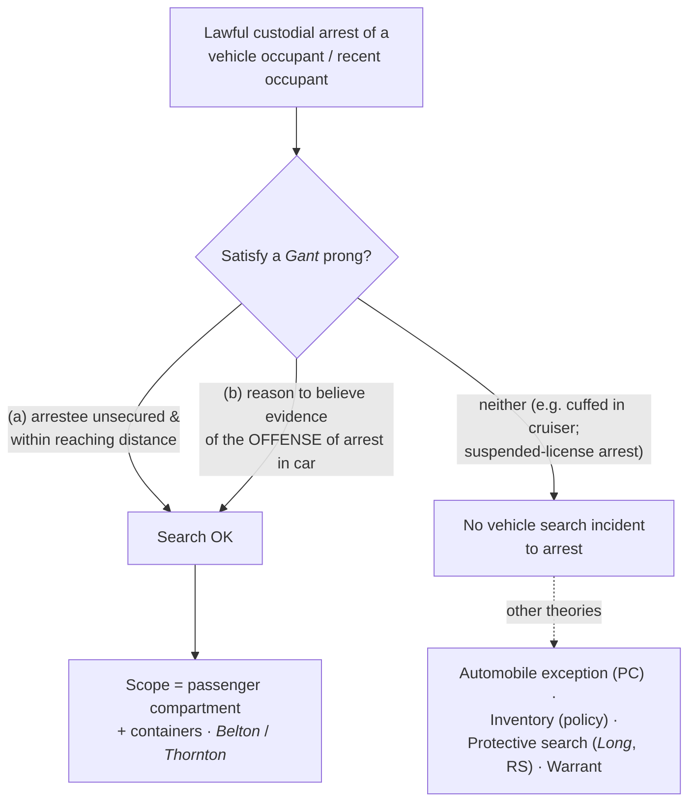

# S9 R1 panel-review — Opus model-diversity lane (prompt pack)

You are the **Claude/Opus** leg of the S9 three-lane adversarial panel (1 Claude + 2 Codex, R1). The two Codex lanes carry the A (support/quote-fidelity) and B (currency/treatment) attack lenses; **you carry model diversity and MUST vote on every paneled assertion across BOTH lenses' concerns.** You are refute-framed: try hard to break each assertion; **default to REFUTED on uncertainty**; never fabricate a cite, quote, or holding; use ONLY the evidence inlined below (no search, no outside knowledge). You are a SIGHTED reviewer — the FULL lake record (judgment fields included) is inlined.

You are a WRITER lane, not an adjudicator: you FIND and VOTE. You do not tally, adjudicate, or close any row — the orchestrator does.

For EACH group below, return one JSON object with the exact `reviewed[]` shape from the output contract (identical framing to the Codex lenses). Emit a finding object ONLY for a real defect (verdict refuted / stands-modified); a group you find wholly clean returns all-`stands` verdicts (the harness records a clean attestation). Concatenate the per-group JSON objects into a top-level `{"packs": [ ... ]}` array, one entry per group, each carrying its `group_id`.


OUTPUT CONTRACT — return ONE JSON object, nothing else:
{
  "lens": "A" | "B",
  "group_id": "<echo the group id>",
  "reviewed": [
    {
      "assertion_id": "<from group_inventory.jsonl>",
      "dimension": "existence|support|quote_fidelity|pincite|treatment|black_letter",
      "verdict": "stands" | "refuted" | "stands-modified",
      "verifiable_from_disclosed": true | false,
      "defect": null,   // null when verdict=="stands"; else an object:
      //  {"problem": "...", "severity": "high|medium|low", "proposed_fix": "...", "evidence_quote": "verbatim from disclosed evidence or null", "needs_cl": true|false, "locator_note": "..."}
      "reasons": ["short evidence-grounded reason", "..."],
      "breaks_true_positives": true | false,
      "residual_risks": ["..."],
      "suggested_tightening": "... or null"
    }
  ],
  "notes": ""
}
Rules: verdict=='stands' <=> defect==null (assertion survives your attack). verdict=='refuted' <=> a real defect (the assertion as framed is wrong). verdict=='stands-modified' <=> survives but needs a stated modification (a minor defect). Review EVERY assertion_id in group_inventory.jsonl exactly once. Output ONLY the JSON object.
---

## GROUP: content/warrant-exceptions/searching-a-vehicle/SIA Vehicles.md  (`doctrine`, 7 assertions)

### content_page

```
---
weight: 20
aliases:
  - "SIA Vehicles"
title: "SIA — Vehicles"
topic: Search Incident to Arrest — Vehicles
type: doctrine
jurisdiction: Federal (U.S. Const. amend. IV); SCOTUS baseline
status: draft
related: ["[[Automobile Exception]]", "[[SIA Persons]]", "[[Traffic Stops]]", "[[Inventory Searches]]", "[[Securing the Scene]]", "[[The Exclusionary Rule]]"]
---

# SIA — Vehicles

*This page states when the arrest of a vehicle's occupant justifies searching the passenger compartment. It is a distinct theory from the [[Automobile Exception]], which searches a vehicle on probable cause and does not depend on any arrest.*

> [!rule] Black-letter rule
> A vehicle search incident to a recent occupant's arrest is lawful **only** when **(a)** the arrestee is **unsecured and within reaching distance** of the passenger compartment at the time of the search, **or (b)** it is **reasonable to believe the vehicle contains evidence of the offense of arrest**. *[[Arizona v. Gant#^pin-351|Gant]]*, 556 U.S. 332, [351](https://www.courtlistener.com/opinion/145887/arizona-v-gant/) (2009). If a prong is met, the search reaches the **passenger compartment and any containers in it** (*[[New York v. Belton|Belton]]*, 453 U.S. 454, [460](https://www.courtlistener.com/opinion/110559/new-york-v-belton/) (1981)); if neither is met, *[[New York v. Belton|Belton]]*'s scope is never reached.
> ^rule-sia-vehicle

## The Brief

**Field-decisive question: I arrested a driver or passenger — may I search the car?** Not automatically. First satisfy one of *[[Arizona v. Gant|Gant]]*'s two triggers; only then does *[[New York v. Belton|Belton]]*'s scope apply. Because this is a warrant exception, the **government bears the burden**; review of the historic facts is deferential and the ultimate reasonableness is [[Common Legal Terms#de-novo|de novo]]; the **remedy** for an unjustified search is suppression under [[The Exclusionary Rule]] (subject to the good-faith reliance recognized in *[[Davis v. United States (2011)|Davis v. United States]]*).

**Belton fixed the scope; Gant supplied the trigger.** *[[New York v. Belton|Belton]]* answered a scope question: on a lawful custodial arrest of a vehicle occupant, the searchable area is "the passenger compartment of that automobile" and "any containers found within the passenger compartment." *[[New York v. Belton|Belton]]*, 453 U.S. at [460](https://www.courtlistener.com/opinion/110559/new-york-v-belton/). *[[Thornton v. United States#^pin-623|Thornton]]* extended that reach to a **"recent occupant"** who had already stepped out before the officer made contact. 541 U.S. 615, 623–24 (2004). Read broadly, *[[New York v. Belton|Belton]]* became an automatic entitlement to search any arrestee's car — the reading *[[Arizona v. Gant|Gant]]* rejected.

**Gant re-tethered the doctrine to *[[Chimel v. California|Chimel]]* and set a real trigger.** "Police may search a vehicle incident to a recent occupant's arrest only if the arrestee is within reaching distance of the passenger compartment at the time of the search or it is reasonable to believe the vehicle contains evidence of the offense of arrest." *[[Arizona v. Gant#^pin-351|Gant, 556 U.S. at 351]]*. Prong (a) is the *[[Chimel v. California|Chimel]]* officer-safety/evidence-preservation rationale applied to a car; prong (b) is an evidence-of-the-offense rationale drawn from Justice Scalia's *[[Thornton v. United States|Thornton]]* [[Common Legal Terms#concurring-opinion|concurrence]]. Scope is not a trigger: if neither prong is satisfied, you never reach *[[New York v. Belton|Belton]]*.

**The point-status of *[[New York v. Belton|Belton]]* after *[[Arizona v. Gant|Gant]]*.** *[[New York v. Belton|Belton]]* is neither wholly good nor wholly dead — its validity varies by point.

| Point of law | Status | Controlling authority |
|---|---|---|
| Automatic passenger-compartment search on any occupant's arrest | **Superseded** | *[[Arizona v. Gant]]*, 556 U.S. 332 (2009); the automatic trigger is replaced by *[[Arizona v. Gant\|Gant]]*'s two-justification test |
| Scope, once a *[[Arizona v. Gant\|Gant]]* prong is met (passenger compartment + containers in it) | **Good law** | *[[New York v. Belton]]*, 453 U.S. 454, [460](https://www.courtlistener.com/opinion/110559/new-york-v-belton/) (1981); the container rule survives inside *[[Arizona v. Gant\|Gant]]*'s framework |

So *[[New York v. Belton|Belton]]*'s **scope** holding still tells you *where* you may search; *[[Arizona v. Gant|Gant]]* now tells you *whether* you may search at all. (On *[[New York v. Belton|Belton]]*'s own case page the composite reads **Caution — varies by point**, with the vehicle-trigger point flagged superseded and the container point good law.)

**Prong (a) usually fails once the arrestee is secured.** Routinely cuffing the arrestee and placing him in the cruiser puts him **outside** reaching distance, so prong (a) is typically gone by the time of the search — leaving only prong (b). And prong (b) is offense-specific: an arrest for **driving on a suspended license** or an outstanding warrant supplies no reason to believe the car holds evidence *of that offense*, so it will rarely justify the search. This is the most common field error the *[[Arizona v. Gant|Gant]]* structure is designed to catch.

**Keep the vehicle theories distinct.** The **automobile exception** (see [[Automobile Exception]]) is a *separate* justification: probable cause that the vehicle contains contraband, no arrest required, reaching the whole vehicle and every container where the object might be. **Inventory** of an impounded vehicle (see [[Inventory Searches]]) is an administrative caretaking search on a standardized policy, not an arrest theory. And a *[[Arizona v. Gant|Gant]]*-secured arrestee does not shrink a separate **protective** vehicle search for weapons under *[[Michigan v. Long]]* on reasonable suspicion (*[[United States v. Vinton|Vinton]]*). A search that fails *[[Arizona v. Gant|Gant]]* may still be lawful under one of these — but say which theory you are using.

**Apply it.**
1. Make the arrest, then ask *[[Arizona v. Gant|Gant]]*'s two questions **before** searching the car.
2. **Prong (a):** Is the arrestee **unsecured and within reaching distance** of the passenger compartment right now? If he is cuffed in the cruiser, prong (a) is gone.
3. **Prong (b):** Is it **reasonable to believe** the car contains **evidence of the offense of arrest**? Tie it to *this* offense.
4. If a prong is met, search the **passenger compartment and containers in it** (*[[New York v. Belton|Belton]]* scope) — not the trunk (that is the automobile exception's reach on probable cause).
5. If neither prong is met, do not search on the arrest; consider the **automobile exception** (probable cause), **inventory** (impoundment + policy), a **protective** search (*[[Michigan v. Long|Long]]*, reasonable suspicion), or a **warrant**.

**Common pitfalls.**
- **Treating any arrest as authority to search the car.** *[[Arizona v. Gant|Gant]]* killed the automatic *[[New York v. Belton|Belton]]* reading — satisfy a prong first.
- **Forgetting that securing the arrestee kills prong (a).** A cuffed, cruiser-seated arrestee is not within reaching distance.
- **Stretching prong (b) past the offense of arrest.** A suspended-license or warrant arrest rarely gives reason to believe the car holds evidence of that offense.
- **Confusing *[[Arizona v. Gant|Gant]]* with the automobile exception.** *[[Arizona v. Gant|Gant]]* is an arrest theory limited to the passenger compartment; the automobile exception is a probable-cause theory reaching the whole car.
- **Over-reading the circuit container cases as a national rule.** Whether *[[Arizona v. Gant|Gant]]* prong (a) reaches a secured arrestee's out-of-car bag is an unresolved split (below), not a SCOTUS holding.

## Lower-court developments

The SCOTUS framework (*[[New York v. Belton|Belton]]* / *[[Thornton v. United States|Thornton]]* / *[[Arizona v. Gant|Gant]]*) is stable; the live circuit fight is whether *[[Arizona v. Gant|Gant]]* prong (a)'s reaching-distance limit reaches **outside the vehicle** to a secured arrestee's non-vehicular container. The decisions below bind only in their own circuits and are persuasive elsewhere; the split is genuine and unresolved at the Supreme Court.

- **Does *[[Arizona v. Gant|Gant]]* prong (a) reach a secured arrestee's out-of-reach bag?** ⚖ **Developing circuit split.** *[[United States v. Howard Davis|Davis]]* (4th Cir. 2021) says **yes**: a secured arrestee's out-of-reach backpack cannot be searched as incident to arrest, reasoning joined in substance by the Third, Ninth, and Tenth Circuits (*Shakir*, *Cook*, *Knapp*). **Binding in-circuit — 4th Cir.; Persuasive (outside circuit).** [opinion](https://www.courtlistener.com/opinion/4881258/united-states-v-howard-davis/)
- **The other way.** *[[United States v. Perez|Perez]]* (1st Cir. 2023) **declined** to extend *[[Arizona v. Gant|Gant]]* prong (a) to a bag already removed from the fleeing arrestee and secured on a cruiser, relying on pre-*[[Arizona v. Gant|Gant]]* circuit precedent (*Eatherton*) and squarely rejecting *[[United States v. Howard Davis|Davis]]*; *Curtis* (5th Cir.) and *Perdoma* (8th Cir.) are contrary or reserved. Treat the container question as **unsettled** (circuits named). **Binding in-circuit — 1st Cir.; Persuasive (outside circuit).** [opinion](https://www.courtlistener.com/opinion/9456060/united-states-v-perez/)

## Key cases

| Case | Holding | Opinion |
|---|---|---|
| *[[Arizona v. Gant]]*, 556 U.S. 332 (2009) | **Anchor.** Vehicle [[Search Incident to Arrest\|search incident to arrest]] is lawful **only** if the arrestee is unsecured and within reaching distance of the passenger compartment, **or** it is reasonable to believe the car holds evidence of the offense of arrest. | [opinion](https://www.courtlistener.com/opinion/145887/arizona-v-gant/) |
| *[[New York v. Belton]]*, 453 U.S. 454 (1981) | **Scope.** Fixes the searchable area as the passenger compartment and containers in it; its automatic-trigger reading is **superseded by *Gant***, while the container/scope rule survives. | [opinion](https://www.courtlistener.com/opinion/110559/new-york-v-belton/) |
| *[[Thornton v. United States]]*, 541 U.S. 615 (2004) | **Recent occupant.** *[[New York v. Belton\|Belton]]* reaches a "recent occupant" who has stepped out; Scalia's [[Common Legal Terms#concurring-opinion\|concurrence]] floats the evidence-of-offense rationale *[[Arizona v. Gant\|Gant]]* later adopts. Trigger now **limited by *Gant***. | [opinion](https://www.courtlistener.com/opinion/134746/thornton-v-united-states/) |

## Related cases across doctrines

These cases are treated in full elsewhere but bear on the vehicle incident search, framed here.

| Case | Relevance here | Primary home | Opinion |
|---|---|---|---|
| *[[United States v. Chadwick]]*, 433 U.S. 1 (1977) | ***Exclusive-control limit.*** Luggage in exclusive police control with no [[Exigent Circumstances and Hot Pursuit\|exigency]] may not be searched as incident to arrest; the container aspect is limited by *[[California v. Acevedo\|Acevedo]]* inside a vehicle. | [[Automobile Exception]] | [opinion](https://www.courtlistener.com/opinion/109714/united-states-v-chadwick/) |
| *[[United States v. Vinton]]*, 594 F.3d 14 (D.C. Cir. 2010) | ***Distinct theory.*** *[[Arizona v. Gant\|Gant]]*'s "secured arrestee" limit does not shrink a separate *[[Michigan v. Long]]* protective vehicle search on reasonable suspicion. | [[Traffic Stops]] | [opinion](https://www.courtlistener.com/opinion/187527/united-states-v-vinton/) |
| *[[United States v. Anchondo]]*, 156 F.3d 1043 (10th Cir. 1998) | ***Person, not vehicle.*** Drugs found on the arrestee's body were the fruit of a lawful search of the **person** incident to arrest; that theory stands apart from any vehicle rule. | [[Automobile Exception]] | [opinion](https://www.courtlistener.com/opinion/758111/united-states-v-erick-anchondo/) |

## Visual



## Sources
- [*Arizona v. Gant*, 556 U.S. 332 (2009)](https://www.courtlistener.com/opinion/145887/arizona-v-gant/) (pinpoint: 351)
- [*New York v. Belton*, 453 U.S. 454 (1981)](https://www.courtlistener.com/opinion/110559/new-york-v-belton/) (pinpoint: 460) (vehicle-search trigger superseded by *Gant* (2009))
- [*Thornton v. United States*, 541 U.S. 615 (2004)](https://www.courtlistener.com/opinion/134746/thornton-v-united-states/) (pinpoints: 623–624) (limited by *Gant*)
- [*United States v. Chadwick*, 433 U.S. 1 (1977)](https://www.courtlistener.com/opinion/109714/united-states-v-chadwick/) (auto-container aspect limited by *Acevedo*)
- [*United States v. Vinton*, 594 F.3d 14 (D.C. Cir. 2010)](https://www.courtlistener.com/opinion/187527/united-states-v-vinton/)
- [*United States v. Anchondo*, 156 F.3d 1043 (10th Cir. 1998)](https://www.courtlistener.com/opinion/758111/united-states-v-erick-anchondo/)
- [*United States v. Davis*, 997 F.3d 191 (4th Cir. 2021)](https://www.courtlistener.com/opinion/4881258/united-states-v-howard-davis/) (Binding in-circuit — 4th Cir.)
- [*United States v. Perez*, 89 F.4th 247 (1st Cir. 2023)](https://www.courtlistener.com/opinion/9456060/united-states-v-perez/) (Binding in-circuit — 1st Cir.)

```

### group_inventory (assertions under review)

```jsonl
{"assertion_id": "1bf56a718b5dd54f", "dimension": "existence", "kind": "case_cite", "locator": {"case": "Arizona v. Gant", "table_line": 56}, "payload": {"case": "Arizona v. Gant", "cells": ["*[[Arizona v. Gant]]*, 556 U.S. 332 (2009)", "**Anchor.** Vehicle [[Search Incident to Arrest\\|search incident to arrest]] is lawful **only** if the arrestee is unsecured and within reaching distance of the passenger compartment, **or** it is reasonable to believe the car holds evidence of the offense of arrest.", "[opinion](https://www.courtlistener.com/opinion/145887/arizona-v-gant/)"], "header": ["Case", "Holding", "Opinion"]}}
{"assertion_id": "4acb6c5b2de7902e", "dimension": "existence", "kind": "case_cite", "locator": {"case": "United States v. Chadwick", "table_line": 66}, "payload": {"case": "United States v. Chadwick", "cells": ["*[[United States v. Chadwick]]*, 433 U.S. 1 (1977)", "***Exclusive-control limit.*** Luggage in exclusive police control with no [[Exigent Circumstances and Hot Pursuit\\|exigency]] may not be searched as incident to arrest; the container aspect is limited by *[[California v. Acevedo\\|Acevedo]]* inside a vehicle.", "[[Automobile Exception]]", "[opinion](https://www.courtlistener.com/opinion/109714/united-states-v-chadwick/)"], "header": ["Case", "Relevance here", "Primary home", "Opinion"]}}
{"assertion_id": "7245623d19e1f82b", "dimension": "existence", "kind": "case_cite", "locator": {"case": "New York v. Belton", "table_line": 57}, "payload": {"case": "New York v. Belton", "cells": ["*[[New York v. Belton]]*, 453 U.S. 454 (1981)", "**Scope.** Fixes the searchable area as the passenger compartment and containers in it; its automatic-trigger reading is **superseded by *Gant***, while the container/scope rule survives.", "[opinion](https://www.courtlistener.com/opinion/110559/new-york-v-belton/)"], "header": ["Case", "Holding", "Opinion"]}}
{"assertion_id": "7e4243039fa52820", "dimension": "existence", "kind": "case_cite", "locator": {"case": "United States v. Vinton", "table_line": 67}, "payload": {"case": "United States v. Vinton", "cells": ["*[[United States v. Vinton]]*, 594 F.3d 14 (D.C. Cir. 2010)", "***Distinct theory.*** *[[Arizona v. Gant\\|Gant]]*'s \"secured arrestee\" limit does not shrink a separate *[[Michigan v. Long]]* protective vehicle search on reasonable suspicion.", "[[Traffic Stops]]", "[opinion](https://www.courtlistener.com/opinion/187527/united-states-v-vinton/)"], "header": ["Case", "Relevance here", "Primary home", "Opinion"]}}
{"assertion_id": "a83cf54ca4ec5893", "dimension": "existence", "kind": "case_cite", "locator": {"case": "United States v. Anchondo", "table_line": 68}, "payload": {"case": "United States v. Anchondo", "cells": ["*[[United States v. Anchondo]]*, 156 F.3d 1043 (10th Cir. 1998)", "***Person, not vehicle.*** Drugs found on the arrestee's body were the fruit of a lawful search of the **person** incident to arrest; that theory stands apart from any vehicle rule.", "[[Automobile Exception]]", "[opinion](https://www.courtlistener.com/opinion/758111/united-states-v-erick-anchondo/)"], "header": ["Case", "Relevance here", "Primary home", "Opinion"]}}
{"assertion_id": "b14d041a65878734", "dimension": "existence", "kind": "case_cite", "locator": {"case": "Thornton v. United States", "table_line": 58}, "payload": {"case": "Thornton v. United States", "cells": ["*[[Thornton v. United States]]*, 541 U.S. 615 (2004)", "**Recent occupant.** *[[New York v. Belton\\|Belton]]* reaches a \"recent occupant\" who has stepped out; Scalia's [[Common Legal Terms#concurring-opinion\\|concurrence]] floats the evidence-of-offense rationale *[[Arizona v. Gant\\|Gant]]* later adopts. Trigger now **limited by *Gant***.", "[opinion](https://www.courtlistener.com/opinion/134746/thornton-v-united-states/)"], "header": ["Case", "Holding", "Opinion"]}}
{"assertion_id": "a646863ce75a022e", "dimension": "support", "kind": "proposition", "locator": {"callout": "^rule-sia-vehicle"}, "payload": {"anchor": "^rule-sia-vehicle", "statement": "[!rule] Black-letter rule\nA vehicle search incident to a recent occupant's arrest is lawful **only** when **(a)** the arrestee is **unsecured and within reaching distance** of the passenger compartment at the time of the search, **or (b)** it is **reasonable to believe the vehicle contains evidence of the offense of arrest**. *[[Arizona v. Gant#^pin-351|Gant]]*, 556 U.S. 332, [351](https://www.courtlistener.com/opinion/145887/arizona-v-gant/) (2009). If a prong is met, the search reaches the **passenger compartment and any containers in it** (*[[New York v. Belton|Belton]]*, 453 U.S. 454, [460](https://www.courtlistener.com/opinion/110559/new-york-v-belton/) (1981)); if neither is met, *[[New York v. Belton|Belton]]*'s scope is never reached."}}
```

### lake record — Arizona v. Gant

```json
{
  "schema_version": "s2.v1",
  "record_id": "Arizona v. Gant",
  "stub": false,
  "status": "verified",
  "identity": {
    "case_name": "Arizona v. Gant",
    "case_name_short": "Gant",
    "case_name_full": "Arizona v. Gant",
    "input_case_name": "Arizona v. Gant",
    "court": "U.S. Supreme Court",
    "court_id": "scotus",
    "court_level": "scotus",
    "circuit": null,
    "state": null,
    "date_decided": "2009-04-21",
    "year": 2009,
    "docket": null,
    "cluster_id": 145887,
    "lead_opinion_id": 9435359,
    "sibling_ids": [
      145887,
      9435359,
      9435360,
      9435361
    ],
    "absolute_url": "/opinion/145887/arizona-v-gant/",
    "identity_method": "citation+party-text",
    "expected_citation_found": true,
    "party_name_in_text": true,
    "canonical_name_match": true,
    "alternates": [],
    "reason_code": null
  },
  "citations": {
    "official": {
      "cite": "556 U.S. 332",
      "volume": "556",
      "reporter": "U.S.",
      "page": "332",
      "type": 1,
      "selected_official": true,
      "source": "cluster.citations[]"
    },
    "parallel": [
      {
        "cite": "129 S. Ct. 1710",
        "volume": "129",
        "reporter": "S. Ct.",
        "page": "1710",
        "type": 1,
        "selected_official": false,
        "source": "cluster.citations[]"
      },
      {
        "cite": "173 L. Ed. 2d 485",
        "volume": "173",
        "reporter": "L. Ed. 2d",
        "page": "485",
        "type": 1,
        "selected_official": false,
        "source": "cluster.citations[]"
      }
    ],
    "vendor_neutral": [
      {
        "cite": "2009 U.S. LEXIS 3120",
        "volume": "2009",
        "reporter": "U.S. LEXIS",
        "page": "3120",
        "type": 6,
        "selected_official": false,
        "source": "cluster.citations[]"
      }
    ],
    "all": [
      {
        "cite": "556 U.S. 332",
        "volume": "556",
        "reporter": "U.S.",
        "page": "332",
        "type": 1,
        "selected_official": false,
        "source": "cluster.citations[]"
      },
      {
        "cite": "129 S. Ct. 1710",
        "volume": "129",
        "reporter": "S. Ct.",
        "page": "1710",
        "type": 1,
        "selected_official": false,
        "source": "cluster.citations[]"
      },
      {
        "cite": "173 L. Ed. 2d 485",
        "volume": "173",
        "reporter": "L. Ed. 2d",
        "page": "485",
        "type": 1,
        "selected_official": false,
        "source": "cluster.citations[]"
      },
      {
        "cite": "2009 U.S. LEXIS 3120",
        "volume": "2009",
        "reporter": "U.S. LEXIS",
        "page": "3120",
        "type": 6,
        "selected_official": false,
        "source": "cluster.citations[]"
      }
    ],
    "display": "556 U.S. 332",
    "official_selection": {
      "court_class": "scotus",
      "selected": "556 U.S. 332",
      "reason": "selected_rank_1"
    }
  },
  "pinpoints": [
    {
      "id": "pin-351",
      "page": null,
      "quote": "--- # Arizona v. Gant *556 U.S. 332 (2009)* \u00b7 U.S. Supreme Court \u00b7 **Binding \u2014 SCOTUS** \u00b7 Treatment: **good** *(as of 2026-06-30)* <!-- header line; TreatmentBadge + weight render here, degrading to the text above --> ## Background Gant was arrested for driving on a suspended license. After he was handcuffed and locked in the back of a patrol car, officers searched his car and found cocaine in a jacket on the back seat. He moved to suppress the cocaine as the product of an unlawful search incident to arrest. ## Issue Whether police may search the passenger compartment of a vehicle incident to a recent occupant's arrest when the arrestee has been secured and cannot reach the vehicle, and there is no reason to believe the vehicle contains evidence of the offense of arrest. ## Rule A vehicle search incident to a recent occupant's arrest is allowed only on one of two independent justifications:",
      "star_marker": null,
      "quote_fidelity": "mismatch",
      "pinpoint_status": "slip-only",
      "position": null
    }
  ],
  "treatment": {
    "field_i_validity": "good_law",
    "as_of_content": "2009-04-21",
    "as_of_treatment": "2026-06-30",
    "composite_basis": "migration-seed",
    "composite_basis_ref": "Arizona v. Gant",
    "varies_by_point": false,
    "scope_note": "Gant itself cabins the broad reading of New York v. Belton; Gant is good law.",
    "point_overrides": [],
    "edges": [
      {
        "citing_case": {
          "name": "State of Minnesota v. Raenard Romalle Douglas",
          "cluster_id": 10129058,
          "cite": null,
          "field_ii": "overruled"
        },
        "field_ii": "overruled",
        "field_iii": "mentioned",
        "point": null,
        "proposed": true,
        "journal_ref": "Arizona v. Gant:lane1_negative"
      },
      {
        "citing_case": {
          "name": "Commonwealth v. Williams",
          "cluster_id": 10027459,
          "cite": null,
          "field_ii": "overruled"
        },
        "field_ii": "overruled",
        "field_iii": "mentioned",
        "point": null,
        "proposed": true,
        "journal_ref": "Arizona v. Gant:lane1_negative"
      },
      {
        "citing_case": {
          "name": "Commonwealth v. Silvelo",
          "cluster_id": 4796646,
          "cite": null,
          "field_ii": "overruled"
        },
        "field_ii": "overruled",
        "field_iii": "mentioned",
        "point": null,
        "proposed": true,
        "journal_ref": "Arizona v. Gant:lane1_negative"
      },
      {
        "citing_case": {
          "name": "Ramos v. Louisiana",
          "cluster_id": 9231323,
          "cite": [
            "140 S. Ct. 1390",
            "206 L. Ed. 2d 583"
          ],
          "field_ii": "overruled"
        },
        "field_ii": "overruled",
        "field_iii": "mentioned",
        "point": null,
        "proposed": true,
        "journal_ref": "Arizona v. Gant:lane1_negative"
      },
      {
        "citing_case": {
          "name": "Alleyne v. United States",
          "cluster_id": 903985,
          "cite": [
            "186 L. Ed. 2d 314",
            "133 S. Ct. 2151",
            "2013 U.S. LEXIS 4543",
            "570 U.S. 99",
            "81 U.S.L.W. 4444",
            "24 Fla. L. Weekly Fed. S 310",
            "2013 WL 2922116"
          ],
          "field_ii": "overruled"
        },
        "field_ii": "overruled",
        "field_iii": "mentioned",
        "point": null,
        "proposed": true,
        "journal_ref": "Arizona v. Gant:lane2_top_cited"
      },
      {
        "citing_case": {
          "name": "Rodriguez v. United States",
          "cluster_id": 2795278,
          "cite": [
            "575 U.S. 348",
            "135 S. Ct. 1609",
            "191 L. Ed. 2d 492",
            "2015 U.S. LEXIS 2807",
            "83 U.S.L.W. 4241",
            "25 Fla. L. Weekly Fed. S 191"
          ],
          "field_ii": "abrogated"
        },
        "field_ii": "abrogated",
        "field_iii": "mentioned",
        "point": null,
        "proposed": true,
        "journal_ref": "Arizona v. Gant:lane2_top_cited"
      },
      {
        "citing_case": {
          "name": "Florida v. Jardines",
          "cluster_id": 856347,
          "cite": [
            "185 L. Ed. 2d 495",
            "133 S. Ct. 1409",
            "569 U.S. 1",
            "2013 U.S. LEXIS 2542",
            "24 Fla. L. Weekly Fed. S 117",
            "81 U.S.L.W. 4209",
            "2013 WL 1196577"
          ],
          "field_ii": "questioned"
        },
        "field_ii": "questioned",
        "field_iii": "mentioned",
        "point": null,
        "proposed": true,
        "journal_ref": "Arizona v. Gant:lane2_top_cited"
      },
      {
        "citing_case": {
          "name": "Birchfield v. N. Dakota. William Robert Bernard",
          "cluster_id": 3216497,
          "cite": [
            "579 U.S. 438",
            "195 L. Ed. 2d 560",
            "2016 U.S. LEXIS 4058",
            "136 S. Ct. 2160"
          ],
          "field_ii": "abrogated"
        },
        "field_ii": "abrogated",
        "field_iii": "mentioned",
        "point": null,
        "proposed": true,
        "journal_ref": "Arizona v. Gant:lane2_top_cited"
      },
      {
        "citing_case": {
          "name": "Riley v. Cal. United States",
          "cluster_id": 2680439,
          "cite": [
            "189 L. Ed. 2d 430",
            "134 S. Ct. 2473",
            "2014 U.S. LEXIS 4497",
            "82 U.S.L.W. 4558"
          ],
          "field_ii": "overruled"
        },
        "field_ii": "overruled",
        "field_iii": "mentioned",
        "point": null,
        "proposed": true,
        "journal_ref": "Arizona v. Gant:lane2_top_cited"
      },
      {
        "citing_case": {
          "name": "Kisor v. Wilkie",
          "cluster_id": 4632953,
          "cite": [
            "588 U.S. 558",
            "139 S. Ct. 2400",
            "204 L. Ed. 2d 841",
            "2019 U.S. LEXIS 4397"
          ],
          "field_ii": "overruled"
        },
        "field_ii": "overruled",
        "field_iii": "mentioned",
        "point": null,
        "proposed": true,
        "journal_ref": "Arizona v. Gant:lane2_top_cited"
      },
      {
        "citing_case": {
          "name": "Maryland v. King",
          "cluster_id": 873669,
          "cite": [
            "186 L. Ed. 2d 1",
            "133 S. Ct. 1958",
            "2013 U.S. LEXIS 4165",
            "569 U.S. 435",
            "24 Fla. L. Weekly Fed. S 234",
            "81 U.S.L.W. 4343",
            "2013 WL 2371466"
          ],
          "field_ii": "questioned"
        },
        "field_ii": "questioned",
        "field_iii": "mentioned",
        "point": null,
        "proposed": true,
        "journal_ref": "Arizona v. Gant:lane2_top_cited"
      },
      {
        "citing_case": {
          "name": "Janus v. State, County, and Municipal Employees",
          "cluster_id": 4511640,
          "cite": [
            "585 U.S. 878",
            "138 S. Ct. 2448",
            "201 L. Ed. 2d 924",
            "2018 U.S. LEXIS 4028"
          ],
          "field_ii": "overruled"
        },
        "field_ii": "overruled",
        "field_iii": "mentioned",
        "point": null,
        "proposed": true,
        "journal_ref": "Arizona v. Gant:lane2_top_cited"
      },
      {
        "citing_case": {
          "name": "United States v. Manigan",
          "cluster_id": 1031401,
          "cite": [
            "592 F.3d 621",
            "2010 U.S. App. LEXIS 1713",
            "2010 WL 298031"
          ],
          "field_ii": "overruled"
        },
        "field_ii": "overruled",
        "field_iii": "mentioned",
        "point": null,
        "proposed": true,
        "journal_ref": "Arizona v. Gant:lane2_top_cited"
      },
      {
        "citing_case": {
          "name": "State v. Rocha",
          "cluster_id": 4345763,
          "cite": [
            "295 Neb. 716",
            "890 N.W.2d 178"
          ],
          "field_ii": "overruled"
        },
        "field_ii": "overruled",
        "field_iii": "mentioned",
        "point": null,
        "proposed": true,
        "journal_ref": "Arizona v. Gant:lane2_top_cited"
      },
      {
        "citing_case": {
          "name": "v. Allen",
          "cluster_id": 4673511,
          "cite": [
            "2019 CO 88"
          ],
          "field_ii": "abrogated"
        },
        "field_ii": "abrogated",
        "field_iii": "mentioned",
        "point": null,
        "proposed": true,
        "journal_ref": "Arizona v. Gant:lane2_top_cited"
      },
      {
        "citing_case": {
          "name": "Bailey v. United States",
          "cluster_id": 820749,
          "cite": [
            "185 L. Ed. 2d 19",
            "133 S. Ct. 1031",
            "568 U.S. 186",
            "2013 U.S. LEXIS 1075"
          ],
          "field_ii": "questioned"
        },
        "field_ii": "questioned",
        "field_iii": "mentioned",
        "point": null,
        "proposed": true,
        "journal_ref": "Arizona v. Gant:lane2_top_cited"
      },
      {
        "citing_case": {
          "name": "Utah v. Strieff",
          "cluster_id": 3214882,
          "cite": [
            "579 U.S. 232",
            "195 L. Ed. 2d 400",
            "2016 U.S. LEXIS 3926"
          ],
          "field_ii": "questioned"
        },
        "field_ii": "questioned",
        "field_iii": "mentioned",
        "point": null,
        "proposed": true,
        "journal_ref": "Arizona v. Gant:lane2_top_cited"
      },
      {
        "citing_case": {
          "name": "Collins v. Virginia",
          "cluster_id": 4501697,
          "cite": [
            "584 U.S. 586",
            "138 S. Ct. 1663",
            "201 L. Ed. 2d 9",
            "2018 U.S. LEXIS 3210"
          ],
          "field_ii": "overruled"
        },
        "field_ii": "overruled",
        "field_iii": "mentioned",
        "point": null,
        "proposed": true,
        "journal_ref": "Arizona v. Gant:lane2_top_cited"
      },
      {
        "citing_case": {
          "name": "Heller v. District of Columbia",
          "cluster_id": 614652,
          "cite": [
            "670 F.3d 1244",
            "399 U.S. App. D.C. 314",
            "2011 U.S. App. LEXIS 20130",
            "2011 WL 4551558"
          ],
          "field_ii": "superseded_by_statute"
        },
        "field_ii": "superseded_by_statute",
        "field_iii": "mentioned",
        "point": null,
        "proposed": true,
        "journal_ref": "Arizona v. Gant:lane2_top_cited"
      },
      {
        "citing_case": {
          "name": "Byrd v. United States",
          "cluster_id": 4497658,
          "cite": [
            "584 U.S. 395",
            "138 S. Ct. 1518",
            "200 L. Ed. 2d 805",
            "2018 U.S. LEXIS 2803"
          ],
          "field_ii": "questioned"
        },
        "field_ii": "questioned",
        "field_iii": "mentioned",
        "point": null,
        "proposed": true,
        "journal_ref": "Arizona v. Gant:lane2_top_cited"
      },
      {
        "citing_case": {
          "name": "State v. William L. Witt(074468)",
          "cluster_id": 2993869,
          "cite": [
            "223 N.J. 409",
            "126 A.3d 850",
            "2015 N.J. LEXIS 890"
          ],
          "field_ii": "overruled"
        },
        "field_ii": "overruled",
        "field_iii": "mentioned",
        "point": null,
        "proposed": true,
        "journal_ref": "Arizona v. Gant:lane2_top_cited"
      },
      {
        "citing_case": {
          "name": "Kevin M. Clark v. State of Indiana",
          "cluster_id": 1041668,
          "cite": [
            "994 N.E.2d 252",
            "2013 WL 5228498",
            "2013 Ind. LEXIS 700"
          ],
          "field_ii": "overruled"
        },
        "field_ii": "overruled",
        "field_iii": "mentioned",
        "point": null,
        "proposed": true,
        "journal_ref": "Arizona v. Gant:lane2_top_cited"
      },
      {
        "citing_case": {
          "name": "State v. Swick",
          "cluster_id": 891802,
          "cite": [
            "2012 NMSC 18",
            "2 N.M. 30",
            "2012 NMSC 018"
          ],
          "field_ii": "overruled"
        },
        "field_ii": "overruled",
        "field_iii": "mentioned",
        "point": null,
        "proposed": true,
        "journal_ref": "Arizona v. Gant:lane2_top_cited"
      },
      {
        "citing_case": {
          "name": "State v. Elias",
          "cluster_id": 2539936,
          "cite": [
            "339 S.W.3d 667",
            "2011 Tex. Crim. App. LEXIS 448",
            "2011 WL 1267248"
          ],
          "field_ii": "questioned"
        },
        "field_ii": "questioned",
        "field_iii": "mentioned",
        "point": null,
        "proposed": true,
        "journal_ref": "Arizona v. Gant:lane2_top_cited"
      },
      {
        "citing_case": {
          "name": "State v. Villarreal, David",
          "cluster_id": 2948963,
          "cite": [
            "475 S.W.3d 784",
            "2014 Tex. Crim. App. LEXIS 1898",
            "2014 WL 6734178"
          ],
          "field_ii": "overruled"
        },
        "field_ii": "overruled",
        "field_iii": "mentioned",
        "point": null,
        "proposed": true,
        "journal_ref": "Arizona v. Gant:lane2_top_cited"
      },
      {
        "citing_case": {
          "name": "Ramos v. Louisiana",
          "cluster_id": 4746633,
          "cite": [
            "590 U.S. 83"
          ],
          "field_ii": "overruled"
        },
        "field_ii": "overruled",
        "field_iii": "mentioned",
        "point": null,
        "proposed": true,
        "journal_ref": "Arizona v. Gant:lane2_top_cited"
      }
    ],
    "derivation": {
      "lane1_negative": {
        "query": "cites:(145887 OR 9435359 OR 9435360 OR 9435361) AND (overrul* OR abrogat* OR supersed* OR \"recede from\" OR \"no longer good law\" OR vacat* OR reversed) ",
        "reviewed": 200,
        "cap": 200,
        "cap_hit": true,
        "final_cursor": "https://www.courtlistener.com/api/rest/v4/search/?cursor=cz0xNTg1ODcyMDAwMDAwJnM9MTAwMjEwMTAmdD1vJmQ9MjAyNi0wNy0wNCZwPTEx&fields=absolute_url%2CcaseName%2CcaseNameFull%2Ccitation%2CciteCount%2Ccluster_id%2Ccourt%2Ccourt_citation_string%2Ccourt_id%2CdateFiled%2Copinions%2Csibling_ids%2Cstatus%2Csyllabus&order_by=dateFiled+desc&page_size=100&q=cites%3A%28145887+OR+9435359+OR+9435360+OR+9435361%29+AND+%28overrul%2A+OR+abrogat%2A+OR+supersed%2A+OR+%22recede+from%22+OR+%22no+longer+good+law%22+OR+vacat%2A+OR+reversed%29+&stat_Published=on&type=o",
        "audit_needed": true,
        "proposed_negative_events": 4,
        "audit_marker": "R15 treatment audit required",
        "triage_mode": "snippet-first",
        "snippet_field": "results[].opinions[].snippet",
        "triage_journaled": 200,
        "triage_read": 4,
        "triage_snippet_classified": 196
      },
      "lane2_top_cited": {
        "query": "cites:(145887 OR 9435359 OR 9435360 OR 9435361)",
        "reviewed": 25,
        "cap": 25,
        "cap_hit": true,
        "final_cursor": "https://www.courtlistener.com/api/rest/v4/search/?cursor=cz0xNTQmcz0yNjgxODE4JnQ9byZkPTIwMjYtMDctMDQmcD0z&order_by=citeCount+desc&page_size=25&q=cites%3A%28145887+OR+9435359+OR+9435360+OR+9435361%29&type=o",
        "audit_needed": true,
        "proposed_negative_events": 23,
        "audit_marker": "R15 treatment audit required"
      },
      "lane3_recency": {
        "query": "cites:(145887 OR 9435359 OR 9435360 OR 9435361)",
        "reviewed": 117,
        "cap": 200,
        "cap_hit": false,
        "final_cursor": null,
        "audit_needed": false,
        "proposed_negative_events": 2,
        "audit_marker": null,
        "triage_mode": "snippet-first",
        "snippet_field": "results[].opinions[].snippet",
        "triage_journaled": 117,
        "triage_read": 2,
        "triage_snippet_classified": 115
      }
    }
  },
  "progeny": {
    "complete_query": "cites:(145887 OR 9435359 OR 9435360 OR 9435361)",
    "indexed_citing_opinions": 1426,
    "count_source": "search",
    "per_sibling": [
      {
        "opinion_id": 145887,
        "count": 1166,
        "count_source": "search"
      },
      {
        "opinion_id": 9435359,
        "count": 280,
        "count_source": "search"
      },
      {
        "opinion_id": 9435360,
        "count": 0,
        "count_source": "search"
      },
      {
        "opinion_id": 9435361,
        "count": 0,
        "count_source": "search"
      }
    ],
    "citation_count": 2728,
    "cache_path": "/Users/johngalt/cssi-lake/cache/progeny/arizona-v-gant.jsonl",
    "enumeration": "bounded",
    "cursor": "https://www.courtlistener.com/api/rest/v4/search/?cursor=cz0xLjkyNDc0MjUmcz0xMDM1MjEwNCZ0PW8mZD0yMDI2LTA3LTA0JnA9Mg%3D%3D&order_by=score+desc&page_size=100&q=cites%3A%28145887+OR+9435359+OR+9435360+OR+9435361%29&type=o",
    "rows_cached": 20,
    "outbound_opinion_edges": [
      {
        "source_opinion_id": 145887,
        "cited_id": 30547,
        "source": "search.opinions[].cites[]"
      },
      {
        "source_opinion_id": 145887,
        "cited_id": 91573,
        "source": "search.opinions[].cites[]"
      },
      {
        "source_opinion_id": 145887,
        "cited_id": 98094,
        "source": "search.opinions[].cites[]"
      },
      {
        "source_opinion_id": 145887,
        "cited_id": 101164,
        "source": "search.opinions[].cites[]"
      },
      {
        "source_opinion_id": 145887,
        "cited_id": 101643,
        "source": "search.opinions[].cites[]"
      },
      {
        "source_opinion_id": 145887,
        "cited_id": 101894,
        "source": "search.opinions[].cites[]"
      },
      {
        "source_opinion_id": 145887,
        "cited_id": 101899,
        "source": "search.opinions[].cites[]"
      },
      {
        "source_opinion_id": 145887,
        "cited_id": 104422,
        "source": "search.opinions[].cites[]"
      },
      {
        "source_opinion_id": 145887,
        "cited_id": 104576,
        "source": "search.opinions[].cites[]"
      },
      {
        "source_opinion_id": 145887,
        "cited_id": 104769,
        "source": "search.opinions[].cites[]"
      },
      {
        "source_opinion_id": 145887,
        "cited_id": 106447,
        "source": "search.opinions[].cites[]"
      },
      {
        "source_opinion_id": 145887,
        "cited_id": 106771,
        "source": "search.opinions[].cites[]"
      },
      {
        "source_opinion_id": 145887,
        "cited_id": 106964,
        "source": "search.opinions[].cites[]"
      },
      {
        "source_opinion_id": 145887,
        "cited_id": 107252,
        "source": "search.opinions[].cites[]"
      },
      {
        "source_opinion_id": 145887,
        "cited_id": 107564,
        "source": "search.opinions[].cites[]"
      },
      {
        "source_opinion_id": 145887,
        "cited_id": 107729,
        "source": "search.opinions[].cites[]"
      },
      {
        "source_opinion_id": 145887,
        "cited_id": 107979,
        "source": "search.opinions[].cites[]"
      },
      {
        "source_opinion_id": 145887,
        "cited_id": 108893,
        "source": "search.opinions[].cites[]"
      },
      {
        "source_opinion_id": 145887,
        "cited_id": 109905,
        "source": "search.opinions[].cites[]"
      },
      {
        "source_opinion_id": 145887,
        "cited_id": 110096,
        "source": "search.opinions[].cites[]"
      },
      {
        "source_opinion_id": 145887,
        "cited_id": 110558,
        "source": "search.opinions[].cites[]"
      },
      {
        "source_opinion_id": 145887,
        "cited_id": 110559,
        "source": "search.opinions[].cites[]"
      },
      {
        "source_opinion_id": 145887,
        "cited_id": 110719,
        "source": "search.opinions[].cites[]"
      },
      {
        "source_opinion_id": 145887,
        "cited_id": 111020,
        "source": "search.opinions[].cites[]"
      },
      {
        "source_opinion_id": 145887,
        "cited_id": 111600,
        "source": "search.opinions[].cites[]"
      },
      {
        "source_opinion_id": 145887,
        "cited_id": 111823,
        "source": "search.opinions[].cites[]"
      },
      {
        "source_opinion_id": 145887,
        "cited_id": 112296,
        "source": "search.opinions[].cites[]"
      },
      {
        "source_opinion_id": 145887,
        "cited_id": 112384,
        "source": "search.opinions[].cites[]"
      },
      {
        "source_opinion_id": 145887,
        "cited_id": 112643,
        "source": "search.opinions[].cites[]"
      },
      {
        "source_opinion_id": 145887,
        "cited_id": 118250,
        "source": "search.opinions[].cites[]"
      },
      {
        "source_opinion_id": 145887,
        "cited_id": 118380,
        "source": "search.opinions[].cites[]"
      },
      {
        "source_opinion_id": 145887,
        "cited_id": 130160,
        "source": "search.opinions[].cites[]"
      },
      {
        "source_opinion_id": 145887,
        "cited_id": 134735,
        "source": "search.opinions[].cites[]"
      },
      {
        "source_opinion_id": 145887,
        "cited_id": 134746,
        "source": "search.opinions[].cites[]"
      },
      {
        "source_opinion_id": 145887,
        "cited_id": 145630,
        "source": "search.opinions[].cites[]"
      },
      {
        "source_opinion_id": 145887,
        "cited_id": 145701,
        "source": "search.opinions[].cites[]"
      },
      {
        "source_opinion_id": 145887,
        "cited_id": 145814,
        "source": "search.opinions[].cites[]"
      },
      {
        "source_opinion_id": 145887,
        "cited_id": 195782,
        "source": "search.opinions[].cites[]"
      },
      {
        "source_opinion_id": 145887,
        "cited_id": 498214,
        "source": "search.opinions[].cites[]"
      },
      {
        "source_opinion_id": 145887,
        "cited_id": 520415,
        "source": "search.opinions[].cites[]"
      },
      {
        "source_opinion_id": 145887,
        "cited_id": 593396,
        "source": "search.opinions[].cites[]"
      },
      {
        "source_opinion_id": 145887,
        "cited_id": 719587,
        "source": "search.opinions[].cites[]"
      },
      {
        "source_opinion_id": 145887,
        "cited_id": 721372,
        "source": "search.opinions[].cites[]"
      },
      {
        "source_opinion_id": 145887,
        "cited_id": 762479,
        "source": "search.opinions[].cites[]"
      },
      {
        "source_opinion_id": 145887,
        "cited_id": 789343,
        "source": "search.opinions[].cites[]"
      },
      {
        "source_opinion_id": 145887,
        "cited_id": 791442,
        "source": "search.opinions[].cites[]"
      },
      {
        "source_opinion_id": 145887,
        "cited_id": 792893,
        "source": "search.opinions[].cites[]"
      },
      {
        "source_opinion_id": 145887,
        "cited_id": 794927,
        "source": "search.opinions[].cites[]"
      },
      {
        "source_opinion_id": 145887,
        "cited_id": 867371,
        "source": "search.opinions[].cites[]"
      },
      {
        "source_opinion_id": 145887,
        "cited_id": 1057451,
        "source": "search.opinions[].cites[]"
      },
      {
        "source_opinion_id": 145887,
        "cited_id": 1195099,
        "source": "search.opinions[].cites[]"
      },
      {
        "source_opinion_id": 145887,
        "cited_id": 1223809,
        "source": "search.opinions[].cites[]"
      },
      {
        "source_opinion_id": 145887,
        "cited_id": 1234081,
        "source": "search.opinions[].cites[]"
      },
      {
        "source_opinion_id": 145887,
        "cited_id": 1399986,
        "source": "search.opinions[].cites[]"
      },
      {
        "source_opinion_id": 145887,
        "cited_id": 1401546,
        "source": "search.opinions[].cites[]"
      },
      {
        "source_opinion_id": 145887,
        "cited_id": 1427013,
        "source": "search.opinions[].cites[]"
      },
      {
        "source_opinion_id": 145887,
        "cited_id": 1983319,
        "source": "search.opinions[].cites[]"
      },
      {
        "source_opinion_id": 145887,
        "cited_id": 2009627,
        "source": "search.opinions[].cites[]"
      },
      {
        "source_opinion_id": 145887,
        "cited_id": 2080120,
        "source": "search.opinions[].cites[]"
      },
      {
        "source_opinion_id": 145887,
        "cited_id": 2112994,
        "source": "search.opinions[].cites[]"
      },
      {
        "source_opinion_id": 145887,
        "cited_id": 2221553,
        "source": "search.opinions[].cites[]"
      },
      {
        "source_opinion_id": 145887,
        "cited_id": 2598312,
        "source": "search.opinions[].cites[]"
      },
      {
        "source_opinion_id": 145887,
        "cited_id": 2620702,
        "source": "search.opinions[].cites[]"
      },
      {
        "source_opinion_id": 145887,
        "cited_id": 5538778,
        "source": "search.opinions[].cites[]"
      }
    ]
  },
  "off_cl_links": [],
  "provenance": {
    "cl_source": "LCU",
    "cl_api": "https://www.courtlistener.com/api/rest/v4",
    "built_by": "S2-BUILDER-AUTHORING",
    "build_run": "s2-build-96d841cbb12e",
    "date_created": "2026-07-04T18:20:38Z",
    "date_modified": "2026-07-06T10:25:11Z",
    "warnings": [
      "legacy treatment migrated: good -> good_law"
    ],
    "field_provenance": {
      "identity": {
        "src": "CourtListener search + clusters + lead opinion text",
        "at": "2026-07-04T18:20:55Z",
        "verifier": "S2-BUILDER-AUTHORING"
      },
      "treatment.field_i_validity": {
        "src": "_treatment-migration.json + page frontmatter",
        "at": "2026-07-04T18:20:55Z",
        "verifier": "S2-BUILDER-AUTHORING"
      },
      "point_overrides": {
        "src": "S2 treatment derivation proposed only",
        "at": "2026-07-04T18:25:14Z",
        "verifier": "S2-BUILDER-AUTHORING"
      },
      "pinpoints": {
        "src": "content page quote harvest + lead opinion text",
        "at": "2026-07-04T18:20:55Z",
        "verifier": "S2-BUILDER-AUTHORING"
      }
    }
  }
}

```

### lake record — New York v. Belton

```json
{
  "schema_version": "s2.v1",
  "record_id": "New York v. Belton",
  "stub": false,
  "status": "verified",
  "identity": {
    "case_name": "New York v. Belton",
    "case_name_short": "Belton",
    "case_name_full": "New York v. Belton",
    "input_case_name": "New York v. Belton",
    "court": "U.S. Supreme Court",
    "court_id": "scotus",
    "court_level": "scotus",
    "circuit": null,
    "state": null,
    "date_decided": "1981-09-23",
    "year": 1981,
    "docket": null,
    "cluster_id": 110559,
    "lead_opinion_id": 9428488,
    "sibling_ids": [
      110559,
      9428488,
      9428489,
      9428490,
      9428491,
      9428492
    ],
    "absolute_url": "/opinion/110559/new-york-v-belton/",
    "identity_method": "citation+party-text",
    "expected_citation_found": true,
    "party_name_in_text": true,
    "canonical_name_match": true,
    "alternates": [
      {
        "cluster_id": 9031723,
        "score": 20,
        "case_name": "New York v. Belton"
      },
      {
        "cluster_id": 9030420,
        "score": 20,
        "case_name": "New York v. Belton"
      }
    ],
    "reason_code": null
  },
  "citations": {
    "official": {
      "cite": "453 U.S. 454",
      "volume": "453",
      "reporter": "U.S.",
      "page": "454",
      "type": 1,
      "selected_official": true,
      "source": "cluster.citations[]"
    },
    "parallel": [
      {
        "cite": "101 S. Ct. 2860",
        "volume": "101",
        "reporter": "S. Ct.",
        "page": "2860",
        "type": 1,
        "selected_official": false,
        "source": "cluster.citations[]"
      },
      {
        "cite": "69 L. Ed. 2d 768",
        "volume": "69",
        "reporter": "L. Ed. 2d",
        "page": "768",
        "type": 1,
        "selected_official": false,
        "source": "cluster.citations[]"
      }
    ],
    "vendor_neutral": [
      {
        "cite": "1981 U.S. LEXIS 13",
        "volume": "1981",
        "reporter": "U.S. LEXIS",
        "page": "13",
        "type": 6,
        "selected_official": false,
        "source": "cluster.citations[]"
      }
    ],
    "all": [
      {
        "cite": "453 U.S. 454",
        "volume": "453",
        "reporter": "U.S.",
        "page": "454",
        "type": 1,
        "selected_official": false,
        "source": "cluster.citations[]"
      },
      {
        "cite": "101 S. Ct. 2860",
        "volume": "101",
        "reporter": "S. Ct.",
        "page": "2860",
        "type": 1,
        "selected_official": false,
        "source": "cluster.citations[]"
      },
      {
        "cite": "69 L. Ed. 2d 768",
        "volume": "69",
        "reporter": "L. Ed. 2d",
        "page": "768",
        "type": 1,
        "selected_official": false,
        "source": "cluster.citations[]"
      },
      {
        "cite": "1981 U.S. LEXIS 13",
        "volume": "1981",
        "reporter": "U.S. LEXIS",
        "page": "13",
        "type": 6,
        "selected_official": false,
        "source": "cluster.citations[]"
      }
    ],
    "display": "453 U.S. 454",
    "official_selection": {
      "court_class": "scotus",
      "selected": "453 U.S. 454",
      "reason": "selected_rank_1"
    }
  },
  "pinpoints": [
    {
      "id": "pin-460",
      "page": null,
      "quote": "--- # New York v. Belton *453 U.S. 454 (1981)* \u00b7 U.S. Supreme Court \u00b7 **Binding \u2014 SCOTUS** \u00b7 Treatment: **Caution \u2014 varies by point** <!-- header line; TreatmentBadge + weight render here, degrading to the text above --> ## Background A police officer stopped a speeding car with four occupants, smelled marijuana, and saw an envelope he associated with marijuana. He ordered the occupants out, arrested all four, and searched the passenger compartment, finding cocaine in the zipped pocket of Belton's jacket on the back seat. ## Issue What is the permissible scope of a search of an automobile's passenger compartment incident to the lawful custodial arrest of an occupant. ## Rule The Court adopted a bright-line rule:",
      "star_marker": null,
      "quote_fidelity": "mismatch",
      "pinpoint_status": "slip-only",
      "position": null
    },
    {
      "id": "pin-460b",
      "page": null,
      "quote": "It follows from this conclusion that the police may also examine the contents of any containers found within the passenger compartment.",
      "star_marker": null,
      "quote_fidelity": "mismatch",
      "pinpoint_status": "slip-only",
      "position": null
    }
  ],
  "treatment": {
    "field_i_validity": "caution",
    "as_of_content": "2026-06-30",
    "as_of_treatment": "2026-06-30",
    "composite_basis": "principal-holding",
    "composite_basis_ref": "search.vehicle.sia-recent-occupant",
    "varies_by_point": true,
    "scope_note": "Composite reflects the principal holding; the vehicle-search point is superseded by Arizona v. Gant (2009) \u2014 Belton's container rule survives within Gant's narrowed framework.",
    "point_overrides": [
      {
        "point": "search.vehicle.sia-recent-occupant",
        "point_label": "Vehicle search incident to a recent occupant's arrest",
        "field_i_validity": "superseded",
        "as_of_treatment": "2026-06-30",
        "s3_binding_status": "bound",
        "by": [
          {
            "name": "Arizona v. Gant",
            "cluster_id": 145887,
            "cite": "556 U.S. 332",
            "field_ii": "limited"
          }
        ],
        "scope_note": "The automatic passenger-compartment rule is replaced by Gant's two-justification test."
      }
    ],
    "edges": [
      {
        "citing_case": {
          "name": "State of Minnesota v. Raenard Romalle Douglas",
          "cluster_id": 10129058,
          "cite": null,
          "field_ii": "overruled"
        },
        "field_ii": "overruled",
        "field_iii": "mentioned",
        "point": null,
        "proposed": true,
        "journal_ref": "New York v. Belton:lane1_negative"
      },
      {
        "citing_case": {
          "name": "Commonwealth v. Privette",
          "cluster_id": 9387170,
          "cite": null,
          "field_ii": "overruled"
        },
        "field_ii": "overruled",
        "field_iii": "mentioned",
        "point": null,
        "proposed": true,
        "journal_ref": "New York v. Belton:lane1_negative"
      },
      {
        "citing_case": {
          "name": "Ramos v. Louisiana",
          "cluster_id": 9231323,
          "cite": [
            "140 S. Ct. 1390",
            "206 L. Ed. 2d 583"
          ],
          "field_ii": "overruled"
        },
        "field_ii": "overruled",
        "field_iii": "mentioned",
        "point": null,
        "proposed": true,
        "journal_ref": "New York v. Belton:lane1_negative"
      },
      {
        "citing_case": {
          "name": "Andre Anderson v. State of Indiana",
          "cluster_id": 4327181,
          "cite": [
            "64 N.E.3d 903",
            "2016 Ind. App. LEXIS 432",
            "2016 WL 7078344"
          ],
          "field_ii": "overruled"
        },
        "field_ii": "overruled",
        "field_iii": "mentioned",
        "point": null,
        "proposed": true,
        "journal_ref": "New York v. Belton:lane1_negative"
      },
      {
        "citing_case": {
          "name": "People v. Arredondo",
          "cluster_id": 6238731,
          "cite": [
            "199 Cal. Rptr. 3d 563",
            "245 Cal. App. 4th 186",
            "2016 Cal. App. LEXIS 153"
          ],
          "field_ii": "overruled"
        },
        "field_ii": "overruled",
        "field_iii": "mentioned",
        "point": null,
        "proposed": true,
        "journal_ref": "New York v. Belton:lane1_negative"
      },
      {
        "citing_case": {
          "name": "United States v. Chad Camou",
          "cluster_id": 2759861,
          "cite": [
            "773 F.3d 932",
            "2014 U.S. App. LEXIS 23347",
            "2014 WL 6980135"
          ],
          "field_ii": "overruled"
        },
        "field_ii": "overruled",
        "field_iii": "mentioned",
        "point": null,
        "proposed": true,
        "journal_ref": "New York v. Belton:lane1_negative"
      },
      {
        "citing_case": {
          "name": "Riley v. Cal. United States",
          "cluster_id": 2680439,
          "cite": [
            "189 L. Ed. 2d 430",
            "134 S. Ct. 2473",
            "2014 U.S. LEXIS 4497",
            "82 U.S.L.W. 4558"
          ],
          "field_ii": "overruled"
        },
        "field_ii": "overruled",
        "field_iii": "mentioned",
        "point": null,
        "proposed": true,
        "journal_ref": "New York v. Belton:lane1_negative"
      },
      {
        "citing_case": {
          "name": "Jermaine Lebron v. State of Florida",
          "cluster_id": 2686855,
          "cite": [
            "135 So. 3d 1040",
            "39 Fla. L. Weekly Supp. 62",
            "2014 WL 321817",
            "2014 Fla. LEXIS 376"
          ],
          "field_ii": "overruled"
        },
        "field_ii": "overruled",
        "field_iii": "mentioned",
        "point": null,
        "proposed": true,
        "journal_ref": "New York v. Belton:lane1_negative"
      },
      {
        "citing_case": {
          "name": "United States v. Jonathan Thomas",
          "cluster_id": 1036878,
          "cite": [
            "726 F.3d 1086",
            "2013 U.S. App. LEXIS 16413",
            "2013 WL 4017239"
          ],
          "field_ii": "overruled"
        },
        "field_ii": "overruled",
        "field_iii": "mentioned",
        "point": null,
        "proposed": true,
        "journal_ref": "New York v. Belton:lane1_negative"
      },
      {
        "citing_case": {
          "name": "State of Iowa v. Isaac Andrew Baldon III",
          "cluster_id": 4472245,
          "cite": [
            "829 N.W.2d 785",
            "2013 WL 1694553",
            "2013 Iowa Sup. LEXIS 42"
          ],
          "field_ii": "superseded_by_statute"
        },
        "field_ii": "superseded_by_statute",
        "field_iii": "mentioned",
        "point": null,
        "proposed": true,
        "journal_ref": "New York v. Belton:lane1_negative"
      },
      {
        "citing_case": {
          "name": "Gary Lynn Patton v. State",
          "cluster_id": 3128917,
          "cite": null,
          "field_ii": "overruled"
        },
        "field_ii": "overruled",
        "field_iii": "mentioned",
        "point": null,
        "proposed": true,
        "journal_ref": "New York v. Belton:lane1_negative"
      },
      {
        "citing_case": {
          "name": "Ornelas v. United States",
          "cluster_id": 118030,
          "cite": [
            "134 L. Ed. 2d 911",
            "116 S. Ct. 1657",
            "517 U.S. 690",
            "1996 U.S. LEXIS 3391"
          ],
          "field_ii": "questioned"
        },
        "field_ii": "questioned",
        "field_iii": "mentioned",
        "point": null,
        "proposed": true,
        "journal_ref": "New York v. Belton:lane2_top_cited"
      },
      {
        "citing_case": {
          "name": "United States v. Ross",
          "cluster_id": 110719,
          "cite": [
            "72 L. Ed. 2d 572",
            "102 S. Ct. 2157",
            "456 U.S. 798",
            "1982 U.S. LEXIS 18",
            "50 U.S.L.W. 4580"
          ],
          "field_ii": "overruled"
        },
        "field_ii": "overruled",
        "field_iii": "mentioned",
        "point": null,
        "proposed": true,
        "journal_ref": "New York v. Belton:lane2_top_cited"
      },
      {
        "citing_case": {
          "name": "Michigan v. Long",
          "cluster_id": 111020,
          "cite": [
            "77 L. Ed. 2d 1201",
            "103 S. Ct. 3469",
            "463 U.S. 1032",
            "1983 U.S. LEXIS 7",
            "51 U.S.L.W. 5231"
          ],
          "field_ii": "questioned"
        },
        "field_ii": "questioned",
        "field_iii": "mentioned",
        "point": null,
        "proposed": true,
        "journal_ref": "New York v. Belton:lane2_top_cited"
      },
      {
        "citing_case": {
          "name": "Texas v. Brown",
          "cluster_id": 110901,
          "cite": [
            "75 L. Ed. 2d 502",
            "103 S. Ct. 1535",
            "460 U.S. 730",
            "1983 U.S. LEXIS 143",
            "51 U.S.L.W. 4361"
          ],
          "field_ii": "criticized"
        },
        "field_ii": "criticized",
        "field_iii": "mentioned",
        "point": null,
        "proposed": true,
        "journal_ref": "New York v. Belton:lane2_top_cited"
      },
      {
        "citing_case": {
          "name": "Arizona v. Gant",
          "cluster_id": 145887,
          "cite": [
            "173 L. Ed. 2d 485",
            "129 S. Ct. 1710",
            "556 U.S. 332",
            "2009 U.S. LEXIS 3120"
          ],
          "field_ii": "overruled"
        },
        "field_ii": "overruled",
        "field_iii": "mentioned",
        "point": null,
        "proposed": true,
        "journal_ref": "New York v. Belton:lane2_top_cited"
      },
      {
        "citing_case": {
          "name": "United States v. Hensley",
          "cluster_id": 111294,
          "cite": [
            "83 L. Ed. 2d 604",
            "105 S. Ct. 675",
            "469 U.S. 221",
            "1985 U.S. LEXIS 34",
            "53 U.S.L.W. 4053"
          ],
          "field_ii": "questioned"
        },
        "field_ii": "questioned",
        "field_iii": "mentioned",
        "point": null,
        "proposed": true,
        "journal_ref": "New York v. Belton:lane2_top_cited"
      },
      {
        "citing_case": {
          "name": "Illinois v. Caballes",
          "cluster_id": 137742,
          "cite": [
            "160 L. Ed. 2d 842",
            "125 S. Ct. 834",
            "543 U.S. 405",
            "2005 U.S. LEXIS 769"
          ],
          "field_ii": "questioned"
        },
        "field_ii": "questioned",
        "field_iii": "mentioned",
        "point": null,
        "proposed": true,
        "journal_ref": "New York v. Belton:lane2_top_cited"
      },
      {
        "citing_case": {
          "name": "Oliver v. United States",
          "cluster_id": 111146,
          "cite": [
            "80 L. Ed. 2d 214",
            "104 S. Ct. 1735",
            "466 U.S. 170",
            "1984 U.S. LEXIS 55",
            "52 U.S.L.W. 4425"
          ],
          "field_ii": "overruled"
        },
        "field_ii": "overruled",
        "field_iii": "mentioned",
        "point": null,
        "proposed": true,
        "journal_ref": "New York v. Belton:lane2_top_cited"
      },
      {
        "citing_case": {
          "name": "Colorado v. Bertine",
          "cluster_id": 111788,
          "cite": [
            "93 L. Ed. 2d 739",
            "107 S. Ct. 738",
            "479 U.S. 367",
            "1987 U.S. LEXIS 286",
            "55 U.S.L.W. 4105"
          ],
          "field_ii": "questioned"
        },
        "field_ii": "questioned",
        "field_iii": "mentioned",
        "point": null,
        "proposed": true,
        "journal_ref": "New York v. Belton:lane2_top_cited"
      },
      {
        "citing_case": {
          "name": "Maryland v. Wilson",
          "cluster_id": 118086,
          "cite": [
            "137 L. Ed. 2d 41",
            "117 S. Ct. 882",
            "519 U.S. 408",
            "1997 U.S. LEXIS 1271"
          ],
          "field_ii": "criticized"
        },
        "field_ii": "criticized",
        "field_iii": "mentioned",
        "point": null,
        "proposed": true,
        "journal_ref": "New York v. Belton:lane2_top_cited"
      },
      {
        "citing_case": {
          "name": "Davis v. United States",
          "cluster_id": 218926,
          "cite": [
            "180 L. Ed. 2d 285",
            "131 S. Ct. 2419",
            "564 U.S. 229",
            "2011 U.S. LEXIS 4560"
          ],
          "field_ii": "overruled"
        },
        "field_ii": "overruled",
        "field_iii": "mentioned",
        "point": null,
        "proposed": true,
        "journal_ref": "New York v. Belton:lane2_top_cited"
      },
      {
        "citing_case": {
          "name": "California v. Acevedo",
          "cluster_id": 112608,
          "cite": [
            "114 L. Ed. 2d 619",
            "111 S. Ct. 1982",
            "500 U.S. 565",
            "1991 U.S. LEXIS 3016"
          ],
          "field_ii": "overruled"
        },
        "field_ii": "overruled",
        "field_iii": "mentioned",
        "point": null,
        "proposed": true,
        "journal_ref": "New York v. Belton:lane2_top_cited"
      },
      {
        "citing_case": {
          "name": "Atwater v. City of Lago Vista",
          "cluster_id": 2620702,
          "cite": [
            "149 L. Ed. 2d 549",
            "121 S. Ct. 1536",
            "532 U.S. 318",
            "2001 U.S. LEXIS 3366",
            "2001 Daily Journal DAR 3953",
            "2001 Colo. J. C.A.R. 2069",
            "14 Fla. L. Weekly Fed. S 193",
            "69 U.S.L.W. 4262",
            "2001 Cal. Daily Op. Serv. 3203"
          ],
          "field_ii": "overruled"
        },
        "field_ii": "overruled",
        "field_iii": "mentioned",
        "point": null,
        "proposed": true,
        "journal_ref": "New York v. Belton:lane2_top_cited"
      },
      {
        "citing_case": {
          "name": "Illinois v. Lafayette",
          "cluster_id": 110976,
          "cite": [
            "77 L. Ed. 2d 65",
            "103 S. Ct. 2605",
            "462 U.S. 640",
            "1983 U.S. LEXIS 71"
          ],
          "field_ii": "questioned"
        },
        "field_ii": "questioned",
        "field_iii": "mentioned",
        "point": null,
        "proposed": true,
        "journal_ref": "New York v. Belton:lane2_top_cited"
      },
      {
        "citing_case": {
          "name": "California v. Greenwood",
          "cluster_id": 112067,
          "cite": [
            "100 L. Ed. 2d 30",
            "108 S. Ct. 1625",
            "486 U.S. 35",
            "1988 U.S. LEXIS 2279",
            "56 U.S.L.W. 4409"
          ],
          "field_ii": "overruled"
        },
        "field_ii": "overruled",
        "field_iii": "mentioned",
        "point": null,
        "proposed": true,
        "journal_ref": "New York v. Belton:lane2_top_cited"
      },
      {
        "citing_case": {
          "name": "State v. Ballard",
          "cluster_id": 1533349,
          "cite": [
            "987 S.W.2d 889",
            "1999 Tex. Crim. App. LEXIS 14",
            "1999 WL 89535"
          ],
          "field_ii": "overruled"
        },
        "field_ii": "overruled",
        "field_iii": "mentioned",
        "point": null,
        "proposed": true,
        "journal_ref": "New York v. Belton:lane2_top_cited"
      },
      {
        "citing_case": {
          "name": "Knowles v. Iowa",
          "cluster_id": 118250,
          "cite": [
            "142 L. Ed. 2d 492",
            "119 S. Ct. 484",
            "525 U.S. 113",
            "1998 U.S. LEXIS 8068"
          ],
          "field_ii": "questioned"
        },
        "field_ii": "questioned",
        "field_iii": "mentioned",
        "point": null,
        "proposed": true,
        "journal_ref": "New York v. Belton:lane2_top_cited"
      },
      {
        "citing_case": {
          "name": "New York v. Class",
          "cluster_id": 111600,
          "cite": [
            "89 L. Ed. 2d 81",
            "106 S. Ct. 960",
            "475 U.S. 106",
            "1986 U.S. LEXIS 5",
            "54 U.S.L.W. 4178"
          ],
          "field_ii": "questioned"
        },
        "field_ii": "questioned",
        "field_iii": "mentioned",
        "point": null,
        "proposed": true,
        "journal_ref": "New York v. Belton:lane2_top_cited"
      },
      {
        "citing_case": {
          "name": "State v. Square",
          "cluster_id": 1827528,
          "cite": [
            "433 So. 2d 104"
          ],
          "field_ii": "overruled"
        },
        "field_ii": "overruled",
        "field_iii": "mentioned",
        "point": null,
        "proposed": true,
        "journal_ref": "New York v. Belton:lane2_top_cited"
      },
      {
        "citing_case": {
          "name": "Florence v. Board of Chosen Freeholders of County of Burlington",
          "cluster_id": 626454,
          "cite": [
            "182 L. Ed. 2d 566",
            "132 S. Ct. 1510",
            "566 U.S. 318",
            "2012 U.S. LEXIS 2712"
          ],
          "field_ii": "questioned"
        },
        "field_ii": "questioned",
        "field_iii": "mentioned",
        "point": null,
        "proposed": true,
        "journal_ref": "New York v. Belton:lane2_top_cited"
      },
      {
        "citing_case": {
          "name": "Archer v. Commonwealth",
          "cluster_id": 1067256,
          "cite": [
            "492 S.E.2d 826",
            "26 Va. App. 1",
            "1997 Va. App. LEXIS 683"
          ],
          "field_ii": "overruled"
        },
        "field_ii": "overruled",
        "field_iii": "mentioned",
        "point": null,
        "proposed": true,
        "journal_ref": "New York v. Belton:lane2_top_cited"
      },
      {
        "citing_case": {
          "name": "Maryland v. King",
          "cluster_id": 873669,
          "cite": [
            "186 L. Ed. 2d 1",
            "133 S. Ct. 1958",
            "2013 U.S. LEXIS 4165",
            "569 U.S. 435",
            "24 Fla. L. Weekly Fed. S 234",
            "81 U.S.L.W. 4343",
            "2013 WL 2371466"
          ],
          "field_ii": "questioned"
        },
        "field_ii": "questioned",
        "field_iii": "mentioned",
        "point": null,
        "proposed": true,
        "journal_ref": "New York v. Belton:lane2_top_cited"
      },
      {
        "citing_case": {
          "name": "Montejo v. Louisiana",
          "cluster_id": 145873,
          "cite": [
            "173 L. Ed. 2d 955",
            "129 S. Ct. 2079",
            "556 U.S. 778",
            "2009 U.S. LEXIS 3973"
          ],
          "field_ii": "overruled"
        },
        "field_ii": "overruled",
        "field_iii": "mentioned",
        "point": null,
        "proposed": true,
        "journal_ref": "New York v. Belton:lane2_top_cited"
      }
    ],
    "derivation": {
      "lane1_negative": {
        "query": "cites:(110559 OR 9428488 OR 9428489 OR 9428490 OR 9428491 OR 9428492) AND (overrul* OR abrogat* OR supersed* OR \"recede from\" OR \"no longer good law\" OR vacat* OR reversed) ",
        "reviewed": 200,
        "cap": 200,
        "cap_hit": true,
        "final_cursor": "https://www.courtlistener.com/api/rest/v4/search/?cursor=cz0xMjk3ODE0NDAwMDAwJnM9MzEyODkxNyZ0PW8mZD0yMDI2LTA3LTA1JnA9MTE%3D&fields=absolute_url%2CcaseName%2CcaseNameFull%2Ccitation%2CciteCount%2Ccluster_id%2Ccourt%2Ccourt_citation_string%2Ccourt_id%2CdateFiled%2Copinions%2Csibling_ids%2Cstatus%2Csyllabus&order_by=dateFiled+desc&page_size=100&q=cites%3A%28110559+OR+9428488+OR+9428489+OR+9428490+OR+9428491+OR+9428492%29+AND+%28overrul%2A+OR+abrogat%2A+OR+supersed%2A+OR+%22recede+from%22+OR+%22no+longer+good+law%22+OR+vacat%2A+OR+reversed%29+&stat_Published=on&type=o",
        "audit_needed": true,
        "proposed_negative_events": 11,
        "audit_marker": "R15 treatment audit required",
        "triage_mode": "snippet-first",
        "snippet_field": "results[].opinions[].snippet",
        "triage_journaled": 200,
        "triage_read": 11,
        "triage_snippet_classified": 189
      },
      "lane2_top_cited": {
        "query": "cites:(110559 OR 9428488 OR 9428489 OR 9428490 OR 9428491 OR 9428492)",
        "reviewed": 25,
        "cap": 25,
        "cap_hit": true,
        "final_cursor": "https://www.courtlistener.com/api/rest/v4/search/?cursor=cz0zNzYmcz0zMDA2NDExJnQ9byZkPTIwMjYtMDctMDUmcD0z&order_by=citeCount+desc&page_size=25&q=cites%3A%28110559+OR+9428488+OR+9428489+OR+9428490+OR+9428491+OR+9428492%29&type=o",
        "audit_needed": true,
        "proposed_negative_events": 25,
        "audit_marker": "R15 treatment audit required"
      },
      "lane3_recency": {
        "query": "cites:(110559 OR 9428488 OR 9428489 OR 9428490 OR 9428491 OR 9428492)",
        "reviewed": 27,
        "cap": 200,
        "cap_hit": false,
        "final_cursor": null,
        "audit_needed": false,
        "proposed_negative_events": 1,
        "audit_marker": null,
        "triage_mode": "snippet-first",
        "snippet_field": "results[].opinions[].snippet",
        "triage_journaled": 27,
        "triage_read": 1,
        "triage_snippet_classified": 26
      }
    }
  },
  "progeny": {
    "complete_query": "cites:(110559 OR 9428488 OR 9428489 OR 9428490 OR 9428491 OR 9428492)",
    "indexed_citing_opinions": 2230,
    "count_source": "search",
    "per_sibling": [
      {
        "opinion_id": 110559,
        "count": 2032,
        "count_source": "search"
      },
      {
        "opinion_id": 9428488,
        "count": 238,
        "count_source": "search"
      },
      {
        "opinion_id": 9428489,
        "count": 0,
        "count_source": "search"
      },
      {
        "opinion_id": 9428490,
        "count": 0,
        "count_source": "search"
      },
      {
        "opinion_id": 9428491,
        "count": 0,
        "count_source": "search"
      },
      {
        "opinion_id": 9428492,
        "count": 0,
        "count_source": "search"
      }
    ],
    "citation_count": 3483,
    "cache_path": "/Users/johngalt/cssi-lake/cache/progeny/new-york-v-belton.jsonl",
    "enumeration": "bounded",
    "cursor": "https://www.courtlistener.com/api/rest/v4/search/?cursor=cz0xLjg4NTY0NTkmcz05NjkxMjk4JnQ9byZkPTIwMjYtMDctMDUmcD0y&order_by=score+desc&page_size=100&q=cites%3A%28110559+OR+9428488+OR+9428489+OR+9428490+OR+9428491+OR+9428492%29&type=o",
    "rows_cached": 20,
    "outbound_opinion_edges": [
      {
        "source_opinion_id": 110559,
        "cited_id": 101643,
        "source": "search.opinions[].cites[]"
      },
      {
        "source_opinion_id": 110559,
        "cited_id": 104605,
        "source": "search.opinions[].cites[]"
      },
      {
        "source_opinion_id": 110559,
        "cited_id": 105749,
        "source": "search.opinions[].cites[]"
      },
      {
        "source_opinion_id": 110559,
        "cited_id": 105820,
        "source": "search.opinions[].cites[]"
      },
      {
        "source_opinion_id": 110559,
        "cited_id": 106285,
        "source": "search.opinions[].cites[]"
      },
      {
        "source_opinion_id": 110559,
        "cited_id": 106771,
        "source": "search.opinions[].cites[]"
      },
      {
        "source_opinion_id": 110559,
        "cited_id": 106777,
        "source": "search.opinions[].cites[]"
      },
      {
        "source_opinion_id": 110559,
        "cited_id": 107252,
        "source": "search.opinions[].cites[]"
      },
      {
        "source_opinion_id": 110559,
        "cited_id": 107465,
        "source": "search.opinions[].cites[]"
      },
      {
        "source_opinion_id": 110559,
        "cited_id": 107564,
        "source": "search.opinions[].cites[]"
      },
      {
        "source_opinion_id": 110559,
        "cited_id": 107687,
        "source": "search.opinions[].cites[]"
      },
      {
        "source_opinion_id": 110559,
        "cited_id": 107729,
        "source": "search.opinions[].cites[]"
      },
      {
        "source_opinion_id": 110559,
        "cited_id": 107730,
        "source": "search.opinions[].cites[]"
      },
      {
        "source_opinion_id": 110559,
        "cited_id": 107979,
        "source": "search.opinions[].cites[]"
      },
      {
        "source_opinion_id": 110559,
        "cited_id": 107982,
        "source": "search.opinions[].cites[]"
      },
      {
        "source_opinion_id": 110559,
        "cited_id": 108183,
        "source": "search.opinions[].cites[]"
      },
      {
        "source_opinion_id": 110559,
        "cited_id": 108184,
        "source": "search.opinions[].cites[]"
      },
      {
        "source_opinion_id": 110559,
        "cited_id": 108377,
        "source": "search.opinions[].cites[]"
      },
      {
        "source_opinion_id": 110559,
        "cited_id": 108801,
        "source": "search.opinions[].cites[]"
      },
      {
        "source_opinion_id": 110559,
        "cited_id": 108893,
        "source": "search.opinions[].cites[]"
      },
      {
        "source_opinion_id": 110559,
        "cited_id": 108894,
        "source": "search.opinions[].cites[]"
      },
      {
        "source_opinion_id": 110559,
        "cited_id": 108995,
        "source": "search.opinions[].cites[]"
      },
      {
        "source_opinion_id": 110559,
        "cited_id": 109196,
        "source": "search.opinions[].cites[]"
      },
      {
        "source_opinion_id": 110559,
        "cited_id": 109714,
        "source": "search.opinions[].cites[]"
      },
      {
        "source_opinion_id": 110559,
        "cited_id": 109905,
        "source": "search.opinions[].cites[]"
      },
      {
        "source_opinion_id": 110559,
        "cited_id": 110096,
        "source": "search.opinions[].cites[]"
      },
      {
        "source_opinion_id": 110559,
        "cited_id": 110119,
        "source": "search.opinions[].cites[]"
      },
      {
        "source_opinion_id": 110559,
        "cited_id": 347138,
        "source": "search.opinions[].cites[]"
      },
      {
        "source_opinion_id": 110559,
        "cited_id": 382105,
        "source": "search.opinions[].cites[]"
      },
      {
        "source_opinion_id": 110559,
        "cited_id": 382713,
        "source": "search.opinions[].cites[]"
      },
      {
        "source_opinion_id": 110559,
        "cited_id": 382715,
        "source": "search.opinions[].cites[]"
      },
      {
        "source_opinion_id": 110559,
        "cited_id": 1391930,
        "source": "search.opinions[].cites[]"
      },
      {
        "source_opinion_id": 110559,
        "cited_id": 1687668,
        "source": "search.opinions[].cites[]"
      }
    ]
  },
  "off_cl_links": [],
  "provenance": {
    "cl_source": "LRU",
    "cl_api": "https://www.courtlistener.com/api/rest/v4",
    "built_by": "S2-BUILDER-AUTHORING",
    "build_run": "s2-build-96d841cbb12e",
    "date_created": "2026-07-05T15:31:51Z",
    "date_modified": "2026-07-06T10:25:12Z",
    "warnings": [
      "pre-seeded new-schema treatment (planning-time projection); R6 derivation to confirm",
      "F-S2-29 migration reference repair"
    ],
    "field_provenance": {
      "identity": {
        "src": "CourtListener search + clusters + lead opinion text",
        "at": "2026-07-05T15:32:16Z",
        "verifier": "S2-BUILDER-AUTHORING"
      },
      "treatment.field_i_validity": {
        "src": "pre-seeded new-schema treatment (planning-time projection); R6 derivation to confirm",
        "at": "2026-07-05T15:32:16Z",
        "verifier": "S2-BUILDER-AUTHORING"
      },
      "point_overrides": {
        "src": "F-S2-29 migration reference repair",
        "at": "2026-07-06T07:11:32Z",
        "verifier": "orchestrator claude-fable-5"
      },
      "pinpoints": {
        "src": "content page quote harvest + lead opinion text",
        "at": "2026-07-05T15:32:16Z",
        "verifier": "S2-BUILDER-AUTHORING"
      }
    }
  }
}

```

### lake record — Thornton v. United States

```json
{
  "schema_version": "s2.v1",
  "record_id": "Thornton v. United States",
  "stub": false,
  "status": "verified",
  "identity": {
    "case_name": "Thornton v. United States",
    "case_name_short": "Thornton",
    "case_name_full": "Thornton v. United States",
    "input_case_name": "Thornton v. United States",
    "court": "U.S. Supreme Court",
    "court_id": "scotus",
    "court_level": "scotus",
    "circuit": null,
    "state": null,
    "date_decided": "2004-05-24",
    "year": 2004,
    "docket": "03-5165",
    "cluster_id": 134746,
    "lead_opinion_id": 9434613,
    "sibling_ids": [
      134746,
      9434613,
      9434614,
      9434615,
      9434616
    ],
    "absolute_url": "/opinion/134746/thornton-v-united-states/",
    "identity_method": "citation+party-text",
    "expected_citation_found": true,
    "party_name_in_text": true,
    "canonical_name_match": true,
    "alternates": [],
    "reason_code": null
  },
  "citations": {
    "official": {
      "cite": "541 U.S. 615",
      "volume": "541",
      "reporter": "U.S.",
      "page": "615",
      "type": 1,
      "selected_official": true,
      "source": "cluster.citations[]"
    },
    "parallel": [
      {
        "cite": "124 S. Ct. 2127",
        "volume": "124",
        "reporter": "S. Ct.",
        "page": "2127",
        "type": 1,
        "selected_official": false,
        "source": "cluster.citations[]"
      },
      {
        "cite": "158 L. Ed. 2d 905",
        "volume": "158",
        "reporter": "L. Ed. 2d",
        "page": "905",
        "type": 1,
        "selected_official": false,
        "source": "cluster.citations[]"
      }
    ],
    "vendor_neutral": [
      {
        "cite": "2004 U.S. LEXIS 3681",
        "volume": "2004",
        "reporter": "U.S. LEXIS",
        "page": "3681",
        "type": 6,
        "selected_official": false,
        "source": "cluster.citations[]"
      }
    ],
    "all": [
      {
        "cite": "541 U.S. 615",
        "volume": "541",
        "reporter": "U.S.",
        "page": "615",
        "type": 1,
        "selected_official": false,
        "source": "cluster.citations[]"
      },
      {
        "cite": "124 S. Ct. 2127",
        "volume": "124",
        "reporter": "S. Ct.",
        "page": "2127",
        "type": 1,
        "selected_official": false,
        "source": "cluster.citations[]"
      },
      {
        "cite": "158 L. Ed. 2d 905",
        "volume": "158",
        "reporter": "L. Ed. 2d",
        "page": "905",
        "type": 1,
        "selected_official": false,
        "source": "cluster.citations[]"
      },
      {
        "cite": "2004 U.S. LEXIS 3681",
        "volume": "2004",
        "reporter": "U.S. LEXIS",
        "page": "3681",
        "type": 6,
        "selected_official": false,
        "source": "cluster.citations[]"
      }
    ],
    "display": "541 U.S. 615",
    "official_selection": {
      "court_class": "scotus",
      "selected": "541 U.S. 615",
      "reason": "selected_rank_1"
    }
  },
  "pinpoints": [
    {
      "id": "pin-617",
      "page": null,
      "quote": "). ## Rule Yes.",
      "star_marker": null,
      "quote_fidelity": "mismatch",
      "pinpoint_status": "slip-only",
      "position": null
    },
    {
      "id": "pin-622",
      "page": null,
      "quote": "recent occupant",
      "star_marker": "620",
      "quote_fidelity": "matched",
      "pinpoint_status": "star-verified",
      "position": 12831,
      "fragment": "#:~:text=%5Bwa%5Ds%20its-,recent%20occupant",
      "fragment_validated_at": "2026-07-09T23:46:10Z"
    },
    {
      "id": "pin-623",
      "page": null,
      "quote": "So long as an arrestee is the sort of 'recent occupant' of a vehicle such as petitioner was here, officers may search that vehicle incident to the arrest.",
      "star_marker": null,
      "quote_fidelity": "mismatch",
      "pinpoint_status": "slip-only",
      "position": null
    }
  ],
  "treatment": {
    "field_i_validity": "caution",
    "as_of_content": "2004-05-24",
    "as_of_treatment": "2026-06-30",
    "composite_basis": "migration-seed",
    "composite_basis_ref": "Thornton v. United States",
    "varies_by_point": true,
    "scope_note": "Extended Belton to 'recent occupants'; its automatic-search rule was cabined by Arizona v. Gant (2009), which replaced it with a two-justification test (arrestee unsecured and within reach, or reason to believe the vehicle contains evidence of the offense of arrest).",
    "point_overrides": [
      {
        "point": "legacy-limited-thornton-v-united-states",
        "point_label": "Legacy limited treatment point",
        "field_i_validity": "caution",
        "as_of_treatment": "2026-06-30",
        "s3_binding_status": "provisional",
        "by": [
          {
            "name": "Arizona v. Gant",
            "cluster_id": 145887,
            "cite": "556 U.S. 332",
            "field_ii": "limited"
          }
        ],
        "scope_note": "Extended Belton to 'recent occupants'; its automatic-search rule was cabined by Arizona v. Gant (2009), which replaced it with a two-justification test (arrestee unsecured and within reach, or reason to believe the vehicle contains evidence of the offense of arrest)."
      }
    ],
    "edges": [
      {
        "citing_case": {
          "name": "Arizona v. Gant",
          "cluster_id": 145887,
          "cite": "556 U.S. 332",
          "field_ii": "limited"
        },
        "field_ii": "limited",
        "field_iii": "mentioned",
        "point": null,
        "proposed": true,
        "journal_ref": "migration:limited"
      },
      {
        "citing_case": {
          "name": "State of Indiana v. Justin Crager",
          "cluster_id": 4547157,
          "cite": [
            "113 N.E.3d 657"
          ],
          "field_ii": "abrogated"
        },
        "field_ii": "abrogated",
        "field_iii": "mentioned",
        "point": null,
        "proposed": true,
        "journal_ref": "Thornton v. United States:lane1_negative"
      },
      {
        "citing_case": {
          "name": "United States v. Chad Camou",
          "cluster_id": 2759861,
          "cite": [
            "773 F.3d 932",
            "2014 U.S. App. LEXIS 23347",
            "2014 WL 6980135"
          ],
          "field_ii": "overruled"
        },
        "field_ii": "overruled",
        "field_iii": "mentioned",
        "point": null,
        "proposed": true,
        "journal_ref": "Thornton v. United States:lane1_negative"
      },
      {
        "citing_case": {
          "name": "Riley v. Cal. United States",
          "cluster_id": 2680439,
          "cite": [
            "189 L. Ed. 2d 430",
            "134 S. Ct. 2473",
            "2014 U.S. LEXIS 4497",
            "82 U.S.L.W. 4558"
          ],
          "field_ii": "overruled"
        },
        "field_ii": "overruled",
        "field_iii": "mentioned",
        "point": null,
        "proposed": true,
        "journal_ref": "Thornton v. United States:lane1_negative"
      },
      {
        "citing_case": {
          "name": "United States v. Jonathan Thomas",
          "cluster_id": 1036878,
          "cite": [
            "726 F.3d 1086",
            "2013 U.S. App. LEXIS 16413",
            "2013 WL 4017239"
          ],
          "field_ii": "overruled"
        },
        "field_ii": "overruled",
        "field_iii": "mentioned",
        "point": null,
        "proposed": true,
        "journal_ref": "Thornton v. United States:lane1_negative"
      },
      {
        "citing_case": {
          "name": "Gary Lynn Patton v. State",
          "cluster_id": 3128917,
          "cite": null,
          "field_ii": "overruled"
        },
        "field_ii": "overruled",
        "field_iii": "mentioned",
        "point": null,
        "proposed": true,
        "journal_ref": "Thornton v. United States:lane1_negative"
      },
      {
        "citing_case": {
          "name": "Hill v. State",
          "cluster_id": 1619349,
          "cite": [
            "303 S.W.3d 863",
            "2009 WL 3821453"
          ],
          "field_ii": "overruled"
        },
        "field_ii": "overruled",
        "field_iii": "mentioned",
        "point": null,
        "proposed": true,
        "journal_ref": "Thornton v. United States:lane1_negative"
      },
      {
        "citing_case": {
          "name": "Monterio Desha Hill v. State",
          "cluster_id": 2855208,
          "cite": null,
          "field_ii": "overruled"
        },
        "field_ii": "overruled",
        "field_iii": "mentioned",
        "point": null,
        "proposed": true,
        "journal_ref": "Thornton v. United States:lane1_negative"
      },
      {
        "citing_case": {
          "name": "Grooms v. United States",
          "cluster_id": 2621071,
          "cite": [
            "129 S. Ct. 1981",
            "556 U.S. 1231",
            "77 U.S.L.W. 3632",
            "173 L. Ed. 2d 1288",
            "2009 U.S. LEXIS 3469"
          ],
          "field_ii": "questioned"
        },
        "field_ii": "questioned",
        "field_iii": "mentioned",
        "point": null,
        "proposed": true,
        "journal_ref": "Thornton v. United States:lane1_negative"
      },
      {
        "citing_case": {
          "name": "Megginson v. United States",
          "cluster_id": 2621069,
          "cite": [
            "129 S. Ct. 1982",
            "556 U.S. 1230",
            "77 U.S.L.W. 3631",
            "173 L. Ed. 2d 1288",
            "2009 U.S. LEXIS 3471"
          ],
          "field_ii": "questioned"
        },
        "field_ii": "questioned",
        "field_iii": "mentioned",
        "point": null,
        "proposed": true,
        "journal_ref": "Thornton v. United States:lane1_negative"
      },
      {
        "citing_case": {
          "name": "Vennus v. State",
          "cluster_id": 1496491,
          "cite": [
            "282 S.W.3d 70",
            "2009 Tex. Crim. App. LEXIS 977",
            "2009 WL 1066947"
          ],
          "field_ii": "overruled"
        },
        "field_ii": "overruled",
        "field_iii": "mentioned",
        "point": null,
        "proposed": true,
        "journal_ref": "Thornton v. United States:lane1_negative"
      },
      {
        "citing_case": {
          "name": "State v. Williams, 22924 (4-3-2009)",
          "cluster_id": 3956380,
          "cite": [
            "2009 Ohio 1627"
          ],
          "field_ii": "overruled"
        },
        "field_ii": "overruled",
        "field_iii": "mentioned",
        "point": null,
        "proposed": true,
        "journal_ref": "Thornton v. United States:lane1_negative"
      },
      {
        "citing_case": {
          "name": "Arizona v. Gant",
          "cluster_id": 145887,
          "cite": [
            "173 L. Ed. 2d 485",
            "129 S. Ct. 1710",
            "556 U.S. 332",
            "2009 U.S. LEXIS 3120"
          ],
          "field_ii": "overruled"
        },
        "field_ii": "overruled",
        "field_iii": "mentioned",
        "point": null,
        "proposed": true,
        "journal_ref": "Thornton v. United States:lane2_top_cited"
      },
      {
        "citing_case": {
          "name": "Davis v. United States",
          "cluster_id": 218926,
          "cite": [
            "180 L. Ed. 2d 285",
            "131 S. Ct. 2419",
            "564 U.S. 229",
            "2011 U.S. LEXIS 4560"
          ],
          "field_ii": "overruled"
        },
        "field_ii": "overruled",
        "field_iii": "mentioned",
        "point": null,
        "proposed": true,
        "journal_ref": "Thornton v. United States:lane2_top_cited"
      },
      {
        "citing_case": {
          "name": "Georgia v. Randolph",
          "cluster_id": 145669,
          "cite": [
            "164 L. Ed. 2d 208",
            "126 S. Ct. 1515",
            "547 U.S. 103",
            "2006 U.S. LEXIS 2498"
          ],
          "field_ii": "questioned"
        },
        "field_ii": "questioned",
        "field_iii": "mentioned",
        "point": null,
        "proposed": true,
        "journal_ref": "Thornton v. United States:lane2_top_cited"
      },
      {
        "citing_case": {
          "name": "Henry v. Purnell",
          "cluster_id": 220962,
          "cite": [
            "652 F.3d 524",
            "2011 U.S. App. LEXIS 14391",
            "2011 WL 2725816"
          ],
          "field_ii": "overruled"
        },
        "field_ii": "overruled",
        "field_iii": "mentioned",
        "point": null,
        "proposed": true,
        "journal_ref": "Thornton v. United States:lane2_top_cited"
      },
      {
        "citing_case": {
          "name": "Maryland v. King",
          "cluster_id": 873669,
          "cite": [
            "186 L. Ed. 2d 1",
            "133 S. Ct. 1958",
            "2013 U.S. LEXIS 4165",
            "569 U.S. 435",
            "24 Fla. L. Weekly Fed. S 234",
            "81 U.S.L.W. 4343",
            "2013 WL 2371466"
          ],
          "field_ii": "questioned"
        },
        "field_ii": "questioned",
        "field_iii": "mentioned",
        "point": null,
        "proposed": true,
        "journal_ref": "Thornton v. United States:lane2_top_cited"
      },
      {
        "citing_case": {
          "name": "Bailey v. United States",
          "cluster_id": 820749,
          "cite": [
            "185 L. Ed. 2d 19",
            "133 S. Ct. 1031",
            "568 U.S. 186",
            "2013 U.S. LEXIS 1075"
          ],
          "field_ii": "questioned"
        },
        "field_ii": "questioned",
        "field_iii": "mentioned",
        "point": null,
        "proposed": true,
        "journal_ref": "Thornton v. United States:lane2_top_cited"
      },
      {
        "citing_case": {
          "name": "United States v. Thomas Cameron Kincade",
          "cluster_id": 787362,
          "cite": [
            "379 F.3d 813",
            "2004 U.S. App. LEXIS 17191",
            "2004 WL 1837840"
          ],
          "field_ii": "overruled"
        },
        "field_ii": "overruled",
        "field_iii": "mentioned",
        "point": null,
        "proposed": true,
        "journal_ref": "Thornton v. United States:lane2_top_cited"
      },
      {
        "citing_case": {
          "name": "State Of Iowa Vs. Robert Joseph Vance",
          "cluster_id": 4472492,
          "cite": [
            "790 N.W.2d 775",
            "2010 Iowa Sup. LEXIS 116"
          ],
          "field_ii": "overruled"
        },
        "field_ii": "overruled",
        "field_iii": "mentioned",
        "point": null,
        "proposed": true,
        "journal_ref": "Thornton v. United States:lane2_top_cited"
      },
      {
        "citing_case": {
          "name": "State of Texas v. Granville, Anthony",
          "cluster_id": 2950015,
          "cite": [
            "423 S.W.3d 399",
            "2014 WL 714730",
            "2014 Tex. Crim. App. LEXIS 237"
          ],
          "field_ii": "overruled"
        },
        "field_ii": "overruled",
        "field_iii": "mentioned",
        "point": null,
        "proposed": true,
        "journal_ref": "Thornton v. United States:lane2_top_cited"
      },
      {
        "citing_case": {
          "name": "State v. Robinson",
          "cluster_id": 2454018,
          "cite": [
            "253 P.3d 84",
            "171 Wash. 2d 292"
          ],
          "field_ii": "overruled"
        },
        "field_ii": "overruled",
        "field_iii": "mentioned",
        "point": null,
        "proposed": true,
        "journal_ref": "Thornton v. United States:lane2_top_cited"
      },
      {
        "citing_case": {
          "name": "United States v. Michael A. Robinson",
          "cluster_id": 788500,
          "cite": [
            "390 F.3d 853",
            "65 Fed. R. Serv. 1188",
            "2004 U.S. App. LEXIS 24893",
            "2004 WL 2735246"
          ],
          "field_ii": "superseded_by_statute"
        },
        "field_ii": "superseded_by_statute",
        "field_iii": "mentioned",
        "point": null,
        "proposed": true,
        "journal_ref": "Thornton v. United States:lane2_top_cited"
      },
      {
        "citing_case": {
          "name": "State v. Valdez",
          "cluster_id": 2637812,
          "cite": [
            "224 P.3d 751"
          ],
          "field_ii": "overruled"
        },
        "field_ii": "overruled",
        "field_iii": "mentioned",
        "point": null,
        "proposed": true,
        "journal_ref": "Thornton v. United States:lane2_top_cited"
      },
      {
        "citing_case": {
          "name": "State of Iowa v. Scottize Danyelle Brown",
          "cluster_id": 4635121,
          "cite": [
            "930 N.W.2d 840"
          ],
          "field_ii": "overruled"
        },
        "field_ii": "overruled",
        "field_iii": "mentioned",
        "point": null,
        "proposed": true,
        "journal_ref": "Thornton v. United States:lane2_top_cited"
      },
      {
        "citing_case": {
          "name": "United States v. Kory Ray Smith",
          "cluster_id": 788425,
          "cite": [
            "389 F.3d 944",
            "2004 U.S. App. LEXIS 24343",
            "2004 WL 2660594"
          ],
          "field_ii": "overruled"
        },
        "field_ii": "overruled",
        "field_iii": "mentioned",
        "point": null,
        "proposed": true,
        "journal_ref": "Thornton v. United States:lane2_top_cited"
      },
      {
        "citing_case": {
          "name": "State of Iowa v. Jesse Michael Gaskins",
          "cluster_id": 2812905,
          "cite": [
            "866 N.W.2d 1",
            "2015 Iowa Sup. LEXIS 80"
          ],
          "field_ii": "overruled"
        },
        "field_ii": "overruled",
        "field_iii": "mentioned",
        "point": null,
        "proposed": true,
        "journal_ref": "Thornton v. United States:lane2_top_cited"
      },
      {
        "citing_case": {
          "name": "Peter Evans v. City of Zebulon, Georgia",
          "cluster_id": 76954,
          "cite": [
            "407 F.3d 1272",
            "2005 U.S. App. LEXIS 8071",
            "2005 WL 1076603"
          ],
          "field_ii": "overruled"
        },
        "field_ii": "overruled",
        "field_iii": "mentioned",
        "point": null,
        "proposed": true,
        "journal_ref": "Thornton v. United States:lane2_top_cited"
      },
      {
        "citing_case": {
          "name": "United States v. Vinton",
          "cluster_id": 187527,
          "cite": [
            "594 F.3d 14",
            "389 U.S. App. D.C. 199",
            "2010 U.S. App. LEXIS 2450",
            "2010 WL 392347"
          ],
          "field_ii": "questioned"
        },
        "field_ii": "questioned",
        "field_iii": "mentioned",
        "point": null,
        "proposed": true,
        "journal_ref": "Thornton v. United States:lane2_top_cited"
      },
      {
        "citing_case": {
          "name": "Mora v. City of Gaithersburg, Md.",
          "cluster_id": 1025190,
          "cite": [
            "519 F.3d 216",
            "2008 U.S. App. LEXIS 4561",
            "2008 WL 565711"
          ],
          "field_ii": "questioned"
        },
        "field_ii": "questioned",
        "field_iii": "mentioned",
        "point": null,
        "proposed": true,
        "journal_ref": "Thornton v. United States:lane2_top_cited"
      },
      {
        "citing_case": {
          "name": "State v. Rowell",
          "cluster_id": 2570155,
          "cite": [
            "188 P.3d 95",
            "144 N.M. 371",
            "2008 NMSC 041"
          ],
          "field_ii": "overruled"
        },
        "field_ii": "overruled",
        "field_iii": "mentioned",
        "point": null,
        "proposed": true,
        "journal_ref": "Thornton v. United States:lane2_top_cited"
      },
      {
        "citing_case": {
          "name": "United States v. Wurie",
          "cluster_id": 870435,
          "cite": [
            "728 F.3d 1",
            "2013 U.S. App. LEXIS 9937",
            "2013 WL 2129119"
          ],
          "field_ii": "overruled"
        },
        "field_ii": "overruled",
        "field_iii": "mentioned",
        "point": null,
        "proposed": true,
        "journal_ref": "Thornton v. United States:lane2_top_cited"
      },
      {
        "citing_case": {
          "name": "People v. Evans",
          "cluster_id": 5810664,
          "cite": [
            "200 Cal. App. 4th 735",
            "133 Cal. Rptr. 3d 323",
            "2011 Cal. App. LEXIS 1382"
          ],
          "field_ii": "questioned"
        },
        "field_ii": "questioned",
        "field_iii": "mentioned",
        "point": null,
        "proposed": true,
        "journal_ref": "Thornton v. United States:lane2_top_cited"
      },
      {
        "citing_case": {
          "name": "State v. Baker",
          "cluster_id": 2600016,
          "cite": [
            "2010 UT 18",
            "229 P.3d 650",
            "651 Utah Adv. Rep. 25",
            "2010 Utah LEXIS 17",
            "2010 WL 841271"
          ],
          "field_ii": "overruled"
        },
        "field_ii": "overruled",
        "field_iii": "mentioned",
        "point": null,
        "proposed": true,
        "journal_ref": "Thornton v. United States:lane2_top_cited"
      },
      {
        "citing_case": {
          "name": "People v. Diaz",
          "cluster_id": 2367386,
          "cite": [
            "51 Cal. 4th 84",
            "244 P.3d 501",
            "119 Cal. Rptr. 3d 105",
            "2011 Cal. LEXIS 1"
          ],
          "field_ii": "overruled"
        },
        "field_ii": "overruled",
        "field_iii": "mentioned",
        "point": null,
        "proposed": true,
        "journal_ref": "Thornton v. United States:lane2_top_cited"
      }
    ],
    "derivation": {
      "lane1_negative": {
        "query": "cites:(134746 OR 9434613 OR 9434614 OR 9434615 OR 9434616) AND (overrul* OR abrogat* OR supersed* OR \"recede from\" OR \"no longer good law\" OR vacat* OR reversed) ",
        "reviewed": 200,
        "cap": 200,
        "cap_hit": true,
        "final_cursor": "https://www.courtlistener.com/api/rest/v4/search/?cursor=cz0xMjMwNTk1MjAwMDAwJnM9MjA0NDUxNiZ0PW8mZD0yMDI2LTA3LTA1JnA9MTE%3D&fields=absolute_url%2CcaseName%2CcaseNameFull%2Ccitation%2CciteCount%2Ccluster_id%2Ccourt%2Ccourt_citation_string%2Ccourt_id%2CdateFiled%2Copinions%2Csibling_ids%2Cstatus%2Csyllabus&order_by=dateFiled+desc&page_size=100&q=cites%3A%28134746+OR+9434613+OR+9434614+OR+9434615+OR+9434616%29+AND+%28overrul%2A+OR+abrogat%2A+OR+supersed%2A+OR+%22recede+from%22+OR+%22no+longer+good+law%22+OR+vacat%2A+OR+reversed%29+&stat_Published=on&type=o",
        "audit_needed": true,
        "proposed_negative_events": 11,
        "audit_marker": "R15 treatment audit required",
        "triage_mode": "snippet-first",
        "snippet_field": "results[].opinions[].snippet",
        "triage_journaled": 200,
        "triage_read": 11,
        "triage_snippet_classified": 189
      },
      "lane2_top_cited": {
        "query": "cites:(134746 OR 9434613 OR 9434614 OR 9434615 OR 9434616)",
        "reviewed": 25,
        "cap": 25,
        "cap_hit": true,
        "final_cursor": "https://www.courtlistener.com/api/rest/v4/search/?cursor=cz02MCZzPTEwNTc0NTEmdD1vJmQ9MjAyNi0wNy0wNSZwPTM%3D&order_by=citeCount+desc&page_size=25&q=cites%3A%28134746+OR+9434613+OR+9434614+OR+9434615+OR+9434616%29&type=o",
        "audit_needed": true,
        "proposed_negative_events": 24,
        "audit_marker": "R15 treatment audit required"
      },
      "lane3_recency": {
        "query": "cites:(134746 OR 9434613 OR 9434614 OR 9434615 OR 9434616)",
        "reviewed": 21,
        "cap": 200,
        "cap_hit": false,
        "final_cursor": null,
        "audit_needed": false,
        "proposed_negative_events": 0,
        "audit_marker": null,
        "triage_mode": "snippet-first",
        "snippet_field": "results[].opinions[].snippet",
        "triage_journaled": 21,
        "triage_read": 0,
        "triage_snippet_classified": 21
      }
    }
  },
  "progeny": {
    "complete_query": "cites:(134746 OR 9434613 OR 9434614 OR 9434615 OR 9434616)",
    "indexed_citing_opinions": 409,
    "count_source": "search",
    "per_sibling": [
      {
        "opinion_id": 134746,
        "count": 365,
        "count_source": "search"
      },
      {
        "opinion_id": 9434613,
        "count": 51,
        "count_source": "search"
      },
      {
        "opinion_id": 9434614,
        "count": 0,
        "count_source": "search"
      },
      {
        "opinion_id": 9434615,
        "count": 0,
        "count_source": "search"
      },
      {
        "opinion_id": 9434616,
        "count": 0,
        "count_source": "search"
      }
    ],
    "citation_count": 660,
    "cache_path": "/Users/johngalt/cssi-lake/cache/progeny/thornton-v-united-states.jsonl",
    "enumeration": "bounded",
    "cursor": "https://www.courtlistener.com/api/rest/v4/search/?cursor=cz0xLjgyMzM1MDcmcz0xMDY0MjU2OCZ0PW8mZD0yMDI2LTA3LTA1JnA9Mg%3D%3D&order_by=score+desc&page_size=100&q=cites%3A%28134746+OR+9434613+OR+9434614+OR+9434615+OR+9434616%29&type=o",
    "rows_cached": 20,
    "outbound_opinion_edges": [
      {
        "source_opinion_id": 134746,
        "cited_id": 98094,
        "source": "search.opinions[].cites[]"
      },
      {
        "source_opinion_id": 134746,
        "cited_id": 100711,
        "source": "search.opinions[].cites[]"
      },
      {
        "source_opinion_id": 134746,
        "cited_id": 101164,
        "source": "search.opinions[].cites[]"
      },
      {
        "source_opinion_id": 134746,
        "cited_id": 104422,
        "source": "search.opinions[].cites[]"
      },
      {
        "source_opinion_id": 134746,
        "cited_id": 104769,
        "source": "search.opinions[].cites[]"
      },
      {
        "source_opinion_id": 134746,
        "cited_id": 106771,
        "source": "search.opinions[].cites[]"
      },
      {
        "source_opinion_id": 134746,
        "cited_id": 107465,
        "source": "search.opinions[].cites[]"
      },
      {
        "source_opinion_id": 134746,
        "cited_id": 107730,
        "source": "search.opinions[].cites[]"
      },
      {
        "source_opinion_id": 134746,
        "cited_id": 107979,
        "source": "search.opinions[].cites[]"
      },
      {
        "source_opinion_id": 134746,
        "cited_id": 108153,
        "source": "search.opinions[].cites[]"
      },
      {
        "source_opinion_id": 134746,
        "cited_id": 108893,
        "source": "search.opinions[].cites[]"
      },
      {
        "source_opinion_id": 134746,
        "cited_id": 110096,
        "source": "search.opinions[].cites[]"
      },
      {
        "source_opinion_id": 134746,
        "cited_id": 110168,
        "source": "search.opinions[].cites[]"
      },
      {
        "source_opinion_id": 134746,
        "cited_id": 110558,
        "source": "search.opinions[].cites[]"
      },
      {
        "source_opinion_id": 134746,
        "cited_id": 110559,
        "source": "search.opinions[].cites[]"
      },
      {
        "source_opinion_id": 134746,
        "cited_id": 110636,
        "source": "search.opinions[].cites[]"
      },
      {
        "source_opinion_id": 134746,
        "cited_id": 111020,
        "source": "search.opinions[].cites[]"
      },
      {
        "source_opinion_id": 134746,
        "cited_id": 112014,
        "source": "search.opinions[].cites[]"
      },
      {
        "source_opinion_id": 134746,
        "cited_id": 112719,
        "source": "search.opinions[].cites[]"
      },
      {
        "source_opinion_id": 134746,
        "cited_id": 118066,
        "source": "search.opinions[].cites[]"
      },
      {
        "source_opinion_id": 134746,
        "cited_id": 118228,
        "source": "search.opinions[].cites[]"
      },
      {
        "source_opinion_id": 134746,
        "cited_id": 118250,
        "source": "search.opinions[].cites[]"
      },
      {
        "source_opinion_id": 134746,
        "cited_id": 118277,
        "source": "search.opinions[].cites[]"
      },
      {
        "source_opinion_id": 134746,
        "cited_id": 118437,
        "source": "search.opinions[].cites[]"
      },
      {
        "source_opinion_id": 134746,
        "cited_id": 133277,
        "source": "search.opinions[].cites[]"
      },
      {
        "source_opinion_id": 134746,
        "cited_id": 195782,
        "source": "search.opinions[].cites[]"
      },
      {
        "source_opinion_id": 134746,
        "cited_id": 347138,
        "source": "search.opinions[].cites[]"
      },
      {
        "source_opinion_id": 134746,
        "cited_id": 360135,
        "source": "search.opinions[].cites[]"
      },
      {
        "source_opinion_id": 134746,
        "cited_id": 360237,
        "source": "search.opinions[].cites[]"
      },
      {
        "source_opinion_id": 134746,
        "cited_id": 371215,
        "source": "search.opinions[].cites[]"
      },
      {
        "source_opinion_id": 134746,
        "cited_id": 382105,
        "source": "search.opinions[].cites[]"
      },
      {
        "source_opinion_id": 134746,
        "cited_id": 382713,
        "source": "search.opinions[].cites[]"
      },
      {
        "source_opinion_id": 134746,
        "cited_id": 382715,
        "source": "search.opinions[].cites[]"
      },
      {
        "source_opinion_id": 134746,
        "cited_id": 509334,
        "source": "search.opinions[].cites[]"
      },
      {
        "source_opinion_id": 134746,
        "cited_id": 520415,
        "source": "search.opinions[].cites[]"
      },
      {
        "source_opinion_id": 134746,
        "cited_id": 607884,
        "source": "search.opinions[].cites[]"
      },
      {
        "source_opinion_id": 134746,
        "cited_id": 666017,
        "source": "search.opinions[].cites[]"
      },
      {
        "source_opinion_id": 134746,
        "cited_id": 716780,
        "source": "search.opinions[].cites[]"
      },
      {
        "source_opinion_id": 134746,
        "cited_id": 721372,
        "source": "search.opinions[].cites[]"
      },
      {
        "source_opinion_id": 134746,
        "cited_id": 762479,
        "source": "search.opinions[].cites[]"
      },
      {
        "source_opinion_id": 134746,
        "cited_id": 768295,
        "source": "search.opinions[].cites[]"
      },
      {
        "source_opinion_id": 134746,
        "cited_id": 777993,
        "source": "search.opinions[].cites[]"
      },
      {
        "source_opinion_id": 134746,
        "cited_id": 781516,
        "source": "search.opinions[].cites[]"
      },
      {
        "source_opinion_id": 134746,
        "cited_id": 867520,
        "source": "search.opinions[].cites[]"
      },
      {
        "source_opinion_id": 134746,
        "cited_id": 1102464,
        "source": "search.opinions[].cites[]"
      },
      {
        "source_opinion_id": 134746,
        "cited_id": 1263396,
        "source": "search.opinions[].cites[]"
      },
      {
        "source_opinion_id": 134746,
        "cited_id": 1391930,
        "source": "search.opinions[].cites[]"
      },
      {
        "source_opinion_id": 134746,
        "cited_id": 1687668,
        "source": "search.opinions[].cites[]"
      },
      {
        "source_opinion_id": 134746,
        "cited_id": 2620702,
        "source": "search.opinions[].cites[]"
      }
    ]
  },
  "off_cl_links": [],
  "provenance": {
    "cl_source": "LRU",
    "cl_api": "https://www.courtlistener.com/api/rest/v4",
    "built_by": "S2-BUILDER-AUTHORING",
    "build_run": "s2-build-96d841cbb12e",
    "date_created": "2026-07-05T21:42:17Z",
    "date_modified": "2026-07-09T23:46:37Z",
    "warnings": [
      "legacy treatment migrated: limited -> caution",
      "F-S2-29 migration reference repair"
    ],
    "field_provenance": {
      "identity": {
        "src": "CourtListener search + clusters + lead opinion text",
        "at": "2026-07-05T21:42:27Z",
        "verifier": "S2-BUILDER-AUTHORING"
      },
      "treatment.field_i_validity": {
        "src": "_treatment-migration.json + page frontmatter",
        "at": "2026-07-05T21:42:27Z",
        "verifier": "S2-BUILDER-AUTHORING"
      },
      "point_overrides": {
        "src": "F-S2-29 migration reference repair",
        "at": "2026-07-06T07:11:32Z",
        "verifier": "orchestrator claude-fable-5"
      },
      "pinpoints": {
        "src": "content page quote harvest + lead opinion text",
        "at": "2026-07-05T21:42:27Z",
        "verifier": "S2-BUILDER-AUTHORING"
      }
    }
  }
}

```

### lake record — United States v. Anchondo

```json
{
  "schema_version": "s2.v1",
  "record_id": "United States v. Anchondo",
  "stub": false,
  "status": "under_review",
  "identity": {
    "case_name": "United States v. Erick Anchondo",
    "case_name_short": "",
    "case_name_full": "UNITED STATES of America, Plaintiff-Appellee, v. Erick ANCHONDO, Defendant-Appellant",
    "input_case_name": "United States v. Anchondo",
    "court": "U.S. Court of Appeals, 10th Circuit",
    "court_id": "ca10",
    "court_level": "coa",
    "circuit": "10th",
    "state": null,
    "date_decided": "1998-09-01",
    "year": 1998,
    "docket": null,
    "cluster_id": 758111,
    "lead_opinion_id": 758111,
    "sibling_ids": [
      758111
    ],
    "absolute_url": "/opinion/758111/united-states-v-erick-anchondo/",
    "identity_method": "pending",
    "expected_citation_found": true,
    "party_name_in_text": false,
    "canonical_name_match": true,
    "alternates": [],
    "reason_code": "two_key_not_satisfied"
  },
  "citations": {
    "official": {
      "cite": "156 F.3d 1043",
      "volume": "156",
      "reporter": "F.3d",
      "page": "1043",
      "type": 1,
      "selected_official": true,
      "source": "cluster.citations[]"
    },
    "parallel": [],
    "vendor_neutral": [
      {
        "cite": "1998 U.S. App. LEXIS 21392",
        "volume": "1998",
        "reporter": "U.S. App. LEXIS",
        "page": "21392",
        "type": 6,
        "selected_official": false,
        "source": "cluster.citations[]"
      },
      {
        "cite": "1998 WL 559355",
        "volume": "1998",
        "reporter": "WL",
        "page": "559355",
        "type": 7,
        "selected_official": false,
        "source": "cluster.citations[]"
      }
    ],
    "all": [
      {
        "cite": "156 F.3d 1043",
        "volume": "156",
        "reporter": "F.3d",
        "page": "1043",
        "type": 1,
        "selected_official": false,
        "source": "cluster.citations[]"
      },
      {
        "cite": "1998 U.S. App. LEXIS 21392",
        "volume": "1998",
        "reporter": "U.S. App. LEXIS",
        "page": "21392",
        "type": 6,
        "selected_official": false,
        "source": "cluster.citations[]"
      },
      {
        "cite": "1998 WL 559355",
        "volume": "1998",
        "reporter": "WL",
        "page": "559355",
        "type": 7,
        "selected_official": false,
        "source": "cluster.citations[]"
      }
    ],
    "display": "156 F.3d 1043",
    "official_selection": {
      "court_class": "coa",
      "selected": "156 F.3d 1043",
      "reason": "selected_rank_1"
    }
  },
  "pinpoints": [
    {
      "id": "pin-1045",
      "page": null,
      "quote": "--- # United States v. Anchondo *156 F.3d 1043 (10th Cir. 1998)* \u00b7 U.S. Court of Appeals, 10th Circuit \u00b7 **Binding in-circuit \u2014 10th Cir.** \u00b7 Treatment: **good** *(as of 2026-06-30)* <!-- header line; TreatmentBadge + weight render here, degrading to the text above --> ## Background Officers had probable cause to arrest Anchondo in connection with a drug transaction. They searched his person and found cocaine on his body, and the arrest followed shortly after the search. He moved to suppress the cocaine, and the search's validity turned on the search-incident-to-arrest exception rather than on any search of an automobile. ## Issue Whether cocaine found on the defendant's person was lawfully obtained as a search incident to arrest where the search preceded, rather than followed, the formal arrest. ## Rule A search may validly precede the arrest it is incident to:",
      "star_marker": null,
      "quote_fidelity": "mismatch",
      "pinpoint_status": "slip-only",
      "position": null
    },
    {
      "id": "pin-1046",
      "page": null,
      "quote": "the discovery of cocaine on the defendant's person was the result of a lawful search incident to arrest.",
      "star_marker": null,
      "quote_fidelity": "mismatch",
      "pinpoint_status": "slip-only",
      "position": null
    }
  ],
  "treatment": {
    "field_i_validity": "good_law",
    "as_of_content": null,
    "as_of_treatment": "2026-06-30",
    "composite_basis": "migration-seed",
    "composite_basis_ref": "United States v. Anchondo",
    "varies_by_point": false,
    "scope_note": "Good law. Often miscited as an automobile-exception case; its actual holding is search incident to arrest.",
    "point_overrides": [],
    "edges": [
      {
        "citing_case": {
          "name": "United States v. McKissick",
          "cluster_id": 159263,
          "cite": [
            "204 F.3d 1282",
            "2000 Colo. J. C.A.R. 1203",
            "2000 U.S. App. LEXIS 2719",
            "2000 WL 216949"
          ],
          "field_ii": "overruled"
        },
        "field_ii": "overruled",
        "field_iii": "mentioned",
        "point": null,
        "proposed": true,
        "journal_ref": "United States v. Anchondo:lane2_top_cited"
      },
      {
        "citing_case": {
          "name": "United States v. Rosborough",
          "cluster_id": 164599,
          "cite": [
            "366 F.3d 1145",
            "2004 U.S. App. LEXIS 8651",
            "2004 WL 938459"
          ],
          "field_ii": "questioned"
        },
        "field_ii": "questioned",
        "field_iii": "mentioned",
        "point": null,
        "proposed": true,
        "journal_ref": "United States v. Anchondo:lane2_top_cited"
      },
      {
        "citing_case": {
          "name": "United States v. Claudio Lugo, AKA Lugo Mano, Joel Logue-Lugo, Joel Lugo Luke",
          "cluster_id": 762490,
          "cite": [
            "170 F.3d 996",
            "51 Fed. R. Serv. 918",
            "1999 Colo. J. C.A.R. 1420",
            "1999 U.S. App. LEXIS 3948",
            "1999 WL 128901"
          ],
          "field_ii": "questioned"
        },
        "field_ii": "questioned",
        "field_iii": "mentioned",
        "point": null,
        "proposed": true,
        "journal_ref": "United States v. Anchondo:lane2_top_cited"
      },
      {
        "citing_case": {
          "name": "United States v. Victor Manuel Torres-Castro",
          "cluster_id": 796200,
          "cite": [
            "470 F.3d 992",
            "2006 U.S. App. LEXIS 30420",
            "2006 WL 3598365"
          ],
          "field_ii": "overruled"
        },
        "field_ii": "overruled",
        "field_iii": "mentioned",
        "point": null,
        "proposed": true,
        "journal_ref": "United States v. Anchondo:lane2_top_cited"
      },
      {
        "citing_case": {
          "name": "State v. Anderson",
          "cluster_id": 2575795,
          "cite": [
            "281 Kan. 896",
            "136 P.3d 406",
            "2006 Kan. LEXIS 355"
          ],
          "field_ii": "overruled"
        },
        "field_ii": "overruled",
        "field_iii": "mentioned",
        "point": null,
        "proposed": true,
        "journal_ref": "United States v. Anchondo:lane2_top_cited"
      },
      {
        "citing_case": {
          "name": "State v. Gibson",
          "cluster_id": 2626323,
          "cite": [
            "108 P.3d 424",
            "141 Idaho 277",
            "2005 Ida. App. LEXIS 21"
          ],
          "field_ii": "questioned"
        },
        "field_ii": "questioned",
        "field_iii": "mentioned",
        "point": null,
        "proposed": true,
        "journal_ref": "United States v. Anchondo:lane2_top_cited"
      },
      {
        "citing_case": {
          "name": "United States v. Sanchez",
          "cluster_id": 171758,
          "cite": [
            "555 F.3d 910",
            "2009 U.S. App. LEXIS 2474",
            "2009 WL 311267"
          ],
          "field_ii": "overruled"
        },
        "field_ii": "overruled",
        "field_iii": "mentioned",
        "point": null,
        "proposed": true,
        "journal_ref": "United States v. Anchondo:lane2_top_cited"
      },
      {
        "citing_case": {
          "name": "State v. Cash",
          "cluster_id": 4870403,
          "cite": [
            "483 P.3d 1047"
          ],
          "field_ii": "questioned"
        },
        "field_ii": "questioned",
        "field_iii": "mentioned",
        "point": null,
        "proposed": true,
        "journal_ref": "United States v. Anchondo:lane2_top_cited"
      },
      {
        "citing_case": {
          "name": "Whitehead v. Com.",
          "cluster_id": 1058299,
          "cite": [
            "683 S.E.2d 299",
            "278 Va. 300"
          ],
          "field_ii": "questioned"
        },
        "field_ii": "questioned",
        "field_iii": "mentioned",
        "point": null,
        "proposed": true,
        "journal_ref": "United States v. Anchondo:lane2_top_cited"
      },
      {
        "citing_case": {
          "name": "Howards v. McLaughlin",
          "cluster_id": 212271,
          "cite": [
            "634 F.3d 1131",
            "2011 WL 856275"
          ],
          "field_ii": "overruled"
        },
        "field_ii": "overruled",
        "field_iii": "mentioned",
        "point": null,
        "proposed": true,
        "journal_ref": "United States v. Anchondo:lane2_top_cited"
      },
      {
        "citing_case": {
          "name": "State v. Conn",
          "cluster_id": 2582083,
          "cite": [
            "99 P.3d 1108",
            "278 Kan. 387",
            "2004 Kan. LEXIS 651"
          ],
          "field_ii": "overruled"
        },
        "field_ii": "overruled",
        "field_iii": "mentioned",
        "point": null,
        "proposed": true,
        "journal_ref": "United States v. Anchondo:lane2_top_cited"
      },
      {
        "citing_case": {
          "name": "United States v. Adam Chartier",
          "cluster_id": 2755606,
          "cite": [
            "772 F.3d 539",
            "2014 U.S. App. LEXIS 22323",
            "2014 WL 6678412"
          ],
          "field_ii": "questioned"
        },
        "field_ii": "questioned",
        "field_iii": "mentioned",
        "point": null,
        "proposed": true,
        "journal_ref": "United States v. Anchondo:lane2_top_cited"
      },
      {
        "citing_case": {
          "name": "UNITED STATES v. DAVID D. LEWIS",
          "cluster_id": 4281856,
          "cite": [
            "147 A.3d 236",
            "2016 D.C. App. LEXIS 369",
            "2016 WL 5539892"
          ],
          "field_ii": "overruled"
        },
        "field_ii": "overruled",
        "field_iii": "mentioned",
        "point": null,
        "proposed": true,
        "journal_ref": "United States v. Anchondo:lane2_top_cited"
      },
      {
        "citing_case": {
          "name": "United States v. Ojeda-Ramos",
          "cluster_id": 167867,
          "cite": [
            "455 F.3d 1178",
            "2006 U.S. App. LEXIS 19175",
            "2006 WL 2106801"
          ],
          "field_ii": "questioned"
        },
        "field_ii": "questioned",
        "field_iii": "mentioned",
        "point": null,
        "proposed": true,
        "journal_ref": "United States v. Anchondo:lane2_top_cited"
      },
      {
        "citing_case": {
          "name": "United States v. Mercado-Nava",
          "cluster_id": 2522106,
          "cite": [
            "486 F. Supp. 2d 1271",
            "2007 U.S. Dist. LEXIS 27486",
            "2007 WL 1098203"
          ],
          "field_ii": "questioned"
        },
        "field_ii": "questioned",
        "field_iii": "mentioned",
        "point": null,
        "proposed": true,
        "journal_ref": "United States v. Anchondo:lane2_top_cited"
      },
      {
        "citing_case": {
          "name": "State v. Martin",
          "cluster_id": 9484380,
          "cite": [
            "544 P.3d 820"
          ],
          "field_ii": "abrogated"
        },
        "field_ii": "abrogated",
        "field_iii": "mentioned",
        "point": null,
        "proposed": true,
        "journal_ref": "United States v. Anchondo:lane2_top_cited"
      },
      {
        "citing_case": {
          "name": "Hoskins v. Withers",
          "cluster_id": 9476608,
          "cite": [
            "92 F.4th 1279"
          ],
          "field_ii": "questioned"
        },
        "field_ii": "questioned",
        "field_iii": "mentioned",
        "point": null,
        "proposed": true,
        "journal_ref": "United States v. Anchondo:lane2_top_cited"
      },
      {
        "citing_case": {
          "name": "State v. Chapman",
          "cluster_id": 4649632,
          "cite": [
            "2019 Ohio 3339"
          ],
          "field_ii": "overruled"
        },
        "field_ii": "overruled",
        "field_iii": "mentioned",
        "point": null,
        "proposed": true,
        "journal_ref": "United States v. Anchondo:lane2_top_cited"
      },
      {
        "citing_case": {
          "name": "United States v. Romero",
          "cluster_id": 2471071,
          "cite": [
            "743 F. Supp. 2d 1281",
            "2010 U.S. Dist. LEXIS 91598",
            "2010 WL 3829636"
          ],
          "field_ii": "overruled"
        },
        "field_ii": "overruled",
        "field_iii": "mentioned",
        "point": null,
        "proposed": true,
        "journal_ref": "United States v. Anchondo:lane2_top_cited"
      },
      {
        "citing_case": {
          "name": "State v. Urdiales",
          "cluster_id": 2898078,
          "cite": [
            "2015 Ohio 3632"
          ],
          "field_ii": "overruled"
        },
        "field_ii": "overruled",
        "field_iii": "mentioned",
        "point": null,
        "proposed": true,
        "journal_ref": "United States v. Anchondo:lane2_top_cited"
      },
      {
        "citing_case": {
          "name": "United States v. Torres-Castro",
          "cluster_id": 2397679,
          "cite": [
            "374 F. Supp. 2d 994",
            "2005 U.S. Dist. LEXIS 13810",
            "2005 WL 1554701"
          ],
          "field_ii": "questioned"
        },
        "field_ii": "questioned",
        "field_iii": "mentioned",
        "point": null,
        "proposed": true,
        "journal_ref": "United States v. Anchondo:lane2_top_cited"
      },
      {
        "citing_case": {
          "name": "STATE v. COUSAN",
          "cluster_id": 4688823,
          "cite": [
            "447 P.3d 481"
          ],
          "field_ii": "questioned"
        },
        "field_ii": "questioned",
        "field_iii": "mentioned",
        "point": null,
        "proposed": true,
        "journal_ref": "United States v. Anchondo:lane2_top_cited"
      },
      {
        "citing_case": {
          "name": "Whitehead v. Commonwealth",
          "cluster_id": 1062623,
          "cite": [
            "668 S.E.2d 435",
            "53 Va. App. 1",
            "2008 Va. App. LEXIS 503",
            "2008 WL 4862460"
          ],
          "field_ii": "questioned"
        },
        "field_ii": "questioned",
        "field_iii": "mentioned",
        "point": null,
        "proposed": true,
        "journal_ref": "United States v. Anchondo:lane2_top_cited"
      },
      {
        "citing_case": {
          "name": "State v. Dudsak",
          "cluster_id": 5289164,
          "cite": [
            "2021 Ohio 3632"
          ],
          "field_ii": "overruled"
        },
        "field_ii": "overruled",
        "field_iii": "mentioned",
        "point": null,
        "proposed": true,
        "journal_ref": "United States v. Anchondo:lane2_top_cited"
      },
      {
        "citing_case": {
          "name": "STATE v. COUSAN",
          "cluster_id": 4689527,
          "cite": [
            "2019 OK CR 16",
            "447 P.3d 481"
          ],
          "field_ii": "questioned"
        },
        "field_ii": "questioned",
        "field_iii": "mentioned",
        "point": null,
        "proposed": true,
        "journal_ref": "United States v. Anchondo:lane2_top_cited"
      }
    ],
    "derivation": {
      "lane1_negative": {
        "query": "cites:(758111) AND (overrul* OR abrogat* OR supersed* OR \"recede from\" OR \"no longer good law\" OR vacat* OR reversed) AND court_id:(scotus OR ca10)",
        "reviewed": 6,
        "cap": 200,
        "cap_hit": false,
        "final_cursor": null,
        "audit_needed": false,
        "proposed_negative_events": 0,
        "audit_marker": null,
        "triage_mode": "snippet-first",
        "snippet_field": "results[].opinions[].snippet",
        "triage_journaled": 6,
        "triage_read": 0,
        "triage_snippet_classified": 6
      },
      "lane2_top_cited": {
        "query": "cites:(758111)",
        "reviewed": 25,
        "cap": 25,
        "cap_hit": true,
        "final_cursor": "https://www.courtlistener.com/api/rest/v4/search/?cursor=cz01JnM9Mjg5ODA3OCZ0PW8mZD0yMDI2LTA3LTA2JnA9Mg%3D%3D&order_by=citeCount+desc&page_size=25&q=cites%3A%28758111%29&type=o",
        "audit_needed": true,
        "proposed_negative_events": 25,
        "audit_marker": "R15 treatment audit required"
      },
      "lane3_recency": {
        "query": "cites:(758111)",
        "reviewed": 4,
        "cap": 200,
        "cap_hit": false,
        "final_cursor": null,
        "audit_needed": false,
        "proposed_negative_events": 0,
        "audit_marker": null,
        "triage_mode": "snippet-first",
        "snippet_field": "results[].opinions[].snippet",
        "triage_journaled": 4,
        "triage_read": 0,
        "triage_snippet_classified": 4
      }
    }
  },
  "progeny": {
    "complete_query": "cites:(758111)",
    "indexed_citing_opinions": 33,
    "count_source": "search",
    "per_sibling": [
      {
        "opinion_id": 758111,
        "count": 33,
        "count_source": "search"
      }
    ],
    "citation_count": 54,
    "cache_path": "/Users/johngalt/cssi-lake/cache/progeny/united-states-v-anchondo.jsonl",
    "enumeration": "bounded",
    "cursor": "https://www.courtlistener.com/api/rest/v4/search/?cursor=cz0xLjIxOTY2NTkmcz0xMDYyNjIzJnQ9byZkPTIwMjYtMDctMDUmcD0y&order_by=score+desc&page_size=100&q=cites%3A%28758111%29&type=o",
    "rows_cached": 20,
    "outbound_opinion_edges": [
      {
        "source_opinion_id": 758111,
        "cited_id": 107729,
        "source": "search.opinions[].cites[]"
      },
      {
        "source_opinion_id": 758111,
        "cited_id": 107979,
        "source": "search.opinions[].cites[]"
      },
      {
        "source_opinion_id": 758111,
        "cited_id": 110326,
        "source": "search.opinions[].cites[]"
      },
      {
        "source_opinion_id": 758111,
        "cited_id": 110559,
        "source": "search.opinions[].cites[]"
      },
      {
        "source_opinion_id": 758111,
        "cited_id": 349459,
        "source": "search.opinions[].cites[]"
      },
      {
        "source_opinion_id": 758111,
        "cited_id": 518495,
        "source": "search.opinions[].cites[]"
      },
      {
        "source_opinion_id": 758111,
        "cited_id": 563786,
        "source": "search.opinions[].cites[]"
      },
      {
        "source_opinion_id": 758111,
        "cited_id": 658364,
        "source": "search.opinions[].cites[]"
      },
      {
        "source_opinion_id": 758111,
        "cited_id": 736301,
        "source": "search.opinions[].cites[]"
      }
    ]
  },
  "off_cl_links": [],
  "provenance": {
    "cl_source": "RU",
    "cl_api": "https://www.courtlistener.com/api/rest/v4",
    "built_by": "S2-BUILDER-AUTHORING",
    "build_run": "s2-build-96d841cbb12e",
    "date_created": "2026-07-05T22:04:14Z",
    "date_modified": "2026-07-06T08:58:18Z",
    "warnings": [
      "two-key identity check did not fully satisfy citation plus party text",
      "legacy treatment migrated: good -> good_law"
    ],
    "field_provenance": {
      "identity": {
        "src": "CourtListener search + clusters + lead opinion text",
        "at": "2026-07-05T22:04:43Z",
        "verifier": "S2-BUILDER-AUTHORING"
      },
      "treatment.field_i_validity": {
        "src": "_treatment-migration.json + page frontmatter",
        "at": "2026-07-05T22:04:43Z",
        "verifier": "S2-BUILDER-AUTHORING"
      },
      "point_overrides": {
        "src": "S2 treatment derivation proposed only",
        "at": "2026-07-05T22:11:48Z",
        "verifier": "S2-BUILDER-AUTHORING"
      },
      "pinpoints": {
        "src": "content page quote harvest + lead opinion text",
        "at": "2026-07-05T22:04:43Z",
        "verifier": "S2-BUILDER-AUTHORING"
      }
    }
  }
}

```

### lake record — United States v. Chadwick

```json
{
  "schema_version": "s2.v1",
  "record_id": "United States v. Chadwick",
  "stub": false,
  "status": "verified",
  "identity": {
    "case_name": "United States v. Chadwick",
    "case_name_short": "Chadwick",
    "case_name_full": "UNITED STATES v. CHADWICK Et Al.",
    "input_case_name": "United States v. Chadwick",
    "court": "U.S. Supreme Court",
    "court_id": "scotus",
    "court_level": "scotus",
    "circuit": null,
    "state": null,
    "date_decided": "1977-06-21",
    "year": 1977,
    "docket": "75-1721",
    "cluster_id": 109714,
    "lead_opinion_id": 9426913,
    "sibling_ids": [
      109714,
      9426913,
      9426914,
      9426915
    ],
    "absolute_url": "/opinion/109714/united-states-v-chadwick/",
    "identity_method": "citation+party-text",
    "expected_citation_found": true,
    "party_name_in_text": true,
    "canonical_name_match": true,
    "alternates": [],
    "reason_code": null
  },
  "citations": {
    "official": {
      "cite": "433 U.S. 1",
      "volume": "433",
      "reporter": "U.S.",
      "page": "1",
      "type": 1,
      "selected_official": true,
      "source": "cluster.citations[]"
    },
    "parallel": [
      {
        "cite": "97 S. Ct. 2476",
        "volume": "97",
        "reporter": "S. Ct.",
        "page": "2476",
        "type": 1,
        "selected_official": false,
        "source": "cluster.citations[]"
      },
      {
        "cite": "53 L. Ed. 2d 538",
        "volume": "53",
        "reporter": "L. Ed. 2d",
        "page": "538",
        "type": 1,
        "selected_official": false,
        "source": "cluster.citations[]"
      }
    ],
    "vendor_neutral": [
      {
        "cite": "1977 U.S. LEXIS 133",
        "volume": "1977",
        "reporter": "U.S. LEXIS",
        "page": "133",
        "type": 6,
        "selected_official": false,
        "source": "cluster.citations[]"
      }
    ],
    "all": [
      {
        "cite": "433 U.S. 1",
        "volume": "433",
        "reporter": "U.S.",
        "page": "1",
        "type": 1,
        "selected_official": false,
        "source": "cluster.citations[]"
      },
      {
        "cite": "97 S. Ct. 2476",
        "volume": "97",
        "reporter": "S. Ct.",
        "page": "2476",
        "type": 1,
        "selected_official": false,
        "source": "cluster.citations[]"
      },
      {
        "cite": "53 L. Ed. 2d 538",
        "volume": "53",
        "reporter": "L. Ed. 2d",
        "page": "538",
        "type": 1,
        "selected_official": false,
        "source": "cluster.citations[]"
      },
      {
        "cite": "1977 U.S. LEXIS 133",
        "volume": "1977",
        "reporter": "U.S. LEXIS",
        "page": "133",
        "type": 6,
        "selected_official": false,
        "source": "cluster.citations[]"
      }
    ],
    "display": "433 U.S. 1",
    "official_selection": {
      "court_class": "scotus",
      "selected": "433 U.S. 1",
      "reason": "selected_rank_1"
    }
  },
  "pinpoints": [
    {
      "id": "pin-11",
      "page": null,
      "quote": "--- # United States v. Chadwick *433 U.S. 1 (1977)* \u00b7 U.S. Supreme Court \u00b7 **Binding \u2014 SCOTUS** \u00b7 Treatment: **limited** *(as of 2026-06-30)* <!-- header line; TreatmentBadge + weight render here, degrading to the text above --> ## Background Federal agents had probable cause to believe a 200-pound double-locked footlocker shipped by train contained marijuana. After Chadwick and his confederates picked it up and loaded it into the trunk of a waiting car, agents arrested them and seized the footlocker. More than an hour later, at the federal building and with the footlocker under the agents' exclusive control, they opened and searched it without a warrant and found the marijuana. ## Issue Whether federal agents who have lawfully seized a footlocker incident to arrest, and reduced it to their exclusive control, may search it without a warrant when no exigency exists. ## Rule No. Personal luggage carries a high expectation of privacy that the warrant requirement protects:",
      "star_marker": null,
      "quote_fidelity": "mismatch",
      "pinpoint_status": "slip-only",
      "position": null
    },
    {
      "id": "pin-13",
      "page": null,
      "quote": "a person's expectations of privacy in personal luggage are substantially greater than in an automobile.",
      "star_marker": null,
      "quote_fidelity": "mismatch",
      "pinpoint_status": "slip-only",
      "position": null
    },
    {
      "id": "pin-15",
      "page": null,
      "quote": "Once law enforcement officers have reduced luggage or other personal property not immediately associated with the person of the arrestee to their exclusive control, and there is no longer any danger that the arrestee might gain access to the property to seize a weapon or destroy evidence, a search of that property is no longer an incident of the arrest.",
      "star_marker": "15",
      "quote_fidelity": "matched",
      "pinpoint_status": "star-verified",
      "position": 28915,
      "fragment": "#:~:text=Once%20law%20enforcement%20officers%20have",
      "fragment_validated_at": "2026-07-09T15:40:45Z"
    }
  ],
  "treatment": {
    "field_i_validity": "caution",
    "as_of_content": "1977-06-21",
    "as_of_treatment": "2026-06-30",
    "composite_basis": "migration-seed",
    "composite_basis_ref": "United States v. Chadwick",
    "varies_by_point": true,
    "scope_note": "The Chadwick-Sanders distinction \u2014 that luggage/containers carry a high REP demanding a warrant even when connected to a car \u2014 was collapsed in the automobile context by California v. Acevedo, which lets police search a container in a vehicle on PC alone. Chadwick's core (property reduced to exclusive police control, no exigency, needs a warrant) survives outside the auto-container setting.",
    "point_overrides": [
      {
        "point": "legacy-limited-united-states-v-chadwick",
        "point_label": "Legacy limited treatment point",
        "field_i_validity": "caution",
        "as_of_treatment": "2026-06-30",
        "s3_binding_status": "provisional",
        "by": [
          {
            "name": "California v. Acevedo",
            "cluster_id": 112608,
            "cite": "500 U.S. 565",
            "field_ii": "limited"
          }
        ],
        "scope_note": "The Chadwick-Sanders distinction \u2014 that luggage/containers carry a high REP demanding a warrant even when connected to a car \u2014 was collapsed in the automobile context by California v. Acevedo, which lets police search a container in a vehicle on PC alone. Chadwick's core (property reduced to exclusive police control, no exigency, needs a warrant) survives outside the auto-container setting."
      }
    ],
    "edges": [
      {
        "citing_case": {
          "name": "California v. Acevedo",
          "cluster_id": 112608,
          "cite": "500 U.S. 565",
          "field_ii": "limited"
        },
        "field_ii": "limited",
        "field_iii": "mentioned",
        "point": null,
        "proposed": true,
        "journal_ref": "migration:limited"
      },
      {
        "citing_case": {
          "name": "State of Indiana v. Justin Crager",
          "cluster_id": 4547157,
          "cite": [
            "113 N.E.3d 657"
          ],
          "field_ii": "abrogated"
        },
        "field_ii": "abrogated",
        "field_iii": "mentioned",
        "point": null,
        "proposed": true,
        "journal_ref": "United States v. Chadwick:lane1_negative"
      },
      {
        "citing_case": {
          "name": "United States v. Chad Camou",
          "cluster_id": 2759861,
          "cite": [
            "773 F.3d 932",
            "2014 U.S. App. LEXIS 23347",
            "2014 WL 6980135"
          ],
          "field_ii": "overruled"
        },
        "field_ii": "overruled",
        "field_iii": "mentioned",
        "point": null,
        "proposed": true,
        "journal_ref": "United States v. Chadwick:lane1_negative"
      },
      {
        "citing_case": {
          "name": "Riley v. Cal. United States",
          "cluster_id": 2680439,
          "cite": [
            "189 L. Ed. 2d 430",
            "134 S. Ct. 2473",
            "2014 U.S. LEXIS 4497",
            "82 U.S.L.W. 4558"
          ],
          "field_ii": "overruled"
        },
        "field_ii": "overruled",
        "field_iii": "mentioned",
        "point": null,
        "proposed": true,
        "journal_ref": "United States v. Chadwick:lane1_negative"
      },
      {
        "citing_case": {
          "name": "United States v. Jonathan Thomas",
          "cluster_id": 1036878,
          "cite": [
            "726 F.3d 1086",
            "2013 U.S. App. LEXIS 16413",
            "2013 WL 4017239"
          ],
          "field_ii": "overruled"
        },
        "field_ii": "overruled",
        "field_iii": "mentioned",
        "point": null,
        "proposed": true,
        "journal_ref": "United States v. Chadwick:lane1_negative"
      },
      {
        "citing_case": {
          "name": "Illinois v. Gates",
          "cluster_id": 110959,
          "cite": [
            "76 L. Ed. 2d 527",
            "103 S. Ct. 2317",
            "462 U.S. 213",
            "1983 U.S. LEXIS 54",
            "51 U.S.L.W. 4709"
          ],
          "field_ii": "overruled"
        },
        "field_ii": "overruled",
        "field_iii": "mentioned",
        "point": null,
        "proposed": true,
        "journal_ref": "United States v. Chadwick:lane2_top_cited"
      },
      {
        "citing_case": {
          "name": "United States v. Leon",
          "cluster_id": 111262,
          "cite": [
            "82 L. Ed. 2d 677",
            "104 S. Ct. 3405",
            "468 U.S. 897",
            "1984 U.S. LEXIS 153"
          ],
          "field_ii": "overruled"
        },
        "field_ii": "overruled",
        "field_iii": "mentioned",
        "point": null,
        "proposed": true,
        "journal_ref": "United States v. Chadwick:lane2_top_cited"
      },
      {
        "citing_case": {
          "name": "Payton v. New York",
          "cluster_id": 110235,
          "cite": [
            "63 L. Ed. 2d 639",
            "100 S. Ct. 1371",
            "445 U.S. 573",
            "1980 U.S. LEXIS 13"
          ],
          "field_ii": "questioned"
        },
        "field_ii": "questioned",
        "field_iii": "mentioned",
        "point": null,
        "proposed": true,
        "journal_ref": "United States v. Chadwick:lane2_top_cited"
      },
      {
        "citing_case": {
          "name": "Rakas v. Illinois",
          "cluster_id": 109953,
          "cite": [
            "58 L. Ed. 2d 387",
            "99 S. Ct. 421",
            "439 U.S. 128",
            "1978 U.S. LEXIS 2452"
          ],
          "field_ii": "overruled"
        },
        "field_ii": "overruled",
        "field_iii": "mentioned",
        "point": null,
        "proposed": true,
        "journal_ref": "United States v. Chadwick:lane2_top_cited"
      },
      {
        "citing_case": {
          "name": "United States v. Ross",
          "cluster_id": 110719,
          "cite": [
            "72 L. Ed. 2d 572",
            "102 S. Ct. 2157",
            "456 U.S. 798",
            "1982 U.S. LEXIS 18",
            "50 U.S.L.W. 4580"
          ],
          "field_ii": "overruled"
        },
        "field_ii": "overruled",
        "field_iii": "mentioned",
        "point": null,
        "proposed": true,
        "journal_ref": "United States v. Chadwick:lane2_top_cited"
      },
      {
        "citing_case": {
          "name": "Mincey v. Arizona",
          "cluster_id": 109905,
          "cite": [
            "57 L. Ed. 2d 290",
            "98 S. Ct. 2408",
            "437 U.S. 385",
            "1978 U.S. LEXIS 115"
          ],
          "field_ii": "overruled"
        },
        "field_ii": "overruled",
        "field_iii": "mentioned",
        "point": null,
        "proposed": true,
        "journal_ref": "United States v. Chadwick:lane2_top_cited"
      },
      {
        "citing_case": {
          "name": "California v. Hodari D.",
          "cluster_id": 112579,
          "cite": [
            "113 L. Ed. 2d 690",
            "111 S. Ct. 1547",
            "499 U.S. 621",
            "1991 U.S. LEXIS 2397",
            "91 Cal. Daily Op. Serv. 2893",
            "59 U.S.L.W. 4335",
            "91 Daily Journal DAR 4665"
          ],
          "field_ii": "criticized"
        },
        "field_ii": "criticized",
        "field_iii": "mentioned",
        "point": null,
        "proposed": true,
        "journal_ref": "United States v. Chadwick:lane2_top_cited"
      },
      {
        "citing_case": {
          "name": "New York v. Belton",
          "cluster_id": 110559,
          "cite": [
            "69 L. Ed. 2d 768",
            "101 S. Ct. 2860",
            "453 U.S. 454",
            "1981 U.S. LEXIS 13"
          ],
          "field_ii": "overruled"
        },
        "field_ii": "overruled",
        "field_iii": "mentioned",
        "point": null,
        "proposed": true,
        "journal_ref": "United States v. Chadwick:lane2_top_cited"
      },
      {
        "citing_case": {
          "name": "United States v. Place",
          "cluster_id": 110979,
          "cite": [
            "77 L. Ed. 2d 110",
            "103 S. Ct. 2637",
            "462 U.S. 696",
            "1983 U.S. LEXIS 74",
            "51 U.S.L.W. 4844"
          ],
          "field_ii": "questioned"
        },
        "field_ii": "questioned",
        "field_iii": "mentioned",
        "point": null,
        "proposed": true,
        "journal_ref": "United States v. Chadwick:lane2_top_cited"
      },
      {
        "citing_case": {
          "name": "United States v. Jacobsen",
          "cluster_id": 111143,
          "cite": [
            "80 L. Ed. 2d 85",
            "104 S. Ct. 1652",
            "466 U.S. 109",
            "1984 U.S. LEXIS 53",
            "52 U.S.L.W. 4414"
          ],
          "field_ii": "overruled"
        },
        "field_ii": "overruled",
        "field_iii": "mentioned",
        "point": null,
        "proposed": true,
        "journal_ref": "United States v. Chadwick:lane2_top_cited"
      },
      {
        "citing_case": {
          "name": "Texas v. Brown",
          "cluster_id": 110901,
          "cite": [
            "75 L. Ed. 2d 502",
            "103 S. Ct. 1535",
            "460 U.S. 730",
            "1983 U.S. LEXIS 143",
            "51 U.S.L.W. 4361"
          ],
          "field_ii": "criticized"
        },
        "field_ii": "criticized",
        "field_iii": "mentioned",
        "point": null,
        "proposed": true,
        "journal_ref": "United States v. Chadwick:lane2_top_cited"
      },
      {
        "citing_case": {
          "name": "Horton v. California",
          "cluster_id": 112448,
          "cite": [
            "110 L. Ed. 2d 112",
            "110 S. Ct. 2301",
            "496 U.S. 128",
            "1990 U.S. LEXIS 2937"
          ],
          "field_ii": "questioned"
        },
        "field_ii": "questioned",
        "field_iii": "mentioned",
        "point": null,
        "proposed": true,
        "journal_ref": "United States v. Chadwick:lane2_top_cited"
      },
      {
        "citing_case": {
          "name": "Illinois v. Rodriguez",
          "cluster_id": 112475,
          "cite": [
            "111 L. Ed. 2d 148",
            "110 S. Ct. 2793",
            "497 U.S. 177",
            "1990 U.S. LEXIS 3295",
            "58 U.S.L.W. 4892"
          ],
          "field_ii": "questioned"
        },
        "field_ii": "questioned",
        "field_iii": "mentioned",
        "point": null,
        "proposed": true,
        "journal_ref": "United States v. Chadwick:lane2_top_cited"
      },
      {
        "citing_case": {
          "name": "Skinner v. Railway Labor Executives' Assn.",
          "cluster_id": 112219,
          "cite": [
            "103 L. Ed. 2d 639",
            "109 S. Ct. 1402",
            "489 U.S. 602",
            "1989 U.S. LEXIS 1568",
            "4 I.E.R. Cas. (BNA) 224",
            "1989 CCH OSHD 28,476",
            "57 U.S.L.W. 4324",
            "13 OSHC (BNA) 2065",
            "130 L.R.R.M. (BNA) 2857",
            "49 Empl. Prac. Dec. (CCH) 38,791"
          ],
          "field_ii": "abrogated"
        },
        "field_ii": "abrogated",
        "field_iii": "mentioned",
        "point": null,
        "proposed": true,
        "journal_ref": "United States v. Chadwick:lane2_top_cited"
      },
      {
        "citing_case": {
          "name": "Rawlings v. Kentucky",
          "cluster_id": 110326,
          "cite": [
            "65 L. Ed. 2d 633",
            "100 S. Ct. 2556",
            "448 U.S. 98",
            "1980 U.S. LEXIS 142"
          ],
          "field_ii": "overruled"
        },
        "field_ii": "overruled",
        "field_iii": "mentioned",
        "point": null,
        "proposed": true,
        "journal_ref": "United States v. Chadwick:lane2_top_cited"
      },
      {
        "citing_case": {
          "name": "New Jersey v. T. L. O.",
          "cluster_id": 111301,
          "cite": [
            "83 L. Ed. 2d 720",
            "105 S. Ct. 733",
            "469 U.S. 325",
            "1985 U.S. LEXIS 41",
            "53 U.S.L.W. 4083"
          ],
          "field_ii": "questioned"
        },
        "field_ii": "questioned",
        "field_iii": "mentioned",
        "point": null,
        "proposed": true,
        "journal_ref": "United States v. Chadwick:lane2_top_cited"
      },
      {
        "citing_case": {
          "name": "Smith v. Maryland",
          "cluster_id": 110118,
          "cite": [
            "61 L. Ed. 2d 220",
            "99 S. Ct. 2577",
            "442 U.S. 735",
            "1979 U.S. LEXIS 134"
          ],
          "field_ii": "abrogated"
        },
        "field_ii": "abrogated",
        "field_iii": "mentioned",
        "point": null,
        "proposed": true,
        "journal_ref": "United States v. Chadwick:lane2_top_cited"
      },
      {
        "citing_case": {
          "name": "Florida v. Jimeno",
          "cluster_id": 112595,
          "cite": [
            "114 L. Ed. 2d 297",
            "111 S. Ct. 1801",
            "500 U.S. 248",
            "1991 U.S. LEXIS 2910"
          ],
          "field_ii": "questioned"
        },
        "field_ii": "questioned",
        "field_iii": "mentioned",
        "point": null,
        "proposed": true,
        "journal_ref": "United States v. Chadwick:lane2_top_cited"
      },
      {
        "citing_case": {
          "name": "Ybarra v. Illinois",
          "cluster_id": 110158,
          "cite": [
            "62 L. Ed. 2d 238",
            "100 S. Ct. 338",
            "444 U.S. 85",
            "1979 U.S. LEXIS 151"
          ],
          "field_ii": "questioned"
        },
        "field_ii": "questioned",
        "field_iii": "mentioned",
        "point": null,
        "proposed": true,
        "journal_ref": "United States v. Chadwick:lane2_top_cited"
      },
      {
        "citing_case": {
          "name": "Oliver v. United States",
          "cluster_id": 111146,
          "cite": [
            "80 L. Ed. 2d 214",
            "104 S. Ct. 1735",
            "466 U.S. 170",
            "1984 U.S. LEXIS 55",
            "52 U.S.L.W. 4425"
          ],
          "field_ii": "overruled"
        },
        "field_ii": "overruled",
        "field_iii": "mentioned",
        "point": null,
        "proposed": true,
        "journal_ref": "United States v. Chadwick:lane2_top_cited"
      },
      {
        "citing_case": {
          "name": "Colorado v. Bertine",
          "cluster_id": 111788,
          "cite": [
            "93 L. Ed. 2d 739",
            "107 S. Ct. 738",
            "479 U.S. 367",
            "1987 U.S. LEXIS 286",
            "55 U.S.L.W. 4105"
          ],
          "field_ii": "questioned"
        },
        "field_ii": "questioned",
        "field_iii": "mentioned",
        "point": null,
        "proposed": true,
        "journal_ref": "United States v. Chadwick:lane2_top_cited"
      },
      {
        "citing_case": {
          "name": "Segura v. United States",
          "cluster_id": 111259,
          "cite": [
            "82 L. Ed. 2d 599",
            "104 S. Ct. 3380",
            "468 U.S. 796",
            "1984 U.S. LEXIS 150",
            "52 U.S.L.W. 5128"
          ],
          "field_ii": "superseded_by_statute"
        },
        "field_ii": "superseded_by_statute",
        "field_iii": "mentioned",
        "point": null,
        "proposed": true,
        "journal_ref": "United States v. Chadwick:lane2_top_cited"
      },
      {
        "citing_case": {
          "name": "Arkansas v. Sanders",
          "cluster_id": 110119,
          "cite": [
            "61 L. Ed. 2d 235",
            "99 S. Ct. 2586",
            "442 U.S. 753",
            "1979 U.S. LEXIS 6"
          ],
          "field_ii": "questioned"
        },
        "field_ii": "questioned",
        "field_iii": "mentioned",
        "point": null,
        "proposed": true,
        "journal_ref": "United States v. Chadwick:lane2_top_cited"
      },
      {
        "citing_case": {
          "name": "Birchfield v. N. Dakota. William Robert Bernard",
          "cluster_id": 3216497,
          "cite": [
            "579 U.S. 438",
            "195 L. Ed. 2d 560",
            "2016 U.S. LEXIS 4058",
            "136 S. Ct. 2160"
          ],
          "field_ii": "abrogated"
        },
        "field_ii": "abrogated",
        "field_iii": "mentioned",
        "point": null,
        "proposed": true,
        "journal_ref": "United States v. Chadwick:lane2_top_cited"
      },
      {
        "citing_case": {
          "name": "Marshall v. Barlow's, Inc.",
          "cluster_id": 109866,
          "cite": [
            "56 L. Ed. 2d 305",
            "98 S. Ct. 1816",
            "436 U.S. 307",
            "1978 U.S. LEXIS 26",
            "8 Envtl. L. Rep. (Envtl. Law Inst.) 20434",
            "6 OSHC (BNA) 1571"
          ],
          "field_ii": "questioned"
        },
        "field_ii": "questioned",
        "field_iii": "mentioned",
        "point": null,
        "proposed": true,
        "journal_ref": "United States v. Chadwick:lane2_top_cited"
      }
    ],
    "derivation": {
      "lane1_negative": {
        "query": "cites:(109714 OR 9426913 OR 9426914 OR 9426915) AND (overrul* OR abrogat* OR supersed* OR \"recede from\" OR \"no longer good law\" OR vacat* OR reversed) ",
        "reviewed": 200,
        "cap": 200,
        "cap_hit": true,
        "final_cursor": "https://www.courtlistener.com/api/rest/v4/search/?cursor=cz0xMTk5ODM2ODAwMDAwJnM9MTM4NTc2NiZ0PW8mZD0yMDI2LTA3LTA1JnA9MTE%3D&fields=absolute_url%2CcaseName%2CcaseNameFull%2Ccitation%2CciteCount%2Ccluster_id%2Ccourt%2Ccourt_citation_string%2Ccourt_id%2CdateFiled%2Copinions%2Csibling_ids%2Cstatus%2Csyllabus&order_by=dateFiled+desc&page_size=100&q=cites%3A%28109714+OR+9426913+OR+9426914+OR+9426915%29+AND+%28overrul%2A+OR+abrogat%2A+OR+supersed%2A+OR+%22recede+from%22+OR+%22no+longer+good+law%22+OR+vacat%2A+OR+reversed%29+&stat_Published=on&type=o",
        "audit_needed": true,
        "proposed_negative_events": 4,
        "audit_marker": "R15 treatment audit required",
        "triage_mode": "snippet-first",
        "snippet_field": "results[].opinions[].snippet",
        "triage_journaled": 200,
        "triage_read": 4,
        "triage_snippet_classified": 196
      },
      "lane2_top_cited": {
        "query": "cites:(109714 OR 9426913 OR 9426914 OR 9426915)",
        "reviewed": 25,
        "cap": 25,
        "cap_hit": true,
        "final_cursor": "https://www.courtlistener.com/api/rest/v4/search/?cursor=cz02NDImcz0xMTAxMDAmdD1vJmQ9MjAyNi0wNy0wNSZwPTM%3D&order_by=citeCount+desc&page_size=25&q=cites%3A%28109714+OR+9426913+OR+9426914+OR+9426915%29&type=o",
        "audit_needed": true,
        "proposed_negative_events": 25,
        "audit_marker": "R15 treatment audit required"
      },
      "lane3_recency": {
        "query": "cites:(109714 OR 9426913 OR 9426914 OR 9426915)",
        "reviewed": 19,
        "cap": 200,
        "cap_hit": false,
        "final_cursor": null,
        "audit_needed": false,
        "proposed_negative_events": 0,
        "audit_marker": null,
        "triage_mode": "snippet-first",
        "snippet_field": "results[].opinions[].snippet",
        "triage_journaled": 19,
        "triage_read": 0,
        "triage_snippet_classified": 19
      }
    }
  },
  "progeny": {
    "complete_query": "cites:(109714 OR 9426913 OR 9426914 OR 9426915)",
    "indexed_citing_opinions": 1642,
    "count_source": "search",
    "per_sibling": [
      {
        "opinion_id": 109714,
        "count": 1488,
        "count_source": "search"
      },
      {
        "opinion_id": 9426913,
        "count": 202,
        "count_source": "search"
      },
      {
        "opinion_id": 9426914,
        "count": 0,
        "count_source": "search"
      },
      {
        "opinion_id": 9426915,
        "count": 0,
        "count_source": "search"
      }
    ],
    "citation_count": 2561,
    "cache_path": "/Users/johngalt/cssi-lake/cache/progeny/united-states-v-chadwick.jsonl",
    "enumeration": "bounded",
    "cursor": "https://www.courtlistener.com/api/rest/v4/search/?cursor=cz0xLjgyNTc4NjImcz05Mzk3NDYwJnQ9byZkPTIwMjYtMDctMDUmcD0y&order_by=score+desc&page_size=100&q=cites%3A%28109714+OR+9426913+OR+9426914+OR+9426915%29&type=o",
    "rows_cached": 20,
    "outbound_opinion_edges": [
      {
        "source_opinion_id": 109714,
        "cited_id": 89759,
        "source": "search.opinions[].cites[]"
      },
      {
        "source_opinion_id": 109714,
        "cited_id": 91573,
        "source": "search.opinions[].cites[]"
      },
      {
        "source_opinion_id": 109714,
        "cited_id": 100567,
        "source": "search.opinions[].cites[]"
      },
      {
        "source_opinion_id": 109714,
        "cited_id": 104504,
        "source": "search.opinions[].cites[]"
      },
      {
        "source_opinion_id": 109714,
        "cited_id": 104709,
        "source": "search.opinions[].cites[]"
      },
      {
        "source_opinion_id": 109714,
        "cited_id": 104769,
        "source": "search.opinions[].cites[]"
      },
      {
        "source_opinion_id": 109714,
        "cited_id": 104932,
        "source": "search.opinions[].cites[]"
      },
      {
        "source_opinion_id": 109714,
        "cited_id": 105820,
        "source": "search.opinions[].cites[]"
      },
      {
        "source_opinion_id": 109714,
        "cited_id": 105880,
        "source": "search.opinions[].cites[]"
      },
      {
        "source_opinion_id": 109714,
        "cited_id": 106287,
        "source": "search.opinions[].cites[]"
      },
      {
        "source_opinion_id": 109714,
        "cited_id": 106771,
        "source": "search.opinions[].cites[]"
      },
      {
        "source_opinion_id": 109714,
        "cited_id": 106964,
        "source": "search.opinions[].cites[]"
      },
      {
        "source_opinion_id": 109714,
        "cited_id": 107360,
        "source": "search.opinions[].cites[]"
      },
      {
        "source_opinion_id": 109714,
        "cited_id": 107465,
        "source": "search.opinions[].cites[]"
      },
      {
        "source_opinion_id": 109714,
        "cited_id": 107473,
        "source": "search.opinions[].cites[]"
      },
      {
        "source_opinion_id": 109714,
        "cited_id": 107564,
        "source": "search.opinions[].cites[]"
      },
      {
        "source_opinion_id": 109714,
        "cited_id": 107729,
        "source": "search.opinions[].cites[]"
      },
      {
        "source_opinion_id": 109714,
        "cited_id": 107745,
        "source": "search.opinions[].cites[]"
      },
      {
        "source_opinion_id": 109714,
        "cited_id": 107979,
        "source": "search.opinions[].cites[]"
      },
      {
        "source_opinion_id": 109714,
        "cited_id": 108099,
        "source": "search.opinions[].cites[]"
      },
      {
        "source_opinion_id": 109714,
        "cited_id": 108184,
        "source": "search.opinions[].cites[]"
      },
      {
        "source_opinion_id": 109714,
        "cited_id": 108377,
        "source": "search.opinions[].cites[]"
      },
      {
        "source_opinion_id": 109714,
        "cited_id": 108850,
        "source": "search.opinions[].cites[]"
      },
      {
        "source_opinion_id": 109714,
        "cited_id": 108893,
        "source": "search.opinions[].cites[]"
      },
      {
        "source_opinion_id": 109714,
        "cited_id": 108894,
        "source": "search.opinions[].cites[]"
      },
      {
        "source_opinion_id": 109714,
        "cited_id": 108995,
        "source": "search.opinions[].cites[]"
      },
      {
        "source_opinion_id": 109714,
        "cited_id": 109069,
        "source": "search.opinions[].cites[]"
      },
      {
        "source_opinion_id": 109714,
        "cited_id": 109332,
        "source": "search.opinions[].cites[]"
      },
      {
        "source_opinion_id": 109714,
        "cited_id": 109537,
        "source": "search.opinions[].cites[]"
      },
      {
        "source_opinion_id": 109714,
        "cited_id": 109579,
        "source": "search.opinions[].cites[]"
      },
      {
        "source_opinion_id": 109714,
        "cited_id": 292608,
        "source": "search.opinions[].cites[]"
      },
      {
        "source_opinion_id": 109714,
        "cited_id": 294420,
        "source": "search.opinions[].cites[]"
      },
      {
        "source_opinion_id": 109714,
        "cited_id": 305845,
        "source": "search.opinions[].cites[]"
      },
      {
        "source_opinion_id": 109714,
        "cited_id": 312363,
        "source": "search.opinions[].cites[]"
      },
      {
        "source_opinion_id": 109714,
        "cited_id": 317229,
        "source": "search.opinions[].cites[]"
      },
      {
        "source_opinion_id": 109714,
        "cited_id": 319326,
        "source": "search.opinions[].cites[]"
      },
      {
        "source_opinion_id": 109714,
        "cited_id": 325005,
        "source": "search.opinions[].cites[]"
      },
      {
        "source_opinion_id": 109714,
        "cited_id": 326798,
        "source": "search.opinions[].cites[]"
      },
      {
        "source_opinion_id": 109714,
        "cited_id": 328838,
        "source": "search.opinions[].cites[]"
      },
      {
        "source_opinion_id": 109714,
        "cited_id": 334451,
        "source": "search.opinions[].cites[]"
      },
      {
        "source_opinion_id": 109714,
        "cited_id": 335388,
        "source": "search.opinions[].cites[]"
      },
      {
        "source_opinion_id": 109714,
        "cited_id": 339773,
        "source": "search.opinions[].cites[]"
      },
      {
        "source_opinion_id": 109714,
        "cited_id": 340781,
        "source": "search.opinions[].cites[]"
      }
    ]
  },
  "off_cl_links": [],
  "provenance": {
    "cl_source": "LRU",
    "cl_api": "https://www.courtlistener.com/api/rest/v4",
    "built_by": "S2-BUILDER-AUTHORING",
    "build_run": "s2-build-96d841cbb12e",
    "date_created": "2026-07-05T23:06:52Z",
    "date_modified": "2026-07-09T15:47:29Z",
    "warnings": [
      "legacy treatment migrated: limited -> caution",
      "F-S2-29 migration reference repair"
    ],
    "field_provenance": {
      "identity": {
        "src": "CourtListener search + clusters + lead opinion text",
        "at": "2026-07-05T23:07:12Z",
        "verifier": "S2-BUILDER-AUTHORING"
      },
      "treatment.field_i_validity": {
        "src": "_treatment-migration.json + page frontmatter",
        "at": "2026-07-05T23:07:12Z",
        "verifier": "S2-BUILDER-AUTHORING"
      },
      "point_overrides": {
        "src": "F-S2-29 migration reference repair",
        "at": "2026-07-06T07:11:32Z",
        "verifier": "orchestrator claude-fable-5"
      },
      "pinpoints": {
        "src": "content page quote harvest + lead opinion text",
        "at": "2026-07-05T23:07:12Z",
        "verifier": "S2-BUILDER-AUTHORING"
      }
    }
  }
}

```

### lake record — United States v. Vinton

```json
{
  "schema_version": "s2.v1",
  "record_id": "United States v. Vinton",
  "stub": false,
  "status": "verified",
  "identity": {
    "case_name": "United States v. Vinton",
    "case_name_short": "Vinton",
    "case_name_full": "UNITED STATES of America, Appellee v. Samuel H. VINTON, Jr., Appellant",
    "input_case_name": "United States v. Vinton",
    "court": "U.S. Court of Appeals, District of Columbia Circuit",
    "court_id": "cadc",
    "court_level": "coa",
    "circuit": "D.C.",
    "state": null,
    "date_decided": "2010-02-05",
    "year": 2010,
    "docket": null,
    "cluster_id": 187527,
    "lead_opinion_id": 187527,
    "sibling_ids": [
      187527
    ],
    "absolute_url": "/opinion/187527/united-states-v-vinton/",
    "identity_method": "citation+party-text",
    "expected_citation_found": true,
    "party_name_in_text": true,
    "canonical_name_match": true,
    "alternates": [],
    "reason_code": null
  },
  "citations": {
    "official": {
      "cite": "594 F.3d 14",
      "volume": "594",
      "reporter": "F.3d",
      "page": "14",
      "type": 1,
      "selected_official": true,
      "source": "cluster.citations[]"
    },
    "parallel": [
      {
        "cite": "389 U.S. App. D.C. 199",
        "volume": "389",
        "reporter": "U.S. App. D.C.",
        "page": "199",
        "type": 2,
        "selected_official": false,
        "source": "cluster.citations[]"
      }
    ],
    "vendor_neutral": [
      {
        "cite": "2010 U.S. App. LEXIS 2450",
        "volume": "2010",
        "reporter": "U.S. App. LEXIS",
        "page": "2450",
        "type": 6,
        "selected_official": false,
        "source": "cluster.citations[]"
      },
      {
        "cite": "2010 WL 392347",
        "volume": "2010",
        "reporter": "WL",
        "page": "392347",
        "type": 7,
        "selected_official": false,
        "source": "cluster.citations[]"
      }
    ],
    "all": [
      {
        "cite": "594 F.3d 14",
        "volume": "594",
        "reporter": "F.3d",
        "page": "14",
        "type": 1,
        "selected_official": false,
        "source": "cluster.citations[]"
      },
      {
        "cite": "389 U.S. App. D.C. 199",
        "volume": "389",
        "reporter": "U.S. App. D.C.",
        "page": "199",
        "type": 2,
        "selected_official": false,
        "source": "cluster.citations[]"
      },
      {
        "cite": "2010 U.S. App. LEXIS 2450",
        "volume": "2010",
        "reporter": "U.S. App. LEXIS",
        "page": "2450",
        "type": 6,
        "selected_official": false,
        "source": "cluster.citations[]"
      },
      {
        "cite": "2010 WL 392347",
        "volume": "2010",
        "reporter": "WL",
        "page": "392347",
        "type": 7,
        "selected_official": false,
        "source": "cluster.citations[]"
      }
    ],
    "display": "594 F.3d 14",
    "official_selection": {
      "court_class": "coa",
      "selected": "594 F.3d 14",
      "reason": "selected_rank_1"
    }
  },
  "pinpoints": [
    {
      "id": "pin-20",
      "page": null,
      "quote": "sticker that could suggest a false law-enforcement affiliation, and knowledge of a recent nearby double-stabbing, Aton conducted a protective search of the passenger compartment, then arrested and handcuffed Vinton and pried open the locked briefcase, finding contraband and a firearm. While Vinton's appeal was pending, the Supreme Court decided *Arizona v. Gant*; Vinton argued *Gant* required suppression. ## Issue Whether a protective search of a vehicle's passenger compartment for weapons under *Michigan v. Long* remains valid after the suspect has been removed and handcuffed, and whether *Arizona v. Gant*'s limits on searches incident to arrest displace that protective-search authority. ## Rule A *Michigan v. Long* protective search of the passenger compartment is justified by reasonable suspicion that the driver is dangerous and could gain access to weapons, and that justification is not eliminated by securing the suspect:",
      "star_marker": null,
      "quote_fidelity": "mismatch",
      "pinpoint_status": "slip-only",
      "position": null
    },
    {
      "id": "pin-21",
      "page": null,
      "quote": "Examining the totality of the circumstances objectively, Officer Aton had a reasonable belief, based on specific and articulable facts, that Vinton was armed and dangerous. . . . Thus, he properly searched the passenger compartment of Vinton's car for additional weapons.",
      "star_marker": null,
      "quote_fidelity": "mismatch",
      "pinpoint_status": "slip-only",
      "position": null
    }
  ],
  "treatment": {
    "field_i_validity": "good_law",
    "as_of_content": "2010-02-05",
    "as_of_treatment": "2026-06-30",
    "composite_basis": "migration-seed",
    "composite_basis_ref": "United States v. Vinton",
    "varies_by_point": false,
    "scope_note": "Old as_of seeds as_of_treatment; S2 derivation re-derives and may downgrade.",
    "point_overrides": [],
    "edges": [
      {
        "citing_case": {
          "name": "State of Iowa v. Jesse Michael Gaskins",
          "cluster_id": 2812905,
          "cite": [
            "866 N.W.2d 1",
            "2015 Iowa Sup. LEXIS 80"
          ],
          "field_ii": "overruled"
        },
        "field_ii": "overruled",
        "field_iii": "mentioned",
        "point": null,
        "proposed": true,
        "journal_ref": "United States v. Vinton:lane2_top_cited"
      },
      {
        "citing_case": {
          "name": "People v. Evans",
          "cluster_id": 5810664,
          "cite": [
            "200 Cal. App. 4th 735",
            "133 Cal. Rptr. 3d 323",
            "2011 Cal. App. LEXIS 1382"
          ],
          "field_ii": "questioned"
        },
        "field_ii": "questioned",
        "field_iii": "mentioned",
        "point": null,
        "proposed": true,
        "journal_ref": "United States v. Vinton:lane2_top_cited"
      },
      {
        "citing_case": {
          "name": "United States v. Dante Sheffield",
          "cluster_id": 4246586,
          "cite": [
            "832 F.3d 296",
            "101 Fed. R. Serv. 182",
            "2016 U.S. App. LEXIS 14826",
            "2016 WL 4254995"
          ],
          "field_ii": "questioned"
        },
        "field_ii": "questioned",
        "field_iii": "mentioned",
        "point": null,
        "proposed": true,
        "journal_ref": "United States v. Vinton:lane2_top_cited"
      },
      {
        "citing_case": {
          "name": "United States v. Rodgers",
          "cluster_id": 613267,
          "cite": [
            "656 F.3d 1023",
            "2011 U.S. App. LEXIS 18564",
            "2011 WL 3907115"
          ],
          "field_ii": "abrogated"
        },
        "field_ii": "abrogated",
        "field_iii": "mentioned",
        "point": null,
        "proposed": true,
        "journal_ref": "United States v. Vinton:lane2_top_cited"
      },
      {
        "citing_case": {
          "name": "United States v. Polanco",
          "cluster_id": 204415,
          "cite": [
            "634 F.3d 39",
            "2011 U.S. App. LEXIS 2411",
            "2011 WL 420747"
          ],
          "field_ii": "questioned"
        },
        "field_ii": "questioned",
        "field_iii": "mentioned",
        "point": null,
        "proposed": true,
        "journal_ref": "United States v. Vinton:lane2_top_cited"
      },
      {
        "citing_case": {
          "name": "United States v. Joseph Donahue",
          "cluster_id": 2720208,
          "cite": [
            "764 F.3d 293",
            "2014 U.S. App. LEXIS 16221",
            "2014 WL 4115949"
          ],
          "field_ii": "abrogated"
        },
        "field_ii": "abrogated",
        "field_iii": "mentioned",
        "point": null,
        "proposed": true,
        "journal_ref": "United States v. Vinton:lane2_top_cited"
      },
      {
        "citing_case": {
          "name": "United States v. Gerry Burnett",
          "cluster_id": 4236825,
          "cite": [
            "424 U.S. App. D.C. 42",
            "827 F.3d 1108",
            "2016 U.S. App. LEXIS 12549"
          ],
          "field_ii": "questioned"
        },
        "field_ii": "questioned",
        "field_iii": "mentioned",
        "point": null,
        "proposed": true,
        "journal_ref": "United States v. Vinton:lane2_top_cited"
      },
      {
        "citing_case": {
          "name": "Cortes v. State",
          "cluster_id": 2458832,
          "cite": [
            "260 P.3d 184",
            "127 Nev. 505",
            "127 Nev. Adv. Rep. 44",
            "2011 Nev. LEXIS 46"
          ],
          "field_ii": "overruled"
        },
        "field_ii": "overruled",
        "field_iii": "mentioned",
        "point": null,
        "proposed": true,
        "journal_ref": "United States v. Vinton:lane2_top_cited"
      },
      {
        "citing_case": {
          "name": "United States v. Justin Edwards",
          "cluster_id": 2739791,
          "cite": [
            "769 F.3d 509",
            "2014 U.S. App. LEXIS 18985",
            "2014 WL 4977492"
          ],
          "field_ii": "questioned"
        },
        "field_ii": "questioned",
        "field_iii": "mentioned",
        "point": null,
        "proposed": true,
        "journal_ref": "United States v. Vinton:lane2_top_cited"
      },
      {
        "citing_case": {
          "name": "United States v. Davon Peyton",
          "cluster_id": 2657561,
          "cite": [
            "409 U.S. App. D.C. 26",
            "745 F.3d 546",
            "2014 WL 1099576",
            "2014 U.S. App. LEXIS 5296"
          ],
          "field_ii": "superseded_by_statute"
        },
        "field_ii": "superseded_by_statute",
        "field_iii": "mentioned",
        "point": null,
        "proposed": true,
        "journal_ref": "United States v. Vinton:lane2_top_cited"
      },
      {
        "citing_case": {
          "name": "OLANIYI v. District of Columbia",
          "cluster_id": 2472991,
          "cite": [
            "763 F. Supp. 2d 70",
            "2011 U.S. Dist. LEXIS 10953",
            "2011 WL 339215"
          ],
          "field_ii": "questioned"
        },
        "field_ii": "questioned",
        "field_iii": "mentioned",
        "point": null,
        "proposed": true,
        "journal_ref": "United States v. Vinton:lane2_top_cited"
      },
      {
        "citing_case": {
          "name": "United States v. Williams",
          "cluster_id": 2662144,
          "cite": [
            "878 F. Supp. 2d 190",
            "2012 WL 2951386",
            "2012 U.S. Dist. LEXIS 100618"
          ],
          "field_ii": "questioned"
        },
        "field_ii": "questioned",
        "field_iii": "mentioned",
        "point": null,
        "proposed": true,
        "journal_ref": "United States v. Vinton:lane2_top_cited"
      },
      {
        "citing_case": {
          "name": "United States v. Howard Davis",
          "cluster_id": 4881258,
          "cite": [
            "997 F.3d 191"
          ],
          "field_ii": "questioned"
        },
        "field_ii": "questioned",
        "field_iii": "mentioned",
        "point": null,
        "proposed": true,
        "journal_ref": "United States v. Vinton:lane2_top_cited"
      },
      {
        "citing_case": {
          "name": "United States v. Sheffield",
          "cluster_id": 2114119,
          "cite": [
            "799 F. Supp. 2d 22",
            "2011 U.S. Dist. LEXIS 106177",
            "2011 WL 4363893"
          ],
          "field_ii": "questioned"
        },
        "field_ii": "questioned",
        "field_iii": "mentioned",
        "point": null,
        "proposed": true,
        "journal_ref": "United States v. Vinton:lane2_top_cited"
      },
      {
        "citing_case": {
          "name": "United States v. Guerrero",
          "cluster_id": 5303613,
          "cite": [
            "19 F.4th 547"
          ],
          "field_ii": "overruled"
        },
        "field_ii": "overruled",
        "field_iii": "mentioned",
        "point": null,
        "proposed": true,
        "journal_ref": "United States v. Vinton:lane2_top_cited"
      },
      {
        "citing_case": {
          "name": "State v. King",
          "cluster_id": 1223116,
          "cite": [
            "696 S.E.2d 913",
            "206 N.C. App. 585",
            "2010 N.C. App. LEXIS 1555"
          ],
          "field_ii": "questioned"
        },
        "field_ii": "questioned",
        "field_iii": "mentioned",
        "point": null,
        "proposed": true,
        "journal_ref": "United States v. Vinton:lane2_top_cited"
      },
      {
        "citing_case": {
          "name": "State v. Fischer",
          "cluster_id": 3167754,
          "cite": [
            "2016 SD 1",
            "873 N.W.2d 681",
            "2016 S.D. LEXIS 3",
            "2016 WL 97324"
          ],
          "field_ii": "abrogated"
        },
        "field_ii": "abrogated",
        "field_iii": "mentioned",
        "point": null,
        "proposed": true,
        "journal_ref": "United States v. Vinton:lane2_top_cited"
      },
      {
        "citing_case": {
          "name": "United States v. Robinson",
          "cluster_id": 4403321,
          "cite": [
            "256 F. Supp. 3d 15",
            "2017 WL 2728393",
            "2017 U.S. Dist. LEXIS 97127"
          ],
          "field_ii": "questioned"
        },
        "field_ii": "questioned",
        "field_iii": "mentioned",
        "point": null,
        "proposed": true,
        "journal_ref": "United States v. Vinton:lane2_top_cited"
      },
      {
        "citing_case": {
          "name": "Taylor v. State",
          "cluster_id": 2831720,
          "cite": [
            "224 Md. App. 476",
            "121 A.3d 167",
            "2015 Md. App. LEXIS 124"
          ],
          "field_ii": "questioned"
        },
        "field_ii": "questioned",
        "field_iii": "mentioned",
        "point": null,
        "proposed": true,
        "journal_ref": "United States v. Vinton:lane2_top_cited"
      },
      {
        "citing_case": {
          "name": "United States v. Terrell Armstead",
          "cluster_id": 10103154,
          "cite": [
            "116 F.4th 519"
          ],
          "field_ii": "questioned"
        },
        "field_ii": "questioned",
        "field_iii": "mentioned",
        "point": null,
        "proposed": true,
        "journal_ref": "United States v. Vinton:lane2_top_cited"
      },
      {
        "citing_case": {
          "name": "State v. Eversole",
          "cluster_id": 4440680,
          "cite": [
            "2017 Ohio 8436"
          ],
          "field_ii": "overruled"
        },
        "field_ii": "overruled",
        "field_iii": "mentioned",
        "point": null,
        "proposed": true,
        "journal_ref": "United States v. Vinton:lane2_top_cited"
      }
    ],
    "derivation": {
      "lane1_negative": {
        "query": "cites:(187527) AND (overrul* OR abrogat* OR supersed* OR \"recede from\" OR \"no longer good law\" OR vacat* OR reversed) AND court_id:(scotus OR cadc)",
        "reviewed": 5,
        "cap": 200,
        "cap_hit": false,
        "final_cursor": null,
        "audit_needed": false,
        "proposed_negative_events": 0,
        "audit_marker": null,
        "triage_mode": "snippet-first",
        "snippet_field": "results[].opinions[].snippet",
        "triage_journaled": 5,
        "triage_read": 0,
        "triage_snippet_classified": 5
      },
      "lane2_top_cited": {
        "query": "cites:(187527)",
        "reviewed": 25,
        "cap": 25,
        "cap_hit": true,
        "final_cursor": "https://www.courtlistener.com/api/rest/v4/search/?cursor=cz0wJnM9Nzg1OTgyNCZ0PW8mZD0yMDI2LTA3LTA1JnA9Mw%3D%3D&order_by=citeCount+desc&page_size=25&q=cites%3A%28187527%29&type=o",
        "audit_needed": true,
        "proposed_negative_events": 21,
        "audit_marker": "R15 treatment audit required"
      },
      "lane3_recency": {
        "query": "cites:(187527)",
        "reviewed": 9,
        "cap": 200,
        "cap_hit": false,
        "final_cursor": null,
        "audit_needed": false,
        "proposed_negative_events": 0,
        "audit_marker": null,
        "triage_mode": "snippet-first",
        "snippet_field": "results[].opinions[].snippet",
        "triage_journaled": 9,
        "triage_read": 0,
        "triage_snippet_classified": 9
      }
    }
  },
  "progeny": {
    "complete_query": "cites:(187527)",
    "indexed_citing_opinions": 58,
    "count_source": "search",
    "per_sibling": [
      {
        "opinion_id": 187527,
        "count": 58,
        "count_source": "search"
      }
    ],
    "citation_count": 121,
    "cache_path": "/Users/johngalt/cssi-lake/cache/progeny/united-states-v-vinton.jsonl",
    "enumeration": "bounded",
    "cursor": "https://www.courtlistener.com/api/rest/v4/search/?cursor=cz0xLjU2MTgxODcmcz00NDQwNjgwJnQ9byZkPTIwMjYtMDctMDUmcD0y&order_by=score+desc&page_size=100&q=cites%3A%28187527%29&type=o",
    "rows_cached": 20,
    "outbound_opinion_edges": [
      {
        "source_opinion_id": 187527,
        "cited_id": 107252,
        "source": "search.opinions[].cites[]"
      },
      {
        "source_opinion_id": 187527,
        "cited_id": 107729,
        "source": "search.opinions[].cites[]"
      },
      {
        "source_opinion_id": 187527,
        "cited_id": 107979,
        "source": "search.opinions[].cites[]"
      },
      {
        "source_opinion_id": 187527,
        "cited_id": 108571,
        "source": "search.opinions[].cites[]"
      },
      {
        "source_opinion_id": 187527,
        "cited_id": 109751,
        "source": "search.opinions[].cites[]"
      },
      {
        "source_opinion_id": 187527,
        "cited_id": 110254,
        "source": "search.opinions[].cites[]"
      },
      {
        "source_opinion_id": 187527,
        "cited_id": 110559,
        "source": "search.opinions[].cites[]"
      },
      {
        "source_opinion_id": 187527,
        "cited_id": 110719,
        "source": "search.opinions[].cites[]"
      },
      {
        "source_opinion_id": 187527,
        "cited_id": 111020,
        "source": "search.opinions[].cites[]"
      },
      {
        "source_opinion_id": 187527,
        "cited_id": 111249,
        "source": "search.opinions[].cites[]"
      },
      {
        "source_opinion_id": 187527,
        "cited_id": 111378,
        "source": "search.opinions[].cites[]"
      },
      {
        "source_opinion_id": 187527,
        "cited_id": 112873,
        "source": "search.opinions[].cites[]"
      },
      {
        "source_opinion_id": 187527,
        "cited_id": 118030,
        "source": "search.opinions[].cites[]"
      },
      {
        "source_opinion_id": 187527,
        "cited_id": 118036,
        "source": "search.opinions[].cites[]"
      },
      {
        "source_opinion_id": 187527,
        "cited_id": 118474,
        "source": "search.opinions[].cites[]"
      },
      {
        "source_opinion_id": 187527,
        "cited_id": 134746,
        "source": "search.opinions[].cites[]"
      },
      {
        "source_opinion_id": 187527,
        "cited_id": 137733,
        "source": "search.opinions[].cites[]"
      },
      {
        "source_opinion_id": 187527,
        "cited_id": 145887,
        "source": "search.opinions[].cites[]"
      },
      {
        "source_opinion_id": 187527,
        "cited_id": 145912,
        "source": "search.opinions[].cites[]"
      },
      {
        "source_opinion_id": 187527,
        "cited_id": 184963,
        "source": "search.opinions[].cites[]"
      },
      {
        "source_opinion_id": 187527,
        "cited_id": 185969,
        "source": "search.opinions[].cites[]"
      },
      {
        "source_opinion_id": 187527,
        "cited_id": 186083,
        "source": "search.opinions[].cites[]"
      },
      {
        "source_opinion_id": 187527,
        "cited_id": 186738,
        "source": "search.opinions[].cites[]"
      },
      {
        "source_opinion_id": 187527,
        "cited_id": 186847,
        "source": "search.opinions[].cites[]"
      },
      {
        "source_opinion_id": 187527,
        "cited_id": 187086,
        "source": "search.opinions[].cites[]"
      },
      {
        "source_opinion_id": 187527,
        "cited_id": 187317,
        "source": "search.opinions[].cites[]"
      },
      {
        "source_opinion_id": 187527,
        "cited_id": 507145,
        "source": "search.opinions[].cites[]"
      },
      {
        "source_opinion_id": 187527,
        "cited_id": 777993,
        "source": "search.opinions[].cites[]"
      }
    ]
  },
  "off_cl_links": [],
  "provenance": {
    "cl_source": "LCU",
    "cl_api": "https://www.courtlistener.com/api/rest/v4",
    "built_by": "S2-BUILDER-AUTHORING",
    "build_run": "s2-build-96d841cbb12e",
    "date_created": "2026-07-06T03:22:46Z",
    "date_modified": "2026-07-06T10:25:12Z",
    "warnings": [
      "legacy treatment migrated: good -> good_law"
    ],
    "field_provenance": {
      "identity": {
        "src": "CourtListener search + clusters + lead opinion text",
        "at": "2026-07-06T03:22:56Z",
        "verifier": "S2-BUILDER-AUTHORING"
      },
      "treatment.field_i_validity": {
        "src": "_treatment-migration.json + page frontmatter",
        "at": "2026-07-06T03:22:56Z",
        "verifier": "S2-BUILDER-AUTHORING"
      },
      "point_overrides": {
        "src": "S2 treatment derivation proposed only",
        "at": "2026-07-06T03:26:40Z",
        "verifier": "S2-BUILDER-AUTHORING"
      },
      "pinpoints": {
        "src": "content page quote harvest + lead opinion text",
        "at": "2026-07-06T03:22:56Z",
        "verifier": "S2-BUILDER-AUTHORING"
      }
    }
  }
}

```

---
