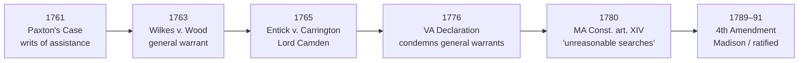
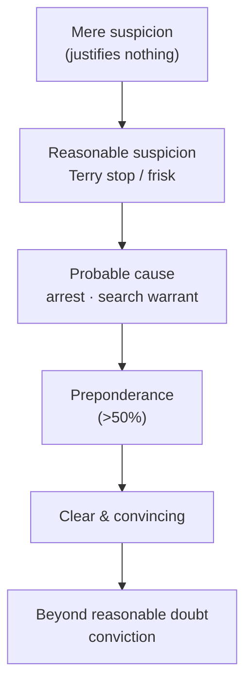

# S9 R1 panel-review — Opus model-diversity lane (prompt pack)

You are the **Claude/Opus** leg of the S9 three-lane adversarial panel (1 Claude + 2 Codex, R1). The two Codex lanes carry the A (support/quote-fidelity) and B (currency/treatment) attack lenses; **you carry model diversity and MUST vote on every paneled assertion across BOTH lenses' concerns.** You are refute-framed: try hard to break each assertion; **default to REFUTED on uncertainty**; never fabricate a cite, quote, or holding; use ONLY the evidence inlined below (no search, no outside knowledge). You are a SIGHTED reviewer — the FULL lake record (judgment fields included) is inlined.

You are a WRITER lane, not an adjudicator: you FIND and VOTE. You do not tally, adjudicate, or close any row — the orchestrator does.

For EACH group below, return one JSON object with the exact `reviewed[]` shape from the output contract (identical framing to the Codex lenses). Emit a finding object ONLY for a real defect (verdict refuted / stands-modified); a group you find wholly clean returns all-`stands` verdicts (the harness records a clean attestation). Concatenate the per-group JSON objects into a top-level `{"packs": [ ... ]}` array, one entry per group, each carrying its `group_id`.


OUTPUT CONTRACT — return ONE JSON object, nothing else:
{
  "lens": "A" | "B",
  "group_id": "<echo the group id>",
  "reviewed": [
    {
      "assertion_id": "<from group_inventory.jsonl>",
      "dimension": "existence|support|quote_fidelity|pincite|treatment|black_letter",
      "verdict": "stands" | "refuted" | "stands-modified",
      "verifiable_from_disclosed": true | false,
      "defect": null,   // null when verdict=="stands"; else an object:
      //  {"problem": "...", "severity": "high|medium|low", "proposed_fix": "...", "evidence_quote": "verbatim from disclosed evidence or null", "needs_cl": true|false, "locator_note": "..."}
      "reasons": ["short evidence-grounded reason", "..."],
      "breaks_true_positives": true | false,
      "residual_risks": ["..."],
      "suggested_tightening": "... or null"
    }
  ],
  "notes": ""
}
Rules: verdict=='stands' <=> defect==null (assertion survives your attack). verdict=='refuted' <=> a real defect (the assertion as framed is wrong). verdict=='stands-modified' <=> survives but needs a stated modification (a minor defect). Review EVERY assertion_id in group_inventory.jsonl exactly once. Output ONLY the JSON object.
---

## GROUP: content/cases/Adams v. Williams.md  (`case`, 6 assertions)

### content_page

```
---
title: "Adams v. Williams"
type: case
citation: "407 U.S. 143 (1972)"
parallel_cite: "92 S. Ct. 1921; 32 L. Ed. 2d 612"
neutral_cite: 1972 U.S. LEXIS 2206
court: U.S. Supreme Court
court_level: scotus
circuit: ""
year: 1972
date_decided: 1972-06-12
docket: ""
authority_weight: "Binding — SCOTUS"
treatment:
  field_i_validity: good_law
  as_of_content: 1972-06-12
  as_of_treatment: 2026-06-30
  composite_basis: migration-seed
  composite_basis_ref: Adams v. Williams
  varies_by_point: false
  scope_note: "Good law. A tip from a known, face-to-face informant carries enough indicia of reliability to justify a Terry stop and protective frisk; reasonable suspicion need not rest on the officer's personal observation. The anonymous-tip line (Alabama v. White, Florida v. J.L., Navarette) develops the contrast but does not disturb Adams."
  point_overrides: []
courtlistener:
  opinion_url: "https://www.courtlistener.com/opinion/108571/adams-v-williams/"
  cluster_id: 108571
  opinion_id: 108571
  identity_checked: true
homes:
  - page: "[[Terry Stops and Reasonable Suspicion]]"
    role: "Progeny"
  - page: "[[Reasonable Suspicion]]"
    role: "Related (cross-doctrine)"
related: ["[[Terry v. Ohio]]", "[[Alabama v. White]]", "[[Florida v. J.L.]]", "[[Navarette v. California]]", "[[Draper v. United States]]"]
aliases: []
tags: ["case", "fourth-amendment", "terry-stop", "reasonable-suspicion", "informant", "frisk"]
holding: "A tip from a known, face-to-face informant can supply the reasonable suspicion needed for a Terry stop and protective frisk; reasonable suspicion may rest on reliable information supplied by another, not only the officer's own observation."
lake:
  record_id: Adams v. Williams
  status: verified
  projected_at: 2026-07-09
---

# Adams v. Williams

*407 U.S. 143 (1972)* · U.S. Supreme Court · **Binding — SCOTUS** · Treatment: **good** *(as of 2026-06-30)*
<!-- header line; TreatmentBadge + weight render here, degrading to the text above -->

## Background
At about 2:15 a.m., Sergeant Connolly was on patrol in a high-crime area when a person known to him personally, who had given him information before, approached his cruiser and told him that a man seated in a nearby car was carrying narcotics and had a gun at his waist. Connolly approached the car and asked Williams to open the door; instead Williams rolled down the window. Connolly reached into the car to the spot at Williams's waistband the informant had described and removed a loaded revolver. Williams was arrested; a search incident to the arrest produced heroin. He was convicted of unlawful possession of the handgun and of the heroin and challenged the stop and frisk.

## Issue
Whether reasonable suspicion for a *[[Terry v. Ohio|Terry]]* stop and protective frisk may be based on a known informant's tip rather than the officer's own observation, and whether reaching to the place the informant identified to remove a weapon was a reasonable protective search.

## Rule
Yes. Reasonable suspicion can rest on a reliable informant's tip, not only on the officer's personal observation: "the information carried enough indicia of reliability to justify the officer's forcible stop of Williams." — 407 U.S. at 147. ^pin-147

"Informants' tips, like all other clues and evidence coming to a policeman on the scene, may vary greatly in their value and reliability. One simple rule will not cover every situation. . . . But in some situations — for example, when the victim of a street crime seeks immediate police aid and gives a description of his assailant, or when a credible informant warns of a specific impending crime — the subtleties of the hearsay rule should not thwart an appropriate police response." — *Id.* at 147. ^pin-147b

A protective reach for the reported weapon is reasonable: "Under these circumstances the policeman's action in reaching to the spot where the gun was thought to be hidden constituted a limited intrusion designed to insure his safety, and we conclude that it was reasonable." — [*Id.* at 148](https://www.courtlistener.com/opinion/108571/adams-v-williams/#:~:text=Under%20these%20circumstances%20the%20policeman%27s). ^pin-148

## Application
The informant was known to Connolly personally, had supplied information in the past, came forward in person to give immediately verifiable information, and under Connecticut law could have been arrested for a false complaint — so although the unverified tip might not have supported a warrant, it carried enough reliability to justify a forcible stop. Investigating a man reported to be armed, sitting alone in a car in a high-crime area at 2:15 a.m., Connolly had ample reason to fear for his safety; when Williams rolled down the window instead of stepping out, Connolly's reach to the waistband the informant identified was a reasonable, limited protective intrusion. Finding the loaded gun exactly where predicted then supplied probable cause to arrest Williams, making the search incident to that arrest — which produced the heroin — lawful.

## Conclusion
The stop, the protective seizure of the gun, and the search incident to the resulting arrest were all reasonable; the loaded gun and heroin were admissible and the judgment for Williams was reversed. A known informant's reliable tip can furnish reasonable suspicion for a *[[Terry v. Ohio|Terry]]* stop and frisk.

## Treatment & subsequent history
- **Status:** good *(as of 2026-06-30)* — **Binding — SCOTUS**.
- No negative treatment. *Adams* extends [[Terry v. Ohio]] to tip-based reasonable suspicion. Its emphasis on the *known* informant is the foil for the anonymous-tip cases: [[Alabama v. White]] (anonymous tip needs predictive corroboration), [[Florida v. J.L.]] (bare anonymous gun tip insufficient), and [[Navarette v. California]] (anonymous 911 tip with indicia of reliability sufficient).

## Appears on
- [[Terry Stops and Reasonable Suspicion]] — *Progeny*
- [[Reasonable Suspicion]] — *Related (cross-doctrine)*

## Sources
- *Adams v. Williams*, 407 U.S. 143 (1972) — https://www.courtlistener.com/opinion/108571/adams-v-williams/ — pinpoints: 147, 148.

```

### group_inventory (assertions under review)

```jsonl
{"assertion_id": "375f6cf75e380e1f", "dimension": "existence", "kind": "case_cite", "locator": {"field": "citation"}, "payload": {"citation": "407 U.S. 143 (1972)", "court": "U.S. Supreme Court", "neutral_cite": "1972 U.S. LEXIS 2206", "official_citation_present": true, "parallel_cite": "92 S. Ct. 1921; 32 L. Ed. 2d 612", "title": "Adams v. Williams", "year": "1972"}}
{"assertion_id": "3edc4f7d6c32a0a6", "dimension": "support", "kind": "home_role", "locator": {"home": "Reasonable Suspicion"}, "payload": {"home": "Reasonable Suspicion", "role": "Related (cross-doctrine)", "title": "Adams v. Williams"}}
{"assertion_id": "ae1e5de25890641e", "dimension": "support", "kind": "proposition", "locator": {"field": "holding"}, "payload": {"holding": "A tip from a known, face-to-face informant can supply the reasonable suspicion needed for a Terry stop and protective frisk; reasonable suspicion may rest on reliable information supplied by another, not only the officer's own observation.", "title": "Adams v. Williams"}}
{"assertion_id": "e296c5d3a888fbb9", "dimension": "support", "kind": "home_role", "locator": {"home": "Terry Stops and Reasonable Suspicion"}, "payload": {"home": "Terry Stops and Reasonable Suspicion", "role": "Progeny", "title": "Adams v. Williams"}}
{"assertion_id": "10b0337e79b61d1d", "dimension": "treatment", "kind": "weight_label", "locator": {"field": "authority_weight"}, "payload": {"authority_weight": "Binding — SCOTUS", "title": "Adams v. Williams"}}
{"assertion_id": "a2f7e053970d5d58", "dimension": "treatment", "kind": "treatment", "locator": {"field": "treatment"}, "payload": {"as_of_content": "1972-06-12", "as_of_treatment": "2026-06-30", "composite_basis": "migration-seed", "composite_basis_ref": "Adams v. Williams", "field_i_validity": "good_law", "scope_note": "Good law. A tip from a known, face-to-face informant carries enough indicia of reliability to justify a Terry stop and protective frisk; reasonable suspicion need not rest on the officer's personal observation. The anonymous-tip line (Alabama v. White, Florida v. J.L., Navarette) develops the contrast but does not disturb Adams.", "title": "Adams v. Williams", "varies_by_point": "false"}}
```

### lake record — Adams v. Williams

```json
{
  "schema_version": "s2.v1",
  "record_id": "Adams v. Williams",
  "stub": false,
  "status": "verified",
  "identity": {
    "case_name": "Adams v. Williams",
    "case_name_short": "Adams",
    "case_name_full": "Adams, Warden v. Williams",
    "input_case_name": "Adams v. Williams",
    "court": "U.S. Supreme Court",
    "court_id": "scotus",
    "court_level": "scotus",
    "circuit": null,
    "state": null,
    "date_decided": "1972-06-12",
    "year": 1972,
    "docket": null,
    "cluster_id": 108571,
    "lead_opinion_id": 108571,
    "sibling_ids": [
      108571,
      9424935,
      9424936,
      9424937,
      9424938
    ],
    "absolute_url": "/opinion/108571/adams-v-williams/",
    "identity_method": "citation+party-text",
    "expected_citation_found": true,
    "party_name_in_text": true,
    "canonical_name_match": true,
    "alternates": [
      {
        "cluster_id": 8987525,
        "score": 10,
        "case_name": "Adams v. Williams"
      },
      {
        "cluster_id": 8987276,
        "score": 10,
        "case_name": "Adams v. Williams"
      },
      {
        "cluster_id": 8986252,
        "score": 10,
        "case_name": "Adams v. Williams"
      }
    ],
    "reason_code": null
  },
  "citations": {
    "official": {
      "cite": "407 U.S. 143",
      "volume": "407",
      "reporter": "U.S.",
      "page": "143",
      "type": 1,
      "selected_official": true,
      "source": "cluster.citations[]"
    },
    "parallel": [
      {
        "cite": "92 S. Ct. 1921",
        "volume": "92",
        "reporter": "S. Ct.",
        "page": "1921",
        "type": 1,
        "selected_official": false,
        "source": "cluster.citations[]"
      },
      {
        "cite": "32 L. Ed. 2d 612",
        "volume": "32",
        "reporter": "L. Ed. 2d",
        "page": "612",
        "type": 1,
        "selected_official": false,
        "source": "cluster.citations[]"
      }
    ],
    "vendor_neutral": [
      {
        "cite": "1972 U.S. LEXIS 2206",
        "volume": "1972",
        "reporter": "U.S. LEXIS",
        "page": "2206",
        "type": 6,
        "selected_official": false,
        "source": "cluster.citations[]"
      }
    ],
    "all": [
      {
        "cite": "407 U.S. 143",
        "volume": "407",
        "reporter": "U.S.",
        "page": "143",
        "type": 1,
        "selected_official": false,
        "source": "cluster.citations[]"
      },
      {
        "cite": "92 S. Ct. 1921",
        "volume": "92",
        "reporter": "S. Ct.",
        "page": "1921",
        "type": 1,
        "selected_official": false,
        "source": "cluster.citations[]"
      },
      {
        "cite": "32 L. Ed. 2d 612",
        "volume": "32",
        "reporter": "L. Ed. 2d",
        "page": "612",
        "type": 1,
        "selected_official": false,
        "source": "cluster.citations[]"
      },
      {
        "cite": "1972 U.S. LEXIS 2206",
        "volume": "1972",
        "reporter": "U.S. LEXIS",
        "page": "2206",
        "type": 6,
        "selected_official": false,
        "source": "cluster.citations[]"
      }
    ],
    "display": "407 U.S. 143",
    "official_selection": {
      "court_class": "scotus",
      "selected": "407 U.S. 143",
      "reason": "selected_rank_1"
    }
  },
  "pinpoints": [
    {
      "id": "pin-147",
      "page": null,
      "quote": "--- # Adams v. Williams *407 U.S. 143 (1972)* \u00b7 U.S. Supreme Court \u00b7 **Binding \u2014 SCOTUS** \u00b7 Treatment: **good** *(as of 2026-06-30)* <!-- header line; TreatmentBadge + weight render here, degrading to the text above --> ## Background At about 2:15 a.m., Sergeant Connolly was on patrol in a high-crime area when a person known to him personally, who had given him information before, approached his cruiser and told him that a man seated in a nearby car was carrying narcotics and had a gun at his waist. Connolly approached the car and asked Williams to open the door; instead Williams rolled down the window. Connolly reached into the car to the spot at Williams's waistband the informant had described and removed a loaded revolver. Williams was arrested; a search incident to the arrest produced heroin. He was convicted of unlawful possession of the handgun and of the heroin and challenged the stop and frisk. ## Issue Whether reasonable suspicion for a *Terry* stop and protective frisk may be based on a known informant's tip rather than the officer's own observation, and whether reaching to the place the informant identified to remove a weapon was a reasonable protective search. ## Rule Yes. Reasonable suspicion can rest on a reliable informant's tip, not only on the officer's personal observation:",
      "star_marker": null,
      "quote_fidelity": "mismatch",
      "pinpoint_status": "slip-only",
      "position": null
    },
    {
      "id": "pin-147b",
      "page": null,
      "quote": "Informants' tips, like all other clues and evidence coming to a policeman on the scene, may vary greatly in their value and reliability. One simple rule will not cover every situation. . . . But in some situations \u2014 for example, when the victim of a street crime seeks immediate police aid and gives a description of his assailant, or when a credible informant warns of a specific impending crime \u2014 the subtleties of the hearsay rule should not thwart an appropriate police response.",
      "star_marker": null,
      "quote_fidelity": "mismatch",
      "pinpoint_status": "slip-only",
      "position": null
    },
    {
      "id": "pin-148",
      "page": null,
      "quote": "Under these circumstances the policeman's action in reaching to the spot where the gun was thought to be hidden constituted a limited intrusion designed to insure his safety, and we conclude that it was reasonable.",
      "star_marker": "148",
      "quote_fidelity": "matched",
      "pinpoint_status": "star-verified",
      "position": 11530,
      "fragment": "#:~:text=Under%20these%20circumstances%20the%20policeman%27s",
      "fragment_validated_at": "2026-07-09T15:40:45Z"
    }
  ],
  "treatment": {
    "field_i_validity": "good_law",
    "as_of_content": "1972-06-12",
    "as_of_treatment": "2026-06-30",
    "composite_basis": "migration-seed",
    "composite_basis_ref": "Adams v. Williams",
    "varies_by_point": false,
    "scope_note": "Good law. A tip from a known, face-to-face informant carries enough indicia of reliability to justify a Terry stop and protective frisk; reasonable suspicion need not rest on the officer's personal observation. The anonymous-tip line (Alabama v. White, Florida v. J.L., Navarette) develops the contrast but does not disturb Adams.",
    "point_overrides": [],
    "edges": [
      {
        "citing_case": {
          "name": "The People of the State of Colorado, In the Interest of T.J.W., Juvenile-Appellee L.C.W. and D.W. and Concerning",
          "cluster_id": 10871666,
          "cite": [
            "2026 CO 38"
          ],
          "field_ii": "overruled"
        },
        "field_ii": "overruled",
        "field_iii": "mentioned",
        "point": null,
        "proposed": true,
        "journal_ref": "Adams v. Williams:lane1_negative"
      },
      {
        "citing_case": {
          "name": "Kopp v. State",
          "cluster_id": 10864408,
          "cite": null,
          "field_ii": "overruled"
        },
        "field_ii": "overruled",
        "field_iii": "mentioned",
        "point": null,
        "proposed": true,
        "journal_ref": "Adams v. Williams:lane1_negative"
      },
      {
        "citing_case": {
          "name": "State v. Stone",
          "cluster_id": 10780071,
          "cite": null,
          "field_ii": "overruled"
        },
        "field_ii": "overruled",
        "field_iii": "mentioned",
        "point": null,
        "proposed": true,
        "journal_ref": "Adams v. Williams:lane1_negative"
      },
      {
        "citing_case": {
          "name": "United States v. Johnson",
          "cluster_id": 10770653,
          "cite": null,
          "field_ii": "criticized"
        },
        "field_ii": "criticized",
        "field_iii": "mentioned",
        "point": null,
        "proposed": true,
        "journal_ref": "Adams v. Williams:lane1_negative"
      },
      {
        "citing_case": {
          "name": "State v. Tower",
          "cluster_id": 10759279,
          "cite": [
            "2025 Ohio 5593"
          ],
          "field_ii": "overruled"
        },
        "field_ii": "overruled",
        "field_iii": "mentioned",
        "point": null,
        "proposed": true,
        "journal_ref": "Adams v. Williams:lane1_negative"
      },
      {
        "citing_case": {
          "name": "Swanson v. State",
          "cluster_id": 10758425,
          "cite": null,
          "field_ii": "questioned"
        },
        "field_ii": "questioned",
        "field_iii": "mentioned",
        "point": null,
        "proposed": true,
        "journal_ref": "Adams v. Williams:lane1_negative"
      },
      {
        "citing_case": {
          "name": "Thomas Wesley Hollingsworth v. Commonwealth of Virginia",
          "cluster_id": 10741964,
          "cite": null,
          "field_ii": "questioned"
        },
        "field_ii": "questioned",
        "field_iii": "mentioned",
        "point": null,
        "proposed": true,
        "journal_ref": "Adams v. Williams:lane1_negative"
      },
      {
        "citing_case": {
          "name": "State of Minnesota, Respondent, vs. Matthew Sam Mitchell, Appellant",
          "cluster_id": 10696233,
          "cite": null,
          "field_ii": "questioned"
        },
        "field_ii": "questioned",
        "field_iii": "mentioned",
        "point": null,
        "proposed": true,
        "journal_ref": "Adams v. Williams:lane1_negative"
      },
      {
        "citing_case": {
          "name": "Commonwealth v. Lewis, A., Aplt.",
          "cluster_id": 10677596,
          "cite": null,
          "field_ii": "questioned"
        },
        "field_ii": "questioned",
        "field_iii": "mentioned",
        "point": null,
        "proposed": true,
        "journal_ref": "Adams v. Williams:lane1_negative"
      },
      {
        "citing_case": {
          "name": "State v. Scerba",
          "cluster_id": 10650412,
          "cite": [
            "2025 Ohio 2791"
          ],
          "field_ii": "overruled"
        },
        "field_ii": "overruled",
        "field_iii": "mentioned",
        "point": null,
        "proposed": true,
        "journal_ref": "Adams v. Williams:lane1_negative"
      },
      {
        "citing_case": {
          "name": "United States v. Wilson",
          "cluster_id": 10636220,
          "cite": null,
          "field_ii": "abrogated"
        },
        "field_ii": "abrogated",
        "field_iii": "mentioned",
        "point": null,
        "proposed": true,
        "journal_ref": "Adams v. Williams:lane1_negative"
      },
      {
        "citing_case": {
          "name": "State v. Wolfe",
          "cluster_id": 10604482,
          "cite": [
            "2025 Ohio 2096"
          ],
          "field_ii": "overruled"
        },
        "field_ii": "overruled",
        "field_iii": "mentioned",
        "point": null,
        "proposed": true,
        "journal_ref": "Adams v. Williams:lane1_negative"
      },
      {
        "citing_case": {
          "name": "State v. Robinson",
          "cluster_id": 10589223,
          "cite": [
            "2025 Ohio 1537"
          ],
          "field_ii": "overruled"
        },
        "field_ii": "overruled",
        "field_iii": "mentioned",
        "point": null,
        "proposed": true,
        "journal_ref": "Adams v. Williams:lane1_negative"
      },
      {
        "citing_case": {
          "name": "State v. Pullom",
          "cluster_id": 10582017,
          "cite": [
            "2025 Ohio 1700"
          ],
          "field_ii": "overruled"
        },
        "field_ii": "overruled",
        "field_iii": "mentioned",
        "point": null,
        "proposed": true,
        "journal_ref": "Adams v. Williams:lane1_negative"
      },
      {
        "citing_case": {
          "name": "State v. Buckingham",
          "cluster_id": 10581986,
          "cite": [
            "2025 Ohio 1688"
          ],
          "field_ii": "overruled"
        },
        "field_ii": "overruled",
        "field_iii": "mentioned",
        "point": null,
        "proposed": true,
        "journal_ref": "Adams v. Williams:lane1_negative"
      },
      {
        "citing_case": {
          "name": "State of Louisiana v. K.B.",
          "cluster_id": 10581696,
          "cite": null,
          "field_ii": "questioned"
        },
        "field_ii": "questioned",
        "field_iii": "mentioned",
        "point": null,
        "proposed": true,
        "journal_ref": "Adams v. Williams:lane1_negative"
      },
      {
        "citing_case": {
          "name": "State v. Robinson",
          "cluster_id": 10517584,
          "cite": [
            "2025 Ohio 1539"
          ],
          "field_ii": "overruled"
        },
        "field_ii": "overruled",
        "field_iii": "mentioned",
        "point": null,
        "proposed": true,
        "journal_ref": "Adams v. Williams:lane1_negative"
      },
      {
        "citing_case": {
          "name": "State v. Shannon",
          "cluster_id": 10373759,
          "cite": [
            "2025 Ohio 1224"
          ],
          "field_ii": "overruled"
        },
        "field_ii": "overruled",
        "field_iii": "mentioned",
        "point": null,
        "proposed": true,
        "journal_ref": "Adams v. Williams:lane1_negative"
      },
      {
        "citing_case": {
          "name": "Commonwealth v. Dasahn Crowder",
          "cluster_id": 10363504,
          "cite": null,
          "field_ii": "abrogated"
        },
        "field_ii": "abrogated",
        "field_iii": "mentioned",
        "point": null,
        "proposed": true,
        "journal_ref": "Adams v. Williams:lane1_negative"
      },
      {
        "citing_case": {
          "name": "Com. v. Gibson, T.",
          "cluster_id": 10358162,
          "cite": [
            "2025 Pa. Super. 65"
          ],
          "field_ii": "criticized"
        },
        "field_ii": "criticized",
        "field_iii": "mentioned",
        "point": null,
        "proposed": true,
        "journal_ref": "Adams v. Williams:lane1_negative"
      },
      {
        "citing_case": {
          "name": "Hylton v. District of Columbia",
          "cluster_id": 10352120,
          "cite": null,
          "field_ii": "criticized"
        },
        "field_ii": "criticized",
        "field_iii": "mentioned",
        "point": null,
        "proposed": true,
        "journal_ref": "Adams v. Williams:lane1_negative"
      },
      {
        "citing_case": {
          "name": "United States v. Duane Gary Underwood, II",
          "cluster_id": 10340565,
          "cite": [
            "129 F.4th 912"
          ],
          "field_ii": "questioned"
        },
        "field_ii": "questioned",
        "field_iii": "mentioned",
        "point": null,
        "proposed": true,
        "journal_ref": "Adams v. Williams:lane1_negative"
      },
      {
        "citing_case": {
          "name": "State v. Sanders",
          "cluster_id": 10329396,
          "cite": [
            "2025 Ohio 411"
          ],
          "field_ii": "overruled"
        },
        "field_ii": "overruled",
        "field_iii": "mentioned",
        "point": null,
        "proposed": true,
        "journal_ref": "Adams v. Williams:lane1_negative"
      },
      {
        "citing_case": {
          "name": "State v. McKenzie",
          "cluster_id": 10318233,
          "cite": [
            "2025 Ohio 150"
          ],
          "field_ii": "overruled"
        },
        "field_ii": "overruled",
        "field_iii": "mentioned",
        "point": null,
        "proposed": true,
        "journal_ref": "Adams v. Williams:lane1_negative"
      },
      {
        "citing_case": {
          "name": "In re A.M.J.",
          "cluster_id": 10295535,
          "cite": [
            "2024 Ohio 5889"
          ],
          "field_ii": "overruled"
        },
        "field_ii": "overruled",
        "field_iii": "mentioned",
        "point": null,
        "proposed": true,
        "journal_ref": "Adams v. Williams:lane1_negative"
      },
      {
        "citing_case": {
          "name": "State v. Stollings",
          "cluster_id": 10293438,
          "cite": null,
          "field_ii": "questioned"
        },
        "field_ii": "questioned",
        "field_iii": "mentioned",
        "point": null,
        "proposed": true,
        "journal_ref": "Adams v. Williams:lane1_negative"
      },
      {
        "citing_case": {
          "name": "State v. Barnes",
          "cluster_id": 10293080,
          "cite": [
            "2024 Ohio 5865"
          ],
          "field_ii": "overruled"
        },
        "field_ii": "overruled",
        "field_iii": "mentioned",
        "point": null,
        "proposed": true,
        "journal_ref": "Adams v. Williams:lane1_negative"
      },
      {
        "citing_case": {
          "name": "State v. Dyson",
          "cluster_id": 10284857,
          "cite": [
            "2024 Ohio 5591"
          ],
          "field_ii": "overruled"
        },
        "field_ii": "overruled",
        "field_iii": "mentioned",
        "point": null,
        "proposed": true,
        "journal_ref": "Adams v. Williams:lane1_negative"
      },
      {
        "citing_case": {
          "name": "State v. Jackson",
          "cluster_id": 10276151,
          "cite": [
            "2024 Ohio 4770"
          ],
          "field_ii": "overruled"
        },
        "field_ii": "overruled",
        "field_iii": "mentioned",
        "point": null,
        "proposed": true,
        "journal_ref": "Adams v. Williams:lane1_negative"
      },
      {
        "citing_case": {
          "name": "State v. Swanson",
          "cluster_id": 10007955,
          "cite": null,
          "field_ii": "criticized"
        },
        "field_ii": "criticized",
        "field_iii": "mentioned",
        "point": null,
        "proposed": true,
        "journal_ref": "Adams v. Williams:lane1_negative"
      },
      {
        "citing_case": {
          "name": "Melissa Trevino v. the State of Texas",
          "cluster_id": 10008832,
          "cite": null,
          "field_ii": "overruled"
        },
        "field_ii": "overruled",
        "field_iii": "mentioned",
        "point": null,
        "proposed": true,
        "journal_ref": "Adams v. Williams:lane1_negative"
      },
      {
        "citing_case": {
          "name": "State v. Napoleao Pires",
          "cluster_id": 9997524,
          "cite": null,
          "field_ii": "questioned"
        },
        "field_ii": "questioned",
        "field_iii": "mentioned",
        "point": null,
        "proposed": true,
        "journal_ref": "Adams v. Williams:lane1_negative"
      },
      {
        "citing_case": {
          "name": "State v. Michael Gene Wiskowski",
          "cluster_id": 9576066,
          "cite": [
            "2024 WI 23"
          ],
          "field_ii": "superseded_by_statute"
        },
        "field_ii": "superseded_by_statute",
        "field_iii": "mentioned",
        "point": null,
        "proposed": true,
        "journal_ref": "Adams v. Williams:lane1_negative"
      },
      {
        "citing_case": {
          "name": "State v. Michael Gene Wiskowski",
          "cluster_id": 9567763,
          "cite": [
            "2024 WI 23"
          ],
          "field_ii": "superseded_by_statute"
        },
        "field_ii": "superseded_by_statute",
        "field_iii": "mentioned",
        "point": null,
        "proposed": true,
        "journal_ref": "Adams v. Williams:lane1_negative"
      },
      {
        "citing_case": {
          "name": "State v. Shaw",
          "cluster_id": 9507576,
          "cite": [
            "2024 Ohio 2022"
          ],
          "field_ii": "overruled"
        },
        "field_ii": "overruled",
        "field_iii": "mentioned",
        "point": null,
        "proposed": true,
        "journal_ref": "Adams v. Williams:lane1_negative"
      },
      {
        "citing_case": {
          "name": "State of Tennessee v. Antonio Demetrius Adkisson a/k/a Antonio Demetrius Turner, Jr. - DISSENT",
          "cluster_id": 9487427,
          "cite": null,
          "field_ii": "questioned"
        },
        "field_ii": "questioned",
        "field_iii": "mentioned",
        "point": null,
        "proposed": true,
        "journal_ref": "Adams v. Williams:lane1_negative"
      },
      {
        "citing_case": {
          "name": "State v. Williams",
          "cluster_id": 9484217,
          "cite": [
            "237 N.E.3d 948",
            "2024 Ohio 943"
          ],
          "field_ii": "overruled"
        },
        "field_ii": "overruled",
        "field_iii": "mentioned",
        "point": null,
        "proposed": true,
        "journal_ref": "Adams v. Williams:lane1_negative"
      },
      {
        "citing_case": {
          "name": "Savannah Marie Scarborough v. the State of Texas",
          "cluster_id": 9480115,
          "cite": null,
          "field_ii": "overruled"
        },
        "field_ii": "overruled",
        "field_iii": "mentioned",
        "point": null,
        "proposed": true,
        "journal_ref": "Adams v. Williams:lane1_negative"
      },
      {
        "citing_case": {
          "name": "State v. Wells",
          "cluster_id": 9469432,
          "cite": [
            "2024 Ohio 236"
          ],
          "field_ii": "overruled"
        },
        "field_ii": "overruled",
        "field_iii": "mentioned",
        "point": null,
        "proposed": true,
        "journal_ref": "Adams v. Williams:lane1_negative"
      },
      {
        "citing_case": {
          "name": "Villarreal v. City of Laredo",
          "cluster_id": 9468368,
          "cite": [
            "94 F.4th 374"
          ],
          "field_ii": "abrogated"
        },
        "field_ii": "abrogated",
        "field_iii": "mentioned",
        "point": null,
        "proposed": true,
        "journal_ref": "Adams v. Williams:lane1_negative"
      },
      {
        "citing_case": {
          "name": "Commonwealth v. Dobson, J., Aplt.",
          "cluster_id": 9458062,
          "cite": null,
          "field_ii": "questioned"
        },
        "field_ii": "questioned",
        "field_iii": "mentioned",
        "point": null,
        "proposed": true,
        "journal_ref": "Adams v. Williams:lane1_negative"
      },
      {
        "citing_case": {
          "name": "State of Missouri v. Jason Scott Klein",
          "cluster_id": 10631102,
          "cite": null,
          "field_ii": "overruled"
        },
        "field_ii": "overruled",
        "field_iii": "mentioned",
        "point": null,
        "proposed": true,
        "journal_ref": "Adams v. Williams:lane1_negative"
      },
      {
        "citing_case": {
          "name": "State v. Hicks",
          "cluster_id": 9441433,
          "cite": [
            "229 N.E.3d 172",
            "2023 Ohio 4126"
          ],
          "field_ii": "superseded_by_statute"
        },
        "field_ii": "superseded_by_statute",
        "field_iii": "mentioned",
        "point": null,
        "proposed": true,
        "journal_ref": "Adams v. Williams:lane1_negative"
      },
      {
        "citing_case": {
          "name": "State v. Houston",
          "cluster_id": 9439762,
          "cite": [
            "2023 Ohio 4101"
          ],
          "field_ii": "overruled"
        },
        "field_ii": "overruled",
        "field_iii": "mentioned",
        "point": null,
        "proposed": true,
        "journal_ref": "Adams v. Williams:lane1_negative"
      },
      {
        "citing_case": {
          "name": "Narce v. Mervilus",
          "cluster_id": 9436102,
          "cite": null,
          "field_ii": "questioned"
        },
        "field_ii": "questioned",
        "field_iii": "mentioned",
        "point": null,
        "proposed": true,
        "journal_ref": "Adams v. Williams:lane1_negative"
      },
      {
        "citing_case": {
          "name": "Commonwealth v. Jackson, K., Aplt.",
          "cluster_id": 9429771,
          "cite": null,
          "field_ii": "questioned"
        },
        "field_ii": "questioned",
        "field_iii": "mentioned",
        "point": null,
        "proposed": true,
        "journal_ref": "Adams v. Williams:lane1_negative"
      },
      {
        "citing_case": {
          "name": "Commonwealth v. Jackson, K., Aplt.",
          "cluster_id": 9429770,
          "cite": null,
          "field_ii": "criticized"
        },
        "field_ii": "criticized",
        "field_iii": "mentioned",
        "point": null,
        "proposed": true,
        "journal_ref": "Adams v. Williams:lane1_negative"
      },
      {
        "citing_case": {
          "name": "State v. Escobedo",
          "cluster_id": 9430770,
          "cite": [
            "224 N.E.3d 1274",
            "2023 Ohio 3410"
          ],
          "field_ii": "questioned"
        },
        "field_ii": "questioned",
        "field_iii": "mentioned",
        "point": null,
        "proposed": true,
        "journal_ref": "Adams v. Williams:lane1_negative"
      },
      {
        "citing_case": {
          "name": "People v. Lozano",
          "cluster_id": 9427519,
          "cite": [
            "226 N.E.3d 1246",
            "2023 IL 128609"
          ],
          "field_ii": "questioned"
        },
        "field_ii": "questioned",
        "field_iii": "mentioned",
        "point": null,
        "proposed": true,
        "journal_ref": "Adams v. Williams:lane1_negative"
      },
      {
        "citing_case": {
          "name": "State v. Wright",
          "cluster_id": 9425749,
          "cite": null,
          "field_ii": "questioned"
        },
        "field_ii": "questioned",
        "field_iii": "mentioned",
        "point": null,
        "proposed": true,
        "journal_ref": "Adams v. Williams:lane1_negative"
      },
      {
        "citing_case": {
          "name": "Timothy Davis, Sr. v. City of Apopka",
          "cluster_id": 9422919,
          "cite": [
            "78 F.4th 1326"
          ],
          "field_ii": "criticized"
        },
        "field_ii": "criticized",
        "field_iii": "mentioned",
        "point": null,
        "proposed": true,
        "journal_ref": "Adams v. Williams:lane1_negative"
      },
      {
        "citing_case": {
          "name": "Phillip Alexander Duty v. State of Alaska",
          "cluster_id": 9409154,
          "cite": [
            "532 P.3d 742"
          ],
          "field_ii": "questioned"
        },
        "field_ii": "questioned",
        "field_iii": "mentioned",
        "point": null,
        "proposed": true,
        "journal_ref": "Adams v. Williams:lane1_negative"
      },
      {
        "citing_case": {
          "name": "State v. Oliver",
          "cluster_id": 9397810,
          "cite": [
            "214 N.E.3d 624",
            "2023 Ohio 1550"
          ],
          "field_ii": "overruled"
        },
        "field_ii": "overruled",
        "field_iii": "mentioned",
        "point": null,
        "proposed": true,
        "journal_ref": "Adams v. Williams:lane1_negative"
      },
      {
        "citing_case": {
          "name": "State v. Thornton",
          "cluster_id": 9395271,
          "cite": [
            "213 N.E.3d 808",
            "2023 Ohio 1404"
          ],
          "field_ii": "overruled"
        },
        "field_ii": "overruled",
        "field_iii": "mentioned",
        "point": null,
        "proposed": true,
        "journal_ref": "Adams v. Williams:lane1_negative"
      },
      {
        "citing_case": {
          "name": "State v. Hall-Johnson",
          "cluster_id": 8245698,
          "cite": [
            "2022 Ohio 3512"
          ],
          "field_ii": "overruled"
        },
        "field_ii": "overruled",
        "field_iii": "mentioned",
        "point": null,
        "proposed": true,
        "journal_ref": "Adams v. Williams:lane1_negative"
      },
      {
        "citing_case": {
          "name": "State of Maine v. Timothy Barclift",
          "cluster_id": 8244189,
          "cite": [
            "282 A.3d 607",
            "2022 ME 50"
          ],
          "field_ii": "questioned"
        },
        "field_ii": "questioned",
        "field_iii": "mentioned",
        "point": null,
        "proposed": true,
        "journal_ref": "Adams v. Williams:lane1_negative"
      },
      {
        "citing_case": {
          "name": "People of Michigan v. Claudell Turner",
          "cluster_id": 7858037,
          "cite": null,
          "field_ii": "questioned"
        },
        "field_ii": "questioned",
        "field_iii": "mentioned",
        "point": null,
        "proposed": true,
        "journal_ref": "Adams v. Williams:lane1_negative"
      },
      {
        "citing_case": {
          "name": "People v. Ayon",
          "cluster_id": 7854147,
          "cite": null,
          "field_ii": "questioned"
        },
        "field_ii": "questioned",
        "field_iii": "mentioned",
        "point": null,
        "proposed": true,
        "journal_ref": "Adams v. Williams:lane1_negative"
      },
      {
        "citing_case": {
          "name": "State v. Barcus",
          "cluster_id": 6681080,
          "cite": [
            "2022 Ohio 2491"
          ],
          "field_ii": "questioned"
        },
        "field_ii": "questioned",
        "field_iii": "mentioned",
        "point": null,
        "proposed": true,
        "journal_ref": "Adams v. Williams:lane1_negative"
      },
      {
        "citing_case": {
          "name": "United States v. Alvarez",
          "cluster_id": 6623468,
          "cite": [
            "40 F.4th 339"
          ],
          "field_ii": "overruled"
        },
        "field_ii": "overruled",
        "field_iii": "mentioned",
        "point": null,
        "proposed": true,
        "journal_ref": "Adams v. Williams:lane1_negative"
      },
      {
        "citing_case": {
          "name": "United States v. Dazhan McCallister",
          "cluster_id": 6622139,
          "cite": [
            "39 F.4th 368"
          ],
          "field_ii": "questioned"
        },
        "field_ii": "questioned",
        "field_iii": "mentioned",
        "point": null,
        "proposed": true,
        "journal_ref": "Adams v. Williams:lane1_negative"
      },
      {
        "citing_case": {
          "name": "People v. Ayon",
          "cluster_id": 6621924,
          "cite": null,
          "field_ii": "questioned"
        },
        "field_ii": "questioned",
        "field_iii": "mentioned",
        "point": null,
        "proposed": true,
        "journal_ref": "Adams v. Williams:lane1_negative"
      },
      {
        "citing_case": {
          "name": "State v. Huntley",
          "cluster_id": 6620233,
          "cite": [
            "513 P.3d 1141"
          ],
          "field_ii": "questioned"
        },
        "field_ii": "questioned",
        "field_iii": "mentioned",
        "point": null,
        "proposed": true,
        "journal_ref": "Adams v. Williams:lane1_negative"
      },
      {
        "citing_case": {
          "name": "State v. Wright",
          "cluster_id": 6481332,
          "cite": [
            "2022 Ohio 2161"
          ],
          "field_ii": "overruled"
        },
        "field_ii": "overruled",
        "field_iii": "mentioned",
        "point": null,
        "proposed": true,
        "journal_ref": "Adams v. Williams:lane1_negative"
      },
      {
        "citing_case": {
          "name": "In re: D.D.",
          "cluster_id": 10048705,
          "cite": [
            "479 Md. 206"
          ],
          "field_ii": "questioned"
        },
        "field_ii": "questioned",
        "field_iii": "mentioned",
        "point": null,
        "proposed": true,
        "journal_ref": "Adams v. Williams:lane1_negative"
      },
      {
        "citing_case": {
          "name": "In re: D.D.",
          "cluster_id": 6479680,
          "cite": null,
          "field_ii": "questioned"
        },
        "field_ii": "questioned",
        "field_iii": "mentioned",
        "point": null,
        "proposed": true,
        "journal_ref": "Adams v. Williams:lane1_negative"
      },
      {
        "citing_case": {
          "name": "State v. Ferguson, III",
          "cluster_id": 6473582,
          "cite": null,
          "field_ii": "questioned"
        },
        "field_ii": "questioned",
        "field_iii": "mentioned",
        "point": null,
        "proposed": true,
        "journal_ref": "Adams v. Williams:lane1_negative"
      },
      {
        "citing_case": {
          "name": "Jonathan Russell Shook v. the State of Texas",
          "cluster_id": 6472617,
          "cite": null,
          "field_ii": "overruled"
        },
        "field_ii": "overruled",
        "field_iii": "mentioned",
        "point": null,
        "proposed": true,
        "journal_ref": "Adams v. Williams:lane1_negative"
      },
      {
        "citing_case": {
          "name": "State v. Wharton",
          "cluster_id": 6470917,
          "cite": [
            "510 P.3d 682",
            "170 Idaho 329"
          ],
          "field_ii": "questioned"
        },
        "field_ii": "questioned",
        "field_iii": "mentioned",
        "point": null,
        "proposed": true,
        "journal_ref": "Adams v. Williams:lane1_negative"
      },
      {
        "citing_case": {
          "name": "State of Iowa v. Kha Len Richard Price-Williams",
          "cluster_id": 6461978,
          "cite": null,
          "field_ii": "overruled"
        },
        "field_ii": "overruled",
        "field_iii": "mentioned",
        "point": null,
        "proposed": true,
        "journal_ref": "Adams v. Williams:lane1_negative"
      },
      {
        "citing_case": {
          "name": "State v. Kent",
          "cluster_id": 6452197,
          "cite": [
            "2022 Ohio 834"
          ],
          "field_ii": "overruled"
        },
        "field_ii": "overruled",
        "field_iii": "mentioned",
        "point": null,
        "proposed": true,
        "journal_ref": "Adams v. Williams:lane1_negative"
      },
      {
        "citing_case": {
          "name": "United States v. Anthony Buster",
          "cluster_id": 7454472,
          "cite": [
            "26 F.4th 627"
          ],
          "field_ii": "overruled"
        },
        "field_ii": "overruled",
        "field_iii": "mentioned",
        "point": null,
        "proposed": true,
        "journal_ref": "Adams v. Williams:lane1_negative"
      },
      {
        "citing_case": {
          "name": "United States v. Anthony Buster",
          "cluster_id": 6444299,
          "cite": null,
          "field_ii": "overruled"
        },
        "field_ii": "overruled",
        "field_iii": "mentioned",
        "point": null,
        "proposed": true,
        "journal_ref": "Adams v. Williams:lane1_negative"
      },
      {
        "citing_case": {
          "name": "Bingman v. United States",
          "cluster_id": 6245901,
          "cite": null,
          "field_ii": "questioned"
        },
        "field_ii": "questioned",
        "field_iii": "mentioned",
        "point": null,
        "proposed": true,
        "journal_ref": "Adams v. Williams:lane1_negative"
      },
      {
        "citing_case": {
          "name": "State v. Carter",
          "cluster_id": 6236798,
          "cite": [
            "183 N.E.3d 611",
            "2022 Ohio 91"
          ],
          "field_ii": "overruled"
        },
        "field_ii": "overruled",
        "field_iii": "mentioned",
        "point": null,
        "proposed": true,
        "journal_ref": "Adams v. Williams:lane1_negative"
      },
      {
        "citing_case": {
          "name": "People v. Carter",
          "cluster_id": 5306903,
          "cite": [
            "454 Ill. Dec. 624",
            "190 N.E.3d 224",
            "2021 IL 125954"
          ],
          "field_ii": "questioned"
        },
        "field_ii": "questioned",
        "field_iii": "mentioned",
        "point": null,
        "proposed": true,
        "journal_ref": "Adams v. Williams:lane1_negative"
      },
      {
        "citing_case": {
          "name": "United States v. Guerrero",
          "cluster_id": 5303613,
          "cite": [
            "19 F.4th 547"
          ],
          "field_ii": "overruled"
        },
        "field_ii": "overruled",
        "field_iii": "mentioned",
        "point": null,
        "proposed": true,
        "journal_ref": "Adams v. Williams:lane1_negative"
      },
      {
        "citing_case": {
          "name": "Ricardo Villa v. the State of Texas",
          "cluster_id": 5302956,
          "cite": null,
          "field_ii": "overruled"
        },
        "field_ii": "overruled",
        "field_iii": "mentioned",
        "point": null,
        "proposed": true,
        "journal_ref": "Adams v. Williams:lane1_negative"
      },
      {
        "citing_case": {
          "name": "In the Interest of: T.W.; Apl: T.W.",
          "cluster_id": 10278823,
          "cite": null,
          "field_ii": "questioned"
        },
        "field_ii": "questioned",
        "field_iii": "mentioned",
        "point": null,
        "proposed": true,
        "journal_ref": "Adams v. Williams:lane1_negative"
      },
      {
        "citing_case": {
          "name": "the State of Texas v. Georgia Donnell",
          "cluster_id": 5173560,
          "cite": null,
          "field_ii": "overruled"
        },
        "field_ii": "overruled",
        "field_iii": "mentioned",
        "point": null,
        "proposed": true,
        "journal_ref": "Adams v. Williams:lane1_negative"
      },
      {
        "citing_case": {
          "name": "State v. Wyatt",
          "cluster_id": 5093140,
          "cite": [
            "2021 Ohio 3146"
          ],
          "field_ii": "overruled"
        },
        "field_ii": "overruled",
        "field_iii": "mentioned",
        "point": null,
        "proposed": true,
        "journal_ref": "Adams v. Williams:lane1_negative"
      },
      {
        "citing_case": {
          "name": "State v. Allen",
          "cluster_id": 5090790,
          "cite": [
            "2021 Ohio 3047"
          ],
          "field_ii": "overruled"
        },
        "field_ii": "overruled",
        "field_iii": "mentioned",
        "point": null,
        "proposed": true,
        "journal_ref": "Adams v. Williams:lane1_negative"
      },
      {
        "citing_case": {
          "name": "Newman v. United States",
          "cluster_id": 5091720,
          "cite": null,
          "field_ii": "questioned"
        },
        "field_ii": "questioned",
        "field_iii": "mentioned",
        "point": null,
        "proposed": true,
        "journal_ref": "Adams v. Williams:lane1_negative"
      },
      {
        "citing_case": {
          "name": "United States v. Weaver",
          "cluster_id": 4957807,
          "cite": [
            "9 F.4th 129"
          ],
          "field_ii": "overruled"
        },
        "field_ii": "overruled",
        "field_iii": "mentioned",
        "point": null,
        "proposed": true,
        "journal_ref": "Adams v. Williams:lane1_negative"
      },
      {
        "citing_case": {
          "name": "FUENTES v. STATE",
          "cluster_id": 5307680,
          "cite": [
            "517 P.3d 971",
            "2021 OK CR 18"
          ],
          "field_ii": "overruled"
        },
        "field_ii": "overruled",
        "field_iii": "mentioned",
        "point": null,
        "proposed": true,
        "journal_ref": "Adams v. Williams:lane1_negative"
      },
      {
        "citing_case": {
          "name": "United States v. Maximo Gondres-Medrano",
          "cluster_id": 4898417,
          "cite": [
            "3 F.4th 708"
          ],
          "field_ii": "abrogated"
        },
        "field_ii": "abrogated",
        "field_iii": "mentioned",
        "point": null,
        "proposed": true,
        "journal_ref": "Adams v. Williams:lane1_negative"
      },
      {
        "citing_case": {
          "name": "State v. Tidwell (Slip Opinion)",
          "cluster_id": 4894377,
          "cite": [
            "165 Ohio St. 3d 57",
            "175 N.E.3d 527",
            "2021 Ohio 2072"
          ],
          "field_ii": "overruled"
        },
        "field_ii": "overruled",
        "field_iii": "mentioned",
        "point": null,
        "proposed": true,
        "journal_ref": "Adams v. Williams:lane1_negative"
      },
      {
        "citing_case": {
          "name": "State v. Howard",
          "cluster_id": 4886187,
          "cite": [
            "2021 Ohio 1792"
          ],
          "field_ii": "overruled"
        },
        "field_ii": "overruled",
        "field_iii": "mentioned",
        "point": null,
        "proposed": true,
        "journal_ref": "Adams v. Williams:lane1_negative"
      },
      {
        "citing_case": {
          "name": "United States v. James Brown",
          "cluster_id": 4882342,
          "cite": [
            "996 F.3d 998"
          ],
          "field_ii": "questioned"
        },
        "field_ii": "questioned",
        "field_iii": "mentioned",
        "point": null,
        "proposed": true,
        "journal_ref": "Adams v. Williams:lane1_negative"
      },
      {
        "citing_case": {
          "name": "United States v. Bass",
          "cluster_id": 4881990,
          "cite": [
            "996 F.3d 729"
          ],
          "field_ii": "overruled"
        },
        "field_ii": "overruled",
        "field_iii": "mentioned",
        "point": null,
        "proposed": true,
        "journal_ref": "Adams v. Williams:lane1_negative"
      },
      {
        "citing_case": {
          "name": "Juan Antonio Gutierrez v. State",
          "cluster_id": 4876118,
          "cite": null,
          "field_ii": "overruled"
        },
        "field_ii": "overruled",
        "field_iii": "mentioned",
        "point": null,
        "proposed": true,
        "journal_ref": "Adams v. Williams:lane1_negative"
      },
      {
        "citing_case": {
          "name": "United States v. Timothy Cloud",
          "cluster_id": 4872727,
          "cite": [
            "994 F.3d 233"
          ],
          "field_ii": "superseded_by_statute"
        },
        "field_ii": "superseded_by_statute",
        "field_iii": "mentioned",
        "point": null,
        "proposed": true,
        "journal_ref": "Adams v. Williams:lane1_negative"
      },
      {
        "citing_case": {
          "name": "Reagan v. Idaho Transportation Department",
          "cluster_id": 10732814,
          "cite": null,
          "field_ii": "questioned"
        },
        "field_ii": "questioned",
        "field_iii": "mentioned",
        "point": null,
        "proposed": true,
        "journal_ref": "Adams v. Williams:lane1_negative"
      },
      {
        "citing_case": {
          "name": "State v. Yoder",
          "cluster_id": 4858742,
          "cite": [
            "2021 Ohio 496"
          ],
          "field_ii": "overruled"
        },
        "field_ii": "overruled",
        "field_iii": "mentioned",
        "point": null,
        "proposed": true,
        "journal_ref": "Adams v. Williams:lane1_negative"
      },
      {
        "citing_case": {
          "name": "State of Iowa v. Otoniel Decanini-Hernandez",
          "cluster_id": 4857008,
          "cite": null,
          "field_ii": "questioned"
        },
        "field_ii": "questioned",
        "field_iii": "mentioned",
        "point": null,
        "proposed": true,
        "journal_ref": "Adams v. Williams:lane1_negative"
      },
      {
        "citing_case": {
          "name": "People v. Carter",
          "cluster_id": 4853848,
          "cite": [
            "2019 IL App (1st) 170803"
          ],
          "field_ii": "questioned"
        },
        "field_ii": "questioned",
        "field_iii": "mentioned",
        "point": null,
        "proposed": true,
        "journal_ref": "Adams v. Williams:lane1_negative"
      },
      {
        "citing_case": {
          "name": "State v. Tracy Todd Adrian",
          "cluster_id": 4853916,
          "cite": null,
          "field_ii": "questioned"
        },
        "field_ii": "questioned",
        "field_iii": "mentioned",
        "point": null,
        "proposed": true,
        "journal_ref": "Adams v. Williams:lane1_negative"
      },
      {
        "citing_case": {
          "name": "Freeman v. State",
          "cluster_id": 5313799,
          "cite": [
            "245 A.3d 164",
            "249 Md. App. 269"
          ],
          "field_ii": "abrogated"
        },
        "field_ii": "abrogated",
        "field_iii": "mentioned",
        "point": null,
        "proposed": true,
        "journal_ref": "Adams v. Williams:lane1_negative"
      },
      {
        "citing_case": {
          "name": "Calvin Dibrell v. City of Knoxville, Tenn.",
          "cluster_id": 4846329,
          "cite": [
            "984 F.3d 1156"
          ],
          "field_ii": "questioned"
        },
        "field_ii": "questioned",
        "field_iii": "mentioned",
        "point": null,
        "proposed": true,
        "journal_ref": "Adams v. Williams:lane1_negative"
      },
      {
        "citing_case": {
          "name": "Lonnie Gene Kinnett v. State",
          "cluster_id": 4843169,
          "cite": null,
          "field_ii": "overruled"
        },
        "field_ii": "overruled",
        "field_iii": "mentioned",
        "point": null,
        "proposed": true,
        "journal_ref": "Adams v. Williams:lane1_negative"
      },
      {
        "citing_case": {
          "name": "In re Edgerrin J.",
          "cluster_id": 4838065,
          "cite": null,
          "field_ii": "questioned"
        },
        "field_ii": "questioned",
        "field_iii": "mentioned",
        "point": null,
        "proposed": true,
        "journal_ref": "Adams v. Williams:lane1_negative"
      },
      {
        "citing_case": {
          "name": "In re Edgerrin J.",
          "cluster_id": 4837847,
          "cite": null,
          "field_ii": "questioned"
        },
        "field_ii": "questioned",
        "field_iii": "mentioned",
        "point": null,
        "proposed": true,
        "journal_ref": "Adams v. Williams:lane1_negative"
      },
      {
        "citing_case": {
          "name": "Michael D. Johnson v. State of Indiana",
          "cluster_id": 4834676,
          "cite": null,
          "field_ii": "questioned"
        },
        "field_ii": "questioned",
        "field_iii": "mentioned",
        "point": null,
        "proposed": true,
        "journal_ref": "Adams v. Williams:lane1_negative"
      },
      {
        "citing_case": {
          "name": "State v. Hansard",
          "cluster_id": 4835582,
          "cite": [
            "2020 Ohio 5528"
          ],
          "field_ii": "overruled"
        },
        "field_ii": "overruled",
        "field_iii": "mentioned",
        "point": null,
        "proposed": true,
        "journal_ref": "Adams v. Williams:lane1_negative"
      },
      {
        "citing_case": {
          "name": "In re Edgerrin J.",
          "cluster_id": 4820971,
          "cite": null,
          "field_ii": "questioned"
        },
        "field_ii": "questioned",
        "field_iii": "mentioned",
        "point": null,
        "proposed": true,
        "journal_ref": "Adams v. Williams:lane1_negative"
      },
      {
        "citing_case": {
          "name": "State v. Mallory",
          "cluster_id": 4794674,
          "cite": [
            "160 N.E.3d 399",
            "2020 Ohio 4848"
          ],
          "field_ii": "overruled"
        },
        "field_ii": "overruled",
        "field_iii": "mentioned",
        "point": null,
        "proposed": true,
        "journal_ref": "Adams v. Williams:lane1_negative"
      },
      {
        "citing_case": {
          "name": "United States v. Toddrey Willie Bruce",
          "cluster_id": 4794438,
          "cite": [
            "977 F.3d 1112"
          ],
          "field_ii": "questioned"
        },
        "field_ii": "questioned",
        "field_iii": "mentioned",
        "point": null,
        "proposed": true,
        "journal_ref": "Adams v. Williams:lane1_negative"
      },
      {
        "citing_case": {
          "name": "Morrison v. Horseshoe Casino",
          "cluster_id": 4776888,
          "cite": [
            "157 N.E.3d 406",
            "2020 Ohio 4131"
          ],
          "field_ii": "overruled"
        },
        "field_ii": "overruled",
        "field_iii": "mentioned",
        "point": null,
        "proposed": true,
        "journal_ref": "Adams v. Williams:lane1_negative"
      },
      {
        "citing_case": {
          "name": "State v. Ellis",
          "cluster_id": 4772243,
          "cite": [
            "2020 Ohio 3910"
          ],
          "field_ii": "overruled"
        },
        "field_ii": "overruled",
        "field_iii": "mentioned",
        "point": null,
        "proposed": true,
        "journal_ref": "Adams v. Williams:lane1_negative"
      },
      {
        "citing_case": {
          "name": "Aaron Emile McArthur v. Commonwealth of Virginia",
          "cluster_id": 4771110,
          "cite": null,
          "field_ii": "overruled"
        },
        "field_ii": "overruled",
        "field_iii": "mentioned",
        "point": null,
        "proposed": true,
        "journal_ref": "Adams v. Williams:lane1_negative"
      },
      {
        "citing_case": {
          "name": "In re D.L.",
          "cluster_id": 4832659,
          "cite": [
            "2018 IL App (1st) 171764"
          ],
          "field_ii": "questioned"
        },
        "field_ii": "questioned",
        "field_iii": "mentioned",
        "point": null,
        "proposed": true,
        "journal_ref": "Adams v. Williams:lane1_negative"
      },
      {
        "citing_case": {
          "name": "United States v. Jonathan Eymann",
          "cluster_id": 4760956,
          "cite": null,
          "field_ii": "overruled"
        },
        "field_ii": "overruled",
        "field_iii": "mentioned",
        "point": null,
        "proposed": true,
        "journal_ref": "Adams v. Williams:lane1_negative"
      },
      {
        "citing_case": {
          "name": "United States v. Jonathan Eymann",
          "cluster_id": 4760946,
          "cite": null,
          "field_ii": "overruled"
        },
        "field_ii": "overruled",
        "field_iii": "mentioned",
        "point": null,
        "proposed": true,
        "journal_ref": "Adams v. Williams:lane1_negative"
      },
      {
        "citing_case": {
          "name": "Com. v. Arrington, W.",
          "cluster_id": 10315555,
          "cite": [
            "233 A.3d 910",
            "2020 Pa. Super. 138"
          ],
          "field_ii": "questioned"
        },
        "field_ii": "questioned",
        "field_iii": "mentioned",
        "point": null,
        "proposed": true,
        "journal_ref": "Adams v. Williams:lane1_negative"
      },
      {
        "citing_case": {
          "name": "Com. v. Arrington, W.",
          "cluster_id": 4759745,
          "cite": [
            "2020 Pa. Super. 138"
          ],
          "field_ii": "questioned"
        },
        "field_ii": "questioned",
        "field_iii": "mentioned",
        "point": null,
        "proposed": true,
        "journal_ref": "Adams v. Williams:lane1_negative"
      },
      {
        "citing_case": {
          "name": "State v. Johnson",
          "cluster_id": 4750440,
          "cite": [
            "154 N.E.3d 387",
            "2020 Ohio 2742"
          ],
          "field_ii": "overruled"
        },
        "field_ii": "overruled",
        "field_iii": "mentioned",
        "point": null,
        "proposed": true,
        "journal_ref": "Adams v. Williams:lane1_negative"
      },
      {
        "citing_case": {
          "name": "Gerald Allen Spikes v. State",
          "cluster_id": 4747272,
          "cite": null,
          "field_ii": "overruled"
        },
        "field_ii": "overruled",
        "field_iii": "mentioned",
        "point": null,
        "proposed": true,
        "journal_ref": "Adams v. Williams:lane1_negative"
      },
      {
        "citing_case": {
          "name": "State v. Zadeh",
          "cluster_id": 10021010,
          "cite": [
            "226 A.3d 463",
            "468 Md. 124"
          ],
          "field_ii": "questioned"
        },
        "field_ii": "questioned",
        "field_iii": "mentioned",
        "point": null,
        "proposed": true,
        "journal_ref": "Adams v. Williams:lane1_negative"
      },
      {
        "citing_case": {
          "name": "Hoang Thanh Dang v. State",
          "cluster_id": 4741688,
          "cite": null,
          "field_ii": "overruled"
        },
        "field_ii": "overruled",
        "field_iii": "mentioned",
        "point": null,
        "proposed": true,
        "journal_ref": "Adams v. Williams:lane1_negative"
      },
      {
        "citing_case": {
          "name": "People v. Thornton",
          "cluster_id": 9504236,
          "cite": [
            "170 N.E.3d 123",
            "446 Ill. Dec. 297",
            "2020 IL App (1st) 170753"
          ],
          "field_ii": "overruled"
        },
        "field_ii": "overruled",
        "field_iii": "mentioned",
        "point": null,
        "proposed": true,
        "journal_ref": "Adams v. Williams:lane1_negative"
      },
      {
        "citing_case": {
          "name": "State v. Davis",
          "cluster_id": 4729465,
          "cite": [
            "2020 Ohio 619"
          ],
          "field_ii": "overruled"
        },
        "field_ii": "overruled",
        "field_iii": "mentioned",
        "point": null,
        "proposed": true,
        "journal_ref": "Adams v. Williams:lane1_negative"
      },
      {
        "citing_case": {
          "name": "State v. Nolen",
          "cluster_id": 4696266,
          "cite": [
            "2020 Ohio 118"
          ],
          "field_ii": "overruled"
        },
        "field_ii": "overruled",
        "field_iii": "mentioned",
        "point": null,
        "proposed": true,
        "journal_ref": "Adams v. Williams:lane1_negative"
      },
      {
        "citing_case": {
          "name": "Andrew Dollard v. Gary Whisenand",
          "cluster_id": 4690360,
          "cite": [
            "946 F.3d 342"
          ],
          "field_ii": "criticized"
        },
        "field_ii": "criticized",
        "field_iii": "mentioned",
        "point": null,
        "proposed": true,
        "journal_ref": "Adams v. Williams:lane1_negative"
      },
      {
        "citing_case": {
          "name": "Andrew Dollard v. Gary Whisenand",
          "cluster_id": 4690001,
          "cite": null,
          "field_ii": "criticized"
        },
        "field_ii": "criticized",
        "field_iii": "mentioned",
        "point": null,
        "proposed": true,
        "journal_ref": "Adams v. Williams:lane1_negative"
      },
      {
        "citing_case": {
          "name": "Ronald Vierk v. Gary Whisenand",
          "cluster_id": 4690000,
          "cite": null,
          "field_ii": "criticized"
        },
        "field_ii": "criticized",
        "field_iii": "mentioned",
        "point": null,
        "proposed": true,
        "journal_ref": "Adams v. Williams:lane1_negative"
      },
      {
        "citing_case": {
          "name": "Ronald Vierk v. Gary Whisenand",
          "cluster_id": 4689841,
          "cite": null,
          "field_ii": "criticized"
        },
        "field_ii": "criticized",
        "field_iii": "mentioned",
        "point": null,
        "proposed": true,
        "journal_ref": "Adams v. Williams:lane1_negative"
      },
      {
        "citing_case": {
          "name": "State v. Phipps",
          "cluster_id": 10733097,
          "cite": [
            "166 Idaho 1",
            "454 P.3d 1084"
          ],
          "field_ii": "overruled"
        },
        "field_ii": "overruled",
        "field_iii": "mentioned",
        "point": null,
        "proposed": true,
        "journal_ref": "Adams v. Williams:lane1_negative"
      },
      {
        "citing_case": {
          "name": "State of Iowa v. Kari Lee Fogg",
          "cluster_id": 4689069,
          "cite": null,
          "field_ii": "overruled"
        },
        "field_ii": "overruled",
        "field_iii": "mentioned",
        "point": null,
        "proposed": true,
        "journal_ref": "Adams v. Williams:lane1_negative"
      },
      {
        "citing_case": {
          "name": "Dozier v. United States",
          "cluster_id": 4685444,
          "cite": null,
          "field_ii": "questioned"
        },
        "field_ii": "questioned",
        "field_iii": "mentioned",
        "point": null,
        "proposed": true,
        "journal_ref": "Adams v. Williams:lane1_negative"
      },
      {
        "citing_case": {
          "name": "Dozier v. United States",
          "cluster_id": 4684945,
          "cite": null,
          "field_ii": "questioned"
        },
        "field_ii": "questioned",
        "field_iii": "mentioned",
        "point": null,
        "proposed": true,
        "journal_ref": "Adams v. Williams:lane1_negative"
      },
      {
        "citing_case": {
          "name": "Dozier v. United States",
          "cluster_id": 4684387,
          "cite": null,
          "field_ii": "questioned"
        },
        "field_ii": "questioned",
        "field_iii": "mentioned",
        "point": null,
        "proposed": true,
        "journal_ref": "Adams v. Williams:lane1_negative"
      },
      {
        "citing_case": {
          "name": "In re J.C.",
          "cluster_id": 4681481,
          "cite": [
            "2019 Ohio 4815"
          ],
          "field_ii": "overruled"
        },
        "field_ii": "overruled",
        "field_iii": "mentioned",
        "point": null,
        "proposed": true,
        "journal_ref": "Adams v. Williams:lane1_negative"
      },
      {
        "citing_case": {
          "name": "State v. Tidwell",
          "cluster_id": 4675183,
          "cite": [
            "2019 Ohio 4493"
          ],
          "field_ii": "overruled"
        },
        "field_ii": "overruled",
        "field_iii": "mentioned",
        "point": null,
        "proposed": true,
        "journal_ref": "Adams v. Williams:lane1_negative"
      },
      {
        "citing_case": {
          "name": "Kenneth Aaron Mims v. State",
          "cluster_id": 4664361,
          "cite": null,
          "field_ii": "overruled"
        },
        "field_ii": "overruled",
        "field_iii": "mentioned",
        "point": null,
        "proposed": true,
        "journal_ref": "Adams v. Williams:lane1_negative"
      },
      {
        "citing_case": {
          "name": "Shelly Ioane v. Jean Noll",
          "cluster_id": 4662528,
          "cite": null,
          "field_ii": "abrogated"
        },
        "field_ii": "abrogated",
        "field_iii": "mentioned",
        "point": null,
        "proposed": true,
        "journal_ref": "Adams v. Williams:lane1_negative"
      },
      {
        "citing_case": {
          "name": "State v. Sanderson",
          "cluster_id": 4659008,
          "cite": [
            "2019 Ohio 3589"
          ],
          "field_ii": "overruled"
        },
        "field_ii": "overruled",
        "field_iii": "mentioned",
        "point": null,
        "proposed": true,
        "journal_ref": "Adams v. Williams:lane1_negative"
      },
      {
        "citing_case": {
          "name": "Christopher Lewis Roth v. State",
          "cluster_id": 4657067,
          "cite": null,
          "field_ii": "questioned"
        },
        "field_ii": "questioned",
        "field_iii": "mentioned",
        "point": null,
        "proposed": true,
        "journal_ref": "Adams v. Williams:lane1_negative"
      },
      {
        "citing_case": {
          "name": "State v. Klase",
          "cluster_id": 4655386,
          "cite": [
            "2019 Ohio 3392"
          ],
          "field_ii": "overruled"
        },
        "field_ii": "overruled",
        "field_iii": "mentioned",
        "point": null,
        "proposed": true,
        "journal_ref": "Adams v. Williams:lane1_negative"
      },
      {
        "citing_case": {
          "name": "State v. Arrizabalaga",
          "cluster_id": 4643311,
          "cite": [
            "447 P.3d 391"
          ],
          "field_ii": "questioned"
        },
        "field_ii": "questioned",
        "field_iii": "mentioned",
        "point": null,
        "proposed": true,
        "journal_ref": "Adams v. Williams:lane1_negative"
      },
      {
        "citing_case": {
          "name": "People v. Holmes",
          "cluster_id": 4635398,
          "cite": [
            "2019 IL App (1st) 160987"
          ],
          "field_ii": "overruled"
        },
        "field_ii": "overruled",
        "field_iii": "mentioned",
        "point": null,
        "proposed": true,
        "journal_ref": "Adams v. Williams:lane1_negative"
      },
      {
        "citing_case": {
          "name": "Commonwealth v. Hicks, M., Aplt.",
          "cluster_id": 4625131,
          "cite": null,
          "field_ii": "questioned"
        },
        "field_ii": "questioned",
        "field_iii": "mentioned",
        "point": null,
        "proposed": true,
        "journal_ref": "Adams v. Williams:lane1_negative"
      },
      {
        "citing_case": {
          "name": "Commonwealth v. Hicks, M., Aplt.",
          "cluster_id": 4625130,
          "cite": [
            "208 A.3d 916"
          ],
          "field_ii": "overruled"
        },
        "field_ii": "overruled",
        "field_iii": "mentioned",
        "point": null,
        "proposed": true,
        "journal_ref": "Adams v. Williams:lane1_negative"
      },
      {
        "citing_case": {
          "name": "United States v. Antoine Richmond",
          "cluster_id": 4619114,
          "cite": null,
          "field_ii": "questioned"
        },
        "field_ii": "questioned",
        "field_iii": "mentioned",
        "point": null,
        "proposed": true,
        "journal_ref": "Adams v. Williams:lane1_negative"
      },
      {
        "citing_case": {
          "name": "United States v. Antoine Richmond",
          "cluster_id": 4619085,
          "cite": [
            "924 F.3d 404"
          ],
          "field_ii": "questioned"
        },
        "field_ii": "questioned",
        "field_iii": "mentioned",
        "point": null,
        "proposed": true,
        "journal_ref": "Adams v. Williams:lane1_negative"
      },
      {
        "citing_case": {
          "name": "United States v. Portillo-Saravia",
          "cluster_id": 7335834,
          "cite": [
            "379 F. Supp. 3d 600"
          ],
          "field_ii": "questioned"
        },
        "field_ii": "questioned",
        "field_iii": "mentioned",
        "point": null,
        "proposed": true,
        "journal_ref": "Adams v. Williams:lane1_negative"
      },
      {
        "citing_case": {
          "name": "State v. Hairston (Slip Opinion)",
          "cluster_id": 4615930,
          "cite": [
            "2019 Ohio 1622",
            "126 N.E.3d 1132",
            "156 Ohio St. 3d 363"
          ],
          "field_ii": "questioned"
        },
        "field_ii": "questioned",
        "field_iii": "mentioned",
        "point": null,
        "proposed": true,
        "journal_ref": "Adams v. Williams:lane1_negative"
      },
      {
        "citing_case": {
          "name": "State v. Cummins",
          "cluster_id": 4612084,
          "cite": [
            "2019 Ohio 1496"
          ],
          "field_ii": "overruled"
        },
        "field_ii": "overruled",
        "field_iii": "mentioned",
        "point": null,
        "proposed": true,
        "journal_ref": "Adams v. Williams:lane1_negative"
      },
      {
        "citing_case": {
          "name": "United States v. Deandre Cherry",
          "cluster_id": 4607955,
          "cite": null,
          "field_ii": "superseded_by_statute"
        },
        "field_ii": "superseded_by_statute",
        "field_iii": "mentioned",
        "point": null,
        "proposed": true,
        "journal_ref": "Adams v. Williams:lane1_negative"
      },
      {
        "citing_case": {
          "name": "United States v. Deandre Cherry",
          "cluster_id": 4607774,
          "cite": [
            "920 F.3d 1126"
          ],
          "field_ii": "superseded_by_statute"
        },
        "field_ii": "superseded_by_statute",
        "field_iii": "mentioned",
        "point": null,
        "proposed": true,
        "journal_ref": "Adams v. Williams:lane1_negative"
      },
      {
        "citing_case": {
          "name": "State v. Davis",
          "cluster_id": 4603580,
          "cite": [
            "203 A.3d 1233",
            "331 Conn. 239"
          ],
          "field_ii": "overruled"
        },
        "field_ii": "overruled",
        "field_iii": "mentioned",
        "point": null,
        "proposed": true,
        "journal_ref": "Adams v. Williams:lane1_negative"
      },
      {
        "citing_case": {
          "name": "United States v. Smith",
          "cluster_id": 4586041,
          "cite": null,
          "field_ii": "questioned"
        },
        "field_ii": "questioned",
        "field_iii": "mentioned",
        "point": null,
        "proposed": true,
        "journal_ref": "Adams v. Williams:lane1_negative"
      },
      {
        "citing_case": {
          "name": "Daniel Andrew Ralicki v. State",
          "cluster_id": 4585027,
          "cite": null,
          "field_ii": "overruled"
        },
        "field_ii": "overruled",
        "field_iii": "mentioned",
        "point": null,
        "proposed": true,
        "journal_ref": "Adams v. Williams:lane1_negative"
      },
      {
        "citing_case": {
          "name": "United States v. Temarco Pope, Jr.",
          "cluster_id": 4571610,
          "cite": [
            "910 F.3d 413"
          ],
          "field_ii": "overruled"
        },
        "field_ii": "overruled",
        "field_iii": "mentioned",
        "point": null,
        "proposed": true,
        "journal_ref": "Adams v. Williams:lane1_negative"
      },
      {
        "citing_case": {
          "name": "United States v. Michael Hester",
          "cluster_id": 4568875,
          "cite": [
            "910 F.3d 78"
          ],
          "field_ii": "questioned"
        },
        "field_ii": "questioned",
        "field_iii": "mentioned",
        "point": null,
        "proposed": true,
        "journal_ref": "Adams v. Williams:lane1_negative"
      },
      {
        "citing_case": {
          "name": "State v. Luther",
          "cluster_id": 4552852,
          "cite": [
            "2018 Ohio 4568",
            "123 N.E.3d 296"
          ],
          "field_ii": "questioned"
        },
        "field_ii": "questioned",
        "field_iii": "mentioned",
        "point": null,
        "proposed": true,
        "journal_ref": "Adams v. Williams:lane1_negative"
      },
      {
        "citing_case": {
          "name": "Robyn Kaye Tanton v. State",
          "cluster_id": 4551555,
          "cite": null,
          "field_ii": "overruled"
        },
        "field_ii": "overruled",
        "field_iii": "mentioned",
        "point": null,
        "proposed": true,
        "journal_ref": "Adams v. Williams:lane1_negative"
      },
      {
        "citing_case": {
          "name": "Donald Ray King v. State",
          "cluster_id": 4549914,
          "cite": null,
          "field_ii": "overruled"
        },
        "field_ii": "overruled",
        "field_iii": "mentioned",
        "point": null,
        "proposed": true,
        "journal_ref": "Adams v. Williams:lane1_negative"
      },
      {
        "citing_case": {
          "name": "Calvin Lindsey v. Vince Macias",
          "cluster_id": 4546462,
          "cite": null,
          "field_ii": "questioned"
        },
        "field_ii": "questioned",
        "field_iii": "mentioned",
        "point": null,
        "proposed": true,
        "journal_ref": "Adams v. Williams:lane1_negative"
      },
      {
        "citing_case": {
          "name": "Calvin Lindsey v. Vince Macias",
          "cluster_id": 4546314,
          "cite": null,
          "field_ii": "questioned"
        },
        "field_ii": "questioned",
        "field_iii": "mentioned",
        "point": null,
        "proposed": true,
        "journal_ref": "Adams v. Williams:lane1_negative"
      },
      {
        "citing_case": {
          "name": "United States v. Fausto Lopez",
          "cluster_id": 4545359,
          "cite": null,
          "field_ii": "questioned"
        },
        "field_ii": "questioned",
        "field_iii": "mentioned",
        "point": null,
        "proposed": true,
        "journal_ref": "Adams v. Williams:lane1_negative"
      },
      {
        "citing_case": {
          "name": "United States v. Fausto Lopez",
          "cluster_id": 4545246,
          "cite": [
            "907 F.3d 472"
          ],
          "field_ii": "questioned"
        },
        "field_ii": "questioned",
        "field_iii": "mentioned",
        "point": null,
        "proposed": true,
        "journal_ref": "Adams v. Williams:lane1_negative"
      },
      {
        "citing_case": {
          "name": "Shelly Ioane v. Jean Noll",
          "cluster_id": 4533737,
          "cite": [
            "939 F.3d 945",
            "903 F.3d 929"
          ],
          "field_ii": "abrogated"
        },
        "field_ii": "abrogated",
        "field_iii": "mentioned",
        "point": null,
        "proposed": true,
        "journal_ref": "Adams v. Williams:lane1_negative"
      },
      {
        "citing_case": {
          "name": "State v. Laster",
          "cluster_id": 4533341,
          "cite": [
            "2018 Ohio 3601"
          ],
          "field_ii": "overruled"
        },
        "field_ii": "overruled",
        "field_iii": "mentioned",
        "point": null,
        "proposed": true,
        "journal_ref": "Adams v. Williams:lane1_negative"
      },
      {
        "citing_case": {
          "name": "State v. Olagbemiro",
          "cluster_id": 4532502,
          "cite": [
            "2018 Ohio 3540"
          ],
          "field_ii": "overruled"
        },
        "field_ii": "overruled",
        "field_iii": "mentioned",
        "point": null,
        "proposed": true,
        "journal_ref": "Adams v. Williams:lane1_negative"
      },
      {
        "citing_case": {
          "name": "State v. Lenzy",
          "cluster_id": 4531151,
          "cite": [
            "2018 Ohio 3485"
          ],
          "field_ii": "overruled"
        },
        "field_ii": "overruled",
        "field_iii": "mentioned",
        "point": null,
        "proposed": true,
        "journal_ref": "Adams v. Williams:lane1_negative"
      },
      {
        "citing_case": {
          "name": "Commonwealth v. Hemingway",
          "cluster_id": 4511381,
          "cite": [
            "192 A.3d 126"
          ],
          "field_ii": "questioned"
        },
        "field_ii": "questioned",
        "field_iii": "mentioned",
        "point": null,
        "proposed": true,
        "journal_ref": "Adams v. Williams:lane1_negative"
      },
      {
        "citing_case": {
          "name": "State v. Nicholson",
          "cluster_id": 4505529,
          "cite": [
            "813 S.E.2d 840",
            "371 N.C. 284"
          ],
          "field_ii": "questioned"
        },
        "field_ii": "questioned",
        "field_iii": "mentioned",
        "point": null,
        "proposed": true,
        "journal_ref": "Adams v. Williams:lane1_negative"
      },
      {
        "citing_case": {
          "name": "People v. Gates",
          "cluster_id": 10688465,
          "cite": [
            "31 N.Y.3d 1028",
            "2018 NY Slip Op 03096"
          ],
          "field_ii": "criticized"
        },
        "field_ii": "criticized",
        "field_iii": "mentioned",
        "point": null,
        "proposed": true,
        "journal_ref": "Adams v. Williams:lane1_negative"
      },
      {
        "citing_case": {
          "name": "People v. Gates",
          "cluster_id": 7173630,
          "cite": [
            "99 N.E.3d 861",
            "31 N.Y.3d 1028",
            "75 N.Y.S.3d 468"
          ],
          "field_ii": "criticized"
        },
        "field_ii": "criticized",
        "field_iii": "mentioned",
        "point": null,
        "proposed": true,
        "journal_ref": "Adams v. Williams:lane1_negative"
      },
      {
        "citing_case": {
          "name": "Everett Miles v. United States",
          "cluster_id": 4484257,
          "cite": null,
          "field_ii": "criticized"
        },
        "field_ii": "criticized",
        "field_iii": "mentioned",
        "point": null,
        "proposed": true,
        "journal_ref": "Adams v. Williams:lane1_negative"
      },
      {
        "citing_case": {
          "name": "Everett Miles v. United States",
          "cluster_id": 4482035,
          "cite": [
            "181 A.3d 633"
          ],
          "field_ii": "criticized"
        },
        "field_ii": "criticized",
        "field_iii": "mentioned",
        "point": null,
        "proposed": true,
        "journal_ref": "Adams v. Williams:lane1_negative"
      },
      {
        "citing_case": {
          "name": "United States v. Paul Johnson, Jr.",
          "cluster_id": 4480008,
          "cite": [
            "885 F.3d 1313"
          ],
          "field_ii": "overruled"
        },
        "field_ii": "overruled",
        "field_iii": "mentioned",
        "point": null,
        "proposed": true,
        "journal_ref": "Adams v. Williams:lane1_negative"
      },
      {
        "citing_case": {
          "name": "Pamela Sue Wolfe v. State",
          "cluster_id": 4474671,
          "cite": null,
          "field_ii": "overruled"
        },
        "field_ii": "overruled",
        "field_iii": "mentioned",
        "point": null,
        "proposed": true,
        "journal_ref": "Adams v. Williams:lane1_negative"
      },
      {
        "citing_case": {
          "name": "Rafael De Los Santos v. State",
          "cluster_id": 4468933,
          "cite": null,
          "field_ii": "overruled"
        },
        "field_ii": "overruled",
        "field_iii": "mentioned",
        "point": null,
        "proposed": true,
        "journal_ref": "Adams v. Williams:lane1_negative"
      },
      {
        "citing_case": {
          "name": "In re Tyreke H.",
          "cluster_id": 4465187,
          "cite": [
            "2017 IL App (1st) 170406"
          ],
          "field_ii": "questioned"
        },
        "field_ii": "questioned",
        "field_iii": "mentioned",
        "point": null,
        "proposed": true,
        "journal_ref": "Adams v. Williams:lane1_negative"
      },
      {
        "citing_case": {
          "name": "State v. Trice",
          "cluster_id": 4458299,
          "cite": [
            "2018 Ohio 78"
          ],
          "field_ii": "overruled"
        },
        "field_ii": "overruled",
        "field_iii": "mentioned",
        "point": null,
        "proposed": true,
        "journal_ref": "Adams v. Williams:lane1_negative"
      },
      {
        "citing_case": {
          "name": "People v. Stanley",
          "cluster_id": 4450785,
          "cite": null,
          "field_ii": "questioned"
        },
        "field_ii": "questioned",
        "field_iii": "mentioned",
        "point": null,
        "proposed": true,
        "journal_ref": "Adams v. Williams:lane1_negative"
      },
      {
        "citing_case": {
          "name": "Sizer v. State",
          "cluster_id": 4446705,
          "cite": [
            "174 A.3d 326",
            "456 Md. 350"
          ],
          "field_ii": "criticized"
        },
        "field_ii": "criticized",
        "field_iii": "mentioned",
        "point": null,
        "proposed": true,
        "journal_ref": "Adams v. Williams:lane1_negative"
      },
      {
        "citing_case": {
          "name": "People v. Stanley",
          "cluster_id": 6239232,
          "cite": [
            "226 Cal. Rptr. 3d 291",
            "18 Cal. App. 5th 398"
          ],
          "field_ii": "questioned"
        },
        "field_ii": "questioned",
        "field_iii": "mentioned",
        "point": null,
        "proposed": true,
        "journal_ref": "Adams v. Williams:lane1_negative"
      },
      {
        "citing_case": {
          "name": "Schreiner v. Hodge",
          "cluster_id": 4441833,
          "cite": null,
          "field_ii": "abrogated"
        },
        "field_ii": "abrogated",
        "field_iii": "mentioned",
        "point": null,
        "proposed": true,
        "journal_ref": "Adams v. Williams:lane1_negative"
      },
      {
        "citing_case": {
          "name": "State v. Eversole",
          "cluster_id": 4440680,
          "cite": [
            "2017 Ohio 8436"
          ],
          "field_ii": "overruled"
        },
        "field_ii": "overruled",
        "field_iii": "mentioned",
        "point": null,
        "proposed": true,
        "journal_ref": "Adams v. Williams:lane1_negative"
      },
      {
        "citing_case": {
          "name": "State v. Hamilton",
          "cluster_id": 4433424,
          "cite": [
            "2017 Ohio 8140"
          ],
          "field_ii": "overruled"
        },
        "field_ii": "overruled",
        "field_iii": "mentioned",
        "point": null,
        "proposed": true,
        "journal_ref": "Adams v. Williams:lane1_negative"
      },
      {
        "citing_case": {
          "name": "State v. Imani",
          "cluster_id": 4432643,
          "cite": [
            "2017 Ohio 8113",
            "98 N.E.3d 1149"
          ],
          "field_ii": "overruled"
        },
        "field_ii": "overruled",
        "field_iii": "mentioned",
        "point": null,
        "proposed": true,
        "journal_ref": "Adams v. Williams:lane1_negative"
      },
      {
        "citing_case": {
          "name": "State v. Nicholson",
          "cluster_id": 4427100,
          "cite": [
            "805 S.E.2d 348",
            "255 N.C. App. 665",
            "2017 N.C. App. LEXIS 769"
          ],
          "field_ii": "questioned"
        },
        "field_ii": "questioned",
        "field_iii": "mentioned",
        "point": null,
        "proposed": true,
        "journal_ref": "Adams v. Williams:lane1_negative"
      },
      {
        "citing_case": {
          "name": "United States v. Belin",
          "cluster_id": 4420810,
          "cite": [
            "868 F.3d 43",
            "2017 WL 3599066",
            "2017 U.S. App. LEXIS 15992"
          ],
          "field_ii": "overruled"
        },
        "field_ii": "overruled",
        "field_iii": "mentioned",
        "point": null,
        "proposed": true,
        "journal_ref": "Adams v. Williams:lane1_negative"
      },
      {
        "citing_case": {
          "name": "Michele Hall v. District of Columbia",
          "cluster_id": 4418006,
          "cite": [
            "867 F.3d 138",
            "2017 WL 3443060",
            "2017 U.S. App. LEXIS 14888"
          ],
          "field_ii": "questioned"
        },
        "field_ii": "questioned",
        "field_iii": "mentioned",
        "point": null,
        "proposed": true,
        "journal_ref": "Adams v. Williams:lane1_negative"
      },
      {
        "citing_case": {
          "name": "State v. Ewing",
          "cluster_id": 4417944,
          "cite": [
            "2017 Ohio 7194",
            "95 N.E.3d 1112"
          ],
          "field_ii": "overruled"
        },
        "field_ii": "overruled",
        "field_iii": "mentioned",
        "point": null,
        "proposed": true,
        "journal_ref": "Adams v. Williams:lane1_negative"
      },
      {
        "citing_case": {
          "name": "State v. Pickett",
          "cluster_id": 4409162,
          "cite": [
            "2017 Ohio 5830",
            "94 N.E.3d 1046"
          ],
          "field_ii": "questioned"
        },
        "field_ii": "questioned",
        "field_iii": "mentioned",
        "point": null,
        "proposed": true,
        "journal_ref": "Adams v. Williams:lane1_negative"
      },
      {
        "citing_case": {
          "name": "State v. Davis",
          "cluster_id": 4405370,
          "cite": [
            "2017 Ohio 5613",
            "94 N.E.3d 194"
          ],
          "field_ii": "overruled"
        },
        "field_ii": "overruled",
        "field_iii": "mentioned",
        "point": null,
        "proposed": true,
        "journal_ref": "Adams v. Williams:lane1_negative"
      },
      {
        "citing_case": {
          "name": "State v. Johnson",
          "cluster_id": 4404068,
          "cite": [
            "2017 Ohio 5527",
            "92 N.E.3d 1256"
          ],
          "field_ii": "overruled"
        },
        "field_ii": "overruled",
        "field_iii": "mentioned",
        "point": null,
        "proposed": true,
        "journal_ref": "Adams v. Williams:lane1_negative"
      },
      {
        "citing_case": {
          "name": "State v. Stanley",
          "cluster_id": 4396236,
          "cite": [
            "2017 SD 32",
            "896 N.W.2d 669",
            "2017 S.D. LEXIS 66",
            "2017 WL 2376527"
          ],
          "field_ii": "overruled"
        },
        "field_ii": "overruled",
        "field_iii": "mentioned",
        "point": null,
        "proposed": true,
        "journal_ref": "Adams v. Williams:lane1_negative"
      },
      {
        "citing_case": {
          "name": "State v. Wheeler",
          "cluster_id": 4394879,
          "cite": [
            "2017 Ohio 4013"
          ],
          "field_ii": "overruled"
        },
        "field_ii": "overruled",
        "field_iii": "mentioned",
        "point": null,
        "proposed": true,
        "journal_ref": "Adams v. Williams:lane1_negative"
      },
      {
        "citing_case": {
          "name": "Denishio Johnson v. Curt Vanderkooi",
          "cluster_id": 4394299,
          "cite": null,
          "field_ii": "questioned"
        },
        "field_ii": "questioned",
        "field_iii": "mentioned",
        "point": null,
        "proposed": true,
        "journal_ref": "Adams v. Williams:lane1_negative"
      },
      {
        "citing_case": {
          "name": "Denishio Johnson v. Curt Vanderkooi",
          "cluster_id": 4393974,
          "cite": null,
          "field_ii": "questioned"
        },
        "field_ii": "questioned",
        "field_iii": "mentioned",
        "point": null,
        "proposed": true,
        "journal_ref": "Adams v. Williams:lane1_negative"
      },
      {
        "citing_case": {
          "name": "Thomas Pinner v. State of Indiana",
          "cluster_id": 4390020,
          "cite": [
            "74 N.E.3d 226",
            "2017 WL 1900295",
            "2017 Ind. LEXIS 354"
          ],
          "field_ii": "questioned"
        },
        "field_ii": "questioned",
        "field_iii": "mentioned",
        "point": null,
        "proposed": true,
        "journal_ref": "Adams v. Williams:lane1_negative"
      },
      {
        "citing_case": {
          "name": "People v. Reyes-Valenzuela",
          "cluster_id": 4385739,
          "cite": [
            "2017 CO 31",
            "392 P.3d 520",
            "2017 WL 1450113"
          ],
          "field_ii": "questioned"
        },
        "field_ii": "questioned",
        "field_iii": "mentioned",
        "point": null,
        "proposed": true,
        "journal_ref": "Adams v. Williams:lane1_negative"
      },
      {
        "citing_case": {
          "name": "Nathan P. Jackson v. United States",
          "cluster_id": 4382813,
          "cite": [
            "157 A.3d 1259",
            "2017 WL 1373326",
            "2017 D.C. App. LEXIS 81"
          ],
          "field_ii": "criticized"
        },
        "field_ii": "criticized",
        "field_iii": "mentioned",
        "point": null,
        "proposed": true,
        "journal_ref": "Adams v. Williams:lane1_negative"
      },
      {
        "citing_case": {
          "name": "State v. Stanage",
          "cluster_id": 4381186,
          "cite": [
            "2017 SD 12",
            "893 N.W.2d 522",
            "2017 S.D. 12",
            "2017 S.D. LEXIS 33",
            "2017 WL 1281421"
          ],
          "field_ii": "abrogated"
        },
        "field_ii": "abrogated",
        "field_iii": "mentioned",
        "point": null,
        "proposed": true,
        "journal_ref": "Adams v. Williams:lane1_negative"
      },
      {
        "citing_case": {
          "name": "Illinois v. Gates",
          "cluster_id": 110959,
          "cite": [
            "76 L. Ed. 2d 527",
            "103 S. Ct. 2317",
            "462 U.S. 213",
            "1983 U.S. LEXIS 54",
            "51 U.S.L.W. 4709"
          ],
          "field_ii": "overruled"
        },
        "field_ii": "overruled",
        "field_iii": "mentioned",
        "point": null,
        "proposed": true,
        "journal_ref": "Adams v. Williams:lane2_top_cited"
      },
      {
        "citing_case": {
          "name": "Florida v. Royer",
          "cluster_id": 110890,
          "cite": [
            "75 L. Ed. 2d 229",
            "103 S. Ct. 1319",
            "460 U.S. 491",
            "1983 U.S. LEXIS 151",
            "51 U.S.L.W. 4293"
          ],
          "field_ii": "questioned"
        },
        "field_ii": "questioned",
        "field_iii": "mentioned",
        "point": null,
        "proposed": true,
        "journal_ref": "Adams v. Williams:lane2_top_cited"
      },
      {
        "citing_case": {
          "name": "United States v. Cortez",
          "cluster_id": 110377,
          "cite": [
            "66 L. Ed. 2d 621",
            "101 S. Ct. 690",
            "449 U.S. 411",
            "1981 U.S. LEXIS 58",
            "49 U.S.L.W. 4099"
          ],
          "field_ii": "questioned"
        },
        "field_ii": "questioned",
        "field_iii": "mentioned",
        "point": null,
        "proposed": true,
        "journal_ref": "Adams v. Williams:lane2_top_cited"
      },
      {
        "citing_case": {
          "name": "Delaware v. Prouse",
          "cluster_id": 110045,
          "cite": [
            "59 L. Ed. 2d 660",
            "99 S. Ct. 1391",
            "440 U.S. 648",
            "1979 U.S. LEXIS 80"
          ],
          "field_ii": "questioned"
        },
        "field_ii": "questioned",
        "field_iii": "mentioned",
        "point": null,
        "proposed": true,
        "journal_ref": "Adams v. Williams:lane2_top_cited"
      },
      {
        "citing_case": {
          "name": "Berkemer v. McCarty",
          "cluster_id": 111249,
          "cite": [
            "82 L. Ed. 2d 317",
            "104 S. Ct. 3138",
            "468 U.S. 420",
            "1984 U.S. LEXIS 140",
            "52 U.S.L.W. 5023"
          ],
          "field_ii": "overruled"
        },
        "field_ii": "overruled",
        "field_iii": "mentioned",
        "point": null,
        "proposed": true,
        "journal_ref": "Adams v. Williams:lane2_top_cited"
      },
      {
        "citing_case": {
          "name": "Stone v. Powell",
          "cluster_id": 109540,
          "cite": [
            "49 L. Ed. 2d 1067",
            "96 S. Ct. 3037",
            "428 U.S. 465",
            "1976 U.S. LEXIS 86"
          ],
          "field_ii": "overruled"
        },
        "field_ii": "overruled",
        "field_iii": "mentioned",
        "point": null,
        "proposed": true,
        "journal_ref": "Adams v. Williams:lane2_top_cited"
      },
      {
        "citing_case": {
          "name": "Illinois v. Wardlow",
          "cluster_id": 118326,
          "cite": [
            "145 L. Ed. 2d 570",
            "120 S. Ct. 673",
            "528 U.S. 119",
            "2000 U.S. LEXIS 504"
          ],
          "field_ii": "questioned"
        },
        "field_ii": "questioned",
        "field_iii": "mentioned",
        "point": null,
        "proposed": true,
        "journal_ref": "Adams v. Williams:lane2_top_cited"
      },
      {
        "citing_case": {
          "name": "Michigan v. Long",
          "cluster_id": 111020,
          "cite": [
            "77 L. Ed. 2d 1201",
            "103 S. Ct. 3469",
            "463 U.S. 1032",
            "1983 U.S. LEXIS 7",
            "51 U.S.L.W. 5231"
          ],
          "field_ii": "questioned"
        },
        "field_ii": "questioned",
        "field_iii": "mentioned",
        "point": null,
        "proposed": true,
        "journal_ref": "Adams v. Williams:lane2_top_cited"
      },
      {
        "citing_case": {
          "name": "United States v. Brignoni-Ponce",
          "cluster_id": 109311,
          "cite": [
            "45 L. Ed. 2d 607",
            "95 S. Ct. 2574",
            "422 U.S. 873",
            "1975 U.S. LEXIS 10"
          ],
          "field_ii": "questioned"
        },
        "field_ii": "questioned",
        "field_iii": "mentioned",
        "point": null,
        "proposed": true,
        "journal_ref": "Adams v. Williams:lane2_top_cited"
      },
      {
        "citing_case": {
          "name": "Dunaway v. New York",
          "cluster_id": 110096,
          "cite": [
            "60 L. Ed. 2d 824",
            "99 S. Ct. 2248",
            "442 U.S. 200",
            "1979 U.S. LEXIS 126"
          ],
          "field_ii": "questioned"
        },
        "field_ii": "questioned",
        "field_iii": "mentioned",
        "point": null,
        "proposed": true,
        "journal_ref": "Adams v. Williams:lane2_top_cited"
      },
      {
        "citing_case": {
          "name": "United States v. Robinson",
          "cluster_id": 108893,
          "cite": [
            "38 L. Ed. 2d 427",
            "94 S. Ct. 467",
            "414 U.S. 218",
            "1973 U.S. LEXIS 21",
            "66 Ohio Op. 2d 202"
          ],
          "field_ii": "overruled"
        },
        "field_ii": "overruled",
        "field_iii": "mentioned",
        "point": null,
        "proposed": true,
        "journal_ref": "Adams v. Williams:lane2_top_cited"
      },
      {
        "citing_case": {
          "name": "United States v. Place",
          "cluster_id": 110979,
          "cite": [
            "77 L. Ed. 2d 110",
            "103 S. Ct. 2637",
            "462 U.S. 696",
            "1983 U.S. LEXIS 74",
            "51 U.S.L.W. 4844"
          ],
          "field_ii": "questioned"
        },
        "field_ii": "questioned",
        "field_iii": "mentioned",
        "point": null,
        "proposed": true,
        "journal_ref": "Adams v. Williams:lane2_top_cited"
      },
      {
        "citing_case": {
          "name": "Kolender v. Lawson",
          "cluster_id": 110926,
          "cite": [
            "75 L. Ed. 2d 903",
            "103 S. Ct. 1855",
            "461 U.S. 352",
            "1983 U.S. LEXIS 159",
            "51 U.S.L.W. 4532"
          ],
          "field_ii": "questioned"
        },
        "field_ii": "questioned",
        "field_iii": "mentioned",
        "point": null,
        "proposed": true,
        "journal_ref": "Adams v. Williams:lane2_top_cited"
      },
      {
        "citing_case": {
          "name": "Alabama v. White",
          "cluster_id": 112454,
          "cite": [
            "110 L. Ed. 2d 301",
            "110 S. Ct. 2412",
            "496 U.S. 325",
            "1990 U.S. LEXIS 3053"
          ],
          "field_ii": "questioned"
        },
        "field_ii": "questioned",
        "field_iii": "mentioned",
        "point": null,
        "proposed": true,
        "journal_ref": "Adams v. Williams:lane2_top_cited"
      },
      {
        "citing_case": {
          "name": "Pennsylvania v. Mimms",
          "cluster_id": 109751,
          "cite": [
            "54 L. Ed. 2d 331",
            "98 S. Ct. 330",
            "434 U.S. 106",
            "1977 U.S. LEXIS 157"
          ],
          "field_ii": "questioned"
        },
        "field_ii": "questioned",
        "field_iii": "mentioned",
        "point": null,
        "proposed": true,
        "journal_ref": "Adams v. Williams:lane2_top_cited"
      },
      {
        "citing_case": {
          "name": "Carmouche v. State",
          "cluster_id": 1463452,
          "cite": [
            "10 S.W.3d 323",
            "2000 Tex. Crim. App. LEXIS 8",
            "2000 WL 60020"
          ],
          "field_ii": "overruled"
        },
        "field_ii": "overruled",
        "field_iii": "mentioned",
        "point": null,
        "proposed": true,
        "journal_ref": "Adams v. Williams:lane2_top_cited"
      },
      {
        "citing_case": {
          "name": "United States v. Sharpe",
          "cluster_id": 111378,
          "cite": [
            "84 L. Ed. 2d 605",
            "105 S. Ct. 1568",
            "470 U.S. 675",
            "1985 U.S. LEXIS 74",
            "53 U.S.L.W. 4346"
          ],
          "field_ii": "overruled"
        },
        "field_ii": "overruled",
        "field_iii": "mentioned",
        "point": null,
        "proposed": true,
        "journal_ref": "Adams v. Williams:lane2_top_cited"
      },
      {
        "citing_case": {
          "name": "People v. De Bour",
          "cluster_id": 5682261,
          "cite": [
            "40 N.Y.2d 210",
            "386 N.Y.S.2d 375",
            "1976 N.Y. LEXIS 2873",
            "352 N.E.2d 562"
          ],
          "field_ii": "questioned"
        },
        "field_ii": "questioned",
        "field_iii": "mentioned",
        "point": null,
        "proposed": true,
        "journal_ref": "Adams v. Williams:lane2_top_cited"
      },
      {
        "citing_case": {
          "name": "Minnesota v. Dickerson",
          "cluster_id": 112873,
          "cite": [
            "124 L. Ed. 2d 334",
            "113 S. Ct. 2130",
            "508 U.S. 366",
            "1993 U.S. LEXIS 4018"
          ],
          "field_ii": "questioned"
        },
        "field_ii": "questioned",
        "field_iii": "mentioned",
        "point": null,
        "proposed": true,
        "journal_ref": "Adams v. Williams:lane2_top_cited"
      },
      {
        "citing_case": {
          "name": "Skinner v. Railway Labor Executives' Assn.",
          "cluster_id": 112219,
          "cite": [
            "103 L. Ed. 2d 639",
            "109 S. Ct. 1402",
            "489 U.S. 602",
            "1989 U.S. LEXIS 1568",
            "4 I.E.R. Cas. (BNA) 224",
            "1989 CCH OSHD 28,476",
            "57 U.S.L.W. 4324",
            "13 OSHC (BNA) 2065",
            "130 L.R.R.M. (BNA) 2857",
            "49 Empl. Prac. Dec. (CCH) 38,791"
          ],
          "field_ii": "abrogated"
        },
        "field_ii": "abrogated",
        "field_iii": "mentioned",
        "point": null,
        "proposed": true,
        "journal_ref": "Adams v. Williams:lane2_top_cited"
      },
      {
        "citing_case": {
          "name": "New Jersey v. T. L. O.",
          "cluster_id": 111301,
          "cite": [
            "83 L. Ed. 2d 720",
            "105 S. Ct. 733",
            "469 U.S. 325",
            "1985 U.S. LEXIS 41",
            "53 U.S.L.W. 4083"
          ],
          "field_ii": "questioned"
        },
        "field_ii": "questioned",
        "field_iii": "mentioned",
        "point": null,
        "proposed": true,
        "journal_ref": "Adams v. Williams:lane2_top_cited"
      },
      {
        "citing_case": {
          "name": "United States v. Hensley",
          "cluster_id": 111294,
          "cite": [
            "83 L. Ed. 2d 604",
            "105 S. Ct. 675",
            "469 U.S. 221",
            "1985 U.S. LEXIS 34",
            "53 U.S.L.W. 4053"
          ],
          "field_ii": "questioned"
        },
        "field_ii": "questioned",
        "field_iii": "mentioned",
        "point": null,
        "proposed": true,
        "journal_ref": "Adams v. Williams:lane2_top_cited"
      },
      {
        "citing_case": {
          "name": "Ybarra v. Illinois",
          "cluster_id": 110158,
          "cite": [
            "62 L. Ed. 2d 238",
            "100 S. Ct. 338",
            "444 U.S. 85",
            "1979 U.S. LEXIS 151"
          ],
          "field_ii": "questioned"
        },
        "field_ii": "questioned",
        "field_iii": "mentioned",
        "point": null,
        "proposed": true,
        "journal_ref": "Adams v. Williams:lane2_top_cited"
      },
      {
        "citing_case": {
          "name": "Michigan v. Summers",
          "cluster_id": 110534,
          "cite": [
            "69 L. Ed. 2d 340",
            "101 S. Ct. 2587",
            "452 U.S. 692",
            "1981 U.S. LEXIS 118",
            "49 U.S.L.W. 4776"
          ],
          "field_ii": "questioned"
        },
        "field_ii": "questioned",
        "field_iii": "mentioned",
        "point": null,
        "proposed": true,
        "journal_ref": "Adams v. Williams:lane2_top_cited"
      },
      {
        "citing_case": {
          "name": "Immigration & Naturalization Service v. Delgado",
          "cluster_id": 111148,
          "cite": [
            "80 L. Ed. 2d 247",
            "104 S. Ct. 1758",
            "466 U.S. 210",
            "1984 U.S. LEXIS 57",
            "52 U.S.L.W. 4436"
          ],
          "field_ii": "questioned"
        },
        "field_ii": "questioned",
        "field_iii": "mentioned",
        "point": null,
        "proposed": true,
        "journal_ref": "Adams v. Williams:lane2_top_cited"
      }
    ],
    "derivation": {
      "lane1_negative": {
        "query": "cites:(108571 OR 9424935 OR 9424936 OR 9424937 OR 9424938) AND (overrul* OR abrogat* OR supersed* OR \"recede from\" OR \"no longer good law\" OR vacat* OR reversed) ",
        "reviewed": 200,
        "cap": 200,
        "cap_hit": true,
        "final_cursor": "https://www.courtlistener.com/api/rest/v4/search/?cursor=cz0xNDkxMzUwNDAwMDAwJnM9NDM4MTE4NiZ0PW8mZD0yMDI2LTA3LTA0JnA9MTE%3D&order_by=dateFiled+desc&page_size=100&q=cites%3A%28108571+OR+9424935+OR+9424936+OR+9424937+OR+9424938%29+AND+%28overrul%2A+OR+abrogat%2A+OR+supersed%2A+OR+%22recede+from%22+OR+%22no+longer+good+law%22+OR+vacat%2A+OR+reversed%29+&stat_Published=on&type=o",
        "audit_needed": true,
        "audit_marker": "R15 treatment audit required",
        "proposed_negative_events": 198
      },
      "lane2_top_cited": {
        "query": "cites:(108571 OR 9424935 OR 9424936 OR 9424937 OR 9424938)",
        "reviewed": 25,
        "cap": 25,
        "cap_hit": true,
        "final_cursor": "https://www.courtlistener.com/api/rest/v4/search/?cursor=cz02OTkmcz0xMDg4OTQmdD1vJmQ9MjAyNi0wNy0wNCZwPTM%3D&order_by=citeCount+desc&page_size=25&q=cites%3A%28108571+OR+9424935+OR+9424936+OR+9424937+OR+9424938%29&type=o",
        "audit_needed": true,
        "audit_marker": "R15 treatment audit required",
        "proposed_negative_events": 25
      },
      "lane3_recency": {
        "query": "cites:(108571 OR 9424935 OR 9424936 OR 9424937 OR 9424938)",
        "reviewed": 65,
        "cap": 200,
        "cap_hit": false,
        "final_cursor": null,
        "audit_needed": false,
        "proposed_negative_events": 1,
        "audit_marker": null,
        "triage_mode": "snippet-first",
        "snippet_field": "results[].opinions[].snippet",
        "triage_journaled": 65,
        "triage_read": 1,
        "triage_snippet_classified": 64
      }
    }
  },
  "progeny": {
    "complete_query": "cites:(108571 OR 9424935 OR 9424936 OR 9424937 OR 9424938)",
    "indexed_citing_opinions": 3297,
    "count_source": "search",
    "per_sibling": [
      {
        "opinion_id": 108571,
        "count": 3006,
        "count_source": "search"
      },
      {
        "opinion_id": 9424935,
        "count": 385,
        "count_source": "search"
      },
      {
        "opinion_id": 9424936,
        "count": 0,
        "count_source": "search"
      },
      {
        "opinion_id": 9424937,
        "count": 0,
        "count_source": "search"
      },
      {
        "opinion_id": 9424938,
        "count": 0,
        "count_source": "search"
      }
    ],
    "citation_count": 5121,
    "cache_path": "/Users/johngalt/cssi-lake/cache/progeny/adams-v-williams.jsonl",
    "enumeration": "bounded",
    "cursor": "https://www.courtlistener.com/api/rest/v4/search/?cursor=cz0xLjkyNjU2ODcmcz0xMDM1ODE2MiZ0PW8mZD0yMDI2LTA3LTA0JnA9Mg%3D%3D&order_by=score+desc&page_size=100&q=cites%3A%28108571+OR+9424935+OR+9424936+OR+9424937+OR+9424938%29&type=o",
    "rows_cached": 20,
    "outbound_opinion_edges": [
      {
        "source_opinion_id": 108571,
        "cited_id": 89833,
        "source": "search.opinions[].cites[]"
      },
      {
        "source_opinion_id": 108571,
        "cited_id": 100265,
        "source": "search.opinions[].cites[]"
      },
      {
        "source_opinion_id": 108571,
        "cited_id": 100567,
        "source": "search.opinions[].cites[]"
      },
      {
        "source_opinion_id": 108571,
        "cited_id": 103203,
        "source": "search.opinions[].cites[]"
      },
      {
        "source_opinion_id": 108571,
        "cited_id": 104504,
        "source": "search.opinions[].cites[]"
      },
      {
        "source_opinion_id": 108571,
        "cited_id": 104716,
        "source": "search.opinions[].cites[]"
      },
      {
        "source_opinion_id": 108571,
        "cited_id": 105820,
        "source": "search.opinions[].cites[]"
      },
      {
        "source_opinion_id": 108571,
        "cited_id": 106865,
        "source": "search.opinions[].cites[]"
      },
      {
        "source_opinion_id": 108571,
        "cited_id": 106936,
        "source": "search.opinions[].cites[]"
      },
      {
        "source_opinion_id": 108571,
        "cited_id": 107729,
        "source": "search.opinions[].cites[]"
      },
      {
        "source_opinion_id": 108571,
        "cited_id": 107730,
        "source": "search.opinions[].cites[]"
      },
      {
        "source_opinion_id": 108571,
        "cited_id": 107831,
        "source": "search.opinions[].cites[]"
      },
      {
        "source_opinion_id": 108571,
        "cited_id": 108377,
        "source": "search.opinions[].cites[]"
      },
      {
        "source_opinion_id": 108571,
        "cited_id": 289453,
        "source": "search.opinions[].cites[]"
      },
      {
        "source_opinion_id": 108571,
        "cited_id": 293975,
        "source": "search.opinions[].cites[]"
      },
      {
        "source_opinion_id": 108571,
        "cited_id": 296170,
        "source": "search.opinions[].cites[]"
      },
      {
        "source_opinion_id": 108571,
        "cited_id": 299230,
        "source": "search.opinions[].cites[]"
      },
      {
        "source_opinion_id": 108571,
        "cited_id": 1158944,
        "source": "search.opinions[].cites[]"
      },
      {
        "source_opinion_id": 108571,
        "cited_id": 1559595,
        "source": "search.opinions[].cites[]"
      },
      {
        "source_opinion_id": 108571,
        "cited_id": 2084121,
        "source": "search.opinions[].cites[]"
      },
      {
        "source_opinion_id": 108571,
        "cited_id": 2084189,
        "source": "search.opinions[].cites[]"
      },
      {
        "source_opinion_id": 108571,
        "cited_id": 2614276,
        "source": "search.opinions[].cites[]"
      }
    ]
  },
  "off_cl_links": [],
  "provenance": {
    "cl_source": "LRU",
    "cl_api": "https://www.courtlistener.com/api/rest/v4",
    "built_by": "S2-BUILDER-AUTHORING",
    "build_run": "s2-build-96d841cbb12e",
    "date_created": "2026-07-04T15:30:02Z",
    "date_modified": "2026-07-09T15:47:29Z",
    "warnings": [
      "legacy treatment migrated: good -> good_law"
    ],
    "field_provenance": {
      "identity": {
        "src": "CourtListener search + clusters + lead opinion text",
        "at": "2026-07-04T15:30:34Z",
        "verifier": "S2-BUILDER-AUTHORING"
      },
      "treatment.field_i_validity": {
        "src": "_treatment-migration.json + page frontmatter",
        "at": "2026-07-04T15:30:34Z",
        "verifier": "S2-BUILDER-AUTHORING"
      },
      "point_overrides": {
        "src": "S2 treatment derivation proposed only",
        "at": "2026-07-04T15:53:16Z",
        "verifier": "S2-BUILDER-AUTHORING"
      },
      "pinpoints": {
        "src": "content page quote harvest + lead opinion text",
        "at": "2026-07-04T15:30:34Z",
        "verifier": "S2-BUILDER-AUTHORING"
      }
    }
  }
}

```

### cached opinion text — Adams v. Williams

```
<div>
<center><b><span class="citation" data-id="9424935"><a href="/opinion/108571/adams-v-williams/" aria-description="Citation for case: Adams v. Williams">407 U.S. 143</a></span> (1972)</b></center>
<center><h1>ADAMS, WARDEN<br>
v.<br>
WILLIAMS.</h1></center>
<center>No. 70-283.</center>
<center><p><b>Supreme Court of United States.</b></p></center>
<center>Argued April 10, 1972.</center>
<center>Decided June 12, 1972.</center>
CERTIORARI TO THE UNITED STATES COURT OF APPEALS FOR THE SECOND CIRCUIT.
<p><i>Donald A. Browne</i> argued the cause and filed briefs for petitioner.</p>
<p><i>Edward F. Hennessey</i> argued the cause and filed a brief for respondent.</p>
<p><span class="star-pagination">*144</span> Briefs of <i>amici curiae</i> urging reversal were filed by <i>Solicitor General Griswold, Assistant Attorney General Petersen,</i> and <i>Beatrice Rosenberg</i> for the United States; by <i>Frank S. Hogan, pro se, Michael R. Juviler,</i> and <i>Herman Kaufman</i> for the District Attorney of New York County; and by <i>Frank G. Carrington, Jr., Alan S. Ganz, Wayne W. Schmidt,</i> and <i>Glen R. Murphy</i> for Americans for Effective Law Enforcement, Inc., et al.</p>
<p><i>Burt Neuborne</i> and <i>Melvin L. Wulf</i> filed a brief for the American Civil Liberties Union as <i>amicus curiae.</i></p>
<p>MR. JUSTICE REHNQUIST delivered the opinion of the Court.</p>
<p>Respondent Robert Williams was convicted in a Connecticut state court of illegal possession of a handgun found during a "stop and frisk," as well as of possession of heroin that was found during a full search incident to his weapons arrest. After respondent's conviction was affirmed by the Supreme Court of Connecticut, <span class="citation" data-id="1559595"><a href="/opinion/1559595/state-v-williams/" aria-description="Citation for case: State v. Williams">157 Conn. 114</a></span>, <span class="citation" data-id="1559595"><a href="/opinion/1559595/state-v-williams/" aria-description="Citation for case: State v. Williams">249 A. 2d 245</a></span> (1968), this Court denied certiorari. <span class="citation multiple-matches"><a href="/c/U.%20S./395/927/">395 U. S. 927</a></span> (1969). Williams' petition for federal habeas corpus relief was denied by the District Court and by a divided panel of the Second Circuit, <span class="citation" data-id="9456354"><a href="/opinion/293975/robert-williams-v-frederick-e-adams-warden-connecticut-state-prison/" aria-description="Citation for case: Robert Williams v. Frederick E. Adams, Warden,...">436 F. 2d 30</a></span> (1970), but on rehearing <i>en banc</i> the Court of Appeals granted relief. <span class="citation" data-id="9456793"><a href="/opinion/296170/robert-williams-v-frederick-e-adams-warden-connecticut-state-prison/" aria-description="Citation for case: Robert Williams v. Frederick E. Adams, Warden,...">441 F. 2d 394</a></span> (1971). That court held that evidence introduced at Williams' trial had been obtained by an unlawful search of his person and car, and thus the state court judgments of conviction should be set aside. Since we conclude that the policeman's actions here conformed to the standards this Court laid down in <i>Terry</i> v. <i>Ohio,</i> <span class="citation" data-id="9423752"><a href="/opinion/107729/terry-v-ohio/" aria-description="Citation for case: Terry v. Ohio">392 U. S. 1</a></span> (1968), we reverse.</p>
<p>Police Sgt. John Connolly was alone early in the morning on car patrol duty in a high-crime area of Bridgeport, Connecticut. At approximately 2:15 a.m. a person known to Sgt. Connolly approached his cruiser <span class="star-pagination">*145</span> and informed him that an individual seated in a nearby vehicle was carrying narcotics and had a gun at his waist.</p>
<p>After calling for assistance on his car radio, Sgt. Connolly approached the vehicle to investigate the informant's report. Connolly tapped on the car window and asked the occupant, Robert Williams, to open the door. When Williams rolled down the window instead, the sergeant reached into the car and removed a fully loaded revolver from Williams' waistband. The gun had not been visible to Connolly from outside the car, but it was in precisely the place indicated by the informant. Williams was then arrested by Connolly for unlawful possession of the pistol. A search incident to that arrest was conducted after other officers arrived. They found substantial quantities of heroin on Williams' person and in the car, and they found a machete and a second revolver hidden in the automobile.</p>
<p>Respondent contends that the initial seizure of his pistol, upon which rested the later search and seizure of other weapons and narcotics, was not justified by the informant's tip to Sgt. Connolly. He claims that absent a more reliable informant, or some corroboration of the tip, the policeman's actions were unreasonable under the standards set forth in <i>Terry</i> v. <i><span class="citation" data-id="9423752"><a href="/opinion/107729/terry-v-ohio/" aria-description="Citation for case: Terry v. Ohio">Ohio, supra</a></span></i><i>.</i></p>
<p>In <i><span class="citation" data-id="9423752"><a href="/opinion/107729/terry-v-ohio/" aria-description="Citation for case: Terry v. Ohio">Terry</a></span></i> this Court recognized that "a police officer may in appropriate circumstances and in an appropriate manner approach a person for purposes of investigating possibly criminal behavior even though there is no probable cause to make an arrest." <span class="citation" data-id="9423752"><a href="/opinion/107729/terry-v-ohio/#22" aria-description="Citation for case: Terry v. Ohio"><i>Id.,</i> at 22</a></span>. The Fourth Amendment does not require a policeman who lacks the precise level of information necessary for probable cause to arrest to simply shrug his shoulders and allow a crime to occur or a criminal to escape. On the contrary, <i><span class="citation" data-id="9423752"><a href="/opinion/107729/terry-v-ohio/" aria-description="Citation for case: Terry v. Ohio">Terry</a></span></i> recognizes that it may be the essence of good police work to adopt an intermediate response. <span class="star-pagination">*146</span> See <span class="citation" data-id="9423752"><a href="/opinion/107729/terry-v-ohio/#23" aria-description="Citation for case: Terry v. Ohio"><i>id.,</i> at 23</a></span>. A brief stop of a suspicious individual, in order to determine his identity or to maintain the status quo momentarily while obtaining more information, may be most reasonable in light of the facts known to the officer at the time. <span class="citation" data-id="9423752"><a href="/opinion/107729/terry-v-ohio/#21" aria-description="Citation for case: Terry v. Ohio"><i>Id.,</i> at 21-22</a></span>; see <i>Gaines</i> v. <i>Craven,</i> <span class="citation" data-id="299230"><a href="/opinion/299230/larry-d-gaines-v-walter-e-craven/" aria-description="Citation for case: Larry D. Gaines v. Walter E. Craven">448 F. 2d 1236</a></span> (CA9 1971); <i>United States</i> v. <i>Unverzagt,</i> <span class="citation" data-id="289453"><a href="/opinion/289453/united-states-v-cloyd-l-unverzagt/" aria-description="Citation for case: United States v. Cloyd L. Unverzagt">424 F. 2d 396</a></span> (CA8 1970).</p>
<p>The Court recognized in <i><span class="citation" data-id="9423752"><a href="/opinion/107729/terry-v-ohio/" aria-description="Citation for case: Terry v. Ohio">Terry</a></span></i> that the policeman making a reasonable investigatory stop should not be denied the opportunity to protect himself from attack by a hostile suspect. "When an officer is justified in believing that the individual whose suspicious behavior he is investigating at close range is armed and presently dangerous to the officer or to others," he may conduct a limited protective search for concealed weapons. <span class="citation" data-id="9423752"><a href="/opinion/107729/terry-v-ohio/#24" aria-description="Citation for case: Terry v. Ohio">392 U. S., at 24</a></span>. The purpose of this limited search is not to discover evidence of crime, but to allow the officer to pursue his investigation without fear of violence, and thus the frisk for weapons might be equally necessary and reasonable, whether or not carrying a concealed weapon violated any applicable state law. So long as the officer is entitled to make a forcible stop,<sup>[1]</sup> and has reason to believe that the suspect is armed and dangerous, he may conduct a weapons search limited in scope to this protective purpose. <span class="citation" data-id="9423752"><a href="/opinion/107729/terry-v-ohio/#30" aria-description="Citation for case: Terry v. Ohio"><i>Id.,</i> at 30</a></span>.</p>
<p>Applying these principles to the present case, we believe that Sgt. Connolly acted justifiably in responding to his informant's tip. The informant was known to him personally and had provided him with information in the past. This is a stronger case than obtains in the case of an anonymous telephone tip. The informant here came forward personally to give information that was immediately verifiable at the scene. Indeed, under <span class="star-pagination">*147</span> Connecticut law, the informant might have been subject to immediate arrest for making a false complaint had Sgt. Connolly's investigation proved the tip incorrect.<sup>[2]</sup> Thus, while the Court's decisions indicate that this informant's unverified tip may have been insufficient for a narcotics arrest or search warrant, see, <i>e. g., </i><i>Spinelli</i> v. <i>United States,</i> <span class="citation" data-id="9423895"><a href="/opinion/107831/spinelli-v-united-states/" aria-description="Citation for case: Spinelli v. United States">393 U. S. 410</a></span> (1969); <i>Aguilar</i> v. <i>Texas,</i> <span class="citation" data-id="9422845"><a href="/opinion/106865/aguilar-v-texas/" aria-description="Citation for case: Aguilar v. Texas">378 U. S. 108</a></span> (1964), the information carried enough indicia of reliability to justify the officer's forcible stop of Williams.</p>
<p>In reaching this conclusion, we reject respondent's argument that reasonable cause for a stop and frisk can only be based on the officer's personal observation, rather than on information supplied by another person. Informants' tips, like all other clues and evidence coming to a policeman on the scene, may vary greatly in their value and reliability. One simple rule will not cover every situation. Some tips, completely lacking in indicia of reliability, would either warrant no police response or require further investigation before a forcible stop of a suspect would be authorized. But in some situations—for example, when the victim of a street crime seeks immediate police aid and gives a description of his assailant, or when a credible informant warns of a specific impending crime—the subtleties of the hearsay rule should not thwart an appropriate police response.</p>
<p>While properly investigating the activity of a person who was reported to be carrying narcotics and a concealed weapon and who was sitting alone in a car in a high-crime area at 2:15 in the morning, Sgt. Connolly <span class="star-pagination">*148</span> had ample reason to fear for his safety.<sup>[3]</sup> When Williams rolled down his window, rather than complying with the policeman's request to step out of the car so that his movements could more easily be seen, the revolver allegedly at Williams' waist became an even greater threat. Under these circumstances the policeman's action in reaching to the spot where the gun was thought to be hidden constituted a limited intrusion designed to insure his safety, and we conclude that it was reasonable. The loaded gun seized as a result of this intrusion was therefore admissible at Williams' trial. <i>Terry</i> v. <i>Ohio,</i> <span class="citation" data-id="9423752"><a href="/opinion/107729/terry-v-ohio/#30" aria-description="Citation for case: Terry v. Ohio">392 U. S., at 30</a></span>.</p>
<p>Once Sgt. Connolly had found the gun precisely where the informant had predicted, probable cause existed to arrest Williams for unlawful possession of the weapon. Probable cause to arrest depends "upon whether, at the moment the arrest was made . . . the facts and circumstances within [the arresting officers'] knowledge and of which they had reasonably trustworthy information were sufficient to warrant a prudent man in believing that the [suspect] had committed or was committing an offense." <i>Beck</i> v. <i>Ohio,</i> <span class="citation" data-id="9422887"><a href="/opinion/106936/beck-v-ohio/#91" aria-description="Citation for case: Beck v. Ohio">379 U. S. 89, 91</a></span> (1964). In the present case the policeman found Williams in possession of a gun in precisely the place predicted by the informant. This tended to corroborate the reliability of the informant's further report of narcotics and, together with the surrounding circumstances, certainly suggested no lawful explanation for possession of the <span class="star-pagination">*149</span> gun. Probable cause does not require the same type of specific evidence of each element of the offense as would be needed to support a conviction. See <i>Draper</i> v. <i>United States,</i> <span class="citation" data-id="9421741"><a href="/opinion/105820/draper-v-united-states/#311" aria-description="Citation for case: Draper v. United States">358 U. S. 307, 311-312</a></span> (1959). Rather, the court will evaluate generally the circumstances at the time of the arrest to decide if the officer had probable cause for his action:</p>
<blockquote>"In dealing with probable cause, however, as the very name implies, we deal with probabilities. These are not technical; they are the factual and practical considerations of everyday life on which reasonable and prudent men, not legal technicians, act." <i>Brinegar</i> v. <i>United States,</i> <span class="citation" data-id="9420390"><a href="/opinion/104716/brinegar-v-united-states/#175" aria-description="Citation for case: Brinegar v. United States">338 U. S. 160, 175</a></span> (1949).</blockquote>
<p>See also <span class="citation" data-id="9420390"><a href="/opinion/104716/brinegar-v-united-states/#177" aria-description="Citation for case: Brinegar v. United States"><i>id.,</i> at 177</a></span>. Under the circumstances surrounding Williams' possession of the gun seized by Sgt. Connolly, the arrest on the weapons charge was supported by probable cause, and the search of his person and of the car incident to that arrest was lawful. See <i>Brinegar</i> v. <i>United States, supra</i><i>; </i><i>Carroll</i> v. <i>United States,</i> <span class="citation" data-id="9418540"><a href="/opinion/100567/carroll-v-united-states/" aria-description="Citation for case: Carroll v. United States">267 U. S. 132</a></span> (1925). The fruits of the search were therefore properly admitted at William's trial, and the Court of Appeals erred in reaching a contrary conclusion.</p>
<p><i>Reversed.</i></p>
<p>MR. JUSTICE DOUGLAS, with whom MR. JUSTICE MARSHALL concurs, dissenting.</p>
<p>My views have been stated in substance by Judge Friendly, dissenting, in the Court of Appeals. <span class="citation" data-id="9456354"><a href="/opinion/293975/robert-williams-v-frederick-e-adams-warden-connecticut-state-prison/#35" aria-description="Citation for case: Robert Williams v. Frederick E. Adams, Warden,...">436 F. 2d 30, 35</a></span>. Connecticut allows its citizens to carry weapons, concealed or otherwise, at will, provided they have a permit. Conn. Gen. Stat. Rev. §§ 29-35, 29-38. Connecticut law gives its police no authority to frisk a person for a permit. Yet the arrest was for illegal possession of a gun. The only basis for that arrest was the informer's <span class="star-pagination">*150</span> tip on the narcotics. Can it be said that a man in possession of narcotics will not have a permit for his gun? Is that why the arrest for possession of a gun in the free-and-easy State of Connecticut becomes constitutional?</p>
<p>The police problem is an acute one not because of the Fourth Amendment, but because of the ease with which anyone can acquire a pistol. A powerful lobby dins into the ears of our citizenry that these gun purchases are constitutional rights protected by the Second Amendment, which reads, "A well regulated Militia, being necessary to the security of a free State, the right of the people to keep and bear Arms, shall not be infringed."</p>
<p>There is under our decisions no reason why stiff state laws governing the purchase and possession of pistols may not be enacted. There is no reason why pistols may not be barred from anyone with a police record. There is no reason why a State may not require a purchaser of a pistol to pass a psychiatric test. There is no reason why all pistols should not be barred to everyone except the police.</p>
<p>The leading case is <i>United States</i> v. <i>Miller,</i> <span class="citation" data-id="103203"><a href="/opinion/103203/united-states-v-miller/" aria-description="Citation for case: United States v. Miller">307 U. S. 174</a></span>, upholding a federal law making criminal the shipment in interstate commerce of a sawed-off shotgun. The law was upheld, there being no evidence that a sawed-off shotgun had "some reasonable relationship to the preservation or efficiency of a well regulated militia." <span class="citation" data-id="103203"><a href="/opinion/103203/united-states-v-miller/#178" aria-description="Citation for case: United States v. Miller"><i>Id.,</i> at 178</a></span>. The Second Amendment, it was held, "must be interpreted and applied" with the view of maintaining a "militia."</p>
<blockquote>"The Militia which the States were expected to maintain and train is set in contrast with Troops which they were forbidden to keep without the consent of Congress. The sentiment of the time strongly disfavored standing armies; the common view was that adequate defense of country and laws could be <span class="star-pagination">*151</span> secured through the Militia—civilians primarily, soldiers on occasion." <span class="citation" data-id="103203"><a href="/opinion/103203/united-states-v-miller/#178" aria-description="Citation for case: United States v. Miller"><i>Id.,</i> at 178-179</a></span>.</blockquote>
<p>Critics say that proposals like this water down the Second Amendment. Our decisions belie that argument, for the Second Amendment, as noted, was designed to keep alive the militia. But if watering-down is the mood of the day, I would prefer to water down the Second rather than the Fourth Amendment. I share with Judge Friendly a concern that the easy extension of <i>Terry</i> v. <i>Ohio,</i> <span class="citation" data-id="9423752"><a href="/opinion/107729/terry-v-ohio/" aria-description="Citation for case: Terry v. Ohio">392 U. S. 1</a></span>, to "possessory offenses" is a serious intrusion on Fourth Amendment safeguards. "If it is to be extended to the latter at all, this should be only where observation by the officer himself or well authenticated information shows `that criminal activity may be afoot.' " <span class="citation" data-id="9456354"><a href="/opinion/293975/robert-williams-v-frederick-e-adams-warden-connecticut-state-prison/#39" aria-description="Citation for case: Robert Williams v. Frederick E. Adams, Warden,...">436 F. 2d, at 39</a></span>, quoting <i>Terry</i> v. <i>Ohio, supra,</i> at 30.</p>
<p>MR. JUSTICE BRENNAN, dissenting.</p>
<p>The crucial question on which this case turns, as the Court concedes, is whether, there being no contention that Williams acted voluntarily in rolling down the window of his car, the State had shown sufficient cause to justify Sgt. Connolly's "forcible" stop. I would affirm, believing, for the following reasons stated by Judge, now Chief Judge, Friendly, dissenting, <span class="citation" data-id="9456354"><a href="/opinion/293975/robert-williams-v-frederick-e-adams-warden-connecticut-state-prison/#38" aria-description="Citation for case: Robert Williams v. Frederick E. Adams, Warden,...">436 F. 2d 30, 38-39</a></span>, that the State did not make that showing:</p>
<blockquote>"To begin, I have the gravest hesitancy in extending [<i>Terry</i> v. <i>Ohio,</i> <span class="citation" data-id="9423752"><a href="/opinion/107729/terry-v-ohio/" aria-description="Citation for case: Terry v. Ohio">392 U. S. 1</a></span> (1968)] to crimes like the possession of narcotics . . . . There is too much danger that, instead of the stop being the object and the protective frisk an incident thereto, the reverse will be true. Against that we have here the added fact of the report that Williams had a gun on his person. . . . [But] Connecticut allows its citizens to carry weapons, concealed or <span class="star-pagination">*152</span> otherwise, at will, provided only they have a permit, <span class="citation no-link">Conn. Gen. Stat. §§ 29-35</span> and 29-38, and gives its police officers no special authority to stop for the purpose of determining whether the citizen has one. . . .</blockquote>
<blockquote>"If I am wrong in thinking that <i><span class="citation" data-id="9423752"><a href="/opinion/107729/terry-v-ohio/" aria-description="Citation for case: Terry v. Ohio">Terry</a></span></i> should not be applied at all to mere possessory offenses, . . . I would not find the combination of Officer Connolly's almost meaningless observation and the tip in this case to be sufficient justification for the intrusion. The tip suffered from a threefold defect, with each fold compounding the others. The informer was unnamed, he was not shown to have been reliable with respect to guns or narcotics, and he gave no information which demonstrated personal knowledge or—what is worse—could not readily have been manufactured by the officer after the event. To my mind, it has not been sufficiently recognized that the difference between this sort of tip and the accurate prediction of an unusual event is as important on the latter score as on the former. [In <i>Draper</i> v. <i>United States,</i> <span class="citation" data-id="9421741"><a href="/opinion/105820/draper-v-united-states/" aria-description="Citation for case: Draper v. United States">358 U. S. 307</a></span> (1959),] Narcotics Agent Marsh would hardly have been at the Denver Station at the exact moment of the arrival of the train Draper had taken from Chicago unless <i>someone</i> had told him <i>something</i> important, although the agent might later have embroidered the details to fit the observed facts. . . . There is no such guarantee of a patrolling officer's veracity when he testifies to a `tip' from an unnamed informer saying no more than that the officer will find a gun and narcotics on a man across the street, as he later does. If the state wishes to rely on a tip of that nature to validate a stop and frisk, revelation of the name of the informer or demonstration that his name is unknown and could <span class="star-pagination">*153</span> not reasonably have been ascertained should be the price.</blockquote>
<blockquote>"Terry v. Ohio was intended to free a police officer from the rigidity of a rule that would prevent his doing anything to a man reasonably suspected of being about to commit or having just committed a crime of violence, no matter how grave the problem or impelling the need for swift action, unless the officer had what a court would later determine to be probable cause for arrest. It was meant for the serious cases of imminent danger or of harm recently perpetrated to persons or property, not the conventional ones of possessory offenses. If it is to be extended to the latter at all, this should be only where observation by the officer himself or well authenticated information shows `that criminal activity may be afoot.' <span class="citation" data-id="9423752"><a href="/opinion/107729/terry-v-ohio/#30" aria-description="Citation for case: Terry v. Ohio">392 U. S., at 30</a></span>. . . . I greatly fear that if the [contrary view] should be followed, <i><span class="citation" data-id="9423752"><a href="/opinion/107729/terry-v-ohio/" aria-description="Citation for case: Terry v. Ohio">Terry</a></span></i> will have opened the sluicegates for serious and unintended erosion of the protection of the Fourth Amendment."</blockquote>
<p>MR. JUSTICE MARSHALL, with whom MR. JUSTICE DOUGLAS joins, dissenting.</p>
<p>Four years have passed since we decided <i>Terry</i> v. <i>Ohio,</i> <span class="citation" data-id="9423752"><a href="/opinion/107729/terry-v-ohio/" aria-description="Citation for case: Terry v. Ohio">392 U. S. 1</a></span> (1968), and its companion cases, <i>Sibron</i> v. <i>New York</i> and <i>Peters</i> v. <i>New York,</i> <span class="citation" data-id="9423756"><a href="/opinion/107730/sibron-v-new-york/" aria-description="Citation for case: Sibron v. New York">392 U. S. 40</a></span> (1968). They were the first cases in which this Court explicitly recognized the concept of "stop and frisk" and squarely held that police officers may, under appropriate circumstances, stop and frisk persons suspected of criminal activity even though there is less than probable cause for an arrest. This case marks our first opportunity to give some flesh to the bones of <i><span class="citation" data-id="9423752"><a href="/opinion/107729/terry-v-ohio/" aria-description="Citation for case: Terry v. Ohio">Terry</a></span></i> <span class="star-pagination">*154</span> <i>et al.</i> Unfortunately, the flesh provided by today's decision cannot possibly be made to fit on <i><span class="citation" data-id="9423752"><a href="/opinion/107729/terry-v-ohio/" aria-description="Citation for case: Terry v. Ohio">Terry</a></span></i>'s skeletal framework.</p>
<p>"[T]he most basic constitutional rule in this area is that `searches conducted outside the judicial process, without prior approval by judge or magistrate, are <i>per se</i> unreasonable under the Fourth Amendment—subject only to a few specifically established and well-delineated exceptions.' The exceptions are `jealously and carefully drawn,' and there must be `a showing by those who seek exemption . . . that the exigencies of the situation made that course imperative.' `[T]he burden is on those seeking the exemption to show the need for it.' " <i>Coolidge</i> v. <i>New Hampshire,</i> <span class="citation" data-id="9424643"><a href="/opinion/108377/coolidge-v-new-hampshire/#454" aria-description="Citation for case: Coolidge v. New Hampshire">403 U. S. 443, 454-455</a></span> (1971). In <i><span class="citation" data-id="9423752"><a href="/opinion/107729/terry-v-ohio/" aria-description="Citation for case: Terry v. Ohio">Terry</a></span></i> we said that "we do not retreat from our holdings that the police must, whenever practicable, obtain advance judicial approval of searches and seizures through the warrant procedure." 392 U. S., at 20. Yet, we upheld the stop and frisk in <i><span class="citation" data-id="9423752"><a href="/opinion/107729/terry-v-ohio/" aria-description="Citation for case: Terry v. Ohio">Terry</a></span></i> because we recognized that the realities of on-the-street law enforcement require an officer to act at times on the basis of strong evidence, short of probable cause, that criminal activity is taking place and that the criminal is armed and dangerous. Hence, <i><span class="citation" data-id="9423752"><a href="/opinion/107729/terry-v-ohio/" aria-description="Citation for case: Terry v. Ohio">Terry</a></span></i> stands only for the proposition that police officers have a "narrowly drawn authority to . . . search for weapons" without a warrant. <span class="citation" data-id="9423752"><a href="/opinion/107729/terry-v-ohio/#27" aria-description="Citation for case: Terry v. Ohio"><i>Id.,</i> at 27</a></span>.</p>
<p>In today's decision the Court ignores the fact that <i><span class="citation" data-id="9423752"><a href="/opinion/107729/terry-v-ohio/" aria-description="Citation for case: Terry v. Ohio">Terry</a></span></i> begrudgingly accepted the necessity for creating an exception from the warrant requirement of the Fourth Amendment and treats this case as if warrantless searches were the rule rather than the "narrowly drawn" exception. This decision betrays the careful balance that <i><span class="citation" data-id="9423752"><a href="/opinion/107729/terry-v-ohio/" aria-description="Citation for case: Terry v. Ohio">Terry</a></span></i> sought to strike between a citizen's right to privacy and his government's responsibility for effective law enforcement and expands the concept of warrantless <span class="star-pagination">*155</span> searches far beyond anything heretofore recognized as legitimate. I dissent.</p>
<p></p>
<h2>I</h2>
<p>A. The Court's opinion states the facts and I repeat only those that appear to me to be relevant to the Fourth Amendment issues presented.</p>
<p>Respondent was sitting on the passenger side of the front seat of a car parked on the street in a "high crime area" in Bridgeport, Connecticut, at 2:15 a. m. when a police officer approached his car. During a conversation that had just taken place nearby, the officer was told by an informant that respondent had narcotics on his person and that he had a gun in his waistband. The officer saw that the motor was not running, that respondent was seated peacefully in the car, and that there was no indication that he was about to leave the scene. After the officer asked respondent to open the door, respondent rolled down his window instead and the officer reached into the car and pulled a gun from respondent's waistband. The officer immediately placed respondent under arrest for carrying the weapon and searched him, finding heroin in his coat. More heroin was found in a later search of the automobile. Respondent moved to suppress both the gun and the heroin prior to trial. His motion was denied and he was convicted of possessing both items.</p>
<p>B. The Court erroneously attempts to describe the search for the gun as a protective search incident to a reasonable investigatory stop. But, as in <i>Terry, Sibron</i> and <i>Peters, supra,</i> there is no occasion in this case to determine whether or not police officers have a right to seize and to restrain a citizen in order to interrogate him. The facts are clear that the officer intended to make the search as soon as he approached the respondent. He asked no questions; he made no investigation; he simply searched. <span class="star-pagination">*156</span> There was nothing apart from the information supplied by the informant to cause the officer to search. Our inquiry must focus, therefore, as it did in <i><span class="citation" data-id="9423752"><a href="/opinion/107729/terry-v-ohio/" aria-description="Citation for case: Terry v. Ohio">Terry</a></span></i> on whether the officer had sufficient facts from which he could reasonably infer that respondent was not only engaging in illegal activity, but also that he was armed and dangerous. The focus falls on the informant.</p>
<p>The only information that the informant had previously given the officer involved homosexual conduct in the local railroad station. The following colloquy took place between respondent's counsel and the officer at the hearing on respondent's motion to suppress the evidence that had been seized from him.</p>
<blockquote>"Q. Now, with respect to the information that was given you about homosexuals in the Bridgeport Police Station [<i>sic</i>], did that lead to an arrest? A. No.</blockquote>
<blockquote>"Q. An arrest was not made. A. No. There was no substantiating evidence.</blockquote>
<blockquote>.....</blockquote>
<blockquote>"Q. There was no substantiating evidence? A. No.</blockquote>
<blockquote>"Q. And what do you mean by that? A. I didn't have occasion to witness these individuals committing any crime of any nature.</blockquote>
<blockquote>"Q. In other words, after this person gave you the information, you checked for corroboration before you made an arrest. Is that right? A. Well, I checked to determine the possibility of homo-sexual activity.</blockquote>
<blockquote>"Q. And since an arrest was made, I take it you didn't find any substantiating information. A. I'm sorry counselor, you say since an arrest was made.</blockquote>
<blockquote>"Q. Was not made. Since an arrest was not made, I presume you didn't find any substantiating information. A. No.</blockquote>
<blockquote>
<span class="star-pagination">*157</span> "Q. So that, you don't recall any other specific information given you about the commission of crimes by this informant. A. No.</blockquote>
<blockquote>"Q. And you still thought this person was reliable. A. Yes."<sup>[1]</sup></blockquote>
<p>Were we asked to determine whether the information supplied by the informant was sufficient to provide probable cause for an arrest and search, rather than a stop and frisk, there can be no doubt that we would hold that it was insufficient. This Court has squarely held that a search and seizure cannot be justified on the basis of conclusory allegations of an unnamed informant who is allegedly credible. <i>Aguilar</i> v. <i>Texas,</i> <span class="citation" data-id="9422845"><a href="/opinion/106865/aguilar-v-texas/" aria-description="Citation for case: Aguilar v. Texas">378 U. S. 108</a></span> (1964). In the recent case of <i>Spinelli</i> v. <i>United States,</i> <span class="citation" data-id="9423895"><a href="/opinion/107831/spinelli-v-united-states/" aria-description="Citation for case: Spinelli v. United States">393 U. S. 410</a></span> (1969), Mr. Justice Harlan made it plain beyond any doubt that where police rely on an informant to make a search and seizure, they must know that the informant is generally trustworthy and that he has obtained his information in a reliable way. <span class="citation" data-id="9423895"><a href="/opinion/107831/spinelli-v-united-states/#417" aria-description="Citation for case: Spinelli v. United States"><i>Id.,</i> at 417</a></span>. Since the testimony of the arresting officer in the instant case patently fails to demonstrate that the informant was known to be trustworthy and since it is also clear that the officer had no idea of the source of the informant's "knowledge," a search and seizure would have been illegal.</p>
<p>Assuming, <i>arguendo,</i> that this case truly involves, not an arrest and a search incident thereto, but a stop and frisk,<sup>[2]</sup> we must decide whether or not the information possessed by the officer justified this interference with respondent's liberty. <i><span class="citation" data-id="9423752"><a href="/opinion/107729/terry-v-ohio/" aria-description="Citation for case: Terry v. Ohio">Terry</a></span>,</i> our only case to actually <span class="star-pagination">*158</span> uphold a stop and frisk,<sup>[3]</sup> is not directly in point, because the police officer in that case acted on the basis of his own personal observations. No informant was involved. But the rationale of <i><span class="citation" data-id="9423752"><a href="/opinion/107729/terry-v-ohio/" aria-description="Citation for case: Terry v. Ohio">Terry</a></span></i> is still controlling, and it requires that we condemn the conduct of the police officer in encountering the respondent.</p>
<p><i>Terry</i> did not hold that whenever a policeman has a hunch that a citizen is engaging in criminal activity, he may engage in a stop and frisk. It held that if police officers want to stop and frisk, they must have specific facts from which they can reasonably infer that an individual is engaged in criminal activity and is armed and dangerous.<sup>[4]</sup> It was central to our decision in <i><span class="citation" data-id="9423752"><a href="/opinion/107729/terry-v-ohio/" aria-description="Citation for case: Terry v. Ohio">Terry</a></span></i> that the police officer acted on the basis of his own personal observations and that he carefully scrutinized the conduct of his suspects before interfering with them in any way. When we legitimated the conduct of the officer in <i><span class="citation" data-id="9423752"><a href="/opinion/107729/terry-v-ohio/" aria-description="Citation for case: Terry v. Ohio">Terry</a></span></i> we did so because of the substantial <i>reliability</i> of the information on which the officer based his decision to act.</p>
<p>If the Court does not ignore the care with which we examined the knowledge possessed by the officer in <i><span class="citation" data-id="9423752"><a href="/opinion/107729/terry-v-ohio/" aria-description="Citation for case: Terry v. Ohio">Terry</a></span></i> when he acted, then I cannot see how the actions of the officer in this case can be upheld. The Court explains what the officer knew about respondent before accosting him. But what is more significant is what he did not know. With respect to the scene generally, the officer had no idea how long respondent had been in the car, how long the car had been parked, or to whom the car belonged. With respect to the gun,<sup>[5]</sup> the officer did not <span class="star-pagination">*159</span> know if or when the informant had ever seen the gun, or whether the gun was carried legally, as Connecticut law permitted, or illegally.<sup>[6]</sup> And with respect to the narcotics, the officer did not know what kind of narcotics respondent allegedly had, whether they were legally or illegally possessed, what the basis of the informant's knowledge was, or even whether the informant was capable of distinguishing narcotics from other substances.<sup>[7]</sup></p>
<p>Unable to answer any of these questions, the officer nevertheless determined that it was necessary to intrude on respondent's liberty. I believe that his determination was totally unreasonable. As I read <i><span class="citation" data-id="9423752"><a href="/opinion/107729/terry-v-ohio/" aria-description="Citation for case: Terry v. Ohio">Terry</a></span>,</i> an officer may act on the basis of <i>reliable</i> information short of probable cause to make a stop, and ultimately a frisk, if necessary; but the officer may not use unreliable, unsubstantiated, conclusory hearsay to justify an invasion of liberty. <i><span class="citation" data-id="9423752"><a href="/opinion/107729/terry-v-ohio/" aria-description="Citation for case: Terry v. Ohio">Terry</a></span></i> never meant to approve the kind of knee-jerk police reaction that we have before us in this case.</p>
<p>Even assuming that the officer had some legitimate reason for relying on the informant, <i><span class="citation" data-id="9423752"><a href="/opinion/107729/terry-v-ohio/" aria-description="Citation for case: Terry v. Ohio">Terry</a></span></i> requires, before any stop and frisk is made, that the reliable information in the officer's possession demonstrate that the suspect is both armed and <i>dangerous.</i><sup>[8]</sup> The fact remains that <span class="star-pagination">*160</span> Connecticut specifically authorizes persons to carry guns so long as they have a permit. Thus, there was no reason for the officer to infer from anything that the informant said that the respondent was dangerous. His frisk was, therefore, illegal under <i><span class="citation" data-id="9423752"><a href="/opinion/107729/terry-v-ohio/" aria-description="Citation for case: Terry v. Ohio">Terry</a></span>.</i></p>
<p></p>
<h2>II</h2>
<p>Even if I could agree with the Court that the stop and frisk in this case was proper, I could not go further and sustain the arrest and the subsequent searches. It takes probable cause to justify an arrest and search and seizure incident thereto. Probable cause means that the "facts and circumstances before the officer are such as to warrant a man of prudence and caution in believing that the offence has been committed . . . ." <i>Stacey</i> v. <i>Emery,</i> <span class="citation" data-id="89833"><a href="/opinion/89833/stacey-v-emery/#645" aria-description="Citation for case: Stacey v. Emery">97 U. S. 642, 645</a></span> (1878). "[G]ood faith is not enough to constitute probable cause." <i>Director General</i> v. <i>Kastenbaum,</i> <span class="citation" data-id="100265"><a href="/opinion/100265/director-general-of-railroads-v-kastenbaum/#28" aria-description="Citation for case: Director General of Railroads v. Kastenbaum">263 U. S. 25, 28</a></span> (1923).</p>
<p>Once the officer seized the gun from respondent, it is uncontradicted that he did not ask whether respondent had a license to carry it, or whether respondent carried it for any other legal reason under Connecticut law. Rather, the officer placed him under arrest immediately and hastened to search his person. Since Connecticut has not made it illegal for private citizens to carry guns, there is nothing in the facts of this case to warrant a man "of prudence and caution" to believe that any offense had been committed merely because respondent had a gun on his person.<sup>[9]</sup> Any implication that respondent's silence <span class="star-pagination">*161</span> was some sort of a tacit admission of guilt would be utterly absurd.</p>
<p>It is simply not reasonable to expect someone to protest that he is not acting illegally before he is told that he is suspected of criminal activity. It would have been a simple matter for the officer to ask whether respondent had a permit, but he chose not to do so. In making this choice, he clearly violated the Fourth Amendment.</p>
<p>This case marks a departure from the mainstream of our Fourth Amendment cases. In <i>Johnson</i> v. <i>United States,</i> <span class="citation" data-id="104504"><a href="/opinion/104504/johnson-v-united-states/" aria-description="Citation for case: Johnson v. United States">333 U. S. 10</a></span> (1948), for example, the arresting officer had an informant's tip and actually smelled opium coming from a room. This Court still found the arrest unlawful. And in <i>Spinelli</i> v. <i>United States,</i> <span class="citation" data-id="9423895"><a href="/opinion/107831/spinelli-v-united-states/" aria-description="Citation for case: Spinelli v. United States">393 U. S. 410</a></span>, we found that there was no probable cause even where an informant's information was corroborated by personal observation. If there was no probable cause in those cases, I find it impossible to understand how there can be probable cause in this case.</p>
<p></p>
<h2>III</h2>
<p>MR. JUSTICE DOUGLAS was the sole dissenter in <i><span class="citation" data-id="9423752"><a href="/opinion/107729/terry-v-ohio/" aria-description="Citation for case: Terry v. Ohio">Terry</a></span>.</i> He warned of the "powerful hydraulic pressures throughout our history that bear heavily on the Court to water down constitutional guarantees . . . ." 392 U. S., at 39. While I took the position then that we were not watering down rights, but were hesitantly and cautiously striking a necessary balance between the rights of American citizens to be free from government intrusion into their <span class="star-pagination">*162</span> privacy and their government's urgent need for a narrow exception to the warrant requirement of the Fourth Amendment, today's decision demonstrates just how prescient MR. JUSTICE DOUGLAS was.</p>
<p>It seems that the delicate balance that <i><span class="citation" data-id="9423752"><a href="/opinion/107729/terry-v-ohio/" aria-description="Citation for case: Terry v. Ohio">Terry</a></span></i> struck was simply too delicate, too susceptible to the "hydraulic pressures" of the day. As a result of today's decision, the balance struck in <i><span class="citation" data-id="9423752"><a href="/opinion/107729/terry-v-ohio/" aria-description="Citation for case: Terry v. Ohio">Terry</a></span></i> is now heavily weighted in favor of the government. And the Fourth Amendment, which was included in the Bill of Rights to prevent the kind of arbitrary and oppressive police action involved herein, is dealt a serious blow. Today's decision invokes the specter of a society in which innocent citizens may be stopped, searched, and arrested at the whim of police officers who have only the slightest suspicion of improper conduct.</p>
<h2>NOTES</h2>
<p>[1]  Petitioner does not contend that Williams acted voluntarily in rolling down the window of his car.</p>
<p>[2]  Section 53-168 of the Connecticut General Statutes, in force at the time of these events, provided that a "person who knowingly makes to any police officer . . . a false report or a false complaint alleging that a crime or crimes have been committed" is guilty of a misdemeanor.</p>
<p>[3]  Figures reported by the Federal Bureau of Investigation indicate that 125 policemen were murdered in 1971, with all but five of them having been killed by gunshot wounds. Federal Bureau of Investigation Law Enforcement Bulletin, Feb. 1972, p. 33. According to one study, approximately 30% of police shootings occurred when a police officer approached a suspect seated in an automobile. Bristow, Police Officer Shootings—A Tactical Evaluation, 54 J. Crim. L. C. &amp; P. S. 93 (1963).</p>
<p>[1]  App. 96-97.</p>
<p>[2]  <i>Terry</i> v. <i>Ohio,</i> <span class="citation" data-id="9423752"><a href="/opinion/107729/terry-v-ohio/" aria-description="Citation for case: Terry v. Ohio">392 U. S. 1</a></span> (1968), makes it clear that a stop and frisk is a search and seizure within the meaning of the Fourth Amendment. When I use the term stop and frisk herein, I merely intend to emphasize that it is, as <i><span class="citation" data-id="9423752"><a href="/opinion/107729/terry-v-ohio/" aria-description="Citation for case: Terry v. Ohio">Terry</a></span></i> held, a lesser intrusion than a full-scale search and seizure.</p>
<p>[3]  In <i>Sibron</i> v. <i>New York,</i> <span class="citation" data-id="9423756"><a href="/opinion/107730/sibron-v-new-york/" aria-description="Citation for case: Sibron v. New York">392 U. S. 40</a></span> (1968), the Court held that the action of the policeman could not be justified as a stop and frisk. In <i>Peters</i> v. <i>New York,</i> <span class="citation" data-id="9423756"><a href="/opinion/107730/sibron-v-new-york/" aria-description="Citation for case: Sibron v. New York">392 U. S. 40</a></span> (1968), the Court sustained the validity of a search and seizure by holding that it was incident to a legal arrest.</p>
<p>[4]  <i>Terry</i> v. <i>Ohio,</i> <span class="citation" data-id="9423752"><a href="/opinion/107729/terry-v-ohio/#29" aria-description="Citation for case: Terry v. Ohio">392 U. S., at 29</a></span>; <i>Sibron</i> v. <i>New York,</i> <span class="citation" data-id="9423756"><a href="/opinion/107730/sibron-v-new-york/#64" aria-description="Citation for case: Sibron v. New York">392 U. S., at 64</a></span>.</p>
<p>[5]  The fact that the respondent carried his gun in a high-crime area is irrelevant. In such areas it is more probable than not that citizens would be more likely to carry weapons authorized by the State to protect themselves.</p>
<p>[6]  See Conn. Gen. Stat. Rev. § 29-35.</p>
<p>[7]  Connecticut permits possession of certain narcotics under specified circumstances—<i>e. g.,</i> pursuant to a doctor's prescription. See Conn. Gen. Stat. Rev. §§ 19-443, 19-456 (c), 19-481.</p>
<p>[8]  The Court virtually ignores the requirement that the suspect be dangerous, as well as armed. Other courts have followed <i><span class="citation" data-id="9423752"><a href="/opinion/107729/terry-v-ohio/" aria-description="Citation for case: Terry v. Ohio">Terry</a></span></i> more closely. See, <i>e. g., </i><i>Commonwealth</i> v. <i>Bourke,</i> <span class="citation" data-id="2084121"><a href="/opinion/2084121/commonwealth-v-bourke/#323" aria-description="Citation for case: Commonwealth v. Bourke">218 Pa. Super. 320, 323</a></span>, <span class="citation" data-id="2084121"><a href="/opinion/2084121/commonwealth-v-bourke/#427" aria-description="Citation for case: Commonwealth v. Bourke">280 A. 2d 425, 427</a></span> (1971); <i>Commonwealth</i> v. <i>Clarke,</i> <span class="citation" data-id="2084189"><a href="/opinion/2084189/commonwealth-v-clarke/#343" aria-description="Citation for case: Commonwealth v. Clarke">219 Pa. Super. 340, 343</a></span>, <span class="citation" data-id="2084189"><a href="/opinion/2084189/commonwealth-v-clarke/#663" aria-description="Citation for case: Commonwealth v. Clarke">280 A. 2d 662, 663</a></span> (1971); <i>Finley</i> v. <i>People,</i> <span class="citation" data-id="2614276"><a href="/opinion/2614276/finley-v-people/" aria-description="Citation for case: Finley v. People">176 Colo. 1</a></span>, <span class="citation" data-id="2614276"><a href="/opinion/2614276/finley-v-people/" aria-description="Citation for case: Finley v. People">488 P. 2d 883</a></span> (1971). See also <i>State</i> v. <i>Goudy,</i> <span class="citation" data-id="9541135"><a href="/opinion/1158944/state-v-goudy/#505" aria-description="Citation for case: State v. Goudy">52 Haw. 497, 505</a></span>, <span class="citation" data-id="9541135"><a href="/opinion/1158944/state-v-goudy/#805" aria-description="Citation for case: State v. Goudy">479 P. 2d 800, 805</a></span> (1971) (Abe, J., dissenting).</p>
<p>[9]  The Court appears to rely on the fact that the existence of the gun corroborated the information supplied to the officer by the informant. It cannot be disputed that there is minimal corroboration here, but the fact remains that the officer still lacked any knowledge that respondent had done anything illegal. Since carrying a gun is not <i>per se</i> illegal in Connecticut, the fact that respondent carried a gun is no more relevant to probable cause than the fact that his shirt may have been blue, or that he was wearing a jacket. Moreover, the fact that the informant can identify a gun on sight does not indicate an ability to do the same with narcotics. The corroboration of this one fact is a far cry from the corroboration that the Court found sufficient to sustain an arrest in <i>Draper</i> v. <i>United States,</i> <span class="citation" data-id="9421741"><a href="/opinion/105820/draper-v-united-states/" aria-description="Citation for case: Draper v. United States">358 U. S. 307</a></span> (1959).</p>

</div>
```

---

## GROUP: content/foundations-and-the-fourth-amendment/Common Law Origins.md  (`doctrine`, 3 assertions)

### content_page

```
---
weight: 10
title: "Common Law & Early US Search and Seizure"
aliases:
  - "Common Law and Early US Search and Seizure"
  - "Common Law Origins"
  - "1-foundations-history/Common-Law-Origins"
topic: Common Law & Early US Search and Seizure
type: doctrine
jurisdiction: English & colonial antecedents of U.S. Const. amend. IV (historical; non-binding)
status: draft
related: ["[[Fourth Amendment Framework]]", "[[Two Definitions of Search]]"]
---

# Common Law & Early US Search and Seizure

*Where did the Fourth Amendment come from, and why does that founding history still decide cases?*

> [!rule] Black-letter rule
> The Fourth Amendment was the founding generation's deliberate answer to two reviled instruments of executive discretion: the **general warrant** and the **writ of assistance**. The Supreme Court reads that history as the meaning of the Amendment's text, treating Lord Camden's judgment in *[[Entick v. Carrington]]* as the principle the Amendment embodies. *[[Boyd v. United States|Boyd]]*, 116 U.S. 616, [624–30](https://www.courtlistener.com/opinion/91573/boyd-v-united-states/) (1886); *[[Riley v. California|Riley]]*, 573 U.S. 373, [403](https://www.courtlistener.com/opinion/2680439/riley-v-cal-united-states/) (2014).
> ^rule-common-law-origins

## The Brief

**This page is legal history, not binding precedent.** The Amendment did not appear from nowhere. It was the answer to a set of abuses the framers had lived through, and the Supreme Court has recounted that history repeatedly and treats it as the meaning of the text.

**The two reviled instruments.** A **general warrant** named no particular person, place, or thing; it let an officer search broadly and seize at his own discretion. A **writ of assistance** was the customs version: it authorized revenue officers to search any suspected place for smuggled goods, was **transferable** to any officer, and had **no fixed term**, running for the whole reign of the issuing sovereign. The Amendment's [[Particularity|particularity]] and probable-cause requirements were aimed at both.

**The arc, in six beats.** *Paxton's Case* (Massachusetts, 1761) was the colonial spark: Boston merchants challenged the writs of assistance, and **James Otis** resigned his crown office to argue against them, calling the writ "the worst instrument of arbitrary power" because it put the liberty of every man in the hands of every petty officer. A young **John Adams**, taking notes in the courtroom, later traced the birth of American independence to that argument. *[[Boyd v. United States|Boyd]]*, 116 U.S. at [625](https://www.courtlistener.com/opinion/91573/boyd-v-united-states/). In *[[Wilkes v. Wood]]* (England, 1763), a Secretary of State's **general warrant** was used to ransack John Wilkes's house after *The North Briton* No. 45 attacked the Crown; juries under Chief Justice Pratt (soon Lord Camden) returned heavy trespass verdicts, establishing that there is no roving executive power to search. *Id.* at 626. In *[[Entick v. Carrington]]* (England, 1765), King's messengers acting under a general warrant broke into Entick's home and seized his papers; Lord **Camden** held the warrant **illegal and void**, reasoning that the government may not invade person, house, or papers without specific legal authority. *Id.* at 627–29. *[[Boyd v. United States|Boyd]]* calls Camden's judgment "the true and ultimate expression of constitutional law" embodied in the Fourth Amendment. *Id.* at 626–27.

The story then crosses the Atlantic. The **Virginia Declaration of Rights (1776)** condemned general warrants by name, and the **Massachusetts Constitution of 1780, art. XIV**, drafted by **John Adams**, supplied the operative phrase "unreasonable searches, and seizures." **James Madison** introduced the proposed amendments in the First Congress in 1789, and the Fourth Amendment was ratified with the rest of the Bill of Rights in **1791**, carrying the Camden principle and the Massachusetts language into the federal Constitution.

The English and colonial cases are **Historical** authority in the six-tier scheme (English and colonial origins), not U.S. precedent; they are not in the U.S. case-law databases. Their force in an American courtroom comes from the Supreme Court adopting them, so the case to cite is the SCOTUS decision that relies on them. Only *[[Boyd v. United States|Boyd]]* and *[[Riley v. California|Riley]]* are binding U.S. authority here. (*[[Boyd v. United States|Boyd]]*'s own "mere evidence" holding was later abandoned; its account of the founding history remains good law and is still cited.)

**Common pitfalls.**
- **Citing the English or colonial cases as binding U.S. authority.** They are Historical sources; cite the Supreme Court case that adopts them (*[[Boyd v. United States|Boyd]]*, *[[Riley v. California|Riley]]*), not the English reports.
- **Inventing a "U.S. citation" for Paxton, Wilkes, or Entick.** There is no U.S. Reports cite. *[[Entick v. Carrington|Entick]]* lives in 19 Howell's State Trials 1029; Paxton's Case in Quincy's (Mass.) Reports. Do not dress them up as U.S. case law.
- **Conflating the general warrant with the writ of assistance.** The writ of assistance was the customs version, transferable and non-expiring (Paxton's Case); the general warrant was the English libel-investigation instrument (Wilkes, Entick).
- **Treating "a man's house is his castle" as the rule.** It is the rhetorical root (Otis, Camden), not the operative test. The operative law is the Fourth Amendment and the doctrine built on it. See [[Fourth Amendment Framework]] and [[Two Definitions of Search]].

## Key cases

| Case | Holding | Opinion |
|---|---|---|
| *[[Boyd v. United States]]*, 116 U.S. 616 (1886) | Recounts the founding history at length and adopts *[[Entick v. Carrington]]* as the constitutional principle the Fourth Amendment embodies. | [opinion](https://www.courtlistener.com/opinion/91573/boyd-v-united-states/) |

## Related cases across doctrines

| Case | Relevance here | Primary home | Opinion |
|---|---|---|---|
| *[[Riley v. California]]*, 573 U.S. 373 (2014) | Modern reaffirmation that the Fourth Amendment was the founding generation's response to general warrants and the writs of assistance, a driving force behind the Revolution. | [[SIA Cell Phones]] | [opinion](https://www.courtlistener.com/opinion/2680439/riley-v-california/) |

## Visual



## Sources

- [*Boyd v. United States*, 116 U.S. 616, 624–30 (1886)](https://www.courtlistener.com/opinion/91573/boyd-v-united-states/) (founding history; quotes Otis, Adams, the Wilkes verdicts, and Lord Camden's *Entick* judgment; pinpoints 625, 626–27, 627–29).
- [*Riley v. California*, 573 U.S. 373, 403 (2014)](https://www.courtlistener.com/opinion/2680439/riley-v-california/) (modern reaffirmation of the writs-of-assistance and general-warrant history; primary home [[SIA Cell Phones]]).
- *Entick v. Carrington*, 19 Howell's State Trials 1029 (C.P. 1765) (Historical; English report, not in CourtListener; grounded above via *Boyd*).
- *Wilkes v. Wood*, 19 Howell's State Trials 1153, 98 Eng. Rep. 489 (C.P. 1763) (Historical; English report, not in CourtListener).
- Paxton's Case, Quincy's Mass. Reports 51–57 (Mass. Super. Ct. 1761) (Historical; colonial report, not in CourtListener).
- Virginia Declaration of Rights (1776), § 10; Massachusetts Constitution (1780), pt. I, art. XIV; U.S. Const. amend. IV (proposed 1789, ratified 1791) (primary historical and constitutional sources).

```

### group_inventory (assertions under review)

```jsonl
{"assertion_id": "3ba96d7350dc4d1f", "dimension": "existence", "kind": "case_cite", "locator": {"case": "Boyd v. United States", "table_line": 32}, "payload": {"case": "Boyd v. United States", "cells": ["*[[Boyd v. United States]]*, 116 U.S. 616 (1886)", "Recounts the founding history at length and adopts *[[Entick v. Carrington]]* as the constitutional principle the Fourth Amendment embodies.", "[opinion](https://www.courtlistener.com/opinion/91573/boyd-v-united-states/)"], "header": ["Case", "Holding", "Opinion"]}}
{"assertion_id": "45f4480d3c296341", "dimension": "existence", "kind": "case_cite", "locator": {"case": "Riley v. California", "table_line": 38}, "payload": {"case": "Riley v. California", "cells": ["*[[Riley v. California]]*, 573 U.S. 373 (2014)", "Modern reaffirmation that the Fourth Amendment was the founding generation's response to general warrants and the writs of assistance, a driving force behind the Revolution.", "[[SIA Cell Phones]]", "[opinion](https://www.courtlistener.com/opinion/2680439/riley-v-california/)"], "header": ["Case", "Relevance here", "Primary home", "Opinion"]}}
{"assertion_id": "c23bbba29e39a8b9", "dimension": "support", "kind": "proposition", "locator": {"callout": "^rule-common-law-origins"}, "payload": {"anchor": "^rule-common-law-origins", "statement": "[!rule] Black-letter rule\nThe Fourth Amendment was the founding generation's deliberate answer to two reviled instruments of executive discretion: the **general warrant** and the **writ of assistance**. The Supreme Court reads that history as the meaning of the Amendment's text, treating Lord Camden's judgment in *[[Entick v. Carrington]]* as the principle the Amendment embodies. *[[Boyd v. United States|Boyd]]*, 116 U.S. 616, [624–30](https://www.courtlistener.com/opinion/91573/boyd-v-united-states/) (1886); *[[Riley v. California|Riley]]*, 573 U.S. 373, [403](https://www.courtlistener.com/opinion/2680439/riley-v-cal-united-states/) (2014)."}}
```

### lake record — Boyd v. United States

```json
{
  "schema_version": "s2.v1",
  "record_id": "Boyd v. United States",
  "stub": false,
  "status": "verified",
  "identity": {
    "case_name": "Boyd v. United States",
    "case_name_short": "Boyd",
    "case_name_full": "Boyd v. United States",
    "input_case_name": "Boyd v. United States",
    "court": "U.S. Supreme Court",
    "court_id": "scotus",
    "court_level": "scotus",
    "circuit": null,
    "state": null,
    "date_decided": "1886-02-01",
    "year": 1886,
    "docket": null,
    "cluster_id": 91573,
    "lead_opinion_id": 91573,
    "sibling_ids": [
      91573,
      9417418,
      9417419
    ],
    "absolute_url": "/opinion/91573/boyd-v-united-states/",
    "identity_method": "citation+party-text",
    "expected_citation_found": true,
    "party_name_in_text": true,
    "canonical_name_match": true,
    "alternates": [],
    "reason_code": null
  },
  "citations": {
    "official": {
      "cite": "116 U.S. 616",
      "volume": "116",
      "reporter": "U.S.",
      "page": "616",
      "type": 1,
      "selected_official": true,
      "source": "cluster.citations[]"
    },
    "parallel": [
      {
        "cite": "6 S. Ct. 524",
        "volume": "6",
        "reporter": "S. Ct.",
        "page": "524",
        "type": 1,
        "selected_official": false,
        "source": "cluster.citations[]"
      },
      {
        "cite": "29 L. Ed. 746",
        "volume": "29",
        "reporter": "L. Ed.",
        "page": "746",
        "type": 1,
        "selected_official": false,
        "source": "cluster.citations[]"
      },
      {
        "cite": "3 A.F.T.R. (P-H) 2488",
        "volume": "3",
        "reporter": "A.F.T.R. (P-H)",
        "page": "2488",
        "type": 4,
        "selected_official": false,
        "source": "cluster.citations[]"
      }
    ],
    "vendor_neutral": [
      {
        "cite": "1886 U.S. LEXIS 1806",
        "volume": "1886",
        "reporter": "U.S. LEXIS",
        "page": "1806",
        "type": 6,
        "selected_official": false,
        "source": "cluster.citations[]"
      }
    ],
    "all": [
      {
        "cite": "116 U.S. 616",
        "volume": "116",
        "reporter": "U.S.",
        "page": "616",
        "type": 1,
        "selected_official": false,
        "source": "cluster.citations[]"
      },
      {
        "cite": "6 S. Ct. 524",
        "volume": "6",
        "reporter": "S. Ct.",
        "page": "524",
        "type": 1,
        "selected_official": false,
        "source": "cluster.citations[]"
      },
      {
        "cite": "29 L. Ed. 746",
        "volume": "29",
        "reporter": "L. Ed.",
        "page": "746",
        "type": 1,
        "selected_official": false,
        "source": "cluster.citations[]"
      },
      {
        "cite": "1886 U.S. LEXIS 1806",
        "volume": "1886",
        "reporter": "U.S. LEXIS",
        "page": "1806",
        "type": 6,
        "selected_official": false,
        "source": "cluster.citations[]"
      },
      {
        "cite": "3 A.F.T.R. (P-H) 2488",
        "volume": "3",
        "reporter": "A.F.T.R. (P-H)",
        "page": "2488",
        "type": 4,
        "selected_official": false,
        "source": "cluster.citations[]"
      }
    ],
    "display": "116 U.S. 616",
    "official_selection": {
      "court_class": "scotus",
      "selected": "116 U.S. 616",
      "reason": "selected_rank_1"
    }
  },
  "pinpoints": [
    {
      "id": "pin-626",
      "page": null,
      "quote": "to mean \u2014 and, in answering, whether *Entick v. Carrington* states the foundational principle the Amendment embodies. ## Rule The Court adopted Lord Camden's judgment in *Entick v. Carrington* as the constitutional touchstone. Every American statesman of the founding era",
      "star_marker": null,
      "quote_fidelity": "mismatch",
      "pinpoint_status": "slip-only",
      "position": null
    },
    {
      "id": "pin-627",
      "page": null,
      "quote": "propositions were in the minds of those who framed the Fourth Amendment to the Constitution, and were considered as sufficiently explanatory of what was meant by unreasonable searches and seizures.",
      "star_marker": null,
      "quote_fidelity": "mismatch",
      "pinpoint_status": "slip-only",
      "position": null
    }
  ],
  "treatment": {
    "field_i_validity": "caution",
    "as_of_content": "1886-02-01",
    "as_of_treatment": "2026-06-30",
    "composite_basis": "migration-seed",
    "composite_basis_ref": "Boyd v. United States",
    "varies_by_point": true,
    "scope_note": "Boyd's holding that compelling production of private papers violates the Fourth/Fifth Amendments, and its 'mere evidence' rule, have been abandoned (Warden v. Hayden) and sharply limited (Fisher v. United States). Boyd's account of Entick v. Carrington as the historical foundation of the Fourth Amendment \u2014 the proposition for which it is cited here \u2014 remains good law and is frequently cited.",
    "point_overrides": [
      {
        "point": "legacy-limited-boyd-v-united-states",
        "point_label": "Legacy limited treatment point",
        "field_i_validity": "caution",
        "as_of_treatment": "2026-06-30",
        "s3_binding_status": "provisional",
        "by": [
          {
            "name": "Warden v. Hayden",
            "cluster_id": 107465,
            "cite": "387 U.S. 294",
            "field_ii": "limited"
          }
        ],
        "scope_note": "Boyd's holding that compelling production of private papers violates the Fourth/Fifth Amendments, and its 'mere evidence' rule, have been abandoned (Warden v. Hayden) and sharply limited (Fisher v. United States). Boyd's account of Entick v. Carrington as the historical foundation of the Fourth Amendment \u2014 the proposition for which it is cited here \u2014 remains good law and is frequently cited."
      }
    ],
    "edges": [
      {
        "citing_case": {
          "name": "Warden v. Hayden",
          "cluster_id": 107465,
          "cite": "387 U.S. 294",
          "field_ii": "limited"
        },
        "field_ii": "limited",
        "field_iii": "mentioned",
        "point": null,
        "proposed": true,
        "journal_ref": "migration:limited"
      },
      {
        "citing_case": {
          "name": "Andrew Lennette, Individually and on behalf of C.L., O.L. and S.L., Minor Children v. State of Iowa, Melody Siver, Amy Howell, and Valerie Lovaglia",
          "cluster_id": 6476611,
          "cite": null,
          "field_ii": "overruled"
        },
        "field_ii": "overruled",
        "field_iii": "mentioned",
        "point": null,
        "proposed": true,
        "journal_ref": "Boyd v. United States:lane1_negative"
      },
      {
        "citing_case": {
          "name": "State v. Pittman",
          "cluster_id": 10160783,
          "cite": [
            "367 Or. 498",
            "479 P.3d 1028"
          ],
          "field_ii": "questioned"
        },
        "field_ii": "questioned",
        "field_iii": "mentioned",
        "point": null,
        "proposed": true,
        "journal_ref": "Boyd v. United States:lane1_negative"
      },
      {
        "citing_case": {
          "name": "Krystal Wagner, Individually and as Administrator of the Estate of Shane Jensen v. State of Iowa and William L. Spece a/k/a Bill L. Spece",
          "cluster_id": 4844322,
          "cite": null,
          "field_ii": "overruled"
        },
        "field_ii": "overruled",
        "field_iii": "mentioned",
        "point": null,
        "proposed": true,
        "journal_ref": "Boyd v. United States:lane1_negative"
      },
      {
        "citing_case": {
          "name": "Commonwealth v. McCarthy",
          "cluster_id": 4746120,
          "cite": null,
          "field_ii": "superseded_by_statute"
        },
        "field_ii": "superseded_by_statute",
        "field_iii": "mentioned",
        "point": null,
        "proposed": true,
        "journal_ref": "Boyd v. United States:lane1_negative"
      },
      {
        "citing_case": {
          "name": "State v. Grady",
          "cluster_id": 4649078,
          "cite": [
            "831 S.E.2d 542",
            "372 N.C. 509"
          ],
          "field_ii": "questioned"
        },
        "field_ii": "questioned",
        "field_iii": "mentioned",
        "point": null,
        "proposed": true,
        "journal_ref": "Boyd v. United States:lane1_negative"
      },
      {
        "citing_case": {
          "name": "Amended July 5, 2017 State of Iowa v. Maurice D. Angel and Kemia B. McDowell",
          "cluster_id": 4471947,
          "cite": null,
          "field_ii": "overruled"
        },
        "field_ii": "overruled",
        "field_iii": "mentioned",
        "point": null,
        "proposed": true,
        "journal_ref": "Boyd v. United States:lane1_negative"
      },
      {
        "citing_case": {
          "name": "State of Iowa v. Maurice D. Angel and Kemia B. McDowell",
          "cluster_id": 4384931,
          "cite": [
            "893 N.W.2d 904",
            "2017 WL 1422692",
            "2017 Iowa Sup. LEXIS 41"
          ],
          "field_ii": "overruled"
        },
        "field_ii": "overruled",
        "field_iii": "mentioned",
        "point": null,
        "proposed": true,
        "journal_ref": "Boyd v. United States:lane1_negative"
      },
      {
        "citing_case": {
          "name": "Wheeler v. State",
          "cluster_id": 3182294,
          "cite": [
            "135 A.3d 282",
            "2016 Del. LEXIS 121",
            "2016 WL 825395"
          ],
          "field_ii": "superseded_by_statute"
        },
        "field_ii": "superseded_by_statute",
        "field_iii": "mentioned",
        "point": null,
        "proposed": true,
        "journal_ref": "Boyd v. United States:lane1_negative"
      },
      {
        "citing_case": {
          "name": "State v. Yee",
          "cluster_id": 3062319,
          "cite": [
            "177 So. 3d 72",
            "2015 Fla. App. LEXIS 15198",
            "2015 WL 5965213"
          ],
          "field_ii": "criticized"
        },
        "field_ii": "criticized",
        "field_iii": "mentioned",
        "point": null,
        "proposed": true,
        "journal_ref": "Boyd v. United States:lane1_negative"
      },
      {
        "citing_case": {
          "name": "Riley v. Cal. United States",
          "cluster_id": 2680439,
          "cite": [
            "189 L. Ed. 2d 430",
            "134 S. Ct. 2473",
            "2014 U.S. LEXIS 4497",
            "82 U.S.L.W. 4558"
          ],
          "field_ii": "overruled"
        },
        "field_ii": "overruled",
        "field_iii": "mentioned",
        "point": null,
        "proposed": true,
        "journal_ref": "Boyd v. United States:lane1_negative"
      },
      {
        "citing_case": {
          "name": "State of Iowa v. Isaac Andrew Baldon III",
          "cluster_id": 4472245,
          "cite": [
            "829 N.W.2d 785",
            "2013 WL 1694553",
            "2013 Iowa Sup. LEXIS 42"
          ],
          "field_ii": "superseded_by_statute"
        },
        "field_ii": "superseded_by_statute",
        "field_iii": "mentioned",
        "point": null,
        "proposed": true,
        "journal_ref": "Boyd v. United States:lane1_negative"
      },
      {
        "citing_case": {
          "name": "Miranda v. Arizona",
          "cluster_id": 107252,
          "cite": [
            "16 L. Ed. 2d 694",
            "86 S. Ct. 1602",
            "384 U.S. 436",
            "1966 U.S. LEXIS 2817",
            "10 Ohio Misc. 9",
            "36 Ohio Op. 2d 237",
            "10 A.L.R. 3d 974"
          ],
          "field_ii": "overruled"
        },
        "field_ii": "overruled",
        "field_iii": "mentioned",
        "point": null,
        "proposed": true,
        "journal_ref": "Boyd v. United States:lane2_top_cited"
      },
      {
        "citing_case": {
          "name": "Terry v. Ohio",
          "cluster_id": 107729,
          "cite": [
            "20 L. Ed. 2d 889",
            "88 S. Ct. 1868",
            "392 U.S. 1",
            "1968 U.S. LEXIS 1345",
            "44 Ohio Op. 2d 383"
          ],
          "field_ii": "questioned"
        },
        "field_ii": "questioned",
        "field_iii": "mentioned",
        "point": null,
        "proposed": true,
        "journal_ref": "Boyd v. United States:lane2_top_cited"
      },
      {
        "citing_case": {
          "name": "Bivens v. Six Unknown Named Agents of Federal Bureau of Narcotics",
          "cluster_id": 108375,
          "cite": [
            "29 L. Ed. 2d 619",
            "91 S. Ct. 1999",
            "403 U.S. 388",
            "1971 U.S. LEXIS 23"
          ],
          "field_ii": "overruled"
        },
        "field_ii": "overruled",
        "field_iii": "mentioned",
        "point": null,
        "proposed": true,
        "journal_ref": "Boyd v. United States:lane2_top_cited"
      },
      {
        "citing_case": {
          "name": "Katz v. United States",
          "cluster_id": 107564,
          "cite": [
            "19 L. Ed. 2d 576",
            "88 S. Ct. 507",
            "389 U.S. 347",
            "1967 U.S. LEXIS 2"
          ],
          "field_ii": "overruled"
        },
        "field_ii": "overruled",
        "field_iii": "mentioned",
        "point": null,
        "proposed": true,
        "journal_ref": "Boyd v. United States:lane2_top_cited"
      },
      {
        "citing_case": {
          "name": "Wong Sun v. United States",
          "cluster_id": 106515,
          "cite": [
            "9 L. Ed. 2d 441",
            "83 S. Ct. 407",
            "371 U.S. 471",
            "1963 U.S. LEXIS 2431"
          ],
          "field_ii": "overruled"
        },
        "field_ii": "overruled",
        "field_iii": "mentioned",
        "point": null,
        "proposed": true,
        "journal_ref": "Boyd v. United States:lane2_top_cited"
      },
      {
        "citing_case": {
          "name": "Schneckloth v. Bustamonte",
          "cluster_id": 108800,
          "cite": [
            "36 L. Ed. 2d 854",
            "93 S. Ct. 2041",
            "412 U.S. 218",
            "1973 U.S. LEXIS 6"
          ],
          "field_ii": "questioned"
        },
        "field_ii": "questioned",
        "field_iii": "mentioned",
        "point": null,
        "proposed": true,
        "journal_ref": "Boyd v. United States:lane2_top_cited"
      },
      {
        "citing_case": {
          "name": "United States v. Leon",
          "cluster_id": 111262,
          "cite": [
            "82 L. Ed. 2d 677",
            "104 S. Ct. 3405",
            "468 U.S. 897",
            "1984 U.S. LEXIS 153"
          ],
          "field_ii": "overruled"
        },
        "field_ii": "overruled",
        "field_iii": "mentioned",
        "point": null,
        "proposed": true,
        "journal_ref": "Boyd v. United States:lane2_top_cited"
      },
      {
        "citing_case": {
          "name": "Mapp v. Ohio",
          "cluster_id": 106285,
          "cite": [
            "6 L. Ed. 2d 1081",
            "81 S. Ct. 1684",
            "367 U.S. 643",
            "1961 U.S. LEXIS 812"
          ],
          "field_ii": "overruled"
        },
        "field_ii": "overruled",
        "field_iii": "mentioned",
        "point": null,
        "proposed": true,
        "journal_ref": "Boyd v. United States:lane2_top_cited"
      },
      {
        "citing_case": {
          "name": "Coolidge v. New Hampshire",
          "cluster_id": 108377,
          "cite": [
            "29 L. Ed. 2d 564",
            "91 S. Ct. 2022",
            "403 U.S. 443",
            "1971 U.S. LEXIS 25"
          ],
          "field_ii": "overruled"
        },
        "field_ii": "overruled",
        "field_iii": "mentioned",
        "point": null,
        "proposed": true,
        "journal_ref": "Boyd v. United States:lane2_top_cited"
      },
      {
        "citing_case": {
          "name": "Payton v. New York",
          "cluster_id": 110235,
          "cite": [
            "63 L. Ed. 2d 639",
            "100 S. Ct. 1371",
            "445 U.S. 573",
            "1980 U.S. LEXIS 13"
          ],
          "field_ii": "questioned"
        },
        "field_ii": "questioned",
        "field_iii": "mentioned",
        "point": null,
        "proposed": true,
        "journal_ref": "Boyd v. United States:lane2_top_cited"
      },
      {
        "citing_case": {
          "name": "Carroll v. United States",
          "cluster_id": 100567,
          "cite": [
            "267 U.S. 132",
            "45 S. Ct. 280",
            "69 L. Ed. 543",
            "1925 U.S. LEXIS 361"
          ],
          "field_ii": "abrogated"
        },
        "field_ii": "abrogated",
        "field_iii": "mentioned",
        "point": null,
        "proposed": true,
        "journal_ref": "Boyd v. United States:lane2_top_cited"
      },
      {
        "citing_case": {
          "name": "Albright v. Oliver",
          "cluster_id": 112924,
          "cite": [
            "127 L. Ed. 2d 114",
            "114 S. Ct. 807",
            "510 U.S. 266",
            "1994 U.S. LEXIS 1319"
          ],
          "field_ii": "overruled"
        },
        "field_ii": "overruled",
        "field_iii": "mentioned",
        "point": null,
        "proposed": true,
        "journal_ref": "Boyd v. United States:lane2_top_cited"
      },
      {
        "citing_case": {
          "name": "Chimel v. California",
          "cluster_id": 107979,
          "cite": [
            "23 L. Ed. 2d 685",
            "89 S. Ct. 2034",
            "395 U.S. 752",
            "1969 U.S. LEXIS 1166"
          ],
          "field_ii": "questioned"
        },
        "field_ii": "questioned",
        "field_iii": "mentioned",
        "point": null,
        "proposed": true,
        "journal_ref": "Boyd v. United States:lane2_top_cited"
      },
      {
        "citing_case": {
          "name": "Schmerber v. California",
          "cluster_id": 107262,
          "cite": [
            "16 L. Ed. 2d 908",
            "86 S. Ct. 1826",
            "384 U.S. 757",
            "1966 U.S. LEXIS 1129"
          ],
          "field_ii": "overruled"
        },
        "field_ii": "overruled",
        "field_iii": "mentioned",
        "point": null,
        "proposed": true,
        "journal_ref": "Boyd v. United States:lane2_top_cited"
      },
      {
        "citing_case": {
          "name": "Roe v. Wade",
          "cluster_id": 108713,
          "cite": [
            "35 L. Ed. 2d 147",
            "93 S. Ct. 705",
            "410 U.S. 113",
            "1973 U.S. LEXIS 159"
          ],
          "field_ii": "superseded_by_statute"
        },
        "field_ii": "superseded_by_statute",
        "field_iii": "mentioned",
        "point": null,
        "proposed": true,
        "journal_ref": "Boyd v. United States:lane2_top_cited"
      },
      {
        "citing_case": {
          "name": "Brown v. Illinois",
          "cluster_id": 109304,
          "cite": [
            "45 L. Ed. 2d 416",
            "95 S. Ct. 2254",
            "422 U.S. 590",
            "1975 U.S. LEXIS 82"
          ],
          "field_ii": "overruled"
        },
        "field_ii": "overruled",
        "field_iii": "mentioned",
        "point": null,
        "proposed": true,
        "journal_ref": "Boyd v. United States:lane2_top_cited"
      },
      {
        "citing_case": {
          "name": "Florida v. Bostick",
          "cluster_id": 112631,
          "cite": [
            "115 L. Ed. 2d 389",
            "111 S. Ct. 2382",
            "501 U.S. 429",
            "1991 U.S. LEXIS 3625",
            "59 U.S.L.W. 4708",
            "91 Daily Journal DAR 7328",
            "91 Cal. Daily Op. Serv. 4671",
            "1991 WL 105224"
          ],
          "field_ii": "overruled"
        },
        "field_ii": "overruled",
        "field_iii": "mentioned",
        "point": null,
        "proposed": true,
        "journal_ref": "Boyd v. United States:lane2_top_cited"
      },
      {
        "citing_case": {
          "name": "Gerstein v. Pugh",
          "cluster_id": 109186,
          "cite": [
            "43 L. Ed. 2d 54",
            "95 S. Ct. 854",
            "420 U.S. 103",
            "1975 U.S. LEXIS 29",
            "19 Fed. R. Serv. 2d 1499"
          ],
          "field_ii": "overruled"
        },
        "field_ii": "overruled",
        "field_iii": "mentioned",
        "point": null,
        "proposed": true,
        "journal_ref": "Boyd v. United States:lane2_top_cited"
      },
      {
        "citing_case": {
          "name": "Griswold v. Connecticut",
          "cluster_id": 107082,
          "cite": [
            "14 L. Ed. 2d 510",
            "85 S. Ct. 1678",
            "381 U.S. 479",
            "1965 U.S. LEXIS 2282"
          ],
          "field_ii": "overruled"
        },
        "field_ii": "overruled",
        "field_iii": "mentioned",
        "point": null,
        "proposed": true,
        "journal_ref": "Boyd v. United States:lane2_top_cited"
      },
      {
        "citing_case": {
          "name": "Stone v. Powell",
          "cluster_id": 109540,
          "cite": [
            "49 L. Ed. 2d 1067",
            "96 S. Ct. 3037",
            "428 U.S. 465",
            "1976 U.S. LEXIS 86"
          ],
          "field_ii": "overruled"
        },
        "field_ii": "overruled",
        "field_iii": "mentioned",
        "point": null,
        "proposed": true,
        "journal_ref": "Boyd v. United States:lane2_top_cited"
      },
      {
        "citing_case": {
          "name": "Johnson v. United States",
          "cluster_id": 104504,
          "cite": [
            "92 L. Ed. 2d 436",
            "68 S. Ct. 367",
            "333 U.S. 10",
            "1948 U.S. LEXIS 2583",
            "92 L. Ed. 436"
          ],
          "field_ii": "questioned"
        },
        "field_ii": "questioned",
        "field_iii": "mentioned",
        "point": null,
        "proposed": true,
        "journal_ref": "Boyd v. United States:lane2_top_cited"
      },
      {
        "citing_case": {
          "name": "Gilbert v. California",
          "cluster_id": 107487,
          "cite": [
            "18 L. Ed. 2d 1178",
            "87 S. Ct. 1951",
            "388 U.S. 263",
            "1967 U.S. LEXIS 1086"
          ],
          "field_ii": "questioned"
        },
        "field_ii": "questioned",
        "field_iii": "mentioned",
        "point": null,
        "proposed": true,
        "journal_ref": "Boyd v. United States:lane2_top_cited"
      },
      {
        "citing_case": {
          "name": "Malloy v. Hogan",
          "cluster_id": 106862,
          "cite": [
            "12 L. Ed. 2d 653",
            "84 S. Ct. 1489",
            "378 U.S. 1",
            "1964 U.S. LEXIS 993"
          ],
          "field_ii": "overruled"
        },
        "field_ii": "overruled",
        "field_iii": "mentioned",
        "point": null,
        "proposed": true,
        "journal_ref": "Boyd v. United States:lane2_top_cited"
      },
      {
        "citing_case": {
          "name": "Weeks v. United States",
          "cluster_id": 98094,
          "cite": [
            "232 U.S. 383",
            "34 S. Ct. 341",
            "58 L. Ed. 652",
            "1914 U.S. LEXIS 1368"
          ],
          "field_ii": "overruled"
        },
        "field_ii": "overruled",
        "field_iii": "mentioned",
        "point": null,
        "proposed": true,
        "journal_ref": "Boyd v. United States:lane2_top_cited"
      },
      {
        "citing_case": {
          "name": "United States v. Calandra",
          "cluster_id": 108898,
          "cite": [
            "38 L. Ed. 2d 561",
            "94 S. Ct. 613",
            "414 U.S. 338",
            "1974 U.S. LEXIS 145",
            "66 Ohio Op. 2d 320"
          ],
          "field_ii": "overruled"
        },
        "field_ii": "overruled",
        "field_iii": "mentioned",
        "point": null,
        "proposed": true,
        "journal_ref": "Boyd v. United States:lane2_top_cited"
      }
    ],
    "derivation": {
      "lane1_negative": {
        "query": "cites:(91573 OR 9417418 OR 9417419) AND (overrul* OR abrogat* OR supersed* OR \"recede from\" OR \"no longer good law\" OR vacat* OR reversed) ",
        "reviewed": 200,
        "cap": 200,
        "cap_hit": true,
        "final_cursor": "https://www.courtlistener.com/api/rest/v4/search/?cursor=cz0xMzE5MDY4ODAwMDAwJnM9MjMzMjY4NyZ0PW8mZD0yMDI2LTA3LTA0JnA9MTE%3D&fields=absolute_url%2CcaseName%2CcaseNameFull%2Ccitation%2CciteCount%2Ccluster_id%2Ccourt%2Ccourt_citation_string%2Ccourt_id%2CdateFiled%2Copinions%2Csibling_ids%2Cstatus%2Csyllabus&order_by=dateFiled+desc&page_size=100&q=cites%3A%2891573+OR+9417418+OR+9417419%29+AND+%28overrul%2A+OR+abrogat%2A+OR+supersed%2A+OR+%22recede+from%22+OR+%22no+longer+good+law%22+OR+vacat%2A+OR+reversed%29+&stat_Published=on&type=o",
        "audit_needed": true,
        "proposed_negative_events": 11,
        "audit_marker": "R15 treatment audit required",
        "triage_mode": "snippet-first",
        "snippet_field": "results[].opinions[].snippet",
        "triage_journaled": 200,
        "triage_read": 11,
        "triage_snippet_classified": 189
      },
      "lane2_top_cited": {
        "query": "cites:(91573 OR 9417418 OR 9417419)",
        "reviewed": 25,
        "cap": 25,
        "cap_hit": true,
        "final_cursor": "https://www.courtlistener.com/api/rest/v4/search/?cursor=cz0yMDM2JnM9MTA5NDMyJnQ9byZkPTIwMjYtMDctMDQmcD0z&order_by=citeCount+desc&page_size=25&q=cites%3A%2891573+OR+9417418+OR+9417419%29&type=o",
        "audit_needed": true,
        "proposed_negative_events": 25,
        "audit_marker": "R15 treatment audit required"
      },
      "lane3_recency": {
        "query": "cites:(91573 OR 9417418 OR 9417419)",
        "reviewed": 33,
        "cap": 200,
        "cap_hit": false,
        "final_cursor": null,
        "audit_needed": false,
        "proposed_negative_events": 0,
        "audit_marker": null,
        "triage_mode": "snippet-first",
        "snippet_field": "results[].opinions[].snippet",
        "triage_journaled": 33,
        "triage_read": 0,
        "triage_snippet_classified": 33
      }
    }
  },
  "progeny": {
    "complete_query": "cites:(91573 OR 9417418 OR 9417419)",
    "indexed_citing_opinions": 2274,
    "count_source": "search",
    "per_sibling": [
      {
        "opinion_id": 91573,
        "count": 2081,
        "count_source": "search"
      },
      {
        "opinion_id": 9417418,
        "count": 242,
        "count_source": "search"
      },
      {
        "opinion_id": 9417419,
        "count": 0,
        "count_source": "search"
      }
    ],
    "citation_count": 3820,
    "cache_path": "/Users/johngalt/cssi-lake/cache/progeny/boyd-v-united-states.jsonl",
    "enumeration": "bounded",
    "cursor": "https://www.courtlistener.com/api/rest/v4/search/?cursor=cz0xLjg3OTQxNCZzPTk1MDA5NTImdD1vJmQ9MjAyNi0wNy0wNCZwPTI%3D&order_by=score+desc&page_size=100&q=cites%3A%2891573+OR+9417418+OR+9417419%29&type=o",
    "rows_cached": 20,
    "outbound_opinion_edges": []
  },
  "off_cl_links": [],
  "provenance": {
    "cl_source": "LRU",
    "cl_api": "https://www.courtlistener.com/api/rest/v4",
    "built_by": "S2-BUILDER-AUTHORING",
    "build_run": "s2-build-96d841cbb12e",
    "date_created": "2026-07-04T20:12:41Z",
    "date_modified": "2026-07-06T10:25:11Z",
    "warnings": [
      "legacy treatment migrated: limited -> caution",
      "F-S2-29 migration reference repair"
    ],
    "field_provenance": {
      "identity": {
        "src": "CourtListener search + clusters + lead opinion text",
        "at": "2026-07-04T20:13:05Z",
        "verifier": "S2-BUILDER-AUTHORING"
      },
      "treatment.field_i_validity": {
        "src": "_treatment-migration.json + page frontmatter",
        "at": "2026-07-04T20:13:05Z",
        "verifier": "S2-BUILDER-AUTHORING"
      },
      "point_overrides": {
        "src": "F-S2-29 migration reference repair",
        "at": "2026-07-06T07:11:31Z",
        "verifier": "orchestrator claude-fable-5"
      },
      "pinpoints": {
        "src": "content page quote harvest + lead opinion text",
        "at": "2026-07-04T20:13:05Z",
        "verifier": "S2-BUILDER-AUTHORING"
      }
    }
  }
}

```

### lake record — Riley v. California

```json
{
  "schema_version": "s2.v1",
  "record_id": "Riley v. California",
  "stub": false,
  "status": "under_review",
  "identity": {
    "case_name": "Riley v. California",
    "case_name_short": "Riley",
    "case_name_full": "David Leon RILEY v. CALIFORNIA.",
    "input_case_name": "Riley v. California",
    "court": "U.S. Supreme Court",
    "court_id": "scotus",
    "court_level": "scotus",
    "circuit": null,
    "state": null,
    "date_decided": "2014-06-25",
    "year": 2014,
    "docket": "13-132",
    "cluster_id": 2680439,
    "lead_opinion_id": 2680439,
    "sibling_ids": [
      2680439
    ],
    "absolute_url": "/opinion/2680439/riley-v-cal-united-states/",
    "identity_method": "panel-cluster-rekey",
    "expected_citation_found": true,
    "party_name_in_text": false,
    "canonical_name_match": true,
    "alternates": [
      {
        "cluster_id": 8414700,
        "score": 20,
        "case_name": "Riley v. California"
      }
    ],
    "reason_code": "recent_or_no_official_cite"
  },
  "citations": {
    "official": {
      "cite": "134 S. Ct. 2473",
      "volume": "134",
      "reporter": "S. Ct.",
      "page": "2473",
      "type": 1,
      "selected_official": true,
      "source": "cluster.citations[]"
    },
    "parallel": [
      {
        "cite": "189 L. Ed. 2d 430",
        "volume": "189",
        "reporter": "L. Ed. 2d",
        "page": "430",
        "type": 1,
        "selected_official": false,
        "source": "cluster.citations[]"
      },
      {
        "cite": "82 U.S.L.W. 4558",
        "volume": "82",
        "reporter": "U.S.L.W.",
        "page": "4558",
        "type": 4,
        "selected_official": false,
        "source": "cluster.citations[]"
      }
    ],
    "vendor_neutral": [
      {
        "cite": "2014 U.S. LEXIS 4497",
        "volume": "2014",
        "reporter": "U.S. LEXIS",
        "page": "4497",
        "type": 6,
        "selected_official": false,
        "source": "cluster.citations[]"
      }
    ],
    "all": [
      {
        "cite": "134 S. Ct. 2473",
        "volume": "134",
        "reporter": "S. Ct.",
        "page": "2473",
        "type": 1,
        "selected_official": false,
        "source": "cluster.citations[]"
      },
      {
        "cite": "189 L. Ed. 2d 430",
        "volume": "189",
        "reporter": "L. Ed. 2d",
        "page": "430",
        "type": 1,
        "selected_official": false,
        "source": "cluster.citations[]"
      },
      {
        "cite": "2014 U.S. LEXIS 4497",
        "volume": "2014",
        "reporter": "U.S. LEXIS",
        "page": "4497",
        "type": 6,
        "selected_official": false,
        "source": "cluster.citations[]"
      },
      {
        "cite": "82 U.S.L.W. 4558",
        "volume": "82",
        "reporter": "U.S.L.W.",
        "page": "4558",
        "type": 4,
        "selected_official": false,
        "source": "cluster.citations[]"
      }
    ],
    "display": "134 S. Ct. 2473",
    "official_selection": {
      "court_class": "scotus",
      "selected": "134 S. Ct. 2473",
      "reason": "selected_rank_2"
    }
  },
  "pinpoints": [
    {
      "id": "pin-403",
      "page": null,
      "quote": "--- # Riley v. California *573 U.S. 373 (2014)* \u00b7 U.S. Supreme Court \u00b7 **Binding \u2014 SCOTUS** \u00b7 Treatment: **good** *(as of 2026-06-30)* <!-- header line; TreatmentBadge + weight render here, degrading to the text above --> ## Background In two consolidated cases, police searched the digital contents of arrestees' cell phones without a warrant, as searches incident to arrest. After arresting Riley on weapons charges, an officer searched his smart phone and found photos, videos, and contacts linking him to a gang shooting. In the companion *Wurie* case, officers searched a flip phone's call log. ## Issue Whether police may, without a warrant, search the digital contents of a cell phone seized from an individual incident to arrest. ## Rule A warrant is generally required.",
      "star_marker": null,
      "quote_fidelity": "mismatch",
      "pinpoint_status": "slip-only",
      "position": null
    }
  ],
  "treatment": {
    "field_i_validity": "good_law",
    "as_of_content": "2014-06-25",
    "as_of_treatment": "2026-06-30",
    "composite_basis": "migration-seed",
    "composite_basis_ref": "Riley v. California",
    "varies_by_point": false,
    "scope_note": "Old as_of seeds as_of_treatment; S2 derivation re-derives and may downgrade.",
    "point_overrides": [],
    "edges": [],
    "derivation": {
      "lane1_negative": {
        "query": "cites:(8386852) AND (overrul* OR abrogat* OR supersed* OR \"recede from\" OR \"no longer good law\" OR vacat* OR reversed) ",
        "reviewed": 0,
        "cap": 200,
        "cap_hit": false,
        "final_cursor": null,
        "audit_needed": false,
        "proposed_negative_events": 0,
        "audit_marker": null,
        "triage_mode": "snippet-first",
        "snippet_field": "results[].opinions[].snippet",
        "triage_journaled": 0,
        "triage_read": 0,
        "triage_snippet_classified": 0
      },
      "lane2_top_cited": {
        "query": "cites:(8386852)",
        "reviewed": 0,
        "cap": 25,
        "cap_hit": false,
        "final_cursor": null,
        "audit_needed": false,
        "proposed_negative_events": 0,
        "audit_marker": null
      },
      "lane3_recency": {
        "query": "cites:(8386852)",
        "reviewed": 0,
        "cap": 200,
        "cap_hit": false,
        "final_cursor": null,
        "audit_needed": false,
        "proposed_negative_events": 0,
        "audit_marker": null,
        "triage_mode": "snippet-first",
        "snippet_field": "results[].opinions[].snippet",
        "triage_journaled": 0,
        "triage_read": 0,
        "triage_snippet_classified": 0
      }
    }
  },
  "progeny": {
    "complete_query": "cites:(8386852)",
    "indexed_citing_opinions": 0,
    "count_source": "search",
    "per_sibling": [
      {
        "opinion_id": 8386852,
        "count": 0,
        "count_source": "search"
      }
    ],
    "citation_count": 0,
    "cache_path": "/Users/johngalt/cssi-lake/cache/progeny/riley-v-california.jsonl",
    "enumeration": "bounded",
    "cursor": null,
    "rows_cached": 0,
    "outbound_opinion_edges": []
  },
  "off_cl_links": [],
  "provenance": {
    "cl_source": "U",
    "cl_api": "https://www.courtlistener.com/api/rest/v4",
    "built_by": "S2-BUILDER-AUTHORING",
    "build_run": "s2-build-96d841cbb12e",
    "date_created": "2026-07-05T17:33:55Z",
    "date_modified": "2026-07-09T05:52:51Z",
    "warnings": [
      "legacy treatment migrated: good -> good_law",
      "panel cluster re-key -> cluster 2680439 (evidence: batch-11 catch #5; phase-a cache verification (merits cluster 2680439 vs SG-order 8416508))"
    ],
    "field_provenance": {
      "identity": {
        "src": "CourtListener search + clusters + lead opinion text",
        "at": "2026-07-05T17:35:05Z",
        "verifier": "S2-BUILDER-AUTHORING"
      },
      "treatment.field_i_validity": {
        "src": "_treatment-migration.json + page frontmatter",
        "at": "2026-07-05T17:35:05Z",
        "verifier": "S2-BUILDER-AUTHORING"
      },
      "point_overrides": {
        "src": "S2 treatment derivation proposed only",
        "at": "2026-07-05T17:35:44Z",
        "verifier": "S2-BUILDER-AUTHORING"
      },
      "pinpoints": {
        "src": "content page quote harvest + lead opinion text",
        "at": "2026-07-05T17:35:05Z",
        "verifier": "S2-BUILDER-AUTHORING"
      }
    }
  }
}

```

---

## GROUP: content/instructor-craft-and-study/Three Golden Rules.md  (`reference`, 5 assertions)

### content_page

```
---
weight: 10
title: "The Three Golden Rules"
aliases:
  - "3 golden Rules (Instructor development, communicate to students)."
  - "3 Golden Rules"
  - "Three Golden Rules"
  - "12-instructor-craft-study/Three-Golden-Rules"
topic: The 3 Golden Rules (instructor maxims)
type: craft
jurisdiction: Federal (U.S. Const. amend. IV); SCOTUS baseline
status: verified
related: ["[[Use of Force]]", "[[Fourth Amendment Framework]]", "[[CREW]]", "[[Seizure of the Person]]"]
---

# The Three Golden Rules

## The three rules

Three teaching maxims for building **articulation**: habits of thought, not legal tests. They are heuristics that track how courts actually apply the Fourth Amendment's reasonableness standard; the *law* they rest on is cited and verified below.

1. **The more you articulate *why*, the more likely your action is upheld.** Reasonableness is judged on the **specific, articulable facts** the officer can point to, "the facts available to the officer at the moment of the seizure." *[[Terry v. Ohio]]*, 392 U.S. 1, [21–22](https://www.courtlistener.com/opinion/107729/terry-v-ohio/) (1968). Build the habit with **"Strive for Five"** (name at least five factors for any action, a training device, *not* a five-factor legal requirement), and state it in the form **opinion first, then "because →" the facts.**
2. **The more serious the crime or circumstance, the more reasonable the action is viewed.** Severity of the offense is an express factor in the objective-reasonableness balance. *[[Graham v. Connor]]*, 490 U.S. 386, [396](https://www.courtlistener.com/opinion/112257/graham-v-connor/) (1989). The graver and more urgent the situation, the broader the response the Fourth Amendment will tolerate, which is why true emergencies justify warrantless home entry.
3. **The Fourth Amendment deals in PROBABILITIES, not POSSIBILITIES.** "In dealing with probable cause … we deal with probabilities." *[[Brinegar v. United States]]*, 338 U.S. 160, [175](https://www.courtlistener.com/opinion/104716/brinegar-v-united-states/) (1949). Probable cause is "a fluid concept — turning on the assessment of **probabilities** in particular factual contexts." *[[Illinois v. Gates]]*, 462 U.S. 213, [232](https://www.courtlistener.com/opinion/110959/illinois-v-gates/) (1983). A bare *possibility* is not enough; the standard is a hierarchy of probabilities (the **burden-of-proof ladder**, below).

## Key cases

| Case | Holding | Opinion |
|---|---|---|
| *[[Graham v. Connor]]*, 490 U.S. 386 (1989) | Seizure reasonableness is judged by an **objective** standard from the officer's on-scene perspective, with the **severity of the crime** an express factor. | [opinion](https://www.courtlistener.com/opinion/112257/graham-v-connor/) |
| *[[Brinegar v. United States]]*, 338 U.S. 160 (1949) | Probable cause deals in **probabilities**, the practical considerations of everyday life on which reasonable and prudent people act, not technical certainty. | [opinion](https://www.courtlistener.com/opinion/104716/brinegar-v-united-states/) |
| *[[Illinois v. Gates]]*, 462 U.S. 213 (1983) | Probable cause is a **fluid** judgment on the **[[Common Legal Terms#totality-of-the-circumstances\|totality of the circumstances]]**, turning on **probabilities** in a particular factual context. | [opinion](https://www.courtlistener.com/opinion/110959/illinois-v-gates/) |
| *[[Maryland v. Buie]]*, 494 U.S. 325 (1990) | A **[[Securing the Scene\|protective sweep]]** requires **articulable facts** warranting a reasonable belief a dangerous person may be present; it is **not automatic**. | [opinion](https://www.courtlistener.com/opinion/112384/maryland-v-buie/) |
| *[[Gaetjens v. Winnebago County]]*, 4 F.4th 487 (7th Cir. 2021) | **Emergency-aid** [[Exigent Circumstances and Hot Pursuit\|exigency]]: a warrantless home entry is lawful on an **objectively reasonable basis** to believe someone inside needs immediate help. | [opinion](https://www.courtlistener.com/opinion/4899427/sally-gaetjens-v-winnebago-county-illinois/) |

## Nuances & limits

- **Rule 1: articulation is the whole game.** Courts test the **facts the officer can name**, not the hunch. The *[[Terry v. Ohio|Terry]]* standard asks whether "the facts available to the officer at the moment of the seizure or the search 'warrant a man of reasonable caution in the belief' that the action taken was appropriate." *[[Terry v. Ohio|Terry]]*, 392 U.S. at [21–22](https://www.courtlistener.com/opinion/107729/terry-v-ohio/). "Strive for Five" and "opinion, then *because →* facts" are **articulation drills**, not legal thresholds: there is no magic number of factors; one decisive fact can suffice and ten weak ones may not. The point is to make the officer surface the reasons *contemporaneously*, because that is exactly what a suppression court reconstructs.
- **Rule 2: seriousness widens the lens, it does not remove the requirement.** *[[Graham v. Connor|Graham]]* directs courts to judge force "from the perspective of a reasonable officer on the scene," weighing "the severity of the crime at issue, whether the suspect poses an immediate threat … and whether he is actively resisting." *[[Graham v. Connor|Graham]]*, 490 U.S. at [396](https://www.courtlistener.com/opinion/112257/graham-v-connor/). The same logic runs through [[Exigent Circumstances and Hot Pursuit|exigency]]: the graver and more urgent the threat to life, the more a warrantless entry is tolerated.
  > In an "emergency-aid" situation, officials may enter a home without a warrant "to 'render assistance or prevent harm to persons or property within'"; the entry is lawful where the officer had "an objectively reasonable basis for believing that [the occupant] was experiencing a medical emergency that required immediate action." — *[[Gaetjens v. Winnebago County|Gaetjens]]*, 4 F.4th at 493–94 *(Binding in-circuit — 7th Cir.)*.

  Seriousness and urgency are a **multiplier on reasonableness, not a bypass.** The officer still needs an objectively reasonable basis **and** a nexus between the emergency and the place entered, and the entry's **scope is limited to the emergency**. Once the protective purpose is satisfied, the justification ends.
- **Rule 3: probabilities, on a sliding scale.** The Fourth Amendment never demands certainty, but it demands more than a hunch. The burdens stack: **mere suspicion** (not enough for anything), **reasonable suspicion** (a brief *[[Terry v. Ohio|Terry]]* stop/frisk), **probable cause** (arrest, search warrant), **preponderance**, **[[Common Legal Terms#clear-and-convincing-evidence|clear and convincing]]**, and **[[Common Legal Terms#beyond-a-reasonable-doubt|beyond a reasonable doubt]]** (conviction). *[[Illinois v. Gates|Gates]]* fixed probable cause as a **[[Common Legal Terms#totality-of-the-circumstances|totality of the circumstances]]** probability judgment, 462 U.S. at 230–32; *[[Brinegar v. United States|Brinegar]]* grounded it in "the factual and practical considerations of everyday life," 338 U.S. at 175. Translate every action up that ladder: *which* rung does this fact pattern reach, and is the action it authorizes on the same rung?
- **Protective sweeps test all three rules at once.** *[[Maryland v. Buie|Buie]]* is the controlling federal rule: officers may, incident to an in-home arrest, look in spaces immediately adjoining the place of arrest as a precaution, but a sweep **beyond** that requires "articulable facts which, taken together with the rational inferences from those facts, would warrant a reasonably prudent officer in believing that the area to be swept harbors an individual posing a danger to those on the arrest scene." *[[Maryland v. Buie#^pin-335|Buie]]*, 494 U.S. at [334](https://www.courtlistener.com/opinion/112384/maryland-v-buie/#:~:text=there%20must%20be%20articulable%20facts). Critically, a sweep "is decidedly not 'automati[c],'" but "may be conducted only when justified by a reasonable, articulable suspicion that the house is harboring a person posing a danger to those on the arrest scene." *[[Maryland v. Buie|Buie]]*, 494 U.S. at [336](https://www.courtlistener.com/opinion/112384/maryland-v-buie/). That is Rule 1 (articulate the danger), Rule 2 (a real safety threat), and Rule 3 (a probability of danger, not a bare possibility) in a single doctrine.
  - **State applications are illustrative only.** State courts routinely apply *[[Maryland v. Buie|Buie]]*, striking sweeps run as a matter of routine and upholding those grounded in specific, articulable facts of danger. Such decisions are persuasive illustrations, never the rule: the controlling federal authority is *[[Maryland v. Buie]]*, 494 U.S. at [334](https://www.courtlistener.com/opinion/112384/maryland-v-buie/), 336. *(Persuasive — state, illustrative)*

## Common pitfalls

- **Articulating after the fact.** Reasonableness is judged on the facts **known at the moment** of the action (*[[Terry v. Ohio|Terry]]*, 392 U.S. at [21–22](https://www.courtlistener.com/opinion/107729/terry-v-ohio/)). Reasons invented for the report, or for the stand, are worth little. "Strive for Five" is meant to force the articulation in real time, not to manufacture a count later.
- **Treating "Strive for Five" as a legal rule.** There is no five-factor requirement anywhere in Fourth Amendment law. It is a habit. Don't teach it as an element; don't let officers think four factors fails and five passes.
- **Letting "serious crime" do all the work.** Severity is *a* factor (*[[Graham v. Connor|Graham]]*), not a warrant exception. A grave offense does not by itself authorize a sweep, an entry, or prolonged detention without the facts that the specific exception requires.
- **Routine protective sweeps.** A sweep "as a matter of course" is unlawful: *[[Maryland v. Buie|Buie]]* requires articulable facts of danger and is "not 'automati[c].'" 494 U.S. at 336. The scope is "a cursory inspection of those spaces where a person may be found" and lasts no longer than needed to dispel the danger. *[[Maryland v. Buie|Buie]]*, 494 U.S. at [335–36](https://www.courtlistener.com/opinion/112384/maryland-v-buie/).
- **Confusing possibility with probability.** "Someone *could* be inside," "drugs *might* be there": that is the language of *possibility*. The Fourth Amendment runs on **probability** (*[[Brinegar v. United States|Brinegar]]*; *[[Illinois v. Gates|Gates]]*). Push every justification onto the burden ladder and name the rung.
- **Exceeding the scope of an [[Exigent Circumstances and Hot Pursuit|exigency]].** An emergency justifies entry **for the emergency**, and no further. Stay inside the nexus and purpose that justified going in; evidence gathered after the protective/aid purpose is satisfied risks suppression as exceeding the exception's scope.

## Visual



## Sources

- [*Terry v. Ohio*, 392 U.S. 1 (1968)](https://www.courtlistener.com/opinion/107729/terry-v-ohio/)
- [*Graham v. Connor*, 490 U.S. 386 (1989)](https://www.courtlistener.com/opinion/112257/graham-v-connor/)
- [*Brinegar v. United States*, 338 U.S. 160 (1949)](https://www.courtlistener.com/opinion/104716/brinegar-v-united-states/)
- [*Illinois v. Gates*, 462 U.S. 213 (1983)](https://www.courtlistener.com/opinion/110959/illinois-v-gates/)
- [*Maryland v. Buie*, 494 U.S. 325 (1990)](https://www.courtlistener.com/opinion/112384/maryland-v-buie/)
- [*Gaetjens v. Winnebago County*, 4 F.4th 487 (7th Cir. 2021)](https://www.courtlistener.com/opinion/4899427/sally-gaetjens-v-winnebago-county-illinois/)

```

### group_inventory (assertions under review)

```jsonl
{"assertion_id": "2309c4de36a9cbe1", "dimension": "existence", "kind": "case_cite", "locator": {"case": "Graham v. Connor", "table_line": 16}, "payload": {"case": "Graham v. Connor", "cells": ["*[[Graham v. Connor]]*, 490 U.S. 386 (1989)", "Seizure reasonableness is judged by an **objective** standard from the officer's on-scene perspective, with the **severity of the crime** an express factor.", "[opinion](https://www.courtlistener.com/opinion/112257/graham-v-connor/)"], "header": ["Case", "Holding", "Opinion"]}}
{"assertion_id": "36398c9a434c5c42", "dimension": "existence", "kind": "case_cite", "locator": {"case": "Maryland v. Buie", "table_line": 19}, "payload": {"case": "Maryland v. Buie", "cells": ["*[[Maryland v. Buie]]*, 494 U.S. 325 (1990)", "A **[[Securing the Scene\\|protective sweep]]** requires **articulable facts** warranting a reasonable belief a dangerous person may be present; it is **not automatic**.", "[opinion](https://www.courtlistener.com/opinion/112384/maryland-v-buie/)"], "header": ["Case", "Holding", "Opinion"]}}
{"assertion_id": "441160dcc43226a9", "dimension": "existence", "kind": "case_cite", "locator": {"case": "Illinois v. Gates", "table_line": 18}, "payload": {"case": "Illinois v. Gates", "cells": ["*[[Illinois v. Gates]]*, 462 U.S. 213 (1983)", "Probable cause is a **fluid** judgment on the **[[Common Legal Terms#totality-of-the-circumstances\\|totality of the circumstances]]**, turning on **probabilities** in a particular factual context.", "[opinion](https://www.courtlistener.com/opinion/110959/illinois-v-gates/)"], "header": ["Case", "Holding", "Opinion"]}}
{"assertion_id": "4db5f3168693da19", "dimension": "existence", "kind": "case_cite", "locator": {"case": "Brinegar v. United States", "table_line": 17}, "payload": {"case": "Brinegar v. United States", "cells": ["*[[Brinegar v. United States]]*, 338 U.S. 160 (1949)", "Probable cause deals in **probabilities**, the practical considerations of everyday life on which reasonable and prudent people act, not technical certainty.", "[opinion](https://www.courtlistener.com/opinion/104716/brinegar-v-united-states/)"], "header": ["Case", "Holding", "Opinion"]}}
{"assertion_id": "612bf9c23300c1bd", "dimension": "existence", "kind": "case_cite", "locator": {"case": "Gaetjens v. Winnebago County", "table_line": 20}, "payload": {"case": "Gaetjens v. Winnebago County", "cells": ["*[[Gaetjens v. Winnebago County]]*, 4 F.4th 487 (7th Cir. 2021)", "**Emergency-aid** [[Exigent Circumstances and Hot Pursuit\\|exigency]]: a warrantless home entry is lawful on an **objectively reasonable basis** to believe someone inside needs immediate help.", "[opinion](https://www.courtlistener.com/opinion/4899427/sally-gaetjens-v-winnebago-county-illinois/)"], "header": ["Case", "Holding", "Opinion"]}}
```

### lake record — Brinegar v. United States

```json
{
  "schema_version": "s2.v1",
  "record_id": "Brinegar v. United States",
  "stub": false,
  "status": "verified",
  "identity": {
    "case_name": "Brinegar v. United States",
    "case_name_short": "Brinegar",
    "case_name_full": "Brinegar v. United States",
    "input_case_name": "Brinegar v. United States",
    "court": "U.S. Supreme Court",
    "court_id": "scotus",
    "court_level": "scotus",
    "circuit": null,
    "state": null,
    "date_decided": "1949-10-10",
    "year": 1949,
    "docket": "23",
    "cluster_id": 104716,
    "lead_opinion_id": 104716,
    "sibling_ids": [
      104716,
      9420390,
      9420391,
      9420392
    ],
    "absolute_url": "/opinion/104716/brinegar-v-united-states/",
    "identity_method": "citation+party-text",
    "expected_citation_found": true,
    "party_name_in_text": true,
    "canonical_name_match": true,
    "alternates": [
      {
        "cluster_id": 8204634,
        "score": 10,
        "case_name": "Brinegar v. United States"
      }
    ],
    "reason_code": null
  },
  "citations": {
    "official": {
      "cite": "338 U.S. 160",
      "volume": "338",
      "reporter": "U.S.",
      "page": "160",
      "type": 1,
      "selected_official": true,
      "source": "cluster.citations[]"
    },
    "parallel": [
      {
        "cite": "69 S. Ct. 1302",
        "volume": "69",
        "reporter": "S. Ct.",
        "page": "1302",
        "type": 1,
        "selected_official": false,
        "source": "cluster.citations[]"
      },
      {
        "cite": "93 L. Ed. 2d 1879",
        "volume": "93",
        "reporter": "L. Ed. 2d",
        "page": "1879",
        "type": 1,
        "selected_official": false,
        "source": "cluster.citations[]"
      }
    ],
    "vendor_neutral": [
      {
        "cite": "1949 U.S. LEXIS 2084",
        "volume": "1949",
        "reporter": "U.S. LEXIS",
        "page": "2084",
        "type": 6,
        "selected_official": false,
        "source": "cluster.citations[]"
      }
    ],
    "all": [
      {
        "cite": "338 U.S. 160",
        "volume": "338",
        "reporter": "U.S.",
        "page": "160",
        "type": 1,
        "selected_official": false,
        "source": "cluster.citations[]"
      },
      {
        "cite": "69 S. Ct. 1302",
        "volume": "69",
        "reporter": "S. Ct.",
        "page": "1302",
        "type": 1,
        "selected_official": false,
        "source": "cluster.citations[]"
      },
      {
        "cite": "93 L. Ed. 2d 1879",
        "volume": "93",
        "reporter": "L. Ed. 2d",
        "page": "1879",
        "type": 1,
        "selected_official": false,
        "source": "cluster.citations[]"
      },
      {
        "cite": "1949 U.S. LEXIS 2084",
        "volume": "1949",
        "reporter": "U.S. LEXIS",
        "page": "2084",
        "type": 6,
        "selected_official": false,
        "source": "cluster.citations[]"
      }
    ],
    "display": "338 U.S. 160",
    "official_selection": {
      "court_class": "scotus",
      "selected": "338 U.S. 160",
      "reason": "selected_rank_1"
    }
  },
  "pinpoints": [
    {
      "id": "pin-175",
      "page": null,
      "quote": "state. They stopped and searched the car, found liquor, and he was convicted of importing it. He challenged whether the agents had probable cause to stop and search. ## Issue What quantum and kind of proof the Fourth Amendment requires to establish probable cause. ## Rule",
      "star_marker": null,
      "quote_fidelity": "mismatch",
      "pinpoint_status": "slip-only",
      "position": null
    },
    {
      "id": "pin-176",
      "page": null,
      "quote": "where 'the facts and circumstances within their [the officers'] knowledge and of which they had reasonably trustworthy information [are] sufficient in themselves to warrant a man of reasonable caution in the belief that' an offense has been or is being committed.",
      "star_marker": null,
      "quote_fidelity": "mismatch",
      "pinpoint_status": "slip-only",
      "position": null
    }
  ],
  "treatment": {
    "field_i_validity": "good_law",
    "as_of_content": "1949-06-27",
    "as_of_treatment": "2026-06-30",
    "composite_basis": "migration-seed",
    "composite_basis_ref": "Brinegar v. United States",
    "varies_by_point": false,
    "scope_note": "Classic probable-cause standard; bedrock and good law.",
    "point_overrides": [],
    "edges": [
      {
        "citing_case": {
          "name": "In re B.A.T.",
          "cluster_id": 9430894,
          "cite": [
            "2023 Ohio 3366"
          ],
          "field_ii": "questioned"
        },
        "field_ii": "questioned",
        "field_iii": "mentioned",
        "point": null,
        "proposed": true,
        "journal_ref": "Brinegar v. United States:lane1_negative"
      },
      {
        "citing_case": {
          "name": "The People v. Robin Pena",
          "cluster_id": 4807354,
          "cite": null,
          "field_ii": "overruled"
        },
        "field_ii": "overruled",
        "field_iii": "mentioned",
        "point": null,
        "proposed": true,
        "journal_ref": "Brinegar v. United States:lane1_negative"
      },
      {
        "citing_case": {
          "name": "Commonwealth v. Guastucci",
          "cluster_id": 4796647,
          "cite": null,
          "field_ii": "superseded_by_statute"
        },
        "field_ii": "superseded_by_statute",
        "field_iii": "mentioned",
        "point": null,
        "proposed": true,
        "journal_ref": "Brinegar v. United States:lane1_negative"
      },
      {
        "citing_case": {
          "name": "Miranda v. Arizona",
          "cluster_id": 107252,
          "cite": [
            "16 L. Ed. 2d 694",
            "86 S. Ct. 1602",
            "384 U.S. 436",
            "1966 U.S. LEXIS 2817",
            "10 Ohio Misc. 9",
            "36 Ohio Op. 2d 237",
            "10 A.L.R. 3d 974"
          ],
          "field_ii": "overruled"
        },
        "field_ii": "overruled",
        "field_iii": "mentioned",
        "point": null,
        "proposed": true,
        "journal_ref": "Brinegar v. United States:lane2_top_cited"
      },
      {
        "citing_case": {
          "name": "Terry v. Ohio",
          "cluster_id": 107729,
          "cite": [
            "20 L. Ed. 2d 889",
            "88 S. Ct. 1868",
            "392 U.S. 1",
            "1968 U.S. LEXIS 1345",
            "44 Ohio Op. 2d 383"
          ],
          "field_ii": "questioned"
        },
        "field_ii": "questioned",
        "field_iii": "mentioned",
        "point": null,
        "proposed": true,
        "journal_ref": "Brinegar v. United States:lane2_top_cited"
      },
      {
        "citing_case": {
          "name": "Illinois v. Gates",
          "cluster_id": 110959,
          "cite": [
            "76 L. Ed. 2d 527",
            "103 S. Ct. 2317",
            "462 U.S. 213",
            "1983 U.S. LEXIS 54",
            "51 U.S.L.W. 4709"
          ],
          "field_ii": "overruled"
        },
        "field_ii": "overruled",
        "field_iii": "mentioned",
        "point": null,
        "proposed": true,
        "journal_ref": "Brinegar v. United States:lane2_top_cited"
      },
      {
        "citing_case": {
          "name": "Katz v. United States",
          "cluster_id": 107564,
          "cite": [
            "19 L. Ed. 2d 576",
            "88 S. Ct. 507",
            "389 U.S. 347",
            "1967 U.S. LEXIS 2"
          ],
          "field_ii": "overruled"
        },
        "field_ii": "overruled",
        "field_iii": "mentioned",
        "point": null,
        "proposed": true,
        "journal_ref": "Brinegar v. United States:lane2_top_cited"
      },
      {
        "citing_case": {
          "name": "Wong Sun v. United States",
          "cluster_id": 106515,
          "cite": [
            "9 L. Ed. 2d 441",
            "83 S. Ct. 407",
            "371 U.S. 471",
            "1963 U.S. LEXIS 2431"
          ],
          "field_ii": "overruled"
        },
        "field_ii": "overruled",
        "field_iii": "mentioned",
        "point": null,
        "proposed": true,
        "journal_ref": "Brinegar v. United States:lane2_top_cited"
      },
      {
        "citing_case": {
          "name": "Anderson v. Creighton",
          "cluster_id": 111953,
          "cite": [
            "97 L. Ed. 2d 523",
            "107 S. Ct. 3034",
            "483 U.S. 635",
            "1987 U.S. LEXIS 2894",
            "55 U.S.L.W. 5092"
          ],
          "field_ii": "overruled"
        },
        "field_ii": "overruled",
        "field_iii": "mentioned",
        "point": null,
        "proposed": true,
        "journal_ref": "Brinegar v. United States:lane2_top_cited"
      },
      {
        "citing_case": {
          "name": "Schneckloth v. Bustamonte",
          "cluster_id": 108800,
          "cite": [
            "36 L. Ed. 2d 854",
            "93 S. Ct. 2041",
            "412 U.S. 218",
            "1973 U.S. LEXIS 6"
          ],
          "field_ii": "questioned"
        },
        "field_ii": "questioned",
        "field_iii": "mentioned",
        "point": null,
        "proposed": true,
        "journal_ref": "Brinegar v. United States:lane2_top_cited"
      },
      {
        "citing_case": {
          "name": "In Re WINSHIP",
          "cluster_id": 108111,
          "cite": [
            "25 L. Ed. 2d 368",
            "90 S. Ct. 1068",
            "397 U.S. 358",
            "1970 U.S. LEXIS 56"
          ],
          "field_ii": "criticized"
        },
        "field_ii": "criticized",
        "field_iii": "mentioned",
        "point": null,
        "proposed": true,
        "journal_ref": "Brinegar v. United States:lane2_top_cited"
      },
      {
        "citing_case": {
          "name": "United States v. Leon",
          "cluster_id": 111262,
          "cite": [
            "82 L. Ed. 2d 677",
            "104 S. Ct. 3405",
            "468 U.S. 897",
            "1984 U.S. LEXIS 153"
          ],
          "field_ii": "overruled"
        },
        "field_ii": "overruled",
        "field_iii": "mentioned",
        "point": null,
        "proposed": true,
        "journal_ref": "Brinegar v. United States:lane2_top_cited"
      },
      {
        "citing_case": {
          "name": "Coolidge v. New Hampshire",
          "cluster_id": 108377,
          "cite": [
            "29 L. Ed. 2d 564",
            "91 S. Ct. 2022",
            "403 U.S. 443",
            "1971 U.S. LEXIS 25"
          ],
          "field_ii": "overruled"
        },
        "field_ii": "overruled",
        "field_iii": "mentioned",
        "point": null,
        "proposed": true,
        "journal_ref": "Brinegar v. United States:lane2_top_cited"
      },
      {
        "citing_case": {
          "name": "Aguilar v. Texas",
          "cluster_id": 106865,
          "cite": [
            "12 L. Ed. 2d 723",
            "84 S. Ct. 1509",
            "378 U.S. 108",
            "1964 U.S. LEXIS 994"
          ],
          "field_ii": "overruled"
        },
        "field_ii": "overruled",
        "field_iii": "mentioned",
        "point": null,
        "proposed": true,
        "journal_ref": "Brinegar v. United States:lane2_top_cited"
      },
      {
        "citing_case": {
          "name": "Ornelas v. United States",
          "cluster_id": 118030,
          "cite": [
            "134 L. Ed. 2d 911",
            "116 S. Ct. 1657",
            "517 U.S. 690",
            "1996 U.S. LEXIS 3391"
          ],
          "field_ii": "questioned"
        },
        "field_ii": "questioned",
        "field_iii": "mentioned",
        "point": null,
        "proposed": true,
        "journal_ref": "Brinegar v. United States:lane2_top_cited"
      },
      {
        "citing_case": {
          "name": "Florida v. Royer",
          "cluster_id": 110890,
          "cite": [
            "75 L. Ed. 2d 229",
            "103 S. Ct. 1319",
            "460 U.S. 491",
            "1983 U.S. LEXIS 151",
            "51 U.S.L.W. 4293"
          ],
          "field_ii": "questioned"
        },
        "field_ii": "questioned",
        "field_iii": "mentioned",
        "point": null,
        "proposed": true,
        "journal_ref": "Brinegar v. United States:lane2_top_cited"
      },
      {
        "citing_case": {
          "name": "Guzman v. State",
          "cluster_id": 2449770,
          "cite": [
            "955 S.W.2d 85",
            "1997 Tex. Crim. App. LEXIS 72",
            "1997 WL 587024"
          ],
          "field_ii": "overruled"
        },
        "field_ii": "overruled",
        "field_iii": "mentioned",
        "point": null,
        "proposed": true,
        "journal_ref": "Brinegar v. United States:lane2_top_cited"
      },
      {
        "citing_case": {
          "name": "Chimel v. California",
          "cluster_id": 107979,
          "cite": [
            "23 L. Ed. 2d 685",
            "89 S. Ct. 2034",
            "395 U.S. 752",
            "1969 U.S. LEXIS 1166"
          ],
          "field_ii": "questioned"
        },
        "field_ii": "questioned",
        "field_iii": "mentioned",
        "point": null,
        "proposed": true,
        "journal_ref": "Brinegar v. United States:lane2_top_cited"
      },
      {
        "citing_case": {
          "name": "Spinelli v. United States",
          "cluster_id": 107831,
          "cite": [
            "21 L. Ed. 2d 637",
            "89 S. Ct. 584",
            "393 U.S. 410",
            "1969 U.S. LEXIS 2701"
          ],
          "field_ii": "questioned"
        },
        "field_ii": "questioned",
        "field_iii": "mentioned",
        "point": null,
        "proposed": true,
        "journal_ref": "Brinegar v. United States:lane2_top_cited"
      },
      {
        "citing_case": {
          "name": "Beck v. Ohio",
          "cluster_id": 106936,
          "cite": [
            "13 L. Ed. 2d 142",
            "85 S. Ct. 223",
            "379 U.S. 89",
            "1964 U.S. LEXIS 151",
            "3 Ohio Misc. 71",
            "31 Ohio Op. 2d 80"
          ],
          "field_ii": "overruled"
        },
        "field_ii": "overruled",
        "field_iii": "mentioned",
        "point": null,
        "proposed": true,
        "journal_ref": "Brinegar v. United States:lane2_top_cited"
      },
      {
        "citing_case": {
          "name": "Adams v. Williams",
          "cluster_id": 108571,
          "cite": [
            "32 L. Ed. 2d 612",
            "92 S. Ct. 1921",
            "407 U.S. 143",
            "1972 U.S. LEXIS 2206"
          ],
          "field_ii": "questioned"
        },
        "field_ii": "questioned",
        "field_iii": "mentioned",
        "point": null,
        "proposed": true,
        "journal_ref": "Brinegar v. United States:lane2_top_cited"
      },
      {
        "citing_case": {
          "name": "Jones v. United States",
          "cluster_id": 106022,
          "cite": [
            "4 L. Ed. 2d 697",
            "80 S. Ct. 725",
            "362 U.S. 257",
            "1960 U.S. LEXIS 1413",
            "78 A.L.R. 2d 233"
          ],
          "field_ii": "questioned"
        },
        "field_ii": "questioned",
        "field_iii": "mentioned",
        "point": null,
        "proposed": true,
        "journal_ref": "Brinegar v. United States:lane2_top_cited"
      },
      {
        "citing_case": {
          "name": "Chambers v. Maroney",
          "cluster_id": 108184,
          "cite": [
            "26 L. Ed. 2d 419",
            "90 S. Ct. 1975",
            "399 U.S. 42",
            "1970 U.S. LEXIS 19"
          ],
          "field_ii": "overruled"
        },
        "field_ii": "overruled",
        "field_iii": "mentioned",
        "point": null,
        "proposed": true,
        "journal_ref": "Brinegar v. United States:lane2_top_cited"
      },
      {
        "citing_case": {
          "name": "Gerstein v. Pugh",
          "cluster_id": 109186,
          "cite": [
            "43 L. Ed. 2d 54",
            "95 S. Ct. 854",
            "420 U.S. 103",
            "1975 U.S. LEXIS 29",
            "19 Fed. R. Serv. 2d 1499"
          ],
          "field_ii": "overruled"
        },
        "field_ii": "overruled",
        "field_iii": "mentioned",
        "point": null,
        "proposed": true,
        "journal_ref": "Brinegar v. United States:lane2_top_cited"
      },
      {
        "citing_case": {
          "name": "Sibron v. New York",
          "cluster_id": 107730,
          "cite": [
            "20 L. Ed. 2d 917",
            "88 S. Ct. 1889",
            "392 U.S. 40",
            "1968 U.S. LEXIS 1346",
            "44 Ohio Op. 2d 402"
          ],
          "field_ii": "superseded_by_statute"
        },
        "field_ii": "superseded_by_statute",
        "field_iii": "mentioned",
        "point": null,
        "proposed": true,
        "journal_ref": "Brinegar v. United States:lane2_top_cited"
      },
      {
        "citing_case": {
          "name": "United States v. Ventresca",
          "cluster_id": 106990,
          "cite": [
            "13 L. Ed. 2d 684",
            "85 S. Ct. 741",
            "380 U.S. 102",
            "1965 U.S. LEXIS 2438",
            "16 A.F.T.R.2d (RIA) 5787"
          ],
          "field_ii": "questioned"
        },
        "field_ii": "questioned",
        "field_iii": "mentioned",
        "point": null,
        "proposed": true,
        "journal_ref": "Brinegar v. United States:lane2_top_cited"
      },
      {
        "citing_case": {
          "name": "United States v. Ross",
          "cluster_id": 110719,
          "cite": [
            "72 L. Ed. 2d 572",
            "102 S. Ct. 2157",
            "456 U.S. 798",
            "1982 U.S. LEXIS 18",
            "50 U.S.L.W. 4580"
          ],
          "field_ii": "overruled"
        },
        "field_ii": "overruled",
        "field_iii": "mentioned",
        "point": null,
        "proposed": true,
        "journal_ref": "Brinegar v. United States:lane2_top_cited"
      },
      {
        "citing_case": {
          "name": "Michigan v. Long",
          "cluster_id": 111020,
          "cite": [
            "77 L. Ed. 2d 1201",
            "103 S. Ct. 3469",
            "463 U.S. 1032",
            "1983 U.S. LEXIS 7",
            "51 U.S.L.W. 5231"
          ],
          "field_ii": "questioned"
        },
        "field_ii": "questioned",
        "field_iii": "mentioned",
        "point": null,
        "proposed": true,
        "journal_ref": "Brinegar v. United States:lane2_top_cited"
      }
    ],
    "derivation": {
      "lane1_negative": {
        "query": "cites:(104716 OR 9420390 OR 9420391 OR 9420392) AND (overrul* OR abrogat* OR supersed* OR \"recede from\" OR \"no longer good law\" OR vacat* OR reversed) ",
        "reviewed": 200,
        "cap": 200,
        "cap_hit": true,
        "final_cursor": "https://www.courtlistener.com/api/rest/v4/search/?cursor=cz0xNTU5MTc0NDAwMDAwJnM9NDYyNTE5MiZ0PW8mZD0yMDI2LTA3LTA0JnA9MTE%3D&fields=absolute_url%2CcaseName%2CcaseNameFull%2Ccitation%2CciteCount%2Ccluster_id%2Ccourt%2Ccourt_citation_string%2Ccourt_id%2CdateFiled%2Copinions%2Csibling_ids%2Cstatus%2Csyllabus&order_by=dateFiled+desc&page_size=100&q=cites%3A%28104716+OR+9420390+OR+9420391+OR+9420392%29+AND+%28overrul%2A+OR+abrogat%2A+OR+supersed%2A+OR+%22recede+from%22+OR+%22no+longer+good+law%22+OR+vacat%2A+OR+reversed%29+&stat_Published=on&type=o",
        "audit_needed": true,
        "proposed_negative_events": 3,
        "audit_marker": "R15 treatment audit required",
        "triage_mode": "snippet-first",
        "snippet_field": "results[].opinions[].snippet",
        "triage_journaled": 200,
        "triage_read": 3,
        "triage_snippet_classified": 197
      },
      "lane2_top_cited": {
        "query": "cites:(104716 OR 9420390 OR 9420391 OR 9420392)",
        "reviewed": 25,
        "cap": 25,
        "cap_hit": true,
        "final_cursor": "https://www.courtlistener.com/api/rest/v4/search/?cursor=cz0yNDY2JnM9MTA4ODUwJnQ9byZkPTIwMjYtMDctMDQmcD0z&order_by=citeCount+desc&page_size=25&q=cites%3A%28104716+OR+9420390+OR+9420391+OR+9420392%29&type=o",
        "audit_needed": true,
        "proposed_negative_events": 25,
        "audit_marker": "R15 treatment audit required"
      },
      "lane3_recency": {
        "query": "cites:(104716 OR 9420390 OR 9420391 OR 9420392)",
        "reviewed": 106,
        "cap": 200,
        "cap_hit": false,
        "final_cursor": null,
        "audit_needed": false,
        "proposed_negative_events": 1,
        "audit_marker": null,
        "triage_mode": "snippet-first",
        "snippet_field": "results[].opinions[].snippet",
        "triage_journaled": 106,
        "triage_read": 1,
        "triage_snippet_classified": 105
      }
    }
  },
  "progeny": {
    "complete_query": "cites:(104716 OR 9420390 OR 9420391 OR 9420392)",
    "indexed_citing_opinions": 4049,
    "count_source": "search",
    "per_sibling": [
      {
        "opinion_id": 104716,
        "count": 3676,
        "count_source": "search"
      },
      {
        "opinion_id": 9420390,
        "count": 464,
        "count_source": "search"
      },
      {
        "opinion_id": 9420391,
        "count": 0,
        "count_source": "search"
      },
      {
        "opinion_id": 9420392,
        "count": 0,
        "count_source": "search"
      }
    ],
    "citation_count": 6015,
    "cache_path": "/Users/johngalt/cssi-lake/cache/progeny/brinegar-v-united-states.jsonl",
    "enumeration": "bounded",
    "cursor": "https://www.courtlistener.com/api/rest/v4/search/?cursor=cz0xLjk0MjYzMDYmcz0xMDYyMTc4OCZ0PW8mZD0yMDI2LTA3LTA0JnA9Mg%3D%3D&order_by=score+desc&page_size=100&q=cites%3A%28104716+OR+9420390+OR+9420391+OR+9420392%29&type=o",
    "rows_cached": 20,
    "outbound_opinion_edges": [
      {
        "source_opinion_id": 104716,
        "cited_id": 89833,
        "source": "search.opinions[].cites[]"
      },
      {
        "source_opinion_id": 104716,
        "cited_id": 99080,
        "source": "search.opinions[].cites[]"
      },
      {
        "source_opinion_id": 104716,
        "cited_id": 100567,
        "source": "search.opinions[].cites[]"
      },
      {
        "source_opinion_id": 104716,
        "cited_id": 100621,
        "source": "search.opinions[].cites[]"
      },
      {
        "source_opinion_id": 104716,
        "cited_id": 100685,
        "source": "search.opinions[].cites[]"
      },
      {
        "source_opinion_id": 104716,
        "cited_id": 101682,
        "source": "search.opinions[].cites[]"
      },
      {
        "source_opinion_id": 104716,
        "cited_id": 101963,
        "source": "search.opinions[].cites[]"
      },
      {
        "source_opinion_id": 104716,
        "cited_id": 103831,
        "source": "search.opinions[].cites[]"
      },
      {
        "source_opinion_id": 104716,
        "cited_id": 104504,
        "source": "search.opinions[].cites[]"
      },
      {
        "source_opinion_id": 104716,
        "cited_id": 104570,
        "source": "search.opinions[].cites[]"
      },
      {
        "source_opinion_id": 104716,
        "cited_id": 104605,
        "source": "search.opinions[].cites[]"
      },
      {
        "source_opinion_id": 104716,
        "cited_id": 104607,
        "source": "search.opinions[].cites[]"
      },
      {
        "source_opinion_id": 104716,
        "cited_id": 1475726,
        "source": "search.opinions[].cites[]"
      },
      {
        "source_opinion_id": 104716,
        "cited_id": 1479874,
        "source": "search.opinions[].cites[]"
      },
      {
        "source_opinion_id": 104716,
        "cited_id": 1488414,
        "source": "search.opinions[].cites[]"
      },
      {
        "source_opinion_id": 104716,
        "cited_id": 1499078,
        "source": "search.opinions[].cites[]"
      },
      {
        "source_opinion_id": 104716,
        "cited_id": 1507600,
        "source": "search.opinions[].cites[]"
      },
      {
        "source_opinion_id": 104716,
        "cited_id": 1509096,
        "source": "search.opinions[].cites[]"
      },
      {
        "source_opinion_id": 104716,
        "cited_id": 1512100,
        "source": "search.opinions[].cites[]"
      },
      {
        "source_opinion_id": 104716,
        "cited_id": 1565995,
        "source": "search.opinions[].cites[]"
      },
      {
        "source_opinion_id": 104716,
        "cited_id": 1735465,
        "source": "search.opinions[].cites[]"
      },
      {
        "source_opinion_id": 104716,
        "cited_id": 1876453,
        "source": "search.opinions[].cites[]"
      }
    ]
  },
  "off_cl_links": [],
  "provenance": {
    "cl_source": "LRU",
    "cl_api": "https://www.courtlistener.com/api/rest/v4",
    "built_by": "S2-BUILDER-AUTHORING",
    "build_run": "s2-build-96d841cbb12e",
    "date_created": "2026-07-04T20:35:08Z",
    "date_modified": "2026-07-06T10:25:11Z",
    "warnings": [
      "legacy treatment migrated: good -> good_law"
    ],
    "field_provenance": {
      "identity": {
        "src": "CourtListener search + clusters + lead opinion text",
        "at": "2026-07-04T20:35:27Z",
        "verifier": "S2-BUILDER-AUTHORING"
      },
      "treatment.field_i_validity": {
        "src": "_treatment-migration.json + page frontmatter",
        "at": "2026-07-04T20:35:27Z",
        "verifier": "S2-BUILDER-AUTHORING"
      },
      "point_overrides": {
        "src": "S2 treatment derivation proposed only",
        "at": "2026-07-04T20:37:54Z",
        "verifier": "S2-BUILDER-AUTHORING"
      },
      "pinpoints": {
        "src": "content page quote harvest + lead opinion text",
        "at": "2026-07-04T20:35:27Z",
        "verifier": "S2-BUILDER-AUTHORING"
      }
    }
  }
}

```

### lake record — Gaetjens v. Winnebago County

```json
{
  "schema_version": "s2.v1",
  "record_id": "Gaetjens v. Winnebago County",
  "status": "under_review",
  "identity": {
    "case_name": "Sally Gaetjens v. Winnebago County, Illinois",
    "case_name_short": "",
    "case_name_full": "",
    "input_case_name": "Gaetjens v. Winnebago County",
    "court": "7th Cir. 2021",
    "court_id": "ca7",
    "court_level": "coa",
    "circuit": "ca7",
    "state": null,
    "date_decided": "2021-07-13",
    "year": 2021,
    "docket": "20-1295",
    "cluster_id": 4899427,
    "lead_opinion_id": 4703206,
    "sibling_ids": [],
    "absolute_url": "/opinion/4899427/sally-gaetjens-v-winnebago-county-illinois/",
    "identity_method": "frontier-identity",
    "expected_citation_found": true,
    "party_name_in_text": false,
    "canonical_name_match": true,
    "alternates": [],
    "reason_code": null
  },
  "citations": {
    "official": {
      "cite": "4 F.4th 487",
      "volume": "4",
      "reporter": "F.4th",
      "page": "487",
      "type": 1,
      "selected_official": true,
      "source": "cluster.citations[]"
    },
    "parallel": [],
    "vendor_neutral": [],
    "all": [
      {
        "cite": "4 F.4th 487",
        "volume": "4",
        "reporter": "F.4th",
        "page": "487",
        "type": 1,
        "selected_official": false,
        "source": "cluster.citations[]"
      }
    ],
    "display": "4 F.4th 487",
    "official_selection": {
      "court_class": "state",
      "selected": "4 F.4th 487",
      "reason": "selected_rank_3"
    }
  },
  "pinpoints": [],
  "treatment": {
    "field_i_validity": "unverified",
    "as_of_content": null,
    "as_of_treatment": null,
    "composite_basis": "unverified",
    "composite_basis_ref": null,
    "varies_by_point": false,
    "scope_note": "Frontier stub: treatment/progeny intentionally not derived until S6 promotion.",
    "point_overrides": [],
    "edges": [],
    "derivation": {}
  },
  "progeny": {
    "complete_query": null,
    "indexed_citing_opinions": null,
    "count_source": null,
    "per_sibling": [],
    "citation_count": null,
    "cache_path": null,
    "enumeration": null,
    "cursor": null,
    "rows_cached": 0,
    "outbound_opinion_edges": []
  },
  "off_cl_links": [],
  "provenance": {
    "cl_source": null,
    "cl_api": "https://www.courtlistener.com/api/rest/v4",
    "built_by": "S2-BUILDER-AUTHORING",
    "build_run": "s2-build-96d841cbb12e",
    "date_created": "2026-07-06T05:45:45Z",
    "date_modified": "2026-07-09T05:52:34Z",
    "warnings": [],
    "field_provenance": {
      "identity": {
        "src": "CourtListener frontier identity search",
        "at": "2026-07-06T05:45:54Z",
        "verifier": "S2-BUILDER-AUTHORING"
      },
      "treatment.field_i_validity": {
        "src": "frontier stub, no treatment",
        "at": "2026-07-06T05:45:54Z",
        "verifier": "S2-BUILDER-AUTHORING"
      },
      "point_overrides": {
        "src": "frontier stub, no treatment",
        "at": "2026-07-06T05:45:54Z",
        "verifier": "S2-BUILDER-AUTHORING"
      },
      "pinpoints": {
        "src": "frontier stub, no pinpoints",
        "at": "2026-07-06T05:45:54Z",
        "verifier": "S2-BUILDER-AUTHORING"
      }
    },
    "s6_promotion": {
      "from_record_id": "gaetjens-v-winnebago-county--4899427",
      "to_record_id": "Gaetjens v. Winnebago County",
      "as_of": "2026-07-07",
      "born_status": "under_review"
    }
  }
}

```

### lake record — Graham v. Connor

```json
{
  "schema_version": "s2.v1",
  "record_id": "Graham v. Connor",
  "stub": false,
  "status": "verified",
  "identity": {
    "case_name": "Graham v. Connor",
    "case_name_short": "Graham",
    "case_name_full": "GRAHAM v. CONNOR Et Al.",
    "input_case_name": "Graham v. Connor",
    "court": "U.S. Supreme Court",
    "court_id": "scotus",
    "court_level": "scotus",
    "circuit": null,
    "state": null,
    "date_decided": "1989-05-15",
    "year": 1989,
    "docket": null,
    "cluster_id": 112257,
    "lead_opinion_id": 112257,
    "sibling_ids": [
      112257,
      9431666,
      9431667
    ],
    "absolute_url": "/opinion/112257/graham-v-connor/",
    "identity_method": "citation+party-text",
    "expected_citation_found": true,
    "party_name_in_text": true,
    "canonical_name_match": true,
    "alternates": [
      {
        "cluster_id": 9083940,
        "score": 20,
        "case_name": "Graham v. Connor"
      },
      {
        "cluster_id": 9083939,
        "score": 20,
        "case_name": "Graham v. Connor"
      },
      {
        "cluster_id": 9083419,
        "score": 20,
        "case_name": "Graham v. Connor"
      },
      {
        "cluster_id": 9083418,
        "score": 20,
        "case_name": "Graham v. Connor"
      }
    ],
    "reason_code": null
  },
  "citations": {
    "official": {
      "cite": "490 U.S. 386",
      "volume": "490",
      "reporter": "U.S.",
      "page": "386",
      "type": 1,
      "selected_official": true,
      "source": "cluster.citations[]"
    },
    "parallel": [
      {
        "cite": "109 S. Ct. 1865",
        "volume": "109",
        "reporter": "S. Ct.",
        "page": "1865",
        "type": 1,
        "selected_official": false,
        "source": "cluster.citations[]"
      },
      {
        "cite": "104 L. Ed. 2d 443",
        "volume": "104",
        "reporter": "L. Ed. 2d",
        "page": "443",
        "type": 1,
        "selected_official": false,
        "source": "cluster.citations[]"
      },
      {
        "cite": "57 U.S.L.W. 4513",
        "volume": "57",
        "reporter": "U.S.L.W.",
        "page": "4513",
        "type": 4,
        "selected_official": false,
        "source": "cluster.citations[]"
      }
    ],
    "vendor_neutral": [
      {
        "cite": "1989 U.S. LEXIS 2467",
        "volume": "1989",
        "reporter": "U.S. LEXIS",
        "page": "2467",
        "type": 6,
        "selected_official": false,
        "source": "cluster.citations[]"
      }
    ],
    "all": [
      {
        "cite": "490 U.S. 386",
        "volume": "490",
        "reporter": "U.S.",
        "page": "386",
        "type": 1,
        "selected_official": false,
        "source": "cluster.citations[]"
      },
      {
        "cite": "109 S. Ct. 1865",
        "volume": "109",
        "reporter": "S. Ct.",
        "page": "1865",
        "type": 1,
        "selected_official": false,
        "source": "cluster.citations[]"
      },
      {
        "cite": "104 L. Ed. 2d 443",
        "volume": "104",
        "reporter": "L. Ed. 2d",
        "page": "443",
        "type": 1,
        "selected_official": false,
        "source": "cluster.citations[]"
      },
      {
        "cite": "1989 U.S. LEXIS 2467",
        "volume": "1989",
        "reporter": "U.S. LEXIS",
        "page": "2467",
        "type": 6,
        "selected_official": false,
        "source": "cluster.citations[]"
      },
      {
        "cite": "57 U.S.L.W. 4513",
        "volume": "57",
        "reporter": "U.S.L.W.",
        "page": "4513",
        "type": 4,
        "selected_official": false,
        "source": "cluster.citations[]"
      }
    ],
    "display": "490 U.S. 386",
    "official_selection": {
      "court_class": "scotus",
      "selected": "490 U.S. 386",
      "reason": "selected_rank_1"
    }
  },
  "pinpoints": [
    {
      "id": "pin-395",
      "page": null,
      "quote": "test drawn from *Johnson v. Glick*. ## Issue What constitutional standard governs a \u00a7 1983 claim that law enforcement officers used excessive force in the course of an arrest, investigatory stop, or other seizure. ## Rule Such claims are governed by the Fourth Amendment's objective-reasonableness standard, not substantive due process.",
      "star_marker": null,
      "quote_fidelity": "mismatch",
      "pinpoint_status": "slip-only",
      "position": null
    },
    {
      "id": "pin-396",
      "page": null,
      "quote": "The 'reasonableness' of a particular use of force must be judged from the perspective of a reasonable officer on the scene, rather than with the 20/20 vision of hindsight.",
      "star_marker": null,
      "quote_fidelity": "mismatch",
      "pinpoint_status": "slip-only",
      "position": null
    },
    {
      "id": "pin-396a",
      "page": null,
      "quote": "including the severity of the crime at issue, whether the suspect poses an immediate threat to the safety of the officers or others, and whether he is actively resisting arrest or attempting to evade arrest by flight.",
      "star_marker": "396",
      "quote_fidelity": "matched",
      "pinpoint_status": "star-verified",
      "position": 19548,
      "fragment": "#:~:text=including%20the%20severity%20of%20the",
      "fragment_validated_at": "2026-07-09T15:40:45Z"
    }
  ],
  "treatment": {
    "field_i_validity": "good_law",
    "as_of_content": "1989-05-15",
    "as_of_treatment": "2026-06-30",
    "composite_basis": "migration-seed",
    "composite_basis_ref": "Graham v. Connor",
    "varies_by_point": false,
    "scope_note": "Old as_of seeds as_of_treatment; S2 derivation re-derives and may downgrade.",
    "point_overrides": [],
    "edges": [
      {
        "citing_case": {
          "name": "Scott v. Harris",
          "cluster_id": 145738,
          "cite": [
            "167 L. Ed. 2d 686",
            "127 S. Ct. 1769",
            "550 U.S. 372",
            "2007 U.S. LEXIS 4748"
          ],
          "field_ii": "overruled"
        },
        "field_ii": "overruled",
        "field_iii": "mentioned",
        "point": null,
        "proposed": true,
        "journal_ref": "Graham v. Connor:lane2_top_cited"
      },
      {
        "citing_case": {
          "name": "Albright v. Oliver",
          "cluster_id": 112924,
          "cite": [
            "127 L. Ed. 2d 114",
            "114 S. Ct. 807",
            "510 U.S. 266",
            "1994 U.S. LEXIS 1319"
          ],
          "field_ii": "overruled"
        },
        "field_ii": "overruled",
        "field_iii": "mentioned",
        "point": null,
        "proposed": true,
        "journal_ref": "Graham v. Connor:lane2_top_cited"
      },
      {
        "citing_case": {
          "name": "Wilson v. Seiter",
          "cluster_id": 112626,
          "cite": [
            "115 L. Ed. 2d 271",
            "111 S. Ct. 2321",
            "501 U.S. 294",
            "1991 U.S. LEXIS 3490"
          ],
          "field_ii": "questioned"
        },
        "field_ii": "questioned",
        "field_iii": "mentioned",
        "point": null,
        "proposed": true,
        "journal_ref": "Graham v. Connor:lane2_top_cited"
      },
      {
        "citing_case": {
          "name": "County of Sacramento v. Lewis",
          "cluster_id": 118214,
          "cite": [
            "140 L. Ed. 2d 1043",
            "118 S. Ct. 1708",
            "523 U.S. 833",
            "1998 U.S. LEXIS 3404"
          ],
          "field_ii": "overruled"
        },
        "field_ii": "overruled",
        "field_iii": "mentioned",
        "point": null,
        "proposed": true,
        "journal_ref": "Graham v. Connor:lane2_top_cited"
      },
      {
        "citing_case": {
          "name": "Michael Lacey v. Joseph Arpaio",
          "cluster_id": 807646,
          "cite": [
            "693 F.3d 896"
          ],
          "field_ii": "overruled"
        },
        "field_ii": "overruled",
        "field_iii": "mentioned",
        "point": null,
        "proposed": true,
        "journal_ref": "Graham v. Connor:lane2_top_cited"
      },
      {
        "citing_case": {
          "name": "Tolan v. Cotton",
          "cluster_id": 2672535,
          "cite": [
            "188 L. Ed. 2d 895",
            "134 S. Ct. 1861",
            "2014 U.S. LEXIS 3112",
            "82 U.S.L.W. 4358",
            "572 U.S. 650",
            "88 Fed. R. Serv. 3d 765",
            "24 Fla. L. Weekly Fed. S 731",
            "2014 WL 1757856"
          ],
          "field_ii": "questioned"
        },
        "field_ii": "questioned",
        "field_iii": "mentioned",
        "point": null,
        "proposed": true,
        "journal_ref": "Graham v. Connor:lane2_top_cited"
      },
      {
        "citing_case": {
          "name": "Kingsley v. Hendrickson",
          "cluster_id": 2811847,
          "cite": [
            "576 U.S. 389",
            "135 S. Ct. 2466",
            "192 L. Ed. 2d 416",
            "2015 U.S. LEXIS 4073",
            "25 Fla. L. Weekly Fed. S 401",
            "83 U.S.L.W. 4515"
          ],
          "field_ii": "questioned"
        },
        "field_ii": "questioned",
        "field_iii": "mentioned",
        "point": null,
        "proposed": true,
        "journal_ref": "Graham v. Connor:lane2_top_cited"
      },
      {
        "citing_case": {
          "name": "Koon v. United States",
          "cluster_id": 118044,
          "cite": [
            "135 L. Ed. 2d 392",
            "116 S. Ct. 2035",
            "518 U.S. 81",
            "1996 U.S. LEXIS 3877"
          ],
          "field_ii": "questioned"
        },
        "field_ii": "questioned",
        "field_iii": "mentioned",
        "point": null,
        "proposed": true,
        "journal_ref": "Graham v. Connor:lane2_top_cited"
      },
      {
        "citing_case": {
          "name": "Mullenix v. Luna",
          "cluster_id": 3153112,
          "cite": [
            "577 U.S. 7",
            "136 S. Ct. 305",
            "193 L. Ed. 2d 255",
            "2015 U.S. LEXIS 7160",
            "84 U.S.L.W. 4003",
            "25 Fla. L. Weekly Fed. S 555"
          ],
          "field_ii": "questioned"
        },
        "field_ii": "questioned",
        "field_iii": "mentioned",
        "point": null,
        "proposed": true,
        "journal_ref": "Graham v. Connor:lane2_top_cited"
      },
      {
        "citing_case": {
          "name": "Lee v. City of Los Angeles",
          "cluster_id": 7092482,
          "cite": [
            "250 F.3d 668",
            "2001 WL 468408"
          ],
          "field_ii": "overruled"
        },
        "field_ii": "overruled",
        "field_iii": "mentioned",
        "point": null,
        "proposed": true,
        "journal_ref": "Graham v. Connor:lane2_top_cited"
      },
      {
        "citing_case": {
          "name": "Brosseau v. Haugen",
          "cluster_id": 137736,
          "cite": [
            "160 L. Ed. 2d 583",
            "125 S. Ct. 596",
            "543 U.S. 194",
            "2004 U.S. LEXIS 8275"
          ],
          "field_ii": "questioned"
        },
        "field_ii": "questioned",
        "field_iii": "mentioned",
        "point": null,
        "proposed": true,
        "journal_ref": "Graham v. Connor:lane2_top_cited"
      },
      {
        "citing_case": {
          "name": "Wilson v. Layne",
          "cluster_id": 118289,
          "cite": [
            "143 L. Ed. 2d 818",
            "119 S. Ct. 1692",
            "526 U.S. 603",
            "1999 U.S. LEXIS 3633"
          ],
          "field_ii": "superseded_by_statute"
        },
        "field_ii": "superseded_by_statute",
        "field_iii": "mentioned",
        "point": null,
        "proposed": true,
        "journal_ref": "Graham v. Connor:lane2_top_cited"
      },
      {
        "citing_case": {
          "name": "Thaddeus-X and Earnest Bell, Jr. v. Blatter",
          "cluster_id": 763587,
          "cite": [
            "175 F.3d 378",
            "1999 U.S. App. LEXIS 3497",
            "1999 WL 114379"
          ],
          "field_ii": "criticized"
        },
        "field_ii": "criticized",
        "field_iii": "mentioned",
        "point": null,
        "proposed": true,
        "journal_ref": "Graham v. Connor:lane2_top_cited"
      },
      {
        "citing_case": {
          "name": "White v. Pauly",
          "cluster_id": 4374579,
          "cite": [
            "580 U.S. 73",
            "196 L. Ed. 2d 463",
            "2017 U.S. LEXIS 5",
            "137 S. Ct. 548",
            "26 Fla. L. Weekly Fed. S 409",
            "85 U.S.L.W. 4027",
            "2017 WL 69170"
          ],
          "field_ii": "questioned"
        },
        "field_ii": "questioned",
        "field_iii": "mentioned",
        "point": null,
        "proposed": true,
        "journal_ref": "Graham v. Connor:lane2_top_cited"
      },
      {
        "citing_case": {
          "name": "Lee v. City Of Los Angeles",
          "cluster_id": 773312,
          "cite": [
            "250 F.3d 668",
            "2001 Cal. Daily Op. Serv. 3507",
            "2001 Daily Journal DAR 4351",
            "56 Fed. R. Serv. 698",
            "2001 U.S. App. LEXIS 8150"
          ],
          "field_ii": "overruled"
        },
        "field_ii": "overruled",
        "field_iii": "mentioned",
        "point": null,
        "proposed": true,
        "journal_ref": "Graham v. Connor:lane2_top_cited"
      },
      {
        "citing_case": {
          "name": "Christopher J. Weiland v. Palm Beach County Sheriff's Office",
          "cluster_id": 2815299,
          "cite": [
            "792 F.3d 1313",
            "92 Fed. R. Serv. 3d 378",
            "2015 U.S. App. LEXIS 11750",
            "2015 WL 4098270"
          ],
          "field_ii": "abrogated"
        },
        "field_ii": "abrogated",
        "field_iii": "mentioned",
        "point": null,
        "proposed": true,
        "journal_ref": "Graham v. Connor:lane2_top_cited"
      },
      {
        "citing_case": {
          "name": "Brigham City v. Stuart",
          "cluster_id": 145654,
          "cite": [
            "164 L. Ed. 2d 650",
            "126 S. Ct. 1943",
            "547 U.S. 398",
            "2006 U.S. LEXIS 4155"
          ],
          "field_ii": "questioned"
        },
        "field_ii": "questioned",
        "field_iii": "mentioned",
        "point": null,
        "proposed": true,
        "journal_ref": "Graham v. Connor:lane2_top_cited"
      },
      {
        "citing_case": {
          "name": "Jonathon Castro v. County of Los Angeles",
          "cluster_id": 4247081,
          "cite": [
            "833 F.3d 1060",
            "2016 U.S. App. LEXIS 14950",
            "2016 WL 4268955"
          ],
          "field_ii": "overruled"
        },
        "field_ii": "overruled",
        "field_iii": "mentioned",
        "point": null,
        "proposed": true,
        "journal_ref": "Graham v. Connor:lane2_top_cited"
      },
      {
        "citing_case": {
          "name": "United States v. Lanier",
          "cluster_id": 118098,
          "cite": [
            "137 L. Ed. 2d 432",
            "117 S. Ct. 1219",
            "520 U.S. 259",
            "1997 U.S. LEXIS 2079"
          ],
          "field_ii": "questioned"
        },
        "field_ii": "questioned",
        "field_iii": "mentioned",
        "point": null,
        "proposed": true,
        "journal_ref": "Graham v. Connor:lane2_top_cited"
      },
      {
        "citing_case": {
          "name": "Allen King v. Eric Taylor",
          "cluster_id": 808337,
          "cite": [
            "694 F.3d 650",
            "2012 WL 3968371",
            "2012 U.S. App. LEXIS 19109"
          ],
          "field_ii": "overruled"
        },
        "field_ii": "overruled",
        "field_iii": "mentioned",
        "point": null,
        "proposed": true,
        "journal_ref": "Graham v. Connor:lane2_top_cited"
      },
      {
        "citing_case": {
          "name": "Tracy v. Freshwater",
          "cluster_id": 177179,
          "cite": [
            "623 F.3d 90",
            "2010 U.S. App. LEXIS 21238",
            "2010 WL 4008747"
          ],
          "field_ii": "questioned"
        },
        "field_ii": "questioned",
        "field_iii": "mentioned",
        "point": null,
        "proposed": true,
        "journal_ref": "Graham v. Connor:lane2_top_cited"
      },
      {
        "citing_case": {
          "name": "Kisela v. Hughes",
          "cluster_id": 4482892,
          "cite": [
            "584 U.S. 100",
            "138 S. Ct. 1148",
            "200 L. Ed. 2d 449",
            "2018 U.S. LEXIS 2066"
          ],
          "field_ii": "questioned"
        },
        "field_ii": "questioned",
        "field_iii": "mentioned",
        "point": null,
        "proposed": true,
        "journal_ref": "Graham v. Connor:lane2_top_cited"
      },
      {
        "citing_case": {
          "name": "Plumhoff v. Rickard",
          "cluster_id": 2675750,
          "cite": [
            "188 L. Ed. 2d 1056",
            "134 S. Ct. 2012",
            "2014 U.S. LEXIS 3816",
            "82 U.S.L.W. 4394",
            "572 U.S. 765",
            "24 Fla. L. Weekly Fed. S 790",
            "2014 WL 2178335"
          ],
          "field_ii": "questioned"
        },
        "field_ii": "questioned",
        "field_iii": "mentioned",
        "point": null,
        "proposed": true,
        "journal_ref": "Graham v. Connor:lane2_top_cited"
      },
      {
        "citing_case": {
          "name": "Kentucky v. King",
          "cluster_id": 216733,
          "cite": [
            "179 L. Ed. 2d 865",
            "131 S. Ct. 1849",
            "563 U.S. 452",
            "2011 U.S. LEXIS 3541"
          ],
          "field_ii": "questioned"
        },
        "field_ii": "questioned",
        "field_iii": "mentioned",
        "point": null,
        "proposed": true,
        "journal_ref": "Graham v. Connor:lane2_top_cited"
      },
      {
        "citing_case": {
          "name": "Atwater v. City of Lago Vista",
          "cluster_id": 2620702,
          "cite": [
            "149 L. Ed. 2d 549",
            "121 S. Ct. 1536",
            "532 U.S. 318",
            "2001 U.S. LEXIS 3366",
            "2001 Daily Journal DAR 3953",
            "2001 Colo. J. C.A.R. 2069",
            "14 Fla. L. Weekly Fed. S 193",
            "69 U.S.L.W. 4262",
            "2001 Cal. Daily Op. Serv. 3203"
          ],
          "field_ii": "overruled"
        },
        "field_ii": "overruled",
        "field_iii": "mentioned",
        "point": null,
        "proposed": true,
        "journal_ref": "Graham v. Connor:lane2_top_cited"
      }
    ],
    "derivation": {
      "lane1_negative": {
        "query": "cites:(112257 OR 9431666 OR 9431667) AND (overrul* OR abrogat* OR supersed* OR \"recede from\" OR \"no longer good law\" OR vacat* OR reversed) ",
        "reviewed": 200,
        "cap": 200,
        "cap_hit": true,
        "final_cursor": "https://www.courtlistener.com/api/rest/v4/search/?cursor=cz0xNzA2ODMyMDAwMDAwJnM9OTQ3MTU4NyZ0PW8mZD0yMDI2LTA3LTA0JnA9MTE%3D&fields=absolute_url%2CcaseName%2CcaseNameFull%2Ccitation%2CciteCount%2Ccluster_id%2Ccourt%2Ccourt_citation_string%2Ccourt_id%2CdateFiled%2Copinions%2Csibling_ids%2Cstatus%2Csyllabus&order_by=dateFiled+desc&page_size=100&q=cites%3A%28112257+OR+9431666+OR+9431667%29+AND+%28overrul%2A+OR+abrogat%2A+OR+supersed%2A+OR+%22recede+from%22+OR+%22no+longer+good+law%22+OR+vacat%2A+OR+reversed%29+&stat_Published=on&type=o",
        "audit_needed": true,
        "proposed_negative_events": 0,
        "audit_marker": "R15 treatment audit required",
        "triage_mode": "snippet-first",
        "snippet_field": "results[].opinions[].snippet",
        "triage_journaled": 200,
        "triage_read": 0,
        "triage_snippet_classified": 200
      },
      "lane2_top_cited": {
        "query": "cites:(112257 OR 9431666 OR 9431667)",
        "reviewed": 25,
        "cap": 25,
        "cap_hit": true,
        "final_cursor": "https://www.courtlistener.com/api/rest/v4/search/?cursor=cz0xMDI4JnM9MjgwMTQzNSZ0PW8mZD0yMDI2LTA3LTA0JnA9Mw%3D%3D&order_by=citeCount+desc&page_size=25&q=cites%3A%28112257+OR+9431666+OR+9431667%29&type=o",
        "audit_needed": true,
        "proposed_negative_events": 25,
        "audit_marker": "R15 treatment audit required"
      },
      "lane3_recency": {
        "query": "cites:(112257 OR 9431666 OR 9431667)",
        "reviewed": 200,
        "cap": 200,
        "cap_hit": true,
        "final_cursor": "https://www.courtlistener.com/api/rest/v4/search/?cursor=cz0xNzI4MzQ1NjAwMDAwJnM9MTAxMzE3NjMmdD1vJmQ9MjAyNi0wNy0wNiZwPTEx&fields=absolute_url%2CcaseName%2CcaseNameFull%2Ccitation%2CciteCount%2Ccluster_id%2Ccourt%2Ccourt_citation_string%2Ccourt_id%2CdateFiled%2Copinions%2Csibling_ids%2Cstatus%2Csyllabus&filed_after=2023-07-06&order_by=dateFiled+desc&page_size=100&q=cites%3A%28112257+OR+9431666+OR+9431667%29&type=o",
        "audit_needed": true,
        "proposed_negative_events": 0,
        "audit_marker": "R15 treatment audit required",
        "triage_mode": "snippet-first",
        "snippet_field": "results[].opinions[].snippet",
        "triage_journaled": 200,
        "triage_read": 0,
        "triage_snippet_classified": 200
      }
    }
  },
  "progeny": {
    "complete_query": "cites:(112257 OR 9431666 OR 9431667)",
    "indexed_citing_opinions": 5378,
    "count_source": "search",
    "per_sibling": [
      {
        "opinion_id": 112257,
        "count": 4465,
        "count_source": "search"
      },
      {
        "opinion_id": 9431666,
        "count": 1007,
        "count_source": "search"
      },
      {
        "opinion_id": 9431667,
        "count": 0,
        "count_source": "search"
      }
    ],
    "citation_count": 16638,
    "cache_path": "/Users/johngalt/cssi-lake/cache/progeny/graham-v-connor.jsonl",
    "enumeration": "bounded",
    "cursor": "https://www.courtlistener.com/api/rest/v4/search/?cursor=cz0yLjY2MDU5MSZzPTg3MTI4MzImdD1vJmQ9MjAyNi0wNy0wNCZwPTI%3D&order_by=score+desc&page_size=100&q=cites%3A%28112257+OR+9431666+OR+9431667%29&type=o",
    "rows_cached": 20,
    "outbound_opinion_edges": [
      {
        "source_opinion_id": 112257,
        "cited_id": 104943,
        "source": "search.opinions[].cites[]"
      },
      {
        "source_opinion_id": 112257,
        "cited_id": 107729,
        "source": "search.opinions[].cites[]"
      },
      {
        "source_opinion_id": 112257,
        "cited_id": 108305,
        "source": "search.opinions[].cites[]"
      },
      {
        "source_opinion_id": 112257,
        "cited_id": 108375,
        "source": "search.opinions[].cites[]"
      },
      {
        "source_opinion_id": 112257,
        "cited_id": 108893,
        "source": "search.opinions[].cites[]"
      },
      {
        "source_opinion_id": 112257,
        "cited_id": 109561,
        "source": "search.opinions[].cites[]"
      },
      {
        "source_opinion_id": 112257,
        "cited_id": 109635,
        "source": "search.opinions[].cites[]"
      },
      {
        "source_opinion_id": 112257,
        "cited_id": 109860,
        "source": "search.opinions[].cites[]"
      },
      {
        "source_opinion_id": 112257,
        "cited_id": 110075,
        "source": "search.opinions[].cites[]"
      },
      {
        "source_opinion_id": 112257,
        "cited_id": 110132,
        "source": "search.opinions[].cites[]"
      },
      {
        "source_opinion_id": 112257,
        "cited_id": 110979,
        "source": "search.opinions[].cites[]"
      },
      {
        "source_opinion_id": 112257,
        "cited_id": 111397,
        "source": "search.opinions[].cites[]"
      },
      {
        "source_opinion_id": 112257,
        "cited_id": 111610,
        "source": "search.opinions[].cites[]"
      },
      {
        "source_opinion_id": 112257,
        "cited_id": 111823,
        "source": "search.opinions[].cites[]"
      },
      {
        "source_opinion_id": 112257,
        "cited_id": 111953,
        "source": "search.opinions[].cites[]"
      },
      {
        "source_opinion_id": 112257,
        "cited_id": 112218,
        "source": "search.opinions[].cites[]"
      },
      {
        "source_opinion_id": 112257,
        "cited_id": 312370,
        "source": "search.opinions[].cites[]"
      },
      {
        "source_opinion_id": 112257,
        "cited_id": 459830,
        "source": "search.opinions[].cites[]"
      },
      {
        "source_opinion_id": 112257,
        "cited_id": 493625,
        "source": "search.opinions[].cites[]"
      },
      {
        "source_opinion_id": 112257,
        "cited_id": 498147,
        "source": "search.opinions[].cites[]"
      },
      {
        "source_opinion_id": 112257,
        "cited_id": 1558828,
        "source": "search.opinions[].cites[]"
      }
    ]
  },
  "off_cl_links": [],
  "provenance": {
    "cl_source": "LRU",
    "cl_api": "https://www.courtlistener.com/api/rest/v4",
    "built_by": "S2-BUILDER-AUTHORING",
    "build_run": "s2-build-96d841cbb12e",
    "date_created": "2026-07-05T05:51:56Z",
    "date_modified": "2026-07-09T15:47:29Z",
    "warnings": [
      "legacy treatment migrated: good -> good_law"
    ],
    "field_provenance": {
      "identity": {
        "src": "CourtListener search + clusters + lead opinion text",
        "at": "2026-07-05T05:52:27Z",
        "verifier": "S2-BUILDER-AUTHORING"
      },
      "treatment.field_i_validity": {
        "src": "_treatment-migration.json + page frontmatter",
        "at": "2026-07-05T05:52:27Z",
        "verifier": "S2-BUILDER-AUTHORING"
      },
      "point_overrides": {
        "src": "S2 treatment derivation proposed only",
        "at": "2026-07-05T05:55:14Z",
        "verifier": "S2-BUILDER-AUTHORING"
      },
      "pinpoints": {
        "src": "content page quote harvest + lead opinion text",
        "at": "2026-07-05T05:52:27Z",
        "verifier": "S2-BUILDER-AUTHORING"
      }
    }
  }
}

```

### lake record — Illinois v. Gates

```json
{
  "schema_version": "s2.v1",
  "record_id": "Illinois v. Gates",
  "stub": false,
  "status": "verified",
  "identity": {
    "case_name": "Illinois v. Gates",
    "case_name_short": "Gates",
    "case_name_full": "ILLINOIS v. GATES Et Ux.",
    "input_case_name": "Illinois v. Gates",
    "court": "U.S. Supreme Court",
    "court_id": "scotus",
    "court_level": "scotus",
    "circuit": null,
    "state": null,
    "date_decided": "1983-06-08",
    "year": 1983,
    "docket": null,
    "cluster_id": 110959,
    "lead_opinion_id": 9429232,
    "sibling_ids": [
      110959,
      9429232,
      9429233,
      9429234,
      9429235
    ],
    "absolute_url": "/opinion/110959/illinois-v-gates/",
    "identity_method": "citation+party-text",
    "expected_citation_found": true,
    "party_name_in_text": true,
    "canonical_name_match": true,
    "alternates": [
      {
        "cluster_id": 9046341,
        "score": 20,
        "case_name": "Illinois v. Gates"
      },
      {
        "cluster_id": 9044083,
        "score": 20,
        "case_name": "Illinois v. Gates"
      },
      {
        "cluster_id": 9043404,
        "score": 20,
        "case_name": "Illinois v. Gates"
      }
    ],
    "reason_code": null
  },
  "citations": {
    "official": {
      "cite": "462 U.S. 213",
      "volume": "462",
      "reporter": "U.S.",
      "page": "213",
      "type": 1,
      "selected_official": true,
      "source": "cluster.citations[]"
    },
    "parallel": [
      {
        "cite": "103 S. Ct. 2317",
        "volume": "103",
        "reporter": "S. Ct.",
        "page": "2317",
        "type": 1,
        "selected_official": false,
        "source": "cluster.citations[]"
      },
      {
        "cite": "76 L. Ed. 2d 527",
        "volume": "76",
        "reporter": "L. Ed. 2d",
        "page": "527",
        "type": 1,
        "selected_official": false,
        "source": "cluster.citations[]"
      },
      {
        "cite": "51 U.S.L.W. 4709",
        "volume": "51",
        "reporter": "U.S.L.W.",
        "page": "4709",
        "type": 4,
        "selected_official": false,
        "source": "cluster.citations[]"
      }
    ],
    "vendor_neutral": [
      {
        "cite": "1983 U.S. LEXIS 54",
        "volume": "1983",
        "reporter": "U.S. LEXIS",
        "page": "54",
        "type": 6,
        "selected_official": false,
        "source": "cluster.citations[]"
      }
    ],
    "all": [
      {
        "cite": "462 U.S. 213",
        "volume": "462",
        "reporter": "U.S.",
        "page": "213",
        "type": 1,
        "selected_official": false,
        "source": "cluster.citations[]"
      },
      {
        "cite": "103 S. Ct. 2317",
        "volume": "103",
        "reporter": "S. Ct.",
        "page": "2317",
        "type": 1,
        "selected_official": false,
        "source": "cluster.citations[]"
      },
      {
        "cite": "76 L. Ed. 2d 527",
        "volume": "76",
        "reporter": "L. Ed. 2d",
        "page": "527",
        "type": 1,
        "selected_official": false,
        "source": "cluster.citations[]"
      },
      {
        "cite": "1983 U.S. LEXIS 54",
        "volume": "1983",
        "reporter": "U.S. LEXIS",
        "page": "54",
        "type": 6,
        "selected_official": false,
        "source": "cluster.citations[]"
      },
      {
        "cite": "51 U.S.L.W. 4709",
        "volume": "51",
        "reporter": "U.S.L.W.",
        "page": "4709",
        "type": 4,
        "selected_official": false,
        "source": "cluster.citations[]"
      }
    ],
    "display": "462 U.S. 213",
    "official_selection": {
      "court_class": "scotus",
      "selected": "462 U.S. 213",
      "reason": "selected_rank_1"
    }
  },
  "pinpoints": [
    {
      "id": "pin-238",
      "page": null,
      "quote": "--- # Illinois v. Gates *462 U.S. 213 (1983)* \u00b7 U.S. Supreme Court \u00b7 **Binding \u2014 SCOTUS** \u00b7 Treatment: **good** *(as of 2026-06-30)* <!-- header line; TreatmentBadge + weight render here, degrading to the text above --> ## Background Police received an anonymous letter stating that Lance and Susan Gates were drug dealers, detailing a method by which one would fly to Florida, load a car with drugs, and drive it back while the other flew home. Officers corroborated the largely innocent travel details and obtained a warrant; a search of the Gateses' car and home turned up marijuana and other contraband. The Illinois courts, applying the rigid two-pronged informant test, suppressed the evidence. ## Issue Whether probable cause based on an informant's tip must satisfy the two independent prongs of the *Aguilar*\u2013*Spinelli* test, or is instead judged by the totality of the circumstances. ## Rule Probable cause from a tip is judged by the totality of the circumstances.",
      "star_marker": null,
      "quote_fidelity": "mismatch",
      "pinpoint_status": "slip-only",
      "position": null
    },
    {
      "id": "pin-238a",
      "page": null,
      "quote": "The task of the issuing magistrate is simply to make a practical, common-sense decision whether, given all the circumstances set forth in the affidavit before him, including the 'veracity' and 'basis of knowledge' of persons supplying hearsay information, there is a fair probability that contraband or evidence of a crime will be found in a particular place.",
      "star_marker": null,
      "quote_fidelity": "mismatch",
      "pinpoint_status": "slip-only",
      "position": null
    }
  ],
  "treatment": {
    "field_i_validity": "good_law",
    "as_of_content": "1983-06-08",
    "as_of_treatment": "2026-06-30",
    "composite_basis": "migration-seed",
    "composite_basis_ref": "Illinois v. Gates",
    "varies_by_point": false,
    "scope_note": "Old as_of seeds as_of_treatment; S2 derivation re-derives and may downgrade.",
    "point_overrides": [],
    "edges": [
      {
        "citing_case": {
          "name": "State v. Rogers",
          "cluster_id": 10705828,
          "cite": null,
          "field_ii": "overruled"
        },
        "field_ii": "overruled",
        "field_iii": "mentioned",
        "point": null,
        "proposed": true,
        "journal_ref": "Illinois v. Gates:lane1_negative"
      },
      {
        "citing_case": {
          "name": "State v. Wright",
          "cluster_id": 10658752,
          "cite": null,
          "field_ii": "questioned"
        },
        "field_ii": "questioned",
        "field_iii": "mentioned",
        "point": null,
        "proposed": true,
        "journal_ref": "Illinois v. Gates:lane1_negative"
      },
      {
        "citing_case": {
          "name": "United States v. Leon",
          "cluster_id": 111262,
          "cite": [
            "82 L. Ed. 2d 677",
            "104 S. Ct. 3405",
            "468 U.S. 897",
            "1984 U.S. LEXIS 153"
          ],
          "field_ii": "overruled"
        },
        "field_ii": "overruled",
        "field_iii": "mentioned",
        "point": null,
        "proposed": true,
        "journal_ref": "Illinois v. Gates:lane2_top_cited"
      },
      {
        "citing_case": {
          "name": "Ornelas v. United States",
          "cluster_id": 118030,
          "cite": [
            "134 L. Ed. 2d 911",
            "116 S. Ct. 1657",
            "517 U.S. 690",
            "1996 U.S. LEXIS 3391"
          ],
          "field_ii": "questioned"
        },
        "field_ii": "questioned",
        "field_iii": "mentioned",
        "point": null,
        "proposed": true,
        "journal_ref": "Illinois v. Gates:lane2_top_cited"
      },
      {
        "citing_case": {
          "name": "Malley v. Briggs",
          "cluster_id": 111611,
          "cite": [
            "89 L. Ed. 2d 271",
            "106 S. Ct. 1092",
            "475 U.S. 335",
            "1986 U.S. LEXIS 29",
            "54 U.S.L.W. 4243"
          ],
          "field_ii": "questioned"
        },
        "field_ii": "questioned",
        "field_iii": "mentioned",
        "point": null,
        "proposed": true,
        "journal_ref": "Illinois v. Gates:lane2_top_cited"
      },
      {
        "citing_case": {
          "name": "United States v. Sokolow",
          "cluster_id": 112239,
          "cite": [
            "104 L. Ed. 2d 1",
            "109 S. Ct. 1581",
            "490 U.S. 1",
            "1989 U.S. LEXIS 1694",
            "57 U.S.L.W. 4401"
          ],
          "field_ii": "questioned"
        },
        "field_ii": "questioned",
        "field_iii": "mentioned",
        "point": null,
        "proposed": true,
        "journal_ref": "Illinois v. Gates:lane2_top_cited"
      },
      {
        "citing_case": {
          "name": "Michigan v. Long",
          "cluster_id": 111020,
          "cite": [
            "77 L. Ed. 2d 1201",
            "103 S. Ct. 3469",
            "463 U.S. 1032",
            "1983 U.S. LEXIS 7",
            "51 U.S.L.W. 5231"
          ],
          "field_ii": "questioned"
        },
        "field_ii": "questioned",
        "field_iii": "mentioned",
        "point": null,
        "proposed": true,
        "journal_ref": "Illinois v. Gates:lane2_top_cited"
      },
      {
        "citing_case": {
          "name": "Payne v. Tennessee",
          "cluster_id": 112643,
          "cite": [
            "115 L. Ed. 2d 720",
            "111 S. Ct. 2597",
            "501 U.S. 808",
            "1991 U.S. LEXIS 3821"
          ],
          "field_ii": "overruled"
        },
        "field_ii": "overruled",
        "field_iii": "mentioned",
        "point": null,
        "proposed": true,
        "journal_ref": "Illinois v. Gates:lane2_top_cited"
      },
      {
        "citing_case": {
          "name": "Edward H. Phillips v. Awh Corporation, Hopeman Brothers, Inc., and Lofton Corporation, Defendants-Cross",
          "cluster_id": 791122,
          "cite": [
            "415 F.3d 1303"
          ],
          "field_ii": "questioned"
        },
        "field_ii": "questioned",
        "field_iii": "mentioned",
        "point": null,
        "proposed": true,
        "journal_ref": "Illinois v. Gates:lane2_top_cited"
      },
      {
        "citing_case": {
          "name": "Alabama v. White",
          "cluster_id": 112454,
          "cite": [
            "110 L. Ed. 2d 301",
            "110 S. Ct. 2412",
            "496 U.S. 325",
            "1990 U.S. LEXIS 3053"
          ],
          "field_ii": "questioned"
        },
        "field_ii": "questioned",
        "field_iii": "mentioned",
        "point": null,
        "proposed": true,
        "journal_ref": "Illinois v. Gates:lane2_top_cited"
      },
      {
        "citing_case": {
          "name": "United States v. Jacobsen",
          "cluster_id": 111143,
          "cite": [
            "80 L. Ed. 2d 85",
            "104 S. Ct. 1652",
            "466 U.S. 109",
            "1984 U.S. LEXIS 53",
            "52 U.S.L.W. 4414"
          ],
          "field_ii": "overruled"
        },
        "field_ii": "overruled",
        "field_iii": "mentioned",
        "point": null,
        "proposed": true,
        "journal_ref": "Illinois v. Gates:lane2_top_cited"
      },
      {
        "citing_case": {
          "name": "Siegert v. Gilley",
          "cluster_id": 112594,
          "cite": [
            "114 L. Ed. 2d 277",
            "111 S. Ct. 1789",
            "500 U.S. 226",
            "1991 U.S. LEXIS 2909",
            "59 U.S.L.W. 4465"
          ],
          "field_ii": "questioned"
        },
        "field_ii": "questioned",
        "field_iii": "mentioned",
        "point": null,
        "proposed": true,
        "journal_ref": "Illinois v. Gates:lane2_top_cited"
      },
      {
        "citing_case": {
          "name": "Illinois v. Rodriguez",
          "cluster_id": 112475,
          "cite": [
            "111 L. Ed. 2d 148",
            "110 S. Ct. 2793",
            "497 U.S. 177",
            "1990 U.S. LEXIS 3295",
            "58 U.S.L.W. 4892"
          ],
          "field_ii": "questioned"
        },
        "field_ii": "questioned",
        "field_iii": "mentioned",
        "point": null,
        "proposed": true,
        "journal_ref": "Illinois v. Gates:lane2_top_cited"
      },
      {
        "citing_case": {
          "name": "District of Columbia v. Wesby",
          "cluster_id": 4460854,
          "cite": [
            "583 U.S. 48",
            "138 S. Ct. 577",
            "199 L. Ed. 2d 453",
            "2018 U.S. LEXIS 760"
          ],
          "field_ii": "criticized"
        },
        "field_ii": "criticized",
        "field_iii": "mentioned",
        "point": null,
        "proposed": true,
        "journal_ref": "Illinois v. Gates:lane2_top_cited"
      },
      {
        "citing_case": {
          "name": "New Jersey v. T. L. O.",
          "cluster_id": 111301,
          "cite": [
            "83 L. Ed. 2d 720",
            "105 S. Ct. 733",
            "469 U.S. 325",
            "1985 U.S. LEXIS 41",
            "53 U.S.L.W. 4083"
          ],
          "field_ii": "questioned"
        },
        "field_ii": "questioned",
        "field_iii": "mentioned",
        "point": null,
        "proposed": true,
        "journal_ref": "Illinois v. Gates:lane2_top_cited"
      },
      {
        "citing_case": {
          "name": "Florida v. Jimeno",
          "cluster_id": 112595,
          "cite": [
            "114 L. Ed. 2d 297",
            "111 S. Ct. 1801",
            "500 U.S. 248",
            "1991 U.S. LEXIS 2910"
          ],
          "field_ii": "questioned"
        },
        "field_ii": "questioned",
        "field_iii": "mentioned",
        "point": null,
        "proposed": true,
        "journal_ref": "Illinois v. Gates:lane2_top_cited"
      },
      {
        "citing_case": {
          "name": "People v. Unger",
          "cluster_id": 1916834,
          "cite": [
            "749 N.W.2d 272",
            "278 Mich. App. 210"
          ],
          "field_ii": "overruled"
        },
        "field_ii": "overruled",
        "field_iii": "mentioned",
        "point": null,
        "proposed": true,
        "journal_ref": "Illinois v. Gates:lane2_top_cited"
      },
      {
        "citing_case": {
          "name": "Idaho v. Wright",
          "cluster_id": 112488,
          "cite": [
            "111 L. Ed. 2d 638",
            "110 S. Ct. 3139",
            "497 U.S. 805",
            "1990 U.S. LEXIS 3461",
            "30 Fed. R. Serv. 24",
            "58 U.S.L.W. 5036"
          ],
          "field_ii": "questioned"
        },
        "field_ii": "questioned",
        "field_iii": "mentioned",
        "point": null,
        "proposed": true,
        "journal_ref": "Illinois v. Gates:lane2_top_cited"
      },
      {
        "citing_case": {
          "name": "R. A. v. v. City of St. Paul",
          "cluster_id": 112774,
          "cite": [
            "120 L. Ed. 2d 305",
            "112 S. Ct. 2538",
            "505 U.S. 377",
            "1992 U.S. LEXIS 3863"
          ],
          "field_ii": "questioned"
        },
        "field_ii": "questioned",
        "field_iii": "mentioned",
        "point": null,
        "proposed": true,
        "journal_ref": "Illinois v. Gates:lane2_top_cited"
      },
      {
        "citing_case": {
          "name": "Maryland v. Pringle",
          "cluster_id": 131150,
          "cite": [
            "157 L. Ed. 2d 769",
            "124 S. Ct. 795",
            "540 U.S. 366",
            "2003 U.S. LEXIS 9198"
          ],
          "field_ii": "questioned"
        },
        "field_ii": "questioned",
        "field_iii": "mentioned",
        "point": null,
        "proposed": true,
        "journal_ref": "Illinois v. Gates:lane2_top_cited"
      },
      {
        "citing_case": {
          "name": "Herring v. United States",
          "cluster_id": 145922,
          "cite": [
            "172 L. Ed. 2d 496",
            "129 S. Ct. 695",
            "555 U.S. 135",
            "2009 U.S. LEXIS 581"
          ],
          "field_ii": "overruled"
        },
        "field_ii": "overruled",
        "field_iii": "mentioned",
        "point": null,
        "proposed": true,
        "journal_ref": "Illinois v. Gates:lane2_top_cited"
      },
      {
        "citing_case": {
          "name": "New York v. Quarles",
          "cluster_id": 111214,
          "cite": [
            "81 L. Ed. 2d 550",
            "104 S. Ct. 2626",
            "467 U.S. 649",
            "1984 U.S. LEXIS 111",
            "52 U.S.L.W. 4790"
          ],
          "field_ii": "questioned"
        },
        "field_ii": "questioned",
        "field_iii": "mentioned",
        "point": null,
        "proposed": true,
        "journal_ref": "Illinois v. Gates:lane2_top_cited"
      },
      {
        "citing_case": {
          "name": "California v. Acevedo",
          "cluster_id": 112608,
          "cite": [
            "114 L. Ed. 2d 619",
            "111 S. Ct. 1982",
            "500 U.S. 565",
            "1991 U.S. LEXIS 3016"
          ],
          "field_ii": "overruled"
        },
        "field_ii": "overruled",
        "field_iii": "mentioned",
        "point": null,
        "proposed": true,
        "journal_ref": "Illinois v. Gates:lane2_top_cited"
      },
      {
        "citing_case": {
          "name": "Mills v. Maryland",
          "cluster_id": 112085,
          "cite": [
            "100 L. Ed. 2d 384",
            "108 S. Ct. 1860",
            "486 U.S. 367",
            "1988 U.S. LEXIS 2488",
            "56 U.S.L.W. 4503"
          ],
          "field_ii": "questioned"
        },
        "field_ii": "questioned",
        "field_iii": "mentioned",
        "point": null,
        "proposed": true,
        "journal_ref": "Illinois v. Gates:lane2_top_cited"
      },
      {
        "citing_case": {
          "name": "Wiede v. State",
          "cluster_id": 1404049,
          "cite": [
            "214 S.W.3d 17",
            "2007 Tex. Crim. App. LEXIS 100",
            "2007 WL 257624"
          ],
          "field_ii": "questioned"
        },
        "field_ii": "questioned",
        "field_iii": "mentioned",
        "point": null,
        "proposed": true,
        "journal_ref": "Illinois v. Gates:lane2_top_cited"
      },
      {
        "citing_case": {
          "name": "Ramos v. Louisiana",
          "cluster_id": 9231323,
          "cite": [
            "140 S. Ct. 1390",
            "206 L. Ed. 2d 583"
          ],
          "field_ii": "overruled"
        },
        "field_ii": "overruled",
        "field_iii": "mentioned",
        "point": null,
        "proposed": true,
        "journal_ref": "Illinois v. Gates:lane2_top_cited"
      }
    ],
    "derivation": {
      "lane1_negative": {
        "query": "cites:(110959 OR 9429232 OR 9429233 OR 9429234 OR 9429235) AND (overrul* OR abrogat* OR supersed* OR \"recede from\" OR \"no longer good law\" OR vacat* OR reversed) ",
        "reviewed": 200,
        "cap": 200,
        "cap_hit": true,
        "final_cursor": "https://www.courtlistener.com/api/rest/v4/search/?cursor=cz0xNzI5MTIzMjAwMDAwJnM9MTAxNDUzMzkmdD1vJmQ9MjAyNi0wNy0wNSZwPTEx&fields=absolute_url%2CcaseName%2CcaseNameFull%2Ccitation%2CciteCount%2Ccluster_id%2Ccourt%2Ccourt_citation_string%2Ccourt_id%2CdateFiled%2Copinions%2Csibling_ids%2Cstatus%2Csyllabus&order_by=dateFiled+desc&page_size=100&q=cites%3A%28110959+OR+9429232+OR+9429233+OR+9429234+OR+9429235%29+AND+%28overrul%2A+OR+abrogat%2A+OR+supersed%2A+OR+%22recede+from%22+OR+%22no+longer+good+law%22+OR+vacat%2A+OR+reversed%29+&stat_Published=on&type=o",
        "audit_needed": true,
        "proposed_negative_events": 2,
        "audit_marker": "R15 treatment audit required",
        "triage_mode": "snippet-first",
        "snippet_field": "results[].opinions[].snippet",
        "triage_journaled": 200,
        "triage_read": 2,
        "triage_snippet_classified": 198
      },
      "lane2_top_cited": {
        "query": "cites:(110959 OR 9429232 OR 9429233 OR 9429234 OR 9429235)",
        "reviewed": 25,
        "cap": 25,
        "cap_hit": true,
        "final_cursor": "https://www.courtlistener.com/api/rest/v4/search/?cursor=cz04MjImcz0xMTExNzImdD1vJmQ9MjAyNi0wNy0wNSZwPTM%3D&order_by=citeCount+desc&page_size=25&q=cites%3A%28110959+OR+9429232+OR+9429233+OR+9429234+OR+9429235%29&type=o",
        "audit_needed": true,
        "proposed_negative_events": 24,
        "audit_marker": "R15 treatment audit required"
      },
      "lane3_recency": {
        "query": "cites:(110959 OR 9429232 OR 9429233 OR 9429234 OR 9429235)",
        "reviewed": 200,
        "cap": 200,
        "cap_hit": true,
        "final_cursor": "https://www.courtlistener.com/api/rest/v4/search/?cursor=cz0xNzQ0ODQ4MDAwMDAwJnM9MTAzODA1NDImdD1vJmQ9MjAyNi0wNy0wNiZwPTEx&fields=absolute_url%2CcaseName%2CcaseNameFull%2Ccitation%2CciteCount%2Ccluster_id%2Ccourt%2Ccourt_citation_string%2Ccourt_id%2CdateFiled%2Copinions%2Csibling_ids%2Cstatus%2Csyllabus&filed_after=2023-07-06&order_by=dateFiled+desc&page_size=100&q=cites%3A%28110959+OR+9429232+OR+9429233+OR+9429234+OR+9429235%29&type=o",
        "audit_needed": true,
        "proposed_negative_events": 2,
        "audit_marker": "R15 treatment audit required",
        "triage_mode": "snippet-first",
        "snippet_field": "results[].opinions[].snippet",
        "triage_journaled": 200,
        "triage_read": 2,
        "triage_snippet_classified": 198
      }
    }
  },
  "progeny": {
    "complete_query": "cites:(110959 OR 9429232 OR 9429233 OR 9429234 OR 9429235)",
    "indexed_citing_opinions": 10044,
    "count_source": "search",
    "per_sibling": [
      {
        "opinion_id": 110959,
        "count": 8815,
        "count_source": "search"
      },
      {
        "opinion_id": 9429232,
        "count": 1423,
        "count_source": "search"
      },
      {
        "opinion_id": 9429233,
        "count": 0,
        "count_source": "search"
      },
      {
        "opinion_id": 9429234,
        "count": 0,
        "count_source": "search"
      },
      {
        "opinion_id": 9429235,
        "count": 0,
        "count_source": "search"
      }
    ],
    "citation_count": 16734,
    "cache_path": "/Users/johngalt/cssi-lake/cache/progeny/illinois-v-gates.jsonl",
    "enumeration": "bounded",
    "cursor": "https://www.courtlistener.com/api/rest/v4/search/?cursor=cz0xLjk4MDM4Njcmcz0yMjk4NDE2JnQ9byZkPTIwMjYtMDctMDUmcD0y&order_by=score+desc&page_size=100&q=cites%3A%28110959+OR+9429232+OR+9429233+OR+9429234+OR+9429235%29&type=o",
    "rows_cached": 20,
    "outbound_opinion_edges": [
      {
        "source_opinion_id": 110959,
        "cited_id": 93933,
        "source": "search.opinions[].cites[]"
      },
      {
        "source_opinion_id": 110959,
        "cited_id": 95004,
        "source": "search.opinions[].cites[]"
      },
      {
        "source_opinion_id": 110959,
        "cited_id": 98094,
        "source": "search.opinions[].cites[]"
      },
      {
        "source_opinion_id": 110959,
        "cited_id": 100711,
        "source": "search.opinions[].cites[]"
      },
      {
        "source_opinion_id": 110959,
        "cited_id": 101335,
        "source": "search.opinions[].cites[]"
      },
      {
        "source_opinion_id": 110959,
        "cited_id": 101899,
        "source": "search.opinions[].cites[]"
      },
      {
        "source_opinion_id": 110959,
        "cited_id": 101905,
        "source": "search.opinions[].cites[]"
      },
      {
        "source_opinion_id": 110959,
        "cited_id": 102129,
        "source": "search.opinions[].cites[]"
      },
      {
        "source_opinion_id": 110959,
        "cited_id": 103320,
        "source": "search.opinions[].cites[]"
      },
      {
        "source_opinion_id": 110959,
        "cited_id": 103597,
        "source": "search.opinions[].cites[]"
      },
      {
        "source_opinion_id": 110959,
        "cited_id": 104087,
        "source": "search.opinions[].cites[]"
      },
      {
        "source_opinion_id": 110959,
        "cited_id": 104504,
        "source": "search.opinions[].cites[]"
      },
      {
        "source_opinion_id": 110959,
        "cited_id": 104668,
        "source": "search.opinions[].cites[]"
      },
      {
        "source_opinion_id": 110959,
        "cited_id": 104709,
        "source": "search.opinions[].cites[]"
      },
      {
        "source_opinion_id": 110959,
        "cited_id": 104716,
        "source": "search.opinions[].cites[]"
      },
      {
        "source_opinion_id": 110959,
        "cited_id": 104943,
        "source": "search.opinions[].cites[]"
      },
      {
        "source_opinion_id": 110959,
        "cited_id": 105188,
        "source": "search.opinions[].cites[]"
      },
      {
        "source_opinion_id": 110959,
        "cited_id": 105194,
        "source": "search.opinions[].cites[]"
      },
      {
        "source_opinion_id": 110959,
        "cited_id": 105748,
        "source": "search.opinions[].cites[]"
      },
      {
        "source_opinion_id": 110959,
        "cited_id": 105749,
        "source": "search.opinions[].cites[]"
      },
      {
        "source_opinion_id": 110959,
        "cited_id": 105820,
        "source": "search.opinions[].cites[]"
      },
      {
        "source_opinion_id": 110959,
        "cited_id": 106022,
        "source": "search.opinions[].cites[]"
      },
      {
        "source_opinion_id": 110959,
        "cited_id": 106107,
        "source": "search.opinions[].cites[]"
      },
      {
        "source_opinion_id": 110959,
        "cited_id": 106285,
        "source": "search.opinions[].cites[]"
      },
      {
        "source_opinion_id": 110959,
        "cited_id": 106515,
        "source": "search.opinions[].cites[]"
      },
      {
        "source_opinion_id": 110959,
        "cited_id": 106641,
        "source": "search.opinions[].cites[]"
      },
      {
        "source_opinion_id": 110959,
        "cited_id": 106783,
        "source": "search.opinions[].cites[]"
      },
      {
        "source_opinion_id": 110959,
        "cited_id": 106865,
        "source": "search.opinions[].cites[]"
      },
      {
        "source_opinion_id": 110959,
        "cited_id": 106936,
        "source": "search.opinions[].cites[]"
      },
      {
        "source_opinion_id": 110959,
        "cited_id": 106990,
        "source": "search.opinions[].cites[]"
      },
      {
        "source_opinion_id": 110959,
        "cited_id": 107058,
        "source": "search.opinions[].cites[]"
      },
      {
        "source_opinion_id": 110959,
        "cited_id": 107084,
        "source": "search.opinions[].cites[]"
      },
      {
        "source_opinion_id": 110959,
        "cited_id": 107252,
        "source": "search.opinions[].cites[]"
      },
      {
        "source_opinion_id": 110959,
        "cited_id": 107394,
        "source": "search.opinions[].cites[]"
      },
      {
        "source_opinion_id": 110959,
        "cited_id": 107483,
        "source": "search.opinions[].cites[]"
      },
      {
        "source_opinion_id": 110959,
        "cited_id": 107488,
        "source": "search.opinions[].cites[]"
      },
      {
        "source_opinion_id": 110959,
        "cited_id": 107526,
        "source": "search.opinions[].cites[]"
      },
      {
        "source_opinion_id": 110959,
        "cited_id": 107577,
        "source": "search.opinions[].cites[]"
      },
      {
        "source_opinion_id": 110959,
        "cited_id": 107729,
        "source": "search.opinions[].cites[]"
      },
      {
        "source_opinion_id": 110959,
        "cited_id": 107730,
        "source": "search.opinions[].cites[]"
      },
      {
        "source_opinion_id": 110959,
        "cited_id": 107831,
        "source": "search.opinions[].cites[]"
      },
      {
        "source_opinion_id": 110959,
        "cited_id": 107872,
        "source": "search.opinions[].cites[]"
      },
      {
        "source_opinion_id": 110959,
        "cited_id": 107875,
        "source": "search.opinions[].cites[]"
      },
      {
        "source_opinion_id": 110959,
        "cited_id": 107889,
        "source": "search.opinions[].cites[]"
      },
      {
        "source_opinion_id": 110959,
        "cited_id": 107900,
        "source": "search.opinions[].cites[]"
      },
      {
        "source_opinion_id": 110959,
        "cited_id": 108182,
        "source": "search.opinions[].cites[]"
      },
      {
        "source_opinion_id": 110959,
        "cited_id": 108183,
        "source": "search.opinions[].cites[]"
      },
      {
        "source_opinion_id": 110959,
        "cited_id": 108184,
        "source": "search.opinions[].cites[]"
      },
      {
        "source_opinion_id": 110959,
        "cited_id": 108272,
        "source": "search.opinions[].cites[]"
      },
      {
        "source_opinion_id": 110959,
        "cited_id": 108297,
        "source": "search.opinions[].cites[]"
      },
      {
        "source_opinion_id": 110959,
        "cited_id": 108301,
        "source": "search.opinions[].cites[]"
      },
      {
        "source_opinion_id": 110959,
        "cited_id": 108305,
        "source": "search.opinions[].cites[]"
      },
      {
        "source_opinion_id": 110959,
        "cited_id": 108375,
        "source": "search.opinions[].cites[]"
      },
      {
        "source_opinion_id": 110959,
        "cited_id": 108377,
        "source": "search.opinions[].cites[]"
      },
      {
        "source_opinion_id": 110959,
        "cited_id": 108379,
        "source": "search.opinions[].cites[]"
      },
      {
        "source_opinion_id": 110959,
        "cited_id": 108497,
        "source": "search.opinions[].cites[]"
      },
      {
        "source_opinion_id": 110959,
        "cited_id": 108571,
        "source": "search.opinions[].cites[]"
      },
      {
        "source_opinion_id": 110959,
        "cited_id": 108581,
        "source": "search.opinions[].cites[]"
      },
      {
        "source_opinion_id": 110959,
        "cited_id": 108582,
        "source": "search.opinions[].cites[]"
      },
      {
        "source_opinion_id": 110959,
        "cited_id": 108585,
        "source": "search.opinions[].cites[]"
      },
      {
        "source_opinion_id": 110959,
        "cited_id": 108737,
        "source": "search.opinions[].cites[]"
      },
      {
        "source_opinion_id": 110959,
        "cited_id": 108760,
        "source": "search.opinions[].cites[]"
      },
      {
        "source_opinion_id": 110959,
        "cited_id": 108845,
        "source": "search.opinions[].cites[]"
      },
      {
        "source_opinion_id": 110959,
        "cited_id": 108898,
        "source": "search.opinions[].cites[]"
      },
      {
        "source_opinion_id": 110959,
        "cited_id": 108905,
        "source": "search.opinions[].cites[]"
      },
      {
        "source_opinion_id": 110959,
        "cited_id": 109063,
        "source": "search.opinions[].cites[]"
      },
      {
        "source_opinion_id": 110959,
        "cited_id": 109221,
        "source": "search.opinions[].cites[]"
      },
      {
        "source_opinion_id": 110959,
        "cited_id": 109302,
        "source": "search.opinions[].cites[]"
      },
      {
        "source_opinion_id": 110959,
        "cited_id": 109303,
        "source": "search.opinions[].cites[]"
      },
      {
        "source_opinion_id": 110959,
        "cited_id": 109304,
        "source": "search.opinions[].cites[]"
      },
      {
        "source_opinion_id": 110959,
        "cited_id": 109349,
        "source": "search.opinions[].cites[]"
      },
      {
        "source_opinion_id": 110959,
        "cited_id": 109539,
        "source": "search.opinions[].cites[]"
      },
      {
        "source_opinion_id": 110959,
        "cited_id": 109540,
        "source": "search.opinions[].cites[]"
      },
      {
        "source_opinion_id": 110959,
        "cited_id": 109624,
        "source": "search.opinions[].cites[]"
      },
      {
        "source_opinion_id": 110959,
        "cited_id": 109714,
        "source": "search.opinions[].cites[]"
      },
      {
        "source_opinion_id": 110959,
        "cited_id": 109730,
        "source": "search.opinions[].cites[]"
      },
      {
        "source_opinion_id": 110959,
        "cited_id": 109776,
        "source": "search.opinions[].cites[]"
      },
      {
        "source_opinion_id": 110959,
        "cited_id": 109816,
        "source": "search.opinions[].cites[]"
      },
      {
        "source_opinion_id": 110959,
        "cited_id": 109860,
        "source": "search.opinions[].cites[]"
      },
      {
        "source_opinion_id": 110959,
        "cited_id": 109876,
        "source": "search.opinions[].cites[]"
      },
      {
        "source_opinion_id": 110959,
        "cited_id": 109881,
        "source": "search.opinions[].cites[]"
      },
      {
        "source_opinion_id": 110959,
        "cited_id": 109925,
        "source": "search.opinions[].cites[]"
      },
      {
        "source_opinion_id": 110959,
        "cited_id": 110045,
        "source": "search.opinions[].cites[]"
      },
      {
        "source_opinion_id": 110959,
        "cited_id": 110049,
        "source": "search.opinions[].cites[]"
      },
      {
        "source_opinion_id": 110959,
        "cited_id": 110096,
        "source": "search.opinions[].cites[]"
      },
      {
        "source_opinion_id": 110959,
        "cited_id": 110127,
        "source": "search.opinions[].cites[]"
      },
      {
        "source_opinion_id": 110959,
        "cited_id": 110128,
        "source": "search.opinions[].cites[]"
      },
      {
        "source_opinion_id": 110959,
        "cited_id": 110150,
        "source": "search.opinions[].cites[]"
      },
      {
        "source_opinion_id": 110959,
        "cited_id": 110235,
        "source": "search.opinions[].cites[]"
      },
      {
        "source_opinion_id": 110959,
        "cited_id": 110236,
        "source": "search.opinions[].cites[]"
      },
      {
        "source_opinion_id": 110959,
        "cited_id": 110264,
        "source": "search.opinions[].cites[]"
      },
      {
        "source_opinion_id": 110959,
        "cited_id": 110267,
        "source": "search.opinions[].cites[]"
      },
      {
        "source_opinion_id": 110959,
        "cited_id": 110377,
        "source": "search.opinions[].cites[]"
      },
      {
        "source_opinion_id": 110959,
        "cited_id": 110425,
        "source": "search.opinions[].cites[]"
      },
      {
        "source_opinion_id": 110959,
        "cited_id": 110509,
        "source": "search.opinions[].cites[]"
      },
      {
        "source_opinion_id": 110959,
        "cited_id": 110558,
        "source": "search.opinions[].cites[]"
      },
      {
        "source_opinion_id": 110959,
        "cited_id": 110641,
        "source": "search.opinions[].cites[]"
      },
      {
        "source_opinion_id": 110959,
        "cited_id": 110719,
        "source": "search.opinions[].cites[]"
      },
      {
        "source_opinion_id": 110959,
        "cited_id": 110754,
        "source": "search.opinions[].cites[]"
      },
      {
        "source_opinion_id": 110959,
        "cited_id": 110763,
        "source": "search.opinions[].cites[]"
      },
      {
        "source_opinion_id": 110959,
        "cited_id": 110850,
        "source": "search.opinions[].cites[]"
      },
      {
        "source_opinion_id": 110959,
        "cited_id": 110890,
        "source": "search.opinions[].cites[]"
      },
      {
        "source_opinion_id": 110959,
        "cited_id": 110916,
        "source": "search.opinions[].cites[]"
      },
      {
        "source_opinion_id": 110959,
        "cited_id": 110926,
        "source": "search.opinions[].cites[]"
      },
      {
        "source_opinion_id": 110959,
        "cited_id": 312873,
        "source": "search.opinions[].cites[]"
      },
      {
        "source_opinion_id": 110959,
        "cited_id": 326825,
        "source": "search.opinions[].cites[]"
      },
      {
        "source_opinion_id": 110959,
        "cited_id": 378896,
        "source": "search.opinions[].cites[]"
      },
      {
        "source_opinion_id": 110959,
        "cited_id": 1123854,
        "source": "search.opinions[].cites[]"
      },
      {
        "source_opinion_id": 110959,
        "cited_id": 2023247,
        "source": "search.opinions[].cites[]"
      },
      {
        "source_opinion_id": 110959,
        "cited_id": 2100482,
        "source": "search.opinions[].cites[]"
      },
      {
        "source_opinion_id": 110959,
        "cited_id": 2151397,
        "source": "search.opinions[].cites[]"
      },
      {
        "source_opinion_id": 110959,
        "cited_id": 2333704,
        "source": "search.opinions[].cites[]"
      },
      {
        "source_opinion_id": 110959,
        "cited_id": 2433225,
        "source": "search.opinions[].cites[]"
      },
      {
        "source_opinion_id": 110959,
        "cited_id": 2620876,
        "source": "search.opinions[].cites[]"
      }
    ]
  },
  "off_cl_links": [],
  "provenance": {
    "cl_source": "LRU",
    "cl_api": "https://www.courtlistener.com/api/rest/v4",
    "built_by": "S2-BUILDER-AUTHORING",
    "build_run": "s2-build-96d841cbb12e",
    "date_created": "2026-07-05T07:54:35Z",
    "date_modified": "2026-07-06T10:25:11Z",
    "warnings": [
      "legacy treatment migrated: good -> good_law"
    ],
    "field_provenance": {
      "identity": {
        "src": "CourtListener search + clusters + lead opinion text",
        "at": "2026-07-05T07:55:13Z",
        "verifier": "S2-BUILDER-AUTHORING"
      },
      "treatment.field_i_validity": {
        "src": "_treatment-migration.json + page frontmatter",
        "at": "2026-07-05T07:55:13Z",
        "verifier": "S2-BUILDER-AUTHORING"
      },
      "point_overrides": {
        "src": "S2 treatment derivation proposed only",
        "at": "2026-07-05T07:59:14Z",
        "verifier": "S2-BUILDER-AUTHORING"
      },
      "pinpoints": {
        "src": "content page quote harvest + lead opinion text",
        "at": "2026-07-05T07:55:13Z",
        "verifier": "S2-BUILDER-AUTHORING"
      }
    }
  }
}

```

### lake record — Maryland v. Buie

```json
{
  "schema_version": "s2.v1",
  "record_id": "Maryland v. Buie",
  "stub": false,
  "status": "verified",
  "identity": {
    "case_name": "Maryland v. Buie",
    "case_name_short": "Buie",
    "case_name_full": "Maryland v. Buie",
    "input_case_name": "Maryland v. Buie",
    "court": "U.S. Supreme Court",
    "court_id": "scotus",
    "court_level": "scotus",
    "circuit": null,
    "state": null,
    "date_decided": "1990-03-05",
    "year": 1990,
    "docket": null,
    "cluster_id": 112384,
    "lead_opinion_id": 112384,
    "sibling_ids": [
      112384,
      9431933,
      9431934,
      9431935,
      9431936
    ],
    "absolute_url": "/opinion/112384/maryland-v-buie/",
    "identity_method": "citation+party-text",
    "expected_citation_found": true,
    "party_name_in_text": true,
    "canonical_name_match": true,
    "alternates": [],
    "reason_code": null
  },
  "citations": {
    "official": {
      "cite": "494 U.S. 325",
      "volume": "494",
      "reporter": "U.S.",
      "page": "325",
      "type": 1,
      "selected_official": true,
      "source": "cluster.citations[]"
    },
    "parallel": [
      {
        "cite": "110 S. Ct. 1093",
        "volume": "110",
        "reporter": "S. Ct.",
        "page": "1093",
        "type": 1,
        "selected_official": false,
        "source": "cluster.citations[]"
      },
      {
        "cite": "108 L. Ed. 2d 276",
        "volume": "108",
        "reporter": "L. Ed. 2d",
        "page": "276",
        "type": 1,
        "selected_official": false,
        "source": "cluster.citations[]"
      }
    ],
    "vendor_neutral": [
      {
        "cite": "1990 U.S. LEXIS 1176",
        "volume": "1990",
        "reporter": "U.S. LEXIS",
        "page": "1176",
        "type": 6,
        "selected_official": false,
        "source": "cluster.citations[]"
      }
    ],
    "all": [
      {
        "cite": "494 U.S. 325",
        "volume": "494",
        "reporter": "U.S.",
        "page": "325",
        "type": 1,
        "selected_official": false,
        "source": "cluster.citations[]"
      },
      {
        "cite": "110 S. Ct. 1093",
        "volume": "110",
        "reporter": "S. Ct.",
        "page": "1093",
        "type": 1,
        "selected_official": false,
        "source": "cluster.citations[]"
      },
      {
        "cite": "108 L. Ed. 2d 276",
        "volume": "108",
        "reporter": "L. Ed. 2d",
        "page": "276",
        "type": 1,
        "selected_official": false,
        "source": "cluster.citations[]"
      },
      {
        "cite": "1990 U.S. LEXIS 1176",
        "volume": "1990",
        "reporter": "U.S. LEXIS",
        "page": "1176",
        "type": 6,
        "selected_official": false,
        "source": "cluster.citations[]"
      }
    ],
    "display": "494 U.S. 325",
    "official_selection": {
      "court_class": "scotus",
      "selected": "494 U.S. 325",
      "reason": "selected_rank_1"
    }
  },
  "pinpoints": [
    {
      "id": "pin-334",
      "page": null,
      "quote": "\u2014 a quick search of a house for dangerous persons \u2014 conducted incident to an in-home arrest. ## Rule A two-tier rule. As to spaces right next to the arrest, no suspicion is required:",
      "star_marker": null,
      "quote_fidelity": "mismatch",
      "pinpoint_status": "slip-only",
      "position": null
    },
    {
      "id": "pin-335",
      "page": null,
      "quote": "there must be articulable facts which, taken together with the rational inferences from those facts, would warrant a reasonably prudent officer in believing that the area to be swept harbors an individual posing a danger to those on the arrest scene.",
      "star_marker": "334",
      "quote_fidelity": "matched",
      "pinpoint_status": "star-verified",
      "position": 24852,
      "fragment": "#:~:text=there%20must%20be%20articulable%20facts",
      "fragment_validated_at": "2026-07-09T15:40:45Z"
    }
  ],
  "treatment": {
    "field_i_validity": "good_law",
    "as_of_content": "1990-03-05",
    "as_of_treatment": "2026-06-30",
    "composite_basis": "migration-seed",
    "composite_basis_ref": "Maryland v. Buie",
    "varies_by_point": false,
    "scope_note": "Old as_of seeds as_of_treatment; S2 derivation re-derives and may downgrade.",
    "point_overrides": [],
    "edges": [
      {
        "citing_case": {
          "name": "United States v. Serrano-Acevedo",
          "cluster_id": 4506969,
          "cite": [
            "892 F.3d 454"
          ],
          "field_ii": "questioned"
        },
        "field_ii": "questioned",
        "field_iii": "mentioned",
        "point": null,
        "proposed": true,
        "journal_ref": "Maryland v. Buie:lane1_negative"
      },
      {
        "citing_case": {
          "name": "Commonwealth v. Owens",
          "cluster_id": 4425178,
          "cite": null,
          "field_ii": "abrogated"
        },
        "field_ii": "abrogated",
        "field_iii": "mentioned",
        "point": null,
        "proposed": true,
        "journal_ref": "Maryland v. Buie:lane1_negative"
      },
      {
        "citing_case": {
          "name": "Commonwealth v. Saywahn",
          "cluster_id": 4400433,
          "cite": null,
          "field_ii": "superseded_by_statute"
        },
        "field_ii": "superseded_by_statute",
        "field_iii": "mentioned",
        "point": null,
        "proposed": true,
        "journal_ref": "Maryland v. Buie:lane1_negative"
      },
      {
        "citing_case": {
          "name": "Gregory Mahrt v. Jeffrey Beard",
          "cluster_id": 4372117,
          "cite": [
            "849 F.3d 1164",
            "2017 WL 782447",
            "2017 U.S. App. LEXIS 3696"
          ],
          "field_ii": "criticized"
        },
        "field_ii": "criticized",
        "field_iii": "mentioned",
        "point": null,
        "proposed": true,
        "journal_ref": "Maryland v. Buie:lane1_negative"
      },
      {
        "citing_case": {
          "name": "Ricky Johnson v. State of Indiana",
          "cluster_id": 4371565,
          "cite": [
            "70 N.E.3d 890",
            "2017 WL 765897",
            "2017 Ind. App. LEXIS 88"
          ],
          "field_ii": "overruled"
        },
        "field_ii": "overruled",
        "field_iii": "mentioned",
        "point": null,
        "proposed": true,
        "journal_ref": "Maryland v. Buie:lane1_negative"
      },
      {
        "citing_case": {
          "name": "State of Florida v. Stacey Renee McRae",
          "cluster_id": 3218840,
          "cite": [
            "194 So. 3d 524",
            "2016 Fla. App. LEXIS 9500",
            "2016 WL 3402450"
          ],
          "field_ii": "abrogated"
        },
        "field_ii": "abrogated",
        "field_iii": "mentioned",
        "point": null,
        "proposed": true,
        "journal_ref": "Maryland v. Buie:lane1_negative"
      },
      {
        "citing_case": {
          "name": "United States v. Johnny Vasquez-Algarin",
          "cluster_id": 3199633,
          "cite": [
            "821 F.3d 467",
            "2016 U.S. App. LEXIS 7889",
            "2016 WL 1730540"
          ],
          "field_ii": "overruled"
        },
        "field_ii": "overruled",
        "field_iii": "mentioned",
        "point": null,
        "proposed": true,
        "journal_ref": "Maryland v. Buie:lane1_negative"
      },
      {
        "citing_case": {
          "name": "Commonwealth v. Colon",
          "cluster_id": 3149374,
          "cite": [
            "88 Mass. App. Ct. 579"
          ],
          "field_ii": "superseded_by_statute"
        },
        "field_ii": "superseded_by_statute",
        "field_iii": "mentioned",
        "point": null,
        "proposed": true,
        "journal_ref": "Maryland v. Buie:lane1_negative"
      },
      {
        "citing_case": {
          "name": "Causey v. the State",
          "cluster_id": 3148713,
          "cite": [
            "334 Ga. App. 170",
            "778 S.E.2d 800"
          ],
          "field_ii": "questioned"
        },
        "field_ii": "questioned",
        "field_iii": "mentioned",
        "point": null,
        "proposed": true,
        "journal_ref": "Maryland v. Buie:lane1_negative"
      },
      {
        "citing_case": {
          "name": "Timmie Bradley v. State of Indiana",
          "cluster_id": 2950910,
          "cite": [
            "44 N.E.3d 7",
            "2015 Ind. App. LEXIS 631",
            "2015 WL 5438394"
          ],
          "field_ii": "questioned"
        },
        "field_ii": "questioned",
        "field_iii": "mentioned",
        "point": null,
        "proposed": true,
        "journal_ref": "Maryland v. Buie:lane1_negative"
      },
      {
        "citing_case": {
          "name": "Horton v. California",
          "cluster_id": 112448,
          "cite": [
            "110 L. Ed. 2d 112",
            "110 S. Ct. 2301",
            "496 U.S. 128",
            "1990 U.S. LEXIS 2937"
          ],
          "field_ii": "questioned"
        },
        "field_ii": "questioned",
        "field_iii": "mentioned",
        "point": null,
        "proposed": true,
        "journal_ref": "Maryland v. Buie:lane2_top_cited"
      },
      {
        "citing_case": {
          "name": "Arizona v. Gant",
          "cluster_id": 145887,
          "cite": [
            "173 L. Ed. 2d 485",
            "129 S. Ct. 1710",
            "556 U.S. 332",
            "2009 U.S. LEXIS 3120"
          ],
          "field_ii": "overruled"
        },
        "field_ii": "overruled",
        "field_iii": "mentioned",
        "point": null,
        "proposed": true,
        "journal_ref": "Maryland v. Buie:lane2_top_cited"
      },
      {
        "citing_case": {
          "name": "Ashcroft v. al-Kidd",
          "cluster_id": 217703,
          "cite": [
            "179 L. Ed. 2d 1149",
            "131 S. Ct. 2074",
            "563 U.S. 731",
            "2011 U.S. LEXIS 4021"
          ],
          "field_ii": "questioned"
        },
        "field_ii": "questioned",
        "field_iii": "mentioned",
        "point": null,
        "proposed": true,
        "journal_ref": "Maryland v. Buie:lane2_top_cited"
      },
      {
        "citing_case": {
          "name": "United States v. James Daniel Good Real Property",
          "cluster_id": 112914,
          "cite": [
            "126 L. Ed. 2d 490",
            "114 S. Ct. 492",
            "510 U.S. 43",
            "1993 U.S. LEXIS 7941",
            "7 Fla. L. Weekly Fed. S 665",
            "93 Daily Journal DAR 15706",
            "93 Cal. Daily Op. Serv. 9143",
            "62 U.S.L.W. 4013",
            "1993 WL 505539"
          ],
          "field_ii": "superseded_by_statute"
        },
        "field_ii": "superseded_by_statute",
        "field_iii": "mentioned",
        "point": null,
        "proposed": true,
        "journal_ref": "Maryland v. Buie:lane2_top_cited"
      },
      {
        "citing_case": {
          "name": "Richards v. Wisconsin",
          "cluster_id": 118103,
          "cite": [
            "137 L. Ed. 2d 615",
            "117 S. Ct. 1416",
            "520 U.S. 385",
            "1997 U.S. LEXIS 2794"
          ],
          "field_ii": "abrogated"
        },
        "field_ii": "abrogated",
        "field_iii": "mentioned",
        "point": null,
        "proposed": true,
        "journal_ref": "Maryland v. Buie:lane2_top_cited"
      },
      {
        "citing_case": {
          "name": "The PEOPLE of the State of Colorado v. Joshua M. AARNESS",
          "cluster_id": 10014025,
          "cite": [
            "150 P.3d 1271",
            "2006 WL 2998823"
          ],
          "field_ii": "abrogated"
        },
        "field_ii": "abrogated",
        "field_iii": "mentioned",
        "point": null,
        "proposed": true,
        "journal_ref": "Maryland v. Buie:lane2_top_cited"
      },
      {
        "citing_case": {
          "name": "Archer v. Commonwealth",
          "cluster_id": 1067256,
          "cite": [
            "492 S.E.2d 826",
            "26 Va. App. 1",
            "1997 Va. App. LEXIS 683"
          ],
          "field_ii": "overruled"
        },
        "field_ii": "overruled",
        "field_iii": "mentioned",
        "point": null,
        "proposed": true,
        "journal_ref": "Maryland v. Buie:lane2_top_cited"
      },
      {
        "citing_case": {
          "name": "Henry v. Purnell",
          "cluster_id": 220962,
          "cite": [
            "652 F.3d 524",
            "2011 U.S. App. LEXIS 14391",
            "2011 WL 2725816"
          ],
          "field_ii": "overruled"
        },
        "field_ii": "overruled",
        "field_iii": "mentioned",
        "point": null,
        "proposed": true,
        "journal_ref": "Maryland v. Buie:lane2_top_cited"
      },
      {
        "citing_case": {
          "name": "Maryland v. King",
          "cluster_id": 873669,
          "cite": [
            "186 L. Ed. 2d 1",
            "133 S. Ct. 1958",
            "2013 U.S. LEXIS 4165",
            "569 U.S. 435",
            "24 Fla. L. Weekly Fed. S 234",
            "81 U.S.L.W. 4343",
            "2013 WL 2371466"
          ],
          "field_ii": "questioned"
        },
        "field_ii": "questioned",
        "field_iii": "mentioned",
        "point": null,
        "proposed": true,
        "journal_ref": "Maryland v. Buie:lane2_top_cited"
      },
      {
        "citing_case": {
          "name": "State v. Ehly",
          "cluster_id": 1448102,
          "cite": [
            "854 P.2d 421",
            "317 Or. 66",
            "1993 Ore. LEXIS 91"
          ],
          "field_ii": "questioned"
        },
        "field_ii": "questioned",
        "field_iii": "mentioned",
        "point": null,
        "proposed": true,
        "journal_ref": "Maryland v. Buie:lane2_top_cited"
      },
      {
        "citing_case": {
          "name": "Reasor v. State",
          "cluster_id": 1580731,
          "cite": [
            "12 S.W.3d 813",
            "2000 Tex. Crim. App. LEXIS 25",
            "2000 WL 228439"
          ],
          "field_ii": "overruled"
        },
        "field_ii": "overruled",
        "field_iii": "mentioned",
        "point": null,
        "proposed": true,
        "journal_ref": "Maryland v. Buie:lane2_top_cited"
      },
      {
        "citing_case": {
          "name": "Mattos v. Agarano",
          "cluster_id": 615433,
          "cite": [
            "661 F.3d 433",
            "2011 WL 4908374"
          ],
          "field_ii": "questioned"
        },
        "field_ii": "questioned",
        "field_iii": "mentioned",
        "point": null,
        "proposed": true,
        "journal_ref": "Maryland v. Buie:lane2_top_cited"
      },
      {
        "citing_case": {
          "name": "Ortiz-Sandoval v. Gomez",
          "cluster_id": 7036123,
          "cite": [
            "81 F.3d 891",
            "96 Daily Journal DAR 5369",
            "1996 U.S. App. LEXIS 10489",
            "1996 WL 180227"
          ],
          "field_ii": "overruled"
        },
        "field_ii": "overruled",
        "field_iii": "mentioned",
        "point": null,
        "proposed": true,
        "journal_ref": "Maryland v. Buie:lane2_top_cited"
      },
      {
        "citing_case": {
          "name": "State v. Kevin Gamble (071234)",
          "cluster_id": 2686119,
          "cite": [
            "218 N.J. 412",
            "95 A.3d 188",
            "2014 WL 3858497",
            "2014 N.J. LEXIS 801"
          ],
          "field_ii": "questioned"
        },
        "field_ii": "questioned",
        "field_iii": "mentioned",
        "point": null,
        "proposed": true,
        "journal_ref": "Maryland v. Buie:lane2_top_cited"
      },
      {
        "citing_case": {
          "name": "Bailey v. United States",
          "cluster_id": 820749,
          "cite": [
            "185 L. Ed. 2d 19",
            "133 S. Ct. 1031",
            "568 U.S. 186",
            "2013 U.S. LEXIS 1075"
          ],
          "field_ii": "questioned"
        },
        "field_ii": "questioned",
        "field_iii": "mentioned",
        "point": null,
        "proposed": true,
        "journal_ref": "Maryland v. Buie:lane2_top_cited"
      },
      {
        "citing_case": {
          "name": "People v. Glaser",
          "cluster_id": 2607117,
          "cite": [
            "902 P.2d 729",
            "11 Cal. 4th 354",
            "45 Cal. Rptr. 2d 425",
            "95 Daily Journal DAR 13816",
            "95 Cal. Daily Op. Serv. 8067",
            "1995 Cal. LEXIS 5961"
          ],
          "field_ii": "overruled"
        },
        "field_ii": "overruled",
        "field_iii": "mentioned",
        "point": null,
        "proposed": true,
        "journal_ref": "Maryland v. Buie:lane2_top_cited"
      },
      {
        "citing_case": {
          "name": "Sharrar v. Felsing",
          "cluster_id": 747743,
          "cite": [
            "128 F.3d 810",
            "1997 U.S. App. LEXIS 29129"
          ],
          "field_ii": "overruled"
        },
        "field_ii": "overruled",
        "field_iii": "mentioned",
        "point": null,
        "proposed": true,
        "journal_ref": "Maryland v. Buie:lane2_top_cited"
      },
      {
        "citing_case": {
          "name": "United States v. Martin Gonzalez Munoz",
          "cluster_id": 756462,
          "cite": [
            "150 F.3d 401"
          ],
          "field_ii": "overruled"
        },
        "field_ii": "overruled",
        "field_iii": "mentioned",
        "point": null,
        "proposed": true,
        "journal_ref": "Maryland v. Buie:lane2_top_cited"
      },
      {
        "citing_case": {
          "name": "The People v. Stanley R. Kims, II",
          "cluster_id": 2744905,
          "cite": [
            "24 N.Y.3d 422",
            "24 N.E.3d 573"
          ],
          "field_ii": "questioned"
        },
        "field_ii": "questioned",
        "field_iii": "mentioned",
        "point": null,
        "proposed": true,
        "journal_ref": "Maryland v. Buie:lane2_top_cited"
      },
      {
        "citing_case": {
          "name": "State v. Sheppard",
          "cluster_id": 1764910,
          "cite": [
            "271 S.W.3d 281",
            "2008 Tex. Crim. App. LEXIS 1506",
            "2008 WL 5169565"
          ],
          "field_ii": "overruled"
        },
        "field_ii": "overruled",
        "field_iii": "mentioned",
        "point": null,
        "proposed": true,
        "journal_ref": "Maryland v. Buie:lane2_top_cited"
      },
      {
        "citing_case": {
          "name": "El Bey v. Roop",
          "cluster_id": 1189624,
          "cite": [
            "530 F.3d 407",
            "2008 U.S. App. LEXIS 13776",
            "2008 WL 2572935"
          ],
          "field_ii": "questioned"
        },
        "field_ii": "questioned",
        "field_iii": "mentioned",
        "point": null,
        "proposed": true,
        "journal_ref": "Maryland v. Buie:lane2_top_cited"
      },
      {
        "citing_case": {
          "name": "United States v. Ronald Tobin, Clifford Roger Ackerson, United States of America v. Ronald Tobin",
          "cluster_id": 554960,
          "cite": [
            "923 F.2d 1506",
            "1991 U.S. App. LEXIS 2683"
          ],
          "field_ii": "questioned"
        },
        "field_ii": "questioned",
        "field_iii": "mentioned",
        "point": null,
        "proposed": true,
        "journal_ref": "Maryland v. Buie:lane2_top_cited"
      },
      {
        "citing_case": {
          "name": "United States v. Jason R. Bervaldi",
          "cluster_id": 770469,
          "cite": [
            "226 F.3d 1256",
            "2000 WL 1299557"
          ],
          "field_ii": "questioned"
        },
        "field_ii": "questioned",
        "field_iii": "mentioned",
        "point": null,
        "proposed": true,
        "journal_ref": "Maryland v. Buie:lane2_top_cited"
      },
      {
        "citing_case": {
          "name": "Maureen Tierney, for Herself and as Mother of Philip T. Newton, Patrick J. Newton v. Joel R. Davidson Thomas E. Williams, State of Vermont",
          "cluster_id": 750084,
          "cite": [
            "133 F.3d 189",
            "1998 U.S. App. LEXIS 111"
          ],
          "field_ii": "questioned"
        },
        "field_ii": "questioned",
        "field_iii": "mentioned",
        "point": null,
        "proposed": true,
        "journal_ref": "Maryland v. Buie:lane2_top_cited"
      }
    ],
    "derivation": {
      "lane1_negative": {
        "query": "cites:(112384 OR 9431933 OR 9431934 OR 9431935 OR 9431936) AND (overrul* OR abrogat* OR supersed* OR \"recede from\" OR \"no longer good law\" OR vacat* OR reversed) ",
        "reviewed": 200,
        "cap": 200,
        "cap_hit": true,
        "final_cursor": "https://www.courtlistener.com/api/rest/v4/search/?cursor=cz0xNDI0MTMxMjAwMDAwJnM9NzMxNzczMiZ0PW8mZD0yMDI2LTA3LTA1JnA9MTE%3D&fields=absolute_url%2CcaseName%2CcaseNameFull%2Ccitation%2CciteCount%2Ccluster_id%2Ccourt%2Ccourt_citation_string%2Ccourt_id%2CdateFiled%2Copinions%2Csibling_ids%2Cstatus%2Csyllabus&order_by=dateFiled+desc&page_size=100&q=cites%3A%28112384+OR+9431933+OR+9431934+OR+9431935+OR+9431936%29+AND+%28overrul%2A+OR+abrogat%2A+OR+supersed%2A+OR+%22recede+from%22+OR+%22no+longer+good+law%22+OR+vacat%2A+OR+reversed%29+&stat_Published=on&type=o",
        "audit_needed": true,
        "proposed_negative_events": 10,
        "audit_marker": "R15 treatment audit required",
        "triage_mode": "snippet-first",
        "snippet_field": "results[].opinions[].snippet",
        "triage_journaled": 200,
        "triage_read": 10,
        "triage_snippet_classified": 190
      },
      "lane2_top_cited": {
        "query": "cites:(112384 OR 9431933 OR 9431934 OR 9431935 OR 9431936)",
        "reviewed": 25,
        "cap": 25,
        "cap_hit": true,
        "final_cursor": "https://www.courtlistener.com/api/rest/v4/search/?cursor=cz0xNjQmcz0yMDEzOTQmdD1vJmQ9MjAyNi0wNy0wNSZwPTM%3D&order_by=citeCount+desc&page_size=25&q=cites%3A%28112384+OR+9431933+OR+9431934+OR+9431935+OR+9431936%29&type=o",
        "audit_needed": true,
        "proposed_negative_events": 24,
        "audit_marker": "R15 treatment audit required"
      },
      "lane3_recency": {
        "query": "cites:(112384 OR 9431933 OR 9431934 OR 9431935 OR 9431936)",
        "reviewed": 53,
        "cap": 200,
        "cap_hit": false,
        "final_cursor": null,
        "audit_needed": false,
        "proposed_negative_events": 0,
        "audit_marker": null,
        "triage_mode": "snippet-first",
        "snippet_field": "results[].opinions[].snippet",
        "triage_journaled": 53,
        "triage_read": 0,
        "triage_snippet_classified": 53
      }
    }
  },
  "progeny": {
    "complete_query": "cites:(112384 OR 9431933 OR 9431934 OR 9431935 OR 9431936)",
    "indexed_citing_opinions": 1235,
    "count_source": "search",
    "per_sibling": [
      {
        "opinion_id": 112384,
        "count": 1045,
        "count_source": "search"
      },
      {
        "opinion_id": 9431933,
        "count": 209,
        "count_source": "search"
      },
      {
        "opinion_id": 9431934,
        "count": 0,
        "count_source": "search"
      },
      {
        "opinion_id": 9431935,
        "count": 0,
        "count_source": "search"
      },
      {
        "opinion_id": 9431936,
        "count": 0,
        "count_source": "search"
      }
    ],
    "citation_count": 2122,
    "cache_path": "/Users/johngalt/cssi-lake/cache/progeny/maryland-v-buie.jsonl",
    "enumeration": "bounded",
    "cursor": "https://www.courtlistener.com/api/rest/v4/search/?cursor=cz0xLjkxMDUwNCZzPTEwMjg3NjY2JnQ9byZkPTIwMjYtMDctMDUmcD0y&order_by=score+desc&page_size=100&q=cites%3A%28112384+OR+9431933+OR+9431934+OR+9431935+OR+9431936%29&type=o",
    "rows_cached": 20,
    "outbound_opinion_edges": [
      {
        "source_opinion_id": 112384,
        "cited_id": 107473,
        "source": "search.opinions[].cites[]"
      },
      {
        "source_opinion_id": 112384,
        "cited_id": 107729,
        "source": "search.opinions[].cites[]"
      },
      {
        "source_opinion_id": 112384,
        "cited_id": 107979,
        "source": "search.opinions[].cites[]"
      },
      {
        "source_opinion_id": 112384,
        "cited_id": 108581,
        "source": "search.opinions[].cites[]"
      },
      {
        "source_opinion_id": 112384,
        "cited_id": 109751,
        "source": "search.opinions[].cites[]"
      },
      {
        "source_opinion_id": 112384,
        "cited_id": 110045,
        "source": "search.opinions[].cites[]"
      },
      {
        "source_opinion_id": 112384,
        "cited_id": 110235,
        "source": "search.opinions[].cites[]"
      },
      {
        "source_opinion_id": 112384,
        "cited_id": 110534,
        "source": "search.opinions[].cites[]"
      },
      {
        "source_opinion_id": 112384,
        "cited_id": 110933,
        "source": "search.opinions[].cites[]"
      },
      {
        "source_opinion_id": 112384,
        "cited_id": 110973,
        "source": "search.opinions[].cites[]"
      },
      {
        "source_opinion_id": 112384,
        "cited_id": 110979,
        "source": "search.opinions[].cites[]"
      },
      {
        "source_opinion_id": 112384,
        "cited_id": 111020,
        "source": "search.opinions[].cites[]"
      },
      {
        "source_opinion_id": 112384,
        "cited_id": 111301,
        "source": "search.opinions[].cites[]"
      },
      {
        "source_opinion_id": 112384,
        "cited_id": 111600,
        "source": "search.opinions[].cites[]"
      },
      {
        "source_opinion_id": 112384,
        "cited_id": 111834,
        "source": "search.opinions[].cites[]"
      },
      {
        "source_opinion_id": 112384,
        "cited_id": 111959,
        "source": "search.opinions[].cites[]"
      },
      {
        "source_opinion_id": 112384,
        "cited_id": 112219,
        "source": "search.opinions[].cites[]"
      },
      {
        "source_opinion_id": 112384,
        "cited_id": 112239,
        "source": "search.opinions[].cites[]"
      },
      {
        "source_opinion_id": 112384,
        "cited_id": 1540250,
        "source": "search.opinions[].cites[]"
      },
      {
        "source_opinion_id": 112384,
        "cited_id": 1999740,
        "source": "search.opinions[].cites[]"
      }
    ]
  },
  "off_cl_links": [],
  "provenance": {
    "cl_source": "LRU",
    "cl_api": "https://www.courtlistener.com/api/rest/v4",
    "built_by": "S2-BUILDER-AUTHORING",
    "build_run": "s2-build-96d841cbb12e",
    "date_created": "2026-07-05T11:48:44Z",
    "date_modified": "2026-07-09T15:47:29Z",
    "warnings": [
      "legacy treatment migrated: good -> good_law"
    ],
    "field_provenance": {
      "identity": {
        "src": "CourtListener search + clusters + lead opinion text",
        "at": "2026-07-05T11:48:53Z",
        "verifier": "S2-BUILDER-AUTHORING"
      },
      "treatment.field_i_validity": {
        "src": "_treatment-migration.json + page frontmatter",
        "at": "2026-07-05T11:48:53Z",
        "verifier": "S2-BUILDER-AUTHORING"
      },
      "point_overrides": {
        "src": "S2 treatment derivation proposed only",
        "at": "2026-07-05T11:53:09Z",
        "verifier": "S2-BUILDER-AUTHORING"
      },
      "pinpoints": {
        "src": "content page quote harvest + lead opinion text",
        "at": "2026-07-05T11:48:53Z",
        "verifier": "S2-BUILDER-AUTHORING"
      }
    }
  }
}

```

---
