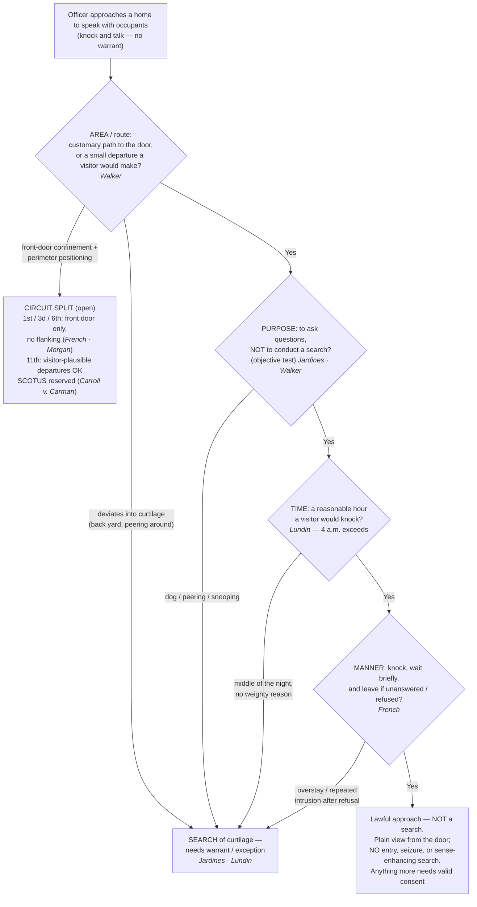

---
aliases:
  - "Knock and Talk"
title: "Knock and Talk"
topic: Knock and Talk
type: doctrine
jurisdiction: Federal (U.S. Const. amend. IV); SCOTUS baseline
status: draft
related: ["[[Consent Searches]]", "[[Curtilage]]", "[[Plain View Doctrine]]", "[[Arrest in the Home]]", "[[Emergency Aid]]", "[[Exigent Circumstances and Hot Pursuit]]", "[[Seizure of the Person]]", "[[Two Definitions of Search]]"]
---

# Knock and Talk

*Am I within the implied license a private visitor would have — in area, purpose, time, and manner?*

> [!rule] Black-letter rule
> A "knock and talk" is not a warrant exception; it is lawful only inside the **implied license** any private visitor has: "approach the home by the front path, knock promptly, wait briefly to be received, and then (absent invitation to linger longer) leave." *[[Florida v. Jardines|Jardines]]*, 569 U.S. 1, 8 (2013). That license is "limited not only to a particular area but also to a specific purpose," *[[Florida v. Jardines#^pin-9|id.]]* at 9–10, so an approach that exceeds it in **area, purpose, time, or manner** is a warrantless **search** of the home's [[Curtilage]]. And the license obligates the occupant to nothing: "the occupant has no obligation to open the door or to speak." *[[Kentucky v. King|King]]*, 563 U.S. 452, 469–70 (2011).
> ^rule-knock-and-talk

## The Brief

**What the doctrine is, and is not.** The knock-and-talk lets officers do what "the Nation's Girl Scouts and trick-or-treaters" do: walk up, knock, and ask. *[[Florida v. Jardines|Jardines]]*, 569 U.S. at 8. It authorizes an **approach**, never a search or an entry. Whatever officers want beyond conversation still requires valid **consent** ([[Consent Searches]]) or an independent exception. Because a physical intrusion onto [[Curtilage]] to gather evidence is itself a search, an approach that leaves the license behind needs a warrant or an exception from the moment it strays. *[[Florida v. Jardines#^pin-6|Jardines]]*, 569 U.S. at 6.

**Four dimensions bound the license.** The courts test a knock-and-talk on (1) **area** (the route a visitor would take), (2) **purpose** (a talk, not a search), (3) **time** (hours a visitor would knock), and (4) **manner** (knock, wait briefly, leave). Every limit below is an application of one of the four; the test throughout is **objective** — whether the officer's behavior "objectively reveals a purpose to conduct a search." *[[United States v. Walker#^pin-1363|Walker]]*, 799 F.3d 1361, 1363 (11th Cir. 2015) (quoting *[[Florida v. Jardines|Jardines]]*).

**Area: the customary path, and a "small departure."** The license follows the route a visitor would use: front walk, driveway, porch, the customary point of entry. A **small departure** stays inside it. Approaching the occupant's car in an open carport when seeking to contact him "did not exceed the geographic limit on the knock and talk exception." *[[United States v. Walker#^pin-1364|Walker]]*, 799 F.3d at 1364. Cutting into the back yard, peering around the side, or exploring the [[Curtilage|curtilage]] exceeds it. *[[Florida v. Jardines#^pin-9|Jardines]]*, 569 U.S. at 9; *[[United States v. Lundin|Lundin]]*, 817 F.3d 1151, 1159–60 (9th Cir. 2016). Whether officers must **begin at the front door** divides the circuits, and the Supreme Court has expressly declined to decide it. *Carroll v. Carman*, 574 U.S. 13 (2014) (per curiam) (reversing on qualified-immunity grounds only); see Lower-court developments.

**Purpose: a talk, not a search or a warrantless arrest.** The customary license "is generally limited to the 'purpose of asking questions of the occupants.'" *[[United States v. Lundin#^pin-1159a|Lundin]]*, 817 F.3d at 1159. Bringing a drug dog to the porch to gather evidence breaks it: "There is no customary invitation to do that." *[[Florida v. Jardines#^pin-9|Jardines]]*, 569 U.S. at 9. But a lawful knock is conduct "any private citizen might do," and reasonableness is judged objectively, so a bare subjective wish to arrest does not, by itself, void an ordinary knock. *[[Kentucky v. King|King]]*, 563 U.S. at 469. The Ninth Circuit reads the license to exclude approaches made with the **objective purpose to arrest** the occupant, *[[United States v. Lundin|Lundin]]*, 817 F.3d at 1160, while the Tenth and Eleventh treat ordinary investigative knock-and-talks as undisturbed by *[[Florida v. Jardines|Jardines]]*; treat purpose-to-arrest as **unsettled** beyond the dog-and-snooping core.

**Time: the hours a visitor would knock.** "[U]nexpected visitors are customarily expected to knock on the front door of a home only during normal waking hours," so a **4 a.m.** knock with no weighty reason exceeded the license. *[[United States v. Lundin#^pin-1159|Lundin]]*, 817 F.3d at 1159. The clock is weighed with everything else: the Eleventh Circuit upheld a **5 a.m.** approach where earlier visits and lights on inside made it reasonable. *[[United States v. Walker#^pin-1364a|Walker]]*, 799 F.3d at 1364. Precision matters when teaching the night-time point: the "middle of the night" passage everyone quotes is from the *[[Florida v. Jardines|Jardines]]* **dissent**, endorsed in part by the majority's footnote 3 — a default lower courts have built on, not a SCOTUS holding.

**Manner: knock, wait briefly, and leave.** Leaving is part of the license. The First Circuit held that repeated returns to the curtilage after the occupant refused to answer, capped by a pre-dawn visit with knocking on the bedroom window and a flashlight through the covering, exceeded the license and violated law clearly established by *Jardines* itself. *[[French v. Merrill|French]]*, 15 F.4th 116 (1st Cir. 2021), reh'g en banc denied, 24 F.4th 93 (2022). "No Trespassing" signs generally do **not** revoke the license on the Tenth Circuit's view: such signs lack any "talismanic" revoking power, judged by what an objective officer would perceive. *[[United States v. Carloss|Carloss]]*, 818 F.3d 988, 995 (10th Cir. 2016) (then-Judge Gorsuch dissenting).

**What a lawful approach yields.** From the lawful vantage, officers may use what they see under the [[Plain View Doctrine]] — including what a flashlight reveals of the *already exposed*, since illumination alone is not a search, *[[Texas v. Brown#^pin-739|Brown]]*, 460 U.S. 730, 739–40 (1983) (plurality); *[[United States v. Dunn|Dunn]]*, 480 U.S. 294 (1987), though probing the *concealed* is (see the exposure line on [[Plain View Doctrine]]) — and may ask for consent; the encounter stays consensual so long as "a reasonable person would feel free to decline the officers' requests or otherwise terminate the encounter." *[[Florida v. Bostick#^pin-436|Bostick]]*, 501 U.S. 429, 436 (1991). Officers need not advise the resident of the right to refuse. *[[United States v. Drayton#^pin-206|Drayton]]*, 536 U.S. 194, 206 (2002). The approach yields **no entry, no seizure, and no sense-enhancing search**: the automobile exception, for one, does not permit a warrantless entry of the home or its curtilage to search a vehicle there. *[[Collins v. Virginia|Collins]]*, 584 U.S. 586 (2018).

**The threshold backstops.** The license ends at the door. A warrantless, nonconsensual crossing of the threshold to arrest is presumptively unreasonable, *[[Payton v. New York|Payton]]*, 445 U.S. 573 (1980); see [[Arrest in the Home]], and there is no freestanding community-caretaking power to enter a home, *[[Caniglia v. Strom|Caniglia]]*, 593 U.S. 194 (2021); see [[Emergency Aid]]. A show of authority demanding that occupants open up converts the "talk" into a **seizure**, and any consent it produces is invalid. *[[United States v. Conner|Conner]]*, 127 F.3d 663 (8th Cir. 1997).

**The exigency interface.** A lawful knock does not "create" an [[Exigent Circumstances and Hot Pursuit|exigency]], even when it prompts occupants to start destroying evidence; what forfeits the exception is gaining entry "by means of an actual or threatened violation of the Fourth Amendment." *[[Kentucky v. King|King]]*, 563 U.S. at 469. The manufactured-exigency limit is developed on [[Exigent Circumstances and Hot Pursuit]]. Do not confuse the knock-and-talk with **knock-and-announce**, which governs how officers execute a warrant. *[[United States v. Banks|Banks]]*, 540 U.S. 31 (2003); see [[The Warrant Requirement]].

**Burden and remedy.** When the government relies on consent obtained at the door, it must prove the consent was freely and voluntarily given on the [[Common Legal Terms#totality-of-the-circumstances|totality of the circumstances]]; acquiescence to a claim of lawful authority is not enough. *[[Bumper v. North Carolina|Bumper]]*, 391 U.S. 543, 548–49 (1968); *[[Schneckloth v. Bustamonte|Schneckloth]]*, 412 U.S. 218 (1973). If the defendant contends the approach itself exceeded the license, the government must show the officers stayed within it. Historical facts are reviewed for [[Common Legal Terms#clear-error|clear error]], the ultimate scope question [[Common Legal Terms#de-novo|de novo]]; the remedy for exceeding the license, or for involuntary consent, is suppression under [[The Exclusionary Rule]].

**Apply it.**
1. **Route** — take the path a visitor would take: front walk to the customary door; a small departure only to contact an occupant you can see (*[[United States v. Walker|Walker]]*).
2. **Hour** — knock during normal waking hours unless specific facts show the resident receives visitors at that hour or the reason is weighty (*[[United States v. Lundin|Lundin]]*; *[[United States v. Walker|Walker]]*).
3. **Conduct** — knock, announce, wait briefly. No dog, and no peering through windows or coverings, with or without a light (*[[Florida v. Jardines|Jardines]]*; *[[French v. Merrill|French]]*).
4. **Purpose** — come to ask questions and seek consent. If your conduct would objectively reveal a search (or the approach exists to effect a warrantless arrest), stop: that is not a knock-and-talk (*[[Florida v. Jardines|Jardines]]*; *[[United States v. Lundin|Lundin]]*).
5. **Exit** — no answer or a refusal means leave. Returning again on the same information invites [[The Exclusionary Rule|suppression]] and civil liability (*[[French v. Merrill|French]]*).
6. **Fruits** — use [[Plain View Doctrine|plain view]] from the lawful vantage; anything more (entry, seizure, enhancement) needs consent or a recognized exception (*[[Collins v. Virginia|Collins]]*; *[[Payton v. New York|Payton]]*).

**Common pitfalls.**
- **Treating "knock and talk" as its own warrant exception.** It is not; without consent or another exception, nothing inside the home is fair game.
- **Straying off the customary route.** Cutting to the back yard, lingering in the [[Curtilage|curtilage]], or bringing a dog to the porch to gather evidence breaks the license (*[[Florida v. Jardines|Jardines]]*; [[Curtilage]]). A flashlight by itself does not: illuminating the exposed is no search (*[[Texas v. Brown|Brown]]*), but flashlight-assisted peering through coverings is strong evidence the license was exceeded (*[[French v. Merrill|French]]*).
- **Knocking in the dead of night.** A middle-of-the-night approach without a weighty, resident-accepted reason exceeds the license in the Ninth Circuit (*[[United States v. Lundin|Lundin]]*), and hour-by-totality circuits still weigh it against you (*[[United States v. Walker|Walker]]*).
- **Overstaying or returning after a refusal.** Repeated intrusion converts the approach into a search (*[[French v. Merrill|French]]*).
- **Reading silence as suspicion or [[Exigent Circumstances and Hot Pursuit|exigency]].** The occupant may refuse to answer, and that refusal supplies neither (*[[Kentucky v. King|King]]*, 563 U.S. at 469–70).
- **Stating a back-door or perimeter rule as settled national law.** Where the approach may begin, and whether flanking officers may hold the perimeter, is a live circuit split the Supreme Court has expressly reserved (*Carroll v. Carman*; see below).

## Lower-court developments

- ***[[United States v. Lundin|Lundin]]* (9th Cir. 2016)** — *narrows: time + purpose.* A 4 a.m. knock, made with the objective purpose to arrest rather than to ask questions, exceeded the license; the officers' own unlawful knock produced the noises they then cited as exigency, so *[[Kentucky v. King|King]]* barred reliance on it. 817 F.3d 1151, 1158–60. **Binding in-circuit — 9th Cir.** [opinion](https://www.courtlistener.com/opinion/3187682/united-states-v-eric-lundin/)
- ***[[French v. Merrill|French]]* (1st Cir. 2021)** — *narrows: manner / repeated intrusion.* Repeated returns to the [[Curtilage|curtilage]] after refusal, ending in pre-dawn knocks on a bedroom window with a flashlight, exceeded the license; the violation was clearly established by *[[Florida v. Jardines|Jardines]]* itself, so [[Section 1983 Liability and Qualified Immunity|qualified immunity]] was denied. 15 F.4th 116, reh'g en banc denied, 24 F.4th 93 (2022). **Binding in-circuit — 1st Cir.** [opinion](https://www.courtlistener.com/opinion/5273192/french-v-merrill/)
- **Morgan v. Fairfield County (6th Cir. 2018)** — *narrows: perimeter positioning is itself a search.* Five officers ringing the house five to seven feet off its walls during a knock-and-talk invaded the [[Curtilage|curtilage]] beyond any implied license; officers received [[Section 1983 Liability and Qualified Immunity|qualified immunity]], but the county's surround-the-house policy exposed it to municipal liability. 903 F.3d 553. **Binding in-circuit — 6th Cir.** [opinion](https://www.courtlistener.com/opinion/4532978/neil-morgan-v-fairfield-cty-ohio/)
- ***[[United States v. Walker|Walker]]* (11th Cir. 2015)** — *permissive pole: small departures and hour-by-totality.* Approaching the occupant's car in an open carport was a permissible "small departure," and a 5 a.m. knock was reasonable where two earlier visits and interior lights made it so. 799 F.3d at 1363–64. **Binding in-circuit — 11th Cir.** [opinion](https://www.courtlistener.com/opinion/2844024/united-states-v-wayne-walker/)
- ***[[United States v. Carloss|Carloss]]* (10th Cir. 2016)** — *permissive pole: signage.* Posted "No Trespassing" signs, including one on the front door, did not by themselves revoke the license; signs lack "talismanic" revoking power, measured by what an objective officer would perceive. 818 F.3d 988, 995. Then-Judge Gorsuch dissented. The Tennessee Supreme Court reached the same totality-based result in **State v. Christensen** (Tenn. 2017). **Binding in-circuit — 10th Cir.**; *Christensen*: **Persuasive — state, illustrative.** [opinion](https://www.courtlistener.com/opinion/3184928/united-states-v-carloss/)
- **People v. Frederick (Mich. 2017)** — *narrows: pre-dawn default.* The implied license is "time-sensitive" and "generally does not extend to predawn approaches"; 4:00 and 5:30 a.m. knock-and-talks were searches. 895 N.W.2d 541. **Persuasive — state, illustrative.** [opinion](https://www.courtlistener.com/opinion/4396951/people-of-michigan-v-michael-christopher-frederick/)

The genuine split is **where the approach may begin and who may stand where**: the First, Third, and Sixth Circuits confine officers to the front-door approach a visitor would make (*[[French v. Merrill|French]]*; *Carman v. Carroll*, 749 F.3d 192 (3d Cir. 2014), rev'd on qualified-immunity grounds sub nom. *Carroll v. Carman*, 574 U.S. 13 (2014) (per curiam); *Morgan*), while the Eleventh tolerates visitor-plausible departures (*[[United States v. Walker|Walker]]*). The Supreme Court reversed *Carman* without deciding "whether a police officer may conduct a 'knock and talk' at any entrance that is open to visitors rather than only the front door" — the question remains open.

## Key cases

| Case | Holding | Opinion |
|---|---|---|
| *[[Florida v. Jardines]]*, 569 U.S. 1 (2013) | The implied license bounds the approach in **area and purpose**, judged objectively: bringing a drug dog onto the porch to gather evidence was a trespassory search of curtilage. | [opinion](https://www.courtlistener.com/opinion/856347/florida-v-jardines/) |
| *[[Kentucky v. King]]*, 563 U.S. 452 (2011) | A lawful knock is conduct "any private citizen might do": it neither obligates the occupant to answer nor manufactures an exigency; entry is forfeited only by an actual or threatened Fourth Amendment violation. | [opinion](https://www.courtlistener.com/opinion/216733/kentucky-v-king/) |

## Related cases across doctrines

| Case | Relevance here | Primary home | Opinion |
|---|---|---|---|
| *[[Florida v. Bostick]]*, 501 U.S. 429 (1991) | ***Boundary.*** The stays-consensual test: the encounter is a seizure only if a reasonable person would not feel free to decline or terminate it. | [[Seizure of the Person]] | [opinion](https://www.courtlistener.com/opinion/112631/florida-v-bostick/) |
| *[[United States v. Drayton]]*, 536 U.S. 194 (2002) | ***Extends.*** Door-step consent can be voluntary though officers never advise of the right to refuse. | [[Seizure of the Person]] | [opinion](https://www.courtlistener.com/opinion/121153/united-states-v-drayton/) |
| *[[Collins v. Virginia]]*, 584 U.S. 586 (2018) | ***Limits.*** No warrant exception licenses the trespass: officers may not enter home or curtilage to search a vehicle there. | [[Automobile Exception]] | [opinion](https://www.courtlistener.com/opinion/4501697/collins-v-virginia/) |
| *[[Payton v. New York]]*, 445 U.S. 573 (1980) | ***Boundary.*** The license ends at the threshold: warrantless, nonconsensual in-home arrest is presumptively unreasonable. | [[Arrest in the Home]] | [opinion](https://www.courtlistener.com/opinion/110235/payton-v-new-york/) |
| *[[Caniglia v. Strom]]*, 593 U.S. 194 (2021) | ***Boundary.*** No standalone community-caretaking power supports a warrantless home entry after the knock. | [[Emergency Aid]] | [opinion](https://www.courtlistener.com/opinion/4883694/caniglia-v-strom/) |

## Visual

## Sources

- [*Florida v. Jardines*, 569 U.S. 1 (2013)](https://www.courtlistener.com/opinion/856347/florida-v-jardines/) (pinpoints: 6, 8, 9–10; majority n.3 and the dissent's night-visit passage)
- [*Kentucky v. King*, 563 U.S. 452 (2011)](https://www.courtlistener.com/opinion/216733/kentucky-v-king/) (pinpoints: 462, 469–70)
- [*United States v. Lundin*, 817 F.3d 1151 (9th Cir. 2016)](https://www.courtlistener.com/opinion/3187682/united-states-v-eric-lundin/) (pinpoints: 1158–60)
- [*United States v. Walker*, 799 F.3d 1361 (11th Cir. 2015)](https://www.courtlistener.com/opinion/2844024/united-states-v-wayne-walker/) (pinpoints: 1363–64)
- [*United States v. Carloss*, 818 F.3d 988 (10th Cir. 2016)](https://www.courtlistener.com/opinion/3184928/united-states-v-carloss/) (pinpoint: 995 (Gorsuch, J., dissenting from 1004))
- [*French v. Merrill*, 15 F.4th 116 (1st Cir. 2021)](https://www.courtlistener.com/opinion/5273192/french-v-merrill/) (reh'g en banc denied, 24 F.4th 93 (2022); cert. denied sub nom. *Morse v. French* (2022))
- [*Carroll v. Carman*, 574 U.S. 13 (2014) (per curiam)](https://www.courtlistener.com/opinion/2750102/carroll-v-carman/) (reversing *Carman v. Carroll*, 749 F.3d 192 (3d Cir. 2014), on qualified-immunity grounds and reserving the front-door question)
- [*Morgan v. Fairfield County*, 903 F.3d 553 (6th Cir. 2018)](https://www.courtlistener.com/opinion/4532978/neil-morgan-v-fairfield-cty-ohio/)
- [*People v. Frederick*, 895 N.W.2d 541 (Mich. 2017)](https://www.courtlistener.com/opinion/4396951/people-of-michigan-v-michael-christopher-frederick/)
- [*State v. Christensen*, 517 S.W.3d 60 (Tenn. 2017)](https://www.courtlistener.com/opinion/4381703/state-of-tennessee-v-james-robert-christensen-jr/)
- [*Florida v. Bostick*, 501 U.S. 429 (1991)](https://www.courtlistener.com/opinion/112631/florida-v-bostick/) (pinpoint: 436)
- [*United States v. Drayton*, 536 U.S. 194 (2002)](https://www.courtlistener.com/opinion/121153/united-states-v-drayton/) (pinpoint: 206)
- [*Collins v. Virginia*, 584 U.S. 586 (2018)](https://www.courtlistener.com/opinion/4501697/collins-v-virginia/)
- [*Payton v. New York*, 445 U.S. 573 (1980)](https://www.courtlistener.com/opinion/110235/payton-v-new-york/)
- [*Caniglia v. Strom*, 593 U.S. 194 (2021)](https://www.courtlistener.com/opinion/4883694/caniglia-v-strom/)
- [*Bumper v. North Carolina*, 391 U.S. 543 (1968)](https://www.courtlistener.com/opinion/107716/bumper-v-north-carolina/) (pinpoint: 548–49)
- [*Schneckloth v. Bustamonte*, 412 U.S. 218 (1973)](https://www.courtlistener.com/opinion/108800/schneckloth-v-bustamonte/)
- [*United States v. Conner*, 127 F.3d 663 (8th Cir. 1997)](https://www.courtlistener.com/opinion/747208/united-states-v-larry-duane-conner-united-states-of-america-v-john/)
- [*United States v. Banks*, 540 U.S. 31 (2003)](https://www.courtlistener.com/opinion/131146/united-states-v-banks/)
- [*United States v. Meyer* (8th Cir. 2021)](https://www.courtlistener.com/opinion/5302394/united-states-v-william-meyer/) (the manufactured-exigency application, developed on [[Exigent Circumstances and Hot Pursuit]])
