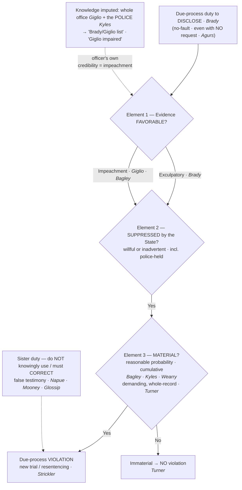

# Brady and Giglio

*What must I, and the prosecutor, disclose to the defense, and when does a failure to turn something over become a constitutional violation?*

> [!rule] Black-letter rule
> Due process forbids the State to win a conviction while suppressing evidence favorable to the accused that is **material** to guilt or punishment, **irrespective of good or bad faith**. The duty is **no-fault**, runs **even absent a defense request**, and reaches **impeachment** as well as exculpatory evidence (*[[Giglio v. United States|Giglio]]*). It extends to favorable evidence known only to the **police**, whose knowledge is imputed to the prosecution (*[[Kyles v. Whitley|Kyles]]*). A violation has **three components**: favorable + suppressed + material. *[[Brady v. Maryland|Brady]]*, 373 U.S. 83, [87](https://www.courtlistener.com/opinion/106598/brady-v-maryland/) (1963); *[[Giglio v. United States|Giglio]]*, 405 U.S. 150, [154](https://www.courtlistener.com/opinion/108471/giglio-v-united-states/) (1972); *[[Kyles v. Whitley|Kyles]]*, 514 U.S. 419, [421](https://www.courtlistener.com/opinion/117923/kyles-v-whitley/) (1995).
> ^rule-brady

## The Brief

**Black-letter rule: a no-fault disclosure duty.** Due process forbids the State to win a conviction while sitting on evidence that helps the defense. "[T]he suppression by the prosecution of evidence favorable to an accused upon request violates due process where the evidence is material either to guilt or to punishment, **irrespective of the good faith or bad faith of the prosecution**." *[[Brady v. Maryland|Brady v. Maryland]]*, 373 U.S. at [87](https://www.courtlistener.com/opinion/106598/brady-v-maryland/). An honest oversight violates it exactly as a deliberate cover-up does. Later cases dropped *[[Brady v. Maryland|Brady]]*'s "upon request" qualifier, so the duty runs **even when the defense makes no request**. *[[United States v. Agurs|United States v. Agurs]]*, 427 U.S. 97 (1976) (materiality formula later superseded by *[[United States v. Bagley|Bagley]]*).

**The three elements: the working checklist.** A true violation has **three components**: "The evidence at issue must be favorable to the accused, either because it is exculpatory, or because it is impeaching; that evidence must have been suppressed by the State, either willfully or inadvertently; and prejudice must have ensued." *[[Strickler v. Greene|Strickler v. Greene]]*, 527 U.S. 263, [281-82](https://www.courtlistener.com/opinion/118307/strickler-v-greene/) (1999). Take them in order: **favorable · suppressed · material**.

**Element 1: favorable, meaning exculpatory OR impeaching.** The duty is **not limited to exculpatory evidence**; it reaches **impeachment** evidence with equal force. *[[Giglio v. United States|Giglio]]* extended *[[Brady v. Maryland|Brady]]* to a concealed promise of leniency to a key government witness, holding that when the "reliability of a given witness may well be determinative of guilt or innocence," nondisclosure of evidence affecting credibility falls within the rule. *[[Giglio v. United States|Giglio v. United States]]*, 405 U.S. at [154](https://www.courtlistener.com/opinion/108471/giglio-v-united-states/). *[[United States v. Bagley|Bagley]]* confirms that impeachment evidence, like exculpatory evidence, is within the *[[Brady v. Maryland|Brady]]* rule. *[[United States v. Bagley]]*, 473 U.S. 667 (1985). In the field this covers **deals or promises to witnesses, prior inconsistent statements, bias, mental condition, relevant convictions, and drug or alcohol issues**, anything the defense could use to attack a government witness's credibility.

**Element 2: suppressed by the State, including evidence known only to the police.** The prosecutor's reach extends past his own file. He has an affirmative duty to learn of favorable evidence known to others acting on the government's behalf, **including the police**: the *[[Brady v. Maryland|Brady]]* obligation "turns on the cumulative effect of all such evidence suppressed by the government, and ... the prosecutor remains responsible for gauging that effect **regardless of any failure by the police to bring favorable evidence to the prosecutor's attention**." *[[Kyles v. Whitley|Kyles v. Whitley]]*, 514 U.S. at [421](https://www.courtlistener.com/opinion/117923/kyles-v-whitley/). "No one told me" is therefore no defense; the government is treated as **one team**, and a promise or knowledge held by one member is attributed to the office as a whole (*[[Giglio v. United States|Giglio]]*, 405 U.S. at [154](https://www.courtlistener.com/opinion/108471/giglio-v-united-states/)). Suppression counts whether "willfully or inadvertently" (*[[Strickler v. Greene|Strickler]]*, 527 U.S. at [282](https://www.courtlistener.com/opinion/118307/strickler-v-greene/)).

**Element 3: material, a reasonable probability of a different result, judged cumulatively.** Prejudice and materiality are **one inquiry, not two**. Evidence "is material only if there is a **reasonable probability** that, had the evidence been disclosed to the defense, the result of the proceeding would have been different. A 'reasonable probability' is a probability sufficient to **undermine confidence in the outcome**." *[[United States v. Bagley|United States v. Bagley]]*, 473 U.S. at [682](https://www.courtlistener.com/opinion/111514/united-states-v-bagley/). It is **not** a more-likely-than-not test; the question is whether, in the evidence's absence, the defendant received "a verdict worthy of confidence." *[[Kyles v. Whitley#^pin-434|Kyles]]*, 514 U.S. at [434](https://www.courtlistener.com/opinion/117923/kyles-v-whitley/#:~:text=The%20question%20is%20not%20whether). And materiality is assessed **cumulatively**: the suppressed items are weighed **collectively, not one at a time** (*[[Kyles v. Whitley|Kyles]]*; *[[Wearry v. Cain|Wearry v. Cain]]*, 577 U.S. 385 (2016) ([[Common Legal Terms#per-curiam|per curiam]])). But the standard is **demanding and cuts both ways**: where there is no reasonable probability of a different result on the whole record, there is **no violation** (*[[Turner v. United States|Turner v. United States]]*, 582 U.S. 313 (2017)). *[[United States v. Agurs|Agurs]]*'s stricter no-request materiality formula was superseded by *[[United States v. Bagley|Bagley]]*'s unified test. *[[United States v. Agurs|Agurs]]*, 427 U.S. at [108](https://www.courtlistener.com/opinion/109506/united-states-v-agurs/).

**The companion duty: to preserve evidence (*[[California v. Trombetta|Trombetta]]* / *[[Arizona v. Youngblood|Youngblood]]*).** Distinct from the duty to **disclose** favorable evidence is a narrower due-process duty to **preserve** it, and this one turns squarely on the officer's handling of evidence. Under *[[California v. Trombetta|California v. Trombetta]]*, 467 U.S. 479 (1984), the State must preserve evidence only where it possessed an **apparent exculpatory value** before it was destroyed and is of such a nature that the defendant **cannot obtain comparable evidence** by other reasonably available means. For merely **potentially useful** evidence (evidence that might have exonerated but whose value is unknown), *[[Arizona v. Youngblood|Arizona v. Youngblood]]*, 488 U.S. 51 (1988), sets a stricter bar for the defense: failure to preserve it violates due process **only on a showing of bad faith** by the police. Good-faith loss or routine destruction of potentially useful evidence is not a due-process violation; deliberate destruction to defeat the defense is.

**The police officer's role: the "Brady cop" / "Giglio cop."** Because police-held favorable evidence is imputed to the prosecution (*[[Kyles v. Whitley|Kyles]]*) and office knowledge is treated as a unit (*[[Giglio v. United States|Giglio]]*), the officer's operational duty is concrete: **surface favorable evidence, exculpatory or impeaching, to the prosecutor, affirmatively.** Burying it does not make it disappear, and whether it turns out "material" is the court's whole-record call (*[[Turner v. United States|Turner]]*), not the officer's to pre-judge. The same imputation makes an **officer's own credibility history** *[[Giglio v. United States|Giglio]]* material: sustained findings of dishonesty or untruthfulness, false reports, false testimony, and certain convictions must be turned over so the defense can impeach the officer. That is the doctrinal root of the prosecutor's-office **"Brady/Giglio list,"** an administrative roster of officers with sustained credibility findings whose history must be disclosed as impeachment. (No SCOTUS case creates the list itself; it is a management practice flowing from *[[Kyles v. Whitley|Kyles]]* plus *[[Giglio v. United States|Giglio]]* imputation.) An officer who lands on it can become **"Giglio impaired,"** effectively unusable as a credible witness, which can end a career's value in court. Here integrity is not merely ethics; it is **admissibility**.

**The sister duty: do not knowingly use false testimony (*[[Napue v. Illinois|Napue]]* / *[[Mooney v. Holohan|Mooney]]*).** Distinct from the duty to *disclose* favorable evidence is the duty **not to knowingly use, and to correct, false testimony**. "[A] conviction obtained through use of false evidence, known to be such by representatives of the State, must fall under the Fourteenth Amendment," and that principle "does not cease to apply merely because the false testimony goes only to the **credibility** of the witness." *[[Napue v. Illinois|Napue v. Illinois]]*, 360 U.S. 264, [269](https://www.courtlistener.com/opinion/105912/napue-v-illinois/) (1959). Its historical origin is *[[Mooney v. Holohan|Mooney v. Holohan]]*, 294 U.S. 103, [112](https://www.courtlistener.com/opinion/102372/mooney-v-holohan/) (1935) (a "deliberate deception of court and jury by the presentation of testimony known to be perjured" is "as inconsistent with the rudimentary demands of justice as is the obtaining of a like result by intimidation"). The line was applied most recently in *[[Glossip v. Oklahoma|Glossip v. Oklahoma]]*, 604 U.S. 226 (2025), where the prosecution's failure to correct a star witness's false testimony about his psychiatric history warranted a new trial under *[[Napue v. Illinois|Napue]]*'s forgiving "reasonable likelihood" standard, a defendant-friendly test distinct from *[[United States v. Bagley|Bagley]]* materiality. *[[Giglio v. United States|Giglio]]* sits at the intersection of the two duties.

**Applications along the line.** *[[Banks v. Dretke|Banks v. Dretke]]* rejected a "due diligence" defense to suppression, holding that a "'prosecutor may hide, defendant must seek,' [rule] is not tenable in a system constitutionally bound to accord defendants due process," where the State concealed that its key witness was a paid informant. *[[Banks v. Dretke|Banks]]*, 540 U.S. 668, [696](https://www.courtlistener.com/opinion/131165/banks-v-dretke/) (2004). *[[Cone v. Bell|Cone v. Bell]]*, 556 U.S. 449 (2009), confirmed that *[[Brady v. Maryland|Brady]]* materiality is assessed as to **punishment**, not only guilt: evidence immaterial to guilt may still require a new **sentencing** if it could have swayed one juror toward life. *[[Smith v. Cain|Smith v. Cain]]*, 565 U.S. 73 (2012), reversed because undisclosed impeachment of the **sole eyewitness** was material as a matter of law. And *[[Turner v. United States|Turner]]* is the counterweight, a demanding whole-record materiality analysis that found **no** violation.

**Brady is a constitutional floor, NOT the criminal-discovery rules.** *[[Brady v. Maryland|Brady]]*/*[[Giglio v. United States|Giglio]]* is a **due-process** obligation, separate from statutory and rule-based discovery (Fed. R. Crim. P. 16 and the Jencks Act, 18 U.S.C. § 3500). Complying with Rule 16 does **not** discharge the *[[Brady v. Maryland|Brady]]* duty: favorable evidence may fall outside Rule 16's enumerated categories, and the constitutional duty can run on a different (often earlier) due-process timeline. Discovery compliance and *[[Brady v. Maryland|Brady]]* compliance are two separate checklists.

**Burden · standard of review · remedy.** The disclosure duty rests on the **prosecution** and, upstream, on the whole prosecution team, including the police (*[[Kyles v. Whitley|Kyles]]*). On a *[[Brady v. Maryland|Brady]]* claim the **defendant** bears the burden of establishing the three components (favorable · suppressed · material); because materiality is a legal question about confidence in the verdict, a reviewing court decides it **[[Common Legal Terms#de-novo|de novo]]** (historical facts for [[Common Legal Terms#clear-error|clear error]]). The **remedy** for a proven violation is a **new trial**, or a new **sentencing** where the evidence was material only to punishment (*[[Cone v. Bell|Cone]]*). There is no separate harmless-error overlay, because the materiality element already builds prejudice into the test. On federal [[Common Legal Terms#habeas-corpus|habeas]], relief follows when the state court's no-violation ruling was an unreasonable application of this clearly established law (*[[Benn v. Lambert|Benn v. Lambert]]* (9th Cir.)).

**Common pitfalls.**
- **Thinking good faith excuses non-disclosure.** It does not; the duty is no-fault, and *[[Strickler v. Greene|Strickler]]* reaches suppression done "inadvertently."
- **Treating *[[Brady v. Maryland|Brady]]* as exculpatory-only.** Impeachment evidence is squarely covered (*[[Giglio v. United States|Giglio]]*, *[[United States v. Bagley|Bagley]]*).
- **"The prosecutor never asked, so I'm clear."** *[[Kyles v. Whitley|Kyles]]* imputes police-held favorable evidence to the prosecution; surface it, **including your own credibility issues**.
- **"I produced it in Rule 16 discovery, so *Brady* is satisfied."** *[[Brady v. Maryland|Brady]]* is a separate **constitutional** duty and may run earlier and broader.
- **"It was minor / just one item, so no harm."** Materiality is judged **cumulatively** (*[[Kyles v. Whitley|Kyles]]*, *[[Wearry v. Cain|Wearry]]*), and materiality is the **court's** whole-record call (*[[Turner v. United States|Turner]]*), not yours to pre-judge, so surface it.
- **Confusing *[[Napue v. Illinois|Napue]]* with *[[Brady v. Maryland|Brady]]*.** *[[Napue v. Illinois|Napue]]* is the duty **not to knowingly use (and to correct) false** testimony; *[[Brady v. Maryland|Brady]]* is the duty to **disclose favorable** evidence.
- **Confusing the duty to disclose with the duty to preserve.** *[[Brady v. Maryland|Brady]]* is about **disclosing** existing favorable evidence; *[[California v. Trombetta|Trombetta]]* / *[[Arizona v. Youngblood|Youngblood]]* govern **destroyed** evidence, where potentially-useful evidence needs a **bad-faith** showing.
- **Treating *[[Brady v. Maryland|Brady]]*/*[[Giglio v. United States|Giglio]]* as a search-and-seizure rule.** It is a **disclosure / trial-fairness** doctrine grounded in due process; do not conflate it with the Fourth Amendment exclusionary rule.

**The civil boundary (clearly CIVIL, not the criminal *[[Brady v. Maryland|Brady]]* spine).** A single *[[Brady v. Maryland|Brady]]* violation by a prosecutor, even one that sends an innocent man toward execution, does **not** by itself establish municipal **§1983** failure-to-train liability: "A pattern of similar constitutional violations by untrained employees is 'ordinarily necessary' to demonstrate deliberate indifference for purposes of failure to train." *[[Connick v. Thompson|Connick v. Thompson]]*, 563 U.S. 51, [62](https://www.courtlistener.com/opinion/7343085/connick-v-thompson/) (2011). This is the civil ceiling, distinct from the criminal due-process duty; see [[Section 1983 Liability and Qualified Immunity]].

## Lower-court developments

Circuit and state developments only; no SCOTUS. The controlling Supreme Court cases, including the 2025 *[[Glossip v. Oklahoma|Glossip]]* application of *[[Napue v. Illinois|Napue]]*, home to **Key cases** regardless of date, per the no-SCOTUS-in-recent-developments rule. The live frontier here is **timing**: whether the disclosure duty reaches the **pre-plea** stage, where the circuits have divided and the Supreme Court has so far declined to resolve it. The case below is circuit law that binds only within its own circuit and does not state nationwide law.

- **[[Alvarez v. City of Brownsville]] (5th Cir. 2018) (en banc)** — *Limits / narrows · circuit split.* Sitting [[Reading and Citing Cases#en-banc|en banc]], the Fifth Circuit held that *[[Brady v. Maryland|Brady]]* is a **trial right** that does not operate at the guilty-plea stage: there is **no** constitutional duty to disclose even directly exculpatory evidence before a plea, extending *[[United States v. Ruiz]]*, 536 U.S. 622 (2002) (no duty to disclose **impeachment** evidence pre-plea) to **exculpatory** evidence. Because no such right exists, the City could not face §1983 municipal liability and dismissal was rendered for the City; the Supreme Court denied [[Reading and Citing Cases#certiorari-cert|certiorari]] (2019), leaving the split intact. **Binding in-circuit — 5th Cir.** · good. ⚖ Circuit split. [opinion](https://www.courtlistener.com/opinion/4536189/george-alvarez-v-city-of-brownsville/)

## Key cases

| Case | Holding | Opinion |
|---|---|---|
| *[[Mooney v. Holohan]]*, 294 U.S. 103 (1935) | **Anchor (historical origin).** The knowing use of **perjured testimony** by the State to obtain a conviction violates due process, the precursor of the *[[Napue v. Illinois\|Napue]]*/*[[Giglio v. United States\|Giglio]]* false-testimony line. | [opinion](https://www.courtlistener.com/opinion/102372/mooney-v-holohan/) |
| *[[Napue v. Illinois]]*, 360 U.S. 264 (1959) | **Anchor (false testimony).** The State may **not knowingly use false testimony**, even false testimony going only to a witness's **credibility**, and must correct it. | [opinion](https://www.courtlistener.com/opinion/105912/napue-v-illinois/) |
| *[[Brady v. Maryland]]*, 373 U.S. 83 (1963) | **Anchor.** Suppression of **favorable, material** evidence violates due process, **irrespective of good or bad faith**, the foundational no-fault disclosure duty. | [opinion](https://www.courtlistener.com/opinion/106598/brady-v-maryland/) |
| *[[Giglio v. United States]]*, 405 U.S. 150 (1972) | **Anchor (impeachment).** **Impeachment** evidence (e.g., a promise to a key witness) is within *[[Brady v. Maryland\|Brady]]*; one prosecutor's knowledge is imputed to the **whole office**. | [opinion](https://www.courtlistener.com/opinion/108471/giglio-v-united-states/) |
| *[[United States v. Agurs]]*, 427 U.S. 97 (1976) | **Progeny (limited).** The disclosure duty arises **even with no defense request**; its own materiality formula was later superseded by *[[United States v. Bagley\|Bagley]]*. | [opinion](https://www.courtlistener.com/opinion/109506/united-states-v-agurs/) |
| *[[United States v. Bagley]]*, 473 U.S. 667 (1985) | **Progeny (the materiality test).** Unified **materiality** standard: a "reasonable probability" of a different result, sufficient to undermine confidence; impeachment evidence is within the rule. | [opinion](https://www.courtlistener.com/opinion/111514/united-states-v-bagley/) |
| *[[California v. Trombetta]]*, 467 U.S. 479 (1984) | **Progeny (duty to preserve).** Due process requires preserving evidence only where its **exculpatory value was apparent** before destruction and comparable evidence is **not otherwise available**. | [opinion](https://www.courtlistener.com/opinion/111206/california-v-trombetta/) |
| *[[Arizona v. Youngblood]]*, 488 U.S. 51 (1988) | **Progeny (bad-faith limit).** Failure to preserve merely **potentially useful** evidence violates due process **only on a showing of bad faith** by the police. | [opinion](https://www.courtlistener.com/opinion/112156/arizona-v-youngblood/) |
| *[[Kyles v. Whitley]]*, 514 U.S. 419 (1995) | **Progeny (the LE hook).** Materiality is judged **cumulatively**; the prosecutor must **learn of favorable evidence known to the police**, so "no one told me" is no defense. | [opinion](https://www.courtlistener.com/opinion/117923/kyles-v-whitley/) |
| *[[Strickler v. Greene]]*, 527 U.S. 263 (1999) | **Progeny (the checklist).** Canonical **three components** of a *[[Brady v. Maryland\|Brady]]* violation: favorable + suppressed (willfully or inadvertently) + prejudice. | [opinion](https://www.courtlistener.com/opinion/118307/strickler-v-greene/) |
| *[[Banks v. Dretke]]*, 540 U.S. 668 (2004) | **Progeny.** No "due diligence" defense to suppression; the notion that a prosecutor may hide while the defendant must seek is not tenable, and concealing a witness's **informant status** is a *[[Brady v. Maryland\|Brady]]*/*[[Giglio v. United States\|Giglio]]* violation. | [opinion](https://www.courtlistener.com/opinion/131165/banks-v-dretke/) |
| *[[Cone v. Bell]]*, 556 U.S. 449 (2009) | **Progeny.** *[[Brady v. Maryland\|Brady]]* materiality reaches evidence material to **punishment**, not just guilt; a mistaken "previously determined" state ruling does not bar [[Common Legal Terms#habeas-corpus\|habeas]] review. | [opinion](https://www.courtlistener.com/opinion/145883/cone-v-bell/) |
| *[[Smith v. Cain]]*, 565 U.S. 73 (2012) | **Progeny.** Modern reversal: **undisclosed impeachment of the sole eyewitness** was material as a matter of law, conviction reversed. | [opinion](https://www.courtlistener.com/opinion/620666/smith-v-cain/) |
| *[[Wearry v. Cain]]*, 577 U.S. 385 (2016) (per curiam) | **Progeny.** Reaffirms **cumulative** materiality on a forgiving standard: the accused need show only that the new evidence undermines confidence in the verdict. | [opinion](https://www.courtlistener.com/opinion/3183098/wearry-v-cain/) |
| *[[Turner v. United States]]*, 582 U.S. 313 (2017) | **Progeny (counterweight).** Materiality is **demanding and judged on the whole record**; suppression here was **immaterial**, so no *[[Brady v. Maryland\|Brady]]* violation. | [opinion](https://www.courtlistener.com/opinion/4403802/turner-v-united-states/) |
| *[[Glossip v. Oklahoma]]*, 604 U.S. 226 (2025) | **Progeny (*[[Napue v. Illinois\|Napue]]*).** Knowing failure to **correct** a star witness's false testimony violated due process; new trial ordered under the "reasonable likelihood" standard. | [opinion](https://www.courtlistener.com/opinion/10339023/glossip-v-oklahoma/) |
| *[[Benn v. Lambert]]*, 283 F.3d 1040 (9th Cir. 2002) | **Progeny (the two-fer illustration).** [[Common Legal Terms#habeas-corpus\|Habeas]] granted where the State suppressed **both** material exculpatory and impeachment evidence, each independently sufficient, assessed cumulatively (binding in the 9th Cir. only). | [opinion](https://www.courtlistener.com/opinion/776954/gary-benn-v-john-lambert-superintendent-of-the-washington-state/) |

## Related cases across doctrines

These cases are treated in full on other doctrine pages but bear on the *[[Brady v. Maryland|Brady]]*/*[[Giglio v. United States|Giglio]]* disclosure duty; each is framed here for that doctrine.

| Case | Relevance here | Primary home | Opinion |
|---|---|---|---|
| *[[Connick v. Thompson]]*, 563 U.S. 51 (2011) | A single *[[Brady v. Maryland\|Brady]]* violation, even one that frees an innocent man from death row, will not by itself prove a prosecutor's office liable under **§1983** for failure to train; a **pattern** is "ordinarily necessary." The **civil ceiling** on the criminal *[[Brady v. Maryland\|Brady]]* duty. | [[Section 1983 Liability and Qualified Immunity]] | [opinion](https://www.courtlistener.com/opinion/213505/connick-v-thompson/) |

## Visual

## Sources

- [Mooney v. Holohan, 294 U.S. 103 (1935)](https://www.courtlistener.com/opinion/102372/mooney-v-holohan/) — pinpoint 112
- [Napue v. Illinois, 360 U.S. 264 (1959)](https://www.courtlistener.com/opinion/105912/napue-v-illinois/) — pinpoint 269
- [Brady v. Maryland, 373 U.S. 83 (1963)](https://www.courtlistener.com/opinion/106598/brady-v-maryland/) — pinpoint 87
- [Giglio v. United States, 405 U.S. 150 (1972)](https://www.courtlistener.com/opinion/108471/giglio-v-united-states/) — pinpoint 154
- [United States v. Agurs, 427 U.S. 97 (1976)](https://www.courtlistener.com/opinion/109506/united-states-v-agurs/) — pinpoint 108 (materiality formula limited by [[United States v. Bagley|Bagley]])
- [United States v. Bagley, 473 U.S. 667 (1985)](https://www.courtlistener.com/opinion/111514/united-states-v-bagley/) — pinpoint 682
- [California v. Trombetta, 467 U.S. 479 (1984)](https://www.courtlistener.com/opinion/111206/california-v-trombetta/) (duty to preserve)
- [Arizona v. Youngblood, 488 U.S. 51 (1988)](https://www.courtlistener.com/opinion/112156/arizona-v-youngblood/) (bad-faith preservation limit)
- [Kyles v. Whitley, 514 U.S. 419 (1995)](https://www.courtlistener.com/opinion/117923/kyles-v-whitley/) — pinpoints 421, 434
- [Strickler v. Greene, 527 U.S. 263 (1999)](https://www.courtlistener.com/opinion/118307/strickler-v-greene/) — pinpoints 281-82, 282
- [Banks v. Dretke, 540 U.S. 668 (2004)](https://www.courtlistener.com/opinion/131165/banks-v-dretke/) — pinpoint 696
- [Cone v. Bell, 556 U.S. 449 (2009)](https://www.courtlistener.com/opinion/145883/cone-v-bell/) (materiality reaches punishment)
- [Smith v. Cain, 565 U.S. 73 (2012)](https://www.courtlistener.com/opinion/620666/smith-v-cain/) (sole-eyewitness impeachment)
- [Wearry v. Cain, 577 U.S. 385, 136 S. Ct. 1002 (2016) (per curiam)](https://www.courtlistener.com/opinion/3183098/wearry-v-cain/) — pinpoints 136 S. Ct. at 1006, 1007
- [Turner v. United States, 582 U.S. 313, 137 S. Ct. 1885 (2017)](https://www.courtlistener.com/opinion/4403802/turner-v-united-states/) — pinpoint 137 S. Ct. at 1894
- [Glossip v. Oklahoma, 604 U.S. 226 (2025)](https://www.courtlistener.com/opinion/10339023/glossip-v-oklahoma/) (case-level)
- [Connick v. Thompson, 563 U.S. 51 (2011)](https://www.courtlistener.com/opinion/213505/connick-v-thompson/) — pinpoint 62 (home = [[Section 1983 Liability and Qualified Immunity]])
- [Benn v. Lambert, 283 F.3d 1040 (9th Cir. 2002)](https://www.courtlistener.com/opinion/776954/gary-benn-v-john-lambert-superintendent-of-the-washington-state/) (Binding in-circuit — 9th Cir.)
- [Alvarez v. City of Brownsville, 904 F.3d 382 (5th Cir. 2018) (en banc)](https://www.courtlistener.com/opinion/4536189/george-alvarez-v-city-of-brownsville/) (Binding in-circuit — 5th Cir.; pre-plea Brady; ⚖ split; page-less)
- [United States v. Ruiz, 536 U.S. 622 (2002)](https://www.courtlistener.com/opinion/121166/united-states-v-ruiz/) (no pre-plea impeachment-disclosure duty; page-less; cited in Alvarez)
