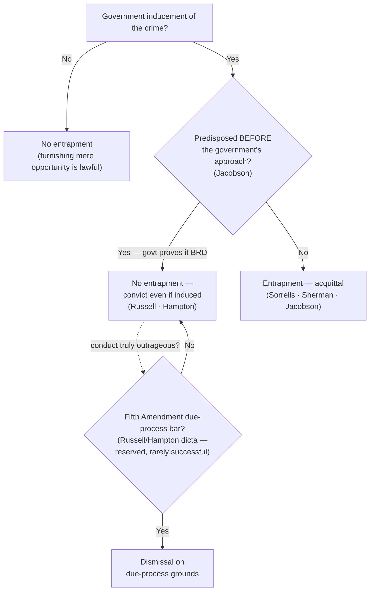

# Entrapment

*Did the government induce a crime a non-predisposed person would not have committed?*

> [!rule] Black-letter rule
> Federal entrapment has **two elements**: (1) **government inducement** of the crime and (2) the defendant's **lack of predisposition** to commit it. **Predisposition, not the fact of inducement, controls** — a **predisposed defendant is not entrapped even if induced**. Where the government induces the offense, it must prove predisposition that existed **before** its approach. The defense is a bar to **liability** (acquittal), not a suppression remedy. *[[Sorrells v. United States|Sorrells]]*, 287 U.S. 435, 454 (1932); *[[Sherman v. United States|Sherman]]*, 356 U.S. 369, 372 (1958); *[[Jacobson v. United States|Jacobson]]*, 503 U.S. 540, 548 (1992).
> ^rule-entrapment

## The Brief

**Entrapment is a defense to criminal liability, not a suppression remedy.** It excludes no evidence and challenges no search; it defeats the conviction itself, decided by the jury or, where the evidence is undisputed, as a matter of law. The operational line runs between a lawful sting that merely furnishes an *opportunity* to offend and the unlawful government creation of the crime in the mind of an unwilling person. Furnishing the opportunity is always permissible; manufacturing the criminal design in someone not already willing is not.

**The black-letter rule: the federal *subjective* test (stated up front).** In federal court entrapment has **two elements**: (1) **government inducement** of the crime, **and** (2) the defendant's **lack of predisposition** to commit it. Both must be present, and **predisposition, not the fact of inducement, is the controlling fact**: a **predisposed defendant is not entrapped even if induced.** The defense originates in *[[Sorrells v. United States|Sorrells]]*, which defined it as "the conception and planning of an offense by an officer, and his procurement of its commission by one who would not have perpetrated it except for the trickery, persuasion, or fraud of the officer." *[[Sorrells v. United States|Sorrells]]*, 287 U.S. at 454. *[[Sherman v. United States|Sherman]]* supplied the classic formulation: the task is to draw a "line ... between the trap for the unwary innocent and the trap for the unwary criminal," and entrapment exists "only when the criminal conduct was 'the product of the creative activity' of law-enforcement officials." *[[Sherman v. United States|Sherman]]*, 356 U.S. at 372.

**Predisposition must pre-date the government's approach: the *[[Jacobson v. United States|Jacobson]]* timing rule.** Where the government induces the offense, it must prove predisposition that existed **independent of, and prior to,** its own conduct. The government "may not originate a criminal design, implant in an innocent person's mind the disposition to commit a criminal act, and then induce commission of the crime so that the Government may prosecute." *[[Jacobson v. United States|Jacobson]]*, 503 U.S. at 548. Concretely, "the prosecution must prove beyond reasonable doubt that the defendant was disposed to commit the criminal act prior to first being approached by Government agents." *[[Jacobson v. United States|Jacobson]]*, 503 U.S. at 548-49. Government conduct cannot manufacture the very predisposition it later points to: 26 months of solicitation that itself created the willingness defeated the prosecution as a matter of law.

**Furnishing means or contraband to a predisposed person is not entrapment.** Supplying even a difficult-to-obtain but legal ingredient does not establish the defense: "It is only when the Government's deception actually implants the criminal design in the mind of the defendant that the defense of entrapment comes into play." *[[United States v. Russell|Russell]]*, 411 U.S. at 436. *[[Hampton v. United States|Hampton]]* extends the point to the contraband itself. A predisposed defendant who deals government-supplied drugs has his "remedy ... sol[ely] in the defense of entrapment," which a predisposed defendant cannot make out. *[[Hampton v. United States|Hampton]]*, 425 U.S. at 490 (plurality).

**A defendant may claim entrapment while denying the crime.** He need not admit the acts to earn the instruction: "even if the defendant denies one or more elements of the crime, he is entitled to an entrapment instruction whenever there is sufficient evidence from which a reasonable jury could find entrapment." *[[Mathews v. United States|Mathews]]*, 485 U.S. at 62. Denying the offense and requesting the instruction are not mutually exclusive.

**The objective-test minority (a non-federal alternative).** A minority of states apply an **objective** test that asks whether the **police conduct** would induce a hypothetical **law-abiding person** to offend, disregarding this defendant's predisposition. It is illustrative only and **does not govern in federal court**, which applies the subjective/predisposition test; *[[United States v. Russell|Russell]]* reaffirmed the subjective test and rejected the objective approach. (See [[Common Legal Terms]].)

**The due-process "outrageous government conduct" defense (reserved, rarely successful).** Distinct from entrapment, and available in theory even to a **predisposed** defendant, is a **Fifth Amendment due-process** bar for truly egregious government conduct, floated only in [[Common Legal Terms#dicta|dictum]]. The Court reserved the possibility that "some day ... [police conduct may be] so outrageous that due process principles would absolutely bar the government from invoking judicial processes to obtain a conviction," but held *[[United States v. Russell|Russell]]* "distinctly not of that breed." *[[United States v. Russell|Russell]]*, 411 U.S. at 431-432. In *[[Hampton v. United States|Hampton]]*, three Justices would have foreclosed the due-process route entirely, but Justices Powell and Blackmun, [[Common Legal Terms#concurring-opinion|concurring]] in the judgment, expressly **reserved** it, so no majority adopted a flat "no due-process bar." The defense exists on paper and almost never succeeds.

**Burden · standard of review · remedy.** The **defendant** bears the **burden of production** on inducement, pointing to some evidence the government induced the crime; once inducement is raised, the **government** bears the **burden of persuasion** to prove **beyond a reasonable doubt** that the defendant was predisposed, and predisposed *before* it approached him. *[[Jacobson v. United States|Jacobson]]*, 503 U.S. at 548-49; *[[Mathews v. United States|Mathews]]*, 485 U.S. at 62-63. Entrapment is ordinarily a **jury question**; where the evidence is undisputed it may be resolved **as a matter of law** (*[[Sherman v. United States|Sherman]]*; *[[Jacobson v. United States|Jacobson]]*). The **remedy** is **acquittal**, a complete defense to liability, and **not** suppression of evidence.

**Common pitfalls.**
- **Treating inducement as automatic entrapment.** Persuasion, opportunity, or even repeated requests do not entrap a *predisposed* person; predisposition controls.
- **Applying the objective test in federal court.** "Would this tactic induce an average person?" is the state/objective framing; federal law asks about *this* defendant's predisposition.
- **Confusing entrapment with a Fourth Amendment / suppression remedy.** It suppresses nothing; it is a defense to liability decided by the jury (or, when clear, as a matter of law).
- **Assuming an undercover sting is itself entrapment.** Lawful undercover work that merely furnishes an opportunity is constitutional (*[[Illinois v. Perkins|Perkins]]* holds no *[[Miranda v. Arizona|Miranda]]* warnings are even required for an undercover jailhouse sting); what converts a sting into entrapment is implanting the criminal design in an unpredisposed target, not the deception itself.

## Lower-court developments

Circuit and state developments only; no SCOTUS. The controlling Supreme Court cases (*[[Sorrells v. United States|Sorrells]]*, *[[Sherman v. United States|Sherman]]*, *[[United States v. Russell|Russell]]*, *[[Jacobson v. United States|Jacobson]]*, *[[Mathews v. United States|Mathews]]*, *[[Hampton v. United States|Hampton]]*) home to **Key cases** regardless of date, per the no-SCOTUS-in-recent-developments rule. The *[[Jacobson v. United States|Jacobson]]* predisposition framework has been steadily applied in the online-sting era, where outcomes turn on the **facts of the inducement** rather than on any disagreement about the legal standard: the two-element test produces divergence on the facts, not a split on the rule. No SCOTUS case is pending on the test. Each decision below binds only in its own circuit.

- **[[United States v. Hanapel]] (8th Cir. 2024)** — *recent application (no inducement on the facts).* Applying the two-element entrapment test, the court affirmed a conviction for attempting to entice a minor: no inducement as a matter of law where the defendant readily responded to an undercover officer posing as a 14-year-old, so a reasonable jury could reject entrapment. **Binding in-circuit — 8th Cir.** · good. [opinion](https://www.courtlistener.com/opinion/10038262/united-states-v-james-hanapel/)
- **[[United States v. Perez-Rodriguez]] (1st Cir. 2021)** — *recent application (entrapment instruction wrongly refused).* [[Reading and Citing Cases#vacated|Vacated]] the conviction and remanded for a new trial: plain error to refuse an entrapment instruction in an online attempted-enticement sting where the agent's "bundling of licit and illicit sex into a package deal" (a legal encounter with an adult combined with an illegal one involving a fictitious child) is a recognized "plus factor" that could establish improper inducement, and the burden of production on both prongs was met. The *[[Jacobson v. United States|Jacobson]]* framework applied in the digital-sting context. **Binding in-circuit — 1st Cir.** · good. [opinion](https://www.courtlistener.com/opinion/5067201/united-states-v-perez-rodriguez/)

## Key cases

| Case | Holding | Opinion |
|---|---|---|
| *[[Sorrells v. United States]]*, 287 U.S. 435 (1932) | **Anchor.** Recognizes entrapment as a defense: it arises when officials implant the criminal design in a person who had no previous disposition and then lure that otherwise-innocent person into the crime. | [opinion](https://www.courtlistener.com/opinion/101997/sorrells-v-united-states/) |
| *[[Sherman v. United States]]*, 356 U.S. 369 (1958) | **Refinement.** Entrapment established as a matter of law where the government's informant implanted the design in an unwilling person (a recovering addict pressured by a fellow patient); draws the "unwary innocent"/"unwary criminal" line. | [opinion](https://www.courtlistener.com/opinion/105681/sherman-v-united-states/) |
| *[[United States v. Russell]]*, 411 U.S. 423 (1973) | **Anchor.** No entrapment where the defendant was predisposed, even though an agent supplied a hard-to-obtain but legal ingredient; reaffirms the subjective predisposition test and rejects the objective test; reserves (without applying) a due-process bar for outrageous conduct. | [opinion](https://www.courtlistener.com/opinion/108768/united-states-v-russell/) |
| *[[Jacobson v. United States]]*, 503 U.S. 540 (1992) | **Refinement.** Where the government induces the crime it must prove predisposition that existed independent of, and prior to, the inducement; 26 months of solicitation that itself created the predisposition defeats the prosecution as a matter of law. | [opinion](https://www.courtlistener.com/opinion/112720/jacobson-v-united-states/) |
| *[[Mathews v. United States]]*, 485 U.S. 58 (1988) | **Refinement.** A defendant may raise entrapment even while denying one or more elements of the charged offense, whenever the evidence would let a reasonable jury find entrapment. | [opinion](https://www.courtlistener.com/opinion/112012/mathews-v-united-states/) |
| *[[Hampton v. United States]]*, 425 U.S. 484 (1976) | **Refinement.** The entrapment defense does not bar conviction of a predisposed defendant who sold government-supplied contraband. A three-Justice plurality would further hold due process never bars such a conviction, but Powell and Blackmun (concurring in the judgment) **reserved** an outrageous-conduct due-process defense, so that broad proposition drew **no majority**. | [opinion](https://www.courtlistener.com/opinion/109437/hampton-v-united-states/) |

## Related cases across doctrines

These cases are treated in full on their own case pages, but bear directly on entrapment and are framed for that doctrine here.

| Case | Relevance here | Primary home | Opinion |
|---|---|---|---|
| *[[Illinois v. Perkins]]*, 496 U.S. 292 (1990) | **Undercover-sting backbone:** *[[Miranda v. Arizona|Miranda]]* warnings are **not** required when an undercover agent posing as an inmate elicits statements, because the coercive atmosphere *[[Miranda v. Arizona|Miranda]]* guards against is absent in a sting. The entrapment lesson: lawful sting tactics that furnish an opportunity are constitutional; what converts a sting into entrapment is implanting the criminal design in an unpredisposed target, not the deception itself. | [[Miranda and Custodial Interrogation]] | [opinion](https://www.courtlistener.com/opinion/112452/illinois-v-perkins/) |
| *[[United States v. Henry]]*, 447 U.S. 264 (1980) | **Sixth Amendment analog to entrapment's "the government engineered it" theory:** by intentionally creating a situation likely to *induce* an indicted defendant to make incriminating statements through a paid informant, the government "deliberately elicited" them in violation of the right to counsel. **Distinguish:** *[[United States v. Henry|Henry]]* is a post-charge suppression rule about eliciting *statements*, not a predisposition defense to *liability*. | [[Sixth Amendment Right to Counsel]] | [opinion](https://www.courtlistener.com/opinion/110300/united-states-v-henry/) |

## Visual

## Sources

- [Sorrells v. United States, 287 U.S. 435 (1932)](https://www.courtlistener.com/opinion/101997/sorrells-v-united-states/) — pinpoint 454
- [Sherman v. United States, 356 U.S. 369 (1958)](https://www.courtlistener.com/opinion/105681/sherman-v-united-states/) — pinpoint 372
- [United States v. Russell, 411 U.S. 423 (1973)](https://www.courtlistener.com/opinion/108768/united-states-v-russell/) — pinpoints 431-432, 436
- [Jacobson v. United States, 503 U.S. 540 (1992)](https://www.courtlistener.com/opinion/112720/jacobson-v-united-states/) — pinpoints 548, 548-549
- [Mathews v. United States, 485 U.S. 58 (1988)](https://www.courtlistener.com/opinion/112012/mathews-v-united-states/) — pinpoints 62, 62-63
- [Hampton v. United States, 425 U.S. 484 (1976)](https://www.courtlistener.com/opinion/109437/hampton-v-united-states/) — pinpoint 490
- [Illinois v. Perkins, 496 U.S. 292 (1990)](https://www.courtlistener.com/opinion/112452/illinois-v-perkins/) (Related; home = [[Miranda and Custodial Interrogation]])
- [United States v. Henry, 447 U.S. 264 (1980)](https://www.courtlistener.com/opinion/110300/united-states-v-henry/) (Related; home = [[Sixth Amendment Right to Counsel]])
- [United States v. Hanapel (8th Cir. 2024)](https://www.courtlistener.com/opinion/10038262/united-states-v-james-hanapel/) (Binding in-circuit — 8th Cir.; no standalone case page)
- [United States v. Perez-Rodriguez (1st Cir. 2021)](https://www.courtlistener.com/opinion/5067201/united-states-v-perez-rodriguez/) (Binding in-circuit — 1st Cir.; no standalone case page)
