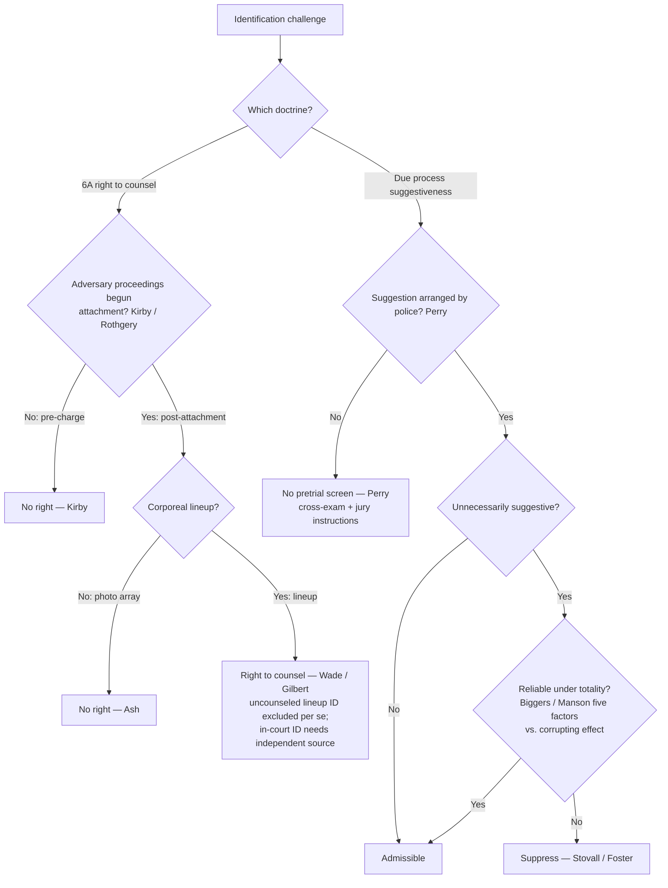

# Eyewitness Identification

*Is this identification admissible: was it produced by an unnecessarily suggestive procedure the police arranged, and is it nonetheless reliable?*

> [!rule] Black-letter rule
> Identification admissibility runs through **two independent federal doctrines**, and an identification can pass one and fail the other. **(1) Due process (Fourteenth Amendment):** an identification produced by an **unnecessarily suggestive** procedure the **police arranged** is excluded **only if it is unreliable** under the totality of the circumstances; suggestiveness alone is not enough. **(2) Sixth Amendment:** a **post-attachment corporeal lineup** is a **critical stage** with a right to counsel, and an uncounseled-lineup identification is excluded per se. *[[Manson v. Brathwaite|Manson]]*, 432 U.S. 98, 114 (1977); *[[Perry v. New Hampshire|Perry]]*, 565 U.S. 228 (2012); *[[United States v. Wade|Wade]]*, 388 U.S. 218, 237 (1967).
> ^rule-eyewitness

## The Brief

**Two independent doctrines, sorted by procedure.** The admissibility of an eyewitness identification runs through **two separate federal tracks**, and an identification can pass one and fail the other. Keep them apart: **(1)** a **Due-Process** attack on the *reliability* of a **suggestive** procedure (Fourteenth Amendment), and **(2)** a **Sixth Amendment** right to *counsel* at a **post-attachment corporeal lineup**. The first asks whether the identification is trustworthy enough to reach the jury; the second asks whether the accused was entitled to a lawyer at the confrontation. Neither turns on the other. The counsel branch is developed in full on [[Lineups and the Right to Counsel]]; this page states it and concentrates on the due-process reliability screen.

**(1) Due-process reliability: the suggestiveness/reliability screen (stated up front).** An identification produced by an **unnecessarily suggestive** police procedure is **excluded only if it is unreliable** under the [[Common Legal Terms#totality-of-the-circumstances|totality of the circumstances]]; suggestiveness alone is not enough. The origin is *[[Stovall v. Denno|Stovall v. Denno]]*, 388 U.S. 293 (1967), which recognized that a confrontation "so unnecessarily suggestive and conducive to irreparable mistaken identification" can deny due process, "a recognized ground of attack upon a conviction independent of any right to counsel claim," with the claim depending on "the totality of the circumstances." *[[Stovall v. Denno|Stovall]]*, 388 U.S. at 302.

**The five reliability factors.** *[[Neil v. Biggers|Neil v. Biggers]]*, 409 U.S. 188 (1972), made **reliability**, not suggestiveness, the controlling question, "whether under the 'totality of the circumstances' the identification was reliable even though the confrontation procedure was suggestive," and supplied the **five reliability factors**:

1. the **opportunity of the witness to view** the criminal at the time of the crime;
2. the witness's **degree of attention**;
3. the **accuracy of the witness's prior description** of the criminal;
4. the **level of certainty** demonstrated at the confrontation; and
5. the **length of time between the crime and the confrontation**.

*[[Neil v. Biggers|Biggers]]*, 409 U.S. at 199-200. *[[Manson v. Brathwaite|Manson v. Brathwaite]]*, 432 U.S. 98 (1977), rejected any **[[Common Legal Terms#per-se|per se]]** exclusion for suggestive procedures and made the point the linchpin: "reliability is the linchpin in determining the admissibility of identification testimony," with the *Biggers* factors weighed against "the corrupting effect of the suggestive identification itself." *[[Manson v. Brathwaite|Manson]]*, 432 U.S. at 114.

**The threshold that switches the screen on: police arrangement.** *[[Perry v. New Hampshire|Perry v. New Hampshire]]*, 565 U.S. 228 (2012), holds that the Due Process Clause requires a preliminary judicial inquiry into the reliability of an eyewitness identification **only** when the identification was procured under unnecessarily suggestive circumstances **arranged by law enforcement**. Absent improper police arrangement, reliability is tested through vigorous cross-examination, protective rules of evidence, and jury instructions, not through pretrial exclusion. Chance or private suggestiveness (a witness's own spontaneous viewing) triggers no pretrial screen.

**Suppression is the exception.** *[[Foster v. California|Foster v. California]]*, 394 U.S. 440 (1969), is the **rare** case in which a pretrial procedure was suggestive enough to require reversal: a lineup that made the suspect stand out, then a one-on-one showup, then a repeat lineup in which he was the only carryover, so that "in effect, the police repeatedly said to the witness, 'This is the man.'" *[[Foster v. California|Foster]]*, 394 U.S. at 443. For **photographic** procedures the same due-process standard applies: a conviction following a photo identification is set aside "only if the photographic identification procedure was so impermissibly suggestive as to give rise to a very substantial likelihood of irreparable misidentification." *[[Simmons v. United States|Simmons v. United States]]*, 390 U.S. 377, 384 (1968).

**(2) Sixth Amendment counsel at post-attachment lineups (stated up front; detailed on [[Lineups and the Right to Counsel]]).** A **post-attachment corporeal lineup** is a **critical stage** at which the accused has a Sixth Amendment right to counsel. *[[United States v. Wade|United States v. Wade]]*, 388 U.S. at 237. Its companion, *[[Gilbert v. California|Gilbert v. California]]*, attaches a **per se** exclusionary rule to testimony that the witness identified the accused **at** an uncounseled lineup, with an **in-court** identification surviving only on a proven **independent source**. *[[Gilbert v. California|Gilbert]]*, 388 U.S. at 273; *[[United States v. Wade|Wade]]*, 388 U.S. at 242. Two limits define the reach. First, the right does **not** attach **pre-charge**: *[[Kirby v. Illinois|Kirby v. Illinois]]*, 406 U.S. at 689 (plurality). Second, there is **no** counsel right at a **photographic array**, because it is not a trial-like confrontation of the accused. *[[United States v. Ash|United States v. Ash]]*, 413 U.S. at 321.

**Map the procedure first, because the doctrines sort by procedure.** A **corporeal lineup** conducted **after attachment** is the one procedure that triggers the *Wade/Gilbert* counsel right; a **photo array** never does (*[[United States v. Ash|Ash]]*); and a **showup** (a one-on-one confrontation) is **not categorically** a Sixth Amendment critical stage. The canonical showup, *[[Stovall v. Denno|Stovall]]*, was analyzed under **due process**, so classify showups on the suggestiveness/reliability branch. Every procedure (lineup, showup, or photo array) is separately subject to the due-process screen when police arranged the suggestion (*[[Perry v. New Hampshire|Perry]]*).

**Attachment is not the same as the "critical stage" question.** The Sixth Amendment **attaches** at the initial appearance or arraignment (*[[Rothgery v. Gillespie County|Rothgery]]*, 554 U.S. 191 (2008)), but *Rothgery* expressly did **not** decide which post-attachment events are critical stages requiring counsel. It is *Wade/Gilbert* that supplies the holding that a **post-charge corporeal lineup** *is* a critical stage; events before attachment are not (*[[Kirby v. Illinois|Kirby]]*). The right is also **offense-specific**: counsel is required only for a lineup concerning the **charged** offense (*[[Texas v. Cobb|Cobb]]*, 532 U.S. 162 (2001)).

**Burden · standard of review · remedy.** On the **Sixth Amendment** (*Wade/Gilbert*) branch: once the defendant shows a lineup conducted without counsel after attachment, the **prosecution** must establish by **clear and convincing evidence** that any in-court identification rests on an **independent source** (*[[United States v. Wade|Wade]]*, 388 U.S. at 240). The **remedy** is per se exclusion of the uncounseled-lineup testimony (*[[Gilbert v. California|Gilbert]]*), with the in-court identification admitted only on a proven independent source (*[[United States v. Wade|Wade]]*). On the **due-process** branch: the **defendant** bears the initial burden of showing the procedure was **unnecessarily suggestive** and, after *[[Perry v. New Hampshire|Perry]]*, **arranged by police**; if met, reliability is assessed under the *[[Neil v. Biggers|Biggers]]* totality against the corrupting effect of the suggestion (*[[Manson v. Brathwaite|Manson]]*), and only an **unreliable** identification is suppressed. Appellate review treats subsidiary historical facts for [[Common Legal Terms#clear-error|clear error]] and the ultimate questions (unnecessary suggestiveness and reliability) as mixed questions reviewed **[[Common Legal Terms#de-novo|de novo]]**.

**Common pitfalls.**
- **Assuming counsel attaches at every identification.** The *Wade/Gilbert* right reaches only **post-charge corporeal** confrontations. It does **not** reach pre-charge showups (*[[Kirby v. Illinois|Kirby]]*) or photo arrays (*[[United States v. Ash|Ash]]*). A pre-charge field showup needs no defense counsel.
- **Treating any suggestive procedure as automatically fatal.** Under *[[Neil v. Biggers|Biggers]]* and *[[Manson v. Brathwaite|Manson]]*, a suggestive identification is still admissible if **reliable** under the five-factor totality; suppression is the exception.
- **Applying the due-process screen to suggestion the police did not arrange.** Per *[[Perry v. New Hampshire|Perry]]*, chance or private suggestiveness triggers **no** pretrial screen; the safeguard is cross-examination and jury instruction, not a suppression remedy through [[The Exclusionary Rule|the exclusionary rule]].
- **Confusing *Gilbert*'s [[Common Legal Terms#per-se|per se]] rule with the due-process branch.** A *Gilbert* violation excludes the lineup-identification testimony outright, with no reliability cure; on the due-process branch reliability *rescues*.
- **Forgetting the [[Inevitable Discovery and Independent Source|independent source]].** Even after a tainted lineup, an in-court identification comes in if the prosecution proves the witness's identification has a source independent of the illegal procedure (*[[United States v. Wade|Wade]]*; and see the fruit-of-the-poisonous-tree analog in *[[United States v. Crews|Crews]]*).

## Lower-court developments

Circuit and state developments only; no SCOTUS. The controlling Supreme Court authorities (*[[United States v. Wade|Wade]]*, *[[Gilbert v. California|Gilbert]]*, *[[Stovall v. Denno|Stovall]]*, *[[Neil v. Biggers|Biggers]]*, *[[Manson v. Brathwaite|Manson]]*, *[[Kirby v. Illinois|Kirby]]*, *[[United States v. Ash|Ash]]*, and *[[Perry v. New Hampshire|Perry]]*) home to **Key cases** regardless of date, per the no-SCOTUS-in-recent-developments rule; *Perry* (2012) is the most recent SCOTUS word and belongs in Key, not here. The federal two-track framework is stable, and the live line-drawing tracks a few recurring frontiers: (a) **state high courts** that have supplemented or replaced the *[[Manson v. Brathwaite|Manson]]* reliability test with a scientifically-informed, expert-guided framework as a matter of **state** constitutional or evidence law, departing upward from the federal floor; (b) lower-court application of *[[Perry v. New Hampshire|Perry]]*'s **police-arrangement threshold** to private or accidental suggestiveness; and (c) treatment of **modern procedures**, including double-blind and sequential lineups and body-camera field showups. *Specific circuit and state authority developing these frontiers is a live-verify addition (serial CL, L2/L4) deferred to the standing find, adjudicate, and fix gate (R13) and S9; no new case holding is asserted here.*

## Key cases

| Case | Holding | Opinion |
|---|---|---|
| *[[United States v. Wade]]*, 388 U.S. 218 (1967) | **Anchor (6A).** A **post-indictment lineup** is a **critical stage** with a right to counsel; an uncounseled lineup may taint a later in-court identification absent an **[[Inevitable Discovery and Independent Source\|independent source]]**. | [opinion](https://www.courtlistener.com/opinion/107486/united-states-v-wade/) |
| *[[Gilbert v. California]]*, 388 U.S. 263 (1967) | **Anchor (6A).** Testimony that the witness identified the accused at an **uncounseled post-charge lineup** is excluded **[[Common Legal Terms#per-se\|per se]]**, with no harmless-error or reliability cure. | [opinion](https://www.courtlistener.com/opinion/107487/gilbert-v-california/) |
| *[[Stovall v. Denno]]*, 388 U.S. 293 (1967) | **Anchor (DP).** An **unnecessarily suggestive** confrontation conducive to irreparable misidentification can violate **due process**; admissibility turns on the **[[Common Legal Terms#totality-of-the-circumstances\|totality of the circumstances]]**. | [opinion](https://www.courtlistener.com/opinion/107488/stovall-v-denno/) |
| *[[Neil v. Biggers]]*, 409 U.S. 188 (1972) | **Refinement (DP).** Even an unnecessarily suggestive identification is admissible if **reliable** under the totality; reliability judged by the **five factors**. | [opinion](https://www.courtlistener.com/opinion/108639/neil-v-biggers/) |
| *[[Manson v. Brathwaite]]*, 432 U.S. 98 (1977) | **Anchor (DP).** **No [[Common Legal Terms#per-se\|per se]]** exclusion for suggestive procedures; **reliability is the linchpin** under the *Biggers* factors, weighed against the corrupting effect of the suggestion. | [opinion](https://www.courtlistener.com/opinion/109693/manson-v-brathwaite/) |
| *[[Perry v. New Hampshire]]*, 565 U.S. 228 (2012) | **Refinement (DP).** Due-process reliability screening applies **only** when police **arranged** the suggestive circumstances; otherwise the jury and cross-examination are the safeguards. | [opinion](https://www.courtlistener.com/opinion/620671/perry-v-new-hampshire/) |
| *[[Foster v. California]]*, 394 U.S. 440 (1969) | **Progeny (DP).** The **rare** reversal: cumulative suggestiveness (standout lineup, then showup, then repeat lineup) made identification all but inevitable and denied due process. | [opinion](https://www.courtlistener.com/opinion/107890/foster-v-california/) |
| *[[Simmons v. United States]]*, 390 U.S. 377 (1968) | **Progeny (DP, photo array).** A **photographic** identification denies due process only if so impermissibly suggestive as to give rise to a very substantial likelihood of irreparable misidentification. | [opinion](https://www.courtlistener.com/opinion/107636/simmons-v-united-states/) |
| *[[Kirby v. Illinois]]*, 406 U.S. 682 (1972) (plurality) | **Refinement (6A).** The counsel right attaches only **at or after** the initiation of adversary judicial proceedings; a **pre-charge** identification is not a critical stage. | [opinion](https://www.courtlistener.com/opinion/108554/kirby-v-illinois/) |
| *[[United States v. Ash]]*, 413 U.S. 300 (1973) | **Refinement (6A).** **No** right to counsel at a **post-indictment photographic display**; no trial-like confrontation because the accused is not present. | [opinion](https://www.courtlistener.com/opinion/108846/united-states-v-ash/) |

## Related cases across doctrines

These cases are treated in full elsewhere but bear on this doctrine; each holding is framed below for the eyewitness-identification context.

| Case | Relevance here | Primary home | Opinion |
|---|---|---|---|
| *[[Rothgery v. Gillespie County]]*, 554 U.S. 191 (2008) | Fixes **when** the *Wade/Kirby* counsel right can attach: the 6A **attaches** at the initial appearance or arraignment. But **attachment is distinct from the critical-stage question**; *Rothgery* did not decide which post-attachment events require counsel, and it is *Wade/Gilbert* that makes a post-charge corporeal lineup a critical stage. | [[Sixth Amendment Right to Counsel]] | [opinion](https://www.courtlistener.com/opinion/145785/rothgery-v-gillespie-county/) |
| *[[Texas v. Cobb]]*, 532 U.S. 162 (2001) | The *Wade* counsel-at-lineup right is **offense-specific**: counsel is required only for a lineup concerning the **charged** offense; a post-charge lineup on a different, uncharged offense triggers no *Wade/Gilbert* right. | [[Sixth Amendment Right to Counsel]] | [opinion](https://www.courtlistener.com/opinion/118417/texas-v-cobb/) |
| *[[United States v. Crews]]*, 445 U.S. 463 (1980) | The **independent-source** principle applied to identifications: a victim's **in-court** identification is **not** a suppressible fruit of an illegal arrest where her presence and ability to identify have a source **predating** the misconduct, the fruit-of-the-poisonous-tree analog to the *Wade/Gilbert* independent-source test. | [[The Exclusionary Rule]] | [opinion](https://www.courtlistener.com/opinion/110230/united-states-v-crews/) |

## Visual

## Sources

- [United States v. Wade, 388 U.S. 218 (1967)](https://www.courtlistener.com/opinion/107486/united-states-v-wade/) — pinpoints 237, 240, 242
- [Gilbert v. California, 388 U.S. 263 (1967)](https://www.courtlistener.com/opinion/107487/gilbert-v-california/) — pinpoint 273
- [Stovall v. Denno, 388 U.S. 293 (1967)](https://www.courtlistener.com/opinion/107488/stovall-v-denno/) — pinpoint 302
- [Neil v. Biggers, 409 U.S. 188 (1972)](https://www.courtlistener.com/opinion/108639/neil-v-biggers/) — pinpoints 199, 199-200
- [Manson v. Brathwaite, 432 U.S. 98 (1977)](https://www.courtlistener.com/opinion/109693/manson-v-brathwaite/) — pinpoint 114
- [Perry v. New Hampshire, 565 U.S. 228 (2012)](https://www.courtlistener.com/opinion/620671/perry-v-new-hampshire/) (police-arrangement trigger)
- [Foster v. California, 394 U.S. 440 (1969)](https://www.courtlistener.com/opinion/107890/foster-v-california/) — pinpoints 442, 443
- [Simmons v. United States, 390 U.S. 377 (1968)](https://www.courtlistener.com/opinion/107636/simmons-v-united-states/) — pinpoint 384
- [Kirby v. Illinois, 406 U.S. 682 (1972)](https://www.courtlistener.com/opinion/108554/kirby-v-illinois/) — pinpoint 689 (plurality)
- [United States v. Ash, 413 U.S. 300 (1973)](https://www.courtlistener.com/opinion/108846/united-states-v-ash/) — pinpoint 321
- [Rothgery v. Gillespie County, 554 U.S. 191 (2008)](https://www.courtlistener.com/opinion/145785/rothgery-v-gillespie-county/) (cross-doctrine)
- [Texas v. Cobb, 532 U.S. 162 (2001)](https://www.courtlistener.com/opinion/118417/texas-v-cobb/) (cross-doctrine)
- [United States v. Crews, 445 U.S. 463 (1980)](https://www.courtlistener.com/opinion/110230/united-states-v-crews/) (cross-doctrine)
