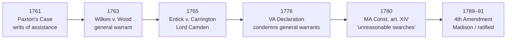

# Common Law & Early US Search and Seizure

*Where did the Fourth Amendment come from, and why does that founding history still decide cases?*

> [!rule] Black-letter rule
> The Fourth Amendment was the founding generation's deliberate answer to two reviled instruments of executive discretion: the **general warrant** and the **writ of assistance**. The Supreme Court reads that history as the meaning of the Amendment's text, treating Lord Camden's judgment in *[[Entick v. Carrington]]* as the principle the Amendment embodies. *[[Boyd v. United States|Boyd]]*, 116 U.S. 616, [624–30](https://www.courtlistener.com/opinion/91573/boyd-v-united-states/) (1886); *[[Riley v. California|Riley]]*, [573 U.S. 373](https://www.courtlistener.com/opinion/2680439/riley-v-cal-united-states/) (2014).
> ^rule-common-law-origins

## The Brief

**This page is legal history, not binding precedent.** The Amendment did not appear from nowhere. It was the answer to a set of abuses the framers had lived through, and the Supreme Court has recounted that history repeatedly and treats it as the meaning of the text.

**The two reviled instruments.** A **general warrant** named no particular person, place, or thing; it let an officer search broadly and seize at his own discretion. A **writ of assistance** was the customs version: it authorized revenue officers to search any suspected place for smuggled goods, was **transferable** to any officer, and had **no fixed term**, running for the whole reign of the issuing sovereign. The Amendment's [[Particularity|particularity]] and probable-cause requirements were aimed at both.

**The arc, in six beats.** *Paxton's Case* (Massachusetts, 1761) was the colonial spark: Boston merchants challenged the writs of assistance, and **James Otis** resigned his crown office to argue against them, calling the writ "the worst instrument of arbitrary power" because it put the liberty of every man in the hands of every petty officer. A young **John Adams**, taking notes in the courtroom, later traced the birth of American independence to that argument. *[[Boyd v. United States|Boyd]]*, 116 U.S. at [625](https://www.courtlistener.com/opinion/91573/boyd-v-united-states/). In *[[Wilkes v. Wood]]* (England, 1763), a Secretary of State's **general warrant** was used to ransack John Wilkes's house after *The North Briton* No. 45 attacked the Crown; juries under Chief Justice Pratt (soon Lord Camden) returned heavy trespass verdicts, establishing that there is no roving executive power to search. *Id.* at 626. In *[[Entick v. Carrington]]* (England, 1765), King's messengers acting under a general warrant broke into Entick's home and seized his papers; Lord **Camden** held the warrant **illegal and void**, reasoning that the government may not invade person, house, or papers without specific legal authority. *Id.* at 627–29. *[[Boyd v. United States|Boyd]]* calls Camden's judgment "the true and ultimate expression of constitutional law" embodied in the Fourth Amendment. *Id.* at 626–27.

The story then crosses the Atlantic. The **Virginia Declaration of Rights (1776)** condemned general warrants by name, and the **Massachusetts Constitution of 1780, art. XIV**, drafted by **John Adams**, supplied the operative phrase "unreasonable searches, and seizures." **James Madison** introduced the proposed amendments in the First Congress in 1789, and the Fourth Amendment was ratified with the rest of the Bill of Rights in **1791**, carrying the Camden principle and the Massachusetts language into the federal Constitution.

The English and colonial cases are **Historical** authority in the six-tier scheme (English and colonial origins), not U.S. precedent; they are not in the U.S. case-law databases. Their force in an American courtroom comes from the Supreme Court adopting them, so the case to cite is the SCOTUS decision that relies on them. Only *[[Boyd v. United States|Boyd]]* and *[[Riley v. California|Riley]]* are binding U.S. authority here. (*[[Boyd v. United States|Boyd]]*'s own "mere evidence" holding was later abandoned; its account of the founding history remains good law and is still cited.)

**Common pitfalls.**
- **Citing the English or colonial cases as binding U.S. authority.** They are Historical sources; cite the Supreme Court case that adopts them (*[[Boyd v. United States|Boyd]]*, *[[Riley v. California|Riley]]*), not the English reports.
- **Inventing a "U.S. citation" for Paxton, Wilkes, or Entick.** There is no U.S. Reports cite. *[[Entick v. Carrington|Entick]]* lives in 19 Howell's State Trials 1029; Paxton's Case in Quincy's (Mass.) Reports. Do not dress them up as U.S. case law.
- **Conflating the general warrant with the writ of assistance.** The writ of assistance was the customs version, transferable and non-expiring (Paxton's Case); the general warrant was the English libel-investigation instrument (Wilkes, Entick).
- **Treating "a man's house is his castle" as the rule.** It is the rhetorical root (Otis, Camden), not the operative test. The operative law is the Fourth Amendment and the doctrine built on it. See [[Fourth Amendment Framework]] and [[Two Definitions of Search]].

## Key cases

| Case | Holding | Opinion |
|---|---|---|
| *[[Boyd v. United States]]*, 116 U.S. 616 (1886) | Recounts the founding history at length and adopts *[[Entick v. Carrington]]* as the constitutional principle the Fourth Amendment embodies. | [opinion](https://www.courtlistener.com/opinion/91573/boyd-v-united-states/) |

## Related cases across doctrines

| Case | Relevance here | Primary home | Opinion |
|---|---|---|---|
| *[[Riley v. California]]*, 573 U.S. 373 (2014) | Modern reaffirmation that the Fourth Amendment was the founding generation's response to general warrants and the writs of assistance, a driving force behind the Revolution. | [[SIA Cell Phones]] | [opinion](https://www.courtlistener.com/opinion/2680439/riley-v-california/) |

## Visual

## Sources

- [*Boyd v. United States*, 116 U.S. 616, 624–30 (1886)](https://www.courtlistener.com/opinion/91573/boyd-v-united-states/) (founding history; quotes Otis, Adams, the Wilkes verdicts, and Lord Camden's *Entick* judgment; pinpoints 625, 626–27, 627–29).
- [*Riley v. California*, 573 U.S. 373 (2014)](https://www.courtlistener.com/opinion/2680439/riley-v-california/) (modern reaffirmation of the writs-of-assistance and general-warrant history; primary home [[SIA Cell Phones]]).
- *Entick v. Carrington*, 19 Howell's State Trials 1029 (C.P. 1765) (Historical; English report, not in CourtListener; grounded above via *Boyd*).
- *Wilkes v. Wood*, 19 Howell's State Trials 1153, 98 Eng. Rep. 489 (C.P. 1763) (Historical; English report, not in CourtListener).
- Paxton's Case, Quincy's Mass. Reports 51–57 (Mass. Super. Ct. 1761) (Historical; colonial report, not in CourtListener).
- Virginia Declaration of Rights (1776), § 10; Massachusetts Constitution (1780), pt. I, art. XIV; U.S. Const. amend. IV (proposed 1789, ratified 1791) (primary historical and constitutional sources).
