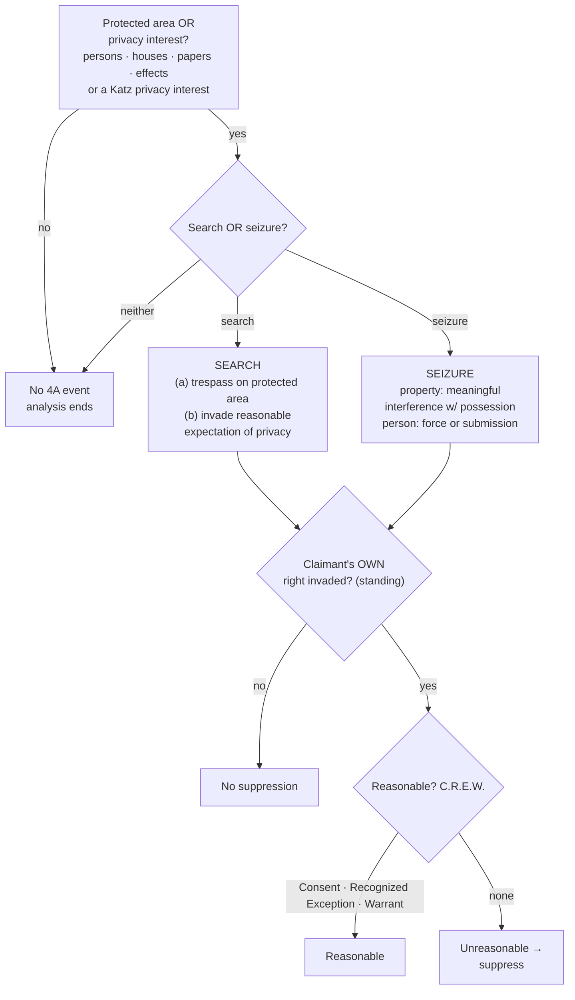

# Fourth Amendment Framework

## Rule
The Fourth Amendment secures "[t]he right of the people to be secure in their persons, houses, papers, and effects, against unreasonable searches and seizures," and commands that "no Warrants shall issue, but upon probable cause." U.S. Const. amend. IV. It contains **two clauses**: a **reasonableness clause** (the general command that searches and seizures be reasonable) and a **warrant clause** (the requirements for issuing a warrant). It restrains **the government only** — not private parties acting on their own. *United States v. Jacobsen*, 466 U.S. 109, 113–14 (1984). Every problem is worked in the same order: (1) was a constitutionally protected area or interest involved; (2) did a **search** or **seizure** occur; (3) does the claimant have **standing** (were the claimant's *own* rights invaded); and (4) was the government action **reasonable** — justified by **C.R.E.W.**: **C**onsent, a **R**ecognized **E**xception, or a **W**arrant.

## Key cases
| Case (Bluebook) | Holding in one line | Weight | CourtListener |
|---|---|---|---|
| *[[Camara v. Municipal Court]]*, 387 U.S. 523 (1967) | Administrative inspections are Fourth Amendment searches; reasonableness has no ready test "other than by balancing the need to search against the invasion which the search entails." | SCOTUS — binding | [link](https://www.courtlistener.com/opinion/107473/camara-v-municipal-court-of-city-and-county-of-san-francisco/) |
| *[[United States v. Jacobsen]]*, 466 U.S. 109 (1984) | Defines a property seizure; the Amendment reaches only government action; once a private party exposes contents, a government inspection within that scope invades no remaining privacy. | SCOTUS — binding | [link](https://www.courtlistener.com/opinion/111143/united-states-v-jacobsen/) |
| *[[Walter v. United States]]*, 447 U.S. 649 (1980) | The government may not exceed the scope of a prior private search; FBI's screening of films the private party had not viewed was a separate, unlawful search. | SCOTUS — binding | [link](https://www.courtlistener.com/opinion/110314/walter-v-united-states/) |
| *[[Skinner v. Railway Labor Executives' Ass'n]]*, 489 U.S. 602 (1989) | A private party is a state actor when government participation is sufficient; turns "on the degree of the Government's participation in the private party's activities." | SCOTUS — binding | [link](https://www.courtlistener.com/opinion/112219/skinner-v-railway-labor-executives-assn/) |
| *[[Coolidge v. New Hampshire]]*, 403 U.S. 443 (1971) | Evidence produced by a genuinely private search does not implicate the Amendment; state action turns on all the circumstances. | SCOTUS — binding | [link](https://www.courtlistener.com/opinion/108377/coolidge-v-new-hampshire/) |
| *[[Arizona v. Hicks]]*, 480 U.S. 321 (1987) | Moving stereo equipment to read its serial numbers was a *new* search requiring probable cause — a minimal further intrusion is still a search. | SCOTUS — binding | [link](https://www.courtlistener.com/opinion/111834/arizona-v-hicks/) |

## Related cases across doctrines
These cases are treated in full elsewhere but bear directly on the Fourth Amendment framework, framed here for that purpose.

| Case | Relevance to the Fourth Amendment framework | Primary treatment | CourtListener |
|---|---|---|---|
| *[[Katz v. United States]]*, 389 U.S. 347 (1967) | Supplies definition (b) of a search in the Framework: a search occurs when the government invades a reasonable expectation of privacy, even with no physical trespass — "the Fourth Amendment protects people, not places." | [[Standing to Challenge a Search]] | [opinion](https://www.courtlistener.com/opinion/107564/katz-v-united-states/) |
| *[[Rakas v. Illinois]]*, 439 U.S. 128 (1978) | Anchors the Framework's standing step: Fourth Amendment rights are personal — a claimant must show his OWN legitimate expectation of privacy was invaded and cannot assert a third party's. | [[Standing to Challenge a Search]] | [opinion](https://www.courtlistener.com/opinion/109953/rakas-v-illinois/) |
| *[[Terry v. Ohio]]*, 392 U.S. 1 (1968) | The foundational reasonableness-as-balancing case alongside *Camara*: reasonableness is assessed by weighing the government interest against the intrusion, the root of the Framework's "reasonableness is the touchstone" rule. | [[Probable Cause and Reasonable Suspicion]] | [opinion](https://www.courtlistener.com/opinion/107729/terry-v-ohio/) |
| *[[Florida v. Jardines]]*, 569 U.S. 1 (2013) | Concrete application of definition (a) — the trespass theory: bringing a drug dog onto the home's curtilage to gather information is a physical intrusion on a constitutionally protected area and therefore a search. | [[Knock and Talk]] | [opinion](https://www.courtlistener.com/opinion/856347/florida-v-jardines/) |
| *[[Riley v. California]]*, 573 U.S. 373 (2014) | Leading digital-privacy gloss on the *Katz* prong: the immense, qualitatively different privacy interest in a cell phone's digital contents marks where the reasonable-expectation-of-privacy definition of search reaches modern devices. | [[Search Incident to Arrest]] | [opinion](https://www.courtlistener.com/opinion/2680439/riley-v-cal-united-states/) |

## Nuances & limits
- **Two definitions of "search."** A search occurs when the government either (a) **physically intrudes on a constitutionally protected area to obtain information** (the trespass theory) **or** (b) **invades a reasonable expectation of privacy** (*Katz*). The trespass theory needs a constitutionally protected *area* (persons, houses, papers, effects); the *Katz* theory protects a *reasonable expectation of privacy* and is **not** confined to those enumerated categories — "the Fourth Amendment protects people, not places." Either theory independently establishes a search; *Katz* supplemented the property baseline, it did not replace it. The deep treatment of *[[Olmstead v. United States|Olmstead]]* → *Katz* → *[[United States v. Jones|Jones]]* lives in [[Two Definitions of Search]] — don't re-derive it here.
- **Seizure of property** is "some meaningful interference with an individual's possessory interests in that property." *Jacobsen*, 466 U.S. at 113.
- **Seizure of a person** is a restraint on liberty of movement by physical force or by submission to a show of authority. Full treatment — *[[United States v. Mendenhall|Mendenhall]]*, *[[California v. Hodari D.|Hodari D.]]*, *[[Torres v. Madrid|Torres]]*, and use-of-force reasonableness under *[[Graham v. Connor|Graham]]* — is in [[Seizure of the Person]] and [[Use of Force]].
- **Reasonableness is the touchstone, and it is a balance.** "[T]here can be no ready test for determining reasonableness other than by balancing the need to search against the invasion which the search entails." *Camara*, 387 U.S. at 536–37. This balancing is the root of every later reasonableness inquiry. Operationally, reasonableness is satisfied through **C.R.E.W.** — Consent, a Recognized Exception, or a Warrant (see [[CREW]]; the full catalog of recognized exceptions is covered later in the course).
- **Standing is your own right, not anyone else's.** Fourth Amendment rights are personal: a defendant may suppress only evidence obtained by invading *his own* protected interest, not a third party's. Were the place searched or the thing seized *his*?
- **A trivial extra intrusion is still a search.** In *Hicks*, merely picking up turntables to read serial numbers "produced a new invasion of respondent's privacy unjustified by the exigent circumstance" and so required probable cause. 480 U.S. at 325. (Plain view is covered in full later — note it forward, don't expand it here.)
- **State action — the threshold for the whole Amendment.** "[T]he Fourth Amendment does not apply to a search or seizure, even an arbitrary one, effected by a private party on his own initiative," but it does apply "if the private party acted as an instrument or agent of the Government." *Skinner*, 489 U.S. at 614. Whether someone is such an agent "necessarily turns on the degree of the Government's participation in the private party's activities," resolved "in light of all the circumstances." *Id.* at 614–15 (quoting *Coolidge*, 403 U.S. at 487). A private party becomes a state actor when the government instigates, directs, or significantly encourages or participates in the search. *(The commonly taught two-part agency test — (1) government knowledge and acquiescence and (2) the private party's intent to assist law enforcement — is circuit gloss carrying **Persuasive (outside circuit)** weight, not a SCOTUS holding.)*
- **Private-search doctrine ("the cat is out of the bag").** Once a private party has searched and exposed contents, a later government inspection that does **not exceed the scope** of the private search invades no remaining expectation of privacy. *Jacobsen*, 466 U.S. at 115–17 (FedEx package opened by employees; DEA's later inspection lawful). Three sub-rules govern:
  1. **Cannot exceed the private search's scope.** A government search beyond what the private party already exposed is a separate search needing its own justification. *Walter*, 447 U.S. at 659 (the private "search merely frustrated that expectation in part. It did not . . . strip the remaining unfrustrated portion . . . of all Fourth Amendment protection").
  2. **Re-examination needs "virtual certainty."** Reopening or re-inspecting is permissible where there is "a virtual certainty that nothing else of significance" would be revealed beyond what the private party already disclosed. *Jacobsen*, 466 U.S. at 119.
  3. **Lawful right of access.** The officer must already have a lawful right of access to the item the private party searched.
- **Bill of Rights codified pre-existing rights.** The framing that the Amendment's "right of the people" was a *pre-existing* liberty, not a newly minted one, is reflected in *District of Columbia v. Heller*, 554 U.S. 570, 592 (2008) *(Second Amendment — cited only for the framing that the Bill of Rights was "widely understood to codify a pre-existing right, rather than to fashion a new one"; not Fourth Amendment authority).*
- **Right to be let alone.** The privacy lineage traces to Justice Brandeis's *Olmstead* [[Common Legal Terms#dissenting-opinion|dissent]] — developed in [[Two Definitions of Search]], not here.

## Common pitfalls
- **Skipping the threshold.** If no search or seizure occurred, there is nothing to justify — and no suppression remedy. Work the sequence in order; don't jump to warrant exceptions.
- **Asserting a third party's rights.** Officers and instructors conflate "the search was illegal" with "*this* defendant can suppress." Standing requires the claimant's *own* protected interest to have been invaded.
- **Treating private-party evidence as automatically clean.** It is clean only if the actor was genuinely private. If the government instigated, directed, or significantly participated, the private party is a state actor and the Amendment applies. *Skinner*.
- **Overrunning the private search.** *Walter* is the trap: the officer may stand in the private party's shoes but no further. Going beyond what the private party exposed — without independent justification or virtual certainty nothing new will appear — is a fresh search.
- **Forgetting that small intrusions count.** *Hicks*: moving an object a few inches to read a serial number is a search.

## Visual

## Recent developments & subsequent treatment
The Framework's threshold question — "did a *search* occur?" — is being actively litigated at the digital frontier, where courts test how far the *Katz* reasonable-expectation prong and the private-search doctrine reach. The headline issue is geofence/reverse-location data, on which the Supreme Court has now **resolved** the threshold *search* question — *[[Chatrie v. United States|Chatrie]]* (2026) holds it **is** a search (below); the private-search doctrine is likewise fracturing over automated hash-matching of digital files. Circuit decisions below are **binding in-circuit only — Persuasive (outside circuit)** elsewhere, and several conflict with one another.

- **Chatrie v. United States** — *decided by the Supreme Court, June 29, 2026* (No. 25-112, 609 U.S. ___). Held: acquiring a cell phone's Google Location History (geofence) data **is** a Fourth Amendment search — a reasonable expectation of privacy in the record of one's phone's location, even briefly and even when held by a third party (**applying/extending *[[Carpenter v. United States|Carpenter]]***; rejecting the opt-in/third-party rationale). The Court did **not** hold geofence warrants categorically unconstitutional; it **vacated and remanded** the warrant's probable-cause/particularity question. **Binding — SCOTUS.** *(See [[Chatrie v. United States]]; CL-confirm pending — CL object 10881683 corrupted.)* [slip op.](https://www.supremecourt.gov/opinions/25pdf/25-112_0am4.pdf).
- **United States v. Chatrie (4th Cir. panel; en banc, 136 F.4th 100 (2025))** — *decision below (search-question rationale now superseded).* The panel held that obtaining a short window (~2 hours) of Google Location History was NOT a search (voluntarily shared/opt-in; third-party doctrine; *Carpenter* does not extend); the en banc court fractured 7–7 on whether a search occurred. The Supreme Court **reversed course on the search question** in *Chatrie* (2026, above); the 4th Cir. opinions now bear only on the remanded PC/particularity issues. **4th Cir. — Binding in-circuit; Persuasive (outside circuit).** [opinion](https://www.courtlistener.com/opinion/10443725/united-states-v-okello-chatrie/).
- **United States v. Smith (5th Cir. 2024)** — held that obtaining Google Location History via a geofence invades a reasonable expectation of privacy and is a Fourth Amendment search, and that geofence warrants are "modern-day general warrants" and categorically unconstitutional regardless of probable cause — though the evidence was not suppressed under the *Leon* good-faith exception given the novelty of the technology. **5th Cir. — Binding in-circuit; Persuasive (outside circuit)**. Its search-question holding is **now confirmed** by *[[Chatrie v. United States|Chatrie]]* (2026); its categorical-general-warrant holding was **not adopted** by the Supreme Court and feeds the remanded PC/particularity question. "We hold that geofence warrants are modern-day general warrants and are unconstitutional under the Fourth Amendment. However, considering law enforcement's reasonable conduct in this case in light of the novelty of this type of warrant, we uphold the district court's determination that suppression was unwarranted under the good-faith exception." 110 F.4th at 838. [opinion](https://www.courtlistener.com/opinion/10036119/united-states-v-smith/).
- **United States v. Moore-Bush (1st Cir. 2022) (en banc)** — the en banc First Circuit unanimously reversed the district court's grant of suppression and remanded with instructions to deny the motions to suppress (the eight-month pole-camera evidence comes in); the court divided 3-3 only on the *rationale* for whether warrantless pole-camera surveillance of a home's curtilage is a Fourth Amendment "search" — one bloc finding a search under *Carpenter*'s aggregation/mosaic theory but saved by *Leon*/*Davis* good-faith reliance on circuit precedent, the other finding no search at all. **1st Cir. — Binding in-circuit; Persuasive (outside circuit)** (cert. denied 2023). ⚖ Circuit split. [opinion](https://www.courtlistener.com/opinion/6476395/united-states-v-moore-bush/).
- **United States v. Wilson (9th Cir. 2021)** — applied and tightened the private-search doctrine (*Jacobsen*/*Walter*) to automated CSAM detection: where Google flagged email attachments via hash-matching but no human had ever actually *viewed* the images, the officer's warrantless viewing exceeded the scope of any antecedent private search and was a separate government search (reversed denial of suppression; conviction vacated). Reads *Jacobsen*'s "virtual certainty" and scope limits strictly for algorithmic/hash matches. **9th Cir. — Binding in-circuit; Persuasive (outside circuit)**; diverges from 5th/6th Cir. decisions upholding similar hash-flag viewings. ⚖ Circuit split. [opinion](https://www.courtlistener.com/opinion/5296785/united-states-v-luke-wilson/).
- **United States v. Reddick / United States v. Miller (5th Cir. 2018 / 6th Cir. 2020)** — the permissive side of the hash-match private-search split: where a provider's hash-value match makes it a "virtual certainty" (*Miller*) / "almost absolute certainty" (*Reddick*) that flagged files are the known contraband already viewed by a private actor, an officer's warrantless opening of those files discloses nothing the defendant's privacy had not already lost (*Jacobsen*), so it is not a Fourth Amendment search (both affirmed). **5th & 6th Cir. — Binding in-circuit; Persuasive (outside circuit)**; opposite the Ninth Circuit's *Wilson*. ⚖ Circuit split. "Critically, Miller does not dispute the district court's finding about a hash-value match's near-perfect accuracy: It created a 'virtual certainty' that the files in the Gmail account were the known child-pornography files that a Google employee had viewed. Given this (unchallenged) reliability, Jacobsen's required level of certainty is met." *Miller*, 982 F.3d at 416. [opinion](https://www.courtlistener.com/opinion/4527853/united-states-v-henry-reddick/); [opinion](https://www.courtlistener.com/opinion/4835528/united-states-v-william-miller/).

## Sources
- *Camara v. Municipal Court*, 387 U.S. 523 (1967) — https://www.courtlistener.com/opinion/107473/camara-v-municipal-court-of-city-and-county-of-san-francisco/
- *United States v. Jacobsen*, 466 U.S. 109 (1984) — https://www.courtlistener.com/opinion/111143/united-states-v-jacobsen/
- *Walter v. United States*, 447 U.S. 649 (1980) — https://www.courtlistener.com/opinion/110314/walter-v-united-states/
- *Skinner v. Railway Labor Executives' Ass'n*, 489 U.S. 602 (1989) — https://www.courtlistener.com/opinion/112219/skinner-v-railway-labor-executives-assn/
- *Coolidge v. New Hampshire*, 403 U.S. 443 (1971) — https://www.courtlistener.com/opinion/108377/coolidge-v-new-hampshire/
- *Arizona v. Hicks*, 480 U.S. 321 (1987) — https://www.courtlistener.com/opinion/111834/arizona-v-hicks/
- *Katz v. United States*, 389 U.S. 347 (1967) — https://www.courtlistener.com/opinion/107564/katz-v-united-states/ *(search = privacy theory; cross-reference)*
- *United States v. Jones*, 565 U.S. 400 (2012) — https://www.courtlistener.com/opinion/7350871/united-states-v-jones/ *(search = trespass theory; cross-reference)*
- *District of Columbia v. Heller*, 554 U.S. 570 (2008) — https://www.courtlistener.com/opinion/145777/district-of-columbia-v-heller/ *(Second Amendment; cited only for "pre-existing right" framing)*
