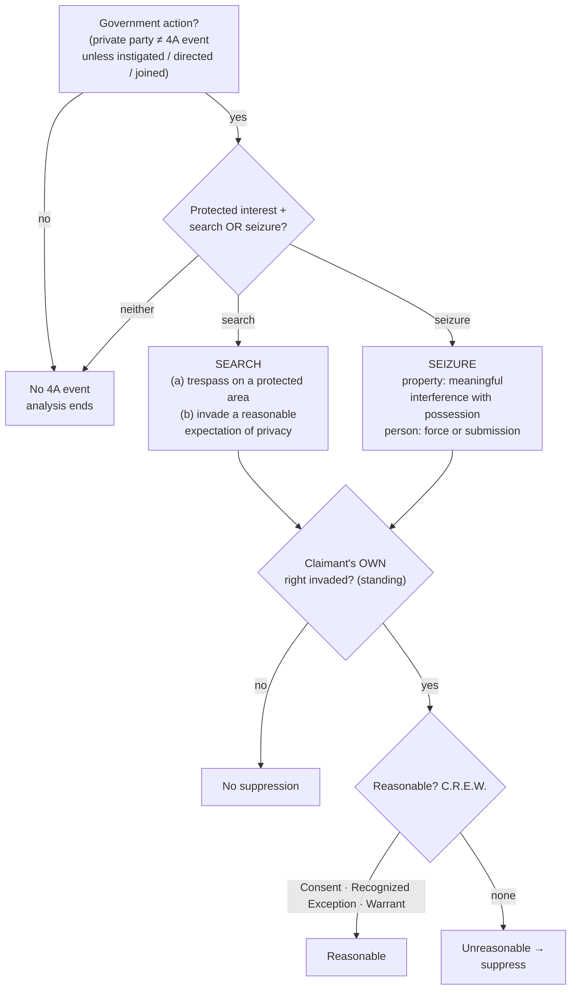

# Fourth Amendment Framework

*You have a search-or-seizure problem in front of you. In what order do you work it, and where is each step decided?*

## The Brief

This page is the **map**, not a rule you apply directly. It fixes the order in which every Fourth Amendment problem is worked and routes each step to the page that states its rule and its cases. Read it to place a problem; follow the links to resolve it.

The Amendment secures "[t]he right of the people to be secure in their persons, houses, papers, and effects, against unreasonable searches and seizures," and commands that "no Warrants shall issue, but upon probable cause." U.S. Const. amend. IV. It carries **two clauses**: a **reasonableness clause** (searches and seizures must be reasonable) and a **warrant clause** (what a valid warrant requires).

**Work the sequence in order.** Each step is a gate: if an earlier one fails, the analysis ends and there is nothing left to justify. The recurring mistake is to jump to the warrant exceptions before establishing that a Fourth Amendment event even occurred.

1. **Was there government action?** The Amendment restrains the government, not private parties. A private search becomes a Fourth Amendment event only when officials instigate, direct, or join it. That threshold, with the private-search and foreign-search limits, is on [[Private and Foreign Searches]].
2. **Was a protected interest involved, and did a search or a seizure occur?** A **search** is either a physical intrusion on a protected area to gather information or an invasion of a [[Reasonable Expectation of Privacy|reasonable expectation of privacy]] ([[Two Definitions of Search]]); the home's [[Curtilage]] is protected, while [[Abandonment|abandoned property and open fields]] are not. A **seizure of property** is a meaningful interference with possession ([[Seizure of Property]]); a **seizure of the person** is a restraint on movement by physical force or submission to a show of authority ([[Seizure of the Person]]). If neither occurred, the analysis ends here.
3. **Does this claimant have standing?** Fourth Amendment rights are personal: a claimant may challenge only an invasion of *their own* protected interest, never a third party's. See [[Standing to Challenge a Search]].
4. **Was the government's action reasonable?** Reasonableness is the touchstone, and it is a balance of the government's need against the intrusion the action entails. *Camara v. Municipal Court*, 387 U.S. 523, 536–37 (1967); *Terry v. Ohio*, 392 U.S. 1 (1968). Operationally it is satisfied through **C.R.E.W.**: **C**onsent, a **R**ecognized **E**xception, or a **W**arrant. See [[CREW]] and the warrant-exceptions pages.

Even a slight further intrusion can be its own search: in *Arizona v. Hicks*, moving stereo equipment a few inches to read a serial number was a new search that required probable cause. *Arizona v. Hicks*, 480 U.S. 321, 325 (1987). When an unreasonable search or seizure yields evidence, the remedy is suppression under [[The Exclusionary Rule]], and only a claimant with standing can invoke it.

**The steps at a glance.**

| Analysis step | Where it is decided |
|---|---|
| Government action / private search | [[Private and Foreign Searches]] |
| Was there a search? (trespass or privacy) | [[Two Definitions of Search]] · [[Curtilage]] · [[Abandonment]] |
| Was there a seizure? (person or property) | [[Seizure of the Person]] · [[Seizure of Property]] |
| Standing (the claimant's own rights) | [[Standing to Challenge a Search]] |
| Reasonableness (C.R.E.W.) | [[CREW]] and the warrant-exceptions pages |
| Remedy | [[The Exclusionary Rule]] |

The same threshold questions are being re-litigated at the digital frontier, where courts test how far the privacy definition of a search reaches new technology; those developments are tracked on [[The Third-Party Doctrine and Digital Surveillance]].

**Common pitfalls.**
- **Skipping the threshold.** If no search or seizure occurred, there is nothing to justify and no suppression remedy. Work the sequence in order.
- **Asserting a third party's rights.** "The search was illegal" is not the same as "*this* claimant can suppress." Standing requires the claimant's own protected interest to have been invaded.
- **Treating private-party evidence as automatically clean.** It is clean only if the actor was genuinely private; government instigation, direction, or participation makes the private party a state actor ([[Private and Foreign Searches]]).
- **Forgetting that small intrusions count.** Moving an object a few inches to read a serial number is a search (*Arizona v. Hicks*).

## Visual

## Sources

- U.S. Const. amend. IV (the two clauses: reasonableness and warrant).
- [*Camara v. Municipal Court*, 387 U.S. 523 (1967)](https://www.courtlistener.com/opinion/107473/camara-v-municipal-court-of-city-and-county-of-san-francisco/) (pinpoint: 536–37; reasonableness as balancing).
- [*Terry v. Ohio*, 392 U.S. 1 (1968)](https://www.courtlistener.com/opinion/107729/terry-v-ohio/) (reasonableness-as-balancing companion to *Camara*; full treatment [[Probable Cause and Reasonable Suspicion]]).
- [*Arizona v. Hicks*, 480 U.S. 321 (1987)](https://www.courtlistener.com/opinion/111834/arizona-v-hicks/) (pinpoint: 325; a minimal further intrusion is still a search).
