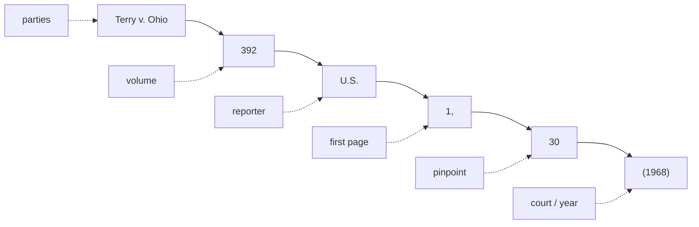

# Reading & Citing Cases

**You're handed a cite: what does each part tell you, and is it worth trusting?** This page decodes a federal citation left to right, then ends with a quick-reference glossary of the citation and posture terms that show up in opinions. State reporting runs on its own conventions, collected on [[State Citations and Conventions]]. This is one of three companion references: this one on **reading and citing**, [[Legal Research Tools]] on **finding the opinion free**, and [[Verifying Good Law]] on **confirming it still stands**. House style throughout is **Bluebook**, and every case this wiki asserts is verified on CourtListener before it goes on a page.

## Reading a federal citation

### Anatomy of a cite

Take a neutral running example:

> *[[Terry v. Ohio]]*, 392 U.S. 1, 30 (1968).

Read left to right, every standard cite has the same parts:

- **Case name (the parties)**: *Terry v. Ohio*. Italicized; the *v.* separates the two sides. By convention the first-named party is the appellant/petitioner on review, so the same dispute can flip names on appeal. Cite by the short name everyone uses (*Terry*).
- **Volume number**: `392`. Which physical volume of the reporter the case sits in.
- **Reporter abbreviation**: `U.S.` Tells you *which set of books* (and therefore which court). See the reporter table below.
- **First page**: `1`. The page where the opinion *starts*.
- **Pinpoint (pin cite)**: `30`. The *specific* page the quoted or relied-on language is on. `392 U.S. 1, 30` means the opinion starts at page 1 and the point you're making is on page 30. **Always pin when you quote or attribute a specific point**; a cite without a pin is hard to check and weak in a courtroom.
- **Court & year parenthetical**: `(1968)`. The year decided. For lower courts the parenthetical also names the **court**, e.g. `(9th Cir. 2021)` or `(S.D.N.Y. 2020)`. For the Supreme Court the reporter `U.S.` already identifies the court, so the parenthetical is year only.

### Which reporter = which court

The reporter abbreviation is the fastest way to tell a case's level, and therefore its precedential weight (see [[The Federal Court System]]).

| Reporter | Court | Example |
| --- | --- | --- |
| `U.S.` | U.S. Supreme Court (official) | 392 U.S. 1 |
| `S. Ct.` | U.S. Supreme Court (West), parallel | 88 S. Ct. 1868 |
| `L. Ed. 2d` | U.S. Supreme Court (Lawyers' Ed.), parallel | 20 L. Ed. 2d 889 |
| `F.4th` / `F.3d` / `F.2d` / `F.` | U.S. Courts of Appeals (circuits) | 5 F.4th 100 (9th Cir. 2021) |
| `F. Supp. 3d` / `F. Supp. 2d` / `F. Supp.` | U.S. District Courts | 500 F. Supp. 3d 1 (D. Mass. 2020) |
| `F. App'x` | unpublished circuit dispositions (Federal Appendix) | 700 F. App'x 1 |

- The numbered series (`F.`, `F.2d`, `F.3d`, `F.4th`) are just *editions* of the same Federal Reporter as the volumes filled up over the decades; `F.4th` is simply the current one.
- For a circuit case the parenthetical's circuit tells you *whose* authority it is: `(5th Cir.)` binds the Fifth Circuit but is **Persuasive (outside circuit)** elsewhere. Never anchor a multi-jurisdiction point to one circuit.

### Parallel citations (federal)

The *same* SCOTUS opinion appears in three reporters at once, so you'll see all three strung together:

> *Terry v. Ohio*, 392 U.S. 1, 88 S. Ct. 1868, 20 L. Ed. 2d 889 (1968).

These are **parallel citations**: the same case in three sets of books. For federal work, citing the official `U.S.` reporter alone is standard; the parallels matter mainly for older cases or some state-court practice. Don't mistake parallels for three different cases.

### Signals, short forms, and back-references

- **Introductory signals** tell the reader *how* the cite supports the point:
  - *(no signal)*: the source directly states the proposition.
  - **See**: the source supports it by clear inference (the workhorse signal).
  - **See also**: additional support, secondary to what you already cited.
  - **Cf.**: supports an *analogous* point; worth a parenthetical explaining why.
  - **E.g.**: one example among many that say the same thing.
  - **But see** / **Contra**: authority that cuts the *other* way (cite these honestly).
- **Short forms**: after a case is cited in full once, refer to it by the short name (*Terry*) or a short cite (`392 U.S. at 30`).
- **`Id.`**: "the immediately preceding authority." `Id. at 30` = same source, new page. Use only when the cite right before it is the same source.
- **`Supra`**: points back to a source cited earlier but *not* immediately above (used mainly for books, articles, and the like, and generally **not** for cases under Bluebook).

### Published, unpublished, and per curiam

This distinction drives **how much weight** an opinion carries; tie it to [[The Federal Court System]].

- **Published** opinions are designated for the bound reporters (`F.4th`, `F. Supp. 3d`) and are **precedential**: they bind that court and the courts below it within the jurisdiction.
- **Unpublished** dispositions (often in `F. App'x`, the Federal Appendix, or marked "not for publication") are typically **Persuasive only — non-precedential**. Circuits vary on whether and how they may be cited; Federal Rule of Appellate Procedure 32.1 permits *citing* federal unpublished opinions issued on or after Jan. 1, 2007, but permission to cite is not the same as binding force.
- **[[Common Legal Terms#per-curiam|Per curiam]]** ("by the court") opinions are issued in the name of the whole court rather than a single authoring judge. They can be fully precedential (many SCOTUS per curiams are) or summary and non-precedential; judge the weight by the court and whether it's published, not by the "per curiam" label alone.
- **For teaching:** before you lean on a case, confirm it is *published* (or otherwise binding in your jurisdiction). An unpublished circuit case is a teaching illustration, not a rule you can hang a search on.

## State citations

Everything above is federal. State reporting has its own conventions that trip students constantly: who the prosecuting party is (*State* / *People* / *Commonwealth*), the seven West regional reporters, the paragraph-pinned neutral cites, and the free routes to a state opinion. Those are collected on [[State Citations and Conventions]].

## Citation & posture terms (quick reference)

Plain-English definitions of the citation-mechanics and procedural-posture terms that recur in opinions. Each is a stable anchor other pages link to. Several (*en banc, certiorari, slip opinion, on remand, vacated*) bear on **authority weight** or **good-law status**: for weight, see [[The Federal Court System]]; for whether a case still stands, see [[Verifying Good Law]].

### Supra
Latin for "above." A short-form pointer back to a source already cited **earlier but not immediately above**, used mainly for books, articles, and other secondary sources, and generally **not** for cases under Bluebook.
*Example:* *Smith, supra*, at 42 returns to the Smith article cited a few footnotes back, now at page 42.

### Id.
Latin for "the same." A short form that points to the **immediately preceding** authority; add a pincite when the page changes.
*Example:* After a full cite to an opinion, `Id. at 30` means the very same source, now at page 30.

### Pinpoint cite (pin cite)
The **exact page (or paragraph) number** where the quoted or relied-on language sits, given after the first page. Pinpointing is what lets a reader open to the precise text you're standing on.
*Example:* In `392 U.S. 1, 30`, the `1` is where the opinion starts and the `30` is the pin cite; a paragraph pin reads `¶ 21`.

### Reporter
A **published set of volumes** collecting court opinions; its abbreviation (`U.S.`, `F.4th`, `A.3d`) identifies both the series and, usually, the court. Reporters can be **official** (court-sanctioned) or **unofficial** (commercial, like West's).
*Example:* `392 U.S. 1` sits in volume 392 of the *United States Reports*, the official Supreme Court reporter.

### Parallel citation
Two or more citations to the **same opinion** in different reporters, given together. It signals one case in multiple books, not multiple cases.
*Example:* `392 U.S. 1, 88 S. Ct. 1868, 20 L. Ed. 2d 889` is one Supreme Court opinion in three reporters.

### En banc
A sitting of the **full court** rather than the usual three-judge panel. Circuit courts normally decide in panels; en banc rehearing lets the whole active bench reconsider, and it is the only way (short of SCOTUS) to overrule a prior panel of that circuit.
*Example:* A three-judge Ninth Circuit panel rules; the circuit then rehears the case en banc and reaches a different result that governs the whole circuit.

### Certiorari (cert.)
The discretionary **writ by which the U.S. Supreme Court agrees to review** a lower-court decision. The Court grants only a small fraction of petitions (roughly 1%), and a **denial of certiorari decides nothing on the merits**: it just leaves the decision below standing.
*Example:* A party who lost in a court of appeals files a petition for a writ of certiorari; if four Justices vote to grant (the "rule of four"), the Court hears the case.

### Slip opinion
The **first, official version** of a decision the court releases on decision day, before it is paginated into the bound reporter. It is authoritative but not yet finalized: pagination is provisional and minor corrections can follow.
*Example:* The day a case comes down, you cite the slip opinion from the court's website; months later the same text appears at a permanent reporter page.

### On remand
The posture of a case **sent back to a lower court** for further proceedings after a higher court's decision. The lower court must act consistently with the higher court's instructions.
*Example:* An appeals court reverses and remands; **on remand**, the district court holds a new [[Common Legal Terms#suppression-hearing|suppression hearing]] under the standard the appellate court set.

### Vacated
A ruling that has been **set aside and deprived of legal effect** by a higher court (or the same court). A vacated decision is no longer good law and cannot be relied on: a critical good-law flag when you check a case's treatment (see [[Verifying Good Law]]).
*Example:* A court of appeals **vacates** a district-court order and remands; the vacated order no longer controls anything.

## Sources

Citation conventions (practice references, not case authority):

- [Bluebook Rule 10 — Case Citation (Suffolk Law)](https://www.suffolk.edu/law/faculty-research/library-services/a-bluebook-guide-for-law-students/case-citation-rule-10)
