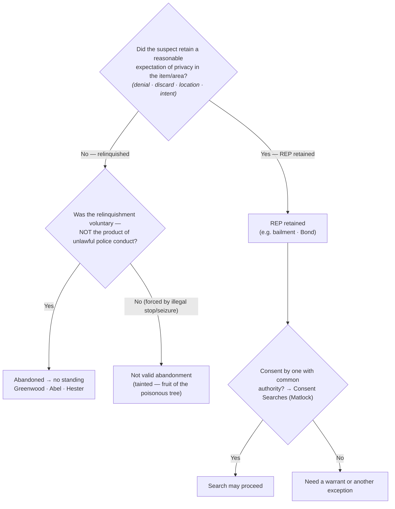

# Abandonment

*A suspect drops a bag as he runs, leaves the trash at the curb, checks out of the hotel, tosses the phone. Did he give up his privacy, or just his grip on the thing?*

> [!rule] Black-letter rule
> A person who **voluntarily abandons** property or a place loses any [[Reasonable Expectation of Privacy|reasonable expectation of privacy]] in it and therefore has **no standing** to challenge its later search or seizure. Abandonment is judged by the *[[Katz v. United States|Katz]]* expectation-of-privacy standard, **not** by property law: the question is whether the person retained an expectation "that society accepts as objectively reasonable." *[[California v. Greenwood#^pin-40|Greenwood]]*, 486 U.S. 35, [39–40](https://www.courtlistener.com/opinion/112067/california-v-greenwood/) (1988). The relinquishment must be **voluntary**; contraband dropped only because of an **unlawful** stop or seizure is not a valid abandonment and does not defeat standing.
> ^rule-abandonment

## The Brief

**Abandonment is the absence of a retained privacy interest.** The doctrine has two facets that must both be present: an **outward act** (denial of ownership, discard, walking away) and the **intent** that act reveals, and the act must be **voluntary**. Courts synthesize the case law into four recurring factors, all bearing on one ultimate question and none an independent legal test: (1) **denial of ownership**; (2) **physical relinquishment or discard**; (3) the **location** where the item was left; and (4) **intent inferred from conduct**. The question they answer is always the same: was a [[Reasonable Expectation of Privacy|reasonable expectation of privacy]] retained?

**Curbside trash.** There is **no** [[Reasonable Expectation of Privacy|reasonable expectation of privacy]] in garbage bags left for collection at the curb, outside the [[Curtilage|curtilage]] of a home, so a warrantless search and seizure of curbside trash does not violate the Fourth Amendment. *[[California v. Greenwood|Greenwood]]*, 486 U.S. at [37](https://www.courtlistener.com/opinion/112067/california-v-greenwood/), 40–41. The reason: "It is common knowledge that plastic garbage bags left on or at the side of a public street are readily accessible to animals, children, scavengers, snoops, and other members of the public." *[[California v. Greenwood#^pin-40b|Id.]]* at 40. Note the express boundary: the bags were left for collection "outside the curtilage of a home." Trash still **within** the [[Curtilage|curtilage]] (a can beside the back door) is a different question ([[Curtilage]]).

**Vacated premises.** Items left in a hotel-room wastebasket after the guest "paid his bill and vacated the room" were abandoned, *bona vacantia*, so their warrantless seizure was lawful; once he left, "[t]he hotel then had the exclusive right to its possession," so both the abandonment and the hotel's consent justified the search. *[[Abel v. United States#^pin-241|Abel]]*, 362 U.S. 217, [241](https://www.courtlistener.com/opinion/106021/abel-v-united-states/) (1960). **Check-out**, not mere absence, is the line.

**Discard while fleeing.** A fleeing suspect who dropped containers abandoned any Fourth Amendment interest in them: "there was no seizure in the sense of the law when the officers examined the contents of each after it had been abandoned." *[[Hester v. United States#^pin-58|Hester]]*, 265 U.S. 57, [58](https://www.courtlistener.com/opinion/100413/hester-v-united-states/) (1924). The companion **seizure-timing** rule is *[[California v. Hodari D.|Hodari D.]]*: contraband a suspect "tossed away" before he submits to a show of authority is abandoned and admissible. *[[California v. Hodari D.|Hodari D.]]*, 499 U.S. 621, [629](https://www.courtlistener.com/opinion/112579/california-v-hodari-d/) (1991); see [[Seizure of the Person]].

**Bailment is not abandonment.** Giving up *possession* is not giving up *privacy*. A bus passenger **retained** a [[Reasonable Expectation of Privacy|reasonable expectation of privacy]] in a carry-on bag, and an agent's exploratory physical manipulation ("squeezing") was a search: "Physically invasive inspection is simply more intrusive than purely visual inspection." *[[Bond v. United States#^pin-337|Bond]]*, 529 U.S. 334, [337](https://www.courtlistener.com/opinion/118354/bond-v-united-states/) (2000). Handing a bag to a carrier, hotel, or friend is a temporary transfer of possession (a **bailment**) that preserves the privacy interest.

**Privacy, not property.** The reach of the Fourth Amendment is not set by state property law: a person can hold **title** to discarded property and still have abandoned any Fourth Amendment interest in it, while one who merely lends possession keeps it. The controlling question is always the *[[California v. Greenwood|Greenwood]]* / *[[Katz v. United States|Katz]]* one, whether the person retained an expectation of privacy society accepts as objectively reasonable.

**Abandonment is not common-authority consent.** Where a privacy interest **was** retained (no abandonment), a search may still be valid if a third party with **common authority** consents, but that is the **consent** route ([[Consent Searches]]), not abandonment. Common authority "rests rather on mutual use of the property by persons generally having joint access or control for most purposes," and is "not to be implied from the mere property interest a third party has in the property." *[[United States v. Matlock#^pin-171a|Matlock]]*, 415 U.S. 164, [171](https://www.courtlistener.com/opinion/108967/united-states-v-matlock/#:~:text=rests%20rather%20on%20mutual%20use) & n.7 (1974). The distinction is load-bearing: **abandonment** means there is **no** [[Reasonable Expectation of Privacy|reasonable expectation of privacy]] at all, so the defendant lacks standing; **consent** presupposes that a privacy interest exists but has been voluntarily waived. Different doctrines, different proof.

**Burden, review, and remedy.** The **defendant** bears the burden of establishing a legitimate expectation of privacy in the item searched, by a preponderance. *[[Rakas v. Illinois|Rakas]]*, 439 U.S. 128, [130–31](https://www.courtlistener.com/opinion/109953/rakas-v-illinois/) n.1 (1978); *[[Rawlings v. Kentucky|Rawlings]]*, 448 U.S. 98, [104–05](https://www.courtlistener.com/opinion/110326/rawlings-v-kentucky/) (1980). On the abandonment question itself, most courts place the burden on the **government** to prove voluntary abandonment, typically by a preponderance. Whether a legitimate expectation of privacy was retained, and whether any abandonment was voluntary, is a mixed question: historical findings of fact are reviewed for [[Common Legal Terms#clear-error|clear error]], the ultimate Fourth Amendment determination [[Common Legal Terms#de-novo|de novo]]. If the suspect retained a [[Reasonable Expectation of Privacy|reasonable expectation of privacy]] and the search was unlawful, suppression follows ([[Standing to Challenge a Search]]; [[The Exclusionary Rule]]); if he abandoned the item, he lacks standing and the suppression motion fails.

**Apply it.**
1. **Ask whether a privacy interest was retained.** Run the four factors (denial, discard, location, intent) toward the single question of retained expectation of privacy; a clean disclaimer of any connection to the item supports the inference that none was retained.
2. **Test voluntariness.** A disclaimer or discard forced by an **unlawful** stop or seizure is not a valid abandonment; it is [[Common Legal Terms#fruit-of-the-poisonous-tree|fruit of the poisonous tree]], and standing survives ([[Seizure of the Person]]).
3. **Separate possession from privacy.** A bailment (bag to a bus, luggage to a hotel) is not abandonment (*[[Bond v. United States|Bond]]*); title to discarded property is not retained privacy (*[[California v. Greenwood|Greenwood]]*).
4. **Route [[Consent Searches|third-party consent]] to the right doctrine.** If a privacy interest was retained, a co-occupant's consent is analyzed under common authority ([[Consent Searches]]), never as abandonment.

**Common pitfalls.**
- **Treating all trash as fair game.** *[[California v. Greenwood|Greenwood]]* authorizes the **curbside** bag left for collection outside the [[Curtilage|curtilage]]; trash within the [[Curtilage|curtilage]] is not covered on its terms ([[Curtilage]]).
- **Confusing giving up possession with giving up privacy.** A bailment is not abandonment (*[[Bond v. United States|Bond]]*).
- **Relying on a third party's property interest to imply consent.** Common authority turns on mutual **use** and joint **access or control**, not on who owns the item, and it belongs to [[Consent Searches]] (*[[United States v. Matlock|Matlock]]* n.7).
- **Litigating abandonment as a property dispute.** The court asks about the expectation of privacy, not who holds title (*[[California v. Greenwood|Greenwood]]*).

## Lower-court developments

The Supreme Court has not decided how abandonment applies to a cellphone, and there is no recognized circuit split on the points below; each decision binds only its own circuit and is persuasive elsewhere. The emerging refinement, reflecting *[[Riley v. California|Riley]]* and *[[Carpenter v. United States|Carpenter]]* on the comprehensiveness of phone data, is that a phone's **physical device** and its **digital data** may call for **separate** abandonment inquiries.

- **[[United States v. Hunt]] (9th Cir. 2025)** — *Binding in-circuit (9th Cir.).* Abandonment doctrine applies to cellphones, but courts must analyze the intent to abandon the **physical device** separately from the intent to abandon its **data**. Hunt, who dropped his iPhone after being shot and fled to seek medical help, abandoned neither, so he had standing (though suppression failed on the merits because agents later obtained a warrant). The published opinion holds that an accidental drop under trauma is not voluntary relinquishment of the digital data (role: **first-impression / refinement**). [opinion](https://www.courtlistener.com/opinion/10661637/united-states-v-hunt/)
- **[[United States v. Small]] (4th Cir. 2019)** — *Binding in-circuit (4th Cir.).* "[T]he simple loss of a cell phone does not entail the loss of a reasonable expectation of privacy," but Small **deliberately** discarded his phone during flight, which the court held was voluntary abandonment; he lost his expectation of privacy in both the device and its contents, and the searches were lawful (affirmed). Anticipates the device-versus-data distinction the Ninth Circuit later adopted in *[[United States v. Hunt|Hunt]]* (role: **refinement**). [opinion](https://www.courtlistener.com/opinion/4684957/united-states-v-dontae-small/)
- **[[United States v. Crumble]] (8th Cir. 2018)** — *Binding in-circuit (8th Cir.).* A defendant who wrecked his car after a shootout, fled on foot leaving the vehicle and a cellphone behind, and initially denied any knowledge of the car, abandoned the vehicle and its contents including the phone; no [[Reasonable Expectation of Privacy|reasonable expectation of privacy]], so no Fourth Amendment challenge. The court declined to categorically exempt cellphones from abandonment, distinguishing *[[Riley v. California|Riley]]* (affirmed). Shows the older *[[Hester v. United States|Hester]]* / *[[California v. Hodari D.|Hodari D.]]* discard-while-fleeing rule still reaching phones where the relinquishment is plainly voluntary (role: **refinement**). [opinion](https://www.courtlistener.com/opinion/4456532/united-states-v-prentiss-anthony-crumble/)

## Key cases

| Case | Holding | Opinion |
|---|---|---|
| *[[Hester v. United States]]*, 265 U.S. 57 (1924) | **Anchor (abandonment by flight).** A fleeing suspect who dropped containers abandoned any Fourth Amendment interest in them; examining the contents was "no seizure in the sense of the law." *(Primary home [[Open Fields]].)* | [opinion](https://www.courtlistener.com/opinion/100413/hester-v-united-states/) |
| *[[Abel v. United States]]*, 362 U.S. 217 (1960) | **Anchor (checkout).** Items left in a hotel-room wastebasket after the guest paid up and **vacated** the room were abandoned (*bona vacantia*); the warrantless seizure was lawful. | [opinion](https://www.courtlistener.com/opinion/106021/abel-v-united-states/) |
| *[[California v. Greenwood]]*, 486 U.S. 35 (1988) | **Anchor (curbside trash).** No [[Reasonable Expectation of Privacy\|reasonable expectation of privacy]] in garbage bags left for collection at the curb, outside the [[Curtilage\|curtilage]]; the warrantless search and seizure of curbside trash does not violate the Fourth Amendment. | [opinion](https://www.courtlistener.com/opinion/112067/california-v-greenwood/) |

## Related cases across doctrines

| Case | Relevance here | Primary home | Opinion |
|---|---|---|---|
| *[[Bond v. United States]]*, 529 U.S. 334 (2000) | A bus passenger **retained** a [[Reasonable Expectation of Privacy\|reasonable expectation of privacy]] in a carry-on bag; an agent's exploratory squeezing was a search. A **bailment** is not abandonment. | [[Two Definitions of Search]] | [opinion](https://www.courtlistener.com/opinion/118354/bond-v-united-states/) |
| *[[United States v. Matlock]]*, 415 U.S. 164 (1974) | The **consent** route, not abandonment: where a privacy interest was retained, a third party with common authority (mutual use plus joint access or control, not mere property interest) may validly consent. | [[Consent Searches]] | [opinion](https://www.courtlistener.com/opinion/108967/united-states-v-matlock/) |
| *[[Rakas v. Illinois]]*, 439 U.S. 128 (1978) | Fourth Amendment rights are personal: a defendant who abandoned an item cannot vicariously assert another's expectation of privacy. Sets the defendant's burden (130–31 n.1). | [[Standing to Challenge a Search]] | [opinion](https://www.courtlistener.com/opinion/109953/rakas-v-illinois/) |
| *[[Rawlings v. Kentucky]]*, 448 U.S. 98 (1980) | Owning the seized item is not enough; the defendant must have an expectation of privacy in the **place** searched. The property/privacy split that drives abandonment. | [[Standing to Challenge a Search]] | [opinion](https://www.courtlistener.com/opinion/110326/rawlings-v-kentucky/) |
| *[[United States v. Salvucci]]*, 448 U.S. 83 (1980) | Abolished automatic standing for possessory offenses (overruling *Jones v. United States* (1960)): a defendant charged with possessing the discarded item must still prove his own expectation of privacy, so a clean disclaimer leaves him no standing. | [[Standing to Challenge a Search]] | [opinion](https://www.courtlistener.com/opinion/110325/united-states-v-salvucci/) |
| *[[Katz v. United States]]*, 389 U.S. 347 (1967) | Supplies the very test abandonment turns on: a search occurs only where a person has an expectation of privacy society accepts as objectively reasonable; abandonment means that expectation was relinquished or never reasonable. | [[Reasonable Expectation of Privacy]] | [opinion](https://www.courtlistener.com/opinion/107564/katz-v-united-states/) |
| *[[Byrd v. United States]]*, 584 U.S. 395 (2018) | Lawful possession and control of effects (a rental car not in one's name) supports an expectation of privacy: the mirror image of abandonment, absence from a paper title is not relinquishment of the privacy interest. | [[Standing to Challenge a Search]] | [opinion](https://www.courtlistener.com/opinion/4497658/byrd-v-united-states/) |
| *[[Minnesota v. Carter]]*, 525 U.S. 83 (1998) | A short-term, purely commercial visitor with no prior connection had no expectation of privacy in the premises: transient, non-possessory presence, like discard, leaves no expectation society will protect. | [[Standing to Challenge a Search]] | [opinion](https://www.courtlistener.com/opinion/118249/minnesota-v-carter/) |

## Visual

## Sources

- [*Hester v. United States*, 265 U.S. 57 (1924)](https://www.courtlistener.com/opinion/100413/hester-v-united-states/) (pinpoint: 58)
- [*Abel v. United States*, 362 U.S. 217 (1960)](https://www.courtlistener.com/opinion/106021/abel-v-united-states/) (pinpoint: 241)
- [*California v. Greenwood*, 486 U.S. 35 (1988)](https://www.courtlistener.com/opinion/112067/california-v-greenwood/) (pinpoints: 37, 39–40)
- [*Bond v. United States*, 529 U.S. 334 (2000)](https://www.courtlistener.com/opinion/118354/bond-v-united-states/) (pinpoint: 337)
- [*United States v. Matlock*, 415 U.S. 164 (1974)](https://www.courtlistener.com/opinion/108967/united-states-v-matlock/) (pinpoint: 171 & n.7) *(common-authority consent line; primary home [[Consent Searches]])*
- [*California v. Hodari D.*, 499 U.S. 621 (1991)](https://www.courtlistener.com/opinion/112579/california-v-hodari-d/) (pinpoint: 629) *(abandonment-by-flight / seizure timing; primary home [[Seizure of the Person]])*
