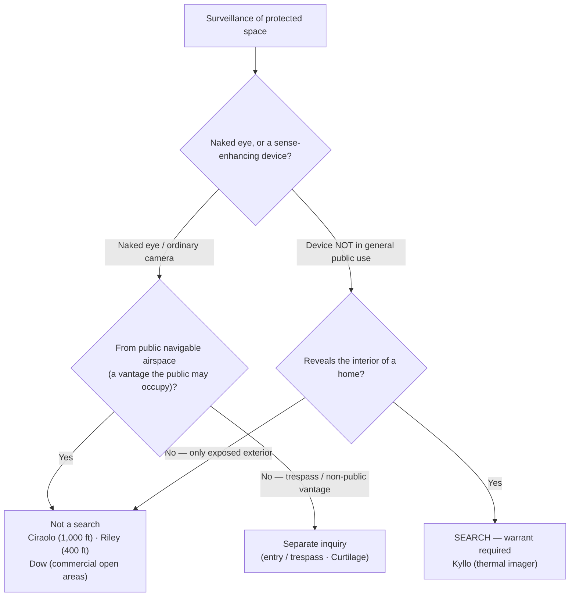

# Aerial & Enhanced Surveillance

*Officers could not see over the fence, so they went up: a plane at 1,000 feet, a helicopter at 400, a camera, a thermal imager. When does looking at protected ground from the air or through a sensor become a search?*

> [!rule] Black-letter rule
> Naked-eye observation of the [[Curtilage|curtilage]] from an aircraft **lawfully in public navigable airspace** is **not** a search, because the vantage is one any member of the public could occupy. *[[California v. Ciraolo#^pin-215|Ciraolo]]*, 476 U.S. 207, [215](https://www.courtlistener.com/opinion/111666/california-v-ciraolo/) (1986) (fixed-wing plane, 1,000 feet); *[[Florida v. Riley#^pin-451|Florida v. Riley]]*, 488 U.S. 445, [451–52](https://www.courtlistener.com/opinion/112175/florida-v-riley/) (1989) (plurality) (helicopter, 400 feet). The open, exposed areas of a **commercial or industrial** site are treated like open fields, so aerial photography of them from navigable airspace is likewise no search. *[[Dow Chemical Co. v. United States#^pin-239|Dow Chemical]]*, 476 U.S. 227, [239](https://www.courtlistener.com/opinion/111667/dow-chemical-co-v-united-states-ex-rel-administrator/) (1986). The limit is **sense-enhancing technology**: using a device **not in general public use** to obtain information about the **interior of a home** that could not otherwise be learned without physical intrusion **is** a search, presumptively unreasonable without a warrant. *[[Kyllo v. United States#^pin-40|Kyllo]]*, 533 U.S. 27, [40](https://www.courtlistener.com/opinion/118443/kyllo-v-united-states/) (2001) (thermal imager).
> ^rule-aerial

## The Brief

**Look from where the public may lawfully be.** The aerial cases are an application of the lawful-vantage principle: what a person knowingly exposes to observation from a place the public may lawfully occupy is not protected, even when that place is the sky. In *[[California v. Ciraolo|Ciraolo]]* officers who could not see into a doubly fenced backyard flew a private plane over it at 1,000 feet and identified marijuana with the naked eye; that the yard was **within the [[Curtilage|curtilage]]** did not bar the observation, because "[t]he Fourth Amendment protection of the home has never been extended to require law enforcement officers to shield their eyes when passing by a home on public thoroughfares." *[[California v. Ciraolo|Ciraolo]]*, 476 U.S. at [213](https://www.courtlistener.com/opinion/111666/california-v-ciraolo/). The holding turns on the routineness of the vantage: "[i]n an age where private and commercial flight in the public airways is routine, it is unreasonable for respondent to expect that his marijuana plants were constitutionally protected from being observed with the naked eye from an altitude of 1,000 feet." *[[California v. Ciraolo#^pin-215|Id.]]* at 215.

**Altitude is a proxy for whether the public is really there.** *[[Florida v. Riley|Florida v. Riley]]* extended the rule to a helicopter hovering at 400 feet over a greenhouse in the [[Curtilage|curtilage]]. The plurality reasoned that because helicopters may lawfully fly that low, "[a]ny member of the public could legally have been flying over Riley's property in a helicopter at the altitude of 400 feet and could have observed" what the officer saw. *[[Florida v. Riley#^pin-451|Florida v. Riley]]*, 488 U.S. at [451](https://www.courtlistener.com/opinion/112175/florida-v-riley/) (plurality). But *[[Florida v. Riley|Riley]]* was a fractured decision: Justice O'Connor, concurring to supply the fifth vote, would rest the inquiry not on bare FAA compliance but on whether public flight at that altitude is in fact routine enough that the owner has no [[Reasonable Expectation of Privacy|reasonable expectation of privacy]] from it. The plurality also flagged its own limits: the result held because "no intimate details connected with the use of the home or curtilage were observed, and there was no undue noise, and no wind, dust, or threat of injury." *[[Florida v. Riley#^pin-452|Id.]]* at 452. Physical effects of the overflight, or observation of intimate detail, are reserved questions.

**Commercial open ground is open-fields-like.** *[[Dow Chemical Co. v. United States|Dow Chemical]]* applied the same logic to a 2,000-acre industrial complex photographed from navigable airspace with a precision aerial camera. The open areas of such a complex "are not analogous to the 'curtilage' of a dwelling"; the site "is more comparable to an open field," so "the taking of aerial photographs of an industrial plant complex from navigable airspace is not a search prohibited by the Fourth Amendment." *[[Dow Chemical Co. v. United States#^pin-239|Dow Chemical]]*, 476 U.S. at [239](https://www.courtlistener.com/opinion/111667/dow-chemical-co-v-united-states-ex-rel-administrator/). The reduced protection reaches only the exposed grounds, not the private, non-public interior of the plant.

**The sensor line: technology that pierces the home is different.** Aerial and enhanced surveillance share one boundary, and *[[Kyllo v. United States|Kyllo]]* draws it. Aiming a thermal imager at a house to measure heat radiating from its walls was a search: "obtaining by sense-enhancing technology any information regarding the interior of the home that could not otherwise have been obtained without physical intrusion into a constitutionally protected area . . . constitutes a search — at least where (as here) the technology in question is not in general public use." *[[Kyllo v. United States#^pin-34|Kyllo]]*, 533 U.S. at [34](https://www.courtlistener.com/opinion/118443/kyllo-v-united-states/). The Court refused to sort the data by how "intimate" it was, because "[i]n the home, . . . all details are intimate details." *[[Kyllo v. United States|Id.]]*, 533 U.S. at [37](https://www.courtlistener.com/opinion/118443/kyllo-v-united-states/). Two variables therefore matter: whether the surveillance exposes the **interior of the home** (as opposed to exposed exterior or [[Curtilage|curtilage]] seen from the air), and whether the device is **in general public use**.

**Apply it.**
1. **Fix what was observed and from where.** Naked-eye observation of exposed ground or [[Curtilage|curtilage]] from an aircraft in public navigable airspace is not a search (*[[California v. Ciraolo|Ciraolo]]*, *[[Florida v. Riley|Riley]]*); the same observation of a commercial site's open areas is not a search (*[[Dow Chemical Co. v. United States|Dow Chemical]]*).
2. **Test the vantage, not just the altitude.** Ask whether the public in fact travels where the officer was, routinely enough that the owner had no [[Reasonable Expectation of Privacy|reasonable expectation of privacy]] from it; a lawful FAA altitude is evidence of that, not the whole answer (*[[Florida v. Riley|Riley]]*, O'Connor, J., concurring).
3. **Watch for the sensor boundary.** If the surveillance uses a device not in general public use to reveal the interior of a home, it is a search and needs a warrant (*[[Kyllo v. United States|Kyllo]]*); a plain camera recording what the naked eye could lawfully see is not.
4. **Keep entry separate from observation.** A lawful aerial vantage authorizes looking, never physical entry onto the [[Curtilage|curtilage]] ([[Curtilage]]) or a trespassory placement of equipment on protected space.

**Common pitfalls.**
- **Reading the aerial cases as "the sky is a free pass."** *[[Florida v. Riley|Riley]]* was a plurality; its fifth vote (O'Connor, J.) turned on whether public flight at that altitude is genuinely routine, and the plurality reserved cases of intimate detail or physical disturbance.
- **Applying *Dow Chemical* to a home.** Its reduced protection is for the **exposed** areas of a commercial or industrial site, not the [[Curtilage|curtilage]] or interior of a dwelling.
- **Assuming any camera or sensor is fine because the vantage is lawful.** *[[Kyllo v. United States|Kyllo]]* makes sense-enhancing technology that pierces the home a search regardless of vantage; the device's general public use and what it exposes are the questions.
- **Confusing observation with intrusion.** Looking from lawful airspace is not a search; physically entering the [[Curtilage|curtilage]], or installing equipment on protected ground, is a different inquiry ([[Curtilage]]; [[Plain View Doctrine]]).

## Lower-court developments

The Supreme Court's aerial cases predate today's persistent and automated surveillance, and two frontiers are unsettled.

- **Fixed long-term surveillance (pole cameras).** In *[[United States v. Tuggle|Tuggle]]*, 4 F.4th 505 (7th Cir. 2021), the Seventh Circuit held that months of continuous pole-camera recording of a home's exterior "did not constitute a search under the current understanding of the Fourth Amendment," while expressing unease that aggregated long-term surveillance may eventually warrant *[[Carpenter v. United States|Carpenter]]*-style treatment. *Binding in-circuit (7th Cir.); persuasive elsewhere.* The pole-camera question divides the lower courts and no controlling rule has emerged.
- **Drones and small unmanned aircraft (UAS).** The Supreme Court has **not** addressed drone surveillance, and there is **no controlling federal circuit rule.** The difficulty is that *[[California v. Ciraolo|Ciraolo]]* and *[[Florida v. Riley|Riley]]* rested on the aircraft occupying **public navigable airspace** where members of the public routinely fly; a small drone hovering low over a fenced yard occupies airspace the public does **not** ordinarily traverse, straining the premise those cases relied on. Some states have addressed drone surveillance by statute or state-constitutional decision. This node states the SCOTUS baseline only; no drone holding is asserted here because none is verified in the coverage record.

## Key cases

| Case | Holding | Opinion |
|---|---|---|
| *[[California v. Ciraolo]]*, 476 U.S. 207 (1986) | **Anchor.** Warrantless naked-eye observation of a fenced backyard within the [[Curtilage\|curtilage]], from a private plane at 1,000 feet in public navigable airspace, is not a search; the home's protection does not require officers to shield their eyes from public vantages. | [opinion](https://www.courtlistener.com/opinion/111666/california-v-ciraolo/) |
| *[[Florida v. Riley]]*, 488 U.S. 445 (1989) | **Anchor.** Naked-eye observation of a greenhouse in the [[Curtilage\|curtilage]] from a helicopter at 400 feet is not a search (plurality), because the public may lawfully fly there; reserved where intimate detail is seen or the flight causes wind, dust, or injury. | [opinion](https://www.courtlistener.com/opinion/112175/florida-v-riley/) |
| *[[Dow Chemical Co. v. United States]]*, 476 U.S. 227 (1986) | **Anchor.** Precision aerial photography of the open areas of a 2,000-acre industrial complex from navigable airspace is not a search; those exposed areas are more like an open field than the [[Curtilage\|curtilage]] of a home. | [opinion](https://www.courtlistener.com/opinion/111667/dow-chemical-co-v-united-states-ex-rel-administrator/) |
| *[[Kyllo v. United States]]*, 533 U.S. 27 (2001) | **The sensor limit.** Using a thermal imager (a device not in general public use) to obtain information about the interior of a home that could not be learned without physical intrusion is a search, presumptively unreasonable without a warrant. *(Primary home [[Reasonable Expectation of Privacy]].)* | [opinion](https://www.courtlistener.com/opinion/118443/kyllo-v-united-states/) |

## Related cases across doctrines

| Case | Relevance here | Primary home | Opinion |
|---|---|---|---|
| *[[United States v. Tuggle]]*, 4 F.4th 505 (7th Cir. 2021) | Long-term fixed pole-camera surveillance of a home's exterior held not a search under current doctrine; the persistent-surveillance frontier for enhanced observation. | [[Plain View Doctrine]] | [opinion](https://www.courtlistener.com/opinion/4899735/united-states-v-travis-tuggle/) |
| *[[Florida v. Jardines]]*, 569 U.S. 1 (2013) | The trespass counterpoint: looking at the [[Curtilage\|curtilage]] from lawful airspace is not a search, but physically entering it to gather evidence (a drug dog at the door) is. | [[Knock and Talk]] | [opinion](https://www.courtlistener.com/opinion/2094497/florida-v-jardines/) |

## Visual

## Sources

- [*California v. Ciraolo*, 476 U.S. 207 (1986)](https://www.courtlistener.com/opinion/111666/california-v-ciraolo/) (pinpoints: 213, 215)
- [*Florida v. Riley*, 488 U.S. 445 (1989)](https://www.courtlistener.com/opinion/112175/florida-v-riley/) (pinpoints: 451, 452 (plurality))
- [*Dow Chemical Co. v. United States*, 476 U.S. 227 (1986)](https://www.courtlistener.com/opinion/111667/dow-chemical-co-v-united-states-ex-rel-administrator/) (pinpoint: 239)
- [*Kyllo v. United States*, 533 U.S. 27 (2001)](https://www.courtlistener.com/opinion/118443/kyllo-v-united-states/) (pinpoints: 34, 37, 40)
- [*United States v. Tuggle*, 4 F.4th 505 (7th Cir. 2021)](https://www.courtlistener.com/opinion/4899735/united-states-v-travis-tuggle/) (pinpoint: slip op. 5)
- [*Florida v. Jardines*, 569 U.S. 1 (2013)](https://www.courtlistener.com/opinion/2094497/florida-v-jardines/) *(primary home [[Knock and Talk]])*
