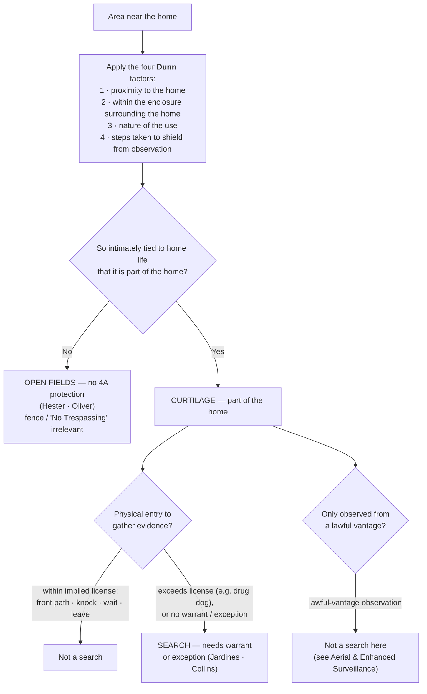

# Curtilage

*Is the patch of ground the officer is standing on part of the home's curtilage, or is it an open field the Fourth Amendment never reaches? Which side of that one line the ground falls on can decide whether a "search" happened at all.*

> [!rule] Black-letter rule
> **Curtilage** is "the area 'immediately surrounding and associated with the home,'" treated as "part of the home itself for Fourth Amendment purposes," so a physical intrusion onto curtilage to gather evidence is a **search**, presumptively unreasonable without a warrant or a recognized exception. *[[Florida v. Jardines#^pin-6|Jardines]]*, 569 U.S. 1, [6](https://www.courtlistener.com/opinion/856347/florida-v-jardines/) (2013) (quoting *[[Oliver v. United States#^pin-180|Oliver]]*, 466 U.S. 170, 180 (1984)). Everything beyond the curtilage is **open fields**, which get no Fourth Amendment protection ([[Open Fields]]). Whether a given spot is curtilage is "resolved with particular reference to four factors": **(1) proximity** to the home, **(2) enclosure** within an area surrounding the home, **(3) the nature of the use** to which the area is put, and **(4) the steps taken to shield** it from observation. *[[United States v. Dunn#^pin-301|Dunn]]*, 480 U.S. 294, [301](https://www.courtlistener.com/opinion/111833/united-states-v-dunn/) (1987). The factors are not a mechanical formula; they are "useful analytical tools only to the degree that ... they bear upon the centrally relevant consideration — whether the area in question is so intimately tied to the home itself that it should be placed under the home's 'umbrella' of Fourth Amendment protection." *[[United States v. Dunn#^pin-301a|Id.]]*
> ^rule-curtilage

## The Brief

**What curtilage is, and what it is not.** Curtilage is the home's protected extension: the ground close enough to the dwelling, and connected enough to the intimate activity of home life, that the law treats it as the home itself. *[[Florida v. Jardines#^pin-6|Jardines]]*, 569 U.S. at [6](https://www.courtlistener.com/opinion/856347/florida-v-jardines/). Because it is part of the home, entering it to gather evidence is a search, and the ordinary warrant preference applies. It is **not** a privacy-magnitude question and **not** a fence question; the whole exercise is drawing one line, curtilage on the protected side and open fields on the unprotected side ([[Open Fields]]). Get the line right and everything else follows.

**The test up front: the four *[[United States v. Dunn|Dunn]]* factors.** Whether a given spot is curtilage is "resolved with particular reference to four factors":

1. **Proximity** of the area claimed to be curtilage to the home;
2. **Enclosure** — whether the area sits within an enclosure surrounding the home;
3. **Nature of the use** to which the area is put; and
4. **Steps to shield** the area from observation by people passing by.

*[[United States v. Dunn#^pin-301|Dunn]]*, 480 U.S. at [301](https://www.courtlistener.com/opinion/111833/united-states-v-dunn/). No single factor is dispositive, and the four are "not [a] finely tuned formula" but "useful analytical tools" that all serve one question: is the area "so intimately tied to the home itself" that it belongs under the home's "'umbrella' of Fourth Amendment protection"? *[[United States v. Dunn#^pin-301a|Id.]]* In *[[United States v. Dunn|Dunn]]* itself, a barn roughly 50 yards beyond the fence around the ranch house (60 yards from the house), used to manufacture drugs and left largely unshielded, flunked all four factors and was **open fields**, not curtilage.

**What counts as curtilage: the paradigm spots.** Proximity plus the home-life connection, not the presence of a fence, is what makes ground curtilage. The **front porch** is "the classic exemplar" of curtilage. *[[Florida v. Jardines|Jardines]]*, 569 U.S. at [7](https://www.courtlistener.com/opinion/856347/florida-v-jardines/). So is a **driveway top or carport abutting the house**: *[[Collins v. Virginia|Collins]]* treated the partly enclosed driveway apron next to the dwelling as curtilage. The front path, the walk to the customary door, and the immediately adjacent yard travel with the home for the same reason.

**The implied license bounds entry onto curtilage.** An officer (like any visitor) may cross the curtilage to knock and ask, because a narrow implied social license lets a visitor "approach the home by the front path, knock promptly, wait briefly to be received, and then ... leave." That license is stated in full on [[Knock and Talk]] and is limited "to a particular area" and "to a specific purpose." Stay inside it and the approach is no search; exceed it, by bringing a drug dog onto the porch or lingering to snoop, and the same approach becomes a **trespassory search** of the curtilage. *[[Florida v. Jardines#^pin-9|Jardines]]*, 569 U.S. at [9](https://www.courtlistener.com/opinion/856347/florida-v-jardines/). The license is also bounded by time and manner in the circuits (see Lower-court developments).

**The automobile-exception limit.** Because curtilage is part of the home, an officer may not use a warrant **exception** for one thing (the car) to justify the separate trespass of entering protected ground. *[[Collins v. Virginia|Collins]]* held that the automobile exception does not authorize a warrantless entry of a home or its curtilage to reach and search a vehicle parked there. *[[Collins v. Virginia|Collins]]*, 584 U.S. 586 (2018). Lawful authority to search a vehicle is not lawful authority to walk into the curtilage to get to it.

**Observation from a lawful vantage is a different question.** Officers may *observe* curtilage from any place they are lawfully entitled to be, including public airspace and the street, without that observation being a search; but a lawful vantage authorizes looking, not physical **entry** (*[[Collins v. Virginia|Collins]]*), and it does not reach sense-enhancing technology that exposes the home's interior. The naked-eye aerial-overflight cases and the sense-enhancing-technology limit are developed on [[Aerial and Enhanced Surveillance]].

**Do businesses have curtilage? No, but that is not the same as "no privacy."** Curtilage is a *home* concept; commercial property has no analogous domestic curtilage, and the open, publicly exposed grounds of a business are treated more like open fields than like the curtilage of a house. But **no curtilage does not mean no Fourth Amendment privacy**: the private, non-public interior of a business keeps a [[Reasonable Expectation of Privacy|reasonable expectation of privacy]]. *[[G. M. Leasing Corp. v. United States|G. M. Leasing]]*, 429 U.S. 338, [351–59](https://www.courtlistener.com/opinion/109579/g-m-leasing-corp-v-united-states/) (1977) (warrantless entry into a corporation's private offices to seize assets was unreasonable, though seizing cars from open or public areas was not); *[[See v. City of Seattle|See]]*, 387 U.S. 541, [545–46](https://www.courtlistener.com/opinion/107474/see-v-city-of-seattle/) (1967) (the businessman may insist on a warrant against administrative entry). The operative rule for officers: the open grounds of a business are open-fields-like (lawful-vantage observation is generally fine), but entry into the private interior still needs a warrant or an exception, and the [[Knock and Talk|knock-and-talk]] license reaches only the public-facing approach. This commercial-privacy thread runs into the administrative-inspection regime ([[Special Needs and Administrative Searches]]).

**A tent has no curtilage.** The curtilage concept belongs to a fixed dwelling. A tent's home-like protection covers its **interior**, not the open ground around it: on a dispersed public-land campsite, "the area outside of the tent ... is not curtilage." *[[United States v. Basher|Basher]]*, 629 F.3d 1161, 1169 (9th Cir. 2011). See [[Tents]].

**Multi-unit dwellings do not map cleanly onto the single-family paradigm.** The *[[United States v. Dunn|Dunn]]* factors assume one house on its own ground; applied to apartments, shared yards, and common areas, the lower courts split over how far, if at all, the home's protection reaches into space a tenant cannot exclude others from. Those persuasive state and circuit lines are collected in Lower-court developments; the boundary, not the black-letter rule, is what moves.

**Burden, standard of review, and remedy.**
- The **defendant** (the proponent of suppression) bears the burden of establishing that the area was **curtilage** and that he had a legitimate expectation of privacy or possessory interest there, by a [[Common Legal Terms#preponderance-of-the-evidence|preponderance of the evidence]]. *[[Rakas v. Illinois|Rakas]]*, 439 U.S. 128, [130–31](https://www.courtlistener.com/opinion/109953/rakas-v-illinois/) n.1 (1978); *[[Rawlings v. Kentucky|Rawlings]]*, 448 U.S. 98, [104–05](https://www.courtlistener.com/opinion/110326/rawlings-v-kentucky/) (1980).
- On appeal the district court's factual findings on the *[[United States v. Dunn|Dunn]]* factors are reviewed for [[Common Legal Terms#clear-error|clear error]], while the ultimate curtilage determination is reviewed [[Common Legal Terms#de-novo|de novo]]. Cf. *[[Ornelas v. United States|Ornelas]]*, 517 U.S. 690, [699](https://www.courtlistener.com/opinion/118030/ornelas-v-united-states/) (1996).
- The remedy for an unjustified warrantless search of curtilage is suppression of the evidence and its fruits ([[The Exclusionary Rule]]).

**Apply it.**
1. **Fix the line first.** Before anything else, decide whether the ground is curtilage or open fields; run the four *[[United States v. Dunn|Dunn]]* factors against the actual layout, and remember no single factor controls.
2. **Treat porch, path, driveway top, and adjacent yard as the home.** Proximity plus the home-life connection, not a fence, makes them curtilage (*[[Florida v. Jardines|Jardines]]*; *[[Collins v. Virginia|Collins]]*).
3. **Stay inside the [[Knock and Talk|knock-and-talk]] license if you approach.** Front path, knock, brief wait, leave. A dog, a peer through a window, or lingering to snoop converts the approach into a search (*[[Florida v. Jardines|Jardines]]*; [[Knock and Talk]]).
4. **Do not borrow a car exception to enter curtilage.** Probable cause to search the vehicle is not authority to cross onto the curtilage to reach it (*[[Collins v. Virginia|Collins]]*).
5. **Look, do not enter, from a lawful vantage.** Observing curtilage from a place you may lawfully be is not a search; walking onto it, or aiming sense-enhancing gear at the interior, is a different question ([[Aerial and Enhanced Surveillance]]).

**Common pitfalls.**
- **Treating a driveway, porch, or attached carport as fair game.** Proximity plus the home-life connection, not the absence of a fence, controls (*[[Collins v. Virginia|Collins]]*; *[[Florida v. Jardines|Jardines]]*).
- **Reading "you may look from outside" as "you may enter."** A lawful vantage permits observation, never physical entry of the curtilage (*[[Collins v. Virginia|Collins]]*), and never sense-enhancing technology aimed at the interior ([[Aerial and Enhanced Surveillance]]).
- **Thinking a fence or "No Trespassing" sign creates protected space out of open fields.** It does not; the curtilage line, not signage, decides ([[Open Fields]]).
- **Forgetting the [[Knock and Talk|knock-and-talk]] license is scope-limited.** Overstaying, or bringing investigative tools onto the porch, turns a lawful approach into a search (*[[Florida v. Jardines|Jardines]]*).

## Lower-court developments

- ***[[United States v. Tuggle|Tuggle]]* (7th Cir. 2021)** — *pole camera, "no search" side.* Roughly 18 months of warrantless pole-camera surveillance of a home's exterior and curtilage was **not** a search, because the cameras captured only what was publicly visible; the court declined the mosaic theory under current doctrine while flagging the looming aggregation problem. "[T]he extensive pole camera surveillance in this case did not constitute a search under the current understanding of the Fourth Amendment," 4 F.4th 505, 512. **Binding in-circuit — 7th Cir.** [opinion](https://www.courtlistener.com/opinion/4899735/united-states-v-travis-tuggle/)
- ***[[United States v. Moore-Bush|Moore-Bush]]* (1st Cir. 2022) (en banc)** — *pole camera, illustrates the split.* The [[Reading and Citing Cases#en-banc|en banc]] First Circuit **unanimously reversed** the suppression order and [[Reading and Citing Cases#on-remand|remanded]] with instructions to **deny** suppression, so eight months of pole-camera evidence came in, even though the judges divided **3–3** on whether sustained warrantless pole-camera surveillance of a home's curtilage is a search (one bloc reading *[[Carpenter v. United States|Carpenter]]*'s mosaic theory to reach it, the other finding no search). All agreed the evidence was admissible under the [[The Good-Faith Exception|good-faith exception]], which required reversal regardless. 36 F.4th 320. **Binding in-circuit — 1st Cir.** [opinion](https://www.courtlistener.com/opinion/6476395/united-states-v-moore-bush/)
- ***[[United States v. May-Shaw|May-Shaw]]* (6th Cir. 2020)** — *pole camera + carport, "no search" side.* A communal covered carport the defendant had no right to exclude others from, easily viewable from a public street, was **not** within the curtilage of his apartment under the *[[United States v. Dunn|Dunn]]* factors, so a dog sniff of his car parked there was not a search; 23 days of pole-camera surveillance of the lot likewise violated no [[Reasonable Expectation of Privacy|reasonable expectation of privacy]]. 955 F.3d 563. **Binding in-circuit — 6th Cir.** [opinion](https://www.courtlistener.com/opinion/4743325/united-states-v-christopher-may-shaw/)
- ***United States v. Johnson* (4th Cir. 2025)** — *apartment common hallway, "no curtilage" side.* A dog sniff conducted in the **common interior hallway** outside an apartment door did not intrude on curtilage, because a tenant cannot exclude others from a shared hallway; the court held **only** that on the facts before it the hallway was not curtilage, leaving the broader question open. No. 23-4255 (4th Cir. 2025). **Binding in-circuit — 4th Cir.** The federal circuits themselves divide on how far the home's protection reaches into shared multi-unit space; this 4th Cir. holding sits on the "no protection" side of that split, which so far remains a **lower-court** division. [opinion](https://www.courtlistener.com/opinion/10648997/united-states-v-johnson/)
- ***[[United States v. Lundin|Lundin]]* (9th Cir. 2016)** — *implied license: time + purpose.* A **4 a.m.** [[Knock and Talk|knock-and-talk]] exceeded the implied license to enter the curtilage, both because of the hour and because the officers' purpose was to arrest rather than to ask questions, so the resulting evidence was suppressed. "[T]he officers knocked on Lundin's door around 4:00 a.m. without evidence that Lundin generally accepted visitors at that hour, and without a reason for knocking that a resident would ordinarily accept," 817 F.3d 1151, 1159. **Binding in-circuit — 9th Cir.** [opinion](https://www.courtlistener.com/opinion/3187682/united-states-v-eric-lundin/)
- ***[[State v. Karston|Karston]]* (La. Ct. App. 1991)** — *apartment common area.* A tenant held a [[Reasonable Expectation of Privacy|reasonable expectation of privacy]] in the fenced, gated common courtyard of a private apartment complex; an officer who opened the closed gate and entered without cause to set up surveillance conducted an unreasonable search. 588 So. 2d 165. **Persuasive — state, illustrative.** [opinion](https://www.courtlistener.com/opinion/1767998/state-v-karston/)
- ***[[State v. Larson|Larson]]* (Or. Ct. App. 1999)** — *apartment common area.* Rather than mechanically applying single-family curtilage factors, a court evaluates the layout and the residents' use of a shared area; officers who entered a partially enclosed strip behind an apartment building to smell marijuana from a window invaded a protected interest. 159 Or. App. 34. **Persuasive — state, illustrative.** [opinion](https://www.courtlistener.com/opinion/1187724/state-v-larson/)
- ***[[State v. Weaver|Weaver]]* (Tex. Crim. App. 2011)** — *commercial premises.* A drug-dog sniff of a vehicle on private, non-public business premises was unlawful once the owner's limited consent to be there had ended; the rule that a dog sniff is not itself a search presupposes the officer had a lawful right to be where the sniff occurred. 349 S.W.3d 521. **Persuasive — state, illustrative.** [opinion](https://www.courtlistener.com/opinion/2546485/state-v-weaver/)

The unresolved national question is the pole-camera one: whether *[[Carpenter v. United States|Carpenter]]*'s mosaic theory turns months of fixed, warrantless camera watching of a home's exterior into a search, or whether the publicly-visible / lawful-vantage rule still controls. The Supreme Court has not resolved it (cert. denied in *[[United States v. Tuggle|Tuggle]]* and *[[United States v. Moore-Bush|Moore-Bush]]*), and the circuits divide. ⚖ **Circuit split.**

<!-- United States v. Johnson (No. 23-4255, 4th Cir. 2025-08-05, cluster 10648997, lead 11115584): born-draft frontier-stub lake record added under RULING P4-11 (tripwire-arc ingestion) as the 4th Cir. federal data point on multi-unit curtilage, beside May-Shaw. Plain-italic brief-mention terminal (no wikilink, no case page this phase); CL opinion link only. DISTINCT from the SCOTUS Johnson v. United States (cluster 104504) and Arizona v. Johnson. The opposite-side 7th Cir. Whitaker line is NOT referenced anywhere in the corpus, so the split is presented as a lower-court division and Johnson is cited alone (P4-11 conditional). LINT-17: no page-less wikilink. -->

## Key cases

| Case | Holding | Opinion |
|---|---|---|
| *[[United States v. Dunn]]*, 480 U.S. 294 (1987) | **Anchor.** Sets the four-factor curtilage test (proximity, enclosure, nature of use, steps taken to shield), all bearing on whether the area is so intimately tied to the home as to fall under its Fourth Amendment umbrella; a barn 50 yards beyond the fence flunked all four and was open fields. | [opinion](https://www.courtlistener.com/opinion/111833/united-states-v-dunn/) |
| *[[Florida v. Jardines]]*, 569 U.S. 1 (2013) | **Anchor.** The front porch is curtilage, "part of the home itself"; bringing a drug dog there to investigate exceeded the implied license to approach and knock, so it was a trespassory search. | [opinion](https://www.courtlistener.com/opinion/856347/florida-v-jardines/) |
| *[[Collins v. Virginia]]*, 584 U.S. 586 (2018) | The automobile exception does not reach into curtilage: no warrantless entry of a home or its curtilage to search a vehicle parked there. | [opinion](https://www.courtlistener.com/opinion/4501697/collins-v-virginia/) |
| *[[Hester v. United States]]*, 265 U.S. 57 (1924) | The open-field boundary: Fourth Amendment protection of "persons, houses, papers, and effects" does not extend to open fields; the origin of the doctrine that fixes where curtilage ends. Developed on [[Open Fields]]. | [opinion](https://www.courtlistener.com/opinion/100413/hester-v-united-states/) |
| *[[Oliver v. United States]]*, 466 U.S. 170 (1984) | Reaffirms that only the curtilage, not the neighboring open fields, carries the home's protection; even fenced, posted, secluded land is open fields. Developed on [[Open Fields]]. | [opinion](https://www.courtlistener.com/opinion/111146/oliver-v-united-states/) |
| *[[G. M. Leasing Corp. v. United States]]*, 429 U.S. 338 (1977) | Commercial premises have no domestic curtilage, and open or public business areas are open-fields-like; but a warrantless entry into a corporation's private offices to seize assets was unreasonable, so "no curtilage" is not "no privacy." | [opinion](https://www.courtlistener.com/opinion/109579/g-m-leasing-corp-v-united-states/) |

## Related cases across doctrines

These are treated in full on other doctrine pages but bear on the curtilage line, framed for it here.

| Case | Relevance here | Primary home | Opinion |
|---|---|---|---|
| *[[Kentucky v. King]]*, 563 U.S. 452 (2011) | ***Enters.*** Officers may approach and knock where any private citizen could; the implied-license entry onto curtilage (porch, path) is lawful, and police do not "create" an [[Exigent Circumstances and Hot Pursuit\|exigency]] merely by knocking within that license. | [[Exigent Circumstances and Hot Pursuit]] | [opinion](https://www.courtlistener.com/opinion/216733/kentucky-v-king/) |
| *[[French v. Merrill]]*, 15 F.4th 116 (1st Cir. 2021) | ***Exceeds.*** Officers who overstayed the implied social license (repeated returns capped by a nighttime intrusion) committed a *[[Florida v. Jardines\|Jardines]]* trespassory search of the curtilage. | [[Knock and Talk]] | [opinion](https://www.courtlistener.com/opinion/5273192/french-v-merrill/) |
| *[[United States v. Santana]]*, 427 U.S. 38 (1976) | ***Boundary.*** A suspect in her own open doorway is in a "public" place, the line where the home's curtilage protection gives way; she cannot retreat indoors to defeat a public-place arrest. *(Hot-pursuit reach limited by [[Lange v. California]].)* | [[Arrest in the Home]] | [opinion](https://www.courtlistener.com/opinion/109504/united-states-v-santana/) |
| *[[See v. City of Seattle]]*, 387 U.S. 541 (1967) | ***Commercial.*** Commercial premises have Fourth Amendment protection against warrantless administrative entry, so "no curtilage" does not mean "no privacy" for a business interior. | [[Special Needs and Administrative Searches]] | [opinion](https://www.courtlistener.com/opinion/107474/see-v-city-of-seattle/) |
| *[[United States v. Basher]]*, 629 F.3d 1161 (9th Cir. 2011) | ***Limits.*** A tent has no curtilage: its home-like protection covers the interior, not the open campsite ground around it. | [[Tents]] | [opinion](https://www.courtlistener.com/opinion/183144/united-states-v-basher/) |

## Visual

## Sources

- [*United States v. Dunn*, 480 U.S. 294 (1987)](https://www.courtlistener.com/opinion/111833/united-states-v-dunn/) (pinpoints: 301, 302)
- [*Florida v. Jardines*, 569 U.S. 1 (2013)](https://www.courtlistener.com/opinion/856347/florida-v-jardines/) (pinpoints: 6, 7, 9)
- [*Collins v. Virginia*, 584 U.S. 586 (2018)](https://www.courtlistener.com/opinion/4501697/collins-v-virginia/)
- [*Hester v. United States*, 265 U.S. 57 (1924)](https://www.courtlistener.com/opinion/100413/hester-v-united-states/) (pinpoint: 59)
- [*Oliver v. United States*, 466 U.S. 170 (1984)](https://www.courtlistener.com/opinion/111146/oliver-v-united-states/) (pinpoints: 179, 180)
- [*G. M. Leasing Corp. v. United States*, 429 U.S. 338 (1977)](https://www.courtlistener.com/opinion/109579/g-m-leasing-corp-v-united-states/) (pinpoints: 351–59)
- [*See v. City of Seattle*, 387 U.S. 541 (1967)](https://www.courtlistener.com/opinion/107474/see-v-city-of-seattle/) (pinpoint: 545–46)
- [*Kentucky v. King*, 563 U.S. 452 (2011)](https://www.courtlistener.com/opinion/216733/kentucky-v-king/)
- [*French v. Merrill*, 15 F.4th 116 (1st Cir. 2021)](https://www.courtlistener.com/opinion/5273192/french-v-merrill/)
- [*United States v. Santana*, 427 U.S. 38 (1976)](https://www.courtlistener.com/opinion/109504/united-states-v-santana/)
- [*United States v. Basher*, 629 F.3d 1161 (9th Cir. 2011)](https://www.courtlistener.com/opinion/183144/united-states-v-basher/)
- [*United States v. Tuggle*, 4 F.4th 505 (7th Cir. 2021)](https://www.courtlistener.com/opinion/4899735/united-states-v-travis-tuggle/)
- [*United States v. Moore-Bush*, 36 F.4th 320 (1st Cir. 2022) (en banc)](https://www.courtlistener.com/opinion/6476395/united-states-v-moore-bush/)
- [*United States v. May-Shaw*, 955 F.3d 563 (6th Cir. 2020)](https://www.courtlistener.com/opinion/4743325/united-states-v-christopher-may-shaw/)
- [*United States v. Lundin*, 817 F.3d 1151 (9th Cir. 2016)](https://www.courtlistener.com/opinion/3187682/united-states-v-eric-lundin/)
- [*State v. Karston*, 588 So. 2d 165 (La. Ct. App. 1991)](https://www.courtlistener.com/opinion/1767998/state-v-karston/)
- [*State v. Larson*, 159 Or. App. 34 (1999)](https://www.courtlistener.com/opinion/1187724/state-v-larson/)
- [*State v. Weaver*, 349 S.W.3d 521 (Tex. Crim. App. 2011)](https://www.courtlistener.com/opinion/2546485/state-v-weaver/)
