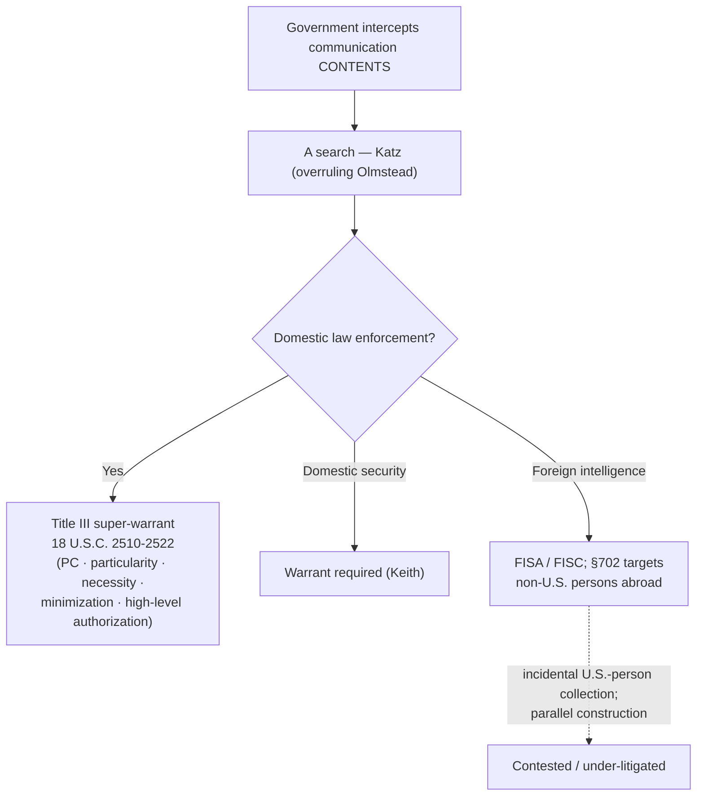

# Electronic Surveillance & Title III

*The government wants to intercept the contents of communications — a wiretap, a bug, stored messages. That is a search, so what does the Fourth Amendment demand, and how does the Title III "super-warrant" statute build on top of it?*

> [!rule] Black-letter rule
> Intercepting the **contents** of communications is a Fourth Amendment **search**: *[[Katz v. United States|Katz v. United States]]*, 389 U.S. 347 (1967), overruled *[[Olmstead v. United States|Olmstead]]*'s trespass-only view and made electronic eavesdropping that invades a justified expectation of privacy a search even without physical entry. Such surveillance must satisfy heightened **particularity and safeguards**: *[[Berger v. New York#^pin-56|Berger v. New York]]*, 388 U.S. 41, 56 (1967). Congress codified those commands in **Title III of the Omnibus Crime Control and Safe Streets Act of 1968** (18 U.S.C. §§ 2510–2522) — a statutory **"super-warrant"** regime requiring probable cause, particularity, **necessity** (other techniques tried or futile), **minimization**, high-level Justice Department authorization, and a suppression remedy. Domestic-security surveillance still requires a warrant (*[[United States v. United States District Court (Keith)|United States v. United States District Court (Keith)]]*, 407 U.S. 297 (1972)); foreign-intelligence surveillance runs under **FISA**.

## The Brief

**From trespass to privacy.** The starting point is *[[Olmstead v. United States|Olmstead]]*, which held in 1928 that wiretapping without physical entry was no search because "[t]here was no searching. There was no seizure." *[[Olmstead v. United States|Olmstead]]*, 277 U.S. at 464. *[[Katz v. United States|Katz]]* buried that view: the Fourth Amendment "protects people, not places," so electronic interception of a conversation the speaker justifiably expected to keep private is a search, trespass or not. *[[Berger v. New York|Berger]]*, decided months before *[[Katz v. United States|Katz]]*, had already struck down New York's permissive eavesdropping statute for lack of particularity — it "lays down no requirement for particularity in the warrant as to what specific crime has been or is being committed." *[[Berger v. New York#^pin-56|Berger]]*, 388 U.S. at 56. Together *[[Berger v. New York|Berger]]* and *[[Katz v. United States|Katz]]* set the constitutional floor: content interception is a search, and any authorizing warrant must be exacting.

**Title III: a super-warrant by statute.** Congress answered *[[Berger v. New York|Berger]]* and *[[Katz v. United States|Katz]]* with Title III, the federal wiretap statute. It goes beyond an ordinary warrant. Interception requires probable cause, a **particular** description of the communications and facilities, a showing of **necessity** (that normal investigative techniques have been tried, are unlikely to succeed, or are too dangerous), ongoing **minimization** of non-pertinent interceptions, authorization by the **Attorney General or a specially designated Assistant Attorney General**, judicial supervision, post-surveillance **notice** to targets, and a statutory **suppression** remedy broader than the constitutional exclusionary rule. The Supreme Court has enforced these requirements against the government: *[[United States v. Giordano|Giordano]]* voided a wiretap authorized by the wrong official (§ 2516(1)); *[[United States v. Donovan|Donovan]]* construed the statute's identification and inventory duties (§ 2518(1)(b)(iv), (8)(d)); and *[[Scott v. United States|Scott]]* held that compliance with the minimization command is judged by the **objective reasonableness** of the interceptions, not the agents' subjective intent.

**Domestic security and the foreign-intelligence line.** In *Keith*, the Court held that the Fourth Amendment requires prior judicial approval before the government conducts electronic surveillance of **domestic** organizations for internal-security purposes — the President's national-security claim does not exempt domestic-security wiretaps from the warrant requirement. *Keith* expressly reserved **foreign** intelligence, and Congress filled that gap with the **Foreign Intelligence Surveillance Act (FISA, 1978)**, creating a specialized court and a separate authorization track for surveillance targeting foreign powers and their agents.

**GAP-03c — §702 and parallel construction.** FISA **§ 702** (added by the FISA Amendments Act of 2008) authorizes warrantless surveillance **targeting non-U.S. persons reasonably believed to be abroad**, from which communications of Americans are **incidentally collected**. The Fourth Amendment status of querying that incidentally collected U.S.-person data ("backdoor searches") is contested and largely litigated outside ordinary suppression channels. A related concern is **parallel construction**: building an independent, disclosable evidentiary trail for a lead that in fact originated in classified §702 (or other intelligence) collection, so the true source is never revealed to the defense or the court. Parallel construction defeats the notice and discovery a defendant would need to test the lawfulness of the original surveillance, and it is the practical reason §702's constitutionality is rarely adjudicated on the merits. *[[FBI v. Fazaga|FBI v. Fazaga]]*, 595 U.S. 344 (2022), illustrates the barrier from the other direction: FISA's § 1806(f) does **not** displace the **state-secrets privilege**, so even a FISA-based challenge can be blocked by the privilege. (The ordinary business-records side of digital surveillance is the [[Third-Party Doctrine & CSLI|third-party doctrine]]; this page governs interception of **contents**.)

**Apply it.**
1. **Classify the surveillance.** Interception of communication **contents** is a search under *[[Katz v. United States|Katz]]*; a request for non-content records is a third-party-doctrine problem, not Title III.
2. **Demand the super-warrant elements.** For a Title III wiretap, check probable cause, [[Particularity|particularity]], necessity, minimization, and proper high-level authorization; a defect in authorization or minimization is the litigable event.
3. **Separate domestic from foreign.** Domestic-security surveillance needs a warrant (*Keith*); foreign-intelligence surveillance runs under FISA, and §702 raises distinct incidental-collection questions.
4. **Watch for a concealed source.** If a lead's origin is obscured, consider whether parallel construction has hidden §702 or other intelligence collection from discovery.

**Common pitfalls.**
- **Thinking a warrant alone suffices for a wiretap.** Title III adds necessity, minimization, high-level authorization, notice, and a statutory suppression remedy beyond the ordinary warrant.
- **Citing *[[Olmstead v. United States|Olmstead]]* as good law.** Its trespass-only holding was overruled by *[[Katz v. United States|Katz]]*; content interception is a search.
- **Assuming §702 collection is freely usable and reviewable.** Incidental U.S.-person collection is contested, and parallel construction often keeps the true source out of the record.
- **Conflating contents with metadata.** Title III governs contents; dialing, addressing, and location metadata run through *Smith*/*[[Carpenter v. United States|Carpenter]]*, not this page.

## Lower-court developments

- **State-secrets bar on FISA challenges.** *[[FBI v. Fazaga]]* (2022) held that FISA § 1806(f) neither displaces nor substitutes for the state-secrets privilege, so surveillance-targets' civil and suppression challenges can be foreclosed by the privilege even where FISA supplies a review procedure — a structural reason electronic-surveillance legality is under-litigated.
- **Statutory-remedy calibration.** *[[United States v. Giordano]]*, *[[United States v. Donovan]]*, and *[[Scott v. United States]]* map how strictly Title III's authorization, identification, and minimization commands are enforced: an authorization defect voids the intercept (*[[United States v. Giordano|Giordano]]*), while identification and minimization defects are tested functionally, with suppression turning on the provision's role in the statutory scheme.

The synthesis: content interception is a search (*[[Katz v. United States|Katz]]*), it demands exacting [[Particularity|particularity]] (*[[Berger v. New York|Berger]]*), Title III supplies a statutory super-warrant enforced with varying strictness, and the foreign-intelligence and §702 side remains largely insulated from ordinary suppression review.

## Key cases

| Case | Holding | Opinion |
|---|---|---|
| *[[Berger v. New York]]*, 388 U.S. 41 (1967) | **Anchor.** A permissive eavesdropping statute is unconstitutional for lack of [[Particularity\|particularity]] and safeguards; sets the Fourth Amendment standards for electronic-surveillance warrants. | [opinion](https://www.courtlistener.com/opinion/107483/berger-v-new-york/) |
| *[[Katz v. United States]]*, 389 U.S. 347 (1967) | Electronic eavesdropping that invades a justified expectation of privacy is a search even with no trespass; overruled *[[Olmstead v. United States|Olmstead]]*. *(Primary home [[Reasonable Expectation of Privacy]].)* | [opinion](https://www.courtlistener.com/opinion/107564/katz-v-united-states/) |
| *[[United States v. United States District Court (Keith)]]*, 407 U.S. 297 (1972) | Domestic-security electronic surveillance requires prior judicial approval; the President's national-security power does not exempt it. Foreign intelligence reserved. | [opinion](https://www.courtlistener.com/opinion/108581/united-states-v-united-states-district-court-for-the-eastern-district-of/) |
| *[[United States v. Giordano]]*, 416 U.S. 505 (1974) | Only the Attorney General or a specially designated Assistant Attorney General may authorize a Title III application; an authorization by the wrong official requires suppression. | [opinion](https://www.courtlistener.com/opinion/109020/united-states-v-giordano/) |
| *[[Scott v. United States]]*, 436 U.S. 128 (1978) | Title III minimization is judged by the objective reasonableness of the interceptions, not the agents' subjective intent. | [opinion](https://www.courtlistener.com/opinion/109860/scott-v-united-states/) |
| *[[Olmstead v. United States]]*, 277 U.S. 438 (1928) | **Overruled.** Wiretapping without physical entry was no search under a trespass-only theory; superseded by *[[Katz v. United States|Katz]]*. *(Primary home [[Trespass]].)* | [opinion](https://www.courtlistener.com/opinion/101320/olmstead-v-united-states/) |

<!-- Owed home_rows discharged here (S6 ledger → Electronic Surveillance and Title III): FBI v. Fazaga (LCD), Scott v. United States (Key), United States v. Donovan (LCD), United States v. Giordano (Key), United States v. United States District Court (Keith) (Key). Berger/Olmstead primary moves executed via case-page homes[]. GAP-03c §702/parallel-construction authored as the signed brief section; one-line Third-Party cross-ref present. Statutory regime (18 U.S.C. §§ 2510–2522; FISA; §702/FISA Amendments Act 2008) cited to the U.S. Code, not to a party-v-party caption. -->

## Visual

## Sources

- [*Berger v. New York*, 388 U.S. 41 (1967)](https://www.courtlistener.com/opinion/107483/berger-v-new-york/) (pinpoints: 44, 56)
- [*Katz v. United States*, 389 U.S. 347 (1967)](https://www.courtlistener.com/opinion/107564/katz-v-united-states/) (pinpoints: 351, 361)
- [*Olmstead v. United States*, 277 U.S. 438 (1928)](https://www.courtlistener.com/opinion/101320/olmstead-v-united-states/) (pinpoint: 464)
- [*United States v. United States District Court (Keith)*, 407 U.S. 297 (1972)](https://www.courtlistener.com/opinion/108581/united-states-v-united-states-district-court-for-the-eastern-district-of/)
- [*United States v. Giordano*, 416 U.S. 505 (1974)](https://www.courtlistener.com/opinion/109020/united-states-v-giordano/)
- [*United States v. Donovan*, 429 U.S. 413 (1977)](https://www.courtlistener.com/opinion/109584/united-states-v-donovan/)
- [*Scott v. United States*, 436 U.S. 128 (1978)](https://www.courtlistener.com/opinion/109860/scott-v-united-states/)
- [*FBI v. Fazaga*, 595 U.S. 344 (2022)](https://www.courtlistener.com/opinion/6448059/fbi-v-fazaga/)
- Omnibus Crime Control and Safe Streets Act of 1968, Title III, 18 U.S.C. §§ 2510–2522; Foreign Intelligence Surveillance Act, 50 U.S.C. §§ 1801 et seq.; FISA Amendments Act of 2008 § 702, 50 U.S.C. § 1881a.
