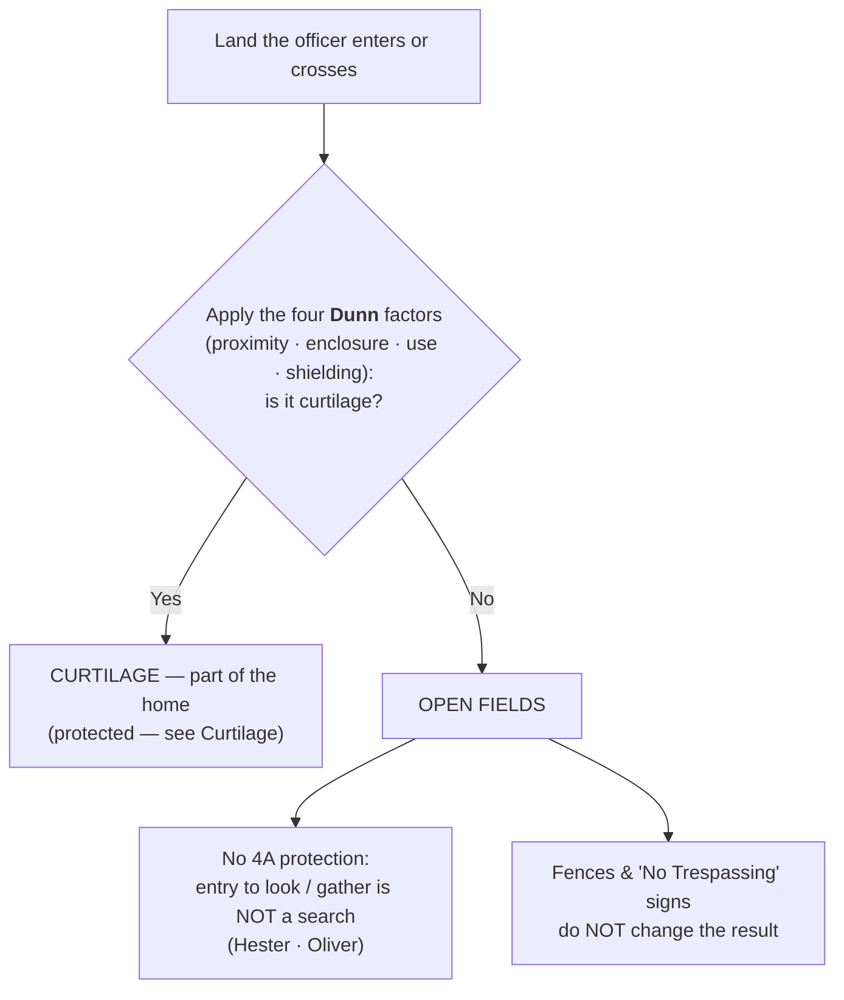

# Open Fields

*Officers crossed a fence, walked past a "No Trespassing" sign, and found the contraband on secluded land beyond the home. Was that a search? For open fields, the Fourth Amendment answers no.*

> [!rule] Black-letter rule
> Land beyond the [[Curtilage|curtilage]] is **"open fields,"** and the Fourth Amendment's protection of "persons, houses, papers, and effects" **does not extend to open fields** — so a physical entry onto open fields to look for or gather evidence is **not a "search" at all**. *[[Hester v. United States#^pin-59|Hester]]*, 265 U.S. 57, [59](https://www.courtlistener.com/opinion/100413/hester-v-united-states/) (1924); *[[Oliver v. United States#^pin-180|Oliver]]*, 466 U.S. 170, [179](https://www.courtlistener.com/opinion/111146/oliver-v-united-states/) (1984). This turns on the character of the place, not on efforts to hide what is there: **neither fences nor "No Trespassing" signs** convert an open field into protected space. *[[Oliver v. United States#^pin-180|Id.]]* The dividing line is [[Curtilage|curtilage]]-versus-open-field, resolved by the four *[[United States v. Dunn|Dunn]]* factors ([[Curtilage]]).
> ^rule-open-fields

## The Brief

**What "open fields" means.** "Open fields" is a term of art, not a literal description. It covers any unoccupied or undeveloped land outside the [[Curtilage|curtilage]] (woods, pastures, vacant lots, waters), and the ground need be neither "open" nor a "field." *[[Oliver v. United States|Oliver]]*, 466 U.S. at [180](https://www.courtlistener.com/opinion/111146/oliver-v-united-states/) n.11. The label marks the constitutional category, not the terrain: everything past the home's [[Curtilage|curtilage]] line is open fields, and the Fourth Amendment's protection of houses and effects does not reach it. *[[Hester v. United States#^pin-59|Hester]]*, 265 U.S. at [59](https://www.courtlistener.com/opinion/100413/hester-v-united-states/).

**The rule and its origin.** *[[Hester v. United States|Hester]]* announced the doctrine in 1924: "the special protection accorded by the Fourth Amendment to the people in their 'persons, houses, papers, and effects,' is not extended to the open fields," a distinction as old as the common law itself. *[[Hester v. United States#^pin-59|Hester]]*, 265 U.S. at [59](https://www.courtlistener.com/opinion/100413/hester-v-united-states/). Sixty years later *[[Oliver v. United States|Oliver]]* reaffirmed it under modern privacy analysis: "open fields do not provide the setting for those intimate activities that the Amendment is intended to shelter from government interference or surveillance," and there is "no societal interest" in protecting activity, "such as the cultivation of crops, that occur[s] in open fields." *[[Oliver v. United States#^pin-180|Oliver]]*, 466 U.S. at [179](https://www.courtlistener.com/opinion/111146/oliver-v-united-states/). Two rationales converge: the constitutional **text** (open fields are not "houses" or "effects") and the absence of any **legitimate expectation of privacy** society will honor there.

**Fences and signs do not matter.** Because the doctrine turns on the character of the place, steps to conceal it do not create protection. In *[[Oliver v. United States|Oliver]]* the officers walked past a locked gate posted "No Trespassing," down a footpath, to a marijuana field "over a mile from" the house, and there was still no search: "It is not generally true that fences or 'No Trespassing' signs effectively bar the public from viewing open fields." *[[Oliver v. United States#^pin-180|Oliver]]*, 466 U.S. at [179](https://www.courtlistener.com/opinion/111146/oliver-v-united-states/). Erecting barriers and posting signs may keep the curious out, but it does not make the expectation of privacy one "society is prepared to recognize as reasonable."

**Both theories of "search" fail on open fields.** The result holds under either definition of a search ([[Two Definitions of Search]]). Under the **trespass** theory, entering open fields is not a physical intrusion on a "house" or "effect," so the property baseline is not triggered even though the entry may be a common-law trespass. Under the **privacy** theory, there is no [[Reasonable Expectation of Privacy|reasonable expectation of privacy]] to invade. That is why the open-fields entry in *[[Oliver v. United States|Oliver]]* was no search though the officers plainly trespassed: a trespass onto unprotected land is not a Fourth Amendment event.

**The line is drawn against the [[Curtilage|curtilage]].** Open fields is defined by what it is not: the ground that fails the [[Curtilage|curtilage]] test. The four *[[United States v. Dunn|Dunn]]* factors (proximity, enclosure, nature of the use, and steps to shield) decide which side of the line a given spot falls on. *[[United States v. Dunn|Dunn]]*, 480 U.S. 294, [301](https://www.courtlistener.com/opinion/111833/united-states-v-dunn/) (1987). In *[[United States v. Dunn|Dunn]]* itself, a barn roughly 50 yards beyond the fence surrounding the ranch house (60 yards from the house) was **open fields**, not [[Curtilage|curtilage]]. The full four-factor analysis, and the paradigm [[Curtilage|curtilage]] spots, live on [[Curtilage]].

**Commercial open grounds are open-fields-like.** The open, publicly exposed areas of a business are treated more like open fields than like the [[Curtilage|curtilage]] of a home, so lawful-vantage observation of them is generally not a search. But this reaches only the exposed grounds: the private, non-public interior of a business keeps Fourth Amendment protection. That commercial thread is developed on [[Curtilage]] and [[Special Needs and Administrative Searches]].

**What the doctrine does not do.** Open fields is a narrow rule about unprotected land. It does not authorize entering the [[Curtilage|curtilage]] or the home, and it does not license sense-enhancing surveillance of protected space. Observation of protected ground from the air or with equipment is its own inquiry ([[Aerial and Enhanced Surveillance]]), and giving up the privacy or possessory interest in an item is analyzed as [[Abandonment]].

**Burden, standard of review, and remedy.** Because an open-fields entry is not a search, there is nothing to justify and nothing to suppress on that theory. Litigation therefore runs the other way: the proponent of suppression must establish that the area was **[[Curtilage|curtilage]]** (protected), not open fields, and that he had standing there, by a [[Common Legal Terms#preponderance-of-the-evidence|preponderance of the evidence]]. *[[Rakas v. Illinois|Rakas]]*, 439 U.S. 128, [130–31](https://www.courtlistener.com/opinion/109953/rakas-v-illinois/) n.1 (1978). The underlying *[[United States v. Dunn|Dunn]]*-factor findings are reviewed for [[Common Legal Terms#clear-error|clear error]] and the ultimate [[Curtilage|curtilage]]-versus-open-field determination [[Common Legal Terms#de-novo|de novo]].

**Apply it.**
1. **Locate the [[Curtilage|curtilage]] line.** Run the four *[[United States v. Dunn|Dunn]]* factors; if the ground fails them, it is open fields and entering it to look is not a search ([[Curtilage]]).
2. **Ignore fences and signage in the analysis.** A locked gate or a "No Trespassing" sign does not turn open fields into protected space (*[[Oliver v. United States|Oliver]]*).
3. **Do not overread the rule.** It covers unprotected land only; it is not a warrant to step onto the [[Curtilage|curtilage]], enter the home, or aim sensors at either.

**Common pitfalls.**
- **Assuming a fence or "No Trespassing" sign creates protection.** It does not; only the [[Curtilage|curtilage]] line does (*[[Oliver v. United States|Oliver]]*).
- **Confusing open fields with plain view from a public place.** Open fields is about the *status of the land the officer enters*; plain view and lawful-vantage observation are separate doctrines ([[Plain View Doctrine]]; [[Aerial and Enhanced Surveillance]]).
- **Treating a barn, shed, or outbuilding as automatically open fields.** Some outbuildings fall inside the [[Curtilage|curtilage]]; the *[[United States v. Dunn|Dunn]]* factors, not the label, decide (*[[United States v. Dunn|Dunn]]*).
- **Forgetting that a trespass can still be no search.** Entering open fields may be a common-law trespass yet raise no Fourth Amendment problem (*[[Oliver v. United States|Oliver]]*).

## Key cases

| Case | Holding | Opinion |
|---|---|---|
| *[[Hester v. United States]]*, 265 U.S. 57 (1924) | **Anchor.** Origin of the open-fields doctrine: the Fourth Amendment's protection of "persons, houses, papers, and effects" does not extend to open fields, a distinction the Court called as old as the common law. | [opinion](https://www.courtlistener.com/opinion/100413/hester-v-united-states/) |
| *[[Oliver v. United States]]*, 466 U.S. 170 (1984) | **Anchor.** Reaffirms the doctrine under privacy analysis: no legitimate expectation of privacy in open fields, even fenced, posted, and secluded land more than a mile from the house; only the [[Curtilage\|curtilage]] carries the home's protection. | [opinion](https://www.courtlistener.com/opinion/111146/oliver-v-united-states/) |
| *[[United States v. Dunn]]*, 480 U.S. 294 (1987) | Applies the [[Curtilage\|curtilage]]/open-field line: a barn 50 yards beyond the fence, judged by the four-factor test, was open fields, not [[Curtilage\|curtilage]]; the leading worked example of where the line falls. | [opinion](https://www.courtlistener.com/opinion/111833/united-states-v-dunn/) |

## Visual

## Sources

- [*Hester v. United States*, 265 U.S. 57 (1924)](https://www.courtlistener.com/opinion/100413/hester-v-united-states/) (pinpoint: 59)
- [*Oliver v. United States*, 466 U.S. 170 (1984)](https://www.courtlistener.com/opinion/111146/oliver-v-united-states/) (pinpoints: 179, 180 & n.11)
- [*United States v. Dunn*, 480 U.S. 294 (1987)](https://www.courtlistener.com/opinion/111833/united-states-v-dunn/) (pinpoint: 301)
