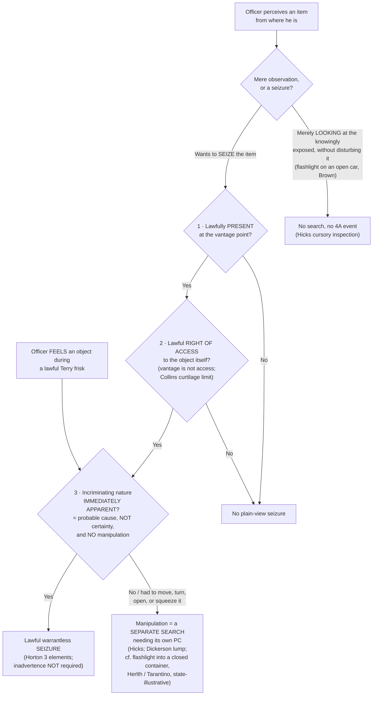

# Plain View & Plain Feel

*May an officer seize the item he can see, or feel, right now, without a warrant? Plain view and plain feel answer that question, and both turn on a single discipline: the incriminating character of the thing must be apparent without the officer manipulating it.*

> [!rule] Black-letter rule
> **Plain view is a seizure justification, not a search.** Merely looking at what is already exposed to view is no Fourth Amendment event; the doctrine authorizes the warrantless **seizure** of an item an officer lawfully comes across. To seize an item in plain view without a warrant, **all three** *[[Horton v. California|Horton]]* elements must be met: **(1) lawful vantage**, meaning the officer "did not violate the Fourth Amendment in arriving at the place from which the evidence could be plainly viewed"; **(2) lawful right of physical access** to the object itself, not merely a lawful vantage from which to see it; and **(3) incriminating character "immediately apparent,"** which means **probable cause**, formed **without manipulating** the item. *[[Horton v. California|Horton]]*, 496 U.S. 128, [136–37](https://www.courtlistener.com/opinion/112448/horton-v-california/) (1990). **Inadvertent discovery is not required.** *[[Horton v. California#^pin-130|Horton]]*, 496 U.S. at [130](https://www.courtlistener.com/opinion/112448/horton-v-california/). The same rule governs touch (**plain feel**): contraband whose identity is **immediately apparent by feel** during a lawful *[[Terry Stops and Reasonable Suspicion|Terry]]* frisk may be seized, but not where the officer manipulates it to identify it. *[[Minnesota v. Dickerson#^pin-375|Dickerson]]*, 508 U.S. 366, [375–76](https://www.courtlistener.com/opinion/112873/minnesota-v-dickerson/) (1993).
> ^rule-plain-view

## The Brief

**Keep the observation and the doctrine apart.** These are two different things, and conflating them is the cardinal error on this page. **Observation** of what is exposed is not a Fourth Amendment event at all: "a truly cursory inspection ... that involves merely looking at what is already exposed to view, without disturbing it ... is not a 'search.'" *[[Arizona v. Hicks|Hicks]]*, 480 U.S. 321, [328](https://www.courtlistener.com/opinion/111834/arizona-v-hicks/) (1987). **The plain-view *doctrine*** is the separate rule that lets an officer make a warrantless **seizure** of an incriminating item he lawfully comes across. Seeing the exposed is free; seizing it needs the three *[[Horton v. California|Horton]]* elements.

**Element one, lawful vantage.** "[A]n essential predicate to any valid warrantless seizure of incriminating evidence" is "that the officer did not violate the Fourth Amendment in arriving at the place from which the evidence could be plainly viewed." *[[Horton v. California#^pin-136|Horton]]*, 496 U.S. at [136](https://www.courtlistener.com/opinion/112448/horton-v-california/#:~:text=It%20is%2C%20of%20course%2C%20an). The vantage can come from a warrant, an exception, or simply a place any citizen may be. The classic older articulation is *[[Harris v. United States (1968)|Harris]]*: "objects falling in the plain view of an officer who has a right to be in the position to have that view are subject to seizure and may be introduced in evidence." *[[Harris v. United States (1968)#^pin-236a|Harris]]*, 390 U.S. 234, 236 (1968) ([[Common Legal Terms#per-curiam|per curiam]]).

**Element two, lawful right of access, is not the same as vantage.** "[N]ot only must the officer be lawfully located in a place from which the object can be plainly seen, but he or she must also have a lawful right of access to the object itself." *[[Horton v. California#^pin-137|Horton]]*, 496 U.S. at [137](https://www.courtlistener.com/opinion/112448/horton-v-california/#:~:text=Second%2C%20not%20only%20must%20the). An officer may see contraband through a window from the sidewalk and still lack authority to enter and seize it; the sight does not create a right to reach the thing.

**Where a lawful vantage comes from.** A vantage usually arises from another lawful action already underway. A protective sweep during an in-home arrest places officers where they may seize what they see, *[[Maryland v. Buie|Buie]]*, 494 U.S. 325 (1990), and a *[[Terry v. Ohio|Terry]]* protective sweep of a vehicle's passenger compartment does the same on a traffic stop, *[[Michigan v. Long|Long]]*, 463 U.S. 1032 (1983). In each, the sweep supplies the vantage, but the *[[Arizona v. Hicks|Hicks]]* no-manipulation limit still caps how far the officer may go.

**Element three, incriminating character "immediately apparent," means probable cause, not certainty.** *[[Arizona v. Hicks|Hicks]]* settled the standard: "We now hold that probable cause is required. To say otherwise would be to cut the 'plain view' doctrine loose from its theoretical and practical moorings." *[[Arizona v. Hicks#^pin-326|Hicks]]*, 480 U.S. at [326](https://www.courtlistener.com/opinion/111834/arizona-v-hicks/). Probable cause is the floor, not near-certainty. The *[[Texas v. Brown|Brown]]* plurality warned that "immediately apparent" "was very likely an unhappy choice of words, since it can be taken to imply that an unduly high degree of certainty ... is necessary," when in fact a "'practical, nontechnical' probability that incriminating evidence is involved is all that is required." *[[Texas v. Brown|Texas v. Brown]]*, 460 U.S. 730, [741–42](https://www.courtlistener.com/opinion/110901/texas-v-brown/) (1983) (plurality). A hunch will not do; certainty is not demanded.

**No manipulation: move it to develop probable cause, and you have searched.** The incriminating character must be apparent as the officer already lawfully stands, without turning, lifting, or opening. *[[Arizona v. Hicks|Hicks]]* held that an officer's moving of stereo equipment to read its serial number "did constitute a 'search' separate and apart from" the lawful entry: "[a] search is a search, even if it happens to disclose nothing but the bottom of a turntable." *[[Arizona v. Hicks#^pin-325|Hicks]]*, 480 U.S. at [324–25](https://www.courtlistener.com/opinion/111834/arizona-v-hicks/#:~:text=A%20search%20is%20a%20search%2C). The line is about exposing a *protected* interest. *[[New York v. Class|New York v. Class]]* marks the other side of it: reaching in to move papers obscuring a Vehicle Identification Number was permissible, because there is "no reasonable expectation of privacy in the VIN" (which the law requires be visible) and the intrusion was minimal. *[[New York v. Class#^pin-114|Class]]*, 475 U.S. 106, [114](https://www.courtlistener.com/opinion/111600/new-york-v-class/), 119 (1986). Moving an object to expose something private is a search; incidental contact that exposes nothing protected is not.

**Inadvertence is dead: *[[Coolidge v. New Hampshire|Coolidge]]* limited by *[[Horton v. California|Horton]]*.** The doctrine originates in the *[[Coolidge v. New Hampshire|Coolidge]]* plurality, which required that the discovery be **inadvertent** and that plain view "may not be used to extend a general exploratory search from one object to another until something incriminating at last emerges." *[[Coolidge v. New Hampshire#^pin-466a|Coolidge]]*, 403 U.S. 443, [466–67](https://www.courtlistener.com/opinion/108377/coolidge-v-new-hampshire/) (1971). *[[Horton v. California|Horton]]* abandoned the inadvertence prong: "even though inadvertence is a characteristic of most legitimate 'plain-view' seizures, it is not a necessary condition." *[[Horton v. California#^pin-130|Horton]]*, 496 U.S. at [130](https://www.courtlistener.com/opinion/112448/horton-v-california/). An officer who fully expects to find an item and finds it in plain view with the three elements satisfied may seize it. *[[Coolidge v. New Hampshire|Coolidge]]*'s surviving contributions, the prior-justification requirement and the anti-general-search principle, remain good law.

**Lawful vantage is bounded by the home and its curtilage.** Because the access prong is independent, an exception that authorizes reaching *one* thing does not license the separate trespass of entering protected ground to get there. *[[Collins v. Virginia|Collins]]* held that the automobile exception does not authorize a warrantless entry of a home or its curtilage to reach and search a vehicle parked there. *[[Collins v. Virginia|Collins]]*, 584 U.S. 586 (2018). The same limit caps the knock-and-talk approach: from the lawful front-door vantage an officer may use what is in plain view, but the approach authorizes no entry into [[Curtilage|curtilage]] and no seizure.

**Controlled deliveries: a privacy interest lawfully extinguished is not revived.** Plain-view reasoning extends to resealed containers. "No protected privacy interest remains in contraband in a container once government officers lawfully have opened that container and identified its contents as illegal"; resealing it to enable a controlled delivery "does not operate to revive or restore the lawfully invaded privacy rights." *[[Illinois v. Andreas#^pin-771|Illinois v. Andreas]]*, 463 U.S. 765, [771](https://www.courtlistener.com/opinion/111013/illinois-v-andreas/) (1983). The test is "whether there is a substantial likelihood that the contents of the container have been changed during the gap in surveillance"; absent that likelihood, reopening works no new search. *[[Illinois v. Andreas#^pin-773|Id.]]* at 773.

**Enhanced or probing observation can itself become a search (state, illustrative).** The federal line runs through *exposure*. A flashlight on what is *already exposed* (an open car interior) is no search: the officer's action in shining a flashlight to illuminate the interior "trenched upon no right secured ... by the Fourth Amendment." *[[Texas v. Brown#^pin-739|Brown]]*, 460 U.S. at [739–40](https://www.courtlistener.com/opinion/110901/texas-v-brown/). But a light used to *probe into the concealed* is a different matter. Two state cases illustrate the line and do not bind: *[[State v. Tarantino|Tarantino]]* (N.C.) held that tiny cracks do not surrender privacy, so an officer who must bend and peer with a light to see inside conducts a search; *[[Commonwealth v. Herlth|Herlth]]* (Pa. Super., en banc) held that shining a light through a one-inch hole into a closed shoebox inside a home was a search that plain view did not justify. The instructor's tidy version captures the same open-view-versus-enhanced-observation line: tip-toeing to look over a fence is fine, but bending to peer under a cracked garage door is not (see [[Curtilage]]).

**The digital frontier is where plain view is most unsettled.** The premise is *[[Riley v. California|Riley]]*: digital **is** different, so physical-world categorical exceptions do not transfer automatically to a phone. "[O]ur answer ... is accordingly simple: get a warrant." *[[Riley v. California|Riley]]*, 573 U.S. 373, [403](https://www.courtlistener.com/opinion/2680439/riley-v-cal-united-states/) (2014). *[[Carpenter v. United States|Carpenter]]* reinforces that premise but is CSLI and third-party law, not plain-view authority, and the geofence search-threshold question was resolved in *[[Chatrie v. United States|Chatrie]]*, 609 U.S. ___ (2026) (acquiring Google Location History is a search). The mechanical problem is that responsive data can hide anywhere on a device, so a broad search may be practically necessary, which threatens to turn a particular warrant into a roving license. That is the **digital general-warrant danger**, and *[[Coolidge v. New Hampshire|Coolidge]]*'s anti-exploratory-search principle is the guardrail. The Supreme Court has not resolved it, and the lower courts have spread across an approach spectrum rather than a clean circuit conflict. The particularity pole is well stated by *[[People v. Hughes|Hughes]]* (Mich. 2020), which declined "a rule that it is always reasonable for an officer to review the entirety of the digital data seized" because such a [[Common Legal Terms#per-se|per se]] rule "would effectively nullify the particularity requirement." *[[People v. Hughes|Hughes]]*, 958 N.W.2d 98, 117 (Mich. 2020). The full spread is collected under **Lower-court developments**.

**Burden, standard of review, and remedy.** As with every warrant exception, the **government bears the burden** of establishing that a warrantless plain-view seizure was justified. On appeal, the suppression court's historical findings of fact are reviewed for [[Common Legal Terms#clear-error|clear error]] and the ultimate reasonableness and probable-cause determination [[Common Legal Terms#de-novo|de novo]]. The **remedy** for an unjustified plain-view seizure is suppression of the item and its fruits under the exclusionary rule ([[The Exclusionary Rule]]).

**Apply it.**
1. **Name the vantage.** Identify the warrant, exception, or public place that put the officer lawfully where the item could be seen (*[[Horton v. California|Horton]]* element 1). No lawful vantage, no plain view.
2. **Check the right of access separately.** A lawful vantage is not a lawful reach. Confirm the officer may lawfully get to the object, not merely see it (*[[Horton v. California|Horton]]* element 2; *[[Collins v. Virginia|Collins]]* [[Curtilage|curtilage]] limit).
3. **Test for probable cause on the face of the thing.** Was the incriminating character apparent without moving, turning, or opening it? That is probable cause, not a hunch and not certainty (*[[Arizona v. Hicks|Hicks]]*; *[[Texas v. Brown|Brown]]*).
4. **Do not manipulate to build the case.** Moving an item to expose something private is a separate search needing its own probable cause (*[[Arizona v. Hicks|Hicks]]*); incidental contact exposing nothing protected is not (*[[New York v. Class|Class]]*).
5. **On a device, get a narrower or second warrant.** When responsive data forces a broad look and something new surfaces, treat the roving-license risk as real and return to the magistrate.

**Common pitfalls.**
- **Conflating the observation with the doctrine.** Seeing the exposed is free; *seizing* needs all three *[[Horton v. California|Horton]]* elements.
- **Seizing on a hunch.** "Immediately apparent" means **probable cause** (*[[Arizona v. Hicks|Hicks]]*); reasonable suspicion is not enough.
- **Over-reading "immediately apparent" as certainty.** It demands probable cause, not near-certainty; the phrase was "an unhappy choice of words" (*[[Texas v. Brown|Brown]]*).
- **Manipulating to create plain view.** Moving, turning, or opening an item to develop its incriminating character is a search (*[[Arizona v. Hicks|Hicks]]*), as is using a light to peer into a closed container (*[[Commonwealth v. Herlth|Herlth]]* / *[[State v. Tarantino|Tarantino]]*, illustrative).
- **Thinking inadvertence still matters.** *[[Horton v. California|Horton]]* dropped it.
- **Treating a phone warrant as a license to roam.** That is the digital general-warrant trap; when unsure, narrow the warrant or get a second one.
- **Citing the state exposure cases as the federal rule.** *[[Commonwealth v. Herlth|Herlth]]* / *[[State v. Tarantino|Tarantino]]* are **state, illustrative**; always pair them with *[[Arizona v. Hicks|Hicks]]* / *[[Horton v. California|Horton]]* / *[[Texas v. Brown|Brown]]*.

## Plain feel (Minnesota v. Dickerson)

Plain feel is the tactile twin of plain view: the same logic that lets an officer seize what he lawfully *sees* lets him seize what he lawfully *feels*. It arises during a lawful *[[Terry Stops and Reasonable Suspicion|Terry]]* frisk, and it carries the same no-manipulation limit.

**The rule.** "If a police officer lawfully pats down a suspect's outer clothing and feels an object whose contour or mass makes its identity immediately apparent," its warrantless seizure "would be justified by the same practical considerations that inhere in the plain-view context." *[[Minnesota v. Dickerson#^pin-375|Minnesota v. Dickerson]]*, 508 U.S. 366, [375–76](https://www.courtlistener.com/opinion/112873/minnesota-v-dickerson/) (1993). The officer must already be lawfully conducting the weapons frisk, and the contraband's identity must be apparent from the frisk itself.

**The limit, and why the seizure failed in *[[Minnesota v. Dickerson|Dickerson]]* itself.** The identity must be immediately apparent by feel, without further probing. In *[[Minnesota v. Dickerson|Dickerson]]* the officer determined the lump was contraband only after "squeezing, sliding and otherwise manipulating the contents of the defendant's pocket," a pocket he already knew held no weapon. *[[Minnesota v. Dickerson|Dickerson]]*, 508 U.S. at [378](https://www.courtlistener.com/opinion/112873/minnesota-v-dickerson/). That manipulation exceeded the weapons frisk and was the direct touch-analog of *[[Arizona v. Hicks|Hicks]]*: develop probable cause by manipulating, and you have searched. A lawful frisk that reveals an obvious gun or an obvious brick of narcotics by feel supports seizure; a frisk that becomes a squeeze-and-sort to figure out what a lump is does not.

## Lower-court developments

The lower courts have stress-tested *[[Horton v. California|Horton]]* on two fronts: the "immediately apparent" prong in ordinary physical and vehicle searches, and the unsettled digital frontier where plain view collides with computer-warrant scope and bulk data.

**Line A: "immediately apparent" applied strictly in physical and vehicle searches (faithful modern *[[Arizona v. Hicks|Hicks]]*).**

- ***[[United States v. Loines|Loines]]* (6th Cir. 2023)** — *narrowing application.* A Black & Mild cigar wrapper and a folded lottery ticket visible from outside the car were lawful, innocuous items, not intrinsically incriminating; because the officer had to enter the car and closely examine the center console to perceive contraband, plain view failed and that inspection was a separate search unsupported by probable cause. 56 F.4th 1099. **Binding in-circuit — 6th Cir.** [opinion](https://www.courtlistener.com/opinion/9357039/united-states-v-aaron-loines/)

**Line B: the digital frontier (computer-warrant scope and plain view of non-responsive data).** An approach spectrum, not a clean circuit conflict; the Supreme Court has not resolved it. ⚖ **Unsettled / circuit divergence.**

- **Search-latitude pole** — relevant data may be anywhere, so broad review is permissible, but the seizure must stay tethered. ***[[United States v. Burgess|Burgess]]* (10th Cir. 2009)**: "It is unrealistic to expect a warrant to prospectively restrict the scope of a search by directory, filename or extension ... that process must remain dynamic," 576 F.3d 1078, 1093–94, though "that is not to say methodology is irrelevant," *id.* at 1094. **Binding in-circuit — 10th Cir.** [opinion](https://www.courtlistener.com/opinion/172511/united-states-v-burgess/) The state echo is ***[[State v. Volle|Volle]]* (Kan. 2025)**: relevant data "may be stored anywhere," yet "the warrant must still include a meaningful limiting principle tying the authorized seizure to evidence of a specified offense," 580 P.3d 1223, 1233. **Persuasive — state, illustrative.** [opinion](https://www.courtlistener.com/opinion/10811858/state-v-volle/)
- **[[Particularity]] pole** — reject any rule that whole-device review is always reasonable. ***[[People v. Hughes|Hughes]]* (Mich. 2020)**: a [[Common Legal Terms#per-se|per se]] whole-device rule "would effectively nullify the particularity requirement ... in the context of cell-phone data," 958 N.W.2d at 117. **Persuasive — state, illustrative.** [opinion](https://www.courtlistener.com/opinion/4843477/people-of-michigan-v-kristopher-allen-hughes/)
- **Use-restriction pole** — limit or decline plain view for non-responsive data, or bar its *use*. ***[[State v. Mansor|Mansor]]* (Or. 2018)**: "the state should not be permitted to use information obtained in a computer search if the warrant did not authorize the search for that information," 421 P.3d 323, 363 (decided under the **Oregon Constitution**). **Persuasive — state, illustrative.** [opinion](https://www.courtlistener.com/opinion/6656738/state-v-mansor/)
- **Over-retention axis** — what happens to retained mirror copies over time. ***[[United States v. Ganias|Ganias]]* (2d Cir. 2016) (en banc)** confronted years-long retention of forensic mirror images of non-responsive data but resolved on the good-faith exception, leaving the constitutional question open: "we do not reach the specific Fourth Amendment question posed to us today," 824 F.3d 199, 225 (the 2014 panel had found a violation). **Binding in-circuit — 2d Cir.** [opinion](https://www.courtlistener.com/opinion/3207604/united-states-v-ganias/)
- **General-warrant flag** — ***[[United States v. Morton|Morton]]* (5th Cir. 2022) (en banc)** (resolving on good-faith grounds) mused in [[Common Legal Terms#concurring-opinion|concurrence]] that "it would be unsurprising if the Court ... recognized an exception to another longstanding Fourth Amendment doctrine, this time plain view," 46 F.4th 331, 341 (raised, not decided). **Binding in-circuit — 5th Cir.** [opinion](https://www.courtlistener.com/opinion/7859188/united-states-v-morton/) And ***[[United States v. Loera|Loera]]* (10th Cir. 2019)** governs plain-view discovery of incriminating non-responsive data by reasonableness, articulating a four-factor test (time on non-responsive material, segregation, manner of discovery, breadth of method): agents could keep searching for the warrant-specified evidence after stumbling on child pornography so long as the forensic steps stayed directed at the authorized target, but a later search navigating exclusively toward such files was unreasonable. 923 F.3d 907. **Binding in-circuit — 10th Cir.** [opinion](https://www.courtlistener.com/opinion/4619076/united-states-v-loera/)
- **Geofence sub-line** — the geofence search-threshold question is now settled at the Supreme Court (see the digital-frontier paragraph in The Brief), which superseded the divided circuit rationales below. Before that, ***[[United States v. Smith (2024)|United States v. Smith]]* (5th Cir. 2024)** had held geofence warrants "modern-day general warrants ... unconstitutional under the Fourth Amendment," though *[[United States v. Leon|Leon]]* good faith saved the evidence given the technology's novelty. 110 F.4th 817, 838. **Binding in-circuit — 5th Cir.** [opinion](https://www.courtlistener.com/opinion/10036119/united-states-v-smith/)
- **Pole-camera / mosaic axis** — ***[[United States v. Tuggle|Tuggle]]* (7th Cir. 2021)**: roughly 18 months of warrantless pole-camera surveillance of a home's exterior was not a search "under the current understanding of the Fourth Amendment," 4 F.4th 505, 512, while warning that "it might soon be time to revisit the Fourth Amendment test established in *Katz*," *id.* at 527 (see [[Curtilage]] for the pole-camera split). **Binding in-circuit — 7th Cir.** [opinion](https://www.courtlistener.com/opinion/4899735/united-states-v-travis-tuggle/)

The throughline of Line B is one idea: keep digital warrants from becoming general warrants.

## Key cases

| Case | Holding | Opinion |
|---|---|---|
| *[[Horton v. California]]*, 496 U.S. 128 (1990) | **Anchor.** The modern plain-view *seizure* test: lawful vantage, lawful right of access, and incriminating character immediately apparent (probable cause, no manipulation). Inadvertent discovery is NOT required. | [opinion](https://www.courtlistener.com/opinion/112448/horton-v-california/) |
| *[[Arizona v. Hicks]]*, 480 U.S. 321 (1987) | **Anchor.** Moving a stereo to read its serial number was a separate search; "immediately apparent" requires probable cause, not mere suspicion; pure observation of the exposed is not a search. | [opinion](https://www.courtlistener.com/opinion/111834/arizona-v-hicks/) |
| *[[Coolidge v. New Hampshire]]*, 403 U.S. 443 (1971) (plurality) | Origin of the modern doctrine; plain view cannot be used to extend a general exploratory search from one object to another. Originally required inadvertent discovery, a prong later abandoned by *[[Horton v. California\|Horton]]*. | [opinion](https://www.courtlistener.com/opinion/108377/coolidge-v-new-hampshire/) |
| *[[Texas v. Brown]]*, 460 U.S. 730 (1983) (plurality) | "Immediately apparent" means probable cause, not certainty ("an unhappy choice of words"); shining a flashlight into a car interior is not a search. | [opinion](https://www.courtlistener.com/opinion/110901/texas-v-brown/) |
| *[[Minnesota v. Dickerson]]*, 508 U.S. 366 (1993) | **Plain-feel corollary.** Contraband whose identity is immediately apparent by touch during a lawful *[[Terry v. Ohio\|Terry]]* frisk may be seized, but not where the officer "squeez[ed], slid[] and otherwise manipulat[ed]" it to identify it. | [opinion](https://www.courtlistener.com/opinion/112873/minnesota-v-dickerson/) |
| *[[Harris v. United States (1968)]]*, 390 U.S. 234 (1968) (per curiam) | The classic articulation that objects in the plain view of an officer who has a right to be in that position are subject to seizure; the registration card was seen while lawfully securing an impounded car. | [opinion](https://www.courtlistener.com/opinion/107625/harris-v-united-states/) |
| *[[State v. Tarantino]]*, 322 N.C. 386, 368 S.E.2d 588 (1988) | Tiny cracks do not surrender a [[Reasonable Expectation of Privacy\|reasonable expectation of privacy]]; an officer who must bend and peer with a light through them to see inside conducts a search. | [opinion](https://www.courtlistener.com/opinion/1294594/state-v-tarantino/) |
| *[[Commonwealth v. Herlth]]*, 2026 PA Super 114 (en banc) | A closed shoebox with a one-inch hole, inside a home, retains a [[Reasonable Expectation of Privacy\|reasonable expectation of privacy]]; shining a light through the hole was a search that plain view did not justify. | [opinion](https://www.courtlistener.com/opinion/10870804/com-v-herlth-j/) |

## Related cases across doctrines

These are treated in full on their own case pages, but they bear directly on the plain-view doctrine and are framed for it here.

| Case | Relevance here | Primary home | Opinion |
|---|---|---|---|
| *[[New York v. Class]]*, 475 U.S. 106 (1986) | ***Access line.*** Reaching in to move papers obscuring a VIN was permissible because there is no [[Reasonable Expectation of Privacy\|reasonable expectation of privacy]] in the VIN and the intrusion was minimal, the permissive mirror of the *[[Arizona v. Hicks\|Hicks]]* no-manipulation rule. | [[Traffic Stops]] | [opinion](https://www.courtlistener.com/opinion/111600/new-york-v-class/) |
| *[[Riley v. California]]*, 573 U.S. 373 (2014) | ***Digital premise.*** Digital is different; physical-world exceptions do not transfer automatically to cell-phone data, so to search a phone, "get a warrant." The premise the digital-plain-view frontier builds on. | [[Search Incident to Arrest]] | [opinion](https://www.courtlistener.com/opinion/2680439/riley-v-cal-united-states/) |

## Visual

## Sources

- [*Coolidge v. New Hampshire*, 403 U.S. 443 (1971) (plurality)](https://www.courtlistener.com/opinion/108377/coolidge-v-new-hampshire/) (pinpoints: 466–67; inadvertence prong abandoned by *Horton*)
- [*Harris v. United States*, 390 U.S. 234 (1968) (per curiam)](https://www.courtlistener.com/opinion/107625/harris-v-united-states/) (pinpoint: 236)
- [*Texas v. Brown*, 460 U.S. 730 (1983) (plurality)](https://www.courtlistener.com/opinion/110901/texas-v-brown/) (pinpoints: 739–40, 741, 742)
- [*Illinois v. Andreas*, 463 U.S. 765 (1983)](https://www.courtlistener.com/opinion/111013/illinois-v-andreas/) (pinpoints: 771, 773)
- [*Michigan v. Long*, 463 U.S. 1032 (1983)](https://www.courtlistener.com/opinion/111020/michigan-v-long/) (lawful vantage and right of access via a *Terry* vehicle sweep; home = [[Traffic Stops]])
- [*New York v. Class*, 475 U.S. 106 (1986)](https://www.courtlistener.com/opinion/111600/new-york-v-class/) (pinpoints: 114, 119; the permissive side of the *Hicks* access line; home = [[Traffic Stops]])
- [*Arizona v. Hicks*, 480 U.S. 321 (1987)](https://www.courtlistener.com/opinion/111834/arizona-v-hicks/) (pinpoints: 324–25, 326, 328)
- [*Maryland v. Buie*, 494 U.S. 325 (1990)](https://www.courtlistener.com/opinion/112384/maryland-v-buie/) (lawful-vantage prong via a protective sweep; home = [[Securing the Scene]])
- [*Horton v. California*, 496 U.S. 128 (1990)](https://www.courtlistener.com/opinion/112448/horton-v-california/) (pinpoints: 130, 136, 137)
- [*Minnesota v. Dickerson*, 508 U.S. 366 (1993)](https://www.courtlistener.com/opinion/112873/minnesota-v-dickerson/) (pinpoints: 375–76, 378)
- [*Riley v. California*, 573 U.S. 373 (2014)](https://www.courtlistener.com/opinion/2680439/riley-v-cal-united-states/) (digital is not physical; home = [[Search Incident to Arrest]])
- [*Carpenter v. United States*, 585 U.S. 296 (2018)](https://www.courtlistener.com/opinion/4510032/carpenter-v-united-states/) (digital context only, not plain-view authority; home = [[Two Definitions of Search]])
- [*Collins v. Virginia*, 584 U.S. 586 (2018)](https://www.courtlistener.com/opinion/4501697/collins-v-virginia/) (curtilage limit on lawful access; home = [[Automobile Exception]])
- [*Chatrie v. United States*, 609 U.S. ___ (2026) (No. 25-112)](https://www.courtlistener.com/opinion/10881683/chatrie-v-united-states/) (geofence Location History is a search; PC and particularity remanded; see [[Chatrie v. United States]])
- [*State v. Tarantino*, 322 N.C. 386, 368 S.E.2d 588 (1988)](https://www.courtlistener.com/opinion/1294594/state-v-tarantino/) (persuasive, state, illustrative)
- [*Commonwealth v. Herlth*, 2026 PA Super 114 (en banc)](https://www.courtlistener.com/opinion/10870804/com-v-herlth-j/) (persuasive, state, illustrative)
- [*People v. Hughes*, 506 Mich. 512, 958 N.W.2d 98 (2020)](https://www.courtlistener.com/opinion/4843477/people-of-michigan-v-kristopher-allen-hughes/) (persuasive, state, illustrative)
- [*State v. Volle*, 580 P.3d 1223 (Kan. 2025)](https://www.courtlistener.com/opinion/10811858/state-v-volle/) (persuasive, state, illustrative)
- [*State v. Mansor*, 363 Or. 185, 421 P.3d 323 (2018)](https://www.courtlistener.com/opinion/6656738/state-v-mansor/) (persuasive, state, illustrative; Oregon Constitution)
- [*United States v. Morton*, 46 F.4th 331 (5th Cir. 2022) (en banc)](https://www.courtlistener.com/opinion/7859188/united-states-v-morton/) (Binding in-circuit, 5th Cir.)
- [*United States v. Tuggle*, 4 F.4th 505 (7th Cir. 2021)](https://www.courtlistener.com/opinion/4899735/united-states-v-travis-tuggle/) (Binding in-circuit, 7th Cir.)
- [*United States v. Burgess*, 576 F.3d 1078 (10th Cir. 2009)](https://www.courtlistener.com/opinion/172511/united-states-v-burgess/) (Binding in-circuit, 10th Cir.)
- [*United States v. Ganias*, 824 F.3d 199 (2d Cir. 2016) (en banc)](https://www.courtlistener.com/opinion/3207604/united-states-v-ganias/) (Binding in-circuit, 2d Cir.)
- [*United States v. Loera*, 923 F.3d 907 (10th Cir. 2019)](https://www.courtlistener.com/opinion/4619076/united-states-v-loera/) (Binding in-circuit, 10th Cir.)
- [*United States v. Loines*, 56 F.4th 1099 (6th Cir. 2023)](https://www.courtlistener.com/opinion/9357039/united-states-v-aaron-loines/) (Binding in-circuit, 6th Cir.)
- [*United States v. Smith*, 110 F.4th 817 (5th Cir. 2024)](https://www.courtlistener.com/opinion/10036119/united-states-v-smith/) (Binding in-circuit, 5th Cir.)
