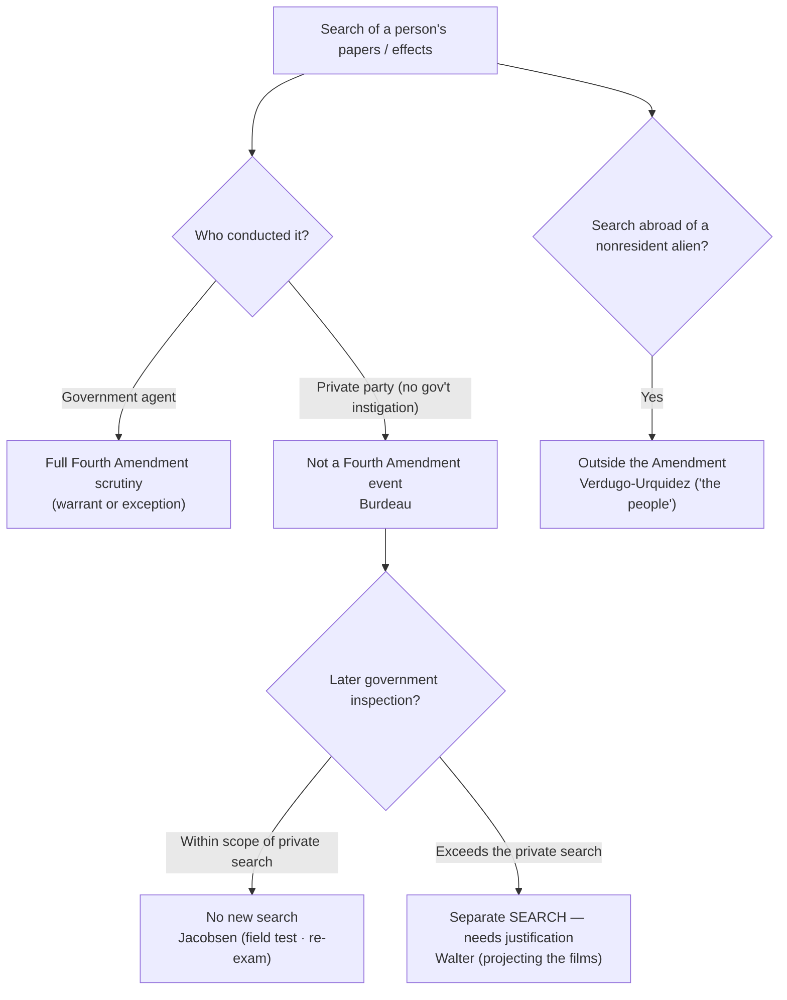

# Private & Foreign Searches

*A shipping company opens a damaged package and finds white powder; a private employer drills open a safe and hands the papers to prosecutors; U.S. agents search a home in Mexico. Each turns on the same threshold: the Fourth Amendment restrains the government, and only the government, acting within the national community.*

> [!rule] Black-letter rule
> The Fourth Amendment "was intended as a restraint upon the activities of sovereign authority, and was not intended to be a limitation upon other than governmental agencies." *[[Burdeau v. McDowell#^pin-475|Burdeau]]*, 256 U.S. 465, 475 (1921). So a search by a **private party** not acting as a government agent is not a Fourth Amendment event, and a later government inspection that stays **within the scope** of the private search "must be tested by the degree to which [it] exceeded the scope of the private search." *[[United States v. Jacobsen#^pin-115|Jacobsen]]*, 466 U.S. 109, 115 (1984). Exceeding that scope is a **separate search** needing independent justification. *[[Walter v. United States#^pin-657|Walter]]*, 447 U.S. 649, 657 (1980). And the Amendment does not reach a search of a **nonresident alien's property abroad**, because "the people" it protects are "persons who are part of a national community or who have otherwise developed sufficient connection with this country." *[[United States v. Verdugo-Urquidez#^pin-265|Verdugo-Urquidez]]*, 494 U.S. 259, 265 (1990).
> ^rule-private-foreign

## The Brief

**The Amendment reaches only government action.** The oldest limit on the Fourth Amendment is that it binds the sovereign, not private conduct. In *[[Burdeau v. McDowell|Burdeau]]* private parties broke into an office, drilled open the safes, and took the owner's papers, then handed them to federal prosecutors; because "no official of the federal government had anything to do with" the taking, there was no governmental search to challenge, and the government could keep and use the papers. *[[Burdeau v. McDowell#^pin-475|Burdeau]]*, 256 U.S. at 475. The Amendment "is wholly inapplicable 'to a search or seizure, even an unreasonable one, effected by a private individual not acting as an agent of the Government.'" *[[United States v. Jacobsen|Jacobsen]]*, 466 U.S. at 113.

**Once a private party has looked, the government may stand in its shoes, and no further.** The controlling refinement is *[[United States v. Jacobsen|Jacobsen]]*. FedEx employees opened a damaged package, saw plastic bags of white powder, and called the DEA; the agent who then re-examined the package and field-tested the powder conducted no search beyond what the private party had already exposed. The rule is a scope rule: "[t]he additional invasions of respondents' privacy by the Government agent must be tested by the degree to which they exceeded the scope of the private search." *[[United States v. Jacobsen#^pin-115|Jacobsen]]*, 466 U.S. at 115. Re-examination that stays within the private search discloses nothing the owner still kept private, and a field test that "merely discloses whether or not a particular substance is cocaine does not compromise any legitimate interest in privacy." *[[United States v. Jacobsen#^pin-123|Id.]]* at 123. Reopening beyond what the private party revealed is permissible only where there is a "virtual certainty" that nothing of significance beyond the private search will be exposed. *[[United States v. Jacobsen|Id.]]*, 466 U.S. at 119.

**Exceeding the private search is a fresh search.** *[[Walter v. United States|Walter]]* is the trap. Private parties received misdelivered boxes of film, saw the suggestive labels, but never actually viewed the films; when the FBI projected them without a warrant, that "was a significant expansion of the search that had been conducted previously by a private party and therefore must be characterized as a separate search." *[[Walter v. United States#^pin-657|Walter]]*, 447 U.S. at 657. "The Government may not exceed the scope of the private search unless it has the right to make an independent search." *[[Walter v. United States|Id.]]* The officer inherits the private party's vantage, not a license to go further.

**When a private actor becomes a government agent.** The doctrine turns on the **absence** of government participation. A nominally private search becomes state action, and the Amendment applies, when officials **instigate, direct, or join** it, or when the private party acts to assist law enforcement rather than for independent private reasons. The line is drawn on all the circumstances, including the government's knowledge and encouragement of the search and the private actor's purpose. Where officials cross it, the private-search safe harbor is gone and the search must satisfy the warrant requirement or an exception ([[Fourth Amendment Framework]]).

**Searches abroad and "the people."** The parallel limit is territorial and personal. *[[United States v. Verdugo-Urquidez|Verdugo-Urquidez]]* held that the Fourth Amendment does not apply to the search by U.S. agents of a nonresident alien's residence in Mexico, construing the Amendment's reference to "the people" to mean "a class of persons who are part of a national community or who have otherwise developed sufficient connection with this country to be considered part of that community." *[[United States v. Verdugo-Urquidez#^pin-265|Verdugo-Urquidez]]*, 494 U.S. at 265. The holding is narrow: it addresses a nonresident alien with no voluntary connection to the United States, searched abroad. It is distinct from the **border-search** doctrine, which governs searches of persons and effects crossing into the country and is developed separately ([[Border Searches]]).

**Apply it.**
1. **Ask who searched.** If a genuinely private party searched with no government instigation, direction, or participation, there is no Fourth Amendment event to suppress (*[[Burdeau v. McDowell|Burdeau]]*).
2. **Measure the government's conduct against the private search.** A later government inspection is lawful only to the extent it does not exceed what the private party already exposed (*[[United States v. Jacobsen|Jacobsen]]*); going further is a separate search needing a warrant or exception (*[[Walter v. United States|Walter]]*).
3. **Check for agency.** Instigation, direction, encouragement, or a law-enforcement purpose can convert a "private" search into state action, restoring full Fourth Amendment scrutiny.
4. **For searches abroad, ask about the person and the place.** A nonresident alien's property searched abroad is outside the Amendment (*[[United States v. Verdugo-Urquidez|Verdugo-Urquidez]]*); border crossings are their own doctrine ([[Border Searches]]).

**Common pitfalls.**
- **Treating the officer's re-examination as automatically fine.** It is lawful only within the scope of the private search; the field test in *Jacobsen* was upheld because it revealed only contraband-or-not, and the film screening in *Walter* was suppressed because it went further.
- **Overlooking agency.** A "private" citizen acting at police direction, or to help build a case, is a government agent; the safe harbor disappears.
- **Assuming the government can always reopen a container.** Reopening beyond the private search needs "virtual certainty" that nothing new will be revealed (*Jacobsen*, 466 U.S. at 119).
- **Confusing the foreign-search rule with the border-search doctrine.** *Verdugo-Urquidez* is about who "the people" are; border searches govern the routine authority to search at the international boundary ([[Border Searches]]).

## Lower-court developments

*The digital private-search frontier is automated hash-matching, and the circuits are split.* Providers scan uploaded files against databases of hash values (digital fingerprints) of known contraband and report matches to NCMEC and law enforcement. The question is whether an officer's later opening of a flagged file is a fresh search or merely re-does the private "search."

- **Ninth Circuit, the strict reading.** *[[United States v. Wilson|United States v. Wilson]]*, 13 F.4th 961 (9th Cir. 2021), held that where Google flagged email attachments by hash match but **no human had ever viewed** the images, the officer's warrantless viewing exceeded the scope of any antecedent private search and was itself a government search under *Jacobsen* and *Walter*. *Binding in-circuit (9th Cir.); persuasive elsewhere.*
- **Fifth and Sixth Circuits, the permissive reading.** *[[United States v. Reddick|United States v. Reddick]]*, 900 F.3d 636 (5th Cir. 2018), and *United States v. Miller*, 982 F.3d 412 (6th Cir. 2020), held that a hash match creates a "virtual certainty" the flagged files are the known contraband already viewed by a private actor, so opening them discloses nothing the defendant's privacy had not already lost, and is not a search. As the Sixth Circuit put it, the hash match "created a 'virtual certainty' that the files . . . were the known child-pornography files that a Google employee had viewed," meeting "*Jacobsen*'s required level of certainty." *United States v. Miller*, 982 F.3d 412, 416 (6th Cir. 2020). *Binding in their respective circuits; persuasive elsewhere.*

The split is squarely about *Jacobsen*'s "virtual certainty" test applied to an algorithm: the Ninth Circuit demands that a human actually have viewed the specific file, while the Fifth and Sixth treat a reliable hash match as the functional equivalent. The Supreme Court has not resolved it.

## Key cases

| Case | Holding | Opinion |
|---|---|---|
| *[[Burdeau v. McDowell]]*, 256 U.S. 465 (1921) | **Anchor.** The Fourth Amendment restrains only governmental action; papers wrongfully taken by private parties, with no government involvement, and turned over to prosecutors may be retained and used. | [opinion](https://www.courtlistener.com/opinion/99820/burdeau-v-mcdowell/) |
| *[[United States v. Jacobsen]]*, 466 U.S. 109 (1984) | **Anchor.** A government inspection following a private search is tested by whether it exceeded the private search's scope; a re-examination within that scope, and a field test revealing only contraband-or-not, invade no remaining privacy. | [opinion](https://www.courtlistener.com/opinion/111143/united-states-v-jacobsen/) |
| *[[Walter v. United States]]*, 447 U.S. 649 (1980) | **The scope limit.** The government may not exceed the scope of the private search; the FBI's warrantless projection of films a private party had received but never viewed was a separate, unlawful search. | [opinion](https://www.courtlistener.com/opinion/110314/walter-v-united-states/) |
| *[[United States v. Verdugo-Urquidez]]*, 494 U.S. 259 (1990) | **Anchor (foreign search).** The Fourth Amendment does not reach the search of a nonresident alien's property abroad; "the people" it protects are those with a sufficient connection to the national community. | [opinion](https://www.courtlistener.com/opinion/112382/united-states-v-verdugo-urquidez/) |

## Related cases across doctrines

| Case | Relevance here | Primary home | Opinion |
|---|---|---|---|
| *[[Coolidge v. New Hampshire]]*, 403 U.S. 443 (1971) | Evidence produced by a genuinely private search does not implicate the Amendment; state action turns on all the circumstances, including police instigation and purpose. | [[Fourth Amendment Framework]] | [opinion](https://www.courtlistener.com/opinion/108377/coolidge-v-new-hampshire/) |
| *[[Katz v. United States]]*, 389 U.S. 347 (1967) | Supplies the privacy baseline the private-search cases measure against: a search invades a [[Reasonable Expectation of Privacy\|reasonable expectation of privacy]], and a private party can frustrate that expectation before any officer arrives. | [[Reasonable Expectation of Privacy]] | [opinion](https://www.courtlistener.com/opinion/107564/katz-v-united-states/) |

<!-- Burdeau v. McDowell (256 U.S. 465): lake status under_review (treatment-derivation pending; holding + pincite 475 verified on the case page); S9 promotes. Registry home search.private-foreign Anchor. -->
<!-- United States v. Verdugo-Urquidez (494 U.S. 259): lake status under_review (treatment-derivation pending; pincite 265 verified on the case page). -->
<!-- United States v. Wilson (13 F.4th 961, 9th Cir. 2021) and United States v. Reddick (900 F.3d 636, 5th Cir. 2018): lake status under_review; holdings verified on their case pages and in FA Framework's authored LCD. Co-homed here + Fourth Amendment Framework (rule A: FA Framework's private-search bullets are its own batch's to re-point). -->
<!-- United States v. Miller (982 F.3d 412, 6th Cir. 2020) = the hash-match Sixth Circuit case; DISTINCT from the paged United States v. Miller (425 U.S. 435, 1976) third-party bank-records case. Cited here as a plain-italic brief-mention terminal (no wikilink), pincite 416 string-matched via FA Framework's verified LCD. LINT-17: no page-less wikilink. -->

## Visual

## Sources

- [*Burdeau v. McDowell*, 256 U.S. 465 (1921)](https://www.courtlistener.com/opinion/99820/burdeau-v-mcdowell/) (pinpoint: 475)
- [*United States v. Jacobsen*, 466 U.S. 109 (1984)](https://www.courtlistener.com/opinion/111143/united-states-v-jacobsen/) (pinpoints: 113, 115, 119, 123)
- [*Walter v. United States*, 447 U.S. 649 (1980)](https://www.courtlistener.com/opinion/110314/walter-v-united-states/) (pinpoints: 654, 657)
- [*United States v. Verdugo-Urquidez*, 494 U.S. 259 (1990)](https://www.courtlistener.com/opinion/112382/united-states-v-verdugo-urquidez/) (pinpoint: 265)
- [*United States v. Wilson*, 13 F.4th 961 (9th Cir. 2021)](https://www.courtlistener.com/opinion/5296785/united-states-v-luke-wilson/)
- [*United States v. Reddick*, 900 F.3d 636 (5th Cir. 2018)](https://www.courtlistener.com/opinion/4527853/united-states-v-henry-reddick/)
- *United States v. Miller*, 982 F.3d 412 (6th Cir. 2020) (pinpoint: 416) — hash-match circuit split; brief-mention terminal, no standalone page (distinct from the 1976 third-party *United States v. Miller*).
- [*Coolidge v. New Hampshire*, 403 U.S. 443 (1971)](https://www.courtlistener.com/opinion/108377/coolidge-v-new-hampshire/) *(primary home [[Fourth Amendment Framework]])*
- [*Katz v. United States*, 389 U.S. 347 (1967)](https://www.courtlistener.com/opinion/107564/katz-v-united-states/) *(primary home [[Reasonable Expectation of Privacy]])*
