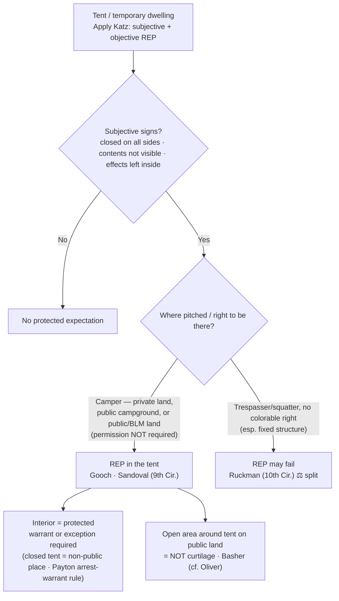

# Tents & Temporary Dwellings

*A closed tent on public land is not a house, but for the person sleeping inside it is close enough. Where it is pitched, and what the occupant did to keep it private, decides whether a warrantless look inside is a search.*

> [!rule] Black-letter rule
> A tent used as a temporary dwelling is analyzed more like a **home** than like a car: its occupant can hold a **[[Reasonable Expectation of Privacy|reasonable expectation of privacy]]** in the tent's interior, so a warrantless search of the inside is presumptively unreasonable. There is **no Supreme Court decision on tents directly**; the controlling test is the two-part *[[Katz v. United States|Katz]]* inquiry, and the doctrine has been built in the **federal courts of appeals**, most heavily the **Ninth Circuit**. *[[United States v. Gooch|Gooch]]*, 6 F.3d 673, 677 (9th Cir. 1993) ("a tent is more like a house than a car").
> ^rule-tents

## The Brief

**A tent as a dwelling is treated like a house, not a car.** The occupant of a tent used to sleep and live can hold a [[Reasonable Expectation of Privacy|reasonable expectation of privacy]] in its interior, and the automobile exception's reduced-privacy logic does not transfer. *[[United States v. Gooch|Gooch]]* squarely rejected the government's motor-home analogy: "a tent is more like a house than a car," and "the warrantless search of his tent violated the Fourth Amendment." *[[United States v. Gooch#^pin-677b|Gooch]]*, 6 F.3d at 677. *[[United States v. Basher|Basher]]* puts it the same way: a tent "is comparable to a house, apartment, or hotel room because it is a private area where people sleep and change clothing." *[[United States v. Basher|Basher]]*, 629 F.3d 1161, 1169 (9th Cir. 2011).

**State the test up front: the two-part *[[Katz v. United States|Katz]]* inquiry.** Whether a [[Reasonable Expectation of Privacy|reasonable expectation of privacy]] exists turns on (1) a **subjective** expectation of privacy the occupant actually exhibited, and (2) one that **society is prepared to recognize as reasonable**. *[[Katz v. United States#^pin-361|Katz]]*, 389 U.S. 347, [361](https://www.courtlistener.com/opinion/107564/katz-v-united-states/) (1967) (Harlan, J., concurring). The Ninth Circuit applies exactly that two-part requirement to tents: occupancy requires "both a subjective and an objectively reasonable expectation of privacy in the tent." *[[United States v. Gooch|Gooch]]*, 6 F.3d at 677.

**The subjective prong: what the occupant exhibited.** Articulate the outward signs the occupant treated the tent as private: it was **closed on all sides**, its contents were **not visible from outside**, and the occupant left **personal effects inside**. *[[United States v. Sandoval#^pin-661|Sandoval]]*, 200 F.3d 659, 661 (9th Cir. 2000). Conversely, a flap left wide open, or contents in plain view from a lawful vantage, cut against a subjective expectation.

**The objective prong: location and the right to be there.** The expectation can be objectively reasonable on **private property**, in a **public campground**, and even on **undeveloped public (BLM) land**, and it does **not** turn on whether the camper had permission to be there. *[[United States v. Gooch#^pin-677a|Gooch]]*, 6 F.3d at 677; *[[United States v. Sandoval#^pin-661|Sandoval]]*, 200 F.3d at 661. The Ninth Circuit's lineage runs from *[[LaDuke v. Nelson|LaDuke v. Nelson]]*, 762 F.2d 1318 (9th Cir. 1985) (tent on private property), through *[[United States v. Gooch|Gooch]]* (public campground), to *[[United States v. Sandoval|Sandoval]]* (BLM land). As *[[United States v. Sandoval|Sandoval]]* reasoned, the rule cannot "turn on whether he had permission to camp," because then "a camper who overstayed his permit in a public campground would lose his Fourth Amendment rights, while his neighbor, whose permit had not expired, would retain those rights." *[[United States v. Sandoval#^pin-661|Sandoval]]*, 200 F.3d at 661. Illegality of the camping does not by itself defeat the expectation.

**The protection is the tent's interior, not a [[Curtilage|curtilage]] around it.** A tent has no [[Curtilage|curtilage]] the way a house does. On a dispersed, undeveloped public-land campsite (the camp was visible from a developed campground), "there was no expectation of privacy in the campsite, and . . . the area outside of the tent in these circumstances is not curtilage." *[[United States v. Basher#^pin-1169a|Basher]]*, 629 F.3d at 1169. This tracks the open-fields/[[Curtilage|curtilage]] line of *[[Oliver v. United States#^pin-180|Oliver]]*, 466 U.S. 170, [180](https://www.courtlistener.com/opinion/111146/oliver-v-united-states/) (1984): only the [[Curtilage|curtilage]] carries the home's protection; exposed open land does not.

**The trespasser/squatter limit, and the live ⚖ split.** Where the occupant has **no colorable right to occupy**, especially a permanent or semi-permanent structure, courts have found no [[Reasonable Expectation of Privacy|reasonable expectation of privacy]]. *[[United States v. Ruckman|Ruckman]]*, 806 F.2d 1471 (10th Cir. 1986), treated a man living in a **cave** on federal land as a trespasser with no legal right to occupy, so no expectation arose. The circuits are not aligned: *[[United States v. Ruckman|Ruckman]]* (10th Cir.) tied the expectation to a legal right to occupy, while *[[United States v. Sandoval|Sandoval]]* (9th Cir.) held a public-land camper's expectation does **not** turn on permission.

**A closed tent is a "non-public" place for arrest-warrant purposes.** *[[United States v. Gooch|Gooch]]* held that a **closed** tent is a "non-public" place, so officers needed an **arrest warrant** (or **[[Exigent Circumstances and Hot Pursuit|exigent circumstances]]**) to enter and arrest the occupant inside. The *[[Payton v. New York|Payton]]* firm line "at the entrance to the house" can therefore reach a tent, not just a house. *[[Payton v. New York#^pin-590|Payton]]*, 445 U.S. 573, [590](https://www.courtlistener.com/opinion/110235/payton-v-new-york/#:~:text=In%20terms%20that%20apply%20equally) (1980).

**Overnight guests in tents.** A person staying **overnight** in another's tent can claim the same expectation an overnight houseguest has under *[[Minnesota v. Olson|Olson]]*, 495 U.S. 91, [98](https://www.courtlistener.com/opinion/112416/minnesota-v-olson/) (1990) ("a houseguest has a legitimate expectation of privacy in his host's home"); privacy turns on the expectation, not on holding title to the tent. That standing is bounded by *[[Minnesota v. Carter|Carter]]*, 525 U.S. 83, [90](https://www.courtlistener.com/opinion/118249/minnesota-v-carter/) (1998): one "merely present with the consent of the householder" for a short, purely commercial visit may not claim the protection.

**Apply it.**
1. **Ask whether the tent is a dwelling.** If it is used to sleep and live, analyze it like a home, not a vehicle (*[[United States v. Gooch|Gooch]]*); the automobile exception does not transfer.
2. **Run the two-part *[[Katz v. United States|Katz]]* test.** Identify the subjective signs (closed sides, contents not visible, effects left inside) (*[[United States v. Sandoval|Sandoval]]*) and confirm the expectation is objectively reasonable given where it is pitched (*[[United States v. Gooch|Gooch]]*).
3. **Do not condition the right on a permit.** On public land the expectation does not turn on permission to camp (*[[United States v. Sandoval|Sandoval]]*); watch the contrary *[[United States v. Ruckman|Ruckman]]* line for a fixed structure occupied with no colorable right.
4. **Separate the interior from the ground around it.** The interior is protected; the exposed area outside a dispersed public-land tent is not [[Curtilage|curtilage]] (*[[United States v. Basher|Basher]]*; cf. *[[Oliver v. United States|Oliver]]*).
5. **Get an arrest warrant for a closed tent.** Entering a closed tent to arrest needs a warrant or true [[Exigent Circumstances and Hot Pursuit|exigency]] (*[[United States v. Gooch|Gooch]]*; *[[Payton v. New York|Payton]]*).

**Common pitfalls.**
- **Treating the whole campsite as protected.** Items left outside the tent, and plain-view observations from a lawful vantage, are a different question from a search of the interior (*[[United States v. Basher|Basher]]*).
- **Overreading *[[United States v. Ruckman|Ruckman]]*.** It turned on a long-term cave occupant with no right to be there; it does not license treating every unpermitted overnight camper as a rightless trespasser.
- **Assuming you can reach into a closed tent to arrest without a warrant or true [[Exigent Circumstances and Hot Pursuit|exigency]].** *[[United States v. Gooch|Gooch]]* applies the *[[Payton v. New York|Payton]]* rule to a closed tent.
- **Reading overnight-guest standing too broadly.** A short, purely commercial visit is not enough (*[[Minnesota v. Carter|Carter]]*).

## Lower-court developments

*Role: circuit split / unresolved frontier (no SCOTUS).* The Supreme Court has never addressed tents directly, so the doctrine remains circuit-built, developed most fully in the Ninth Circuit (*[[LaDuke v. Nelson|LaDuke]]* to *[[United States v. Gooch|Gooch]]* to *[[United States v. Sandoval|Sandoval]]* to *[[United States v. Basher|Basher]]*). The live frontier is the ⚖ split on whether a **legal right to occupy** matters to the expectation of privacy: the Ninth Circuit (*[[United States v. Sandoval|Sandoval]]*) holds it does **not** for a closed tent on public land, while the Tenth Circuit (*[[United States v. Ruckman|Ruckman]]*) tied the expectation to a right to occupy and found none for a long-term cave dweller on federal land. The related open question, how far the home-like protection extends beyond the tent's interior on undeveloped public land, is answered in-circuit by *[[United States v. Basher|Basher]]* (no [[Curtilage|curtilage]] around a dispersed campsite) but is otherwise unsettled nationwide. No post-decision SCOTUS authority has resolved the split.

## Key cases

| Case | Holding | Opinion |
|---|---|---|
| *[[Katz v. United States]]*, 389 U.S. 347 (1967) | Supplies the controlling test: a search invades a **subjective** expectation of privacy that society recognizes as **objectively reasonable**; "the Fourth Amendment protects people, not places." *(Primary home [[Reasonable Expectation of Privacy]].)* | [opinion](https://www.courtlistener.com/opinion/107564/katz-v-united-states/) |
| *[[United States v. Gooch]]*, 6 F.3d 673 (9th Cir. 1993) | **Anchor.** An occupant has a [[Reasonable Expectation of Privacy\|reasonable expectation of privacy]] in a tent in a public campground; "a tent is more like a house than a car," so its warrantless search violated the Fourth Amendment; a **closed** tent is a "non-public" place requiring an arrest warrant to enter. *Binding in-circuit (9th Cir.).* | [opinion](https://www.courtlistener.com/opinion/654273/united-states-v-kenneth-d-gooch/) |
| *[[United States v. Sandoval]]*, 200 F.3d 659 (9th Cir. 2000) | **Anchor.** The [[Reasonable Expectation of Privacy\|reasonable expectation of privacy]] in a closed tent on public (BLM) land does **not** turn on whether the camper had permission to be there; denial of suppression reversed. *Binding in-circuit (9th Cir.).* | [opinion](https://www.courtlistener.com/opinion/767260/united-states-v-rodrigo-sandoval/) |
| *[[United States v. Basher]]*, 629 F.3d 1161 (9th Cir. 2011) | Reaffirms privacy **inside** a tent ("comparable to a house, apartment, or hotel room"), but the area **outside** the tent at a dispersed public-land campsite is **not [[Curtilage\|curtilage]]**, so no expectation of privacy there. *Binding in-circuit (9th Cir.).* | [opinion](https://www.courtlistener.com/opinion/183144/united-states-v-basher/) |
| *[[United States v. Ruckman]]*, 806 F.2d 1471 (10th Cir. 1986) | **Contrary view (⚖ split).** A man living in a **cave** on federal land was a trespasser with no legal right to occupy, so no [[Reasonable Expectation of Privacy\|reasonable expectation of privacy]] arose; the structure was treated as open land, not a house. *Binding in-circuit (10th Cir.).* | [opinion](https://www.courtlistener.com/opinion/480405/united-states-v-frank-william-ruckman/) |

## Related cases across doctrines

| Case | Relevance here | Primary home | Opinion |
|---|---|---|---|
| *[[Minnesota v. Olson]]*, 495 U.S. 91 (1990) | An **overnight guest** has a [[Reasonable Expectation of Privacy\|reasonable expectation of privacy]] in the place he is staying, the logic that lets a guest sleeping over in another's tent challenge a warrantless entry. | [[Standing to Challenge a Search]] | [opinion](https://www.courtlistener.com/opinion/112416/minnesota-v-olson/) |
| *[[Minnesota v. Carter]]*, 525 U.S. 83 (1998) | The **boundary** of the guest rule: one "merely present with the consent of the householder" for a short, purely commercial visit has no expectation of privacy. | [[Standing to Challenge a Search]] | [opinion](https://www.courtlistener.com/opinion/118249/minnesota-v-carter/) |
| *[[Oliver v. United States]]*, 466 U.S. 170 (1984) | The open-fields / [[Curtilage\|curtilage]] boundary: only the [[Curtilage\|curtilage]] carries the home's protection, the doctrinal basis for *[[United States v. Basher\|Basher]]*'s holding that the ground outside a public-land tent is not protected. | [[Curtilage]] | [opinion](https://www.courtlistener.com/opinion/111146/oliver-v-united-states/) |
| *[[Payton v. New York]]*, 445 U.S. 573 (1980) | A warrant is generally required to cross the "firm line at the entrance to the house" to arrest; *[[United States v. Gooch\|Gooch]]* applied it to hold a **closed tent** a non-public place needing an arrest warrant (absent [[Exigent Circumstances and Hot Pursuit\|exigency]]). | [[Arrest in the Home]] | [opinion](https://www.courtlistener.com/opinion/110235/payton-v-new-york/) |

## Visual

## Sources
- [*Katz v. United States*, 389 U.S. 347 (1967)](https://www.courtlistener.com/opinion/107564/katz-v-united-states/) (pinpoints: 351, 361 (Harlan, J., concurring))
- [*United States v. Gooch*, 6 F.3d 673 (9th Cir. 1993)](https://www.courtlistener.com/opinion/654273/united-states-v-kenneth-d-gooch/) (pinpoints: 677, 678)
- [*United States v. Sandoval*, 200 F.3d 659 (9th Cir. 2000)](https://www.courtlistener.com/opinion/767260/united-states-v-rodrigo-sandoval/) (pinpoint: 661)
- [*United States v. Basher*, 629 F.3d 1161 (9th Cir. 2011)](https://www.courtlistener.com/opinion/183144/united-states-v-basher/) (pinpoint: 1169)
- [*United States v. Ruckman*, 806 F.2d 1471 (10th Cir. 1986)](https://www.courtlistener.com/opinion/480405/united-states-v-frank-william-ruckman/) (contrast/split authority)
- [*Minnesota v. Olson*, 495 U.S. 91 (1990)](https://www.courtlistener.com/opinion/112416/minnesota-v-olson/) (pinpoint: 98)
- [*Minnesota v. Carter*, 525 U.S. 83 (1998)](https://www.courtlistener.com/opinion/118249/minnesota-v-carter/) (pinpoint: 90)
- [*Oliver v. United States*, 466 U.S. 170 (1984)](https://www.courtlistener.com/opinion/111146/oliver-v-united-states/) (pinpoints: 179, 180)
- [*Payton v. New York*, 445 U.S. 573 (1980)](https://www.courtlistener.com/opinion/110235/payton-v-new-york/) (pinpoints: 576, 590)
- [*LaDuke v. Nelson*, 762 F.2d 1318 (9th Cir. 1985)](https://www.courtlistener.com/opinion/452994/charles-laduke-v-alan-c-nelson-etc/) (Ninth Circuit origin of the tent rule; lineage of *Gooch* / *Sandoval*)
