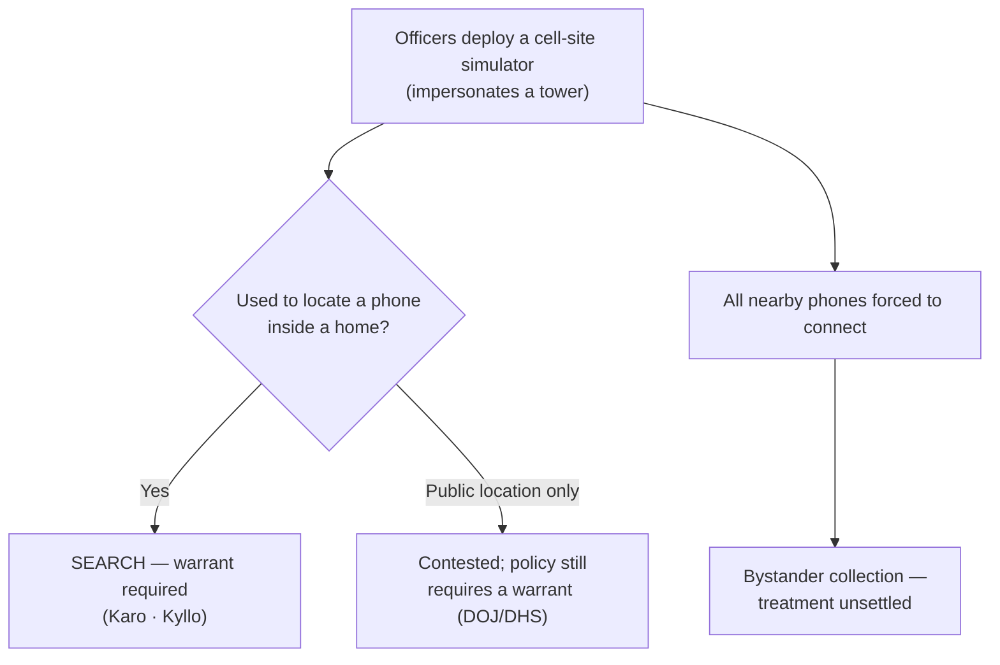

# Cell-Site Simulators

*The officers are not asking a carrier for records — they are running a device that impersonates a cell tower to make the target's phone reveal itself and its location, including inside a home. Does that require a warrant?*

> [!rule] Black-letter rule
> A **cell-site simulator** (a "StingRay" or IMSI catcher) mimics a cellular tower, forcing nearby phones to connect and disclose their identifiers and precise location. There is **no controlling Supreme Court decision**, but the governing analogies point one way: using the device to locate a phone **inside a home** reveals "a critical fact about the interior" and is a search (*[[United States v. Karo#^pin-715|United States v. Karo]]*, 468 U.S. at [715](https://www.courtlistener.com/opinion/111257/united-states-v-karo/)), as is aiming sense-enhancing technology "not in general public use" at a home (*[[Kyllo v. United States|Kyllo v. United States]]*, 533 U.S. 27, [40](https://www.courtlistener.com/opinion/118443/kyllo-v-united-states/) (2001)); and locating a specific phone tracks the comprehensive-location concern of *[[Carpenter v. United States|Carpenter]]*. Federal policy (DOJ and DHS, 2015) requires a **search warrant** for cell-site-simulator use absent [[Exigent Circumstances and Hot Pursuit|exigency]], and the leading state decision agrees. Treat cell-site-simulator deployment as **warrant-requiring**, and the precise constitutional rule as **unsettled**.

## The Brief

**What the device does, and why it is different.** A cell-site simulator broadcasts a signal stronger than the surrounding towers, so every phone in range connects to it instead. That lets officers identify a target phone's unique subscriber number and pinpoint its location in real time, often to a specific unit in an apartment building, and in doing so it sweeps in every other phone nearby. Unlike a request to a carrier, this is direct government interception of signals the phone emits, deployed by officers in the field.

**No SCOTUS holding; the rule is built from analogy.** No Supreme Court case addresses cell-site simulators. The doctrine is assembled from three anchors. *[[United States v. Karo|Karo]]* supplies the decisive move for the common use — locating a phone **inside a residence**: a technique that reveals an interior fact "the Government could not have otherwise obtained without a warrant" is a search. *[[United States v. Karo#^pin-715|Karo]]*, 468 U.S. at [715](https://www.courtlistener.com/opinion/111257/united-states-v-karo/). *[[Kyllo v. United States|Kyllo]]* adds that using a device "not in general public use" to learn what is happening inside a home is a search, whatever the device. And *[[Carpenter v. United States|Carpenter]]*'s concern with pinpoint location over time reinforces that real-time location of a person's phone is constitutionally weighty. Together they make cell-site-simulator use to find a phone inside a home a search requiring a warrant.

**Policy has run ahead of case law.** Since 2015, Department of Justice and Department of Homeland Security policy has required a **search warrant** based on probable cause before federal agents deploy a cell-site simulator, except in genuine [[Exigent Circumstances and Hot Pursuit|exigencies]], and requires deletion of incidentally collected third-party data. Several states have enacted equivalent statutory warrant requirements. These policies are not constitutional holdings, but they are the operative rule in practice and reflect the consensus that the device's power demands a warrant.

**The dragnet problem is unresolved.** Because the simulator forces *all* nearby phones to connect, its use is a mass, if momentary, interception. Courts have not settled how the Fourth Amendment treats the bystander phones swept in, and suppression litigation has often turned on good faith or on the government's reluctance to disclose the technique at all. Present the bystander-collection question as open.

**Apply it.**
1. **Identify the technique.** If officers used a device that impersonates a tower to locate a phone (not a records request to a carrier), this is the cell-site-simulator rule, not ordinary CSLI.
2. **Locate the phone.** If the device was used to find the phone inside a home, *[[United States v. Karo|Karo]]* and *[[Kyllo v. United States|Kyllo]]* make it a search requiring a warrant.
3. **Check for a warrant and policy compliance.** Absent [[Exigent Circumstances and Hot Pursuit|exigency]], DOJ/DHS policy and the leading state authority require a probable-cause warrant; a warrantless deployment is the litigable event.
4. **Flag the bystander sweep.** Note that the device collected data from other phones; the treatment of that incidental collection is unsettled.

**Common pitfalls.**
- **Treating cell-site-simulator use as ordinary third-party CSLI.** It is direct government interception in the field, not a request for a carrier's business records; *[[Smith v. Maryland|Smith]]*/*[[United States v. Miller|Miller]]* do not govern it.
- **Assuming there is a Supreme Court rule.** There is none; the rule is built from *[[United States v. Karo|Karo]]*, *[[Kyllo v. United States|Kyllo]]*, and *[[Carpenter v. United States|Carpenter]]* plus policy and lower-court law.
- **Overlooking the interior move.** The strongest warrant argument is *[[United States v. Karo|Karo]]*'s: the device revealed the phone's location inside a home.

## Lower-court developments

- **Leading state decision — warrant required.** *State v. Andrews* (Md. Ct. Spec. App. 2016) held that real-time use of a cell-site simulator to locate a suspect's phone was a Fourth Amendment search requiring a warrant, and that the State's failure to disclose the technique to the issuing court could not be cured. It remains the most-cited judicial statement that cell-site-simulator deployment needs a warrant.
- **Federal and state policy.** DOJ (Sept. 2015) and DHS (Oct. 2015) policies require a probable-cause search warrant for cell-site-simulator use absent [[Exigent Circumstances and Hot Pursuit|exigent circumstances]], plus prompt deletion of non-target data; a number of states have codified parallel warrant requirements. These are the operative constraints most agencies work under.

The picture: no Supreme Court rule, a strong analogical case for a warrant (*[[United States v. Karo|Karo]]*/*[[Kyllo v. United States|Kyllo]]*), executive policy that already requires one, and an unresolved question about the bystander phones the device sweeps in.

## Key cases

| Case | Holding | Opinion |
|---|---|---|
| *[[United States v. Karo]]*, 468 U.S. 705 (1984) | **Governing analogy.** Using a tracking device to reveal that an item is inside a private residence is a search: it discloses a critical interior fact unobtainable from outside. The core argument for a cell-site-simulator warrant. | [opinion](https://www.courtlistener.com/opinion/111257/united-states-v-karo/) |
| *[[Kyllo v. United States]]*, 533 U.S. 27 (2001) | Using sense-enhancing technology "not in general public use" to learn a home's interior is a search, reinforcing that a device revealing what is inside a home requires a warrant. | [opinion](https://www.courtlistener.com/opinion/118443/kyllo-v-united-states/) |
| *[[Carpenter v. United States]]*, 585 U.S. 296 (2018) | Pinpoint location of a person's phone is constitutionally weighty; the comprehensive-location concern that reinforces the warrant requirement here. *(Primary home [[Reasonable Expectation of Privacy]].)* | [opinion](https://www.courtlistener.com/opinion/4510032/carpenter-v-united-states/) |

<!-- No controlling SCOTUS on cell-site simulators (GAP-03b "StingRay H"). Rule built by analogy from Karo (interior), Kyllo (sense-enhancing tech into home), Carpenter (location). State v. Andrews (Md. 2016): coverage-ledger terminal = brief-mention (S6 R11), named plainly in LCD, NO wikilink (no standalone page). DOJ (2015)/DHS (2015) cell-site-simulator warrant policies cited as policy, not holdings. -->

## Visual

## Sources

- [*United States v. Karo*, 468 U.S. 705 (1984)](https://www.courtlistener.com/opinion/111257/united-states-v-karo/) (pinpoints: 714, 715)
- [*Kyllo v. United States*, 533 U.S. 27 (2001)](https://www.courtlistener.com/opinion/118443/kyllo-v-united-states/) (pinpoints: 34, 40)
- [*Carpenter v. United States*, 585 U.S. 296 (2018)](https://www.courtlistener.com/opinion/4510032/carpenter-v-united-states/) (case-level cite: R5 T3)
- *State v. Andrews* (Md. Ct. Spec. App. 2016) — cell-site-simulator warrant requirement; coverage-ledger brief-mention (no standalone page).
- U.S. Dep't of Justice, Policy Guidance: Use of Cell-Site Simulator Technology (Sept. 3, 2015); U.S. Dep't of Homeland Security, Policy Directive 047-02 (Oct. 19, 2015).
