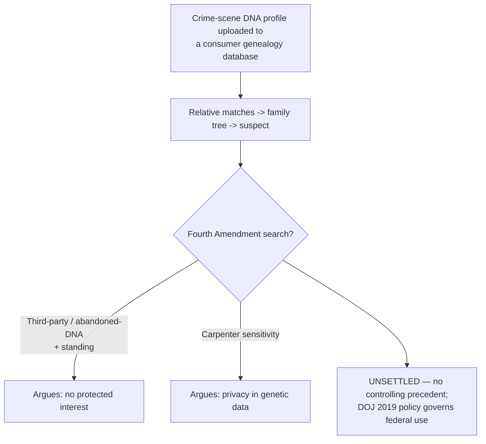

# Investigative Genetic Genealogy

*Police upload a crime-scene DNA profile to a consumer ancestry database, find distant relatives of the unknown contributor, and build a family tree back to a suspect. Whose Fourth Amendment rights, if anyone's, does that implicate — and is there any settled answer yet?*

> [!rule] Black-letter rule
> **Investigative genetic genealogy (IGG)** identifies an unknown DNA contributor by matching a crime-scene profile against **consumer genealogy databases** (such as GEDmatch or FamilyTreeDNA) to find relatives, then reverse-engineering a family tree to the suspect. There is **no controlling Supreme Court or federal appellate decision** on whether IGG is a Fourth Amendment search, and the question is genuinely **unsettled**. The competing frames are the **third-party doctrine** (the relatives voluntarily uploaded their own DNA, arguably defeating any expectation of privacy in the shared segments), **standing** (a suspect ordinarily cannot challenge a search of someone else's uploaded profile), and *[[Maryland v. King|Maryland v. King]]*, 569 U.S. 435 (2013) (DNA identification as a reasonable law-enforcement practice) — cut against the sensitivity concerns of *[[Carpenter v. United States|Carpenter]]*. Federal use runs under **DOJ interim policy (2019)**, not a constitutional holding.

## The Brief

**What IGG is.** IGG is not database matching against government DNA banks (CODIS); it is the use of **private, consumer-facing** genealogy databases, into which millions of people have uploaded their own genetic data to find relatives. Investigators upload a profile derived from crime-scene evidence, receive a list of partial matches (relatives who share DNA), and then use conventional genealogy (public records, family trees) to work inward to a single suspect, whose identity is confirmed by a fresh, directly obtained DNA sample. The 2018 Golden State Killer investigation, which identified a long-sought suspect through GEDmatch, was the breakthrough that brought the technique into wide use.

**Why the Fourth Amendment answer is unsettled.** No Supreme Court or circuit decision squarely holds whether IGG is a search, and the doctrine could break several ways. The **third-party doctrine** suggests the relatives who uploaded their DNA assumed the risk of disclosure, so the matching invades no protected interest; but the person ultimately identified never uploaded anything, and it is his genetic information, exposed through relatives, that the technique exploits. **Standing** narrows the field further: under ordinary [[Standing to Challenge a Search|Fourth Amendment standing]], a suspect cannot vicariously challenge a search of a relative's account, which may leave the database search effectively unreviewable at his instance. And *Carpenter*'s reasoning (that comprehensive, revealing digital data can carry a privacy interest even in a third party's hands) pushes the other way, since few data types are more intimate than a genetic profile.

**The DNA anchor that does exist.** The closest Supreme Court authority is *Maryland v. King*, which upheld taking a buccal DNA swab from a felony arrestee as a reasonable booking procedure, treating DNA identification as a legitimate, limited law-enforcement tool. *[[Maryland v. King|King]]* is not an IGG case (it concerns compelled collection from an arrestee, not matching against consumer databases), but it frames DNA identification as constitutionally tolerable in principle, and both sides cite it. The **abandoned-DNA** line (that a person retains no expectation of privacy in genetic material shed on a discarded item) is the other analogy invoked to defeat a privacy claim.

**Policy fills the constitutional vacuum.** Because the law is unresolved, the operative constraints are policy and provider terms. The Department of Justice's 2019 interim policy limits federal IGG to violent crimes and unidentified remains, requires that the profile be worked only in databases whose terms permit law-enforcement use, and bars covert uploads to services that forbid them. GEDmatch and other providers have changed their terms to require user opt-in for law-enforcement matching. These are not Fourth Amendment holdings, but they are the rules agencies actually follow.

**Apply it.**
1. **Distinguish IGG from CODIS matching.** IGG uses **private consumer** databases and relative-matching; it is not a hit against a government DNA bank.
2. **Spot the whose-rights problem.** The person identified did not upload his DNA; analyze both the uploading relatives' interests and the suspect's, and expect a standing obstacle to the suspect's challenge.
3. **Run the competing analogies.** Third-party doctrine and abandoned-DNA cut against a privacy claim; *Carpenter*'s sensitivity reasoning cuts for one. There is no controlling answer.
4. **Check policy and terms of service.** Federal IGG must comply with the 2019 DOJ interim policy and the database's law-enforcement terms; a violation of those is often the most concrete objection available.

**Common pitfalls.**
- **Stating that IGG is (or is not) a search as settled law.** It is unresolved; no Supreme Court or circuit decision controls.
- **Confusing IGG with CODIS or arrestee-swab law.** *Maryland v. King* governs compelled arrestee collection, not consumer-database matching.
- **Assuming the suspect can suppress the database search.** Standing usually blocks a challenge to a relative's uploaded profile; the objection more often runs to policy or to the later, directly obtained sample.

## Key cases

| Case | Holding | Opinion |
|---|---|---|
| *[[Maryland v. King]]*, 569 U.S. 435 (2013) | **Nearest anchor.** Taking a buccal DNA swab from a felony arrestee is a reasonable booking procedure; frames DNA identification as a constitutionally tolerable law-enforcement tool, though it is not an IGG case. *(Primary home [[Special Needs and Administrative Searches]].)* | [opinion](https://www.courtlistener.com/opinion/873669/maryland-v-king/) |
| *[[Carpenter v. United States]]*, 585 U.S. 296 (2018) | The sensitivity/aggregation reasoning invoked for a privacy interest in genetic data held by a third party; the counterweight to the third-party and abandoned-DNA analogies. *(Primary home [[Reasonable Expectation of Privacy]].)* | [opinion](https://www.courtlistener.com/opinion/4510032/carpenter-v-united-states/) |
| *[[Smith v. Maryland]]*, 442 U.S. 735 (1979) | The third-party/assumption-of-risk baseline invoked to argue that relatives' voluntary uploads defeat any protected interest. *(Primary home [[Third-Party Doctrine & CSLI]].)* | [opinion](https://www.courtlistener.com/opinion/110118/smith-v-maryland/) |

<!-- No controlling SCOTUS or federal appellate authority on IGG (GAP-03b "IGG M"); taught honestly as unsettled. Golden State Killer investigation (2018) described factually, not as a party-v-party caption (no page/ledger terminal needed). Maryland v. King is the paged DNA anchor; primary home Special Needs. DOJ interim policy (2019) cited as policy, not a holding. No page-needing bare captions minted here. -->

## Visual

## Sources

- [*Maryland v. King*, 569 U.S. 435 (2013)](https://www.courtlistener.com/opinion/873669/maryland-v-king/)
- [*Carpenter v. United States*, 585 U.S. 296 (2018)](https://www.courtlistener.com/opinion/4510032/carpenter-v-united-states/) (case-level cite: R5 T3)
- [*Smith v. Maryland*, 442 U.S. 735 (1979)](https://www.courtlistener.com/opinion/110118/smith-v-maryland/)
- U.S. Dep't of Justice, Interim Policy: Forensic Genetic Genealogical DNA Analysis and Searching (Nov. 1, 2019).
