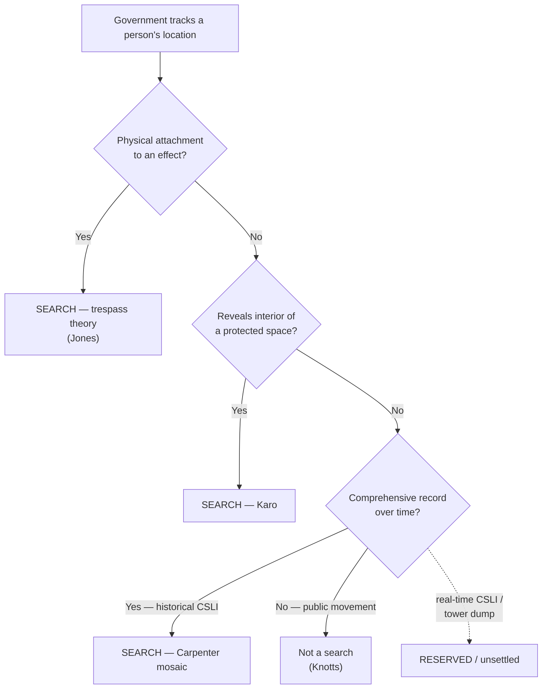

# Real-Time Tracking

*Is the government watching this person move in real time by a means the Fourth Amendment counts as a search — because it attached something to his property, because it reached inside a protected space, or because it aggregated a comprehensive record of his movements?*

> [!rule] Black-letter rule
> Tracking a suspect's location is a Fourth Amendment search when it does any of three things: **(1)** the government **physically attaches** a device to a constitutionally protected effect to monitor it (*[[United States v. Jones|United States v. Jones]]*, 565 U.S. 400, [404](https://www.courtlistener.com/opinion/622304/united-states-v-jones/) (2012) — GPS on a car); **(2)** the tracking **reveals a fact about the interior of a protected space** not observable from outside (*[[United States v. Karo#^pin-714|United States v. Karo]]*, 468 U.S. 705, [714](https://www.courtlistener.com/opinion/111257/united-states-v-karo/) (1984) — beeper inside a residence); or **(3)** it assembles a **comprehensive record of movements over time** (*[[Carpenter v. United States|Carpenter]]* — historical CSLI). Merely following **public movements** by a tracking aid, without a trespass, is **not** a search: *[[United States v. Knotts#^pin-281|United States v. Knotts]]*, 460 U.S. 276, [281](https://www.courtlistener.com/opinion/110882/united-states-v-knotts/) (1983) — "no reasonable expectation of privacy in his movements from one place to another."
> ^rule-real-time

## The Brief

**The public-movements baseline.** The floor is *[[United States v. Knotts|Knotts]]*: a beeper used to track a car over public roads adds nothing the Fourth Amendment protects, because "[a] person traveling in an automobile on public thoroughfares has no reasonable expectation of privacy in his movements from one place to another." *[[United States v. Knotts#^pin-281|Knotts]]*, 460 U.S. at [281](https://www.courtlistener.com/opinion/110882/united-states-v-knotts/). Short-term following of public travel is not a search, whether by eye, by beeper, or by GPS signal alone.

**Two classic escape hatches from the baseline.** The baseline breaks in two situations. First, when the tracking **reveals the interior**: monitoring a beeper to learn that an item is *inside a private residence* is a search, because it discloses "a critical fact about the interior of the premises" the government could not otherwise obtain. *[[United States v. Karo#^pin-715|Karo]]*, 468 U.S. at [715](https://www.courtlistener.com/opinion/111257/united-states-v-karo/). Second, when the government **physically intrudes** to install the tracker: attaching a GPS unit to a vehicle and monitoring it "constitutes a 'search'" under the revived trespass theory, independent of any privacy analysis. *[[United States v. Jones|Jones]]*, 565 U.S. at [404](https://www.courtlistener.com/opinion/622304/united-states-v-jones/). *[[United States v. Jones|Jones]]* is primarily a [[Trespass|trespass]] case; its importance here is that the manner of installation can make tracking a search even on public roads.

**The mosaic and the modern turn.** The *[[United States v. Jones|Jones]]* [[Common Legal Terms#concurring-opinion|concurrences]] supplied the idea *[[Carpenter v. United States|Carpenter]]* later adopted: five Justices signaled that long-term, comprehensive location tracking can invade a [[Reasonable Expectation of Privacy|reasonable expectation of privacy]] even without a trespass. *[[Carpenter v. United States|Carpenter]]* made that a holding for **historical CSLI** — the aggregation of location over time is the search, not any single data point. Real-time tracking sits between *[[United States v. Knotts|Knotts]]* (short public following, no search) and *[[Carpenter v. United States|Carpenter]]* (comprehensive aggregation, search); the more sustained and total the surveillance, the more it pulls toward *[[Carpenter v. United States|Carpenter]]*.

**Real-time CSLI and tower dumps are expressly reserved.** *[[Carpenter v. United States|Carpenter]]* pointedly **did not decide** real-time CSLI or "tower dumps," and it disclaimed any effect on conventional surveillance techniques. Lower courts are working out whether pinging a phone's real-time location, or short-term real-time CSLI, is governed by *[[United States v. Knotts|Knotts]]* or *[[Carpenter v. United States|Carpenter]]*; the answer is unsettled and jurisdiction-dependent. Do not state a national rule for real-time CSLI.

**Apply it.**
1. **Check for a physical attachment.** If officers placed a device on the person's vehicle or effects to track it, that installation is a search under *[[United States v. Jones|Jones]]* regardless of where the tracking led.
2. **Ask what the tracking revealed.** If it disclosed a fact about the inside of a home or other protected space, *[[United States v. Karo|Karo]]* makes it a search; if it showed only public movement, *[[United States v. Knotts|Knotts]]* says it did not.
3. **Weigh the aggregation.** The longer and more comprehensive the tracking, the closer to *[[Carpenter v. United States|Carpenter]]*'s mosaic line; brief public following stays on the *[[United States v. Knotts|Knotts]]* side.
4. **Flag real-time CSLI as open.** *[[Carpenter v. United States|Carpenter]]* reserved it; treat the governing rule as unsettled and cite the controlling authority in your own jurisdiction.

**Common pitfalls.**
- **Treating *[[United States v. Knotts|Knotts]]* as blanket permission to track.** It covers **public** movement without a trespass; *[[United States v. Karo|Karo]]* (interior) and *[[United States v. Jones|Jones]]* (attachment) each pull the other way.
- **Assuming *[[Carpenter v. United States|Carpenter]]* covers real-time CSLI.** It governs **historical** CSLI and expressly **reserved** real-time CSLI and tower dumps.
- **Skipping the trespass question.** Even public-road tracking is a search if the government trespassed to install the device (*[[United States v. Jones|Jones]]*).

## Key cases

| Case | Holding | Opinion |
|---|---|---|
| *[[United States v. Knotts]]*, 460 U.S. 276 (1983) | **Baseline.** Beeper-aided tracking of a vehicle over public roads is not a search: no [[Reasonable Expectation of Privacy\|reasonable expectation of privacy]] in public movements. | [opinion](https://www.courtlistener.com/opinion/110882/united-states-v-knotts/) |
| *[[United States v. Karo]]*, 468 U.S. 705 (1984) | Monitoring a beeper inside a private residence is a search: it reveals a critical fact about the interior the government could not otherwise obtain. | [opinion](https://www.courtlistener.com/opinion/111257/united-states-v-karo/) |
| *[[United States v. Jones]]*, 565 U.S. 400 (2012) | Attaching a GPS device to a vehicle and monitoring it is a search under the trespass theory; the [[Common Legal Terms#concurring-opinion\|concurrences]]' mosaic reasoning seeded *[[Carpenter v. United States|Carpenter]]*. *(Primary home [[Trespass]].)* | [opinion](https://www.courtlistener.com/opinion/7350871/united-states-v-jones/) |
| *[[Carpenter v. United States]]*, 585 U.S. 296 (2018) | Comprehensive historical CSLI is a search; real-time CSLI and tower dumps expressly reserved. *(Primary home [[Reasonable Expectation of Privacy]].)* | [opinion](https://www.courtlistener.com/opinion/4510032/carpenter-v-united-states/) |

<!-- Carpenter v. United States, 585 U.S. 296 (2018): case-level cite; the historical/real-time reservation is paraphrased (R5 T3, CL text slip-paginated). Primary home Reasonable Expectation of Privacy; Key-on here (real-time frontier). Real-time CSLI circuit line (GAP-03b "M") taught as reserved/unsettled — no page-needing bare captions minted here. -->

## Visual

## Sources

- [*United States v. Knotts*, 460 U.S. 276 (1983)](https://www.courtlistener.com/opinion/110882/united-states-v-knotts/) (pinpoints: 281, 282)
- [*United States v. Karo*, 468 U.S. 705 (1984)](https://www.courtlistener.com/opinion/111257/united-states-v-karo/) (pinpoints: 714, 715)
- [*United States v. Jones*, 565 U.S. 400 (2012)](https://www.courtlistener.com/opinion/7350871/united-states-v-jones/) (pinpoints: 404, 409)
- [*Carpenter v. United States*, 585 U.S. 296 (2018)](https://www.courtlistener.com/opinion/4510032/carpenter-v-united-states/) (case-level cite; real-time CSLI/tower-dump reservation paraphrased: R5 T3)
