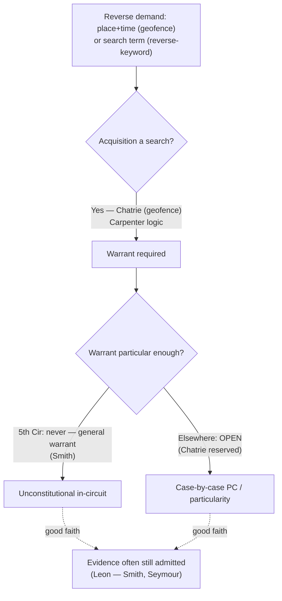

# Reverse-Keyword & Geofence Warrants

*The government does not have a suspect — it has a place and a time, or a search term, and it wants the platform to tell it who was there or who typed it. Is that reverse process a Fourth Amendment search, and can any warrant for it be particular enough?*

> [!rule] Black-letter rule
> A **geofence** (reverse-location) demand asks a provider — almost always Google — to identify every device inside a geographic box during a time window; a **reverse-keyword** demand asks a provider to identify everyone who searched a given term. Acquiring geofence **Location History is a Fourth Amendment search**: *[[Chatrie v. United States|Chatrie v. United States]]*, 609 U.S. ___ (2026), applying and extending *[[Carpenter v. United States|Carpenter]]* and rejecting the "voluntarily shared / opt-in" rationale — a person "has a reasonable expectation of privacy in records about his cell phone's location . . . even though for only a limited time, and from a third-party tech company." Whether a geofence **warrant** can ever satisfy probable cause and [[Particularity|particularity]] is **unsettled**: the Fifth Circuit held such warrants are "modern-day general warrants" and categorically unconstitutional (*[[United States v. Smith (2024)|United States v. Smith]]*, 110 F.4th 817 (5th Cir. 2024)), but *[[Chatrie v. United States|Chatrie]]* **expressly declined** to adopt that categorical rule, leaving probable-cause/[[Particularity|particularity]] the live question [[Reading and Citing Cases#on-remand|on remand]].
> ^rule-geofence

## The Brief

**What these tools are.** A geofence warrant runs the investigation backwards. Instead of naming a suspect and asking what he did, it names a place and a moment and asks the provider to disclose every device that was there — a "reverse-location" search that returns a list of anonymized accounts, which the government then narrows and de-anonymizes. A reverse-keyword warrant does the same in the search-term dimension: it asks Google to reveal every account that searched a specified string (an address, a victim's name) in a window. Both invert the usual particularized-suspect structure, and both are near-exclusively answered by one company's stored data.

**The threshold is settled: acquisition is a search.** After years of division in the lower courts, the Supreme Court resolved the geofence search-threshold question in *[[Chatrie v. United States|Chatrie]]*: compelling Google to produce a user's Location History **is** a search under *[[Carpenter v. United States|Carpenter]]*, because it invades a [[Reasonable Expectation of Privacy|reasonable expectation of privacy]] in the comprehensive, automatically generated record of a phone's location — and the fact that Location History is off by default and "opt-in" does not make it "voluntarily shared" out of Fourth Amendment protection. *[[Chatrie v. United States|Chatrie]]*, 609 U.S. ___ (2026). That confirms the search-threshold result the Fifth Circuit had reached in *[[United States v. Smith (2024)|Smith]]* and supersedes the contrary rationale of the [[Reading and Citing Cases#en-banc|en banc]] Fourth Circuit below.

**What remains open: whether the warrant can be particular.** *[[Chatrie v. United States|Chatrie]]* stopped at the threshold. It **[[Reading and Citing Cases#vacated|vacated]] and [[Reading and Citing Cases#on-remand|remanded]]** without deciding whether *this* geofence warrant, or any, satisfies probable cause and [[Particularity|particularity]], so the hard question has simply moved one step down the analysis. The Fifth Circuit's *[[United States v. Smith (2024)|Smith]]* gives the strong answer: because a geofence warrant "identif[ies] everyone in an area rather than a particularized suspect," it is a modern general warrant and cannot be cured, "unconstitutional under the Fourth Amendment." *[[United States v. Smith (2024)|Smith]]*, 110 F.4th at 838. But *[[Chatrie v. United States|Chatrie]]* declined to adopt that categorical rule, so *[[United States v. Smith (2024)|Smith]]*'s general-warrant holding is now the **persuasive minority position** binding only in the Fifth Circuit, and the probable-cause/[[Particularity|particularity]] of geofence warrants is the frontier every other court is working out case by case.

**Good faith keeps saving the evidence.** In both leading cases the defendant won the constitutional point and lost the suppression motion. *[[United States v. Smith (2024)|Smith]]* held the geofence warrant unconstitutional but upheld admission under the *[[United States v. Leon|Leon]]* [[The Good-Faith Exception|good-faith exception]], given the technology's novelty and the officers' reasonable, prosecutor-vetted conduct. That pattern, a *[[Carpenter v. United States|Carpenter]]*-style merits win neutralized by [[The Good-Faith Exception|good-faith reliance]] on then-uncharted law, is the practical state of play; suppression will bite only once the warrant rules are clear enough that reliance is no longer reasonable.

**Reverse-keyword is the same problem, one dimension over.** The reverse-keyword cases track the geofence analysis: a demand for everyone who searched a term implicates a [[Reasonable Expectation of Privacy|reasonable expectation of privacy]] in search queries, and courts have so far leaned on good faith rather than resolve the [[Particularity|particularity]] question. *People v. Seymour* (Colo. 2023), the leading reverse-keyword-warrant decision, held that a reverse-keyword warrant for Google users who searched a specific address implicated a constitutionally protected privacy interest, yet admitted the evidence on good-faith grounds. Treat reverse-keyword warrants as governed by the same unsettled [[Particularity|particularity]] frontier as geofence.

**Apply it.**
1. **Identify the direction of the query.** A reverse search that starts from a place, time, or term rather than a named suspect is the geofence/reverse-keyword family — the acquisition is a search under *[[Chatrie v. United States|Chatrie]]*.
2. **Concede the threshold; fight over the warrant.** After *[[Chatrie v. United States|Chatrie]]*, do not argue that acquisition is no search. The contest is probable cause and [[Particularity|particularity]] of the warrant that authorized it.
3. **Check the circuit.** In the Fifth Circuit, *[[United States v. Smith (2024)|Smith]]* makes geofence warrants categorically invalid; elsewhere the categorical rule is only persuasive, and the [[Particularity|particularity]] question is open.
4. **Expect a good-faith fight.** Even a winning constitutional argument will meet *[[United States v. Leon|Leon]]*; suppression turns on whether reliance on the warrant was objectively reasonable given how settled the law was at the time.

**Common pitfalls.**
- **Saying geofence warrants are settled — either way.** Only the **search threshold** is settled (*[[Chatrie v. United States|Chatrie]]*: yes, it is a search). Warrant validity is **open**; *[[Chatrie v. United States|Chatrie]]* pointedly did not adopt the Fifth Circuit's categorical ban.
- **Reading the third-party/opt-in defense as still live.** *[[Chatrie v. United States|Chatrie]]* rejected the argument that opt-in Location History is "voluntarily shared" and thus unprotected.
- **Confusing the two holdings of *[[United States v. Smith (2024)|Smith]]*.** Its search-threshold holding is now nationally confirmed; its general-warrant holding is Fifth-Circuit-only and persuasive elsewhere.
- **Assuming a constitutional violation means suppression.** Both *[[United States v. Smith (2024)|Smith]]* and *Seymour* found the conduct constitutionally problematic yet admitted the evidence under good faith.

## Lower-court developments

- **Fifth Circuit — categorical general-warrant rule (binding in-circuit).** *[[United States v. Smith (2024)|United States v. Smith]]*, 110 F.4th 817 (5th Cir. 2024), held geofence acquisition a search and geofence warrants unconstitutional general warrants, but denied suppression under *[[United States v. Leon|Leon]]*. Its threshold holding is now confirmed by *[[Chatrie v. United States|Chatrie]]*; its categorical holding is the minority answer to *[[Chatrie v. United States|Chatrie]]*'s reserved question.
- **Fourth Circuit — superseded rationale.** The [[Reading and Citing Cases#en-banc|en banc]] Fourth Circuit in *[[Chatrie v. United States|Chatrie]]* (below) split 7–7 on whether acquiring Location History was a search and affirmed the denial of suppression; the Supreme Court's 2026 reversal on the threshold displaces that reasoning while the remand takes up the warrant question.
- **State reverse-keyword (Colorado).** *People v. Seymour* (Colo. 2023) sustained a reverse-keyword warrant on good-faith grounds while recognizing the privacy interest in search queries — the closest analog for how courts will treat the [[Particularity|particularity]] of reverse-search warrants.

The synthesis: acquisition is a search (*[[Chatrie v. United States|Chatrie]]*), warrant validity is contested (*[[United States v. Smith (2024)|Smith]]* categorical vs. *[[Chatrie v. United States|Chatrie]]*'s reservation), and good faith is admitting the evidence in the meantime. The next frontier is a probable-cause/[[Particularity|particularity]] standard for reverse-search warrants — the question *[[Chatrie v. United States|Chatrie]]* left for remand.

## Key cases

| Case | Holding | Opinion |
|---|---|---|
| *[[Chatrie v. United States]]*, 609 U.S. ___ (2026) | **Anchor.** Acquiring a phone's Google Location History (geofence) is a Fourth Amendment search: a [[Reasonable Expectation of Privacy\|reasonable expectation of privacy]] in the record of one's location even briefly and even in a third party's hands; **applies and extends *Carpenter***, rejecting the opt-in/third-party rationale. Probable-cause/[[Particularity\|particularity]] of geofence warrants left open [[Reading and Citing Cases#on-remand\|on remand]] (6–3). | [opinion](https://www.courtlistener.com/opinion/10881683/chatrie-v-united-states/) |
| *[[United States v. Smith (2024)]]*, 110 F.4th 817 (5th Cir. 2024) | **Circuit anchor.** Geofence acquisition is a search under *[[Carpenter v. United States\|Carpenter]]*, and geofence warrants are "modern-day general warrants," categorically unconstitutional; suppression nonetheless denied under the *[[United States v. Leon\|Leon]]* [[The Good-Faith Exception\|good-faith exception]] given the technology's novelty. | [opinion](https://www.courtlistener.com/opinion/10036119/united-states-v-smith/) |
| *[[Carpenter v. United States]]*, 585 U.S. 296 (2018) | The parent rule: acquiring the comprehensive, auto-generated record of a person's movements is a search the third-party doctrine does not reach. Geofence is its reverse-location application. *(Primary home [[Reasonable Expectation of Privacy]].)* | [opinion](https://www.courtlistener.com/opinion/4510032/carpenter-v-united-states/) |

## Related cases across doctrines

| Case | Relevance here | Primary home | Opinion |
|---|---|---|---|
| *[[Smith v. Maryland]]*, 442 U.S. 735 (1979) | The third-party/assumption-of-risk baseline *[[Chatrie v. United States\|Chatrie]]* declined to apply to Location History. | [[Third-Party Doctrine & CSLI]] | [opinion](https://www.courtlistener.com/opinion/110118/smith-v-maryland/) |
| *[[United States v. Leon]]*, 468 U.S. 897 (1984) | The [[The Good-Faith Exception\|good-faith exception]] both *[[United States v. Smith (2024)\|Smith]]* and *Seymour* used to admit the evidence despite the constitutional defect. | [[The Good-Faith Exception]] | [opinion](https://www.courtlistener.com/opinion/111262/united-states-v-leon/) |

<!-- Chatrie v. United States, 609 U.S. ___ (2026) (No. 25-112, decided June 29, 2026): current-Term SCOTUS, slip-op sourced (R5 T4 — S1 R14). Rule quote ("reasonable expectation of privacy in records about his cell phone's location ... even though for only a limited time, and from a third-party tech company") matched against the corpus-verified case record; NO CL cluster fetch (cluster 10881683 handled per lake note). This page is the full-exposition home for Chatrie per S7 D6/TEACH-01 (discharges the batch-2 journaled obligation). -->
<!-- United States v. Smith, 110 F.4th 817 (5th Cir. 2024): pinpoint 838 (general-warrant holding + good-faith disposition), string-matched against the CL opinion text per the case record; page stem "United States v. Smith (2024)". Registry load-bearing nodes homed here: search.digital.geofence-threshold, search.digital.geofence-warrant. -->
<!-- People v. Seymour (Colo. 2023): reverse-keyword warrant; coverage-ledger terminal = brief-mention (S6 R11), named plainly, no standalone page. -->

## Visual

## Sources

- [*Chatrie v. United States*, 609 U.S. ___ (2026) (No. 25-112)](https://www.courtlistener.com/opinion/10881683/chatrie-v-united-states/) (slip op.; primary slip at supremecourt.gov/opinions/25pdf/25-112_0am4.pdf)
- [*United States v. Smith*, 110 F.4th 817 (5th Cir. 2024)](https://www.courtlistener.com/opinion/10036119/united-states-v-smith/) (pinpoint: 838)
- [*Carpenter v. United States*, 585 U.S. 296 (2018)](https://www.courtlistener.com/opinion/4510032/carpenter-v-united-states/)
- [*Smith v. Maryland*, 442 U.S. 735 (1979)](https://www.courtlistener.com/opinion/110118/smith-v-maryland/)
- [*United States v. Leon*, 468 U.S. 897 (1984)](https://www.courtlistener.com/opinion/111262/united-states-v-leon/)
- *People v. Seymour* (Colo. 2023) — reverse-keyword warrant; coverage-ledger brief-mention (no standalone page).
