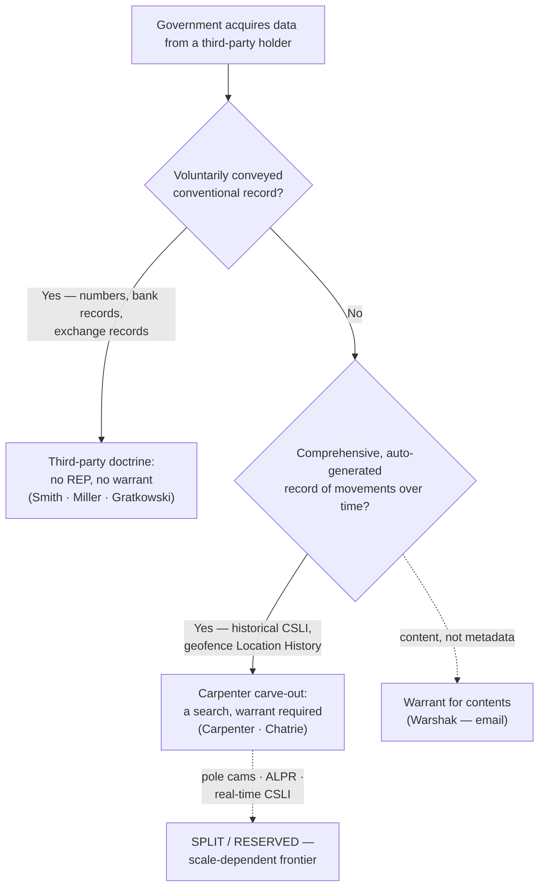

# Third-Party Doctrine & CSLI

*Did the suspect voluntarily hand this information to a third party, so there is no privacy left to protect — or is it the comprehensive, automatically generated digital record of his movements that* Carpenter *pulls back inside the Fourth Amendment?*

> [!rule] Black-letter rule
> Under the **third-party doctrine**, a person has **no legitimate expectation of privacy in information he voluntarily turns over to a third party**, so the government may acquire it without a warrant: *[[Smith v. Maryland#^pin-743|Smith v. Maryland]]*, 442 U.S. 735, 743–44 (1979) (dialed numbers, captured by a pen register); *[[United States v. Miller#^pin-442|United States v. Miller]]*, 425 U.S. 435, 442–43 (1976) (bank records). The animating theory is **assumption of risk**. *[[Carpenter v. United States|Carpenter v. United States]]*, 585 U.S. 296 (2018), carved a **narrow digital limit**: acquiring **historical cell-site location information (CSLI)** is a search that generally requires a **warrant**, because the third-party doctrine does not reach the comprehensive, auto-generated record of a person's physical movements. *[[Carpenter v. United States|Carpenter]]* did **not** overrule *[[Smith v. Maryland|Smith]]* or *[[United States v. Miller|Miller]]*; the doctrine now runs on **two tracks**, and the field call is deciding which track the data sits on.
> ^rule-third-party

## The Brief

**What the doctrine is, and what this page anchors.** The third-party doctrine is the rule that information you expose to an intermediary (a phone company, a bank, an internet provider) generally loses Fourth Amendment protection, because you assumed the risk that the recipient would hand it to the government. This page anchors that rule and its modern dividing line, the *[[Carpenter v. United States|Carpenter]]* CSLI limit. It is the doctrinal core of the **digital-surveillance family**: the technology-specific applications branch to [[Cell-Site Simulators]], [[Reverse-Keyword and Geofence Warrants]], [[Real-Time Tracking]], and [[Investigative Genetic Genealogy]], the statutory wiretap regime sits alongside on [[Electronic Surveillance and Title III]], and the [[The Third-Party Doctrine and Digital Surveillance|family overview]] maps the whole set. Start here for the rule; branch out for the tool.

**The test, up front.** Ask two questions in order. **(1) Was the information voluntarily conveyed to a third party?** If yes, the default is no [[Reasonable Expectation of Privacy|reasonable expectation of privacy]] and no warrant (*[[Smith v. Maryland|Smith]]*/*[[United States v. Miller|Miller]]*). **(2) Is it instead a comprehensive, automatically generated digital record of the person's movements over time** — the kind of "all-encompassing record" that offers "an intimate window into a person's life"? If yes, *[[Carpenter v. United States|Carpenter]]* treats the acquisition as a search requiring a warrant. Everything in this family of pages is a variation on which track a new form of data falls into.

**The origin: numbers and bank records.** *[[Smith v. Maryland|Smith]]* held that installing a pen register to record the numbers a caller dials is not a search: "a person has no legitimate expectation of privacy in information he voluntarily turns over to third parties." *[[Smith v. Maryland#^pin-743|Smith]]*, 442 U.S. at 743–44. The caller "assumed the risk that the company would reveal to police the numbers he dialed." *[[Smith v. Maryland#^pin-744|Id.]]* at 744. *[[United States v. Miller|Miller]]* had already applied the same logic to bank records: a depositor "takes the risk, in revealing his affairs to another, that the information will be conveyed by that person to the Government." *[[United States v. Miller#^pin-443|Miller]]*, 425 U.S. at 443. The theory is voluntary exposure, not secrecy of the underlying facts.

**The *[[Carpenter v. United States|Carpenter]]* carve-out: comprehensive digital location data.** *[[Carpenter v. United States|Carpenter]]* held that acquiring seven days of historical CSLI is a Fourth Amendment search that generally requires a warrant. The Court reasoned that a person keeps a reasonable expectation of privacy in the sum of his movements over time, and that the records sit with a wireless carrier does not automatically defeat it: location data is generated automatically, not through any meaningful voluntary act, and its depth and breadth make it "qualitatively different" from the numbers in *[[Smith v. Maryland|Smith]]* or the checks in *[[United States v. Miller|Miller]]*. *[[Carpenter v. United States|Carpenter]]*, 585 U.S. 296. Two disciplines keep this narrow. First, *[[Carpenter v. United States|Carpenter]]* **did not overrule** *[[Smith v. Maryland|Smith]]* or *[[United States v. Miller|Miller]]*; it left conventional business records and ordinary surveillance untouched. Second, it declined to decide real-time CSLI, tower dumps, or shorter periods — the carve-out is a scalpel, not a repeal.

**The modern extension: geofence.** The Supreme Court has since applied *[[Carpenter v. United States|Carpenter]]*'s logic to bulk reverse-location data. In *[[Chatrie v. United States|Chatrie v. United States]]*, 609 U.S. ___ (2026), the Court held that compelling Google to produce a user's Location History **is** a search — a reasonable expectation of privacy in the record of one's phone's location, "even though for only a limited time, and from a third-party tech company," rejecting the argument that opt-in Location History is "voluntarily shared." *[[Chatrie v. United States|Chatrie]]* is developed in full on [[Reverse-Keyword and Geofence Warrants]]; treat it here as the confirmation that *[[Carpenter v. United States|Carpenter]]*, not *[[Smith v. Maryland|Smith]]*, governs comprehensive digital movement data.

**Backstops and interfaces.** The third-party doctrine is one threshold rule among several. The privacy theory it sits inside is developed on [[Reasonable Expectation of Privacy]]; the physical-intrusion alternative on [[Trespass]]. Where the data is a real-time or GPS track rather than a stored business record, the [[Real-Time Tracking|beeper/GPS line]] (*[[United States v. Knotts|Knotts]]*, *[[United States v. Karo|Karo]]*, *[[United States v. Jones|Jones]]*) supplies the home/public distinction. Where the surveillance is a wiretap of contents rather than metadata, the statutory floor is [[Electronic Surveillance and Title III|Title III]] and its constitutional baseline, *[[Berger v. New York|Berger]]*. And when the *[[Carpenter v. United States|Carpenter]]* line is crossed without a warrant, the remedy is the ordinary one, suppression, subject to [[The Good-Faith Exception|good faith]] — the escape hatch lower courts have leaned on in the geofence and pole-camera cases.

**Burden, standard of review, and remedy.** A defendant moving to suppress bears the burden of establishing that a search occurred — a legitimate expectation of privacy in the thing acquired; if the acquisition is not a search (third-party doctrine), there is nothing to suppress. The threshold "was there a search?" question is reviewed [[Common Legal Terms#de-novo|de novo]], subsidiary historical facts for [[Common Legal Terms#clear-error|clear error]]. When *[[Carpenter v. United States|Carpenter]]*'s line is crossed without a warrant, the evidence and its fruits are subject to exclusion (see [[The Exclusionary Rule]]), unless the [[The Good-Faith Exception|good-faith exception]] or another recognized exception saves it.

**Apply it.**
1. **Name the data and the holder.** Identify exactly what the government acquired and from whom — dialed numbers from a carrier, bank records from a bank, location history from Google.
2. **Run the voluntary-conveyance question first.** If the record is conventional information the person exposed to an intermediary in the ordinary course of business, *[[Smith v. Maryland|Smith]]*/*[[United States v. Miller|Miller]]* control: no search, no warrant.
3. **Test for the *[[Carpenter v. United States|Carpenter]]* track.** Ask whether it is instead a comprehensive, automatically generated record of movement over time. If so, acquisition is a search requiring a warrant (*[[Carpenter v. United States|Carpenter]]*; geofence via *[[Chatrie v. United States|Chatrie]]*).
4. **Route to the specific tool.** Cell-site simulator, geofence/reverse-keyword, real-time GPS or CSLI, and genetic-genealogy problems each carry their own frontier — branch to the child page for the current state of that line.

**Common pitfalls.**
- **Reading *[[Carpenter v. United States|Carpenter]]* as a repeal of the third-party doctrine.** It is a **narrow** carve-out for comprehensive digital location data; *[[Smith v. Maryland|Smith]]* and *[[United States v. Miller|Miller]]* remain good law and govern conventional records.
- **Reciting the "*Carpenter* prongs" as a holding.** The widely taught three factors (a new category of digital-age information, generated without meaningful voluntary choice, revealing "the privacies of life") are **instructor framing**. The Court never enumerated a three-part test; only "the privacies of life" is its own phrase. Label the gloss as a gloss.
- **Assuming "held by a third party" ends the analysis.** After *[[Carpenter v. United States|Carpenter]]* and *[[Chatrie v. United States|Chatrie]]*, third-party custody no longer automatically defeats a privacy claim in comprehensive digital movement data.
- **Stating pole-camera, ALPR, or real-time CSLI law as a settled federal rule.** Each is split or expressly reserved; present it as one court's position, not a national rule (see Lower-court developments).

## Lower-court developments

- **Third-party doctrine still governs conventional records; content is the exception.** *[[United States v. Warshak]]* (6th Cir. 2010) held that a subscriber keeps a reasonable expectation of privacy in the **contents** of emails stored with a commercial ISP, so the government must get a warrant — the content/metadata line that survives *[[Smith v. Maryland|Smith]]*. By contrast, *United States v. Gratkowski* (5th Cir. 2020) applied *[[Smith v. Maryland|Smith]]*/*[[United States v. Miller|Miller]]* straight to **cryptocurrency-exchange records**: a Coinbase user has no reasonable expectation of privacy in the transaction records he shared with the exchange, and *[[Carpenter v. United States|Carpenter]]* did not extend to them.
- **Pole cameras — split, no SCOTUS resolution.** *[[United States v. Hay]]* (10th Cir. 2024) held that roughly sixty-eight days of pole-camera surveillance capturing only a home's public-facing exterior was not a search, and *[[Carpenter v. United States|Carpenter]]* did not abrogate circuit precedent. The en banc First Circuit in *[[United States v. Moore-Bush]]* (2022) fractured 3–3 on whether sustained pole-camera surveillance is a search after *[[Carpenter v. United States|Carpenter]]*, producing no controlling rationale but unanimously reversing suppression under the *Davis* good-faith exception. The split remains open.
- **Automatic license-plate readers — courts so far decline to extend *[[Carpenter v. United States|Carpenter]]*.** *[[United States v. Porter]]* (5th Cir. 2026) held that a fixed license-plate reader capturing a vehicle's passage is not a search, and the hit supplied reasonable suspicion for the stop; *[[Robinson v. Commonwealth]]* (Va. Ct. App. 2026) reached the same result for a Flock ALPR network on the record before it, reasoning that the system captured only public movements, not the "near-perfect surveillance" *[[Carpenter v. United States|Carpenter]]* condemned. Present ALPR as unsettled and jurisdiction-dependent.

The through-line: courts read *[[Carpenter v. United States|Carpenter]]* narrowly, extending it only where the surveillance approaches a comprehensive, persistent record of a specific person's movements, and otherwise leaving the *[[Smith v. Maryland|Smith]]*/*[[United States v. Knotts|Knotts]]* baseline in place. The scale-and-mosaic question (how much aggregated public-facing data becomes a search) is the live frontier across every technology in this family.

## Key cases

| Case | Holding | Opinion |
|---|---|---|
| *[[Smith v. Maryland]]*, 442 U.S. 735 (1979) | **Anchor.** No legitimate expectation of privacy in the numbers a caller dials, voluntarily conveyed to the phone company; a pen register is not a search. The origin of the third-party doctrine and its assumption-of-risk theory. | [opinion](https://www.courtlistener.com/opinion/110118/smith-v-maryland/) |
| *[[United States v. Miller]]*, 425 U.S. 435 (1976) | **Anchor.** No legitimate expectation of privacy in bank records exposed to the bank; the depositor assumes the risk of disclosure to the government. | [opinion](https://www.courtlistener.com/opinion/109433/united-states-v-miller/) |
| *[[Carpenter v. United States]]*, 585 U.S. 296 (2018) | **The digital limit.** Acquiring historical CSLI is a search requiring a warrant; the third-party doctrine does not reach the comprehensive, auto-generated record of a person's movements. **Narrow**: does not overrule *[[Smith v. Maryland|Smith]]*/*[[United States v. Miller|Miller]]*. *(Primary home [[Reasonable Expectation of Privacy]]; anchored here as the CSLI dividing line.)* | [opinion](https://www.courtlistener.com/opinion/4510032/carpenter-v-united-states/) |
| *[[Chatrie v. United States]]*, 609 U.S. ___ (2026) | Acquiring a phone's Google Location History (geofence) is a search: a [[Reasonable Expectation of Privacy\|reasonable expectation of privacy]] in the record of one's location, even briefly and even in a third party's hands; **applies and extends *Carpenter***. Warrant probable-cause/[[Particularity\|particularity]] left open [[Reading and Citing Cases#on-remand\|on remand]]. *(Full treatment on [[Reverse-Keyword and Geofence Warrants]].)* | [opinion](https://www.courtlistener.com/opinion/10881683/chatrie-v-united-states/) |

## Related cases across doctrines

These are developed in full elsewhere but set the boundaries of the third-party/CSLI line.

| Case | Relevance here | Primary home | Opinion |
|---|---|---|---|
| *[[United States v. Knotts]]*, 460 U.S. 276 (1983) | Beeper tracking over public roads is not a search: no [[Reasonable Expectation of Privacy\|reasonable expectation of privacy]] in public movements. The *[[Smith v. Maryland|Smith]]*-side baseline for location. | [[Real-Time Tracking]] | [opinion](https://www.courtlistener.com/opinion/110882/united-states-v-knotts/) |
| *[[United States v. Karo]]*, 468 U.S. 705 (1984) | Monitoring a beeper inside a private residence is a search: it reveals a fact about the home's interior. The context-flip that limits *[[United States v. Knotts|Knotts]]*. | [[Real-Time Tracking]] | [opinion](https://www.courtlistener.com/opinion/111257/united-states-v-karo/) |
| *[[United States v. Jones]]*, 565 U.S. 400 (2012) | Attaching a GPS tracker and monitoring it is a search on trespass grounds; the [[Common Legal Terms#concurring-opinion\|concurrences]]' mosaic theory seeded *[[Carpenter v. United States|Carpenter]]*. | [[Trespass]] | [opinion](https://www.courtlistener.com/opinion/7350871/united-states-v-jones/) |
| *[[Kyllo v. United States]]*, 533 U.S. 27 (2001) | Sense-enhancing technology "not in general public use" aimed at a home's interior is a search: the counterweight to surveillance capturing only public exposure. | [[Reasonable Expectation of Privacy]] | [opinion](https://www.courtlistener.com/opinion/118443/kyllo-v-united-states/) |
| *[[Berger v. New York]]*, 388 U.S. 41 (1967) | The [[Particularity\|particularity]] and safeguard baseline for electronic-surveillance warrants; the constitutional floor beneath the Title III wiretap regime. | [[Electronic Surveillance and Title III]] | [opinion](https://www.courtlistener.com/opinion/107483/berger-v-new-york/) |

<!-- Carpenter v. United States, 585 U.S. 296 (2018): CL html_with_citations carries slip-opinion pagination only (no U.S. Reports star page); the "whole of one's physical movements" / "intimate window" language is paraphrased with a case-level cite (R5 T3). Primary home is Reasonable Expectation of Privacy (Katz privacy theory); co-homed here as Key — the CSLI dividing line — per S3 A6 (Key-on without re-homing). -->
<!-- Chatrie v. United States, 609 U.S. ___ (2026) (No. 25-112, decided June 29, 2026): current-Term SCOTUS, slip-op sourced (R5 T4 — S1 R14). Full geofence exposition owned by Reverse-Keyword and Geofence Warrants per S7 D6/TEACH-01; this page carries the extension point + cross-ref. -->
<!-- Owed home_rows (S6 ledger → the-third-party-doctrine-and-digital-surveillance/index.md) discharged on this substantive child after the LINT-19 severance (index.md is now the lean overview; case tables live here): Warshak, Hay, Porter, Robinson (LCD), Moore-Bush (Related-LCD); Smith v. Maryland + Miller Key; Carpenter co-home Key (A6). Zero-drop per rule H — every owed case is page-present in the family. -->

## Visual

## Sources

- [*Smith v. Maryland*, 442 U.S. 735 (1979)](https://www.courtlistener.com/opinion/110118/smith-v-maryland/) (pinpoints: 743–44)
- [*United States v. Miller*, 425 U.S. 435 (1976)](https://www.courtlistener.com/opinion/109433/united-states-v-miller/) (pinpoints: 442, 443)
- [*Carpenter v. United States*, 585 U.S. 296 (2018)](https://www.courtlistener.com/opinion/4510032/carpenter-v-united-states/) (case-level cite; the "whole of one's physical movements" and "intimate window" language is paraphrased — the CL opinion text carries slip-opinion pagination only: R5 T3)
- [*Chatrie v. United States*, 609 U.S. ___ (2026) (No. 25-112)](https://www.courtlistener.com/opinion/10881683/chatrie-v-united-states/) (slip op.; full treatment on [[Reverse-Keyword and Geofence Warrants]])
- [*United States v. Knotts*, 460 U.S. 276 (1983)](https://www.courtlistener.com/opinion/110882/united-states-v-knotts/) (pinpoints: 281, 282)
- [*United States v. Karo*, 468 U.S. 705 (1984)](https://www.courtlistener.com/opinion/111257/united-states-v-karo/) (pinpoints: 714, 715)
- [*United States v. Jones*, 565 U.S. 400 (2012)](https://www.courtlistener.com/opinion/7350871/united-states-v-jones/) (pinpoint: 409)
- [*Kyllo v. United States*, 533 U.S. 27 (2001)](https://www.courtlistener.com/opinion/118443/kyllo-v-united-states/)
- [*Berger v. New York*, 388 U.S. 41 (1967)](https://www.courtlistener.com/opinion/107483/berger-v-new-york/) (pinpoints: 44, 56)
- [*United States v. Warshak*, 631 F.3d 266 (6th Cir. 2010)](https://www.courtlistener.com/opinion/181032/united-states-v-warshak/)
- [*United States v. Gratkowski*, 964 F.3d 307 (5th Cir. 2020)](https://www.courtlistener.com/opinion/4772500/united-states-v-gratkowski/)
- [*United States v. Hay*, 95 F.4th 1304 (10th Cir. 2024)](https://www.courtlistener.com/opinion/9485331/united-states-v-hay/)
- [*United States v. Moore-Bush*, 36 F.4th 320 (1st Cir. 2022) (en banc)](https://www.courtlistener.com/opinion/6476395/united-states-v-moore-bush/)
- [*United States v. Porter*, No. 25-60163 (5th Cir. 2026)](https://www.courtlistener.com/opinion/10810059/united-states-v-porter/)
- [*Robinson v. Commonwealth* (Va. Ct. App. 2026)](https://www.courtlistener.com/opinion/10838748/eddie-eugene-robinson-v-commonwealth-of-virginia/)
