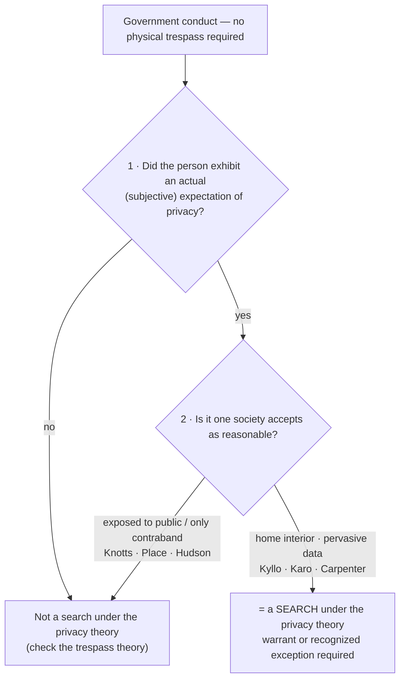

# Reasonable Expectation of Privacy

*Set trespass aside: did the government invade something this person kept private that society agrees was reasonable to keep private? If so, it is a search even with no physical entry at all.*

> [!rule] Black-letter rule
> Under the **privacy theory**, government conduct is a Fourth Amendment **search** when it invades a **reasonable expectation of privacy**: one the person **actually exhibited** (the subjective prong) and one **"society is prepared to recognize as 'reasonable'"** (the objective prong). *[[Katz v. United States#^pin-361|Katz]]*, 389 U.S. 347, [361](https://www.courtlistener.com/opinion/107564/katz-v-united-states/) (1967) (Harlan, J., [[Common Legal Terms#concurring-opinion|concurring]]). The Amendment "protects people, not places," so "what [a person] seeks to preserve as private, even in an area accessible to the public, may be constitutionally protected." *[[Katz v. United States#^pin-351|Id.]]* at 351. The privacy test runs **in parallel** with the [[Trespass|trespass theory]]; satisfying either one independently makes the conduct a search.
> ^rule-rep

## The Brief

**What the privacy theory is, and what it is not.** The privacy theory is the modern half of the [[Two Definitions of Search|two definitions of a search]]. It asks whether the government invaded an expectation of privacy the law is willing to honor, without regard to whether officers physically touched anything. It is **not** a test of property or trespass, and it is **not** satisfied merely because the defendant subjectively wished to be left alone: the expectation must be one society accepts as reasonable. This page owns the *[[Katz v. United States|Katz]]* privacy test; its property counterpart lives on [[Trespass]], and the standing question of *whose* expectation was invaded lives on [[Standing to Challenge a Search]].

**The test comes from Harlan's [[Common Legal Terms#concurring-opinion|concurrence]], not the majority.** The two-prong formulation that courts apply is Justice Harlan's: "a twofold requirement, first that a person have exhibited an actual (subjective) expectation of privacy and, second, that the expectation be one that society is prepared to recognize as 'reasonable.'" *[[Katz v. United States#^pin-361|Katz]]*, 389 U.S. at [361](https://www.courtlistener.com/opinion/107564/katz-v-united-states/) (Harlan, J., concurring). The majority supplied the animating principle rather than the test: "the Fourth Amendment protects people, not places," so "what [a person] seeks to preserve as private, even in an area accessible to the public, may be constitutionally protected." *[[Katz v. United States#^pin-351|Id.]]* at 351. Attribute the two prongs to Harlan, and the "people, not places" principle to the Court.

**It runs in parallel with trespass, not in sequence.** *[[Katz v. United States|Katz]]* did not replace the property baseline; the two theories are independent. As *[[United States v. Jones|Jones]]* put it, the privacy test "has been *added to*, not *substituted for*, the common-law trespassory test." *[[United States v. Jones#^pin-409|Jones]]*, 565 U.S. 400, [409](https://www.courtlistener.com/opinion/622304/united-states-v-jones/) (2012). A privacy invasion is a search even with no physical entry, which is exactly what *[[Katz v. United States|Katz]]* held for the electronic bug on the outside of a public phone booth.

**The home is the core, and technology recalibrates the line.** The privacy interest is strongest in the home, and the theory adjusts as surveillance tools change. Aiming **sense-enhancing technology "not in general public use"** at a home to learn its interior is a search, because "[i]n the home . . . all details are intimate details." *[[Kyllo v. United States|Kyllo]]*, 533 U.S. 27, [37](https://www.courtlistener.com/opinion/118443/kyllo-v-united-states/) (2001). The point is not the sophistication of the device but that it exposes what the walls otherwise keep private.

**The digital frontier: pervasive data can carry privacy even in a third party's hands.** The privacy theory reaches modern data that the old rules would have treated as exposed. Acquiring extended historical **cell-site location information** is a search: a person keeps a reasonable expectation of privacy in the sum of his movements over time, and that the records sit with a wireless carrier does not automatically defeat it. *[[Carpenter v. United States|Carpenter]]*, 585 U.S. 296 (2018). *[[Carpenter v. United States|Carpenter]]* **narrows**, but does not abolish, the **third-party doctrine** (the rule that information voluntarily shared with a third party generally loses Fourth Amendment protection); the digital-age contours of that doctrine are developed on [[The Third-Party Doctrine and Digital Surveillance]], and the geofence application on [[Reverse-Keyword and Geofence Warrants]].

**The boundary: no search where only the public or the contraband is exposed.** Conduct that reveals only what is already public, or reveals only the presence of contraband, invades no reasonable expectation of privacy. Tracking a car's movements over public roads by beeper is not a search, because a traveler "has no reasonable expectation of privacy in his movements from one place to another." *[[United States v. Knotts|Knotts]]*, 460 U.S. 276 (1983). A canine sniff that discloses only contraband is not a search, whether of luggage in public (*[[United States v. Place|Place]]*) or during a lawful, un-prolonged traffic stop (*[[Illinois v. Caballes|Caballes]]*). Neither is examining a car's exterior or a legally required VIN (*[[Cardwell v. Lewis|Cardwell]]*; *[[New York v. Class|Class]]*), an undercover purchase of goods a store exposes to the public (*[[Maryland v. Macon|Macon]]*), aerial photography of an industrial complex's open areas (*[[Dow Chemical Co. v. United States|Dow Chemical]]*), or a search of a prisoner's cell, in which there is **no** reasonable expectation of privacy at all (*[[Hudson v. Palmer|Hudson]]*).

**But context flips the same technique.** The identical tool can cross the line when it exposes the inside of a protected space. Monitoring a beeper to learn that an item is **inside a private residence** *is* a search, because it reveals a fact about the home's interior not open to visual surveillance. *[[United States v. Karo|Karo]]*, 468 U.S. 705 (1984). And an exploratory **tactile** inspection of a bus passenger's bag is a search, because "[p]hysically invasive inspection is simply more intrusive than purely visual inspection." *[[Bond v. United States|Bond]]*, 529 U.S. 334, [337](https://www.courtlistener.com/opinion/118354/bond-v-united-states/) (2000). The home marks the theory's core; the same beeper is innocuous on the highway and a search indoors.

**Burden, standard of review, and remedy.** The threshold "did a search occur?" question is one of law, reviewed [[Common Legal Terms#de-novo|de novo]] (subsidiary historical facts for [[Common Legal Terms#clear-error|clear error]]), and the movant raises it: the party seeking suppression must show both that the conduct was a search and that **he personally** held the invaded expectation of privacy. That personal-interest requirement is the merits question [[Standing to Challenge a Search|standing]] analyzes, measured by this same *[[Katz v. United States|Katz]]* test. Only once a **warrantless** search is established does the burden shift to the government to justify it under the warrant requirement or a recognized exception; unreasonable searches yield exclusion of the evidence and its fruits (see [[The Exclusionary Rule]]).

**Apply it.**
1. **Run both prongs.** Ask whether the person actually treated the thing as private, and whether society would accept that expectation as reasonable; a subjective wish alone is not enough (*[[Katz v. United States|Katz]]*).
2. **Locate the space.** The closer to the home's interior, the stronger the interest; the more it is exposed to the public, the weaker it is (*[[Kyllo v. United States|Kyllo]]*; *[[United States v. Knotts|Knotts]]*).
3. **Watch for context flips.** The same surveillance can be no search outdoors and a search when it reveals the inside of a protected space (*[[United States v. Karo|Karo]]*).
4. **For digital data, do not stop at "voluntarily shared."** Pervasive, comprehensive location data can carry a reasonable expectation of privacy even in a third party's hands (*[[Carpenter v. United States|Carpenter]]*; see [[The Third-Party Doctrine and Digital Surveillance]]).

**Common pitfalls.**
- **Attributing the two-prong test to the *[[Katz v. United States|Katz]]* majority.** It is **Harlan's [[Common Legal Terms#concurring-opinion|concurrence]]**; the majority gave the "people, not places" principle (*[[Katz v. United States|Katz]]*).
- **Treating a subjective wish as enough.** Both prongs must hold; the expectation must be one society is prepared to recognize as reasonable.
- **Reading *[[Carpenter v. United States|Carpenter]]* as abolishing the third-party doctrine.** It **narrows** the doctrine for pervasive digital location data; it does not erase it (*[[Carpenter v. United States|Carpenter]]*).
- **Assuming "no privacy invasion means no search."** Forgetting the parallel [[Trespass|trespass theory]]: *[[United States v. Jones|Jones]]* and *[[Florida v. Jardines|Jardines]]* find a search on trespass grounds even where a pure privacy analysis would be contested.

## Lower-court developments

- **First-impression / split-flag — pole-camera aggregation.** *[[United States v. Tuggle]]* (7th Cir. 2021) held that 18 months of warrantless pole-camera surveillance of a home's exterior was **not** a search under existing doctrine, while openly flagging *[[Carpenter v. United States|Carpenter]]*'s mosaic logic and the unsettled question whether aggregated long-term surveillance of public-facing activity becomes a search. *(Tuggle is primarily homed on [[Plain View Doctrine]].)*
- **Split (3-3 on rationale) — pole cameras.** *[[United States v. Moore-Bush]]* (1st Cir. 2022, [[Reading and Citing Cases#en-banc|en banc]]) admitted eight months of pole-camera evidence, the six judges dividing 3-3 only on whether the surveillance was a search (*[[Carpenter v. United States|Carpenter]]* aggregation vs. no search at all); good-faith reliance on circuit precedent saved it either way.
- **Split (private-search doctrine) — hash-matching.** *[[United States v. Wilson]]* (9th Cir. 2021) held that the government's warrantless viewing of email attachments flagged by automated hash-matching but never actually viewed by a person exceeded the antecedent private search, diverging from Fifth and Sixth Circuit decisions upholding similar hash-flag viewings.
- **The geofence and cell-site strand is developed elsewhere.** The Supreme Court's resolution of the geofence search-threshold question, and the reverse-keyword and real-time-tracking frontier, are treated on [[Reverse-Keyword and Geofence Warrants]] and [[The Third-Party Doctrine and Digital Surveillance]]; this page states only the underlying *[[Katz v. United States|Katz]]*/*[[Carpenter v. United States|Carpenter]]* privacy rule they apply.

## Key cases

| Case | Holding | Opinion |
|---|---|---|
| *[[Katz v. United States]]*, 389 U.S. 347 (1967) | **Anchor.** "The Fourth Amendment protects people, not places"; an electronic bug on a public phone booth was a search though there was no trespass. Harlan's [[Common Legal Terms#concurring-opinion\|concurrence]] supplies the two-prong reasonable-expectation-of-privacy test. | [opinion](https://www.courtlistener.com/opinion/107564/katz-v-united-states/) |
| *[[Kyllo v. United States]]*, 533 U.S. 27 (2001) | Using **sense-enhancing technology not in general public use** to learn a home's interior details is a search, presumptively unreasonable without a warrant: "all details are intimate details." | [opinion](https://www.courtlistener.com/opinion/118443/kyllo-v-united-states/) |
| *[[Carpenter v. United States]]*, 585 U.S. 296 (2018) | Acquiring extended historical **cell-site location information** is a search: a reasonable expectation of privacy in the sum of one's movements over time; **narrows** the third-party doctrine for digital-age data. *(Digital application developed on [[The Third-Party Doctrine and Digital Surveillance]].)* | [opinion](https://www.courtlistener.com/opinion/4510032/carpenter-v-united-states/) |
| *[[Bond v. United States]]*, 529 U.S. 334 (2000) | An officer's exploratory **tactile** squeezing of a bus passenger's soft luggage is a search: "physically invasive inspection is . . . more intrusive than purely visual inspection." | [opinion](https://www.courtlistener.com/opinion/118354/bond-v-united-states/) |
| *[[United States v. Place]]*, 462 U.S. 696 (1983) | A canine sniff of luggage in a public place is **sui generis** and **not** a search: it reveals only the presence or absence of contraband, the outer boundary of the privacy theory. | [opinion](https://www.courtlistener.com/opinion/110979/united-states-v-place/) |
| *[[Hudson v. Palmer]]*, 468 U.S. 517 (1984) | A prisoner has **no** reasonable expectation of privacy in his cell: the outer edge of the privacy definition, homed here as a boundary marker. | [opinion](https://www.courtlistener.com/opinion/111252/hudson-v-palmer/) |
| *[[Chatrie v. United States]]*, No. 25-112, slip op. (U.S. June 29, 2026) | Acquiring a phone's **Google Location History (geofence)** is a search: a reasonable expectation of privacy in the record of one's location, even briefly and even when held by a third party; **applies *Carpenter***. Warrant PC/[[Particularity\|particularity]] left open [[Reading and Citing Cases#on-remand\|on remand]]; geofence treatment developed on [[Reverse-Keyword and Geofence Warrants]]. | [opinion](https://www.supremecourt.gov/opinions/25pdf/25-112_0am4.pdf) |

## Related cases across doctrines

These are treated in full on other doctrine pages but bear on the privacy theory, framed for it here.

| Case | Relevance here | Primary home | Opinion |
|---|---|---|---|
| *[[United States v. Knotts]]*, 460 U.S. 276 (1983) | Beeper-aided tracking of a vehicle over public roads is **not** a search: no reasonable expectation of privacy in movements over public thoroughfares. | [[The Third-Party Doctrine and Digital Surveillance]] | [opinion](https://www.courtlistener.com/opinion/110882/united-states-v-knotts/) |
| *[[United States v. Karo]]*, 468 U.S. 705 (1984) | Monitoring a beeper **inside a private residence** IS a search: it reveals a fact about the home's interior not open to visual surveillance. | [[The Third-Party Doctrine and Digital Surveillance]] | [opinion](https://www.courtlistener.com/opinion/111257/united-states-v-karo/) |
| *[[Illinois v. Caballes]]*, 543 U.S. 405 (2005) | A dog sniff during a lawful traffic stop that does not prolong it is **not** a search: it reveals only contraband, implicating no legitimate privacy interest. | [[Traffic Stops]] | [opinion](https://www.courtlistener.com/opinion/137742/illinois-v-caballes/) |
| *[[Cardwell v. Lewis]]*, 417 U.S. 583 (1974) | Examining a car's exterior on probable cause in a public lot invades **no** protected privacy interest: a reduced expectation of privacy in a vehicle's exterior. | [[Automobile Exception]] | [opinion](https://www.courtlistener.com/opinion/109069/cardwell-v-lewis/) |
| *[[New York v. Class]]*, 475 U.S. 106 (1986) | **No** reasonable expectation of privacy in a VIN the law requires to be visible; reaching in to move papers obscuring it was a minimal but reasonable search. | [[Traffic Stops]] | [opinion](https://www.courtlistener.com/opinion/111600/new-york-v-class/) |
| *[[United States v. Van Leeuwen]]*, 397 U.S. 249 (1970) | Brief detention of mailed packages on reasonable suspicion invades **no** privacy interest; that interest is implicated only when a package is opened under a warrant. | [[Terry Stops and Reasonable Suspicion]] | [opinion](https://www.courtlistener.com/opinion/108099/united-states-v-van-leeuwen/) |
| *[[Maryland v. Macon]]*, 472 U.S. 463 (1985) | An undercover officer's purchase of magazines from a public store is **neither** a search (no privacy in wares exposed to the public) **nor** a seizure. | [[Consent Searches]] | [opinion](https://www.courtlistener.com/opinion/111477/maryland-v-macon/) |
| *[[Lewis v. United States (1966)]]*, 385 U.S. 206 (1966) | An undercover agent invited in to transact illegal business works **no** search, though he may not exceed the invitation to conduct a general search. | [[Consent Searches]] | [opinion](https://www.courtlistener.com/opinion/107312/lewis-v-united-states/) |
| *[[Dow Chemical Co. v. United States]]*, 476 U.S. 227 (1986) | Precision aerial photography of an industrial complex's open areas from navigable airspace is **not** a search: such areas are more like open fields than [[Curtilage\|curtilage]]. | [[Curtilage]] | [opinion](https://www.courtlistener.com/opinion/111667/dow-chemical-co-v-united-states-ex-rel-administrator/) |
| *[[Berger v. New York]]*, 388 U.S. 41 (1967) | Set [[Particularity\|particularity]] and safeguard standards for electronic-eavesdropping warrants: a companion to the *[[Katz v. United States\|Katz]]* turn away from trespass-only doctrine. | [[The Third-Party Doctrine and Digital Surveillance]] | [opinion](https://www.courtlistener.com/opinion/107483/berger-v-new-york/) |
| *[[United States v. Moore-Bush]]*, (1st Cir. 2022) (en banc) | Pole-camera aggregation: whether *[[Carpenter v. United States\|Carpenter]]*'s mosaic logic makes long-term public-facing surveillance a search, the [[Reading and Citing Cases#en-banc\|en banc]] court dividing 3-3 on the question. *(Recent en banc frontier decision; its later treatment is not yet independently verified, so it is cited on its 2022 holding.)* | [[Fourth Amendment Framework]] | [opinion](https://www.courtlistener.com/opinion/6476395/united-states-v-moore-bush/) |
| *[[United States v. Wilson]]*, (9th Cir. 2021) | Automated hash-matching: viewing attachments a person never saw exceeded the antecedent private search, a privacy-frontier split with the 5th and 6th Circuits. *(Recent frontier decision; its later treatment is not yet independently verified, so it is cited on its 2021 holding.)* | [[Fourth Amendment Framework]] | [opinion](https://www.courtlistener.com/opinion/5296785/united-states-v-luke-wilson/) |

<!-- Chatrie v. United States, 609 U.S. ___ (2026) (No. 25-112, decided June 29, 2026): current-Term SCOTUS, slip-op sourced (R5 T4 — S1 R14). CL cluster object 10881683 is corrupted; do not ingest. Full geofence treatment is owned by the digital sub-umbrella (Reverse-Keyword and Geofence Warrants) per S7 D6/TEACH-01; this page carries the Katz/REP rule and a cross-referenced Key mention only. -->

## Visual

## Sources

- [*Katz v. United States*, 389 U.S. 347 (1967)](https://www.courtlistener.com/opinion/107564/katz-v-united-states/) (pinpoints: 351, 361 (Harlan, J., concurring))
- [*Kyllo v. United States*, 533 U.S. 27 (2001)](https://www.courtlistener.com/opinion/118443/kyllo-v-united-states/) (pinpoints: 34, 37, 40)
- [*Carpenter v. United States*, 585 U.S. 296 (2018)](https://www.courtlistener.com/opinion/4510032/carpenter-v-united-states/) (case-level cite; the "whole of one's physical movements" language is paraphrased — the CL opinion text carries slip-opinion pagination only, no U.S. Reports star page: R5 T3)
- [*Bond v. United States*, 529 U.S. 334 (2000)](https://www.courtlistener.com/opinion/118354/bond-v-united-states/) (pinpoint: 337)
- [*United States v. Place*, 462 U.S. 696 (1983)](https://www.courtlistener.com/opinion/110979/united-states-v-place/) (pinpoint: 707)
- [*Hudson v. Palmer*, 468 U.S. 517 (1984)](https://www.courtlistener.com/opinion/111252/hudson-v-palmer/)
- [*United States v. Knotts*, 460 U.S. 276 (1983)](https://www.courtlistener.com/opinion/110882/united-states-v-knotts/)
- [*United States v. Karo*, 468 U.S. 705 (1984)](https://www.courtlistener.com/opinion/111257/united-states-v-karo/)
- [*Illinois v. Caballes*, 543 U.S. 405 (2005)](https://www.courtlistener.com/opinion/137742/illinois-v-caballes/)
- [*Cardwell v. Lewis*, 417 U.S. 583 (1974)](https://www.courtlistener.com/opinion/109069/cardwell-v-lewis/)
- [*New York v. Class*, 475 U.S. 106 (1986)](https://www.courtlistener.com/opinion/111600/new-york-v-class/)
- [*United States v. Van Leeuwen*, 397 U.S. 249 (1970)](https://www.courtlistener.com/opinion/108099/united-states-v-van-leeuwen/)
- [*Maryland v. Macon*, 472 U.S. 463 (1985)](https://www.courtlistener.com/opinion/111477/maryland-v-macon/)
- [*Lewis v. United States*, 385 U.S. 206 (1966)](https://www.courtlistener.com/opinion/107312/lewis-v-united-states/)
- [*Dow Chemical Co. v. United States*, 476 U.S. 227 (1986)](https://www.courtlistener.com/opinion/111667/dow-chemical-co-v-united-states-ex-rel-administrator/)
- [*Berger v. New York*, 388 U.S. 41 (1967)](https://www.courtlistener.com/opinion/107483/berger-v-new-york/)
- [*Chatrie v. United States*, No. 25-112 (U.S. June 29, 2026)](https://www.supremecourt.gov/opinions/25pdf/25-112_0am4.pdf) (slip op.; geofence treatment on [[Reverse-Keyword and Geofence Warrants]])
- [*United States v. Moore-Bush* (1st Cir. 2022) (en banc)](https://www.courtlistener.com/opinion/6476395/united-states-v-moore-bush/)
- [*United States v. Wilson* (9th Cir. 2021)](https://www.courtlistener.com/opinion/5296785/united-states-v-luke-wilson/)
