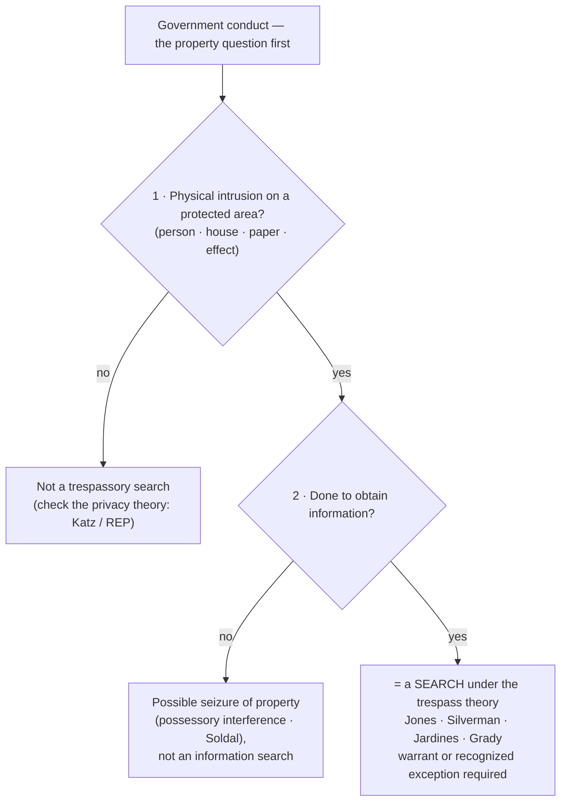

# Trespass

*Before* Katz *even enters the picture: did officers physically intrude on a constitutionally protected area (a person, house, paper, or effect) to gather information? If so, it is a search, whatever a privacy analysis would say.*

> [!rule] Black-letter rule
> Under the **trespass theory**, government conduct is a Fourth Amendment **search** when officers **(1)** physically intrude on a constitutionally protected area (the textual **"persons, houses, papers, and effects"**) and **(2)** do so **to obtain information**. *[[United States v. Jones|Jones]]*, 565 U.S. 400, [404–05](https://www.courtlistener.com/opinion/622304/united-states-v-jones/) (2012). This common-law test is an **independent** basis for a search: the *[[Katz v. United States|Katz]]* privacy test "has been *added to*, not *substituted for*, the common-law trespassory test." *[[United States v. Jones#^pin-409|Id.]]* at 409. A trespass to gather information is a search even where a pure privacy analysis would be contested, and the intrusion need not be a "trespass" under state property law. *[[Silverman v. United States|Silverman]]*, 365 U.S. 505 (1961).
> ^rule-trespass

## The Brief

**What the trespass theory is, and what it is not.** The trespass theory is the *older* of the [[Two Definitions of Search|two definitions of a search]], and after decades of dormancy it is again live law. It asks a property question, not a privacy one: did the government physically occupy or intrude upon a protected place or thing to learn something? It is **not** a test of how much the intrusion offended anyone's expectations, and it is **not** defeated by the fact that what the officer observed was already exposed to public view. Where it applies, it resolves the threshold question on its own, without any *[[Katz v. United States|Katz]]* inquiry. This page owns the trespass test itself; its privacy counterpart lives on [[Reasonable Expectation of Privacy]], and the [[Two Definitions of Search|overview]] shows how the two fit together.

**The test: two elements, both required.** A trespassory search has two parts. **First**, a **physical intrusion** onto, or occupation of, a constitutionally protected area, meaning one of the textual categories the Amendment names: persons, houses, papers, and effects. **Second**, that the intrusion was done **to obtain information**. *[[United States v. Jones|Jones]]* states both together: "The Government physically occupied private property for the purpose of obtaining information," and "such a physical intrusion would have been considered a 'search' . . . when [the Amendment] was adopted." *[[United States v. Jones#^pin-404a|Jones]]*, 565 U.S. at [404–05](https://www.courtlistener.com/opinion/622304/united-states-v-jones/). Trespass alone is not enough; the intrusion must be joined with an attempt to gather information.

**The revival: *[[Katz v. United States|Katz]]* did not repeal the property baseline.** For most of the twentieth century the trespass test was thought to have been supplanted by privacy analysis. *[[United States v. Jones|Jones]]* corrected that: the *[[Katz v. United States|Katz]]* reasonable-expectation-of-privacy test "has been *added to*, not *substituted for*, the common-law trespassory test." *[[United States v. Jones#^pin-409|Id.]]* at 409. *[[United States v. Jones|Jones]]* itself decided the case on trespass grounds without reaching *[[Katz v. United States|Katz]]*, so the property baseline was revived rather than replaced. The Amendment "protects property as well as privacy." *[[Soldal v. Cook County#^pin-62|Soldal]]*, 506 U.S. at [62](https://www.courtlistener.com/opinion/112795/soldal-v-cook-county/#:~:text=our%20cases%20unmistakably%20hold%20that). The practical payoff: a trespass to gather information is independently a search even where a pure privacy analysis would be contested, as it would be for a car's location on public roads.

**Not measured by state property law.** The "trespass" that matters is a federal Fourth Amendment concept, not a technical violation of local property rules. A "spike mike" driven through a party wall into a house was a search because officers made "an unauthorized physical penetration into the premises," and the Court declined to rest the outcome "upon the technicality of a trespass upon a party wall as a matter of local law." *[[Silverman v. United States|Silverman]]*, 365 U.S. 505 (1961). The question is federal and functional: did the government physically invade a protected space to obtain information?

**[[Curtilage]] and the implied license.** The protected "house" extends to its **[[Curtilage|curtilage]]**, the area immediately surrounding and associated with the home. Officers may approach a home the way an ordinary visitor would, but bringing a drug dog onto the front porch to hunt for evidence exceeds the "implied license" that lets a visitor knock, so it is a trespassory search. *[[Florida v. Jardines|Jardines]]*, 569 U.S. 1 (2013). The scope of that protected ground, and where it ends, is developed on [[Curtilage]] and [[Open Fields]].

**Property and possession: the seizure branch.** The property line also captures a distinct wrong: a **seizure of property**, which occurs on any "meaningful interference with an individual's possessory interests in that property," independent of any privacy or liberty interest. *[[Soldal v. Cook County|Soldal]]*, 506 U.S. 56, [61–62](https://www.courtlistener.com/opinion/112795/soldal-v-cook-county/) (1992). Dragging a family's mobile home off its lot was a seizure even though nothing private was inspected. Keep the branches straight: a trespassory *search* gathers information, while a *seizure* interferes with possession, and one can happen without the other.

**Bodies are protected too.** The protected "person" is literal. A State conducts a search when it attaches a satellite-based monitoring device to a person's body, without consent, to track his movements; the civil label on the monitoring program does not remove the conduct from the Fourth Amendment. *[[Grady v. North Carolina|Grady]]*, 575 U.S. 306 (2015). *[[Grady v. North Carolina|Grady]]* is *[[United States v. Jones|Jones]]* applied to the body rather than the car: a physical attachment to an "effect" or a person, made to obtain locational information, is a search whose reasonableness is then decided separately.

**Even a slight movement counts.** Because the theory turns on physical intrusion rather than the magnitude of the privacy loss, even a minimal manipulation crosses the line when it is done to expose hidden information. Moving stereo components a few inches to read concealed serial numbers "did produce a new invasion of respondent's privacy unjustified by the exigent circumstance," and "[a] search is a search, even if it happens to disclose nothing but the bottom of a turntable." *[[Arizona v. Hicks|Hicks]]*, 480 U.S. 321, [325](https://www.courtlistener.com/opinion/111834/arizona-v-hicks/) (1987).

**Burden, standard of review, and remedy.** The threshold "did a search occur?" question is one of law, reviewed [[Common Legal Terms#de-novo|de novo]] (its subsidiary historical facts for [[Common Legal Terms#clear-error|clear error]]), and the movant raises it: the party seeking suppression must show both that the conduct was a Fourth Amendment search and that **he personally** held the invaded property or possessory interest (see [[Standing to Challenge a Search]]). Only once a **warrantless** search is established does the burden shift to the government to justify it under the warrant requirement or a recognized exception. If the search was unreasonable, the evidence and its fruits are subject to exclusion (see [[The Exclusionary Rule]]).

**Apply it.**
1. **Ask the property question first.** Did officers physically enter or occupy a person, house, paper, or effect? If yes, you may have a search without ever reaching privacy (*[[United States v. Jones|Jones]]*).
2. **Tie the intrusion to information-gathering.** The physical contact must be aimed at learning something; a trespass with no investigative purpose is not this kind of search (*[[United States v. Jones|Jones]]*).
3. **Check the [[Curtilage|curtilage]] license.** An approach a visitor could make is permitted; exceeding it, as by deploying a dog to investigate the porch, is trespassory (*[[Florida v. Jardines|Jardines]]*).
4. **Separate search from seizure.** If the conduct interfered with possession rather than gathered information, analyze it as a seizure of property (*[[Soldal v. Cook County|Soldal]]*).

**Common pitfalls.**
- **"No trespass, no search."** That was *[[Olmstead v. United States|Olmstead]]*, and *[[Katz v. United States|Katz]]* overruled it. A wiretap, a thermal scan, or long-term cell-site data can be a search with zero physical entry; the trespass theory is a floor, not a ceiling (see [[Reasonable Expectation of Privacy]]).
- **Treating *[[Olmstead v. United States|Olmstead]]* as a dead letter.** It is overruled on the privacy point, but its property instinct was **revived** by *[[United States v. Jones|Jones]]*; the property baseline is live law again.
- **Requiring a state-law trespass.** The federal search question does not turn on local property technicalities (*[[Silverman v. United States|Silverman]]*).
- **Forgetting that trespass needs an information purpose.** A physical touch not aimed at obtaining information is not a trespassory search; the two elements are conjunctive (*[[United States v. Jones|Jones]]*).

## Key cases

| Case | Holding | Opinion |
|---|---|---|
| *[[United States v. Jones]]*, 565 U.S. 400 (2012) | **Anchor.** Installing a GPS tracker on a vehicle and monitoring it is a search under the revived trespass theory: a physical intrusion on an "effect" to obtain information; the *[[Katz v. United States\|Katz]]* test is "added to, not substituted for" the trespassory test. | [opinion](https://www.courtlistener.com/opinion/7350871/united-states-v-jones/) |
| *[[Silverman v. United States]]*, 365 U.S. 505 (1961) | A "spike mike" physically penetrating the wall into the house is a search: an unauthorized physical intrusion into a protected area, not gauged by local-law "technical trespass" niceties. | [opinion](https://www.courtlistener.com/opinion/106187/silverman-v-united-states/) |
| *[[Florida v. Jardines]]*, 569 U.S. 1 (2013) | Bringing a drug dog onto the home's **[[Curtilage\|curtilage]]** (the front porch) to investigate exceeded the visitor's implied license: a trespassory search. | [opinion](https://www.courtlistener.com/opinion/856347/florida-v-jardines/) |
| *[[Grady v. North Carolina]]*, 575 U.S. 306 (2015) | **Anchor.** Attaching a satellite-monitoring device to a person's body to track his movements is a search; the civil character of the program does not remove it from the Fourth Amendment. Reasonableness left for remand. | [opinion](https://www.courtlistener.com/opinion/2789928/grady-v-north-carolina/) |
| *[[Olmstead v. United States]]*, 277 U.S. 438 (1928) | The origin point: wiretapping with **no physical entry** was **not** a search under a property-only framing. Overruled on privacy by *[[Katz v. United States\|Katz]]*; the property instinct was later revived by *[[United States v. Jones\|Jones]]*. | [opinion](https://www.courtlistener.com/opinion/101320/olmstead-v-united-states/) |
| *[[Gouled v. United States]]*, 255 U.S. 298 (1921) | Entry obtained by **stealth, ruse, or social pretext** can still render the ensuing search a Fourth Amendment violation. (Its separate "mere-evidence" rule was overruled by *[[Warden v. Hayden]]*; the ruse-entry holding survives.) | [opinion](https://www.courtlistener.com/opinion/99745/gouled-v-united-states/) |

## Related cases across doctrines

These are treated in full on other doctrine pages but bear on the trespass theory, framed for it here.

| Case | Relevance here | Primary home | Opinion |
|---|---|---|---|
| *[[Arizona v. Hicks]]*, 480 U.S. 321 (1987) | Moving stereo equipment a few inches to read concealed serial numbers was a **separate search**: even minimal physical manipulation to obtain hidden information crosses the line. | [[Plain View Doctrine]] | [opinion](https://www.courtlistener.com/opinion/111834/arizona-v-hicks/) |
| *[[Soldal v. Cook County]]*, 506 U.S. 56 (1992) | The property baseline's **seizure branch**: "meaningful interference with . . . possessory interests" is a seizure independent of privacy; keeps the trespass-search and property-seizure branches straight. | [[Seizure of Property]] | [opinion](https://www.courtlistener.com/opinion/112795/soldal-v-cook-county/) |

## Visual

## Sources

- [*United States v. Jones*, 565 U.S. 400 (2012)](https://www.courtlistener.com/opinion/7350871/united-states-v-jones/) (pinpoints: 404–05, 409)
- [*Silverman v. United States*, 365 U.S. 505 (1961)](https://www.courtlistener.com/opinion/106187/silverman-v-united-states/) (pinpoints: 509, 511)
- [*Florida v. Jardines*, 569 U.S. 1 (2013)](https://www.courtlistener.com/opinion/856347/florida-v-jardines/) (pinpoints: 6, 9)
- [*Soldal v. Cook County*, 506 U.S. 56 (1992)](https://www.courtlistener.com/opinion/112795/soldal-v-cook-county/) (pinpoints: 61, 62)
- [*Grady v. North Carolina*, 575 U.S. 306 (2015)](https://www.courtlistener.com/opinion/2789928/grady-v-north-carolina/)
- [*Olmstead v. United States*, 277 U.S. 438 (1928)](https://www.courtlistener.com/opinion/101320/olmstead-v-united-states/) (pinpoint: 464)
- [*Gouled v. United States*, 255 U.S. 298 (1921)](https://www.courtlistener.com/opinion/99745/gouled-v-united-states/) (pinpoint: 306)
- [*Arizona v. Hicks*, 480 U.S. 321 (1987)](https://www.courtlistener.com/opinion/111834/arizona-v-hicks/) (pinpoint: 325)
