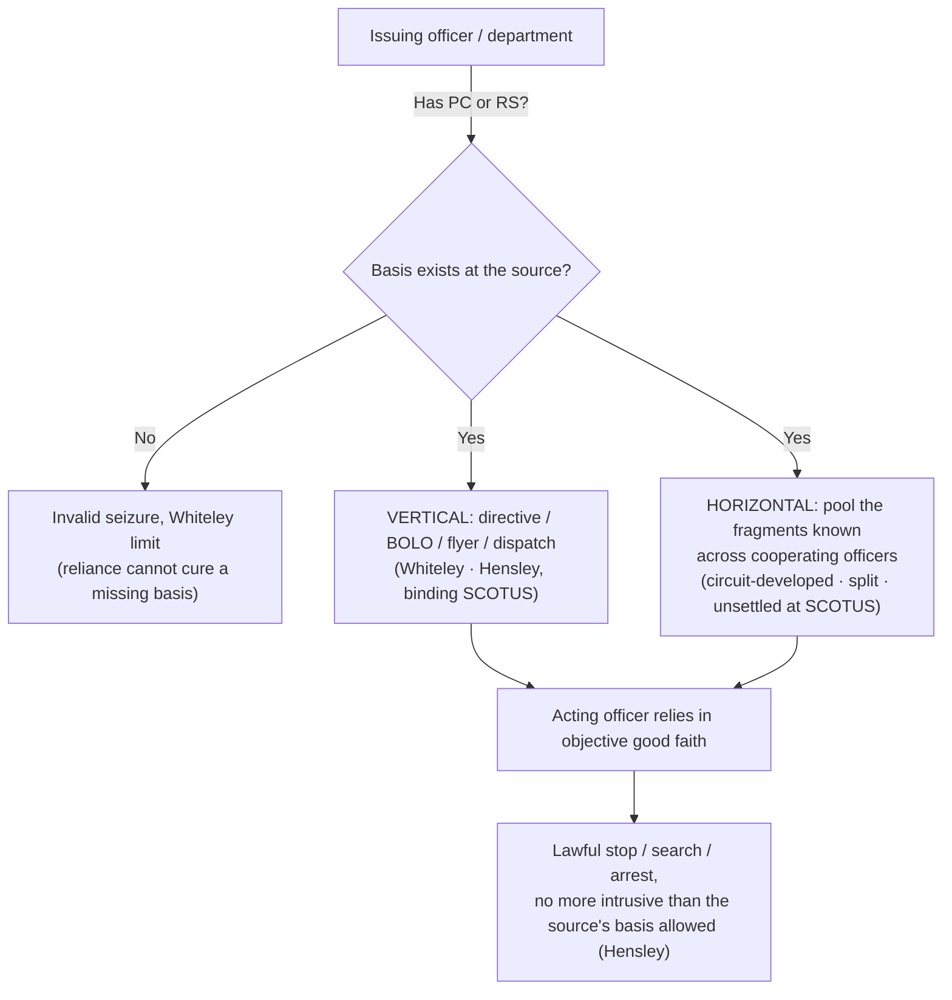

# Collective Knowledge and the Fellow-Officer Rule

*Can I act on another officer's knowledge, and whose knowledge counts?*

> [!rule] Black-letter rule
> Under the **collective-knowledge (fellow-officer) doctrine**, the probable cause or reasonable suspicion held by one officer is **imputed** to another who acts at his direction or in objective reliance on a bulletin, flyer, or dispatch. But the doctrine **pools knowledge and never manufactures it**: if the issuing officer or department in fact lacked the required basis, the resulting [[Seizure of the Person|seizure]] is invalid regardless of the acting officer's good faith. "[A]n otherwise illegal arrest cannot be insulated from challenge by the decision of the instigating officer to rely on fellow officers to make the arrest." *[[Whiteley v. Warden#^pin-568|Whiteley]]*, 401 U.S. 560, [568](https://www.courtlistener.com/opinion/108297/whiteley-v-warden-wyoming-state-penitentiary/) (1971).
> ^rule-collective-knowledge

## The Brief

**What the doctrine is, and is not.** The collective-knowledge rule supplies the *who-knew-what* layer beneath [[Probable Cause|probable cause]] and [[Reasonable Suspicion|reasonable suspicion]]. An officer who makes a stop or arrest in **objective reliance** on a bulletin, flyer, or radio dispatch is presumed to act on the requisite quantum and need not personally possess every underlying fact. What the doctrine cannot do is create a basis that never existed: it **imputes** knowledge across officers, it does not conjure it. And it reaches **searches, warrants, and arrests**, not only investigative stops.

**Two distinct modes, kept apart.** *Vertical* imputation runs along a chain of command or communication: an officer who **has** probable cause or reasonable suspicion issues a directive (a BOLO, a flyer, a dispatch), and the acting officer may execute it without independently knowing the facts. *Horizontal* pooling instead aggregates the fragments **known across cooperating officers** working a common investigation to satisfy the threshold collectively. The two prongs rest on very different footing, and conflating them is the doctrine's central trap.

**The vertical prong is settled SCOTUS law.** *[[Whiteley v. Warden|Whiteley v. Warden]]* holds that officers may act on a fellow officer's bulletin and **assume** the issuer had probable cause, but the validity of the arrest still turns on that cause existing **somewhere in the originating chain**. *[[United States v. Hensley|Hensley]]* extends the rule to *[[Terry v. Ohio|Terry]]* stops: reliance on a flyer justifies a stop "if a flyer or bulletin has been issued on the basis of articulable facts supporting a reasonable suspicion .... If the flyer has been issued in the absence of a reasonable suspicion, then a stop in the objective reliance upon it violates the Fourth Amendment." *[[United States v. Hensley|Hensley]]*, 469 U.S. 221, [232–33](https://www.courtlistener.com/opinion/111294/united-states-v-hensley/) (1985). *[[United States v. Hensley|Hensley]]* also fixes an **intrusiveness ceiling**: the stop must be "not significantly more intrusive than would have been permitted the issuing department," *[[United States v. Hensley#^pin-233|id.]]* at 233, so the acting officer inherits the *scope* the source's basis would authorize and cannot exceed it. See [[Terry Stops and Reasonable Suspicion]].

**Whiteley's exclusion premise, and how the modern cases qualify the remedy.** Keep two questions separate. The first is **imputation**: whose knowledge counts, answered by *[[Whiteley v. Warden|Whiteley]]* and *[[United States v. Hensley|Hensley]]*. The second is **remedy**: whether suppression follows when the imputed information turns out to be wrong. *[[Whiteley v. Warden|Whiteley]]* supplied both an imputation baseline and an **exclusion premise**, suppressing the fruits because the source lacked probable cause. The modern good-faith cases complicate that **exclusion consequence, not the imputation rule**. *[[Herring v. United States|Herring]]* and *[[Arizona v. Evans|Evans]]* hold that an arrest resting on erroneous shared records can stand without suppression where the error was isolated negligence rather than culpable police conduct. So the imputation baseline is intact: if no one in the chain had the basis, the seizure is unlawful. What has moved is only the remedy on the wrong-records branch, which now turns on the culpability analysis of [[The Exclusionary Rule|the exclusionary rule]].

**Imputed *and mistaken* collective knowledge (*[[Herring v. United States|Herring]]*).** In *[[Herring v. United States|Herring v. United States]]* an officer arrested in reliance on a neighboring department's records that **erroneously** showed an outstanding warrant, recalled months earlier and never purged. The seizure rested on imputed but mistaken collective knowledge, yet the Court declined to suppress: exclusion turns on the **culpability** of the police conduct, because "[t]o trigger the exclusionary rule, police conduct must be sufficiently deliberate that exclusion can meaningfully deter it, and sufficiently culpable that such deterrence is worth the price paid by the justice system." *[[Herring v. United States#^pin-144|Herring]]*, 555 U.S. 135 (2009) (129 S. Ct. at [702](https://www.courtlistener.com/opinion/145922/herring-v-united-states/)). Isolated, attenuated bookkeeping negligence does not warrant suppression; deliberate, reckless, or **recurring/systemic** error in the shared records can.

**The horizontal prong is unsettled at SCOTUS, and *[[Maryland v. Pringle|Pringle]]* is not authority for it.** No SCOTUS holding adopts a **pure horizontal-pooling rule**; *[[Whiteley v. Warden|Whiteley]]* and *[[United States v. Hensley|Hensley]]* squarely supply only the vertical, directive-based prong. Imputation of *aggregated* suspicion among cooperating officers has been built out by the courts of appeals, where it remains **circuit-developed and split** (see below). A common miscitation is *[[Maryland v. Pringle|Maryland v. Pringle]]*: *[[Maryland v. Pringle|Pringle]]* is an **aggregate / particularized-probable-cause-as-to-a-person** case. Probable cause "must be particularized with respect to the person," 540 U.S. 366, 371 (2003), a requirement satisfied by the reasonable inference of a "common enterprise among the three men," *[[Maryland v. Pringle|id.]]* at 373. It aggregates facts about **suspects**, not knowledge across **officers**, and contains **no** collective-knowledge, fellow-officer, or imputation reasoning. It is therefore **not** SCOTUS support for horizontal pooling; its home is [[Probable Cause]], and it appears below only to be expressly **distinguished**.

**Burden, review, and remedy.** On a motion to suppress, the **movant** bears the initial burden of establishing a Fourth Amendment violation. Where the government invokes the collective-knowledge doctrine, the **government** must show that the imputing or directing officer (the **source**) actually possessed the requisite probable cause or reasonable suspicion. The existence of that basis is reviewed **[[Common Legal Terms#de-novo|de novo]]**, the underlying historical facts for **[[Common Legal Terms#clear-error|clear error]]**. *[[Ornelas v. United States|Ornelas]]*, 517 U.S. 690, [699](https://www.courtlistener.com/opinion/118030/ornelas-v-united-states/) (1996). **Remedy:** if the source lacked the basis, or the acting officer exceeded the scope the basis would allow, the seizure is unlawful and its fruits are suppressed unless an exclusionary-rule exception (such as *[[Herring v. United States|Herring]]* good faith) applies. See [[The Exclusionary Rule]].

**Apply it.**
1. **Name the source.** Identify who actually held the probable cause or reasonable suspicion, the officer or department behind the BOLO, flyer, or dispatch you are acting on.
2. **Confirm the basis existed there.** A directive transmits cause; it does not create it. If the source had no articulable basis, your stop or arrest is unlawful no matter how reasonable your reliance (*[[Whiteley v. Warden|Whiteley]]*; *[[United States v. Hensley|Hensley]]*).
3. **Match your scope to the source's basis.** You inherit only the intrusion the source's quantum would justify; do not escalate an RS-grade stop into an arrest on the strength of a flyer issued on reasonable suspicion alone (*[[United States v. Hensley|Hensley]]*).
4. **Do not lean on horizontal pooling as if it were settled.** Aggregating uncommunicated facts among on-scene officers rests on split circuit law, and *[[Maryland v. Pringle|Pringle]]* is not authority for it.

**Common pitfalls.**
- **Assuming the BOLO cures a missing factual basis.** A flyer, dispatch, or warrant request does not *create* probable cause or reasonable suspicion; it merely transmits whatever the issuer actually had. If suppression litigation traces the bulletin back to an empty basis, the seizure falls (*[[Whiteley v. Warden|Whiteley]]*; *[[United States v. Hensley|Hensley]]*). This recurs in dispatch-driven [[Traffic Stops|traffic stops]].
- **Conflating vertical reliance with horizontal pooling.** Reliance on a directive (vertical) is anchored in binding SCOTUS authority; aggregating scattered, uncommunicated facts among on-scene officers (horizontal) rests on **split** circuit law. Do not present pooled-knowledge theories as SCOTUS-blessed, and do not cite *[[Maryland v. Pringle|Pringle]]* for them.
- **Forgetting the intrusiveness ceiling.** Under *[[United States v. Hensley|Hensley]]*, the acting officer inherits the *scope* the source's quantum would justify; escalating beyond it on the strength of a flyer is unsupported.
- **Reading *[[Herring v. United States|Herring]]* as a rule of imputation.** *[[Herring v. United States|Herring]]* is about the **remedy** when shared records are wrong, not about whose knowledge counts; it does not loosen the requirement that the basis exist somewhere in the chain.

## Lower-court developments

- **[[United States v. Massenburg]] (4th Cir. 2011)** — *narrow: rejects horizontal aggregation.* The court held the collective-knowledge doctrine extends **only** to information or instructions communicated ("vertically") to the acting officers, and **declined** to adopt the expansive "horizontal" theory aggregating uncommunicated facts. "No case from the Supreme Court or from our own court has ever expanded the collective-knowledge doctrine beyond the context of information or instructions communicated ('vertically') to acting officers. Some of our sister courts have authorized 'horizontal' aggregation of uncommunicated information." 654 F.3d 480, 493–94. ⚖ **Circuit split.** **Binding in-circuit — 4th Cir.** [opinion](https://www.courtlistener.com/opinion/223188/united-states-v-massenburg/)
- **[[United States v. Ramirez]] (9th Cir. 2007)** — *expand: no content-of-communication requirement.* Held the doctrine imposes **no requirement** about the content of the communication between officers; the directing officer need not tell the acting officer *why* to act, so long as the directing officer or investigating team had the requisite basis. The lead case in the communication-nexus camp on the question the split turns on. 473 F.3d 1027, 1032–33. *Accord* *United States v. Nafzger*, 974 F.2d 906, 913–14 (7th Cir. 1992) (investigating-team member may rely on the team's collective knowledge, narrow reading of the doctrine rejected); *United States v. Ibarra*, 493 F.3d 526, 530 (5th Cir. 2007) (imputing knowledge on "some degree of communication" between the acting officer and one who knows the facts). ⚖ **Circuit split.** **Binding in-circuit — 9th Cir.** [opinion](https://www.courtlistener.com/opinion/3040421/united-states-v-ramirez/)
- **[[United States v. Chavez]] (10th Cir. 2008)** — *split: leaves pure horizontal open.* Upheld a stop where a federal agent with probable cause asked a state officer to stop a suspect without communicating the reasons, applying **vertical** collective knowledge; the court did **not need to reach** the freestanding horizontal-pooling question because one officer already possessed all the probable-cause components. "Rather than a horizontal pooling of discrete pieces of information, one officer here ... had all the requisite probable cause components; the question then is whether that information can be imputed vertically to another officer." 534 F.3d 1338, 1347–48. ⚖ **Circuit split.** **Binding in-circuit — 10th Cir.** [opinion](https://www.courtlistener.com/opinion/171034/united-states-v-chavez/)
- **United States v. Cook (1st Cir. 2002) / United States v. Balser (1st Cir. 2023)** — *reserve: limited on-scene pooling; outer reach left open.* *Cook* aggregated the collective knowledge of officers who directly participated in a stop, while cautioning against a broad rendition of the principle, 277 F.3d 82, 86. Two decades on, *Balser* observed that the circuit had yet to squarely address the maximum reach of horizontal aggregation and resolved the case on the vertical prong, 70 F.4th 613 (1st Cir. 2023). ⚖ **Circuit split.** **Binding in-circuit — 1st Cir.** [opinion](https://www.courtlistener.com/opinion/776186/united-states-v-donald-cook/) · [opinion](https://www.courtlistener.com/opinion/9407224/united-states-v-balser/)
- **[[United States v. Trent]] (6th Cir. 2026)** — *expand: vertical imputation across agencies.* Applying the doctrine at the *[[Rodriguez v. United States|Rodriguez]]* intersection, the court held that reasonable suspicion to prolong a traffic stop for a canine sniff may be imputed across multiple agencies even where the stopping officer was "wholly unaware" of the specific facts. No. 25-5770, slip op. (6th Cir. 2026). **Persuasive only — non-precedential.** [opinion](https://www.courtlistener.com/opinion/10855903/united-states-v-mark-anthony-trent/)

Since *[[Whiteley v. Warden|Whiteley]]* and *[[United States v. Hensley|Hensley]]*, the courts of appeals have done the frontier work, extending vertical imputation across agencies and into the *[[Rodriguez v. United States|Rodriguez]]* prolongation context while **sharply splitting** over "horizontal" aggregation of *uncommunicated* facts. The Fourth Circuit rejects it outright (*[[United States v. Massenburg|Massenburg]]*); a communication-nexus camp imputes so long as officers are jointly investigating and does not require the reasons to be spelled out (*[[United States v. Ramirez|Ramirez]]*; *Nafzger*; *Ibarra*, with *[[United States v. Chavez|Chavez]]* leaving the pure question open). The First Circuit, having recognized a narrow on-scene pooling in *Cook*, later reserved the doctrine's outer reach in *Balser*. The unresolved question is whether facts held by an officer who communicated **nothing** may be aggregated at all. **There is no controlling SCOTUS resolution.**

## Key cases

| Case | Holding | Opinion |
|---|---|---|
| *[[Whiteley v. Warden]]*, 401 U.S. 560 (1971) | Officers may rely on a radio bulletin and assume the issuer had probable cause; but if the issuer in fact lacked it, reliance on fellow officers cannot cure the missing basis, and the fruits are suppressed. The quantum is measured **at the source** (the vertical anchor and *[[Whiteley v. Warden\|Whiteley]]* limit). | [opinion](https://www.courtlistener.com/opinion/108297/whiteley-v-warden-wyoming-state-penitentiary/) |
| *[[United States v. Hensley]]*, 469 U.S. 221 (1985) | Extends *[[Whiteley v. Warden\|Whiteley]]* to *[[Terry v. Ohio\|Terry]]* stops: a stop in reliance on a wanted flyer is lawful only if the issuing department had reasonable suspicion on articulable facts, and the stop may be no more intrusive than the source's basis would permit. | [opinion](https://www.courtlistener.com/opinion/111294/united-states-v-hensley/) |
| *[[Herring v. United States]]*, 555 U.S. 135 (2009) | Imputed but mistaken collective knowledge: arresting on another department's records that erroneously showed a warrant does **not** require suppression where the error was isolated negligence rather than deliberate, reckless, or systemic conduct. A **remedy** holding, not an imputation one (also Key on [[The Exclusionary Rule]]). | [opinion](https://www.courtlistener.com/opinion/145922/herring-v-united-states/) |

## Related cases across doctrines

These cases are treated in full on other doctrine pages but bear on the collective-knowledge / fellow-officer rule, framed here for it.

| Case | Relevance here | Primary home | Opinion |
|---|---|---|---|
| *[[Maryland v. Pringle]]*, 540 U.S. 366 (2003) | ***Distinguished, NOT horizontal pooling.*** Aggregate probable cause **as to a person**: cause must be particularized to the person (at 371), satisfied by the "common enterprise" inference (at 373). It aggregates facts about *suspects*, not knowledge across *officers*, and holds nothing about imputation. Listed only to be expressly distinguished. | [[Probable Cause]] | [opinion](https://www.courtlistener.com/opinion/131150/maryland-v-pringle/) |
| *[[Arizona v. Evans]]*, 514 U.S. 1 (1995) | ***Wrong records.*** Reliance on a mistaken arrest record in the shared system where the error was a **court clerk's** did not trigger exclusion; the remedy side of imputed-but-wrong information. | [[The Exclusionary Rule]] | [opinion](https://www.courtlistener.com/opinion/117905/arizona-v-evans/) |
| *[[Utah v. Strieff]]*, 579 U.S. 232 (2016) | ***Warrant in the system.*** Discovery of a valid pre-existing warrant during an unlawful stop **attenuated** the taint; bears on how downstream officers may act on warrants and records issued by others. | [[The Exclusionary Rule]] | [opinion](https://www.courtlistener.com/opinion/8176208/utah-v-strieff/) |
| *[[District of Columbia v. R.W.]]*, No. 25-248, per curiam (U.S. Apr. 20, 2026) | ***Dispatch factor.*** A reviewing court may not **excise** a radio dispatch from the reasonable-suspicion totality; the dispatch-driven stop is weighed as a whole. | [[Terry Stops and Reasonable Suspicion]] | [opinion](https://www.courtlistener.com/opinion/10845431/district-of-columbia-v-rw/) |

## Visual

## Sources

- [*Whiteley v. Warden*, 401 U.S. 560 (1971)](https://www.courtlistener.com/opinion/108297/whiteley-v-warden-wyoming-state-penitentiary/) (pinpoint: 568)
- [*United States v. Hensley*, 469 U.S. 221 (1985)](https://www.courtlistener.com/opinion/111294/united-states-v-hensley/) (pinpoints: 232–33, 233)
- [*Herring v. United States*, 555 U.S. 135 (2009)](https://www.courtlistener.com/opinion/145922/herring-v-united-states/) (pinpoint: 129 S. Ct. at 702 — S. Ct. star pagination; U.S.-reporter interior 144 retired pending official-reporter pagination)
- [*Maryland v. Pringle*, 540 U.S. 366 (2003)](https://www.courtlistener.com/opinion/131150/maryland-v-pringle/) (pinpoints: 371, 373) (aggregate/particularized PC, distinguished; home: [[Probable Cause]])
- [*Arizona v. Evans*, 514 U.S. 1 (1995)](https://www.courtlistener.com/opinion/117905/arizona-v-evans/) (home: [[The Exclusionary Rule]])
- [*Utah v. Strieff*, 579 U.S. 232 (2016)](https://www.courtlistener.com/opinion/8176208/utah-v-strieff/) (home: [[The Exclusionary Rule]])
- [*District of Columbia v. R.W.*, No. 25-248, per curiam (U.S. Apr. 20, 2026)](https://www.courtlistener.com/opinion/10845431/district-of-columbia-v-rw/) (home: [[Terry Stops and Reasonable Suspicion]])
- [*Ornelas v. United States*, 517 U.S. 690 (1996)](https://www.courtlistener.com/opinion/118030/ornelas-v-united-states/) (pinpoint: 699)
- [*United States v. Massenburg*, 654 F.3d 480 (4th Cir. 2011)](https://www.courtlistener.com/opinion/223188/united-states-v-massenburg/) (pinpoint: 493–94)
- [*United States v. Ramirez*, 473 F.3d 1027 (9th Cir. 2007)](https://www.courtlistener.com/opinion/3040421/united-states-v-ramirez/) (pinpoint: 1032–33)
- [*United States v. Nafzger*, 974 F.2d 906 (7th Cir. 1992)](https://www.courtlistener.com/opinion/590298/united-states-v-roy-w-nafzger/) (pinpoint: 913–14) (communication-nexus camp)
- [*United States v. Ibarra*, 493 F.3d 526 (5th Cir. 2007)](https://www.courtlistener.com/opinion/50973/united-states-v-ibarra/) (pinpoint: 530) (communication-nexus camp)
- [*United States v. Chavez*, 534 F.3d 1338 (10th Cir. 2008)](https://www.courtlistener.com/opinion/171034/united-states-v-chavez/) (pinpoint: 1347–48)
- [*United States v. Cook*, 277 F.3d 82 (1st Cir. 2002)](https://www.courtlistener.com/opinion/776186/united-states-v-donald-cook/) (pinpoint: 86) (1st Cir. limited on-scene pooling; reserved by *Balser*)
- [*United States v. Balser*, 70 F.4th 613 (1st Cir. 2023)](https://www.courtlistener.com/opinion/9407224/united-states-v-balser/) (reserves horizontal aggregation's maximum reach)
- [*United States v. Trent*, No. 25-5770 (6th Cir. 2026)](https://www.courtlistener.com/opinion/10855903/united-states-v-mark-anthony-trent/)
