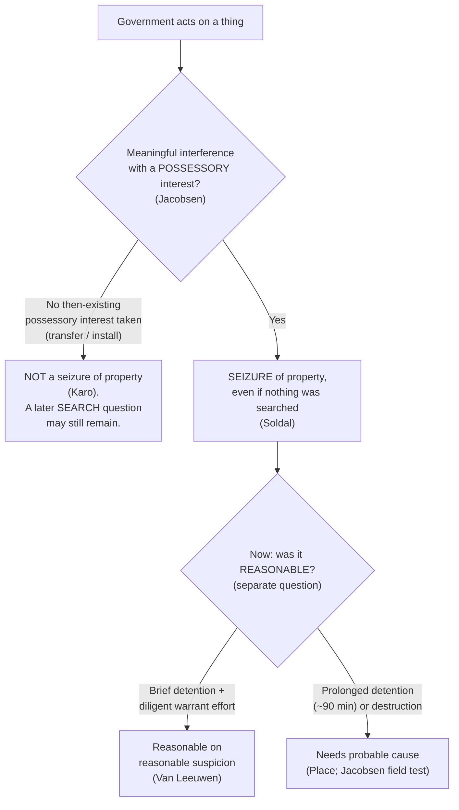

# Seizure of Property

*When does the government "seize" a thing rather than search it? This page fixes the threshold for a seizure of property. Whether that seizure was reasonable is the separate question that follows.*

> [!rule] Black-letter rule
> **A seizure of property is a meaningful interference with a possessory interest, and it is a Fourth Amendment event even when nothing private is exposed.** A "seizure" of property occurs when "there is some meaningful interference with an individual's possessory interests in that property." *[[United States v. Jacobsen|Jacobsen]]*, 466 U.S. 109, [113](https://www.courtlistener.com/opinion/111143/united-states-v-jacobsen/) (1984). This possessory interest is protected **independently** of privacy or liberty, so an act that invades no privacy and detains no person can still be a seizure. *[[Soldal v. Cook County|Soldal]]*, 506 U.S. 56 (1992). A search and a seizure are distinct events: a single act may be one, both, or neither.
> ^rule-property

## The Brief

**The possessory-interest definition (*[[United States v. Jacobsen|Jacobsen]]*).** The Fourth Amendment text protects "two types of expectations, one involving 'searches,' the other 'seizures.'" A search reaches privacy; a seizure reaches possession. In *[[United States v. Jacobsen|Jacobsen]]* the Court stated the controlling formula: a "'seizure' of property occurs when there is some meaningful interference with an individual's possessory interests in that property." 466 U.S. at 113. The interference is measured against the owner's possessory interest, not his privacy, so the two threshold questions are asked separately.

**Property is protected independently of privacy and liberty (*[[Soldal v. Cook County|Soldal]]*).** *[[Soldal v. Cook County|Soldal]]* reaffirmed the *[[United States v. Jacobsen|Jacobsen]]* definition and rejected the narrower view that the Fourth Amendment guards only privacy and liberty interests. Sheriff's deputies stood by while a trailer-park owner tore the Soldals' mobile home from its foundation and towed it away in an eviction. No one was searched and no privacy was invaded, yet the physical carting-off of the home was a "seizure" of property under the Fourth Amendment. *[[Soldal v. Cook County|Soldal]]*, 506 U.S. 56 (1992). The lesson is that "no search" is never the end of the analysis: the possessory question stands on its own.

**A seizure can precede or accompany a search, and destruction is the heavier intrusion.** In *[[United States v. Jacobsen|Jacobsen]]* itself the agents' "assertion of dominion and control over the package and its contents did constitute a 'seizure,'" though a reasonable one given what the private carrier had already revealed. *[[United States v. Jacobsen|Jacobsen]]*, 466 U.S. at [121](https://www.courtlistener.com/opinion/111143/united-states-v-jacobsen/). The later field test, which consumed a trace of the powder, "did affect respondents' possessory interests ... since by destroying a quantity of the powder it converted what had been only a temporary deprivation of possessory interests into a permanent one." *[[United States v. Jacobsen|Id.]]* at 125. Permanent deprivation or destruction is a greater intrusion on possession than a brief detention, and it demands more to justify it.

**Detaining property is itself a seizure, and its duration is measured against the *[[Terry v. Ohio|Terry]]* limits.** Holding an object away from its owner interferes with possession, so a detention on less than probable cause is judged like an investigative stop of the person. A brief detention of mailed packages on reasonable suspicion, "while the investigation continued," is reasonable so long as officers act with diligence in pursuing a warrant; the detention invades no privacy interest, which is implicated only when the package is opened under a warrant. *[[United States v. Van Leeuwen|Van Leeuwen]]*, 397 U.S. 249 (1970). But duration has a ceiling. In *[[United States v. Place|Place]]* a 90-minute investigative detention of a traveler's luggage on reasonable suspicion "exceeded the permissible limits of a *Terry*-type investigative stop," and "[t]he length of the detention ... alone" precluded treating the seizure as reasonable without probable cause. *[[United States v. Place|Place]]*, 462 U.S. 696, [709](https://www.courtlistener.com/opinion/110979/united-states-v-place/) (1983).

**No then-existing possessory interest, no seizure (*[[United States v. Karo|Karo]]*).** Because a seizure requires meaningful interference with a *possessory interest*, government conduct that takes no such interest is not a seizure at all. In *[[United States v. Karo|Karo]]* the placement of a beeper inside a can of ether that was then transferred to the buyer conveyed no possessory interest the buyer already held and interfered with no one's possession, so it was not a seizure; the Fourth Amendment problem in that case lay in the later *monitoring* of the beeper inside a private residence, which was a search. *[[United States v. Karo|Karo]]*, 468 U.S. 705 (1984). The point is to keep the two questions apart: an act can leave possession untouched (no seizure) and still raise a search question down the line.

**Burden, standard of review, and remedy.** Because a warrantless seizure of property is presumptively unreasonable, the **government** bears the burden of justifying it once the defendant shows his possessory interest was meaningfully interfered with. Whether a seizure occurred is a **mixed question**: historical facts are reviewed for [[Common Legal Terms#clear-error|clear error]], the ultimate Fourth Amendment determination [[Common Legal Terms#de-novo|de novo]]. The **remedy** for an unreasonable seizure of property is suppression of the item and its fruits (see [[The Exclusionary Rule]]).

**Apply it.**
1. **Name the possessory interest and the interference.** Identify whose possession the government disturbed and how. Meaningful interference with that interest is the seizure. *[[United States v. Jacobsen|Jacobsen]]*.
2. **Ask the seizure question independently of any search.** "No privacy invaded" does not answer it; possession is a separate Fourth Amendment interest. *[[Soldal v. Cook County|Soldal]]*.
3. **Time any detention against the *[[Terry v. Ohio|Terry]]* ceiling.** A brief detention on reasonable suspicion can be reasonable if officers diligently pursue a warrant; a prolonged one (roughly the 90 minutes in *[[United States v. Place|Place]]*) needs probable cause. *[[United States v. Van Leeuwen|Van Leeuwen]]*; *[[United States v. Place|Place]]*.
4. **Weigh destruction and permanent deprivation more heavily.** Consuming or permanently taking property is a greater intrusion than a brief hold and demands more justification. *[[United States v. Jacobsen|Jacobsen]]*.
5. **Separate a non-seizure from a later search.** If the government took no then-existing possessory interest, there may be no seizure at all, even though a monitoring or inspection down the line can still be a search. *[[United States v. Karo|Karo]]*.

**Common pitfalls.**
- **Thinking "no search" ends the analysis.** Property is protected independently of privacy; a police-assisted towing or eviction can be a seizure though nothing was searched. *[[Soldal v. Cook County|Soldal]]*.
- **Treating a brief property detention as costless.** Length alone can make a warrantless detention unreasonable; the 90-minute luggage hold in *[[United States v. Place|Place]]* failed for that reason.
- **Forgetting the diligence condition.** A detention of mail or a package on reasonable suspicion is reasonable only while officers move promptly toward a warrant. *[[United States v. Van Leeuwen|Van Leeuwen]]*.
- **Conflating the seizure with a later search.** Installing or transferring a device may take no possessory interest (no seizure) even though later monitoring is a search. *[[United States v. Karo|Karo]]*.

## Key cases

| Case | Holding | Opinion |
|---|---|---|
| *[[Soldal v. Cook County]]*, 506 U.S. 56 (1992) | **Anchor.** A seizure of property is a meaningful interference with possessory interests and is a Fourth Amendment event independent of any search, privacy, or liberty interest; towing a mobile home in a police-assisted eviction was a seizure. | [opinion](https://www.courtlistener.com/opinion/112795/soldal-v-cook-county/) |
| *[[United States v. Van Leeuwen]]*, 397 U.S. 249 (1970) | Detaining mailed packages on reasonable suspicion, while officers diligently pursue a warrant, is a reasonable seizure; the detention invades no privacy interest, which arises only when the package is opened under a warrant. | [opinion](https://www.courtlistener.com/opinion/108099/united-states-v-van-leeuwen/) |

## Related cases across doctrines

These are treated in full on their own pages but bear directly on the threshold for a seizure of property.

| Case | Relevance here | Primary home | Opinion |
|---|---|---|---|
| *[[United States v. Jacobsen]]*, 466 U.S. 109 (1984) | ***Definition.*** Source of the controlling formula, a seizure of property is meaningful interference with an individual's possessory interests; a field test that destroyed powder made a temporary deprivation permanent. | [[Private and Foreign Searches]] | [opinion](https://www.courtlistener.com/opinion/111143/united-states-v-jacobsen/) |
| *[[United States v. Place]]*, 462 U.S. 696 (1983) | ***Duration.*** A 90-minute investigative detention of luggage on less than probable cause exceeded the permissible limits of a *[[Terry v. Ohio|Terry]]* stop; length alone defeated reasonableness. | [[Terry Stops and Reasonable Suspicion]] | [opinion](https://www.courtlistener.com/opinion/110979/united-states-v-place/) |
| *[[United States v. Karo]]*, 468 U.S. 705 (1984) | ***No interference, no seizure.*** Transfer of a beeper-laden can conveyed no then-existing possessory interest and was not a seizure; the later monitoring inside a home was the search. | [[Real-Time Tracking]] | [opinion](https://www.courtlistener.com/opinion/111257/united-states-v-karo/) |

## Visual

## Sources

- [*United States v. Van Leeuwen*, 397 U.S. 249 (1970)](https://www.courtlistener.com/opinion/108099/united-states-v-van-leeuwen/) (mail detention on reasonable suspicion pending a diligently sought warrant)
- [*United States v. Place*, 462 U.S. 696 (1983)](https://www.courtlistener.com/opinion/110979/united-states-v-place/) (pinpoint: 709; home = [[Terry Stops and Reasonable Suspicion]])
- [*United States v. Jacobsen*, 466 U.S. 109 (1984)](https://www.courtlistener.com/opinion/111143/united-states-v-jacobsen/) (pinpoints: 113, 121, 124–125; home = [[Private and Foreign Searches]])
- [*United States v. Karo*, 468 U.S. 705 (1984)](https://www.courtlistener.com/opinion/111257/united-states-v-karo/) (transfer conveyed no possessory interest; home = [[Real-Time Tracking]])
- [*Soldal v. Cook County*, 506 U.S. 56 (1992)](https://www.courtlistener.com/opinion/112795/soldal-v-cook-county/) (possessory interests protected independently of privacy and liberty)
