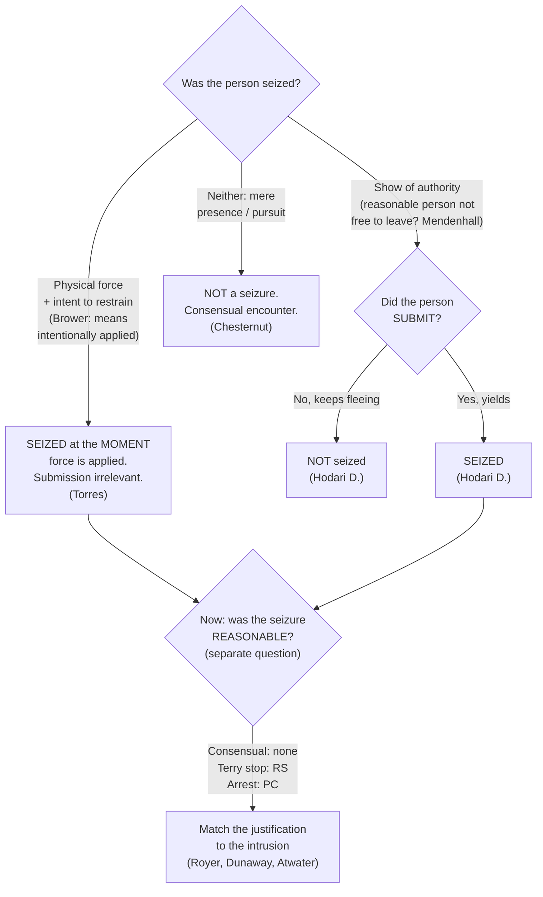

# When a Seizure Occurs

*Has this encounter become a Fourth Amendment seizure of the person, and if so, at what moment? This page fixes only when a seizure has occurred. Whether that seizure was reasonable (a hunch, reasonable suspicion, probable cause, or a recognized justification) is a separate question taken up on the pages that follow.*

> [!rule] Black-letter rule
> **A person is "seized" in one of two ways, and the two roads are analyzed apart.** A Fourth Amendment seizure of the person occurs on either **(1) the application of physical force to the body with intent to restrain**, or **(2) a show of authority to which the person submits**. *[[California v. Hodari D.#^pin-626|Hodari D.]]*, 499 U.S. 621, 626 (1991) ("An arrest requires *either* physical force ... *or*, where that is absent, submission to the assertion of authority"); *[[Torres v. Madrid|Torres]]*, 592 U.S. 306 (2021). The **force** branch is complete the instant force is applied and needs no submission; the **show-of-authority** branch is not complete until the person yields. Do not import the submission requirement into a force case, or the force requirement into a show-of-authority case.
> ^rule-when-seized

## The Brief

**Two roads, kept apart.** The threshold question splits at the outset into two independent tests, and the cardinal error on this page is running one road's requirement into the other. On the **force** road, application of physical force to the body with intent to restrain is a seizure the instant it lands, whether or not the person yields. On the **show-of-authority** road, a display of official authority becomes a seizure only when the person actually submits to it. A single encounter can travel one road or the other, and the analysis differs at each step.

**Road one, the show of authority: the *[[United States v. Mendenhall|Mendenhall]]* "free to leave" threshold.** A show-of-authority seizure can occur only where, "in view of all of the circumstances surrounding the incident, a reasonable person would have believed that he was not free to leave." *[[United States v. Mendenhall#^pin-554|Mendenhall]]*, 446 U.S. 544, 554 (1980). The inquiry is **objective and totality-based**, measured by how a reasonable person in the suspect's position would read the scene, not by the officer's private intent. The Court gave examples of circumstances that "might indicate a seizure, even where the person did not attempt to leave": "the threatening presence of several officers, the display of a weapon by an officer, some physical touching of the person of the citizen, or the use of language or tone of voice indicating that compliance with the officer's request might be compelled." *[[United States v. Mendenhall#^pin-554|Id.]]* at 554.

**"Free to leave" is necessary but not sufficient: the suspect must submit (*Hodari D.*).** For the show-of-authority road, the threshold is only half the test. The "narrow question ... whether, with respect to a show of authority ... a seizure occurs even though the subject does not yield. We hold that it does not." *[[California v. Hodari D.#^pin-626|Hodari D.]]*, 499 U.S. at 626. A command to a fleeing suspect ("Stop, in the name of the law!") is no seizure until he submits. The practical payoff runs to abandonment: contraband a suspect tosses **while still fleeing**, before any submission, was not discarded during a seizure, so it is not the suppressible fruit of one (see [[Abandonment]]).

**Road two, physical force: seized at the instant of application (*[[Torres v. Madrid|Torres]]*).** Where officers apply physical force to the body to restrain, the seizure is complete at the moment the force lands, even if it fails to subdue and the person gets away. So the Court held in *[[Torres v. Madrid|Torres]]*, 592 U.S. 306 (2021): applying physical force to the body with intent to restrain is a seizure even though the person does not submit and is not subdued. Torres was seized the moment the officers' bullets struck her, though she then drove off. Two corollaries follow. First, a force seizure that meets no submission **lasts only as long as the force is applied**; the Fourth Amendment recognizes no continuing arrest during a suspect's later flight. Second, the force must be applied **to restrain**, not by accident or for some unrelated purpose, and the test is objective: the question is whether the challenged conduct manifests an intent to restrain, not what the officer secretly meant. A mere touch can suffice, but a tap on the shoulder to get someone's attention rarely shows that intent.

**What governmental conduct counts: the *[[Brower v. County of Inyo|Brower]]* "means intentionally applied" rule.** A seizure occurs "only when there is a governmental termination of freedom of movement *through means intentionally applied*," not through "the accidental effects of otherwise lawful government conduct." *[[Brower v. County of Inyo|Brower]]*, 489 U.S. 593, 596–597 (1989). It is "enough for a seizure that a person be stopped by the very instrumentality set in motion or put in place in order to achieve that result." *[[Brower v. County of Inyo#^pin-599|Id.]]* at 599. A fleeing driver who crashes into a roadblock the police positioned to stop him is seized; a driver who happens to crash for reasons the police did not engineer is not.

**The continuum: consensual encounter, investigative detention, arrest.** Seizure of the person is not all-or-nothing. The level of intrusion sets the justification the Fourth Amendment demands.

- **Consensual encounter (no seizure, no justification needed).** A bare hunch justifies no seizure of any kind; the lawful tool is a consensual encounter, in which the person stays free to leave. Police pursuit, standing alone, is not a seizure: driving alongside a fleeing pedestrian without siren, command, weapon, or aggressive blocking "does not, standing alone, constitute a seizure." *[[Michigan v. Chesternut|Chesternut]]*, 486 U.S. 567, 575–576 (1988). And without reasonable suspicion, officers may not even stop a person to demand identification. *[[Brown v. Texas|Brown v. Texas]]*, 443 U.S. 47 (1979).
- **Investigative detention (reasonable suspicion, least intrusive means).** A brief *[[Terry Stops and Reasonable Suspicion|Terry]]* stop requires reasonable, articulable suspicion and "must be temporary and last no longer than is necessary ... . [T]he investigative methods employed should be the least intrusive means reasonably available." *[[Florida v. Royer#^pin-500|Royer]]*, 460 U.S. 491, 500 (1983) (plurality). Holding a suspect's ticket and identification, confining him, and never telling him he is free to go can escalate a stop into a de facto arrest: "[a]s a practical matter, [he is] under arrest," and that step needs probable cause. *[[Florida v. Royer#^pin-503|Id.]]* at 503.
- **Arrest or [[Common Legal Terms#de-facto|de facto]] arrest (probable cause).** A station-house detention for interrogation "regardless of its label" is a seizure that requires probable cause and cannot rest on *[[Terry v. Ohio|Terry]]*-type balancing. *[[Dunaway v. New York#^pin-216|Dunaway]]*, 442 U.S. 200, 216 (1979). Awakening a suspect at 3 a.m. and transporting him, handcuffed, to the station is an arrest, and a sleepy "Okay" is "mere submission to a claim of lawful authority," not consent. *[[Kaupp v. Texas|Kaupp v. Texas]]*, 538 U.S. 626 (2003). Investigatory detentions, including for **fingerprinting**, are full Fourth Amendment seizures: "Detentions for the sole purpose of obtaining fingerprints are no less subject to the constraints of the Fourth Amendment." *[[Davis v. Mississippi#^pin-727|Davis]]*, 394 U.S. 721, 727 (1969). The line "is crossed when the police, without probable cause or a warrant, forcibly remove a person from his home ... and transport him to the police station," even briefly. *[[Hayes v. Florida#^pin-816|Hayes]]*, 470 U.S. 811, 816 (1985) (reserving whether brief *field* fingerprinting on reasonable suspicion, done with dispatch, might be permissible).

**The arrest end of the spectrum is governed by probable cause, not interest-balancing.** A warrantless custodial arrest for even a **fine-only misdemeanor** committed in the officer's presence is reasonable if supported by probable cause; the Fourth Amendment demands no case-by-case weighing. *[[Atwater v. City of Lago Vista|Atwater]]*, 532 U.S. 318 (2001). An arrest on probable cause is reasonable **even if state law forbade it** (for example, required a summons instead). *[[Virginia v. Moore|Virginia v. Moore]]*, 553 U.S. 164 (2008). And the officer's **subjective motive is irrelevant** to the reasonableness of an arrest made on a valid basis. *[[Ashcroft v. al-Kidd|Ashcroft v. al-Kidd]]*, 563 U.S. 731 (2011). The arrest standard itself is treated in full at [[Arrest and Arrest Warrants]].

**The back end of an arrest: the prompt probable-cause check.** A person arrested without a warrant is entitled to a **prompt judicial determination of probable cause** before extended pretrial detention, though no adversary hearing is required. *[[Gerstein v. Pugh|Gerstein v. Pugh]]*, 420 U.S. 103 (1975). A determination within **48 hours** is presumptively prompt; beyond that, the government must show a bona fide emergency, and intervening weekends do not qualify. *[[County of Riverside v. McLaughlin|County of Riverside v. McLaughlin]]*, 500 U.S. 44 (1991). The full back-end rule is at [[Prompt Probable-Cause Determination]].

**A seizure can reach more than the target.** When a vehicle is stopped, the **passenger is seized just as the driver is**, because no reasonable passenger would believe himself free to leave; the passenger may therefore challenge the stop (full treatment is at [[Traffic Stops]]). *[[Brendlin v. California|Brendlin v. California]]*, 551 U.S. 249 (2007). Seizure of the *person* is also distinct from seizure of *property*: a seizure of property turns on meaningful interference with a possessory interest, independent of any liberty interest (see [[Seizure of Property]]). *[[Soldal v. Cook County|Soldal v. Cook County]]*, 506 U.S. 56 (1992).

**Force, then reasonableness: the seizure is the trigger.** The same touching that effects a force seizure also opens the **use-of-force** inquiry. Once a seizure by force has occurred, its *reasonableness* is judged under the objective standard of *[[Graham v. Connor|Graham v. Connor]]*, 490 U.S. 386 (1989), from the on-scene perspective of a reasonable officer. That reasonableness inquiry, the Court recently confirmed, looks to the [[Common Legal Terms#totality-of-the-circumstances|totality of the circumstances]] and "has no time limit," rejecting any rule that isolates the single moment of threat. *[[Barnes v. Felix|Barnes v. Felix]]*, 605 U.S. 73 (2025). Seizure (this page) is the trigger; reasonableness is the next question, and it belongs to [[Use of Force]].

**Burden, standard of review, and remedy.** Because a warrantless seizure of the person is presumptively unreasonable, the **government** bears the burden of justifying it once the defendant shows a seizure occurred. Whether a seizure occurred is a **mixed question**: the trial court's historical findings are reviewed for [[Common Legal Terms#clear-error|clear error]], and the ultimate Fourth Amendment determination [[Common Legal Terms#de-novo|de novo]]. The **remedy** is suppression: statements and evidence that are the fruit of an illegal seizure are excluded unless the taint is attenuated. *[[Miranda v. Arizona|Miranda]]* warnings, a few hours' passage, and a later warrant did **not** purge the taint of an arrest made without probable cause. *[[Taylor v. Alabama|Taylor v. Alabama]]*, 457 U.S. 687 (1982); see [[The Exclusionary Rule]].

**Apply it.**
1. **Am I applying physical force to restrain?** If yes, the person is seized **now**. Submission is irrelevant, the seizure lasts only as long as the force, and reasonableness (not seizure) is the next question.
2. **If not, am I making a show of authority, and has the person submitted?** Ask whether a reasonable person would feel free to leave; if not, the show of authority is a seizure **only once the person actually yields**. A suspect who keeps fleeing is not yet seized, and what he discards mid-flight is not the fruit of a seizure.
3. **Match the justification to the intrusion.** A consensual encounter needs nothing; a *[[Terry v. Ohio|Terry]]* detention needs reasonable suspicion and the least intrusive means; an arrest (station-house transport, prolonged confinement, handcuffs and interrogation) needs probable cause.
4. **Do not treat a hunch as authority.** Without articulable suspicion there is no power to seize; keep the encounter consensual and build the articulation first.
5. **Remember the reach and the back end.** A stop seizes the passengers too, and a warrantless arrest needs a prompt judicial probable-cause determination within roughly 48 hours.

**Common pitfalls.**
- **Treating a fleeing suspect as already seized the moment an officer yells "stop."** Until the suspect submits (or is touched with intent to restrain) there is no show-of-authority seizure, and anything discarded mid-flight is fair game. *[[California v. Hodari D.|Hodari D.]]*
- **Assuming any missed or failed use of force is no seizure.** A shot that *hits* but does not stop the suspect **is** a seizure at that instant, because force was applied to the body. *[[Torres v. Madrid|Torres]]*. A shot that *misses* applies no force to the body, so it is no *force* seizure; but if it accompanies a command to halt and the suspect **submits**, a *show-of-authority* seizure can still occur. *[[California v. Hodari D.|Hodari D.]]*; *[[United States v. Mendenhall|Mendenhall]]*. What defeats the seizure is the suspect's continued flight, not the mere fact that the shot missed.
- **Collapsing "free to leave" into the whole test.** For a show of authority, *[[United States v. Mendenhall|Mendenhall]]* is the threshold but **submission** is still required; for force, *[[United States v. Mendenhall|Mendenhall]]* is beside the point, because application of force controls.
- **Confusing "seized" with "lawfully seized."** Establishing that a seizure occurred does not make it reasonable; whether reasonable suspicion, probable cause, or a recognized justification supported it is a separate analysis.
- **Reading "intent to restrain" as the officer's secret motive.** It is an **objective** inquiry into what the conduct manifests, not a search for the officer's subjective state of mind. *[[Torres v. Madrid|Torres]]*.
- **Treating a hunch as if it authorizes a detention or frisk.** Without articulable suspicion there is no authority to seize. *[[Brown v. Texas|Brown v. Texas]]*.

## Lower-court developments

The two-roads framework is stable, but the lower courts are actively working out three questions: the *[[Torres v. Madrid|Torres]]* force-seizure rule [[Reading and Citing Cases#on-remand|on remand]], what counts as **submission** under *Hodari D.*, and whether the objective *[[United States v. Mendenhall|Mendenhall]]* inquiry may account for a suspect's race. (Supreme Court holdings home to the Key cases above, regardless of date.)

- ***[[Torres v. Madrid|Torres v. Madrid]]* (10th Cir. 2023, [[Reading and Citing Cases#on-remand|on remand]])** — *refinement.* [[Reading and Citing Cases#on-remand|On remand]] from the Supreme Court, the Tenth Circuit reversed summary judgment for the officers: because Torres was seized the instant the bullets struck her (even though she drove off), *[[Heck v. Humphrey]]* did not bar her excessive-force claim and [[Qualified Immunity|qualified immunity]] did not attach merely because she eluded capture; the officers' knowledge at the moment of firing controls. The most concrete circuit-level working-out of the *[[Torres v. Madrid|Torres]]* physical-force-seizure rule. **Binding in-circuit — 10th Cir.** [opinion](https://www.courtlistener.com/opinion/9376547/torres-v-madrid/)
- ***[[United States v. Amos|United States v. Amos]]* (3d Cir. 2023)** — *refinement.* Applies the *Hodari D.* submission requirement to the modern "momentary pause" problem: a suspect's one-to-two-second pause and a halfway raise of the hands in response to a command is **not** submission, so no seizure occurred until handcuffing, and his intervening flight supplied the reasonable suspicion. Submission "would seem to require something more than a momentary pause," 88 F.4th 446, 455. **Binding in-circuit — 3d Cir.** [opinion](https://www.courtlistener.com/opinion/9452158/united-states-v-shiheem-amos/)
- ***[[Carter v. United States|Carter v. United States]]* (D.C. 2025)** — *first-impression.* The District of Columbia Court of Appeals (the local high court, not the D.C. Circuit) [[Reading and Citing Cases#vacated|vacated]] on a seizure theory, holding under its *Dozier* precedent that courts must consider whether an objective reasonable person sharing the defendant's racial status and lived experiences would have felt free to terminate the encounter, and finding a Black man here was seized. A developing frontier on the show-of-authority branch; a cert petition (No. 25-885) now presses whether race may be weighed in the *[[United States v. Mendenhall|Mendenhall]]* "free to leave" inquiry. There is **no Supreme Court holding yet**. **Persuasive — state, illustrative** (D.C. Court of Appeals). [opinion](https://www.courtlistener.com/opinion/10662535/carter-v-united-states/)

## Key cases

| Case | Holding | Opinion |
|---|---|---|
| *[[United States v. Mendenhall]]*, 446 U.S. 544 (1980) | **Anchor.** The "free to leave" benchmark: a person is seized only if, under all the circumstances, a reasonable person would not have believed himself free to leave (objective, totality-based). | [opinion](https://www.courtlistener.com/opinion/110264/united-states-v-mendenhall/) |
| *[[California v. Hodari D.]]*, 499 U.S. 621 (1991) | **Anchor.** A show-of-authority seizure is not complete until the suspect submits; contraband discarded while still fleeing is not the fruit of a seizure. | [opinion](https://www.courtlistener.com/opinion/112579/california-v-hodari-d/) |
| *[[Torres v. Madrid]]*, 592 U.S. 306 (2021) | **Anchor.** Physical force applied to the body with intent to restrain is a seizure at the moment of application, even if the person does not submit and is not subdued. | [opinion](https://www.courtlistener.com/opinion/4867542/torres-v-madrid/) |
| *[[Brower v. County of Inyo]]*, 489 U.S. 593 (1989) | A seizure occurs only on a termination of movement through means intentionally applied; a driver stopped by the very instrumentality the police put in place, such as a roadblock, is seized. | [opinion](https://www.courtlistener.com/opinion/112218/brower-ex-rel-estate-of-caldwell-v-county-of-inyo/) |
| *[[Michigan v. Chesternut]]*, 486 U.S. 567 (1988) | Police pursuit, standing alone, is not a seizure; the *[[United States v. Mendenhall|Mendenhall]]* objective test governs whether pursuit has become one. | [opinion](https://www.courtlistener.com/opinion/112095/michigan-v-chesternut/) |
| *[[Florida v. Royer]]*, 460 U.S. 491 (1983) | A *[[Terry v. Ohio|Terry]]* detention must use the least intrusive means; holding a suspect's ID and ticket and confining him escalated a consensual encounter into a [[Common Legal Terms#de-facto\|de facto]] arrest requiring probable cause. | [opinion](https://www.courtlistener.com/opinion/110890/florida-v-royer/) |
| *[[Dunaway v. New York]]*, 442 U.S. 200 (1979) | A station-house detention for interrogation, "regardless of its label," is a seizure requiring probable cause; it cannot rest on *[[Terry v. Ohio|Terry]]* balancing. | [opinion](https://www.courtlistener.com/opinion/110096/dunaway-v-new-york/) |
| *[[Kaupp v. Texas]]*, 538 U.S. 626 (2003) | A 3 a.m. handcuffed transport to the station for interrogation without probable cause is an arrest; an "Okay" is mere submission to authority, not consent. | [opinion](https://www.courtlistener.com/opinion/127919/kaupp-v-texas/) |
| *[[Davis v. Mississippi]]*, 394 U.S. 721 (1969) | Investigatory detentions, including dragnet detention for fingerprinting, are full Fourth Amendment seizures requiring justification. | [opinion](https://www.courtlistener.com/opinion/107912/davis-v-mississippi/) |
| *[[Hayes v. Florida]]*, 470 U.S. 811 (1985) | Forcibly transporting a suspect to the station for fingerprinting without probable cause is an arrest; brief *field* fingerprinting on reasonable suspicion is left open. | [opinion](https://www.courtlistener.com/opinion/111382/hayes-v-florida/) |

## Related cases across doctrines

These cases are treated in full on other pages but bear directly on *when*, *whether*, and *how far* a seizure of the person occurs, framed here for this doctrine.

| Case | Relevance here | Primary home | Opinion |
|---|---|---|---|
| *[[Brendlin v. California]]*, 551 U.S. 249 (2007) | ***Reach.*** When a car is stopped the passenger is seized too, because no reasonable passenger would feel free to leave. | [[Traffic Stops]] | [opinion](https://www.courtlistener.com/opinion/145712/brendlin-v-california/) |
| *[[Florida v. Bostick]]*, 501 U.S. 429 (1991) | ***Confined setting.*** Where the person is already confined (a bus seat), the test is reframed: a seizure occurs only if a reasonable person would not feel free to decline the officers' requests or otherwise terminate the encounter. | [[Knock and Talk]] | [opinion](https://www.courtlistener.com/opinion/112631/florida-v-bostick/) |
| *[[United States v. Drayton]]*, 536 U.S. 194 (2002) | ***Bus sweep.*** No seizure where officers do not block exits, brandish weapons, or use a commanding tone; failure to advise of the right to refuse does not convert a consensual encounter into a seizure. | [[Knock and Talk]] | [opinion](https://www.courtlistener.com/opinion/121153/united-states-v-drayton/) |
| *[[Michigan v. Summers]]*, 452 U.S. 692 (1981) | ***Categorical detention.*** A warrant to search premises for contraband carries authority to detain the occupants for the search, without individualized suspicion. | [[Securing the Scene]] | [opinion](https://www.courtlistener.com/opinion/110534/michigan-v-summers/) |
| *[[Bailey v. United States]]*, 568 U.S. 186 (2013) | ***Spatial limit.*** *[[Michigan v. Summers|Summers]]* detention authority reaches only the immediate vicinity of the premises; once the occupant has left, detention needs ordinary *[[Terry v. Ohio|Terry]]* or probable-cause grounds. | [[Securing the Scene]] | [opinion](https://www.courtlistener.com/opinion/820749/bailey-v-united-states/) |
| *[[Muehler v. Mena]]*, 544 U.S. 93 (2005) | ***Manner.*** A *[[Michigan v. Summers|Summers]]* detention may include handcuffing occupants for a search of dangerous premises; unrelated questioning during a lawful detention is not a separate Fourth Amendment event. | [[Securing the Scene]] | [opinion](https://www.courtlistener.com/opinion/142878/muehler-v-mena/) |
| *[[Illinois v. McArthur]]*, 531 U.S. 326 (2001) | ***Limited seizure.*** Barring a resident from re-entering his home while police get a warrant is a limited seizure of the person, reasonable on probable cause plus [[Exigent Circumstances and Hot Pursuit\|exigency]]. | [[Securing the Scene]] | [opinion](https://www.courtlistener.com/opinion/118405/illinois-v-mcarthur/) |
| *[[Brown v. Texas]]*, 443 U.S. 47 (1979) | ***No suspicion, no stop.*** Police may not stop a person and demand identification without reasonable suspicion; suspicionless seizures are judged by balancing the public concern, the advancement of the public interest, and the intrusion on liberty. | [[Terry Stops and Reasonable Suspicion]] | [opinion](https://www.courtlistener.com/opinion/110128/brown-v-texas/) |
| *[[Soldal v. Cook County]]*, 506 U.S. 56 (1992) | ***Property analogue.*** A seizure of property occurs on any meaningful interference with possessory interests, the property counterpart to seizure of the person and independent of privacy or liberty. | [[Seizure of Property]] | [opinion](https://www.courtlistener.com/opinion/112795/soldal-v-cook-county/) |
| *[[Ashcroft v. al-Kidd]]*, 563 U.S. 731 (2011) | ***Motive irrelevant.*** An objectively reasonable arrest on a valid basis cannot be challenged on the officer's subjective motive. | [[Section 1983 Liability and Qualified Immunity]] | [opinion](https://www.courtlistener.com/opinion/217703/ashcroft-v-al-kidd/) |
| *[[Taylor v. Alabama]]*, 457 U.S. 687 (1982) | ***Fruit.*** A confession after a warrantless arrest made without probable cause is the suppressible fruit of the illegal seizure where no significant intervening event broke the chain. | [[The Exclusionary Rule]] | [opinion](https://www.courtlistener.com/opinion/110760/taylor-v-alabama/) |
| *[[Graham v. Connor]]*, 490 U.S. 386 (1989) | ***Next step.*** Once a seizure by force has occurred, its reasonableness is judged under the Fourth Amendment's objective-reasonableness standard from the officer's on-scene perspective. | [[Use of Force]] | [opinion](https://www.courtlistener.com/opinion/112257/graham-v-connor/) |
| *[[Barnes v. Felix]]*, 605 U.S. 73 (2025) | ***Next step.*** The reasonableness of force is judged on the [[Common Legal Terms#totality-of-the-circumstances\|totality of the circumstances]], an inquiry that "has no time limit"; the "moment of threat" rule is rejected. | [[Use of Force]] | [opinion](https://www.courtlistener.com/opinion/10584846/barnes-v-felix/) |
| *[[Atwater v. City of Lago Vista]]*, 532 U.S. 318 (2001) | ***Arrest standard.*** A warrantless custodial arrest for a fine-only misdemeanor on probable cause does not violate the Fourth Amendment; no case-by-case balancing. | [[Arrest and Arrest Warrants]] | [opinion](https://www.courtlistener.com/opinion/2620702/atwater-v-city-of-lago-vista/) |
| *[[Virginia v. Moore]]*, 553 U.S. 164 (2008) | ***Arrest standard.*** An arrest on probable cause is reasonable even if state law forbade it; a state-law-only violation triggers no exclusion. | [[Arrest and Arrest Warrants]] | [opinion](https://www.courtlistener.com/opinion/145814/virginia-v-moore/) |
| *[[Gerstein v. Pugh]]*, 420 U.S. 103 (1975) | ***Back-end check.*** A warrantless arrestee is entitled to a prompt judicial probable-cause determination before extended pretrial detention. | [[Prompt Probable-Cause Determination]] | [opinion](https://www.courtlistener.com/opinion/109186/gerstein-v-pugh/) |
| *[[County of Riverside v. McLaughlin]]*, 500 U.S. 44 (1991) | ***Back-end check.*** A probable-cause determination within 48 hours of a warrantless arrest is presumptively prompt; past that, the government must show a bona fide emergency. | [[Prompt Probable-Cause Determination]] | [opinion](https://www.courtlistener.com/opinion/112585/county-of-riverside-v-mclaughlin/) |

## Visual

## Sources

- [*United States v. Mendenhall*, 446 U.S. 544 (1980)](https://www.courtlistener.com/opinion/110264/united-states-v-mendenhall/) (pinpoint: 554)
- [*California v. Hodari D.*, 499 U.S. 621 (1991)](https://www.courtlistener.com/opinion/112579/california-v-hodari-d/) (pinpoints: 625, 626)
- [*Torres v. Madrid*, 592 U.S. 306 (2021)](https://www.courtlistener.com/opinion/4867542/torres-v-madrid/) (quotations paraphrased; CourtListener carries only the slip opinion, no CAP star pagination)
- [*Brower v. County of Inyo*, 489 U.S. 593 (1989)](https://www.courtlistener.com/opinion/112218/brower-ex-rel-estate-of-caldwell-v-county-of-inyo/) (pinpoints: 596–597, 599)
- [*Michigan v. Chesternut*, 486 U.S. 567 (1988)](https://www.courtlistener.com/opinion/112095/michigan-v-chesternut/) (pinpoints: 574, 575–576)
- [*Florida v. Royer*, 460 U.S. 491 (1983) (plurality)](https://www.courtlistener.com/opinion/110890/florida-v-royer/) (pinpoints: 500, 503)
- [*Dunaway v. New York*, 442 U.S. 200 (1979)](https://www.courtlistener.com/opinion/110096/dunaway-v-new-york/) (pinpoints: 216, 217–218)
- [*Kaupp v. Texas*, 538 U.S. 626 (2003)](https://www.courtlistener.com/opinion/127919/kaupp-v-texas/)
- [*Davis v. Mississippi*, 394 U.S. 721 (1969)](https://www.courtlistener.com/opinion/107912/davis-v-mississippi/) (pinpoint: 727)
- [*Hayes v. Florida*, 470 U.S. 811 (1985)](https://www.courtlistener.com/opinion/111382/hayes-v-florida/) (pinpoints: 816, 817)
- [*Atwater v. City of Lago Vista*, 532 U.S. 318 (2001)](https://www.courtlistener.com/opinion/2620702/atwater-v-city-of-lago-vista/)
- [*Virginia v. Moore*, 553 U.S. 164 (2008)](https://www.courtlistener.com/opinion/145814/virginia-v-moore/)
- [*Gerstein v. Pugh*, 420 U.S. 103 (1975)](https://www.courtlistener.com/opinion/109186/gerstein-v-pugh/)
- [*County of Riverside v. McLaughlin*, 500 U.S. 44 (1991)](https://www.courtlistener.com/opinion/112585/county-of-riverside-v-mclaughlin/)
- [*Brendlin v. California*, 551 U.S. 249 (2007)](https://www.courtlistener.com/opinion/145712/brendlin-v-california/) (home = [[Traffic Stops]])
- [*Florida v. Bostick*, 501 U.S. 429 (1991)](https://www.courtlistener.com/opinion/112631/florida-v-bostick/) (home = [[Knock and Talk]])
- [*United States v. Drayton*, 536 U.S. 194 (2002)](https://www.courtlistener.com/opinion/121153/united-states-v-drayton/) (home = [[Knock and Talk]])
- [*Michigan v. Summers*, 452 U.S. 692 (1981)](https://www.courtlistener.com/opinion/110534/michigan-v-summers/) (home = [[Securing the Scene]])
- [*Bailey v. United States*, 568 U.S. 186 (2013)](https://www.courtlistener.com/opinion/820749/bailey-v-united-states/) (home = [[Securing the Scene]])
- [*Muehler v. Mena*, 544 U.S. 93 (2005)](https://www.courtlistener.com/opinion/142878/muehler-v-mena/) (home = [[Securing the Scene]])
- [*Illinois v. McArthur*, 531 U.S. 326 (2001)](https://www.courtlistener.com/opinion/118405/illinois-v-mcarthur/) (home = [[Securing the Scene]])
- [*Brown v. Texas*, 443 U.S. 47 (1979)](https://www.courtlistener.com/opinion/110128/brown-v-texas/) (home = [[Terry Stops and Reasonable Suspicion]])
- [*Soldal v. Cook County*, 506 U.S. 56 (1992)](https://www.courtlistener.com/opinion/112795/soldal-v-cook-county/) (home = [[Seizure of Property]])
- [*Ashcroft v. al-Kidd*, 563 U.S. 731 (2011)](https://www.courtlistener.com/opinion/217703/ashcroft-v-al-kidd/) (home = [[Section 1983 Liability and Qualified Immunity]])
- [*Taylor v. Alabama*, 457 U.S. 687 (1982)](https://www.courtlistener.com/opinion/110760/taylor-v-alabama/) (pinpoints: 217–218; home = [[The Exclusionary Rule]])
- [*Graham v. Connor*, 490 U.S. 386 (1989)](https://www.courtlistener.com/opinion/112257/graham-v-connor/) (reasonableness step; home = [[Use of Force]])
- [*Barnes v. Felix*, 605 U.S. 73 (2025)](https://www.courtlistener.com/opinion/10584846/barnes-v-felix/) (reasonableness step; home = [[Use of Force]])
- [*Terry v. Ohio*, 392 U.S. 1 (1968)](https://www.courtlistener.com/opinion/107729/terry-v-ohio/) (reasonable-suspicion predicate; see [[Terry Stops and Reasonable Suspicion]])
