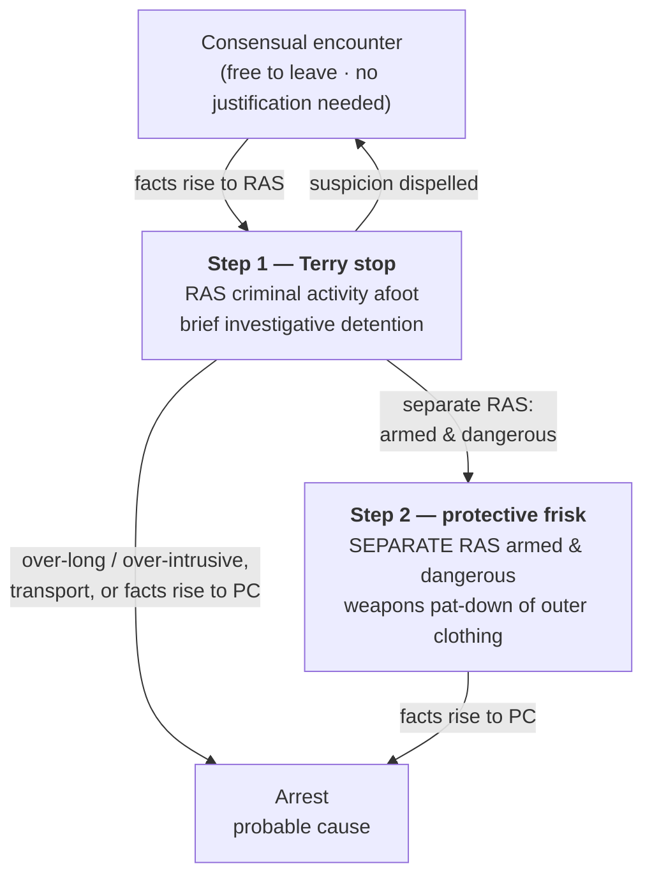

# Terry Stops and Reasonable Suspicion

*Do I have reasonable suspicion to stop, and, separately, reasonable suspicion the person is armed and dangerous, to frisk? These are two calls, not one; clearing the stop never clears the frisk.*

> [!rule] Black-letter rule
> A *Terry* stop rests on **two separate showings**. On **reasonable, articulable suspicion** that criminal activity is afoot, an officer may make a **brief investigative stop**: the officer "must be able to point to specific and articulable facts which, taken together with rational inferences from those facts, reasonably warrant that intrusion." *[[Terry v. Ohio#^pin-21|Terry]]*, 392 U.S. 1, 21 (1968). And on **separate** suspicion that the person is **armed and presently dangerous**, the officer may conduct a **limited protective frisk**, a pat-down of the outer clothing for weapons. *[[Terry v. Ohio#^pin-30|Id.]]* at 30. The quantum for both is **[[Reasonable Suspicion|reasonable suspicion]]**; this page owns the **stop** and the **frisk** it unlocks: their trigger, scope, and duration.
> ^rule-terry-stop

## The Brief

**What a *Terry* stop is, and the two showings it demands.** *[[Terry v. Ohio|Terry]]* carved a middle category between a consensual encounter and an arrest: a brief, investigative detention on less than probable cause. It authorizes two things, and each needs its own justification. The **stop** needs reasonable suspicion that criminal activity "may be afoot." The **frisk** needs *separate* reasonable suspicion that the person is armed and presently dangerous. A lawful stop is not automatic authority to frisk, and neither showing borrows from the other. A reliable informant's tip, not just the officer's own observation, can supply the suspicion for both. *[[Adams v. Williams|Adams v. Williams]]*, 407 U.S. 143, 147 (1972).

**The stop turns on reasonable suspicion, and the standard lives next door.** Reasonable suspicion is more than a hunch and less than probable cause, judged on the totality of the circumstances on a particularized and objective basis. The full quantum, including how innocent factors combine, how anonymous and 911 tips are weighed, and what flight in a high-crime area adds, is developed on **[[Reasonable Suspicion]]**. What matters here is that the standard governs the **stop's threshold**: without it there is no lawful detention, and a court reviews the whole picture rather than picking the facts apart. A reviewing court may not "excis[e]" individual factors, such as a radio dispatch or a companion's unprovoked flight, before weighing the rest. *[[District of Columbia v. R.W.|District of Columbia v. R.W.]]* (2026) (per curiam).

**The frisk is a separate showing, for weapons, not evidence.** A frisk is a pat-down of the outer clothing to find weapons, and it needs its **own** armed-and-dangerous suspicion grounded in particular facts: the officer "must be able to point to particular facts from which he reasonably inferred that the individual was armed and dangerous." *[[Sibron v. New York#^pin-64|Sibron v. New York]]*, 392 U.S. 40, 64 (1968). Reaching past that purpose is unlawful. In *Sibron* the officer "thrust his hand into Sibron's pocket" for narcotics without first patting down for weapons, and the search was "not reasonably limited in scope." *[[Sibron v. New York|Id.]]* at 65–66. The armed-and-dangerous suspicion must also be **particularized to the person**: an officer may not frisk everyone present, because "mere propinquity to others independently suspected of criminal activity does not, without more," justify it. *[[Ybarra v. Illinois#^pin-92|Ybarra v. Illinois]]*, 444 U.S. 85, 92–93 (1979).

**Scope and duration: brief, diligent, least intrusive.** A *Terry* stop must stay **temporary** and use "the least intrusive means reasonably available to verify or dispel the officer's suspicion in a short period of time." *[[Florida v. Royer#^pin-500|Florida v. Royer]]*, 460 U.S. 491, 500 (1983) (plurality). There is **no rigid time limit**. The test is **diligence**: "whether the police diligently pursued a means of investigation that was likely to confirm or dispel their suspicions quickly." *[[United States v. Sharpe#^pin-685|United States v. Sharpe]]*, 470 U.S. 675, 685–86 (1985). A stop that drags on without diligent investigation, or that seizes property far past what investigation needs, breaks the limit: a 90-minute detention of luggage "exceeded the permissible limits of a *Terry*-type investigative stop." *[[United States v. Place#^pin-709|United States v. Place]]*, 462 U.S. 696, 709 (1983). And once the suspicion that justified the stop is **dispelled**, the detention must end; the officer may not hold the person to keep looking for something else.

**When a stop hardens into an arrest: the de facto-arrest and transport line.** Over-intrusiveness, not just clock time, can convert a stop into an arrest that needs probable cause. Holding a suspect's ticket and identification in a small interrogation room did just that: "[a]s a practical matter, Royer was under arrest." *[[Florida v. Royer#^pin-503|Royer]]*, 460 U.S. at 503. The clearest line is **removal and transport**: taking a suspect from the scene to the stationhouse for investigation is an arrest requiring probable cause, whether the purpose is interrogation or fingerprinting. The two-road analysis and the transport cases (*[[Davis v. Mississippi|Davis]]*, *[[Hayes v. Florida|Hayes]]*, *[[Dunaway v. New York|Dunaway]]*) are developed on **[[Seizure of the Person]]**; the point for the field is that a *Terry* detention that grows into a custodial removal has left *Terry* behind.

**The frisk reaches the car, and what it yields.** The protective-frisk rationale extends to a vehicle. On specific articulable facts giving a reasonable belief the suspect is dangerous and may gain immediate control of weapons, an officer may search the passenger compartment "limited to those areas in which a weapon may be placed or hidden." *[[Michigan v. Long|Michigan v. Long]]*, 463 U.S. 1032 (1983); the vehicle setting is developed on **[[Traffic Stops]]** (*[[Arizona v. Johnson|Arizona v. Johnson]]* applies the two-showing rule to passengers). As for the fruits of a lawful pat-down: contraband whose incriminating character is **immediately apparent by touch**, with no further manipulation, may be seized. That is the **plain-feel** rule, and it lives on **[[Plain View & Plain Feel]]** (*[[Minnesota v. Dickerson|Dickerson]]*).

**Acting on another officer's suspicion, and compelling a name.** The suspicion that justifies a stop need not sit in the stopping officer's own head. An officer may stop in objective reliance on a **wanted flyer, BOLO, or dispatch** if the issuing agency had reasonable suspicion; that is the fellow-officer rule, developed on **[[Collective Knowledge and the Fellow-Officer Rule]]** (*[[United States v. Hensley|Hensley]]*). Separately, during a **valid** stop a State may, by statute, compel the suspect to give his **name**; whether it may, and the vagueness limit on such statutes, is the stop-and-identify question owned by **[[Stop-and-Identify]]** (*[[Hiibel v. Sixth Judicial Dist. Court|Hiibel]]*; *[[Kolender v. Lawson|Kolender]]*). Note only that there is no power to demand identity without reasonable suspicion in the first place. *[[Brown v. Texas#^pin-51|Brown v. Texas]]*, 443 U.S. 47, 51 (1979).

**In the traffic setting.** An ordinary traffic stop is a *Terry*-type seizure, and its duration is policed by the **mission** rule: an officer may not prolong the stop beyond the time needed to complete its purpose without independent reasonable suspicion. That rule, and the dog-sniff and control-measure cases around it, are owned by **[[Traffic Stops]]** (*[[Rodriguez v. United States|Rodriguez]]*).

**Burden, standard of review, and remedy.** The **government** bears the burden of pointing to specific, articulable facts establishing reasonable suspicion for the stop and, separately, for any frisk; a bare "I had a hunch" will not do. On appeal, reasonable suspicion is reviewed **[[Common Legal Terms#de-novo|de novo]]**, with the historical facts reviewed for **[[Common Legal Terms#clear-error|clear error]]** and due weight given to the inferences of local officers. *[[Ornelas v. United States|Ornelas]]*, 517 U.S. 690, 699 (1996); see [[Reasonable Suspicion]]. The **remedy** for a stop or frisk made without the requisite suspicion, or for a detention that ripened into an unlawful de facto arrest, is **suppression** of the evidence and its fruits. See [[The Exclusionary Rule]].

**Apply it.**
1. **Justify the stop.** Name the specific facts and rational inferences that make you reasonably suspect *this person* of criminal activity. That, and only that, authorizes the detention (*[[Terry v. Ohio|Terry]]*; quantum on [[Reasonable Suspicion]]).
2. **Justify the frisk separately.** Ask a second question: what specific facts make you reasonably suspect this person is **armed and dangerous**? Only that justifies a pat-down, and only of the outer clothing for weapons (*[[Sibron v. New York|Sibron]]*).
3. **Keep it particular.** You cannot frisk everyone on the scene; the armed-and-dangerous suspicion must point to the person you pat down (*[[Ybarra v. Illinois|Ybarra]]*).
4. **Stay brief and diligent.** Work the investigation that will confirm or dispel your suspicion quickly; do not hold the person longer or more intrusively than that takes (*[[United States v. Sharpe|Sharpe]]*; *[[Florida v. Royer|Royer]]*).
5. **Stop when suspicion dies, or climb to an arrest.** If the facts dispel your suspicion, release; if they rise to probable cause, you may arrest. Removing and transporting the person is an arrest that needs probable cause (see [[Seizure of the Person]]).

**Common pitfalls.**
- **Treating a lawful stop as automatic authority to frisk.** The frisk needs its own armed-and-dangerous suspicion; two separate showings (*[[Terry v. Ohio|Terry]]*; *[[Sibron v. New York|Sibron]]*).
- **Frisking for evidence rather than weapons.** The pat-down is for weapons; only contraband immediately apparent by plain feel may be seized (*[[Sibron v. New York|Sibron]]*; plain feel on [[Plain View & Plain Feel]]).
- **Frisking everyone present.** Armed-and-dangerous suspicion must be particularized to the person; mere proximity is not enough (*[[Ybarra v. Illinois|Ybarra]]*).
- **Prolonging the stop past its purpose.** A diligence-less or over-intrusive detention becomes a de facto arrest needing probable cause (*[[Florida v. Royer|Royer]]*; *[[United States v. Place|Place]]*; in traffic, *[[Rodriguez v. United States|Rodriguez]]* on [[Traffic Stops]]).
- **Demanding identification with no suspicion.** A name may be compelled only during a **valid** stop, and only where a statute so provides (*[[Brown v. Texas|Brown v. Texas]]*; the statute question on [[Stop-and-Identify]]).
- **Picking the facts apart on review.** The stop is judged on the whole picture; a court may not excise the dispatch or the flight and weigh only what is left (*[[District of Columbia v. R.W.|R.W.]]*; quantum on [[Reasonable Suspicion]]).

## Lower-court developments

- **United States v. Daniels (10th Cir. 2024)** — *narrows: tightens the stop threshold.* On de novo totality review, a near-anonymous 911 tip (three men in dark hoodies near an idling SUV, reporting no actual illegality) plus the suspect's presence did not amount to reasonable suspicion for the stop, and suppression was affirmed; vague, uncorroborated tips reporting lawful-sounding conduct fall below the floor. **Binding in-circuit — 10th Cir.** [opinion](https://www.courtlistener.com/opinion/9500360/united-states-v-daniels/)
- **United States v. Robinson (4th Cir. 2017) (en banc)** — *split: armed alone is enough to frisk.* Once a lawful stop has occurred, reasonable suspicion that the person is **armed** is by itself enough to frisk, on the theory that a forcibly stopped armed person is necessarily dangerous; the presumptive lawfulness of gun possession under state law does not negate the officer-safety basis. "[A]n officer who makes a lawful traffic stop and who has a reasonable suspicion that one of the automobile's occupants is armed may frisk that individual." 846 F.3d 694, 696. **Binding in-circuit — 4th Cir. (en banc).** (This is the 4th Cir. en banc decision, not the SCOTUS search-incident case *[[United States v. Robinson|United States v. Robinson]]*, 414 U.S. 218 (1973).) [opinion](https://www.courtlistener.com/opinion/4340460/united-states-v-shaquille-robinson/)
- **United States v. Black (4th Cir. 2013)** — *split: open carry, without more, is not suspicion.* Where a State permits open carry, the exercise of that right "without more" cannot justify an investigatory detention; the court refused to stack innocent, suspicion-free facts (high-crime area, late hour, a companion's minor record) around the gun. 707 F.3d 531, 540. **Binding in-circuit — 4th Cir.** [opinion](https://www.courtlistener.com/opinion/821235/united-states-v-nathaniel-black/)
- **Northrup v. City of Toledo Police Dep't (6th Cir. 2015)** — *split: open carry, without more, is not suspicion.* In an open-carry State, the mere sight of a lawfully carried firearm did not give reasonable suspicion to stop and disarm a pedestrian; officers who did so were denied qualified immunity. 785 F.3d 1128. **Binding in-circuit — 6th Cir.** [opinion](https://www.courtlistener.com/opinion/2800431/shawn-northrup-v-city-of-toledo-police-dept/)

The SCOTUS two-showing framework is stable, but the circuits divide over the **frisk branch** where a State permits gun carry: the Fourth Circuit en banc treats reasonable suspicion that a stopped person is *armed* as by itself enough to frisk (*Robinson*), while the open-carry cases hold that lawfully carrying a firearm, without more, supplies neither suspicion of a crime nor a basis to disarm (*Black*; *Northrup*). The dividing question is whether "armed and dangerous" collapses into "armed" once a State makes public carry lawful.

## Key cases

| Case | Holding | Opinion |
|---|---|---|
| *[[Terry v. Ohio]]*, 392 U.S. 1 (1968) | Foundation: on reasonable suspicion criminal activity is afoot an officer may make a brief stop, and on **separate** suspicion the person is **armed and presently dangerous** may conduct a protective pat-down of the outer clothing for weapons. | [opinion](https://www.courtlistener.com/opinion/107729/terry-v-ohio/) |
| *[[Sibron v. New York]]*, 392 U.S. 40 (1968) | **Frisk scope:** a frisk is a limited pat-down for weapons on particular armed-and-dangerous facts; thrusting a hand into a pocket to search for narcotics **exceeds** what *Terry* allows. | [opinion](https://www.courtlistener.com/opinion/107730/sibron-v-new-york/) |
| *[[Adams v. Williams]]*, 407 U.S. 143 (1972) | Reasonable suspicion for a stop **and** a frisk may rest on a **reliable informant's tip**, not only the officer's own observation. | [opinion](https://www.courtlistener.com/opinion/108571/adams-v-williams/) |
| *[[United States v. Sharpe]]*, 470 U.S. 675 (1985) | **Duration:** no rigid time limit; a ~20-minute detention was reasonable where police **diligently** pursued an investigation likely to confirm or dispel suspicion quickly. | [opinion](https://www.courtlistener.com/opinion/111378/united-states-v-sharpe/) |
| *[[Brown v. Texas]]*, 443 U.S. 47 (1979) | Police may **not** stop a person and demand identification **without** reasonable suspicion; a suspicionless seizure fails the balancing test. | [opinion](https://www.courtlistener.com/opinion/110128/brown-v-texas/) |
| *[[United States v. Cooley]]*, 593 U.S. 345 (2021) | A tribal officer on a public right-of-way through a reservation may **stop** a non-Indian on reasonable suspicion and **search** to the extent needed for safety; a *Terry*-stop application confirming the detain-and-protect authority. | [opinion](https://www.courtlistener.com/opinion/4887958/united-states-v-cooley/) |
| *[[District of Columbia v. R.W.]]*, No. 25-248 (U.S. 2026) (per curiam) | A reviewing court may not **excise** individual factors (a radio dispatch, a companion's unprovoked flight) before weighing the rest; the stop is tested on the totality, not a divide-and-conquer of each fact. | [opinion](https://www.courtlistener.com/opinion/10845431/district-of-columbia-v-rw/) |

## Related cases across doctrines

These cases are treated in full on other pages but bear directly on the *Terry* stop-and-frisk; each row frames the holding for this doctrine.

| Case | Relevance here | Primary home | Opinion |
|---|---|---|---|
| *[[Michigan v. Long]]*, 463 U.S. 1032 (1983) | ***Extends.*** The protective-frisk rationale reaches a vehicle: on facts that the suspect is dangerous and may reach a weapon, an officer may frisk the passenger compartment where a weapon could be hidden. | [[Traffic Stops]] | [opinion](https://www.courtlistener.com/opinion/111020/michigan-v-long/) |
| *[[Arizona v. Johnson]]*, 555 U.S. 323 (2009) | ***Applies.*** In a traffic stop the lawful-stop condition is met for **passengers** without separate suspicion of their crime; a passenger may be frisked on reasonable suspicion he is armed and dangerous. | [[Traffic Stops]] | [opinion](https://www.courtlistener.com/opinion/145912/arizona-v-johnson/) |
| *[[Ybarra v. Illinois]]*, 444 U.S. 85 (1979) | ***Particularization.*** A premises search warrant does not authorize frisking persons merely present; the frisk needs suspicion **particular to that person**. | [[Securing the Scene]] | [opinion](https://www.courtlistener.com/opinion/110158/ybarra-v-illinois/) |
| *[[Florida v. Royer]]*, 460 U.S. 491 (1983) | ***De facto arrest.*** A detention must use the least intrusive means; holding the suspect's ticket and ID in a small room turned the stop into an arrest requiring probable cause. | [[Seizure of the Person]] | [opinion](https://www.courtlistener.com/opinion/110890/florida-v-royer/) |
| *[[United States v. Place]]*, 462 U.S. 696 (1983) | ***Duration.*** A 90-minute investigative seizure of luggage exceeded the permissible limits of a *Terry*-type stop. | [[Reasonable Expectation of Privacy]] | [opinion](https://www.courtlistener.com/opinion/110979/united-states-v-place/) |
| *[[Davis v. Mississippi]]*, 394 U.S. 721 (1969) | ***Transport.*** Detaining and transporting a suspect to the station for fingerprinting **without probable cause** is an unreasonable seizure. | [[Seizure of the Person]] | [opinion](https://www.courtlistener.com/opinion/107912/davis-v-mississippi/) |
| *[[Hayes v. Florida]]*, 470 U.S. 811 (1985) | ***Transport.*** Forcibly removing a suspect to the stationhouse without probable cause is an arrest; brief field fingerprinting on reasonable suspicion is left open. | [[Seizure of the Person]] | [opinion](https://www.courtlistener.com/opinion/111382/hayes-v-florida/) |
| *[[Rodriguez v. United States]]*, 575 U.S. 348 (2015) | ***Traffic duration.*** A stop may last no longer than needed to complete its **mission**; absent independent suspicion, an officer may not prolong it for unrelated investigation. | [[Traffic Stops]] | [opinion](https://www.courtlistener.com/opinion/2795278/rodriguez-v-united-states/) |
| *[[Hiibel v. Sixth Judicial Dist. Court]]*, 542 U.S. 177 (2004) | ***Compelled name.*** During a **valid** *Terry* stop a State stop-and-identify statute may compel the suspect's name, consistent with the Fourth Amendment. | [[Stop-and-Identify]] | [opinion](https://www.courtlistener.com/opinion/136990/hiibel-v-sixth-judicial-dist-court-of-nev-humboldt-cty/) |
| *[[Kolender v. Lawson]]*, 461 U.S. 352 (1983) | ***Vagueness limit.*** A stop-and-identify statute requiring "credible and reliable" identification is void for vagueness; it hands police standardless discretion. | [[Stop-and-Identify]] | [opinion](https://www.courtlistener.com/opinion/110926/kolender-v-lawson/) |
| *[[Minnesota v. Dickerson]]*, 508 U.S. 366 (1993) | ***Plain feel.*** Contraband whose identity is immediately apparent by touch during a lawful weapons frisk may be seized; manipulating an object to identify it is not. | [[Plain View & Plain Feel]] | [opinion](https://www.courtlistener.com/opinion/112879/minnesota-v-dickerson/) |
| *[[United States v. Hensley]]*, 469 U.S. 221 (1985) | ***Collective knowledge.*** An officer may make a *Terry* stop in objective reliance on another department's **wanted flyer** if the issuing agency had reasonable suspicion. | [[Collective Knowledge and the Fellow-Officer Rule]] | [opinion](https://www.courtlistener.com/opinion/111294/united-states-v-hensley/) |

## Visual

## Sources

- [*Terry v. Ohio*, 392 U.S. 1 (1968)](https://www.courtlistener.com/opinion/107729/terry-v-ohio/) (pinpoints: 21, 30)
- [*Sibron v. New York*, 392 U.S. 40 (1968)](https://www.courtlistener.com/opinion/107730/sibron-v-new-york/) (pinpoints: 64, 65–66)
- [*Adams v. Williams*, 407 U.S. 143 (1972)](https://www.courtlistener.com/opinion/108571/adams-v-williams/) (pinpoint: 147)
- [*Ybarra v. Illinois*, 444 U.S. 85 (1979)](https://www.courtlistener.com/opinion/110158/ybarra-v-illinois/) (pinpoints: 91, 92–93)
- [*Florida v. Royer*, 460 U.S. 491 (1983) (plurality)](https://www.courtlistener.com/opinion/110890/florida-v-royer/) (pinpoints: 500, 503) (home: [[Seizure of the Person]])
- [*United States v. Sharpe*, 470 U.S. 675 (1985)](https://www.courtlistener.com/opinion/111378/united-states-v-sharpe/) (pinpoints: 685–86)
- [*United States v. Place*, 462 U.S. 696 (1983)](https://www.courtlistener.com/opinion/110979/united-states-v-place/) (pinpoint: 709) (home: [[Reasonable Expectation of Privacy]])
- [*Brown v. Texas*, 443 U.S. 47 (1979)](https://www.courtlistener.com/opinion/110128/brown-v-texas/) (pinpoint: 51)
- [*United States v. Cooley*, 593 U.S. 345 (2021)](https://www.courtlistener.com/opinion/4887958/united-states-v-cooley/)
- [*District of Columbia v. R.W.*, No. 25-248 (U.S. 2026) (per curiam)](https://www.courtlistener.com/opinion/10845431/district-of-columbia-v-rw/)
- [*Michigan v. Long*, 463 U.S. 1032 (1983)](https://www.courtlistener.com/opinion/111020/michigan-v-long/) (home: [[Traffic Stops]])
- [*Arizona v. Johnson*, 555 U.S. 323 (2009)](https://www.courtlistener.com/opinion/145912/arizona-v-johnson/) (home: [[Traffic Stops]])
- [*Davis v. Mississippi*, 394 U.S. 721 (1969)](https://www.courtlistener.com/opinion/107912/davis-v-mississippi/) (pinpoint: 727) (home: [[Seizure of the Person]])
- [*Hayes v. Florida*, 470 U.S. 811 (1985)](https://www.courtlistener.com/opinion/111382/hayes-v-florida/) (home: [[Seizure of the Person]])
- [*Rodriguez v. United States*, 575 U.S. 348 (2015)](https://www.courtlistener.com/opinion/2795278/rodriguez-v-united-states/) (home: [[Traffic Stops]])
- [*Hiibel v. Sixth Judicial Dist. Court of Nev.*, 542 U.S. 177 (2004)](https://www.courtlistener.com/opinion/136990/hiibel-v-sixth-judicial-dist-court-of-nev-humboldt-cty/) (home: [[Stop-and-Identify]])
- [*Kolender v. Lawson*, 461 U.S. 352 (1983)](https://www.courtlistener.com/opinion/110926/kolender-v-lawson/) (home: [[Stop-and-Identify]])
- [*Minnesota v. Dickerson*, 508 U.S. 366 (1993)](https://www.courtlistener.com/opinion/112879/minnesota-v-dickerson/) (home: [[Plain View & Plain Feel]])
- [*United States v. Hensley*, 469 U.S. 221 (1985)](https://www.courtlistener.com/opinion/111294/united-states-v-hensley/) (home: [[Collective Knowledge and the Fellow-Officer Rule]])
- [*Ornelas v. United States*, 517 U.S. 690 (1996)](https://www.courtlistener.com/opinion/118030/ornelas-v-united-states/) (pinpoint: 699) (home: [[Reasonable Suspicion]])
- [*United States v. Daniels*, 101 F.4th 770 (10th Cir. 2024)](https://www.courtlistener.com/opinion/9500360/united-states-v-daniels/)
- [*United States v. Robinson*, 846 F.3d 694 (4th Cir. 2017) (en banc)](https://www.courtlistener.com/opinion/4340460/united-states-v-shaquille-robinson/)
- [*United States v. Black*, 707 F.3d 531 (4th Cir. 2013)](https://www.courtlistener.com/opinion/821235/united-states-v-nathaniel-black/)
- [*Northrup v. City of Toledo Police Dep't*, 785 F.3d 1128 (6th Cir. 2015)](https://www.courtlistener.com/opinion/2800431/shawn-northrup-v-city-of-toledo-police-dept/)
