# Traffic Stops

*What may I do during a traffic stop, and how long may it last?*

> [!rule] Black-letter rule
> A traffic stop is a Fourth Amendment **seizure of everyone in the vehicle**, justified, like a *[[Terry v. Ohio|Terry]]* stop, by **reasonable articulable suspicion or probable cause of a traffic or criminal violation**; random, standardless stops are forbidden. *[[Delaware v. Prouse|Prouse]]*, 440 U.S. 648 (1979). The officer's real motive is irrelevant so long as an objective violation exists, *[[Whren v. United States|Whren]]*, 517 U.S. 806, [813](https://www.courtlistener.com/opinion/118036/whren-v-united-states/) (1996), and the stop may last **no longer than needed to complete its mission**, *[[Rodriguez v. United States|Rodriguez]]*, 575 U.S. 348 (2015).
> ^rule-traffic-stop

## The Brief

**What a traffic stop is, and its floor.** Stopping a car seizes **everyone in it**, and the seizure needs reasonable articulable suspicion or probable cause of a traffic or criminal violation. Random, standardless stops are forbidden: an officer needs at least articulable reasonable suspicion before pulling a car over to check a license or registration. *[[Delaware v. Prouse|Delaware v. Prouse]]*, 440 U.S. at [663](https://www.courtlistener.com/opinion/110045/delaware-v-prouse/). The suspicion need not come from watching the driver misbehave. It may rest on a **common-sense inference**: when an officer knows a car's registered owner has a revoked license and "lacks information negating an inference that the owner is the driver," the stop is reasonable. *[[Kansas v. Glover|Kansas v. Glover]]*, 589 U.S. 376, [376–77](https://www.courtlistener.com/opinion/9231313/kansas-v-glover/) (2020). That is a deliberately narrow holding, defeated the moment the officer sees the driver is plainly not the owner.

**Pretext is irrelevant; the test is objective.** The officer's real reason for the stop is beside the point. "Subjective intentions play no role in ordinary, probable-cause Fourth Amendment analysis." *[[Whren v. United States#^pin-813|Whren v. United States]]*, 517 U.S. at [813](https://www.courtlistener.com/opinion/118036/whren-v-united-states/#:~:text=Subjective%20intentions%20play%20no%20role). An objectively valid violation makes the stop reasonable even if the officer's motive was pretextual, and *[[Arkansas v. Sullivan|Arkansas v. Sullivan]]* carries that rule from stops to **arrests**. An officer's **objectively reasonable mistake of law** can also supply the justification, *[[Heien v. North Carolina|Heien v. North Carolina]]*, 574 U.S. at [61](https://www.courtlistener.com/opinion/2760668/heien-v-north-carolina/), but only a reasonable one; *[[Heien v. North Carolina|Heien]]* is no license to be ignorant of settled law.

**Mission and duration: the stop is tethered to its purpose.** The stop's **mission** governs its lawful length. Police may address the violation and its ordinary incidents (checking license, registration, and warrants, and writing the ticket) but may **not prolong** the stop, even briefly, for unrelated investigation absent independent reasonable suspicion. A stop "become[s] unlawful if it is prolonged beyond the time reasonably required to complete th[e] mission" of issuing the ticket. *[[Rodriguez v. United States|Rodriguez v. United States]]*, 575 U.S. at [350–51](https://www.courtlistener.com/opinion/2795278/rodriguez-v-united-states/). The measure is **diligence, not a stopwatch**: courts ask "whether the police diligently pursued a means of investigation that was likely to confirm or dispel their suspicions quickly." *[[United States v. Sharpe#^pin-686|United States v. Sharpe]]*, 470 U.S. 675, [686](https://www.courtlistener.com/opinion/111378/united-states-v-sharpe/#:~:text=In%20assessing%20whether%20a%20detention) (1985). Unrelated questions and unavoidable downtime are fine **so long as they add no time**.

**The dog sniff shows the rule at work.** A canine sniff during a lawful stop "does not violate the Fourth Amendment" because it "reveals no information other than the location of a substance that no individual has any right to possess." *[[Illinois v. Caballes#^pin-409|Illinois v. Caballes]]*, 543 U.S. 405, [409](https://www.courtlistener.com/opinion/137742/illinois-v-caballes/) (2005). The sniff is **not a search**, so its only constitutional defect is the **added time** *[[Rodriguez v. United States|Rodriguez]]* polices. A positive alert then supplies probable cause to search the vehicle under the [[Automobile Exception]].

**Control measures: who may be moved, and who may be frisked.** During a lawful stop the officer may, **as a control measure needing no separate suspicion**, order the **driver** out, *[[Pennsylvania v. Mimms|Pennsylvania v. Mimms]]*, 434 U.S. 106, [111](https://www.courtlistener.com/opinion/109751/pennsylvania-v-mimms/) n.6 (1977), and the **passengers** out "pending completion of the stop," *[[Maryland v. Wilson|Maryland v. Wilson]]*, 519 U.S. 408, [415](https://www.courtlistener.com/opinion/118086/maryland-v-wilson/) (1997). Everyone in the car is **seized**, including a passenger, who therefore has **standing** to challenge the stop. "We hold that a passenger is seized as well and so may challenge the constitutionality of the stop." *[[Brendlin v. California#^pin-251|Brendlin v. California]]*, 551 U.S. 249, [251](https://www.courtlistener.com/opinion/145712/brendlin-v-california/) (2007). Ordering occupants out is not a search; a **frisk is different**. To pat down a driver or passenger the officer must "harbor reasonable suspicion that the person subjected to the frisk is armed and dangerous," *[[Arizona v. Johnson|Arizona v. Johnson]]*, 555 U.S. 323, [327](https://www.courtlistener.com/opinion/145912/arizona-v-johnson/) (2009), and the **passenger compartment** itself may be frisked on a reasonable belief the suspect is dangerous and may reach a weapon, *[[Michigan v. Long|Michigan v. Long]]*, 463 U.S. 1032, [1049](https://www.courtlistener.com/opinion/111020/michigan-v-long/) (1983). That protective search is **not abated by handcuffing or removing** the detainee, who may be returned to the car. *[[United States v. Vinton|United States v. Vinton]]*, 594 F.3d 14, 24–25 (D.C. Cir. 2010).

**Checkpoints: the suspicionless exception (cross-doctrine).** The bar on random, *individualized* stops does not forbid **suspicionless checkpoints** run on a programmatic basis. A sobriety checkpoint aimed at highway safety is permissible, *[[Michigan Dept. of State Police v. Sitz|Sitz]]*; a checkpoint whose primary purpose is **general crime control** is not, *[[City of Indianapolis v. Edmond|Edmond]]*; and a brief **information-seeking** checkpoint about a recent crime is reasonable, *[[Illinois v. Lidster|Lidster]]*. Checkpoints are treated in full under [[Special Needs and Administrative Searches]].

**Cross-doctrine clarifier (Fifth Amendment, not Fourth).** Roadside questioning during a routine stop is **not** Miranda "custody," because "the usual traffic stop is more analogous to a so-called 'Terry stop' ... than to a formal arrest." *[[Berkemer v. McCarty|Berkemer v. McCarty]]*, 468 U.S. 420, [439](https://www.courtlistener.com/opinion/111249/berkemer-v-mccarty/) (1984). This is a **Fifth Amendment** point, included only to reinforce the seizure framing; it is not a Fourth Amendment reasonableness holding.

**Burden, standard of review, and remedy.** On a motion to suppress, the **movant** bears the initial burden of showing a seizure; because a traffic stop is warrantless, the **government** must then justify it with reasonable suspicion or probable cause of a violation, plus independent suspicion for any prolongation. Reasonable suspicion and probable cause are reviewed **[[Common Legal Terms#de-novo|de novo]]**, the historical facts for **[[Common Legal Terms#clear-error|clear error]]**. *[[Ornelas v. United States|Ornelas]]*, 517 U.S. 690, [699](https://www.courtlistener.com/opinion/118030/ornelas-v-united-states/) (1996). **Remedy:** an unlawful stop or prolongation leads to **suppression** of its fruits unless an exception applies; a valid pre-existing warrant discovered mid-stop can **attenuate** the taint, *[[Utah v. Strieff|Utah v. Strieff]]* (see [[The Exclusionary Rule]]).

**Apply it.**
1. **Anchor the stop in an objective violation.** A traffic or criminal violation, or reasonable suspicion of one, justifies the stop; your motive does not matter, and a reasonable mistake of law still counts (*[[Whren v. United States|Whren]]*; *[[Heien v. North Carolina|Heien]]*).
2. **Work the mission.** License, registration, warrant checks, and the ticket are the mission; multitask, but add no time to it (*[[Rodriguez v. United States|Rodriguez]]*).
3. **Do not extend for a hunch.** A dog sniff or unrelated questioning is fine only if it adds no time or you have independent reasonable suspicion (*[[Illinois v. Caballes|Caballes]]*; *[[Rodriguez v. United States|Rodriguez]]*).
4. **Control the scene within limits.** Order occupants out with no separate suspicion; frisk a person or the compartment only on reasonable suspicion of a weapon (*[[Pennsylvania v. Mimms|Mimms]]*; *[[Maryland v. Wilson|Wilson]]*; *[[Arizona v. Johnson|Johnson]]*; *[[Michigan v. Long|Long]]*).
5. **Remember every occupant is seized.** A passenger may challenge the stop, so an unlawful stop taints the evidence as to everyone in the car (*[[Brendlin v. California|Brendlin]]*).

**Common pitfalls.**
- **Conflating pretext with race.** *[[Whren v. United States|Whren]]* blesses a pretextual stop built on an objective violation, but race-based selective enforcement remains unconstitutional under the **Equal Protection Clause, not the Fourth Amendment**. Do not teach *[[Whren v. United States|Whren]]* as cover for profiling.
- **The "[[Common Legal Terms#de-minimis|de minimis]]" extension myth.** After *[[Rodriguez v. United States|Rodriguez]]*, even a brief added delay once the mission is complete is unlawful without independent reasonable suspicion. The question is never "how long" but "did it add time."
- **"The dog sniff is the violation."** Wrong: *[[Illinois v. Caballes|Caballes]]* holds the sniff is **not a search**; the only defect is added time.
- **"Ordering a passenger out equals authority to frisk."** Two thresholds: *[[Maryland v. Wilson|Wilson]]* lets you order a passenger out with **no** suspicion; *[[Arizona v. Johnson|Johnson]]* requires reasonable suspicion the person is **armed and dangerous** before any pat-down.
- **Treating the *[[Michigan v. Long|Long]]* frisk as a [[Search Incident to Arrest|search incident to arrest]].** The protective vehicle search needs reasonable suspicion of a **weapon** and reaches only weapon-sized areas; it is not the broader *[[New York v. Belton|Belton]]*/*[[Arizona v. Gant|Gant]]* [[Search Incident to Arrest|search incident to arrest]], and handcuffs do not end the threat (*[[Michigan v. Long|Long]]*; *[[United States v. Vinton|Vinton]]*).
- **Mistake-of-law overreach.** *[[Heien v. North Carolina|Heien]]* is narrow: only **objectively reasonable** legal mistakes validate a stop.
- **No "search incident to citation."** Issuing a citation rather than making a custodial arrest does not authorize a full search of the driver or car (*[[Knowles v. Iowa|Knowles v. Iowa]]*).

## Lower-court developments

- **[[United States v. Cole]] (7th Cir. 2021) (en banc)** — *split / expand: travel-plan questioning within the mission.* The en banc court held that **travel-plan questions ordinarily fall within the "mission"** of a traffic stop under *[[Rodriguez v. United States|Rodriguez]]*, so asking them does not by itself unlawfully prolong the stop; the majority's survey groups the permissive circuits against a stricter camp. 21 F.4th 421. **Binding in-circuit — 7th Cir.** [opinion](https://www.courtlistener.com/opinion/5307612/united-states-v-janhoi-cole/)
- **[[United States v. Mayville]] (10th Cir. 2020)** — *expand: criminal-history check within the mission.* A Triple-I criminal-history check during a speeding stop is a "negligibly burdensome" officer-safety inquiry **within the stop's mission** under *[[Rodriguez v. United States|Rodriguez]]*, so it did not unlawfully prolong the stop. 955 F.3d 825. **Binding in-circuit — 10th Cir.** [opinion](https://www.courtlistener.com/opinion/4742862/united-states-v-mayville/)

The *[[Rodriguez v. United States|Rodriguez]]* "mission" framework drives the modern caselaw, and the live battleground is how strictly the circuits police "**mission creep**": whether ordinary travel-plan questions and records checks are part of the mission (the permissive reading of *[[United States v. Cole|Cole]]* and *[[United States v. Mayville|Mayville]]*) or unrelated inquiries that must add no time. *[[Rodriguez v. United States|Rodriguez]]* remains the controlling anchor.

## Key cases

| Case | Holding | Opinion |
|---|---|---|
| *[[Whren v. United States]]*, 517 U.S. 806 (1996) | **Pretext is irrelevant:** an objective violation or probable cause justifies the stop; subjective motive plays no role. | [opinion](https://www.courtlistener.com/opinion/118036/whren-v-united-states/) |
| *[[Arkansas v. Sullivan]]*, 532 U.S. 769 (2001) | Extends *[[Whren v. United States\|Whren]]* to **arrests**: a probable-cause arrest is valid regardless of pretextual motive, and a State may not read the federal Constitution to forbid pretextual arrests. | [opinion](https://www.courtlistener.com/opinion/2620699/arkansas-v-sullivan/) |
| *[[Delaware v. Prouse]]*, 440 U.S. 648 (1979) | No random, suspicionless license or registration stops; an officer needs at least articulable reasonable suspicion. | [opinion](https://www.courtlistener.com/opinion/110045/delaware-v-prouse/) |
| *[[Kansas v. Glover]]*, 589 U.S. 376 (2020) | Reasonable suspicion may rest on a **common-sense inference** (registered owner with a revoked license is likely the driver) absent information negating it. | [opinion](https://www.courtlistener.com/opinion/9231313/kansas-v-glover/) |
| *[[Heien v. North Carolina]]*, 574 U.S. 54 (2014) | An **objectively reasonable mistake of law** can supply the reasonable suspicion for a stop. | [opinion](https://www.courtlistener.com/opinion/2760668/heien-v-north-carolina/) |
| *[[Rodriguez v. United States]]*, 575 U.S. 348 (2015) | No prolonging beyond the stop's **mission** without independent reasonable suspicion; diligence, not a stopwatch, is the measure. | [opinion](https://www.courtlistener.com/opinion/2795278/rodriguez-v-united-states/) |
| *[[Illinois v. Caballes]]*, 543 U.S. 405 (2005) | A **dog sniff** during a lawful stop is **not a search**; the only defect is added time. | [opinion](https://www.courtlistener.com/opinion/137742/illinois-v-caballes/) |
| *[[Pennsylvania v. Mimms]]*, 434 U.S. 106 (1977) | Officer may order the **driver** out of a lawfully stopped car as a matter of course. | [opinion](https://www.courtlistener.com/opinion/109751/pennsylvania-v-mimms/) |
| *[[Maryland v. Wilson]]*, 519 U.S. 408 (1997) | Officer may order **passengers** out too, pending completion of the stop. | [opinion](https://www.courtlistener.com/opinion/118086/maryland-v-wilson/) |
| *[[Brendlin v. California]]*, 551 U.S. 249 (2007) | A **passenger is seized** by the stop just as the driver is, and so has **standing** to challenge its constitutionality. | [opinion](https://www.courtlistener.com/opinion/145712/brendlin-v-california/) |
| *[[Arizona v. Johnson]]*, 555 U.S. 323 (2009) | A **frisk** of a driver or passenger requires reasonable suspicion the person is **armed and dangerous**. | [opinion](https://www.courtlistener.com/opinion/145912/arizona-v-johnson/) |
| *[[Michigan v. Long]]*, 463 U.S. 1032 (1983) | **Protective vehicle frisk** of the passenger compartment on reasonable suspicion of a weapon (*[[Terry v. Ohio\|Terry]]* for cars). | [opinion](https://www.courtlistener.com/opinion/111020/michigan-v-long/) |
| *[[United States v. Vinton]]*, 594 F.3d 14 (D.C. Cir. 2010) | The *[[Michigan v. Long\|Long]]* protective search is **not abated** by handcuffing or removing the detainee. | [opinion](https://www.courtlistener.com/opinion/187527/united-states-v-vinton/) |

## Related cases across doctrines

These cases are treated in full on other doctrine pages but bear on the law of traffic stops; each is framed here for this doctrine.

| Case | Relevance here | Primary home | Opinion |
|---|---|---|---|
| *[[Terry v. Ohio]]*, 392 U.S. 1 (1968) | ***Predicate.*** A traffic stop is a *[[Terry v. Ohio\|Terry]]*-type seizure needing specific, articulable facts, not a hunch. | [[Terry Stops and Reasonable Suspicion]] | [opinion](https://www.courtlistener.com/opinion/107729/terry-v-ohio/) |
| *[[United States v. Sharpe]]*, 470 U.S. 675 (1985) | ***Duration.*** Duration is a **diligence** test (confirm or dispel quickly), not a rigid time limit. | [[Terry Stops and Reasonable Suspicion]] | [opinion](https://www.courtlistener.com/opinion/111378/united-states-v-sharpe/) |
| *[[Knowles v. Iowa]]*, 525 U.S. 113 (1998) | ***No search on citation.*** Issuing a ticket instead of arresting does not authorize a full search. | [[Search Incident to Arrest]] | [opinion](https://www.courtlistener.com/opinion/118250/knowles-v-iowa/) |
| *[[New York v. Belton]]*, 453 U.S. 454 (1981) | ***Vehicle SITA.*** Scope reaches the passenger compartment and containers, **limited by** *[[Arizona v. Gant\|Gant]]*. | [[Search Incident to Arrest]] | [opinion](https://www.courtlistener.com/opinion/110559/new-york-v-belton/) |
| *[[Arizona v. Gant]]*, 556 U.S. 332 (2009) | ***Vehicle SITA.*** When a vehicle [[Search Incident to Arrest\|search incident to arrest]] is allowed (two prongs); narrows *[[New York v. Belton\|Belton]]*. | [[Search Incident to Arrest]] | [opinion](https://www.courtlistener.com/opinion/145887/arizona-v-gant/) |
| *[[Riley v. California]]*, 573 U.S. 373 (2014) | ***Phones.*** If a stop ripens into arrest and a phone is seized, its digital contents need a warrant. | [[Search Incident to Arrest]] | [opinion](https://www.courtlistener.com/opinion/2680439/riley-v-cal-united-states/) |
| *[[Berkemer v. McCarty]]*, 468 U.S. 420 (1984) | ***5A / Miranda.*** An ordinary traffic stop is *[[Terry v. Ohio\|Terry]]*-like and is **not** Miranda "custody." | [[Miranda and Custodial Interrogation]] | [opinion](https://www.courtlistener.com/opinion/111249/berkemer-v-mccarty/) |
| *[[Navarette v. California]]*, 572 U.S. 393 (2014) | ***Initiating tip.*** A 911 tip with adequate indicia of reliability can supply the suspicion to **initiate** the stop. | [[Reasonable Suspicion]] | [opinion](https://www.courtlistener.com/opinion/2670795/prado-navarette-v-california/) |
| *[[Illinois v. Wardlow]]*, 528 U.S. 119 (2000) | ***Flight.*** Unprovoked **headlong flight** in a high-crime area can supply the suspicion for a *[[Terry v. Ohio\|Terry]]*-type detention. | [[Reasonable Suspicion]] | [opinion](https://www.courtlistener.com/opinion/118326/illinois-v-wardlow/) |
| *[[Florida v. Harris]]*, 568 U.S. 237 (2013) | ***Dog alert.*** A trained dog's **alert** furnishes probable cause to search the vehicle, the back end of the sniff sequence. | [[Probable Cause]] | [opinion](https://www.courtlistener.com/opinion/820744/florida-v-harris/) |
| *[[Maryland v. Pringle]]*, 540 U.S. 366 (2003) | ***Arrest.*** When contraband is found and no occupant claims it, probable cause to **arrest every occupant**. | [[Probable Cause]] | [opinion](https://www.courtlistener.com/opinion/131150/maryland-v-pringle/) |
| *[[Devenpeck v. Alford]]*, 543 U.S. 146 (2004) | ***Objective rule.*** A stop or arrest is valid if the known facts give probable cause for **some** offense, whatever the stated reason. | [[Probable Cause]] | [opinion](https://www.courtlistener.com/opinion/137733/devenpeck-v-alford/) |
| *[[United States v. Hensley]]*, 469 U.S. 221 (1985) | ***Collective knowledge.*** An officer may stop in objective reliance on another department's **wanted flyer** if the issuer had suspicion. | [[Collective Knowledge and the Fellow-Officer Rule]] | [opinion](https://www.courtlistener.com/opinion/111294/united-states-v-hensley/) |
| *[[Utah v. Strieff]]*, 579 U.S. 232 (2016) | ***[[Fruits and Attenuation\|Attenuation]].*** A valid pre-existing warrant found during an unlawful stop can **attenuate** the taint. | [[The Exclusionary Rule]] | [opinion](https://www.courtlistener.com/opinion/8176208/utah-v-strieff/) |
| *[[Barnes v. Felix]]*, 605 U.S. 73 (2025) | ***Force.*** Force to effect a stop is judged on the **[[Common Legal Terms#totality-of-the-circumstances\|totality of the circumstances]]** ("no time limit"), rejecting the "moment of threat" rule. | [[Use of Force]] | [opinion](https://www.courtlistener.com/opinion/10584846/barnes-v-felix/) |

## Visual

```mermaid
flowchart TD
  A["Objective traffic/criminal violation?<br/>(RAS or PC · pretext irrelevant <i>Whren</i>/<i>Sullivan</i>;<br/>reasonable mistake of law OK <i>Heien</i>;<br/>RAS may rest on common-sense inference <i>Glover</i>)"] -->|No| X["Unlawful stop<br/>no random/standardless stops · <i>Prouse</i>"]
  A -->|Yes| M["Lawful stop begins,<br/>work the MISSION · <i>Rodriguez</i><br/>license · reg · warrant checks · ticket"]
  M --> C["Control &amp; safety:<br/>order driver+passengers out (no suspicion) <i>Mimms</i>/<i>Wilson</i>;<br/>passengers are seized <i>Brendlin</i>;<br/>frisk a person on RAS armed &amp; dangerous <i>Johnson</i>;<br/>protective frisk of compartment on RAS of weapon <i>Long</i>/<i>Vinton</i>"]
  M --> P{"Prolong for unrelated<br/>investigation? (e.g. dog sniff,<br/>sniff is not a search <i>Caballes</i>)"}
  P -->|"Adds time, no independent RAS"| U["UNLAWFUL, mission exceeded<br/><i>Rodriguez</i>"]
  P -->|"No added time / independent RAS"| OK["Permissible"]
```

## Sources

- [*Whren v. United States*, 517 U.S. 806 (1996)](https://www.courtlistener.com/opinion/118036/whren-v-united-states/) (pinpoint: 813)
- [*Arkansas v. Sullivan*, 532 U.S. 769 (2001)](https://www.courtlistener.com/opinion/2620699/arkansas-v-sullivan/) (pinpoint: 772)
- [*Delaware v. Prouse*, 440 U.S. 648 (1979)](https://www.courtlistener.com/opinion/110045/delaware-v-prouse/) (pinpoint: 663)
- [*Kansas v. Glover*, 589 U.S. 376 (2020)](https://www.courtlistener.com/opinion/9231313/kansas-v-glover/) (pinpoint: 376–77)
- [*Heien v. North Carolina*, 574 U.S. 54 (2014)](https://www.courtlistener.com/opinion/2760668/heien-v-north-carolina/) (pinpoint: 61)
- [*Rodriguez v. United States*, 575 U.S. 348 (2015)](https://www.courtlistener.com/opinion/2795278/rodriguez-v-united-states/) (pinpoint: 350–51)
- [*United States v. Sharpe*, 470 U.S. 675 (1985)](https://www.courtlistener.com/opinion/111378/united-states-v-sharpe/) (pinpoint: 686) (home: [[Terry Stops and Reasonable Suspicion]])
- [*Illinois v. Caballes*, 543 U.S. 405 (2005)](https://www.courtlistener.com/opinion/137742/illinois-v-caballes/) (pinpoint: 409)
- [*Pennsylvania v. Mimms*, 434 U.S. 106 (1977)](https://www.courtlistener.com/opinion/109751/pennsylvania-v-mimms/) (pinpoint: 111 n.6)
- [*Maryland v. Wilson*, 519 U.S. 408 (1997)](https://www.courtlistener.com/opinion/118086/maryland-v-wilson/) (pinpoint: 415)
- [*Brendlin v. California*, 551 U.S. 249 (2007)](https://www.courtlistener.com/opinion/145712/brendlin-v-california/) (pinpoint: 251)
- [*Arizona v. Johnson*, 555 U.S. 323 (2009)](https://www.courtlistener.com/opinion/145912/arizona-v-johnson/) (pinpoint: 327)
- [*Michigan v. Long*, 463 U.S. 1032 (1983)](https://www.courtlistener.com/opinion/111020/michigan-v-long/) (pinpoint: 1049)
- [*United States v. Vinton*, 594 F.3d 14 (D.C. Cir. 2010)](https://www.courtlistener.com/opinion/187527/united-states-v-vinton/) (pinpoint: 24–25)
- [*Ornelas v. United States*, 517 U.S. 690 (1996)](https://www.courtlistener.com/opinion/118030/ornelas-v-united-states/) (pinpoint: 699) (home: [[Probable Cause]])
- [*Knowles v. Iowa*, 525 U.S. 113 (1998)](https://www.courtlistener.com/opinion/118250/knowles-v-iowa/) (home: [[Search Incident to Arrest]])
- [*New York v. Belton*, 453 U.S. 454 (1981)](https://www.courtlistener.com/opinion/110559/new-york-v-belton/) (limited by [[Arizona v. Gant]]; home: [[Search Incident to Arrest]])
- [*Arizona v. Gant*, 556 U.S. 332 (2009)](https://www.courtlistener.com/opinion/145887/arizona-v-gant/) (home: [[Search Incident to Arrest]])
- [*Riley v. California*, 573 U.S. 373 (2014)](https://www.courtlistener.com/opinion/2680439/riley-v-cal-united-states/) (home: [[Search Incident to Arrest]])
- [*Berkemer v. McCarty*, 468 U.S. 420 (1984)](https://www.courtlistener.com/opinion/111249/berkemer-v-mccarty/) (pinpoint: 439) (5A / Miranda cross-doctrine clarifier; home: [[Miranda and Custodial Interrogation]])
- [*Michigan Dep't of State Police v. Sitz*, 496 U.S. 444 (1990)](https://www.courtlistener.com/opinion/112459/michigan-department-of-state-police-v-sitz/) (home: [[Special Needs and Administrative Searches]])
- [*City of Indianapolis v. Edmond*, 531 U.S. 32 (2000)](https://www.courtlistener.com/opinion/118391/city-of-indianapolis-v-edmond/) (home: [[Special Needs and Administrative Searches]])
- [*Illinois v. Lidster*, 540 U.S. 419 (2004)](https://www.courtlistener.com/opinion/131154/illinois-v-lidster/) (home: [[Special Needs and Administrative Searches]])
- [*Navarette v. California*, 572 U.S. 393 (2014)](https://www.courtlistener.com/opinion/2670795/prado-navarette-v-california/) (home: [[Reasonable Suspicion]])
- [*Illinois v. Wardlow*, 528 U.S. 119 (2000)](https://www.courtlistener.com/opinion/118326/illinois-v-wardlow/) (home: [[Reasonable Suspicion]])
- [*Florida v. Harris*, 568 U.S. 237 (2013)](https://www.courtlistener.com/opinion/820744/florida-v-harris/) (home: [[Probable Cause]])
- [*Maryland v. Pringle*, 540 U.S. 366 (2003)](https://www.courtlistener.com/opinion/131150/maryland-v-pringle/) (home: [[Probable Cause]])
- [*Devenpeck v. Alford*, 543 U.S. 146 (2004)](https://www.courtlistener.com/opinion/137733/devenpeck-v-alford/) (home: [[Probable Cause]])
- [*United States v. Hensley*, 469 U.S. 221 (1985)](https://www.courtlistener.com/opinion/111294/united-states-v-hensley/) (home: [[Collective Knowledge and the Fellow-Officer Rule]])
- [*Utah v. Strieff*, 579 U.S. 232 (2016)](https://www.courtlistener.com/opinion/8176208/utah-v-strieff/) (home: [[The Exclusionary Rule]])
- [*Barnes v. Felix*, 605 U.S. 73 (2025)](https://www.courtlistener.com/opinion/10584846/barnes-v-felix/) (pinpoint: 80) (home: [[Use of Force]])
- [*United States v. Cole*, 21 F.4th 421 (7th Cir. 2021) (en banc)](https://www.courtlistener.com/opinion/5307612/united-states-v-janhoi-cole/)
- [*United States v. Mayville*, 955 F.3d 825 (10th Cir. 2020)](https://www.courtlistener.com/opinion/4742862/united-states-v-mayville/)
