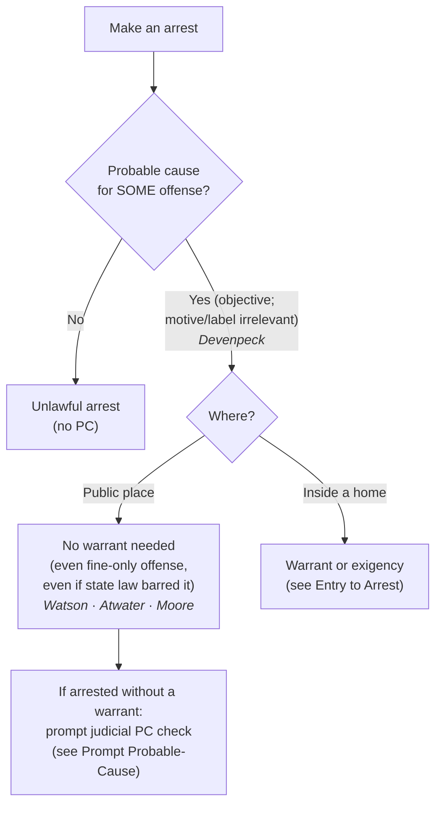

# Arrest & Arrest Warrants

*What makes an arrest lawful, and when does an arrest need a warrant? This page fixes the probable-cause standard for arrests; the home-entry warrant question lives at [[Entry to Arrest]], and the after-arrest judicial check at [[Prompt Probable-Cause Determination]].*

> [!rule] Black-letter rule
> **Probable cause governs every arrest; a warrant is the exception, not the rule.** A warrantless arrest in a **public place** on **probable cause** is reasonable under the Fourth Amendment, even for a minor, fine-only offense and even when there was time to get a warrant. *[[United States v. Watson]]*, 423 U.S. 411, 423–24 (1976); *[[Atwater v. City of Lago Vista#^pin-354|Atwater v. City of Lago Vista]]*, 532 U.S. 318, 354 (2001). The standard is **objective**: the offense supplying probable cause need not be the one the officer named, and the officer's subjective motive is irrelevant. *[[Devenpeck v. Alford#^pin-153|Devenpeck v. Alford]]*, 543 U.S. 146, 153 (2004). A warrant is required to cross a **home's** threshold to arrest (*[[Arrest in the Home]]*), not for the public arrest itself.
> ^rule-arrest-warrant

## The Brief

**A public arrest on probable cause needs no warrant.** The Fourth Amendment permits a warrantless arrest in public on probable cause, even where the officer had ample time to get a warrant. The Court "decline[d] to transform [the] judicial preference [for warrants] into a constitutional rule when the judgment of the Nation and Congress has for so long been to authorize warrantless public arrests on probable cause." *[[United States v. Watson]]*, 423 U.S. 411, 423–24 (1976). The warrant preference that governs **searches** does not govern **arrests** made in public; probable cause is the whole of it.

**The rule reaches even the most minor offense.** Probable cause governs *all* arrests without any case-by-case balancing. "If an officer has probable cause to believe that an individual has committed even a very minor criminal offense in his presence, he may, without violating the Fourth Amendment, arrest the offender." *[[Atwater v. City of Lago Vista#^pin-354|Atwater v. City of Lago Vista]]*, 532 U.S. 318, 354 (2001). A custodial arrest for a fine-only seatbelt violation was therefore reasonable; the remedy for over-arresting on petty offenses is legislative, not Fourth Amendment. The narrow exception is an arrest "conducted in an extraordinary manner, unusually harmful" to privacy or physical interests.

**The inquiry is objective, and the offense of arrest is flexible.** An arrest is lawful so long as the facts known to the officer establish probable cause for **some** criminal offense, whether or not it is the offense the officer announced or one "closely related" to it: the officer's "subjective reason for making the arrest need not be the criminal offense as to which the known facts provide probable cause." *[[Devenpeck v. Alford#^pin-153|Devenpeck v. Alford]]*, 543 U.S. 146, 153 (2004). The officer's motive does not matter, and neither does the label he puts on the arrest; what matters is whether the known facts add up to probable cause for a crime. *See* [[Probable Cause]]; *[[Whren v. United States]]*; *[[Ashcroft v. al-Kidd]]*.

**A state-law violation is not a Fourth Amendment violation.** An arrest supported by probable cause is reasonable under the Fourth Amendment **even if state law forbade it**. Where state law directed a summons but officers made a custodial arrest, "while States are free to regulate such arrests however they desire, state restrictions do not alter the Fourth Amendment's protections." *[[Virginia v. Moore#^pin-1607|Virginia v. Moore]]*, 553 U.S. 164, 168 (2008) (128 S. Ct. at 1607). Because the arrest was constitutionally valid, the search incident to it needed no additional justification, and the state-law-only violation triggered no exclusion.

**When a warrant *is* required.** The public-arrest rule does not reach a **home**. To cross the threshold of a dwelling to arrest, officers need an **arrest warrant** for the suspect's own home (plus reason to believe he is within) or a **search warrant** for a third party's home, absent consent or [[Exigent Circumstances and Hot Pursuit|exigency]]. *See* [[Arrest in the Home]] and [[Entry to Arrest]]. An arrest warrant also secures the neutral-magistrate judgment before the seizure; where officers arrest **without** a warrant, that neutral check moves to the **back end** as a prompt post-arrest determination. *See* [[Prompt Probable-Cause Determination]].

**Common pitfalls.**
- **Thinking a warrant is needed for an ordinary public arrest.** It is not; probable cause suffices, even with time to get a warrant. *[[United States v. Watson]]*.
- **Assuming a petty offense cannot support a custodial arrest.** *Atwater* holds it can, on probable cause, without balancing. *[[Atwater v. City of Lago Vista]]*.
- **Testing the arrest against the offense the officer named.** The question is whether the known facts give probable cause for **any** offense; the stated charge and the officer's motive do not control. *[[Devenpeck v. Alford]]*.
- **Treating a state-law arrest violation as a Fourth Amendment violation.** It is not, and it triggers no exclusion. *[[Virginia v. Moore]]*.
- **Forgetting the home line.** The public-arrest rule stops at the threshold; a home arrest needs a warrant or [[Exigent Circumstances and Hot Pursuit|exigency]]. *[[Entry to Arrest]]*.

## Lower-court developments

The arrest-standard core is settled at the Supreme Court, so the live questions are refinements rather than a circuit split on the basic rule.

- **Retaliatory-arrest overlay.** An arrest supported by probable cause generally defeats a First Amendment retaliatory-arrest claim, subject to a narrow exception for otherwise-unarrested comparators. *[[Nieves v. Bartlett|Nieves v. Bartlett]]*, 587 U.S. 391 (2019). This is a §1983 overlay on an otherwise-valid arrest, treated at [[Retaliatory Arrest]]. **Binding — SCOTUS.**
- **Totality restated.** The Court has reaffirmed that probable cause is assessed on the **totality** of the known facts, rejecting a divide-and-conquer approach that dismisses innocent explanations for each fact in isolation. *[[District of Columbia v. Wesby|District of Columbia v. Wesby]]*, 583 U.S. 48 (2018). **Binding — SCOTUS.**

## Key cases

| Case | Holding | Opinion |
|---|---|---|
| *[[United States v. Watson]]*, 423 U.S. 411 (1976) | **Anchor.** A warrantless arrest in a public place on probable cause is reasonable under the Fourth Amendment, even where the officer had time to obtain a warrant. | [opinion](https://www.courtlistener.com/opinion/109352/united-states-v-watson/) |
| *[[Atwater v. City of Lago Vista]]*, 532 U.S. 318 (2001) | Probable cause governs all arrests without case-by-case balancing; a warrantless custodial arrest for a fine-only misdemeanor on probable cause does not violate the Fourth Amendment. | [opinion](https://www.courtlistener.com/opinion/2620702/atwater-v-city-of-lago-vista/) |
| *[[Devenpeck v. Alford]]*, 543 U.S. 146 (2004) | An arrest is lawful if the known facts give probable cause for **some** offense; the offense need not be the one the officer invoked or "closely related" to it, and the officer's subjective motive is irrelevant. | [opinion](https://www.courtlistener.com/opinion/137733/devenpeck-v-alford/) |
| *[[Virginia v. Moore]]*, 553 U.S. 164 (2008) | A warrantless arrest on probable cause is reasonable even if state law forbade it (requiring a summons); a state-law-only violation does not trigger exclusion, and the search incident follows. | [opinion](https://www.courtlistener.com/opinion/145814/virginia-v-moore/) |

## Related cases across doctrines

These cases are treated in full elsewhere but bear on when an arrest is lawful, framed here for this doctrine.

| Case | Relevance here | Primary home | Opinion |
|---|---|---|---|
| *[[Payton v. New York]]*, 445 U.S. 573 (1980) | ***Home line.*** The public-arrest rule stops at the threshold; a warrantless, nonconsensual home arrest is presumptively unreasonable. | [[Arrest in the Home]] | [opinion](https://www.courtlistener.com/opinion/110235/payton-v-new-york/) |
| *[[Gerstein v. Pugh]]*, 420 U.S. 103 (1975) | ***Back-end check.*** A warrantless arrestee is entitled to a prompt judicial probable-cause determination before extended detention. | [[Prompt Probable-Cause Determination]] | [opinion](https://www.courtlistener.com/opinion/109186/gerstein-v-pugh/) |
| *[[Whren v. United States]]*, 517 U.S. 806 (1996) | ***Motive irrelevant.*** An objectively justified seizure is not rendered unlawful by the officer's subjective or pretextual motive. | [[Traffic Stops]] | [opinion](https://www.courtlistener.com/opinion/118036/whren-v-united-states/) |
| *[[Ashcroft v. al-Kidd]]*, 563 U.S. 731 (2011) | ***Motive irrelevant.*** An objectively reasonable arrest on a valid basis cannot be challenged on the officer's subjective intent. | [[Section 1983 Liability and Qualified Immunity]] | [opinion](https://www.courtlistener.com/opinion/7344719/ashcroft-v-al-kidd/) |
| *[[Knowles v. Iowa]]*, 525 U.S. 113 (1998) | ***Citation is not arrest.*** Issuing a citation instead of arresting does not authorize a full search incident; the custodial arrest is what unlocks that search. | [[Search Incident to Arrest]] | [opinion](https://www.courtlistener.com/opinion/118250/knowles-v-iowa/) |

## Visual

## Sources

- [*United States v. Watson*, 423 U.S. 411 (1976)](https://www.courtlistener.com/opinion/109352/united-states-v-watson/) (pinpoints: 423–24)
- [*Atwater v. City of Lago Vista*, 532 U.S. 318 (2001)](https://www.courtlistener.com/opinion/2620702/atwater-v-city-of-lago-vista/) (pinpoints: 354, 355)
- [*Devenpeck v. Alford*, 543 U.S. 146 (2004)](https://www.courtlistener.com/opinion/137733/devenpeck-v-alford/) (pinpoint: 153)
- [*Virginia v. Moore*, 553 U.S. 164 (2008)](https://www.courtlistener.com/opinion/145814/virginia-v-moore/) (pinpoints: 1607, 1608 (S. Ct. reporter))
- [*District of Columbia v. Wesby*, 583 U.S. 48 (2018)](https://www.courtlistener.com/opinion/4460854/district-of-columbia-v-wesby/)
- [*Nieves v. Bartlett*, 587 U.S. 391 (2019)](https://www.courtlistener.com/opinion/9231236/nieves-v-bartlett/)
