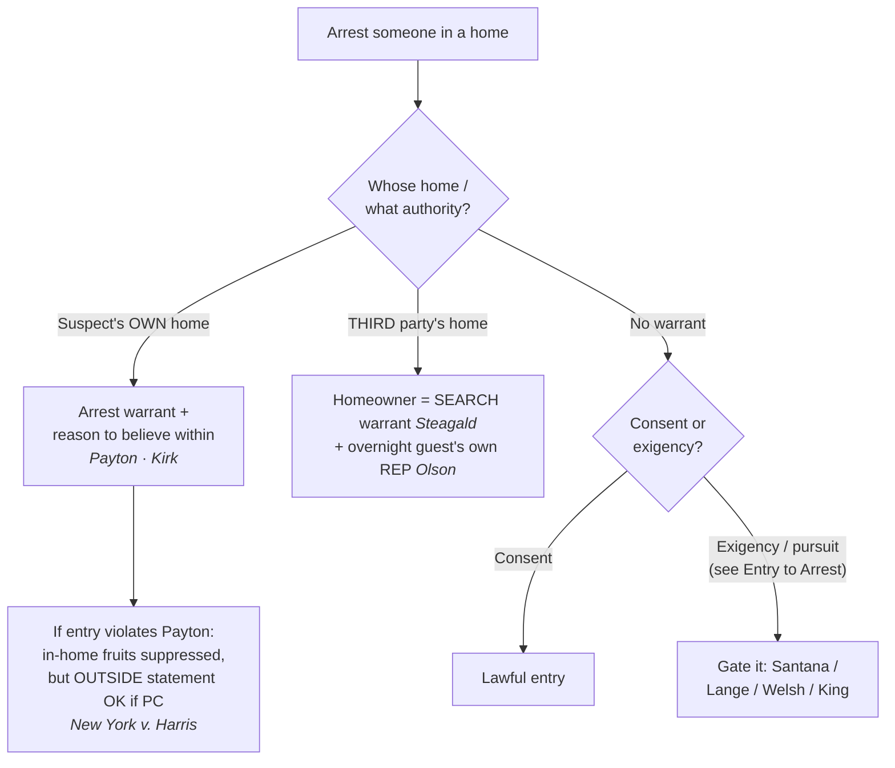

# Arrest in the Home

*This page states the arrest-in-the-home rule and its predicates, protected interests, and remedy. For the mechanics of crossing a threshold to arrest, including consent, exigency, and the surround-and-call-out (constructive-entry) frontier, see [[Entry to Arrest]].*

> [!rule] Black-letter rule
> **The home draws the Fourth Amendment's firmest line.** Absent **consent** or **exigent circumstances**, police may not make a warrantless, nonconsensual entry into a suspect's home to make a routine felony arrest: "the Fourth Amendment has drawn a firm line at the entrance to the house." *[[Payton v. New York#^pin-590|Payton v. New York]]*, 445 U.S. 573, 590 (1980). An **arrest warrant** carries the limited authority to enter the arrestee's **own** home when there is reason to believe he is within (*Payton*), while entering a **third party's** home to arrest requires a **search warrant** (*[[Steagald v. United States#^pin-205|Steagald]]*). Probable cause to arrest, standing alone, never substitutes for that warrant-or-exigency predicate.
> ^rule-arrest-in-home

## The Brief

**Field-decisive question: may I enter this home to arrest, and what do I need?** A home arrest is a full seizure of the person that requires probable cause, and the home adds a second requirement on top: authority to cross the threshold. The home receives the Fourth Amendment's highest protection, so absent consent or exigency police may not cross the entrance to arrest without a warrant, and "[a] routine felony arrest" does not by itself justify crossing that line. *[[Payton v. New York#^pin-590|Payton v. New York]]*, 445 U.S. 573, 590 (1980).

**The suspect's own home: an arrest warrant plus reason to believe he is within.** For the suspect's **own** dwelling *Payton* supplies the operative rule: "[a]n arrest warrant founded on probable cause implicitly carries with it the limited authority to enter a dwelling in which the suspect lives when there is reason to believe the suspect is within." 445 U.S. at 603. Two predicates ride on that one sentence: the suspect **lives** there and there is **reason to believe** he is **present now**. So the field answer for the suspect's own home is an **arrest warrant plus reason to believe the suspect is within** (or consent, or a true exigency).

**The warrant requirement flips inside someone else's home.** An arrest warrant protects the suspect, not the homeowner, so to enter a **third party's** home to arrest the suspect police need a **search warrant** absent exigency or consent: a "search warrant must be obtained absent exigent circumstances or consent." *[[Steagald v. United States#^pin-205|Steagald v. United States]]*, 451 U.S. 204, 205–06 (1981). In the third-party scenario two protected interests are in play at once: the homeowner's (*Steagald*) and, when the arrestee is an overnight guest, his own (*[[Minnesota v. Olson]]*, below).

**Who bears the burden, and how it is reviewed.** Because a warrantless home entry is presumptively unreasonable, the **government bears the burden** of proving consent or a recognized exigency; the suspect need not disprove it. On appeal, suppression rulings get a mixed standard: historical facts for **[[Common Legal Terms#clear-error|clear error]]**, and the ultimate reasonableness question (consent, exigency, "reason to believe") **[[Common Legal Terms#de-novo|de novo]]**.

**The guest is not rightless.** An **overnight guest** has his **own** reasonable expectation of privacy in the host's home, so even the person being arrested may have standing to suppress: "Olson's status as an overnight guest is alone enough to show that he had an expectation of privacy in the home that society is prepared to recognize as reasonable." *[[Minnesota v. Olson]]*, 495 U.S. 91, 96–97 (1990). Standing tracks the interest: the named suspect cannot invoke *Steagald* (that is the homeowner's right), but he **can** assert his own *Olson*/*Payton* privacy interest in the place he is staying. The counterpart limit is *[[Minnesota v. Carter]]*: a short-term commercial visitor with no overnight stay has **no** such expectation. *See* [[Standing to Challenge a Search]].

**When there is no warrant.** The entry then survives only on **consent** or a genuine **exigency** (escape, imminent evidence destruction, danger), gated by *[[United States v. Santana#^pin-43|Santana]]* (the doorway is public and hot pursuit crosses it, now cabined by *[[Lange v. California]]* for misdemeanor pursuits), *[[Welsh v. Wisconsin#^pin-753|Welsh]]* (a minor offense should "rarely" justify a home entry), and *[[Kentucky v. King]]* (a lawfully created exigency counts; an unlawfully manufactured one does not). The full exigency and threshold-crossing analysis is at [[Entry to Arrest]] and [[Exigent Circumstances and Hot Pursuit]].

**The remedy is real but bounded.** Suppression for a *Payton* violation reaches only what the unlawful entry produced **inside** the home. Where police have **probable cause** to arrest, a *Payton* violation does **not** bar a statement the suspect later makes **outside** the home: "the exclusionary rule does not bar the State's use of a statement made by the defendant outside of his home, even though the statement is taken after an arrest made in the home in violation of *Payton*." *[[New York v. Harris#^pin-21|New York v. Harris]]*, 495 U.S. 14, 21 (1990). A later, properly-Mirandized station-house statement in lawful custody was not "the fruit of having been arrested in the home rather than someplace else." *Id.* at 19.

**The firm line has held.** *[[Kirk v. Louisiana#^pin-638|Kirk v. Louisiana]]* ([[Common Legal Terms#per-curiam|per curiam]]) reaffirms that "police officers need either a warrant or probable cause plus exigent circumstances in order to make a lawful entry into a home," and a court that upholds the entry without assessing exigency "violate[s] *Payton*." 536 U.S. 635, 638 (2002).

**Flag the "reason to believe" quantum; do not anchor to one reading.** *Payton* never defined the showing behind "reason to believe the suspect is within," and it loads **two** contested predicates: that the suspect (a) **resides** there and (b) is **presently home**. The circuits divide (below), the decisions are **Persuasive (outside circuit)**, and the split is unresolved at the Supreme Court. For a multi-jurisdiction audience, **default to the higher (probable-cause) showing** on both predicates: it satisfies every circuit and the articulation costs nothing.

**Keep the three protected interests straight; the most common field errors live here.**

- **Do not use an arrest warrant to enter a third party's home.** That is a *Steagald* violation: the home needs its own **search warrant**, even with a valid arrest warrant for the guest inside.
- **Do not assume a guest "has no rights."** Under *Olson* an overnight guest has his **own** reasonable expectation of privacy.
- **Do not treat "reason to believe" as a hunch.** State both predicates (resides, present) with facts behind each; default to probable cause to be safe in any circuit.
- **Do not read *Santana* as a blank check for hot pursuit.** After *Lange*, chasing a fleeing **misdemeanant** into a home is not automatically lawful.
- **Do not assume any arrest supports home exigency.** *Welsh* is the opposite: for a **minor offense**, warrantless home entry should "rarely be sanctioned."
- **Do not think the officer's body must cross the line before *Payton* applies.** A surround-and-call-out that coerces the suspect out is still an in-home arrest; that constructive-entry frontier is treated at [[Entry to Arrest]].

Finally, this is **criminal** exigency. Entry merely to render aid is a different, **non-criminal** justification governed by an objective-reasonableness standard; do not conflate emergency-aid entry with entry to make an arrest. *See* [[Emergency Aid]]; and note there is **no** freestanding "community caretaking" power to cross a home's threshold (*[[Caniglia v. Strom]]*).

## Lower-court developments

The home-arrest core has held steady, but the *Payton* "reason to believe" quantum is the live battleground and **constructive entry** is an open frontier. The circuit decisions below are **Binding in-circuit** within their own circuits and **Persuasive (outside circuit)** elsewhere; genuine splits are flagged.

- **Constructive-entry circuit split (treated in full at [[Entry to Arrest]]).** Whether coercing a suspect out of a surrounded home (drawn weapons, a perimeter, loudspeakers) is a *Payton* in-home arrest divides the circuits: the Ninth (*[[United States v. Nora|Nora]]*, *[[United States v. Al-Azzawy|Al-Azzawy]]*, with *[[United States v. Vaneaton|Vaneaton]]* marking the voluntary-exposure limit) and Tenth (*[[United States v. Maez|Maez]]*) treat the coerced emergence as an in-home arrest; the Seventh (*[[United States v. Berkowitz|Berkowitz]]*) and Eleventh (*[[Knight v. Jacobson|Knight v. Jacobson]]*) keep the officer's **voice**, not his **body**, on the public side of the threshold. ⚖ Circuit split. **Binding in-circuit** each; **Persuasive (outside circuit)** elsewhere.
- **United States v. Brinkley (4th Cir. 2020).** ⚖ Circuit split. *Payton*'s "reason to believe the suspect is within" requires **probable cause on both predicates**: PC that the suspect resides there and PC he is presently inside; "generic signs of life" and a resident's nervousness are not enough. "the quantum of proof necessary to satisfy Payton has divided the circuits, with some construing 'reason to believe' to demand less than probable cause and others equating the two standards" (980 F.3d at 387). **Binding in-circuit — 4th Cir.; Persuasive (outside circuit).** [opinion](https://www.courtlistener.com/opinion/4805913/united-states-v-kendrick-brinkley/)
- **United States v. Vasquez-Algarin (3d Cir. 2016).** ⚖ Circuit split. "Reason to believe" under *Payton* "embodies the same standard of reasonableness inherent in probable cause," requiring PC that the arrestee both resides at and is present in the dwelling before forcing entry on an arrest warrant alone, "join[ing] the Fifth, Sixth, Seventh and Ninth Circuits in holding that Payton's 'reason to believe' language amounts to a probable-cause standard" (821 F.3d at 477). **Binding in-circuit — 3d Cir.; Persuasive (outside circuit).** [opinion](https://www.courtlistener.com/opinion/3199633/united-states-v-johnny-vasquez-algarin/)

## Key cases

| Case | Holding | Opinion |
|---|---|---|
| *[[Payton v. New York]]*, 445 U.S. 573 (1980) | **Anchor.** Warrantless, nonconsensual entry into a suspect's **own** home for a routine felony arrest is presumptively unreasonable; an **arrest warrant plus reason to believe the suspect is within** authorizes entry. | [opinion](https://www.courtlistener.com/opinion/110235/payton-v-new-york/) |
| *[[United States v. Santana]]*, 427 U.S. 38 (1976) | A suspect in her own doorway is in a **public** place and cannot defeat a public-place arrest by retreating inside; hot pursuit justifies the warrantless entry (now cabined by *Lange* for misdemeanors). | [opinion](https://www.courtlistener.com/opinion/109504/united-states-v-santana/) |
| *[[Steagald v. United States]]*, 451 U.S. 204 (1981) | To arrest the subject of an arrest warrant inside a **third party's** home, police need a **search warrant** absent exigency or consent; the arrest warrant protects the suspect, not the homeowner. | [opinion](https://www.courtlistener.com/opinion/110464/steagald-v-united-states/) |
| *[[New York v. Harris]]*, 495 U.S. 14 (1990) | **Limiting.** With probable cause to arrest, a *Payton* violation does **not** bar a statement the suspect makes **outside** the home; the remedy reaches only the in-home fruits. | [opinion](https://www.courtlistener.com/opinion/112413/new-york-v-harris/) |
| *[[Kirk v. Louisiana]]*, 536 U.S. 635 (2002) (per curiam) | Reaffirms *Payton*: police need **a warrant or probable cause plus exigent circumstances** to enter a home to arrest; PC to arrest alone is not enough. | [opinion](https://www.courtlistener.com/opinion/121167/kirk-v-louisiana/) |
| *[[Lange v. California]]*, 594 U.S. 295 (2021) | Pursuit of a fleeing **misdemeanor** suspect does **not categorically** justify warrantless home entry; courts apply a **case-by-case** exigency assessment. | [opinion](https://www.courtlistener.com/opinion/4894407/lange-v-california/) |

## Related cases across doctrines

These cases are treated in full elsewhere but bear on the arrest-in-the-home rules, framed here for this doctrine.

| Case | Relevance here | Primary home | Opinion |
|---|---|---|---|
| *[[Welsh v. Wisconsin]]*, 466 U.S. 740 (1984) | ***Offense gravity.*** The seriousness of the offense caps exigency; a warrantless home entry for a minor offense should "rarely be sanctioned." | [[Exigent Circumstances and Hot Pursuit]] | [opinion](https://www.courtlistener.com/opinion/111173/welsh-v-wisconsin/) |
| *[[Kentucky v. King]]*, 563 U.S. 452 (2011) | ***Police-created exigency.*** Police keep the exception when they lawfully create the exigency; only conduct that itself violates or threatens the Fourth Amendment poisons the entry. | [[Exigent Circumstances and Hot Pursuit]] | [opinion](https://www.courtlistener.com/opinion/216733/kentucky-v-king/) |
| *[[Minnesota v. Olson]]*, 495 U.S. 91 (1990) | ***Guest standing.*** An overnight guest has his own reasonable expectation of privacy in the host's home, so the person arrested may challenge the entry. | [[Standing to Challenge a Search]] | [opinion](https://www.courtlistener.com/opinion/112416/minnesota-v-olson/) |
| *[[Minnesota v. Carter]]*, 525 U.S. 83 (1998) | ***Standing limit.*** A short-term commercial visitor with no overnight stay has **no** reasonable expectation of privacy and cannot invoke *Payton*/*Olson*. | [[Standing to Challenge a Search]] | [opinion](https://www.courtlistener.com/opinion/118249/minnesota-v-carter/) |
| *[[Warden v. Hayden]]*, 387 U.S. 294 (1967) | ***Hot-pursuit baseline.*** Warrantless entry to seize a fleeing armed robber is reasonable where danger and escape leave no time for a warrant; the felony-pursuit baseline *Santana* builds on. | [[Exigent Circumstances and Hot Pursuit]] | [opinion](https://www.courtlistener.com/opinion/107465/warden-maryland-penitentiary-v-hayden/) |
| *[[Sabbath v. United States]]*, 391 U.S. 585 (1968) | ***Manner of entry.*** Opening a closed but unlocked door without announcing authority and purpose is a "breaking" governed by the knock-and-announce rule. | [[Knock-and-Announce]] | [opinion](https://www.courtlistener.com/opinion/107718/sabbath-v-united-states/) |
| *[[Vale v. Louisiana]]*, 399 U.S. 30 (1970) | ***Spatial/burden limit.*** A street arrest on the front steps supplies no exigency to search the house; the State must justify any warrantless dwelling search. | [[Search Incident to Arrest]] | [opinion](https://www.courtlistener.com/opinion/108183/vale-v-louisiana/) |
| *[[Maryland v. Buie]]*, 494 U.S. 325 (1990) | ***Protective sweep.*** After a lawful in-home arrest, officers may sweep adjoining spaces automatically and beyond them on articulable suspicion of danger. | [[Securing the Scene]] | [opinion](https://www.courtlistener.com/opinion/112384/maryland-v-buie/) |
| *[[Illinois v. McArthur]]*, 531 U.S. 326 (2001) | ***Less-intrusive path.*** Officers with PC may temporarily bar a resident from re-entering while they get a warrant, respecting *Payton*'s firm line. | [[Securing the Scene]] | [opinion](https://www.courtlistener.com/opinion/118405/illinois-v-mcarthur/) |
| *[[Segura v. United States]]*, 468 U.S. 796 (1984) | ***Securing / independent source.*** Officers may secure premises pending a warrant; evidence later seized under a warrant built on wholly independent information is admissible. | [[Securing the Scene]] | [opinion](https://www.courtlistener.com/opinion/111259/segura-v-united-states/) |
| *[[Mincey v. Arizona]]*, 437 U.S. 385 (1978) | ***No "murder scene" exception.*** The gravity of the suspected offense does not by itself manufacture exigency to enter or remain in a home. | [[Emergency Aid]] | [opinion](https://www.courtlistener.com/opinion/109905/mincey-v-arizona/) |
| *[[Brigham City v. Stuart]]*, 547 U.S. 398 (2006) | ***Aid boundary.*** Police may cross the threshold without a warrant to render emergency aid; a non-criminal justification distinct from arrest exigency. | [[Emergency Aid]] | [opinion](https://www.courtlistener.com/opinion/145654/brigham-city-v-stuart/) |
| *[[Caniglia v. Strom]]*, 593 U.S. 194 (2021) | ***No caretaking end-run.*** There is no freestanding "community caretaking" exception for the home; crossing the threshold still needs a warrant, exigency, or true emergency aid. | [[Emergency Aid]] | [opinion](https://www.courtlistener.com/opinion/4883694/caniglia-v-strom/) |
| *[[Case v. Montana]]*, 607 U.S. ___ (2026) | ***Aid standard.*** A warrantless home entry to render aid needs only *Brigham City*'s "objectively reasonable basis," not investigative probable cause; do not conflate it with arrest exigency. | [[Emergency Aid]] | [opinion](https://www.courtlistener.com/opinion/10774335/case-v-montana/) |

## Visual

## Sources
- [*Payton v. New York*, 445 U.S. 573 (1980)](https://www.courtlistener.com/opinion/110235/payton-v-new-york/) (pinpoints: 576, 590, 603)
- [*United States v. Santana*, 427 U.S. 38 (1976)](https://www.courtlistener.com/opinion/109504/united-states-v-santana/) (pinpoints: 42, 43)
- [*Steagald v. United States*, 451 U.S. 204 (1981)](https://www.courtlistener.com/opinion/110464/steagald-v-united-states/) (pinpoints: 205–06)
- [*New York v. Harris*, 495 U.S. 14 (1990)](https://www.courtlistener.com/opinion/112413/new-york-v-harris/) (pinpoints: 17, 19, 21)
- [*Kirk v. Louisiana*, 536 U.S. 635 (2002) (per curiam)](https://www.courtlistener.com/opinion/121167/kirk-v-louisiana/) (pinpoints: 636, 638)
- [*Welsh v. Wisconsin*, 466 U.S. 740 (1984)](https://www.courtlistener.com/opinion/111173/welsh-v-wisconsin/) (pinpoints: 753, 755)
- [*Minnesota v. Olson*, 495 U.S. 91 (1990)](https://www.courtlistener.com/opinion/112416/minnesota-v-olson/) (pinpoints: 96–97)
- [*Kentucky v. King*, 563 U.S. 452 (2011)](https://www.courtlistener.com/opinion/216733/kentucky-v-king/) (pinpoint: 462)
- [*Lange v. California*, 594 U.S. 295 (2021)](https://www.courtlistener.com/opinion/4894407/lange-v-california/) (pinpoint: 298)
- [*Minnesota v. Carter*, 525 U.S. 83 (1998)](https://www.courtlistener.com/opinion/118249/minnesota-v-carter/)
- [*Warden v. Hayden*, 387 U.S. 294 (1967)](https://www.courtlistener.com/opinion/107465/warden-maryland-penitentiary-v-hayden/)
- [*Sabbath v. United States*, 391 U.S. 585 (1968)](https://www.courtlistener.com/opinion/107718/sabbath-v-united-states/) (pinpoints: 585–86, 590)
- [*Vale v. Louisiana*, 399 U.S. 30 (1970)](https://www.courtlistener.com/opinion/108183/vale-v-louisiana/) (pinpoints: 33, 34, 35)
- [*Maryland v. Buie*, 494 U.S. 325 (1990)](https://www.courtlistener.com/opinion/112384/maryland-v-buie/)
- [*Illinois v. McArthur*, 531 U.S. 326 (2001)](https://www.courtlistener.com/opinion/118405/illinois-v-mcarthur/)
- [*Segura v. United States*, 468 U.S. 796 (1984)](https://www.courtlistener.com/opinion/111259/segura-v-united-states/)
- [*Mincey v. Arizona*, 437 U.S. 385 (1978)](https://www.courtlistener.com/opinion/109905/mincey-v-arizona/)
- [*Brigham City v. Stuart*, 547 U.S. 398 (2006)](https://www.courtlistener.com/opinion/145654/brigham-city-v-stuart/)
- [*Caniglia v. Strom*, 593 U.S. 194 (2021)](https://www.courtlistener.com/opinion/4883694/caniglia-v-strom/)
- [*Case v. Montana*, 607 U.S. ___ (2026) (No. 24-624)](https://www.courtlistener.com/opinion/10774335/case-v-montana/) (pinpoints: slip op. at 7, 8, 9, 10–11)
- [*United States v. Brinkley*, 980 F.3d 377 (4th Cir. 2020)](https://www.courtlistener.com/opinion/4805913/united-states-v-kendrick-brinkley/) (pinpoint: 387)
- [*United States v. Vasquez-Algarin*, 821 F.3d 467 (3d Cir. 2016)](https://www.courtlistener.com/opinion/3199633/united-states-v-johnny-vasquez-algarin/) (pinpoint: 477)
