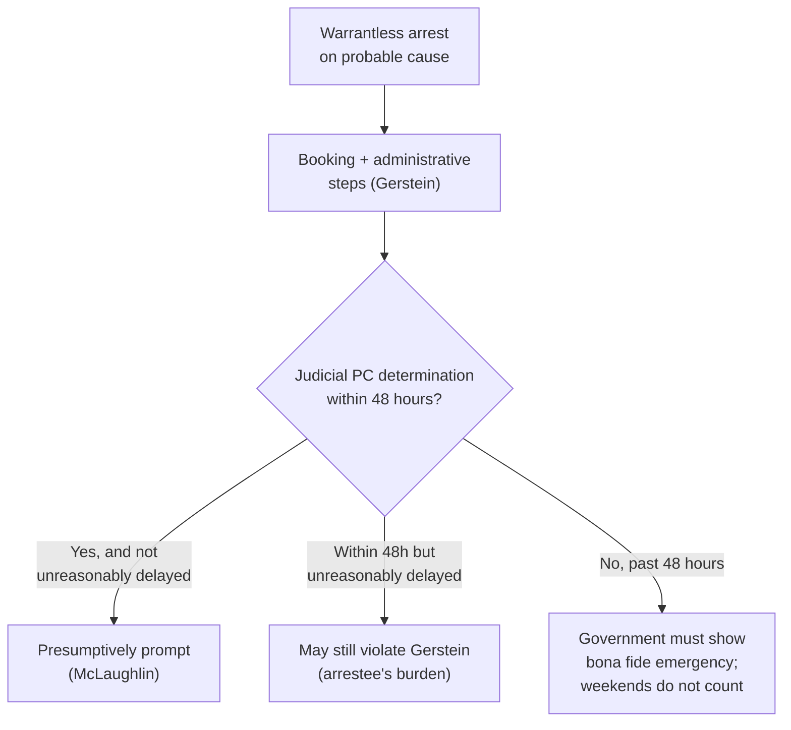

# Prompt Probable-Cause Determination

*After a warrantless arrest, how soon must a judge confirm probable cause, and what does that hearing require? This page fixes the back-end judicial check; the arrest standard itself is at [[Arrest and Arrest Warrants]].*

> [!rule] Black-letter rule
> **A warrantless arrest buys custody only until a neutral judge can confirm probable cause.** A person arrested without a warrant is entitled to a **prompt judicial determination of probable cause** as a prerequisite to any extended pretrial detention; the determination may be informal and **need not be adversarial**. *[[Gerstein v. Pugh#^pin-114|Gerstein v. Pugh]]*, 420 U.S. 103, 114 (1975). A determination within **48 hours** of arrest is presumptively prompt; past 48 hours the burden shifts to the government to show a bona fide emergency, and intervening weekends do not excuse the delay. *[[County of Riverside v. McLaughlin|County of Riverside v. McLaughlin]]*, 500 U.S. 44, 56 (1991).
> ^rule-prompt-pc

## The Brief

**On-scene probable cause justifies the arrest, not the extended detention.** An officer's own probable cause supports the arrest and a brief booking detention, but not prolonged custody: "a policeman's on-the-scene assessment of probable cause provides legal justification for arresting a person suspected of crime, and for a brief period of detention to take the administrative steps incident to arrest. Once the suspect is in custody, however, the reasons that justify dispensing with the magistrate's neutral judgment evaporate." *[[Gerstein v. Pugh|Gerstein v. Pugh]]*, 420 U.S. 103, 113–14 (1975). So the Fourth Amendment "requires a judicial determination of probable cause as a prerequisite to extended restraint of liberty following arrest." *Id.* at 114.

**The hearing is a probable-cause check, not a trial.** The *Gerstein* determination need not be adversarial and carries none of the trial-type protections: it "must provide a fair and reliable determination of probable cause as a condition for any significant pretrial restraint of liberty, and this determination must be made by a judicial officer either before or promptly after arrest." 420 U.S. at 125. No right to counsel, confrontation, or cross-examination attaches to it. A prosecutor's decision to file charges is not a substitute, because a prosecutor is not the "neutral and detached" magistrate the Fourth Amendment requires.

**"Prompt" means presumptively within 48 hours.** *[[County of Riverside v. McLaughlin|County of Riverside v. McLaughlin]]* fixed the operative window: "a jurisdiction that provides judicial determinations of probable cause within 48 hours of arrest will, as a general matter, comply with the promptness requirement of *Gerstein*." 500 U.S. at 56. Within 48 hours is not automatically enough: a hearing can still violate *Gerstein* if the arrestee proves the determination "was delayed unreasonably," and the Court gave examples such as delay "for delay's sake" or to gather additional evidence.

**Past 48 hours, the burden flips to the government.** "Where an arrested individual does not receive a probable cause determination within 48 hours, the calculus changes.... [T]he burden shifts to the government to demonstrate the existence of a bona fide emergency or other extraordinary circumstance." *Id.* at 57. Two things do **not** count as that circumstance: the mere fact that combining proceedings takes longer, and "intervening weekends." A jurisdiction that folds the probable-cause determination into arraignment must still hit the 48-hour mark.

**How it fits the arrest picture.** The prompt-determination rule is the back-end counterpart to the front-end arrest rule. Where officers arrest **with** a warrant, a neutral magistrate has already found probable cause before the seizure. Where they arrest **without** one, as the Fourth Amendment permits in public on probable cause (*[[United States v. Watson]]*; see [[Arrest and Arrest Warrants]]), the neutral check simply moves to the back end and must come promptly. It is distinct from the in-home arrest-warrant rule of *[[Payton v. New York]]*, which governs entry, not post-arrest detention.

**Common pitfalls.**
- **Treating the arresting officer's probable cause as enough for extended detention.** It justifies the arrest and booking, not prolonged custody; a neutral judge must confirm probable cause. *[[Gerstein v. Pugh]]*.
- **Demanding a full adversary hearing.** *Gerstein* requires only a fair, reliable, non-adversarial probable-cause determination. *[[Gerstein v. Pugh]]*.
- **Reading 48 hours as a safe harbor.** A determination inside 48 hours can still be unreasonably delayed, and one past 48 hours shifts the burden to the government. *[[County of Riverside v. McLaughlin]]*.
- **Excusing delay by pointing to the weekend.** Intervening weekends and the convenience of combining proceedings are not extraordinary circumstances. *[[County of Riverside v. McLaughlin]]*.

## Lower-court developments

The 48-hour framework is settled at the Supreme Court; the recurring questions below the Court are application questions (what delay is "unreasonable" within the window, and what remedy a *Gerstein* violation carries) rather than a split on the rule itself. No controlling circuit split is mapped in this build; a *Gerstein* violation is not itself a basis to suppress a later-obtained confession absent the ordinary attenuation analysis. *See* [[The Exclusionary Rule]].

## Key cases

| Case | Holding | Opinion |
|---|---|---|
| *[[Gerstein v. Pugh]]*, 420 U.S. 103 (1975) | **Anchor.** A person arrested without a warrant is entitled to a prompt judicial probable-cause determination before extended pretrial detention; the determination need not be an adversary hearing. | [opinion](https://www.courtlistener.com/opinion/109186/gerstein-v-pugh/) |
| *[[County of Riverside v. McLaughlin]]*, 500 U.S. 44 (1991) | A probable-cause determination within 48 hours of a warrantless arrest is presumptively prompt under *Gerstein*; past 48 hours the government must show a bona fide emergency, and intervening weekends do not qualify. | [opinion](https://www.courtlistener.com/opinion/112585/county-of-riverside-v-mclaughlin/) |

## Related cases across doctrines

These cases are treated in full elsewhere but frame the prompt-determination rule here.

| Case | Relevance here | Primary home | Opinion |
|---|---|---|---|
| *[[United States v. Watson]]*, 423 U.S. 411 (1976) | ***Front-end rule.*** A warrantless public arrest on probable cause is valid, so the neutral check moves to the prompt post-arrest determination. | [[Arrest and Arrest Warrants]] | [opinion](https://www.courtlistener.com/opinion/109352/united-states-v-watson/) |
| *[[Payton v. New York]]*, 445 U.S. 573 (1980) | ***Distinct rule.*** *Payton* governs warrant authority to **enter a home** to arrest, not the post-arrest detention timing fixed here. | [[Arrest in the Home]] | [opinion](https://www.courtlistener.com/opinion/110235/payton-v-new-york/) |

## Visual

## Sources

- [*Gerstein v. Pugh*, 420 U.S. 103 (1975)](https://www.courtlistener.com/opinion/109186/gerstein-v-pugh/) (pinpoints: 113–14, 114, 125)
- [*County of Riverside v. McLaughlin*, 500 U.S. 44 (1991)](https://www.courtlistener.com/opinion/112585/county-of-riverside-v-mclaughlin/) (pinpoints: 56, 57)
- [*United States v. Watson*, 423 U.S. 411 (1976)](https://www.courtlistener.com/opinion/109352/united-states-v-watson/) (front-end arrest rule; see [[Arrest and Arrest Warrants]])
