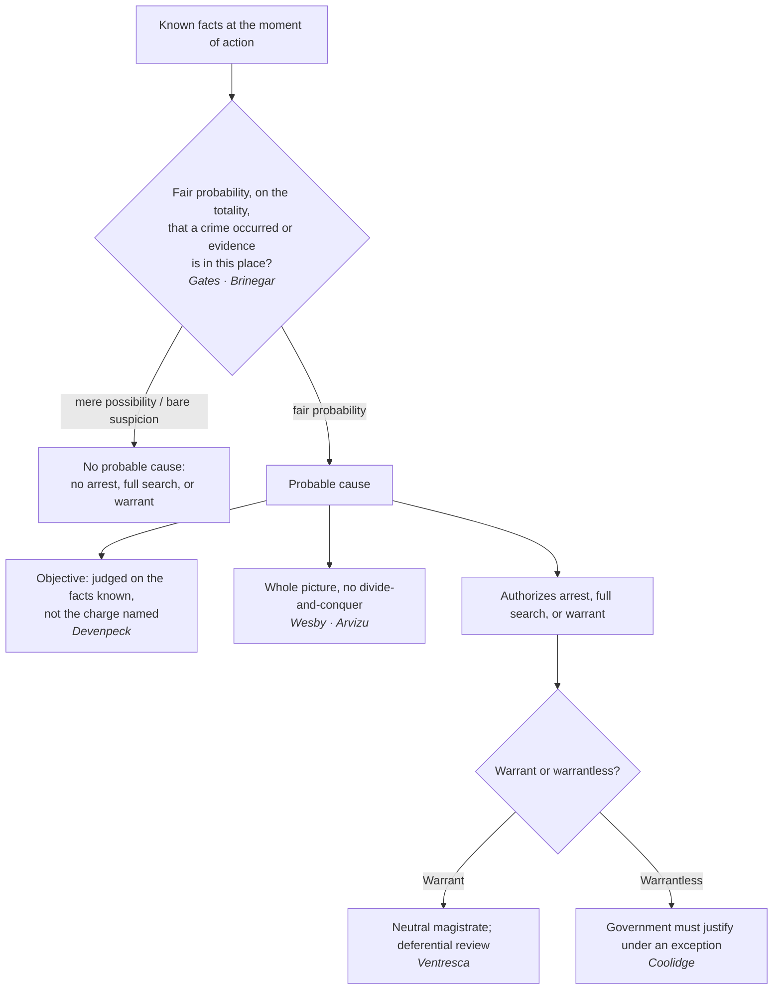

# Probable Cause

*Do I have probable cause, a fair probability on the totality of what I know, enough to arrest, search fully, or get a warrant?*

> [!rule] Black-letter rule
> **Probable cause** is the quantum required to arrest, to conduct a full search, or to obtain a warrant. It exists when, under the totality of the circumstances, there is a "fair probability that contraband or evidence of a crime will be found in a particular place." *[[Illinois v. Gates|Gates]]*, 462 U.S. 213, [238](https://www.courtlistener.com/opinion/110959/illinois-v-gates/) (1983). It is a practical, non-technical judgment about **probabilities**, "the factual and practical considerations of everyday life on which reasonable and prudent men, not legal technicians, act." *[[Brinegar v. United States|Brinegar]]*, 338 U.S. 160, [175](https://www.courtlistener.com/opinion/104716/brinegar-v-united-states/) (1949). It demands more than bare suspicion, less than certainty, and never a fixed percentage.
> ^rule-probable-cause

## The Brief

**What probable cause is, and what it unlocks.** Probable cause is the practical, non-technical quantum the Fourth Amendment requires for its most intrusive routine actions: an arrest, a full search, or a warrant. It is the top field rung of the [[The Proof Ladder|proof ladder]], above [[Reasonable Suspicion|reasonable suspicion]] and below the trial burdens no officer applies. This page owns the standard itself; [[Probable Cause in the Affidavit]] owns presenting it to a magistrate, and [[Collective Knowledge and the Fellow-Officer Rule|collective knowledge]] owns pooling it across officers.

**The test: totality and fair probability.** Probable cause "deal[s] with probabilities," the "factual and practical considerations of everyday life on which reasonable and prudent men, not legal technicians, act." *[[Brinegar v. United States#^pin-175|Brinegar]]*, 338 U.S. 160, [175](https://www.courtlistener.com/opinion/104716/brinegar-v-united-states/) (1949). *[[Illinois v. Gates|Gates]]* fixes the operative test: the magistrate makes "a practical, common-sense decision whether, given all the circumstances . . . there is a **fair probability** that contraband or evidence of a crime will be found in a particular place." *[[Illinois v. Gates#^pin-238a|Gates]]*, 462 U.S. 213, [238](https://www.courtlistener.com/opinion/110959/illinois-v-gates/) (1983).

**Three corollaries the field must hold together.**
- **It is objective.** Probable cause turns on the facts known to the officer, not on the charge he names or his subjective theory. An arrest stands if those facts support some offense, "even though the offense the officer thought existed was not the one for which the suspect was eventually charged," and the offense need not be closely related to it. *[[Devenpeck v. Alford#^pin-153|Devenpeck]]*, 543 U.S. 146, [153–55](https://www.courtlistener.com/opinion/137733/devenpeck-v-alford/) (2004).
- **No divide-and-conquer.** Courts and magistrates weigh the whole picture; they may not evaluate each fact in isolation and discard the innocent-looking ones. *[[District of Columbia v. Wesby|Wesby]]*, 583 U.S. 48, [60–61](https://www.courtlistener.com/opinion/4460854/district-of-columbia-v-wesby/) (2018); *[[United States v. Arvizu|Arvizu]]*, 534 U.S. 266, [274](https://www.courtlistener.com/opinion/118474/united-states-v-arvizu/) (2002).
- **Measured at the seizure, on probabilities, not certainty.** Probable cause "must precede the seizure" and rests on the facts then known; "an arrest is not justified by what the subsequent search discloses." *[[Henry v. United States (1959)#^pin-104|Henry]]*, 361 U.S. 98, 104 (1959). But certainty is not required: "[s]ufficient probability, not certainty, is the touchstone of reasonableness," so a reasonable, good-faith **mistake of identity** does not defeat an arrest. *[[Hill v. California#^pin-804|Hill]]*, 401 U.S. 797, [804](https://www.courtlistener.com/opinion/108305/hill-v-california/#:~:text=sufficient%20probability%2C%20not%20certainty%2C%20is) (1971).

**Particularized to the person, but a common enterprise can reach a group.** Probable cause "must be particularized with respect to the person to be searched or seized." *[[Ybarra v. Illinois|Ybarra]]*, 444 U.S. 85, [91](https://www.courtlistener.com/opinion/110158/ybarra-v-illinois/) (1979). *[[Maryland v. Pringle|Pringle]]* shows how that requirement is satisfied for several suspects at once: where cocaine and rolled cash were found in a car and no occupant claimed them, an officer could reasonably infer a "common enterprise among the three men," giving probable cause to arrest each. *[[Maryland v. Pringle#^pin-372|Pringle]]*, 540 U.S. 366, [371–74](https://www.courtlistener.com/opinion/131150/maryland-v-pringle/) (2003). *[[Maryland v. Pringle|Pringle]]* aggregates **facts about suspects** to find individualized probable cause. It is not a [[Collective Knowledge and the Fellow-Officer Rule|collective-knowledge]] case, which pools knowledge **across officers**; keep the two ideas distinct.

**Informants and tips: the *[[Illinois v. Gates|Gates]]* totality replaced the rigid two-prong test.** Before 1983 an informant's tip had to clear a rigid **two-prong** hurdle, the informant's **basis of knowledge** and his **veracity**, each satisfied independently under *[[Aguilar v. Texas|Aguilar]]* and *[[Spinelli v. United States|Spinelli]]*. *[[Illinois v. Gates|Gates]]* abandoned that framework: veracity, reliability, and basis of knowledge "are better understood as relevant considerations in the totality-of-the-circumstances analysis . . . not [as] entirely separate and independent requirements to be rigidly exacted in every case." *[[Illinois v. Gates|Gates]]*, 462 U.S. at [233](https://www.courtlistener.com/opinion/110959/illinois-v-gates/). Under that umbrella, police **corroboration of the innocent details** of a reliable, detailed tip can furnish probable cause, *[[Draper v. United States#^pin-313b|Draper]]*, 358 U.S. 307, [313](https://www.courtlistener.com/opinion/105820/draper-v-united-states/#:~:text=In%20dealing%20with%20probable%20cause%2C) (1959); a statement **against penal interest** carries its own indicia of credibility, *[[United States v. Harris (1971)|Harris]]*, 403 U.S. 573, 583 (1971); and a trained drug dog's alert can supply full probable cause on the totality, *[[Florida v. Harris#^pin-248|Florida v. Harris]]*, 568 U.S. 237, [244–48](https://www.courtlistener.com/opinion/820744/florida-v-harris/) (2013).

**Who decides, and the standard of review.** In the field the call is the officer's, drawing on training and experience; for a warrant it is a **neutral magistrate**, whose probable-cause finding gets **deferential** review. Affidavits are read "in a commonsense and realistic," not "hypertechnical," manner, and "doubtful or marginal cases . . . [are] largely determined by the preference to be accorded to warrants." *[[United States v. Ventresca#^pin-109b|Ventresca]]*, 380 U.S. 102, [108–09](https://www.courtlistener.com/opinion/106990/united-states-v-ventresca/#:~:text=the%20resolution%20of%20doubtful%20or) (1965). On appeal the ultimate probable-cause question is reviewed [[Common Legal Terms#de-novo|de novo]], while the trial court's historical facts are reviewed only for [[Common Legal Terms#clear-error|clear error]]. *[[Ornelas v. United States#^pin-699a|Ornelas]]*, 517 U.S. 690, [699](https://www.courtlistener.com/opinion/118030/ornelas-v-united-states/#:~:text=a%20reviewing%20court%20should%20take) (1996).

**Burden of proof: it tracks the warrant line.** For a **warrantless** search, seizure, or arrest, the **government** bears the burden of justifying it under a recognized exception: "the burden is on those seeking the exemption to show the need for it." *[[Coolidge v. New Hampshire|Coolidge]]*, 403 U.S. 443, [455](https://www.courtlistener.com/opinion/108377/coolidge-v-new-hampshire/) (1971). Under a **warrant** the search or arrest is **presumed valid** and the **defendant** bears the burden of overcoming it. To win a *[[Franks v. Delaware|Franks]]* hearing, for instance, he must make a "substantial preliminary showing" of a knowing or reckless falsehood material to probable cause. *[[Franks v. Delaware|Franks]]*, 438 U.S. 154, [155–56](https://www.courtlistener.com/opinion/109925/franks-v-delaware/) (1978).

**Remedy.** The consequence of acting on less than probable cause is **suppression** of the evidence and its fruits under the exclusionary rule. See [[The Exclusionary Rule]].

**Apply it.**
1. **Fix the quantum.** Ask whether the known facts show a fair probability, not a bare possibility, that a crime occurred or that evidence is in this place (*[[Illinois v. Gates|Gates]]*).
2. **Take the whole picture.** Weigh the facts together; do not explain each away in isolation (*[[District of Columbia v. Wesby|Wesby]]*).
3. **Check the source.** Corroborate an informant's tip, or rely on a penal-interest admission or a trained-dog alert; the totality, not a rigid checklist, controls (*[[Draper v. United States|Draper]]*; *[[Florida v. Harris|Florida v. Harris]]*).
4. **Do not lock onto your charge.** Probable cause is objective; it survives even if the eventual charge differs from the one you had in mind (*[[Devenpeck v. Alford|Devenpeck]]*).

**Common pitfalls.**
- **Treating reasonable suspicion and probable cause as interchangeable.** They are different rungs: reasonable suspicion buys a brief stop-and-frisk, not an arrest or a full search. Name which one the facts actually support (see [[Reasonable Suspicion]]).
- **"Probabilities, not possibilities."** Probable cause turns on **probabilities**, not bare possibility. A fact that merely makes crime *possible* is not enough; this is one of the [[Three Golden Rules|Three Golden Rules]] maxims (*[[Brinegar v. United States|Brinegar]]*; *[[Illinois v. Gates|Gates]]*).
- **Quantifying the standard as a fixed percentage.** Neither standard reduces to a number; an instructor who says "probable cause is 51%" is inventing a rule the Court has never adopted (*[[Illinois v. Gates|Gates]]*).
- **Divide-and-conquer.** Do not pick the facts apart and explain each away; the test is the whole picture (*[[District of Columbia v. Wesby|Wesby]]*; *[[United States v. Arvizu|Arvizu]]*).
- **Locking onto the charge you named.** Probable cause is objective; it survives even if the eventual charge differs from the one you had in mind (*[[Devenpeck v. Alford|Devenpeck]]*).

## Key cases

| Case | Holding | Opinion |
|---|---|---|
| *[[Brinegar v. United States]]*, 338 U.S. 160 (1949) | Classic probable-cause statement: practical, non-technical **probabilities** on which reasonable people act, not technical certainty. | [opinion](https://www.courtlistener.com/opinion/104716/brinegar-v-united-states/) |
| *[[Illinois v. Gates]]*, 462 U.S. 213 (1983) | Probable cause is judged by the **[[Common Legal Terms#totality-of-the-circumstances\|totality of the circumstances]]**, a fair-probability inquiry; **abandons** the rigid *[[Aguilar v. Texas\|Aguilar]]*–*[[Spinelli v. United States\|Spinelli]]* two-prong informant test. | [opinion](https://www.courtlistener.com/opinion/110959/illinois-v-gates/) |
| *[[Henry v. United States (1959)]]*, 361 U.S. 98 (1959) | Probable cause is measured **at the moment of arrest** on the facts then known; "an arrest is not justified by what the subsequent search discloses." | [opinion](https://www.courtlistener.com/opinion/105963/henry-v-united-states/) |
| *[[Maryland v. Pringle]]*, 540 U.S. 366 (2003) | Drugs and cash in a car with no claimant give probable cause to arrest **all** occupants on a **common-enterprise** inference: particularized PC reaching a group, not horizontal pooling. | [opinion](https://www.courtlistener.com/opinion/131150/maryland-v-pringle/) |
| *[[Devenpeck v. Alford]]*, 543 U.S. 146 (2004) | Probable cause is **objective**; the offense need not be the one the officer named or closely related to it. | [opinion](https://www.courtlistener.com/opinion/137733/devenpeck-v-alford/) |
| *[[Hill v. California]]*, 401 U.S. 797 (1971) | "Sufficient probability, not certainty, is the touchstone": a reasonable, good-faith **mistaken-identity** arrest is valid, as is the search incident to it. | [opinion](https://www.courtlistener.com/opinion/108305/hill-v-california/) |
| *[[District of Columbia v. Wesby]]*, 583 U.S. 48 (2018) | Probable cause is a totality inquiry; courts must **not divide-and-conquer** the facts. | [opinion](https://www.courtlistener.com/opinion/4460854/district-of-columbia-v-wesby/) |
| *[[Florida v. Harris]]*, 568 U.S. 237 (2013) | A trained dog's alert can supply **probable cause** under the totality, with no rigid field-record checklist. | [opinion](https://www.courtlistener.com/opinion/820744/florida-v-harris/) |
| *[[Draper v. United States]]*, 358 U.S. 307 (1959) | Police **corroboration of the innocent details** of a reliable, detailed informant's tip furnishes probable cause to arrest. | [opinion](https://www.courtlistener.com/opinion/105820/draper-v-united-states/) |
| *[[United States v. Harris (1971)]]*, 403 U.S. 573 (1971) | An informant's statement **against penal interest** carries its own indicia of credibility, supporting probable cause. | [opinion](https://www.courtlistener.com/opinion/108379/united-states-v-harris/) |
| *[[Ornelas v. United States]]*, 517 U.S. 690 (1996) | Reasonable-suspicion and probable-cause determinations are reviewed **[[Common Legal Terms#de-novo\|de novo]]**; historical facts for [[Common Legal Terms#clear-error\|clear error]]. | [opinion](https://www.courtlistener.com/opinion/118030/ornelas-v-united-states/) |
| *[[Aguilar v. Texas]]*, 378 U.S. 108 (1964) | **The two-prong foil**: the rigid basis-of-knowledge and veracity informant test, **abandoned** by *[[Illinois v. Gates\|Gates]]* for the totality approach. | [opinion](https://www.courtlistener.com/opinion/106865/aguilar-v-texas/) |
| *[[Spinelli v. United States]]*, 393 U.S. 410 (1969) | **The two-prong foil**: refined *[[Aguilar v. Texas\|Aguilar]]*'s two prongs, then **abandoned** by *[[Illinois v. Gates\|Gates]]*. | [opinion](https://www.courtlistener.com/opinion/107831/spinelli-v-united-states/) |

## Related cases across doctrines

| Case | Relevance here | Primary home | Opinion |
|---|---|---|---|
| *[[United States v. Ventresca]]*, 380 U.S. 102 (1965) | ***Posture.*** Warrant affidavits are read **commonsensically**, not hypertechnically, and **doubtful PC cases favor the warrant**, the deferential posture behind *[[Illinois v. Gates\|Gates]]*. | [[Probable Cause in the Affidavit]] | [opinion](https://www.courtlistener.com/opinion/106990/united-states-v-ventresca/) |
| *[[Franks v. Delaware]]*, 438 U.S. 154 (1978) | ***Limits.*** The defendant may attack the PC **showing itself**: on a substantial preliminary showing of a knowing or reckless material falsehood, the false statement is set aside and PC re-evaluated on what remains. | [[Franks Challenges]] | [opinion](https://www.courtlistener.com/opinion/109925/franks-v-delaware/) |
| *[[Whiteley v. Warden]]*, 401 U.S. 560 (1971) | ***Source rule.*** An officer may act on a bulletin assuming the issuer had PC, but if the **issuer in fact lacked PC** the action is invalid: the quantum is measured **at the source**. | [[Collective Knowledge and the Fellow-Officer Rule]] | [opinion](https://www.courtlistener.com/opinion/108297/whiteley-v-warden-wyoming-state-penitentiary/) |
| *[[Case v. Montana]]*, 607 U.S. ___ (2026) | ***Boundary.*** **Probable cause is the criminal-investigative quantum and is not transplanted** to non-investigative contexts: a warrantless **emergency-aid** home entry needs only *[[Brigham City v. Stuart\|Brigham City]]*'s "objectively reasonable basis," not PC. | [[Emergency Aid]] | [opinion](https://www.courtlistener.com/opinion/10774335/case-v-montana/) |

## Visual

## Sources

- [*Illinois v. Gates*, 462 U.S. 213 (1983)](https://www.courtlistener.com/opinion/110959/illinois-v-gates/) (pinpoints: 233, 238)
- [*Brinegar v. United States*, 338 U.S. 160 (1949)](https://www.courtlistener.com/opinion/104716/brinegar-v-united-states/) (pinpoint: 175)
- [*Henry v. United States*, 361 U.S. 98 (1959)](https://www.courtlistener.com/opinion/105963/henry-v-united-states/) (pinpoint: 104)
- [*Maryland v. Pringle*, 540 U.S. 366 (2003)](https://www.courtlistener.com/opinion/131150/maryland-v-pringle/) (pinpoints: 371–74)
- [*Devenpeck v. Alford*, 543 U.S. 146 (2004)](https://www.courtlistener.com/opinion/137733/devenpeck-v-alford/) (pinpoints: 153–55)
- [*Hill v. California*, 401 U.S. 797 (1971)](https://www.courtlistener.com/opinion/108305/hill-v-california/) (pinpoint: 804)
- [*District of Columbia v. Wesby*, 583 U.S. 48 (2018)](https://www.courtlistener.com/opinion/4460854/district-of-columbia-v-wesby/) (pinpoints: 60–61)
- [*United States v. Arvizu*, 534 U.S. 266 (2002)](https://www.courtlistener.com/opinion/118474/united-states-v-arvizu/) (pinpoint: 274)
- [*Florida v. Harris*, 568 U.S. 237 (2013)](https://www.courtlistener.com/opinion/820744/florida-v-harris/) (pinpoints: 244–48)
- [*Draper v. United States*, 358 U.S. 307 (1959)](https://www.courtlistener.com/opinion/105820/draper-v-united-states/) (pinpoint: 313)
- [*United States v. Harris*, 403 U.S. 573 (1971)](https://www.courtlistener.com/opinion/108379/united-states-v-harris/) (pinpoint: 583)
- [*Ybarra v. Illinois*, 444 U.S. 85 (1979)](https://www.courtlistener.com/opinion/110158/ybarra-v-illinois/) (pinpoint: 91)
- [*Aguilar v. Texas*, 378 U.S. 108 (1964)](https://www.courtlistener.com/opinion/106865/aguilar-v-texas/) *(Historical; abrogated by Gates)*
- [*Spinelli v. United States*, 393 U.S. 410 (1969)](https://www.courtlistener.com/opinion/107831/spinelli-v-united-states/) *(Historical; abrogated by Gates)*
- [*Ornelas v. United States*, 517 U.S. 690 (1996)](https://www.courtlistener.com/opinion/118030/ornelas-v-united-states/) (pinpoint: 699)
- [*United States v. Ventresca*, 380 U.S. 102 (1965)](https://www.courtlistener.com/opinion/106990/united-states-v-ventresca/) (pinpoints: 108–09)
- [*Franks v. Delaware*, 438 U.S. 154 (1978)](https://www.courtlistener.com/opinion/109925/franks-v-delaware/) (pinpoints: 155–56)
- [*Whiteley v. Warden*, 401 U.S. 560 (1971)](https://www.courtlistener.com/opinion/108297/whiteley-v-warden-wyoming-state-penitentiary/)
- [*Coolidge v. New Hampshire*, 403 U.S. 443 (1971)](https://www.courtlistener.com/opinion/108377/coolidge-v-new-hampshire/) (pinpoint: 455)
- [*Case v. Montana*, 607 U.S. ___ (2026) (No. 24-624)](https://www.courtlistener.com/opinion/10774335/case-v-montana/)
