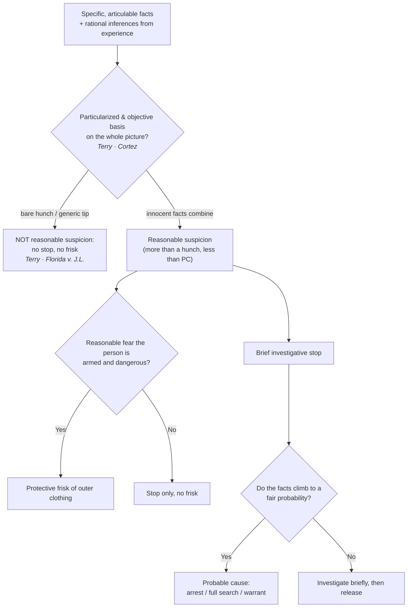

# Reasonable Suspicion

*Do I have reasonable, articulable suspicion, specific facts plus rational inferences rather than a hunch, and is that enough for what I want to do?*

> [!rule] Black-letter rule
> **Reasonable suspicion** is the quantum that justifies a brief investigative stop and a protective frisk. It requires "specific reasonable inferences which [the officer] is entitled to draw from the facts in light of his experience," not "an inchoate and unparticularized suspicion or 'hunch.'" *[[Terry v. Ohio|Terry]]*, 392 U.S. 1, [27](https://www.courtlistener.com/opinion/107729/terry-v-ohio/) (1968). The measure is a **"particularized and objective basis"** for suspecting the person stopped, drawn from **"the whole picture."** *[[United States v. Cortez|Cortez]]*, 449 U.S. 411, [417–18](https://www.courtlistener.com/opinion/110377/united-states-v-cortez/) (1981). It is **more than a hunch and well short of probable cause**, judged on the [[Common Legal Terms#totality-of-the-circumstances|totality of the circumstances]] through the eyes of a reasonable, experienced officer.
> ^rule-reasonable-suspicion

## The Brief

**What reasonable suspicion is, and is not.** Reasonable suspicion is the less demanding of the two field standards. It authorizes a brief investigative stop and a protective frisk, and nothing more: it does not authorize an arrest, a full search, or a warrant, each of which needs [[Probable Cause|probable cause]]. It sits on the second rung of the [[The Proof Ladder|proof ladder]], above a bare hunch and below probable cause. This page owns the standard itself; [[Terry Stops and Reasonable Suspicion]] owns the scope, duration, and permissible conduct of the stop-and-frisk it unlocks.

**The test: articulable facts plus rational inferences.** *[[Terry v. Ohio|Terry]]* demands "specific reasonable inferences which [the officer] is entitled to draw from the facts in light of his experience," not "an inchoate and unparticularized suspicion or 'hunch.'" *[[Terry v. Ohio|Terry]]*, 392 U.S. 1, [27](https://www.courtlistener.com/opinion/107729/terry-v-ohio/) (1968). The measure is a "particularized and objective basis" drawn from "the whole picture," so an officer may build suspicion from facts that seem innocent in isolation and from the commonsense inferences experience supplies. *[[United States v. Cortez|Cortez]]*, 449 U.S. 411, [417–18](https://www.courtlistener.com/opinion/110377/united-states-v-cortez/) (1981).

**Innocent factors can combine.** The court does not sort the facts into innocent and guilty piles and throw the innocent ones out. "Any one of these factors is not by itself proof of any illegal conduct and is quite consistent with innocent travel. But . . . taken together they amount to reasonable suspicion." *[[United States v. Sokolow#^pin-9|Sokolow]]*, 490 U.S. 1, [9](https://www.courtlistener.com/opinion/112239/united-states-v-sokolow/#:~:text=Any%20one%20of%20these%20factors) (1989). Reviewing courts weigh the totality and may not pursue a "divide-and-conquer" analysis of the individual facts. *[[United States v. Arvizu|Arvizu]]*, 534 U.S. 266, [274](https://www.courtlistener.com/opinion/118474/united-states-v-arvizu/) (2002).

**Commonsense field examples.** Unprovoked **headlong flight** in a high-crime area counts toward reasonable suspicion, though flight alone is not automatically enough. *[[Illinois v. Wardlow#^pin-124a|Wardlow]]*, 528 U.S. 119, [124](https://www.courtlistener.com/opinion/118326/illinois-v-wardlow/#:~:text=Headlong%20flight%E2%80%94wherever%20it%20occurs%E2%80%94is%20the) (2000). And an officer who learns that a car's **registered owner has a revoked license** may stop it on the commonsense inference that the owner is driving, "absent information negating" that inference. That is a deliberately "narrow" holding: it dissolves the moment the officer sees plainly that the driver is not the owner. *[[Kansas v. Glover|Glover]]*, 589 U.S. 376 (2020).

**Informants and tips.** Reasonable suspicion can rest on someone else's word, and the reliability of the source drives how far it carries. A **known**, face-to-face informant, accountable if he lies, can supply reasonable suspicion for a stop-and-frisk on his word alone. *[[Adams v. Williams|Adams v. Williams]]*, 407 U.S. 143, [147](https://www.courtlistener.com/opinion/108571/adams-v-williams/) (1972). **Anonymous** tips fall on a spectrum. A **bare** anonymous tip that a person is armed, without more, is not enough. *[[Florida v. J.L.|J.L.]]*, 529 U.S. 266, [272](https://www.courtlistener.com/opinion/9189388/florida-v-j-l/) (2000). But a tip whose **prediction of future conduct** the police corroborate can supply reasonable suspicion, *[[Alabama v. White#^pin-332|Alabama v. White]]*, 496 U.S. 325, [332](https://www.courtlistener.com/opinion/112454/alabama-v-white/) (1990), as can a **reliable, contemporaneous, traceable 911 report** of dangerous driving, *[[Navarette v. California|Navarette]]*, 572 U.S. 393, [398–99](https://www.courtlistener.com/opinion/2670795/prado-navarette-v-california/) (2014).

**What a stop on reasonable suspicion yields, and where it stops.** Reasonable suspicion buys a brief seizure to investigate and, when the officer reasonably fears for safety, a protective frisk of the outer clothing for weapons. It must be **particularized to the person** stopped, and it does not ripen into an arrest or a full search unless the facts climb to probable cause. The permitted length, questions, and scope of the stop are governed on [[Terry Stops and Reasonable Suspicion]]; a protective frisk of a vehicle's passenger compartment on the same quantum is *[[Michigan v. Long|Long]]*'s rule (see [[Traffic Stops]]).

**Who decides, the burden, and the standard of review.** In the field the call belongs to the officer, drawing on training and experience. Because the stop is warrantless, the **government** bears the burden of pointing to the specific articulable facts that justified it. On appeal the ultimate reasonable-suspicion question is reviewed [[Common Legal Terms#de-novo|de novo]], while the trial court's historical facts are reviewed only for [[Common Legal Terms#clear-error|clear error]]. *[[Ornelas v. United States#^pin-699a|Ornelas]]*, 517 U.S. 690, [699](https://www.courtlistener.com/opinion/118030/ornelas-v-united-states/#:~:text=a%20reviewing%20court%20should%20take) (1996). An officer's objectively **reasonable mistake of law**, like a reasonable mistake of fact, can still furnish the suspicion. *[[Heien v. North Carolina|Heien]]*, 574 U.S. 54 (2014).

**Remedy.** Acting on less than reasonable suspicion makes the stop unlawful, and the evidence it produces, together with its fruits, is subject to **suppression**. See [[The Exclusionary Rule]].

**Apply it.**
1. **Articulate the facts.** Name the specific, objective facts and the inferences your training draws from them. A hunch, however genuine, authorizes nothing (*[[Terry v. Ohio|Terry]]*).
2. **Build the totality.** Combine facts that look innocent alone; do not explain each away one at a time (*[[United States v. Sokolow|Sokolow]]*; *[[United States v. Arvizu|Arvizu]]*).
3. **Weigh the source.** A known informant can carry a stop on his word; an anonymous tip needs corroboration or predictive detail, and a bare "he is armed" tip does not (*[[Adams v. Williams|Adams v. Williams]]*; *[[Florida v. J.L.|J.L.]]*; *[[Alabama v. White|Alabama v. White]]*).
4. **Match the action.** Reasonable suspicion buys a brief stop and a protective frisk, not an arrest or a full search. If you need those, climb to [[Probable Cause|probable cause]].

**Common pitfalls.**
- **Calling a hunch reasonable suspicion.** The standard demands specific, articulable facts and rational inferences, not instinct (*[[Terry v. Ohio|Terry]]*).
- **Divide-and-conquer.** Do not pick the facts apart and explain each away; the test is the whole picture (*[[United States v. Arvizu|Arvizu]]*; *[[United States v. Sokolow|Sokolow]]*).
- **Over-reading an anonymous tip.** A bare anonymous report that a person is armed is not reasonable suspicion without corroboration or predictive detail (*[[Florida v. J.L.|J.L.]]*; contrast *[[Alabama v. White|Alabama v. White]]* and *[[Navarette v. California|Navarette]]*).
- **Stretching the stop into an arrest.** Reasonable suspicion does not authorize an arrest or a full search; treating it as if it did skips a rung (see [[Probable Cause]]).

## Lower-court developments

- ***[[United States v. Daniels|Daniels]]* (10th Cir. 2024)** — *narrows: tightens the reasonable-suspicion floor.* On de novo totality review, a near-anonymous 911 tip (three men in dark hoodies near an idling SUV, reporting no actual illegality) plus the suspect's mere presence did not amount to reasonable suspicion; overly generic tips reporting lawful-sounding conduct hand police excessive discretion and fall below the floor. Tightens the *[[Florida v. J.L.|J.L.]]* and *[[Navarette v. California|Navarette]]* line. **Binding in-circuit — 10th Cir.** [opinion](https://www.courtlistener.com/opinion/9500360/united-states-v-daniels/)

## Key cases

| Case | Holding | Opinion |
|---|---|---|
| *[[Terry v. Ohio]]*, 392 U.S. 1 (1968) | A brief investigative stop and protective frisk require **reasonable, articulable suspicion**: specific facts and rational inferences, not an inchoate hunch. | [opinion](https://www.courtlistener.com/opinion/107729/terry-v-ohio/) |
| *[[United States v. Cortez]]*, 449 U.S. 411 (1981) | The reasonable-suspicion touchstone: a **particularized and objective basis** for suspecting the person stopped, drawn from **the whole picture**. | [opinion](https://www.courtlistener.com/opinion/110377/united-states-v-cortez/) |
| *[[United States v. Sokolow]]*, 490 U.S. 1 (1989) | Factors innocent in isolation can **combine** into reasonable suspicion; the totality, not any single fact, controls. | [opinion](https://www.courtlistener.com/opinion/112239/united-states-v-sokolow/) |
| *[[Alabama v. White]]*, 496 U.S. 325 (1990) | An **anonymous tip** can supply reasonable suspicion when police corroborate its **prediction of future conduct**. | [opinion](https://www.courtlistener.com/opinion/112454/alabama-v-white/) |
| *[[Florida v. J.L.]]*, 529 U.S. 266 (2000) | A **bare** anonymous tip that a person has a gun, without more, is **not** reasonable suspicion. | [opinion](https://www.courtlistener.com/opinion/118352/florida-v-jl/) |
| *[[Navarette v. California]]*, 572 U.S. 393 (2014) | A **reliable, contemporaneous 911 report** of dangerous driving can supply reasonable suspicion. | [opinion](https://www.courtlistener.com/opinion/2670795/prado-navarette-v-california/) |
| *[[Illinois v. Wardlow]]*, 528 U.S. 119 (2000) | Unprovoked **headlong flight** in a high-crime area can furnish reasonable suspicion for a *[[Terry v. Ohio|Terry]]* stop. | [opinion](https://www.courtlistener.com/opinion/118326/illinois-v-wardlow/) |
| *[[United States v. Arvizu]]*, 534 U.S. 266 (2002) | Reasonable suspicion is judged on the **whole picture**; courts may not divide-and-conquer the individual factors. | [opinion](https://www.courtlistener.com/opinion/118474/united-states-v-arvizu/) |

## Related cases across doctrines

| Case | Relevance here | Primary home | Opinion |
|---|---|---|---|
| *[[Adams v. Williams]]*, 407 U.S. 143 (1972) | ***Anchors.*** A **known**, face-to-face informant's tip carries enough reliability to furnish reasonable suspicion for a stop-and-frisk; the foil for the anonymous-tip line. | [[Terry Stops and Reasonable Suspicion]] | [opinion](https://www.courtlistener.com/opinion/108571/adams-v-williams/) |
| *[[Kansas v. Glover]]*, 589 U.S. 376 (2020) | ***Extends.*** Reasonable suspicion permits **commonsense inferences**: a revoked-license registered owner is presumptively the driver, a narrow holding defeated by facts negating it. | [[Traffic Stops]] | [opinion](https://www.courtlistener.com/opinion/9231313/kansas-v-glover/) |
| *[[United States v. Hensley]]*, 469 U.S. 221 (1985) | ***Extends.*** Reasonable suspicion may rest on a **wanted flyer** from another department, so long as the issuing agency had the articulable facts. | [[Collective Knowledge and the Fellow-Officer Rule]] | [opinion](https://www.courtlistener.com/opinion/111294/united-states-v-hensley/) |
| *[[Delaware v. Prouse]]*, 440 U.S. 648 (1979) | ***Floor.*** A discretionary stop requires **at least reasonable, articulable suspicion**; random suspicionless stops fail the standard. | [[Traffic Stops]] | [opinion](https://www.courtlistener.com/opinion/110045/delaware-v-prouse/) |
| *[[Michigan v. Long]]*, 463 U.S. 1032 (1983) | ***Extends.*** A protective **vehicle frisk** requires reasonable suspicion the suspect is dangerous and may access weapons, the same quantum as a *[[Terry v. Ohio|Terry]]* frisk. | [[Traffic Stops]] | [opinion](https://www.courtlistener.com/opinion/111020/michigan-v-long/) |
| *[[United States v. Brignoni-Ponce]]*, 422 U.S. 873 (1975) | ***Content.*** A roving border-area stop requires reasonable suspicion on **specific articulable facts**; apparent ancestry alone cannot supply it. | [[Border Searches]] | [opinion](https://www.courtlistener.com/opinion/109311/united-states-v-brignoni-ponce/) |
| *[[Maryland v. Buie]]*, 494 U.S. 325 (1990) | ***Extends.*** A [[Securing the Scene\|protective sweep]] beyond the spaces immediately adjoining an arrest requires **reasonable, articulable suspicion** the area harbors a dangerous person. | [[Securing the Scene]] | [opinion](https://www.courtlistener.com/opinion/112384/maryland-v-buie/) |
| *[[Heien v. North Carolina]]*, 574 U.S. 54 (2014) | ***Extends.*** Reasonable suspicion may rest on an officer's **objectively reasonable mistake of law** as well as fact. | [[Traffic Stops]] | [opinion](https://www.courtlistener.com/opinion/2760668/heien-v-north-carolina/) |

## Visual

## Sources

- [*Terry v. Ohio*, 392 U.S. 1 (1968)](https://www.courtlistener.com/opinion/107729/terry-v-ohio/) (pinpoint: 27)
- [*United States v. Cortez*, 449 U.S. 411 (1981)](https://www.courtlistener.com/opinion/110377/united-states-v-cortez/) (pinpoint: 417–18)
- [*United States v. Sokolow*, 490 U.S. 1 (1989)](https://www.courtlistener.com/opinion/112239/united-states-v-sokolow/) (pinpoint: 9)
- [*United States v. Arvizu*, 534 U.S. 266 (2002)](https://www.courtlistener.com/opinion/118474/united-states-v-arvizu/) (pinpoint: 274)
- [*Illinois v. Wardlow*, 528 U.S. 119 (2000)](https://www.courtlistener.com/opinion/118326/illinois-v-wardlow/) (pinpoint: 124)
- [*Kansas v. Glover*, 589 U.S. 376 (2020)](https://www.courtlistener.com/opinion/9231313/kansas-v-glover/)
- [*Adams v. Williams*, 407 U.S. 143 (1972)](https://www.courtlistener.com/opinion/108571/adams-v-williams/) (pinpoint: 147)
- [*Florida v. J.L.*, 529 U.S. 266 (2000)](https://www.courtlistener.com/opinion/118352/florida-v-jl/) (pinpoint: 272)
- [*Alabama v. White*, 496 U.S. 325 (1990)](https://www.courtlistener.com/opinion/112454/alabama-v-white/) (pinpoint: 332)
- [*Navarette v. California*, 572 U.S. 393 (2014)](https://www.courtlistener.com/opinion/2670795/prado-navarette-v-california/) (pinpoint: 398–99)
- [*United States v. Hensley*, 469 U.S. 221 (1985)](https://www.courtlistener.com/opinion/111294/united-states-v-hensley/)
- [*Delaware v. Prouse*, 440 U.S. 648 (1979)](https://www.courtlistener.com/opinion/110045/delaware-v-prouse/)
- [*Michigan v. Long*, 463 U.S. 1032 (1983)](https://www.courtlistener.com/opinion/111020/michigan-v-long/)
- [*United States v. Brignoni-Ponce*, 422 U.S. 873 (1975)](https://www.courtlistener.com/opinion/109311/united-states-v-brignoni-ponce/)
- [*Maryland v. Buie*, 494 U.S. 325 (1990)](https://www.courtlistener.com/opinion/112384/maryland-v-buie/)
- [*Heien v. North Carolina*, 574 U.S. 54 (2014)](https://www.courtlistener.com/opinion/2760668/heien-v-north-carolina/)
- [*Ornelas v. United States*, 517 U.S. 690 (1996)](https://www.courtlistener.com/opinion/118030/ornelas-v-united-states/) (pinpoint: 699)
- [*United States v. Daniels* (10th Cir. 2024)](https://www.courtlistener.com/opinion/9500360/united-states-v-daniels/)
