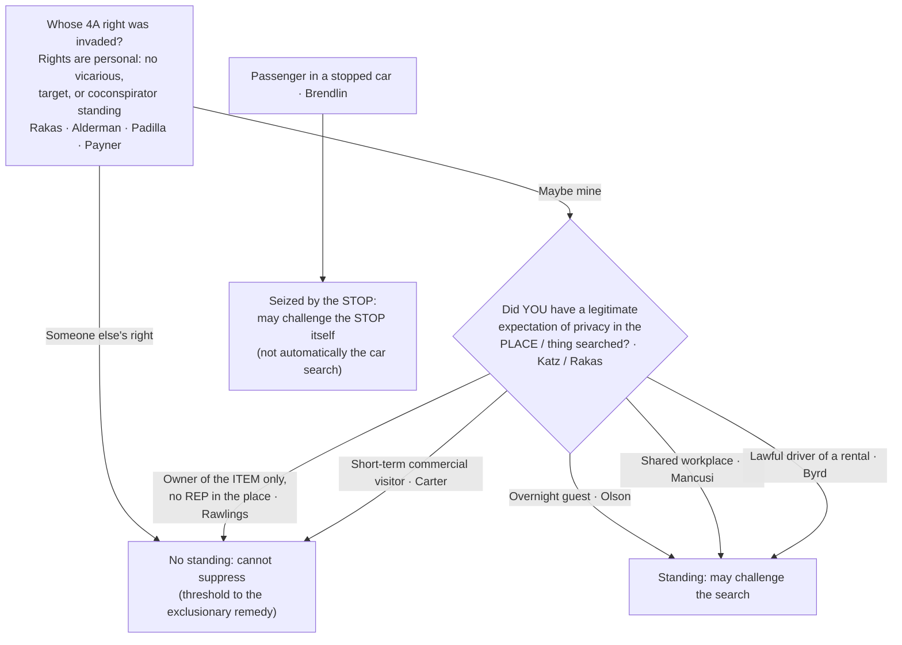

# Standing to Challenge a Search

*Can THIS defendant challenge the search — were HIS OWN Fourth Amendment rights violated?*

> [!rule] Black-letter rule
> Fourth Amendment rights are **personal** and "may not be vicariously asserted." A defendant may move to suppress **only** if the search or seizure infringed **his own** legitimate expectation of privacy in the place or thing searched, measured by the *[[Katz v. United States|Katz]]* test. *[[Rakas v. Illinois|Rakas v. Illinois]]*, 439 U.S. 128, [133–34](https://www.courtlistener.com/opinion/109953/rakas-v-illinois/), 143 (1978). "Standing" is not a separate doctrine; it **is** this merits question. No standing means no suppression, even where officers plainly violated someone else's rights.
> ^rule-standing

## The Brief

**"Standing" is not a separate doctrine — it is the merits.** The question is never "was the search illegal for someone"; it is whether *this* defendant had a **personal, legitimate expectation of privacy** in the place or thing searched. Fourth Amendment rights are personal and cannot be borrowed: "Fourth Amendment rights are personal rights which, like some other constitutional rights, may not be vicariously asserted." *[[Rakas v. Illinois|Rakas v. Illinois]]*, 439 U.S. 128, [133–34](https://www.courtlistener.com/opinion/109953/rakas-v-illinois/) (1978). *[[Rakas v. Illinois|Rakas]]* folded the old "standing" label into the substantive inquiry: capacity to claim the Amendment's protection "depends not upon a property right in the invaded place but upon whether the person who claims the protection of the Amendment has a **legitimate expectation of privacy in the invaded place**." *Id.* at 143. The measure of that expectation is the *[[Katz v. United States|Katz]]* test, an "actual (subjective) expectation of privacy" that "society is prepared to recognize as 'reasonable.'" *[[Katz v. United States|Katz v. United States]]*, 389 U.S. 347, [361](https://www.courtlistener.com/opinion/107564/katz-v-united-states/) (1967) (Harlan, J., [[Common Legal Terms#concurring-opinion|concurring]]). The rule that suppression is personal predates the merger and survives it: suppression "can be successfully urged only by those whose rights were violated by the search itself, not by those who are aggrieved solely by the introduction of damaging evidence. Coconspirators and codefendants have been accorded no special standing." *[[Alderman v. United States|Alderman v. United States]]*, 394 U.S. 165, [171–72](https://www.courtlistener.com/opinion/107872/alderman-v-united-states/) (1969).

**The old automatic / "target" standing is gone — treat it as history.** *[[Jones v. United States|Jones (1960)]]* once gave a defendant charged with a possessory offense "automatic standing," *[[Jones v. United States#^pin-267|Jones v. United States]]*, 362 U.S. 257, [264](https://www.courtlistener.com/opinion/106022/jones-v-united-states/#:~:text=anyone%20legitimately%20on%20premises%20where) (1960), and gave standing to "anyone legitimately on premises where a search occurs," *id.* at 267. Both grounds are **overruled**:
- *[[United States v. Salvucci|Salvucci]]* abolished automatic standing: "defendants charged with crimes of possession may only claim the benefits of the exclusionary rule if their own Fourth Amendment rights have in fact been violated. The automatic standing rule of *Jones v. United States* . . . is therefore overruled." *[[United States v. Salvucci|United States v. Salvucci]]*, 448 U.S. 83, [85](https://www.courtlistener.com/opinion/110325/united-states-v-salvucci/) (1980).
- *[[Rakas v. Illinois|Rakas]]* disavowed the broad "legitimately on premises" test. So there is **no vicarious, target, or derivative standing**: a co-defendant or co-conspirator gains nothing from the label.
- *[[United States v. Padilla|Padilla]]* rejected a "coconspirator exception"; participants "may have such expectations or interests, but the conspiracy itself **neither adds to nor detracts from** them." *[[United States v. Padilla|United States v. Padilla]]*, 508 U.S. 77, [82](https://www.courtlistener.com/opinion/112856/united-states-v-padilla/) (1993).
- And *[[United States v. Payner|Payner]]* held a court may not use its supervisory power as a back door around the requirement: "the interest in deterring illegal searches does not justify the exclusion of tainted evidence at the instance of a party who was not the victim of the challenged practices." *[[United States v. Payner|United States v. Payner]]*, 447 U.S. 727, [735](https://www.courtlistener.com/opinion/110317/united-states-v-payner/) (1980).

**Place searched ≠ item seized.** Owning the *thing seized* is not the same as a privacy interest in the *place searched*. After *[[Rakas v. Illinois|Rakas]]*, "the two inquiries merge into one: whether governmental officials violated any **legitimate expectation of privacy** held by petitioner," and ownership "is undoubtedly one fact to be considered" but does not control. *[[Rawlings v. Kentucky|Rawlings v. Kentucky]]*, 448 U.S. 98, [105–06](https://www.courtlistener.com/opinion/110326/rawlings-v-kentucky/) (1980). A defendant who dumped his drugs into a companion's purse he had no right to control could not challenge its search, even though the drugs were his. Establish a privacy or possessory interest in the **place**, not the loot.

**Status on the premises decides house cases.** An **overnight guest** has a [[Reasonable Expectation of Privacy|reasonable expectation of privacy]] in the host's home: "society recognizes that a houseguest has a legitimate expectation of privacy in his host's home." *[[Minnesota v. Olson|Minnesota v. Olson]]*, 495 U.S. 91, [98](https://www.courtlistener.com/opinion/112416/minnesota-v-olson/) (1990). A **short-term visitor there for a purely commercial errand** does not: "an overnight guest in a home may claim the protection of the Fourth Amendment, but one who is **merely present with the consent of the householder** may not." *[[Minnesota v. Carter|Minnesota v. Carter]]*, 525 U.S. 83, [90](https://www.courtlistener.com/opinion/118249/minnesota-v-carter/) (1998) (visitor present a few hours only to bag cocaine, no prior relationship). The line is one of duration, relationship to the householder, and purpose. Privacy in a shared **workplace** can also suffice: an employee sharing an office had standing because "the area was one in which there was a reasonable expectation of freedom from governmental intrusion." *[[Mancusi v. DeForte|Mancusi v. DeForte]]*, 392 U.S. 364, [368](https://www.courtlistener.com/opinion/107745/mancusi-v-deforte/) (1968). The same place-based inquiry reaches a **tent** used as a temporary dwelling, even on public land (see [[Tents]]).

**Vehicles — keep the driver and the passenger straight.** A driver in **lawful possession and control of a rental car** generally has a [[Reasonable Expectation of Privacy|reasonable expectation of privacy]] in it even if he is not listed on the rental agreement as an authorized driver. *[[Byrd v. United States|Byrd v. United States]]*, 584 U.S. 395 (2018). That is the threshold *before* any [[Automobile Exception]] question about the lawfulness of the search itself. A mere **passenger** is different: under *[[Rakas v. Illinois|Rakas]]* a passenger with no possessory or privacy interest cannot challenge a **search** of the car, but a passenger *is* **seized** by the stop and so "may challenge the constitutionality of the **stop**." *[[Brendlin v. California|Brendlin v. California]]*, 551 U.S. 249, [251](https://www.courtlistener.com/opinion/145712/brendlin-v-california/) (2007). Challenge-the-stop ([[Traffic Stops]] / [[Seizure of the Person]]) and challenge-the-search are two different keys; keep them crisp.

**Burden, standard of review, remedy.** The proponent of suppression, the **defendant-movant**, bears the burden of establishing a **legitimate expectation of privacy** (or possessory interest) in the place or thing searched, by a **[[Common Legal Terms#preponderance-of-the-evidence|preponderance of the evidence]]**. *[[Rakas v. Illinois|Rakas]]*, 439 U.S. at [130–31](https://www.courtlistener.com/opinion/109953/rakas-v-illinois/) n.1; *[[Rawlings v. Kentucky|Rawlings]]*, 448 U.S. at [104–05](https://www.courtlistener.com/opinion/110326/rawlings-v-kentucky/). On appeal from a suppression ruling, historical fact findings are reviewed for **[[Common Legal Terms#clear-error|clear error]]** and the ultimate expectation-of-privacy determination **[[Common Legal Terms#de-novo|de novo]]**. The **remedy** for a defendant who carries the burden is **suppression** of the evidence and its fruits ([[The Exclusionary Rule]]); standing is the **threshold** to that remedy, so without it even a plainly unlawful search yields no suppression for *this* defendant. A companion protection keeps the threshold from becoming a trap: testimony a defendant gives at a [[Common Legal Terms#suppression-hearing|suppression hearing]] to establish standing "may not thereafter be admitted against him at trial on the issue of guilt." *[[Simmons v. United States|Simmons v. United States]]*, 390 U.S. 377, [394](https://www.courtlistener.com/opinion/107636/simmons-v-united-states/) (1968).

**Apply it.**
1. **Ask whose right was invaded.** Identify *this* defendant's own connection to the place or thing searched; someone else's violated rights give him nothing.
2. **Pin the expectation to the *[[United States v. Place|place]]*, not the *item*.** Owning the seized contraband is not standing (*[[Rawlings v. Kentucky|Rawlings]]* / *[[United States v. Salvucci|Salvucci]]*); locate a privacy or possessory interest in the area searched.
3. **Use status on the premises for house cases.** Overnight guest (*[[Minnesota v. Olson|Olson]]*), yes; short-term commercial visitor (*[[Minnesota v. Carter|Carter]]*), no; shared workplace (*[[Mancusi v. DeForte|Mancusi]]*), often yes.
4. **Separate driver from passenger.** A lawful rental driver has standing to challenge the search (*[[Byrd v. United States|Byrd]]*); a passenger may challenge the **stop** (*[[Brendlin v. California|Brendlin]]*) but not automatically the car search.
5. **Reach for automatic standing only as history.** It is overruled; cite *[[Jones v. United States|Jones]]* only to explain the old rule.

**Common pitfalls.**
- **Treating ownership of the item as standing.** "It's his dope, so he can't complain it was found" is backwards (*[[United States v. Salvucci|Salvucci]]* / *[[Rawlings v. Kentucky|Rawlings]]*): the question is the expectation of privacy in the **place** searched.
- **Reaching for "automatic standing."** It is gone; cite *[[Jones v. United States|Jones]]* only as history.
- **Confusing constructive possession with 4A standing.** Constructive possession goes to **guilt / [[Common Legal Terms#mens-rea|mens rea]]**, not privacy; a defendant can constructively possess contraband yet have no expectation of privacy where it was found.
- **Letting a passenger challenge the *search* off the *stop*.** *[[Brendlin v. California|Brendlin]]* gives a passenger the **stop**, not automatically the car search (still *[[Rakas v. Illinois|Rakas]]*).
- **Forgetting that disclaiming an interest forfeits standing.** Denying ownership or walking away can extinguish the very expectation of privacy the defendant later needs (see [[Abandonment]]).

## Lower-court developments

The controlling Supreme Court cases home to Key cases regardless of date; below, the circuit-level standing inquiry, whose [[Reasonable Expectation of Privacy|reasonable expectation of privacy]] was invaded, is being worked out for traditional places such as hotels and rental cars.

- **Status-on-the-premises extended to hotel checkout — *[[United States v. Mendoza|United States v. Mendoza]]* (3d Cir. 2026).** *Doctrine-extension flag.* A hotel guest has **no** objectively [[Reasonable Expectation of Privacy|reasonable expectation of privacy]] in the room roughly five hours after the posted noon checkout, absent any late-checkout arrangement; lawful occupancy (and thus standing) ends when the right to occupy ends, extending the *[[Minnesota v. Olson|Olson]]* / *[[Minnesota v. Carter|Carter]]* "status on the premises" line into the checkout context. The panel did not adopt checkout as a bright line, noting circuits disagree on a "grace period" for stragglers, and held only that this unambiguous five-hour case "does not raise a close question." **Binding in-circuit — 3d Cir.**
- **Narrowing *[[Byrd v. United States|Byrd]]*'s "lawful possession" — *[[United States v. Lyle|United States v. Lyle]]* (2d Cir. 2019).** *Limits / narrows flag.* An **unlicensed** driver operating a rental car without the rental company's permission is, like a car thief, unlawfully in possession and has **no** [[Reasonable Expectation of Privacy|reasonable expectation of privacy]], so no standing, even though the authorized renter let him drive. Reads *[[Byrd v. United States|Byrd]]*'s lawful-possession requirement narrowly; the court expressly declined to decide whether an unauthorized-but-**licensed** driver alone would have standing. **Binding in-circuit — 2d Cir.**

The separate question whether acquiring bulk digital location data is a "search" at all is a **search-definition** issue reached through the same reasonable-expectation-of-privacy inquiry, not a standing holding about *whose* expectation was invaded; it is developed on [[Two Definitions of Search]] and [[The Third-Party Doctrine and Digital Surveillance]].

## Key cases

| Case | Holding | Opinion |
|---|---|---|
| *[[Rakas v. Illinois]]*, 439 U.S. 128 (1978) | **Anchor.** Fourth Amendment rights are personal; "standing" merges into the merits (whether your own legitimate expectation of privacy in the place searched was infringed). A passenger with no possessory or privacy interest cannot challenge a car search. | [opinion](https://www.courtlistener.com/opinion/109953/rakas-v-illinois/) |
| *[[Alderman v. United States]]*, 394 U.S. 165 (1969) | **Anchor, no vicarious assertion.** Suppression may be urged only by those whose own rights the search violated; co-defendants and co-conspirators get no special standing. | [opinion](https://www.courtlistener.com/opinion/107872/alderman-v-united-states/) |
| *[[Jones v. United States]]*, 362 U.S. 257 (1960) | **Historical foil.** Created "automatic standing" for possessory charges and "legitimately on premises" standing, both later overruled; cite only as history. | [opinion](https://www.courtlistener.com/opinion/106022/jones-v-united-states/) |
| *[[United States v. Salvucci]]*, 448 U.S. 83 (1980) | **Progeny.** Abolished automatic standing; a defendant charged with a possessory crime must show his own Fourth Amendment rights were violated. | [opinion](https://www.courtlistener.com/opinion/110325/united-states-v-salvucci/) |
| *[[Rawlings v. Kentucky]]*, 448 U.S. 98 (1980) | **Progeny, place ≠ item.** Owning the drugs seized from a companion's purse gave no [[Reasonable Expectation of Privacy\|reasonable expectation of privacy]] in the purse; the inquiries merge into whether your REP in the place was invaded. | [opinion](https://www.courtlistener.com/opinion/110326/rawlings-v-kentucky/) |
| *[[Minnesota v. Olson]]*, 495 U.S. 91 (1990) | **Progeny.** An overnight guest has a [[Reasonable Expectation of Privacy\|reasonable expectation of privacy]] in the host's home and may challenge a warrantless entry. | [opinion](https://www.courtlistener.com/opinion/112416/minnesota-v-olson/) |
| *[[Minnesota v. Carter]]*, 525 U.S. 83 (1998) | **Progeny, the boundary of *[[Minnesota v. Olson\|Olson]]*.** A short-term commercial visitor (bagging drugs a few hours, no prior relationship) has no [[Reasonable Expectation of Privacy\|reasonable expectation of privacy]] in the home. | [opinion](https://www.courtlistener.com/opinion/118249/minnesota-v-carter/) |
| *[[Byrd v. United States]]*, 584 U.S. 395 (2018) | **Progeny.** A driver in lawful possession and control of a rental car generally has a [[Reasonable Expectation of Privacy\|reasonable expectation of privacy]] in it, even if not listed on the rental agreement. | [opinion](https://www.courtlistener.com/opinion/4497658/byrd-v-united-states/) |
| *[[Mancusi v. DeForte]]*, 392 U.S. 364 (1968) | **Progeny, shared workplace.** An employee can have a [[Reasonable Expectation of Privacy\|reasonable expectation of privacy]] in a shared office and standing to challenge its search; capacity turns on REP in the area, not a property right. | [opinion](https://www.courtlistener.com/opinion/107745/mancusi-v-deforte/) |
| *[[Simmons v. United States]]*, 390 U.S. 377 (1968) | **Progeny, the standing companion.** Testimony a defendant gives at a [[Common Legal Terms#suppression-hearing\|suppression hearing]] to establish standing may not be used against him at trial on guilt. | [opinion](https://www.courtlistener.com/opinion/107636/simmons-v-united-states/) |
| *[[United States v. Padilla]]*, 508 U.S. 77 (1993) | **Progeny, no coconspirator exception.** A supervisory role in or joint control over a conspiracy does not by itself confer standing; the conspiracy "neither adds to nor detracts from" a defendant's personal interest. | [opinion](https://www.courtlistener.com/opinion/112856/united-states-v-padilla/) |
| *[[United States v. Payner]]*, 447 U.S. 727 (1980) | **Progeny, no back door.** A federal court may not use its supervisory power to suppress evidence seized in the deliberate violation of a third party's rights at the instance of a defendant whose own rights were not violated. | [opinion](https://www.courtlistener.com/opinion/110317/united-states-v-payner/) |

## Related cases across doctrines

These are treated in full on other doctrine pages but bear directly on standing here; the reasonable-expectation-of-privacy that grounds standing can be shrunk (or preserved) by status, and framed for this page.

| Case | Relevance here | Primary home | Opinion |
|---|---|---|---|
| *[[Katz v. United States]]*, 389 U.S. 347 (1967) | ***The measure of standing.*** Supplies the reasonable-expectation-of-privacy test (Harlan's subjective expectation society accepts as reasonable), the measure of whose rights were invaded; "the Fourth Amendment protects people, not places." | [[Reasonable Expectation of Privacy]] | [opinion](https://www.courtlistener.com/opinion/107564/katz-v-united-states/) |
| *[[Brendlin v. California]]*, 551 U.S. 249 (2007) | ***Challenge the stop.*** When a car is stopped, a passenger is seized just as the driver is and may challenge the constitutionality of the **stop**, distinct from standing to challenge a search of the car. | [[Traffic Stops]] | [opinion](https://www.courtlistener.com/opinion/145712/brendlin-v-california/) |
| *[[Samson v. California]]*, 547 U.S. 843 (2006) | ***REP near zero by status.*** A parolee subject to a search condition has a severely diminished [[Reasonable Expectation of Privacy\|reasonable expectation of privacy]]; status can reduce the REP that defines standing to almost nothing. | [[Special Needs and Administrative Searches]] | [opinion](https://www.courtlistener.com/opinion/145640/samson-v-california/) |
| *[[United States v. Knights]]*, 534 U.S. 112 (2001) | ***REP diminished by condition.*** A probationer's expectation of privacy is significantly diminished by a valid search condition; supervision status shrinks the REP that grounds any standing to object. | [[Special Needs and Administrative Searches]] | [opinion](https://www.courtlistener.com/opinion/118468/united-states-v-knights/) |
| *[[Collins v. Virginia]]*, 584 U.S. 586 (2018) | ***Full REP retained.*** A resident retains a full [[Reasonable Expectation of Privacy\|reasonable expectation of privacy]] in the [[Curtilage\|curtilage]] where his vehicle is parked; the home/[[Curtilage\|curtilage]] REP that confers standing is not dissolved by the automobile exception. | [[Automobile Exception]] | [opinion](https://www.courtlistener.com/opinion/4501697/collins-v-virginia/) |

## Visual

## Sources
- [*Rakas v. Illinois*, 439 U.S. 128 (1978)](https://www.courtlistener.com/opinion/109953/rakas-v-illinois/) (pinpoints: 130–31 n.1, 133–34, 143)
- [*Katz v. United States*, 389 U.S. 347 (1967)](https://www.courtlistener.com/opinion/107564/katz-v-united-states/) (pinpoints: 351, 361 (Harlan, J., concurring); home = [[Reasonable Expectation of Privacy]])
- [*Alderman v. United States*, 394 U.S. 165 (1969)](https://www.courtlistener.com/opinion/107872/alderman-v-united-states/) (pinpoints: 171–72, 174)
- [*Jones v. United States*, 362 U.S. 257 (1960)](https://www.courtlistener.com/opinion/106022/jones-v-united-states/) (pinpoints: 264, 267; overruled by *Rakas* and *Salvucci*; Historical)
- [*United States v. Salvucci*, 448 U.S. 83 (1980)](https://www.courtlistener.com/opinion/110325/united-states-v-salvucci/) (pinpoint: 85)
- [*Rawlings v. Kentucky*, 448 U.S. 98 (1980)](https://www.courtlistener.com/opinion/110326/rawlings-v-kentucky/) (pinpoints: 104–05, 105–06)
- [*Minnesota v. Olson*, 495 U.S. 91 (1990)](https://www.courtlistener.com/opinion/112416/minnesota-v-olson/) (pinpoint: 98)
- [*Minnesota v. Carter*, 525 U.S. 83 (1998)](https://www.courtlistener.com/opinion/118249/minnesota-v-carter/) (pinpoint: 90)
- [*Byrd v. United States*, 584 U.S. 395 (2018)](https://www.courtlistener.com/opinion/4497658/byrd-v-united-states/) (rental-driver REP; the CourtListener text is the slip opinion, so no reporter star page is located for the pinpoint; paraphrased per the four-tier conversion)
- [*Brendlin v. California*, 551 U.S. 249 (2007)](https://www.courtlistener.com/opinion/145712/brendlin-v-california/) (pinpoint: 251; home = [[Traffic Stops]])
- [*Mancusi v. DeForte*, 392 U.S. 364 (1968)](https://www.courtlistener.com/opinion/107745/mancusi-v-deforte/) (pinpoints: 368, 369)
- [*Simmons v. United States*, 390 U.S. 377 (1968)](https://www.courtlistener.com/opinion/107636/simmons-v-united-states/) (pinpoint: 394)
- [*United States v. Padilla*, 508 U.S. 77 (1993)](https://www.courtlistener.com/opinion/112856/united-states-v-padilla/) (pinpoint: 82)
- [*United States v. Payner*, 447 U.S. 727 (1980)](https://www.courtlistener.com/opinion/110317/united-states-v-payner/) (pinpoints: 735, 736)
- [*Samson v. California*, 547 U.S. 843 (2006)](https://www.courtlistener.com/opinion/145640/samson-v-california/) (REP diminished by parole status; home = [[Special Needs and Administrative Searches]])
- [*United States v. Knights*, 534 U.S. 112 (2001)](https://www.courtlistener.com/opinion/118468/united-states-v-knights/) (REP diminished by probation condition; home = [[Special Needs and Administrative Searches]])
- [*Collins v. Virginia*, 584 U.S. 586 (2018)](https://www.courtlistener.com/opinion/4501697/collins-v-virginia/) (full curtilage REP retained; home = [[Automobile Exception]])
- [*United States v. Mendoza*, 3d Cir. 2026](https://www.courtlistener.com/opinion/10771114/united-states-v-ryan-mendoza/) (Binding in-circuit — 3d Cir.; hotel-checkout REP)
- [*United States v. Lyle*, 2d Cir. 2019](https://www.courtlistener.com/opinion/8443943/united-states-v-lyle/) (Binding in-circuit — 2d Cir.; narrows *Byrd* lawful-possession)
