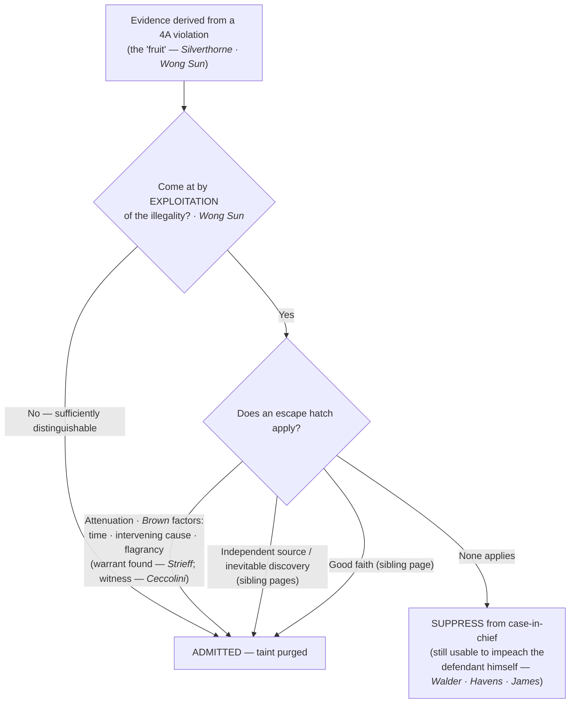

# Fruits & Attenuation

*If the search was illegal, how far does suppression reach, and what breaks the chain?*

> [!rule] Black-letter rule
> Suppression reaches not only the evidence seized in the unlawful act but the **derivative** evidence it produces, the "fruit of the poisonous tree." The reach is **not** but-for causation: the question is "whether, granting establishment of the primary illegality, the evidence to which instant objection is made has been come at by exploitation of that illegality or instead by means sufficiently distinguishable to be purged of the primary taint." *[[Wong Sun v. United States|Wong Sun]]*, 371 U.S. 471, [487–88](https://www.courtlistener.com/opinion/106515/wong-sun-v-united-states/) (1963). Taint is **purged by attenuation** when the connection between the illegality and the evidence becomes so weakened that deterrence is no longer served, judged by temporal proximity, intervening circumstances, and, most important, the purpose and flagrancy of the misconduct. *[[Brown v. Illinois|Brown]]*, 422 U.S. 590, [603–04](https://www.courtlistener.com/opinion/109304/brown-v-illinois/) (1975).
> ^rule-fruits

## The Brief

**What it is, and is not.** The exclusionary rule began as a bar on using the very thing seized illegally; the fruits doctrine extends it to the **derivative** evidence that flows from the violation, so a confession, a witness, or physical evidence located because of an illegal search or arrest can be suppressed too. It is **not** a but-for test. Evidence merely traceable to the illegality is not automatically barred; the government loses only what it obtained by **exploiting** the illegality. The complementary escape hatches sit on sibling pages: a lawful source that actually produced the evidence ([[Inevitable Discovery & Independent Source|independent source]]), a lawful route that would have produced it anyway ([[Inevitable Discovery & Independent Source|inevitable discovery]]), and objectively reasonable reliance ([[The Good-Faith Exception|good faith]]). This page owns the two that turn on causation: the **reach** of the taint and its **attenuation**.

**Where the rule and its reach came from.** The federal rule began in *[[Weeks v. United States|Weeks]]*, 232 U.S. 383 (1914), which barred 4A-violative evidence from federal court, and reached the states through the Fourteenth Amendment in *[[Mapp v. Ohio|Mapp]]*, 367 U.S. 643, [655](https://www.courtlistener.com/opinion/106285/mapp-v-ohio/) (1961), overruling *[[Wolf v. Colorado|Wolf]]* on the remedy. Its engine is **deterrence**, not judicial squeamishness: *[[Elkins v. United States|Elkins]]* abolished the "silver-platter doctrine" and framed the purpose as "to deter . . . by removing the incentive to disregard" the constitutional guaranty. 364 U.S. 206, 217 (1960). The reach past the immediate seizure originates in *[[Silverthorne Lumber Co. v. United States|Silverthorne Lumber]]*: illegally obtained knowledge "shall not be used at all," though a genuinely [[Inevitable Discovery and Independent Source|independent source]] may still prove the same facts. 251 U.S. 385, 392 (1920). *[[Nardone v. United States|Nardone]]* gave the metaphor its name, "fruit of the poisonous tree." 308 U.S. 338, 340–41 (1939).

**The reach test.** *[[Wong Sun v. United States|Wong Sun]]* supplies the controlling question: was the challenged evidence "come at by **exploitation** of that illegality" or "by means sufficiently distinguishable to be purged of the primary taint"? 371 U.S. at 487–88. Two verbal statements in *[[Wong Sun v. United States|Wong Sun]]* mark the poles: a statement blurted during the unlawful entry was suppressed as immediate fruit, while a later statement given voluntarily days after release on bail was purged. Reach is about exploitation, not physics.

**Attenuation: the three *[[Brown v. Illinois|Brown]]* factors.** When the government argues the chain is broken, *[[Brown v. Illinois|Brown]]* controls, and it rejects any per-se cure. Weigh three factors:
1. **Temporal proximity** of the illegality to the evidence.
2. **Intervening circumstances** between the two.
3. **The purpose and flagrancy of the official misconduct** — the factor the Court calls the most important, because it maps directly onto deterrence.

*[[Brown v. Illinois|Brown]]* holds that *[[Miranda v. Arizona|Miranda]]* warnings **alone** do not purge the taint of an illegal arrest; a confession that follows a warrantless, probable-cause-less arrest is ordinarily suppressed. 422 U.S. at 603–04.

**Attenuation applied: the intervening warrant.** A valid, **pre-existing arrest warrant** discovered during an unlawful stop is an intervening circumstance strong enough to purge the taint, at least where the illegality was not purposeful or flagrant. *[[Utah v. Strieff|Strieff]]*, [579 U.S. 232](https://www.courtlistener.com/opinion/8176208/utah-v-strieff/) (2016). The discovery of the warrant, not the passage of time, does the work.

**Live witnesses are treated more leniently than objects.** Testimony from a live witness located through an illegality is suppressed only on a **much closer** connection to the violation than an inanimate object would require, because a witness's willingness to come forward is itself an act of free will that tends to dissipate the taint. *[[United States v. Ceccolini|Ceccolini]]*, 435 U.S. 268, [279–80](https://www.courtlistener.com/opinion/109816/united-states-v-ceccolini/) (1978).

**The attenuation-failed cases mark the floor.** Where the misconduct is close in time and flagrant and nothing genuinely intervenes, the taint is not purged. A confession following a warrantless station-house detention without probable cause stays suppressed. *[[Taylor v. Alabama|Taylor]]*, 457 U.S. 687 (1982); accord *[[Dunaway v. New York|Dunaway]]* (involuntary station-house detention, treated in full under [[Seizure of the Person]]) and *[[Kaupp v. Texas|Kaupp]]* (a 3 a.m. warrantless removal). Contrast the causation **limits** that keep the rule from reaching at all: a *[[Payton v. New York|Payton]]* violation does not require suppressing a later out-of-home statement where police had probable cause to arrest (*[[New York v. Harris|New York v. Harris]]*, primary home [[Arrest in the Home]]), and a [[Knock-and-Announce|knock-and-announce]] violation triggers no suppression because the interests it protects have "nothing to do with the seizure of the evidence" (*[[Hudson v. Michigan|Hudson]]*, primary home [[Knock-and-Announce]]).

**The impeachment exception (a limit on the reach).** Suppression bars the prosecution's **case-in-chief**; it does not license a defendant to commit perjury. Illegally seized evidence may be used to **impeach the defendant's own** testimony. *[[Walder v. United States|Walder]]*, 347 U.S. 62, [65](https://www.courtlistener.com/opinion/105188/walder-v-united-states/) (1954) (physical evidence); *[[United States v. Havens|Havens]]*, 446 U.S. 620, [627–28](https://www.courtlistener.com/opinion/110267/united-states-v-havens/) (1980) (statements on cross reasonably suggested by the direct). The exception is **confined to the defendant himself**: it may not be used to impeach **other** defense witnesses, *[[James v. Illinois|James]]*, 493 U.S. 307 (1990), and a genuinely coerced statement is barred even for impeachment. *[[Miranda v. Arizona|Miranda]]*-defective statements may likewise impeach the defendant's own testimony, but that line is developed under [[Miranda Waiver and Invocation]] (*[[Harris v. New York|Harris v. New York]]*).

**Burden, standard of review, remedy.** Once the defendant shows a violation and [[Standing to Challenge a Search|standing]], the **government** bears the burden of establishing attenuation (or another escape hatch). On appeal the trial court's historical facts are reviewed for [[Common Legal Terms#clear-error|clear error]] and the ultimate attenuation determination [[Common Legal Terms#de-novo|de novo]]. The **remedy** is exclusion of the fruit from the case-in-chief, subject to the impeachment use above; it is not dismissal of the prosecution.

**Apply it.**
1. **Separate the seizure from its fruits.** Identify the direct evidence, then trace what was derived from it. But-for tracing is only the start, not the answer.
2. **Ask the *[[Wong Sun v. United States|Wong Sun]]* question.** Was the derivative evidence come at by exploiting the illegality, or by means distinguishable enough to purge the taint?
3. **Run the three *[[Brown v. Illinois|Brown]]* factors** for any attenuation claim, and weight the purpose and flagrancy of the misconduct most heavily.
4. **Do not treat *[[Miranda v. Arizona|Miranda]]* warnings as a cure.** Warnings alone do not purge the taint of an illegal arrest (*[[Brown v. Illinois|Brown]]*).
5. **Watch for an intervening warrant** (*[[Utah v. Strieff|Strieff]]*) and for the witness-leniency rule (*[[United States v. Ceccolini|Ceccolini]]*), which cut toward admissibility.

**Common pitfalls.**
- **Treating the fruits doctrine as but-for causation.** *[[Wong Sun v. United States|Wong Sun]]* asks about exploitation, not mere traceability; not every downstream item falls.
- **Assuming *[[Miranda v. Arizona|Miranda]]* warnings launder an illegal arrest.** They do not (*[[Brown v. Illinois|Brown]]*).
- **Confusing attenuation with [[Inevitable Discovery and Independent Source|independent source]] or [[Inevitable Discovery and Independent Source|inevitable discovery]].** Attenuation concedes the causal link but says it has weakened; the other two say there was (or would have been) a **clean** path. Keep them on their own pages.
- **Forgetting the impeachment exception is defendant-only.** It cannot reach other defense witnesses (*[[James v. Illinois|James]]*).

## Key cases

| Case | Holding | Opinion |
|---|---|---|
| *[[Weeks v. United States]]*, 232 U.S. 383 (1914) | **Origin.** Establishes the federal exclusionary rule: evidence obtained in violation of the Fourth Amendment is inadmissible in federal court. | [opinion](https://www.courtlistener.com/opinion/98094/weeks-v-united-states/) |
| *[[Wolf v. Colorado]]*, 338 U.S. 25 (1949) | **Superseded on the remedy.** The Fourth Amendment binds the states, but its federal exclusionary remedy did not; overruled on that point by *[[Mapp v. Ohio\|Mapp]]*. | [opinion](https://www.courtlistener.com/opinion/104709/wolf-v-colorado/) |
| *[[Mapp v. Ohio]]*, 367 U.S. 643 (1961) | **Incorporation of the remedy.** Applies the exclusionary rule to the states through the Fourteenth Amendment, overruling *[[Wolf v. Colorado\|Wolf]]*. | [opinion](https://www.courtlistener.com/opinion/106285/mapp-v-ohio/) |
| *[[Elkins v. United States]]*, 364 U.S. 206 (1960) | **Deterrence purpose.** Abolishes the silver-platter doctrine; the rule's purpose is to deter by removing the incentive to disregard the guaranty. | [opinion](https://www.courtlistener.com/opinion/106107/elkins-v-united-states/) |
| *[[Silverthorne Lumber Co. v. United States]]*, 251 U.S. 385 (1920) | **Fruits origin.** Illegally obtained knowledge "shall not be used at all," though a genuinely [[Inevitable Discovery and Independent Source\|independent source]] may still prove the facts. | [opinion](https://www.courtlistener.com/opinion/99506/silverthorne-lumber-co-v-united-states/) |
| *[[Nardone v. United States]]*, 308 U.S. 338 (1939) | **Names the doctrine.** Coins "fruit of the poisonous tree"; derivative use is barred unless the taint is dissipated. | [opinion](https://www.courtlistener.com/opinion/103259/nardone-v-united-states/) |
| *[[Wong Sun v. United States]]*, 371 U.S. 471 (1963) | **Reach test.** Suppress fruits "come at by exploitation" of the illegality, not on mere but-for causation. | [opinion](https://www.courtlistener.com/opinion/106515/wong-sun-v-united-states/) |
| *[[Brown v. Illinois]]*, 422 U.S. 590 (1975) | **Attenuation factors.** Temporal proximity, intervening circumstances, and (most important) purpose and flagrancy; *[[Miranda v. Arizona\|Miranda]]* warnings alone do not purge. | [opinion](https://www.courtlistener.com/opinion/109304/brown-v-illinois/) |
| *[[Utah v. Strieff]]*, 579 U.S. 232 (2016) | **Intervening warrant.** A valid pre-existing arrest warrant found during an unlawful stop is an intervening circumstance that purges the taint. | [opinion](https://www.courtlistener.com/opinion/8176208/utah-v-strieff/) |
| *[[United States v. Ceccolini]]*, 435 U.S. 268 (1978) | **Witness leniency.** Live-witness testimony is suppressed only on a much closer connection to the illegality than an inanimate object requires. | [opinion](https://www.courtlistener.com/opinion/109816/united-states-v-ceccolini/) |
| *[[Taylor v. Alabama]]*, 457 U.S. 687 (1982) | **Attenuation failed.** A confession after a warrantless, probable-cause-less arrest was not purged and was suppressed. | [opinion](https://www.courtlistener.com/opinion/110760/taylor-v-alabama/) |
| *[[Walder v. United States]]*, 347 U.S. 62 (1954) | **Impeachment.** Illegally seized evidence may be used to impeach the defendant's own false testimony. | [opinion](https://www.courtlistener.com/opinion/105188/walder-v-united-states/) |
| *[[United States v. Havens]]*, 446 U.S. 620 (1980) | **Impeachment reach.** Extends to the defendant's statements on cross reasonably suggested by his direct examination. | [opinion](https://www.courtlistener.com/opinion/110267/united-states-v-havens/) |
| *[[James v. Illinois]]*, 493 U.S. 307 (1990) | **Impeachment limit.** The exception is confined to the defendant's own testimony; it may not impeach other defense witnesses. | [opinion](https://www.courtlistener.com/opinion/112350/james-v-illinois/) |

## Related cases across doctrines

These are treated in full elsewhere but bear directly on the reach of suppression, framed for it here.

| Case | Relevance here | Primary home | Opinion |
|---|---|---|---|
| *[[Dunaway v. New York]]*, 442 U.S. 200 (1979) | ***Attenuation failed.*** An involuntary station-house detention without probable cause; the confession that followed was suppressed under the *[[Brown v. Illinois\|Brown]]* factors. | [[Seizure of the Person]] | [opinion](https://www.courtlistener.com/opinion/110096/dunaway-v-new-york/) |
| *[[Kaupp v. Texas]]*, 538 U.S. 626 (2003) | ***Attenuation failed.*** A 3 a.m. warrantless removal without probable cause; the confession was not sufficiently purged of the taint. | [[Seizure of the Person]] | [opinion](https://www.courtlistener.com/opinion/127919/kaupp-v-texas/) |
| *[[Hudson v. Michigan]]*, 547 U.S. 586 (2006) | ***Causation limit.*** A [[Knock-and-Announce\|knock-and-announce]] violation does not trigger suppression; the interests it protects have nothing to do with the seizure of the evidence. | [[Knock-and-Announce]] | [opinion](https://www.courtlistener.com/opinion/145646/hudson-v-michigan/) |
| *[[New York v. Harris]]*, 495 U.S. 14 (1990) | ***Fruits limit.*** A *[[Payton v. New York\|Payton]]* violation does not require suppressing a later out-of-home statement where police had probable cause to arrest. | [[Arrest in the Home]] | [opinion](https://www.courtlistener.com/opinion/112413/new-york-v-harris/) |
| *[[Harris v. New York]]*, 401 U.S. 222 (1971) | ***Impeachment (Miranda).*** *[[Miranda v. Arizona\|Miranda]]*-defective statements may impeach the defendant's own conflicting trial testimony. | [[Miranda Waiver and Invocation]] | [opinion](https://www.courtlistener.com/opinion/108272/harris-v-new-york/) |

## Visual

> [!tip] Mnemonic — Dominoes (Decision Sequencing)
> Unlawful step taints what's derived after it; what's found *before* the first fallen domino survives. **Credit Bruce-Alan Barnard.** **Guardrail:** oversimplifies — attenuation / [[Inevitable Discovery and Independent Source|independent source]] / [[Inevitable Discovery and Independent Source|inevitable discovery]] mean not every later domino falls.

## Sources
- [*Weeks v. United States*, 232 U.S. 383 (1914)](https://www.courtlistener.com/opinion/98094/weeks-v-united-states/) (pinpoints: 393, 398)
- [*Wolf v. Colorado*, 338 U.S. 25 (1949)](https://www.courtlistener.com/opinion/104709/wolf-v-colorado/) (pinpoints: 27–28, 33; Historical — overruled on the remedy by *Mapp*)
- [*Mapp v. Ohio*, 367 U.S. 643 (1961)](https://www.courtlistener.com/opinion/106285/mapp-v-ohio/) (pinpoint: 655)
- [*Elkins v. United States*, 364 U.S. 206 (1960)](https://www.courtlistener.com/opinion/106107/elkins-v-united-states/) (pinpoint: 217)
- [*Silverthorne Lumber Co. v. United States*, 251 U.S. 385 (1920)](https://www.courtlistener.com/opinion/99506/silverthorne-lumber-co-v-united-states/) (pinpoint: 392)
- [*Nardone v. United States*, 308 U.S. 338 (1939)](https://www.courtlistener.com/opinion/103259/nardone-v-united-states/) (pinpoints: 340–41)
- [*Wong Sun v. United States*, 371 U.S. 471 (1963)](https://www.courtlistener.com/opinion/106515/wong-sun-v-united-states/) (pinpoints: 487–88, 491)
- [*Brown v. Illinois*, 422 U.S. 590 (1975)](https://www.courtlistener.com/opinion/109304/brown-v-illinois/) (pinpoints: 603–04)
- [*Utah v. Strieff*, 579 U.S. 232 (2016)](https://www.courtlistener.com/opinion/8176208/utah-v-strieff/)
- [*United States v. Ceccolini*, 435 U.S. 268 (1978)](https://www.courtlistener.com/opinion/109816/united-states-v-ceccolini/) (pinpoints: 279–80)
- [*Taylor v. Alabama*, 457 U.S. 687 (1982)](https://www.courtlistener.com/opinion/110760/taylor-v-alabama/)
- [*Walder v. United States*, 347 U.S. 62 (1954)](https://www.courtlistener.com/opinion/105188/walder-v-united-states/) (pinpoint: 65)
- [*United States v. Havens*, 446 U.S. 620 (1980)](https://www.courtlistener.com/opinion/110267/united-states-v-havens/) (pinpoints: 627–28)
- [*James v. Illinois*, 493 U.S. 307 (1990)](https://www.courtlistener.com/opinion/112350/james-v-illinois/) (pinpoints: 313–14, 320)
- [*Dunaway v. New York*, 442 U.S. 200 (1979)](https://www.courtlistener.com/opinion/110096/dunaway-v-new-york/) (home = [[Seizure of the Person]])
- [*Kaupp v. Texas*, 538 U.S. 626 (2003)](https://www.courtlistener.com/opinion/127919/kaupp-v-texas/) (home = [[Seizure of the Person]])
- [*Hudson v. Michigan*, 547 U.S. 586 (2006)](https://www.courtlistener.com/opinion/145646/hudson-v-michigan/) (pinpoint: 594; home = [[Knock-and-Announce]])
- [*New York v. Harris*, 495 U.S. 14 (1990)](https://www.courtlistener.com/opinion/112413/new-york-v-harris/) (home = [[Arrest in the Home]])
- [*Harris v. New York*, 401 U.S. 222 (1971)](https://www.courtlistener.com/opinion/108272/harris-v-new-york/) (pinpoints: 225–26; home = [[Miranda Waiver and Invocation]])
