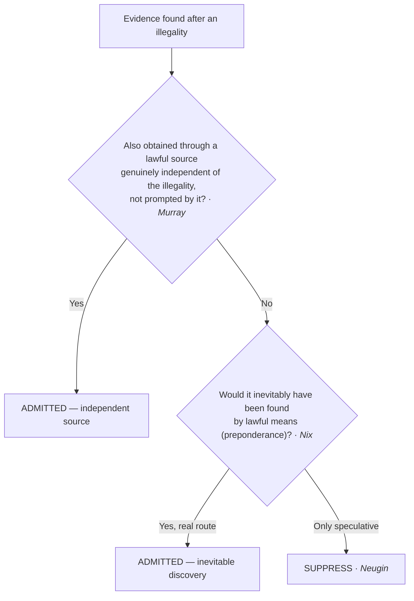

# Inevitable Discovery & Independent Source

*Illegally found — but was there a clean path to the same evidence, actual or hypothetical?*

> [!rule] Black-letter rule
> **Independent source** admits evidence that was *in fact* also obtained through a lawful source genuinely independent of the illegality: admissible if "the search pursuant to warrant was in fact a genuinely independent source," but **not** if the decision to seek the warrant was "prompted by what they had seen during the initial entry." *[[Murray v. United States|Murray]]*, 487 U.S. 533, 542 (1988). **Inevitable discovery** admits evidence that *would* have been found anyway: admissible if the prosecution "establish[es] by a preponderance of the evidence that the information ultimately or inevitably would have been discovered by lawful means." *[[Nix v. Williams|Nix]]*, 467 U.S. 431, 444 (1984).
> ^rule-inevitable-independent

## The Brief

**What they are, and how they differ.** Both doctrines let untainted evidence in despite an antecedent illegality, and the difference is actual versus hypothetical. **Independent source** points to a lawful channel that *really produced* the evidence, separate from the illegal one. **Inevitable discovery** concedes there was no second channel in fact, but shows the evidence *would* have surfaced through lawful means the police were entitled to use. Keep them apart from **[[Fruits and Attenuation|attenuation]]**, which admits the causal link but says it has weakened over time ([[Fruits & Attenuation]]).

**Independent source.** The idea traces to *[[Silverthorne Lumber Co. v. United States|Silverthorne]]* (facts learned lawfully from a genuinely independent source may still be proved) and is refined in *[[Murray v. United States|Murray]]*: where officers make an illegal entry, see evidence, then obtain a warrant, the later seizure is admissible **only if** the warrant application rested on information wholly independent of the entry and the decision to seek the warrant was not prompted by what the illegal entry revealed. 487 U.S. at 542. The rule extends beyond physical evidence to an **in-court identification** whose elements antedate and are independent of an illegal arrest. *[[United States v. Crews|Crews]]*, 445 U.S. 463, 471–74 (1980).

**Inevitable discovery.** *[[Nix v. Williams|Nix]]* holds that if the government proves by a **preponderance** that the evidence would ultimately or inevitably have been discovered by lawful means, the deterrence rationale is not served by suppression, so the evidence comes in. 467 U.S. at 444. The lawful route must be **real, not speculative**: a concrete search that was underway or would routinely have been conducted, not a warrant the police could theoretically have sought.

**Burden, standard of review, remedy.** The **government** bears the burden: independent source requires proof that the clean channel was genuine and untainted; inevitable discovery requires a preponderance showing of a lawful route to the same evidence. Review is [[Common Legal Terms#de-novo|de novo]] on the ultimate question, with historical facts for [[Common Legal Terms#clear-error|clear error]]. Where either applies, there is **no suppression**; otherwise the evidence and its fruits are excluded ([[Fruits & Attenuation]]).

**Apply it.**
1. **Ask which doctrine you are in.** A real, separate lawful channel is independent source; a hypothetical lawful route is inevitable discovery.
2. **For independent source, test genuine independence** (*[[Murray v. United States|Murray]]*): the warrant may not rest on what the illegal entry revealed, and the decision to seek it may not have been prompted by that entry.
3. **For inevitable discovery, demand a real route** (*[[Nix v. Williams|Nix]]*): identify the concrete lawful means and show by a preponderance it would have produced the evidence.
4. **Do not launder the illegality after the fact.** A warrant obtained only *after* the illegal search, prompted by it, is neither an independent source nor an inevitable one.

**Common pitfalls.**
- **Confusing the two with each other or with [[Fruits and Attenuation|attenuation]].** Independent source = actually obtained cleanly; inevitable discovery = would have been; [[Fruits and Attenuation|attenuation]] = the taint faded.
- **Accepting a speculative "we could have gotten a warrant."** The lawful route must be genuine, not a hypothetical the police never pursued.
- **Missing the *Murray* prompting limit.** If the illegal entry prompted the warrant application, independent source fails.

## Lower-court developments

The core SCOTUS rules are settled; the live circuit question is **how much of a lawful investigation must already be underway** for inevitable discovery to apply.

- **Inevitable discovery applied — *[[United States v. Soto-Peguero|United States v. Soto-Peguero]]* (1st Cir. 2020).** Admission affirmed because the agent would have sought and obtained a warrant regardless of the illegality. 978 F.3d 13, 21. **Binding in-circuit — 1st Cir.**
- **Inevitable discovery failed — *[[United States v. Neugin|United States v. Neugin]]* (10th Cir. 2020).** Reversed a denial of suppression: the chain to discovery (arrest, then impound, then inventory) was too speculative; inevitable discovery demands a real lawful route, not a hypothetical one. 958 F.3d 924, 933–34. **Binding in-circuit — 10th Cir.**
- **Independent source, state illustration — *[[State v. Mitcham|State v. Mitcham]]* (Ariz. 2024).** Treats the independent-source exception as admitting evidence also obtained independently of the illegality; a persuasive illustration of the federal *Murray* principle, not the rule itself. 559 P.3d 1099, ¶ 34. **Persuasive — state, illustrative.**

**The active-pursuit split (whether an independent investigation must already be underway).** The circuits divide over whether inevitable discovery requires that the police were *already actively pursuing* a lawful line of investigation when the illegality occurred, or whether it is enough that the evidence *would* inevitably have been found by lawful means.

- **Active pursuit required — *[[United States v. Satterfield|United States v. Satterfield]]* (11th Cir. 1984).** The lawful means "must be possessed by the police and . . . being actively pursued *prior* to the occurrence of the illegal conduct"; a warrant obtained only hours after the illegal search did not qualify. 743 F.2d 827, 846. **Binding in-circuit — 11th Cir.**
- **Active pursuit not required — *United States v. Kennedy* (6th Cir. 1995).** Holds "an alternate, independent line of investigation is not required for the inevitable discovery exception to apply"; the exception reaches evidence shown by compelling facts to have been inevitable, whether or not a separate investigation was afoot. 61 F.3d 494, 500. *(Brief-mention; no standalone page.)*
- **Active pursuit not required — *United States v. Cunningham* (10th Cir. 2005).** Applies inevitable discovery without a separate ongoing investigation, requiring instead a high-confidence showing that a warrant in fact would have issued and the evidence would have been obtained by lawful means. 413 F.3d 1199. *(Brief-mention; no standalone page.)*

**Split synthesis.** *[[Nix v. Williams|Nix]]* on its face asks only whether the evidence "ultimately or inevitably would have been discovered by lawful means," and the modern majority reads it that way, declining to graft on a categorical active-pursuit prerequisite. The stricter view, that the lawful means must already have been possessed and pursued when the illegality occurred, survives chiefly to guard against the danger *[[United States v. Satterfield|Satterfield]]* named: allowing the government to manufacture a lawful avenue *after* the fact would gut the warrant requirement for the home, since a warrant can almost always be obtained afterward. In practice the two camps converge on the same instinct that *[[United States v. Neugin|Neugin]]* enforces: the lawful route must be genuine and non-speculative, not a warrant the police merely could have sought.

## Key cases

| Case | Holding | Opinion |
|---|---|---|
| *[[Nix v. Williams]]*, 467 U.S. 431 (1984) | **Inevitable discovery.** Admissible if the government proves by a preponderance that the evidence would ultimately or inevitably have been discovered by lawful means. | [opinion](https://www.courtlistener.com/opinion/111204/nix-v-williams/) |
| *[[Murray v. United States]]*, 487 U.S. 533 (1988) | **Independent source.** Evidence first seen in an unlawful entry is admissible if later acquired through a genuinely independent lawful source not prompted by the entry. | [opinion](https://www.courtlistener.com/opinion/112136/murray-v-united-states/) |
| *[[United States v. Crews]]*, 445 U.S. 463 (1980) | **Independent-source identification.** An in-court identification whose elements antedate and are independent of the illegal arrest is admissible. | [opinion](https://www.courtlistener.com/opinion/110230/united-states-v-crews/) |

## Related cases across doctrines

These are treated in full elsewhere but bear directly on the two doctrines, framed for them here.

| Case | Relevance here | Primary home | Opinion |
|---|---|---|---|
| *[[Segura v. United States]]*, 468 U.S. 796 (1984) | ***Independent-source companion.*** Evidence seized under a valid warrant resting wholly on pre-entry information is admissible despite an earlier illegal entry. | [[Securing the Scene]] | [opinion](https://www.courtlistener.com/opinion/111259/segura-v-united-states/) |
| *[[Silverthorne Lumber Co. v. United States]]*, 251 U.S. 385 (1920) | ***Independent-source seed.*** Illegally obtained knowledge may not be used, but the same facts may be proved from a genuinely independent source. | [[Fruits & Attenuation]] | [opinion](https://www.courtlistener.com/opinion/99506/silverthorne-lumber-co-v-united-states/) |

## Visual

## Sources
- [*Nix v. Williams*, 467 U.S. 431 (1984)](https://www.courtlistener.com/opinion/111204/nix-v-williams/) (pinpoint: 444)
- [*Murray v. United States*, 487 U.S. 533 (1988)](https://www.courtlistener.com/opinion/112136/murray-v-united-states/) (pinpoint: 542)
- [*United States v. Crews*, 445 U.S. 463 (1980)](https://www.courtlistener.com/opinion/110230/united-states-v-crews/) (pinpoints: 471–74)
- [*Segura v. United States*, 468 U.S. 796 (1984)](https://www.courtlistener.com/opinion/111259/segura-v-united-states/) (pinpoint: 814; home = [[Securing the Scene]])
- [*Silverthorne Lumber Co. v. United States*, 251 U.S. 385 (1920)](https://www.courtlistener.com/opinion/99506/silverthorne-lumber-co-v-united-states/) (pinpoint: 392; home = [[Fruits & Attenuation]])
- [*United States v. Soto-Peguero*, 978 F.3d 13 (1st Cir. 2020)](https://www.courtlistener.com/opinion/4798028/united-states-v-soto-peguero/) (pinpoint: 21) (Binding in-circuit — 1st Cir.; inevitable discovery applied)
- [*United States v. Neugin*, 958 F.3d 924 (10th Cir. 2020)](https://www.courtlistener.com/opinion/4750564/united-states-v-neugin/) (pinpoints: 933–34) (Binding in-circuit — 10th Cir.; inevitable discovery failed)
- [*State v. Mitcham*, 559 P.3d 1099 (Ariz. 2024)](https://www.courtlistener.com/opinion/10293607/state-of-arizona-v-ian-mitcham/) (pinpoint: ¶ 34) (Persuasive — state, illustrative)
- [*United States v. Satterfield*, 743 F.2d 827 (11th Cir. 1984)](https://www.courtlistener.com/opinion/8934150/united-states-v-satterfield/) (pinpoint: 846) (Binding in-circuit — 11th Cir.; active pursuit required)
- *United States v. Kennedy*, 61 F.3d 494 (6th Cir. 1995) (pinpoint: 500) (Binding in-circuit — 6th Cir.; active pursuit not required; brief-mention, no standalone page)
- *United States v. Cunningham*, 413 F.3d 1199 (10th Cir. 2005) (Binding in-circuit — 10th Cir.; active pursuit not required; brief-mention, no standalone page)
