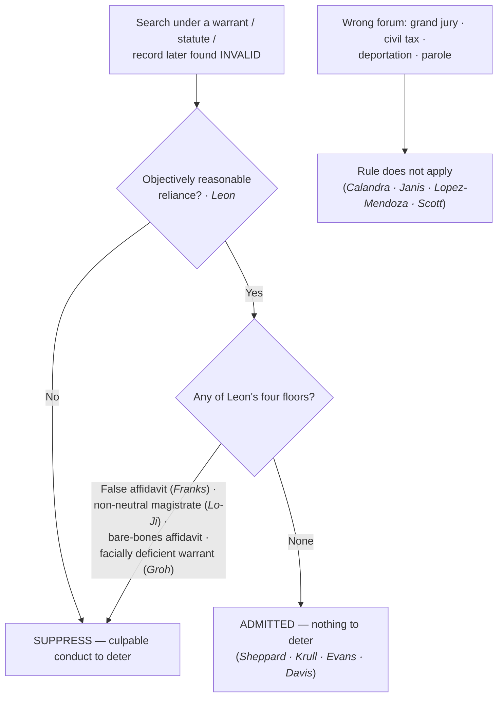

# The Good-Faith Exception

*The warrant (or the authority behind the search) turned out to be invalid — must the evidence still be suppressed?*

> [!rule] Black-letter rule
> Because the exclusionary rule is a **deterrent remedy and not a personal right**, suppression is unwarranted where officers acted in **objectively reasonable reliance** on an authority they were entitled to trust and that was only later found invalid; excluding that evidence would deter nothing. *[[United States v. Leon|Leon]]*, 468 U.S. 897, [922](https://www.courtlistener.com/opinion/111262/united-states-v-leon/) (1984). Good faith **fails**, and suppression follows, in *[[United States v. Leon|Leon]]*'s four situations: **(1)** a knowing or reckless **false affidavit** (*[[Franks v. Delaware|Franks]]*); **(2)** a magistrate who **wholly abandoned** the neutral-and-detached role; **(3)** a **bare-bones affidavit** "so lacking in indicia of probable cause" that belief in it is unreasonable; and **(4)** a **facially deficient / general warrant** no officer could reasonably presume valid. 468 U.S. at 923.
> ^rule-good-faith

## The Brief

**What it is, and why it exists.** The good-faith exception is the sharpest expression of the rule's own logic. Suppression "is a judicially created remedy designed to safeguard Fourth Amendment rights generally through its deterrent effect, rather than a personal constitutional right of the party aggrieved." *[[United States v. Calandra|Calandra]]*, 414 U.S. 338, [348](https://www.courtlistener.com/opinion/108898/united-states-v-calandra/) (1974). It follows only where its deterrence benefits outweigh its heavy social costs and only for conduct culpable enough to deter: "To trigger the exclusionary rule, police conduct must be sufficiently deliberate that exclusion can meaningfully deter it, and sufficiently culpable that such deterrence is worth the price paid by the justice system." *[[Herring v. United States|Herring]]*, 555 U.S. 135, [144](https://www.courtlistener.com/opinion/145922/herring-v-united-states/) (2009). When an officer reasonably relies on a warrant, a statute, or a record he is entitled to trust, there is no culpable conduct to deter, so the evidence comes in.

**The anchor.** *[[United States v. Leon|Leon]]* held that evidence seized under a warrant later found to lack probable cause is admissible where the executing officers relied on it in objectively reasonable good faith. 468 U.S. at 922. The test is **objective**: not the officer's subjective sincerity but whether a reasonably well-trained officer would have known the search was illegal despite the magistrate's authorization.

**How far reliance extends.** The exception has been applied across a family of "someone else made the mistake" situations:
- **Defect in the warrant's form,** where the officer reasonably relied on the judge to fix it. *[[Massachusetts v. Sheppard|Sheppard]]*, 468 U.S. 981, [989–90](https://www.courtlistener.com/opinion/111263/massachusetts-v-sheppard/) (1984).
- **Reliance on a statute** later held unconstitutional. *[[Illinois v. Krull|Krull]]*, 480 U.S. 340, [349–50](https://www.courtlistener.com/opinion/111835/illinois-v-krull/) (1987).
- **Arrest under a presumptively valid ordinance** later voided. *[[Michigan v. DeFillippo|DeFillippo]]*, 443 U.S. 31, [40](https://www.courtlistener.com/opinion/110127/michigan-v-defillippo/) (1979).
- **A court employee's clerical error** in a database of outstanding warrants. *[[Arizona v. Evans|Evans]]*, 514 U.S. 1, [14–16](https://www.courtlistener.com/opinion/117905/arizona-v-evans/) (1995); extended to an isolated police-maintained recordkeeping error in *[[Herring v. United States|Herring]]*, 555 U.S. at [144](https://www.courtlistener.com/opinion/145922/herring-v-united-states/).
- **Reliance on binding appellate precedent** later overturned. *[[Davis v. United States (2011)|Davis (2011)]]*, 564 U.S. 229, 249–50 (2011).

**The four floors — where good faith fails.** *[[United States v. Leon|Leon]]* itself names the four situations that defeat reasonable reliance (468 U.S. at 923), and each item is independently disqualifying:
1. **A knowing or reckless falsehood in the affidavit** — the *[[Franks v. Delaware|Franks]]* problem; a dishonest affidavit cannot support reasonable reliance (developed on [[Franks Challenges]]).
2. **A magistrate who abandoned the neutral-and-detached role**, becoming an adjunct of the search rather than a check on it (developed on [[The Neutral and Detached Magistrate]]).
3. **A bare-bones affidavit** so lacking in indicia of probable cause that official belief in its existence is entirely unreasonable.
4. **A facially deficient or general warrant** — one that fails to particularize the place or things so obviously that no officer could presume it valid. A warrant that does not describe the things to be seized at all is the paradigm; no reasonable officer could rely on it (*[[Groh v. Ramirez|Groh v. Ramirez]]*, facially deficient, primary home [[Particularity]]).

**Reconcile with Collective Knowledge.** *[[Herring v. United States|Herring]]* is a good-faith case at heart (an isolated, attenuated recordkeeping error does not trigger exclusion), but it is also **keyed on [[Collective Knowledge and the Fellow-Officer Rule|Collective Knowledge]]** for the separate point that imputed knowledge through a police database is not a license: the fellow-officer doctrine pools what officers actually know and never manufactures a basis the department in fact lacked. Read *[[Herring v. United States|Herring]]* here for the culpability threshold; read it there for the imputation limit.

**The deterrence logic also fixes the boundaries of the rule.** The same cost-benefit calculus keeps the rule out of proceedings where its deterrent value is too slight to justify the cost. It does not apply to **grand-jury** questioning (*[[United States v. Calandra|Calandra]]*, 414 U.S. at [348](https://www.courtlistener.com/opinion/108898/united-states-v-calandra/)), to a **federal civil (tax)** proceeding on state-seized evidence (*[[United States v. Janis|Janis]]*, 428 U.S. 433, [454](https://www.courtlistener.com/opinion/109539/united-states-v-janis/) (1976)), to **civil removal/deportation** hearings (*[[Immigration & Naturalization Service v. Lopez-Mendoza|Lopez-Mendoza]]*, 468 U.S. 1032, [1050](https://www.courtlistener.com/opinion/111265/immigration-naturalization-service-v-lopez-mendoza/) (1984)), or to **parole-revocation** hearings (*[[Pennsylvania Board of Probation and Parole v. Scott|Pennsylvania Bd. of Probation & Parole v. Scott]]*, 524 U.S. 357, [364](https://www.courtlistener.com/opinion/118235/pennsylvania-bd-of-probation-and-parole-v-scott/) (1998)). These are not "good faith" holdings, but they run on the identical engine: no net deterrence, no suppression.

**The digital arena (cross-reference only).** Good faith has repeatedly carried admissibility on the digital frontier while the underlying search question was unsettled — reasonable reliance on a pre-*[[Carpenter v. United States|Carpenter]]* Stored Communications Act order, or on a geofence warrant issued before the law was clear. Now that the Supreme Court has held in *[[Chatrie v. United States|Chatrie]]* (2026) that acquiring geofence Location History **is** a search, the live remedial questions on pre-ruling warrants are probable cause, [[Particularity|particularity]], and, failing those, good faith. The search-definition exposition lives on [[The Third-Party Doctrine and Digital Surveillance]] and [[Reverse-Keyword and Geofence Warrants]]; this page owns only the good-faith move.

**Burden, standard of review, remedy.** Once a violation and [[Standing to Challenge a Search|standing]] are shown, the **government** bears the burden of establishing objectively reasonable reliance. The good-faith inquiry is reviewed [[Common Legal Terms#de-novo|de novo]], with historical facts for [[Common Legal Terms#clear-error|clear error]]. Where good faith applies, there is **no suppression**; where a floor is hit, the evidence and its fruits are excluded from the case-in-chief ([[Fruits & Attenuation]]).

**Apply it.**
1. **Ask what the officer relied on** (a warrant, a statute, an ordinance, a database, or binding precedent), and whether that reliance was objectively reasonable.
2. **Run the four floors.** A dishonest affidavit, a rubber-stamp magistrate, a bare-bones affidavit, or a facially deficient warrant each defeats good faith on its own.
3. **Do not let good faith rescue a warrant no one could reasonably trust.** A warrant that fails to describe the things to be seized is facially deficient (*[[Groh v. Ramirez|Groh]]*).
4. **Separate the forum question.** In a grand jury, civil tax, deportation, or parole proceeding, the rule may not apply at all (*[[United States v. Calandra|Calandra]]* / *[[United States v. Janis|Janis]]* / *[[Immigration & Naturalization Service v. Lopez-Mendoza|Lopez-Mendoza]]* / *[[Pennsylvania Board of Probation and Parole v. Scott|Scott]]*).
5. **On the digital edge, expect a good-faith fallback** while doctrine settles, and send the search question to the digital pages.

**Common pitfalls.**
- **Thinking good faith cures everything.** It does not reach a dishonest affidavit, a non-neutral magistrate, a bare-bones affidavit, or a facially overbroad warrant (*[[United States v. Leon|Leon]]*'s four floors).
- **Confusing objective reasonableness with subjective sincerity.** The officer's good heart is irrelevant; the question is what a reasonably well-trained officer would have known.
- **Reading *[[Herring v. United States|Herring]]* as an imputation rule.** Its holding here is culpability-and-cost; its imputation limit belongs to [[Collective Knowledge and the Fellow-Officer Rule|Collective Knowledge]].
- **Treating the wrong-forum limits as good-faith holdings.** They share the deterrence rationale but are their own boundary rules.

## Lower-court developments

Two threads run below: **circuit applications of the *[[United States v. Leon|Leon]]* standard**, and **good faith carrying the load in the digital arena** while the search question settled.

- **Good faith applied — *[[United States v. Mathis|United States v. Mathis]]* (11th Cir. 2014).** An officer's objectively reasonable belief in probable cause supported reliance even assuming the warrant lacked it; the evidence was not suppressed. 767 F.3d 1264, 1277. **Binding in-circuit — 11th Cir.**
- **Good faith applied — *[[United States v. Jackson|United States v. Jackson]]* (8th Cir. 2015).** A deputy relied in objectively reasonable good faith on a warrant despite a probable-cause-deficient application. 784 F.3d 1227. **Binding in-circuit — 8th Cir.**
- **Good faith unavailable — *[[United States v. Leary|United States v. Leary]]* (10th Cir. 1988).** A facially overbroad, general warrant was too deficient for objectively reasonable reliance (*[[United States v. Leon|Leon]]*'s fourth floor). 846 F.2d 592, 605–06. **Binding in-circuit — 10th Cir.**
- **Digital-arena good faith — *[[United States v. Smith|United States v. Smith]]* (5th Cir. 2024) · *[[Carpenter v. United States|United States v. Carpenter]]* (6th Cir. 2019, [[Reading and Citing Cases#on-remand|on remand]]).** *Smith* held geofence acquisition a search yet upheld admission under *[[United States v. Leon|Leon]]* given the novelty of the technology, 110 F.4th 817, 838; [[Reading and Citing Cases#on-remand|on remand]] the Sixth Circuit denied suppression of CSLI obtained under a then-valid Stored Communications Act order, applying *[[Illinois v. Krull|Krull]]*-style reliance. The search-definition exposition (now resolved by *[[Chatrie v. United States|Chatrie]]* (2026)) lives on [[The Third-Party Doctrine and Digital Surveillance]] and [[Reverse-Keyword and Geofence Warrants]]; the good-faith move is the through-line here. **Binding in-circuit — 5th Cir.; 6th Cir.**
- **Good faith withheld — *[[United States v. Cano|Cano]]* (9th Cir. 2019).** The Ninth Circuit runs *[[Davis v. United States (2011)|Davis]]* the other way on a novel technique: the good-faith exception applies only where "binding appellate precedent . . . 'specifically authorizes' the police's search" (*Cano*, quoting *Lara*), so an "unclear" or merely "plausibly . . . permissible" question is "not sufficient." On that view the very novelty of a surveillance technique cuts *against* objectively reasonable reliance rather than for it. *Cano*, 934 F.3d 1002 (9th Cir. 2019) (slip op., at 33). **Binding in-circuit — 9th Cir.**

The through-line: courts reach for good faith exactly when the officer's reliance was reasonable and the illegality was someone else's mistake or an unsettled question of law, because there is no culpable conduct for suppression to deter — though the Ninth Circuit (*[[United States v. Cano|Cano]]*) rejects the "unsettled" half of that move.

## Key cases

| Case | Holding | Opinion |
|---|---|---|
| *[[United States v. Leon]]*, 468 U.S. 897 (1984) | **Anchor.** Objectively reasonable reliance on a warrant later found to lack probable cause does not trigger exclusion; lists the four situations where good faith fails (at 923). | [opinion](https://www.courtlistener.com/opinion/111262/united-states-v-leon/) |
| *[[Massachusetts v. Sheppard]]*, 468 U.S. 981 (1984) | **Form defect.** Good faith applies where the warrant was defective in form but officers reasonably relied on the judge to correct it. | [opinion](https://www.courtlistener.com/opinion/111263/massachusetts-v-sheppard/) |
| *[[Illinois v. Krull]]*, 480 U.S. 340 (1987) | **Statute.** Good-faith reliance on a statute later held unconstitutional does not trigger exclusion. | [opinion](https://www.courtlistener.com/opinion/111835/illinois-v-krull/) |
| *[[Michigan v. DeFillippo]]*, 443 U.S. 31 (1979) | **Ordinance.** Arrest under a presumptively valid ordinance later voided was valid; the search-incident evidence is admissible. | [opinion](https://www.courtlistener.com/opinion/110127/michigan-v-defillippo/) |
| *[[Arizona v. Evans]]*, 514 U.S. 1 (1995) | **Clerical error.** Good faith extends to a mistaken arrest record produced by court-employee clerical error. | [opinion](https://www.courtlistener.com/opinion/117905/arizona-v-evans/) |
| *[[Herring v. United States]]*, 555 U.S. 135 (2009) | **Culpability threshold.** Isolated, attenuated negligence in a recordkeeping database does not trigger exclusion; suppression requires deliberate, culpable conduct. (Also keyed on [[Collective Knowledge and the Fellow-Officer Rule\|Collective Knowledge]].) | [opinion](https://www.courtlistener.com/opinion/145922/herring-v-united-states/) |
| *[[Davis v. United States (2011)]]*, 564 U.S. 229 (2011) | **Binding precedent.** Good faith extends to reliance on binding appellate precedent later overturned. | [opinion](https://www.courtlistener.com/opinion/218926/davis-v-united-states/) |
| *[[United States v. Calandra]]*, 414 U.S. 338 (1974) | **Deterrent remedy, not a right.** The rule is a judicially created deterrent remedy; it does not apply to grand-jury questioning. | [opinion](https://www.courtlistener.com/opinion/108898/united-states-v-calandra/) |
| *[[United States v. Janis]]*, 428 U.S. 433 (1976) | **Boundary.** The rule does not bar state-seized evidence in a federal civil (tax) proceeding; deterrence benefit does not outweigh the cost. | [opinion](https://www.courtlistener.com/opinion/109539/united-states-v-janis/) |
| *[[Immigration & Naturalization Service v. Lopez-Mendoza]]*, 468 U.S. 1032 (1984) | **Boundary.** The rule generally does not apply in civil removal/deportation proceedings. | [opinion](https://www.courtlistener.com/opinion/111265/immigration-naturalization-service-v-lopez-mendoza/) |
| *[[Pennsylvania Board of Probation and Parole v. Scott]]*, 524 U.S. 357 (1998) | **Boundary.** The federal exclusionary rule does not bar evidence at parole-revocation hearings. | [opinion](https://www.courtlistener.com/opinion/118235/pennsylvania-bd-of-probation-and-parole-v-scott/) |

## Related cases across doctrines

These are treated in full elsewhere but define the floors of the good-faith exception, framed for it here.

| Case | Relevance here | Primary home | Opinion |
|---|---|---|---|
| *[[Franks v. Delaware]]*, 438 U.S. 154 (1978) | ***Floor 1.*** A knowing or reckless falsehood in the affidavit voids the warrant and defeats good faith. | [[Franks Challenges]] | [opinion](https://www.courtlistener.com/opinion/109925/franks-v-delaware/) |
| *[[Lo-Ji Sales, Inc. v. New York]]*, 442 U.S. 319 (1979) | ***Floor 2.*** A magistrate who abandons the neutral-and-detached role is no valid warrant-issuer, so reliance is unreasonable. | [[The Neutral and Detached Magistrate]] | [opinion](https://www.courtlistener.com/opinion/110100/lo-ji-sales-inc-v-new-york/) |
| *[[Groh v. Ramirez]]*, 540 U.S. 551 (2004) | ***Floor 4.*** A warrant that fails to describe the things to be seized is facially deficient; no reasonable officer could rely on it. | [[Particularity]] | [opinion](https://www.courtlistener.com/opinion/131161/groh-v-ramirez/) |

## Visual

## Sources
- [*United States v. Leon*, 468 U.S. 897 (1984)](https://www.courtlistener.com/opinion/111262/united-states-v-leon/) (pinpoints: 922, 923)
- [*Massachusetts v. Sheppard*, 468 U.S. 981 (1984)](https://www.courtlistener.com/opinion/111263/massachusetts-v-sheppard/) (pinpoints: 989–90)
- [*Illinois v. Krull*, 480 U.S. 340 (1987)](https://www.courtlistener.com/opinion/111835/illinois-v-krull/) (pinpoints: 349–50)
- [*Michigan v. DeFillippo*, 443 U.S. 31 (1979)](https://www.courtlistener.com/opinion/110127/michigan-v-defillippo/) (pinpoint: 40)
- [*Arizona v. Evans*, 514 U.S. 1 (1995)](https://www.courtlistener.com/opinion/117905/arizona-v-evans/) (pinpoints: 14, 16)
- [*Herring v. United States*, 555 U.S. 135 (2009)](https://www.courtlistener.com/opinion/145922/herring-v-united-states/) (pinpoint: 144; also keyed on [[Collective Knowledge and the Fellow-Officer Rule|Collective Knowledge]])
- [*Davis v. United States*, 564 U.S. 229 (2011)](https://www.courtlistener.com/opinion/218926/davis-v-united-states/) (pinpoints: 232, 249–50)
- [*United States v. Calandra*, 414 U.S. 338 (1974)](https://www.courtlistener.com/opinion/108898/united-states-v-calandra/) (pinpoint: 348)
- [*United States v. Janis*, 428 U.S. 433 (1976)](https://www.courtlistener.com/opinion/109539/united-states-v-janis/) (pinpoint: 454)
- [*INS v. Lopez-Mendoza*, 468 U.S. 1032 (1984)](https://www.courtlistener.com/opinion/111265/immigration-naturalization-service-v-lopez-mendoza/) (pinpoints: 1039, 1050)
- [*Pennsylvania Bd. of Probation & Parole v. Scott*, 524 U.S. 357 (1998)](https://www.courtlistener.com/opinion/118235/pennsylvania-bd-of-probation-and-parole-v-scott/) (pinpoint: 364)
- [*Franks v. Delaware*, 438 U.S. 154 (1978)](https://www.courtlistener.com/opinion/109925/franks-v-delaware/) (home = [[Franks Challenges]])
- [*Lo-Ji Sales, Inc. v. New York*, 442 U.S. 319 (1979)](https://www.courtlistener.com/opinion/110100/lo-ji-sales-inc-v-new-york/) (pinpoints: 326–27; home = [[The Neutral and Detached Magistrate]])
- [*Groh v. Ramirez*, 540 U.S. 551 (2004)](https://www.courtlistener.com/opinion/131161/groh-v-ramirez/) (facially deficient warrant; home = [[Particularity]])
- [*United States v. Mathis*, 767 F.3d 1264 (11th Cir. 2014)](https://www.courtlistener.com/opinion/2736649/united-states-v-arnold-maurice-mathis/) (pinpoint: 1277) (Binding in-circuit — 11th Cir.; good faith applied)
- [*United States v. Jackson*, 784 F.3d 1227 (8th Cir. 2015)](https://www.courtlistener.com/opinion/2798587/united-states-v-ac-jackson/) (Binding in-circuit — 8th Cir.; good faith applied)
- [*United States v. Leary*, 846 F.2d 592 (10th Cir. 1988)](https://www.courtlistener.com/opinion/505922/united-states-v-richard-j-leary-and-fl-kleinberg-co/) (pinpoints: 605–06) (Binding in-circuit — 10th Cir.; good faith unavailable)
- [*United States v. Smith*, 110 F.4th 817 (5th Cir. 2024)](https://www.courtlistener.com/opinion/10036119/united-states-v-smith/) (pinpoint: 838) (Binding in-circuit — 5th Cir.; digital-arena good faith; search-question exposition on [[Reverse-Keyword and Geofence Warrants]])
- [*United States v. Carpenter*, 926 F.3d 313 (6th Cir. 2019)](https://www.courtlistener.com/opinion/4628336/united-states-v-timothy-carpenter/) (Binding in-circuit — 6th Cir.; good faith on remand under the Stored Communications Act; distinct from the SCOTUS merits opinion)
- [*United States v. Cano*, 934 F.3d 1002 (9th Cir. 2019)](https://www.courtlistener.com/opinion/4649091/united-states-v-miguel-cano/) (pinpoint: slip op., at 33; quoting *Lara*, 815 F.3d 605, 613) (Binding in-circuit — 9th Cir.; good faith withheld; *Davis* reliance requires binding precedent specifically authorizing the technique)
