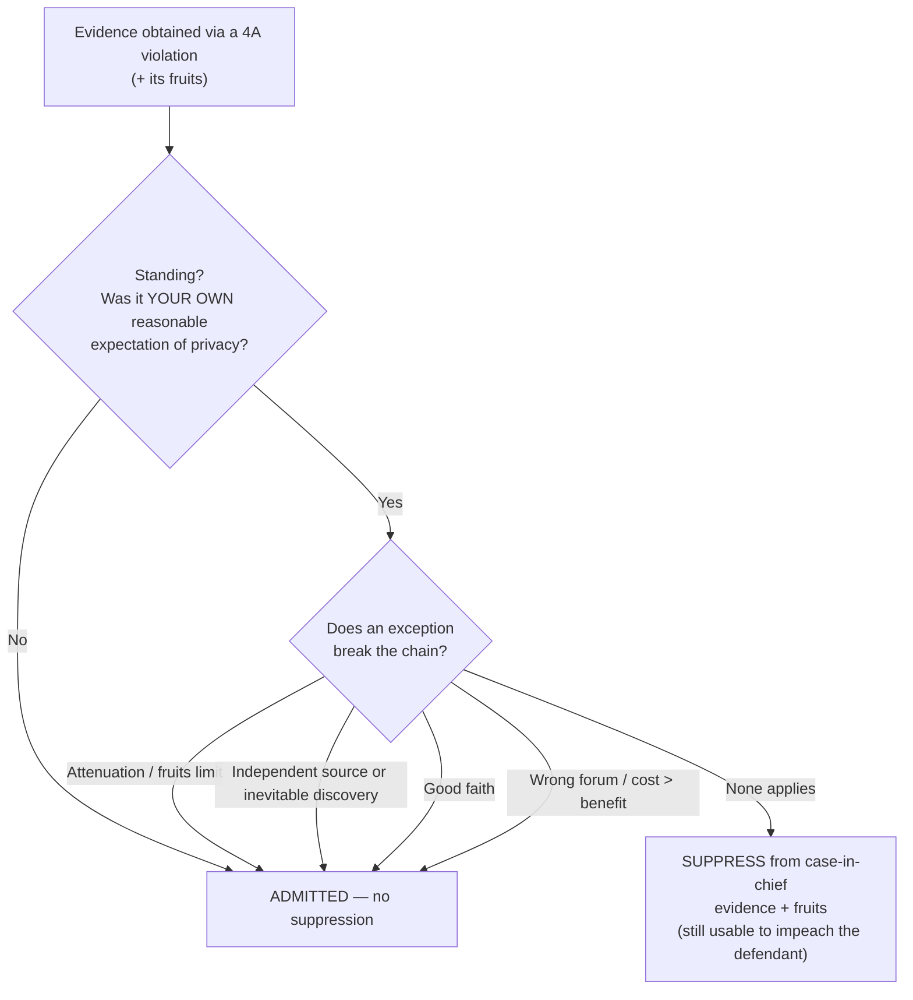

# The Exclusionary Rule

When a Fourth Amendment violation produces evidence, the fight is rarely "was there a violation" alone. It is whether the remedy of **exclusion** actually follows, and it usually does not follow automatically. The exclusionary rule bars the prosecution from using, in its **case-in-chief**, evidence obtained in violation of the Fourth Amendment and the **fruits** of that violation. It is **not a personal constitutional right** but a **judicially created remedy** whose primary modern justification is **deterring police misconduct**. Run the evidence through the sequence (**standing gate → fruit-of-the-poisonous-tree reach → escape hatches → cost-benefit boundaries**), and only if it survives all of them is it suppressed.

This sub-umbrella holds the doctrine, with a page developing each escape hatch:

- [[Fruits & Attenuation]] — how far the taint reaches (the [[Common Legal Terms#fruit-of-the-poisonous-tree|fruit of the poisonous tree]]) and when the causal chain is so weakened that the taint is purged. Owns the rule's origin and reach, and the impeachment exception.
- [[The Good-Faith Exception]] — objectively reasonable reliance on a warrant, statute, or record later found invalid deters nothing, so the evidence comes in. Owns the deterrence rationale and the cost-benefit boundaries of the rule.
- [[Inevitable Discovery & Independent Source]] — a lawful source that *actually* produced the evidence ([[Inevitable Discovery and Independent Source|independent source]]) or a lawful route that *would* have produced it anyway ([[Inevitable Discovery and Independent Source|inevitable discovery]]).

**The rule, in brief.** The federal rule began in *[[Weeks v. United States|Weeks]]* (1914) and reached the states through the Fourteenth Amendment in *[[Mapp v. Ohio|Mapp]]* (1961), overruling *[[Wolf v. Colorado|Wolf]]* on the remedy. Its engine is deterrence, not judicial integrity: *[[Elkins v. United States|Elkins]]* framed the purpose as "removing the incentive to disregard" the guaranty. Because it is a deterrent remedy and not a right (*[[United States v. Calandra|Calandra]]*), the modern Court applies a **cost-benefit test** — suppression follows only where its deterrence benefits outweigh its substantial social costs, and only for conduct culpable enough that exclusion can meaningfully deter it (*[[Herring v. United States|Herring]]*). That single idea explains both the four escape hatches and the boundaries below.

**The threshold gate — standing.** Before any of this, suppression is available only to a defendant whose **own** Fourth Amendment rights were violated; rights are personal and may not be vicariously asserted. **No standing means no suppression**, even where officers plainly violated *someone's* rights. Standing is taught in full on **[[Standing to Challenge a Search]]**.

**Where the rule does not reach.** The same deterrence logic keeps the rule out of many settings. A [[Knock-and-Announce|knock-and-announce]] violation triggers no suppression ([[Knock-and-Announce|Hudson]]); the rule does not apply to grand-jury questioning, a federal civil tax proceeding, civil deportation, or parole revocation (the cost-benefit boundaries, developed with the deterrence rationale on [[The Good-Faith Exception]]); a violation of **state law** is not for that reason a Fourth Amendment violation, so it triggers no federal suppression (*[[Virginia v. Moore|Virginia v. Moore]]*, home [[Search Incident to Arrest]]). And suppression bars only the case-in-chief: illegally seized evidence may still impeach the defendant's own false testimony (the impeachment exception, on [[Fruits & Attenuation]]).

**The digital frontier.** Whether acquiring bulk digital data is a "search" at all is resolved by the Supreme Court in *[[Chatrie v. United States|Chatrie]]* (2026) (it is); how that search question plays out for geofence and location-history data is developed on [[The Third-Party Doctrine and Digital Surveillance]], and the good-faith fallback for pre-ruling warrants is on [[The Good-Faith Exception]].

## Visual

